# learn-go-security-cryptography-integrity-part-016.md

# Part 016 — OAuth2, OIDC, JWT, JWS, JWE, Opaque Token, Introspection, JWKS Caching, and Replay Prevention in Go

> Seri: `learn-go-security-cryptography-integrity`  
> Bagian: `016 / 034`  
> Status seri: **belum selesai**  
> Target pembaca: Java software engineer yang ingin mendesain dan mengimplementasikan OAuth2/OIDC/token security di Go dengan level engineering handbook internal  
> Target Go: Go `1.26.x`  

---

## 0. Posisi Part Ini Dalam Seri

Sampai part sebelumnya kita sudah membangun fondasi berikut:

1. threat model dan security invariant,
2. cryptographic primitive,
3. randomness dan nonce,
4. hash, MAC, AEAD, public-key crypto,
5. key agreement,
6. key management,
7. X.509, TLS, dan mTLS.

Sekarang kita masuk ke salah satu area security yang paling sering terlihat “mudah”, tetapi paling sering salah desain di production: **OAuth2/OIDC/JWT token systems**.

Bagian ini bukan sekadar:

```text
parse JWT -> check signature -> read user id
```

Itu terlalu dangkal dan berbahaya.

Yang ingin dibangun adalah kemampuan untuk menjawab pertanyaan seperti:

- Token ini diterbitkan oleh siapa?
- Untuk siapa token ini dimaksudkan?
- Apakah token ini membuktikan autentikasi user, otorisasi akses API, atau hanya bukti possession dari client?
- Apakah resource server boleh memvalidasi sendiri token ini?
- Kapan token harus opaque dan dicek via introspection?
- Apa yang terjadi saat key issuer rotate?
- Apa yang terjadi saat token dicuri?
- Apa yang terjadi kalau `kid` menunjuk key yang tidak ada?
- Apa yang terjadi kalau issuer A dan issuer B sama-sama punya `sub=123`?
- Apa yang terjadi kalau library menerima `alg=none`, atau mengganti RS256 menjadi HS256?
- Apa yang harus di-log tanpa membocorkan token?
- Apakah Go service ini sedang melakukan authentication, authorization, atau keduanya secara bercampur?

OAuth2/OIDC bukan hanya “login protocol”. Ia adalah gabungan dari:

- browser redirect protocol,
- token issuance protocol,
- delegated authorization model,
- identity assertion model,
- API authorization model,
- session lifecycle model,
- key distribution model,
- distributed trust model.

Kalau salah satu boundary kabur, sistem masih bisa “jalan”, tetapi security model-nya runtuh.

---

## 1. Baseline Sumber dan Prinsip Resmi

Materi ini mengacu pada prinsip-prinsip berikut:

- OAuth 2.0 Security Best Current Practice sekarang tersedia sebagai **RFC 9700** dan memperbarui/memperluas threat model serta security advice dari RFC 6749, RFC 6750, dan RFC 6819. RFC ini juga mendepresiasi beberapa mode yang dianggap kurang aman atau insecure.
- OpenID Connect Core 1.0 mendefinisikan OIDC sebagai identity layer di atas OAuth 2.0, termasuk ID Token dan validasi claim seperti issuer, audience, expiration, dan nonce.
- RFC 7519 mendefinisikan JWT sebagai format compact URL-safe untuk merepresentasikan claims yang dapat disigned sebagai JWS atau dienkripsi sebagai JWE.
- RFC 8725 adalah JWT Best Current Practices, penting untuk menghindari algorithm confusion, claim confusion, key confusion, dan penggunaan JWT yang terlalu permisif.
- RFC 7517 mendefinisikan JWK dan JWK Set, yang menjadi dasar JWKS endpoint untuk distribusi public keys.
- RFC 7662 mendefinisikan OAuth2 Token Introspection untuk resource server yang harus mengecek active state dan metadata token ke authorization server.
- RFC 9449 mendefinisikan DPoP sebagai mekanisme sender-constraining OAuth2 token untuk mendeteksi replay attack pada access token dan refresh token.
- `golang.org/x/oauth2` adalah helper client-side untuk OAuth2 authorized HTTP requests. Ia bukan resource-server JWT validator lengkap.

Referensi lengkap ada di bagian akhir file.

---

## 2. Tujuan Pembelajaran

Setelah menyelesaikan bagian ini, kamu harus mampu:

1. Membedakan **OAuth2**, **OIDC**, **JWT**, **JWS**, **JWE**, **opaque token**, **introspection**, **JWKS**, **Bearer token**, dan **sender-constrained token**.
2. Mendesain validasi token di Go berdasarkan security invariant, bukan berdasarkan contoh library minimal.
3. Menentukan kapan access token sebaiknya JWT dan kapan sebaiknya opaque.
4. Memvalidasi JWT dengan benar: issuer, audience, expiration, not-before, algorithm, key, `kid`, claim semantics, dan tenant boundary.
5. Memahami kenapa ID token tidak boleh dipakai sebagai access token.
6. Mendesain JWKS cache yang aman terhadap key rotation, cache poisoning, key confusion, dan availability failure.
7. Mendesain introspection client yang fail-closed tetapi tetap operable.
8. Mendesain replay protection memakai `nonce`, `state`, `jti`, DPoP, mTLS, atau server-side session binding.
9. Membuat middleware Go yang memisahkan authentication, token validation, authorization decision, dan audit logging.
10. Mereview OAuth/OIDC/JWT implementation dengan checklist production-grade.

---

## 3. Anti-Tujuan: Hal yang Tidak Akan Kita Ajarkan Sebagai “Best Practice”

Bagian ini sengaja tidak akan mengajarkan:

1. Membuat authorization server sendiri dari nol untuk production.
2. Menulis JWT parser/signature verifier sendiri.
3. Menggunakan token tanpa `iss` dan `aud` validation.
4. Menggunakan `sub` saja sebagai global user identity.
5. Menyimpan access token di `localStorage` sebagai default browser design.
6. Menganggap JWT valid hanya karena signature-nya benar.
7. Menganggap OAuth2 otomatis berarti user sudah authenticated.
8. Menganggap OIDC otomatis berarti authorization API sudah benar.
9. Menganggap `scope` cukup untuk object-level authorization.
10. Menganggap short-lived JWT menyelesaikan semua masalah revocation.

Top 1% engineer bukan yang paling banyak hafal grant type. Top 1% engineer adalah yang bisa menjaga **semantic boundary** agar token tidak disalahartikan.

---

## 4. Mental Model Inti

### 4.1 OAuth2 Bukan Authentication Protocol Murni

OAuth2 adalah framework untuk **delegated authorization**.

Contoh:

```text
User mengizinkan aplikasi A mengakses resource tertentu di API B.
```

Token yang keluar dari OAuth2 terutama adalah **access token**. Access token menjawab:

```text
Bearer/client ini boleh mengakses resource apa, di resource server mana, sampai kapan, dengan scope/permission apa?
```

Access token **tidak selalu** menjawab:

```text
User ini siapa secara authentication context?
```

OIDC menambahkan identity layer di atas OAuth2 melalui **ID Token**.

---

### 4.2 OIDC Adalah Identity Layer Di Atas OAuth2

OIDC menambahkan kemampuan client untuk memverifikasi identitas end-user melalui **ID Token**.

ID Token menjawab:

```text
Authorization server / identity provider menyatakan bahwa user tertentu terautentikasi untuk client tertentu pada waktu tertentu.
```

ID Token bukan izin akses API.

Access Token bukan bukti login untuk frontend client.

Refresh Token bukan credential user untuk dikirim ke resource server.

---

### 4.3 JWT Adalah Format, Bukan Security Policy

JWT hanyalah format token.

JWT bisa dipakai sebagai:

- ID token,
- access token,
- refresh token dalam beberapa desain,
- signed event,
- proof token,
- session assertion,
- temporary delegation token.

Tetapi JWT sendiri tidak menentukan:

- issuer yang boleh dipercaya,
- audience yang benar,
- scope semantics,
- revocation policy,
- replay policy,
- key rotation policy,
- user/session lifecycle,
- authorization model.

Ini adalah kesalahan umum:

```text
JWT valid == user authorized
```

Yang benar:

```text
JWT signature valid
AND issuer trusted
AND audience matches this service
AND token type matches expected context
AND token not expired/not before valid
AND subject/client/scope/tenant satisfy authorization policy
AND replay/revocation/session constraints pass
```

---

## 5. Diagram Besar OAuth2/OIDC Boundary

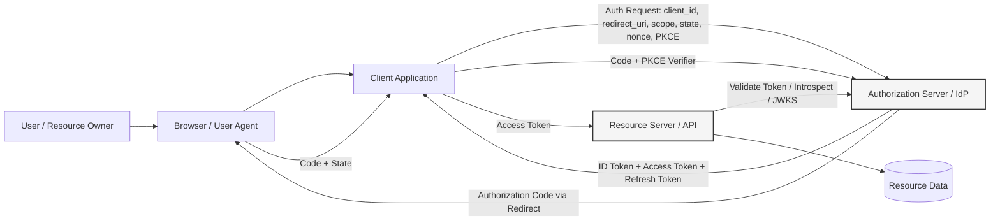

Boundary penting:

| Boundary | Risiko |
|---|---|
| Browser → Client | CSRF, code injection, open redirect, state mismatch |
| Client → Authorization Server | client authentication failure, PKCE bypass, secret leakage |
| Authorization Server → Client | malicious redirect, code substitution, nonce mismatch |
| Client → Resource Server | bearer token theft, wrong audience, token replay |
| Resource Server → JWKS | key confusion, cache poisoning, availability dependency |
| Resource Server → Introspection | fail-open, stale active state, latency DoS |
| Resource Server → Data | BOLA/IDOR, tenant breakout, overbroad scopes |

---

## 6. Vocabulary yang Harus Presisi

| Istilah | Makna | Kesalahan Umum |
|---|---|---|
| Resource Owner | Biasanya user yang memiliki resource | Disamakan dengan client app |
| Client | Aplikasi yang meminta token | Disamakan dengan user |
| Authorization Server | Penerbit token | Disamakan dengan semua API |
| Resource Server | API yang menerima access token | Memvalidasi ID token sebagai access token |
| Access Token | Bukti otorisasi untuk resource server | Dipakai sebagai session login frontend |
| ID Token | Bukti autentikasi user untuk client OIDC | Dipakai untuk call API |
| Refresh Token | Credential jangka lebih panjang untuk memperoleh access token baru | Dikirim ke API resource server |
| Scope | Delegated permission label | Dianggap cukup untuk object-level authz |
| Claim | Statement di token | Dianggap selalu trusted tanpa konteks |
| Audience | Penerima token yang dimaksud | Tidak dicek |
| Issuer | Pihak yang menerbitkan token | Tidak dipin ke allowlist |
| Subject | Identifier entity dalam namespace issuer | Dipakai global tanpa issuer/tenant |
| JWKS | Set public key issuer | Dipakai tanpa TLS/issuer pinning/cache control |
| Introspection | Endpoint untuk cek active state token | Dipakai fail-open saat AS down |

---

## 7. Token Taxonomy

### 7.1 Access Token

Access token digunakan oleh client untuk mengakses resource server.

Access token bisa berupa:

1. **Opaque token**  
   Resource server tidak tahu isi token. Resource server harus introspect ke authorization server atau token service.

2. **JWT access token**  
   Resource server bisa memvalidasi signature dan claims secara lokal.

3. **Sender-constrained token**  
   Token hanya valid bila request membuktikan possession key/certificate tertentu, misalnya DPoP atau mTLS-bound token.

Access token adalah **authorization artifact**, bukan user session canonical source.

---

### 7.2 ID Token

ID token adalah OIDC artifact untuk client.

ID token biasanya JWT dan berisi claim seperti:

- `iss`,
- `sub`,
- `aud`,
- `exp`,
- `iat`,
- `auth_time`,
- `nonce`,
- `acr`,
- `amr`,
- `azp`,
- profile claims tertentu bila scope meminta.

ID token divalidasi oleh **client**, bukan resource server sebagai API authorization token.

---

### 7.3 Refresh Token

Refresh token dipakai client untuk mendapatkan access token baru.

Karakteristik refresh token:

- lebih sensitif daripada access token,
- lifespan biasanya lebih panjang,
- harus disimpan lebih aman,
- harus bisa dirotasi,
- harus bisa direvoke,
- harus dipantau reuse-nya,
- tidak boleh dikirim ke resource server.

Refresh token leakage sering lebih parah daripada access token leakage.

---

### 7.4 Session Cookie

Di browser app, sering kali desain terbaik bukan menyimpan access token di JavaScript, tetapi memakai Backend-for-Frontend/BFF:

```text
Browser <-> BFF session cookie <-> BFF stores/uses tokens server-side
```

Dengan desain ini:

- browser hanya punya cookie session,
- token OAuth disimpan server-side,
- `HttpOnly`, `Secure`, `SameSite` bisa dipakai,
- risiko token theft via XSS menurun,
- CSRF tetap harus dimodelkan.

---

## 8. JWT, JWS, JWE: Jangan Dicampur

### 8.1 JWT

JWT adalah container claims compact.

Secara bentuk:

```text
base64url(header).base64url(payload).base64url(signature)
```

Tetapi ini biasanya berarti **JWS compact serialization**, bukan selalu “JWT” dalam arti abstrak.

---

### 8.2 JWS

JWS adalah JSON Web Signature.

JWS memberikan:

- integrity,
- authenticity,
- non-repudiation tertentu bila memakai asymmetric signature,
- tetapi **tidak memberikan confidentiality**.

Payload JWS bisa dibaca siapa pun yang punya token.

Maka jangan taruh secret di JWT/JWS payload.

---

### 8.3 JWE

JWE adalah JSON Web Encryption.

JWE memberikan confidentiality terhadap payload.

Tetapi JWE tidak otomatis menyelesaikan:

- audience validation,
- issuer validation,
- replay prevention,
- revocation,
- authorization policy,
- logging risk,
- key lifecycle.

JWE lebih kompleks daripada JWS. Banyak sistem lebih baik memakai opaque token atau BFF daripada menyebarkan JWE ke banyak resource server.

---

## 9. Bearer Token Model

Bearer token berarti:

```text
Siapa pun yang memegang token dapat menggunakannya.
```

Ini seperti uang tunai digital.

Karena itu bearer token harus dilindungi dengan:

- TLS,
- short lifetime,
- audience restriction,
- issuer pinning,
- scope/permission minimization,
- storage hygiene,
- logging redaction,
- replay monitoring,
- sender constraint bila risiko tinggi.

### 9.1 Bearer Token Failure Model

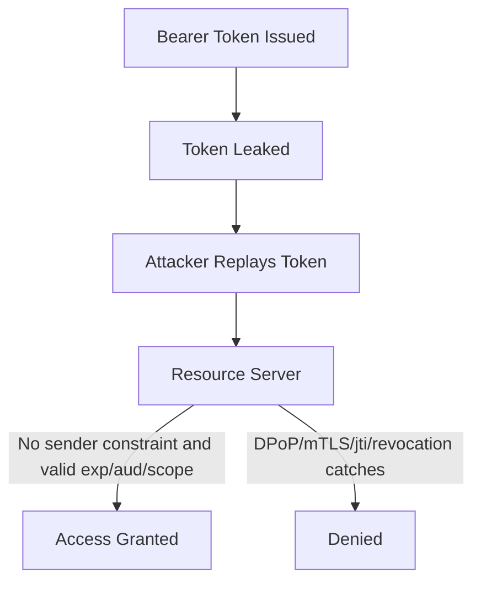

Bearer token tidak membuktikan bahwa pemegang token adalah pemilik asli token.

Ia hanya membuktikan possession.

---

## 10. Authentication vs Authorization vs Session

Tiga hal ini sering tercampur.

### 10.1 Authentication

Authentication menjawab:

```text
Siapa entity ini dan bagaimana ia dibuktikan?
```

Di OIDC, authentication direpresentasikan melalui ID token dan session di IdP.

---

### 10.2 Authorization

Authorization menjawab:

```text
Apa yang boleh dilakukan entity ini terhadap resource tertentu?
```

Access token membantu authorization, tetapi bukan pengganti policy engine.

Contoh:

```text
scope=case:read
```

tidak otomatis berarti:

```text
boleh membaca case id=123 milik tenant lain
```

---

### 10.3 Session

Session menjawab:

```text
Apakah interaksi berkelanjutan client dengan aplikasi masih valid?
```

Session bisa terkait dengan:

- cookie,
- refresh token,
- server-side session store,
- IdP SSO session,
- device session,
- risk session.

Session invalidation tidak otomatis berarti semua JWT access token yang sudah terbit menjadi tidak valid, kecuali ada revocation/introspection/token version policy.

---

## 11. Grant Types: Apa yang Masih Layak Untuk Modern Systems

### 11.1 Authorization Code + PKCE

Untuk user-facing app, default modern adalah:

```text
Authorization Code Flow + PKCE
```

PKCE melindungi authorization code dari interception/substitution karena token endpoint membutuhkan `code_verifier` yang cocok dengan `code_challenge`.

Untuk public client seperti SPA/mobile, PKCE adalah essential.

Untuk confidential web app, PKCE tetap berguna sebagai defense-in-depth.

---

### 11.2 Client Credentials

Dipakai untuk machine-to-machine.

Risiko utamanya:

- client secret leakage,
- overbroad scope,
- tidak ada user context,
- service identity terlalu global,
- token digunakan lintas environment/tenant.

Untuk high assurance M2M, pertimbangkan:

- mTLS client authentication,
- private_key_jwt,
- workload identity,
- SPIFFE/SPIRE,
- short token lifetime,
- per-service audience.

---

### 11.3 Refresh Token Grant

Dipakai untuk mendapatkan access token baru.

Harus didesain dengan:

- rotation,
- reuse detection,
- binding ke client/device,
- revocation,
- idle timeout,
- absolute timeout,
- risk event invalidation.

---

### 11.4 Resource Owner Password Credentials

ROPC pada desain modern sebaiknya dihindari.

Masalahnya:

- client menerima password user,
- MFA dan phishing-resistant auth sulit,
- delegated authorization boundary runtuh,
- user credential exposure tinggi,
- tidak cocok untuk federation modern.

---

### 11.5 Implicit Flow

Implicit flow historis dipakai untuk browser client, tetapi modern guidance mendorong Authorization Code + PKCE.

Masalah implicit:

- token lewat front-channel,
- exposure di URL fragment/history/logging/browser extension,
- tidak ada token endpoint exchange dengan PKCE verifier,
- lebih sulit dikontrol.

---

## 12. Authorization Code Flow + PKCE: State Machine

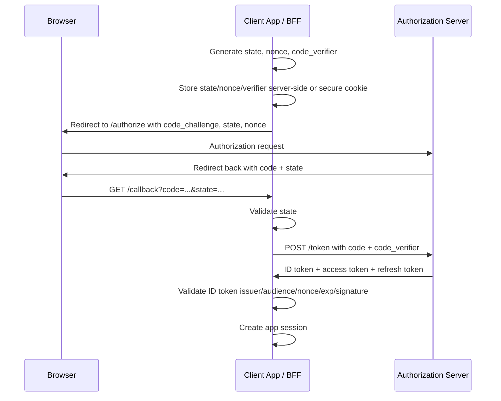

Security invariant:

```text
A callback is accepted only if state matches an outstanding authorization transaction,
and the token response is accepted only if PKCE verifier, issuer, client_id/audience,
nonce, and token validation all pass.
```

---

## 13. The Four Confusions

OAuth/OIDC/JWT bugs sering berasal dari confusion.

### 13.1 Token Type Confusion

Contoh salah:

```text
Resource server accepts ID token as access token.
```

Dampak:

- user bisa call API dengan token yang tidak intended untuk API,
- audience bisa menunjuk client app, bukan API,
- scope mungkin tidak ada,
- policy bisa bypass.

Invariant:

```text
Every endpoint must specify expected token type.
```

---

### 13.2 Audience Confusion

Contoh salah:

```text
Token issued for service A accepted by service B.
```

Invariant:

```text
A resource server accepts only access tokens whose aud includes this exact API identifier.
```

---

### 13.3 Issuer Confusion

Contoh salah:

```text
Token from test IdP accepted in production because signature validates against cached key.
```

Invariant:

```text
Issuer is pinned before key lookup.
JWKS URL is derived only from trusted issuer configuration, never from untrusted token header/payload.
```

---

### 13.4 Algorithm/Key Confusion

Contoh salah:

```text
Library accepts token header alg=HS256 and uses RSA public key bytes as HMAC secret.
```

Invariant:

```text
Allowed algorithms are fixed by configuration per issuer/client/API.
Token header alg can only select among configured algorithms, never define policy.
```

---

## 14. JWT Validation Is Not One Step

### 14.1 Minimal Secure Validation Pipeline

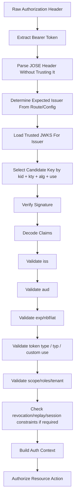

A JWT is not trusted until **all** relevant checks pass.

---

## 15. JWT Claims: Meaning and Pitfalls

| Claim | Meaning | Validation Pitfall |
|---|---|---|
| `iss` | Issuer | Not pinned; multiple issuers mixed |
| `sub` | Subject | Treated globally unique without issuer/tenant |
| `aud` | Audience | Not checked; accepts token meant for another API/client |
| `exp` | Expiration | Ignored or excessive clock skew |
| `nbf` | Not before | Ignored; token valid too early |
| `iat` | Issued at | Used as trust proof instead of freshness signal |
| `jti` | JWT ID | Present but no replay cache/revocation use |
| `scope` | OAuth scope string | Used as object-level authorization |
| `roles` | Role claims | No source-of-truth/tenant boundary |
| `azp` | Authorized party | Ignored in multi-audience OIDC cases |
| `nonce` | Binds ID token to auth request | Not checked in OIDC login |
| `acr` | Authentication context class | Treated as arbitrary string without policy |
| `amr` | Authentication methods references | Misread as assurance guarantee |
| `cnf` | Confirmation / proof key binding | Ignored for sender-constrained tokens |

---

## 16. ID Token Validation

ID token validation is client-side OIDC authentication validation.

A client receiving an ID token should validate at least:

1. Signature is valid.
2. `iss` exactly equals configured issuer.
3. `aud` contains the client ID.
4. If multiple audiences exist, `azp` is checked when required.
5. `exp` is in the future with bounded clock skew.
6. `iat` is reasonable if used.
7. `nonce` matches the authorization request nonce for flows where nonce was sent.
8. `auth_time` satisfies max age if `max_age` was requested.
9. Algorithm is allowlisted.
10. Key belongs to trusted issuer JWKS.

### 16.1 ID Token Is Not API Authorization

Anti-pattern:

```http
GET /cases/123
Authorization: Bearer <id_token>
```

Correct model:

```http
GET /cases/123
Authorization: Bearer <access_token_for_cases_api>
```

Resource server should reject ID tokens unless it is explicitly designed to consume ID-token-like identity assertion, which is not standard OAuth resource access.

---

## 17. Access Token Validation

Access token validation depends on token format.

### 17.1 JWT Access Token

Resource server validates locally:

- signature,
- issuer,
- audience,
- expiration,
- not-before,
- token type,
- scope/permission,
- tenant/client/user constraints,
- optional revocation/replay state.

Benefit:

- low latency,
- less dependency on authorization server,
- scalable for high-throughput APIs.

Cost:

- revocation is hard,
- key rotation must be robust,
- claim semantics must be stable,
- token becomes visible to holder,
- claim bloat increases leakage risk,
- long-lived JWT is dangerous.

---

### 17.2 Opaque Access Token

Resource server introspects token:

```text
POST /introspect token=...
```

Benefit:

- server-side revocation easier,
- token contents hidden from client,
- policy changes can reflect faster,
- resource server simpler semantically.

Cost:

- runtime dependency on authorization server/token service,
- latency,
- cache design complexity,
- availability failure mode,
- introspection endpoint must be protected.

---

## 18. JWT vs Opaque Token Decision Matrix

| Requirement | Prefer JWT Access Token | Prefer Opaque Token |
|---|---:|---:|
| Very high API throughput | ✅ | ⚠️ |
| Need immediate revocation | ⚠️ | ✅ |
| Sensitive claims should not be visible to client | ⚠️ | ✅ |
| Multi-resource offline validation | ✅ | ⚠️ |
| Centralized policy update | ⚠️ | ✅ |
| External third-party clients | ✅ but minimal claims | ✅ often safer |
| Internal microservice mesh | ✅ if trust/JWKS strong | ✅ if token service reliable |
| Regulatory audit with central access decision | ⚠️ | ✅ |
| Low latency hard requirement | ✅ | ⚠️ |
| Token leakage blast radius minimization | short-lived + sender constraint | ✅ + server revocation |

Rule of thumb:

```text
Use JWT when local validation and decentralization are the real requirement.
Use opaque token when central control, confidentiality, revocation, and policy freshness are more important.
```

---

## 19. JWKS Caching Mental Model

JWKS endpoint distributes public keys.

But JWKS is not magic. It is part of your trust model.

### 19.1 Secure JWKS Trust Chain

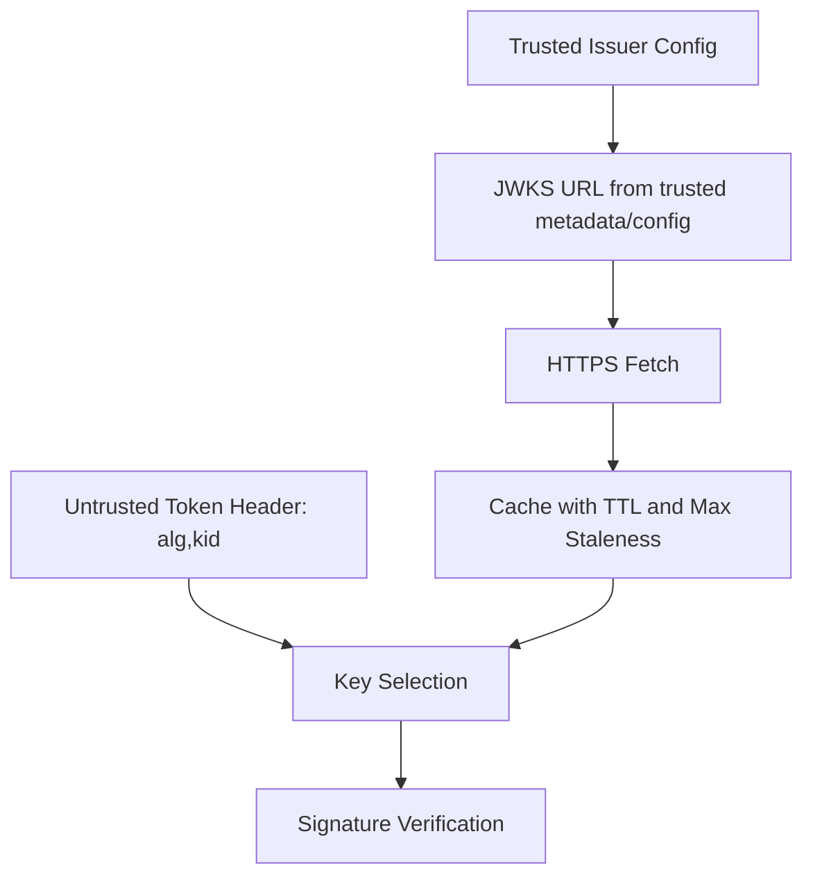

Important invariant:

```text
The token must not decide where keys are fetched from.
```

`kid` is only an identifier inside a trusted key set. It is not a URL. It is not authority. It is not proof.

---

### 19.2 JWKS Cache Requirements

A production JWKS cache should:

1. Be per issuer.
2. Fetch only from configured HTTPS endpoint.
3. Respect Cache-Control reasonably but enforce internal min/max TTL.
4. Support forced refresh when `kid` unknown.
5. Avoid stampede on unknown `kid`.
6. Keep previous keys during rotation overlap.
7. Never fail-open when signature cannot be verified.
8. Expose metrics for refresh success/failure.
9. Limit JWKS size.
10. Validate key type and algorithm compatibility.
11. Reject duplicate ambiguous `kid` when key metadata conflicts.
12. Not trust `jku`, `x5u`, or remote key references from token header unless explicitly designed and pinned.

---

### 19.3 Unknown `kid` Handling

When token header has unknown `kid`:

```text
1. Trigger single refresh for issuer JWKS.
2. Retry key lookup after refresh.
3. If still unknown, reject token.
4. Rate-limit refresh attempts to avoid DoS.
5. Log structured event without logging token.
```

Do not do this:

```text
unknown kid -> skip signature validation -> accept token
```

Do not do this either:

```text
unknown kid -> fetch URL from token header
```

---

## 20. Algorithm Allowlist

Per issuer and per token type, define allowed algorithms.

Example:

```yaml
issuers:
  https://idp.example.gov/realms/aceas:
    jwks_url: https://idp.example.gov/realms/aceas/protocol/openid-connect/certs
    access_token:
      allowed_algs: ["RS256"]
      expected_audiences: ["aceas-case-api"]
    id_token:
      allowed_algs: ["RS256"]
      expected_client_id: "aceas-web"
```

Never treat token header `alg` as policy.

Token header `alg` is input to be checked against policy.

---

## 21. Why Signature Validation Alone Is Dangerous

A JWT signed by a trusted issuer can still be invalid for your API.

Examples:

1. Token signed by prod IdP but audience is another API.
2. Token signed by same realm but issued to admin console client, not your app.
3. Token has valid signature but expired.
4. Token has valid signature but `scope` is insufficient.
5. Token has valid signature but belongs to tenant A while request path is tenant B.
6. Token has valid signature but is an ID token.
7. Token has valid signature but `sub` has been disabled and you require introspection/revocation.
8. Token has valid signature but DPoP proof is missing for sender-constrained token.

Signature says:

```text
Issuer signed these bytes.
```

It does not say:

```text
This request is allowed.
```

---

## 22. Go Architecture: Separate Token Validation From Authorization

Do not create middleware that does everything in one function:

```text
Parse token + validate + load user + check role + access DB + log audit + respond
```

Better architecture:

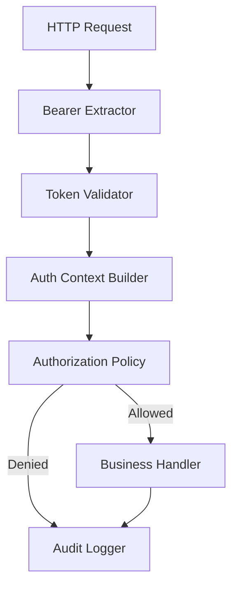

Each stage has a clear invariant.

---

## 23. Go Types for Auth Context

A good resource server should convert token claims into an internal auth context.

Do not pass raw token claims everywhere.

```go
package authz

import "time"

type SubjectType string

const (
	SubjectUser    SubjectType = "user"
	SubjectService SubjectType = "service"
)

type Principal struct {
	Issuer      string
	Subject     string
	SubjectType SubjectType
	TenantID    string
	ClientID    string
}

type AuthContext struct {
	Principal Principal
	Audience  []string
	Scopes    map[string]struct{}
	Roles     map[string]struct{}
	TokenID   string
	IssuedAt  time.Time
	ExpiresAt time.Time
	Authn     AuthenticationContext
}

type AuthenticationContext struct {
	ACR      string
	AMR      []string
	AuthTime *time.Time
}

func (a AuthContext) HasScope(scope string) bool {
	_, ok := a.Scopes[scope]
	return ok
}
```

Why this matters:

- handlers do not depend on JWT library,
- authorization uses normalized data,
- audit logs use stable schema,
- tests can inject AuthContext directly,
- token format can change from JWT to opaque introspection.

---

## 24. Token Validator Interface

Design around an interface:

```go
package token

import (
	"context"
	"net/http"

	"example.com/project/authz"
)

type Validator interface {
	ValidateAccessToken(ctx context.Context, raw string, req *http.Request) (authz.AuthContext, error)
}
```

Possible implementations:

- `JWTValidator`,
- `OpaqueIntrospectionValidator`,
- `CompositeValidator`,
- `DPoPValidator`,
- `MTLSBoundValidator`,
- `TestValidator`.

Do not hardwire the whole app to one JWT library.

---

## 25. Safe Bearer Extraction

```go
package token

import (
	"errors"
	"net/http"
	"strings"
)

var (
	ErrMissingAuthorization = errors.New("missing authorization header")
	ErrInvalidBearer       = errors.New("invalid bearer authorization header")
)

func ExtractBearer(r *http.Request) (string, error) {
	h := r.Header.Get("Authorization")
	if h == "" {
		return "", ErrMissingAuthorization
	}

	// RFC-style header is: Authorization: Bearer <token>
	// Be strict. Multiple spaces, lowercase scheme, or extra tokens can be
	// accepted only if intentionally normalized. For high-security APIs,
	// strictness reduces parser ambiguity.
	const prefix = "Bearer "
	if !strings.HasPrefix(h, prefix) {
		return "", ErrInvalidBearer
	}

	tok := strings.TrimSpace(strings.TrimPrefix(h, prefix))
	if tok == "" || strings.ContainsAny(tok, " \t\r\n") {
		return "", ErrInvalidBearer
	}
	return tok, nil
}
```

Security decisions:

- no token in query string by default,
- no token in logs,
- no multiple Authorization header ambiguity,
- no silent fallback to cookie unless route explicitly expects cookie session.

---

## 26. Do Not Log Tokens

Bad:

```go
log.Printf("invalid token: %s", rawToken)
```

Better:

```go
log.Printf("invalid token: issuer=%q kid=%q reason=%q", issuer, kid, reason)
```

Even better: structured logging with redaction.

Useful metadata:

- issuer,
- audience,
- token type,
- `kid`,
- `jti` hash/truncated fingerprint,
- failure reason category,
- client IP/network metadata if appropriate,
- correlation ID.

Never log:

- raw access token,
- raw ID token,
- raw refresh token,
- Authorization header,
- DPoP proof token raw value,
- full JWE/JWS compact serialization.

---

## 27. Pseudocode JWT Validator

Actual JWT verification should use a maintained JOSE/JWT library. This pseudocode shows the **logic**, not a recommendation to hand-roll verification.

```go
type JWTValidator struct {
	Issuers map[string]IssuerConfig
	Keys    JWKSCache
	Clock   Clock
}

type IssuerConfig struct {
	Issuer            string
	ExpectedAudiences map[string]struct{}
	AllowedAlgorithms map[string]struct{}
	JWKSURL           string
	MaxClockSkew      time.Duration
	RequiredTokenUse  string // optional, provider-specific
}

func (v *JWTValidator) ValidateAccessToken(ctx context.Context, raw string, req *http.Request) (authz.AuthContext, error) {
	// 1. Parse header/payload without trusting them.
	header, untrustedClaims, err := ParseUnverified(raw)
	if err != nil {
		return authz.AuthContext{}, ErrInvalidToken
	}

	// 2. Find issuer config from untrusted iss only if issuer is allowlisted.
	cfg, ok := v.Issuers[untrustedClaims.Issuer]
	if !ok {
		return authz.AuthContext{}, ErrUntrustedIssuer
	}

	// 3. Enforce algorithm allowlist before verification.
	if _, ok := cfg.AllowedAlgorithms[header.Algorithm]; !ok {
		return authz.AuthContext{}, ErrDisallowedAlgorithm
	}

	// 4. Get candidate key from trusted JWKS for this issuer.
	key, err := v.Keys.Key(ctx, cfg.Issuer, header.KeyID, header.Algorithm)
	if err != nil {
		return authz.AuthContext{}, ErrUnknownKey
	}

	// 5. Verify signature using expected algorithm/key type.
	claims, err := VerifyAndDecode(raw, header.Algorithm, key)
	if err != nil {
		return authz.AuthContext{}, ErrBadSignature
	}

	// 6. Validate registered claims.
	if claims.Issuer != cfg.Issuer {
		return authz.AuthContext{}, ErrIssuerMismatch
	}
	if !AudienceIntersects(claims.Audience, cfg.ExpectedAudiences) {
		return authz.AuthContext{}, ErrAudienceMismatch
	}
	if err := ValidateTime(claims, v.Clock.Now(), cfg.MaxClockSkew); err != nil {
		return authz.AuthContext{}, err
	}

	// 7. Validate token type/provider-specific claims.
	if cfg.RequiredTokenUse != "" && claims.TokenUse != cfg.RequiredTokenUse {
		return authz.AuthContext{}, ErrWrongTokenType
	}

	// 8. Normalize into internal AuthContext.
	return BuildAuthContext(claims), nil
}
```

The important point is not the exact code. The important point is the order:

```text
untrusted parse -> issuer allowlist -> alg allowlist -> trusted key lookup -> signature -> claims -> internal auth context
```

---

## 28. Audience Validation

Audience may be a string or array depending on JWT library representation.

Define service audience explicitly.

```go
func AudienceIntersects(tokenAud []string, expected map[string]struct{}) bool {
	for _, aud := range tokenAud {
		if _, ok := expected[aud]; ok {
			return true
		}
	}
	return false
}
```

Avoid weak checks:

```go
strings.Contains(aud, "case")
```

Use exact logical identifiers:

```text
api://aceas/case-management
https://api.example.gov/aceas/cases
aceas-case-api
```

But choose one convention and enforce it consistently.

---

## 29. Subject Identity Model

Do not use `sub` alone globally.

Better identity key:

```text
issuer + subject
```

For multi-tenant systems:

```text
issuer + tenant + subject
```

For service identity:

```text
issuer + client_id/service_id
```

Example:

```go
type StableSubjectKey struct {
	Issuer  string
	Tenant  string
	Subject string
}
```

Why:

- different issuers can emit same `sub`,
- test/prod issuers can collide,
- migrated IdPs can change subject format,
- human user and machine client may share string IDs,
- tenant boundary matters.

---

## 30. Scope Is Not Object-Level Authorization

Scope answers broad delegated capability:

```text
case:read
case:write
appeal:approve
```

Object-level authorization answers:

```text
Can this principal read case 123 in tenant CEA where status=UNDER_INVESTIGATION?
```

You need both.

```go
func CanReadCase(ctx authz.AuthContext, c Case) bool {
	if !ctx.HasScope("case:read") {
		return false
	}
	if ctx.Principal.TenantID != c.TenantID {
		return false
	}
	if c.Restricted && !hasRole(ctx, "case.restricted.reader") {
		return false
	}
	return true
}
```

Security invariant:

```text
Token scope grants coarse permission, but domain policy grants object permission.
```

---

## 31. Roles in JWT: Useful but Dangerous

Roles in token are convenient.

Risks:

- stale role after admin revokes access,
- token bloat,
- role semantics drift across services,
- tenant-specific role interpreted globally,
- privilege escalation through misconfigured claim mapper,
- resource server trusts roles not intended for it.

Safer pattern:

```text
Token contains minimal stable identity + audience + scope.
Resource server fetches domain-specific entitlements if high-risk.
```

Or:

```text
Short-lived token + tenant-scoped roles + strong audience + policy version.
```

---

## 32. Token Lifetime

### 32.1 Access Token Lifetime

Shorter lifetime reduces leakage window.

But too short can cause:

- token refresh storms,
- poor UX,
- higher IdP load,
- retry complexity.

A common design:

```text
Access token: minutes
Refresh token/session: longer, rotated and revocable
```

Exact values depend on risk, client type, network, and operational capability.

---

### 32.2 Clock Skew

Allow bounded skew, not infinite tolerance.

Example policy:

```text
max clock skew = 60s or 120s
```

Do not accept:

```text
exp ignored because clocks are hard
```

Fix time synchronization instead.

---

## 33. Refresh Token Rotation and Reuse Detection

Refresh token rotation pattern:

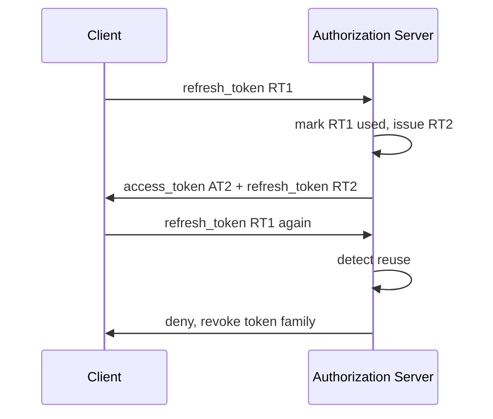

Security idea:

```text
If an old refresh token is reused, either client is buggy or token was stolen.
```

Resource server usually does not implement this directly, but it must understand consequences:

- access token may remain valid until expiry,
- introspection may reflect revocation faster,
- high-risk APIs may require introspection/revocation check.

---

## 34. Token Revocation Reality

JWT access token local validation is naturally hard to revoke immediately.

Options:

| Strategy | Pros | Cons |
|---|---|---|
| Short-lived JWT | Simple, scalable | Revocation delayed until expiry |
| Introspection | Central revocation | Runtime dependency/latency |
| Revocation list by `jti` | Local-ish | State size/cache consistency |
| Token version claim | User/session invalidation | Requires lookup |
| Key rotation | Nuclear for broad compromise | Can break many clients |
| Sender constraint | Reduces replay value | More complex |

Do not claim:

```text
We support immediate logout with stateless JWT only.
```

Unless there is a revocation state check or token lifetime is sufficiently short for your risk acceptance.

---

## 35. Introspection Design

### 35.1 Introspection Flow

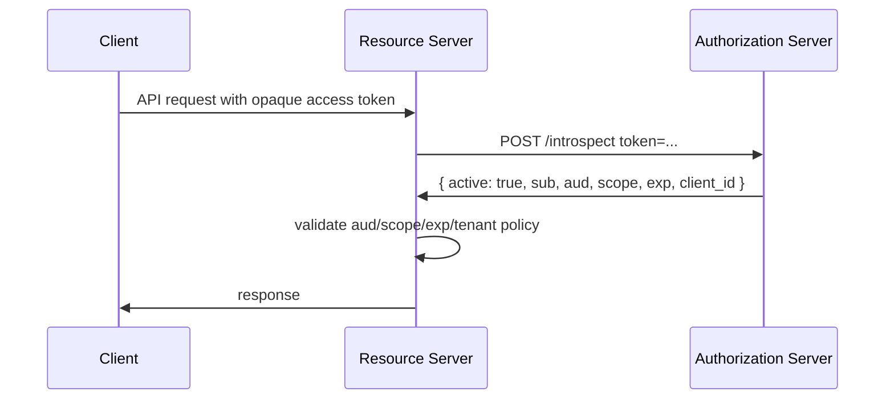

Introspection result is still input. Validate it.

---

### 35.2 Introspection Response Handling

Important fields:

- `active`,
- `iss`,
- `sub`,
- `aud`,
- `scope`,
- `client_id`,
- `exp`,
- `iat`,
- `nbf`,
- custom tenant/role claims.

Resource server should:

1. Require `active=true`.
2. Validate audience.
3. Validate expiration if present.
4. Validate scope/authorization policy.
5. Cache positive result only up to a small TTL and no longer than token expiry.
6. Cache negative result carefully to reduce repeated attacks.
7. Fail closed if introspection unavailable, unless endpoint is explicitly public.
8. Protect introspection client credentials.
9. Use timeouts and circuit breakers.
10. Avoid logging raw token.

---

### 35.3 Go Introspection Client Skeleton

```go
package introspect

import (
	"context"
	"encoding/json"
	"errors"
	"net/http"
	"net/url"
	"strings"
	"time"
)

type Client struct {
	Endpoint     string
	HTTPClient   *http.Client
	ClientID     string
	ClientSecret string
	Timeout      time.Duration
}

type Response struct {
	Active   bool     `json:"active"`
	Issuer   string   `json:"iss"`
	Subject  string   `json:"sub"`
	Audience []string `json:"aud"`
	Scope    string   `json:"scope"`
	ClientID string   `json:"client_id"`
	Exp      int64    `json:"exp"`
	Iat      int64    `json:"iat"`
	Nbf      int64    `json:"nbf"`
	TokenID  string   `json:"jti"`
}

var ErrInactive = errors.New("token inactive")

func (c *Client) Introspect(ctx context.Context, token string) (Response, error) {
	if c.HTTPClient == nil {
		c.HTTPClient = http.DefaultClient
	}
	ctx, cancel := context.WithTimeout(ctx, c.Timeout)
	defer cancel()

	form := url.Values{}
	form.Set("token", token)

	req, err := http.NewRequestWithContext(ctx, http.MethodPost, c.Endpoint, strings.NewReader(form.Encode()))
	if err != nil {
		return Response{}, err
	}
	req.Header.Set("Content-Type", "application/x-www-form-urlencoded")
	req.SetBasicAuth(c.ClientID, c.ClientSecret)

	resp, err := c.HTTPClient.Do(req)
	if err != nil {
		return Response{}, err
	}
	defer resp.Body.Close()

	if resp.StatusCode != http.StatusOK {
		return Response{}, errors.New("introspection endpoint returned non-200")
	}

	var out Response
	dec := json.NewDecoder(http.MaxBytesReader(nil, resp.Body, 1<<20))
	if err := dec.Decode(&out); err != nil {
		return Response{}, err
	}
	if !out.Active {
		return Response{}, ErrInactive
	}
	return out, nil
}
```

Production additions:

- custom transport timeout,
- TLS pinning/private CA if needed,
- metrics,
- rate limiting,
- bounded cache,
- redacted logs,
- mTLS/private_key_jwt client authentication if required,
- strict issuer/audience validation after introspection.

---

## 36. Introspection Cache

Caching introspection reduces latency and AS load.

But cache can weaken revocation.

Safe policy:

```text
cache_ttl = min(configured_max_ttl, token_exp - now, introspection_response_cache_control)
```

For high-risk operations:

- bypass cache,
- require fresh introspection,
- require step-up auth,
- require proof-of-possession.

### 36.1 Positive vs Negative Cache

| Cache Type | Recommendation |
|---|---|
| Active token positive cache | Small TTL, bounded by exp |
| Inactive token negative cache | Very small TTL to reduce brute force/introspection spam |
| Network error | Do not convert to active |
| Malformed token | Do not introspect repeatedly; reject early |

---

## 37. JWKS vs Introspection Failure Modes

| Failure | JWT/JWKS Local Validation | Opaque/Introspection |
|---|---|---|
| IdP temporarily down | Existing JWKS may continue | New introspection may fail |
| Key rotation bad | Tokens fail validation | Mostly AS-side issue |
| Revocation needed | Hard unless state lookup | Easier |
| Token claim mistake | Propagates until expiry | Can be corrected centrally if opaque |
| API latency | Low | Higher |
| Central policy freshness | Lower | Higher |

Design is trade-off, not religion.

---

## 38. DPoP and Sender-Constrained Tokens

Bearer tokens are replayable if stolen.

DPoP adds application-level proof-of-possession.

Basic idea:

```text
Client has private key.
Client sends access token + DPoP proof JWT per request.
Resource server verifies proof and token binding.
```

DPoP proof binds to:

- HTTP method,
- HTTP URI,
- timestamp,
- nonce optionally,
- access token hash,
- client public key.

This reduces token replay because attacker needs both token and private key.

---

## 39. DPoP Validation Concept

Resource server checks:

1. Access token is DPoP-bound.
2. DPoP proof signature is valid using embedded/public key.
3. `htm` matches HTTP method.
4. `htu` matches normalized target URI.
5. `iat` within short window.
6. `jti` not replayed within window.
7. Access token hash claim matches token.
8. Confirmation claim `cnf` in access token matches DPoP key.

DPoP is powerful but easy to implement incorrectly. Use established library/proxy/gateway support where possible.

---

## 40. mTLS-Bound Access Tokens

Another sender-constraining approach:

```text
Access token contains confirmation claim bound to client certificate.
Resource server verifies TLS client cert matches token binding.
```

This fits machine-to-machine systems and zero-trust internal networks.

Trade-off:

- strong binding,
- operational cert lifecycle required,
- harder for browser/mobile public clients,
- needs correct proxy/service mesh behavior.

If TLS is terminated at proxy, resource server must not blindly trust forwarded certificate headers unless proxy boundary is strongly controlled.

---

## 41. Replay Prevention Patterns

| Context | Replay Defense |
|---|---|
| OIDC login callback | `state` + `nonce` + PKCE |
| JWT access token bearer | short expiry + audience + TLS; optional revocation |
| High-risk JWT | `jti` cache + sender constraint |
| Webhook signed request | timestamp + nonce/request-id + HMAC/signature |
| DPoP | proof `jti` replay cache + `htm`/`htu`/`iat` |
| mTLS-bound token | cert possession check |
| Refresh token | rotation + reuse detection |
| Session cookie | CSRF token + SameSite + server session state |

Replay is not solved by signature alone. A signature can be replayed unless freshness is enforced.

---

## 42. State and Nonce

### 42.1 `state`

`state` protects OAuth authorization response against CSRF and response injection.

It binds callback to an authorization transaction started by the client.

Properties:

- random,
- unguessable,
- one-time use,
- bound to browser/session,
- checked before code exchange.

---

### 42.2 `nonce`

`nonce` in OIDC binds ID token to authentication request.

Properties:

- random,
- unguessable,
- stored with auth transaction,
- checked after ID token validation,
- one-time use.

Do not reuse state and nonce blindly unless you have explicitly reasoned about lifecycle and storage.

---

## 43. Redirect URI Security

Redirect URI must be exact-match or strictly registered.

Bad:

```text
https://app.example.com/callback?next=https://evil.example
```

Risk:

- open redirect,
- authorization code leakage,
- token leakage,
- login CSRF.

Authorization server should enforce registered redirect URIs.

Client should validate `state` and never redirect based on untrusted `next` without allowlist.

---

## 44. OAuth Mix-Up Attack Mental Model

In multi-IdP clients, attacker may cause client to send code from IdP A to token endpoint of IdP B or confuse issuer context.

Defense:

- bind auth transaction to issuer,
- validate issuer in response/token,
- use distinct redirect URIs per issuer if appropriate,
- pin metadata per issuer,
- do not infer issuer from token alone without transaction context.

---

## 45. Multi-Tenant Issuer Model

There are two common models:

### 45.1 Issuer Per Tenant

```text
https://idp.example.com/tenant-a
https://idp.example.com/tenant-b
```

Resource server allowlists issuers per tenant.

Pros:

- strong namespace separation,
- distinct keys/policies.

Cons:

- JWKS cache per issuer,
- config complexity.

---

### 45.2 Single Issuer With Tenant Claim

```text
iss = https://idp.example.com
tenant_id = tenant-a
```

Pros:

- simpler config,
- shared keys.

Cons:

- tenant claim must be validated carefully,
- object-level authz must enforce tenant boundary,
- compromised claim mapping can be severe.

Invariant:

```text
Tenant in token must match resource tenant and route context.
```

---

## 46. `kid` Is Not a Security Boundary

`kid` helps choose key. It does not authenticate key.

Attack surfaces:

- path traversal if `kid` used as filename,
- SQL injection if `kid` used in query,
- SSRF if `kid`/`jku` used to fetch keys,
- collision/duplicate kid ambiguity,
- algorithm/key mismatch.

Safe handling:

```text
issuer -> trusted JWKS cache -> key candidates -> kid match -> alg/kty/use match -> verify
```

Never:

```text
kid -> fetch arbitrary URL or local file
```

---

## 47. `jku`, `x5u`, and Embedded Key Headers

JOSE headers can contain parameters that reference keys or certs.

For most resource servers:

```text
Do not trust remote key references from token header.
```

If you must support them:

- allowlist host,
- require HTTPS,
- pin issuer,
- validate chain,
- cache safely,
- restrict algorithms,
- protect against SSRF,
- apply size/time limits.

Most systems do not need this complexity.

---

## 48. JWT Header `typ` and `cty`

`typ` can help distinguish token classes, e.g. access token JWT vs ID token JWT.

But do not rely only on `typ`.

Use it as one input among:

- issuer,
- audience,
- token use claim,
- route expectation,
- validation profile.

---

## 49. Access Token Validation Profiles

A mature resource server defines profiles.

Example:

```yaml
token_profiles:
  public_api_user:
    expected_type: access_token
    issuers:
      - https://idp.example.gov/realms/citizen
    audiences:
      - aceas-public-api
    required_scopes:
      any_of: ["application:read", "application:write"]
    sender_constraint: optional

  internal_service:
    expected_type: access_token
    issuers:
      - https://idp.example.gov/realms/internal
    audiences:
      - aceas-internal-api
    required_scopes:
      any_of: ["case.sync", "event.publish"]
    sender_constraint: mtls_required
```

The route chooses profile.

Do not let token choose profile.

---

## 50. Middleware Design in Go

```go
package middleware

import (
	"net/http"

	"example.com/project/token"
)

type contextKey string

const authContextKey contextKey = "auth-context"

func RequireAuth(v token.Validator, next http.Handler) http.Handler {
	return http.HandlerFunc(func(w http.ResponseWriter, r *http.Request) {
		raw, err := token.ExtractBearer(r)
		if err != nil {
			http.Error(w, "unauthorized", http.StatusUnauthorized)
			return
		}

		authCtx, err := v.ValidateAccessToken(r.Context(), raw, r)
		if err != nil {
			// Log category, not raw token.
			http.Error(w, "unauthorized", http.StatusUnauthorized)
			return
		}

		ctx := context.WithValue(r.Context(), authContextKey, authCtx)
		next.ServeHTTP(w, r.WithContext(ctx))
	})
}
```

Production details:

- Prefer typed context accessor.
- Avoid storing raw token in context.
- Return generic error to client.
- Log internal reason separately.
- Use `WWW-Authenticate` header where appropriate.
- Authorization should happen after authentication middleware.

---

## 51. Authorization Error Semantics

Use precise HTTP semantics:

| Situation | Status |
|---|---:|
| Missing/invalid token | `401 Unauthorized` |
| Valid token but insufficient permission | `403 Forbidden` |
| Resource not visible and should be hidden | `404 Not Found` sometimes |
| Expired token | `401 Unauthorized` |
| Wrong audience | `401 Unauthorized` or `403`, depending policy |
| Tenant mismatch | usually `403` or cloaked `404` |

Do not leak details:

```json
{
  "error": "JWT kid abc not found in https://idp-prod/internal/certs"
}
```

Better client response:

```json
{
  "error": "unauthorized"
}
```

Internal log can contain structured reason.

---

## 52. WWW-Authenticate Header

For bearer token failures, APIs may return:

```http
WWW-Authenticate: Bearer error="invalid_token"
```

Be careful not to reveal sensitive internal detail.

Acceptable:

```http
WWW-Authenticate: Bearer error="invalid_token"
```

Potentially too revealing:

```http
WWW-Authenticate: Bearer error="invalid_token", error_description="kid prod-key-2024 missing from https://..."
```

---

## 53. OIDC Client Login in Go

For Go web apps, OAuth/OIDC client implementation usually uses:

- `golang.org/x/oauth2` for OAuth2 client flow mechanics,
- an OIDC-specific library for discovery, ID token validation, JWKS, and claims,
- secure session library/store for application session,
- CSRF/state/nonce storage,
- strict redirect URI handling.

Important: `golang.org/x/oauth2` helps with OAuth2 authorized HTTP requests and token exchange, but it is not a complete OIDC security framework by itself.

---

## 54. BFF Pattern for Browser Apps

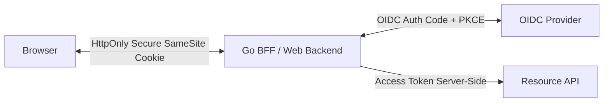

Advantages:

- no access token in browser JavaScript,
- easier refresh token protection,
- session invalidation server-side,
- better audit boundary,
- resource API only sees BFF/service or user token depending design.

Risks:

- CSRF must be handled,
- BFF becomes high-value component,
- session fixation must be prevented,
- cookie domain/path must be tight,
- reverse proxy headers must be trusted carefully.

---

## 55. SPA Token Storage Reality

Storing token in browser is always a risk trade-off.

| Storage | Risk |
|---|---|
| `localStorage` | Accessible to XSS; persistent |
| `sessionStorage` | Accessible to XSS; shorter life |
| JS memory | Lost on refresh; accessible to XSS runtime |
| HttpOnly cookie | Better XSS token protection; CSRF must be handled |
| BFF server-side store | Best control; more backend complexity |

For high-value regulated systems, BFF/session cookie is often more defensible than direct SPA token handling.

---

## 56. JWT Size and Header Limits

JWT can become large due to:

- roles,
- groups,
- entitlements,
- profile claims,
- nested claims,
- multiple audiences.

Risks:

- HTTP header too large,
- proxy rejection,
- log bloat,
- performance overhead,
- accidental PII exposure,
- token fragmentation in old systems.

Design principle:

```text
Access tokens should contain the minimum claims needed by resource servers.
```

---

## 57. Privacy and PII in Tokens

Do not include unnecessary PII in access tokens.

Bad claims:

```json
{
  "email": "citizen@example.com",
  "nric": "...",
  "full_address": "...",
  "phone": "..."
}
```

Better:

```json
{
  "iss": "https://idp.example.gov",
  "sub": "opaque-stable-id",
  "aud": "case-api",
  "scope": "case:read",
  "tenant_id": "cea",
  "exp": 1712345678
}
```

Let resource server fetch PII from controlled data store when needed and authorized.

---

## 58. Claim Mapping Anti-Corruption Layer

Token claims are external contract.

Do not spread provider-specific claim names across business code.

Bad:

```go
if claims["realm_access"].Roles contains "admin" { ... }
```

Better:

```go
authCtx := mapper.MapProviderClaims(claims)
policy.CanApproveAppeal(authCtx, appeal)
```

This is especially important when migrating IdP/Keycloak/Auth0/Cognito/custom provider.

---

## 59. Keycloak-Specific Mental Notes

If using Keycloak-like systems:

- distinguish realm roles vs client roles,
- ensure audience mapper is configured correctly,
- avoid accepting tokens for `account` client or admin console,
- configure client scopes intentionally,
- check `azp` and `aud`,
- separate public client and confidential client,
- validate issuer per realm/environment,
- handle key rotation via JWKS cache,
- avoid leaking refresh token to browser JS when possible,
- understand front-channel/back-channel logout limitations.

Provider-specific claims must be mapped to internal auth context.

---

## 60. JWT Library Selection in Go

Go standard library does not provide complete JWT/OIDC validation.

When selecting a library, evaluate:

1. Maintained status.
2. Algorithm allowlist support.
3. Typed claims support.
4. JWKS support.
5. OIDC discovery support if client login.
6. Key rotation behavior.
7. Handling of `alg=none`.
8. Handling of critical headers.
9. Clock skew configuration.
10. Audience/issuer validation APIs.
11. Fuzzing/tests/security history.
12. Ability to reject duplicate/ambiguous claims if relevant.
13. Clear separation between parse-unverified and verify.

Do not select library only because the README example is short.

---

## 61. Duplicate JSON Claims and Parser Ambiguity

JWT payload is JSON. JSON parser behavior around duplicate keys can be surprising.

Example:

```json
{
  "aud": "api-a",
  "aud": "api-b"
}
```

Different parsers/layers may interpret differently.

Defensive approach:

- use mature JWT library,
- prefer strict JSON parsing if available,
- avoid manually decoding token payload with generic maps for security decisions,
- fuzz token parsing paths,
- test duplicate claim cases.

---

## 62. Authorization Policy Placement

Where should authorization happen?

### 62.1 At API Gateway

Pros:

- early rejection,
- centralized policy,
- consistent token validation,
- lower backend load.

Cons:

- gateway may lack object context,
- policy drift with service,
- trust in forwarded identity headers,
- bypass risk via internal paths.

---

### 62.2 In Service

Pros:

- full domain context,
- strong object-level authorization,
- clearer audit events,
- less trust in external headers.

Cons:

- repeated implementation,
- risk inconsistent validation,
- performance cost.

---

### 62.3 Recommended Pattern

```text
Gateway: coarse token validation and route-level allow/deny.
Service: full token/auth context validation and object-level authorization.
```

Do not rely solely on gateway for high-risk domain authorization.

---

## 63. Forwarded Identity Headers

If gateway validates token and forwards identity headers:

```http
X-User-Id: 123
X-Tenant-Id: cea
X-Scopes: case:read
```

Backend must ensure:

- requests only come from trusted gateway network/mTLS identity,
- external clients cannot set/spoof those headers,
- gateway strips incoming identity headers,
- headers are signed/MACed if crossing untrusted boundary,
- backend still validates enough context for high-risk actions.

Better:

```text
Use mTLS/gateway identity + internal signed context token or pass original access token.
```

---

## 64. Token Exchange and Delegation

Service-to-service call often needs downstream authorization.

Anti-pattern:

```text
Service A forwards user access token to every downstream service, regardless of audience.
```

Problem:

- audience mismatch,
- excessive delegation,
- token leakage to services that do not need it,
- confused deputy risk.

Better:

- token exchange to obtain downstream-audience token,
- service token plus user context with clear delegation,
- policy engine checks actor + subject + delegation chain,
- audit logs record both user and service.

---

## 65. Confused Deputy in Microservices

Example:

```text
User has permission to call Service A.
Service A has broad permission to call Service B.
User tricks Service A to access data in Service B that user should not see.
```

Defense:

- Service A must authorize request before downstream call.
- Service B must know whether call is service-only or on-behalf-of user.
- Downstream token should carry appropriate audience/delegation.
- Audit should record original actor and calling service.

---

## 66. Authorization Context for On-Behalf-Of Calls

```go
type Actor struct {
	Type    string // user or service
	Issuer  string
	Subject string
	Tenant  string
}

type DelegationContext struct {
	OriginalActor Actor
	CallingService Actor
	Scopes []string
	Reason string
}
```

Use this when a service acts on behalf of user.

Do not flatten everything into `sub`.

---

## 67. JWT Access Token for Internal Events

Sometimes teams put JWT in messages/events.

Be careful:

- access token may expire before event consumed,
- token audience may not match consumer,
- replay and retention risk,
- token may leak in queue/dead letter/logs,
- user permission at event time vs consume time ambiguity.

Better patterns:

- sign event envelope separately,
- include actor snapshot and authorization decision ID,
- avoid storing bearer access token in event payload,
- use service identity for event processing,
- audit original request separately.

---

## 68. JWE Use Cases

JWE can be useful when:

- token content must be confidential from client,
- intermediary sees token but should not read claims,
- recipient-specific encryption is needed.

But consider alternatives:

- opaque token + introspection,
- BFF session,
- TLS + server-side lookup,
- encrypted field in backend store.

JWE adds key management complexity. Do not use it only because “JWT payload is visible” if opaque token would be simpler.

---

## 69. Token Binding to TLS/mTLS Proxy Reality

If Go service is behind proxy:

```text
Client --mTLS--> Proxy --HTTP--> Go service
```

Go service does not see client certificate unless proxy forwards it.

If authorization depends on client certificate, then:

- Go service should terminate mTLS itself, or
- proxy should forward identity over a trusted authenticated channel, or
- proxy should enforce policy completely, and service should trust only proxy identity with clear boundary.

Do not trust `X-Forwarded-Client-Cert` from arbitrary clients.

---

## 70. OAuth/OIDC Discovery

OIDC discovery provides metadata such as:

- issuer,
- authorization endpoint,
- token endpoint,
- JWKS URI,
- supported algorithms,
- userinfo endpoint.

For production:

- configure expected issuer,
- fetch discovery over HTTPS,
- verify returned issuer matches expected issuer,
- cache metadata with controlled TTL,
- do not dynamically trust arbitrary issuer from user input.

---

## 71. Token Endpoint Client Authentication

Confidential clients should authenticate to token endpoint.

Methods include:

- client secret basic,
- client secret post,
- private_key_jwt,
- mTLS client auth.

Security ordering often:

```text
mTLS/private_key_jwt > client_secret_basic > client_secret_post
```

But operational readiness matters. A badly managed private key can be worse than a well-managed client secret.

---

## 72. Client Secret Handling in Go

Client secrets are credentials.

Rules:

- do not hardcode,
- do not log,
- load from secret manager,
- rotate,
- scope per environment/client,
- use mTLS/private_key_jwt for high assurance,
- do not ship confidential secrets in SPA/mobile apps.

Public clients cannot keep secrets.

---

## 73. Logout Is Not Simple

There are several logout layers:

1. Application session logout.
2. Refresh token revocation.
3. IdP session logout.
4. Front-channel logout.
5. Back-channel logout.
6. Access token expiry/revocation.

User clicking logout may not instantly invalidate every access token unless designed.

Production system should state clearly:

```text
Logout invalidates app session immediately.
Refresh token is revoked immediately.
Existing access tokens expire within N minutes unless introspection/revocation list catches them earlier.
```

---

## 74. Account Disable and Role Revocation

If admin disables user:

- opaque token introspection can reflect quickly,
- JWT may remain valid until expiry,
- resource server may need user status lookup for high-risk action,
- token version claim can force invalidation if checked,
- sessions must be revoked.

Do not rely on long-lived JWT for systems requiring fast deprovisioning.

---

## 75. Step-Up Authentication

Some actions need stronger authentication than basic login:

- approve enforcement decision,
- change bank account,
- export sensitive PII,
- create admin user,
- rotate key,
- disable MFA.

OIDC claims like `acr`, `amr`, and `auth_time` can support step-up policy.

Example:

```text
Require auth_time within 5 minutes and acr >= phishing-resistant level for high-risk action.
```

Do not treat mere possession of old access token as enough for all actions.

---

## 76. Go Time Validation

```go
func ValidateTime(exp, nbf, iat int64, now time.Time, skew time.Duration) error {
	nowUnix := now.Unix()

	if exp > 0 && nowUnix-int64(skew.Seconds()) > exp {
		return ErrExpired
	}
	if nbf > 0 && nowUnix+int64(skew.Seconds()) < nbf {
		return ErrNotYetValid
	}
	// Optional sanity check: issued too far in future.
	if iat > 0 && nowUnix+int64(skew.Seconds()) < iat {
		return ErrIssuedInFuture
	}
	return nil
}
```

Prefer library claim validation when robust, but understand the semantics.

---

## 77. Token Fingerprint for Logs

If you need correlate token failures without logging token:

```go
func TokenFingerprint(raw string) string {
	sum := sha256.Sum256([]byte(raw))
	return base64.RawURLEncoding.EncodeToString(sum[:12]) // short fingerprint
}
```

Caveat:

- fingerprint is derived from token,
- treat as sensitive-ish metadata,
- do not expose to client unnecessarily,
- useful for internal correlation.

---

## 78. Metrics to Expose

Resource server token metrics:

- auth requests total,
- missing token,
- malformed token,
- invalid signature,
- expired token,
- issuer mismatch,
- audience mismatch,
- unknown `kid`,
- JWKS refresh success/failure,
- JWKS cache age,
- introspection latency,
- introspection error rate,
- introspection active/inactive count,
- authorization denied by scope,
- authorization denied by object policy,
- DPoP replay detected,
- token reuse/replay suspected.

Do not expose raw token or PII in labels.

Bad metric labels:

```text
auth_fail{token="eyJ..."}
```

Good:

```text
auth_fail{reason="aud_mismatch",issuer="prod-idp",profile="case-api"}
```

---

## 79. Audit Events

For regulated systems, audit should distinguish:

- authentication success/failure,
- token validation failure,
- authorization denial,
- object-level denial,
- admin policy change,
- token/client/key rotation,
- suspicious replay,
- introspection outage,
- IdP metadata/JWKS refresh failure.

Audit fields:

```json
{
  "event_type": "authorization.denied",
  "actor_issuer": "https://idp.example.gov/realms/aceas",
  "actor_subject": "...",
  "actor_type": "user",
  "client_id": "aceas-web",
  "tenant_id": "cea",
  "resource_type": "case",
  "resource_id": "case-123",
  "decision": "deny",
  "reason_code": "tenant_mismatch",
  "correlation_id": "...",
  "timestamp": "..."
}
```

Do not store raw token in audit.

---

## 80. Testing Strategy

### 80.1 Unit Tests

Test cases:

- valid token,
- expired token,
- not-before future,
- wrong issuer,
- wrong audience,
- missing audience,
- wrong algorithm,
- unknown `kid`,
- key rotation old/new key,
- ID token sent to access-token endpoint,
- duplicate/ambiguous claims if library permits,
- invalid base64,
- huge token,
- malformed Authorization header,
- scope missing,
- tenant mismatch,
- replayed `jti`,
- introspection inactive,
- introspection timeout.

---

### 80.2 Integration Tests

Run local test IdP or fake issuer with:

- JWKS endpoint,
- token endpoint,
- introspection endpoint,
- rotating keys,
- multiple issuers,
- multiple audiences.

Test behavior through actual HTTP middleware.

---

### 80.3 Fuzzing

Fuzz:

- Authorization header parser,
- JWT compact parsing boundary,
- claim mapper,
- scope parser,
- audience parser,
- DPoP proof parser,
- forwarded header parser.

Fuzzing does not prove security, but it catches parser ambiguity and crash bugs.

---

## 81. Authorization Header Parser Fuzz Target Example

```go
func FuzzExtractBearer(f *testing.F) {
	seeds := []string{
		"Bearer abc.def.ghi",
		"",
		"Basic abc",
		"Bearer ",
		"Bearer abc def",
		"bearer abc",
		"Bearer abc\nInjected: x",
	}
	for _, s := range seeds {
		f.Add(s)
	}

	f.Fuzz(func(t *testing.T, h string) {
		req, _ := http.NewRequest(http.MethodGet, "https://api.example.test", nil)
		req.Header.Set("Authorization", h)
		_, _ = token.ExtractBearer(req)
	})
}
```

Invariant:

```text
Parser should never panic, never accept whitespace-injected token, and never accept ambiguous schemes unless intentionally supported.
```

---

## 82. Common Vulnerability Patterns

| Pattern | Consequence | Defense |
|---|---|---|
| No audience check | Token reuse across APIs | Exact audience validation |
| Accept ID token as access token | API authorization bypass | Token profile/type validation |
| Dynamic JWKS from token header | SSRF/key injection | Trusted issuer config only |
| Algorithm accepted from token | alg confusion | Per-issuer alg allowlist |
| Long-lived JWT | Poor revocation | Short expiry/introspection |
| Token in logs | Credential leakage | Redaction/fingerprints |
| Token in query string | URL/log/referrer leakage | Authorization header only |
| Broad roles in JWT | Stale privilege | Short life/domain lookup |
| Missing state | Login CSRF | One-time state |
| Missing nonce | ID token replay | One-time nonce |
| Refresh token reuse ignored | Persistent compromise | Rotation/reuse detection |
| Gateway-only authz | Internal bypass/BOLA | Service object-level policy |
| Trust forwarded identity headers | Spoofed identity | mTLS/proxy stripping/signed context |

---

## 83. Secure Error Taxonomy

Internal errors:

```go
var (
	ErrMissingToken       = errors.New("missing token")
	ErrMalformedToken     = errors.New("malformed token")
	ErrUntrustedIssuer    = errors.New("untrusted issuer")
	ErrDisallowedAlg      = errors.New("disallowed algorithm")
	ErrUnknownKey         = errors.New("unknown key")
	ErrInvalidSignature   = errors.New("invalid signature")
	ErrExpired            = errors.New("expired token")
	ErrAudienceMismatch   = errors.New("audience mismatch")
	ErrWrongTokenType     = errors.New("wrong token type")
	ErrInsufficientScope  = errors.New("insufficient scope")
	ErrObjectDenied       = errors.New("object denied")
	ErrReplayDetected     = errors.New("replay detected")
)
```

External response:

```json
{"error":"unauthorized"}
```

or

```json
{"error":"forbidden"}
```

Do not expose internal validation path to attackers.

---

## 84. Token Validation and Caching State Machine

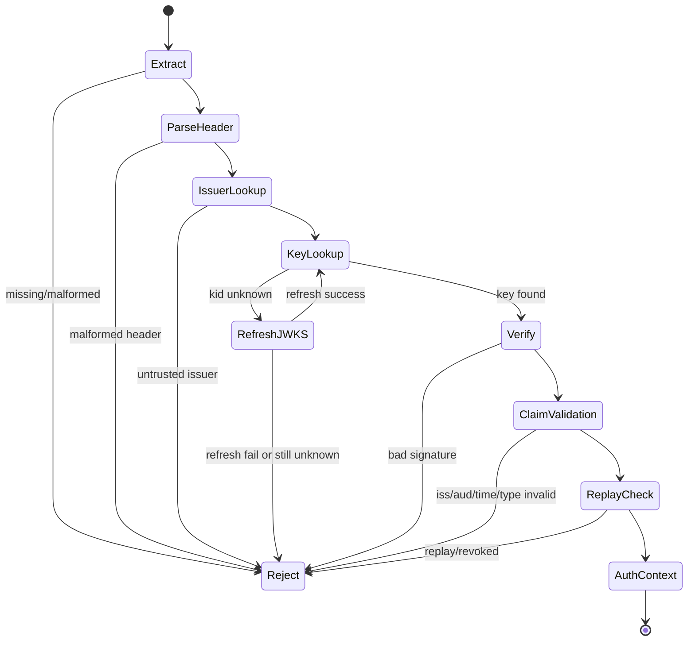

---

## 85. Performance Considerations

Token validation can be hot-path.

Optimize safely:

- cache JWKS,
- cache parsed key objects,
- avoid repeated discovery fetch,
- avoid introspection for every request unless required,
- cache introspection with small TTL,
- limit token size before expensive parsing,
- use bounded timeouts,
- avoid per-request allocation explosion,
- avoid network calls in object-level authz unless needed,
- use profiling under real traffic patterns.

Never optimize by skipping issuer/audience/signature validation.

---

## 86. Availability and DoS

Attackers can send:

- huge Authorization headers,
- random JWTs with random `kid`,
- tokens triggering JWKS refresh storm,
- tokens triggering introspection storm,
- malformed base64 payloads,
- expensive signature algorithms if accepted,
- many DPoP proofs with unique `jti` to fill replay cache.

Defenses:

- max header size at server/proxy,
- max token length,
- rate-limit unknown `kid` refresh,
- singleflight refresh,
- bounded JWKS size,
- introspection cache/rate limit,
- fast reject malformed tokens,
- replay cache size limit,
- per-client quota.

---

## 87. JWKS Refresh Stampede Control

Conceptual pattern:

```text
unknown kid -> acquire issuer refresh lock -> one goroutine refreshes -> others wait or fail quickly -> update cache -> retry lookup
```

Do not let every request fetch JWKS.

---

## 88. Key Rotation Overlap

Issuer rotates signing keys:

```text
T0: old key signs tokens
T1: new key appears in JWKS
T2: new key starts signing tokens
T3: old tokens expire
T4: old key removed from JWKS
```

Resource server should handle overlap.

Risk if old key removed too early:

```text
Still-valid tokens signed with old key fail.
```

Risk if old key kept too long:

```text
Compromised old key remains usable.
```

Operationally, document token lifetime and key overlap window.

---

## 89. Emergency Key Compromise

If signing key compromised:

1. Stop using compromised key immediately.
2. Remove key from JWKS if appropriate.
3. Rotate to new key.
4. Invalidate tokens signed with compromised key if possible.
5. Reduce JWKS cache TTL or force refresh.
6. Notify dependent services.
7. Monitor for tokens with compromised `kid`.
8. Consider session/refresh token revocation depending blast radius.
9. Produce incident audit trail.

Local JWT validation with long JWKS cache can delay response. Provide operational mechanism to force JWKS refresh or deny specific `kid`.

---

## 90. Denylist by `kid` or `jti`

### 90.1 `kid` Denylist

Emergency key compromise:

```yaml
disabled_kids:
  - prod-signing-key-2026-01
```

Resource server rejects tokens signed with disabled key even if JWKS still contains it.

### 90.2 `jti` Denylist

Specific token compromise:

```text
reject issuer+jti until exp
```

Caveat:

- requires state,
- memory/storage cost,
- distributed consistency.

---

## 91. OAuth for Internal Machine-to-Machine

For service-to-service:

- use client credentials with narrow scopes,
- use audience per resource service,
- consider mTLS/private_key_jwt client auth,
- avoid one global service token for everything,
- rotate client credentials,
- audit client ID and service identity,
- do not map service token to human user.

Example service token claims:

```json
{
  "iss": "https://idp.example.gov/realms/internal",
  "sub": "service:event-syncer",
  "client_id": "event-syncer",
  "aud": "case-api",
  "scope": "case.event.write",
  "exp": 1712345678
}
```

---

## 92. OAuth for Public APIs

Public API resource server should assume:

- clients are heterogeneous,
- tokens may be stolen,
- scope semantics must be documented,
- API versioning can affect audience/scope,
- rate limits are part of security,
- error details leak intelligence,
- tenant/object authorization is mandatory.

---

## 93. OAuth for Admin APIs

Admin APIs require stronger controls:

- separate audience,
- separate client,
- separate scope namespace,
- shorter token lifetime,
- MFA/step-up via `acr`/`amr`/`auth_time`,
- stricter audit,
- optional introspection even for JWT,
- IP/device/risk controls where applicable,
- break-glass procedures.

Do not reuse public app token profile for admin APIs.

---

## 94. Example Route-Level Profiles

```go
type TokenProfile string

const (
	ProfileUserAPI     TokenProfile = "user-api"
	ProfileAdminAPI    TokenProfile = "admin-api"
	ProfileInternalAPI TokenProfile = "internal-api"
)

type RoutePolicy struct {
	TokenProfile   TokenProfile
	RequiredScopes []string
	StepUpRequired bool
}
```

Then route config:

```go
var policies = map[string]RoutePolicy{
	"GET /cases/{id}": {
		TokenProfile:   ProfileUserAPI,
		RequiredScopes: []string{"case:read"},
	},
	"POST /admin/users": {
		TokenProfile:   ProfileAdminAPI,
		RequiredScopes: []string{"admin:user.create"},
		StepUpRequired: true,
	},
}
```

---

## 95. IDP Metadata Pinning

Store explicit config:

```yaml
issuer: "https://idp.example.gov/realms/aceas"
authorization_endpoint: "https://idp.example.gov/realms/aceas/protocol/openid-connect/auth"
token_endpoint: "https://idp.example.gov/realms/aceas/protocol/openid-connect/token"
jwks_uri: "https://idp.example.gov/realms/aceas/protocol/openid-connect/certs"
```

Discovery may populate config, but final trust must be pinned to expected issuer.

---

## 96. Environment Isolation

Never allow DEV/UAT issuer in PROD.

Bad:

```yaml
trusted_issuers:
  - https://idp-dev.example.gov
  - https://idp-uat.example.gov
  - https://idp-prod.example.gov
```

in production.

Better:

```yaml
production:
  trusted_issuers:
    - https://idp-prod.example.gov/realms/aceas
```

Environment confusion is a real production incident class.

---

## 97. Token Validation in gRPC

For gRPC, token is often in metadata:

```text
authorization: Bearer <token>
```

Use unary/stream interceptors:

- extract metadata,
- validate token,
- attach AuthContext to context,
- enforce method-level policy,
- do not log metadata raw.

For streaming RPC, decide whether auth is checked:

- only at stream start,
- periodically,
- per message,
- when token expires mid-stream.

High-risk long-lived streams need explicit lifecycle policy.

---

## 98. Token Expiry During Long Requests

If token expires during a long-running request:

Possible policies:

1. Validate at request start only.
2. Require token valid until request completes.
3. For long jobs, create server-side job authorization record.
4. For streaming, re-auth periodically.

Document the policy.

For background jobs, do not keep user access token as long-term job credential.

---

## 99. Background Jobs and User Authorization

User starts export job:

```text
POST /exports
```

Bad:

```text
Store user's access token in DB and use later.
```

Better:

```text
At request time, authorize export.
Create job with actor snapshot, policy decision ID, scope/resource constraints.
Worker runs under service identity and enforces stored constraints.
Audit links job to original actor.
```

---

## 100. UserInfo Endpoint

OIDC UserInfo endpoint returns claims about authenticated user.

Do not use UserInfo as substitute for access token validation.

Use it when:

- client needs profile claims,
- access token is valid for UserInfo endpoint,
- privacy and consent are handled.

Resource server should not call UserInfo per API request as authorization decision unless explicitly designed.

---

## 101. Combining OIDC Login and Internal Session

Typical web app flow:

```text
1. User logs in via OIDC.
2. Client validates ID token.
3. App creates server-side session.
4. Browser uses session cookie.
5. Server uses access/refresh token server-side when calling APIs.
```

Important:

- ID token validation happens at login/callback.
- App session lifetime is separate from ID token lifetime.
- Logout must clean app session and token store.
- Refresh token lifecycle must be protected.

---

## 102. Session Fixation Defense

After successful OIDC login:

- rotate session ID,
- bind session to auth transaction,
- invalidate pre-login anonymous session privileges,
- set cookie flags,
- prevent open redirect after login.

---

## 103. CSRF With Cookie Sessions

If browser sends cookies automatically, CSRF matters.

Defenses:

- SameSite cookie,
- CSRF token for unsafe methods,
- origin/referer validation where appropriate,
- no state-changing GET,
- re-auth for high-risk action.

OAuth `state` handles login callback CSRF, not all app CSRF.

---

## 104. Token in URL Query

Avoid:

```http
GET /api/cases?access_token=...
```

Reasons:

- logged by proxies,
- browser history,
- referrer leakage,
- server access logs,
- analytics tools,
- screenshots.

Use Authorization header.

---

## 105. WebSocket Authentication

WebSocket cannot always set Authorization header from browser easily.

Options:

- authenticate upgrade request with cookie session,
- use short-lived one-time websocket ticket,
- send token in subprotocol/header if supported and safe,
- avoid token in URL unless one-time and short-lived.

For long-lived WebSocket:

- define expiry behavior,
- reauth mechanism,
- permission changes,
- logout handling.

---

## 106. SSE Authentication

Server-Sent Events uses HTTP request.

Prefer:

- cookie session for browser app,
- Authorization header for non-browser client,
- short server-side subscription authorization,
- close stream on session/token invalidation if required.

---

## 107. Multi-Resource Token Audience

A token with multiple audiences can be valid for multiple services.

This increases blast radius.

Better:

```text
one access token audience per API/resource group
```

If multiple audiences are needed:

- validate `azp`/authorized party where applicable,
- restrict scopes per audience,
- consider token exchange,
- avoid broad “all APIs” audience.

---

## 108. Scope Namespace Design

Bad:

```text
read
write
admin
```

Better:

```text
case:read
case:write
case:approve
appeal:read
appeal:submit
survey:manage
admin:user.create
```

Even better for large systems:

```text
<domain>:<resource>:<action>
```

or structured policy outside token.

Avoid scope explosion by separating coarse token scopes from domain policy.

---

## 109. Claim Versioning

Token schemas evolve.

Use:

- issuer version,
- claim namespace,
- token profile version,
- compatibility tests,
- staged rollout.

Example:

```json
{
  "https://aceas.example.gov/claims/token_profile": "case-api-v2"
}
```

Do not break resource servers by silently changing claim shape.

---

## 110. Authorization Invariant Examples

For a regulatory case API:

```text
Invariant 1:
A user can read a case only if token audience is case-api,
scope includes case:read, tenant matches case tenant,
and object policy allows the current case state.
```

```text
Invariant 2:
A service can publish case events only if token audience is event-ingestion-api,
subject is a registered service principal,
scope includes case.event.write,
and mTLS identity matches client_id.
```

```text
Invariant 3:
Admin action requires admin-api audience,
admin scope, recent authentication, and audit event.
```

---

## 111. Security Review Checklist

### 111.1 Issuer and Metadata

- [ ] Is issuer allowlisted exactly?
- [ ] Is issuer environment-specific?
- [ ] Is JWKS URI derived from trusted config/discovery, not token header?
- [ ] Is discovery issuer checked against expected issuer?
- [ ] Are DEV/UAT issuers rejected in PROD?

### 111.2 JWT Signature and Header

- [ ] Is algorithm allowlisted per issuer/token profile?
- [ ] Is `alg=none` rejected?
- [ ] Is key type compatible with algorithm?
- [ ] Is `kid` treated only as key identifier inside trusted JWKS?
- [ ] Are `jku`/`x5u` ignored unless explicitly pinned?
- [ ] Is unknown `kid` handled by bounded refresh then reject?

### 111.3 Claims

- [ ] Is `iss` checked?
- [ ] Is `aud` checked exactly?
- [ ] Is `exp` checked?
- [ ] Is `nbf` checked?
- [ ] Is clock skew bounded?
- [ ] Is token type checked?
- [ ] Is `sub` scoped by issuer/tenant?
- [ ] Is `azp` checked when needed?
- [ ] Is `nonce` checked for OIDC login?

### 111.4 Authorization

- [ ] Is scope treated as coarse permission only?
- [ ] Is object-level authorization enforced?
- [ ] Is tenant boundary enforced?
- [ ] Are admin endpoints on separate token profile?
- [ ] Is service identity distinct from user identity?
- [ ] Are on-behalf-of calls modeled explicitly?

### 111.5 Replay and Revocation

- [ ] Are access tokens short-lived?
- [ ] Is refresh token rotation enabled?
- [ ] Is reuse detection handled by AS/client policy?
- [ ] Is revocation requirement clear?
- [ ] Is introspection used where immediate revocation is required?
- [ ] Is DPoP/mTLS used for high-risk replay resistance?
- [ ] Is `jti` replay cache bounded if used?

### 111.6 Storage and Logging

- [ ] Are tokens excluded from logs?
- [ ] Are tokens excluded from audit payloads?
- [ ] Are browser tokens protected from XSS where possible?
- [ ] Are refresh tokens stored server-side or in secure client storage?
- [ ] Are client secrets in secret manager?
- [ ] Are token fingerprints used instead of raw token?

### 111.7 Availability

- [ ] Is max token/header size enforced?
- [ ] Is JWKS refresh rate-limited/singleflight?
- [ ] Is introspection timeout configured?
- [ ] Is introspection cache bounded?
- [ ] Does system fail closed?
- [ ] Are metrics available for auth failures?

---

## 112. Design Review Template

```markdown
# OAuth/OIDC/JWT Design Review

## 1. System Context
- Service name:
- Resource server or client or both:
- Public/internal/admin API:
- Users/clients:

## 2. Token Types Accepted
- Access token: JWT / opaque / both
- ID token accepted anywhere? Why?
- Refresh token handled? Where?

## 3. Issuers
- Trusted issuers:
- Environment:
- Discovery/JWKS URI:
- Key rotation process:

## 4. Validation Profile
- Expected audience:
- Allowed algorithms:
- Required claims:
- Clock skew:
- Token lifetime:
- Token type claim:

## 5. Authorization
- Required scopes:
- Object-level policy:
- Tenant boundary:
- Admin/step-up actions:
- Service/user delegation:

## 6. Replay/Revocation
- Bearer or sender-constrained:
- DPoP/mTLS:
- jti cache:
- Introspection:
- Logout/deprovision behavior:

## 7. Storage/Logging
- Token storage:
- Refresh token storage:
- Log redaction:
- Audit fields:

## 8. Failure Modes
- JWKS down:
- Unknown kid:
- Introspection down:
- IdP down:
- Key compromised:
- Clock drift:

## 9. Tests
- Unit cases:
- Integration with IdP:
- Fuzz targets:
- Negative tests:

## 10. Decision
- Accepted risks:
- Required mitigations:
- Follow-up items:
```

---

## 113. Practical Architecture Blueprint

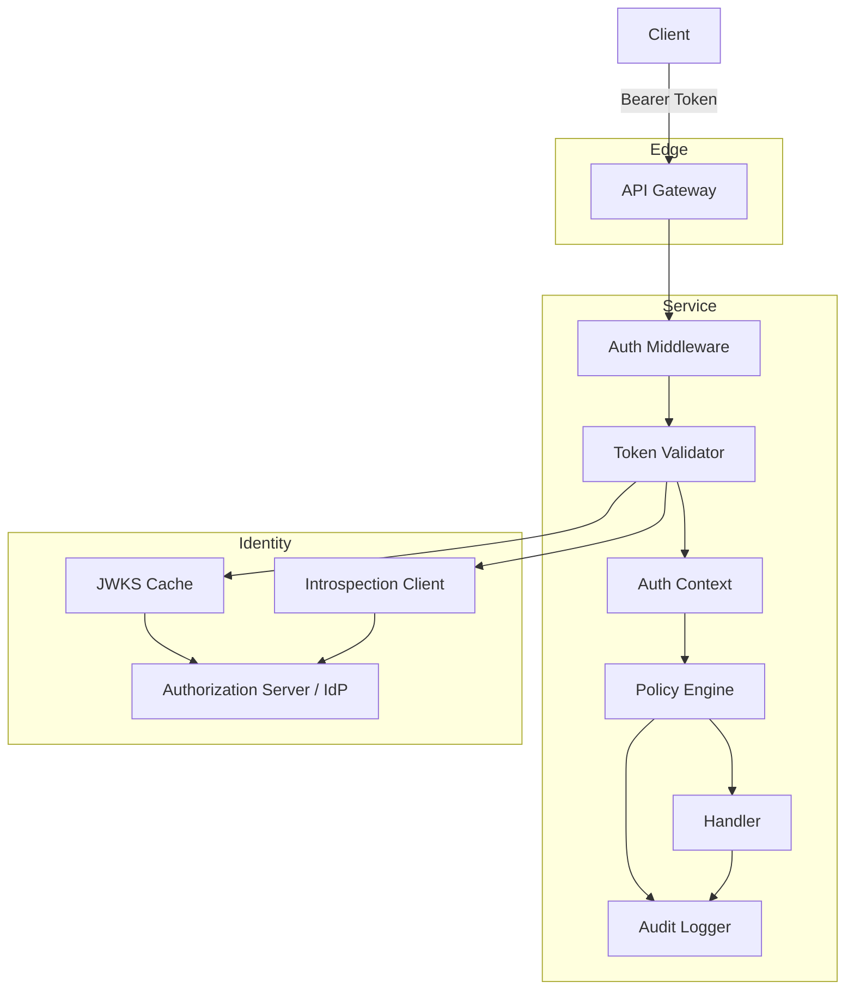

Recommended separation:

- Gateway handles coarse edge protection.
- Service handles final token profile and domain authorization.
- Token validator outputs internal AuthContext.
- Policy engine makes resource decisions.
- Audit logger records decision without raw token.

---

## 114. Java-to-Go Mindset Shift

As a Java engineer, you may be used to frameworks like Spring Security where much token machinery is hidden behind filters and annotations.

In Go, you often assemble smaller components explicitly:

| Java/Spring Habit | Go Equivalent Thinking |
|---|---|
| Security filter chain auto-config | Explicit middleware order |
| `Authentication` object | Internal `AuthContext` type |
| `GrantedAuthority` | Normalized scopes/roles/policies |
| JWT decoder bean | Validator interface + implementation |
| Method security annotation | Route policy + domain policy function |
| OIDC client auto-config | oauth2/OIDC library + explicit session/state/nonce handling |
| Central exception handler | Explicit error taxonomy + response mapping |

Go gives less magic. That is good for security if you define invariants clearly.

---

## 115. Common Production Incident Stories

### 115.1 Wrong Audience Accepted

Service accepted any token from trusted issuer.

Impact:

- token meant for frontend client worked against backend admin API.

Root cause:

- signature validation only.

Fix:

- per-route audience validation,
- token profile tests,
- deny ID tokens.

---

### 115.2 Key Rotation Outage

Issuer rotated signing key. Services cached JWKS forever.

Impact:

- all new tokens rejected.

Root cause:

- no JWKS refresh on unknown `kid`, no TTL.

Fix:

- JWKS cache with TTL,
- refresh on unknown `kid`,
- metrics and alerting.

---

### 115.3 Token Leaked in Logs

Debug middleware logged all headers.

Impact:

- bearer tokens in centralized log system.

Root cause:

- no redaction policy.

Fix:

- header redaction,
- incident token revocation,
- log access review,
- secure logging tests.

---

### 115.4 Gateway Validated Token, Backend Trusted Spoofed Header

Backend accepted `X-User-Id` directly. Attacker bypassed gateway via internal route or misconfigured ingress.

Impact:

- identity spoofing.

Root cause:

- forwarded header trusted without authenticated proxy boundary.

Fix:

- strip inbound headers at gateway,
- mTLS between gateway and backend,
- backend validates token or signed context.

---

## 116. Minimal Production Readiness Rubric

A Go resource server is not production-ready until:

1. Token profile is documented per route group.
2. Issuer is exact-pinned.
3. Audience is exact-checked.
4. Allowed algorithms are configured.
5. JWKS cache is bounded and observable.
6. Unknown `kid` does not fail open.
7. Expiry and nbf are checked.
8. ID tokens are rejected for API access.
9. Raw token is never logged.
10. Authorization is separated from token parsing.
11. Object-level authorization exists.
12. Tenant boundary is enforced.
13. Revocation expectations are documented.
14. Failure modes are tested.
15. Security metrics and audit events exist.

---

## 117. Exercises

### Exercise 1 — Token Profile Design

Design token profiles for:

- public user API,
- internal service API,
- admin API,
- webhook ingestion API.

For each define:

- issuer,
- audience,
- required scopes,
- token type,
- revocation policy,
- sender constraint,
- audit requirements.

---

### Exercise 2 — JWT Negative Test Matrix

Create tests for a validator with:

- wrong issuer,
- wrong audience,
- expired token,
- future `nbf`,
- unknown `kid`,
- wrong algorithm,
- ID token used as access token,
- no scope,
- wrong tenant,
- huge token.

---

### Exercise 3 — JWKS Cache Failure Simulation

Simulate:

1. issuer rotates key,
2. service sees unknown `kid`,
3. JWKS endpoint temporarily fails,
4. endpoint recovers,
5. old tokens expire,
6. old key removed.

Document expected behavior.

---

### Exercise 4 — BFF vs SPA Token Storage

Compare for your system:

- direct SPA tokens,
- BFF session cookie,
- hybrid approach.

Evaluate:

- XSS risk,
- CSRF risk,
- token refresh,
- logout,
- operational complexity,
- auditability.

---

## 118. Summary Mental Model

Keep these rules in your head:

```text
OAuth2 is authorization.
OIDC adds authentication.
JWT is a format.
JWS signs, JWE encrypts.
Bearer token is replayable if stolen.
ID token is for client authentication context.
Access token is for resource server authorization.
Refresh token is a high-value credential.
Signature validation is necessary but insufficient.
Issuer and audience are security boundaries.
Scope is not object-level authorization.
JWKS is trusted only through issuer configuration.
Introspection gives central control but adds runtime dependency.
Replay prevention requires freshness or sender constraint.
```

A secure Go implementation is not defined by whether it can parse JWT. It is defined by whether every boundary has an invariant and every failure mode fails safely.

---

## 119. How This Connects to Next Part

Next part:

```text
learn-go-security-cryptography-integrity-part-017.md
```

Topic:

```text
Session security: cookies, SameSite, Secure, HttpOnly, CSRF, session fixation,
refresh token rotation, idle timeout, absolute timeout.
```

Why next:

OAuth/OIDC gives tokens and login flows, but production browser systems still need session design. Many real security failures happen in the seam between OIDC token validation and application session lifecycle.

---

## 120. References

- RFC 9700 — Best Current Practice for OAuth 2.0 Security: <https://www.rfc-editor.org/info/rfc9700/>
- OpenID Connect Core 1.0: <https://openid.net/specs/openid-connect-core-1_0.html>
- RFC 7519 — JSON Web Token: <https://datatracker.ietf.org/doc/html/rfc7519>
- RFC 8725 — JSON Web Token Best Current Practices: <https://datatracker.ietf.org/doc/html/rfc8725>
- RFC 7517 — JSON Web Key: <https://datatracker.ietf.org/doc/html/rfc7517>
- RFC 7662 — OAuth 2.0 Token Introspection: <https://datatracker.ietf.org/doc/html/rfc7662>
- RFC 9449 — OAuth 2.0 Demonstrating Proof of Possession: <https://datatracker.ietf.org/doc/html/rfc9449>
- Go `golang.org/x/oauth2` package: <https://pkg.go.dev/golang.org/x/oauth2>
- OWASP API Security Top 10 2023: <https://owasp.org/API-Security/editions/2023/en/0x11-t10/>
- OWASP Cheat Sheet Series — Session Management: <https://cheatsheetseries.owasp.org/cheatsheets/Session_Management_Cheat_Sheet.html>
- OWASP Cheat Sheet Series — JSON Web Token for Java: <https://cheatsheetseries.owasp.org/cheatsheets/JSON_Web_Token_for_Java_Cheat_Sheet.html>

---

## 121. Status Seri

```text
[done] part-000 — Series orientation
[done] part-001 — Security mental model
[done] part-002 — Go security surface
[done] part-003 — Threat modeling for Go services
[done] part-004 — Cryptography engineering principles
[done] part-005 — Randomness, entropy, nonce, IV, salt, token generation
[done] part-006 — Hashing, digest, checksum, collision/preimage resistance
[done] part-007 — MAC, HMAC, keyed hash, canonicalization, constant-time verification
[done] part-008 — Symmetric encryption, AES, ChaCha20, AEAD, GCM
[done] part-009 — Public-key cryptography, RSA, ECDSA, Ed25519
[done] part-010 — Key agreement, ECDH, hybrid/envelope encryption, HPKE/KEM
[done] part-011 — Password security
[done] part-012 — Key management
[done] part-013 — X.509 and PKI
[done] part-014 — TLS in Go
[done] part-015 — mTLS service-to-service
[done] part-016 — OAuth2, OIDC, JWT, token validation, JWKS, introspection, replay prevention
[next] part-017 — Session security
[remaining] part-018 sampai part-034
```


<!-- NAVIGATION_FOOTER -->
<div class="page-nav">
<a href="./learn-go-security-cryptography-integrity-part-015.md">⬅️ Part 015 — mTLS for Service-to-Service: Client Certificate Identity, SPIFFE/SPIRE Mental Model, Certificate Rotation, Trust Domain, and Zero-Trust Service Identity</a>
<a href="./index.md">📚 Kategori</a>
<a href="../../index.md">🏠 Home</a>
<a href="./learn-go-security-cryptography-integrity-part-017.md">Part 017 — Session Security in Go: Cookies, SameSite, Secure, HttpOnly, CSRF, Session Fixation, Refresh Token Rotation, Idle Timeout, and Absolute Timeout ➡️</a>
</div>
