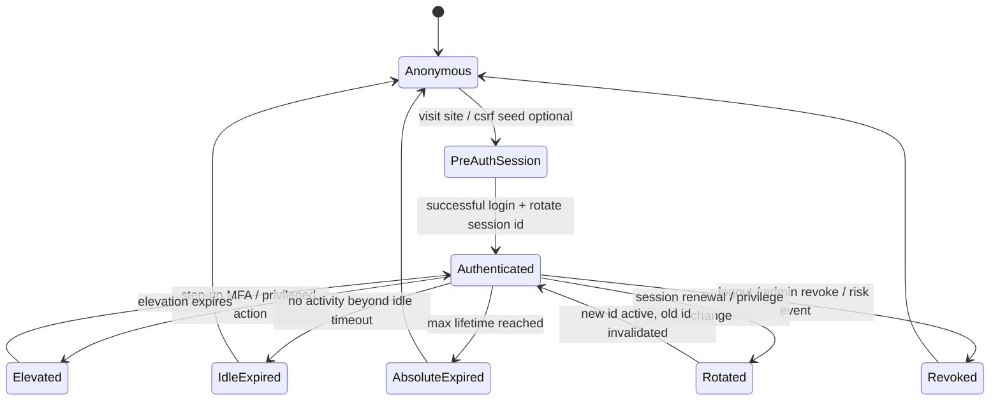
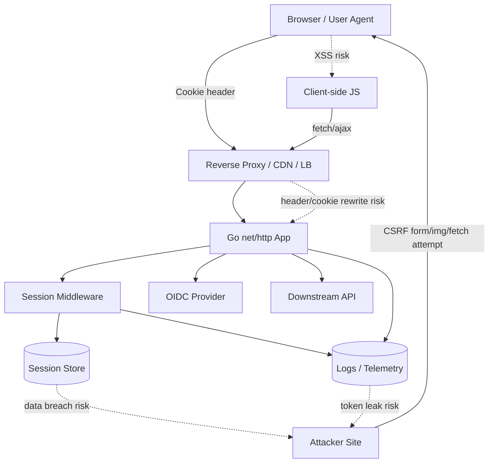
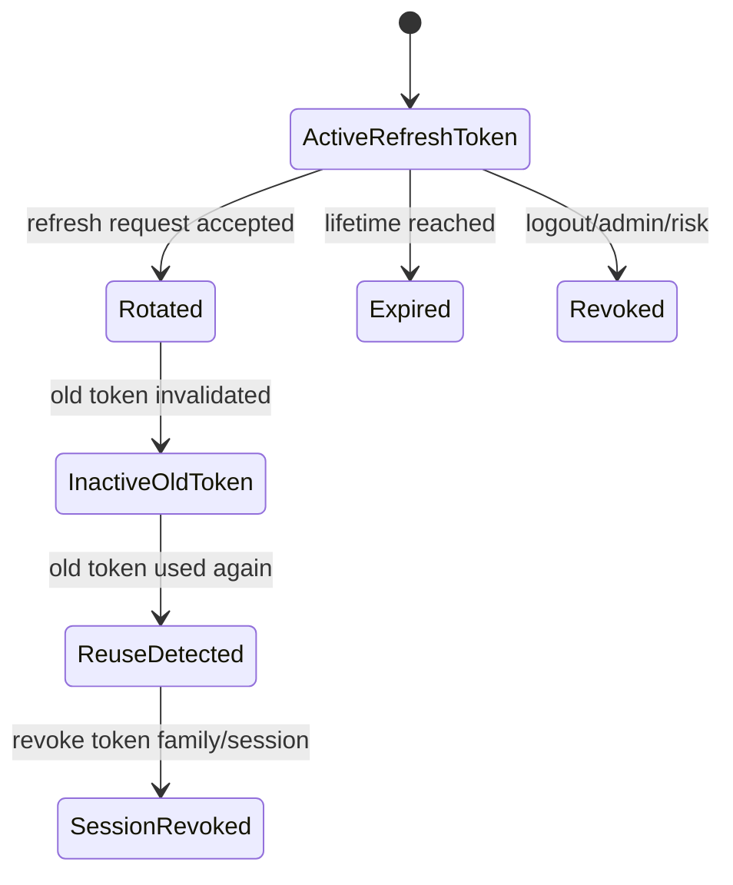
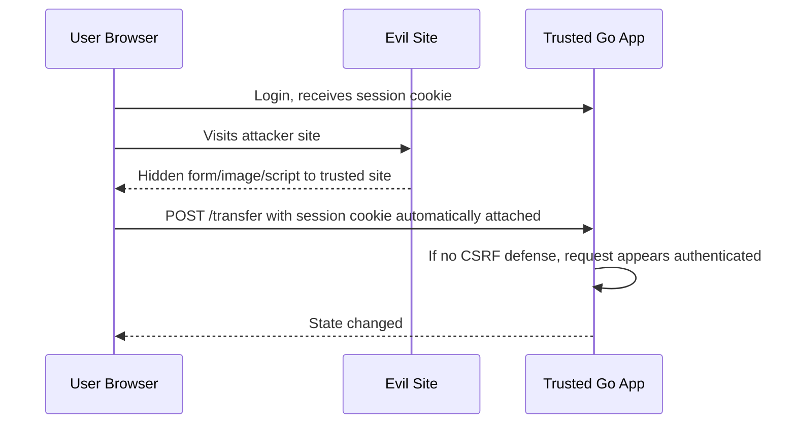
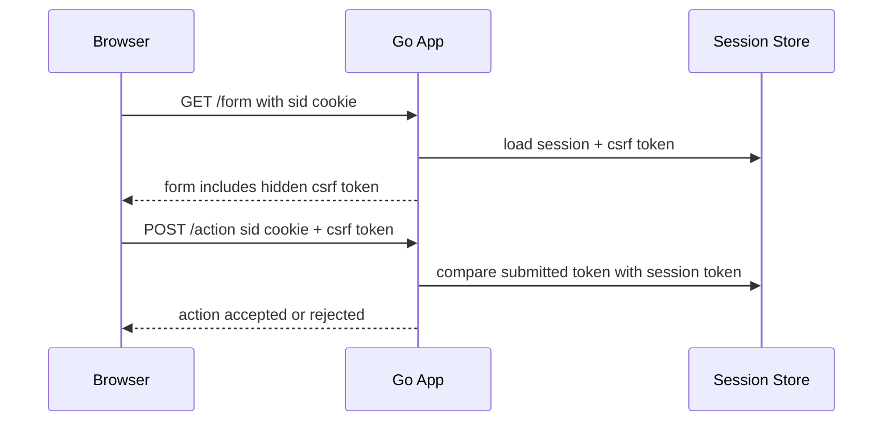
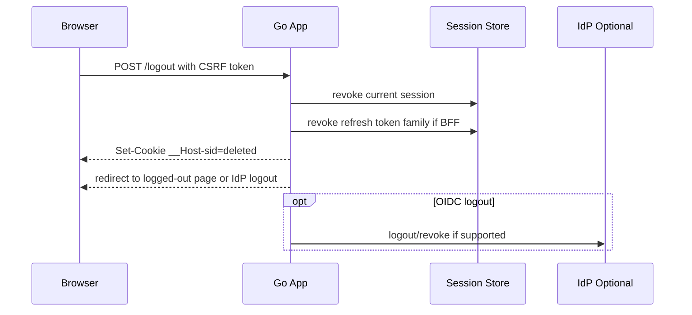
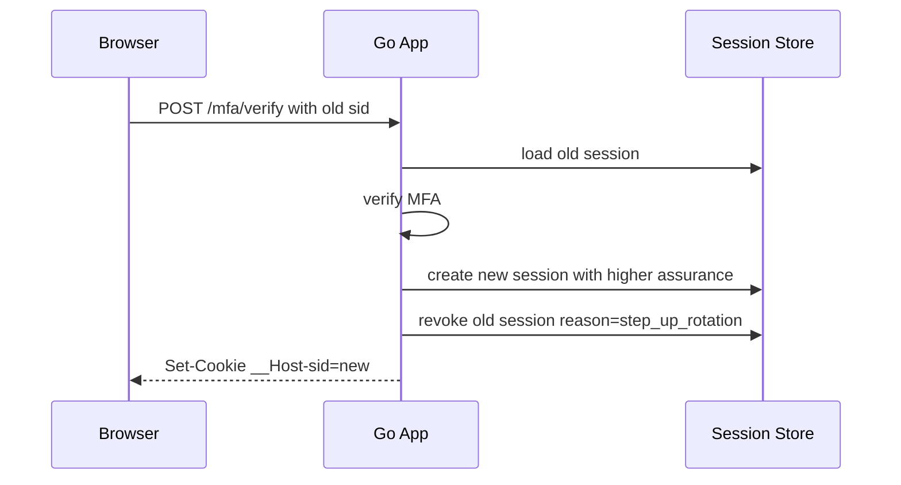
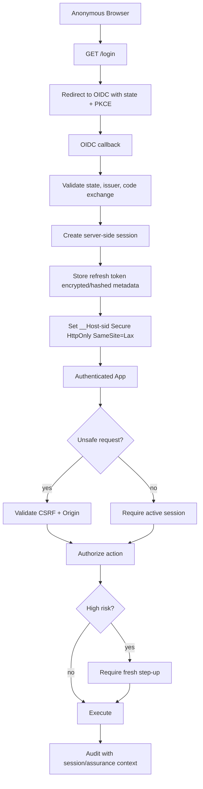

# learn-go-security-cryptography-integrity-part-017.md

# Part 017 — Session Security in Go: Cookies, SameSite, Secure, HttpOnly, CSRF, Session Fixation, Refresh Token Rotation, Idle Timeout, and Absolute Timeout

> Seri: `learn-go-security-cryptography-integrity`  
> Part: `017 / 034`  
> Target pembaca: Java software engineer yang sedang membangun keluwesan security engineering di Go 1.26.x  
> Fokus: mendesain, mengimplementasikan, dan mereview session lifecycle yang aman untuk aplikasi Go production.

---

## 0. Posisi Bagian Ini Dalam Seri

Pada part sebelumnya kita sudah membahas OAuth2, OIDC, JWT, JWS, JWE, opaque token, introspection, audience, issuer, JWKS caching, dan replay prevention.

Bagian ini masuk ke layer yang lebih dekat dengan browser/application runtime:

- bagaimana status login dipertahankan setelah authentication;
- bagaimana session identifier disimpan, dikirim, dirotasi, dan dicabut;
- bagaimana cookie attribute membatasi browser behavior;
- bagaimana CSRF muncul karena browser otomatis mengirim credential;
- bagaimana session fixation terjadi sebelum login;
- bagaimana idle timeout, absolute timeout, refresh-token rotation, dan logout harus diperlakukan sebagai state machine;
- bagaimana Go `net/http` dipakai dengan aman tanpa membuat framework security buatan sendiri yang rapuh.

Bagian ini sengaja tidak mengulang OAuth2/OIDC secara penuh. OAuth token akan muncul hanya sebagai bagian dari session lifecycle, terutama pada arsitektur Backend-for-Frontend/BFF, refresh token, dan browser-based application.

---

## 1. Baseline Fakta dan Referensi

Beberapa baseline yang dipakai dalam materi ini:

1. HTTP cookie adalah mekanisme untuk menyimpan state di user agent dan mengirimkannya kembali dalam request berikutnya. IETF `rfc6265bis` mendefinisikan `Cookie` dan `Set-Cookie` header, serta mencatat bahwa cookie punya banyak kompleksitas historis dan kelemahan keamanan/privasi walaupun digunakan luas di internet.  
   Referensi: IETF HTTP State Management Mechanism draft `draft-ietf-httpbis-rfc6265bis-22`.

2. Cookie `Secure` dan `HttpOnly` adalah proteksi penting, tetapi bukan proteksi lengkap. `Secure` membatasi pengiriman cookie ke secure channel seperti HTTPS; `HttpOnly` membatasi akses cookie dari API non-HTTP seperti JavaScript.  
   Referensi: IETF `rfc6265bis` dan OWASP Session Management Cheat Sheet.

3. Go `net/http.Cookie` menyediakan field security-relevant seperti `Secure`, `HttpOnly`, `SameSite`, `MaxAge`, dan `Partitioned`. Go `SameSite` dideskripsikan sebagai attribute yang membuat browser tidak mengirim cookie bersama cross-site request untuk mengurangi cross-origin information leakage dan memberi sebagian proteksi terhadap CSRF.  
   Referensi: Go `net/http` documentation.

4. CSRF terjadi ketika situs jahat membuat browser user yang sudah authenticated mengirim request tidak diinginkan ke situs target. Karena browser otomatis menyertakan cookie, aplikasi tidak bisa membedakan request sah dan forged request jika tidak ada challenge tambahan.  
   Referensi: OWASP CSRF Prevention Cheat Sheet.

5. Session fixation terjadi ketika aplikasi tidak mengganti session ID setelah user authenticate, sehingga attacker dapat membuat victim memakai session ID yang sudah attacker ketahui sebelum login.  
   Referensi: OWASP Session Fixation.

6. OWASP Authentication Cheat Sheet menekankan bahwa session identifier harus unik per user dan computationally difficult to predict.  
   Referensi: OWASP Authentication Cheat Sheet.

---

## 2. Tujuan Pembelajaran

Setelah menyelesaikan part ini, kamu harus mampu:

1. Memodelkan session sebagai state machine, bukan sekadar cookie.
2. Membedakan authentication event, authenticated session, refresh token, remembered device, dan authorization context.
3. Mendesain cookie session di Go dengan `Secure`, `HttpOnly`, `SameSite`, `Path`, `Domain`, `MaxAge`, dan expiration semantics yang benar.
4. Memilih stateful session, stateless session, BFF session, opaque token, JWT, atau hybrid model berdasarkan threat model.
5. Mencegah session fixation dengan session ID rotation saat privilege boundary berubah.
6. Mendesain CSRF defense untuk browser-based system: SameSite, synchronizer token, signed double-submit cookie, Origin/Referer validation, dan user-interaction challenge untuk operasi high-risk.
7. Mendesain idle timeout, absolute timeout, refresh-token rotation, reuse detection, logout, dan forced logout.
8. Membedakan logout UX, local session deletion, server-side revocation, OAuth/OIDC provider logout, dan downstream token invalidation.
9. Menulis Go code yang aman untuk session cookie issuance, session lookup, rotation, CSRF verification, dan logout.
10. Melakukan design review session security untuk aplikasi Go production.

---

## 3. Mental Model: Session Bukan Cookie

Kesalahan paling umum adalah menganggap session sebagai cookie.

Lebih tepat:

```text
session = server-side atau client-side state yang mengikat request berikutnya
          ke authentication event, actor identity, assurance level, device context,
          expiry policy, dan authorization context tertentu.

cookie = salah satu transport/storage mechanism yang digunakan browser
         untuk membawa session identifier atau token.
```

Cookie hanya kendaraan. Session adalah kontrak keamanan.

### 3.1 Analogi Java Engineer

Jika di Java kamu terbiasa dengan `HttpSession`, Spring Security `SecurityContext`, servlet container session, atau distributed session store, maka di Go kamu biasanya lebih eksplisit:

- `net/http` hanya memberi request/response primitive;
- tidak ada `HttpSession` built-in seperti servlet;
- kamu memilih sendiri session store, cookie shape, middleware chain, dan policy;
- ini memberi kontrol lebih besar, tetapi juga memberi ruang lebih besar untuk salah desain.

Mental shift:

| Java/Spring world | Go world |
|---|---|
| Framework sering menyediakan session abstraction | Go standard library memberi primitive HTTP saja |
| Session config tersebar di Spring Security/filter chain | Session policy biasanya eksplisit di middleware/service |
| SecurityContext sering implicit via thread/request context | Go biasanya lewat `context.Context` dan typed accessor |
| Cookie/session store sering framework-managed | Kamu harus mendesain store, expiry, rotation, revocation |
| Banyak default disediakan framework | Default aman harus kamu buat sebagai package internal |

Ini bukan kekurangan Go. Ini konsekuensi filosofi Go: sedikit magic, boundary eksplisit, dan komposisi kecil.

---

## 4. Session Sebagai State Machine

Session harus dipahami sebagai state machine.



Security review harus bertanya:

- state apa saja yang ada?
- transisi mana yang mengubah privilege?
- session ID dirotasi di transisi mana?
- state mana yang boleh mengakses operasi high-risk?
- timeout mana yang authoritative: browser cookie, server store, token expiry, atau identity provider?
- bagaimana revocation dipropagasikan?

### 4.1 Correctness vs Security

Kode session yang “correct”:

- login berhasil;
- cookie terset;
- request berikutnya mengenali user;
- logout menghapus cookie.

Kode session yang “secure”:

- session ID tidak predictable;
- session ID tidak disimpan di URL;
- cookie hanya dikirim di HTTPS;
- JavaScript tidak bisa membaca cookie session;
- cookie tidak dikirim cross-site secara tidak perlu;
- login selalu merotasi session ID;
- idle timeout dan absolute timeout ditegakkan di server;
- logout mencabut server-side session, bukan hanya menghapus cookie client;
- refresh token punya rotation dan reuse detection;
- token/cookie tidak bocor di log, analytics, referer, traceback, atau telemetry;
- privilege escalation membutuhkan step-up dan session re-evaluation;
- session store failure bersifat fail-closed untuk operasi sensitif.

---

## 5. Threat Model Session

Session security melindungi beberapa asset:

| Asset | Contoh | Risiko |
|---|---|---|
| Session identifier | `sid` cookie | hijacking, fixation, replay |
| Authentication state | user sudah login | impersonation |
| Authorization context | role/scope/tenant/current agency | confused deputy, stale permission |
| Refresh token | long-lived credential | persistent account takeover |
| CSRF token | challenge token | forged state-changing request |
| Device/session metadata | IP, UA, device id, MFA timestamp | risk bypass, privacy leakage |
| Logout/revocation state | revoked session list | zombie session |
| Audit event | login/logout/refresh/failure | weak incident investigation |

### 5.1 Attacker Capability

Session threat model harus menyatakan attacker capability secara eksplisit.

| Capability | Dampak terhadap session |
|---|---|
| Network eavesdropper | mencuri cookie jika tidak HTTPS/Secure |
| Malicious intermediary | memanipulasi header/cookie di channel tidak aman |
| XSS attacker | membuat request sebagai user, membaca non-HttpOnly token, mencuri CSRF token dari DOM |
| CSRF attacker | memaksa browser mengirim request dengan cookie user |
| Subdomain attacker | mencoba cookie injection jika `Domain` terlalu luas |
| Log reader | mencuri session/token dari log |
| Database reader | mengambil session store/refresh token jika tidak hashed/encrypted |
| Insider operator | revoke bypass, session inspection abuse |
| Stolen device attacker | memakai cookie/refresh token yang masih valid |
| Replay attacker | mengulang request/session/token |

### 5.2 Attack Surface Session



Session tidak hanya berada di browser dan backend. Ia menyentuh reverse proxy, IdP, storage, logs, cache, message bus, and downstream service.

---

## 6. Session Architecture Options

Tidak ada satu model yang selalu benar. Pilihan session architecture tergantung threat model, deployment, browser/non-browser client, multi-service topology, latency, dan revocation need.

### 6.1 Stateful Opaque Session ID

Browser menyimpan cookie `sid`. Server menyimpan session record di DB/Redis.

```text
Cookie: __Host-sid=<random opaque id>

Session store:
sid_hash -> {
  user_id,
  tenant_id,
  auth_time,
  mfa_time,
  created_at,
  last_seen_at,
  absolute_expires_at,
  idle_expires_at,
  revoked_at,
  risk_flags,
  version
}
```

Kelebihan:

- revocation mudah;
- permission bisa direfresh;
- server bisa enforce idle timeout;
- session ID bisa diganti tanpa memindahkan banyak state ke client;
- cookie kecil.

Kekurangan:

- butuh store;
- latency tambahan;
- store outage mempengaruhi auth path;
- horizontal scale butuh shared store atau sticky session.

Cocok untuk:

- web app server-rendered;
- BFF;
- regulatori/admin system;
- sistem dengan revocation kuat;
- high-risk operations.

### 6.2 Stateless Signed Cookie Session

Cookie berisi claims yang disigned atau encrypted.

```text
Cookie: session=<signed-envelope>
```

Kelebihan:

- tidak perlu lookup store setiap request;
- simple untuk low-risk state;
- mudah scale.

Kekurangan:

- revocation sulit;
- cookie size terbatas;
- stale authorization risk;
- key compromise berdampak besar;
- metadata sensitif mudah bocor jika hanya signed bukan encrypted;
- logout sering hanya client-side kecuali ada denylist.

Cocok untuk:

- low-risk preference;
- short-lived lightweight session;
- edge auth dengan strict TTL;
- bukan untuk high-risk regulated workflow kecuali revocation/denylist ditambahkan.

### 6.3 BFF Session

Browser hanya punya secure cookie ke backend. Backend menyimpan access/refresh token atau session binding server-side.

```mermaid
sequenceDiagram
    participant B as Browser
    participant BFF as Go BFF
    participant IdP as OIDC Provider
    participant API as Resource API
    participant S as Session Store

    B->>BFF: GET /login
    BFF->>IdP: redirect authorization code + PKCE
    IdP-->>BFF: code callback
    BFF->>IdP: code exchange
    IdP-->>BFF: tokens
    BFF->>S: store tokens/session metadata
    BFF-->>B: Set-Cookie __Host-sid=opaque; Secure; HttpOnly
    B->>BFF: API request + sid cookie
    BFF->>S: resolve session
    BFF->>API: call API with server-held access token
```

Kelebihan:

- token tidak terekspos ke browser JavaScript;
- cocok untuk SPA yang ingin menghindari token-in-localStorage;
- CSRF bisa dikelola terpusat;
- refresh token lebih aman karena server-held.

Kekurangan:

- BFF menjadi security-critical;
- perlu CSRF defense karena cookie otomatis dikirim;
- BFF harus mengelola token refresh, revocation, dan downstream errors.

Cocok untuk:

- SPA internal enterprise;
- aplikasi regulatori;
- aplikasi dengan IdP external dan API internal;
- sistem yang butuh user experience seperti SPA tapi security seperti server-side app.

### 6.4 Browser-Held Access Token

SPA menyimpan access token di memory/localStorage/sessionStorage.

Kelebihan:

- API stateless;
- tidak rentan CSRF jika token dikirim via `Authorization` header dan tidak otomatis disertakan browser;
- cocok untuk public API.

Kekurangan:

- XSS bisa mencuri token jika disimpan di storage yang bisa diakses JS;
- refresh token di browser sangat sensitif;
- token lifecycle lebih kompleks.

Cocok untuk:

- lower-risk public client dengan short-lived access token;
- native/mobile app dengan secure storage;
- tidak ideal untuk admin/regulatory browser app jika BFF memungkinkan.

---

## 7. Cookie Attribute Deep Dive

Cookie attribute bukan kosmetik. Ia adalah policy yang memengaruhi browser behavior.

### 7.1 Recommended Cookie Shape untuk Session ID

Untuk secure browser session di HTTPS:

```http
Set-Cookie: __Host-sid=<opaque-random>; Path=/; Secure; HttpOnly; SameSite=Lax
```

Atau untuk high-risk internal app yang tidak perlu cross-site navigation login flow:

```http
Set-Cookie: __Host-sid=<opaque-random>; Path=/; Secure; HttpOnly; SameSite=Strict
```

Jika perlu third-party/cross-site context, misalnya embedded app atau SSO tertentu, desain harus direview khusus. `SameSite=None` harus disertai `Secure` di browser modern dan meningkatkan CSRF/cross-site exposure.

### 7.2 `Secure`

`Secure` memberi instruksi agar cookie hanya dikirim melalui secure channel seperti HTTPS.

Rule production:

- session cookie harus `Secure`;
- jangan pernah menjalankan login/session di HTTP;
- gunakan HSTS di edge;
- pastikan reverse proxy meneruskan scheme dengan benar;
- jangan membuat local-dev exception bocor ke production config.

Go example:

```go
http.SetCookie(w, &http.Cookie{
    Name:     "__Host-sid",
    Value:    sid,
    Path:     "/",
    Secure:   true,
    HttpOnly: true,
    SameSite: http.SameSiteLaxMode,
})
```

### 7.3 `HttpOnly`

`HttpOnly` mencegah JavaScript membaca cookie melalui `document.cookie`.

Tetapi ini bukan proteksi penuh terhadap XSS. XSS masih bisa:

- membuat request sebagai user;
- membaca data dari response jika CORS/same-origin memungkinkan;
- memicu state-changing action;
- mencuri CSRF token jika token diletakkan di DOM;
- melakukan account action selama session masih valid.

Maka:

- `HttpOnly` wajib untuk session ID;
- tetap butuh XSS prevention;
- tetap butuh CSRF defense;
- operasi high-risk perlu re-auth/step-up/user interaction.

### 7.4 `SameSite`

`SameSite` mengontrol apakah cookie dikirim pada cross-site request.

| Mode | Behavior konseptual | Use case |
|---|---|---|
| `Strict` | cookie hanya untuk same-site context | high-risk internal/admin app, jika UX login tidak terganggu |
| `Lax` | cookie dikirim pada beberapa top-level safe navigation | default aman-pragmatis untuk banyak web app |
| `None` | cookie boleh dikirim cross-site | SSO/embed/third-party context, harus `Secure`, perlu CSRF review khusus |

Prinsip:

- `SameSite` adalah defense-in-depth, bukan satu-satunya CSRF defense;
- jangan mengandalkan `SameSite` untuk semua browser/client/proxy scenario;
- untuk state-changing request, tetap gunakan CSRF token/Origin validation;
- `SameSite=Strict` dapat memecahkan flow login dari external IdP jika tidak didesain hati-hati.

### 7.5 `Path`

`Path` membatasi path request yang menerima cookie.

Untuk session utama:

```text
Path=/
```

Untuk cookie sempit seperti CSRF non-secret helper atau flow-specific state, path bisa dipersempit.

Jangan mengandalkan `Path` sebagai isolation kuat antar aplikasi jika ada XSS/subpath compromise. Security boundary utama tetap origin/domain, bukan path.

### 7.6 `Domain`

Jika `Domain` tidak diset, cookie menjadi host-only cookie. Ini biasanya lebih aman.

Rekomendasi:

- untuk session utama, jangan set `Domain` kecuali benar-benar perlu;
- gunakan `__Host-` prefix agar cookie harus host-only, `Secure`, dan `Path=/`;
- hindari `Domain=.example.com` untuk session sensitif jika banyak subdomain dikelola tim/vendor berbeda;
- subdomain takeover dapat menjadi session compromise jika cookie domain terlalu luas.

### 7.7 Cookie Prefix: `__Host-` dan `__Secure-`

`__Host-` adalah prefix paling ketat untuk session cookie browser modern:

- harus `Secure`;
- harus `Path=/`;
- tidak boleh punya `Domain` attribute;
- scoped ke host yang menerbitkannya.

Gunakan:

```text
__Host-sid
```

Bukan:

```text
sid
sessionid
JSESSIONID
```

Nama cookie bukan security control sendiri, tetapi prefix membantu browser menolak konfigurasi yang lemah.

### 7.8 `Max-Age` dan `Expires`

Cookie expiry adalah client-side retention hint. Server-side session expiry tetap harus authoritative.

Rule:

- session cookie browser boleh tidak persistent;
- remember-me cookie boleh persistent, tetapi harus dipisah dari session utama;
- `Max-Age` lebih jelas untuk deletion;
- server harus tetap mengecek `idle_expires_at` dan `absolute_expires_at`;
- jangan menganggap cookie hilang berarti session sudah revoke di server.

Logout deletion cookie di Go:

```go
http.SetCookie(w, &http.Cookie{
    Name:     "__Host-sid",
    Value:    "",
    Path:     "/",
    Secure:   true,
    HttpOnly: true,
    SameSite: http.SameSiteLaxMode,
    MaxAge:   -1,
})
```

### 7.9 `Partitioned`

Go `http.Cookie` memiliki field `Partitioned`. Partitioned cookies relevan untuk beberapa browser privacy model dan third-party embedding context.

Rule:

- jangan gunakan partitioned cookies untuk session utama kecuali threat model dan browser support sudah direview;
- jika digunakan, pastikan `Secure`;
- tetap tidak menggantikan CSRF defense dan token binding;
- jangan mengasumsikan semua user agent mendukungnya identik.

---

## 8. Session ID Design

Session ID harus opaque, random, high-entropy, dan tidak membawa meaning.

Jangan:

```text
user_123
base64(user_id:timestamp)
email.timestamp.signature
jwt-as-session-id-without-revocation
```

Gunakan:

```text
256-bit random token -> base64url no padding
```

### 8.1 Generate Session ID di Go

```go
package sessionsec

import (
    "crypto/rand"
    "encoding/base64"
    "fmt"
)

func NewSessionID() (string, error) {
    var b [32]byte // 256 bits
    if _, err := rand.Read(b[:]); err != nil {
        return "", fmt.Errorf("generate session id: %w", err)
    }
    return base64.RawURLEncoding.EncodeToString(b[:]), nil
}
```

Catatan:

- 128-bit cukup untuk banyak token, tetapi 256-bit memberi margin besar dengan overhead kecil;
- gunakan `crypto/rand`, bukan `math/rand`;
- jangan log session ID;
- jangan memasukkan session ID ke URL;
- simpan hash session ID di database jika memungkinkan.

### 8.2 Hash Session ID di Store

Jika attacker membaca database session store, session ID plaintext langsung bisa dipakai untuk hijack selama belum expired/revoked. Mitigasi: simpan hash session ID.

```go
package sessionsec

import (
    "crypto/hmac"
    "crypto/sha256"
    "encoding/base64"
)

func SessionLookupKey(serverSecret []byte, sid string) string {
    mac := hmac.New(sha256.New, serverSecret)
    mac.Write([]byte("session-lookup:v1\x00"))
    mac.Write([]byte(sid))
    sum := mac.Sum(nil)
    return base64.RawURLEncoding.EncodeToString(sum)
}
```

Mengapa HMAC, bukan SHA-256 biasa?

- SHA-256(sid) cukup jika SID punya entropy tinggi;
- HMAC dengan server secret memberi lapisan tambahan jika ada bug entropy atau partial leak;
- HMAC juga memberi domain separation yang jelas;
- secret ini harus dikelola seperti key operational.

---

## 9. Server-Side Session Record

Contoh struktur konseptual:

```go
package sessionsec

import "time"

type AssuranceLevel string

const (
    AssurancePassword AssuranceLevel = "password"
    AssuranceMFA      AssuranceLevel = "mfa"
    AssuranceStepUp   AssuranceLevel = "step_up"
)

type Session struct {
    IDHash            string
    UserID            string
    TenantID          string
    AuthTime          time.Time
    CreatedAt         time.Time
    LastSeenAt        time.Time
    IdleExpiresAt     time.Time
    AbsoluteExpiresAt time.Time
    RevokedAt         *time.Time
    RevokedReason     string
    Assurance         AssuranceLevel
    MFATime           *time.Time
    IPHash            string
    UserAgentHash     string
    Version           int64
}

func (s Session) Active(now time.Time) bool {
    if s.RevokedAt != nil {
        return false
    }
    if !now.Before(s.IdleExpiresAt) {
        return false
    }
    if !now.Before(s.AbsoluteExpiresAt) {
        return false
    }
    return true
}
```

### 9.1 Jangan Simpan Terlalu Banyak di Session

Session record harus cukup untuk auth decision, tetapi jangan menjadi dump profile user.

Simpan:

- user ID stable;
- tenant/account ID;
- authentication time;
- assurance/MFA status;
- expiry state;
- revocation state;
- session version/risk flags;
- minimal hashed device metadata jika perlu.

Jangan simpan:

- password hash;
- full OAuth token di plaintext;
- PII besar;
- permission snapshot yang tidak pernah direfresh;
- sensitive claim tanpa encryption;
- raw IP/UA tanpa privacy consideration jika tidak perlu.

### 9.2 Authorization Context Harus Fresh

Session menjawab “siapa user ini dan authentication context-nya apa”.

Authorization menjawab “apa yang boleh dilakukan sekarang”.

Jangan membuat session menjadi permission cache permanen.

Bad pattern:

```text
login -> store roles in session forever -> user role changed -> old session keeps admin
```

Better pattern:

- session menyimpan user ID/tenant ID;
- authorization layer mengecek permission dengan cache TTL pendek atau policy version;
- jika permission version berubah, session invalidated atau forced refresh;
- high-risk action revalidates policy directly.

---

## 10. Login Flow Aman

Login adalah privilege transition. Session ID harus dirotasi.

```mermaid
sequenceDiagram
    participant B as Browser
    participant A as Go App
    participant S as Session Store

    B->>A: GET /login
    A-->>B: optional pre-auth csrf cookie/token
    B->>A: POST /login credentials + csrf
    A->>A: verify credentials
    A->>S: revoke/delete pre-auth session if any
    A->>S: create new authenticated session
    A-->>B: Set-Cookie __Host-sid=new; Secure; HttpOnly; SameSite=Lax
    B->>A: GET /dashboard with new sid
    A->>S: lookup active session
    A-->>B: dashboard
```

### 10.1 Session Fixation Defense

Core invariant:

```text
No session identifier known before authentication may remain valid after authentication.
```

Implementation rule:

- anonymous/pre-auth session may exist for CSRF or flow state;
- after login success, create new authenticated session ID;
- invalidate old/pre-auth session;
- set new cookie;
- do not reuse attacker-supplied SID;
- do not accept SID from URL/query/body.

Pseudo-code:

```go
func LoginHandler(store Store, auth Authenticator, cookieConf CookieConfig) http.HandlerFunc {
    return func(w http.ResponseWriter, r *http.Request) {
        ctx := r.Context()

        // 1. Validate method, content type, CSRF, and credentials.
        if r.Method != http.MethodPost {
            http.Error(w, "method not allowed", http.StatusMethodNotAllowed)
            return
        }

        user, err := auth.VerifyPassword(ctx, r.FormValue("username"), r.FormValue("password"))
        if err != nil {
            // Avoid user enumeration. Log structured internal reason separately.
            http.Error(w, "invalid credentials", http.StatusUnauthorized)
            return
        }

        // 2. Revoke old/pre-auth session if present.
        if oldSID, ok := ReadSessionCookie(r); ok {
            _ = store.RevokeBySID(ctx, oldSID, "login_rotation")
        }

        // 3. Create new authenticated session.
        sid, err := NewSessionID()
        if err != nil {
            http.Error(w, "temporary error", http.StatusServiceUnavailable)
            return
        }

        now := time.Now().UTC()
        sess := Session{
            UserID:            user.ID,
            TenantID:          user.TenantID,
            AuthTime:          now,
            CreatedAt:         now,
            LastSeenAt:        now,
            IdleExpiresAt:     now.Add(30 * time.Minute),
            AbsoluteExpiresAt: now.Add(12 * time.Hour),
            Assurance:         AssurancePassword,
        }

        if err := store.Create(ctx, sid, sess); err != nil {
            http.Error(w, "temporary error", http.StatusServiceUnavailable)
            return
        }

        SetSessionCookie(w, sid, cookieConf)
        http.Redirect(w, r, "/dashboard", http.StatusSeeOther)
    }
}
```

---

## 11. Session Middleware di Go

Session middleware harus:

- membaca cookie;
- validasi format dasar;
- lookup store;
- enforce expiry/revocation;
- update last seen secara throttled;
- inject principal ke `context.Context`;
- tidak bocorkan session ID di log/error;
- fail-closed untuk protected endpoint.

### 11.1 Typed Context Key

```go
package sessionsec

import "context"

type principalKey struct{}

type Principal struct {
    UserID    string
    TenantID  string
    Assurance AssuranceLevel
    SessionID string // internal only; do not log
}

func WithPrincipal(ctx context.Context, p Principal) context.Context {
    return context.WithValue(ctx, principalKey{}, p)
}

func PrincipalFromContext(ctx context.Context) (Principal, bool) {
    p, ok := ctx.Value(principalKey{}).(Principal)
    return p, ok
}
```

### 11.2 Middleware Skeleton

```go
package sessionsec

import (
    "net/http"
    "time"
)

type Store interface {
    Create(ctx context.Context, sid string, s Session) error
    GetBySID(ctx context.Context, sid string) (Session, error)
    RevokeBySID(ctx context.Context, sid string, reason string) error
    Touch(ctx context.Context, sid string, now time.Time, idleUntil time.Time) error
}

type SessionMiddleware struct {
    Store       Store
    IdleTimeout time.Duration
    TouchEvery  time.Duration
    Now         func() time.Time
}

func (m SessionMiddleware) RequireAuth(next http.Handler) http.Handler {
    return http.HandlerFunc(func(w http.ResponseWriter, r *http.Request) {
        sid, ok := ReadSessionCookie(r)
        if !ok {
            http.Error(w, "unauthorized", http.StatusUnauthorized)
            return
        }

        sess, err := m.Store.GetBySID(r.Context(), sid)
        if err != nil {
            http.Error(w, "unauthorized", http.StatusUnauthorized)
            return
        }

        now := m.Now().UTC()
        if !sess.Active(now) {
            // Optionally revoke/tombstone expired session.
            ClearSessionCookie(w)
            http.Error(w, "unauthorized", http.StatusUnauthorized)
            return
        }

        // Avoid writing last_seen on every request; use a threshold.
        if now.Sub(sess.LastSeenAt) >= m.TouchEvery {
            _ = m.Store.Touch(r.Context(), sid, now, now.Add(m.IdleTimeout))
        }

        p := Principal{
            UserID:    sess.UserID,
            TenantID:  sess.TenantID,
            Assurance: sess.Assurance,
            SessionID: sid,
        }
        next.ServeHTTP(w, r.WithContext(WithPrincipal(r.Context(), p)))
    })
}
```

Catatan: contoh di atas skeleton. Production code perlu import lengkap, error typing, metric, structured audit, and store-specific race handling.

---

## 12. Idle Timeout dan Absolute Timeout

Ada dua timeout utama.

### 12.1 Idle Timeout

Idle timeout membatasi session jika tidak ada aktivitas.

Contoh:

```text
idle_timeout = 30 minutes
```

Jika user aktif, `last_seen_at` diperbarui dan `idle_expires_at` diperpanjang.

Manfaat:

- mengurangi risiko stolen unattended browser;
- membatasi window hijacked cookie;
- cocok untuk admin/internal app.

Risiko UX:

- user kehilangan form panjang;
- background polling bisa tanpa sengaja memperpanjang session;
- banyak tab bisa race update.

Rule:

- perpanjang idle hanya untuk aktivitas user meaningful, bukan semua ping;
- jangan biarkan `/health`, `/metrics`, static asset, atau silent polling memperpanjang session;
- enforce di server store;
- tampilkan warning sebelum expire jika UX butuh.

### 12.2 Absolute Timeout

Absolute timeout membatasi umur total session sejak login, meskipun user aktif.

Contoh:

```text
absolute_timeout = 8 hours untuk admin app
absolute_timeout = 12 hours untuk internal workday app
absolute_timeout = 30 days untuk remembered low-risk consumer session, dengan reauth untuk high-risk action
```

Manfaat:

- memaksa reauthentication periodik;
- membatasi persistent hijack;
- membantu revocation dan policy refresh.

Rule:

- absolute timeout tidak diperpanjang oleh aktivitas biasa;
- refresh session boleh membuat session baru hanya jika policy mengizinkan;
- operasi high-risk tetap perlu step-up meski session aktif.

### 12.3 Timeout Matrix

| Aplikasi | Idle timeout | Absolute timeout | Step-up |
|---|---:|---:|---|
| Public low-risk content | long/none | long | jarang |
| Consumer account | 15–60 min | 1–30 days depending risk | password change, payment, MFA change |
| Enterprise internal | 15–30 min | 8–12 hours | admin/change approval/export |
| Regulatory/case management | 15–30 min | workday or shorter | high-impact enforcement action |
| Privileged admin | 5–15 min | 4–8 hours | mandatory for destructive action |

Angka ini bukan hukum universal. Ia harus disesuaikan dengan risk, regulation, UX, dan IdP policy.

---

## 13. Refresh Token Rotation

Refresh token adalah long-lived credential yang bisa menerbitkan access token/session baru. Ini jauh lebih sensitif daripada access token.

### 13.1 Mental Model

```text
access token  = short-lived authorization credential
refresh token = long-lived credential to obtain new access/session
session cookie = browser-bound reference to server-side session
```

Dalam BFF, browser tidak perlu melihat refresh token. BFF menyimpan refresh token server-side, terikat ke session/device.

### 13.2 Rotation State Machine



Core invariant:

```text
A refresh token can be used at most once. Reuse of an old refresh token is a compromise signal.
```

### 13.3 Token Family

Simpan token family untuk mendeteksi reuse:

```text
refresh_token_family_id
current_token_hash
previous_token_hash maybe grace-window
issued_at
expires_at
rotated_at
revoked_at
reuse_detected_at
```

Dengan distributed systems, perlu memikirkan race:

- user membuka dua tab;
- retry network mengirim refresh request dua kali;
- backend instance menerima request parallel;
- store replication delay;
- client timeout padahal server sudah rotate.

Design options:

1. Strict single-use: old token langsung invalid; retry menyebabkan reuse detection.
2. Small grace window: old token masih diterima sebentar jika request idempotency sama.
3. Refresh mutex per token family: serialize refresh operation.
4. Store compare-and-swap: update current hash hanya jika masih expected current hash.

Untuk high-risk system, pilih strict + idempotency/retry handling yang jelas.

### 13.4 Refresh Rotation Pseudo-code

```go
func Refresh(ctx context.Context, presented string) (newAccess string, newRefresh string, err error) {
    now := time.Now().UTC()
    presentedHash := HashRefreshToken(presented)

    tx, err := store.Begin(ctx)
    if err != nil { return "", "", err }
    defer tx.Rollback(ctx)

    family, err := tx.GetFamilyForUpdate(ctx, presentedHash)
    if err != nil { return "", "", ErrInvalidToken }

    if family.RevokedAt != nil || now.After(family.ExpiresAt) {
        return "", "", ErrInvalidToken
    }

    if !ConstantTimeEqual(family.CurrentHash, presentedHash) {
        // Reuse of an old token or unknown token in family.
        _ = tx.RevokeFamily(ctx, family.ID, "refresh_reuse_detected")
        _ = audit.RefreshReuseDetected(ctx, family.UserID, family.ID)
        _ = tx.Commit(ctx)
        return "", "", ErrInvalidToken
    }

    newRefresh = GenerateRefreshToken()
    newHash := HashRefreshToken(newRefresh)
    if err := tx.RotateFamily(ctx, family.ID, presentedHash, newHash, now); err != nil {
        return "", "", err
    }

    newAccess = MintAccessToken(family.UserID, family.SessionID)
    if err := tx.Commit(ctx); err != nil { return "", "", err }

    return newAccess, newRefresh, nil
}
```

---

## 14. CSRF: Why Cookie Session Needs Request Challenge

CSRF muncul karena browser otomatis menyertakan cookie pada request ke origin target.

Attacker site tidak perlu membaca cookie. Ia cukup membuat browser victim mengirim request.



### 14.1 CSRF Defense Layers

| Layer | Fungsi | Catatan |
|---|---|---|
| `SameSite=Lax/Strict` | browser-level cross-site cookie restriction | defense-in-depth |
| CSRF token | request-specific/session-specific challenge | primary app-layer defense |
| Origin/Referer validation | ensure request came from expected origin | useful for HTTPS state-changing requests |
| Custom header | blocks simple form CSRF for AJAX APIs | requires CORS discipline |
| Re-auth/step-up | protect high-risk operations | not every operation |
| Idempotency/confirmation | reduce accidental/double submit | not replacement for authz |

### 14.2 Synchronizer Token Pattern

Server stores CSRF token associated with session. Forms/API requests must submit token.



Pros:

- strong and simple for server-rendered pages;
- token server-side bound to session.

Cons:

- needs state;
- per-request token can hurt browser back button;
- XSS can still steal token from DOM.

### 14.3 Signed Double-Submit Cookie

Pattern:

- server sets a non-HttpOnly CSRF cookie containing token;
- JavaScript reads it and sends it in `X-CSRF-Token` header;
- server verifies header equals cookie and token is signed/bound to session.

Important: naive double-submit cookie can be vulnerable if attacker can set cookie for parent domain/subdomain. Safer variant signs/binds token to session.

Example concept:

```text
csrf_cookie = random + HMAC(secret, session_id_hash || random)
request header X-CSRF-Token = csrf_cookie
server verifies:
  - cookie exists
  - header exists
  - cookie == header
  - HMAC valid
  - bound session matches current session
```

### 14.4 Origin and Referer Validation

For state-changing requests:

- check `Origin` header when present;
- fallback to `Referer` for browsers that omit Origin;
- require HTTPS;
- compare scheme + host + port;
- account for reverse proxy canonical host;
- reject ambiguous/missing Origin for high-risk endpoints.

Pseudo-code:

```go
func ValidateOrigin(r *http.Request, allowed map[string]struct{}) bool {
    origin := r.Header.Get("Origin")
    if origin == "" {
        // For strict APIs, reject. For compatibility, inspect Referer.
        origin = originFromReferer(r.Header.Get("Referer"))
    }
    if origin == "" {
        return false
    }
    _, ok := allowed[origin]
    return ok
}
```

### 14.5 CSRF Middleware Scope

Apply CSRF to unsafe methods:

- POST;
- PUT;
- PATCH;
- DELETE;
- anything that changes state even if using GET by mistake.

Do not require CSRF for:

- GET static pages without state change;
- OAuth/OIDC callback if protected by `state` parameter and exact redirect URI validation;
- webhook endpoints that authenticate via HMAC signature, not browser cookie;
- API clients using `Authorization: Bearer` without cookie credentials, provided CORS is correct.

Important: if endpoint accepts both cookie and bearer token, threat model becomes mixed. Be explicit.

---

## 15. SameSite Is Not a Complete CSRF Solution

`SameSite` helps, but you still need app-layer CSRF defense when:

- supporting older/inconsistent user agents;
- using `SameSite=None` for SSO/embed;
- top-level navigation with safe methods leads to state changes due to bad route design;
- subdomain/site boundary is broader than expected;
- XSS exists;
- mobile webviews behave differently;
- corporate proxies or legacy browsers alter behavior;
- endpoints are high-risk.

Practical rule:

```text
Cookie-authenticated browser state-changing request = CSRF defense required.
```

---

## 16. Logout, Revocation, and Session Termination

Logout is not just cookie deletion.

### 16.1 Types of Logout

| Type | Meaning | Required action |
|---|---|---|
| Local browser logout | clear local cookie/session | Set-Cookie delete |
| Server session logout | revoke session in store | mark revoked/delete record |
| Token logout | revoke refresh token/access token if possible | token revocation/introspection update |
| IdP logout | terminate IdP session | OIDC RP-initiated/front/back-channel logout depending IdP |
| Global logout | revoke all sessions/devices | revoke by user ID/session family |
| Admin forced logout | risk/admin action | revoke and audit |

### 16.2 Secure Logout Flow



Logout endpoint must be CSRF-protected if cookie-authenticated. Otherwise attacker can log user out, which is usually lower risk than account takeover but still a security/availability issue.

### 16.3 Revocation Consistency

If session store is distributed:

- revocation should be strongly consistent enough for high-risk operations;
- cache should honor revocation quickly;
- session middleware should check `revoked_at`;
- token introspection cache should be short for high-risk clients;
- logout should be idempotent.

---

## 17. Step-Up Session and High-Risk Operation

Authentication is not binary. Session may be active but not strong enough for sensitive action.

Examples requiring step-up:

- change password;
- change MFA device;
- export sensitive dataset;
- approve enforcement/legal action;
- change bank/payment details;
- create admin user;
- disable audit/logging;
- rotate keys/secrets;
- grant cross-tenant access.

### 17.1 Step-Up State

```text
session.assurance = password
session.mfa_time = nil

After MFA:
session.assurance = step_up
session.mfa_time = now
step_up_expires_at = now + 10 minutes
```

Rule:

- step-up TTL should be short;
- step-up should be bound to same session/device;
- high-risk action checks fresh step-up;
- privilege change should rotate session ID or bump session version;
- audit event should record assurance level.

---

## 18. Session Store Design

### 18.1 Redis Store

Pros:

- natural TTL;
- fast;
- easy revoke/delete;
- good for high-throughput session lookup.

Cons:

- persistence/replication must be understood;
- failover can resurrect old data if misconfigured;
- eviction policy can log out users unexpectedly;
- memory pressure is security availability risk;
- TLS/auth to Redis needed.

Recommended:

```text
key: sess:<hmac_lookup_key>
value: JSON/msgpack/protobuf session metadata
TTL: min(idle remaining, absolute remaining)
```

But be careful: Redis TTL alone cannot represent idle extension plus absolute cap unless application enforces both.

### 18.2 SQL Store

Pros:

- durable;
- easy audit query;
- transactional rotation/revocation;
- good for refresh token family.

Cons:

- higher latency;
- cleanup required;
- DB outage impacts auth path;
- indexes must be designed.

Schema concept:

```sql
CREATE TABLE sessions (
  id_hash             VARCHAR(128) PRIMARY KEY,
  user_id             VARCHAR(64) NOT NULL,
  tenant_id           VARCHAR(64) NOT NULL,
  auth_time           TIMESTAMP NOT NULL,
  created_at          TIMESTAMP NOT NULL,
  last_seen_at        TIMESTAMP NOT NULL,
  idle_expires_at     TIMESTAMP NOT NULL,
  absolute_expires_at TIMESTAMP NOT NULL,
  revoked_at          TIMESTAMP NULL,
  revoked_reason      VARCHAR(128) NULL,
  assurance           VARCHAR(32) NOT NULL,
  version             BIGINT NOT NULL
);

CREATE INDEX idx_sessions_user_active
ON sessions (user_id, revoked_at, absolute_expires_at);
```

### 18.3 Cache Layer Risk

If you cache session lookup locally:

- revoked sessions may remain valid until cache TTL;
- privilege changes may be delayed;
- logout may feel inconsistent;
- attackers get longer replay window.

Use local cache only if:

- TTL is very short;
- high-risk endpoints bypass cache;
- revocation event invalidates cache;
- cache key includes session version;
- audit is aware of cache-hit path.

---

## 19. Token and Cookie Leakage Paths

Session leaks often happen outside obvious auth code.

| Leak path | Example | Mitigation |
|---|---|---|
| URL | `/reset?token=...` gets logged/referrer | use POST/body or one-time code, no session ID in URL |
| Logs | request headers logged | redact `Cookie`, `Authorization`, `Set-Cookie` |
| Error pages | dump headers/env | sanitized error handler |
| Browser storage | token in localStorage | BFF/HttpOnly cookie where possible |
| Analytics | full URL/header captured | scrub before analytics |
| Referer | token in URL sent to third-party | Referrer-Policy, no token in URL |
| Reverse proxy | access log captures cookie | proxy log redaction |
| Crash dump | memory snapshot contains token | limit dump access, encryption, retention |
| Support tooling | admin views session token | never display raw token |
| Metrics label | user/token as label | no high-cardinality sensitive labels |

### 19.1 Go Logging Rule

Never log:

- `Cookie` header;
- `Set-Cookie` header;
- session ID;
- CSRF token;
- refresh token;
- access token;
- authorization header;
- password reset token.

Create redaction middleware at boundary.

---

## 20. CORS, Cookies, and CSRF

CORS is not CSRF protection.

CORS controls whether browser JavaScript may read response from cross-origin request. It does not stop all browser-initiated requests from being sent.

Dangerous config:

```http
Access-Control-Allow-Origin: https://evil.example
Access-Control-Allow-Credentials: true
```

Worse:

```text
reflect Origin dynamically + allow credentials + cookie auth
```

Rule:

- if using cookie auth and CORS with credentials, maintain strict allowlist;
- do not use `*` with credentials;
- validate Origin for unsafe requests;
- separate public API domain from cookie-authenticated app domain if possible;
- preflight is not enough as an auth control.

---

## 21. Secure Cookie Helper in Go

Centralize cookie policy.

```go
package sessionsec

import (
    "net/http"
    "time"
)

const SessionCookieName = "__Host-sid"

type CookieConfig struct {
    Secure   bool
    SameSite http.SameSite
    Path     string
}

func ProductionCookieConfig() CookieConfig {
    return CookieConfig{
        Secure:   true,
        SameSite: http.SameSiteLaxMode,
        Path:     "/",
    }
}

func SetSessionCookie(w http.ResponseWriter, sid string, c CookieConfig) {
    http.SetCookie(w, &http.Cookie{
        Name:     SessionCookieName,
        Value:    sid,
        Path:     c.Path,
        Secure:   c.Secure,
        HttpOnly: true,
        SameSite: c.SameSite,
        // Avoid MaxAge for non-persistent browser session unless policy says otherwise.
    })
}

func ClearSessionCookie(w http.ResponseWriter) {
    http.SetCookie(w, &http.Cookie{
        Name:     SessionCookieName,
        Value:    "",
        Path:     "/",
        Secure:   true,
        HttpOnly: true,
        SameSite: http.SameSiteLaxMode,
        MaxAge:   -1,
        Expires:  time.Unix(0, 0).UTC(),
    })
}

func ReadSessionCookie(r *http.Request) (string, bool) {
    c, err := r.Cookie(SessionCookieName)
    if err != nil || c == nil || c.Value == "" {
        return "", false
    }
    return c.Value, true
}
```

### 21.1 Production Guard

Fail startup if production cookie config is insecure.

```go
func ValidateCookieConfig(env string, c CookieConfig) error {
    if env == "production" {
        if !c.Secure {
            return errors.New("production session cookie must be Secure")
        }
        if c.Path != "/" {
            return errors.New("__Host session cookie must use Path=/")
        }
        if c.SameSite == http.SameSiteDefaultMode {
            return errors.New("production session cookie must set SameSite explicitly")
        }
    }
    return nil
}
```

---

## 22. CSRF Helper in Go

Example signed CSRF token bound to session.

```go
package sessionsec

import (
    "crypto/hmac"
    "crypto/rand"
    "crypto/sha256"
    "encoding/base64"
    "errors"
    "strings"
)

func NewCSRFToken(secret []byte, sessionID string) (string, error) {
    var nonce [32]byte
    if _, err := rand.Read(nonce[:]); err != nil {
        return "", err
    }

    nonceB64 := base64.RawURLEncoding.EncodeToString(nonce[:])
    mac := hmac.New(sha256.New, secret)
    mac.Write([]byte("csrf:v1\x00"))
    mac.Write([]byte(sessionID))
    mac.Write([]byte("\x00"))
    mac.Write([]byte(nonceB64))
    sig := mac.Sum(nil)

    sigB64 := base64.RawURLEncoding.EncodeToString(sig)
    return nonceB64 + "." + sigB64, nil
}

func VerifyCSRFToken(secret []byte, sessionID string, token string) bool {
    nonceB64, sigB64, ok := strings.Cut(token, ".")
    if !ok || nonceB64 == "" || sigB64 == "" {
        return false
    }

    gotSig, err := base64.RawURLEncoding.DecodeString(sigB64)
    if err != nil {
        return false
    }

    mac := hmac.New(sha256.New, secret)
    mac.Write([]byte("csrf:v1\x00"))
    mac.Write([]byte(sessionID))
    mac.Write([]byte("\x00"))
    mac.Write([]byte(nonceB64))
    wantSig := mac.Sum(nil)

    return hmac.Equal(gotSig, wantSig)
}

var ErrCSRF = errors.New("csrf validation failed")
```

Important:

- CSRF secret berbeda dari session lookup secret;
- token tidak menggantikan authorization;
- XSS masih bisa bypass;
- token harus diperbarui saat session rotated;
- unsafe endpoints harus memerlukan token.

---

## 23. Session Rotation Beyond Login

Rotasi session ID tidak hanya saat login.

Rotate when:

- successful login;
- MFA/step-up completed;
- user privilege level changes;
- account switches tenant/agency/organization;
- sensitive recovery flow completes;
- risk engine flags session but allows continuation;
- user changes password;
- user changes MFA device;
- app detects session anomaly.

### 23.1 Rotation Semantics



Avoid:

- keeping old and new session active indefinitely;
- merging anonymous cart/session into authenticated session without validation;
- copying stale authorization snapshot;
- rotating cookie but not server record;
- changing store record but not cookie.

---

## 24. Multi-Tab and Race Conditions

Browser users open multiple tabs. Session systems must handle race gracefully.

### 24.1 Common Race Cases

| Case | Failure |
|---|---|
| Two tabs refresh at same time | one token reuse false positive |
| Logout in one tab, action in another | stale tab still submits action |
| Role changed while session active | stale permission |
| Session rotated after MFA | old tab still has old CSRF token |
| Idle timeout warning in one tab | other tab activity not reflected |

### 24.2 Design Controls

- include session version in CSRF binding;
- make logout/revocation server-side authoritative;
- high-risk actions always re-check session currentness;
- use BroadcastChannel/local event for frontend UX if needed;
- tolerate benign stale form with clear re-auth error;
- for refresh token rotation, use server-side locking/CAS.

---

## 25. Session and Reverse Proxy

Go app often runs behind ALB/nginx/Traefik/API Gateway.

Security questions:

- does Go app know original scheme was HTTPS?
- are `Set-Cookie` headers preserved?
- does proxy log `Cookie`?
- does proxy inject/strip headers used for auth?
- is `X-Forwarded-Host` trusted blindly?
- are multiple apps sharing same parent domain cookie scope?
- is HSTS configured at edge?
- is TLS terminated only at edge or also service-to-service?

### 25.1 Host and Scheme Canonicalization

If you use Origin validation, redirects, cookie domain, or OIDC callback URI, host/scheme confusion becomes security relevant.

Rule:

- define canonical external origin in config;
- do not derive security decisions from untrusted `Host`/`X-Forwarded-*` unless proxy trust is explicit;
- reject unexpected hosts;
- use reverse proxy allowlist.

---

## 26. Session Observability

Metrics:

- login success/failure;
- session created;
- session rotated;
- session revoked;
- idle expired;
- absolute expired;
- CSRF validation failed;
- session lookup failed;
- refresh token reused;
- concurrent refresh conflict;
- logout success;
- session store latency/error.

Do not label metrics with:

- session ID;
- token;
- email;
- full user agent;
- raw IP;
- high-cardinality user ID unless metrics backend is designed for it.

Audit events:

```json
{
  "event_type": "session.rotated",
  "actor_user_id": "u_123",
  "tenant_id": "t_456",
  "session_id_hash": "hmac-prefix-only-or-internal-id",
  "reason": "login_success",
  "auth_time": "2026-06-24T12:34:56Z",
  "assurance": "password",
  "request_id": "req_...",
  "ip_hash": "...",
  "user_agent_hash": "..."
}
```

Do not log raw session ID.

---

## 27. Testing Session Security

### 27.1 Unit Tests

Test:

- session ID entropy length/encoding;
- cookie attributes exactly set;
- clear cookie sets `MaxAge < 0` and same Path/Name;
- inactive session rejected;
- revoked session rejected;
- idle expired rejected;
- absolute expired rejected;
- session rotation revokes old;
- CSRF token validates only for same session;
- CSRF token fails when tampered;
- Origin validation rejects unexpected origin.

Example:

```go
func TestSetSessionCookieAttributes(t *testing.T) {
    rr := httptest.NewRecorder()
    SetSessionCookie(rr, "abc", ProductionCookieConfig())

    cookies := rr.Result().Cookies()
    if len(cookies) != 1 {
        t.Fatalf("cookies=%d", len(cookies))
    }
    c := cookies[0]
    if c.Name != "__Host-sid" { t.Fatalf("name=%q", c.Name) }
    if !c.Secure { t.Fatal("Secure not set") }
    if !c.HttpOnly { t.Fatal("HttpOnly not set") }
    if c.Path != "/" { t.Fatalf("Path=%q", c.Path) }
    if c.SameSite != http.SameSiteLaxMode { t.Fatalf("SameSite=%v", c.SameSite) }
    if c.Domain != "" { t.Fatalf("Domain must be empty for __Host-") }
}
```

### 27.2 Integration Tests

Test:

- login sets cookie;
- old pre-auth cookie invalidated;
- POST without CSRF fails;
- POST with wrong Origin fails;
- logout revokes server-side session;
- old session cannot access after logout;
- role change invalidates/refreshes session;
- refresh token reuse revokes family.

### 27.3 Security Test Cases

Manual/automated tests:

- session ID in URL not accepted;
- duplicate cookie names behavior understood;
- subdomain cannot override `__Host-sid`;
- `SameSite` behavior matches expected flows;
- reverse proxy logs do not contain cookies;
- browser devtools confirms cookie attributes;
- static asset request does not extend idle timeout;
- CORS with credentials rejects untrusted origin;
- CSRF token cannot be reused across session rotation.

---

## 28. Common Anti-Patterns

### 28.1 Session ID in URL

Bad:

```text
https://app.example.com/dashboard?sid=abc
```

Risks:

- logs;
- browser history;
- referer leakage;
- screenshots;
- copy/paste;
- analytics.

### 28.2 JWT as Long-Lived Browser Session Without Revocation

Bad:

```text
Cookie: jwt=<30-day signed admin claims>
```

Risks:

- logout cannot revoke;
- role changes stale;
- key compromise broad;
- cookie size grows;
- claims leak if not encrypted;
- hard to detect reuse.

### 28.3 LocalStorage Refresh Token

Bad for high-risk browser app:

```javascript
localStorage.setItem("refresh_token", token)
```

XSS turns into persistent account takeover.

### 28.4 Missing Session Rotation After Login

Classic fixation.

### 28.5 `SameSite=None` Everywhere

Often used to “fix SSO” without understanding CSRF impact.

### 28.6 Logout Only Clears Cookie

Server session remains valid if attacker already copied cookie.

### 28.7 Cookie Domain Too Broad

```http
Set-Cookie: sid=...; Domain=.example.com
```

All subdomains become relevant to session security.

### 28.8 Debug Logging Full Headers

```go
log.Printf("headers=%v", r.Header)
```

This logs Cookie and Authorization unless redacted.

### 28.9 Extending Idle Timeout on Background Polling

A hidden tab can keep session alive forever.

### 28.10 Treating CSRF as Authorization

CSRF token says request came through expected browser flow. It does not say user is allowed to perform action.

---

## 29. Secure Session Design Checklist

Use this during design review.

### 29.1 Cookie

- [ ] Session cookie name uses `__Host-` prefix.
- [ ] `Secure=true` in production.
- [ ] `HttpOnly=true` for session ID.
- [ ] `SameSite` explicitly set.
- [ ] `Path=/` for `__Host-` cookie.
- [ ] `Domain` not set for main session cookie.
- [ ] Cookie is not persistent unless explicitly required.
- [ ] Cookie deletion uses same name/path/domain semantics.
- [ ] Session ID never appears in URL.

### 29.2 Session ID

- [ ] Generated with `crypto/rand`.
- [ ] At least 128-bit entropy; preferably 256-bit for opaque IDs.
- [ ] Opaque and meaning-free.
- [ ] Not logged.
- [ ] Stored hashed/HMACed server-side if possible.

### 29.3 Lifecycle

- [ ] Session ID rotated after login.
- [ ] Session ID rotated after MFA/step-up.
- [ ] Session ID rotated after privilege transition.
- [ ] Old session revoked after rotation.
- [ ] Idle timeout enforced server-side.
- [ ] Absolute timeout enforced server-side.
- [ ] Logout revokes server-side session.
- [ ] Admin/user global logout supported if needed.

### 29.4 CSRF

- [ ] Unsafe methods require CSRF protection for cookie-authenticated browser requests.
- [ ] CSRF token bound to session.
- [ ] CSRF token changes or invalidates on session rotation.
- [ ] Origin/Referer validation exists for sensitive endpoints.
- [ ] `SameSite` used as defense-in-depth, not sole defense.
- [ ] CORS with credentials has strict allowlist.

### 29.5 Refresh Token

- [ ] Refresh token not exposed to browser JS if BFF possible.
- [ ] Refresh token stored hashed server-side.
- [ ] Rotation implemented.
- [ ] Reuse detection implemented.
- [ ] Token family revocation implemented.
- [ ] Race/retry behavior defined.

### 29.6 Authorization

- [ ] Session does not contain permanent stale role snapshot.
- [ ] Permission change invalidates or refreshes session authorization context.
- [ ] High-risk operations require fresh step-up.
- [ ] Tenant/account switch rotates or rebinds session safely.

### 29.7 Observability

- [ ] Session events audited.
- [ ] Token/cookie redaction implemented in app and proxy logs.
- [ ] Metrics do not contain sensitive identifiers.
- [ ] CSRF failures observable.
- [ ] Refresh reuse detection alerts.

---

## 30. Design Template: Session Security Section

Use this in architecture/design documents.

```markdown
## Session Security

### Session Model
- Session type: stateful opaque / stateless signed / BFF / hybrid
- Session cookie name:
- Session store:
- Browser or non-browser clients:

### Cookie Policy
- Secure:
- HttpOnly:
- SameSite:
- Path:
- Domain:
- Persistent or non-persistent:
- Prefix:

### Session Lifecycle
- Created at:
- Rotated at:
- Revoked at:
- Idle timeout:
- Absolute timeout:
- Step-up timeout:

### CSRF Defense
- Applies to:
- Token pattern:
- Origin/Referer validation:
- CORS credential policy:
- SameSite mode:

### Refresh Token Policy
- Stored where:
- Rotation:
- Reuse detection:
- Family revocation:
- Grace window/race handling:

### Authorization Binding
- Session claims:
- Permission refresh model:
- Tenant/account switch model:
- Privilege-change invalidation:

### Logging and Audit
- Redaction:
- Audit events:
- Metrics:
- Alert conditions:

### Failure Modes
- Session store outage:
- IdP outage:
- Redis/DB failover:
- Clock skew:
- Multi-tab refresh race:
- Revocation propagation delay:
```

---

## 31. Go Production Package Shape

Suggested internal package layout:

```text
internal/security/session/
  cookie.go          // cookie config, set/clear/read
  id.go              // session id generation, lookup key hashing
  model.go           // Session, Principal, Assurance
  store.go           // Store interface
  middleware.go      // RequireAuth, OptionalAuth
  csrf.go            // csrf token generation/verification
  rotation.go        // login/step-up rotation helpers
  refresh.go         // refresh token family if BFF
  audit.go           // audit event helpers
  redaction.go       // header/token redaction helpers
  tests/
```

Invariants package should enforce:

- production cookie config cannot be insecure;
- session ID generation only via `crypto/rand`;
- no raw session ID stored if store supports HMAC lookup;
- all protected routes go through middleware;
- unsafe methods go through CSRF middleware;
- logout route revokes server state.

---

## 32. Regulatory/Enterprise Perspective

Untuk sistem seperti case management, enforcement lifecycle, licensing, inspection, investigation, appeal, approval, atau government workflow, session design harus lebih ketat daripada consumer blog.

Key concerns:

- audit defensibility: siapa melakukan apa, kapan, dari session/assurance mana;
- role/permission change: user dipindahkan role harus cepat reflected;
- multi-agency/tenant boundary: switching agency harus rotate/rebind session;
- high-risk actions: approval, enforcement, legal issuance, data export perlu step-up;
- delegated access: acting-on-behalf-of harus eksplisit di session/audit;
- session idle: unattended browser di office/shared device;
- forced logout: compromised account response;
- evidence: session audit log harus tidak mengandung token tapi cukup untuk investigation.

Practical policy example:

```text
- Session cookie: __Host-sid, Secure, HttpOnly, SameSite=Lax
- Idle timeout: 20 minutes of meaningful user inactivity
- Absolute timeout: 8 hours
- Step-up: required for approval, export, role grant, enforcement action issuance
- Step-up TTL: 10 minutes
- Session rotation: login, MFA success, tenant switch, privilege elevation
- Server revocation: logout, password change, MFA reset, admin forced revoke
- Refresh token: server-held only in BFF, rotated every use, reuse revokes family
- Authorization: permission version checked per request or short TTL cache
- Audit: login/logout/rotate/step-up/revoke/csrf-fail/reuse-detected
```

---

## 33. Practical Failure Modeling

### 33.1 Session Store Down

Question:

```text
If session store is down, should protected endpoint allow request using cached session?
```

For low-risk read-only endpoint, maybe degraded cached auth for short TTL.

For high-risk operation:

```text
fail closed
```

### 33.2 Redis Evicts Session

Effect: user logged out.

Security posture: acceptable availability degradation if communicated.

But if Redis evicts revocation record or refresh token family incorrectly, risk increases. Use durable store for long-lived refresh/revocation state.

### 33.3 Clock Skew

If multiple servers enforce expiry using local clocks:

- use NTP;
- centralize expiry in store where possible;
- allow small skew only if necessary;
- never extend absolute timeout due to skew;
- log skew anomalies.

### 33.4 Replay After Logout

If attacker copied cookie before logout:

- clearing browser cookie is insufficient;
- server-side revoked state must reject copied SID;
- local caches must expire quickly or receive invalidation.

### 33.5 XSS Present

With XSS:

- HttpOnly protects token reading but not action execution;
- CSRF token in DOM may be stolen;
- attacker can perform actions as user;
- Content Security Policy, output encoding, Trusted Types, and secure frontend practices become essential;
- high-risk actions need re-auth/user presence.

---

## 34. Mini Capstone: Secure Go Session Flow for BFF

### 34.1 Flow



### 34.2 Security Invariants

```text
1. Browser never sees refresh token.
2. Session cookie is opaque and HttpOnly.
3. Session cookie is host-only through __Host- prefix.
4. All unsafe browser requests require CSRF validation.
5. Login rotates session ID.
6. Step-up rotates or version-bumps session.
7. Logout revokes server-side session and token family.
8. Authorization is checked using fresh policy, not stale cookie claims.
9. Raw tokens/session IDs are never logged.
10. Revocation failure fails closed for high-risk operations.
```

---

## 35. What Top 1% Engineers Notice

A senior engineer sees cookie/session code as plumbing.

A top-tier security-minded engineer sees:

- session as state machine;
- cookie as browser policy surface;
- CSRF as confused browser authority;
- logout as distributed revocation;
- refresh token as long-lived credential family;
- session ID rotation as privilege-transition invariant;
- SameSite as defense-in-depth, not guarantee;
- XSS as CSRF bypass and session action channel;
- authorization context as stale unless refreshed;
- observability as security evidence, but also leakage path;
- reverse proxy as part of auth boundary;
- multi-tab race as real system behavior;
- session store outage as security decision point.

The difference is not knowing more attributes. The difference is understanding **what invariant each attribute protects and what it does not protect**.

---

## 36. Summary

Session security in Go is explicit. `net/http` gives the primitives, not a complete session framework. This is powerful if you build disciplined internal abstractions and dangerous if every handler invents its own rules.

Core principles:

1. Session is a security state machine.
2. Cookie is transport/storage, not the whole session.
3. Session ID must be opaque, random, high entropy, and never logged.
4. Session ID must rotate on login and privilege transition.
5. `Secure`, `HttpOnly`, `SameSite`, host-only scope, and `Path=/` are baseline cookie controls.
6. Cookie-authenticated unsafe browser requests need CSRF defense.
7. Idle timeout and absolute timeout must be enforced server-side.
8. Logout must revoke server-side state.
9. Refresh token rotation and reuse detection are required for long-lived credentials.
10. Authorization must not rely on stale session claims.
11. Logs, proxies, telemetry, and caches are part of the session attack surface.

---

## 37. References

- Go `net/http` package documentation: https://pkg.go.dev/net/http
- Go `net/http/cookie.go`: https://go.dev/src/net/http/cookie.go
- IETF HTTP State Management Mechanism `draft-ietf-httpbis-rfc6265bis-22`: https://datatracker.ietf.org/doc/draft-ietf-httpbis-rfc6265bis/
- RFC 6265 — HTTP State Management Mechanism: https://www.rfc-editor.org/info/rfc6265/
- OWASP Session Management Cheat Sheet: https://cheatsheetseries.owasp.org/cheatsheets/Session_Management_Cheat_Sheet.html
- OWASP CSRF Prevention Cheat Sheet: https://cheatsheetseries.owasp.org/cheatsheets/Cross-Site_Request_Forgery_Prevention_Cheat_Sheet.html
- OWASP Session Fixation: https://owasp.org/www-community/attacks/Session_fixation
- OWASP Authentication Cheat Sheet: https://cheatsheetseries.owasp.org/cheatsheets/Authentication_Cheat_Sheet.html
- MDN HTTP Cookies Guide: https://developer.mozilla.org/en-US/docs/Web/HTTP/Guides/Cookies
- OAuth 2.0 Security Best Current Practice, RFC 9700: https://www.rfc-editor.org/info/rfc9700

---

## 38. Status Seri

```text
[done] part-000 sampai part-017
[next] part-018 — Authentication architecture: password login, MFA, passkeys/WebAuthn concept, account recovery, authenticator lifecycle, risk-based auth, and assurance levels
[remaining] part-019 sampai part-034
```

Seri belum selesai.


<!-- NAVIGATION_FOOTER -->
<div class="page-nav">
<a href="./learn-go-security-cryptography-integrity-part-016.md">⬅️ Part 016 — OAuth2, OIDC, JWT, JWS, JWE, Opaque Token, Introspection, JWKS Caching, and Replay Prevention in Go</a>
<a href="./index.md">📚 Kategori</a>
<a href="../../index.md">🏠 Home</a>
<a href="./learn-go-security-cryptography-integrity-part-018.md">Part 018 — Authentication Architecture in Go: Password Login, MFA, Passkeys/WebAuthn, Account Recovery, Authenticator Lifecycle, Risk-Based Auth, and Assurance Levels ➡️</a>
</div>
