# learn-go-security-cryptography-integrity-part-018.md

# Part 018 — Authentication Architecture in Go: Password Login, MFA, Passkeys/WebAuthn, Account Recovery, Authenticator Lifecycle, Risk-Based Auth, and Assurance Levels

> Seri: `learn-go-security-cryptography-integrity`  
> Bagian: `018 / 034`  
> Target: Go 1.26.x  
> Audiens: Java software engineer / tech lead yang ingin mendesain authentication system dengan kualitas internal engineering handbook  
> Fokus: authentication architecture, bukan sekadar endpoint login

---

## 0. Ringkasan Eksekutif

Authentication bukan sekadar fungsi:

```go
func Login(username, password string) bool
```

Authentication adalah **sistem pembuktian identitas** yang terdiri dari:

1. **claimant**: pihak yang mengaku sebagai user tertentu.
2. **verifier**: sistem yang memverifikasi klaim tersebut.
3. **authenticator**: sesuatu yang digunakan claimant untuk membuktikan klaim.
4. **session / token**: representasi state setelah verifikasi berhasil.
5. **lifecycle**: enrollment, activation, usage, recovery, replacement, revocation.
6. **risk engine**: konteks yang memutuskan apakah login cukup, butuh step-up, atau harus ditolak.
7. **audit evidence**: bukti yang bisa menjelaskan apa yang terjadi tanpa membocorkan secret.

Dalam sistem Go production, bug authentication sering bukan karena hashing password salah saja. Bug yang lebih berbahaya sering muncul dari:

- login berhasil tetapi session tidak dirotasi;
- MFA bisa dilewati lewat account recovery;
- refresh token dirotasi tetapi reuse detection tidak ada;
- passkey diverifikasi tanpa mengecek `rpID`, `origin`, `challenge`, atau `signCount`;
- user enumeration lewat error message atau latency;
- account lockout yang bisa dipakai attacker untuk DoS user sah;
- risk-based auth yang terlalu percaya IP address;
- audit log menyimpan OTP, token, atau credential material;
- admin support bisa mengganti authenticator tanpa dual control;
- gateway memvalidasi token, tetapi service internal tetap mempercayai header spoofable;
- sistem mengklaim AAL2/AAL3 tanpa memenuhi authenticator lifecycle dan reauthentication requirements.

Part ini membangun **arsitektur authentication** yang bisa dipertanggungjawabkan. Kita tidak akan mengulang detail password hashing dari Part 011 dan session cookie dari Part 017. Kita akan menggabungkan keduanya ke desain sistem yang utuh.

---

## 1. Referensi Utama

Materi ini memakai referensi berikut sebagai baseline:

1. Go security documentation:  
   <https://go.dev/doc/security/>
2. Go `crypto/rand`:  
   <https://pkg.go.dev/crypto/rand>
3. Go `net/http.Cookie`:  
   <https://pkg.go.dev/net/http>
4. NIST SP 800-63B-4, Digital Identity Guidelines — Authentication and Authenticator Management, final July 2025:  
   <https://csrc.nist.gov/pubs/sp/800/63/b/4/final>
5. NIST SP 800-63-4 overview:  
   <https://pages.nist.gov/800-63-4/>
6. OWASP Authentication Cheat Sheet:  
   <https://cheatsheetseries.owasp.org/cheatsheets/Authentication_Cheat_Sheet.html>
7. OWASP Multifactor Authentication Cheat Sheet:  
   <https://cheatsheetseries.owasp.org/cheatsheets/Multifactor_Authentication_Cheat_Sheet.html>
8. OWASP Session Management Cheat Sheet:  
   <https://cheatsheetseries.owasp.org/cheatsheets/Session_Management_Cheat_Sheet.html>
9. OWASP Top 10 2021 — Identification and Authentication Failures:  
   <https://owasp.org/Top10/A07_2021-Identification_and_Authentication_Failures/>
10. W3C Web Authentication Level 3, Candidate Recommendation Snapshot 2026:  
    <https://www.w3.org/TR/webauthn-3/>
11. W3C WebAuthn Level 3 publication history:  
    <https://www.w3.org/standards/history/webauthn-3/>
12. FIDO Alliance passkeys overview:  
    <https://fidoalliance.org/passkeys/>
13. RFC 4226 HOTP:  
    <https://www.rfc-editor.org/rfc/rfc4226>
14. RFC 6238 TOTP:  
    <https://www.rfc-editor.org/rfc/rfc6238>

Catatan status WebAuthn: per 2026-06, WebAuthn Level 3 berada pada Candidate Recommendation Snapshot, bukan Recommendation final. Untuk production system, banyak deployment masih memakai konsep WebAuthn Level 2 + fitur passkey modern dari platform. Seri ini akan memakai konsep Level 3 secara hati-hati untuk mental model dan desain, bukan mengasumsikan semua browser/client mendukung seluruh fitur baru.

---

## 2. Apa yang Tidak Dibahas Ulang

Agar efisien dan tidak mengulang seri sebelumnya:

| Sudah dibahas | Tidak diulang di sini | Dipakai sebagai fondasi |
|---|---|---|
| Part 005 | randomness/token generation detail | challenge, session id, reset token, OTP secret |
| Part 011 | password hashing detail | password login sebagai salah satu authenticator |
| Part 016 | OAuth2/OIDC/JWT detail | federated login dan token/session boundary |
| Part 017 | cookie/session mechanics | session issuance setelah authentication |
| Error handling series | general error handling | user enumeration, audit-safe error |
| Concurrency series | goroutine/race detail | rate limiter, retry, atomic attempt counter |
| IO/network series | HTTP/server fundamentals | authentication endpoint hardening |

Part ini akan fokus pada **desain authentication system**.

---

## 3. Authentication Bukan Authorization

Kesalahan desain yang paling sering: mencampur **authentication** dan **authorization**.

Authentication menjawab:

> “Apakah claimant cukup terbukti sebagai subject X?”

Authorization menjawab:

> “Apakah subject X boleh melakukan action Y pada resource Z dalam konteks C?”

Authentication menghasilkan **identity assertion**. Authorization menggunakan identity assertion itu untuk membuat keputusan akses.

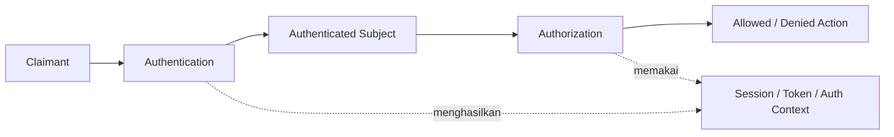

Invariant penting:

```text
Authentication success does not imply authorization success.
```

Contoh:

- User berhasil login sebagai `alice`.
- Itu tidak berarti `alice` boleh membaca case milik `bob`.
- Itu tidak berarti `alice` boleh melakukan admin action.
- Itu tidak berarti `alice` boleh bypass reauthentication untuk operasi high-risk.

Dalam sistem regulatori/case-management, authentication context harus membawa informasi seperti:

- `subject_id`
- `tenant_id` / `agency_id`
- authentication time
- assurance level
- authenticator type
- MFA status
- step-up status
- session age
- risk decision id
- delegated/federated source jika ada

Jangan hanya menyimpan:

```go
userID := "123"
```

Itu terlalu miskin untuk sistem yang perlu auditability dan defensibility.

---

## 4. Istilah Fundamental

### 4.1 Subject

Subject adalah entitas yang diwakili oleh authentication result.

Contoh:

- citizen;
- staff internal;
- external officer;
- service account;
- machine workload;
- admin support;
- integration client.

Subject bukan selalu manusia. Untuk machine-to-machine, mTLS/OAuth client credentials dapat menghasilkan subject tipe service.

### 4.2 Claimant

Claimant adalah pihak yang sedang mencoba membuktikan identitasnya.

Claimant bisa legitimate user, attacker, bot, malware, atau session hijacker.

### 4.3 Verifier

Verifier adalah komponen yang memeriksa authenticator.

Dalam Go monolith/simple service, verifier bisa berada dalam service itu sendiri.

Dalam sistem enterprise, verifier bisa berupa:

- identity provider;
- authentication service;
- gateway;
- BFF;
- delegated OIDC provider;
- internal IAM.

### 4.4 Authenticator

Authenticator adalah faktor yang dipakai untuk membuktikan klaim.

Contoh:

- password;
- TOTP;
- HOTP;
- email OTP;
- SMS OTP;
- push approval;
- WebAuthn/passkey;
- client certificate;
- recovery code;
- hardware security key;
- device-bound key;
- platform credential.

### 4.5 Credential

Credential adalah data yang disimpan/dipegang untuk authentication.

Contoh:

- password hash di server;
- TOTP secret;
- WebAuthn public key credential di server;
- private key di authenticator;
- recovery code hash;
- refresh token hash.

### 4.6 Authentication Event

Authentication event adalah kejadian security-relevant.

Contoh:

- login succeeded;
- login failed;
- MFA challenge issued;
- MFA succeeded;
- MFA failed;
- passkey registered;
- authenticator removed;
- recovery started;
- account locked;
- risk step-up triggered;
- suspicious login blocked.

Sistem yang baik tidak hanya “memproses login”, tapi juga **merekam state transition authentication**.

---

## 5. Faktor Authentication

Secara klasik, faktor authentication dibagi menjadi:

| Faktor | Makna | Contoh |
|---|---|---|
| Something you know | pengetahuan | password, PIN |
| Something you have | kepemilikan | security key, phone, TOTP device |
| Something you are | biometrik | fingerprint/face untuk unlock authenticator |

Namun dalam desain modern, pembagian ini tidak cukup. Kita juga harus bertanya:

1. Apakah faktor itu **phishing-resistant**?
2. Apakah private key/secret bisa diekspor?
3. Apakah secret tersinkronisasi ke cloud?
4. Apakah user verification lokal dilakukan?
5. Apakah server bisa membedakan authenticator kuat vs lemah?
6. Apakah faktor bisa dipulihkan lewat channel yang lebih lemah?
7. Apakah faktor bisa dipakai ulang di origin/domain lain?
8. Apakah faktor punya binding ke device, origin, atau TLS channel?
9. Apakah faktor cocok untuk AAL target?

Contoh penting:

| Authenticator | Mudah dipakai | Phishing resistant | Risiko utama |
|---|---:|---:|---|
| Password saja | tinggi | tidak | credential stuffing, phishing, reuse |
| Password + SMS OTP | sedang | tidak | SIM swap, OTP relay, malware, SS7/social engineering |
| Password + TOTP | sedang | tidak penuh | real-time phishing proxy, shared secret theft |
| Password + push approve | tinggi | bergantung implementasi | MFA fatigue, push bombing, weak transaction binding |
| WebAuthn/passkey | tinggi/sedang | ya, jika origin/challenge diverifikasi benar | recovery/provider compromise, account fallback lemah |
| Hardware security key | sedang | ya | lost key, lifecycle/admin recovery |
| Client certificate | sedang/rendah | kuat untuk machine/user managed env | cert lifecycle, private key storage, revocation gap |

---

## 6. Assurance Level: Jangan Klaim Lebih Tinggi dari Desain Lifecycle

NIST SP 800-63B-4 membahas Authenticator Assurance Level atau AAL.

Secara mental model:

| Level | Intuisi | Contoh kasar |
|---|---|---|
| AAL1 | single-factor authentication | password saja, magic link tertentu, single authenticator |
| AAL2 | multi-factor atau authenticator yang memberikan multi-factor | password + OTP, password + passkey, multi-factor authenticator |
| AAL3 | phishing-resistant + hardware-protected authenticator + verifier impersonation resistance | hardware-backed cryptographic authenticator dengan requirement lebih ketat |

Poin penting: AAL bukan hanya “metode login”. AAL juga dipengaruhi oleh:

- enrollment process;
- authenticator binding;
- authenticator replacement;
- account recovery;
- revocation;
- reauthentication;
- verifier controls;
- session controls;
- auditability;
- privacy controls.

Jika sistem login memakai hardware security key, tetapi account recovery bisa dilakukan hanya dengan email link yang mudah takeover, maka effective assurance turun ke channel recovery tersebut.

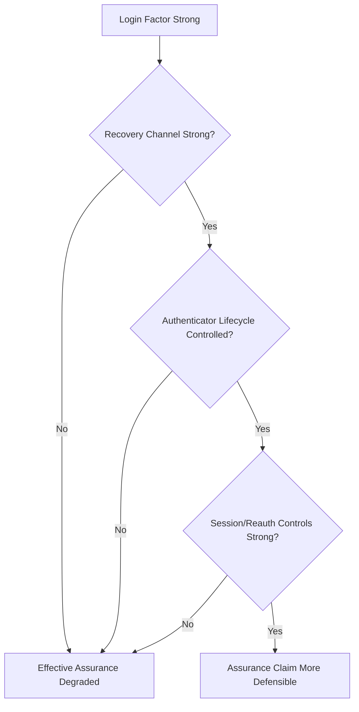

Invariant:

```text
Authentication assurance is bounded by the weakest path that can regain account control.
```

---

## 7. Authentication sebagai State Machine

Authentication harus dipikirkan sebagai state machine, bukan boolean.

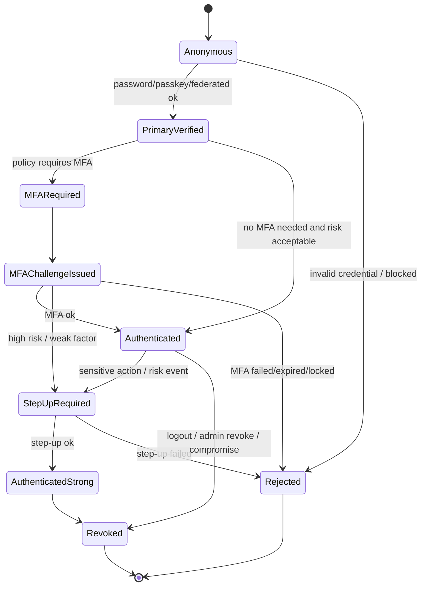

Kenapa state machine penting?

Karena banyak bypass terjadi di transition:

| Transition | Risiko |
|---|---|
| `Anonymous -> PrimaryVerified` | credential stuffing, enumeration, password spray |
| `PrimaryVerified -> Authenticated` | MFA bypass karena policy salah |
| `MFARequired -> Authenticated` | challenge reuse, OTP replay |
| `Authenticated -> AuthenticatedStrong` | step-up tidak mengikat action |
| `Recovery -> Authenticated` | recovery bypass MFA |
| `AuthenticatorAdded -> AuthenticatedStrong` | attacker menambahkan authenticator setelah session hijack |

Security review harus membaca transition, bukan hanya endpoint.

---

## 8. Core Security Invariants untuk Authentication System

Gunakan invariants berikut sebagai fondasi desain.

### 8.1 Identity Binding Invariant

```text
A session must be bound to exactly one authenticated subject and must not change subject without reauthentication.
```

Jangan punya session yang bisa “switch user” tanpa membuat session baru.

### 8.2 Freshness Invariant

```text
High-risk operations require authentication freshness, not merely an old session.
```

Contoh high-risk operation:

- change password;
- add/remove MFA;
- change email/phone;
- view recovery codes;
- export sensitive data;
- approve payment/regulatory action;
- change role/permission;
- generate API key;
- disable audit/control.

### 8.3 Least Assurance Invariant

```text
The effective assurance of an account is limited by the weakest account recovery or authenticator replacement path.
```

### 8.4 No Shared Secret Exposure Invariant

```text
Authentication secrets must never appear in logs, metrics, traces, audit metadata, URLs, referer headers, or panic output.
```

### 8.5 One-Time Challenge Invariant

```text
Authentication challenges must be unpredictable, bound to purpose, bound to subject/session/context when applicable, expire quickly, and be consumed once.
```

### 8.6 Step-Up Binding Invariant

```text
Step-up authentication must be bound to the sensitive action or authorization context that triggered it.
```

Jika user melakukan step-up untuk “change email”, hasil step-up tidak otomatis boleh dipakai untuk “add admin role” kecuali policy secara eksplisit mengizinkan.

### 8.7 Recovery Parity Invariant

```text
Recovery must not be materially weaker than normal authentication for the account's risk class.
```

### 8.8 Audit Defensibility Invariant

```text
Every security-relevant authentication state transition must be explainable later without exposing credential material.
```

---

## 9. Architecture Layers

Sistem authentication yang matang sebaiknya dipisah menjadi beberapa layer.

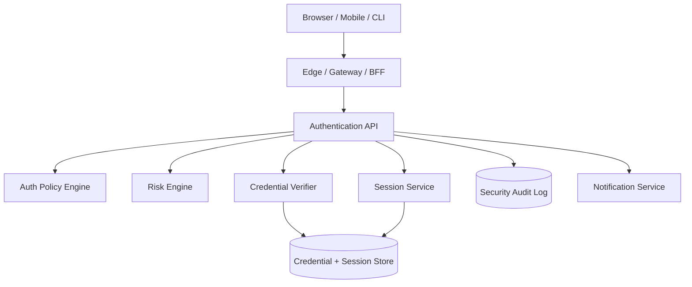

Tanggung jawab layer:

| Layer | Tanggung jawab | Tidak boleh melakukan |
|---|---|---|
| UI | collect credential, display challenge | decide security policy |
| Edge/BFF | CSRF/header/cookie boundary, rate limit coarse | menjadi sole source of authorization untuk internal service |
| Auth API | orchestrate auth flow | menyimpan secret di log |
| Credential Verifier | verify password/OTP/passkey/cert | membuat session tanpa policy decision |
| Policy Engine | decide required factor/step-up | membaca raw secret |
| Risk Engine | evaluate context | mengganti identity tanpa verification |
| Session Service | issue/revoke/rotate session | menerima unauthenticated subject claim |
| Audit | immutable-ish event evidence | menyimpan password/OTP/token plaintext |

---

## 10. Data Model Konseptual

### 10.1 Account

```go
type Account struct {
    ID             string
    Status         AccountStatus
    PrimaryEmail   string
    EmailVerified  bool
    CreatedAt      time.Time
    UpdatedAt      time.Time
    DisabledAt     *time.Time
    RiskTier       RiskTier
}

type AccountStatus string

const (
    AccountActive        AccountStatus = "active"
    AccountDisabled      AccountStatus = "disabled"
    AccountLocked        AccountStatus = "locked"
    AccountRecoveryHold  AccountStatus = "recovery_hold"
    AccountCompromised   AccountStatus = "compromised"
)
```

### 10.2 Authenticator

```go
type Authenticator struct {
    ID            string
    AccountID     string
    Type          AuthenticatorType
    Status        AuthenticatorStatus
    DisplayName   string
    CreatedAt     time.Time
    LastUsedAt    *time.Time
    VerifiedAt    *time.Time
    RevokedAt     *time.Time
    Assurance     AssuranceLevel
    PhishingResistant bool
}

type AuthenticatorType string

const (
    AuthPassword       AuthenticatorType = "password"
    AuthTOTP           AuthenticatorType = "totp"
    AuthRecoveryCode   AuthenticatorType = "recovery_code"
    AuthWebAuthn       AuthenticatorType = "webauthn"
    AuthClientCert     AuthenticatorType = "client_certificate"
    AuthFederatedOIDC  AuthenticatorType = "federated_oidc"
)

type AuthenticatorStatus string

const (
    AuthenticatorPending  AuthenticatorStatus = "pending"
    AuthenticatorActive   AuthenticatorStatus = "active"
    AuthenticatorRevoked  AuthenticatorStatus = "revoked"
    AuthenticatorLost     AuthenticatorStatus = "lost"
)

type AssuranceLevel string

const (
    AAL1 AssuranceLevel = "aal1"
    AAL2 AssuranceLevel = "aal2"
    AAL3 AssuranceLevel = "aal3"
)
```

### 10.3 Authentication Attempt

```go
type AuthAttempt struct {
    ID             string
    AccountID       *string
    UsernameHash    string
    StartedAt       time.Time
    CompletedAt     *time.Time
    Result          AuthResult
    FailureReason   FailureReason
    IPClass         string
    UserAgentHash   string
    RiskScore       int
    RiskDecisionID  string
    CorrelationID   string
}
```

Kenapa `UsernameHash`, bukan username plaintext?

Karena audit/telemetry sering butuh korelasi attempt tanpa menyebarkan identifier sensitif ke banyak sistem observability.

### 10.4 Session Auth Context

```go
type AuthContext struct {
    SubjectID          string
    AccountID          string
    AuthenticatedAt    time.Time
    LastReauthAt       time.Time
    Assurance          AssuranceLevel
    Methods            []AuthenticatorType
    PhishingResistant  bool
    RiskDecisionID     string
    SessionID          string
}
```

Authorization layer sebaiknya menerima `AuthContext`, bukan hanya `userID`.

---

## 11. Password Login sebagai Primary Authenticator

Detail hashing sudah ada di Part 011. Di sini kita fokus pada flow.

### 11.1 Flow Aman

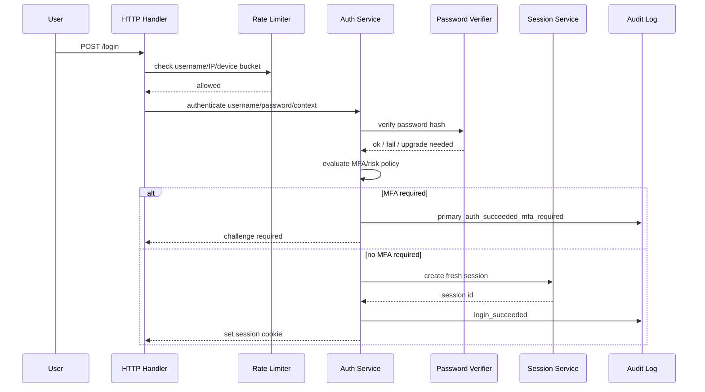

### 11.2 Error Message

Jangan:

```text
User not found.
Password incorrect.
Account exists but not verified.
```

Gunakan:

```text
Invalid username or password.
```

Untuk UI yang lebih manusiawi, kirim instruksi netral:

```text
If the account exists, follow the instructions sent to the registered contact channel.
```

### 11.3 User Enumeration

Enumeration terjadi dari:

- response body berbeda;
- status code berbeda;
- timing berbeda;
- rate limit message berbeda;
- password reset response berbeda;
- sign-up “email already exists” terlalu eksplisit;
- audit/notification side effect terlihat attacker.

Pola Go:

```go
func (s *AuthService) Login(ctx context.Context, req LoginRequest) (LoginResult, error) {
    normalized, err := NormalizeLoginIdentifier(req.Identifier)
    if err != nil {
        // Tetap gunakan error generik untuk caller.
        return LoginResult{}, ErrInvalidCredentials
    }

    account, found, err := s.accounts.FindByLoginIdentifier(ctx, normalized)
    if err != nil {
        return LoginResult{}, err
    }

    // Gunakan dummy hash untuk mengurangi timing gap antara user ada/tidak ada.
    verifierInput := PasswordVerifierInput{
        Password: req.Password,
        Hash:     s.dummyPasswordHash,
    }
    if found {
        verifierInput.Hash = account.PasswordHash
    }

    verified, verifyMeta, err := s.passwords.Verify(ctx, verifierInput)
    if err != nil {
        return LoginResult{}, err
    }

    if !found || !verified || account.Status != AccountActive {
        s.audit.AuthFailed(ctx, AuthFailedEvent{
            UsernameHash: s.hashIdentifier(normalized),
            Reason:      "invalid_or_inactive",
        })
        return LoginResult{}, ErrInvalidCredentials
    }

    if verifyMeta.NeedsUpgrade {
        // Jangan block login; upgrade setelah sukses dengan path aman.
        s.passwords.ScheduleUpgrade(ctx, account.ID, req.Password)
    }

    return s.continueAfterPrimary(ctx, account, req.Context)
}
```

Catatan:

- Jangan menyimpan `req.Password` setelah verify kecuali perlu upgrade langsung dan lifecycle-nya jelas.
- Jangan log password.
- Dummy hash harus memakai parameter realistis.
- Rate limiter harus diterapkan sebelum hashing mahal agar tidak jadi CPU DoS.

---

## 12. Rate Limiting dan Credential Stuffing Defense

Credential stuffing bukan brute force biasa. Attacker biasanya punya daftar username/password hasil breach dari layanan lain.

Defense harus multi-layer:

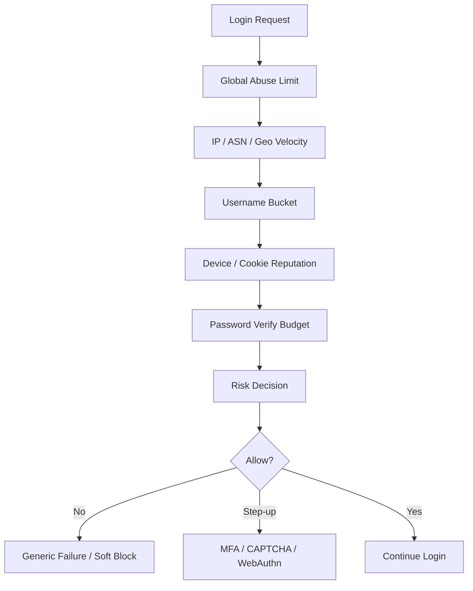

### 12.1 Bucket yang Umum

| Bucket | Tujuan | Risiko jika salah |
|---|---|---|
| global | melindungi service | bisa terlalu kasar |
| IP | menahan bot sederhana | NAT besar bisa kena false positive |
| ASN | deteksi cloud/proxy abuse | bisa bias terhadap network tertentu |
| username/account | lindungi akun target | attacker bisa lockout user |
| password hash prefix | deteksi stuffing luas | privacy-sensitive jika salah |
| device cookie | reputasi browser | mudah hilang/di-reset |

### 12.2 Lockout Harus Hati-Hati

Hard lockout setelah 5 gagal sering menjadi DoS vector.

Alternatif lebih baik:

- progressive delay;
- proof-of-work/CAPTCHA setelah suspicious pattern;
- require MFA/step-up;
- soft lock untuk credential type, bukan seluruh account;
- notify user tanpa membocorkan ke attacker;
- allow passkey login walaupun password temporarily throttled;
- per-risk-tier policy.

### 12.3 Go Interface

```go
type RateLimiter interface {
    Check(ctx context.Context, key RateLimitKey, cost int) (RateLimitDecision, error)
    Commit(ctx context.Context, key RateLimitKey, outcome RateLimitOutcome) error
}

type RateLimitDecision struct {
    Allowed      bool
    RetryAfter   time.Duration
    Reason       string
    SoftBlock    bool
    RequireStepUp bool
}
```

Jangan membuat rate limit hanya di memory process untuk production multi-instance. Gunakan centralized store atau gateway-level plus service-level defense.

---

## 13. MFA: Arsitektur, Bukan Checkbox

MFA memperkecil risiko credential compromise, tetapi MFA sendiri punya failure mode.

### 13.1 MFA Method Taxonomy

| Method | Kekuatan | Weakness |
|---|---|---|
| SMS OTP | mudah | SIM swap, OTP relay, delivery issue |
| Email OTP | mudah | email account compromise, mailbox delay |
| TOTP | offline, murah | phishing proxy, shared secret theft, clock drift |
| HOTP | offline | counter sync problem |
| Push approval | UX baik | MFA fatigue, weak binding |
| Number matching push | lebih baik | tetap bergantung device/account provider |
| WebAuthn/passkey | phishing-resistant | lifecycle/recovery/provider trust |
| Hardware security key | kuat | lost key, support process |
| Client certificate | kuat untuk managed env | lifecycle/revocation/usability |

### 13.2 MFA Enrollment Flow

MFA enrollment harus memerlukan fresh authentication.

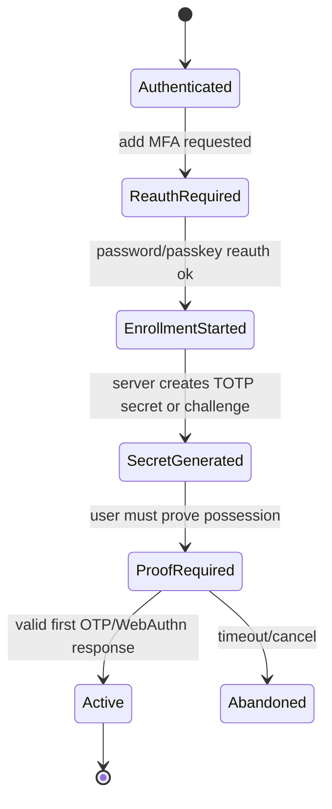

Jangan aktifkan TOTP hanya karena QR code sudah ditampilkan. Aktifkan setelah user membuktikan bisa menghasilkan OTP valid.

### 13.3 MFA Challenge Flow

```go
type MFAChallenge struct {
    ID              string
    AccountID       string
    Method          AuthenticatorType
    Purpose         ChallengePurpose
    CreatedAt       time.Time
    ExpiresAt       time.Time
    ConsumedAt      *time.Time
    AttemptCount    int
    MaxAttempts     int
    ContextHash     string
}

type ChallengePurpose string

const (
    PurposeLogin       ChallengePurpose = "login"
    PurposeStepUp      ChallengePurpose = "step_up"
    PurposeEnroll      ChallengePurpose = "enroll"
    PurposeRecovery    ChallengePurpose = "recovery"
)
```

Invariant:

```text
MFA challenge must be purpose-bound and one-time.
```

### 13.4 MFA Fatigue

Push MFA yang hanya meminta “Approve?” rawan MFA fatigue.

Mitigasi:

- number matching;
- geo/device display;
- transaction binding;
- rate limit challenge;
- cooldown setelah beberapa denial/timeout;
- user education;
- suspicious push alert;
- require WebAuthn for admin/high-risk roles.

---

## 14. TOTP dan HOTP

TOTP adalah HOTP berbasis waktu. RFC 6238 mendefinisikan TOTP sebagai ekstensi HOTP dengan moving factor berupa time step.

### 14.1 TOTP Mental Model

```text
OTP = Truncate(HMAC(secret, timeCounter))
```

Server dan authenticator menyimpan shared secret. Karena shared secret ada di server, compromise server credential store bisa berdampak pada semua TOTP secret jika tidak dilindungi.

### 14.2 TOTP Design

| Parameter | Rekomendasi umum |
|---|---|
| algorithm | SHA-1 masih umum untuk kompatibilitas, SHA-256/SHA-512 bisa dipakai jika client mendukung |
| digits | 6 atau 8 |
| time step | 30 detik umum |
| window | kecil, misalnya current ±1 step |
| replay | OTP yang sama untuk account+step harus ditolak setelah dipakai |
| secret storage | encrypted/wrapped, access-limited |

### 14.3 Anti-Replay

Tanpa anti-replay, OTP valid dalam window bisa dipakai dua kali.

```go
type TOTPReplayStore interface {
    MarkUsed(ctx context.Context, accountID, authenticatorID string, step int64) (alreadyUsed bool, err error)
}
```

Flow:

1. Verify OTP cryptographically.
2. Hitung time step yang cocok.
3. Atomically mark step sebagai used.
4. Jika sudah used, reject.

### 14.4 Clock Drift

Jangan memperlebar window terlalu besar hanya karena beberapa user gagal. Window besar menaikkan chance OTP valid dan memperpanjang replay opportunity.

Lebih baik:

- tampilkan troubleshooting;
- allow resync terbatas;
- log drift metric;
- gunakan WebAuthn untuk high assurance.

---

## 15. Recovery Codes

Recovery codes adalah emergency authenticator. Karena bisa mengalahkan MFA, recovery codes harus diperlakukan sebagai credential kuat.

### 15.1 Design Rules

- Generate dengan `crypto/rand`.
- Tampilkan sekali.
- Simpan hash, bukan plaintext.
- One-time use.
- Rate limit verification.
- Rotate setelah sebagian besar terpakai.
- Notify user setelah digunakan.
- Require re-enrollment MFA setelah recovery.

### 15.2 Model

```go
type RecoveryCode struct {
    ID           string
    AccountID    string
    CodeHash     []byte
    CreatedAt    time.Time
    UsedAt       *time.Time
    RevokedAt    *time.Time
}
```

### 15.3 Verification

```go
func (s *RecoveryService) Verify(ctx context.Context, accountID string, code string) error {
    candidates, err := s.store.ListActiveRecoveryCodes(ctx, accountID)
    if err != nil {
        return err
    }

    for _, c := range candidates {
        if s.hasher.Verify(c.CodeHash, code) {
            // Must be atomic: mark used only if not already used.
            used, err := s.store.ConsumeRecoveryCode(ctx, c.ID)
            if err != nil {
                return err
            }
            if !used {
                return ErrInvalidRecoveryCode
            }
            s.audit.RecoveryCodeUsed(ctx, accountID, c.ID)
            return nil
        }
    }
    return ErrInvalidRecoveryCode
}
```

Catatan: jumlah recovery code kecil, jadi iterasi bisa diterima. Namun tetap perhatikan timing dan rate limit.

---

## 16. Passkeys dan WebAuthn

Passkeys adalah credential berbasis public-key yang memakai standar FIDO/WebAuthn. Server menyimpan public key; private key berada di authenticator atau credential provider. Saat login, server mengirim challenge; authenticator menandatangani challenge; server memverifikasi signature dan binding ke relying party/origin.

### 16.1 Mental Model

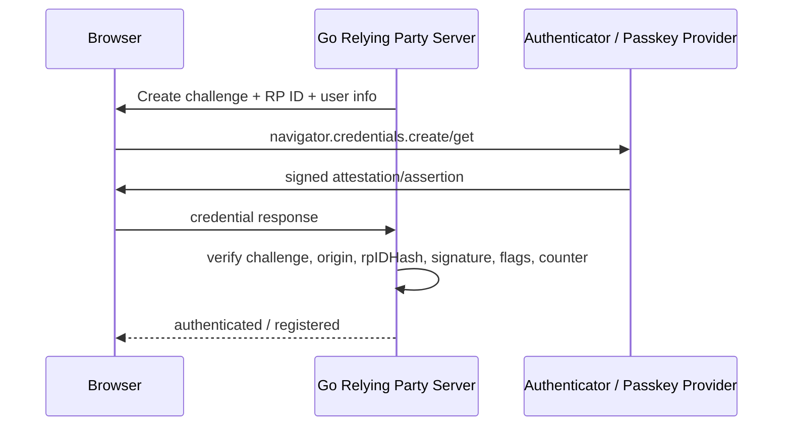

### 16.2 Apa yang Membuat WebAuthn Kuat

WebAuthn kuat karena:

1. private key tidak dikirim ke server;
2. credential scoped ke relying party;
3. challenge mencegah replay;
4. origin/RP binding membantu phishing resistance;
5. signature diverifikasi server;
6. user presence/user verification dapat dibuktikan melalui flags;
7. credential ID unik;
8. bisa memakai hardware-backed authenticator.

### 16.3 WebAuthn Bukan Magic

WebAuthn bisa gagal jika server:

- tidak memverifikasi challenge;
- menerima challenge lama;
- tidak mengecek origin;
- salah menghitung/mengecek `rpIDHash`;
- tidak mengecek user presence/user verification sesuai policy;
- mengabaikan signature counter tanpa policy;
- menerima algorithm yang tidak diizinkan;
- membiarkan recovery lebih lemah;
- menganggap passkey synced sama dengan hardware-bound key untuk semua use case;
- menaruh session setelah registration tanpa reauth policy;
- tidak punya UX untuk lost device.

### 16.4 WebAuthn Registration State

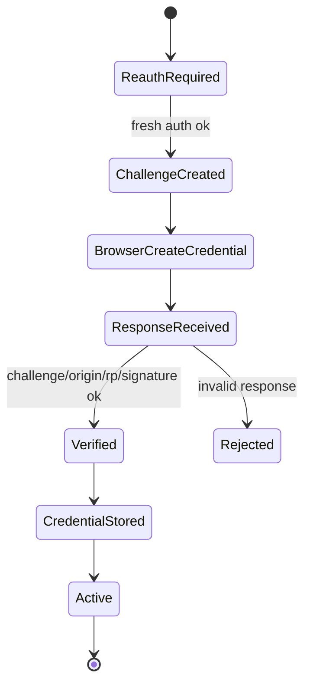

### 16.5 WebAuthn Login State

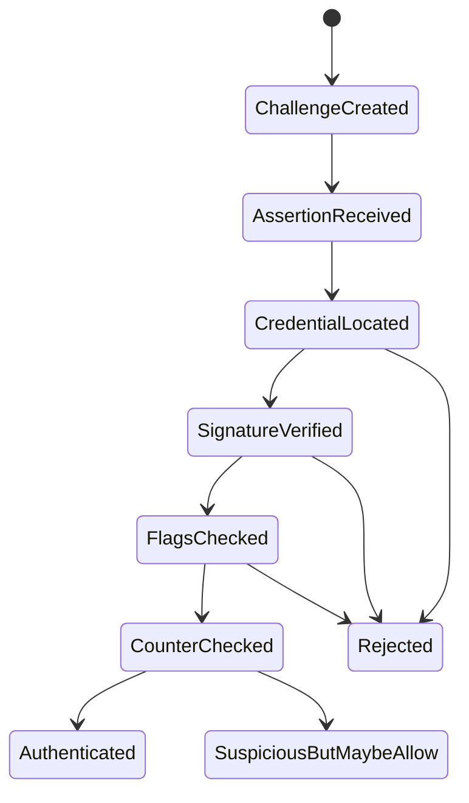

`signCount` tidak selalu sederhana untuk synced passkeys. Treat counter anomaly sebagai risk signal, bukan selalu hard-fail, kecuali policy Anda mensyaratkan device-bound authenticator dengan counter reliable.

### 16.6 Data Model WebAuthn

```go
type WebAuthnCredential struct {
    ID                  string
    AccountID           string
    CredentialID        []byte
    PublicKeyCOSE       []byte
    AAGUID              []byte
    SignCount           uint32
    BackupEligible      bool
    BackupState         bool
    UserVerifiedRequired bool
    CreatedAt           time.Time
    LastUsedAt          *time.Time
    RevokedAt           *time.Time
}
```

Field seperti backup eligibility/state membantu membedakan synced credential vs device-bound credential jika informasi tersedia.

### 16.7 Challenge Store

```go
type WebAuthnChallenge struct {
    ID          string
    AccountID   *string
    Purpose     ChallengePurpose
    Challenge   []byte
    RP          string
    Origin      string
    CreatedAt   time.Time
    ExpiresAt   time.Time
    ConsumedAt  *time.Time
}
```

Challenge harus:

- random kuat;
- short-lived;
- purpose-bound;
- one-time;
- bound ke RP/origin expected;
- tidak dikirim sebagai predictable ID saja;
- tidak disimpan di client tanpa integrity protection.

### 16.8 Go Standard Library Boundary

Go standard library menyediakan primitive cryptography, HTTP, x509, random, dan encoding, tetapi tidak menyediakan high-level WebAuthn relying party framework. Karena WebAuthn parsing dan verification sangat detail, production system biasanya memakai library WebAuthn yang matang atau IdP yang sudah menangani WebAuthn.

Jika implementasi sendiri, itu harus dianggap security-critical protocol implementation dan direview seperti crypto code.

### 16.9 Passkeys: Synced vs Device-Bound

Passkeys modern sering disinkronkan melalui platform credential provider. Ini meningkatkan usability dan mengurangi risiko account loss, tetapi trust model berubah.

| Tipe | Keunggulan | Risiko |
|---|---|---|
| Device-bound hardware key | kuat, sulit diekspor | lost key, UX, recovery sulit |
| Platform authenticator | UX bagus | device/account ecosystem dependency |
| Synced passkey | recovery dan multi-device bagus | trust pada provider sync, account provider compromise |

Untuk consumer application, synced passkeys sering sangat baik. Untuk high-assurance admin/regulatory action, device-bound hardware key bisa diwajibkan.

---

## 17. Account Recovery: Security Boundary Paling Sering Diremehkan

Account recovery adalah authentication flow alternatif. Jangan memperlakukannya sebagai “support feature”.

### 17.1 Recovery Attack Pattern

Attacker sering tidak menyerang login utama. Mereka menyerang:

- forgot password;
- email change;
- phone change;
- lost MFA;
- support ticket;
- admin reset;
- migration process;
- dormant account reactivation;
- invite flow;
- delegated admin.

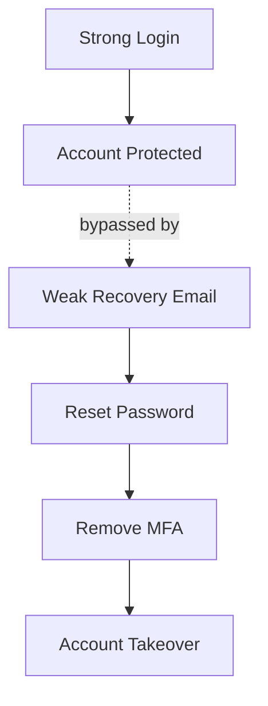

### 17.2 Recovery Design by Risk Tier

| Account risk | Recovery approach |
|---|---|
| Low-risk consumer | email link + throttling + notification + session revocation |
| Medium-risk | email + existing MFA/recovery code + cooldown for sensitive changes |
| High-risk staff/admin | recovery code or helpdesk with dual control + identity proofing + waiting period |
| Regulated high-impact | documented approval workflow + out-of-band verification + audit + delayed activation |

### 17.3 Password Reset Token

Password reset token harus:

- random kuat;
- single-use;
- short-lived;
- stored hashed;
- purpose-bound;
- account-bound;
- invalidate old reset tokens after use;
- not placed in logs;
- not leaked via referer;
- not auto-login without policy review.

```go
type ResetToken struct {
    ID        string
    AccountID string
    TokenHash []byte
    CreatedAt time.Time
    ExpiresAt time.Time
    UsedAt    *time.Time
    ContextHash string
}
```

### 17.4 Reset Password vs Login Session

Setelah password reset, apakah user langsung login?

Untuk low-risk app, mungkin ya. Untuk high-risk app, lebih aman:

- reset password success;
- revoke existing sessions;
- require fresh login;
- require MFA re-enrollment/verification;
- notify user;
- cooldown untuk sensitive actions.

### 17.5 Recovery Cooldown

Jika email/phone/MFA baru ditambahkan melalui recovery, high-risk actions bisa ditahan.

Contoh:

```text
After account recovery:
- revoke old sessions immediately
- require MFA setup
- delay role changes, payout changes, API key creation for 24h
- notify old and new contact channels
- flag account for monitoring
```

---

## 18. Authenticator Lifecycle

Authenticator lifecycle meliputi:

1. enrollment;
2. activation;
3. use;
4. update/rotation;
5. suspension;
6. recovery;
7. replacement;
8. revocation;
9. audit retention.

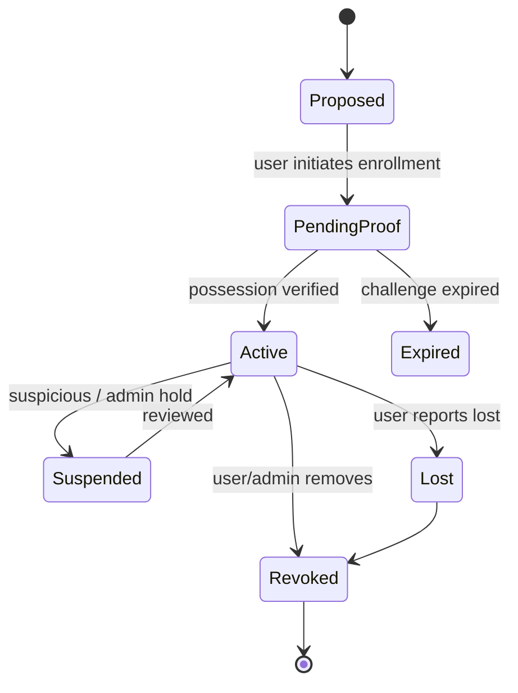

### 18.1 Enrollment Rules

For each authenticator:

| Authenticator | Enrollment proof |
|---|---|
| Password | set secret + verify policy/blocklist |
| TOTP | scan secret + provide valid OTP |
| Recovery code | generated by server + displayed once |
| WebAuthn | verify attestation/assertion registration response |
| Client cert | verify cert chain + bind subject/SAN/SPIFFE ID |
| Federated IdP | verify issuer, subject, audience, nonce/state |

### 18.2 Removal Rules

Removing authenticator should require:

- fresh authentication;
- stronger factor if removing MFA;
- notification;
- audit event;
- not leaving account with no valid login path unless intentionally disabled;
- support workflow for lost all authenticators.

### 18.3 Authenticator Inventory

User security settings should show:

- active authenticators;
- last used time;
- approximate device/browser name if safe;
- creation time;
- recovery codes remaining;
- suspicious state;
- revoke button with reauth.

Do not show raw credential IDs or secrets.

### 18.4 Admin Support Boundary

Support/admin workflows are privileged authentication flows.

Rules:

- support cannot see password/OTP secrets;
- support cannot generate permanent bypass silently;
- support reset requires reason code;
- high-risk reset requires dual control;
- user notified;
- audit includes actor and target;
- temporary bypass expires quickly;
- break-glass path monitored.

---

## 19. Risk-Based Authentication

Risk-based authentication adjusts requirements based on context.

Context examples:

- new device;
- impossible travel;
- unusual ASN/VPN/Tor/cloud provider;
- high failed attempt velocity;
- password found in breach;
- sensitive action;
- dormant account;
- role/admin account;
- session age;
- recent recovery;
- authenticator change;
- geo mismatch;
- known malicious IP;
- anomalous user agent.

### 19.1 Risk Decision Model

```go
type RiskInput struct {
    AccountID        string
    AuthMethod       []AuthenticatorType
    IP               net.IP
    ASN              string
    Country          string
    UserAgentHash    string
    DeviceID         string
    SessionAge       time.Duration
    Action           string
    RecentRecovery   bool
    FailedVelocity   int
}

type RiskDecision struct {
    ID             string
    Score          int
    Level          RiskLevel
    RequiredAction RequiredAuthAction
    Reasons        []string
}

type RiskLevel string

const (
    RiskLow      RiskLevel = "low"
    RiskMedium   RiskLevel = "medium"
    RiskHigh     RiskLevel = "high"
    RiskCritical RiskLevel = "critical"
)

type RequiredAuthAction string

const (
    AuthAllow        RequiredAuthAction = "allow"
    AuthStepUp       RequiredAuthAction = "step_up"
    AuthDeny         RequiredAuthAction = "deny"
    AuthHold         RequiredAuthAction = "hold"
)
```

### 19.2 Risk-Based Auth Pitfalls

| Pitfall | Kenapa berbahaya |
|---|---|
| terlalu percaya IP | NAT/VPN/mobile network berubah |
| risk score tidak explainable | audit susah, user support susah |
| risk model bypass manual | support jadi attack path |
| no feedback loop | false positive/negative tidak membaik |
| action tidak terikat | step-up untuk action A dipakai untuk action B |
| silent deny tanpa audit | forensic lemah |

### 19.3 Step-Up Auth

Step-up auth berarti user sudah punya session, tetapi perlu membuktikan ulang untuk action tertentu.

Contoh:

```go
type StepUpRequest struct {
    AccountID string
    SessionID string
    Action    string
    Resource  string
    RequiredAssurance AssuranceLevel
    ExpiresAt time.Time
}
```

Step-up result harus disimpan dengan scope:

```go
type StepUpGrant struct {
    SessionID string
    Action    string
    Resource  string
    Assurance AssuranceLevel
    GrantedAt time.Time
    ExpiresAt time.Time
}
```

Jangan membuat step-up global terlalu lama.

---

## 20. Reauthentication

Reauthentication berbeda dari MFA challenge biasa. Reauthentication membuktikan bahwa current session masih dikendalikan user sah.

Trigger:

- change password;
- add/remove authenticator;
- change recovery email/phone;
- generate API key;
- export data;
- change permissions;
- high-value transaction;
- suspicious activity;
- after account recovery;
- before disabling audit/security controls.

### 20.1 Reauth Policy

```go
type ReauthPolicy struct {
    MaxAge              time.Duration
    RequiredAssurance   AssuranceLevel
    RequirePhishingResistant bool
    BindToAction        bool
}
```

Example:

| Action | Max reauth age | Factor |
|---|---:|---|
| view profile | none | session cukup |
| change password | 5 min | password/passkey fresh |
| add MFA | 5 min | existing strong factor |
| remove MFA | 5 min | strongest remaining factor / recovery workflow |
| create API key | 5 min | phishing-resistant preferred |
| admin role grant | immediate | AAL2/AAL3 + approval |

---

## 21. Federated Login Boundary

OIDC/federated login sudah dibahas di Part 016. Di sini fokus pada authentication architecture.

Federated login menghasilkan identity assertion dari external IdP. Jangan langsung samakan dengan local account tanpa binding policy.

### 21.1 Account Linking

Account linking risk:

- attacker login via external IdP dengan email sama tapi unverified;
- issuer confusion;
- subject reuse;
- account takeover jika linking tanpa reauth;
- IdP tenant confusion;
- domain takeover pada enterprise email.

Invariant:

```text
Federated identity binding must use stable issuer + subject, not email alone.
```

Email bisa berubah, didaur ulang, atau tidak verified.

### 21.2 Go Model

```go
type FederatedIdentity struct {
    ID        string
    AccountID string
    Issuer    string
    Subject   string
    Email     string
    EmailVerified bool
    CreatedAt time.Time
    LastUsedAt *time.Time
}
```

Unique constraint:

```text
unique(issuer, subject)
```

Bukan:

```text
unique(email)
```

---

## 22. Service Accounts dan Machine Authentication

Tidak semua authentication adalah human login.

Machine authentication bisa memakai:

- mTLS client certificate;
- OAuth2 client credentials;
- signed request/HMAC;
- workload identity;
- SPIFFE/SPIRE;
- cloud IAM;
- short-lived service token.

Perbedaan human vs machine:

| Area | Human | Machine |
|---|---|---|
| factor | password/MFA/passkey | key/cert/token/workload identity |
| recovery | account recovery | key rotation/reissuance |
| session | browser/app session | access token/TLS session |
| risk | geo/device/user behavior | workload identity/deployment context |
| audit | actor user | service principal + workload instance |

Machine identity tidak boleh memakai password manusia.

---

## 23. Authentication Event Logging

Authentication audit event harus cukup untuk forensic, tetapi tidak boleh membocorkan secret.

### 23.1 Event Schema

```go
type AuthAuditEvent struct {
    EventID        string    `json:"event_id"`
    EventType      string    `json:"event_type"`
    At             time.Time `json:"at"`
    ActorAccountID *string   `json:"actor_account_id,omitempty"`
    TargetAccountID *string  `json:"target_account_id,omitempty"`
    SubjectID      *string   `json:"subject_id,omitempty"`
    Result         string    `json:"result"`
    ReasonCode     string    `json:"reason_code,omitempty"`
    AuthMethods    []string  `json:"auth_methods,omitempty"`
    Assurance      string    `json:"assurance,omitempty"`
    IPHash         string    `json:"ip_hash,omitempty"`
    UserAgentHash  string    `json:"user_agent_hash,omitempty"`
    RiskDecisionID string    `json:"risk_decision_id,omitempty"`
    CorrelationID  string    `json:"correlation_id"`
}
```

### 23.2 Event Types

| Event | Should log? | Secret? |
|---|---:|---:|
| login_failed | yes | no password |
| login_succeeded | yes | no credential |
| mfa_challenge_issued | yes | no OTP |
| mfa_failed | yes | no OTP |
| mfa_succeeded | yes | no OTP |
| passkey_registered | yes | no private key |
| authenticator_removed | yes | no secret |
| recovery_started | yes | no reset token |
| recovery_completed | yes | no reset token |
| session_revoked | yes | no session id raw if logs broad |
| risk_step_up_required | yes | no sensitive full signal if privacy issue |

### 23.3 Jangan Log

- password;
- OTP;
- recovery code;
- reset token;
- full session token;
- full JWT;
- WebAuthn raw client data jika mengandung privacy-sensitive info tanpa need;
- complete IP if policy says hash/truncate;
- biometric data;
- security answers.

---

## 24. Notification Strategy

Notifikasi security adalah bagian dari authentication defense.

Trigger notifikasi:

- new login from new device;
- password changed;
- MFA added/removed;
- recovery started/completed;
- email/phone changed;
- passkey added;
- suspicious login blocked;
- admin reset performed.

Rules:

- jangan masukkan secret/token di notifikasi;
- gunakan old contact channel untuk sensitive change;
- include “if this wasn’t you” action;
- avoid leaking whether account exists;
- localize but keep security meaning clear;
- rate limit notification spam.

---

## 25. Security Questions: Hindari

Security questions seperti “nama ibu kandung” adalah password buruk:

- mudah ditebak;
- mudah dicari di social media;
- sering statis seumur hidup;
- sering dipakai ulang;
- support bisa melihatnya;
- menjadi recovery path lemah.

Jika legacy system masih punya security questions:

- jangan pakai untuk high-risk recovery;
- treat as weak signal only;
- migrate ke recovery code/passkey/MFA;
- hapus jawaban lama setelah migration jika legal memungkinkan.

---

## 26. Transaction Binding

Untuk aksi high-risk, authentication sebaiknya mengikat user intent ke detail transaksi.

Contoh weak:

```text
Approve login? [Yes]
```

Contoh lebih kuat:

```text
Approve transfer Rp 10.000.000 to account 1234?
Code: 91
```

Untuk regulatory workflow:

```text
Approve enforcement action CASE-2026-001 as Senior Officer?
```

Transaction binding membantu mencegah attacker memakai MFA approval untuk action berbeda.

---

## 27. Authenticator Strength Matrix

Gunakan matrix berikut untuk policy.

| Authenticator | Secret on server? | Phishing-resistant | Replay risk | Recovery concern | Suitable default |
|---|---:|---:|---:|---|---|
| Password | hash only | no | password reuse | reset path | baseline only |
| TOTP | yes, shared secret | no | yes within window | lost device | MFA moderate |
| SMS OTP | no direct app secret | no | yes | SIM/channel takeover | fallback only |
| Email OTP | no direct app secret | no | yes | mailbox takeover | recovery low/medium |
| Recovery code | hash only | no | one-time | storage by user | emergency |
| WebAuthn synced passkey | public key only | yes | challenge prevents | provider account | preferred user auth |
| Hardware key | public key only | yes | challenge prevents | lost key | high-risk/admin |
| Client cert | public cert/trust | strong | TLS-bound | cert lifecycle | machine/managed user |

---

## 28. Go Implementation Skeleton

### 28.1 Package Layout

```text
internal/auth/
  account.go
  service.go
  password.go
  mfa.go
  webauthn.go
  recovery.go
  risk.go
  session.go
  audit.go
  policy.go
  errors.go
```

Security-sensitive code should have narrow interfaces and tests.

### 28.2 Auth Service

```go
type AuthService struct {
    accounts   AccountStore
    passwords  PasswordVerifier
    mfa        MFAService
    webauthn   WebAuthnService
    recovery   RecoveryService
    sessions   SessionService
    risk       RiskEngine
    policy     AuthPolicy
    audit      AuditSink
    limiter    RateLimiter
    clock      Clock
}
```

### 28.3 Login Request

```go
type LoginRequest struct {
    Identifier string
    Password   string
    Context    RequestContext
}

type RequestContext struct {
    IP        net.IP
    UserAgent string
    DeviceID  string
    Origin    string
    TraceID   string
}
```

### 28.4 Login Result

```go
type LoginResult struct {
    Status       LoginStatus
    Session      *IssuedSession
    ChallengeID  string
    Required     []AuthenticatorType
    PublicMessage string
}

type LoginStatus string

const (
    LoginAuthenticated LoginStatus = "authenticated"
    LoginMFARequired   LoginStatus = "mfa_required"
    LoginStepUpRequired LoginStatus = "step_up_required"
    LoginRejected      LoginStatus = "rejected"
)
```

### 28.5 Authentication Error Boundary

```go
var (
    ErrInvalidCredentials = errors.New("invalid credentials")
    ErrAuthTemporarilyUnavailable = errors.New("authentication temporarily unavailable")
    ErrStepUpRequired = errors.New("step-up authentication required")
)
```

HTTP handler harus memetakan error internal ke response aman.

---

## 29. HTTP Handler Pattern

```go
func (h *Handler) Login(w http.ResponseWriter, r *http.Request) {
    ctx := r.Context()

    var req LoginHTTPPayload
    if err := json.NewDecoder(http.MaxBytesReader(w, r.Body, 16<<10)).Decode(&req); err != nil {
        h.writeAuthError(w, http.StatusBadRequest)
        return
    }

    result, err := h.auth.Login(ctx, LoginRequest{
        Identifier: req.Identifier,
        Password:   req.Password,
        Context: RequestContext{
            IP:        clientIP(r),
            UserAgent: r.UserAgent(),
            DeviceID:  readDeviceID(r),
            Origin:    r.Header.Get("Origin"),
            TraceID:   traceID(ctx),
        },
    })
    if err != nil {
        h.writeAuthError(w, http.StatusUnauthorized)
        return
    }

    switch result.Status {
    case LoginAuthenticated:
        h.setSessionCookie(w, result.Session)
        writeJSON(w, http.StatusOK, map[string]any{"status": "ok"})
    case LoginMFARequired:
        writeJSON(w, http.StatusOK, map[string]any{
            "status": "mfa_required",
            "challenge_id": result.ChallengeID,
            "methods": result.Required,
        })
    default:
        h.writeAuthError(w, http.StatusUnauthorized)
    }
}
```

Important:

- request body limit;
- JSON decode strict enough;
- no password in logs;
- no user-specific error leakage;
- session cookie only after full policy satisfied;
- CSRF protection for cookie-based flows;
- rate limit before expensive verify.

---

## 30. MFA Verification Handler

```go
func (h *Handler) VerifyMFA(w http.ResponseWriter, r *http.Request) {
    ctx := r.Context()

    var req MFAVerifyPayload
    if err := json.NewDecoder(http.MaxBytesReader(w, r.Body, 8<<10)).Decode(&req); err != nil {
        h.writeAuthError(w, http.StatusBadRequest)
        return
    }

    result, err := h.auth.VerifyMFA(ctx, VerifyMFARequest{
        ChallengeID: req.ChallengeID,
        Code:        req.Code,
        Context: RequestContext{
            IP:        clientIP(r),
            UserAgent: r.UserAgent(),
            Origin:    r.Header.Get("Origin"),
            TraceID:   traceID(ctx),
        },
    })
    if err != nil {
        h.writeAuthError(w, http.StatusUnauthorized)
        return
    }

    h.setSessionCookie(w, result.Session)
    writeJSON(w, http.StatusOK, map[string]any{"status": "ok"})
}
```

Challenge verification must be atomic:

```text
consume challenge -> verify within transaction/atomic state -> create session once
```

Avoid race where two parallel requests use same MFA challenge.

---

## 31. Authentication Policy Engine

Authentication policy should be explicit and testable.

```go
type AuthPolicy interface {
    RequiredForLogin(ctx context.Context, account Account, risk RiskDecision) (AuthRequirement, error)
    RequiredForAction(ctx context.Context, subject Subject, action SensitiveAction, risk RiskDecision) (AuthRequirement, error)
}

type AuthRequirement struct {
    MinimumAssurance AssuranceLevel
    AllowedMethods   []AuthenticatorType
    RequireMFA       bool
    RequireFresh     bool
    MaxAge           time.Duration
    RequirePhishingResistant bool
}
```

Example policy:

```go
func (p DefaultPolicy) RequiredForAction(ctx context.Context, subject Subject, action SensitiveAction, risk RiskDecision) (AuthRequirement, error) {
    switch action.Name {
    case "authenticator.remove", "api_key.create", "role.grant":
        return AuthRequirement{
            MinimumAssurance: AAL2,
            RequireFresh: true,
            MaxAge: 5 * time.Minute,
            RequirePhishingResistant: action.HighImpact,
            AllowedMethods: []AuthenticatorType{AuthWebAuthn, AuthTOTP},
        }, nil
    default:
        return AuthRequirement{MinimumAssurance: AAL1}, nil
    }
}
```

Policy yang tersebar di handler rawan inconsistent bypass.

---

## 32. Multi-Tenant dan Regulatory Case Management

Untuk sistem multi-agency/regulatory, authentication context harus tidak ambigu.

### 32.1 Tenant Binding

Subject mungkin punya beberapa role/tenant.

Jangan membuat session hanya:

```json
{"user_id":"u123"}
```

Gunakan auth context:

```json
{
  "subject_id": "u123",
  "active_tenant_id": "agency-a",
  "authenticated_at": "2026-06-24T10:00:00Z",
  "assurance": "aal2",
  "methods": ["password", "webauthn"],
  "risk_decision_id": "rd_..."
}
```

### 32.2 Tenant Switch

Tenant switch bisa memerlukan:

- authorization check;
- session context update;
- audit event;
- step-up jika tenant high-risk;
- no silent role escalation.

### 32.3 Delegation

Jika staff bertindak atas nama agency/user lain, audit harus membedakan:

- authenticated actor;
- delegated subject;
- target account/resource;
- authority source;
- approval/mandate.

---

## 33. Common Authentication Vulnerabilities

### 33.1 Credential Stuffing

Symptom:

- many accounts, few attempts each;
- password reuse from breach;
- distributed IPs.

Controls:

- breached password detection;
- velocity analysis;
- MFA/passkeys;
- risk step-up;
- notification;
- adaptive rate limiting.

### 33.2 Password Spray

Symptom:

- one/few common passwords across many accounts.

Controls:

- global password attempt pattern detection;
- block common passwords;
- username bucket;
- delayed response;
- MFA.

### 33.3 MFA Bypass

Causes:

- endpoint forgot to check MFA state;
- session issued after password before MFA;
- challenge not purpose-bound;
- backup code not one-time;
- recovery bypass;
- remember-device cookie weak.

### 33.4 Session Fixation

Cause:

- session ID not regenerated after login.

Control:

- issue new session after authentication;
- invalidate pre-auth session;
- bind CSRF state separately.

### 33.5 Account Recovery Takeover

Causes:

- weak email reset;
- support process weak;
- no cooldown;
- no notification;
- no session revocation.

### 33.6 WebAuthn Misverification

Causes:

- not checking origin/RP ID;
- challenge not matched;
- signature not verified against stored public key;
- accepting wrong algorithm;
- no user verification flag check when required.

### 33.7 User Enumeration

Causes:

- different errors;
- timing;
- sign-up and reset messages;
- lockout messages.

### 33.8 Auth Logs Leaking Secrets

Causes:

- request body logging;
- panic with struct dump;
- reverse proxy access logs with URL tokens;
- tracing raw headers;
- audit metadata too broad.

---

## 34. Testing Strategy

Authentication tests harus mencakup lebih dari happy path.

### 34.1 Unit Tests

- password valid/invalid;
- account disabled;
- password needs upgrade;
- MFA required policy;
- challenge expired;
- challenge already consumed;
- OTP replay;
- recovery code used twice;
- passkey wrong challenge;
- passkey wrong origin;
- step-up too old;
- risk high requires stronger factor.

### 34.2 Integration Tests

- login + MFA + session cookie;
- password reset revokes sessions;
- adding MFA requires reauth;
- removing MFA not allowed if last factor without recovery path;
- rate limit under parallel attempts;
- multiple instances share challenge/session store;
- audit events emitted once.

### 34.3 Property/Fuzz Tests

Fuzz:

- identifier normalization;
- URL/reset token parser;
- WebAuthn JSON envelope parser;
- origin/RP validation function;
- cookie parsing boundary;
- account linking logic.

Example invariant test:

```go
func TestMFAChallengeCanBeConsumedOnlyOnce(t *testing.T) {
    // Create challenge.
    // Run two parallel Verify calls with same valid code.
    // Assert exactly one succeeds.
}
```

### 34.4 Abuse Tests

- 10k attempts against one account;
- one attempt across 10k accounts;
- many IPs same password;
- reset token replay;
- expired link replay;
- concurrent password reset;
- login while account disabled;
- session reuse after recovery.

---

## 35. Observability Metrics

Metrics:

```text
auth_login_attempt_total{result,reason}
auth_mfa_challenge_total{method,result}
auth_recovery_attempt_total{result}
auth_passkey_assertion_total{result}
auth_stepup_total{action,result}
auth_rate_limited_total{bucket,reason}
auth_account_lock_total{reason}
auth_session_revoked_total{reason}
auth_risk_decision_total{level,action}
```

Avoid labels with high-cardinality sensitive values:

- raw user id;
- email;
- IP address;
- token id;
- session id;
- credential id.

Use controlled enums and hashed/truncated values only where justified.

---

## 36. Incident Response Playbooks

### 36.1 Credential Stuffing Spike

Actions:

1. Increase adaptive rate limiting.
2. Identify attacked accounts.
3. Force password reset for confirmed compromised accounts.
4. Require MFA/passkey enrollment for high-risk accounts.
5. Notify users.
6. Preserve audit evidence.
7. Review breached password detection.
8. Add detection for password spray pattern.

### 36.2 MFA Fatigue Attack

Actions:

1. Rate limit push challenges.
2. Disable push for impacted accounts temporarily.
3. Require number matching/WebAuthn.
4. Notify impacted users.
5. Review push UX.
6. Add suspicious denial/timeout detection.

### 36.3 WebAuthn Counter Anomaly

Actions:

1. Mark credential suspicious.
2. Require step-up with another factor.
3. Notify user.
4. Collect device/provider context.
5. Decide allow/warn/revoke based on authenticator type and policy.

### 36.4 Recovery Abuse

Actions:

1. Freeze account sensitive actions.
2. Revoke sessions.
3. Review recovery event chain.
4. Require stronger verification.
5. Notify original contact channel.
6. Review support/admin actions.

---

## 37. Production Readiness Checklist

### 37.1 Login

- [ ] Generic error messages.
- [ ] No user enumeration via timing/status/body.
- [ ] Rate limit before expensive password hashing.
- [ ] Dummy password hash for nonexistent users.
- [ ] Password blocklist and breached credential strategy.
- [ ] Session issued only after full auth policy satisfied.
- [ ] Session rotated after login.
- [ ] Audit event for success/failure.

### 37.2 MFA

- [ ] MFA enrollment requires fresh auth.
- [ ] TOTP activated only after first valid code.
- [ ] OTP replay prevented.
- [ ] Backup codes hashed and one-time.
- [ ] MFA removal requires fresh/strong auth.
- [ ] Last factor removal policy exists.
- [ ] Notification on MFA changes.

### 37.3 Passkeys/WebAuthn

- [ ] Challenge random, short-lived, one-time.
- [ ] Origin verified.
- [ ] RP ID verified.
- [ ] Challenge verified.
- [ ] Signature verified.
- [ ] User presence/user verification flags checked per policy.
- [ ] Algorithm allowlist exists.
- [ ] Counter/backup state handled as risk signal.
- [ ] Recovery path does not undermine passkey assurance.

### 37.4 Recovery

- [ ] Reset tokens random, hashed, short-lived, one-time.
- [ ] Reset does not leak account existence.
- [ ] Recovery revokes sessions.
- [ ] Sensitive action cooldown after recovery.
- [ ] Notifications sent to old contact channel.
- [ ] Support recovery has audit and approval.

### 37.5 Risk-Based Auth

- [ ] Risk signals documented.
- [ ] Risk decision explainable.
- [ ] Step-up bound to action.
- [ ] False positive handling exists.
- [ ] High-risk account policy stricter.

### 37.6 Audit/Telemetry

- [ ] No secrets in logs/traces/metrics.
- [ ] Auth state transitions audited.
- [ ] Correlation ID present.
- [ ] Actor/target distinction present.
- [ ] Event schema stable.
- [ ] Retention policy defined.

---

## 38. Review Questions untuk Tech Lead

Gunakan pertanyaan ini saat design review:

1. Apa semua cara account bisa diambil alih selain login normal?
2. Apa weakest recovery path?
3. Apakah MFA bisa dilewati oleh reset password?
4. Apakah session dibuat sebelum MFA selesai?
5. Apakah authenticator enrollment membutuhkan fresh auth?
6. Apakah removing MFA membutuhkan stronger/fresh auth?
7. Apakah login error memungkinkan user enumeration?
8. Apakah rate limiting bisa menjadi account lockout DoS?
9. Apakah passkey verification mengecek origin, rpID, challenge, signature, flags?
10. Apakah step-up auth bound ke action/resource?
11. Apakah audit bisa menjelaskan state transition tanpa secret?
12. Apakah support/admin workflow lebih lemah dari login utama?
13. Apakah machine identity dipisahkan dari human identity?
14. Apakah assurance claim sesuai dengan lifecycle, bukan hanya factor?
15. Apakah recovery setelah compromise mencabut semua session/token lama?

---

## 39. Java Engineer Mental Model Shift

Sebagai Java engineer, Anda mungkin familiar dengan Spring Security, servlet filter chain, session management, OAuth resource server, dan provider-based authentication.

Di Go, tidak ada satu framework dominan yang “secara otomatis” memaksa struktur tersebut. Ini memberi kebebasan, tetapi juga membuat bug boundary lebih mudah terjadi.

### 39.1 Dari Framework-Driven ke Explicit Boundary

Java/Spring:

```text
SecurityFilterChain -> AuthenticationManager -> Provider -> SecurityContext
```

Go:

```text
middleware/handler/service interfaces explicitly designed by you
```

Konsekuensi:

- Anda harus eksplisit menentukan kapan auth context dibuat.
- Anda harus eksplisit menentukan kapan session dirotasi.
- Anda harus eksplisit menentukan middleware order.
- Anda harus eksplisit menentukan error mapping.
- Anda harus eksplisit menentukan audit event.

### 39.2 Hindari Global Auth State

Jangan membuat global variable semacam:

```go
var CurrentUser *User
```

Gunakan request context dengan type-safe key atau explicit parameter.

```go
type contextKey string

const authContextKey contextKey = "auth_context"

func WithAuthContext(ctx context.Context, ac AuthContext) context.Context {
    return context.WithValue(ctx, authContextKey, ac)
}

func AuthContextFrom(ctx context.Context) (AuthContext, bool) {
    ac, ok := ctx.Value(authContextKey).(AuthContext)
    return ac, ok
}
```

Untuk domain service high-value, lebih baik explicit parameter:

```go
func (s *CaseService) Approve(ctx context.Context, actor AuthContext, caseID string) error
```

Agar caller tidak lupa authorization/authentication context.

---

## 40. Mermaid Diagram: Full Auth Architecture

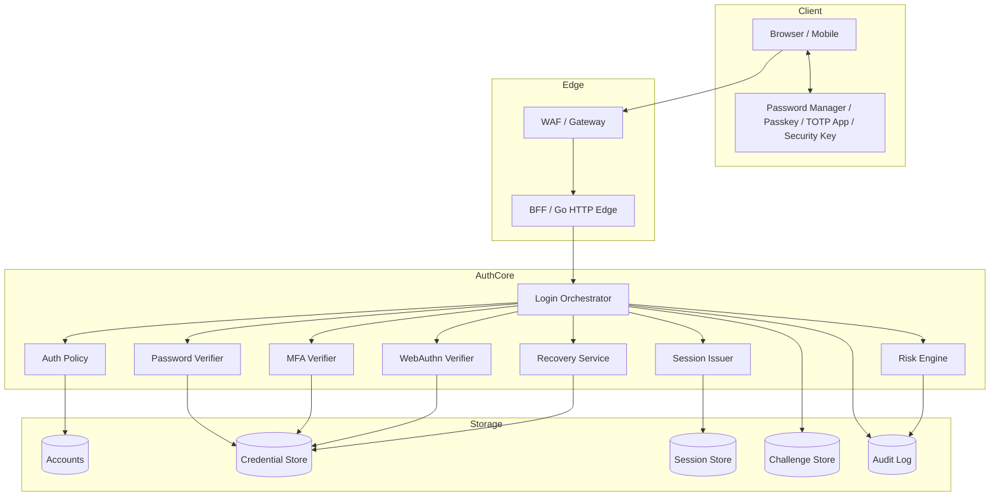

---

## 41. Minimal Design Template

Gunakan template ini saat mendesain authentication feature.

```markdown
# Authentication Design Review

## Feature

## Actors
- Claimant:
- Verifier:
- Admin/support actor:
- Attacker model:

## Assets
- Account:
- Credential:
- Session/token:
- Recovery path:
- Audit evidence:

## Authenticator Type
- Password:
- TOTP:
- WebAuthn:
- Client certificate:
- Federated IdP:
- Recovery code:

## State Machine
- Initial state:
- Challenge state:
- Verified state:
- Failed state:
- Recovery state:
- Revoked state:

## Trust Boundaries
- Browser/server:
- Gateway/service:
- IdP/RP:
- Credential store:
- Support/admin:

## Required Invariants
- Challenge one-time:
- Fresh auth:
- Session rotation:
- No enumeration:
- No secret logging:
- Recovery parity:

## Risk Controls
- Rate limit:
- Step-up:
- Notification:
- Cooldown:
- Audit:

## Failure Cases
- Wrong password:
- Account disabled:
- MFA lost:
- Token expired:
- Recovery abused:
- Concurrent requests:
- Store unavailable:

## Assurance Claim
- Target AAL:
- Why defensible:
- Weakest path:

## Tests
- Unit:
- Integration:
- Abuse:
- Fuzz:

## Open Questions
```

---

## 42. Latihan Praktis

### Exercise 1 — Draw Your Auth State Machine

Ambil service Anda sendiri, lalu gambar:

- anonymous;
- password verified;
- MFA required;
- session issued;
- step-up required;
- recovery started;
- compromised/locked.

Cari transition yang tidak punya audit.

### Exercise 2 — Recovery Weakest Path

Untuk setiap account role:

| Role | Login method | Recovery method | Effective weakness |
|---|---|---|---|
| citizen | password + TOTP | email reset | email takeover |
| staff | password + passkey | helpdesk reset | support process |
| admin | hardware key | dual-control reset | approval process |

### Exercise 3 — Passkey Verification Checklist

Tuliskan semua field yang harus diverifikasi:

- challenge;
- origin;
- rpID hash;
- credential id;
- signature;
- algorithm;
- user presence;
- user verification;
- counter;
- credential status.

### Exercise 4 — Incident Tabletop

Simulasikan:

```text
A user reports that their account password and MFA were changed overnight.
```

Jawab:

1. Event apa yang Anda cari?
2. Session mana yang dicabut?
3. Recovery path mana yang dicek?
4. Bagaimana membuktikan support/admin tidak terlibat?
5. Notifikasi apa yang dikirim?
6. Cooldown apa yang diterapkan?

---

## 43. Kesimpulan

Authentication architecture yang matang tidak berhenti pada password hash, MFA checkbox, atau passkey button.

Yang harus Anda kuasai sebagai engineer level tinggi:

1. Authentication adalah state machine.
2. Assurance dibatasi oleh recovery path terlemah.
3. MFA harus purpose-bound, one-time, dan tidak boleh bisa dilewati oleh recovery yang lemah.
4. Passkey/WebAuthn kuat karena public-key + origin/RP binding, tetapi hanya jika server verification benar.
5. Risk-based auth harus explainable dan tidak boleh menjadi arbitrary black box.
6. Session harus membawa auth context yang cukup: method, time, assurance, risk, freshness.
7. Admin/support workflow adalah attack surface authentication.
8. Audit harus merekam transition tanpa membocorkan secret.
9. Go memberi primitive kuat, tetapi struktur authentication harus Anda desain eksplisit.
10. Claim assurance harus sesuai lifecycle, bukan sekadar metode login.

---

## 44. Koneksi ke Part Berikutnya

Part berikutnya:

```text
learn-go-security-cryptography-integrity-part-019.md
```

Topik:

```text
Secure net/http: server timeout, request size limit, header limit, body draining, slowloris defense, panic boundary, middleware order, and safe response handling.
```

Kenapa setelah authentication kita masuk ke `net/http`?

Karena authentication flow biasanya berjalan di HTTP boundary. Kalau HTTP server mudah terkena slowloris, body flooding, header abuse, panic leakage, CSRF mis-ordering, atau middleware bypass, authentication design yang kuat tetap bisa runtuh di transport/application boundary.

---

## 45. Status Seri

```text
[done] part-000 sampai part-018
[next] part-019 — Secure net/http
[remaining] part-020 sampai part-034
```

Seri belum selesai.


<!-- NAVIGATION_FOOTER -->
<div class="page-nav">
<a href="./learn-go-security-cryptography-integrity-part-017.md">⬅️ Part 017 — Session Security in Go: Cookies, SameSite, Secure, HttpOnly, CSRF, Session Fixation, Refresh Token Rotation, Idle Timeout, and Absolute Timeout</a>
<a href="./index.md">📚 Kategori</a>
<a href="../../index.md">🏠 Home</a>
<a href="./learn-go-security-cryptography-integrity-part-019.md">Part 019 — Secure `net/http` in Go: Server Timeouts, Request Limits, Slowloris Defense, Panic Boundary, Middleware Order, and Safe Response Handling ➡️</a>
</div>
