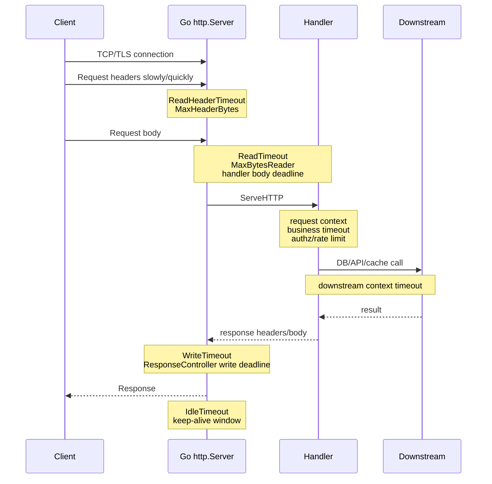
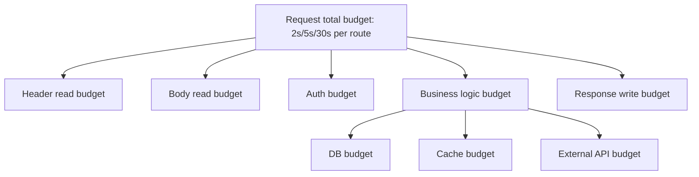
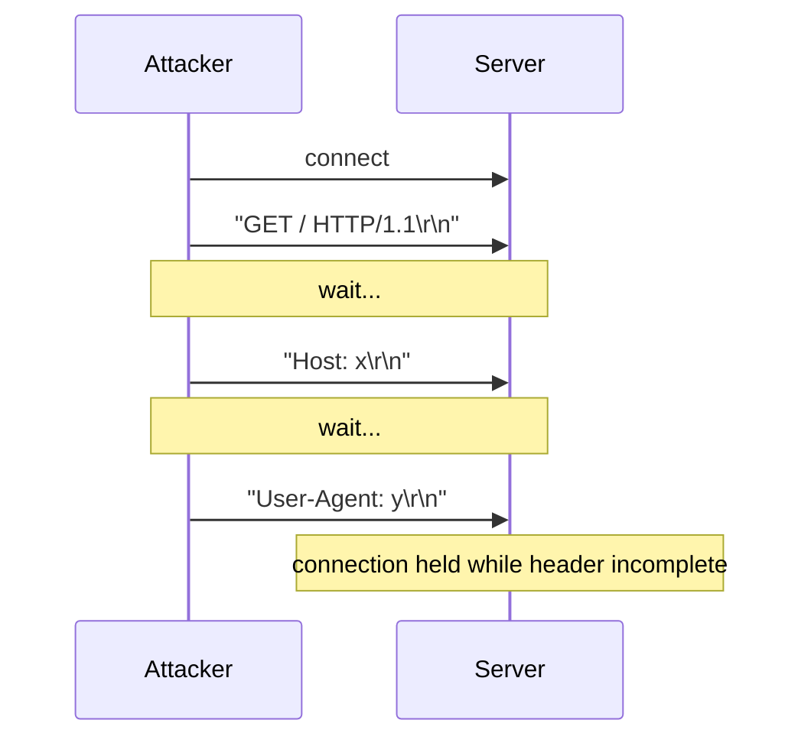
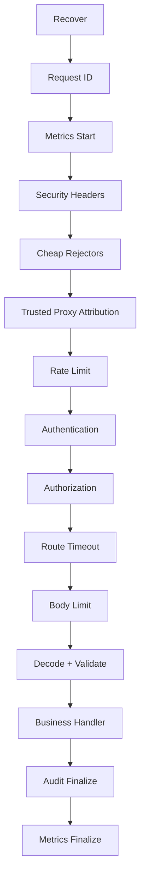
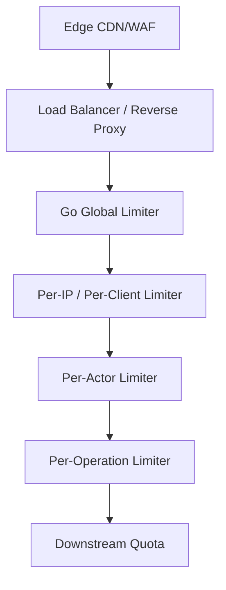
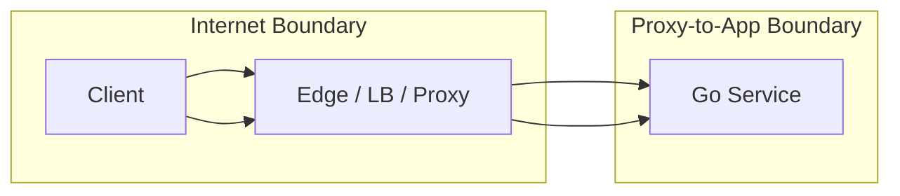

# learn-go-security-cryptography-integrity-part-019.md

# Part 019 — Secure `net/http` in Go: Server Timeouts, Request Limits, Slowloris Defense, Panic Boundary, Middleware Order, and Safe Response Handling

> Seri: `learn-go-security-cryptography-integrity`  
> Bagian: `019 / 034`  
> Fokus: secure HTTP server boundary di Go 1.26.x  
> Pembaca: Java software engineer yang ingin berpikir seperti production/security engineer Go  
> Status seri: belum selesai

---

## 0. Posisi Materi Ini Dalam Seri

Sebelumnya kita sudah membahas:

- security mental model,
- Go security surface,
- threat modeling,
- cryptography engineering,
- randomness,
- hashing,
- MAC/HMAC,
- symmetric encryption,
- public-key crypto,
- key agreement,
- password security,
- key management,
- X.509/PKI,
- TLS,
- mTLS,
- OAuth2/OIDC/JWT,
- session security,
- authentication architecture.

Bagian ini berpindah dari **identity/crypto boundary** ke **HTTP service boundary**.

Di production, sebagian besar Go service menerima input lewat HTTP atau gRPC-over-HTTP/2. Untuk banyak sistem, `net/http` adalah pintu pertama attacker bertemu aplikasi kita. Karena itu, secure HTTP server bukan hanya soal handler benar, tetapi soal **resource governance**, **protocol boundary**, **timeout semantics**, **body limit**, **panic containment**, **middleware order**, **response discipline**, dan **observability**.

Bagian ini tidak akan mengulang materi networking/IO dari seri sebelumnya. Kita hanya membahas aspek yang security-relevant.

---

## 1. Learning Objectives

Setelah bagian ini, kamu harus mampu:

1. Menjelaskan kenapa `http.ListenAndServe(addr, handler)` tanpa custom `http.Server` biasanya tidak cukup untuk internet-facing service.
2. Mendesain `http.Server` dengan timeout, header limit, base context, conn context, error log, graceful shutdown, dan connection state observation.
3. Membedakan:
   - `ReadHeaderTimeout`,
   - `ReadTimeout`,
   - `WriteTimeout`,
   - `IdleTimeout`,
   - handler timeout,
   - request context timeout,
   - downstream timeout.
4. Menentukan limit request body per endpoint, bukan satu angka global yang buta konteks.
5. Memahami cara menggunakan `http.MaxBytesReader` dengan benar.
6. Membedakan body rejection yang aman vs body draining yang justru membuka DoS.
7. Mendesain middleware order yang tidak membocorkan informasi, tidak membuang CPU sebelum auth, dan tidak membuat audit/rate limit salah.
8. Mendesain panic boundary yang mengisolasi request, mencatat evidence, dan tidak membocorkan stack trace ke client.
9. Menulis response secara aman: status code konsisten, JSON envelope, no double write, no partial sensitive response, no header injection.
10. Membuat checklist secure HTTP review untuk Go service.

---

## 2. Core Mental Model: HTTP Server Adalah Resource Gatekeeper

Banyak developer memandang HTTP handler seperti ini:

```text
request masuk -> parse -> business logic -> response keluar
```

Untuk security engineer, model itu terlalu naif.

Model yang lebih benar:


Setiap edge adalah tempat attacker bisa mencoba:

- menahan koneksi,
- memperbesar header,
- mengirim body terlalu besar,
- memperlambat upload,
- memicu parser ambiguity,
- membuat goroutine tertahan,
- menghabiskan memory,
- membuat response sebagian terkirim lalu panic,
- mengeksploitasi middleware order,
- memaksa downstream call mahal,
- membocorkan detail internal lewat error.

Jadi secure `net/http` bukan hanya:

```go
http.HandleFunc("/x", handler)
http.ListenAndServe(":8080", nil)
```

Tetapi:

```text
untrusted network input -> bounded protocol handling -> authenticated operation -> authorized operation -> bounded resource use -> safe response -> evidence
```

---

## 3. Threat Model Untuk Go HTTP Server

### 3.1 Attacker Capability

Asumsikan attacker bisa:

1. Membuka banyak koneksi TCP/TLS.
2. Mengirim header sangat lambat.
3. Mengirim header besar.
4. Mengirim body tanpa `Content-Length`.
5. Mengirim chunked body tanpa akhir.
6. Mengirim multipart form besar.
7. Mengirim JSON nested atau array besar.
8. Menutup koneksi di tengah proses.
9. Mengulang request mahal berkali-kali.
10. Mengirim method/path/header aneh.
11. Memanipulasi `X-Forwarded-For`, `Host`, `Origin`, `Referer`, dan header tracing.
12. Memicu panic lewat edge case input.
13. Menggunakan HTTP/2 multiplexing untuk memperbesar concurrency pada sedikit connection.
14. Menggunakan reverse proxy behavior untuk membuat mismatch antara proxy dan aplikasi.

### 3.2 Asset Yang Dilindungi

Pada HTTP boundary, asset bukan hanya data bisnis.

| Asset | Contoh |
|---|---|
| Availability | worker, goroutine, DB pool, CPU, memory, file descriptor |
| Confidentiality | token, cookie, PII, stack trace, internal hostname |
| Integrity | request identity, authz decision, audit log, idempotency key |
| Accountability | actor ID, request ID, source attribution, route, decision reason |
| Cost | cloud egress, object storage read, downstream API quota |
| Operational trust | metrics benar, logs tidak terkontaminasi, alert meaningful |

### 3.3 Security Invariant

Untuk HTTP service, invariant yang bagus biasanya berbentuk:

1. **No unauthenticated request can consume expensive business resources.**
2. **No request can consume unbounded memory, CPU, body bytes, header bytes, or downstream calls.**
3. **No request can continue business processing after its context is canceled.**
4. **No panic leaks internal details to the client.**
5. **No partially-written response should be treated as a successful operation.**
6. **Every authorization decision is bound to authenticated actor, target resource, operation, and request context.**
7. **Every rejected request is observable without logging secrets or attacker-controlled raw payload.**
8. **Every route has explicit method, content-type, body limit, timeout budget, auth requirement, and audit behavior.**

---

## 4. Why `http.ListenAndServe` Alone Is Dangerous For Serious Services

Go makes it easy to start a server:

```go
log.Fatal(http.ListenAndServe(":8080", handler))
```

This is good for demos. For production security, it hides important defaults.

The problem is not that `net/http` is insecure. The problem is that **production risk depends on configuration and boundaries**.

A serious server should make these explicit:

- header read timeout,
- request read behavior,
- response write timeout,
- idle connection timeout,
- max header bytes,
- TLS config if terminating TLS directly,
- handler chain,
- error log sink,
- base context,
- connection context,
- graceful shutdown,
- health/readiness separation,
- metrics and panic recovery.

Bad baseline:

```go
package main

import (
	"log"
	"net/http"
)

func main() {
	mux := http.NewServeMux()
	mux.HandleFunc("/healthz", func(w http.ResponseWriter, r *http.Request) {
		w.WriteHeader(http.StatusNoContent)
	})

	log.Fatal(http.ListenAndServe(":8080", mux))
}
```

Better baseline:

```go
package main

import (
	"context"
	"errors"
	"log"
	"log/slog"
	"net"
	"net/http"
	"os"
	"os/signal"
	"syscall"
	"time"
)

func main() {
	logger := slog.New(slog.NewJSONHandler(os.Stdout, &slog.HandlerOptions{
		Level: slog.LevelInfo,
	}))

	mux := http.NewServeMux()
	mux.HandleFunc("GET /healthz", func(w http.ResponseWriter, r *http.Request) {
		w.WriteHeader(http.StatusNoContent)
	})

	handler := recoverMiddleware(logger)(securityHeadersMiddleware(mux))

	srv := &http.Server{
		Addr:              ":8080",
		Handler:           handler,
		ReadHeaderTimeout: 2 * time.Second,
		ReadTimeout:       15 * time.Second,
		WriteTimeout:      20 * time.Second,
		IdleTimeout:       60 * time.Second,
		MaxHeaderBytes:    32 << 10, // 32 KiB; tune per environment.
		ErrorLog:          log.New(os.Stderr, "http-server: ", log.LstdFlags|log.LUTC),
		BaseContext: func(net.Listener) context.Context {
			return context.Background()
		},
		ConnContext: func(ctx context.Context, c net.Conn) context.Context {
			return context.WithValue(ctx, remoteAddrContextKey{}, c.RemoteAddr().String())
		},
	}

	go func() {
		logger.Info("http server starting", "addr", srv.Addr)
		if err := srv.ListenAndServe(); err != nil && !errors.Is(err, http.ErrServerClosed) {
			logger.Error("http server failed", "error", err)
			os.Exit(1)
		}
	}()

	ctx, stop := signal.NotifyContext(context.Background(), os.Interrupt, syscall.SIGTERM)
	defer stop()
	<-ctx.Done()

	shutdownCtx, cancel := context.WithTimeout(context.Background(), 25*time.Second)
	defer cancel()

	logger.Info("http server shutting down")
	if err := srv.Shutdown(shutdownCtx); err != nil {
		logger.Error("http server shutdown failed", "error", err)
		_ = srv.Close()
	}
}

type remoteAddrContextKey struct{}

func securityHeadersMiddleware(next http.Handler) http.Handler {
	return http.HandlerFunc(func(w http.ResponseWriter, r *http.Request) {
		w.Header().Set("X-Content-Type-Options", "nosniff")
		w.Header().Set("Referrer-Policy", "no-referrer")
		next.ServeHTTP(w, r)
	})
}

func recoverMiddleware(logger *slog.Logger) func(http.Handler) http.Handler {
	return func(next http.Handler) http.Handler {
		return http.HandlerFunc(func(w http.ResponseWriter, r *http.Request) {
			defer func() {
				if rec := recover(); rec != nil {
					logger.Error("panic recovered",
						"method", r.Method,
						"path", r.URL.Path,
						"remote", r.RemoteAddr,
						"panic", rec,
					)
					http.Error(w, http.StatusText(http.StatusInternalServerError), http.StatusInternalServerError)
				}
			}()
			next.ServeHTTP(w, r)
		})
	}
}
```

This is still only a baseline. Later sections will refine each piece.

---

## 5. The HTTP Lifecycle Budget

A request consumes resources across phases.



The engineering question is not “what timeout should I set?”

The better question:

> At each phase, how much resource am I willing to let an untrusted or semi-trusted caller hold?

---

## 6. `http.Server` Security Fields

### 6.1 `ReadHeaderTimeout`

Purpose:

- caps the time allowed to read request headers,
- important against slowloris-style attacks,
- usually safer than relying only on `ReadTimeout` because it isolates the header phase.

Example:

```go
ReadHeaderTimeout: 2 * time.Second,
```

Reasoning:

- Headers should arrive quickly.
- A client that cannot send headers within a small window should not hold a server connection.
- Internal load balancers may add latency, but not usually seconds of header drip.

Common values:

| Service Type | Starting Point |
|---|---:|
| Internal JSON API | 1–2s |
| Public API behind reverse proxy | 2–5s |
| Edge service accepting slow networks | 5–10s, with proxy-level protection |

Avoid:

```go
ReadHeaderTimeout: 0 // no explicit protection
```

### 6.2 `ReadTimeout`

Purpose:

- caps the time to read the whole request, including body.

Subtlety:

- A single global `ReadTimeout` may be too blunt.
- Small JSON endpoint and large upload endpoint have different acceptable body windows.
- For many services, use `ReadHeaderTimeout` globally and per-handler body limit/deadline.

Example:

```go
ReadTimeout: 15 * time.Second,
```

Use when:

- most endpoints have small bodies,
- you do not support long uploads,
- you want a broad safety net.

Be careful when:

- endpoint supports large file upload,
- endpoint streams request body,
- reverse proxy already buffers request body.

### 6.3 `WriteTimeout`

Purpose:

- caps response writing duration.

Security value:

- prevents slow clients from holding server resources while reading response very slowly,
- protects large response endpoints.

Example:

```go
WriteTimeout: 20 * time.Second,
```

Be careful:

- streaming/SSE/WebSocket-like flows need different handling,
- `http.TimeoutHandler` does not support `Hijacker` or `Flusher`, so it is not appropriate for many streaming endpoints,
- per-response deadline can be adjusted via `http.ResponseController` where supported.

### 6.4 `IdleTimeout`

Purpose:

- caps how long an idle keep-alive connection can wait for next request.

Security value:

- prevents idle connections from accumulating forever,
- preserves file descriptors and connection memory.

Example:

```go
IdleTimeout: 60 * time.Second,
```

Tuning:

| Environment | Starting Point |
|---|---:|
| Public API | 30–90s |
| Internal service mesh | 60–120s |
| Resource-constrained service | 15–30s |

### 6.5 `MaxHeaderBytes`

Purpose:

- caps total bytes read while parsing request line and headers.
- does **not** limit request body.

Default:

- Go default max header bytes is 1 MiB.

For many APIs, 1 MiB header budget is too generous. A practical API might start with 32 KiB or 64 KiB, then tune based on real needs.

Example:

```go
MaxHeaderBytes: 32 << 10, // 32 KiB
```

Need to consider:

- large cookies,
- JWT in Authorization header,
- tracing headers,
- mTLS-derived proxy headers,
- legacy clients,
- gateway-added headers.

Security invariant:

```text
Header budget must be large enough for legitimate identity/tracing metadata,
but small enough that unauthenticated clients cannot allocate large parser buffers.
```

### 6.6 `ErrorLog`

`net/http` server can log internal server errors and panic stack traces to its error log.

For production:

- route it into structured logging or a controlled sink,
- ensure stack traces are not exposed to users,
- avoid logging attacker payload wholesale,
- include request ID if possible in middleware logs.

### 6.7 `BaseContext` and `ConnContext`

Use cases:

- attach server-level lifecycle context,
- attach connection metadata,
- record accepted remote address,
- attach listener identity when one binary serves multiple listeners.

Avoid:

- putting mutable request state in context,
- putting large objects in context,
- using context as a global dependency bag.

### 6.8 `ConnState`

`ConnState` can observe connection lifecycle.

Use cases:

- active/idle connection metrics,
- detecting connection storms,
- debugging keep-alive behavior,
- coarse admission control outside handler.

Example:

```go
srv := &http.Server{
	Addr: ":8080",
	ConnState: func(c net.Conn, state http.ConnState) {
		// Export counters/gauges carefully.
		// Do not log every transition at info level in high traffic services.
	},
}
```

Security note:

- Connection metrics help detect slowloris, scanners, partial handshakes, and load balancer misconfiguration.
- Do not depend on `ConnState` as your only enforcement layer.

---

## 7. Timeout Matrix: Do Not Use One Timeout For Everything

| Layer | Go Mechanism | Protects Against | Risk If Missing |
|---|---|---|---|
| Header read | `ReadHeaderTimeout` | slowloris header drip | FD/goroutine exhaustion |
| Whole request read | `ReadTimeout` | slow full-body upload | connection held too long |
| Body read per endpoint | `MaxBytesReader` + handler deadline | huge/slow payload | memory/CPU exhaustion |
| Handler execution | `context.WithTimeout` or route policy | expensive operation | goroutine/DB pool exhaustion |
| Downstream call | context-aware DB/HTTP client timeout | backend hang | cascading failure |
| Response write | `WriteTimeout` / `ResponseController` | slow reader | blocked writer resources |
| Keep-alive wait | `IdleTimeout` | idle FD accumulation | connection starvation |
| Reverse proxy | proxy timeout config | edge attack | app receives bad traffic shape |

A production Go service should have a **budget tree**:



Example for small JSON API:

```text
Header:       2s
Body read:    1s
AuthN:        200ms
AuthZ:        200ms
DB:           700ms
Business:     1s total
Response:     2s
Total route:  3s
```

Example for upload API:

```text
Header:       2s
Body read:    route-specific, rate-aware
Max body:     explicit, e.g. 20 MiB
Virus scan:   async or bounded sync
Object store: bounded
Response:     small, fast
```

---

## 8. Slowloris Defense

### 8.1 What Slowloris Tries To Do

Slowloris-style attack:

1. Opens many connections.
2. Sends request headers very slowly.
3. Keeps connections open.
4. Exhausts server file descriptors, goroutines, or connection slots.

The attacker does not need high bandwidth. The attack abuses **time**, not throughput.



### 8.2 Go Defense

At application level:

```go
srv := &http.Server{
	ReadHeaderTimeout: 2 * time.Second,
	MaxHeaderBytes:    32 << 10,
	IdleTimeout:       60 * time.Second,
}
```

At infrastructure level:

- load balancer idle timeout,
- reverse proxy header timeout,
- max connections per client/IP if supported,
- WAF/rate limit for edge traffic,
- SYN flood protection at network layer,
- container/process file descriptor limit.

### 8.3 Important Distinction

`ReadHeaderTimeout` handles slow headers.

It does not solve:

- slow request body upload,
- huge body,
- expensive authenticated operation,
- DB query exhaustion,
- response slow reader,
- HTTP/2 stream-level concurrency abuse.

That is why you need layered limits.

---

## 9. Request Body Limit: `http.MaxBytesReader`

`http.MaxBytesReader` is intended for limiting incoming request body size. It returns an `io.ReadCloser`, returns `*http.MaxBytesError` when the limit is exceeded, and can ask the server to close the connection after the limit is reached.

### 9.1 Correct Basic Pattern

```go
func decodeJSONLimited[T any](w http.ResponseWriter, r *http.Request, maxBytes int64) (T, error) {
	var zero T

	r.Body = http.MaxBytesReader(w, r.Body, maxBytes)
	defer r.Body.Close()

	dec := json.NewDecoder(r.Body)
	dec.DisallowUnknownFields()

	var dst T
	if err := dec.Decode(&dst); err != nil {
		return zero, err
	}

	// Ensure there is no trailing JSON value.
	if dec.More() {
		return zero, errors.New("unexpected trailing JSON content")
	}

	return dst, nil
}
```

The `dec.More()` check above is not sufficient for all trailing data cases because `More` is designed for arrays/objects. A stricter pattern:

```go
func decodeSingleJSON[T any](w http.ResponseWriter, r *http.Request, maxBytes int64) (T, error) {
	var zero T

	r.Body = http.MaxBytesReader(w, r.Body, maxBytes)
	defer r.Body.Close()

	dec := json.NewDecoder(r.Body)
	dec.DisallowUnknownFields()

	var dst T
	if err := dec.Decode(&dst); err != nil {
		return zero, err
	}

	// A second Decode should return EOF if there is exactly one JSON value.
	var extra any
	if err := dec.Decode(&extra); err != io.EOF {
		if err == nil {
			return zero, errors.New("unexpected trailing JSON value")
		}
		return zero, err
	}

	return dst, nil
}
```

### 9.2 Handling `MaxBytesError`

```go
func createWidgetHandler(w http.ResponseWriter, r *http.Request) {
	type request struct {
		Name string `json:"name"`
	}

	req, err := decodeSingleJSON[request](w, r, 64<<10) // 64 KiB
	if err != nil {
		var mbe *http.MaxBytesError
		if errors.As(err, &mbe) {
			http.Error(w, "request body too large", http.StatusRequestEntityTooLarge)
			return
		}
		http.Error(w, "invalid request body", http.StatusBadRequest)
		return
	}

	_ = req
	w.WriteHeader(http.StatusCreated)
}
```

### 9.3 Body Limit Is Per Route

Do not set one global limit blindly.

| Route | Suggested Body Limit |
|---|---:|
| `POST /login` | 4–16 KiB |
| `POST /token/refresh` | 4–16 KiB |
| `POST /api/resource` JSON | 32–256 KiB |
| `POST /search` | 16–64 KiB |
| `POST /import` | explicit business limit, e.g. 5–50 MiB |
| `POST /upload` | explicit + streaming + storage quota |
| `GET` endpoints | usually no body accepted |

For a regulatory/case-management system, most transactional JSON commands should be small. If a “case update” requires 10 MiB JSON, it may be smuggling document upload into a business command.

---

## 10. Reject Request Bodies Where Bodies Are Not Expected

Many APIs ignore bodies on `GET`, `DELETE`, or certain `POST` actions. Ignoring can be dangerous if the body still consumes resources somewhere in the chain.

Policy:

```text
If route semantics do not allow body, reject body explicitly.
```

Example:

```go
func rejectUnexpectedBody(w http.ResponseWriter, r *http.Request) bool {
	if r.Body == nil || r.Body == http.NoBody {
		return false
	}

	// ContentLength == 0 means explicitly no body.
	if r.ContentLength == 0 {
		return false
	}

	// ContentLength == -1 can mean unknown, e.g. chunked.
	// For no-body routes, treat unknown body as suspicious.
	if r.ContentLength > 0 || r.ContentLength == -1 {
		http.Error(w, "request body not allowed", http.StatusBadRequest)
		return true
	}

	return false
}
```

Use in no-body routes:

```go
func getWidgetHandler(w http.ResponseWriter, r *http.Request) {
	if rejectUnexpectedBody(w, r) {
		return
	}
	// Continue safe read-only handling.
}
```

Caveat:

- Some proxies/clients may send `Content-Length: 0`; allow that.
- Unknown body length on a no-body endpoint should not be silently consumed.

---

## 11. Form and Multipart Pitfalls

### 11.1 `ParseForm`

`Request.ParseForm` parses URL query for all requests and, for `POST`, `PUT`, `PATCH` with form content, reads body into form fields. If the body is not already limited by `MaxBytesReader`, Go caps it at 10 MB.

Security advice:

- still set an explicit limit before parsing,
- do not rely on implicit 10 MB as your application policy,
- do not use convenience methods that ignore parse errors when security matters.

Avoid:

```go
value := r.FormValue("x") // implicitly parses and ignores errors
```

Prefer:

```go
r.Body = http.MaxBytesReader(w, r.Body, 32<<10)
if err := r.ParseForm(); err != nil {
	http.Error(w, "invalid form", http.StatusBadRequest)
	return
}
value := r.PostForm.Get("x")
```

### 11.2 `ParseMultipartForm`

`ParseMultipartForm(maxMemory)` stores up to `maxMemory` bytes of file parts in memory and the remainder on disk temp files.

Risk:

- temp disk exhaustion,
- large number of parts,
- filename/path tricks,
- content-type spoofing,
- malware scanning pressure,
- orphan temp files if cleanup is forgotten.

Prefer streaming for large uploads:

```go
mr, err := r.MultipartReader()
if err != nil {
	http.Error(w, "invalid multipart request", http.StatusBadRequest)
	return
}

for {
	part, err := mr.NextPart()
	if errors.Is(err, io.EOF) {
		break
	}
	if err != nil {
		http.Error(w, "invalid multipart stream", http.StatusBadRequest)
		return
	}

	// Enforce per-part policy:
	// - allowed field name
	// - max bytes
	// - content sniffing
	// - storage quota
	// - audit
	_ = part.Close()
}
```

Upload security is big enough for its own section in part 025, but the HTTP boundary principle is simple:

```text
Never parse multipart without explicit route-level size, part-count, part-size, storage, and timeout policy.
```

---

## 12. Body Draining: When To Drain and When Not To Drain

There is often advice to “drain the body so the connection can be reused.” That is client-side advice in many contexts. For server-side security, it needs nuance.

### 12.1 Safe Rule

If body is small and already within limit, reading it to EOF is normal.

If body exceeds policy, do **not** spend unbounded resources draining attacker-controlled data.

### 12.2 Rejection Strategy

For oversized body:

- use `MaxBytesReader`,
- return `413 Request Entity Too Large`,
- let server close connection if needed,
- do not read the rest of a 10 GB malicious body “for politeness”.

For unauthorized request with body:

- authenticate before expensive parse where possible,
- if auth is in header/cookie, reject unauthenticated request before reading large body,
- do not parse upload body before checking whether caller is allowed to upload.

### 12.3 Read Before Write

Go docs warn that depending on client/protocol/intermediary, reading `Request.Body` after writing response may not work reliably. Cautious handlers should read needed body first, then write response.

So:

```text
Validate headers/auth/limits -> read bounded body -> decide -> write response
```

Avoid:

```go
w.WriteHeader(http.StatusAccepted)
// then keep reading body and doing work
```

This can create ambiguous outcomes: client sees accepted, server later fails.

---

## 13. Handler Timeout vs Request Context Timeout

### 13.1 `http.TimeoutHandler`

`http.TimeoutHandler` wraps a handler with a time limit. If handler runs too long, it responds with `503 Service Unavailable`; subsequent writes by the original handler return `http.ErrHandlerTimeout`.

It is useful for simple handlers, but has limitations:

- not suitable for streaming that needs `Flusher`,
- not suitable for hijacked connections/WebSockets,
- may hide more precise error semantics,
- does not automatically stop work unless your code observes context cancellation.

### 13.2 Prefer Context-Aware Business Timeout

Example route policy:

```go
func withRouteTimeout(timeout time.Duration, next http.Handler) http.Handler {
	return http.HandlerFunc(func(w http.ResponseWriter, r *http.Request) {
		ctx, cancel := context.WithTimeout(r.Context(), timeout)
		defer cancel()
		next.ServeHTTP(w, r.WithContext(ctx))
	})
}
```

Then every downstream operation must accept the context:

```go
rows, err := db.QueryContext(r.Context(), query, args...)
```

Bad:

```go
rows, err := db.Query(query, args...) // ignores request cancellation
```

### 13.3 Timeout Must Be Hierarchical

```go
func handler(w http.ResponseWriter, r *http.Request) {
	ctx := r.Context()

	dbCtx, cancel := context.WithTimeout(ctx, 700*time.Millisecond)
	defer cancel()

	result, err := repo.Load(dbCtx, id)
	if err != nil {
		// Map deadline separately from internal errors.
	}

	_ = result
}
```

Do not give DB a 10-second timeout inside a 2-second request timeout. The smaller parent context will cancel it anyway, but mismatched budgets make operational debugging harder.

---

## 14. Middleware Order Is A Security Decision

Middleware order determines:

- what work happens before authentication,
- what gets logged,
- what gets rate-limited,
- what catches panic,
- what sees response status,
- what can mutate headers,
- what can short-circuit request,
- what audit evidence is preserved.

### 14.1 Recommended High-Level Order

For typical JSON API:

```text
1. panic recovery
2. request ID / trace context normalization
3. connection/request metrics start
4. security headers base
5. request method/path normalization / route matching
6. very cheap global rejection: method, host, content-length, content-type
7. edge/client attribution normalization from trusted proxy only
8. rate limit / quota coarse layer
9. authentication
10. authorization
11. route-specific timeout and body limit
12. decode and validate
13. idempotency / replay guard if relevant
14. business handler
15. audit finalization
16. metrics finalization
```

In diagram form:



### 14.2 Why Recovery Should Be Outer

Recovery should catch panic from downstream middleware and handler.

But if your response writer wrapper tracks status, recovery must cooperate with it.

If panic happens after partial body has been written, you may not be able to change status code to 500. That is why high-risk handlers should validate and complete side effects before writing.

### 14.3 Why Authentication Should Be Before Body Parsing

If identity is available from headers/cookies/mTLS, authenticate before parsing large JSON or multipart body.

Bad:

```text
read 100 MiB JSON -> parse -> validate -> discover token invalid
```

Better:

```text
check method/content-length -> authenticate -> authorize route permission -> read bounded body
```

### 14.4 Why Authorization Should Be Before Expensive Work

Authorization is not a post-filter.

Bad:

```text
load full case with documents -> check user cannot view case -> return 403
```

Better:

```text
check user can access case ID -> load only allowed data
```

This prevents:

- data exposure via timing,
- unnecessary DB load,
- audit confusion,
- object-level authorization bypass.

---

## 15. ResponseWriter Discipline

### 15.1 The Problem

`http.ResponseWriter` is easy to misuse:

- first `Write` implicitly sends status `200 OK`,
- headers changed after `WriteHeader` may have no effect,
- writing twice can create confusing output,
- panic after partial write cannot be converted into clean JSON error,
- middleware may not know final status unless wrapped.

### 15.2 Tracking Response Status

```go
type statusRecorder struct {
	http.ResponseWriter
	status      int
	wroteHeader bool
	bytes       int64
}

func (r *statusRecorder) WriteHeader(code int) {
	if r.wroteHeader {
		return
	}
	r.status = code
	r.wroteHeader = true
	r.ResponseWriter.WriteHeader(code)
}

func (r *statusRecorder) Write(p []byte) (int, error) {
	if !r.wroteHeader {
		r.WriteHeader(http.StatusOK)
	}
	n, err := r.ResponseWriter.Write(p)
	r.bytes += int64(n)
	return n, err
}

func (r *statusRecorder) Status() int {
	if r.status == 0 {
		return http.StatusOK
	}
	return r.status
}
```

Need to preserve optional interfaces carefully. Modern Go provides `http.ResponseController`, but wrappers still need to unwrap original `ResponseWriter` if advanced behavior is needed.

### 15.3 Safe JSON Response

Define one response helper:

```go
type errorResponse struct {
	Error errorBody `json:"error"`
}

type errorBody struct {
	Code    string `json:"code"`
	Message string `json:"message"`
}

func writeJSON(w http.ResponseWriter, status int, value any) {
	w.Header().Set("Content-Type", "application/json; charset=utf-8")
	w.Header().Set("X-Content-Type-Options", "nosniff")
	w.WriteHeader(status)

	enc := json.NewEncoder(w)
	enc.SetEscapeHTML(true)
	if err := enc.Encode(value); err != nil {
		// At this point headers may already be sent.
		// Log internally; do not attempt another HTTP error response.
	}
}

func writeProblem(w http.ResponseWriter, status int, code string, publicMessage string) {
	writeJSON(w, status, errorResponse{
		Error: errorBody{
			Code:    code,
			Message: publicMessage,
		},
	})
}
```

Principles:

- one function owns response format,
- public message is not raw internal error,
- logs contain internal error with request ID,
- response contains stable machine-readable code,
- no stack trace,
- no SQL error,
- no secret value.

---

## 16. Panic Boundary

### 16.1 What Go Already Does

If `ServeHTTP` panics, Go's HTTP server recovers the panic, logs a stack trace to the server error log, and closes the connection or sends HTTP/2 `RST_STREAM` depending on protocol.

This is helpful, but not enough for application-level security.

Why?

- You may want structured logs.
- You may need request ID, actor, route, tenant.
- You may need audit event.
- You may need consistent JSON error if no response has been written.
- You may need metrics.
- You may need panic classification.

### 16.2 Application Recovery Middleware

A better recovery middleware tracks whether response was already written.

```go
func recoverMiddleware(logger *slog.Logger) func(http.Handler) http.Handler {
	return func(next http.Handler) http.Handler {
		return http.HandlerFunc(func(w http.ResponseWriter, r *http.Request) {
			rec := &statusRecorder{ResponseWriter: w}

			defer func() {
				if v := recover(); v != nil {
					logger.Error("panic recovered",
						"method", r.Method,
						"path", r.URL.Path,
						"remote", r.RemoteAddr,
						"panic", v,
						"status_before_panic", rec.status,
						"bytes_before_panic", rec.bytes,
					)

					if !rec.wroteHeader {
						writeProblem(rec, http.StatusInternalServerError, "internal_error", "internal server error")
					}
				}
			}()

			next.ServeHTTP(rec, r)
		})
	}
}
```

### 16.3 Panic Should Not Be Normal Control Flow

Do not use panic for:

- validation error,
- missing parameter,
- auth failure,
- not found,
- expected downstream timeout.

Use panic only for programmer bugs or truly impossible states.

Security invariant:

```text
Expected attacker-controlled invalid input must not trigger panic.
```

If fuzzing can panic your handler by mutating request body, it is a bug.

---

## 17. Safe Error Mapping

### 17.1 Error Classes

| Internal Situation | Public Status | Public Code |
|---|---:|---|
| invalid JSON | 400 | `invalid_request` |
| body too large | 413 | `body_too_large` |
| unsupported content type | 415 | `unsupported_media_type` |
| unauthenticated | 401 | `unauthenticated` |
| authenticated but forbidden | 403 | `forbidden` |
| object not visible to user | 404 or 403 depending policy | `not_found` or `forbidden` |
| rate limited | 429 | `rate_limited` |
| route timeout | 503 or 504 depending architecture | `timeout` |
| downstream unavailable | 503 | `dependency_unavailable` |
| internal bug | 500 | `internal_error` |

### 17.2 Do Not Leak Internal Errors

Bad:

```go
http.Error(w, err.Error(), http.StatusInternalServerError)
```

This may leak:

- SQL query,
- table name,
- filesystem path,
- token parsing detail,
- stack trace,
- upstream URL,
- internal service name,
- authorization rule internals.

Better:

```go
logger.Error("create widget failed", "error", err, "request_id", requestID)
writeProblem(w, http.StatusInternalServerError, "internal_error", "internal server error")
```

---

## 18. Content-Type and Method Enforcement

### 18.1 Method-Specific Routing

Modern `ServeMux` supports method-aware patterns such as:

```go
mux.HandleFunc("GET /widgets/{id}", getWidget)
mux.HandleFunc("POST /widgets", createWidget)
```

Benefits:

- fewer manual method checks,
- clearer route table,
- lower chance that `POST` accidentally hits `GET` handler,
- route-level policy is easier to attach.

### 18.2 Content-Type Enforcement

For JSON commands:

```go
func requireJSON(w http.ResponseWriter, r *http.Request) bool {
	ct := r.Header.Get("Content-Type")
	if ct == "" {
		writeProblem(w, http.StatusUnsupportedMediaType, "content_type_required", "Content-Type must be application/json")
		return false
	}

	mediaType, _, err := mime.ParseMediaType(ct)
	if err != nil || mediaType != "application/json" {
		writeProblem(w, http.StatusUnsupportedMediaType, "unsupported_media_type", "Content-Type must be application/json")
		return false
	}

	return true
}
```

Do not accept arbitrary content types “because JSON decoder still works”. That allows ambiguous behavior across proxies, clients, and security scanners.

### 18.3 Accept Header

For APIs, enforce `Accept` only if you genuinely support content negotiation. Many JSON APIs simply always return JSON.

But do set:

```go
w.Header().Set("Content-Type", "application/json; charset=utf-8")
w.Header().Set("X-Content-Type-Options", "nosniff")
```

---

## 19. Host, Scheme, and Trusted Proxy Boundary

### 19.1 Never Trust Forwarded Headers From Direct Clients

Headers like these are attacker-controlled unless injected by a trusted proxy:

- `X-Forwarded-For`,
- `X-Real-IP`,
- `Forwarded`,
- `X-Forwarded-Proto`,
- `X-Forwarded-Host`,
- `X-Request-ID`,
- `Traceparent` if not validated.

If your app is behind a trusted load balancer, define:

```text
Only accept forwarded headers when remote peer is trusted proxy CIDR.
```

Pseudo-code:

```go
func clientIP(r *http.Request, trustedProxy bool) string {
	if trustedProxy {
		xff := r.Header.Get("X-Forwarded-For")
		if xff != "" {
			// parse left-most or proxy-specific policy carefully
			// validate IP syntax
		}
	}
	return hostPart(r.RemoteAddr)
}
```

### 19.2 Host Header

`Host` may affect:

- absolute URL generation,
- redirect target,
- tenant selection,
- callback URL,
- password reset links,
- OAuth redirect URI logic.

Policy:

```text
Do not use arbitrary r.Host to construct security-sensitive URLs.
Use configured external base URL or strict host allowlist.
```

Bad:

```go
resetURL := "https://" + r.Host + "/reset?token=" + token
```

Better:

```go
resetURL := publicBaseURL + "/reset?token=" + url.QueryEscape(token)
```

---

## 20. Path Handling and Routing Ambiguity

`ServeMux` sanitizes URL path and Host header in certain ways, including redirecting paths with `.` or `..` segments or repeated slashes to a cleaner URL. Escaped path elements like `%2e` and `%2f` are preserved and not considered separators for routing.

Security implications:

- Do not assume raw path equals clean path.
- Do not join URL path directly with filesystem path.
- Do not decode path multiple times.
- Be consistent between proxy path normalization and Go app routing.

Dangerous pattern:

```go
file := baseDir + r.URL.Path
http.ServeFile(w, r, file)
```

Better:

- use strict route params,
- validate IDs as IDs, not paths,
- for static files, use constrained `fs.FS`,
- avoid serving user-controlled paths directly.

File/path security is covered deeper in part 025.

---

## 21. Request Cancellation

For incoming server requests, `r.Context()` is canceled when:

- client connection closes,
- HTTP/2 request is canceled,
- `ServeHTTP` returns.

This is a critical security and availability primitive.

### 21.1 Correct Use

```go
func handler(w http.ResponseWriter, r *http.Request) {
	ctx := r.Context()

	result, err := service.Do(ctx, input)
	if err != nil {
		if errors.Is(ctx.Err(), context.Canceled) {
			// Client went away. Usually log at debug/info, not error.
			return
		}
		writeProblem(w, http.StatusInternalServerError, "internal_error", "internal server error")
		return
	}

	writeJSON(w, http.StatusOK, result)
}
```

### 21.2 Bad Use

```go
go func() {
	// This outlives request without explicit job semantics.
	_ = expensiveWork(context.Background())
}()
```

If work should outlive request, make it explicit:

- enqueue job,
- persist job record,
- return `202 Accepted`,
- process with worker pool,
- apply tenant/user quota,
- audit job lifecycle.

Do not accidentally create background work because the client disconnected.

---

## 22. Rate Limiting and Resource Consumption

OWASP API Security Top 10 2023 includes unrestricted resource consumption as a major API risk. It recommends limiting payload sizes, operation frequency, returned record counts, and resource usage.

For Go HTTP service, rate limiting should be layered:



### 22.1 Global Limiter

Protects service during spikes.

### 22.2 Per-IP Limiter

Useful for unauthenticated endpoints.

Caveat:

- NAT/shared IP can cause false positives,
- `X-Forwarded-For` must only be trusted from trusted proxies.

### 22.3 Per-Actor Limiter

Useful after authentication.

Examples:

- login attempts per account,
- OTP validation attempts,
- password reset request,
- export generation,
- search query,
- report generation,
- file upload.

### 22.4 Per-Operation Cost Limit

Not all requests cost the same.

`GET /me` is cheap.  
`POST /report/export` may be expensive.  
`POST /search` with broad filters may be expensive.  
`POST /case/{id}/recalculate` may trigger many writes.

Do not rate-limit all endpoints with one flat number.

---

## 23. Response Security Headers

For JSON APIs:

```go
func securityHeaders(next http.Handler) http.Handler {
	return http.HandlerFunc(func(w http.ResponseWriter, r *http.Request) {
		w.Header().Set("X-Content-Type-Options", "nosniff")
		w.Header().Set("Referrer-Policy", "no-referrer")
		w.Header().Set("Cache-Control", "no-store")
		next.ServeHTTP(w, r)
	})
}
```

But be careful with `Cache-Control: no-store` globally:

- correct for sensitive API responses,
- may be unnecessary for public static assets,
- may harm caching strategy.

For browser-facing apps, also consider:

- `Content-Security-Policy`,
- `Strict-Transport-Security`,
- `X-Frame-Options` or CSP `frame-ancestors`,
- cookie flags from part 017.

For pure internal service-to-service JSON API, many browser headers are less relevant, but `nosniff` and correct content type still help.

---

## 24. Secure Server Template

Below is a compact reusable template for small/medium JSON API services.

```go
package securehttp

import (
	"context"
	"errors"
	"log"
	"log/slog"
	"net"
	"net/http"
	"os"
	"time"
)

type ServerConfig struct {
	Addr              string
	ReadHeaderTimeout time.Duration
	ReadTimeout       time.Duration
	WriteTimeout      time.Duration
	IdleTimeout       time.Duration
	MaxHeaderBytes    int
}

func DefaultServerConfig() ServerConfig {
	return ServerConfig{
		Addr:              ":8080",
		ReadHeaderTimeout: 2 * time.Second,
		ReadTimeout:       15 * time.Second,
		WriteTimeout:      20 * time.Second,
		IdleTimeout:       60 * time.Second,
		MaxHeaderBytes:    32 << 10,
	}
}

func NewServer(cfg ServerConfig, handler http.Handler, logger *slog.Logger) *http.Server {
	if cfg.Addr == "" {
		cfg.Addr = ":8080"
	}
	if cfg.MaxHeaderBytes == 0 {
		cfg.MaxHeaderBytes = 32 << 10
	}

	wrapped := Recover(logger)(SecurityHeaders(handler))

	return &http.Server{
		Addr:              cfg.Addr,
		Handler:           wrapped,
		ReadHeaderTimeout: cfg.ReadHeaderTimeout,
		ReadTimeout:       cfg.ReadTimeout,
		WriteTimeout:      cfg.WriteTimeout,
		IdleTimeout:       cfg.IdleTimeout,
		MaxHeaderBytes:    cfg.MaxHeaderBytes,
		ErrorLog:          log.New(os.Stderr, "http-server: ", log.LstdFlags|log.LUTC),
		BaseContext: func(net.Listener) context.Context {
			return context.Background()
		},
	}
}

func ListenAndServe(ctx context.Context, srv *http.Server, logger *slog.Logger) error {
	errCh := make(chan error, 1)

	go func() {
		logger.Info("server starting", "addr", srv.Addr)
		err := srv.ListenAndServe()
		if err != nil && !errors.Is(err, http.ErrServerClosed) {
			errCh <- err
			return
		}
		errCh <- nil
	}()

	select {
	case <-ctx.Done():
		shutdownCtx, cancel := context.WithTimeout(context.Background(), 25*time.Second)
		defer cancel()
		if err := srv.Shutdown(shutdownCtx); err != nil {
			_ = srv.Close()
			return err
		}
		return nil
	case err := <-errCh:
		return err
	}
}
```

Middleware:

```go
func SecurityHeaders(next http.Handler) http.Handler {
	return http.HandlerFunc(func(w http.ResponseWriter, r *http.Request) {
		w.Header().Set("X-Content-Type-Options", "nosniff")
		w.Header().Set("Referrer-Policy", "no-referrer")
		next.ServeHTTP(w, r)
	})
}

func Recover(logger *slog.Logger) func(http.Handler) http.Handler {
	return func(next http.Handler) http.Handler {
		return http.HandlerFunc(func(w http.ResponseWriter, r *http.Request) {
			rec := &statusRecorder{ResponseWriter: w}
			defer func() {
				if v := recover(); v != nil {
					logger.Error("panic recovered",
						"method", r.Method,
						"path", r.URL.Path,
						"remote", r.RemoteAddr,
						"panic", v,
						"status", rec.Status(),
						"bytes", rec.bytes,
					)
					if !rec.wroteHeader {
						writeProblem(rec, http.StatusInternalServerError, "internal_error", "internal server error")
					}
				}
			}()
			next.ServeHTTP(rec, r)
		})
	}
}
```

---

## 25. Route Policy Object

For larger systems, avoid scattering timeout/body/auth/rate policies across handlers.

Create route policy as metadata.

```go
type RoutePolicy struct {
	Name         string
	AuthRequired bool
	Permission   string
	Timeout      time.Duration
	MaxBodyBytes int64
	ContentTypes []string
	Audit        bool
	RateClass    string
}
```

Example:

```go
var CreateCasePolicy = RoutePolicy{
	Name:         "create_case",
	AuthRequired: true,
	Permission:   "case:create",
	Timeout:      3 * time.Second,
	MaxBodyBytes: 128 << 10,
	ContentTypes: []string{"application/json"},
	Audit:        true,
	RateClass:    "write_command",
}
```

Then middleware can enforce consistently:

```go
func WithRoutePolicy(policy RoutePolicy, next http.Handler) http.Handler {
	return http.HandlerFunc(func(w http.ResponseWriter, r *http.Request) {
		ctx, cancel := context.WithTimeout(r.Context(), policy.Timeout)
		defer cancel()

		if policy.MaxBodyBytes == 0 && methodUsuallyHasBody(r.Method) {
			writeProblem(w, http.StatusInternalServerError, "route_policy_error", "route policy misconfigured")
			return
		}

		r = r.WithContext(ctx)
		next.ServeHTTP(w, r)
	})
}
```

Security benefits:

- reviewable policy,
- route inventory,
- easier threat modeling,
- easier API gateway alignment,
- easier audit/compliance evidence.

---

## 26. Method, Body, and Auth Matrix

For every route, define:

| Route | Method | Auth | Permission | Body | Limit | Timeout | Audit |
|---|---|---|---|---|---:|---:|---|
| `/healthz` | GET | no | none | no | 0 | 100ms | no |
| `/readyz` | GET | internal/probe | none | no | 0 | 500ms | no |
| `/login` | POST | no | none | JSON | 8 KiB | 1s | yes |
| `/token/refresh` | POST | refresh credential | none | JSON | 8 KiB | 1s | yes |
| `/cases` | POST | yes | `case:create` | JSON | 128 KiB | 3s | yes |
| `/cases/{id}` | GET | yes | `case:read` | no | 0 | 2s | yes |
| `/cases/{id}/documents` | POST | yes | `document:upload` | multipart | 20 MiB | route-specific | yes |
| `/reports/export` | POST | yes | `report:export` | JSON | 32 KiB | async | yes |

If a route does not have this table, its security behavior is probably implicit.

Implicit security behavior is where production bugs hide.

---

## 27. Special Case: Health and Readiness Endpoints

Health endpoints are often attacked or abused because they are unauthenticated.

### 27.1 `/healthz`

Should answer:

```text
Is process alive?
```

It should not:

- call DB,
- call downstream service,
- reveal build secrets,
- reveal dependency topology,
- reveal version details publicly.

Example:

```go
mux.HandleFunc("GET /healthz", func(w http.ResponseWriter, r *http.Request) {
	if rejectUnexpectedBody(w, r) {
		return
	}
	w.WriteHeader(http.StatusNoContent)
})
```

### 27.2 `/readyz`

Should answer:

```text
Should traffic be sent to this instance?
```

May check:

- DB pool availability lightly,
- required config loaded,
- migration state,
- dependency circuit state.

Should be protected if it exposes internals.

### 27.3 `/debug/pprof`

Never expose debug endpoints publicly.

If enabled:

- separate listener,
- localhost/admin network only,
- auth required,
- disabled by default in production,
- no internet ingress.

---

## 28. HTTP/2 Considerations

HTTP/2 changes resource behavior:

- one TCP/TLS connection can carry many streams,
- request cancellation can happen per stream,
- slow client and flow-control behavior differ from HTTP/1.1,
- some middleware assumptions about connection-per-request become false.

Security implications:

1. Rate limit by actor/token/tenant, not only connection.
2. Do not assume `ConnState` active count equals request concurrency under HTTP/2.
3. Make every handler context-aware.
4. Align reverse proxy HTTP/2 settings with app server behavior.
5. Be careful with streaming responses and write deadlines.

If direct HTTP/2 handling is critical, review Go's HTTP/2 config and proxy/server settings as a pair.

---

## 29. Reverse Proxy Boundary

Many Go services run behind:

- AWS ALB/NLB,
- Nginx,
- Envoy,
- Traefik,
- API Gateway,
- service mesh sidecar,
- Kubernetes ingress.

This creates two boundaries:



Your Go service must know:

- Does proxy buffer request body?
- What is proxy max body size?
- What is proxy header size limit?
- What is proxy read timeout?
- What is proxy idle timeout?
- Does proxy pass original Host?
- Does proxy normalize path?
- Does proxy strip dangerous headers?
- Does proxy terminate TLS?
- Does app see HTTP/1.1 or HTTP/2?
- Which forwarded headers are trustworthy?

Security invariant:

```text
Proxy and application limits must be aligned.
The application must not assume proxy enforcement unless it is explicitly owned and tested.
```

---

## 30. Safe Logging at HTTP Boundary

Log:

- request ID,
- method,
- route pattern, not raw high-cardinality path if possible,
- status,
- duration,
- response bytes,
- authenticated actor ID if available,
- tenant/agency if available,
- decision result,
- coarse error class,
- remote client attribution after trusted proxy normalization.

Do not log:

- Authorization header,
- Cookie header,
- raw token,
- password,
- OTP,
- full request body,
- uploaded file content,
- raw query string with secrets,
- full stack trace to public logs unless access controlled.

Example access log middleware:

```go
func AccessLog(logger *slog.Logger) func(http.Handler) http.Handler {
	return func(next http.Handler) http.Handler {
		return http.HandlerFunc(func(w http.ResponseWriter, r *http.Request) {
			start := time.Now()
			rec := &statusRecorder{ResponseWriter: w}

			next.ServeHTTP(rec, r)

			logger.Info("http request",
				"method", r.Method,
				"path", r.URL.Path,
				"status", rec.Status(),
				"bytes", rec.bytes,
				"duration_ms", time.Since(start).Milliseconds(),
				"remote", r.RemoteAddr,
			)
		})
	}
}
```

For high traffic, prefer route pattern over raw path:

```text
/cases/{id}
```

instead of:

```text
/cases/123456789
```

This reduces cardinality and may avoid leaking identifiers.

---

## 31. Metrics and Alerts

Minimum HTTP security metrics:

| Metric | Why |
|---|---|
| active connections | detect slowloris/connection leaks |
| active requests | detect saturation |
| request duration by route/status | detect slow endpoints |
| body-too-large count | detect probing/abuse |
| malformed request count | detect scanners |
| auth failure count | detect brute force/token abuse |
| rate-limited count | validate limiter behavior |
| panic recovered count | detect bugs/attacks |
| context canceled count | detect client disconnects/proxy timeouts |
| timeout count by layer | detect budget mismatch |
| response bytes by route | detect egress abuse |

Alert examples:

- sudden spike in `413` body-too-large,
- spike in header timeout/connection reset,
- panic > 0 in production,
- 5xx rate above SLO,
- route p99 near timeout,
- active connections high but request throughput low,
- auth failure rate high for one account/IP,
- high client cancellation during expensive operations.

---

## 32. Testing Secure HTTP Boundary

### 32.1 Unit Tests For Body Limit

```go
func TestCreateWidgetBodyTooLarge(t *testing.T) {
	body := strings.NewReader(strings.Repeat("A", 70<<10))
	req := httptest.NewRequest(http.MethodPost, "/widgets", body)
	req.Header.Set("Content-Type", "application/json")

	rr := httptest.NewRecorder()
	createWidgetHandler(rr, req)

	if rr.Code != http.StatusRequestEntityTooLarge {
		t.Fatalf("status = %d, want %d", rr.Code, http.StatusRequestEntityTooLarge)
	}
}
```

### 32.2 Test Panic Recovery

```go
func TestRecoverMiddleware(t *testing.T) {
	logger := slog.New(slog.NewTextHandler(io.Discard, nil))
	h := recoverMiddleware(logger)(http.HandlerFunc(func(w http.ResponseWriter, r *http.Request) {
		panic("boom")
	}))

	rr := httptest.NewRecorder()
	req := httptest.NewRequest(http.MethodGet, "/panic", nil)

	h.ServeHTTP(rr, req)

	if rr.Code != http.StatusInternalServerError {
		t.Fatalf("status = %d, want %d", rr.Code, http.StatusInternalServerError)
	}
}
```

### 32.3 Test Context Cancellation

```go
func TestHandlerRespectsCancellation(t *testing.T) {
	ctx, cancel := context.WithCancel(context.Background())
	cancel()

	req := httptest.NewRequest(http.MethodGet, "/slow", nil).WithContext(ctx)
	rr := httptest.NewRecorder()

	slowHandler(rr, req)

	// Assert the handler does not continue expensive work.
}
```

### 32.4 Slowloris Integration Test

For realistic slowloris behavior, use integration tests with real listener and raw TCP connection.

Sketch:

```go
func TestReadHeaderTimeout(t *testing.T) {
	ln, err := net.Listen("tcp", "127.0.0.1:0")
	if err != nil {
		t.Fatal(err)
	}
	defer ln.Close()

	srv := &http.Server{
		Handler:           http.HandlerFunc(func(w http.ResponseWriter, r *http.Request) {}),
		ReadHeaderTimeout: 100 * time.Millisecond,
	}
	defer srv.Close()

	go func() { _ = srv.Serve(ln) }()

	conn, err := net.Dial("tcp", ln.Addr().String())
	if err != nil {
		t.Fatal(err)
	}
	defer conn.Close()

	_, _ = conn.Write([]byte("GET / HTTP/1.1\r\n"))
	time.Sleep(300 * time.Millisecond)

	_, err = conn.Write([]byte("Host: example.com\r\n\r\n"))
	if err == nil {
		// Depending on OS timing, write may still appear to succeed.
		// A subsequent read should observe close/timeout behavior.
	}
}
```

### 32.5 Fuzzing Decoders and Validators

Use fuzzing for:

- JSON body parser,
- content-type parser wrapper,
- route param validator,
- ID parser,
- signature canonicalization,
- header parsing logic,
- proxy header parser.

Example:

```go
func FuzzDecodeCreateWidget(f *testing.F) {
	f.Add([]byte(`{"name":"ok"}`))
	f.Fuzz(func(t *testing.T, data []byte) {
		req := httptest.NewRequest(http.MethodPost, "/widgets", bytes.NewReader(data))
		req.Header.Set("Content-Type", "application/json")
		rr := httptest.NewRecorder()

		createWidgetHandler(rr, req)

		if rr.Code < 100 || rr.Code > 599 {
			t.Fatalf("invalid status code: %d", rr.Code)
		}
	})
}
```

Security expectation:

```text
Malformed attacker input may return 400/413/415/422.
It must not panic, hang, allocate unbounded memory, or trigger side effects before validation.
```

---

## 33. Common Anti-Patterns

### 33.1 No Custom Server

```go
http.ListenAndServe(":8080", nil)
```

Risk:

- no explicit timeout policy,
- default mux exposure,
- unclear handler chain,
- no graceful shutdown structure.

### 33.2 Reading Unlimited Body

```go
b, _ := io.ReadAll(r.Body)
```

Risk:

- memory exhaustion,
- large body DoS.

Better:

```go
r.Body = http.MaxBytesReader(w, r.Body, 64<<10)
b, err := io.ReadAll(r.Body)
```

### 33.3 Parsing Before Auth

```go
parseHugeBody()
checkAuth()
```

Risk:

- unauthenticated resource exhaustion.

### 33.4 Using `FormValue` In Security-Sensitive Code

```go
id := r.FormValue("id")
```

Risk:

- implicit parse,
- ignored parse errors,
- query/body precedence surprises.

### 33.5 Leaking Internal Errors

```go
http.Error(w, err.Error(), 500)
```

Risk:

- information disclosure.

### 33.6 Trusting `X-Forwarded-For` Directly

```go
ip := r.Header.Get("X-Forwarded-For")
```

Risk:

- spoofed IP,
- bypass rate limit,
- bad audit evidence.

### 33.7 Writing Response Before Decision Is Final

```go
w.WriteHeader(http.StatusOK)
doImportantWork()
```

Risk:

- partial success illusion,
- audit mismatch,
- impossible error correction.

### 33.8 Panic For Attacker Input

```go
if invalid {
	panic("bad request")
}
```

Risk:

- noisy logs,
- potential partial response,
- hidden validation bugs.

---

## 34. Production Checklist

### 34.1 Server Config

- [ ] Uses explicit `http.Server`, not package-level `ListenAndServe` directly.
- [ ] `ReadHeaderTimeout` configured.
- [ ] `IdleTimeout` configured.
- [ ] `WriteTimeout` configured or explicitly justified for streaming.
- [ ] `ReadTimeout` configured or route-level body deadlines documented.
- [ ] `MaxHeaderBytes` configured based on real header budget.
- [ ] Graceful shutdown implemented.
- [ ] `ErrorLog` routed to controlled logs.
- [ ] Debug endpoints not exposed publicly.

### 34.2 Routing

- [ ] Method-specific routes.
- [ ] No accidental default mux exposure.
- [ ] No catch-all route before auth unless intended.
- [ ] Route inventory exists.
- [ ] Each route has method/body/auth/permission/timeout/audit policy.

### 34.3 Request Limits

- [ ] Body limit per endpoint.
- [ ] `MaxBytesReader` used before body read/parse.
- [ ] Unknown body rejected for no-body routes.
- [ ] Multipart has part count, part size, total size, temp storage, and cleanup policy.
- [ ] Query parameters have max length and max count where relevant.
- [ ] Pagination limit enforced server-side.

### 34.4 Middleware

- [ ] Recovery outermost or near outermost.
- [ ] Request ID normalized safely.
- [ ] Trusted proxy headers accepted only from trusted source.
- [ ] Rate limit before expensive operations.
- [ ] Authentication before body parsing where possible.
- [ ] Authorization before expensive object load where possible.
- [ ] Audit finalization sees final status.
- [ ] Metrics finalization sees final status/duration.

### 34.5 Response

- [ ] Stable error envelope.
- [ ] Public error messages do not include internal errors.
- [ ] Content-Type set explicitly.
- [ ] `X-Content-Type-Options: nosniff` set.
- [ ] No stack trace in response.
- [ ] No double-write pattern.
- [ ] Panic after partial write is monitored.

### 34.6 Context and Cancellation

- [ ] Handlers use `r.Context()`.
- [ ] DB calls use `QueryContext`/`ExecContext` or equivalent.
- [ ] Outbound HTTP calls use context-aware requests.
- [ ] Background work is explicit job, not accidental goroutine.
- [ ] Client cancellation does not continue expensive work unless intentionally persisted.

### 34.7 Observability

- [ ] Access logs avoid secrets.
- [ ] Logs include route/status/duration/request ID.
- [ ] Metrics include 4xx/5xx, panic, timeout, body-too-large, rate-limited.
- [ ] Alerts exist for panic, high 5xx, high body-too-large, high cancellation, high active connections.

---

## 35. Design Review Questions

Use these during architecture review:

1. What is the maximum header size this route/service accepts?
2. What is the maximum body size per route?
3. Can an unauthenticated caller force us to parse a large body?
4. Can a caller keep a connection open by sending headers slowly?
5. Can a caller keep a handler alive after disconnecting?
6. Can a caller trigger expensive DB/API calls before authorization?
7. What happens if handler panics after writing part of the response?
8. Are public errors stable and non-sensitive?
9. Which forwarded headers do we trust, and from whom?
10. Does proxy limit match application limit?
11. Does HTTP/2 multiplexing change our rate-limit assumptions?
12. Are health/readiness endpoints exposing internals?
13. Are request body parser errors handled explicitly?
14. Do convenience APIs ignore errors?
15. Is every route policy documented?

---

## 36. Java-to-Go Mental Shift

As a Java engineer, you may be used to servlet containers, Spring Boot, Tomcat/Jetty/Netty, filters, interceptors, and container-managed defaults.

In Go:

| Java/Spring Mental Model | Go `net/http` Mental Model |
|---|---|
| Container often owns server lifecycle | Your binary owns server lifecycle |
| Many defaults hidden in framework | You must configure `http.Server` explicitly |
| Servlet filters/interceptors | Middleware chain is just handler wrapping |
| Exception mapper | You design panic/error response boundary |
| Request body often abstracted | You directly control `r.Body` and limits |
| Security filters may be framework-managed | Middleware order is your responsibility |
| Actuator endpoints | You must isolate debug/health endpoints |
| Thread pool tuning | Goroutine/resource budget + downstream pool tuning |

The Go advantage is clarity and low magic.

The Go risk is that missing policy often means missing enforcement.

---

## 37. Minimal Secure JSON API Skeleton

```go
package main

import (
	"bytes"
	"context"
	"encoding/json"
	"errors"
	"io"
	"log"
	"log/slog"
	"mime"
	"net/http"
	"os"
	"time"
)

func main() {
	logger := slog.New(slog.NewJSONHandler(os.Stdout, nil))

	mux := http.NewServeMux()
	mux.Handle("POST /widgets", route(
		RoutePolicy{
			Name:         "create_widget",
			AuthRequired: true,
			Permission:   "widget:create",
			Timeout:      2 * time.Second,
			MaxBodyBytes: 64 << 10,
			ContentTypes: []string{"application/json"},
			Audit:        true,
			RateClass:    "write_command",
		},
		http.HandlerFunc(createWidget),
	))

	h := Recover(logger)(AccessLog(logger)(SecurityHeaders(mux)))

	srv := &http.Server{
		Addr:              ":8080",
		Handler:           h,
		ReadHeaderTimeout: 2 * time.Second,
		ReadTimeout:       15 * time.Second,
		WriteTimeout:      20 * time.Second,
		IdleTimeout:       60 * time.Second,
		MaxHeaderBytes:    32 << 10,
		ErrorLog:          log.New(os.Stderr, "http-server: ", log.LstdFlags|log.LUTC),
	}

	log.Fatal(srv.ListenAndServe())
}

type RoutePolicy struct {
	Name         string
	AuthRequired bool
	Permission   string
	Timeout      time.Duration
	MaxBodyBytes int64
	ContentTypes []string
	Audit        bool
	RateClass    string
}

func route(policy RoutePolicy, next http.Handler) http.Handler {
	return http.HandlerFunc(func(w http.ResponseWriter, r *http.Request) {
		if policy.Timeout > 0 {
			ctx, cancel := context.WithTimeout(r.Context(), policy.Timeout)
			defer cancel()
			r = r.WithContext(ctx)
		}

		if len(policy.ContentTypes) > 0 && !contentTypeAllowed(r, policy.ContentTypes) {
			writeProblem(w, http.StatusUnsupportedMediaType, "unsupported_media_type", "unsupported media type")
			return
		}

		if policy.MaxBodyBytes > 0 {
			r.Body = http.MaxBytesReader(w, r.Body, policy.MaxBodyBytes)
		}

		// AuthN/AuthZ/rate-limit hooks would run here or before this wrapper,
		// depending on your middleware architecture.

		next.ServeHTTP(w, r)
	})
}

func contentTypeAllowed(r *http.Request, allowed []string) bool {
	ct := r.Header.Get("Content-Type")
	if ct == "" {
		return false
	}
	mediaType, _, err := mime.ParseMediaType(ct)
	if err != nil {
		return false
	}
	for _, a := range allowed {
		if mediaType == a {
			return true
		}
	}
	return false
}

type createWidgetRequest struct {
	Name string `json:"name"`
}

func createWidget(w http.ResponseWriter, r *http.Request) {
	defer r.Body.Close()

	var req createWidgetRequest
	dec := json.NewDecoder(r.Body)
	dec.DisallowUnknownFields()

	if err := dec.Decode(&req); err != nil {
		var mbe *http.MaxBytesError
		if errors.As(err, &mbe) {
			writeProblem(w, http.StatusRequestEntityTooLarge, "body_too_large", "request body too large")
			return
		}
		writeProblem(w, http.StatusBadRequest, "invalid_json", "invalid JSON body")
		return
	}

	var extra json.RawMessage
	if err := dec.Decode(&extra); err != io.EOF {
		writeProblem(w, http.StatusBadRequest, "invalid_json", "request body must contain exactly one JSON value")
		return
	}

	if req.Name == "" || len(req.Name) > 100 {
		writeProblem(w, http.StatusBadRequest, "invalid_name", "invalid widget name")
		return
	}

	select {
	case <-r.Context().Done():
		return
	default:
	}

	writeJSON(w, http.StatusCreated, map[string]any{"status": "created"})
}

func writeJSON(w http.ResponseWriter, status int, value any) {
	w.Header().Set("Content-Type", "application/json; charset=utf-8")
	w.Header().Set("X-Content-Type-Options", "nosniff")
	w.WriteHeader(status)
	_ = json.NewEncoder(w).Encode(value)
}

func writeProblem(w http.ResponseWriter, status int, code string, message string) {
	writeJSON(w, status, map[string]any{
		"error": map[string]string{
			"code":    code,
			"message": message,
		},
	})
}

type statusRecorder struct {
	http.ResponseWriter
	status      int
	wroteHeader bool
	bytes       int64
}

func (r *statusRecorder) WriteHeader(code int) {
	if r.wroteHeader {
		return
	}
	r.status = code
	r.wroteHeader = true
	r.ResponseWriter.WriteHeader(code)
}

func (r *statusRecorder) Write(p []byte) (int, error) {
	if !r.wroteHeader {
		r.WriteHeader(http.StatusOK)
	}
	n, err := r.ResponseWriter.Write(p)
	r.bytes += int64(n)
	return n, err
}

func (r *statusRecorder) Status() int {
	if r.status == 0 {
		return http.StatusOK
	}
	return r.status
}

func SecurityHeaders(next http.Handler) http.Handler {
	return http.HandlerFunc(func(w http.ResponseWriter, r *http.Request) {
		w.Header().Set("X-Content-Type-Options", "nosniff")
		w.Header().Set("Referrer-Policy", "no-referrer")
		next.ServeHTTP(w, r)
	})
}

func AccessLog(logger *slog.Logger) func(http.Handler) http.Handler {
	return func(next http.Handler) http.Handler {
		return http.HandlerFunc(func(w http.ResponseWriter, r *http.Request) {
			start := time.Now()
			rec := &statusRecorder{ResponseWriter: w}
			next.ServeHTTP(rec, r)
			logger.Info("http request",
				"method", r.Method,
				"path", r.URL.Path,
				"status", rec.Status(),
				"bytes", rec.bytes,
				"duration_ms", time.Since(start).Milliseconds(),
			)
		})
	}
}

func Recover(logger *slog.Logger) func(http.Handler) http.Handler {
	return func(next http.Handler) http.Handler {
		return http.HandlerFunc(func(w http.ResponseWriter, r *http.Request) {
			rec := &statusRecorder{ResponseWriter: w}
			defer func() {
				if v := recover(); v != nil {
					logger.Error("panic recovered", "panic", v, "method", r.Method, "path", r.URL.Path)
					if !rec.wroteHeader {
						writeProblem(rec, http.StatusInternalServerError, "internal_error", "internal server error")
					}
				}
			}()
			next.ServeHTTP(rec, r)
		})
	}
}

func _avoidUnused() { _ = bytes.MinRead }
```

This skeleton is not a full framework. It demonstrates where policy lives.

---

## 38. Operational Runbook: Suspicious HTTP Resource Exhaustion

Symptoms:

- active connections high,
- active requests low,
- CPU not high but service unavailable,
- many connections in `StateNew` or header read phase,
- load balancer 504/502 increasing,
- app logs show few completed requests,
- file descriptor usage high,
- goroutine count high,
- p99 latency spikes.

Immediate checks:

1. Are connections stuck before headers complete?
2. Is `ReadHeaderTimeout` configured?
3. Are header sizes huge?
4. Are bodies oversized or slow?
5. Are unauthenticated endpoints being hit?
6. Is rate limit applied at edge and app?
7. Does proxy buffer or stream body to app?
8. Are downstream pools saturated?
9. Did a new route deploy without body limit?
10. Did a client release change keep-alive behavior?

Mitigations:

- lower edge/proxy header/body timeout,
- lower app `ReadHeaderTimeout`,
- temporarily reduce max body size for abused endpoint,
- enable/strengthen rate limit,
- block abusive source at WAF/proxy,
- isolate expensive route behind async job,
- scale horizontally if bottleneck is legitimate load,
- add route-level body limit and timeout patch,
- audit logs for suspicious actor/IP/tenant.

Post-incident fixes:

- add regression tests,
- add route policy inventory,
- add alert on `413`, timeout, active connection anomalies,
- align proxy/app limits,
- review middleware order,
- run fuzz tests for parser endpoint.

---

## 39. Summary

Secure `net/http` in Go is about making implicit boundaries explicit.

Key takeaways:

1. Use explicit `http.Server` for production.
2. Configure `ReadHeaderTimeout`, `IdleTimeout`, `WriteTimeout`, and `MaxHeaderBytes`.
3. Treat request body as hostile until bounded and authorized.
4. Use `http.MaxBytesReader` per route.
5. Authenticate and authorize before expensive parsing/work where possible.
6. Use request context for cancellation and deadlines.
7. Make middleware order intentional.
8. Wrap panic recovery for structured evidence, but do not use panic for attacker-controlled errors.
9. Use stable public error envelopes and private internal logs.
10. Align proxy and app limits.
11. Test slow headers, oversized bodies, panic, cancellation, and parser edge cases.

A mature Go service is not secure because its handlers compile. It is secure because every request is forced through a sequence of bounded, observable, policy-backed transitions.

---

## 40. References

- Go `net/http` package documentation: `https://pkg.go.dev/net/http`
- Go Security Best Practices: `https://go.dev/doc/security/best-practices`
- OWASP API Security Top 10 2023 — API4: Unrestricted Resource Consumption: `https://owasp.org/API-Security/editions/2023/en/0xa4-unrestricted-resource-consumption/`
- OWASP Error Handling Cheat Sheet: `https://cheatsheetseries.owasp.org/cheatsheets/Error_Handling_Cheat_Sheet.html`
- OWASP Logging Cheat Sheet: `https://cheatsheetseries.owasp.org/cheatsheets/Logging_Cheat_Sheet.html`
- RFC 9110 — HTTP Semantics: `https://www.rfc-editor.org/rfc/rfc9110`
- RFC 9112 — HTTP/1.1: `https://www.rfc-editor.org/rfc/rfc9112`
- RFC 9113 — HTTP/2: `https://www.rfc-editor.org/rfc/rfc9113`

---

## 41. Next Part

Next:

```text
learn-go-security-cryptography-integrity-part-020.md
```

Topic:

```text
API Security in Go: BOLA/IDOR, broken function authorization, mass assignment, object property authorization, rate limit, quota, and OWASP API Security Top 10 2023 mapping.
```

Seri belum selesai. Masih tersisa part 020 sampai part 034.


<!-- NAVIGATION_FOOTER -->
<div class="page-nav">
<a href="./learn-go-security-cryptography-integrity-part-018.md">⬅️ Part 018 — Authentication Architecture in Go: Password Login, MFA, Passkeys/WebAuthn, Account Recovery, Authenticator Lifecycle, Risk-Based Auth, and Assurance Levels</a>
<a href="./index.md">📚 Kategori</a>
<a href="../../index.md">🏠 Home</a>
<a href="./learn-go-security-cryptography-integrity-part-020.md">Part 020 — API Security in Go: BOLA/IDOR, Broken Function Authorization, Mass Assignment, Object Property Authorization, Rate Limit, Quota, and OWASP API Security Top 10 2023 Mapping ➡️</a>
</div>
