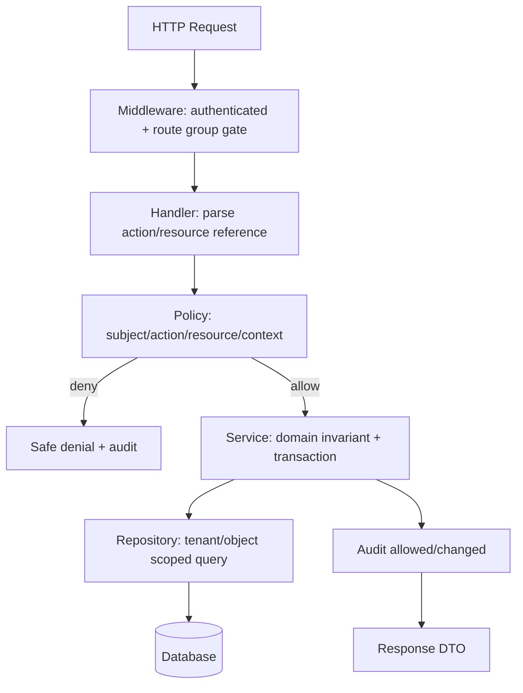
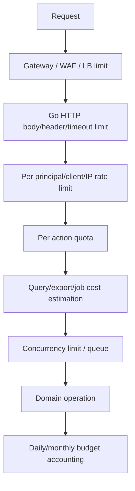
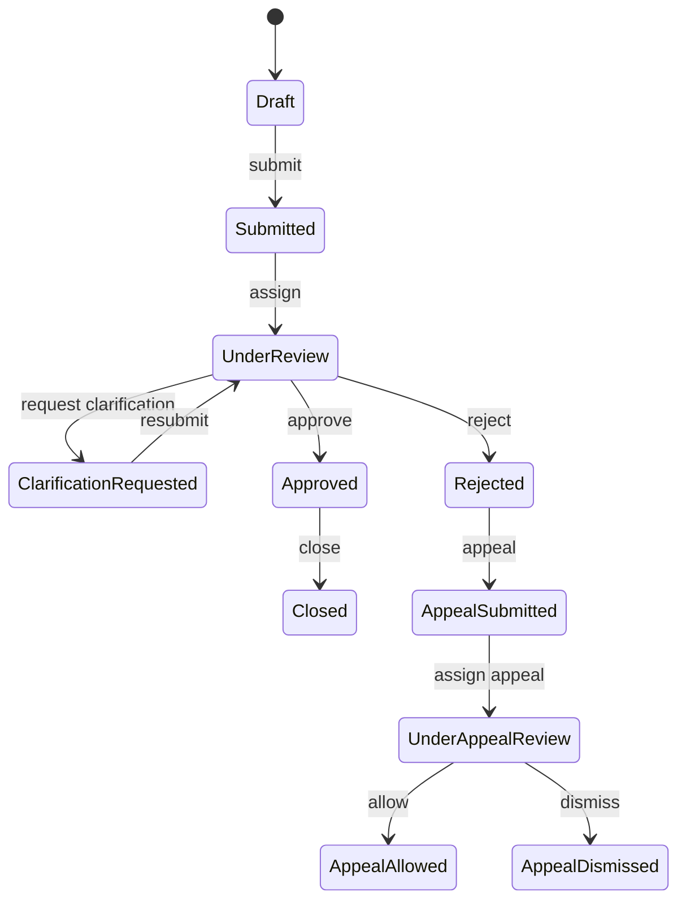

# learn-go-security-cryptography-integrity-part-020.md

# Part 020 — API Security in Go: BOLA/IDOR, Broken Function Authorization, Mass Assignment, Object Property Authorization, Rate Limit, Quota, and OWASP API Security Top 10 2023 Mapping

> Seri: `learn-go-security-cryptography-integrity`  
> Bagian: `020 / 034`  
> Fokus: API security boundary untuk Go services  
> Pembaca: Java software engineer yang ingin berpikir seperti production/security engineer Go  
> Status seri: belum selesai

---

## 0. Posisi Materi Ini Dalam Seri

Sebelumnya kita sudah membahas:

- security mental model,
- Go security surface,
- threat modeling,
- cryptography engineering,
- randomness,
- hashing,
- MAC/HMAC,
- symmetric encryption,
- public-key cryptography,
- key agreement,
- password security,
- key management,
- X.509/PKI,
- TLS,
- mTLS,
- OAuth2/OIDC/JWT,
- session security,
- authentication architecture,
- secure `net/http` boundary.

Bagian ini masuk ke salah satu area yang paling sering membuat sistem API bocor: **authorization dan resource governance pada API boundary**.

Kita tidak akan mengulang detail OAuth2/OIDC/JWT, session, TLS, atau HTTP timeout. Semua itu sudah dianggap sebagai fondasi. Di sini kita membahas pertanyaan yang lebih dekat ke desain domain:

> “Setelah user/service berhasil authenticated, operasi apa yang boleh dia lakukan terhadap object, property, function, flow, dan resource cost tertentu?”

Itu pertanyaan API security inti.

Dalam sistem regulatori, case management, licensing, enforcement, audit, dan multi-tenant workflow, API security tidak cukup dengan `role == admin` atau `userID == ownerID`. Kita harus memodelkan:

- siapa actor-nya,
- atas nama siapa dia bertindak,
- object apa yang disentuh,
- state object saat ini,
- action apa yang diminta,
- property mana yang dibaca/diubah,
- apakah action ini bagian dari sensitive business flow,
- apakah penggunaan resource masih wajar,
- apakah keputusan authorization bisa diaudit.

---

## 1. Learning Objectives

Setelah menyelesaikan bagian ini, kamu harus mampu:

1. Memetakan OWASP API Security Top 10 2023 ke desain Go API service.
2. Menjelaskan kenapa **authentication tidak sama dengan authorization**.
3. Mendesain object-level authorization untuk mencegah BOLA/IDOR.
4. Mendesain function-level authorization agar route admin/internal/sensitive flow tidak terbuka karena salah middleware atau salah route grouping.
5. Mencegah mass assignment dengan DTO allowlist, command model, dan decode discipline.
6. Mencegah broken object property level authorization pada input dan output.
7. Mendesain rate limit, quota, concurrency limit, pagination, export limit, dan job governance untuk API yang tahan abuse.
8. Membedakan `401`, `403`, dan `404` secara aman tanpa membocorkan object existence secara sembarangan.
9. Mendesain policy enforcement point dan policy decision point di Go.
10. Membuat authorization matrix test yang bisa menangkap horizontal privilege escalation, vertical privilege escalation, tenant crossing, dan state transition abuse.
11. Mendesain audit log authorization yang berguna untuk forensics tanpa membocorkan sensitive data.
12. Membuat review checklist API security untuk PR dan design review.

---

## 2. Core Mental Model: API Security Bukan Middleware Token Saja

Banyak developer melihat API security seperti ini:

```text
request masuk
  -> JWT/session valid?
  -> role cocok?
  -> handler jalan
```

Model itu terlalu dangkal.

Model yang lebih benar:

```mermaid
flowchart LR
    Client[Client / User / Service] --> Edge[API Edge]
    Edge --> AuthN[Authentication]
    AuthN --> Principal[Principal Context]
    Principal --> Route[Route + Function Boundary]
    Route --> Input[Input Parse + Validation]
    Input --> Obj[Object Reference Resolution]
    Obj --> Policy[Authorization Decision]
    Policy --> Prop[Property-Level Filter]
    Prop --> Cost[Resource Cost Governance]
    Cost --> Domain[Domain Operation]
    Domain --> Output[Output Shaping]
    Output --> Audit[Security Audit Event]
    Audit --> Response[Response]

    Policy -.deny.-> Deny[Safe Denial]
    Cost -.exceed.-> Throttle[Throttle / Quota Denial]
```



Setiap stage punya risiko berbeda:

| Stage | Pertanyaan security |
|---|---|
| API edge | Apakah request berasal dari channel yang diharapkan? TLS? gateway? internal? |
| Authentication | Siapa actor-nya? Apakah token/session valid? |
| Principal context | Apakah identity, tenant, role, assurance, delegation, dan service identity jelas? |
| Route/function | Apakah actor boleh memanggil function ini? |
| Input parse | Apakah input terbatas, canonical, dan tidak mengandung field liar? |
| Object resolution | Object mana yang dimaksud? Apakah ID dari client trusted? |
| Object authorization | Apakah actor boleh action ini terhadap object ini? |
| Property authorization | Field mana yang boleh dibaca/diubah? |
| Resource governance | Apakah call ini terlalu mahal, terlalu sering, atau bagian dari automation abuse? |
| Domain operation | Apakah state transition valid dan race-safe? |
| Output shaping | Apakah response membocorkan data yang tidak perlu? |
| Audit | Apakah keputusan security tercatat dengan evidence yang cukup? |

Security engineer yang baik tidak bertanya:

> “Endpoint ini butuh login atau tidak?”

Dia bertanya:

> “Untuk setiap action terhadap setiap object dan property, invariant apa yang harus selalu benar sebelum, selama, dan setelah request?”

---

## 3. OWASP API Security Top 10 2023 Mapping Untuk Go Services

OWASP API Security Top 10 2023 adalah awareness document untuk risiko API modern. Daftarnya bukan checklist lengkap, tetapi sangat berguna untuk orientasi desain.

| OWASP API 2023 | Risiko | Relevansi di Go Service | Dibahas di part ini? |
|---|---|---|---|
| API1 | Broken Object Level Authorization | Handler menerima `id` lalu query object tanpa scope actor/tenant | Ya, sangat dalam |
| API2 | Broken Authentication | Token/session/MFA/password flow salah | Sudah dibahas di part 016–018, disinggung ringkas |
| API3 | Broken Object Property Level Authorization | Input/output field tidak difilter berdasarkan actor/action | Ya, sangat dalam |
| API4 | Unrestricted Resource Consumption | Body besar, pagination liar, export besar, expensive query, LLM/costly integration | Ya |
| API5 | Broken Function Level Authorization | Route admin/internal/sensitive action bisa dipanggil user biasa | Ya |
| API6 | Unrestricted Access to Sensitive Business Flows | Bot/automation menyalahgunakan flow legal tapi sensitif | Ya |
| API7 | Server Side Request Forgery | URL dari user dipakai service untuk call internal resource | Akan dibahas detail di part 023 |
| API8 | Security Misconfiguration | Default debug, CORS, headers, TLS, error, infra config | Disinggung; detail tersebar di part 019, 023, 032–034 |
| API9 | Improper Inventory Management | API lama tidak terpantau, versioning kacau, shadow API | Disinggung di inventory/governance |
| API10 | Unsafe Consumption of APIs | Trust berlebih ke third-party/internal APIs | Akan dibahas bersama SSRF/integration boundary |

Catatan penting:

OWASP Top 10 bukan substitute untuk threat modeling. Ia memberi nama pada kelas risiko. Desain sebenarnya tetap harus dibuat dari domain invariant.

---

## 4. Vocabulary Yang Harus Presisi

### 4.1 Authentication

Authentication menjawab:

> “Siapa actor ini?”

Contoh:

- user sudah login via session,
- service sudah authenticated via mTLS,
- JWT access token valid,
- API key valid,
- client certificate valid.

Authentication tidak menjawab apakah actor boleh membaca case tertentu.

### 4.2 Authorization

Authorization menjawab:

> “Apakah actor ini boleh melakukan action ini terhadap resource ini dalam konteks ini?”

Format berpikir:

```text
allow(subject, action, resource, context) -> decision
```

Contoh:

```text
allow(
  subject = officer:123,
  action = case.approve,
  resource = case:ACEAS-2026-000123,
  context = { agency: CEA, case_state: PendingReview, assurance: MFA, channel: intranet }
)
```

### 4.3 Object-Level Authorization

Object-level authorization menjawab:

> “Untuk object spesifik ini, apakah actor boleh action ini?”

Contoh:

- boleh melihat application milik agency sendiri,
- boleh update case hanya jika assigned officer,
- boleh approve appeal hanya jika bukan creator dan berada di queue yang sesuai,
- boleh download document hanya jika document terkait case yang actor boleh lihat.

### 4.4 Function-Level Authorization

Function-level authorization menjawab:

> “Apakah actor boleh memanggil capability/function/endpoint ini?”

Contoh:

- `/admin/users/{id}/disable`,
- `/cases/{id}/approve`,
- `/reports/export`,
- `/internal/reindex`,
- `/templates/publish`,
- `/appeals/{id}/override-decision`.

### 4.5 Object Property-Level Authorization

Object property-level authorization menjawab:

> “Field mana yang boleh actor baca atau ubah?”

Contoh:

- user biasa boleh membaca `status`, tetapi tidak boleh membaca `internalNotes`,
- applicant boleh update `contactEmail`, tetapi tidak boleh update `riskScore`,
- support officer boleh melihat masked NRIC, tetapi tidak raw NRIC,
- reviewer boleh update `reviewComment`, tetapi tidak `approvalDecision`.

### 4.6 Sensitive Business Flow

Sensitive business flow adalah flow yang secara teknis valid tetapi bisa merugikan jika diotomasi, diskalakan, atau disalahgunakan.

Contoh:

- membuat ribuan appointment slot,
- submit ribuan application palsu,
- brute force redemption/voucher/referral,
- scraping search result,
- mass download documents,
- repeated address lookup dengan paid third-party API,
- abuse password reset atau OTP resend.

---

## 5. BOLA / IDOR: Risiko API Nomor Satu

### 5.1 Definisi Praktis

BOLA, sering juga disebut IDOR dalam bentuk klasik, terjadi ketika API menerima object identifier dari caller lalu melakukan operasi tanpa memastikan caller berhak atas object tersebut.

Anti-pattern:

```text
GET /api/cases/100002
Authorization: Bearer token-of-user-A

Handler:
  caseID := pathParam("caseID")
  case := db.GetCaseByID(caseID)
  return case
```

Kalau user A mengganti `100002` menjadi case milik user B dan sistem tetap mengembalikan data, itu BOLA.

Masalah utamanya bukan “ID bisa ditebak”. Masalah utamanya adalah **authorization tidak dilakukan pada object**.

UUID pun tidak menyelesaikan BOLA. UUID hanya membuat enumeration lebih sulit. Jika ID bocor dari log, referral, browser history, email, link, screenshot, OpenAPI example, atau response lain, object tetap bisa diakses tanpa authorization.

### 5.2 Jenis BOLA Yang Sering Muncul

| Jenis | Bentuk | Contoh |
|---|---|---|
| Direct object BOLA | Caller mengganti ID object | `/cases/{caseID}` |
| Nested object BOLA | Parent authorized, child tidak dicek | `/cases/{caseID}/documents/{docID}` |
| Cross-tenant BOLA | Tenant ID dari path/header bisa dimanipulasi | `/tenants/{tenantID}/cases/{caseID}` |
| Action-level BOLA | Boleh lihat object, tapi tidak boleh action tertentu | `POST /cases/{id}/approve` |
| State-based BOLA | Action hanya boleh pada state tertentu | approve case yang sudah closed |
| Relationship BOLA | Actor punya relasi A tapi tidak relasi B | officer boleh case assigned, bukan semua case agency |
| Indirect reference BOLA | ID tersembunyi dalam token/filter/body | `documentID` dalam JSON body |
| Batch BOLA | Sebagian item dalam list tidak authorized | `POST /documents/batch-download` |
| Search/list BOLA | Filter query mengembalikan object orang lain | `/cases?agency=...&status=...` |

### 5.3 Security Invariant Untuk BOLA

Invariant paling dasar:

```text
No domain object may be read or mutated unless the actor is authorized for
that object, action, tenant, state, and channel at the time of the operation.
```

Untuk regulatory case management:

```text
An officer may read a case only if at least one of the following is true:
- officer is assigned to the case,
- officer belongs to a team with explicit case queue access,
- officer has a role that grants scoped supervisory access for the case agency,
- officer is executing an approved audit/legal process with elevated access.
```

Yang tidak cukup:

```text
role == Officer
```

Karena `Officer` mungkin berarti boleh masuk sistem, bukan boleh membaca semua case.

---

## 6. Go Anti-Pattern: Repository Get By ID Tanpa Scope

### 6.1 Anti-Pattern

```go
func (h *CaseHandler) GetCase(w http.ResponseWriter, r *http.Request) {
    principal := auth.PrincipalFromContext(r.Context())
    if !principal.HasRole("officer") {
        http.Error(w, "forbidden", http.StatusForbidden)
        return
    }

    caseID := chi.URLParam(r, "caseID")

    c, err := h.repo.GetCaseByID(r.Context(), caseID)
    if err != nil {
        writeError(w, err)
        return
    }

    writeJSON(w, http.StatusOK, c)
}
```

Masalah:

- Role dicek, object tidak dicek.
- `GetCaseByID` terlalu powerful.
- Handler harus ingat melakukan authorization manual.
- Tidak ada tenant scoping.
- Tidak ada action distinction: read/update/approve/download.
- Output langsung domain model.

### 6.2 Pattern Yang Lebih Aman: Scoped Query

```go
type Principal struct {
    SubjectID string
    TenantID  string
    Roles     []string
    Teams     []string
}

type CaseRepository interface {
    FindReadableCase(ctx context.Context, p Principal, caseID string) (CaseRecord, error)
}

func (r *OracleCaseRepository) FindReadableCase(ctx context.Context, p Principal, caseID string) (CaseRecord, error) {
    const q = `
        SELECT c.id, c.tenant_id, c.status, c.assigned_officer_id, c.summary
        FROM cases c
        LEFT JOIN case_team_access a
               ON a.case_id = c.id
              AND a.team_id IN (:teams)
        WHERE c.id = :case_id
          AND c.tenant_id = :tenant_id
          AND (
                c.assigned_officer_id = :subject_id
             OR a.team_id IS NOT NULL
             OR EXISTS (
                    SELECT 1
                    FROM officer_roles r
                    WHERE r.subject_id = :subject_id
                      AND r.tenant_id = c.tenant_id
                      AND r.role_code = 'CASE_SUPERVISOR'
                )
          )
    `

    // Pseudocode: named args differ by DB driver.
    return queryOneCase(ctx, r.db, q, p, caseID)
}
```

Keuntungan:

- Scope actor/tenant/action masuk ke query.
- Object yang tidak authorized terlihat seperti tidak ada.
- Handler tidak bisa lupa tenant filter jika repository API tidak menyediakan `GetByID` publik.
- Authorization lebih dekat ke data boundary.

Namun ini bukan satu-satunya pattern. Kadang kita butuh load object dulu lalu policy check, terutama jika policy kompleks. Yang penting: tidak ada path yang bisa membaca/mutasi object tanpa authorization.

### 6.3 Pattern Yang Lebih Eksplisit: Policy Decision Point

```go
type Action string

const (
    ActionCaseRead    Action = "case.read"
    ActionCaseUpdate  Action = "case.update"
    ActionCaseApprove Action = "case.approve"
)

type CaseResource struct {
    ID                string
    TenantID          string
    Status            string
    AssignedOfficerID string
    QueueID           string
    CreatedBy         string
}

type AuthzDecision struct {
    Allow  bool
    Reason string
}

type Policy interface {
    CanCase(ctx context.Context, p Principal, action Action, c CaseResource) AuthzDecision
}
```

Handler:

```go
func (h *CaseHandler) ApproveCase(w http.ResponseWriter, r *http.Request) {
    ctx := r.Context()
    p := auth.PrincipalFromContext(ctx)
    caseID := chi.URLParam(r, "caseID")

    c, err := h.repo.FindCaseHeaderForAuthz(ctx, caseID)
    if err != nil {
        h.writeNotFoundOrError(w, err)
        return
    }

    decision := h.policy.CanCase(ctx, p, ActionCaseApprove, c.AuthzResource())
    if !decision.Allow {
        h.audit.AuthzDenied(ctx, p, ActionCaseApprove, c.ID, decision.Reason)
        h.writeSafeDenied(w)
        return
    }

    if err := h.service.Approve(ctx, p, c.ID); err != nil {
        h.writeDomainError(w, err)
        return
    }

    h.audit.AuthzAllowed(ctx, p, ActionCaseApprove, c.ID)
    writeJSON(w, http.StatusOK, ApproveCaseResponse{Status: "approved"})
}
```

Catatan penting:

- `FindCaseHeaderForAuthz` harus hanya mengambil field minimal untuk policy.
- Untuk endpoint yang existence-nya sensitive, denial bisa dikembalikan sebagai `404`.
- Domain service tetap harus enforce invariant state transition; jangan hanya mengandalkan handler.

---

## 7. Authorization Placement: Middleware, Handler, Service, Repository

Tidak ada satu tempat yang selalu benar. Setiap level punya fungsi.

| Level | Cocok untuk | Tidak cukup untuk |
|---|---|---|
| Middleware | Authentication, route group role minimum, rate limit, tenant extraction | Object-level authorization spesifik |
| Handler | Parsing route/body, memanggil policy dengan action/resource jelas | Menjamin semua path domain aman |
| Service/domain | State transition, business invariant, action-level rule | Filtering list/query besar tanpa bantuan repository |
| Repository/query | Tenant scoping, row filtering, efficient object-level filter | Rule kompleks berbasis workflow/context eksternal |
| Database policy/RLS | Defense-in-depth tenant isolation | Semua business authorization di aplikasi |

Prinsip praktis:

1. **Coarse function gate** di middleware/route group.
2. **Object/action policy** di handler/service.
3. **Tenant/object scoping** di repository/query.
4. **State transition invariant** di domain/service transaction.
5. **Audit decision** di satu boundary yang konsisten.

Mermaid:



---

## 8. Principal Context Design

API security runtuh jika `Principal` terlalu miskin atau terlalu kaya tanpa disiplin.

### 8.1 Principal Minimal Tapi Cukup

```go
type Principal struct {
    SubjectID      string
    SubjectType    SubjectType // user, service, job
    TenantID       string
    Roles          []Role
    Permissions    []Permission
    Teams          []string
    AssuranceLevel int
    AuthTime       time.Time
    SessionID      string
    ClientID       string
    DelegatedBy    string // optional: actor delegation / on-behalf-of
    Channel        Channel // internet, intranet, internal, batch
}
```

Field yang sering penting:

| Field | Kenapa penting |
|---|---|
| `SubjectID` | Actor utama |
| `SubjectType` | User vs service account vs background job berbeda rule |
| `TenantID` | Multi-tenant isolation |
| `Roles` | Function-level coarse access |
| `Permissions` | Fine-grained capability jika model memakai permission |
| `Teams` | Case queue/access relation |
| `AssuranceLevel` | Step-up untuk action sensitif |
| `AuthTime` | Re-authentication untuk operasi berisiko |
| `ClientID` | OAuth client identity / app identity |
| `DelegatedBy` | Audit ketika service acting on behalf of user |
| `Channel` | Internet/intranet/internal policy berbeda |

### 8.2 Jangan Trust Tenant Dari Client Begitu Saja

Anti-pattern:

```go
tenantID := r.Header.Get("X-Tenant-ID")
```

Kalau header ini datang dari browser/client, attacker bisa mengubahnya.

Lebih aman:

- Tenant berasal dari session/token claim yang diverifikasi.
- Untuk internal service, tenant bisa berasal dari signed request context atau mTLS identity + explicit authorized delegation.
- Header seperti `X-Tenant-ID` hanya trusted jika diset oleh gateway terpercaya dan request tidak bisa bypass gateway.
- Tetap validasi tenant terhadap permission actor.

### 8.3 Context Key Aman

```go
type principalContextKey struct{}

func WithPrincipal(ctx context.Context, p Principal) context.Context {
    return context.WithValue(ctx, principalContextKey{}, p)
}

func PrincipalFromContext(ctx context.Context) (Principal, bool) {
    p, ok := ctx.Value(principalContextKey{}).(Principal)
    return p, ok
}
```

Jangan pakai string key global seperti `"user"`; package lain bisa collision.

---

## 9. Function-Level Authorization

### 9.1 Broken Function Level Authorization

Broken function-level authorization terjadi ketika function/endpoint yang seharusnya terbatas dapat dipanggil oleh actor yang tidak semestinya.

Contoh:

```text
POST /api/admin/users/123/disable
```

Jika hanya butuh login biasa, endpoint admin bocor.

Contoh lain:

```text
POST /api/cases/123/override-decision
POST /api/templates/publish
POST /api/reports/export-all
POST /api/internal/reindex
```

### 9.2 Penyebab Umum

| Penyebab | Contoh |
|---|---|
| Route group salah middleware | `/admin` masuk router public |
| Method confusion | `GET` protected, `POST` tidak |
| Hidden endpoint tidak dihapus | `/debug/recalculate` tetap reachable |
| Client-side only check | Tombol disembunyikan, API tetap terbuka |
| Role terlalu umum | `officer` bisa action supervisor |
| Internal endpoint exposed | ALB/gateway route salah |
| Feature flag salah | endpoint aktif di prod tanpa authz |
| Version drift | `/v1/admin` protected, `/v2/admin` lupa |

### 9.3 Function Gate Pattern

```go
type Permission string

const (
    PermCaseRead        Permission = "case:read"
    PermCaseApprove     Permission = "case:approve"
    PermReportExport    Permission = "report:export"
    PermTemplatePublish Permission = "template:publish"
)

func RequirePermission(perm Permission) func(http.Handler) http.Handler {
    return func(next http.Handler) http.Handler {
        return http.HandlerFunc(func(w http.ResponseWriter, r *http.Request) {
            p, ok := auth.PrincipalFromContext(r.Context())
            if !ok {
                writeUnauthorized(w)
                return
            }
            if !p.HasPermission(perm) {
                auditFunctionDenied(r.Context(), p, perm, r.Method, r.URL.Path)
                writeForbidden(w)
                return
            }
            next.ServeHTTP(w, r)
        })
    }
}
```

Route:

```go
r.Route("/cases", func(r chi.Router) {
    r.With(RequirePermission(PermCaseRead)).Get("/{caseID}", h.GetCase)
    r.With(RequirePermission(PermCaseApprove)).Post("/{caseID}/approve", h.ApproveCase)
})

r.Route("/admin", func(r chi.Router) {
    r.Use(RequirePermission("admin:access"))
    r.Post("/users/{userID}/disable", admin.DisableUser)
})
```

Namun ingat: function gate hanya coarse gate. `case:approve` tidak berarti boleh approve semua case.

### 9.4 Function Authorization Matrix

Setiap route sensitif harus punya matrix eksplisit:

| Route | Action | Required permission | Object authz? | Step-up? | Channel |
|---|---|---|---|---|---|
| `GET /cases/{id}` | `case.read` | `case:read` | Yes | No | internet/intranet |
| `POST /cases/{id}/approve` | `case.approve` | `case:approve` | Yes | Maybe | intranet |
| `POST /reports/export` | `report.export` | `report:export` | Scope query | Yes | intranet |
| `POST /internal/reindex` | `system.reindex` | service only | N/A | N/A | internal only |

---

## 10. Object Property-Level Authorization

### 10.1 Dua Arah Risiko: Input dan Output

Broken object property level authorization punya dua sisi:

1. **Input-side**: user mengirim field yang tidak boleh diubah.
2. **Output-side**: API mengembalikan field yang tidak boleh dilihat.

Contoh input-side:

```json
{
  "displayName": "Fajar",
  "role": "ADMIN",
  "riskScore": 0,
  "approvalStatus": "APPROVED"
}
```

Contoh output-side:

```json
{
  "id": "case-123",
  "status": "OPEN",
  "applicantName": "...",
  "internalNotes": "Possible fraud pattern",
  "riskScore": 87,
  "investigatorComment": "..."
}
```

### 10.2 Anti-Pattern: Decode Langsung Ke Entity

```go
type User struct {
    ID           string `json:"id"`
    Email        string `json:"email"`
    DisplayName  string `json:"displayName"`
    Role         string `json:"role"`
    IsSuspended  bool   `json:"isSuspended"`
    PasswordHash string `json:"passwordHash"`
}

func (h *UserHandler) UpdateMe(w http.ResponseWriter, r *http.Request) {
    var u User
    if err := json.NewDecoder(r.Body).Decode(&u); err != nil {
        writeBadRequest(w)
        return
    }
    h.repo.UpdateUser(r.Context(), u)
}
```

Masalah:

- Client bisa mengirim `role`.
- Client bisa mengirim `isSuspended`.
- Client bisa mengirim `passwordHash`.
- Entity database bocor ke API contract.
- Future field baru bisa otomatis menjadi attack surface.

### 10.3 Pattern: Command DTO Allowlist

```go
type UpdateProfileRequest struct {
    DisplayName string `json:"displayName"`
    Phone       string `json:"phone"`
}

type UpdateProfileCommand struct {
    SubjectID   string
    DisplayName string
    Phone       string
}
```

Handler:

```go
func (h *UserHandler) UpdateMe(w http.ResponseWriter, r *http.Request) {
    ctx := r.Context()
    p, ok := auth.PrincipalFromContext(ctx)
    if !ok {
        writeUnauthorized(w)
        return
    }

    var req UpdateProfileRequest
    if err := decodeStrictJSON(w, r, &req, 16<<10); err != nil {
        writeBadRequest(w)
        return
    }

    cmd := UpdateProfileCommand{
        SubjectID:   p.SubjectID,
        DisplayName: req.DisplayName,
        Phone:       req.Phone,
    }

    if err := h.service.UpdateProfile(ctx, cmd); err != nil {
        writeDomainError(w, err)
        return
    }

    writeJSON(w, http.StatusOK, map[string]string{"status": "updated"})
}
```

### 10.4 Strict JSON Decode Helper

Go `encoding/json` secara default mengabaikan unknown fields ketika decode JSON object ke struct. Untuk API mutation yang security-sensitive, kita sering ingin reject unknown fields.

```go
func decodeStrictJSON(w http.ResponseWriter, r *http.Request, dst any, maxBytes int64) error {
    r.Body = http.MaxBytesReader(w, r.Body, maxBytes)
    defer r.Body.Close()

    dec := json.NewDecoder(r.Body)
    dec.DisallowUnknownFields()

    if err := dec.Decode(dst); err != nil {
        return err
    }

    if dec.More() {
        return errors.New("unexpected additional JSON content")
    }

    var extra struct{}
    if err := dec.Decode(&extra); err != io.EOF {
        return errors.New("request body must contain only one JSON value")
    }

    return nil
}
```

Catatan:

- `DisallowUnknownFields` membantu, tapi bukan authorization.
- Field yang ada di DTO tetap harus divalidasi.
- Jangan pakai DTO terlalu luas.
- Jangan decode ke `map[string]any` untuk mutation kecuali punya allowlist eksplisit.

### 10.5 Output DTO Jangan Pakai Entity

Anti-pattern:

```go
writeJSON(w, http.StatusOK, userEntity)
```

Pattern:

```go
type UserProfileResponse struct {
    ID          string `json:"id"`
    Email       string `json:"email"`
    DisplayName string `json:"displayName"`
}

func profileResponse(u User) UserProfileResponse {
    return UserProfileResponse{
        ID:          u.ID,
        Email:       u.Email,
        DisplayName: u.DisplayName,
    }
}
```

Untuk property-level response yang bergantung pada role/action:

```go
type CaseResponse struct {
    ID             string  `json:"id"`
    Status         string  `json:"status"`
    ApplicantName  string  `json:"applicantName"`
    RiskScore      *int    `json:"riskScore,omitempty"`
    InternalNotes  *string `json:"internalNotes,omitempty"`
}

func caseResponseFor(p Principal, c CaseRecord) CaseResponse {
    out := CaseResponse{
        ID:            c.ID,
        Status:        c.Status,
        ApplicantName: c.ApplicantName,
    }

    if p.HasPermission("case:risk-score:read") {
        out.RiskScore = &c.RiskScore
    }
    if p.HasPermission("case:internal-notes:read") {
        out.InternalNotes = &c.InternalNotes
    }

    return out
}
```

Lebih kuat lagi: jangan load sensitive fields jika actor tidak mungkin melihatnya.

---

## 11. Mass Assignment Di Go: Kenapa Tetap Relevan Walau Go Tidak Seperti Rails

Mass assignment sering diasosiasikan dengan framework yang otomatis bind request ke object model. Go lebih eksplisit, tetapi tetap rawan jika developer membuat convenience helper sendiri.

### 11.1 Bentuk Mass Assignment Di Go

| Bentuk | Contoh |
|---|---|
| Decode body ke entity | `json.NewDecoder(r.Body).Decode(&user)` |
| Patch pakai `map[string]any` | semua field dari request dipakai update SQL dinamis |
| ORM update full struct | field yang tidak dimaksud ikut tersimpan |
| Struct embedding | field internal ikut punya JSON tag |
| Reuse DTO admin untuk user | user endpoint menerima field admin |
| Generic binder | helper decode route/query/body ke struct luas |

### 11.2 Anti-Pattern: Dynamic Update Dari Map

```go
func (h *CaseHandler) PatchCase(w http.ResponseWriter, r *http.Request) {
    var patch map[string]any
    if err := json.NewDecoder(r.Body).Decode(&patch); err != nil {
        writeBadRequest(w)
        return
    }

    caseID := chi.URLParam(r, "caseID")
    if err := h.repo.PatchCase(r.Context(), caseID, patch); err != nil {
        writeError(w, err)
        return
    }
}
```

Attacker bisa mengirim:

```json
{
  "status": "APPROVED",
  "assignedOfficerId": "attacker",
  "riskScore": 0,
  "deletedAt": null
}
```

### 11.3 Pattern: Field-Specific Patch

```go
type PatchCaseRequest struct {
    Summary *string `json:"summary,omitempty"`
    Contact *string `json:"contact,omitempty"`
}

func (r PatchCaseRequest) ToPatch() CasePatch {
    return CasePatch{
        Summary: r.Summary,
        Contact: r.Contact,
    }
}
```

Service:

```go
func (s *CaseService) PatchApplicantEditableFields(ctx context.Context, p Principal, caseID string, patch CasePatch) error {
    c, err := s.repo.FindCaseForUpdate(ctx, p.TenantID, caseID)
    if err != nil {
        return err
    }

    decision := s.policy.CanCase(ctx, p, ActionCaseUpdateApplicantFields, c.AuthzResource())
    if !decision.Allow {
        return ErrForbidden
    }

    if c.Status != "DRAFT" && c.Status != "RETURNED_FOR_CLARIFICATION" {
        return ErrInvalidState
    }

    return s.repo.UpdateApplicantEditableFields(ctx, p.TenantID, caseID, patch)
}
```

### 11.4 Patch Dengan Field Mask

Untuk API yang membutuhkan partial update kompleks:

```json
{
  "fieldMask": ["summary", "contact.phone"],
  "summary": "Updated summary",
  "contact": {
    "phone": "+621234567"
  }
}
```

Rules:

- `fieldMask` harus allowlist.
- Field nested harus canonical.
- Field forbidden harus reject, bukan ignore diam-diam.
- Field mask tidak boleh bisa menunjuk internal property.
- Permission bisa berbeda per field.

Contoh allowlist:

```go
var applicantEditableFields = map[string]struct{}{
    "summary":       {},
    "contact.phone": {},
    "contact.email": {},
}

func validateFieldMask(mask []string, allowed map[string]struct{}) error {
    seen := make(map[string]struct{}, len(mask))
    for _, f := range mask {
        if _, ok := allowed[f]; !ok {
            return fmt.Errorf("field %q is not editable", f)
        }
        if _, dup := seen[f]; dup {
            return fmt.Errorf("duplicate field %q", f)
        }
        seen[f] = struct{}{}
    }
    return nil
}
```

---

## 12. List/Search Endpoint: BOLA Dalam Bentuk Koleksi

Banyak developer hanya cek BOLA pada `GET /objects/{id}`. Padahal list/search endpoint sering lebih berbahaya.

Anti-pattern:

```go
func (r *CaseRepository) SearchCases(ctx context.Context, filter CaseFilter) ([]CaseRecord, error) {
    // filter.AgencyID berasal dari query string.
    // Tidak ada hubungan dengan principal.
}
```

Request:

```text
GET /cases?agencyId=OTHER_AGENCY&status=OPEN
```

Pattern:

```go
type CaseSearchScope struct {
    TenantID  string
    SubjectID string
    Teams     []string
    Roles     []Role
}

type CaseSearchFilter struct {
    Status    []string
    CreatedAt DateRange
    PageSize  int
    PageToken string
}

func (r *CaseRepository) SearchReadableCases(
    ctx context.Context,
    scope CaseSearchScope,
    filter CaseSearchFilter,
) ([]CaseSummary, NextPageToken, error) {
    // Query must include tenant + visibility predicate.
    return nil, "", nil
}
```

Rule penting:

- Client boleh memberi filter domain, tapi scope security harus berasal dari principal/policy.
- `tenantID`, `agencyID`, `ownerID`, `assignedTeamID` dari query tidak boleh langsung dipercaya.
- Page token harus signed/opaque jika membawa cursor sensitif.
- Sorting/filtering tidak boleh membuat timing/size leak yang besar untuk object yang tidak authorized.

---

## 13. Nested Resource Authorization

Endpoint nested terlihat aman, tapi sering salah.

```text
GET /cases/{caseID}/documents/{documentID}
```

Anti-pattern:

```go
caseID := chi.URLParam(r, "caseID")
docID := chi.URLParam(r, "documentID")

// Cek case saja.
if !policy.CanReadCase(p, caseID) { deny }

doc := repo.GetDocumentByID(ctx, docID)
```

Masalah:

- `documentID` mungkin milik case lain.
- Attacker bisa pakai authorized `caseID` lalu memasukkan `documentID` milik case lain.

Pattern:

```go
func (r *DocumentRepository) FindCaseDocumentForRead(
    ctx context.Context,
    p Principal,
    caseID string,
    documentID string,
) (DocumentRecord, error) {
    const q = `
        SELECT d.id, d.case_id, d.name, d.storage_key
        FROM documents d
        JOIN cases c ON c.id = d.case_id
        WHERE d.id = :document_id
          AND d.case_id = :case_id
          AND c.tenant_id = :tenant_id
          AND /* case visibility predicate */
    `
    return queryDocument(ctx, q, p, caseID, documentID)
}
```

Invariant:

```text
If endpoint contains parentID and childID, both must be bound in the same authorization query or verified relationship.
```

---

## 14. 401 vs 403 vs 404: Security Semantics

### 14.1 Baseline Semantics

| Status | Meaning |
|---|---|
| `401 Unauthorized` | Authentication missing/invalid; client may authenticate |
| `403 Forbidden` | Authenticated but not allowed |
| `404 Not Found` | Resource not found, or intentionally hidden |

Nama `401 Unauthorized` historisnya membingungkan; secara praktis ia berarti unauthenticated/invalid authentication.

### 14.2 Existence Leak Problem

Jika API mengembalikan:

```text
403 untuk case yang ada tapi tidak boleh diakses
404 untuk case yang tidak ada
```

attacker bisa enumerate object ID.

Untuk object yang sensitive, sering lebih aman:

```text
unauthorized object -> 404
non-existent object -> 404
```

Tetapi untuk admin/internal tools, `403` bisa berguna untuk UX dan audit.

### 14.3 Policy

Gunakan rule per endpoint:

| Endpoint | Denial style |
|---|---|
| Public object detail by opaque ID | `404` untuk not owned/not found |
| Own profile | `403` jika mencoba action forbidden |
| Admin panel | `403` jelas untuk missing permission |
| Batch operation | per-item result harus hati-hati; jangan leak item existence |
| Search | hanya return authorized rows; jangan expose count unauthorized |

Implementation:

```go
func writeSafeObjectDenied(w http.ResponseWriter) {
    // Untuk object-level denial di public/API user-facing endpoint.
    writeJSON(w, http.StatusNotFound, ErrorResponse{Code: "not_found"})
}

func writeFunctionDenied(w http.ResponseWriter) {
    // Untuk function-level denial yang tidak sensitive terhadap existence.
    writeJSON(w, http.StatusForbidden, ErrorResponse{Code: "forbidden"})
}
```

---

## 15. Resource Governance: API4 Unrestricted Resource Consumption

### 15.1 Resource Itu Lebih Dari CPU/Memory

Resource API mencakup:

| Resource | Contoh abuse |
|---|---|
| CPU | expensive search, regex, PDF generation |
| Memory | large JSON, multipart, in-memory export |
| Disk | upload, temp files, archive extraction |
| DB | unbounded query, N+1, lock contention |
| Network | SSRF, large proxy response, webhook fanout |
| Third-party quota | paid API lookup, SMS/email, KMS, maps/geocoding |
| Business capacity | appointment slots, queue positions, application submissions |
| Human review | spam complaints/cases requiring officer attention |

### 15.2 Defense Layers



### 15.3 Local Token Bucket Dengan `x/time/rate`

`golang.org/x/time/rate` menyediakan token bucket limiter.

```go
type VisitorLimiter struct {
    mu       sync.Mutex
    visitors map[string]*rate.Limiter
    r        rate.Limit
    burst    int
}

func NewVisitorLimiter(r rate.Limit, burst int) *VisitorLimiter {
    return &VisitorLimiter{
        visitors: make(map[string]*rate.Limiter),
        r:        r,
        burst:    burst,
    }
}

func (v *VisitorLimiter) Allow(key string) bool {
    v.mu.Lock()
    lim := v.visitors[key]
    if lim == nil {
        lim = rate.NewLimiter(v.r, v.burst)
        v.visitors[key] = lim
    }
    v.mu.Unlock()

    return lim.Allow()
}
```

Middleware:

```go
func RateLimitByPrincipal(v *VisitorLimiter) func(http.Handler) http.Handler {
    return func(next http.Handler) http.Handler {
        return http.HandlerFunc(func(w http.ResponseWriter, r *http.Request) {
            p, ok := auth.PrincipalFromContext(r.Context())
            key := "anonymous"
            if ok {
                key = p.SubjectType.String() + ":" + p.SubjectID
            }

            if !v.Allow(key) {
                w.Header().Set("Retry-After", "1")
                writeJSON(w, http.StatusTooManyRequests, ErrorResponse{Code: "rate_limited"})
                return
            }

            next.ServeHTTP(w, r)
        })
    }
}
```

Caveat:

- Local limiter per process tidak cukup untuk multi-replica global quota.
- Butuh cleanup map agar tidak memory leak.
- Key tidak boleh hanya IP jika di balik NAT besar.
- Untuk anonymous endpoint, gunakan kombinasi IP prefix, device/session signal, client ID, dan abuse detection.
- Untuk strict quota, pakai distributed counter/token bucket dengan Redis/KV yang atomic.

### 15.4 Distributed Quota Pattern

```text
quota key = tenantID + subjectID + action + window
```

Contoh:

```text
tenant:CEA:user:123:action:report.export:2026-06-24
```

Aturan:

- Gunakan atomic increment/expiry.
- Jangan lakukan operasi mahal sebelum quota check.
- Audit quota denial untuk sensitive flows.
- Quota harus berbeda per action cost.
- Quota should fail closed untuk high-risk expensive actions; fail open hanya jika business explicitly accepts risk.

### 15.5 Cost-Based Limit

Tidak semua request sama mahal.

```text
GET /cases?pageSize=20                cost 1
GET /cases?pageSize=500               cost 10
POST /reports/export?range=1-day      cost 20
POST /reports/export?range=3-years    cost 1000 or async approval required
```

Model:

```go
type RequestCost struct {
    Units int
    Kind  string
}

type CostEstimator interface {
    EstimateReportExport(p Principal, req ReportExportRequest) RequestCost
}
```

Policy:

- Jika cost rendah: allow sync.
- Jika cost sedang: async job + quota.
- Jika cost tinggi: approval/step-up/offline batch.
- Jika cost berbahaya: deny.

---

## 16. Pagination, Sorting, Filtering, and Export Security

### 16.1 Pagination

Anti-pattern:

```text
GET /cases?page=1&pageSize=1000000
```

Pattern:

```go
const defaultPageSize = 50
const maxPageSize = 200

func normalizePageSize(n int) int {
    if n <= 0 {
        return defaultPageSize
    }
    if n > maxPageSize {
        return maxPageSize
    }
    return n
}
```

Namun silently clamping bisa membingungkan. Untuk API formal, sering lebih baik reject dengan `400` jika melebihi batas agar client sadar contract.

### 16.2 Cursor Token

Offset pagination besar bisa mahal. Cursor token lebih baik, tetapi jangan expose internal cursor mentah.

Bad:

```json
{
  "next": "created_at=2026-06-24T10:00:00Z&id=123"
}
```

Better:

- encode structured cursor,
- include scope hash,
- sign/MAC cursor,
- expire cursor,
- bind cursor ke tenant/subject/filter.

Conceptual payload:

```json
{
  "v": 1,
  "tenant": "CEA",
  "subject": "officer-123",
  "filterHash": "...",
  "lastCreatedAt": "2026-06-24T10:00:00Z",
  "lastID": "case-123",
  "exp": 1782295200
}
```

### 16.3 Sorting and Filtering Allowlist

Anti-pattern:

```go
orderBy := r.URL.Query().Get("sort")
query := "SELECT ... ORDER BY " + orderBy
```

Pattern:

```go
var allowedSort = map[string]string{
    "createdAt": "c.created_at",
    "status":    "c.status",
}

func sortColumn(input string) (string, bool) {
    col, ok := allowedSort[input]
    return col, ok
}
```

### 16.4 Export Endpoint

Export is dangerous because it bypasses normal page-by-page friction.

Controls:

- explicit permission,
- object scope filter,
- maximum date range,
- asynchronous job,
- quota,
- approval for very large export,
- signed download URL with expiry,
- encryption at rest,
- audit event containing filter, count, actor, reason,
- watermarking for sensitive documents if relevant,
- no export of fields actor cannot view.

---

## 17. API6: Sensitive Business Flow Abuse

API6 is not always a “bug” in the narrow code sense. Often the API behaves as designed, but design ignores automation and economic abuse.

Examples:

| Flow | Abuse |
|---|---|
| OTP resend | SMS/email cost exhaustion, user harassment |
| Password reset | account enumeration, inbox flooding |
| Application submission | spam cases consuming officer time |
| Appointment booking | slot hoarding |
| Report generation | DB/CPU exhaustion |
| Search API | scraping sensitive directory |
| Address/geocoding lookup | third-party quota/cost exhaustion |
| Appeal submission | repeated frivolous appeals |

Defense:

- rate limit per actor/IP/device/tenant/action,
- quota per day/month,
- proof-of-work/captcha only where appropriate,
- step-up authentication,
- cool-down window,
- idempotency key,
- abuse detection,
- fraud/risk score,
- queue and review,
- business rule: one active flow per object,
- cost-aware integration design.

Example invariant:

```text
A user may not create more than one active appointment booking for the same service category and identity document within a configurable cooling window.
```

---

## 18. Idempotency and Replay Safety

For POST operations, retry/replay can cause double action.

### 18.1 Idempotency Key Pattern

```text
POST /payments
Idempotency-Key: 6e8f...
```

For regulatory system:

```text
POST /cases/{id}/submit
Idempotency-Key: client-generated-random
```

Store:

```text
principal + action + resource + idempotencyKey -> result hash/status
```

Rules:

- Key must be high entropy.
- Bind to principal/action/resource/body hash.
- Expire after safe window.
- Reuse with different body should return conflict.
- Store result or operation ID.
- Do not allow idempotency key to bypass authorization.

### 18.2 Replay vs Duplicate Submission

Replay defense is not only crypto. At API level:

- timestamp window,
- nonce/idempotency key,
- state transition guard,
- unique constraint,
- transaction isolation,
- audit duplicate attempts.

---

## 19. Tenant Isolation

Multi-tenant API security must treat tenant as security boundary.

### 19.1 Anti-Pattern

```text
GET /tenants/{tenantID}/cases
```

Handler trusts `{tenantID}`.

### 19.2 Pattern

```go
func ResolveTenantScope(p Principal, requestedTenant string) (TenantScope, error) {
    if requestedTenant == "" {
        return TenantScope{TenantID: p.TenantID}, nil
    }

    if p.HasPermission("tenant:switch") && p.CanAccessTenant(requestedTenant) {
        return TenantScope{TenantID: requestedTenant}, nil
    }

    return TenantScope{}, ErrForbidden
}
```

Repository always receives resolved scope, not raw query/path tenant.

### 19.3 Cross-Tenant Tests

Every endpoint that touches tenant data needs negative tests:

```text
actor tenant A + object tenant B => deny/not found
actor tenant A + list filter tenant B => no rows/deny
actor tenant A + batch [A1, B1] => B1 not processed
actor tenant A + child object B under parent A => deny
```

---

## 20. Authorization For State Machines

Regulatory workflows are state machines. Authorization must depend on state.

Example case states:



Policy is not simply:

```text
role reviewer can approve
```

Better:

```text
reviewer can approve case only if:
- case state is UnderReview,
- reviewer is assigned or belongs to authorized queue,
- reviewer is not original submitter,
- reviewer has active appointment/role,
- reviewer has required assurance level,
- case is not locked by another active decision transaction,
- no pending mandatory checklist item remains.
```

State transition must be enforced transactionally:

```sql
UPDATE cases
SET status = 'APPROVED', approved_by = :subject_id, approved_at = :now
WHERE id = :case_id
  AND tenant_id = :tenant_id
  AND status = 'UNDER_REVIEW'
```

If rows affected is `0`, treat as invalid state or not authorized depending on context.

---

## 21. Concurrency and TOCTOU Authorization

TOCTOU: time-of-check to time-of-use.

Bad flow:

```text
1. Load case.
2. Check user can approve.
3. Another transaction changes assignment/status.
4. Approve anyway using stale decision.
```

Better:

- include state predicate in update,
- use transaction,
- lock row if needed,
- re-check critical policy inside transaction,
- use version field/optimistic locking,
- audit race denial.

Pseudo:

```go
func (s *CaseService) Approve(ctx context.Context, p Principal, caseID string) error {
    return s.tx.WithTx(ctx, func(ctx context.Context, tx Tx) error {
        c, err := s.repo.FindCaseForDecisionUpdate(ctx, tx, p.TenantID, caseID)
        if err != nil {
            return err
        }

        decision := s.policy.CanCase(ctx, p, ActionCaseApprove, c.AuthzResource())
        if !decision.Allow {
            return ErrForbidden
        }

        if c.Status != StatusUnderReview {
            return ErrInvalidState
        }

        return s.repo.MarkApproved(ctx, tx, p.TenantID, caseID, p.SubjectID, c.Version)
    })
}
```

---

## 22. API Response Design

### 22.1 Error Envelope

Consistent errors reduce leak and help clients.

```json
{
  "error": {
    "code": "forbidden",
    "message": "You are not allowed to perform this action.",
    "requestId": "req-..."
  }
}
```

Rules:

- No stack trace.
- No SQL error.
- No policy internals like `missing role SUPER_ADMIN_INTERNAL` to public clients.
- Use correlation/request ID.
- Distinguish client-safe message from audit reason.

### 22.2 Authorization Denial Reason

Client:

```json
{
  "error": {
    "code": "not_found",
    "message": "Resource not found.",
    "requestId": "req-123"
  }
}
```

Audit:

```json
{
  "event": "authz_denied",
  "requestId": "req-123",
  "subject": "officer-123",
  "action": "case.read",
  "resourceType": "case",
  "resourceIdHash": "...",
  "tenant": "CEA",
  "decisionReason": "case_not_in_assigned_team_or_supervisor_scope"
}
```

---

## 23. Audit Logging For API Authorization

Authorization audit should answer:

- Who tried?
- What action?
- On what resource?
- Under what tenant/channel/client/session?
- Was it allowed or denied?
- Why?
- Which policy version?
- What request ID?
- What was the resulting state transition?

### 23.1 Event Schema

```go
type AuthzAuditEvent struct {
    EventType     string    `json:"eventType"`
    RequestID     string    `json:"requestId"`
    OccurredAt    time.Time `json:"occurredAt"`
    SubjectID     string    `json:"subjectId"`
    SubjectType   string    `json:"subjectType"`
    TenantID      string    `json:"tenantId"`
    ClientID      string    `json:"clientId,omitempty"`
    SessionIDHash string    `json:"sessionIdHash,omitempty"`
    Action        string    `json:"action"`
    ResourceType  string    `json:"resourceType"`
    ResourceID    string    `json:"resourceId,omitempty"`
    ResourceIDHash string   `json:"resourceIdHash,omitempty"`
    Decision      string    `json:"decision"`
    ReasonCode    string    `json:"reasonCode"`
    PolicyVersion string    `json:"policyVersion"`
    RemoteIPHash  string    `json:"remoteIpHash,omitempty"`
}
```

Notes:

- For sensitive object IDs, store hash or internal audit-safe reference.
- Do not log bearer token, cookie, full PII, password, OTP, raw document contents.
- Audit allowed and denied for high-risk actions.
- For high volume read endpoints, sample allowed reads only if policy allows; never sample critical denial events blindly.

---

## 24. Testing Strategy

### 24.1 Authorization Matrix Tests

Create test table per action:

```go
func TestCaseApproveAuthorization(t *testing.T) {
    tests := []struct {
        name      string
        principal Principal
        resource  CaseResource
        wantAllow bool
    }{
        {
            name:      "assigned reviewer can approve under review case",
            principal: reviewer("officer-1", "CEA"),
            resource:  caseResource("case-1", "CEA", "UNDER_REVIEW", assignedTo("officer-1")),
            wantAllow: true,
        },
        {
            name:      "reviewer cannot approve case from other tenant",
            principal: reviewer("officer-1", "CEA"),
            resource:  caseResource("case-2", "OTHER", "UNDER_REVIEW", assignedTo("officer-1")),
            wantAllow: false,
        },
        {
            name:      "reviewer cannot approve closed case",
            principal: reviewer("officer-1", "CEA"),
            resource:  caseResource("case-3", "CEA", "CLOSED", assignedTo("officer-1")),
            wantAllow: false,
        },
        {
            name:      "creator cannot approve own submission",
            principal: reviewer("officer-1", "CEA"),
            resource:  caseResource("case-4", "CEA", "UNDER_REVIEW", createdBy("officer-1"), assignedTo("officer-1")),
            wantAllow: false,
        },
    }

    for _, tt := range tests {
        t.Run(tt.name, func(t *testing.T) {
            got := policy.CanCase(context.Background(), tt.principal, ActionCaseApprove, tt.resource)
            if got.Allow != tt.wantAllow {
                t.Fatalf("Allow = %v, want %v, reason=%s", got.Allow, tt.wantAllow, got.Reason)
            }
        })
    }
}
```

### 24.2 Cross-Tenant API Tests

For every endpoint:

```text
Given user A in tenant T1
And object X in tenant T2
When user A calls endpoint with X
Then response is 404/403 according to endpoint policy
And object X is unchanged
And audit denial is emitted
```

### 24.3 Mass Assignment Tests

```go
func TestUpdateProfileRejectsUnknownRoleField(t *testing.T) {
    body := `{"displayName":"Fajar","role":"ADMIN"}`
    req := httptest.NewRequest(http.MethodPatch, "/me", strings.NewReader(body))
    rr := httptest.NewRecorder()

    handler.ServeHTTP(rr, req)

    if rr.Code != http.StatusBadRequest {
        t.Fatalf("status = %d, want 400", rr.Code)
    }
}
```

Also test:

- `isAdmin`,
- `tenantId`,
- `status`,
- `createdBy`,
- `approvedBy`,
- `deletedAt`,
- nested forbidden fields,
- duplicate/conflicting JSON keys if relevant,
- case-insensitive field confusion if your parser/contract allows ambiguity.

### 24.4 Property-Level Output Tests

```go
func TestCaseResponseDoesNotLeakInternalNotesToApplicant(t *testing.T) {
    p := applicant("user-1", "CEA")
    c := CaseRecord{InternalNotes: "sensitive", RiskScore: 90}

    out := caseResponseFor(p, c)
    b, err := json.Marshal(out)
    if err != nil {
        t.Fatal(err)
    }

    if strings.Contains(string(b), "InternalNotes") || strings.Contains(string(b), "sensitive") {
        t.Fatal("response leaked internal notes")
    }
    if strings.Contains(string(b), "RiskScore") || strings.Contains(string(b), "90") {
        t.Fatal("response leaked risk score")
    }
}
```

### 24.5 Negative Tests Are First-Class

Security test suite should not only prove allowed path works. It must prove forbidden path fails safely.

Minimum negative categories:

- unauthenticated,
- wrong role,
- wrong tenant,
- wrong owner,
- wrong team,
- wrong state,
- wrong channel,
- insufficient assurance,
- forbidden property input,
- forbidden property output,
- too large request,
- too many requests,
- batch contains mixed authorized/unauthorized objects.

---

## 25. OpenAPI and API Inventory

OpenAPI is useful but insufficient by default for object-level authorization.

Spec may say:

```yaml
security:
  - bearerAuth: []
```

That only means endpoint needs bearer token. It does not specify:

- who owns object,
- tenant constraint,
- action permission,
- state precondition,
- field-level read/write permission,
- rate limit,
- quota,
- sensitive business flow control.

### 25.1 Suggested Extension

```yaml
x-authz:
  action: case.approve
  resource: case
  objectIdParam: caseID
  tenantSource: principal.tenant
  requiredPermission: case:approve
  objectPolicy: assignedReviewerOrSupervisor
  statePrecondition:
    - UNDER_REVIEW
  stepUpRequired: true
  denialMode: not_found
  audit: required
```

### 25.2 Inventory Governance

Every API should have:

- owner team,
- data classification,
- authentication mode,
- authorization model,
- exposed channel,
- version,
- deprecation date,
- rate/quota policy,
- audit requirement,
- sensitive business flow flag,
- dependency on third-party cost/quota,
- last security review date.

Improper inventory management often creates shadow APIs: old endpoints that bypass new authorization model.

---

## 26. Static Review Heuristics For Go PRs

During PR review, search for patterns:

```text
json.NewDecoder(r.Body).Decode(&entity)
Decode(&User{})
Decode(&Case{})
map[string]interface{}
map[string]any
Update(..., patch)
GetByID(ctx, id)
FindByID(ctx, id)
SELECT ... WHERE id = ?
chi.URLParam(r, "tenantID")
r.Header.Get("X-Tenant-ID")
writeJSON(w, ..., entity)
http.StatusForbidden
```

Not all are bugs. They are review triggers.

Questions:

1. Is this DTO or database entity?
2. Does repository query include tenant/scope?
3. Is action-level policy checked?
4. Are nested IDs bound together?
5. Is unknown JSON field rejected for mutation?
6. Are output fields role/action filtered?
7. Is denial mode intentional?
8. Is action audited?
9. Is rate/quota limit applied before expensive work?
10. Does test cover cross-tenant and forbidden field attempts?

---

## 27. Policy Architecture Options

### 27.1 Inline If Statements

Good for tiny systems. Dangerous as system grows.

```go
if p.TenantID == c.TenantID && p.SubjectID == c.AssignedOfficerID {
    allow
}
```

Risk:

- duplicated logic,
- inconsistent behavior,
- hard to audit,
- hard to test comprehensively.

### 27.2 Central Policy Package

```text
/internal/security/authz
  principal.go
  action.go
  decision.go
  case_policy.go
  document_policy.go
  report_policy.go
```

Good default for many Go services.

### 27.3 External Policy Engine

Examples conceptually: OPA/Rego, Cedar-like policy, Zanzibar-like relationship model.

Useful when:

- many services share policy,
- policy changes without deploy,
- relationship graph is complex,
- audit/explainability required,
- centralized governance needed.

Risks:

- latency,
- availability dependency,
- policy/data consistency,
- harder developer ergonomics,
- partial failure behavior,
- too much abstraction hiding domain invariant.

### 27.4 Hybrid

Often best:

- local code for hard domain invariant,
- centralized policy for common permission/relationship,
- database scoping for tenant isolation,
- audit in one standardized layer.

---

## 28. Batch APIs

Batch APIs multiply authorization risk.

Example:

```json
{
  "documentIds": ["doc-A", "doc-B", "doc-C"]
}
```

Questions:

- What if only some documents are authorized?
- Do we return per-item status?
- Does per-item error leak existence?
- Is batch size limited?
- Is order preserved?
- Is operation atomic or partial?
- Is audit per batch or per item?

Pattern:

```go
const maxBatchDocuments = 100

func validateBatchIDs(ids []string) error {
    if len(ids) == 0 {
        return errors.New("empty batch")
    }
    if len(ids) > maxBatchDocuments {
        return errors.New("too many items")
    }
    seen := make(map[string]struct{}, len(ids))
    for _, id := range ids {
        if id == "" {
            return errors.New("empty id")
        }
        if _, ok := seen[id]; ok {
            return errors.New("duplicate id")
        }
        seen[id] = struct{}{}
    }
    return nil
}
```

For sensitive batch read:

- Fetch only authorized rows.
- If count authorized != count requested, choose denial policy carefully.
- For user-facing sensitive data, returning “some missing” may leak which IDs exist.
- For internal admin tools, per-item denial may be acceptable with audit.

---

## 29. GraphQL and Generic APIs

Even if this series mostly uses REST examples, the same logic applies to GraphQL and generic APIs.

GraphQL risks:

- field-level authorization is critical,
- nested resolver may bypass parent authz,
- global IDs can hide type but not replace authz,
- query depth/complexity must be limited,
- introspection might expose schema in some environments,
- batching can amplify cost,
- N+1 can cause resource exhaustion.

Generic search/filter APIs risks:

```json
{
  "entity": "case",
  "filters": [
    {"field": "tenantId", "op": "=", "value": "OTHER"}
  ]
}
```

Need:

- allowed entities,
- allowed fields per actor,
- allowed operators,
- mandatory security scope injected server-side,
- max result,
- max query cost,
- audit query shape.

---

## 30. Secure API Design Checklist

### 30.1 Per Endpoint

For every endpoint, answer:

```text
Endpoint:
Method:
Channel:
Authentication required:
Function permission:
Object type:
Object ID source:
Tenant source:
Object-level policy:
Property read policy:
Property write policy:
State precondition:
Assurance requirement:
Rate limit:
Quota:
Request body limit:
Pagination/export limit:
Denial mode:
Audit event:
Abuse case:
Tests:
```

### 30.2 Example

```text
Endpoint: POST /cases/{caseID}/approve
Method: POST
Channel: intranet
Authentication required: yes
Function permission: case:approve
Object type: case
Object ID source: path.caseID
Tenant source: principal.tenantID
Object-level policy: assigned reviewer or supervisor in same tenant
Property read policy: load authz header + decision checklist only
Property write policy: only status, approved_by, approved_at, decision_comment
State precondition: UNDER_REVIEW
Assurance requirement: MFA within 30 minutes
Rate limit: 30/min per officer, 500/day per tenant
Quota: none beyond rate; abnormal volume alert
Request body limit: 16 KiB
Denial mode: 404 for cross-tenant/not assigned, 403 for missing permission
Audit event: authz decision + case decision
Abuse case: mass approve, self-approve, stale assignment, closed case approve
Tests: wrong tenant, wrong officer, creator self-approve, closed case, missing MFA, duplicate approve race
```

---

## 31. Capstone Example: Regulatory Case API

### 31.1 Domain

We model a simplified case approval API.

Requirements:

- Officer must be authenticated.
- Officer needs `case:approve` permission.
- Officer must belong to same tenant.
- Officer must be assigned reviewer or supervisor.
- Officer cannot approve own submitted case.
- Case must be `UNDER_REVIEW`.
- MFA must be recent.
- Request body only accepts `decisionComment`.
- Body max 16 KiB.
- Action audited.

### 31.2 Types

```go
type ApproveCaseRequest struct {
    DecisionComment string `json:"decisionComment"`
}

type ApproveCaseResponse struct {
    CaseID string `json:"caseId"`
    Status string `json:"status"`
}
```

### 31.3 Handler

```go
func (h *CaseHandler) ApproveCase(w http.ResponseWriter, r *http.Request) {
    ctx := r.Context()

    p, ok := auth.PrincipalFromContext(ctx)
    if !ok {
        writeUnauthorized(w)
        return
    }

    if !p.HasPermission("case:approve") {
        h.audit.FunctionDenied(ctx, p, "case.approve", r.URL.Path)
        writeFunctionDenied(w)
        return
    }

    if !p.HasRecentMFA(30 * time.Minute) {
        h.audit.StepUpRequired(ctx, p, "case.approve")
        writeJSON(w, http.StatusForbidden, ErrorResponse{Code: "step_up_required"})
        return
    }

    caseID := chi.URLParam(r, "caseID")

    var req ApproveCaseRequest
    if err := decodeStrictJSON(w, r, &req, 16<<10); err != nil {
        writeBadRequest(w)
        return
    }

    cmd := ApproveCaseCommand{
        Principal:       p,
        CaseID:          caseID,
        DecisionComment: req.DecisionComment,
        RequestID:       requestid.FromContext(ctx),
    }

    err := h.service.ApproveCase(ctx, cmd)
    switch {
    case err == nil:
        writeJSON(w, http.StatusOK, ApproveCaseResponse{CaseID: caseID, Status: "APPROVED"})
    case errors.Is(err, ErrNotFoundOrNotAllowed):
        writeSafeObjectDenied(w)
    case errors.Is(err, ErrForbidden):
        writeFunctionDenied(w)
    case errors.Is(err, ErrInvalidState):
        writeJSON(w, http.StatusConflict, ErrorResponse{Code: "invalid_state"})
    default:
        writeInternalError(w)
    }
}
```

### 31.4 Service

```go
type ApproveCaseCommand struct {
    Principal       Principal
    CaseID          string
    DecisionComment string
    RequestID       string
}

func (s *CaseService) ApproveCase(ctx context.Context, cmd ApproveCaseCommand) error {
    return s.tx.WithTx(ctx, func(ctx context.Context, tx Tx) error {
        c, err := s.repo.FindCaseForDecisionUpdate(ctx, tx, cmd.Principal.TenantID, cmd.CaseID)
        if err != nil {
            return ErrNotFoundOrNotAllowed
        }

        decision := s.policy.CanCase(ctx, cmd.Principal, ActionCaseApprove, c.AuthzResource())
        if !decision.Allow {
            s.audit.AuthzDenied(ctx, cmd.Principal, ActionCaseApprove, c.ID, decision.Reason, cmd.RequestID)
            return ErrNotFoundOrNotAllowed
        }

        if c.Status != StatusUnderReview {
            return ErrInvalidState
        }

        if err := s.repo.MarkApproved(ctx, tx, cmd.Principal.TenantID, c.ID, cmd.Principal.SubjectID, cmd.DecisionComment, c.Version); err != nil {
            return err
        }

        s.audit.AuthzAllowed(ctx, cmd.Principal, ActionCaseApprove, c.ID, "approved", cmd.RequestID)
        return nil
    })
}
```

### 31.5 Policy

```go
func (p CasePolicy) CanCase(ctx context.Context, subject Principal, action Action, c CaseResource) AuthzDecision {
    if subject.TenantID != c.TenantID {
        return Deny("tenant_mismatch")
    }

    switch action {
    case ActionCaseApprove:
        if !subject.HasPermission("case:approve") {
            return Deny("missing_permission")
        }
        if c.Status != StatusUnderReview {
            return Deny("invalid_state")
        }
        if c.CreatedBy == subject.SubjectID {
            return Deny("self_approval_not_allowed")
        }
        if c.AssignedOfficerID == subject.SubjectID {
            return Allow("assigned_reviewer")
        }
        if subject.HasPermission("case:approve:any-in-tenant") {
            return Allow("tenant_supervisor")
        }
        return Deny("not_assigned_or_supervisor")
    default:
        return Deny("unsupported_action")
    }
}
```

---

## 32. API Security Review Checklist

### 32.1 Design Review

- [ ] Does every endpoint declare action, resource type, and authorization model?
- [ ] Is authentication separated from authorization?
- [ ] Is function-level permission checked?
- [ ] Is object-level authorization checked for every object ID?
- [ ] Are nested resources relationship-bound?
- [ ] Is tenant scope derived from trusted principal, not raw client input?
- [ ] Are property read/write rules explicit?
- [ ] Are unknown mutation fields rejected or safely ignored by contract?
- [ ] Is request body size limited per endpoint?
- [ ] Are pagination/export limits defined?
- [ ] Are rate limits and quotas action-aware?
- [ ] Are sensitive business flows identified?
- [ ] Are state transition invariants enforced transactionally?
- [ ] Is denial mode intentional and leak-aware?
- [ ] Is audit logging sufficient?
- [ ] Are cross-tenant tests mandatory?

### 32.2 Code Review

- [ ] No decode into database entity for mutation.
- [ ] No raw `GetByID` from user-controlled ID without scope/policy.
- [ ] No `tenantID` from header/path used without validation.
- [ ] No output of full entity with sensitive fields.
- [ ] No generic patch map without allowlist.
- [ ] No admin/internal route missing middleware.
- [ ] No expensive work before auth/rate/quota checks.
- [ ] No batch endpoint without max size and per-item authz semantics.
- [ ] No export endpoint without scope, quota, and audit.
- [ ] No policy decision without test coverage for deny cases.

### 32.3 Test Review

- [ ] Unauthenticated test.
- [ ] Wrong role test.
- [ ] Wrong tenant test.
- [ ] Wrong owner test.
- [ ] Wrong team/assignment test.
- [ ] Wrong state test.
- [ ] Forbidden input field test.
- [ ] Forbidden output field test.
- [ ] Mixed batch authorization test.
- [ ] Rate limit/quota test.
- [ ] Race/state transition test.
- [ ] Audit emitted test.

---

## 33. Common Production Failure Modes

| Failure | Why it happens | Prevention |
|---|---|---|
| UUID used as authz substitute | Developer assumes unguessable ID is enough | Always object policy |
| Role-only check | Confuses function access with object access | `subject/action/resource/context` policy |
| Tenant header trusted | Header can be spoofed/bypass gateway | Tenant from verified principal + validation |
| DTO reused with admin fields | Convenience reuse | Separate request DTO per endpoint |
| Entity returned directly | Fast development | Response DTO + property filter |
| Batch endpoint partial leak | Per-item errors reveal existence | Define batch denial semantics |
| Export bypasses list policy | Export implemented separately | Shared scoped query/policy |
| Hidden internal endpoint exposed | Route/load balancer misconfig | Inventory + network policy + auth |
| Rate limit by IP only | NAT/proxy/shared users | Principal/client/action-aware limit |
| Local quota in multi-replica | Each pod has own counter | Distributed quota for hard limits |
| Authz before transaction only | TOCTOU | Re-check/guard in transaction |
| Policy not audited | No forensic evidence | Audit allow/deny for critical actions |

---

## 34. Mental Model Dari Java Ke Go

Sebagai Java engineer, kamu mungkin terbiasa dengan:

- Spring Security method annotations,
- controller binding,
- Jackson DTO/entity mapping,
- Bean Validation,
- filter chain,
- JPA repository,
- AOP/security expression,
- `@PreAuthorize`,
- `@JsonView`,
- `@JsonIgnore`.

Di Go, biasanya lebih eksplisit:

- tidak ada built-in framework security model,
- middleware chain manual,
- DTO harus disiplin sendiri,
- repository interface harus kamu desain sendiri,
- policy package harus kamu strukturkan sendiri,
- JSON unknown field behavior harus kamu pilih,
- validation biasanya eksplisit,
- audit biasanya eksplisit,
- route grouping/middleware order harus jelas.

Ini bukan kelemahan. Ini memberi kontrol tinggi, tetapi juga menghilangkan “framework guardrail”.

Go security engineering menuntut:

```text
Explicit boundary > magical framework behavior
Small DTO > reused domain entity
Policy decision > scattered if statements
Scoped repository > raw GetByID
Negative tests > happy-path tests only
Audit evidence > debug log
```

---

## 35. Summary

API security di Go adalah tentang menjaga invariant di boundary yang tepat.

Bagian ini menekankan:

1. Authentication hanya menjawab siapa actor; authorization menjawab boleh apa terhadap object/action/context.
2. BOLA/IDOR terjadi ketika object ID dari caller dipakai tanpa object-level authorization.
3. Role check bukan object authorization.
4. Function-level authorization harus dipisah dari object-level authorization.
5. Property-level authorization berlaku untuk input dan output.
6. Mass assignment tetap relevan di Go jika decode ke entity, map patch, atau generic binder dipakai sembarangan.
7. List/search/export endpoint adalah area BOLA yang sering dilupakan.
8. Rate limit dan quota harus action-aware, principal-aware, dan cost-aware.
9. Sensitive business flow abuse bisa terjadi walau endpoint “berfungsi sesuai desain”.
10. State-machine authorization harus transactionally enforced untuk mencegah TOCTOU.
11. API inventory, OpenAPI extension, audit, dan negative tests adalah bagian dari security system, bukan dokumentasi tambahan.

---

## 36. References

- OWASP API Security Top 10 2023 — https://owasp.org/API-Security/editions/2023/en/0x11-t10/
- OWASP API1:2023 Broken Object Level Authorization — https://owasp.org/API-Security/editions/2023/en/0xa1-broken-object-level-authorization/
- OWASP API3:2023 Broken Object Property Level Authorization — https://owasp.org/API-Security/editions/2023/en/0xa3-broken-object-property-level-authorization/
- OWASP API6:2023 Unrestricted Access to Sensitive Business Flows — https://owasp.org/API-Security/editions/2023/en/0xa6-unrestricted-access-to-sensitive-business-flows/
- OWASP Mass Assignment Cheat Sheet — https://cheatsheetseries.owasp.org/cheatsheets/Mass_Assignment_Cheat_Sheet.html
- Go `net/http` package documentation — https://pkg.go.dev/net/http
- Go `encoding/json` package documentation — https://pkg.go.dev/encoding/json
- Go `golang.org/x/time/rate` package documentation — https://pkg.go.dev/golang.org/x/time/rate

---

## 37. Progress Seri

```text
[done] part-000 — Series orientation
[done] part-001 — Security mental model
[done] part-002 — Go security surface
[done] part-003 — Threat modeling
[done] part-004 — Cryptography engineering principles
[done] part-005 — Randomness, entropy, nonce, token generation
[done] part-006 — Hashing, digest, checksum, integrity
[done] part-007 — MAC, HMAC, canonicalization, constant-time verification
[done] part-008 — Symmetric encryption, AEAD, nonce discipline
[done] part-009 — Public-key cryptography
[done] part-010 — Key agreement, ECDH, HPKE, envelope encryption
[done] part-011 — Password security
[done] part-012 — Key management
[done] part-013 — X.509 and PKI
[done] part-014 — TLS in Go
[done] part-015 — mTLS for service-to-service
[done] part-016 — OAuth2, OIDC, JWT, JWS, JWE, introspection
[done] part-017 — Session security
[done] part-018 — Authentication architecture
[done] part-019 — Secure net/http
[done] part-020 — API security in Go
[next] part-021 — Input validation and canonicalization: URL, path, Unicode, email, MIME, multipart, archive traversal, normalization, parser ambiguity, and reject-by-default design
[remaining] part-022 sampai part-034
```

Seri belum selesai.

<!-- NAVIGATION_FOOTER -->
<div class="page-nav">
<a href="./learn-go-security-cryptography-integrity-part-019.md">⬅️ Part 019 — Secure `net/http` in Go: Server Timeouts, Request Limits, Slowloris Defense, Panic Boundary, Middleware Order, and Safe Response Handling</a>
<a href="./index.md">📚 Kategori</a>
<a href="../../index.md">🏠 Home</a>
<a href="./learn-go-security-cryptography-integrity-part-021.md">0. Why This Part Exists ➡️</a>
</div>
