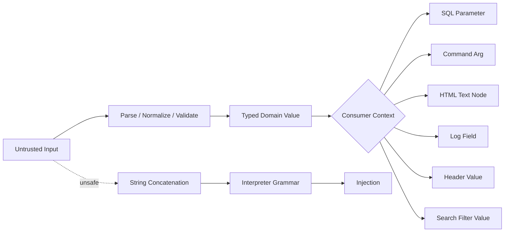
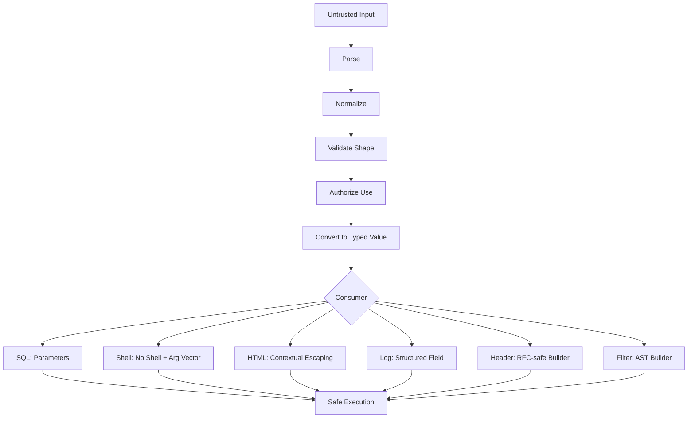
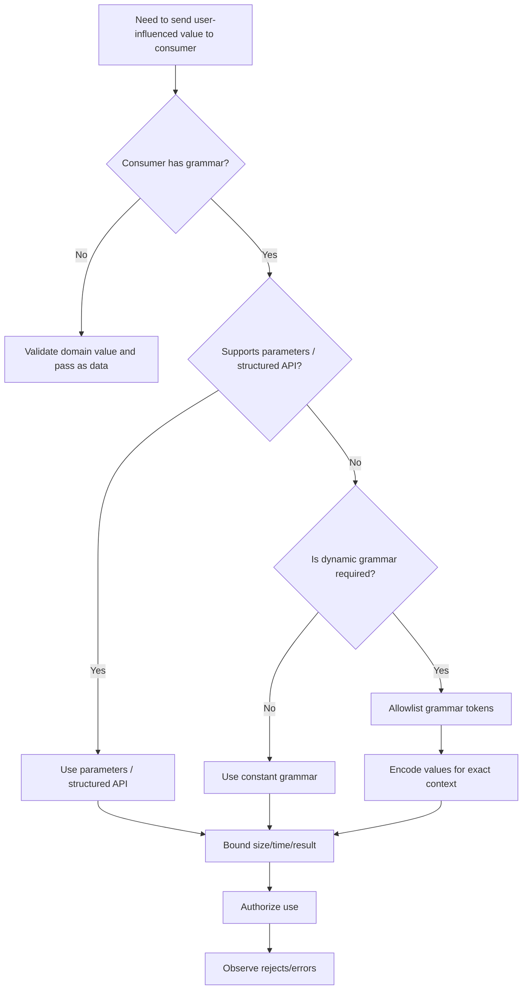

# learn-go-security-cryptography-integrity-part-022.md

> **Series**: `learn-go-security-cryptography-integrity`  
> **Part**: `022 / 034`  
> **Title**: Injection Defense in Go  
> **Subtitle**: SQL injection, command injection, template injection, LDAP-like filter injection, log injection, header injection, CRLF, and structured escaping  
> **Target Go Version**: Go 1.26.x  
> **Audience**: Java software engineer moving into top-tier Go security engineering  
> **Status**: Handbook-grade learning material

---

## 0. Why This Part Exists

Injection is one of the oldest vulnerability classes, but it remains one of the most persistent because engineers often learn it at the wrong abstraction level.

They learn:

```text
Do not concatenate strings into SQL.
Escape user input.
Sanitize input.
```

Those statements are not wrong, but they are not enough.

The deeper rule is:

```text
Never let untrusted data become executable grammar, control syntax, protocol structure, log structure, command structure, query structure, template structure, or authorization structure.
```

Injection is not only SQL.

In Go services, injection can happen in:

```text
SQL query text
SQL identifier text
SQL LIKE patterns
SQL JSON path strings
shell commands
command arguments
command names
file names passed to external tools
HTML templates
text templates
log lines
HTTP headers
redirect URLs
email headers
search filters
LDAP-like filters
OpenSearch/Elasticsearch JSON DSL
GraphQL strings
policy expressions
audit records
metrics labels
tracing attributes
```

The common failure is **code/data confusion**.

A value that should remain data crosses a boundary and becomes part of an interpreter grammar.

Example mental model:

```text
Untrusted string:        "alice"
As data:                 username = "alice"
As SQL grammar:           WHERE user = alice
As shell grammar:         rm alice
As log grammar:           user=alice
As HTTP header grammar:   X-User: alice
As template grammar:      {{ .User }}
As search DSL grammar:    user:alice
```

The string is not inherently dangerous. The danger emerges when the receiving context interprets characters as control structure.

This part teaches injection defense as a **context boundary design discipline**, not as a bag of escaping tricks.

---

## 1. Learning Objectives

After this part, you should be able to:

1. Explain injection as a grammar-boundary failure.
2. Distinguish validation, parameterization, escaping, encoding, quoting, canonicalization, and authorization.
3. Prevent SQL injection in Go using `database/sql` and safe query construction.
4. Handle dynamic SQL identifiers, sorting, filtering, `IN` lists, pagination, and `LIKE` safely.
5. Prevent command injection using direct `exec.Command`, allowlisted commands, structured args, bounded context, and environment control.
6. Explain why direct `exec.Command(name, args...)` is safer than shell execution but not automatically safe.
7. Avoid template injection and XSS mistakes with `html/template`, `text/template`, trusted template authors, and dangerous typed strings like `template.HTML`.
8. Prevent log injection using structured logging, field sanitization, and event-schema discipline.
9. Prevent HTTP header and CRLF injection by treating header values as protocol fields, not raw strings.
10. Design safe LDAP-like/search filter builders.
11. Build review checklists and negative tests for injection-prone code paths.
12. Recognize when escaping is context-specific and why generic `sanitize(input)` utilities are usually a design smell.

---

## 2. The Core Mental Model: Injection Is Grammar Confusion

Injection happens when data escapes its intended semantic role.



Secure design preserves separation:

```text
Data remains data.
Commands remain commands.
Queries remain queries.
Templates remain templates.
Logs remain structured records.
Headers remain protocol fields.
```

Unsafe design merges them:

```text
query := "SELECT * FROM users WHERE name = '" + input + "'"
cmd := "convert " + input + " output.png"
html := "<div>" + input + "</div>"
log := "user=" + input
header := "attachment; filename=" + input
filter := "(uid=" + input + ")"
```

The difference is not syntax. The difference is **who controls grammar**.

---

## 3. Taxonomy of Injection in Go Services

| Class | Interpreter / Consumer | Typical Go Surface | Primary Defense |
|---|---|---|---|
| SQL injection | Database SQL parser | `database/sql`, ORMs, query builders | Parameterized values + allowlisted identifiers |
| Command injection | OS shell or executable argument parser | `os/exec` | Avoid shell, allowlist command/args, bounded execution |
| Template injection | Template engine, browser HTML/JS/CSS parser | `html/template`, `text/template` | Trusted templates, contextual escaping, no unsafe typed strings |
| XSS | Browser HTML/JS/CSS/URL contexts | rendered HTML, JSON-in-HTML | `html/template`, CSP, safe JSON embedding |
| Header injection | HTTP protocol parser | `http.Header`, redirects, download names | Reject CR/LF, structured builders |
| CRLF injection | HTTP/log/mail protocols | headers, logs, email | Protocol-specific encoding and field validation |
| Log injection | Log parser, SIEM, humans | `log`, `slog`, JSON logs | Structured logging, CR/LF/delimiter handling |
| Filter injection | LDAP/search/DSL parser | custom builders, OpenSearch DSL | AST builders, escaping, allowlisted operators |
| Expression injection | policy/rules engines | CEL, SQL-like filters, templates | No user-controlled expressions; constrained AST |
| Path-to-tool injection | external tools interpreting filenames/options | `exec.Command` with user file names | `--`, no option-like names, temp paths, allowlist |

---

## 4. Injection Defense Layers

Injection defense is not one technique.

It is layered.



The layers are:

| Layer | Purpose | Example |
|---|---|---|
| Parse | Convert raw string into known structure | parse URL, JSON, UUID, date |
| Normalize | Produce one representation | lowercase enum, Unicode NFC, trim controlled whitespace |
| Validate | Reject invalid shape/range | allowed enum, max length, numeric range |
| Authorize | Check whether actor may use that value | tenant, object ownership, role |
| Parameterize | Send data separately from grammar | SQL placeholders, command arg vector |
| Encode/Escape | Represent data safely in output context | HTML escape, header quoting, JSON escape |
| Bound | Limit size/time/count | max body, max args, timeout |
| Observe | Detect abnormal patterns | rejected filter count, SQL error rate |

A single `sanitize()` function cannot safely solve all these contexts because each context has different grammar.

---

## 5. Important Vocabulary

### 5.1 Validation

Validation answers:

```text
Is this value acceptable for this domain field?
```

Example:

```text
status must be one of: pending, approved, rejected
limit must be between 1 and 100
sort column must be one of: created_at, updated_at, id
```

Validation reduces bad shapes, but it does not replace parameterization.

### 5.2 Escaping

Escaping answers:

```text
How do I represent this data safely inside this specific output grammar?
```

HTML escaping is not SQL escaping.

SQL escaping is not shell escaping.

Shell escaping is not log escaping.

Header quoting is not URL escaping.

### 5.3 Encoding

Encoding transforms bytes/data into another representation.

Examples:

```text
JSON string encoding
URL percent-encoding
base64url encoding
HTML entity encoding
CSV quoting
```

Encoding is context-specific.

### 5.4 Quoting

Quoting is a context rule.

Example:

```text
SQL string literal: 'alice'
Shell string: "alice"
HTTP filename parameter: filename="report.pdf"
JSON string: "alice"
```

Quoting is not automatically safe if the value can break out of the quoted context.

### 5.5 Parameterization

Parameterization keeps data separate from grammar.

SQL parameterization means:

```text
SQL structure: SELECT * FROM users WHERE id = ?
Value:         123
```

The database receives the SQL structure and the value separately.

This is fundamentally stronger than trying to escape string concatenation.

### 5.6 Canonicalization

Canonicalization ensures that two equivalent inputs do not bypass validation differently.

Example:

```text
Admin
admin
ADMIN
```

might all become:

```text
admin
```

Canonicalization should happen before validation and authorization where appropriate.

---

## 6. Java-to-Go Mental Model Shift

As a Java engineer, you may be used to:

```text
JDBC PreparedStatement
JPA Criteria API
Spring MVC validation
Spring Security filters
Logback encoders
Thymeleaf escaping
ProcessBuilder
```

Go equivalents are lower-level and more explicit:

| Java/Spring Habit | Go Equivalent | Security Implication |
|---|---|---|
| `PreparedStatement` | `database/sql` placeholders | Driver-specific placeholder syntax matters |
| JPA Criteria | query builder / typed repo methods | You often build your own safe subset |
| Bean Validation | constructor validation / custom validators | No default annotation framework in stdlib |
| Spring Security filter chain | explicit middleware order | You own ordering and failure semantics |
| Thymeleaf escaping | `html/template` | Template authors must be trusted |
| `ProcessBuilder` | `exec.Command` | Avoid shell; control env/cwd/args |
| Logback JSON encoder | `log/slog` JSON handler | Structured logs help prevent log forging |
| Servlet header APIs | `net/http.Header` | Still validate CR/LF and field semantics |

Go gives you fewer framework guardrails by default.

That is not bad.

It means your design must encode guardrails explicitly.

---

## 7. SQL Injection in Go

### 7.1 The Rule

Never build SQL values using string concatenation.

Unsafe:

```go
query := "SELECT id, email FROM users WHERE email = '" + email + "'"
rows, err := db.QueryContext(ctx, query)
```

Safe:

```go
rows, err := db.QueryContext(ctx,
    `SELECT id, email FROM users WHERE email = ?`,
    email,
)
```

Depending on the driver, placeholders may differ.

Examples:

```text
MySQL / SQLite style:       ?
PostgreSQL lib/pq style:    $1, $2
Oracle style:               :1, :name, or driver-specific
SQL Server style:           @p1 or driver-specific
```

The invariant is not the placeholder character.

The invariant is:

```text
SQL grammar must not be constructed from untrusted values.
```

The official Go database documentation explicitly recommends providing SQL parameter values as `sql` package function arguments instead of formatting values into SQL text.

---

### 7.2 Parameterization Is for Values, Not Identifiers

This is safe:

```go
rows, err := db.QueryContext(ctx,
    `SELECT id, email FROM users WHERE status = ?`,
    status,
)
```

This is not valid SQL parameterization:

```go
rows, err := db.QueryContext(ctx,
    `SELECT id, email FROM users ORDER BY ?`,
    sortColumn,
)
```

Most databases do not allow placeholders for identifiers such as:

```text
table name
column name
sort direction
SQL keyword
operator
function name
schema name
```

That means dynamic identifiers must be allowlisted.

Safe pattern:

```go
type SortColumn string

const (
    SortCreatedAt SortColumn = "created_at"
    SortUpdatedAt SortColumn = "updated_at"
    SortID        SortColumn = "id"
)

func parseSortColumn(raw string) (SortColumn, error) {
    switch raw {
    case "created_at":
        return SortCreatedAt, nil
    case "updated_at":
        return SortUpdatedAt, nil
    case "id":
        return SortID, nil
    default:
        return "", fmt.Errorf("invalid sort column")
    }
}

func userListQuery(sort SortColumn) string {
    return `SELECT id, email, status, created_at
            FROM users
            ORDER BY ` + string(sort) + ` DESC
            LIMIT ? OFFSET ?`
}
```

This string concatenation is acceptable only because `sort` is no longer arbitrary input. It is a typed value that can only come from a closed set.

Better pattern:

```go
var sortSQL = map[SortColumn]string{
    SortCreatedAt: "created_at",
    SortUpdatedAt: "updated_at",
    SortID:        "id",
}

func buildUserListQuery(sort SortColumn, desc bool) (string, error) {
    col, ok := sortSQL[sort]
    if !ok {
        return "", fmt.Errorf("unsupported sort")
    }

    dir := "ASC"
    if desc {
        dir = "DESC"
    }

    return `SELECT id, email, status, created_at
            FROM users
            ORDER BY ` + col + ` ` + dir + `
            LIMIT ? OFFSET ?`, nil
}
```

Even here, `dir` is not user text. It is generated by boolean logic.

---

### 7.3 Safe SQL Repository Boundary

A safe repository should receive domain values, not raw query strings.

Unsafe repository API:

```go
type UserRepository struct {
    db *sql.DB
}

func (r *UserRepository) Search(ctx context.Context, where string) ([]User, error) {
    rows, err := r.db.QueryContext(ctx,
        `SELECT id, email FROM users WHERE `+where,
    )
    // ...
}
```

This API invites injection.

Safer API:

```go
type UserSearch struct {
    TenantID TenantID
    Email    *Email
    Status   *UserStatus
    Sort     SortColumn
    Desc     bool
    Limit    PageLimit
    Offset   PageOffset
}

func (r *UserRepository) Search(ctx context.Context, q UserSearch) ([]User, error) {
    var where []string
    var args []any

    where = append(where, "tenant_id = ?")
    args = append(args, q.TenantID.String())

    if q.Email != nil {
        where = append(where, "email = ?")
        args = append(args, q.Email.String())
    }

    if q.Status != nil {
        where = append(where, "status = ?")
        args = append(args, q.Status.String())
    }

    orderBy, err := orderBySQL(q.Sort, q.Desc)
    if err != nil {
        return nil, err
    }

    sqlText := `SELECT id, email, status, created_at
                FROM users
                WHERE ` + strings.Join(where, " AND ") + `
                ` + orderBy + `
                LIMIT ? OFFSET ?`

    args = append(args, q.Limit.Int(), q.Offset.Int())

    rows, err := r.db.QueryContext(ctx, sqlText, args...)
    if err != nil {
        return nil, fmt.Errorf("query users: %w", err)
    }
    defer rows.Close()

    // scan rows...
    return nil, nil
}
```

The query builder is safe because:

```text
WHERE fragments are constant strings.
Values are parameterized.
ORDER BY uses allowlisted identifiers.
LIMIT/OFFSET are typed bounded integers.
Tenant predicate is mandatory.
```

---

### 7.4 Dynamic `IN` Lists

A common unsafe pattern:

```go
idsCSV := strings.Join(idsFromRequest, ",")
query := `SELECT * FROM users WHERE id IN (` + idsCSV + `)`
```

Safe pattern:

```go
func placeholders(n int) (string, error) {
    if n <= 0 {
        return "", fmt.Errorf("empty list")
    }
    if n > 1000 {
        return "", fmt.Errorf("too many values")
    }

    parts := make([]string, n)
    for i := range parts {
        parts[i] = "?"
    }
    return strings.Join(parts, ","), nil
}

func findUsersByIDs(ctx context.Context, db *sql.DB, ids []UserID) error {
    ph, err := placeholders(len(ids))
    if err != nil {
        return err
    }

    args := make([]any, 0, len(ids))
    for _, id := range ids {
        args = append(args, id.String())
    }

    query := `SELECT id, email FROM users WHERE id IN (` + ph + `)`
    rows, err := db.QueryContext(ctx, query, args...)
    if err != nil {
        return err
    }
    defer rows.Close()

    return nil
}
```

The placeholders are generated by count, not by user content.

The values remain parameters.

---

### 7.5 SQL `LIKE` Injection and Wildcard Semantics

Parameterized queries stop SQL syntax injection, but they do not stop **semantic abuse**.

Example:

```go
rows, err := db.QueryContext(ctx,
    `SELECT id, email FROM users WHERE email LIKE ?`,
    "%"+search+"%",
)
```

This is syntactically safe, but user-controlled `%` and `_` may turn an exact-ish search into a broad search.

If wildcard semantics are not intended, escape wildcard characters.

```go
func escapeLike(s string) string {
    s = strings.ReplaceAll(s, `\`, `\\`)
    s = strings.ReplaceAll(s, `%`, `\%`)
    s = strings.ReplaceAll(s, `_`, `\_`)
    return s
}

rows, err := db.QueryContext(ctx,
    `SELECT id, email
     FROM users
     WHERE email LIKE ? ESCAPE '\\'
     LIMIT ?`,
    "%"+escapeLike(search)+"%",
    limit,
)
```

The security question is:

```text
Should the user be allowed to control wildcard behavior?
```

If yes, validate and bound it.

If no, escape it.

---

### 7.6 Pagination and Limit Injection

Avoid:

```go
query := `SELECT * FROM audit_log LIMIT ` + r.URL.Query().Get("limit")
```

Use typed bounds:

```go
type PageLimit int

func NewPageLimit(raw string) (PageLimit, error) {
    n, err := strconv.Atoi(raw)
    if err != nil {
        return 0, fmt.Errorf("invalid limit")
    }
    if n < 1 || n > 100 {
        return 0, fmt.Errorf("limit out of range")
    }
    return PageLimit(n), nil
}

rows, err := db.QueryContext(ctx,
    `SELECT id, message FROM audit_log ORDER BY created_at DESC LIMIT ?`,
    int(limit),
)
```

Even numeric values should be parameters or closed-set SQL fragments.

---

### 7.7 Stored Procedures Are Not Magic

Stored procedures can be safe when they use parameterized logic internally.

They can also be vulnerable if they concatenate dynamic SQL internally.

Go-side safety does not guarantee database-side safety if a procedure does:

```text
EXECUTE IMMEDIATE 'SELECT ... WHERE name = ''' || user_input || ''''
```

Review stored procedure internals as part of the injection boundary.

---

### 7.8 SQL Error Disclosure

SQL injection often becomes easier when errors reveal syntax, table names, column names, or driver details.

Bad response:

```json
{
  "error": "pq: syntax error at or near \"...\" in SELECT users.password_hash FROM users"
}
```

Better response:

```json
{
  "error": "invalid request"
}
```

Internal logs can include safe diagnostic metadata:

```go
logger.Error("user search failed",
    "operation", "user.search",
    "tenant_id", tenantID.SafeLogValue(),
    "error", err,
)
```

Do not log raw SQL with full user-controlled values in high-risk paths unless you have redaction and access control.

---

### 7.9 SQL Injection Review Checklist

```text
[ ] No user-controlled string concatenated into SQL grammar.
[ ] Values use placeholders.
[ ] Dynamic identifiers use allowlists.
[ ] Sort direction is enum/boolean, not raw string.
[ ] LIMIT/OFFSET are bounded integers.
[ ] IN list uses generated placeholders, not CSV input.
[ ] LIKE wildcard semantics are intentional.
[ ] Tenant predicate is mandatory and not optional.
[ ] Stored procedures do not concatenate untrusted values internally.
[ ] SQL errors are not returned to clients.
[ ] Query logs redact sensitive values.
[ ] Tests include malicious-looking strings as data.
[ ] Authorization is not inferred from query filters alone.
```

---

## 8. Command Injection in Go

### 8.1 The Rule

Avoid shell execution.

Prefer:

```go
cmd := exec.CommandContext(ctx, "convert", inputPath, outputPath)
```

Avoid:

```go
cmd := exec.CommandContext(ctx, "sh", "-c", "convert "+inputPath+" "+outputPath)
```

When you call a shell, shell metacharacters become grammar.

When you call `exec.Command(name, arg...)`, Go passes an argument vector to the process. The shell does not parse it unless you explicitly invoke a shell.

But this does not mean all `exec.Command` usage is safe.

You still need to control:

```text
command name
argument meaning
option parsing
file paths
environment variables
working directory
stdin
stdout/stderr
resource limits
timeouts
privileges
```

---

### 8.2 Direct Exec Is Safer, Not Automatically Safe

This is safer than shell concatenation:

```go
cmd := exec.CommandContext(ctx, "grep", pattern, filePath)
```

But still risky if:

```text
pattern can trigger expensive regex behavior
filePath is attacker-controlled and points outside allowed area
filePath starts with '-' and is treated as an option by grep
PATH resolves grep to unexpected binary
environment variables affect tool behavior
command output is returned unbounded to client
process runs too long
process writes huge output
```

Command injection defense must consider the called program's own parser.

---

### 8.3 Use Absolute Command Paths or Strict Lookup

Avoid relying on untrusted `PATH`.

```go
const imageMagick = "/usr/bin/magick"

func runResize(ctx context.Context, in, out string) error {
    cmd := exec.CommandContext(ctx, imageMagick,
        "convert",
        in,
        "-resize", "800x800>",
        out,
    )
    cmd.Env = []string{
        "PATH=/usr/bin:/bin",
        "LANG=C",
    }
    return cmd.Run()
}
```

If you must use lookup:

```go
path, err := exec.LookPath("magick")
if err != nil {
    return err
}
if path != "/usr/bin/magick" {
    return fmt.Errorf("unexpected tool path")
}
```

The invariant:

```text
The attacker must not choose which executable runs.
```

---

### 8.4 Option Injection

Even without shell, user-controlled values can be interpreted as options by the target program.

Example risk:

```go
cmd := exec.CommandContext(ctx, "tar", "-xf", userFile)
```

If a tool treats a filename beginning with `-` as an option, this can change command behavior.

Defenses:

```text
Use absolute safe temp file names generated by your application.
Reject user file names as command-line paths.
Use -- option terminator where supported.
Pass files through stdin where appropriate.
Place input files under controlled directory with generated names.
```

Example:

```go
cmd := exec.CommandContext(ctx,
    "/usr/bin/grep",
    "--",
    literalPattern,
    safePath,
)
```

But `--` is tool-specific. Do not assume every program supports it.

---

### 8.5 Do Not Let Users Choose Commands

Unsafe:

```go
cmdName := r.URL.Query().Get("tool")
cmd := exec.CommandContext(ctx, cmdName, args...)
```

Safe:

```go
type Tool string

const (
    ToolPDFInfo Tool = "pdfinfo"
    ToolExif    Tool = "exiftool"
)

func toolPath(t Tool) (string, error) {
    switch t {
    case ToolPDFInfo:
        return "/usr/bin/pdfinfo", nil
    case ToolExif:
        return "/usr/bin/exiftool", nil
    default:
        return "", fmt.Errorf("unsupported tool")
    }
}
```

Closed set first.

Raw string never.

---

### 8.6 Bound Process Execution

Always use context and bounded output.

```go
func runTool(ctx context.Context, path string, args ...string) ([]byte, error) {
    ctx, cancel := context.WithTimeout(ctx, 5*time.Second)
    defer cancel()

    cmd := exec.CommandContext(ctx, path, args...)
    cmd.Env = []string{"PATH=/usr/bin:/bin", "LANG=C"}
    cmd.Dir = "/var/empty"

    var stdout bytes.Buffer
    var stderr bytes.Buffer

    cmd.Stdout = io.LimitReader(&stdout, 1<<20) // this exact pattern does not work: LimitReader is a Reader, not Writer
    _ = stderr

    return nil, nil
}
```

The above contains a subtle mistake: `cmd.Stdout` expects an `io.Writer`, while `io.LimitReader` returns an `io.Reader`.

A safer output limiter can be implemented as a writer.

```go
type limitWriter struct {
    w     io.Writer
    limit int64
    n     int64
}

func (lw *limitWriter) Write(p []byte) (int, error) {
    if lw.n+int64(len(p)) > lw.limit {
        allowed := lw.limit - lw.n
        if allowed > 0 {
            _, _ = lw.w.Write(p[:allowed])
            lw.n += allowed
        }
        return 0, fmt.Errorf("output limit exceeded")
    }
    n, err := lw.w.Write(p)
    lw.n += int64(n)
    return n, err
}

func runBounded(ctx context.Context, path string, args ...string) ([]byte, error) {
    ctx, cancel := context.WithTimeout(ctx, 5*time.Second)
    defer cancel()

    cmd := exec.CommandContext(ctx, path, args...)
    cmd.Env = []string{"PATH=/usr/bin:/bin", "LANG=C"}
    cmd.Dir = "/var/empty"

    var out bytes.Buffer
    lw := &limitWriter{w: &out, limit: 1 << 20}
    cmd.Stdout = lw
    cmd.Stderr = io.Discard

    if err := cmd.Run(); err != nil {
        return nil, fmt.Errorf("tool failed: %w", err)
    }
    return out.Bytes(), nil
}
```

This is only a process-level pattern. In containerized production systems, also enforce:

```text
container CPU/memory limits
read-only filesystem
seccomp/AppArmor where possible
non-root user
no sensitive env vars
network isolation
short temp-file lifetime
```

---

### 8.7 Shell Execution Exception

Sometimes shell execution is unavoidable, for example when executing a controlled internal script.

If unavoidable:

```text
Never concatenate untrusted values into shell text.
Pass values through environment variables or positional args if the shell script is controlled.
Use fixed script path.
Use fixed shell path.
Validate every value before use.
Set safe working directory.
Set safe env.
Use timeout.
Log command name, not raw secret args.
```

Better:

```go
cmd := exec.CommandContext(ctx,
    "/bin/sh",
    "/opt/app/scripts/report.sh",
)
cmd.Env = []string{
    "PATH=/usr/bin:/bin",
    "REPORT_ID=" + reportID.String(),
}
```

Still review the script. Shell scripts can reintroduce injection internally.

---

### 8.8 Command Injection Review Checklist

```text
[ ] No `sh -c` / `bash -c` with user-controlled content.
[ ] Executable path is fixed or strictly allowlisted.
[ ] Args are structured, not joined into a command string.
[ ] User cannot choose command name.
[ ] User-controlled filenames are converted to generated safe paths.
[ ] Option-like values are rejected or separated with `--` where supported.
[ ] Environment is minimal and controlled.
[ ] Working directory is controlled.
[ ] Timeout exists.
[ ] Output size is bounded.
[ ] Process runs with least privilege.
[ ] Tool-specific parser risks are reviewed.
[ ] Secrets are not passed in args if process listing is visible.
[ ] Errors do not expose internal command details to clients.
```

---

## 9. Template Injection and XSS in Go

### 9.1 `html/template` vs `text/template`

Go has two important template packages:

```text
text/template: generic text templating, no HTML contextual escaping
html/template: HTML-aware contextual escaping wrapper around text/template
```

For HTML output, use `html/template`, not `text/template`.

Unsafe for HTML:

```go
import "text/template"
```

Safer for HTML:

```go
import "html/template"
```

`html/template` treats data values as plain text and performs contextual escaping for HTML, JavaScript, CSS, and URI contexts.

This is strong but not magical.

Its security model assumes:

```text
template authors are trusted
Execute data is untrusted
```

If users can author templates, you have a different problem.

---

### 9.2 Trusted Template Authors

Safe model:

```text
Developers write templates.
Users provide data.
html/template escapes data contextually.
```

Unsafe model:

```text
Users write templates.
Templates call functions.
Templates access object fields.
Templates render into privileged pages.
```

If users can edit template text, they may not get arbitrary OS code execution by default, but they may:

```text
read exposed fields
call exposed functions
bypass output assumptions
create misleading output
trigger expensive rendering
exfiltrate data available to the template context
```

Do not treat user-authored templates as harmless strings.

---

### 9.3 Dangerous Typed Strings

`html/template` provides typed string types such as:

```go
template.HTML
template.CSS
template.JS
template.URL
```

These types mean:

```text
I promise this value is already safe for this context.
```

Do not wrap untrusted input in them.

Unsafe:

```go
data := struct {
    Bio template.HTML
}{
    Bio: template.HTML(userBio),
}
```

Better:

```go
data := struct {
    Bio string
}{
    Bio: userBio,
}
```

Let `html/template` escape it.

Only use `template.HTML` for content that has passed a strict trusted sanitizer or comes from trusted static source.

Even then, document the trust boundary.

---

### 9.4 Template Functions Are Trust Boundaries

Example:

```go
tmpl := template.Must(template.New("page").Funcs(template.FuncMap{
    "safeHTML": func(s string) template.HTML {
        return template.HTML(s)
    },
}).Parse(pageTemplate))
```

This function bypasses escaping.

A function like this must not accept untrusted strings.

Better:

```go
func trustedIcon(name string) (template.HTML, error) {
    switch name {
    case "warning":
        return template.HTML(`<svg aria-hidden="true">...</svg>`), nil
    case "success":
        return template.HTML(`<svg aria-hidden="true">...</svg>`), nil
    default:
        return "", fmt.Errorf("unknown icon")
    }
}
```

The output is safe because it comes from a closed set, not user-provided markup.

---

### 9.5 JSON Embedded in HTML

A common mistake:

```html
<script>
  window.initialState = {{ .JSON }};
</script>
```

If `.JSON` is raw string and manually constructed, it can break script context.

Safer pattern:

```go
stateBytes, err := json.Marshal(state)
if err != nil {
    return err
}

data := struct {
    State template.JS
}{
    State: template.JS(stateBytes),
}
```

But this is only safe if `stateBytes` comes directly from `json.Marshal`, not raw user text.

Alternative:

```html
<script type="application/json" id="initial-state">{{ .StateJSON }}</script>
```

with `.StateJSON` as a normal string escaped by `html/template`, then client code reads text content and parses JSON.

This reduces JavaScript context complexity.

---

### 9.6 Attribute and URL Contexts

`html/template` is context-aware, but you must still design URL policies.

Example:

```html
<a href="{{ .URL }}">open</a>
```

Escaping prevents syntax breakout, but policy must still answer:

```text
Is this URL scheme allowed?
Is this host allowed?
Is this redirect allowed?
Is javascript: blocked?
Is data: allowed?
```

Do not confuse escaping with authorization.

---

### 9.7 Template Review Checklist

```text
[ ] HTML output uses `html/template`, not `text/template`.
[ ] Template source is developer-controlled or sandboxed by design.
[ ] User cannot edit privileged templates.
[ ] No untrusted data is converted to `template.HTML`, `template.JS`, `template.CSS`, or `template.URL`.
[ ] FuncMap functions do not bypass escaping for untrusted input.
[ ] URLs rendered in templates are policy-validated.
[ ] JSON embedded in HTML comes from `json.Marshal` or safer application/json script block.
[ ] CSP is considered as defense-in-depth.
[ ] Template execution errors are handled safely.
[ ] Rendered output tests include HTML/JS/CSS-special characters as data.
```

---

## 10. Header Injection and CRLF Injection

### 10.1 The Problem

HTTP headers are line-based protocol fields.

CRLF means:

```text
CR = carriage return = \r
LF = line feed        = \n
```

If attacker-controlled data can inject CR/LF into a header value, it may alter protocol structure.

Risk areas:

```text
Content-Disposition filename
Location redirect
Set-Cookie components
custom headers
email headers
proxy headers
log lines
```

---

### 10.2 Use Structured APIs, But Still Validate Semantics

Go's `net/http` provides structured header APIs:

```go
w.Header().Set("X-Request-ID", requestID)
```

Still, your values should be field-valid.

Example safe request ID:

```go
func validRequestID(s string) bool {
    if len(s) < 8 || len(s) > 128 {
        return false
    }
    for _, r := range s {
        switch {
        case r >= 'a' && r <= 'z':
        case r >= 'A' && r <= 'Z':
        case r >= '0' && r <= '9':
        case r == '-' || r == '_' || r == '.':
        default:
            return false
        }
    }
    return true
}
```

For most internal IDs, prefer generating your own request ID instead of accepting arbitrary client-provided values.

---

### 10.3 Content-Disposition Filename

Unsafe:

```go
filename := r.URL.Query().Get("filename")
w.Header().Set("Content-Disposition", `attachment; filename="`+filename+`"`)
```

Better:

```go
func safeDownloadName(raw string) string {
    base := filepath.Base(raw)
    base = strings.Map(func(r rune) rune {
        switch {
        case r >= 'a' && r <= 'z':
            return r
        case r >= 'A' && r <= 'Z':
            return r
        case r >= '0' && r <= '9':
            return r
        case r == '.' || r == '-' || r == '_':
            return r
        default:
            return '_'
        }
    }, base)

    if base == "" || base == "." || base == ".." {
        return "download.bin"
    }
    if len(base) > 100 {
        base = base[:100]
    }
    return base
}

func setDownload(w http.ResponseWriter, rawName string) {
    name := safeDownloadName(rawName)
    w.Header().Set("Content-Type", "application/octet-stream")
    w.Header().Set("Content-Disposition", fmt.Sprintf(`attachment; filename=%q`, name))
}
```

For full internationalized filename support, use `filename*` with RFC-compliant encoding. Do not hand-roll complex header grammar casually.

---

### 10.4 Redirect Header Injection

`Location` is a header and a policy decision.

Unsafe:

```go
http.Redirect(w, r, r.URL.Query().Get("next"), http.StatusFound)
```

Safer:

```go
func safeRedirectTarget(raw string) (string, error) {
    if raw == "" {
        return "/", nil
    }
    u, err := url.Parse(raw)
    if err != nil {
        return "", fmt.Errorf("invalid redirect")
    }

    // Only same-site relative paths.
    if u.IsAbs() || u.Host != "" {
        return "", fmt.Errorf("external redirect not allowed")
    }
    if !strings.HasPrefix(u.Path, "/") {
        return "", fmt.Errorf("redirect must be absolute path")
    }
    if strings.ContainsAny(raw, "\r\n") {
        return "", fmt.Errorf("invalid redirect characters")
    }
    return u.String(), nil
}
```

Escaping alone does not solve open redirect or phishing risk.

---

### 10.5 CRLF Review Checklist

```text
[ ] Header values are built with structured APIs.
[ ] Header values reject CR and LF.
[ ] Download filenames are generated or strictly normalized.
[ ] Redirect targets are allowlisted or same-origin relative.
[ ] User-controlled values are not embedded in Set-Cookie attributes.
[ ] Custom headers use narrow character sets.
[ ] Proxy-forwarded headers are trusted only from known proxies.
[ ] Email headers are built by mail libraries, not raw concatenation.
[ ] Negative tests include CR, LF, percent-encoded CR/LF, and long values.
```

---

## 11. Log Injection

### 11.1 The Problem

Logs are not just text.

They are consumed by:

```text
humans
SIEM systems
log parsers
alert rules
audit review tools
incident timelines
regulators
```

Log injection happens when untrusted data changes log structure or meaning.

Examples:

```text
attacker inserts newline to create fake log entry
attacker inserts JSON delimiters into naive JSON logs
attacker inserts terminal control characters
attacker inserts misleading key=value segments
attacker pollutes audit actor/action/object fields
```

---

### 11.2 Prefer Structured Logging

With Go `log/slog`:

```go
logger.Info("login failed",
    "event", "auth.login_failed",
    "actor_ip", clientIP,
    "username", safeLogString(username),
    "reason", "bad_credentials",
)
```

Structured logging preserves fields separately.

Avoid:

```go
log.Printf("login failed username=%s reason=%s", username, reason)
```

This is not always vulnerable, but it is easier to forge when logs are parsed as line-based or key-value text.

---

### 11.3 Safe Log String

A conservative sanitizer for line-oriented logs:

```go
func safeLogString(s string) string {
    s = strings.Map(func(r rune) rune {
        switch r {
        case '\r', '\n', '\t':
            return ' '
        }
        if r < 0x20 || r == 0x7f {
            return -1
        }
        return r
    }, s)

    const max = 512
    if len(s) > max {
        return s[:max] + "..."
    }
    return s
}
```

For JSON logs, use a real JSON encoder, not manual string construction.

---

### 11.4 Audit Logs Are Stricter Than Application Logs

Application logs answer:

```text
What happened operationally?
```

Audit logs answer:

```text
Who did what to which object, under what authority, with what result, at what time?
```

Never let untrusted display text define core audit fields.

Bad:

```go
audit.Message = fmt.Sprintf("%s approved case %s", actorName, caseTitle)
```

Better:

```go
audit.EventType = "case.approved"
audit.ActorID = actorID
audit.ObjectType = "case"
audit.ObjectID = caseID
audit.Result = "success"
audit.DisplayMessage = safeLogString(fmt.Sprintf("%s approved case", actorDisplay))
```

Core fields should be typed IDs and enums.

Display message is derived, not authoritative.

---

### 11.5 Log Injection Review Checklist

```text
[ ] Logs are structured where possible.
[ ] No manual JSON log string construction.
[ ] CR/LF/control chars are handled in text logs.
[ ] User-controlled fields have max length.
[ ] Sensitive values are redacted.
[ ] Audit fields use typed IDs/enums, not display strings.
[ ] Logs distinguish trusted system fields from user-supplied fields.
[ ] Error messages do not include raw SQL/commands/secrets.
[ ] Terminal escape sequences are removed if logs are viewed in terminals.
[ ] Tests include newline/control characters as input.
```

---

## 12. LDAP-like and Search Filter Injection

### 12.1 The General Problem

Even if your Go service does not use LDAP, you may build filters for:

```text
LDAP
OpenSearch
Elasticsearch
SQL-like search
custom admin search DSL
GraphQL filters
policy engines
report builders
```

The injection problem is the same:

```text
untrusted data becomes filter grammar
```

Unsafe:

```go
filter := "(uid=" + username + ")"
```

Safe design:

```text
Do not build filters with strings.
Build filters with a typed AST or builder that escapes values for the target grammar.
Allowlist fields and operators.
Parameterize where the backend supports it.
```

---

### 12.2 Typed Filter AST

```go
type Field string

type Operator string

const (
    FieldEmail  Field = "email"
    FieldStatus Field = "status"

    OpEq       Operator = "eq"
    OpContains Operator = "contains"
)

type Filter struct {
    Field Field
    Op    Operator
    Value string
}

func NewFilter(field, op, value string) (Filter, error) {
    var f Field
    switch field {
    case "email":
        f = FieldEmail
    case "status":
        f = FieldStatus
    default:
        return Filter{}, fmt.Errorf("unsupported field")
    }

    var o Operator
    switch op {
    case "eq":
        o = OpEq
    case "contains":
        o = OpContains
    default:
        return Filter{}, fmt.Errorf("unsupported operator")
    }

    if len(value) > 200 {
        return Filter{}, fmt.Errorf("filter too long")
    }

    return Filter{Field: f, Op: o, Value: value}, nil
}
```

Then render to each backend with backend-specific rules.

---

### 12.3 Search DSL JSON Injection

When building OpenSearch/Elasticsearch queries, do not concatenate JSON strings.

Unsafe:

```go
query := `{"query":{"match":{"title":"` + userText + `"}}}`
```

Safe:

```go
type MatchQuery struct {
    Query struct {
        Match map[string]string `json:"match"`
    } `json:"query"`
}

func buildSearchQuery(text string) ([]byte, error) {
    if len(text) > 200 {
        return nil, fmt.Errorf("query too long")
    }

    var q MatchQuery
    q.Query.Match = map[string]string{"title": text}
    return json.Marshal(q)
}
```

JSON encoding prevents grammar breakout. It does not solve expensive query risk, broad query risk, authorization, or data leakage.

---

### 12.4 Filter Review Checklist

```text
[ ] Users cannot submit raw backend filter syntax unless explicitly sandboxed.
[ ] Fields are allowlisted.
[ ] Operators are allowlisted.
[ ] Values are encoded for the backend grammar.
[ ] Query complexity is bounded.
[ ] Pagination and result limits are enforced.
[ ] Tenant/authorization filters are mandatory and not user-removable.
[ ] JSON DSL is built with structs/maps and `json.Marshal`, not string concatenation.
[ ] Error messages do not expose backend parser internals.
```

---

## 13. Injection and Authorization Are Different

A parameterized query can still be an authorization vulnerability.

Example:

```go
rows, err := db.QueryContext(ctx,
    `SELECT id, email FROM users WHERE id = ?`,
    requestedUserID,
)
```

This is safe from SQL injection.

It may still be IDOR/BOLA if the caller is not allowed to access `requestedUserID`.

Secure version:

```go
rows, err := db.QueryContext(ctx,
    `SELECT id, email
     FROM users
     WHERE tenant_id = ? AND id = ?`,
    actor.TenantID,
    requestedUserID,
)
```

Even better, pair it with explicit policy:

```go
if !policy.CanReadUser(actor, requestedUserID) {
    return nil, ErrForbidden
}
```

Injection defense keeps grammar safe.

Authorization keeps access safe.

You need both.

---

## 14. Injection and Validation Are Different

Input validation helps, but it is not the primary SQL injection defense.

This is not enough:

```go
if strings.Contains(input, "'") {
    return errBadInput
}
```

Attackers do not need one specific character in all contexts.

Better:

```go
rows, err := db.QueryContext(ctx,
    `SELECT id FROM users WHERE email = ?`,
    email,
)
```

Validation should produce a valid `Email` domain value.

Parameterization should preserve SQL grammar separation.

Both matter.

---

## 15. Injection and Escaping Are Different

Escaping is context-specific.

A value escaped for HTML is not safe for SQL.

A value escaped for SQL is not safe for shell.

A value escaped for shell is not safe for JSON.

A value escaped for JSON is not safe for HTML script context unless embedded correctly.

Therefore, avoid generic APIs like:

```go
func Sanitize(s string) string
```

Prefer context-specific APIs:

```go
func NewEmail(raw string) (Email, error)
func SQLOrderBy(sort SortColumn, desc bool) string
func SafeDownloadName(raw string) string
func LogString(raw string) string
func SameSiteRedirect(raw string) (string, error)
func SearchFilter(field Field, op Operator, value string) Filter
```

---

## 16. Secure Output Encoding Matrix

| Context | Preferred Go Mechanism | Avoid |
|---|---|---|
| SQL value | `db.QueryContext(ctx, sql, args...)` | string concatenation |
| SQL identifier | allowlist constants | raw user column/table name |
| HTML | `html/template` | `text/template` for HTML |
| HTML trusted fragment | vetted sanitizer + `template.HTML` | wrapping user input in `template.HTML` |
| JSON | `json.Marshal` | manual JSON strings |
| URL query | `url.Values.Encode` | manual `?a=` concatenation |
| HTTP header | structured header APIs + field validation | CR/LF-containing strings |
| Shell command | `exec.Command(path, args...)` | `sh -c` concatenation |
| Log JSON | JSON handler / structured logger | manual JSON log line |
| CSV | `encoding/csv` | manual comma concatenation |
| XML | `encoding/xml` | manual XML strings |
| Search DSL | typed AST + `json.Marshal` | raw DSL concatenation |

---

## 17. Central Anti-Pattern: Stringly-Typed Security Boundary

Bad security APIs accept strings that represent grammar.

```go
func ExecuteQuery(where string) error
func RunCommand(command string) error
func RenderTemplate(templateSource string, data any) error
func AddHeader(name string, value string) error
func Search(filter string) error
func Audit(message string) error
```

Better APIs accept typed decisions.

```go
func SearchUsers(q UserSearch) ([]User, error)
func ConvertPDF(input UploadedFileID) (ConvertedFileID, error)
func RenderPage(name PageTemplate, data PageData) error
func SetDownloadHeaders(w http.ResponseWriter, file DownloadFile) error
func SearchCases(q CaseSearch) ([]Case, error)
func RecordAudit(event AuditEvent) error
```

The safest API makes injection hard to express.

---

## 18. Middleware and Injection Defense

Middleware can help with:

```text
request size limits
content type checks
request ID generation
structured logging
panic recovery
auth context
rate limiting
```

Middleware cannot fully solve:

```text
SQL injection
command injection
template injection
business-specific filter injection
authorization bypass
```

Why?

Because those vulnerabilities happen at the consumer context.

The database repository knows SQL context.

The template renderer knows HTML context.

The process runner knows command context.

The audit writer knows log/audit context.

Global input sanitization at HTTP middleware is usually too early and too generic.

---

## 19. Secure Repository Pattern for SQL

A production repository should enforce invariants:

```text
tenant predicate mandatory
queries are constant fragments
values parameterized
sort/filter fields allowlisted
pagination bounded
errors wrapped but not leaked
context used
rows closed
```

Example skeleton:

```go
type CaseRepository struct {
    db *sql.DB
}

type CaseQuery struct {
    TenantID TenantID
    ActorID  ActorID
    Status   *CaseStatus
    Sort     CaseSort
    Desc     bool
    Limit    PageLimit
    Offset   PageOffset
}

func (r *CaseRepository) List(ctx context.Context, q CaseQuery) ([]Case, error) {
    clauses := []string{"tenant_id = ?"}
    args := []any{q.TenantID.String()}

    if q.Status != nil {
        clauses = append(clauses, "status = ?")
        args = append(args, q.Status.String())
    }

    orderBy, err := caseOrderBy(q.Sort, q.Desc)
    if err != nil {
        return nil, err
    }

    stmt := `SELECT id, status, created_at, updated_at
             FROM cases
             WHERE ` + strings.Join(clauses, " AND ") + `
             ` + orderBy + `
             LIMIT ? OFFSET ?`

    args = append(args, q.Limit.Int(), q.Offset.Int())

    rows, err := r.db.QueryContext(ctx, stmt, args...)
    if err != nil {
        return nil, fmt.Errorf("list cases: %w", err)
    }
    defer rows.Close()

    var out []Case
    for rows.Next() {
        var c Case
        if err := rows.Scan(&c.ID, &c.Status, &c.CreatedAt, &c.UpdatedAt); err != nil {
            return nil, fmt.Errorf("scan case: %w", err)
        }
        out = append(out, c)
    }
    if err := rows.Err(); err != nil {
        return nil, fmt.Errorf("iterate cases: %w", err)
    }
    return out, nil
}
```

This pattern is secure because all dynamic grammar is generated from closed internal logic.

---

## 20. Safe Command Runner Pattern

```go
type CommandRunner struct {
    logger *slog.Logger
}

type ToolName string

const (
    ToolPDFInfo ToolName = "pdfinfo"
)

func toolBinary(t ToolName) (string, error) {
    switch t {
    case ToolPDFInfo:
        return "/usr/bin/pdfinfo", nil
    default:
        return "", fmt.Errorf("unsupported tool")
    }
}

type ToolInput struct {
    Tool ToolName
    Path string // must be generated internal path, not raw user filename
}

func (r *CommandRunner) RunPDFInfo(ctx context.Context, input ToolInput) ([]byte, error) {
    bin, err := toolBinary(input.Tool)
    if err != nil {
        return nil, err
    }

    if !strings.HasPrefix(input.Path, "/var/app/uploads/") {
        return nil, fmt.Errorf("invalid input path")
    }

    ctx, cancel := context.WithTimeout(ctx, 3*time.Second)
    defer cancel()

    cmd := exec.CommandContext(ctx, bin, "--", input.Path)
    cmd.Env = []string{"PATH=/usr/bin:/bin", "LANG=C"}
    cmd.Dir = "/var/empty"

    out, err := cmd.Output()
    if ctx.Err() == context.DeadlineExceeded {
        return nil, fmt.Errorf("tool timeout")
    }
    if err != nil {
        return nil, fmt.Errorf("tool failed")
    }
    if len(out) > 1<<20 {
        return nil, fmt.Errorf("tool output too large")
    }
    return out, nil
}
```

Production version should limit output while the command runs, not only after completion.

The skeleton shows the boundary decisions.

---

## 21. Safe Header Builder Pattern

```go
type Download struct {
    ContentType string
    Name        string
}

func SetDownloadHeaders(w http.ResponseWriter, d Download) {
    ct := d.ContentType
    if ct == "" || strings.ContainsAny(ct, "\r\n") {
        ct = "application/octet-stream"
    }

    name := safeDownloadName(d.Name)

    h := w.Header()
    h.Set("Content-Type", ct)
    h.Set("Content-Disposition", fmt.Sprintf(`attachment; filename=%q`, name))
    h.Set("X-Content-Type-Options", "nosniff")
}
```

Notice that the caller does not manually construct header grammar.

The builder owns it.

---

## 22. Safe Audit Event Pattern

```go
type AuditEvent struct {
    EventType  string
    ActorID    ActorID
    TenantID   TenantID
    ObjectType string
    ObjectID   string
    Result     string
    ReasonCode string
    Metadata   map[string]string
    OccurredAt time.Time
}

func (e AuditEvent) Validate() error {
    switch e.EventType {
    case "case.approved", "case.rejected", "auth.login_failed":
    default:
        return fmt.Errorf("invalid event type")
    }
    if e.ActorID.IsZero() || e.TenantID.IsZero() {
        return fmt.Errorf("missing actor or tenant")
    }
    if len(e.Metadata) > 20 {
        return fmt.Errorf("too much metadata")
    }
    for k, v := range e.Metadata {
        if !safeAuditKey(k) {
            return fmt.Errorf("invalid metadata key")
        }
        if len(v) > 512 {
            return fmt.Errorf("metadata too large")
        }
    }
    return nil
}
```

Audit events should be structured, bounded, typed, and validated.

---

## 23. Testing Injection Defense

### 23.1 Test Data Should Remain Data

Use malicious-looking values as ordinary data.

Example:

```go
func TestUserSearchTreatsInputAsData(t *testing.T) {
    values := []string{
        `alice@example.com`,
        `a'b@example.com`,
        `name with spaces`,
        `x; drop table users`,
        "line1\nline2",
        `<script>alert(1)</script>`,
    }

    for _, v := range values {
        t.Run(v, func(t *testing.T) {
            // Insert/search using parameterized repo.
            // Assert no SQL syntax error and value is treated as value.
        })
    }
}
```

Do not use these tests to teach payload crafting.

Use them to assert separation.

---

### 23.2 Test Dynamic SQL Builders

```go
func TestOrderByRejectsUnknownColumn(t *testing.T) {
    _, err := parseSortColumn("email; drop table users")
    if err == nil {
        t.Fatal("expected invalid sort column")
    }
}
```

### 23.3 Test Headers Reject CRLF

```go
func TestSafeRedirectRejectsCRLF(t *testing.T) {
    _, err := safeRedirectTarget("/home\r\nX-Evil: true")
    if err == nil {
        t.Fatal("expected CRLF rejection")
    }
}
```

### 23.4 Test Template Escaping

```go
func TestTemplateEscapesUserData(t *testing.T) {
    tmpl := template.Must(template.New("x").Parse(`<div>{{ .Name }}</div>`))

    var b bytes.Buffer
    err := tmpl.Execute(&b, map[string]string{
        "Name": `<script>alert(1)</script>`,
    })
    if err != nil {
        t.Fatal(err)
    }

    if strings.Contains(b.String(), "<script>") {
        t.Fatalf("unescaped script in output: %s", b.String())
    }
}
```

### 23.5 Fuzz Parsers and Builders

Fuzz targets are useful for:

```text
redirect parser
header builder
filter parser
sort parser
search query builder
filename normalizer
```

Example:

```go
func FuzzSafeDownloadName(f *testing.F) {
    f.Add("report.pdf")
    f.Add("line1\nline2")
    f.Add("../../etc/passwd")

    f.Fuzz(func(t *testing.T, raw string) {
        name := safeDownloadName(raw)
        if strings.ContainsAny(name, "\r\n/\\") {
            t.Fatalf("unsafe name: %q", name)
        }
        if name == "" {
            t.Fatal("empty name")
        }
    })
}
```

---

## 24. Observability for Injection Defense

Injection attempts often show up as validation failures and parser errors.

Useful metrics:

```text
security_reject_total{reason="invalid_sort"}
security_reject_total{reason="crlf_header"}
security_reject_total{reason="invalid_redirect"}
security_reject_total{reason="filter_too_complex"}
sql_error_total{operation="case.search", class="syntax"}
command_timeout_total{tool="pdfinfo"}
command_reject_total{reason="invalid_path"}
template_render_error_total{template="case_view"}
```

Do not label metrics with raw user input.

Bad:

```text
security_reject_total{input="...attacker string..."}
```

Good:

```text
security_reject_total{reason="invalid_sort", endpoint="case_list"}
```

Logs should include correlation ID and safe reason code.

---

## 25. Incident Response for Suspected Injection

When injection is suspected:

```text
1. Identify affected interpreter boundary.
2. Determine whether data became grammar.
3. Preserve logs and audit records.
4. Disable vulnerable endpoint or feature flag if needed.
5. Rotate exposed credentials if command/SQL/log exfiltration occurred.
6. Review database/tool access logs.
7. Add regression tests with malicious-looking values as data.
8. Patch with parameterization/allowlist/builder, not regex-only blocks.
9. Review adjacent endpoints using same pattern.
10. Publish internal secure coding note.
```

Patch principle:

```text
Fix the boundary design, not the observed payload.
```

---

## 26. Secure Design Decision Tree



---

## 27. Injection Review by Code Smell

Search for these patterns in Go PRs:

```text
fmt.Sprintf("SELECT ... %s", input)
"WHERE " + input
"ORDER BY " + r.URL.Query().Get(...)
strings.Join(userValues, ",") inside SQL
exec.Command("sh", "-c", ...)
exec.Command(userInput, ...)
"<div>" + userInput + "</div>"
template.HTML(userInput)
template.JS(userInput)
json string built with +
Header().Set(..., userInput) without field policy
"filename=\"" + userInput + "\""
log.Printf("..." + userInput)
raw audit message as authoritative event
filter := "(" + field + "=" + value + ")"
query := `{ "match": "` + userInput + `" }`
```

Not all string concatenation is vulnerable.

But all string concatenation near interpreter boundaries deserves review.

---

## 28. Good Go API Shapes

### 28.1 Bad

```go
func ListUsers(ctx context.Context, filter string, orderBy string) ([]User, error)
func Render(ctx context.Context, tpl string, data any) (string, error)
func Run(ctx context.Context, cmd string) ([]byte, error)
func Redirect(next string)
```

### 28.2 Better

```go
func ListUsers(ctx context.Context, q UserQuery) ([]User, error)
func Render(ctx context.Context, name TemplateName, data PageData) (string, error)
func Run(ctx context.Context, tool ToolName, input ToolInput) ([]byte, error)
func Redirect(target SameSitePath)
```

The secure API removes raw grammar from the caller.

---

## 29. Common Misconceptions

### Misconception 1: "We validate input, so SQL injection is impossible."

Validation helps, but parameterization is the primary defense.

### Misconception 2: "Go `exec.Command` prevents command injection completely."

It avoids shell parsing if no shell is used, but the executed program still parses arguments and options.

### Misconception 3: "`html/template` means XSS is impossible."

It assumes trusted template authors and correct use. Dangerous typed strings and unsafe FuncMap functions can bypass escaping.

### Misconception 4: "Escaping once at input solves all output contexts."

Escaping is output-context-specific.

### Misconception 5: "Logs are internal, so log injection does not matter."

Logs feed alerting, incident response, audit review, and sometimes customer support tooling.

### Misconception 6: "Parameterized SQL also solves authorization."

It solves SQL grammar injection. It does not prove the actor may access the row.

---

## 30. Minimal Secure Coding Standard for Injection Defense

For production Go services:

```text
1. SQL values must use parameters.
2. SQL identifiers must use allowlisted constants.
3. User-controlled filter grammars are forbidden unless explicitly sandboxed.
4. Shell execution with user-controlled text is forbidden.
5. External tools must run with fixed path, structured args, timeout, bounded output, and minimal env.
6. HTML output must use `html/template` unless a stronger renderer is approved.
7. `template.HTML`, `template.JS`, `template.CSS`, and `template.URL` require documented trust source.
8. Logs must be structured or sanitize CR/LF/control chars.
9. HTTP headers must be generated by builders for risky fields such as Content-Disposition and Location.
10. Redirects must be same-origin relative or allowlisted.
11. JSON/XML/CSV must be encoded with library encoders, not manual concatenation.
12. Security tests must include malicious-looking values as data.
13. Code review must flag string concatenation at interpreter boundaries.
```

---

## 31. Engineering Handbook Checklist

Use this as a design review checklist.

### SQL

```text
[ ] Are all SQL values parameterized?
[ ] Are dynamic identifiers allowlisted?
[ ] Are filters represented as typed fields/operators?
[ ] Are tenant predicates mandatory?
[ ] Are pagination and result sizes bounded?
[ ] Are SQL errors hidden from external clients?
```

### Command Execution

```text
[ ] Can the feature avoid external process execution?
[ ] Is the executable fixed/allowlisted?
[ ] Is shell avoided?
[ ] Are args structured and bounded?
[ ] Are filenames generated internally?
[ ] Is env minimal?
[ ] Is timeout enforced?
[ ] Is output bounded?
[ ] Does the process run least-privileged?
```

### Templates

```text
[ ] Is `html/template` used for HTML?
[ ] Are templates developer-controlled?
[ ] Are unsafe template typed strings avoided?
[ ] Are URL policies enforced separately from escaping?
[ ] Is JSON embedded safely?
```

### Headers / CRLF

```text
[ ] Are CR/LF rejected from header values?
[ ] Are redirect targets validated?
[ ] Are download filenames normalized?
[ ] Are proxy headers trusted only from known proxies?
```

### Logs / Audit

```text
[ ] Are logs structured?
[ ] Are control chars handled?
[ ] Are audit fields typed?
[ ] Are sensitive values redacted?
[ ] Are raw errors hidden from clients?
```

### Search / DSL

```text
[ ] Are fields/operators allowlisted?
[ ] Is DSL built with AST/structs, not strings?
[ ] Is query complexity bounded?
[ ] Are authorization filters mandatory?
```

---

## 32. Capstone Example: Secure Case Search Endpoint

### 32.1 HTTP Boundary

```go
func (h *Handler) ListCases(w http.ResponseWriter, r *http.Request) {
    ctx := r.Context()
    actor := MustActor(ctx)

    q, err := parseCaseQuery(r.URL.Query(), actor)
    if err != nil {
        writeError(w, http.StatusBadRequest, "invalid query")
        return
    }

    cases, err := h.repo.List(ctx, q)
    if err != nil {
        h.logger.Error("list cases failed",
            "event", "case.list_failed",
            "actor_id", actor.ID.SafeLogValue(),
            "tenant_id", actor.TenantID.SafeLogValue(),
            "error", err,
        )
        writeError(w, http.StatusInternalServerError, "request failed")
        return
    }

    writeJSON(w, http.StatusOK, cases)
}
```

### 32.2 Query Parser

```go
func parseCaseQuery(v url.Values, actor Actor) (CaseQuery, error) {
    status, err := ParseOptionalCaseStatus(v.Get("status"))
    if err != nil {
        return CaseQuery{}, err
    }

    sort, err := ParseCaseSort(v.Get("sort"))
    if err != nil {
        return CaseQuery{}, err
    }

    limit, err := NewPageLimit(v.Get("limit"))
    if err != nil {
        return CaseQuery{}, err
    }

    offset, err := NewPageOffset(v.Get("offset"))
    if err != nil {
        return CaseQuery{}, err
    }

    return CaseQuery{
        TenantID: actor.TenantID,
        ActorID:  actor.ID,
        Status:   status,
        Sort:     sort,
        Desc:     v.Get("dir") == "desc",
        Limit:    limit,
        Offset:   offset,
    }, nil
}
```

### 32.3 Repository

The repository owns SQL grammar.

The HTTP handler never builds SQL.

The client never controls identifiers.

The actor's tenant is mandatory.

That is the architecture-level injection defense.

---

## 33. How This Connects to Previous Parts

This part depends on earlier material:

```text
part-019 secure net/http: timeouts, body limits, response handling
part-020 API security: authorization, BOLA/IDOR, DTO discipline
part-021 validation/canonicalization: typed input boundary
```

The boundary chain is:

```text
HTTP receives raw input.
Validation converts raw input into typed domain values.
Authorization checks whether actor can use those values.
Injection defense ensures typed values cannot become interpreter grammar.
Output encoding safely represents values in the response context.
```

---

## 34. How This Connects to the Next Part

Next:

```text
part-023: SSRF, redirect, DNS rebinding, metadata endpoint protection, outbound allowlist, IP classification, proxy boundary, and internal network exposure
```

SSRF is not always categorized as injection, but it has similar shape:

```text
untrusted input controls a powerful backend interpreter: the network client
```

This part taught:

```text
Do not let input become SQL grammar.
Do not let input become shell grammar.
Do not let input become header/log/template grammar.
```

The next part extends that to:

```text
Do not let input become arbitrary outbound network authority.
```

---

## 35. Key Takeaways

1. Injection is grammar confusion.
2. Secure systems keep data separate from executable/control syntax.
3. SQL values need parameterization.
4. SQL identifiers need allowlists.
5. Dynamic SQL builders must construct only constant fragments plus parameters.
6. `exec.Command` avoids shell parsing only when you do not invoke a shell.
7. Command arguments still need tool-specific review.
8. User-controlled command names are almost always a design flaw.
9. `html/template` is the correct baseline for HTML, but template authors must be trusted.
10. Dangerous template typed strings bypass escaping and require documented trust.
11. Header and CRLF injection are protocol-structure problems.
12. Logs are structured records, not arbitrary strings.
13. Audit events must use typed authoritative fields.
14. Search and filter DSLs need AST/builders and allowlisted fields/operators.
15. Validation helps but does not replace parameterization or context encoding.
16. Escaping is context-specific; generic sanitization is usually a smell.
17. Authorization and injection defense solve different problems.
18. The safest Go APIs do not expose raw grammar strings to callers.
19. Tests should prove malicious-looking values remain data.
20. Fix boundary design, not individual payloads.

---

## 36. References

- Go documentation, avoiding SQL injection risk: `https://go.dev/doc/database/sql-injection`
- Go `database/sql` package documentation: `https://pkg.go.dev/database/sql`
- Go `html/template` package documentation: `https://pkg.go.dev/html/template`
- Go `text/template` package documentation: `https://pkg.go.dev/text/template`
- Go `os/exec` package documentation: `https://pkg.go.dev/os/exec`
- Go `net/http` package documentation: `https://pkg.go.dev/net/http`
- Go `net/url` package documentation: `https://pkg.go.dev/net/url`
- Go `encoding/json` package documentation: `https://pkg.go.dev/encoding/json`
- Go `log/slog` package documentation: `https://pkg.go.dev/log/slog`
- OWASP Injection Prevention Cheat Sheet: `https://cheatsheetseries.owasp.org/cheatsheets/Injection_Prevention_Cheat_Sheet.html`
- OWASP SQL Injection Prevention Cheat Sheet: `https://cheatsheetseries.owasp.org/cheatsheets/SQL_Injection_Prevention_Cheat_Sheet.html`
- OWASP Query Parameterization Cheat Sheet: `https://cheatsheetseries.owasp.org/cheatsheets/Query_Parameterization_Cheat_Sheet.html`
- OWASP Cross Site Scripting Prevention Cheat Sheet: `https://cheatsheetseries.owasp.org/cheatsheets/Cross_Site_Scripting_Prevention_Cheat_Sheet.html`
- OWASP Logging Cheat Sheet: `https://cheatsheetseries.owasp.org/cheatsheets/Logging_Cheat_Sheet.html`
- OWASP CRLF Injection overview: `https://owasp.org/www-community/vulnerabilities/CRLF_Injection`
- OWASP Top 10 2021 A03 Injection: `https://owasp.org/Top10/A03_2021-Injection/`

---

## 37. Progress

```text
[done] part-000 sampai part-022
[next] part-023 — SSRF, redirect, DNS rebinding, metadata endpoint protection, outbound allowlist, IP classification, proxy boundary, and internal network exposure
[remaining] part-024 sampai part-034
```


<!-- NAVIGATION_FOOTER -->
<div class="page-nav">
<a href="./learn-go-security-cryptography-integrity-part-021.md">⬅️ 0. Why This Part Exists</a>
<a href="./index.md">📚 Kategori</a>
<a href="../../index.md">🏠 Home</a>
<a href="./learn-go-security-cryptography-integrity-part-023.md">Part 023 — SSRF, Redirect, DNS Rebinding, Metadata Endpoint Protection, Outbound Allowlist, IP Classification, Proxy Boundary, and Internal Network Exposure ➡️</a>
</div>
