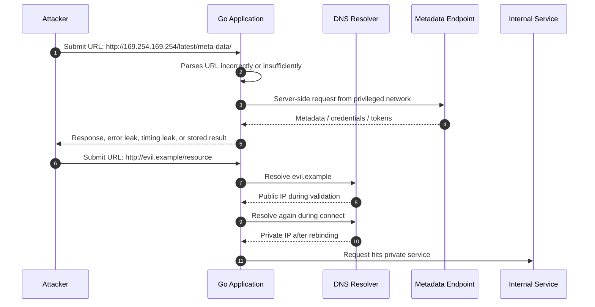
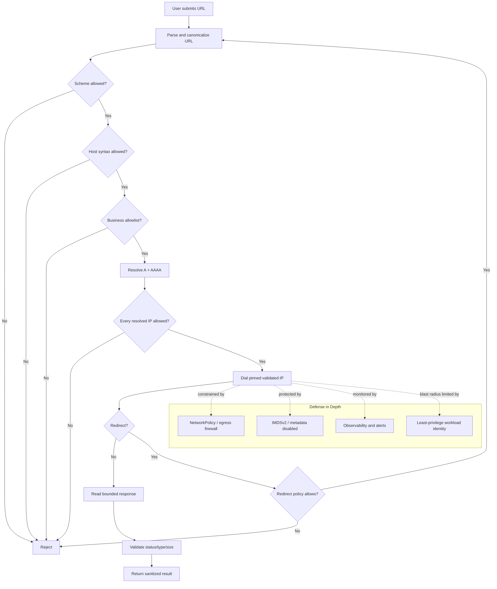
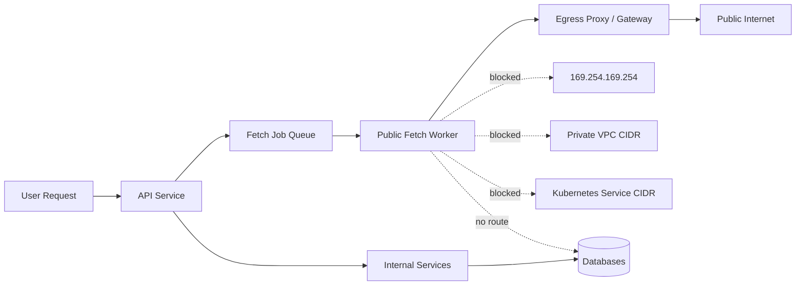
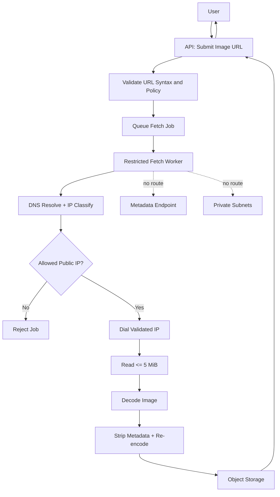

# learn-go-security-cryptography-integrity-part-023.md

# Part 023 — SSRF, Redirect, DNS Rebinding, Metadata Endpoint Protection, Outbound Allowlist, IP Classification, Proxy Boundary, and Internal Network Exposure

> Seri: `learn-go-security-cryptography-integrity`  
> Target: Go 1.26.x  
> Audience: Java software engineer / tech lead yang ingin menguasai Go security pada level internal engineering handbook  
> Status seri: belum selesai  
> Part sebelumnya: `part-022` — Injection Defense  
> Part berikutnya: `part-024` — Serialization Security

---

## 0. Tujuan Part Ini

Di part sebelumnya, kita membahas injection: bagaimana input yang tampak sebagai data berubah menjadi perintah untuk interpreter seperti SQL, shell, template, atau protocol parser.

Part ini membahas keluarga vulnerability yang berbeda: **Server-Side Request Forgery** atau **SSRF**.

SSRF terjadi saat attacker dapat memengaruhi server untuk membuat request keluar ke target yang tidak seharusnya dapat dijangkau oleh attacker secara langsung.

Contoh fitur yang rawan SSRF:

- image proxy: user memberi URL gambar, server mengambil gambar tersebut;
- PDF renderer: user memberi HTML/URL, server render menjadi PDF;
- webhook tester: user memasukkan callback URL lalu server mengirim test event;
- import by URL: user meminta server mengambil CSV/JSON/XML dari URL;
- link preview: server mengambil title/metadata dari URL;
- avatar fetcher;
- OpenGraph scraper;
- integration connector;
- object storage import from URL;
- health-check configurator;
- admin diagnostic tool;
- proxy endpoint;
- URL validator yang melakukan server-side check;
- server-side redirect follower;
- headless browser automation;
- LLM/tool connector yang bisa fetch URL;
- internal “fetch anything” utility yang dipakai ulang tanpa boundary.

Materi ini bertujuan membuat kita mampu:

1. Membedakan SSRF dari sekadar “URL validation bug”.
2. Mendesain **outbound request boundary** yang defensible di Go.
3. Mengerti kenapa allowlist domain saja tidak cukup bila DNS rebinding tidak dikendalikan.
4. Mengerti kenapa blocklist IP saja rapuh bila parsing/canonicalization salah.
5. Membuat custom `http.Client` / `http.Transport` yang membatasi scheme, host, port, redirect, proxy, DNS, IP range, timeout, dan response size.
6. Mengintegrasikan pertahanan aplikasi dengan network-layer egress policy, cloud metadata protection, Kubernetes policy, dan observability.
7. Menyusun checklist design review untuk semua fitur “server fetches URL”.

---

## 1. Core Mental Model

### 1.1 SSRF bukan hanya “server bisa akses URL attacker”

Definisi sederhana SSRF:

> Attacker mengontrol sebagian input request keluar yang dibuat oleh server, lalu server menjadi “browser/proxy” milik attacker.

Tapi definisi praktis untuk engineering lebih tajam:

> SSRF adalah kegagalan menegakkan boundary antara **untrusted user-selected destination** dan **privileged network position milik server**.

Server memiliki posisi jaringan yang lebih kuat daripada user:

- bisa mengakses private subnet;
- bisa mengakses metadata endpoint;
- punya IAM role / workload identity;
- dipercaya oleh internal services;
- berada di security group tertentu;
- dapat melewati firewall yang user eksternal tidak bisa lewati;
- punya DNS resolver internal;
- punya proxy environment;
- punya client certificate;
- punya allowlist egress;
- punya service mesh identity;
- punya access ke localhost admin port;
- dapat reach service discovery name seperti `kubernetes.default.svc` atau internal DNS zone.

Itulah alasan SSRF berbahaya. Masalahnya bukan hanya URL-nya, tetapi **network privilege transference**.

---

## 2. SSRF Attack Flow



Key insight:

- SSRF can be **direct**: attacker sees response body.
- SSRF can be **blind**: attacker cannot see response but can trigger side effects, timing, callbacks, DNS logs, or cloud credential use.
- SSRF can be **semi-blind**: attacker sees status code, length, error category, or timing.
- SSRF can be chained with redirect, DNS rebinding, parser ambiguity, open proxy, open redirect, file upload, XML external entities, template rendering, or command injection.

---

## 3. SSRF in Go: Why This Deserves a Dedicated Part

Go makes HTTP requests easy:

```go
resp, err := http.Get(userURL)
```

That line is often the entire vulnerability.

The problem is not that Go is unsafe. The problem is that `net/http` is a general-purpose HTTP client. It is designed to make HTTP work correctly, not to decide whether a business-specific destination is safe.

Go gives you the primitives:

- `net/url` for parsing;
- `net/http.Client` for redirect policy;
- `http.Transport` for proxy, timeout, dialer, TLS, connection pooling;
- `net.Resolver` for DNS resolution;
- `net/netip` for precise IP classification;
- `context.Context` for request deadline/cancellation;
- `io.LimitedReader` / `http.MaxBytesReader` style patterns for bounding data.

But Go will not automatically know:

- whether `169.254.169.254` is forbidden in your cloud;
- whether `10.0.0.0/8` is internal in your VPC;
- whether `*.corp.example` is safe;
- whether redirect from `https://trusted.example/file` to `http://localhost/admin` should be blocked;
- whether your proxy environment is trusted;
- whether response body size is safe;
- whether DNS result changed between validation and dial;
- whether a public-looking domain is controlled by attacker;
- whether the endpoint is allowed for the tenant/requester.

Security responsibility sits in your application boundary.

---

## 4. Taxonomy: SSRF Patterns You Must Recognize

| Pattern | Example | Why dangerous |
|---|---|---|
| Direct metadata SSRF | `http://169.254.169.254/...` | Steals cloud credentials / tokens / metadata |
| Localhost SSRF | `http://127.0.0.1:8080/admin` | Hits internal admin/debug endpoints |
| Private network SSRF | `http://10.0.12.30:9200/_search` | Reaches DB/search/message/admin services |
| Link-local SSRF | `http://169.254.x.x` or IPv6 link-local | Metadata and local network resources |
| DNS rebinding | domain resolves public during validation, private during connect | Bypasses domain validation |
| Redirect SSRF | trusted URL redirects to forbidden target | Bypasses initial validation |
| Parser confusion | weird URL form parsed differently by validator/client | Bypasses string checks |
| Protocol smuggling | `gopher://`, `file://`, `ftp://`, `dict://` | Hits non-HTTP services or local files in clients that support them |
| Proxy boundary bypass | default env proxy or attacker-controlled proxy | Changes real egress path and visibility |
| Host header abuse | URL host safe but `Host` header overridden | Virtual-host/service confusion |
| Blind SSRF | server sends request but does not return body | Still causes side effects or data exfil via DNS/callback |
| SSRF-to-RCE | SSRF hits admin API, metadata creds, Redis, Docker socket, cloud API | Becomes full compromise |

---

## 5. Threat Model for “Fetch URL” Features

Any feature that accepts a URL must answer these questions before implementation:

1. **Who controls the destination?**
   - user?
   - admin?
   - tenant config?
   - third-party integration?
   - internal service registry?

2. **What destination classes are legitimate?**
   - exact domain list?
   - partner endpoints?
   - public internet only?
   - internal services only?
   - tenant-owned callback URL?

3. **What methods are allowed?**
   - `GET` only?
   - `HEAD`?
   - `POST` webhook?
   - never `PUT`?
   - no custom methods?

4. **What schemes are allowed?**
   - usually only `https`;
   - sometimes `http` for controlled internal lab only;
   - never `file`, `ftp`, `gopher`, `dict`, `unix`, `ssh`, `smb`.

5. **Can redirects be followed?**
   - no by default;
   - if yes, each redirect target must be revalidated;
   - cap redirect count;
   - do not downgrade from HTTPS to HTTP;
   - do not forward sensitive headers across origin.

6. **What networks are forbidden?**
   - loopback;
   - link-local;
   - private RFC1918 / RFC4193;
   - metadata endpoints;
   - Kubernetes cluster CIDR;
   - VPC CIDR;
   - database subnet;
   - internal DNS names;
   - service mesh/admin endpoints;
   - DNS resolver IPs;
   - local daemon ports;
   - Unix sockets.

7. **What is the maximum response size and duration?**
   - content length limit;
   - streaming read limit;
   - decompression policy;
   - total deadline;
   - per-phase timeout;
   - body type constraints.

8. **What data is returned to attacker?**
   - full body?
   - status code only?
   - error details?
   - timing?
   - redirect target?
   - response headers?

9. **What credentials could the server attach automatically?**
   - proxy credentials;
   - cookies;
   - Authorization header;
   - mTLS certificate;
   - service mesh identity;
   - cloud role;
   - ambient DNS/search domain;
   - HTTP client default headers.

10. **What monitoring proves policy is working?**
    - rejected destination logs;
    - DNS result classification;
    - egress metrics by host/IP class;
    - redirect rejection metrics;
    - metadata endpoint hit alarms;
    - egress firewall deny logs.

---

## 6. Good Design: Destination Is Not Free Text

### 6.1 Bad design

```go
func Import(ctx context.Context, rawURL string) error {
    resp, err := http.Get(rawURL)
    if err != nil {
        return err
    }
    defer resp.Body.Close()

    b, err := io.ReadAll(resp.Body)
    if err != nil {
        return err
    }

    return store(b)
}
```

This is vulnerable because:

- no scheme restriction;
- no host validation;
- follows redirects by default;
- no outbound IP classification;
- no metadata protection;
- no timeout;
- no response size limit;
- uses global default client;
- may use default proxy behavior if default transport is used;
- returns errors that may disclose network topology;
- cannot reason about policy centrally.

### 6.2 Better design: represent business destination, not arbitrary URL

```go
type ExternalFetchRequest struct {
    SourceKind SourceKind
    PartnerID  string
    ObjectPath string
}

type SourceKind string

const (
    SourcePartnerS3Mirror SourceKind = "partner_s3_mirror"
    SourcePartnerAPI      SourceKind = "partner_api"
)
```

Then resolve destination from server-side config:

```go
type PartnerEndpoint struct {
    BaseURL       string
    AllowedHosts  []string
    AllowedPorts  []string
    RequireHTTPS  bool
    MaxBodyBytes  int64
    AllowedMethod string
}
```

The best SSRF defense is often: **do not let untrusted users choose arbitrary destination at all**.

### 6.3 When arbitrary external URL is truly required

Sometimes you really need public URL fetch:

- link preview;
- public image proxy;
- public feed importer;
- callback verifier;
- public document importer.

Then enforce:

- public internet only;
- no private/loopback/link-local/multicast/unspecified/reserved networks;
- no redirects by default;
- no credentials;
- no proxy unless explicitly trusted;
- strict timeout;
- strict body limit;
- strict content-type policy;
- one centralized hardened client;
- network egress policy as second layer.

---

## 7. SSRF Defense Layers



The crucial idea:

> URL validation must be connected to the actual dial operation. Validation that happens before the HTTP client re-resolves the host is not enough.

---

## 8. URL Parsing and Canonicalization in Go

Use `net/url`. Do not parse URL manually with strings.

But also do not assume `url.Parse` alone proves safety.

### 8.1 Minimum URL checks

```go
func parseAbsoluteHTTPURL(raw string) (*url.URL, error) {
    if len(raw) == 0 || len(raw) > 2048 {
        return nil, errors.New("invalid URL length")
    }

    u, err := url.Parse(raw)
    if err != nil {
        return nil, errors.New("invalid URL")
    }

    if !u.IsAbs() {
        return nil, errors.New("URL must be absolute")
    }

    if u.Scheme != "https" {
        return nil, errors.New("scheme not allowed")
    }

    if u.User != nil {
        return nil, errors.New("userinfo is not allowed")
    }

    if u.Host == "" || u.Hostname() == "" {
        return nil, errors.New("host is required")
    }

    if u.Opaque != "" {
        return nil, errors.New("opaque URL is not allowed")
    }

    if u.Fragment != "" {
        // Fragment is not sent over HTTP, but keep policy simple.
        return nil, errors.New("fragment is not allowed")
    }

    return u, nil
}
```

### 8.2 Avoid string prefix/suffix checks

Bad:

```go
strings.HasPrefix(raw, "https://trusted.example")
```

Bypass ideas:

```text
https://trusted.example.evil.test/
https://trusted.example@evil.test/
https://evil.test/#https://trusted.example
https://evil.test/?next=https://trusted.example
https://trusted.example:443.evil.test/
https://trusted.example%00.evil.test/
```

Correct model:

- parse;
- inspect `u.Scheme`;
- inspect `u.Hostname()`;
- inspect `u.Port()`;
- canonicalize domain;
- compare against exact allowlist or controlled suffix rule;
- resolve;
- classify IPs;
- dial only validated IP.

### 8.3 Domain suffix checks must be precise

Bad:

```go
strings.HasSuffix(host, "example.com")
```

This accepts:

```text
badexample.com
reallybadexample.com
```

Better:

```go
func isAllowedDomain(host string, allowed string) bool {
    host = strings.TrimSuffix(strings.ToLower(host), ".")
    allowed = strings.TrimSuffix(strings.ToLower(allowed), ".")
    return host == allowed || strings.HasSuffix(host, "."+allowed)
}
```

But for SSRF-sensitive fetchers, prefer exact hosts unless wildcard/subdomain behavior is a real business requirement.

---

## 9. Scheme and Port Policy

### 9.1 Scheme

Default policy:

| Scheme | Public fetcher | Partner integration | Internal service client |
|---|---:|---:|---:|
| `https` | yes | yes | yes |
| `http` | usually no | maybe, controlled | maybe inside mesh only |
| `file` | no | no | no |
| `ftp` | no | no | no |
| `gopher` | no | no | no |
| `dict` | no | no | no |
| `unix` | no | no | special non-URL client only |
| custom scheme | no | no | explicit implementation only |

In Go `net/http` supports HTTP and HTTPS by default. But SSRF chains often involve other libraries or helper tools that support additional schemes. Therefore enforce scheme at application boundary, not just rely on client capability.

### 9.2 Port

Default public fetcher:

- allow `443`;
- optionally allow `80` only for non-sensitive public content and never for credentialed requests;
- reject empty port by mapping scheme default;
- reject all other ports unless business-allowlisted.

Why port matters:

```text
http://public.example:22
http://public.example:25
http://public.example:6379
http://public.example:9200
http://public.example:2375
http://public.example:11211
http://public.example:8080/admin
```

If you allow arbitrary ports, you allow the server to scan or interact with non-HTTP services. Even if the HTTP client cannot speak the protocol correctly, timing and error differences can become blind port scanning.

```go
func effectivePort(u *url.URL) (string, error) {
    if p := u.Port(); p != "" {
        return p, nil
    }
    switch u.Scheme {
    case "https":
        return "443", nil
    case "http":
        return "80", nil
    default:
        return "", errors.New("unsupported scheme")
    }
}
```

---

## 10. IP Classification with `net/netip`

For SSRF defense, use `net/netip` where possible. `netip.Addr` is immutable, comparable, and has classification helpers.

Important methods:

- `IsLoopback()`
- `IsPrivate()`
- `IsLinkLocalUnicast()`
- `IsLinkLocalMulticast()`
- `IsMulticast()`
- `IsUnspecified()`
- `IsGlobalUnicast()`
- `Is4In6()`
- `Unmap()`

Critical note:

> `IsGlobalUnicast()` is not enough for SSRF defense because it returns true for private IPv4 and IPv6 unique-local addresses. Always explicitly reject private/link-local/loopback/etc.

### 10.1 Baseline public-IP policy

```go
package ssrf

import (
    "net/netip"
)

var forbiddenPrefixes = mustPrefixes([]string{
    // IPv4 special/private/local
    "0.0.0.0/8",        // current network / unspecified-like
    "10.0.0.0/8",       // RFC1918
    "100.64.0.0/10",    // carrier-grade NAT, often internal-ish
    "127.0.0.0/8",      // loopback
    "169.254.0.0/16",   // link-local + cloud metadata
    "172.16.0.0/12",    // RFC1918
    "192.0.0.0/24",     // IETF protocol assignments
    "192.0.2.0/24",     // documentation
    "192.168.0.0/16",   // RFC1918
    "198.18.0.0/15",    // benchmarking
    "198.51.100.0/24",  // documentation
    "203.0.113.0/24",   // documentation
    "224.0.0.0/4",      // multicast
    "240.0.0.0/4",      // reserved
    "255.255.255.255/32",

    // IPv6 special/private/local
    "::/128",           // unspecified
    "::1/128",          // loopback
    "::ffff:0:0/96",    // IPv4-mapped IPv6; unmap before classifying
    "64:ff9b::/96",     // IPv4/IPv6 translation prefix
    "100::/64",         // discard-only
    "2001::/23",        // IETF protocol assignments broad guard
    "2001:db8::/32",    // documentation
    "fc00::/7",         // unique local address
    "fe80::/10",        // link-local
    "ff00::/8",         // multicast
})

func mustPrefixes(xs []string) []netip.Prefix {
    out := make([]netip.Prefix, 0, len(xs))
    for _, s := range xs {
        p := netip.MustParsePrefix(s)
        out = append(out, p)
    }
    return out
}

func IsForbiddenForPublicFetch(addr netip.Addr) bool {
    if !addr.IsValid() {
        return true
    }

    // Avoid IPv4-mapped IPv6 bypasses.
    addr = addr.Unmap()

    if addr.IsUnspecified() || addr.IsLoopback() || addr.IsPrivate() ||
        addr.IsLinkLocalUnicast() || addr.IsLinkLocalMulticast() ||
        addr.IsMulticast() {
        return true
    }

    for _, p := range forbiddenPrefixes {
        if p.Contains(addr) {
            return true
        }
    }

    return false
}
```

This is a baseline. Production systems should align forbidden ranges with:

- cloud provider metadata ranges;
- VPC CIDR;
- Kubernetes pod/service CIDR;
- office/VPN ranges;
- service mesh/admin IPs;
- database/search/cache/message subnet ranges;
- security team egress policy;
- partner-specific allowlist.

### 10.2 IP literal parsing

Do not let IP literals bypass DNS policy.

```go
func parseIPLiteral(host string) (netip.Addr, bool) {
    addr, err := netip.ParseAddr(strings.Trim(host, "[]"))
    if err != nil {
        return netip.Addr{}, false
    }
    return addr.Unmap(), true
}
```

But do not rely only on `netip.ParseAddr`, because attackers can try alternative textual forms. Go's parser is stricter than legacy parsers, which is good. Reject anything you cannot parse confidently.

Examples to test:

```text
127.0.0.1
[::1]
[::ffff:127.0.0.1]
169.254.169.254
0.0.0.0
localhost
localhost.
metadata.google.internal
```

---

## 11. DNS Rebinding and DNS Pinning

### 11.1 The bug pattern

```go
func validateThenFetch(ctx context.Context, raw string) error {
    u, _ := url.Parse(raw)
    ips, _ := net.DefaultResolver.LookupNetIP(ctx, "ip", u.Hostname())

    for _, ip := range ips {
        if IsForbiddenForPublicFetch(ip) {
            return errors.New("blocked")
        }
    }

    // BUG: http.Client resolves again internally.
    _, err := http.Get(raw)
    return err
}
```

The validation DNS lookup and actual dial DNS lookup are separate. An attacker-controlled domain can return public IP during validation and private IP during actual connection.

### 11.2 Correct direction: validate and dial the selected IP

A safer approach:

1. Parse URL.
2. Validate scheme/host/port.
3. Resolve host to A/AAAA.
4. Reject if any resolved address is forbidden.
5. Dial a selected validated IP directly.
6. Preserve original host for HTTP Host header and TLS SNI.
7. Revalidate every redirect.

This is more complex than ordinary HTTP client usage, which is why it belongs in a dedicated package rather than duplicated in handlers.

---

## 12. Hardened Fetcher Skeleton in Go

The following code is an educational skeleton. Production systems should wrap it with tests, metrics, tenant policy, allowlist config, and network egress controls.

```go
package safefetch

import (
    "context"
    "crypto/tls"
    "errors"
    "fmt"
    "io"
    "math/rand/v2"
    "net"
    "net/http"
    "net/netip"
    "net/url"
    "strings"
    "time"
)

type Policy struct {
    AllowedSchemes   map[string]bool
    AllowedPorts     map[string]bool
    AllowedHosts     map[string]bool // exact lower-case host allowlist; optional
    AllowSubdomains  []string        // controlled suffixes; optional
    MaxRedirects     int
    MaxResponseBytes int64
    UserAgent        string
}

type Fetcher struct {
    policy   Policy
    resolver *net.Resolver
    dialer   *net.Dialer
    client   *http.Client
}

func NewFetcher(policy Policy) *Fetcher {
    if policy.MaxResponseBytes <= 0 {
        policy.MaxResponseBytes = 5 << 20 // 5 MiB default
    }
    if policy.UserAgent == "" {
        policy.UserAgent = "safe-fetcher/1.0"
    }

    f := &Fetcher{
        policy:   policy,
        resolver: net.DefaultResolver,
        dialer: &net.Dialer{
            Timeout:   3 * time.Second,
            KeepAlive: 30 * time.Second,
        },
    }

    tr := &http.Transport{
        // SSRF-sensitive clients should not silently inherit HTTP_PROXY / HTTPS_PROXY.
        // Use an explicit trusted proxy function only if your architecture requires it.
        Proxy: nil,

        DialContext:           f.dialContext,
        TLSHandshakeTimeout:   3 * time.Second,
        ResponseHeaderTimeout: 5 * time.Second,
        ExpectContinueTimeout: 1 * time.Second,
        IdleConnTimeout:       30 * time.Second,
        MaxIdleConns:          50,
        MaxIdleConnsPerHost:   5,
        DisableCompression:    true,
        TLSClientConfig: &tls.Config{
            MinVersion: tls.VersionTLS12,
        },
    }

    f.client = &http.Client{
        Transport: tr,
        Timeout:   10 * time.Second,
        CheckRedirect: func(req *http.Request, via []*http.Request) error {
            if len(via) >= f.policy.MaxRedirects {
                return errors.New("redirect limit exceeded")
            }
            if err := f.validateURL(req.URL); err != nil {
                return fmt.Errorf("redirect target rejected: %w", err)
            }
            // Optional strict policy: forbid HTTPS -> HTTP downgrade.
            if len(via) > 0 && via[len(via)-1].URL.Scheme == "https" && req.URL.Scheme != "https" {
                return errors.New("redirect downgrade rejected")
            }
            return nil
        },
    }

    return f
}

func (f *Fetcher) Get(ctx context.Context, raw string) ([]byte, error) {
    u, err := parseURL(raw)
    if err != nil {
        return nil, err
    }
    if err := f.validateURL(u); err != nil {
        return nil, err
    }

    req, err := http.NewRequestWithContext(ctx, http.MethodGet, u.String(), nil)
    if err != nil {
        return nil, errors.New("cannot create request")
    }
    req.Header.Set("User-Agent", f.policy.UserAgent)
    req.Header.Set("Accept", "application/octet-stream, text/plain;q=0.5, */*;q=0.1")

    resp, err := f.client.Do(req)
    if err != nil {
        return nil, sanitizeOutboundError(err)
    }
    defer resp.Body.Close()

    if resp.StatusCode < 200 || resp.StatusCode >= 300 {
        return nil, fmt.Errorf("upstream returned non-success status: %d", resp.StatusCode)
    }

    limited := io.LimitReader(resp.Body, f.policy.MaxResponseBytes+1)
    body, err := io.ReadAll(limited)
    if err != nil {
        return nil, errors.New("cannot read upstream response")
    }
    if int64(len(body)) > f.policy.MaxResponseBytes {
        return nil, errors.New("upstream response too large")
    }
    return body, nil
}

func parseURL(raw string) (*url.URL, error) {
    raw = strings.TrimSpace(raw)
    if raw == "" || len(raw) > 2048 {
        return nil, errors.New("invalid URL length")
    }

    u, err := url.Parse(raw)
    if err != nil {
        return nil, errors.New("invalid URL")
    }
    if !u.IsAbs() || u.Host == "" || u.Hostname() == "" {
        return nil, errors.New("absolute URL with host required")
    }
    if u.User != nil {
        return nil, errors.New("userinfo is not allowed")
    }
    if u.Opaque != "" {
        return nil, errors.New("opaque URL is not allowed")
    }
    if u.Fragment != "" {
        return nil, errors.New("fragment is not allowed")
    }
    return u, nil
}

func (f *Fetcher) validateURL(u *url.URL) error {
    scheme := strings.ToLower(u.Scheme)
    if !f.policy.AllowedSchemes[scheme] {
        return errors.New("scheme rejected")
    }

    port, err := effectivePort(u)
    if err != nil {
        return err
    }
    if !f.policy.AllowedPorts[port] {
        return errors.New("port rejected")
    }

    host := canonicalHost(u.Hostname())
    if host == "" {
        return errors.New("host rejected")
    }

    if addr, ok := parseIPLiteral(host); ok {
        if IsForbiddenForPublicFetch(addr) {
            return errors.New("IP literal rejected")
        }
        return nil
    }

    if len(f.policy.AllowedHosts) > 0 || len(f.policy.AllowSubdomains) > 0 {
        if !f.isAllowedHost(host) {
            return errors.New("host not allowlisted")
        }
    }

    return nil
}

func (f *Fetcher) dialContext(ctx context.Context, network, address string) (net.Conn, error) {
    host, port, err := net.SplitHostPort(address)
    if err != nil {
        return nil, err
    }

    host = canonicalHost(host)

    if addr, ok := parseIPLiteral(host); ok {
        if IsForbiddenForPublicFetch(addr) {
            return nil, errors.New("dial IP rejected")
        }
        return f.dialer.DialContext(ctx, network, net.JoinHostPort(addr.String(), port))
    }

    ips, err := f.resolver.LookupNetIP(ctx, "ip", host)
    if err != nil {
        return nil, errors.New("DNS resolution failed")
    }
    if len(ips) == 0 {
        return nil, errors.New("no DNS addresses")
    }

    candidates := make([]netip.Addr, 0, len(ips))
    for _, ip := range ips {
        ip = ip.Unmap()
        if IsForbiddenForPublicFetch(ip) {
            return nil, errors.New("DNS resolved to forbidden address")
        }
        candidates = append(candidates, ip)
    }

    // Pick one validated candidate. Production code may prefer stable ordering,
    // Happy Eyeballs behavior, or address-family preference. Randomization here
    // avoids always hitting first record in examples.
    selected := candidates[rand.IntN(len(candidates))]
    return f.dialer.DialContext(ctx, network, net.JoinHostPort(selected.String(), port))
}

func (f *Fetcher) isAllowedHost(host string) bool {
    if f.policy.AllowedHosts[host] {
        return true
    }
    for _, suffix := range f.policy.AllowSubdomains {
        suffix = canonicalHost(suffix)
        if host == suffix || strings.HasSuffix(host, "."+suffix) {
            return true
        }
    }
    return false
}

func canonicalHost(host string) string {
    host = strings.TrimSpace(strings.ToLower(host))
    host = strings.TrimSuffix(host, ".")
    return host
}

func effectivePort(u *url.URL) (string, error) {
    if p := u.Port(); p != "" {
        return p, nil
    }
    switch strings.ToLower(u.Scheme) {
    case "https":
        return "443", nil
    case "http":
        return "80", nil
    default:
        return "", errors.New("unsupported scheme")
    }
}

func parseIPLiteral(host string) (netip.Addr, bool) {
    addr, err := netip.ParseAddr(strings.Trim(host, "[]"))
    if err != nil {
        return netip.Addr{}, false
    }
    return addr.Unmap(), true
}

func sanitizeOutboundError(err error) error {
    // Do not return resolver details, internal IPs, proxy names, or exact network topology
    // to untrusted callers. Log detailed error internally with correlation ID.
    return errors.New("outbound fetch failed")
}
```

### 12.1 Policy example: public HTTPS only

```go
fetcher := safefetch.NewFetcher(safefetch.Policy{
    AllowedSchemes: map[string]bool{"https": true},
    AllowedPorts:   map[string]bool{"443": true},
    MaxRedirects:   0,
    MaxResponseBytes: 2 << 20,
})
```

### 12.2 Policy example: partner allowlist

```go
fetcher := safefetch.NewFetcher(safefetch.Policy{
    AllowedSchemes: map[string]bool{"https": true},
    AllowedPorts:   map[string]bool{"443": true},
    AllowedHosts: map[string]bool{
        "api.partner-a.example": true,
        "files.partner-a.example": true,
    },
    MaxRedirects:     1,
    MaxResponseBytes: 20 << 20,
})
```

---

## 13. Redirects: Treat Redirect Target as a New Request

Go's `http.Client` follows redirects unless `CheckRedirect` rejects them.

SSRF problem:

```text
User submits: https://trusted.example/download/123
trusted.example responds: 302 Location: http://169.254.169.254/latest/meta-data/
client follows redirect
metadata exposed
```

Rules:

1. Do not follow redirects by default for SSRF-sensitive fetchers.
2. If redirects are needed, revalidate every redirect target using the exact same policy.
3. Cap redirect count.
4. Forbid HTTPS-to-HTTP downgrade unless explicitly allowed.
5. Do not forward sensitive headers across origin.
6. Consider same-host-only redirects for partner integrations.
7. Log redirect rejection as security-relevant event.

Strict redirect policy:

```go
client := &http.Client{
    CheckRedirect: func(req *http.Request, via []*http.Request) error {
        return http.ErrUseLastResponse
    },
}
```

Same-host redirect policy:

```go
func sameHostRedirect(req *http.Request, via []*http.Request) error {
    if len(via) >= 3 {
        return errors.New("too many redirects")
    }
    if len(via) == 0 {
        return nil
    }
    previous := canonicalHost(via[len(via)-1].URL.Hostname())
    next := canonicalHost(req.URL.Hostname())
    if previous != next {
        return errors.New("cross-host redirect rejected")
    }
    if via[len(via)-1].URL.Scheme == "https" && req.URL.Scheme != "https" {
        return errors.New("scheme downgrade rejected")
    }
    return nil
}
```

---

## 14. Proxy Boundary

### 14.1 Why proxy matters

Go's default transport may use proxy configuration from environment variables such as `HTTP_PROXY`, `HTTPS_PROXY`, and `NO_PROXY` when using the default transport.

For general apps this is convenient. For SSRF-sensitive fetchers, ambient proxy configuration can be dangerous because:

- it changes where traffic actually goes;
- it may allow access to networks blocked by direct egress rules;
- it may leak requested URLs to a proxy;
- it may attach proxy credentials;
- it may allow CONNECT tunneling;
- `NO_PROXY` behavior can create inconsistent bypasses;
- container/runtime environment variables may be controlled outside application code.

### 14.2 Policy

For SSRF-sensitive clients:

```go
tr := &http.Transport{
    Proxy: nil, // no ambient env proxy
}
```

If a proxy is required:

- use an explicit configured proxy URL;
- treat the proxy as a security boundary;
- ensure proxy enforces destination allowlist too;
- disable direct egress except through proxy;
- log destination at proxy;
- block metadata and internal ranges at proxy;
- do not rely only on application checks.

### 14.3 Separate clients by purpose

Do not reuse the same `http.Client` for:

- public user-controlled fetches;
- internal service calls;
- metadata/cloud SDK calls;
- admin API calls;
- webhook delivery;
- OAuth/OIDC token calls;
- storage calls;
- partner API calls.

Use named clients:

```text
PublicURLFetcherClient
PartnerWebhookClient
InternalServiceClient
OIDCDiscoveryClient
CloudSDKClient
```

Each client should have its own:

- timeout;
- redirect policy;
- proxy policy;
- TLS policy;
- allowlist;
- auth headers;
- body limit;
- metrics labels;
- error envelope.

---

## 15. Metadata Endpoint Protection

Cloud metadata services are frequent SSRF targets because they expose credentials, tokens, service account metadata, SSH keys, bootstrap data, or identity documents.

Common metadata targets:

| Platform | Typical target |
|---|---|
| AWS EC2 IMDS | `169.254.169.254`, sometimes IPv6 endpoint when enabled |
| GCP metadata | `metadata.google.internal`, `169.254.169.254` |
| Azure IMDS | `169.254.169.254` |
| Kubernetes | `kubernetes.default.svc`, service account token files, kubelet endpoints |
| Docker | local socket / daemon API, not normally HTTP over TCP unless exposed |

### 15.1 Application layer

Always block:

```text
169.254.169.254
169.254.0.0/16
fe80::/10
localhost
127.0.0.0/8
::1
metadata.google.internal
metadata.amazonaws.com
```

But blocking these strings is insufficient. You need IP classification after DNS resolution.

### 15.2 AWS IMDSv2

IMDSv2 is defense-in-depth. It requires a session token obtained with `PUT`, and AWS documents response hop limit behavior for the token response. That helps reduce many SSRF paths, but it is not a replacement for application and network egress controls.

Recommended posture:

- require IMDSv2;
- disable IMDS if workload does not need it;
- set hop limit conservatively;
- avoid broad instance roles;
- use least-privilege IAM;
- in Kubernetes, prefer pod identity mechanisms and prevent pods from reaching node metadata unless needed;
- add network policy / iptables / CNI controls to block metadata from application pods;
- alarm on metadata access from unexpected processes or pods.

### 15.3 Kubernetes and service account tokens

SSRF may not directly read files, but SSRF can hit internal Kubernetes endpoints if reachable:

```text
https://kubernetes.default.svc
http://kubelet:10250
http://127.0.0.1:10248/healthz
```

Controls:

- do not mount service account tokens unless needed;
- use projected tokens with bounded audience and expiration;
- restrict NetworkPolicy egress;
- restrict kubelet access;
- avoid exposing admin/debug endpoints on localhost if SSRF feature exists in same process/network namespace;
- do not let general URL fetchers access cluster DNS names.

---

## 16. Internal Network Exposure

SSRF turns your app into a scanner or client inside your network.

Potential internal targets:

| Target | SSRF impact |
|---|---|
| Redis | unauthenticated commands if exposed; timing/port scan even if not HTTP |
| Elasticsearch/OpenSearch | data read/delete if unauthenticated or internal-trusted |
| Prometheus/Grafana | metadata, targets, tokens, dashboards |
| RabbitMQ management | credentials, queues, admin actions |
| Consul/etcd | service discovery, secrets, config |
| Spring Boot actuator | env/config/heapdump if exposed internally |
| Go pprof/expvar | memory/profile info, request data, internal topology |
| Admin APIs | privileged actions because caller is “internal” |
| Metadata services | credentials/tokens |
| DNS services | internal zone enumeration |
| CI/CD metadata | build tokens or artifacts |

For Go services, watch for:

- `/debug/pprof` exposed on same listener;
- `expvar` exposed internally;
- admin mux bound to `localhost` but reachable from SSRF in same host namespace;
- health endpoints revealing dependency names;
- debug endpoints that trigger actions;
- internal service clients that trust `X-Forwarded-*` or `X-Internal-*` headers.

---

## 17. Host Header and Virtual Host Confusion

In Go client requests, `req.URL.Host` determines where the client connects, while `req.Host` can override the Host header.

Do not let untrusted input control `req.Host`.

Bad:

```go
req, _ := http.NewRequestWithContext(ctx, http.MethodGet, safeURL, nil)
req.Host = userProvidedHost
```

Risk:

- virtual host confusion;
- internal routing bypass;
- CDN/proxy rule bypass;
- cache poisoning;
- upstream service sees a trusted Host while connection target is different;
- SSRF policy validates URL host but request is interpreted as another host upstream.

Policy:

- never expose Host override in public fetchers;
- do not forward user-supplied `Host`, `X-Forwarded-Host`, `X-Original-Host`, `Forwarded`;
- strip hop-by-hop and proxy headers;
- for webhooks, construct headers from server-side config.

---

## 18. Request Header Policy

Public fetchers should avoid sending sensitive or confusing headers.

Reject/strip:

```text
Authorization
Cookie
Proxy-Authorization
X-Forwarded-For
X-Forwarded-Host
X-Forwarded-Proto
Forwarded
X-Real-IP
X-Original-URL
X-Rewrite-URL
X-Accel-Redirect
X-Internal-*
Metadata-Flavor
X-aws-ec2-metadata-token
```

Why strip metadata-related headers?

- Some metadata systems require special headers.
- You do not want public fetcher code to accidentally satisfy metadata endpoint requirements.
- You should not expose a generic “custom headers” feature without strict allowlist.

Allowed headers for public fetch:

```text
User-Agent: safe-fetcher/<version>
Accept: image/* or application/json depending on feature
```

For partner integrations, use per-partner server-side configured headers. Do not let tenants provide arbitrary outbound headers unless the feature is explicitly an HTTP client product with strong sandboxing and egress policy.

---

## 19. Response Handling

SSRF is not only about where you connect. It is also about what you do with the response.

### 19.1 Bound response size

```go
const max = 2 << 20 // 2 MiB
body, err := io.ReadAll(io.LimitReader(resp.Body, max+1))
if err != nil {
    return err
}
if int64(len(body)) > max {
    return errors.New("response too large")
}
```

### 19.2 Validate content type

For image proxy:

- require `image/png`, `image/jpeg`, `image/webp`, etc.;
- sniff carefully but do not trust `Content-Type` alone;
- decode with bounded reader;
- reject SVG unless sanitized because SVG may contain scripts/external references;
- rewrite content rather than proxy raw upstream headers.

For JSON import:

- require `application/json` or controlled variants;
- decode with `json.Decoder` and size limit;
- reject unknown fields if appropriate;
- apply business validation after parse.

### 19.3 Do not expose internal errors

Bad:

```json
{
  "error": "dial tcp 10.0.12.34:9200: connect: connection refused"
}
```

This leaks:

- private IP;
- port;
- service existence;
- firewall behavior;
- internal topology.

Better:

```json
{
  "error": "outbound_fetch_failed",
  "correlation_id": "01J..."
}
```

Log internally:

```json
{
  "event": "outbound_fetch_rejected",
  "reason": "dns_resolved_forbidden_ip",
  "host_hash": "...",
  "ip_class": "link_local",
  "correlation_id": "01J..."
}
```

Do not log raw URL if it may contain tokens/query secrets. Log canonical host, path class, hash, policy decision, and correlation ID.

---

## 20. Blind SSRF and Side Effects

Even when you do not return the response body, SSRF still matters.

Blind SSRF can:

- trigger internal state-changing endpoints;
- scan ports by timing differences;
- exfiltrate via DNS lookups to attacker-controlled domains;
- trigger webhook callbacks;
- hit cloud metadata and then use credentials elsewhere if logs/side effects expose them;
- trigger cache warming/deletion;
- call admin endpoints that only require internal network position;
- cause expensive outbound requests.

Therefore, “we only return success/failure” is not a valid defense.

---

## 21. SSRF and Open Redirect Chains

An open redirect on a trusted allowlisted domain can defeat naive allowlists.

```text
https://trusted.example/redirect?to=http://169.254.169.254/latest/meta-data/
```

Mitigation:

- do not follow redirects;
- or revalidate every redirect;
- for partner integrations, require same-host redirects;
- forbid scheme downgrade;
- cap redirects;
- avoid forwarding authorization/cookies;
- test redirect-to-private and redirect-to-metadata cases.

---

## 22. SSRF and OIDC Discovery / JWKS Fetching

OIDC discovery and JWKS fetching can also become SSRF if issuer is tenant-controlled.

Bad multi-tenant pattern:

```go
issuer := tenantConfig.IssuerURL
wellKnown := issuer + "/.well-known/openid-configuration"
http.Get(wellKnown)
```

Risks:

- tenant sets issuer to metadata endpoint;
- discovery document points JWKS URI to internal URL;
- redirect from issuer/JWKS to private network;
- oversized JWKS response DoS;
- key confusion across tenants;
- cache poisoning.

Controls:

- issuer must be allowlisted or verified through admin-controlled onboarding;
- discovery and JWKS clients must use hardened SSRF-safe fetcher;
- JWKS URI must be constrained to same issuer host or allowlisted host;
- response size limit;
- content type and JSON schema validation;
- redirect policy;
- per-tenant key cache isolation;
- audit issuer changes;
- do not let runtime login request dynamically choose arbitrary issuer URL.

---

## 23. SSRF and Webhook Delivery

Webhook delivery is a legitimate SSRF-like feature: your server sends requests to customer-provided URLs.

The difference between secure webhook delivery and SSRF is the control plane.

Secure webhook design:

1. Customer registers webhook URL.
2. System validates URL under policy.
3. System sends verification challenge token.
4. Customer proves control by echoing/signing token.
5. URL is stored in verified state.
6. Every delivery revalidates destination at dial time.
7. Redirects are disabled or strictly constrained.
8. Delivery is signed with HMAC/JWS.
9. Retries are bounded.
10. Egress is isolated through webhook worker network.
11. Internal/metadata ranges are blocked at application and network layer.
12. Delivery logs redact secrets.

Webhook-specific safeguards:

- only `https` in production;
- no custom ports unless approved;
- no arbitrary headers except safe allowlist;
- no cookies;
- no customer-controlled `Authorization` unless feature explicitly supports it and is stored encrypted;
- per-tenant rate limits;
- backoff;
- dead-letter queue;
- alert on repeated forbidden destination rejections.

---

## 24. SSRF and File/Image Fetching

Image/file fetchers have additional risks:

- decompression bomb;
- zip bomb;
- oversized response;
- infinite stream;
- content-type mismatch;
- SVG script/external references;
- image decoder vulnerabilities;
- EXIF GPS/PII leakage;
- malware storage;
- cache poisoning;
- serving raw upstream headers;
- public URL fetcher used as anonymous proxy.

Controls:

- SSRF-safe fetcher;
- max bytes;
- max dimensions for images;
- decode and re-encode image before serving;
- strip metadata;
- virus/malware scan if needed;
- store under generated object key;
- serve with controlled headers;
- reject SVG unless sanitized;
- avoid following redirects;
- do not serve content immediately from arbitrary upstream stream.

---

## 25. Network-Layer Defense in Depth

Application checks are necessary but not sufficient.

### 25.1 Egress policy

Use network-layer egress controls:

- Kubernetes `NetworkPolicy` egress deny-by-default;
- CNI policies such as Cilium/Calico;
- AWS security groups / NACLs;
- VPC egress proxy;
- service mesh egress gateway;
- firewall rules blocking metadata/private ranges from public fetcher pods;
- DNS policy limiting internal name resolution;
- separate node group or namespace for public fetcher workers.

### 25.2 Architecture pattern



Important design idea:

> Do not run public URL fetchers in the same network trust zone as databases, admin APIs, control plane, or metadata services.

### 25.3 Separate runtime identity

The public fetch worker should have:

- no broad cloud IAM role;
- no database credentials;
- no admin credentials;
- no internal mTLS client certificate unless required;
- minimal service account token;
- read/write only to limited storage/queue;
- distinct logs/metrics.

This limits blast radius if SSRF defenses fail.

---

## 26. DNS Policy

DNS is part of the attack surface.

Controls:

- do not use external DNS resolver for internal allowlist checks;
- avoid resolving attacker-controlled domains from privileged internal resolver if it leaks internal behavior;
- monitor allowlisted domains for private/link-local resolution;
- revalidate IP at connection time;
- reject hosts that resolve to mixed allowed/forbidden addresses;
- reject CNAME chains to forbidden destinations if visible through resolver policy;
- consider dedicated DNS resolver for public fetcher environment;
- avoid search domain expansion for user-provided names;
- require fully-qualified domain style for allowlisted internal services.

Mixed DNS result policy:

```text
host resolves to:
  203.0.113.10  -> public/documentation range, reject in baseline
  10.0.2.15     -> private, reject
```

If any resolved address is forbidden, reject the host. Do not “just pick the public one” unless you fully control DNS and have strong reason, because load balancers and clients may select differently.

---

## 27. Testing Strategy

### 27.1 Unit test IP classifier

```go
func TestIsForbiddenForPublicFetch(t *testing.T) {
    cases := []struct {
        raw       string
        forbidden bool
    }{
        {"127.0.0.1", true},
        {"::1", true},
        {"::ffff:127.0.0.1", true},
        {"10.0.0.1", true},
        {"172.16.0.1", true},
        {"192.168.1.1", true},
        {"169.254.169.254", true},
        {"fe80::1", true},
        {"fc00::1", true},
        {"8.8.8.8", false},
        {"2606:4700:4700::1111", false},
    }

    for _, tc := range cases {
        t.Run(tc.raw, func(t *testing.T) {
            ip := netip.MustParseAddr(tc.raw)
            got := IsForbiddenForPublicFetch(ip)
            if got != tc.forbidden {
                t.Fatalf("forbidden=%v, want %v", got, tc.forbidden)
            }
        })
    }
}
```

### 27.2 Test URL parser edge cases

```go
var maliciousURLs = []string{
    "",
    "localhost:8080",
    "http:/127.0.0.1/",
    "file:///etc/passwd",
    "gopher://127.0.0.1:6379/_PING",
    "https://trusted.example@127.0.0.1/",
    "https://127.0.0.1/",
    "https://[::1]/",
    "https://[::ffff:127.0.0.1]/",
    "https://169.254.169.254/latest/meta-data/",
    "https://example.com:22/",
    "https://example.com#@127.0.0.1/",
}
```

### 27.3 Test redirect rejection

Use `httptest.Server`:

```go
func TestRedirectToMetadataRejected(t *testing.T) {
    srv := httptest.NewServer(http.HandlerFunc(func(w http.ResponseWriter, r *http.Request) {
        http.Redirect(w, r, "http://169.254.169.254/latest/meta-data/", http.StatusFound)
    }))
    defer srv.Close()

    fetcher := NewFetcher(Policy{
        AllowedSchemes: map[string]bool{"http": true},
        AllowedPorts:   map[string]bool{"80": true, srv.URL[strings.LastIndex(srv.URL, ":")+1:]: true},
        MaxRedirects:   1,
    })

    _, err := fetcher.Get(context.Background(), srv.URL)
    if err == nil {
        t.Fatal("expected redirect rejection")
    }
}
```

### 27.4 Test DNS rebinding behavior

DNS rebinding is harder to unit-test with default resolver, but you can design your `Fetcher` with an interface:

```go
type Resolver interface {
    LookupNetIP(ctx context.Context, network string, host string) ([]netip.Addr, error)
}
```

Then create a fake resolver that returns different values per call. Your invariant:

> The fetcher must not validate with one DNS result and dial with another unvalidated result.

### 27.5 Fuzz URL validation

```go
func FuzzParseAndValidateURL(f *testing.F) {
    seeds := []string{
        "https://example.com/file",
        "http://127.0.0.1/",
        "https://[::1]/",
        "https://example.com@127.0.0.1/",
        "file:///etc/passwd",
    }
    for _, s := range seeds {
        f.Add(s)
    }

    fetcher := NewFetcher(Policy{
        AllowedSchemes: map[string]bool{"https": true},
        AllowedPorts:   map[string]bool{"443": true},
    })

    f.Fuzz(func(t *testing.T, raw string) {
        u, err := parseURL(raw)
        if err != nil {
            return
        }
        _ = fetcher.validateURL(u)
    })
}
```

Fuzzing should assert no panic and no inconsistent parser behavior. For deeper validation, generate URLs with controlled expected classification.

---

## 28. Observability and Detection

You need visibility into outbound behavior without leaking secrets.

### 28.1 Metrics

Recommended counters:

```text
outbound_fetch_requests_total{client="public_fetcher", decision="allowed"}
outbound_fetch_rejections_total{reason="scheme_rejected"}
outbound_fetch_rejections_total{reason="port_rejected"}
outbound_fetch_rejections_total{reason="forbidden_ip"}
outbound_fetch_rejections_total{reason="redirect_rejected"}
outbound_fetch_dns_results_total{ip_class="private"}
outbound_fetch_response_bytes_bucket{client="public_fetcher"}
outbound_fetch_duration_seconds_bucket{client="public_fetcher"}
```

Avoid high-cardinality labels such as raw URL or full host. Use host hash or controlled domain classification.

### 28.2 Logs

Good internal log event:

```json
{
  "event": "outbound_fetch_rejected",
  "client": "public_fetcher",
  "reason": "dns_resolved_forbidden_ip",
  "host_hash": "sha256:7f...",
  "ip_class": "link_local",
  "scheme": "https",
  "port": "443",
  "correlation_id": "01J...",
  "tenant_id": "t_123"
}
```

Do not log:

- full URL with query token;
- Authorization header;
- cookies;
- metadata token;
- response body;
- internal resolved IP in user-visible error.

### 28.3 Alerts

Alert when:

- public fetcher attempts metadata IP;
- public fetcher attempts private ranges;
- sudden spike in rejected hosts;
- repeated redirect-to-private attempts;
- egress firewall denies metadata/private destinations;
- unknown proxy usage;
- public fetch worker tries to contact database/search/cache networks;
- DNS results for allowlisted domain unexpectedly become private/link-local.

---

## 29. Incident Response Playbook

If SSRF is suspected:

1. Identify vulnerable feature and exact request path.
2. Disable or gate public URL fetch functionality if needed.
3. Block metadata/private ranges at egress immediately.
4. Rotate cloud credentials potentially exposed through metadata.
5. Review workload IAM role permissions.
6. Search logs for requests to metadata/private/loopback ranges.
7. Search outbound proxy/firewall logs.
8. Identify response exposure: full body, partial body, status, timing only.
9. Check whether attacker reached admin/internal APIs.
10. Rotate tokens/secrets if internal endpoints may have leaked them.
11. Add regression tests for discovered bypass.
12. Patch application validation and dialer.
13. Add network policy defense-in-depth.
14. Write post-incident design invariant.

Example invariant after incident:

> Public URL fetcher must never establish a TCP connection to loopback, link-local, private, multicast, unspecified, documentation, reserved, VPC, Kubernetes service, Kubernetes pod, or cloud metadata address ranges, regardless of URL syntax, DNS behavior, redirects, proxy environment, or IP literal representation.

---

## 30. Secure Design Patterns

### 30.1 Centralized outbound clients

Do not let every package instantiate its own `http.Client`.

```go
type OutboundClients struct {
    PublicFetcher *safefetch.Fetcher
    Webhook       *webhook.Client
    PartnerA      *partner.Client
    InternalUser  *internal.Client
    OIDC          *oidc.Client
}
```

Each is constructed at boot from audited config.

### 30.2 Capability-based fetching

Instead of passing raw URLs around:

```go
func Fetch(ctx context.Context, rawURL string) ([]byte, error)
```

Prefer capability objects:

```go
type PublicFetchCapability struct {
    fetcher *safefetch.Fetcher
}

func (c PublicFetchCapability) FetchPublicHTTPS(ctx context.Context, u PublicURL) ([]byte, error) {
    return c.fetcher.Get(ctx, u.String())
}
```

Only code that should perform public fetch receives the capability.

### 30.3 Queue isolation

Public fetches should often be async jobs:

- API validates high-level request;
- queue job created;
- worker in restricted network does fetch;
- result stored in object storage;
- API serves sanitized result.

This prevents request thread from becoming an interactive SSRF oracle and allows stronger rate limits.

### 30.4 Destination registry

For partner integrations, use a registry:

```yaml
partners:
  partner-a:
    base_url: "https://api.partner-a.example"
    allowed_hosts:
      - "api.partner-a.example"
    allowed_ports:
      - "443"
    max_response_bytes: 10485760
    redirects: same-host-only
```

Changes to this registry should be reviewed like firewall changes.

---

## 31. Anti-Patterns

| Anti-pattern | Why weak | Better |
|---|---|---|
| `http.Get(userURL)` | no security policy | centralized safe fetcher |
| string prefix allowlist | parser bypass | parse + canonical host compare |
| block `localhost` only | misses IP/private/link-local/IPv6 | classify resolved IPs |
| validate DNS then normal `http.Get` | DNS rebinding | validate-and-dial pinned IP |
| allow redirects | redirect-to-metadata | disable or revalidate redirects |
| rely on IMDSv2 only | defense-in-depth, not app control | app + network + IMDSv2 |
| use default proxy env | ambient egress path | explicit proxy policy |
| return raw network errors | topology leak | sanitized external error + internal log |
| allow custom headers | credential/proxy/metadata abuse | server-side header allowlist |
| no response limit | DoS | bounded read + timeout |
| same client for public and internal | credential/header/trust confusion | separate clients |
| no network egress policy | single bug becomes breach | deny-by-default egress |

---

## 32. Java-to-Go Mindset Shift

As a Java engineer, you may be used to frameworks/libraries that provide HTTP clients like Apache HttpClient, OkHttp, Spring WebClient, or JDK `HttpClient`. In Go, the standard `net/http` client is powerful and idiomatic, but it is low-level from a security policy perspective.

Key differences:

| Java ecosystem habit | Go security adjustment |
|---|---|
| Create client via framework config | Explicitly construct `http.Client` and `Transport` |
| Interceptors/middleware often central | You must design central outbound client package |
| Dependency-heavy URL validators common | Prefer `net/url`, `net/netip`, and small audited policy code |
| JVM service often has framework guardrails | Go keeps primitives simple; policy belongs in your code |
| Spring actuator risk is familiar | Go `pprof`/`expvar` are similar internal exposure risks |
| HTTP client may have redirect/proxy defaults | Go also has defaults; make them explicit for SSRF-sensitive clients |
| DNS/proxy often hidden in framework | In Go you can hook `DialContext`, which is powerful for SSRF defense |

The mental model should be:

> In Go, build small explicit security components around standard library primitives, then make unsafe paths impossible to call accidentally.

---

## 33. Production Readiness Checklist

Use this checklist for any feature where server fetches URL or calls tenant-configured endpoint.

### 33.1 Product/design

- [ ] Is arbitrary URL really required?
- [ ] Can destination be represented as partner ID / object key instead?
- [ ] Is the feature public, admin-only, or tenant-admin-only?
- [ ] Is the destination external-only, internal-only, or partner-only?
- [ ] Is there a verification flow for customer-owned webhook URLs?
- [ ] Does the feature need synchronous response, or can it be async?
- [ ] Is response body returned to user?
- [ ] Is response stored and later served?

### 33.2 URL policy

- [ ] Only allowed schemes.
- [ ] Only allowed ports.
- [ ] No userinfo.
- [ ] No opaque URLs.
- [ ] No fragments.
- [ ] Host parsed through `net/url`, not string splitting.
- [ ] Host canonicalized.
- [ ] Exact allowlist where possible.
- [ ] Wildcard/subdomain rule justified and tested.
- [ ] IP literals handled.

### 33.3 DNS/IP policy

- [ ] A and AAAA resolved.
- [ ] IPv4-mapped IPv6 unmapped before classification.
- [ ] Loopback rejected.
- [ ] Private rejected for public fetcher.
- [ ] Link-local rejected.
- [ ] Multicast rejected.
- [ ] Unspecified rejected.
- [ ] Cloud metadata rejected.
- [ ] VPC/K8s/internal CIDRs rejected.
- [ ] Mixed allowed/forbidden DNS results rejected.
- [ ] DNS rebinding prevented by validate-and-dial design.

### 33.4 HTTP client policy

- [ ] Dedicated `http.Client`.
- [ ] Dedicated `http.Transport`.
- [ ] Explicit proxy policy.
- [ ] Redirect disabled or revalidated.
- [ ] Timeout set.
- [ ] Response header timeout set.
- [ ] TLS handshake timeout set.
- [ ] Compression disabled or decompressed size bounded.
- [ ] Body size bounded.
- [ ] Sensitive headers not forwarded.
- [ ] Host override not allowed.
- [ ] Cookies not sent.
- [ ] Auth headers not sent unless server-side configured.

### 33.5 Network/cloud policy

- [ ] Public fetch worker has restricted egress.
- [ ] Metadata endpoint blocked from public fetcher.
- [ ] IMDSv2 required where applicable.
- [ ] IMDS disabled where not needed.
- [ ] Workload identity least-privilege.
- [ ] No database/admin network reachability from public fetcher.
- [ ] Egress firewall/proxy logs enabled.
- [ ] DNS policy reviewed.

### 33.6 Observability

- [ ] Rejection metrics by reason.
- [ ] Rejected IP class metrics.
- [ ] Redirect rejection metrics.
- [ ] Response size/duration metrics.
- [ ] Sanitized logs.
- [ ] Alerts for metadata/private attempts.
- [ ] Correlation ID in audit logs.
- [ ] No raw URL/token leakage.

### 33.7 Testing

- [ ] Unit tests for URL parser.
- [ ] Unit tests for IP classification.
- [ ] Tests for IPv6 and IPv4-mapped IPv6.
- [ ] Tests for metadata endpoint.
- [ ] Tests for redirect-to-private.
- [ ] Tests for DNS rebinding simulation.
- [ ] Tests for response size limit.
- [ ] Tests for timeout behavior.
- [ ] Fuzz tests for URL validation.
- [ ] Integration test with egress firewall if possible.

---

## 34. Design Review Template

Use this template in design docs / PRs.

```markdown
# SSRF / Outbound Request Review

## Feature
- Name:
- Owner:
- Endpoint/job:
- Is destination user-controlled? yes/no
- Is response returned to user? yes/no

## Legitimate destinations
- Allowed schemes:
- Allowed hosts/domains:
- Allowed ports:
- Internal or external:
- Redirect policy:

## Forbidden destinations
- Loopback:
- Link-local:
- Private CIDRs:
- Cloud metadata:
- Kubernetes service/pod CIDRs:
- VPC CIDRs:
- Admin/debug endpoints:

## Client implementation
- Dedicated client:
- Transport proxy policy:
- Dial-time IP validation:
- DNS rebinding defense:
- Timeout:
- Response size limit:
- Compression policy:
- Header policy:

## Network defense
- Runtime namespace:
- Egress policy:
- Metadata access blocked:
- IAM/workload identity:

## Observability
- Metrics:
- Logs:
- Alerts:
- Correlation ID:
- Redaction:

## Tests
- URL parser:
- IP classifier:
- Redirect:
- DNS rebinding:
- Metadata endpoint:
- Response size:
- Timeout:

## Residual risks
- Known exceptions:
- Compensating controls:
- Review date:
```

---

## 35. Capstone: Secure Public Image Importer Architecture

### 35.1 Requirements

- User submits public HTTPS image URL.
- Server fetches image.
- Server stores sanitized copy.
- Server returns internal object ID.
- Max image size: 5 MiB.
- Accepted formats: JPEG/PNG/WebP.
- No private/internal/metadata fetch.
- No redirects.
- No SVG.
- No cookies/credentials.
- Fetch worker has no DB admin access.

### 35.2 Architecture



### 35.3 Security invariants

- User URL is never fetched by generic `http.Get`.
- Every DNS result is classified before dial.
- Every dial target is a validated IP.
- Redirects are rejected.
- Response is bounded before decode.
- Image is decoded and re-encoded before serving.
- Raw upstream headers are not preserved.
- Fetch worker has restricted egress.
- Metadata endpoint is blocked at application and network layers.
- Logs do not contain raw query strings.

---

## 36. Key Takeaways

1. SSRF is a boundary failure, not just URL validation failure.
2. The server has privileged network position; attacker wants to borrow it.
3. `http.Get(userURL)` is almost always wrong for user-controlled URLs.
4. Allowlist destination by business meaning first; arbitrary URL should be last resort.
5. Validate scheme, host, port, headers, redirects, DNS, IP, timeout, and body size.
6. DNS validation must be tied to actual dial to prevent rebinding.
7. `net/netip` is your friend for IP classification, but you must still design policy.
8. `IsGlobalUnicast()` alone is not a public internet check.
9. Redirects must be disabled or revalidated as new requests.
10. Do not inherit proxy environment silently for SSRF-sensitive clients.
11. Metadata endpoint protection must exist at app, network, and cloud configuration layers.
12. Public fetchers should run with least privilege and restricted egress.
13. Observability must reveal rejected private/metadata attempts without leaking secrets.
14. SSRF defenses should be centralized as an outbound client capability.

---

## 37. References

- Go `net/http` package documentation: https://pkg.go.dev/net/http
- Go `net/url` package documentation: https://pkg.go.dev/net/url
- Go `net/netip` package documentation: https://pkg.go.dev/net/netip
- OWASP Server-Side Request Forgery Prevention Cheat Sheet: https://cheatsheetseries.owasp.org/cheatsheets/Server_Side_Request_Forgery_Prevention_Cheat_Sheet.html
- AWS EC2 Instance Metadata Service documentation: https://docs.aws.amazon.com/AWSEC2/latest/UserGuide/configuring-instance-metadata-service.html
- AWS IMDSv2 defense-in-depth blog: https://aws.amazon.com/blogs/security/defense-in-depth-open-firewalls-reverse-proxies-ssrf-vulnerabilities-ec2-instance-metadata-service/
- OWASP API Security Top 10 2023: https://owasp.org/API-Security/editions/2023/en/0x11-t10/
- NIST SP 800-207 Zero Trust Architecture: https://csrc.nist.gov/pubs/sp/800/207/final

---

## 38. Status Seri

Part ini adalah:

```text
[done] part-000 sampai part-023
[next] part-024 — Serialization Security: JSON, XML, YAML, gob, protobuf, unknown fields, polymorphism absence/presence, parser limits, schema validation, and backward compatibility risk
[remaining] part-025 sampai part-034
```

Seri belum selesai.


<!-- NAVIGATION_FOOTER -->
<div class="page-nav">
<a href="./learn-go-security-cryptography-integrity-part-022.md">⬅️ 0. Why This Part Exists</a>
<a href="./index.md">📚 Kategori</a>
<a href="../../index.md">🏠 Home</a>
<a href="./learn-go-security-cryptography-integrity-part-024.md">Part 024 — Serialization Security in Go: JSON, XML, YAML, gob, Protobuf, Parser Limits, Schema Evolution, and Backward Compatibility Risk ➡️</a>
</div>
