# learn-go-security-cryptography-integrity-part-024.md

# Part 024 — Serialization Security in Go: JSON, XML, YAML, gob, Protobuf, Parser Limits, Schema Evolution, and Backward Compatibility Risk

> Seri: `learn-go-security-cryptography-integrity`  
> Target: Go 1.26.x  
> Audiens: Java software engineer / tech lead yang ingin memahami security Go pada level internal engineering handbook  
> Status seri: **belum selesai** — ini adalah Part 024 dari 034

---

## 0. Tujuan Part Ini

Serialization sering terlihat seperti hal teknis kecil: `json.NewDecoder(r.Body).Decode(&req)`, `xml.Unmarshal`, `yaml.Unmarshal`, `proto.Unmarshal`, `gob.NewDecoder`. Tetapi dari sudut pandang security, serialization adalah salah satu boundary paling berbahaya karena ia mengubah **bytes dari luar sistem** menjadi **state internal program**.

Begitu bytes berubah menjadi struct, map, slice, enum, timestamp, policy, permission, workflow command, atau audit event, banyak engineer secara tidak sadar mulai menganggap data itu “sudah valid”. Di sinilah masalahnya.

Part ini bertujuan membangun mental model bahwa:

1. **Parser bukan validator.** Parser hanya menjawab “apakah format ini bisa dibaca?”, bukan “apakah data ini aman, sah, konsisten, dan sesuai domain”.
2. **Deserialization adalah trust transition.** Input dari attacker-controlled bytes berubah menjadi object internal.
3. **Schema evolution bisa menjadi vulnerability.** Field baru, field lama, unknown field, default value, enum fallback, dan backward compatibility bisa membuka celah authorization atau integrity.
4. **Format berbeda membawa risiko berbeda.** JSON, XML, YAML, gob, dan Protobuf punya failure mode yang tidak sama.
5. **Strictness harus dirancang per boundary.** Internal event, public API, config file, cache snapshot, signed payload, dan audit log tidak boleh memakai kebijakan parser yang sama.

Materi ini tidak mengulang pembahasan IO, buffer, stream, file, network, error handling, atau data structure. Semua itu dianggap fondasi. Di sini kita hanya memakai fondasi tersebut untuk membangun boundary serialization yang aman.

---

## 1. Serialization Security Mental Model

### 1.1 Apa itu serialization?

Serialization adalah proses mengubah state program menjadi bytes/string agar dapat disimpan atau dikirim.

Deserialization adalah kebalikannya: mengubah bytes/string menjadi state program.

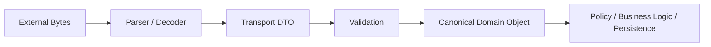

Security problem muncul ketika sistem melewati tahap `Validation` dan langsung memperlakukan DTO sebagai domain object.

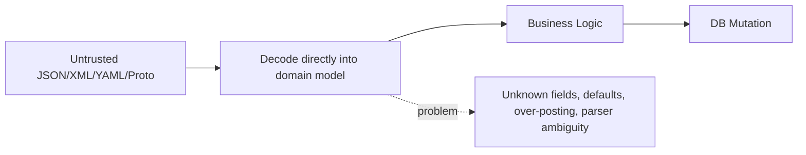

Desain yang lebih aman:

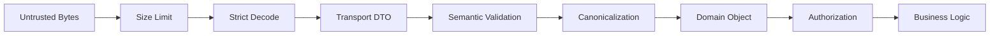

### 1.2 Parser-level validity vs domain-level validity

| Layer | Pertanyaan | Contoh |
|---|---|---|
| Bytes | Apakah ukuran input wajar? | Body maksimum 1 MiB, depth maksimum, timeout |
| Syntax | Apakah format valid? | JSON valid, XML valid, proto wire valid |
| Structural schema | Apakah field sesuai kontrak? | Unknown field ditolak, required field ada |
| Semantic domain | Apakah nilainya masuk akal? | `amount > 0`, `status` transition sah |
| Authorization | Apakah actor boleh melakukan ini? | User boleh update object ini? |
| Integrity | Apakah payload belum diubah? | Signature/MAC valid |
| Freshness | Apakah payload tidak replay? | Timestamp/nonce belum dipakai |

Kesalahan umum adalah menganggap parser-level validity cukup.

```go
// Anti-pattern: decode sukses langsung dianggap valid request.
var req UpdateCaseRequest
if err := json.NewDecoder(r.Body).Decode(&req); err != nil {
    http.Error(w, "bad json", http.StatusBadRequest)
    return
}

// Problem: req mungkin memiliki default-value ambiguity,
// unknown-field bypass, missing semantic fields, atau over-posted object ID.
service.UpdateCase(ctx, req)
```

Lebih aman:

```go
type updateCaseDTO struct {
    CaseID  string `json:"case_id"`
    Version int64  `json:"version"`
    Action  string `json:"action"`
    Reason  string `json:"reason"`
}

func decodeUpdateCase(r *http.Request) (UpdateCaseCommand, error) {
    var dto updateCaseDTO
    if err := DecodeStrictJSON(r, &dto, 1<<20); err != nil {
        return UpdateCaseCommand{}, err
    }

    cmd, err := dto.ToCommand()
    if err != nil {
        return UpdateCaseCommand{}, err
    }
    return cmd, nil
}
```

---

## 2. Threat Model Serialization Boundary

### 2.1 Attacker goals

Attacker tidak hanya ingin membuat parser error. Tujuan yang lebih berbahaya:

| Attacker goal | Serialization vector |
|---|---|
| Authorization bypass | Over-posting `role`, `owner_id`, `tenant_id`, `status` |
| Integrity violation | Duplicate keys, unknown fields, canonicalization mismatch |
| Denial of service | Huge input, deeply nested structures, large arrays/maps, decompression bomb |
| Business logic abuse | Default value ambiguity, enum fallback, omitted field semantics |
| Parser confusion | Different component interprets same payload differently |
| Audit corruption | Payload serialized ulang tidak sama dengan payload asli |
| Signature bypass | Sign one representation, verify another, process third |
| Data exfiltration | XML external entity / URL fetcher / document resolver risk |
| Supply-chain risk | Third-party parser behavior changes after upgrade |
| Backward compatibility abuse | Old client schema accepted in new workflow incorrectly |

### 2.2 Trust boundaries

Serialization boundary ada di banyak tempat:

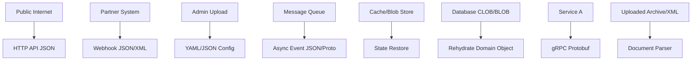

Setiap arrow adalah tempat di mana bytes menjadi object. Setiap tempat itu perlu kebijakan:

- ukuran maksimum,
- format yang diterima,
- field yang diterima,
- unknown field policy,
- enum policy,
- default semantics,
- validation,
- authorization,
- logging/redaction,
- retry/idempotency,
- versioning,
- compatibility,
- deprecation.

---

## 3. Format Risk Taxonomy

### 3.1 Ringkasan risiko per format

| Format | Cocok untuk | Risiko utama | Rekomendasi boundary |
|---|---|---|---|
| JSON | Public HTTP API, webhooks, configs sederhana | Unknown fields, duplicate keys, number precision, invalid UTF-8, loose schema | Strict decode, DTO eksplisit, limit body, reject unknown |
| XML | Integrasi legacy, dokumen enterprise | Entity/DTD risk, huge tree, namespace confusion, XPath-like logic bug | Streaming decode, no custom entity resolver, strict schema, limit input |
| YAML | Config manusia, Kubernetes-style config | Implicit typing, anchors/aliases, complex structures, parser quirks | Hindari untuk public API, gunakan config-only, `KnownFields`, validate |
| gob | Go-to-Go internal binary encoding | Tidak hardened untuk adversarial input, resource consumption, Go-specific coupling | Jangan decode untrusted gob |
| Protobuf | Internal service contract, gRPC, high-throughput messaging | Unknown fields, enum evolution, required/optional semantics, `Any`, protojson quirks | Schema governance, validation layer, avoid `Any` across trust boundary |
| MessagePack/CBOR/Avro | Binary API/event format | Library-specific behavior, schema evolution ambiguity | Threat model per library dan schema registry |
| CSV | Import/export tabular data | Formula injection, delimiter ambiguity, row explosion, encoding | Treat as untrusted import, sanitize export for spreadsheet |

### 3.2 Prinsip pemilihan format

Jangan pilih format hanya karena “mudah dipakai”. Pilih berdasarkan boundary.

| Boundary | Default pilihan yang masuk akal | Catatan |
|---|---|---|
| Public REST API | JSON | Strict DTO + validation |
| Public browser-facing API | JSON | Perhatikan number/string/date semantics |
| Internal RPC | Protobuf/gRPC | Schema governance wajib |
| Internal event bus | JSON atau Protobuf | Versioned envelope wajib |
| Human config | YAML atau JSON | Config bukan public input |
| Signed payload | JSON canonicalization sulit; pertimbangkan JWS/COSE/Protobuf canonical bytes | Jangan sign string hasil marshal sembarang |
| Cache snapshot | Format internal versioned | Jangan campur dengan external API schema |
| Long-term audit archive | Explicit versioned canonical envelope | Harus bisa diverifikasi ulang di masa depan |

---

## 4. JSON Security in Go

### 4.1 `encoding/json` bukan validator

Go `encoding/json` mudah dipakai, tetapi default behavior-nya tidak cukup untuk secure public API jika dipakai langsung tanpa kebijakan tambahan.

Hal yang perlu dipahami:

1. Unknown fields diabaikan saat decode ke struct, kecuali memakai `Decoder.DisallowUnknownFields()`.
2. Duplicate keys punya behavior yang bisa membingungkan antar-parser.
3. Angka JSON bisa kehilangan presisi jika decode ke `float64` via `interface{}`.
4. Invalid UTF-8 dapat diganti menjadi Unicode replacement character pada behavior lama.
5. Field matching struct bisa case-insensitive pada beberapa jalur.
6. `omitempty` pada output tidak sama dengan validation pada input.
7. Pointer field, zero value, dan missing field punya semantik yang berbeda.

Contoh over-permissive decode:

```go
type CreateUserRequest struct {
    Email string `json:"email"`
    Name  string `json:"name"`
}

// Payload attacker:
// {
//   "email": "x@example.com",
//   "name": "X",
//   "role": "admin",
//   "tenant_id": "victim-tenant"
// }
// Default Decode akan mengabaikan role dan tenant_id.
// Ini terlihat aman, tetapi bisa berbahaya jika payload diteruskan,
// disimpan mentah, diaudit, signed ulang, atau diproses komponen lain.
```

Strict decoder:

```go
package securejson

import (
    "encoding/json"
    "errors"
    "fmt"
    "io"
    "net/http"
)

var ErrInvalidJSON = errors.New("invalid json")

func DecodeStrictJSON(r *http.Request, dst any, maxBytes int64) error {
    if r.Body == nil {
        return fmt.Errorf("%w: empty body", ErrInvalidJSON)
    }

    limited := http.MaxBytesReader(nil, r.Body, maxBytes)
    dec := json.NewDecoder(limited)
    dec.DisallowUnknownFields()
    dec.UseNumber()

    if err := dec.Decode(dst); err != nil {
        return fmt.Errorf("%w: %v", ErrInvalidJSON, err)
    }

    // Reject trailing JSON values.
    var extra struct{}
    if err := dec.Decode(&extra); err != io.EOF {
        return fmt.Errorf("%w: trailing data", ErrInvalidJSON)
    }

    return nil
}
```

Catatan: contoh di atas memakai `http.MaxBytesReader` untuk HTTP handler. Untuk decoding dari `io.Reader` non-HTTP, gunakan `io.LimitReader`, tetapi ingat `LimitReader` sendiri tidak memberi error eksplisit saat limit terlampaui; sering kali lebih baik membuat wrapper limit yang membedakan EOF normal vs limit exceeded.

### 4.2 Missing field vs zero value

Security bug sering muncul dari field yang omitted tetapi masuk sebagai zero value.

```go
type TransferRequest struct {
    Amount int64 `json:"amount"`
}
```

Payload `{}` menghasilkan `Amount == 0`. Jika code downstream menganggap `0` berarti “no limit” atau “default amount”, bisa bahaya.

Untuk membedakan missing vs zero, gunakan pointer atau custom type.

```go
type TransferDTO struct {
    Amount *int64 `json:"amount"`
}

func (d TransferDTO) Validate() error {
    if d.Amount == nil {
        return errors.New("amount is required")
    }
    if *d.Amount <= 0 {
        return errors.New("amount must be positive")
    }
    return nil
}
```

Namun jangan biarkan pointer DTO masuk ke domain object. Canonicalize setelah validation:

```go
type TransferCommand struct {
    Amount int64
}

func (d TransferDTO) ToCommand() (TransferCommand, error) {
    if err := d.Validate(); err != nil {
        return TransferCommand{}, err
    }
    return TransferCommand{Amount: *d.Amount}, nil
}
```

### 4.3 Duplicate keys

Duplicate key adalah classic parser ambiguity.

```json
{
  "role": "user",
  "role": "admin"
}
```

Masalahnya bukan hanya apa yang dilakukan Go. Masalahnya adalah apakah semua komponen dalam chain membaca payload yang sama dengan interpretasi yang sama.

Contoh chain bermasalah:

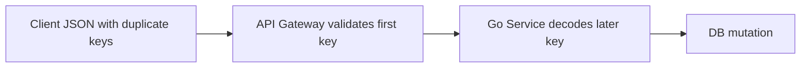

Jika gateway, WAF, logger, signature verifier, dan service memiliki semantics berbeda, attacker bisa membuat payload yang lolos di satu layer tetapi diproses berbeda di layer lain.

Mitigasi:

1. Gunakan parser yang bisa reject duplicate keys jika tersedia.
2. Jika memakai `encoding/json` standar, hindari design yang mengandalkan validasi layer berbeda atas raw JSON yang sama.
3. Untuk signed payload, sign dan verify canonical representation yang sama.
4. Untuk high-risk endpoint, pertimbangkan decoder/tokenizer custom untuk mendeteksi duplicate object keys.
5. Hindari `map[string]any` untuk authorization-sensitive payload.

Contoh duplicate-key detector sederhana untuk object JSON yang decode ke generic structure:

```go
package securejson

import (
    "bytes"
    "encoding/json"
    "fmt"
    "io"
)

func RejectDuplicateKeys(data []byte) error {
    dec := json.NewDecoder(bytes.NewReader(data))
    return scanValue(dec)
}

func scanValue(dec *json.Decoder) error {
    tok, err := dec.Token()
    if err != nil {
        return err
    }

    switch d := tok.(type) {
    case json.Delim:
        switch d {
        case '{':
            seen := map[string]struct{}{}
            for dec.More() {
                ktok, err := dec.Token()
                if err != nil {
                    return err
                }
                key, ok := ktok.(string)
                if !ok {
                    return fmt.Errorf("object key is not string")
                }
                if _, exists := seen[key]; exists {
                    return fmt.Errorf("duplicate json key: %s", key)
                }
                seen[key] = struct{}{}
                if err := scanValue(dec); err != nil {
                    return err
                }
            }
            end, err := dec.Token()
            if err != nil {
                return err
            }
            if end != json.Delim('}') {
                return fmt.Errorf("expected object end")
            }
        case '[':
            for dec.More() {
                if err := scanValue(dec); err != nil {
                    return err
                }
            }
            end, err := dec.Token()
            if err != nil {
                return err
            }
            if end != json.Delim(']') {
                return fmt.Errorf("expected array end")
            }
        default:
            return fmt.Errorf("unexpected delimiter: %v", d)
        }
    default:
        // primitive token: string, float64/json.Number, bool, nil
    }
    return nil
}

func RejectDuplicateKeysReader(r io.Reader, maxBytes int64) error {
    var buf bytes.Buffer
    limited := io.LimitReader(r, maxBytes+1)
    n, err := buf.ReadFrom(limited)
    if err != nil {
        return err
    }
    if n > maxBytes {
        return fmt.Errorf("json too large")
    }
    return RejectDuplicateKeys(buf.Bytes())
}
```

Catatan: detector di atas masih contoh awal. Untuk production, gabungkan dengan body limit, depth limit, error taxonomy, metrics, dan fuzzing.

### 4.4 `map[string]any` hazard

`map[string]any` berguna untuk dynamic metadata, tetapi berbahaya jika dipakai untuk policy-sensitive object.

Anti-pattern:

```go
var req map[string]any
json.NewDecoder(r.Body).Decode(&req)

if req["role"] == "admin" {
    // req["role"] sebenarnya any; bisa nil, float64, string,
    // atau tipe lain tergantung parser.
}
```

Masalah:

- angka default menjadi `float64`,
- type assertion mudah salah,
- missing field dan wrong type bisa collapse ke zero behavior,
- nested object tidak tervalidasi,
- authorization logic menjadi stringly typed.

Lebih baik:

```go
type CreatePolicyDTO struct {
    Subject string   `json:"subject"`
    Actions []string `json:"actions"`
    Scope   string   `json:"scope"`
}
```

Jika memang butuh extension metadata, isolasi secara eksplisit:

```go
type CreateEventDTO struct {
    Type       string                     `json:"type"`
    OccurredAt string                     `json:"occurred_at"`
    Metadata   map[string]json.RawMessage `json:"metadata"`
}
```

Lalu validasi metadata per event type.

### 4.5 `json.RawMessage` hazard

`json.RawMessage` berguna untuk delayed decoding, tetapi sering menjadi bypass validation.

Aman jika:

- raw data tidak langsung diteruskan ke downstream trusted boundary,
- setiap variant punya decoder/validator sendiri,
- raw payload disimpan dengan ukuran maksimum,
- raw payload tidak dipakai untuk signing tanpa canonicalization.

Contoh variant decoding:

```go
type Envelope struct {
    Type string          `json:"type"`
    Data json.RawMessage `json:"data"`
}

func DecodeEnvelope(b []byte) (Command, error) {
    var env Envelope
    dec := json.NewDecoder(bytes.NewReader(b))
    dec.DisallowUnknownFields()
    if err := dec.Decode(&env); err != nil {
        return nil, err
    }

    switch env.Type {
    case "case.approve":
        var dto ApproveCaseDTO
        if err := decodeRawStrict(env.Data, &dto); err != nil {
            return nil, err
        }
        return dto.ToCommand()
    case "case.reject":
        var dto RejectCaseDTO
        if err := decodeRawStrict(env.Data, &dto); err != nil {
            return nil, err
        }
        return dto.ToCommand()
    default:
        return nil, fmt.Errorf("unsupported command type")
    }
}
```

### 4.6 JSON v1 vs JSON v2 note

Go modern documentation includes `encoding/json/v2` package documentation with explicit security considerations and stricter behavior in some areas, but adoption requires careful compatibility review. Do not migrate core boundary parsing blindly just because v2 exists.

Migration checklist:

- Are duplicate-key semantics different?
- Are invalid UTF-8 semantics different?
- Does unknown-field behavior change?
- Does marshaling field order change signature/canonical payload?
- Do error messages expose sensitive paths?
- Are clients relying on old permissive behavior?
- Are tests asserting exact output JSON string?
- Are gateways or partner systems parsing with different behavior?

For production API, parser migration is a compatibility and security change, not a refactor.

---

## 5. XML Security in Go

### 5.1 Why XML needs special caution

XML is more expressive than JSON. That expressiveness creates attack surface:

- DTD/entity expansion,
- external entity processing in some parsers,
- namespace confusion,
- mixed content,
- comments/processing instructions,
- huge nested tree,
- streaming vs full-tree memory risk,
- schema validation complexity,
- business logic based on XPath-like selection.

Go `encoding/xml` does not behave like every Java XML parser. A Java engineer must avoid bringing mental model from JAXB/XStream/DocumentBuilder without checking Go behavior.

### 5.2 Avoid XML for public API unless required

If not required by partner/legacy protocol, prefer JSON or Protobuf. If XML is required:

1. Set strict size limit before parsing.
2. Prefer streaming token processing for large input.
3. Avoid custom entity expansion from untrusted input.
4. Do not accept arbitrary XML and then search by string.
5. Validate expected root element and namespace.
6. Map XML to DTO, then validate DTO.
7. Treat XML schema validation as support, not the only security layer.

### 5.3 Streaming decode pattern

```go
func DecodeXMLStrict[T any](r io.Reader, maxBytes int64, dst *T) error {
    lr := io.LimitReader(r, maxBytes+1)
    var buf bytes.Buffer
    n, err := buf.ReadFrom(lr)
    if err != nil {
        return err
    }
    if n > maxBytes {
        return fmt.Errorf("xml too large")
    }

    dec := xml.NewDecoder(bytes.NewReader(buf.Bytes()))
    dec.Strict = true

    if err := dec.Decode(dst); err != nil {
        return err
    }
    return nil
}
```

### 5.4 Namespace confusion

XML namespace matters.

```xml
<case xmlns="urn:internal:case:v1">
  <id>123</id>
</case>
```

Different namespace can mean different semantics. If code ignores namespace, attacker can exploit ambiguity.

```go
type CaseXML struct {
    XMLName xml.Name `xml:"urn:internal:case:v1 case"`
    ID      string   `xml:"id"`
}
```

If you accept partner XML from multiple namespaces, route by namespace explicitly.

```go
func DecodePartnerXML(b []byte) (PartnerMessage, error) {
    dec := xml.NewDecoder(bytes.NewReader(b))

    for {
        tok, err := dec.Token()
        if err != nil {
            return nil, err
        }
        start, ok := tok.(xml.StartElement)
        if !ok {
            continue
        }

        switch start.Name.Space + ":" + start.Name.Local {
        case "urn:partner:a:v1:Application":
            var msg PartnerAApplication
            if err := dec.DecodeElement(&msg, &start); err != nil {
                return nil, err
            }
            return msg.ToDomain()
        case "urn:partner:b:v2:Application":
            var msg PartnerBApplication
            if err := dec.DecodeElement(&msg, &start); err != nil {
                return nil, err
            }
            return msg.ToDomain()
        default:
            return nil, fmt.Errorf("unsupported xml root")
        }
    }
}
```

### 5.5 Entity expansion and XXE mindset

OWASP's general XML guidance is to disable DTD/external entity processing where the parser supports it. In Go, `encoding/xml` has a different model from many Java XML stacks, but the principle remains: do not enable custom entity resolution or external resolution for untrusted input.

Red flags:

- custom `Decoder.Entity` populated from untrusted source,
- custom `CharsetReader` that can fetch network resources,
- XML pipeline using non-standard parser with external entity support,
- converting XML to DOM-like tree without size/depth bound,
- accepting compressed XML without decompression ratio limit.

### 5.6 XML signature caveat

XML Signature is notoriously difficult because canonicalization, namespace handling, ID attributes, and wrapping attacks are complex. In Go services, prefer avoiding hand-rolled XML signature verification.

If you must integrate with XML Signature:

- use a maintained library with wrapping-attack guidance,
- validate exactly which element is signed,
- bind signed subject to business object,
- reject unsigned duplicate elements,
- never validate signature over one element then process another,
- log certificate/key ID and canonicalization algorithm,
- create malicious test cases for wrapping.

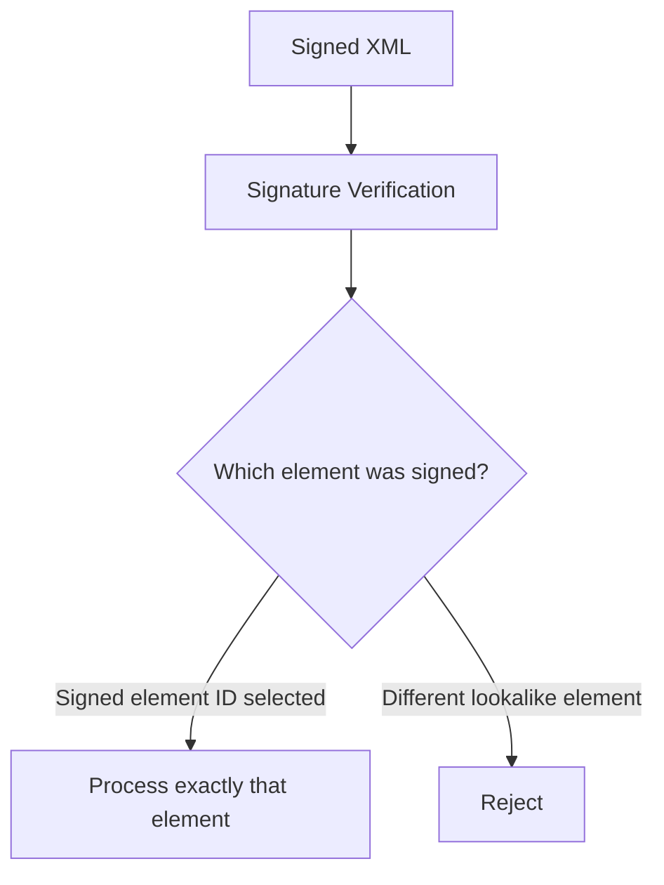

---

## 6. YAML Security in Go

### 6.1 YAML is for humans, not arbitrary public API input

YAML is flexible. That flexibility is convenient for config, but risky for public untrusted input.

Risk areas:

- implicit typing (`yes`, `on`, `001`, timestamps),
- anchors and aliases,
- deep nested structures,
- duplicate keys depending on parser behavior,
- surprising merge semantics,
- parser/library differences,
- config-as-code privilege escalation.

Use YAML primarily for controlled configuration, not public API payload.

### 6.2 Strict YAML config decode

With `gopkg.in/yaml.v3`, use `Decoder.KnownFields(true)` for struct decoding when possible.

```go
func DecodeYAMLConfig[T any](r io.Reader, maxBytes int64, dst *T) error {
    limited := io.LimitReader(r, maxBytes+1)
    var buf bytes.Buffer
    n, err := buf.ReadFrom(limited)
    if err != nil {
        return err
    }
    if n > maxBytes {
        return fmt.Errorf("yaml too large")
    }

    dec := yaml.NewDecoder(bytes.NewReader(buf.Bytes()))
    dec.KnownFields(true)
    if err := dec.Decode(dst); err != nil {
        return err
    }
    return nil
}
```

Then validate domain semantics:

```go
type ServerConfig struct {
    ListenAddr string `yaml:"listen_addr"`
    TLS        TLSConfig `yaml:"tls"`
}

type TLSConfig struct {
    Enabled  bool   `yaml:"enabled"`
    CertFile string `yaml:"cert_file"`
    KeyFile  string `yaml:"key_file"`
}

func (c ServerConfig) Validate() error {
    if c.ListenAddr == "" {
        return errors.New("listen_addr is required")
    }
    if c.TLS.Enabled {
        if c.TLS.CertFile == "" || c.TLS.KeyFile == "" {
            return errors.New("tls cert_file and key_file are required when tls enabled")
        }
    }
    return nil
}
```

### 6.3 Config injection

YAML is often used for config. Config is code-adjacent.

Attack examples:

- attacker changes `authz.mode: disabled`,
- attacker adds new endpoint allowlist,
- attacker changes webhook URL to internal service,
- attacker changes log redaction policy,
- attacker turns on debug endpoint,
- attacker changes trusted CA path,
- attacker changes OIDC issuer/JWKS URL.

Therefore config loading must be treated as high-integrity boundary.

Controls:

- config file permissions,
- signed config or GitOps review,
- schema validation,
- reject unknown fields,
- environment-specific policy,
- secret separation,
- audit loaded config hash,
- startup fail-safe,
- no remote includes from untrusted location.

---

## 7. `gob` Security in Go

### 7.1 gob is not for untrusted input

Go `encoding/gob` is convenient for Go-to-Go binary serialization, but its documentation explicitly warns that it is not designed to be hardened against adversarial inputs, and decoded input sizes only receive basic sanity checking with non-configurable limits.

Therefore:

> Do not decode gob from public HTTP requests, user uploads, partner webhooks, external queues, browser clients, or any unauthenticated/untrusted source.

Acceptable uses:

- local trusted cache snapshots,
- internal test fixtures,
- ephemeral intra-process or same-trust-zone Go communication,
- controlled admin tools with integrity protection.

Even then, versioning and resource limit should be considered.

### 7.2 gob as long-term storage hazard

Gob encodes Go type information and is tightly coupled to Go structs. That makes it fragile for long-term storage.

Risks:

- schema evolution surprises,
- type rename/package path changes,
- cross-language incompatibility,
- hard-to-audit binary payloads,
- resource consumption on corrupted input,
- hard migration for incident recovery.

For long-term audit or regulatory data, prefer explicit versioned JSON/Protobuf envelope with documented schema.

### 7.3 Safe-ish gob boundary wrapper

If gob is used for trusted internal snapshots:

```go
type SnapshotEnvelope struct {
    Version int
    CreatedUnix int64
    Payload []byte // encrypted/MACed or otherwise integrity protected if needed
}
```

Use:

- file size limit,
- checksum/MAC if integrity matters,
- version field,
- migration tests,
- no arbitrary interface decode,
- no direct decode into live domain state without validation.

---

## 8. Protobuf and gRPC Serialization Security

### 8.1 Protobuf is schemaful, not magically safe

Protobuf gives strong structure and efficient binary encoding, but it does not remove the need for validation.

Common risks:

- missing required business fields in proto3 default semantics,
- enum unknown/future value handling,
- field presence confusion,
- unknown fields preservation/dropping across versions,
- `google.protobuf.Any` abuse,
- `oneof` validation gaps,
- repeated field explosion,
- map field explosion,
- protojson differences from normal JSON,
- schema evolution breaking authorization.

### 8.2 Proto3 default value trap

In proto3, scalar fields have defaults. Without presence, you may not know whether caller omitted the field or sent zero.

Example risk:

```protobuf
message UpdateLimitRequest {
  int64 limit = 1;
}
```

If `limit == 0`, does it mean:

- caller omitted it?
- caller explicitly set zero?
- unlimited?
- disable?
- invalid?

Better design:

```protobuf
message UpdateLimitRequest {
  optional int64 limit = 1;
}
```

Or use wrapper/oneof semantics where appropriate.

In Go, validate after decoding:

```go
func ValidateUpdateLimit(req *pb.UpdateLimitRequest) error {
    if req == nil {
        return errors.New("request is required")
    }
    if req.Limit == nil {
        return errors.New("limit is required")
    }
    if req.GetLimit() < 1 || req.GetLimit() > 1_000_000 {
        return errors.New("limit out of range")
    }
    return nil
}
```

### 8.3 Enum evolution

Enum values evolve. A service compiled with older schema may receive newer enum values.

Bad pattern:

```go
switch req.Action {
case pb.Action_APPROVE:
    approve()
case pb.Action_REJECT:
    reject()
default:
    // Anti-pattern: treat unknown as approve or no-op success.
    approve()
}
```

Safe pattern:

```go
switch req.Action {
case pb.Action_APPROVE:
    return approve()
case pb.Action_REJECT:
    return reject()
default:
    return status.Error(codes.InvalidArgument, "unsupported action")
}
```

For authorization-sensitive enum:

- reject unknown,
- log metric by numeric value,
- avoid default-to-permissive,
- design explicit `ACTION_UNSPECIFIED = 0` as invalid.

```protobuf
enum CaseAction {
  CASE_ACTION_UNSPECIFIED = 0;
  CASE_ACTION_APPROVE = 1;
  CASE_ACTION_REJECT = 2;
}
```

### 8.4 `Any` hazard

`google.protobuf.Any` is useful for extensibility, but dangerous across trust boundaries.

Risks:

- type URL confusion,
- unexpected message type accepted,
- recursive or huge embedded payload,
- validation bypass for nested message,
- policy engine does not understand concrete type.

Safe pattern:

- avoid `Any` in public boundary,
- use explicit oneof for known variants,
- allowlist type URLs,
- validate unpacked message,
- limit size/depth,
- log type URL and version.

```protobuf
message CommandEnvelope {
  string command_id = 1;
  oneof command {
    ApproveCase approve_case = 10;
    RejectCase reject_case = 11;
  }
}
```

### 8.5 Protobuf unknown fields

Unknown fields are important for forward compatibility, but dangerous for security if treated casually.

Decision matrix:

| Boundary | Unknown field policy |
|---|---|
| Internal event bus with versioned schema | Preserve or tolerate, but validate known semantics |
| Public API | Usually reject at JSON gateway level if possible |
| Signed binary payload | Include unknown fields in signed bytes or canonicalize carefully |
| Authorization-sensitive command | Reject unknown or strip before policy with careful audit |
| Long-term storage | Preserve versioned original and canonical projection |

### 8.6 `protojson` is not `encoding/json`

Do not use `encoding/json` to marshal/unmarshal protobuf messages. Use `google.golang.org/protobuf/encoding/protojson`.

Important differences:

- field names can be JSON names or proto names depending options,
- enums can be strings or numbers depending options,
- unknown fields handling depends on `DiscardUnknown`,
- `Any` has special JSON representation,
- timestamps/durations have canonical JSON representations,
- default field emission differs by option.

Example:

```go
opts := protojson.UnmarshalOptions{
    DiscardUnknown: false, // prefer explicit rejection at boundary
}
if err := opts.Unmarshal(data, msg); err != nil {
    return err
}
```

For marshaling API output:

```go
opts := protojson.MarshalOptions{
    UseProtoNames:   false,
    EmitUnpopulated: false,
}
```

Decide options once per API boundary, document them, and test compatibility.

### 8.7 gRPC message size and resource limits

gRPC services must set message limits.

```go
server := grpc.NewServer(
    grpc.MaxRecvMsgSize(4<<20),
    grpc.MaxSendMsgSize(4<<20),
)
```

Client:

```go
conn, err := grpc.DialContext(
    ctx,
    target,
    grpc.WithDefaultCallOptions(
        grpc.MaxCallRecvMsgSize(4<<20),
    ),
)
```

Also apply:

- deadline per request,
- auth interceptor before business handler,
- validation interceptor before domain handler,
- rate limit/quotas,
- stream message count limits,
- backpressure for streaming RPC.

---

## 9. Unknown Fields and Backward Compatibility

### 9.1 Unknown field is a policy decision

Unknown fields are not automatically good or bad. They are a compatibility mechanism. But compatibility can conflict with security.

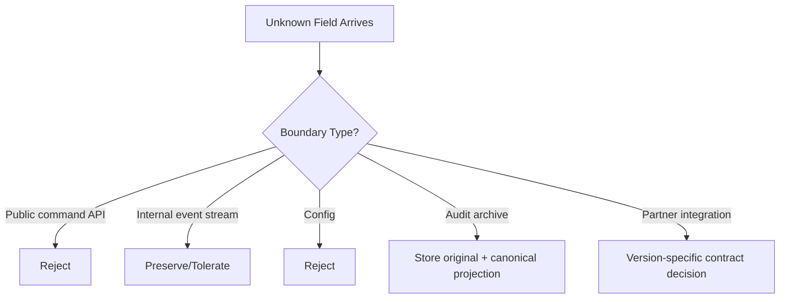

### 9.2 Why rejecting unknown fields helps security

Rejecting unknown fields helps detect:

- clients using wrong version,
- attacker probing hidden fields,
- over-posting attempts,
- typo in client payload,
- confused deputy between API versions,
- gateway/service schema mismatch.

### 9.3 Why preserving unknown fields helps compatibility

Preserving unknown fields helps:

- rolling upgrades,
- old service forwarding new message,
- event replay across versions,
- schema evolution without downtime.

### 9.4 Security rule

Use this rule:

> Reject unknown fields at command boundaries; tolerate carefully at event-observation boundaries.

Command boundary means input that mutates state or triggers external side effects.

Event-observation boundary means data used for logging, analytics, or projection where producer/consumer versions may differ.

---

## 10. Polymorphism and Type Confusion

### 10.1 Java vs Go mental model

Java ecosystem has had many deserialization RCE classes because some serializers can instantiate arbitrary classes or trigger gadget chains. Go's standard JSON/XML decoder does not instantiate arbitrary code in the same way. But Go is not immune to type confusion.

Go type confusion usually appears as:

- `interface{}` / `any` decoded dynamically,
- `map[string]any` authorization logic,
- `json.RawMessage` not decoded/validated per variant,
- Protobuf `Any`,
- YAML custom unmarshal hooks,
- gob interface values,
- plugin-like config dispatch,
- reflection-based hydration.

### 10.2 Safer polymorphism: tagged union

JSON pattern:

```json
{
  "type": "case.approve",
  "data": {
    "case_id": "C-123",
    "reason": "complete"
  }
}
```

Go pattern:

```go
type CommandEnvelope struct {
    Type string          `json:"type"`
    Data json.RawMessage `json:"data"`
}

func (e CommandEnvelope) Decode() (Command, error) {
    switch e.Type {
    case "case.approve":
        var dto ApproveCaseDTO
        if err := decodeRawStrict(e.Data, &dto); err != nil {
            return nil, err
        }
        return dto.ToCommand()
    case "case.reject":
        var dto RejectCaseDTO
        if err := decodeRawStrict(e.Data, &dto); err != nil {
            return nil, err
        }
        return dto.ToCommand()
    default:
        return nil, fmt.Errorf("unknown command type")
    }
}
```

Protobuf pattern: use `oneof`, not arbitrary `Any`.

```protobuf
message CommandEnvelope {
  string id = 1;
  oneof payload {
    ApproveCase approve_case = 10;
    RejectCase reject_case = 11;
  }
}
```

---

## 11. Parser Limits and DoS

### 11.1 Resource dimensions

Serialization DoS is not only about body size.

| Dimension | Attack |
|---|---|
| Bytes | Huge body, huge string, huge file |
| Nesting depth | Recursive arrays/objects/messages |
| Element count | Millions of fields/items |
| Key count | Huge object/map |
| Numeric size | Big integers/decimals causing slow parsing |
| String normalization | Unicode-heavy inputs |
| Compression ratio | Small compressed input expands huge |
| Repetition | Many requests just below limit |
| Streaming duration | Slow read / slow decompression |
| Validation cost | Expensive regex or cross-field validation |

### 11.2 Limit before parsing

For HTTP JSON:

```go
const MaxJSONBody = 1 << 20 // 1 MiB

func handler(w http.ResponseWriter, r *http.Request) {
    r.Body = http.MaxBytesReader(w, r.Body, MaxJSONBody)
    defer r.Body.Close()

    var dto CreateCaseDTO
    dec := json.NewDecoder(r.Body)
    dec.DisallowUnknownFields()
    dec.UseNumber()

    if err := dec.Decode(&dto); err != nil {
        http.Error(w, "invalid request", http.StatusBadRequest)
        return
    }

    // validate dto...
}
```

For compressed input:

```go
func limitedGzipReader(r io.Reader, compressedLimit, uncompressedLimit int64) (io.Reader, func() error, error) {
    compressed := io.LimitReader(r, compressedLimit+1)
    gz, err := gzip.NewReader(compressed)
    if err != nil {
        return nil, nil, err
    }
    limited := io.LimitReader(gz, uncompressedLimit+1)
    return limited, gz.Close, nil
}
```

But `io.LimitReader` alone does not tell you whether limit was exceeded. For strict production code, use a counting reader.

```go
type LimitedReader struct {
    R io.Reader
    N int64
}

func (l *LimitedReader) Read(p []byte) (int, error) {
    if l.N <= 0 {
        return 0, ErrTooLarge
    }
    if int64(len(p)) > l.N {
        p = p[:l.N]
    }
    n, err := l.R.Read(p)
    l.N -= int64(n)
    return n, err
}
```

### 11.3 Depth limit

Standard JSON decoder does not expose a simple max-depth option in v1. For high-risk input, consider:

- schema-specific DTOs,
- rejecting generic deeply nested structures,
- custom token scanner with depth count,
- protobuf/gRPC max message size,
- application-level repeated field caps,
- streaming parse for XML.

Example depth scanner for JSON:

```go
func CheckJSONDepth(r io.Reader, maxDepth int) error {
    dec := json.NewDecoder(r)
    depth := 0
    for {
        tok, err := dec.Token()
        if err == io.EOF {
            return nil
        }
        if err != nil {
            return err
        }
        if d, ok := tok.(json.Delim); ok {
            switch d {
            case '{', '[':
                depth++
                if depth > maxDepth {
                    return fmt.Errorf("json too deep")
                }
            case '}', ']':
                depth--
            }
        }
    }
}
```

---

## 12. Canonicalization and Signed Serialized Payloads

### 12.1 The canonicalization problem

Signing serialized data is dangerous if producer and verifier do not agree on exact bytes.

These can represent same or similar semantics:

```json
{"amount":100,"currency":"SGD"}
```

```json
{
  "currency": "SGD",
  "amount": 100
}
```

```json
{"amount":1e2,"currency":"SGD"}
```

Signing raw JSON can be safe only if the exact raw bytes are the signed object and all parties verify those exact bytes before processing. If any party parses then re-marshals, canonicalization differences can break verification or create bypasses.

### 12.2 Safer signing envelope

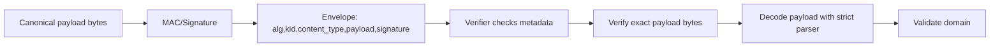

Example:

```go
type SignedEnvelope struct {
    Version     int    `json:"version"`
    Alg         string `json:"alg"`
    Kid         string `json:"kid"`
    ContentType string `json:"content_type"`
    PayloadB64  string `json:"payload_b64"`
    SigB64      string `json:"sig_b64"`
}
```

Process:

1. Decode envelope strictly.
2. Check `version`, `alg`, `kid`, `content_type`.
3. Base64-decode payload and signature.
4. Verify signature/MAC over exact payload bytes plus selected metadata as AAD/context.
5. Decode payload according to `content_type` strictly.
6. Validate domain.
7. Check replay/freshness if command-like.

Never:

- parse JSON,
- marshal it again,
- verify signature over re-marshaled bytes,
- process original payload.

That creates split-brain representation.

---

## 13. Domain DTO Pattern

### 13.1 Do not decode external data into domain aggregate

Anti-pattern:

```go
type Case struct {
    ID        string
    TenantID  string
    OwnerID   string
    Status    string
    CreatedAt time.Time
    UpdatedAt time.Time
}

// Bad: external JSON can affect fields that should be server-controlled.
json.NewDecoder(r.Body).Decode(&caseObj)
```

Safe pattern:

```go
type CreateCaseDTO struct {
    Category string `json:"category"`
    Summary  string `json:"summary"`
}

type CreateCaseCommand struct {
    TenantID string
    ActorID  string
    Category CaseCategory
    Summary  string
}

func (d CreateCaseDTO) ToCommand(actor Actor) (CreateCaseCommand, error) {
    category, err := ParseCaseCategory(d.Category)
    if err != nil {
        return CreateCaseCommand{}, err
    }
    summary := strings.TrimSpace(d.Summary)
    if summary == "" || len(summary) > 2000 {
        return CreateCaseCommand{}, errors.New("invalid summary")
    }
    return CreateCaseCommand{
        TenantID: actor.TenantID,
        ActorID: actor.ID,
        Category: category,
        Summary: summary,
    }, nil
}
```

### 13.2 Server-controlled fields

These fields should almost never be accepted directly from public client payload:

- `id`, except route/path identity with authorization check,
- `tenant_id`,
- `owner_id`,
- `created_by`,
- `created_at`,
- `updated_by`,
- `updated_at`,
- `status`, if state machine controlled,
- `role`,
- `permission`,
- `is_admin`,
- `version`, unless used as optimistic lock and validated,
- `price`, if server calculates,
- `risk_score`,
- `approved_by`,
- `audit_*`,
- `deleted`,
- `internal_notes`,
- `workflow_stage`.

### 13.3 Command DTO vs patch DTO

PATCH-like APIs are particularly risky.

Bad:

```go
type PatchUserDTO struct {
    Fields map[string]any `json:"fields"`
}
```

Better:

```go
type PatchUserDTO struct {
    DisplayName *string `json:"display_name,omitempty"`
    Phone       *string `json:"phone,omitempty"`
}
```

Then define allowed patch semantics explicitly.

```go
func (d PatchUserDTO) ToPatch() (UserPatch, error) {
    patch := UserPatch{}
    if d.DisplayName != nil {
        name := strings.TrimSpace(*d.DisplayName)
        if name == "" || len(name) > 100 {
            return UserPatch{}, errors.New("invalid display_name")
        }
        patch.DisplayName = Some(name)
    }
    if d.Phone != nil {
        phone, err := ParsePhone(*d.Phone)
        if err != nil {
            return UserPatch{}, err
        }
        patch.Phone = Some(phone)
    }
    if patch.IsEmpty() {
        return UserPatch{}, errors.New("empty patch")
    }
    return patch, nil
}
```

---

## 14. Serialization and Authorization Bugs

### 14.1 Over-posting / mass assignment

In Java/Spring, mass assignment often appears through automatic binding to entity classes. In Go, it appears when developers decode directly into broad structs or reuse persistence models as API DTOs.

```go
type UserModel struct {
    ID       string `json:"id"`
    Email    string `json:"email"`
    Role     string `json:"role"`
    TenantID string `json:"tenant_id"`
}

// Bad: public signup should not accept Role/TenantID.
json.NewDecoder(r.Body).Decode(&user)
```

Safe:

```go
type SignupDTO struct {
    Email string `json:"email"`
    Name  string `json:"name"`
}
```

### 14.2 Object property authorization

Even if user can update object, they may not update every property.

```json
{
  "display_name": "Alice",
  "role": "admin"
}
```

If `role` is silently ignored, it may be okay for immediate processing, but if raw payload is stored as pending approval or forwarded to admin tool, it can become dangerous.

Reject unknown fields at command boundary to surface intent.

### 14.3 Route ID vs body ID mismatch

```http
PUT /cases/C-123
Content-Type: application/json

{"case_id":"C-999","reason":"approve"}
```

Safe policy:

- prefer identity from route, not body,
- if both exist, require match,
- bind route object to authorization,
- include version for optimistic locking.

```go
func buildApproveCommand(r *http.Request, actor Actor) (ApproveCaseCommand, error) {
    routeCaseID := chi.URLParam(r, "caseID")

    var dto ApproveCaseDTO
    if err := DecodeStrictJSON(r, &dto, 1<<20); err != nil {
        return ApproveCaseCommand{}, err
    }
    if dto.CaseID != "" && dto.CaseID != routeCaseID {
        return ApproveCaseCommand{}, errors.New("case_id mismatch")
    }
    return ApproveCaseCommand{
        CaseID: routeCaseID,
        ActorID: actor.ID,
        Reason: dto.Reason,
        Version: dto.Version,
    }, nil
}
```

---

## 15. Serialization and Audit Integrity

### 15.1 Store raw or canonical?

For audit, there are two different needs:

| Need | Store |
|---|---|
| Prove what was received | Raw bytes, hash, content-type, parser version |
| Prove what was processed | Canonical domain event |
| Replay business logic | Versioned command/event |
| Legal/regulatory review | Human-readable stable projection |
| Tamper evidence | Hash/MAC/signature chain |

Do not confuse them.

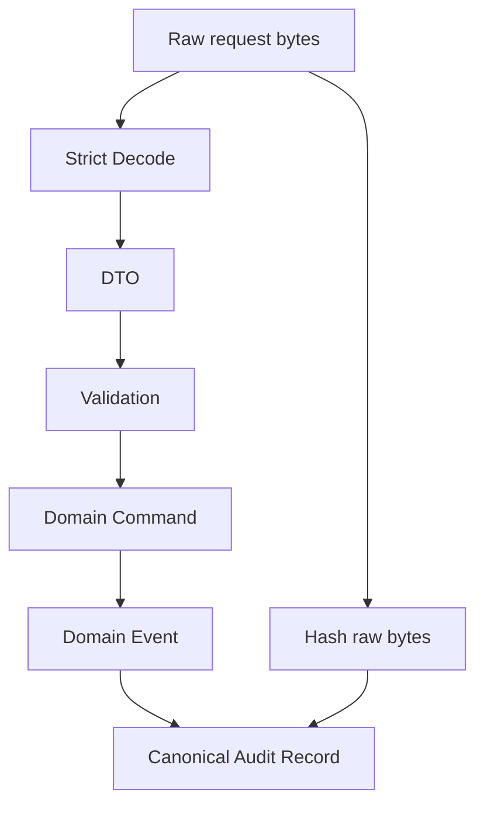

### 15.2 Audit record envelope

```go
type AuditRecord struct {
    Version      int               `json:"version"`
    EventID      string            `json:"event_id"`
    EventType    string            `json:"event_type"`
    ActorID      string            `json:"actor_id"`
    TenantID     string            `json:"tenant_id"`
    OccurredAt   time.Time         `json:"occurred_at"`
    ObjectType   string            `json:"object_type"`
    ObjectID     string            `json:"object_id"`
    Payload      json.RawMessage   `json:"payload"`
    RawInputHash string            `json:"raw_input_hash,omitempty"`
    PrevHash     string            `json:"prev_hash,omitempty"`
    Hash         string            `json:"hash"`
    Metadata     map[string]string `json:"metadata,omitempty"`
}
```

Security considerations:

- hash canonical audit record, not arbitrary map order,
- include schema version,
- avoid PII leakage,
- avoid storing secrets/raw tokens,
- include validation outcome,
- include parser error class for rejected requests if needed,
- include content type and endpoint.

---

## 16. Schema Evolution and Versioning

### 16.1 Versioning strategy

Every serialized contract needs evolution strategy.

| Contract | Versioning recommendation |
|---|---|
| Public REST request | URI/header/media-type or additive schema with strict server behavior |
| Public REST response | Additive fields okay; avoid breaking clients |
| Internal event | Envelope `schema_version`, additive fields, consumer contract tests |
| Protobuf RPC | Follow field numbering rules, never reuse numbers, reserve removed fields |
| Config | Explicit config version and migration function |
| Audit record | Immutable versioned schema |
| Signed payload | Version included in signed context |

### 16.2 Protobuf evolution rules

Critical rules:

- never reuse field numbers,
- reserve deleted field numbers and names,
- avoid changing field type incompatibly,
- avoid changing semantic meaning of a field,
- use `optional` for presence-sensitive scalar fields,
- define `UNSPECIFIED = 0` enum value,
- reject unknown enum where unsafe,
- document compatibility window.

Example:

```protobuf
enum CaseStatus {
  CASE_STATUS_UNSPECIFIED = 0;
  CASE_STATUS_DRAFT = 1;
  CASE_STATUS_SUBMITTED = 2;
  CASE_STATUS_APPROVED = 3;
  CASE_STATUS_REJECTED = 4;
}

message CaseEvent {
  string event_id = 1;
  string case_id = 2;
  CaseStatus status = 3;

  reserved 4, 5;
  reserved "old_owner", "legacy_status";
}
```

### 16.3 JSON evolution trap

Adding a field can be breaking if:

- old clients reject unknown response fields,
- old service forwards unknown field incorrectly,
- gateway strips field before signature verification,
- new field changes authorization semantics,
- new field has default value that means “allow”.

Compatibility review must include security semantics.

---

## 17. Secure Deserialization Pipeline Blueprint

### 17.1 HTTP JSON command pipeline

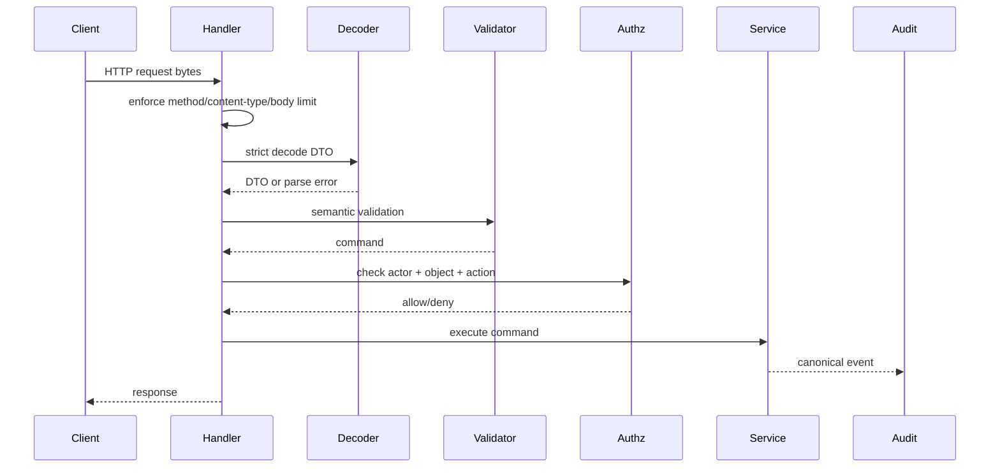

### 17.2 Implementation skeleton

```go
type DecoderConfig struct {
    MaxBytes int64
}

type ValidationError struct {
    Field string
    Code  string
}

type ParseError struct {
    Code string
    Err  error
}

func (e ParseError) Error() string { return e.Code }
func (e ParseError) Unwrap() error { return e.Err }

func DecodeJSONCommand[T any](r *http.Request, cfg DecoderConfig) (T, error) {
    var zero T
    if r.Header.Get("Content-Type") != "application/json" {
        return zero, ParseError{Code: "unsupported_content_type"}
    }

    r.Body = http.MaxBytesReader(nil, r.Body, cfg.MaxBytes)
    defer r.Body.Close()

    dec := json.NewDecoder(r.Body)
    dec.DisallowUnknownFields()
    dec.UseNumber()

    var dto T
    if err := dec.Decode(&dto); err != nil {
        return zero, ParseError{Code: "invalid_json", Err: err}
    }

    var extra struct{}
    if err := dec.Decode(&extra); err != io.EOF {
        return zero, ParseError{Code: "trailing_json", Err: err}
    }

    return dto, nil
}
```

But note: generic decoder cannot do semantic validation. Keep validation close to DTO.

```go
type CommandDTO[T any] interface {
    ToCommand(actor Actor) (T, error)
}
```

---

## 18. Error Handling and Information Disclosure

Serialization errors are often reflected to clients. Be careful.

Bad:

```go
http.Error(w, err.Error(), http.StatusBadRequest)
```

Potential leak:

- internal struct field name,
- validation regex,
- file path,
- parser internals,
- allowed enum values not intended public,
- partial payload snippet containing PII.

Better:

```go
type ErrorResponse struct {
    Code      string `json:"code"`
    Message   string `json:"message"`
    RequestID string `json:"request_id"`
}

func writeBadRequest(w http.ResponseWriter, requestID string) {
    w.Header().Set("Content-Type", "application/json")
    w.WriteHeader(http.StatusBadRequest)
    _ = json.NewEncoder(w).Encode(ErrorResponse{
        Code:      "invalid_request",
        Message:   "Request payload is invalid.",
        RequestID: requestID,
    })
}
```

Log internal error safely:

```go
logger.Warn("request decode failed",
    "request_id", requestID,
    "route", routeName,
    "error_class", classifyDecodeError(err),
)
```

Do not log raw payload by default.

---

## 19. Testing Strategy

### 19.1 Negative test corpus

Every serialization boundary should have tests for:

JSON:

- unknown field,
- duplicate key,
- missing required field,
- wrong type,
- null where not allowed,
- empty string,
- string too long,
- number too large,
- decimal where integer expected,
- trailing JSON,
- deeply nested array/object,
- invalid UTF-8,
- invalid content type,
- body too large.

XML:

- wrong root,
- wrong namespace,
- huge nested elements,
- entity/DTD attempt,
- unexpected mixed content,
- duplicate business elements,
- missing required element,
- malicious processing instruction,
- huge text node.

YAML/config:

- unknown config key,
- wrong type,
- unsafe auth mode,
- duplicate key,
- anchor/alias abuse,
- env-specific forbidden setting.

Protobuf:

- unknown enum,
- missing optional field,
- repeated too many,
- map too many,
- `Any` unsupported type,
- old schema message,
- future schema message,
- protojson unknown field,
- invalid JSON mapping.

### 19.2 Fuzzing JSON decoder

Go fuzzing can help find parser edge cases.

```go
func FuzzDecodeCreateCase(f *testing.F) {
    seeds := [][]byte{
        []byte(`{"category":"complaint","summary":"hello"}`),
        []byte(`{"category":"","summary":""}`),
        []byte(`{"category":"complaint","summary":"hello","role":"admin"}`),
    }
    for _, s := range seeds {
        f.Add(s)
    }

    f.Fuzz(func(t *testing.T, data []byte) {
        r := httptest.NewRequest(http.MethodPost, "/cases", bytes.NewReader(data))
        r.Header.Set("Content-Type", "application/json")

        dto, err := DecodeJSONCommand[CreateCaseDTO](r, DecoderConfig{MaxBytes: 1 << 20})
        if err != nil {
            return
        }
        _ = dto.Validate()
    })
}
```

Fuzz goal:

- no panic,
- no resource explosion,
- no unexpected success for invalid structures,
- stable error classification,
- idempotent canonicalization where required.

### 19.3 Differential parser tests

If multiple components parse same payload, test them together.

Examples:

- API gateway JSON schema vs Go service decoder,
- signature verifier vs business decoder,
- audit serializer vs replay decoder,
- Java producer vs Go consumer,
- proto binary vs protojson bridge.

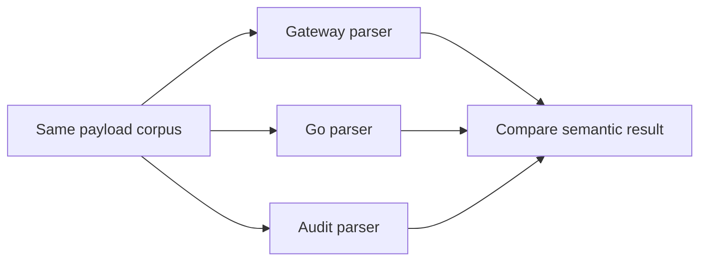

---

## 20. Observability

### 20.1 Metrics

Track serialization boundary metrics:

- `request_decode_total{route,result,error_class}`,
- `request_body_size_bytes{route}` histogram,
- `json_unknown_field_total{route}` if safely classified,
- `json_trailing_data_total{route}`,
- `xml_invalid_namespace_total{partner}`,
- `proto_unknown_enum_total{method,field}`,
- `config_decode_failure_total{component}`,
- `payload_too_large_total{route}`,
- `deserialization_latency_seconds{format,route}`.

### 20.2 Logs

Log:

- request ID,
- actor if authenticated,
- route/method,
- content type,
- payload size,
- schema version,
- error class,
- partner/client ID,
- correlation ID.

Do not log:

- raw password,
- token,
- cookie,
- authorization header,
- raw PII payload,
- cryptographic secret,
- full XML document from partner by default.

### 20.3 Security detection

High rate of these events may indicate probing:

- unknown fields named `role`, `admin`, `tenant_id`, `owner_id`,
- body just above limit,
- duplicate keys,
- invalid enum values,
- XML DTD/entity attempts,
- SSRF-like URLs inside serialized payload,
- proto `Any` unsupported type URLs,
- malformed JSON that triggers parser edge cases.

---

## 21. Production Checklist

### 21.1 Public JSON API checklist

- [ ] `Content-Type` checked.
- [ ] Body size limit before decode.
- [ ] Strict JSON decode.
- [ ] Unknown fields rejected.
- [ ] Trailing data rejected.
- [ ] `UseNumber` or typed numeric fields used.
- [ ] DTO separate from domain/entity/persistence model.
- [ ] Missing vs zero semantics handled.
- [ ] All required fields validated.
- [ ] String length and charset/normalization validated where needed.
- [ ] Enum values parsed explicitly.
- [ ] Route ID/body ID mismatch handled.
- [ ] Authorization uses server-derived actor/tenant, not body-provided values.
- [ ] Raw payload not logged by default.
- [ ] Error response generic but useful.
- [ ] Negative tests cover unknown fields, wrong types, trailing data, huge input.

### 21.2 XML checklist

- [ ] XML accepted only if required.
- [ ] Size limit applied before parse.
- [ ] Parser is strict.
- [ ] Root element and namespace validated.
- [ ] Custom entity resolution disabled/avoided.
- [ ] No unbounded DOM-like expansion.
- [ ] Streaming parser used for large input.
- [ ] Schema validation not treated as only defense.
- [ ] XML signature, if any, verifies exact processed element.
- [ ] Malicious XXE/wrapping/depth tests exist.

### 21.3 YAML/config checklist

- [ ] YAML not used for public unauthenticated input.
- [ ] Config size limit exists.
- [ ] Unknown fields rejected with `KnownFields(true)` or equivalent.
- [ ] Config schema version exists.
- [ ] Dangerous options have environment policy.
- [ ] Auth/TLS/issuer/JWKS changes audited.
- [ ] Secrets separated from config where possible.
- [ ] Loaded config hash logged.
- [ ] Startup fails closed on invalid config.

### 21.4 gob checklist

- [ ] gob not decoded from untrusted input.
- [ ] File/message size bounded.
- [ ] Version envelope exists.
- [ ] Integrity check exists if tampering matters.
- [ ] Not used for long-term regulatory archive.
- [ ] Not decoded into arbitrary interface from untrusted source.

### 21.5 Protobuf checklist

- [ ] Field numbers never reused.
- [ ] Deleted fields reserved.
- [ ] `UNSPECIFIED = 0` enum values treated invalid where appropriate.
- [ ] Unknown enum values rejected at command boundary.
- [ ] Presence-sensitive fields use `optional`/oneof/wrappers.
- [ ] `Any` avoided or allowlisted.
- [ ] Repeated/map field counts validated.
- [ ] gRPC message size limits set.
- [ ] Deadlines set.
- [ ] Protojson options documented.
- [ ] Compatibility tests exist.

---

## 22. Java-to-Go Translation Notes

### 22.1 Similarities

| Java concern | Go equivalent concern |
|---|---|
| Jackson unknown properties | `json.Decoder.DisallowUnknownFields` |
| Bean validation | explicit `Validate()` methods or validation package |
| Mass assignment to entity | decoding into domain/persistence struct |
| JAXB/XML parser config | `encoding/xml` behavior + non-standard parser config |
| Java deserialization RCE | gob/interface/Any/reflection/resource consumption risk |
| BigDecimal vs double | `json.Number`, decimal libraries, string money representation |
| DTO/entity separation | same principle, less framework magic |

### 22.2 Important differences

Go usually has less framework magic than Java, but that does not automatically make it secure. The danger moves from annotation-driven binding to hand-written shortcuts.

Java anti-pattern:

```java
@PostMapping("/users")
public User create(@RequestBody User entity) { ... }
```

Go anti-pattern:

```go
var user User
json.NewDecoder(r.Body).Decode(&user)
```

Same problem: external payload controls fields it should not control.

---

## 23. Reference Architecture: Secure Serialization Package

A production Go codebase often benefits from a small internal package for serialization boundaries.

```text
/internal/transport/codec
  json.go
  xml.go
  yaml.go
  errors.go
  limits.go
  duplicate_keys.go
  fuzz_test.go
```

Responsibilities:

- enforce size limits,
- strict decode helpers,
- classify parse errors,
- reject trailing data,
- duplicate key scanner for high-risk endpoint,
- safe content-type check,
- no domain validation inside generic package.

Example API:

```go
package codec

type JSONOptions struct {
    MaxBytes       int64
    RejectUnknown  bool
    RejectTrailing bool
    UseNumber      bool
}

func DecodeJSONRequest[T any](w http.ResponseWriter, r *http.Request, opts JSONOptions) (T, error) {
    var zero T
    if !isJSONContentType(r.Header.Get("Content-Type")) {
        return zero, ErrUnsupportedContentType
    }
    r.Body = http.MaxBytesReader(w, r.Body, opts.MaxBytes)
    defer r.Body.Close()

    dec := json.NewDecoder(r.Body)
    if opts.RejectUnknown {
        dec.DisallowUnknownFields()
    }
    if opts.UseNumber {
        dec.UseNumber()
    }

    var dst T
    if err := dec.Decode(&dst); err != nil {
        return zero, classifyJSONError(err)
    }
    if opts.RejectTrailing {
        var extra struct{}
        if err := dec.Decode(&extra); err != io.EOF {
            return zero, ErrTrailingData
        }
    }
    return dst, nil
}
```

Content-Type check:

```go
func isJSONContentType(v string) bool {
    mt, _, err := mime.ParseMediaType(v)
    if err != nil {
        return false
    }
    return mt == "application/json" || strings.HasSuffix(mt, "+json")
}
```

---

## 24. Design Review Questions

Use these questions in design review:

1. What exact bytes are accepted at this boundary?
2. Who controls those bytes?
3. What parser/library/version interprets them?
4. Is the body/message size bounded before parsing?
5. Are nested depth and collection counts bounded?
6. Are unknown fields rejected, preserved, or ignored? Why?
7. Are duplicate keys possible? If yes, are they dangerous here?
8. Are missing field and zero value distinguishable?
9. Are enum unknown values rejected?
10. Is DTO separate from domain/entity?
11. Are server-controlled fields excluded from input DTO?
12. Does validation happen before authorization or after? Which fields are needed for authz?
13. Does authorization depend on body-provided tenant/user/object ID?
14. Are raw bytes signed/MACed? If yes, what exact representation is verified?
15. Is there canonicalization? Is it specified and tested?
16. Is raw payload logged or stored? Does it contain PII/secrets?
17. What happens when schema evolves?
18. What happens during rolling deploy with old/new schema?
19. Can a malicious payload cause high CPU/memory use?
20. Are parse failures observable without leaking sensitive data?

---

## 25. Common Anti-Patterns

### Anti-pattern 1: Decode into persistence model

```go
var model UserDBModel
json.NewDecoder(r.Body).Decode(&model)
```

Problem: client controls DB fields.

### Anti-pattern 2: Unknown fields silently ignored for command APIs

```go
json.NewDecoder(r.Body).Decode(&dto) // no DisallowUnknownFields
```

Problem: probing and client/server schema mismatch hidden.

### Anti-pattern 3: `map[string]any` for policy-sensitive logic

```go
if req["role"] == "admin" { ... }
```

Problem: type confusion and missing validation.

### Anti-pattern 4: Signature over re-marshaled JSON

```go
json.Unmarshal(payload, &obj)
canonical, _ := json.Marshal(obj)
verify(canonical, sig)
process(payload)
```

Problem: verify one representation, process another.

### Anti-pattern 5: gob from user upload

```go
gob.NewDecoder(file).Decode(&state)
```

Problem: gob not hardened for adversarial input.

### Anti-pattern 6: YAML as public API

```go
yaml.Unmarshal(r.Body, &cmd)
```

Problem: too flexible; parser quirks; config semantics leak into command API.

### Anti-pattern 7: proto enum default as allowed action

```go
if req.Action == pb.Action_ACTION_UNSPECIFIED {
    req.Action = pb.Action_APPROVE
}
```

Problem: missing field becomes privileged operation.

---

## 26. Mini Capstone: Secure Case Command Decoder

### 26.1 Requirements

Endpoint:

```http
POST /cases/{caseID}/actions
Content-Type: application/json
```

Payload:

```json
{
  "action": "approve",
  "reason": "documents verified",
  "version": 17
}
```

Security requirements:

- body max 32 KiB,
- content-type JSON only,
- unknown fields rejected,
- trailing JSON rejected,
- `action` allowlist,
- `reason` required for reject, optional for approve, max 500 chars,
- `version` required and positive,
- case ID from route only,
- actor/tenant from auth context only,
- command created only after validation.

### 26.2 DTO

```go
type CaseActionDTO struct {
    Action  string `json:"action"`
    Reason  string `json:"reason"`
    Version *int64 `json:"version"`
}

type CaseAction string

const (
    CaseActionApprove CaseAction = "approve"
    CaseActionReject  CaseAction = "reject"
)

type CaseActionCommand struct {
    CaseID   string
    ActorID  string
    TenantID string
    Action   CaseAction
    Reason   string
    Version  int64
}
```

### 26.3 Conversion

```go
func (d CaseActionDTO) ToCommand(caseID string, actor Actor) (CaseActionCommand, error) {
    if caseID == "" {
        return CaseActionCommand{}, errors.New("case_id is required")
    }
    if d.Version == nil || *d.Version <= 0 {
        return CaseActionCommand{}, errors.New("version is required")
    }

    reason := strings.TrimSpace(d.Reason)
    if len(reason) > 500 {
        return CaseActionCommand{}, errors.New("reason too long")
    }

    var action CaseAction
    switch d.Action {
    case string(CaseActionApprove):
        action = CaseActionApprove
    case string(CaseActionReject):
        action = CaseActionReject
        if reason == "" {
            return CaseActionCommand{}, errors.New("reason is required for reject")
        }
    default:
        return CaseActionCommand{}, errors.New("unsupported action")
    }

    return CaseActionCommand{
        CaseID:   caseID,
        ActorID:  actor.ID,
        TenantID: actor.TenantID,
        Action:   action,
        Reason:   reason,
        Version:  *d.Version,
    }, nil
}
```

### 26.4 Handler boundary

```go
func (h *Handler) PostCaseAction(w http.ResponseWriter, r *http.Request) {
    actor := ActorFromContext(r.Context())
    if actor.ID == "" {
        http.Error(w, "unauthorized", http.StatusUnauthorized)
        return
    }

    caseID := chi.URLParam(r, "caseID")

    dto, err := codec.DecodeJSONRequest[CaseActionDTO](w, r, codec.JSONOptions{
        MaxBytes:       32 << 10,
        RejectUnknown:  true,
        RejectTrailing: true,
        UseNumber:      true,
    })
    if err != nil {
        h.writeInvalidRequest(w, r, err)
        return
    }

    cmd, err := dto.ToCommand(caseID, actor)
    if err != nil {
        h.writeValidationError(w, r, err)
        return
    }

    if err := h.authz.CanActOnCase(r.Context(), actor, cmd.CaseID, cmd.Action); err != nil {
        h.writeForbidden(w, r)
        return
    }

    result, err := h.caseService.ApplyAction(r.Context(), cmd)
    if err != nil {
        h.writeServiceError(w, r, err)
        return
    }

    h.writeJSON(w, http.StatusOK, result)
}
```

---

## 27. Part Summary

Serialization security in Go is about controlling the transition from external bytes to internal state.

Key takeaways:

1. Parser success is not validation success.
2. DTOs should be separate from domain and persistence models.
3. Unknown field policy must be explicit.
4. Reject unknown fields at command boundaries.
5. Preserve/tolerate unknown fields only when compatibility requires it and risk is understood.
6. Limit size before parsing.
7. Think about depth, collection count, decompression ratio, and validation cost.
8. Avoid `map[string]any` for policy-sensitive payloads.
9. Avoid gob for untrusted input.
10. Avoid YAML for public API input.
11. Be careful with Protobuf default values, unknown enums, `Any`, and protojson options.
12. Do not sign one serialized representation and process another.
13. Schema evolution is a security concern, not only compatibility concern.
14. Audit needs both raw-input integrity and canonical-domain integrity, depending on requirement.

---

## 28. References

- Go `encoding/json` documentation, including security considerations: <https://pkg.go.dev/encoding/json>
- Go `encoding/json/v2` documentation and security considerations: <https://pkg.go.dev/encoding/json/v2>
- Go `encoding/xml` documentation: <https://pkg.go.dev/encoding/xml>
- Go `encoding/gob` documentation and security note: <https://pkg.go.dev/encoding/gob>
- Go `net/http` documentation for `MaxBytesReader`: <https://pkg.go.dev/net/http>
- Go Protobuf `protojson` documentation: <https://pkg.go.dev/google.golang.org/protobuf/encoding/protojson>
- YAML v3 package documentation: <https://pkg.go.dev/gopkg.in/yaml.v3>
- OWASP Deserialization Cheat Sheet: <https://cheatsheetseries.owasp.org/cheatsheets/Deserialization_Cheat_Sheet.html>
- OWASP XML External Entity Prevention Cheat Sheet: <https://cheatsheetseries.owasp.org/cheatsheets/XML_External_Entity_Prevention_Cheat_Sheet.html>
- OWASP Input Validation Cheat Sheet: <https://cheatsheetseries.owasp.org/cheatsheets/Input_Validation_Cheat_Sheet.html>
- Protocol Buffers language guide: <https://protobuf.dev/programming-guides/proto3/>

---

## 29. Next Part

Next:

```text
learn-go-security-cryptography-integrity-part-025.md
```

Topic:

```text
File, archive, and filesystem security: path traversal, symlink race, temp file, permission model, zip/tar extraction, upload validation, and secure deletion myths.
```

Seri belum selesai. Masih tersisa Part 025 sampai Part 034.


<!-- NAVIGATION_FOOTER -->
<div class="page-nav">
<a href="./learn-go-security-cryptography-integrity-part-023.md">⬅️ Part 023 — SSRF, Redirect, DNS Rebinding, Metadata Endpoint Protection, Outbound Allowlist, IP Classification, Proxy Boundary, and Internal Network Exposure</a>
<a href="./index.md">📚 Kategori</a>
<a href="../../index.md">🏠 Home</a>
<a href="./learn-go-security-cryptography-integrity-part-025.md">Part 025 — File, Archive, and Filesystem Security in Go ➡️</a>
</div>
