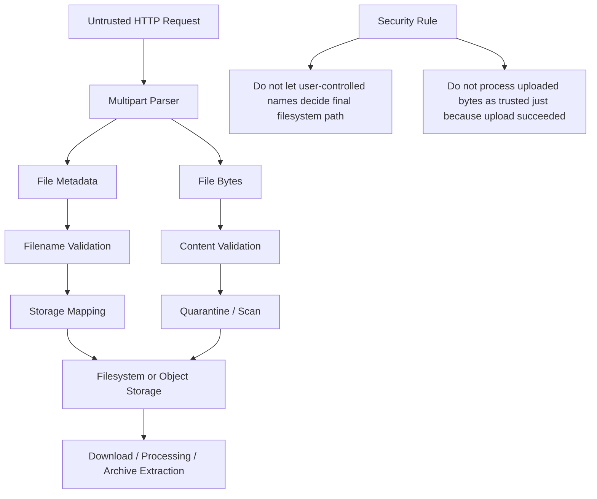
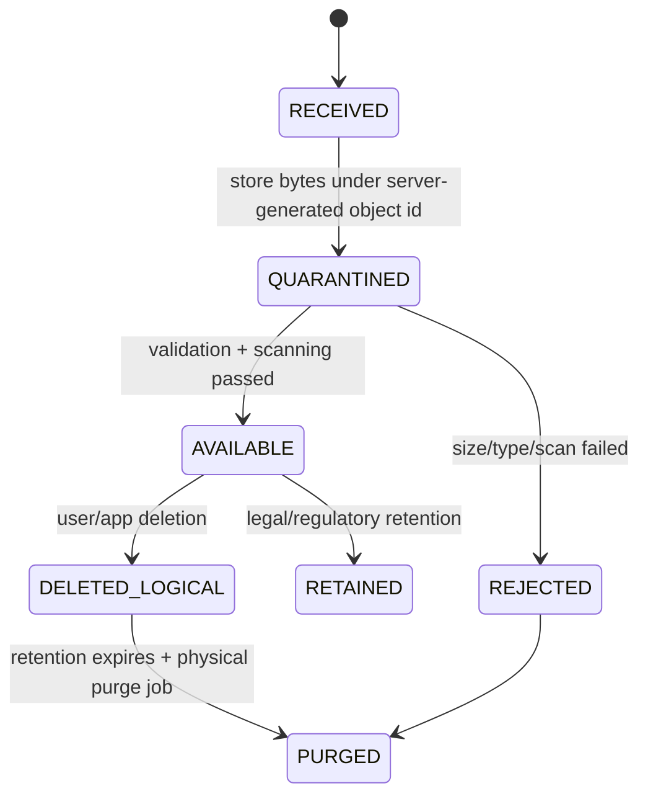
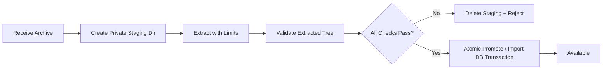
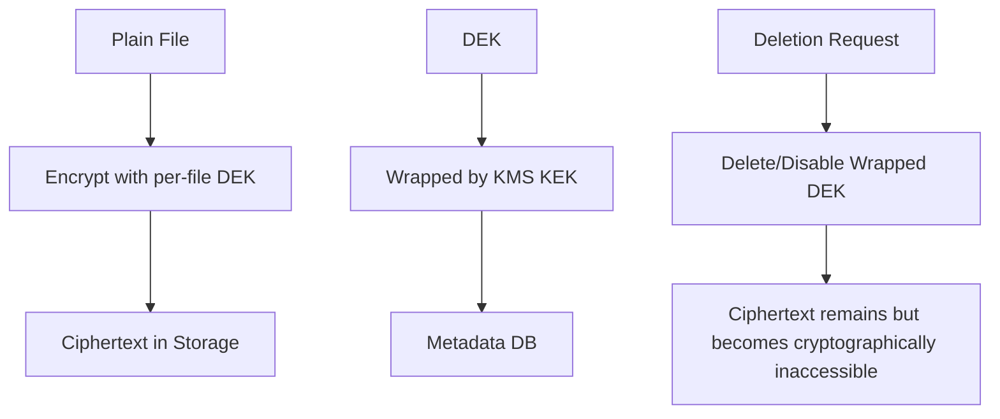
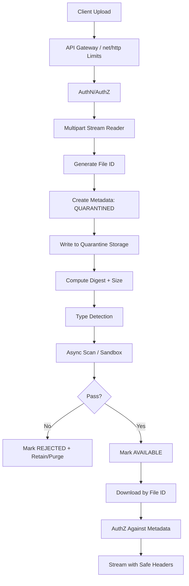

# learn-go-security-cryptography-integrity-part-025.md

# Part 025 — File, Archive, and Filesystem Security in Go

> Seri: `learn-go-security-cryptography-integrity`  
> Bagian: `025 / 034`  
> Status seri: **belum selesai**  
> Fokus: path traversal, symlink race, temporary files, permissions, upload validation, archive extraction, and secure deletion myths.

---

## 0. Mengapa Part Ini Penting?

Banyak engineer menganggap filesystem sebagai storage sederhana:

```text
input filename -> join dengan folder -> open/read/write
```

Dalam security engineering, filesystem bukan hanya storage. Filesystem adalah **boundary antara aplikasi, OS, user lain, container runtime, volume mount, backup system, scanner, dan proses lain**.

Kesalahan kecil seperti ini:

```go
path := filepath.Join(uploadDir, userProvidedName)
out, err := os.Create(path)
```

bisa berubah menjadi:

```text
../../../../etc/passwd
../../app/config/production.yaml
../../.ssh/authorized_keys
C:\Windows\System32\drivers\etc\hosts
CONOUT$
```

atau lebih licik:

```text
safe-looking-name -> symlink -> outside directory
archive entry -> symlink -> later file escapes through symlink
```

Jadi mental model pertama:

> **Filesystem path is untrusted input. Archive entry name is untrusted input. Uploaded file metadata is untrusted input. Local filesystem state may also be adversarial if attacker can write to any directory involved in the operation.**

Part ini membahas bagaimana membangun boundary filesystem yang aman di Go, terutama untuk service backend, upload pipeline, document management, report generation, file serving, archive import/export, dan regulatory case-management system.

---

## 1. Learning Objectives

Setelah bagian ini, kamu harus mampu:

1. Membedakan **path validation**, **path canonicalization**, dan **traversal-resistant file access**.
2. Menjelaskan kenapa `filepath.Clean`, `filepath.Join`, dan `strings.HasPrefix` tidak cukup sebagai security boundary.
3. Mendesain upload pipeline yang memisahkan:
   - display filename,
   - storage object key,
   - metadata,
   - quarantine state,
   - scan result,
   - authorization decision.
4. Menggunakan `os.Root` / `os.OpenInRoot` untuk operasi file yang harus dibatasi ke directory tertentu.
5. Menghindari symlink race dan TOCTOU path validation bug.
6. Mengekstrak ZIP/TAR secara aman dengan limit jumlah file, ukuran total, path length, permission, dan symlink handling.
7. Menjelaskan kenapa “secure delete” biasanya bukan jaminan di SSD, filesystem modern, container volume, cloud disk, object storage, backup, dan snapshot.
8. Membuat checklist security review untuk file upload, file download, archive extraction, dan filesystem write.

---

## 2. Where This Part Fits in the Series

Kita sudah membahas:

```text
part-019 secure net/http
part-020 API security
part-021 input validation and canonicalization
part-022 injection defense
part-023 SSRF
part-024 serialization security
```

Part ini adalah continuation natural dari input validation:



Part ini tidak mengulang dasar IO/stream/file dari seri sebelumnya. Kita fokus ke **adversarial file handling**.

---

## 3. Core Mental Model: Filename Is Not Identity

Kesalahan desain paling umum:

```text
file identity = user supplied filename
```

Contoh buruk:

```text
uploads/{tenantID}/{originalFilename}
```

Masalah:

1. filename bisa mengandung traversal sequence;
2. filename bisa bentrok;
3. filename bisa mengandung karakter aneh atau invisible Unicode;
4. filename bisa dipakai untuk XSS di UI kalau ditampilkan tanpa escaping;
5. filename bisa menjadi command argument berbahaya kalau diproses script;
6. filename bisa mengecoh user: `invoice.pdf.exe`, `report.pdf    .exe`, `report‮cod.exe`;
7. filename bisa menyebabkan issue cross-platform;
8. filename bisa membuat data authorization kacau kalau path digunakan sebagai source of truth.

Desain yang benar:

```text
file identity     = server-generated immutable ID
storage key       = derived from ID, not original filename
display filename  = metadata only, sanitized for display/download
content type      = verified independently, not trusted from client
owner/tenant      = authorization metadata in DB
integrity digest  = computed by server
state             = UPLOADED -> QUARANTINED -> SCANNED -> AVAILABLE / REJECTED
```

Contoh:

```text
Original filename:     "../../contract.pdf"
Display filename:      "contract.pdf" or rejected
File ID:               "01JY..."
Storage key:           "tenant/1234/files/01JY.../blob"
Metadata DB row:       owner, tenant, size, digest, media type, scan status
```

Security invariant:

> **User-controlled filename must never determine authority, storage location, executable behavior, or authorization.**

---

## 4. Threat Taxonomy

### 4.1 Path Traversal

Attacker provides a filename/path that escapes intended directory.

```text
../../../../etc/passwd
..\..\..\windows\system.ini
/absolute/path
C:\absolute\path
```

Impact:

- read sensitive files;
- overwrite config;
- overwrite application assets;
- write web shell;
- tamper audit/log files;
- poison cache;
- exfiltrate secrets.

---

### 4.2 Symlink Traversal

Attacker places a symlink inside an allowed directory:

```text
uploads/user-a/profile.png -> /etc/passwd
```

If service opens `uploads/user-a/profile.png`, OS may follow symlink outside intended directory.

---

### 4.3 TOCTOU Race

TOCTOU = Time Of Check To Time Of Use.

Bad pattern:

```go
cleaned, err := filepath.EvalSymlinks(path)
if err != nil {
    return err
}
if !strings.HasPrefix(cleaned, trustedRoot) {
    return errors.New("escape")
}
return os.Open(cleaned) // attacker changes filesystem between check and open
```

Even if the check was correct at one moment, attacker may modify symlink or directory between validation and actual open.

---

### 4.4 Archive Extraction / Zip Slip

Archive entry name:

```text
../../app/config.yaml
```

Naive extraction:

```go
out := filepath.Join(dest, entry.Name)
os.WriteFile(out, content, 0644)
```

Impact: arbitrary file write.

Harder variant:

```text
entry 1: symlink safe/link -> ../../outside
entry 2: safe/link/payload.txt
```

Even if `payload.txt` looks local, it escapes through symlink.

---

### 4.5 Archive Bomb / Decompression Bomb

A tiny compressed archive expands to huge data.

Risks:

- disk exhaustion;
- memory exhaustion;
- CPU exhaustion;
- slow scan pipeline;
- queue backlog;
- noisy-neighbor impact.

Controls:

- max compressed input size;
- max uncompressed total size;
- max file count;
- max directory depth;
- max per-file size;
- max compression ratio;
- deadline/cancellation;
- staging volume quota.

---

### 4.6 Permission and Mode Abuse

Archive contains:

```text
executable file
setuid bit
world-writable mode
symlink
hardlink
device node
fifo
```

If extraction preserves modes blindly, attacker may create dangerous filesystem objects.

Security rule:

> **Never preserve archive permissions blindly. Choose application-controlled permissions.**

---

### 4.7 Filename-Based XSS / Header Injection

A filename is not just filesystem input. It can later enter:

- HTML UI;
- JSON API;
- logs;
- `Content-Disposition` header;
- audit trail;
- email attachment metadata;
- shell script;
- PDF/report template.

Example:

```text
"><script>alert(1)</script>.png
invoice.pdf\r\nSet-Cookie: stolen=1
```

Security rule:

> **Sanitize for storage, escape for output context, and encode for protocol context.**

---

## 5. Go API Landscape

### 5.1 `filepath.Join` Is Not a Security Boundary

```go
p := filepath.Join(root, userPath)
```

This only constructs a path. It does not prove that `p` remains inside `root` under symlink race, Windows special names, drive semantics, or archive symlink behavior.

`filepath.Clean` also only normalizes path syntax.

Bad:

```go
func unsafePath(root, name string) string {
    return filepath.Join(root, filepath.Clean(name))
}
```

This may still be unsafe.

---

### 5.2 `filepath.IsLocal`

`filepath.IsLocal` checks whether a path is local relative path:

- not absolute;
- not empty;
- does not escape with `..`;
- handles some platform-specific cases such as reserved Windows names.

Useful when attacker does **not** control local filesystem state.

Example:

```go
func validateRelativePath(name string) error {
    if !filepath.IsLocal(name) {
        return fmt.Errorf("path is not local")
    }
    return nil
}
```

Important limitation:

```text
filepath.IsLocal protects against textual traversal.
It does not protect against symlink race when attacker can modify filesystem inside root.
```

---

### 5.3 `filepath.Localize`

When receiving slash-separated paths from an API, archive, or URL-like format, use `filepath.Localize` to convert into OS-specific local path.

Conceptually:

```text
API path:        reports/2026/jan.pdf
Windows path:    reports\2026\jan.pdf
Unix path:       reports/2026/jan.pdf
```

Security benefit:

- avoids ad-hoc slash/backslash conversion;
- rejects paths that cannot be represented safely as local paths.

---

### 5.4 `os.Root` and `os.OpenInRoot`

Go 1.24 introduced traversal-resistant file APIs via `os.Root` and `os.OpenInRoot`.

Mental model:

```text
root := opened directory capability
root.Open("a/b.txt") may only open inside root
".." escape blocked
symlink escape blocked
```

Example:

```go
root, err := os.OpenRoot("/srv/app/uploads")
if err != nil {
    return err
}
defer root.Close()

f, err := root.Open("tenant-123/file.bin")
if err != nil {
    return err
}
defer f.Close()
```

Or one-shot:

```go
f, err := os.OpenInRoot("/srv/app/uploads", userProvidedPath)
```

This is stronger than validate-then-open because the open operation itself is constrained.

Security invariant:

> **When the attacker may influence path or local filesystem state, prefer traversal-resistant open APIs over textual sanitization.**

---

## 6. Secure Storage Model for Uploaded Files

### 6.1 Recommended Architecture



Data model:

```text
file_id            server-generated immutable ID
owner_id           principal owner
subject_id         business entity/case/application ID
tenant_id          tenant/agency boundary
original_name      user-provided, sanitized for display only
storage_key        derived from file_id, not original_name
size_bytes         measured by server
sha256             computed by server
media_type_claim   from client, untrusted
media_type_sniffed detected by server, still not absolute proof
scan_status        pending/pass/fail/error
state              quarantined/available/rejected/deleted
created_by         actor
created_at         timestamp
```

### 6.2 Server-Generated Storage Key

Bad:

```text
/srv/uploads/{tenant}/{originalFilename}
```

Better:

```text
/srv/uploads/{tenant}/{fileID[0:2]}/{fileID}/blob
```

Example:

```go
func storageKey(tenantID, fileID string) string {
    // Assumes tenantID and fileID are server-issued IDs already validated elsewhere.
    prefix := fileID[:2]
    return filepath.Join(tenantID, prefix, fileID, "blob")
}
```

Even better: avoid exposing filesystem layout at all. Treat storage as object store:

```go
type BlobStore interface {
    Put(ctx context.Context, key string, r io.Reader, size int64) error
    Get(ctx context.Context, key string) (io.ReadCloser, error)
    Delete(ctx context.Context, key string) error
}
```

Then filesystem is one implementation, not part of business identity.

---

## 7. Filename Sanitization for Display

You often still need the original filename for UX.

Goals:

1. avoid control characters;
2. avoid path separators;
3. avoid leading/trailing confusing whitespace;
4. limit length;
5. avoid hidden dotfiles if not needed;
6. avoid Windows reserved names;
7. keep enough human meaning.

Example sanitizer:

```go
package filesec

import (
    "path/filepath"
    "strings"
    "unicode"
    "unicode/utf8"
)

func SanitizeDisplayName(input string) string {
    name := filepath.Base(input)
    name = strings.TrimSpace(name)

    var b strings.Builder
    b.Grow(len(name))

    for _, r := range name {
        switch {
        case r == '/' || r == '\\':
            b.WriteRune('_')
        case r == 0:
            b.WriteRune('_')
        case unicode.IsControl(r):
            b.WriteRune('_')
        default:
            b.WriteRune(r)
        }
    }

    out := strings.TrimSpace(b.String())
    out = strings.Trim(out, ".")

    if out == "" || !utf8.ValidString(out) {
        return "file"
    }

    const maxRunes = 120
    rs := []rune(out)
    if len(rs) > maxRunes {
        out = string(rs[:maxRunes])
    }
    return out
}
```

But do not confuse this with storage safety.

```text
Sanitized display name is for display.
Storage key must still be server-generated.
```

---

## 8. Secure Upload Pipeline

### 8.1 Bad Upload Handler

```go
func upload(w http.ResponseWriter, r *http.Request) {
    file, header, _ := r.FormFile("file")
    defer file.Close()

    out, _ := os.Create("/srv/uploads/" + header.Filename)
    defer out.Close()

    io.Copy(out, file)
}
```

Problems:

- no request size limit;
- trusts filename;
- no authorization;
- no content validation;
- no temp/quarantine;
- no atomic write;
- no permission control;
- no scan state;
- no digest;
- no audit;
- error handling omitted;
- may overwrite existing files.

---

### 8.2 Better Upload Handler Skeleton

```go
package upload

import (
    "context"
    "crypto/rand"
    "crypto/sha256"
    "encoding/base64"
    "errors"
    "fmt"
    "io"
    "net/http"
    "os"
    "path/filepath"
    "time"
)

const (
    maxRequestBytes = 25 << 20 // 25 MiB HTTP request cap
    maxFileBytes    = 20 << 20 // 20 MiB file cap
)

type FileRecord struct {
    ID              string
    TenantID        string
    OwnerID         string
    DisplayName     string
    StorageKey      string
    SizeBytes       int64
    SHA256Hex       string
    SniffedMimeType string
    State           string
    CreatedAt       time.Time
}

type Store interface {
    CreatePending(ctx context.Context, rec FileRecord) error
    MarkAvailable(ctx context.Context, fileID string, digest string, size int64, mime string) error
    MarkRejected(ctx context.Context, fileID string, reason string) error
}

type Handler struct {
    UploadRoot string
    Store      Store
}

func (h *Handler) ServeHTTP(w http.ResponseWriter, r *http.Request) {
    ctx := r.Context()

    // 1. Bound the whole HTTP body.
    r.Body = http.MaxBytesReader(w, r.Body, maxRequestBytes)

    // 2. Parse multipart with bounded in-memory use.
    if err := r.ParseMultipartForm(4 << 20); err != nil {
        http.Error(w, "invalid multipart request", http.StatusBadRequest)
        return
    }

    file, header, err := r.FormFile("file")
    if err != nil {
        http.Error(w, "missing file", http.StatusBadRequest)
        return
    }
    defer file.Close()

    tenantID := authenticatedTenantID(r) // from auth context, not request param
    ownerID := authenticatedUserID(r)

    fileID, err := newFileID()
    if err != nil {
        http.Error(w, "cannot allocate file", http.StatusInternalServerError)
        return
    }

    displayName := SanitizeDisplayName(header.Filename)
    storageRel := filepath.Join(tenantID, fileID[:2], fileID, "blob")

    rec := FileRecord{
        ID:          fileID,
        TenantID:    tenantID,
        OwnerID:     ownerID,
        DisplayName: displayName,
        StorageKey:  storageRel,
        State:       "QUARANTINED",
        CreatedAt:   time.Now().UTC(),
    }

    if err := h.Store.CreatePending(ctx, rec); err != nil {
        http.Error(w, "cannot create file record", http.StatusInternalServerError)
        return
    }

    digest, size, mimeType, err := h.writeQuarantineFile(ctx, storageRel, file)
    if err != nil {
        _ = h.Store.MarkRejected(ctx, fileID, safeReason(err))
        http.Error(w, "file rejected", http.StatusBadRequest)
        return
    }

    // Placeholder: scanning should normally be async or sandboxed.
    if !isAllowedMime(mimeType) {
        _ = h.Store.MarkRejected(ctx, fileID, "unsupported media type")
        http.Error(w, "unsupported media type", http.StatusUnsupportedMediaType)
        return
    }

    if err := h.Store.MarkAvailable(ctx, fileID, digest, size, mimeType); err != nil {
        http.Error(w, "cannot finalize file", http.StatusInternalServerError)
        return
    }

    w.WriteHeader(http.StatusCreated)
    _, _ = w.Write([]byte(`{"status":"created"}`))
}

func (h *Handler) writeQuarantineFile(ctx context.Context, rel string, src io.Reader) (digestHex string, size int64, mimeType string, err error) {
    if !filepath.IsLocal(rel) {
        return "", 0, "", errors.New("invalid storage path")
    }

    full := filepath.Join(h.UploadRoot, rel)
    if err := os.MkdirAll(filepath.Dir(full), 0o750); err != nil {
        return "", 0, "", err
    }

    tmp, err := os.CreateTemp(filepath.Dir(full), ".upload-*.tmp")
    if err != nil {
        return "", 0, "", err
    }
    tmpName := tmp.Name()
    defer func() {
        _ = tmp.Close()
        if err != nil {
            _ = os.Remove(tmpName)
        }
    }()

    // Read first 512 bytes for sniffing while still writing full stream.
    var sniff [512]byte
    n, readErr := io.ReadFull(src, sniff[:])
    if readErr != nil && !errors.Is(readErr, io.EOF) && !errors.Is(readErr, io.ErrUnexpectedEOF) {
        return "", 0, "", readErr
    }

    mimeType = http.DetectContentType(sniff[:n])

    hasher := sha256.New()
    limited := io.LimitReader(src, maxFileBytes-int64(n)+1)
    writer := io.MultiWriter(tmp, hasher)

    if n > 0 {
        if _, err := writer.Write(sniff[:n]); err != nil {
            return "", 0, "", err
        }
    }

    copied, err := io.Copy(writer, limited)
    if err != nil {
        return "", 0, "", err
    }

    size = int64(n) + copied
    if size > maxFileBytes {
        return "", 0, "", errors.New("file too large")
    }

    if err := tmp.Chmod(0o640); err != nil {
        return "", 0, "", err
    }
    if err := tmp.Sync(); err != nil {
        return "", 0, "", err
    }
    if err := tmp.Close(); err != nil {
        return "", 0, "", err
    }

    // Atomic promotion within same directory.
    if err := os.Rename(tmpName, full); err != nil {
        return "", 0, "", err
    }

    return fmt.Sprintf("%x", hasher.Sum(nil)), size, mimeType, nil
}

func newFileID() (string, error) {
    var b [16]byte
    if _, err := rand.Read(b[:]); err != nil {
        return "", err
    }
    return base64.RawURLEncoding.EncodeToString(b[:]), nil
}

func isAllowedMime(mt string) bool {
    switch mt {
    case "application/pdf", "image/png", "image/jpeg", "text/plain; charset=utf-8":
        return true
    default:
        return false
    }
}

func authenticatedTenantID(r *http.Request) string { return "tenant-123" }
func authenticatedUserID(r *http.Request) string   { return "user-123" }
func safeReason(err error) string                  { return err.Error() }
```

This is still a skeleton. Production systems often need:

- DB transaction around metadata state;
- background malware scanner;
- quarantine directory separated from public serving directory;
- object store implementation;
- audit events;
- retention policy;
- authorization checks;
- per-tenant quota;
- content-specific validators;
- image/PDF/document processing sandbox.

---

## 9. Content-Type Is Not Proof

Client sends:

```http
Content-Type: image/png
```

Filename:

```text
avatar.png
```

File bytes:

```text
<script>...</script>
```

Security rule:

> **Client-supplied content type and extension are claims, not facts.**

Validation layers:

```text
extension allowlist          weak signal
client Content-Type          weak signal
magic byte sniffing          better, still not complete
parser validation            stronger
safe re-encoding             stronger for images
sandboxed processing         needed for complex formats
AV/malware scanning          operational control, not perfect
manual review                for high-risk workflows
```

### 9.1 Dangerous File Types

Risk depends on what your system does with the file.

| Type | Risk |
|---|---|
| HTML/SVG | XSS if served inline |
| PDF | parser vulnerabilities, embedded scripts/forms, phishing |
| Office docs | macros, embedded objects |
| ZIP/TAR | traversal, bombs, nested archives |
| Images | parser vulnerabilities, polyglot tricks |
| Executables/scripts | direct execution risk |
| XML | XXE if downstream parser unsafe |
| CSV | formula injection in spreadsheet apps |

Rule:

> File is safe only relative to a specific use case and processing chain.

---

## 10. Safe File Serving

A secure upload pipeline can still be defeated by unsafe download serving.

Bad:

```go
http.ServeFile(w, r, "/srv/uploads/"+r.URL.Query().Get("path"))
```

Better design:

```text
GET /files/{fileID}

1. authenticate user
2. authorize fileID against DB metadata
3. resolve storage key from DB, not request path
4. open by server-controlled key
5. set safe headers
6. stream bytes
```

Example headers:

```go
func setDownloadHeaders(w http.ResponseWriter, displayName, mediaType string) {
    if mediaType == "" {
        mediaType = "application/octet-stream"
    }
    w.Header().Set("Content-Type", mediaType)
    w.Header().Set("X-Content-Type-Options", "nosniff")

    // Prefer attachment for untrusted user-uploaded content.
    w.Header().Set("Content-Disposition", contentDispositionAttachment(displayName))
}

func contentDispositionAttachment(filename string) string {
    // Simplified. Production code should implement RFC 6266 / RFC 5987 encoding carefully.
    safe := SanitizeDisplayName(filename)
    safe = strings.ReplaceAll(safe, `"`, `'`)
    return `attachment; filename="` + safe + `"`
}
```

For user-uploaded content, consider defaulting to:

```text
Content-Disposition: attachment
X-Content-Type-Options: nosniff
```

Avoid serving user files from the same origin as your app when possible. A separate download domain reduces impact of content-type mistake and cookie leakage.

```text
app.example.com       authenticated app
files.example-cdn.com file serving origin, no session cookies
```

---

## 11. Permissions and Ownership

### 11.1 Default Permission Strategy

For backend service-owned files:

```text
directories: 0750 or 0700
files:       0640 or 0600
```

Avoid:

```text
0777 directories
0666 files
preserving archive modes
making uploaded files executable
```

### 11.2 Remember `umask`

`os.OpenFile(path, flags, perm)` permission is affected by process umask.

If you require exact restrictive permissions, explicitly `Chmod` after creation where appropriate.

### 11.3 Never Preserve Executable Bits from Archive

Bad:

```go
os.Chmod(dest, fileHeader.Mode())
```

Better:

```go
const extractedFileMode = 0o640
const extractedDirMode = 0o750
```

Application chooses mode; archive does not.

---

## 12. Temporary Files and Directories

### 12.1 Bad Temp File Pattern

```go
path := "/tmp/upload-" + userID + ".tmp"
os.WriteFile(path, data, 0644)
```

Problems:

- predictable;
- collision;
- symlink attack;
- data leak to other users/processes;
- cleanup failure;
- permission issue.

### 12.2 Use `os.CreateTemp` and `os.MkdirTemp`

```go
dir, err := os.MkdirTemp("", "myapp-upload-*")
if err != nil {
    return err
}
defer os.RemoveAll(dir)

f, err := os.CreateTemp(dir, "blob-*.tmp")
if err != nil {
    return err
}
defer f.Close()
```

Guidelines:

1. create temp under application-owned parent if data is sensitive;
2. restrict permissions;
3. remove on failure;
4. do not log full temp path if path leaks tenant/user info;
5. do not use temp directory as final storage;
6. avoid world-readable temp files.

---

## 13. Archive Extraction Security

### 13.1 Archive Extraction Is Not Just “Unzip”

A secure extractor must control:

```text
path traversal
symlinks
hardlinks
device files
permissions
file count
total uncompressed bytes
single file max bytes
compression ratio
directory depth
path length
nested archive policy
parser errors
partial extraction cleanup
atomic finalization
```

### 13.2 ZIP Extraction Risk

ZIP file entries have names. The names are untrusted.

Dangerous entries:

```text
../../outside.txt
/absolute/path
C:\absolute\path
safe/../../outside.txt
safe/link -> symlink outside
```

Go introduced `ErrInsecurePath` and GODEBUG controls for ZIP/TAR path checks, but security-sensitive code should not rely solely on runtime defaults. Validate and constrain extraction yourself.

---

## 14. Safe ZIP Extraction Skeleton

This skeleton demonstrates principles. Production implementation should add business-specific controls and robust logging.

```go
package archiveextract

import (
    "archive/zip"
    "context"
    "errors"
    "fmt"
    "io"
    "os"
    "path/filepath"
    "strings"
)

const (
    maxZipFiles       = 2_000
    maxZipTotalBytes  = 500 << 20 // 500 MiB
    maxZipSingleBytes = 100 << 20 // 100 MiB
    maxPathLen        = 240
)

type ExtractStats struct {
    Files      int
    Bytes      int64
    Directories int
}

func ExtractZip(ctx context.Context, zipPath, dest string) (ExtractStats, error) {
    zr, err := zip.OpenReader(zipPath)
    if err != nil {
        return ExtractStats{}, err
    }
    defer zr.Close()

    root, err := os.OpenRoot(dest)
    if err != nil {
        return ExtractStats{}, err
    }
    defer root.Close()

    var stats ExtractStats

    if len(zr.File) > maxZipFiles {
        return stats, fmt.Errorf("too many files in archive")
    }

    for _, zf := range zr.File {
        if err := ctx.Err(); err != nil {
            return stats, err
        }

        name, err := safeArchivePath(zf.Name)
        if err != nil {
            return stats, fmt.Errorf("unsafe zip entry %q: %w", zf.Name, err)
        }

        mode := zf.FileInfo().Mode()
        if mode&os.ModeSymlink != 0 {
            return stats, fmt.Errorf("symlink entries are not allowed: %q", zf.Name)
        }
        if !mode.IsRegular() && !mode.IsDir() {
            return stats, fmt.Errorf("unsupported zip entry type: %q", zf.Name)
        }

        if mode.IsDir() {
            if err := root.MkdirAll(name, 0o750); err != nil {
                return stats, err
            }
            stats.Directories++
            continue
        }

        if zf.UncompressedSize64 > maxZipSingleBytes {
            return stats, fmt.Errorf("zip entry too large: %q", zf.Name)
        }

        if err := root.MkdirAll(filepath.Dir(name), 0o750); err != nil {
            return stats, err
        }

        rc, err := zf.Open()
        if err != nil {
            return stats, err
        }

        err = writeFileInRoot(root, name, rc, int64(zf.UncompressedSize64))
        closeErr := rc.Close()
        if err != nil {
            return stats, err
        }
        if closeErr != nil {
            return stats, closeErr
        }

        stats.Files++
        stats.Bytes += int64(zf.UncompressedSize64)
        if stats.Bytes > maxZipTotalBytes {
            return stats, errors.New("archive total size exceeded")
        }
    }

    return stats, nil
}

func safeArchivePath(name string) (string, error) {
    if name == "" {
        return "", errors.New("empty name")
    }
    if len(name) > maxPathLen {
        return "", errors.New("path too long")
    }
    if strings.ContainsRune(name, '\x00') {
        return "", errors.New("NUL byte")
    }

    // Archive names usually use forward slash. Convert to OS-local path safely.
    local, err := filepath.Localize(name)
    if err != nil {
        return "", err
    }
    if !filepath.IsLocal(local) {
        return "", errors.New("not local")
    }
    return local, nil
}

func writeFileInRoot(root *os.Root, name string, rc io.Reader, expected int64) error {
    f, err := root.OpenFile(name, os.O_CREATE|os.O_WRONLY|os.O_EXCL, 0o640)
    if err != nil {
        return err
    }
    defer f.Close()

    limited := io.LimitReader(rc, expected+1)
    n, err := io.Copy(f, limited)
    if err != nil {
        return err
    }
    if n > expected {
        return errors.New("entry exceeded declared size")
    }
    if err := f.Sync(); err != nil {
        return err
    }
    return nil
}
```

Key ideas:

```text
validate archive path
reject symlink
reject non-regular special files
bound file count
bound size
use os.Root
choose your own permissions
use O_EXCL to avoid overwrite
```

### 14.1 Why `os.Root` Matters Here

Even if the path is textually local, archive extraction can create symlinks earlier in extraction. If you reject all symlinks, risk is reduced. But using `os.Root` gives a stronger defense if future changes accidentally allow link-like behavior.

Defense-in-depth:

```text
validate textual path
reject symlinks/hardlinks/special files
use traversal-resistant root
extract into isolated staging directory
promote after complete validation
```

---

## 15. TAR Extraction Is More Dangerous Than It Looks

TAR supports many entry types:

```text
regular file
directory
symlink
hardlink
character device
block device
fifo
pax headers
```

Dangerous tar entries:

```text
TypeSymlink -> outside target
TypeLink    -> hardlink outside
TypeChar    -> device node
TypeBlock   -> device node
TypeFifo    -> pipe
```

Recommended policy for most app-level imports:

```text
allow: regular file, directory
reject: symlink, hardlink, device, fifo, unknown types
ignore: archive permission modes except maybe read-only bit
```

---

## 16. Safe TAR Extraction Skeleton

```go
package archiveextract

import (
    "archive/tar"
    "context"
    "errors"
    "fmt"
    "io"
    "os"
    "path/filepath"
)

const (
    maxTarFiles       = 2_000
    maxTarTotalBytes  = 500 << 20
    maxTarSingleBytes = 100 << 20
)

func ExtractTar(ctx context.Context, r io.Reader, dest string) error {
    tr := tar.NewReader(r)

    root, err := os.OpenRoot(dest)
    if err != nil {
        return err
    }
    defer root.Close()

    var files int
    var total int64

    for {
        if err := ctx.Err(); err != nil {
            return err
        }

        hdr, err := tr.Next()
        if errors.Is(err, io.EOF) {
            break
        }
        if err != nil {
            return err
        }

        name, err := safeArchivePath(hdr.Name)
        if err != nil {
            return fmt.Errorf("unsafe tar path %q: %w", hdr.Name, err)
        }

        switch hdr.Typeflag {
        case tar.TypeDir:
            if err := root.MkdirAll(name, 0o750); err != nil {
                return err
            }

        case tar.TypeReg, tar.TypeRegA:
            files++
            if files > maxTarFiles {
                return errors.New("too many files")
            }
            if hdr.Size < 0 || hdr.Size > maxTarSingleBytes {
                return fmt.Errorf("tar entry too large: %q", hdr.Name)
            }
            total += hdr.Size
            if total > maxTarTotalBytes {
                return errors.New("archive total size exceeded")
            }

            if err := root.MkdirAll(filepath.Dir(name), 0o750); err != nil {
                return err
            }
            if err := writeFileInRoot(root, name, tr, hdr.Size); err != nil {
                return err
            }

        default:
            return fmt.Errorf("unsupported tar entry type %q for %q", hdr.Typeflag, hdr.Name)
        }
    }

    return nil
}
```

Production notes:

- If input is gzip-compressed tar, bound compressed and uncompressed bytes.
- Run extraction in staging area.
- Clean staging on failure.
- Do not allow nested archives by default.
- Do not process extracted content until all validation passes.

---

## 17. Staging and Atomic Promotion

Bad archive extraction:

```text
extract directly into live directory
```

If extraction fails halfway, live state becomes partial and possibly exploitable.

Better:



Strategy:

```text
/srv/app/imports/staging/{jobID}/...
/srv/app/imports/live/{importID}/...
```

Promotion can be:

- `os.Rename` if same filesystem and semantics fit;
- DB metadata state transition if object store;
- copy with manifest verification if cross-filesystem.

Security invariant:

> **Partially extracted content must not become visible to users or downstream processors.**

---

## 18. Symlink and Hardlink Policy

### 18.1 Why Reject Symlinks in Upload/Archive Workflows?

Symlink is not content. It is a filesystem pointer.

For most app-level import:

```text
user uploaded archive -> application extracts -> application processes files
```

There is usually no legitimate need for symlinks.

Rejecting symlinks eliminates a large class of path escape and TOCTOU risks.

### 18.2 Hardlinks

Hardlinks can alias existing files. In tar, hardlink entries can point elsewhere. Most app workflows should reject them.

Policy:

```text
allow regular files and directories only
reject everything else by default
```

---

## 19. CSV and Spreadsheet Uploads

CSV looks harmless but can cause formula injection when opened in spreadsheet tools.

Dangerous cells start with:

```text
=
+
-
@
	

```

If your system exports user-controlled data to CSV, prefix dangerous cells or otherwise neutralize them according to business requirement.

Example:

```go
func neutralizeCSVCell(s string) string {
    if s == "" {
        return s
    }
    switch s[0] {
    case '=', '+', '-', '@', '\t', '\r':
        return "'" + s
    default:
        return s
    }
}
```

This belongs here because upload/download pipelines often treat CSV as “just text”, but the real interpreter is Excel/Sheets.

---

## 20. Secure Deletion Myths

### 20.1 Why `overwrite with zeros` Usually Does Not Guarantee Deletion

On modern systems, deleting or overwriting a file may not erase all copies because of:

- SSD wear leveling;
- filesystem journaling;
- copy-on-write filesystems;
- OS page cache;
- cloud volume snapshots;
- backups;
- replicas;
- object storage versioning;
- log/audit copies;
- antivirus/quarantine copies;
- temporary processing files;
- application caches.

Bad claim:

```text
We securely delete by overwriting the file then removing it.
```

More accurate:

```text
We logically delete, remove active references, purge according to retention policy, and rely on storage-layer lifecycle controls. For high assurance destruction, use crypto-erasure or provider-certified media destruction.
```

### 20.2 Crypto-Erasure

If each object is encrypted with a unique data encryption key:

```text
file bytes encrypted by DEK
DEK wrapped by KEK/KMS
```

Destroying the DEK/wrapped key can render ciphertext unrecoverable without needing to physically overwrite all copies.

But only if:

- plaintext was not stored elsewhere;
- temp files were encrypted or eliminated;
- logs do not contain content;
- backups follow same encryption/key model;
- key deletion is irreversible under your compliance model.

Diagram:



---

## 21. Object Storage vs Local Filesystem

Cloud object storage changes some risks and introduces others.

| Risk | Local filesystem | Object storage |
|---|---|---|
| path traversal | high if path names used directly | key traversal less OS-sensitive but prefix confusion possible |
| symlink race | relevant | usually not relevant |
| permission mode | relevant | IAM/bucket policy relevant |
| atomic rename | often available same filesystem | usually absent; copy+delete or metadata state |
| secure delete | hard | lifecycle/versioning/backups matter |
| public exposure | file server config | bucket/object ACL/policy/presigned URL |
| overwrite | path collision | key collision/versioning |

Object key rules still matter:

```text
Never derive object key directly from original filename.
Avoid public bucket for user uploads.
Use short-lived signed URLs only after authz.
Separate raw/quarantine/available prefixes.
Avoid listing by user-controlled prefix without tenant filter.
```

---

## 22. Regulatory / Case Management Considerations

For enforcement lifecycle and complex case systems, file handling is not just technical. It affects legal defensibility.

Important invariants:

1. uploaded evidence must have immutable identity;
2. digest must be computed at ingestion;
3. uploader identity and timestamp must be auditable;
4. chain of custody must preserve state transitions;
5. file content must not be silently overwritten;
6. deletion must follow retention/legal hold;
7. access must be case/role/tenant authorized;
8. derived artifacts must reference source digest/version;
9. preview/rendering failures must not alter original evidence;
10. redaction must produce a new derived artifact, not mutate original.

Suggested metadata:

```text
file_id
case_id
evidence_id
source_type
original_filename
ingested_by
ingested_at
sha256
size_bytes
storage_key
scan_status
legal_hold
retention_class
redaction_source_file_id
supersedes_file_id
```

Audit events:

```text
FILE_UPLOADED
FILE_HASH_COMPUTED
FILE_SCAN_STARTED
FILE_SCAN_PASSED
FILE_SCAN_FAILED
FILE_AVAILABLE
FILE_DOWNLOADED
FILE_PREVIEWED
FILE_REDACTED
FILE_DELETED_LOGICAL
FILE_PURGED
LEGAL_HOLD_APPLIED
LEGAL_HOLD_RELEASED
```

---

## 23. Common Anti-Patterns

### 23.1 `strings.HasPrefix` Path Check

Bad:

```go
full := filepath.Join(root, name)
if !strings.HasPrefix(full, root) {
    return errors.New("escape")
}
```

Why bad:

```text
/root/app2 starts with /root/app
path separator issue
case-insensitive filesystems
symlink race
cleaning mismatch
Windows drive semantics
```

Better:

```text
Use filepath.IsLocal for textual local path validation.
Use os.Root / os.OpenInRoot for traversal-resistant access.
```

---

### 23.2 Trusting Extension

Bad:

```go
if strings.HasSuffix(filename, ".pdf") { accept() }
```

Better:

```text
extension allowlist + MIME sniff + parser validation + scan + safe serving headers
```

---

### 23.3 Extracting Archive Directly to Production Directory

Bad:

```text
unzip import.zip into /srv/app/live
```

Better:

```text
extract into staging -> validate manifest -> atomic promote
```

---

### 23.4 Serving Uploaded Content Inline on App Origin

Bad:

```text
https://app.example.com/uploads/user.html
```

Better:

```text
attachment download
separate origin
no cookies
nosniff
strict Content-Type
authorization by file ID
```

---

### 23.5 Preserving Archive Permissions

Bad:

```go
os.Chmod(dest, hdr.FileInfo().Mode())
```

Better:

```text
Directories: 0750
Files:       0640
Executable:  never unless explicit trusted build pipeline
```

---

## 24. Testing Strategy

### 24.1 Path Test Cases

```go
var pathCases = []string{
    "../x",
    "..\\x",
    "/etc/passwd",
    "C:\\Windows\\win.ini",
    "",
    ".",
    "a/../../b",
    "a/../b",
    "safe/file.txt",
    "safe//file.txt",
    "safe/./file.txt",
    "CONOUT$",
    "aux.txt",
    "nul",
    "file\x00name",
}
```

Expected behavior depends on your policy. Be explicit.

### 24.2 Archive Test Cases

Build test archives containing:

```text
normal file
nested directory
../escape
absolute path
very long path
many files
large declared size
symlink
hardlink
device/fifo entry for tar
duplicate names
case-colliding names
nested archive
```

### 24.3 Property/Fuzz Testing

For path sanitizer:

```go
func FuzzSafeArchivePath(f *testing.F) {
    seeds := []string{"a.txt", "../x", "/x", "a/../b", "", "CONOUT$"}
    for _, s := range seeds {
        f.Add(s)
    }

    f.Fuzz(func(t *testing.T, name string) {
        local, err := safeArchivePath(name)
        if err != nil {
            return
        }
        if !filepath.IsLocal(local) {
            t.Fatalf("accepted non-local path: input=%q local=%q", name, local)
        }
        if strings.ContainsRune(local, '\x00') {
            t.Fatalf("accepted NUL path: %q", local)
        }
    })
}
```

### 24.4 Integration Tests with Symlink Race

If your code claims to resist symlink traversal, test with:

```text
create allowed dir
create symlink inside allowed dir -> outside dir
attempt open/write through symlink
verify operation fails or remains inside root
```

On platforms where symlink creation requires privileges, conditionally skip with clear reason.

---

## 25. Observability and Audit

For file operations, log events should answer:

```text
who did it?
which tenant/case/object?
what operation?
what file_id?
what digest?
what size?
what decision?
what rejection reason class?
which storage backend?
which correlation ID?
```

Do not log:

```text
raw file content
full local filesystem paths containing secrets
temporary paths that reveal infrastructure layout
PII-heavy filenames without policy
malware signatures in a way that leaks internals to user
```

Metrics:

```text
upload_attempt_total{result}
upload_rejected_total{reason}
file_scan_duration_seconds
archive_extract_duration_seconds
archive_rejected_total{reason}
file_download_total{result}
file_bytes_ingested_total
file_bytes_served_total
quarantine_backlog
staging_cleanup_failures
```

Alert examples:

```text
archive rejection spike
quarantine backlog high
storage usage near quota
staging cleanup failures
scan service unavailable
file download deny spike
same actor repeated traversal attempts
```

---

## 26. Design Checklist

### 26.1 File Upload Checklist

```text
[ ] Whole request size is bounded.
[ ] Per-file size is bounded.
[ ] File count is bounded.
[ ] Filename is not used as storage key.
[ ] Display filename is sanitized.
[ ] Storage key is server-generated.
[ ] Metadata row is created with owner/tenant/case.
[ ] Digest is computed at ingestion.
[ ] Content type is validated using multiple signals.
[ ] File is quarantined before availability.
[ ] Malware/content scan outcome is represented as state.
[ ] Uploaded content is not served inline by default.
[ ] Logs do not contain raw content.
[ ] Failures clean up temporary files.
[ ] Quota is enforced per tenant/user/system.
[ ] Authorization is checked on every download/process action.
```

### 26.2 Archive Extraction Checklist

```text
[ ] Extract into private staging directory.
[ ] Validate every entry path.
[ ] Use filepath.Localize / filepath.IsLocal or equivalent.
[ ] Use os.Root / OpenInRoot where possible.
[ ] Reject symlinks.
[ ] Reject hardlinks.
[ ] Reject device files, FIFOs, unknown types.
[ ] Bound file count.
[ ] Bound per-file uncompressed size.
[ ] Bound total uncompressed size.
[ ] Bound path length/depth.
[ ] Do not preserve executable bits or setuid/setgid.
[ ] Do not process partial extraction.
[ ] Cleanup staging on failure.
[ ] Promote only after complete validation.
[ ] Audit extraction result and rejection reason class.
```

### 26.3 File Serving Checklist

```text
[ ] Download address uses file ID, not raw path.
[ ] Authorization checks DB metadata.
[ ] Storage key comes from DB, not user input.
[ ] Content-Disposition is safe.
[ ] X-Content-Type-Options: nosniff is set.
[ ] User-uploaded active content is not served inline from app origin.
[ ] Range requests are considered and bounded if supported.
[ ] Access is logged with actor and file ID.
[ ] File not found vs not authorized behavior is intentional.
```

### 26.4 Secure Deletion Checklist

```text
[ ] Deletion semantics distinguish logical delete, purge, and crypto-erasure.
[ ] Retention/legal hold rules are enforced.
[ ] Backups/snapshots/object versions are covered by policy.
[ ] Temp files and derived artifacts are covered.
[ ] Key destruction model is documented if claiming crypto-erasure.
[ ] Audit trail records deletion actor/time/reason.
[ ] User-facing claims do not overpromise physical erasure.
```

---

## 27. Production Reference Architecture



---

## 28. Lab Exercises

### Lab 1 — Build a Safe File ID Storage Layer

Implement:

```go
type FileStore interface {
    Put(ctx context.Context, tenantID string, displayName string, r io.Reader) (FileRecord, error)
    Get(ctx context.Context, tenantID string, fileID string) (io.ReadCloser, FileRecord, error)
}
```

Rules:

```text
no original filename in storage path
size limit
sha256 digest
server-generated ID
atomic write
cleanup on failure
```

### Lab 2 — Write Archive Extractor Tests

Create ZIP/TAR fixtures containing:

```text
../../evil.txt
/absolute.txt
safe/link symlink
safe/too-large.bin
10000 tiny files
normal/nested/file.txt
```

Assert rejected/accepted behavior.

### Lab 3 — Implement File Download Handler

Rules:

```text
GET /files/{id}
authz check from metadata
safe headers
attachment by default
no raw filesystem path in URL
```

### Lab 4 — Design Regulatory Evidence File Model

Design DB tables for:

```text
case file
evidence file
derived redaction
scan state
legal hold
retention policy
audit event
```

Explain invariants.

---

## 29. Java Engineer Mapping

| Java world | Go world | Security note |
|---|---|---|
| `Path.normalize()` | `filepath.Clean` | Normalization is not authorization. |
| `Path.startsWith(root)` | `strings.HasPrefix` / `filepath.Rel` checks | Textual checks can miss symlink race and platform edge cases. |
| `Files.createTempFile` | `os.CreateTemp` | Use unpredictable temp names. |
| `java.nio.file.SecureDirectoryStream` | `os.Root` mental equivalent | Capability-style rooted operations are safer. |
| Servlet multipart upload | `net/http` multipart | Bound request/body/file count and stream carefully. |
| `ZipInputStream` Zip Slip risk | `archive/zip` Zip Slip risk | Entry names are untrusted. |
| `java.nio.file.attribute.PosixFilePermissions` | `os.OpenFile` perm + `Chmod` | Do not preserve archive permissions blindly. |

Key shift:

```text
Java and Go both give you safe primitives, but neither language can infer your trust boundary.
```

---

## 30. Summary

Part ini membentuk filesystem security mental model:

1. Filename is not identity.
2. Path normalization is not authorization.
3. `filepath.Join` is not a security boundary.
4. Use server-generated storage keys.
5. Use `filepath.IsLocal`/`Localize` for textual path safety.
6. Use `os.Root`/`OpenInRoot` for traversal-resistant operations when path or filesystem state may be adversarial.
7. Upload success does not mean content is safe.
8. Archive extraction is one of the highest-risk file workflows.
9. Reject symlinks/hardlinks/special files unless you have a very strong reason.
10. Bound size, count, depth, path length, and processing time.
11. Do not preserve archive permissions blindly.
12. Serve files by ID and metadata authorization, not raw path.
13. Secure deletion is usually a retention/key-management problem, not a simple overwrite call.

The core invariant:

> **A file operation is secure only when the object identity, path resolution, content validation, authorization, resource bounds, and lifecycle state are all controlled by the application—not by attacker-controlled filenames, archive entries, or metadata.**

---

## 31. References

- Go Blog — Traversal-resistant file APIs: https://go.dev/blog/osroot
- Go `os` package: https://pkg.go.dev/os
- Go `path/filepath` package: https://pkg.go.dev/path/filepath
- Go `archive/zip` package: https://pkg.go.dev/archive/zip
- Go `archive/tar` package: https://pkg.go.dev/archive/tar
- Go `net/http` package: https://pkg.go.dev/net/http
- Go GODEBUG documentation: https://go.dev/doc/godebug
- OWASP File Upload Cheat Sheet: https://cheatsheetseries.owasp.org/cheatsheets/File_Upload_Cheat_Sheet.html
- OWASP Path Traversal: https://owasp.org/www-community/attacks/Path_Traversal
- OWASP Web Security Testing Guide — Upload of Malicious Files: https://owasp.org/www-project-web-security-testing-guide/

---

## 32. Progress

```text
[done] part-000 sampai part-025
[next] part-026 — Process and OS boundary: os/exec, environment variable leakage, shell avoidance, privilege dropping, chroot/container limits, cgo risk, and Go 1.26 heap randomization context
[remaining] part-027 sampai part-034
```

Seri belum selesai.


<!-- NAVIGATION_FOOTER -->
<div class="page-nav">
<a href="./learn-go-security-cryptography-integrity-part-024.md">⬅️ Part 024 — Serialization Security in Go: JSON, XML, YAML, gob, Protobuf, Parser Limits, Schema Evolution, and Backward Compatibility Risk</a>
<a href="./index.md">📚 Kategori</a>
<a href="../../index.md">🏠 Home</a>
<a href="./learn-go-security-cryptography-integrity-part-026.md">Part 026 — Process and OS Boundary in Go ➡️</a>
</div>
