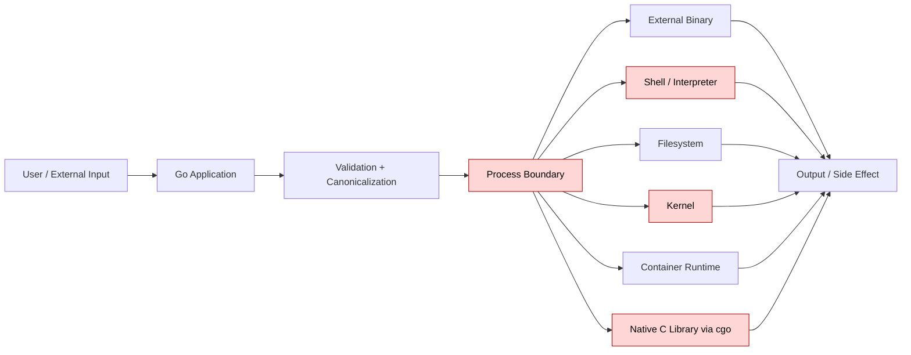
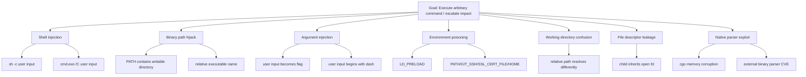
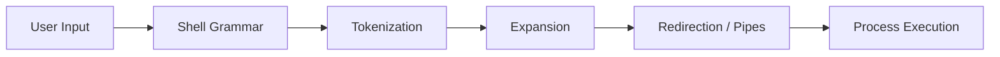
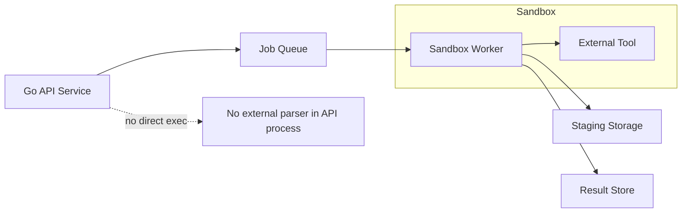
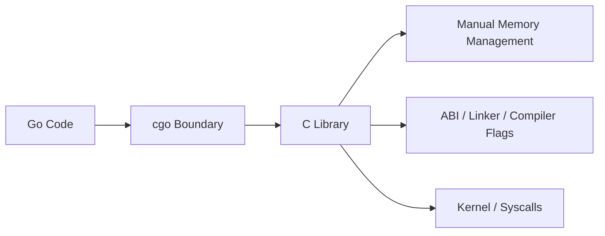
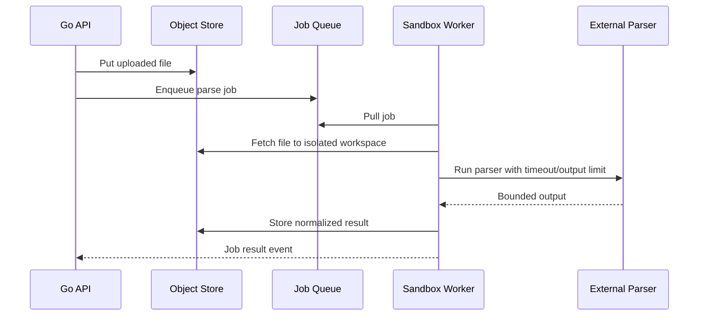
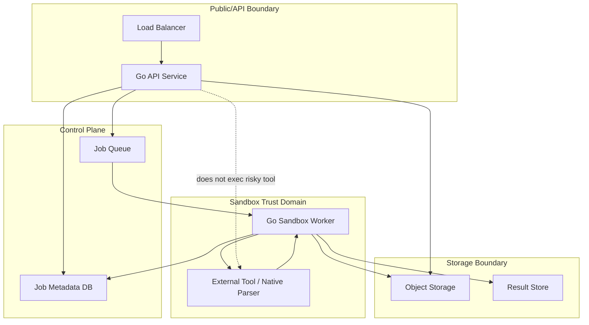

# learn-go-security-cryptography-integrity-part-026.md

# Part 026 — Process and OS Boundary in Go

> Seri: `learn-go-security-cryptography-integrity`  
> Bagian: `026 / 034`  
> Fokus: `os/exec`, environment leakage, shell avoidance, privilege dropping, chroot/container limit, cgo risk, Go 1.26 heap randomization context  
> Target pembaca: Java software engineer / tech lead yang ingin memahami Go security pada batas proses, OS, container, dan native code secara production-grade.

---

## 0. Kenapa bagian ini penting?

Banyak engineer memahami security pada level HTTP, JWT, TLS, atau database. Tetapi begitu aplikasi mulai:

- menjalankan program eksternal,
- membaca/menulis file di filesystem,
- memakai environment variable,
- berjalan sebagai container,
- memakai `cgo`,
- memakai helper binary seperti `wkhtmltopdf`, `ffmpeg`, `git`, `tar`, `convert`, `openssl`, `kubectl`, `ssh`, atau scanner,
- menerima file lalu memprosesnya dengan tool OS,
- melakukan build/deploy automation,

maka trust boundary aplikasi pindah dari “Go code” ke **process dan operating system boundary**.

Pada titik ini, bug kecil bisa berubah menjadi:

- command injection,
- privilege escalation,
- secret leakage,
- arbitrary file read/write,
- container escape chain,
- supply-chain compromise,
- lateral movement,
- data exfiltration,
- denial of service,
- audit bypass.

Bagian ini membangun mental model bahwa `os/exec`, environment variable, working directory, file descriptor, UID/GID, capability, container runtime, dan `cgo` adalah bagian dari security design, bukan sekadar implementation detail.

---

## 1. Core thesis

> Process boundary adalah boundary di mana aplikasi Go menyerahkan sebagian kontrol kepada OS, program lain, runtime lain, native library, atau container runtime.

Di Go, boundary ini biasanya muncul melalui:

```go
exec.Command(...)
os.StartProcess(...)
os.Open(...)
os.Environ()
syscall / x/sys/unix
cgo import "C"
plugin.Open(...)
```

Batas ini berbahaya karena aplikasi tidak lagi hanya memvalidasi input untuk dirinya sendiri. Aplikasi juga harus memvalidasi input untuk **interpreter/consumer berikutnya**:

- shell,
- binary eksternal,
- filesystem,
- dynamic linker,
- native library,
- kernel,
- container runtime,
- init process,
- supervisor,
- network namespace,
- secret provider,
- Kubernetes API.

### Mental model utama



Security invariant-nya:

> Data yang berasal dari boundary tidak boleh menjadi command, path, environment, dynamic-linker input, privileged operation, atau native-code input tanpa validasi yang sesuai dengan interpreter berikutnya.

---

## 2. Java engineer mental shift: `ProcessBuilder` vs Go `os/exec`

Sebagai Java engineer, Anda mungkin familiar dengan:

```java
new ProcessBuilder("git", "clone", repoUrl).start();
Runtime.getRuntime().exec(...);
```

Di Go, bentuk paralelnya adalah:

```go
cmd := exec.CommandContext(ctx, "git", "clone", repoURL)
err := cmd.Run()
```

Keduanya punya prinsip yang sama:

- lebih aman jika binary dan argument dipisahkan,
- lebih berbahaya jika memakai shell,
- environment harus dikendalikan,
- working directory harus eksplisit,
- stdout/stderr harus dibatasi,
- timeout harus ada,
- output tidak boleh langsung dipercaya,
- exit code perlu dimodelkan,
- binary path harus diketahui.

Perbedaan penting di Go:

1. `exec.Command` **tidak menjalankan shell secara otomatis**.
2. Shell expansion seperti `$PATH`, `*`, `;`, `&&`, `|`, backtick, `$()`, redirection, dan quote parsing **tidak terjadi** kecuali Anda memanggil shell sendiri.
3. `exec.Command("sh", "-c", userInput)` adalah red flag besar.
4. Go punya perubahan PATH security modern: executable yang ditemukan relatif terhadap current directory dapat menghasilkan `exec.ErrDot`, karena lookup dari directory tidak terpercaya adalah source RCE klasik.
5. `Cmd.Env` jika nil mewarisi environment parent process. Ini nyaman, tapi sering salah untuk security.

---

## 3. Threat model untuk process boundary

### 3.1 Asset

Asset yang perlu dilindungi:

| Asset | Risiko |
|---|---|
| Secret dalam env | bocor ke child process, log, crash dump, `/proc`, telemetry |
| File system | arbitrary read/write/delete, overwrite config, path traversal |
| Network access | child process bisa akses internal network atau metadata endpoint |
| Credentials | AWS/GCP/Azure token, DB password, signing key, SSH key |
| Runtime identity | UID/GID/capabilities service terlalu tinggi |
| Binary path | attacker memaksa aplikasi menjalankan binary palsu |
| Working directory | relative path resolve ke lokasi attacker-controlled |
| Output stream | memory exhaustion, log injection, parser confusion |
| Native memory | cgo memory corruption, unsafe pointer misuse |
| Audit trail | child process side effects tidak tercatat benar |

### 3.2 Attacker capability

Pertanyaan yang harus dijawab:

- Apakah attacker bisa mengontrol argumen command?
- Apakah attacker bisa mengontrol nama command?
- Apakah attacker bisa mengontrol working directory?
- Apakah attacker bisa mengupload file yang kemudian diproses external tool?
- Apakah attacker bisa mengontrol environment variable?
- Apakah attacker bisa menulis ke directory yang ada dalam `PATH`?
- Apakah attacker bisa membuat symlink/hardlink?
- Apakah attacker bisa memicu output sangat besar?
- Apakah attacker bisa membuat process berjalan lama?
- Apakah attacker bisa memicu native parser bug di library C?

### 3.3 Attack tree



---

## 4. `os/exec` security fundamentals

Go `os/exec` menjalankan external command dengan model:

```go
cmd := exec.CommandContext(ctx, name, arg...)
cmd.Env = []string{...}
cmd.Dir = "/safe/workdir"
cmd.Stdout = writer
cmd.Stderr = writer
err := cmd.Run()
```

Hal-hal penting:

1. `name` adalah program yang dicari.
2. `arg...` adalah argument vector, bukan shell string.
3. `cmd.Env == nil` berarti inherit environment parent process.
4. `cmd.Dir` jika kosong berarti inherit working directory parent process.
5. `CommandContext` dapat membunuh process saat context done, tetapi descendant process tidak selalu otomatis ikut mati tanpa process group / job control design.
6. `Output()` dan `CombinedOutput()` mengumpulkan output di memory, sehingga berisiko memory exhaustion untuk command yang output-nya tidak bounded.

### Secure default wrapper

Di production, jangan sebar `exec.Command` mentah di banyak tempat. Buat satu wrapper dengan policy.

```go
package safeexec

import (
    "bytes"
    "context"
    "errors"
    "fmt"
    "io"
    "os/exec"
    "time"
)

type CommandSpec struct {
    Path       string
    Args       []string
    Dir        string
    Env        []string
    Timeout    time.Duration
    MaxOutput  int64
}

type Result struct {
    Stdout   []byte
    Stderr   []byte
    ExitCode int
}

func Run(ctx context.Context, spec CommandSpec) (Result, error) {
    if spec.Path == "" {
        return Result{}, errors.New("command path is required")
    }
    if spec.Timeout <= 0 {
        return Result{}, errors.New("command timeout is required")
    }
    if spec.MaxOutput <= 0 {
        return Result{}, errors.New("max output is required")
    }

    ctx, cancel := context.WithTimeout(ctx, spec.Timeout)
    defer cancel()

    cmd := exec.CommandContext(ctx, spec.Path, spec.Args...)
    cmd.Dir = spec.Dir
    cmd.Env = spec.Env

    var stdout bytes.Buffer
    var stderr bytes.Buffer

    cmd.Stdout = &limitedWriter{w: &stdout, n: spec.MaxOutput}
    cmd.Stderr = &limitedWriter{w: &stderr, n: spec.MaxOutput}

    err := cmd.Run()
    result := Result{Stdout: stdout.Bytes(), Stderr: stderr.Bytes()}

    if cmd.ProcessState != nil {
        result.ExitCode = cmd.ProcessState.ExitCode()
    }

    if ctx.Err() != nil {
        return result, fmt.Errorf("command timed out: %w", ctx.Err())
    }
    if err != nil {
        return result, err
    }
    return result, nil
}

type limitedWriter struct {
    w io.Writer
    n int64
}

func (lw *limitedWriter) Write(p []byte) (int, error) {
    if lw.n <= 0 {
        return 0, errors.New("output limit exceeded")
    }
    if int64(len(p)) > lw.n {
        p = p[:lw.n]
    }
    written, err := lw.w.Write(p)
    lw.n -= int64(written)
    if err != nil {
        return written, err
    }
    if lw.n <= 0 {
        return written, errors.New("output limit exceeded")
    }
    return written, nil
}
```

Wrapper ini bukan sempurna, tetapi sudah menegakkan invariant:

- timeout wajib,
- output limit wajib,
- command path eksplisit,
- environment eksplisit,
- working directory eksplisit,
- error/exit code bisa diproses.

---

## 5. Shell avoidance

### 5.1 Rule utama

> Jangan memakai shell jika yang dibutuhkan hanya menjalankan binary dengan argumen.

Aman:

```go
cmd := exec.CommandContext(ctx, "/usr/bin/git", "clone", "--", repoURL, targetDir)
```

Berbahaya:

```go
cmd := exec.CommandContext(ctx, "sh", "-c", "git clone " + repoURL + " " + targetDir)
```

Karena shell mengaktifkan grammar tambahan:

| Shell feature | Risiko |
|---|---|
| `;` | command chaining |
| `&&`, `||` | conditional execution |
| `|` | pipeline abuse |
| `$()` / backtick | command substitution |
| `>` / `<` | redirection |
| `*` | glob expansion |
| quote parsing | escaping confusion |
| env expansion | secret leakage / behavior manipulation |

### 5.2 Shell is an interpreter

Shell bukan “cara menjalankan command”. Shell adalah interpreter dengan bahasa sendiri.



Jika input user masuk ke shell string, Anda harus mengamankan **bahasa shell**, bukan sekadar string.

### 5.3 Kalau shell benar-benar wajib

Kadang shell dipakai untuk compatibility dengan legacy script. Jika tidak bisa dihindari:

1. Jangan masukkan user input langsung ke command string.
2. Gunakan script statis yang Anda kontrol.
3. Lewatkan data lewat file descriptor, stdin, temp file terkontrol, atau environment yang ketat.
4. Gunakan allowlist command mode.
5. Jalankan di sandbox/container terpisah.
6. Batasi timeout, output, filesystem, network, UID/GID, dan capability.
7. Audit setiap invocation.

Contoh lebih aman:

```go
cmd := exec.CommandContext(ctx, "/bin/sh", "/opt/app/scripts/render.sh")
cmd.Env = []string{
    "PATH=/usr/bin:/bin",
    "LANG=C.UTF-8",
}
cmd.Stdin = strings.NewReader(userControlledData)
```

Masih ada risiko, tetapi user data tidak menjadi shell program.

---

## 6. Command name vs argument injection

Banyak engineer mengira command injection hanya terjadi karena shell. Tidak selalu.

Ada dua kelas berbeda:

### 6.1 Command name injection

Buruk:

```go
cmd := exec.CommandContext(ctx, userSelectedTool, arg)
```

Jika attacker memilih `userSelectedTool`, ia bisa menjalankan binary lain.

Lebih baik:

```go
type Tool string

const (
    ToolPDFInfo Tool = "pdfinfo"
    ToolExif   Tool = "exiftool"
)

var toolPath = map[Tool]string{
    ToolPDFInfo: "/usr/bin/pdfinfo",
    ToolExif:   "/usr/bin/exiftool",
}

func pathForTool(t Tool) (string, bool) {
    p, ok := toolPath[t]
    return p, ok
}
```

### 6.2 Argument injection

Walaupun tidak memakai shell, user input bisa menjadi flag.

Buruk:

```go
exec.CommandContext(ctx, "/usr/bin/git", "clone", repoURL)
```

Jika `repoURL` dimulai dengan `-`, tool mungkin menganggapnya sebagai option.

Lebih baik jika tool mendukung `--`:

```go
exec.CommandContext(ctx, "/usr/bin/git", "clone", "--", repoURL, targetDir)
```

Tetapi `--` bukan universal. Untuk setiap external binary, baca kontrak CLI-nya.

### 6.3 Validate by semantic type

Jangan validasi argumen command sebagai string umum. Bentuk tipe domain:

```go
type GitURL struct {
    raw string
}

func ParseGitURL(s string) (GitURL, error) {
    if strings.HasPrefix(s, "-") {
        return GitURL{}, errors.New("url must not start with dash")
    }
    if !(strings.HasPrefix(s, "https://github.com/") || strings.HasPrefix(s, "ssh://git@github.com/")) {
        return GitURL{}, errors.New("unsupported git host")
    }
    return GitURL{raw: s}, nil
}

func (u GitURL) String() string { return u.raw }
```

---

## 7. PATH lookup and binary hijacking

### 7.1 Kenapa `PATH` berbahaya?

Jika Anda menjalankan:

```go
exec.CommandContext(ctx, "convert", input, output)
```

Go akan mencari `convert` melalui `PATH`.

Jika `PATH` mengandung directory attacker-controlled atau current directory, attacker bisa membuat binary bernama `convert` dan aplikasi menjalankannya.

### 7.2 Secure rule

Gunakan absolute path untuk binary security-sensitive:

```go
const imageMagick = "/usr/bin/magick"
cmd := exec.CommandContext(ctx, imageMagick, "identify", "--", inputPath)
```

### 7.3 Startup verification

Pada startup, verifikasi binary yang diperlukan:

```go
type ExternalTool struct {
    Name string
    Path string
}

func VerifyTool(path string) error {
    if !filepath.IsAbs(path) {
        return fmt.Errorf("tool path must be absolute: %s", path)
    }
    info, err := os.Stat(path)
    if err != nil {
        return err
    }
    if info.IsDir() {
        return fmt.Errorf("tool path is directory: %s", path)
    }
    if info.Mode()&0111 == 0 {
        return fmt.Errorf("tool is not executable: %s", path)
    }
    return nil
}
```

Untuk high-security system, pertimbangkan:

- pin package version di container image,
- hash binary saat build,
- minimal base image,
- read-only root filesystem,
- SBOM,
- vulnerability scanning,
- restrict package manager di runtime image.

### 7.4 `exec.ErrDot`

Go modern menolak beberapa kasus PATH lookup yang menemukan executable relatif terhadap current directory, karena current directory sering dianggap tidak terpercaya. Ini adalah bentuk hardening terhadap PATH hijacking. Jangan bypass dengan menambahkan `./` kecuali memang desainnya mengizinkan eksekusi dari directory tersebut.

---

## 8. Environment variable leakage and poisoning

Environment variable sering dipakai untuk config dan secret. Masalahnya, environment diwariskan ke child process jika `cmd.Env` nil.

### 8.1 Risiko environment inheritance

Misalnya process parent punya:

```text
AWS_ACCESS_KEY_ID=...
AWS_SECRET_ACCESS_KEY=...
DATABASE_URL=...
JWT_SIGNING_KEY=...
HTTP_PROXY=...
SSL_CERT_FILE=...
LD_PRELOAD=...
PATH=...
HOME=...
```

Lalu Anda menjalankan external binary:

```go
cmd := exec.CommandContext(ctx, "/usr/bin/convert", input, output)
cmd.Run()
```

Jika `cmd.Env` nil, child process menerima semua env tersebut.

Risikonya:

| Env | Risiko |
|---|---|
| `AWS_*` | child process bisa akses cloud APIs |
| `DATABASE_URL` | secret bocor ke crash/log/subprocess |
| `HTTP_PROXY` / `HTTPS_PROXY` | traffic dialihkan ke proxy attacker-controlled |
| `NO_PROXY` | SSRF bypass/egress behavior berubah |
| `SSL_CERT_FILE` / `SSL_CERT_DIR` | trust store dimanipulasi |
| `PATH` | binary hijack |
| `HOME` | tool membaca config/credentials user |
| `GIT_SSH_COMMAND` | command execution pada git |
| `LD_PRELOAD` / `DYLD_*` | dynamic linker injection pada beberapa platform/situasi |
| `TMPDIR` | temp file path ke lokasi attacker-controlled |
| `KUBECONFIG` | child process akses cluster |

### 8.2 Secure env allowlist

Jangan denylist secret satu per satu. Pakai allowlist.

```go
func MinimalEnv() []string {
    return []string{
        "PATH=/usr/bin:/bin",
        "LANG=C.UTF-8",
        "LC_ALL=C.UTF-8",
        "HOME=/nonexistent",
        "TMPDIR=/tmp/app-work",
    }
}
```

Lalu:

```go
cmd := exec.CommandContext(ctx, "/usr/bin/pdfinfo", inputPath)
cmd.Env = MinimalEnv()
```

### 8.3 Jangan log full env

Buruk:

```go
log.Printf("env=%v", os.Environ())
```

Lebih baik:

```go
log.Printf("env_keys=%v", envKeys(os.Environ()))
```

Bahkan env key bisa sensitif dalam beberapa organisasi. Redact dengan policy.

### 8.4 Environment sebagai control plane

Beberapa binary memakai env bukan hanya data, tetapi control plane.

Contoh:

- Git membaca `GIT_*`.
- OpenSSL/curl bisa membaca trust/proxy env.
- Python/Node/Ruby membaca module path env.
- Dynamic linker membaca preload/library path env.
- CLI cloud membaca credential env.

Jadi environment harus diperlakukan sebagai **input ke interpreter berikutnya**.

---

## 9. Working directory confusion

`cmd.Dir` menentukan current working directory child process.

Jika kosong, child mewarisi working directory parent. Ini berisiko jika:

- aplikasi dijalankan dari directory tidak terduga,
- working directory writable oleh attacker,
- command memakai relative path,
- command membaca config dari current directory,
- command menulis output relatif ke current directory,
- PATH lookup terkait current directory.

### Secure rule

Set `cmd.Dir` eksplisit ke directory yang:

- bukan attacker-controlled,
- permission-nya ketat,
- tidak berisi config sensitif yang tidak perlu,
- berada di working area khusus per job/request jika perlu.

```go
workDir := "/var/lib/myapp/jobs/" + jobID
cmd := exec.CommandContext(ctx, "/usr/bin/pdfinfo", "--", inputPath)
cmd.Dir = workDir
cmd.Env = MinimalEnv()
```

Untuk job berbasis upload, gunakan staging directory per request dengan random name dan permission terbatas.

---

## 10. Stdin/stdout/stderr as attack surface

### 10.1 Output memory exhaustion

`cmd.Output()` dan `cmd.CombinedOutput()` menyimpan semua output di memory.

Buruk untuk untrusted command/file:

```go
out, err := exec.CommandContext(ctx, "/usr/bin/tool", input).CombinedOutput()
```

Jika output besar, memory bisa habis.

Gunakan limit writer.

### 10.2 Stderr leakage

External tools sering menulis:

- full path,
- env detail,
- command args,
- config path,
- stack trace,
- internal version,
- secret accidentally.

Jangan kembalikan stderr langsung ke user.

Buruk:

```go
http.Error(w, string(stderr), http.StatusBadRequest)
```

Lebih baik:

```go
logger.Warn("external tool failed",
    "tool", "pdfinfo",
    "exit_code", exitCode,
    "stderr_hash", sha256Hex(stderr),
)
http.Error(w, "file could not be processed", http.StatusBadRequest)
```

### 10.3 Stdin parser risk

Memberi user-controlled bytes ke external parser bisa mengeksploitasi CVE parser itu.

Contoh high-risk parser:

- image metadata parser,
- PDF renderer,
- font parser,
- video/audio codec,
- archive extractor,
- office document converter,
- HTML-to-PDF renderer,
- antivirus scanner,
- OCR engine.

Untuk kategori ini, external tool harus dijalankan dengan sandbox lebih keras.

---

## 11. Timeout, cancellation, and process tree control

`exec.CommandContext` akan memanggil kill pada process ketika context done. Tetapi ada nuance:

- jika process membuat child process, child bisa tetap berjalan,
- shell script bisa spawn background process,
- process bisa ignore signal jika Anda hanya mengirim interrupt,
- output pipe bisa deadlock jika tidak dibaca,
- cleanup file bisa tertinggal.

### 11.1 Basic timeout

```go
ctx, cancel := context.WithTimeout(parent, 10*time.Second)
defer cancel()

cmd := exec.CommandContext(ctx, "/usr/bin/pdfinfo", inputPath)
err := cmd.Run()
if ctx.Err() == context.DeadlineExceeded {
    // record timeout separately from normal command failure
}
```

### 11.2 Process group on Unix

Untuk command yang bisa spawn child process, pertimbangkan process group.

```go
//go:build linux || darwin

package safeexec

import (
    "os/exec"
    "syscall"
)

func configureProcessGroup(cmd *exec.Cmd) {
    cmd.SysProcAttr = &syscall.SysProcAttr{Setpgid: true}
}

func killProcessGroup(cmd *exec.Cmd) error {
    if cmd.Process == nil {
        return nil
    }
    return syscall.Kill(-cmd.Process.Pid, syscall.SIGKILL)
}
```

Catatan:

- Ini OS-specific.
- Windows membutuhkan Job Object approach, bukan process group Unix.
- Container runtime dan orchestrator juga bisa membantu melalui pod/container lifecycle.

### 11.3 Timeout bukan resource isolation

Timeout hanya membatasi durasi. Ia tidak membatasi:

- memory,
- CPU burst,
- disk write,
- network egress,
- file read scope,
- syscalls,
- number of child processes.

Untuk workload tidak terpercaya, gunakan sandbox/container dengan resource limit.

---

## 12. File descriptor inheritance

Child process bisa mewarisi file descriptor tertentu jika tidak close-on-exec.

Risiko:

- child process membaca socket internal,
- child process mendapat handle ke secret file,
- child process mempertahankan lock/file sehingga cleanup gagal,
- child process mengakses inherited pipe.

Go secara umum berusaha mengatur close-on-exec untuk file descriptor yang dibuat oleh runtime/stdlib, tetapi jika Anda membuka file sendiri atau memakai syscall/cgo, audit tetap perlu.

Prinsip:

1. Jangan membuka secret file sebelum spawn command jika tidak perlu.
2. Jangan pass `ExtraFiles` kecuali benar-benar sengaja.
3. Pastikan fd yang dibuat manual memakai close-on-exec.
4. Pisahkan process runner dari code yang memegang connection sensitif.

Contoh explicit `ExtraFiles` hanya jika diperlukan:

```go
cmd.ExtraFiles = []*os.File{readOnlyInputFile}
```

Ini harus dianggap security-sensitive API.

---

## 13. Privilege model: UID, GID, capabilities

### 13.1 Jangan jalankan aplikasi sebagai root jika tidak perlu

Jika service Go berjalan sebagai root, maka setiap command yang dijalankan juga inherit privilege tinggi kecuali diturunkan.

Dalam container, root di container tidak sama persis dengan root host, tetapi tetap berbahaya:

- bisa bypass file permission dalam container,
- bisa exploit kernel/container runtime CVE lebih berdampak,
- bisa memakai capabilities yang tersisa,
- bisa menulis ke mounted volume,
- bisa membaca secret mount.

### 13.2 Linux capabilities

Linux memecah privilege root menjadi capabilities seperti:

- `CAP_NET_BIND_SERVICE`,
- `CAP_DAC_OVERRIDE`,
- `CAP_SYS_ADMIN`,
- `CAP_NET_ADMIN`,
- `CAP_CHOWN`,
- `CAP_SETUID`,
- `CAP_SETGID`.

`CAP_SYS_ADMIN` sering disebut “the new root” karena scope-nya sangat luas.

Prinsip:

- drop semua capability default jika bisa,
- tambah hanya capability yang benar-benar perlu,
- hindari `CAP_SYS_ADMIN`,
- gunakan port >1024 daripada `CAP_NET_BIND_SERVICE` jika feasible,
- gunakan Kubernetes `allowPrivilegeEscalation: false`.

### 13.3 Kubernetes securityContext baseline

Contoh baseline manifest:

```yaml
apiVersion: apps/v1
kind: Deployment
metadata:
  name: secure-go-service
spec:
  template:
    spec:
      securityContext:
        runAsNonRoot: true
        runAsUser: 10001
        runAsGroup: 10001
        fsGroup: 10001
        seccompProfile:
          type: RuntimeDefault
      containers:
        - name: app
          image: example/secure-go-service:1.0.0
          securityContext:
            allowPrivilegeEscalation: false
            readOnlyRootFilesystem: true
            capabilities:
              drop:
                - ALL
          volumeMounts:
            - name: tmp
              mountPath: /tmp
      volumes:
        - name: tmp
          emptyDir: {}
```

Security implication:

| Setting | Mengurangi risiko |
|---|---|
| `runAsNonRoot` | command tidak berjalan sebagai root |
| `allowPrivilegeEscalation: false` | mencegah process mendapat privilege lebih tinggi dari parent via no_new_privs semantics |
| `readOnlyRootFilesystem` | mengurangi persistence dan overwrite binary/config |
| `capabilities.drop: [ALL]` | menghapus privilege kernel ekstra |
| `seccompProfile: RuntimeDefault` | membatasi syscall surface |
| dedicated `/tmp` | tetap memberi scratch space tanpa writable root FS |

---

## 14. Privilege dropping from Go

Di Go, privilege dropping via `syscall.SysProcAttr.Credential` bisa dilakukan pada Unix-like OS saat spawn child process.

Contoh Linux/Unix concept:

```go
//go:build linux

cmd := exec.CommandContext(ctx, "/usr/bin/some-tool", args...)
cmd.SysProcAttr = &syscall.SysProcAttr{
    Credential: &syscall.Credential{
        Uid: 10001,
        Gid: 10001,
    },
}
```

Tetapi ada caveat besar:

1. Ini OS-specific.
2. Drop UID/GID tidak otomatis menghapus semua capability dalam semua setup.
3. Supplementary groups perlu diperhatikan.
4. Jika parent bukan root, ia mungkin tidak bisa set UID/GID arbitrary.
5. Dalam container, lebih baik privilege rendah dikonfigurasi dari image/runtime/orchestrator sejak awal.

Prinsip production:

- prefer run whole service as non-root,
- use orchestrator security context,
- use dedicated sandbox worker untuk high-risk processing,
- jangan bergantung pada per-command privilege dropping sebagai satu-satunya defense.

---

## 15. Chroot, container, and sandbox limits

### 15.1 Chroot bukan sandbox lengkap

`chroot` membatasi root directory filesystem untuk process, tetapi bukan security boundary lengkap jika process punya privilege tinggi atau capability tertentu.

Keterbatasan:

- tidak membatasi network,
- tidak membatasi syscalls,
- tidak membatasi CPU/memory,
- tidak otomatis drop privilege,
- tidak mengisolasi kernel,
- bisa ditembus jika setup salah dan process privileged.

### 15.2 Container bukan security boundary absolut

Container membantu isolation lewat namespaces, cgroups, capabilities, seccomp, LSM, dan filesystem layers. Tetapi container berbagi kernel host.

Jadi container harus dianggap:

> strong operational boundary, but not a cryptographic or absolute security boundary.

Untuk untrusted file processing, lebih aman:



Worker sandbox sebaiknya:

- non-root,
- read-only root filesystem,
- no privilege escalation,
- all capabilities dropped,
- seccomp default/custom,
- AppArmor/SELinux profile jika tersedia,
- network disabled atau allowlist ketat,
- CPU/memory limit,
- ephemeral filesystem,
- timeout enforced by orchestrator,
- no production secrets,
- minimal service account,
- separate node pool jika risk tinggi.

### 15.3 Sandbox decision matrix

| Use case | Jalankan langsung? | Sandbox worker? |
|---|---:|---:|
| trusted internal CLI with fixed args | bisa | optional |
| parsing user-uploaded image/PDF/video | tidak ideal | ya |
| running user-submitted code | tidak | wajib specialized sandbox |
| invoking `git` on user URL | hati-hati | sering ya |
| archive extraction | jangan di API process | ya untuk high-risk |
| calling `openssl version` | bisa | tidak perlu |
| PDF rendering HTML user content | tidak | wajib |

---

## 16. Network boundary for child processes

Child process mewarisi network namespace process parent/container. Jika aplikasi bisa menjalankan external tool yang melakukan network access, tool tersebut bisa:

- mengakses metadata endpoint,
- mengakses internal service,
- memanggil internet,
- bypass application-level SSRF protection,
- exfiltrate data,
- mengunduh dependency/plugin.

Contoh: `git clone`, `curl`, `ffmpeg`, `wkhtmltopdf`, browser headless, PDF renderer, OCR engine dengan remote fetch, package manager.

### Secure design

1. Jangan beri network jika tidak perlu.
2. Jika perlu, gunakan egress allowlist.
3. Blok metadata endpoint.
4. Jangan pass cloud credentials ke child process.
5. Jalankan di namespace/container berbeda untuk risky tool.
6. Log destination domain/IP jika tool memang networked.
7. Gunakan DNS resolver policy jika relevant.

### Kubernetes example: isolate worker

```yaml
apiVersion: networking.k8s.io/v1
kind: NetworkPolicy
metadata:
  name: sandbox-worker-egress
spec:
  podSelector:
    matchLabels:
      app: sandbox-worker
  policyTypes:
    - Egress
  egress:
    - to:
        - namespaceSelector:
            matchLabels:
              name: artifact-store
      ports:
        - protocol: TCP
          port: 443
```

Default-deny egress harus dikombinasikan dengan policy actual sesuai CNI yang digunakan.

---

## 17. `cgo` risk model

### 17.1 Apa itu cgo?

`cgo` memungkinkan Go package memanggil C code melalui pseudo-package `C`.

```go
// #include <stdlib.h>
import "C"
```

Dengan cgo, aplikasi Go memasuki native code boundary:



### 17.2 Kenapa cgo security-sensitive?

Go biasanya memberi beberapa safety property:

- memory safety pada Go code normal,
- bounds checks,
- garbage collector,
- goroutine scheduler,
- race detector untuk Go memory access tertentu,
- type system.

C code tidak otomatis mendapat property ini.

Risiko cgo:

| Area | Risiko |
|---|---|
| Memory | buffer overflow, use-after-free, double free, OOB read/write |
| Lifetime | Go pointer dipakai C setelah Go object moved/freed/lifetime berubah |
| Threading | C library tidak thread-safe |
| Signal | C code mengubah signal handler |
| Allocator | mismatch `malloc/free`, leaks |
| Error handling | C error code tidak dimodelkan benar |
| Build flags | unsafe linker/compiler flags |
| Dependency | CVE native library |
| Dynamic linking | library hijack/version mismatch |
| Fuzzing | Go fuzzing tidak selalu menutup native surface dengan baik |

### 17.3 Go 1.26 heap base randomization context

Go 1.26 menambahkan randomization untuk heap base address pada platform 64-bit. Ini security enhancement karena membuat alamat memory lebih sulit diprediksi, terutama relevan ketika memakai `cgo` dan ada kemungkinan memory corruption di native boundary.

Namun ini hanya defense-in-depth.

Bukan berarti:

- C code menjadi memory-safe,
- buffer overflow menjadi aman,
- unsafe pointer misuse hilang,
- exploit mustahil,
- cgo bebas risiko.

Security invariant:

> Treat cgo as introducing a native-code attack surface. Runtime hardening helps, but cannot replace memory-safe design, dependency hygiene, sandboxing, fuzzing, and least privilege.

### 17.4 Prefer pure Go when possible

Jika ada pure-Go implementation yang mature dan maintained, prefer itu untuk service-side security-sensitive path.

Contoh pertimbangan:

| Kebutuhan | Prefer |
|---|---|
| TLS/crypto umum | Go stdlib crypto/tls/crypto/x509 |
| compression umum | Go stdlib jika cukup |
| parsing sederhana | pure Go parser dengan limit |
| image complex | mungkin external tool sandbox lebih baik daripada cgo in-process |
| high-performance native DB driver | audit cgo dependency dan operational blast radius |

### 17.5 Jika cgo wajib

Checklist:

- pin native library version,
- track CVE native library,
- minimal compile/link flags,
- no untrusted input directly to native parser without bounds,
- fuzz native boundary,
- run risky parser out-of-process jika bisa,
- avoid passing Go pointers to C beyond allowed lifetime,
- document ownership of allocated memory,
- centralize wrapper,
- expose safe Go API only,
- add resource limits,
- test with race/asan/msan where feasible,
- include SBOM native dependencies.

### 17.6 Safe wrapper pattern

Buruk:

```go
// C API exposed everywhere across app packages.
func Process(b []byte) error {
    C.process((*C.char)(unsafe.Pointer(&b[0])), C.int(len(b)))
    return nil
}
```

Lebih baik:

```go
package nativecodec

type Decoder struct {
    maxInput int
}

func NewDecoder(maxInput int) (*Decoder, error) {
    if maxInput <= 0 || maxInput > 10<<20 {
        return nil, errors.New("invalid max input")
    }
    return &Decoder{maxInput: maxInput}, nil
}

func (d *Decoder) Decode(input []byte) (Result, error) {
    if len(input) == 0 {
        return Result{}, errors.New("empty input")
    }
    if len(input) > d.maxInput {
        return Result{}, errors.New("input too large")
    }
    // cgo call isolated here.
    return decodeNative(input)
}
```

Boundary rules:

- cgo only in one package,
- no raw C types exposed to application,
- no unsafe pointer exposed,
- input size bounded,
- ownership documented,
- error translated to typed Go errors,
- panic avoided across native boundary.

---

## 18. Dynamic linking and library path risk

If cgo or external binary uses dynamic libraries, behavior can change based on:

- `LD_LIBRARY_PATH`,
- `LD_PRELOAD`,
- system library version,
- container base image,
- package update,
- mounted volume,
- current working directory on some platforms,
- RPATH/RUNPATH.

Mitigation:

1. Minimal env allowlist.
2. Avoid dynamic linker env in child process.
3. Pin container image digest.
4. Prefer static linking if appropriate and license/compliance allows.
5. Use distroless/minimal image carefully.
6. Generate SBOM including native libs.
7. Scan native libraries in CI.
8. Monitor security advisories.

---

## 19. `unsafe` and OS boundary

`unsafe` is not the same as `cgo`, but both weaken Go safety.

Risk examples:

- converting `[]byte` to `string` with wrong lifetime assumption,
- building slice header manually,
- reading memory beyond bounds,
- aliasing sensitive memory,
- passing Go memory to syscall incorrectly,
- violating alignment,
- data race invisible to type system.

Guideline:

- Use `unsafe` only in small, reviewed packages.
- Add invariants as comments near the unsafe block.
- Prefer tested stdlib/x packages.
- Fuzz APIs that use unsafe.
- Avoid unsafe in code handling untrusted bytes unless performance need is proven.

Example invariant comment:

```go
// unsafeString converts b to string without allocation.
// Invariants:
// - caller must not mutate b after conversion;
// - returned string must not outlive b's backing array assumptions;
// - this is only used for internal immutable buffers;
// - never use for secret data that needs explicit zeroing semantics.
func unsafeString(b []byte) string {
    return unsafe.String(unsafe.SliceData(b), len(b))
}
```

For security-sensitive code, the default answer should usually be: do not use this unless you can prove and test the invariant.

---

## 20. Secret handling across process boundary

### 20.1 Do not pass secrets via command args

Command args may be visible via:

- process listings,
- audit logs,
- crash reports,
- shell history if shell involved,
- telemetry,
- supervisor logs.

Buruk:

```go
exec.CommandContext(ctx, "/usr/bin/tool", "--password", password)
```

Lebih baik options:

- pass via stdin,
- pass via dedicated file with strict permission,
- pass via secret manager integration directly in child process if sandboxed,
- avoid external tool if secret handling cannot be bounded.

### 20.2 Env is not always safer

Env avoids command-line exposure but can still leak through:

- child process inheritance,
- `/proc` on some systems depending permission,
- crash dumps,
- logs,
- debugging tools,
- accidental `env` output,
- shell scripts.

For high-value secrets, prefer short-lived file descriptor/stdin or direct API.

### 20.3 Temporary secret file

If file is needed:

```go
f, err := os.OpenFile(path, os.O_RDWR|os.O_CREATE|os.O_EXCL, 0600)
if err != nil {
    return err
}
defer func() {
    _ = f.Close()
    _ = os.Remove(path)
}()
```

Caveat: deleting file does not guarantee secure deletion on SSD, journaling FS, snapshots, backup, object storage, or copy-on-write filesystem. For strong deletion semantics, prefer crypto-erasure design: encrypt data with disposable key and destroy key.

---

## 21. External tool hardening pattern

### 21.1 Problem

Service needs to process user-uploaded PDF with external tool.

Naive:

```go
cmd := exec.CommandContext(ctx, "pdfinfo", uploadedPath)
out, err := cmd.CombinedOutput()
```

Risks:

- PATH hijack,
- inherited secrets,
- no output limit,
- maybe no timeout,
- parser CVE in pdfinfo/poppler,
- file path traversal earlier,
- network maybe not needed but available,
- tool has same privilege as API service,
- stderr leaked to user,
- no audit event.

### 21.2 Hardened in-process invocation

```go
func PDFInfo(ctx context.Context, input SafeLocalPath) (PDFMetadata, error) {
    spec := safeexec.CommandSpec{
        Path:      "/usr/bin/pdfinfo",
        Args:      []string{"--", input.String()},
        Dir:       "/var/lib/app/pdf-jobs",
        Env:       MinimalEnv(),
        Timeout:   5 * time.Second,
        MaxOutput: 1 << 20, // 1 MiB
    }

    result, err := safeexec.Run(ctx, spec)
    if err != nil {
        return PDFMetadata{}, fmt.Errorf("pdf metadata extraction failed: %w", err)
    }

    return parsePDFInfo(result.Stdout)
}
```

### 21.3 Hardened out-of-process worker

For high-risk parser, prefer:



API process never directly executes risky parser.

---

## 22. Build pipeline and process boundary

CI/CD often runs commands with high privilege:

- `go test`,
- `go generate`,
- `go vet`,
- `golangci-lint`,
- `docker build`,
- `kubectl apply`,
- migration scripts,
- codegen,
- `npm install`,
- `make`.

Threats:

- malicious dependency executes script,
- compromised tool binary,
- PR changes Makefile/codegen,
- secrets exposed to untrusted PR,
- CI runner workspace persists between jobs,
- PATH hijack in repo directory,
- `go generate` executes arbitrary commands declared in source comments,
- test invokes external service with credentials.

Go-specific reminder:

- `go generate` is not run automatically by `go build`, but when run it executes commands from source directives.
- Treat codegen as arbitrary code execution.
- Do not run privileged deploy credentials on untrusted PR code.

CI invariant:

> Untrusted code must not run in a context that has production deploy credentials or broad cloud access.

---

## 23. Observability for process execution

Every production command invocation should produce structured audit/telemetry.

Do log:

- command logical name,
- absolute binary path,
- sanitized args shape, not raw secrets,
- timeout,
- working directory category, not full sensitive path if unnecessary,
- exit code,
- duration,
- output size,
- stderr hash or truncated sanitized stderr,
- job/request correlation id,
- sandbox/container id if applicable.

Do not log:

- full env,
- secrets in args,
- raw user file content,
- raw stderr if it may contain sensitive data,
- full internal path if it reveals tenant/user info,
- access token/API key.

Example:

```go
logger.Info("external_command_completed",
    "tool", "pdfinfo",
    "path", "/usr/bin/pdfinfo",
    "exit_code", result.ExitCode,
    "duration_ms", duration.Milliseconds(),
    "stdout_bytes", len(result.Stdout),
    "stderr_bytes", len(result.Stderr),
    "request_id", requestID,
)
```

Security metrics:

- command timeout rate,
- output limit exceeded count,
- non-zero exit by tool,
- sandbox kill count,
- unusually high duration,
- unexpected network egress from worker,
- unexpected exit signal,
- parser crash count,
- number of rejected arguments,
- command invocation by tenant/user.

---

## 24. Testing strategy

### 24.1 Unit tests for command builder

Test that untrusted input never changes command name.

```go
func TestBuildGitCloneCommandRejectsDashURL(t *testing.T) {
    _, err := ParseGitURL("--upload-pack=/tmp/pwn")
    if err == nil {
        t.Fatal("expected rejection")
    }
}
```

### 24.2 Test env allowlist

```go
func TestMinimalEnvDoesNotContainSecrets(t *testing.T) {
    env := MinimalEnv()
    joined := strings.Join(env, "\n")
    forbidden := []string{"AWS_SECRET_ACCESS_KEY", "DATABASE_URL", "JWT_SIGNING_KEY"}
    for _, key := range forbidden {
        if strings.Contains(joined, key) {
            t.Fatalf("env contains forbidden key %s", key)
        }
    }
}
```

### 24.3 Integration test with fake binary

Create fake binary/script in temp dir to verify absolute path is used and PATH hijack does not work.

```go
func TestUsesAbsoluteToolPath(t *testing.T) {
    // Put malicious fake tool in temp PATH.
    // Command builder must still use /usr/bin/tool or configured absolute path.
}
```

### 24.4 Fuzz command argument parser

```go
func FuzzParseImageOperation(f *testing.F) {
    f.Add("resize")
    f.Add("../../etc/passwd")
    f.Add("--help")
    f.Fuzz(func(t *testing.T, s string) {
        op, err := ParseImageOperation(s)
        if err == nil && !op.Allowed() {
            t.Fatalf("accepted disallowed operation: %q", s)
        }
    })
}
```

### 24.5 Chaos/security tests

Run external command tests with:

- huge stdout,
- huge stderr,
- command that sleeps forever,
- command that spawns child process,
- command that exits non-zero,
- command that writes to cwd,
- command that tries network access,
- command that prints env,
- command that creates symlink.

---

## 25. Design review checklist

### 25.1 `os/exec` checklist

- [ ] Is external command truly necessary?
- [ ] Is command path absolute?
- [ ] Is command name selected from allowlist?
- [ ] Are arguments passed as separate argv items?
- [ ] Is shell avoided?
- [ ] If shell is used, is script static and user data passed safely?
- [ ] Are user-controlled args semantically validated?
- [ ] Are args beginning with `-` rejected or protected by `--` if supported?
- [ ] Is working directory explicit and safe?
- [ ] Is environment allowlisted?
- [ ] Are secrets excluded from args/env/logs?
- [ ] Is timeout mandatory?
- [ ] Is stdout/stderr bounded?
- [ ] Is stderr sanitized before user-facing response?
- [ ] Is child process tree handled?
- [ ] Is file descriptor inheritance intentional?
- [ ] Are exit codes modeled?
- [ ] Is invocation audited?

### 25.2 Container/OS checklist

- [ ] Service runs as non-root.
- [ ] Container drops all capabilities unless explicitly needed.
- [ ] `allowPrivilegeEscalation` is false.
- [ ] Root filesystem is read-only if feasible.
- [ ] Dedicated writable volume exists only where needed.
- [ ] Seccomp profile is RuntimeDefault or stricter.
- [ ] Network egress is default-deny or allowlisted for risky workers.
- [ ] No production secrets in sandbox worker unless required.
- [ ] Resource limits are set.
- [ ] Service account is least privilege.
- [ ] HostPath mounts are avoided.
- [ ] Privileged container is forbidden.

### 25.3 cgo/unsafe checklist

- [ ] Is cgo/unsafe avoidable?
- [ ] Is risky native code isolated in one package?
- [ ] Is input size bounded before native call?
- [ ] Is ownership/lifetime documented?
- [ ] Are native dependencies pinned and scanned?
- [ ] Are compiler/linker flags reviewed?
- [ ] Is untrusted parsing out-of-process if feasible?
- [ ] Are fuzz tests present?
- [ ] Are Go pointer passing rules respected?
- [ ] Is crash behavior acceptable?
- [ ] Is runtime hardening understood as defense-in-depth only?

---

## 26. Common anti-patterns

### Anti-pattern 1: Shelling out for simple work

```go
exec.Command("sh", "-c", "rm -rf "+path)
```

Better:

```go
os.RemoveAll(path) // after path is validated and rooted safely
```

### Anti-pattern 2: User chooses command

```go
exec.Command(userTool, input)
```

Better: enum/allowlist mapped to absolute paths.

### Anti-pattern 3: Inheriting full environment

```go
cmd.Env = nil
```

Better: minimal env allowlist.

### Anti-pattern 4: Returning stderr to user

```go
http.Error(w, string(stderr), 400)
```

Better: generic message + internal sanitized logs.

### Anti-pattern 5: Running external parser inside API pod with production secrets

Better: isolated worker with no prod secrets and limited network.

### Anti-pattern 6: Believing container = sandbox

Better: combine container with non-root, capabilities drop, seccomp, no-new-privs, network policy, resource limits, separate trust domain.

### Anti-pattern 7: cgo without ownership contract

Better: safe wrapper with explicit lifetime, size limits, pinned native dependency, and tests.

---

## 27. Production reference architecture



Security properties:

- API service does not execute risky parser.
- Sandbox worker has minimal/no secrets.
- Object storage boundary controls input/output.
- Queue decouples request latency from parser runtime.
- Worker can be killed/restarted safely.
- Worker can run with stricter seccomp/network policy.
- Audit trail links API request → job → worker → tool result.

---

## 28. Example: secure command policy object

```go
package processpolicy

import (
    "errors"
    "path/filepath"
    "strings"
    "time"
)

type ToolName string

const (
    ToolPDFInfo ToolName = "pdfinfo"
    ToolExif    ToolName = "exiftool"
)

type Policy struct {
    tools map[ToolName]string
}

func NewPolicy() Policy {
    return Policy{tools: map[ToolName]string{
        ToolPDFInfo: "/usr/bin/pdfinfo",
        ToolExif:    "/usr/bin/exiftool",
    }}
}

type Invocation struct {
    Path      string
    Args      []string
    Env       []string
    Dir       string
    Timeout   time.Duration
    MaxOutput int64
}

func (p Policy) Build(tool ToolName, inputPath string) (Invocation, error) {
    path, ok := p.tools[tool]
    if !ok {
        return Invocation{}, errors.New("unsupported tool")
    }
    if !filepath.IsAbs(path) {
        return Invocation{}, errors.New("tool path must be absolute")
    }
    if strings.HasPrefix(inputPath, "-") {
        return Invocation{}, errors.New("input path must not start with dash")
    }
    if !filepath.IsAbs(inputPath) {
        return Invocation{}, errors.New("input path must be absolute")
    }

    return Invocation{
        Path:      path,
        Args:      []string{"--", inputPath},
        Env:       []string{"PATH=/usr/bin:/bin", "LANG=C.UTF-8", "LC_ALL=C.UTF-8", "HOME=/nonexistent"},
        Dir:       "/var/lib/app/work",
        Timeout:   5 * time.Second,
        MaxOutput: 1 << 20,
    }, nil
}
```

This is intentionally boring. Secure process execution should be boring.

---

## 29. Incident response playbook

If you suspect process boundary compromise:

1. Identify external commands invoked near incident time.
2. Collect structured logs: tool, args shape, exit code, duration, output size.
3. Check whether shell was used.
4. Check env inheritance.
5. Check binary path and hash.
6. Check working directory and writable paths.
7. Check uploaded/input files.
8. Check child process tree and orphan processes.
9. Check network egress from pod/node.
10. Rotate secrets that may have been inherited by child process.
11. Rebuild image from clean base.
12. Patch external binary/native library CVE.
13. Add regression test for payload.
14. Harden policy: absolute path, env allowlist, sandbox, network deny, output limit.

### Evidence to preserve

- container image digest,
- binary version/hash,
- command invocation logs,
- request/job correlation id,
- uploaded file hash,
- Kubernetes pod spec/securityContext,
- network flow logs,
- process list if available,
- audit logs,
- CI/CD build provenance.

---

## 30. Minimal secure posture summary

For Go services that run external commands:

```text
MUST:
  - avoid shell
  - use absolute binary path
  - validate semantic arguments
  - set explicit minimal env
  - set explicit safe working directory
  - enforce timeout
  - bound stdout/stderr
  - avoid secrets in args/env/logs
  - run as non-root
  - drop capabilities in container
  - audit invocation

SHOULD:
  - centralize exec wrapper
  - use sandbox worker for risky parsers
  - default-deny network for sandbox
  - use read-only root filesystem
  - use seccomp RuntimeDefault/custom
  - fuzz input validators
  - test timeout/output/path/env cases

MUST NOT:
  - execute user-selected binary
  - call sh -c with user input
  - inherit full environment accidentally
  - return raw stderr to users
  - assume container is absolute sandbox
  - assume Go 1.26 heap randomization makes cgo safe
```

---

## 31. Relation to earlier parts

Part ini terhubung dengan:

- Part 003 threat modeling: process boundary adalah trust transition.
- Part 021 validation/canonicalization: command args/path/env perlu semantic validation.
- Part 022 injection: command injection adalah interpreter injection ke shell/CLI.
- Part 023 SSRF: child process bisa bypass application HTTP client guardrail.
- Part 025 filesystem security: working directory, temp file, symlink, and path traversal affect process execution.
- Part 027 data integrity: external tools that transform data must produce auditable integrity evidence.
- Part 032 supply chain: external binaries/native libs are dependencies too.

---

## 32. Exercises

### Exercise 1 — Audit existing `exec.Command` calls

Cari semua:

```bash
grep -R "exec.Command" -n .
grep -R "CommandContext" -n .
grep -R "sh.*-c" -n .
```

Untuk setiap call site, isi tabel:

| Call site | Command | User input? | Shell? | Env explicit? | Timeout? | Output bounded? | Risk |
|---|---|---:|---:|---:|---:|---:|---|

### Exercise 2 — Build a safe wrapper

Implementasikan wrapper yang enforce:

- absolute path,
- timeout,
- max output,
- env allowlist,
- safe workdir,
- structured result.

### Exercise 3 — Red-team payloads

Test payload:

```text
; id
&& whoami
$(cat /etc/passwd)
`id`
--help
--output=/tmp/pwn
../../etc/passwd
file name with newline
file name with spaces
```

Expected result: input ditolak atau diperlakukan sebagai data, bukan program/flag.

### Exercise 4 — Sandbox design

Ambil satu fitur upload file. Desain ulang agar parser berjalan di sandbox worker tanpa production secrets dan tanpa unrestricted egress.

---

## 33. References

- Go `os/exec` documentation: https://pkg.go.dev/os/exec
- Go command PATH security: https://go.dev/blog/path-security
- Go 1.26 release notes: https://go.dev/doc/go1.26
- Go cgo documentation: https://pkg.go.dev/cmd/cgo
- OWASP OS Command Injection Defense Cheat Sheet: https://cheatsheetseries.owasp.org/cheatsheets/OS_Command_Injection_Defense_Cheat_Sheet.html
- OWASP Command Injection: https://owasp.org/www-community/attacks/Command_Injection
- Kubernetes Security Context documentation: https://kubernetes.io/docs/tasks/configure-pod-container/security-context/
- Linux capabilities manual: https://man7.org/linux/man-pages/man7/capabilities.7.html

---

## 34. Closing mental model

Process execution is not a utility function. It is a delegation of authority.

When a Go service runs another program, it lends that program:

- its identity,
- its filesystem view,
- its network view,
- its environment,
- its working directory,
- its credentials,
- its resource budget,
- its audit responsibility,
- sometimes its memory safety boundary.

The secure design question is not:

> “Can I run this command?”

The better question is:

> “What authority am I giving this command, what input can influence it, and what contains the blast radius when it behaves maliciously or unexpectedly?”

If you can answer that with clear invariants, bounded resources, least privilege, and audit evidence, then process boundary usage becomes defensible.

---

## 35. Next part

Next: `learn-go-security-cryptography-integrity-part-027.md`

Topic: **Data Integrity Architecture** — checksums vs hashes vs MAC vs signatures, tamper evidence, append-only logs, Merkle tree concept, audit chain design, and integrity guarantees for regulatory-grade systems.

<!-- NAVIGATION_FOOTER -->
<div class="page-nav">
<a href="./learn-go-security-cryptography-integrity-part-025.md">⬅️ Part 025 — File, Archive, and Filesystem Security in Go</a>
<a href="./index.md">📚 Kategori</a>
<a href="../../index.md">🏠 Home</a>
<a href="./learn-go-security-cryptography-integrity-part-027.md">Part 027 — Data Integrity Architecture in Go: Checksums, Hashes, MACs, Signatures, Tamper Evidence, Append-Only Logs, Merkle Trees, and Audit Chain Design ➡️</a>
</div>
