# learn-go-security-cryptography-integrity-part-027.md

# Part 027 — Data Integrity Architecture in Go: Checksums, Hashes, MACs, Signatures, Tamper Evidence, Append-Only Logs, Merkle Trees, and Audit Chain Design

> Seri: `learn-go-security-cryptography-integrity`  
> Part: `027 / 034`  
> Target Go: `Go 1.26.x`  
> Target pembaca: Java software engineer / tech lead yang ingin mampu mendesain integrity architecture untuk production-grade Go systems, terutama sistem regulatori, audit, workflow, enforcement lifecycle, case management, dan distributed services.

---

## 0. Tujuan Part Ini

Di part sebelumnya kita sudah membahas banyak boundary security: HTTP, API authorization, input validation, injection, SSRF, serialization, filesystem, dan OS/process boundary.

Part ini masuk ke lapisan yang lebih fundamental:

> Bagaimana kita membuat sistem yang dapat membuktikan bahwa data, event, file, audit record, atau keputusan workflow **tidak berubah secara diam-diam**?

Ini bukan hanya masalah “pakai hash”. Data integrity architecture adalah desain sistem yang menjawab pertanyaan:

1. **Apa yang harus tetap sama?**
2. **Siapa yang boleh mengubahnya?**
3. **Bagaimana perubahan sah dibedakan dari perubahan ilegal?**
4. **Bagaimana kita mendeteksi deletion, insertion, reordering, replay, atau rollback?**
5. **Bagaimana bukti integrity diverifikasi oleh pihak lain?**
6. **Bagaimana bukti tersebut tetap valid setelah rotasi key, migrasi database, reprocessing event, backup restore, atau incident?**

Dalam sistem regulatori, ini sangat penting karena audit trail bukan sekadar log teknis. Audit trail adalah **evidence system**.

Sistem yang hanya menyimpan row audit di database tetapi memperbolehkan DBA/admin/operator mengubah row tersebut tanpa deteksi bukanlah sistem audit yang kuat. Itu hanya “history table”.

---

## 1. Posisi Part Ini di Dalam Seri

Part ini menggabungkan pengetahuan dari beberapa part sebelumnya:

| Fondasi sebelumnya | Dipakai di part ini untuk |
|---|---|
| Part 006 — Hashing | Memahami digest, collision, preimage, checksum vs crypto hash |
| Part 007 — HMAC/MAC | Menjamin authenticity/integrity dengan shared secret |
| Part 009 — Public-key signatures | Membuat bukti yang bisa diverifikasi pihak lain |
| Part 012 — Key management | Menentukan key version, rotation, custody, revocation |
| Part 020 — API security | Menentukan object-level authorization sebelum mencatat event |
| Part 024 — Serialization security | Canonicalization sebelum hash/MAC/signature |
| Part 025 — Filesystem security | Integrity file/archive, traversal, staging, dan evidence file |
| Part 026 — OS/process boundary | Mengurangi risiko tamper dari privileged local process |

Part ini tidak mengulang detail algoritma. Fokusnya adalah **arsitektur integrity end-to-end**.

---

## 2. Mental Model: Integrity Bukan Satu Properti

Banyak engineer menyederhanakan integrity menjadi:

> “Kita hash payload-nya.”

Itu terlalu dangkal.

Integrity memiliki beberapa dimensi berbeda:

| Dimensi | Pertanyaan | Primitive yang biasanya relevan |
|---|---|---|
| Bit integrity | Apakah byte berubah karena korupsi/random error? | checksum, CRC, digest |
| Content integrity | Apakah content berubah? | cryptographic hash |
| Authenticated integrity | Apakah content dibuat oleh pihak yang punya secret? | HMAC/MAC, AEAD tag |
| Public verifiability | Apakah pihak ketiga dapat memverifikasi tanpa secret? | digital signature |
| Sequence integrity | Apakah urutan event berubah? | hash chain, sequence number, Merkle tree |
| Completeness | Apakah ada event yang dihapus? | append-only log, Merkle consistency proof, checkpoint |
| Freshness | Apakah event lama direplay/rollback? | timestamp, nonce, monotonic counter, anchor |
| Non-repudiation-ish | Apakah signer sulit menyangkal pernah menandatangani? | signature + key custody + audit process |
| Evidence integrity | Apakah bukti tetap bisa dibuktikan setelah migrasi/backup/restore? | signed manifest, external anchoring, immutable storage |

Perhatikan kata **non-repudiation-ish**. Dalam sistem nyata, non-repudiation tidak hanya bergantung pada signature. Ia juga bergantung pada:

- key custody,
- identity proofing,
- legal framework,
- audit process,
- device/session assurance,
- chain of custody,
- timestamping,
- revocation handling.

Signature hanya bagian teknisnya.

---

## 3. Wrong Mental Model: “Hash = Aman”

Hash hanya menjawab:

> “Apakah byte yang saya lihat sekarang menghasilkan digest yang sama dengan digest yang pernah saya simpan?”

Hash **tidak** otomatis menjawab:

- siapa yang membuat data,
- apakah digest juga ikut diubah,
- apakah event dihapus,
- apakah urutan event diganti,
- apakah data lama direplay,
- apakah hash dihitung dari bentuk canonical yang sama,
- apakah attacker punya akses write ke payload dan digest,
- apakah digest tersimpan di boundary trust yang berbeda.

Contoh desain lemah:

```text
AUDIT_EVENT
- id
- payload_json
- sha256_payload
```

Kalau attacker punya akses update ke row, ia bisa mengubah `payload_json` dan menghitung ulang `sha256_payload`. Hash tidak membantu.

Desain integrity harus menjawab:

```text
attacker capability: can update payload row? can update digest row? can reorder rows? can delete rows? can control clock? can restore old backup? can read or use signing key? can disable logger?
```

---

## 4. Core Taxonomy: Checksum vs Hash vs MAC vs Signature

### 4.1 Checksum

Checksum seperti CRC berguna untuk mendeteksi accidental corruption, bukan malicious tampering.

Contoh penggunaan benar:

- mendeteksi network/file corruption,
- shard/file block verification di storage internal,
- fast non-adversarial data validation,
- binary protocol frame corruption.

Contoh penggunaan salah:

- membuktikan file tidak dimanipulasi attacker,
- memastikan audit event tidak diubah admin,
- memverifikasi webhook dari partner,
- menyimpan password.

Checksum biasanya cepat, tetapi tidak dirancang untuk collision resistance terhadap attacker.

### 4.2 Cryptographic Hash

Cryptographic hash seperti SHA-256 cocok untuk membuat fingerprint content.

Ia berguna bila digest disimpan atau dibandingkan dari trust boundary yang lebih kuat.

Contoh:

- file digest disimpan di signed manifest,
- release artifact diverifikasi terhadap checksum resmi dari channel berbeda,
- Merkle leaf hash untuk audit tree,
- deduplication fingerprint untuk data non-secret,
- content-addressed storage.

Hash saja tidak cukup bila attacker bisa mengubah data dan digest bersama-sama.

### 4.3 MAC / HMAC

MAC menjawab:

> “Content ini diketahui oleh pihak yang memiliki shared secret key.”

Contoh:

- webhook verification,
- internal event authenticity,
- audit chain internal,
- signed API request antar service yang berbagi secret,
- tamper-evident state token server-side.

Kelemahan MAC:

- verifier juga punya secret,
- verifier bisa memalsukan MAC,
- tidak cocok untuk public verifiability,
- key compromise mempengaruhi semua pihak yang berbagi key.

### 4.4 Digital Signature

Signature menjawab:

> “Content ini ditandatangani oleh private key tertentu dan dapat diverifikasi dengan public key.”

Contoh:

- release signing,
- externally verifiable audit checkpoint,
- regulatory evidence export,
- partner-facing signed document manifest,
- signed log root,
- signed approval decision.

Kelemahan signature:

- lebih mahal daripada HMAC,
- key custody lebih berat,
- canonicalization tetap sulit,
- signature tidak membuktikan kebenaran business fact—hanya membuktikan bahwa byte tertentu ditandatangani oleh key tertentu.

---

## 5. Decision Matrix

| Kebutuhan | Jangan pakai | Pakai |
|---|---|---|
| Deteksi korupsi accidental | HMAC/signature berlebihan | CRC/checksum |
| Fingerprint file untuk dedup | HMAC jika tidak perlu secret | SHA-256/BLAKE2/SHA-3 |
| Verifikasi webhook dengan shared secret | plain SHA-256 | HMAC-SHA-256 |
| Verifikasi artifact oleh publik | HMAC | Ed25519/RSA-PSS signature |
| Bukti audit internal tamper-evident | row hash saja | hash chain + key boundary + checkpoint |
| Bukti audit eksternal | HMAC internal saja | signed checkpoint + manifest + chain of custody |
| Deteksi deletion/reordering event | per-row hash saja | sequence hash chain / Merkle tree |
| Bulk verification banyak event | linear hash chain saja | Merkle tree / signed batch roots |
| Restore backup tanpa rollback silent | timestamp column saja | anchored checkpoint + monotonic version |

---

## 6. Threat Model untuk Data Integrity

Integrity architecture harus dimulai dari attacker capability, bukan dari algoritma.

### 6.1 Common attacker capabilities

| Capability | Contoh |
|---|---|
| Application-level write | Bug di handler membuat attacker bisa update object milik user lain |
| Database write | DBA/operator/service credential bisa update row |
| Database delete | Cleanup job/human bisa delete audit record |
| Backup rollback | Restore snapshot lama untuk menghapus jejak perubahan |
| Clock manipulation | Event timestamp dibuat mundur/maju |
| Queue replay | Event lama dikirim ulang |
| Event reorder | Consumer menerima event out-of-order |
| Log pipeline tamper | Collector/filter menghapus field atau event |
| Key misuse | Signing/HMAC key tersedia di terlalu banyak service |
| Canonicalization attack | Payload sama secara business tetapi berbeda byte representation |
| Schema migration drift | Field baru tidak ikut di-hash/sign |
| Privileged insider | Orang dengan akses admin mencoba mengubah evidence |

### 6.2 Questions before designing

Untuk setiap data/evidence object, tanyakan:

1. Apa yang dianggap authoritative?
2. Apakah data mutable atau append-only?
3. Siapa saja yang bisa menulis?
4. Siapa saja yang bisa membaca?
5. Siapa saja yang bisa menghapus?
6. Apakah verifier sama dengan writer?
7. Apakah perlu public/external verification?
8. Apakah urutan event penting?
9. Apakah completeness penting?
10. Apakah restore/migration harus bisa diverifikasi?
11. Apakah timestamp harus trusted?
12. Apa blast radius jika key bocor?
13. Bagaimana rotasi key mempengaruhi verifikasi lama?
14. Apakah ada legal/regulatory retention requirement?
15. Apa bukti yang harus diserahkan saat dispute?

---

## 7. Data Integrity vs Event Integrity

### 7.1 Data integrity

Data integrity fokus pada state saat ini.

Contoh:

```text
Case #123 current state = APPROVED
Assigned officer = A
Risk level = HIGH
Last update = 2026-06-24T10:10:00Z
```

Pertanyaan:

- Apakah state saat ini valid?
- Apakah field kritikal tidak berubah tanpa authorization?
- Apakah row tidak corrupt?
- Apakah constraint business terpenuhi?

### 7.2 Event integrity

Event integrity fokus pada history perubahan.

Contoh:

```text
CaseCreated -> DocumentsUploaded -> OfficerAssigned -> ReviewCompleted -> Approved
```

Pertanyaan:

- Apakah event lengkap?
- Apakah event urut?
- Apakah event pernah diubah?
- Apakah event lama dihapus?
- Apakah event baru disisipkan di tengah?
- Apakah actor/action/reason tetap sama?

Sistem regulatori biasanya lebih membutuhkan **event integrity** daripada sekadar state integrity.

State saat ini bisa benar, tetapi history bisa dimanipulasi.

---

## 8. Integrity Invariant

Security invariant adalah pernyataan yang harus selalu benar.

Contoh integrity invariant untuk audit trail:

```text
Setiap audit event yang diterima setelah sequence N harus memiliki prev_hash = hash(event N canonical record), dan setiap batch root harus ditandatangani oleh active audit-signing key sebelum dipublish ke checkpoint store.
```

Invariant lebih kuat daripada requirement umum.

Requirement lemah:

```text
Sistem harus mencatat audit log.
```

Invariant kuat:

```text
Sistem tidak boleh menerima audit event untuk aggregate yang sama jika sequence <= last_sequence, kecuali event tersebut adalah replay idempotent dengan digest yang sama persis.
```

Requirement lemah:

```text
Sistem harus menyimpan hash file.
```

Invariant kuat:

```text
File dianggap verified hanya jika SHA-256 dari byte stream sama dengan digest di signed manifest, manifest signature valid terhadap trusted public key, key_id tidak revoked pada signing time, dan manifest version cocok dengan policy.
```

---

## 9. Architecture Pattern 1: Plain Digest Manifest

Digest manifest cocok untuk file/artifact integrity ketika verifier memperoleh manifest dari boundary terpercaya.

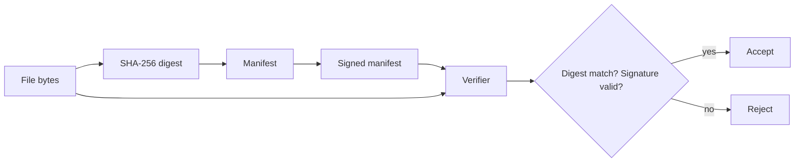

### 9.1 Manifest example

```json
{
  "manifest_version": 1,
  "artifact_id": "case-export-2026-06-24-001",
  "algorithm": "SHA-256",
  "files": [
    {
      "path": "case/123/decision.json",
      "size": 2451,
      "sha256": "base64url..."
    },
    {
      "path": "case/123/attachments/document.pdf",
      "size": 920144,
      "sha256": "base64url..."
    }
  ],
  "created_at": "2026-06-24T10:15:00Z",
  "created_by": "export-service",
  "key_id": "signing-key-2026-q2"
}
```

### 9.2 Good use cases

- export bundle,
- release artifact,
- evidence package,
- backup inventory,
- report package,
- migration validation package.

### 9.3 Weaknesses

- Manifest must be protected.
- Canonical path handling matters.
- File order must be deterministic.
- Manifest schema changes must be versioned.
- If manifest is signed after compromise, signature only proves compromised signer signed it.

---

## 10. Architecture Pattern 2: HMAC-Protected Records

HMAC-protected records cocok ketika writer dan verifier berada di controlled backend environment.

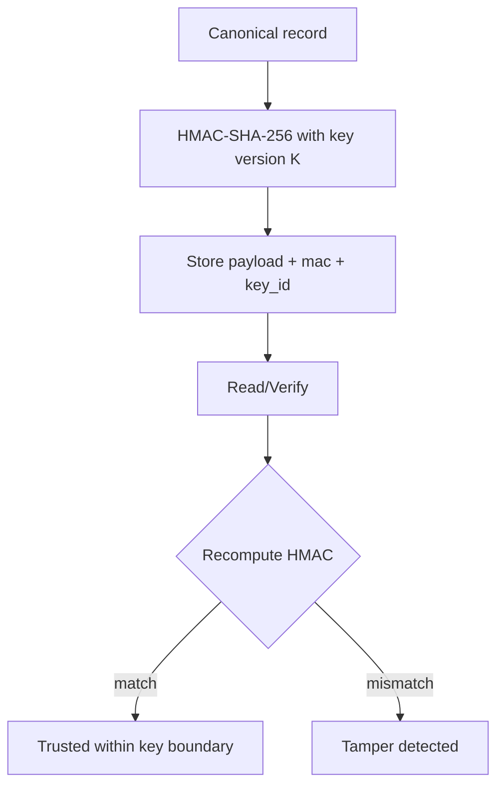

### 10.1 Record shape

```sql
CREATE TABLE integrity_record (
    id              VARCHAR(64) PRIMARY KEY,
    tenant_id       VARCHAR(64) NOT NULL,
    record_type     VARCHAR(64) NOT NULL,
    payload_json    CLOB NOT NULL,
    canonical_alg   VARCHAR(64) NOT NULL,
    mac_alg         VARCHAR(64) NOT NULL,
    key_id          VARCHAR(128) NOT NULL,
    mac_b64         VARCHAR(128) NOT NULL,
    created_at      TIMESTAMP NOT NULL
);
```

### 10.2 Important rule

If the same service that can update the payload can also freely use the HMAC key, HMAC only protects against storage-layer tampering, not application-layer malicious writes.

Better architecture:

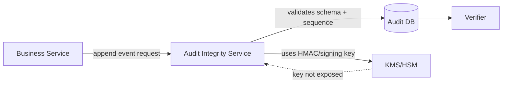

The HMAC/signing boundary should be narrower than the business write boundary.

---

## 11. Architecture Pattern 3: Hash Chain

Hash chain links every record to the previous record.

```text
H0 = genesis
H1 = Hash(domain || canonical(event1) || H0)
H2 = Hash(domain || canonical(event2) || H1)
H3 = Hash(domain || canonical(event3) || H2)
```

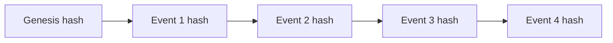

### 11.1 What hash chain detects

| Attack | Detected? | Why |
|---|---:|---|
| Modify event payload | Yes | current event hash changes |
| Delete event in middle | Yes | next event prev_hash breaks |
| Reorder event | Yes | chain order changes |
| Insert event in middle | Yes | chain mismatch unless all subsequent hashes recomputed |
| Modify event and recompute all later hashes | Maybe | detected only if a later checkpoint/root is trusted elsewhere |
| Delete tail events | Maybe | detected only if latest expected checkpoint is known |
| Roll back entire chain to old backup | Maybe | detected only with external anchor/monotonic checkpoint |

Hash chain alone is not enough. You need **anchors/checkpoints**.

### 11.2 Per-aggregate chain vs global chain

| Model | Pros | Cons |
|---|---|---|
| Global chain | Detects total ordering tamper across all events | Bottleneck, distributed contention, harder scale |
| Per-tenant chain | Good isolation by tenant | Cross-tenant ordering not proven |
| Per-aggregate chain | Natural for case/workflow history | Deletion of whole aggregate chain needs external inventory/checkpoint |
| Per-partition chain | Scalable for logs/events | Need partition root aggregation |

For case management systems, a common design is:

```text
per-case hash chain + daily tenant Merkle root + signed daily checkpoint
```

---

## 12. Architecture Pattern 4: Append-Only Log with Signed Checkpoints

Append-only means valid changes are expressed as new events, not mutation of prior events.

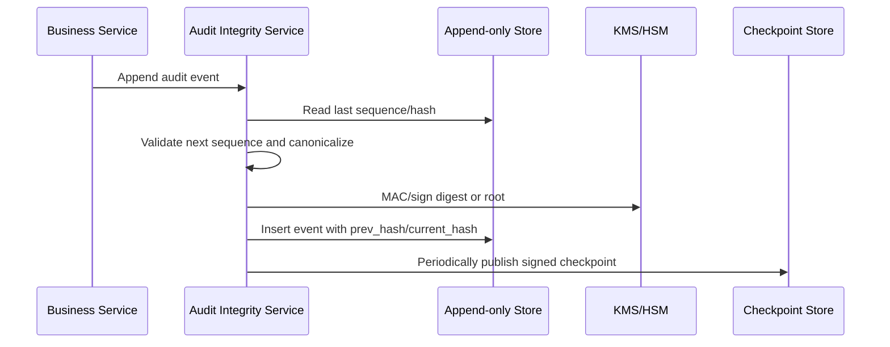

### 12.1 Append-only semantics

Do not allow:

```sql
UPDATE audit_event SET actor = 'x' WHERE id = '...';
DELETE FROM audit_event WHERE id = '...';
```

Allow:

```text
AuditCorrectionRequested
AuditCorrectionApproved
AuditCorrectionApplied
```

In regulated systems, correction is itself an event.

### 12.2 Why append-only DB table is not enough

Database permissions can still be misconfigured. DBA can still update if privileged. Backup restore can still rollback. Replication can still lose data. ETL pipeline can still omit rows.

Append-only design must be paired with:

- DB permission separation,
- trigger/constraint if useful,
- immutable/WORM storage if available,
- signed checkpoints,
- external anchor,
- periodic verification job,
- alert on gap/mismatch,
- operational runbook.

---

## 13. Architecture Pattern 5: Merkle Tree

Merkle tree compresses many record hashes into one root hash.

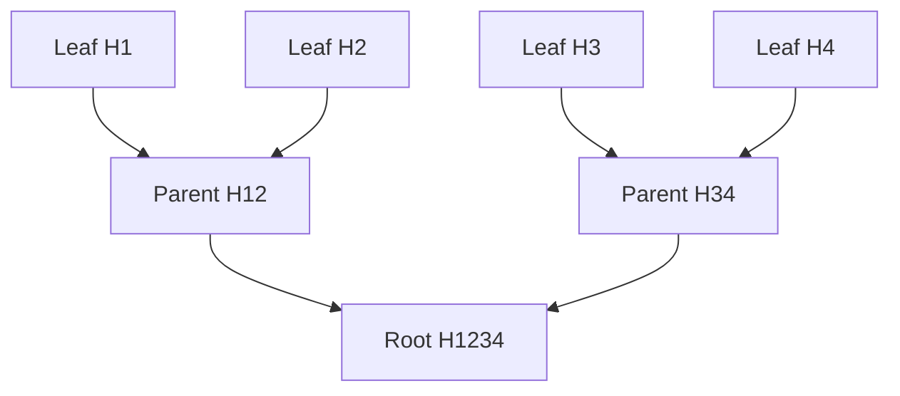

If root is trusted, a verifier can prove one leaf is included using only a small proof path.

### 13.1 Why Merkle tree matters

Hash chain is linear. To verify event #900,000 you may need to walk a long chain unless you keep checkpoints.

Merkle tree supports:

- batch verification,
- inclusion proof,
- compact evidence,
- daily/monthly root signing,
- efficient external verification,
- scalable audit exports.

### 13.2 Inclusion proof concept

For leaf `H3`, proof may include:

```text
sibling H4
sibling H12
root H1234
```

Verifier recomputes:

```text
H34 = Hash(0x01 || H3 || H4)
Root = Hash(0x01 || H12 || H34)
```

If computed root equals signed root, inclusion is proven.

### 13.3 Domain separation

Never hash leaves and internal nodes with exactly the same encoding without domain separation.

Use prefixes:

```text
LeafHash = SHA256(0x00 || canonical_record)
NodeHash = SHA256(0x01 || left_hash || right_hash)
```

This pattern avoids ambiguity between a leaf payload and an internal node concatenation.

RFC 6962 Certificate Transparency uses a Merkle Hash Tree with leaf/node differentiation and supports audit paths and consistency proofs. The exact implementation details may vary, but the mental model is valuable for audit architecture.

---

## 14. Hash Chain vs Merkle Tree

| Property | Hash Chain | Merkle Tree |
|---|---|---|
| Captures order | Strongly linear | Needs explicit leaf ordering/index |
| Detects deletion in middle | Yes if chain validated | Yes if root/proof policy checks expected set |
| Inclusion proof | Inefficient for large chain | Efficient |
| Append proof | Needs checkpoint sequence | Can support consistency proof with right tree design |
| Implementation simplicity | Easier | More complex |
| Good for per-case event history | Yes | Maybe overkill |
| Good for daily batch evidence | Less ideal | Very good |
| Good for external audit bundle | Possible | Strong |

Recommended design for many enterprise systems:

```text
Per aggregate: hash chain
Per batch/day/tenant: Merkle tree over leaf hashes
Checkpoint: signed root + sequence range + metadata
External anchor: optional but strong
```

---

## 15. Architecture Pattern 6: Signed Checkpoint

A checkpoint is a compact commitment to a larger set of records.

```json
{
  "checkpoint_version": 1,
  "tenant_id": "agency-a",
  "stream_id": "audit-case-events",
  "range": {
    "from_sequence": 1000000,
    "to_sequence": 1099999
  },
  "leaf_count": 100000,
  "root_alg": "MERKLE-SHA256-V1",
  "root_b64u": "...",
  "created_at": "2026-06-24T23:59:59Z",
  "key_id": "audit-signing-2026-q2"
}
```

Then sign the canonical checkpoint.

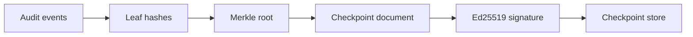

### 15.1 What checkpoint must include

| Field | Why |
|---|---|
| stream_id | Prevent cross-stream substitution |
| tenant_id | Prevent cross-tenant substitution |
| from_sequence/to_sequence | Prevent truncation/replay ambiguity |
| leaf_count | Detect missing leaf count |
| root algorithm/version | Enable crypto agility |
| root digest | Integrity commitment |
| generated_at | Operational trace, not always trusted time |
| key_id | Verification key lookup |
| previous checkpoint hash | Optional checkpoint chain |
| schema version | Migration safety |

### 15.2 Signed checkpoint vs signed each event

| Design | Pros | Cons |
|---|---|---|
| Sign every event | Strong per-event evidence, simple verification | Expensive, key throughput, larger storage |
| HMAC every event + sign batch root | Efficient, scalable, good evidence model | Requires batch root/checkpoint verification |
| Hash every event + sign root only | Efficient | If event store mutable before checkpoint, risk window |
| MAC every batch only | Simpler | Less granular tamper detection |

For high-volume audit systems, a practical pattern is:

```text
canonical event -> leaf hash -> per-aggregate chain -> batch Merkle root -> signed checkpoint
```

---

## 16. Anchoring: Internal vs External Trust Boundary

A signed checkpoint stored in the same database as events is better than no checkpoint, but weaker than storing it in a separate boundary.

### 16.1 Anchor options

| Anchor | Strength | Cost/Complexity | Notes |
|---|---:|---:|---|
| Same DB table | Low | Low | Detects accidental corruption, weak against DB admin |
| Separate schema/account | Medium | Low-medium | Better separation |
| Object storage with versioning/WORM | Medium-high | Medium | Good for retention |
| External log service | High | Medium-high | Separate operational boundary |
| Partner/regulator copy | High | Organizational | Strong evidence if process exists |
| Public transparency log/blockchain | Very high for timestamp/existence | High | Avoid hype; use only when justified |
| Timestamp authority | High for time proof | Medium | Useful for legal evidence |

### 16.2 What anchoring proves

Anchoring proves existence of a commitment at or before a certain time in a certain boundary.

Anchoring does not prove:

- event content was truthful,
- business process was valid,
- actor identity was correctly authenticated,
- no unauthorized action happened before anchoring,
- private key was uncompromised.

---

## 17. Canonicalization: The Hidden Hard Part

Integrity only applies to bytes. Business systems operate on structures.

A JSON object can represent the same business object in multiple byte forms:

```json
{"a":1,"b":2}
```

```json
{
  "b": 2,
  "a": 1
}
```

If you hash raw request bytes, equivalent data may produce different hashes.

If you hash decoded struct re-encoded by your current code, future code changes may produce different hashes.

### 17.1 Canonicalization rules must be explicit

Define:

- field order,
- omitted fields behavior,
- null vs absent,
- timestamp format,
- timezone normalization,
- decimal representation,
- Unicode normalization,
- binary encoding,
- array ordering semantics,
- map ordering,
- number precision,
- schema version,
- unknown field handling,
- domain separation string.

### 17.2 Safer event design

Instead of signing arbitrary JSON maps, define typed event structs and canonical binary/text construction.

Example conceptual canonical string:

```text
v1\n
tenant=agency-a\n
stream=case-audit\n
aggregate=case-123\n
seq=42\n
time=2026-06-24T10:15:30.123456Z\n
actor=user:abc\n
action=CaseApproved\n
reason_digest=base64url(SHA256(reason_text))\n
payload_digest=base64url(SHA256(canonical_payload))\n
prev=base64url(prev_hash)\n
```

For high assurance, avoid “whatever JSON encoder outputs today” as your canonical format unless you freeze and test it.

---

## 18. Go Implementation: Primitive Building Blocks

### 18.1 SHA-256 digest helper

```go
package integrity

import (
    "crypto/sha256"
    "encoding/base64"
)

func SHA256Base64URL(data []byte) string {
    sum := sha256.Sum256(data)
    return base64.RawURLEncoding.EncodeToString(sum[:])
}
```

### 18.2 HMAC helper

```go
package integrity

import (
    "crypto/hmac"
    "crypto/sha256"
)

func HMACSHA256(key, data []byte) []byte {
    mac := hmac.New(sha256.New, key)
    _, _ = mac.Write(data)
    return mac.Sum(nil)
}

func VerifyHMACSHA256(key, data, expected []byte) bool {
    actual := HMACSHA256(key, data)
    return hmac.Equal(actual, expected)
}
```

### 18.3 Ed25519 signature helper

```go
package integrity

import (
    "crypto/ed25519"
)

func SignEd25519(priv ed25519.PrivateKey, canonical []byte) []byte {
    return ed25519.Sign(priv, canonical)
}

func VerifyEd25519(pub ed25519.PublicKey, canonical, sig []byte) bool {
    return ed25519.Verify(pub, canonical, sig)
}
```

### 18.4 Domain-separated hash

```go
package integrity

import "crypto/sha256"

func DomainHash(domain string, parts ...[]byte) [32]byte {
    h := sha256.New()

    // Domain separation with versioned label.
    _, _ = h.Write([]byte("go-integrity-v1:"))
    _, _ = h.Write([]byte(domain))
    _, _ = h.Write([]byte{0})

    for _, p := range parts {
        writeLengthPrefixed(h, p)
    }

    var out [32]byte
    copy(out[:], h.Sum(nil))
    return out
}

interface writer {
    Write([]byte) (int, error)
}

func writeLengthPrefixed(w writer, b []byte) {
    var lenbuf [8]byte
    n := uint64(len(b))
    for i := 7; i >= 0; i-- {
        lenbuf[i] = byte(n)
        n >>= 8
    }
    _, _ = w.Write(lenbuf[:])
    _, _ = w.Write(b)
}
```

Why length-prefix?

Without length-prefix:

```text
Hash("ab" || "c") == Hash("a" || "bc")
```

With length-prefix, boundaries are unambiguous.

---

## 19. Go Implementation: Canonical Audit Event

### 19.1 Event model

```go
package audit

import "time"

type Event struct {
    Version       int
    TenantID      string
    StreamID      string
    AggregateID   string
    Sequence      uint64
    OccurredAtUTC time.Time
    ActorID       string
    ActorType     string
    Action        string
    ReasonCode    string
    PayloadDigest [32]byte
    PrevHash      [32]byte
}
```

### 19.2 Canonical encoding

For illustration, this uses a simple line-based canonical encoding. Production systems may use a stricter binary canonical encoding.

```go
package audit

import (
    "bytes"
    "encoding/base64"
    "fmt"
    "strconv"
    "time"
)

func (e Event) CanonicalBytes() ([]byte, error) {
    if e.Version != 1 {
        return nil, fmt.Errorf("unsupported event version: %d", e.Version)
    }
    if e.TenantID == "" || e.StreamID == "" || e.AggregateID == "" {
        return nil, fmt.Errorf("missing identity fields")
    }
    if e.Sequence == 0 {
        return nil, fmt.Errorf("sequence must start at 1")
    }

    t := e.OccurredAtUTC.UTC().Format(time.RFC3339Nano)

    var b bytes.Buffer
    b.WriteString("audit-event-v1\n")
    writeKV(&b, "tenant", e.TenantID)
    writeKV(&b, "stream", e.StreamID)
    writeKV(&b, "aggregate", e.AggregateID)
    writeKV(&b, "sequence", strconv.FormatUint(e.Sequence, 10))
    writeKV(&b, "occurred_at", t)
    writeKV(&b, "actor_type", e.ActorType)
    writeKV(&b, "actor_id", e.ActorID)
    writeKV(&b, "action", e.Action)
    writeKV(&b, "reason_code", e.ReasonCode)
    writeKV(&b, "payload_digest", b64(e.PayloadDigest[:]))
    writeKV(&b, "prev_hash", b64(e.PrevHash[:]))
    return b.Bytes(), nil
}

func writeKV(b *bytes.Buffer, k, v string) {
    // In production, reject control characters/newline in k/v or use length-prefix.
    b.WriteString(k)
    b.WriteByte('=')
    b.WriteString(v)
    b.WriteByte('\n')
}

func b64(raw []byte) string {
    return base64.RawURLEncoding.EncodeToString(raw)
}
```

### 19.3 Event hash

```go
package audit

import "crypto/sha256"

func (e Event) Hash() ([32]byte, error) {
    canonical, err := e.CanonicalBytes()
    if err != nil {
        return [32]byte{}, err
    }

    h := sha256.New()
    _, _ = h.Write([]byte{0x00}) // leaf/event domain prefix
    _, _ = h.Write(canonical)

    var out [32]byte
    copy(out[:], h.Sum(nil))
    return out, nil
}
```

---

## 20. Go Implementation: Append Event with Chain Validation

### 20.1 Repository contract

```go
package audit

import "context"

type LastEvent struct {
    Sequence uint64
    Hash     [32]byte
}

type Repository interface {
    GetLastForUpdate(ctx context.Context, tenantID, streamID, aggregateID string) (LastEvent, bool, error)
    Insert(ctx context.Context, event Event, eventHash [32]byte) error
}
```

The phrase `ForUpdate` matters. The repository must enforce concurrency control so two events cannot claim the same next sequence.

In SQL this may mean:

- transaction,
- `SELECT ... FOR UPDATE`,
- unique constraint on `(tenant_id, stream_id, aggregate_id, sequence)`,
- retry on conflict,
- serializable isolation if required.

### 20.2 Append function

```go
package audit

import (
    "context"
    "fmt"
    "time"
)

type Appender struct {
    Repo Repository
    Clock func() time.Time
}

type AppendCommand struct {
    TenantID    string
    StreamID    string
    AggregateID string
    ActorID     string
    ActorType   string
    Action      string
    ReasonCode  string
    PayloadHash [32]byte
}

func (a *Appender) Append(ctx context.Context, cmd AppendCommand) (Event, [32]byte, error) {
    last, ok, err := a.Repo.GetLastForUpdate(ctx, cmd.TenantID, cmd.StreamID, cmd.AggregateID)
    if err != nil {
        return Event{}, [32]byte{}, err
    }

    seq := uint64(1)
    var prev [32]byte
    if ok {
        seq = last.Sequence + 1
        prev = last.Hash
    }

    now := time.Now().UTC()
    if a.Clock != nil {
        now = a.Clock().UTC()
    }

    ev := Event{
        Version:       1,
        TenantID:      cmd.TenantID,
        StreamID:      cmd.StreamID,
        AggregateID:   cmd.AggregateID,
        Sequence:      seq,
        OccurredAtUTC: now,
        ActorID:       cmd.ActorID,
        ActorType:     cmd.ActorType,
        Action:        cmd.Action,
        ReasonCode:    cmd.ReasonCode,
        PayloadDigest: cmd.PayloadHash,
        PrevHash:      prev,
    }

    h, err := ev.Hash()
    if err != nil {
        return Event{}, [32]byte{}, err
    }

    if err := a.Repo.Insert(ctx, ev, h); err != nil {
        return Event{}, [32]byte{}, fmt.Errorf("insert audit event: %w", err)
    }

    return ev, h, nil
}
```

### 20.3 Important constraint

The append operation must be atomic. If you read last hash and insert new event without concurrency control, two writers can create forked chains.

Forked chain example:

```text
H41 -> H42a
H41 -> H42b
```

This can happen under concurrency without lock/constraint.

Production mitigation:

- unique `(stream_id, aggregate_id, sequence)`,
- transaction,
- optimistic retry,
- optional fork detection metric,
- no blind insert with caller-provided sequence.

---

## 21. Go Implementation: Chain Verification

```go
package audit

import (
    "bytes"
    "context"
    "fmt"
)

type EventWithHash struct {
    Event Event
    Hash  [32]byte
}

type ChainReader interface {
    ListByAggregate(ctx context.Context, tenantID, streamID, aggregateID string) ([]EventWithHash, error)
}

func VerifyChain(ctx context.Context, r ChainReader, tenantID, streamID, aggregateID string) error {
    events, err := r.ListByAggregate(ctx, tenantID, streamID, aggregateID)
    if err != nil {
        return err
    }

    var prev [32]byte
    for i, row := range events {
        expectedSeq := uint64(i + 1)
        if row.Event.Sequence != expectedSeq {
            return fmt.Errorf("sequence gap/reorder at index %d: got %d want %d", i, row.Event.Sequence, expectedSeq)
        }

        if !bytes.Equal(row.Event.PrevHash[:], prev[:]) {
            return fmt.Errorf("prev hash mismatch at seq %d", row.Event.Sequence)
        }

        actual, err := row.Event.Hash()
        if err != nil {
            return fmt.Errorf("hash event seq %d: %w", row.Event.Sequence, err)
        }
        if !bytes.Equal(actual[:], row.Hash[:]) {
            return fmt.Errorf("event hash mismatch at seq %d", row.Event.Sequence)
        }

        prev = actual
    }

    return nil
}
```

This detects local chain tamper, but does not detect a complete rollback unless you compare against trusted checkpoint.

---

## 22. Go Implementation: Merkle Tree Root

### 22.1 Simple deterministic Merkle root

This example duplicates no leaf for odd count; it promotes the last node upward. Your production rule must be versioned and stable.

```go
package merkle

import "crypto/sha256"

func LeafHash(data []byte) [32]byte {
    h := sha256.New()
    _, _ = h.Write([]byte{0x00})
    _, _ = h.Write(data)

    var out [32]byte
    copy(out[:], h.Sum(nil))
    return out
}

func NodeHash(left, right [32]byte) [32]byte {
    h := sha256.New()
    _, _ = h.Write([]byte{0x01})
    _, _ = h.Write(left[:])
    _, _ = h.Write(right[:])

    var out [32]byte
    copy(out[:], h.Sum(nil))
    return out
}

func Root(leaves [][32]byte) [32]byte {
    if len(leaves) == 0 {
        return sha256.Sum256([]byte("empty-merkle-tree-v1"))
    }

    level := append([][32]byte(nil), leaves...)
    for len(level) > 1 {
        next := make([][32]byte, 0, (len(level)+1)/2)
        for i := 0; i < len(level); i += 2 {
            if i+1 == len(level) {
                next = append(next, level[i])
                continue
            }
            next = append(next, NodeHash(level[i], level[i+1]))
        }
        level = next
    }
    return level[0]
}
```

### 22.2 Important production caveats

Merkle tree algorithms must define:

- empty tree root,
- odd leaf handling,
- leaf ordering,
- duplicate leaf behavior,
- domain separation,
- proof format,
- hash algorithm,
- tree version,
- max batch size,
- checkpoint metadata.

Do not change these silently after production.

---

## 23. Go Implementation: Signed Checkpoint

```go
package checkpoint

import (
    "bytes"
    "crypto/ed25519"
    "encoding/base64"
    "fmt"
    "strconv"
    "time"
)

type Checkpoint struct {
    Version      int
    TenantID     string
    StreamID     string
    FromSequence uint64
    ToSequence   uint64
    LeafCount    uint64
    RootAlg      string
    Root         [32]byte
    CreatedAtUTC time.Time
    KeyID        string
}

type SignedCheckpoint struct {
    Checkpoint Checkpoint
    Signature  []byte
}

func (c Checkpoint) CanonicalBytes() ([]byte, error) {
    if c.Version != 1 {
        return nil, fmt.Errorf("unsupported checkpoint version: %d", c.Version)
    }
    if c.FromSequence > c.ToSequence {
        return nil, fmt.Errorf("invalid sequence range")
    }

    var b bytes.Buffer
    writeKV(&b, "checkpoint", "v1")
    writeKV(&b, "tenant", c.TenantID)
    writeKV(&b, "stream", c.StreamID)
    writeKV(&b, "from_sequence", strconv.FormatUint(c.FromSequence, 10))
    writeKV(&b, "to_sequence", strconv.FormatUint(c.ToSequence, 10))
    writeKV(&b, "leaf_count", strconv.FormatUint(c.LeafCount, 10))
    writeKV(&b, "root_alg", c.RootAlg)
    writeKV(&b, "root", base64.RawURLEncoding.EncodeToString(c.Root[:]))
    writeKV(&b, "created_at", c.CreatedAtUTC.UTC().Format(time.RFC3339Nano))
    writeKV(&b, "key_id", c.KeyID)
    return b.Bytes(), nil
}

func Sign(priv ed25519.PrivateKey, c Checkpoint) (SignedCheckpoint, error) {
    canonical, err := c.CanonicalBytes()
    if err != nil {
        return SignedCheckpoint{}, err
    }
    return SignedCheckpoint{
        Checkpoint: c,
        Signature:  ed25519.Sign(priv, canonical),
    }, nil
}

func Verify(pub ed25519.PublicKey, sc SignedCheckpoint) bool {
    canonical, err := sc.Checkpoint.CanonicalBytes()
    if err != nil {
        return false
    }
    return ed25519.Verify(pub, canonical, sc.Signature)
}

func writeKV(b *bytes.Buffer, k, v string) {
    b.WriteString(k)
    b.WriteByte('=')
    b.WriteString(v)
    b.WriteByte('\n')
}
```

Again, line-based encoding is illustrative. For production, define exact escaping or length-prefix each field.

---

## 24. Integrity Storage Design

### 24.1 Audit event table

```sql
CREATE TABLE audit_event (
    tenant_id        VARCHAR(64) NOT NULL,
    stream_id        VARCHAR(64) NOT NULL,
    aggregate_id     VARCHAR(128) NOT NULL,
    sequence_no      BIGINT NOT NULL,
    event_id         VARCHAR(128) NOT NULL,
    event_version    INTEGER NOT NULL,
    occurred_at      TIMESTAMP NOT NULL,
    actor_type       VARCHAR(64) NOT NULL,
    actor_id         VARCHAR(128) NOT NULL,
    action           VARCHAR(128) NOT NULL,
    reason_code      VARCHAR(128),
    payload_json     CLOB NOT NULL,
    payload_sha256   VARCHAR(64) NOT NULL,
    prev_hash        VARCHAR(64) NOT NULL,
    event_hash       VARCHAR(64) NOT NULL,
    created_at       TIMESTAMP NOT NULL,
    PRIMARY KEY (tenant_id, stream_id, aggregate_id, sequence_no),
    UNIQUE (event_id)
);
```

### 24.2 Checkpoint table

```sql
CREATE TABLE audit_checkpoint (
    checkpoint_id    VARCHAR(128) PRIMARY KEY,
    tenant_id        VARCHAR(64) NOT NULL,
    stream_id        VARCHAR(64) NOT NULL,
    from_sequence    BIGINT NOT NULL,
    to_sequence      BIGINT NOT NULL,
    leaf_count       BIGINT NOT NULL,
    root_alg         VARCHAR(64) NOT NULL,
    root_hash        VARCHAR(64) NOT NULL,
    key_id           VARCHAR(128) NOT NULL,
    signature_alg    VARCHAR(64) NOT NULL,
    signature_b64    CLOB NOT NULL,
    created_at       TIMESTAMP NOT NULL,
    previous_checkpoint_hash VARCHAR(64),
    UNIQUE (tenant_id, stream_id, from_sequence, to_sequence)
);
```

### 24.3 External checkpoint object

Store signed checkpoint document separately:

```text
s3://audit-checkpoints/agency-a/case-audit/2026/06/24/checkpoint-000001.json
```

With:

- object versioning,
- retention/WORM if available,
- separate IAM role,
- write-once process,
- cross-account replication if high assurance.

---

## 25. Transactional Boundary

### 25.1 Bad design: business update succeeds but audit append fails

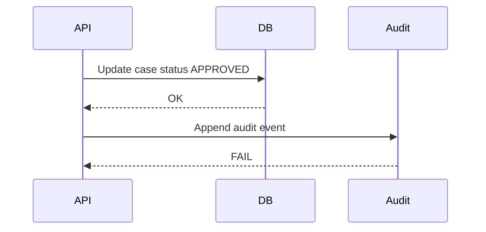

Now state changed without audit.

### 25.2 Better design options

| Option | Description | Trade-off |
|---|---|---|
| Same DB transaction | Business state and audit event committed together | Strong local consistency, tighter coupling |
| Outbox pattern | Business transaction writes outbox; relay appends audit | Eventual, requires outbox integrity |
| Event-sourced aggregate | Events are source of truth; projections derived | Strong history, higher architecture cost |
| Audit-before-state | Append intent then apply state | Must handle failed state update |
| State transition service | Central service owns state + audit append | Better invariant, service bottleneck risk |

For regulatory systems, the core invariant is often:

```text
No externally visible state transition may be committed without a corresponding durable audit event in the same consistency boundary or a recoverable outbox boundary.
```

---

## 26. Outbox Integrity Pattern

Outbox is common in microservices. But outbox itself must be integrity-protected.

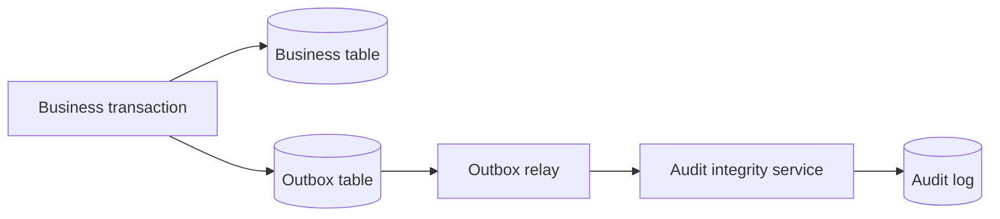

### 26.1 Risks

- outbox row deleted before relay,
- relay transforms payload incorrectly,
- duplicate relay event,
- event reordered,
- outbox retry mutates payload,
- poison message skipped silently.

### 26.2 Controls

- outbox row includes payload digest,
- outbox row immutable after insert,
- relay idempotency key,
- explicit status transition,
- retry with dead-letter audit,
- reconciliation job between business state and audit log,
- sequence assigned by audit integrity service, not by relay.

---

## 27. Regulatory Case Management Example

Imagine enforcement case lifecycle:

```text
CaseCreated
EvidenceUploaded
OfficerAssigned
NoticeIssued
ResponseReceived
ReviewCompleted
DecisionApproved
PenaltyIssued
AppealSubmitted
AppealResolved
```

### 27.1 What must be protected

| Item | Integrity risk |
|---|---|
| Case status | Unauthorized transition |
| Evidence file | Replacement/deletion |
| Decision reason | Post-facto modification |
| Officer assignment | Backdated accountability manipulation |
| Approval event | Fake approver / changed timestamp |
| Correspondence | Altered outgoing notice |
| Appeal deadline | Date tampering |
| Audit trail | Deletion/reordering/mutation |

### 27.2 Suggested integrity design

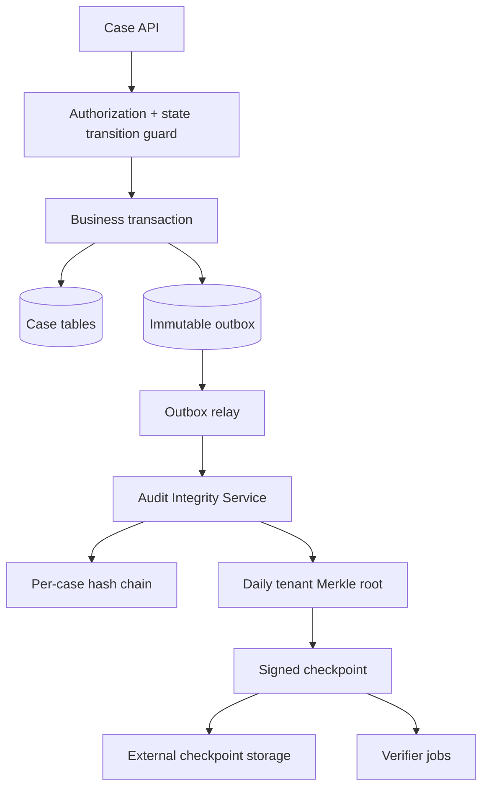

### 27.3 Invariants

```text
Invariant 1:
A case status transition is valid only if the transition guard authorizes actor, source state, target state, reason code, and required evidence references.

Invariant 2:
Every committed transition must produce exactly one canonical audit event with aggregate_id = case_id and sequence = previous_sequence + 1.

Invariant 3:
Every audit event hash includes payload_digest, actor, action, reason_code, prev_hash, tenant_id, stream_id, and aggregate_id.

Invariant 4:
Every daily checkpoint signs the Merkle root for all accepted audit event hashes in the daily tenant stream.

Invariant 5:
A correction never mutates old audit events; it appends a correction event referencing the original event hash.
```

---

## 28. Detecting Rollback

Hash chain detects mutation inside the chain, but rollback can be subtle.

Attack:

```text
Day 1: chain ends at H1000
Day 2: chain ends at H1300
Attacker restores DB backup from Day 1
System sees valid chain ending at H1000
```

Local verification passes.

You need an external expectation:

- latest checkpoint sequence,
- signed checkpoint outside DB,
- monotonic object version,
- independent verifier record,
- backup manifest anchored elsewhere.

### 28.1 Rollback detection design

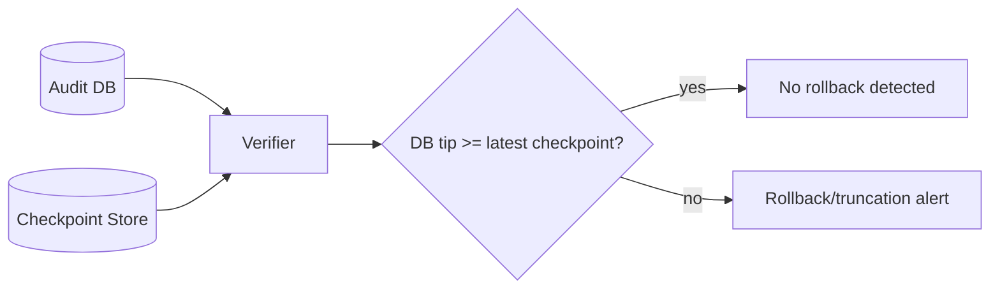

### 28.2 What to alert on

- DB max sequence lower than checkpoint to_sequence,
- checkpoint missing for expected period,
- duplicate checkpoint range with different root,
- same sequence range signed twice with different root,
- unexpected key_id,
- signature invalid,
- checkpoint timestamp out of order,
- previous checkpoint hash mismatch.

---

## 29. Deletion, Truncation, and Gap Detection

### 29.1 Per-aggregate gaps

```sql
SELECT aggregate_id, sequence_no
FROM audit_event
WHERE tenant_id = :tenant
ORDER BY aggregate_id, sequence_no;
```

Verifier should detect:

```text
case-123: seq 1,2,3,5 => missing 4
case-456: seq 1,2,2,3 => duplicate 2
case-789: seq 1,3,2 => reorder storage/query issue
```

### 29.2 Global inventory gap

If you only check per-case chains, attacker may delete an entire case history.

Mitigation:

- global event inventory,
- tenant-level Merkle root,
- aggregate list commitment,
- daily case inventory digest,
- reconciliation with business tables.

Example invariant:

```text
For each active case_id in case table, there must exist at least one CaseCreated event in audit stream and its aggregate chain tip must be included in the latest tenant checkpoint.
```

---

## 30. Time Integrity

Timestamps are not automatically trusted.

There are several kinds of time:

| Time | Meaning |
|---|---|
| Client time | Claimed by user/device; usually untrusted |
| Application time | Time assigned by service; useful but depends on host clock |
| DB commit time | Time from database; stronger if DB clock controlled |
| Checkpoint time | Time when batch root was generated |
| External timestamp | Time attested by trusted external timestamp authority/log |

### 30.1 Do not overclaim

If event has:

```text
occurred_at = 2026-06-24T10:00:00Z
```

It proves only that your system stored that timestamp. It does not prove the event really happened at that instant unless your time source and process support that claim.

### 30.2 Better metadata

Use multiple timestamps:

```text
client_claimed_at
server_received_at
business_effective_at
db_committed_at
checkpointed_at
external_anchored_at
```

Then document semantics.

---

## 31. Key Management for Integrity Systems

### 31.1 HMAC key vs signing key

| Aspect | HMAC key | Signing key |
|---|---|---|
| Verifier can forge? | Yes, if verifier has key | No, verifier only needs public key |
| Public verification | No | Yes |
| Speed | Very fast | Usually slower |
| Key distribution | Shared secret problem | Public key distribution easier |
| Best use | Internal authenticity | External evidence/checkpoints |

### 31.2 Key versioning

Every integrity record should include:

```text
key_id
algorithm
schema_version
canonicalization_version
created_at
```

Never rely on “current key” to verify old data.

### 31.3 Rotation model

For signed checkpoints:

```text
checkpoint 1..100 signed with key A
checkpoint 101..200 signed with key B
```

Verifier must know:

- key A public key,
- key A validity period,
- whether key A was revoked,
- whether revocation affects old signatures,
- key B public key,
- rotation event evidence.

### 31.4 Key compromise response

If audit signing key compromised:

1. Disable key immediately.
2. Record signed/key-management incident if possible from separate key.
3. Determine last trusted checkpoint before compromise window.
4. Re-verify all events from last trusted checkpoint.
5. Re-anchor new checkpoint with new key.
6. Mark old key as compromised in verification policy.
7. Preserve evidence; do not delete suspicious records.

---

## 32. Integrity Verification Jobs

Integrity without verification is theater.

### 32.1 Verification levels

| Level | Frequency | Scope |
|---|---|---|
| Inline verification | On read critical record | Verify one record/event |
| Batch verifier | Hourly/daily | Verify recent chain/checkpoint |
| Full verifier | Weekly/monthly | Verify all historical chains |
| Migration verifier | Before/after migration | Compare roots/manifests |
| Incident verifier | On suspected tamper | Focused evidence analysis |
| External verifier | Periodic | Verify from independent boundary |

### 32.2 Verification output

A verifier should produce structured results:

```json
{
  "verification_id": "ver-20260624-001",
  "tenant_id": "agency-a",
  "stream_id": "case-audit",
  "range": {"from": 1, "to": 1000000},
  "status": "FAILED",
  "failures": [
    {
      "type": "HASH_MISMATCH",
      "aggregate_id": "case-123",
      "sequence": 42,
      "expected": "...",
      "actual": "..."
    }
  ],
  "started_at": "2026-06-24T01:00:00Z",
  "completed_at": "2026-06-24T01:02:11Z"
}
```

### 32.3 Alert severity

| Failure | Severity |
|---|---|
| Signature invalid | Critical |
| Checkpoint missing | High/Critical depending SLA |
| Hash mismatch | Critical |
| Sequence gap | Critical |
| Unexpected key_id | High |
| Duplicate checkpoint range different root | Critical |
| Verifier failed due infra | Medium/High if repeated |
| Full verification overdue | Medium |

---

## 33. Observability for Integrity Architecture

Metrics:

```text
audit_events_appended_total{tenant,stream}
audit_append_failures_total{reason}
audit_chain_forks_total{tenant,stream}
audit_sequence_conflicts_total{tenant,stream}
audit_checkpoints_created_total{tenant,stream,key_id}
audit_checkpoint_signature_failures_total{tenant,stream}
audit_verification_failures_total{type,tenant,stream}
audit_verification_lag_seconds{tenant,stream}
audit_latest_sequence{tenant,stream}
audit_latest_checkpoint_sequence{tenant,stream}
audit_key_usage_total{key_id,purpose}
```

Logs:

- append accepted,
- append rejected,
- sequence conflict,
- chain mismatch,
- checkpoint created,
- checkpoint publish failed,
- verification failed,
- key rotation,
- verifier policy change.

Never log:

- HMAC/signing private keys,
- raw secrets,
- sensitive payload if not needed,
- full PII in verifier failure unless protected.

---

## 34. Testing Strategy

### 34.1 Unit tests

Test:

- canonical encoding stable,
- hash changes when field changes,
- hash changes when prev_hash changes,
- verification rejects sequence gap,
- verification rejects modified payload digest,
- signature verification rejects wrong key,
- Merkle root deterministic,
- checkpoint canonical bytes stable.

### 34.2 Golden tests

Store canonical input/output vectors:

```text
testdata/event-v1-input.json
testdata/event-v1-canonical.txt
testdata/event-v1-hash.txt
testdata/checkpoint-v1-canonical.txt
testdata/checkpoint-v1-signature.txt
```

Golden tests protect against accidental canonicalization drift.

### 34.3 Property tests / fuzz tests

Fuzz:

- canonical decoder/encoder,
- event parser,
- Merkle proof verification,
- manifest parser,
- checkpoint verifier,
- path normalization for manifest files.

Properties:

```text
Changing any integrity-covered field changes event hash.
Reordering events breaks chain verification.
Removing any non-tail event breaks chain verification.
Wrong public key rejects checkpoint.
Different leaf order changes Merkle root.
```

### 34.4 Tamper simulation

Create fixtures:

- modify payload,
- modify hash,
- modify both payload and hash,
- delete middle event,
- delete tail event,
- restore old checkpoint,
- duplicate sequence,
- wrong key id,
- invalid signature,
- missing aggregate chain,
- changed canonicalization version.

---

## 35. Migration and Backfill

Existing systems often have audit tables without integrity chains.

### 35.1 Backfill strategy

1. Freeze schema interpretation.
2. Define canonicalization version `legacy-v1`.
3. Export records in deterministic order.
4. Compute per-aggregate chain.
5. Create checkpoint over historical range.
6. Sign checkpoint with migration signing key.
7. Store migration manifest.
8. Document that integrity is guaranteed only from backfill time, not original event time.

### 35.2 Important honesty

If old records were mutable for years, a new hash chain does not prove they were never modified before the backfill.

It proves:

```text
These were the records observed and committed at migration/backfill time.
```

Not:

```text
These records have been untampered since their original creation.
```

This distinction matters in regulatory and legal contexts.

---

## 36. Performance Considerations

### 36.1 Hashing cost

SHA-256 is usually not the bottleneck for normal API audit volumes. Bottlenecks are more often:

- DB transaction contention,
- global sequence lock,
- serialization/canonicalization,
- network call to KMS/HSM,
- object storage checkpoint publish,
- verifier full scans,
- large payload hashing.

### 36.2 Avoid global bottleneck

Bad:

```text
single global sequence for all events
```

Better:

```text
per-tenant or per-aggregate sequence + batch root aggregation
```

### 36.3 Large payloads

Do not put huge payload directly into audit hash chain if not needed. Use digest reference:

```text
event includes payload_digest
payload stored separately with digest verification
```

For files:

```text
file bytes -> SHA-256 digest -> event references digest -> manifest references file digest -> checkpoint signs root
```

---

## 37. Common Anti-Patterns

### 37.1 Store hash beside mutable data and call it tamper-proof

Weak:

```text
payload + hash in same mutable DB row
```

Better:

```text
payload + hash chain + checkpoint + external anchor + verifier
```

### 37.2 Let business service sign its own suspicious actions

If compromised business service can both perform unauthorized action and sign audit as valid, signature has limited value.

Better:

- separate audit integrity service,
- policy validation,
- narrow key access,
- external checkpoint.

### 37.3 Hash non-canonical JSON

Different encoders/order/format cause drift.

Better:

- canonical schema,
- deterministic encoding,
- golden tests.

### 37.4 Ignore deletion of whole streams

Per-row hash does not detect missing row inventory.

Better:

- sequence checks,
- aggregate inventory commitment,
- tenant batch root.

### 37.5 Overuse blockchain

Blockchain/public ledger may be useful for external anchoring, but it does not solve:

- bad authorization,
- wrong actor identity,
- compromised signing key,
- wrong canonicalization,
- missing business invariant,
- privacy/PII exposure,
- operational complexity.

Use cryptographic commitments first. Anchor externally only if the threat model justifies it.

### 37.6 No verifier

If nobody verifies integrity continuously, tamper evidence may be discovered too late.

Better:

- scheduled verifier,
- alerting,
- dashboards,
- incident runbook.

---

## 38. Secure Design Checklist

### 38.1 Primitive selection

- [ ] Is the requirement checksum, hash, MAC, signature, AEAD tag, or Merkle commitment?
- [ ] Is public verification required?
- [ ] Is the verifier allowed to forge records?
- [ ] Is key separation defined?
- [ ] Is algorithm/version stored with record?

### 38.2 Canonicalization

- [ ] Is canonicalization versioned?
- [ ] Are timestamps normalized?
- [ ] Are numbers/decimals represented deterministically?
- [ ] Are null/absent fields defined?
- [ ] Are maps ordered or prohibited?
- [ ] Are unknown fields rejected or explicitly handled?
- [ ] Are golden test vectors maintained?

### 38.3 Chain/tree/checkpoint

- [ ] Is sequence monotonic per stream/aggregate?
- [ ] Is prev_hash included?
- [ ] Are gaps detected?
- [ ] Are tail truncations detected via checkpoint?
- [ ] Is Merkle root algorithm versioned?
- [ ] Are checkpoints signed?
- [ ] Are checkpoints stored outside the main mutable DB?
- [ ] Is checkpoint chain or previous checkpoint hash used?

### 38.4 Storage and operations

- [ ] Are old records append-only at application layer?
- [ ] Are DB privileges separated?
- [ ] Are correction events append-only?
- [ ] Are backup/restore rollbacks detectable?
- [ ] Is verifier scheduled?
- [ ] Are verification failures alerting critical?
- [ ] Is retention policy aligned with compliance?
- [ ] Are keys rotated and old keys retained for verification?

### 38.5 Incident response

- [ ] Is there a runbook for hash mismatch?
- [ ] Is there a runbook for checkpoint signature failure?
- [ ] Is there a runbook for key compromise?
- [ ] Is suspicious evidence preserved?
- [ ] Is chain of custody documented?
- [ ] Can you identify last trusted checkpoint?

---

## 39. Design Review Template

Use this during architecture review.

```markdown
# Data Integrity Design Review

## 1. Scope
- System:
- Data/event streams:
- Regulatory/evidence requirement:
- External verifier required? yes/no

## 2. Assets
| Asset | Type | Mutable? | Integrity requirement |
|---|---|---:|---|

## 3. Threat Model
| Threat | Capability | Current control | Gap |
|---|---|---|---|

## 4. Canonicalization
- Canonical version:
- Field order:
- Timestamp format:
- Unknown field policy:
- Golden vectors:

## 5. Integrity Primitive
- Per-record primitive:
- Chain/tree primitive:
- Checkpoint primitive:
- Signature/MAC key:
- Key versioning:

## 6. Storage Boundary
- Main store:
- Checkpoint store:
- External anchor:
- Retention:
- Backup/restore detection:

## 7. Verification
- Inline verification:
- Scheduled verification:
- Full verification cadence:
- Alerting:
- Runbook:

## 8. Failure Modes
| Failure | Detection | Response |
|---|---|---|

## 9. Decision
- Approved:
- Conditions:
- Follow-up actions:
```

---

## 40. Practical Architecture: Production-Ready Integrity Service

### 40.1 Responsibilities

An `Audit Integrity Service` should own:

- canonical event schema,
- sequence assignment,
- hash chain creation,
- event append transaction,
- checkpoint generation,
- checkpoint signing,
- verifier APIs,
- key usage policy,
- integrity metrics,
- correction event protocol.

It should not own:

- business authorization policy entirely,
- user authentication,
- business state transition logic,
- arbitrary payload interpretation beyond schema.

### 40.2 API sketch

```http
POST /v1/audit/events
Content-Type: application/json
Authorization: Bearer service-token

{
  "tenant_id": "agency-a",
  "stream_id": "case-audit",
  "aggregate_id": "case-123",
  "actor": {
    "type": "user",
    "id": "user-abc"
  },
  "action": "CaseApproved",
  "reason_code": "FULL_REQUIREMENTS_MET",
  "payload": {
    "case_id": "case-123",
    "decision_id": "decision-789",
    "approved_by": "user-abc"
  },
  "idempotency_key": "..."
}
```

Response:

```json
{
  "event_id": "evt_...",
  "sequence": 42,
  "event_hash": "...",
  "prev_hash": "...",
  "accepted_at": "2026-06-24T10:15:30Z"
}
```

### 40.3 Verifier API

```http
GET /v1/audit/streams/case-audit/aggregates/case-123/verify
```

Response:

```json
{
  "tenant_id": "agency-a",
  "stream_id": "case-audit",
  "aggregate_id": "case-123",
  "status": "VALID",
  "from_sequence": 1,
  "to_sequence": 42,
  "tip_hash": "...",
  "latest_checkpoint": "chk_..."
}
```

---

## 41. Integrity in Distributed Systems

Distributed systems add ambiguity:

- events arrive out of order,
- same action retried,
- multiple services write to same aggregate,
- partitions cause delayed commits,
- clocks differ,
- queues replay messages,
- batch consumers skip poison messages.

### 41.1 Command ID vs event ID vs idempotency key

| Identifier | Meaning |
|---|---|
| command_id | User/system request identity |
| idempotency_key | Retry dedup identity |
| event_id | Accepted event identity |
| aggregate_id | Business object identity |
| sequence_no | Position in aggregate stream |
| checkpoint_id | Batch/root identity |

Do not confuse them.

### 41.2 Retry safety

If client retries append with same idempotency key and same canonical payload:

```text
return original event
```

If same idempotency key with different payload:

```text
reject as idempotency conflict
```

### 41.3 Eventual consistency

If audit append is async, business state may temporarily exist without checkpoint.

You need:

- outbox durability,
- relay lag metric,
- reconciliation,
- SLA for checkpoint lag,
- escalation if audit lag exceeds threshold.

---

## 42. Privacy and Integrity Tension

Audit integrity often wants to preserve everything. Privacy wants minimization, retention limits, and redaction.

Do not solve this by hashing PII and assuming privacy.

Hashing low-entropy PII is often reversible by guessing:

```text
SHA256(email)
SHA256(phone)
SHA256(national_id)
```

An attacker can build dictionaries.

Better patterns:

- store PII reference digest with secret pepper/HMAC if needed,
- tokenize sensitive identifiers,
- separate evidence payload from search index,
- encrypt sensitive payload fields,
- include encrypted payload digest in audit event,
- redact display logs while retaining protected evidence store,
- define retention policy per data class.

Integrity and privacy must be co-designed.

---

## 43. “Tamper-Proof” vs “Tamper-Evident”

Most software systems cannot honestly claim tamper-proof.

A more accurate claim:

> The system is tamper-evident under defined attacker capabilities, assuming signing keys remain protected and checkpoints are retained in an independent boundary.

This is defensible.

Avoid overclaiming:

```text
Our logs cannot be modified.
```

Prefer:

```text
Unauthorized modification, deletion, reordering, or rollback of audit events after checkpoint publication is detectable by verifier jobs because each event is chained, batch roots are signed, and checkpoints are stored in a separate immutable storage boundary.
```

---

## 44. Capstone Example: Evidence Export Bundle

For regulatory case export:

```text
case-123-export.zip
├── manifest.json
├── manifest.sig
├── case.json
├── audit-events.jsonl
├── audit-proof.json
├── checkpoint.json
├── checkpoint.sig
└── attachments/
    ├── document-a.pdf
    └── document-b.pdf
```

### 44.1 Manifest covers files

```json
{
  "manifest_version": 1,
  "case_id": "case-123",
  "generated_at": "2026-06-24T10:15:30Z",
  "files": [
    {
      "path": "case.json",
      "sha256": "...",
      "size": 12001
    },
    {
      "path": "audit-events.jsonl",
      "sha256": "...",
      "size": 90211
    },
    {
      "path": "attachments/document-a.pdf",
      "sha256": "...",
      "size": 880102
    }
  ],
  "checkpoint_id": "chk_20260624_agency_a_case_audit_001",
  "signing_key_id": "evidence-export-2026-q2"
}
```

### 44.2 Audit proof

```json
{
  "proof_version": 1,
  "aggregate_id": "case-123",
  "from_sequence": 1,
  "to_sequence": 42,
  "chain_tip_hash": "...",
  "merkle_inclusion": {
    "leaf_hash": "...",
    "root_hash": "...",
    "path": [
      {"side": "right", "hash": "..."},
      {"side": "left", "hash": "..."}
    ]
  }
}
```

### 44.3 Verification steps

Verifier should:

1. Verify manifest signature.
2. Hash all files and compare manifest digest.
3. Verify checkpoint signature.
4. Recompute audit event hashes.
5. Verify per-case chain.
6. Verify chain tip inclusion in checkpoint root or batch root.
7. Check key validity policy.
8. Check export metadata and retention policy.
9. Produce verification report.

---

## 45. Final Mental Model

Data integrity architecture is not:

```text
hash := sha256(data)
```

It is:

```text
business invariant
+ canonical representation
+ cryptographic commitment
+ sequence/completeness model
+ key boundary
+ append-only semantics
+ checkpoint/anchor
+ verification process
+ operational response
```

The hard part is not SHA-256. The hard part is deciding exactly what SHA-256 commits to, who can recompute/modify it, where the trusted root lives, and how the system behaves when something fails.

---

## 46. What You Should Be Able to Do After This Part

You should now be able to:

1. Explain why checksum, hash, MAC, and signature solve different problems.
2. Design per-aggregate hash chains for audit trails.
3. Explain why hash chains need checkpoints to detect rollback/truncation.
4. Use Merkle tree roots for efficient batch commitments.
5. Design signed checkpoints with explicit metadata.
6. Identify canonicalization drift as a security risk.
7. Build verifier jobs and alerting for tamper evidence.
8. Design correction events without mutating old evidence.
9. Avoid overclaiming “tamper-proof”.
10. Produce a defensible data integrity design review for regulated systems.

---

## 47. References

- Go `crypto/sha256`: https://pkg.go.dev/crypto/sha256
- Go `crypto/hmac`: https://pkg.go.dev/crypto/hmac
- Go `crypto/ed25519`: https://pkg.go.dev/crypto/ed25519
- Go `crypto/subtle`: https://pkg.go.dev/crypto/subtle
- RFC 6962 — Certificate Transparency: https://www.rfc-editor.org/rfc/rfc6962.html
- OWASP Logging Cheat Sheet: https://cheatsheetseries.owasp.org/cheatsheets/Logging_Cheat_Sheet.html
- OWASP Cryptographic Storage Cheat Sheet: https://cheatsheetseries.owasp.org/cheatsheets/Cryptographic_Storage_Cheat_Sheet.html
- NIST SP 800-92 — Guide to Computer Security Log Management: https://csrc.nist.gov/pubs/sp/800/92/final
- NIST SP 800-57 Part 1 Rev. 5 — Recommendation for Key Management: https://csrc.nist.gov/pubs/sp/800/57/pt1/r5/final

---

## 48. Status Seri

Part ini adalah **part 027** dari total rencana **035 part**.

Progress:

```text
[done] part-000 sampai part-027
[next] part-028 — Secure Audit Logging: correlation ID, actor identity, event schema, before/after snapshot risk, redaction, immutability, retention, legal defensibility
[remaining] part-029 sampai part-034
```

Seri **belum selesai**.


<!-- NAVIGATION_FOOTER -->
<div class="page-nav">
<a href="./learn-go-security-cryptography-integrity-part-026.md">⬅️ Part 026 — Process and OS Boundary in Go</a>
<a href="./index.md">📚 Kategori</a>
<a href="../../index.md">🏠 Home</a>
<a href="./learn-go-security-cryptography-integrity-part-028.md">Secure Audit Logging in Go: Correlation ID, Actor Identity, Event Schema, Redaction, Immutability, Retention, and Legal Defensibility ➡️</a>
</div>
