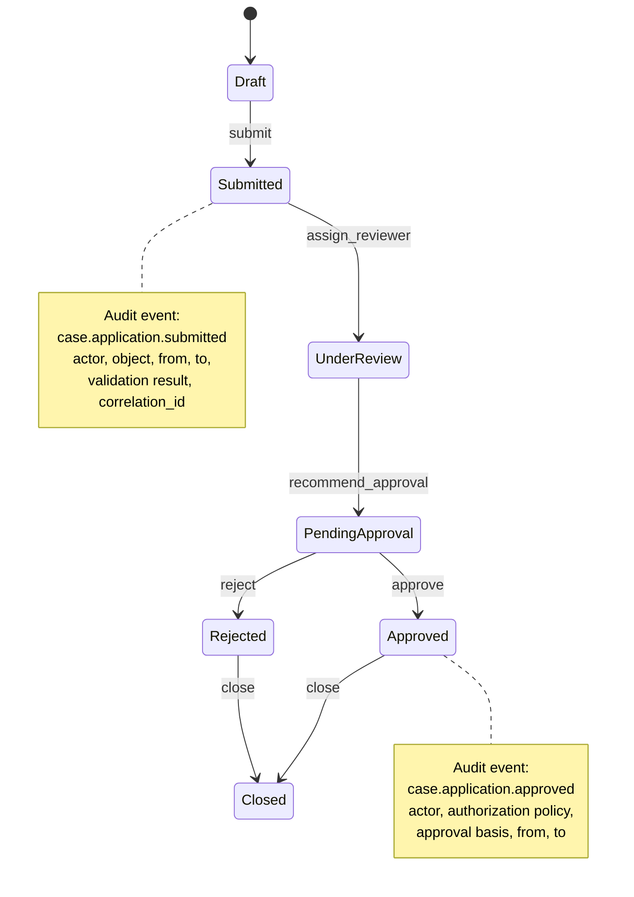
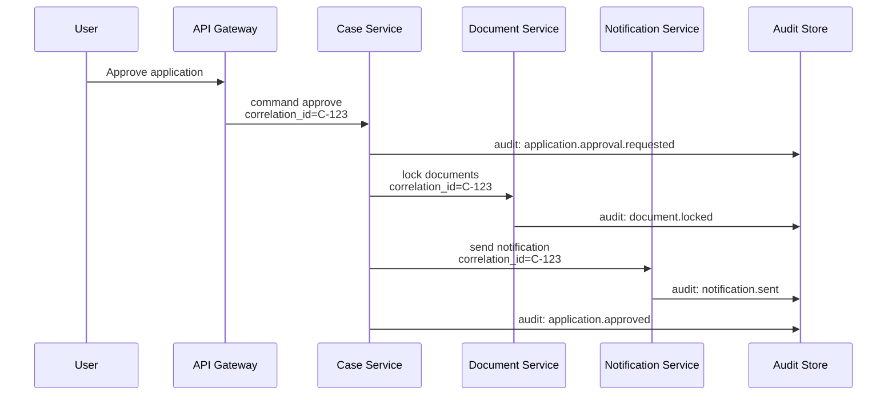
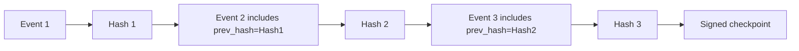
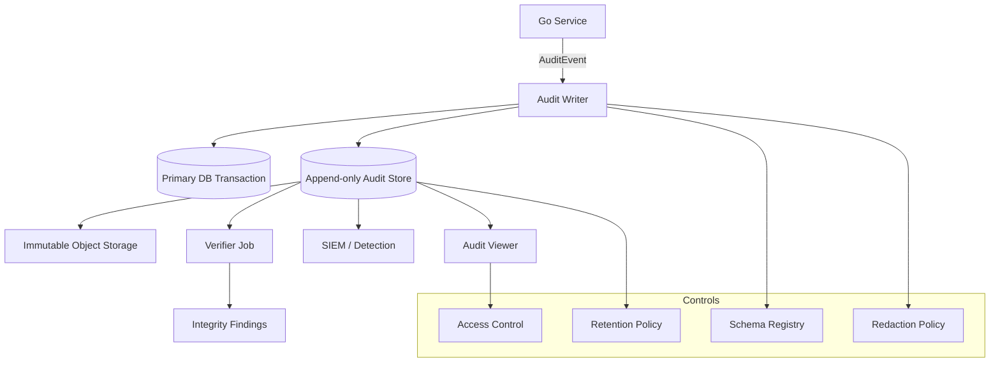
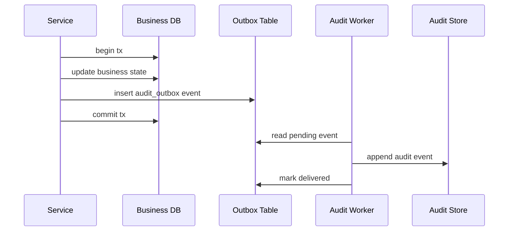
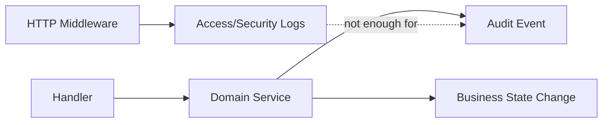

# learn-go-security-cryptography-integrity-part-028.md

# Secure Audit Logging in Go: Correlation ID, Actor Identity, Event Schema, Redaction, Immutability, Retention, and Legal Defensibility

> Seri: `learn-go-security-cryptography-integrity`  
> Part: `028`  
> Target pembaca: Java software engineer / tech lead yang ingin membangun secure Go services dengan standar internal engineering handbook.  
> Baseline: Go 1.26.x.  
> Status seri: belum selesai.  
> Part sebelumnya: `part-027` — Data Integrity Architecture.  
> Part berikutnya: `part-029` — Secrets Management.

---

## 0. Tujuan Part Ini

Part ini membahas **secure audit logging** sebagai *evidence system*, bukan sekadar “menulis log”.

Dalam sistem bisnis biasa, log sering diperlakukan sebagai alat debugging. Dalam sistem regulatori, enforcement lifecycle, case management, payment, identity, security gateway, atau sistem yang harus defensible secara hukum, log memiliki posisi yang lebih kuat:

1. **Merekonstruksi kejadian**: siapa melakukan apa, kapan, dari mana, terhadap objek apa, dengan hasil apa.
2. **Membuktikan kontrol**: sistem benar-benar melakukan authorization, validation, approval, escalation, notification, dan enforcement rule.
3. **Mendeteksi abuse**: brute force, privilege misuse, object access anomaly, suspicious workflow transition.
4. **Mendukung incident response**: scope impact, timeline, actor, affected data, containment.
5. **Mendukung accountability**: siapa aktor manusia, service, atau automation yang menyebabkan perubahan.
6. **Mendukung legal/regulatory defensibility**: evidence cukup lengkap, konsisten, tidak mudah dimanipulasi, dan memiliki retention policy.

Kesalahan umum engineer adalah memperlakukan audit log seperti application log:

```text
2026-06-24 10:11:12 user updated application
```

Kalimat ini hampir tidak berguna untuk audit karena tidak menjawab:

- user siapa?
- authenticated bagaimana?
- bertindak sebagai dirinya sendiri atau delegated actor?
- aplikasi apa?
- field apa yang berubah?
- dari state apa ke state apa?
- request/correlation ID apa?
- authorization decision apa?
- hasilnya committed atau gagal?
- event ini bagian dari transaction apa?
- log ini dibuat oleh service mana dan versi berapa?
- apakah nilai sensitif dibocorkan?
- apakah log ini bisa dipalsukan?

Part ini akan membangun mental model yang tepat.

---

## 1. Source Baseline dan Fakta Penting

Beberapa baseline yang digunakan dalam part ini:

1. Go `log/slog` menyediakan structured logging: record berisi message, severity level, dan atribut key-value. Ini tersedia di standard library sejak Go 1.21 dan menjadi fondasi logging terstruktur di Go modern.
2. OWASP Logging Cheat Sheet menekankan bahwa log security harus memuat informasi cukup untuk monitoring dan analysis, terutama pola “when, where, who, what”.
3. OWASP Top 10 2021 memasukkan **Security Logging and Monitoring Failures** sebagai kategori risiko karena tanpa logging/monitoring, breach sulit dideteksi dan dieskalasi.
4. NIST SP 800-92 memberi panduan log management enterprise: generation, transmission, storage, analysis, disposal, dan protection.
5. CWE-117 menjelaskan risiko improper output neutralization for logs: attacker dapat memalsukan, merusak format, atau menyisipkan konten berbahaya ke log.
6. `part-027` sudah membahas integrity architecture: hash chain, MAC chain, Merkle tree, signed checkpoint. Part ini memakai konsep tersebut khusus untuk audit logging.

Referensi lengkap ada di bagian akhir.

---

## 2. Mental Model: Log, Audit Log, Security Event, dan Evidence

Jangan mencampur semua hal bernama “log”. Dalam sistem production yang matang, setidaknya ada beberapa kategori.

| Jenis | Tujuan | Contoh | Retention | Sensitivitas |
|---|---|---|---|---|
| Application log | Debugging dan observability | error DB, latency, retry | pendek-menengah | medium |
| Access log | Request/response traffic | method, path, status, latency, client | pendek-menengah | medium-high |
| Security event log | Deteksi keamanan | failed login, token reuse, rate limit | menengah-panjang | high |
| Audit log | Accountability dan evidence | approve case, change role, delete record | panjang | high |
| Integrity log | Tamper evidence | hash chain checkpoint, verification result | panjang | high |
| Compliance report | Konsumsi manusia/regulator | monthly access review | sangat panjang | high |

**Application log** menjelaskan perilaku aplikasi.

**Audit log** menjelaskan perubahan dan keputusan yang harus dipertanggungjawabkan.

**Security event log** menjelaskan kejadian yang relevan untuk deteksi ancaman.

**Evidence** adalah log + metadata + chain of custody + retention + integrity proof + prosedur operasional yang membuatnya dapat dipercaya.

### 2.1 Prinsip Utama

Audit log yang baik harus menjawab minimal:

```text
WHEN   — kapan terjadi, menurut clock apa?
WHERE  — service, instance, environment, endpoint, source network?
WHO    — actor, subject, delegated actor, service identity?
WHAT   — action, object, state transition, decision, result?
WHY    — reason, policy, approval basis, request purpose?
HOW    — auth method, client, channel, correlation ID, transaction ID?
IMPACT — data/entity mana yang berubah atau terekspos?
PROOF  — apakah event lengkap, immutable/tamper-evident, dan dapat diverifikasi?
```

Jika audit log tidak bisa menjawab ini, ia mungkin cukup untuk debugging, tapi belum cukup sebagai audit evidence.

---

## 3. “Correct Logging” vs “Defensible Audit Logging”

Correct logging:

```go
slog.Info("application approved", "application_id", id)
```

Defensible audit logging:

```json
{
  "event_version": "1.0",
  "event_type": "case.application.approved",
  "event_id": "01JZ...",
  "occurred_at": "2026-06-24T03:11:12.456Z",
  "recorded_at": "2026-06-24T03:11:12.490Z",
  "environment": "prod",
  "service": "case-service",
  "service_version": "2026.06.24-1a2b3c",
  "correlation_id": "req-...",
  "causation_id": "cmd-...",
  "actor": {
    "type": "user",
    "id": "usr_123",
    "display_name_hash": "...",
    "auth_method": "oidc",
    "assurance_level": "aal2"
  },
  "subject": {
    "type": "user",
    "id": "usr_123"
  },
  "object": {
    "type": "application",
    "id": "app_987",
    "tenant_id": "tenant_456"
  },
  "action": "approve",
  "decision": {
    "authorization": "allow",
    "policy_id": "policy.case.approve.v3",
    "matched_rule": "senior_officer_can_approve_after_review"
  },
  "state_transition": {
    "from": "PENDING_APPROVAL",
    "to": "APPROVED"
  },
  "result": "success",
  "sensitivity": "confidential",
  "redaction_profile": "audit-v1",
  "schema_hash": "sha256:...",
  "payload_hash": "sha256:...",
  "prev_event_hash": "sha256:...",
  "event_hash": "sha256:..."
}
```

Perbedaannya bukan kosmetik. Perbedaannya adalah apakah event bisa dipakai untuk:

- timeline incident,
- audit trail legal,
- non-repudiation-like accountability,
- workflow reconstruction,
- anomaly detection,
- forensic analysis,
- regulatory review.

---

## 4. Audit Logging sebagai State Machine Evidence

Untuk sistem workflow, audit log paling kuat jika diposisikan sebagai evidence dari state machine.



Setiap transition penting harus punya audit event dengan invariant:

```text
If persisted business state changes, a corresponding audit event must be persisted atomically or recoverably.
```

Kalau state berubah tetapi audit event hilang, sistem kehilangan accountability.

Kalau audit event tercatat tetapi state tidak berubah, sistem menghasilkan false evidence.

Karena itu audit log bukan “side effect biasa”. Ia bagian dari correctness model sistem.

---

## 5. Taxonomy Event yang Harus Diaudit

Tidak semua log adalah audit event. Tetapi beberapa event hampir selalu wajib diaudit pada sistem security-sensitive.

### 5.1 Identity dan Authentication

| Event | Kenapa penting |
|---|---|
| login success | accountability dan anomaly detection |
| login failure | brute force, credential stuffing |
| MFA challenge issued | auth assurance trail |
| MFA success/failure | takeover detection |
| password changed | account lifecycle |
| password reset requested | recovery abuse detection |
| password reset completed | takeover analysis |
| recovery code generated/used | emergency path evidence |
| session created | identity/session link |
| session revoked/logout | lifecycle evidence |
| refresh token rotation/reuse detected | token theft detection |

### 5.2 Authorization dan Access Control

| Event | Kenapa penting |
|---|---|
| authorization deny | attempted abuse, misconfiguration, detection |
| role assigned/removed | privilege lifecycle |
| permission changed | policy governance |
| admin impersonation/delegation | high-risk actor switch |
| access to high-value object | sensitive data access trail |
| export/download | data exfiltration analysis |
| policy updated | governance and compliance |

### 5.3 Business Workflow

| Event | Kenapa penting |
|---|---|
| entity created | provenance |
| state transition | workflow accountability |
| approval/rejection | decision evidence |
| escalation | lifecycle integrity |
| override/manual adjustment | high-risk exception |
| deletion/archive | data lifecycle |
| bulk action | impact assessment |
| external notification sent | communication evidence |

### 5.4 Data Protection dan Integrity

| Event | Kenapa penting |
|---|---|
| encryption key rotated | crypto lifecycle |
| secret accessed | sensitive operation trail |
| audit chain verification failed | tamper detection |
| retention policy applied | compliance evidence |
| PII export | privacy accountability |
| redaction policy changed | data exposure governance |

### 5.5 System dan Operational Security

| Event | Kenapa penting |
|---|---|
| config changed | change traceability |
| feature flag changed | behavior traceability |
| deploy/release | timeline correlation |
| admin endpoint used | privileged operation |
| rate limit triggered | abuse detection |
| SSRF/blocklist deny | attack detection |
| suspicious parser failure spike | probing detection |

---

## 6. Event Schema: Audit Log Harus Typed, Versioned, dan Stabil

String bebas tidak cukup untuk audit. Audit event harus punya schema.

### 6.1 Minimal Common Envelope

```go
package audit

import "time"

type Event struct {
    EventVersion string    `json:"event_version"`
    EventType    string    `json:"event_type"`
    EventID      string    `json:"event_id"`
    OccurredAt   time.Time `json:"occurred_at"`
    RecordedAt   time.Time `json:"recorded_at"`

    Environment    string `json:"environment"`
    Service        string `json:"service"`
    ServiceVersion string `json:"service_version"`
    InstanceID     string `json:"instance_id,omitempty"`

    CorrelationID string `json:"correlation_id"`
    CausationID   string `json:"causation_id,omitempty"`
    TraceID       string `json:"trace_id,omitempty"`
    SpanID        string `json:"span_id,omitempty"`

    Actor   ActorRef   `json:"actor"`
    Subject SubjectRef `json:"subject,omitempty"`
    Object  ObjectRef  `json:"object"`

    Action string `json:"action"`
    Result string `json:"result"`

    Decision        *DecisionRef        `json:"decision,omitempty"`
    StateTransition *StateTransitionRef `json:"state_transition,omitempty"`

    Risk       *RiskRef       `json:"risk,omitempty"`
    Network    *NetworkRef    `json:"network,omitempty"`
    Client     *ClientRef     `json:"client,omitempty"`
    Integrity  *IntegrityRef  `json:"integrity,omitempty"`
    Sensitivity string        `json:"sensitivity"`

    Details map[string]any `json:"details,omitempty"`
}
```

### 6.2 Actor, Subject, Object

Security audit sering gagal karena mencampur `actor`, `subject`, dan `object`.

| Field | Arti | Contoh |
|---|---|---|
| actor | entitas yang melakukan aksi langsung | admin user, service account |
| subject | entitas atas nama siapa aksi dilakukan | delegated user, impersonated user |
| object | resource yang terkena aksi | case, application, role, document |

Contoh:

```text
Admin A reset password untuk User B.

actor   = Admin A
subject = User B
object  = User B account credential
```

Contoh lain:

```text
Batch service menutup case karena SLA expired.

actor   = service:case-scheduler
subject = system
object  = case:CASE-123
```

Jika hanya punya `user_id`, audit akan ambigu.

### 6.3 Event Type Naming

Gunakan event type yang stabil dan machine-readable.

```text
<domain>.<entity>.<action>
```

Contoh:

```text
identity.session.created
identity.session.revoked
identity.refresh_token.reuse_detected
case.application.submitted
case.application.approved
case.application.rejected
case.document.downloaded
case.role.assigned
security.authorization.denied
security.ssr_attempt.blocked
system.config.updated
integrity.audit_chain.verification_failed
```

Hindari:

```text
Updated successfully
Done
User action
Case event
Admin activity
```

Nama yang buruk tidak bisa dipakai untuk detection rule.

---

## 7. Correlation ID, Causation ID, Trace ID

Audit log tanpa correlation sulit dipakai saat incident.

### 7.1 Perbedaan ID

| ID | Makna |
|---|---|
| request_id | satu HTTP request tertentu |
| correlation_id | satu alur bisnis lintas service/request |
| causation_id | event/command yang menyebabkan event ini |
| trace_id | distributed tracing trace |
| event_id | identitas unik audit event |
| transaction_id | transaksi database atau business transaction |

Dalam sistem event-driven, satu user action dapat menghasilkan banyak event.



Semua event harus bisa dihubungkan oleh `correlation_id`.

### 7.2 Middleware Correlation ID di Go

```go
package auditctx

import (
    "context"
    "crypto/rand"
    "encoding/base64"
    "net/http"
)

type key int

const correlationIDKey key = iota

func CorrelationID(ctx context.Context) string {
    v, _ := ctx.Value(correlationIDKey).(string)
    return v
}

func WithCorrelationID(ctx context.Context, id string) context.Context {
    return context.WithValue(ctx, correlationIDKey, id)
}

func newID() string {
    var b [18]byte // 144 bits
    if _, err := rand.Read(b[:]); err != nil {
        // crypto/rand.Read should not fail in normal modern Go runtime.
        // For security-critical correlation, fail closed rather than using weak IDs.
        panic(err)
    }
    return base64.RawURLEncoding.EncodeToString(b[:])
}

func Middleware(next http.Handler) http.Handler {
    return http.HandlerFunc(func(w http.ResponseWriter, r *http.Request) {
        id := r.Header.Get("X-Correlation-ID")
        if !isTrustedCorrelationID(id) {
            id = newID()
        }

        w.Header().Set("X-Correlation-ID", id)
        next.ServeHTTP(w, r.WithContext(WithCorrelationID(r.Context(), id)))
    })
}

func isTrustedCorrelationID(id string) bool {
    if len(id) < 16 || len(id) > 128 {
        return false
    }
    for _, r := range id {
        if r >= 'a' && r <= 'z' || r >= 'A' && r <= 'Z' || r >= '0' && r <= '9' || r == '-' || r == '_' || r == '.' {
            continue
        }
        return false
    }
    return true
}
```

Catatan penting:

- correlation ID bukan secret;
- correlation ID tetap harus divalidasi agar tidak menjadi log injection vector;
- jangan mempercayai correlation ID dari public internet sebagai identity;
- gateway sebaiknya membuat atau menormalisasi ID;
- internal services meneruskan ID yang sudah dipercaya dari boundary internal.

---

## 8. Actor Identity: Jangan Audit Berdasarkan Display Name

Audit berdasarkan display name adalah desain lemah.

Buruk:

```json
{
  "user": "Budi",
  "action": "approve"
}
```

Lebih baik:

```json
{
  "actor": {
    "type": "user",
    "id": "usr_01JZ...",
    "external_subject": "oidc:issuer=https://idp.example.gov,sub=abc123",
    "display_name_hash": "sha256:...",
    "auth_method": "oidc",
    "assurance_level": "aal2",
    "session_id_hash": "sha256:..."
  }
}
```

### 8.1 Actor Field yang Umum Dibutuhkan

| Field | Alasan |
|---|---|
| actor.type | user/service/system/batch/admin/support |
| actor.id | stable internal ID |
| actor.external_subject | mapping ke IdP/OIDC/SAML bila relevan |
| actor.tenant_id | tenant boundary |
| actor.roles_snapshot | role saat event terjadi |
| actor.auth_method | password, oidc, mTLS, service token |
| actor.assurance_level | AAL/session strength |
| actor.delegation | apakah actor bertindak atas nama subject lain |
| actor.ip/client | forensic context |

### 8.2 Snapshot vs Lookup

Audit log harus menyimpan snapshot minimal dari identitas dan authorization context saat event terjadi.

Jika audit viewer hanya melakukan lookup user saat ini, maka bukti lama bisa salah.

Contoh:

```text
2026-01-01: user U punya role SeniorOfficer dan approve case.
2026-06-01: role SeniorOfficer dicabut.
2026-06-24: auditor melihat event lama.
```

Jika viewer hanya lookup role saat ini, terlihat seolah user tidak punya role ketika approve. Itu salah.

Audit event harus menyimpan:

```json
{
  "roles_snapshot": ["SeniorOfficer"],
  "policy_id": "case.approve.v3",
  "authorization_result": "allow"
}
```

---

## 9. What to Log vs What Not to Log

Audit log harus cukup kaya, tetapi tidak boleh menjadi data-leak warehouse.

### 9.1 Wajib atau Umumnya Penting Dicatat

| Kategori | Contoh |
|---|---|
| identity stable | user ID, service ID, tenant ID |
| event identity | event ID, event type, version |
| timing | occurred_at, recorded_at |
| request lineage | correlation ID, causation ID, trace ID |
| object reference | object type, object ID |
| action/result | approve/success, deny/failure |
| authz evidence | policy ID, decision, reason code |
| state transition | from/to |
| integrity metadata | hash/MAC/checkpoint |
| client context | trusted source IP, user-agent hash if needed |
| sensitivity classification | public/internal/confidential/restricted |

### 9.2 Harus Dihindari

| Jangan log | Kenapa |
|---|---|
| password | credential compromise |
| access token / refresh token | session takeover |
| private key / secret | full compromise |
| OTP / recovery code | bypass auth |
| raw authorization header | bearer leakage |
| full cookie header | session leakage |
| full PII payload | privacy breach |
| full uploaded document | data breach |
| payment card/security code | compliance breach |
| raw SQL with parameter values sensitif | data leakage |
| exception stack dengan secret | leakage |

### 9.3 Hashing PII di Audit Log

Kadang kita ingin korelasi tanpa menyimpan raw PII.

Contoh:

```go
func HashForAudit(value string, pepper []byte) string {
    mac := hmac.New(sha256.New, pepper)
    mac.Write([]byte("audit-pii-v1\x00"))
    mac.Write([]byte(value))
    return "hmac-sha256:" + base64.RawURLEncoding.EncodeToString(mac.Sum(nil))
}
```

Kenapa HMAC, bukan plain SHA-256?

- Banyak PII punya search space kecil: email, phone, ID number, postal code.
- Plain hash bisa brute force/dictionary attack.
- HMAC dengan secret pepper membuat correlation masih mungkin, tapi offline guessing jauh lebih sulit.

Tetap ingat: HMAC PII masih bisa menjadi data sensitif jika pepper bocor atau value domain sangat kecil. Perlakukan sebagai sensitive metadata.

---

## 10. Redaction Design: Jangan Bergantung pada Developer Ingat Manual

Redaction harus menjadi sistem, bukan kebiasaan.

### 10.1 Anti-Pattern

```go
slog.Info("received login request", "request", req)
```

Bahaya:

- struct bisa memiliki password/token;
- field baru ditambahkan tanpa redaction;
- nested object bocor;
- log handler tidak tahu mana field sensitif;
- error `%+v` bisa membuka internal data.

### 10.2 Tipe dengan Redaction Semantics

```go
package safeaudit

import "log/slog"

type SecretString string

func (s SecretString) LogValue() slog.Value {
    return slog.StringValue("[REDACTED]")
}

type PIIString string

func (p PIIString) LogValue() slog.Value {
    return slog.StringValue("[PII-REDACTED]")
}

type AuditUser struct {
    ID        string
    EmailHash string
    Name      PIIString
}

func (u AuditUser) LogValue() slog.Value {
    return slog.GroupValue(
        slog.String("id", u.ID),
        slog.String("email_hash", u.EmailHash),
        slog.Any("name", u.Name),
    )
}
```

`log/slog` mendukung `LogValuer`, sehingga type dapat mengontrol representasi logging dirinya sendiri.

### 10.3 Redaction di Handler Boundary

Gunakan handler yang menerapkan policy defensif.

```go
package safeaudit

import (
    "context"
    "log/slog"
    "strings"
)

type RedactingHandler struct {
    next slog.Handler
}

func NewRedactingHandler(next slog.Handler) *RedactingHandler {
    return &RedactingHandler{next: next}
}

func (h *RedactingHandler) Enabled(ctx context.Context, level slog.Level) bool {
    return h.next.Enabled(ctx, level)
}

func (h *RedactingHandler) Handle(ctx context.Context, r slog.Record) error {
    nr := slog.NewRecord(r.Time, r.Level, r.Message, r.PC)
    r.Attrs(func(a slog.Attr) bool {
        nr.AddAttrs(redactAttr(a))
        return true
    })
    return h.next.Handle(ctx, nr)
}

func (h *RedactingHandler) WithAttrs(attrs []slog.Attr) slog.Handler {
    redacted := make([]slog.Attr, 0, len(attrs))
    for _, a := range attrs {
        redacted = append(redacted, redactAttr(a))
    }
    return &RedactingHandler{next: h.next.WithAttrs(redacted)}
}

func (h *RedactingHandler) WithGroup(name string) slog.Handler {
    return &RedactingHandler{next: h.next.WithGroup(name)}
}

func redactAttr(a slog.Attr) slog.Attr {
    key := strings.ToLower(a.Key)
    switch {
    case strings.Contains(key, "password"),
        strings.Contains(key, "token"),
        strings.Contains(key, "secret"),
        strings.Contains(key, "authorization"),
        strings.Contains(key, "cookie"):
        return slog.String(a.Key, "[REDACTED]")
    default:
        return a
    }
}
```

Ini bukan pengganti typed redaction, tetapi defense-in-depth.

### 10.4 Redaction Profile

Audit event sebaiknya menyimpan profile redaction.

```json
{
  "redaction_profile": "audit-v3",
  "redacted_fields": ["actor.email", "request.authorization", "object.document.title"]
}
```

Kenapa?

- Auditor tahu bahwa data sengaja tidak disimpan, bukan hilang.
- Forensic team tahu batas evidence.
- Schema evolution lebih jelas.

---

## 11. Log Injection dan Forgery

Log injection terjadi ketika input attacker masuk ke log tanpa neutralization dan dapat:

- memalsukan baris log;
- merusak format JSON/CSV/text;
- menyisipkan CRLF;
- menyisipkan ANSI escape sequence;
- menyisipkan payload untuk log viewer;
- menyisipkan prompt injection untuk SOC/LLM tools;
- menyebabkan parser downstream salah membaca event.

### 11.1 Anti-Pattern: Text Log dengan User Input

```go
slog.Info("login failed for user: " + username)
```

Jika `username` berisi:

```text
attacker\n2026-06-24T03:11:12Z INFO admin login success user=attacker
```

Text log viewer bisa terlihat seolah ada event baru.

### 11.2 Structured Logging Lebih Aman, Tetapi Tidak Otomatis Aman

Lebih baik:

```go
slog.Warn("login failed", "username", sanitizeLogString(username))
```

Sanitizer sederhana:

```go
func sanitizeLogString(s string) string {
    const max = 512
    if len(s) > max {
        s = s[:max] + "...[truncated]"
    }

    out := make([]rune, 0, len(s))
    for _, r := range s {
        switch r {
        case '\n', '\r', '\t':
            out = append(out, ' ')
        default:
            if r < 0x20 || r == 0x7f {
                out = append(out, ' ')
            } else {
                out = append(out, r)
            }
        }
    }
    return string(out)
}
```

Tetapi sanitization harus context-aware. Untuk JSON handler, escaping JSON membantu struktur JSON tetap valid. Untuk text log, CRLF harus dinetralisir. Untuk HTML log viewer, output harus di-escape lagi di UI.

### 11.3 Treat Log Content as Untrusted Forever

Audit log dapat berisi field dari attacker:

- username yang gagal login;
- URL yang diserang;
- user-agent;
- search query;
- uploaded filename;
- email subject;
- external callback payload;
- exception message dari parser;
- DNS name;
- OAuth `state` atau error description dari IdP.

Log viewer, SIEM query, dashboard, report generator, dan LLM analyst harus menganggap isi log sebagai untrusted input.

---

## 12. Immutability dan Tamper Evidence

Ada dua konsep yang sering disamakan padahal berbeda.

| Konsep | Arti |
|---|---|
| append-only | aplikasi normal tidak bisa update/delete event lama |
| immutable storage | storage policy mencegah perubahan/hapus selama retention |
| tamper-evident | perubahan dapat terdeteksi |
| tamper-proof | hampir tidak realistis untuk diklaim absolut |
| non-repudiation | klaim hukum/kriptografis yang butuh key custody dan identity assurance |

Audit log yang matang biasanya menggunakan kombinasi:

1. append-only table/stream;
2. storage write-once atau object lock;
3. hash/MAC chain;
4. periodic signed checkpoint;
5. independent verifier job;
6. restricted administrative access;
7. retention policy;
8. access audit untuk audit log itu sendiri.

### 12.1 Hash Chain Audit Event



Jika event tengah diubah, hash chain rusak.

### 12.2 Simplified Hash Chain di Go

```go
package auditintegrity

import (
    "crypto/sha256"
    "encoding/base64"
)

func EventHash(canonicalEvent []byte, prevHash []byte) string {
    h := sha256.New()
    h.Write([]byte("audit-event-chain-v1\x00"))
    h.Write(prevHash)
    h.Write([]byte("\x00"))
    h.Write(canonicalEvent)
    sum := h.Sum(nil)
    return "sha256:" + base64.RawURLEncoding.EncodeToString(sum)
}
```

Catatan:

- canonical encoding wajib stabil;
- JSON map order harus dikontrol;
- schema version harus masuk hash;
- prev hash harus berasal dari committed previous event;
- concurrency perlu segmenting atau per-stream chain;
- untuk multi-writer high throughput, gunakan partitioned chain atau Merkle batching.

### 12.3 MAC Chain vs Hash Chain

Plain hash chain mendeteksi perubahan jika ada trusted checkpoint eksternal. MAC chain menambah proteksi jika attacker bisa menulis ulang storage tapi tidak punya key.

```go
func EventMAC(canonicalEvent []byte, prevMAC []byte, key []byte) string {
    mac := hmac.New(sha256.New, key)
    mac.Write([]byte("audit-event-mac-chain-v1\x00"))
    mac.Write(prevMAC)
    mac.Write([]byte("\x00"))
    mac.Write(canonicalEvent)
    return "hmac-sha256:" + base64.RawURLEncoding.EncodeToString(mac.Sum(nil))
}
```

Trade-off:

| Approach | Kelebihan | Kelemahan |
|---|---|---|
| hash chain | sederhana, no secret key | butuh trusted checkpoint |
| MAC chain | attacker tanpa key tidak bisa forge | verifier butuh key atau service khusus |
| signature checkpoint | verifier publik/internal tanpa MAC key | key custody lebih berat |
| Merkle tree | scalable untuk batch besar | implementasi/verifikasi lebih kompleks |

---

## 13. Audit Storage Architecture

### 13.1 Minimal Mature Architecture



### 13.2 Transactional Coupling Problem

Pertanyaan sulit:

```text
Jika business write sukses tapi audit write gagal, apa yang terjadi?
```

Ada beberapa strategi.

| Strategi | Cocok untuk | Risiko |
|---|---|---|
| same DB transaction | critical state change | audit table ikut DB compromise |
| outbox pattern | async reliable delivery | delay, perlu replay/verifier |
| dual write langsung | sederhana | inconsistent failure |
| event sourcing | workflow full history | complexity tinggi |
| append-only external log | high assurance | operational complexity |

### 13.3 Outbox Pattern untuk Audit



Invariant:

```text
Business state change and audit outbox record are committed in the same transaction.
```

Jika audit store sementara down, outbox dapat retry.

### 13.4 Same Transaction Audit Table

Untuk beberapa sistem, audit event disimpan di DB yang sama agar atomic.

Kelebihan:

- mudah konsisten dengan business write;
- query audit dekat dengan object;
- transaction semantics jelas.

Kelemahan:

- DBA/admin dengan akses DB bisa mengubah data dan audit jika tidak ada kontrol tambahan;
- retention/immutability sulit jika mixed dengan OLTP;
- high write volume membebani DB;
- audit evidence tidak independen.

Solusi hybrid:

1. tulis audit row dalam DB transaction;
2. stream audit row ke append-only external store;
3. periodic verify row count/hash/checkpoint;
4. apply DB-level append-only controls bila memungkinkan.

---

## 14. Designing Audit Event API in Go

Jangan biarkan semua handler menulis audit schema sendiri. Buat package boundary.

### 14.1 Interface

```go
package audit

import "context"

type Writer interface {
    Record(ctx context.Context, event Event) error
}
```

Namun `Event` mentah terlalu bebas. Lebih baik buat domain-specific constructor.

```go
func NewCaseApprovedEvent(input CaseApprovedInput) Event {
    return Event{
        EventVersion: "1.0",
        EventType:    "case.application.approved",
        EventID:      input.EventID,
        OccurredAt:   input.OccurredAt,
        RecordedAt:   input.RecordedAt,
        Environment:  input.Environment,
        Service:      "case-service",
        CorrelationID: input.CorrelationID,
        Actor:        input.Actor,
        Object: ObjectRef{
            Type:     "application",
            ID:       input.ApplicationID,
            TenantID: input.TenantID,
        },
        Action: "approve",
        Result: "success",
        Decision: &DecisionRef{
            Authorization: "allow",
            PolicyID:      input.PolicyID,
            ReasonCode:    input.ReasonCode,
        },
        StateTransition: &StateTransitionRef{
            From: input.FromState,
            To:   input.ToState,
        },
        Sensitivity: "confidential",
    }
}
```

Benefit:

- event schema konsisten;
- required fields dipaksa;
- redaction policy terpusat;
- event type tidak typo;
- migration/versioning lebih mudah;
- testing lebih fokus.

### 14.2 Fail Open vs Fail Closed

Tidak semua audit failure harus diperlakukan sama.

| Event | Jika audit gagal |
|---|---|
| critical state transition | fail closed atau commit outbox atomik |
| login failure | best-effort mungkin cukup, tapi meter harus ada |
| role assignment | fail closed |
| document download | fail closed atau pre-authorized durable outbox |
| metrics/debug event | fail open |
| security incident event | fail closed jika dalam transaction, atau emergency local durable spool |

Decision harus eksplisit.

```go
type Criticality int

const (
    BestEffort Criticality = iota
    MustRecord
    MustRecordOrOutbox
)
```

---

## 15. Event Schema Detail

### 15.1 ActorRef

```go
type ActorRef struct {
    Type            string   `json:"type"`
    ID              string   `json:"id"`
    TenantID        string   `json:"tenant_id,omitempty"`
    ExternalSubject string   `json:"external_subject,omitempty"`
    AuthMethod      string   `json:"auth_method,omitempty"`
    AssuranceLevel  string   `json:"assurance_level,omitempty"`
    RolesSnapshot   []string `json:"roles_snapshot,omitempty"`
    SessionIDHash   string   `json:"session_id_hash,omitempty"`
}
```

### 15.2 ObjectRef

```go
type ObjectRef struct {
    Type     string `json:"type"`
    ID       string `json:"id"`
    TenantID string `json:"tenant_id,omitempty"`
    Version  string `json:"version,omitempty"`
}
```

### 15.3 DecisionRef

```go
type DecisionRef struct {
    Authorization string `json:"authorization"` // allow/deny/not_applicable
    PolicyID      string `json:"policy_id,omitempty"`
    PolicyVersion string `json:"policy_version,omitempty"`
    ReasonCode    string `json:"reason_code,omitempty"`
    MatchedRule   string `json:"matched_rule,omitempty"`
}
```

### 15.4 StateTransitionRef

```go
type StateTransitionRef struct {
    From string `json:"from"`
    To   string `json:"to"`
}
```

### 15.5 NetworkRef

```go
type NetworkRef struct {
    SourceIP        string `json:"source_ip,omitempty"`
    TrustedProxyID  string `json:"trusted_proxy_id,omitempty"`
    UserAgentHash   string `json:"user_agent_hash,omitempty"`
    GeoCountry      string `json:"geo_country,omitempty"`
    TLSVersion      string `json:"tls_version,omitempty"`
    ClientCertID    string `json:"client_cert_id,omitempty"`
}
```

Jangan asal log raw User-Agent. Ia attacker-controlled dan bisa panjang/berbahaya. Simpan hash + truncated sanitized value hanya jika diperlukan.

---

## 16. Before/After Snapshot Risk

Audit sering ingin mencatat perubahan.

Contoh buruk:

```json
{
  "before": { "full_name": "Alice", "address": "...", "income": "..." },
  "after": { "full_name": "Alice B", "address": "...", "income": "..." }
}
```

Masalah:

- duplikasi PII;
- retention audit lebih panjang dari business data;
- data minimization gagal;
- hak akses audit viewer menjadi terlalu luas;
- field baru bisa masuk otomatis tanpa review;
- sulit redact historis.

### 16.1 Lebih Aman: Field-Level Change Summary

```json
{
  "changed_fields": [
    {
      "field": "contact.email",
      "classification": "pii",
      "before_hash": "hmac-sha256:...",
      "after_hash": "hmac-sha256:..."
    },
    {
      "field": "status",
      "classification": "workflow_state",
      "before": "PENDING_REVIEW",
      "after": "PENDING_APPROVAL"
    }
  ]
}
```

Rule:

- raw value hanya untuk low-risk enum/non-sensitive data;
- PII gunakan HMAC/hash/reference;
- secret jangan pernah masuk audit;
- document content jangan masuk audit;
- simpan business object version untuk lookup terkontrol bila perlu.

### 16.2 Policy-Based Snapshot

```go
type FieldChange struct {
    Field          string `json:"field"`
    Classification string `json:"classification"`
    Before         string `json:"before,omitempty"`
    After          string `json:"after,omitempty"`
    BeforeHash     string `json:"before_hash,omitempty"`
    AfterHash      string `json:"after_hash,omitempty"`
}
```

Audit serializer harus tahu classification field. Jangan mengandalkan reflection dump.

---

## 17. Access Control untuk Audit Log Itu Sendiri

Audit log adalah sensitive data.

Hak akses audit viewer harus dibatasi.

| Role | Akses |
|---|---|
| support L1 | metadata ringan, no PII |
| investigator | event detail terbatas kasus assigned |
| security analyst | security event + indicators |
| auditor | read-only evidence export |
| system admin | operational health, bukan isi sensitif penuh |
| break-glass admin | full access dengan approval dan audit tambahan |

### 17.1 Audit-the-Audit

Akses ke audit log juga harus diaudit.

Event:

```text
audit.event.viewed
audit.event.exported
audit.search.performed
audit.redacted_view.opened
audit.break_glass.access_granted
audit.retention_policy.updated
```

Ini penting karena audit log dapat mengandung PII dan security intelligence.

---

## 18. Retention dan Disposal

Audit logging tanpa retention policy akan berubah menjadi liability.

### 18.1 Pertanyaan Retention

Untuk setiap event type, tentukan:

1. kenapa event disimpan;
2. siapa owner datanya;
3. berapa lama disimpan;
4. siapa boleh akses;
5. apakah mengandung PII/secret;
6. apakah bisa direduksi setelah periode tertentu;
7. bagaimana disposal dibuktikan;
8. apakah ada legal hold;
9. apakah retention berbeda per jurisdiction;
10. bagaimana restore/backup mengikuti retention.

### 18.2 Retention Matrix

| Event | Retention | Redaction after | Legal hold? |
|---|---:|---:|---|
| login failure | 1 tahun | 90 hari IP raw -> hash | ya |
| role assignment | 7 tahun | tidak | ya |
| case approval | 7-10 tahun | field PII tetap redacted | ya |
| document download | 7 tahun | filename PII hash | ya |
| debug error | 30-90 hari | cepat | tidak biasanya |
| audit chain checkpoint | selama audit logs | tidak | ya |

Angka di atas contoh. Sistem nyata harus mengikuti regulasi dan kebijakan organisasi.

### 18.3 Disposal Harus Diaudit

Event disposal:

```json
{
  "event_type": "audit.retention.disposal.completed",
  "policy_id": "retention.audit.v4",
  "period": "2021-01",
  "deleted_event_count": 120344,
  "retained_legal_hold_count": 83,
  "checkpoint_before": "sha256:...",
  "checkpoint_after": "sha256:..."
}
```

Jika audit log dihapus tanpa evidence disposal, auditor akan mempertanyakan integritas lifecycle.

---

## 19. Time, Clock, dan Ordering

Audit event selalu berhadapan dengan clock ambiguity.

Field yang disarankan:

| Field | Makna |
|---|---|
| occurred_at | waktu kejadian menurut service yang membuat event |
| recorded_at | waktu event masuk audit store |
| received_at | waktu collector menerima event |
| sequence_number | ordering dalam stream/partition |
| previous_hash | integrity order |
| clock_source | optional, informasi time source |

### 19.1 Jangan Bergantung pada Timestamp Saja untuk Ordering

Distributed systems tidak punya global total order murah.

Gunakan:

- transaction commit order untuk satu DB;
- partition sequence untuk stream;
- event chain sequence;
- causation ID untuk causal relation;
- trace/correlation untuk request flow;
- timestamp sebagai approximate ordering.

### 19.2 Timezone

Simpan waktu audit dalam UTC.

```go
now := time.Now().UTC()
```

UI boleh menampilkan local timezone, tapi raw event harus UTC.

---

## 20. Audit Logging dalam HTTP Middleware vs Domain Service

Tidak semua audit bisa dibuat di middleware.

### 20.1 Middleware Cocok untuk Access/Security Event

Middleware bisa mencatat:

- request started/completed;
- status code;
- latency;
- request size;
- auth principal;
- auth failure;
- rate limit;
- panic;
- CSRF deny;
- request ID.

### 20.2 Domain Service Wajib untuk Business Audit

Domain service harus mencatat:

- state transition;
- object ID;
- business action;
- policy decision;
- before/after summary;
- command ID;
- transaction result.

Middleware tidak tahu business semantic.



Anti-pattern:

```text
Audit all POST/PUT/DELETE in middleware.
```

Kenapa buruk?

- tidak tahu apakah business operation benar-benar committed;
- tidak tahu state transition;
- tidak tahu authorization policy;
- tidak tahu object final;
- bisa salah jika endpoint melakukan no-op.

---

## 21. Go `slog` untuk Structured Security Logging

`slog` cocok sebagai structured logging API. Tetapi untuk audit, jangan langsung menjadikan `slog` sebagai source-of-truth tanpa schema.

### 21.1 Setup JSON Logger dengan Redaction

```go
func NewLogger(out io.Writer, level slog.Leveler) *slog.Logger {
    jsonHandler := slog.NewJSONHandler(out, &slog.HandlerOptions{
        Level: level,
        ReplaceAttr: func(groups []string, a slog.Attr) slog.Attr {
            return redactAttr(a)
        },
    })
    return slog.New(jsonHandler)
}
```

### 21.2 Context-Aware Logging

```go
func LoggerFromContext(ctx context.Context, base *slog.Logger) *slog.Logger {
    attrs := []any{}
    if cid := auditctx.CorrelationID(ctx); cid != "" {
        attrs = append(attrs, "correlation_id", cid)
    }
    if actor := ActorFromContext(ctx); actor.ID != "" {
        attrs = append(attrs, "actor_id", actor.ID, "actor_type", actor.Type)
    }
    return base.With(attrs...)
}
```

### 21.3 Audit Writer Should Not Be Just Logger

```go
// Good: audit writer validates schema and writes to durable audit store.
type AuditWriter interface {
    Record(ctx context.Context, event Event) error
}

// Less good: plain logger call as audit source of truth.
logger.Info("case approved", "case_id", id)
```

`slog` dapat dipakai untuk:

- operational mirror dari audit event;
- local fallback spool;
- security event stream;
- structured app logs.

Namun audit source-of-truth sebaiknya punya:

- schema validation;
- storage durability;
- retention;
- immutability/tamper evidence;
- access control;
- exporter.

---

## 22. Audit Event Validation

Audit event harus divalidasi sebelum ditulis.

Contoh rules:

- `event_id` wajib unik;
- `event_type` harus dikenal registry;
- `event_version` valid;
- `occurred_at` tidak terlalu jauh dari now;
- `actor.id` wajib kecuali system event;
- `object.id` wajib untuk object event;
- `result` hanya enum;
- `state_transition` wajib untuk transition event;
- `decision.policy_id` wajib untuk authorization-sensitive event;
- no forbidden key names;
- no raw secret pattern;
- details size dibatasi;
- string fields sanitized/truncated;
- sensitivity classification wajib.

```go
func ValidateEvent(e Event) error {
    var errs []string

    if e.EventID == "" {
        errs = append(errs, "event_id required")
    }
    if !knownEventType(e.EventType) {
        errs = append(errs, "unknown event_type")
    }
    if e.CorrelationID == "" {
        errs = append(errs, "correlation_id required")
    }
    if e.Actor.ID == "" && e.Actor.Type != "system" {
        errs = append(errs, "actor.id required")
    }
    if e.Object.ID == "" && requiresObject(e.EventType) {
        errs = append(errs, "object.id required")
    }
    if e.Sensitivity == "" {
        errs = append(errs, "sensitivity required")
    }

    if len(errs) > 0 {
        return fmt.Errorf("invalid audit event: %s", strings.Join(errs, "; "))
    }
    return nil
}
```

---

## 23. Testing Audit Logging

Audit logging harus diuji seperti behavior bisnis.

### 23.1 Unit Test: Event Constructor

```go
func TestNewCaseApprovedEvent(t *testing.T) {
    e := NewCaseApprovedEvent(CaseApprovedInput{
        EventID:       "evt_1",
        ApplicationID: "app_1",
        TenantID:      "tenant_1",
        Actor: ActorRef{
            Type: "user",
            ID:   "usr_1",
        },
        FromState:     "PENDING_APPROVAL",
        ToState:       "APPROVED",
        PolicyID:      "case.approve.v3",
        ReasonCode:    "role_allowed",
        CorrelationID: "corr_1",
        OccurredAt:    time.Unix(1, 0).UTC(),
        RecordedAt:    time.Unix(2, 0).UTC(),
        Environment:   "test",
    })

    if e.EventType != "case.application.approved" {
        t.Fatalf("unexpected event type: %s", e.EventType)
    }
    if e.StateTransition == nil || e.StateTransition.From != "PENDING_APPROVAL" || e.StateTransition.To != "APPROVED" {
        t.Fatalf("missing transition")
    }
    if e.Decision == nil || e.Decision.PolicyID == "" {
        t.Fatalf("missing policy evidence")
    }
}
```

### 23.2 Integration Test: State Change Requires Audit

```go
func TestApproveApplicationWritesAuditInSameTransaction(t *testing.T) {
    // Arrange test DB, fake audit outbox, service.
    // Act: approve application.
    // Assert:
    // - business state changed
    // - audit outbox has exactly one case.application.approved event
    // - event references same object ID and correlation ID
    // - event has from/to state
    // - event has authorization policy ID
}
```

### 23.3 Negative Tests

Test attacker-controlled values:

- CRLF in username;
- long user-agent;
- ANSI escape sequences;
- invalid UTF-8;
- nested JSON payload with token-like fields;
- filename with path traversal;
- duplicate JSON keys;
- missing actor;
- missing policy ID;
- unknown event type;
- huge details map.

### 23.4 Property Test / Fuzzing

Fuzz sanitizer:

```go
func FuzzSanitizeLogString(f *testing.F) {
    f.Add("normal")
    f.Add("evil\nforged")
    f.Add("\x1b[31mred")

    f.Fuzz(func(t *testing.T, s string) {
        out := sanitizeLogString(s)
        if strings.ContainsAny(out, "\r\n") {
            t.Fatalf("output contains newline: %q", out)
        }
        if len(out) > 600 {
            t.Fatalf("output too long")
        }
    })
}
```

---

## 24. Observability Metrics for Audit Pipeline

Audit pipeline sendiri perlu diamati.

| Metric | Makna |
|---|---|
| audit_events_total{event_type,result} | volume event |
| audit_write_errors_total | failure write |
| audit_outbox_backlog | pending audit delivery |
| audit_outbox_oldest_age_seconds | delayed evidence |
| audit_validation_failures_total | bad event generation |
| audit_redaction_hits_total | fields redacted |
| audit_forbidden_field_detected_total | potential secret leak |
| audit_chain_verification_failures_total | tamper/corruption signal |
| audit_store_latency_seconds | audit store health |
| audit_export_total | access to audit data |

Alert examples:

```text
audit_write_errors_total > 0 for MustRecord events
outbox oldest age > 5 minutes
integrity verification failure > 0
sudden drop of audit events for critical flow
sudden spike of authorization deny
audit export outside business hours
```

---

## 25. Common Failure Modes

### 25.1 Audit Event Ditulis Sebelum Commit

```text
Audit says approved, DB rollback terjadi.
```

Mitigation:

- write audit in same transaction/outbox;
- include final result;
- avoid pre-commit success audit.

### 25.2 Audit Event Hilang Saat Async Queue Down

Mitigation:

- durable outbox;
- retry with idempotency;
- dead-letter handling;
- backlog alerts.

### 25.3 Actor Ambiguity

```text
actor = service account
```

Padahal service bertindak atas nama user.

Mitigation:

- actor = direct executor;
- subject/delegated_actor = original user;
- preserve causation chain.

### 25.4 Log Mengandung Secret

Mitigation:

- typed redaction;
- handler redaction;
- static analysis rules;
- forbidden key list;
- canary secret scanning;
- short retention for contaminated logs;
- incident response.

### 25.5 Audit Viewer Bocor Data

Mitigation:

- role-based redacted view;
- field-level masking;
- audit-the-audit;
- export approval;
- watermarking/export tracking.

### 25.6 Retention Tidak Konsisten dengan Backup

Data di primary sudah dihapus, tapi backup/object storage masih menyimpan.

Mitigation:

- retention policy meliputi backup;
- legal hold controls;
- disposal evidence;
- restore environment restrictions.

### 25.7 Format Tidak Stabil

Downstream parser rusak saat schema berubah.

Mitigation:

- event version;
- schema registry;
- backward-compatible changes;
- consumer contract tests.

---

## 26. Secure Audit Log Review Checklist

### 26.1 Design Review

- [ ] Apakah audit event dibedakan dari application log?
- [ ] Apakah setiap critical state transition punya audit event?
- [ ] Apakah business state write dan audit record atomic/recoverable?
- [ ] Apakah event schema typed dan versioned?
- [ ] Apakah event type stabil dan machine-readable?
- [ ] Apakah actor/subject/object dibedakan?
- [ ] Apakah authorization decision/policy ID dicatat untuk protected action?
- [ ] Apakah correlation/causation/trace ID dicatat?
- [ ] Apakah before/after snapshot menerapkan minimization?
- [ ] Apakah PII/secret redaction by design?
- [ ] Apakah event size bounded?
- [ ] Apakah log injection dicegah?
- [ ] Apakah audit store append-only atau tamper-evident?
- [ ] Apakah retention/disposal jelas?
- [ ] Apakah audit log access juga diaudit?

### 26.2 Code Review

- [ ] Tidak ada `fmt.Sprintf` raw untuk audit event.
- [ ] Tidak ada struct dump untuk request/entity penuh.
- [ ] Tidak ada token/cookie/authorization header.
- [ ] Tidak ada password/OTP/recovery code.
- [ ] Event constructor memaksa required fields.
- [ ] Unknown event type gagal.
- [ ] Audit writer punya retry/idempotency bila async.
- [ ] MustRecord event tidak silently ignored.
- [ ] Redaction test ada.
- [ ] Injection test ada.
- [ ] Metrics audit pipeline ada.

### 26.3 Operational Review

- [ ] SIEM/detection menerima event penting.
- [ ] Alert untuk audit write failure aktif.
- [ ] Alert untuk chain verification failure aktif.
- [ ] Access audit viewer dibatasi.
- [ ] Export audit butuh approval untuk data sensitif.
- [ ] Retention job terjadwal dan diaudit.
- [ ] Backup mengikuti retention/legal hold.
- [ ] Incident runbook mencakup log contamination.

---

## 27. Production-Grade Audit Event Example

```json
{
  "event_version": "1.0",
  "event_type": "case.application.approved",
  "event_id": "evt_01JZK8Z6VD76KGK0WY7V0YZRBA",
  "occurred_at": "2026-06-24T04:15:22.512Z",
  "recorded_at": "2026-06-24T04:15:22.538Z",
  "environment": "prod",
  "service": "case-service",
  "service_version": "2026.06.24+sha.3f5a9d1",
  "instance_id": "pod/case-service-7b9c9c6ddf-rx8sq",
  "correlation_id": "corr_01JZK8YWP04Q7J7T9M78WDAW97",
  "causation_id": "cmd_01JZK8YVJD5JEW5RF0D9ZGR2F4",
  "trace_id": "4bf92f3577b34da6a3ce929d0e0e4736",
  "actor": {
    "type": "user",
    "id": "usr_01HWZFXEJ0K8DB1F4S7Z9QN7N0",
    "tenant_id": "agency_cea",
    "external_subject": "oidc:https://idp.example.gov#abc123",
    "auth_method": "oidc",
    "assurance_level": "aal2",
    "roles_snapshot": ["SeniorOfficer"],
    "session_id_hash": "hmac-sha256:s7wBSX..."
  },
  "subject": {
    "type": "user",
    "id": "usr_01HWZFXEJ0K8DB1F4S7Z9QN7N0"
  },
  "object": {
    "type": "application",
    "id": "app_01JZK8YME7H2K6CKQ9MQF7PVQH",
    "tenant_id": "agency_cea",
    "version": "42"
  },
  "action": "approve",
  "result": "success",
  "decision": {
    "authorization": "allow",
    "policy_id": "case.approve",
    "policy_version": "3.2.1",
    "reason_code": "role_and_state_allowed",
    "matched_rule": "senior_officer_can_approve_pending_approval"
  },
  "state_transition": {
    "from": "PENDING_APPROVAL",
    "to": "APPROVED"
  },
  "network": {
    "source_ip": "203.0.113.10",
    "trusted_proxy_id": "edge-alb-prod",
    "user_agent_hash": "hmac-sha256:Qd9...",
    "tls_version": "TLS1.3"
  },
  "sensitivity": "confidential",
  "redaction_profile": "audit-v3",
  "details": {
    "changed_fields": [
      {
        "field": "status",
        "classification": "workflow_state",
        "before": "PENDING_APPROVAL",
        "after": "APPROVED"
      }
    ]
  },
  "integrity": {
    "canonicalization": "json-canonical-v1",
    "prev_event_hash": "sha256:K73...",
    "event_hash": "sha256:DM2...",
    "checkpoint_id": "chk_20260624_0415"
  }
}
```

---

## 28. Internal Engineering Policy Template

Gunakan template ini sebagai baseline internal.

```text
Audit Logging Policy

1. Semua state transition penting harus menghasilkan audit event typed dan versioned.
2. Audit event harus membedakan actor, subject, dan object.
3. Audit event untuk protected action harus mencatat authorization decision, policy ID, dan reason code.
4. Audit event harus memiliki event_id, event_type, occurred_at, recorded_at, correlation_id, service, environment, and result.
5. Business state change dan audit event harus atomic atau recoverable melalui durable outbox.
6. Audit event tidak boleh menyimpan password, token, cookie, private key, OTP, recovery code, atau raw secret.
7. PII hanya boleh disimpan jika diperlukan dan harus mengikuti classification/redaction policy.
8. Raw before/after snapshot dilarang kecuali disetujui melalui data classification review.
9. Input attacker-controlled harus disanitasi, dibatasi ukuran, dan tidak boleh merusak format log.
10. Audit store harus append-only atau tamper-evident untuk event high assurance.
11. Akses ke audit log harus dibatasi dan diaudit.
12. Audit retention dan disposal harus memiliki policy dan evidence.
13. Audit pipeline harus memiliki metrics dan alert untuk failure, backlog, dan integrity verification failure.
14. Schema change harus backward compatible atau melalui versioning eksplisit.
15. Security incident harus mempertimbangkan log contamination dan secret leakage di log.
```

---

## 29. Java-to-Go Mindset Shift

Sebagai Java engineer, beberapa kebiasaan perlu disesuaikan.

### 29.1 Dari Framework Logging ke Standard Structured Boundary

Java ecosystem sering memakai SLF4J/Logback/Log4j dengan MDC. Go standard library punya `slog`, tetapi context propagation dan audit schema biasanya harus dirancang sendiri.

Di Go:

- jangan mengandalkan magic MDC global;
- gunakan `context.Context` untuk correlation/actor;
- buat explicit logger/audit writer;
- hindari implicit thread-local assumption karena goroutine tidak sama dengan Java thread-local model.

### 29.2 Dari Annotation ke Constructor/Policy Object

Java sering punya annotation/AOP untuk audit.

Go lebih cocok memakai explicit domain call:

```go
err := service.Approve(ctx, cmd)
```

Di dalam service:

```go
// update state + insert audit outbox in one transaction
```

Explicitness ini lebih verbose, tetapi lebih mudah direview secara security.

### 29.3 Dari Exception Stack ke Error Envelope

Jangan dump raw error chain ke audit log.

Pisahkan:

- internal debug log: error stack terbatas dan redacted;
- audit log: result, reason code, policy decision, object/actor;
- user response: generic error.

---

## 30. Capstone Exercise

Desain audit logging untuk endpoint berikut:

```text
POST /cases/{caseID}/approve
```

Requirement:

1. hanya officer dengan role tertentu boleh approve;
2. case harus dalam state `PENDING_APPROVAL`;
3. approval mengubah state menjadi `APPROVED`;
4. notification dikirim;
5. document lock diterapkan;
6. audit harus legal-defensible;
7. PII dalam case tidak boleh masuk audit raw;
8. audit event harus bisa diverifikasi integritasnya.

Expected design:

- HTTP middleware membuat correlation ID;
- auth middleware menaruh actor ke context;
- domain service melakukan authorization;
- DB transaction update case state;
- audit outbox insert dalam transaction;
- worker mengirim audit event ke append-only store;
- audit event menyimpan actor, object, from/to state, policy ID, reason code;
- changed_fields hanya status enum;
- notification/document events memakai same correlation ID;
- hash/MAC chain atau checkpoint diterapkan di audit store;
- audit viewer menerapkan role-based redaction;
- export diaudit.

---

## 31. Part Summary

Secure audit logging adalah desain evidence system.

Poin utama:

1. Audit log berbeda dari application log.
2. Audit event harus typed, versioned, structured, dan stable.
3. Actor, subject, object harus dibedakan.
4. Correlation ID dan causation ID membuat timeline bisa direkonstruksi.
5. Authorization decision dan policy ID harus dicatat untuk protected action.
6. State transition harus dicatat sebagai from/to, bukan kalimat bebas.
7. Redaction harus by design, bukan manual habit.
8. Audit log sendiri adalah sensitive data dan harus diakses secara terbatas.
9. Append-only tidak sama dengan tamper-evident; integrity proof tetap diperlukan.
10. Business write dan audit write harus atomic atau recoverable.
11. Retention dan disposal adalah bagian dari security model.
12. Log content harus dianggap untrusted input selamanya.
13. Audit pipeline harus punya monitoring dan alert sendiri.

---

## 32. References

1. Go `log/slog` package documentation — https://pkg.go.dev/log/slog
2. Go Blog: Structured Logging with slog — https://go.dev/blog/slog
3. OWASP Logging Cheat Sheet — https://cheatsheetseries.owasp.org/cheatsheets/Logging_Cheat_Sheet.html
4. OWASP Logging Vocabulary Cheat Sheet — https://cheatsheetseries.owasp.org/cheatsheets/Logging_Vocabulary_Cheat_Sheet.html
5. OWASP Top 10 2021 A09: Security Logging and Monitoring Failures — https://owasp.org/Top10/A09_2021-Security_Logging_and_Monitoring_Failures/
6. NIST SP 800-92: Guide to Computer Security Log Management — https://csrc.nist.gov/pubs/sp/800/92/final
7. CWE-117: Improper Output Neutralization for Logs — https://cwe.mitre.org/data/definitions/117.html
8. RFC 6962: Certificate Transparency — https://www.rfc-editor.org/rfc/rfc6962.html
9. Go `crypto/hmac` package documentation — https://pkg.go.dev/crypto/hmac
10. Go `crypto/sha256` package documentation — https://pkg.go.dev/crypto/sha256

---

## 33. Status Seri

Progress seri:

```text
[done] part-000 sampai part-028
[next] part-029 — Secrets Management: config vs secret, env var risk, file-mounted secret, KMS, Vault, AWS SSM/Secrets Manager, rotation, lease, reload, and blast-radius design
[remaining] part-030 sampai part-034
```

Seri belum selesai.


<!-- NAVIGATION_FOOTER -->
<div class="page-nav">
<a href="./learn-go-security-cryptography-integrity-part-027.md">⬅️ Part 027 — Data Integrity Architecture in Go: Checksums, Hashes, MACs, Signatures, Tamper Evidence, Append-Only Logs, Merkle Trees, and Audit Chain Design</a>
<a href="./index.md">📚 Kategori</a>
<a href="../../index.md">🏠 Home</a>
<a href="./learn-go-security-cryptography-integrity-part-029.md">Part 029 — Secrets Management in Go: Config vs Secret, Environment Risk, File-Mounted Secret, KMS, Vault, AWS SSM/Secrets Manager, Rotation, Lease, Reload, and Blast-Radius Design ➡️</a>
</div>
