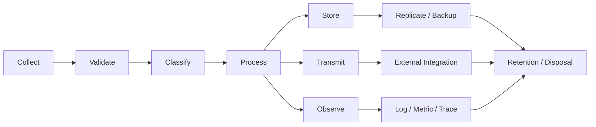
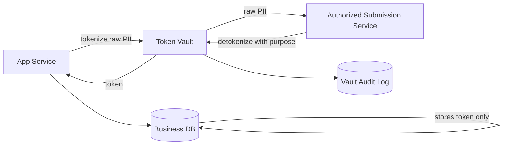
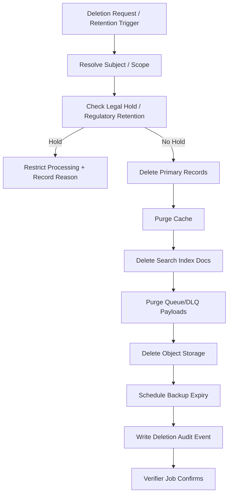
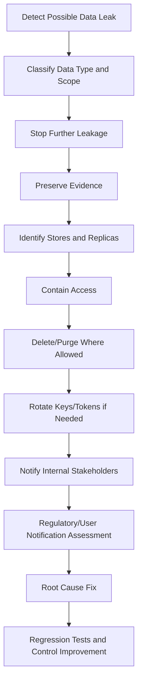
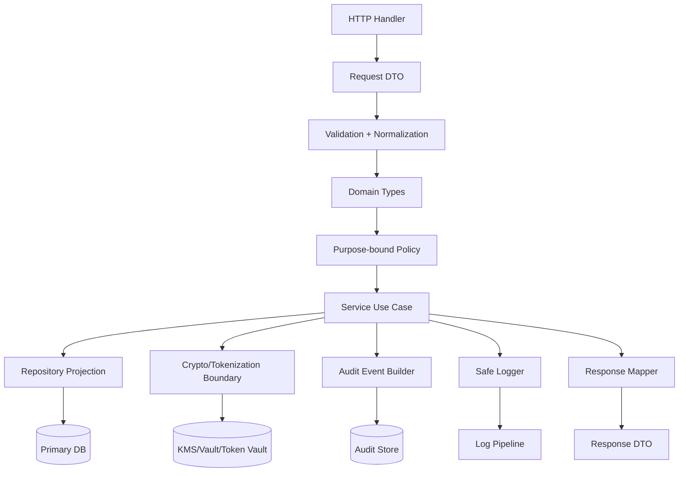

# learn-go-security-cryptography-integrity-part-030.md

# Privacy and Sensitive Data Handling in Go

> Seri: `learn-go-security-cryptography-integrity`  
> Part: `030`  
> Topik: Privacy, PII classification, tokenization, encryption at rest, field-level encryption, masking, logs, telemetry, dan data minimization  
> Target: Go 1.26.x  
> Audience: Java software engineer / tech lead yang ingin membangun sistem Go yang aman, defensible, dan production-grade  
> Status seri: belum selesai. Ini adalah part 030 dari 034.

---

## 0. Apa yang Akan Dikuasai di Bagian Ini

Bagian ini membahas **privacy dan sensitive data handling** sebagai desain sistem, bukan sekadar “encrypt kolom database”.

Setelah menyelesaikan part ini, targetnya kamu mampu:

1. Membedakan **secret**, **credential**, **PII**, **sensitive personal data**, **regulated data**, **business-confidential data**, dan **operational metadata**.
2. Membuat **data classification model** yang bisa dipakai oleh engineer, reviewer, auditor, security, dan product owner.
3. Mendesain alur data Go service dengan prinsip:
   - data minimization,
   - purpose limitation,
   - least exposure,
   - safe logging,
   - safe telemetry,
   - retention-aware storage,
   - cryptographic protection,
   - deletion/erasure workflow.
4. Memilih antara:
   - masking,
   - redaction,
   - hashing,
   - HMAC blind index,
   - tokenization,
   - encryption,
   - field-level encryption,
   - envelope encryption,
   - anonymization,
   - pseudonymization.
5. Membuat tipe/domain boundary di Go agar sensitive data tidak bocor lewat:
   - `fmt`,
   - `slog`,
   - `error`,
   - JSON response,
   - metrics label,
   - trace attributes,
   - panic,
   - dead-letter queue,
   - audit event,
   - cache,
   - search index.
6. Mendesain privacy control untuk sistem regulatori/case-management yang memiliki auditability tinggi tetapi tetap harus membatasi data exposure.
7. Membuat checklist PR, design review, dan incident response untuk data leakage.

---

## 1. Premis Utama: Privacy adalah Kontrol atas Aliran Data

Security sering dipahami sebagai pertanyaan:

> “Siapa boleh mengakses sistem?”

Privacy bertanya lebih jauh:

> “Data apa yang dikumpulkan, untuk tujuan apa, diproses di mana, terlihat oleh siapa, disimpan berapa lama, dikirim ke mana, bisa dihapus kapan, dan bagaimana pembuktiannya?”

Dalam sistem backend Go, privacy bukan hanya UI consent banner atau dokumen legal. Privacy adalah properti arsitektur.

Sebuah data field dianggap aman bukan karena “database-nya terenkripsi”, tetapi karena:

1. field tersebut hanya dikumpulkan jika memang perlu,
2. field tersebut diklasifikasikan,
3. field tersebut masuk ke boundary yang eksplisit,
4. field tersebut hanya diproses untuk purpose yang sah,
5. field tersebut tidak bocor ke log/metric/trace/error,
6. field tersebut dilindungi saat transit dan rest,
7. field tersebut punya retention rule,
8. field tersebut punya deletion/erasure story,
9. field tersebut punya access/audit trail,
10. field tersebut tetap aman saat sistem gagal.

---

## 2. Baseline Referensi

Bagian ini memakai beberapa baseline faktual penting:

- NIST SP 800-122 memberikan guidance praktis untuk mengidentifikasi PII dan menentukan level proteksi berdasarkan konteks.
- NIST Privacy Framework adalah tool sukarela untuk membantu organisasi mengelola privacy risk.
- Go `crypto/cipher` menyediakan interface `AEAD` untuk authenticated encryption with associated data.
- Go `log/slog` menyediakan structured logging dengan record, level, message, dan key-value attributes.
- Go `encoding/json` memiliki security considerations seperti duplicate keys, ignored unknown fields, invalid UTF-8 replacement, dan numeric precision risk.
- Banyak kontrol privacy bukan murni cryptographic; sebagian besar adalah **data-flow governance**.

Referensi detail ada di akhir file.

---

## 3. Mental Model: Data Lifecycle sebagai Attack Surface

Sensitive data tidak hanya “ada di database”. Ia bergerak.



Setiap node adalah potensi leak:

| Lifecycle | Contoh leak |
|---|---|
| Collect | form mengumpulkan field yang tidak perlu |
| Validate | validation error memantulkan input mentah |
| Classify | field tidak diberi label sensitive sehingga masuk log |
| Process | data masuk ke goroutine/channel/cache tanpa TTL |
| Store | plaintext field disimpan di DB/search index |
| Transmit | data dikirim ke service yang tidak butuh field itu |
| Observe | PII masuk log, metrics label, trace attribute |
| Replicate | backup/snapshot menyimpan data lebih lama dari primary |
| External Integration | vendor menerima field berlebih |
| Retention | data tidak pernah dihapus karena tidak ada owner |

Security review yang hanya memeriksa API endpoint akan gagal menangkap risiko privacy. Yang harus direview adalah **jalur hidup data**.

---

## 4. Taxonomy Data: Jangan Semua Disebut “Sensitive”

Kesalahan umum: semua data disebut sensitive. Akibatnya, engineer tidak tahu mana yang harus diprioritaskan.

Gunakan taxonomy yang actionable.

### 4.1 Kelas Data

| Kelas | Definisi praktis | Contoh | Perlakuan minimal |
|---|---|---|---|
| Public | aman dipublikasikan | docs publik, status page | integrity tetap dijaga |
| Internal | tidak untuk publik, tapi bukan personal/secret | feature flag non-secret, internal module name | access control |
| Confidential Business | rahasia organisasi | pricing, strategy, internal case note | access control + audit |
| Secret | memberi akses langsung | API key, password, token, private key | secret manager, rotation |
| Personal Data / PII | mengidentifikasi orang langsung/tidak langsung | nama, email, NIK, phone, address | minimization, masking, retention |
| Sensitive Personal Data | personal data dengan dampak tinggi | health, biometric, financial, criminal/legal context | strict purpose, encryption, audit |
| Regulated Evidence | data yang harus defensible secara legal/regulatori | case evidence, decision trail | immutability, retention, tamper evidence |
| Operational Metadata | data operasional yang bisa menjadi sensitive bila digabung | IP, user-agent, device ID, correlation ID | limited retention, aggregation |

### 4.2 Direct Identifier vs Indirect Identifier

| Jenis | Contoh | Risiko |
|---|---|---|
| Direct identifier | national ID, passport number, email, phone | langsung menunjuk individu |
| Indirect identifier | birth date, postal code, agency, role, timestamp | bisa mengidentifikasi bila digabung |
| Sensitive attribute | medical status, enforcement history, financial distress | dampak tinggi walau tanpa nama |
| Linkable identifier | device ID, session ID, stable pseudonym | memungkinkan profiling lintas waktu |

Privacy risk sering muncul dari **kombinasi indirect identifiers**, bukan hanya field seperti `name`.

Contoh:

```text
birth_date + postal_code + agency_role + event_time
```

Masing-masing mungkin tampak “tidak terlalu sensitive”, tetapi gabungannya bisa cukup untuk re-identification.

---

## 5. Privacy Risk ≠ Security Risk Biasa

Security risk sering berbentuk:

```text
attacker gets unauthorized access
```

Privacy risk bisa muncul walau aksesnya “authorized” secara teknis:

```text
system collects more data than needed
system logs data for debugging beyond purpose
admin can search all citizens without reason
analytics pipeline receives full identifiers
support agent sees hidden field because DTO reused
retention job misses backup/archive/search index
```

Jadi privacy control tidak cukup dengan RBAC. Perlu:

- field-level purpose,
- role-based field visibility,
- data minimization,
- auditability,
- retention,
- controlled disclosure,
- masking,
- trace/log suppression,
- data lifecycle ownership.

---

## 6. Privacy Invariant

Security invariant adalah kondisi yang tidak boleh dilanggar. Untuk privacy, invariant harus eksplisit.

Contoh invariant buruk:

```text
Do not leak PII.
```

Terlalu umum. Tidak bisa dites.

Contoh invariant yang lebih baik:

```text
Raw national_id must never appear in logs, metrics, traces, HTTP error bodies, cache keys, queue names, object storage object names, or search index fields.
```

Contoh lain:

```text
A case officer may view complainant_contact only when assigned to the case or explicitly granted temporary access.
```

```text
Export jobs must include only fields declared in the export purpose profile.
```

```text
Pseudonymous analytics ID must not be joinable back to user ID without access to the tokenization service.
```

```text
Deletion workflow must delete or tombstone primary DB rows, cache entries, search documents, derived exports, and async retry payloads, while preserving legally required audit metadata.
```

---

## 7. Sensitive Data Boundary di Go

Go tidak punya annotation framework seperti Java bean validation/security annotation ecosystem. Itu bukan kelemahan; justru bisa menjadi kekuatan bila desainnya eksplisit.

Di Java, sering ada pola:

```java
class User {
    @Sensitive
    private String nationalId;
}
```

Di Go, jangan hanya meniru annotation. Buat boundary yang terlihat dari tipe dan API.

### 7.1 Anti-Pattern: Primitive Obsession

```go
type User struct {
    ID         string
    Name       string
    Email      string
    NationalID string
    Phone      string
}
```

Masalah:

- Semua field `string`, tidak ada semantic boundary.
- Mudah masuk `fmt.Printf("%+v", user)`.
- Mudah masuk JSON response.
- Mudah masuk `slog.Any("user", user)`.
- Tidak ada redaction contract.

### 7.2 Better: Domain Type untuk Sensitive Fields

```go
package privacy

type Email struct {
    value string
}

func NewEmail(v string) (Email, error) {
    // validate and normalize here
    if v == "" {
        return Email{}, ErrInvalidEmail
    }
    return Email{value: v}, nil
}

func (e Email) ValueForDelivery() string {
    return e.value
}

func (e Email) Redacted() string {
    // Example only: adapt masking policy to product/legal requirement.
    if len(e.value) <= 3 {
        return "***"
    }
    return e.value[:1] + "***"
}

func (e Email) String() string {
    return e.Redacted()
}
```

Tetapi hati-hati: `String()` redaction bukan kontrol final. Ada cara lain untuk leak data:

- JSON marshal custom,
- `slog.Any`,
- `%#v`,
- reflection,
- database debug logs,
- panic dump.

### 7.3 Better: Pisahkan Raw Access dari Display Access

```go
type NationalID struct {
    value string
}

func NewNationalID(v string) (NationalID, error) {
    // normalize + validate here
    if v == "" {
        return NationalID{}, ErrInvalidNationalID
    }
    return NationalID{value: v}, nil
}

func (n NationalID) Redacted() string {
    if len(n.value) < 4 {
        return "****"
    }
    return "****" + n.value[len(n.value)-4:]
}

// Raw is intentionally named loudly.
func (n NationalID) RawForCryptoOrRegulatedSubmission() string {
    return n.value
}
```

Nama method harus membuat reviewer berhenti:

```text
RawForCryptoOrRegulatedSubmission()
RawForNotificationDelivery()
RawForKMSWrap()
```

Lebih baik daripada:

```text
Value()
String()
Get()
```

Karena method generik membuat raw exposure terasa normal.

---

## 8. Data Transfer Object Harus Berbeda dari Domain Model

Anti-pattern umum di Go:

```go
func getUser(w http.ResponseWriter, r *http.Request) {
    user := repo.FindUser(...)
    json.NewEncoder(w).Encode(user)
}
```

Ini berbahaya bila `user` adalah domain/persistence model.

### 8.1 Gunakan Explicit Response DTO

```go
type UserProfileResponse struct {
    ID    string `json:"id"`
    Name  string `json:"name"`
    Email string `json:"email_masked"`
}

func ToUserProfileResponse(u User) UserProfileResponse {
    return UserProfileResponse{
        ID:    u.ID.String(),
        Name:  u.Name.Display(),
        Email: u.Email.Redacted(),
    }
}
```

Keuntungan:

- Response field menjadi explicit.
- Reviewer bisa melihat disclosure.
- Sensitive field tidak “ikut kebawa”.
- Jika domain model berubah, response tidak otomatis berubah.

### 8.2 Jangan Memakai `omitempty` sebagai Privacy Control

```go
type Response struct {
    NationalID string `json:"national_id,omitempty"`
}
```

`omitempty` bukan privacy control. Ia hanya menghilangkan field jika empty. Bila terisi, tetap bocor.

Privacy control harus berupa mapping eksplisit:

```go
type PublicUserResponse struct {
    ID          string `json:"id"`
    DisplayName string `json:"display_name"`
}

type OfficerUserResponse struct {
    ID             string `json:"id"`
    DisplayName    string `json:"display_name"`
    EmailMasked    string `json:"email_masked"`
    NationalIDLast4 string `json:"national_id_last4"`
}
```

---

## 9. Data Minimization

Data minimization berarti:

> hanya kumpulkan, kirim, proses, simpan, dan tampilkan data yang diperlukan untuk purpose yang jelas.

### 9.1 Minimization di API Request

Buruk:

```json
{
  "applicant": {
    "name": "Alice",
    "email": "alice@example.test",
    "phone": "...",
    "address": "...",
    "national_id": "...",
    "birth_date": "...",
    "marital_status": "...",
    "employment_history": "..."
  }
}
```

Jika endpoint hanya butuh email untuk verification, request schema harus:

```json
{
  "email": "alice@example.test"
}
```

Jangan menerima object besar hanya karena frontend “sudah punya”.

### 9.2 Minimization di Service-to-Service Call

Anti-pattern:

```go
caseSvc.GetFullCase(ctx, caseID)
```

Better:

```go
caseSvc.GetCaseSummaryForAssignment(ctx, caseID)
caseSvc.GetCaseEvidenceForOfficer(ctx, caseID, officerID)
caseSvc.GetCaseContactForNotification(ctx, caseID, purpose)
```

Nama method harus mengandung **purpose**.

### 9.3 Minimization di SQL

Buruk:

```sql
SELECT * FROM citizens WHERE id = ?
```

Better:

```sql
SELECT id, display_name, status FROM citizens WHERE id = ?
```

Untuk Go, jangan biasakan scan seluruh row ke struct besar bila hanya butuh 3 field.

---

## 10. Purpose Binding

Sensitive data harus diakses untuk purpose tertentu.

Contoh purpose:

```go
type Purpose string

const (
    PurposeDisplayProfile        Purpose = "display_profile"
    PurposeSendNotification      Purpose = "send_notification"
    PurposeRegulatorySubmission  Purpose = "regulatory_submission"
    PurposeFraudInvestigation    Purpose = "fraud_investigation"
    PurposeAuditReview           Purpose = "audit_review"
)
```

Access function bisa memaksa purpose:

```go
func (s *CitizenService) GetContact(
    ctx context.Context,
    actor Actor,
    citizenID CitizenID,
    purpose Purpose,
) (ContactInfo, error) {
    if !s.policy.CanAccessContact(ctx, actor, citizenID, purpose) {
        return ContactInfo{}, ErrForbidden
    }

    contact, err := s.repo.LoadContact(ctx, citizenID)
    if err != nil {
        return ContactInfo{}, err
    }

    s.audit.Record(ctx, AuditEvent{
        ActorID:  actor.ID,
        Action:   "citizen.contact.read",
        ObjectID: citizenID.String(),
        Purpose:  string(purpose),
    })

    return contact, nil
}
```

Privacy tanpa purpose binding sering berubah menjadi:

```text
authorized users can access everything because they are authorized
```

Itu bukan least privilege.

---

## 11. Masking, Redaction, Tokenization, Hashing, Encryption

Jangan campuradukkan istilah ini.

| Teknik | Bisa balik ke raw? | Tujuan utama | Cocok untuk | Risiko |
|---|---:|---|---|---|
| Masking | tidak dari output masked | tampilan terbatas | UI, log, support screen | raw masih ada di sistem |
| Redaction | tidak | menghapus field dari output | logs/errors/export | bisa salah konfigurasi |
| Hash | tidak praktis jika input high-entropy | fingerprint/integrity | file digest, tamper check | buruk untuk low-entropy PII |
| HMAC blind index | tidak tanpa key | lookup equality aman relatif | cari email/national ID tanpa plaintext index | key compromise membuka brute force |
| Tokenization | via token vault | mengganti identifier raw | payment/PII vault | token vault menjadi high-value target |
| Encryption | ya dengan key | confidentiality | storage, fields, files | key management sulit |
| Pseudonymization | bisa re-link dengan mapping/key | mengurangi identifiability | analytics, case view | bukan anonymization |
| Anonymization | tidak reasonable re-identify | privacy-preserving dataset | public/statistical release | sulit dibuktikan |

### 11.1 Masking

Masking untuk display:

```go
func MaskEmail(email string) string {
    at := strings.IndexByte(email, '@')
    if at <= 1 {
        return "***"
    }
    return email[:1] + "***" + email[at:]
}
```

Masking bukan storage protection. Database masih punya raw email.

### 11.2 Redaction

Redaction untuk menghilangkan field:

```json
{
  "case_id": "CASE-123",
  "complainant_email": "[REDACTED]"
}
```

Redaction cocok untuk logs, errors, support exports.

### 11.3 Hashing

Hashing `email` dengan SHA-256 bukan privacy control yang kuat karena email low-entropy dan bisa di-dictionary attack.

Buruk:

```go
sha256.Sum256([]byte(strings.ToLower(email)))
```

Attacker bisa brute force daftar email umum.

### 11.4 HMAC Blind Index

Untuk equality lookup tanpa plaintext index:

```go
func BlindIndex(key []byte, normalized string) []byte {
    mac := hmac.New(sha256.New, key)
    mac.Write([]byte("blind-index:v1:email:"))
    mac.Write([]byte(normalized))
    return mac.Sum(nil)
}
```

Ini lebih baik daripada raw hash karena butuh key. Tapi tetap:

- jika key bocor, brute force mungkin,
- low-entropy values tetap risk,
- perlu key rotation strategy,
- perlu domain separation,
- jangan pakai blind index sebagai public identifier.

### 11.5 Tokenization

Tokenization mengganti raw value dengan token.

```text
raw national_id -> token vault -> tok_8X1...
```

Service biasa hanya menyimpan token. Raw value hanya ada di vault.

Tokenization cocok bila:

- banyak service perlu referensi stabil,
- sedikit service perlu raw,
- akses raw harus sangat dibatasi,
- audit raw access penting.

### 11.6 Field-Level Encryption

Field-level encryption menjaga confidentiality di storage dan pipeline tertentu.

Tetapi encryption tidak otomatis menyelesaikan:

- over-collection,
- unauthorized decrypt,
- log leak sebelum encryption,
- metrics label leak,
- backup retention,
- search index plaintext,
- key misuse,
- admin with decrypt permission,
- application-level dump.

---

## 12. Field-Level Encryption Design

Field-level encryption harus punya envelope yang jelas.

### 12.1 Envelope Format

Contoh conceptual envelope:

```json
{
  "v": 1,
  "alg": "AES-256-GCM",
  "kid": "customer-pii-dek-2026-01",
  "nonce": "base64...",
  "aad": "implicit",
  "ct": "base64..."
}
```

Field penting:

| Field | Tujuan |
|---|---|
| `v` | format version |
| `alg` | algorithm identifier |
| `kid` | key identifier |
| `nonce` | AEAD nonce |
| `ct` | ciphertext + tag |
| AAD | binding ke context, biasanya tidak disimpan sebagai raw field |

### 12.2 AAD Harus Mengikat Context

AAD mencegah ciphertext dipindahkan diam-diam dari satu konteks ke konteks lain.

Contoh AAD:

```text
app=aceas-like-system
tenant=cea
table=citizen_profile
column=national_id
record_id=...
purpose=storage
version=1
```

Jika ciphertext dari `national_id` dipindah ke field `phone`, decrypt harus gagal karena AAD berbeda.

### 12.3 Go AEAD Wrapper

```go
package privacycrypto

import (
    "crypto/aes"
    "crypto/cipher"
    "crypto/rand"
    "encoding/base64"
    "encoding/json"
    "fmt"
)

type FieldCiphertext struct {
    Version int    `json:"v"`
    Alg     string `json:"alg"`
    KID     string `json:"kid"`
    Nonce   string `json:"nonce"`
    CT      string `json:"ct"`
}

type Key struct {
    ID    string
    Bytes []byte
}

type KeyResolver interface {
    ActiveKey(ctx context.Context, purpose string) (Key, error)
    ResolveKey(ctx context.Context, kid string) (Key, error)
}
```

Contoh fungsi encrypt:

```go
func EncryptField(key Key, aad []byte, plaintext []byte) (FieldCiphertext, error) {
    block, err := aes.NewCipher(key.Bytes)
    if err != nil {
        return FieldCiphertext{}, fmt.Errorf("create AES cipher: %w", err)
    }

    aead, err := cipher.NewGCM(block)
    if err != nil {
        return FieldCiphertext{}, fmt.Errorf("create GCM: %w", err)
    }

    nonce := make([]byte, aead.NonceSize())
    if _, err := rand.Read(nonce); err != nil {
        return FieldCiphertext{}, fmt.Errorf("read nonce: %w", err)
    }

    sealed := aead.Seal(nil, nonce, plaintext, aad)

    return FieldCiphertext{
        Version: 1,
        Alg:     "AES-256-GCM",
        KID:     key.ID,
        Nonce:   base64.RawURLEncoding.EncodeToString(nonce),
        CT:      base64.RawURLEncoding.EncodeToString(sealed),
    }, nil
}
```

Decrypt:

```go
func DecryptField(key Key, aad []byte, env FieldCiphertext) ([]byte, error) {
    if env.Version != 1 {
        return nil, ErrUnsupportedCiphertextVersion
    }
    if env.Alg != "AES-256-GCM" {
        return nil, ErrUnsupportedAlgorithm
    }
    if env.KID != key.ID {
        return nil, ErrKeyMismatch
    }

    nonce, err := base64.RawURLEncoding.DecodeString(env.Nonce)
    if err != nil {
        return nil, ErrInvalidCiphertext
    }
    ct, err := base64.RawURLEncoding.DecodeString(env.CT)
    if err != nil {
        return nil, ErrInvalidCiphertext
    }

    block, err := aes.NewCipher(key.Bytes)
    if err != nil {
        return nil, fmt.Errorf("create AES cipher: %w", err)
    }

    aead, err := cipher.NewGCM(block)
    if err != nil {
        return nil, fmt.Errorf("create GCM: %w", err)
    }

    pt, err := aead.Open(nil, nonce, ct, aad)
    if err != nil {
        return nil, ErrInvalidCiphertext
    }

    return pt, nil
}
```

Catatan:

- Jangan log `plaintext`.
- Jangan log `key.Bytes`.
- Jangan log `nonce+ct` bila tidak perlu.
- Jangan swallow decrypt error menjadi empty string.
- Jangan reuse nonce untuk key yang sama.
- Jangan memakai AES-CBC manual untuk desain baru.
- Jangan membuat format tanpa version/kid/alg.

---

## 13. Deterministic Encryption dan Lookup

Problem:

> Bagaimana mencari user berdasarkan email jika email terenkripsi?

Pilihan:

1. simpan plaintext email index,
2. deterministic encryption,
3. blind index HMAC,
4. tokenization service,
5. external search service dengan access control,
6. tidak mendukung search tersebut.

### 13.1 Jangan Default ke Deterministic Encryption

Deterministic encryption menghasilkan ciphertext sama untuk plaintext sama. Ini memungkinkan equality leakage.

Contoh leak:

```text
ct_A == ct_B means email_A == email_B
```

Untuk low-entropy data, ini risk besar.

### 13.2 Pattern: Encrypt Raw + HMAC Blind Index

```text
email_plaintext
   ├── encrypted_email     -> confidentiality
   └── email_blind_index   -> equality lookup
```

Go conceptual model:

```go
type EncryptedEmailRecord struct {
    EmailCiphertext FieldCiphertext
    EmailBlindIndex []byte
}
```

Write flow:

```go
normalized := NormalizeEmail(input.Email)

blind := BlindIndex(indexKey, normalized)
ciphertext := EncryptField(dataKey, aad, []byte(normalized))

repo.Save(ctx, EncryptedEmailRecord{
    EmailCiphertext: ciphertext,
    EmailBlindIndex: blind,
})
```

Read/search flow:

```go
normalized := NormalizeEmail(input.Email)
blind := BlindIndex(indexKey, normalized)

record := repo.FindByEmailBlindIndex(ctx, blind)
email := DecryptField(dataKey, aad, record.EmailCiphertext)
```

Trade-off:

| Aspek | Dampak |
|---|---|
| Query equality | bisa |
| Prefix/contains search | tidak |
| Sorting | tidak |
| Unique constraint | bisa via blind index |
| Low entropy brute force | masih risk bila key bocor |
| Key rotation | lebih kompleks |

---

## 14. Privacy-Safe Logging dengan `slog`

Structured logging bagus untuk observability, tetapi berbahaya untuk privacy bila attributes tidak dikontrol.

Anti-pattern:

```go
slog.Info("created user", "user", user)
```

Masalah:

- `user` bisa berisi PII.
- Handler bisa serialize semua exported fields.
- Log aggregator punya retention panjang.
- Banyak orang punya akses log.
- Log lebih sulit dihapus daripada DB.

### 14.1 Redaction Policy di Boundary Logging

Gunakan policy, bukan ad-hoc masking.

```go
type Sensitivity string

const (
    Public      Sensitivity = "public"
    Internal    Sensitivity = "internal"
    Confidential Sensitivity = "confidential"
    PII         Sensitivity = "pii"
    Secret      Sensitivity = "secret"
)

type AttrPolicy struct {
    Name        string
    Sensitivity Sensitivity
    AllowInLog  bool
}
```

### 14.2 `slog.ReplaceAttr`

`log/slog` mendukung `ReplaceAttr` pada handler options. Ini bisa dipakai sebagai guardrail.

```go
func RedactingReplaceAttr(groups []string, a slog.Attr) slog.Attr {
    key := strings.ToLower(a.Key)

    switch key {
    case "password", "token", "authorization", "cookie", "secret", "api_key":
        return slog.String(a.Key, "[REDACTED]")
    case "email":
        return slog.String(a.Key, "[EMAIL_REDACTED]")
    case "national_id", "nric", "passport":
        return slog.String(a.Key, "[ID_REDACTED]")
    default:
        return a
    }
}
```

Handler:

```go
logger := slog.New(slog.NewJSONHandler(os.Stdout, &slog.HandlerOptions{
    ReplaceAttr: RedactingReplaceAttr,
}))
```

Tetapi ini hanya lapisan defense-in-depth.

Masalah tetap ada:

- nama key tidak konsisten,
- data bisa masuk dalam message string,
- nested struct bisa lolos,
- stack trace bisa mengandung data,
- third-party lib bisa log raw request.

Jadi rule production:

```text
Do not rely on log redactor as the first privacy boundary.
Design logs to be safe before redaction.
```

### 14.3 Safe Log Event Schema

Buruk:

```go
slog.Error("failed to process application "+req.NationalID)
```

Better:

```go
slog.Error("failed to process application",
    "application_id", appID.String(),
    "actor_id", actor.ID.String(),
    "error_code", code,
)
```

Log event harus mengutamakan:

- IDs yang aman,
- event code,
- state transition,
- module,
- actor pseudonym,
- correlation ID,
- error category.

Hindari:

- raw request body,
- raw header,
- Authorization,
- Cookie,
- email,
- phone,
- address,
- national ID,
- free-text notes,
- uploaded file names jika mengandung personal info,
- full URL dengan query string.

---

## 15. Privacy-Safe Error Handling

Error bisa bocor melalui:

- HTTP response body,
- log,
- trace exception event,
- panic dump,
- retry/DLQ payload,
- alert notification,
- support ticket.

### 15.1 Error Envelope

```go
type PublicError struct {
    Code        string `json:"code"`
    Message     string `json:"message"`
    Correlation string `json:"correlation_id"`
}
```

Internal error:

```go
return fmt.Errorf("lookup citizen by national_id blind index: %w", err)
```

Public response:

```json
{
  "code": "CITIZEN_LOOKUP_FAILED",
  "message": "Unable to complete the request.",
  "correlation_id": "01J..."
}
```

### 15.2 Jangan Menaruh PII di Error Message

Buruk:

```go
return fmt.Errorf("invalid national id %s", input.NationalID)
```

Better:

```go
return ErrInvalidNationalID
```

Jika perlu debug:

```go
slog.Warn("invalid national id format",
    "field", "national_id",
    "reason", "checksum_failed",
    "correlation_id", cid,
)
```

Tanpa raw value.

---

## 16. Privacy-Safe Metrics

Metrics label adalah salah satu tempat leak paling mahal.

Anti-pattern:

```go
http_requests_total{user_email="alice@example.test"}
```

Masalah:

- cardinality explosion,
- PII masuk time-series DB,
- retention panjang,
- metrics sering diakses banyak orang,
- sulit dihapus selektif.

Label metrics harus low-cardinality dan non-sensitive:

```text
method
route_template
status_code
service
module
error_class
tenant_class, not tenant raw if sensitive
```

Hindari:

```text
user_id
email
national_id
session_id
access_token
case_title
free_text
full_url
query
ip unless aggregated/policy-approved
```

Jika perlu user-level debugging, gunakan log/audit dengan access control, bukan metrics label.

---

## 17. Privacy-Safe Tracing

Distributed tracing bisa membocorkan data karena trace attributes sering otomatis dikumpulkan.

Risiko:

- HTTP URL lengkap berisi query parameter,
- DB statement mengandung literal,
- messaging payload attribute,
- exception stack dengan raw input,
- baggage membawa user info lintas service.

Policy:

```text
Trace IDs are for correlation. They are not user identifiers.
```

Safe trace attributes:

```text
http.route=/cases/{case_id}
http.method=POST
http.status_code=403
app.module=case
app.action=assign
app.error_class=authorization_denied
```

Unsafe:

```text
http.url=/verify?email=alice@example.test
db.statement=SELECT ... WHERE national_id='...'
messaging.payload=...
user.email=...
```

### 17.1 Route Template, Bukan Full Path

Buruk:

```text
/cases/CASE-123/evidence/passport-alice.pdf
```

Better:

```text
/cases/{case_id}/evidence/{evidence_id}
```

Jika case ID sensitive, jangan jadikan span name.

---

## 18. Context Value Jangan Jadi Data Dump

`context.Context` sering disalahgunakan sebagai tempat menyimpan semua metadata.

Buruk:

```go
ctx = context.WithValue(ctx, "user", fullUser)
ctx = context.WithValue(ctx, "requestBody", rawBody)
```

Better:

```go
type ActorContext struct {
    ActorID ActorID
    Roles   []Role
    SessionID SessionID
}

ctx = WithActor(ctx, ActorContext{
    ActorID: actor.ID,
    Roles: actor.Roles,
    SessionID: actor.SessionID,
})
```

Jangan simpan:

- password,
- token raw,
- request body,
- full profile,
- sensitive case notes,
- decrypted fields,
- uploaded file content.

Context menyebar ke banyak layer dan sering ikut logging/tracing.

---

## 19. HTTP Boundary Privacy

### 19.1 Jangan Kirim Sensitive Data di URL Query

Buruk:

```http
GET /verify?email=alice@example.test&national_id=...
```

URL bisa masuk:

- browser history,
- proxy log,
- load balancer log,
- referrer header,
- analytics,
- access log.

Better:

```http
POST /verify
Content-Type: application/json

{
  "email": "...",
  "national_id": "..."
}
```

Tetap harus:

- body size limit,
- validation,
- no raw body logging,
- redacted audit,
- TLS,
- rate limiting.

### 19.2 Header Privacy

Sensitive headers:

```text
Authorization
Cookie
Set-Cookie
X-API-Key
X-Id-Token
X-Forwarded-For sometimes
```

Access logs harus redact.

### 19.3 Cookie Privacy

Cookie bisa mengandung sensitive identifiers. Jangan simpan full user profile di cookie.

Gunakan:

- opaque session ID,
- signed/encrypted minimal cookie bila perlu,
- `Secure`,
- `HttpOnly`,
- `SameSite`,
- narrow `Path`,
- no unnecessary `Domain`.

---

## 20. Database Privacy Design

### 20.1 Column Classification

Setiap column penting harus punya classification.

Contoh:

| Table | Column | Classification | Protection | Retention |
|---|---|---|---|---|
| citizen | id | internal identifier | access control | account lifetime |
| citizen | email_ciphertext | PII | field encryption | purpose-specific |
| citizen | email_blind_index | derived PII | HMAC key protected | same as email |
| citizen | national_id_ciphertext | high-risk PII | field encryption + strict audit | legal basis |
| audit_event | actor_id | operational metadata | access control | audit retention |
| audit_event | raw_snapshot | high-risk | avoid or encrypt | strict |

### 20.2 Avoid Plaintext Search Index

Search systems often become shadow databases.

If OpenSearch/Elasticsearch stores:

```json
{
  "name": "Alice",
  "email": "alice@example.test",
  "national_id": "..."
}
```

Then encryption in primary DB is weakened by plaintext in search.

Options:

- index only non-sensitive fields,
- tokenize terms,
- store masked fields,
- restrict index access,
- short retention,
- separate sensitive search service,
- audited search,
- no broad wildcard search for sensitive identifiers.

### 20.3 Backups and Replicas

Privacy review must include:

- DB replicas,
- snapshots,
- backups,
- WAL/binlog,
- CDC streams,
- data lake,
- analytics copies,
- exported CSV,
- developer dumps,
- staging restored from production,
- test fixtures.

A deletion workflow that only deletes primary DB row is incomplete.

---

## 21. Cache Privacy

Caches often bypass privacy design.

Risks:

- cache key contains PII,
- cache value contains full profile,
- TTL too long,
- shared cache across tenant,
- no deletion on revoke,
- debug endpoint exposes cache,
- Redis persistence/snapshot retains values,
- local memory cache survives longer than request.

Bad cache key:

```text
citizen:email:alice@example.test
```

Better:

```text
citizen:email-blind-index:base64(hmac)
```

But even blind index may be derived PII. Treat cache as sensitive.

Policy:

```text
Cache key and value classification must be no less strict than source data.
```

---

## 22. Queue, Event, and DLQ Privacy

Event-driven systems duplicate data.

Anti-pattern:

```json
{
  "event_type": "CaseSubmitted",
  "case_id": "...",
  "applicant_name": "...",
  "email": "...",
  "national_id": "...",
  "full_application": { ... }
}
```

Better:

```json
{
  "event_type": "CaseSubmitted",
  "event_id": "...",
  "case_id": "...",
  "occurred_at": "...",
  "schema_version": 1
}
```

Consumer fetches details if authorized and necessary.

### 22.1 DLQ Risk

Dead-letter queues often retain failed payloads for long periods. If payload has PII, DLQ becomes sensitive storage.

Controls:

- minimize event payload,
- encrypt sensitive payload,
- short retention,
- access control,
- redacted DLQ viewer,
- audit read/replay,
- purge after incident,
- no raw DLQ dump to tickets.

---

## 23. File and Object Storage Privacy

Object storage can leak through:

- object key names,
- metadata,
- tags,
- access logs,
- presigned URL,
- bucket inventory,
- replication,
- thumbnails/previews,
- malware scanner logs,
- OCR extracted text,
- lifecycle mismatch.

Bad object key:

```text
uploads/alice@example.test/passport.pdf
```

Better:

```text
uploads/2026/06/24/01J.../blob
```

Metadata must also be safe:

```text
x-amz-meta-national-id: ...
```

is a leak.

### 23.1 Presigned URL

Presigned URL should be:

- short-lived,
- purpose-specific,
- scoped to one object/action,
- not logged,
- not shared in referrer-prone contexts,
- invalidated by object/key policy where possible.

---

## 24. Tokenization Service Architecture

Tokenization is useful when many systems need stable references but should not see raw values.



Token vault controls:

- raw value storage,
- token generation,
- detokenization policy,
- purpose requirement,
- caller identity,
- audit,
- rotation,
- breach response.

Tokenization is not magic. It centralizes risk into one high-value service. That service needs stronger controls.

---

## 25. Pseudonymization vs Anonymization

### 25.1 Pseudonymization

Pseudonymization replaces identifier with a pseudonym.

```text
user_id=123 -> subject_id=pseudo_abc
```

If mapping/key exists, re-identification is possible.

Use for:

- analytics,
- reporting,
- limited operational visibility,
- privacy-preserving UI.

Do not claim anonymization if mapping exists.

### 25.2 Anonymization

Anonymization means re-identification is not reasonably possible given available data and context.

This is hard because:

- auxiliary datasets exist,
- quasi-identifiers combine,
- small cohorts leak,
- rare attributes identify,
- timestamps/locations are identifying,
- free-text can include names,
- model outputs can leak training data.

Engineering implication:

```text
Aggregated report is not automatically anonymous.
```

Need:

- k-anonymity-like reasoning,
- suppression,
- bucketing,
- noise/differential privacy where appropriate,
- expert review for public release.

---

## 26. Free Text is High Risk

Regulatory/case-management systems often have notes:

```text
officer_notes
complainant_statement
case_description
internal_remarks
```

Free text may contain anything:

- names,
- phone,
- health info,
- allegations,
- addresses,
- credentials accidentally pasted,
- third-party data,
- legal privilege,
- harassment/abuse content.

Controls:

- classify free text as high-risk by default,
- do not put free text in logs,
- do not use as metrics label,
- limit search,
- audit reads,
- consider redaction tooling,
- separate storage/index,
- careful AI/LLM usage policy,
- retention policy.

---

## 27. Data in AI/ML/LLM Workflows

Even if this Go service does not implement ML, production systems increasingly send data to AI tools or internal assistants.

Privacy controls:

- never send production PII to external AI unless explicitly approved,
- redact/minimize before prompt,
- avoid logs with prompt raw data,
- treat embeddings as derived data,
- classify vector DB,
- retention and deletion apply to derived data,
- avoid putting secrets in prompts,
- document vendor boundary.

In Go systems, AI integration often appears as:

- summarization service,
- document extraction,
- chatbot support,
- semantic search,
- classification worker.

Each is an external/derived processing boundary.

---

## 28. Retention and Deletion Workflow

Deletion is not a single SQL statement.



### 28.1 Deletion vs Tombstone vs Legal Retention

| Action | Meaning |
|---|---|
| hard delete | data removed from active store |
| soft delete | hidden but still present |
| tombstone | marker that prevents resurrection |
| anonymize | remove identifiers while preserving stats |
| restrict processing | keep but block normal use |
| legal hold | retain due to legal/regulatory obligation |
| crypto-erasure | delete key so ciphertext becomes unrecoverable |

Do not promise hard deletion if backups retain data for 90 days.

Better wording for engineering spec:

```text
Data is deleted from active stores within X days and expires from backups according to backup retention policy Y, unless legal hold applies.
```

### 28.2 Crypto-Erasure

If data is encrypted with per-subject/per-tenant keys, deleting the key can render ciphertext unrecoverable.

But crypto-erasure only works if:

- key hierarchy is designed for it,
- no plaintext copies exist,
- logs/search/cache/backups do not retain raw data,
- derived data is handled,
- key deletion is irreversible and audited.

---

## 29. Privacy Access Control: Field-Level and Purpose-Level

RBAC alone often says:

```text
Officer can view Case.
```

But a case has many fields:

```text
case id
case title
status
assigned officer
complainant name
complainant phone
national id
health notes
internal legal memo
evidence files
audit events
```

Better policy:

```text
Officer can view case summary if assigned.
Officer can view complainant contact only for notification or investigation purpose.
Officer cannot view internal legal memo unless role includes legal reviewer.
Support can view masked identifiers only.
System job can process raw contact for delivery but cannot expose it in logs.
```

### 29.1 Field Policy Matrix

| Field | Officer | Supervisor | Support | Batch Job | External Agency |
|---|---|---|---|---|---|
| case_id | read | read | read | read | read if shared |
| status | read | read | read | read | read if shared |
| complainant_name | read if assigned | read | masked | no | if purpose approved |
| complainant_phone | purpose-bound | purpose-bound | masked | delivery only | no default |
| national_id | no default | break-glass | masked last4 | matching only | strict |
| legal_note | no | legal role only | no | no | no |

This matrix should influence DTO, SQL projection, service methods, UI, and audit logs.

---

## 30. Break-Glass Access

In regulatory systems, sometimes emergency/break-glass access is necessary.

Bad design:

```text
admin can see everything
```

Better:

- explicit break-glass role,
- require reason,
- require ticket/case link,
- time-limited grant,
- supervisor approval if possible,
- additional MFA,
- high-severity audit event,
- post-access review,
- alert to security/compliance.

Go service design:

```go
type BreakGlassRequest struct {
    ActorID ActorID
    ObjectID ObjectID
    Reason string
    TicketRef string
    ExpiresAt time.Time
}
```

Access policy should not silently treat admin as omnipotent.

---

## 31. Privacy in Go Struct Tags

Struct tags are serialization contracts.

Anti-pattern:

```go
type Citizen struct {
    ID         string `json:"id"`
    Email      string `json:"email"`
    NationalID string `json:"national_id"`
}
```

If domain struct has JSON tags, someone may directly encode it.

Better:

- persistence model has `db` tags only,
- API DTO has `json` tags,
- domain model often has no serialization tags,
- sensitive types have custom marshaling that fails or redacts.

### 31.1 Fail-Closed JSON Marshal for Sensitive Type

```go
type SecretString struct {
    value string
}

func (s SecretString) MarshalJSON() ([]byte, error) {
    return nil, errors.New("SecretString cannot be marshaled to JSON")
}
```

For PII, decide whether redacted JSON is allowed:

```go
type RedactedEmail struct {
    value string
}

func (e RedactedEmail) MarshalJSON() ([]byte, error) {
    return json.Marshal(MaskEmail(e.value))
}
```

Be careful: failing marshal can break production if used accidentally. That is sometimes desirable in tests but may need explicit converter in runtime.

---

## 32. Safe Debugging

Engineers often leak data during debugging.

Avoid:

```go
fmt.Printf("request=%+v\n", req)
spew.Dump(user)
slog.Info("debug", "body", string(body))
panic(fmt.Sprintf("bad user: %+v", user))
```

Safer approach:

```go
slog.Debug("request accepted",
    "request_id", requestID,
    "route", routeName,
    "field_count", len(req.Fields()),
)
```

### 32.1 Debug Dumps in Lower Environment

Lower environment is not automatically safe. If it contains production-like data, treat it as production.

Rules:

- no production PII in local dumps,
- no full DB dump to developer laptop,
- masking/synthetic data for tests,
- access expiry,
- encrypted transfer,
- audit dump creation,
- purge after use.

---

## 33. Test Data and Fixtures

Do not commit realistic PII into repository.

Bad:

```json
{
  "name": "real citizen name",
  "nric": "real-looking national id",
  "phone": "real phone number"
}
```

Use generated synthetic values clearly marked:

```json
{
  "name": "Test Person 0001",
  "email": "person0001@example.invalid",
  "national_id": "TEST-ID-0001"
}
```

Use `.invalid`, `.test`, or reserved test domains where appropriate.

Add CI checks:

- scan for access tokens,
- scan for private keys,
- scan for email-like patterns,
- scan for national ID patterns if applicable,
- block committed dumps.

---

## 34. Privacy Testing Strategy

### 34.1 Redaction Golden Tests

```go
func TestAuditLogDoesNotContainPII(t *testing.T) {
    event := BuildAuditEvent(Case{
        ComplainantEmail: "alice@example.test",
        NationalID:       "S1234567A",
    })

    b, err := json.Marshal(event)
    if err != nil {
        t.Fatal(err)
    }

    s := string(b)
    forbidden := []string{
        "alice@example.test",
        "S1234567A",
    }

    for _, f := range forbidden {
        if strings.Contains(s, f) {
            t.Fatalf("audit event leaked sensitive value %q: %s", f, s)
        }
    }
}
```

### 34.2 HTTP Response Leak Tests

```go
func TestProfileResponseDoesNotExposeRawNationalID(t *testing.T) {
    rr := httptest.NewRecorder()
    req := httptest.NewRequest(http.MethodGet, "/profile", nil)

    handler.ServeHTTP(rr, req)

    body := rr.Body.String()
    if strings.Contains(body, "S1234567A") {
        t.Fatal("response leaked raw national id")
    }
}
```

### 34.3 Log Capture Tests

Create a test logger that stores records, then assert no sensitive values.

### 34.4 Fuzzing Encoders and Redactors

Fuzz redaction functions:

```go
func FuzzMaskEmail(f *testing.F) {
    f.Add("alice@example.test")
    f.Add("")
    f.Add("not-an-email")
    f.Fuzz(func(t *testing.T, input string) {
        masked := MaskEmail(input)
        if input != "" && strings.Contains(masked, input) {
            t.Fatalf("masked output contains full input")
        }
    })
}
```

Fuzzing cannot prove privacy, but catches surprising edge cases.

---

## 35. Observability Privacy Control Matrix

| Channel | Allow | Deny |
|---|---|---|
| logs | event code, object id, actor id, status, reason code | raw PII, tokens, full request |
| metrics | route template, status, error class | user id, email, case title |
| traces | span name, route template, dependency name | payload, token, query with PII |
| audit | purpose, actor, object, decision, masked snapshot | secrets, unnecessary raw values |
| alerts | symptom, count, module | sensitive sample payload |
| support ticket | correlation ID, sanitized event | full logs with PII |
| dashboard | aggregate counts | drilldown to raw identities unless approved |

---

## 36. Privacy Incident Response

Common incidents:

| Incident | Example |
|---|---|
| log leak | raw national ID in production logs |
| wrong recipient | report emailed to wrong person |
| overexposed API | response includes hidden field |
| bad export | CSV contains more columns than intended |
| telemetry leak | email in metrics label |
| search leak | sensitive field indexed in OpenSearch |
| backup leak | prod dump copied to lower environment |
| vendor leak | integration sends unnecessary PII |
| tokenization bypass | service stores raw value alongside token |
| key misconfiguration | decrypt permission too broad |

### 36.1 Immediate Response Flow



### 36.2 What to Preserve

Preserve enough to investigate:

- timeframe,
- affected fields,
- affected subjects,
- access logs,
- deployment version,
- config changes,
- who accessed leaked logs/export,
- downstream copies.

But do not spread leaked data further in the incident ticket.

Use sanitized evidence:

```text
field=national_id
sample_hash=hmac_sha256_incident_key(value)
count=123
time_range=...
```

---

## 37. Go Code Pattern: Privacy-Safe Logger Wrapper

```go
type SafeLogger struct {
    l *slog.Logger
}

func (s SafeLogger) CaseAccessDenied(ctx context.Context, actorID, caseID string, reason string) {
    s.l.WarnContext(ctx, "case access denied",
        "actor_id", actorID,
        "case_id", caseID,
        "reason", reason,
    )
}

func (s SafeLogger) InvalidInput(ctx context.Context, field, reason string) {
    s.l.WarnContext(ctx, "invalid input",
        "field", field,
        "reason", reason,
    )
}
```

Benefit:

- engineer tidak bebas memilih log fields,
- schema konsisten,
- sensitive values tidak masuk parameter,
- review lebih mudah.

---

## 38. Go Code Pattern: Sensitive Value Interface

```go
type Redactable interface {
    Redacted() string
}

type RawSensitive interface {
    rawSensitiveMarker()
}
```

Jangan expose `Raw()` sembarangan.

```go
type PhoneNumber struct {
    value string
}

func (p PhoneNumber) Redacted() string {
    if len(p.value) < 4 {
        return "****"
    }
    return "****" + p.value[len(p.value)-4:]
}

func (p PhoneNumber) rawSensitiveMarker() {}

func (p PhoneNumber) RawForSMSDelivery() string {
    return p.value
}
```

Logging helper:

```go
func SafeAttr(key string, v any) slog.Attr {
    switch x := v.(type) {
    case Redactable:
        return slog.String(key, x.Redacted())
    case RawSensitive:
        return slog.String(key, "[REDACTED]")
    default:
        return slog.Any(key, v)
    }
}
```

---

## 39. Go Code Pattern: Export Profile

Exports are high-risk.

Define export profile explicitly.

```go
type ExportField string

const (
    ExportCaseID       ExportField = "case_id"
    ExportStatus       ExportField = "status"
    ExportSubmittedAt  ExportField = "submitted_at"
    ExportApplicantName ExportField = "applicant_name"
)

type ExportProfile struct {
    Name    string
    Purpose Purpose
    Fields  []ExportField
}
```

Mapping:

```go
func BuildExportRow(profile ExportProfile, c Case) (map[string]string, error) {
    row := map[string]string{}

    for _, f := range profile.Fields {
        switch f {
        case ExportCaseID:
            row[string(f)] = c.ID.String()
        case ExportStatus:
            row[string(f)] = c.Status.String()
        case ExportSubmittedAt:
            row[string(f)] = c.SubmittedAt.Format(time.RFC3339)
        case ExportApplicantName:
            if profile.Purpose != PurposeRegulatorySubmission {
                return nil, ErrFieldNotAllowedForPurpose
            }
            row[string(f)] = c.ApplicantName.RawForRegulatorySubmission()
        default:
            return nil, ErrUnknownExportField
        }
    }

    return row, nil
}
```

Avoid:

```go
csv.WriteStruct(case)
```

---

## 40. Privacy Review Checklist

### 40.1 Design Review

- [ ] What sensitive fields exist?
- [ ] Are fields classified?
- [ ] What is the purpose for each field?
- [ ] Is every field necessary?
- [ ] Who can read raw value?
- [ ] Who can write/update value?
- [ ] Where is raw value stored?
- [ ] Is value encrypted/tokenized/masked?
- [ ] Is there a blind index or search copy?
- [ ] Does value enter logs/metrics/traces?
- [ ] Does value enter queue/DLQ?
- [ ] Does value enter cache?
- [ ] Does value enter object storage?
- [ ] Does value enter search/analytics?
- [ ] What is retention period?
- [ ] What is deletion story?
- [ ] What is backup expiry story?
- [ ] What happens on incident?
- [ ] Is audit event sufficient but not overexposing?
- [ ] Are access decisions purpose-bound?
- [ ] Are external integrations minimized?

### 40.2 Pull Request Review

- [ ] No domain/persistence model directly encoded to JSON response.
- [ ] No `SELECT *` for sensitive tables unless justified.
- [ ] No raw request body logging.
- [ ] No PII in error messages.
- [ ] No sensitive values in metrics labels.
- [ ] No sensitive values in trace attributes.
- [ ] No sensitive values in cache keys.
- [ ] No sensitive values in object keys.
- [ ] DTO exposes only intended fields.
- [ ] New fields have classification.
- [ ] New export columns have purpose approval.
- [ ] Encryption uses AEAD and correct AAD.
- [ ] Blind index uses HMAC, not raw hash.
- [ ] Tests assert absence of leaks.
- [ ] Migration/backfill handles old data safely.

### 40.3 Operational Readiness

- [ ] Log access is restricted.
- [ ] Log retention is defined.
- [ ] Metrics retention is defined.
- [ ] Trace sampling and attribute filters are configured.
- [ ] Secrets and encryption keys have owners.
- [ ] KMS/Vault policies are least-privilege.
- [ ] Backups are encrypted.
- [ ] Backup retention documented.
- [ ] Data deletion process tested.
- [ ] Incident runbook exists.
- [ ] Data export is audited.
- [ ] Break-glass access is controlled.
- [ ] Lower environments do not contain raw production PII without approval.

---

## 41. Common Anti-Patterns

### 41.1 “We Encrypt the Database, So Privacy is Solved”

Encryption at rest protects against some storage-layer threats. It does not protect against:

- application reading too much,
- admin query,
- logs,
- search index,
- screenshots,
- exports,
- telemetry,
- cache,
- backups,
- compromised app server,
- overbroad decrypt permission.

### 41.2 “Only Internal Users Can Access It”

Internal users are still actors. They need purpose-bound access.

### 41.3 “It is Only an ID”

Stable IDs can be linkable identifiers. A non-PII-looking ID can become personal data if it links to a person.

### 41.4 “Hashing Makes It Anonymous”

Hashing low-entropy personal data is often reversible by dictionary attack.

### 41.5 “Logs Are Internal”

Logs often have broader access than production DB, longer retention, and weaker review.

### 41.6 “We Need Full Payload for Debugging”

Usually you need:

- schema version,
- field presence,
- validation code,
- error category,
- correlation ID,
- actor ID,
- object ID.

Not full raw payload.

### 41.7 “Deletion Means Delete Main Row”

Deletion must consider derived stores, backups, logs, queues, caches, exports, analytics, and legal retention.

---

## 42. Architecture Blueprint: Privacy-Aware Go Service



Key design properties:

1. Handler never logs raw request.
2. DTO is validated and normalized before domain.
3. Domain types encode sensitivity.
4. Policy uses actor + purpose + object + field.
5. Repository selects only required fields.
6. Crypto/tokenization boundary is explicit.
7. Audit captures decision, not unnecessary raw data.
8. Logger schema is safe by construction.
9. Response DTO is separate from domain/persistence model.

---

## 43. Regulatory/System-of-Record Considerations

For regulatory systems, privacy must coexist with auditability.

Tension:

| Need | Privacy concern |
|---|---|
| audit trail | can over-collect snapshots |
| legal evidence | long retention |
| case transparency | role-based visibility |
| investigation | break-glass risk |
| external agency sharing | purpose limitation |
| reporting | aggregation/re-identification risk |
| appeals | immutable historical record |
| correction | preserve old/new values safely |

Design principle:

```text
Record enough to defend the decision, not everything the system ever saw.
```

For before/after audit:

- avoid raw snapshot by default,
- store field names changed,
- store old/new hashes for integrity,
- store masked values if display needed,
- encrypt high-risk fields,
- require purpose-bound raw retrieval.

---

## 44. Minimal Engineering Standard for Sensitive Fields

Every new sensitive field must define:

```yaml
field: national_id
classification: high_risk_pii
purpose:
  - identity_verification
  - regulatory_submission
raw_read_allowed_by:
  - identity_verification_service
  - break_glass_supervisor
display_policy:
  default: masked_last4
storage:
  primary: field_encrypted
  index: hmac_blind_index
  cache: prohibited
  logs: prohibited
  metrics: prohibited
  traces: prohibited
retention:
  active: case_lifetime
  backup: backup_policy
deletion:
  active_store: supported
  search_index: not_indexed
  audit: masked_or_hash_only
external_sharing:
  allowed: only_regulatory_submission_profile
audit:
  raw_read: required
  write: required
owner: identity-domain-team
```

This may feel heavy, but without it sensitive fields become invisible risk.

---

## 45. Learning Summary

Privacy in Go is not a package. It is a system property.

Core mental models:

1. Sensitive data is a lifecycle, not a column.
2. Classification must be explicit and actionable.
3. Data minimization is stronger than post-hoc encryption.
4. Masking, hashing, tokenization, and encryption solve different problems.
5. Logs, metrics, traces, queues, caches, exports, and backups are data stores.
6. Domain types and DTO boundaries matter.
7. Purpose-bound access is stronger than broad role-based access.
8. Field-level encryption needs AAD, version, `kid`, and key lifecycle.
9. Blind index should use HMAC, not raw hash.
10. Deletion must cover derived stores and retention constraints.
11. Regulatory defensibility requires both privacy protection and evidence integrity.

---

## 46. Practice Exercises

### Exercise 1 — Classify a Case Management Model

Given fields:

```text
case_id
case_status
complainant_name
complainant_phone
complainant_email
respondent_name
respondent_company
officer_note
legal_note
evidence_file_name
submitted_at
assigned_officer_id
decision_reason
```

Create classification, display policy, storage policy, retention, and audit rule.

### Exercise 2 — Build a Safe Response Mapper

Given a domain model with raw email and national ID, implement:

- public response,
- assigned officer response,
- support response,
- regulatory export response.

No response may reuse domain struct directly.

### Exercise 3 — Write Redaction Tests

Write tests proving:

- logs do not contain raw email,
- HTTP response does not expose national ID,
- audit event does not include raw free-text unless explicitly allowed,
- metrics label does not contain user ID.

### Exercise 4 — Design Blind Index

Design email lookup using:

- normalized email,
- HMAC blind index,
- field-level encrypted email,
- key rotation plan,
- migration from plaintext email column.

### Exercise 5 — Deletion Workflow

Design deletion workflow for user contact data across:

- primary DB,
- Redis,
- OpenSearch,
- RabbitMQ DLQ,
- object storage,
- audit log,
- backups.

---

## 47. References

1. NIST SP 800-122, *Guide to Protecting the Confidentiality of Personally Identifiable Information (PII)*: https://csrc.nist.gov/pubs/sp/800/122/final
2. NIST Privacy Framework: https://www.nist.gov/privacy-framework
3. Go `crypto/cipher` documentation: https://pkg.go.dev/crypto/cipher
4. Go `log/slog` documentation: https://pkg.go.dev/log/slog
5. Go blog, *Structured Logging with slog*: https://go.dev/blog/slog
6. Go `encoding/json` documentation and security considerations: https://pkg.go.dev/encoding/json
7. OWASP Logging Cheat Sheet: https://cheatsheetseries.owasp.org/cheatsheets/Logging_Cheat_Sheet.html
8. OWASP Cryptographic Storage Cheat Sheet: https://cheatsheetseries.owasp.org/cheatsheets/Cryptographic_Storage_Cheat_Sheet.html
9. OWASP REST Security Cheat Sheet: https://cheatsheetseries.owasp.org/cheatsheets/REST_Security_Cheat_Sheet.html
10. NIST SP 800-53 Rev. 5, Security and Privacy Controls: https://csrc.nist.gov/pubs/sp/800/53/r5/upd1/final

---

## 48. Posisi dalam Seri

Sudah selesai:

```text
part-000 sampai part-030
```

Berikutnya:

```text
part-031 — Availability Security: DoS, resource exhaustion, goroutine leaks, memory pressure, decompression bombs, parser bombs, rate limiting, circuit breaking, and graceful degradation
```

Sisa:

```text
part-031 sampai part-034
```

Seri belum selesai.


<!-- NAVIGATION_FOOTER -->
<div class="page-nav">
<a href="./learn-go-security-cryptography-integrity-part-029.md">⬅️ Part 029 — Secrets Management in Go: Config vs Secret, Environment Risk, File-Mounted Secret, KMS, Vault, AWS SSM/Secrets Manager, Rotation, Lease, Reload, and Blast-Radius Design</a>
<a href="./index.md">📚 Kategori</a>
<a href="../../index.md">🏠 Home</a>
<a href="./learn-go-security-cryptography-integrity-part-031.md">Part 031 — Availability Security in Go: DoS, Resource Exhaustion, Goroutine Leaks, Memory Pressure, Parser Bombs, Rate Limiting, Circuit Breaking, and Graceful Degradation ➡️</a>
</div>
