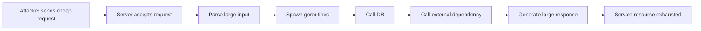
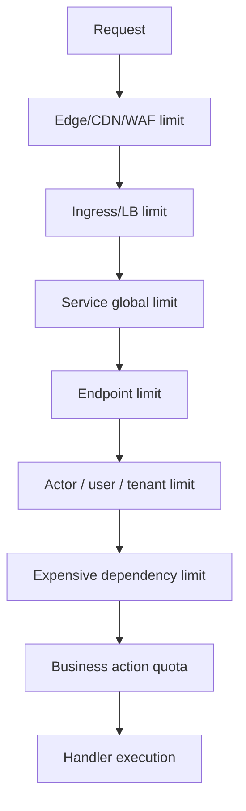
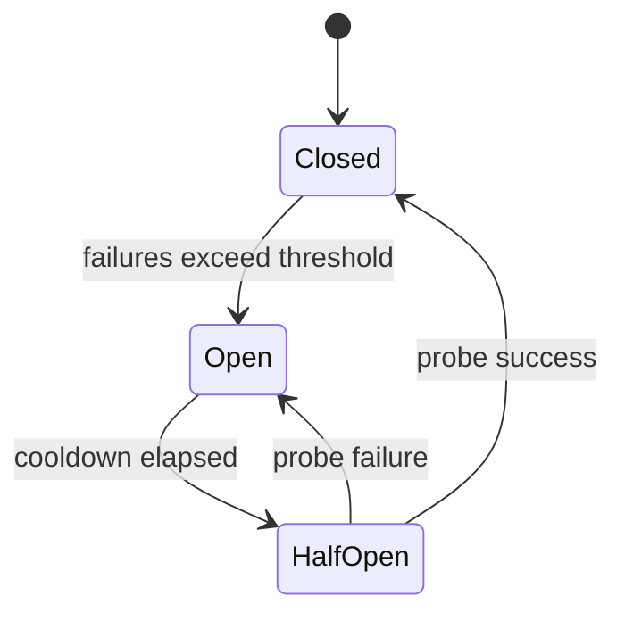
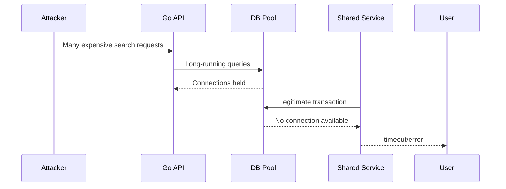
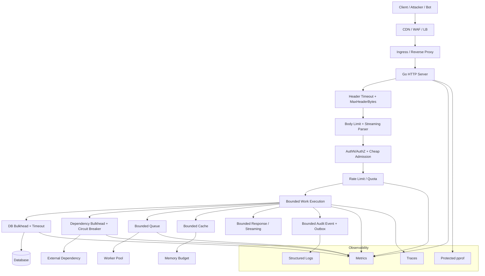

# learn-go-security-cryptography-integrity-part-031.md

# Part 031 — Availability Security in Go: DoS, Resource Exhaustion, Goroutine Leaks, Memory Pressure, Parser Bombs, Rate Limiting, Circuit Breaking, and Graceful Degradation

> Seri: `learn-go-security-cryptography-integrity`  
> Part: `031 / 034`  
> Target: Go `1.26.x`  
> Fokus: availability sebagai properti security, bukan hanya reliability/performance  
> Prasyarat yang diasumsikan sudah dikuasai: `net/http`, context, goroutine/channel, memory basics, IO streaming, error handling, observability, testing, dan API security dari part sebelumnya.

---

## 0. Posisi Part Ini Dalam Seri

Di part sebelumnya kita sudah membahas confidentiality, integrity, authenticity, identity, session, API authorization, injection, SSRF, serialization, file security, OS boundary, audit integrity, secrets, dan privacy.

Part ini membahas satu pilar yang sering diremehkan dalam security engineering:

> **Availability adalah security property.**

Sistem yang tidak bocor data tetapi bisa dibuat mati oleh request murah dari attacker tetap belum aman.

Dalam konteks Go services, availability security berarti:

1. request attacker tidak boleh menghabiskan resource lebih murah daripada biaya attacker mengirim request;
2. workload mahal harus punya admission control;
3. setiap resource harus punya batas eksplisit;
4. setiap operasi blocking harus punya timeout/cancellation;
5. setiap background goroutine harus punya lifecycle;
6. parser, decompressor, decoder, dan exporter harus bounded;
7. failure dependency tidak boleh menyebar menjadi total outage;
8. sistem harus bisa degrade gracefully sambil mempertahankan invariant keamanan.

---

## 1. Apa Bedanya Availability, Reliability, Performance, dan Security?

Empat istilah ini saling berkaitan tetapi tidak sama.

| Dimensi | Pertanyaan utama | Contoh |
|---|---|---|
| Performance | Seberapa cepat sistem saat kondisi normal? | p95 latency rendah, throughput tinggi |
| Reliability | Apakah sistem tetap benar ketika terjadi failure biasa? | retry, failover, graceful shutdown |
| Resilience | Apakah sistem bisa menyerap shock dan pulih? | backpressure, brownout, circuit breaker |
| Availability security | Apakah attacker bisa sengaja membuat sistem tidak tersedia? | slowloris, upload bomb, query amplification, rate-limit bypass |

Perbedaan penting:

```text
Performance problem:
    "endpoint ini lambat saat traffic tinggi."

Availability security problem:
    "attacker dapat membuat endpoint ini lambat/mati dengan biaya request kecil."
```

Atau:

```text
Reliability problem:
    "dependency down, service ikut error."

Availability security problem:
    "attacker bisa memaksa service memanggil dependency mahal sampai dependency collapse."
```

Security engineer tidak hanya bertanya:

> "Apakah kode ini benar?"

Tapi juga:

> "Apakah attacker bisa memaksa kode ini memakai CPU, memory, file descriptor, connection, goroutine, DB pool, queue slot, atau storage lebih besar dari budget yang kita desain?"

---

## 2. Availability Threat Model

Untuk availability, threat model harus memetakan resource yang bisa dikonsumsi attacker.

### 2.1 Resource yang perlu diproteksi

| Resource | Contoh exhaustion |
|---|---|
| CPU | regex backtracking, JSON/XML parsing besar, signature verification spam, compression/decompression |
| Memory | body tidak dibatasi, buffering response besar, map key tak terbatas, cache poisoning |
| Goroutine | goroutine leak, blocking channel, unbounded worker spawn |
| File descriptor | connection flood, open file leak, socket leak |
| Network bandwidth | response amplification, large download, streaming endpoint |
| DB connection pool | expensive query, transaction idle, N+1 endpoint |
| Lock/critical section | global mutex, per-tenant lock, hot shard |
| Queue capacity | enqueue tanpa quota, poison message retry loop |
| Disk/storage | upload spam, audit/log amplification, temp file leak |
| External dependency quota | third-party API exhausted, KMS/SSM/Secrets Manager throttled |
| Human/ops capacity | alert flood, false incident, manual retry storm |

### 2.2 Attacker capability

Availability attacker tidak selalu perlu credential tinggi.

| Attacker | Capability |
|---|---|
| Anonymous internet user | request flood, slow HTTP, large body, malformed parser input |
| Authenticated low-privilege user | expensive authorized action, export abuse, search abuse |
| Tenant insider | consume shared quota, poison cache, overload shared dependency |
| Compromised service account | service-to-service call amplification |
| Botnet | distributed low-rate request yang melewati per-IP limiter |
| Accidental internal client | retry storm, misconfigured batch job, infinite polling |

### 2.3 Availability invariant

Availability security harus ditulis sebagai invariant.

Contoh:

```text
Invariant A:
No unauthenticated request may consume more than 1 MiB memory, 100 ms CPU,
1 DB call, or 2 outbound calls before admission is decided.

Invariant B:
No single tenant may consume more than 20% of shared worker capacity for
more than 5 minutes unless explicitly approved by quota policy.

Invariant C:
Every request handler must either complete, cancel, or release all owned
goroutines, DB rows, response bodies, locks, and file handles.

Invariant D:
A failing downstream dependency may reduce feature quality but must not
block health endpoints, login/session validation, audit recording, or
operator access.
```

Ini jauh lebih kuat daripada guideline generik seperti:

```text
"Add rate limiting."
```

Karena invariant menjawab:

1. siapa yang dibatasi?
2. resource apa yang dibatasi?
3. berapa budget-nya?
4. apa yang terjadi saat limit tercapai?
5. apa yang tetap harus hidup saat degradation?

---

## 3. Model Biaya: Request Cost vs Attacker Cost

Availability security sering gagal karena sistem memberi attacker **cost amplification**.



Pertanyaan yang harus selalu ditanyakan:

> "Berapa biaya attacker untuk mengirim input ini, dan berapa biaya server untuk memprosesnya?"

Jika attacker mengirim 1 KB request tetapi server:

- allocate 200 MB memory;
- menjalankan regex kompleks;
- spawn 100 goroutine;
- melakukan 10 DB query;
- memanggil 3 external API;
- menyimpan 5 MB audit/log;

maka itu adalah **availability design bug**.

---

## 4. Taxonomy DoS di Go Services

### 4.1 Volume-based DoS

Serangan dengan banyak traffic.

Contoh:

- HTTP request flood;
- connection flood;
- upload flood;
- large download abuse;
- distributed botnet traffic.

Defense:

- WAF/CDN/LB rate limit;
- per-IP/per-user/per-tenant limiter;
- server timeout;
- connection limit;
- autoscaling dengan quota;
- load shedding;
- endpoint-specific budget.

### 4.2 Protocol-level DoS

Serangan memanfaatkan cara protokol bekerja.

Contoh:

- slowloris;
- slow POST body;
- keep-alive abuse;
- HTTP/2 stream exhaustion;
- header bloat;
- request smuggling-like ambiguity di proxy chain;
- client disconnect tidak dipropagasi ke handler.

Defense:

- `ReadHeaderTimeout`;
- `ReadTimeout`;
- `WriteTimeout`;
- `IdleTimeout`;
- `MaxHeaderBytes`;
- reverse proxy hardening;
- request context cancellation;
- bounded body read.

### 4.3 Application-level DoS

Serangan lewat fitur legal tetapi mahal.

Contoh:

- search query sangat luas;
- export seluruh data;
- report generation;
- upload archive bomb;
- password reset spam;
- MFA challenge spam;
- repeated JWT verification dengan key discovery buruk;
- webhook delivery retry loop;
- sorting/pagination mahal;
- GraphQL/query-like fan-out;
- batch API dengan item tak terbatas.

Defense:

- authorization + quota + cost-based admission;
- query complexity limit;
- pagination hard cap;
- async job queue with quotas;
- per-tenant worker pool;
- circuit breaker;
- cache dengan admission control;
- result-size limit.

### 4.4 Dependency DoS

Sistem sendiri tidak diserang langsung, tetapi dipakai untuk menyerang dependency.

Contoh:

- setiap request memanggil KMS;
- setiap token validation fetch JWKS;
- setiap upload memanggil antivirus;
- setiap failed login memanggil external risk engine;
- setiap outbound callback retry agresif;
- every request opens new DB connection.

Defense:

- cache bounded;
- timeout;
- bulkhead;
- stale-while-revalidate;
- circuit breaker;
- token bucket;
- adaptive backoff;
- dependency-specific budget.

### 4.5 State exhaustion

Attacker memaksa sistem menyimpan state.

Contoh:

- session dibuat untuk anonymous user;
- OTP challenge tak terbatas;
- upload temp file tidak dibersihkan;
- idempotency key spam;
- replay nonce store tak terbatas;
- audit event terlalu besar;
- rate limiter map per-IP tidak pernah dibersihkan.

Defense:

- TTL;
- LRU/size bound;
- authenticated-before-state;
- proof-of-work/step-up untuk expensive state;
- tenant quota;
- background cleanup;
- bounded key cardinality.

---

## 5. Go-Specific Availability Risk

Go memudahkan concurrency, streaming, dan network programming. Itu bagus, tetapi availability risk sering muncul dari fitur yang sama.

### 5.1 Goroutine murah bukan berarti gratis

Goroutine ringan, tetapi tetap punya:

- stack;
- scheduler metadata;
- references ke heap;
- channel/lock wait;
- captured variables;
- connection/body handles;
- context;
- memory retained by closures.

Goroutine leak sering lebih berbahaya dari memory leak biasa karena goroutine yang blocked dapat mempertahankan object graph besar.

Contoh buruk:

```go
func handler(w http.ResponseWriter, r *http.Request) {
    resultCh := make(chan Result)

    go func() {
        resultCh <- slowOperation(r.Context())
    }()

    select {
    case res := <-resultCh:
        writeResult(w, res)
    case <-time.After(100 * time.Millisecond):
        http.Error(w, "timeout", http.StatusGatewayTimeout)
        return
    }
}
```

Masalah:

1. `time.After` membuat timeout lokal, tetapi `slowOperation` mungkin tetap berjalan.
2. Jika handler return sebelum goroutine mengirim, goroutine bisa blocked mengirim ke unbuffered channel.
3. Context cancellation tidak dijamin dihormati oleh `slowOperation`.
4. Channel tidak punya receiver setelah timeout.

Lebih baik:

```go
func handler(w http.ResponseWriter, r *http.Request) {
    ctx, cancel := context.WithTimeout(r.Context(), 100*time.Millisecond)
    defer cancel()

    resultCh := make(chan Result, 1)

    go func() {
        resultCh <- slowOperation(ctx)
    }()

    select {
    case res := <-resultCh:
        writeResult(w, res)
    case <-ctx.Done():
        http.Error(w, "timeout", http.StatusGatewayTimeout)
        return
    }
}
```

Tetapi ini pun belum sempurna. `slowOperation` harus benar-benar memeriksa `ctx.Done()`. Buffer `1` mencegah goroutine blocked saat mengirim hasil setelah handler sudah timeout, tetapi operasi yang tidak cancel-aware tetap bisa bocor sampai selesai.

Pattern yang lebih kuat:

```go
func handler(w http.ResponseWriter, r *http.Request) {
    ctx, cancel := context.WithTimeout(r.Context(), 100*time.Millisecond)
    defer cancel()

    res, err := slowOperation(ctx)
    if err != nil {
        writeError(w, err)
        return
    }

    writeResult(w, res)
}
```

Rule:

> Jangan spawn goroutine di handler kecuali ada lifecycle owner yang jelas.

### 5.2 Unbounded goroutine spawn

Contoh buruk:

```go
for _, item := range req.Items {
    go processItem(ctx, item)
}
```

Jika `req.Items` bisa dikontrol user, attacker bisa membuat ribuan goroutine.

Lebih baik:

```go
const maxItems = 100
const maxWorkers = 8

if len(req.Items) > maxItems {
    return ErrTooManyItems
}

jobs := make(chan Item)
g, ctx := errgroup.WithContext(ctx)

for i := 0; i < maxWorkers; i++ {
    g.Go(func() error {
        for item := range jobs {
            if err := processItem(ctx, item); err != nil {
                return err
            }
        }
        return nil
    })
}

for _, item := range req.Items {
    select {
    case jobs <- item:
    case <-ctx.Done():
        close(jobs)
        _ = g.Wait()
        return ctx.Err()
    }
}

close(jobs)
return g.Wait()
```

Mental model:

```text
User-controlled cardinality must never directly control goroutine count.
```

### 5.3 Channel sebagai unbounded queue tersembunyi

Channel memang punya capacity fixed, tetapi sistem sering membuat kombinasi yang secara efektif unbounded:

```go
for {
    msg := <-in
    go handle(msg)
}
```

Channel `in` bounded, tetapi goroutine spawn tidak bounded.

Lebih baik:

```go
for i := 0; i < workerCount; i++ {
    go worker(ctx, in)
}
```

Atau gunakan explicit admission:

```go
select {
case queue <- job:
    return Accepted
default:
    return QueueFull
}
```

### 5.4 Context tidak otomatis membatalkan semua hal

`context.Context` adalah sinyal, bukan interrupt paksa.

Hal yang harus memastikan context dipakai:

- DB query: `QueryContext`, `ExecContext`;
- HTTP outbound request: `http.NewRequestWithContext`;
- queue operation: select on `ctx.Done()`;
- worker loop: check ctx;
- long CPU loop: periodic check;
- external SDK: pastikan menerima context.

Contoh salah:

```go
req, _ := http.NewRequest(http.MethodGet, url, nil)
resp, err := http.DefaultClient.Do(req)
```

Contoh benar:

```go
req, err := http.NewRequestWithContext(ctx, http.MethodGet, url, nil)
if err != nil {
    return err
}

resp, err := client.Do(req)
```

### 5.5 `defer` di loop

`defer resp.Body.Close()` di loop bisa menahan banyak body sampai function return.

Buruk:

```go
for _, u := range urls {
    resp, err := client.Get(u)
    if err != nil {
        continue
    }
    defer resp.Body.Close()

    // process
}
```

Lebih baik:

```go
for _, u := range urls {
    if err := fetchOne(ctx, client, u); err != nil {
        // handle
    }
}

func fetchOne(ctx context.Context, client *http.Client, u string) error {
    req, err := http.NewRequestWithContext(ctx, http.MethodGet, u, nil)
    if err != nil {
        return err
    }

    resp, err := client.Do(req)
    if err != nil {
        return err
    }
    defer resp.Body.Close()

    // process
    return nil
}
```

### 5.6 Map cardinality explosion

Go map mudah dipakai sebagai cache/rate limiter/store kecil. Risiko: cardinality tak terbatas.

Buruk:

```go
var perIP = map[string]*rate.Limiter{}
```

Tanpa TTL/cleanup, attacker bisa mengirim banyak IP/header/token palsu lalu memory naik.

Lebih baik:

```text
Limiter store:
- key cardinality bounded
- TTL idle cleanup
- max entries
- key normalization
- trusted client IP extraction
- metrics for active keys
```

### 5.7 Regex dan parser bombs

Go `regexp` memakai RE2-style engine yang tidak memiliki catastrophic backtracking seperti banyak regex engine lain. Tetapi regex tetap bisa mahal jika:

- input tidak dibatasi;
- pattern terlalu kompleks;
- regex dipakai berkali-kali pada field besar;
- regex compile dilakukan per request;
- regex dipakai untuk parsing nested grammar yang salah.

Rule:

```text
Regex safety = safe engine + bounded input + compiled once + clear intent.
```

### 5.8 Compression/decompression bombs

Serangan:

```text
small compressed input -> huge decompressed output
```

Contoh risk:

```go
zr, err := gzip.NewReader(r.Body)
if err != nil {
    return err
}
defer zr.Close()

data, err := io.ReadAll(zr) // dangerous if decompressed size unbounded
```

Lebih baik:

```go
const maxDecompressed = 10 << 20 // 10 MiB

zr, err := gzip.NewReader(r.Body)
if err != nil {
    return err
}
defer zr.Close()

limited := io.LimitReader(zr, maxDecompressed+1)

data, err := io.ReadAll(limited)
if err != nil {
    return err
}

if len(data) > maxDecompressed {
    return ErrDecompressedTooLarge
}
```

Tetapi ingat: `io.LimitReader` hanya membatasi bytes yang dibaca oleh aplikasi. Untuk streaming pipeline, lebih baik proses streaming sambil menghitung.

### 5.9 `io.ReadAll` sebagai smell

`io.ReadAll` bukan salah. Tetapi di boundary untrusted, ia perlu limit.

Smell:

```go
body, err := io.ReadAll(r.Body)
```

Lebih baik:

```go
r.Body = http.MaxBytesReader(w, r.Body, maxBodyBytes)
body, err := io.ReadAll(r.Body)
```

Atau streaming decode dengan bounded reader.

---

## 6. HTTP Server Availability Hardening

Part 019 sudah membahas secure `net/http`. Di sini kita lihat dari availability security angle.

### 6.1 Explicit server config

Jangan production dengan:

```go
http.ListenAndServe(":8080", mux)
```

Gunakan:

```go
srv := &http.Server{
    Addr:              ":8080",
    Handler:           mux,
    ReadHeaderTimeout: 2 * time.Second,
    ReadTimeout:       10 * time.Second,
    WriteTimeout:      15 * time.Second,
    IdleTimeout:       60 * time.Second,
    MaxHeaderBytes:    16 << 10, // 16 KiB
}

if err := srv.ListenAndServe(); err != nil && !errors.Is(err, http.ErrServerClosed) {
    log.Fatal(err)
}
```

### 6.2 Timeout semantics

| Timeout | Melindungi dari |
|---|---|
| `ReadHeaderTimeout` | slowloris/header drip |
| `ReadTimeout` | slow body upload / read phase abuse |
| `WriteTimeout` | slow client read / stuck response |
| `IdleTimeout` | keep-alive connection hoarding |
| handler context timeout | long business operation |
| outbound client timeout | dependency hang |
| DB query context timeout | DB pool exhaustion |
| queue enqueue timeout | queue/backpressure hang |

Timeout bukan satu angka global. Setiap phase punya threat berbeda.

### 6.3 Request size limit

```go
func limitBody(next http.Handler, max int64) http.Handler {
    return http.HandlerFunc(func(w http.ResponseWriter, r *http.Request) {
        r.Body = http.MaxBytesReader(w, r.Body, max)
        next.ServeHTTP(w, r)
    })
}
```

Untuk endpoint berbeda, limit berbeda:

| Endpoint | Limit contoh |
|---|---:|
| login | 16 KiB |
| JSON mutation | 1 MiB |
| file upload metadata | 64 KiB |
| file upload binary | controlled streaming, not `ReadAll` |
| webhook | provider-specific max |
| search | 32 KiB |
| batch action | item count + body size |

### 6.4 Header limit

Header bisa dipakai untuk DoS:

- giant cookies;
- repeated headers;
- authorization header bloat;
- traceparent baggage abuse;
- custom metadata explosion.

Gunakan:

```go
MaxHeaderBytes: 16 << 10
```

Tetapi juga validasi semantic:

```go
if len(r.Header.Values("X-Custom")) > 1 {
    return ErrAmbiguousHeader
}
```

### 6.5 Connection limit

`http.Server` tidak otomatis membatasi jumlah accepted connections secara high-level policy. Biasanya connection limiting dilakukan di:

- load balancer;
- reverse proxy;
- Kubernetes ingress;
- service mesh;
- OS ulimit;
- custom listener wrapper.

Contoh listener wrapper:

```go
type limitListener struct {
    net.Listener
    sem chan struct{}
}

func newLimitListener(inner net.Listener, max int) net.Listener {
    return &limitListener{
        Listener: inner,
        sem:      make(chan struct{}, max),
    }
}

func (l *limitListener) Accept() (net.Conn, error) {
    conn, err := l.Listener.Accept()
    if err != nil {
        return nil, err
    }

    select {
    case l.sem <- struct{}{}:
        return &limitConn{
            Conn: conn,
            done: func() { <-l.sem },
        }, nil
    default:
        _ = conn.Close()
        return nil, errors.New("connection limit reached")
    }
}

type limitConn struct {
    net.Conn
    once sync.Once
    done func()
}

func (c *limitConn) Close() error {
    err := c.Conn.Close()
    c.once.Do(c.done)
    return err
}
```

Dalam production, lebih sering gunakan proxy/LB untuk connection admission. Tetapi memahami pattern ini penting untuk internal tools, admin services, atau embedded servers.

---

## 7. Outbound HTTP Availability

Banyak outage Go service terjadi bukan karena inbound request, tapi karena outbound dependency.

### 7.1 Jangan pakai default client untuk dependency kritikal

`http.DefaultClient` tidak punya total timeout yang cocok untuk semua dependency.

Buat per-dependency client:

```go
type Clients struct {
    Payments *http.Client
    KMS      *http.Client
    Risk     *http.Client
}

func newHTTPClient(timeout time.Duration) *http.Client {
    return &http.Client{
        Timeout: timeout,
        Transport: &http.Transport{
            Proxy:                 http.ProxyFromEnvironment,
            MaxIdleConns:          200,
            MaxIdleConnsPerHost:   50,
            IdleConnTimeout:       90 * time.Second,
            TLSHandshakeTimeout:   5 * time.Second,
            ResponseHeaderTimeout: 5 * time.Second,
            ExpectContinueTimeout: 1 * time.Second,
        },
    }
}
```

### 7.2 Always close and drain response body?

Rule praktis:

```text
Close body always.
Drain small responses if you want connection reuse.
Do not drain unbounded attacker-controlled response bodies.
```

Contoh:

```go
resp, err := client.Do(req)
if err != nil {
    return err
}
defer resp.Body.Close()

if resp.StatusCode >= 400 {
    _, _ = io.CopyN(io.Discard, resp.Body, 4<<10)
    return fmt.Errorf("dependency returned %d", resp.StatusCode)
}
```

Jangan:

```go
io.Copy(io.Discard, resp.Body) // unbounded drain
```

terutama jika dependency URL bisa dipengaruhi user atau SSRF boundary belum kuat.

### 7.3 Outbound concurrency budget

Dependency harus punya worker/limiter sendiri.

```go
type DependencyGate struct {
    sem chan struct{}
}

func NewDependencyGate(maxInFlight int) *DependencyGate {
    return &DependencyGate{sem: make(chan struct{}, maxInFlight)}
}

func (g *DependencyGate) Do(ctx context.Context, fn func(context.Context) error) error {
    select {
    case g.sem <- struct{}{}:
        defer func() { <-g.sem }()
        return fn(ctx)
    case <-ctx.Done():
        return ctx.Err()
    default:
        return ErrDependencyBusy
    }
}
```

Pattern ini disebut **bulkhead**: failure/latency dependency tidak boleh memakan semua worker service.

---

## 8. Rate Limiting

Rate limiting bukan satu teknik tunggal. Ada banyak level.



### 8.1 Per-IP limiter

Per-IP limiter berguna untuk anonymous traffic, tetapi lemah terhadap botnet/NAT/shared proxy.

Important controls:

- trust proxy chain correctly;
- normalize IP;
- TTL idle cleanup;
- cap active limiter count;
- do not trust `X-Forwarded-For` from arbitrary clients.

### 8.2 Per-user limiter

Lebih akurat setelah authentication.

Examples:

| Action | Limit |
|---|---|
| login attempt | per username + per IP |
| password reset | per account + per IP + global |
| OTP verify | per challenge + per account |
| export | per tenant + per user |
| search | per tenant + per user |
| admin mutation | per actor + privilege level |

### 8.3 Per-tenant limiter

Multi-tenant services butuh fairness.

```text
Global capacity = 1000 RPS
Tenant A quota = 200 RPS
Tenant B quota = 100 RPS
Burst allowed = 2x for 30s
No tenant can starve shared worker pool.
```

### 8.4 Token bucket dengan `x/time/rate`

```go
lim := rate.NewLimiter(rate.Limit(10), 20) // 10 events/sec, burst 20

if !lim.Allow() {
    http.Error(w, "rate limited", http.StatusTooManyRequests)
    return
}
```

Untuk operasi async yang boleh menunggu:

```go
if err := lim.Wait(ctx); err != nil {
    return err
}
```

Namun hati-hati:

```text
Wait can create queueing.
Queueing itself consumes goroutines and memory.
```

Jadi untuk request path latency-sensitive, sering lebih aman:

```go
if !lim.Allow() {
    reject quickly
}
```

### 8.5 Distributed rate limiting

Jika service punya banyak instance, in-memory limiter hanya membatasi per instance.

Options:

| Approach | Pros | Cons |
|---|---|---|
| In-memory per instance | cepat, sederhana | tidak global |
| Redis atomic counter/token bucket | cukup akurat | dependency risk |
| Envoy/ingress rate limit | central near-edge | kurang business-aware |
| DB counter | durable | lambat, berisiko overload |
| Hybrid local + global | scalable | lebih kompleks |

Rule:

```text
Use local limiter for self-protection.
Use distributed limiter for business fairness and abuse control.
Do not make availability depend entirely on a remote limiter.
```

### 8.6 Fail-open vs fail-closed

Saat rate limiter dependency down:

| Feature | Prefer |
|---|---|
| public expensive endpoint | fail closed / conservative local fallback |
| login | degraded local limit, not total outage |
| internal admin | stricter fail closed |
| health check | should not depend on limiter |
| audit | enqueue fallback if possible |

---

## 9. Queue, Backpressure, and Load Shedding

### 9.1 Queue bukan solusi ajaib

Queue memindahkan overload dari synchronous path ke asynchronous path. Jika tidak dibatasi, queue menjadi tempat outage disimpan.

Queue harus punya:

- max depth;
- per-tenant quota;
- enqueue timeout;
- priority;
- dead-letter policy;
- retry budget;
- poison message detection;
- visibility timeout;
- consumer concurrency limit;
- backpressure response.

### 9.2 Bounded queue pattern

```go
type Queue struct {
    ch chan Job
}

func NewQueue(capacity int) *Queue {
    return &Queue{ch: make(chan Job, capacity)}
}

func (q *Queue) Enqueue(ctx context.Context, job Job) error {
    select {
    case q.ch <- job:
        return nil
    case <-ctx.Done():
        return ctx.Err()
    default:
        return ErrQueueFull
    }
}
```

Rejecting early is sometimes the most secure behavior.

### 9.3 Load shedding

Load shedding adalah keputusan sadar untuk menolak sebagian traffic agar core functionality tetap hidup.

Examples:

| Condition | Shed |
|---|---|
| DB pool saturation | reject export/report/search |
| CPU high | disable expensive recommendations |
| queue depth high | reject new async jobs |
| dependency circuit open | return cached/stale response |
| auth dependency degraded | allow existing sessions, block high-risk changes |
| audit sink degraded | use local durable buffer, block regulated mutations if evidence cannot be persisted |

Important:

```text
Load shedding policy must preserve security invariants.
```

Jangan degrade menjadi insecure mode.

Buruk:

```text
"Authorization service slow, so allow all requests temporarily."
```

Lebih baik:

```text
"Authorization service slow, allow only cached low-risk decisions within TTL,
block privilege elevation and sensitive mutations."
```

---

## 10. Circuit Breaker and Bulkhead

### 10.1 Circuit breaker mental model

Circuit breaker mencegah repeated calls ke dependency yang sedang gagal.

States:



| State | Behavior |
|---|---|
| Closed | normal calls allowed |
| Open | calls fail fast / fallback |
| Half-open | limited probes allowed |

### 10.2 Circuit breaker bukan pengganti timeout

Tanpa timeout, call bisa hang dan circuit breaker tidak cepat belajar.

Minimum controls:

```text
timeout + concurrency limit + circuit breaker + fallback policy
```

### 10.3 Bulkhead

Bulkhead memisahkan resource pool.

Contoh:

```text
Worker pool:
- login/auth: reserved capacity
- health/admin: reserved capacity
- export/report: limited low-priority capacity
- webhook callback: isolated capacity
```

Tanpa bulkhead, export besar bisa membuat login mati.

---

## 11. Parser Bombs and Input Cost Control

### 11.1 JSON

Risiko JSON:

- body besar;
- deeply nested JSON;
- giant arrays;
- number precision/large token;
- duplicate keys;
- unknown fields;
- `map[string]any` memory expansion;
- `RawMessage` deferred bomb.

Controls:

```go
r.Body = http.MaxBytesReader(w, r.Body, maxJSONBytes)

dec := json.NewDecoder(r.Body)
dec.DisallowUnknownFields()

var req Request
if err := dec.Decode(&req); err != nil {
    return err
}

if err := validateCardinality(req); err != nil {
    return err
}
```

Jangan hanya membatasi bytes. Batasi juga semantic cardinality:

```go
if len(req.Items) > 100 {
    return ErrTooManyItems
}
```

### 11.2 XML

Risiko XML:

- entity expansion;
- nested structures;
- huge attributes;
- namespace abuse;
- streaming token loop tanpa limit.

Go `encoding/xml` tidak sama dengan Java XML stack yang historically banyak memiliki XXE risk, tetapi jangan menyimpulkan XML otomatis aman. Tetap buat:

- max body;
- max tokens;
- max depth;
- disallow unsupported constructs;
- schema/semantic validation;
- no unbounded `io.ReadAll`.

### 11.3 Multipart

Risiko multipart:

- banyak part;
- filename aneh;
- field metadata besar;
- temp file leak;
- content-type spoofing;
- archive bomb setelah upload.

Controls:

```go
r.Body = http.MaxBytesReader(w, r.Body, maxUploadBytes)

mr, err := r.MultipartReader()
if err != nil {
    return err
}

for {
    part, err := mr.NextPart()
    if errors.Is(err, io.EOF) {
        break
    }
    if err != nil {
        return err
    }

    // enforce part count, field size, file size, allowed fields
}
```

Prefer streaming over `ParseMultipartForm` jika butuh kontrol granular.

### 11.4 CSV/export/import

CSV bisa DoS:

- file sangat besar;
- line sangat panjang;
- field count banyak;
- formula injection;
- duplicate rows;
- validation DB call per row;
- transaction sangat panjang.

Controls:

```text
max file size
max row count
max column count
max field length
batch validation
bounded DB calls
async job quota
idempotency key
```

---

## 12. Memory Pressure and Go Runtime

### 12.1 Memory pressure as security issue

Attacker bisa memicu:

- allocation burst;
- GC pressure;
- cache growth;
- slice retention;
- map growth;
- decompressed data expansion;
- goroutine stack retention;
- large response buffering.

Availability issue tidak selalu OOM. Kadang service masih hidup tetapi latency naik karena GC dan CPU pressure.

### 12.2 Common Go memory traps

#### Trap A — slice retains large backing array

```go
data := make([]byte, 100<<20)
small := data[:10]
cache[key] = small // retains 100 MiB backing array
```

Fix:

```go
small := append([]byte(nil), data[:10]...)
cache[key] = small
```

#### Trap B — buffering entire response

```go
var buf bytes.Buffer
renderHugeReport(&buf)
w.Write(buf.Bytes())
```

Better:

```go
w.Header().Set("Content-Type", "text/csv")
writer := csv.NewWriter(w)
// stream rows with context checks and limits
```

But streaming also needs:

- timeout;
- row limit;
- authz;
- client disconnect handling;
- backpressure awareness.

#### Trap C — unbounded cache

```go
cache[userInputKey] = value
```

Need:

```text
max entries
max bytes
TTL
per-tenant partition
admission policy
eviction metrics
```

### 12.3 GC tuning is not security control

`GOMEMLIMIT`, `GOGC`, and memory tuning can help survive pressure. But they are not replacement for input/resource bounds.

Correct hierarchy:

```text
1. Bound input and cardinality.
2. Bound concurrency.
3. Bound cache/state.
4. Use backpressure and shedding.
5. Tune runtime/container limits.
```

### 12.4 Container memory limits

In Kubernetes, memory limit controls cgroup boundary, but if Go process hits memory pressure, it can be killed.

Design:

```text
App max memory budget < container limit < node allocatable protection
```

Expose:

- heap allocation;
- GC pause;
- goroutine count;
- queue depth;
- request body rejection count;
- OOMKilled events;
- memory limit config;
- pprof protected endpoint.

---

## 13. Goroutine Leak Detection

### 13.1 Symptoms

- goroutine count steadily increases;
- memory grows slowly;
- latency worsens over time;
- DB connections not released;
- worker pool stuck;
- shutdown hangs;
- pprof shows many goroutines blocked on channel send/receive, mutex, cond, network read.

### 13.2 Common leak patterns

#### Pattern A — blocked send after timeout

```go
ch := make(chan Result)

go func() {
    ch <- compute()
}()

select {
case <-time.After(time.Second):
    return ErrTimeout
case res := <-ch:
    return res
}
```

#### Pattern B — worker never exits

```go
func worker(jobs <-chan Job) {
    for job := range jobs {
        process(job)
    }
}
```

If `jobs` never closes and no context exists, worker cannot stop.

#### Pattern C — ticker not stopped

```go
ticker := time.NewTicker(time.Second)
go func() {
    for range ticker.C {
        work()
    }
}()
```

Need:

```go
ticker.Stop()
```

and context-aware exit.

#### Pattern D — request body not closed

Outbound body leak can keep resources.

#### Pattern E — unbounded retry goroutine

```go
go func() {
    for {
        err := call()
        if err == nil {
            return
        }
    }
}()
```

Need backoff, max attempts, context.

### 13.3 Production detection

Use:

- `/debug/pprof/goroutine`;
- runtime metrics;
- goroutine count dashboards;
- leak tests;
- Go 1.26 experimental `goroutineleak` profile where appropriate;
- shutdown tests;
- load tests with steady-state goroutine count assertion.

Example test idea:

```go
func TestHandlerDoesNotLeakGoroutines(t *testing.T) {
    before := runtime.NumGoroutine()

    for i := 0; i < 100; i++ {
        exerciseHandlerWithTimeout()
    }

    time.Sleep(200 * time.Millisecond)
    runtime.GC()

    after := runtime.NumGoroutine()
    if after > before+5 {
        t.Fatalf("possible goroutine leak: before=%d after=%d", before, after)
    }
}
```

This is noisy but useful as smoke test. For serious leak testing, use dedicated tools or pprof diff.

---

## 14. DB Pool Exhaustion

DB pool is a security boundary.

### 14.1 Attack path



### 14.2 Controls

- context timeout for DB calls;
- endpoint-specific query timeout;
- DB pool max open/idle/lifetime;
- separate pools for interactive vs batch;
- query complexity limit;
- pagination cap;
- export async quota;
- cancel long-running query on client disconnect;
- avoid transaction across network calls;
- avoid idle-in-transaction;
- index-aware design;
- per-tenant quota.

### 14.3 Context propagation

```go
ctx, cancel := context.WithTimeout(r.Context(), 2*time.Second)
defer cancel()

rows, err := db.QueryContext(ctx, query, args...)
if err != nil {
    return err
}
defer rows.Close()
```

Always close rows.

### 14.4 Avoid DB-backed rate limiter hot path

If every request must write DB counter before admission, attacker can overload DB through the limiter itself.

Use local/edge limiter first.

---

## 15. Authentication and Crypto Availability

Security controls themselves can become DoS vector.

### 15.1 Password hashing

Argon2id/bcrypt intentionally expensive. That is good against offline cracking, but dangerous if attacker can trigger unlimited verification.

Controls:

- cheap syntactic validation before hashing;
- per-IP + per-account throttle;
- constant response envelope;
- queue limit for login verification;
- worker pool for password hash;
- breached password check only at registration/change;
- separate capacity for auth.

### 15.2 JWT verification

JWT verification can be abused by:

- huge token;
- malformed token;
- unsupported algorithms;
- random `kid` causing JWKS fetch;
- repeated signature verification;
- cache miss storm.

Controls:

```text
max Authorization header length
parse structure cheaply
allowlist alg
issuer/audience check
JWKS cache with negative caching
do not fetch JWKS per request
limit key set size
singleflight refresh
```

### 15.3 KMS/HSM usage

KMS decrypt/sign per request can become dependency DoS.

Controls:

- envelope encryption with local DEK cache where allowed;
- KMS call budget;
- key cache TTL;
- per-key limiter;
- batch/async where appropriate;
- fallback policy that does not bypass security.

### 15.4 Audit logging

Audit can cause DoS if:

- event payload too large;
- synchronous remote sink blocks mutation path;
- retry loop unbounded;
- audit queue unbounded;
- attacker-controlled fields explode cardinality.

Controls:

- bounded event size;
- redaction;
- local durable outbox;
- queue backpressure;
- regulated mutation blocked if evidence cannot be durably persisted;
- non-regulated event can degrade with safe local buffer.

---

## 16. Decompression, Archive, and Parser Bombs

### 16.1 Decompression ratio

Track:

```text
compressed_size
decompressed_size
ratio
time_spent
files_count
max_depth
```

Reject suspicious ratio.

### 16.2 Archive extraction

Part 025 covered file extraction. Availability-specific controls:

- max total uncompressed bytes;
- max file count;
- max directory depth;
- max filename length;
- max per-file size;
- reject nested archives unless explicit;
- time budget;
- worker isolation;
- temp storage quota.

### 16.3 XML/JSON nesting depth

Go standard decoders do not always expose ideal depth controls. Build streaming token parser when needed.

Pseudo:

```go
depth := 0
for {
    tok, err := dec.Token()
    if errors.Is(err, io.EOF) {
        break
    }
    if err != nil {
        return err
    }

    switch tok.(type) {
    case json.Delim:
        // increment/decrement based on token
    }

    if depth > maxDepth {
        return ErrTooDeep
    }
}
```

In many business APIs, simpler approach is better:

```text
Use strongly typed DTO + max body + validate semantic cardinality.
```

---

## 17. Graceful Degradation

Graceful degradation is not “ignore errors”. It is controlled reduction of service features while preserving security.

### 17.1 Degradation matrix

| Dependency failing | Allowed degradation | Not allowed |
|---|---|---|
| recommendation engine | hide recommendations | block checkout/login |
| audit remote collector | local durable outbox | silently drop regulated audit |
| search index | fallback to limited DB search | full table scan without limit |
| risk scoring | require step-up / block high-risk | allow privileged action without risk check |
| email/SMS OTP | offer alternate verified factor | bypass MFA |
| JWKS endpoint | use cached keys within TTL | fetch per request / accept unsigned |
| KMS | serve decrypt-cache only if safe | log plaintext or skip encryption |
| DB read replica | switch to primary with limit | overload primary with exports |

### 17.2 Brownout pattern

Brownout temporarily disables optional expensive features under pressure.

Example:

```go
type LoadState int

const (
    LoadNormal LoadState = iota
    LoadHigh
    LoadCritical
)

func allowedFeatures(state LoadState) FeatureSet {
    switch state {
    case LoadNormal:
        return FeatureSet{Export: true, Search: true, Recommendations: true}
    case LoadHigh:
        return FeatureSet{Export: false, Search: true, Recommendations: false}
    case LoadCritical:
        return FeatureSet{Export: false, Search: false, Recommendations: false}
    default:
        return FeatureSet{}
    }
}
```

Important:

```text
Brownout should be deterministic, observable, and reversible.
```

---

## 18. Health Checks and Availability Security

### 18.1 Liveness vs readiness

| Probe | Meaning | Should include |
|---|---|---|
| liveness | process is alive, restart if dead | minimal self check |
| readiness | can receive traffic | critical dependencies/capacity |
| startup | app initialized | startup sequence |

Do not make liveness depend on DB/external services. Otherwise dependency outage restarts all pods and amplifies incident.

### 18.2 Readiness should include capacity signals

Examples:

- config loaded;
- DB pool reachable;
- queue producer available;
- worker queue not full;
- migration complete;
- key material loaded;
- audit outbox available for regulated mutations.

But readiness must be cheap and not itself cause DoS.

### 18.3 Admin/debug endpoints

`pprof`, metrics, debug config, and goroutine dumps are sensitive.

Controls:

- bind to localhost/admin network;
- require auth;
- do not expose publicly;
- rate limit;
- redact;
- disable in high-risk deployment if not protected.

---

## 19. Observability for Availability Security

### 19.1 Metrics

Minimum metrics:

| Metric | Why |
|---|---|
| request count by endpoint/status | attack pattern |
| request duration p50/p95/p99 | latency degradation |
| in-flight requests | saturation |
| body too large count | attempted abuse |
| rate limited count | limiter behavior |
| queue depth | backpressure |
| queue age | hidden latency |
| worker utilization | saturation |
| goroutine count | leak signal |
| heap alloc / RSS | memory pressure |
| GC pause / CPU | runtime pressure |
| DB pool in use/wait count | DB exhaustion |
| outbound dependency latency/error | cascading failure |
| circuit breaker state | dependency protection |
| rejected due to load shedding | controlled degradation |
| audit outbox depth | evidence risk |

### 19.2 Logs

Log availability events as structured events:

```go
logger.WarnContext(ctx, "request rejected due to resource limit",
    "event", "availability.reject",
    "reason", "body_too_large",
    "endpoint", "/api/import",
    "limit_bytes", maxBody,
    "actor_id", actor.ID,
    "tenant_id", actor.TenantID,
)
```

Do not log attacker payloads.

### 19.3 Traces

Trace expensive path:

- validation;
- auth;
- DB;
- external API;
- queue enqueue;
- serialization;
- response write.

But avoid high-cardinality attacker-controlled span attributes.

### 19.4 Alerts

Good alerts:

```text
- queue age > threshold
- DB pool wait > threshold
- goroutine count increasing over baseline
- rate limited count spike
- p99 latency + 5xx correlated
- audit outbox age > threshold
- circuit breaker open for critical dependency
```

Bad alerts:

```text
- every 429 triggers page
- every dependency error triggers page
- high request count alone without impact signal
```

---

## 20. Testing Availability Security

### 20.1 Unit tests

Test:

- max body;
- max items;
- unknown fields;
- timeout;
- queue full;
- limiter deny;
- circuit breaker open;
- context cancellation;
- goroutine cleanup;
- response when dependency down.

### 20.2 Fuzz tests

Fuzz:

- parsers;
- decoders;
- canonicalizers;
- URL/path validators;
- archive metadata;
- CSV import;
- signed payload parser;
- webhook parser.

Focus not only crash, but also:

- time budget;
- memory budget;
- output invariant;
- no unbounded allocation.

### 20.3 Load tests

Test scenarios:

| Scenario | Goal |
|---|---|
| normal load | baseline |
| spike | autoscaling/backpressure |
| slow clients | timeout behavior |
| large body | rejection |
| large JSON arrays | semantic limits |
| dependency latency | circuit/bulkhead |
| DB pool saturation | load shedding |
| queue full | reject/fallback |
| attacker + legitimate users | fairness |
| client disconnect | cancellation cleanup |
| rolling restart under load | graceful shutdown |

### 20.4 Chaos tests

Inject:

- DB slow;
- Redis down;
- KMS throttled;
- JWKS endpoint down;
- disk full;
- audit sink down;
- queue broker slow;
- network partition.

But define expected behavior first.

---

## 21. Secure Graceful Shutdown

Availability also includes controlled shutdown.

### 21.1 Shutdown goals

On SIGTERM:

1. stop accepting new requests;
2. mark readiness false;
3. drain in-flight requests with deadline;
4. stop background workers;
5. flush audit/outbox if possible;
6. release locks/leases;
7. close DB/HTTP clients;
8. exit before Kubernetes kills process.

### 21.2 Example

```go
ctx, stop := signal.NotifyContext(context.Background(), os.Interrupt, syscall.SIGTERM)
defer stop()

srv := &http.Server{Addr: ":8080", Handler: mux}

go func() {
    if err := srv.ListenAndServe(); err != nil && !errors.Is(err, http.ErrServerClosed) {
        logger.Error("server failed", "error", err)
    }
}()

<-ctx.Done()

shutdownCtx, cancel := context.WithTimeout(context.Background(), 20*time.Second)
defer cancel()

if err := srv.Shutdown(shutdownCtx); err != nil {
    logger.Error("graceful shutdown failed", "error", err)
}
```

### 21.3 Worker shutdown

Workers need context:

```go
func worker(ctx context.Context, jobs <-chan Job) {
    for {
        select {
        case <-ctx.Done():
            return
        case job, ok := <-jobs:
            if !ok {
                return
            }
            _ = process(ctx, job)
        }
    }
}
```

---

## 22. Availability Security Design Checklist

Use this checklist for design review.

### 22.1 Endpoint budget

For every endpoint:

```text
Endpoint:
Actor:
Auth required:
Max request body:
Max headers:
Max item count:
Max field length:
Max processing time:
Max DB calls:
Max external calls:
Max response size:
Max concurrency:
Rate limit key:
Tenant quota:
Queue policy:
Failure response:
Audit event size:
```

### 22.2 Dependency budget

For every dependency:

```text
Dependency:
Criticality:
Timeout:
Retry count:
Backoff:
Circuit breaker:
Bulkhead:
Max in-flight:
Cache:
Stale response allowed:
Fail-open/fail-closed:
Observability:
Runbook:
```

### 22.3 State budget

For every stored state:

```text
State:
Key cardinality:
TTL:
Max entries:
Max bytes:
Eviction:
Tenant partition:
Cleanup:
Abuse case:
Metrics:
```

### 22.4 Background job budget

```text
Job:
Trigger:
Max queue depth:
Max retries:
Retry backoff:
Poison message policy:
Idempotency:
Per-tenant quota:
Worker count:
Shutdown behavior:
Visibility timeout:
DLQ:
```

### 22.5 Parser/import budget

```text
Parser:
Max raw bytes:
Max decompressed bytes:
Max files:
Max rows:
Max nesting:
Max token length:
Max processing time:
Streaming or buffered:
Validation:
Failure behavior:
```

---

## 23. Common Anti-Patterns

### 23.1 "We have autoscaling, so DoS is handled"

Autoscaling can amplify cost and still lose if:

- DB is bottleneck;
- external dependency quota is fixed;
- attacker cost is lower than your cloud cost;
- cold start too slow;
- all pods share same dependency.

Autoscaling is capacity management, not admission control.

### 23.2 "We use Kubernetes, so resource exhaustion is contained"

Kubernetes can kill/restart pods, but if attack continues, it creates restart loops and cascading failure.

Need app-level limits.

### 23.3 "Only authenticated users can access this endpoint"

Authenticated users can be attackers, compromised, or buggy clients.

Need per-user/per-tenant quotas.

### 23.4 "This is internal API"

Internal APIs get abused by:

- compromised service;
- retry storm;
- batch job bug;
- insider;
- misconfiguration;
- SSRF pivot.

Internal does not mean unbounded.

### 23.5 "We will just retry"

Retry without budget is DoS multiplier.

Use:

```text
retry only idempotent operations
bounded attempts
exponential backoff with jitter
respect Retry-After
global retry budget
circuit breaker
```

### 23.6 "Queue will absorb it"

Queue absorbs until it becomes the outage.

Bound queues.

### 23.7 "Timeout is enough"

Timeout protects time, not memory, CPU, DB, goroutines, or queue slots by itself.

Need multi-dimensional budget.

---

## 24. Availability Security Architecture Diagram



---

## 25. Production Reference Defaults

These are not universal values. They are starting points to force explicit decisions.

| Control | Example starting point |
|---|---|
| `ReadHeaderTimeout` | 2s |
| `ReadTimeout` | 10s for JSON APIs, endpoint-specific |
| `WriteTimeout` | 15s; streaming endpoints need special handling |
| `IdleTimeout` | 60s |
| `MaxHeaderBytes` | 16 KiB or 32 KiB |
| JSON body limit | 1 MiB default, endpoint-specific |
| login body limit | 16 KiB |
| batch items | 50–500 depending on cost |
| export | async job with quota |
| outbound dependency timeout | 1–5s depending on dependency |
| retry count | 0–2, idempotent only |
| queue max depth | capacity-derived, not arbitrary |
| per-tenant quota | derived from fairness/SLO |
| circuit open cooldown | dependency-specific |
| cache TTL | bounded and observable |
| pprof | protected admin-only |

---

## 26. Go Code: Minimal Availability Guard Middleware

This is not a full framework. It shows the shape.

```go
type GuardConfig struct {
    MaxBodyBytes int64
    Timeout      time.Duration
    Limiter      *rate.Limiter
}

func AvailabilityGuard(cfg GuardConfig, next http.Handler) http.Handler {
    return http.HandlerFunc(func(w http.ResponseWriter, r *http.Request) {
        if cfg.Limiter != nil && !cfg.Limiter.Allow() {
            http.Error(w, "too many requests", http.StatusTooManyRequests)
            return
        }

        ctx, cancel := context.WithTimeout(r.Context(), cfg.Timeout)
        defer cancel()

        r = r.WithContext(ctx)
        r.Body = http.MaxBytesReader(w, r.Body, cfg.MaxBodyBytes)

        done := make(chan struct{})
        ww := &statusWriter{ResponseWriter: w, status: http.StatusOK}

        go func() {
            defer close(done)
            next.ServeHTTP(ww, r)
        }()

        select {
        case <-done:
            return
        case <-ctx.Done():
            http.Error(w, "request timeout", http.StatusGatewayTimeout)
            return
        }
    })
}
```

Caution:

This pattern has a subtle issue: writing to `ResponseWriter` from handler goroutine while timeout branch may also write can race logically. In production, prefer timeout at server/proxy + context-aware handlers, or use `http.TimeoutHandler` understanding its trade-offs. This example is intentionally included to show why timeout middleware is hard.

Better architecture:

```text
- server timeouts at net/http.Server
- reverse proxy timeouts
- handler derives context deadline
- business code respects context
- no goroutine around ResponseWriter unless carefully controlled
```

---

## 27. Safer Handler Pattern

```go
func CreateReportHandler(svc *ReportService) http.HandlerFunc {
    return func(w http.ResponseWriter, r *http.Request) {
        ctx, cancel := context.WithTimeout(r.Context(), 3*time.Second)
        defer cancel()

        r.Body = http.MaxBytesReader(w, r.Body, 64<<10)

        var req CreateReportRequest
        dec := json.NewDecoder(r.Body)
        dec.DisallowUnknownFields()

        if err := dec.Decode(&req); err != nil {
            writeProblem(w, http.StatusBadRequest, "invalid_request")
            return
        }

        if err := req.Validate(); err != nil {
            writeProblem(w, http.StatusBadRequest, "invalid_request")
            return
        }

        actor := ActorFromContext(ctx)
        if !actor.CanCreateReport(req.TenantID) {
            writeProblem(w, http.StatusForbidden, "forbidden")
            return
        }

        jobID, err := svc.EnqueueReport(ctx, actor, req)
        switch {
        case errors.Is(err, ErrQuotaExceeded):
            writeProblem(w, http.StatusTooManyRequests, "quota_exceeded")
            return
        case errors.Is(err, ErrQueueFull):
            writeProblem(w, http.StatusServiceUnavailable, "service_busy")
            return
        case err != nil:
            writeProblem(w, http.StatusInternalServerError, "internal_error")
            return
        }

        writeJSON(w, http.StatusAccepted, map[string]string{
            "job_id": jobID,
        })
    }
}
```

Availability properties:

- small request body;
- strict DTO;
- semantic validation;
- authorization before expensive work;
- async job for expensive report;
- queue quota;
- clear failure response;
- context deadline.

---

## 28. Java-to-Go Mindset Shift

Sebagai Java engineer, beberapa hal perlu disesuaikan:

| Java instinct | Go availability mindset |
|---|---|
| Thread pool is central | Goroutine spawn must still be bounded |
| Servlet container has many defaults | `net/http` is explicit; configure server timeouts |
| Framework middleware handles many limits | In Go, many limits are app-owned decisions |
| JVM memory tuning is familiar | Go GC tuning helps but does not replace bounds |
| `CompletableFuture`/executor lifecycle visible | Goroutine lifecycle can disappear if not owned |
| Filters/interceptors common | Middleware order must be consciously designed |
| Container can kill bad pod | Killing is last-resort containment, not prevention |
| XML/serialization framework-heavy | Go parsers are simpler, but bounds still required |
| DB pool settings in HikariCP | Go `database/sql` pool must be explicitly budgeted |

---

## 29. Operational Runbook: Suspected Availability Attack

### 29.1 First 5 minutes

Check:

```text
- Is this volume, expensive endpoint, dependency, or bug?
- Which resource is saturating? CPU/memory/goroutine/DB/queue/network?
- Which endpoint/action/tenant/IP/user dominates?
- Are legitimate users impacted?
- Are rate limits firing?
- Are queues growing?
- Are dependencies failing?
```

### 29.2 Immediate containment

Options:

```text
- edge block/rate-limit suspicious sources
- disable expensive endpoint via feature flag
- lower batch/export quota
- open circuit for failing dependency
- increase conservative local limiter
- scale only if bottleneck is stateless CPU/network
- shed optional features
- protect admin/operator access
```

### 29.3 Avoid harmful response

Do not:

```text
- disable authz to reduce load
- disable audit for regulated mutations without fallback
- increase DB pool blindly
- retry faster
- remove body limits
- expose pprof publicly
- scale app when DB is bottleneck without DB protection
```

### 29.4 Post-incident

Document:

```text
- attack/failure vector
- resource exhausted
- missing bound
- detection gap
- blast radius
- time to mitigation
- invariant violated
- new control
- regression test
- dashboard/alert update
```

---

## 30. Senior-Level Review Questions

Ask these in design review:

1. What is the cheapest request an attacker can send to trigger the most expensive code path?
2. Which resources are bounded before authentication?
3. Which resources are bounded after authentication but before authorization?
4. Can one tenant starve another tenant?
5. Can one endpoint starve login/session/audit/admin paths?
6. Are all request bodies bounded?
7. Are all decoded structures semantically bounded?
8. Are goroutines spawned based on user-controlled cardinality?
9. Does every goroutine have an owner and shutdown path?
10. Does every outbound call have timeout, concurrency budget, and response body close?
11. Does every dependency have fail-open/fail-closed decision?
12. Is retry bounded and idempotency-aware?
13. Are queues bounded and observable?
14. Can debug endpoints leak sensitive data or become attack tools?
15. Does graceful degradation preserve security invariants?
16. Can audit logging itself be DoS'd?
17. Can token/JWKS/KMS/password verification be spammed?
18. Are pprof and metrics available during incident but protected?
19. Is load shedding tested?
20. Does the system have a runbook for resource exhaustion?

---

## 31. Minimal Production Readiness Rubric

| Level | Description |
|---|---|
| L0 | no explicit limits; service relies on defaults |
| L1 | server timeouts and body limits exist |
| L2 | endpoint-specific limits and basic rate limiting |
| L3 | per-actor/tenant quotas, queue bounds, dependency timeouts |
| L4 | circuit breakers, bulkheads, load shedding, graceful degradation |
| L5 | tested availability threat model, dashboards, chaos tests, runbooks, capacity model |

Target for serious production systems:

```text
At least L3 before external exposure.
L4 for critical business/regulatory services.
L5 for high-scale/high-risk platforms.
```

---

## 32. Summary

Availability security in Go is not about one library. It is an engineering discipline of **resource ownership**.

Core principles:

1. every untrusted input must have byte, cardinality, semantic, and time bounds;
2. every goroutine must have lifecycle ownership;
3. every dependency call must have timeout, concurrency budget, and failure policy;
4. every queue/cache/state store must be bounded;
5. rate limiting must exist at multiple layers;
6. graceful degradation must preserve security invariants;
7. observability must expose saturation before outage;
8. testing must include attacker-shaped workloads, not only happy-path load.

A top-tier Go engineer does not merely ask:

```text
"Can this handler process the request?"
```

They ask:

```text
"Can an attacker make this handler consume disproportionate shared resources,
and can that failure spread across tenants, dependencies, or security controls?"
```

---

## 33. References

- Go 1.26 Release Notes — experimental goroutine leak profile and runtime changes: <https://go.dev/doc/go1.26>
- Go `net/http` documentation — `http.Server`, `MaxBytesReader`, client/server APIs: <https://pkg.go.dev/net/http>
- Go Wiki: Rate Limiting — ticker and token bucket guidance: <https://go.dev/wiki/RateLimiting>
- `golang.org/x/time/rate` package documentation — token bucket limiter: <https://pkg.go.dev/golang.org/x/time/rate>
- OWASP Denial of Service Cheat Sheet: <https://cheatsheetseries.owasp.org/cheatsheets/Denial_of_Service_Cheat_Sheet.html>
- OWASP API Security — Lack of Resources and Rate Limiting background: <https://owasp.org/API-Security/>
- Go `runtime/pprof` documentation: <https://pkg.go.dev/runtime/pprof>
- Go `database/sql` documentation: <https://pkg.go.dev/database/sql>
- Kubernetes security context documentation: <https://kubernetes.io/docs/tasks/configure-pod-container/security-context/>

---

## 34. Next Part

Next:

```text
learn-go-security-cryptography-integrity-part-032.md
```

Topic:

```text
Go Supply-Chain Security:
modules, go.sum, checksum database, GOPROXY, GOSUMDB, GOPRIVATE,
private modules, dependency review, module-cache risk, SBOM, CI gates,
and secure build/release workflow.
```

> Status seri: belum selesai. Setelah part ini masih tersisa part 032, 033, dan 034.


<!-- NAVIGATION_FOOTER -->
<div class="page-nav">
<a href="./learn-go-security-cryptography-integrity-part-030.md">⬅️ Privacy and Sensitive Data Handling in Go</a>
<a href="./index.md">📚 Kategori</a>
<a href="../../index.md">🏠 Home</a>
<a href="./learn-go-security-cryptography-integrity-part-032.md">Go Supply-Chain Security: Modules, `go.sum`, Checksum Database, `GOPROXY`, `GOSUMDB`, `GOPRIVATE`, Private Modules, Dependency Review, and Module-Cache Risk ➡️</a>
</div>
