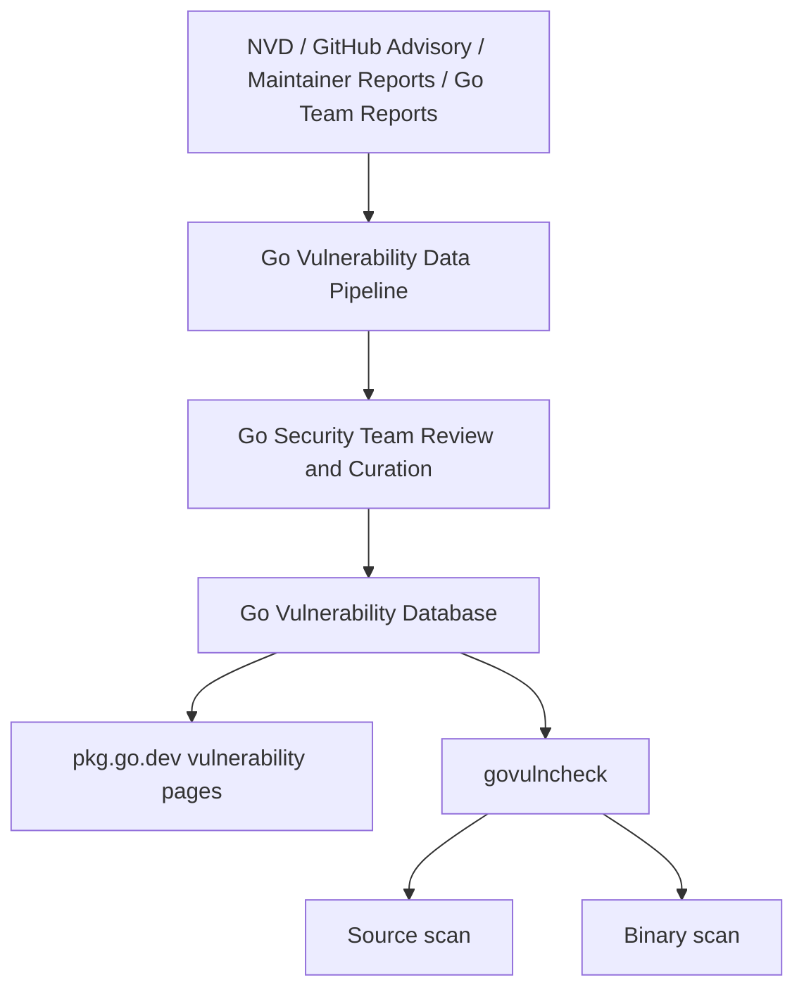
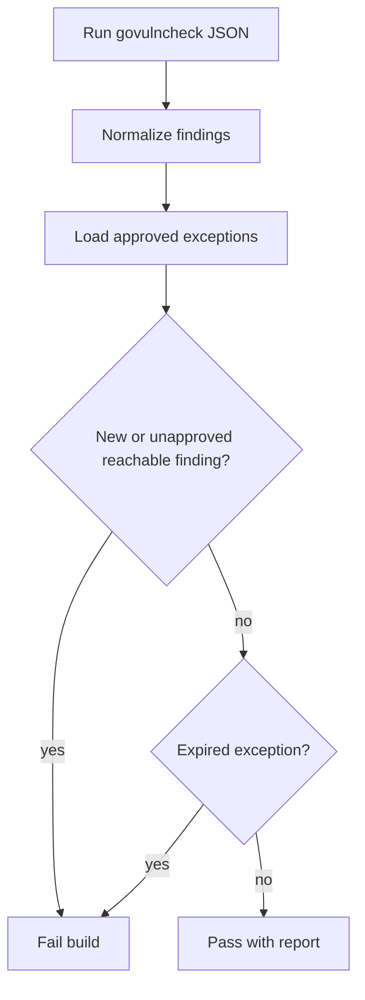
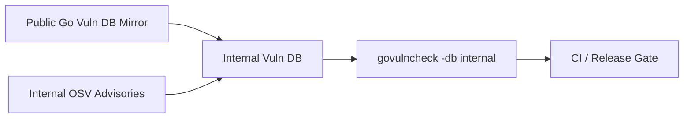

# learn-go-security-cryptography-integrity-part-033.md

# Part 033 — Vulnerability Management in Go: Go Vulnerability Database, `govulncheck`, Reachability-Based Scanning, Binary Scanning, CI Integration, Patch Triage, and Security Release Playbook

> Seri: `learn-go-security-cryptography-integrity`  
> Bagian: `033 / 034`  
> Target pembaca: Java software engineer / tech lead yang ingin membangun vulnerability-management capability untuk Go services pada level internal engineering handbook.  
> Fokus: vulnerability management sebagai sistem operasional, bukan hanya menjalankan scanner.

---

## 0. Posisi Part Ini dalam Seri

Part sebelumnya membahas **Go supply-chain security**: module trust model, `go.sum`, checksum database, `GOPROXY`, `GOSUMDB`, `GOPRIVATE`, vendoring, SBOM, provenance, dan CI/CD gates.

Part ini menjawab pertanyaan berikut:

> Setelah dependency dan build pipeline kita punya trust boundary yang jelas, bagaimana cara kita mengetahui, memprioritaskan, memperbaiki, membuktikan, dan merilis patch untuk vulnerability di Go service secara konsisten?

Kita akan membahas:

1. Apa arti vulnerability management untuk Go.
2. Kenapa scanner dependency biasa tidak cukup.
3. Bagaimana Go Vulnerability Database bekerja.
4. Bagaimana `govulncheck` berbeda dari scanner metadata-only.
5. Source scanning vs binary scanning.
6. CI/CD integration yang realistis.
7. Patch triage dan exception handling.
8. Security release playbook.
9. Governance dan metrics.
10. Template yang bisa langsung dipakai.

Part ini tidak akan mengulang:

- dasar Go modules dari part 032,
- secure coding per vulnerability class dari part 019–031,
- cryptographic primitive dari part 004–012,
- threat modeling umum dari part 003.

Namun semua itu akan dipakai sebagai konteks.

---

## 1. Executive Mental Model

Vulnerability management bukan aktivitas “scan lalu upgrade”. Itu terlalu dangkal.

Vulnerability management adalah sistem yang menjawab tujuh pertanyaan:

1. **Inventory** — software apa yang kita punya?
2. **Exposure** — dependency/runtime/API mana yang benar-benar reachable?
3. **Impact** — asset, tenant, data, privilege, atau availability apa yang terdampak?
4. **Priority** — mana yang harus dipatch sekarang, mana yang bisa dijadwalkan?
5. **Remediation** — upgrade, patch, config mitigation, feature disable, WAF, rollout, atau replace?
6. **Verification** — bagaimana membuktikan vulnerability tidak lagi ada atau tidak reachable?
7. **Communication** — siapa yang diberi tahu, kapan, dan dengan bukti apa?

Dalam Go, pertanyaan nomor 2 sangat penting karena Go punya karakteristik unik:

- binary biasanya statically linked,
- dependency graph berada di `go.mod` dan `go.sum`,
- standard library ikut menjadi bagian dari attack surface,
- build tags bisa mengubah dependency dan reachable code,
- `cgo` dan OS/architecture bisa mengubah vulnerability exposure,
- scanner bisa membaca source atau binary,
- Go Vulnerability Database menyimpan package/symbol-level metadata untuk membuat analisis lebih low-noise.

### 1.1 The core invariant

Vulnerability management yang baik harus menjaga invariant berikut:

```text
No production artifact may be released or kept running with a known, exploitable,
unaccepted vulnerability beyond its risk-specific remediation SLA.
```

Kalimat ini mengandung detail penting:

- **production artifact** — bukan hanya source repo; binary/container yang sudah deploy juga harus diperiksa.
- **known** — hanya yang sudah diketahui publik/internal; unknown vuln ditangani lewat secure SDLC dan detection.
- **exploitable** — reachability dan context matter.
- **unaccepted** — risk exception boleh, tetapi harus eksplisit, time-bound, dan approved.
- **beyond SLA** — tidak semua vulnerability punya urgency sama.

### 1.2 Scanner output is not a decision

Scanner hanya memberi signal. Decision tetap harus dibuat oleh engineering/security process.

```mermaid
flowchart LR
    A[Scanner Finding] --> B[Normalize]
    B --> C[Reachability Check]
    C --> D[Contextual Impact]
    D --> E[Priority / SLA]
    E --> F[Remediation Plan]
    F --> G[Patch / Mitigate]
    G --> H[Verification]
    H --> I[Release Evidence]
    I --> J[Post-release Monitoring]
```



Scanner finding tidak boleh langsung berarti:

- “harus deploy sekarang” tanpa impact analysis,
- “aman” hanya karena tidak ada finding,
- “false positive” hanya karena aplikasi belum crash,
- “accepted risk” tanpa owner dan expiry.

---

## 2. Java-to-Go Mindset Shift

Sebagai Java engineer, kamu mungkin terbiasa dengan:

- Maven/Gradle dependency graph,
- JAR/WAR packaging,
- transitive dependency scanning,
- CVE mapping by GAV,
- runtime container image scanning,
- shaded JAR issue,
- application server / JVM patching.

Di Go, mental modelnya berubah.

| Area | Java mindset | Go mindset |
|---|---|---|
| Packaging | banyak JAR runtime | single binary umum, plus container base image |
| Dependency ID | group/artifact/version | module path/version |
| Runtime library | JVM/JDK terpisah | Go standard library compiled into binary |
| Reachability | bytecode/classpath analysis | source call graph atau binary symbol analysis |
| Build variation | Maven profiles, classifiers | build tags, GOOS/GOARCH, cgo, toolchain |
| Patch runtime | update JDK/container | rebuild binary dengan patched Go toolchain dan modules |
| Scanner noise | banyak metadata-only CVE | `govulncheck` mencoba menurunkan noise via reachable symbols |
| Binary audit | JAR composition visible | Go binary butuh build info/symbol analysis |

### 2.1 Go standard library is part of your security posture

Di Java, dependency scanner sering fokus pada third-party libraries. Di Go, vulnerability bisa berada di:

- standard library: `net/http`, `crypto/x509`, `archive/tar`, `mime`, etc.
- Go command/toolchain,
- `golang.org/x/...` modules,
- third-party modules,
- native libraries bila memakai `cgo`,
- generated code,
- container base image,
- OS packages.

Maka remediation tidak cukup dengan:

```bash
go get -u ./...
```

Kadang yang perlu dilakukan adalah:

```bash
# Upgrade Go toolchain version
# Rebuild binary
# Rebuild container image
# Re-run tests
# Re-run vulnerability checks
# Redeploy
```

### 2.2 Go binary is the thing you run

Dalam Go, source repo bisa sudah aman tetapi production binary masih vulnerable karena:

- belum redeploy,
- artifact lama masih running,
- rollback memakai image lama,
- sidecar/helper binary belum ikut di-upgrade,
- cronjob image berbeda dari API image,
- worker image memakai Dockerfile terpisah,
- binary dibuild dengan Go toolchain lama,
- binary dibuild dengan build tags berbeda.

Karena itu, vulnerability management harus memindai:

1. **source** sebelum merge,
2. **artifact** setelah build,
3. **deployed runtime** setelah release.

---

## 3. Vulnerability Management Taxonomy

Tidak semua vulnerability sama. Kita perlu taxonomy agar triage tidak kacau.

### 3.1 By location

| Location | Example | Detection |
|---|---|---|
| Go standard library | `net/http`, `crypto/x509`, `archive/tar` | `govulncheck`, Go release notes |
| Go toolchain | `cmd/go`, module fetch, compiler/linker | Go security advisories, release notes |
| Direct module | module in `require` | `govulncheck`, SBOM scanner |
| Transitive module | module pulled by dependency | `govulncheck`, module graph |
| Generated code | protobuf/openapi/sqlc generated code | SAST, tests, generator pinning |
| Native dependency | C library via `cgo` | OS scanner, SCA, distro advisories |
| Container base image | Alpine/Debian/distroless packages | container scanner |
| Runtime config | TLS config, weak cipher, exposed debug | config audit, integration tests |
| Business logic | BOLA, IDOR, authz bug | threat model, tests, review |

`govulncheck` is excellent for known Go vulnerabilities, but it is not a complete security program.

### 3.2 By vulnerability origin

| Origin | Typical fix |
|---|---|
| Upstream package vulnerability | upgrade dependency |
| Standard library vulnerability | upgrade Go toolchain + rebuild |
| Toolchain vulnerability | upgrade Go toolchain; control build environment |
| Misconfiguration | config patch, runtime policy, IaC fix |
| Code misuse | code change, test, wrapper/hardening |
| Design flaw | architecture change, authorization model update |
| Operational exposure | network policy, firewall, egress, deployment change |

### 3.3 By exploitability in your application

| Category | Meaning | Example response |
|---|---|---|
| Reachable and exposed | vulnerable function is called on attacker-controlled path | urgent patch |
| Reachable but gated | vulnerable path requires internal admin or feature flag | patch with reduced SLA; evaluate abuse |
| Included but unreachable | code exists in dependency/binary but not called | document; patch in normal cycle if feasible |
| Platform-specific | only GOOS/GOARCH/cgo path affected | verify build matrix |
| Test-only | dependency used only in tests | patch or isolate; usually not production blocker |
| Dev-tool-only | tool used in codegen/linting | patch build pipeline if untrusted input involved |

---

## 4. Go Vulnerability Database Mental Model

The Go vulnerability database is the authoritative Go ecosystem vulnerability data source used by `govulncheck`.

At a high level:



The important idea is **curation**.

A generic CVE scanner often knows:

```text
module X version <= v1.2.3 has CVE-YYYY-NNNN
```

Go vulnerability data tries to add Go-specific precision such as:

```text
module path
package import path
affected symbols
fixed versions
platform constraints when known
aliases to CVE/GHSA
```

This enables `govulncheck` to answer a more useful question:

> Does my code transitively call the vulnerable symbol?

### 4.1 Database ID model

Go vulnerability IDs generally look like:

```text
GO-2024-XXXX
GO-2025-XXXX
GO-2026-XXXX
```

They may have aliases such as:

```text
CVE-2026-....
GHSA-....
```

Do not treat CVE ID as the only identity. In Go triage, track:

- Go vulnerability ID,
- aliases,
- affected module,
- affected package,
- affected symbols,
- introduced/fixed versions,
- vulnerable call path,
- source/binary scan result,
- remediation decision.

### 4.2 Why symbol-level data matters

Suppose module `example.com/parser` has a vulnerability only in:

```go
func ParseLegacyFormat(input []byte) (*Document, error)
```

Your code imports the module for:

```go
func ParseModernFormat(input []byte) (*Document, error)
```

A metadata-only scanner might report “vulnerable dependency”. A reachability-aware scanner may determine that the vulnerable function is not called.

This distinction matters because large Go services often have transitive dependencies with many packages and optional features.

But do not over-trust reachability:

- reflection can hide calls,
- plugin/dynamic invocation can hide paths,
- build tags change results,
- generated code might call symbols unexpectedly,
- binary analysis can include unreachable symbols,
- source analysis might miss runtime behavior.

Reachability is a powerful prioritization signal, not a mathematical proof of safety.

---

## 5. `govulncheck` Core Model

`govulncheck` is Go’s official vulnerability detection command.

It can analyze:

1. Go source code.
2. Compiled Go binaries.
3. Extracted binary metadata blobs.

### 5.1 Basic install

```bash
go install golang.org/x/vuln/cmd/govulncheck@latest
```

Pinning version in CI is better than blindly using latest on every run:

```bash
go install golang.org/x/vuln/cmd/govulncheck@v1.1.4
```

Use your organization’s approved version. Update it on a planned cadence.

### 5.2 Source scan

From module root:

```bash
govulncheck ./...
```

With build tags:

```bash
govulncheck -tags=prod,linux ./...
```

Include tests:

```bash
govulncheck -test ./...
```

More trace detail:

```bash
govulncheck -show traces ./...
```

Verbose:

```bash
govulncheck -show verbose ./...
```

JSON output for automation:

```bash
govulncheck -json ./... > govulncheck.source.json
```

SARIF output for code scanning dashboards:

```bash
govulncheck -format sarif ./... > govulncheck.sarif
```

> Exact flags can evolve. Always check `govulncheck -help` in the pinned version used by CI.

### 5.3 Binary scan

Build binary:

```bash
go build -trimpath -o bin/service ./cmd/service
```

Scan binary:

```bash
govulncheck -mode binary ./bin/service
```

Binary scanning is useful when:

- artifact is already built,
- source is unavailable,
- you need to audit deployed binaries,
- you need to compare source scan vs artifact scan,
- different build tags/platforms create different outputs.

But binary scanning has limitations:

- no detailed source call stacks,
- may report symbols present in binary but unreachable,
- depends on build info/symbol availability,
- older binaries may expose less metadata,
- stripped/obfuscated/custom-linked binaries may reduce usefulness.

### 5.4 Extract mode

For environments where you cannot upload or move full binary artifacts:

```bash
govulncheck -mode extract ./bin/service > service.vulnblob
```

Then analyze the extracted blob:

```bash
govulncheck -mode binary ./service.vulnblob
```

Treat extract output as sensitive artifact metadata. Store and transmit it according to internal policy.

### 5.5 Custom vulnerability database

By default `govulncheck` uses the canonical Go vulnerability database. In isolated environments, you may mirror the database and configure:

```bash
govulncheck -db=file:///security/go-vulndb ./...
```

or:

```bash
govulncheck -db=https://vulndb.internal.example.com ./...
```

Use cases:

- air-gapped CI,
- controlled egress policy,
- deterministic vulnerability data snapshot,
- internal vulnerability advisories,
- delayed rollout with approved snapshot.

But be careful: a stale database means stale risk visibility. Mirror freshness must be monitored.

---

## 6. Source Scanning vs Binary Scanning

Both are needed.

### 6.1 Source scanning answers

```text
Given this source tree and this build configuration,
which known vulnerable symbols are reachable from this code?
```

Strengths:

- call traces,
- good developer feedback,
- PR-level gating,
- can point to call sites,
- can include/exclude tests,
- fast enough for CI in many repos.

Weaknesses:

- depends on selected build tags,
- may miss reflection-heavy invocation,
- may differ from actual release build,
- only scans what is in repo and selected packages.

### 6.2 Binary scanning answers

```text
Given this compiled Go artifact,
which known vulnerable symbols or modules appear to be present?
```

Strengths:

- artifact-level evidence,
- good for deployed binary audit,
- catches mismatch between source and release artifact,
- useful for old releases.

Weaknesses:

- less precise call graph,
- can report unreachable included code,
- depends on binary metadata,
- must be run per GOOS/GOARCH/build variant.

### 6.3 Recommended engineering posture

| Stage | Scan type | Gate? | Purpose |
|---|---|---:|---|
| Local dev | source | no/hint | fast feedback |
| Pull request | source | yes for reachable high risk | prevent new exposure |
| Main branch nightly | source + test tags | yes/report | full repo visibility |
| Release build | binary | yes | verify artifact |
| Deployment | image + binary provenance | yes | ensure deployed artifact matches scanned artifact |
| Runtime inventory | periodic binary/image scan | report/block by severity | detect stale deployments |

---

## 7. Build Configuration Matters

Go vulnerability exposure depends on build configuration.

### 7.1 GOOS/GOARCH

A vulnerability may only affect:

- Linux,
- Windows,
- Darwin,
- specific CPU architecture,
- wasm,
- race builds,
- cgo-enabled builds.

Run scans for supported production matrix.

Example:

```bash
GOOS=linux GOARCH=amd64 govulncheck ./...
GOOS=linux GOARCH=arm64 govulncheck ./...
```

For release binaries:

```bash
GOOS=linux GOARCH=amd64 go build -o dist/service-linux-amd64 ./cmd/service
GOOS=linux GOARCH=arm64 go build -o dist/service-linux-arm64 ./cmd/service

govulncheck -mode binary dist/service-linux-amd64
govulncheck -mode binary dist/service-linux-arm64
```

### 7.2 Build tags

Build tags can completely change code paths.

Examples:

```go
//go:build enterprise
```

```go
//go:build cgo
```

```go
//go:build linux && amd64
```

Your scan matrix must include production tags:

```bash
govulncheck -tags=prod,enterprise ./...
```

Anti-pattern:

```bash
# CI scans default build, production uses different tags.
govulncheck ./...
go build -tags=prod,enterprise ./cmd/service
```

Correct:

```bash
TAGS=prod,enterprise
govulncheck -tags=$TAGS ./...
go build -tags=$TAGS ./cmd/service
govulncheck -mode binary ./service
```

### 7.3 cgo

`CGO_ENABLED` changes the attack surface.

```bash
CGO_ENABLED=0 govulncheck ./...
CGO_ENABLED=1 govulncheck ./...
```

If production uses `CGO_ENABLED=1`, your vulnerability management must also cover:

- C libraries,
- distro packages,
- container base image,
- native linker behavior,
- runtime dynamic libraries.

`govulncheck` is not a full native dependency scanner.

### 7.4 Tests and tools

`-test` can reveal vulnerabilities in test-only code. That may matter if:

- test code parses untrusted fixtures,
- test utilities run in CI with secrets,
- integration tests run against real environments,
- fuzz corpora include external input,
- codegen/test helpers execute commands.

Usually production release gates should distinguish:

- production source finding,
- test-only finding,
- tooling finding.

But do not ignore CI compromise risk.

---

## 8. Vulnerability Triage Model

A good triage model avoids both extremes:

- panic-patching everything immediately,
- rationalizing everything as false positive.

### 8.1 Triage fields

Each finding should be normalized into a record:

```yaml
finding_id: VULN-2026-000123
source: govulncheck
scan_kind: source
scan_time: 2026-06-24T10:15:00+07:00
repo: example/service-a
module: example.com/service-a
artifact: registry.example.com/service-a:1.42.7
build:
  go_version: go1.26.4
  goos: linux
  goarch: amd64
  tags: [prod]
vulnerability:
  go_id: GO-2026-XXXX
  aliases: [CVE-2026-YYYY, GHSA-....]
  affected_module: golang.org/x/example
  affected_package: golang.org/x/example/parser
  affected_symbols: [Parse]
  fixed_version: v1.2.4
reachability:
  status: reachable
  call_trace: cmd/service/main.go -> internal/importer.ParseUpload -> parser.Parse
exposure:
  internet_facing: true
  authenticated_required: true
  tenant_boundary: true
  attacker_controlled_input: true
impact:
  confidentiality: high
  integrity: medium
  availability: high
priority:
  severity: critical
  sla: 24h
owner:
  team: platform-security
  engineer: alice
plan:
  remediation: upgrade module to v1.2.4
  mitigation: temporarily disable upload import for external users
exception:
  status: none
verification:
  required: [govulncheck_clean, regression_test, canary_metrics]
```

### 8.2 Reachability states

| State | Meaning | Action |
|---|---|---|
| `reachable` | scanner shows call path or binary contains used vulnerable symbol | patch/mitigate according to SLA |
| `possibly_reachable` | reflection/interface/dynamic path uncertain | manual review + targeted tests |
| `included_unreachable` | dependency vulnerable but no call path found | track; patch in normal dependency cycle |
| `test_only` | reachable only from tests | patch or isolate CI risk |
| `dev_tool_only` | affects tool/codegen path | patch build pipeline if tool handles untrusted input or secrets |
| `not_applicable_platform` | GOOS/GOARCH/cgo mismatch | document with scan evidence |
| `false_positive` | scanner/data incorrect | document evidence; upstream report if needed |

### 8.3 Exposure dimensions

Severity from advisory is not enough. Add context:

| Dimension | Questions |
|---|---|
| Entry point | Internet, intranet, admin, batch, cron, message queue? |
| Input control | Can attacker control input? Fully or partially? |
| Auth required | Anonymous, authenticated, admin, service account? |
| Tenant impact | Can one tenant affect another? |
| Data class | PII, credentials, financial/regulatory data, audit evidence? |
| Privilege | Does vulnerability execute with high privilege? |
| Compensating controls | WAF, allowlist, feature flag, size limit, authz, sandbox? |
| Exploit maturity | Public PoC? Weaponized? Actively exploited? |
| Blast radius | Single request, service-wide, cluster-wide, account-wide? |

### 8.4 Priority matrix

Example internal SLA:

| Priority | Condition | SLA |
|---|---|---:|
| P0 | actively exploited, internet-facing, credential/data compromise, RCE, auth bypass | immediate mitigation; patch within 24h |
| P1 | reachable high/critical vuln in exposed service | 3 days |
| P2 | reachable medium or gated high | 14 days |
| P3 | included but unreachable, low exposure, test-only | next maintenance window |
| P4 | false positive / not applicable | document and close |

Do not blindly map CVSS to SLA. Use CVSS as input, not as final decision.

---

## 9. Patch Strategy

### 9.1 Patch dependency vulnerability

Basic flow:

```bash
# Identify current version
go list -m all | grep 'golang.org/x/example'

# Upgrade direct or transitive module
go get golang.org/x/example@v1.2.4

# Recompute module graph
go mod tidy

# Run tests
go test ./...

# Run vulncheck
govulncheck ./...
```

If dependency is transitive:

```bash
go mod why -m golang.org/x/example
go mod graph | grep 'golang.org/x/example'
```

Then either:

- upgrade parent dependency,
- add direct requirement to force fixed version,
- replace module temporarily with patched fork,
- remove feature path,
- remove dependency entirely.

### 9.2 Patch Go standard library vulnerability

If finding is in `stdlib`, dependency upgrade is not enough.

You need:

1. upgrade Go toolchain,
2. rebuild binary,
3. rebuild container image,
4. redeploy all affected workloads,
5. verify deployed artifact.

Example:

```bash
# Confirm build info of existing binary
go version -m ./service

# Upgrade toolchain in build environment
# Example only; actual method depends on your base image/toolchain manager.
go version

# Rebuild
go build -trimpath -o ./service ./cmd/service

# Verify new binary metadata
go version -m ./service

# Scan artifact
govulncheck -mode binary ./service
```

### 9.3 Patch toolchain vulnerability

If vulnerability affects `cmd/go`, module fetching, compiler, linker, or build process:

- update CI builder image,
- update developer toolchain baseline,
- invalidate old build cache if necessary,
- rebuild releases,
- review provenance of artifacts built during exposure window,
- check if untrusted module proxy/source could have influenced builds.

### 9.4 Patch container/native vulnerability

For container/base OS vulnerabilities:

- update base image digest,
- rebuild image,
- scan OS packages,
- ensure Go binary scan still passes,
- redeploy.

Do not assume a statically linked Go binary means container scan irrelevant. You may still have:

- CA certificates,
- shell/debug tools,
- libc if cgo,
- timezone data,
- package manager cache,
- sidecar binaries.

### 9.5 Temporary mitigations

When immediate patch is risky or unavailable:

| Vulnerability type | Possible temporary mitigation |
|---|---|
| parser crash | request size limit, disable feature, sandbox worker |
| SSRF | egress block, allowlist, proxy restriction |
| auth bypass | feature disable, stricter gateway enforcement |
| RCE | disable dangerous plugin/import path, isolate worker |
| path traversal | block archive extraction/upload, use staging jail |
| DoS | rate limit, circuit breaker, body/header limits |
| crypto vuln | rotate keys, disable algorithm, force protocol version |

Mitigation is not closure. It buys time.

---

## 10. Exception Handling Without Security Theater

Some findings cannot be immediately patched.

Reasons:

- no fixed version exists,
- upgrade breaks API,
- dependency abandoned,
- finding unreachable,
- platform not affected,
- compensating control is strong,
- release freeze with low exposure.

But exceptions must be governed.

### 10.1 Exception record template

```yaml
exception_id: SEC-EXC-2026-0042
finding_id: VULN-2026-000123
vulnerability: GO-2026-XXXX
service: payment-reconciliation-api
owner: team-payments
requested_by: tech-lead
approved_by: security-lead
created_at: 2026-06-24
expires_at: 2026-07-08
reason: fixed dependency version causes incompatible parser behavior in batch import
risk_summary: reachable only from internal batch file import; no internet exposure
compensating_controls:
  - internal-only network access
  - max upload size 10MB
  - file source allowlist
  - sandboxed worker with no outbound network
  - monitoring alert on parser panic
remediation_plan:
  - fork upstream patch into internal branch
  - run compatibility test suite
  - deploy by 2026-07-05
verification:
  - govulncheck result attached
  - exploitability review attached
  - integration tests attached
status: approved_time_bound
```

### 10.2 Exception anti-patterns

Bad:

```text
False positive. We don't think it affects us.
```

Better:

```text
govulncheck source scan reports included dependency but no vulnerable symbol call trace.
Binary scan for linux/amd64 production artifact reports no affected symbol.
No reflection/plugin path exists for the affected package. Re-evaluate after next dependency update.
Exception expires in 30 days.
```

Bad:

```text
Accepted by team.
```

Better:

```text
Accepted by service owner and security approver until YYYY-MM-DD.
Compensating controls documented. SLA breach risk accepted.
```

### 10.3 No permanent exceptions

Every exception must have:

- owner,
- expiry,
- risk statement,
- compensating control,
- remediation plan,
- evidence,
- re-review trigger.

Permanent exceptions are usually undocumented architectural debt.

---

## 11. CI/CD Integration Blueprint

### 11.1 Local developer command

Create `make vuln`:

```makefile
.PHONY: vuln
vuln:
	govulncheck ./...
```

With tags:

```makefile
GO_TAGS ?= prod

.PHONY: vuln
vuln:
	govulncheck -tags=$(GO_TAGS) ./...
```

### 11.2 GitHub Actions example

```yaml
name: vulnerability-check

on:
  pull_request:
  push:
    branches: [ main ]
  schedule:
    - cron: '0 2 * * *'

jobs:
  govulncheck:
    runs-on: ubuntu-latest
    permissions:
      contents: read
      security-events: write
    steps:
      - uses: actions/checkout@v4

      - uses: actions/setup-go@v5
        with:
          go-version: '1.26.4'
          cache: true

      - name: Install govulncheck
        run: go install golang.org/x/vuln/cmd/govulncheck@latest

      - name: Source scan
        run: govulncheck -tags=prod ./...

      - name: SARIF scan
        if: always()
        run: govulncheck -format sarif -tags=prod ./... > govulncheck.sarif

      - name: Upload SARIF
        if: always()
        uses: github/codeql-action/upload-sarif@v3
        with:
          sarif_file: govulncheck.sarif
```

For regulated environments, pin `govulncheck` version rather than `@latest`.

### 11.3 GitLab CI example

```yaml
stages:
  - test
  - security
  - build

variables:
  GO_VERSION: "1.26.4"
  GO_TAGS: "prod"

govulncheck:
  image: golang:${GO_VERSION}
  stage: security
  script:
    - go install golang.org/x/vuln/cmd/govulncheck@latest
    - govulncheck -tags=${GO_TAGS} ./...
  artifacts:
    when: always
    paths:
      - govulncheck.json
  after_script:
    - govulncheck -json -tags=${GO_TAGS} ./... > govulncheck.json || true
```

### 11.4 Release artifact gate

```bash
set -euo pipefail

VERSION="${VERSION:?missing VERSION}"
GO_TAGS="prod"
OUT="dist/service-${VERSION}-linux-amd64"

GOOS=linux GOARCH=amd64 CGO_ENABLED=0 \
  go build -trimpath -tags="$GO_TAGS" \
  -ldflags="-s -w -X main.version=$VERSION" \
  -o "$OUT" ./cmd/service

go version -m "$OUT" > "${OUT}.buildinfo.txt"

govulncheck -mode binary "$OUT" > "${OUT}.govulncheck.txt"
```

This creates evidence:

- build info,
- binary scan output,
- exact artifact path,
- version.

### 11.5 Fail policy

Do not blindly fail every scanner finding if your scanner emits non-reachable or test-only findings. Define a policy.

Example:

| Finding class | PR gate | Release gate |
|---|---:|---:|
| reachable critical/high in production path | fail | fail |
| reachable medium | warn/fail depending repo | fail unless exception |
| included unreachable | warn | warn/issue |
| test-only high | warn/fail if CI secret risk | warn/fail |
| no fixed version | fail only if no mitigation/exception | fail unless exception |
| stale scanner/db | fail | fail |

A stale scanner is itself a control failure.

---

## 12. Parsing `govulncheck` Output for Automation

### 12.1 Why parse JSON?

Human output is good for developers. CI needs structured output.

Use JSON to:

- create tickets,
- attach evidence,
- classify by module,
- compare baseline,
- detect new findings,
- generate dashboards,
- map findings to owners.

### 12.2 Baseline comparison

A simple policy:

- fail if new reachable high/critical finding appears,
- allow existing approved exceptions until expiry,
- fail if exception expired,
- fail if scanner errors,
- fail if vulnerability database mirror is stale.

Pseudo-flow:



### 12.3 Example normalizer shape

The exact JSON schema is versioned by tool behavior. Avoid relying on brittle ad-hoc regex. Prefer:

- parse JSON events,
- tolerate unknown fields,
- preserve raw output as artifact,
- pin tool version,
- test parser against fixture outputs.

Example internal normalized struct:

```go
package vulnreport

type Finding struct {
    Tool              string   `json:"tool"`
    ToolVersion       string   `json:"tool_version"`
    ScanKind          string   `json:"scan_kind"` // source, binary
    Repo              string   `json:"repo"`
    Artifact          string   `json:"artifact,omitempty"`
    GoVersion         string   `json:"go_version"`
    GOOS              string   `json:"goos"`
    GOARCH            string   `json:"goarch"`
    Tags              []string `json:"tags,omitempty"`

    GoVulnID          string   `json:"go_vuln_id"`
    Aliases           []string `json:"aliases,omitempty"`
    AffectedModule    string   `json:"affected_module"`
    AffectedPackage   string   `json:"affected_package,omitempty"`
    AffectedSymbols   []string `json:"affected_symbols,omitempty"`
    FixedVersion      string   `json:"fixed_version,omitempty"`

    Reachability      string   `json:"reachability"`
    CallTraceSummary  string   `json:"call_trace_summary,omitempty"`
    RawEvidencePath   string   `json:"raw_evidence_path"`
}
```

Key principle:

> Normalize for governance, but preserve raw scanner output for audit.

---

## 13. Security Release Playbook

A security release playbook is a rehearsed process, not a document people open for the first time during an incident.

### 13.1 Trigger events

A security release may be triggered by:

- `govulncheck` CI failure,
- Go security release announcement,
- dependency maintainer advisory,
- internal pentest finding,
- bug bounty report,
- customer report,
- suspicious exploitation signal,
- container scanner critical finding,
- threat intelligence alert.

### 13.2 Initial intake

Within first response window:

1. assign incident/finding owner,
2. identify affected repos/services/artifacts,
3. classify vulnerability type,
4. check exposure and reachability,
5. decide patch vs mitigation urgency,
6. open incident channel if P0/P1,
7. start evidence log.

### 13.3 Scope identification

Questions:

- Which repos import affected module/package?
- Which binaries include affected module/symbol?
- Which deployed images are built with affected Go version?
- Which services expose attacker-controlled input to the vulnerable path?
- Which tenants/data classes are affected?
- Which environments are affected: dev/UAT/prod?
- Which cronjobs/workers/batch jobs are affected?
- Which old releases are still deployed or rollback-capable?

Commands:

```bash
# Find module usage in current repo
go list -m all | grep 'module/path'

# Explain why module is present
go mod why -m module/path

# Show build info of binary
go version -m ./service

# Source scan
govulncheck -show traces ./...

# Binary scan
govulncheck -mode binary ./service
```

At fleet level, use SBOM and artifact inventory.

### 13.4 Patch branch

Create a minimal patch branch:

```bash
git checkout -b security/GO-2026-XXXX

go get affected/module@fixed.version
go mod tidy

go test ./...
govulncheck ./...
```

If standard library:

```bash
# update build image/toolchain first
# rebuild with patched Go version
```

### 13.5 Regression testing

Security patch testing must include:

- unit tests,
- integration tests,
- negative tests for exploit-like input if safe,
- performance smoke test if parser/crypto/network affected,
- compatibility tests for serialized data/protocols,
- migration tests if dependency major version changes,
- rollback test if production needs rollback plan.

Do not publish exploit details in public logs or issue titles before disclosure decisions.

### 13.6 Release gate

Before release:

- source scan clean or approved exception,
- binary scan clean or approved exception,
- container scan reviewed,
- Go version verified,
- SBOM generated,
- changelog prepared,
- deployment plan approved,
- rollback plan approved,
- monitoring ready.

### 13.7 Deployment

For P0/P1:

- deploy mitigation if patch needs time,
- prioritize internet-facing/high-value services,
- deploy canary if possible but do not over-delay urgent patch,
- monitor error rate, latency, auth failures, suspicious requests,
- confirm all pods/tasks/instances updated,
- block rollback to vulnerable image unless explicitly approved.

### 13.8 Post-release verification

Verify:

```bash
# running image digest
kubectl get pods -o wide
kubectl describe pod <pod>

# if supported, query version endpoint
curl -s https://service/version

# verify artifact build info from stored binary

go version -m dist/service

# vulnerability scan evidence
cat dist/service.govulncheck.txt
```

Operational checks:

- no old pods running,
- no old cronjobs pending,
- no rollback image in active deployment strategy,
- no old artifact in scheduled job,
- autoscaler not launching old image,
- blue/green old environment drained.

### 13.9 Closure

Closure record:

```yaml
vulnerability: GO-2026-XXXX
services_fixed:
  - service-a@1.42.8
  - worker-a@1.42.8
deployment:
  prod_started: 2026-06-24T13:00:00+07:00
  prod_completed: 2026-06-24T13:42:00+07:00
evidence:
  - govulncheck.source.json
  - govulncheck.binary.txt
  - go-version-m.txt
  - sbom.cdx.json
  - release_change_record
residual_risk: none_known
lessons:
  - add binary scan gate for worker image
  - improve owner mapping for transitive dependency
```

---

## 14. Runtime Inventory and Fleet Management

CI scanning is not enough. You need to know what is deployed.

### 14.1 Required inventory fields

For each deployed Go workload:

```yaml
service: aceas-case-api
environment: prod
namespace: intranet-prod
image: registry.example.com/aceas-case-api@sha256:...
version: 2.17.4
commit: abcdef1234
build_time: 2026-06-24T08:15:00Z
go_version: go1.26.4
goos: linux
goarch: amd64
cgo_enabled: false
build_tags: [prod]
sbom: s3://security-sbom/aceas-case-api/2.17.4.cdx.json
govulncheck_source: s3://security-evidence/...source.json
govulncheck_binary: s3://security-evidence/...binary.txt
owner: team-case
criticality: high
data_class: pii_regulatory
internet_facing: false
```

### 14.2 Why Go version matters at runtime

If Go releases a security fix in `crypto/x509`, `net/http`, `mime`, etc., every binary built with vulnerable Go version may need rebuild.

Your inventory must answer:

```text
Which running artifacts were built with Go 1.26.1?
Which artifacts import vulnerable module X?
Which services are internet-facing and built before fix date?
```

### 14.3 `go version -m`

For Go binaries with build info:

```bash
go version -m ./service
```

Example output shape:

```text
./service: go1.26.4
        path    example.com/company/service/cmd/service
        mod     example.com/company/service  v1.42.8
        dep     golang.org/x/crypto          v0.39.0
        build   -buildmode=exe
        build   -compiler=gc
        build   CGO_ENABLED=0
        build   GOARCH=amd64
        build   GOOS=linux
```

Use this as evidence, but do not rely on it as your only inventory source.

---

## 15. Combining Tools Without Duplicating Noise

`govulncheck` is necessary, not sufficient.

### 15.1 Tool categories

| Tool category | Catches | Misses |
|---|---|---|
| `govulncheck` | known Go vuln with reachability | native OS packages, business logic, config |
| OS/container scanner | distro packages, CVEs | Go symbol reachability |
| SAST | code misuse patterns | dependency advisories |
| secret scanner | leaked tokens/keys | vulnerable functions |
| IaC scanner | insecure Kubernetes/Terraform | source call paths |
| DAST | exposed runtime behavior | dormant code |
| fuzzing | parser edge cases | known vuln inventory |
| SBOM scanner | component inventory | exploitability context |

### 15.2 Signal fusion

A mature program correlates:

```text
SBOM component
+ govulncheck reachability
+ artifact build info
+ service criticality
+ internet exposure
+ runtime telemetry
+ exploit intelligence
= triage decision
```

### 15.3 Avoid contradictory gates

Example bad setup:

- generic scanner fails build for any transitive CVE,
- `govulncheck` says not reachable,
- team creates broad ignore rule,
- real reachable issue later gets ignored too.

Better:

- generic scanner produces inventory signal,
- `govulncheck` produces Go reachability signal,
- policy engine classifies,
- exception is specific to vulnerability/service/artifact/expiry.

---

## 16. Vulnerability Management for Monorepos and Multi-Service Systems

### 16.1 Monorepo challenge

A monorepo may contain:

```text
/cmd/api
/cmd/worker
/cmd/migrator
/cmd/admin-cli
/internal/...
/tools/...
```

Running only:

```bash
govulncheck ./...
```

is useful but may not reflect each release artifact.

Scan each build target:

```bash
govulncheck ./cmd/api
govulncheck ./cmd/worker
govulncheck ./cmd/migrator
govulncheck ./cmd/admin-cli
```

Then scan binaries:

```bash
govulncheck -mode binary dist/api
govulncheck -mode binary dist/worker
govulncheck -mode binary dist/migrator
govulncheck -mode binary dist/admin-cli
```

### 16.2 Different risk profiles

| Binary | Exposure | Example SLA |
|---|---|---:|
| public API | internet-facing | shortest |
| intranet API | authenticated internal | shorter |
| async worker | queue input | depends on source of messages |
| migrator | privileged DB access | high even if not internet-facing |
| admin CLI | operator laptop/CI | high if secrets involved |
| codegen tool | build pipeline | high if supply-chain risk |

### 16.3 Owner mapping

Every binary must map to:

- owning team,
- business criticality,
- data class,
- deployment environment,
- escalation contact,
- security approver.

No owner means no reliable SLA.

---

## 17. Patch Triage Examples

### 17.1 Example A — reachable vulnerable parser in upload API

Finding:

```text
GO-2026-XXXX in module example.com/parser
Call trace: upload.Handler -> importer.Import -> parser.Parse
```

Context:

- internet-facing upload API,
- authenticated users can upload file,
- parser input attacker-controlled,
- vulnerability causes panic/DoS and possible out-of-bounds behavior,
- fixed version exists.

Decision:

- priority P1/P0 depending exploit maturity,
- immediately reduce max upload size or disable risky import type,
- upgrade parser,
- add regression test with malicious corpus if safe,
- canary deploy,
- verify source and binary scans.

### 17.2 Example B — vulnerable package included but not called

Finding:

```text
module example.com/archive vulnerable in ExtractLegacy
No call trace from application source.
```

Context:

- dependency imported for `ListMetadata`,
- `ExtractLegacy` not called,
- no reflection/plugin path,
- no archive extraction feature.

Decision:

- not emergency,
- schedule dependency upgrade,
- document reachability evidence,
- no broad ignore,
- re-evaluate if feature added.

### 17.3 Example C — standard library TLS/x509 vulnerability

Finding:

```text
Go 1.26.1 standard library vulnerability in crypto/x509
Service built with go1.26.1
```

Context:

- service validates client certificates,
- mTLS identity boundary critical,
- production Go version affected.

Decision:

- upgrade Go to fixed patch version,
- rebuild all mTLS services,
- rotate/reload images,
- verify with `go version -m`,
- binary scan all artifacts,
- block rollback to old images.

### 17.4 Example D — vulnerable dev tool

Finding:

```text
Code generator tool uses vulnerable YAML parser.
```

Context:

- tool runs in CI,
- input schema files come from repository PRs,
- CI has access to package registry token.

Decision:

- treat as CI compromise risk,
- patch tool dependency,
- restrict CI token permissions,
- run tool in sandboxed job,
- do not dismiss as “not production”.

---

## 18. Vulnerability Management and Threat Modeling

Threat modeling should feed vulnerability triage.

### 18.1 Finding-to-threat mapping

| Finding | Threat model question |
|---|---|
| vulnerable parser | Which trust boundary feeds parser? |
| SSRF vulnerability | What outbound networks can service reach? |
| auth bypass | Which authorization invariants are affected? |
| path traversal | Which filesystem root and privileges are exposed? |
| crypto/x509 vuln | Which trust decisions depend on certificate validation? |
| DoS vuln | What resource limit/backpressure exists? |
| command injection | What OS privilege and environment secrets are available? |

### 18.2 Security invariant impact

For each vulnerability, ask:

```text
Which previously stated security invariant might be violated?
```

Examples:

```text
A user can only access cases belonging to their agency.
```

```text
Only workloads with SPIFFE ID spiffe://prod/ns/payment/sa/api can call payment settlement endpoint.
```

```text
Uploaded archives can never write outside tenant-specific staging directory.
```

```text
Audit log append cannot be modified without detection.
```

A vulnerability affecting an invariant is higher priority than one affecting convenience functionality.

---

## 19. Vulnerability Management and Tests

### 19.1 Tests should encode the fix

When patching a vulnerability, add tests when possible.

Examples:

- parser rejects malicious malformed input,
- archive extraction rejects traversal paths,
- URL fetcher blocks private IP,
- JWT validator rejects wrong audience,
- session rotates after login,
- body size limit rejects huge payload,
- header injection rejected,
- vulnerable code path no longer reachable.

### 19.2 Regression test template

```go
func TestImportRejectsTraversalArchive(t *testing.T) {
    t.Parallel()

    archive := buildZip(t, map[string][]byte{
        "../../etc/passwd": []byte("owned"),
    })

    err := ImportArchive(context.Background(), bytes.NewReader(archive))
    if err == nil {
        t.Fatal("expected traversal archive to be rejected")
    }
}
```

### 19.3 Fuzzing for vulnerability class

If vulnerability is parser-related:

```go
func FuzzParseUpload(f *testing.F) {
    f.Add([]byte("valid input"))
    f.Fuzz(func(t *testing.T, b []byte) {
        _, _ = ParseUpload(b)
    })
}
```

Fuzzing is not a replacement for dependency patching, but it helps prevent adjacent bugs.

### 19.4 Negative tests as security documentation

A good negative test explains:

- which attack it represents,
- what must not happen,
- which invariant is protected.

Bad test name:

```go
func TestBug123(t *testing.T)
```

Better:

```go
func TestJWTValidatorRejectsWrongAudience(t *testing.T)
```

---

## 20. Security Metrics That Actually Help

Metrics should drive behavior, not vanity dashboards.

### 20.1 Good metrics

| Metric | Meaning |
|---|---|
| mean time to triage | time from finding to owner+priority |
| mean time to remediate | time from finding to deployed fix |
| SLA breach count | vulnerabilities past deadline |
| exception count by age | risk debt trend |
| scanner freshness | tool/db age |
| Go version coverage | running artifacts on supported patched Go versions |
| artifact scan coverage | percentage release artifacts with binary scan evidence |
| owner coverage | workloads with accountable owner |
| recurrence | same vuln class repeated after patch |
| rollback exposure | vulnerable image still rollback-capable |

### 20.2 Bad metrics

| Metric | Why weak |
|---|---|
| total CVE count only | incentivizes hiding/ignoring transitive noise |
| raw severity count only | ignores reachability/exposure |
| number of scanner runs | activity, not outcome |
| exceptions without age | hides permanent debt |
| dependencies upgraded count | may create churn without risk reduction |

### 20.3 Dashboard view

A useful dashboard groups by:

- service criticality,
- internet/intranet/internal,
- data class,
- owner,
- environment,
- finding status,
- SLA deadline,
- exception expiry,
- Go version.

---

## 21. Policy-as-Code Sketch

A simple policy engine can consume normalized findings and exceptions.

### 21.1 Policy YAML

```yaml
policy_version: 1
rules:
  - name: block-reachable-critical
    when:
      reachability: reachable
      severity: critical
      environment: production
    action: fail
    max_age: 0h

  - name: block-reachable-high-release
    when:
      reachability: reachable
      severity: high
      stage: release
    action: fail_unless_exception
    max_age: 72h

  - name: warn-unreachable
    when:
      reachability: included_unreachable
    action: warn

  - name: fail-expired-exception
    when:
      exception_status: expired
    action: fail
```

### 21.2 Policy decision output

```json
{
  "decision": "fail",
  "reason": "reachable high vulnerability without approved exception",
  "finding_id": "VULN-2026-000123",
  "vulnerability": "GO-2026-XXXX",
  "service": "case-api",
  "sla_deadline": "2026-06-27T10:00:00+07:00"
}
```

### 21.3 Design invariant

Policy must be deterministic and auditable.

Avoid hidden spreadsheet decisions.

---

## 22. Handling No-Fix Vulnerabilities

Sometimes there is no fixed version.

### 22.1 Options

| Option | When appropriate |
|---|---|
| disable feature | vulnerable feature non-critical |
| isolate path | parser/command runs in sandbox worker |
| restrict input | allowlist format/source/size |
| fork and patch | upstream slow but patch obvious |
| replace dependency | dependency abandoned or design unsafe |
| compensate with gateway/WAF | temporary for network/API patterns |
| monitor exploit signals | always, but never sole mitigation |
| accept risk | only with strong reason and expiry |

### 22.2 Forking risk

Forking can fix urgency but creates maintenance debt.

If you fork:

- document upstream issue/PR,
- pin fork commit,
- restrict who can push,
- sign/protect tags if possible,
- schedule rebase/removal,
- scan fork itself,
- create owner and expiry.

Do not leave `replace` to a personal GitHub fork indefinitely.

Example temporary replace:

```go
replace example.com/vulnerable/module => github.com/company/module-fork v1.2.3-company.1
```

Add comment in `go.mod` if allowed by style:

```go
// Temporary security fork for GO-2026-XXXX. Remove by 2026-07-31.
replace example.com/vulnerable/module => github.com/company/module-fork v1.2.3-company.1
```

---

## 23. Vulnerability Management for Private Modules

Private modules may have vulnerabilities too.

### 23.1 Internal advisory model

Create internal IDs:

```text
INT-GO-2026-0001
```

Track:

- affected internal module path,
- affected package/symbol,
- fixed version/commit,
- disclosure audience,
- owner,
- remediation guidance.

### 23.2 Internal database option

For advanced organizations, mirror Go vulnerability database and add internal advisories in OSV-compatible format.

Potential flow:



Cautions:

- ensure public data freshness,
- validate schema compatibility,
- protect sensitive internal advisories,
- define disclosure boundaries,
- test `govulncheck` behavior with internal DB.

### 23.3 Private advisory confidentiality

A private advisory may reveal exploitable internal design.

Control access to:

- full advisory text,
- exploit details,
- vulnerable symbols,
- affected services,
- patch commits before deploy,
- exception records.

Do not leak security details through public PR titles or changelogs.

---

## 24. Communication Templates

### 24.1 Engineering ticket

```markdown
# Security Remediation: GO-2026-XXXX in <module>

## Summary
`govulncheck` reports a reachable vulnerability in `<module/package>`.

## Affected service
- Service: `<service>`
- Environment: `<env>`
- Artifact: `<image digest>`
- Go version: `<go version>`

## Evidence
- Scan: `<link to govulncheck output>`
- Call trace: `<summary>`
- Fixed version: `<version>`

## Impact
- Entry point: `<internet/intranet/internal>`
- Attacker-controlled input: `<yes/no>`
- Data class: `<PII/secrets/audit/etc>`
- Security invariant affected: `<invariant>`

## Required action
- Upgrade `<module>` to `<fixed version>` or upgrade Go to `<fixed Go version>`.
- Rebuild and redeploy affected artifact.
- Attach source and binary scan evidence.

## SLA
- Priority: `<P0/P1/P2/P3>`
- Due: `<date/time>`
```

### 24.2 Release note

```markdown
## Security Fix

This release updates `<module/toolchain>` to address `<GO-ID/CVE-ID>`.
The affected code path has been remediated and release artifacts were verified using source and binary vulnerability scans.

No customer action is required unless you run self-managed deployments, in which case upgrade to version `<version>` or later.
```

### 24.3 Stakeholder update

```markdown
Current status: remediation in progress.

Affected component: `<service>`
Risk: `<summary>`
Exposure: `<internet/intranet/internal>`
Mitigation applied: `<yes/no + details>`
Patch ETA: `<deployment window>`
Next update: `<time>`
```

Keep exploit details limited to need-to-know channels.

---

## 25. Advanced Failure Modes

### 25.1 Scanner passes but service is vulnerable

Possible causes:

- vulnerability is unknown publicly,
- vulnerable pattern is application code, not dependency,
- reflection hides call path,
- production build tags differ,
- generated code not scanned,
- binary built from different commit,
- cgo/native dependency not covered,
- internal/private module advisory not in DB,
- scanner database stale.

Controls:

- secure code review,
- fuzzing,
- SAST,
- integration tests,
- artifact provenance,
- build matrix scanning,
- internal advisory process,
- scanner freshness monitoring.

### 25.2 Scanner fails build with noisy finding

Possible causes:

- metadata-only tool reports transitive but unreachable vulnerability,
- binary contains unused symbols,
- test-only dependency,
- platform mismatch,
- old advisory inaccurate.

Controls:

- classify reachability,
- use `govulncheck` source traces,
- run binary scan,
- create precise exception,
- report upstream data issue if needed.

### 25.3 Patch causes outage

Security patches can break behavior.

Controls:

- compatibility tests,
- canary,
- rollback plan,
- feature flags,
- staged rollout,
- monitoring,
- precomputed migration impact.

But rollback to vulnerable artifact must be controlled. Sometimes rollback should be blocked unless incident commander approves.

### 25.4 Patch is applied but vulnerability remains deployed

Common causes:

- old pod still running,
- cronjob uses old image,
- worker deployment forgotten,
- sidecar contains old binary,
- blue/green old environment still receiving traffic,
- rollback policy keeps old replica set active,
- cache registry served old tag,
- mutable image tag reused.

Controls:

- immutable image digest,
- deployment inventory,
- post-release verification,
- tag immutability,
- old artifact quarantine.

---

## 26. Production Readiness Checklist

### 26.1 Tooling

- [ ] `govulncheck` installed/pinned in CI.
- [ ] Source scan runs on PR/main.
- [ ] Binary scan runs on release artifact.
- [ ] Build tags/GOOS/GOARCH match production.
- [ ] Go version is pinned and supported.
- [ ] Vulnerability DB freshness monitored.
- [ ] SARIF/JSON evidence archived.
- [ ] Container/native scanner integrated.
- [ ] Secret scanner integrated.
- [ ] SBOM generated per release.

### 26.2 Governance

- [ ] Each service has owner.
- [ ] Each artifact has inventory record.
- [ ] SLA policy exists.
- [ ] Exception process is time-bound.
- [ ] Security release playbook rehearsed.
- [ ] Escalation contacts documented.
- [ ] Vulnerability decisions auditable.

### 26.3 Triage

- [ ] Findings normalized.
- [ ] Reachability classified.
- [ ] Exposure documented.
- [ ] Data class documented.
- [ ] Security invariant impact assessed.
- [ ] Fixed version identified.
- [ ] Mitigation options considered.

### 26.4 Remediation

- [ ] Dependency/toolchain patched.
- [ ] `go mod tidy` run.
- [ ] Tests passed.
- [ ] Source scan re-run.
- [ ] Binary scan re-run.
- [ ] Container rebuilt.
- [ ] Deployment verified.
- [ ] Old artifact removed from active rollout path.

### 26.5 Evidence

- [ ] Raw scanner output stored.
- [ ] Build info stored.
- [ ] SBOM stored.
- [ ] Release change record stored.
- [ ] Exception approval stored if any.
- [ ] Post-release verification stored.

---

## 27. Reference Implementation: Small CI Script

Below is a simple starting point. Real organizations should wrap this in internal tooling.

```bash
#!/usr/bin/env bash
set -euo pipefail

TAGS="${GO_TAGS:-prod}"
OUT_DIR="${OUT_DIR:-security-artifacts}"
mkdir -p "$OUT_DIR"

echo "== Go version =="
go version | tee "$OUT_DIR/go-version.txt"

echo "== Module graph =="
go list -m all > "$OUT_DIR/go-modules.txt"

echo "== Source vulnerability scan =="
govulncheck -json -tags="$TAGS" ./... > "$OUT_DIR/govulncheck-source.json"

echo "== Tests =="
go test -tags="$TAGS" ./...

echo "== Build release binary =="
CGO_ENABLED="${CGO_ENABLED:-0}" go build -trimpath -tags="$TAGS" -o "$OUT_DIR/service" ./cmd/service

echo "== Binary build info =="
go version -m "$OUT_DIR/service" > "$OUT_DIR/service-buildinfo.txt"

echo "== Binary vulnerability scan =="
govulncheck -mode binary "$OUT_DIR/service" > "$OUT_DIR/govulncheck-binary.txt"

echo "Security artifacts written to $OUT_DIR"
```

Important improvements for production:

- parse JSON and apply policy,
- fail based on finding class,
- upload artifacts to immutable storage,
- include SBOM,
- sign provenance,
- scan all binaries, not only `./cmd/service`,
- run matrix for GOOS/GOARCH/tags,
- avoid `@latest` tool installation without control.

---

## 28. Review Questions

Use these to check understanding.

1. Why is metadata-only dependency scanning noisy for Go applications?
2. What does reachability mean in `govulncheck`, and why is it not a perfect proof?
3. When do you need to upgrade Go toolchain instead of a module?
4. Why should release artifact binary scanning exist even if PR source scanning passes?
5. How can build tags cause false confidence?
6. What fields must exist in a vulnerability exception?
7. Why is “test-only vulnerability” not always harmless?
8. What evidence proves that a security release is actually deployed?
9. How do you handle a vulnerability with no fixed version?
10. How should vulnerability triage use threat-model invariants?

---

## 29. Practical Exercises

### Exercise 1 — Build a vulnerability evidence folder

Create a `security-artifacts/` folder containing:

- `go-version.txt`,
- `go-modules.txt`,
- `govulncheck-source.json`,
- `service-buildinfo.txt`,
- `govulncheck-binary.txt`,
- `sbom.cdx.json` if your tooling supports it.

Goal: make release evidence reproducible.

### Exercise 2 — Model a finding

Take one real or simulated `govulncheck` finding and fill:

- affected module,
- affected symbol,
- call trace,
- entry point,
- attacker input control,
- security invariant affected,
- SLA,
- remediation plan.

### Exercise 3 — Build tag mismatch

Create two files:

```go
//go:build prod
```

and:

```go
//go:build !prod
```

Make them import different dependencies. Run:

```bash
govulncheck ./...
govulncheck -tags=prod ./...
```

Observe why scan configuration must match release configuration.

### Exercise 4 — Binary scan comparison

Build a binary with one Go version, then upgrade Go and rebuild. Compare:

```bash
go version -m ./service-old
go version -m ./service-new
govulncheck -mode binary ./service-old
govulncheck -mode binary ./service-new
```

Goal: internalize that runtime artifact matters.

---

## 30. Key Takeaways

1. Vulnerability management is a lifecycle: inventory, exposure, triage, remediation, verification, release, monitoring.
2. Go vulnerability management must cover source, binary, standard library, toolchain, modules, build tags, and deployment artifacts.
3. `govulncheck` is low-noise because it uses Go-specific vulnerability data and reachability analysis, but it is not a complete security program.
4. Binary scanning is essential for release evidence and deployed artifact verification.
5. Toolchain vulnerabilities require rebuilding Go binaries, not merely upgrading `go.mod`.
6. Build configuration matters: GOOS, GOARCH, build tags, tests, and cgo can change exposure.
7. Exceptions must be specific, approved, time-bound, evidence-backed, and re-reviewed.
8. Patch triage must account for reachability, exploitability, data class, service exposure, and security invariants.
9. CI gates must distinguish reachable production findings from test-only or unreachable findings without creating blanket ignores.
10. Security release playbooks must be rehearsed before an incident.

---

## 31. References

- Go Vulnerability Management: <https://go.dev/doc/security/vuln/>
- Go Vulnerability Database: <https://go.dev/doc/security/vuln/database>
- `govulncheck` command documentation: <https://pkg.go.dev/golang.org/x/vuln/cmd/govulncheck>
- Tutorial: Find and fix vulnerable dependencies with govulncheck: <https://go.dev/doc/tutorial/govulncheck>
- Go Security Policy: <https://go.dev/doc/security/policy>
- Go Security documentation: <https://go.dev/doc/security/>
- Go Release History: <https://go.dev/doc/devel/release>
- OSV schema: <https://ossf.github.io/osv-schema/>
- OpenSSF OSV overview: <https://osv.dev/>
- OpenVEX specification: <https://github.com/openvex/spec>
- SARIF specification: <https://docs.oasis-open.org/sarif/sarif/v2.1.0/sarif-v2.1.0.html>
- SLSA: <https://slsa.dev/>
- CycloneDX: <https://cyclonedx.org/>

---

## 32. Next Part

Part berikutnya adalah bagian terakhir seri ini:

```text
learn-go-security-cryptography-integrity-part-034.md
```

Topik:

```text
Capstone: Internal Engineering Handbook for Secure Go Services — reference architecture, secure defaults, review checklist, CI/CD gates, threat model template, incident response, FIPS decision tree, and production readiness rubric.
```

Part 034 akan menyatukan seluruh seri menjadi satu handbook operasional yang bisa dipakai sebagai standar internal engineering team.


<!-- NAVIGATION_FOOTER -->
<div class="page-nav">
<a href="./learn-go-security-cryptography-integrity-part-032.md">⬅️ Go Supply-Chain Security: Modules, `go.sum`, Checksum Database, `GOPROXY`, `GOSUMDB`, `GOPRIVATE`, Private Modules, Dependency Review, and Module-Cache Risk</a>
<a href="./index.md">📚 Kategori</a>
<a href="../../index.md">🏠 Home</a>
<a href="./learn-go-security-cryptography-integrity-part-034.md">Part 034 — Capstone: Internal Engineering Handbook for Secure Go Services ➡️</a>
</div>
