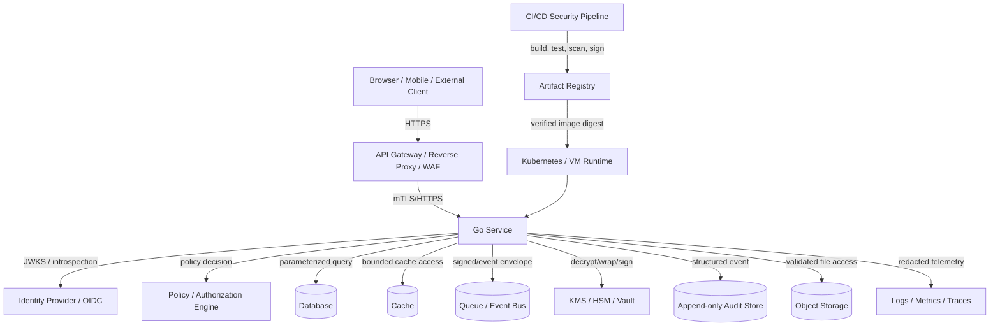
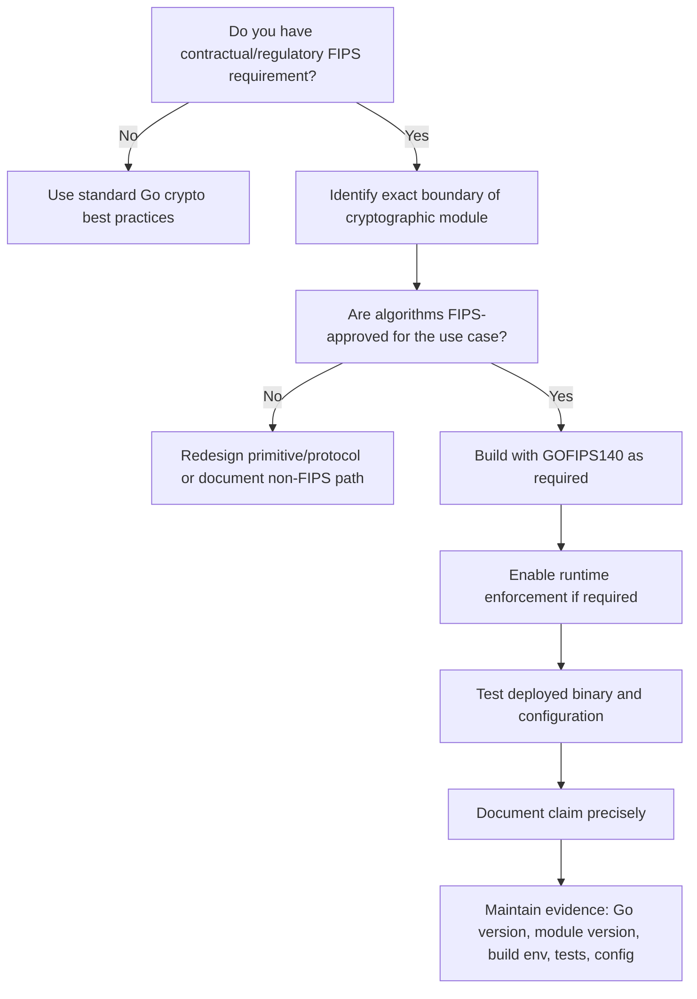
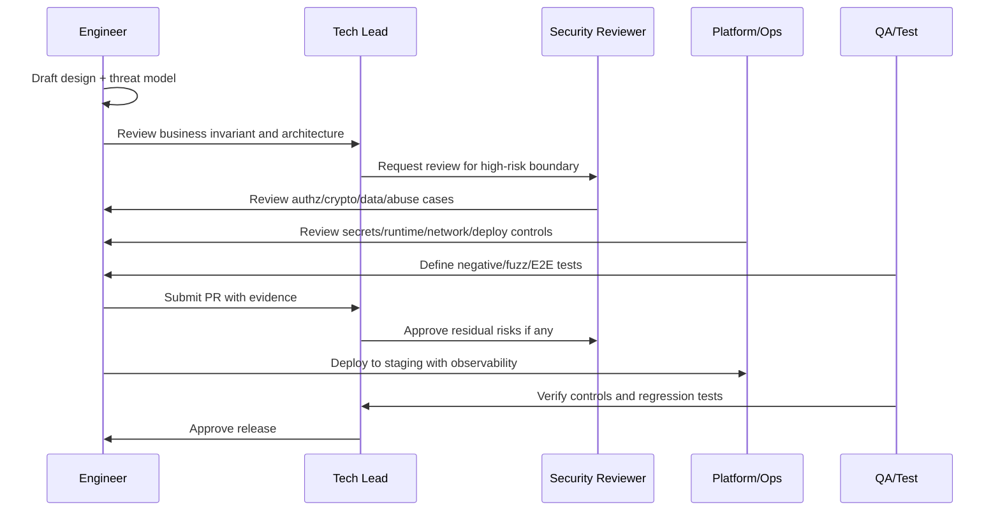
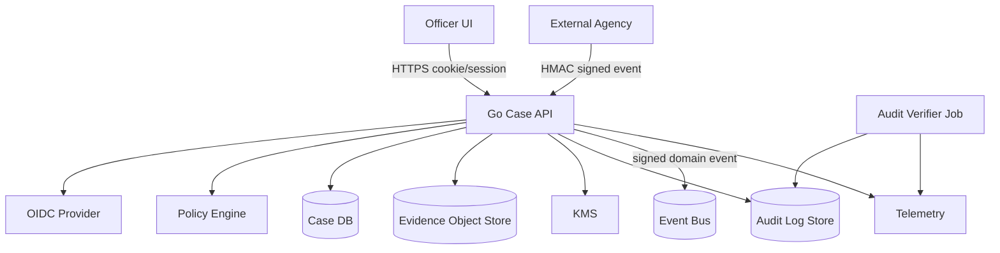

# learn-go-security-cryptography-integrity-part-034.md

# Part 034 — Capstone: Internal Engineering Handbook for Secure Go Services

> Seri: `learn-go-security-cryptography-integrity`  
> Part: `034` dari `034`  
> Status: **FINAL PART / SERI SELESAI**  
> Target pembaca: Java software engineer / tech lead yang ingin mendesain, membangun, mereview, dan mengoperasikan Go services dengan standar engineering security yang defensible.  
> Target Go: **Go 1.26.x**  
> Fokus: reference architecture, secure defaults, review checklist, CI/CD gates, threat-model template, incident response, FIPS decision tree, dan production readiness rubric.

---

## 0. Posisi Part Ini dalam Seri

Part ini adalah **capstone**. Tujuannya bukan mengulang seluruh 33 part sebelumnya, melainkan mengubah seluruh konsep menjadi **handbook operasional** yang bisa dipakai untuk:

1. mendesain service Go baru,
2. mereview pull request security-sensitive,
3. mengevaluasi arsitektur microservice,
4. membuat CI/CD security gates,
5. membuat threat model dan design review,
6. merancang incident response,
7. menentukan apakah sebuah Go service layak production,
8. membangun standar internal engineering team.

Kalau part sebelumnya membahas area spesifik seperti TLS, OAuth2, secrets, SSRF, audit logging, atau supply chain, part ini menjawab pertanyaan:

> “Bagaimana semua kontrol itu disusun menjadi sistem engineering yang konsisten, repeatable, dan bisa dipertanggungjawabkan?”

---

## 1. Baseline Fakta dan Standar yang Dipakai

Handbook ini memakai baseline berikut.

| Area | Baseline |
|---|---|
| Go security engineering | Go Security Best Practices, Go vulnerability management, fuzzing, race detector, `go vet`, `govulncheck` |
| Go runtime/toolchain | Go 1.26.x, termasuk perubahan security-relevant pada `crypto/fips140`, TLS compatibility toggles, `crypto/hpke`, dan runtime hardening |
| Crypto compliance | Go FIPS 140-3 documentation, `GOFIPS140`, `crypto/fips140` |
| Web/API security | OWASP API Security Top 10 2023, OWASP ASVS 5.0 |
| Secure SDLC | NIST SP 800-218 SSDF Version 1.1 |
| Cybersecurity program | NIST Cybersecurity Framework 2.0 |
| Supply chain | SLSA, OpenSSF Scorecard, CycloneDX SBOM |
| Go package trust | Go modules, `go.sum`, checksum database, `GOPRIVATE`, `GONOSUMDB`, `GOPROXY` |
| Security operations | audit logging, incident response, evidence handling, patch triage, production readiness |

> Catatan: standar seperti NIST, OWASP, SLSA, CycloneDX, dan OpenSSF bukan “template yang harus ditelan mentah-mentah”. Dalam engineering nyata, standar dipakai untuk membangun **assurance model**: apa yang diklaim, kontrol apa yang membuktikan klaim itu, dan bukti apa yang tersedia ketika terjadi audit atau insiden.

---

## 2. Handbook Mental Model

### 2.1 Secure Go service bukan hanya code yang tidak crash

Service Go dianggap secure jika ia menjaga beberapa invariant di bawah tekanan:

| Invariant | Pertanyaan utama |
|---|---|
| Identity invariant | Apakah setiap actor, service, job, dan admin benar-benar diketahui dan bisa dipertanggungjawabkan? |
| Authorization invariant | Apakah user/service hanya dapat melakukan aksi terhadap object/property/scope yang diizinkan? |
| Integrity invariant | Apakah data/event/audit dapat dideteksi jika diubah, dihapus, di-replay, atau di-truncate? |
| Confidentiality invariant | Apakah sensitive data hanya terlihat di boundary yang tepat dan tidak bocor ke log, trace, cache, error, atau downstream? |
| Freshness invariant | Apakah request/token/event lama tidak dapat dipakai ulang untuk menghasilkan efek baru? |
| Availability invariant | Apakah input adversarial tidak bisa menghabiskan goroutine, memory, file descriptor, DB pool, queue, atau downstream quota? |
| Supply-chain invariant | Apakah binary yang berjalan berasal dari source, dependency, builder, dan artifact yang bisa dipercaya? |
| Evidence invariant | Apakah keputusan penting, perubahan state, dan akses sensitif memiliki bukti audit yang lengkap dan defensible? |

Security engineering bukan satu kontrol besar. Ia adalah jaringan invariant.

---

## 3. Reference Architecture: Secure Go Service

### 3.1 Diagram besar



### 3.2 Tiga plane utama

| Plane | Tujuan | Contoh kontrol |
|---|---|---|
| Data plane | Memproses request bisnis | TLS, authz, validation, DB parameterization, rate limit |
| Control plane | Mengubah konfigurasi/permission/key/deployment | admin auth, change approval, audit, secret rotation, CI/CD gates |
| Evidence plane | Membuktikan apa yang terjadi | structured audit, tamper evidence, signed checkpoint, immutable retention |

Kesalahan umum: team hanya mengamankan data plane. Padahal banyak insiden serius terjadi melalui control plane: secret bocor, CI compromised, admin privilege salah, service account terlalu luas, image tidak diverifikasi, atau audit bisa dihapus.

---

## 4. Secure-by-Default Go Service Blueprint

### 4.1 Project layout yang security-friendly

```text
secure-service/
  cmd/
    api/
      main.go
  internal/
    app/
      bootstrap.go
      config.go
    boundary/
      httpserver/
      httpclient/
      jsonx/
      filex/
    authn/
      oidc/
      session/
      mtls/
    authz/
      policy.go
      decision.go
    domain/
      case/
      document/
      audit/
    platform/
      db/
      cache/
      queue/
      kms/
      secrets/
      telemetry/
    security/
      crypto/
      integrity/
      ratelimit/
      csrf/
      redaction/
      threatmodel/
  migrations/
  deploy/
    k8s/
    helm-or-kustomize/
  docs/
    threat-model.md
    security-adr/
    runbooks/
    data-classification.md
  .github/
    workflows/
      ci.yml
      security.yml
```

### 4.2 Kenapa layout seperti ini?

Prinsipnya:

1. **Boundary code terlihat jelas**  
   HTTP input, outbound HTTP, file access, crypto, secrets, auth, audit, dan telemetry tidak tersebar acak.

2. **Business logic tidak memegang primitive mentah**  
   Domain code sebaiknya tidak langsung memanggil `crypto/aes`, `http.Client`, `os.Open`, atau `exec.Command`. Ia memanggil abstraction yang sudah dipagari.

3. **Security wrappers bisa dites terpisah**  
   SSRF client, JSON strict decoder, audit event signer, cookie session, redaction, dan KMS wrapper punya test/fuzz sendiri.

4. **Reviewer bisa menemukan area berisiko cepat**  
   PR yang menyentuh `boundary/`, `authz/`, `security/`, `secrets/`, `kms/`, `deploy/`, atau `ci` otomatis memerlukan review security lebih ketat.

---

## 5. Secure Defaults Catalog

Bagian ini adalah daftar default yang seharusnya menjadi standar internal.

---

### 5.1 HTTP server default

Jangan pakai:

```go
http.ListenAndServe(":8080", nil)
```

Gunakan explicit server:

```go
srv := &http.Server{
    Addr:              ":8080",
    Handler:           rootHandler,
    ReadHeaderTimeout: 5 * time.Second,
    ReadTimeout:       15 * time.Second,
    WriteTimeout:      30 * time.Second,
    IdleTimeout:       60 * time.Second,
    MaxHeaderBytes:    16 << 10, // 16 KiB
}
```

Checklist:

- [ ] `ReadHeaderTimeout` ada.
- [ ] `ReadTimeout` ada.
- [ ] `WriteTimeout` ada.
- [ ] `IdleTimeout` ada.
- [ ] `MaxHeaderBytes` eksplisit.
- [ ] Request body dibatasi per route.
- [ ] Server shutdown graceful.
- [ ] Middleware recovery mencatat event tanpa bocor detail.
- [ ] Trusted proxy boundary eksplisit.
- [ ] Response error tidak menampilkan stack trace.

---

### 5.2 Request body limit

```go
func LimitBody(maxBytes int64, next http.Handler) http.Handler {
    return http.HandlerFunc(func(w http.ResponseWriter, r *http.Request) {
        r.Body = http.MaxBytesReader(w, r.Body, maxBytes)
        next.ServeHTTP(w, r)
    })
}
```

Rule:

| Route type | Suggested limit |
|---|---:|
| JSON command kecil | 64 KiB – 1 MiB |
| Search/filter request | 64 KiB – 256 KiB |
| File upload metadata | 64 KiB |
| File upload binary | route khusus, streaming, quota, virus scan, object-store staging |
| Webhook | sesuai vendor, reject oversize |

Security reasoning:

- Tanpa limit, attacker bisa memaksa allocation besar.
- Limit harus route-specific.
- Limit saja tidak cukup; parser juga butuh depth/field/count constraint.

---

### 5.3 Strict JSON decoder

```go
func DecodeStrictJSON[T any](r io.Reader, maxBytes int64) (T, error) {
    var zero T

    lr := io.LimitReader(r, maxBytes)
    dec := json.NewDecoder(lr)
    dec.DisallowUnknownFields()

    var v T
    if err := dec.Decode(&v); err != nil {
        return zero, err
    }

    if dec.Decode(&struct{}{}) != io.EOF {
        return zero, errors.New("json: multiple top-level values")
    }

    return v, nil
}
```

Checklist:

- [ ] Unknown fields ditolak pada write command.
- [ ] DTO input tidak memakai domain entity langsung.
- [ ] Tidak memakai `map[string]any` untuk command sensitif kecuali ada schema validator.
- [ ] Duplicate keys dipertimbangkan.
- [ ] Angka besar tidak masuk `float64` bila precision penting.
- [ ] Raw JSON hanya dipakai dengan alasan kuat.
- [ ] Validation terjadi setelah parsing dan sebelum authorization decision.

---

### 5.4 Authorization default

Anti-pattern:

```go
func GetCase(caseID string) (*Case, error) {
    return repo.FindByID(caseID)
}
```

Lebih aman:

```go
func GetCase(ctx context.Context, actor Actor, caseID CaseID) (*Case, error) {
    c, err := repo.FindVisibleCase(ctx, actor.TenantID, actor.SubjectID, caseID)
    if err != nil {
        return nil, err
    }

    if !policy.CanViewCase(actor, c) {
        return nil, ErrForbidden
    }

    return c, nil
}
```

Invariant:

> Object ID dari request user tidak pernah cukup untuk mengambil object. Query harus membawa tenant/scope/visibility boundary.

Checklist:

- [ ] Object-level authorization ada.
- [ ] Function-level authorization ada.
- [ ] Property-level authorization ada.
- [ ] Tenant boundary ada di query, bukan hanya filter setelah fetch.
- [ ] Batch endpoint tidak bypass authz.
- [ ] Export endpoint tidak bypass authz.
- [ ] Admin endpoint tetap punya authz, bukan hanya authn.
- [ ] Policy decision diaudit untuk aksi sensitif.

---

### 5.5 Outbound HTTP client default

Jangan memakai default client untuk request ke URL user-controlled.

```go
type SafeHTTPClient struct {
    client *http.Client
    allow  OutboundAllowlist
}
```

Minimal control:

- scheme hanya `https`, kecuali internal exception eksplisit,
- redirect dikontrol,
- proxy environment dimatikan jika tidak sengaja dibutuhkan,
- DNS/IP resolved dan diklasifikasi,
- private/loopback/link-local/multicast/unspecified diblokir untuk URL external,
- timeout total ada,
- response size dibatasi,
- content type divalidasi,
- no credential forwarding.

Checklist SSRF:

- [ ] URL user-controlled tidak pernah langsung dipakai oleh `http.Get`.
- [ ] Redirect tidak bisa mengubah host ke internal.
- [ ] DNS rebinding dipertimbangkan.
- [ ] Metadata IP diblokir.
- [ ] Private CIDR diblokir untuk external fetch.
- [ ] Outbound destination punya allowlist.
- [ ] Egress network policy tersedia.
- [ ] Log tidak menyimpan full URL jika mengandung token/query sensitive.

---

### 5.6 TLS/mTLS default

Default:

- gunakan Go `crypto/tls` default kecuali ada requirement kuat,
- minimum TLS 1.2 atau TLS 1.3 only jika ecosystem siap,
- jangan set cipher suite legacy tanpa alasan,
- jangan pakai `InsecureSkipVerify`,
- private CA dimasukkan ke `RootCAs`,
- client cert identity dimapping ke identity internal, bukan authorization final,
- cert rotation diuji.

mTLS service identity invariant:

> Certificate proves workload identity. Authorization still requires policy decision.

---

### 5.7 Cookie/session default

Cookie sensitive:

```go
http.Cookie{
    Name:     "__Host-session",
    Value:    sessionID,
    Path:     "/",
    Secure:   true,
    HttpOnly: true,
    SameSite: http.SameSiteLaxMode,
}
```

Checklist:

- [ ] Session ID dibuat dari CSPRNG.
- [ ] Cookie `Secure`.
- [ ] Cookie `HttpOnly`.
- [ ] Cookie `SameSite`.
- [ ] Cookie name memakai `__Host-` jika memungkinkan.
- [ ] Session ID rotate setelah login/privilege change.
- [ ] Idle timeout dan absolute timeout ada.
- [ ] Logout merevoke server-side session.
- [ ] Refresh token rotation punya reuse detection.
- [ ] CSRF defense ada untuk browser cookie-authenticated mutation.

---

### 5.8 Secrets default

Jangan jadikan environment variable sebagai default universal untuk secret jangka panjang. Env var masih sering dipakai karena praktis, tetapi punya risiko:

- terlihat di process environment,
- bisa masuk crash dump,
- bisa terbaca oleh process inspection tertentu,
- sulit dirotate tanpa restart,
- sering bocor di CI logs,
- tidak punya lease semantics.

Preferensi desain:

| Secret type | Preferensi |
|---|---|
| DB password static | Secrets Manager/Vault + rotation |
| Dynamic DB credential | Vault dynamic secrets / cloud IAM auth |
| Data encryption key | KMS/HSM wrapped key |
| API token third-party | secret manager + short TTL jika vendor mendukung |
| TLS private key | certificate manager / mounted file dengan permission ketat |
| Signing key | KMS/HSM jika high impact |
| Local dev secret | `.env.local` ignored + separate dev secret store |

Checklist:

- [ ] Secret tidak dicetak di log/error/trace.
- [ ] Secret tidak masuk config dump.
- [ ] Secret punya owner.
- [ ] Secret punya rotation plan.
- [ ] Secret punya blast-radius terbatas.
- [ ] Secret access diaudit.
- [ ] Secret cache TTL dibatasi.
- [ ] Reload path diuji.
- [ ] Incident playbook untuk secret leak ada.

---

### 5.9 Crypto default

Golden rule:

> Jangan expose primitive crypto mentah ke domain code.

Buat envelope:

```go
type EncryptedBlob struct {
    Version   string
    KeyID     string
    Algorithm string
    Nonce     []byte
    AAD       []byte
    Ciphertext []byte
}
```

Rules:

- encryption memakai AEAD,
- AAD menyertakan konteks domain,
- key ID/version disimpan,
- nonce discipline ditangani wrapper,
- key lookup via KMS/keyring,
- decryption mencoba version lama,
- encryption selalu memakai version baru,
- migration dirancang sebagai background re-encrypt/rewrap.

Checklist:

- [ ] Tidak ada custom crypto protocol tanpa review.
- [ ] Tidak ada `math/rand` untuk security.
- [ ] Tidak ada AES-CBC baru.
- [ ] Tidak ada raw RSA encryption baru kecuali OAEP dengan alasan kuat.
- [ ] HMAC pakai `hmac.Equal`.
- [ ] Signature memverifikasi `alg`, `kid`, `issuer`, `audience`, dan canonical payload.
- [ ] Kunci berbeda untuk tujuan berbeda.
- [ ] Key rotation dirancang sejak awal.

---

## 6. Security Control Matrix

### 6.1 Mapping threat → control

| Threat | Preventive control | Detective control | Response control |
|---|---|---|---|
| BOLA/IDOR | scoped repository, object-level authz | audit denied/forbidden rate, anomaly query | revoke token, patch policy, backfill exposure analysis |
| Injection | parameterized API, escaping by context | WAF signal, DB error anomaly, fuzzing | patch parser/query, rotate leaked credentials if needed |
| SSRF | allowlist, IP classification, egress policy | outbound destination logs, metadata access alert | block route, rotate exposed metadata credentials |
| Token replay | nonce/timestamp, DPoP/mTLS-bound tokens, session rotation | replay detection, impossible travel | revoke token family, step-up auth |
| Audit tampering | append-only store, MAC/hash chain, signed checkpoint | verifier job, chain break alert | freeze evidence, restore from checkpoint, investigate admin access |
| Secret leakage | secret manager, least privilege, redaction | secret scanning, audit access | revoke/rotate, invalidate sessions, forensics |
| Supply-chain compromise | pinned deps, checksum DB, signed artifacts, isolated builder | provenance verification, SBOM/vuln scans | rollback, rebuild clean, notify affected services |
| DoS/resource exhaustion | timeout, body limit, rate limit, bulkhead | saturation metrics, pprof, goroutine profile | shed load, isolate tenant, scale or block source |
| Privacy leakage | classification, minimization, redaction | DLP/log scan, access audit | incident disclosure workflow, purge/remediate |

---

## 7. CI/CD Security Gates for Go

### 7.1 Recommended pipeline

```mermaid
flowchart LR
    PR[Pull Request]
    LINT[go fmt / go vet / static analysis]
    TEST[unit + integration tests]
    RACE[go test -race]
    FUZZ[fuzz smoke / corpus regression]
    VULN[govulncheck]
    DEPS[dependency review]
    SBOM[SBOM generation]
    BUILD[reproducible-ish build]
    SIGN[sign artifact / provenance]
    SCAN[container scan]
    POLICY[deployment policy]
    PROD[Production]

    PR --> LINT --> TEST --> RACE --> FUZZ --> VULN --> DEPS --> SBOM --> BUILD --> SIGN --> SCAN --> POLICY --> PROD
```



### 7.2 Minimal CI commands

```bash
go version
go mod verify
go vet ./...
go test ./...
go test -race ./...
govulncheck ./...
```

Optional but recommended:

```bash
go test ./... -run=Fuzz -fuzz=Fuzz -fuzztime=30s
go test ./... -coverprofile=coverage.out
go tool cover -func=coverage.out
go list -m -json all
```

### 7.3 Security gate policy

| Gate | PR | main branch | release |
|---|---:|---:|---:|
| `gofmt`/`go vet` | required | required | required |
| Unit tests | required | required | required |
| Integration tests | selected | required | required |
| Race detector | selected/changed packages | required nightly or full main | required |
| Fuzz regression corpus | changed parsers/boundaries | required | required |
| `govulncheck` source | required | required | required |
| `govulncheck` binary | optional | recommended | required |
| Secret scanning | required | required | required |
| Dependency diff review | required | required | required |
| SBOM | optional | generated | required |
| Artifact signing | optional | required | required |
| Provenance | optional | required | required |
| Deployment policy | n/a | staging | production |

### 7.4 Gate severity

| Finding | Default action |
|---|---|
| Reachable critical vulnerability | block release |
| Reachable high vulnerability | block unless approved exception |
| Unreachable critical vulnerability | time-bound exception possible |
| Secret detected | block immediately |
| New dependency with weak maintenance/security | review required |
| `replace` to local/private fork | explicit approval |
| `InsecureSkipVerify` | block unless documented exception |
| `math/rand` in security-sensitive path | block |
| Shell execution with user input | block unless sandboxed and reviewed |
| Missing authz test on new endpoint | block |
| New external URL fetcher | threat model required |
| New crypto usage | security design review required |

---

## 8. Threat Model Template

Gunakan template ini untuk setiap service/feature high-risk.

```markdown
# Threat Model — <feature/service>

## 1. Context
- Service:
- Owner:
- Review date:
- Reviewer:
- Production criticality:
- Data classification:
- User/tenant impact:

## 2. Business objective
Apa tujuan fitur ini?

## 3. Assets
| Asset | Classification | Integrity need | Confidentiality need | Availability need |
|---|---|---:|---:|---:|

## 4. Actors
| Actor | Type | Auth method | Trust level | Notes |
|---|---|---|---|---|

## 5. Trust boundaries
| Boundary | From | To | Protocol | Risk |
|---|---|---|---|---|

## 6. Data flows
Diagram Mermaid wajib.

## 7. Security invariants
- Invariant 1:
- Invariant 2:
- Invariant 3:

## 8. Abuse cases
| Abuse case | Attacker capability | Impact | Existing control | Gap |
|---|---|---|---|---|

## 9. STRIDE analysis
| Boundary/component | Spoofing | Tampering | Repudiation | Information disclosure | DoS | Elevation |
|---|---|---|---|---|---|---|

## 10. Key decisions
| Decision | Alternatives | Reason | Residual risk |
|---|---|---|---|

## 11. Tests required
- Unit:
- Integration:
- Negative:
- Fuzz:
- Race:
- E2E:

## 12. Runtime monitoring
- Metrics:
- Logs:
- Alerts:
- Audit events:

## 13. Residual risks and acceptance
| Risk | Severity | Owner | Expiry | Mitigation |
|---|---:|---|---|---|

## 14. Approval
- Engineering:
- Security:
- Product/Business:
```

---

## 9. Security ADR Template

```markdown
# Security ADR <number>: <decision>

## Status
Proposed / Accepted / Superseded / Deprecated

## Context
What security-sensitive problem are we solving?

## Decision
What did we decide?

## Security invariants protected
- 
- 

## Alternatives considered
| Alternative | Pros | Cons | Why rejected/accepted |
|---|---|---|---|

## Failure modes
| Failure mode | Impact | Detection | Response |
|---|---|---|---|

## Operational requirements
- Key rotation:
- Alert:
- Dashboard:
- Runbook:
- Ownership:

## Compliance/evidence impact
- Audit log:
- Data retention:
- Access review:
- Evidence artifact:

## Review date
```

---

## 10. Secure Code Review Checklist

### 10.1 General

- [ ] Apakah PR mengubah trust boundary?
- [ ] Apakah ada input baru dari user/external system?
- [ ] Apakah ada output baru ke external system?
- [ ] Apakah ada state transition baru?
- [ ] Apakah ada permission/scope baru?
- [ ] Apakah ada secret baru?
- [ ] Apakah ada dependency baru?
- [ ] Apakah ada file/network/process boundary baru?
- [ ] Apakah ada data sensitive baru di log/trace/error/cache?
- [ ] Apakah rollback aman?

### 10.2 AuthN/AuthZ

- [ ] Authentication tidak dianggap sama dengan authorization.
- [ ] Authorization dilakukan di service boundary, bukan hanya UI/gateway.
- [ ] Object ID dari request tidak langsung dipercaya.
- [ ] Tenant boundary ada di query/repository.
- [ ] Property-level mutation dikontrol.
- [ ] Batch/export endpoint tidak melewati authz.
- [ ] Admin override diaudit.
- [ ] Denied action memiliki telemetry yang cukup.

### 10.3 Data handling

- [ ] Data classification jelas.
- [ ] Sensitive data tidak masuk log.
- [ ] Sensitive data tidak masuk metric label.
- [ ] Sensitive data tidak masuk trace attribute.
- [ ] Sensitive data tidak masuk error message.
- [ ] Cache TTL sesuai sensitivity.
- [ ] Queue/event payload diminimalkan.
- [ ] Export punya authorization dan audit.
- [ ] Retention/disposal jelas.

### 10.4 Crypto

- [ ] Primitive sesuai tujuan.
- [ ] Kunci punya ID/version.
- [ ] AEAD dipakai untuk encryption baru.
- [ ] AAD menyertakan konteks domain.
- [ ] Nonce discipline aman.
- [ ] MAC/signature dibandingkan constant-time jika relevan.
- [ ] Key separation jelas.
- [ ] Rotation path ada.
- [ ] Error crypto tidak membocorkan oracle detail.
- [ ] Tidak ada custom protocol tanpa review.

### 10.5 Network

- [ ] Inbound server punya timeout.
- [ ] Body/header limit ada.
- [ ] Outbound client punya timeout.
- [ ] Redirect policy jelas.
- [ ] SSRF allowlist/IP classification ada.
- [ ] TLS verification tidak dimatikan.
- [ ] mTLS identity tidak langsung menjadi permission.
- [ ] Proxy boundary jelas.
- [ ] Retry tidak memperbesar blast radius.

### 10.6 Filesystem/process

- [ ] Path traversal ditangani.
- [ ] Symlink race dipertimbangkan.
- [ ] Temp file aman.
- [ ] Archive extraction aman.
- [ ] File upload divalidasi dan dibatasi.
- [ ] `os/exec` tidak memakai shell dengan input user.
- [ ] Environment secret tidak bocor.
- [ ] Process timeout dan output limit ada.
- [ ] Container privilege minimal.

### 10.7 Supply chain

- [ ] Dependency baru punya alasan.
- [ ] License/maintenance/security health dicek.
- [ ] `go.sum` berubah sesuai dependency.
- [ ] `replace`/fork jelas.
- [ ] `GOPRIVATE` benar untuk private module.
- [ ] `govulncheck` bersih atau exception approved.
- [ ] Artifact dibangun dari CI trusted.
- [ ] Image digest dipakai.
- [ ] SBOM/provenance tersedia untuk release.

---

## 11. Production Readiness Rubric

### 11.1 Level 0 — Unsafe prototype

Ciri:

- default HTTP server,
- no timeout,
- no body limit,
- no authz tests,
- secrets di env/log,
- no vuln scan,
- no audit,
- no incident runbook.

Tidak boleh production.

---

### 11.2 Level 1 — Basic secure service

Minimum:

- explicit `http.Server`,
- route body limit,
- structured logging redacted,
- authn/authz dasar,
- parameterized DB query,
- secrets tidak hardcoded,
- `go test`, `go vet`, `govulncheck`,
- deployment via CI.

Cocok untuk low-risk internal service.

---

### 11.3 Level 2 — Production baseline

Minimum:

- threat model untuk service,
- object-level authorization tests,
- rate limit/quota untuk high-risk endpoints,
- safe outbound HTTP wrapper,
- audit event untuk state transition penting,
- secret manager integration,
- CI gates: tests, vet, race selected, govulncheck,
- SBOM generated,
- runbook incident dasar,
- dashboard availability/security.

Cocok untuk normal production microservice.

---

### 11.4 Level 3 — High assurance service

Minimum:

- formal security design review,
- tamper-evident audit for critical events,
- mTLS/service identity,
- key rotation tested,
- field-level encryption/tokenization jika data high sensitivity,
- fuzzing untuk parser/boundary,
- binary vuln scan,
- artifact signing/provenance,
- deployment policy verifies image digest/signature,
- break-glass access logged,
- tabletop incident exercise.

Cocok untuk regulated, financial, identity, enforcement, or case-management systems.

---

### 11.5 Level 4 — Regulated / mission-critical assurance

Minimum:

- control mapping to SSDF/ASVS/internal policy,
- independent review for critical crypto/authz decisions,
- tamper-evident audit with external checkpoint,
- KMS/HSM-backed key material,
- documented FIPS decision,
- dual-control for high-impact operations,
- immutable retention,
- disaster recovery tested,
- continuous control monitoring,
- formal exception/risk acceptance process,
- evidence package per release.

Cocok untuk systems yang perlu legal/regulatory defensibility.

---

## 12. FIPS Decision Tree for Go Services



### 12.1 FIPS correctness checklist

- [ ] Ada requirement tertulis, bukan asumsi.
- [ ] Scope FIPS jelas: service, binary, crypto operation, module, environment.
- [ ] Algoritma sesuai approved use.
- [ ] Go version dan Go Cryptographic Module version terdokumentasi.
- [ ] Build menggunakan `GOFIPS140` jika required.
- [ ] `GODEBUG=fips140=only` dipahami jika strict runtime enforcement dibutuhkan.
- [ ] Third-party crypto tidak diam-diam bypass standard library.
- [ ] cgo/OpenSSL path tidak membuat klaim rancu.
- [ ] Tests membuktikan binary menjalankan mode yang diklaim.
- [ ] Dokumentasi tidak mengatakan “FIPS compliant application” jika yang sebenarnya hanya “menggunakan validated/pending cryptographic module untuk operasi tertentu”.

### 12.2 Anti-claim

Hindari klaim:

> “Aplikasi Go kami FIPS compliant.”

Lebih defensible:

> “Service ini dibangun dengan Go `<version>` menggunakan Go Cryptographic Module `<module-version>` melalui `GOFIPS140=<value>` untuk operasi crypto standar library yang berada dalam scope. Kontrol build, runtime, dan evidence tercatat di release package `<id>`.”

---

## 13. Incident Response Playbooks

### 13.1 Secret leak

Trigger:

- secret ditemukan di repository,
- secret muncul di log,
- CI artifact mengandung token,
- suspicious access ke secret manager,
- vendor memberitahu token exposed.

Steps:

1. freeze evidence,
2. identify secret type and scope,
3. revoke/rotate immediately,
4. invalidate sessions/tokens derived from secret,
5. identify logs/artifacts/caches containing secret,
6. purge where legally and operationally safe,
7. review access during exposure window,
8. patch root cause,
9. add regression test/secret scanning rule,
10. update incident report.

Evidence:

- secret ID,
- creation/rotation time,
- access logs,
- affected service list,
- exposed location,
- revocation confirmation,
- new secret deployment time,
- user/tenant impact analysis.

---

### 13.2 Vulnerable Go dependency

Steps:

1. run `govulncheck ./...`,
2. identify reachable vs non-reachable,
3. identify affected function/path,
4. check fixed version,
5. run tests and compatibility assessment,
6. upgrade module,
7. rebuild and redeploy,
8. scan source and binary,
9. document exception if patch not possible,
10. monitor for exploit indicators.

Severity decision:

| Condition | Action |
|---|---|
| reachable remote unauthenticated RCE | emergency patch |
| reachable auth bypass/data leak | emergency/high priority |
| reachable DoS | priority depends on exposure |
| non-reachable vulnerable package | scheduled patch or time-bound exception |
| vulnerable tool-only dependency | assess build pipeline exposure |

---

### 13.3 Authorization bypass

Steps:

1. stop expansion of exposure,
2. identify affected endpoint/action/object type,
3. preserve access logs and audit events,
4. reproduce with minimal test,
5. patch policy/query boundary,
6. add negative tests for actor/object/property,
7. backfill exposure analysis,
8. notify stakeholders if required,
9. review similar endpoints,
10. add pattern to code review checklist.

Core evidence:

- actors,
- affected object IDs,
- time window,
- actions performed,
- data viewed/changed/exported,
- tenant boundary impact,
- audit completeness.

---

### 13.4 Audit tampering or chain break

Steps:

1. freeze audit store writes if needed,
2. snapshot current audit partitions,
3. verify last known good checkpoint,
4. identify missing/tampered range,
5. compare DB state, event store, object storage, and application logs,
6. identify actor/admin/system involved,
7. preserve external checkpoint evidence,
8. restore/reconstruct if possible,
9. rotate MAC/signing key if suspected,
10. issue integrity incident report.

---

### 13.5 SSRF or outbound abuse

Steps:

1. block feature/route or destination,
2. inspect outbound logs,
3. check cloud metadata access,
4. rotate credentials available to workload,
5. verify egress policy,
6. patch URL validation and transport,
7. add regression tests for loopback/private/link-local/redirect/DNS rebinding,
8. review all URL fetchers.

---

### 13.6 DoS/resource exhaustion

Steps:

1. identify saturated resource: CPU, memory, goroutine, DB pool, file descriptor, queue, downstream quota,
2. shed/load-limit abusive route,
3. add temporary rate limit/WAF/network control,
4. capture pprof/goroutine profile if safe,
5. identify missing timeout/body limit/parser limit,
6. patch limits,
7. run load and adversarial tests,
8. create dashboard/alert.

---

## 14. Security Metrics that Matter

### 14.1 Engineering metrics

| Metric | Meaning |
|---|---|
| % high-risk PRs with threat model | Are design-time risks visible? |
| % security-sensitive code with negative tests | Are abuse cases tested? |
| Mean time to patch reachable vuln | Can we respond? |
| Secret rotation success rate | Can we recover from leaks? |
| Authz regression count | Is policy model stable? |
| Audit event completeness | Can we prove what happened? |
| P95/P99 request resource usage | Is availability risk observable? |
| Dependency age and maintenance score | Is supply-chain risk managed? |
| Fuzz corpus growth | Are parsers hardened over time? |
| Incident action closure time | Are lessons converted into controls? |

### 14.2 Anti-metrics

Bad metrics:

- “0 vulnerabilities” without defining scan scope,
- “100% secure”,
- “all endpoints authenticated” while ignoring authorization,
- “encrypted” without key management,
- “FIPS compliant” without scope,
- “we use Kubernetes so secure”,
- “we use API gateway so service authz unnecessary”,
- “logs exist” without audit completeness/integrity.

---

## 15. Secure Go Service Design Review Flow



### 15.1 What must be reviewed before coding?

Before implementation, review:

- new identity/authentication flow,
- new authorization model,
- new object ownership rule,
- new data export,
- new audit event model,
- new encryption/signing/MAC use,
- new secret type,
- new external URL fetcher,
- new file/archive parser,
- new admin function,
- new dependency that executes code/generates code,
- new CI/CD credential,
- new service-to-service trust.

---

## 16. Go Security Exception Process

Not every risk can be eliminated immediately. But every exception must be explicit.

```markdown
# Security Exception

## Exception ID
SEC-EX-YYYY-NNN

## Risk
Describe the risk clearly.

## Affected service/component
-

## Reason exception is needed
-

## Compensating controls
-

## Expiry date
-

## Owner
-

## Detection/monitoring
-

## Plan to remove exception
-

## Approval
-
```

Rules:

- Exception tanpa expiry = hidden acceptance.
- Exception tanpa owner = orphan risk.
- Exception tanpa monitoring = blind risk.
- Exception yang sering diperpanjang = design debt, bukan exception.

---

## 17. Internal Secure Go Standards

### 17.1 Banned or restricted patterns

| Pattern | Default policy |
|---|---|
| `http.Get(userURL)` | banned for user-controlled URLs |
| `http.ListenAndServe` without explicit server | banned in production |
| `tls.Config{InsecureSkipVerify: true}` | banned except test/local with guard |
| `math/rand` for token/nonce | banned |
| AES-CBC for new encryption | banned |
| Raw RSA PKCS#1 v1.5 for new design | banned |
| `fmt.Sprintf` SQL | banned |
| Shell command with user input | banned |
| `os.Open(pathFromUser)` | restricted; use root/local validation |
| `json.Decoder` without size bound for external input | restricted |
| Domain entity as JSON mutation DTO | restricted |
| Logging raw request/response body | restricted |
| Storing password with fast hash | banned |
| JWT accepted without issuer/audience/alg/key validation | banned |
| `replace` to local path in release | banned |
| Secret in git/CI logs | incident |

### 17.2 Required wrappers

| Boundary | Wrapper |
|---|---|
| Inbound JSON | `boundary/jsonx` |
| Outbound HTTP | `boundary/httpclient` |
| File access | `boundary/filex` |
| Crypto envelope | `security/crypto` |
| HMAC/signature verification | `security/integrity` |
| Audit events | `domain/audit` |
| Redaction | `security/redaction` |
| Secrets | `platform/secrets` |
| KMS | `platform/kms` |
| Authz | `authz/policy` |

---

## 18. Capstone Example: Secure Regulatory Case Management Service

Bayangkan service Go untuk sistem regulatori:

- user internal membuka case,
- officer mengubah status case,
- dokumen evidence diupload,
- audit trail harus defensible,
- external agency mengirim event,
- admin dapat melakukan override,
- data mengandung PII,
- service berjalan di Kubernetes.

### 18.1 Core invariants

1. Officer hanya dapat melihat case dalam jurisdiction dan role-nya.
2. Perubahan status harus mengikuti state machine.
3. Evidence document tidak boleh diganti tanpa audit event baru.
4. Audit trail tidak boleh diam-diam diubah.
5. PII tidak boleh masuk log atau trace.
6. External event harus authenticated dan replay-protected.
7. Admin override harus membutuhkan stronger auth dan audit reason.
8. Binary production harus berasal dari signed CI artifact.

### 18.2 Architecture



### 18.3 Endpoint controls

| Endpoint | Primary risk | Required controls |
|---|---|---|
| `GET /cases/{id}` | BOLA | scoped query, object-level authz, audit view if sensitive |
| `PATCH /cases/{id}/status` | invalid state transition | state machine guard, authz, reason, audit |
| `POST /cases/{id}/documents` | file upload abuse | size limit, content validation, staging, AV scan, object store |
| `GET /documents/{id}` | data leak | scoped authz, signed URL short TTL or streaming proxy |
| `POST /external/events` | spoof/replay | HMAC/signature, timestamp, nonce cache, canonical payload |
| `POST /admin/override` | privilege abuse | step-up auth, dual control if high risk, audit reason |
| `GET /audit/{caseID}` | evidence exposure | read authz, redaction, immutable event source |

### 18.4 Tests

- BOLA negative tests for case ID from other jurisdiction.
- Property-level mutation tests for forbidden fields.
- State transition fuzz/property tests.
- HMAC webhook replay tests.
- Upload path traversal tests.
- Archive extraction tests.
- Audit chain verifier tests.
- PII redaction tests.
- Rate-limit tests.
- `govulncheck`.
- Race tests for session/token/replay cache.
- Integration tests with fake KMS/secret manager.

---

## 19. Release Evidence Package

Setiap production release high-risk sebaiknya menghasilkan evidence package:

```text
release-evidence/
  release-id.txt
  git-commit.txt
  go-version.txt
  go-env-redacted.txt
  go-list-modules.json
  govulncheck-source.json
  govulncheck-binary.json
  test-report.json
  race-test-report.txt
  fuzz-report.txt
  sbom.cdx.json
  provenance.intoto.jsonl
  image-digest.txt
  image-signature.txt
  threat-model.md
  security-adrs/
  deployment-manifest.yaml
  config-diff-redacted.yaml
  risk-exceptions.md
  approval-record.md
```

Tujuannya bukan birokrasi. Tujuannya agar ketika ada incident atau audit, team tidak mulai dari nol.

---

## 20. Team Operating Model

### 20.1 Engineer

Responsible for:

- secure coding,
- tests,
- threat-model delta,
- no secret leak,
- security checklist in PR,
- evidence for risky change.

### 20.2 Tech Lead

Responsible for:

- architecture invariant,
- review routing,
- risk acceptance quality,
- dependency governance,
- incident readiness,
- production readiness decision.

### 20.3 Security Reviewer

Responsible for:

- independent review of high-risk design,
- challenge assumptions,
- validate controls,
- define abuse cases,
- approve/deny exceptions.

### 20.4 Platform/Ops

Responsible for:

- runtime hardening,
- secrets/KMS,
- deployment policy,
- observability,
- incident support,
- artifact verification.

### 20.5 QA/Test

Responsible for:

- negative tests,
- abuse-case tests,
- integration security tests,
- regression suite,
- evidence capture.

---

## 21. Maturity Roadmap

### Month 1 — Stop obvious risks

- explicit HTTP server defaults,
- body limits,
- `govulncheck`,
- secret scanning,
- no `InsecureSkipVerify`,
- no raw SQL formatting,
- authz negative tests for critical endpoints.

### Month 2 — Boundary hardening

- strict JSON decoder,
- safe outbound HTTP client,
- file/upload wrapper,
- audit event schema,
- redaction layer,
- dependency review.

### Month 3 — Assurance

- threat model template,
- security ADRs,
- CI gates,
- fuzzing for parsers,
- race detector strategy,
- SBOM generation,
- runbooks.

### Month 4 — High assurance

- artifact signing/provenance,
- tamper-evident audit chain,
- key rotation drills,
- incident tabletop,
- policy-as-code deployment gate,
- evidence package per release.

### Month 5+ — Continuous control monitoring

- control dashboards,
- exception expiry tracking,
- dependency risk scoring,
- access review automation,
- production security SLOs,
- red-team/abuse-case exercises.

---

## 22. Final Checklist: Is This Go Service Production Secure?

A Go service is production-ready only if the team can answer “yes” to these:

### 22.1 Design

- [ ] Threat model exists.
- [ ] Trust boundaries are documented.
- [ ] Data classification is documented.
- [ ] Security invariants are explicit.
- [ ] Abuse cases are listed.
- [ ] Risk exceptions are time-bound.

### 22.2 Implementation

- [ ] Inbound input bounded and validated.
- [ ] Authorization is object/function/property-aware.
- [ ] Secrets are not hardcoded/logged.
- [ ] Crypto uses reviewed wrappers.
- [ ] Outbound calls are SSRF-safe.
- [ ] File/process boundaries are hardened.
- [ ] Audit logs are structured and meaningful.
- [ ] Error messages do not leak internals.

### 22.3 Testing

- [ ] Unit tests cover security invariants.
- [ ] Negative authz tests exist.
- [ ] Parser/boundary fuzzing exists where relevant.
- [ ] Race tests run for concurrency-sensitive code.
- [ ] Integration tests cover session/token/secret/audit flows.
- [ ] Regression tests exist for past incidents.

### 22.4 Build/release

- [ ] Go version is supported and current.
- [ ] Dependencies are reviewed.
- [ ] `govulncheck` is clean or exception approved.
- [ ] SBOM generated.
- [ ] Artifact signed/provenance recorded.
- [ ] Deployment uses image digest.
- [ ] Runtime config is reviewed.

### 22.5 Operations

- [ ] Dashboards exist.
- [ ] Alerts exist.
- [ ] Audit verifier exists if tamper evidence required.
- [ ] Secret rotation tested.
- [ ] Incident runbooks exist.
- [ ] Backup/restore tested.
- [ ] Access review process exists.
- [ ] Evidence package retained.

---

## 23. What “Top 1%” Looks Like Here

Top-tier secure Go engineers do not merely know APIs. They think in systems.

They ask:

- What asset am I protecting?
- Who can attack it?
- What boundary am I crossing?
- What invariant must never break?
- What primitive matches the invariant?
- What happens during rotation, rollback, replay, partial failure, compromise, or audit?
- What evidence proves the control worked?
- What happens when this code is called concurrently, repeatedly, maliciously, or with malformed input?
- What is the blast radius if this assumption is wrong?
- Can a reviewer verify this without reading my mind?

The difference between average and elite security engineering is not memorizing every vulnerability name. It is consistently converting vague risk into **clear invariants, explicit controls, testable behavior, operational evidence, and accountable residual risk**.

---

## 24. Series Closure

This is the final part of:

```text
learn-go-security-cryptography-integrity
```

Completed:

```text
[done] part-000 — Orientation
[done] part-001 — Security mental model
[done] part-002 — Go security surface
[done] part-003 — Threat modeling
[done] part-004 — Cryptography engineering principles
[done] part-005 — Randomness/nonce/token generation
[done] part-006 — Hashing/checksum/digest
[done] part-007 — MAC/HMAC/canonicalization
[done] part-008 — Symmetric encryption/AEAD
[done] part-009 — Public-key cryptography
[done] part-010 — Key agreement/envelope encryption
[done] part-011 — Password security
[done] part-012 — Key management
[done] part-013 — X.509/PKI
[done] part-014 — TLS
[done] part-015 — mTLS/service identity
[done] part-016 — OAuth2/OIDC/JWT
[done] part-017 — Session security
[done] part-018 — Authentication architecture
[done] part-019 — Secure net/http
[done] part-020 — API security
[done] part-021 — Input validation/canonicalization
[done] part-022 — Injection defense
[done] part-023 — SSRF/outbound security
[done] part-024 — Serialization security
[done] part-025 — File/archive/filesystem security
[done] part-026 — Process/OS boundary
[done] part-027 — Data integrity architecture
[done] part-028 — Secure audit logging
[done] part-029 — Secrets management
[done] part-030 — Privacy/sensitive data handling
[done] part-031 — Availability security
[done] part-032 — Supply-chain security
[done] part-033 — Vulnerability management
[done] part-034 — Capstone internal engineering handbook
```

---

## 25. Recommended Next Advanced Series

Karena seri ini sudah selesai, materi lanjutan yang paling masuk akal adalah:

1. `learn-go-secure-service-architecture`
   - membangun reference implementation Go service dari nol,
   - termasuk OIDC, mTLS, audit chain, KMS envelope encryption, CI gates, dan deployment manifests.

2. `learn-go-regulatory-case-management-architecture`
   - security + workflow/state machine + audit defensibility,
   - cocok untuk enforcement lifecycle dan complex case management.

3. `learn-go-zero-trust-platform-engineering`
   - service identity, SPIFFE/SPIRE, mTLS, workload attestation, policy-as-code, admission control.

4. `learn-go-secure-sdlc-devsecops`
   - SSDF, SLSA, SBOM, provenance, artifact signing, deployment guardrails, vulnerability operations.

5. `learn-go-applied-cryptography-labs`
   - labs implementasi wrapper crypto yang benar, test vector, misuse tests, migration, key rotation.

---

## 26. Source Notes

Sumber utama yang menjadi baseline handbook ini:

- Go Security Best Practices: <https://go.dev/doc/security/best-practices>
- Go Vulnerability Management: <https://go.dev/doc/security/vuln/>
- Go Vulnerability Database: <https://go.dev/doc/security/vuln/database>
- Go Fuzzing: <https://go.dev/doc/security/fuzz/>
- Go FIPS 140-3: <https://go.dev/doc/security/fips140>
- Go 1.26 Release Notes: <https://go.dev/doc/go1.26>
- Go Modules Reference: <https://go.dev/ref/mod>
- OWASP API Security Top 10 2023: <https://owasp.org/API-Security/editions/2023/en/0x11-t10/>
- OWASP ASVS: <https://owasp.org/www-project-application-security-verification-standard/>
- NIST SP 800-218 SSDF: <https://csrc.nist.gov/pubs/sp/800/218/final>
- NIST CSF 2.0: <https://www.nist.gov/cyberframework>
- SLSA: <https://slsa.dev/>
- OpenSSF Scorecard: <https://scorecard.dev/>
- CycloneDX: <https://cyclonedx.org/>

---

# End of Series

<!-- NAVIGATION_FOOTER -->
<div class="page-nav">
<a href="./learn-go-security-cryptography-integrity-part-033.md">⬅️ Part 033 — Vulnerability Management in Go: Go Vulnerability Database, `govulncheck`, Reachability-Based Scanning, Binary Scanning, CI Integration, Patch Triage, and Security Release Playbook</a>
<a href="./index.md">📚 Kategori</a>
<a href="../../index.md">🏠 Home</a>
<span></span>
</div>
