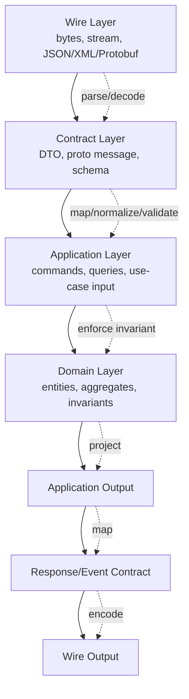
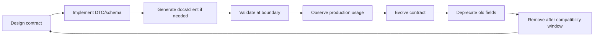
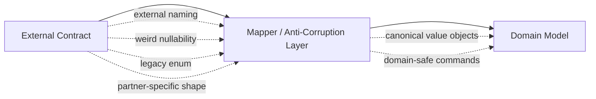
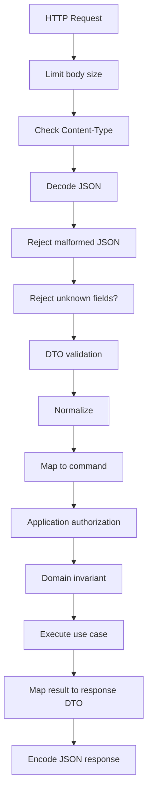
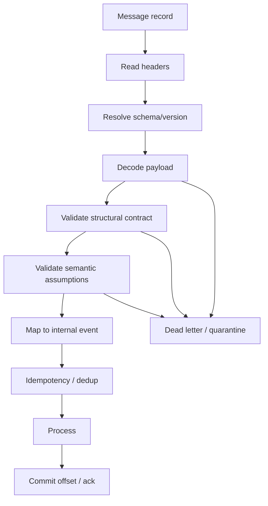
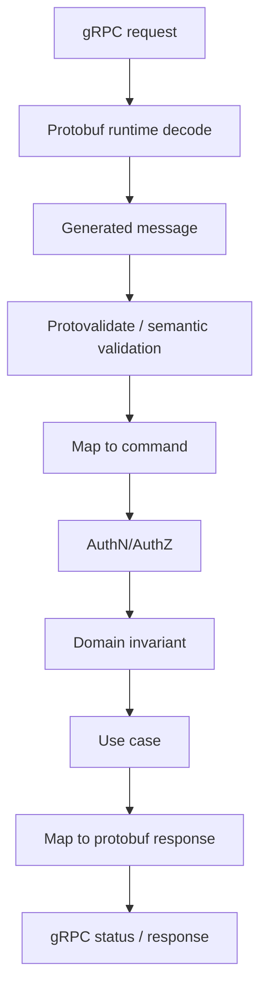
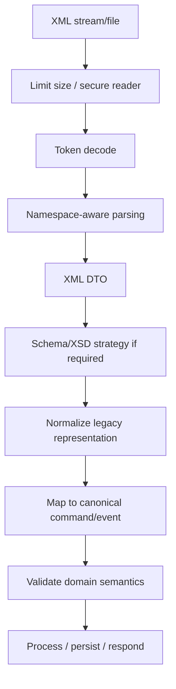
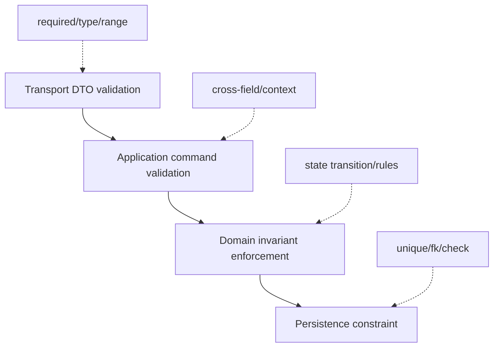

# learn-go-data-mapper-json-xml-protobuf-validation-part-000.md

# Part 000 — Orientation: Data Representation Boundary in Go

> Series: **learn-go-data-mapper-json-xml-protobuf-validation**  
> Part: **000 / 033**  
> Target Go: **Go 1.26.x**  
> Audience: **Java software engineer yang ingin naik level ke production-grade Go data contract engineering**  
> Scope part ini: **mental model, architecture map, vocabulary, failure model, decision framework**  
> Status seri: **belum selesai**. Ini adalah fondasi; bagian berikutnya adalah `part-001`.

---

## 0. Apa yang akan kamu kuasai setelah part ini?

Setelah menyelesaikan part ini, kamu tidak hanya akan melihat JSON, XML, Protobuf, data mapper, dan validation sebagai kumpulan API. Kamu akan melihat semuanya sebagai **sistem boundary**.

Dalam sistem nyata, data jarang hanya “dikirim”. Data biasanya melewati rantai berikut:

```text
External input → parse → decode → map → normalize → validate → enforce invariant → process → map → encode → emit
```

Masalah besar sering tidak muncul karena `json.Unmarshal` gagal, tetapi karena:

- field yang **absent** dianggap sama dengan field bernilai `null`,
- numeric precision berubah diam-diam,
- API menerima unknown field yang seharusnya ditolak,
- Protobuf field number diubah tanpa migration plan,
- XML namespace tidak dipahami dengan benar,
- validasi hanya dilakukan di HTTP handler, tetapi event consumer tidak memvalidasi ulang,
- mapper mencampur transport concern ke domain model,
- error validation tidak bisa dibaca oleh machine/client,
- versi schema berubah tetapi contract governance tidak ada,
- data yang sudah lolos parsing belum tentu valid secara domain.

Part ini membentuk fondasi untuk seluruh seri: **bagaimana berpikir tentang data representation boundary secara sistematis**.

---

## 1. Baseline faktual seri ini

Seri ini ditulis dengan baseline **Go 1.26.x**. Go 1.26 dirilis pada Februari 2026 dan tetap menjaga Go 1 compatibility promise: program Go lama secara umum diharapkan tetap compile dan berjalan seperti sebelumnya. Go 1.26 juga memperkenalkan kemampuan `new(expression)`, yang relevan untuk field optional berbasis pointer, terutama ketika bekerja dengan JSON atau Protobuf optional values.

Untuk JSON, Go tetap memiliki `encoding/json` sebagai API stabil. Mulai Go 1.25, Go juga memperkenalkan eksperimen `encoding/json/v2` dan `encoding/json/jsontext` melalui `GOEXPERIMENT=jsonv2`. `jsontext` memisahkan layer **syntactic JSON processing** dari layer **semantic Go mapping**, sementara `encoding/json/v2` membawa default yang lebih strict pada beberapa area seperti duplicate object names, invalid UTF-8, dan case matching. Karena statusnya experimental, seri ini akan membahasnya sebagai desain dan arah evolusi yang perlu dipahami, bukan sebagai pengganti mutlak untuk semua production code.

Untuk XML, baseline utama adalah `encoding/xml`, yang menyediakan XML 1.0 parser dengan dukungan namespace, token streaming, custom marshal/unmarshal, attribute mapping, char data, CDATA, dan inner XML.

Untuk Protobuf, baseline modern adalah `google.golang.org/protobuf`, bukan runtime lama `github.com/golang/protobuf`. Seri ini juga membahas **Go Protobuf Opaque API**, karena arah modern generated code Protobuf di Go bergerak menuju akses field lewat accessor, bukan direct struct field coupling.

Untuk validation, seri ini akan membedakan:

- struct tag validation, misalnya `go-playground/validator/v10`,
- JSON Schema validation, dengan Draft 2020-12 sebagai baseline modern,
- OpenAPI schema governance,
- Protobuf semantic validation, misalnya Protovalidate,
- domain/business invariant validation yang tidak boleh dipaksa masuk ke schema tag.

### Referensi utama yang dicek

- Go 1.26 Release Notes — https://go.dev/doc/go1.26
- Go 1.25 Release Notes, JSON v2 experiment — https://go.dev/doc/go1.25
- `encoding/json` package documentation — https://pkg.go.dev/encoding/json
- `encoding/json/v2` package documentation — https://pkg.go.dev/encoding/json/v2
- `encoding/json/jsontext` package documentation — https://pkg.go.dev/encoding/json/jsontext
- `encoding/xml` package documentation — https://pkg.go.dev/encoding/xml
- Go Protobuf Opaque API blog — https://go.dev/blog/protobuf-opaque
- Go Protobuf generated code guide — https://protobuf.dev/reference/go/go-generated/
- Go Protobuf generated code guide, Opaque API — https://protobuf.dev/reference/go/go-generated-opaque/
- JSON Schema Draft 2020-12 — https://json-schema.org/draft/2020-12
- `go-playground/validator/v10` documentation — https://pkg.go.dev/github.com/go-playground/validator/v10
- Protovalidate documentation — https://protovalidate.com/

---

## 2. Kenapa topik ini layak dipelajari sangat dalam?

Untuk engineer yang sudah kuat di Java, serialization dan validation sering tampak “sudah biasa”:

- Jackson untuk JSON,
- JAXB/Jackson XML untuk XML,
- MapStruct/ModelMapper untuk mapping,
- Bean Validation untuk validation,
- Protobuf/gRPC untuk binary contract,
- OpenAPI untuk REST contract.

Di Go, pendekatannya berbeda. Go tidak mendorong framework besar yang menyembunyikan boundary. Go cenderung membuat boundary terlihat:

- exported field menentukan apakah field bisa diserialisasi,
- struct tag menjadi metadata ringan,
- pointer sering digunakan untuk optionality,
- custom marshal/unmarshal dibuat eksplisit,
- mapper sering ditulis manual,
- validation bukan bagian native language,
- generated code Protobuf punya runtime dan API sendiri,
- JSON/XML standard library punya behavior compatibility yang harus dipahami.

Jadi, target seri ini bukan membuat kamu hafal API. Targetnya adalah membuat kamu bisa menjawab pertanyaan desain seperti:

1. Field ini seharusnya pointer, value, custom optional type, atau wrapper?
2. DTO HTTP boleh sama dengan domain model atau harus dipisah?
3. Unknown JSON field harus ditolak atau diabaikan?
4. Duplicate JSON object member harus dianggap error atau last-write-wins?
5. Haruskah validation dilakukan sebelum atau sesudah mapping?
6. Error validation harus menggunakan field name Go atau field name JSON?
7. Protobuf enum unknown value harus ditolak atau diterima untuk forward compatibility?
8. JSON Schema/OpenAPI/Protobuf schema siapa yang menjadi source of truth?
9. Mapper harus manual, reflection-based, atau generated?
10. Bagaimana menjaga backward compatibility selama bertahun-tahun?

Top 1% engineer bukan yang paling cepat menulis `json.Unmarshal`. Top 1% engineer adalah yang bisa mendesain **data contract lifecycle** yang tetap stabil saat sistem, tim, dan client berkembang.

---

## 3. Mental model utama: data bukan object

Kesalahan awal yang sering terjadi adalah menganggap data eksternal sebagai object internal.

Di Java, hal ini sering terlihat sebagai:

```java
class UserRequest {
    @JsonProperty("email")
    @NotBlank
    private String email;
}
```

Lalu class yang sama mulai dipakai untuk:

- HTTP request,
- domain service,
- database projection,
- event payload,
- audit log,
- test fixture,
- internal command.

Dalam Go, kamu juga bisa melakukan hal yang sama:

```go
type User struct {
    ID    string `json:"id" db:"id" validate:"required"`
    Email string `json:"email" db:"email" validate:"required,email"`
}
```

Tapi secara arsitektural, ini berbahaya bila model tersebut punya lebih dari satu alasan untuk berubah.

Data eksternal bukan object internal. Data eksternal adalah **message**. Message adalah representasi boundary, bukan domain truth.

### Empat bentuk utama data

| Bentuk | Pertanyaan utama | Contoh |
|---|---|---|
| Domain model | Apa kebenaran bisnisnya? | `Account`, `Case`, `EnforcementAction` |
| Transport model | Bagaimana data masuk/keluar API? | JSON request/response DTO |
| Storage model | Bagaimana data disimpan? | SQL row, document, serialized snapshot |
| Event model | Apa fakta yang diterbitkan? | Kafka event, Protobuf message |

Masalah muncul ketika satu struct dipaksa menjawab semua pertanyaan sekaligus.

---

## 4. Boundary sebagai tempat perubahan makna

Data berubah makna ketika melewati boundary. Ini inti dari seluruh seri.

Contoh sederhana:

```json
{
  "name": "Fajar",
  "age": 0
}
```

Apa arti `age: 0`?

Kemungkinan:

1. Umur benar-benar 0.
2. User belum mengisi umur, tetapi client mengirim zero value.
3. Client lama tidak mendukung optional field.
4. Mapper mengubah `null` menjadi `0`.
5. Field `age` mandatory, tetapi validasi tidak jalan.
6. Dalam domain, umur 0 tidak masuk akal untuk use case tertentu.

Secara byte, nilainya sama. Secara meaning, bisa sangat berbeda.

### Mermaid: perubahan makna saat melewati boundary

```mermaid
flowchart LR
    A[Raw bytes] --> B[Syntax parse]
    B --> C[Semantic decode]
    C --> D[Transport DTO]
    D --> E[Normalization]
    E --> F[Validation]
    F --> G[Domain command]
    G --> H[Domain model]
    H --> I[Persistence / Event / Response]

    A:::raw
    B:::boundary
    C:::boundary
    D:::dto
    E:::logic
    F:::logic
    G:::domain
    H:::domain
    I:::external

    classDef raw fill:#f8f8f8,stroke:#888,color:#111
    classDef boundary fill:#fff3cd,stroke:#b68b00,color:#111
    classDef dto fill:#e8f4ff,stroke:#2b6cb0,color:#111
    classDef logic fill:#e9fbe9,stroke:#2f855a,color:#111
    classDef domain fill:#f3e8ff,stroke:#6b46c1,color:#111
    classDef external fill:#ffe8e8,stroke:#c53030,color:#111
```



Setiap edge pada diagram adalah peluang bug.

---

## 5. Vocabulary penting: parse, decode, unmarshal, map, validate

Banyak diskusi serialization kacau karena istilahnya dicampur. Dalam seri ini kita pakai vocabulary yang konsisten.

| Istilah | Fokus | Contoh |
|---|---|---|
| Parse | Apakah bytes valid menurut grammar format? | Apakah JSON punya brace valid? |
| Decode | Membaca representasi sintaktik menjadi token/value | JSON token stream, XML token stream |
| Unmarshal | Mengubah data eksternal menjadi Go value | JSON object → Go struct |
| Marshal | Mengubah Go value menjadi external representation | Go struct → JSON object |
| Map | Mengubah satu model menjadi model lain | DTO → command/domain |
| Normalize | Menjadikan bentuk data canonical | trim email, lowercase code, parse date |
| Validate | Memastikan data memenuhi aturan | required, range, enum, cross-field |
| Enforce | Menolak perubahan yang melanggar invariant | case cannot close without reason |
| Canonicalize | Menghasilkan representasi deterministik | canonical JSON for signing |

Go `jsontext` secara eksplisit membedakan **encode/decode** untuk layer sintaktik dan **marshal/unmarshal** untuk layer semantik. Distingsi ini sangat penting untuk engineer senior.

### Contoh layering JSON

```text
Bytes:
  {"amount":"100.00"}

Parse/syntax:
  object begin, name amount, string 100.00, object end

Unmarshal/semantic:
  struct{ Amount Money }

Map/domain:
  PaymentCommand{Amount: Money{Currency: SGD, MinorUnits: 10000}}

Validate/domain:
  Amount > 0, currency supported, account active
```

Satu payload bisa valid secara syntax, valid secara schema, tetapi invalid secara domain.

---

## 6. Java mental model vs Go mental model

Sebagai Java engineer, kamu mungkin terbiasa dengan stack seperti ini:

```text
Jackson ObjectMapper
Bean Validation
MapStruct
Spring MVC binding
OpenAPI annotations
JPA entities
```

Di Go, kamu tidak mendapatkan satu framework yang menyatukan semuanya. Ini bukan kekurangan semata; ini memberi kontrol lebih besar, tetapi juga menuntut disiplin desain.

### Perbandingan ringkas

| Concern | Java umum | Go umum | Implikasi desain |
|---|---|---|---|
| JSON mapping | Jackson reflection/introspection | `encoding/json`, tags, custom methods | Lebih eksplisit, lebih sedikit magic |
| XML mapping | JAXB/Jackson XML | `encoding/xml` | XML namespace harus dipahami langsung |
| DTO validation | Bean Validation | `go-playground/validator`, custom code | Tidak ada standard tunggal |
| Mapper | MapStruct/ModelMapper | manual mapper / generated / reflection libs | Manual sering paling jelas |
| Optional value | `Optional<T>`, nullable refs | pointer, custom optional, wrapper | Zero value harus didesain |
| Protobuf | generated Java classes | generated Go code + proto runtime | Field presence dan generated API penting |
| OpenAPI | annotations/generator | generators + explicit DTO | Contract drift perlu governance |
| Error model | exception + binding errors | explicit `error` | Error taxonomy harus dirancang |

### Poin penting

Java sering memusatkan data binding di framework. Go mendorong kamu membangun pipeline sendiri:

```go
func HandleCreateUser(w http.ResponseWriter, r *http.Request) {
    dto, err := decodeCreateUserRequest(r)
    if err != nil { ... }

    normalized := normalizeCreateUser(dto)

    if err := validateCreateUser(normalized); err != nil { ... }

    cmd, err := mapCreateUserCommand(normalized)
    if err != nil { ... }

    result, err := service.CreateUser(r.Context(), cmd)
    if err != nil { ... }

    response := mapCreateUserResponse(result)
    writeJSON(w, response)
}
```

Ini terlihat lebih verbose, tetapi boundary menjadi jelas.

---

## 7. The Representation Boundary Model

Model paling penting dalam part ini:

```text
Representation Boundary = titik ketika data berubah format, ownership, contract, atau trust level.
```

Boundary bisa muncul di:

- HTTP request body,
- HTTP response body,
- message queue event,
- Protobuf RPC,
- XML partner integration,
- file import/export,
- database JSON column,
- cache payload,
- audit log,
- webhook,
- batch ingestion.

### Setiap boundary punya 6 pertanyaan wajib

1. **Format**: JSON, XML, Protobuf, CSV, binary, custom?
2. **Schema**: eksplisit atau implicit dari Go struct?
3. **Trust**: data berasal dari trusted internal service atau untrusted external client?
4. **Compatibility**: backward/forward compatibility perlu berapa lama?
5. **Validation**: aturan mana yang syntactic, structural, semantic, dan business?
6. **Observability**: bagaimana error, payload shape, dan reject reason dilacak?

Kalau 6 pertanyaan ini tidak dijawab, sistem akan bergantung pada kebetulan.

---

## 8. The Four-Layer Data Pipeline

Untuk production system, gunakan model empat layer:

```text
Wire Layer → Contract Layer → Application Layer → Domain Layer
```

### Mermaid: four-layer pipeline



### Layer 1 — Wire Layer

Wire layer adalah bytes dan stream.

Contoh:

- HTTP body berisi JSON,
- XML dari partner agency,
- Protobuf binary dari gRPC,
- JSON Lines dari batch ingestion,
- Kafka record value.

Pertanyaan wire layer:

- Apakah ukuran payload dibatasi?
- Apakah encoding valid?
- Apakah content type cocok?
- Apakah body boleh kosong?
- Apakah streaming diperlukan?
- Apakah compression/encryption/signature ada?

### Layer 2 — Contract Layer

Contract layer adalah bentuk data yang disepakati antar sistem.

Contoh:

```go
type CreateUserRequest struct {
    Email string `json:"email" validate:"required,email"`
    Name  string `json:"name" validate:"required,min=1,max=100"`
}
```

atau:

```proto
message CreateUserRequest {
  string email = 1;
  string name = 2;
}
```

Pertanyaan contract layer:

- Field mana required?
- Field mana optional?
- Unknown field diterima atau ditolak?
- Apa default value-nya?
- Nama field canonical apa?
- Versi contract apa?
- Bagaimana backward compatibility dijaga?

### Layer 3 — Application Layer

Application layer adalah input use-case.

Contoh:

```go
type CreateUserCommand struct {
    Email EmailAddress
    Name  DisplayName
    Source RequestSource
}
```

Command ini tidak harus mirip JSON request. Command merepresentasikan aksi internal yang ingin dilakukan.

Pertanyaan application layer:

- Apa intention user/system?
- Field mana sudah dinormalisasi?
- Apa context tambahan yang tidak datang dari request body?
- Apa idempotency key?
- Apa actor/principal?
- Apa tenant/agency/module?

### Layer 4 — Domain Layer

Domain layer adalah invariant bisnis.

Contoh:

```go
type User struct {
    id    UserID
    email EmailAddress
    name  DisplayName
    state UserState
}

func (u *User) ChangeEmail(newEmail EmailAddress) error {
    if u.state == UserSuspended {
        return ErrSuspendedUserCannotChangeEmail
    }
    u.email = newEmail
    return nil
}
```

Pertanyaan domain layer:

- Apa aturan yang selalu benar?
- Apa state transition yang valid?
- Apa cross-entity invariant?
- Apa side effect yang harus terjadi?
- Apa audit trail yang harus dibuat?

---

## 9. Trust boundary: jangan percaya data hanya karena formatnya valid

Data yang valid secara JSON belum tentu aman atau benar.

Contoh:

```json
{
  "role": "admin",
  "email": "attacker@example.com"
}
```

Jika endpoint user registration menerima `role`, ini masalah authorization, bukan serialization.

### Data trust levels

| Level | Sumber | Perlakuan |
|---|---|---|
| Untrusted external | public API, browser, partner | strict parse, strict schema, aggressive validation |
| Semi-trusted internal | service internal beda tim | schema validation, compatibility check, observability |
| Trusted generated | system-generated event sendiri | tetap validasi critical invariant |
| Persisted historical | DB/event lama | migration-aware validation |
| Replayed data | audit/event replay | version-aware decode dan tolerant reader |

Prinsip senior: **validasi boundary bukan pengganti authorization dan invariant enforcement**.

---

## 10. Canonical model: “data contract lifecycle”

Data contract tidak berhenti saat endpoint dirilis. Ia punya lifecycle.



### Contract lifecycle stages

| Stage | Risiko utama | Kontrol engineering |
|---|---|---|
| Design | ambiguity | explicit schema and examples |
| Implementation | drift | tests and generation |
| Release | client incompatibility | backward-compatible rollout |
| Operation | unknown usage | metrics/logs/tracing |
| Evolution | breaking change | compatibility policy |
| Deprecation | hidden dependency | telemetry and migration notice |
| Removal | client failure | explicit cutoff and fallback |

---

## 11. Satu struct untuk semua layer: kapan boleh, kapan tidak?

Go membuatnya mudah menulis satu struct:

```go
type User struct {
    ID        string    `json:"id" db:"id" validate:"required"`
    Email     string    `json:"email" db:"email" validate:"required,email"`
    CreatedAt time.Time `json:"created_at" db:"created_at"`
}
```

Ini tidak selalu salah. Untuk sistem kecil atau internal tool, satu struct bisa pragmatis.

Tapi untuk sistem yang punya umur panjang, client banyak, audit requirement, atau domain kompleks, satu struct akan menjadi coupling point.

### Decision table

| Situasi | Satu struct cukup? | Alasan |
|---|---:|---|
| CLI kecil | Ya | Boundary kecil, risiko rendah |
| Admin internal CRUD sederhana | Mungkin | Bisa diterima jika model stabil |
| Public REST API | Tidak ideal | API contract harus stabil walau domain berubah |
| Event-driven multi-service | Tidak | Event contract harus versioned dan immutable |
| Regulatory case management | Tidak | Audit, defensibility, workflow state, dan field meaning penting |
| Protobuf/gRPC shared contract | Tidak sebagai domain | Generated type adalah contract, bukan aggregate |
| Legacy XML integration | Tidak | XML shape sering tidak cocok dengan domain |

### Smell: struct terlalu banyak tag

```go
type Case struct {
    ID          string `json:"id" xml:"id" db:"case_id" validate:"required" protobuf:"bytes,1,opt,name=id"`
    Status      string `json:"status" xml:"status" db:"status" validate:"oneof=OPEN CLOSED"`
    Description string `json:"description" xml:"desc" db:"description" validate:"max=5000"`
}
```

Banyak tag tidak otomatis buruk, tetapi sering menandakan satu type sedang melayani terlalu banyak master.

---

## 12. Mapping bukan copy field

Mapping sering dianggap pekerjaan membosankan:

```go
func Map(dto CreateUserRequest) CreateUserCommand {
    return CreateUserCommand{
        Email: dto.Email,
        Name:  dto.Name,
    }
}
```

Tapi mapping production-grade adalah transformasi meaning.

Mapping bisa mencakup:

- rename field,
- normalize whitespace,
- parse string menjadi value object,
- convert timezone,
- map enum eksternal ke enum internal,
- reject unknown state,
- attach actor context,
- generate idempotency key,
- preserve raw payload for audit,
- handle version-specific behavior,
- set default eksplisit,
- distinguish absent/null/zero.

### Mapper sebagai anti-corruption layer



Mapper yang baik melindungi domain dari kebisingan eksternal.

---

## 13. Validation bukan satu hal

“Validasi” sering terlalu umum. Kita perlu pecah menjadi beberapa jenis.

### Validation taxonomy

| Jenis validasi | Pertanyaan | Contoh | Layer |
|---|---|---|---|
| Syntactic | Format bytes valid? | JSON well-formed? XML valid token? | Wire |
| Structural | Shape cocok schema? | field required, type string | Contract |
| Semantic | Nilai masuk akal secara lokal? | email format, date range | Contract/Application |
| Cross-field | Kombinasi field valid? | `start <= end` | Application |
| Referential | Referensi ada? | user id exists | Application/Domain |
| Authorization | Actor boleh melakukan aksi? | can approve case? | Application/Domain |
| Invariant | State tetap benar? | closed case cannot be edited | Domain |
| Persistence | DB constraint benar? | unique email | Storage |

### Kesalahan umum

Kesalahan terbesar adalah memasukkan semua aturan ke tag validation.

Contoh buruk:

```go
type ApproveCaseRequest struct {
    CaseID string `json:"case_id" validate:"required,uuid"`
    Reason string `json:"reason" validate:"required,min=10"`
}
```

Tag ini hanya bisa menjawab:

- `case_id` ada?
- format UUID?
- reason cukup panjang?

Tag ini tidak bisa menjawab:

- apakah case exist?
- apakah actor boleh approve?
- apakah case sedang dalam state approvable?
- apakah approval membutuhkan dual control?
- apakah reason wajib karena case punya risk score tertentu?

Itu bukan tugas DTO validation. Itu tugas application/domain validation.

---

## 14. Error model: validation error harus machine-readable

Error seperti ini buruk:

```json
{
  "error": "invalid request"
}
```

Kenapa buruk?

- Client tidak tahu field mana yang salah.
- UI tidak bisa highlight input.
- Automation tidak bisa classify error.
- Observability tidak bisa aggregate reason.
- Debugging production sulit.

### Error yang lebih baik

```json
{
  "code": "VALIDATION_FAILED",
  "message": "Request validation failed",
  "fields": [
    {
      "path": "email",
      "code": "EMAIL_INVALID",
      "message": "email must be a valid email address"
    },
    {
      "path": "age",
      "code": "MIN_VALUE",
      "message": "age must be greater than or equal to 18",
      "params": {
        "min": 18
      }
    }
  ]
}
```

### Field path harus pakai contract name

Jika DTO Go:

```go
type CreateUserRequest struct {
    EmailAddress string `json:"email_address" validate:"required,email"`
}
```

Maka error external sebaiknya:

```json
{
  "path": "email_address"
}
```

bukan:

```json
{
  "path": "EmailAddress"
}
```

Client tidak peduli nama field Go.

---

## 15. Optionality: absent, null, zero, empty

Ini salah satu topik paling penting dalam data mapping.

### Empat keadaan berbeda

Untuk field `name`, external JSON bisa punya:

```json
{}
```

```json
{"name": null}
```

```json
{"name": ""}
```

```json
{"name": "Fajar"}
```

Keempatnya bisa punya meaning berbeda.

| Bentuk | Meaning potensial |
|---|---|
| Absent | client tidak mengirim field; tidak ingin mengubah field; tidak tahu field |
| Null | client eksplisit ingin menghapus field; nilai tidak tersedia |
| Empty string | nilai ada tetapi kosong |
| Non-empty | nilai aktual |

Go zero value membuat ini tricky.

```go
type PatchUserRequest struct {
    Name string `json:"name"`
}
```

Dengan type di atas, setelah unmarshal:

- absent → `""`,
- `null` → `""`,
- `""` → `""`.

Semua collapse menjadi nilai yang sama.

### Untuk PATCH, value type sering salah

Lebih baik menggunakan pointer atau optional wrapper:

```go
type PatchUserRequest struct {
    Name *string `json:"name"`
}
```

Tapi pointer masih belum membedakan absent vs explicit null dalam `encoding/json` v1 untuk semua kebutuhan. Untuk membedakan semua state, kamu sering perlu custom optional type.

Mental model:

```text
Value type      → cocok untuk required field dengan zero value bermakna
Pointer type    → cocok untuk optional field sederhana
Optional type   → cocok untuk PATCH/merge/field presence presisi
Wrapper/null    → cocok saat null punya meaning eksplisit
```

Go 1.26 `new(expression)` membantu ergonomi pointer optional:

```go
age := 29
req := CreatePersonRequest{
    Age: new(age),
}
```

Atau langsung:

```go
req := CreatePersonRequest{
    Age: new(29),
}
```

Namun ergonomi bukan pengganti desain semantics.

---

## 16. JSON: flexible tetapi ambiguous

JSON populer karena mudah dibaca dan fleksibel. Namun fleksibilitas itu juga membuatnya ambigu.

### Ambiguity examples

| Area | Ambiguity |
|---|---|
| Duplicate keys | `{"role":"user","role":"admin"}` |
| Number | integer besar bisa hilang precision di parser lain |
| Object order | order tidak semestinya punya meaning |
| Unknown fields | ignore atau reject? |
| Case sensitivity | `UserID`, `userId`, `userid` |
| Null | null vs absent |
| String encoding | invalid UTF-8 behavior |

`encoding/json` v1 mempertahankan beberapa behavior lama demi compatibility. Dokumentasi resminya menyebut beberapa area interoperability/security: duplicate keys diproses berurutan, struct matching case-insensitive, unknown keys diabaikan kecuali `DisallowUnknownFields`, invalid UTF-8 diganti replacement character, dan large integer bisa kehilangan precision jika masuk floating-point.

`encoding/json/v2` mencoba default yang lebih strict untuk beberapa area, misalnya menolak duplicate names dan invalid UTF-8 secara default. Tapi karena statusnya masih experimental, production adoption harus diputuskan dengan hati-hati.

### Prinsip JSON production-grade

1. Untuk public API, prefer strict decoding.
2. Untuk backward-compatible internal event, gunakan tolerant reader dengan governance.
3. Untuk security-sensitive payload, jangan izinkan ambiguity parser berbeda.
4. Untuk numeric money, jangan gunakan `float64`.
5. Untuk PATCH, jangan pakai value type jika field presence penting.
6. Untuk signed JSON, butuh canonicalization policy.
7. Untuk schema-driven integration, gunakan JSON Schema/OpenAPI sebagai contract, bukan hanya Go struct.

---

## 17. XML: bukan sekadar JSON dengan angle bracket

XML memiliki data model yang berbeda dari JSON.

JSON punya:

- object,
- array,
- string,
- number,
- boolean,
- null.

XML punya:

- element,
- attribute,
- namespace,
- character data,
- CDATA,
- processing instruction,
- comments,
- mixed content,
- entity,
- document order.

Itu berarti mapping XML ke struct tidak selalu natural.

### Contoh XML

```xml
<case xmlns="urn:agency:case:v1" id="C-001">
  <status>OPEN</status>
  <description><![CDATA[Text with <special> chars]]></description>
</case>
```

Go model:

```go
type CaseXML struct {
    XMLName     xml.Name `xml:"urn:agency:case:v1 case"`
    ID          string   `xml:"id,attr"`
    Status      string   `xml:"status"`
    Description string   `xml:"description"`
}
```

XML namespace bukan prefix. Prefix bisa berubah. Namespace URI adalah identity.

```xml
<a:case xmlns:a="urn:agency:case:v1">...</a:case>
```

Dan:

```xml
<b:case xmlns:b="urn:agency:case:v1">...</b:case>
```

Secara namespace-aware, keduanya sama.

### Prinsip XML production-grade

1. Jangan treat prefix sebagai identity.
2. Pahami element vs attribute.
3. Gunakan streaming token untuk file besar.
4. Mixed content sering butuh custom parser.
5. XML Schema/XSD validation tidak disediakan lengkap oleh standard library; butuh strategi integrasi.
6. Jangan memaksa XML legacy shape masuk langsung ke domain model.

---

## 18. Protobuf: schema-first contract, bukan hanya encoding cepat

Banyak orang menjual Protobuf sebagai “lebih cepat dan lebih kecil dari JSON”. Itu benar dalam banyak kasus, tetapi bukan alasan utama untuk engineer senior.

Alasan utama Protobuf kuat adalah:

- schema eksplisit,
- field number stabil,
- generated code lintas bahasa,
- binary compatibility,
- evolution rules,
- presence model,
- unknown field behavior,
- gRPC/tooling ecosystem,
- reflection descriptor.

### Proto example

```proto
syntax = "proto3";

package agency.case.v1;

message CaseOpened {
  string case_id = 1;
  string agency_code = 2;
  string opened_by = 3;
  int64 opened_at_unix_ms = 4;
}
```

Field name bisa berubah relatif lebih aman daripada field number. Field number adalah wire identity.

### Go Protobuf: jangan pakai `encoding/json` untuk proto message

Untuk Protobuf JSON mapping, gunakan `protojson`, bukan `encoding/json`. Generated Protobuf Go struct bukan DTO JSON biasa. Go Protobuf Opaque API bahkan secara sengaja menyembunyikan field struct untuk mengurangi coupling terhadap memory representation dan mengarahkan developer menggunakan accessor/protobuf reflection.

### Prinsip Protobuf production-grade

1. Field number adalah contract jangka panjang.
2. Jangan reuse field number yang sudah dihapus; gunakan `reserved`.
3. Pahami proto3 default value dan field presence.
4. Gunakan `protojson` untuk JSON representation Protobuf.
5. Jangan treat generated Protobuf type sebagai domain aggregate.
6. Gunakan lint dan breaking change detection, misalnya Buf.
7. Gunakan semantic validation seperti Protovalidate bila contract lintas bahasa butuh rule konsisten.

---

## 19. Data mapper: tiga strategi utama

Ada tiga strategi besar mapping di Go.

### 19.1 Manual mapper

```go
func ToCreateUserCommand(req CreateUserRequest, actor Actor) (CreateUserCommand, error) {
    email, err := NewEmailAddress(req.Email)
    if err != nil {
        return CreateUserCommand{}, err
    }

    name, err := NewDisplayName(req.Name)
    if err != nil {
        return CreateUserCommand{}, err
    }

    return CreateUserCommand{
        Email: email,
        Name:  name,
        Actor: actor,
    }, nil
}
```

Kelebihan:

- jelas,
- mudah direview,
- mudah diberi business transformation,
- tidak bergantung reflection,
- failure mode eksplisit.

Kekurangan:

- verbose,
- rawan lupa field jika tidak ada test/generator,
- boilerplate tinggi.

### 19.2 Reflection-based mapper

Contoh gaya:

```go
mapper.Map(dst, src)
```

Kelebihan:

- cepat untuk CRUD sederhana,
- sedikit boilerplate.

Kekurangan:

- hidden behavior,
- runtime error,
- field rename magic,
- sulit enforce invariant,
- performance/allocations sulit ditebak,
- rawan accidental mapping.

### 19.3 Code-generated mapper

Kelebihan:

- compile-time visibility,
- bisa mengurangi boilerplate,
- cocok untuk large DTO surface.

Kekurangan:

- build pipeline kompleks,
- generated code harus diaudit,
- mapping rule bisa tersebar di config,
- debugging kadang lebih sulit.

### Rekomendasi awal seri

Untuk sistem kompleks, mulai dari manual mapper. Tambahkan generator hanya jika boilerplate benar-benar menjadi bottleneck dan governance sudah jelas.

---

## 20. Schema-first vs code-first

Dua pendekatan besar:

```text
Code-first: Go struct → schema/docs/client
Schema-first: schema/proto/openapi → Go code
```

### Code-first

Contoh:

```go
type CreateUserRequest struct {
    Email string `json:"email" validate:"required,email"`
}
```

Lalu schema/OpenAPI dihasilkan dari struct.

Kelebihan:

- cepat,
- natural untuk Go team,
- cocok untuk internal service kecil.

Kekurangan:

- contract bisa terlalu terikat ke implementasi,
- schema drift bisa tidak disadari,
- annotation/tag bisa membengkak,
- multi-language client butuh disiplin lebih.

### Schema-first

Contoh:

- `.proto` menjadi source of truth,
- OpenAPI spec menjadi source of truth,
- JSON Schema menjadi source of truth.

Kelebihan:

- contract eksplisit,
- multi-language friendly,
- CI bisa cek breaking change,
- governance lebih kuat.

Kekurangan:

- lebih lambat di awal,
- butuh tooling,
- generated code bisa membatasi desain internal,
- developer harus memahami schema language.

### Decision matrix

| Use case | Rekomendasi |
|---|---|
| Public API lintas client | OpenAPI/schema-first cenderung lebih baik |
| gRPC internal multi-team | Protobuf schema-first |
| Event contract jangka panjang | Schema-first dengan compatibility checks |
| Small internal admin API | Code-first bisa cukup |
| Legacy XML partner | Contract-first berdasarkan sample/XSD |
| Regulatory record/audit payload | Explicit schema dan versioning |

---

## 21. Compatibility: backward vs forward

Compatibility sering dibahas abstrak. Kita buat konkret.

### Backward compatibility

Client lama masih bisa bicara dengan server baru.

Contoh aman:

```json
// v1 client sends
{"email":"a@example.com"}

// v2 server accepts, because new field optional
{"email":"a@example.com", "display_name":"A"}
```

### Forward compatibility

Server lama atau consumer lama bisa menerima data dari producer baru.

Contoh:

```json
{"email":"a@example.com", "new_field":"x"}
```

Jika consumer lama strict reject unknown field, forward compatibility gagal.

### Tension: strictness vs forward compatibility

| Policy | Kelebihan | Kekurangan |
|---|---|---|
| Reject unknown fields | menangkap typo, lebih aman | mengurangi forward compatibility |
| Ignore unknown fields | tolerant reader | typo bisa silent |
| Capture unknown fields | observability + compatibility | implementasi lebih kompleks |

### Rekomendasi praktis

- Public command API: reject unknown fields sering lebih baik untuk mencegah typo dan abuse.
- Event consumer: tolerant reader sering lebih baik untuk forward compatibility.
- Security-sensitive authorization payload: strict dan canonical.
- Partner integration: tergantung kontrak; minimal log unknown field.

---

## 22. Versioning: jangan tunggu rusak baru dipikirkan

Versioning harus dirancang sebelum field pertama deprecated.

### Bentuk versioning

| Teknik | Contoh | Cocok untuk |
|---|---|---|
| URI version | `/v1/users` | Public REST API |
| Media type version | `application/vnd.app.v1+json` | API governance ketat |
| Field version | `schema_version` | events, files |
| Package version | `agency.case.v1` | Protobuf |
| Topic version | `case-opened-v1` | event streaming |
| Envelope version | `{version, data}` | batch/import/audit |

### Protobuf package versioning

```proto
package agency.case.v1;
```

Ketika breaking change besar:

```proto
package agency.case.v2;
```

Namun jangan membuat v2 untuk setiap field addition. Protobuf dirancang untuk evolusi kompatibel bila field number dijaga.

---

## 23. Boundary pipeline template untuk HTTP JSON

Template production-grade:



### Pseudo-code

```go
func decodeJSONRequest[T any](r *http.Request, maxBytes int64) (T, error) {
    var zero T

    if r.Body == nil {
        return zero, ErrEmptyBody
    }

    limited := http.MaxBytesReader(nil, r.Body, maxBytes)
    dec := json.NewDecoder(limited)
    dec.DisallowUnknownFields()

    var dst T
    if err := dec.Decode(&dst); err != nil {
        return zero, mapJSONDecodeError(err)
    }

    if dec.More() {
        return zero, ErrTrailingData
    }

    return dst, nil
}
```

Catatan: contoh ini konseptual. Implementasi production harus menangani `MaxBytesReader` dengan `ResponseWriter`, trailing token detection yang benar, content type, empty body, dan error mapping dengan detail.

---

## 24. Boundary pipeline template untuk event

Event berbeda dari command API. Event biasanya immutable fact.



Event consumer sebaiknya tidak sekadar `json.Unmarshal` lalu process.

Hal yang perlu dipikirkan:

- schema version,
- poison message strategy,
- retry vs DLQ,
- idempotency,
- unknown field policy,
- event time vs processing time,
- compatibility window,
- raw payload retention untuk debugging/audit,
- metrics untuk rejected event.

---

## 25. Boundary pipeline template untuk Protobuf/gRPC



Dalam gRPC, parsing binary biasanya ditangani framework. Tapi itu bukan berarti request valid secara bisnis.

Protobuf validation bisa ditempatkan sebagai interceptor agar konsisten lintas endpoint.

---

## 26. Boundary pipeline template untuk XML partner integration



XML integration sering membutuhkan anti-corruption layer lebih tebal dibanding JSON karena partner/legacy shape bisa sangat berbeda dari domain.

---

## 27. DTO design rules

### Rule 1 — DTO boleh jelek; domain jangan ikut jelek

External contract kadang punya nama aneh:

```json
{
  "usr_nm": "Fajar",
  "flg_actv": "Y"
}
```

DTO boleh mengikuti kontrak:

```go
type LegacyUserDTO struct {
    UserName string `json:"usr_nm"`
    Active   string `json:"flg_actv"`
}
```

Tapi domain harus bersih:

```go
type User struct {
    name   DisplayName
    active bool
}
```

Mapper menjadi penerjemah:

```go
func mapLegacyUser(dto LegacyUserDTO) (User, error) {
    active, err := parseYN(dto.Active)
    if err != nil {
        return User{}, err
    }
    name, err := NewDisplayName(dto.UserName)
    if err != nil {
        return User{}, err
    }
    return NewUser(name, active), nil
}
```

### Rule 2 — DTO request dan response tidak harus sama

Request:

```go
type CreateCaseRequest struct {
    Subject     string `json:"subject" validate:"required"`
    Description string `json:"description" validate:"required"`
}
```

Response:

```go
type CreateCaseResponse struct {
    CaseID string `json:"case_id"`
    Status string `json:"status"`
}
```

Jangan membuat `CaseDTO` generik hanya agar reuse tampak rapi.

### Rule 3 — DTO update berbeda dari DTO create

Create biasanya required fields.

Patch biasanya optional fields.

```go
type CreateUserRequest struct {
    Email string `json:"email" validate:"required,email"`
    Name  string `json:"name" validate:"required"`
}

type PatchUserRequest struct {
    Email Optional[string] `json:"email"`
    Name  Optional[string] `json:"name"`
}
```

### Rule 4 — DTO list/search punya semantics sendiri

```go
type SearchCasesRequest struct {
    Status     []string `json:"status"`
    CreatedGTE *string  `json:"created_gte"`
    CreatedLTE *string  `json:"created_lte"`
    PageSize   int      `json:"page_size"`
    PageToken  string   `json:"page_token"`
}
```

Search DTO sering mengandung query semantics, pagination, sorting, filtering. Jangan paksa memakai entity DTO.

---

## 28. Domain model harus bebas dari transport noise

Domain model idealnya tidak tahu:

- JSON field name,
- XML namespace,
- Protobuf field number,
- HTTP status code,
- validation tag library,
- OpenAPI annotation,
- database column name,
- Kafka topic name.

Contoh domain yang terlalu tercemar:

```go
type Case struct {
    ID string `json:"case_id" xml:"caseId" db:"CASE_ID" validate:"required"`
}
```

Contoh domain lebih bersih:

```go
type Case struct {
    id     CaseID
    status CaseStatus
}
```

Projection dilakukan di mapper:

```go
func ToCaseResponse(c Case) CaseResponse {
    return CaseResponse{
        CaseID: c.ID().String(),
        Status: c.Status().String(),
    }
}
```

---

## 29. Normalization: dilakukan sebelum atau sesudah validation?

Jawaban: tergantung jenis normalization.

### Safe normalization sebelum validation

Contoh:

- trim whitespace,
- normalize Unicode if policy exists,
- lowercase email domain,
- convert empty optional string to absent if contract says so.

### Dangerous normalization sebelum validation

Contoh:

- silently truncate string agar max length lolos,
- silently default invalid enum,
- silently convert unknown date to zero time,
- silently convert invalid money to 0.

### Prinsip

Normalization boleh membuat representasi canonical, tetapi tidak boleh menyembunyikan input invalid.

Contoh buruk:

```go
func normalizeAge(age int) int {
    if age < 0 {
        return 0
    }
    return age
}
```

Ini mengubah invalid input menjadi valid-looking value.

Contoh lebih baik:

```go
func parseAge(input int) (Age, error) {
    if input < 0 {
        return Age{}, ErrAgeNegative
    }
    return Age{value: input}, nil
}
```

---

## 30. Validation placement: jangan hanya di edge

Validasi di edge penting, tetapi tidak cukup.

### Layered validation strategy



### Kenapa domain tetap harus enforce invariant?

Karena use case bisa dipanggil dari banyak entry point:

- HTTP API,
- gRPC,
- batch job,
- event replay,
- admin CLI,
- test harness,
- migration tool.

Jika invariant hanya ada di HTTP DTO validation, batch job bisa merusak domain.

---

## 31. Observability untuk data boundary

Boundary failure harus observable.

Minimal metrik:

- decode error count by endpoint/topic/source,
- validation error count by field/code,
- unknown field count,
- schema version distribution,
- payload size histogram,
- mapping failure count,
- Protobuf unknown enum/value incidents,
- XML namespace mismatch count,
- DLQ count by reason,
- top rejected client/app version.

### Logging policy

Jangan log full payload sembarangan. Payload bisa mengandung PII/secrets.

Log yang lebih aman:

```json
{
  "event": "request_validation_failed",
  "endpoint": "POST /v1/users",
  "request_id": "req-123",
  "field_errors": ["email:EMAIL_INVALID", "age:MIN_VALUE"],
  "payload_size": 712,
  "client_id": "portal-web",
  "schema_version": "v1"
}
```

Untuk audit/debugging payload, gunakan redaction, sampling, encryption, retention policy, dan access control.

---

## 32. Failure modes katalog awal

### JSON failure modes

| Failure | Gejala | Mitigasi |
|---|---|---|
| Duplicate key ambiguity | parser berbeda hasil | reject duplicate / canonicalize |
| Unknown field ignored | typo client tidak ketahuan | strict decode untuk command API |
| Numeric precision loss | ID/money berubah | gunakan string/decimal/int minor units |
| Null collapse | null/absent/zero sama | optional wrapper/pointer strategy |
| Case-insensitive match surprise | field salah match | explicit tags, strict mode jika tersedia |
| Large body | memory pressure | body limit + streaming |
| Partial decode | trailing JSON diterima | check trailing token/data |

### XML failure modes

| Failure | Gejala | Mitigasi |
|---|---|---|
| Namespace salah | field kosong | namespace-aware tags/token parser |
| Mixed content hilang | text tidak lengkap | custom token processing |
| Huge XML | memory pressure | streaming decoder |
| Entity/DTD concern | security risk | secure parser config/policy |
| Attribute vs element mismatch | data tidak termap | explicit DTO |
| XSD mismatch | partner rejects | contract tests/tools |

### Protobuf failure modes

| Failure | Gejala | Mitigasi |
|---|---|---|
| Field number reused | data corrupt | `reserved` fields/names |
| Required semantics hilang | default value ambiguous | presence/wrapper/validation |
| Enum evolution salah | unknown enum crash | tolerant handling |
| Using encoding/json | JSON output tidak canonical proto | gunakan `protojson` |
| Direct struct coupling | migration sulit | accessor/Opaque API mindset |
| Breaking schema unnoticed | consumer gagal | Buf breaking checks |

### Validation failure modes

| Failure | Gejala | Mitigasi |
|---|---|---|
| Tag-only validation | invariant lolos | domain enforcement |
| Error not machine-readable | client sulit handle | structured error model |
| Field path pakai Go name | UX/API buruk | extract JSON/proto field name |
| Validation duplicated inconsistent | rule drift | shared schema/rule or test |
| Too strict event consumer | forward compatibility gagal | tolerant reader policy |
| Too lenient command API | typo/abuse lolos | strict input policy |

---

## 33. Design checklist untuk setiap data boundary

Gunakan checklist ini setiap kali membuat endpoint/event/RPC/importer baru.

### Contract checklist

- [ ] Apa format payload?
- [ ] Apa source of truth schema?
- [ ] Apakah contract code-first atau schema-first?
- [ ] Apakah field required/optional jelas?
- [ ] Apakah absent/null/zero/empty semantics jelas?
- [ ] Apakah unknown field policy jelas?
- [ ] Apakah numeric precision aman?
- [ ] Apakah timestamp format/timezone jelas?
- [ ] Apakah enum evolution strategy jelas?
- [ ] Apakah versioning strategy jelas?

### Mapping checklist

- [ ] Apakah DTO dipisah dari domain?
- [ ] Apakah mapper melakukan normalization eksplisit?
- [ ] Apakah mapper bisa return error?
- [ ] Apakah external enum dipetakan ke internal enum?
- [ ] Apakah field deprecated masih ditangani?
- [ ] Apakah mapper punya test untuk edge cases?
- [ ] Apakah raw payload perlu disimpan untuk audit?

### Validation checklist

- [ ] Syntactic validation di mana?
- [ ] Structural validation di mana?
- [ ] Semantic validation di mana?
- [ ] Cross-field validation di mana?
- [ ] Authorization/invariant enforcement di mana?
- [ ] Apakah error response machine-readable?
- [ ] Apakah field path menggunakan contract name?
- [ ] Apakah validation behavior konsisten lintas HTTP/event/gRPC?

### Operational checklist

- [ ] Apakah payload size dibatasi?
- [ ] Apakah decode error observable?
- [ ] Apakah validation error punya metrics?
- [ ] Apakah unknown field dicatat?
- [ ] Apakah schema version dicatat?
- [ ] Apakah DLQ/retry policy jelas?
- [ ] Apakah PII tidak bocor ke log?
- [ ] Apakah compatibility diuji di CI?

---

## 34. Decision matrix: JSON vs XML vs Protobuf

| Kriteria | JSON | XML | Protobuf |
|---|---|---|---|
| Human-readable | Tinggi | Sedang | Rendah |
| Browser/native web | Sangat baik | Rendah/sedang | Butuh tooling |
| Schema strictness | Opsional via JSON Schema/OpenAPI | XSD kuat tapi kompleks | Built-in `.proto` |
| Compatibility evolution | Perlu disiplin | Perlu disiplin | Kuat jika rules diikuti |
| Performance | Cukup baik | Umumnya lebih berat | Umumnya sangat baik |
| Streaming | Bisa | Bisa | Bisa, tergantung framing |
| Legacy enterprise | Sedang | Sangat umum | Lebih modern/internal |
| gRPC | Tidak native | Tidak | Native |
| Ambiguity | Cukup tinggi | Namespace/mixed complexity | Presence/default complexity |
| Tooling governance | OpenAPI/JSON Schema | XSD/WSDL/tools | Buf/protoc/protovalidate |

### Rule of thumb

- Gunakan **JSON** untuk public HTTP API, browser-facing API, dan integrasi yang butuh readability.
- Gunakan **XML** ketika partner/legacy/regulatory contract memang XML atau XSD-based.
- Gunakan **Protobuf** untuk RPC/event internal multi-service yang butuh schema evolution dan lintas bahasa.
- Jangan pilih format hanya karena cepat; pilih berdasarkan contract, compatibility, ecosystem, dan operational risk.

---

## 35. Architecture patterns yang akan sering muncul di seri ini

### 35.1 DTO + Mapper + Domain

```text
RequestDTO → Mapper → Command → Domain
Domain → Mapper → ResponseDTO
```

Cocok untuk:

- API dengan domain behavior nyata,
- compliance/regulatory systems,
- complex workflows,
- case management,
- long-lived systems.

### 35.2 Schema-first generated contract

```text
OpenAPI/Proto/JSON Schema → generated code → mapper → domain
```

Cocok untuk:

- multi-team contract,
- public API,
- SDK generation,
- event governance,
- gRPC.

### 35.3 Anti-corruption layer for legacy integration

```text
Legacy XML/JSON → Legacy DTO → Legacy Mapper → Canonical Command/Event
```

Cocok untuk:

- partner agency,
- old SOAP/XML systems,
- weird field naming,
- migration projects.

### 35.4 Envelope pattern

```json
{
  "version": "1.0",
  "type": "case.opened",
  "id": "evt-123",
  "time": "2026-06-24T10:00:00Z",
  "data": {
    "case_id": "C-001"
  }
}
```

Cocok untuk:

- events,
- audit logs,
- import/export,
- cross-system messaging.

---

## 36. Anti-pattern awal

### Anti-pattern 1 — “Just unmarshal into domain”

```go
var c Case
json.NewDecoder(r.Body).Decode(&c)
service.Save(c)
```

Masalah:

- domain menerima field eksternal mentah,
- invariant bisa dilewati,
- zero value ambiguity,
- over-posting risk,
- validation tidak jelas.

### Anti-pattern 2 — “One DTO for create/update/response”

```go
type UserDTO struct {
    ID    string `json:"id"`
    Email string `json:"email"`
    Name  string `json:"name"`
}
```

Dipakai untuk create, update, response, event.

Masalah:

- create tidak butuh ID,
- update butuh optionality,
- response bisa punya computed fields,
- event harus immutable,
- validation berbeda.

### Anti-pattern 3 — “Validation tag sebagai business rule engine”

```go
type ApproveRequest struct {
    Reason string `validate:"required,min=20"`
}
```

Lalu dianggap cukup untuk approve case.

Masalah:

- state transition tidak divalidasi,
- authorization tidak dicek,
- contextual rule hilang.

### Anti-pattern 4 — “Ignore all unknown fields everywhere”

Bagus untuk tolerant reader, buruk untuk command API sensitif.

### Anti-pattern 5 — “Reject all unknown fields everywhere”

Bagus untuk strict input, buruk untuk event compatibility.

### Anti-pattern 6 — “Use float64 for money”

```go
type Payment struct {
    Amount float64 `json:"amount"`
}
```

Gunakan fixed-point, decimal library, atau minor units integer sesuai kebutuhan.

### Anti-pattern 7 — “Use encoding/json for Protobuf JSON”

Gunakan `protojson` untuk Protobuf JSON mapping.

### Anti-pattern 8 — “Reuse deleted Protobuf field number”

Ini bisa menyebabkan data lama dibaca sebagai field baru. Gunakan `reserved`.

---

## 37. Case study mini: endpoint create enforcement case

Misal kita membangun endpoint:

```http
POST /v1/cases
Content-Type: application/json
```

Payload:

```json
{
  "agency_code": "CEA",
  "subject": "Possible violation",
  "description": "A salesperson may have breached advertising rules.",
  "priority": "HIGH"
}
```

### DTO

```go
type CreateCaseRequest struct {
    AgencyCode  string `json:"agency_code" validate:"required"`
    Subject     string `json:"subject" validate:"required,min=3,max=200"`
    Description string `json:"description" validate:"required,min=10,max=5000"`
    Priority    string `json:"priority" validate:"required,oneof=LOW MEDIUM HIGH"`
}
```

### Command

```go
type CreateCaseCommand struct {
    Agency      AgencyCode
    Subject     CaseSubject
    Description CaseDescription
    Priority    CasePriority
    Actor       Actor
    RequestID   string
}
```

### Mapper

```go
func MapCreateCaseRequest(req CreateCaseRequest, actor Actor, requestID string) (CreateCaseCommand, error) {
    agency, err := ParseAgencyCode(req.AgencyCode)
    if err != nil {
        return CreateCaseCommand{}, err
    }

    subject, err := NewCaseSubject(req.Subject)
    if err != nil {
        return CreateCaseCommand{}, err
    }

    description, err := NewCaseDescription(req.Description)
    if err != nil {
        return CreateCaseCommand{}, err
    }

    priority, err := ParseCasePriority(req.Priority)
    if err != nil {
        return CreateCaseCommand{}, err
    }

    return CreateCaseCommand{
        Agency:      agency,
        Subject:     subject,
        Description: description,
        Priority:    priority,
        Actor:       actor,
        RequestID:   requestID,
    }, nil
}
```

### Domain use case

```go
func (s *CaseService) CreateCase(ctx context.Context, cmd CreateCaseCommand) (CaseID, error) {
    if !s.policy.CanCreateCase(cmd.Actor, cmd.Agency) {
        return CaseID{}, ErrNotAllowed
    }

    id := s.ids.NewCaseID()
    c := NewCase(id, cmd.Agency, cmd.Subject, cmd.Description, cmd.Priority)

    if err := s.repo.Save(ctx, c); err != nil {
        return CaseID{}, err
    }

    return id, nil
}
```

### Response DTO

```go
type CreateCaseResponse struct {
    CaseID string `json:"case_id"`
    Status string `json:"status"`
}
```

### Kenapa dipisah?

- Request pakai string karena datang dari JSON.
- Command pakai value object karena sudah masuk application layer.
- Domain memastikan invariant dan state.
- Response hanya expose yang perlu diketahui client.

---

## 38. Case study mini: PATCH dengan optionality benar

Payload PATCH:

```json
{
  "description": "Updated description"
}
```

Artinya hanya description berubah.

Payload:

```json
{
  "description": null
}
```

Mungkin artinya hapus description, jika contract mengizinkan.

Payload:

```json
{}
```

Mungkin no-op atau invalid.

### Jangan pakai value type biasa

```go
type PatchCaseRequest struct {
    Description string `json:"description"`
}
```

Ini collapse absent/null/empty.

### Gunakan optional wrapper konseptual

```go
type Optional[T any] struct {
    Set   bool
    Null  bool
    Value T
}
```

Semantics:

| State | Set | Null | Meaning |
|---|---:|---:|---|
| absent | false | false | field tidak dikirim |
| null | true | true | field eksplisit null |
| value | true | false | field punya value |

Nanti pada part JSON optionality, kita akan implementasi custom `UnmarshalJSON` untuk pola ini.

---

## 39. Case study mini: event contract berbeda dari API contract

API response:

```json
{
  "case_id": "C-001",
  "status": "OPEN"
}
```

Event:

```json
{
  "event_id": "evt-001",
  "event_type": "case.opened",
  "schema_version": "1.0",
  "occurred_at": "2026-06-24T10:00:00Z",
  "data": {
    "case_id": "C-001",
    "agency_code": "CEA",
    "opened_by": "user-123"
  }
}
```

Jangan reuse response DTO sebagai event. Response adalah query result untuk client. Event adalah durable fact untuk downstream systems.

---

## 40. Kapan strict, kapan lenient?

### Strict cocok untuk command

Command mengubah state. Kesalahan kecil harus ditolak.

Contoh:

```json
{
  "emali": "a@example.com"
}
```

Jika unknown field diabaikan, client mungkin mengira email terkirim, padahal field typo.

### Lenient cocok untuk event reader

Consumer lama harus bisa membaca event baru yang menambah field optional.

```json
{
  "case_id": "C-001",
  "status": "OPEN",
  "new_optional_field": "x"
}
```

Jika consumer lama reject, evolusi event sulit.

### Matrix

| Boundary | Policy awal |
|---|---|
| Public POST/PUT command | strict unknown field |
| Public PATCH | strict + precise optionality |
| Public GET response | stable output, additive carefully |
| Internal event consumer | tolerant unknown field |
| Security token/authorization payload | strict/canonical |
| Batch import from user | strict with detailed row errors |
| Partner XML | contract-specific, log deviations |

---

## 41. Data contract dan regulatory defensibility

Dalam sistem enforcement/case management/regulatory, data boundary bukan hanya technical concern. Ia bisa menjadi defensibility concern.

Pertanyaan yang harus bisa dijawab:

- Payload apa yang diterima?
- Versi schema apa saat payload diterima?
- Field mana yang invalid dan kenapa ditolak?
- Apakah data dinormalisasi? Bagaimana?
- Apakah raw value disimpan?
- Apakah mapping mengubah meaning?
- Apakah actor dan timestamp tercatat?
- Apakah audit log merekam state sebelum/sesudah?
- Apakah decision dapat direplay?

Jika mapper/validation tersebar tanpa struktur, sulit membuktikan behavior sistem secara konsisten.

### Regulatory-grade principle

```text
Every accepted external fact must be traceable from raw representation to domain effect.
```

Artinya:

- raw input atau digest-nya bisa dilacak,
- decoded DTO bisa direkonstruksi,
- validation result bisa dijelaskan,
- mapped command bisa diaudit,
- domain decision punya reason,
- emitted event/response punya causality.

---

## 42. Testing mindset khusus data boundary

Karena seri testing sudah selesai, bagian ini hanya memberi framing khusus boundary.

Test boundary harus mencakup:

- valid minimal payload,
- valid full payload,
- unknown field,
- duplicate field jika policy relevan,
- null vs absent,
- empty string,
- invalid type,
- invalid enum,
- numeric overflow,
- large payload,
- trailing data,
- deprecated field,
- old version payload,
- future version payload,
- schema compatibility.

### Golden test berguna untuk encoding output

```text
testdata/
  create_case_request_valid.json
  create_case_response_golden.json
  case_opened_event_v1.json
  case_opened_event_v2.json
```

Golden test berguna terutama saat output contract harus stabil.

---

## 43. “Source of truth” harus jelas

Satu sistem bisa punya banyak artefak:

- Go struct,
- struct tags,
- OpenAPI YAML,
- JSON Schema,
- `.proto`,
- generated client,
- documentation,
- examples,
- validation rules,
- database constraint.

Pertanyaan penting:

```text
Jika ada konflik, mana yang menang?
```

Tanpa source of truth, drift pasti terjadi.

### Contoh drift

Go DTO:

```go
type CreateUserRequest struct {
    Email string `json:"email" validate:"required,email"`
}
```

OpenAPI:

```yaml
email:
  type: string
  nullable: true
```

Dokumentasi:

```text
email is optional
```

Validation:

```text
email required
```

Ini bukan sekadar dokumentasi buruk. Ini bug contract.

---

## 44. Governance minimal untuk tim

Untuk tim production, minimal perlu aturan seperti ini:

### DTO rules

1. Request DTO tidak dipakai sebagai domain model.
2. Response DTO tidak dipakai sebagai event model.
3. Patch DTO wajib punya optionality strategy.
4. DTO public API harus punya example payload.
5. Field deprecated harus diberi komentar dan migration plan.

### JSON rules

1. Command API reject unknown fields kecuali ada alasan jelas.
2. Money tidak boleh `float64`.
3. Timestamp harus format eksplisit.
4. Large body harus dibatasi.
5. Error decode dan validation harus terstruktur.

### Protobuf rules

1. Jangan reuse field number.
2. Deleted field harus `reserved`.
3. Enum zero value harus meaningful unknown/unspecified.
4. Gunakan package version.
5. Gunakan lint/breaking checks.
6. Gunakan `protojson` untuk JSON Protobuf.

### Validation rules

1. DTO validation hanya untuk boundary semantics.
2. Domain invariant harus ada di domain/application layer.
3. Error field path harus pakai external field name.
4. Validation error code harus stable.
5. Validation rules lintas language sebaiknya schema-based.

---

## 45. Roadmap seri setelah part ini

Part 000 ini hanya fondasi. Bagian berikutnya akan bergerak makin konkret.

### Part 001 — Data Mapper Architecture for Java Engineers

Kita akan membahas detail:

- analogi Jackson/ObjectMapper/MapStruct/Bean Validation ke Go,
- kenapa Go cenderung explicit mapper,
- pattern DTO-command-domain,
- mapper ownership,
- package layout,
- error handling mapper,
- mapper test strategy,
- kapan reflection/generator masuk akal.

### Part 002 — DTO, Domain Model, API Model, Persistence Model

Kita akan membedah pemisahan model secara lebih arsitektural.

### Part 003 — Mapping Invariants and Boundary Contracts

Kita akan masuk ke invariant, lossless mapping, lossy mapping, canonicalization, dan version-aware mapping.

---

## 46. Latihan mental model

Jawab pertanyaan berikut sebelum lanjut ke part berikutnya.

### Exercise 1 — Classify validation

Untuk request:

```json
{
  "case_id": "C-001",
  "action": "APPROVE",
  "reason": "Looks valid"
}
```

Klasifikasikan aturan berikut:

1. JSON harus valid.
2. `case_id` wajib ada.
3. `action` harus salah satu dari `APPROVE`, `REJECT`, `REQUEST_INFO`.
4. `reason` wajib jika action `REJECT`.
5. Actor harus punya permission approve.
6. Case harus berada pada state `PENDING_REVIEW`.
7. Case tidak boleh di-approve oleh orang yang submit.
8. Setelah approve, audit trail harus tercatat.

Pisahkan menjadi syntactic, structural, semantic, cross-field, authorization, domain invariant, dan side-effect guarantee.

### Exercise 2 — Design unknown field policy

Tentukan policy unknown field untuk:

1. Public create user API.
2. Public PATCH profile API.
3. Internal Kafka event consumer.
4. Partner XML import.
5. Signed webhook payload.

Jelaskan trade-off strict vs tolerant.

### Exercise 3 — Optionality

Untuk field `middle_name` pada profile update:

- absent berarti tidak berubah,
- null berarti hapus middle name,
- empty string tidak boleh,
- non-empty string berarti update.

Desain DTO Go konseptualnya. Jangan implementasi penuh dulu; cukup jelaskan state yang perlu direpresentasikan.

---

## 47. Ringkasan invariant part 000

Ingat invariant berikut sepanjang seri:

1. **Data eksternal adalah message, bukan domain object.**
2. **Parsing sukses bukan berarti data valid.**
3. **Mapping adalah transformasi meaning, bukan copy field.**
4. **Validation punya layer: syntactic, structural, semantic, business, invariant.**
5. **Absent, null, zero, dan empty harus dibedakan bila meaning-nya berbeda.**
6. **Unknown field policy harus disesuaikan dengan boundary.**
7. **JSON fleksibel, tetapi ambiguity harus dikendalikan.**
8. **XML punya namespace dan mixed-content model yang berbeda dari JSON.**
9. **Protobuf field number adalah long-term wire contract.**
10. **Generated Protobuf type adalah contract type, bukan domain aggregate.**
11. **Error validation harus machine-readable dan memakai external field path.**
12. **Contract evolution butuh governance, bukan harapan.**
13. **Domain invariant tidak boleh hanya hidup di DTO validation.**
14. **Setiap accepted external fact harus bisa ditelusuri ke domain effect.**

---

## 48. Checklist sebelum lanjut

Sebelum lanjut ke part 001, pastikan kamu bisa menjelaskan dengan kata-katamu sendiri:

- perbedaan parse, decode, unmarshal, map, validate,
- kenapa DTO berbeda dari domain model,
- kenapa strict JSON tidak selalu cocok untuk event consumer,
- kenapa Protobuf bukan hanya “format cepat”,
- kenapa validation tag bukan business rule engine,
- kapan absent/null/zero/empty harus dibedakan,
- apa itu representation boundary,
- apa risiko satu struct untuk semua layer,
- bagaimana data contract berevolusi.

Jika semua itu sudah masuk akal, kamu siap ke `part-001`.

---

## 49. Penutup part 000

Part ini adalah fondasi konseptual untuk seluruh seri. Kita belum masuk detail API per package secara dalam, karena sebelum membahas API, kita harus menyepakati cara berpikirnya.

Mulai part berikutnya, kita akan masuk ke desain mapper secara lebih konkret dari perspektif Java engineer yang pindah ke Go: bagaimana mengganti mental model Jackson/MapStruct/Bean Validation dengan pipeline Go yang eksplisit, testable, dan production-grade.

**Status seri:** belum selesai.  
**Part berikutnya:** `learn-go-data-mapper-json-xml-protobuf-validation-part-001.md` — Data Mapper Architecture for Java Engineers.

<!-- NAVIGATION_FOOTER -->
<div class="page-nav">
<span></span>
<a href="./index.md">📚 Kategori</a>
<a href="../../index.md">🏠 Home</a>
<a href="./learn-go-data-mapper-json-xml-protobuf-validation-part-001.md">Part 001 — Data Mapper Architecture for Java Engineers ➡️</a>
</div>
