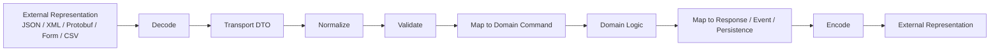
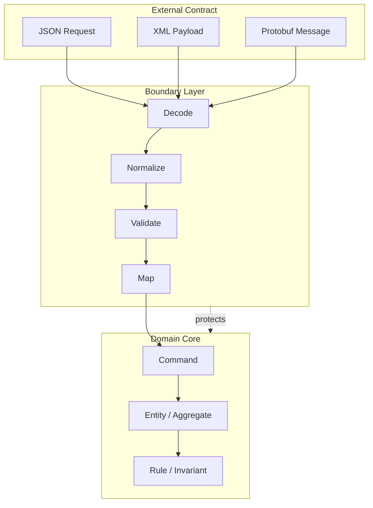
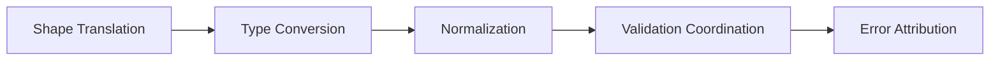
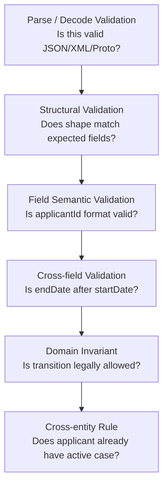
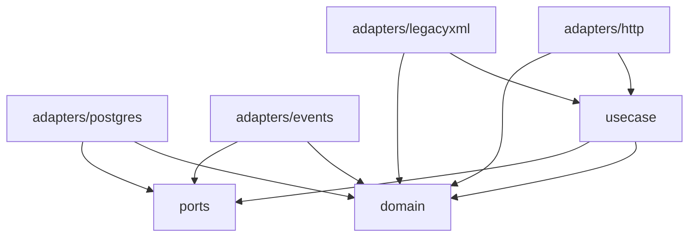
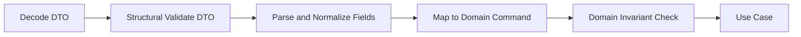
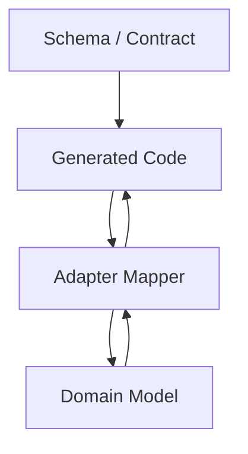
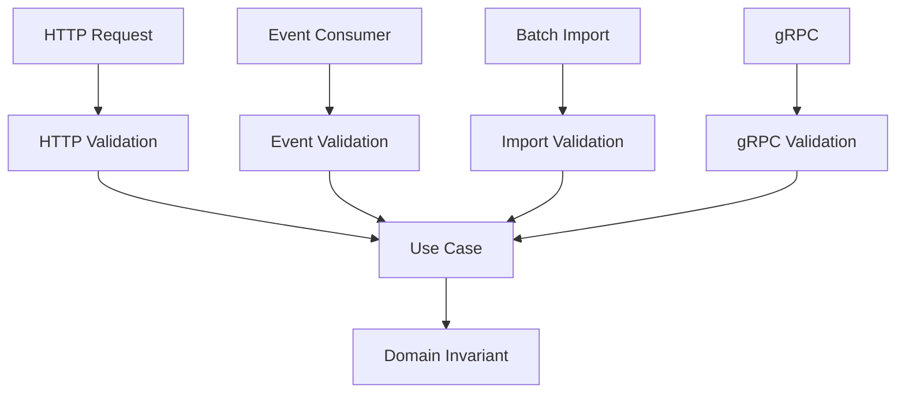
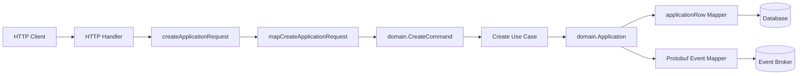
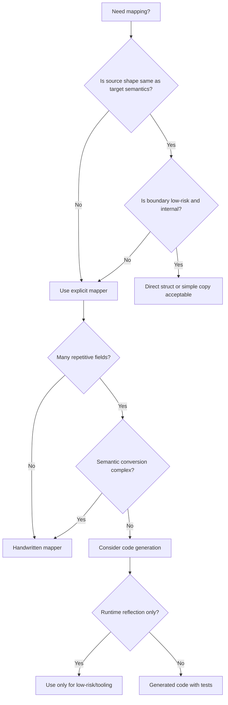

# learn-go-data-mapper-json-xml-protobuf-validation-part-001.md

# Part 001 — Data Mapper Architecture for Java Engineers

> Series: **learn-go-data-mapper-json-xml-protobuf-validation**  
> Part: **001 / 033**  
> Target Go: **Go 1.26.x**  
> Audience: **Java software engineer yang ingin berpindah dari framework-heavy mapping ke explicit boundary engineering di Go**  
> Scope part ini: **arsitektur data mapper, perbandingan Java vs Go, desain boundary model, failure mode, package structure, production checklist**  
> Status seri: **belum selesai**. Bagian berikutnya adalah `part-002`.

---

## 0. Tujuan part ini

Part ini menjawab pertanyaan inti:

> Kalau di Java kita terbiasa dengan Jackson, MapStruct, Bean Validation, JAXB, Lombok DTO, dan generated Protobuf class, bagaimana cara berpikir yang benar ketika membangun data mapper di Go?

Jawaban pendeknya: **jangan mencari Go version dari seluruh pola Java**.

Go bukan Java yang lebih kecil. Go punya gaya desain berbeda:

- explicit function lebih dihargai daripada annotation magic,
- package boundary lebih penting daripada class hierarchy,
- generated code boleh dipakai, tetapi harus jelas contract-nya,
- struct tag adalah metadata sederhana, bukan framework annotation system penuh,
- mapper sering lebih baik berupa fungsi kecil yang dekat dengan boundary daripada layer abstrak besar,
- validation perlu dipisah antara syntactic, structural, semantic, dan domain invariant,
- compatibility lebih penting daripada kemudahan mapping jangka pendek.

Setelah part ini, kamu harus bisa:

1. Mendesain mapper Go yang tidak sekadar copy field.
2. Membedakan DTO, domain model, persistence model, event model, dan generated contract model.
3. Memutuskan kapan mapping eksplisit cukup, kapan perlu code generation, dan kapan reflection mapper berisiko.
4. Menghindari kebiasaan Java yang buruk ketika dibawa mentah-mentah ke Go.
5. Membuat package structure data mapper yang bisa bertahan pada codebase besar.
6. Memahami failure modes mapping boundary sebelum masuk detail JSON/XML/Protobuf.

---

## 1. Peta besar: mapper bukan “copy property”

Di banyak codebase, “mapper” dipahami sebagai:

```text
Source.FieldA → Target.FieldA
Source.FieldB → Target.FieldB
Source.FieldC → Target.FieldC
```

Itu terlalu sempit.

Dalam sistem production, mapper adalah **boundary translator**. Mapper menerjemahkan data dari satu model ke model lain sambil menjaga makna, invariant, compatibility, dan error attribution.



Mapper berada di beberapa titik:

- external input → request DTO,
- request DTO → domain command,
- domain entity → response DTO,
- domain event → wire event,
- database row → domain projection,
- Protobuf message → internal model,
- XML legacy payload → canonical command.

Yang penting: **setiap titik punya tujuan berbeda**. Karena tujuannya berbeda, modelnya sering tidak boleh disamakan.

---

## 2. Perbedaan mental model Java dan Go

Sebagai Java engineer, kamu mungkin terbiasa dengan ekosistem seperti ini:

```text
HTTP JSON
  ↓
Jackson ObjectMapper
  ↓
DTO class + annotation
  ↓
Bean Validation annotation
  ↓
MapStruct mapper interface
  ↓
Service command/entity
  ↓
JPA entity / event DTO / response DTO
```

Di Go, bentuk yang lebih natural sering seperti ini:

```text
HTTP JSON
  ↓
json.Decoder with explicit options
  ↓
request struct
  ↓
explicit validation function / validator package
  ↓
explicit mapper function
  ↓
domain command/value object
  ↓
service
  ↓
explicit response mapper
```

Perhatikan pergeseran utamanya:

| Java habit | Go equivalent yang lebih idiomatik | Catatan |
|---|---|---|
| Annotation-driven behavior | Explicit functions + small interfaces + struct tags terbatas | Go struct tag tidak sekuat annotation Java. Jangan berharap lifecycle framework tersembunyi. |
| MapStruct interface | Package-level mapper functions atau generated mapper bila perlu | Untuk banyak kasus, handwritten mapper lebih jelas. |
| Jackson `ObjectMapper` global | Decoder/Encoder configuration di boundary | Hindari global magic config yang efeknya tersebar. |
| Bean Validation di DTO | Validator function per boundary + optional tag validator | Tag validation berguna, tetapi domain invariant tetap perlu eksplisit. |
| Lombok DTO | Plain struct | Go tidak butuh getter/setter boilerplate untuk semua field. |
| JPA entity dipakai sebagai API DTO | Sangat dihindari juga di Go | Persistence shape jarang sama dengan API contract. |
| JAXB XML mapping | `encoding/xml` dengan explicit tags dan custom parsing | XML namespace/mixed content butuh perhatian manual. |
| Protobuf generated Java builder | Go generated struct/accessor API | Jangan perlakukan generated proto sebagai domain model. |

---

## 3. Mapper sebagai anti-corruption layer

Dalam Domain-Driven Design, anti-corruption layer melindungi domain dari model luar yang tidak stabil, tidak bersih, atau berbeda semantik.

Data mapper di Go sebaiknya dipikirkan sebagai versi kecil dari anti-corruption layer.



Boundary layer bertugas menyerap kompleksitas dari luar:

- format input aneh,
- field legacy,
- nama field tidak konsisten,
- timezone tidak jelas,
- enum lama masih dikirim client,
- optionality tidak eksplisit,
- string kosong dianggap null oleh sistem lama,
- XML namespace berubah,
- Protobuf unknown field muncul dari producer versi baru,
- API client mengirim field yang tidak didokumentasikan.

Domain tidak boleh dipaksa tahu semua kekacauan itu.

Domain harus menerima model yang sudah lebih bersih:

```go
// Transport-level shape. Dekat dengan JSON contract.
type CreateApplicationRequest struct {
    ApplicantID string `json:"applicantId" validate:"required"`
    Type        string `json:"type" validate:"required"`
    SubmittedAt string `json:"submittedAt" validate:"required"`
}

// Domain-level command. Dekat dengan use case dan invariant.
type CreateApplicationCommand struct {
    ApplicantID ApplicantID
    Type        ApplicationType
    SubmittedAt time.Time
}
```

Keduanya sengaja berbeda.

`CreateApplicationRequest` bicara bahasa wire/API.  
`CreateApplicationCommand` bicara bahasa domain.

---

## 4. Java engineer trap: “Go but written like Java”

Ada beberapa jebakan umum saat Java engineer menulis mapper di Go.

### 4.1 Membuat layer mapper terlalu abstrak

Contoh buruk:

```go
type Mapper[S any, T any] interface {
    Map(ctx context.Context, source S) (T, error)
}

type GenericMapperRegistry struct {
    mappers map[reflect.Type]any
}
```

Ini terlihat “enterprise”, tetapi sering menambah kompleksitas tanpa manfaat.

Masalahnya:

- call graph menjadi tidak jelas,
- mapping yang sebenarnya sederhana jadi sulit dibaca,
- error attribution memburuk,
- reflection masuk tanpa alasan kuat,
- generic abstraction tidak mengekspresikan semantic mapping,
- IDE navigation menjadi kurang langsung,
- test jadi lebih fokus pada framework internal daripada mapping rule.

Versi Go yang lebih wajar:

```go
func MapCreateApplicationRequest(req CreateApplicationRequest) (CreateApplicationCommand, []FieldError) {
    // explicit mapping, normalization, parsing, semantic conversion
}
```

Go lebih suka **nama fungsi yang jelas** daripada hierarchy yang terlalu generik.

---

### 4.2 Menaruh semua tag di domain model

Contoh buruk:

```go
type Application struct {
    ID          string `json:"id" db:"id" xml:"id" validate:"required"`
    ApplicantID string `json:"applicantId" db:"applicant_id" xml:"applicant-id" validate:"required"`
    Status      string `json:"status" db:"status" xml:"status" validate:"oneof=DRAFT SUBMITTED APPROVED REJECTED"`
}
```

Ini terlihat praktis, tetapi sebenarnya domain model sudah bocor ke banyak boundary:

- JSON API,
- XML integration,
- database,
- validation framework,
- CSV/export,
- audit/event format.

Setiap perubahan boundary berisiko mengubah domain.

Masalah struktural:

```text
Domain model becomes annotation landfill.
```

Versi yang lebih sehat:

```go
// Domain package: tidak peduli JSON/XML/DB.
type Application struct {
    id          ApplicationID
    applicantID ApplicantID
    status      ApplicationStatus
}

// API package: peduli HTTP JSON contract.
type ApplicationResponse struct {
    ID          string `json:"id"`
    ApplicantID string `json:"applicantId"`
    Status      string `json:"status"`
}

// Persistence package: peduli database representation.
type applicationRow struct {
    ID          string
    ApplicantID string
    Status      string
}
```

Tidak semua codebase harus seketat ini. Untuk service kecil, domain struct dengan `json` tag masih bisa diterima. Tetapi untuk codebase besar, regulatoris, atau integration-heavy, pemisahan model mengurangi coupling jangka panjang.

---

### 4.3 Menganggap mapper hanya field copy, bukan semantic conversion

Contoh buruk:

```go
func ToCommand(req CreateApplicationRequest) CreateApplicationCommand {
    return CreateApplicationCommand{
        ApplicantID: ApplicantID(req.ApplicantID),
        Type:        ApplicationType(req.Type),
    }
}
```

Masalahnya:

- tidak memastikan `ApplicantID` valid,
- tidak memastikan `Type` termasuk enum domain,
- tidak menangani string kosong,
- tidak membedakan absent/null/empty,
- tidak mengembalikan error field-level,
- domain menerima value palsu.

Versi lebih baik:

```go
func MapCreateApplicationRequest(req CreateApplicationRequest) (CreateApplicationCommand, []FieldError) {
    var errs []FieldError

    applicantID, err := ParseApplicantID(req.ApplicantID)
    if err != nil {
        errs = append(errs, FieldError{
            Path: "applicantId",
            Code: "invalid_applicant_id",
            Message: "applicantId must be a valid applicant identifier",
        })
    }

    appType, err := ParseApplicationType(req.Type)
    if err != nil {
        errs = append(errs, FieldError{
            Path: "type",
            Code: "invalid_application_type",
            Message: "type must be one of the supported application types",
        })
    }

    if len(errs) > 0 {
        return CreateApplicationCommand{}, errs
    }

    return CreateApplicationCommand{
        ApplicantID: applicantID,
        Type:        appType,
    }, nil
}
```

Mapper di sini melakukan **semantic conversion**.

---

## 5. Lima pekerjaan mapper yang sering tersembunyi

Mapper production biasanya melakukan minimal lima pekerjaan.



### 5.1 Shape translation

Mengubah bentuk data.

Contoh external:

```json
{
  "applicant": {
    "id": "A-123",
    "name": "Jane"
  }
}
```

menjadi domain command:

```go
type CreateApplicationCommand struct {
    ApplicantID ApplicantID
}
```

Shape external tidak harus sama dengan shape internal.

---

### 5.2 Type conversion

Mengubah tipe representasi.

| External | Internal |
|---|---|
| string `"2026-06-24T10:00:00+07:00"` | `time.Time` |
| string `"A-123"` | `ApplicationID` |
| string `"123.45"` | `Money` |
| number `1` | enum value |
| array of strings | set/map |
| XML attribute | domain field |
| Protobuf wrapper/optional | optional value |

Type conversion bukan sekadar cast.

Cast tidak memvalidasi makna.

---

### 5.3 Normalization

Mengubah data menjadi bentuk canonical.

Contoh:

- trim whitespace,
- normalize casing,
- convert timezone ke UTC,
- normalize country code,
- collapse repeated spaces,
- convert legacy enum alias,
- normalize postal code,
- canonicalize phone number,
- map empty string ke absent bila contract mengizinkan.

Normalisasi harus hati-hati. Jangan diam-diam mengubah makna.

Contoh berbahaya:

```go
email := strings.ToLower(req.Email)
```

Untuk banyak use case email, lowercase local-part mungkin diterima secara praktis, tetapi keputusan canonicalization harus menjadi policy eksplisit, bukan kebiasaan otomatis.

---

### 5.4 Validation coordination

Mapper sering perlu berkoordinasi dengan validation, tetapi bukan berarti semua validation ditaruh di mapper.

Layer validation umum:



Mapper cocok untuk:

- semantic type conversion,
- field-level parsing,
- attaching field path to error,
- preparing domain command.

Mapper tidak cocok untuk:

- database existence check,
- authorization rule,
- workflow transition rule yang butuh aggregate state,
- cross-entity consistency,
- side-effect validation.

---

### 5.5 Error attribution

Mapper harus bisa menjawab:

> Field mana yang salah, kenapa salah, dan bagaimana client bisa memperbaikinya?

Contoh error buruk:

```json
{
  "error": "invalid request"
}
```

Contoh lebih baik:

```json
{
  "code": "validation_failed",
  "fields": [
    {
      "path": "applicantId",
      "code": "invalid_format",
      "message": "applicantId must start with A- followed by digits"
    },
    {
      "path": "submittedAt",
      "code": "invalid_time",
      "message": "submittedAt must use RFC3339 format"
    }
  ]
}
```

Dalam Go, error attribution sering lebih baik direpresentasikan sebagai structured value, bukan hanya `error` string.

```go
type FieldError struct {
    Path    string `json:"path"`
    Code    string `json:"code"`
    Message string `json:"message"`
}

type ValidationError struct {
    Code   string       `json:"code"`
    Fields []FieldError `json:"fields"`
}

func (e ValidationError) Error() string {
    return e.Code
}
```

Detail error modeling akan dibahas khusus di part 028.

---

## 6. Mapping boundary taxonomy

Untuk codebase besar, kamu perlu mengklasifikasikan mapper berdasarkan boundary-nya.

### 6.1 Transport mapper

Transport mapper mengubah request/response HTTP JSON/XML menjadi model internal.

```text
HTTP JSON DTO → Domain Command
Domain View → HTTP JSON Response
```

Biasanya berada di package handler/API adapter.

```go
package applicationsapi

func mapCreateRequest(req createApplicationRequest) (application.CreateCommand, []FieldError) {
    // request DTO → domain command
}

func mapApplicationResponse(view application.View) applicationResponse {
    // domain view → response DTO
}
```

---

### 6.2 Integration mapper

Integration mapper mengubah model sistem eksternal ke model canonical internal.

```text
External XML / Partner JSON / Legacy CSV → Internal Command/Event
```

Biasanya paling kotor karena harus menampung legacy behavior.

```go
package legacygateway

func mapLegacyCasePayload(payload legacyCaseXML) (caseintake.IntakeCommand, []FieldError) {
    // namespace quirks, string dates, legacy codes, fallback rules
}
```

---

### 6.3 Persistence mapper

Persistence mapper mengubah database row/document ke domain model atau projection.

```text
SQL Row → Domain Entity / Read Model
Domain Entity → SQL Parameters
```

Untuk SQL, ini sering dekat repository.

```go
package applicationrepo

type applicationRow struct {
    ID          string
    ApplicantID string
    Status      string
    Version     int64
}

func rowToEntity(row applicationRow) (application.Application, error) {
    // persistence representation → domain entity
}
```

Persistence mapper tidak boleh otomatis dianggap sama dengan JSON mapper.

---

### 6.4 Event mapper

Event mapper mengubah domain event ke event contract.

```text
Domain Event → Protobuf Event / JSON Event
Event Contract → Consumer Command
```

Event mapper harus memikirkan compatibility lebih serius daripada request/response biasa, karena event bisa hidup lama di broker, log, storage, replay pipeline, dan analytics system.

---

### 6.5 Protobuf mapper

Protobuf mapper menghubungkan generated message dengan model internal.

```text
*.pb.go generated message ↔ domain command/entity/event
```

Generated Protobuf type tidak otomatis menjadi domain type.

Alasannya:

- field presence semantics berbeda,
- generated type punya runtime metadata,
- unknown field behavior relevan untuk wire compatibility,
- generated API bisa berubah arah seperti Open Struct API ke Opaque API,
- domain invariant tidak boleh bergantung pada generated representation.

---

### 6.6 View mapper

View mapper mengubah domain/read model ke response yang dioptimalkan untuk UI/API.

```text
Domain Projection → UI Response DTO
```

View mapper sering melakukan:

- formatting label,
- flatten nested structure,
- hiding internal fields,
- combining fields,
- sorting nested arrays,
- masking sensitive data.

View mapper harus hati-hati agar tidak memasukkan business rule baru yang tidak ada di domain.

---

## 7. Package structure yang sehat di Go

Go mendorong desain berbasis package, bukan class hierarchy. Karena itu, lokasi mapper penting.

### 7.1 Struktur sederhana untuk service kecil

```text
internal/
  application/
    service.go
    model.go
  httpapi/
    handler.go
    dto.go
    mapper.go
    validation.go
```

Cocok untuk service kecil-menengah.

`httpapi/mapper.go` mengerti DTO dan domain command. Domain package tidak mengerti HTTP DTO.

---

### 7.2 Struktur bounded context besar

```text
internal/
  applications/
    domain/
      application.go
      status.go
      command.go
    usecase/
      create.go
      submit.go
    ports/
      repository.go
      publisher.go
    adapters/
      http/
        create_request.go
        response.go
        mapper.go
        validation.go
      postgres/
        row.go
        mapper.go
        repository.go
      events/
        application_event.proto
        mapper.go
        publisher.go
      legacyxml/
        payload.go
        mapper.go
        client.go
```

Ini cocok untuk domain kompleks dengan banyak boundary.

Dependency direction:



Domain tidak import adapter.

Jika domain mengimport `encoding/json`, `encoding/xml`, HTTP framework, SQL driver, atau generated external proto yang bukan domain contract, itu warning.

---

### 7.3 Struktur contract-first untuk Protobuf/gRPC/event

```text
api/
  proto/
    applications/v1/application.proto
    applications/v1/application.pb.go
    applications/v1/applicationconnect/

internal/
  applications/
    domain/
    usecase/
    adapters/
      grpc/
        handler.go
        mapper.go
      events/
        mapper.go
```

Generated Protobuf code biasanya ditempatkan di package contract/API, bukan dicampur ke domain.

---

## 8. Dependency rule utama

Salah satu invariant arsitektur terpenting:

> Model yang lebih stabil tidak boleh bergantung pada model yang lebih volatile.

Biasanya urutan stabilitas:

```text
Domain concept > Use case command > Internal projection > Persistence representation > API DTO > Partner payload
```

Tetapi untuk Protobuf event publik, contract bisa sangat stabil karena harus backward compatible selama bertahun-tahun.

Maka urutannya bisa berubah:

```text
Public event contract ≥ Domain event abstraction > Internal implementation detail
```

Aturan praktis:

- Domain tidak import HTTP DTO.
- Domain tidak import XML partner payload.
- Domain tidak import database row struct.
- Domain sebaiknya tidak bergantung langsung pada generated proto eksternal.
- Adapter boleh import domain.
- Mapper biasanya tinggal di adapter.
- Shared mapper package hanya dibuat kalau benar-benar ada reuse semantik, bukan sekadar copy field sama.

---

## 9. Kapan model boleh disatukan?

Tidak semua sistem butuh banyak model. Over-separation juga bisa buruk.

### 9.1 Model boleh disatukan bila

- service kecil,
- contract internal dan tidak diekspos publik,
- tidak ada legacy integration,
- tidak ada schema evolution kompleks,
- tidak ada domain invariant berat,
- tidak ada storage representation yang berbeda,
- tim kecil dan perubahan cepat,
- risiko compatibility rendah.

Contoh acceptable:

```go
type HealthResponse struct {
    Status string `json:"status"`
}
```

Tidak perlu domain model untuk health check.

---

### 9.2 Model sebaiknya dipisah bila

- API publik atau dipakai banyak client,
- contract harus backward compatible,
- domain kompleks,
- ada workflow/state machine,
- ada regulatory/audit defensibility,
- event disimpan lama,
- database schema berbeda dari API,
- ada Protobuf/gRPC plus JSON API,
- ada XML legacy partner,
- validation rule berubah per channel,
- response UI berbeda dari domain entity.

Dalam sistem case management atau regulatory workflow, model yang dipisah biasanya lebih aman.

---

## 10. Data mapper design matrix

| Situasi | Rekomendasi | Kenapa |
|---|---|---|
| Endpoint sederhana, 3–5 field | Handwritten mapper di handler package | Explicit, murah, mudah dites. |
| Banyak endpoint tapi mapping sederhana | Package-level mapper functions per boundary | Tetap jelas tanpa framework. |
| Banyak DTO mirip dan repetitive | Pertimbangkan code generation | Mengurangi boilerplate tanpa runtime reflection. |
| Mapping kompleks dengan domain conversion | Handwritten mapper | Logic semantic harus terlihat. |
| Performance sangat ketat | Generated mapper atau custom manual mapper | Hindari reflection overhead dan hidden allocation. |
| Legacy XML rumit | Custom parser/mapper eksplisit | XML namespace/mixed content sulit digenerikkan. |
| Protobuf public contract | Generated proto + explicit domain mapper | Contract dan domain dipisah. |
| Internal event sementara | Model bisa lebih dekat, tetap version-aware | Jangan over-engineer, tapi jangan abaikan evolution. |
| CRUD admin sederhana | DTO bisa dekat dengan persistence projection | Selama risiko rendah dan tidak jadi domain core. |
| Regulatory workflow | Pisahkan request, command, domain, event, audit representation | Auditability dan invariant lebih penting dari boilerplate. |

---

## 11. Handwritten mapper di Go

Handwritten mapper adalah default yang sering paling baik di Go.

```go
package applicationsapi

import (
    "strings"
    "time"

    "example.com/aceas/internal/applications/domain"
)

type createApplicationRequest struct {
    ApplicantID string `json:"applicantId"`
    Type        string `json:"type"`
    SubmittedAt string `json:"submittedAt"`
}

type FieldError struct {
    Path    string `json:"path"`
    Code    string `json:"code"`
    Message string `json:"message"`
}

func mapCreateApplicationRequest(req createApplicationRequest) (domain.CreateCommand, []FieldError) {
    var errs []FieldError

    applicantID, err := domain.ParseApplicantID(strings.TrimSpace(req.ApplicantID))
    if err != nil {
        errs = append(errs, FieldError{
            Path:    "applicantId",
            Code:    "invalid_applicant_id",
            Message: "applicantId is not valid",
        })
    }

    appType, err := domain.ParseApplicationType(strings.TrimSpace(req.Type))
    if err != nil {
        errs = append(errs, FieldError{
            Path:    "type",
            Code:    "invalid_application_type",
            Message: "type is not supported",
        })
    }

    submittedAt, err := time.Parse(time.RFC3339, strings.TrimSpace(req.SubmittedAt))
    if err != nil {
        errs = append(errs, FieldError{
            Path:    "submittedAt",
            Code:    "invalid_datetime",
            Message: "submittedAt must be RFC3339",
        })
    }

    if len(errs) > 0 {
        return domain.CreateCommand{}, errs
    }

    return domain.CreateCommand{
        ApplicantID: applicantID,
        Type:        appType,
        SubmittedAt: submittedAt.UTC(),
    }, nil
}
```

Kelebihan:

- mudah dibaca,
- error path eksplisit,
- normalisasi terlihat,
- domain constructor/parser dipakai,
- mudah dites dengan table test,
- tidak bergantung pada reflection,
- tidak ada hidden framework lifecycle.

Kekurangan:

- boilerplate bertambah,
- perlu disiplin style,
- bisa inconsistent bila tidak ada guideline,
- butuh review checklist.

Solusinya bukan langsung membuat framework. Solusinya adalah guideline, template, helper error, dan package discipline.

---

## 12. Reflection mapper: kapan berbahaya?

Reflection mapper menggoda karena mengurangi boilerplate.

Contoh library/pola:

```go
func Map(dst any, src any) error {
    // inspect fields by name/tag using reflect
}
```

Masalahnya bukan reflection itu selalu buruk. Masalahnya reflection mapper sering menyembunyikan semantic conversion.

### 12.1 Masalah reflection mapper

| Risiko | Dampak |
|---|---|
| Field cocok by name tetapi beda makna | Data salah tanpa compile error. |
| Conversion diam-diam | Error sulit dilacak. |
| Performance overhead | Allocation dan runtime cost tidak terlihat. |
| Refactor tidak aman | Rename field bisa mengubah behavior. |
| Weak error attribution | Sulit memberi field-level business error. |
| Tag overload | Struct penuh metadata untuk banyak framework. |
| Domain pollution | Domain dipaksa punya exported fields. |

Contoh berbahaya:

```go
type APIApplication struct {
    Status string `json:"status"`
}

type DomainApplication struct {
    Status string
}
```

Reflection mapper bisa copy `Status`, tetapi tidak tahu bahwa API status `"PENDING_REVIEW"` harus dipetakan ke domain state `UnderAssessment`, atau bahkan tidak boleh diterima untuk role tertentu.

### 12.2 Kapan reflection mapper masih masuk akal?

Reflection mapper bisa dipakai untuk:

- internal tooling,
- test helper,
- admin CRUD low-risk,
- migration script sekali jalan,
- shallow projection tanpa semantic conversion,
- prototype yang akan diganti,
- mapping observability metadata non-domain.

Tetapi untuk contract boundary utama, gunakan explicit mapper atau generated mapper.

---

## 13. Code generation mapper

Code generation berada di tengah antara handwritten dan reflection.

```text
Schema / Config / Interface
  ↓ generate
Go mapping code
  ↓ compile
Runtime uses plain functions
```

Kelebihan:

- runtime cepat,
- compile-time visible,
- mengurangi boilerplate,
- bisa enforce style,
- bisa cocok untuk Protobuf/OpenAPI schema-first,
- lebih mudah diaudit daripada reflection runtime.

Kekurangan:

- build pipeline lebih kompleks,
- generated code perlu versioning strategy,
- error message generator bisa buruk,
- customization rumit,
- bisa menghasilkan code yang tidak idiomatik,
- debugging perlu memahami source generator.

Gunakan code generation bila:

- contract schema-first,
- field sangat banyak dan repetitive,
- performance penting,
- mapping mostly structural,
- ada banyak service yang butuh consistent code,
- organization punya governance build yang matang.

Jangan gunakan code generation untuk menutupi domain design yang tidak jelas.

---

## 14. Mapper dan validation: relasi yang benar

Mapping dan validation sering tercampur. Ada tiga pendekatan umum.

### 14.1 Validate before map

```text
DTO → validate DTO → map to domain
```

Cocok untuk:

- required field,
- format sederhana,
- max length,
- enum string dari API,
- structural validation.

Kelemahan:

- beberapa validasi butuh tipe domain hasil parsing,
- bisa terjadi validasi ganda.

### 14.2 Map then validate domain

```text
DTO → map to domain object → validate domain
```

Cocok untuk:

- domain constructor kuat,
- value object selalu valid,
- invariant internal.

Kelemahan:

- field error path bisa hilang,
- parse error harus tetap dikaitkan ke input field.

### 14.3 Hybrid pipeline

Ini sering paling realistis.



Contoh tahap:

1. JSON valid?
2. Unknown fields diterima atau ditolak?
3. Required fields ada?
4. Date string bisa diparse?
5. Enum valid?
6. Cross-field relation valid?
7. Domain transition valid?
8. User authorized?
9. Entity existence valid?

Tidak semua tahap berada di mapper. Mapper terutama menangani tahap 3–5 dan menyiapkan command untuk tahap 6–9.

---

## 15. DTO design untuk Java engineer

Di Java, DTO sering class dengan getter/setter, annotation, Lombok, dan mungkin nested static classes.

Di Go, DTO biasanya plain struct.

```go
type createApplicationRequest struct {
    ApplicantID string `json:"applicantId" validate:"required"`
    Type        string `json:"type" validate:"required"`
    Comment     string `json:"comment,omitempty" validate:"max=1000"`
}
```

### 15.1 Exported atau unexported DTO?

Jika DTO hanya dipakai di package HTTP handler, gunakan unexported type:

```go
type createApplicationRequest struct { ... }
```

Jika DTO adalah public API package atau dipakai oleh generated documentation/testing, exported bisa masuk akal:

```go
type CreateApplicationRequest struct { ... }
```

Rule sederhana:

> Export hanya jika package lain memang harus menggunakannya.

### 15.2 Jangan memaksa DTO punya behavior domain

DTO boleh punya helper kecil, tetapi jangan berubah menjadi domain object.

Buruk:

```go
func (r createApplicationRequest) Submit() error {
    // calls database, changes workflow, emits event
}
```

DTO seharusnya tidak menjalankan use case.

Lebih baik:

```go
cmd, fieldErrs := mapCreateApplicationRequest(req)
if len(fieldErrs) > 0 { ... }

result, err := h.usecase.Create(ctx, cmd)
```

### 15.3 Naming DTO

Gunakan nama sesuai contract boundary:

```go
type createApplicationRequest struct {}
type createApplicationResponse struct {}
type applicationSummaryResponse struct {}
type legacyApplicationPayload struct {}
type applicationCreatedEventV1 struct {}
```

Hindari nama terlalu generik:

```go
type ApplicationDTO struct {}
type ApplicationModel struct {}
type ApplicationData struct {}
```

Nama generik biasanya menandakan model campur aduk.

---

## 16. Domain model design yang mapping-friendly

Domain model tidak harus mudah di-marshal. Domain model harus mudah menjaga invariant.

```go
type ApplicationStatus string

const (
    ApplicationStatusDraft     ApplicationStatus = "DRAFT"
    ApplicationStatusSubmitted ApplicationStatus = "SUBMITTED"
    ApplicationStatusApproved  ApplicationStatus = "APPROVED"
    ApplicationStatusRejected  ApplicationStatus = "REJECTED"
)

func ParseApplicationStatus(s string) (ApplicationStatus, error) {
    switch s {
    case string(ApplicationStatusDraft):
        return ApplicationStatusDraft, nil
    case string(ApplicationStatusSubmitted):
        return ApplicationStatusSubmitted, nil
    case string(ApplicationStatusApproved):
        return ApplicationStatusApproved, nil
    case string(ApplicationStatusRejected):
        return ApplicationStatusRejected, nil
    default:
        return "", fmt.Errorf("unknown application status %q", s)
    }
}
```

Mapper memanggil parser ini.

Jangan biarkan domain menerima arbitrary string hanya karena JSON field berupa string.

---

## 17. Constructor sebagai domain boundary

Dalam Go, constructor bukan kewajiban bahasa, tetapi sangat berguna untuk invariant.

```go
type ApplicantID struct {
    value string
}

func ParseApplicantID(s string) (ApplicantID, error) {
    if !strings.HasPrefix(s, "A-") {
        return ApplicantID{}, fmt.Errorf("invalid applicant id")
    }
    if len(s) < 3 {
        return ApplicantID{}, fmt.Errorf("invalid applicant id")
    }
    return ApplicantID{value: s}, nil
}

func (id ApplicantID) String() string {
    return id.value
}
```

Keuntungannya:

- domain value tidak bisa dibuat sembarangan dari package luar bila field unexported,
- mapper dipaksa melewati parser,
- invariant dekat dengan type,
- response mapper bisa memanggil `String()`.

Ini mirip Java value object dengan private field dan static factory, tetapi lebih ringan.

---

## 18. Field presence: jangan disamakan dengan Java null

Detail akan dibahas di part 007 dan part 022, tetapi part ini perlu fondasi.

Di Java:

```java
String name; // bisa null
```

Di Go:

```go
Name string  // tidak bisa nil; default ""
Name *string // bisa nil
```

Untuk JSON update/patch, perbedaan ini penting.

```go
type updateApplicantRequest struct {
    DisplayName *string `json:"displayName"`
}
```

Tetapi pointer saja belum selalu cukup untuk membedakan:

- field absent,
- field present dengan null,
- field present dengan empty string.

`encoding/json` klasik punya keterbatasan untuk presence tracking detail tanpa custom type atau decoder strategy.

Karena itu, mapper harus jelas:

- apakah absent artinya “tidak berubah”,
- apakah null artinya “clear value”,
- apakah empty string valid,
- apakah default value diterapkan di boundary atau domain.

Jangan treat Go zero value sebagai default business value tanpa policy.

---

## 19. Defaulting policy

Default adalah salah satu sumber bug paling halus.

```go
type CreateRequest struct {
    Priority int `json:"priority"`
}
```

Jika client tidak mengirim `priority`, hasil decode adalah `0`.

Pertanyaan:

- Apakah `0` valid priority?
- Apakah absent berarti default normal priority?
- Apakah client memang mengirim `0`?
- Apakah future client bisa mengirim null?

Lebih eksplisit:

```go
type CreateRequest struct {
    Priority *int `json:"priority"`
}
```

Mapper:

```go
priority := domain.NormalPriority
if req.Priority != nil {
    parsed, err := domain.ParsePriority(*req.Priority)
    if err != nil { ... }
    priority = parsed
}
```

Defaulting sebaiknya dilakukan di satu tempat yang jelas.

---

## 20. Enum mapping

Di Java, enum sering langsung dipetakan oleh Jackson:

```java
enum Status { DRAFT, SUBMITTED }
```

Di Go, enum biasanya berupa custom type + constants.

```go
type Status string

const (
    StatusDraft     Status = "DRAFT"
    StatusSubmitted Status = "SUBMITTED"
)
```

Jangan hanya cast:

```go
status := Status(req.Status) // weak
```

Gunakan parser:

```go
func ParseStatus(s string) (Status, error) {
    switch s {
    case "DRAFT":
        return StatusDraft, nil
    case "SUBMITTED":
        return StatusSubmitted, nil
    default:
        return "", fmt.Errorf("invalid status")
    }
}
```

Untuk public API, enum mapping juga harus memikirkan:

- unknown future values,
- deprecated values,
- aliases,
- compatibility dengan old clients,
- error code yang stabil,
- documentation/OpenAPI/Protobuf enum.

---

## 21. Time mapping

Time adalah boundary problem klasik.

Di Go, `time.Time` kuat, tetapi input external sering string.

Pertanyaan mapping:

- Format apa yang diterima? RFC3339? Date-only? Custom legacy?
- Timezone wajib atau optional?
- Disimpan sebagai UTC atau local?
- Apakah date-only berarti local date atau instant?
- Apakah `0001-01-01T00:00:00Z` boleh muncul sebagai zero value?
- Apakah response harus preserve timezone input?

Contoh mapper:

```go
func parseSubmittedAt(raw string) (time.Time, error) {
    raw = strings.TrimSpace(raw)
    if raw == "" {
        return time.Time{}, fmt.Errorf("submittedAt is required")
    }

    t, err := time.Parse(time.RFC3339, raw)
    if err != nil {
        return time.Time{}, err
    }

    return t.UTC(), nil
}
```

Jangan parse time secara tersebar di banyak handler. Buat helper boundary yang jelas.

---

## 22. Money/decimal mapping

Jangan gunakan `float64` untuk money hanya karena JSON number decode default ke float.

Java engineer mungkin terbiasa dengan `BigDecimal`.

Di Go, standard library tidak punya decimal fixed-point high-level seperti `BigDecimal`. Opsi umum:

- representasi minor unit sebagai integer, misalnya cents,
- custom Money type,
- decimal library pihak ketiga bila benar-benar perlu,
- string representation di API untuk menghindari ambiguity precision.

Contoh:

```go
type Money struct {
    currency string
    cents    int64
}
```

Request:

```go
type paymentRequest struct {
    Amount   string `json:"amount"`
    Currency string `json:"currency"`
}
```

Mapper:

```go
amount, err := domain.ParseMoney(req.Currency, req.Amount)
```

Ini akan dibahas detail di part JSON numbers/precision.

---

## 23. Mapper dan error strategy

Go punya `error`, tetapi mapper sering butuh multiple errors.

### 23.1 Fail-fast

```go
cmd, err := mapRequest(req)
if err != nil { ... }
```

Cocok untuk:

- internal pipeline,
- Protobuf consumer,
- security-sensitive strict parsing,
- kondisi di mana satu error cukup.

### 23.2 Accumulate field errors

```go
cmd, fieldErrs := mapRequest(req)
if len(fieldErrs) > 0 { ... }
```

Cocok untuk:

- HTTP API untuk user/client,
- form-like input,
- UI needs multiple error display,
- public API developer experience.

### 23.3 Hybrid

- Decode error fail-fast.
- Unknown field fail-fast atau field error tergantung API policy.
- Field validation accumulate.
- Domain invariant fail-fast atau structured domain error.

Contoh pipeline:

```go
var req createApplicationRequest
if err := decodeJSON(r.Body, &req); err != nil {
    return badRequest(decodeErrorResponse(err))
}

cmd, fieldErrs := mapCreateApplicationRequest(req)
if len(fieldErrs) > 0 {
    return validationFailed(fieldErrs)
}

result, err := h.usecase.Create(ctx, cmd)
if err != nil {
    return domainError(err)
}

return created(mapCreateApplicationResponse(result))
```

---

## 24. Mapper dan observability

Mapper biasanya tidak boleh logging terlalu banyak, tetapi boundary layer perlu observability.

Yang perlu diamati:

- decode failure count,
- validation failure count by code,
- unknown field occurrence,
- deprecated field usage,
- legacy enum alias usage,
- Protobuf unknown field trend,
- schema version distribution,
- event mapping failure,
- poison message count.

Namun hati-hati:

- jangan log full request body yang mengandung PII,
- jangan log secret/token,
- jangan log field value sensitif,
- cukup log field path dan error code,
- gunakan correlation/request ID.

Contoh log aman:

```text
request validation failed endpoint=/applications field=applicantId code=invalid_format correlation_id=abc123
```

Bukan:

```text
invalid applicantId: A-9918273617263617263 with name Jane Doe and NRIC ...
```

---

## 25. Versioning dan compatibility dalam mapper

Mapper sering menjadi tempat menangani compatibility antar versi.

Request v1:

```json
{
  "type": "SALESPERSON"
}
```

Request v2:

```json
{
  "applicationType": "SALESPERSON"
}
```

### 25.1 Separate DTO per version

```go
type createApplicationRequestV1 struct {
    Type string `json:"type"`
}

type createApplicationRequestV2 struct {
    ApplicationType string `json:"applicationType"`
}
```

Mapper:

```go
func mapCreateV1(req createApplicationRequestV1) (...)
func mapCreateV2(req createApplicationRequestV2) (...)
```

Kelebihan:

- jelas,
- aman,
- dokumentasi mudah,
- deprecation mudah.

Kekurangan:

- lebih banyak code.

### 25.2 Single DTO with compatibility fields

```go
type createApplicationRequest struct {
    Type            string `json:"type,omitempty"`
    ApplicationType string `json:"applicationType,omitempty"`
}
```

Mapper menentukan prioritas.

Kelebihan:

- code lebih sedikit,
- cocok untuk transisi pendek.

Kekurangan:

- ambiguity meningkat,
- rule konflik harus jelas,
- bisa menjadi permanent mess.

Rule production:

> Compatibility hack harus punya expiry plan.

---

## 26. Unknown field policy

Unknown field adalah salah satu keputusan contract paling penting.

### 26.1 Strict input

Menolak unknown field.

Cocok untuk:

- command endpoint,
- security-sensitive API,
- regulated workflow,
- internal API dengan contract kuat,
- mencegah typo client.

### 26.2 Lenient input

Mengabaikan unknown field.

Cocok untuk:

- forward compatibility,
- event consumer yang menerima producer lebih baru,
- public API yang menjaga compatibility long tail,
- logging/analytics payload.

### 26.3 Capture extension

Menyimpan unknown/extension field.

Cocok untuk:

- metadata extension,
- plugin architecture,
- pass-through gateway,
- audit of unknown data.

Mapper harus tahu policy ini karena unknown field bisa memengaruhi security dan compatibility.

Detail JSON unknown field akan dibahas di part 010. Protobuf unknown field akan dibahas di part 024.

---

## 27. Data mapper untuk XML: berbeda dari JSON

Java engineer sering mengenal JAXB. Di Go, `encoding/xml` lebih manual dan eksplisit.

XML mapper harus memperhatikan:

- element vs attribute,
- namespace,
- nested path,
- repeated element,
- mixed content,
- character data,
- CDATA,
- legacy schema,
- whitespace significance.

Contoh XML DTO:

```go
type legacyApplicationXML struct {
    XMLName xml.Name `xml:"Application"`
    ID      string   `xml:"id,attr"`
    Type    string   `xml:"Type"`
    Name    string   `xml:"Applicant>Name"`
}
```

Mapper XML hampir selalu perlu normalization layer karena legacy XML jarang ideal.

Jangan langsung menjadikan XML struct sebagai domain model.

---

## 28. Data mapper untuk Protobuf: berbeda dari JSON/XML

Protobuf punya schema eksplisit, field number, generated code, dan compatibility rules.

Java engineer mungkin terbiasa dengan generated builder:

```java
Application.newBuilder()
    .setId("A-123")
    .setStatus(Status.SUBMITTED)
    .build();
```

Di Go, generated API tergantung mode dan versi. Modern Protobuf Go bergerak ke Opaque API yang mendorong accessor, bukan direct struct field coupling.

Prinsip mapping:

```text
Generated Proto Message ≠ Domain Model
```

Kenapa?

- Protobuf field presence punya aturan sendiri.
- Default value bisa menipu.
- Unknown fields penting untuk compatibility.
- `oneof` bukan union domain otomatis.
- Enum zero value sering harus `UNSPECIFIED`.
- Generated code adalah contract artifact, bukan business object.

Contoh pola:

```go
func mapCreateApplicationProto(msg *applicationv1.CreateApplicationRequest) (domain.CreateCommand, []FieldError) {
    // proto generated message → domain command
}

func mapApplicationCreatedEvent(event domain.ApplicationCreated) *applicationv1.ApplicationCreated {
    // domain event → proto event
}
```

---

## 29. Mapper dan generated contract

OpenAPI, Protobuf, JSON Schema, dan XML Schema bisa menghasilkan code. Tetapi generated code harus diposisikan dengan benar.



Jangan membuat domain bergantung penuh pada generated code bila:

- schema sering berubah karena external team,
- generated code membawa dependency berat,
- generated representation tidak cocok dengan invariant,
- kamu perlu mendukung beberapa contract version,
- domain digunakan oleh boundary lain.

Generated code boleh menjadi domain model hanya pada kasus terbatas:

- service contract-first sangat tipis,
- domain logic minimal,
- schema benar-benar canonical internal domain,
- tidak ada persistence model berbeda,
- tim sadar konsekuensi coupling.

---

## 30. Mapper placement: dekat source atau target?

Pertanyaan desain umum:

> Mapper harus ditaruh di package source model, target model, atau package terpisah?

### 30.1 Dekat adapter/source

```text
adapters/http/mapper.go
```

Cocok karena adapter tahu external contract.

Kelebihan:

- external quirks terlokalisasi,
- domain tetap bersih,
- versioning lebih mudah,
- handler dekat dengan mapper.

Ini default yang disarankan.

### 30.2 Dekat domain/target

```text
domain/from_request.go
```

Biasanya kurang baik jika request adalah HTTP-specific.

Domain jadi tahu DTO.

Masih masuk akal bila target type menyediakan parser/value constructor generik:

```go
func ParseApplicantID(s string) (ApplicantID, error)
```

Bukan:

```go
func NewCommandFromHTTPRequest(req httpapi.CreateRequest) CreateCommand
```

### 30.3 Package mapper terpisah

```text
internal/mappers/application_mapper.go
```

Bisa dipakai, tapi hati-hati menjadi junk drawer.

Gunakan hanya bila:

- banyak adapter perlu mapping sama,
- mapping benar-benar shared semantic,
- dependency direction tetap bersih,
- package tidak berubah menjadi global dumping ground.

---

## 31. Naming convention mapper

Gunakan nama eksplisit.

Baik:

```go
func mapCreateApplicationRequest(req createApplicationRequest) (domain.CreateCommand, []FieldError)
func mapApplicationResponse(view domain.ApplicationView) applicationResponse
func mapLegacyStatus(raw string) (domain.ApplicationStatus, error)
func mapProtoApplicationCreated(event domain.ApplicationCreated) *applicationv1.ApplicationCreated
```

Kurang baik:

```go
func Map(a any) any
func Convert(input any) any
func Transform(model Model) ModelDTO
func ToDTO(x any) any
```

Nama mapper harus menunjukkan:

- source,
- target,
- direction,
- boundary.

---

## 32. Small helper vs framework

Dalam Go, sering cukup membuat helper kecil:

```go
func addFieldError(errs *[]FieldError, path, code, message string) {
    *errs = append(*errs, FieldError{Path: path, Code: code, Message: message})
}
```

Atau parser helper:

```go
func parseRFC3339Field(path string, raw string) (time.Time, *FieldError) {
    t, err := time.Parse(time.RFC3339, strings.TrimSpace(raw))
    if err != nil {
        return time.Time{}, &FieldError{
            Path:    path,
            Code:    "invalid_datetime",
            Message: path + " must be RFC3339",
        }
    }
    return t.UTC(), nil
}
```

Jangan langsung membuat framework internal besar sebelum pola stabil.

Rule:

> Extract helper after repetition is understood, not before semantics are understood.

---

## 33. Mapper test strategy

Detail testing sudah punya seri sendiri, jadi bagian ini hanya fokus pada mapper-specific tests.

Yang perlu dites:

1. Valid input menghasilkan command benar.
2. Required field kosong menghasilkan field error path benar.
3. Invalid enum ditolak.
4. Invalid time ditolak.
5. Whitespace dinormalisasi bila policy mengizinkan.
6. Unknown/legacy alias diproses sesuai policy.
7. Default value diterapkan hanya saat absent.
8. Domain parser dipanggil lewat behavior, bukan mock berlebihan.
9. Response mapper tidak membocorkan internal/sensitive field.
10. Protobuf mapper menjaga field presence dan enum unspecified.

Contoh table test:

```go
func TestMapCreateApplicationRequest(t *testing.T) {
    tests := []struct {
        name     string
        req      createApplicationRequest
        wantErrs []string
        wantType domain.ApplicationType
    }{
        {
            name: "valid request",
            req: createApplicationRequest{
                ApplicantID: "A-123",
                Type:        "SALESPERSON",
                SubmittedAt: "2026-06-24T10:00:00+07:00",
            },
            wantType: domain.ApplicationTypeSalesperson,
        },
        {
            name: "invalid applicant id",
            req: createApplicationRequest{
                ApplicantID: "bad",
                Type:        "SALESPERSON",
                SubmittedAt: "2026-06-24T10:00:00+07:00",
            },
            wantErrs: []string{"applicantId:invalid_applicant_id"},
        },
    }

    for _, tt := range tests {
        t.Run(tt.name, func(t *testing.T) {
            cmd, errs := mapCreateApplicationRequest(tt.req)
            if len(tt.wantErrs) > 0 {
                got := fieldErrorKeys(errs)
                if !reflect.DeepEqual(got, tt.wantErrs) {
                    t.Fatalf("field errors mismatch: got %v want %v", got, tt.wantErrs)
                }
                return
            }
            if len(errs) > 0 {
                t.Fatalf("unexpected errors: %v", errs)
            }
            if cmd.Type != tt.wantType {
                t.Fatalf("type mismatch: got %v want %v", cmd.Type, tt.wantType)
            }
        })
    }
}
```

---

## 34. Mapper review checklist

Gunakan checklist ini saat code review mapper.

### 34.1 Boundary clarity

- Apakah source dan target model jelas?
- Apakah mapper berada di package yang tepat?
- Apakah domain tidak import DTO/adapter?
- Apakah generated code tidak bocor ke domain tanpa alasan?

### 34.2 Semantic correctness

- Apakah string ID diparse menjadi value object?
- Apakah enum divalidasi, bukan hanya cast?
- Apakah time parsing punya timezone policy?
- Apakah money/decimal tidak memakai float sembarangan?
- Apakah defaulting eksplisit?
- Apakah normalization tidak mengubah makna diam-diam?

### 34.3 Validation and errors

- Apakah decode error, validation error, dan domain error dibedakan?
- Apakah field error punya path dan code stabil?
- Apakah mapper accumulate error bila API membutuhkan?
- Apakah error message tidak membocorkan data sensitif?

### 34.4 Compatibility

- Apakah unknown field policy jelas?
- Apakah deprecated field punya migration/expiry plan?
- Apakah version-specific mapper dipisah bila perlu?
- Apakah Protobuf reserved/field presence dipertimbangkan?

### 34.5 Operational safety

- Apakah mapper tidak melakukan I/O?
- Apakah mapper tidak call database?
- Apakah mapper tidak log full payload?
- Apakah large payload tidak diproses dengan cara boros memory?
- Apakah mapper deterministik dan mudah dites?

---

## 35. Anti-patterns penting

### 35.1 Domain model dengan semua tag

```go
type User struct {
    ID string `json:"id" xml:"id" db:"id" validate:"required" protobuf:"bytes,1,opt,name=id"`
}
```

Ini biasanya tanda model dipakai untuk terlalu banyak boundary.

### 35.2 `map[string]any` sebagai domain model

```go
func Process(input map[string]any) error {
    status := input["status"].(string)
    // ...
}
```

Masalah:

- type safety hilang,
- panic risk,
- refactor sulit,
- validation tersebar,
- documentation buruk,
- schema tidak eksplisit.

`map[string]any` boleh untuk raw extension/metadata, bukan domain core.

### 35.3 Silent lossy mapping

```go
age := int(req.AgeFloat)
```

Atau:

```go
amount := int64(req.Amount * 100)
```

Ini bisa merusak data. Mapping yang lossy harus eksplisit dan diuji.

### 35.4 Mapper melakukan side effect

```go
func mapRequest(req Request) (Command, error) {
    exists := database.CheckApplicant(req.ApplicantID)
    if !exists { ... }
}
```

Mapper sebaiknya pure/deterministic. Database check milik use case/application service.

### 35.5 Menggunakan Protobuf generated message sebagai everywhere model

```go
func ApproveApplication(app *applicationv1.Application) error {
    app.Status = applicationv1.Status_APPROVED
    // domain logic here
}
```

Risiko:

- domain tergantung transport contract,
- field presence/zero value sulit,
- generated API evolution mengganggu domain,
- test domain lebih berat,
- business invariant tersebar.

### 35.6 Global mapper registry

```go
mapper.Register(UserDTO{}, User{})
mapper.Map(input, &output)
```

Ini memindahkan dependency dari compile-time ke runtime. Untuk aplikasi besar, ini sering menyulitkan debugging.

### 35.7 Validation hanya di HTTP layer

Jika sistem juga menerima event, job, CLI, admin import, atau gRPC, validasi HTTP saja tidak cukup.

Setiap ingress boundary harus punya validation pipeline.



---

## 36. Java-to-Go migration mental checklist

Saat kamu ingin menulis sesuatu yang terasa seperti Java mapping framework, tanyakan:

1. Apakah ini benar-benar butuh abstraction?
2. Apakah explicit function lebih jelas?
3. Apakah domain mulai tahu HTTP/JSON/XML/DB?
4. Apakah tag terlalu banyak di satu struct?
5. Apakah validation rule ini structural atau domain invariant?
6. Apakah mapper melakukan side effect?
7. Apakah field absent/null/zero sudah jelas?
8. Apakah enum hanya di-cast?
9. Apakah error bisa dikaitkan ke field input?
10. Apakah future schema version bisa didukung?

---

## 37. Example architecture: HTTP JSON + Protobuf event + SQL persistence

Bayangkan use case `CreateApplication`.



Package sketch:

```text
internal/applications/
  domain/
    application.go
    command.go
    status.go
    applicant_id.go
  usecase/
    create.go
  adapters/
    http/
      create_request.go
      create_response.go
      mapper.go
      handler.go
    postgres/
      row.go
      mapper.go
      repository.go
    events/
      mapper.go
      publisher.go
api/proto/applications/v1/
  application.proto
  application.pb.go
```

Mapping ownership:

| Mapping | Owner package |
|---|---|
| JSON request → domain command | `adapters/http` |
| domain result → JSON response | `adapters/http` |
| SQL row → domain entity | `adapters/postgres` |
| domain entity → SQL params | `adapters/postgres` |
| domain event → Protobuf event | `adapters/events` |
| Protobuf event → consumer command | consuming adapter |

---

## 38. Concrete Go skeleton

### 38.1 Domain

```go
package domain

import (
    "fmt"
    "strings"
    "time"
)

type ApplicantID struct {
    value string
}

func ParseApplicantID(s string) (ApplicantID, error) {
    s = strings.TrimSpace(s)
    if s == "" {
        return ApplicantID{}, fmt.Errorf("applicant id is required")
    }
    if !strings.HasPrefix(s, "A-") {
        return ApplicantID{}, fmt.Errorf("applicant id must start with A-")
    }
    return ApplicantID{value: s}, nil
}

func (id ApplicantID) String() string {
    return id.value
}

type ApplicationType string

const (
    ApplicationTypeSalesperson ApplicationType = "SALESPERSON"
    ApplicationTypeEstateAgent ApplicationType = "ESTATE_AGENT"
)

func ParseApplicationType(s string) (ApplicationType, error) {
    switch strings.TrimSpace(s) {
    case string(ApplicationTypeSalesperson):
        return ApplicationTypeSalesperson, nil
    case string(ApplicationTypeEstateAgent):
        return ApplicationTypeEstateAgent, nil
    default:
        return "", fmt.Errorf("unsupported application type")
    }
}

type CreateCommand struct {
    ApplicantID ApplicantID
    Type        ApplicationType
    SubmittedAt time.Time
}
```

### 38.2 HTTP DTO and mapper

```go
package httpadapter

import (
    "strings"
    "time"

    "example.com/system/internal/applications/domain"
)

type createApplicationRequest struct {
    ApplicantID string `json:"applicantId"`
    Type        string `json:"type"`
    SubmittedAt string `json:"submittedAt"`
}

type FieldError struct {
    Path    string `json:"path"`
    Code    string `json:"code"`
    Message string `json:"message"`
}

func mapCreateApplicationRequest(req createApplicationRequest) (domain.CreateCommand, []FieldError) {
    var errs []FieldError

    applicantID, err := domain.ParseApplicantID(req.ApplicantID)
    if err != nil {
        errs = append(errs, FieldError{
            Path:    "applicantId",
            Code:    "invalid_applicant_id",
            Message: "applicantId is invalid",
        })
    }

    appType, err := domain.ParseApplicationType(req.Type)
    if err != nil {
        errs = append(errs, FieldError{
            Path:    "type",
            Code:    "invalid_application_type",
            Message: "type is not supported",
        })
    }

    submittedAt, err := time.Parse(time.RFC3339, strings.TrimSpace(req.SubmittedAt))
    if err != nil {
        errs = append(errs, FieldError{
            Path:    "submittedAt",
            Code:    "invalid_datetime",
            Message: "submittedAt must be RFC3339",
        })
    }

    if len(errs) > 0 {
        return domain.CreateCommand{}, errs
    }

    return domain.CreateCommand{
        ApplicantID: applicantID,
        Type:        appType,
        SubmittedAt: submittedAt.UTC(),
    }, nil
}
```

### 38.3 Response mapper

```go
type applicationResponse struct {
    ID          string `json:"id"`
    ApplicantID string `json:"applicantId"`
    Type        string `json:"type"`
    Status      string `json:"status"`
    CreatedAt   string `json:"createdAt"`
}

func mapApplicationResponse(view domain.ApplicationView) applicationResponse {
    return applicationResponse{
        ID:          view.ID.String(),
        ApplicantID: view.ApplicantID.String(),
        Type:        string(view.Type),
        Status:      string(view.Status),
        CreatedAt:   view.CreatedAt.UTC().Format(time.RFC3339),
    }
}
```

Response mapper tidak perlu memvalidasi domain ulang bila domain invariant sudah dijamin. Tetapi response mapper tetap harus menjaga formatting, masking, dan compatibility.

---

## 39. Mermaid: decision tree mapper strategy



---

## 40. Design principles untuk top-level engineer

### 40.1 Make illegal states unrepresentable where practical

Jangan biarkan domain menyimpan status arbitrary string.

```go
type Status string
```

Lebih baik daripada `string`, tetapi belum cukup jika bisa dibuat dari mana saja. Parser/constructor membantu.

### 40.2 Boundary data is not trusted data

Data yang sudah berhasil decode belum tentu valid.

```text
Valid JSON ≠ Valid Request ≠ Valid Command ≠ Valid Domain Operation
```

### 40.3 Mapping is part of compatibility strategy

Setiap mapper adalah tempat schema lama bertemu schema baru.

Pastikan ada policy untuk:

- deprecated field,
- unknown field,
- defaulting,
- enum evolution,
- version-specific transformation,
- audit of compatibility behavior.

### 40.4 Prefer explicit semantic code over clever generic code

Mapper yang sedikit verbose tetapi jelas sering lebih murah jangka panjang daripada mapper generic yang sulit dipahami.

### 40.5 Keep domain stable and boring

Domain tidak boleh berubah hanya karena JSON field rename.

Kalau rename API field memaksa perubahan domain, boundary design kemungkinan bocor.

---

## 41. Ringkasan perbandingan Java vs Go

| Concern | Java typical | Go recommended |
|---|---|---|
| JSON decode | Jackson ObjectMapper | `encoding/json` decoder, explicit boundary config |
| DTO | POJO/record + annotation | Plain struct + minimal tags |
| Mapper | MapStruct/ModelMapper/manual | Manual functions by default, codegen selectively |
| Validation | Bean Validation annotations | Explicit validation + optional tag validator |
| XML | JAXB/Jackson XML | `encoding/xml` + explicit parser/mapper |
| Protobuf | Generated classes/builders | Generated `.pb.go` + explicit domain mapper |
| Nullability | `null`, Optional, boxed types | zero value, pointer, custom optional/presence type |
| Domain object | class with private fields | struct with unexported fields + constructor/parser where needed |
| Framework lifecycle | annotation/interceptor/reflection | package functions, interfaces, explicit calls |
| Error modeling | exceptions/constraint violations | `error`, typed errors, field error slices |

---

## 42. Practical architecture rules

Gunakan aturan ini sebagai default awal:

1. DTO tinggal di adapter package.
2. Mapper tinggal di adapter package.
3. Domain menyediakan parser/constructor untuk value object.
4. Domain tidak import DTO.
5. Mapper tidak call database/network.
6. Mapper tidak log raw payload.
7. Enum selalu diparse, bukan cast buta.
8. Time selalu punya timezone policy.
9. Money tidak memakai float tanpa alasan formal.
10. Defaulting hanya di satu tempat yang jelas.
11. Unknown field policy ditentukan per boundary.
12. Compatibility hack harus punya removal plan.
13. Generated proto/openapi type tidak otomatis menjadi domain model.
14. Reflection mapper tidak dipakai untuk critical boundary.
15. Field error harus machine-readable.

---

## 43. Latihan desain

Coba desain mapper untuk use case berikut.

### Case

Endpoint:

```http
POST /applications
Content-Type: application/json
```

Payload:

```json
{
  "applicantId": "A-123",
  "applicationType": "SALESPERSON",
  "submittedAt": "2026-06-24T10:30:00+07:00",
  "priority": "normal",
  "comment": "Please process soon"
}
```

Domain command:

```go
type CreateApplicationCommand struct {
    ApplicantID ApplicantID
    Type        ApplicationType
    SubmittedAt time.Time
    Priority    Priority
    Comment     Comment
}
```

Pertanyaan:

1. Field mana yang perlu parser domain?
2. Field mana yang boleh dinormalisasi?
3. Apa format error untuk invalid `submittedAt`?
4. Apakah `priority` absent boleh default?
5. Apakah `comment` empty string valid?
6. Apakah unknown field harus ditolak?
7. Apakah mapper boleh cek apakah applicant exists?
8. Di package mana mapper diletakkan?
9. Apakah DTO perlu exported?
10. Bagaimana response mapper mencegah data internal bocor?

Jawaban yang baik harus menyebut boundary policy, bukan hanya code.

---

## 44. Jawaban ringkas latihan

Kemungkinan desain:

- `ApplicantID`, `ApplicationType`, `Priority`, dan `Comment` punya parser/constructor domain.
- `submittedAt` diparse RFC3339 lalu dinormalisasi ke UTC.
- `priority` absent boleh default bila contract menyatakan begitu; gunakan pointer atau custom optional untuk membedakan absent.
- `comment` empty string tergantung policy; jika optional, normalize whitespace lalu validasi max length.
- Unknown field untuk command endpoint regulatory sebaiknya ditolak atau minimal dimonitor.
- Mapper tidak boleh cek applicant existence; itu use case/application service.
- Mapper diletakkan di `internal/applications/adapters/http/mapper.go`.
- DTO unexported bila hanya dipakai di handler package.
- Response mapper whitelist field yang dikirim, bukan marshal domain object langsung.

---

## 45. Referensi utama

Referensi ini menjadi baseline faktual untuk seri dan akan dipakai lebih detail di part berikutnya:

- Go 1.26 Release Notes: `https://go.dev/doc/go1.26`
- Go `encoding/json`: `https://pkg.go.dev/encoding/json`
- Go `encoding/json/v2`: `https://pkg.go.dev/encoding/json/v2`
- Go `encoding/json/jsontext`: `https://pkg.go.dev/encoding/json/jsontext`
- Go `encoding/xml`: `https://pkg.go.dev/encoding/xml`
- Go Protobuf Opaque API blog: `https://go.dev/blog/protobuf-opaque`
- Go Protobuf Generated Code Guide, Open Struct API: `https://protobuf.dev/reference/go/go-generated/`
- Go Protobuf Generated Code Guide, Opaque API: `https://protobuf.dev/reference/go/go-generated-opaque/`
- Go Protobuf Opaque API FAQ: `https://protobuf.dev/reference/go/opaque-faq/`
- `go-playground/validator/v10`: `https://pkg.go.dev/github.com/go-playground/validator/v10`
- JSON Schema Draft 2020-12: `https://json-schema.org/draft/2020-12`
- Protovalidate: `https://protovalidate.com/`

---

## 46. Ringkasan invariant part ini

Ingat invariant berikut:

1. **Mapper bukan copy field; mapper adalah boundary translator.**
2. **External representation tidak boleh dipercaya hanya karena berhasil decode.**
3. **DTO bicara bahasa contract; domain command bicara bahasa use case.**
4. **Domain tidak boleh tahu terlalu banyak tentang JSON/XML/DB/proto external.**
5. **Mapping harus menjaga makna, bukan hanya bentuk.**
6. **Validation punya banyak level; jangan memaksa semuanya ke struct tag.**
7. **Enum harus diparse, bukan cast buta.**
8. **Defaulting harus eksplisit.**
9. **Field error harus bisa dikaitkan ke input path.**
10. **Reflection mapper bukan default untuk critical boundary.**
11. **Generated contract type bukan otomatis domain model.**
12. **Compatibility policy hidup di boundary dan harus diaudit.**

---

## 47. Koneksi ke part berikutnya

Part ini membahas cara berpikir mapping dari perspektif Java engineer. Part berikutnya akan masuk lebih dalam ke desain model:

```text
Part 002 — DTO, Domain Model, API Model, Persistence Model
```

Kita akan membedah kapan model perlu dipisah, kapan boleh disatukan, bagaimana menghindari model explosion, dan bagaimana mendesain model lifecycle untuk API, database, event, XML legacy integration, dan Protobuf contract.

<!-- NAVIGATION_FOOTER -->
<div class="page-nav">
<a href="./learn-go-data-mapper-json-xml-protobuf-validation-part-000.md">⬅️ Part 000 — Orientation: Data Representation Boundary in Go</a>
<a href="./index.md">📚 Kategori</a>
<a href="../../index.md">🏠 Home</a>
<a href="./learn-go-data-mapper-json-xml-protobuf-validation-part-002.md">DTO, Domain Model, API Model, Persistence Model ➡️</a>
</div>
