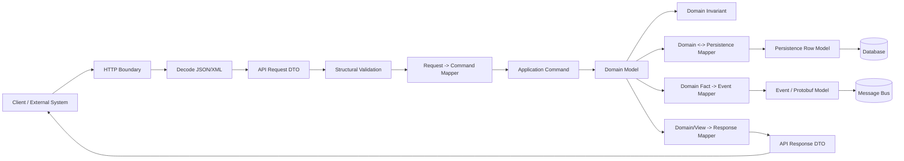
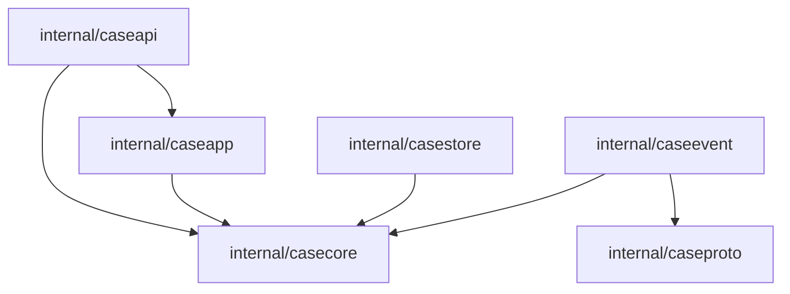
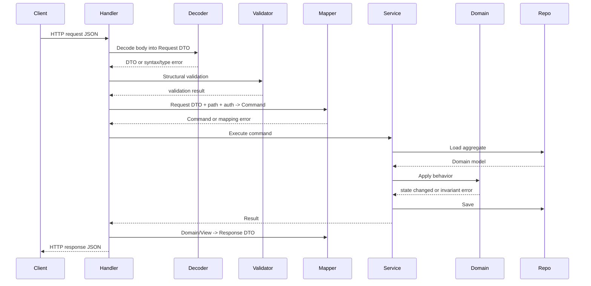

# learn-go-data-mapper-json-xml-protobuf-validation-part-002

# DTO, Domain Model, API Model, Persistence Model

> Seri: **learn-go-data-mapper-json-xml-protobuf-validation**  
> Bagian: **002 / 033**  
> Topik: **DTO, Domain Model, API Model, Persistence Model**  
> Target pembaca: **Java software engineer yang ingin menguasai Go data boundary secara production-grade**  
> Status seri: **belum selesai**

---

## Daftar Isi

1. [Tujuan Bagian Ini](#tujuan-bagian-ini)
2. [Masalah Inti: Satu Data, Banyak Makna](#masalah-inti-satu-data-banyak-makna)
3. [Mental Model: Model Bukan Bentuk Data, Tetapi Kontrak Perubahan](#mental-model-model-bukan-bentuk-data-tetapi-kontrak-perubahan)
4. [Empat Model Utama](#empat-model-utama)
5. [Tambahan Penting: Event Model, Protobuf Model, dan Validation Model](#tambahan-penting-event-model-protobuf-model-dan-validation-model)
6. [Java Engineer Trap: Membawa Entity/DTO Habit ke Go](#java-engineer-trap-membawa-entitydto-habit-ke-go)
7. [Go Approach: Boundary Eksplisit, Dependency Minimal, Mapper Sederhana](#go-approach-boundary-eksplisit-dependency-minimal-mapper-sederhana)
8. [Decision Framework: Kapan Model Boleh Digabung?](#decision-framework-kapan-model-boleh-digabung)
9. [Decision Framework: Kapan Model Harus Dipisah?](#decision-framework-kapan-model-harus-dipisah)
10. [Model Ownership Matrix](#model-ownership-matrix)
11. [Lifecycle dan Stability Matrix](#lifecycle-dan-stability-matrix)
12. [Mermaid: Peta Boundary Model](#mermaid-peta-boundary-model)
13. [Case Study: Regulatory Case Management](#case-study-regulatory-case-management)
14. [Package Layout yang Disarankan](#package-layout-yang-disarankan)
15. [Domain Model Design](#domain-model-design)
16. [API Request DTO Design](#api-request-dto-design)
17. [API Response DTO Design](#api-response-dto-design)
18. [Persistence Model Design](#persistence-model-design)
19. [Event / Integration Model Design](#event--integration-model-design)
20. [Protobuf Model Design](#protobuf-model-design)
21. [Mapping Pipeline](#mapping-pipeline)
22. [Validation Placement](#validation-placement)
23. [Nullability, Optionality, dan Zero Value](#nullability-optionality-dan-zero-value)
24. [Enum, State, dan Controlled Vocabulary](#enum-state-dan-controlled-vocabulary)
25. [Time, Money, ID, dan Value Object](#time-money-id-dan-value-object)
26. [Error Semantics pada Mapping Layer](#error-semantics-pada-mapping-layer)
27. [Backward Compatibility dan Versioning](#backward-compatibility-dan-versioning)
28. [Strict vs Lenient Boundary](#strict-vs-lenient-boundary)
29. [Mapper Implementation Patterns](#mapper-implementation-patterns)
30. [Testing Strategy untuk Model Boundary](#testing-strategy-untuk-model-boundary)
31. [Observability untuk Mapping dan Contract Failure](#observability-untuk-mapping-dan-contract-failure)
32. [Performance Considerations](#performance-considerations)
33. [Anti-Patterns](#anti-patterns)
34. [Production Checklist](#production-checklist)
35. [Latihan Desain](#latihan-desain)
36. [Ringkasan Invariant](#ringkasan-invariant)
37. [Referensi](#referensi)

---

## Tujuan Bagian Ini

Bagian ini membahas **bagaimana memisahkan dan menghubungkan model data di Go**:

- **Domain model**: model yang merepresentasikan aturan bisnis internal.
- **API model / DTO**: model yang menjadi kontrak request/response HTTP atau public API.
- **Persistence model**: model yang menjadi representasi penyimpanan database.
- **Event/integration model**: model yang menjadi kontrak message/event antar sistem.
- **Protobuf model**: model yang dihasilkan dari `.proto` sebagai schema/wire contract.
- **Validation model**: rule-layer yang menentukan data boleh masuk ke mana dan dalam kondisi apa.

Tujuan akhirnya bukan sekadar tahu istilah DTO, tetapi mampu menjawab pertanyaan desain seperti:

1. Apakah request DTO boleh langsung menjadi domain object?
2. Apakah database row struct boleh dipakai sebagai JSON response?
3. Apakah Protobuf generated struct boleh masuk sampai domain service?
4. Di mana validasi dilakukan: sebelum mapping, setelah mapping, atau di domain method?
5. Kapan field baru aman ditambahkan?
6. Kapan field tidak boleh dihapus walaupun tidak dipakai lagi?
7. Bagaimana menjaga compatibility saat API, DB, dan event contract berubah dengan kecepatan berbeda?
8. Bagaimana mencegah bug akibat `zero value`, `null`, field absent, dan default value?

Dalam Go, jawaban desain ini sering lebih penting daripada library. Go memberi building block sederhana: `struct`, method, package, interface, standard library encoder/decoder, generated Protobuf code, dan explicit error handling. Karena itu, kualitas sistem sangat bergantung pada **ketepatan boundary design**.

---

## Masalah Inti: Satu Data, Banyak Makna

Misalkan ada data berikut:

```json
{
  "caseId": "CASE-2026-000123",
  "status": "UNDER_REVIEW",
  "submittedAt": "2026-06-24T09:15:00+07:00",
  "officerId": "USR-001",
  "riskScore": 82,
  "remarks": null
}
```

Secara bentuk, ini hanya JSON object. Namun di sistem nyata, data ini dapat memiliki banyak makna:

| Sudut Pandang | Makna Data |
|---|---|
| HTTP API | payload request/response yang harus stabil untuk client |
| Domain | state case yang harus tunduk pada aturan transisi |
| Database | row/record yang harus efisien disimpan dan di-query |
| Event | fakta yang sudah terjadi dan dikonsumsi sistem lain |
| Audit | bukti historis yang tidak boleh berubah |
| UI | projection yang nyaman ditampilkan |
| Workflow | input untuk menentukan escalation/assignment |
| Compliance | artefak defensible untuk menjelaskan keputusan |

Masalah muncul ketika satu `struct` dipaksa mewakili semua makna tersebut.

Contoh Go yang tampak praktis tetapi berbahaya:

```go
type Case struct {
    ID          string     `json:"caseId" db:"case_id" validate:"required"`
    Status      string     `json:"status" db:"status" validate:"required"`
    SubmittedAt time.Time  `json:"submittedAt" db:"submitted_at"`
    OfficerID   *string    `json:"officerId,omitempty" db:"officer_id"`
    RiskScore   int        `json:"riskScore" db:"risk_score" validate:"gte=0,lte=100"`
    Remarks     *string    `json:"remarks" db:"remarks"`
}
```

Struct ini tampak efisien karena satu tipe dipakai untuk JSON, DB, dan validation. Namun secara desain ia mencampur beberapa kontrak:

- `json` tag adalah kontrak eksternal.
- `db` tag adalah kontrak persistence.
- `validate` tag adalah sebagian kontrak input.
- `time.Time` adalah representasi runtime internal.
- `Status string` terlalu longgar untuk domain invariant.
- `RiskScore int` mungkin `0` berarti nilai valid, belum dihitung, atau absent.
- `OfficerID *string` mungkin berarti unassigned, absent from payload, hidden from client, atau DB null.

Kegagalan desain bukan karena Go buruk, tetapi karena **bentuk data disamakan dengan makna data**.

---

## Mental Model: Model Bukan Bentuk Data, Tetapi Kontrak Perubahan

Cara berpikir yang lebih kuat:

> Model adalah kontrak terhadap perubahan, bukan sekadar kumpulan field.

Pertanyaan penting untuk setiap model:

1. **Siapa pemilik model ini?**
   - Tim API?
   - Domain/business?
   - Database?
   - External partner?
   - Generated toolchain?

2. **Siapa consumer-nya?**
   - Frontend?
   - Mobile app?
   - Internal service?
   - Analytics?
   - External agency?
   - Audit/compliance?

3. **Seberapa stabil model ini harus dijaga?**
   - Bisa berubah setiap sprint?
   - Harus backward compatible selama 1 tahun?
   - Tidak boleh berubah karena legal/audit?

4. **Apakah model ini boleh membawa implementation detail?**
   - DB column name?
   - JSON field name?
   - Protobuf field number?
   - UI label?
   - validation tag?

5. **Apakah model ini merepresentasikan command, query, fact, atau state?**
   - Request untuk melakukan sesuatu?
   - Response untuk membaca sesuatu?
   - Event bahwa sesuatu terjadi?
   - State saat ini?

6. **Apakah model ini canonical?**
   - Apakah semua data harus dinormalisasi ke bentuk ini?
   - Apakah boleh menyimpan data mentah?
   - Apakah boleh ada lossy transformation?

7. **Apa failure mode jika model ini berubah?**
   - API client rusak?
   - DB migration gagal?
   - Consumer event salah interpretasi?
   - Audit trail kehilangan makna?
   - Domain invariant bocor?

Jika sebuah `struct` memiliki lebih dari satu jawaban untuk pertanyaan di atas, ada indikasi kuat bahwa model tersebut sebaiknya dipisah.

---

## Empat Model Utama

### 1. Domain Model

Domain model merepresentasikan **aturan bisnis internal**.

Ciri domain model yang baik:

- Tidak bergantung pada JSON tag, XML tag, DB tag, atau Protobuf generated type.
- Menyembunyikan state yang tidak boleh diubah sembarangan.
- Memiliki method untuk operasi bermakna, bukan hanya field publik.
- Mampu menjaga invariant.
- Tidak selalu sama dengan table atau API response.
- Berorientasi pada bahasa bisnis, bukan bahasa transport.

Contoh:

```go
package casecore

import (
    "errors"
    "time"
)

type CaseID string
type OfficerID string

type CaseStatus string

const (
    CaseStatusDraft       CaseStatus = "DRAFT"
    CaseStatusSubmitted   CaseStatus = "SUBMITTED"
    CaseStatusUnderReview CaseStatus = "UNDER_REVIEW"
    CaseStatusApproved    CaseStatus = "APPROVED"
    CaseStatusRejected    CaseStatus = "REJECTED"
)

type Case struct {
    id          CaseID
    status      CaseStatus
    submittedAt *time.Time
    officerID   *OfficerID
    riskScore   *RiskScore
    remarks     string
}

type RiskScore int

func NewRiskScore(v int) (RiskScore, error) {
    if v < 0 || v > 100 {
        return 0, errors.New("risk score must be between 0 and 100")
    }
    return RiskScore(v), nil
}

func NewDraftCase(id CaseID) (*Case, error) {
    if id == "" {
        return nil, errors.New("case id is required")
    }

    return &Case{
        id:     id,
        status: CaseStatusDraft,
    }, nil
}

func (c *Case) Submit(now time.Time) error {
    if c.status != CaseStatusDraft {
        return errors.New("only draft case can be submitted")
    }

    c.status = CaseStatusSubmitted
    c.submittedAt = &now
    return nil
}

func (c *Case) Assign(officerID OfficerID) error {
    if officerID == "" {
        return errors.New("officer id is required")
    }
    if c.status != CaseStatusSubmitted && c.status != CaseStatusUnderReview {
        return errors.New("case cannot be assigned in current status")
    }

    c.officerID = &officerID
    c.status = CaseStatusUnderReview
    return nil
}

func (c *Case) ID() CaseID { return c.id }
func (c *Case) Status() CaseStatus { return c.status }
func (c *Case) SubmittedAt() *time.Time { return c.submittedAt }
func (c *Case) OfficerID() *OfficerID { return c.officerID }
func (c *Case) RiskScore() *RiskScore { return c.riskScore }
func (c *Case) Remarks() string { return c.remarks }
```

Perhatikan:

- Field tidak diekspor.
- Mutasi melalui method.
- Invariant dijaga di domain.
- Tidak ada `json` tag.
- Tidak ada `db` tag.
- Tidak ada `validate` tag transport.

Domain model bukan DTO. Domain model adalah pusat kebenaran bisnis.

### 2. API Request DTO

API request DTO merepresentasikan **input dari client**.

Ciri request DTO:

- Field biasanya diekspor agar decoder dapat mengisi nilai.
- Memiliki `json` atau `xml` tag.
- Boleh memiliki validation tag untuk validasi struktural input.
- Tidak boleh langsung dipercaya sebagai domain object.
- Harus bisa membedakan absent/null/zero bila API membutuhkan semantics tersebut.
- Berorientasi pada kontrak eksternal.

Contoh:

```go
package caseapi

type CreateCaseRequest struct {
    CaseID  string  `json:"caseId" validate:"required"`
    Remarks *string `json:"remarks,omitempty" validate:"omitempty,max=2000"`
}

type AssignCaseRequest struct {
    OfficerID string `json:"officerId" validate:"required"`
}
```

Request DTO adalah representasi dari apa yang client kirim. Ia belum tentu valid secara domain.

Contoh:

```json
{
  "caseId": "CASE-2026-000123",
  "remarks": "urgent"
}
```

Secara JSON valid, secara DTO valid, tetapi domain masih perlu mengecek:

- Apakah `caseId` formatnya benar?
- Apakah case id sudah ada?
- Apakah user boleh membuat case ini?
- Apakah remarks boleh diberikan pada tahap ini?
- Apakah ada duplicate submission?

### 3. API Response DTO

API response DTO merepresentasikan **output yang dijanjikan ke client**.

Ciri response DTO:

- Stabil untuk consumer.
- Bisa berbeda dari domain model.
- Bisa menyembunyikan internal state.
- Bisa memformat ulang field agar nyaman untuk client.
- Bisa menyertakan derived field.
- Tidak harus sama dengan request DTO.

Contoh:

```go
package caseapi

type CaseResponse struct {
    CaseID      string  `json:"caseId"`
    Status      string  `json:"status"`
    StatusLabel string  `json:"statusLabel"`
    SubmittedAt *string `json:"submittedAt,omitempty"`
    OfficerID   *string `json:"officerId,omitempty"`
    RiskScore   *int    `json:"riskScore,omitempty"`
    CanAssign   bool    `json:"canAssign"`
    CanApprove  bool    `json:"canApprove"`
}
```

Response DTO boleh mengandung field yang bukan domain state murni:

- `StatusLabel`: presentation helper.
- `CanAssign`: authorization/workflow projection.
- `CanApprove`: action availability.

Namun hati-hati: field seperti `CanApprove` bisa menjadi kontrak API. Jika client bergantung padanya, field itu harus diperlakukan sebagai stable contract.

### 4. Persistence Model

Persistence model merepresentasikan **bentuk penyimpanan**.

Ciri persistence model:

- Mengikuti struktur database atau storage engine.
- Boleh memiliki `db` tag atau scan helper.
- Boleh memakai tipe yang cocok dengan DB driver.
- Tidak harus sama dengan domain model.
- Bisa membawa field teknis seperti version, created_at, updated_at, deleted_at.
- Bisa menyimpan normalized atau denormalized data.

Contoh:

```go
package casestore

import (
    "database/sql"
    "time"
)

type CaseRow struct {
    ID          string
    Status      string
    SubmittedAt sql.NullTime
    OfficerID   sql.NullString
    RiskScore   sql.NullInt64
    Remarks     sql.NullString
    Version     int64
    CreatedAt   time.Time
    UpdatedAt   time.Time
}
```

Persistence model fokus pada penyimpanan, bukan API convenience.

DB mungkin menyimpan:

- `status` sebagai string.
- `submitted_at` sebagai timestamp nullable.
- `officer_id` nullable.
- `risk_score` nullable.
- `version` untuk optimistic locking.

Domain mungkin tidak ingin mengekspos `Version`, `CreatedAt`, atau `UpdatedAt` kepada API tertentu.

---

## Tambahan Penting: Event Model, Protobuf Model, dan Validation Model

Selain empat model utama, sistem modern biasanya punya model tambahan.

### Event Model

Event model merepresentasikan **fakta yang sudah terjadi**.

Contoh:

```go
type CaseAssignedEvent struct {
    EventID    string `json:"eventId"`
    EventType  string `json:"eventType"`
    OccurredAt string `json:"occurredAt"`
    CaseID     string `json:"caseId"`
    OfficerID  string `json:"officerId"`
    Version    int64  `json:"version"`
}
```

Event bukan command.

- Command: “assign this case”.
- Event: “case was assigned”.

Event juga bukan domain aggregate penuh. Event adalah kontrak historis yang sering harus bertahan lama. Consumer lama mungkin masih membaca event versi lama. Karena itu event model memiliki compatibility pressure lebih besar daripada internal domain model.

### Protobuf Model

Protobuf model biasanya dihasilkan dari `.proto`:

```proto
syntax = "proto3";

package case.v1;

message CaseAssigned {
  string event_id = 1;
  string case_id = 2;
  string officer_id = 3;
  int64 occurred_at_unix_ms = 4;
  int64 version = 5;
}
```

Generated Go type tidak sebaiknya otomatis menjadi domain model.

Alasannya:

- Field number adalah wire contract jangka panjang.
- Generated code mengikuti aturan Protobuf runtime.
- Presence/default behavior berbeda dari domain semantics.
- API generated code dapat berubah mengikuti Protobuf Go API evolution.
- Protobuf JSON mapping punya aturan sendiri.

Protobuf generated struct adalah contract/wire model, bukan pusat domain.

### Validation Model

Validation bukan selalu model struct terpisah, tetapi ia adalah layer konseptual penting.

Contoh validasi:

| Level | Contoh |
|---|---|
| Syntax | JSON harus well-formed |
| Structural | `caseId` wajib ada dan string |
| Field semantic | `riskScore` harus 0..100 |
| Cross-field | `submittedAt` wajib ada jika status `SUBMITTED` |
| Domain invariant | case hanya bisa approve setelah review selesai |
| Persistence constraint | `case_id` unique |
| Authorization | user boleh assign case ini |
| Workflow | current transition allowed |
| Integration | external agency code harus dikenal |

Semua validasi tidak boleh ditumpuk di satu tempat. Yang benar adalah menempatkan rule sesuai ownership-nya.

---

## Java Engineer Trap: Membawa Entity/DTO Habit ke Go

Sebagai Java engineer, kemungkinan besar Anda familiar dengan pola seperti:

- JPA entity.
- DTO request/response.
- Jackson annotation.
- Bean Validation annotation.
- MapStruct mapper.
- Lombok getter/setter.
- JAXB XML binding.
- Protobuf generated classes.
- Spring controller/service/repository separation.

Di Java, framework sering membentuk struktur kode:

```java
@Entity
@Table(name = "cases")
public class CaseEntity {
    @Id
    @Column(name = "case_id")
    private String caseId;

    @Column(name = "status")
    private String status;
}

public record CreateCaseRequest(
    @NotBlank String caseId,
    String remarks
) {}

@Mapper
public interface CaseMapper {
    Case toDomain(CaseEntity entity);
    CaseResponse toResponse(Case domain);
}
```

Pola ini tidak salah. Namun bila dibawa mentah ke Go, biasanya muncul dua ekstrem:

### Ekstrem 1: Semua Dibuat Layered seperti Java Enterprise

Contoh:

```text
controller -> dto -> mapper -> service -> mapper -> entity -> repository -> mapper -> response
```

Di Go, ini sering menghasilkan boilerplate berlebihan bila domain-nya sederhana.

Masalahnya:

- Banyak file tipis tanpa logic.
- Mapper menjadi ritual, bukan boundary bermakna.
- Package dependency membingungkan.
- Test terlalu fokus ke mekanik mapping, bukan invariant.

### Ekstrem 2: Semua Disatukan dalam Satu Struct

Contoh:

```go
type Case struct {
    ID     string `json:"caseId" db:"case_id" validate:"required"`
    Status string `json:"status" db:"status" validate:"required"`
}
```

Ini tampak idiomatik karena sederhana, tetapi sering rusak ketika sistem membesar.

Masalahnya:

- API change memaksa DB/domain ikut berubah.
- DB column leak ke transport.
- Response accidentally expose internal fields.
- Input validation bercampur dengan domain invariant.
- Backward compatibility sulit dikendalikan.

Go yang matang biasanya berada di tengah:

> Pisahkan model saat ada perbedaan ownership, lifecycle, compatibility, atau invariant. Jangan pisahkan hanya demi ritual layer.

---

## Go Approach: Boundary Eksplisit, Dependency Minimal, Mapper Sederhana

Go tidak mendorong framework-heavy magic. Maka desain yang kuat biasanya:

1. Boundary eksplisit.
2. Dependency arah jelas.
3. Struct sederhana.
4. Mapper manual untuk boundary penting.
5. Validation eksplisit.
6. Generated code dibatasi di edge.
7. Domain package tidak tahu JSON/XML/DB/Protobuf.

Prinsip dasar:

```text
External representation -> DTO -> validation -> mapping -> domain command/value -> domain behavior -> persistence/event mapping -> external side effect
```

Bukan:

```text
JSON -> global struct -> DB -> event -> response
```

### Bentuk Idiomatik di Go

```go
func (h *Handler) CreateCase(w http.ResponseWriter, r *http.Request) {
    var req caseapi.CreateCaseRequest
    if err := decodeJSON(r, &req); err != nil {
        writeBadRequest(w, err)
        return
    }

    if err := h.validator.Struct(req); err != nil {
        writeValidationError(w, err)
        return
    }

    cmd, err := caseapi.CreateCaseCommandFromRequest(req)
    if err != nil {
        writeValidationError(w, err)
        return
    }

    c, err := h.service.CreateCase(r.Context(), cmd)
    if err != nil {
        writeDomainOrAppError(w, err)
        return
    }

    resp := caseapi.CaseResponseFromDomain(c)
    writeJSON(w, http.StatusCreated, resp)
}
```

Di sini ada beberapa boundary jelas:

- Decode JSON error.
- Struct validation error.
- Request-to-command mapping error.
- Application/domain error.
- Domain-to-response mapping.

Masing-masing error memiliki makna berbeda.

---

## Decision Framework: Kapan Model Boleh Digabung?

Tidak semua sistem perlu banyak model. Memisahkan model tanpa alasan juga menambah biaya.

Model boleh digabung jika semua kondisi berikut terpenuhi:

1. **Ownership sama**  
   Model hanya dipakai internal satu package atau satu service.

2. **Lifecycle sama**  
   Perubahan field mengikuti ritme yang sama.

3. **Compatibility pressure rendah**  
   Tidak ada client eksternal/consumer event yang harus dijaga lama.

4. **Tidak ada invariant kompleks**  
   Data hanya container sederhana.

5. **Tidak ada data sensitif/internal yang rawan bocor**  
   Semua field aman terekspos.

6. **Tidak ada mismatch nullability**  
   Zero value cukup merepresentasikan state.

7. **Tidak ada representasi berbeda antara API dan DB**  
   Field API hampir sama dengan column DB.

8. **Tidak ada schema evolution jangka panjang**  
   Payload bukan public contract.

Contoh yang masih wajar digabung:

```go
type HealthResponse struct {
    Status  string `json:"status"`
    Version string `json:"version"`
}
```

Atau configuration internal:

```go
type RetryConfig struct {
    MaxAttempts int           `json:"maxAttempts"`
    BaseDelay   time.Duration `json:"baseDelay"`
}
```

Namun begitu model masuk ke API publik, DB penting, event stream, audit, atau domain workflow, keputusan harus lebih hati-hati.

---

## Decision Framework: Kapan Model Harus Dipisah?

Model harus dipisah jika salah satu kondisi berikut benar:

### 1. API Field Berbeda dari Domain Field

Contoh API:

```json
{
  "caseId": "CASE-001",
  "status": "Under Review"
}
```

Domain:

```go
type CaseStatus string

const CaseStatusUnderReview CaseStatus = "UNDER_REVIEW"
```

Jika API menyajikan label manusia, sedangkan domain memakai enum canonical, model sebaiknya dipisah.

### 2. DB Memiliki Field Teknis

DB row:

```go
type CaseRow struct {
    ID        string
    Status    string
    Version   int64
    CreatedAt time.Time
    UpdatedAt time.Time
    DeletedAt sql.NullTime
}
```

API response tidak selalu boleh mengekspos `Version`, `DeletedAt`, atau internal timestamp.

### 3. Domain Invariant Lebih Ketat dari Input Payload

Request:

```go
type AssignCaseRequest struct {
    OfficerID string `json:"officerId" validate:"required"`
}
```

Domain rule:

- case harus dalam status `SUBMITTED` atau `UNDER_REVIEW`.
- officer harus aktif.
- officer harus berada dalam unit yang sama.
- officer tidak boleh assign ke dirinya sendiri untuk case tertentu.

Request DTO tidak cukup.

### 4. Consumer Eksternal Membutuhkan Compatibility

Event model harus stabil karena consumer lama bisa masih berjalan.

```go
type CaseSubmittedV1 struct {
    CaseID      string `json:"caseId"`
    SubmittedAt string `json:"submittedAt"`
}
```

Domain boleh berubah, tetapi event lama tidak boleh sembarangan diubah.

### 5. Format Berbeda

Satu domain object mungkin diekspos sebagai:

- JSON REST API.
- XML integration payload.
- Protobuf event.
- DB row.

Jika satu model diberi semua tag:

```go
type Case struct {
    ID string `json:"caseId" xml:"case-id" db:"case_id" protobuf:"bytes,1,opt,name=case_id,json=caseId,proto3"`
}
```

Ini tanda kuat boundary sudah bercampur.

### 6. Security dan Privacy Berbeda

Domain mungkin punya:

```go
type User struct {
    id           UserID
    email        Email
    passwordHash PasswordHash
    roles        []Role
    lastLoginIP  netip.Addr
}
```

Response tidak boleh menyertakan `passwordHash` dan mungkin tidak boleh menyertakan `lastLoginIP`.

### 7. Partial Update Membutuhkan Presence Tracking

PATCH request:

```json
{
  "remarks": null
}
```

Maknanya bisa berbeda dari:

```json
{}
```

Jika struct biasa tidak dapat membedakan absent vs null, request model perlu tipe khusus.

### 8. Field Punya Meaning Berbeda di Command dan Response

Request:

```json
{
  "status": "APPROVED"
}
```

Mungkin tidak boleh diterima karena status harus berubah melalui command `ApproveCase`, bukan ditulis langsung.

Response boleh menunjukkan status, tetapi request tidak boleh menerima status mentah.

---

## Model Ownership Matrix

| Model | Owner | Consumer | Perubahan Aman? | Tidak Boleh Tergantung Pada |
|---|---|---|---|---|
| Domain model | Domain/application team | Domain service, use case | Relatif bebas selama invariant tetap | JSON/XML/DB/Protobuf tag |
| API request DTO | API contract owner | External/internal API client | Harus compatibility-aware | DB column, internal invariant detail |
| API response DTO | API contract owner | Client/UI/integrator | Harus compatibility-aware | Persistence implementation |
| Persistence model | Storage owner | Repository/data access | Terikat migration DB | Public API shape |
| Event model | Event contract owner | Downstream consumers | Sangat hati-hati | Current domain object shape |
| Protobuf model | Proto schema owner | Generated code users | Tunduk pada wire compatibility | Runtime-only domain assumptions |
| Validation rules | Tergantung level | Decoder/API/domain/storage | Berubah sesuai ownership | Semua rule dalam satu layer |

Matrix ini membantu menentukan dependency arah.

Domain tidak boleh import API package. API package boleh memanggil mapper ke domain. Repository boleh map row ke domain, tetapi domain tidak tahu row.

---

## Lifecycle dan Stability Matrix

| Model | Lifecycle | Stability Pressure | Contoh Perubahan |
|---|---|---|---|
| Request DTO | API version lifecycle | Tinggi jika public | tambah optional field, deprecate field |
| Response DTO | API version lifecycle | Tinggi | tambah field aman, rename field breaking |
| Domain model | Business lifecycle | Medium-high | ubah state machine, tambah invariant |
| Persistence row | DB migration lifecycle | High operasional | tambah column, backfill, index |
| Event model | Consumer lifecycle | Sangat tinggi | event versioning, schema compatibility |
| Protobuf schema | Wire contract lifecycle | Sangat tinggi | reserve field, tambah field number baru |
| Internal view model | UI/application lifecycle | Medium | tambah label, derived field |

Rule praktis:

> Semakin luas consumer model, semakin lambat dan hati-hati perubahan model tersebut.

---

## Mermaid: Peta Boundary Model



Diagram ini menunjukkan bahwa DTO, domain, row, dan event bukan layer kosmetik. Masing-masing adalah boundary dengan error semantics, ownership, dan compatibility berbeda.

---

## Case Study: Regulatory Case Management

Kita gunakan contoh sistem regulatory/case management karena domain seperti ini kaya dengan invariant.

### Business Scenario

Sistem mengelola enforcement case. Case memiliki lifecycle:

```text
DRAFT -> SUBMITTED -> UNDER_REVIEW -> DECISION_PENDING -> APPROVED / REJECTED -> CLOSED
```

Ada aturan:

1. Case hanya bisa submit dari draft.
2. Case harus punya applicant sebelum submit.
3. Case hanya bisa assign setelah submitted.
4. Officer tidak boleh approve case yang dia review sendiri jika segregation-of-duty berlaku.
5. Decision harus punya reason code.
6. Closed case tidak boleh dimodifikasi kecuali reopening workflow.
7. Semua transition harus diaudit.
8. Event harus diterbitkan untuk integrasi downstream.

### Mengapa Satu Struct Tidak Cukup?

Satu struct seperti ini terlalu lemah:

```go
type Case struct {
    ID          string  `json:"caseId" db:"case_id" validate:"required"`
    Status      string  `json:"status" db:"status" validate:"required"`
    ApplicantID string  `json:"applicantId" db:"applicant_id" validate:"required"`
    OfficerID   *string `json:"officerId" db:"officer_id"`
    Decision    *string `json:"decision" db:"decision"`
    ReasonCode  *string `json:"reasonCode" db:"reason_code"`
}
```

Karena struct ini mengizinkan banyak state ilegal:

- `Status = CLOSED` tetapi `Decision = nil`.
- `Status = DRAFT` tetapi `OfficerID != nil`.
- `Decision = APPROVED` tetapi `ReasonCode = nil`.
- `OfficerID` berubah langsung tanpa event audit.
- API client mengirim `Status = APPROVED` dan sistem menerima begitu saja.

Domain model harus mencegah state ilegal, bukan hanya menyimpan field.

---

## Package Layout yang Disarankan

Contoh layout untuk service dengan boundary bersih:

```text
case-service/
  go.mod
  internal/
    casecore/
      case.go
      status.go
      decision.go
      errors.go
      command.go
    caseapp/
      service.go
      repository.go
      clock.go
      authorizer.go
    caseapi/
      http_handler.go
      request.go
      response.go
      mapper.go
      validation.go
    casestore/
      postgres_repository.go
      row.go
      mapper.go
    caseevent/
      event.go
      mapper.go
      publisher.go
    caseproto/
      case.pb.go
      case_grpc.pb.go
```

### Dependency Direction



Prinsip:

- `casecore` tidak import `caseapi`, `casestore`, atau `caseproto`.
- `caseapp` orchestrates use case dan bergantung pada abstraction repository/publisher.
- `caseapi` tahu HTTP/JSON dan mapper ke command/domain.
- `casestore` tahu DB dan mapping row.
- `caseevent` tahu event schema dan Protobuf/JSON event.
- Generated Protobuf code ditempatkan di boundary integration, bukan di domain core.

### Varian untuk Aplikasi Kecil

Untuk aplikasi kecil, layout bisa lebih sederhana:

```text
internal/
  case/
    domain.go
    service.go
    http.go
    store.go
    mapper.go
```

Tetap bisa dipisahkan secara konseptual walaupun package-nya tidak banyak.

Rule-nya:

> Jangan menambah package hanya agar terlihat enterprise. Tambah package saat boundary dependency perlu dilindungi.

---

## Domain Model Design

Domain model sebaiknya menjawab pertanyaan:

1. State apa yang legal?
2. Transition apa yang legal?
3. Siapa yang boleh mengubah state?
4. Data apa yang wajib ada sebelum transition?
5. Apa fakta yang harus dihasilkan setelah transition?

Contoh domain model:

```go
package casecore

import (
    "errors"
    "fmt"
    "time"
)

type CaseID string
type ApplicantID string
type OfficerID string
type ReasonCode string

type Status string

const (
    StatusDraft           Status = "DRAFT"
    StatusSubmitted       Status = "SUBMITTED"
    StatusUnderReview     Status = "UNDER_REVIEW"
    StatusDecisionPending Status = "DECISION_PENDING"
    StatusApproved        Status = "APPROVED"
    StatusRejected        Status = "REJECTED"
    StatusClosed          Status = "CLOSED"
)

type Decision string

const (
    DecisionApprove Decision = "APPROVE"
    DecisionReject  Decision = "REJECT"
)

type Case struct {
    id          CaseID
    applicantID ApplicantID
    status      Status
    officerID   *OfficerID
    decision    *Decision
    reasonCode  *ReasonCode
    submittedAt *time.Time
    decidedAt   *time.Time
    version     int64
}

type NewCaseParams struct {
    ID          CaseID
    ApplicantID ApplicantID
}

func NewCase(p NewCaseParams) (*Case, error) {
    if p.ID == "" {
        return nil, errors.New("case id is required")
    }
    if p.ApplicantID == "" {
        return nil, errors.New("applicant id is required")
    }

    return &Case{
        id:          p.ID,
        applicantID: p.ApplicantID,
        status:      StatusDraft,
        version:     1,
    }, nil
}

func RehydrateCase(s Snapshot) (*Case, error) {
    c := &Case{
        id:          s.ID,
        applicantID: s.ApplicantID,
        status:      s.Status,
        officerID:   s.OfficerID,
        decision:    s.Decision,
        reasonCode:  s.ReasonCode,
        submittedAt: s.SubmittedAt,
        decidedAt:   s.DecidedAt,
        version:     s.Version,
    }

    if err := c.validateInvariants(); err != nil {
        return nil, err
    }

    return c, nil
}

type Snapshot struct {
    ID          CaseID
    ApplicantID ApplicantID
    Status      Status
    OfficerID   *OfficerID
    Decision    *Decision
    ReasonCode  *ReasonCode
    SubmittedAt *time.Time
    DecidedAt   *time.Time
    Version     int64
}

func (c *Case) Snapshot() Snapshot {
    return Snapshot{
        ID:          c.id,
        ApplicantID: c.applicantID,
        Status:      c.status,
        OfficerID:   c.officerID,
        Decision:    c.decision,
        ReasonCode:  c.reasonCode,
        SubmittedAt: c.submittedAt,
        DecidedAt:   c.decidedAt,
        Version:     c.version,
    }
}

func (c *Case) Submit(now time.Time) error {
    if c.status != StatusDraft {
        return fmt.Errorf("cannot submit case in status %s", c.status)
    }
    c.status = StatusSubmitted
    c.submittedAt = &now
    c.version++
    return nil
}

func (c *Case) Assign(officerID OfficerID) error {
    if officerID == "" {
        return errors.New("officer id is required")
    }
    if c.status != StatusSubmitted && c.status != StatusUnderReview {
        return fmt.Errorf("cannot assign case in status %s", c.status)
    }

    c.officerID = &officerID
    c.status = StatusUnderReview
    c.version++
    return nil
}

func (c *Case) Decide(decision Decision, reason ReasonCode, now time.Time) error {
    if c.status != StatusDecisionPending && c.status != StatusUnderReview {
        return fmt.Errorf("cannot decide case in status %s", c.status)
    }
    if reason == "" {
        return errors.New("reason code is required")
    }
    if decision != DecisionApprove && decision != DecisionReject {
        return errors.New("invalid decision")
    }

    c.decision = &decision
    c.reasonCode = &reason
    c.decidedAt = &now
    if decision == DecisionApprove {
        c.status = StatusApproved
    } else {
        c.status = StatusRejected
    }
    c.version++
    return nil
}

func (c *Case) validateInvariants() error {
    switch c.status {
    case StatusDraft:
        if c.submittedAt != nil {
            return errors.New("draft case must not have submitted timestamp")
        }
    case StatusSubmitted, StatusUnderReview, StatusDecisionPending:
        if c.submittedAt == nil {
            return errors.New("submitted/review case must have submitted timestamp")
        }
    case StatusApproved, StatusRejected:
        if c.submittedAt == nil {
            return errors.New("decided case must have submitted timestamp")
        }
        if c.decision == nil || c.reasonCode == nil || c.decidedAt == nil {
            return errors.New("decided case must have decision, reason, and decided timestamp")
        }
    case StatusClosed:
        // Closed rules may depend on archival lifecycle.
    default:
        return fmt.Errorf("unknown status %q", c.status)
    }

    return nil
}
```

### Mengapa Ada `Snapshot`?

Karena persistence perlu mengeluarkan dan memasukkan state, tetapi kita tidak ingin membuka semua field domain.

`Snapshot` adalah kompromi:

- Domain tetap menjaga field private.
- Repository bisa rehydrate object.
- Mapper bisa membaca state tanpa reflection.
- Invariant tetap dicek saat rehydration.

Namun `Snapshot` bukan API DTO. Ia adalah representasi internal domain state untuk mapping.

---

## API Request DTO Design

Request DTO harus didesain sesuai use case, bukan sesuai table.

### Command-Oriented Request

Daripada membuat satu endpoint update fleksibel seperti:

```go
type UpdateCaseRequest struct {
    Status    *string `json:"status,omitempty"`
    OfficerID *string `json:"officerId,omitempty"`
    Decision  *string `json:"decision,omitempty"`
}
```

Lebih baik buat request sesuai intent:

```go
type SubmitCaseRequest struct {
    CaseID string `json:"caseId" validate:"required"`
}

type AssignCaseRequest struct {
    OfficerID string `json:"officerId" validate:"required"`
}

type DecideCaseRequest struct {
    Decision   string `json:"decision" validate:"required,oneof=APPROVE REJECT"`
    ReasonCode string `json:"reasonCode" validate:"required"`
}
```

Mengapa?

Karena command-oriented DTO membuat invariant lebih eksplisit:

- Assign case tidak mengubah decision.
- Decide case tidak mengubah officer.
- Submit case tidak mengizinkan client memilih status.

### Request DTO Bukan Domain Command Selalu

Kadang request DTO sama dengan command, tetapi sering ada mapping:

```go
package caseapi

import "example.com/app/internal/casecore"

type AssignCaseRequest struct {
    OfficerID string `json:"officerId" validate:"required"`
}

type AssignCaseCommand struct {
    CaseID    casecore.CaseID
    OfficerID casecore.OfficerID
    ActorID   string
}

func AssignCommandFromRequest(caseID string, actorID string, req AssignCaseRequest) (AssignCaseCommand, error) {
    if caseID == "" {
        return AssignCaseCommand{}, ErrMissingCaseID
    }
    if req.OfficerID == "" {
        return AssignCaseCommand{}, ErrMissingOfficerID
    }

    return AssignCaseCommand{
        CaseID:    casecore.CaseID(caseID),
        OfficerID: casecore.OfficerID(req.OfficerID),
        ActorID:   actorID,
    }, nil
}
```

Command biasanya mengandung data dari banyak sumber:

- URL path: `caseID`.
- Body: `officerID`.
- Auth context: `actorID`.
- Header: correlation/request id.
- Server time: clock.

Karena itu request body DTO jarang cukup menjadi command lengkap.

### Request DTO untuk PATCH

PATCH membutuhkan presence tracking.

Salah satu pattern:

```go
type Optional[T any] struct {
    Set   bool
    Valid bool
    Value T
}
```

Makna:

| JSON | Set | Valid | Meaning |
|---|---:|---:|---|
| field absent | false | false | tidak mengubah field |
| `"field": null` | true | false | clear field |
| `"field": "x"` | true | true | set field ke x |

Implementasi lengkap custom `UnmarshalJSON` akan dibahas di bagian JSON optionality, tetapi arsitektur modelnya sudah perlu dipahami di sini.

PATCH DTO tidak boleh disamakan dengan domain model karena domain model biasanya tidak ingin field berada dalam state “not provided”. Itu konsep transport, bukan domain state.

---

## API Response DTO Design

Response DTO adalah kontrak baca. Ia perlu didesain untuk consumer.

### Response Bukan Domain Dump

Domain snapshot:

```go
type Snapshot struct {
    ID          CaseID
    ApplicantID ApplicantID
    Status      Status
    OfficerID   *OfficerID
    Decision    *Decision
    ReasonCode  *ReasonCode
    SubmittedAt *time.Time
    DecidedAt   *time.Time
    Version     int64
}
```

Response DTO:

```go
type CaseResponse struct {
    CaseID      string  `json:"caseId"`
    ApplicantID string  `json:"applicantId"`
    Status      string  `json:"status"`
    StatusLabel string  `json:"statusLabel"`
    OfficerID   *string `json:"officerId,omitempty"`
    SubmittedAt *string `json:"submittedAt,omitempty"`
    DecidedAt   *string `json:"decidedAt,omitempty"`
    Actions     Actions `json:"actions"`
}

type Actions struct {
    CanAssign bool `json:"canAssign"`
    CanDecide bool `json:"canDecide"`
    CanClose  bool `json:"canClose"`
}
```

Mapping:

```go
func CaseResponseFromSnapshot(s casecore.Snapshot, policy ActionPolicy) CaseResponse {
    return CaseResponse{
        CaseID:      string(s.ID),
        ApplicantID: string(s.ApplicantID),
        Status:      string(s.Status),
        StatusLabel: statusLabel(s.Status),
        OfficerID:   optionalOfficerID(s.OfficerID),
        SubmittedAt: optionalTimeRFC3339(s.SubmittedAt),
        DecidedAt:   optionalTimeRFC3339(s.DecidedAt),
        Actions: Actions{
            CanAssign: policy.CanAssign(s),
            CanDecide: policy.CanDecide(s),
            CanClose:  policy.CanClose(s),
        },
    }
}
```

### Response Versioning

API response field yang sudah dipublikasikan tidak boleh dianggap internal.

Tambah field biasanya aman:

```json
{
  "caseId": "CASE-001",
  "status": "UNDER_REVIEW",
  "statusLabel": "Under Review"
}
```

Namun rename field breaking:

```diff
- "caseId": "CASE-001"
+ "id": "CASE-001"
```

Mengubah meaning juga breaking walaupun nama field sama:

```diff
- "status": "UNDER_REVIEW"
+ "status": "Under Review"
```

Karena itu response DTO harus diperlakukan sebagai contract.

---

## Persistence Model Design

Persistence model harus mengikuti kebutuhan storage.

### SQL Row Struct

```go
package casestore

import (
    "database/sql"
    "time"
)

type CaseRow struct {
    ID          string
    ApplicantID string
    Status      string
    OfficerID   sql.NullString
    Decision    sql.NullString
    ReasonCode  sql.NullString
    SubmittedAt sql.NullTime
    DecidedAt   sql.NullTime
    Version     int64
    CreatedAt   time.Time
    UpdatedAt   time.Time
}
```

DB null memakai `sql.NullString`, `sql.NullTime`, dan sejenisnya untuk membedakan null dari zero value.

### Row to Domain Snapshot

```go
func snapshotFromRow(r CaseRow) (casecore.Snapshot, error) {
    var officerID *casecore.OfficerID
    if r.OfficerID.Valid {
        v := casecore.OfficerID(r.OfficerID.String)
        officerID = &v
    }

    var decision *casecore.Decision
    if r.Decision.Valid {
        v := casecore.Decision(r.Decision.String)
        decision = &v
    }

    var reason *casecore.ReasonCode
    if r.ReasonCode.Valid {
        v := casecore.ReasonCode(r.ReasonCode.String)
        reason = &v
    }

    var submittedAt *time.Time
    if r.SubmittedAt.Valid {
        v := r.SubmittedAt.Time.UTC()
        submittedAt = &v
    }

    var decidedAt *time.Time
    if r.DecidedAt.Valid {
        v := r.DecidedAt.Time.UTC()
        decidedAt = &v
    }

    return casecore.Snapshot{
        ID:          casecore.CaseID(r.ID),
        ApplicantID: casecore.ApplicantID(r.ApplicantID),
        Status:      casecore.Status(r.Status),
        OfficerID:   officerID,
        Decision:    decision,
        ReasonCode:  reason,
        SubmittedAt: submittedAt,
        DecidedAt:   decidedAt,
        Version:     r.Version,
    }, nil
}
```

### Domain Snapshot to Row

```go
func rowFromSnapshot(s casecore.Snapshot, now time.Time) CaseRow {
    return CaseRow{
        ID:          string(s.ID),
        ApplicantID: string(s.ApplicantID),
        Status:      string(s.Status),
        OfficerID:   nullStringFromPtr(s.OfficerID),
        Decision:    nullStringFromPtr(s.Decision),
        ReasonCode:  nullStringFromPtr(s.ReasonCode),
        SubmittedAt: nullTimeFromPtr(s.SubmittedAt),
        DecidedAt:   nullTimeFromPtr(s.DecidedAt),
        Version:     s.Version,
        UpdatedAt:   now,
    }
}

func nullStringFromPtr[T ~string](v *T) sql.NullString {
    if v == nil {
        return sql.NullString{}
    }
    return sql.NullString{String: string(*v), Valid: true}
}

func nullTimeFromPtr(v *time.Time) sql.NullTime {
    if v == nil {
        return sql.NullTime{}
    }
    return sql.NullTime{Time: v.UTC(), Valid: true}
}
```

### Kenapa Tidak Langsung Scan ke Domain?

Bisa saja untuk kasus sederhana. Namun untuk domain dengan invariant, scan langsung ke domain field private tidak natural.

Row model berguna karena:

- DB null handling eksplisit.
- DB type conversion dikontrol.
- Migration lebih mudah.
- Rehydration invariant bisa diuji.
- Persistence detail tidak bocor ke domain.

---

## Event / Integration Model Design

Event model harus merepresentasikan fakta stabil.

### Event JSON

```go
package caseevent

type CaseAssignedV1 struct {
    EventID    string `json:"eventId"`
    EventType  string `json:"eventType"`
    EventTime  string `json:"eventTime"`
    CaseID     string `json:"caseId"`
    OfficerID  string `json:"officerId"`
    CaseVersion int64 `json:"caseVersion"`
}
```

Mapping:

```go
func NewCaseAssignedV1(eventID string, eventTime time.Time, s casecore.Snapshot) (CaseAssignedV1, error) {
    if s.OfficerID == nil {
        return CaseAssignedV1{}, errors.New("assigned event requires officer id")
    }

    return CaseAssignedV1{
        EventID:     eventID,
        EventType:   "case.assigned.v1",
        EventTime:   eventTime.UTC().Format(time.RFC3339Nano),
        CaseID:      string(s.ID),
        OfficerID:   string(*s.OfficerID),
        CaseVersion: s.Version,
    }, nil
}
```

Event mapper dapat gagal. Itu penting.

Jika domain state tidak memenuhi syarat untuk event tertentu, lebih baik fail cepat daripada menerbitkan event tidak valid.

### Event Compatibility

Event tidak boleh berubah seenaknya. Consumer bisa saja:

- belum deploy versi baru,
- menyimpan event lama,
- melakukan replay dari event history,
- memakai schema registry,
- menjalankan analytics pipeline lama.

Aturan umum:

- Tambah field optional biasanya aman.
- Rename field breaking.
- Hapus field breaking.
- Ubah type breaking.
- Ubah meaning breaking.
- Ubah timezone/format timestamp breaking.
- Ubah enum value dapat breaking.

### Event Bukan Response DTO

Response DTO boleh mengandung action availability:

```json
{
  "caseId": "CASE-001",
  "actions": {
    "canAssign": false
  }
}
```

Event tidak sebaiknya membawa field presentational seperti itu, kecuali memang fakta bisnis yang perlu dipublikasikan.

---

## Protobuf Model Design

Protobuf model adalah schema-first contract.

Contoh:

```proto
syntax = "proto3";

package enforcement.case.v1;

option go_package = "example.com/app/gen/enforcement/case/v1;casev1";

message CaseAssigned {
  string event_id = 1;
  string case_id = 2;
  string officer_id = 3;
  int64 occurred_at_unix_ms = 4;
  int64 case_version = 5;
}
```

Generated Go type mungkin terlihat seperti struct biasa, tetapi ia bukan domain struct.

### Mengapa Generated Protobuf Type Tidak Dijadikan Domain?

1. **Wire contract lebih stabil daripada domain**  
   Domain boleh berevolusi. Field number tidak boleh dipakai ulang sembarangan.

2. **Presence semantics berbeda**  
   Proto3 default value dan optional field perlu dipahami khusus.

3. **Generated API bisa berubah**  
   Ekosistem Go Protobuf memiliki generated API style seperti Open Struct dan Opaque API.

4. **Validation berbeda**  
   Proto schema mendefinisikan bentuk. Semantic validation bisa dilakukan dengan Protovalidate atau logic terpisah.

5. **Domain behavior tidak cocok di generated struct**  
   Generated struct bukan tempat state transition method.

### Mapper Domain to Protobuf

```go
func CaseAssignedProto(eventID string, eventTime time.Time, s casecore.Snapshot) (*casev1.CaseAssigned, error) {
    if s.OfficerID == nil {
        return nil, errors.New("assigned event requires officer id")
    }

    return &casev1.CaseAssigned{
        EventId:          eventID,
        CaseId:           string(s.ID),
        OfficerId:        string(*s.OfficerID),
        OccurredAtUnixMs: eventTime.UTC().UnixMilli(),
        CaseVersion:      s.Version,
    }, nil
}
```

Jika memakai Opaque API style, pola akses bisa berbeda, tetapi prinsipnya sama: generated type tetap boundary contract.

---

## Mapping Pipeline

Mapping bukan fungsi tunggal. Ia adalah pipeline.

### HTTP Command Pipeline



### Stages dan Error Semantics

| Stage | Input | Output | Error Meaning | HTTP Example |
|---|---|---|---|---|
| Body read | bytes | bytes | body too large / read error | 400/413 |
| Decode | bytes | request DTO | malformed JSON / type mismatch | 400 |
| Structural validation | request DTO | valid request DTO | missing/invalid field shape | 422/400 |
| Mapping | DTO + context | command/value | cannot convert representation | 422 |
| App service | command | result | not found/conflict/forbidden | 404/409/403 |
| Domain behavior | aggregate | new state | invariant violation | 409/422 |
| Persistence | state | saved state | DB/constraint/concurrency | 409/500 |
| Response mapping | domain/view | response DTO | projection bug | 500 |

Production-grade API tidak menyatukan semua error menjadi `bad request`.

---

## Validation Placement

Validasi harus ditempatkan sesuai ownership.

### Boundary Syntax Validation

Dilakukan oleh decoder:

- JSON invalid.
- XML invalid.
- Protobuf payload invalid.
- Body terlalu besar.
- Content-Type salah.

### DTO Structural Validation

Dilakukan pada request DTO:

```go
type CreateCaseRequest struct {
    CaseID      string `json:"caseId" validate:"required"`
    ApplicantID string `json:"applicantId" validate:"required"`
    Remarks     string `json:"remarks" validate:"max=2000"`
}
```

Cocok untuk:

- required field,
- length,
- simple format,
- oneof enum string,
- min/max numeric.

Tidak cocok untuk:

- cek database,
- cek role user,
- cek workflow transition,
- cek cross-aggregate invariant kompleks.

### Mapper Validation

Mapping dapat memvalidasi representasi yang perlu diubah ke value object.

```go
func CreateCommandFromRequest(req CreateCaseRequest) (caseapp.CreateCaseCommand, error) {
    caseID, err := ParseCaseID(req.CaseID)
    if err != nil {
        return caseapp.CreateCaseCommand{}, err
    }

    applicantID, err := ParseApplicantID(req.ApplicantID)
    if err != nil {
        return caseapp.CreateCaseCommand{}, err
    }

    return caseapp.CreateCaseCommand{
        CaseID:      caseID,
        ApplicantID: applicantID,
        Remarks:     strings.TrimSpace(req.Remarks),
    }, nil
}
```

### Domain Validation

Dilakukan oleh domain method:

```go
func (c *Case) Assign(officerID OfficerID) error {
    if c.status != StatusSubmitted && c.status != StatusUnderReview {
        return ErrInvalidTransition
    }
    c.officerID = &officerID
    return nil
}
```

Domain validation harus tetap ada walaupun DTO sudah divalidasi. DTO hanya memastikan bentuk input, bukan legalitas state transition.

### Persistence Validation

DB constraint tetap penting:

- unique constraint,
- foreign key,
- not null,
- check constraint,
- optimistic locking.

Jangan mengandalkan aplikasi saja untuk semua integritas data.

---

## Nullability, Optionality, dan Zero Value

Ini salah satu sumber bug terbesar di Go data mapping.

### Tiga Konsep yang Harus Dibedakan

| Konsep | Arti |
|---|---|
| absent | field tidak dikirim |
| null | field dikirim dengan nilai null |
| zero | field dikirim dengan nilai zero, misalnya `0`, `""`, `false` |

Dalam Go:

```go
type Request struct {
    RiskScore int `json:"riskScore"`
}
```

Setelah unmarshal:

```json
{}
```

Dan:

```json
{"riskScore": 0}
```

keduanya menghasilkan `RiskScore == 0`. Jika `0` adalah nilai valid, ini bermasalah.

### Gunakan Pointer Jika Perlu Membedakan Required/Optional

```go
type Request struct {
    RiskScore *int `json:"riskScore"`
}
```

Tetapi pointer hanya membedakan absent/null dari value pada `encoding/json` klasik dengan nuansa tertentu. Untuk membedakan absent dan explicit null, perlu custom optional type.

### Domain Tidak Selalu Membutuhkan Optional Transport State

Transport:

```go
type PatchCaseRequest struct {
    Remarks Optional[string] `json:"remarks"`
}
```

Domain command:

```go
type PatchCaseCommand struct {
    CaseID        casecore.CaseID
    ChangeRemarks *RemarksChange
}

type RemarksChange struct {
    Clear bool
    Value string
}
```

Domain tidak harus tahu JSON absent/null. Domain cukup tahu intent: no change, clear, atau set.

---

## Enum, State, dan Controlled Vocabulary

Jangan biarkan string liar masuk domain.

### Bad

```go
type Case struct {
    Status string
}
```

Masalah:

- typo tidak terdeteksi compile-time,
- status ilegal bisa tersimpan,
- transition sulit dikontrol,
- mapping API/DB/event raw string jadi rawan.

### Better

```go
type Status string

const (
    StatusDraft       Status = "DRAFT"
    StatusSubmitted   Status = "SUBMITTED"
    StatusUnderReview Status = "UNDER_REVIEW"
)

func ParseStatus(s string) (Status, error) {
    switch Status(s) {
    case StatusDraft, StatusSubmitted, StatusUnderReview:
        return Status(s), nil
    default:
        return "", fmt.Errorf("unknown status %q", s)
    }
}
```

### API Enum vs Domain Enum

Kadang API enum berbeda:

```go
type CaseStatusResponse string

const (
    CaseStatusResponseDraft       CaseStatusResponse = "draft"
    CaseStatusResponseSubmitted   CaseStatusResponse = "submitted"
    CaseStatusResponseUnderReview CaseStatusResponse = "under_review"
)
```

Mapping eksplisit:

```go
func statusToAPI(s casecore.Status) string {
    switch s {
    case casecore.StatusDraft:
        return "draft"
    case casecore.StatusSubmitted:
        return "submitted"
    case casecore.StatusUnderReview:
        return "under_review"
    default:
        return "unknown"
    }
}
```

Jangan otomatis mengasumsikan string domain sama dengan string API selamanya.

---

## Time, Money, ID, dan Value Object

Field seperti time, money, dan ID adalah boundary-sensitive.

### Time

API biasanya memakai RFC3339 string:

```json
{
  "submittedAt": "2026-06-24T09:15:00+07:00"
}
```

Domain biasanya sebaiknya memakai `time.Time` dalam UTC atau dengan policy jelas.

DB bisa menyimpan timestamp with time zone atau timestamp tanpa timezone tergantung database.

Event bisa memakai:

- RFC3339 string,
- Unix milliseconds,
- Protobuf `google.protobuf.Timestamp`.

Mapping harus eksplisit.

```go
func parseAPITime(s string) (time.Time, error) {
    t, err := time.Parse(time.RFC3339Nano, s)
    if err != nil {
        return time.Time{}, err
    }
    return t.UTC(), nil
}

func formatAPITime(t time.Time) string {
    return t.UTC().Format(time.RFC3339Nano)
}
```

### Money

Jangan pakai `float64` untuk uang.

```go
type Money struct {
    Currency string
    Minor    int64 // cents, sen, etc.
}
```

API bisa memakai:

```json
{
  "currency": "IDR",
  "amount": "125000.00"
}
```

DB bisa menyimpan:

- `amount_minor` integer,
- `currency` char(3),
- decimal numeric.

Event bisa memakai integer minor unit untuk presisi.

### ID

Gunakan named type untuk mencegah field tertukar:

```go
type CaseID string
type ApplicantID string
type OfficerID string
```

Tanpa named type:

```go
func Assign(caseID string, officerID string) {}
```

Dengan named type:

```go
func Assign(caseID CaseID, officerID OfficerID) {}
```

Ini membantu compile-time clarity walaupun Go tidak seketat type system functional language.

---

## Error Semantics pada Mapping Layer

Mapper bukan tempat untuk menyembunyikan error.

### Jenis Error

| Error | Contoh | Meaning |
|---|---|---|
| Missing field | `caseId` kosong | request tidak lengkap |
| Invalid format | case id salah format | representasi tidak bisa dikonversi |
| Unknown enum | status tidak dikenal | contract mismatch atau client error |
| Invalid null | field null padahal wajib | semantic input error |
| Overflow | number terlalu besar | representasi tidak aman |
| Precision loss | decimal ke float | mapping tidak lossless |
| Invariant violation | status tidak cocok dengan state | domain error |

### Jangan Pakai `panic` untuk Mapping Error

Bad:

```go
func MustStatus(s string) Status {
    status, err := ParseStatus(s)
    if err != nil {
        panic(err)
    }
    return status
}
```

Better:

```go
func ParseStatus(s string) (Status, error) {
    switch Status(s) {
    case StatusDraft, StatusSubmitted, StatusUnderReview:
        return Status(s), nil
    default:
        return "", fmt.Errorf("invalid status %q", s)
    }
}
```

`panic` hanya wajar untuk programmer error internal yang tidak bisa dipulihkan, bukan input eksternal.

### Field Path Error

Untuk API, error perlu machine-readable:

```json
{
  "code": "VALIDATION_FAILED",
  "errors": [
    {
      "path": "officerId",
      "code": "required",
      "message": "officerId is required"
    }
  ]
}
```

Mapper harus mempertahankan konteks field path.

---

## Backward Compatibility dan Versioning

Model berbeda punya aturan compatibility berbeda.

### API JSON

Umumnya aman:

- tambah optional response field,
- tambah optional request field,
- tambah enum baru jika client siap unknown enum.

Berbahaya/breaking:

- rename field,
- remove field,
- ubah type,
- ubah meaning,
- field optional menjadi required,
- format timestamp berubah,
- enum string berubah.

### DB

Migration aman biasanya bertahap:

1. Tambah nullable column.
2. Deploy app yang bisa menulis column baru.
3. Backfill.
4. Deploy app yang membaca column baru.
5. Tambah constraint jika perlu.
6. Hapus column lama setelah semua consumer aman.

### Event

Event harus lebih konservatif dari API karena replay dan consumer lag.

Pattern:

```text
case.assigned.v1
case.assigned.v2
```

Atau schema evolution dengan optional field jika format mendukung.

### Protobuf

Protobuf punya aturan sendiri:

- Jangan pakai ulang field number.
- Gunakan `reserved` untuk field number/name yang dihapus.
- Tambah field baru dengan number baru.
- Hati-hati mengubah type field.
- Hati-hati dengan enum default value.
- Hati-hati dengan `oneof` evolution.

---

## Strict vs Lenient Boundary

Boundary harus punya policy.

### Strict Boundary

Strict berarti menolak input yang tidak sesuai.

Cocok untuk:

- public API dengan contract jelas,
- command API,
- financial/regulatory operation,
- security-sensitive endpoint,
- write path.

Contoh:

- reject unknown JSON field,
- reject duplicate field,
- reject unknown enum,
- reject null untuk field required,
- reject extra XML element.

### Lenient Boundary

Lenient berarti menerima input lebih luas.

Cocok untuk:

- read/query filter,
- ingestion dari partner legacy,
- event consumer yang harus forward-compatible,
- migration pipeline.

Namun lenient bukan berarti sembarangan. Lenient harus tetap:

- log unknown field bila penting,
- preserve unknown data jika dibutuhkan,
- map unknown enum ke safe state,
- avoid silent data loss.

### Matrix

| Boundary | Recommended Policy |
|---|---|
| HTTP command request | strict |
| HTTP query request | moderately strict |
| HTTP response | stable, additive |
| Internal DB mapping | strict fail-fast |
| Event producer | strict |
| Event consumer | forward-compatible lenient |
| Protobuf binary consumer | tolerate unknown fields sesuai Protobuf semantics |
| XML partner ingestion | often lenient with quarantine |

---

## Mapper Implementation Patterns

### Pattern 1: Function Mapper

Paling sederhana dan sering terbaik.

```go
func CaseResponseFromSnapshot(s casecore.Snapshot) CaseResponse {
    return CaseResponse{
        CaseID: string(s.ID),
        Status: string(s.Status),
    }
}
```

Cocok untuk:

- mapping stateless,
- logic sederhana,
- mudah diuji.

### Pattern 2: Mapper Struct dengan Dependency

Jika mapping butuh dependency:

```go
type CaseResponseMapper struct {
    StatusLabels map[casecore.Status]string
    Policy       ActionPolicy
}

func (m CaseResponseMapper) FromSnapshot(s casecore.Snapshot) CaseResponse {
    return CaseResponse{
        CaseID:      string(s.ID),
        Status:      string(s.Status),
        StatusLabel: m.StatusLabels[s.Status],
        Actions: Actions{
            CanAssign: m.Policy.CanAssign(s),
        },
    }
}
```

Cocok untuk:

- localization,
- policy projection,
- reference data lookup,
- feature flag,
- version-specific mapping.

### Pattern 3: Method pada DTO

```go
func (r AssignCaseRequest) ToCommand(caseID string, actorID string) (caseapp.AssignCaseCommand, error) {
    return caseapp.AssignCaseCommand{
        CaseID:    casecore.CaseID(caseID),
        OfficerID: casecore.OfficerID(r.OfficerID),
        ActorID:   actorID,
    }, nil
}
```

Boleh untuk aplikasi kecil. Namun hati-hati: DTO package akan tahu application/domain types.

### Pattern 4: Method pada Domain?

```go
func (c *Case) ToResponse() CaseResponse
```

Biasanya buruk karena domain import API.

Domain tidak sebaiknya tahu response shape.

### Pattern 5: Generic Mapper?

Go generics bisa dipakai, tetapi mapping business boundary jarang cocok digeneralisasi.

Bad abstraction:

```go
type Mapper[S any, T any] interface {
    Map(S) (T, error)
}
```

Tidak salah, tetapi sering tidak memberi nilai banyak. Mapping perlu field-specific decision. Jangan membuat framework internal sebelum pola berulang nyata.

### Pattern 6: Reflection Mapper

Reflection mapper tampak menarik untuk mengurangi boilerplate, tetapi berisiko:

- error runtime,
- sulit audit field mapping,
- silent missing field,
- performance overhead,
- tag behavior kompleks,
- tidak cocok untuk invariant penting.

Untuk boundary regulatory/financial, mapper manual lebih defensible.

### Pattern 7: Codegen Mapper

Codegen mapper bisa berguna jika:

- banyak DTO serupa,
- mapping mekanis,
- contract stabil,
- generated code direview,
- failure mode jelas.

Namun untuk domain invariant, tetap perlu custom logic.

---

## Testing Strategy untuk Model Boundary

Mapping harus dites karena mapping adalah tempat semantic loss sering terjadi.

### 1. Table-Driven Mapper Test

```go
func TestSnapshotFromRow(t *testing.T) {
    now := time.Date(2026, 6, 24, 1, 2, 3, 0, time.UTC)

    tests := []struct {
        name    string
        row     CaseRow
        wantErr bool
    }{
        {
            name: "draft without submitted at is valid",
            row: CaseRow{
                ID:          "CASE-001",
                ApplicantID: "APP-001",
                Status:      "DRAFT",
                Version:     1,
            },
        },
        {
            name: "submitted without submitted at fails domain rehydration",
            row: CaseRow{
                ID:          "CASE-001",
                ApplicantID: "APP-001",
                Status:      "SUBMITTED",
                Version:     1,
            },
            wantErr: true,
        },
        {
            name: "submitted with submitted at is valid",
            row: CaseRow{
                ID:          "CASE-001",
                ApplicantID: "APP-001",
                Status:      "SUBMITTED",
                SubmittedAt: sql.NullTime{Time: now, Valid: true},
                Version:     1,
            },
        },
    }

    for _, tt := range tests {
        t.Run(tt.name, func(t *testing.T) {
            snap, err := snapshotFromRow(tt.row)
            if err == nil {
                _, err = casecore.RehydrateCase(snap)
            }
            if tt.wantErr && err == nil {
                t.Fatal("expected error")
            }
            if !tt.wantErr && err != nil {
                t.Fatalf("unexpected error: %v", err)
            }
        })
    }
}
```

### 2. Golden Test untuk API Response

Golden test berguna untuk response contract.

```go
func TestCaseResponseJSON(t *testing.T) {
    resp := CaseResponse{
        CaseID:      "CASE-001",
        Status:      "UNDER_REVIEW",
        StatusLabel: "Under Review",
        Actions: Actions{CanAssign: false, CanDecide: true},
    }

    got, err := json.MarshalIndent(resp, "", "  ")
    if err != nil {
        t.Fatal(err)
    }

    want := `{
  "caseId": "CASE-001",
  "status": "UNDER_REVIEW",
  "statusLabel": "Under Review",
  "actions": {
    "canAssign": false,
    "canDecide": true,
    "canClose": false
  }
}`

    if string(got) != want {
        t.Fatalf("unexpected JSON:\n%s", got)
    }
}
```

Golden tests harus digunakan dengan bijak. Jangan terlalu rapuh untuk field order bila tidak penting. Namun untuk API contract, output shape memang penting.

### 3. Round-Trip Test

Untuk persistence:

```text
domain -> row -> domain
```

Untuk event:

```text
domain fact -> event -> validate schema
```

Untuk JSON:

```text
request JSON -> DTO -> command
```

Round-trip test harus memastikan tidak ada semantic loss.

### 4. Fuzz Test untuk Decoder/Mapper

Fuzzing berguna untuk input boundary:

- malformed JSON,
- extremely large numbers,
- invalid UTF-8,
- unknown enum,
- deeply nested object,
- null field,
- duplicate field.

### 5. Contract Test

Contract test memastikan API/event tidak berubah tanpa disengaja.

Contoh:

- compare OpenAPI schema,
- compare JSON Schema,
- Buf breaking check untuk Protobuf,
- snapshot response fields,
- consumer-driven contract.

---

## Observability untuk Mapping dan Contract Failure

Mapping failure sering menjadi sinyal penting.

### Yang Perlu Diobservasi

- jumlah decode error per endpoint,
- field validation error yang paling sering,
- unknown field rate,
- unknown enum rate,
- event validation failure,
- Protobuf unmarshal failure,
- DB row rehydration invariant failure,
- response mapping panic/error,
- schema version distribution.

### Logging

Log yang baik:

```json
{
  "level": "warn",
  "event": "request_validation_failed",
  "endpoint": "POST /cases/{caseId}/assign",
  "field": "officerId",
  "code": "required",
  "correlationId": "req-123"
}
```

Hindari log full payload jika mengandung PII/sensitive data.

### Metrics

Contoh metric:

```text
api_decode_errors_total{endpoint="assign_case", reason="malformed_json"}
api_validation_errors_total{endpoint="assign_case", field="officerId", code="required"}
event_mapping_failures_total{event_type="case.assigned.v1", reason="missing_officer"}
domain_rehydration_failures_total{aggregate="case", reason="invalid_status"}
```

### Alerting

Tidak semua validation error perlu alert. Namun alert perlu dipertimbangkan jika:

- sudden spike decode errors,
- unknown enum dari partner naik,
- event mapping failure > 0,
- DB rehydration failure terjadi,
- Protobuf schema mismatch meningkat.

DB rehydration failure biasanya serius karena menunjukkan data persisted tidak memenuhi domain invariant.

---

## Performance Considerations

Model separation punya biaya:

- alokasi object tambahan,
- copy field,
- conversion string/time/number,
- validation pass lebih dari satu,
- marshalling/unmarshalling lebih banyak.

Namun biaya ini sering kecil dibanding manfaat correctness.

### Jangan Optimasi Prematur dengan Menggabungkan Model

Bad argument:

> “Supaya cepat, pakai satu struct untuk JSON dan DB.”

Ini sering salah karena bottleneck biasanya:

- network,
- DB query,
- index,
- lock contention,
- JSON parsing payload besar,
- external service latency.

Field copy antar struct biasanya bukan bottleneck utama untuk business API biasa.

### Kapan Perlu Peduli?

Peduli performance jika:

- high-throughput event pipeline,
- large JSON/XML payload,
- batch ingestion,
- low-latency service,
- hot path per message jutaan kali,
- memory pressure tinggi.

### Strategi

1. Benchmark mapping function.
2. Hindari reflection di hot path.
3. Hindari unnecessary intermediate map[string]any.
4. Gunakan streaming decode untuk payload besar.
5. Gunakan Protobuf untuk high-throughput typed event jika cocok.
6. Jangan gunakan pool sembarangan untuk object kecil; ukur dulu.
7. Pisahkan hot path model dari rich API model bila perlu.

### Manual Mapping Biasanya Cepat dan Jelas

```go
func mapCase(s casecore.Snapshot) CaseResponse {
    return CaseResponse{
        CaseID: string(s.ID),
        Status: string(s.Status),
    }
}
```

Kode seperti ini murah, inline-friendly, dan mudah dipahami.

---

## Anti-Patterns

### Anti-Pattern 1: God Struct dengan Semua Tag

```go
type User struct {
    ID           string `json:"id" db:"id" xml:"id" validate:"required"`
    PasswordHash string `json:"passwordHash" db:"password_hash"`
}
```

Masalah:

- internal field rawan terekspos,
- semua boundary coupling,
- perubahan DB bisa memengaruhi API,
- validation tag ambigu.

### Anti-Pattern 2: Domain Anemic Total

```go
type Case struct {
    ID     string
    Status string
}
```

Lalu semua rule tersebar di service/helper.

Masalah:

- invariant sulit dijaga,
- semua caller bisa membuat state ilegal,
- test domain tidak fokus.

### Anti-Pattern 3: Mapper Magic Reflection untuk Core Business

```go
mapper.Map(&domain, dto)
```

Masalah:

- field yang tidak cocok bisa silent,
- transformation tidak terlihat,
- auditability rendah,
- error path buruk.

### Anti-Pattern 4: API Request Mengizinkan Set Status Langsung

```go
type UpdateCaseRequest struct {
    Status string `json:"status"`
}
```

Masalah:

- workflow dilompati,
- audit event bisa hilang,
- authorization per transition sulit,
- invalid transition mudah terjadi.

### Anti-Pattern 5: DB Row Langsung Jadi Response

```go
json.NewEncoder(w).Encode(row)
```

Masalah:

- DB field bocor,
- null handling tidak sesuai API,
- internal timestamp/version terekspos,
- perubahan schema DB breaking API.

### Anti-Pattern 6: Protobuf Generated Type Menjadi Domain Aggregate

Masalah:

- domain tergantung wire contract,
- generated code tidak dirancang untuk behavior bisnis,
- field presence/default semantics bisa salah,
- evolusi schema mengganggu domain.

### Anti-Pattern 7: Semua Validasi di Struct Tags

```go
type DecideCaseRequest struct {
    Decision string `validate:"required,oneof=APPROVE REJECT"`
}
```

Lalu menganggap validasi selesai.

Padahal masih perlu:

- apakah case bisa diputus,
- apakah actor berwenang,
- apakah reason code valid untuk decision,
- apakah segregation-of-duty terpenuhi.

### Anti-Pattern 8: Menganggap `omitempty` Sebagai Business Semantics

`omitempty` adalah encoding behavior, bukan domain rule.

```go
type Response struct {
    RiskScore int `json:"riskScore,omitempty"`
}
```

Jika `0` adalah nilai valid, `omitempty` bisa menyembunyikan data valid.

### Anti-Pattern 9: Silent Unknown Enum

```go
status := Status(req.Status)
```

Tanpa parse/validate, status ilegal masuk domain.

### Anti-Pattern 10: Lossy Mapping Tanpa Disadari

Contoh:

- decimal money ke `float64`,
- timestamp timezone hilang,
- large integer JSON ke `float64`,
- absent/null digabung,
- unknown Protobuf field dibuang saat gateway JSON conversion.

---

## Production Checklist

Gunakan checklist ini saat mereview desain model.

### Boundary Ownership

- [ ] Apakah setiap model punya owner jelas?
- [ ] Apakah consumer model jelas?
- [ ] Apakah lifecycle perubahan model dipahami?
- [ ] Apakah model public contract dipisahkan dari internal representation?

### Domain Model

- [ ] Apakah domain model bebas dari `json`, `xml`, `db`, dan generated Protobuf tag?
- [ ] Apakah field yang tidak boleh dimutasi dibuat private?
- [ ] Apakah transition penting dilakukan melalui method?
- [ ] Apakah invariant dicek saat construction dan rehydration?
- [ ] Apakah domain punya named type untuk ID/state penting?

### API DTO

- [ ] Apakah request DTO berorientasi command/use case?
- [ ] Apakah response DTO tidak mengekspos internal field?
- [ ] Apakah absent/null/zero semantics jelas?
- [ ] Apakah error field path jelas untuk client?
- [ ] Apakah strict/lenient policy didefinisikan?

### Persistence Model

- [ ] Apakah DB null ditangani eksplisit?
- [ ] Apakah technical fields tidak bocor ke API?
- [ ] Apakah row-to-domain rehydration mengecek invariant?
- [ ] Apakah migration compatibility dipikirkan?
- [ ] Apakah optimistic locking/versioning dibutuhkan?

### Event Model

- [ ] Apakah event merepresentasikan fact, bukan command?
- [ ] Apakah event version jelas?
- [ ] Apakah compatibility consumer lama dipertimbangkan?
- [ ] Apakah event producer strict?
- [ ] Apakah event consumer forward-compatible jika diperlukan?

### Protobuf Model

- [ ] Apakah generated type dibatasi di boundary?
- [ ] Apakah field number tidak dipakai ulang?
- [ ] Apakah removed field di-reserve?
- [ ] Apakah presence/default behavior dipahami?
- [ ] Apakah Protobuf JSON mapping tidak diasumsikan sama dengan JSON DTO biasa?

### Mapper

- [ ] Apakah mapping eksplisit untuk field penting?
- [ ] Apakah mapper dapat mengembalikan error?
- [ ] Apakah mapper tidak menelan unknown enum?
- [ ] Apakah lossy conversion dicegah atau didokumentasikan?
- [ ] Apakah mapper hot path sudah benchmark bila perlu?

### Validation

- [ ] Apakah syntax, structural, semantic, domain, persistence validation dipisah?
- [ ] Apakah struct tags tidak dipakai untuk semua rule?
- [ ] Apakah domain invariant tetap ada walau DTO sudah valid?
- [ ] Apakah authorization tidak dicampur dengan DTO validation?

### Observability

- [ ] Apakah decode/validation/mapping failure punya metric?
- [ ] Apakah unknown field/enum bisa terdeteksi?
- [ ] Apakah payload sensitive tidak dilog penuh?
- [ ] Apakah contract failure bisa dilacak dengan correlation id?

---

## Latihan Desain

### Latihan 1: Pisahkan Model

Diberikan struct berikut:

```go
type Licence struct {
    ID          string     `json:"id" db:"id" validate:"required"`
    HolderName  string     `json:"holderName" db:"holder_name" validate:"required"`
    Status      string     `json:"status" db:"status" validate:"required"`
    IssuedAt    *time.Time `json:"issuedAt,omitempty" db:"issued_at"`
    ExpiresAt   *time.Time `json:"expiresAt,omitempty" db:"expires_at"`
    InternalNote string    `json:"internalNote,omitempty" db:"internal_note"`
    Version     int64      `json:"version" db:"version"`
}
```

Tugas:

1. Pecah menjadi domain model, request DTO, response DTO, dan persistence row.
2. Tentukan field mana yang tidak boleh masuk response public.
3. Tentukan invariant status `ISSUED` dan `EXPIRED`.
4. Tentukan mapper mana yang bisa error.
5. Tentukan test case minimal.

### Latihan 2: PATCH Semantics

Buat request untuk update remarks:

- absent berarti tidak berubah,
- null berarti clear remarks,
- string berarti set remarks.

Tentukan:

1. Request DTO.
2. Domain command.
3. Mapper.
4. Validation error shape.

### Latihan 3: Event Versioning

Event `case.assigned.v1` memiliki field:

```json
{
  "eventId": "...",
  "caseId": "...",
  "officerId": "...",
  "occurredAt": "..."
}
```

Sekarang business ingin menambahkan `teamId`.

Tentukan:

1. Apakah perlu v2?
2. Apakah field bisa optional?
3. Bagaimana consumer lama bereaksi?
4. Bagaimana testing breaking change?

### Latihan 4: Protobuf Field Evolution

Proto lama:

```proto
message CaseAssigned {
  string event_id = 1;
  string case_id = 2;
  string officer_id = 3;
}
```

Ingin mengganti `officer_id` menjadi `assignee_id`.

Tentukan:

1. Apakah field number 3 boleh dipakai ulang?
2. Apakah nama field lama boleh dihapus?
3. Bagaimana strategi safe evolution?
4. Apa yang harus di-reserve?

### Latihan 5: Domain Rehydration Failure

DB row memiliki:

```text
status = APPROVED
submitted_at = NULL
decision = APPROVE
reason_code = NULL
```

Tentukan:

1. Apakah repository boleh mengembalikan domain object?
2. Error apa yang sebaiknya muncul?
3. Apakah ini 500, data corruption, atau validation error?
4. Metric/log apa yang perlu dibuat?

---

## Ringkasan Invariant

Pegang invariant berikut untuk seluruh seri:

1. **Model adalah kontrak perubahan, bukan sekadar bentuk data.**
2. **Satu struct boleh dipakai lintas boundary hanya jika ownership, lifecycle, compatibility, dan invariant-nya sama.**
3. **Domain model tidak boleh bergantung pada JSON/XML/DB/Protobuf detail.**
4. **Request DTO merepresentasikan input, bukan state domain.**
5. **Response DTO adalah public contract, bukan dump domain atau row DB.**
6. **Persistence model mengikuti storage, bukan API convenience.**
7. **Event model merepresentasikan fakta historis dan harus compatibility-aware.**
8. **Generated Protobuf type adalah wire/schema model, bukan domain aggregate.**
9. **Validation harus ditempatkan sesuai ownership: syntax, structure, semantic, domain, persistence, authorization.**
10. **Mapping harus eksplisit saat ada risiko semantic loss.**
11. **Absent, null, dan zero value adalah tiga hal berbeda.**
12. **Enum/state harus diparse dan divalidasi, bukan dicast diam-diam.**
13. **Mapper boleh dan sering harus mengembalikan error.**
14. **Compatibility lebih penting daripada kemudahan rename field.**
15. **Correctness boundary biasanya lebih penting daripada menghindari copy kecil antar struct.**

---

## Referensi

Referensi ini digunakan sebagai baseline teknis untuk seri ini:

1. Go documentation — `encoding/json`: https://pkg.go.dev/encoding/json
2. Go documentation — `encoding/xml`: https://pkg.go.dev/encoding/xml
3. Go documentation — `encoding`: https://pkg.go.dev/encoding
4. Go 1.26 Release Notes: https://go.dev/doc/go1.26
5. Go 1.25 Release Notes, experimental `encoding/json/v2` and `encoding/json/jsontext`: https://go.dev/doc/go1.25
6. Protocol Buffers Go Generated Code Guide — Open API: https://protobuf.dev/reference/go/go-generated/
7. Protocol Buffers Go Generated Code Guide — Opaque API: https://protobuf.dev/reference/go/go-generated-opaque/
8. Go blog — Go Protobuf: The new Opaque API: https://go.dev/blog/protobuf-opaque
9. Protocol Buffers Go Opaque API FAQ: https://protobuf.dev/reference/go/opaque-faq/

---

## Status Seri

Bagian ini adalah **part 002 / 033**.

Seri **belum selesai**.

Bagian berikutnya:

```text
learn-go-data-mapper-json-xml-protobuf-validation-part-003.md
```

Judul berikutnya:

```text
Mapping Invariants and Boundary Contracts
```

<!-- NAVIGATION_FOOTER -->
<div class="page-nav">
<a href="./learn-go-data-mapper-json-xml-protobuf-validation-part-001.md">⬅️ Part 001 — Data Mapper Architecture for Java Engineers</a>
<a href="./index.md">📚 Kategori</a>
<a href="../../index.md">🏠 Home</a>
<a href="./learn-go-data-mapper-json-xml-protobuf-validation-part-003.md">Part 003 — Mapping Invariants and Boundary Contracts ➡️</a>
</div>
