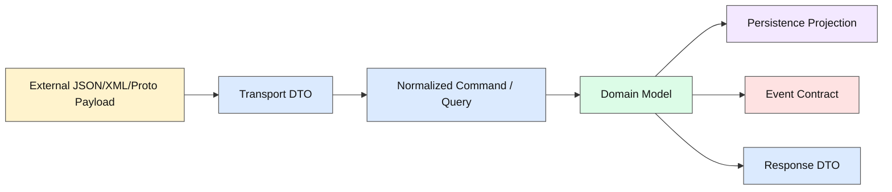
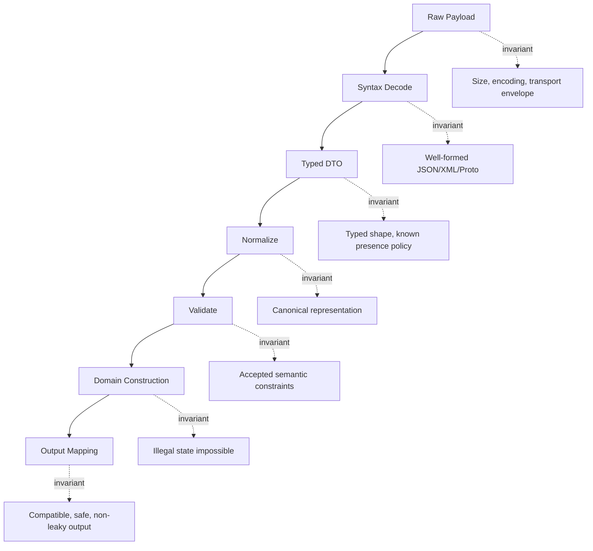
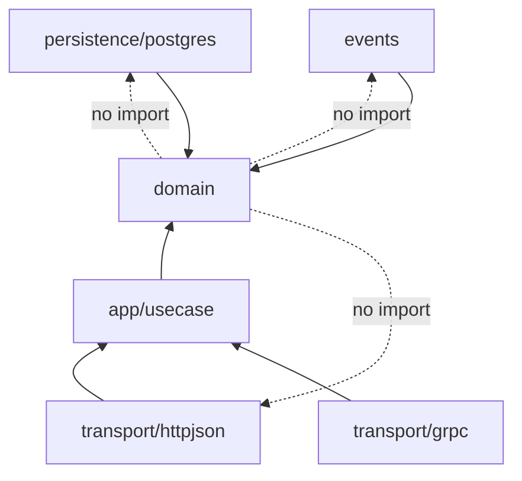

# learn-go-data-mapper-json-xml-protobuf-validation-part-003.md

# Part 003 — Mapping Invariants and Boundary Contracts

> Seri: **learn-go-data-mapper-json-xml-protobuf-validation**  
> Bagian: **003 / 033**  
> Topik: **Mapping Invariants and Boundary Contracts**  
> Target pembaca: Java software engineer yang ingin menguasai Go data mapping, JSON/XML/Protobuf processing, dan validation pada level production engineering.

---

## 0. Posisi Part Ini di Dalam Seri

Pada part sebelumnya kita membahas pemisahan:

- domain model,
- API/DTO model,
- persistence model,
- event/integration model.

Part ini menjawab pertanyaan yang lebih dalam:

> Ketika data bergerak dari satu model ke model lain, **apa yang harus tetap benar?**

Itulah yang disebut **mapping invariant**.

Tanpa invariant, mapper hanya menjadi fungsi mekanis:

```go
func ToDomain(req CreateUserRequest) User {
    return User{
        Name: req.Name,
        Email: req.Email,
    }
}
```

Kode seperti itu mungkin terlihat benar, tetapi belum menjawab:

- apakah `Name` boleh kosong?
- apakah spasi depan/belakang harus dipertahankan?
- apakah email harus lower-case?
- apakah field yang tidak dikirim berbeda dari field yang dikirim `null`?
- apakah nilai default berasal dari transport layer, domain layer, atau storage layer?
- apakah mapper boleh membuang unknown fields?
- apakah mapper boleh mengubah precision angka?
- apakah mapper boleh mengubah timezone?
- apakah mapper boleh mengganti enum unknown menjadi fallback default?
- apakah output harus canonical agar audit dan signature stabil?

Di sistem kecil, hal-hal tersebut terasa berlebihan. Di sistem besar, khususnya sistem regulasi, case management, payment, identity, audit, workflow, dan event-driven architecture, hal-hal tersebut adalah sumber bug produksi paling mahal.

---

## 1. Core Mental Model

### 1.1 Mapping Bukan Copy Field

Mapping adalah proses mengubah data dari satu **semantic context** ke semantic context lain.



Setiap panah punya risiko:

| Mapping | Risiko Utama |
|---|---|
| Payload → DTO | malformed input, unknown fields, duplicate keys, type mismatch, field absence ambiguity |
| DTO → Command | missing normalization, weak validation, input over-trusting |
| Command → Domain | invariant domain bocor, illegal state bisa terbentuk |
| Domain → Persistence | lossy projection, timezone/precision drift, enum drift |
| Domain → Event | compatibility break, accidental PII leak, unstable schema |
| Domain → Response | internal fields exposed, semantic mismatch, response inconsistency |

### 1.2 Boundary Contract Adalah Janji Antarlayer

Boundary contract menjawab:

1. **Apa bentuk data yang diterima?**
2. **Apa arti setiap field?**
3. **Apa yang optional, required, nullable, defaulted?**
4. **Apa yang boleh diabaikan?**
5. **Apa yang harus ditolak?**
6. **Apa yang harus dinormalisasi?**
7. **Apa yang harus dipertahankan tanpa kehilangan informasi?**
8. **Apa yang boleh berubah antarversi?**
9. **Apa yang dianggap breaking change?**
10. **Apa error semantics saat data tidak valid?**

Dalam Java ecosystem, sebagian jawaban ini sering tersebar di:

- Jackson annotations,
- Bean Validation annotations,
- MapStruct mapping,
- JPA annotations,
- OpenAPI annotations,
- protobuf generated class,
- custom service logic.

Di Go, kita harus lebih eksplisit. Bukan karena Go lemah, tetapi karena Go tidak mendorong framework besar untuk “menebak” intent kita.

---

## 2. Apa Itu Invariant?

### 2.1 Definisi

**Invariant** adalah kondisi yang harus tetap benar pada titik tertentu dalam lifecycle data.

Contoh:

```text
User.Email harus tersimpan dalam bentuk canonical lowercase dan sudah melewati syntactic validation.
```

Ini bukan sekadar rule validasi. Ini adalah janji bahwa setelah data masuk ke domain model, semua kode boleh mengasumsikan email sudah canonical.

Jika invariant ini dilanggar, bug bisa muncul jauh dari lokasi input.

### 2.2 Invariant Berbeda dari Validation Rule

Validation rule menjawab:

```text
Apakah input ini valid?
```

Invariant menjawab:

```text
Setelah data melewati boundary ini, kondisi apa yang selalu benar?
```

Contoh:

| Concern | Contoh |
|---|---|
| Validation rule | `email` harus mengandung format email yang diterima sistem |
| Normalization rule | `email` di-trim dan lower-case |
| Mapping invariant | domain `Email` tidak pernah menyimpan email dengan whitespace atau uppercase local policy jika policy sistem lowercase |
| Persistence invariant | kolom `email_normalized` selalu sama dengan domain canonical email |
| Event invariant | event tidak membawa email mentah jika domain policy menganggap email sebagai PII masked |

### 2.3 Invariant Punya Scope

Tidak semua invariant berlaku di semua layer.

| Layer | Contoh Invariant |
|---|---|
| Raw payload | bytes diterima tidak melebihi body limit |
| Syntax decode | JSON valid secara sintaks |
| DTO | field yang dapat diparsing sudah masuk ke tipe Go yang benar |
| Normalized command | whitespace sudah dibersihkan, casing sudah canonical |
| Domain | illegal state tidak bisa direpresentasikan |
| Persistence | projection tidak kehilangan data yang dibutuhkan untuk restore/domain reconstruction |
| Event | event schema backward-compatible untuk consumer lama |
| Response | tidak expose internal-only field |

Diagramnya:



---

## 3. Mengapa Mapping Invariant Sangat Penting di Go

### 3.1 Go Memiliki Zero Value Semantics

Go sangat kuat karena setiap tipe punya zero value. Tetapi dalam data contract, zero value sering ambigu.

```go
type CreateAccountRequest struct {
    DisplayName string `json:"displayName"`
    Age         int    `json:"age"`
    Active      bool   `json:"active"`
}
```

Setelah `json.Unmarshal`, kita tidak bisa langsung membedakan:

```json
{}
```

dari:

```json
{"displayName":"", "age":0, "active":false}
```

Keduanya dapat menghasilkan nilai Go yang sama:

```go
DisplayName == ""
Age == 0
Active == false
```

Maka invariant presence harus dirancang.

### 3.2 Go Tidak Punya Annotation Processor seperti Java

Di Java, banyak sistem memakai:

```java
@NotBlank
@JsonProperty("displayName")
@Column(name = "display_name")
private String displayName;
```

Lalu framework membaca annotation dan menjalankan banyak hal otomatis.

Di Go, metadata biasanya ada di struct tag:

```go
type CreateAccountRequest struct {
    DisplayName string `json:"displayName" validate:"required,min=1"`
}
```

Tetapi struct tag hanyalah string. Go compiler tidak memahami maknanya. Library yang membaca tag itulah yang memberi semantic.

Konsekuensi:

- kita harus tahu library mana yang membaca tag mana,
- kita harus tahu kapan tag dievaluasi,
- kita harus tahu apakah tag itu contract publik atau sekadar detail internal,
- kita harus menghindari tag yang saling bertentangan.

### 3.3 Go Membuat Mapper Eksplisit Lebih Murah

Di Java, mapper manual sering dianggap boilerplate karena class besar, getter/setter, builder, annotation, dan dependency injection. Di Go, mapper manual sering cukup pendek dan mudah diuji.

```go
func NewRegisterUserCommand(req RegisterUserRequest) (RegisterUserCommand, error) {
    email, err := ParseEmail(req.Email)
    if err != nil {
        return RegisterUserCommand{}, err
    }

    name := NormalizeDisplayName(req.DisplayName)
    if name == "" {
        return RegisterUserCommand{}, ErrDisplayNameRequired
    }

    return RegisterUserCommand{
        Email:       email,
        DisplayName: name,
    }, nil
}
```

Kelebihan Go bukan “tanpa mapper”, tetapi **mapper yang terlihat, terukur, dan eksplisit**.

---

## 4. Taxonomy of Mapping Invariants

Bagian ini penting. Saat mendesain mapper, jangan langsung mulai dari code. Mulai dari taxonomy invariant.

### 4.1 Shape Invariant

Shape invariant menjawab:

> Apakah bentuk data yang masuk sesuai dengan contract?

Contoh JSON:

```json
{
  "applicantId": "A-1001",
  "documents": [
    { "type": "PASSPORT", "fileId": "F-9001" }
  ]
}
```

Shape invariant:

- root harus object,
- `applicantId` harus string,
- `documents` harus array,
- setiap document harus object,
- `type` harus string,
- `fileId` harus string.

Di Go:

```go
type SubmitApplicationRequest struct {
    ApplicantID string            `json:"applicantId"`
    Documents   []DocumentRequest `json:"documents"`
}

type DocumentRequest struct {
    Type   string `json:"type"`
    FileID string `json:"fileId"`
}
```

Namun shape invariant belum cukup. Input ini shape-nya benar tetapi semantic-nya mungkin salah:

```json
{
  "applicantId": "   ",
  "documents": []
}
```

### 4.2 Type Invariant

Type invariant memastikan representasi eksternal tidak merusak tipe internal.

Contoh:

```json
{"amount": 10.50}
```

Jika uang diparse ke `float64`, kita membuat precision invariant lemah.

Lebih aman:

```go
type Money struct {
    Currency string
    Minor    int64 // cents, rupiah minor unit, etc.
}
```

atau decimal library jika domain membutuhkan decimal arithmetic.

Type invariant yang sering dilanggar:

| External Type | Go Type yang Terlihat Mudah | Risiko |
|---|---|---|
| JSON number | `float64` | precision loss untuk money/id besar |
| JSON string date | `string` | format drift, timezone ambiguity |
| JSON enum string | `string` | illegal values tersebar di domain |
| XML attribute | `string` | namespace/semantic hilang |
| Protobuf `int64` JSON | JS number | precision loss di client JavaScript |
| Protobuf enum | generated enum | unknown enum handling perlu policy |

### 4.3 Presence Invariant

Presence invariant menjawab:

> Apakah field dikirim, tidak dikirim, dikirim `null`, atau dikirim default value?

Empat state umum:

| State | JSON Example | Arti Potensial |
|---|---|---|
| Absent | `{}` | user tidak mengubah field / default digunakan |
| Null | `{"name":null}` | user ingin clear field / invalid untuk create |
| Empty | `{"name":""}` | nilai eksplisit kosong |
| Non-empty | `{"name":"Ayu"}` | nilai eksplisit |

Go basic type tidak membedakan semua state ini.

```go
type PatchProfileRequest struct {
    DisplayName string `json:"displayName"`
}
```

Tidak cukup untuk PATCH semantics.

Alternatif:

```go
type PatchProfileRequest struct {
    DisplayName OptionalString `json:"displayName"`
}
```

Nanti kita akan membahas custom optional lebih detail. Untuk part ini, yang penting adalah invariant-nya:

```text
PATCH mapper wajib bisa membedakan absent, null, dan value.
```

### 4.4 Nullability Invariant

Nullability berbeda dari optionality.

- **Optional**: field boleh tidak dikirim.
- **Nullable**: field boleh bernilai null.

Empat kombinasi:

| Required? | Nullable? | Meaning |
|---|---|---|
| required | non-null | harus dikirim dan tidak boleh null |
| required | nullable | harus dikirim, boleh null |
| optional | non-null | boleh tidak dikirim, tapi jika dikirim tidak boleh null |
| optional | nullable | boleh tidak dikirim, jika dikirim boleh null |

Go representation:

| Contract | Go Representation Umum | Catatan |
|---|---|---|
| required non-null string | `string` + validation | tidak bisa tahu absent tanpa custom decode/schema |
| optional nullable string | `*string` | nil ambigu: absent atau null jika tidak track presence |
| patch tri-state | custom optional type | paling eksplisit |
| proto3 explicit presence | `optional string` | generated API dapat track presence |

### 4.5 Defaulting Invariant

Defaulting sering tampak sederhana, tetapi sumber bug besar.

Pertanyaan penting:

1. Default berasal dari mana?
2. Default diterapkan kapan?
3. Default ditulis ke storage atau hanya runtime?
4. Default muncul di response atau tidak?
5. Default adalah contract publik atau implementation detail?

Contoh:

```json
{
  "pageSize": 0
}
```

Apakah `0` berarti:

- invalid?
- pakai default 50?
- unlimited?
- user eksplisit ingin 0 result?

Mapping invariant harus jelas:

```text
For list requests, absent pageSize means default 50. Explicit pageSize=0 is rejected.
```

Go code:

```go
const DefaultPageSize = 50
const MaxPageSize = 200

type ListCasesRequest struct {
    PageSize *int `json:"pageSize"`
}

type ListCasesQuery struct {
    PageSize int
}

func NewListCasesQuery(req ListCasesRequest) (ListCasesQuery, error) {
    pageSize := DefaultPageSize
    if req.PageSize != nil {
        if *req.PageSize <= 0 {
            return ListCasesQuery{}, ErrInvalidPageSize
        }
        if *req.PageSize > MaxPageSize {
            return ListCasesQuery{}, ErrPageSizeTooLarge
        }
        pageSize = *req.PageSize
    }

    return ListCasesQuery{PageSize: pageSize}, nil
}
```

Invariant:

```text
ListCasesQuery.PageSize is always between 1 and MaxPageSize.
```

### 4.6 Canonicalization Invariant

Canonicalization adalah proses memilih satu representasi resmi dari banyak input valid.

Contoh:

| Input | Canonical |
|---|---|
| `"  John  Doe "` | `"John Doe"` |
| `"USER@EXAMPLE.COM"` | `"user@example.com"` jika policy sistem lower-case |
| `"+62 812-3456"` | normalized E.164 jika phone policy begitu |
| `"2026-06-24T10:00:00+07:00"` | UTC instant jika storage policy UTC |

Canonicalization harus hati-hati. Tidak semua transformasi aman.

Contoh email: lower-case domain part umumnya aman, tetapi lower-case local part secara teknis bisa tidak selalu identik pada semua mail server. Banyak sistem tetap memilih lower-case seluruh email sebagai product policy. Yang penting: policy harus eksplisit.

Contoh nama orang: jangan sembarangan title-case karena nama dapat punya aturan budaya yang kompleks.

Bad:

```go
func NormalizeName(s string) string {
    return strings.Title(strings.ToLower(strings.TrimSpace(s))) // bad policy
}
```

Better:

```go
func NormalizeDisplayName(s string) string {
    // Conservative normalization: trim external whitespace and collapse internal ASCII whitespace.
    // Do not alter casing because casing may be user-intended.
    fields := strings.Fields(s)
    return strings.Join(fields, " ")
}
```

### 4.7 Losslessness Invariant

Losslessness menjawab:

> Apakah mapping boleh kehilangan informasi?

Contoh lossy mapping:

```json
{
  "amount": "10.50",
  "currency": "SGD"
}
```

ke:

```go
type Payment struct {
    Amount float64
}
```

Currency hilang. Decimal precision bisa hilang.

Contoh lain:

```json
{
  "submittedAt": "2026-06-24T10:00:00+07:00"
}
```

ke:

```go
type Submission struct {
    SubmittedDate string // "2026-06-24"
}
```

Time dan offset hilang.

Lossy mapping tidak selalu salah. Tetapi harus disengaja.

| Mapping | Lossy? | Boleh? |
|---|---:|---|
| API request → domain command | Kadang | boleh jika field memang tidak relevan dan bukan bagian contract |
| domain → audit event | Seharusnya tidak untuk data audit penting | harus hati-hati |
| domain → public response | Sering sengaja lossy | untuk hide internal detail/PII |
| proto binary → proto JSON | Bisa secara compatibility | ProtoJSON punya wire-safety trade-off |
| XML raw document → typed struct | Bisa | mixed content/namespace bisa hilang |

Mapping invariant harus menyatakan:

```text
This mapper is intentionally lossy: internal risk score is not included in public response.
```

atau:

```text
This mapper must be lossless with respect to all fields required to reconstruct the domain aggregate.
```

### 4.8 Identity Invariant

Identity invariant memastikan ID tidak berubah makna.

Contoh:

```go
type CaseID string

type ApplicantID string
```

Keduanya string, tetapi tidak boleh tertukar.

Bad:

```go
type Case struct {
    ID          string
    ApplicantID string
}
```

Better:

```go
type CaseID string
type ApplicantID string

type Case struct {
    ID          CaseID
    ApplicantID ApplicantID
}
```

Mapper menjadi guard:

```go
func ParseCaseID(s string) (CaseID, error) {
    s = strings.TrimSpace(s)
    if s == "" {
        return "", ErrCaseIDRequired
    }
    if !strings.HasPrefix(s, "CASE-") {
        return "", ErrInvalidCaseID
    }
    return CaseID(s), nil
}
```

Invariant:

```text
CaseID in domain layer always has CASE- prefix and is never empty.
```

### 4.9 Temporal Invariant

Time adalah salah satu boundary paling berbahaya.

Pertanyaan:

1. Apakah field merepresentasikan instant, local date, local time, atau recurring schedule?
2. Apakah timezone wajib?
3. Apakah offset dipertahankan?
4. Apakah storage selalu UTC?
5. Apakah response kembali ke timezone user atau tetap UTC?
6. Apakah date-only boleh diparse sebagai midnight UTC?

Jenis waktu:

| Concept | Example | Go Representation |
|---|---|---|
| Instant | submission timestamp | `time.Time` dengan UTC storage policy |
| Local date | birth date, license expiry date | custom `LocalDate`, bukan `time.Time` midnight sembarangan |
| Local time | office opening hour | custom type atau string validated |
| Date range | validity period | struct dengan start/end invariant |
| Schedule | recurring rule | domain-specific representation |

Bad:

```go
// BirthDate as time.Time can accidentally carry timezone.
type Person struct {
    BirthDate time.Time
}
```

Better:

```go
type LocalDate struct {
    Year  int
    Month time.Month
    Day   int
}
```

Invariant:

```text
BirthDate is a calendar date, not an instant. It must never be converted through timezone arithmetic.
```

### 4.10 Ordering and Determinism Invariant

Ordering matters untuk:

- audit log,
- signature/hash,
- deterministic tests,
- idempotency key generation,
- event replay,
- diffing.

JSON object field order secara semantic biasanya tidak boleh dianggap bermakna. Tetapi output determinism kadang penting untuk hashing. Protobuf binary serialization juga punya deterministic serialization option di beberapa runtime untuk map ordering, tetapi deterministic serialization bukan selalu canonical cross-language contract.

Mapping invariant harus menentukan:

```text
Idempotency key is computed from canonical business fields, not from raw JSON bytes.
```

Bad:

```go
func IdempotencyKey(rawBody []byte) string {
    sum := sha256.Sum256(rawBody)
    return hex.EncodeToString(sum[:])
}
```

Masalah: dua JSON semantic sama bisa punya urutan field berbeda.

Better:

```go
type CreatePaymentCommand struct {
    MerchantID string
    AmountMinor int64
    Currency string
    ExternalRef string
}

func (c CreatePaymentCommand) IdempotencyKey() string {
    material := c.MerchantID + "|" + strconv.FormatInt(c.AmountMinor, 10) + "|" + c.Currency + "|" + c.ExternalRef
    sum := sha256.Sum256([]byte(material))
    return hex.EncodeToString(sum[:])
}
```

### 4.11 Compatibility Invariant

Compatibility invariant menjawab:

> Jika contract berubah, apakah producer dan consumer lama masih bisa bekerja?

Untuk JSON:

- menambah optional field biasanya compatible,
- menghapus required field biasanya breaking,
- mengganti type field biasanya breaking,
- mengganti semantic field tanpa rename adalah dangerous,
- strict unknown field policy bisa membuat penambahan field menjadi breaking untuk client/server tertentu.

Untuk Protobuf binary:

- field number adalah contract jangka panjang,
- jangan reuse field number,
- gunakan `reserved` untuk field yang dihapus,
- unknown fields dapat dipreservasi dalam binary message runtime tertentu,
- ProtoJSON tidak punya guarantee unknown fields yang sama seperti binary.

Untuk XML:

- namespace change bisa breaking,
- element vs attribute change biasanya breaking,
- ordering kadang relevan untuk legacy parser,
- XSD contract bisa lebih ketat daripada parser Go.

Compatibility invariant:

```text
Public event schema must evolve additively for at least N release cycles.
```

atau:

```text
Public API request decoder is strict for unknown fields within stable version v1.
```

Keduanya valid, tetapi trade-off-nya berbeda.

### 4.12 Visibility and Sensitivity Invariant

Mapper adalah salah satu guard terakhir terhadap data leak.

Domain model mungkin punya:

```go
type User struct {
    ID           UserID
    Email        Email
    PasswordHash []byte
    RiskScore    int
    InternalNote string
}
```

Response DTO tidak boleh expose semua field.

```go
type UserResponse struct {
    ID    string `json:"id"`
    Email string `json:"email"`
}

func NewUserResponse(u User) UserResponse {
    return UserResponse{
        ID:    string(u.ID),
        Email: u.Email.String(),
    }
}
```

Invariant:

```text
Public response mappers must never expose password hash, risk score, or internal notes.
```

Anti-pattern:

```go
json.NewEncoder(w).Encode(domainUser)
```

Jika domain struct diexpose langsung, perubahan internal field bisa menjadi API leak.

---

## 5. Boundary Contract Design

### 5.1 Contract Harus Memiliki Owner

Setiap boundary contract harus punya owner.

| Contract | Owner Umum |
|---|---|
| Public REST request/response | API team/service owner |
| Internal service DTO | owning service team |
| Protobuf event | producer + schema governance |
| XML integration payload | integration owner + external partner |
| Persistence projection | owning service database team |
| Audit payload | compliance/audit owner + engineering |

Tanpa owner, perubahan contract menjadi tidak terkendali.

### 5.2 Contract Harus Punya Direction

Request contract berbeda dari response contract.

Bad:

```go
type UserDTO struct {
    ID    string `json:"id"`
    Email string `json:"email"`
    Role  string `json:"role"`
}
```

Dipakai untuk create request, update request, response, dan internal mapping.

Masalah:

- client bisa mengirim `id` saat create,
- client bisa mengirim `role` meskipun role hanya admin-set,
- response field berubah karena request butuh field baru,
- validation rule campur.

Better:

```go
type CreateUserRequest struct {
    Email string `json:"email"`
    Name  string `json:"name"`
}

type UpdateUserRequest struct {
    Name OptionalString `json:"name"`
}

type UserResponse struct {
    ID    string `json:"id"`
    Email string `json:"email"`
    Name  string `json:"name"`
}
```

Direction invariant:

```text
Input DTOs represent what clients are allowed to submit. Output DTOs represent what clients are allowed to see.
```

### 5.3 Contract Harus Punya Stability Level

Tidak semua contract harus seketat public API.

| Stability | Example | Change Policy |
|---|---|---|
| Experimental internal | private job payload | can break with coordinated deploy |
| Internal stable | service-to-service API | additive changes preferred |
| Public stable | external API | versioned, documented, backward compatible |
| Audit/legal | audit events | immutable or migration controlled |
| Long-lived event | Kafka/proto event | strict compatibility policy |

Contract dengan stability berbeda tidak boleh diperlakukan sama.

### 5.4 Contract Harus Punya Parse Policy

Parse policy menjawab:

| Policy | Meaning |
|---|---|
| Lenient | tolerate unknown fields, maybe tolerate extra data |
| Strict | reject unknown fields/type mismatch/duplicates where possible |
| Compatibility-tolerant | accept old and new variants |
| Migration mode | accept legacy shapes, emit canonical new shape |
| Audit mode | preserve raw payload or enough source details |

Go `encoding/json` v1 behavior penting untuk dipahami: secara default, object key yang tidak cocok dengan field struct diabaikan, dan matching field struct menerima exact match tetapi juga case-insensitive match. `Decoder.DisallowUnknownFields` dapat digunakan untuk menolak unknown fields pada struct. Dokumentasi `encoding/json` juga menyebut duplicate JSON object keys diproses sesuai urutan observasi sehingga nilai kemudian dapat mengganti atau digabung ke nilai sebelumnya. Di sisi lain, `encoding/json/v2` memperkenalkan default matching yang lebih strict case-sensitive. Lihat referensi resmi di bagian akhir file.

Policy example:

```go
func DecodeStrictJSON(r io.Reader, dst any) error {
    dec := json.NewDecoder(r)
    dec.DisallowUnknownFields()
    dec.UseNumber()

    if err := dec.Decode(dst); err != nil {
        return err
    }

    // Prevent trailing JSON value.
    if dec.Decode(&struct{}{}) != io.EOF {
        return errors.New("request body must contain a single JSON value")
    }

    return nil
}
```

Catatan: ini belum menyelesaikan semua strictness seperti duplicate keys. Untuk API yang sangat sensitif, perlu strategi tambahan, custom decoder, JSON v2 option, schema validation, atau library strict parser.

### 5.5 Contract Harus Punya Emit Policy

Emit policy menjawab:

- apakah empty field di-omit?
- apakah default field di-emit?
- apakah field order penting?
- apakah null di-emit atau omit?
- apakah enum di-emit sebagai string atau number?
- apakah timestamp di-emit UTC atau offset user?

Contoh:

```go
type CaseResponse struct {
    ID          string  `json:"id"`
    AssignedTo *string `json:"assignedTo,omitempty"`
}
```

`omitempty` adalah contract decision. Jika client membedakan `null` dan absent, maka `omitempty` bisa menjadi breaking semantic.

---

## 6. Pipeline yang Direkomendasikan

### 6.1 Jangan Langsung Decode ke Domain

Bad:

```go
func handleCreateUser(w http.ResponseWriter, r *http.Request) {
    var user User
    if err := json.NewDecoder(r.Body).Decode(&user); err != nil {
        // ...
    }
    service.Create(user)
}
```

Masalah:

- external input bisa mengisi internal field,
- domain invariant belum tentu terbentuk,
- absent/null/default ambiguity tidak terkontrol,
- validation tersebar.

Better pipeline:

```mermaid
flowchart LR
    A[HTTP Body] --> B[Body Limit]
    B --> C[Strict Syntax Decode]
    C --> D[Request DTO]
    D --> E[Normalize]
    E --> F[Validate DTO/Command]
    F --> G[Construct Command]
    G --> H[Domain Service]
    H --> I[Domain Result]
    I --> J[Response Mapper]
    J --> K[HTTP Response]
```



### 6.2 Concrete Go Pipeline Example

```go
package usersapi

import (
    "encoding/json"
    "errors"
    "io"
    "net/http"
    "strings"
)

const maxRequestBodyBytes = 1 << 20 // 1 MiB

type CreateUserRequest struct {
    Email       string `json:"email"`
    DisplayName string `json:"displayName"`
}

type CreateUserCommand struct {
    Email       Email
    DisplayName string
}

type Email string

func ParseEmail(s string) (Email, error) {
    s = strings.TrimSpace(s)
    if s == "" {
        return "", errors.New("email is required")
    }
    // This is intentionally simplified. Real email validation policy should be explicit.
    if !strings.Contains(s, "@") {
        return "", errors.New("email is invalid")
    }
    return Email(strings.ToLower(s)), nil
}

func NormalizeDisplayName(s string) string {
    return strings.Join(strings.Fields(s), " ")
}

func NewCreateUserCommand(req CreateUserRequest) (CreateUserCommand, error) {
    email, err := ParseEmail(req.Email)
    if err != nil {
        return CreateUserCommand{}, err
    }

    displayName := NormalizeDisplayName(req.DisplayName)
    if displayName == "" {
        return CreateUserCommand{}, errors.New("displayName is required")
    }

    return CreateUserCommand{
        Email:       email,
        DisplayName: displayName,
    }, nil
}

func DecodeCreateUserRequest(r *http.Request) (CreateUserRequest, error) {
    limited := http.MaxBytesReader(nil, r.Body, maxRequestBodyBytes)
    defer limited.Close()

    dec := json.NewDecoder(limited)
    dec.DisallowUnknownFields()
    dec.UseNumber()

    var req CreateUserRequest
    if err := dec.Decode(&req); err != nil {
        return CreateUserRequest{}, err
    }

    var extra struct{}
    if err := dec.Decode(&extra); err != io.EOF {
        return CreateUserRequest{}, errors.New("request body must contain exactly one JSON value")
    }

    return req, nil
}
```

Mapping invariant:

```text
After NewCreateUserCommand succeeds:
- Email is non-empty.
- Email has been trimmed.
- Email is canonicalized according to system policy.
- DisplayName is non-empty.
- DisplayName has collapsed whitespace.
- Unknown JSON fields have already been rejected by the request decoder.
```

### 6.3 Why Normalize Before Validate?

Ada dua pendekatan:

1. validate raw input lalu normalize,
2. normalize lalu validate canonical value.

Tidak ada jawaban universal.

Contoh:

```json
{"displayName":"   Ayu   "}
```

Jika validate raw dulu dengan `min=1`, valid. Jika trim lalu validate, tetap valid.

```json
{"displayName":"      "}
```

Jika validate raw dulu dengan `min=1`, valid secara panjang string. Jika normalize dulu, menjadi kosong dan invalid.

Untuk banyak input manusia, pipeline lebih aman:

```text
parse → conservative normalize → validate normalized value → construct domain
```

Namun untuk beberapa domain, raw value harus dipertahankan:

- legal name,
- submitted document text,
- audit payload,
- digital signature input,
- cryptographic material,
- external reference yang case-sensitive.

Invariant harus menjawab apakah raw value disimpan.

---

## 7. Presence, Optional, Null: Model yang Harus Dikuasai

### 7.1 Create vs Patch Semantics

Create biasanya punya required fields.

```json
{
  "email": "user@example.com",
  "displayName": "Ayu"
}
```

Patch biasanya butuh tri-state.

```json
{}
```

Artinya tidak mengubah apa pun.

```json
{"displayName": null}
```

Mungkin artinya clear display name.

```json
{"displayName": "Ayu"}
```

Artinya set display name ke `Ayu`.

### 7.2 Naive Pointer Tidak Cukup untuk Semua Kasus

```go
type PatchUserRequest struct {
    DisplayName *string `json:"displayName"`
}
```

Dengan `encoding/json` klasik, `DisplayName == nil` bisa berarti:

- field absent,
- field present dengan `null`.

Untuk PATCH yang harus membedakan absent dan null, ini tidak cukup.

### 7.3 Custom Optional Type

Salah satu pattern:

```go
type OptionalString struct {
    Set   bool
    Null  bool
    Value string
}

func (o *OptionalString) UnmarshalJSON(data []byte) error {
    o.Set = true

    if string(data) == "null" {
        o.Null = true
        o.Value = ""
        return nil
    }

    var v string
    if err := json.Unmarshal(data, &v); err != nil {
        return err
    }

    o.Null = false
    o.Value = v
    return nil
}
```

Usage:

```go
type PatchUserRequest struct {
    DisplayName OptionalString `json:"displayName"`
}

func NewPatchUserCommand(req PatchUserRequest) (PatchUserCommand, error) {
    cmd := PatchUserCommand{}

    if req.DisplayName.Set {
        if req.DisplayName.Null {
            cmd.ClearDisplayName = true
        } else {
            name := NormalizeDisplayName(req.DisplayName.Value)
            if name == "" {
                return PatchUserCommand{}, errors.New("displayName cannot be empty")
            }
            cmd.SetDisplayName = &name
        }
    }

    return cmd, nil
}
```

Invariant:

```text
Patch mapper distinguishes absent, null, and explicit value.
```

### 7.4 Generic Optional Type

Dengan generics, kita bisa membuat:

```go
type Optional[T any] struct {
    Set   bool
    Null  bool
    Value T
}

func (o *Optional[T]) UnmarshalJSON(data []byte) error {
    o.Set = true

    if string(data) == "null" {
        o.Null = true
        var zero T
        o.Value = zero
        return nil
    }

    var v T
    if err := json.Unmarshal(data, &v); err != nil {
        return err
    }

    o.Null = false
    o.Value = v
    return nil
}
```

Tetapi generic optional juga punya trade-off:

- error message bisa kurang domain-specific,
- validation tetap perlu custom per field,
- nested optional bisa membingungkan,
- JSON marshal behavior harus dirancang,
- `omitempty` dengan custom struct tidak otomatis seperti pointer.

Invariant lebih penting daripada generic-nya.

---

## 8. Mapping Result dan Error Semantics

### 8.1 Mapper Jangan Hanya Return `error` Jika Butuh Field-Level Detail

Untuk API, error field-level lebih berguna.

```go
type FieldViolation struct {
    Path    string `json:"path"`
    Code    string `json:"code"`
    Message string `json:"message"`
}

type ValidationError struct {
    Violations []FieldViolation
}

func (e ValidationError) Error() string {
    return "validation failed"
}
```

Mapper:

```go
func NewCreateCaseCommand(req CreateCaseRequest) (CreateCaseCommand, error) {
    var violations []FieldViolation

    applicantID, err := ParseApplicantID(req.ApplicantID)
    if err != nil {
        violations = append(violations, FieldViolation{
            Path:    "applicantId",
            Code:    "invalid_applicant_id",
            Message: "applicantId is invalid",
        })
    }

    title := NormalizeTitle(req.Title)
    if title == "" {
        violations = append(violations, FieldViolation{
            Path:    "title",
            Code:    "required",
            Message: "title is required",
        })
    }

    if len(violations) > 0 {
        return CreateCaseCommand{}, ValidationError{Violations: violations}
    }

    return CreateCaseCommand{
        ApplicantID: applicantID,
        Title:       title,
    }, nil
}
```

Invariant:

```text
Mapper either returns a fully valid command or a machine-readable validation error. It never returns partially valid command with nil error.
```

### 8.2 Parse Error vs Validation Error vs Domain Error

Jangan campur semua error menjadi `400 Bad Request` dengan message bebas.

| Error Kind | Example | HTTP Usually |
|---|---|---|
| Syntax parse error | malformed JSON | 400 |
| Type decode error | `age` is string but expected int | 400 |
| Unknown field error | field not allowed | 400 |
| Validation error | `email` invalid | 422 or 400 depending API convention |
| Domain conflict | duplicate email | 409 |
| Authorization error | cannot update this case | 403 |
| State transition error | case already closed | 409 or 422 depending convention |

Mapping invariant:

```text
Boundary mapper handles syntax, shape, normalization, and command validation. Domain service handles business state and cross-aggregate rules.
```

---

## 9. JSON-Specific Boundary Risks

Part JSON detail akan dibahas nanti, tetapi invariant-nya harus dikenali sejak awal.

### 9.1 Unknown Fields

Default `encoding/json` klasik mengabaikan unknown fields saat decode ke struct. Ini sering nyaman untuk compatibility, tetapi berbahaya untuk API input yang harus ketat.

Contoh bug:

```json
{
  "emali": "user@example.com"
}
```

Jika typo `emali` diabaikan, `email` menjadi kosong dan error mungkin muncul sebagai required field, bukan unknown field. Lebih buruk, jika field optional, typo bisa diam-diam tidak melakukan apa-apa.

Policy:

- public create/update request: sering lebih aman strict,
- event consumer: mungkin lebih baik lenient untuk forward compatibility,
- internal admin API: strict,
- migration endpoint: compatibility-tolerant.

### 9.2 Duplicate Keys

JSON object duplicate keys adalah area berbahaya. Go `encoding/json` v1 mendokumentasikan bahwa keys diproses sesuai urutan observasi; nilai kemudian mengganti atau digabung ke nilai sebelumnya. Ini bisa membuka ambiguity:

```json
{
  "role": "user",
  "role": "admin"
}
```

Boundary invariant untuk endpoint sensitif sebaiknya:

```text
Duplicate JSON object names are rejected before business mapping.
```

Jika library standar belum memenuhi semua strictness yang dibutuhkan, gunakan schema validator, JSON v2 option, atau parser strict yang memang mendukung duplicate detection.

### 9.3 Case Sensitivity

`encoding/json` v1 menerima matching case-insensitive untuk field struct. Ini berarti:

```json
{"Email":"a@example.com"}
```

bisa match field `email` tergantung tag/nama. Untuk contract publik yang ingin strict berdasarkan JSON property name, ini harus dipahami. `encoding/json/v2` bergerak ke default case-sensitive matching.

Invariant:

```text
Public JSON contract property names are case-sensitive and documented. Decoder behavior must enforce or at least test this policy.
```

### 9.4 Number Precision

JSON number tidak membedakan int, long, decimal, float. Go decoder default ke `float64` saat decode ke `interface{}`.

Bad:

```go
var payload map[string]any
json.Unmarshal(body, &payload)
amount := payload["amount"].(float64)
```

Better:

```go
dec := json.NewDecoder(r)
dec.UseNumber()
```

Namun `json.Number` hanya menunda keputusan. Anda tetap harus parse ke tipe domain yang benar.

Invariant:

```text
Money, identifiers, and counters are never parsed through float64 unless explicitly allowed by domain policy.
```

---

## 10. XML-Specific Boundary Risks

XML punya model data yang berbeda dari JSON.

### 10.1 Element vs Attribute

```xml
<Document type="PASSPORT">
  <FileID>F-9001</FileID>
</Document>
```

Go struct:

```go
type DocumentXML struct {
    Type   string `xml:"type,attr"`
    FileID string `xml:"FileID"`
}
```

Attribute dan element tidak sekadar bentuk berbeda. Pada banyak contract XML, mereka punya semantic berbeda.

Invariant:

```text
XML mapper must preserve element/attribute distinction for externally governed XML contracts.
```

### 10.2 Namespace

XML namespace adalah bagian dari identity element.

```xml
<case:Application xmlns:case="urn:example:case:v1">
</case:Application>
```

`Application` tanpa namespace belum tentu sama dengan `case:Application`.

Invariant:

```text
XML integration mapper must validate expected namespace URI, not only local element name.
```

### 10.3 Mixed Content

XML bisa punya mixed content:

```xml
<p>Hello <b>world</b>.</p>
```

Mapping ke struct sederhana bisa kehilangan ordering antara text dan child elements.

Invariant:

```text
If mixed content matters, do not map directly into simple structs without preserving token sequence.
```

---

## 11. Protobuf-Specific Boundary Risks

### 11.1 Field Number Is the Contract

Dalam Protobuf, field number jauh lebih penting daripada field name untuk binary wire format.

```proto
message User {
  string id = 1;
  string email = 2;
}
```

Jangan reuse field number ketika field dihapus.

```proto
message User {
  string id = 1;
  reserved 2;
  reserved "email";
}
```

Invariant:

```text
Removed protobuf fields are reserved by number and name.
```

### 11.2 Field Presence

Proto3 historically punya implicit presence untuk scalar field biasa: default value dan absent bisa sulit dibedakan. Protobuf guidance modern merekomendasikan `optional` untuk proto3 basic types agar path ke editions lebih mulus, sementara editions dapat memakai explicit presence by default tergantung feature setting.

Invariant:

```text
If business semantics require distinguishing absent from default, protobuf schema must use explicit presence.
```

Example:

```proto
message PatchUser {
  optional string display_name = 1;
}
```

### 11.3 ProtoJSON Is Not the Same as Protobuf Binary

ProtoJSON berguna untuk HTTP/JSON gateway, tetapi tidak punya schema evolution guarantee yang sama seperti binary Protobuf. Dokumentasi Protobuf menyatakan ProtoJSON tidak mendukung unknown fields seperti binary wire format, dan nama field/enum muncul di encoded message sehingga rename menjadi lebih berisiko.

Invariant:

```text
Do not assume ProtoJSON has the same compatibility properties as protobuf binary wire format.
```

### 11.4 Open Struct API vs Opaque API

Go Protobuf modern memiliki Open Struct API dan Opaque API. Opaque API membuat representasi internal generated message tidak langsung diakses sebagai field struct publik untuk API level tertentu. Ini penting untuk mapper karena kode yang terlalu bergantung pada generated struct internals menjadi lebih rapuh.

Invariant:

```text
Mapping code should prefer generated accessor methods and protobuf APIs where possible, especially for schemas moving toward Opaque API.
```

---

## 12. Designing a Boundary Contract Specification

Sebelum menulis mapper, tulis contract spec singkat.

Template:

```markdown
## Contract: CreateCaseRequest

### Direction
External client → Case service

### Stability
Public API v1

### Parse Policy
- JSON object only
- Unknown fields rejected
- Duplicate fields rejected where parser capability supports it
- One JSON value only

### Presence Policy
- `applicantId`: required, non-null
- `title`: required, non-null
- `description`: optional, nullable

### Normalization Policy
- `applicantId`: trim only
- `title`: trim and collapse whitespace
- `description`: preserve internal whitespace, trim boundary whitespace

### Validation Policy
- `applicantId`: must match known applicant ID format
- `title`: length 1..200 after normalization
- `description`: max 4000 characters if present and non-null

### Domain Mapping Invariants
- command ApplicantID is typed and non-empty
- command Title is normalized and non-empty
- command Description is tri-state: absent / clear / set

### Compatibility Policy
- new optional fields may be added in v1 only if decoder policy is adjusted or clients are versioned
- required field removal is breaking
- type change is breaking

### Security Policy
- request cannot set owner, status, risk score, or audit metadata
```

Ini terlihat formal, tetapi untuk sistem besar, template seperti ini mencegah debat berulang.

---

## 13. Boundary Contract Example: Case Submission

### 13.1 JSON Contract

Request:

```json
{
  "applicantId": "APP-1001",
  "title": "New licence application",
  "documents": [
    {
      "type": "PASSPORT",
      "fileId": "FILE-9001"
    }
  ]
}
```

DTO:

```go
type SubmitCaseRequest struct {
    ApplicantID string                  `json:"applicantId"`
    Title       string                  `json:"title"`
    Documents   []SubmitDocumentRequest `json:"documents"`
}

type SubmitDocumentRequest struct {
    Type   string `json:"type"`
    FileID string `json:"fileId"`
}
```

Domain command:

```go
type SubmitCaseCommand struct {
    ApplicantID ApplicantID
    Title       CaseTitle
    Documents   []SubmittedDocument
}

type ApplicantID string
type CaseTitle string

type DocumentType string

const (
    DocumentTypePassport DocumentType = "PASSPORT"
    DocumentTypeUtilityBill DocumentType = "UTILITY_BILL"
)

type SubmittedDocument struct {
    Type   DocumentType
    FileID FileID
}

type FileID string
```

Mapper:

```go
func NewSubmitCaseCommand(req SubmitCaseRequest) (SubmitCaseCommand, error) {
    var violations []FieldViolation

    applicantID, err := ParseApplicantID(req.ApplicantID)
    if err != nil {
        violations = append(violations, FieldViolation{
            Path: "applicantId",
            Code: "invalid",
            Message: "applicantId is invalid",
        })
    }

    title, err := ParseCaseTitle(req.Title)
    if err != nil {
        violations = append(violations, FieldViolation{
            Path: "title",
            Code: "invalid",
            Message: "title is invalid",
        })
    }

    documents := make([]SubmittedDocument, 0, len(req.Documents))
    if len(req.Documents) == 0 {
        violations = append(violations, FieldViolation{
            Path: "documents",
            Code: "required",
            Message: "at least one document is required",
        })
    }

    for i, doc := range req.Documents {
        parsed, err := NewSubmittedDocument(doc)
        if err != nil {
            violations = append(violations, FieldViolation{
                Path: fmt.Sprintf("documents[%d]", i),
                Code: "invalid",
                Message: err.Error(),
            })
            continue
        }
        documents = append(documents, parsed)
    }

    if len(violations) > 0 {
        return SubmitCaseCommand{}, ValidationError{Violations: violations}
    }

    return SubmitCaseCommand{
        ApplicantID: applicantID,
        Title:       title,
        Documents:   documents,
    }, nil
}
```

Helper:

```go
func ParseApplicantID(s string) (ApplicantID, error) {
    s = strings.TrimSpace(s)
    if s == "" {
        return "", errors.New("required")
    }
    if !strings.HasPrefix(s, "APP-") {
        return "", errors.New("must start with APP-")
    }
    return ApplicantID(s), nil
}

func ParseCaseTitle(s string) (CaseTitle, error) {
    normalized := strings.Join(strings.Fields(s), " ")
    if normalized == "" {
        return "", errors.New("required")
    }
    if len([]rune(normalized)) > 200 {
        return "", errors.New("max length is 200")
    }
    return CaseTitle(normalized), nil
}

func NewSubmittedDocument(req SubmitDocumentRequest) (SubmittedDocument, error) {
    docType, err := ParseDocumentType(req.Type)
    if err != nil {
        return SubmittedDocument{}, err
    }

    fileID, err := ParseFileID(req.FileID)
    if err != nil {
        return SubmittedDocument{}, err
    }

    return SubmittedDocument{Type: docType, FileID: fileID}, nil
}
```

Invariant list:

```text
After NewSubmitCaseCommand succeeds:
- ApplicantID is non-empty and has valid prefix.
- Title is non-empty after whitespace normalization.
- Title length is <= 200 runes.
- Documents length is >= 1.
- Every document has a known DocumentType.
- Every document has a valid FileID.
- Request cannot set case status, owner, risk score, audit fields, or timestamps.
```

---

## 14. Contract Evolution and Mapping Invariants

### 14.1 Additive Field

Initial:

```go
type CreateCaseRequest struct {
    Title string `json:"title"`
}
```

Later:

```go
type CreateCaseRequest struct {
    Title    string  `json:"title"`
    Priority *string `json:"priority,omitempty"`
}
```

Compatibility depends on parser policy.

If server receives client payload, adding optional request field is usually server-compatible. But if client SDK uses strict decoding for server response, adding response field can break strict clients.

Invariant:

```text
Compatibility must be evaluated for both producer and consumer decode policies.
```

### 14.2 Required Field Addition

Adding required field to request is breaking for existing clients.

Bad:

```go
type CreateCaseRequest struct {
    Title       string `json:"title"`
    Category    string `json:"category"` // newly required
}
```

Better migration:

1. add optional field,
2. support default or infer value,
3. emit warnings/metrics,
4. coordinate clients,
5. make required in v2.

### 14.3 Type Change

Changing:

```json
{"priority":"HIGH"}
```

to:

```json
{"priority":{"level":"HIGH"}}
```

is breaking.

Safer:

```json
{
  "priority": "HIGH",
  "priorityDetail": {"level":"HIGH"}
}
```

then deprecate old field.

### 14.4 Enum Evolution

Enums are tricky.

JSON string enum:

```json
{"status":"PENDING_REVIEW"}
```

If new status appears:

```json
{"status":"PENDING_SUPERVISOR_REVIEW"}
```

Old consumers may fail.

Design options:

| Strategy | Pros | Cons |
|---|---|---|
| Strict enum reject unknown | catches errors early | new values break old consumers |
| Unknown enum bucket | forward compatible | domain logic must handle unknown |
| String passthrough | flexible | weak type safety |
| Versioned enum | explicit | more schema overhead |

Invariant:

```text
Consumer-facing enum mapping must define unknown-value behavior.
```

Protobuf enum also needs careful design. Unknown enum values may be preserved depending proto version/runtime, but application logic still needs policy.

---

## 15. Boundary Contracts for Event-Driven Systems

Event-driven mapping is more sensitive than request/response because events live longer.

### 15.1 Event Is Not Domain Dump

Bad:

```go
func PublishCaseCreated(c Case) error {
    return publisher.Publish("case.created", c)
}
```

Problems:

- exposes internal fields,
- event changes when domain struct changes,
- no compatibility policy,
- consumers become coupled to producer internals.

Better:

```go
type CaseCreatedEventV1 struct {
    EventID     string `json:"eventId"`
    OccurredAt  string `json:"occurredAt"`
    CaseID      string `json:"caseId"`
    ApplicantID string `json:"applicantId"`
}

func NewCaseCreatedEventV1(c Case, eventID EventID, now time.Time) CaseCreatedEventV1 {
    return CaseCreatedEventV1{
        EventID:     string(eventID),
        OccurredAt:  now.UTC().Format(time.RFC3339Nano),
        CaseID:      string(c.ID),
        ApplicantID: string(c.ApplicantID),
    }
}
```

Invariant:

```text
CaseCreatedEventV1 contains only stable facts that consumers may depend on.
```

### 15.2 Event Compatibility Window

Event contract should define:

- how long old versions are emitted,
- whether new fields are additive only,
- how consumers handle unknown fields,
- whether schema registry/breaking checks are enforced,
- whether event replay uses old schema exactly.

### 15.3 Event Idempotency

Mapper should not use non-deterministic data unless intended.

Bad:

```go
func NewEvent(c Case) Event {
    return Event{
        ID: time.Now().String(),
        CaseID: string(c.ID),
    }
}
```

Better:

```go
func NewCaseCreatedEvent(c Case, eventID EventID, occurredAt time.Time) CaseCreatedEventV1 {
    return CaseCreatedEventV1{
        EventID:    string(eventID),
        OccurredAt: occurredAt.UTC().Format(time.RFC3339Nano),
        CaseID:     string(c.ID),
    }
}
```

Injecting `eventID` and `occurredAt` makes invariant testable.

---

## 16. Boundary Contracts for Persistence

Persistence mapping berbeda dari API mapping.

### 16.1 Persistence Model May Be Denormalized

Domain:

```go
type Case struct {
    ID          CaseID
    ApplicantID ApplicantID
    Status      CaseStatus
    SubmittedAt time.Time
}
```

DB row:

```go
type CaseRow struct {
    ID          string
    ApplicantID string
    Status      string
    SubmittedAt time.Time
    SearchText   string
}
```

`SearchText` mungkin derived field.

Invariant:

```text
CaseRow.SearchText is derived from canonical domain fields and is not a source of truth.
```

### 16.2 Persistence Mapper Must Handle Historical Data

External API usually validates new data. Persistence mapper must often read old data created by previous versions.

Possible policies:

| Policy | Meaning |
|---|---|
| Fail fast | corrupt historical row breaks load |
| Tolerant read | map legacy values to current representation |
| Migration on read | repair and persist new canonical form |
| Quarantine | mark invalid rows for operator remediation |

Invariant:

```text
Persistence read mapper may accept legacy values that public API mapper rejects.
```

This is an important distinction.

### 16.3 Domain Reconstruction Must Be Explicit

If persistence projection cannot reconstruct domain aggregate, say so.

```text
CaseListRow is a read model. It is not valid for reconstructing Case aggregate.
```

Bad:

```go
type CaseListRow struct {
    ID     string
    Status string
}

func (r CaseListRow) ToDomain() Case {
    return Case{ID: CaseID(r.ID), Status: CaseStatus(r.Status)} // missing invariant fields
}
```

Better:

```go
type CaseListItem struct {
    ID     CaseID
    Status CaseStatus
}
```

Name it as read model, not domain aggregate.

---

## 17. Mapper Placement in Go Packages

### 17.1 Recommended Package Layout

```text
internal/
  cases/
    domain/
      case.go
      applicant.go
      status.go
    app/
      submit_case.go
      commands.go
    transport/
      httpjson/
        submit_case_request.go
        submit_case_response.go
        submit_case_handler.go
        mapping.go
      grpc/
        mapping.go
    persistence/
      postgres/
        case_row.go
        mapping.go
    events/
      case_created_v1.go
      mapping.go
```

Guideline:

- domain should not import transport,
- domain should not import persistence,
- transport mapper imports app/domain types,
- persistence mapper imports domain types,
- event mapper imports domain types,
- generated proto package ideally isolated from domain.

Dependency direction:



### 17.2 Mapper Naming

Good names:

```go
NewCreateUserCommand(req CreateUserRequest) (CreateUserCommand, error)
NewUserResponse(user domain.User) UserResponse
ToCaseRow(case domain.Case) CaseRow
CaseFromRow(row CaseRow) (domain.Case, error)
NewCaseCreatedEventV1(case domain.Case, meta EventMeta) CaseCreatedEventV1
```

Avoid generic ambiguous names:

```go
Convert()
Transform()
Map()
ToDTO()
FromDTO()
```

Unless scope is extremely local.

### 17.3 Avoid Global Mapper God Package

Bad:

```text
internal/mapper/
  user.go
  case.go
  document.go
  payment.go
```

Problems:

- import cycles,
- low cohesion,
- unclear ownership,
- every model knows every other model,
- hard to test per boundary.

Better: mapper lives near boundary it serves.

---

## 18. Advanced Pattern: Explicit Boundary Types

### 18.1 Domain Value Object

```go
type Email struct {
    value string
}

func ParseEmail(s string) (Email, error) {
    normalized := strings.ToLower(strings.TrimSpace(s))
    if normalized == "" || !strings.Contains(normalized, "@") {
        return Email{}, ErrInvalidEmail
    }
    return Email{value: normalized}, nil
}

func (e Email) String() string {
    return e.value
}
```

Now domain cannot construct arbitrary email unless package exposes unsafe constructor.

### 18.2 DTO Does Not Use Domain Type Directly

```go
type CreateUserRequest struct {
    Email string `json:"email"`
}
```

Why not:

```go
type CreateUserRequest struct {
    Email Email `json:"email"`
}
```

Sometimes direct domain type in DTO is acceptable for simple internal APIs. But for public boundary, separating raw input from domain value object is clearer:

- raw error path easier,
- parse policy visible,
- avoid domain package depending on JSON behavior,
- avoid mixing external representation with internal invariant.

### 18.3 Domain Type May Implement Marshal Only for Internal Use

Be careful implementing `MarshalJSON` on domain type.

```go
func (e Email) MarshalJSON() ([]byte, error) {
    return json.Marshal(e.value)
}
```

This can be useful. But if domain type also implements `UnmarshalJSON`, you might accidentally decode external payload directly into domain and bypass boundary policy.

Invariant:

```text
Domain JSON methods are convenience serialization, not replacement for boundary validation unless explicitly designed as such.
```

---

## 19. Failure Mode Catalog

### 19.1 Silent Unknown Field Drop

Input:

```json
{"fristName":"Ayu"}
```

Expected field:

```json
{"firstName":"Ayu"}
```

If unknown field ignored, user input disappears.

Mitigation:

- strict decoder for command endpoints,
- request validation test,
- schema validation,
- unknown-field metrics if lenient.

### 19.2 Absent vs False Bug

Input:

```json
{}
```

Go:

```go
type Request struct {
    Enabled bool `json:"enabled"`
}
```

`Enabled == false`, but user did not explicitly disable.

Mitigation:

- pointer or optional type,
- separate create/update DTO,
- explicit defaulting policy.

### 19.3 Numeric Precision Loss

Input:

```json
{"id": 9007199254740993}
```

If decoded through JavaScript number or Go `float64`, precision can be lost.

Mitigation:

- IDs as strings in JSON,
- `json.Number`,
- parse to `int64` with range check,
- avoid `map[string]any` for contract-critical payloads.

### 19.4 Timezone Drift

Input:

```json
{"expiresAt":"2026-06-24T00:00:00+07:00"}
```

Storage:

```text
2026-06-24 00:00:00 without timezone
```

Bug:

- instant changed,
- local date mistaken as instant,
- query boundaries wrong.

Mitigation:

- define instant vs local date,
- store instants in UTC,
- store local dates as date-only concept,
- test timezone cases.

### 19.5 Enum Fallback Hiding Unknown State

Bad:

```go
func ParseStatus(s string) CaseStatus {
    switch s {
    case "OPEN":
        return CaseStatusOpen
    case "CLOSED":
        return CaseStatusClosed
    default:
        return CaseStatusOpen
    }
}
```

Unknown `SUSPENDED` becomes `OPEN`.

Mitigation:

- return error,
- or explicit `CaseStatusUnknown` with policy,
- never fallback silently to meaningful business value.

### 19.6 Internal Field Exposure

Bad:

```go
json.NewEncoder(w).Encode(user)
```

Domain later adds:

```go
PasswordHash []byte
```

If exported and no `json:"-"`, leak risk.

Mitigation:

- response DTO,
- deny-by-default response mapping,
- tests for response shape.

### 19.7 Validation Split Brain

Same rule implemented differently in:

- frontend,
- API request validation,
- domain constructor,
- database constraint,
- event consumer.

Mitigation:

- define source of truth per invariant,
- generate where useful,
- test contract cases,
- document domain vs boundary invariant.

### 19.8 Mapper Over-Normalization

Input legal name:

```text
van der Waals
```

Bad normalization:

```text
Van Der Waals
```

Mitigation:

- conservative normalization,
- domain-specific policy,
- preserve raw where legally required.

### 19.9 Lossy Audit Mapping

Audit event stores only display label, not ID.

```json
{"caseStatus":"Approved"}
```

Later label changes. Audit becomes ambiguous.

Mitigation:

```json
{"caseStatusCode":"APPROVED", "caseStatusLabel":"Approved"}
```

Invariant:

```text
Audit stores stable code and optional display label.
```

---

## 20. Testing Mapping Invariants

### 20.1 Table-Driven Tests

```go
func TestNewListCasesQuery_PageSize(t *testing.T) {
    tests := []struct {
        name    string
        req     ListCasesRequest
        want    int
        wantErr bool
    }{
        {
            name: "absent page size uses default",
            req:  ListCasesRequest{},
            want: DefaultPageSize,
        },
        {
            name: "explicit zero rejected",
            req:  ListCasesRequest{PageSize: ptr(0)},
            wantErr: true,
        },
        {
            name: "valid explicit page size",
            req:  ListCasesRequest{PageSize: ptr(25)},
            want: 25,
        },
    }

    for _, tt := range tests {
        t.Run(tt.name, func(t *testing.T) {
            got, err := NewListCasesQuery(tt.req)
            if tt.wantErr {
                if err == nil {
                    t.Fatal("expected error")
                }
                return
            }
            if err != nil {
                t.Fatal(err)
            }
            if got.PageSize != tt.want {
                t.Fatalf("PageSize = %d, want %d", got.PageSize, tt.want)
            }
        })
    }
}
```

### 20.2 Golden Contract Tests

Useful for response/event stability.

```go
func TestCaseCreatedEventV1_JSONShape(t *testing.T) {
    event := CaseCreatedEventV1{
        EventID: "EVT-1",
        OccurredAt: "2026-06-24T00:00:00Z",
        CaseID: "CASE-1",
        ApplicantID: "APP-1",
    }

    got, err := json.MarshalIndent(event, "", "  ")
    if err != nil {
        t.Fatal(err)
    }

    want := `{
  "eventId": "EVT-1",
  "occurredAt": "2026-06-24T00:00:00Z",
  "caseId": "CASE-1",
  "applicantId": "APP-1"
}`

    if string(got) != want {
        t.Fatalf("json mismatch\n got: %s\nwant: %s", got, want)
    }
}
```

Golden tests can be brittle if used everywhere. Use them for stable contracts, not internal incidental structs.

### 20.3 Property-Like Tests for Normalization

```go
func TestNormalizeDisplayName_Idempotent(t *testing.T) {
    inputs := []string{
        "Ayu",
        "  Ayu  ",
        "Ayu   Putri",
        "\tAyu\nPutri\t",
    }

    for _, input := range inputs {
        once := NormalizeDisplayName(input)
        twice := NormalizeDisplayName(once)
        if once != twice {
            t.Fatalf("normalization not idempotent: %q -> %q -> %q", input, once, twice)
        }
    }
}
```

Normalization invariant often should be idempotent:

```text
normalize(normalize(x)) == normalize(x)
```

### 20.4 Fuzz Tests for Parser Boundaries

Go fuzzing can test that parser does not panic and classification remains stable.

```go
func FuzzParseCaseTitle(f *testing.F) {
    f.Add("Normal title")
    f.Add("   ")
    f.Add(strings.Repeat("x", 300))

    f.Fuzz(func(t *testing.T, input string) {
        title, err := ParseCaseTitle(input)
        if err != nil {
            return
        }
        if strings.TrimSpace(string(title)) == "" {
            t.Fatalf("accepted empty title: %q", input)
        }
        if len([]rune(title)) > 200 {
            t.Fatalf("accepted too long title")
        }
    })
}
```

---

## 21. Observability for Boundary Mapping

Mapping errors should be observable, but safely.

### 21.1 Metrics

Useful metrics:

- decode error count by endpoint,
- unknown field rejection count,
- validation error count by code,
- payload size rejection count,
- schema version distribution,
- event consumer unknown enum count,
- legacy mapping path count.

Example conceptual metric labels:

```text
api_decode_errors_total{endpoint="POST /cases", reason="unknown_field"}
api_validation_errors_total{endpoint="POST /cases", field="title", code="required"}
event_mapping_legacy_total{event="case.updated", from_version="v1"}
```

Avoid high-cardinality labels:

- raw field value,
- user ID,
- request ID as label,
- full error message as label.

### 21.2 Logs

Log classification, not sensitive payload.

Good:

```json
{
  "level": "warn",
  "msg": "request validation failed",
  "endpoint": "POST /cases",
  "violationCount": 2,
  "codes": ["required", "invalid_enum"],
  "requestId": "..."
}
```

Bad:

```json
{
  "payload": "entire raw request including PII"
}
```

### 21.3 Raw Payload Retention

Sometimes raw payload must be retained for audit/debugging, especially integration systems.

Policy questions:

- Is payload PII?
- Is it encrypted at rest?
- Who can access it?
- How long retained?
- Is it masked?
- Is it needed for replay?
- Is it part of legal evidence?

Invariant:

```text
Raw payload retention is a security/compliance decision, not a mapper convenience.
```

---

## 22. Review Checklist for Mapper PRs

Use this checklist during code review.

### 22.1 Boundary Clarity

- [ ] Is the mapper direction explicit?
- [ ] Is the source model clear?
- [ ] Is the target model clear?
- [ ] Is the mapper located near the owning boundary?
- [ ] Does domain avoid importing transport/persistence/generated DTOs unnecessarily?

### 22.2 Presence and Defaults

- [ ] Are required fields truly required?
- [ ] Are absent/null/empty/default semantics documented?
- [ ] Does PATCH distinguish absent from null where needed?
- [ ] Are defaults applied exactly once?
- [ ] Are explicit zero values handled correctly?

### 22.3 Normalization

- [ ] Is normalization conservative and domain-appropriate?
- [ ] Is normalization idempotent?
- [ ] Is raw value preserved where legally or operationally needed?
- [ ] Are casing and whitespace policies explicit?

### 22.4 Type Safety

- [ ] Are IDs represented by specific types, not generic strings everywhere?
- [ ] Are money/decimal values protected from float precision loss?
- [ ] Are timestamps classified as instant/local date/local time?
- [ ] Are enum unknown values handled deliberately?

### 22.5 Compatibility

- [ ] Does this change break existing clients/consumers?
- [ ] Are Protobuf removed fields reserved?
- [ ] Are JSON unknown field policies compatible with planned additive changes?
- [ ] Are response/event golden tests updated deliberately?
- [ ] Is schema versioning needed?

### 22.6 Security

- [ ] Does response mapper expose only intended fields?
- [ ] Are sensitive fields redacted/masked?
- [ ] Are raw payloads not logged accidentally?
- [ ] Are client-supplied fields prevented from setting server-owned state?

### 22.7 Error Semantics

- [ ] Are syntax errors distinct from validation errors?
- [ ] Are field paths machine-readable?
- [ ] Are error codes stable?
- [ ] Are messages safe for users?
- [ ] Are internal details hidden?

### 22.8 Testing

- [ ] Are mapper invariants covered by table tests?
- [ ] Are absent/null/default cases tested?
- [ ] Are unknown field and type mismatch cases tested?
- [ ] Are boundary output shapes tested where stable?
- [ ] Are legacy compatibility cases tested if applicable?

---

## 23. Decision Matrix

### 23.1 Should DTO and Domain Be Separate?

| Condition | Recommendation |
|---|---|
| Public API | Separate |
| Input has different validation than domain | Separate |
| Domain contains sensitive/internal fields | Separate |
| Request/response shape differs | Separate |
| Event must be stable long-term | Separate |
| Small internal tool with short lifetime | May share carefully |
| Generated proto used only inside service | May map directly if ownership clear |

### 23.2 Should Decoder Be Strict?

| Context | Recommended Policy |
|---|---|
| Public command endpoint | Strict unknown fields usually preferred |
| Public query endpoint | Strict or documented lenient |
| Browser-facing form API | Strict with good field errors |
| Event consumer | Lenient for forward compatibility, but measure unknowns |
| Internal migration endpoint | Compatibility-tolerant |
| Security-sensitive admin API | Strict |
| Third-party webhook | Often tolerant but validate required semantic fields |

### 23.3 Should Mapper Be Manual?

| Context | Recommendation |
|---|---|
| Domain construction | Manual |
| Sensitive API response | Manual |
| High-volume simple struct conversion | Consider generated mapper if measured |
| Protobuf generated message ↔ domain | Manual or generated with strict review |
| Database row ↔ domain aggregate | Manual |
| Read model projection | Manual or simple helper |

Manual mapper is not anti-pattern. Unreviewed reflection mapper at critical boundary often is.

---

## 24. Anti-Patterns

### 24.1 “One Struct for Everything”

```go
type User struct {
    ID           string `json:"id" db:"id" validate:"required"`
    Email        string `json:"email" db:"email" validate:"required,email"`
    PasswordHash string `json:"passwordHash" db:"password_hash"`
    Role         string `json:"role" db:"role"`
}
```

Problems:

- API exposes persistence fields,
- validation tags apply ambiguously,
- create/update/response rules conflict,
- domain invariant weak,
- future changes risky.

### 24.2 “Validation Only in Tags”

Tags are useful but not enough.

```go
type Request struct {
    StartDate string `validate:"required"`
    EndDate   string `validate:"required"`
}
```

Cross-field invariant:

```text
StartDate <= EndDate
```

cannot be expressed clearly with simple field tags unless using custom validators.

### 24.3 “Domain Accepts Invalid State Temporarily”

```go
type Case struct {
    Status string
}

func (c *Case) Validate() error {
    // called maybe later
}
```

Better:

```go
type CaseStatus string

func ParseCaseStatus(s string) (CaseStatus, error) {
    switch s {
    case "OPEN", "CLOSED":
        return CaseStatus(s), nil
    default:
        return "", ErrInvalidStatus
    }
}
```

### 24.4 “Mapper Does Business Transaction”

Mapper should not usually call database or external API.

Bad:

```go
func NewCommand(req Request, db *sql.DB) (Command, error) {
    // lookup applicant, check active license, write audit, etc.
}
```

Better:

- mapper handles structural/semantic transformation,
- application service handles transactional business workflow,
- domain handles domain rules.

### 24.5 “Silent Fallback”

```go
if req.Language == "" {
    req.Language = "en"
}
```

Maybe okay, maybe not. The problem is silent unowned default.

Better:

```go
const DefaultLanguage = "en"

// Contract: absent language defaults to en. Explicit empty language is invalid.
```

### 24.6 “Map string any as Contract”

```go
var payload map[string]any
json.Unmarshal(body, &payload)
```

This is acceptable for:

- generic proxy,
- dynamic metadata,
- schema-less ingestion with later validation,
- exploratory tools.

But for core API contracts, it weakens type, presence, number, and validation semantics.

---

## 25. Practical Architecture Templates

### 25.1 Strict Command Endpoint Template

```go
func HandleCreate(w http.ResponseWriter, r *http.Request) {
    req, err := DecodeStrict[CreateRequest](r.Body, 1<<20)
    if err != nil {
        WriteDecodeError(w, err)
        return
    }

    cmd, err := NewCreateCommand(req)
    if err != nil {
        WriteValidationError(w, err)
        return
    }

    result, err := service.Create(r.Context(), cmd)
    if err != nil {
        WriteServiceError(w, err)
        return
    }

    WriteJSON(w, http.StatusCreated, NewCreateResponse(result))
}
```

Invariant:

```text
Service never receives raw transport DTO. It receives validated command.
```

### 25.2 Lenient Event Consumer Template

```go
func HandleEvent(ctx context.Context, msg Message) error {
    var event CaseUpdatedEventV1
    if err := json.Unmarshal(msg.Body, &event); err != nil {
        return PermanentFailure("invalid json", err)
    }

    cmd, err := NewCaseUpdatedFromEvent(event)
    if err != nil {
        return PermanentFailure("invalid event semantics", err)
    }

    return projector.Apply(ctx, cmd)
}
```

Invariant:

```text
Unknown event fields may be ignored for forward compatibility, but required event facts must be validated.
```

### 25.3 Dual-Read Migration Mapper

```go
type LegacyCaseRow struct {
    ID     string
    Status string
}

type CaseRow struct {
    ID         string
    StatusCode string
}

func CaseFromAnyRow(row CaseRow) (Case, error) {
    status, err := ParseCaseStatus(row.StatusCode)
    if err != nil {
        legacy, legacyErr := ParseLegacyCaseStatus(row.StatusCode)
        if legacyErr != nil {
            return Case{}, err
        }
        status = legacy
    }

    // ...
    return Case{Status: status}, nil
}
```

Invariant:

```text
Persistence mapper accepts legacy status codes during migration window, but domain only receives canonical CaseStatus.
```

---

## 26. Advanced Mental Model: Contract Entropy

Every boundary contract tends to accumulate entropy:

- legacy fields,
- deprecated enum values,
- inconsistent null handling,
- old clients,
- partial migrations,
- generated code drift,
- duplicate validation rules,
- undocumented defaults.

Mapping invariant reduces entropy by forcing every boundary transformation to answer:

```text
What do we accept?
What do we reject?
What do we normalize?
What do we preserve?
What do we emit?
What do we promise not to break?
```

Without this, contract entropy grows until the only safe answer becomes “do not touch anything”. That is how systems become unmaintainable.

---

## 27. A Small But Complete Example

### 27.1 Contract

```text
Endpoint: POST /licence-applications

Request fields:
- applicantId: required string, format APP-<digits>
- licenceType: required string enum [SALESPERSON, ESTATE_AGENT]
- submittedAt: optional string RFC3339 timestamp; if absent, server time is used

Rules:
- unknown fields rejected
- applicantId trimmed
- licenceType trimmed and uppercased
- submittedAt if present must include timezone offset
- domain stores SubmittedAt as UTC instant
```

### 27.2 DTO

```go
type CreateLicenceApplicationRequest struct {
    ApplicantID string  `json:"applicantId"`
    LicenceType string  `json:"licenceType"`
    SubmittedAt *string `json:"submittedAt"`
}
```

### 27.3 Domain Types

```go
type LicenceApplicationCommand struct {
    ApplicantID ApplicantID
    LicenceType LicenceType
    SubmittedAt time.Time
}

type LicenceType string

const (
    LicenceTypeSalesperson LicenceType = "SALESPERSON"
    LicenceTypeEstateAgent LicenceType = "ESTATE_AGENT"
)
```

### 27.4 Mapper

```go
func NewLicenceApplicationCommand(req CreateLicenceApplicationRequest, now time.Time) (LicenceApplicationCommand, error) {
    var violations []FieldViolation

    applicantID, err := ParseApplicantID(req.ApplicantID)
    if err != nil {
        violations = append(violations, FieldViolation{Path: "applicantId", Code: "invalid", Message: "invalid applicantId"})
    }

    licenceType, err := ParseLicenceType(req.LicenceType)
    if err != nil {
        violations = append(violations, FieldViolation{Path: "licenceType", Code: "invalid", Message: "invalid licenceType"})
    }

    submittedAt := now.UTC()
    if req.SubmittedAt != nil {
        parsed, err := ParseRFC3339Instant(*req.SubmittedAt)
        if err != nil {
            violations = append(violations, FieldViolation{Path: "submittedAt", Code: "invalid", Message: "invalid submittedAt"})
        } else {
            submittedAt = parsed.UTC()
        }
    }

    if len(violations) > 0 {
        return LicenceApplicationCommand{}, ValidationError{Violations: violations}
    }

    return LicenceApplicationCommand{
        ApplicantID: applicantID,
        LicenceType: licenceType,
        SubmittedAt: submittedAt,
    }, nil
}

func ParseLicenceType(s string) (LicenceType, error) {
    s = strings.ToUpper(strings.TrimSpace(s))
    switch LicenceType(s) {
    case LicenceTypeSalesperson, LicenceTypeEstateAgent:
        return LicenceType(s), nil
    default:
        return "", errors.New("unknown licence type")
    }
}

func ParseRFC3339Instant(s string) (time.Time, error) {
    if strings.TrimSpace(s) != s {
        return time.Time{}, errors.New("timestamp must not contain surrounding whitespace")
    }
    t, err := time.Parse(time.RFC3339Nano, s)
    if err != nil {
        return time.Time{}, err
    }
    return t, nil
}
```

### 27.5 Invariant Statement

```text
After NewLicenceApplicationCommand succeeds:
- ApplicantID is canonical and non-empty.
- LicenceType is one of known domain enum values.
- SubmittedAt is always UTC.
- Absent submittedAt is replaced by injected server time.
- Explicit invalid submittedAt is rejected.
- Time dependency is injectable for deterministic tests.
```

### 27.6 Test Cases

```go
func TestNewLicenceApplicationCommand(t *testing.T) {
    now := time.Date(2026, 6, 24, 10, 0, 0, 0, time.UTC)

    tests := []struct {
        name    string
        req     CreateLicenceApplicationRequest
        wantErr bool
    }{
        {
            name: "valid minimal request",
            req: CreateLicenceApplicationRequest{
                ApplicantID: "APP-1001",
                LicenceType: "salesperson",
            },
        },
        {
            name: "invalid licence type",
            req: CreateLicenceApplicationRequest{
                ApplicantID: "APP-1001",
                LicenceType: "broker",
            },
            wantErr: true,
        },
        {
            name: "valid submittedAt with offset",
            req: CreateLicenceApplicationRequest{
                ApplicantID: "APP-1001",
                LicenceType: "ESTATE_AGENT",
                SubmittedAt: ptr("2026-06-24T17:00:00+07:00"),
            },
        },
    }

    for _, tt := range tests {
        t.Run(tt.name, func(t *testing.T) {
            got, err := NewLicenceApplicationCommand(tt.req, now)
            if tt.wantErr {
                if err == nil {
                    t.Fatal("expected error")
                }
                return
            }
            if err != nil {
                t.Fatal(err)
            }
            if got.SubmittedAt.Location() != time.UTC {
                t.Fatalf("SubmittedAt location = %v, want UTC", got.SubmittedAt.Location())
            }
        })
    }
}
```

---

## 28. How This Connects to Upcoming Parts

This part is the conceptual backbone for the rest of the series.

Upcoming parts will deepen each format:

- JSON part will explain how `encoding/json`, `encoding/json/v2`, custom marshalers, streaming decoder, and strict policies affect invariants.
- XML part will explain element/attribute/namespace/token mapping.
- Protobuf part will explain field presence, generated API, `protojson`, schema evolution, and Buf checks.
- Validation part will explain how to express, execute, and report validation rules without mixing them with domain workflow logic.

---

## 29. Summary: The Invariant-First Mapper Mindset

A top-tier Go engineer does not ask only:

```text
How do I marshal this struct?
```

They ask:

```text
What contract does this boundary own?
What data states can cross it?
What states must be rejected?
What states must be normalized?
What information must be preserved?
What information must be hidden?
What changes are compatible?
What errors must be machine-readable?
What assumptions may downstream code safely make?
```

That is the difference between a field copier and a production-grade mapper.

---

## 30. Practical Exercise

Design a contract and mapper for:

```text
PATCH /cases/{caseId}/assignment
```

Requirements:

- `caseId` comes from URL path.
- Body may contain `assignedOfficerId`.
- If absent: assignment unchanged.
- If null: unassign officer.
- If string: assign to that officer.
- Empty string is invalid.
- Unknown JSON fields rejected.
- Domain command must distinguish no-op, clear, and set.
- Public request cannot set case status.

Expected design artifacts:

1. Request DTO.
2. Optional type or equivalent presence tracking.
3. Domain command.
4. Mapper.
5. Field-level error model.
6. Invariant statement.
7. Table-driven tests for absent/null/empty/value/unknown field.

---

## 31. References

Sumber resmi dan relevan untuk baseline konsep di part ini:

1. Go `encoding/json` package documentation — behavior for unmarshal, unknown fields, duplicate keys, `Decoder.DisallowUnknownFields`, `Decoder.UseNumber`:  
   <https://pkg.go.dev/encoding/json>

2. Go `encoding/json/v2` package documentation — newer semantic differences including stricter name matching defaults:  
   <https://pkg.go.dev/encoding/json/v2>

3. Protobuf Go Generated Code Guide — Open Struct API:  
   <https://protobuf.dev/reference/go/go-generated/>

4. Protobuf Go Generated Code Guide — Opaque API:  
   <https://protobuf.dev/reference/go/go-generated-opaque/>

5. Go Blog: Go Protobuf: The new Opaque API:  
   <https://go.dev/blog/protobuf-opaque>

6. Protobuf Field Presence application note:  
   <https://protobuf.dev/programming-guides/field_presence/>

7. Protobuf ProtoJSON Format documentation:  
   <https://protobuf.dev/programming-guides/json/>

8. JSON Schema Draft 2020-12:  
   <https://json-schema.org/draft/2020-12>

9. JSON Schema Validation vocabulary:  
   <https://json-schema.org/draft/2020-12/json-schema-validation>

---

## 32. Status Seri

Part ini adalah **part 003 / 033**.

Seri **belum selesai**.

Part berikutnya:

```text
learn-go-data-mapper-json-xml-protobuf-validation-part-004.md
```

Judul berikutnya:

```text
Struct Tags as Serialization Metadata
```


<!-- NAVIGATION_FOOTER -->
<div class="page-nav">
<a href="./learn-go-data-mapper-json-xml-protobuf-validation-part-002.md">⬅️ DTO, Domain Model, API Model, Persistence Model</a>
<a href="./index.md">📚 Kategori</a>
<a href="../../index.md">🏠 Home</a>
<a href="./learn-go-data-mapper-json-xml-protobuf-validation-part-004.md">Part 004 — Struct Tags as Serialization Metadata ➡️</a>
</div>
