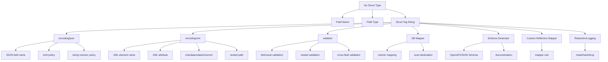
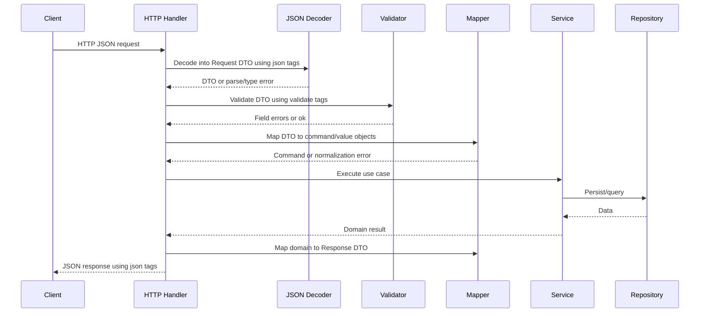

# learn-go-data-mapper-json-xml-protobuf-validation-part-004.md

# Part 004 — Struct Tags as Serialization Metadata

> Seri: `learn-go-data-mapper-json-xml-protobuf-validation`  
> Bagian: `004 / 033`  
> Topik: Go struct tags sebagai metadata boundary untuk JSON, XML, validation, mapper, dan contract governance  
> Target pembaca: Java software engineer yang ingin memahami idiom Go secara production-grade  
> Status seri: belum selesai

---

## 0. Tujuan Pembelajaran

Setelah menyelesaikan bagian ini, kamu harus mampu:

1. Menjelaskan apa itu struct tag di Go secara tepat: bukan annotation seperti Java, bukan runtime attribute yang punya semantic bawaan compiler, melainkan string metadata yang dibaca oleh package tertentu lewat reflection.
2. Mendesain tag strategy untuk DTO/API model, XML integration model, validation model, dan persistence/event projection tanpa membuat model menjadi “tag soup”.
3. Memahami grammar struct tag: `key:"value"`, aturan spasi, quotation, `reflect.StructTag.Get`, dan `reflect.StructTag.Lookup`.
4. Menguasai perbedaan semantic tag `json`, `xml`, `validate`, `db`, `bson`, `yaml`, `form`, dan custom tag.
5. Mengetahui jebakan `omitempty`, `omitzero`, `string`, `-`, embedded field, exported/unexported field, case matching, XML attribute, `chardata`, `innerxml`, dan nested XML path.
6. Menentukan kapan constraint boleh ditaruh di tag dan kapan harus dipindah ke constructor/domain/service validation.
7. Mendesain governance agar field rename, tag rename, validation change, dan serialization behavior tidak menjadi breaking change diam-diam.
8. Membuat utility sederhana untuk membaca tag secara aman, membangun metadata field, dan mendeteksi drift tag dalam CI.

---

## 1. Mental Model: Struct Tag Adalah Metadata di Boundary, Bukan Domain Truth

Di Java, kamu terbiasa melihat annotation seperti:

```java
public final class CreateCustomerRequest {
    @JsonProperty("customer_id")
    @NotBlank
    @Size(max = 64)
    private String customerId;
}
```

Annotation di Java terasa seperti fitur bahasa yang “aktif”: framework seperti Jackson, Jakarta Bean Validation, JPA, JAXB, MapStruct, Spring, Hibernate, dan OpenAPI generator membangun banyak behavior dari annotation itu.

Di Go, bentuk paling dekat adalah struct tag:

```go
type CreateCustomerRequest struct {
    CustomerID string `json:"customer_id" validate:"required,max=64"`
}
```

Tetapi mental model-nya berbeda.

Struct tag di Go:

- adalah string literal yang melekat pada field struct;
- tidak punya efek otomatis dari compiler;
- dibaca oleh package tertentu, biasanya via `reflect`;
- semantic-nya tergantung package yang membaca tag itu;
- dapat coexist: satu field bisa punya `json`, `xml`, `validate`, `db`, `bson`, `form`, dan custom tag sekaligus;
- mudah disalahgunakan sebagai tempat menumpuk terlalu banyak policy.

Dengan kata lain:

> Struct tag bukan sumber kebenaran domain. Struct tag adalah metadata untuk consumer tertentu di boundary tertentu.

Boundary itu bisa berupa:

- JSON API;
- XML integration;
- form binding;
- DB scan/mapping;
- validation engine;
- schema generator;
- audit redaction;
- OpenAPI generator;
- custom mapper;
- event envelope;
- logging/observability redaction.

Jika kamu menaruh terlalu banyak boundary metadata pada satu struct yang sama, struct itu perlahan berubah menjadi “central accidental contract”. Semua layer menjadi tergantung pada bentuk yang sama, padahal lifecycle-nya berbeda.

---

## 2. Diagram Besar: Siapa Membaca Struct Tag?



Tag tidak menjalankan behavior sendiri. Package pembacanya yang menentukan arti tag.

Contoh penting:

```go
type User struct {
    Email string `json:"email" xml:"email" validate:"required,email" audit:"pii,email"`
}
```

Field `Email` punya empat metadata berbeda:

- `json:"email"` untuk JSON object member name;
- `xml:"email"` untuk XML element name;
- `validate:"required,email"` untuk validation library;
- `audit:"pii,email"` untuk custom redaction/audit framework.

Compiler Go tidak memahami `json`, `xml`, `validate`, atau `audit`. Semua itu hanya string sampai package tertentu memutuskan membacanya.

---

## 3. Struct Tag Grammar

Secara konvensi, struct tag adalah gabungan pasangan:

```text
key:"value" key2:"value2" key3:"value3"
```

Contoh:

```go
type Example struct {
    Field string `json:"field" xml:"field" validate:"required"`
}
```

Aturan penting:

1. Setiap pair dipisahkan oleh spasi.
2. Key tidak boleh kosong.
3. Key tidak boleh mengandung spasi, quote, colon, atau control character.
4. Value diapit double quote.
5. Value memakai Go string literal syntax.
6. Isi value adalah milik package pembaca tag tersebut.

Tag yang benar:

```go
type Good struct {
    Name string `json:"name" validate:"required"`
}
```

Tag yang buruk:

```go
type Bad struct {
    Name string `json:"name",validate:"required"` // salah: antar tag tidak dipisah koma
}
```

Pada contoh buruk di atas, tag tidak mengikuti convention `key:"value" key:"value"`. Sebagian package mungkin gagal membaca, sebagian mungkin mengembalikan hasil tidak terduga.

---

## 4. `reflect.StructTag.Get` vs `Lookup`

`reflect.StructTag` menyediakan dua method utama:

```go
func (tag StructTag) Get(key string) string
func (tag StructTag) Lookup(key string) (value string, ok bool)
```

Perbedaannya penting.

`Get` hanya mengembalikan value. Kalau key tidak ada, hasilnya string kosong.

```go
type Request struct {
    A string `alias:"customer_id"`
    B string `alias:""`
    C string
}
```

Jika memakai `Get("alias")`:

```go
A -> "customer_id"
B -> ""
C -> ""
```

Masalahnya: field B punya tag eksplisit kosong, field C tidak punya tag. `Get` tidak bisa membedakan keduanya.

`Lookup` bisa:

```go
A -> "customer_id", true
B -> "", true
C -> "", false
```

Rule praktis:

- Gunakan `Get` untuk tag sederhana ketika empty dan absent memang sama.
- Gunakan `Lookup` untuk generator, mapper framework, analyzer, audit framework, redaction, dan compatibility tooling.

Contoh helper:

```go
package tagx

import "reflect"

type TagValue struct {
    Value   string
    Present bool
}

func Lookup(field reflect.StructField, key string) TagValue {
    value, ok := field.Tag.Lookup(key)
    return TagValue{Value: value, Present: ok}
}
```

Contoh penggunaan:

```go
func inspect(t reflect.Type) {
    for i := 0; i < t.NumField(); i++ {
        f := t.Field(i)
        jsonTag := tagx.Lookup(f, "json")
        if !jsonTag.Present {
            continue
        }
        println(f.Name, jsonTag.Value)
    }
}
```

---

## 5. Exported Field: Tag Ada, Tapi Encoder Mungkin Mengabaikan

Struct tag bisa ditempelkan pada exported maupun unexported field.

```go
type User struct {
    ID    string `json:"id"`
    email string `json:"email"`
}
```

Field `email` punya tag, tetapi `encoding/json` tidak akan mengekspor field unexported itu.

```go
u := User{ID: "u-1", email: "a@example.com"}
b, _ := json.Marshal(u)
fmt.Println(string(b))
// {"id":"u-1"}
```

Mental model:

> Tag tidak mengubah visibility rule Go.

Ini berbeda dari Java, di mana reflection framework sering bisa mengakses private field melalui accessor, constructor, module opening, atau reflective accessibility. Di Go standard encoding, exported field adalah syarat utama untuk marshaling/unmarshaling berbasis reflection.

Konsekuensi desain:

- DTO yang akan di-encode/decode harus punya exported fields.
- Domain object yang menjaga invariant lewat unexported field sebaiknya tidak langsung dipakai sebagai DTO.
- Jika domain object butuh representasi khusus, gunakan explicit mapper atau custom marshal/unmarshal dengan hati-hati.

Contoh yang lebih sehat:

```go
type EmailAddress struct {
    value string
}

func ParseEmailAddress(raw string) (EmailAddress, error) {
    raw = strings.TrimSpace(strings.ToLower(raw))
    if raw == "" || !strings.Contains(raw, "@") {
        return EmailAddress{}, fmt.Errorf("invalid email address")
    }
    return EmailAddress{value: raw}, nil
}

func (e EmailAddress) String() string {
    return e.value
}

type CreateUserRequest struct {
    Email string `json:"email" validate:"required,email"`
}

type User struct {
    id    string
    email EmailAddress
}
```

DTO field exported karena harus berinteraksi dengan JSON. Domain field unexported karena invariant-nya dijaga oleh constructor/domain method.

---

## 6. Struct Tag vs Java Annotation

| Aspek | Java Annotation | Go Struct Tag |
|---|---|---|
| Bentuk | Metadata typed di source code | Raw string metadata di field struct |
| Validasi compile-time | Annotation type dicek compiler | Tag value umumnya tidak dicek compiler |
| Semantic | Ditentukan annotation processor/framework | Ditentukan package pembaca tag |
| Refactoring safety | Lebih tinggi untuk annotation class/attribute | Rendah; typo string bisa diam-diam gagal |
| Discovery | Reflection annotation API | `reflect.StructField.Tag` |
| Code generation | Annotation processor umum | `go generate`, AST tooling, reflection, external generator |
| Kecenderungan risiko | Framework magic | Tag soup dan silent drift |

Contoh Java:

```java
@JsonProperty("case_id")
@NotBlank
private String caseId;
```

Contoh Go:

```go
CaseID string `json:"case_id" validate:"required"`
```

Perbedaannya bukan syntax, tapi governance.

Di Go, karena tag adalah string, kamu harus lebih disiplin membuat:

- naming convention;
- CI check;
- tests untuk encoding shape;
- contract snapshot;
- schema generation validation;
- review checklist untuk breaking change.

---

## 7. JSON Tag: Name, Omit, Ignore, String

Struct tag paling sering dipakai di Go adalah `json`.

```go
type CustomerDTO struct {
    ID        string `json:"id"`
    FullName  string `json:"full_name"`
    Age       int    `json:"age,omitempty"`
    Internal  string `json:"-"`
    AccountNo int64  `json:"account_no,string"`
}
```

Makna umum:

| Tag | Makna |
|---|---|
| `json:"id"` | Gunakan nama JSON `id` |
| `json:"full_name"` | Gunakan snake_case external name |
| `json:",omitempty"` | Pakai field name default, omit kalau empty |
| `json:"-"` | Abaikan field dari JSON |
| `json:"-,"` | Field muncul dengan nama JSON `-` |
| `json:"account_no,string"` | Encode/decode nilai numerik sebagai JSON string |
| `json:"created_at,omitzero"` | Omit jika zero value menurut rule zero/`IsZero` |

### 7.1 Name Override

Tanpa tag:

```go
type User struct {
    UserID string
}
```

JSON default:

```json
{"UserID":"u-1"}
```

Dengan tag:

```go
type User struct {
    UserID string `json:"user_id"`
}
```

JSON:

```json
{"user_id":"u-1"}
```

Rule penting:

> External contract name jangan mengikuti rename internal field.

Jika kamu rename `UserID` menjadi `ID`, tetapi tag tetap `json:"user_id"`, client tidak rusak.

```go
type User struct {
    ID string `json:"user_id"`
}
```

Ini alasan utama kenapa tag penting di API DTO.

### 7.2 `json:"-"` Bukan Security Boundary yang Cukup

```go
type User struct {
    ID           string `json:"id"`
    PasswordHash string `json:"-"`
}
```

`json:"-"` mencegah `encoding/json` mengeluarkan field itu saat marshaling struct ini. Tetapi jangan jadikan ini satu-satunya mekanisme keamanan.

Kenapa?

1. Field masih ada di memory.
2. Package lain mungkin tidak membaca tag `json`.
3. Logger reflection custom bisa tetap membaca field.
4. Struct bisa dikonversi ke map secara manual dan bocor.
5. Developer bisa menambahkan DTO baru dan lupa tag.

Lebih aman:

```go
type User struct {
    id           string
    email        EmailAddress
    passwordHash PasswordHash
}

type UserResponse struct {
    ID    string `json:"id"`
    Email string `json:"email"`
}

func NewUserResponse(u User) UserResponse {
    return UserResponse{
        ID:    u.id,
        Email: u.email.String(),
    }
}
```

Sensitive field tidak masuk response DTO sejak awal.

### 7.3 `omitempty`: Jebakan Paling Sering

`omitempty` menghilangkan field ketika value dianggap empty.

Empty value meliputi:

- `false`;
- `0`;
- nil pointer;
- nil interface;
- array/slice/map/string panjang 0.

Contoh bug:

```go
type UpdateUserRequest struct {
    MarketingOptIn bool `json:"marketing_opt_in,omitempty"`
}
```

Jika client mengirim:

```json
{"marketing_opt_in":false}
```

Setelah decode, nilainya `false`. Tetapi saat encode ulang dengan `omitempty`, field bisa hilang.

Masalah konseptual:

- `false` sebagai nilai eksplisit berbeda dari absent.
- `0` sebagai nilai eksplisit berbeda dari absent.
- empty string sebagai nilai eksplisit berbeda dari absent.

Untuk PATCH/update, gunakan pointer atau custom optional type:

```go
type UpdateUserRequest struct {
    MarketingOptIn *bool `json:"marketing_opt_in,omitempty"`
}
```

Sekarang:

| JSON Input | Go Value | Makna |
|---|---|---|
| absent | `nil` | tidak ingin update |
| `false` | pointer ke false | update menjadi false |
| `true` | pointer ke true | update menjadi true |

Untuk field angka:

```go
type UpdateLimitRequest struct {
    DailyLimit *int64 `json:"daily_limit,omitempty"`
}
```

Jika limit boleh 0, jangan gunakan `int64` biasa dengan `omitempty` untuk representasi update.

### 7.4 `omitzero` vs `omitempty`

Modern Go `encoding/json` mendukung `omitzero`, yang berbeda dari `omitempty`.

`omitempty` bicara “empty untuk JSON encoding”.

`omitzero` bicara “zero value Go”, dan dapat memakai method:

```go
IsZero() bool
```

Contoh:

```go
type Money struct {
    Currency string
    Minor    int64
}

func (m Money) IsZero() bool {
    return m.Currency == "" && m.Minor == 0
}

type InvoiceResponse struct {
    Discount Money `json:"discount,omitzero"`
}
```

Gunakan `omitzero` ketika yang ingin kamu representasikan adalah “nilai belum meaningful secara domain/value-object”, bukan sekadar empty JSON.

Tetapi tetap hati-hati: omission policy adalah contract. Mengubah `omitempty` menjadi `omitzero`, atau sebaliknya, bisa mengubah response shape.

### 7.5 `string` untuk Large Number Boundary

```go
type Account struct {
    ID int64 `json:"id,string"`
}
```

JSON:

```json
{"id":"9223372036854775807"}
```

Ini sering dipakai karena JavaScript number tidak aman untuk semua 64-bit integer.

Namun jangan asal pakai `string`.

Cocok untuk:

- ID numerik legacy;
- large integer yang harus dikonsumsi JavaScript;
- integrasi yang sudah menetapkan number-as-string.

Tidak cocok untuk:

- money decimal tanpa custom decimal type;
- semua angka secara default;
- field yang harus bisa di-query sebagai number oleh downstream analytics.

---

## 8. JSON Field Conflict dan Embedded Struct

Embedded struct dapat mempromosikan field ke outer struct.

```go
type AuditInfo struct {
    CreatedAt string `json:"created_at"`
}

type UserResponse struct {
    AuditInfo
    ID string `json:"id"`
}
```

JSON:

```json
{
  "created_at": "2026-06-24T10:00:00Z",
  "id": "u-1"
}
```

Masalah muncul jika ada conflict:

```go
type A struct {
    ID string `json:"id"`
}

type B struct {
    ID string `json:"id"`
}

type C struct {
    A
    B
}
```

Field `id` menjadi ambigu. Dalam beberapa kondisi, field conflict bisa diabaikan tanpa error.

Rule produksi:

1. Jangan embed DTO untuk “reuse field” jika external JSON shape penting.
2. Prefer explicit composition dengan named field.
3. Jika tetap embed, tulis test snapshot JSON.
4. Jalankan contract test untuk memastikan field tidak hilang diam-diam.

Lebih eksplisit:

```go
type UserResponse struct {
    ID        string    `json:"id"`
    CreatedAt time.Time `json:"created_at"`
    UpdatedAt time.Time `json:"updated_at"`
}
```

Go mendorong kejelasan. Untuk DTO boundary, explicit sering lebih aman daripada clever embedding.

---

## 9. XML Tag: Lebih Kaya dan Lebih Mudah Salah

XML tag lebih kompleks karena XML punya:

- element;
- attribute;
- namespace;
- nested path;
- character data;
- CDATA;
- comments;
- raw inner XML.

Contoh:

```go
type PersonXML struct {
    XMLName   xml.Name `xml:"person"`
    ID        string   `xml:"id,attr"`
    FirstName string   `xml:"name>first"`
    LastName  string   `xml:"name>last"`
    Note      string   `xml:",chardata"`
}
```

Output kira-kira:

```xml
<person id="p-1">
  <name>
    <first>Ana</first>
    <last>Wijaya</last>
  </name>
  note text
</person>
```

### 9.1 XMLName

`XMLName` memberi nama root element atau mencatat nama element saat unmarshal.

```go
type CaseEnvelope struct {
    XMLName xml.Name `xml:"case"`
    ID      string   `xml:"id"`
}
```

Jika XML input root tidak sesuai dengan tag `XMLName`, `Unmarshal` bisa mengembalikan error.

Ini berguna untuk strict integration dengan legacy system:

```go
type AgencyRequest struct {
    XMLName xml.Name `xml:"AgencyRequest"`
    RefNo   string   `xml:"ReferenceNo"`
}
```

### 9.2 Attribute

```go
type Document struct {
    ID      string `xml:"id,attr"`
    Version int    `xml:"version,attr"`
    Title   string `xml:"title"`
}
```

XML:

```xml
<Document id="doc-1" version="3">
  <title>Permit</title>
</Document>
```

Jangan samakan attribute dengan JSON field. Dalam XML, attribute sering dipakai untuk metadata element, bukan child object.

### 9.3 Nested Path

```go
type Person struct {
    FirstName string `xml:"name>first"`
    LastName  string `xml:"name>last"`
}
```

XML:

```xml
<Person>
  <name>
    <first>Ana</first>
    <last>Wijaya</last>
  </name>
</Person>
```

Nested path tag adalah fitur berguna, tetapi rawan membuat struct menjadi terlalu bergantung ke layout XML legacy.

Untuk integrasi kompleks, lebih baik pisahkan:

```go
type LegacyPersonXML struct {
    FirstName string `xml:"name>first"`
    LastName  string `xml:"name>last"`
}

type Person struct {
    firstName string
    lastName  string
}
```

Mapper explicit menjaga domain dari perubahan XML layout.

### 9.4 `chardata`, `cdata`, `innerxml`, `comment`

```go
type Message struct {
    Body string `xml:",chardata"`
}
```

```go
type Payload struct {
    Raw string `xml:",innerxml"`
}
```

Perhatian besar untuk `innerxml`:

- raw XML bisa membawa konten yang tidak kamu validasi;
- bisa menyulitkan canonicalization;
- bisa berbahaya jika diteruskan ke downstream tanpa sanitization;
- tidak cocok untuk domain model.

Gunakan `innerxml` hanya pada integration edge yang memang bertugas membawa raw XML.

---

## 10. Validation Tag: Useful, Tapi Bukan Business Rule Engine

Library populer seperti `go-playground/validator/v10` memakai tag `validate`:

```go
type CreateUserRequest struct {
    Email    string `json:"email" validate:"required,email"`
    Age      int    `json:"age" validate:"gte=18,lte=120"`
    Password string `json:"password" validate:"required,min=12"`
}
```

Bagus untuk constraint field-local:

- required;
- min/max length;
- numeric range;
- email format;
- oneof enum-like validation;
- slice dive;
- nested struct validation;
- simple cross-field validation.

Kurang cocok untuk:

- rule yang butuh database lookup;
- rule yang bergantung pada current state machine;
- rule lintas aggregate;
- rule yang butuh permission context;
- rule yang berubah berdasarkan feature flag;
- rule yang harus diaudit sebagai domain decision;
- rule yang butuh temporal/business calendar logic.

Contoh buruk:

```go
type ApproveCaseRequest struct {
    CaseID string `json:"case_id" validate:"required,case_exists,case_assignable,not_escalated,officer_can_approve"`
}
```

Ini membuat validation tag menjadi service/domain engine tersembunyi.

Lebih sehat:

```go
type ApproveCaseRequest struct {
    CaseID string `json:"case_id" validate:"required"`
}

func (h *CaseHandler) Approve(w http.ResponseWriter, r *http.Request) {
    var req ApproveCaseRequest
    if err := decodeAndValidate(r, &req); err != nil {
        writeBadRequest(w, err)
        return
    }

    actor := actorFromContext(r.Context())
    cmd := ApproveCaseCommand{
        CaseID: req.CaseID,
        Actor:  actor,
    }

    if err := h.service.Approve(r.Context(), cmd); err != nil {
        writeDomainError(w, err)
        return
    }
}
```

Tag hanya memastikan request structurally valid. Service memastikan domain action valid.

---

## 11. Tag Layering: Mana yang Boleh Satu Struct, Mana yang Harus Pisah?

Tag layering yang masih sehat:

```go
type CreateCustomerRequest struct {
    Name  string `json:"name" validate:"required,min=1,max=200"`
    Email string `json:"email" validate:"required,email"`
}
```

Kenapa sehat?

- Struct ini jelas request DTO.
- `json` dan `validate` sama-sama bekerja di API input boundary.
- Constraint bersifat field-local.

Tag layering yang mulai mencurigakan:

```go
type Customer struct {
    ID        string `json:"id" db:"customer_id" bson:"_id" xml:"CustomerID" validate:"required" audit:"pii" form:"id"`
    Name      string `json:"name" db:"name" bson:"name" xml:"Name" validate:"required"`
    CreatedAt string `json:"created_at" db:"created_at" bson:"createdAt" xml:"CreatedAt"`
}
```

Kenapa mencurigakan?

- Satu struct mewakili JSON API, DB row, BSON document, XML legacy, form binding, validation, dan audit.
- Semua boundary dipaksa punya field lifecycle yang sama.
- Rename di satu boundary berisiko merusak yang lain.
- Domain menjadi tergantung representation detail.

Rule praktis:

| Kombinasi tag | Biasanya aman? | Catatan |
|---|---:|---|
| `json` + `validate` pada request DTO | Ya | Umum dan jelas |
| `json` + `xml` pada integration DTO kecil | Kadang | Aman jika contract memang identik |
| `json` + `db` pada persistence model | Hati-hati | Sering mencampur API dan DB lifecycle |
| `json` + `bson` pada model Mongo API | Hati-hati | Bisa diterima untuk CRUD internal sederhana, buruk untuk public API kompleks |
| `json` + `xml` + `db` + `validate` + `audit` | Tidak ideal | Biasanya tanda model boundary tercampur |
| `validate` pada domain entity | Kadang | Hanya jika tidak mengganti invariant domain method |
| custom `redact` pada response/log DTO | Ya | Jika governance jelas |

---

## 12. Tag Soup: Anti-Pattern yang Harus Dikenali

Tag soup adalah kondisi ketika struct menjadi tempat menumpuk metadata dari terlalu banyak framework/boundary.

```go
type MegaCustomer struct {
    ID string `json:"id" xml:"id" yaml:"id" form:"id" db:"customer_id" bson:"_id" validate:"required,uuid4" audit:"safe" example:"c-123"`
}
```

Gejala tag soup:

1. Satu struct dipakai di handler, service, repository, event publisher, dan legacy adapter.
2. Field rename terasa menakutkan karena bisa merusak banyak layer.
3. Tag baru ditambahkan untuk memenuhi library baru.
4. Validation tag berisi rule yang makin panjang.
5. Tidak jelas field mana external contract dan field mana internal storage.
6. Test JSON/XML/DB mapping saling bergantung.
7. Developer takut menghapus field walaupun tidak dipakai.

Refactoring strategy:

```go
// API input boundary
type CreateCustomerRequest struct {
    Name  string `json:"name" validate:"required,max=200"`
    Email string `json:"email" validate:"required,email"`
}

// Domain command
type CreateCustomerCommand struct {
    Name  CustomerName
    Email EmailAddress
}

// DB row model
type customerRow struct {
    ID    string `db:"customer_id"`
    Name  string `db:"name"`
    Email string `db:"email"`
}

// XML legacy output
type CustomerXML struct {
    XMLName xml.Name `xml:"Customer"`
    ID      string   `xml:"CustomerID"`
    Name    string   `xml:"Name"`
}
```

Ini lebih verbose, tetapi lifecycle tiap boundary menjadi eksplisit.

---

## 13. Struct Tag Tidak Sama dengan Schema

Tag memberi hint pada package tertentu. Tag bukan schema lengkap.

Contoh:

```go
type CreateOrderRequest struct {
    CustomerID string `json:"customer_id" validate:"required"`
    Quantity   int    `json:"quantity" validate:"gte=1,lte=100"`
}
```

Dari tag ini kamu bisa infer sebagian schema:

- JSON field name: `customer_id`, `quantity`;
- required-ish menurut validation library;
- range quantity 1..100.

Tetapi tag tidak menjawab:

- apakah unknown field ditolak?
- apakah duplicate JSON key ditolak?
- apakah `customer_id` format ULID/UUID/internal ID?
- apakah field nullable?
- apakah `quantity` boleh absent?
- apakah ada business rule berbasis customer tier?
- apakah field deprecated?
- apakah default diterapkan?
- apakah versioning contract berlaku?

Jadi schema contract butuh layer lain:

- OpenAPI untuk HTTP API;
- JSON Schema untuk JSON document validation;
- Protobuf schema untuk binary/gRPC/event contract;
- Buf breaking check untuk protobuf evolution;
- contract tests untuk actual wire shape;
- ADR untuk compatibility policy.

Struct tag dapat membantu schema generation, tetapi bukan pengganti governance.

---

## 14. Custom Tag: Ketika Perlu Metadata Internal

Kadang kamu butuh metadata yang tidak disediakan standard package.

Contoh redaction:

```go
type AuditEvent struct {
    EventID string `json:"event_id" redact:"safe"`
    ActorID string `json:"actor_id" redact:"id"`
    Email   string `json:"email" redact:"pii,email"`
    Token   string `json:"token" redact:"secret"`
}
```

Atau field-level classification:

```go
type CaseSnapshot struct {
    CaseID      string `json:"case_id" classify:"public-id"`
    ApplicantID string `json:"applicant_id" classify:"personal-data"`
    Notes       string `json:"notes" classify:"sensitive-free-text"`
}
```

Custom tag harus punya grammar jelas.

Buruk:

```go
Notes string `classify:"very sensitive maybe redact in prod"`
```

Lebih baik:

```go
Notes string `classify:"sensitive,free_text" redact:"mask"`
```

Atau:

```go
Notes string `data:"class=sensitive,kind=free_text" redact:"strategy=mask"`
```

Tetapi ingat: semakin kompleks value tag, semakin kamu butuh parser, tests, dan docs.

---

## 15. Mendesain Grammar Custom Tag

Jika kamu membuat custom tag, jangan mulai dari kode. Mulai dari pertanyaan:

1. Siapa consumer tag ini?
2. Apakah tag ini untuk runtime behavior atau build-time generation?
3. Apakah value tag harus backward compatible?
4. Apakah typo harus gagal cepat?
5. Apakah tag boleh punya multiple options?
6. Apakah order options bermakna?
7. Apakah tag value perlu escape/comma?
8. Apakah ada default jika tag absent?
9. Apakah explicit empty value berbeda dari absent?
10. Apakah tag boleh conflict dengan tag lain?

### 15.1 Format comma-separated sederhana

```go
Email string `redact:"pii,email,hash"`
```

Parser:

```go
func parseCSVTag(raw string) map[string]bool {
    result := make(map[string]bool)
    for _, part := range strings.Split(raw, ",") {
        part = strings.TrimSpace(part)
        if part == "" {
            continue
        }
        result[part] = true
    }
    return result
}
```

Cocok untuk option boolean.

### 15.2 Format key-value

```go
Email string `redact:"class=pii,kind=email,strategy=hash"`
```

Parser sederhana:

```go
func parseKVTag(raw string) (map[string]string, error) {
    out := make(map[string]string)
    if raw == "" {
        return out, nil
    }

    for _, part := range strings.Split(raw, ",") {
        part = strings.TrimSpace(part)
        if part == "" {
            continue
        }
        k, v, ok := strings.Cut(part, "=")
        if !ok {
            return nil, fmt.Errorf("invalid tag segment %q: expected key=value", part)
        }
        k = strings.TrimSpace(k)
        v = strings.TrimSpace(v)
        if k == "" {
            return nil, fmt.Errorf("invalid tag segment %q: empty key", part)
        }
        if _, exists := out[k]; exists {
            return nil, fmt.Errorf("duplicate tag key %q", k)
        }
        out[k] = v
    }
    return out, nil
}
```

Cocok untuk metadata yang tumbuh.

### 15.3 Jangan Buat Bahasa Mini di Tag

Hindari ini:

```go
Amount int64 `rule:"if currency == 'IDR' then amount > 0 and amount % 100 == 0 else amount > 0"`
```

Jika rule sudah menjadi expression language, pindahkan ke:

- validation function;
- policy object;
- schema language yang memang didesain untuk itu;
- CEL/protovalidate untuk Protobuf jika sesuai;
- domain service.

Tag sebaiknya deklaratif sederhana, bukan mini programming language.

---

## 16. Membaca Tag dan Membangun Field Metadata

Contoh metadata extractor untuk DTO:

```go
package metax

import (
    "reflect"
    "strings"
)

type JSONField struct {
    GoName       string
    JSONName     string
    Ignored      bool
    OmitEmpty    bool
    OmitZero     bool
    StringNumber bool
    HasJSONTag   bool
}

func InspectJSONFields(t reflect.Type) []JSONField {
    if t.Kind() == reflect.Pointer {
        t = t.Elem()
    }
    if t.Kind() != reflect.Struct {
        return nil
    }

    var fields []JSONField
    for i := 0; i < t.NumField(); i++ {
        sf := t.Field(i)
        if !sf.IsExported() {
            continue
        }

        raw, ok := sf.Tag.Lookup("json")
        meta := JSONField{
            GoName:     sf.Name,
            JSONName:   sf.Name,
            HasJSONTag: ok,
        }

        if ok {
            name, options := splitTag(raw)
            if name == "-" {
                meta.Ignored = true
            } else if name != "" {
                meta.JSONName = name
            }
            meta.OmitEmpty = options["omitempty"]
            meta.OmitZero = options["omitzero"]
            meta.StringNumber = options["string"]
        }

        fields = append(fields, meta)
    }
    return fields
}

func splitTag(raw string) (string, map[string]bool) {
    out := make(map[string]bool)
    if raw == "" {
        return "", out
    }
    parts := strings.Split(raw, ",")
    name := parts[0]
    for _, opt := range parts[1:] {
        if opt == "" {
            continue
        }
        out[opt] = true
    }
    return name, out
}
```

Test:

```go
func TestInspectJSONFields(t *testing.T) {
    type User struct {
        ID       string `json:"id"`
        Age      int    `json:"age,omitempty"`
        Internal string `json:"-"`
        Count    int64  `json:"count,string"`
        hidden   string `json:"hidden"`
    }

    fields := InspectJSONFields(reflect.TypeOf(User{}))

    got := map[string]JSONField{}
    for _, f := range fields {
        got[f.GoName] = f
    }

    if got["ID"].JSONName != "id" {
        t.Fatalf("ID JSONName = %q", got["ID"].JSONName)
    }
    if !got["Age"].OmitEmpty {
        t.Fatalf("Age should be omitempty")
    }
    if !got["Internal"].Ignored {
        t.Fatalf("Internal should be ignored")
    }
    if !got["Count"].StringNumber {
        t.Fatalf("Count should use string option")
    }
    if _, ok := got["hidden"]; ok {
        t.Fatalf("unexported field should not be included")
    }
}
```

Catatan: parser di atas cukup untuk metadata internal sederhana, tetapi tidak berusaha menyamai seluruh algoritma `encoding/json`, terutama embedded field conflict resolution. Untuk produksi, jangan berpura-pura sudah mengimplementasikan semua behavior standard library kecuali memang kamu siap menanggung compatibility detail-nya.

---

## 17. Menggunakan JSON Tag Name untuk Validation Error

Salah satu pola yang sangat berguna di API adalah memakai nama field JSON dalam validation error, bukan nama field Go.

Tanpa ini, error bisa seperti:

```json
{
  "field": "EmailAddress",
  "rule": "required"
}
```

Padahal client mengenal field:

```json
{
  "email_address": "..."
}
```

Dengan `go-playground/validator`, kamu dapat mendaftarkan function untuk mengambil nama dari `json` tag.

```go
package validation

import (
    "reflect"
    "strings"

    "github.com/go-playground/validator/v10"
)

func NewValidator() *validator.Validate {
    v := validator.New(validator.WithRequiredStructEnabled())

    v.RegisterTagNameFunc(func(fld reflect.StructField) string {
        name := strings.SplitN(fld.Tag.Get("json"), ",", 2)[0]
        if name == "-" {
            return ""
        }
        if name == "" {
            return fld.Name
        }
        return name
    })

    return v
}
```

API error mapping:

```go
type FieldError struct {
    Field   string `json:"field"`
    Rule    string `json:"rule"`
    Message string `json:"message"`
}

func ToFieldErrors(err error) []FieldError {
    var verrs validator.ValidationErrors
    if !errors.As(err, &verrs) {
        return []FieldError{{Message: err.Error()}}
    }

    out := make([]FieldError, 0, len(verrs))
    for _, fe := range verrs {
        out = append(out, FieldError{
            Field:   fe.Field(),
            Rule:    fe.Tag(),
            Message: validationMessage(fe),
        })
    }
    return out
}
```

Keuntungan:

- client mendapat field name yang mereka kirim;
- Go internal rename tidak mengubah error contract;
- error response konsisten dengan OpenAPI/JSON Schema.

---

## 18. Tag Governance: Treat Tag Change as Contract Change

Perubahan tag bisa breaking change.

Contoh:

```go
// before
CustomerID string `json:"customer_id"`

// after
CustomerID string `json:"id"`
```

Ini bukan refactor biasa. Ini mengubah external JSON contract.

Contoh lain:

```go
// before
Amount int64 `json:"amount"`

// after
Amount int64 `json:"amount,string"`
```

Ini mengubah type wire dari number menjadi string.

Contoh lain:

```go
// before
Priority int `json:"priority,omitempty"`

// after
Priority int `json:"priority"`
```

Ini mengubah response shape: field yang dulu hilang saat 0 sekarang muncul.

Tag change yang harus direview sebagai breaking/compatibility-sensitive:

| Change | Risiko |
|---|---|
| Rename `json` field | Client tidak bisa membaca field lama |
| Menambah `omitempty` | Field bisa hilang dari response |
| Menghapus `omitempty` | Field baru selalu muncul; bisa memengaruhi strict clients |
| Menambah `string` | Type JSON berubah |
| Menghapus `string` | Type JSON berubah |
| Mengubah `xml` element menjadi attribute | XML contract berubah besar |
| Mengubah nested XML path | Legacy parser downstream rusak |
| Menambah `validate:"required"` | Request lama bisa mulai ditolak |
| Memperketat `max`, `oneof`, range | Request lama bisa mulai ditolak |
| Mengubah `db` tag | Persistence mapping bisa rusak |
| Mengubah redaction tag | Risiko kebocoran atau observability loss |

Checklist PR:

```text
[ ] Apakah tag JSON/XML berubah?
[ ] Apakah field name external berubah?
[ ] Apakah omission behavior berubah?
[ ] Apakah validation rule lebih ketat?
[ ] Apakah generated OpenAPI/JSON Schema berubah?
[ ] Apakah client lama masih kompatibel?
[ ] Apakah event consumer lama masih kompatibel?
[ ] Apakah contract test/snapshot diperbarui secara sadar?
[ ] Apakah migration/deprecation plan diperlukan?
```

---

## 19. CI Check: go vet, Staticcheck, dan Custom Analyzer

Minimal, jalankan:

```bash
go vet ./...
```

`go vet` dapat menemukan beberapa suspicious construct, termasuk tag yang tidak well-formed melalui analyzer structtag.

Tetapi `go vet` tidak cukup untuk policy organisasi.

Contoh policy yang mungkin kamu butuhkan:

1. Semua public API DTO harus punya `json` tag eksplisit.
2. Tidak boleh ada `json` field name camelCase di REST API tertentu.
3. Request DTO tidak boleh punya `db` tag.
4. Response DTO tidak boleh punya field sensitive tanpa `redact` tag.
5. Field dengan nama mengandung `Password`, `Token`, `Secret`, `Credential` wajib `json:"-"` atau tidak boleh berada di response DTO.
6. Field dengan `validate:"required"` harus tidak memakai `omitempty` kecuali ada alasan.
7. Field pointer pada request DTO harus didokumentasikan sebagai optional/patch semantics.

Untuk policy seperti itu, buat custom analyzer atau test reflection.

Contoh test sederhana untuk memastikan semua response DTO punya json tag:

```go
func AssertAllExportedFieldsHaveJSONTag(t *testing.T, typ reflect.Type) {
    t.Helper()
    if typ.Kind() == reflect.Pointer {
        typ = typ.Elem()
    }
    if typ.Kind() != reflect.Struct {
        t.Fatalf("expected struct, got %s", typ.Kind())
    }

    for i := 0; i < typ.NumField(); i++ {
        f := typ.Field(i)
        if !f.IsExported() {
            continue
        }
        if f.Anonymous {
            continue
        }
        if _, ok := f.Tag.Lookup("json"); !ok {
            t.Errorf("%s.%s missing json tag", typ.Name(), f.Name)
        }
    }
}
```

Test:

```go
func TestResponseDTOJSONTags(t *testing.T) {
    AssertAllExportedFieldsHaveJSONTag(t, reflect.TypeOf(UserResponse{}))
    AssertAllExportedFieldsHaveJSONTag(t, reflect.TypeOf(CaseResponse{}))
}
```

Untuk skala besar, custom `go/analysis` analyzer lebih kuat, tetapi test reflection sudah cukup sebagai langkah awal.

---

## 20. Contract Snapshot Test untuk Tag Behavior

Tag tidak cukup diuji dengan melihat source. Uji wire output-nya.

Contoh:

```go
func TestUserResponseJSONContract(t *testing.T) {
    got, err := json.Marshal(UserResponse{
        ID:    "u-1",
        Email: "ana@example.com",
    })
    if err != nil {
        t.Fatal(err)
    }

    want := `{"id":"u-1","email":"ana@example.com"}`
    if string(got) != want {
        t.Fatalf("json contract changed\nwant: %s\n got: %s", want, string(got))
    }
}
```

Untuk response yang map order-nya tidak stabil, decode ke map lalu compare, atau gunakan golden file dengan canonicalization.

Contoh canonical compare:

```go
func requireJSONEqual(t *testing.T, want, got []byte) {
    t.Helper()

    var wantAny any
    var gotAny any

    if err := json.Unmarshal(want, &wantAny); err != nil {
        t.Fatalf("bad want json: %v", err)
    }
    if err := json.Unmarshal(got, &gotAny); err != nil {
        t.Fatalf("bad got json: %v", err)
    }
    if !reflect.DeepEqual(wantAny, gotAny) {
        t.Fatalf("json mismatch\nwant: %s\n got: %s", want, got)
    }
}
```

Tag governance tanpa contract test hanya bergantung pada review manual.

---

## 21. Struct Tags dan Backward Compatibility

Ada dua arah compatibility:

1. Producer compatibility: apakah output baru masih bisa dibaca consumer lama?
2. Consumer compatibility: apakah input lama masih bisa dibaca server baru?

Tag memengaruhi keduanya.

### 21.1 Menambah Field Baru

```go
type UserResponse struct {
    ID       string `json:"id"`
    Email    string `json:"email"`
    TimeZone string `json:"time_zone,omitempty"`
}
```

Biasanya kompatibel jika consumer mengabaikan unknown field.

Tetapi strict consumer bisa gagal.

Untuk public API, document field addition policy.

### 21.2 Rename Field

```go
// old
EmailAddress string `json:"email_address"`

// new
Email string `json:"email"`
```

Ini breaking. Cara transisi:

```go
type UserResponse struct {
    Email        string `json:"email"`
    EmailAddress string `json:"email_address,omitempty"` // deprecated
}
```

Atau custom marshal untuk mengeluarkan dua name sementara.

Untuk request, terima dua name selama migration:

```go
type UpdateEmailRequest struct {
    Email        string `json:"email"`
    EmailAddress string `json:"email_address"`
}

func (r UpdateEmailRequest) CanonicalEmail() (string, error) {
    if r.Email != "" && r.EmailAddress != "" && r.Email != r.EmailAddress {
        return "", fmt.Errorf("email and email_address conflict")
    }
    if r.Email != "" {
        return r.Email, nil
    }
    return r.EmailAddress, nil
}
```

### 21.3 Tightening Validation

```go
// before
Name string `json:"name" validate:"required"`

// after
Name string `json:"name" validate:"required,min=3,max=80"`
```

Ini bisa breaking untuk existing clients. Treat as API behavior change.

Migration options:

- soft warning first;
- monitor violation rate;
- add versioned endpoint;
- enforce only for new flows;
- grandfather existing records;
- return clear machine-readable errors.

---

## 22. Request DTO Tag Design

Request DTO harus memprioritaskan:

- clear external names;
- validation error clarity;
- optionality semantics;
- strict decode policy;
- unknown field policy;
- protection dari mass assignment.

Contoh:

```go
type CreateCaseRequest struct {
    ApplicantID string  `json:"applicant_id" validate:"required"`
    CaseType    string  `json:"case_type" validate:"required,oneof=LICENSE_RENEWAL COMPLAINT APPEAL"`
    Priority    *string `json:"priority,omitempty" validate:"omitempty,oneof=LOW NORMAL HIGH"`
    Remarks     *string `json:"remarks,omitempty" validate:"omitempty,max=2000"`
}
```

Kenapa `Priority` pointer?

Karena absent bisa berarti “gunakan default priority”, sedangkan explicit value berarti “client memilih priority”.

Jika `Priority string` tanpa pointer:

- absent -> `""`;
- explicit empty -> `""`;
- tidak bisa dibedakan.

Untuk create request, kadang tidak perlu membedakan absent dan empty jika validation menolak empty. Untuk patch request, sering wajib membedakan.

---

## 23. Response DTO Tag Design

Response DTO harus memprioritaskan:

- stable field names;
- predictable omission behavior;
- avoiding secret fields;
- backward-compatible field addition;
- clear deprecation;
- time/number format consistency.

Contoh:

```go
type CaseResponse struct {
    ID          string     `json:"id"`
    ReferenceNo string     `json:"reference_no"`
    Status      string     `json:"status"`
    CreatedAt   time.Time  `json:"created_at"`
    ClosedAt    *time.Time `json:"closed_at,omitempty"`
}
```

Rule:

- Mandatory response fields sebaiknya tidak pakai `omitempty`.
- Optional response fields pakai pointer agar explicit absence jelas.
- Timestamp gunakan format konsisten; default `time.Time` JSON adalah RFC3339-like string melalui marshal logic `time.Time`.
- Jangan expose internal enum jika tidak menjadi contract.

---

## 24. Persistence Tag: Jangan Dicampur Tanpa Alasan

Library DB mapper sering memakai `db` tag:

```go
type customerRow struct {
    ID        string    `db:"customer_id"`
    Name      string    `db:"name"`
    Email     string    `db:"email"`
    CreatedAt time.Time `db:"created_at"`
}
```

Ini persistence model, bukan API response.

Buruk:

```go
type Customer struct {
    ID        string    `json:"id" db:"customer_id"`
    Name      string    `json:"name" db:"name"`
    Email     string    `json:"email" db:"email"`
    CreatedAt time.Time `json:"created_at" db:"created_at"`
}
```

Kadang praktis untuk CRUD sederhana, tetapi long-term risk-nya tinggi:

- API field rename memengaruhi DB row model review;
- DB column rename memengaruhi API DTO;
- sensitive DB field bisa tidak sengaja muncul di API;
- persistence nullability tidak selalu sama dengan API optionality;
- schema migration dan API evolution punya lifecycle berbeda.

Lebih baik:

```go
type CustomerResponse struct {
    ID    string `json:"id"`
    Name  string `json:"name"`
    Email string `json:"email"`
}

type customerRow struct {
    ID    string `db:"customer_id"`
    Name  string `db:"name"`
    Email string `db:"email"`
}

func customerResponseFromDomain(c Customer) CustomerResponse {
    return CustomerResponse{
        ID:    c.ID().String(),
        Name:  c.Name().String(),
        Email: c.Email().String(),
    }
}
```

---

## 25. Tag dan Mass Assignment

Mass assignment adalah bug ketika client bisa mengisi field yang seharusnya server-controlled.

Contoh buruk:

```go
type User struct {
    ID        string `json:"id"`
    Email     string `json:"email"`
    Role      string `json:"role"`
    CreatedAt string `json:"created_at"`
}

func createUser(w http.ResponseWriter, r *http.Request) {
    var u User
    json.NewDecoder(r.Body).Decode(&u)
    repo.Insert(u)
}
```

Client bisa mengirim:

```json
{
  "id": "admin-chosen-id",
  "email": "x@example.com",
  "role": "ADMIN",
  "created_at": "2000-01-01T00:00:00Z"
}
```

Tag tidak menyelesaikan ini. Solusinya adalah request DTO terpisah:

```go
type CreateUserRequest struct {
    Email string `json:"email" validate:"required,email"`
}

func createUser(w http.ResponseWriter, r *http.Request) {
    var req CreateUserRequest
    decodeAndValidate(r, &req)

    user, err := userService.Create(r.Context(), CreateUserCommand{
        Email: req.Email,
    })
    // server menentukan ID, role, created_at
}
```

Rule:

> Jangan decode client input langsung ke domain entity atau DB row yang punya server-controlled fields.

---

## 26. Naming Convention: Go Field vs Wire Field

Go convention:

```go
CustomerID string
URL        string
HTTPStatus int
```

JSON convention sering:

```json
{
  "customer_id": "...",
  "url": "...",
  "http_status": 200
}
```

DTO:

```go
type Response struct {
    CustomerID string `json:"customer_id"`
    URL        string `json:"url"`
    HTTPStatus int    `json:"http_status"`
}
```

Jangan korbankan Go naming hanya agar sama dengan JSON.

Buruk:

```go
type Response struct {
    Customer_id string `json:"customer_id"`
}
```

Lebih buruk:

```go
type Response struct {
    customerID string `json:"customer_id"` // unexported; tidak akan dimarshal oleh encoding/json
}
```

Rule:

- Go field pakai Go naming.
- External name pakai tag.
- Acronym di Go tetap idiomatis: `ID`, `URL`, `HTTP`.
- Wire convention distabilkan lewat tag.

---

## 27. Tag dan Time/Date Format

`time.Time` memiliki JSON encoding default. Tetapi contract API sering butuh:

- RFC3339 timestamp;
- date-only `YYYY-MM-DD`;
- local date/time;
- epoch millis;
- custom legacy format.

Jangan berharap tag `json` saja cukup untuk format waktu.

```go
type EventResponse struct {
    CreatedAt time.Time `json:"created_at"`
}
```

Jika butuh date-only, buat type khusus:

```go
type Date struct {
    time.Time
}

func (d Date) MarshalJSON() ([]byte, error) {
    if d.Time.IsZero() {
        return []byte("null"), nil
    }
    return json.Marshal(d.Time.Format("2006-01-02"))
}

func (d *Date) UnmarshalJSON(b []byte) error {
    var s string
    if err := json.Unmarshal(b, &s); err != nil {
        return err
    }
    t, err := time.Parse("2006-01-02", s)
    if err != nil {
        return err
    }
    d.Time = t
    return nil
}
```

DTO:

```go
type CreateHolidayRequest struct {
    Date Date `json:"date" validate:"required"`
}
```

Tag memberi nama field. Type memberi semantic format.

---

## 28. Tag dan Enum

Go tidak punya enum built-in seperti Java. Biasanya pakai custom string type.

```go
type CaseStatus string

const (
    CaseStatusDraft     CaseStatus = "DRAFT"
    CaseStatusSubmitted CaseStatus = "SUBMITTED"
    CaseStatusClosed    CaseStatus = "CLOSED"
)
```

DTO:

```go
type CaseResponse struct {
    Status CaseStatus `json:"status"`
}
```

Request validation:

```go
type UpdateStatusRequest struct {
    Status CaseStatus `json:"status" validate:"required,oneof=DRAFT SUBMITTED CLOSED"`
}
```

Tetapi duplikasi antara constants dan tag `oneof` rawan drift.

Alternatif:

- custom `UnmarshalJSON` pada enum type;
- validation function yang merujuk map allowed value;
- schema generator dari source of truth;
- Protobuf enum jika contract Protobuf.

Contoh custom validation:

```go
var validCaseStatuses = map[CaseStatus]bool{
    CaseStatusDraft:     true,
    CaseStatusSubmitted: true,
    CaseStatusClosed:    true,
}

func IsValidCaseStatus(s CaseStatus) bool {
    return validCaseStatuses[s]
}
```

---

## 29. Tag dan Optional Type

Pointer cukup untuk banyak kasus, tetapi kadang kamu perlu membedakan tiga keadaan:

1. field absent;
2. field present dengan null;
3. field present dengan value.

Pointer hanya membedakan nil vs non-nil setelah unmarshal. Untuk JSON `null` dan absent, hasilnya bisa sama-sama nil.

Custom optional type:

```go
type OptionalString struct {
    Set   bool
    Valid bool
    Value string
}

func (o *OptionalString) UnmarshalJSON(b []byte) error {
    o.Set = true
    if string(b) == "null" {
        o.Valid = false
        o.Value = ""
        return nil
    }
    var s string
    if err := json.Unmarshal(b, &s); err != nil {
        return err
    }
    o.Valid = true
    o.Value = s
    return nil
}
```

DTO:

```go
type PatchUserRequest struct {
    DisplayName OptionalString `json:"display_name"`
}
```

Interpretasi:

| State | Meaning |
|---|---|
| `Set=false` | field absent; do not change |
| `Set=true, Valid=false` | explicit null; clear value |
| `Set=true, Valid=true` | set to Value |

Tag tidak cukup untuk optional semantics kompleks. Type harus membawa state.

---

## 30. Tag Conflict dengan Multiple Encodings

Kadang kamu ingin satu DTO mendukung JSON dan XML:

```go
type CustomerMessage struct {
    ID   string `json:"id" xml:"id"`
    Name string `json:"name" xml:"name"`
}
```

Aman jika:

- bentuk JSON dan XML memang representasi sama;
- lifecycle keduanya sama;
- tidak ada XML attribute/nesting khusus;
- field optionality sama;
- tidak ada namespace atau schema XML kompleks.

Tidak aman jika:

```go
type CustomerMessage struct {
    ID   string `json:"id" xml:"id,attr"`
    Name string `json:"name" xml:"profile>fullName"`
}
```

Di sini JSON dan XML shape tidak sama. Satu struct masih bisa jalan, tetapi mapping semantics mulai bercabang.

Lebih baik:

```go
type CustomerJSON struct {
    ID   string `json:"id"`
    Name string `json:"name"`
}

type CustomerXML struct {
    ID   string `xml:"id,attr"`
    Name string `xml:"profile>fullName"`
}
```

---

## 31. Tag dan Protobuf: Berbeda Dunia

Protobuf Go generated structs punya tag internal seperti:

```go
Field string `protobuf:"bytes,1,opt,name=field,proto3" json:"field,omitempty"`
```

Sebagai application engineer, jangan treat generated protobuf struct tag sebagai metadata yang kamu edit manual. Generated file adalah output compiler.

Rule:

- Jangan edit generated protobuf Go struct tag.
- Jangan menjadikan protobuf generated struct sebagai request DTO JSON REST kecuali memang API boundary-mu adalah ProtoJSON/gRPC gateway dan policy-nya jelas.
- Untuk REST JSON biasa, pertimbangkan DTO terpisah dan mapper ke protobuf/domain.
- Contract utama Protobuf ada di `.proto`, bukan struct tag Go generated.

Protobuf akan dibahas dalam part khusus. Di sini cukup pegang prinsip:

> Untuk Protobuf, schema source of truth adalah `.proto`, bukan Go struct tag.

---

## 32. Security and Privacy Metadata Tags

Untuk sistem production, sering butuh metadata redaction.

Contoh:

```go
type LoginAttemptEvent struct {
    EventID   string `json:"event_id" redact:"safe"`
    UserID    string `json:"user_id" redact:"id"`
    Email     string `json:"email" redact:"pii,email"`
    IPAddress string `json:"ip_address" redact:"pii,ip"`
    Token     string `json:"token" redact:"secret"`
}
```

Redaction framework bisa membaca tag:

```go
func RedactStruct(v any) map[string]any {
    rv := reflect.ValueOf(v)
    rt := reflect.TypeOf(v)
    if rt.Kind() == reflect.Pointer {
        rv = rv.Elem()
        rt = rt.Elem()
    }

    out := make(map[string]any)
    for i := 0; i < rt.NumField(); i++ {
        sf := rt.Field(i)
        if !sf.IsExported() {
            continue
        }

        jsonName := strings.Split(sf.Tag.Get("json"), ",")[0]
        if jsonName == "" || jsonName == "-" {
            jsonName = sf.Name
        }

        redact := sf.Tag.Get("redact")
        value := rv.Field(i).Interface()

        switch {
        case strings.Contains(redact, "secret"):
            out[jsonName] = "[REDACTED]"
        case strings.Contains(redact, "email"):
            out[jsonName] = maskEmail(fmt.Sprint(value))
        case strings.Contains(redact, "pii"):
            out[jsonName] = "[PII]"
        default:
            out[jsonName] = value
        }
    }
    return out
}
```

Namun hati-hati:

- reflection redaction bisa mahal;
- raw map/log bisa bypass redaction;
- tag typo bisa menyebabkan leak;
- secrets sebaiknya tidak berada di DTO response/log event sejak awal;
- test redaction untuk field sensitif wajib.

Security rule:

> Redaction tag adalah defense-in-depth, bukan izin untuk menyebarkan secret ke semua object.

---

## 33. Field-Level Documentation Tag: Hati-Hati dengan Drift

Beberapa generator memakai tag seperti:

```go
type CreateUserRequest struct {
    Email string `json:"email" validate:"required,email" example:"ana@example.com" doc:"User email address"`
}
```

Ini menggoda, tetapi rawan drift.

Masalah:

- dokumentasi panjang buruk di tag;
- multiline tidak nyaman;
- localization tidak cocok;
- doc bisa tidak sinkron dengan OpenAPI spec;
- tag menjadi terlalu ramai.

Lebih baik:

- gunakan OpenAPI annotations/generator jika memang code-first;
- gunakan schema-first jika contract governance penting;
- simpan docs di spec, bukan semua di tag;
- tag hanya untuk metadata kecil dan stabil.

---

## 34. Package Layout untuk Tag-Aware Boundary

Contoh layout yang sehat:

```text
internal/
  user/
    domain/
      user.go
      email.go
    app/
      create_user.go
    transport/
      httpjson/
        dto.go
        handler.go
        validation.go
      legacyxml/
        dto.go
        adapter.go
    persistence/
      postgres/
        row.go
        repository.go
    mapper/
      user_mapper.go
```

DTO JSON:

```go
// internal/user/transport/httpjson/dto.go
package httpjson

type CreateUserRequest struct {
    Email string `json:"email" validate:"required,email"`
    Name  string `json:"name" validate:"required,min=1,max=200"`
}

type UserResponse struct {
    ID    string `json:"id"`
    Email string `json:"email"`
    Name  string `json:"name"`
}
```

XML DTO:

```go
// internal/user/transport/legacyxml/dto.go
package legacyxml

import "encoding/xml"

type UserEnvelope struct {
    XMLName xml.Name `xml:"User"`
    ID      string   `xml:"UserID"`
    Email   string   `xml:"Profile>Email"`
    Name    string   `xml:"Profile>Name"`
}
```

DB row:

```go
// internal/user/persistence/postgres/row.go
package postgres

type userRow struct {
    ID    string `db:"user_id"`
    Email string `db:"email"`
    Name  string `db:"name"`
}
```

Domain:

```go
// internal/user/domain/user.go
package domain

type User struct {
    id    UserID
    email EmailAddress
    name  UserName
}
```

Mapper:

```go
// internal/user/mapper/user_mapper.go
package mapper

func CreateCommandFromRequest(req httpjson.CreateUserRequest) (app.CreateUserCommand, error) {
    email, err := domain.ParseEmailAddress(req.Email)
    if err != nil {
        return app.CreateUserCommand{}, err
    }

    name, err := domain.ParseUserName(req.Name)
    if err != nil {
        return app.CreateUserCommand{}, err
    }

    return app.CreateUserCommand{
        Email: email,
        Name:  name,
    }, nil
}
```

Layering ini membuat tag tetap berada di boundary adapter, bukan domain core.

---

## 35. Production Decode Pipeline dengan Tags

Tag hanya salah satu bagian dari request pipeline.



Pseudo implementation:

```go
func DecodeValidateMap[TReq any, TCmd any](
    r *http.Request,
    validate *validator.Validate,
    mapFn func(TReq) (TCmd, error),
) (TCmd, error) {
    var zero TCmd

    var req TReq
    dec := json.NewDecoder(r.Body)
    dec.DisallowUnknownFields()

    if err := dec.Decode(&req); err != nil {
        return zero, fmt.Errorf("decode request: %w", err)
    }

    if err := validate.Struct(req); err != nil {
        return zero, fmt.Errorf("validate request: %w", err)
    }

    cmd, err := mapFn(req)
    if err != nil {
        return zero, fmt.Errorf("map request: %w", err)
    }

    return cmd, nil
}
```

Tag involvement:

- `json` menentukan field binding;
- `validate` menentukan field-level validation;
- mapper menentukan domain semantics.

Jangan campur ketiganya.

---

## 36. Failure Modes yang Harus Kamu Antisipasi

### 36.1 Typo Tag

```go
Name string `jsn:"name"`
```

`encoding/json` mengabaikan tag itu, lalu memakai default field name `Name`.

Mitigasi:

- review;
- contract test;
- custom reflection test: all DTO fields must have valid `json` tag;
- schema diff CI.

### 36.2 Malformed Tag

```go
Name string `json:"name validate:"required"`
```

Mitigasi:

- `go vet ./...`;
- editor tooling;
- CI.

### 36.3 Silent Omission

```go
Count int `json:"count,omitempty"`
```

Jika `Count=0`, field hilang. Bisa salah jika `0` meaningful.

Mitigasi:

- pointer for optional;
- no `omitempty` for mandatory response;
- contract tests.

### 36.4 Ambiguous PATCH

```go
type Patch struct {
    Name string `json:"name,omitempty"`
}
```

Tidak bisa membedakan absent vs empty string.

Mitigasi:

- pointer;
- optional type;
- JSON merge patch library;
- explicit operation list.

### 36.5 Tag Soup Coupling

Satu struct dengan `json`, `xml`, `db`, `bson`, `validate`, `audit`, `form`.

Mitigasi:

- split models by boundary;
- explicit mapping;
- package-level ownership.

### 36.6 Validation Drift

```go
Status string `validate:"oneof=A B C"`
```

Constants berubah, tag lupa diperbarui.

Mitigasi:

- custom validator referencing constants;
- generated validators;
- tests comparing allowed values.

### 36.7 Sensitive Field Leak

```go
type UserResponse struct {
    Email        string `json:"email"`
    PasswordHash string `json:"password_hash"`
}
```

Mitigasi:

- response DTO whitelist;
- redaction tests;
- static analyzer for sensitive names;
- no domain entity direct response.

---

## 37. Decision Matrix: Kapan Pakai Tag?

| Kebutuhan | Gunakan Struct Tag? | Alternatif / Catatan |
|---|---:|---|
| JSON field naming | Ya | `json:"field_name"` pada DTO |
| XML simple element/attribute | Ya | `xml` tag pada XML DTO |
| Simple request validation | Ya | `validate` tag pada request DTO |
| Complex domain invariant | Tidak | Constructor/domain service |
| DB column mapping | Ya, pada row model | Jangan campur dengan public API DTO jika lifecycle berbeda |
| Redaction metadata | Ya, dengan governance | Defense-in-depth, bukan primary secrecy |
| OpenAPI documentation panjang | Hati-hati | Prefer spec/generator docs |
| Protobuf contract | Tidak manual | `.proto` adalah source of truth |
| JSON optional absent/null/value | Tag saja tidak cukup | Pointer/custom optional type |
| Format custom date/money | Tag saja tidak cukup | Custom type marshal/unmarshal |
| Compatibility policy | Tidak | ADR, schema diff, contract tests |

---

## 38. Checklist Mendesain DTO dengan Tags

Gunakan checklist ini saat membuat request/response DTO.

### Request DTO

```text
[ ] Semua field exported yang perlu binding punya json/xml tag eksplisit.
[ ] Field server-controlled tidak ada dalam request DTO.
[ ] Optional vs required jelas.
[ ] PATCH field memakai pointer/custom optional jika perlu absent/value distinction.
[ ] Validation tag hanya field-local/simple cross-field.
[ ] Business invariant tidak disembunyikan dalam tag.
[ ] Error response memakai external field name, bukan Go field name.
[ ] Unknown field policy jelas.
[ ] Numeric precision/large integer policy jelas.
[ ] Sensitive input tidak di-log tanpa redaction.
```

### Response DTO

```text
[ ] Field secret tidak ada dalam response DTO.
[ ] Field mandatory tidak memakai omitempty tanpa alasan.
[ ] Field optional memakai pointer atau omission policy eksplisit.
[ ] Timestamp/decimal/enum format jelas.
[ ] JSON/XML tag adalah stable external contract.
[ ] Field addition/rename mengikuti compatibility policy.
[ ] Contract snapshot/golden test tersedia untuk response penting.
```

### XML DTO

```text
[ ] XMLName sesuai root element contract.
[ ] Attribute vs element dipilih sadar, bukan coba-coba.
[ ] Nested path tag terdokumentasi.
[ ] Namespace requirement dipahami.
[ ] innerxml hanya dipakai di integration edge.
[ ] XML DTO tidak dipakai sebagai domain entity.
```

### Custom Tags

```text
[ ] Consumer tag jelas.
[ ] Grammar tag terdokumentasi.
[ ] Unknown option fail-fast.
[ ] Duplicate option ditolak jika tidak meaningful.
[ ] Tag typo terdeteksi test/analyzer.
[ ] Tag tidak menjadi mini programming language.
```

---

## 39. Latihan Desain

### Latihan 1 — Audit DTO Tag Soup

Diberikan struct:

```go
type Application struct {
    ID          string `json:"id" xml:"ApplicationID" db:"application_id" validate:"required"`
    ApplicantID string `json:"applicant_id" xml:"ApplicantID" db:"applicant_id" validate:"required" audit:"pii"`
    Status      string `json:"status" xml:"Status" db:"status" validate:"oneof=DRAFT SUBMITTED APPROVED REJECTED"`
    Remarks     string `json:"remarks,omitempty" xml:"Remarks,omitempty" db:"remarks" validate:"max=2000" audit:"sensitive"`
}
```

Tugas:

1. Pecah menjadi request DTO, response DTO, XML DTO, DB row, dan domain model.
2. Tentukan field mana yang boleh optional.
3. Tentukan validation mana yang tetap tag dan mana yang pindah ke domain.
4. Buat mapper boundary.

### Latihan 2 — PATCH Optionality

Diberikan requirement:

- Client bisa update `display_name`.
- Jika field absent, jangan ubah.
- Jika field `null`, clear display name.
- Jika field string, set display name ke string setelah trim.

Tugas:

1. Desain DTO.
2. Buat optional type.
3. Buat mapper ke command.
4. Tentukan validation error untuk string terlalu panjang.

### Latihan 3 — JSON Rename Compatibility

Sebuah API lama memakai `email_address`, API baru ingin memakai `email`.

Tugas:

1. Desain request DTO yang menerima keduanya selama migration.
2. Desain response DTO yang mengeluarkan field baru dan field lama deprecated.
3. Tentukan conflict rule jika dua field dikirim dengan nilai berbeda.
4. Tentukan kapan field lama boleh dihapus.

### Latihan 4 — Redaction Tag Governance

Diberikan event:

```go
type LoginEvent struct {
    UserID    string `json:"user_id"`
    Email     string `json:"email"`
    IPAddress string `json:"ip_address"`
    Token     string `json:"token"`
}
```

Tugas:

1. Tambahkan redaction/classification tags.
2. Buat test yang gagal jika field sensitive tidak punya redaction tag.
3. Buat output log yang aman.
4. Jelaskan kenapa redaction tag bukan security boundary utama.

---

## 40. Ringkasan Invariant

Pegang invariant berikut:

1. Struct tag adalah metadata string, bukan behavior aktif.
2. Compiler tidak memahami semantic tag seperti `json`, `xml`, `validate`, `db`, atau custom tags.
3. Package pembaca tag menentukan arti tag.
4. Tag tidak mengubah visibility; unexported field tetap tidak otomatis bisa di-marshal/unmarshal oleh standard encoder.
5. `Get` tidak membedakan absent dan explicit empty tag; `Lookup` bisa.
6. `json:"-"` membantu mencegah JSON output, tetapi bukan security boundary lengkap.
7. `omitempty` dapat menyembunyikan `false`, `0`, empty string, dan empty collection; jangan gunakan tanpa memahami semantics.
8. Optionality sering membutuhkan pointer atau custom optional type, bukan tag saja.
9. XML tags lebih expressive daripada JSON tags dan karena itu lebih mudah mencampur layout integration ke domain.
10. Validation tags cocok untuk structural/field-local validation, bukan business rule engine.
11. Satu struct dengan terlalu banyak tags biasanya tanda boundary lifecycle tercampur.
12. Tag change adalah contract change.
13. Contract test harus menguji output/input wire shape, bukan hanya source code.
14. Untuk Protobuf, `.proto` adalah source of truth, bukan Go generated struct tag.
15. Custom tags harus punya grammar, owner, tests, dan fail-fast behavior.

---

## 41. Referensi

- Go `reflect.StructTag`: https://pkg.go.dev/reflect#StructTag
- Go `encoding/json`: https://pkg.go.dev/encoding/json
- Go `encoding/json/v2`: https://pkg.go.dev/encoding/json/v2
- Go JSON v2 experiment blog: https://go.dev/blog/jsonv2-exp
- Go `encoding/xml`: https://pkg.go.dev/encoding/xml
- Go `cmd/vet`: https://pkg.go.dev/cmd/vet
- Go Wiki — Well-known struct tags: https://go.dev/wiki/Well-known-struct-tags
- go-playground/validator/v10: https://pkg.go.dev/github.com/go-playground/validator/v10

---

## 42. Penutup

Struct tag adalah salah satu mekanisme paling praktis di Go untuk menghubungkan struct dengan dunia luar. Tetapi justru karena praktis, ia mudah menjadi tempat menumpuk terlalu banyak tanggung jawab.

Untuk engineer senior, pertanyaannya bukan “tag apa yang harus ditulis”, melainkan:

- boundary mana yang sedang dilayani tag ini?
- siapa owner contract-nya?
- apakah perubahan tag ini breaking?
- apakah tag ini mencampur domain dengan representation?
- apakah behavior tag ini diuji sebagai wire contract?
- apakah optionality dan validation-nya benar secara semantics?

Pada part berikutnya, kita akan masuk ke **Manual Mapping vs Reflection vs Code Generation**: kapan mapper sebaiknya ditulis manual, kapan reflection layak, kapan code generation lebih aman, dan bagaimana menilai trade-off dari maintainability, performance, type-safety, dan contract governance.

<!-- NAVIGATION_FOOTER -->
<div class="page-nav">
<a href="./learn-go-data-mapper-json-xml-protobuf-validation-part-003.md">⬅️ Part 003 — Mapping Invariants and Boundary Contracts</a>
<a href="./index.md">📚 Kategori</a>
<a href="../../index.md">🏠 Home</a>
<a href="./learn-go-data-mapper-json-xml-protobuf-validation-part-005.md">Part 005 — Manual Mapping vs Reflection vs Code Generation ➡️</a>
</div>
