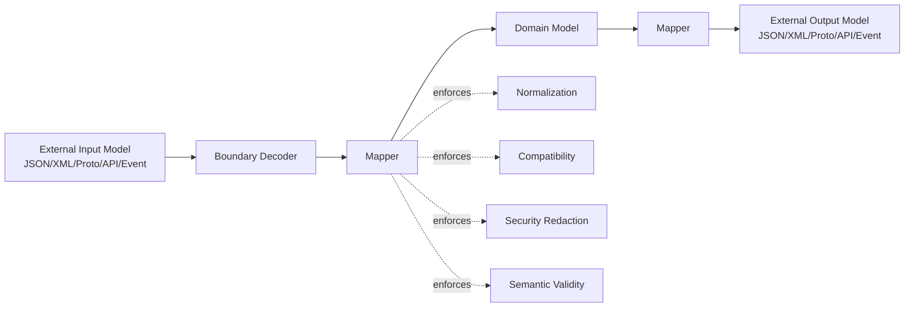
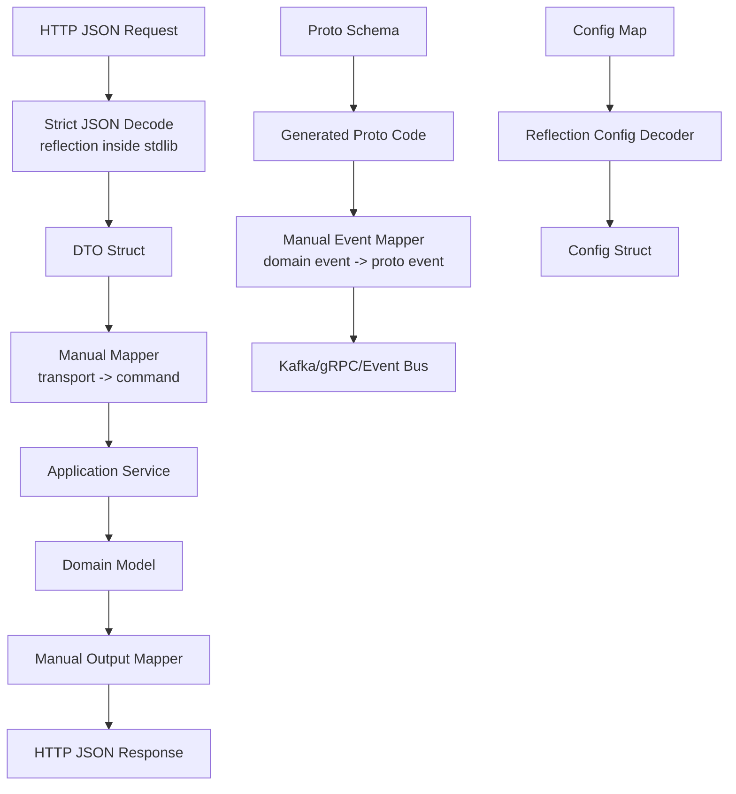
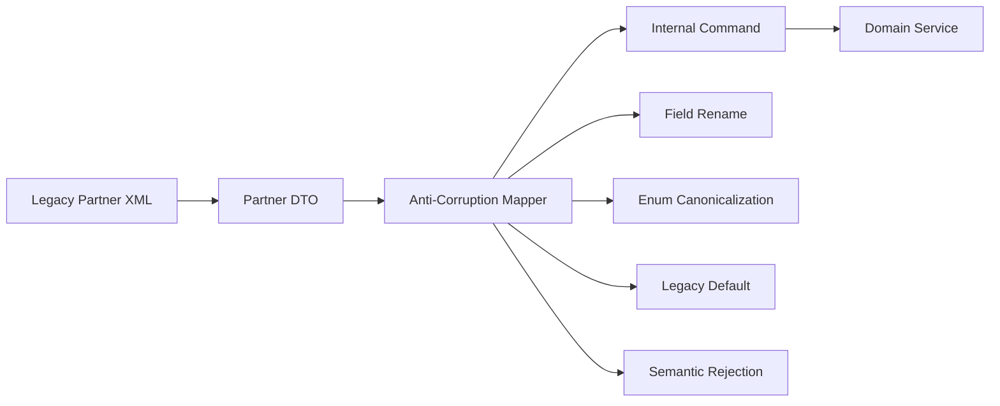
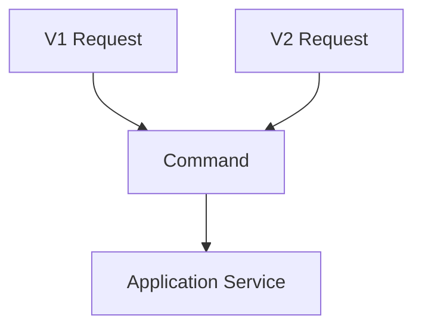
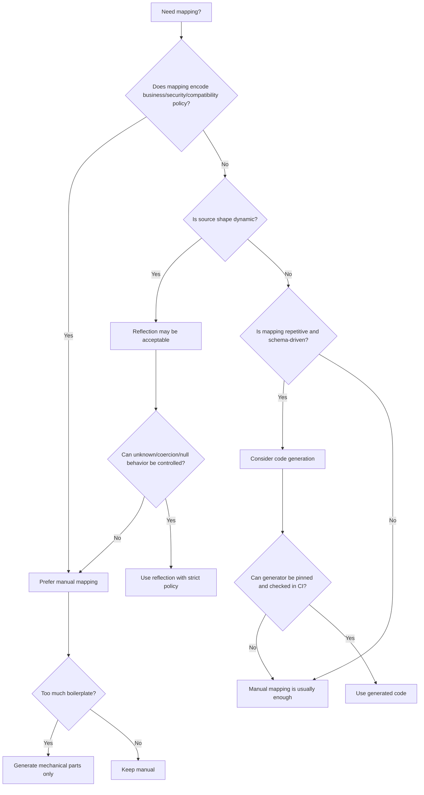
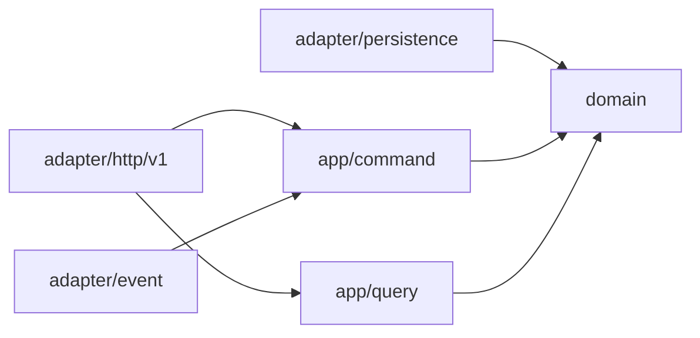
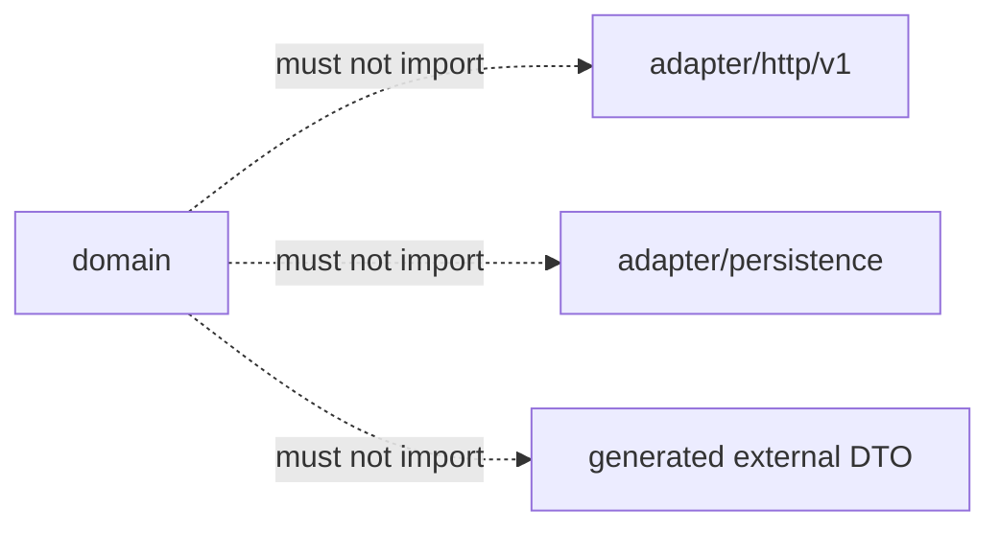
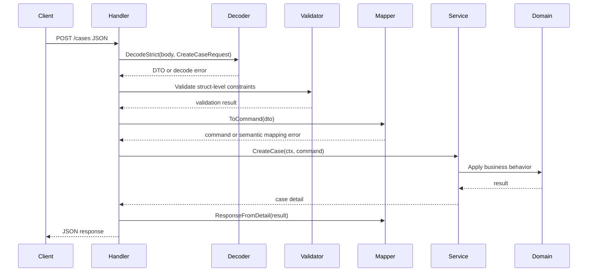

# learn-go-data-mapper-json-xml-protobuf-validation-part-005.md

# Part 005 — Manual Mapping vs Reflection vs Code Generation

**Series:** `learn-go-data-mapper-json-xml-protobuf-validation`  
**Part:** `005 / 033`  
**Topic:** Data mapper strategy in Go: manual mapping, reflection-based mapping, and generated mapping  
**Target reader:** Java software engineer moving into high-rigor Go service design  
**Go baseline:** Go 1.26.x era  
**Scope boundary:** This part does not repeat general Go reflection, benchmarking, error handling, or build-system fundamentals. It focuses only on how those mechanisms affect data mapping, schema boundaries, validation, compatibility, and production maintenance.

---

## 0. Executive Summary

Mapping looks like boring glue code until the system is old enough, distributed enough, or regulated enough. Then mapping becomes one of the most important sources of correctness.

In Go, there are three broad strategies:

1. **Manual mapping** — handwritten conversion code between input/output models and internal models.
2. **Reflection-based mapping** — runtime inspection of structs, tags, maps, and values to copy or decode data dynamically.
3. **Code generation** — generate strongly typed mapping or representation code from schema, annotations, IDL, OpenAPI, Protobuf, SQL metadata, or custom definitions.

The top-level rule:

> Mapping is not just field copying. Mapping is policy enforcement at a boundary.

A mapper may decide:

- what fields are accepted,
- what fields are ignored,
- what fields are derived,
- what defaults are applied,
- what invalid combinations are rejected,
- what values are normalized,
- what compatibility promises are preserved,
- what information is intentionally not exposed.

Because of that, the safest default for business-critical boundary mapping in Go is **manual mapping**. Reflection and code generation are valuable, but only when their failure modes are understood and bounded.

---

## 1. Why This Part Matters

Many Java engineers arrive in Go with strong experience in:

- Jackson object mapping,
- MapStruct,
- ModelMapper,
- Bean Validation,
- JAXB,
- JPA entities,
- Lombok,
- annotation-driven DTO generation,
- framework-level request binding.

In Java ecosystems, annotation-driven and reflection-heavy tools are often normal. In Go, that style exists, but Go culture and Go's type system push a different design bias:

- explicit data structures,
- explicit errors,
- less framework magic,
- smaller abstractions,
- build-time generation for strong contracts,
- clear package boundaries,
- tests over runtime annotation behavior.

The real question is not:

> “How do I get Go to behave like MapStruct or Jackson?”

The better question is:

> “At this boundary, what kind of mapping mechanism gives the best balance of correctness, compatibility, debuggability, performance, and change control?”

This part builds that decision framework.

---

## 2. Core Mental Model: Mapping as Boundary Translation

A mapper translates between two models that have different ownership, lifecycle, and invariants.



The external model often has concerns like:

- wire compatibility,
- consumer expectations,
- JSON names,
- XML namespaces,
- Protobuf field numbers,
- OpenAPI schema,
- backward-compatible optional fields,
- legacy naming,
- lenient parsing for old clients.

The domain model often has concerns like:

- business invariants,
- immutability by convention,
- legal state transitions,
- internal normalization,
- domain terminology,
- derived values,
- aggregate consistency,
- permission-sensitive fields.

The persistence model often has concerns like:

- table layout,
- denormalized projections,
- nullable database columns,
- storage optimization,
- foreign keys,
- migration history,
- query performance.

The event model often has concerns like:

- append-only compatibility,
- replay semantics,
- event versioning,
- idempotency,
- consumer independence,
- poison-message isolation.

A single struct cannot naturally satisfy all those forces forever.

---

## 3. The Three Mapping Strategies

### 3.1 Manual Mapping

Manual mapping is straightforward handwritten code:

```go
func ToDomain(in CreateCaseRequest) (casecmd.CreateCaseCommand, error) {
    // explicit conversion, validation, normalization, and defaulting
}

func FromDomain(c casequery.CaseDetail) CaseResponse {
    // explicit output projection
}
```

Manual mapping is best when mapping has meaningful business semantics.

### 3.2 Reflection-Based Mapping

Reflection-based mapping uses runtime metadata to inspect values and move data dynamically:

```go
var out Config
err := mapstructure.Decode(rawMap, &out)
```

or custom reflection:

```go
v := reflect.ValueOf(dst).Elem()
t := v.Type()
for i := 0; i < t.NumField(); i++ {
    field := t.Field(i)
    tag := field.Tag.Get("json")
    _ = tag
}
```

Reflection mapping is best when the shape is partly dynamic or the input is generic.

### 3.3 Code Generation

Code generation produces Go code from another source of truth:

- `.proto` files,
- OpenAPI documents,
- SQL schema,
- JSON Schema,
- custom schema files,
- annotations or comments,
- internal DSL.

Example generated artifact:

```go
// Code generated by internal/cmd/genmapper. DO NOT EDIT.

func MapCreateCaseRequestToCommand(in api.CreateCaseRequest) (casecmd.CreateCaseCommand, error) {
    // generated explicit field assignment
}
```

Code generation is best when the mapping is repetitive, schema-driven, performance-sensitive, or must remain aligned with external contracts.

---

## 4. Java-to-Go Translation

### 4.1 Java Habit: Annotation-Driven Everything

In Java, it is common to see:

```java
public class CreateCaseRequest {
    @JsonProperty("case_type")
    @NotBlank
    private String caseType;

    @JsonProperty("submitted_at")
    @PastOrPresent
    private Instant submittedAt;
}
```

Then framework layers bind, validate, and transform data.

This gives high productivity, but it can hide important boundary behavior:

- Is missing value different from `null`?
- Was a field ignored because it is unknown?
- Was a type coerced silently?
- Which validation layer rejected the value?
- Which version of the API introduced the field?
- Does domain code depend on JSON-specific names?

### 4.2 Go Habit: Thin Tags, Explicit Policy

In Go, a DTO may look like this:

```go
type CreateCaseRequest struct {
    CaseType    string `json:"case_type" validate:"required"`
    SubmittedAt string `json:"submitted_at" validate:"required"`
}
```

But in a serious service, the important logic should not live only in tags.

A better boundary usually has layers:

```go
func HandleCreateCase(w http.ResponseWriter, r *http.Request) {
    var req CreateCaseRequest

    if err := decodeStrictJSON(r.Body, &req); err != nil {
        writeDecodeError(w, err)
        return
    }

    if err := validateStruct(req); err != nil {
        writeValidationError(w, err)
        return
    }

    cmd, err := req.ToCommand()
    if err != nil {
        writeSemanticError(w, err)
        return
    }

    result, err := service.CreateCase(r.Context(), cmd)
    if err != nil {
        writeServiceError(w, err)
        return
    }

    writeJSON(w, CaseResponseFromResult(result))
}
```

The mapper becomes the place where transport data becomes internal intent.

---

## 5. Decision Axes

Before choosing manual mapping, reflection, or code generation, evaluate the boundary across these axes.

| Axis | Low-Risk Answer | High-Risk Answer | Why It Matters |
|---|---|---|---|
| Boundary ownership | Internal-only | Public API / partner API / event contract | External consumers require compatibility discipline. |
| Field semantics | Simple copy | Normalization, defaulting, derivation, redaction | More semantics means less tolerance for magic. |
| Schema volatility | Stable | Frequently changing | Repetitive updates may justify generation. |
| Runtime shape | Static | Dynamic / arbitrary map / plugin input | Dynamic data may need reflection or schema validation. |
| Performance sensitivity | Low | High-throughput hot path | Reflection may allocate more and obscure costs. |
| Failure tolerance | Low impact | Legal, financial, regulatory, security impact | Critical mapping needs explicit policy. |
| Debuggability | Easy | Hard to trace across systems | Generated/manual code is easier to inspect than runtime magic. |
| Compatibility | None | Backward/forward compatible | Mapping must preserve or explicitly reject unknown/old fields. |
| Tooling maturity | Simple | Many teams/repos/contracts | Generation and CI governance become valuable. |

---

## 6. Manual Mapping

### 6.1 What Manual Mapping Means

Manual mapping is not an anti-abstraction stance. It is an explicit boundary design.

Manual mapping means:

- every accepted field is visible in code,
- every dropped field is intentional,
- every default is intentional,
- every normalization rule is testable,
- every domain conversion is explicit,
- every mapping error can have a useful error path,
- every compatibility decision can be reviewed.

### 6.2 When Manual Mapping Is the Right Default

Use manual mapping for:

- public HTTP API input,
- public HTTP API output,
- command construction,
- domain aggregate construction,
- regulatory records,
- audit records,
- permission-sensitive responses,
- payment, identity, licensing, enforcement, legal, or workflow-critical paths,
- mapping with non-trivial defaults,
- mapping with cross-field validation,
- mapping where unknown fields must be rejected or tracked,
- mapping where old API versions must be translated into new internal models.

### 6.3 Manual Mapping Package Layout

A clean package layout keeps boundary models separate from domain models.

```text
internal/
  caseapp/
    command/
      create_case.go
    query/
      case_detail.go
    service.go
  caseapi/
    http/
      create_case_request.go
      case_response.go
      mapper.go
      handler.go
  casedomain/
    case.go
    case_type.go
    status.go
```

Alternative layout for a larger system:

```text
internal/
  modules/
    case/
      domain/
      app/
        command/
        query/
      adapters/
        httpapi/
          v1/
          v2/
        eventapi/
        persistence/
```

The key idea:

> API models should depend on application command/query models, not directly mutate domain aggregates.

### 6.4 Example: Transport DTO to Command

Suppose the external API receives:

```json
{
  "case_type": "complaint",
  "subject": "Late response from agency",
  "priority": "normal",
  "submitted_by": "user-123",
  "submitted_at": "2026-06-24T10:15:30+07:00"
}
```

API DTO:

```go
package casehttp

import "time"

type CreateCaseRequest struct {
    CaseType    string `json:"case_type" validate:"required"`
    Subject     string `json:"subject" validate:"required"`
    Priority    string `json:"priority" validate:"required"`
    SubmittedBy string `json:"submitted_by" validate:"required"`
    SubmittedAt string `json:"submitted_at" validate:"required"`
}

type CreateCaseResponse struct {
    CaseID    string `json:"case_id"`
    Status    string `json:"status"`
    CreatedAt string `json:"created_at"`
}
```

Application command:

```go
package casecommand

import "time"

type CreateCase struct {
    CaseType    CaseType
    Subject     Subject
    Priority    Priority
    SubmittedBy ActorID
    SubmittedAt time.Time
}

type CaseType string

type Subject string

type Priority string

type ActorID string
```

Manual mapper:

```go
package casehttp

import (
    "errors"
    "fmt"
    "strings"
    "time"

    "example.com/aceas/internal/caseapp/command"
)

func (r CreateCaseRequest) ToCommand() (command.CreateCase, error) {
    submittedAt, err := time.Parse(time.RFC3339, r.SubmittedAt)
    if err != nil {
        return command.CreateCase{}, fieldError("submitted_at", "must be RFC3339 timestamp")
    }

    caseType, err := mapCaseType(r.CaseType)
    if err != nil {
        return command.CreateCase{}, err
    }

    priority, err := mapPriority(r.Priority)
    if err != nil {
        return command.CreateCase{}, err
    }

    subject := strings.TrimSpace(r.Subject)
    if subject == "" {
        return command.CreateCase{}, fieldError("subject", "must not be blank")
    }

    return command.CreateCase{
        CaseType:    caseType,
        Subject:     command.Subject(subject),
        Priority:    priority,
        SubmittedBy: command.ActorID(strings.TrimSpace(r.SubmittedBy)),
        SubmittedAt: submittedAt.UTC(),
    }, nil
}

func mapCaseType(v string) (command.CaseType, error) {
    switch strings.ToLower(strings.TrimSpace(v)) {
    case "complaint":
        return command.CaseType("COMPLAINT"), nil
    case "appeal":
        return command.CaseType("APPEAL"), nil
    case "enforcement":
        return command.CaseType("ENFORCEMENT"), nil
    default:
        return "", fieldError("case_type", "unsupported case type")
    }
}

func mapPriority(v string) (command.Priority, error) {
    switch strings.ToLower(strings.TrimSpace(v)) {
    case "low":
        return command.Priority("LOW"), nil
    case "normal", "":
        return command.Priority("NORMAL"), nil
    case "high":
        return command.Priority("HIGH"), nil
    default:
        return "", fieldError("priority", "unsupported priority")
    }
}

type FieldError struct {
    Field   string
    Message string
}

func (e FieldError) Error() string {
    return fmt.Sprintf("%s: %s", e.Field, e.Message)
}

func fieldError(field, message string) error {
    return FieldError{Field: field, Message: message}
}

var ErrInvalidMapping = errors.New("invalid mapping")
```

This mapper is not just copying fields. It is doing boundary translation:

| External value | Internal value | Policy |
|---|---|---|
| `"complaint"` | `"COMPLAINT"` | Canonical enum form |
| `"normal"` or empty | `"NORMAL"` | Default priority |
| RFC3339 timestamp | UTC `time.Time` | Time canonicalization |
| trimmed subject | domain subject | Whitespace normalization |
| unsupported enum | error | Strict semantic validation |

### 6.5 Output Mapping: Domain to Response

Output mapping should also be explicit because response DTOs are compatibility contracts.

```go
package casehttp

import (
    "time"

    "example.com/aceas/internal/caseapp/query"
)

func CaseResponseFromDetail(c query.CaseDetail) CaseResponse {
    return CaseResponse{
        CaseID:    c.CaseID.String(),
        Status:    string(c.Status),
        CreatedAt: c.CreatedAt.UTC().Format(time.RFC3339),
    }
}

type CaseResponse struct {
    CaseID    string `json:"case_id"`
    Status    string `json:"status"`
    CreatedAt string `json:"created_at"`
}
```

Do not expose the domain model directly unless the domain model is intentionally the API contract.

Bad:

```go
func Handle(w http.ResponseWriter, r *http.Request) {
    c := service.GetCase(...)
    json.NewEncoder(w).Encode(c) // domain shape leaked to clients
}
```

Why it is bad:

- internal field names become API names,
- future domain refactoring becomes breaking API change,
- sensitive fields may leak,
- domain zero values may have wrong transport semantics,
- compatibility becomes accidental.

### 6.6 Manual Mapping for Redaction

Output mapping is often where permission rules become visible.

```go
type CaseDetailResponse struct {
    CaseID          string  `json:"case_id"`
    Status          string  `json:"status"`
    Subject         string  `json:"subject"`
    InternalRemarks *string `json:"internal_remarks,omitempty"`
}

func CaseDetailResponseFromQuery(q CaseDetailView, viewer Viewer) CaseDetailResponse {
    resp := CaseDetailResponse{
        CaseID:  q.CaseID,
        Status:  q.Status,
        Subject: q.Subject,
    }

    if viewer.CanViewInternalRemarks {
        remarks := q.InternalRemarks
        resp.InternalRemarks = &remarks
    }

    return resp
}
```

A reflection mapper cannot safely infer this rule from matching field names.

### 6.7 Manual Mapping with Error Collection

Sometimes returning the first error is poor UX. For request validation, collect field-level mapping errors.

```go
type MappingErrors struct {
    Fields []FieldError
}

func (e MappingErrors) Error() string {
    return "invalid request mapping"
}

func (e MappingErrors) HasErrors() bool {
    return len(e.Fields) > 0
}

func (r CreateCaseRequest) ToCommandCollectingErrors() (command.CreateCase, error) {
    var errs MappingErrors

    submittedAt, err := time.Parse(time.RFC3339, r.SubmittedAt)
    if err != nil {
        errs.Fields = append(errs.Fields, FieldError{"submitted_at", "must be RFC3339 timestamp"})
    }

    caseType, err := mapCaseType(r.CaseType)
    if err != nil {
        errs.Fields = append(errs.Fields, FieldError{"case_type", "unsupported case type"})
    }

    priority, err := mapPriority(r.Priority)
    if err != nil {
        errs.Fields = append(errs.Fields, FieldError{"priority", "unsupported priority"})
    }

    subject := strings.TrimSpace(r.Subject)
    if subject == "" {
        errs.Fields = append(errs.Fields, FieldError{"subject", "must not be blank"})
    }

    if errs.HasErrors() {
        return command.CreateCase{}, errs
    }

    return command.CreateCase{
        CaseType:    caseType,
        Subject:     command.Subject(subject),
        Priority:    priority,
        SubmittedBy: command.ActorID(strings.TrimSpace(r.SubmittedBy)),
        SubmittedAt: submittedAt.UTC(),
    }, nil
}
```

Important nuance:

- Decode errors usually stop the pipeline because the payload cannot be trusted structurally.
- Validation and mapping errors can often be collected because the payload shape is known.

### 6.8 Manual Mapping and Cross-Field Rules

Example rule:

- `priority = high` requires `reason`.
- `submitted_at` cannot be in the future.
- `case_type = enforcement` cannot be created by anonymous user.

```go
type CreateCaseRequest struct {
    CaseType    string  `json:"case_type"`
    Subject     string  `json:"subject"`
    Priority    string  `json:"priority"`
    Reason      *string `json:"reason,omitempty"`
    SubmittedBy string  `json:"submitted_by"`
    SubmittedAt string  `json:"submitted_at"`
}

func (r CreateCaseRequest) validateCrossField(now time.Time) error {
    if strings.EqualFold(r.Priority, "high") {
        if r.Reason == nil || strings.TrimSpace(*r.Reason) == "" {
            return fieldError("reason", "required when priority is high")
        }
    }

    if strings.EqualFold(r.CaseType, "enforcement") && strings.TrimSpace(r.SubmittedBy) == "anonymous" {
        return fieldError("submitted_by", "anonymous user cannot submit enforcement case")
    }

    submittedAt, err := time.Parse(time.RFC3339, r.SubmittedAt)
    if err != nil {
        return fieldError("submitted_at", "must be RFC3339 timestamp")
    }

    if submittedAt.After(now.Add(2 * time.Minute)) {
        return fieldError("submitted_at", "must not be in the future")
    }

    return nil
}
```

This is why mapping and validation often overlap. A sophisticated mapper is not only moving data; it is turning weak external representation into a stronger internal command.

### 6.9 Manual Mapping and Versioned APIs

Suppose v1 has:

```go
type CreateCaseRequestV1 struct {
    Category string `json:"category"`
    Title    string `json:"title"`
}
```

v2 has:

```go
type CreateCaseRequestV2 struct {
    CaseType string `json:"case_type"`
    Subject  string `json:"subject"`
    Priority string `json:"priority"`
}
```

Both can map to the same internal command.

```go
func (r CreateCaseRequestV1) ToCommand() (command.CreateCase, error) {
    return command.CreateCase{
        CaseType: mapLegacyCategory(r.Category),
        Subject:  command.Subject(strings.TrimSpace(r.Title)),
        Priority: command.Priority("NORMAL"),
    }, nil
}

func (r CreateCaseRequestV2) ToCommand() (command.CreateCase, error) {
    // newer mapping logic
}
```

The internal service does not need to know about API version history.

### 6.10 Manual Mapping Failure Modes

Manual mapping has its own risks:

| Failure Mode | Example | Mitigation |
|---|---|---|
| Forgotten field | New DTO field never copied | Golden tests, compile-time review, explicit mapping checklist |
| Repetitive boilerplate | Dozens of similar models | Generate simple mappings or centralize tiny helpers |
| Inconsistent normalization | One handler trims, another does not | Shared value-object constructors |
| Hidden compatibility rule | Mapper silently defaults old field | Document in version-specific mapper |
| Overgrown mapper | 500-line mapping function | Split parse, normalize, semantic validate, construct |
| Domain leakage | Mapper mutates aggregate directly | Map to command, then service applies behavior |

Manual mapping is not “write random glue”. It needs structure.

---

## 7. Reflection-Based Mapping

### 7.1 What Reflection Mapping Means

Reflection mapping uses Go's runtime type metadata to inspect and assign values.

Go struct tags are accessible through `reflect.StructTag`. Standard packages such as `encoding/json` and `encoding/xml` use tags to determine field names and options. Reflection makes it possible to write generic mapping tools, but it moves many failures from compile time to runtime.

### 7.2 Common Reflection Mapping Use Cases

Reflection-based mapping is reasonable for:

- configuration decoding,
- generic map-to-struct decoding,
- admin/internal tools,
- test fixture loading,
- CLI input binding,
- plugin metadata,
- dynamic forms,
- partial update patch structures,
- low-criticality back-office utilities,
- generic observability metadata,
- schema introspection tools,
- validation frameworks,
- serializers.

Reflection mapping is dangerous for:

- domain command construction with rich invariants,
- public API security boundaries,
- permission-sensitive response redaction,
- legal/audit event mapping,
- financial calculations,
- identity data mapping,
- long-lived event schema evolution,
- high-throughput hot paths without measurement.

### 7.3 Example: Map-Based Configuration Decode

Dynamic maps are common when reading configuration from YAML, JSON, environment variables, or remote config systems.

```go
type ServerConfig struct {
    Host         string        `mapstructure:"host"`
    Port         int           `mapstructure:"port"`
    ReadTimeout  time.Duration `mapstructure:"read_timeout"`
    WriteTimeout time.Duration `mapstructure:"write_timeout"`
}
```

A reflection decoder can map:

```go
raw := map[string]any{
    "host":          "0.0.0.0",
    "port":          8080,
    "read_timeout":  "5s",
    "write_timeout": "10s",
}
```

into `ServerConfig`.

For configuration, this can be acceptable because:

- input shape is intentionally map-like,
- metadata is operational rather than business-domain data,
- errors happen at startup,
- failure can be fail-fast,
- performance is usually irrelevant.

### 7.4 Reflection Mapper Design Sketch

A simplistic reflection mapper might do this:

```go
func assignByJSONTag(dst any, src map[string]any) error {
    rv := reflect.ValueOf(dst)
    if rv.Kind() != reflect.Pointer || rv.IsNil() {
        return errors.New("dst must be non-nil pointer")
    }

    elem := rv.Elem()
    if elem.Kind() != reflect.Struct {
        return errors.New("dst must point to struct")
    }

    typ := elem.Type()
    for i := 0; i < typ.NumField(); i++ {
        sf := typ.Field(i)
        if sf.PkgPath != "" { // unexported
            continue
        }

        name := fieldNameFromJSONTag(sf)
        if name == "-" || name == "" {
            continue
        }

        raw, ok := src[name]
        if !ok {
            continue
        }

        fv := elem.Field(i)
        if !fv.CanSet() {
            continue
        }

        if err := assignValue(fv, raw); err != nil {
            return fmt.Errorf("%s: %w", name, err)
        }
    }

    return nil
}

func fieldNameFromJSONTag(sf reflect.StructField) string {
    tag := sf.Tag.Get("json")
    if tag == "" {
        return sf.Name
    }
    name, _, _ := strings.Cut(tag, ",")
    if name == "" {
        return sf.Name
    }
    return name
}
```

This looks simple, but it immediately raises difficult questions:

- What about embedded structs?
- What about pointer fields?
- What about slices/maps?
- What about custom types?
- What about `time.Time`?
- What about unknown fields?
- What about case-insensitive matching?
- What about duplicate tags?
- What about weak conversion from string to int?
- What about `null`?
- What about field path in nested errors?
- What about validation after assignment?
- What about distinguishing absent from explicit zero?

This is why writing a reflection mapper is easy for the first 20%, and expensive for the remaining 80%.

### 7.5 Reflection Mapping Failure Modes

| Failure Mode | Example | Consequence |
|---|---|---|
| Silent field skip | Tag mismatch means value not assigned | Missing data without compile error |
| Runtime type failure | `string` provided for `int` | Error only at runtime |
| Weak coercion | `"123"` becomes `123` unexpectedly | Bad client data accepted |
| Zero-value ambiguity | Missing field and explicit zero look same | Incorrect defaulting |
| Unknown-field ambiguity | Extra input ignored | Contract drift hidden |
| Nested error opacity | Error says “cannot decode” without path | Poor API diagnostics |
| Unexported fields | Cannot set private domain state | Mapper bypass impossible or unsafe |
| Tag collision | Same field has JSON, XML, DB, validation tags | Struct becomes metadata dumping ground |
| Security leak | Output mapper copies matching sensitive field | Permission bug |
| Performance opacity | Reflection allocates and branches dynamically | Hot path overhead |

### 7.6 Reflection Mapper Policy Checklist

If using reflection mapping in production, define these policies explicitly:

1. **Unknown fields:** ignored, logged, rejected, or preserved?
2. **Weak typing:** disabled by default?
3. **Absent vs zero:** distinguishable or not?
4. **Null handling:** clears value, ignored, invalid, or maps to optional?
5. **Case sensitivity:** strict exact match or relaxed?
6. **Tag source:** `json`, `mapstructure`, custom, or multiple?
7. **Duplicate names:** startup error or last-wins?
8. **Nested errors:** include stable field path?
9. **Custom decode hooks:** whitelisted and test-covered?
10. **Validation:** before mapping, after mapping, or both?
11. **Observability:** count rejected/unknown/coerced fields?
12. **Performance:** benchmarked on representative payloads?

### 7.7 The Important Distinction: Reflection for Frameworks vs Reflection for Business Logic

It is acceptable that serializers, validators, and config loaders use reflection internally.

It is riskier when business logic depends on reflection behavior directly.

Better:

```go
var req CreateCaseRequest
err := decodeStrictJSON(body, &req) // reflection inside encoding/json
cmd, err := req.ToCommand()        // explicit business mapping
```

Worse:

```go
var cmd command.CreateCase
err := universalMapper.Map(body, &cmd) // direct reflection into internal command
```

The first approach contains reflection at the transport binding layer. The second makes reflection part of domain construction.

### 7.8 Reflection-Based Mapping with Metadata

If you must use reflection, collect metadata to detect drift.

Pseudo-pattern:

```go
type DecodeMetadata struct {
    UsedFields   []string
    UnusedFields []string
    MissingFields []string
}
```

Then fail or alert on unexpected data:

```go
if len(meta.UnusedFields) > 0 {
    return fmt.Errorf("unknown config fields: %v", meta.UnusedFields)
}
```

This turns dynamic mapping from silent behavior into observable behavior.

---

## 8. Code Generation

### 8.1 What Code Generation Means

Code generation means a tool emits Go source code that becomes part of the compiled program.

Sources can include:

- `.proto`,
- OpenAPI YAML/JSON,
- JSON Schema,
- SQL schema,
- database introspection,
- GraphQL schema,
- custom DSL,
- Go AST,
- struct tags,
- comments/directives,
- handwritten mapping spec.

Generated code can include:

- DTOs,
- serializers,
- validators,
- mapping functions,
- clients,
- servers,
- mocks,
- enum helpers,
- field path constants,
- schema descriptors,
- documentation.

### 8.2 Go's Code Generation Philosophy

Go has `go generate`, but it is intentionally not part of normal `go build`. It scans source files for `//go:generate` directives and executes commands. This matters because generation is an explicit developer or CI step, not hidden magic during compilation.

Example:

```go
//go:generate go run ./internal/cmd/genmapper -schema ./schema/case.yaml -out ./mapper_gen.go
package casehttp
```

Then:

```bash
go generate ./...
```

A production workflow should normally include CI verification:

```bash
go generate ./...
git diff --exit-code
```

This fails CI if generated code is stale.

### 8.3 When Code Generation Is a Good Fit

Use code generation when:

- schema is the real source of truth,
- many repetitive mappings exist,
- humans make mistakes copying fields,
- performance matters,
- generated code is readable enough,
- compatibility must be checked in CI,
- external contracts are shared across teams/languages,
- mapping is mostly mechanical,
- schema evolution rules can be encoded,
- generated artifacts are reviewed and tested.

Common Go examples:

| Source | Generated Output | Typical Purpose |
|---|---|---|
| Protobuf | Go message types and methods | gRPC, events, typed wire contracts |
| OpenAPI | Go server/client DTOs | HTTP API contracts |
| SQL schema | Query methods / models | Persistence layer |
| JSON Schema | Validators / DTOs | Contract validation |
| Custom spec | Mapper functions | Internal boundary enforcement |

### 8.4 Generated Mapping Is Not the Same as Reflection Mapping

Reflection mapping:

```go
err := mapper.Map(src, dst) // runtime discovery
```

Generated mapping:

```go
dst := MapCreateCaseRequestToCommand(src) // compile-time visible code
```

Generated mapping often has advantages:

- compile-time field access,
- easier debugging,
- easier profiling,
- fewer allocations,
- no runtime metadata walk,
- no hidden field name matching,
- code review can inspect output,
- CI can enforce regeneration.

But code generation is not automatically safe. It moves risk from runtime to tooling and governance.

### 8.5 Generated Mapping Failure Modes

| Failure Mode | Example | Mitigation |
|---|---|---|
| Stale generated code | Schema changed but generated file not updated | CI `go generate` + `git diff --exit-code` |
| Generator version drift | Different developers generate different output | Pin tool versions in `tools.go` or module deps |
| Unreadable generated code | Huge file impossible to review | Generate small focused files, document generator |
| Hidden policy | Generator silently maps same-name fields | Explicit mapping spec or deny-by-default generation |
| Over-generation | Generated code covers cases nobody needs | Narrow generator scope |
| Schema mismatch | OpenAPI says optional, Go type says required | Contract tests |
| Unsafe optimization | Generator uses `unsafe` incorrectly | Avoid unless measured and reviewed |
| Build friction | Generation requires many tools | Containerized or scripted generation |

### 8.6 Pinning Generator Tools

A common Go pattern is to track generator dependencies in a tools file.

```go
//go:build tools

package tools

import (
    _ "google.golang.org/protobuf/cmd/protoc-gen-go"
)
```

This makes the generator version visible in `go.mod`.

For custom internal generators, pin via module version, container image digest, or repository commit.

### 8.7 Generated Code and Protobuf

Protobuf is the canonical example of generation-based schema contracts.

A `.proto` file defines:

```proto
syntax = "proto3";

package case.v1;

message CaseCreated {
  string case_id = 1;
  string case_type = 2;
  string status = 3;
  int64 created_at_unix = 4;
}
```

Go code is generated, and application code uses it:

```go
evt := &casev1.CaseCreated{}
// generated accessors and runtime behavior depend on selected generated-code API
```

Modern Go Protobuf deserves special treatment because the generated-code API has evolved. The Opaque API hides struct fields behind accessors to decouple user code from internal generated representation. That design direction matters for long-lived systems because generated structs are not just ordinary DTOs; they are artifacts of a schema/runtime contract.

This series will go deep into that later. For this part, the important point is:

> Protobuf mapping should not be treated as “copy domain struct into generated struct by matching fields.” A Protobuf message is a wire contract with field numbers, presence semantics, unknown-field behavior, JSON mapping behavior, and evolution rules.

### 8.8 Generated Mapper Design Example

Imagine a custom mapping spec:

```yaml
mapper: CreateCaseRequestToCommand
source: internal/caseapi/http/v1.CreateCaseRequest
target: internal/caseapp/command.CreateCase
fields:
  CaseType:
    from: case_type
    transform: caseTypeFromAPI
  Subject:
    from: subject
    transform: trimSubject
  Priority:
    from: priority
    transform: priorityFromAPI
  SubmittedAt:
    from: submitted_at
    transform: parseRFC3339UTC
unknown_policy: reject
```

Generated code:

```go
func MapCreateCaseRequestToCommand(in CreateCaseRequest) (command.CreateCase, error) {
    caseType, err := caseTypeFromAPI(in.CaseType)
    if err != nil {
        return command.CreateCase{}, fieldError("case_type", err.Error())
    }

    subject, err := trimSubject(in.Subject)
    if err != nil {
        return command.CreateCase{}, fieldError("subject", err.Error())
    }

    priority, err := priorityFromAPI(in.Priority)
    if err != nil {
        return command.CreateCase{}, fieldError("priority", err.Error())
    }

    submittedAt, err := parseRFC3339UTC(in.SubmittedAt)
    if err != nil {
        return command.CreateCase{}, fieldError("submitted_at", err.Error())
    }

    return command.CreateCase{
        CaseType:    caseType,
        Subject:     subject,
        Priority:    priority,
        SubmittedAt: submittedAt,
    }, nil
}
```

Notice the generator does not own business policy. It calls named transforms. Humans still own meaning.

### 8.9 Schema-First vs Code-First Generation

#### Schema-First

Schema-first means the contract is written first.

Examples:

- `.proto` first,
- OpenAPI first,
- JSON Schema first,
- XML Schema first.

Pros:

- language-neutral,
- good for multi-team contracts,
- enables compatibility checks,
- supports client/server generation,
- useful for public APIs and events.

Cons:

- schema may become detached from domain model,
- generated code may be awkward,
- business invariants may not fit schema constraints,
- requires schema governance.

#### Code-First

Code-first means Go types are primary, then schemas or mappers are generated.

Pros:

- convenient for internal services,
- less schema boilerplate,
- natural Go ergonomics,
- fast iteration.

Cons:

- Go-specific choices leak into external contracts,
- difficult multi-language compatibility,
- optionality may be inferred incorrectly,
- tags become overloaded,
- contract drift is easier.

For serious external contracts, schema-first or schema-verified workflows are usually safer.

---

## 9. Hybrid Strategies

Real systems rarely use only one strategy.

A strong production architecture often looks like this:



This means:

- use reflection where dynamic binding is natural,
- use manual mapping where business semantics matter,
- use code generation where schema contracts are central,
- keep each mechanism in its proper risk zone.

---

## 10. Boundary-Based Strategy Matrix

| Boundary Type | Recommended Default | Why |
|---|---|---|
| Public JSON request to command | Manual after strict decode | Business semantics and error quality matter. |
| Public JSON response from query model | Manual | Prevents accidental leaks and preserves compatibility. |
| Internal config map to config struct | Reflection | Dynamic config is naturally map-like and startup-bound. |
| Protobuf wire contract | Generated message + manual domain mapper | Generated schema type is not domain model. |
| Database row to persistence model | Generated or manual | Depends on SQL tooling and complexity. |
| Persistence model to domain | Manual | Domain invariants matter. |
| Event domain model to event contract | Manual or generated with explicit spec | Compatibility and replay semantics matter. |
| Admin export/import | Reflection or generated | Depends on criticality and schema stability. |
| Test fixtures | Reflection or JSON decode | Productivity usually matters more. |
| Hot-path serialization | Generated or specialized library | Measure before optimizing. |

---

## 11. Design Pattern: Anti-Corruption Mapper

An anti-corruption mapper prevents external model concepts from polluting the domain.



Example:

```go
type PartnerLicenseStatus string

const (
    PartnerStatusA PartnerLicenseStatus = "A" // active
    PartnerStatusS PartnerLicenseStatus = "S" // suspended
    PartnerStatusX PartnerLicenseStatus = "X" // expired
)

func mapPartnerStatus(s PartnerLicenseStatus) (domain.LicenseStatus, error) {
    switch s {
    case PartnerStatusA:
        return domain.LicenseActive, nil
    case PartnerStatusS:
        return domain.LicenseSuspended, nil
    case PartnerStatusX:
        return domain.LicenseExpired, nil
    default:
        return "", fmt.Errorf("unknown partner license status %q", s)
    }
}
```

Do not allow `"A"`, `"S"`, and `"X"` to spread into domain logic.

---

## 12. Design Pattern: Dedicated Output Projection

A query model is not always the same as an output DTO.

```go
type CaseDetailQueryResult struct {
    CaseID          string
    Subject         string
    InternalRemarks string
    Status          string
    AssignedOfficer string
    CreatedAt       time.Time
}

type PublicCaseDetailResponse struct {
    CaseID    string `json:"case_id"`
    Subject   string `json:"subject"`
    Status    string `json:"status"`
    CreatedAt string `json:"created_at"`
}

type OfficerCaseDetailResponse struct {
    CaseID          string `json:"case_id"`
    Subject         string `json:"subject"`
    Status          string `json:"status"`
    AssignedOfficer string `json:"assigned_officer"`
    InternalRemarks string `json:"internal_remarks"`
    CreatedAt       string `json:"created_at"`
}
```

Manual output mapping makes response policy explicit:

```go
func PublicCaseDetailFromQuery(q CaseDetailQueryResult) PublicCaseDetailResponse {
    return PublicCaseDetailResponse{
        CaseID:    q.CaseID,
        Subject:   q.Subject,
        Status:    q.Status,
        CreatedAt: q.CreatedAt.UTC().Format(time.RFC3339),
    }
}

func OfficerCaseDetailFromQuery(q CaseDetailQueryResult) OfficerCaseDetailResponse {
    return OfficerCaseDetailResponse{
        CaseID:          q.CaseID,
        Subject:         q.Subject,
        Status:          q.Status,
        AssignedOfficer: q.AssignedOfficer,
        InternalRemarks: q.InternalRemarks,
        CreatedAt:       q.CreatedAt.UTC().Format(time.RFC3339),
    }
}
```

Do not rely on generic field copying when visibility differs by caller.

---

## 13. Design Pattern: Value Object Constructors as Mapping Helpers

Manual mappers should not duplicate every validation rule. Put stable domain invariants in constructors.

```go
type Subject string

func NewSubject(raw string) (Subject, error) {
    s := strings.TrimSpace(raw)
    if s == "" {
        return "", errors.New("subject must not be blank")
    }
    if len([]rune(s)) > 200 {
        return "", errors.New("subject must be at most 200 characters")
    }
    return Subject(s), nil
}
```

Mapper:

```go
subject, err := domain.NewSubject(req.Subject)
if err != nil {
    return command.CreateCase{}, fieldError("subject", err.Error())
}
```

This keeps the mapper responsible for field path translation, while the domain owns core invariant logic.

---

## 14. Design Pattern: Mapper as Version Adapter

When API versions differ, do not fork domain logic.



Example:

```go
func (r CreateCaseV1Request) ToCommand() (command.CreateCase, error) {
    return command.CreateCase{
        CaseType: legacyCategoryToCaseType(r.Category),
        Subject:  normalizeLegacyTitle(r.Title),
        Priority: command.PriorityNormal,
    }, nil
}

func (r CreateCaseV2Request) ToCommand() (command.CreateCase, error) {
    return command.CreateCase{
        CaseType: parseCaseType(r.CaseType),
        Subject:  normalizeSubject(r.Subject),
        Priority: parsePriority(r.Priority),
    }, nil
}
```

The command is the semantic intent. API versions are historical representations of that intent.

---

## 15. Anti-Patterns

### 15.1 “Just Reuse the Domain Struct as JSON DTO”

Bad:

```go
type Case struct {
    ID              string `json:"id"`
    Subject         string `json:"subject"`
    InternalRemarks string `json:"internal_remarks"`
    DeletedAt       *time.Time `json:"deleted_at,omitempty"`
}
```

Problem:

- domain fields leak into API,
- internal remarks may leak,
- soft-delete internals become contract,
- future domain refactor breaks clients,
- JSON tags pollute domain.

### 15.2 “Universal Mapper for Everything”

Bad:

```go
func Convert[S any, T any](src S) (T, error) {
    // reflection copies fields with same names
}
```

Problem:

- same name does not mean same meaning,
- missing fields become runtime surprises,
- sensitive fields may be copied,
- invariants are bypassed,
- field renames become semantic bugs.

### 15.3 “Map by JSON Tags Across Layers”

Bad idea:

```go
type DomainCase struct {
    CaseType string `json:"case_type" db:"case_type" validate:"required"`
}
```

Problem:

- transport metadata mixes with storage metadata,
- validation tags may be API-specific not domain-specific,
- database column names become coupled to JSON names,
- one struct carries too many reasons to change.

### 15.4 “Generated Code Owns Business Semantics”

Bad:

```go
// Generator automatically validates workflow transition rules from YAML.
```

If a generator fully owns business semantics, engineers may stop understanding or reviewing the rules.

Better:

- generator creates mechanical boilerplate,
- named functions implement domain policy,
- tests verify behavior,
- generated output is deterministic.

### 15.5 “Reflection Mapper in Hot Path Without Measurement”

Bad:

```go
for _, msg := range batch {
    mapper.Map(msg, &domainObj)
}
```

Reflection may be fine. But in hot paths, assumptions are not enough. Measure allocation, CPU, tail latency, and error behavior under realistic data.

---

## 16. Practical Decision Algorithm

Use this sequence:



Short rule:

> If wrong mapping can create wrong business state, do not hide the mapping behind generic magic.

---

## 17. Review Checklist for Mapper Pull Requests

### 17.1 Input Mapper Review

Ask:

- Does this mapper distinguish absent, null, zero, and default values correctly?
- Are unknown fields rejected, ignored, preserved, or logged intentionally?
- Are enum values canonicalized?
- Are strings trimmed or normalized consistently?
- Are timestamps parsed with explicit timezone policy?
- Are numbers checked for range and precision?
- Are external names translated into internal names explicitly?
- Are deprecated fields handled intentionally?
- Are compatibility rules documented?
- Are error paths stable and user-facing where appropriate?
- Are validation and mapping errors separated clearly?
- Does the mapper avoid mutating domain aggregate state directly?

### 17.2 Output Mapper Review

Ask:

- Does the response leak internal fields?
- Does it expose stable API names?
- Does it preserve backward compatibility?
- Does it omit fields intentionally?
- Does it handle permission-specific redaction?
- Does it handle `omitempty` or null semantics intentionally?
- Does it format time consistently?
- Does it expose domain enum names or API enum names?
- Does it rely on reflection copying?

### 17.3 Reflection Mapper Review

Ask:

- Is reflection necessary?
- Is the use case low-risk or startup-bound?
- Are unknown fields detected?
- Is weak typing disabled unless explicitly needed?
- Are decode hooks constrained?
- Are nested errors useful?
- Are tags documented?
- Is performance irrelevant or measured?
- Is there a migration path away from reflection if the boundary becomes critical?

### 17.4 Generated Mapper Review

Ask:

- What is the source of truth?
- Is generated code deterministic?
- Is the generator version pinned?
- Does CI detect stale output?
- Is the output readable enough to debug?
- Are business transforms explicit named functions?
- Are breaking changes detected?
- Are generated files committed or generated during build intentionally?
- Are schema evolution rules encoded?

---

## 18. Testing Strategy

### 18.1 Manual Mapper Tests

Test normal mapping:

```go
func TestCreateCaseRequestToCommand(t *testing.T) {
    req := CreateCaseRequest{
        CaseType:    "complaint",
        Subject:     "  Late response  ",
        Priority:    "normal",
        SubmittedBy: "user-123",
        SubmittedAt: "2026-06-24T10:15:30+07:00",
    }

    cmd, err := req.ToCommand()
    if err != nil {
        t.Fatalf("ToCommand() error = %v", err)
    }

    if got, want := string(cmd.CaseType), "COMPLAINT"; got != want {
        t.Fatalf("CaseType = %q, want %q", got, want)
    }
    if got, want := string(cmd.Subject), "Late response"; got != want {
        t.Fatalf("Subject = %q, want %q", got, want)
    }
}
```

Test invalid mapping:

```go
func TestCreateCaseRequestToCommandRejectsUnsupportedCaseType(t *testing.T) {
    req := CreateCaseRequest{
        CaseType:    "unknown",
        Subject:     "Valid subject",
        Priority:    "normal",
        SubmittedBy: "user-123",
        SubmittedAt: "2026-06-24T10:15:30+07:00",
    }

    _, err := req.ToCommand()
    if err == nil {
        t.Fatal("expected error")
    }

    var fieldErr FieldError
    if !errors.As(err, &fieldErr) {
        t.Fatalf("expected FieldError, got %T", err)
    }
    if fieldErr.Field != "case_type" {
        t.Fatalf("field = %q, want case_type", fieldErr.Field)
    }
}
```

### 18.2 Golden Tests for Output Contracts

Golden tests protect response compatibility.

```go
func TestCaseResponseJSONGolden(t *testing.T) {
    resp := CaseResponse{
        CaseID:    "case-123",
        Status:    "OPEN",
        CreatedAt: "2026-06-24T03:15:30Z",
    }

    got, err := json.MarshalIndent(resp, "", "  ")
    if err != nil {
        t.Fatal(err)
    }

    want := `{
  "case_id": "case-123",
  "status": "OPEN",
  "created_at": "2026-06-24T03:15:30Z"
}`

    if string(got) != want {
        t.Fatalf("json mismatch\ngot:  %s\nwant: %s", got, want)
    }
}
```

Golden tests should not be abused for every tiny struct, but they are valuable for public contracts.

### 18.3 Fuzz Tests for Mapper Robustness

Fuzzing is useful for mapping functions that parse strings, timestamps, enums, IDs, or numeric ranges.

```go
func FuzzMapPriority(f *testing.F) {
    f.Add("low")
    f.Add("normal")
    f.Add("high")
    f.Add("🔥")

    f.Fuzz(func(t *testing.T, raw string) {
        _, _ = mapPriority(raw)
        // The invariant: mapper must never panic for arbitrary input.
    })
}
```

### 18.4 Contract Tests for Generated Code

For generated code:

- verify generator output is up to date,
- test representative mappings,
- test breaking schema changes,
- test version compatibility,
- test optionality and default semantics,
- test unknown-field policy where relevant.

CI example:

```bash
go generate ./...
git diff --exit-code
```

---

## 19. Performance Considerations

### 19.1 Manual Mapping

Manual mapping usually has predictable performance:

- direct field access,
- fewer allocations if careful,
- easy to profile,
- compiler can inline small helpers,
- no metadata traversal.

Manual code is not automatically optimal, but it is transparent.

### 19.2 Reflection Mapping

Reflection may introduce:

- indirect calls,
- dynamic type checks,
- extra allocations,
- less inlining,
- slower field lookup,
- expensive tag parsing unless cached,
- harder-to-read profiles.

For startup config, irrelevant. For per-request or per-message hot paths, measure.

### 19.3 Code Generation

Generated mapping can be fast because it becomes normal Go source code.

But generated serializers may also use advanced tricks, including `unsafe`, pooling, or custom buffers. That can be appropriate in infrastructure libraries, but application teams should not adopt unsafe fast paths casually.

Performance rule:

> Prefer correctness and explicit semantics first. Optimize mapping only after measurement shows it is material.

### 19.4 Allocation-Aware Manual Mapping

Avoid unnecessary temporary objects in hot paths:

```go
func ResponsesFromQueries(items []query.CaseSummary) []CaseSummaryResponse {
    out := make([]CaseSummaryResponse, 0, len(items))
    for _, item := range items {
        out = append(out, CaseSummaryResponseFromQuery(item))
    }
    return out
}
```

But do not prematurely complicate code with pooling. Pools can retain memory, complicate ownership, and create subtle bugs when values are reused after release.

---

## 20. Mapping Governance in Large Codebases

For a large engineering organization, mapper quality needs governance.

### 20.1 Package Rules

Define rules such as:

- domain package must not import API DTO package,
- domain package must not contain JSON/XML tags unless intentionally exposed,
- API package maps to command/query package,
- persistence package maps to domain or app-level model explicitly,
- generated code lives under predictable directory,
- generated files include standard header,
- versioned APIs have versioned DTO packages.

Example allowed direction:



Forbidden direction:



### 20.2 Linting Ideas

You can enforce some rules with:

- package import checks,
- custom static analysis,
- architectural tests,
- review checklist,
- generator CI checks,
- schema breaking-change checks,
- grep rules for forbidden tags in domain packages.

Example simple CI guard:

```bash
if grep -R '`json:' internal/*/domain; then
  echo "domain package must not contain json tags"
  exit 1
fi
```

This is crude but useful in early governance.

### 20.3 Mapper Ownership

Every external contract should have an owner.

| Contract | Owner | Mapper Responsibility |
|---|---|---|
| Public REST API | API/platform team | Request/response compatibility |
| Partner XML | Integration team | Anti-corruption translation |
| Protobuf event | Event platform/domain team | Schema evolution and replay safety |
| DB row | Persistence owner | Storage compatibility and migration |
| Domain command | Domain/application owner | Business invariant construction |

Without ownership, mappers become accidental shared utilities.

---

## 21. Regulatory and Case-Management Perspective

In regulatory or enforcement lifecycle systems, mapping mistakes can become legal or operational defects.

Examples:

- external `case_status = "closed"` maps to internal `CANCELLED`, changing legal meaning,
- missing `submitted_at` defaults to current time, corrupting SLA measurement,
- unknown XML element ignored, losing partner-provided evidence,
- null `license_expiry_date` interpreted as perpetual license,
- response mapper exposes internal enforcement remarks,
- Protobuf event removes a field that old consumers need for audit replay,
- reflection mapper accepts weakly typed values from admin import and bypasses semantic validation.

For such systems, mapping design must be defensible:

- explicit transformation rules,
- stable error reporting,
- auditability,
- version-aware compatibility,
- strict validation where appropriate,
- test evidence,
- reviewable code.

---

## 22. Example End-to-End Boundary Pipeline



Each stage has a different failure type:

| Stage | Failure Type | Example |
|---|---|---|
| Decode | syntax/type error | malformed JSON, wrong type |
| Validation | structural field error | required field missing |
| Mapping | semantic translation error | unsupported enum, invalid timestamp policy |
| Service/domain | business rule violation | duplicate active case |
| Output mapping | projection/redaction error | permission-specific response |

Do not collapse all of these into generic `400 bad request` without field-level detail where clients need correction.

---

## 23. Choosing Mapper Granularity

Avoid both extremes.

### Too Coarse

```go
func MapEverything(req CreateCaseRequest) (domain.Case, error) {
    // decode-ish, validate-ish, normalize-ish, persist-ish, audit-ish
}
```

Bad because responsibilities blur.

### Too Fine

```go
func MapSubjectStringToTrimmedStringToSubjectValueObjectForCreateCase(...)
```

Bad because ceremony overwhelms meaning.

### Balanced

```go
func (r CreateCaseRequest) ToCommand(now time.Time) (command.CreateCase, error)
```

The mapper has one boundary responsibility: request DTO to application command.

---

## 24. Naming Conventions

Good names reveal direction and boundary.

| Pattern | Example | Meaning |
|---|---|---|
| `ToX` | `req.ToCommand()` | Method converts receiver to target semantic type. |
| `XFromY` | `CaseResponseFromDetail(q)` | Function builds response from query result. |
| `MapXToY` | `MapProtoToDomain(evt)` | Explicit source and target. |
| `NewXFromY` | `NewSubjectFromAPI(raw)` | Constructor enforces invariant. |
| `ParseX` | `ParsePriority(raw)` | String/external value parsing. |
| `ProjectX` | `ProjectCaseForPublic(q)` | Output projection with visibility semantics. |

Avoid vague names:

- `Convert`,
- `Transform`,
- `Build`,
- `Bind`,
- `Hydrate`,
- `Populate`,
- `ToModel`.

They hide source, target, and policy.

---

## 25. Common Field Semantics That Mappers Must Own

### 25.1 Time

Decide:

- accepted format,
- timezone policy,
- UTC normalization,
- future tolerance,
- date-only vs timestamp,
- daylight saving implications,
- serialization format.

### 25.2 Money and Decimal

Decide:

- string vs number in JSON,
- minor-unit integer vs decimal type,
- rounding policy,
- currency required or not,
- precision validation.

### 25.3 Enum

Decide:

- external names,
- internal names,
- case sensitivity,
- unknown handling,
- deprecated value handling,
- fallback behavior.

### 25.4 ID

Decide:

- opaque string vs UUID vs numeric,
- prefix policy,
- canonical casing,
- tenant scoping,
- external exposure rules.

### 25.5 Optional Fields

Decide:

- absent vs explicit null,
- pointer vs custom optional type,
- patch semantics,
- defaulting location,
- backward compatibility.

### 25.6 Sensitive Fields

Decide:

- redaction policy,
- permission-specific projection,
- audit logging behavior,
- masking format,
- never-marshal fields.

---

## 26. Mapper Design for PATCH Semantics

PATCH is where reflection mappers often become dangerous.

For a partial update, these are different:

```json
{}
```

```json
{"subject": null}
```

```json
{"subject": ""}
```

```json
{"subject": "New subject"}
```

A plain Go field cannot distinguish all four states.

Use an explicit optional wrapper.

```go
type OptionalString struct {
    Set   bool
    Null  bool
    Value string
}
```

Patch DTO:

```go
type PatchCaseRequest struct {
    Subject OptionalString `json:"subject"`
}
```

Mapper:

```go
func (r PatchCaseRequest) ToCommand(caseID string) (command.PatchCase, error) {
    cmd := command.PatchCase{CaseID: caseID}

    if r.Subject.Set {
        if r.Subject.Null {
            cmd.ClearSubject = true
        } else {
            subject, err := domain.NewSubject(r.Subject.Value)
            if err != nil {
                return command.PatchCase{}, fieldError("subject", err.Error())
            }
            cmd.Subject = &subject
        }
    }

    return cmd, nil
}
```

This is a mapping concern because PATCH semantics are boundary semantics.

---

## 27. Reflection vs Codegen vs Manual: A Concrete Comparison

Suppose we map:

```go
type Source struct {
    CaseType string
    Priority string
    Subject  string
}

type Target struct {
    Type     string
    Priority string
    Subject  string
}
```

### Manual

```go
func MapSourceToTarget(s Source) (Target, error) {
    typ, err := normalizeCaseType(s.CaseType)
    if err != nil {
        return Target{}, err
    }

    return Target{
        Type:     typ,
        Priority: normalizePriority(s.Priority),
        Subject:  strings.TrimSpace(s.Subject),
    }, nil
}
```

Pros:

- explicit,
- testable,
- safe for semantic mapping.

Cons:

- repetitive.

### Reflection

```go
err := mapper.CopyByName(src, &dst)
```

Pros:

- low boilerplate,
- dynamic.

Cons:

- `CaseType` does not match `Type`,
- normalization is hidden or missing,
- errors are runtime,
- dangerous for semantic mapping.

### Generated

```go
func MapSourceToTarget(s Source) (Target, error) {
    typ, err := normalizeCaseType(s.CaseType)
    if err != nil {
        return Target{}, err
    }
    return Target{Type: typ, Priority: normalizePriority(s.Priority), Subject: strings.TrimSpace(s.Subject)}, nil
}
```

Pros:

- explicit output,
- less human boilerplate,
- can enforce spec.

Cons:

- generator complexity,
- stale code risk,
- another tool to maintain.

---

## 28. Production Decision Matrix

| Situation | Best Default | Reason |
|---|---|---|
| Small internal service, simple request | Manual | Simple and clear. |
| Public API with compatibility promise | Manual + contract tests | Explicit policy and stable output. |
| Large schema with many generated clients | Codegen | Contract source of truth matters. |
| Protobuf/gRPC | Codegen + manual domain mapper | Generated type is wire model. |
| Config loading | Reflection | Dynamic input and startup fail-fast. |
| CLI flags/env into config | Reflection or manual | Depends on complexity. |
| Importing legacy CSV/XML | Manual anti-corruption mapper | Legacy meaning must be explicit. |
| Admin bulk import | Reflection for preliminary bind, manual semantic validation | Productivity plus safety. |
| High-throughput event processing | Generated or manual | Avoid unmeasured reflection hot path. |
| Permission-sensitive response | Manual | Redaction cannot be inferred safely. |
| Patch/update command | Manual with optional wrappers | Absent/null/value semantics matter. |

---

## 29. Engineering Heuristics

### 29.1 Prefer Manual When Meaning Changes

If field meaning changes across the boundary, map manually.

Example:

- API `category` becomes domain `CaseType`,
- API `submitted_at` becomes UTC domain time,
- API `priority` default is derived from case type,
- API `status` is hidden unless viewer has role.

### 29.2 Prefer Reflection When Shape Is Dynamic and Risk Is Low

Example:

- config map,
- test fixture,
- metadata labels,
- internal admin form.

But still define unknown-field and weak-typing policies.

### 29.3 Prefer Codegen When Contract Is Schema-Driven

Example:

- Protobuf events,
- OpenAPI clients,
- generated validators,
- repetitive DTO mappings with explicit specs.

But pin generator versions and check generated output.

### 29.4 Do Not Confuse Field Name Equality with Semantic Equality

Two fields named `Status` can mean different things:

- API status visible to clients,
- domain workflow state,
- database status code,
- event status after transition,
- legacy partner status.

Same name is not proof of same meaning.

### 29.5 Do Not Let Mapping Hide Authorization

A mapper may perform redaction, but authorization decisions should be explicit in the calling context.

Good:

```go
viewer := ViewerFromPrincipal(principal)
resp := CaseDetailResponseFromQuery(q, viewer)
```

Bad:

```go
resp := AutoMap(q, CaseDetailResponse{}) // somehow omits sensitive fields
```

---

## 30. Mini Architecture Playbook

### 30.1 For Public HTTP APIs

Recommended pipeline:

```text
HTTP body
  -> size limit
  -> strict JSON decode
  -> DTO
  -> structural validation
  -> manual mapper
  -> command/query
  -> service
  -> query result
  -> manual response projection
  -> JSON encode
```

Use:

- manual mapping,
- DTO-specific validation,
- explicit error envelopes,
- golden tests for response shape,
- OpenAPI contract checks where applicable.

Avoid:

- direct decode into domain,
- reflection mapper into command,
- exposing domain structs as response,
- implicit defaults without tests.

### 30.2 For Protobuf Events

Recommended pipeline:

```text
domain event
  -> manual event contract mapper
  -> generated protobuf message
  -> proto marshal
  -> event bus
```

Consumer:

```text
proto unmarshal
  -> generated protobuf message
  -> manual consumer command/event mapper
  -> semantic validation
  -> handler
```

Use:

- generated protobuf messages,
- manual mapping around domain,
- schema evolution checks,
- reserved fields/names when removing fields,
- compatibility tests.

Avoid:

- using generated Protobuf message as domain aggregate,
- deriving domain invariants from field presence accidentally,
- treating ProtoJSON exactly like normal JSON.

### 30.3 For XML Partner Integrations

Recommended pipeline:

```text
raw XML
  -> size/entity policy
  -> XML decode into partner DTO
  -> partner-specific validation
  -> anti-corruption mapper
  -> internal command
```

Use:

- partner DTOs,
- namespace-aware XML tags,
- explicit legacy enum mapping,
- strict missing-field handling,
- audit of rejected records.

Avoid:

- generic XML-to-domain mapper,
- leaking partner abbreviations into domain,
- ignoring unknown fields when partner contract matters.

### 30.4 For Configuration

Recommended pipeline:

```text
YAML/JSON/env/remote config
  -> generic map
  -> reflection decoder
  -> config struct
  -> config validation
  -> immutable runtime config
```

Use reflection here if it improves ergonomics.

But fail fast at startup.

---

## 31. What Top Engineers Notice

Top engineers notice that mapper design encodes organizational reality.

A bad mapper says:

> “These two shapes look similar today.”

A good mapper says:

> “This boundary has specific semantic, compatibility, security, and operational rules.”

A bad mapper optimizes for fewer lines now.

A good mapper optimizes for safer change over years.

A bad mapper treats external contracts as internal structs.

A good mapper treats external contracts as promises.

A bad mapper hides meaning in reflection.

A good mapper makes meaning reviewable.

---

## 32. Part 005 Summary

Key takeaways:

1. Mapping is policy, not plumbing.
2. Manual mapping is the safest default for critical business boundaries.
3. Reflection mapping is useful for dynamic, low-risk, startup-bound, or framework-level tasks.
4. Code generation is powerful when schema is the source of truth, but it requires governance.
5. Same field name does not mean same semantic meaning.
6. DTOs, domain models, persistence models, and event models have different lifecycles.
7. Generated Protobuf/OpenAPI types should usually remain boundary types, not domain models.
8. Mapper review should include compatibility, nullability, redaction, defaulting, normalization, and error paths.
9. Reflection behavior must be constrained: unknown fields, weak typing, null handling, nested errors, and decode hooks.
10. Generated code must be deterministic, pinned, reviewable, and checked in CI.

---

## 33. Practical Exercises

### Exercise 1 — Manual Mapper Design

Design a mapper for:

```json
{
  "license_no": "EA-12345",
  "holder_name": "  PT Example  ",
  "expiry_date": "2026-12-31",
  "status": "A"
}
```

Map it into an internal command:

```go
type UpdateLicense struct {
    LicenseNo LicenseNo
    HolderName PersonOrEntityName
    ExpiryDate CivilDate
    Status LicenseStatus
}
```

Define:

- accepted status values,
- date parsing policy,
- trim/canonicalization policy,
- error field paths,
- tests.

### Exercise 2 — Reflection Risk Assessment

Given this idea:

```go
AutoMap(partnerXMLDTO, &domain.License{})
```

List at least ten risks.

### Exercise 3 — Codegen Governance

Design a CI workflow for generated Protobuf and OpenAPI code.

Include:

- tool version pinning,
- regeneration command,
- stale-code detection,
- breaking-change detection,
- review policy.

### Exercise 4 — Redaction Mapper

Create two response DTOs:

- public case response,
- officer case response.

Map from the same query result while preventing accidental leak of internal remarks.

---

## 34. References

- Go `reflect` package documentation — `StructTag`, reflection metadata, and tag lookup semantics: <https://pkg.go.dev/reflect>
- Go `cmd/go` documentation — `go generate` command behavior: <https://pkg.go.dev/cmd/go>
- Go Wiki: well-known struct tags and community tag conventions: <https://go.dev/wiki/Well-known-struct-tags>
- Go Protobuf Opaque API blog: <https://go.dev/blog/protobuf-opaque>
- Go Protobuf Generated Code Guide, Opaque API: <https://protobuf.dev/reference/go/go-generated-opaque/>
- `go-viper/mapstructure/v2` package documentation: <https://pkg.go.dev/github.com/go-viper/mapstructure/v2>
- Original `mitchellh/mapstructure` repository: <https://github.com/mitchellh/mapstructure>

---

## 35. Next Part

Next file:

```text
learn-go-data-mapper-json-xml-protobuf-validation-part-006.md
```

Topic:

```text
JSON Fundamentals in Go
```

The next part begins the JSON section. It will cover `encoding/json` deeply: exported field rules, tags, default encoding behavior, struct field matching, map/slice/interface handling, custom types, zero values, and the mental model required before discussing nullability, streaming, strict decoding, and JSON v2.


<!-- NAVIGATION_FOOTER -->
<div class="page-nav">
<a href="./learn-go-data-mapper-json-xml-protobuf-validation-part-004.md">⬅️ Part 004 — Struct Tags as Serialization Metadata</a>
<a href="./index.md">📚 Kategori</a>
<a href="../../index.md">🏠 Home</a>
<a href="./learn-go-data-mapper-json-xml-protobuf-validation-part-006.md">Part 006 — JSON Fundamentals in Go ➡️</a>
</div>
