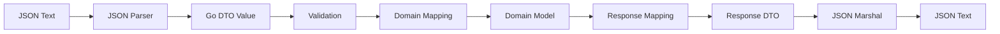
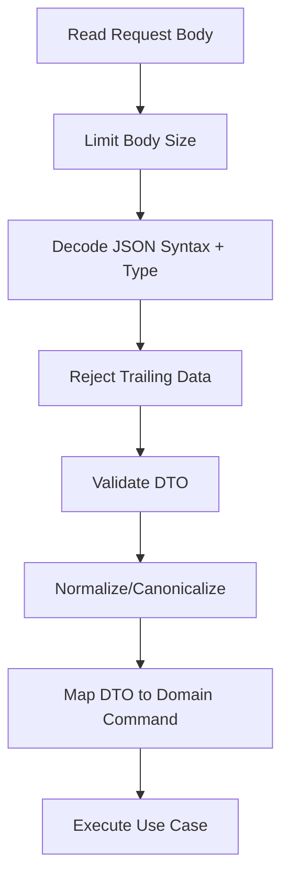

# learn-go-data-mapper-json-xml-protobuf-validation-part-006.md

# Part 006 — JSON Fundamentals in Go

> Seri: **learn-go-data-mapper-json-xml-protobuf-validation**  
> Bagian: **006 / 033**  
> Topik: **JSON fundamentals, `encoding/json`, object mapping, tags, zero values, error model, safe decode pipeline**  
> Target pembaca: **Java software engineer yang ingin menguasai Go data boundary secara production-grade**

---

## 0. Posisi Part Ini Dalam Seri

Pada part sebelumnya kita sudah membahas:

- data representation boundary,
- DTO vs domain vs persistence model,
- mapping invariant,
- struct tag governance,
- manual mapping vs reflection vs code generation.

Part ini mulai masuk ke format pertama yang paling sering dipakai dalam API modern: **JSON**.

Tetapi part ini belum membahas semua hal JSON secara maksimal. Kita akan pecah:

- Part 006: fundamental JSON di Go.
- Part 007: nullability, optionality, zero value.
- Part 008: number, precision, money, decimal, overflow.
- Part 009: custom marshal/unmarshal.
- Part 010: strict JSON decoding dan unknown field policy.
- Part 011: streaming JSON processing.
- Part 012: JSON v2 dan `jsontext`.
- Part 013–015: JSON Schema dan OpenAPI governance.

Jadi part ini adalah fondasi operasional: bagaimana `encoding/json` membaca/menulis data, bagaimana Go type system dipetakan ke JSON type system, dan failure mode apa yang harus dipahami sejak awal.

---

## 1. Tujuan Pembelajaran

Setelah menyelesaikan part ini, kamu harus mampu:

1. Menjelaskan perbedaan antara **JSON text**, **Go value**, **DTO**, dan **domain object**.
2. Menggunakan `encoding/json` dengan benar untuk marshal/unmarshal struct, map, slice, pointer, interface, dan raw JSON.
3. Memahami field selection rule di Go: exported field, struct tag, embedded struct, conflict resolution, dan case matching.
4. Mendesain DTO JSON yang eksplisit terhadap naming, optionality, compatibility, dan validation.
5. Membedakan syntax error, type mismatch, unknown field, trailing data, empty body, dan semantic validation error.
6. Menulis decode pipeline yang aman untuk HTTP API.
7. Menghindari anti-pattern umum: langsung decode ke domain object, memakai `map[string]any` tanpa boundary, mengandalkan zero value sebagai business meaning, dan silent compatibility break.

---

## 2. Mental Model: JSON Bukan Go Object

JSON adalah format pertukaran data berbasis teks. JSON punya beberapa jenis nilai dasar:

- object,
- array,
- string,
- number,
- boolean,
- null.

Go punya type system yang jauh lebih kaya:

- struct,
- map,
- slice,
- array,
- pointer,
- interface,
- custom type,
- method,
- zero value,
- exported/unexported field,
- typed nil,
- integer widths,
- unsigned integer,
- `time.Time`,
- domain-specific value object.

Mapping JSON ↔ Go bukan operasi netral. Ia adalah **interpretasi**.



Yang sering salah dipahami:

> `json.Unmarshal` bukan domain validation.  
> `json.Unmarshal` hanya mencoba membentuk Go value dari JSON text sesuai aturan mapping.

Contoh sederhana:

```go
package main

import (
	"encoding/json"
	"fmt"
)

type CreateUserRequest struct {
	Email string `json:"email"`
	Age   int    `json:"age"`
}

func main() {
	body := []byte(`{"email":"alice@example.com","age":0}`)

	var req CreateUserRequest
	if err := json.Unmarshal(body, &req); err != nil {
		panic(err)
	}

	fmt.Printf("%+v\n", req)
}
```

Output:

```text
{Email:alice@example.com Age:0}
```

Dari perspektif parser, ini sukses. Tetapi dari perspektif business rule, mungkin `age=0` tidak valid. Itu bukan tanggung jawab utama `encoding/json`.

Pipeline yang benar:



---

## 3. Java Engineer Mapping: Jackson vs Go `encoding/json`

Sebagai Java engineer, kamu mungkin terbiasa dengan:

- Jackson `ObjectMapper`,
- annotations seperti `@JsonProperty`, `@JsonIgnore`, `@JsonInclude`,
- Java Bean getters/setters,
- records/POJO,
- Bean Validation `@NotNull`, `@Size`, `@Email`,
- custom serializer/deserializer,
- module registration,
- global object mapper configuration.

Di Go, modelnya lebih kecil dan eksplisit:

| Java/Jackson | Go/encoding/json |
|---|---|
| `ObjectMapper.writeValueAsString(x)` | `json.Marshal(x)` |
| `ObjectMapper.readValue(bytes, T.class)` | `json.Unmarshal(bytes, &v)` |
| `@JsonProperty("name")` | `` `json:"name"` `` |
| `@JsonIgnore` | `` `json:"-"` `` |
| getters/setters | exported fields and methods |
| custom serializer | `MarshalJSON()` |
| custom deserializer | `UnmarshalJSON()` |
| `JsonNode` | `map[string]any`, `[]any`, `json.RawMessage` |
| Bean Validation | separate validation package/layer |
| global ObjectMapper configuration | mostly per call, per decoder, or custom wrapper |

Perbedaan besar:

1. Go tidak memakai reflection framework besar sebagai pusat aplikasi.
2. Go lebih sering memakai **explicit DTO + explicit mapper**.
3. Validasi tidak otomatis terintegrasi ke JSON decoder.
4. Field yang tidak exported tidak akan dimarshal/unmarshal oleh `encoding/json`.
5. `encoding/json` punya default behavior yang stabil karena Go 1 compatibility promise; beberapa behavior lama tidak bisa diubah tanpa API baru.

---

## 4. `encoding/json` Core API

Package utama:

```go
import "encoding/json"
```

Fungsi paling dasar:

```go
func Marshal(v any) ([]byte, error)
func Unmarshal(data []byte, v any) error
```

Streaming-oriented API:

```go
func NewEncoder(w io.Writer) *json.Encoder
func NewDecoder(r io.Reader) *json.Decoder
```

Utility penting:

```go
func Valid(data []byte) bool
func Compact(dst *bytes.Buffer, src []byte) error
func Indent(dst *bytes.Buffer, src []byte, prefix, indent string) error
```

Tipe penting:

```go
type RawMessage []byte
type Number string
type SyntaxError struct { ... }
type UnmarshalTypeError struct { ... }
type InvalidUnmarshalError struct { ... }
```

Interface customization:

```go
type Marshaler interface {
	MarshalJSON() ([]byte, error)
}

type Unmarshaler interface {
	UnmarshalJSON([]byte) error
}
```

---

## 5. Encoding: Go Value ke JSON Text

### 5.1 Basic scalar mapping

Contoh:

```go
package main

import (
	"encoding/json"
	"fmt"
)

func main() {
	values := []any{
		true,
		"hello",
		123,
		12.34,
		nil,
	}

	for _, v := range values {
		b, err := json.Marshal(v)
		if err != nil {
			panic(err)
		}
		fmt.Printf("%T -> %s\n", v, b)
	}
}
```

Typical mapping:

| Go value | JSON output |
|---|---|
| `bool` | `true` / `false` |
| `string` | JSON string |
| integer | JSON number |
| float | JSON number |
| `nil` interface | `null` |
| slice | JSON array |
| map | JSON object, if key is supported |
| struct | JSON object |
| pointer | value pointed to, or `null` if nil |

### 5.2 Struct encoding

```go
type UserResponse struct {
	ID    string `json:"id"`
	Email string `json:"email"`
	Name  string `json:"name"`
}

func encodeUser() ([]byte, error) {
	return json.Marshal(UserResponse{
		ID:    "usr_123",
		Email: "alice@example.com",
		Name:  "Alice",
	})
}
```

Output:

```json
{"id":"usr_123","email":"alice@example.com","name":"Alice"}
```

Important rule:

> Only exported struct fields are visible to `encoding/json`.

```go
type BadDTO struct {
	id    string `json:"id"`    // ignored: unexported
	Email string `json:"email"` // included
}
```

The `id` field is invisible to `encoding/json` even though it has a tag.

### 5.3 Map encoding

```go
m := map[string]any{
	"id":    "usr_123",
	"email": "alice@example.com",
	"active": true,
}

b, err := json.Marshal(m)
```

`map[string]any` is useful for dynamic payloads, but dangerous as a primary API boundary because:

- no compile-time field checking,
- no DTO documentation,
- no stable schema,
- numeric values often become `float64` after unmarshal,
- validation becomes ad-hoc,
- refactoring is unsafe.

Use `map[string]any` mostly for:

- truly dynamic metadata,
- debugging tools,
- pass-through payloads,
- temporary migration,
- unknown extension members,
- generic JSON transformation.

For public API request/response, prefer explicit DTO.

---

## 6. Decoding: JSON Text ke Go Value

### 6.1 Struct decoding

```go
type CreateUserRequest struct {
	Email string `json:"email"`
	Name  string `json:"name"`
}

func decode(data []byte) (CreateUserRequest, error) {
	var req CreateUserRequest
	if err := json.Unmarshal(data, &req); err != nil {
		return CreateUserRequest{}, err
	}
	return req, nil
}
```

Input:

```json
{"email":"alice@example.com","name":"Alice"}
```

Result:

```go
CreateUserRequest{
	Email: "alice@example.com",
	Name:  "Alice",
}
```

### 6.2 Decoding requires pointer destination

This is wrong:

```go
var req CreateUserRequest
err := json.Unmarshal(data, req) // wrong
```

`Unmarshal` must be able to mutate the destination value:

```go
var req CreateUserRequest
err := json.Unmarshal(data, &req) // correct
```

If you pass a non-pointer, `encoding/json` returns an `InvalidUnmarshalError`.

### 6.3 Field names and matching

Given:

```go
type User struct {
	UserID string `json:"user_id"`
	Email  string `json:"email"`
}
```

JSON:

```json
{"user_id":"u1","email":"a@example.com"}
```

Without tag, field names are based on Go field names:

```go
type User struct {
	UserID string
}
```

This usually maps to key `UserID`, not `user_id`. Therefore, for API DTOs, always use explicit tags.

Rule of thumb:

> Every field in an external JSON DTO should have an explicit `json` tag.

Why?

- Prevent accidental API change during field rename.
- Clarify naming convention.
- Make contract visible in code review.
- Avoid inconsistent casing.

---

## 7. Struct Tags for JSON

### 7.1 Basic tag

```go
type User struct {
	ID    string `json:"id"`
	Email string `json:"email"`
}
```

### 7.2 Ignore field

```go
type User struct {
	ID           string `json:"id"`
	PasswordHash string `json:"-"`
}
```

Important:

- `json:"-"` means never encode/decode that field via JSON.
- This is critical for secrets, internal state, caches, locks, and derived values.

### 7.3 `omitempty`

```go
type UserResponse struct {
	ID       string  `json:"id"`
	Nickname *string `json:"nickname,omitempty"`
}
```

`omitempty` omits the field when it is considered empty.

Common empty values:

| Go kind | Empty value |
|---|---|
| bool | `false` |
| int/float | `0` |
| string | `""` |
| pointer | `nil` |
| interface | `nil` |
| slice/map | length 0 or nil |

This is deceptively important.

```go
type Product struct {
	Stock int `json:"stock,omitempty"`
}
```

If stock is `0`, output omits `stock`. But `0` may be meaningful: out of stock. Therefore `omitempty` can silently erase valid information.

Better:

```go
type Product struct {
	Stock int `json:"stock"`
}
```

Or when you need optionality:

```go
type ProductPatch struct {
	Stock *int `json:"stock,omitempty"`
}
```

### 7.4 `string` option

```go
type Payload struct {
	ID int64 `json:"id,string"`
}
```

This encodes numeric value as a JSON string:

```json
{"id":"123"}
```

Use cases:

- JavaScript clients cannot safely represent all 64-bit integers as `Number`.
- Some legacy APIs encode numeric identifiers as strings.

Do not use it casually. It changes the wire contract.

---

## 8. DTO Design: Request vs Response Should Usually Differ

A common mistake:

```go
type User struct {
	ID           string `json:"id"`
	Email        string `json:"email"`
	Password     string `json:"password,omitempty"`
	PasswordHash string `json:"password_hash,omitempty"`
	CreatedAt    string `json:"created_at"`
}
```

This tries to be:

- request DTO,
- response DTO,
- domain model,
- persistence model,
- internal security model.

This is fragile.

Better:

```go
type CreateUserRequest struct {
	Email    string `json:"email"`
	Password string `json:"password"`
	Name     string `json:"name"`
}

type UserResponse struct {
	ID        string `json:"id"`
	Email     string `json:"email"`
	Name      string `json:"name"`
	CreatedAt string `json:"created_at"`
}

type User struct {
	ID           UserID
	Email        Email
	PasswordHash PasswordHash
	Name         string
	CreatedAt    time.Time
}
```

Mapping:

```go
func (r CreateUserRequest) ToCommand() (CreateUserCommand, error) {
	email, err := ParseEmail(r.Email)
	if err != nil {
		return CreateUserCommand{}, err
	}

	return CreateUserCommand{
		Email:    email,
		Password: r.Password,
		Name:     r.Name,
	}, nil
}

func NewUserResponse(u User) UserResponse {
	return UserResponse{
		ID:        u.ID.String(),
		Email:     u.Email.String(),
		Name:      u.Name,
		CreatedAt: u.CreatedAt.UTC().Format(time.RFC3339),
	}
}
```

This keeps boundary semantics explicit.

---

## 9. Zero Values: Powerful but Dangerous at JSON Boundary

Go zero values are useful internally:

- `int` → `0`,
- `string` → `""`,
- `bool` → `false`,
- pointer → `nil`,
- slice → `nil`,
- map → `nil`,
- struct → all fields zero.

But JSON boundary has at least three states:

1. field absent,
2. field present with `null`,
3. field present with value.

For a plain Go field, these often collapse into the same value.

```go
type PatchUserRequest struct {
	Name string `json:"name"`
}
```

These inputs may produce the same result:

```json
{}
```

```json
{"name":""}
```

Both become:

```go
PatchUserRequest{Name: ""}
```

For create request, this may be acceptable because missing name and empty name can both be invalid.

For PATCH request, this is not acceptable. You need to distinguish:

- not provided: do not update,
- provided empty: clear value or validation error,
- provided null: clear value or reject depending on contract.

Part 007 will go much deeper. For now, remember:

> Plain value fields are poor at representing optional input intent.

Use pointer fields or custom optional types for PATCH-like semantics.

---

## 10. Unknown Fields: Default Behavior Is Lenient

Given:

```go
type CreateUserRequest struct {
	Email string `json:"email"`
}
```

Input:

```json
{"email":"alice@example.com","role":"admin"}
```

Default `json.Unmarshal` ignores unknown field `role`.

This may be fine for backward-compatible clients, but dangerous for:

- security-sensitive APIs,
- configuration files,
- admin operations,
- public mutation endpoints,
- financial/regulatory workflows,
- typo detection.

Use `Decoder.DisallowUnknownFields()` when strictness is required:

```go
func DecodeStrictJSON(r io.Reader, dst any) error {
	dec := json.NewDecoder(r)
	dec.DisallowUnknownFields()
	return dec.Decode(dst)
}
```

However, this simple version is incomplete because it may allow trailing data.

Safer version:

```go
package jsonx

import (
	"encoding/json"
	"errors"
	"fmt"
	"io"
)

func DecodeStrict(r io.Reader, dst any) error {
	dec := json.NewDecoder(r)
	dec.DisallowUnknownFields()

	if err := dec.Decode(dst); err != nil {
		return fmt.Errorf("decode json: %w", err)
	}

	// Ensure there is no second JSON value or trailing non-whitespace data.
	if err := dec.Decode(&struct{}{}); !errors.Is(err, io.EOF) {
		return fmt.Errorf("decode json: trailing data")
	}

	return nil
}
```

Important nuance:

- Unknown field policy is not one-size-fits-all.
- Public read response clients should usually ignore unknown fields when consuming server responses.
- Public mutation request servers may reject unknown fields to catch client bugs early.
- Event consumers may need leniency during compatibility windows.

---

## 11. Trailing Data: The Classic HTTP Decode Bug

This looks normal:

```go
err := json.NewDecoder(r.Body).Decode(&req)
```

But input like this may decode the first JSON value successfully:

```json
{"email":"alice@example.com"} {"extra":"value"}
```

For an HTTP API expecting exactly one JSON document, trailing data should be rejected.

Production decode function:

```go
func DecodeSingleJSON(r io.Reader, dst any) error {
	dec := json.NewDecoder(r)
	dec.DisallowUnknownFields()

	if err := dec.Decode(dst); err != nil {
		return err
	}

	var extra any
	if err := dec.Decode(&extra); err != io.EOF {
		return fmt.Errorf("body must contain only one JSON value")
	}

	return nil
}
```

This pattern will be refined in Part 030 for HTTP APIs.

---

## 12. `interface{}` / `any` Decoding

When unmarshaling into `any`, Go must choose generic representations:

```go
var v any
err := json.Unmarshal([]byte(`{"a":1,"b":[true,"x"],"c":null}`), &v)
```

Typical result:

```go
map[string]any{
	"a": float64(1),
	"b": []any{true, "x"},
	"c": nil,
}
```

Default generic mapping:

| JSON | Go when decoded into `any` |
|---|---|
| object | `map[string]any` |
| array | `[]any` |
| string | `string` |
| number | `float64` |
| boolean | `bool` |
| null | `nil` |

The number behavior is a major footgun.

If you need to preserve number text:

```go
var v any

dec := json.NewDecoder(strings.NewReader(`{"id":9223372036854775807}`))
dec.UseNumber()
if err := dec.Decode(&v); err != nil {
	panic(err)
}
```

Then numbers inside `any` become `json.Number` instead of `float64`.

But for API DTOs, better avoid `any` unless the field is genuinely dynamic.

---

## 13. `json.RawMessage`: Delay Interpretation

`json.RawMessage` stores raw JSON bytes.

Useful when:

- envelope contains a `type` field and dynamic payload,
- you need to route by discriminator first,
- you need to preserve unknown data,
- you are implementing event ingestion,
- you need partial parsing.

Example:

```go
type EventEnvelope struct {
	Type string          `json:"type"`
	Data json.RawMessage `json:"data"`
}

type UserCreated struct {
	UserID string `json:"user_id"`
	Email  string `json:"email"`
}

type UserDeleted struct {
	UserID string `json:"user_id"`
	Reason string `json:"reason"`
}

func DecodeEvent(data []byte) (any, error) {
	var env EventEnvelope
	if err := json.Unmarshal(data, &env); err != nil {
		return nil, err
	}

	switch env.Type {
	case "user.created":
		var e UserCreated
		if err := json.Unmarshal(env.Data, &e); err != nil {
			return nil, err
		}
		return e, nil

	case "user.deleted":
		var e UserDeleted
		if err := json.Unmarshal(env.Data, &e); err != nil {
			return nil, err
		}
		return e, nil

	default:
		return nil, fmt.Errorf("unknown event type %q", env.Type)
	}
}
```

This pattern is better than directly unmarshaling to `map[string]any` and manually type-asserting everything.

---

## 14. Embedded Structs and Field Flattening

Go allows embedded fields:

```go
type AuditFields struct {
	CreatedAt string `json:"created_at"`
	UpdatedAt string `json:"updated_at"`
}

type UserResponse struct {
	ID string `json:"id"`
	AuditFields
}
```

Output is flattened:

```json
{
  "id": "u1",
  "created_at": "2026-06-24T10:00:00Z",
  "updated_at": "2026-06-24T11:00:00Z"
}
```

This can be convenient, but beware:

- field name conflicts,
- implicit API surface expansion,
- hidden coupling across DTOs,
- confusing OpenAPI/schema generation,
- accidental exposure of internal fields.

For public API response DTOs, explicit fields are often safer.

Instead of:

```go
type UserResponse struct {
	ID string `json:"id"`
	AuditFields
}
```

Prefer, when contract clarity matters:

```go
type UserResponse struct {
	ID        string `json:"id"`
	CreatedAt string `json:"created_at"`
	UpdatedAt string `json:"updated_at"`
}
```

Embedding is not wrong. It is an API design choice.

---

## 15. Exported Fields, Unexported Fields, and Security

Only exported fields are considered by `encoding/json`.

```go
type Session struct {
	ID        string `json:"id"`
	userID    string `json:"user_id"` // ignored
	TokenHash string `json:"-"`       // explicitly ignored
}
```

Security recommendation:

- For sensitive fields, do not rely only on unexported naming.
- Also use explicit DTO separation.
- Also add `json:"-"` for internal structs that might accidentally be marshaled.

Bad:

```go
type User struct {
	ID           string `json:"id"`
	Email        string `json:"email"`
	PasswordHash string `json:"password_hash"` // accidental leak
}
```

Better:

```go
type User struct {
	ID           UserID
	Email        Email
	PasswordHash PasswordHash
}

type UserResponse struct {
	ID    string `json:"id"`
	Email string `json:"email"`
}
```

Never use domain entity as JSON response if it contains sensitive or internal fields.

---

## 16. Time Values

`time.Time` implements JSON marshaling behavior. Typical output is RFC3339-like timestamp:

```go
type Response struct {
	CreatedAt time.Time `json:"created_at"`
}
```

But production APIs should make time policy explicit:

- UTC or local timezone?
- precision: seconds, milliseconds, nanoseconds?
- string format: RFC3339, RFC3339Nano, date-only?
- backward compatibility if precision changes?
- can clients compare lexicographically?

Recommended API response mapping:

```go
type UserResponse struct {
	CreatedAt string `json:"created_at"`
}

func NewUserResponse(u User) UserResponse {
	return UserResponse{
		CreatedAt: u.CreatedAt.UTC().Format(time.RFC3339),
	}
}
```

This makes the wire format explicit and stable.

For internal DTOs, `time.Time` may be acceptable. For public contract, consider string mapping to enforce policy.

---

## 17. Nil Slice vs Empty Slice

In `encoding/json` v1, nil slice marshals differently from empty-but-non-nil slice.

```go
type Response struct {
	Items []string `json:"items"`
}

var a = Response{Items: nil}
var b = Response{Items: []string{}}
```

Typical JSON:

```json
{"items":null}
```

versus:

```json
{"items":[]}
```

For APIs, clients often expect arrays to always be arrays.

Recommended:

```go
func NewListResponse(items []Item) ListResponse {
	if items == nil {
		items = []Item{}
	}
	return ListResponse{Items: items}
}
```

Or initialize at construction:

```go
resp := ListResponse{Items: make([]Item, 0)}
```

This matters for frontend and strongly typed clients.

Part 012 will revisit this because JSON v2 changes some defaults and exposes options.

---

## 18. Maps and Determinism

JSON object member order is generally not semantically meaningful. But deterministic output may matter for:

- golden tests,
- signing/canonicalization,
- caching,
- idempotency keys,
- diff-friendly logs,
- snapshot testing.

Do not rely on ordinary JSON object ordering as a semantic contract.

For cryptographic signing, do not simply `json.Marshal` a map and sign it unless you have a canonicalization policy.

Use a canonical JSON approach when needed. This topic connects to RFC 8785-style canonical JSON and will be discussed when we cover schema and security-sensitive contract design.

---

## 19. Error Taxonomy in JSON Decode

A mature API should not return raw decoder errors directly to clients. It should classify errors.

### 19.1 Syntax error

Input:

```json
{"email":"alice@example.com",
```

Possible error: syntax error / unexpected EOF.

Client response:

```json
{
  "code": "invalid_json",
  "message": "Request body must be valid JSON."
}
```

### 19.2 Type mismatch

DTO:

```go
type Request struct {
	Age int `json:"age"`
}
```

Input:

```json
{"age":"old"}
```

This is not validation failure. It is a JSON type mapping failure.

Client response:

```json
{
  "code": "invalid_json_type",
  "message": "Field age must be a number."
}
```

### 19.3 Unknown field

Input:

```json
{"email":"a@example.com","unexpected":true}
```

If strict mode is enabled:

```json
{
  "code": "unknown_field",
  "message": "Unknown field: unexpected."
}
```

### 19.4 Empty body

HTTP body:

```text
<empty>
```

This should usually be:

```json
{
  "code": "empty_body",
  "message": "Request body is required."
}
```

### 19.5 Semantic validation error

Input:

```json
{"email":"not-an-email"}
```

JSON decode succeeds. Validation fails.

```json
{
  "code": "validation_failed",
  "fields": [
    {"path":"email","rule":"email","message":"email must be valid"}
  ]
}
```

Keep these separate. It makes API behavior predictable and debuggable.

---

## 20. Production Decode Helper

A reusable decode helper can enforce consistent policy.

```go
package httpjson

import (
	"encoding/json"
	"errors"
	"fmt"
	"io"
	"net/http"
	"strings"
)

const DefaultMaxBodyBytes int64 = 1 << 20 // 1 MiB

type DecodeErrorKind string

const (
	DecodeErrorEmptyBody     DecodeErrorKind = "empty_body"
	DecodeErrorMalformedJSON DecodeErrorKind = "malformed_json"
	DecodeErrorInvalidType   DecodeErrorKind = "invalid_type"
	DecodeErrorUnknownField  DecodeErrorKind = "unknown_field"
	DecodeErrorTrailingData  DecodeErrorKind = "trailing_data"
	DecodeErrorTooLarge      DecodeErrorKind = "body_too_large"
)

type DecodeError struct {
	Kind    DecodeErrorKind
	Message string
	Err     error
}

func (e *DecodeError) Error() string {
	return e.Message
}

func (e *DecodeError) Unwrap() error {
	return e.Err
}

func DecodeRequestJSON(w http.ResponseWriter, r *http.Request, dst any) error {
	r.Body = http.MaxBytesReader(w, r.Body, DefaultMaxBodyBytes)
	defer r.Body.Close()

	dec := json.NewDecoder(r.Body)
	dec.DisallowUnknownFields()

	if err := dec.Decode(dst); err != nil {
		return classifyDecodeError(err)
	}

	var extra any
	if err := dec.Decode(&extra); err != io.EOF {
		return &DecodeError{
			Kind:    DecodeErrorTrailingData,
			Message: "request body must contain only one JSON value",
			Err:     err,
		}
	}

	return nil
}

func classifyDecodeError(err error) error {
	if errors.Is(err, io.EOF) {
		return &DecodeError{
			Kind:    DecodeErrorEmptyBody,
			Message: "request body is required",
			Err:     err,
		}
	}

	var syntaxErr *json.SyntaxError
	if errors.As(err, &syntaxErr) {
		return &DecodeError{
			Kind:    DecodeErrorMalformedJSON,
			Message: fmt.Sprintf("malformed JSON at byte offset %d", syntaxErr.Offset),
			Err:     err,
		}
	}

	var typeErr *json.UnmarshalTypeError
	if errors.As(err, &typeErr) {
		field := typeErr.Field
		if field == "" {
			field = "<unknown>"
		}
		return &DecodeError{
			Kind:    DecodeErrorInvalidType,
			Message: fmt.Sprintf("invalid JSON type for field %s", field),
			Err:     err,
		}
	}

	// encoding/json reports unknown field as a plain error string.
	// Do not build complex production logic only with string parsing unless
	// you centralize it in one place and cover it with tests.
	if strings.HasPrefix(err.Error(), "json: unknown field ") {
		return &DecodeError{
			Kind:    DecodeErrorUnknownField,
			Message: err.Error(),
			Err:     err,
		}
	}

	if strings.Contains(err.Error(), "http: request body too large") {
		return &DecodeError{
			Kind:    DecodeErrorTooLarge,
			Message: "request body is too large",
			Err:     err,
		}
	}

	return &DecodeError{
		Kind:    DecodeErrorMalformedJSON,
		Message: "invalid JSON request body",
		Err:     err,
	}
}
```

This helper is intentionally not perfect. It demonstrates boundary classification. In production, you may refine:

- content-type checking,
- request ID propagation,
- metrics,
- logging redaction,
- structured API error response,
- validation integration,
- custom unknown-field extraction,
- better body-too-large detection,
- decode offset reporting.

---

## 21. End-to-End Handler Example

```go
package users

import (
	"encoding/json"
	"errors"
	"net/http"
	"strings"
	"time"
)

type CreateUserRequest struct {
	Email    string `json:"email"`
	Password string `json:"password"`
	Name     string `json:"name"`
}

type CreateUserResponse struct {
	ID        string `json:"id"`
	Email     string `json:"email"`
	Name      string `json:"name"`
	CreatedAt string `json:"created_at"`
}

type CreateUserCommand struct {
	Email    string
	Password string
	Name     string
}

func (r CreateUserRequest) Validate() []FieldError {
	var errs []FieldError

	if strings.TrimSpace(r.Email) == "" {
		errs = append(errs, FieldError{Path: "email", Code: "required"})
	}
	if !strings.Contains(r.Email, "@") {
		errs = append(errs, FieldError{Path: "email", Code: "email"})
	}
	if len(r.Password) < 12 {
		errs = append(errs, FieldError{Path: "password", Code: "min_length"})
	}
	if strings.TrimSpace(r.Name) == "" {
		errs = append(errs, FieldError{Path: "name", Code: "required"})
	}

	return errs
}

func (r CreateUserRequest) ToCommand() CreateUserCommand {
	return CreateUserCommand{
		Email:    strings.ToLower(strings.TrimSpace(r.Email)),
		Password: r.Password,
		Name:     strings.TrimSpace(r.Name),
	}
}

type FieldError struct {
	Path string `json:"path"`
	Code string `json:"code"`
}

type APIError struct {
	Code    string       `json:"code"`
	Message string       `json:"message"`
	Fields  []FieldError `json:"fields,omitempty"`
}

type User struct {
	ID        string
	Email     string
	Name      string
	CreatedAt time.Time
}

type UserService interface {
	CreateUser(r *http.Request, cmd CreateUserCommand) (User, error)
}

func NewCreateUserHandler(service UserService) http.HandlerFunc {
	return func(w http.ResponseWriter, r *http.Request) {
		var req CreateUserRequest
		if err := DecodeStrictHTTPJSON(w, r, &req); err != nil {
			writeJSON(w, http.StatusBadRequest, APIError{
				Code:    "invalid_json",
				Message: err.Error(),
			})
			return
		}

		if fieldErrs := req.Validate(); len(fieldErrs) > 0 {
			writeJSON(w, http.StatusUnprocessableEntity, APIError{
				Code:    "validation_failed",
				Message: "request validation failed",
				Fields:  fieldErrs,
			})
			return
		}

		user, err := service.CreateUser(r, req.ToCommand())
		if err != nil {
			writeJSON(w, http.StatusInternalServerError, APIError{
				Code:    "internal_error",
				Message: "internal server error",
			})
			return
		}

		resp := CreateUserResponse{
			ID:        user.ID,
			Email:     user.Email,
			Name:      user.Name,
			CreatedAt: user.CreatedAt.UTC().Format(time.RFC3339),
		}
		writeJSON(w, http.StatusCreated, resp)
	}
}

func DecodeStrictHTTPJSON(w http.ResponseWriter, r *http.Request, dst any) error {
	r.Body = http.MaxBytesReader(w, r.Body, 1<<20)
	defer r.Body.Close()

	dec := json.NewDecoder(r.Body)
	dec.DisallowUnknownFields()

	if err := dec.Decode(dst); err != nil {
		if errors.Is(err, http.ErrBodyReadAfterClose) {
			return err
		}
		return err
	}

	var extra any
	if err := dec.Decode(&extra); err != nil && !errors.Is(err, io.EOF) {
		return err
	} else if err == nil {
		return errors.New("body must contain a single JSON object")
	}

	return nil
}

func writeJSON(w http.ResponseWriter, status int, v any) {
	w.Header().Set("Content-Type", "application/json")
	w.WriteHeader(status)
	_ = json.NewEncoder(w).Encode(v)
}
```

Note: this example intentionally keeps validation manual. Part 027 will cover `go-playground/validator` and how to integrate validation tags without turning DTOs into unreadable annotation blobs.

---

## 22. JSON Encoding for HTTP Responses

Common pattern:

```go
w.Header().Set("Content-Type", "application/json")
w.WriteHeader(http.StatusOK)
json.NewEncoder(w).Encode(resp)
```

`Encoder.Encode` appends a newline after the JSON value. This is normally fine and even useful for logs/streams. If you need exact bytes with no newline, use `json.Marshal` and `w.Write`.

```go
b, err := json.Marshal(resp)
if err != nil {
	// handle internal encoding error
}
w.Header().Set("Content-Type", "application/json")
w.WriteHeader(http.StatusOK)
_, _ = w.Write(b)
```

Response encoding errors are usually programmer errors or writer errors. Examples:

- unsupported value such as `math.NaN()` or `math.Inf(1)`,
- circular structures,
- broken client connection while writing,
- custom `MarshalJSON` error.

Do not ignore encoding errors in infrastructure code if the response contains complex/custom values.

---

## 23. Unsupported Values

JSON has no representation for NaN or infinity.

```go
v := map[string]float64{
	"x": math.NaN(),
}
_, err := json.Marshal(v)
```

This returns an error.

JSON also cannot encode cyclic data structures:

```go
type Node struct {
	Next *Node `json:"next"`
}

n := &Node{}
n.Next = n
_, err := json.Marshal(n) // error
```

Production implication:

- Response DTOs should be acyclic.
- Avoid exposing domain graph directly.
- Avoid floats for values that may produce NaN/Inf unless sanitized.

---

## 24. Designing JSON DTOs: Practical Rules

### Rule 1: Explicit tags for external DTOs

```go
type Response struct {
	UserID string `json:"user_id"`
}
```

Not:

```go
type Response struct {
	UserID string
}
```

### Rule 2: Separate request and response DTOs

Requests and responses have different semantics.

```go
type CreateOrderRequest struct { ... }
type OrderResponse struct { ... }
```

### Rule 3: Separate DTO and domain model when invariants matter

```go
type TransferRequest struct {
	FromAccountID string `json:"from_account_id"`
	ToAccountID   string `json:"to_account_id"`
	Amount        string `json:"amount"`
}

type TransferCommand struct {
	From AccountID
	To   AccountID
	Amt  Money
}
```

### Rule 4: Do not use `omitempty` on meaningful zero values

Bad:

```go
Count int `json:"count,omitempty"`
```

If `0` is a valid result, use:

```go
Count int `json:"count"`
```

### Rule 5: Prefer arrays as arrays

Do not emit `null` for lists unless contract says so.

```go
if items == nil {
	items = []ItemResponse{}
}
```

### Rule 6: Classify decode errors before validation errors

Invalid JSON type is not the same as domain validation failure.

### Rule 7: Use strict mode intentionally

Strict for:

- create/update request,
- config,
- admin operation,
- financial/regulatory mutation.

Lenient for:

- consuming third-party API that may add fields,
- long-lived event compatibility,
- forward-compatible clients.

### Rule 8: Avoid dynamic map unless dynamic is real

If fields are known, use struct.

### Rule 9: Preserve raw JSON when type is not known yet

Use `json.RawMessage` for envelope patterns.

### Rule 10: Document JSON contract separately

Struct tags are implementation metadata, not complete API documentation.

---

## 25. Common Anti-Patterns

### Anti-pattern 1: One struct for everything

```go
type User struct {
	ID           string `json:"id" db:"id" validate:"required"`
	Email        string `json:"email" db:"email" validate:"email"`
	Password     string `json:"password,omitempty" db:"-"`
	PasswordHash string `json:"password_hash,omitempty" db:"password_hash"`
}
```

This mixes API, DB, validation, and domain concerns.

Failure modes:

- secret leakage,
- accidental breaking API change,
- impossible migration,
- validation confusion,
- over-tagged unreadable model,
- domain polluted by transport.

### Anti-pattern 2: Using `map[string]any` for typed API

```go
var req map[string]any
json.NewDecoder(r.Body).Decode(&req)
email := req["email"].(string)
```

Failure modes:

- panic,
- numeric precision loss,
- no schema,
- no discoverability,
- weak refactorability,
- messy validation.

### Anti-pattern 3: Ignoring decode errors

```go
json.NewDecoder(r.Body).Decode(&req)
```

Always check errors.

### Anti-pattern 4: No body size limit

```go
json.NewDecoder(r.Body).Decode(&req)
```

Use `http.MaxBytesReader` for HTTP handlers.

### Anti-pattern 5: Blind `omitempty`

```go
Active bool `json:"active,omitempty"`
```

If `false` is meaningful, this omits it.

### Anti-pattern 6: Decoding directly into domain entity

```go
var user User
json.NewDecoder(r.Body).Decode(&user)
```

Domain object should protect invariants. JSON decoder should not bypass constructor/factory rules.

### Anti-pattern 7: Returning raw decoder error to public client

```go
http.Error(w, err.Error(), http.StatusBadRequest)
```

Better classify and return stable machine-readable error code.

---

## 26. Decision Matrix

| Situation | Recommended approach |
|---|---|
| Public create/update API | Explicit request DTO + strict decoder + validation + mapper |
| Public response API | Explicit response DTO + stable tags + no sensitive fields |
| PATCH API | Pointer/custom optional fields; do not use plain values blindly |
| Dynamic metadata | `map[string]json.RawMessage` or `map[string]any` with policy |
| Event envelope | Discriminator + `json.RawMessage` payload |
| Config file | Strict decoder + unknown field rejection + good error messages |
| Third-party response client | Usually lenient unknown fields, explicit DTO for used fields |
| Large JSON stream | `json.Decoder`; token/streaming processing in Part 011 |
| Money/decimal | Avoid float; string or decimal type; Part 008 |
| 64-bit IDs exposed to JS | string representation or `json:",string"` with clear contract |
| Audit/regulatory payload | Preserve raw payload + canonical parsed model + validation record |

---

## 27. Review Checklist

Use this checklist in code review for Go JSON boundary code.

### DTO checklist

- [ ] Is this an API DTO, not a domain entity?
- [ ] Does every external field have explicit `json` tag?
- [ ] Are sensitive/internal fields absent or tagged `json:"-"`?
- [ ] Are request and response DTOs separated?
- [ ] Are zero values meaningful and intentionally represented?
- [ ] Is `omitempty` used only when absence is contractually correct?
- [ ] Are list fields normalized to `[]` instead of `null` when required?
- [ ] Are time fields formatted according to policy?
- [ ] Are numeric fields safe for their clients?

### Decode checklist

- [ ] Is body size limited?
- [ ] Is decode error checked?
- [ ] Is unknown field policy intentional?
- [ ] Is trailing data rejected for single-document endpoints?
- [ ] Are syntax/type errors separated from validation errors?
- [ ] Is validation performed after decode?
- [ ] Is normalization/canonicalization explicit?
- [ ] Is mapping to domain command explicit?

### Response checklist

- [ ] Is response DTO stable and intentional?
- [ ] Can marshal fail due to unsupported values?
- [ ] Is content type set?
- [ ] Are errors returned in stable envelope format?
- [ ] Are secrets impossible to leak through this DTO?

---

## 28. Exercises

### Exercise 1: Design a create request

Design `CreateCaseRequest` for a regulatory case management system.

Required JSON fields:

- `case_type`,
- `subject_id`,
- `priority`,
- `description`,
- `attachments`.

Tasks:

1. Decide which fields are string, array, nested object, or optional.
2. Decide whether `attachments` should emit/accept `null`.
3. Write DTO.
4. Write validation rules.
5. Write mapper to `CreateCaseCommand`.
6. Decide strict/lenient unknown field policy.

### Exercise 2: Decode error classification

Write a function that maps these inputs to stable error codes:

```json

```

```json
{"age":"abc"}
```

```json
{"email":"a@example.com","unknown":1}
```

```json
{"email":"a@example.com"} []
```

### Exercise 3: Raw event envelope

Create an event envelope:

```json
{
  "event_id": "evt_123",
  "event_type": "case.assigned",
  "occurred_at": "2026-06-24T10:00:00Z",
  "payload": {
    "case_id": "case_123",
    "assignee_id": "usr_456"
  }
}
```

Use `json.RawMessage` to decode by `event_type`.

---

## 29. Key Invariants

The most important invariants from this part:

1. JSON decode success does not mean request is valid.
2. Unknown field behavior must be a policy decision, not an accident.
3. DTOs are boundary contracts; domain models are invariant holders.
4. Plain Go value fields collapse absent/null/zero distinctions.
5. `omitempty` changes wire semantics and can erase meaningful values.
6. `map[string]any` is dynamic but weakly governed.
7. `json.RawMessage` is the right tool when payload type is not known yet.
8. Strict HTTP JSON decoding requires more than `Decode(&req)`.
9. Public JSON fields should be explicitly tagged.
10. Production APIs should classify JSON errors into stable machine-readable categories.

---

## 30. How This Connects to Next Parts

Part 006 deliberately stops before the hardest JSON design issue: **optionality**.

Next part:

```text
learn-go-data-mapper-json-xml-protobuf-validation-part-007.md
```

Title:

```text
JSON Nullability, Optionality, and Zero Value Semantics
```

Why it deserves a separate part:

- JSON has `null` and absent fields.
- Go has zero values and nil pointers.
- PATCH/update semantics require “field presence”.
- Create request and partial update request should not use the same model carelessly.
- Protobuf field presence later depends on the same mental model.

---

## 31. References

Primary references used for this part:

1. Go `encoding/json` package documentation.
2. Go 1.26 release notes.
3. Go blog: experimental `encoding/json/v2` and `encoding/json/jsontext`.
4. Go `encoding/json/v2` package documentation.
5. Go `encoding/json/jsontext` package documentation.
6. RFC 8259 — The JavaScript Object Notation Data Interchange Format.
7. RFC 8785 — JSON Canonicalization Scheme.

---

# Status Seri

Seri **belum selesai**.

- Selesai: Part 000 sampai Part 006.
- Berikutnya: Part 007 — JSON Nullability, Optionality, and Zero Value Semantics.

<!-- NAVIGATION_FOOTER -->
<div class="page-nav">
<a href="./learn-go-data-mapper-json-xml-protobuf-validation-part-005.md">⬅️ Part 005 — Manual Mapping vs Reflection vs Code Generation</a>
<a href="./index.md">📚 Kategori</a>
<a href="../../index.md">🏠 Home</a>
<a href="./learn-go-data-mapper-json-xml-protobuf-validation-part-007.md">Part 007 — JSON Nullability, Optionality, and Zero Value Semantics ➡️</a>
</div>
