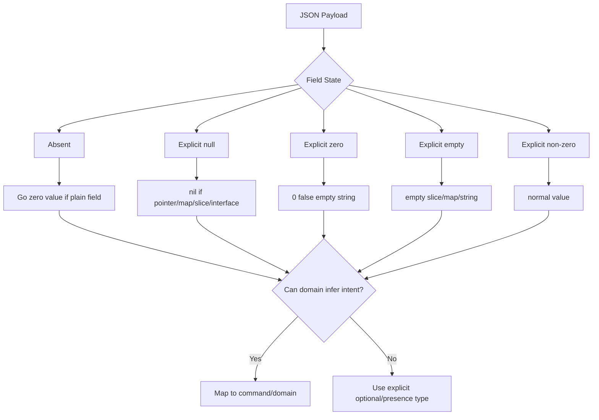
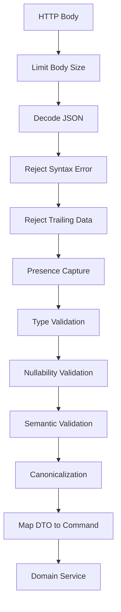

# learn-go-data-mapper-json-xml-protobuf-validation-part-007.md

# Part 007 — JSON Nullability, Optionality, and Zero Value Semantics

> Seri: `learn-go-data-mapper-json-xml-protobuf-validation`  
> Bagian: `007 / 033`  
> Topik: JSON nullability, optionality, zero value, absent field, patch semantics, pointer strategy, custom optional type, validation boundary  
> Target pembaca: Java software engineer yang ingin menguasai Go data boundary secara production-grade  
> Versi Go target: Go 1.26.x  

---

## 0. Tujuan Bagian Ini

Bagian ini membahas salah satu sumber bug paling mahal dalam sistem API Go: **ketidakjelasan makna field JSON ketika field itu kosong, hilang, bernilai `null`, bernilai zero value, atau sengaja dikosongkan oleh client**.

Di level junior, topik ini sering terlihat seperti pertanyaan kecil:

> “Pakai `string` atau `*string`?”

Di level production-grade, pertanyaannya jauh lebih dalam:

> “Apakah field ini punya tiga state, empat state, atau hanya dua state?”  
> “Apakah `null` berarti clear value, unknown, not provided, atau invalid?”  
> “Apakah absent field pada PATCH berarti keep existing atau reset to default?”  
> “Apakah empty string adalah nilai valid atau sinyal data tidak lengkap?”  
> “Apakah response boleh membocorkan implementasi nil slice Go sebagai JSON `null`?”  
> “Apakah validator berjalan sebelum atau sesudah canonicalization?”

Tujuan akhir bagian ini adalah membuat Anda mampu mendesain JSON DTO Go yang:

1. tidak ambigu,
2. aman untuk create/update/patch,
3. kompatibel terhadap evolusi API,
4. mudah divalidasi,
5. tidak silently kehilangan intent client,
6. tidak mencampur domain truth dengan transport representation,
7. tidak memakai pointer hanya karena “biar bisa `omitempty`”,
8. mampu memodelkan absent/null/zero secara eksplisit bila diperlukan.

---

## 1. Core Mental Model

Dalam JSON boundary, ada minimal lima keadaan yang perlu dibedakan:

| JSON Input | Contoh | Makna Potensial |
|---|---|---|
| Field absent | `{}` | Client tidak mengirim field; bisa berarti keep/default/unknown. |
| Field null | `{ "name": null }` | Client mengirim null; bisa berarti clear, unknown, invalid, atau nil. |
| Field zero scalar | `{ "age": 0 }` | Client mengirim angka valid bernilai zero. |
| Field empty aggregate | `{ "tags": [] }` | Client mengirim collection kosong secara eksplisit. |
| Field non-zero | `{ "name": "Ayu" }` | Client mengirim nilai eksplisit. |

Masalahnya: **Go zero value tidak sama dengan JSON absent**.

Contoh:

```go
type CreateUserRequest struct {
    Name string `json:"name"`
    Age  int    `json:"age"`
}
```

Ketika input:

```json
{}
```

hasil decode:

```go
CreateUserRequest{
    Name: "",
    Age:  0,
}
```

Ketika input:

```json
{ "name": "", "age": 0 }
```

hasil decode juga:

```go
CreateUserRequest{
    Name: "",
    Age:  0,
}
```

Dari nilai Go saja, Anda tidak tahu apakah client:

1. tidak mengirim field,
2. sengaja mengirim zero value,
3. salah payload,
4. menggunakan default dari UI,
5. sedang melakukan partial update.

Inilah sumber utama bug optionality.

---

## 2. Java-to-Go Comparison

Sebagai Java engineer, Anda mungkin terbiasa dengan pola berikut:

```java
public class UpdateUserRequest {
    private String name;
    private Integer age;
}
```

Di Java:

- `String name == null` bisa berarti field tidak dikirim atau dikirim `null`, tergantung konfigurasi Jackson.
- `Integer age == null` bisa membedakan absent/null dari angka `0`, tetapi belum otomatis membedakan absent vs explicit null.
- Bean Validation seperti `@NotNull`, `@NotBlank`, `@Min` bekerja setelah deserialization.
- Jackson punya fitur seperti `JsonNode`, `Optional<T>`, `@JsonSetter(nulls=...)`, `JsonInclude`, dan custom deserializer.

Di Go:

```go
type UpdateUserRequest struct {
    Name *string `json:"name"`
    Age  *int    `json:"age"`
}
```

Pointer bisa membedakan:

- `nil` = field absent **atau** explicit `null`,
- non-nil pointing to `""` = explicit empty string,
- non-nil pointing to `0` = explicit zero number.

Namun pointer **tidak membedakan absent vs explicit null** dengan default `encoding/json`.

Itu berarti pola `*T` hanya memberi **tiga state parsial**:

| Input | Go Field |
|---|---|
| `{}` | `nil` |
| `{ "name": null }` | `nil` |
| `{ "name": "" }` | pointer to `""` |
| `{ "name": "Ayu" }` | pointer to `"Ayu"` |

Jika sistem membutuhkan perbedaan absent dan null, `*T` tidak cukup.

---

## 3. Diagram Besar: Transport Intent vs Go Value



Key idea:

> JSON field state adalah transport-level intent. Go zero value adalah memory representation. Domain rule harus menerima intent yang tidak ambigu, bukan menebak dari zero value.

---

## 4. Terminology yang Harus Konsisten

Sebelum membahas kode, tim perlu menyepakati istilah.

### 4.1 Absent

Field tidak ada di JSON object.

```json
{}
```

Makna umum:

- create: gunakan default atau invalid jika required,
- full update: mungkin invalid karena semua field wajib ada,
- patch: keep existing value,
- response: tidak diekspos atau tidak applicable.

### 4.2 Null

Field ada, nilainya `null`.

```json
{ "middle_name": null }
```

Makna umum:

- nullable data value,
- clear existing value,
- unknown value,
- intentionally blank,
- invalid for non-nullable field.

### 4.3 Zero Value

Nilai default Go untuk tipe tersebut.

| Go Type | Zero Value |
|---|---|
| `string` | `""` |
| `int` | `0` |
| `bool` | `false` |
| `float64` | `0` |
| `time.Time` | `time.Time{}` |
| `[]T` | `nil` |
| `map[K]V` | `nil` |
| `*T` | `nil` |
| `interface{}` / `any` | `nil` |

Zero value adalah konsep Go, bukan konsep JSON.

### 4.4 Empty Value

Dalam konteks `encoding/json` v1 `omitempty`, empty value didefinisikan sebagai:

- `false`,
- `0`,
- nil pointer,
- nil interface,
- array/slice/map/string dengan length zero.

Empty value berbeda dari zero value untuk beberapa tipe.

Contoh penting:

```go
var t time.Time // zero value
```

`time.Time{}` adalah zero value, tetapi bukan “empty” menurut `omitempty` klasik karena struct tidak dianggap empty.

### 4.5 Omitted During Encoding

Omitted berarti field tidak ditulis ke JSON output.

```go
type Response struct {
    Name string `json:"name,omitempty"`
}
```

Jika `Name == ""`, output:

```json
{}
```

Ini hanya bicara **encoding response**, bukan decoding request.

Kesalahan umum:

> Mengira `omitempty` membantu mendeteksi apakah client mengirim field.

Tidak. `omitempty` tidak membantu decoding request.

---

## 5. `encoding/json` Behavior yang Wajib Dihafal

### 5.1 Plain Scalar Field

```go
type Req struct {
    Name string `json:"name"`
    Age  int    `json:"age"`
    VIP  bool   `json:"vip"`
}
```

Input:

```json
{}
```

Hasil:

```go
Req{Name: "", Age: 0, VIP: false}
```

Input:

```json
{ "name": null, "age": null, "vip": null }
```

Hasil secara praktis:

```go
Req{Name: "", Age: 0, VIP: false}
```

Untuk tipe non-pointer seperti `string`, `int`, `bool`, JSON `null` tidak mengubah nilai target dan tidak menghasilkan error. Ini sangat penting.

Implikasi:

- Anda tidak bisa menjadikan plain scalar sebagai required field hanya dengan melihat zero value.
- Anda tidak bisa tahu apakah `false` dikirim atau tidak.
- Anda tidak bisa tahu apakah `0` dikirim atau tidak.
- Anda tidak bisa tahu apakah `""` dikirim atau tidak.

### 5.2 Pointer Field

```go
type Req struct {
    Name *string `json:"name"`
    Age  *int    `json:"age"`
    VIP  *bool   `json:"vip"`
}
```

State:

| JSON | Go |
|---|---|
| `{}` | `Name == nil` |
| `{ "name": null }` | `Name == nil` |
| `{ "name": "" }` | `Name != nil && *Name == ""` |
| `{ "age": 0 }` | `Age != nil && *Age == 0` |
| `{ "vip": false }` | `VIP != nil && *VIP == false` |

Pointer sangat berguna untuk membedakan absent/null dari explicit zero, tetapi tidak cukup untuk membedakan absent dari explicit null.

### 5.3 Slice Field

```go
type Req struct {
    Tags []string `json:"tags"`
}
```

State:

| JSON | Go |
|---|---|
| `{}` | `Tags == nil` |
| `{ "tags": null }` | `Tags == nil` |
| `{ "tags": [] }` | `Tags != nil && len(Tags) == 0` |
| `{ "tags": ["a"] }` | `Tags != nil && len(Tags) == 1` |

Ini useful karena plain slice dapat membedakan absent/null dari explicit empty array? Tidak sepenuhnya. Ia bisa membedakan `[]` dari absent/null, tetapi tidak membedakan absent vs `null`.

### 5.4 Pointer to Slice

```go
type Req struct {
    Tags *[]string `json:"tags"`
}
```

State:

| JSON | Go |
|---|---|
| `{}` | `Tags == nil` |
| `{ "tags": null }` | `Tags == nil` |
| `{ "tags": [] }` | `Tags != nil && len(*Tags) == 0` |
| `{ "tags": ["a"] }` | `Tags != nil && len(*Tags) == 1` |

Pointer to slice tidak otomatis menyelesaikan absent vs null.

### 5.5 Map Field

```go
type Req struct {
    Attrs map[string]string `json:"attrs"`
}
```

State mirip slice:

| JSON | Go |
|---|---|
| `{}` | `Attrs == nil` |
| `{ "attrs": null }` | `Attrs == nil` |
| `{ "attrs": {} }` | `Attrs != nil && len(Attrs) == 0` |

---

## 6. Truth Table: Create, Put, Patch

Nullability dan optionality tidak bisa dibahas tanpa operation semantics.

Field yang sama bisa punya makna berbeda tergantung endpoint.

Misalnya field `displayName`.

### 6.1 Create Semantics

Pada create:

```http
POST /users
```

Payload:

```json
{
  "displayName": "Ayu"
}
```

Pertanyaan:

- Apakah `displayName` required?
- Apakah `displayName: null` valid?
- Apakah `displayName: ""` valid?
- Apakah absent boleh memakai default?

Truth table:

| JSON State | Semantics yang Umum |
|---|---|
| absent | invalid jika required; default jika optional dengan default |
| null | invalid kecuali nullable |
| empty string | invalid jika not blank; valid jika blank meaningful |
| non-empty string | valid |

DTO create biasanya tidak perlu membedakan absent vs null jika keduanya invalid.

```go
type CreateUserRequest struct {
    DisplayName string `json:"displayName"`
}
```

Tetapi validator harus eksplisit:

```go
func (r CreateUserRequest) Validate() error {
    if strings.TrimSpace(r.DisplayName) == "" {
        return fieldError("displayName", "required")
    }
    return nil
}
```

Namun ada caveat: jika JSON mengirim `null`, plain string akan tetap `""`, lalu error-nya menjadi `required`, bukan `must not be null`. Jika API error precision penting, gunakan presence-aware decode.

### 6.2 Full Update Semantics

Pada PUT:

```http
PUT /users/{id}
```

PUT sering diperlakukan sebagai replace representation.

Truth table:

| JSON State | Semantics yang Umum |
|---|---|
| absent | invalid karena full representation expected |
| null | valid hanya jika nullable field |
| zero | explicit replacement to zero |
| empty collection | explicit replacement to empty collection |
| non-zero | explicit replacement |

DTO full update sebaiknya membedakan absent dari explicit zero untuk required fields.

```go
type PutUserRequest struct {
    DisplayName Optional[string] `json:"displayName"`
    Age         Optional[int]    `json:"age"`
}
```

Kemudian validasi:

```go
if !req.DisplayName.IsSet() {
    return fieldError("displayName", "required")
}
if req.DisplayName.IsNull() {
    return fieldError("displayName", "must_not_be_null")
}
```

### 6.3 Patch Semantics

Pada PATCH:

```http
PATCH /users/{id}
```

PATCH adalah tempat optionality paling penting.

Truth table umum:

| JSON State | Semantics |
|---|---|
| absent | keep existing value |
| null | clear existing value, jika field nullable/clearable |
| zero | set value to zero |
| empty collection | replace collection with empty collection |
| non-zero | set value |

Dengan pointer saja:

```go
type PatchUserRequest struct {
    DisplayName *string `json:"displayName"`
}
```

Anda bisa membedakan:

- absent/null -> nil,
- `""` -> pointer to empty string,
- `"Ayu"` -> pointer to string.

Tetapi Anda tidak bisa membuat `null` berarti clear sementara absent berarti keep, karena keduanya menjadi nil.

Untuk PATCH yang mendukung clear via `null`, gunakan presence-aware optional type.

---

## 7. Pattern 1 — Plain Field untuk Required Create DTO

### 7.1 Kapan Digunakan

Gunakan plain field jika:

1. endpoint adalah create,
2. field required,
3. absent dan null boleh diperlakukan sama-sama invalid,
4. error precision absent vs null tidak penting,
5. zero value tidak valid atau akan divalidasi.

Contoh:

```go
type CreateCustomerRequest struct {
    FullName string `json:"fullName"`
    Email    string `json:"email"`
}
```

Validation:

```go
func (r CreateCustomerRequest) Validate() []FieldError {
    var errs []FieldError

    if strings.TrimSpace(r.FullName) == "" {
        errs = append(errs, FieldError{
            Field: "fullName",
            Code:  "required",
        })
    }

    if strings.TrimSpace(r.Email) == "" {
        errs = append(errs, FieldError{
            Field: "email",
            Code:  "required",
        })
    }

    return errs
}
```

### 7.2 Keuntungan

- Simple.
- Tidak banyak pointer noise.
- Bagus untuk command internal setelah validation.
- Cocok jika contract tidak membedakan null dan absent.

### 7.3 Risiko

- Tidak bisa membedakan absent vs explicit zero.
- JSON `null` untuk scalar tidak error otomatis.
- Tidak cocok untuk PATCH.
- Bisa membuat API error kurang akurat.

### 7.4 Anti-pattern

```go
type CreateCustomerRequest struct {
    FullName string `json:"fullName,omitempty"`
}
```

`omitempty` di request DTO sering menyesatkan. Ia hanya mempengaruhi marshaling, bukan unmarshaling. Untuk inbound request, tag itu tidak membuat field optional secara validation semantics.

---

## 8. Pattern 2 — Pointer Field untuk Optional Scalar

### 8.1 Kapan Digunakan

Gunakan pointer field jika:

1. field optional,
2. absent/null boleh dianggap sama,
3. explicit zero harus dibedakan dari not provided,
4. tidak perlu tahu apakah client mengirim null atau tidak.

Contoh:

```go
type SearchCustomerRequest struct {
    Name       *string `json:"name"`
    MinAge     *int    `json:"minAge"`
    OnlyActive *bool   `json:"onlyActive"`
}
```

Ini bagus untuk search/filter request.

Input:

```json
{ "onlyActive": false }
```

Hasil:

```go
req.OnlyActive != nil && *req.OnlyActive == false
```

Anda tahu client sengaja mencari inactive juga, bukan lupa mengirim field.

### 8.2 Helper Function

Untuk test dan construction, helper berguna:

```go
func Ptr[T any](v T) *T {
    return &v
}
```

Usage:

```go
req := SearchCustomerRequest{
    Name:       Ptr("Ayu"),
    OnlyActive: Ptr(false),
}
```

### 8.3 Keuntungan

- Simple.
- Native dengan `encoding/json`.
- Bagus untuk optional filter.
- Bisa membedakan explicit `false`, `0`, `""` dari not provided.

### 8.4 Risiko

- Tidak membedakan absent vs null.
- Pointer noise meningkat.
- Jika pointer menyebar ke domain model, domain menjadi terlalu transport-aware.
- Mudah muncul nil dereference jika tidak disiplin.

### 8.5 Boundary Rule

Gunakan pointer di DTO, bukan otomatis di domain.

```go
type PatchUserRequest struct {
    DisplayName *string `json:"displayName"`
}

type RenameUserCommand struct {
    UserID      UserID
    DisplayName string
}
```

DTO boleh optional. Command domain sebaiknya sudah explicit.

---

## 9. Pattern 3 — Pointer Field untuk Nullable Response

Response punya concern berbeda dari request.

Jika domain memang punya nullable field:

```go
type Customer struct {
    ID         CustomerID
    MiddleName *string
}
```

Response:

```go
type CustomerResponse struct {
    ID         string  `json:"id"`
    MiddleName *string `json:"middleName"`
}
```

Jika `MiddleName == nil`, output:

```json
{
  "id": "cus_123",
  "middleName": null
}
```

Jika ingin omit nullable field ketika nil:

```go
type CustomerResponse struct {
    ID         string  `json:"id"`
    MiddleName *string `json:"middleName,omitempty"`
}
```

Output:

```json
{
  "id": "cus_123"
}
```

### 9.1 Null vs Omit in Response

Response design harus konsisten.

| Style | Example | Makna |
|---|---|---|
| Emit null | `"middleName": null` | Field dikenal, nilainya tidak ada. |
| Omit field | field absent | Field tidak applicable, disembunyikan, atau backward compatibility. |

Jangan mencampur tanpa aturan.

### 9.2 Rule of Thumb

- Public stable API: prefer stable shape; gunakan `null` untuk nullable known field.
- Internal UI API: omit bisa diterima untuk mengurangi payload, tetapi dokumentasikan.
- Event contract: hati-hati omit karena consumer bisa menafsirkan berbeda.
- Patch response: jangan membuat client menebak apakah field hilang karena omitted atau belum dihitung.

---

## 10. Pattern 4 — Custom `Optional[T]` untuk Presence Tracking

Ketika Anda perlu membedakan:

1. absent,
2. explicit null,
3. explicit value,

maka pointer tidak cukup.

Kita butuh tipe seperti:

```go
type Optional[T any] struct {
    set   bool
    null  bool
    value T
}
```

State:

| State | `set` | `null` | `value` |
|---|---:|---:|---|
| absent | false | false | zero T |
| null | true | true | zero T |
| value | true | false | decoded T |

### 10.1 Implementasi Dasar

```go
package optjson

import (
    "bytes"
    "encoding/json"
)

type Optional[T any] struct {
    set   bool
    null  bool
    value T
}

func Absent[T any]() Optional[T] {
    return Optional[T]{}
}

func Null[T any]() Optional[T] {
    return Optional[T]{set: true, null: true}
}

func Some[T any](v T) Optional[T] {
    return Optional[T]{set: true, value: v}
}

func (o Optional[T]) IsSet() bool {
    return o.set
}

func (o Optional[T]) IsNull() bool {
    return o.set && o.null
}

func (o Optional[T]) IsValue() bool {
    return o.set && !o.null
}

func (o Optional[T]) Value() (T, bool) {
    if !o.IsValue() {
        var zero T
        return zero, false
    }
    return o.value, true
}

func (o Optional[T]) ValueOr(defaultValue T) T {
    if !o.IsValue() {
        return defaultValue
    }
    return o.value
}

func (o *Optional[T]) UnmarshalJSON(data []byte) error {
    o.set = true

    if bytes.Equal(bytes.TrimSpace(data), []byte("null")) {
        var zero T
        o.value = zero
        o.null = true
        return nil
    }

    var v T
    if err := json.Unmarshal(data, &v); err != nil {
        return err
    }

    o.value = v
    o.null = false
    return nil
}

func (o Optional[T]) MarshalJSON() ([]byte, error) {
    if !o.set || o.null {
        return []byte("null"), nil
    }
    return json.Marshal(o.value)
}
```

### 10.2 Important Limitation: Marshaling Absent

Perhatikan:

```go
func (o Optional[T]) MarshalJSON() ([]byte, error) {
    if !o.set || o.null {
        return []byte("null"), nil
    }
    return json.Marshal(o.value)
}
```

Mengapa absent menjadi `null`?

Karena `MarshalJSON` hanya mengembalikan JSON value, bukan instruksi “omit this field”. Pada `encoding/json` v1, custom omission untuk struct field punya keterbatasan. Anda bisa memakai `omitempty` atau `omitzero` tergantung Go version dan tipe, tetapi perlu memahami bahwa omission semantics tidak selalu trivial untuk custom struct.

Untuk request DTO, ini tidak masalah karena DTO inbound jarang di-marshal kembali. Untuk response DTO, jangan sembarang memakai `Optional[T]` kecuali Anda punya encoder policy yang jelas.

### 10.3 Usage untuk PATCH

```go
type PatchCustomerRequest struct {
    DisplayName Optional[string]   `json:"displayName"`
    MiddleName  Optional[string]   `json:"middleName"`
    Tags        Optional[[]string] `json:"tags"`
}
```

Mapping:

```go
type PatchCustomerCommand struct {
    CustomerID   CustomerID
    DisplayName  FieldPatch[string]
    MiddleName   FieldPatch[string]
    Tags         FieldPatch[[]string]
}

type FieldPatch[T any] struct {
    op    PatchOp
    value T
}

type PatchOp int

const (
    PatchKeep PatchOp = iota
    PatchClear
    PatchSet
)

func mapOptionalToPatch[T any](o Optional[T]) FieldPatch[T] {
    if !o.IsSet() {
        return FieldPatch[T]{op: PatchKeep}
    }
    if o.IsNull() {
        return FieldPatch[T]{op: PatchClear}
    }
    v, _ := o.Value()
    return FieldPatch[T]{op: PatchSet, value: v}
}
```

This is the correct architecture: DTO captures JSON presence; domain command captures business patch operation.

---

## 11. Better Domain Patch Model

Jangan membawa `Optional[T]` langsung ke domain service jika itu hanya representasi JSON.

Bad:

```go
type UserService struct{}

func (s UserService) PatchUser(ctx context.Context, id string, req PatchUserRequest) error {
    // Domain service sekarang tahu JSON DTO.
    // Ini coupling buruk.
    return nil
}
```

Better:

```go
type PatchUserRequest struct {
    DisplayName Optional[string] `json:"displayName"`
    Phone       Optional[string] `json:"phone"`
}

type PatchUserCommand struct {
    UserID      UserID
    DisplayName PatchField[string]
    Phone       PatchField[string]
}

type PatchField[T any] struct {
    action PatchAction
    value  T
}

type PatchAction int

const (
    PatchNoop PatchAction = iota
    PatchSetValue
    PatchClearValue
)
```

Command method:

```go
func Noop[T any]() PatchField[T] {
    return PatchField[T]{action: PatchNoop}
}

func SetValue[T any](v T) PatchField[T] {
    return PatchField[T]{action: PatchSetValue, value: v}
}

func ClearValue[T any]() PatchField[T] {
    return PatchField[T]{action: PatchClearValue}
}

func (p PatchField[T]) Action() PatchAction { return p.action }
func (p PatchField[T]) Value() (T, bool) {
    if p.action != PatchSetValue {
        var zero T
        return zero, false
    }
    return p.value, true
}
```

Mapping:

```go
func ToPatchUserCommand(id UserID, req PatchUserRequest) PatchUserCommand {
    return PatchUserCommand{
        UserID:      id,
        DisplayName: toPatchField(req.DisplayName),
        Phone:       toPatchField(req.Phone),
    }
}

func toPatchField[T any](o Optional[T]) PatchField[T] {
    switch {
    case !o.IsSet():
        return Noop[T]()
    case o.IsNull():
        return ClearValue[T]()
    default:
        v, _ := o.Value()
        return SetValue(v)
    }
}
```

Domain service sekarang tidak peduli apakah command berasal dari JSON, Protobuf, XML, CLI, batch import, atau admin tool.

---

## 12. Pattern 5 — RawMessage untuk Presence Map

Cara lain untuk mendeteksi presence adalah decode dua tahap:

1. decode ke `map[string]json.RawMessage`,
2. cek apakah key ada,
3. decode field yang ada.

Contoh:

```go
type PatchUserRequest struct {
    DisplayName *string
    Age         *int

    present map[string]bool
    nulls   map[string]bool
}

func (r *PatchUserRequest) UnmarshalJSON(data []byte) error {
    var raw map[string]json.RawMessage
    if err := json.Unmarshal(data, &raw); err != nil {
        return err
    }

    r.present = make(map[string]bool, len(raw))
    r.nulls = make(map[string]bool)

    for k, v := range raw {
        r.present[k] = true
        if bytes.Equal(bytes.TrimSpace(v), []byte("null")) {
            r.nulls[k] = true
        }
    }

    if v, ok := raw["displayName"]; ok && !r.nulls["displayName"] {
        if err := json.Unmarshal(v, &r.DisplayName); err != nil {
            return fieldDecodeError("displayName", err)
        }
    }

    if v, ok := raw["age"]; ok && !r.nulls["age"] {
        if err := json.Unmarshal(v, &r.Age); err != nil {
            return fieldDecodeError("age", err)
        }
    }

    return nil
}

func (r PatchUserRequest) Has(field string) bool {
    return r.present[field]
}

func (r PatchUserRequest) IsNull(field string) bool {
    return r.nulls[field]
}
```

### 12.1 Keuntungan

- Bisa mendeteksi absent vs null.
- Bisa validasi unknown fields manual.
- Bisa memberikan error path spesifik.
- Bisa melakukan decode field-by-field.

### 12.2 Kekurangan

- Boilerplate.
- Rawan typo field name.
- Perlu discipline test tinggi.
- Kurang ergonomis untuk banyak DTO.

### 12.3 Kapan Cocok

- PATCH complex.
- API publik dengan error precision tinggi.
- Migration endpoint.
- Ingestion pipeline yang perlu quarantine field tertentu.
- Payload yang butuh partial validation.

---

## 13. Pattern 6 — Separate DTO untuk Create, Put, Patch, Response

Salah satu anti-pattern terbesar adalah memakai satu struct untuk semua operasi.

Bad:

```go
type UserDTO struct {
    ID          string  `json:"id,omitempty"`
    DisplayName *string `json:"displayName,omitempty"`
    Email       *string `json:"email,omitempty"`
    CreatedAt   string  `json:"createdAt,omitempty"`
}
```

Struct ini tidak jelas:

- `ID` inbound atau outbound?
- `DisplayName nil` berarti absent, null, atau nullable?
- `Email` boleh di-patch?
- `CreatedAt` boleh dikirim client?
- `omitempty` untuk request atau response?

Better:

```go
type CreateUserRequest struct {
    DisplayName string `json:"displayName"`
    Email       string `json:"email"`
}

type PutUserRequest struct {
    DisplayName Optional[string] `json:"displayName"`
    Email       Optional[string] `json:"email"`
}

type PatchUserRequest struct {
    DisplayName Optional[string] `json:"displayName"`
    Email       Optional[string] `json:"email"`
}

type UserResponse struct {
    ID          string  `json:"id"`
    DisplayName string  `json:"displayName"`
    Email       string  `json:"email"`
    MiddleName  *string `json:"middleName"`
    CreatedAt   string  `json:"createdAt"`
}
```

Why separate?

| Model | Direction | Semantics |
|---|---|---|
| `CreateUserRequest` | inbound | create required/default semantics |
| `PutUserRequest` | inbound | full replacement semantics |
| `PatchUserRequest` | inbound | partial mutation semantics |
| `UserResponse` | outbound | representation semantics |
| `User` domain | internal | business truth |

---

## 14. `omitempty` Deep Dive

### 14.1 What `omitempty` Does

```go
type Resp struct {
    Name string `json:"name,omitempty"`
    Age  int    `json:"age,omitempty"`
    VIP  bool   `json:"vip,omitempty"`
}
```

Output:

```go
json.Marshal(Resp{})
```

Result:

```json
{}
```

Because:

- `""` empty,
- `0` empty,
- `false` empty.

### 14.2 Why `omitempty` Can Be Dangerous

Suppose:

```go
type CustomerResponse struct {
    Name      string `json:"name"`
    LoginCount int   `json:"loginCount,omitempty"`
    Active    bool   `json:"active,omitempty"`
}
```

If a customer is inactive:

```go
Active: false
```

Output omits `active`:

```json
{
  "name": "Ayu"
}
```

Client cannot distinguish:

- inactive,
- field not supported,
- field not loaded,
- hidden by permission,
- server bug.

For response fields where zero value is meaningful, avoid `omitempty`.

### 14.3 Common Dangerous Fields

| Field Type | Dangerous Omit Case |
|---|---|
| `bool` | `false` omitted even when meaningful |
| `int` | `0` omitted even when meaningful |
| `string` | empty string omitted even when meaningful |
| `[]T` | empty array omitted even when meaningful |
| `map` | empty object omitted even when meaningful |
| `time.Time` | historically not omitted by `omitempty` because struct |

### 14.4 Good Use of `omitempty`

Use when absence is semantically intended.

```go
type ErrorResponse struct {
    Code    string            `json:"code"`
    Message string            `json:"message"`
    Details []FieldError      `json:"details,omitempty"`
    Meta    map[string]string `json:"meta,omitempty"`
}
```

If there are no details, omitting `details` may be acceptable.

But for stable APIs, many teams prefer:

```json
{
  "code": "VALIDATION_ERROR",
  "message": "Invalid request",
  "details": []
}
```

That reduces client branching.

---

## 15. `omitzero` in Modern Go

Go's JSON support has evolved beyond classic `omitempty`. Modern `encoding/json` documentation includes `omitzero`, which omits fields according to Go zero-value semantics and uses `IsZero() bool` when present.

Conceptual difference:

| Tag | Based On | Example Behavior |
|---|---|---|
| `omitempty` | JSON-empty semantics | empty slice `[]` omitted |
| `omitzero` | Go zero-value semantics | nil slice omitted, non-nil empty slice not zero |

Example:

```go
type Resp struct {
    CreatedAt time.Time `json:"createdAt,omitzero"`
}
```

If `CreatedAt.IsZero()` is true, field omitted.

### 15.1 Why This Matters

For years, Go developers hit this issue:

```go
type Resp struct {
    DeletedAt time.Time `json:"deletedAt,omitempty"`
}
```

`time.Time{}` would still marshal because struct values are not empty under classic `omitempty`.

Common workaround:

```go
type Resp struct {
    DeletedAt *time.Time `json:"deletedAt,omitempty"`
}
```

But that uses pointer to solve encoding omission, not necessarily domain nullability.

With `omitzero`, the encoding concern can be separated more cleanly.

### 15.2 Caution

Do not use `omitzero` blindly in request DTO. Like `omitempty`, it controls marshaling, not inbound presence semantics.

---

## 16. Nil Slice vs Empty Slice

This is one of the most visible Go-to-JSON representation leaks.

```go
var nilTags []string = nil
emptyTags := []string{}
```

Classic `encoding/json` output:

```go
json.Marshal(nilTags)   // null
json.Marshal(emptyTags) // []
```

In response APIs, this matters.

### 16.1 Bad Response Shape Drift

```go
type CustomerResponse struct {
    Tags []string `json:"tags"`
}
```

If mapper forgets to initialize:

```go
resp := CustomerResponse{}
```

Output:

```json
{ "tags": null }
```

But client may expect:

```json
{ "tags": [] }
```

### 16.2 Production Rule

For response collections:

> Prefer non-null arrays unless `null` has a documented semantic meaning.

Mapper:

```go
func mapTags(tags []Tag) []string {
    if len(tags) == 0 {
        return []string{}
    }

    out := make([]string, 0, len(tags))
    for _, tag := range tags {
        out = append(out, tag.Value)
    }
    return out
}
```

Or generic helper:

```go
func NonNilSlice[T any](s []T) []T {
    if s == nil {
        return []T{}
    }
    return s
}
```

Usage:

```go
resp.Tags = NonNilSlice(resp.Tags)
```

### 16.3 Request Semantics

For request:

| Input | Meaning in PATCH |
|---|---|
| absent | keep existing tags |
| `null` | clear tags? invalid? depends on contract |
| `[]` | set tags to empty list |
| `["a"]` | set tags to provided list |

For this, use `Optional[[]string]`.

---

## 17. Nil Map vs Empty Map

Same issue as slice.

```go
var nilMap map[string]string = nil
emptyMap := map[string]string{}
```

JSON:

```json
null
```

versus:

```json
{}
```

For response metadata:

```go
type Response struct {
    Meta map[string]string `json:"meta"`
}
```

Mapper should decide:

```go
func NonNilMap[K comparable, V any](m map[K]V) map[K]V {
    if m == nil {
        return map[K]V{}
    }
    return m
}
```

### 17.1 Map Reuse Trap During Unmarshal

If you unmarshal into an existing non-nil map, `encoding/json` reuses it and keeps existing entries unless overwritten.

Bad in reusable objects:

```go
var req Request
_ = json.Unmarshal(firstPayload, &req)
_ = json.Unmarshal(secondPayload, &req) // map may retain old keys
```

In request lifecycle, usually each request has a fresh struct. But in pooling or manual reuse, this can become a correctness bug.

---

## 18. Boolean Fields: The Classic Trap

Boolean is dangerous because `false` is often meaningful.

Bad:

```go
type FeatureResponse struct {
    Enabled bool `json:"enabled,omitempty"`
}
```

If disabled:

```json
{}
```

Better:

```go
type FeatureResponse struct {
    Enabled bool `json:"enabled"`
}
```

For request filter:

```go
type ListUsersRequest struct {
    Active *bool `json:"active"`
}
```

Why pointer?

| Input | Meaning |
|---|---|
| absent | no active filter |
| `true` | active only |
| `false` | inactive only |

Plain bool cannot model this.

---

## 19. Numeric Fields: Zero Can Be Valid

Bad:

```go
type ProductResponse struct {
    DiscountPercent int `json:"discountPercent,omitempty"`
}
```

`0` discount is meaningful: no discount.

Better:

```go
type ProductResponse struct {
    DiscountPercent int `json:"discountPercent"`
}
```

For request:

```go
type SearchProductRequest struct {
    MinPriceCents *int64 `json:"minPriceCents"`
    MaxPriceCents *int64 `json:"maxPriceCents"`
}
```

`0` can mean free products or minimum price zero, not “not provided”.

---

## 20. String Fields: Empty vs Blank vs Missing

String has multiple semantic states:

| State | Example | Meaning |
|---|---|---|
| absent | `{}` | not provided |
| null | `{ "name": null }` | clear or invalid |
| empty | `{ "name": "" }` | explicit empty |
| blank | `{ "name": "   " }` | user entered whitespace |
| non-empty | `{ "name": "Ayu" }` | valid candidate |

Validation should decide whether to trim.

```go
func normalizeName(s string) string {
    return strings.TrimSpace(s)
}
```

But do not normalize before you have captured presence if presence matters.

Bad:

```go
name := strings.TrimSpace(req.Name)
if name == "" {
    // Was it absent? null? blank? empty?
}
```

Better for PATCH:

```go
if req.DisplayName.IsValue() {
    v, _ := req.DisplayName.Value()
    normalized := strings.TrimSpace(v)
    if normalized == "" {
        return fieldError("displayName", "must_not_be_blank")
    }
}
```

---

## 21. Time Fields

Time fields combine several issues:

1. zero value,
2. nullability,
3. timezone,
4. layout format,
5. semantic validity,
6. response omission.

Common response:

```go
type UserResponse struct {
    CreatedAt time.Time  `json:"createdAt"`
    DeletedAt *time.Time `json:"deletedAt,omitempty"`
}
```

This says:

- `CreatedAt` always exists,
- `DeletedAt` is optional/nullable/hidden if absent.

Alternative with explicit null:

```go
type UserResponse struct {
    CreatedAt time.Time  `json:"createdAt"`
    DeletedAt *time.Time `json:"deletedAt"`
}
```

If nil:

```json
"deletedAt": null
```

### 21.1 Request Time Field

```go
type ScheduleRequest struct {
    StartsAt string `json:"startsAt"`
}
```

Then parse explicitly:

```go
func (r ScheduleRequest) ParseStartsAt() (time.Time, error) {
    t, err := time.Parse(time.RFC3339, r.StartsAt)
    if err != nil {
        return time.Time{}, fieldError("startsAt", "invalid_rfc3339")
    }
    return t, nil
}
```

Alternative:

```go
type ScheduleRequest struct {
    StartsAt time.Time `json:"startsAt"`
}
```

Go's `time.Time` JSON unmarshaling expects RFC3339-like timestamp. This is convenient, but for public APIs many teams prefer string + explicit parse to control error messages and accepted formats.

### 21.2 Optional Time

```go
type PatchScheduleRequest struct {
    StartsAt Optional[time.Time] `json:"startsAt"`
}
```

But be careful: `time.Time{}` may parse as zero only if custom handling. For public request, `Optional[string]` plus explicit parse can give better API error.

---

## 22. Nullable Database Types Are Not JSON Boundary Types

Go database code often uses:

```go
sql.NullString
sql.NullInt64
sql.NullTime
```

These are persistence boundary types, not ideal JSON DTO types.

Bad:

```go
type CustomerResponse struct {
    MiddleName sql.NullString `json:"middleName"`
}
```

Output shape will expose implementation details unless custom marshaling exists.

Better:

```go
type CustomerRecord struct {
    MiddleName sql.NullString
}

type Customer struct {
    MiddleName *string
}

type CustomerResponse struct {
    MiddleName *string `json:"middleName"`
}
```

Mapping:

```go
func ptrFromNullString(ns sql.NullString) *string {
    if !ns.Valid {
        return nil
    }
    return &ns.String
}
```

Rule:

> `sql.Null*` belongs at database boundary. JSON DTO should express API semantics, not database driver mechanics.

---

## 23. JSON `null` Policy

A mature API should have a null policy.

### 23.1 Possible Policies

| Policy | Description |
|---|---|
| Reject null for non-nullable fields | Strict and clear. |
| Treat null as absent | Convenient but can hide client bugs. |
| Treat null as clear | Useful for PATCH nullable fields. |
| Treat null as unknown | Rare; better modeled explicitly. |
| Emit null for nullable response fields | Stable response shape. |
| Omit nil fields | Compact but less explicit. |

### 23.2 Recommended Defaults

For public JSON APIs:

1. Reject `null` for required non-nullable scalar fields.
2. In create request, do not treat `null` as valid default.
3. In PATCH request, define per-field whether `null` means clear or invalid.
4. In response, prefer stable shape unless payload size or permissions require omission.
5. For arrays, prefer `[]` over `null` unless null has meaning.
6. For objects/maps, prefer `{}` over `null` unless null has meaning.

---

## 24. Decode Pipeline for Production APIs

A production JSON decode pipeline should be explicit.



### 24.1 Example Decoder Skeleton

```go
func DecodeJSONBody[T any](r io.Reader, dst *T, maxBytes int64) error {
    limited := io.LimitReader(r, maxBytes+1)

    data, err := io.ReadAll(limited)
    if err != nil {
        return err
    }
    if int64(len(data)) > maxBytes {
        return ErrBodyTooLarge
    }

    dec := json.NewDecoder(bytes.NewReader(data))
    dec.DisallowUnknownFields()

    if err := dec.Decode(dst); err != nil {
        return mapJSONDecodeError(err)
    }

    if dec.Decode(&struct{}{}) != io.EOF {
        return ErrTrailingJSON
    }

    return nil
}
```

For strict presence/null handling, you may need raw decode before typed decode.

---

## 25. Required Field Validation with Presence

If you need precise error:

- missing field,
- null field,
- blank field,

use `Optional[T]`.

```go
type CreateUserRequest struct {
    DisplayName Optional[string] `json:"displayName"`
    Email       Optional[string] `json:"email"`
}

func (r CreateUserRequest) Validate() []FieldError {
    var errs []FieldError

    validateRequiredString := func(field string, v Optional[string]) {
        switch {
        case !v.IsSet():
            errs = append(errs, FieldError{Field: field, Code: "missing"})
        case v.IsNull():
            errs = append(errs, FieldError{Field: field, Code: "must_not_be_null"})
        default:
            s, _ := v.Value()
            if strings.TrimSpace(s) == "" {
                errs = append(errs, FieldError{Field: field, Code: "must_not_be_blank"})
            }
        }
    }

    validateRequiredString("displayName", r.DisplayName)
    validateRequiredString("email", r.Email)

    return errs
}
```

This is more verbose than plain `string`, but it produces contract-grade validation.

---

## 26. Validation Tag Caveat

Library validation tags are useful, but they validate Go values after JSON decode.

Example:

```go
type CreateUserRequest struct {
    Name string `json:"name" validate:"required"`
}
```

If input is:

```json
{}
```

Go value:

```go
Name == ""
```

If input is:

```json
{ "name": null }
```

Go value can still be:

```go
Name == ""
```

Validator sees both as `""`.

So validation tags alone may not distinguish missing vs null. If error semantics or patch semantics require that distinction, capture presence before validation.

---

## 27. Field-Level Contract Matrix

For every API field, define a matrix like this.

Example field: `middleName`.

| Operation | Absent | Null | Empty String | Non-empty |
|---|---|---|---|---|
| Create | default nil | valid nil | valid? depends | valid |
| PUT | invalid? or nil | valid nil | valid? depends | valid |
| PATCH | keep | clear | set empty? maybe invalid | set |
| Response | maybe null | emit null | emit string | emit string |
| Event | avoid ambiguous absent | use explicit nullable schema | explicit | explicit |

Example field: `displayName`.

| Operation | Absent | Null | Blank | Non-blank |
|---|---|---|---|---|
| Create | invalid | invalid | invalid | valid |
| PUT | invalid | invalid | invalid | valid |
| PATCH | keep | invalid | invalid | set |
| Response | never absent | never null | never blank | emit |

This matrix should be part of API design, not left to implementation accident.

---

## 28. Case Study: Account Profile PATCH

### 28.1 Requirements

Endpoint:

```http
PATCH /v1/accounts/{accountId}/profile
```

Fields:

- `displayName`: required in domain but optional in patch; cannot be null; cannot be blank.
- `middleName`: nullable; null means clear; empty string invalid.
- `marketingOptIn`: optional bool; false is valid.
- `tags`: optional list; null invalid; empty array means replace with no tags.

### 28.2 DTO

```go
type PatchProfileRequest struct {
    DisplayName    Optional[string]   `json:"displayName"`
    MiddleName     Optional[string]   `json:"middleName"`
    MarketingOptIn Optional[bool]     `json:"marketingOptIn"`
    Tags           Optional[[]string] `json:"tags"`
}
```

### 28.3 Validation

```go
func (r PatchProfileRequest) Validate() []FieldError {
    var errs []FieldError

    if r.DisplayName.IsNull() {
        errs = append(errs, FieldError{Field: "displayName", Code: "must_not_be_null"})
    }
    if r.DisplayName.IsValue() {
        v, _ := r.DisplayName.Value()
        if strings.TrimSpace(v) == "" {
            errs = append(errs, FieldError{Field: "displayName", Code: "must_not_be_blank"})
        }
    }

    if r.MiddleName.IsValue() {
        v, _ := r.MiddleName.Value()
        if strings.TrimSpace(v) == "" {
            errs = append(errs, FieldError{Field: "middleName", Code: "must_not_be_blank"})
        }
    }

    if r.Tags.IsNull() {
        errs = append(errs, FieldError{Field: "tags", Code: "must_not_be_null"})
    }
    if r.Tags.IsValue() {
        tags, _ := r.Tags.Value()
        seen := map[string]struct{}{}
        for i, tag := range tags {
            normalized := strings.TrimSpace(tag)
            if normalized == "" {
                errs = append(errs, FieldError{
                    Field: fmt.Sprintf("tags[%d]", i),
                    Code:  "must_not_be_blank",
                })
                continue
            }
            if _, exists := seen[normalized]; exists {
                errs = append(errs, FieldError{
                    Field: fmt.Sprintf("tags[%d]", i),
                    Code:  "duplicate",
                })
            }
            seen[normalized] = struct{}{}
        }
    }

    return errs
}
```

### 28.4 Command Mapping

```go
type PatchProfileCommand struct {
    AccountID       AccountID
    DisplayName     PatchField[string]
    MiddleName      PatchField[string]
    MarketingOptIn  PatchField[bool]
    Tags            PatchField[[]string]
}

func ToPatchProfileCommand(accountID AccountID, r PatchProfileRequest) PatchProfileCommand {
    return PatchProfileCommand{
        AccountID:      accountID,
        DisplayName:    optionalToPatch(r.DisplayName, NullInvalid[string]),
        MiddleName:     optionalToPatch(r.MiddleName, NullClears[string]),
        MarketingOptIn: optionalToPatch(r.MarketingOptIn, NullInvalid[bool]),
        Tags:           optionalToPatch(r.Tags, NullInvalid[[]string]),
    }
}
```

The mapper is where transport semantics become domain mutation semantics.

---

## 29. Alternative Patch Representations

JSON Merge Patch and JSON Patch have different semantics.

### 29.1 JSON Merge Patch Style

Example:

```json
{
  "middleName": null,
  "displayName": "Ayu"
}
```

Common semantics:

- absent = keep,
- null = remove,
- value = replace.

This maps naturally to `Optional[T]`.

### 29.2 JSON Patch Style

Example:

```json
[
  { "op": "replace", "path": "/displayName", "value": "Ayu" },
  { "op": "remove", "path": "/middleName" }
]
```

Here intent is explicit via operation, not via null.

Go model:

```go
type JSONPatchOperation struct {
    Op    string          `json:"op"`
    Path  string          `json:"path"`
    Value json.RawMessage `json:"value,omitempty"`
}
```

JSON Patch can avoid some null ambiguity, but introduces path validation complexity.

### 29.3 Domain-Specific Patch

Often best for business APIs:

```json
{
  "set": {
    "displayName": "Ayu",
    "marketingOptIn": false
  },
  "clear": ["middleName"]
}
```

This is less standard but much more explicit.

DTO:

```go
type PatchProfileRequest struct {
    Set   PatchProfileSet `json:"set"`
    Clear []string        `json:"clear"`
}

type PatchProfileSet struct {
    DisplayName    *string `json:"displayName"`
    MarketingOptIn *bool   `json:"marketingOptIn"`
    Tags           *[]string `json:"tags"`
}
```

Trade-off:

- More verbose for clients.
- Easier to validate intent.
- Better for regulated workflows.

---

## 30. Response Shape Governance

Inbound and outbound concerns differ.

Inbound:

- preserve client intent,
- reject invalid ambiguity,
- validate presence/null/value.

Outbound:

- provide stable representation,
- avoid leaking Go nilness,
- avoid accidentally omitting meaningful false/0/empty,
- support backward-compatible evolution.

### 30.1 Stable Response Example

```go
type AccountResponse struct {
    ID             string            `json:"id"`
    DisplayName    string            `json:"displayName"`
    MiddleName     *string           `json:"middleName"`
    MarketingOptIn bool              `json:"marketingOptIn"`
    Tags           []string          `json:"tags"`
    Attributes     map[string]string `json:"attributes"`
}
```

Mapper:

```go
func ToAccountResponse(a Account) AccountResponse {
    return AccountResponse{
        ID:             a.ID.String(),
        DisplayName:    a.DisplayName.String(),
        MiddleName:     a.MiddleName.Ptr(),
        MarketingOptIn: a.MarketingOptIn,
        Tags:           NonNilSlice(a.TagStrings()),
        Attributes:     NonNilMap(a.Attributes()),
    }
}
```

This ensures:

```json
{
  "id": "acc_123",
  "displayName": "Ayu",
  "middleName": null,
  "marketingOptIn": false,
  "tags": [],
  "attributes": {}
}
```

This is often better for client simplicity than omitting fields.

---

## 31. Unknown vs Unset vs Not Loaded

Sometimes a field is not present in response because the server did not load it.

Example:

```go
type CustomerSummaryResponse struct {
    ID   string `json:"id"`
    Name string `json:"name"`
}
```

This is fine if it is a different representation.

Bad:

```go
type CustomerResponse struct {
    ID      string  `json:"id"`
    Name    string  `json:"name"`
    Balance *int64  `json:"balance,omitempty"`
}
```

If `Balance` omitted, does it mean:

- zero balance?
- not loaded?
- hidden due to permission?
- account type does not support balance?

Better:

Option A: separate response types.

```go
type CustomerSummaryResponse struct {
    ID   string `json:"id"`
    Name string `json:"name"`
}

type CustomerDetailResponse struct {
    ID      string `json:"id"`
    Name    string `json:"name"`
    Balance int64  `json:"balance"`
}
```

Option B: explicit metadata.

```go
type CustomerResponse struct {
    ID      string      `json:"id"`
    Name    string      `json:"name"`
    Balance *int64      `json:"balance"`
    Fields  FieldStatus `json:"fields"`
}
```

But usually separate representation is simpler.

---

## 32. Compatibility Implications

Nullability is part of API compatibility.

### 32.1 Breaking Changes

These are usually breaking:

| Change | Why Breaking |
|---|---|
| nullable -> non-nullable | Existing clients may send/expect null. |
| optional -> required | Existing clients may omit field. |
| response field always present -> sometimes omitted | Clients may assume field exists. |
| response array `[]` -> `null` | Clients may fail if expecting array. |
| absent means keep -> absent means clear | Catastrophic PATCH behavior change. |
| null invalid -> null means clear | Could cause accidental deletion if client sends null accidentally. |

### 32.2 Safer Evolutions

| Change | Safer If |
|---|---|
| add optional request field | Server defaults absent safely. |
| add nullable response field | Clients tolerate unknown fields. |
| add non-null response field | Usually OK if clients ignore unknown fields. |
| allow null where previously invalid | Careful; can change business behavior. |
| introduce new endpoint version | Explicit migration path. |

---

## 33. OpenAPI/JSON Schema Contract Alignment

Your Go DTO should align with schema semantics.

OpenAPI/JSON Schema style:

```yaml
type: object
required:
  - displayName
properties:
  displayName:
    type: string
    minLength: 1
  middleName:
    type:
      - string
      - "null"
```

Meaning:

- `displayName` must be present and string.
- `displayName` cannot be null.
- `middleName` may be string or null.
- If `middleName` is not required, it may be absent too.

Go DTO must preserve that if runtime validation matters.

Mapping:

```go
type CreateUserRequest struct {
    DisplayName Optional[string] `json:"displayName"`
    MiddleName  Optional[string] `json:"middleName"`
}
```

Validation:

```go
// displayName: required, non-null, non-blank
// middleName: optional, nullable, but if value then non-blank
```

This is more precise than:

```go
type CreateUserRequest struct {
    DisplayName string  `json:"displayName"`
    MiddleName  *string `json:"middleName"`
}
```

But the simpler version may be acceptable if your API error precision requirements are lower.

---

## 34. Interaction with Protobuf Mental Model

This part is JSON-focused, but it prepares for Protobuf.

Protobuf has its own field presence semantics.

Conceptual comparison:

| Concept | JSON | Go JSON DTO | Protobuf |
|---|---|---|---|
| absent | field missing | plain field loses presence; optional type can capture | field presence depends on proto syntax/type |
| null | explicit JSON null | pointer nil or optional null | generally not a native scalar value; wrappers/optional/message handle presence |
| zero | `0`, `false`, `""` | plain zero | scalar default unless presence enabled |
| clear | often null in merge patch | optional null -> clear | field mask or explicit wrapper semantics |

Never assume JSON optionality maps 1:1 to Protobuf optionality.

For gateway systems, define mapping rules explicitly.

---

## 35. Testing Strategy

Nullability bugs need table tests.

### 35.1 Table Test for Optional

```go
func TestOptionalStringUnmarshal(t *testing.T) {
    type Req struct {
        Name Optional[string] `json:"name"`
    }

    tests := []struct {
        name      string
        jsonInput string
        wantSet   bool
        wantNull  bool
        wantValue string
    }{
        {"absent", `{}`, false, false, ""},
        {"null", `{"name":null}`, true, true, ""},
        {"empty", `{"name":""}`, true, false, ""},
        {"value", `{"name":"Ayu"}`, true, false, "Ayu"},
    }

    for _, tt := range tests {
        t.Run(tt.name, func(t *testing.T) {
            var req Req
            if err := json.Unmarshal([]byte(tt.jsonInput), &req); err != nil {
                t.Fatal(err)
            }

            if got := req.Name.IsSet(); got != tt.wantSet {
                t.Fatalf("IsSet() = %v, want %v", got, tt.wantSet)
            }
            if got := req.Name.IsNull(); got != tt.wantNull {
                t.Fatalf("IsNull() = %v, want %v", got, tt.wantNull)
            }
            if tt.wantSet && !tt.wantNull {
                got, ok := req.Name.Value()
                if !ok || got != tt.wantValue {
                    t.Fatalf("Value() = %q, %v; want %q, true", got, ok, tt.wantValue)
                }
            }
        })
    }
}
```

### 35.2 Table Test for PATCH Semantics

```go
func TestPatchProfileDisplayNameSemantics(t *testing.T) {
    tests := []struct {
        name      string
        input     string
        wantCode  string
        wantAction PatchAction
    }{
        {"absent keep", `{}`, "", PatchNoop},
        {"null invalid", `{"displayName":null}`, "must_not_be_null", PatchNoop},
        {"blank invalid", `{"displayName":"  "}`, "must_not_be_blank", PatchNoop},
        {"valid set", `{"displayName":"Ayu"}`, "", PatchSetValue},
    }

    for _, tt := range tests {
        t.Run(tt.name, func(t *testing.T) {
            var req PatchProfileRequest
            err := json.Unmarshal([]byte(tt.input), &req)
            if err != nil {
                t.Fatal(err)
            }

            errs := req.Validate()
            if tt.wantCode != "" {
                assertHasFieldCode(t, errs, "displayName", tt.wantCode)
                return
            }

            cmd := ToPatchProfileCommand(AccountID("acc_123"), req)
            if got := cmd.DisplayName.Action(); got != tt.wantAction {
                t.Fatalf("action = %v, want %v", got, tt.wantAction)
            }
        })
    }
}
```

### 35.3 Golden Tests for Response Shape

```go
func TestAccountResponseShape(t *testing.T) {
    resp := AccountResponse{
        ID:             "acc_123",
        DisplayName:    "Ayu",
        MiddleName:     nil,
        MarketingOptIn: false,
        Tags:           []string{},
        Attributes:     map[string]string{},
    }

    got, err := json.Marshal(resp)
    if err != nil {
        t.Fatal(err)
    }

    want := `{"id":"acc_123","displayName":"Ayu","middleName":null,"marketingOptIn":false,"tags":[],"attributes":{}}`

    if string(got) != want {
        t.Fatalf("json = %s, want %s", got, want)
    }
}
```

Response shape tests catch accidental `omitempty`, nil slice leaks, and field removal.

---

## 36. Production Anti-Patterns

### 36.1 One DTO for Everything

```go
type UserDTO struct {
    ID    string  `json:"id,omitempty"`
    Name  *string `json:"name,omitempty"`
    Email *string `json:"email,omitempty"`
}
```

Problem:

- unclear operation semantics,
- weak validation,
- outbound/inbound mixed,
- accidental compatibility bugs.

### 36.2 Pointer Everywhere

```go
type CreateRequest struct {
    Name *string `json:"name"`
    Age  *int    `json:"age"`
    VIP  *bool   `json:"vip"`
}
```

Pointer everywhere often means the API designer has not decided required vs optional semantics.

### 36.3 `omitempty` Everywhere

```go
type Response struct {
    Active bool `json:"active,omitempty"`
    Count  int  `json:"count,omitempty"`
}
```

This silently removes meaningful values.

### 36.4 Domain Model with JSON Tags

```go
type User struct {
    ID   string `json:"id"`
    Name string `json:"name,omitempty"`
}
```

This couples domain to transport. Sometimes acceptable for small apps, but in complex systems it causes drift.

### 36.5 Treating Null as Harmless

```json
{ "role": null }
```

If `role` decodes to `""` and then maps to default role, you may create security bugs.

### 36.6 Silent Defaulting at Decode Layer

Bad:

```go
if req.Limit == 0 {
    req.Limit = 100
}
```

Was limit absent or explicitly zero?

Better:

```go
limit := 100
if req.Limit != nil {
    if *req.Limit <= 0 {
        return fieldError("limit", "must_be_positive")
    }
    limit = *req.Limit
}
```

---

## 37. Design Decision Matrix

| Use Case | Recommended Field Type | Why |
|---|---|---|
| Required create string, absent/null both invalid | `string` + validation | Simple if error precision not critical. |
| Required create with precise missing/null error | `Optional[string]` | Captures presence. |
| Optional filter bool | `*bool` | Distinguishes absent from false. |
| Optional filter int | `*int` / `*int64` | Distinguishes absent from zero. |
| Nullable response string | `*string` | Emits null or omits with tag. |
| Stable response list | `[]T` initialized non-nil | Emits `[]`, not `null`. |
| PATCH field where null means clear | `Optional[T]` | Captures absent/null/value. |
| PATCH field where null invalid and absent keep | `Optional[T]` | Can reject null and keep absent. |
| Internal domain required value | plain value object | Domain should be non-ambiguous. |
| DB nullable field | `sql.Null*` at persistence boundary | Do not expose DB type to JSON. |
| Dynamic raw extension | `map[string]json.RawMessage` | Preserves raw field payload. |

---

## 38. Checklist for API Design Review

For every JSON field, ask:

1. Is the field required on create?
2. Is the field required on full update?
3. What does absent mean on patch?
4. Is `null` valid?
5. If `null` is valid, does it mean clear or unknown?
6. Is zero value meaningful?
7. Is empty string valid?
8. Is blank string valid?
9. Is empty array valid?
10. Should response emit `null`, omit field, or emit empty collection?
11. Does validation need to distinguish missing vs null?
12. Does OpenAPI/JSON Schema match Go DTO behavior?
13. Are domain models protected from transport optionality?
14. Are nil slices/maps normalized in response mapper?
15. Are compatibility implications documented?

---

## 39. Practical Package Layout

Example:

```text
internal/
  account/
    domain/
      account.go
      patch.go
    app/
      service.go
      command.go
    transport/
      httpjson/
        create_account_request.go
        patch_profile_request.go
        account_response.go
        optional.go
        decode.go
        errors.go
```

Possible shared package:

```text
internal/platform/jsonx/
  optional.go
  decode.go
  errors.go
  nonnil.go
```

Be careful not to create a generic `utils` dumping ground. JSON optionality utilities belong in a boundary package.

---

## 40. Mermaid: Correct Boundary Transformation

```mermaid
flowchart LR
    A[JSON Request DTO<br/>Optional and pointer fields] --> B[Decode]
    B --> C[Presence and nullability validation]
    C --> D[Semantic validation]
    D --> E[Canonicalization]
    E --> F[Command Mapper]
    F --> G[Domain Command<br/>No JSON tags]
    G --> H[Domain Service]
    H --> I[Domain Result]
    I --> J[Response Mapper]
    J --> K[JSON Response DTO<br/>Stable shape]
```



Important invariant:

> Optionality should be resolved before entering the domain unless optionality itself is a real business concept.

---

## 41. Exercises

### Exercise 1 — Design Field Semantics

Design JSON semantics for:

```text
PATCH /cases/{caseId}
```

Fields:

- `assignedOfficerId`,
- `priority`,
- `dueDate`,
- `tags`,
- `remarks`,
- `isSensitive`.

For each field, define:

| Field | Absent | Null | Zero/Empty | Valid Value | Go DTO Type |
|---|---|---|---|---|---|

### Exercise 2 — Implement Optional Type

Implement:

```go
type Optional[T any] struct { ... }
```

with:

- `IsSet()`,
- `IsNull()`,
- `IsValue()`,
- `Value()`,
- `ValueOr()`,
- `UnmarshalJSON()`.

Test absent/null/zero/value for:

- string,
- int,
- bool,
- slice,
- struct.

### Exercise 3 — Response Shape Golden Test

Create a response DTO with:

- bool false,
- int zero,
- nil middle name,
- empty tags,
- empty metadata.

Write golden test ensuring output emits:

```json
{
  "active": false,
  "count": 0,
  "middleName": null,
  "tags": [],
  "metadata": {}
}
```

### Exercise 4 — Compare Pointer vs Optional

Build two PATCH DTOs:

```go
type PatchA struct {
    Name *string `json:"name"`
}

type PatchB struct {
    Name Optional[string] `json:"name"`
}
```

Test:

- `{}`,
- `{ "name": null }`,
- `{ "name": "" }`,
- `{ "name": "Ayu" }`.

Explain which one can implement null-as-clear.

---

## 42. Summary Invariants

1. JSON absent is not the same as Go zero value.
2. JSON null is not the same as absent unless your contract says so.
3. Plain scalar fields lose presence information.
4. Pointer fields preserve explicit zero but collapse absent and null.
5. Custom optional types can preserve absent/null/value.
6. `omitempty` controls output, not input.
7. `omitempty` can hide meaningful `false`, `0`, `""`, `[]`, and `{}`.
8. `omitzero` is useful for Go zero-value omission, especially types with `IsZero`, but still does not solve inbound presence.
9. PATCH semantics require explicit operation design.
10. Domain services should receive commands with business semantics, not raw JSON optionality.
11. Response mappers should avoid leaking nil slice/map as accidental `null`.
12. Nullability is a compatibility contract.
13. Validation tags see decoded Go values, not original JSON field presence.
14. Required/nullable/optional must be specified per operation, not guessed from Go type.
15. A production API needs a documented null policy.

---

## 43. References

- Go `encoding/json` package documentation: https://pkg.go.dev/encoding/json
- Go `encoding/json/v2` package documentation: https://pkg.go.dev/encoding/json/v2
- Go blog, “A new experimental Go API for JSON”: https://go.dev/blog/jsonv2-exp
- Go 1.26 release notes: https://go.dev/doc/go1.26
- JSON RFC 8259: https://www.rfc-editor.org/rfc/rfc8259
- JSON Merge Patch RFC 7396: https://www.rfc-editor.org/rfc/rfc7396
- JSON Patch RFC 6902: https://www.rfc-editor.org/rfc/rfc6902

---

## 44. Status Seri

Seri belum selesai.

- Selesai: Part 000 sampai Part 007.
- Berikutnya: `learn-go-data-mapper-json-xml-protobuf-validation-part-008.md` — **JSON Numbers, Precision, and Lossy Boundaries**.

<!-- NAVIGATION_FOOTER -->
<div class="page-nav">
<a href="./learn-go-data-mapper-json-xml-protobuf-validation-part-006.md">⬅️ Part 006 — JSON Fundamentals in Go</a>
<a href="./index.md">📚 Kategori</a>
<a href="../../index.md">🏠 Home</a>
<a href="./learn-go-data-mapper-json-xml-protobuf-validation-part-008.md">Part 008 — JSON Numbers, Precision, and Lossy Boundaries ➡️</a>
</div>
