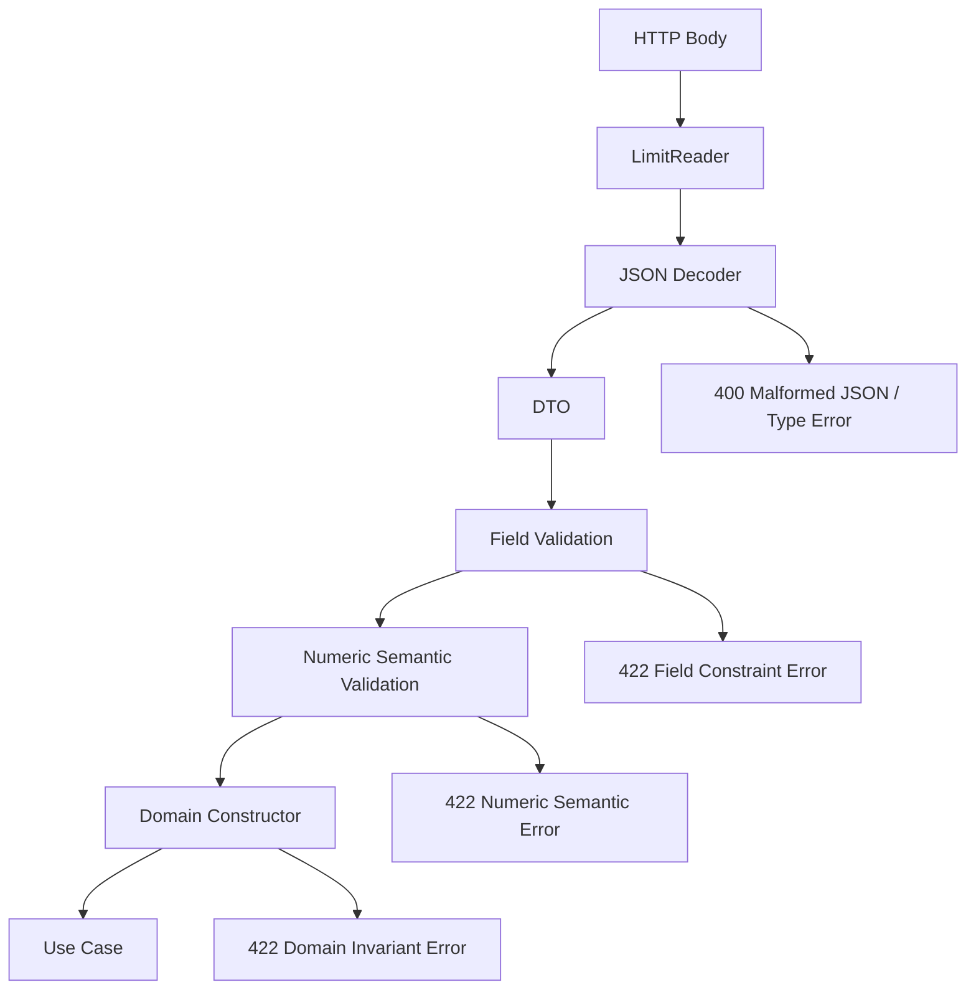
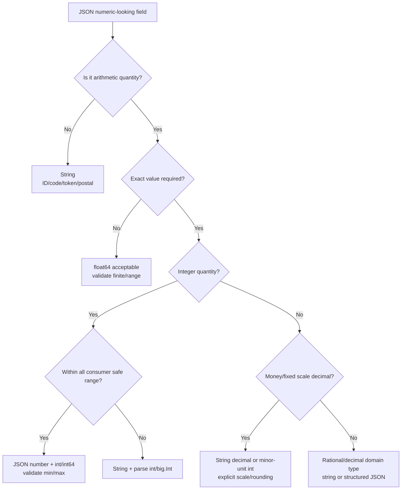

# learn-go-data-mapper-json-xml-protobuf-validation-part-008.md

# Part 008 — JSON Numbers, Precision, and Lossy Boundaries

> Seri: `learn-go-data-mapper-json-xml-protobuf-validation`  
> Posisi: Part 008 dari 033  
> Topik: JSON number semantics, precision loss, overflow, decimal, money, ID, `json.Number`, and production-grade numeric boundary design  
> Target pembaca: Java software engineer yang sedang membangun mental model Go untuk data mapper, JSON processing, XML, Protobuf, dan validation

---

## 0. Ringkasan eksekutif

Angka di JSON terlihat sederhana, tetapi dalam sistem production angka adalah salah satu boundary paling berbahaya. Banyak bug data-integrity terjadi bukan karena JSON gagal diparse, melainkan karena angka berhasil diparse tetapi **maknanya berubah secara diam-diam**.

Contoh perubahan makna:

```json
{
  "accountId": 9007199254740993,
  "amount": 12.10,
  "ratio": 0.1,
  "timestampNanos": 1718956800123456789
}
```

Payload di atas valid secara sintaks JSON. Namun ketika melewati berbagai runtime:

- `accountId` bisa kehilangan presisi bila melewati JavaScript/`float64`.
- `amount` bisa kehilangan scale (`12.10` menjadi `12.1`).
- `ratio` tidak selalu representable secara eksak dalam binary floating point.
- `timestampNanos` tidak aman bila diperlakukan sebagai number di ekosistem yang mengandalkan IEEE 754 double.
- Jika Go decode ke `map[string]any`, semua JSON number klasik akan menjadi `float64` kecuali memakai `Decoder.UseNumber()`.

Mental model utama part ini:

> JSON hanya punya satu token numeric bernama **number**. Go punya banyak tipe numeric dengan range, precision, signedness, dan semantic berbeda. Mapping dari JSON number ke Go number adalah keputusan contract, bukan detail teknis parser.

Tujuan part ini adalah membuat Anda bisa mendesain boundary angka yang:

1. Tidak kehilangan presisi secara diam-diam.
2. Aman untuk lintas bahasa, terutama frontend JavaScript dan service polyglot.
3. Jelas membedakan quantity, money, identifier, counter, timestamp, percentage, ratio, dan opaque numeric token.
4. Punya validation layer yang eksplisit.
5. Punya migration path bila contract lama sudah telanjur salah.
6. Bisa direview secara engineering, bukan bergantung pada kebiasaan atau asumsi serializer.

---

## 1. Kenapa JSON number adalah topik besar?

Di Java, Anda terbiasa memilih antara:

- `int`
- `long`
- `BigInteger`
- `float`
- `double`
- `BigDecimal`
- `AtomicLong`
- custom `Money`
- custom `Percentage`
- Jackson deserialization features
- Bean Validation seperti `@Min`, `@Max`, `@Digits`, `@DecimalMin`, `@Positive`

Di Go, pilihan tipenya juga banyak:

- `int`, `int8`, `int16`, `int32`, `int64`
- `uint`, `uint8`, `uint16`, `uint32`, `uint64`
- `float32`, `float64`
- `json.Number`
- `math/big.Int`, `math/big.Rat`, `math/big.Float`
- custom type berbasis `int64`, `string`, atau struct
- third-party decimal library
- generated Protobuf numeric fields

Namun perbedaan pentingnya:

> Go standard library tidak punya `BigDecimal` equivalent di core language/stdlib. Jika Anda butuh decimal fixed-point untuk domain seperti uang, pajak, interest, exchange rate, atau regulatory amount, Anda harus mendesain representasinya secara eksplisit.

Bug angka biasanya muncul pada boundary berikut:

```mermaid
flowchart LR
    A[Client JSON Text] --> B[HTTP Handler]
    B --> C[JSON Decoder]
    C --> D[DTO Field Type]
    D --> E[Validation]
    E --> F[Domain Type]
    F --> G[Persistence]
    F --> H[Event]
    F --> I[Response DTO]
    I --> J[JSON Encoder]
    J --> K[Client Runtime]

    C -. risky .-> C1[map[string]any -> float64]
    D -. risky .-> D1[int overflow / float rounding]
    F -. risky .-> F1[money as float64]
    H -. risky .-> H1[polyglot precision loss]
    K -. risky .-> K1[JavaScript Number safe integer limit]
```

Kalau Anda salah memilih representasi pada salah satu titik, data masih bisa terlihat “valid”, tetapi sudah rusak.

---

## 2. JSON number: grammar tidak sama dengan arithmetic type

JSON mendefinisikan number sebagai token teks. Secara grammar, JSON number dapat berupa integer, fraction, dan exponent.

Contoh valid:

```json
0
1
-1
123
123.45
-123.45
1e3
1E3
1.23e-4
```

Contoh invalid menurut grammar JSON umum:

```json
+1
01
NaN
Infinity
-Infinity
0x10
1_000
```

Hal yang sering disalahpahami:

> JSON number bukan otomatis `int64`, bukan otomatis `double`, bukan otomatis `BigDecimal`, dan bukan otomatis safe untuk semua runtime.

RFC 8259 mengizinkan implementation membatasi range dan precision angka yang diterima. RFC tersebut juga memberi guidance bahwa interoperabilitas paling aman umumnya terjadi saat sistem tidak mengharapkan presisi/range melebihi IEEE 754 binary64, dan integer dalam rentang `[-(2^53)+1, (2^53)-1]` umumnya dapat disepakati secara eksak oleh implementation yang memakai double.

Artinya, pertanyaan yang benar bukan:

> “Apakah JSON bisa menyimpan angka ini?”

Pertanyaan yang benar:

> “Apakah semua producer, parser, validator, storage, event broker, consumer, UI, log, dan analytics pipeline akan mempertahankan angka ini dengan semantic yang sama?”

---

## 3. Numeric boundary taxonomy

Jangan mulai desain dengan tipe Go. Mulai dari **semantic angka**.

| Semantic | Contoh | Aman sebagai JSON number? | Go domain representation yang umum | Catatan |
|---|---:|---|---|---|
| Small count | `5`, `100` | Ya | `int`, `int32`, `int64` | Validasi min/max tetap wajib. |
| Pagination limit | `50` | Ya | `int`/custom `Limit` | Clamp dan max policy penting. |
| Database numeric ID kecil | `12345` | Biasanya ya | `int64`/custom ID | Tetapi hati-hati jika diekspos ke JS. |
| Large 64-bit ID | `9223372036854775807` | Tidak aman lintas JS | `string` at API boundary, `int64`/custom internal | Sebaiknya JSON string. |
| UUID-like numeric token | `001234` | Tidak | `string` | Leading zero hilang jika number. |
| Money | `123.45` | Tidak ideal | minor units `int64` atau decimal string/custom Money | Jangan `float64` untuk domain money. |
| Tax/interest rate | `0.075` | Tergantung | decimal/rational/custom Rate | Scale dan rounding mode harus jelas. |
| Measurement approximate | `36.6` | Ya jika approximate | `float64` | Cocok untuk sensor/metric approximate. |
| Scientific measurement | `6.022e23` | Ya jika approximate | `float64`/`big.Float` | Jangan untuk exact domain. |
| Epoch seconds | `1718956800` | Ya | `int64` | Aman untuk JS saat ini. |
| Epoch milliseconds | `1718956800123` | Ya untuk sekarang | `int64` | Masih di bawah `2^53`; tetap validasi range. |
| Epoch nanoseconds | `1718956800123456789` | Tidak aman lintas JS | string or structured time | Terlalu besar untuk safe integer JS. |
| Arbitrary precision integer | `123...very big` | Tidak lintas ekosistem | string + `big.Int` | JSON number grammar bisa, tapi consumer belum tentu. |
| Decimal with fixed scale | `12.10` | Risky | string/custom decimal | Scale bisa hilang saat parse-reencode. |

Core rule:

> Gunakan JSON number hanya untuk angka yang memang arithmetic quantity dan aman pada seluruh consumer. Gunakan JSON string untuk numeric identifier, exact decimal, large integer, code, token, dan value yang scale-nya bermakna.

---

## 4. Mental model: number lexeme, numeric value, domain value

Dalam JSON processing production-grade, bedakan tiga lapis:

```mermaid
flowchart TD
    A[JSON Number Lexeme<br/>"12.10", "1e3", "9007199254740993"]
    B[Decoded Numeric Value<br/>float64 / int64 / json.Number / big.Int / decimal]
    C[Domain Value<br/>Money / AccountID / Quantity / Ratio / Timestamp]

    A -->|parse| B
    B -->|validate + canonicalize| C
    C -->|format| D[Outbound JSON Representation]

    A -. preserves text? .-> A1[json.Number / raw token]
    B -. may lose text form .-> B1[float64/int64]
    C -. enforces meaning .-> C1[domain invariant]
```

### 4.1 Number lexeme

Lexeme adalah bentuk teks asli di JSON:

```json
12.10
```

Lexeme menyimpan detail seperti:

- apakah ada fraction,
- berapa digit fraction,
- apakah memakai exponent,
- apakah ada leading minus,
- panjang digit,
- bentuk canonical/non-canonical.

Jika Anda langsung parse ke `float64`, detail lexeme bisa hilang:

```text
12.10 -> 12.1
1.0   -> 1
1e3   -> 1000
```

### 4.2 Numeric value

Numeric value adalah nilai hasil interpretasi arithmetic. Misalnya:

```text
12.10 == 12.1 secara numeric decimal
1e3 == 1000 secara numeric
```

Untuk sebagian domain, ini cukup. Untuk domain lain, tidak cukup.

### 4.3 Domain value

Domain value adalah angka yang sudah memiliki makna.

Contoh:

```go
type Money struct {
    Currency string
    Minor    int64 // cents, sen, etc.
}

type AccountID string

type BasisPoints int32
```

`12.10` sebagai lexeme, `12.1` sebagai numeric value, dan `Money{Currency:"SGD", Minor:1210}` sebagai domain value adalah tiga hal berbeda.

---

## 5. Perilaku `encoding/json` v1 terhadap number

Package `encoding/json` klasik masih menjadi baseline production Go paling luas.

### 5.1 Decode ke concrete struct field

Jika target field punya tipe konkret, `encoding/json` akan mencoba decode sesuai tipe tersebut.

```go
package main

import (
    "encoding/json"
    "fmt"
)

type Payload struct {
    Count int64   `json:"count"`
    Ratio float64 `json:"ratio"`
}

func main() {
    var p Payload
    err := json.Unmarshal([]byte(`{"count":123,"ratio":0.25}`), &p)
    fmt.Println(p, err)
}
```

Hasilnya aman untuk `count` selama angka JSON adalah integer dan berada dalam range `int64`.

Jika overflow:

```go
var p struct {
    Count int64 `json:"count"`
}

err := json.Unmarshal([]byte(`{"count":9223372036854775808}`), &p)
fmt.Printf("%T %[1]v\n", err)
```

Anda harus treat error ini sebagai **request contract error**, bukan internal error.

### 5.2 Decode ke `any` / `interface{}`

Ini bagian yang paling sering menyebabkan precision loss.

```go
var v any
_ = json.Unmarshal([]byte(`{"id":9007199254740993}`), &v)

m := v.(map[string]any)
fmt.Printf("%T %v\n", m["id"], m["id"])
```

Default behavior: angka di dynamic structure menjadi `float64`.

Risikonya:

```text
9007199254740993 -> float64 -> 9007199254740992
```

Ini bukan bug parser. Ini konsekuensi desain default dynamic decoding.

### 5.3 `Decoder.UseNumber()`

Jika Anda butuh dynamic JSON tetapi tidak boleh kehilangan lexeme angka, gunakan `Decoder.UseNumber()`.

```go
package main

import (
    "bytes"
    "encoding/json"
    "fmt"
)

func main() {
    dec := json.NewDecoder(bytes.NewReader([]byte(`{"id":9007199254740993}`)))
    dec.UseNumber()

    var v any
    if err := dec.Decode(&v); err != nil {
        panic(err)
    }

    m := v.(map[string]any)
    n := m["id"].(json.Number)

    fmt.Printf("type=%T raw=%q\n", n, n.String())
}
```

`json.Number` menyimpan representasi string number. Namun jangan jadikan `json.Number` sebagai domain type jangka panjang.

`json.Number` cocok untuk:

- staging layer,
- generic gateway,
- audit raw decoded value,
- validation before conversion,
- pass-through transformation.

`json.Number` kurang cocok untuk:

- domain model,
- persistence model,
- arithmetic business rule,
- public API response tanpa canonicalization.

Kenapa? Karena `json.Number` belum memberi tahu apakah angka itu `AccountID`, `Money`, `Count`, `Rate`, atau `Timestamp`.

---

## 6. Demonstrasi precision loss

Perhatikan contoh berikut:

```go
package main

import (
    "encoding/json"
    "fmt"
)

func main() {
    input := []byte(`{"id":9007199254740993}`)

    var v map[string]any
    if err := json.Unmarshal(input, &v); err != nil {
        panic(err)
    }

    fmt.Printf("decoded type: %T\n", v["id"])
    fmt.Printf("decoded value: %.0f\n", v["id"].(float64))

    out, _ := json.Marshal(v)
    fmt.Println(string(out))
}
```

Potential output:

```text
decoded type: float64
decoded value: 9007199254740992
{"id":9007199254740992}
```

Data rusak tetapi pipeline tidak panic.

Dalam sistem besar, ini bisa terjadi pada:

- API gateway yang decode JSON ke `map[string]any`, lalu re-marshal.
- Audit logger yang normalize payload.
- Generic event router.
- Webhook processor.
- Rule engine.
- Dynamic validation layer.
- JSON patch processor.
- Outbox relay.
- Middleware yang membaca dan menulis ulang body.

Production rule:

> Generic JSON processor yang melakukan decode-reencode harus preserve numeric lexeme atau menerapkan policy eksplisit. Jangan default ke `map[string]any` tanpa `UseNumber()`.

---

## 7. Safe integer range dan polyglot contract

Banyak sistem modern melibatkan JavaScript/TypeScript di frontend. JavaScript `Number` menggunakan IEEE 754 double. Integer yang aman secara eksak berada dalam range:

```text
-(2^53) + 1 sampai (2^53) - 1

-9007199254740991 sampai 9007199254740991
```

Go `int64` jauh lebih besar:

```text
-9223372036854775808 sampai 9223372036854775807
```

Jadi, meskipun Go bisa decode angka berikut ke `int64`:

```json
{"id":9223372036854775807}
```

frontend JavaScript biasa tidak aman memegangnya sebagai `Number`.

### 7.1 Decision rule untuk `int64` di JSON API

| Kondisi | Representasi API disarankan |
|---|---|
| Internal-only Go-to-Go, strict typed clients | JSON number bisa diterima jika dikontrol. |
| Public API consumed by browser/JS | String untuk large ID. |
| ID tidak dipakai arithmetic | String. |
| ID bisa mengandung leading zero | String. |
| ID berasal dari database sequence 64-bit | String di API, `int64` internal bila perlu. |
| Counter kecil dan arithmetic | Number. |

Contoh DTO yang lebih aman:

```go
type AccountResponse struct {
    AccountID string `json:"accountId"` // not int64
    Balance   Money  `json:"balance"`
}
```

Bukan:

```go
type AccountResponse struct {
    AccountID int64   `json:"accountId"` // risky for public JS clients
    Balance   float64 `json:"balance"`   // risky for money
}
```

---

## 8. Kapan JSON number aman?

JSON number relatif aman jika semua kondisi berikut terpenuhi:

1. Nilainya memang arithmetic quantity.
2. Range diketahui.
3. Precision loss tidak melanggar domain.
4. Semua consumer mendukung range/precision tersebut.
5. Tidak perlu mempertahankan scale textual.
6. Tidak perlu leading zero.
7. Tidak digunakan sebagai opaque identifier.
8. Tidak dipakai untuk exact decimal money.

Contoh aman:

```json
{
  "page": 3,
  "limit": 50,
  "retryCount": 2,
  "temperatureCelsius": 36.6,
  "cpuUsagePercent": 73.42
}
```

Dengan catatan:

- `page`, `limit`, `retryCount` harus divalidasi min/max.
- `temperatureCelsius`, `cpuUsagePercent` boleh `float64` karena approximate.
- Untuk billing, tax, settlement, ledger, jangan gunakan `float64`.

---

## 9. Kapan angka harus string?

Gunakan JSON string ketika value terlihat numeric tetapi sebenarnya bukan quantity arithmetic yang aman.

### 9.1 Large identifier

```json
{
  "caseId": "9223372036854775807"
}
```

Di Go:

```go
type CaseID string

type CaseDTO struct {
    CaseID CaseID `json:"caseId"`
}
```

Validation:

```go
func (id CaseID) Validate() error {
    if id == "" {
        return errors.New("caseId is required")
    }
    for _, r := range id {
        if r < '0' || r > '9' {
            return errors.New("caseId must contain digits only")
        }
    }
    return nil
}
```

### 9.2 Numeric code dengan leading zero

```json
{
  "postalCode": "018956",
  "agencyCode": "0012"
}
```

Jika dikirim sebagai number:

```json
{
  "postalCode": 18956,
  "agencyCode": 12
}
```

Informasi hilang.

### 9.3 Decimal exact

```json
{
  "amount": "123.45",
  "taxRate": "0.075"
}
```

String memberi Anda kesempatan untuk:

- validate grammar decimal,
- enforce scale,
- choose rounding mode,
- avoid binary floating point,
- preserve canonical text representation.

### 9.4 Nanosecond timestamp

```json
{
  "createdAtNanos": "1718956800123456789"
}
```

Atau lebih baik untuk API manusia:

```json
{
  "createdAt": "2024-06-21T10:40:00.123456789Z"
}
```

---

## 10. Money: jangan pakai `float64` sebagai domain value

Contoh buruk:

```go
type Invoice struct {
    Amount float64 `json:"amount"`
}
```

Kenapa buruk?

Binary floating point tidak merepresentasikan banyak decimal fraction secara eksak. Contoh klasik:

```go
fmt.Println(0.1 + 0.2)
```

Hasilnya bukan konsep domain `0.30` secara exact. Untuk observability metric, ini tidak masalah. Untuk ledger, settlement, tax, insurance premium, regulatory fine, ini masalah.

### 10.1 Pattern A: minor units integer

Jika currency punya minor unit tetap, gunakan integer.

```go
type Money struct {
    Currency string `json:"currency"`
    Minor    int64  `json:"minor"` // cents/sen
}
```

JSON:

```json
{
  "currency": "SGD",
  "minor": 12345
}
```

Meaning:

```text
SGD 123.45 = 12345 minor units
```

Kelebihan:

- arithmetic exact,
- mudah compare,
- mudah sum,
- cocok untuk ledger,
- tidak butuh decimal parser untuk operasi dasar.

Kekurangan:

- perlu currency exponent table jika multi-currency,
- tidak natural untuk UI,
- beberapa domain butuh sub-minor precision.

### 10.2 Pattern B: decimal string at API boundary

```go
type MoneyDTO struct {
    Currency string `json:"currency"`
    Amount   string `json:"amount"` // "123.45"
}
```

Lalu map ke domain:

```go
type Money struct {
    Currency string
    Minor    int64
}

func MoneyFromDTO(dto MoneyDTO) (Money, error) {
    minor, err := parseDecimalMoneyToMinor(dto.Amount, 2)
    if err != nil {
        return Money{}, err
    }
    return Money{Currency: dto.Currency, Minor: minor}, nil
}
```

### 10.3 Pattern C: custom JSON representation

Anda bisa expose money sebagai string tetapi domain tetap kuat.

```go
type Money struct {
    currency string
    minor    int64
}

type moneyJSON struct {
    Currency string `json:"currency"`
    Amount   string `json:"amount"`
}

func (m Money) MarshalJSON() ([]byte, error) {
    dto := moneyJSON{
        Currency: m.currency,
        Amount:   formatMinor(m.minor, 2),
    }
    return json.Marshal(dto)
}

func (m *Money) UnmarshalJSON(data []byte) error {
    var dto moneyJSON
    if err := json.Unmarshal(data, &dto); err != nil {
        return err
    }

    minor, err := parseDecimalMoneyToMinor(dto.Amount, 2)
    if err != nil {
        return err
    }

    m.currency = dto.Currency
    m.minor = minor
    return nil
}
```

### 10.4 Minimal decimal-to-minor parser

Berikut contoh parser sederhana untuk decimal positif/negatif dengan fixed scale. Ini bukan pengganti full decimal library untuk semua domain, tetapi cukup untuk memahami invariant.

```go
package money

import (
    "errors"
    "fmt"
    "math"
    "strings"
)

var ErrInvalidMoney = errors.New("invalid money amount")

func ParseMinor(s string, scale int) (int64, error) {
    if scale < 0 || scale > 9 {
        return 0, fmt.Errorf("%w: unsupported scale", ErrInvalidMoney)
    }

    if s == "" {
        return 0, fmt.Errorf("%w: empty", ErrInvalidMoney)
    }

    neg := false
    if s[0] == '-' {
        neg = true
        s = s[1:]
        if s == "" {
            return 0, fmt.Errorf("%w: sign without digits", ErrInvalidMoney)
        }
    }

    if strings.ContainsAny(s, "eE") {
        return 0, fmt.Errorf("%w: exponent not allowed", ErrInvalidMoney)
    }

    parts := strings.Split(s, ".")
    if len(parts) > 2 {
        return 0, fmt.Errorf("%w: multiple decimal points", ErrInvalidMoney)
    }

    whole := parts[0]
    frac := ""
    if len(parts) == 2 {
        frac = parts[1]
    }

    if whole == "" {
        return 0, fmt.Errorf("%w: missing whole digits", ErrInvalidMoney)
    }

    if len(frac) > scale {
        return 0, fmt.Errorf("%w: too many fraction digits", ErrInvalidMoney)
    }

    for _, r := range whole {
        if r < '0' || r > '9' {
            return 0, fmt.Errorf("%w: invalid whole digit", ErrInvalidMoney)
        }
    }
    for _, r := range frac {
        if r < '0' || r > '9' {
            return 0, fmt.Errorf("%w: invalid fraction digit", ErrInvalidMoney)
        }
    }

    frac += strings.Repeat("0", scale-len(frac))

    var result int64
    for _, r := range whole + frac {
        d := int64(r - '0')
        if result > (math.MaxInt64-d)/10 {
            return 0, fmt.Errorf("%w: overflow", ErrInvalidMoney)
        }
        result = result*10 + d
    }

    if neg {
        result = -result
    }
    return result, nil
}
```

Key invariant:

- exponent tidak diterima untuk money,
- scale maksimum eksplisit,
- overflow dicek,
- string kosong ditolak,
- semua digit divalidasi,
- canonicalization dilakukan saat output.

---

## 11. Scale: `12.10` tidak sama dengan `12.1` untuk semua domain

Secara numeric decimal:

```text
12.10 == 12.1
```

Tetapi secara domain, scale bisa bermakna.

Contoh:

- Invoice display harus mempertahankan dua digit fraction.
- Tax declaration mungkin mensyaratkan dua decimal places.
- Scientific measurement `12.10` bisa mengindikasikan precision pengukuran berbeda dari `12.1`.
- Regulatory form bisa mensyaratkan format input tertentu.

JSON number tidak menjamin scale dipertahankan melalui parse-reencode.

Contoh:

```go
var f float64
_ = json.Unmarshal([]byte(`12.10`), &f)
out, _ := json.Marshal(f)
fmt.Println(string(out)) // often: 12.1
```

Jika scale bermakna, representasikan sebagai string atau structured object.

```json
{
  "amount": "12.10"
}
```

Atau:

```json
{
  "value": 1210,
  "scale": 2
}
```

Atau:

```json
{
  "coefficient": "1210",
  "scale": 2
}
```

---

## 12. `,string` tag option untuk numeric fields

`encoding/json` mendukung tag option `string` untuk beberapa tipe primitive sehingga value dikodekan sebagai JSON string.

```go
type Payload struct {
    ID int64 `json:"id,string"`
}
```

Marshal:

```go
p := Payload{ID: 9223372036854775807}
out, _ := json.Marshal(p)
fmt.Println(string(out))
```

Output:

```json
{"id":"9223372036854775807"}
```

Unmarshal:

```go
var p Payload
err := json.Unmarshal([]byte(`{"id":"9223372036854775807"}`), &p)
```

### 12.1 Kapan `,string` berguna?

Cocok untuk:

- `int64` ID yang harus tampil sebagai string di JSON,
- compatibility dengan JavaScript clients,
- migration dari legacy API yang memakai quoted numbers.

### 12.2 Kapan `,string` tidak cukup?

Tidak cukup jika:

- field adalah opaque ID yang tidak boleh arithmetic,
- field bisa punya leading zero,
- field butuh custom validation grammar,
- field bukan integer melainkan decimal exact,
- Anda ingin type-safety domain yang kuat.

Contoh lebih explicit:

```go
type AccountID string

type Response struct {
    ID AccountID `json:"id"`
}
```

Daripada:

```go
type Response struct {
    ID int64 `json:"id,string"`
}
```

Jika ID tidak pernah dipakai arithmetic, `string` domain type lebih jujur.

---

## 13. Custom numeric type untuk boundary yang aman

### 13.1 Strong ID type

```go
type UserID string

func (id UserID) Validate() error {
    if id == "" {
        return errors.New("user id is required")
    }
    if len(id) > 32 {
        return errors.New("user id too long")
    }
    for _, r := range id {
        if r < '0' || r > '9' {
            return errors.New("user id must be numeric")
        }
    }
    return nil
}
```

DTO:

```go
type UserResponse struct {
    ID UserID `json:"id"`
}
```

### 13.2 Bounded integer type

```go
type PageSize int

const (
    MinPageSize PageSize = 1
    MaxPageSize PageSize = 100
)

func NewPageSize(n int) (PageSize, error) {
    if n < int(MinPageSize) || n > int(MaxPageSize) {
        return 0, fmt.Errorf("page size must be between %d and %d", MinPageSize, MaxPageSize)
    }
    return PageSize(n), nil
}
```

Request DTO:

```go
type ListRequest struct {
    Limit int `json:"limit"`
}

func (r ListRequest) ToQuery() (Query, error) {
    limit, err := NewPageSize(r.Limit)
    if err != nil {
        return Query{}, err
    }
    return Query{Limit: limit}, nil
}
```

Kenapa DTO tetap `int`?

Karena decode error dan validation error bisa dipisah:

- JSON parse/type error: `limit` bukan number.
- Validation error: `limit` number tetapi di luar range.

### 13.3 Basis points untuk rate

Untuk percentage/rate dalam banyak domain financial, basis points lebih aman daripada float.

```go
type BasisPoints int32

func NewBasisPoints(n int32) (BasisPoints, error) {
    if n < 0 || n > 10000 {
        return 0, errors.New("basis points must be between 0 and 10000")
    }
    return BasisPoints(n), nil
}
```

JSON:

```json
{
  "taxRateBps": 750
}
```

Meaning:

```text
750 bps = 7.50%
```

Ini jauh lebih explicit daripada:

```json
{
  "taxRate": 0.075
}
```

Terutama jika rounding dan display format penting.

---

## 14. `json.Number`: staging type, bukan domain type

`json.Number` adalah string type dengan helper:

```go
type Number string
```

Umumnya dipakai bersama `Decoder.UseNumber()`.

```go
dec := json.NewDecoder(r)
dec.UseNumber()

var payload map[string]any
if err := dec.Decode(&payload); err != nil {
    return err
}
```

Kemudian:

```go
func parseRequiredInt64(m map[string]any, key string) (int64, error) {
    v, ok := m[key]
    if !ok {
        return 0, fmt.Errorf("%s is required", key)
    }

    n, ok := v.(json.Number)
    if !ok {
        return 0, fmt.Errorf("%s must be a number", key)
    }

    i, err := n.Int64()
    if err != nil {
        return 0, fmt.Errorf("%s must be int64: %w", key, err)
    }
    return i, nil
}
```

### 14.1 Masalah `json.Number.Int64()`

`Int64()` hanya cocok jika JSON number adalah integer dalam range int64. Ia tidak cocok untuk:

```json
1.0
1e3
9223372036854775808
```

Tergantung kebutuhan, Anda mungkin perlu parser sendiri.

### 14.2 Validasi lexeme sebelum convert

```go
func isPlainIntegerLexeme(s string) bool {
    if s == "" {
        return false
    }
    if s[0] == '-' {
        s = s[1:]
        if s == "" {
            return false
        }
    }
    if len(s) > 1 && s[0] == '0' {
        return false
    }
    for _, r := range s {
        if r < '0' || r > '9' {
            return false
        }
    }
    return true
}
```

Jika field harus integer biasa, Anda mungkin ingin menolak exponent:

```json
{"count":1e3}
```

Walaupun secara numeric berarti `1000`, secara contract mungkin tidak boleh.

Production decision:

> Apakah API Anda menerima semantic numeric value atau lexical numeric form tertentu? Untuk public contract, jawabannya harus tertulis.

---

## 15. Parsing integer dengan range dan grammar eksplisit

Contoh helper production-ish untuk parse `json.Number` sebagai `int64` biasa tanpa fraction/exponent.

```go
package numparse

import (
    "encoding/json"
    "errors"
    "fmt"
    "math"
)

var (
    ErrInvalidInteger = errors.New("invalid integer")
    ErrIntegerRange   = errors.New("integer out of range")
)

func ParseJSONInt64(n json.Number) (int64, error) {
    s := n.String()
    if s == "" {
        return 0, fmt.Errorf("%w: empty", ErrInvalidInteger)
    }

    neg := false
    if s[0] == '-' {
        neg = true
        s = s[1:]
        if s == "" {
            return 0, fmt.Errorf("%w: sign without digits", ErrInvalidInteger)
        }
    }

    if len(s) > 1 && s[0] == '0' {
        return 0, fmt.Errorf("%w: leading zero", ErrInvalidInteger)
    }

    var x uint64
    for _, r := range s {
        if r < '0' || r > '9' {
            return 0, fmt.Errorf("%w: contains non-digit", ErrInvalidInteger)
        }
        d := uint64(r - '0')
        if x > (math.MaxUint64-d)/10 {
            return 0, fmt.Errorf("%w: uint overflow", ErrIntegerRange)
        }
        x = x*10 + d
    }

    if neg {
        // Max negative magnitude is MaxInt64 + 1.
        if x > uint64(math.MaxInt64)+1 {
            return 0, fmt.Errorf("%w: below min int64", ErrIntegerRange)
        }
        if x == uint64(math.MaxInt64)+1 {
            return math.MinInt64, nil
        }
        return -int64(x), nil
    }

    if x > uint64(math.MaxInt64) {
        return 0, fmt.Errorf("%w: above max int64", ErrIntegerRange)
    }
    return int64(x), nil
}
```

Mengapa tidak langsung `strconv.ParseInt`?

Anda boleh memakai `strconv.ParseInt`, tetapi helper custom memberi ruang untuk policy:

- menolak leading zero,
- menolak plus sign,
- menolak exponent,
- mengontrol error category,
- membedakan grammar error vs range error,
- menghasilkan field-level API error yang konsisten.

---

## 16. Big integer dengan `math/big.Int`

Jika Anda menerima arbitrary precision integer, gunakan string at boundary lalu parse ke `big.Int`.

```json
{
  "modulus": "340282366920938463463374607431768211507"
}
```

Go:

```go
package bigintjson

import (
    "encoding/json"
    "errors"
    "math/big"
)

type BigInt struct {
    v big.Int
}

func (b *BigInt) UnmarshalJSON(data []byte) error {
    var s string
    if err := json.Unmarshal(data, &s); err != nil {
        return err
    }
    if s == "" {
        return errors.New("big integer is empty")
    }

    n, ok := new(big.Int).SetString(s, 10)
    if !ok {
        return errors.New("invalid big integer")
    }
    b.v.Set(n)
    return nil
}

func (b BigInt) MarshalJSON() ([]byte, error) {
    return json.Marshal(b.v.String())
}

func (b BigInt) Int() *big.Int {
    return new(big.Int).Set(&b.v)
}
```

Important detail:

- Jangan expose pointer internal `*big.Int` langsung karena mutable.
- Copy saat masuk/keluar.
- Validasi digit length agar tidak DoS lewat angka jutaan digit.

Contoh limit:

```go
if len(s) > 1024 {
    return errors.New("big integer too long")
}
```

---

## 17. Decimal: pilihan desain di Go

Go standard library punya `math/big.Rat` dan `math/big.Float`, tetapi tidak punya fixed-point decimal high-level seperti Java `BigDecimal`.

Pilihan umum:

### 17.1 Minor unit integer

Paling baik untuk money dengan currency exponent tetap.

```go
type MinorAmount int64
```

### 17.2 Decimal string + custom parser

Baik untuk API boundary dan domain dengan scale sederhana.

```go
type DecimalString string
```

### 17.3 `big.Rat`

Cocok untuk rational exact seperti `1/3`, tetapi format decimal output dan scale policy harus Anda kontrol.

```go
r := new(big.Rat)
if _, ok := r.SetString("0.333333333333333333"); !ok {
    return errors.New("invalid rational")
}
```

### 17.4 `big.Float`

Arbitrary precision floating point, tetapi tetap floating point, bukan fixed decimal domain type. Cocok untuk numeric computation tertentu, bukan default untuk ledger.

### 17.5 Third-party decimal library

Dalam production financial system, lazim memakai decimal library. Namun keputusan library harus dievaluasi:

- rounding modes,
- immutability/mutability,
- allocation behavior,
- JSON marshal behavior,
- SQL scan/value support,
- zero value behavior,
- scale preservation,
- overflow policy,
- maintenance health,
- compatibility dengan Go version.

Karena seri ini menghindari bergantung pada satu library, mental modelnya:

> Decimal bukan sekadar tipe angka. Decimal adalah policy: scale, rounding, overflow, canonical text, comparison, and serialization.

---

## 18. Time as number: seconds, milliseconds, microseconds, nanoseconds

Timestamp sering dikirim sebagai number:

```json
{
  "createdAt": 1718956800
}
```

Masalah muncul ketika unit tidak jelas.

```json
{
  "createdAt": 1718956800123
}
```

Apakah ini:

- milliseconds?
- microseconds?
- custom sequence?

Lalu:

```json
{
  "createdAt": 1718956800123456789
}
```

Ini kemungkinan nanoseconds. Go `int64` bisa menampungnya, tetapi JavaScript Number tidak aman mempertahankan integer sebesar itu.

### 18.1 Recommendation

Untuk public API:

```json
{
  "createdAt": "2024-06-21T10:40:00.123456789Z"
}
```

Untuk internal high-throughput event:

```json
{
  "createdAtUnixMillis": 1718956800123
}
```

Untuk nanoseconds lintas polyglot:

```json
{
  "createdAtUnixNanos": "1718956800123456789"
}
```

Atau structured:

```json
{
  "createdAt": {
    "seconds": 1718956800,
    "nanos": 123456789
  }
}
```

Structured form mirip mental model Protobuf `Timestamp`.

---

## 19. Floating point cocok untuk apa?

`float64` bukan jahat. Ia hanya salah untuk domain exact.

Cocok untuk:

- telemetry metric,
- temperature,
- geolocation approximate,
- probability approximate,
- ML score,
- statistical aggregate,
- CPU/memory ratio,
- sensor reading,
- graph coordinates,
- non-financial scientific approximate computation.

Tidak cocok untuk:

- money,
- tax,
- ledger,
- settlement,
- billing,
- inventory exact count,
- large IDs,
- legal/regulatory amount,
- sequence number,
- cryptographic integer,
- timestamp nanoseconds.

### 19.1 Validate finite values

JSON standard tidak mengizinkan `NaN` dan `Infinity`. `encoding/json` tidak bisa marshal `math.NaN()` atau infinity sebagai JSON number.

Namun domain Anda tetap harus memastikan float value finite sebelum masuk response DTO.

```go
func ValidateFinite(name string, f float64) error {
    if math.IsNaN(f) || math.IsInf(f, 0) {
        return fmt.Errorf("%s must be finite", name)
    }
    return nil
}
```

Jika float berasal dari computation internal, validasi sebelum encode.

---

## 20. Scientific notation dan canonicalization

JSON number boleh memakai exponent:

```json
{
  "limit": 1e3
}
```

Apakah API Anda menerima itu untuk field `limit`?

Ada dua policy:

### Policy A: Semantic numeric acceptance

Terima semua JSON number yang secara numeric valid dan bisa dikonversi.

```json
{"limit": 1e3}
```

Diterima sebagai `1000`.

Kelebihan:

- fleksibel,
- sesuai numeric interpretation.

Kekurangan:

- kurang ketat,
- bisa membingungkan user,
- field integer menerima bentuk non-integer lexical,
- audit raw input berbeda dari canonical output.

### Policy B: Lexical contract strict

Untuk integer field, hanya terima integer plain:

```json
{"limit": 1000}
```

Tolak:

```json
{"limit": 1e3}
{"limit": 1000.0}
```

Kelebihan:

- contract jelas,
- error lebih deterministik,
- audit lebih mudah,
- cocok untuk public API dan regulatory forms.

Kekurangan:

- perlu parser/validation tambahan jika memakai dynamic decode.

Production recommendation:

> Untuk public API request, terutama yang akan dipakai manusia, form, partner integration, dan audit, gunakan lexical contract strict untuk integer dan decimal exact. Untuk telemetry atau scientific payload, semantic numeric acceptance boleh lebih fleksibel.

---

## 21. Dynamic JSON gateway tanpa precision loss

Misal Anda membangun middleware yang menerima payload arbitrary JSON, menambahkan metadata, lalu meneruskan.

Bad pattern:

```go
var m map[string]any
_ = json.NewDecoder(r).Decode(&m)

m["receivedAt"] = time.Now().UTC().Format(time.RFC3339Nano)
_ = json.NewEncoder(w).Encode(m)
```

Masalah:

- number menjadi `float64`,
- large integer bisa rusak,
- scale bisa hilang,
- key ordering berubah,
- duplicate key behavior bisa berubah,
- raw payload tidak preserved.

Better pattern A: envelope tanpa menyentuh payload

```go
type Envelope struct {
    ReceivedAt time.Time       `json:"receivedAt"`
    Payload    json.RawMessage `json:"payload"`
}
```

Decode hanya validasi JSON:

```go
func WrapJSON(raw []byte) ([]byte, error) {
    if !json.Valid(raw) {
        return nil, errors.New("invalid JSON")
    }

    env := Envelope{
        ReceivedAt: time.Now().UTC(),
        Payload:    append(json.RawMessage(nil), raw...),
    }
    return json.Marshal(env)
}
```

Output:

```json
{
  "receivedAt": "2024-06-21T10:40:00Z",
  "payload": {
    "id": 9007199254740993,
    "amount": 12.10
  }
}
```

`json.RawMessage` mempertahankan raw JSON subtree saat marshal.

Better pattern B: decode dengan `UseNumber`

```go
func DecodeDynamicPreserveNumbers(r io.Reader) (map[string]any, error) {
    dec := json.NewDecoder(r)
    dec.UseNumber()

    var m map[string]any
    if err := dec.Decode(&m); err != nil {
        return nil, err
    }
    return m, nil
}
```

Tetapi ingat: `UseNumber` tetap tidak preserve duplicate key dan formatting original. Jika full fidelity dibutuhkan, jangan round-trip melalui Go values.

---

## 22. API decode pipeline untuk numeric safety

Pipeline yang baik memisahkan:

1. transport size limit,
2. JSON syntax validation,
3. schema/type decode,
4. numeric range validation,
5. semantic validation,
6. domain mapping,
7. canonicalization.



Contoh:

```go
type CreateInvoiceRequest struct {
    CustomerID string `json:"customerId"`
    Currency   string `json:"currency"`
    Amount     string `json:"amount"`
    LineCount  int    `json:"lineCount"`
}

func (r CreateInvoiceRequest) Validate() error {
    if r.CustomerID == "" {
        return fieldErr("customerId", "required")
    }
    if r.Currency != "SGD" && r.Currency != "USD" {
        return fieldErr("currency", "unsupported")
    }
    if r.LineCount < 1 || r.LineCount > 1000 {
        return fieldErr("lineCount", "must be between 1 and 1000")
    }
    if _, err := ParseMinor(r.Amount, 2); err != nil {
        return fieldErr("amount", "must be decimal with max 2 fraction digits")
    }
    return nil
}
```

---

## 23. Response encoding: never leak internal numeric accidents

Request safety sering dibahas. Response safety sering dilupakan.

Internal domain:

```go
type Account struct {
    ID      int64
    Balance Money
}
```

Response DTO:

```go
type AccountResponse struct {
    ID      string       `json:"id"`
    Balance MoneyPayload `json:"balance"`
}

type MoneyPayload struct {
    Currency string `json:"currency"`
    Amount   string `json:"amount"`
}

func AccountToResponse(a Account) AccountResponse {
    return AccountResponse{
        ID: strconv.FormatInt(a.ID, 10),
        Balance: MoneyPayload{
            Currency: a.Balance.Currency(),
            Amount:   a.Balance.FormatAmount(),
        },
    }
}
```

Jangan expose domain internals secara langsung hanya karena `json.Marshal` bisa melakukannya.

Bad:

```go
json.Marshal(account)
```

Better:

```go
resp := AccountToResponse(account)
json.Marshal(resp)
```

Karena response contract adalah public compatibility surface.

---

## 24. Error taxonomy untuk numeric fields

Pisahkan error berikut:

| Error | Contoh | Response semantics |
|---|---|---|
| Malformed JSON | `{ "x": 1. }` | 400 Bad Request |
| Type mismatch | `{ "limit": "abc" }` ketika expected number | 400/422 tergantung API policy |
| Integer overflow | `{ "limit": 999999999999999999999 }` | 422 numeric range |
| Fraction not allowed | `{ "count": 1.5 }` | 422 integer required |
| Exponent not allowed | `{ "count": 1e3 }` | 422 lexical format |
| Decimal scale exceeded | `{ "amount": "12.345" }` | 422 scale violation |
| Negative not allowed | `{ "amount": "-1.00" }` | 422 semantic constraint |
| Unsafe ID number | `{ "id": 9007199254740993 }` expected string | 422/400 contract violation |

Example machine-readable error:

```json
{
  "error": {
    "code": "VALIDATION_FAILED",
    "message": "Request validation failed",
    "fields": [
      {
        "path": "amount",
        "code": "DECIMAL_SCALE_EXCEEDED",
        "message": "amount must have at most 2 fraction digits"
      }
    ]
  }
}
```

Numeric errors should be actionable. Jangan return:

```json
{"error":"invalid request"}
```

Untuk partner integration, error detail adalah bagian dari contract.

---

## 25. JSON Schema numeric constraints

JSON Schema bisa mengekspresikan beberapa numeric constraint:

```json
{
  "type": "object",
  "properties": {
    "limit": {
      "type": "integer",
      "minimum": 1,
      "maximum": 100
    },
    "amount": {
      "type": "string",
      "pattern": "^-?[0-9]+(\\.[0-9]{1,2})?$"
    }
  },
  "required": ["limit", "amount"]
}
```

Untuk exact decimal, sering lebih baik `type: string` + `pattern` daripada `type: number`.

### 25.1 `multipleOf` caveat

JSON Schema punya `multipleOf`:

```json
{
  "type": "number",
  "multipleOf": 0.01
}
```

Secara teori bisa menyatakan dua decimal places. Namun dalam implementation yang memakai binary floating point, `multipleOf: 0.01` bisa menjadi tricky.

Untuk money, lebih robust:

```json
{
  "type": "string",
  "pattern": "^-?[0-9]+(\\.[0-9]{1,2})?$"
}
```

Atau integer minor:

```json
{
  "type": "integer",
  "minimum": 0
}
```

---

## 26. OpenAPI numeric contract

OpenAPI sering memakai:

```yaml
amount:
  type: number
  format: double
```

Untuk money, ini biasanya buruk.

Lebih baik:

```yaml
amount:
  type: string
  pattern: '^-?[0-9]+(\.[0-9]{1,2})?$'
  example: '123.45'
```

Atau:

```yaml
minorAmount:
  type: integer
  format: int64
  example: 12345
```

Untuk ID besar:

```yaml
caseId:
  type: string
  pattern: '^[0-9]+$'
  example: '9223372036854775807'
```

Bukan:

```yaml
caseId:
  type: integer
  format: int64
```

Kecuali Anda benar-benar mengontrol semua client dan tidak ada JavaScript precision concern.

---

## 27. Protobuf JSON mapping terkait numbers

Walaupun part Protobuf akan dibahas mendalam nanti, penting untuk mulai membentuk awareness.

Protobuf punya tipe numeric eksplisit:

- `int32`, `int64`
- `uint32`, `uint64`
- `sint32`, `sint64`
- `fixed32`, `fixed64`
- `sfixed32`, `sfixed64`
- `float`, `double`

Namun Protobuf JSON mapping punya aturan khusus. Dalam banyak Protobuf JSON mapping, 64-bit integer direpresentasikan sebagai JSON string untuk menghindari precision loss di JavaScript ecosystem.

Artinya, jika Anda mendesain REST JSON dan Protobuf JSON gateway, jangan kaget bila:

```proto
int64 case_id = 1;
```

muncul sebagai:

```json
{
  "caseId": "9223372036854775807"
}
```

Ini bukan anomali. Ini desain interoperability.

---

## 28. `map[string]any` adalah boundary smell untuk numeric contract

`map[string]any` kadang diperlukan, tetapi sering menjadi smell.

### Boleh dipakai jika:

- payload memang arbitrary,
- hanya inspection minimal,
- menggunakan `UseNumber`,
- tidak melakukan arithmetic tanpa validation,
- tidak re-marshal untuk contract penting,
- ada schema eksternal.

### Berbahaya jika:

- dipakai sebagai request DTO,
- dipakai untuk domain model,
- dipakai untuk event model jangka panjang,
- dipakai untuk mapping ke database tanpa field-level validation,
- dipakai pada payment/regulatory data.

Better:

```go
type SubmitFineRequest struct {
    CaseID string `json:"caseId"`
    Amount string `json:"amount"`
    Reason string `json:"reason"`
}
```

Rather than:

```go
var req map[string]any
```

Strong DTO bukan verbosity. Strong DTO adalah contract.

---

## 29. Generic numeric extraction dengan field path

Jika Anda memang harus proses dynamic JSON, buat extractor yang explicit.

```go
type FieldError struct {
    Path string
    Code string
    Msg  string
}

func NumberAt(m map[string]any, path string) (json.Number, *FieldError) {
    v, ok := m[path]
    if !ok {
        return "", &FieldError{Path: path, Code: "REQUIRED", Msg: "field is required"}
    }
    n, ok := v.(json.Number)
    if !ok {
        return "", &FieldError{Path: path, Code: "TYPE_NUMBER_REQUIRED", Msg: "field must be a number"}
    }
    return n, nil
}

func Int64At(m map[string]any, path string) (int64, *FieldError) {
    n, ferr := NumberAt(m, path)
    if ferr != nil {
        return 0, ferr
    }
    i, err := ParseJSONInt64(n)
    if err != nil {
        return 0, &FieldError{Path: path, Code: "INVALID_INT64", Msg: err.Error()}
    }
    return i, nil
}
```

Ini memberi Anda:

- field-level error,
- consistent policy,
- testable extractor,
- no silent float64 conversion.

---

## 30. Rounding policy: harus ada nama dan ownership

Jika domain melibatkan decimal, rounding bukan detail kecil.

Pertanyaan wajib:

1. Apakah rounding terjadi saat input, calculation, storage, atau output?
2. Rounding mode apa?
3. Scale berapa?
4. Apakah intermediate calculation memakai scale lebih tinggi?
5. Siapa pemilik policy: domain, finance, product, legal, compliance?
6. Apakah policy versioned?
7. Apakah perubahan policy memerlukan migration/recalculation?

Contoh policy doc:

```text
Invoice amount policy:
- API accepts decimal string with max 2 fraction digits.
- Internal representation uses minor units int64.
- Values with more than 2 fraction digits are rejected, not rounded.
- Tax calculation uses basis points and rounds half-up to nearest minor unit at line level.
- Total is sum of rounded line amounts.
```

Kenapa perlu sejelas itu?

Karena dua sistem bisa sama-sama “benar” secara teknis tetapi beda hasil:

```text
round each line then sum
vs
sum all raw lines then round once
```

Ini bukan masalah Go. Ini masalah domain invariant.

---

## 31. Lossless vs lossy transformation

Mapping angka bisa dibagi menjadi dua:

### 31.1 Lossless transformation

Tidak ada informasi domain yang hilang.

```text
"123.45" -> Money{Minor:12345, Scale:2} -> "123.45"
```

Atau:

```text
123 -> int64(123) -> 123
```

### 31.2 Lossy transformation

Ada informasi hilang.

```text
"12.10" -> float64(12.1) -> "12.1"
```

```text
9007199254740993 -> float64(9007199254740992) -> 9007199254740992
```

```text
"00123" -> int(123) -> "123"
```

Tidak semua lossy transformation buruk. Tetapi harus disengaja.

Production invariant:

> Setiap lossy transformation harus punya alasan domain yang eksplisit dan test yang membuktikan loss tersebut acceptable.

---

## 32. Testing numeric boundary

Test angka jangan hanya happy path.

### 32.1 Integer test cases

```go
func TestParseJSONInt64(t *testing.T) {
    tests := []struct {
        name    string
        in      json.Number
        want    int64
        wantErr bool
    }{
        {"zero", "0", 0, false},
        {"positive", "123", 123, false},
        {"negative", "-123", -123, false},
        {"max", "9223372036854775807", math.MaxInt64, false},
        {"min", "-9223372036854775808", math.MinInt64, false},
        {"overflow positive", "9223372036854775808", 0, true},
        {"overflow negative", "-9223372036854775809", 0, true},
        {"fraction", "1.0", 0, true},
        {"exponent", "1e3", 0, true},
        {"leading zero", "01", 0, true},
        {"empty", "", 0, true},
    }

    for _, tt := range tests {
        t.Run(tt.name, func(t *testing.T) {
            got, err := ParseJSONInt64(tt.in)
            if tt.wantErr {
                if err == nil {
                    t.Fatalf("expected error")
                }
                return
            }
            if err != nil {
                t.Fatalf("unexpected error: %v", err)
            }
            if got != tt.want {
                t.Fatalf("got %d want %d", got, tt.want)
            }
        })
    }
}
```

### 32.2 Money test cases

Test:

- `0`
- `0.00`
- `12`
- `12.3`
- `12.30`
- `12.345`
- `-12.30`
- `.30`
- `12.`
- `0012.30`
- `1e3`
- very large amount overflow
- empty string
- whitespace

Decision harus eksplisit. Misalnya, apakah `12` diterima sebagai `12.00`? Apakah `12.3` diterima sebagai `12.30`? Apakah leading zeros diterima?

### 32.3 Round-trip tests

```go
func TestMoneyRoundTrip(t *testing.T) {
    inputs := []string{"0.00", "12.10", "999999.99"}

    for _, in := range inputs {
        minor, err := ParseMinor(in, 2)
        if err != nil {
            t.Fatalf("parse %s: %v", in, err)
        }
        out := FormatMinor(minor, 2)
        if out != in {
            t.Fatalf("roundtrip: in=%s out=%s", in, out)
        }
    }
}
```

Jika canonicalization intentionally changes format, test canonical output:

```text
input "12.1" -> output "12.10"
```

---

## 33. Performance consideration

Numeric safety punya cost, tetapi cost-nya sering jauh lebih murah daripada data corruption.

### 33.1 Concrete struct decoding biasanya lebih baik

Decode ke concrete struct:

```go
var req CreateRequest
json.NewDecoder(r).Decode(&req)
```

Lebih jelas dan biasanya lebih murah daripada dynamic decode + type assertion + conversion.

### 33.2 `json.Number` menyimpan string

`UseNumber` menghindari immediate float conversion, tetapi Anda tetap perlu parse saat butuh value. Cost parse terjadi belakangan.

Cocok untuk:

- generic gateway,
- unknown schema,
- audit,
- conditional extraction.

Untuk hot path dengan schema jelas, typed DTO lebih baik.

### 33.3 Custom decimal parser

Custom decimal parser bisa sangat cepat jika grammar sederhana. Namun jangan optimasi sebelum policy benar.

Urutan prioritas:

1. Correctness.
2. Clear error semantics.
3. Test coverage.
4. Benchmark.
5. Optimize allocation/hot path.

### 33.4 `math/big` allocation and mutability

`math/big` types mutable dan operasi sering memakai receiver sebagai destination.

```go
z.Add(x, y) // z = x + y
```

Hindari sharing pointer internal antar goroutine tanpa ownership jelas.

---

## 34. Observability untuk numeric boundary

Numeric validation failure harus observable.

Metrics yang berguna:

```text
api_validation_failures_total{field="amount",code="DECIMAL_SCALE_EXCEEDED"}
api_validation_failures_total{field="caseId",code="TYPE_STRING_REQUIRED"}
api_validation_failures_total{field="timestamp",code="UNSAFE_INTEGER"}
json_decode_failures_total{kind="number_overflow"}
```

Logging:

- Jangan log full payload jika ada PII/sensitive data.
- Log field path dan error code.
- Untuk numeric lexeme, hati-hati jika field bisa sensitive.
- Untuk partner integration, correlation ID penting.

Example structured log:

```json
{
  "level": "warn",
  "event": "request_validation_failed",
  "path": "amount",
  "code": "DECIMAL_SCALE_EXCEEDED",
  "requestId": "req-123"
}
```

---

## 35. Migration dari contract numeric yang salah

Misal API lama punya:

```json
{
  "caseId": 9223372036854775807,
  "amount": 12.34
}
```

Dan Anda ingin migrasi ke:

```json
{
  "caseId": "9223372036854775807",
  "amount": "12.34"
}
```

### 35.1 Jangan breaking mendadak

Strategy:

1. Tambah field baru.
2. Deprecate field lama.
3. Support dual-read.
4. Emit canonical field baru di response.
5. Monitor usage field lama.
6. Communicate cutoff date.
7. Remove setelah compatibility window.

Example:

```json
{
  "caseId": 9223372036854775807,
  "caseIdText": "9223372036854775807"
}
```

Atau lebih baik versioned API:

```text
/v1/cases -> numeric legacy
/v2/cases -> string safe
```

### 35.2 Dual-read DTO

```go
type LegacyRequest struct {
    CaseIDNumber *json.Number `json:"caseId,omitempty"`
    CaseIDText   *string      `json:"caseIdText,omitempty"`
}
```

Namun Go `encoding/json` tidak akan fill `*json.Number` automatically in struct the way dynamic `UseNumber` works for `any`. Untuk field typed `json.Number`, decode langsung bisa digunakan jika JSON value adalah number.

Better migration DTO:

```go
type Request struct {
    CaseID json.RawMessage `json:"caseId"`
}

func (r Request) ParseCaseID() (string, error) {
    var s string
    if err := json.Unmarshal(r.CaseID, &s); err == nil {
        return validateCaseIDString(s)
    }

    var n json.Number
    if err := json.Unmarshal(r.CaseID, &n); err == nil {
        // Legacy path. Validate that it is plain integer and within safe policy.
        return validateCaseIDString(n.String())
    }

    return "", errors.New("caseId must be string")
}
```

### 35.3 Migration risk

Jika angka sudah pernah rusak di client sebelum dikirim ke server, server tidak bisa memulihkan original value.

Contoh:

```text
Original intended: 9007199254740993
Client JS Number: 9007199254740992
Server receives: 9007199254740992
```

Server tidak punya cara mengetahui intention original kecuali ada checksum/raw string/source of truth lain.

---

## 36. Security and abuse considerations

Numeric fields bisa dipakai untuk abuse.

### 36.1 Huge numeric strings

```json
{
  "amount": "999999999999999999999999999999999999999999999999999999999999"
}
```

Mitigation:

- limit body size,
- limit field length,
- limit digit count,
- reject exponent for exact decimal,
- parse with overflow checks,
- avoid expensive arbitrary precision unless needed.

### 36.2 Exponent bombs

```json
{
  "amount": "1e100000000"
}
```

If you parse decimal/exponent naively, this can cause huge allocation or CPU cost.

Policy:

- reject exponent for money,
- cap exponent range for scientific domain,
- cap output size.

### 36.3 Negative zero

JSON number can represent `-0` according to grammar patterns. Domain may not want that.

Decide:

- normalize `-0` to `0`, or
- reject `-0` for integer/money.

### 36.4 Duplicate numeric fields

Part sebelumnya sudah membahas duplicate fields. Untuk numeric field, duplicate key bisa menyebabkan inconsistent interpretation.

```json
{
  "amount": "12.00",
  "amount": "999999.00"
}
```

`encoding/json` v1 behavior memproses duplicate key sesuai urutan dan value terakhir bisa menggantikan/merge tergantung target. Untuk security-sensitive input, pertimbangkan parser/policy yang reject duplicate keys.

---

## 37. Architecture decision matrix

| Use case | JSON representation | Go DTO | Domain type | Notes |
|---|---|---|---|---|
| Page number | number | `int` | `Page` custom | Validate min/max. |
| Page size | number | `int` | `PageSize` custom | Clamp or reject. |
| Retry count | number | `int` | `RetryCount` | Small bounded integer. |
| User ID public | string | `string`/`UserID` | `UserID` | Avoid JS precision issue. |
| DB sequence internal | number or string | `int64`/`string` | custom ID | Depends on clients. |
| Postal code | string | `string` | `PostalCode` | Leading zero. |
| Money amount | string or minor integer | `string`/`int64` | `Money` | No float domain. |
| Tax rate | string or bps integer | `string`/`int32` | `Rate`/`BasisPoints` | Define rounding. |
| Metric value | number | `float64` | `float64` | Validate finite. |
| Geo coordinate | number | `float64` | `Latitude`/`Longitude` | Validate range. |
| Epoch millis | number | `int64` | `time.Time` | Name field with unit. |
| Epoch nanos | string or object | `string`/struct | `time.Time` | Avoid JS unsafe integer. |
| Big integer | string | `string` | `big.Int` wrapper | Limit digits. |
| Arbitrary JSON pass-through | raw JSON | `json.RawMessage` | raw/event | Avoid decode-reencode. |
| Dynamic known-ish JSON | number preserved | `map[string]any` + `UseNumber` | typed after validation | Extract explicitly. |

---

## 38. Review checklist

Saat review PR yang menyentuh JSON numeric fields, tanyakan:

### Contract

- Apakah field ini quantity, ID, money, rate, timestamp, atau code?
- Apakah JSON number benar-benar representasi yang tepat?
- Apakah field ini dikonsumsi JavaScript/browser?
- Apakah value bisa melebihi safe integer range?
- Apakah scale decimal bermakna?
- Apakah leading zero mungkin ada?
- Apakah exponent boleh diterima?

### Go type

- Apakah DTO memakai tipe konkret?
- Apakah ada `map[string]any` yang menyebabkan number menjadi `float64`?
- Jika dynamic decode, apakah memakai `UseNumber()`?
- Apakah `json.Number` dikonversi dengan validation?
- Apakah `float64` dipakai untuk exact domain?
- Apakah `int` dipakai untuk persisted/contract value yang butuh width stabil?

### Validation

- Apakah min/max jelas?
- Apakah overflow ditangani?
- Apakah decimal scale divalidasi?
- Apakah negative value policy jelas?
- Apakah error field-level dan machine-readable?
- Apakah tests mencakup boundary values?

### Compatibility

- Apakah mengubah number menjadi string breaking change?
- Apakah ada migration path?
- Apakah OpenAPI/JSON Schema sesuai implementation?
- Apakah generated clients akan mempertahankan precision?

### Operations

- Apakah validation failure dimonitor?
- Apakah raw payload logging aman?
- Apakah digit length dibatasi untuk mencegah abuse?

---

## 39. Anti-patterns

### Anti-pattern 1: `float64` untuk money

```go
type Payment struct {
    Amount float64 `json:"amount"`
}
```

Masalah:

- precision loss,
- unclear rounding,
- audit dispute,
- impossible exact ledger semantics.

Better:

```go
type PaymentRequest struct {
    Amount string `json:"amount"`
}
```

Or:

```go
type PaymentRequest struct {
    MinorAmount int64 `json:"minorAmount"`
}
```

### Anti-pattern 2: public `int64` ID as JSON number

```go
type CaseResponse struct {
    ID int64 `json:"id"`
}
```

Better:

```go
type CaseResponse struct {
    ID string `json:"id"`
}
```

### Anti-pattern 3: generic decode-reencode

```go
var m map[string]any
json.Unmarshal(body, &m)
json.Marshal(m)
```

Better:

- typed DTO,
- `json.RawMessage`,
- `Decoder.UseNumber()`,
- syntactic streaming preservation when available.

### Anti-pattern 4: no unit in field name

```json
{"timestamp": 1718956800123}
```

Better:

```json
{"createdAtUnixMillis": 1718956800123}
```

Or:

```json
{"createdAt": "2024-06-21T10:40:00.123Z"}
```

### Anti-pattern 5: validation hidden in mapper silently rounding

```go
amount := math.Round(req.Amount*100) / 100
```

Better:

- reject invalid scale, or
- apply named domain rounding policy.

---

## 40. Worked example: fine assessment request

Misal regulatory system menerima request membuat fine/penalty.

Bad DTO:

```go
type CreateFineRequest struct {
    CaseID     int64   `json:"caseId"`
    Amount     float64 `json:"amount"`
    TaxRate    float64 `json:"taxRate"`
    DueDateMs  int64   `json:"dueDate"`
}
```

Masalah:

- `caseId` public int64 risky untuk JS.
- `amount` money sebagai float.
- `taxRate` ambiguous; `0.07` atau `7`?
- `dueDate` unit tidak jelas.

Better DTO:

```go
type CreateFineRequest struct {
    CaseID        string `json:"caseId"`
    Currency      string `json:"currency"`
    Amount        string `json:"amount"`
    TaxRateBps    int32  `json:"taxRateBps"`
    DueDate       string `json:"dueDate"` // ISO-8601 date, e.g. "2026-06-24"
}
```

Domain:

```go
type Fine struct {
    CaseID     CaseID
    Amount     Money
    TaxRate    BasisPoints
    DueDate    CivilDate
}
```

Mapper:

```go
func (r CreateFineRequest) ToCommand() (CreateFineCommand, error) {
    caseID, err := NewCaseID(r.CaseID)
    if err != nil {
        return CreateFineCommand{}, fieldErr("caseId", err.Error())
    }

    amount, err := NewMoneyFromDecimal(r.Currency, r.Amount)
    if err != nil {
        return CreateFineCommand{}, fieldErr("amount", err.Error())
    }

    rate, err := NewBasisPoints(r.TaxRateBps)
    if err != nil {
        return CreateFineCommand{}, fieldErr("taxRateBps", err.Error())
    }

    due, err := ParseCivilDate(r.DueDate)
    if err != nil {
        return CreateFineCommand{}, fieldErr("dueDate", err.Error())
    }

    return CreateFineCommand{
        CaseID:  caseID,
        Amount:  amount,
        TaxRate: rate,
        DueDate: due,
    }, nil
}
```

The design is more verbose, but each field now has clear semantic.

---

## 41. Worked example: dynamic event router

Requirement:

- Receive arbitrary JSON event.
- Validate it is JSON.
- Attach metadata.
- Store original payload.
- Do not corrupt large numbers.

Bad:

```go
func Route(body []byte) ([]byte, error) {
    var m map[string]any
    if err := json.Unmarshal(body, &m); err != nil {
        return nil, err
    }
    m["routedAt"] = time.Now().UTC().Format(time.RFC3339Nano)
    return json.Marshal(m)
}
```

Better:

```go
type RoutedEvent struct {
    RoutedAt time.Time       `json:"routedAt"`
    Payload  json.RawMessage `json:"payload"`
}

func Route(body []byte) ([]byte, error) {
    if !json.Valid(body) {
        return nil, errors.New("invalid JSON")
    }

    ev := RoutedEvent{
        RoutedAt: time.Now().UTC(),
        Payload:  append(json.RawMessage(nil), body...),
    }
    return json.Marshal(ev)
}
```

If you must inspect fields:

```go
func DecodeEvent(body []byte) (map[string]any, error) {
    dec := json.NewDecoder(bytes.NewReader(body))
    dec.UseNumber()

    var m map[string]any
    if err := dec.Decode(&m); err != nil {
        return nil, err
    }
    return m, nil
}
```

Then extract only fields you need with explicit parser.

---

## 42. Worked example: analytics metrics

Not all floats are wrong.

Request:

```json
{
  "cpuUsage": 72.531,
  "memoryUsage": 0.82,
  "latencyMs": 12.7
}
```

DTO:

```go
type MetricRequest struct {
    CPUUsage    float64 `json:"cpuUsage"`
    MemoryUsage float64 `json:"memoryUsage"`
    LatencyMs   float64 `json:"latencyMs"`
}

func (r MetricRequest) Validate() error {
    checks := []struct {
        name string
        val  float64
        min  float64
        max  float64
    }{
        {"cpuUsage", r.CPUUsage, 0, 100},
        {"memoryUsage", r.MemoryUsage, 0, 1},
        {"latencyMs", r.LatencyMs, 0, 60000},
    }

    for _, c := range checks {
        if math.IsNaN(c.val) || math.IsInf(c.val, 0) {
            return fieldErr(c.name, "must be finite")
        }
        if c.val < c.min || c.val > c.max {
            return fieldErr(c.name, "out of range")
        }
    }
    return nil
}
```

Here `float64` is reasonable because values are approximate measurements.

---

## 43. Design rules to memorize

1. JSON number is a text token, not a domain type.
2. Decode into concrete DTO whenever schema is known.
3. Avoid `map[string]any` for contract-bearing payloads.
4. If dynamic decode is necessary, use `Decoder.UseNumber()`.
5. Do not use `float64` for money or exact decimal.
6. Expose large IDs as strings in public JSON APIs.
7. Preserve leading zero by using string.
8. Name timestamp units explicitly if using numeric epoch.
9. Prefer ISO-8601 strings for public human-facing time.
10. Validate range, scale, sign, exponent policy, and digit length.
11. Treat numeric overflow as contract validation error.
12. Keep `json.Number` at boundary/staging layer.
13. Convert to domain-specific types before business logic.
14. Document rounding policy; do not hide it in mapper code.
15. Test max/min/safe-integer/overflow/scale/exponent cases.

---

## 44. Mini-lab

### Lab 1: Detect unsafe dynamic decoding

Given:

```go
func Normalize(body []byte) ([]byte, error) {
    var m map[string]any
    if err := json.Unmarshal(body, &m); err != nil {
        return nil, err
    }
    return json.Marshal(m)
}
```

Tasks:

1. Write test showing large integer corruption.
2. Change implementation using `Decoder.UseNumber()`.
3. Explain what is still not preserved.

Expected insight:

- `UseNumber` preserves numeric string value inside Go representation.
- It does not preserve whitespace, object member ordering guarantee, or duplicate key semantics.
- Full pass-through requires raw JSON or syntactic processing.

### Lab 2: Money parser

Build `Money` with:

```go
type Money struct {
    Currency string
    Minor    int64
}
```

Requirements:

- API accepts amount as string.
- Max 2 fraction digits.
- Exponent rejected.
- Empty rejected.
- Overflow rejected.
- Output canonical `123.40`.

### Lab 3: Contract review

Review this OpenAPI fragment:

```yaml
properties:
  caseId:
    type: integer
    format: int64
  amount:
    type: number
    format: double
  createdAt:
    type: integer
    format: int64
```

Rewrite it for public browser clients.

Possible answer:

```yaml
properties:
  caseId:
    type: string
    pattern: '^[0-9]+$'
    example: '9223372036854775807'
  amount:
    type: string
    pattern: '^-?[0-9]+(\.[0-9]{1,2})?$'
    example: '123.45'
  createdAt:
    type: string
    format: date-time
    example: '2026-06-24T10:00:00Z'
```

---

## 45. Mermaid summary: numeric decision tree



---

## 46. Ringkasan invariant

Simpan invariant berikut sebagai rule-of-thumb engineering:

```text
Invariant 1:
A JSON number must not be decoded into float64 if exact integer identity matters.

Invariant 2:
A numeric identifier is not a number. It is a string/code/token unless arithmetic is part of the domain.

Invariant 3:
Money is not float64. Money is integer minor units, decimal string, or a domain decimal with explicit rounding policy.

Invariant 4:
json.Number preserves number lexeme enough for staged parsing, but it does not provide domain meaning.

Invariant 5:
If a JSON processor decodes arbitrary payload and re-encodes it, it owns the risk of numeric corruption.

Invariant 6:
If JavaScript clients consume an API, int64 as JSON number is unsafe once values can exceed safe integer range.

Invariant 7:
Scale, rounding, exponent acceptance, and range are contract rules, not implementation details.
```

---

## 47. Referensi

- Go `encoding/json` package documentation: <https://pkg.go.dev/encoding/json>
- Go `encoding/json/jsontext` package documentation: <https://pkg.go.dev/encoding/json/jsontext>
- Go `encoding/json/v2` package documentation: <https://pkg.go.dev/encoding/json/v2>
- Go blog: “A new experimental Go API for JSON”: <https://go.dev/blog/jsonv2-exp>
- RFC 8259 — The JavaScript Object Notation (JSON) Data Interchange Format: <https://datatracker.ietf.org/doc/html/rfc8259>
- Go `math/big` package documentation: <https://pkg.go.dev/math/big>

---

## 48. Penutup

Part ini membahas salah satu sumber data corruption paling halus di JSON processing: angka yang tampak valid tetapi berubah makna saat diparse, divalidasi, dipetakan, disimpan, diteruskan, atau dikonsumsi runtime lain.

Setelah memahami part ini, Anda seharusnya bisa melihat bahwa pertanyaan “pakai `int64` atau `float64`?” terlalu sempit. Pertanyaan production-grade adalah:

> Apa semantic angka ini, siapa consumernya, range dan precision apa yang dijamin, apakah scale bermakna, apakah value ini exact atau approximate, dan apakah representation-nya kompatibel lintas runtime?

Part berikutnya akan membahas **custom JSON Marshal and Unmarshal**: bagaimana membuat tipe domain Go yang bisa mengontrol representasi JSON-nya sendiri tanpa mencampur business logic, parser logic, dan transport contract secara berantakan.

<!-- NAVIGATION_FOOTER -->
<div class="page-nav">
<a href="./learn-go-data-mapper-json-xml-protobuf-validation-part-007.md">⬅️ Part 007 — JSON Nullability, Optionality, and Zero Value Semantics</a>
<a href="./index.md">📚 Kategori</a>
<a href="../../index.md">🏠 Home</a>
<a href="./learn-go-data-mapper-json-xml-protobuf-validation-part-009.md">Part 009 — Custom JSON Marshal and Unmarshal ➡️</a>
</div>
