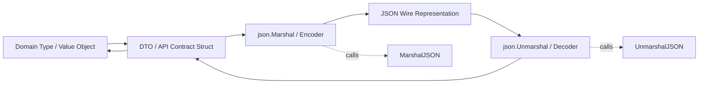
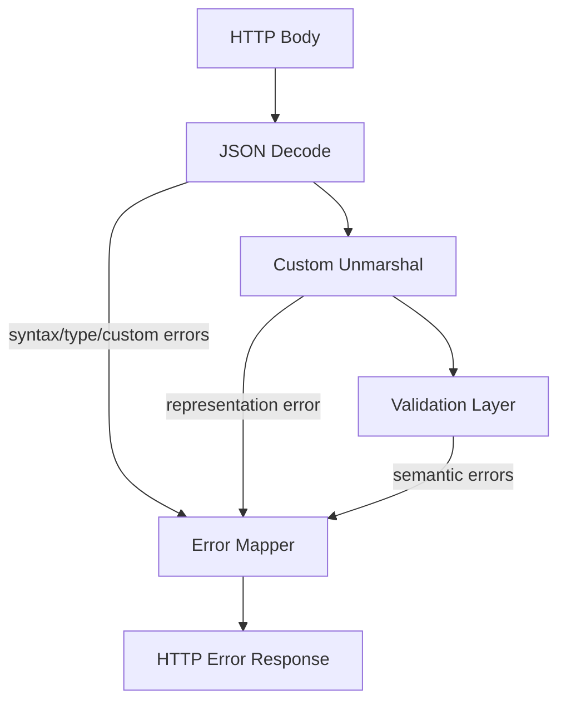

# learn-go-data-mapper-json-xml-protobuf-validation-part-009.md

# Part 009 — Custom JSON Marshal and Unmarshal

> Seri: **learn-go-data-mapper-json-xml-protobuf-validation**  
> Bagian: **009 / 033**  
> Topik: **Custom JSON Marshal and Unmarshal**  
> Target pembaca: **Java software engineer yang ingin memahami Go data representation boundary secara production-grade**

---

## 0. Posisi Part Ini Dalam Seri

Part sebelumnya membahas angka JSON sebagai boundary berisiko tinggi: precision, overflow, `json.Number`, money, ID, dan lossiness. Part ini naik satu level: ketika mapping default `encoding/json` tidak cukup, kita membuat **custom JSON representation**.

Di Go, custom JSON bukan sekadar override method seperti `@JsonSerialize`, `@JsonDeserialize`, atau custom Jackson module di Java. Ia adalah kontrak eksplisit melalui interface:

```go
type Marshaler interface {
    MarshalJSON() ([]byte, error)
}

type Unmarshaler interface {
    UnmarshalJSON([]byte) error
}
```

Yang membuat ini penting:

1. JSON adalah **contract boundary**.
2. Custom marshal/unmarshal adalah **semantic override** terhadap mapping default.
3. Begitu sebuah type punya `MarshalJSON`/`UnmarshalJSON`, type itu ikut menentukan compatibility API.
4. Kesalahan kecil bisa menyebabkan silent data loss, recursion bug, invalid JSON, security leak, atau compatibility break.

Part ini akan membahas bagaimana mendesain custom JSON type secara serius, bukan hanya “cara implement method”.

---

## 1. Tujuan Pembelajaran

Setelah menyelesaikan bagian ini, kamu harus mampu:

1. Menjelaskan kapan mapping default `encoding/json` cukup dan kapan harus custom.
2. Mendesain custom JSON type untuk enum, ID, money, time, duration, redaction, union-like payload, dan backward-compatible field migration.
3. Menghindari infinite recursion pada `MarshalJSON`/`UnmarshalJSON`.
4. Membedakan receiver pointer vs value untuk custom marshal/unmarshal.
5. Mendesain error semantics yang jelas ketika JSON value invalid.
6. Menjaga invariant domain saat data masuk/keluar JSON.
7. Menggunakan alias type untuk mencegah method recursion.
8. Menggunakan `json.RawMessage` untuk delayed decoding dan polymorphic payload.
9. Menentukan kapan custom JSON sebaiknya berada di DTO type, value object, atau adapter layer.
10. Membuat checklist review untuk production custom JSON implementation.

---

## 2. Mental Model Besar

Custom JSON di Go adalah **per-type contract adapter**.



Yang harus dipahami:

- `MarshalJSON` mengubah **Go value → JSON bytes**.
- `UnmarshalJSON` mengubah **JSON bytes → existing Go value**.
- Keduanya dipanggil oleh `encoding/json` bila type memenuhi interface.
- Method ini bukan tempat ideal untuk seluruh business validation.
- Method ini seharusnya menjaga **representation invariant**.

Contoh representation invariant:

| Type | JSON Representation | Invariant |
|---|---|---|
| `Email` | JSON string | harus syntactically valid email-ish atau minimal canonicalized lower-case policy |
| `Money` | JSON string atau object | tidak boleh float lossy |
| `Status` | JSON string enum | tidak boleh unknown kecuali compatibility policy mengizinkan |
| `PublicID` | JSON string | tidak boleh empty, harus prefix valid |
| `DateOnly` | `YYYY-MM-DD` | tidak boleh timezone-bearing timestamp |
| `SensitiveString` | redacted string saat marshal | tidak boleh membocorkan secret |
| `PatchField[T]` | absent/null/value | harus membedakan operation intent |

---

## 3. Perbandingan Java dan Go

Di Java, custom JSON sering dilakukan melalui:

- Jackson annotation: `@JsonSerialize`, `@JsonDeserialize`, `@JsonCreator`, `@JsonValue`.
- Custom serializer/deserializer class.
- ObjectMapper module.
- Bean Validation annotation.
- Record/class constructor validation.
- MapStruct untuk mapping DTO-domain.

Di Go, pendekatannya lebih sederhana tetapi lebih eksplisit:

```go
func (s Status) MarshalJSON() ([]byte, error) { ... }
func (s *Status) UnmarshalJSON(b []byte) error { ... }
```

Perbedaan besar:

| Area | Java/Jackson | Go/encoding/json |
|---|---|---|
| Extension point | Annotation/module/class serializer | Interface method di type |
| Discovery | Reflection + annotation metadata | Interface check + reflection |
| Constructor validation | Bisa via constructor/record | Tidak otomatis; `UnmarshalJSON` mutates target |
| Nullability | Reference/null + Optional | Pointer/nil/zero/custom optional |
| Enum | Built-in enum + annotation | Custom string type + methods |
| Global config | ObjectMapper config | Decoder/Encoder options + custom type behavior |
| Error style | Exception | `error` return |
| Polymorphism | `@JsonTypeInfo`, custom deserializer | `json.RawMessage` + manual dispatch |
| Mapper style | Framework-heavy possible | Bias ke explicit functions/type methods |

Go memberi kontrol yang besar, tapi tidak banyak guard rail. Karena itu custom JSON harus dirancang dengan disiplin.

---

## 4. Kapan Custom JSON Dibutuhkan?

Jangan membuat `MarshalJSON`/`UnmarshalJSON` hanya karena ingin terlihat rapi. Custom JSON menambah complexity, test burden, dan compatibility responsibility.

Gunakan custom JSON ketika mapping default tidak bisa mengekspresikan semantic dengan aman.

### 4.1 Use Case yang Legitimate

#### 4.1.1 Enum string dengan validation

Default Go akan menulis type alias string sebagai string apa pun. Kalau kamu ingin hanya nilai tertentu yang legal, custom unmarshal berguna.

```go
type ApplicationStatus string

const (
    ApplicationStatusDraft     ApplicationStatus = "DRAFT"
    ApplicationStatusSubmitted ApplicationStatus = "SUBMITTED"
    ApplicationStatusApproved  ApplicationStatus = "APPROVED"
    ApplicationStatusRejected  ApplicationStatus = "REJECTED"
)
```

Masalah mapping default:

```json
{"status":"APPROVVED"}
```

Akan sukses masuk ke `ApplicationStatus("APPROVVED")` bila tidak divalidasi.

#### 4.1.2 Money/decimal

Money tidak aman sebagai `float64`.

```json
{"amount": 10.10}
```

Jika domain butuh exactness, representasi harus explicit:

```json
{"amount":"10.10","currency":"SGD"}
```

atau:

```json
{"amountMinor":1010,"currency":"SGD"}
```

#### 4.1.3 Date-only

`time.Time` default JSON menghasilkan RFC3339 timestamp. Untuk tanggal lahir, tanggal dokumen, effective date, itu sering salah semantic.

```json
{"dateOfBirth":"1990-01-15"}
```

Bukan:

```json
{"dateOfBirth":"1990-01-15T00:00:00+07:00"}
```

#### 4.1.4 Sensitive data redaction

Secret tidak boleh keluar ke JSON log/API accidentally.

```go
type SecretString string

func (s SecretString) MarshalJSON() ([]byte, error) {
    return []byte(`"***REDACTED***"`), nil
}
```

#### 4.1.5 Polymorphic payload

Misalnya event:

```json
{
  "type": "ApplicationSubmitted",
  "payload": { ... }
}
```

`payload` perlu di-decode berdasarkan `type`.

#### 4.1.6 Backward-compatible field migration

Saat API lama mengirim:

```json
{"postalCode":"123456"}
```

API baru menerima:

```json
{"address":{"postalCode":"123456"}}
```

Custom unmarshal bisa menjadi compatibility bridge sementara.

---

## 5. Kapan Custom JSON Tidak Perlu?

Custom JSON sering disalahgunakan.

Tidak perlu custom JSON bila:

1. Field rename cukup dengan struct tag.
2. Optionality cukup dengan pointer atau wrapper DTO.
3. Validasi bisa dilakukan setelah decode di validation layer.
4. Mapping domain-DTO bisa dilakukan dengan function biasa.
5. Hanya ingin mengubah casing field secara global.
6. Hanya ingin menyembunyikan field; gunakan `json:"-"` atau response DTO khusus.
7. Hanya ingin format output log; jangan overload API JSON representation.

Anti-pattern:

```go
func (r Request) MarshalJSON() ([]byte, error) {
    // Builds custom JSON manually for every response because developer
    // does not like struct tags.
}
```

Ini rawan bug, sulit maintain, dan sering tidak perlu.

---

## 6. Dasar Interface `json.Marshaler` dan `json.Unmarshaler`

### 6.1 `MarshalJSON`

Signature:

```go
MarshalJSON() ([]byte, error)
```

Return harus berupa **valid JSON encoding** untuk value tersebut.

Benar:

```go
return []byte(`"APPROVED"`), nil
```

Salah:

```go
return []byte(`APPROVED`), nil // invalid JSON; string harus quoted
```

Biasanya jangan membangun quoted string manual. Gunakan `json.Marshal` pada primitive representation.

```go
func (s ApplicationStatus) MarshalJSON() ([]byte, error) {
    return json.Marshal(string(s))
}
```

### 6.2 `UnmarshalJSON`

Signature:

```go
UnmarshalJSON([]byte) error
```

Method ini dipanggil pada pointer receiver karena harus mengubah nilai target.

```go
func (s *ApplicationStatus) UnmarshalJSON(b []byte) error {
    var raw string
    if err := json.Unmarshal(b, &raw); err != nil {
        return err
    }
    status := ApplicationStatus(raw)
    if !status.Valid() {
        return fmt.Errorf("invalid application status %q", raw)
    }
    *s = status
    return nil
}
```

Important:

- `UnmarshalJSON` harus mampu menerima bytes untuk satu JSON value, bukan seluruh object kecuali type-nya memang object.
- Return error berarti unmarshal parent gagal.
- Jangan mengubah receiver terlalu awal sebelum semua validation sukses, kecuali kamu sengaja menerima partial mutation.

Pattern aman:

```go
func (s *ApplicationStatus) UnmarshalJSON(b []byte) error {
    var raw string
    if err := json.Unmarshal(b, &raw); err != nil {
        return err
    }

    next := ApplicationStatus(raw)
    if !next.Valid() {
        return fmt.Errorf("invalid application status %q", raw)
    }

    *s = next
    return nil
}
```

Bukan:

```go
func (s *ApplicationStatus) UnmarshalJSON(b []byte) error {
    var raw string
    _ = json.Unmarshal(b, &raw)
    *s = ApplicationStatus(raw) // mutates before validation
    if !s.Valid() { ... }
    return nil
}
```

---

## 7. Receiver Choice: Value vs Pointer

### 7.1 Untuk Marshal

Umumnya pakai value receiver bila type kecil dan immutable-ish:

```go
func (s ApplicationStatus) MarshalJSON() ([]byte, error) { ... }
```

Keuntungannya:

- Value dan pointer sama-sama bisa menggunakan method.
- Cocok untuk enum, ID, date wrapper, money kecil.

Pointer receiver untuk Marshal bisa dipakai bila:

- Type besar.
- Butuh melihat nil pointer secara khusus.
- Tidak ingin value non-pointer memenuhi `json.Marshaler`.

Namun hati-hati: method set berbeda.

```go
type X string

func (x *X) MarshalJSON() ([]byte, error) { ... }
```

Value `X` tidak memiliki method value `MarshalJSON`; hanya `*X`. Ini bisa menghasilkan perilaku berbeda tergantung field addressability dan container.

Praktik umum:

- `MarshalJSON`: value receiver untuk value object kecil.
- `UnmarshalJSON`: pointer receiver.

### 7.2 Untuk Unmarshal

Harus pointer receiver agar bisa mutate.

```go
func (s *Status) UnmarshalJSON(b []byte) error { ... }
```

Value receiver akan compile, tetapi useless karena mutation hanya terjadi pada copy.

```go
func (s Status) UnmarshalJSON(b []byte) error {
    s = StatusSubmitted // modifies copy only
    return nil
}
```

Jangan lakukan ini.

---

## 8. Infinite Recursion Problem

Salah satu bug paling umum:

```go
type User struct {
    ID   string `json:"id"`
    Name string `json:"name"`
}

func (u User) MarshalJSON() ([]byte, error) {
    return json.Marshal(u) // infinite recursion
}
```

Kenapa?

`json.Marshal(u)` melihat `User` implements `json.Marshaler`, lalu memanggil `User.MarshalJSON`, yang memanggil `json.Marshal(u)`, dan seterusnya.

### 8.1 Solusi: Alias Type

Gunakan alias-defined type tanpa method.

```go
type User struct {
    ID   string `json:"id"`
    Name string `json:"name"`
}

func (u User) MarshalJSON() ([]byte, error) {
    type alias User
    return json.Marshal(struct {
        alias
        Kind string `json:"kind"`
    }{
        alias: alias(u),
        Kind:  "user",
    })
}
```

Perhatikan:

```go
type alias User
```

Ini membuat defined type baru dengan underlying type yang sama, tetapi tidak membawa method `MarshalJSON`.

### 8.2 Unmarshal Recursion

Salah:

```go
func (u *User) UnmarshalJSON(b []byte) error {
    return json.Unmarshal(b, u) // recursion
}
```

Benar:

```go
func (u *User) UnmarshalJSON(b []byte) error {
    type alias User
    var aux alias
    if err := json.Unmarshal(b, &aux); err != nil {
        return err
    }
    *u = User(aux)
    return nil
}
```

---

## 9. Custom Enum JSON

Enum adalah contoh paling umum dan paling penting.

### 9.1 Basic Enum Type

```go
package application

import (
    "encoding/json"
    "fmt"
)

type Status string

const (
    StatusDraft     Status = "DRAFT"
    StatusSubmitted Status = "SUBMITTED"
    StatusApproved  Status = "APPROVED"
    StatusRejected  Status = "REJECTED"
)

func (s Status) Valid() bool {
    switch s {
    case StatusDraft, StatusSubmitted, StatusApproved, StatusRejected:
        return true
    default:
        return false
    }
}

func (s Status) String() string {
    return string(s)
}
```

### 9.2 Marshal Strategy

Ada dua possible policies.

#### Policy A — Marshal invalid value as error

```go
func (s Status) MarshalJSON() ([]byte, error) {
    if !s.Valid() {
        return nil, fmt.Errorf("cannot marshal invalid status %q", string(s))
    }
    return json.Marshal(string(s))
}
```

Ini cocok bila invalid status menandakan bug internal.

#### Policy B — Marshal invalid value as string

```go
func (s Status) MarshalJSON() ([]byte, error) {
    return json.Marshal(string(s))
}
```

Ini lebih backward-compatible tetapi bisa membocorkan invalid state.

Untuk internal engineering handbook, default yang lebih defensible biasanya **Policy A** untuk response/domain value object.

### 9.3 Unmarshal Strict Enum

```go
func (s *Status) UnmarshalJSON(b []byte) error {
    var raw string
    if err := json.Unmarshal(b, &raw); err != nil {
        return fmt.Errorf("status must be a JSON string: %w", err)
    }

    next := Status(raw)
    if !next.Valid() {
        return fmt.Errorf("invalid status %q", raw)
    }

    *s = next
    return nil
}
```

### 9.4 Null Handling

Apa yang terjadi pada:

```json
{"status":null}
```

Jika field type-nya:

```go
type Request struct {
    Status Status `json:"status"`
}
```

`UnmarshalJSON` pada `Status` akan menerima bytes `null`. Bila kita langsung unmarshal ke string, error.

Itu bagus bila `status` required. Tapi bila nullable, gunakan pointer:

```go
type Request struct {
    Status *Status `json:"status"`
}
```

Namun dengan pointer, JSON `null` akan set pointer menjadi nil dan `Status.UnmarshalJSON` tidak dipanggil untuk concrete value. Ini bisa dipakai sebagai null policy.

### 9.5 Enum dengan Unknown Compatibility

Kadang client harus bisa menerima enum baru dari server.

Misalnya mobile app lama menerima:

```json
{"status":"UNDER_REVIEW"}
```

Padahal enum lama belum mengenal `UNDER_REVIEW`.

Ada dua strategi:

#### Strategy 1 — Strict server request, lenient client response

Untuk inbound request ke server: reject unknown.

Untuk outbound client SDK: preserve unknown.

```go
type LenientStatus string

func (s *LenientStatus) UnmarshalJSON(b []byte) error {
    var raw string
    if err := json.Unmarshal(b, &raw); err != nil {
        return err
    }
    *s = LenientStatus(raw)
    return nil
}
```

#### Strategy 2 — Known/Unknown tagged type

```go
type StatusValue struct {
    raw   string
    known bool
}

func ParseStatusValue(raw string) StatusValue {
    switch Status(raw) {
    case StatusDraft, StatusSubmitted, StatusApproved, StatusRejected:
        return StatusValue{raw: raw, known: true}
    default:
        return StatusValue{raw: raw, known: false}
    }
}

func (s StatusValue) Known() bool { return s.known }
func (s StatusValue) Raw() string { return s.raw }

func (s StatusValue) MarshalJSON() ([]byte, error) {
    return json.Marshal(s.raw)
}

func (s *StatusValue) UnmarshalJSON(b []byte) error {
    var raw string
    if err := json.Unmarshal(b, &raw); err != nil {
        return err
    }
    *s = ParseStatusValue(raw)
    return nil
}
```

Ini cocok untuk clients/proxies yang harus tolerate future enum values.

---

## 10. Custom ID Type

ID sering butuh representation invariant.

### 10.1 Public ID Dengan Prefix

```go
type ApplicationID string

func NewApplicationID(s string) (ApplicationID, error) {
    id := ApplicationID(s)
    if !id.Valid() {
        return "", fmt.Errorf("invalid application id %q", s)
    }
    return id, nil
}

func (id ApplicationID) Valid() bool {
    s := string(id)
    return len(s) > 4 && strings.HasPrefix(s, "app_")
}

func (id ApplicationID) MarshalJSON() ([]byte, error) {
    if !id.Valid() {
        return nil, fmt.Errorf("cannot marshal invalid application id %q", string(id))
    }
    return json.Marshal(string(id))
}

func (id *ApplicationID) UnmarshalJSON(b []byte) error {
    var raw string
    if err := json.Unmarshal(b, &raw); err != nil {
        return fmt.Errorf("application id must be string: %w", err)
    }

    next, err := NewApplicationID(raw)
    if err != nil {
        return err
    }

    *id = next
    return nil
}
```

### 10.2 Zero Value Dilemma

Problem:

```go
var id ApplicationID
json.Marshal(id)
```

Jika zero value invalid, `MarshalJSON` akan error. Itu defensible untuk response, tetapi kadang menyulitkan untuk optional fields.

Solusi:

- Required ID: non-pointer, invalid zero produces error.
- Optional ID: `*ApplicationID`.
- Patch ID: custom optional wrapper.
- Internal partial state: jangan marshal langsung; map ke response DTO dahulu.

---

## 11. Custom Date-Only Type

`time.Time` punya default JSON format RFC3339. Untuk date-only, buat type khusus.

### 11.1 DateOnly Implementation

```go
package jsontypes

import (
    "encoding/json"
    "fmt"
    "time"
)

const dateOnlyLayout = "2006-01-02"

type DateOnly struct {
    t time.Time
}

func NewDateOnly(year int, month time.Month, day int) DateOnly {
    return DateOnly{t: time.Date(year, month, day, 0, 0, 0, 0, time.UTC)}
}

func ParseDateOnly(s string) (DateOnly, error) {
    t, err := time.Parse(dateOnlyLayout, s)
    if err != nil {
        return DateOnly{}, fmt.Errorf("invalid date-only %q: %w", s, err)
    }
    return DateOnly{t: t}, nil
}

func (d DateOnly) Time() time.Time {
    return d.t
}

func (d DateOnly) String() string {
    if d.t.IsZero() {
        return ""
    }
    return d.t.Format(dateOnlyLayout)
}

func (d DateOnly) MarshalJSON() ([]byte, error) {
    if d.t.IsZero() {
        return []byte("null"), nil
    }
    return json.Marshal(d.String())
}

func (d *DateOnly) UnmarshalJSON(b []byte) error {
    if string(b) == "null" {
        *d = DateOnly{}
        return nil
    }

    var raw string
    if err := json.Unmarshal(b, &raw); err != nil {
        return fmt.Errorf("date-only must be string: %w", err)
    }

    next, err := ParseDateOnly(raw)
    if err != nil {
        return err
    }

    *d = next
    return nil
}
```

### 11.2 Design Decisions

Important choices:

| Decision | Option | Consequence |
|---|---|---|
| Zero value marshal | `null` | convenient but may hide missing required date |
| Zero value marshal | error | strict but harder for partial values |
| Location | UTC midnight | stable representation |
| Input type | string only | rejects timestamp misuse |
| Timestamp input | rejected | preserves date-only semantic |

Untuk strict API request, biasanya field required lebih baik divalidasi di DTO validation layer, bukan hanya di `UnmarshalJSON`, karena `UnmarshalJSON` tidak tahu apakah field absent.

---

## 12. Custom Time Format

Kadang external API legacy memakai format non-RFC3339:

```json
{"submittedAt":"2026-06-24 18:30:00"}
```

Jangan mengubah global behavior `time.Time`. Buat wrapper.

```go
type LegacyTime struct {
    time.Time
}

const legacyTimeLayout = "2006-01-02 15:04:05"

func (t LegacyTime) MarshalJSON() ([]byte, error) {
    if t.Time.IsZero() {
        return []byte("null"), nil
    }
    return json.Marshal(t.Time.Format(legacyTimeLayout))
}

func (t *LegacyTime) UnmarshalJSON(b []byte) error {
    if string(b) == "null" {
        t.Time = time.Time{}
        return nil
    }

    var raw string
    if err := json.Unmarshal(b, &raw); err != nil {
        return err
    }

    parsed, err := time.ParseInLocation(legacyTimeLayout, raw, time.UTC)
    if err != nil {
        return fmt.Errorf("invalid legacy time %q: %w", raw, err)
    }

    t.Time = parsed
    return nil
}
```

### 12.1 Timezone Warning

`time.Parse` dan `time.ParseInLocation` berbeda.

- `time.Parse(layout, value)` memakai UTC bila layout tidak punya timezone.
- `time.ParseInLocation(layout, value, loc)` menginterpretasikan value dalam location tertentu.

Untuk API contract, timezone harus eksplisit. Jangan biarkan local machine timezone menentukan semantic.

---

## 13. Custom Duration Type

`time.Duration` secara default adalah int64 nanoseconds jika dimarshal sebagai field biasa. Ini sering tidak cocok untuk public API.

```go
type TimeoutConfig struct {
    Timeout time.Duration `json:"timeout"`
}
```

Default:

```json
{"timeout":5000000000}
```

Lebih readable:

```json
{"timeout":"5s"}
```

### 13.1 Duration String Wrapper

```go
type DurationString time.Duration

func (d DurationString) Duration() time.Duration {
    return time.Duration(d)
}

func (d DurationString) MarshalJSON() ([]byte, error) {
    return json.Marshal(time.Duration(d).String())
}

func (d *DurationString) UnmarshalJSON(b []byte) error {
    var raw string
    if err := json.Unmarshal(b, &raw); err != nil {
        return fmt.Errorf("duration must be string: %w", err)
    }

    parsed, err := time.ParseDuration(raw)
    if err != nil {
        return fmt.Errorf("invalid duration %q: %w", raw, err)
    }

    *d = DurationString(parsed)
    return nil
}
```

### 13.2 Duration Contract Choices

| Representation | Example | Pros | Cons |
|---|---|---|---|
| nanoseconds number | `5000000000` | exact, Go-native | unreadable, leaks Go unit |
| seconds number | `5` | language-neutral | fractional semantics? unit ambiguity |
| string duration | `"5s"` | readable | Go-specific grammar if using `time.ParseDuration` |
| ISO-8601 duration | `"PT5S"` | standard-ish | more complex parsing |

For internal Go-only config, `"5s"` is okay. For public cross-language API, prefer explicit unit field or well-documented standard.

---

## 14. Custom Money Type

Money adalah tempat custom JSON sering dibutuhkan.

### 14.1 Bad Design: Float Money

```go
type Payment struct {
    Amount float64 `json:"amount"`
}
```

Risiko:

- binary floating-point tidak exact untuk decimal money;
- rounding behavior tidak eksplisit;
- minor unit tidak jelas;
- currency precision berbeda-beda;
- audit/regulatory data bisa bermasalah.

### 14.2 Minor Unit Design

```go
type Money struct {
    Currency string
    Minor    int64
}
```

JSON:

```json
{"currency":"SGD","amountMinor":1010}
```

Implementation:

```go
type Money struct {
    Currency string
    Minor    int64
}

func NewMoney(currency string, minor int64) (Money, error) {
    if currency == "" {
        return Money{}, fmt.Errorf("currency is required")
    }
    if len(currency) != 3 {
        return Money{}, fmt.Errorf("currency must be ISO-like 3-letter code")
    }
    return Money{Currency: strings.ToUpper(currency), Minor: minor}, nil
}

func (m Money) MarshalJSON() ([]byte, error) {
    if m.Currency == "" {
        return nil, fmt.Errorf("cannot marshal money without currency")
    }

    type dto struct {
        Currency    string `json:"currency"`
        AmountMinor int64  `json:"amountMinor"`
    }

    return json.Marshal(dto{
        Currency:    m.Currency,
        AmountMinor: m.Minor,
    })
}

func (m *Money) UnmarshalJSON(b []byte) error {
    type dto struct {
        Currency    string `json:"currency"`
        AmountMinor int64  `json:"amountMinor"`
    }

    var raw dto
    if err := json.Unmarshal(b, &raw); err != nil {
        return err
    }

    next, err := NewMoney(raw.Currency, raw.AmountMinor)
    if err != nil {
        return err
    }

    *m = next
    return nil
}
```

### 14.3 Decimal String Design

JSON:

```json
{"currency":"SGD","amount":"10.10"}
```

This is friendlier to humans and many APIs.

Simplified strict decimal parser:

```go
type DecimalString string

func ParseDecimalString(s string) (DecimalString, error) {
    if s == "" {
        return "", fmt.Errorf("decimal is required")
    }
    // Simplified demonstration. Production code should define exact grammar:
    // sign? digits ('.' digits)?
    for i, r := range s {
        if r >= '0' && r <= '9' {
            continue
        }
        if r == '.' && i > 0 {
            continue
        }
        if r == '-' && i == 0 {
            continue
        }
        return "", fmt.Errorf("invalid decimal %q", s)
    }
    return DecimalString(s), nil
}
```

Money DTO:

```go
type MoneyDecimal struct {
    Currency string
    Amount   DecimalString
}

func (m MoneyDecimal) MarshalJSON() ([]byte, error) {
    type dto struct {
        Currency string `json:"currency"`
        Amount   string `json:"amount"`
    }
    return json.Marshal(dto{Currency: m.Currency, Amount: string(m.Amount)})
}

func (m *MoneyDecimal) UnmarshalJSON(b []byte) error {
    type dto struct {
        Currency string `json:"currency"`
        Amount   string `json:"amount"`
    }
    var raw dto
    if err := json.Unmarshal(b, &raw); err != nil {
        return err
    }

    amount, err := ParseDecimalString(raw.Amount)
    if err != nil {
        return err
    }

    if len(raw.Currency) != 3 {
        return fmt.Errorf("invalid currency %q", raw.Currency)
    }

    *m = MoneyDecimal{Currency: strings.ToUpper(raw.Currency), Amount: amount}
    return nil
}
```

### 14.4 Do Not Put All Money Rules in JSON Type

Currency precision, rounding, ledger rules, tax calculations, and domain posting rules do not belong entirely in `UnmarshalJSON`.

`UnmarshalJSON` should validate representation:

- JSON object shape;
- amount type;
- currency basic format;
- exact parseability.

Domain layer should validate:

- amount allowed for operation;
- currency accepted by business;
- rounding policy;
- account-level constraints;
- regulatory thresholds.

---

## 15. Redaction and Sensitive Types

### 15.1 SecretString

```go
type SecretString string

func (s SecretString) MarshalJSON() ([]byte, error) {
    if s == "" {
        return []byte("null"), nil
    }
    return json.Marshal("***REDACTED***")
}

func (s *SecretString) UnmarshalJSON(b []byte) error {
    var raw string
    if err := json.Unmarshal(b, &raw); err != nil {
        return fmt.Errorf("secret must be string: %w", err)
    }
    *s = SecretString(raw)
    return nil
}

func (s SecretString) Reveal() string {
    return string(s)
}
```

### 15.2 Be Careful with `String()`

If you implement:

```go
func (s SecretString) String() string {
    return string(s)
}
```

Then logs may leak secret:

```go
log.Printf("secret=%s", secret)
```

Better:

```go
func (s SecretString) String() string {
    if s == "" {
        return ""
    }
    return "***REDACTED***"
}
```

But provide explicit method for legitimate access:

```go
func (s SecretString) Reveal() string { return string(s) }
```

### 15.3 Redaction Type Is Defense-in-Depth, Not Full Security

Redaction `MarshalJSON` helps prevent accidental exposure in JSON, but it does not protect:

- direct field access;
- reflection-based dumping;
- `%#v` depending on type design;
- memory inspection;
- database persistence;
- custom log encoders that bypass JSON.

For production, combine with logging policy, DTO separation, secret scanning, and least-privilege access.

---

## 16. RawMessage for Delayed Decoding

`json.RawMessage` adalah raw encoded JSON value. Ia berguna untuk:

1. Delay decoding.
2. Decode envelope dulu, payload nanti.
3. Preserve unknown JSON fragment.
4. Precompute JSON encoding.
5. Implement polymorphic payload.

### 16.1 Envelope Pattern

```go
type EventEnvelope struct {
    Type    string          `json:"type"`
    Version int             `json:"version"`
    Payload json.RawMessage `json:"payload"`
}
```

Decode envelope:

```go
func DecodeEvent(b []byte) (any, error) {
    var env EventEnvelope
    if err := json.Unmarshal(b, &env); err != nil {
        return nil, fmt.Errorf("decode event envelope: %w", err)
    }

    switch env.Type {
    case "ApplicationSubmitted":
        var payload ApplicationSubmittedPayload
        if err := json.Unmarshal(env.Payload, &payload); err != nil {
            return nil, fmt.Errorf("decode ApplicationSubmitted payload: %w", err)
        }
        return payload, nil

    case "ApplicationApproved":
        var payload ApplicationApprovedPayload
        if err := json.Unmarshal(env.Payload, &payload); err != nil {
            return nil, fmt.Errorf("decode ApplicationApproved payload: %w", err)
        }
        return payload, nil

    default:
        return nil, fmt.Errorf("unknown event type %q", env.Type)
    }
}
```

### 16.2 Preserve Unknown Payload

For forward-compatible proxy:

```go
type UnknownEvent struct {
    Type    string
    Version int
    Payload json.RawMessage
}
```

This lets you store or forward events you cannot interpret yet.

### 16.3 RawMessage Hazard

`RawMessage` does not mean validated domain payload.

Bad:

```go
func Handle(payload json.RawMessage) {
    // stores or processes without validating shape
}
```

Better:

```go
func Handle(payload json.RawMessage) error {
    var req SpecificRequest
    if err := json.Unmarshal(payload, &req); err != nil {
        return err
    }
    return validate(req)
}
```

---

## 17. Polymorphic JSON Without Framework Magic

Java Jackson has `@JsonTypeInfo`. Go biasanya explicit dispatch.

### 17.1 Tagged Union Request

JSON:

```json
{
  "channel": "EMAIL",
  "config": {
    "from": "noreply@example.com",
    "templateId": "welcome"
  }
}
```

or:

```json
{
  "channel": "SMS",
  "config": {
    "senderId": "AGENCY",
    "messageType": "OTP"
  }
}
```

Go types:

```go
type Channel string

const (
    ChannelEmail Channel = "EMAIL"
    ChannelSMS   Channel = "SMS"
)

type NotificationConfig struct {
    Channel Channel
    Config  any
}

type EmailConfig struct {
    From       string `json:"from"`
    TemplateID string `json:"templateId"`
}

type SMSConfig struct {
    SenderID    string `json:"senderId"`
    MessageType string `json:"messageType"`
}
```

Custom unmarshal:

```go
func (n *NotificationConfig) UnmarshalJSON(b []byte) error {
    type envelope struct {
        Channel Channel         `json:"channel"`
        Config  json.RawMessage `json:"config"`
    }

    var env envelope
    if err := json.Unmarshal(b, &env); err != nil {
        return err
    }

    switch env.Channel {
    case ChannelEmail:
        var cfg EmailConfig
        if err := json.Unmarshal(env.Config, &cfg); err != nil {
            return fmt.Errorf("decode email config: %w", err)
        }
        n.Channel = env.Channel
        n.Config = cfg
        return nil

    case ChannelSMS:
        var cfg SMSConfig
        if err := json.Unmarshal(env.Config, &cfg); err != nil {
            return fmt.Errorf("decode sms config: %w", err)
        }
        n.Channel = env.Channel
        n.Config = cfg
        return nil

    default:
        return fmt.Errorf("unsupported notification channel %q", env.Channel)
    }
}
```

Custom marshal:

```go
func (n NotificationConfig) MarshalJSON() ([]byte, error) {
    type envelope struct {
        Channel Channel `json:"channel"`
        Config  any     `json:"config"`
    }

    switch n.Channel {
    case ChannelEmail:
        cfg, ok := n.Config.(EmailConfig)
        if !ok {
            return nil, fmt.Errorf("email channel requires EmailConfig, got %T", n.Config)
        }
        return json.Marshal(envelope{Channel: n.Channel, Config: cfg})

    case ChannelSMS:
        cfg, ok := n.Config.(SMSConfig)
        if !ok {
            return nil, fmt.Errorf("sms channel requires SMSConfig, got %T", n.Config)
        }
        return json.Marshal(envelope{Channel: n.Channel, Config: cfg})

    default:
        return nil, fmt.Errorf("unsupported notification channel %q", n.Channel)
    }
}
```

### 17.2 Stronger Design: Interface with Private Method

```go
type ChannelConfig interface {
    channelConfig()
    Channel() Channel
}

func (EmailConfig) channelConfig() {}
func (EmailConfig) Channel() Channel { return ChannelEmail }

func (SMSConfig) channelConfig() {}
func (SMSConfig) Channel() Channel { return ChannelSMS }

type NotificationConfig2 struct {
    Config ChannelConfig
}
```

Marshal:

```go
func (n NotificationConfig2) MarshalJSON() ([]byte, error) {
    if n.Config == nil {
        return nil, fmt.Errorf("notification config is required")
    }

    type envelope struct {
        Channel Channel `json:"channel"`
        Config  any     `json:"config"`
    }

    return json.Marshal(envelope{
        Channel: n.Config.Channel(),
        Config:  n.Config,
    })
}
```

Unmarshal still needs dispatch.

---

## 18. Custom JSON for Backward-Compatible Field Migration

API evolution often requires accepting old and new field shapes for a period.

### 18.1 Example: Flat to Nested Address

Old:

```json
{
  "name": "Alice",
  "postalCode": "123456"
}
```

New:

```json
{
  "name": "Alice",
  "address": {
    "postalCode": "123456"
  }
}
```

DTO:

```go
type CreateApplicantRequest struct {
    Name    string  `json:"name"`
    Address Address `json:"address"`
}

type Address struct {
    PostalCode string `json:"postalCode"`
}
```

Custom unmarshal accepting both:

```go
func (r *CreateApplicantRequest) UnmarshalJSON(b []byte) error {
    type alias CreateApplicantRequest
    type legacy struct {
        alias
        PostalCode string `json:"postalCode"`
    }

    var raw legacy
    if err := json.Unmarshal(b, &raw); err != nil {
        return err
    }

    next := CreateApplicantRequest(raw.alias)

    if next.Address.PostalCode == "" && raw.PostalCode != "" {
        next.Address.PostalCode = raw.PostalCode
    }

    if next.Address.PostalCode != "" && raw.PostalCode != "" && next.Address.PostalCode != raw.PostalCode {
        return fmt.Errorf("conflicting postalCode values in address.postalCode and postalCode")
    }

    *r = next
    return nil
}
```

### 18.2 Migration Policy

Custom compatibility code must have a lifecycle:

```text
Phase 1: Accept old + new, emit new only, log old usage.
Phase 2: Accept old + new, warn clients, metric old usage.
Phase 3: Reject old in strict mode / new API version.
Phase 4: Remove compatibility branch.
```

If not, compatibility code becomes permanent complexity.

---

## 19. Custom JSON and `omitempty`

`omitempty` behavior can surprise with custom types.

Example:

```go
type DateOnly struct {
    t time.Time
}

type Response struct {
    EffectiveDate DateOnly `json:"effectiveDate,omitempty"`
}
```

A struct value is not considered empty in the way many developers expect. `omitempty` may still include it depending on its zero-ness rules in the active JSON implementation.

Safer approach:

```go
type Response struct {
    EffectiveDate *DateOnly `json:"effectiveDate,omitempty"`
}
```

or make omission explicit at DTO mapping layer.

### 19.1 Null vs Omit

`MarshalJSON` can return `null`, but it cannot decide to omit its containing field.

```go
func (d DateOnly) MarshalJSON() ([]byte, error) {
    return []byte("null"), nil
}
```

This produces:

```json
{"effectiveDate":null}
```

Not:

```json
{}
```

Field omission is controlled by the containing struct field/tag and encoder behavior, not by child `MarshalJSON` alone.

---

## 20. Custom JSON and `null`

### 20.1 Value Field

```go
type Request struct {
    Date DateOnly `json:"date"`
}
```

If JSON is:

```json
{"date":null}
```

Then `DateOnly.UnmarshalJSON([]byte("null"))` is called. Your method decides what happens.

### 20.2 Pointer Field

```go
type Request struct {
    Date *DateOnly `json:"date"`
}
```

For JSON null, the pointer is set to nil; custom unmarshal on `DateOnly` may not be invoked for a concrete value.

### 20.3 Required But Nullable?

If you need distinguish:

- absent,
- present null,
- present value,

then a simple pointer is insufficient. Use optional wrapper from previous part.

```go
type OptionalDate struct {
    set   bool
    null  bool
    value DateOnly
}

func (o *OptionalDate) UnmarshalJSON(b []byte) error {
    o.set = true
    if string(b) == "null" {
        o.null = true
        o.value = DateOnly{}
        return nil
    }
    var d DateOnly
    if err := json.Unmarshal(b, &d); err != nil {
        return err
    }
    o.null = false
    o.value = d
    return nil
}
```

But note: `UnmarshalJSON` only runs if the field is present. If field absent, `set` remains false.

---

## 21. Custom JSON Error Semantics

Custom unmarshal errors become part of API behavior.

Bad error:

```go
return fmt.Errorf("bad")
```

Better:

```go
return fmt.Errorf("field status: invalid enum value %q", raw)
```

But in nested JSON, custom type usually does not know full field path. Field path should often be added by higher-level validation layer.

### 21.1 Sentinel-ish Error Type

```go
type InvalidJSONValueError struct {
    Type   string
    Value  string
    Reason string
}

func (e InvalidJSONValueError) Error() string {
    return fmt.Sprintf("invalid %s %q: %s", e.Type, e.Value, e.Reason)
}
```

Usage:

```go
return InvalidJSONValueError{
    Type:   "application status",
    Value:  raw,
    Reason: "unsupported value",
}
```

### 21.2 API Error Mapping

Pipeline:



Example response:

```json
{
  "error": "INVALID_REQUEST",
  "details": [
    {
      "field": "status",
      "code": "INVALID_ENUM",
      "message": "status must be one of DRAFT, SUBMITTED, APPROVED, REJECTED"
    }
  ]
}
```

Custom `UnmarshalJSON` may produce the root cause; API boundary maps it into stable error envelope.

---

## 22. Custom JSON and Partial Mutation

`UnmarshalJSON` mutates existing object. Be careful when decode fails after partially assigning fields.

Bad:

```go
func (r *Range) UnmarshalJSON(b []byte) error {
    type dto struct {
        Start int `json:"start"`
        End   int `json:"end"`
    }
    var raw dto
    if err := json.Unmarshal(b, &raw); err != nil {
        return err
    }

    r.Start = raw.Start
    if raw.End < raw.Start {
        return fmt.Errorf("end before start") // r already partially changed
    }
    r.End = raw.End
    return nil
}
```

Better:

```go
func (r *Range) UnmarshalJSON(b []byte) error {
    type dto struct {
        Start int `json:"start"`
        End   int `json:"end"`
    }
    var raw dto
    if err := json.Unmarshal(b, &raw); err != nil {
        return err
    }
    if raw.End < raw.Start {
        return fmt.Errorf("end before start")
    }

    next := Range{Start: raw.Start, End: raw.End}
    *r = next
    return nil
}
```

Rule:

> Decode into local variables, validate, then assign once.

---

## 23. Custom JSON and Manual Byte Construction

Avoid manual JSON construction unless performance-critical and heavily tested.

Bad:

```go
func (s Status) MarshalJSON() ([]byte, error) {
    return []byte("\"" + string(s) + "\""), nil
}
```

This fails if string contains characters needing escape.

Better:

```go
func (s Status) MarshalJSON() ([]byte, error) {
    return json.Marshal(string(s))
}
```

Manual construction can be valid for simple constants:

```go
return []byte("null"), nil
return []byte("true"), nil
return []byte("false"), nil
```

But for strings and objects, prefer `json.Marshal` on a DTO.

---

## 24. Custom JSON and Map Keys

JSON object keys are strings. If using custom key types in `map`, understand encoding behavior.

```go
type UserID string

type Response struct {
    Scores map[UserID]int `json:"scores"`
}
```

Because `UserID` underlying type is string, it can be encoded as object keys.

For complex key type, prefer explicit array representation:

```json
{
  "scores": [
    {"userId":"usr_1","score":10},
    {"userId":"usr_2","score":20}
  ]
}
```

Why?

- JSON object key order is not semantic.
- Complex keys as string encoding can be ambiguous.
- Validation and error path are clearer with array objects.

---

## 25. Custom JSON and TextMarshaler/TextUnmarshaler

Some Go packages use `encoding.TextMarshaler`/`encoding.TextUnmarshaler` for string-like representation.

```go
type TextMarshaler interface {
    MarshalText() (text []byte, err error)
}

type TextUnmarshaler interface {
    UnmarshalText(text []byte) error
}
```

For JSON string values, `encoding/json` can use text marshaling in certain cases. However, for critical representation, explicit `MarshalJSON`/`UnmarshalJSON` is often clearer.

Pattern:

```go
type RegionCode string

func (r RegionCode) MarshalText() ([]byte, error) {
    if r == "" {
        return nil, fmt.Errorf("empty region")
    }
    return []byte(strings.ToUpper(string(r))), nil
}

func (r *RegionCode) UnmarshalText(text []byte) error {
    raw := strings.ToUpper(string(text))
    if len(raw) != 2 {
        return fmt.Errorf("invalid region code %q", raw)
    }
    *r = RegionCode(raw)
    return nil
}

func (r RegionCode) MarshalJSON() ([]byte, error) {
    text, err := r.MarshalText()
    if err != nil {
        return nil, err
    }
    return json.Marshal(string(text))
}

func (r *RegionCode) UnmarshalJSON(b []byte) error {
    var raw string
    if err := json.Unmarshal(b, &raw); err != nil {
        return err
    }
    return r.UnmarshalText([]byte(raw))
}
```

This keeps text representation reusable across JSON, XML attributes, database scanner/valuer, and config parsing.

---

## 26. Custom JSON in DTO vs Domain Type

A key architecture decision: where should custom JSON live?

### 26.1 Custom JSON on DTO

```go
type CreateApplicationRequest struct {
    SubmittedAt LegacyTime `json:"submittedAt"`
}
```

Good when:

- representation is API-specific;
- legacy format should not pollute domain;
- same domain concept has multiple external formats;
- migration compatibility is temporary.

### 26.2 Custom JSON on Domain Value Object

```go
type ApplicationID string
func (id ApplicationID) MarshalJSON() ([]byte, error) { ... }
```

Good when:

- representation is canonical everywhere;
- type is true value object;
- invariant should be enforced consistently;
- all APIs should expose same representation.

### 26.3 Adapter Package

```text
internal/application/domain
internal/application/api/httpdto
internal/application/api/jsontypes
```

Good when:

- multiple protocols exist;
- you want domain independent from JSON;
- Protobuf/XML/JSON representations differ;
- strict architecture boundary matters.

### 26.4 Decision Table

| Question | Put custom JSON on DTO | Put on domain value object |
|---|---:|---:|
| Format is external API-specific | ✅ | ❌ |
| Format is universal canonical representation | ⚠️ | ✅ |
| Temporary backward compatibility | ✅ | ❌ |
| Security redaction for any JSON output | ⚠️ | ✅ as defense-in-depth |
| Domain must not import encoding/json | ✅ | ❌ |
| Multiple representations needed | ✅ | ❌ |
| Small value object like ID/date | either | either |

Strong default for large systems:

> Keep domain independent from transport JSON unless the type is a stable primitive-like value object whose JSON representation is truly canonical.

---

## 27. Avoid Custom JSON as Business Rule Container

Bad:

```go
func (r *ApproveApplicationRequest) UnmarshalJSON(b []byte) error {
    // Parses JSON
    // Checks user permission
    // Queries database
    // Checks workflow state
    // Sends notification
}
```

This is a serious anti-pattern.

`UnmarshalJSON` should be deterministic, local, and side-effect free.

Allowed:

- parse JSON shape;
- validate representation format;
- canonicalize local value;
- reject impossible local values.

Not allowed:

- database calls;
- external service calls;
- user permission checks;
- workflow transition decisions;
- current-time dependent business decisions unless type is specifically parsing relative time config, which itself is risky.

---

## 28. Custom JSON and Canonicalization

Canonicalization means converting multiple input spellings into one internal form.

Example:

```json
{"currency":"sgd"}
```

Internal:

```go
Currency("SGD")
```

Implementation:

```go
type Currency string

func (c *Currency) UnmarshalJSON(b []byte) error {
    var raw string
    if err := json.Unmarshal(b, &raw); err != nil {
        return err
    }
    normalized := strings.ToUpper(strings.TrimSpace(raw))
    if len(normalized) != 3 {
        return fmt.Errorf("invalid currency %q", raw)
    }
    *c = Currency(normalized)
    return nil
}

func (c Currency) MarshalJSON() ([]byte, error) {
    normalized := strings.ToUpper(strings.TrimSpace(string(c)))
    if len(normalized) != 3 {
        return nil, fmt.Errorf("invalid currency %q", string(c))
    }
    return json.Marshal(normalized)
}
```

### 28.1 Canonicalization Risk

Be careful not to hide client bugs.

Good canonicalization:

- trim accidental whitespace;
- normalize currency case;
- normalize enum aliases during migration.

Risky canonicalization:

- silently truncating long values;
- silently rounding money;
- silently accepting invalid date format;
- silently replacing unknown enum with default.

Bad:

```go
if !status.Valid() {
    status = StatusDraft // silent corruption
}
```

---

## 29. Custom JSON and Versioned Representations

Sometimes one type must accept multiple wire versions.

Example:

v1:

```json
{"name":"Alice Smith"}
```

v2:

```json
{"firstName":"Alice","lastName":"Smith"}
```

Custom unmarshal:

```go
type PersonName struct {
    First string
    Last  string
}

func (n *PersonName) UnmarshalJSON(b []byte) error {
    type v2 struct {
        First string `json:"firstName"`
        Last  string `json:"lastName"`
    }
    type v1 struct {
        Name string `json:"name"`
    }

    var raw struct {
        First string `json:"firstName"`
        Last  string `json:"lastName"`
        Name  string `json:"name"`
    }
    if err := json.Unmarshal(b, &raw); err != nil {
        return err
    }

    if raw.Name != "" && (raw.First != "" || raw.Last != "") {
        return fmt.Errorf("conflicting name formats")
    }

    if raw.Name != "" {
        parts := strings.Fields(raw.Name)
        if len(parts) == 0 {
            return fmt.Errorf("empty name")
        }
        if len(parts) == 1 {
            n.First = parts[0]
            n.Last = ""
            return nil
        }
        n.First = parts[0]
        n.Last = strings.Join(parts[1:], " ")
        return nil
    }

    if raw.First == "" {
        return fmt.Errorf("firstName is required")
    }
    n.First = raw.First
    n.Last = raw.Last
    return nil
}
```

This is okay as a compatibility adapter, but not ideal as permanent domain logic.

Better for long-term:

- versioned DTOs;
- explicit endpoint version;
- migration at boundary;
- deprecation metrics.

---

## 30. Custom JSON and Strict Decoding

Custom `UnmarshalJSON` using an internal DTO inherits that DTO's decode policy.

```go
var raw dto
if err := json.Unmarshal(b, &raw); err != nil { ... }
```

This does not reject unknown fields by default.

If strictness matters inside custom unmarshal, use decoder:

```go
func decodeStrict[T any](b []byte, dst *T) error {
    dec := json.NewDecoder(bytes.NewReader(b))
    dec.DisallowUnknownFields()
    if err := dec.Decode(dst); err != nil {
        return err
    }
    if dec.More() {
        return fmt.Errorf("unexpected extra JSON value")
    }
    return nil
}
```

But `dec.More()` is for arrays/objects and not sufficient for trailing token check. A stricter pattern:

```go
func decodeOneStrict[T any](b []byte, dst *T) error {
    dec := json.NewDecoder(bytes.NewReader(b))
    dec.DisallowUnknownFields()

    if err := dec.Decode(dst); err != nil {
        return err
    }

    var extra any
    if err := dec.Decode(&extra); err != io.EOF {
        if err == nil {
            return fmt.Errorf("unexpected extra JSON value")
        }
        return err
    }
    return nil
}
```

Use in custom unmarshal:

```go
func (m *Money) UnmarshalJSON(b []byte) error {
    type dto struct {
        Currency    string `json:"currency"`
        AmountMinor int64  `json:"amountMinor"`
    }
    var raw dto
    if err := decodeOneStrict(b, &raw); err != nil {
        return err
    }
    next, err := NewMoney(raw.Currency, raw.AmountMinor)
    if err != nil {
        return err
    }
    *m = next
    return nil
}
```

Caveat:

- Strict unknown field rejection can break forward compatibility.
- Use strictness intentionally at request boundary, not blindly everywhere.

---

## 31. Custom JSON and `encoding/json/v2`

Go's experimental JSON v2 work separates syntactic processing (`jsontext`) from semantic encoding/decoding (`encoding/json/v2`). It also addresses long-standing behavioral issues in v1, including duplicate name handling defaults and a richer option model.

For this part, the principle is:

> Design custom JSON types with explicit representation semantics so they remain understandable whether the system uses `encoding/json` v1 today or experiments with v2 later.

Practical implications:

1. Avoid depending on accidental v1 quirks.
2. Test duplicate field behavior if contract is security-sensitive.
3. Prefer explicit strict decoder policy for inbound requests.
4. Keep custom types small and deterministic.
5. Avoid global assumptions about `omitempty` semantics without tests.

---

## 32. Full Example: Production-Grade Create Request

### 32.1 JSON Contract

```json
{
  "applicationId": "app_01JZABCDEF1234567890",
  "status": "SUBMITTED",
  "submittedDate": "2026-06-24",
  "fee": {
    "currency": "SGD",
    "amountMinor": 1050
  },
  "metadata": {
    "source": "PORTAL"
  }
}
```

### 32.2 Types

```go
package api

import (
    "encoding/json"
    "fmt"
    "strings"
    "time"
)

type ApplicationID string

func (id ApplicationID) Valid() bool {
    s := string(id)
    return strings.HasPrefix(s, "app_") && len(s) >= 8
}

func (id ApplicationID) MarshalJSON() ([]byte, error) {
    if !id.Valid() {
        return nil, fmt.Errorf("invalid application id %q", string(id))
    }
    return json.Marshal(string(id))
}

func (id *ApplicationID) UnmarshalJSON(b []byte) error {
    var raw string
    if err := json.Unmarshal(b, &raw); err != nil {
        return fmt.Errorf("applicationId must be string: %w", err)
    }
    next := ApplicationID(raw)
    if !next.Valid() {
        return fmt.Errorf("invalid applicationId %q", raw)
    }
    *id = next
    return nil
}

type Status string

const (
    StatusDraft     Status = "DRAFT"
    StatusSubmitted Status = "SUBMITTED"
    StatusApproved  Status = "APPROVED"
    StatusRejected  Status = "REJECTED"
)

func (s Status) Valid() bool {
    switch s {
    case StatusDraft, StatusSubmitted, StatusApproved, StatusRejected:
        return true
    default:
        return false
    }
}

func (s Status) MarshalJSON() ([]byte, error) {
    if !s.Valid() {
        return nil, fmt.Errorf("invalid status %q", string(s))
    }
    return json.Marshal(string(s))
}

func (s *Status) UnmarshalJSON(b []byte) error {
    var raw string
    if err := json.Unmarshal(b, &raw); err != nil {
        return fmt.Errorf("status must be string: %w", err)
    }
    next := Status(raw)
    if !next.Valid() {
        return fmt.Errorf("invalid status %q", raw)
    }
    *s = next
    return nil
}

type DateOnly struct {
    t time.Time
}

const dateOnlyLayout = "2006-01-02"

func (d DateOnly) MarshalJSON() ([]byte, error) {
    if d.t.IsZero() {
        return []byte("null"), nil
    }
    return json.Marshal(d.t.Format(dateOnlyLayout))
}

func (d *DateOnly) UnmarshalJSON(b []byte) error {
    if string(b) == "null" {
        *d = DateOnly{}
        return nil
    }
    var raw string
    if err := json.Unmarshal(b, &raw); err != nil {
        return fmt.Errorf("date must be string: %w", err)
    }
    t, err := time.Parse(dateOnlyLayout, raw)
    if err != nil {
        return fmt.Errorf("invalid date %q: %w", raw, err)
    }
    *d = DateOnly{t: t}
    return nil
}

type Money struct {
    Currency string
    Minor    int64
}

func (m Money) MarshalJSON() ([]byte, error) {
    if len(m.Currency) != 3 {
        return nil, fmt.Errorf("invalid currency %q", m.Currency)
    }
    type dto struct {
        Currency    string `json:"currency"`
        AmountMinor int64  `json:"amountMinor"`
    }
    return json.Marshal(dto{
        Currency:    strings.ToUpper(m.Currency),
        AmountMinor: m.Minor,
    })
}

func (m *Money) UnmarshalJSON(b []byte) error {
    type dto struct {
        Currency    string `json:"currency"`
        AmountMinor int64  `json:"amountMinor"`
    }
    var raw dto
    if err := json.Unmarshal(b, &raw); err != nil {
        return err
    }
    currency := strings.ToUpper(strings.TrimSpace(raw.Currency))
    if len(currency) != 3 {
        return fmt.Errorf("invalid currency %q", raw.Currency)
    }
    *m = Money{Currency: currency, Minor: raw.AmountMinor}
    return nil
}

type CreateApplicationRequest struct {
    ApplicationID ApplicationID      `json:"applicationId"`
    Status        Status             `json:"status"`
    SubmittedDate DateOnly           `json:"submittedDate"`
    Fee           Money              `json:"fee"`
    Metadata      map[string]string  `json:"metadata,omitempty"`
}
```

### 32.3 Validation After Decode

Even with custom types, request-level validation is still needed.

```go
func (r CreateApplicationRequest) Validate() error {
    if !r.ApplicationID.Valid() {
        return fmt.Errorf("applicationId is required")
    }
    if !r.Status.Valid() {
        return fmt.Errorf("status is required")
    }
    if r.SubmittedDate.t.IsZero() {
        return fmt.Errorf("submittedDate is required")
    }
    if r.Fee.Currency == "" {
        return fmt.Errorf("fee is required")
    }
    return nil
}
```

Why still validate?

- `UnmarshalJSON` does not know if a field was absent if zero value remains.
- Cross-field validation belongs at request/domain level.
- Requiredness is often context-dependent.

---

## 33. Testing Custom JSON Types

Custom JSON must be tested more rigorously than ordinary DTOs.

### 33.1 Round-Trip Test

```go
func TestStatusJSONRoundTrip(t *testing.T) {
    values := []Status{
        StatusDraft,
        StatusSubmitted,
        StatusApproved,
        StatusRejected,
    }

    for _, in := range values {
        b, err := json.Marshal(in)
        if err != nil {
            t.Fatalf("marshal %s: %v", in, err)
        }

        var out Status
        if err := json.Unmarshal(b, &out); err != nil {
            t.Fatalf("unmarshal %s: %v", string(b), err)
        }

        if out != in {
            t.Fatalf("round trip mismatch: in=%q out=%q json=%s", in, out, b)
        }
    }
}
```

### 33.2 Invalid Input Test

```go
func TestStatusRejectsInvalidValue(t *testing.T) {
    inputs := []string{
        `"APPROVVED"`,
        `""`,
        `123`,
        `null`,
        `{}`,
    }

    for _, input := range inputs {
        var s Status
        if err := json.Unmarshal([]byte(input), &s); err == nil {
            t.Fatalf("expected error for %s", input)
        }
    }
}
```

### 33.3 Null Policy Test

```go
func TestOptionalStatusNull(t *testing.T) {
    type Request struct {
        Status *Status `json:"status"`
    }

    var r Request
    if err := json.Unmarshal([]byte(`{"status":null}`), &r); err != nil {
        t.Fatal(err)
    }
    if r.Status != nil {
        t.Fatalf("expected nil status")
    }
}
```

### 33.4 Golden Contract Test

```go
func TestCreateApplicationRequestJSONContract(t *testing.T) {
    input := []byte(`{
        "applicationId": "app_01JZABCDEF1234567890",
        "status": "SUBMITTED",
        "submittedDate": "2026-06-24",
        "fee": {"currency":"sgd", "amountMinor":1050}
    }`)

    var req CreateApplicationRequest
    if err := json.Unmarshal(input, &req); err != nil {
        t.Fatal(err)
    }

    got, err := json.Marshal(req)
    if err != nil {
        t.Fatal(err)
    }

    want := `{"applicationId":"app_01JZABCDEF1234567890","status":"SUBMITTED","submittedDate":"2026-06-24","fee":{"currency":"SGD","amountMinor":1050}}`
    if string(got) != want {
        t.Fatalf("unexpected JSON:\ngot:  %s\nwant: %s", got, want)
    }
}
```

Golden tests are useful for compatibility-sensitive API DTOs, but avoid overusing them for internal structs whose field order or shape is not contractual.

---

## 34. Fuzz Testing Custom JSON

Custom unmarshalers are excellent fuzz targets.

```go
func FuzzStatusUnmarshalJSON(f *testing.F) {
    seeds := []string{
        `"DRAFT"`,
        `"SUBMITTED"`,
        `"APPROVED"`,
        `"REJECTED"`,
        `""`,
        `null`,
        `123`,
        `{}`,
        `[]`,
    }
    for _, seed := range seeds {
        f.Add(seed)
    }

    f.Fuzz(func(t *testing.T, input string) {
        var s Status
        _ = json.Unmarshal([]byte(input), &s)
    })
}
```

Goal is not that every input succeeds. Goal is:

- no panic;
- no infinite recursion;
- no unexpected memory blowup for small inputs;
- invalid states are not silently accepted.

---

## 35. Performance Considerations

Custom JSON often calls `json.Marshal`/`json.Unmarshal` internally, causing additional reflection and allocations.

Example:

```go
func (s Status) MarshalJSON() ([]byte, error) {
    return json.Marshal(string(s))
}
```

This is usually fine for API request/response. For hot paths, measure.

### 35.1 Manual Fast Path for Enum

```go
func (s Status) MarshalJSON() ([]byte, error) {
    switch s {
    case StatusDraft:
        return []byte(`"DRAFT"`), nil
    case StatusSubmitted:
        return []byte(`"SUBMITTED"`), nil
    case StatusApproved:
        return []byte(`"APPROVED"`), nil
    case StatusRejected:
        return []byte(`"REJECTED"`), nil
    default:
        return nil, fmt.Errorf("invalid status %q", string(s))
    }
}
```

This avoids escaping issues because constants are known safe.

For dynamic strings, do not manually quote.

### 35.2 Unmarshal Without Intermediate String?

You can compare raw bytes for enum:

```go
func (s *Status) UnmarshalJSON(b []byte) error {
    switch string(b) {
    case `"DRAFT"`:
        *s = StatusDraft
    case `"SUBMITTED"`:
        *s = StatusSubmitted
    case `"APPROVED"`:
        *s = StatusApproved
    case `"REJECTED"`:
        *s = StatusRejected
    default:
        return fmt.Errorf("invalid status JSON %s", string(b))
    }
    return nil
}
```

This is faster but less flexible:

- does not accept escaped equivalent strings;
- error may include raw JSON;
- more brittle for non-trivial text.

Use only when representation is tightly controlled and benchmark proves value.

### 35.3 Avoid Premature Optimization

Prioritize correctness for:

- API boundary;
- validation;
- compatibility;
- audit/legal data;
- event contract.

Optimize only after profiling. Serialization bugs are often more expensive than a few allocations.

---

## 36. Security Considerations

### 36.1 Do Not Echo Raw Invalid JSON in Errors

Bad:

```go
return fmt.Errorf("invalid payload: %s", string(b))
```

This can leak secrets or create log injection.

Better:

```go
return fmt.Errorf("invalid payload for Money")
```

or truncate/sanitize:

```go
func safeSnippet(b []byte, max int) string {
    s := string(b)
    s = strings.ReplaceAll(s, "\n", " ")
    s = strings.ReplaceAll(s, "\r", " ")
    if len(s) > max {
        return s[:max] + "..."
    }
    return s
}
```

### 36.2 Redaction Must Be Tested

```go
func TestSecretStringMarshalRedacts(t *testing.T) {
    b, err := json.Marshal(SecretString("super-secret"))
    if err != nil {
        t.Fatal(err)
    }
    if strings.Contains(string(b), "super-secret") {
        t.Fatalf("secret leaked: %s", b)
    }
}
```

### 36.3 Avoid Custom Unmarshal Side Effects

Never do this:

```go
func (t *Token) UnmarshalJSON(b []byte) error {
    // Calls auth server to verify token during JSON decode.
}
```

This makes parsing non-deterministic and vulnerable to resource exhaustion.

---

## 37. Observability Considerations

Custom JSON failures should be observable without leaking sensitive data.

Log structured categories:

```text
json_decode_error
json_custom_unmarshal_error
json_invalid_enum
json_invalid_money
json_invalid_date
json_unknown_payload_type
json_backward_compat_legacy_field_used
```

Example metric dimensions:

| Metric | Labels |
|---|---|
| `api_json_decode_errors_total` | endpoint, error_class |
| `api_json_legacy_field_usage_total` | endpoint, field, client_id? |
| `event_unknown_type_total` | topic, event_type, version |
| `json_custom_unmarshal_error_total` | type, reason |

Avoid labels with high cardinality raw values.

Bad:

```text
error_value="APPROVVED_BY_CLIENT_123456789"
```

Good:

```text
type="ApplicationStatus", reason="unknown_enum"
```

---

## 38. Review Checklist

Use this checklist for every custom JSON implementation.

### 38.1 Correctness

- [ ] Does `MarshalJSON` always return valid JSON?
- [ ] Does `UnmarshalJSON` reject invalid JSON type?
- [ ] Does it handle `null` intentionally?
- [ ] Does it avoid partial mutation on error?
- [ ] Does it avoid infinite recursion?
- [ ] Does it preserve domain/representation invariant?
- [ ] Does it avoid silent fallback to default value?
- [ ] Does it distinguish compatibility leniency from accidental acceptance?

### 38.2 Architecture

- [ ] Is this custom JSON type located at the correct layer?
- [ ] Is this transport-specific logic kept out of core domain if needed?
- [ ] Is backward compatibility code time-boxed?
- [ ] Are validation responsibilities separated from business rules?
- [ ] Is requiredness handled at the right layer?

### 38.3 Security

- [ ] Does it avoid leaking secrets in JSON?
- [ ] Does it avoid leaking raw payload in errors/logs?
- [ ] Does it avoid side effects during unmarshal?
- [ ] Does it avoid dynamic execution/evaluation?

### 38.4 Compatibility

- [ ] Are unknown enum policies explicit?
- [ ] Are old/new field conflicts detected?
- [ ] Are emitted JSON fields canonical?
- [ ] Are golden tests present for public API contracts?
- [ ] Is there a migration/removal plan for legacy input support?

### 38.5 Testing

- [ ] Valid examples tested.
- [ ] Invalid examples tested.
- [ ] Null behavior tested.
- [ ] Missing field behavior tested at containing DTO level.
- [ ] Round-trip tested where meaningful.
- [ ] Fuzz test considered for complex parser.

---

## 39. Anti-Patterns

### 39.1 Silent Default on Invalid Input

```go
if !status.Valid() {
    *s = StatusDraft
    return nil
}
```

This corrupts client intent.

### 39.2 Business Logic in Unmarshal

```go
func (r *Request) UnmarshalJSON(b []byte) error {
    if !userCanApprove(...) { ... }
}
```

Parsing must not depend on user/session/database state.

### 39.3 Domain Pollution with Legacy API Format

```go
type Application struct {
    LegacyPostalCode string `json:"postalCode"`
    Address Address `json:"address"`
}
```

Better to handle legacy at DTO boundary.

### 39.4 Manual JSON String Escaping

```go
return []byte(`"` + value + `"`), nil
```

Use `json.Marshal(value)`.

### 39.5 Custom JSON Everywhere

If every DTO has `MarshalJSON`, your model is probably too clever. Prefer struct tags and explicit mapper functions unless custom representation is necessary.

---

## 40. Design Heuristics

### 40.1 Representation Should Be Boring

The best JSON representation is usually:

- explicit;
- stable;
- easy to validate;
- easy for other languages;
- not overly coupled to Go internals.

### 40.2 Custom Type Should Be Small

Good custom JSON types:

- enum;
- date-only;
- ID;
- currency;
- money;
- duration;
- secret wrapper;
- envelope/polymorphic payload.

Risky custom JSON types:

- entire aggregate root;
- entire workflow command with business logic;
- huge nested object with many conditional fields;
- database entity reused as API model.

### 40.3 Decode Leniently, Emit Canonically — With Care

Common compatibility rule:

```text
Accept old/new input temporarily.
Emit only canonical new output.
Measure old usage.
Remove old acceptance later.
```

But do not confuse leniency with silent corruption.

---

## 41. Practical Decision Matrix

| Scenario | Recommended Approach |
|---|---|
| Simple field rename | Struct tag |
| Hide field from JSON | `json:"-"` or response DTO |
| Enum validation | Custom enum `UnmarshalJSON` + request validation |
| Money exactness | Custom money type; avoid float |
| Date-only | Custom `DateOnly` wrapper |
| Legacy time format | DTO-specific wrapper |
| Secret redaction | Secret wrapper + DTO separation + logging policy |
| Polymorphic payload | Envelope + `json.RawMessage` + explicit dispatch |
| API field migration | DTO custom unmarshal with lifecycle |
| Domain mapping | Explicit mapper function, not JSON method |
| Required field validation | Validation layer, not only unmarshal |
| Cross-field validation | Request/domain validator |
| Hot path serialization | Benchmark before manual optimization |

---

## 42. Mini Lab

### Lab 1 — Implement Strict Enum

Implement:

```go
type RiskLevel string

const (
    RiskLow    RiskLevel = "LOW"
    RiskMedium RiskLevel = "MEDIUM"
    RiskHigh   RiskLevel = "HIGH"
)
```

Requirements:

1. JSON must be string.
2. Unknown value rejected.
3. `null` rejected for non-pointer field.
4. Invalid zero value cannot be marshaled.
5. Round-trip tests.

### Lab 2 — Implement DateOnly

Requirements:

1. Accept only `YYYY-MM-DD`.
2. Reject RFC3339 timestamp.
3. Decide and document zero/null behavior.
4. Add tests for invalid leap dates.

### Lab 3 — Implement Backward-Compatible DTO

Old input:

```json
{"postalCode":"123456"}
```

New input:

```json
{"address":{"postalCode":"123456"}}
```

Requirements:

1. Accept both.
2. Reject conflict if both present and different.
3. Marshal only new representation.
4. Add metric/log hook placeholder for legacy field usage.

---

## 43. Key Takeaways

1. Custom JSON is a **contract adapter**, not a place for arbitrary business logic.
2. Use custom JSON only when default mapping cannot safely express semantic.
3. Avoid infinite recursion with alias types.
4. Decode into local variables, validate, then assign once.
5. Be explicit about `null`, absent, zero value, and invalid value.
6. Use `json.RawMessage` for delayed/polymorphic decoding, but validate before processing.
7. For enum, ID, money, date-only, duration, and secrets, custom JSON can encode important invariants.
8. Do not silently coerce invalid input into defaults.
9. Keep backward compatibility code measurable and removable.
10. Test custom JSON as public contract, not as incidental implementation.

---

## 44. Referensi Resmi dan Lanjutan

- Go `encoding/json` package documentation: `https://pkg.go.dev/encoding/json`
- Go `encoding/json/v2` package documentation: `https://pkg.go.dev/encoding/json/v2`
- Go blog: experimental JSON v2 API: `https://go.dev/blog/jsonv2-exp`
- Go `time` package documentation: `https://pkg.go.dev/time`
- RFC 8259 — The JavaScript Object Notation Data Interchange Format: `https://www.rfc-editor.org/rfc/rfc8259`

---

## 45. Status Seri

Kita sudah menyelesaikan:

- Part 000 — Orientation: Data Representation Boundary in Go
- Part 001 — Data Mapper Architecture for Java Engineers
- Part 002 — DTO, Domain Model, API Model, Persistence Model
- Part 003 — Mapping Invariants and Boundary Contracts
- Part 004 — Struct Tags as Serialization Metadata
- Part 005 — Manual Mapping vs Reflection vs Code Generation
- Part 006 — JSON Fundamentals in Go
- Part 007 — JSON Nullability, Optionality, and Zero Value Semantics
- Part 008 — JSON Numbers, Precision, and Lossy Boundaries
- Part 009 — Custom JSON Marshal and Unmarshal

Seri belum selesai. Lanjut ke:

**Part 010 — Strict JSON Decoding and Unknown Field Policy**

<!-- NAVIGATION_FOOTER -->
<div class="page-nav">
<a href="./learn-go-data-mapper-json-xml-protobuf-validation-part-008.md">⬅️ Part 008 — JSON Numbers, Precision, and Lossy Boundaries</a>
<a href="./index.md">📚 Kategori</a>
<a href="../../index.md">🏠 Home</a>
<a href="./learn-go-data-mapper-json-xml-protobuf-validation-part-010.md">Part 010 — Strict JSON Decoding and Unknown Field Policy ➡️</a>
</div>
