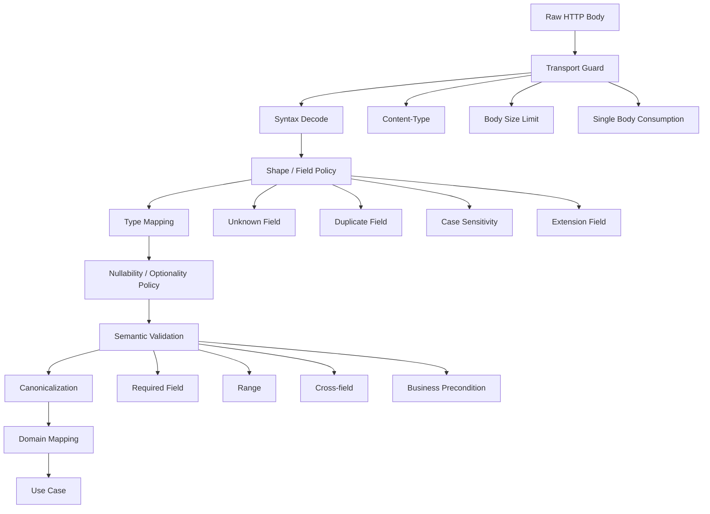
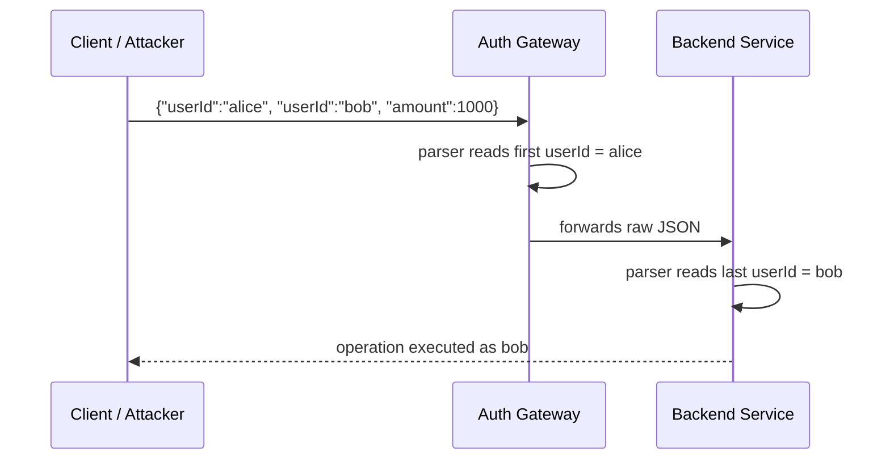
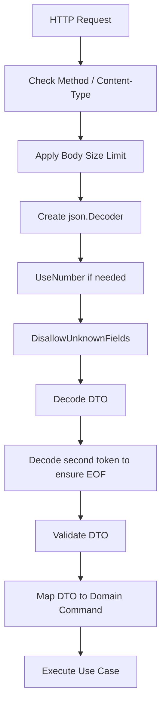
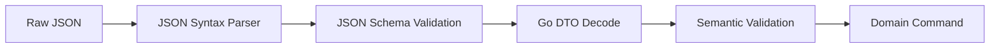
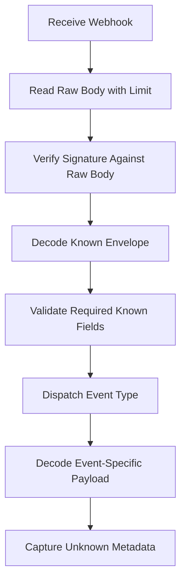
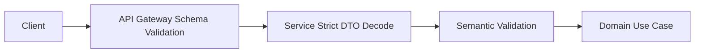
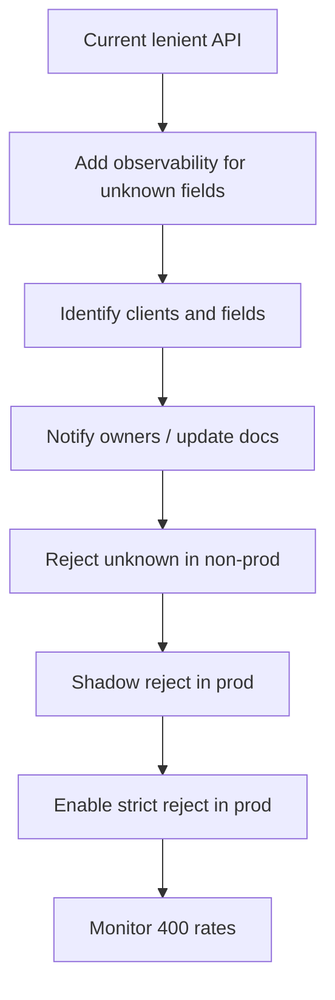
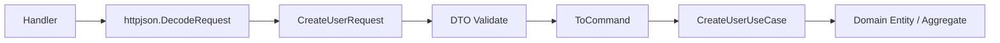
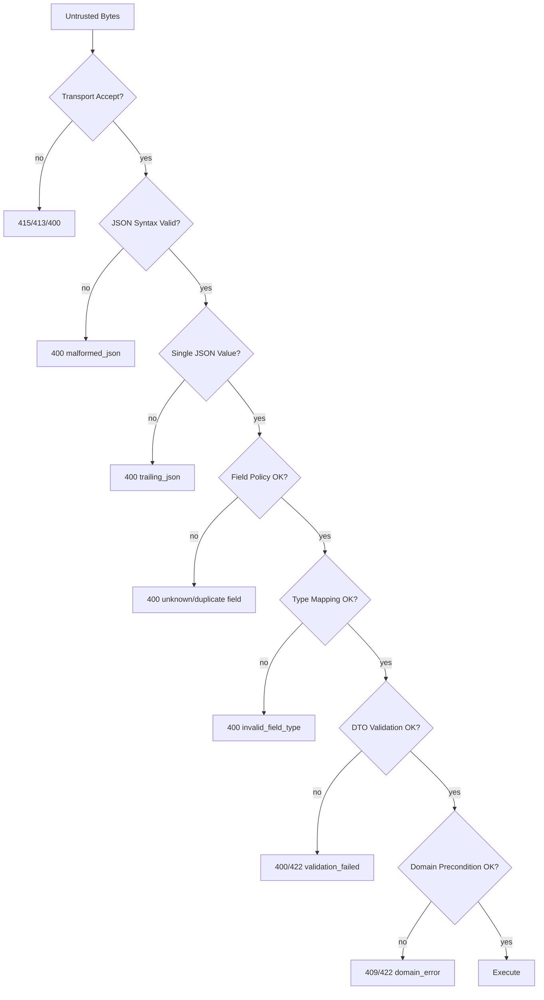

# learn-go-data-mapper-json-xml-protobuf-validation-part-010.md

# Part 010 — Strict JSON Decoding and Unknown Field Policy

> Seri: **learn-go-data-mapper-json-xml-protobuf-validation**  
> Bagian: **010 / 033**  
> Topik: **Strict JSON Decoding and Unknown Field Policy**  
> Target pembaca: **Java software engineer yang ingin memahami Go data representation boundary secara production-grade**

---

## 0. Posisi Part Ini Dalam Seri

Part sebelumnya membahas **custom JSON marshal/unmarshal**: bagaimana sebuah Go type dapat mengambil alih representasi JSON-nya sendiri untuk enum, ID, money, time, duration, redaction, union-like payload, dan migration field.

Part ini membahas sisi lain dari JSON boundary: **seberapa ketat service kita menerima JSON dari luar**.

Di banyak codebase Go, request JSON sering didecode seperti ini:

```go
var req CreateUserRequest
if err := json.NewDecoder(r.Body).Decode(&req); err != nil {
    return err
}
```

Kode itu terlihat normal, tetapi untuk production API ia belum cukup defensible.

Masalahnya bukan karena `encoding/json` buruk. Masalahnya adalah JSON sendiri adalah format yang fleksibel, dan fleksibilitas itu harus diterjemahkan menjadi **policy eksplisit**.

Pertanyaan yang harus dijawab oleh sistem:

1. Apakah unknown field harus ditolak?
2. Apakah duplicate field harus ditolak?
3. Apakah field name harus case-sensitive?
4. Apakah body boleh punya lebih dari satu JSON value?
5. Apakah trailing garbage harus ditolak?
6. Apakah invalid UTF-8 harus dianggap error atau diganti karakter pengganti?
7. Apakah angka harus didecode sebagai `float64`, `json.Number`, integer konkret, atau string?
8. Apakah request lama boleh membawa field deprecated?
9. Apakah external webhook harus lenient?
10. Apakah event consumer harus preserve unknown fields untuk forward compatibility?

Part ini berfokus pada **strictness as architecture policy**, bukan sekadar pemanggilan `Decoder.DisallowUnknownFields()`.

---

## 1. Tujuan Pembelajaran

Setelah menyelesaikan bagian ini, kamu harus mampu:

1. Menjelaskan mengapa default `encoding/json` belum cukup untuk banyak production API.
2. Membedakan syntax strictness, semantic strictness, schema strictness, dan domain validation.
3. Mendesain unknown field policy untuk public API, internal API, config file, event, webhook, dan admin endpoint.
4. Menggunakan `Decoder.DisallowUnknownFields()` dengan benar.
5. Memahami batasan `DisallowUnknownFields`: hanya first unknown field, error belum structured, tidak menyelesaikan duplicate keys, case-insensitive matching, custom `UnmarshalJSON`, dan trailing JSON.
6. Membuat decode pipeline yang menolak trailing tokens.
7. Mendesain error response yang jelas untuk malformed JSON, type mismatch, unknown field, duplicate field, empty body, body too large, dan semantic validation failure.
8. Menentukan kapan harus reject unknown fields, allow unknown fields, capture unknown fields, atau log-only.
9. Memahami duplicate key ambiguity dan alasan ia bisa menjadi security issue.
10. Menyiapkan migration path menuju JSON v2/jsontext tanpa menggantungkan production stability pada API experimental.
11. Membuat checklist review untuk JSON input boundary.

---

## 2. Core Thesis

Strict JSON decoding bukan tentang membuat API “kaku”. Ia tentang memastikan **client dan server punya pemahaman contract yang sama**.

JSON input yang diterima server seharusnya melewati beberapa lapis:



Jika kamu hanya memanggil `json.Decode`, kamu baru melakukan sebagian kecil dari pipeline di atas.

Prinsip utama:

> **Parsing menghasilkan data. Strict decoding menghasilkan contract enforcement. Validation menghasilkan semantic correctness. Domain mapping menghasilkan invariant.**

Jangan mencampur semua itu ke satu fungsi acak.

---

## 3. Fakta Penting Tentang `encoding/json` v1

Baseline umum Go production saat ini masih `encoding/json` v1.

Beberapa default behavior yang wajib kamu pahami:

| Behavior | Default `encoding/json` v1 | Risiko |
|---|---|---|
| Unknown object field ke struct | Diabaikan | typo client tidak terdeteksi, contract drift |
| Duplicate object key | Diproses berurutan; nilai belakang mengganti atau merge nilai sebelumnya | ambiguity, parser differential, attack surface |
| Struct field matching | Exact match diprioritaskan, tetapi case-insensitive match diterima | input casing salah tetap diterima diam-diam |
| Invalid UTF-8 dalam string | Diganti U+FFFD | silent data corruption |
| Trailing JSON setelah value pertama | Tidak otomatis ditolak jika hanya `Decode` sekali | body seperti `{...}{...}` bisa lolos parsing pertama |
| Number ke `any` | `float64` | precision loss untuk integer besar |
| Type mismatch | Field bermasalah dilewati sebisa mungkin; error type mismatch dikembalikan | partial mutation bila decode ke object existing |
| `null` ke scalar | Tidak mengubah nilai target, tidak error | ambiguity absent/null/zero |

Ini bukan bug sederhana. Banyak behavior tersebut dipertahankan karena Go 1 compatibility promise.

Maka strictness harus dirancang di boundary aplikasi.

---

## 4. JSON Ambiguity: Syntax Valid Tidak Berarti Semantic Aman

JSON terlihat sederhana:

```json
{
  "userId": "u_123",
  "role": "viewer"
}
```

Tetapi ada JSON yang secara syntax valid namun semantic-nya ambigu:

```json
{
  "role": "viewer",
  "role": "admin"
}
```

RFC 8259 merekomendasikan object member names unik, tetapi tidak memaksa semua parser menolak duplicate names. Akibatnya, parser berbeda bisa punya hasil berbeda:

| Parser Behavior | Hasil |
|---|---|
| last wins | `role = admin` |
| first wins | `role = viewer` |
| keep all pairs | dua role tersimpan |
| reject duplicate | error |
| merge object values | object digabung |

Dalam sistem multi-service, ini bisa berbahaya.

Misalnya:



Masalahnya bukan hanya duplicate key. Ambiguity juga muncul dari:

- case-insensitive field matching,
- unknown fields yang diabaikan,
- invalid UTF-8 yang diganti,
- number precision loss,
- `null` yang tidak mengubah scalar,
- custom `UnmarshalJSON` yang melonggarkan policy,
- trailing JSON value.

Maka boundary rule harus eksplisit.

---

## 5. Perbandingan Java dan Go

Sebagai Java engineer, kamu mungkin familiar dengan:

- Jackson `ObjectMapper`.
- `FAIL_ON_UNKNOWN_PROPERTIES`.
- `FAIL_ON_READING_DUP_TREE_KEY`.
- `@JsonIgnoreProperties(ignoreUnknown = true)`.
- Bean Validation `@Valid`.
- Spring `@RequestBody` decode pipeline.
- Global config via `ObjectMapper` bean.

Di Go, tidak ada framework-level `ObjectMapper` default yang menjadi pusat semua behavior.

Bias Go:

1. Decode eksplisit per boundary.
2. DTO eksplisit per request/response.
3. Validation eksplisit setelah decode.
4. Mapper eksplisit dari DTO ke domain command.
5. Error modeling eksplisit.

Perbandingan:

| Concern | Java/Jackson/Spring | Go idiom |
|---|---|---|
| Unknown fields | `FAIL_ON_UNKNOWN_PROPERTIES` | `Decoder.DisallowUnknownFields()` atau manual/schema validation |
| Duplicate keys | Jackson feature/config | v1 tidak punya built-in reject duplicate; perlu scanner/jsontext/third-party |
| Global JSON config | Central `ObjectMapper` | central helper function/package boundary |
| Request body limit | Servlet/container/filter | explicit `http.MaxBytesReader` atau limit reader |
| Validation | Bean Validation annotation | validator library + custom semantic validation |
| Error envelope | Exception handler | explicit error type + mapper ke response |
| DTO binding | Framework magic | explicit decode helper |
| Case sensitivity | Configurable | v1 case-insensitive struct matching tidak configurable |

Kesalahan umum Java engineer yang pindah ke Go:

> Menganggap `json.Unmarshal` setara dengan configured `ObjectMapper` production-grade.

Tidak. `json.Unmarshal` adalah low-level semantic mapping function. Production boundary harus membungkusnya dengan policy.

---

## 6. Strictness Bukan Satu Tombol

Strict JSON decoding terdiri dari banyak dimensi.

### 6.1 Syntax strictness

Apakah input adalah JSON valid?

Contoh invalid:

```json
{"name": "Aldi",}
```

Trailing comma bukan JSON valid.

### 6.2 Single-value strictness

Apakah body hanya berisi satu JSON value?

```json
{"name":"Aldi"} {"role":"admin"}
```

Jika hanya decode sekali, value pertama bisa sukses dan value kedua tidak diperiksa.

### 6.3 Field-set strictness

Apakah object boleh membawa field yang tidak dikenali?

```json
{
  "name": "Aldi",
  "isAdmin": true
}
```

Jika `isAdmin` tidak ada di DTO, apakah request harus ditolak?

### 6.4 Duplicate-name strictness

Apakah object boleh membawa nama field sama lebih dari sekali?

```json
{"amount":100,"amount":999999}
```

Untuk contract boundary, biasanya harus ditolak.

### 6.5 Case strictness

Apakah `userId`, `UserID`, `userid`, dan `USERID` dianggap sama?

`encoding/json` v1 bisa menerima case-insensitive match ke struct field. Ini nyaman untuk backward compatibility, tetapi buruk untuk contract precision.

### 6.6 Nullability strictness

Apakah field berikut valid?

```json
{"age": null}
```

Jika DTO field adalah `int`, `encoding/json` v1 tidak menjadikan `null` sebagai type error. Ia tidak mengubah nilai target. Kalau nilai awal zero, kamu sulit membedakan `null` dari absent/zero tanpa custom optional type.

### 6.7 Numeric strictness

Apakah angka berikut valid?

```json
{"id": 9007199254740993}
```

Ia valid JSON, tetapi tidak aman jika melewati `float64`.

### 6.8 Semantic strictness

Apakah payload ini valid?

```json
{
  "startDate": "2026-07-01",
  "endDate": "2026-06-01"
}
```

Syntax valid, fields known, type bisa benar, tetapi semantic salah.

### 6.9 Domain strictness

Apakah payload ini valid?

```json
{
  "caseId": "case_123",
  "action": "APPROVE"
}
```

Bisa saja valid secara JSON dan DTO, tetapi domain state machine tidak mengizinkan `APPROVE` dari state saat ini.

---

## 7. Unknown Field Policy

Unknown field policy adalah keputusan arsitektural.

Jangan pakai satu rule untuk semua boundary.

| Boundary | Default Policy yang Direkomendasikan | Alasan |
|---|---|---|
| Public command API | Reject unknown | client typo harus cepat terlihat; contract jelas |
| Public query API | Reject unknown untuk request body; lenient untuk query param tertentu jika documented | mencegah silent no-op |
| Internal service command | Reject unknown | schema drift harus cepat diketahui |
| Internal event consumer | Tergantung evolution strategy; sering allow/capture unknown | forward compatibility |
| Config file | Reject unknown | typo config berbahaya |
| Admin operation | Reject unknown | high blast radius |
| Third-party webhook | Lenient/capture/log | provider bisa menambah field tanpa notice |
| Audit import / data migration | Capture unknown | data preservation lebih penting |
| Experimental beta API | Bisa allow unknown dengan observability | contract masih berubah |
| PATCH request | Reject unknown | unknown operation intent harus ditolak |

Rule praktis:

> Untuk command yang mengubah state, reject unknown fields by default.

Kenapa?

Karena unknown field pada command sering berarti salah satu dari tiga hal:

1. Client typo.
2. Client memakai versi contract berbeda.
3. Client mencoba mengirim field yang tidak boleh dikontrol.

Ketiganya sebaiknya tidak silent.

---

## 8. Empat Strategi Unknown Field

### 8.1 Reject unknown

Input:

```json
{
  "email": "a@example.com",
  "isAdmin": true
}
```

DTO:

```go
type CreateUserRequest struct {
    Email string `json:"email"`
}
```

Policy:

```text
unknown field "isAdmin" -> 400 Bad Request
```

Gunakan untuk:

- command API,
- config,
- admin endpoint,
- workflow action,
- payment-like operation,
- regulatory decision operation.

### 8.2 Ignore unknown

Policy:

```text
unknown field ignored silently
```

Gunakan sangat hati-hati untuk:

- compatibility dengan legacy client,
- temporary migration,
- webhook provider yang sering menambah metadata,
- low-risk telemetry ingestion.

Kelemahannya: typo client tidak terlihat.

### 8.3 Capture unknown

DTO menyimpan unknown fields:

```go
type WebhookPayload struct {
    EventID string                     `json:"eventId"`
    Type    string                     `json:"type"`
    Unknown map[string]json.RawMessage `json:"-"`
}
```

Gunakan ketika:

- perlu preserve data,
- perlu audit unexpected fields,
- perlu forward compatibility,
- data diteruskan ke downstream.

### 8.4 Log-only unknown

Policy:

```text
unknown accepted, but metric/log emitted
```

Cocok untuk masa transisi:

1. Phase 1: allow + log unknown fields.
2. Phase 2: warn client owner.
3. Phase 3: reject in staging.
4. Phase 4: reject in production.

---

## 9. `Decoder.DisallowUnknownFields()`

`encoding/json.Decoder` menyediakan method:

```go
dec := json.NewDecoder(r)
dec.DisallowUnknownFields()
```

Jika destination adalah struct dan input object punya key yang tidak cocok dengan exported, non-ignored field, decoder mengembalikan error.

Contoh:

```go
package api

import (
    "encoding/json"
    "net/http"
)

type CreateUserRequest struct {
    Email string `json:"email"`
    Name  string `json:"name"`
}

func HandleCreateUser(w http.ResponseWriter, r *http.Request) {
    var req CreateUserRequest

    dec := json.NewDecoder(r.Body)
    dec.DisallowUnknownFields()

    if err := dec.Decode(&req); err != nil {
        http.Error(w, err.Error(), http.StatusBadRequest)
        return
    }

    // validate + map to domain command
}
```

Payload:

```json
{
  "email": "a@example.com",
  "name": "Aldi",
  "admin": true
}
```

Error kira-kira:

```text
json: unknown field "admin"
```

Ini bagus, tetapi belum cukup.

---

## 10. Batasan `DisallowUnknownFields()`

### 10.1 Hanya bekerja pada decode ke struct

Jika kamu decode ke map:

```go
var m map[string]any

dec := json.NewDecoder(r)
dec.DisallowUnknownFields()
err := dec.Decode(&m)
```

Unknown field tidak relevan karena semua key map pada dasarnya allowed.

### 10.2 Tidak menolak duplicate keys

Payload:

```json
{
  "role": "viewer",
  "role": "admin"
}
```

`DisallowUnknownFields()` tidak menolak ini.

### 10.3 Tidak menolak trailing value jika hanya decode sekali

Payload:

```json
{"email":"a@example.com"}{"admin":true}
```

Jika kamu hanya melakukan satu `Decode`, object pertama bisa sukses.

### 10.4 Error unknown field belum structured

Error unknown field dari v1 bukan typed error khusus seperti `*json.UnknownFieldError`. Biasanya kamu perlu parse string jika ingin machine-readable field name.

Ini kurang ideal, tetapi bisa dibungkus di boundary helper.

### 10.5 Hanya melaporkan first unknown field

Payload:

```json
{
  "email": "a@example.com",
  "foo": 1,
  "bar": 2
}
```

Biasanya error pertama saja:

```text
json: unknown field "foo"
```

Jika ingin semua unknown field sekaligus, perlu schema validation atau pre-scan berbasis reflection/RawMessage.

### 10.6 Custom `UnmarshalJSON` bisa melewati option

Jika field/type custom memanggil `json.Unmarshal` sendiri, option decoder luar seperti `DisallowUnknownFields()` tidak otomatis masuk ke call internal.

Contoh:

```go
type Profile struct {
    Name string `json:"name"`
}

func (p *Profile) UnmarshalJSON(b []byte) error {
    type alias Profile
    var tmp alias

    // Ini tidak punya DisallowUnknownFields dari decoder luar.
    if err := json.Unmarshal(b, &tmp); err != nil {
        return err
    }

    *p = Profile(tmp)
    return nil
}
```

Jika `Profile` punya nested unknown fields, custom method harus menerapkan strict policy sendiri bila memang dibutuhkan.

### 10.7 Case-insensitive matching tetap terjadi di v1

`encoding/json` v1 menerima case-insensitive match saat decode ke struct.

DTO:

```go
type Request struct {
    UserID string `json:"userId"`
}
```

Payload ini bisa diterima:

```json
{"UserID":"u_123"}
```

atau variasi case tertentu tergantung matching rule.

Jika contract kamu harus benar-benar case-sensitive, `encoding/json` v1 saja tidak cukup.

### 10.8 Invalid UTF-8 tidak menjadi error di v1

`encoding/json` v1 mengganti invalid UTF-8/UTF-16 surrogate dengan Unicode replacement character. Untuk API biasa ini sering dapat diterima, tetapi untuk signature, canonicalization, audit text, identity field, atau exact string matching, ini bisa menjadi data corruption.

---

## 11. Decode Pipeline yang Lebih Defensible

Minimal production decode pipeline untuk HTTP JSON command API:



Contoh reusable helper:

```go
package strictjson

import (
    "bytes"
    "encoding/json"
    "errors"
    "fmt"
    "io"
    "mime"
    "net/http"
    "strconv"
    "strings"
)

var (
    ErrBodyTooLarge     = errors.New("json body too large")
    ErrEmptyBody        = errors.New("json body is empty")
    ErrTrailingJSON     = errors.New("json body must contain a single JSON value")
    ErrUnsupportedMedia = errors.New("content type must be application/json")
)

type DecodeOptions struct {
    MaxBytes              int64
    DisallowUnknownFields bool
    UseNumber             bool
    RequireJSONContentType bool
}

type DecodeError struct {
    Code   string
    Field  string
    Offset int64
    Err    error
}

func (e *DecodeError) Error() string {
    if e.Field != "" {
        return fmt.Sprintf("%s: field=%s: %v", e.Code, e.Field, e.Err)
    }
    if e.Offset > 0 {
        return fmt.Sprintf("%s: offset=%d: %v", e.Code, e.Offset, e.Err)
    }
    return fmt.Sprintf("%s: %v", e.Code, e.Err)
}

func (e *DecodeError) Unwrap() error { return e.Err }

func DecodeRequest[T any](r *http.Request, opts DecodeOptions) (T, error) {
    var zero T

    if opts.RequireJSONContentType {
        if err := requireJSONContentType(r.Header.Get("Content-Type")); err != nil {
            return zero, &DecodeError{Code: "unsupported_media_type", Err: err}
        }
    }

    if opts.MaxBytes <= 0 {
        return zero, &DecodeError{Code: "invalid_decoder_config", Err: errors.New("MaxBytes must be positive")}
    }

    body, err := readLimited(r.Body, opts.MaxBytes)
    if err != nil {
        code := "read_error"
        if errors.Is(err, ErrBodyTooLarge) {
            code = "body_too_large"
        }
        return zero, &DecodeError{Code: code, Err: err}
    }

    return DecodeBytes[T](body, opts)
}

func DecodeBytes[T any](body []byte, opts DecodeOptions) (T, error) {
    var zero T

    if len(bytes.TrimSpace(body)) == 0 {
        return zero, &DecodeError{Code: "empty_body", Err: ErrEmptyBody}
    }

    dec := json.NewDecoder(bytes.NewReader(body))

    if opts.DisallowUnknownFields {
        dec.DisallowUnknownFields()
    }
    if opts.UseNumber {
        dec.UseNumber()
    }

    var out T
    if err := dec.Decode(&out); err != nil {
        return zero, classifyDecodeError(err)
    }

    // Ensure the body contains exactly one JSON value.
    // A second Decode should return io.EOF after consuming whitespace.
    var extra struct{}
    if err := dec.Decode(&extra); !errors.Is(err, io.EOF) {
        if err == nil {
            err = ErrTrailingJSON
        }
        return zero, &DecodeError{Code: "trailing_json", Offset: dec.InputOffset(), Err: err}
    }

    return out, nil
}

func readLimited(r io.Reader, maxBytes int64) ([]byte, error) {
    var buf bytes.Buffer

    n, err := io.CopyN(&buf, r, maxBytes+1)
    if err != nil && !errors.Is(err, io.EOF) {
        return nil, err
    }
    if n > maxBytes {
        return nil, ErrBodyTooLarge
    }
    return buf.Bytes(), nil
}

func requireJSONContentType(contentType string) error {
    if contentType == "" {
        return ErrUnsupportedMedia
    }

    mediaType, _, err := mime.ParseMediaType(contentType)
    if err != nil {
        return err
    }

    if mediaType != "application/json" {
        return ErrUnsupportedMedia
    }

    return nil
}

func classifyDecodeError(err error) error {
    if errors.Is(err, io.EOF) {
        return &DecodeError{Code: "empty_body", Err: ErrEmptyBody}
    }

    var syntaxErr *json.SyntaxError
    if errors.As(err, &syntaxErr) {
        return &DecodeError{Code: "malformed_json", Offset: syntaxErr.Offset, Err: err}
    }

    var typeErr *json.UnmarshalTypeError
    if errors.As(err, &typeErr) {
        return &DecodeError{
            Code:   "json_type_mismatch",
            Field:  typeErr.Field,
            Offset: typeErr.Offset,
            Err:    err,
        }
    }

    if field, ok := parseUnknownField(err); ok {
        return &DecodeError{Code: "unknown_field", Field: field, Err: err}
    }

    return &DecodeError{Code: "invalid_json", Err: err}
}

func parseUnknownField(err error) (string, bool) {
    const prefix = "json: unknown field "
    msg := err.Error()
    if !strings.HasPrefix(msg, prefix) {
        return "", false
    }

    quoted := strings.TrimPrefix(msg, prefix)
    field, unquoteErr := strconv.Unquote(quoted)
    if unquoteErr != nil {
        return quoted, true
    }
    return field, true
}
```

Pemakaian:

```go
type CreateUserRequest struct {
    Email string `json:"email"`
    Name  string `json:"name"`
}

func HandleCreateUser(w http.ResponseWriter, r *http.Request) {
    req, err := strictjson.DecodeRequest[CreateUserRequest](r, strictjson.DecodeOptions{
        MaxBytes:               1 << 20, // 1 MiB
        DisallowUnknownFields:  true,
        UseNumber:              false,
        RequireJSONContentType: true,
    })
    if err != nil {
        writeDecodeError(w, err)
        return
    }

    // 1. validate required fields and semantic constraints
    // 2. canonicalize
    // 3. map to domain command
    // 4. execute use case
}
```

Hal penting:

1. Decode dilakukan ke fresh DTO, bukan reuse object lama.
2. Body dibatasi ukurannya.
3. Unknown field ditolak.
4. Body harus berisi tepat satu JSON value.
5. Error diklasifikasikan.
6. Validation tetap dilakukan setelah decode.

---

## 12. Kenapa Harus Cek Trailing JSON?

Banyak developer mengira `Decode` membaca seluruh body. Sebenarnya `Decode` membaca **satu JSON value**.

Payload:

```json
{"email":"a@example.com"}
{"email":"b@example.com"}
```

Jika handler hanya decode sekali, object pertama bisa diproses.

Pattern yang benar:

```go
if err := dec.Decode(&req); err != nil {
    return err
}

var extra struct{}
if err := dec.Decode(&extra); !errors.Is(err, io.EOF) {
    return ErrTrailingJSON
}
```

Kenapa decode ke `struct{}`?

Karena kita ingin melihat apakah ada JSON value kedua. Jika ada, `Decode` akan mencoba memprosesnya. Jika tidak ada, ia mengembalikan `io.EOF`.

Catatan:

- whitespace setelah JSON pertama masih boleh.
- comment tidak boleh karena bukan JSON valid.
- garbage non-JSON setelah value pertama akan menghasilkan syntax error saat second decode.

---

## 13. Body Size Limit

Strict decoding tanpa body limit tidak cukup.

JSON bisa digunakan untuk:

- memory exhaustion,
- deeply nested payload,
- huge array,
- huge string,
- slow request body,
- expensive validation path.

Untuk HTTP server murni:

```go
r.Body = http.MaxBytesReader(w, r.Body, 1<<20)
```

Lalu decode.

Namun jika kamu membuat helper yang tidak menerima `http.ResponseWriter`, kamu bisa baca terbatas dengan `io.CopyN` seperti contoh sebelumnya.

Policy umum:

| Endpoint | Max Body Awal |
|---|---:|
| Simple command API | 64 KiB - 1 MiB |
| Bulk upload metadata | 1 MiB - 10 MiB |
| File upload | Jangan taruh file di JSON; pakai multipart/presigned upload |
| Webhook | Sesuai provider + margin |
| Admin config | kecil dan strict |

Jangan memakai angka global tanpa memahami endpoint.

---

## 14. Content-Type Policy

Untuk endpoint yang menerima JSON body, minimal check:

```go
Content-Type: application/json
```

Dengan parameter juga valid:

```text
application/json; charset=utf-8
```

Gunakan `mime.ParseMediaType`, bukan string compare mentah.

```go
mediaType, _, err := mime.ParseMediaType(r.Header.Get("Content-Type"))
if err != nil || mediaType != "application/json" {
    // 415 Unsupported Media Type
}
```

Pertanyaan desain:

| Request | Policy |
|---|---|
| `Content-Type` kosong tapi body JSON | Untuk public API, reject |
| `text/plain` berisi JSON | Reject |
| `application/json; charset=utf-8` | Accept |
| `application/vnd.company.resource+json` | Accept hanya jika documented |
| GET tanpa body | Content-Type tidak perlu |

Jika API kamu mendukung vendor media type:

```text
application/vnd.acme.case-command+json
```

buat allowlist eksplisit.

---

## 15. Required Field Bukan Tanggung Jawab JSON Decoder

Contoh:

```go
type CreateUserRequest struct {
    Email string `json:"email"`
    Name  string `json:"name"`
}
```

Payload:

```json
{"email":"a@example.com"}
```

`json.Decode` sukses. `Name` menjadi zero value `""`.

Apakah itu error? Decoder tidak tahu.

Required field adalah validation concern.

```go
func (r CreateUserRequest) Validate() []FieldError {
    var errs []FieldError

    if strings.TrimSpace(r.Email) == "" {
        errs = append(errs, FieldError{Path: "email", Code: "required"})
    }
    if strings.TrimSpace(r.Name) == "" {
        errs = append(errs, FieldError{Path: "name", Code: "required"})
    }

    return errs
}
```

Namun hati-hati: dengan `string`, kamu tidak bisa membedakan absent dari explicit empty string.

Jika perlu membedakan, gunakan optional type dari part 007.

```go
type CreateUserRequest struct {
    Email Optional[string] `json:"email"`
    Name  Optional[string] `json:"name"`
}
```

Lalu validation bisa membedakan:

| State | Meaning |
|---|---|
| absent | required error |
| null | invalid null atau clear operation, tergantung endpoint |
| `""` | present but blank |
| `"Aldi"` | present value |

---

## 16. Unknown Field vs Missing Field vs Deprecated Field

Jangan campur tiga konsep ini.

### 16.1 Unknown field

Client mengirim field yang server tidak kenal.

```json
{"email":"a@example.com", "nickname":"al"}
```

Jika `nickname` tidak ada di contract, ini unknown.

### 16.2 Missing field

Client tidak mengirim field yang server butuhkan.

```json
{"email":"a@example.com"}
```

Jika `name` required, ini validation error.

### 16.3 Deprecated field

Server masih mengenal field, tetapi field sudah tidak dianjurkan.

```json
{"fullName":"Aldi Pratama"}
```

Jika `fullName` masih ada untuk compatibility, ia bukan unknown.

DTO bisa seperti ini:

```go
type CreateUserRequest struct {
    Name     string `json:"name"`
    FullName string `json:"fullName"` // deprecated input alias
}

func (r CreateUserRequest) CanonicalName() (string, error) {
    switch {
    case r.Name != "" && r.FullName != "":
        return "", errors.New("use either name or fullName, not both")
    case r.Name != "":
        return r.Name, nil
    case r.FullName != "":
        return r.FullName, nil
    default:
        return "", errors.New("name is required")
    }
}
```

Field deprecated harus tetap ada selama compatibility window.

Jangan menghapus field lama lalu mengandalkan unknown-field error tanpa migration plan.

---

## 17. Duplicate Key Policy

### 17.1 Kenapa duplicate key berbahaya?

Payload:

```json
{
  "approved": false,
  "approved": true
}
```

Jika satu layer membaca nilai pertama dan layer lain membaca nilai terakhir, keputusan bisa berbeda.

Untuk operation sensitif:

- authorization,
- role assignment,
- payment,
- status transition,
- regulatory decision,
- audit event,
- signature verification,
- policy evaluation,

duplicate keys sebaiknya ditolak.

### 17.2 `encoding/json` v1 tidak punya built-in reject duplicate

`Decoder.DisallowUnknownFields()` bukan duplicate checker.

Pilihan:

1. Terima limitation v1, tapi mitigasi dengan strict schema dan avoid raw JSON forwarding.
2. Gunakan `encoding/json/jsontext`/`encoding/json/v2` di build experiment untuk evaluasi, bukan sembarang adoption production.
3. Gunakan library/parser yang mendukung reject duplicate names.
4. Pre-scan JSON token untuk duplicate detection.
5. Gunakan JSON Schema validator yang benar-benar menolak duplicate names pada parsing layer, bukan setelah parse ke map.
6. Untuk signed JSON/canonical JSON, pakai canonicalization strategy yang mendefinisikan duplicate behavior.

### 17.3 Jangan detect duplicate setelah unmarshal ke map

Ini salah:

```go
var m map[string]any
json.Unmarshal(body, &m)
```

Setelah masuk map, duplicate key sudah hilang. Kamu tidak bisa tahu apakah input awal punya duplicate key.

Duplicate detection harus terjadi saat token stream masih terlihat.

### 17.4 JSON v2/jsontext arah masa depan

Paket experimental `encoding/json/jsontext` memperjelas lapisan syntactic JSON. Ia punya option seputar duplicate names dan default yang lebih strict dalam mode tertentu.

Namun karena `encoding/json/v2` masih experimental dan gated oleh `GOEXPERIMENT=jsonv2`, adoption production harus hati-hati:

- jangan menjadikannya dependency publik stabil tanpa policy,
- isolasi di adapter package,
- test contract behavior,
- siapkan fallback,
- pantau release notes.

---

## 18. Case Sensitivity Policy

### 18.1 Problem

DTO:

```go
type UpdateRoleRequest struct {
    UserID string `json:"userId"`
    Role   string `json:"role"`
}
```

Payload:

```json
{
  "UserID": "u_123",
  "role": "admin"
}
```

Banyak API contract menganggap field name case-sensitive. Namun `encoding/json` v1 melakukan loose matching terhadap struct fields.

### 18.2 Risiko

1. Client typo tidak terdeteksi.
2. Contract drift tidak terlihat.
3. Generated client/server bisa berbeda behavior.
4. Gateway dan backend bisa parse berbeda.
5. Duplicate-like ambiguity bisa terjadi melalui casing.

Contoh:

```json
{
  "userId": "u_123",
  "UserID": "u_999"
}
```

Parser yang case-sensitive melihat dua member berbeda. Go v1 struct decode bisa menganggap keduanya match ke field yang sama dengan processing order tertentu.

### 18.3 Policy realistis

Dengan `encoding/json` v1:

| Kebutuhan | Rekomendasi |
|---|---|
| API biasa | Accept v1 behavior, tapi dokumentasikan canonical field names |
| Contract sangat strict | Tambahkan pre-scan field name allowlist case-sensitive |
| Security-sensitive JSON | Pertimbangkan parser stricter / jsontext / canonicalization |
| Migration ke v2 | Test behavior karena v2 default lebih case-sensitive |

Untuk mayoritas REST API internal, `DisallowUnknownFields` + DTO tags sudah cukup jauh lebih baik daripada default. Untuk boundary security/signature, jangan bergantung hanya pada v1.

---

## 19. Capturing Unknown Fields dengan `json.RawMessage`

Terkadang unknown field tidak boleh langsung dibuang.

Contoh webhook:

```json
{
  "eventId": "evt_123",
  "type": "payment.succeeded",
  "createdAt": "2026-06-24T10:00:00Z",
  "providerNewField": {
    "foo": "bar"
  }
}
```

Jika provider menambah field, consumer sebaiknya tetap berjalan.

Pattern:

```go
type WebhookEvent struct {
    EventID   string                     `json:"eventId"`
    Type      string                     `json:"type"`
    CreatedAt string                     `json:"createdAt"`
    Unknown   map[string]json.RawMessage `json:"-"`
}

func (e *WebhookEvent) UnmarshalJSON(b []byte) error {
    type known WebhookEvent

    var raw map[string]json.RawMessage
    if err := json.Unmarshal(b, &raw); err != nil {
        return err
    }

    var k known
    if v, ok := raw["eventId"]; ok {
        if err := json.Unmarshal(v, &k.EventID); err != nil {
            return fmt.Errorf("eventId: %w", err)
        }
        delete(raw, "eventId")
    }
    if v, ok := raw["type"]; ok {
        if err := json.Unmarshal(v, &k.Type); err != nil {
            return fmt.Errorf("type: %w", err)
        }
        delete(raw, "type")
    }
    if v, ok := raw["createdAt"]; ok {
        if err := json.Unmarshal(v, &k.CreatedAt); err != nil {
            return fmt.Errorf("createdAt: %w", err)
        }
        delete(raw, "createdAt")
    }

    *e = WebhookEvent(k)
    if len(raw) > 0 {
        e.Unknown = raw
    }
    return nil
}
```

Caveat:

1. Pattern ini tidak mendeteksi duplicate keys karena `map` sudah collapse key.
2. Pattern ini cocok untuk capture unknown, bukan strict security parser.
3. Validation tetap dibutuhkan untuk known fields.
4. Jangan log raw unknown fields tanpa redaction policy.

---

## 20. Pre-scan Unknown Fields Berbasis `json.RawMessage`

Jika ingin mengumpulkan semua unknown top-level fields sekaligus, kamu bisa pre-decode ke `map[string]json.RawMessage`.

Contoh:

```go
func UnknownTopLevelFields(body []byte, allowed map[string]struct{}) ([]string, error) {
    var raw map[string]json.RawMessage
    if err := json.Unmarshal(body, &raw); err != nil {
        return nil, err
    }

    var unknown []string
    for key := range raw {
        if _, ok := allowed[key]; !ok {
            unknown = append(unknown, key)
        }
    }

    sort.Strings(unknown)
    return unknown, nil
}
```

Allowed set:

```go
var createUserAllowed = map[string]struct{}{
    "email": {},
    "name":  {},
}
```

Kelebihan:

- bisa report semua unknown top-level fields,
- error lebih user-friendly,
- bisa dipakai untuk deprecation warning,
- bisa strict case-sensitive untuk top-level.

Kekurangan:

- top-level saja kecuali kamu implement recursive reflection,
- duplicate keys sudah hilang,
- decode dilakukan dua kali,
- harus menjaga allowed set agar tidak drift dari DTO tags.

Untuk endpoint penting, drift allowed set bisa dicegah dengan reflection utility yang membaca `json` tags.

Namun hati-hati: membaca tags dengan benar untuk embedded fields, ignored fields, anonymous fields, conflict resolution, dan custom marshalers tidak trivial.

---

## 21. Schema Validation vs Decoder Strictness

JSON Schema bisa memvalidasi:

- required fields,
- allowed properties,
- additional properties,
- type,
- enum,
- format,
- numeric range,
- string length,
- array length,
- nested object structure,
- conditional schema.

Tetapi schema validation dan Go decode punya tanggung jawab berbeda.



Ada dua strategi:

### 21.1 Decode-first strategy

```text
raw JSON -> Go DTO -> validate DTO
```

Kelebihan:

- sederhana,
- idiomatic Go,
- cepat untuk API biasa,
- type-safe setelah decode.

Kekurangan:

- unknown field handling terbatas,
- duplicate detection terbatas,
- error mungkin tidak lengkap,
- JSON-specific nuance bisa hilang setelah decode.

### 21.2 Schema-first strategy

```text
raw JSON -> JSON Schema validate -> Go DTO -> semantic validation
```

Kelebihan:

- error field bisa lebih lengkap,
- `additionalProperties: false` bisa enforced,
- cocok untuk public API contract,
- cocok untuk generated docs/client.

Kekurangan:

- schema drift risk,
- performance overhead,
- duplicate key tetap tergantung parser schema validator,
- semantic domain tetap perlu custom validation.

### 21.3 Hybrid strategy

Untuk high-stakes public API:

```text
body limit
-> syntactic parse / duplicate guard
-> schema validation
-> strict DTO decode
-> semantic validation
-> domain mapping
```

Untuk internal command biasa:

```text
body limit
-> strict DTO decode
-> semantic validation
-> domain mapping
```

---

## 22. Error Response Design

Jangan expose raw `err.Error()` langsung ke client untuk semua case.

Raw error contoh:

```text
json: cannot unmarshal string into Go struct field Request.age of type int
```

Bisa diterima untuk internal debugging, tetapi API response harus stabil dan machine-readable.

Contoh envelope:

```json
{
  "error": {
    "code": "invalid_request_body",
    "message": "Request body is not valid JSON for this endpoint.",
    "details": [
      {
        "code": "unknown_field",
        "path": "admin",
        "message": "Field is not allowed."
      }
    ],
    "correlationId": "01J..."
  }
}
```

Mapping:

| Internal Decode Error | HTTP | Public Code | Detail |
|---|---:|---|---|
| content type invalid | 415 | `unsupported_media_type` | expected `application/json` |
| body too large | 413 | `request_body_too_large` | max size |
| empty body | 400 | `empty_body` | body required |
| syntax error | 400 | `malformed_json` | offset if safe |
| trailing JSON | 400 | `multiple_json_values` | body must contain single value |
| unknown field | 400 | `unknown_field` | field name |
| type mismatch | 400 | `invalid_field_type` | field path/value/type |
| validation failed | 422 or 400 | `validation_failed` | field errors |
| domain precondition failed | 409 or 422 | `invalid_state_transition` | business state |

HTTP status choice:

- `400 Bad Request`: malformed JSON, unknown field, invalid type.
- `413 Payload Too Large`: body exceeds limit.
- `415 Unsupported Media Type`: content type wrong.
- `422 Unprocessable Entity`: syntactically valid request but semantic validation failed, if your API standard uses 422.
- `409 Conflict`: request valid but conflicts with current resource state.

Untuk internal platform, pilih satu convention dan konsisten.

---

## 23. Error Path: Field Name vs JSON Pointer

`encoding/json` v1 `UnmarshalTypeError` punya `Field` untuk struct field path, tetapi tidak selalu ideal untuk external JSON path.

Contoh:

```go
type Request struct {
    Profile Profile `json:"profile"`
}

type Profile struct {
    Age int `json:"age"`
}
```

Payload:

```json
{"profile":{"age":"old"}}
```

Error field bisa mengandung path struct-ish seperti:

```text
profile.age
```

Untuk API error, biasanya lebih baik pakai JSON path/pointer style:

```text
/profile/age
```

atau dot path:

```text
profile.age
```

Pilih satu.

Rekomendasi:

| Audience | Path Format |
|---|---|
| Public API | JSON Pointer `/profile/age` atau dot path documented |
| Internal logs | include raw error + offset |
| UI form validation | dot/bracket path `profile.age`, `items[0].name` |
| JSON Patch/RFC-like APIs | JSON Pointer |

`encoding/json` v1 belum memberi full structured path untuk semua error. Jika path quality penting, pertimbangkan schema validator atau JSON v2 experimentation.

---

## 24. DTO Decode Jangan Langsung ke Domain Entity

Anti-pattern:

```go
type User struct {
    ID       string `json:"id"`
    Email    string `json:"email"`
    Role     string `json:"role"`
    Password string `json:"password"`
}

func HandleUpdateUser(w http.ResponseWriter, r *http.Request) {
    var user User
    json.NewDecoder(r.Body).Decode(&user)
    repo.Save(user)
}
```

Masalah:

1. Client bisa mengisi field yang tidak seharusnya writable.
2. Domain/persistence struct bocor sebagai API contract.
3. Unknown field policy tidak jelas.
4. Zero value bisa menimpa data existing.
5. Required/optional semantics ambigu.
6. Compatibility API terkunci oleh domain struct.

Lebih baik:

```go
type UpdateUserRequest struct {
    Name Optional[string] `json:"name"`
}

type UpdateUserCommand struct {
    ActorID string
    UserID  string
    Name    Optional[string]
}
```

Decode hanya ke request DTO.

Mapping ke command dilakukan setelah validation:

```go
func (r UpdateUserRequest) ToCommand(actorID, userID string) (UpdateUserCommand, error) {
    if !r.Name.Present {
        return UpdateUserCommand{}, errors.New("at least one update field is required")
    }

    return UpdateUserCommand{
        ActorID: actorID,
        UserID:  userID,
        Name:    r.Name,
    }, nil
}
```

---

## 25. Patch Endpoint: Strictness Lebih Penting

PATCH endpoint rawan bug karena absent/null/value punya meaning berbeda.

Contoh:

```json
{
  "displayName": null
}
```

Apakah itu:

1. clear display name?
2. invalid because required?
3. no-op?
4. same as absent?

Untuk PATCH, unknown field harus ditolak.

Kenapa?

Payload:

```json
{
  "dispalyName": "Aldi"
}
```

Typo `dispalyName` jika diabaikan akan menjadi silent no-op. Client mengira update sukses, server tidak mengubah apa pun.

Recommended PATCH pipeline:

```text
strict decode
-> reject unknown
-> detect no-op empty object
-> validate each present field
-> validate cross-field operation
-> map to update command
-> apply optimistic concurrency if needed
```

DTO:

```go
type PatchUserRequest struct {
    DisplayName OptionalNullable[string] `json:"displayName"`
    Phone       OptionalNullable[string] `json:"phone"`
}

func (r PatchUserRequest) HasAnyField() bool {
    return r.DisplayName.Present || r.Phone.Present
}
```

Validation:

```go
func (r PatchUserRequest) Validate() []FieldError {
    var errs []FieldError

    if !r.HasAnyField() {
        errs = append(errs, FieldError{Path: "", Code: "empty_patch"})
    }

    if r.DisplayName.Present && !r.DisplayName.Null {
        if strings.TrimSpace(r.DisplayName.Value) == "" {
            errs = append(errs, FieldError{Path: "displayName", Code: "blank"})
        }
    }

    return errs
}
```

---

## 26. Event Consumers: Strict Tidak Selalu Benar

Untuk event-driven systems, strict unknown rejection bisa mematahkan forward compatibility.

Producer v2:

```json
{
  "eventId": "evt_123",
  "type": "CaseEscalated",
  "caseId": "case_123",
  "priority": "HIGH",
  "newFieldAddedByProducer": "x"
}
```

Consumer v1 tidak mengenal `newFieldAddedByProducer`.

Jika consumer reject unknown field, deployment producer bisa mematahkan consumer lama.

Policy event biasanya:

| Change | Consumer Lama Seharusnya |
|---|---|
| tambah optional field | tetap bisa consume |
| tambah required semantic field | breaking change |
| rename field | breaking change kecuali alias |
| remove field | breaking change jika consumer butuh |
| change type | breaking change |
| tambah enum value | bisa breaking jika consumer exhaustive |

Untuk event JSON, policy umum:

1. Consumers should ignore unknown fields.
2. Producers must not remove/rename/change type tanpa versioning.
3. New fields harus optional dari perspektif old consumer.
4. Semantic compatibility harus dites dengan contract tests.
5. Poison message handling harus jelas.

Namun untuk command API:

```text
unknown fields should usually be rejected
```

Jangan menyamakan command request dengan event notification.

---

## 27. Webhook: Lenient Tapi Observable

Third-party webhook sering berubah.

Policy yang baik:

```text
known fields: validate strictly
unknown fields: capture/log sample/metric
critical signature fields: exact raw body validation
```

Important:

Untuk webhook signature, biasanya signature dihitung dari **raw body**, bukan decoded struct.

Pipeline:



Jangan decode lalu marshal ulang untuk signature check. Re-marshaled JSON bisa berbeda secara whitespace, ordering, escaping, number format, dan duplicate behavior.

---

## 28. Config File: Harus Strict

Config JSON/YAML/TOML berbeda dengan API request. Untuk config, unknown field hampir selalu harus error.

Contoh:

```json
{
  "databaseUrl": "...",
  "maxConnetions": 50
}
```

Typo `maxConnetions` harus gagal saat startup.

Jika tidak, aplikasi bisa berjalan dengan default `maxConnections = 0` atau default lain yang berbahaya.

Policy config:

1. reject unknown fields,
2. reject duplicate fields,
3. reject empty required fields,
4. validate ranges,
5. fail fast at startup,
6. never silently ignore typo,
7. print actionable error with path.

---

## 29. Strict JSON di Layer Gateway vs Service

Kadang organisasi menaruh JSON schema validation di API gateway.

Pertanyaan: apakah service tetap perlu strict decode?

Jawaban: iya, minimal tetap perlu defensive decode.

Gateway validation membantu, tetapi service boundary tetap harus punya invariant sendiri karena:

1. tidak semua traffic selalu melewati gateway,
2. gateway schema bisa drift,
3. internal calls bisa bypass,
4. replay/test/migration tools bisa call service langsung,
5. defense-in-depth,
6. service adalah owner final dari command semantics.

Architecture:



Gateway boleh reject early. Service tetap reject invalid.

---

## 30. API Versioning dan Unknown Fields

Unknown field policy berhubungan erat dengan versioning.

### 30.1 Strict API v1

```text
POST /v1/users
unknown field rejected
```

Jika client mengirim field dari v2 ke v1, v1 reject. Ini bagus karena client jelas salah target version.

### 30.2 Lenient API untuk gradual rollout

Selama migration:

```text
Phase A: v1 accepts but logs new optional field
Phase B: v1 ignores field silently after confidence
Phase C: v2 documents field
```

Namun lenient v1 harus disengaja, bukan default tak sadar.

### 30.3 Field deprecation

Jangan langsung menghapus field dari DTO jika masih ada client lama.

Better:

```go
type Request struct {
    NewName string `json:"newName"`

    // Deprecated: use newName.
    OldName string `json:"oldName"`
}
```

Validation:

```go
if req.NewName != "" && req.OldName != "" {
    return fieldError("oldName", "conflicts_with_newName")
}
```

Observability:

```text
counter api.deprecated_field_used{field="oldName",endpoint="CreateX"}
```

Setelah usage nol selama window tertentu, field bisa dihapus. Pada saat itu strict unknown field akan menolak client lama.

---

## 31. Unknown Fields dan Security

Unknown fields bisa menjadi attack surface ketika:

1. backend memakai DTO berbeda dari gateway,
2. service meneruskan raw JSON ke downstream,
3. authorization layer dan execution layer parse JSON berbeda,
4. mass assignment terjadi,
5. audit log membaca representation berbeda dari business logic,
6. signature/canonicalization tidak jelas,
7. partial update mengabaikan typo.

Contoh mass assignment style:

```json
{
  "email": "a@example.com",
  "role": "admin",
  "status": "ACTIVE"
}
```

Jika DTO/domain dicampur dan unknown tidak ditolak, field yang semula tidak dimaksudkan writable bisa tiba-tiba menjadi writable ketika struct ditambah field baru.

Skenario:

1. Hari ini `User` struct belum punya `Role` exported atau belum dipakai.
2. Endpoint decode langsung ke `User`.
3. Besok engineer menambah `Role string json:"role"` untuk response/internal use.
4. Tanpa sadar create/update endpoint mulai menerima `role` dari client.

Mitigasi:

- decode ke request DTO khusus,
- reject unknown fields,
- pisahkan input DTO dari output DTO,
- whitelist field writable,
- map eksplisit ke command,
- test negative fields.

---

## 32. Strict Decode dan Custom `UnmarshalJSON`

Custom `UnmarshalJSON` bisa menjadi celah strictness.

Anti-pattern:

```go
type Address struct {
    Street string `json:"street"`
    City   string `json:"city"`
}

func (a *Address) UnmarshalJSON(b []byte) error {
    type alias Address
    var tmp alias
    if err := json.Unmarshal(b, &tmp); err != nil {
        return err
    }
    *a = Address(tmp)
    return nil
}
```

Jika outer decoder strict:

```go
dec := json.NewDecoder(r.Body)
dec.DisallowUnknownFields()
dec.Decode(&req)
```

Tetapi nested `Address.UnmarshalJSON` memakai `json.Unmarshal`, maka unknown fields di dalam `address` bisa tidak ditolak.

Solusi:

1. Hindari custom `UnmarshalJSON` pada nested DTO kecuali perlu.
2. Jika perlu, implement strict decode helper di dalam custom method.
3. Test unknown fields pada nested custom types.
4. Jangan anggap outer decoder options otomatis propagate.

Contoh strict custom:

```go
func (a *Address) UnmarshalJSON(b []byte) error {
    type alias Address

    dec := json.NewDecoder(bytes.NewReader(b))
    dec.DisallowUnknownFields()

    var tmp alias
    if err := dec.Decode(&tmp); err != nil {
        return err
    }

    var extra struct{}
    if err := dec.Decode(&extra); !errors.Is(err, io.EOF) {
        return fmt.Errorf("address has trailing JSON: %w", err)
    }

    *a = Address(tmp)
    return nil
}
```

Caveat: jangan overuse custom method; ini menambah code path.

---

## 33. Partial Mutation Hazard

`json.Unmarshal`/`Decoder.Decode` mengisi target secara bertahap. Jika error terjadi di tengah, target bisa sudah berubah sebagian.

Anti-pattern:

```go
var req UpdateUserRequest

// req mungkin punya nilai dari operasi sebelumnya jika reused.
if err := dec.Decode(&req); err != nil {
    return err
}
```

Dalam HTTP handler biasa, stack variable fresh aman. Tetapi hazard muncul jika:

- decode ke object existing,
- object diambil dari pool,
- custom unmarshal mutate receiver sebelum semua valid,
- decode config reload ke config aktif,
- decode patch langsung ke entity.

Pattern aman:

```go
var tmp UpdateUserRequest
if err := dec.Decode(&tmp); err != nil {
    return err
}

// validate tmp
// only then assign/use
req := tmp
```

Untuk custom `UnmarshalJSON`:

```go
func (m *Money) UnmarshalJSON(b []byte) error {
    parsed, err := parseMoneyJSON(b)
    if err != nil {
        return err
    }

    // Mutate receiver only after parsing fully succeeds.
    *m = parsed
    return nil
}
```

---

## 34. Strict Decode Helper dengan Validation Hook

Dalam aplikasi besar, buat package internal untuk decode boundary.

Contoh:

```go
package httpjson

type Validator interface {
    Validate() []FieldError
}

type FieldError struct {
    Path    string `json:"path"`
    Code    string `json:"code"`
    Message string `json:"message,omitempty"`
}

type RequestOptions struct {
    MaxBytes int64
    Strict   bool
}

func DecodeAndValidate[T any](r *http.Request, opts RequestOptions) (T, []FieldError, error) {
    req, err := strictjson.DecodeRequest[T](r, strictjson.DecodeOptions{
        MaxBytes:               opts.MaxBytes,
        DisallowUnknownFields:  opts.Strict,
        UseNumber:              true,
        RequireJSONContentType: true,
    })
    if err != nil {
        var zero T
        return zero, nil, err
    }

    if v, ok := any(req).(Validator); ok {
        if errs := v.Validate(); len(errs) > 0 {
            return req, errs, nil
        }
    }

    return req, nil, nil
}
```

Namun ada nuance: jika method `Validate` memakai pointer receiver, `any(req).(Validator)` tidak match untuk non-pointer `T`.

Bisa pilih pattern eksplisit:

```go
req, err := DecodeRequest[CreateUserRequest](r, opts)
if err != nil { ... }

if errs := req.Validate(); len(errs) > 0 { ... }
```

Lebih verbose, tapi lebih jelas.

---

## 35. DTO-Specific Decode Policy

Tidak semua DTO punya policy sama. Hindari global helper yang terlalu magic.

Contoh:

```go
type JSONPolicy string

const (
    JSONStrictCommand JSONPolicy = "strict_command"
    JSONLenientEvent  JSONPolicy = "lenient_event"
    JSONWebhook       JSONPolicy = "webhook"
)
```

Policy table:

```go
func OptionsFor(policy JSONPolicy) strictjson.DecodeOptions {
    switch policy {
    case JSONStrictCommand:
        return strictjson.DecodeOptions{
            MaxBytes:               1 << 20,
            DisallowUnknownFields:  true,
            UseNumber:              true,
            RequireJSONContentType: true,
        }
    case JSONLenientEvent:
        return strictjson.DecodeOptions{
            MaxBytes:               4 << 20,
            DisallowUnknownFields:  false,
            UseNumber:              true,
            RequireJSONContentType: false,
        }
    case JSONWebhook:
        return strictjson.DecodeOptions{
            MaxBytes:               2 << 20,
            DisallowUnknownFields:  false,
            UseNumber:              true,
            RequireJSONContentType: false,
        }
    default:
        panic("unknown JSON policy")
    }
}
```

Jangan membuat default yang ambigu.

---

## 36. Observability untuk JSON Decode

Strict decoding akan menaikkan jumlah 400 responses pada awal adoption. Itu bagus jika request memang salah, tetapi harus observable.

Metric yang berguna:

```text
http_json_decode_errors_total{endpoint,code}
http_json_unknown_field_total{endpoint,field}
http_json_body_too_large_total{endpoint}
http_json_deprecated_field_total{endpoint,field}
http_json_validation_errors_total{endpoint,field,code}
```

Structured log:

```json
{
  "level": "warn",
  "msg": "invalid json request",
  "endpoint": "POST /v1/users",
  "decodeCode": "unknown_field",
  "field": "isAdmin",
  "correlationId": "01J...",
  "clientId": "partner-a"
}
```

Jangan log full body by default.

Jika perlu sample body untuk debugging:

1. redaction wajib,
2. size cap,
3. sampling,
4. non-production atau controlled diagnostic mode,
5. jangan log secrets/PII.

---

## 37. Testing Strict Decode

Minimal test matrix untuk setiap request DTO:

| Test | Expected |
|---|---|
| valid minimal payload | success |
| valid full payload | success |
| malformed JSON | decode error |
| empty body | decode error |
| trailing JSON value | decode error |
| unknown top-level field | decode error untuk strict command |
| unknown nested field | decode error jika nested strict bekerja |
| wrong type | decode error |
| `null` for non-nullable field | validation/type policy sesuai desain |
| missing required field | validation error |
| blank string | validation error jika tidak boleh |
| duplicate key | sesuai policy; jika belum bisa reject, documented limitation/test pending |
| casing mismatch | sesuai policy; v1 limitation documented |
| huge body | 413/body too large |
| deprecated field | accepted + warning/metric |

Contoh test:

```go
func TestDecodeCreateUserRejectsUnknownField(t *testing.T) {
    body := strings.NewReader(`{
        "email": "a@example.com",
        "name": "Aldi",
        "isAdmin": true
    }`)

    req := httptest.NewRequest(http.MethodPost, "/users", body)
    req.Header.Set("Content-Type", "application/json")

    _, err := strictjson.DecodeRequest[CreateUserRequest](req, strictjson.DecodeOptions{
        MaxBytes:               1024,
        DisallowUnknownFields:  true,
        RequireJSONContentType: true,
    })

    var decErr *strictjson.DecodeError
    if !errors.As(err, &decErr) {
        t.Fatalf("expected DecodeError, got %T: %v", err, err)
    }
    if decErr.Code != "unknown_field" || decErr.Field != "isAdmin" {
        t.Fatalf("unexpected error: %+v", decErr)
    }
}
```

Test trailing JSON:

```go
func TestDecodeRejectsTrailingJSON(t *testing.T) {
    body := strings.NewReader(`{"email":"a@example.com"}{"email":"b@example.com"}`)

    req := httptest.NewRequest(http.MethodPost, "/users", body)
    req.Header.Set("Content-Type", "application/json")

    _, err := strictjson.DecodeRequest[CreateUserRequest](req, strictjson.DecodeOptions{
        MaxBytes:               1024,
        DisallowUnknownFields:  true,
        RequireJSONContentType: true,
    })

    var decErr *strictjson.DecodeError
    if !errors.As(err, &decErr) {
        t.Fatalf("expected DecodeError, got %T: %v", err, err)
    }
    if decErr.Code != "trailing_json" {
        t.Fatalf("expected trailing_json, got %s", decErr.Code)
    }
}
```

---

## 38. Contract Tests untuk Strictness

Unit tests tidak cukup untuk distributed systems.

Tambahkan contract tests:

1. Generated OpenAPI examples harus decode sukses.
2. Negative examples harus ditolak.
3. Deprecated fields masih diterima selama compatibility window.
4. Unknown fields ditolak untuk command endpoints.
5. Consumer event tests menerima event dengan extra optional field.
6. Gateway schema dan service DTO tidak drift.

Contoh contract fixture:

```text
testdata/contracts/users/create/valid-minimal.json
testdata/contracts/users/create/valid-full.json
testdata/contracts/users/create/invalid-unknown-field.json
testdata/contracts/users/create/invalid-trailing-json.json
testdata/contracts/users/create/invalid-type.json
testdata/contracts/users/create/invalid-missing-required.json
```

Test runner:

```go
func TestCreateUserContractFixtures(t *testing.T) {
    cases := []struct {
        name    string
        file    string
        wantErr bool
    }{
        {"valid minimal", "valid-minimal.json", false},
        {"valid full", "valid-full.json", false},
        {"unknown field", "invalid-unknown-field.json", true},
        {"trailing json", "invalid-trailing-json.json", true},
        {"wrong type", "invalid-type.json", true},
    }

    for _, tc := range cases {
        t.Run(tc.name, func(t *testing.T) {
            b, err := os.ReadFile(filepath.Join("testdata/contracts/users/create", tc.file))
            if err != nil {
                t.Fatal(err)
            }

            _, err = strictjson.DecodeBytes[CreateUserRequest](b, strictjson.DecodeOptions{
                MaxBytes:              int64(len(b) + 1),
                DisallowUnknownFields: true,
                UseNumber:            true,
            })

            if tc.wantErr && err == nil {
                t.Fatal("expected error")
            }
            if !tc.wantErr && err != nil {
                t.Fatalf("unexpected error: %v", err)
            }
        })
    }
}
```

---

## 39. Strictness dan Backward Compatibility

Strictness bisa mematahkan client yang selama ini mengirim field ekstra. Maka rollout harus dirancang.

### 39.1 Migration plan



### 39.2 Shadow reject

Shadow reject berarti:

- request tetap diproses,
- tetapi service menghitung apakah request akan gagal jika strict,
- metric/log dikirim,
- tidak ada behavior change ke client.

Pseudo:

```go
func DecodeWithShadowStrict[T any](body []byte) (T, error) {
    // Production behavior: lenient decode
    req, err := strictjson.DecodeBytes[T](body, strictjson.DecodeOptions{
        MaxBytes:              int64(len(body) + 1),
        DisallowUnknownFields: false,
        UseNumber:            true,
    })
    if err != nil {
        var zero T
        return zero, err
    }

    // Shadow behavior: strict decode only for metrics
    _, strictErr := strictjson.DecodeBytes[T](body, strictjson.DecodeOptions{
        MaxBytes:              int64(len(body) + 1),
        DisallowUnknownFields: true,
        UseNumber:            true,
    })
    if strictErr != nil {
        emitShadowStrictViolation(strictErr)
    }

    return req, nil
}
```

Caveat:

- decode dua kali,
- jangan dipakai selamanya,
- metric cardinality untuk field names harus dikontrol,
- jangan log sensitive body.

---

## 40. Strictness untuk Response JSON

Part ini fokus input, tetapi response juga punya contract.

Masalah response:

1. field internal bocor,
2. nil slice menjadi `null` padahal client expect `[]`,
3. `omitempty` menghapus field yang client butuh,
4. enum unknown keluar,
5. money/ID keluar sebagai number lossy,
6. field deprecated masih keluar tanpa policy,
7. error envelope tidak stabil.

Rule:

- response DTO terpisah dari domain/persistence,
- output fields explicit,
- test golden response,
- avoid exposing map/raw internal structure,
- define nil vs empty array policy,
- define error envelope contract.

Strict input tanpa response governance hanya setengah contract.

---

## 41. Decision Matrix

### 41.1 Unknown field

| Situation | Policy |
|---|---|
| command changes state | reject |
| PATCH operation | reject |
| config | reject |
| admin API | reject |
| public GET filter query | reject unknown if body/JSON; query param depends API style |
| event consumer | usually allow/capture |
| third-party webhook | allow/capture/log |
| migration import | capture |
| beta API | allow + observe, then tighten |

### 41.2 Duplicate key

| Situation | Policy |
|---|---|
| authorization-relevant payload | reject |
| signed payload | canonicalize/reject before semantic use |
| payment/state transition | reject |
| internal low-risk telemetry | maybe tolerate but document |
| config | reject |
| event payload | ideally reject at producer/schema registry; consumer policy depends compatibility |

### 41.3 Case mismatch

| Situation | Policy |
|---|---|
| standard v1 REST API | document canonical names; accept v1 limitation |
| high-security boundary | strict parser/pre-scan/jsontext/canonicalization |
| migration to v2 | test exact behavior |
| generated client/server ecosystem | enforce contract tests |

### 41.4 JSON v2/jsontext adoption

| Question | Recommendation |
|---|---|
| Should all production code immediately move? | No, treat as experimental until stable for your risk tolerance |
| Should senior Go engineer learn it? | Yes, because it exposes future direction and fixes v1 issues |
| Where to isolate? | internal JSON adapter package |
| What to test? | duplicate names, case sensitivity, unknown fields, invalid UTF-8, numbers, custom marshalers |

---

## 42. Anti-Patterns

### 42.1 Blind decode directly from body

```go
json.NewDecoder(r.Body).Decode(&req)
```

Problems:

- no body limit,
- unknown fields ignored,
- trailing JSON not checked,
- error not classified,
- content type not checked.

### 42.2 Decode into domain entity

```go
var user User
json.NewDecoder(r.Body).Decode(&user)
```

Problems:

- mass assignment,
- API contract coupled to domain,
- writable fields unclear.

### 42.3 Reuse decode target after error

```go
err := json.Unmarshal(body, &existing)
```

If error, `existing` may be partially mutated.

### 42.4 Treat validation as decoding

```go
if err := json.Decode(...); err != nil { ... }
// assume req valid
```

Missing required fields and semantic constraints still need validation.

### 42.5 Ignore unknown fields in PATCH

Silent no-op bugs.

### 42.6 Parse unknown-field error string everywhere

Do not scatter string parsing across handlers. Centralize in decode package.

### 42.7 Log full invalid request body

Risky for PII/secrets and log volume.

### 42.8 Trust gateway validation only

Service still owns its boundary.

### 42.9 Use map for command payloads

```go
var req map[string]any
```

This sacrifices compile-time contract, precision, validation clarity, and unknown-field policy.

### 42.10 Assume strict means backward-incompatible always

Strictness can be rolled out gradually with shadow mode, metrics, and deprecation windows.

---

## 43. Production Checklist

Untuk setiap JSON request endpoint:

### 43.1 Transport

- [ ] Body size dibatasi.
- [ ] Content-Type policy jelas.
- [ ] Body kosong ditangani eksplisit.
- [ ] Request body dibaca sekali.
- [ ] Raw body handling aman untuk signature/webhook.

### 43.2 Syntax

- [ ] Malformed JSON menghasilkan error stabil.
- [ ] Trailing JSON value ditolak.
- [ ] Duplicate key policy diputuskan.
- [ ] Invalid UTF-8 policy dipahami.

### 43.3 Field policy

- [ ] Unknown field policy jelas per endpoint.
- [ ] PATCH reject unknown.
- [ ] Config reject unknown.
- [ ] Event/webhook compatibility dipikirkan.
- [ ] Deprecated fields masih dimodelkan selama window.

### 43.4 Type and nullability

- [ ] `null` behavior dipahami.
- [ ] optional/nullable fields memakai type yang sesuai.
- [ ] numbers tidak lossily decode ke `float64` jika precision penting.
- [ ] enums punya unknown policy.

### 43.5 Validation

- [ ] Required fields divalidasi.
- [ ] String canonicalization jelas.
- [ ] Range/length/format divalidasi.
- [ ] Cross-field validation ada.
- [ ] Domain precondition terpisah dari DTO validation.

### 43.6 Error response

- [ ] Error code machine-readable.
- [ ] Field path stabil.
- [ ] Offset hanya jika berguna dan aman.
- [ ] Raw internal error tidak bocor sembarang.
- [ ] Correlation ID ada.

### 43.7 Observability

- [ ] Decode error metric ada.
- [ ] Unknown field metric ada saat migration.
- [ ] Deprecated field usage metric ada.
- [ ] Log tidak membocorkan PII/secrets.

### 43.8 Tests

- [ ] Valid minimal/full fixture.
- [ ] Malformed JSON.
- [ ] Empty body.
- [ ] Trailing JSON.
- [ ] Unknown field.
- [ ] Wrong type.
- [ ] Missing required.
- [ ] Null behavior.
- [ ] Huge body.
- [ ] Deprecated field.
- [ ] Event extra field compatibility.

---

## 44. Latihan Desain

### Latihan 1 — Strict command API

Desain endpoint:

```text
POST /v1/cases/{caseId}/escalations
```

Payload:

```json
{
  "reasonCode": "SLA_RISK",
  "comment": "High priority case",
  "targetQueue": "senior-review"
}
```

Tentukan:

1. DTO.
2. Unknown field policy.
3. Nullability policy.
4. Validation rules.
5. Error envelope.
6. Mapping ke domain command.
7. Tests.

Expected direction:

- reject unknown,
- reject empty body,
- reject trailing JSON,
- reasonCode required enum,
- comment optional but max length,
- targetQueue required/optional sesuai business,
- validate case state di domain use case, bukan JSON decoder.

### Latihan 2 — Third-party webhook

Provider mengirim event:

```json
{
  "id": "evt_123",
  "type": "payment.succeeded",
  "data": {
    "paymentId": "pay_123",
    "amount": "120.00",
    "currency": "SGD"
  },
  "newProviderField": "future"
}
```

Tentukan:

1. Apakah unknown top-level ditolak?
2. Apakah unknown dalam `data` ditolak?
3. Apakah raw body perlu disimpan?
4. Kapan signature diverifikasi?
5. Bagaimana observability unknown fields?

Expected direction:

- verify signature before decode using raw body,
- allow/capture unknown provider fields,
- strict validate known fields,
- amount jangan float,
- event id idempotency,
- log unknown field names only, not full body.

### Latihan 3 — Config file

Config:

```json
{
  "databaseUrl": "postgres://...",
  "maxConnections": 50,
  "requestTimeoutMs": 3000
}
```

Tentukan:

1. Unknown field policy.
2. Duplicate key policy.
3. Required field validation.
4. Range validation.
5. Startup behavior.

Expected direction:

- reject unknown,
- reject duplicates if possible,
- fail fast,
- actionable error,
- no silent defaults for typo.

---

## 45. Mini Architecture Template

Package layout:

```text
internal/
  transport/
    httpjson/
      decode.go
      errors.go
      response.go
  users/
    api/
      create_user_handler.go
      create_user_request.go
    app/
      create_user_command.go
      create_user_usecase.go
    domain/
      user.go
```

`decode.go` owns low-level JSON boundary.

`create_user_request.go` owns DTO validation.

`create_user_command.go` owns application command.

`user.go` owns domain invariant.

Flow:



Keuntungan:

1. JSON strictness reusable.
2. DTO validation per endpoint.
3. Domain tidak tergantung JSON tags.
4. Error response seragam.
5. Tests bisa layered.

---

## 46. Mental Model Akhir

Strict JSON decoding adalah **contract enforcement at the representation boundary**.

Jangan berpikir:

```text
JSON -> struct
```

Berpikirlah:

```text
untrusted bytes
-> transport guard
-> syntactic JSON
-> known shape
-> typed DTO
-> validated DTO
-> canonical command
-> domain invariant
```

Mermaid ringkas:



The top 1% engineer distinction:

- Beginner: “pakai `json.Unmarshal`.”
- Intermediate: “pakai `DisallowUnknownFields`.”
- Senior: “buat strict decode helper.”
- Staff/principal-level: “desain policy per boundary: command, event, webhook, config, migration, schema, compatibility, observability, and rollout.”

---

## 47. Referensi Resmi dan Baseline Faktual

Referensi yang menjadi baseline materi ini:

1. Go `encoding/json` documentation — behavior `Unmarshal`, `Decoder`, `DisallowUnknownFields`, `UseNumber`, duplicate keys, case-insensitive matching, invalid UTF-8, and security considerations.
2. Go `encoding/json/v2` documentation — experimental status, stricter defaults, `RejectUnknownMembers`, `MatchCaseInsensitiveNames`, semantic errors, and security considerations.
3. Go `encoding/json/jsontext` documentation — syntactic JSON layer, duplicate-name option, invalid UTF-8 option, RFC strictness model, token/value distinction.
4. Go Blog: “A new experimental Go API for JSON” — motivation for JSON v2/jsontext, limitations of v1, trailing junk issue, duplicate member ambiguity, streaming distinction.
5. RFC 8259 — JSON grammar and interoperability note around object member uniqueness.
6. RFC 7493 / I-JSON — stricter interoperability profile requiring unique object member names.
7. RFC 8785 — JSON Canonicalization Scheme for contexts requiring canonical representation.

---

## 48. Ringkasan

Part ini membangun fondasi untuk menerima JSON secara defensible di Go.

Poin utama:

1. `json.Decode` bukan production boundary policy.
2. `DisallowUnknownFields()` penting, tetapi tidak cukup.
3. Unknown fields harus ditentukan per boundary.
4. Command API, PATCH, config, dan admin operation biasanya harus reject unknown fields.
5. Event consumer dan webhook sering perlu allow/capture unknown fields untuk compatibility.
6. Duplicate key adalah semantic ambiguity; v1 tidak menolaknya secara built-in.
7. `encoding/json` v1 struct matching menerima case-insensitive match.
8. Body harus dibatasi ukurannya.
9. Body harus dicek agar hanya mengandung satu JSON value.
10. Decode error, validation error, dan domain error harus dipisah.
11. Custom `UnmarshalJSON` bisa melewati strict option luar.
12. Strictness harus di-rollout dengan observability jika API sudah lama lenient.
13. JSON v2/jsontext menunjukkan arah masa depan, tetapi masih harus diperlakukan hati-hati jika statusnya experimental.

---

## 49. Status Seri

Kita sudah menyelesaikan:

- Part 000 — Orientation: Data Representation Boundary in Go
- Part 001 — Data Mapper Architecture for Java Engineers
- Part 002 — DTO, Domain Model, API Model, Persistence Model
- Part 003 — Mapping Invariants and Boundary Contracts
- Part 004 — Struct Tags as Serialization Metadata
- Part 005 — Manual Mapping vs Reflection vs Code Generation
- Part 006 — JSON Fundamentals in Go
- Part 007 — JSON Nullability, Optionality, and Zero Value Semantics
- Part 008 — JSON Numbers, Precision, and Lossy Boundaries
- Part 009 — Custom JSON Marshal and Unmarshal
- Part 010 — Strict JSON Decoding and Unknown Field Policy

Seri belum selesai. Berikutnya:

```text
learn-go-data-mapper-json-xml-protobuf-validation-part-011.md
```

Judul berikutnya:

```text
Streaming JSON Processing
```

Fokus berikutnya:

- `json.Decoder` token API,
- large payload processing,
- NDJSON,
- array streaming,
- partial decode,
- memory-safe ingestion,
- backpressure,
- error isolation,
- operational pattern untuk batch/event ingestion.

<!-- NAVIGATION_FOOTER -->
<div class="page-nav">
<a href="./learn-go-data-mapper-json-xml-protobuf-validation-part-009.md">⬅️ Part 009 — Custom JSON Marshal and Unmarshal</a>
<a href="./index.md">📚 Kategori</a>
<a href="../../index.md">🏠 Home</a>
<a href="./learn-go-data-mapper-json-xml-protobuf-validation-part-011.md">Part 011 — Streaming JSON Processing ➡️</a>
</div>
