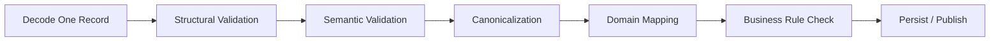

# learn-go-data-mapper-json-xml-protobuf-validation-part-011.md

# Part 011 — Streaming JSON Processing

> Seri: `learn-go-data-mapper-json-xml-protobuf-validation`  
> Part: `011 / 033`  
> Topik: Streaming JSON Processing  
> Target pembaca: Java software engineer yang ingin menguasai Go data boundary secara production-grade  
> Fokus: `encoding/json.Decoder`, token stream, large payload, NDJSON, partial decode, backpressure, observability, dan failure modelling

---

## 0. Posisi Part Ini dalam Seri

Part sebelumnya membahas **strict JSON decoding dan unknown field policy**. Itu penting untuk API request body yang kecil sampai menengah, misalnya:

- create request,
- update request,
- command payload,
- configuration payload,
- callback payload,
- webhook payload.

Namun di sistem production, JSON tidak selalu datang sebagai satu object kecil yang nyaman dipanggil dengan:

```go
json.Unmarshal(bodyBytes, &dto)
```

atau:

```go
json.NewDecoder(r).Decode(&dto)
```

Ada banyak kasus di mana JSON datang sebagai **stream**:

- file export berisi jutaan record,
- response API pihak ketiga yang besar,
- log ingestion berbasis NDJSON,
- event replay,
- data migration,
- batch validation,
- incremental ETL,
- message archive,
- audit export,
- large array response,
- pipe dari proses lain,
- gzip-compressed JSON stream,
- socket/HTTP body yang tidak boleh dibaca seluruhnya ke memory.

Part ini membahas cara berpikir dan implementasi **streaming JSON processing di Go**.

Inti besarnya:

> Streaming JSON bukan sekadar menghindari `io.ReadAll`. Streaming adalah cara mendesain ingestion pipeline yang punya batas memory, batas waktu, backpressure, cancellation, error location, partial success policy, dan observability yang jelas.

---

## 1. Tujuan Pembelajaran

Setelah menyelesaikan part ini, Anda harus mampu:

1. Membedakan **whole-document decoding** vs **streaming decoding**.
2. Mengetahui kapan `json.Unmarshal` cukup dan kapan harus menggunakan `json.Decoder`.
3. Memproses JSON array besar tanpa memuat seluruh array ke memory.
4. Memproses NDJSON / JSON Lines secara aman.
5. Menggunakan `Decoder.Token`, `Decoder.More`, `Decoder.InputOffset`, `Decoder.Buffered`, `Decoder.UseNumber`, dan `Decoder.DisallowUnknownFields` secara tepat.
6. Mendesain pipeline JSON ingestion dengan:
   - size limit,
   - record limit,
   - context cancellation,
   - backpressure,
   - partial failure policy,
   - offset-aware error,
   - telemetry.
7. Menghindari bug klasik seperti:
   - accidental full buffering,
   - duplicate trailing payload,
   - silent precision loss,
   - unbounded array processing,
   - scanner token limit,
   - logging payload sensitif,
   - partial mutation saat decode gagal.
8. Memahami hubungan `encoding/json` klasik dengan `encoding/json/jsontext` dan `encoding/json/v2` di era Go 1.26.x.

---

## 2. Baseline Faktual

Baseline yang dipakai dalam materi ini:

- Go 1.26.x sebagai target seri.
- `encoding/json` tetap API utama yang paling stabil dan umum dipakai di production.
- `encoding/json.Decoder` menyediakan decoding langsung dari `io.Reader`, token API, offset API, buffered unread data, `UseNumber`, dan `DisallowUnknownFields`.
- `encoding/json/jsontext` adalah package syntactic-layer untuk JSON; ia membedakan decoding grammar/token JSON dari semantic mapping JSON ke Go value.
- `encoding/json/v2` adalah package semantic-layer baru yang diperkenalkan sebagai eksperimen untuk memperbaiki beberapa kelemahan `encoding/json` v1.

Sumber resmi yang relevan:

- Go `encoding/json`: https://pkg.go.dev/encoding/json
- Go `encoding/json/jsontext`: https://pkg.go.dev/encoding/json/jsontext
- Go `encoding/json/v2`: https://pkg.go.dev/encoding/json/v2
- Go blog JSON v2 experimental API: https://go.dev/blog/jsonv2-exp
- Go 1.26 release notes: https://go.dev/doc/go1.26
- RFC 8259 JSON: https://www.rfc-editor.org/rfc/rfc8259

---

## 3. Mental Model: JSON sebagai Document vs JSON sebagai Stream

### 3.1 Whole-document model

Whole-document model berarti Anda menganggap payload JSON sebagai satu dokumen lengkap yang bisa ditampung di memory.

Contoh:

```json
{
  "case_id": "CASE-001",
  "status": "OPEN",
  "priority": "HIGH"
}
```

Untuk payload seperti ini, pendekatan umum:

```go
var req CreateCaseRequest
err := json.NewDecoder(r).Decode(&req)
```

atau:

```go
var req CreateCaseRequest
err := json.Unmarshal(data, &req)
```

Ini cocok bila:

- payload kecil,
- payload punya satu root object,
- seluruh data diperlukan sebelum diproses,
- failure harus atomic,
- latency decode rendah,
- batas body size jelas.

### 3.2 Streaming model

Streaming model berarti payload diproses sedikit demi sedikit.

Contoh large JSON array:

```json
[
  {"case_id":"CASE-001","status":"OPEN"},
  {"case_id":"CASE-002","status":"CLOSED"},
  {"case_id":"CASE-003","status":"PENDING"}
]
```

Untuk 3 record, ini tidak penting. Untuk 30 juta record, ini krusial.

Streaming memungkinkan Anda:

- membaca satu record,
- decode satu record,
- validate satu record,
- process satu record,
- buang dari memory,
- lanjut ke record berikutnya.

Memory menjadi relatif konstan terhadap jumlah record.

### 3.3 NDJSON / JSON Lines model

NDJSON adalah format umum untuk stream record JSON, satu JSON value per baris:

```jsonl
{"case_id":"CASE-001","status":"OPEN"}
{"case_id":"CASE-002","status":"CLOSED"}
{"case_id":"CASE-003","status":"PENDING"}
```

NDJSON bukan satu JSON document tunggal. Ia adalah sequence of JSON documents.

Ini sering lebih cocok untuk:

- log stream,
- event ingestion,
- data export,
- append-only archive,
- partial failure,
- resumable processing.

---

## 4. Diagram Besar Streaming JSON Pipeline

```mermaid
flowchart TD
    A[Source: HTTP Body / File / S3 Object / Pipe / Socket] --> B[Reader Wrapping]
    B --> B1[Size Limit]
    B1 --> B2[Compression Reader: gzip/zstd if any]
    B2 --> B3[Context-aware Reader]
    B3 --> C[JSON Decoder]
    C --> D{Format?}
    D -->|Single Object| E[Decode One DTO]
    D -->|Large Array| F[Token '[' then Decode Element Loop]
    D -->|NDJSON| G[Line Reader + Per-line Decode]
    D -->|Envelope| H[Token/RawMessage Partial Decode]
    F --> I[Per-record Validate]
    G --> I
    H --> I
    E --> I
    I --> J{Valid?}
    J -->|Yes| K[Process / Batch / Persist / Publish]
    J -->|No| L[Error Policy: Reject / Skip / Dead Letter / Report]
    K --> M[Metrics + Logs + Trace]
    L --> M
    M --> N[Checkpoint / Summary]
```

Key idea:

> JSON streaming bukan hanya decoder. Ia adalah ingestion pipeline.

---

## 5. Whole-document Decode vs Streaming Decode

### 5.1 `json.Unmarshal`

`json.Unmarshal` bekerja dari `[]byte`.

```go
var dst Payload
if err := json.Unmarshal(data, &dst); err != nil {
    return err
}
```

Kelebihan:

- sederhana,
- cocok untuk unit test,
- cocok untuk payload kecil,
- input sudah berupa byte slice,
- error handling straightforward.

Kekurangan:

- seluruh payload harus ada di memory,
- mudah membuat endpoint membaca body terlalu besar,
- kurang cocok untuk large array,
- tidak punya stream token API,
- tidak bisa incremental process.

### 5.2 `json.Decoder.Decode`

`json.Decoder` membaca dari `io.Reader`.

```go
var dst Payload
if err := json.NewDecoder(r).Decode(&dst); err != nil {
    return err
}
```

Kelebihan:

- tidak perlu `io.ReadAll`,
- bisa decode dari network/file/pipe,
- bisa strict unknown field dengan `DisallowUnknownFields`,
- bisa preserve number dengan `UseNumber`,
- punya token API,
- bisa streaming array.

Kekurangan:

- decoder dapat read-ahead dari reader,
- satu call `Decode` tidak otomatis memastikan tidak ada trailing JSON value,
- error handling perlu lebih disiplin,
- untuk NDJSON, perlu policy yang jelas.

### 5.3 `Decoder` bukan berarti otomatis streaming record

Ini jebakan penting.

Kode ini:

```go
var items []Item
err := json.NewDecoder(r).Decode(&items)
```

Memang membaca dari `io.Reader`, tetapi hasilnya tetap seluruh array masuk ke memory.

Streaming record berarti seperti ini:

```go
dec := json.NewDecoder(r)

// read opening '['
tok, err := dec.Token()
if err != nil {
    return err
}
if delim, ok := tok.(json.Delim); !ok || delim != '[' {
    return fmt.Errorf("expected array")
}

for dec.More() {
    var item Item
    if err := dec.Decode(&item); err != nil {
        return err
    }

    if err := process(item); err != nil {
        return err
    }
}

// read closing ']'
tok, err = dec.Token()
if err != nil {
    return err
}
if delim, ok := tok.(json.Delim); !ok || delim != ']' {
    return fmt.Errorf("expected end array")
}
```

Perbedaan besarnya:

- `Decode(&[]Item{})`: memory proportional to total record count.
- token + loop `Decode(&item)`: memory proportional to one record plus processing buffer.

---

## 6. Anatomy `json.Decoder`

`encoding/json.Decoder` punya beberapa method penting:

```go
dec := json.NewDecoder(r)
```

### 6.1 `Decode(v any) error`

Decode satu JSON value ke Go value.

```go
var req Request
err := dec.Decode(&req)
```

Satu JSON value bisa berupa:

- object,
- array,
- string,
- number,
- boolean,
- null.

Untuk API request, biasanya root value harus object.

### 6.2 `Token() (json.Token, error)`

Membaca token JSON berikutnya.

Token dapat berupa:

- `json.Delim('{')`,
- `json.Delim('}')`,
- `json.Delim('[')`,
- `json.Delim(']')`,
- `string`,
- `float64` atau `json.Number`,
- `bool`,
- `nil`.

Contoh:

```go
dec := json.NewDecoder(strings.NewReader(`{"a":1,"b":true}`))

for {
    tok, err := dec.Token()
    if err == io.EOF {
        break
    }
    if err != nil {
        return err
    }
    fmt.Printf("%T %v\n", tok, tok)
}
```

Output konseptual:

```text
json.Delim {
string a
float64 1
string b
bool true
json.Delim }
```

### 6.3 `More() bool`

`More()` melaporkan apakah masih ada elemen dalam array/object saat ini.

Pola array:

```go
tok, err := dec.Token()
if err != nil {
    return err
}
if tok != json.Delim('[') {
    return fmt.Errorf("expected array")
}

for dec.More() {
    var item Item
    if err := dec.Decode(&item); err != nil {
        return err
    }
}

_, err = dec.Token() // ']'
```

Pola object token-level:

```go
tok, err := dec.Token()
if err != nil {
    return err
}
if tok != json.Delim('{') {
    return fmt.Errorf("expected object")
}

for dec.More() {
    keyTok, err := dec.Token()
    if err != nil {
        return err
    }

    key, ok := keyTok.(string)
    if !ok {
        return fmt.Errorf("expected object key")
    }

    switch key {
    case "metadata":
        var md Metadata
        if err := dec.Decode(&md); err != nil {
            return err
        }
    default:
        var discard any
        if err := dec.Decode(&discard); err != nil {
            return err
        }
    }
}

_, err = dec.Token() // '}'
```

### 6.4 `UseNumber()`

Secara default, angka JSON yang masuk ke `interface{}` menjadi `float64`.

```go
var v any
json.Unmarshal([]byte(`{"id":9007199254740993}`), &v)
```

Jika decode ke `map[string]any`, angka besar bisa melewati `float64` dan kehilangan presisi jika diproses sebagai floating-point.

Dengan `UseNumber()`:

```go
dec := json.NewDecoder(r)
dec.UseNumber()

var v any
if err := dec.Decode(&v); err != nil {
    return err
}
```

Angka di interface akan menjadi `json.Number`, sehingga Anda bisa memutuskan apakah diparse sebagai `Int64`, `Float64`, decimal, atau string canonical.

### 6.5 `DisallowUnknownFields()`

Ketika decode ke struct, field object yang tidak match field struct akan dianggap error.

```go
dec := json.NewDecoder(r)
dec.DisallowUnknownFields()

var req Request
if err := dec.Decode(&req); err != nil {
    return err
}
```

Ini berguna untuk strict API request.

Namun perlu diingat:

- hanya relevan saat decode ke struct,
- tidak mendeteksi duplicate key,
- tidak otomatis menolak trailing JSON value,
- tidak otomatis membatasi ukuran payload,
- tidak otomatis membatasi jumlah record dalam stream.

### 6.6 `InputOffset()`

`InputOffset()` mengembalikan offset byte pada posisi decoder saat ini. Ini berguna untuk error reporting, observability, dan checkpoint kasar.

Contoh:

```go
before := dec.InputOffset()
var item Item
if err := dec.Decode(&item); err != nil {
    return fmt.Errorf("decode item near offset %d: %w", before, err)
}
```

`InputOffset` bukan substitute untuk business checkpoint. Ia hanya offset byte decoder, bukan ID record, bukan transaction id, dan bukan commit marker.

### 6.7 `Buffered()`

`Buffered()` mengembalikan reader untuk data yang sudah dibaca decoder dari underlying reader tetapi belum dikonsumsi oleh decoder.

Ini penting karena `json.Decoder` boleh read-ahead.

Contoh kasus:

- Anda decode satu JSON value dari stream yang setelahnya berisi data non-JSON.
- Anda ingin menyerahkan sisa stream ke parser lain.

Dalam API HTTP biasa, `Buffered()` jarang diperlukan. Dalam protocol hybrid atau parser multiphase, ia bisa penting.

---

## 7. Streaming JSON Array Besar

### 7.1 Problem statement

Misalnya ada payload:

```json
[
  {"case_id":"CASE-001","status":"OPEN"},
  {"case_id":"CASE-002","status":"CLOSED"}
]
```

Kita ingin memproses record satu per satu.

Domain DTO:

```go
type CaseImportRecord struct {
    CaseID string `json:"case_id"`
    Status string `json:"status"`
}
```

### 7.2 Implementasi naive yang buruk untuk payload besar

```go
func ImportCasesBad(r io.Reader) error {
    var records []CaseImportRecord
    if err := json.NewDecoder(r).Decode(&records); err != nil {
        return err
    }

    for _, rec := range records {
        if err := processCase(rec); err != nil {
            return err
        }
    }

    return nil
}
```

Masalah:

- seluruh array masuk memory,
- large payload bisa menyebabkan memory pressure,
- failure di record ke-900000 terjadi setelah seluruh decode selesai,
- tidak mudah memberi progress,
- tidak cocok untuk backpressure,
- tidak cocok untuk partial success.

### 7.3 Implementasi streaming array

```go
func ImportCasesStream(r io.Reader) error {
    dec := json.NewDecoder(r)
    dec.DisallowUnknownFields()

    tok, err := dec.Token()
    if err != nil {
        return fmt.Errorf("read opening token: %w", err)
    }

    if delim, ok := tok.(json.Delim); !ok || delim != '[' {
        return fmt.Errorf("expected JSON array")
    }

    var index int64
    for dec.More() {
        offset := dec.InputOffset()

        var rec CaseImportRecord
        if err := dec.Decode(&rec); err != nil {
            return fmt.Errorf("decode record index=%d offset=%d: %w", index, offset, err)
        }

        if err := validateCaseImportRecord(rec); err != nil {
            return fmt.Errorf("validate record index=%d offset=%d: %w", index, offset, err)
        }

        if err := processCase(rec); err != nil {
            return fmt.Errorf("process record index=%d offset=%d: %w", index, offset, err)
        }

        index++
    }

    tok, err = dec.Token()
    if err != nil {
        return fmt.Errorf("read closing token: %w", err)
    }

    if delim, ok := tok.(json.Delim); !ok || delim != ']' {
        return fmt.Errorf("expected end of JSON array")
    }

    // Optional: reject trailing non-whitespace JSON value.
    var extra any
    if err := dec.Decode(&extra); err != io.EOF {
        if err == nil {
            return fmt.Errorf("unexpected trailing JSON value after array")
        }
        return fmt.Errorf("read trailing data: %w", err)
    }

    return nil
}
```

### 7.4 Generic streaming array helper

Go generics berguna untuk membuat helper reusable tanpa reflection-heavy mapper.

```go
type StreamArrayOptions struct {
    DisallowUnknownFields bool
    UseNumber            bool
    MaxRecords           int64
}

func DecodeJSONArrayStream[T any](
    r io.Reader,
    opts StreamArrayOptions,
    handle func(index int64, offset int64, item T) error,
) error {
    if handle == nil {
        return fmt.Errorf("handle function is nil")
    }

    dec := json.NewDecoder(r)
    if opts.DisallowUnknownFields {
        dec.DisallowUnknownFields()
    }
    if opts.UseNumber {
        dec.UseNumber()
    }

    tok, err := dec.Token()
    if err != nil {
        return fmt.Errorf("read opening token: %w", err)
    }
    if delim, ok := tok.(json.Delim); !ok || delim != '[' {
        return fmt.Errorf("expected JSON array")
    }

    var index int64
    for dec.More() {
        if opts.MaxRecords > 0 && index >= opts.MaxRecords {
            return fmt.Errorf("record limit exceeded: max=%d", opts.MaxRecords)
        }

        offset := dec.InputOffset()

        var item T
        if err := dec.Decode(&item); err != nil {
            return fmt.Errorf("decode array item index=%d offset=%d: %w", index, offset, err)
        }

        if err := handle(index, offset, item); err != nil {
            return fmt.Errorf("handle array item index=%d offset=%d: %w", index, offset, err)
        }

        index++
    }

    tok, err = dec.Token()
    if err != nil {
        return fmt.Errorf("read closing token: %w", err)
    }
    if delim, ok := tok.(json.Delim); !ok || delim != ']' {
        return fmt.Errorf("expected closing array delimiter")
    }

    var extra any
    if err := dec.Decode(&extra); err != io.EOF {
        if err == nil {
            return fmt.Errorf("unexpected trailing JSON value")
        }
        return fmt.Errorf("decode trailing data: %w", err)
    }

    return nil
}
```

Usage:

```go
err := DecodeJSONArrayStream[CaseImportRecord](
    r,
    StreamArrayOptions{
        DisallowUnknownFields: true,
        MaxRecords:           1_000_000,
    },
    func(index int64, offset int64, rec CaseImportRecord) error {
        if err := validateCaseImportRecord(rec); err != nil {
            return err
        }
        return processCase(rec)
    },
)
```

### 7.5 Why helper ini tidak return channel?

Banyak orang ingin membuat API seperti:

```go
func StreamItems[T any](r io.Reader) <-chan T
```

Ini terlihat elegan, tetapi sering buruk untuk production karena:

- error channel terpisah,
- cancellation tidak jelas,
- backpressure bisa tersembunyi,
- lifecycle reader tidak jelas,
- goroutine leak mudah terjadi,
- caller sering lupa drain channel,
- error index/offset hilang.

Callback synchronous lebih eksplisit:

```go
func(index, offset int64, item T) error
```

Kelebihannya:

- error propagation natural,
- backpressure natural,
- tidak perlu goroutine,
- tidak ada channel lifecycle,
- offset/index mudah dibawa,
- transaction/batch control lebih mudah.

Jika perlu concurrency, tambahkan secara sadar di layer processing, bukan di decoder abstraction.

---

## 8. NDJSON / JSON Lines Processing

### 8.1 Apa itu NDJSON?

NDJSON adalah stream di mana setiap baris adalah satu JSON value independen.

Contoh:

```jsonl
{"event_id":"evt-001","type":"case.created"}
{"event_id":"evt-002","type":"case.updated"}
{"event_id":"evt-003","type":"case.closed"}
```

NDJSON cocok untuk:

- log,
- event archive,
- append-only data,
- stream processing,
- partial failure,
- line-based tooling,
- Unix pipeline,
- ingestion besar.

### 8.2 NDJSON bukan JSON array

JSON array:

```json
[
  {"id":"1"},
  {"id":"2"}
]
```

NDJSON:

```jsonl
{"id":"1"}
{"id":"2"}
```

Konsekuensi:

- JSON array punya satu root document.
- NDJSON punya banyak JSON document kecil.
- JSON array gagal parse jika closing `]` hilang.
- NDJSON bisa diproses sampai baris terakhir yang valid.
- JSON array lebih standar untuk API response biasa.
- NDJSON lebih cocok untuk stream ingestion.

### 8.3 Implementasi NDJSON dengan `bufio.Scanner`: hati-hati limit token

Contoh sederhana:

```go
func ProcessNDJSONScanner(r io.Reader) error {
    scanner := bufio.NewScanner(r)
    scanner.Buffer(make([]byte, 0, 64*1024), 10*1024*1024)

    var lineNo int64
    for scanner.Scan() {
        lineNo++
        line := scanner.Bytes()
        if len(bytes.TrimSpace(line)) == 0 {
            continue
        }

        var ev Event
        if err := json.Unmarshal(line, &ev); err != nil {
            return fmt.Errorf("decode line=%d: %w", lineNo, err)
        }

        if err := processEvent(ev); err != nil {
            return fmt.Errorf("process line=%d: %w", lineNo, err)
        }
    }

    if err := scanner.Err(); err != nil {
        return fmt.Errorf("scan NDJSON: %w", err)
    }

    return nil
}
```

Penting:

- default `bufio.Scanner` punya token limit yang kecil untuk record besar,
- gunakan `scanner.Buffer` bila record bisa besar,
- untuk record sangat besar, lebih baik gunakan `bufio.Reader.ReadBytes('\n')` atau `ReadSlice` dengan handling buffer.

### 8.4 Implementasi NDJSON dengan `bufio.Reader`

```go
type NDJSONOptions struct {
    MaxLineBytes int
    MaxRecords   int64
    StrictObject  bool
    UseNumber     bool
}

func DecodeNDJSON[T any](
    r io.Reader,
    opts NDJSONOptions,
    handle func(lineNo int64, item T) error,
) error {
    if handle == nil {
        return fmt.Errorf("handle function is nil")
    }

    br := bufio.NewReader(r)

    var lineNo int64
    for {
        raw, err := br.ReadBytes('\n')
        if len(raw) > 0 {
            lineNo++

            if opts.MaxRecords > 0 && lineNo > opts.MaxRecords {
                return fmt.Errorf("record limit exceeded: max=%d", opts.MaxRecords)
            }

            if opts.MaxLineBytes > 0 && len(raw) > opts.MaxLineBytes {
                return fmt.Errorf("line %d exceeds max size: size=%d max=%d", lineNo, len(raw), opts.MaxLineBytes)
            }

            line := bytes.TrimSpace(raw)
            if len(line) == 0 {
                if err == io.EOF {
                    break
                }
                if err != nil {
                    return fmt.Errorf("read line %d: %w", lineNo, err)
                }
                continue
            }

            var item T
            if decodeErr := decodeOneJSONLine(line, opts, &item); decodeErr != nil {
                return fmt.Errorf("decode line=%d: %w", lineNo, decodeErr)
            }

            if handleErr := handle(lineNo, item); handleErr != nil {
                return fmt.Errorf("handle line=%d: %w", lineNo, handleErr)
            }
        }

        if err == io.EOF {
            break
        }
        if err != nil {
            return fmt.Errorf("read NDJSON: %w", err)
        }
    }

    return nil
}

func decodeOneJSONLine[T any](line []byte, opts NDJSONOptions, dst *T) error {
    dec := json.NewDecoder(bytes.NewReader(line))
    if opts.StrictObject {
        dec.DisallowUnknownFields()
    }
    if opts.UseNumber {
        dec.UseNumber()
    }

    if err := dec.Decode(dst); err != nil {
        return err
    }

    var extra any
    if err := dec.Decode(&extra); err != io.EOF {
        if err == nil {
            return fmt.Errorf("unexpected trailing JSON value")
        }
        return err
    }

    return nil
}
```

Usage:

```go
err := DecodeNDJSON[AuditEvent](r, NDJSONOptions{
    MaxLineBytes: 1 << 20, // 1 MiB per line
    MaxRecords:   5_000_000,
    StrictObject:  true,
}, func(lineNo int64, ev AuditEvent) error {
    if err := validateAuditEvent(ev); err != nil {
        return err
    }
    return storeAuditEvent(ev)
})
```

### 8.5 NDJSON partial failure policy

Untuk NDJSON, sering kali Anda tidak ingin seluruh import gagal karena satu baris buruk.

Ada beberapa policy:

| Policy | Makna | Cocok Untuk |
|---|---|---|
| fail-fast | error pertama menghentikan proses | command penting, financial import |
| skip-invalid | baris invalid dicatat lalu dilewati | log ingestion, non-critical analytics |
| dead-letter | record invalid masuk error sink | event processing, audit ingestion |
| threshold | toleransi N error lalu stop | batch import besar |
| report-only | validasi semua, tidak persist | preflight import |

Contoh policy threshold:

```go
type NDJSONFailurePolicy struct {
    MaxErrors int
    OnError   func(lineNo int64, raw []byte, err error) error
}
```

Namun hati-hati: bila data punya konsekuensi hukum/regulasi, `skip-invalid` tanpa audit trail adalah anti-pattern.

---

## 9. Single Object Streaming dengan Strictness yang Benar

Untuk HTTP API request kecil, streaming decoder tetap berguna karena menghindari `io.ReadAll`.

### 9.1 Strict decode helper untuk single object

```go
type DecodeJSONOptions struct {
    MaxBytes              int64
    DisallowUnknownFields bool
    UseNumber             bool
}

func DecodeSingleJSON[T any](r io.Reader, opts DecodeJSONOptions, dst *T) error {
    if dst == nil {
        return fmt.Errorf("destination is nil")
    }

    if opts.MaxBytes > 0 {
        r = io.LimitReader(r, opts.MaxBytes+1)
    }

    dec := json.NewDecoder(r)
    if opts.DisallowUnknownFields {
        dec.DisallowUnknownFields()
    }
    if opts.UseNumber {
        dec.UseNumber()
    }

    if err := dec.Decode(dst); err != nil {
        return fmt.Errorf("decode JSON: %w", err)
    }

    if opts.MaxBytes > 0 && dec.InputOffset() > opts.MaxBytes {
        return fmt.Errorf("JSON body exceeds max size: max=%d", opts.MaxBytes)
    }

    var extra any
    if err := dec.Decode(&extra); err != io.EOF {
        if err == nil {
            return fmt.Errorf("unexpected trailing JSON value")
        }
        return fmt.Errorf("decode trailing JSON: %w", err)
    }

    return nil
}
```

Catatan penting:

- `io.LimitReader` sendiri tidak memberi error saat limit terlampaui; ia hanya berhenti membaca.
- Untuk API HTTP, lebih umum menggunakan `http.MaxBytesReader` di handler server karena dapat memberi error lebih jelas dan menutup connection behavior sesuai net/http.
- `InputOffset` bukan cara sempurna untuk mendeteksi size semua kasus karena decoder bisa buffer/read-ahead; untuk strict body size, wrapper reader yang menghitung byte lebih baik.

### 9.2 Counting reader untuk size enforcement

```go
type CountingLimitReader struct {
    R       io.Reader
    N       int64
    Max     int64
    Exceed  bool
}

func (r *CountingLimitReader) Read(p []byte) (int, error) {
    if r.Max > 0 && r.N >= r.Max {
        r.Exceed = true
        return 0, fmt.Errorf("read limit exceeded: max=%d", r.Max)
    }

    if r.Max > 0 {
        remain := r.Max - r.N
        if int64(len(p)) > remain {
            p = p[:remain]
        }
    }

    n, err := r.R.Read(p)
    r.N += int64(n)
    return n, err
}
```

Namun untuk HTTP request, pilih `http.MaxBytesReader` bila tersedia di handler.

---

## 10. Token-Level Processing

Kadang Anda tidak ingin decode seluruh object ke struct. Anda ingin membaca beberapa field saja.

Contoh payload:

```json
{
  "request_id": "req-123",
  "type": "case.imported",
  "metadata": {
    "source": "partner-a"
  },
  "payload": {
    "case_id": "CASE-001",
    "status": "OPEN"
  }
}
```

Anda ingin membaca `type`, lalu memilih struct payload berdasarkan type.

### 10.1 Envelope dengan `json.RawMessage`

Pendekatan paling sederhana:

```go
type Envelope struct {
    RequestID string          `json:"request_id"`
    Type      string          `json:"type"`
    Metadata  Metadata        `json:"metadata"`
    Payload   json.RawMessage `json:"payload"`
}

func DecodeEnvelope(r io.Reader) error {
    var env Envelope
    dec := json.NewDecoder(r)
    dec.DisallowUnknownFields()

    if err := dec.Decode(&env); err != nil {
        return err
    }

    switch env.Type {
    case "case.imported":
        var p CaseImportedPayload
        if err := json.Unmarshal(env.Payload, &p); err != nil {
            return fmt.Errorf("decode case.imported payload: %w", err)
        }
        return processCaseImported(env, p)

    case "case.closed":
        var p CaseClosedPayload
        if err := json.Unmarshal(env.Payload, &p); err != nil {
            return fmt.Errorf("decode case.closed payload: %w", err)
        }
        return processCaseClosed(env, p)

    default:
        return fmt.Errorf("unknown event type %q", env.Type)
    }
}
```

Kelebihan:

- sederhana,
- cocok untuk envelope ukuran normal,
- payload bisa decoded setelah type diketahui,
- raw payload bisa masuk dead-letter tanpa remarshal.

Kekurangan:

- `Payload` disimpan sebagai bytes di memory,
- tidak ideal jika payload sangat besar,
- strict unknown field pada nested payload perlu decoder kedua.

### 10.2 Strict decode RawMessage payload

```go
func DecodeRawStrict[T any](raw json.RawMessage, dst *T) error {
    dec := json.NewDecoder(bytes.NewReader(raw))
    dec.DisallowUnknownFields()

    if err := dec.Decode(dst); err != nil {
        return err
    }

    var extra any
    if err := dec.Decode(&extra); err != io.EOF {
        if err == nil {
            return fmt.Errorf("unexpected trailing JSON value")
        }
        return err
    }

    return nil
}
```

Usage:

```go
var p CaseImportedPayload
if err := DecodeRawStrict(env.Payload, &p); err != nil {
    return fmt.Errorf("decode payload type=%s: %w", env.Type, err)
}
```

### 10.3 Token-level envelope parser

Untuk payload sangat besar, Anda bisa membaca field envelope secara token-level.

```go
func DecodeEnvelopeTokenLevel(r io.Reader) error {
    dec := json.NewDecoder(r)

    tok, err := dec.Token()
    if err != nil {
        return err
    }
    if tok != json.Delim('{') {
        return fmt.Errorf("expected object")
    }

    var eventType string
    var requestID string

    for dec.More() {
        keyTok, err := dec.Token()
        if err != nil {
            return err
        }
        key, ok := keyTok.(string)
        if !ok {
            return fmt.Errorf("expected string key")
        }

        switch key {
        case "request_id":
            if err := dec.Decode(&requestID); err != nil {
                return fmt.Errorf("decode request_id: %w", err)
            }

        case "type":
            if err := dec.Decode(&eventType); err != nil {
                return fmt.Errorf("decode type: %w", err)
            }

        case "payload":
            if eventType == "" {
                // If payload can appear before type, token-level dispatch becomes harder.
                // You may need RawMessage buffering or require field order by contract.
                var raw json.RawMessage
                if err := dec.Decode(&raw); err != nil {
                    return fmt.Errorf("buffer payload before type: %w", err)
                }
                return dispatchRawPayload(requestID, eventType, raw)
            }

            if err := decodePayloadByType(dec, requestID, eventType); err != nil {
                return err
            }

        default:
            // For strict envelope, reject unknown key.
            return fmt.Errorf("unknown envelope field %q", key)
        }
    }

    tok, err = dec.Token()
    if err != nil {
        return err
    }
    if tok != json.Delim('}') {
        return fmt.Errorf("expected end object")
    }

    return nil
}
```

Trade-off:

- Lebih hemat memory untuk payload besar.
- Lebih kompleks.
- Field order bisa menjadi isu jika type muncul setelah payload.
- JSON object secara semantic tidak seharusnya bergantung pada order key.

Karena itu, untuk envelope event, desain yang lebih baik adalah:

```json
{
  "type": "case.imported",
  "request_id": "req-123",
  "payload": {...}
}
```

Namun jangan terlalu bergantung pada order field kecuali contract menyebutnya eksplisit. Banyak JSON producer bisa mengubah order.

---

## 11. Partial Decode untuk Large Object

Kadang root object besar, tetapi Anda hanya butuh satu field.

Contoh:

```json
{
  "metadata": {...},
  "items": [ ... millions of records ... ],
  "summary": {...}
}
```

Anda ingin stream field `items` saja.

### 11.1 Token-level locate array field

```go
func ProcessItemsField(r io.Reader) error {
    dec := json.NewDecoder(r)
    dec.DisallowUnknownFields()

    tok, err := dec.Token()
    if err != nil {
        return err
    }
    if tok != json.Delim('{') {
        return fmt.Errorf("expected root object")
    }

    foundItems := false

    for dec.More() {
        keyTok, err := dec.Token()
        if err != nil {
            return err
        }

        key, ok := keyTok.(string)
        if !ok {
            return fmt.Errorf("expected object key")
        }

        switch key {
        case "metadata":
            var md Metadata
            if err := dec.Decode(&md); err != nil {
                return fmt.Errorf("decode metadata: %w", err)
            }
            if err := validateMetadata(md); err != nil {
                return err
            }

        case "items":
            foundItems = true
            if err := processArrayAtCurrentPosition[ImportItem](dec, processImportItem); err != nil {
                return err
            }

        case "summary":
            var summary Summary
            if err := dec.Decode(&summary); err != nil {
                return fmt.Errorf("decode summary: %w", err)
            }

        default:
            return fmt.Errorf("unknown root field %q", key)
        }
    }

    tok, err = dec.Token()
    if err != nil {
        return err
    }
    if tok != json.Delim('}') {
        return fmt.Errorf("expected end root object")
    }

    if !foundItems {
        return fmt.Errorf("missing required field items")
    }

    return nil
}

func processArrayAtCurrentPosition[T any](
    dec *json.Decoder,
    handle func(index int64, item T) error,
) error {
    tok, err := dec.Token()
    if err != nil {
        return err
    }
    if tok != json.Delim('[') {
        return fmt.Errorf("expected array")
    }

    var index int64
    for dec.More() {
        var item T
        if err := dec.Decode(&item); err != nil {
            return fmt.Errorf("decode item index=%d offset=%d: %w", index, dec.InputOffset(), err)
        }
        if err := handle(index, item); err != nil {
            return fmt.Errorf("handle item index=%d: %w", index, err)
        }
        index++
    }

    tok, err = dec.Token()
    if err != nil {
        return err
    }
    if tok != json.Delim(']') {
        return fmt.Errorf("expected end array")
    }

    return nil
}
```

### 11.2 Skip unknown value tanpa decode ke map besar

Kalau Anda ingin skip field unknown/unused yang mungkin besar, decode ke `any` bisa tetap memuat seluruh subtree ke memory.

```go
var discard any
_ = dec.Decode(&discard)
```

Untuk payload besar, ini bisa buruk.

Anda bisa menulis token-level skipper.

```go
func SkipJSONValue(dec *json.Decoder) error {
    tok, err := dec.Token()
    if err != nil {
        return err
    }

    switch d := tok.(type) {
    case json.Delim:
        switch d {
        case '{':
            for dec.More() {
                // key
                if _, err := dec.Token(); err != nil {
                    return err
                }
                // value
                if err := SkipJSONValue(dec); err != nil {
                    return err
                }
            }
            end, err := dec.Token()
            if err != nil {
                return err
            }
            if end != json.Delim('}') {
                return fmt.Errorf("expected end object")
            }
            return nil

        case '[':
            for dec.More() {
                if err := SkipJSONValue(dec); err != nil {
                    return err
                }
            }
            end, err := dec.Token()
            if err != nil {
                return err
            }
            if end != json.Delim(']') {
                return fmt.Errorf("expected end array")
            }
            return nil

        default:
            return fmt.Errorf("unexpected delimiter %q", d)
        }

    default:
        // primitive already consumed
        return nil
    }
}
```

Catatan:

- Ini berguna bila unknown/unused value bisa sangat besar.
- Untuk strict API, biasanya unknown field harus ditolak, bukan diskip.
- Untuk forward-compatible event consumer, skip unknown extension field bisa valid.

---

## 12. Error Location: Offset, Line, Column

`json.SyntaxError` punya `Offset`. `json.Decoder.InputOffset()` juga memberi posisi decoder.

Namun manusia lebih mudah membaca `line:column`.

### 12.1 Mengubah byte offset menjadi line/column

Jika input file bisa seek atau Anda punya prefix bytes, Anda bisa menghitung line/column.

Untuk streaming murni, Anda tidak selalu punya seluruh payload. Anda bisa menggunakan counting reader yang menyimpan rolling buffer.

Contoh sederhana untuk `[]byte`:

```go
type Location struct {
    Line   int
    Column int
}

func OffsetToLineColumn(data []byte, offset int64) Location {
    if offset < 0 {
        offset = 0
    }
    if offset > int64(len(data)) {
        offset = int64(len(data))
    }

    line := 1
    col := 1
    for i := int64(0); i < offset; i++ {
        if data[i] == '\n' {
            line++
            col = 1
        } else {
            col++
        }
    }

    return Location{Line: line, Column: col}
}
```

Untuk file besar, jangan baca seluruh file hanya untuk line/column setiap error. Lebih baik:

- catat `offset`,
- catat `record index` atau `lineNo`,
- catat `external record id` bila sudah decoded,
- gunakan preprocessing line index bila memang perlu UI error report.

### 12.2 Error envelope untuk ingestion

```go
type IngestionError struct {
    Stage    string
    Index    *int64
    Line     *int64
    Offset   *int64
    Field    string
    Code     string
    Message  string
    Cause    error
}

func (e *IngestionError) Error() string {
    var parts []string
    if e.Stage != "" {
        parts = append(parts, "stage="+e.Stage)
    }
    if e.Index != nil {
        parts = append(parts, fmt.Sprintf("index=%d", *e.Index))
    }
    if e.Line != nil {
        parts = append(parts, fmt.Sprintf("line=%d", *e.Line))
    }
    if e.Offset != nil {
        parts = append(parts, fmt.Sprintf("offset=%d", *e.Offset))
    }
    if e.Field != "" {
        parts = append(parts, "field="+e.Field)
    }
    if e.Code != "" {
        parts = append(parts, "code="+e.Code)
    }
    if e.Message != "" {
        parts = append(parts, "message="+e.Message)
    }
    if e.Cause != nil {
        parts = append(parts, "cause="+e.Cause.Error())
    }
    return strings.Join(parts, " ")
}

func (e *IngestionError) Unwrap() error {
    return e.Cause
}
```

Use error ini untuk membedakan:

- decode error,
- validation error,
- process error,
- persistence error,
- publish error,
- checkpoint error.

---

## 13. Backpressure dan Cancellation

### 13.1 Backpressure natural dengan synchronous loop

Streaming loop synchronous:

```go
for dec.More() {
    var item Item
    if err := dec.Decode(&item); err != nil {
        return err
    }
    if err := process(item); err != nil {
        return err
    }
}
```

Pola ini punya backpressure natural:

- decoder tidak membaca record berikutnya sebelum processing selesai,
- memory tidak tumbuh karena queue internal,
- throughput mengikuti downstream.

Ini sederhana dan sering cukup.

### 13.2 Kapan perlu concurrency?

Concurrency berguna bila:

- decode murah, processing mahal,
- processing I/O-bound,
- record independen,
- order tidak penting atau bisa direkonstruksi,
- failure policy jelas,
- downstream bisa menerima parallelism.

Concurrency berbahaya bila:

- record order penting,
- transaction harus atomic,
- downstream punya limit kecil,
- error threshold rumit,
- memory queue tidak dibatasi,
- cancellation tidak rapi.

### 13.3 Worker pool dengan bounded queue

```go
type WorkItem[T any] struct {
    Index  int64
    Offset int64
    Value  T
}

func ProcessJSONArrayConcurrent[T any](
    ctx context.Context,
    r io.Reader,
    workers int,
    queueSize int,
    decodeOpts StreamArrayOptions,
    handle func(context.Context, WorkItem[T]) error,
) error {
    if workers <= 0 {
        return fmt.Errorf("workers must be positive")
    }
    if queueSize <= 0 {
        return fmt.Errorf("queueSize must be positive")
    }

    ctx, cancel := context.WithCancel(ctx)
    defer cancel()

    jobs := make(chan WorkItem[T], queueSize)
    errCh := make(chan error, 1)

    var wg sync.WaitGroup
    for i := 0; i < workers; i++ {
        wg.Add(1)
        go func() {
            defer wg.Done()
            for item := range jobs {
                if err := handle(ctx, item); err != nil {
                    select {
                    case errCh <- err:
                        cancel()
                    default:
                    }
                    return
                }
            }
        }()
    }

    decodeErr := DecodeJSONArrayStream[T](r, decodeOpts, func(index int64, offset int64, item T) error {
        work := WorkItem[T]{Index: index, Offset: offset, Value: item}

        select {
        case <-ctx.Done():
            return ctx.Err()
        case jobs <- work:
            return nil
        }
    })

    close(jobs)
    wg.Wait()

    select {
    case err := <-errCh:
        if decodeErr != nil {
            return fmt.Errorf("decode error=%v; worker error=%w", decodeErr, err)
        }
        return err
    default:
    }

    return decodeErr
}
```

Poin penting:

- queue dibatasi,
- context membatalkan decode saat worker gagal,
- error channel buffered satu supaya tidak deadlock,
- jobs ditutup setelah decode selesai,
- `json.Decoder` tetap hanya dipakai satu goroutine.

### 13.4 Jangan decode dari reader yang sama di banyak goroutine

`json.Decoder` dan underlying `io.Reader` umumnya tidak dipakai concurrent.

Anti-pattern:

```go
for i := 0; i < workers; i++ {
    go func() {
        var item Item
        _ = dec.Decode(&item) // bad: concurrent decoder access
    }()
}
```

Benar:

- satu goroutine decode berurutan,
- kirim record ke bounded worker queue,
- worker process record.

---

## 14. Batch Processing dalam Streaming

Streaming satu record per process bisa terlalu lambat jika downstream lebih efisien dalam batch.

Contoh:

- insert database batch 1000 rows,
- publish Kafka batch,
- validate external service batch,
- write parquet batch,
- bulk indexing OpenSearch.

### 14.1 Batch helper

```go
type BatchProcessor[T any] struct {
    Size    int
    Buffer  []T
    Process func([]T) error
}

func NewBatchProcessor[T any](size int, process func([]T) error) (*BatchProcessor[T], error) {
    if size <= 0 {
        return nil, fmt.Errorf("batch size must be positive")
    }
    if process == nil {
        return nil, fmt.Errorf("process function is nil")
    }
    return &BatchProcessor[T]{
        Size:    size,
        Buffer:  make([]T, 0, size),
        Process: process,
    }, nil
}

func (b *BatchProcessor[T]) Add(item T) error {
    b.Buffer = append(b.Buffer, item)
    if len(b.Buffer) >= b.Size {
        return b.Flush()
    }
    return nil
}

func (b *BatchProcessor[T]) Flush() error {
    if len(b.Buffer) == 0 {
        return nil
    }

    batch := b.Buffer
    if err := b.Process(batch); err != nil {
        return err
    }

    var zero T
    for i := range b.Buffer {
        b.Buffer[i] = zero
    }
    b.Buffer = b.Buffer[:0]
    return nil
}
```

Usage:

```go
batcher, err := NewBatchProcessor[CaseImportRecord](1000, insertCaseBatch)
if err != nil {
    return err
}

err = DecodeJSONArrayStream[CaseImportRecord](r, StreamArrayOptions{
    DisallowUnknownFields: true,
    MaxRecords:           10_000_000,
}, func(index int64, offset int64, rec CaseImportRecord) error {
    if err := validateCaseImportRecord(rec); err != nil {
        return err
    }
    return batcher.Add(rec)
})
if err != nil {
    return err
}

if err := batcher.Flush(); err != nil {
    return err
}
```

### 14.2 Batch failure semantics

Batching mengubah failure model.

Jika batch insert 1000 record gagal, pertanyaannya:

- record mana yang gagal?
- apakah seluruh batch rollback?
- apakah bisa split batch menjadi smaller batch?
- apakah bisa dead-letter per record?
- apakah record valid tapi duplicate dianggap success?
- apakah idempotency key ada?

Untuk sistem serius, tentukan policy sebelum implementasi.

---

## 15. Streaming dengan Compression

Payload besar sering dikompresi.

Contoh gzip:

```go
func ProcessGzipJSON(r io.Reader) error {
    gz, err := gzip.NewReader(r)
    if err != nil {
        return fmt.Errorf("create gzip reader: %w", err)
    }
    defer gz.Close()

    return DecodeJSONArrayStream[CaseImportRecord](gz, StreamArrayOptions{
        DisallowUnknownFields: true,
        MaxRecords:           5_000_000,
    }, func(index int64, offset int64, rec CaseImportRecord) error {
        return processCase(rec)
    })
}
```

Important:

- compressed size limit tidak sama dengan decompressed size limit,
- zip bomb / gzip bomb risk harus dipikirkan,
- batasi decompressed bytes juga,
- jangan hanya percaya `Content-Length`,
- gunakan request timeout / context deadline.

Contoh decompressed limit:

```go
limited := io.LimitReader(gz, maxDecompressedBytes+1)
```

Namun seperti dibahas sebelumnya, `LimitReader` perlu dikombinasikan dengan detection bahwa limit terlampaui.

---

## 16. HTTP Streaming Ingestion

### 16.1 Handler import JSON array

```go
func ImportCasesHandler(w http.ResponseWriter, r *http.Request) {
    const maxBodyBytes = 500 << 20 // 500 MiB

    r.Body = http.MaxBytesReader(w, r.Body, maxBodyBytes)
    defer r.Body.Close()

    ctx := r.Context()

    summary := ImportSummary{}

    err := DecodeJSONArrayStream[CaseImportRecord](r.Body, StreamArrayOptions{
        DisallowUnknownFields: true,
        MaxRecords:           5_000_000,
    }, func(index int64, offset int64, rec CaseImportRecord) error {
        select {
        case <-ctx.Done():
            return ctx.Err()
        default:
        }

        if err := validateCaseImportRecord(rec); err != nil {
            summary.Invalid++
            return fmt.Errorf("validation failed index=%d offset=%d: %w", index, offset, err)
        }

        if err := processCase(rec); err != nil {
            return fmt.Errorf("process failed index=%d offset=%d: %w", index, offset, err)
        }

        summary.Accepted++
        return nil
    })

    if err != nil {
        writeJSONError(w, http.StatusBadRequest, "INVALID_IMPORT", err.Error())
        return
    }

    writeJSON(w, http.StatusAccepted, summary)
}
```

### 16.2 Handler NDJSON

```go
func ImportEventsNDJSONHandler(w http.ResponseWriter, r *http.Request) {
    const maxBodyBytes = 1 << 30 // 1 GiB

    r.Body = http.MaxBytesReader(w, r.Body, maxBodyBytes)
    defer r.Body.Close()

    err := DecodeNDJSON[AuditEvent](r.Body, NDJSONOptions{
        MaxLineBytes: 1 << 20,
        MaxRecords:   10_000_000,
        StrictObject:  true,
    }, func(lineNo int64, ev AuditEvent) error {
        if err := validateAuditEvent(ev); err != nil {
            return err
        }
        return processAuditEvent(r.Context(), ev)
    })

    if err != nil {
        writeJSONError(w, http.StatusBadRequest, "INVALID_NDJSON", err.Error())
        return
    }

    w.WriteHeader(http.StatusAccepted)
}
```

### 16.3 Request timeout

Large import endpoint harus punya timeout yang realistis.

Layer yang bisa punya timeout:

- load balancer,
- reverse proxy,
- Go server `ReadTimeout`, `ReadHeaderTimeout`, `WriteTimeout`,
- request context,
- database timeout,
- downstream API timeout,
- background job timeout.

Untuk import yang sangat besar, lebih baik pattern:

1. upload file,
2. return job id,
3. process async worker,
4. expose progress endpoint,
5. expose error report.

Jangan memaksa semua large ingestion selesai dalam satu HTTP request synchronous jika durasinya menit sampai jam.

---

## 17. Streaming API Response

Streaming tidak hanya untuk input. Response juga bisa streaming.

### 17.1 Streaming JSON array response

```go
func StreamCasesHandler(w http.ResponseWriter, r *http.Request) {
    w.Header().Set("Content-Type", "application/json")

    flusher, _ := w.(http.Flusher)

    enc := json.NewEncoder(w)

    if _, err := w.Write([]byte("[")); err != nil {
        return
    }

    first := true
    err := queryCases(r.Context(), func(c CaseResponse) error {
        if !first {
            if _, err := w.Write([]byte(",")); err != nil {
                return err
            }
        }
        first = false

        if err := enc.Encode(c); err != nil {
            return err
        }

        if flusher != nil {
            flusher.Flush()
        }

        return nil
    })

    if err != nil {
        // Problem: once response has started, cannot cleanly change status code.
        // For this reason, streaming JSON array response is tricky.
        return
    }

    _, _ = w.Write([]byte("]"))
}
```

Masalah:

- jika error terjadi setelah beberapa item dikirim, response JSON bisa tidak selesai,
- status code sudah terlanjur 200,
- client harus siap partial stream,
- observability harus mencatat aborted stream.

### 17.2 NDJSON response lebih cocok untuk streaming

```go
func StreamEventsNDJSONHandler(w http.ResponseWriter, r *http.Request) {
    w.Header().Set("Content-Type", "application/x-ndjson")

    flusher, _ := w.(http.Flusher)
    enc := json.NewEncoder(w)

    err := queryEvents(r.Context(), func(ev EventResponse) error {
        if err := enc.Encode(ev); err != nil {
            return err
        }
        if flusher != nil {
            flusher.Flush()
        }
        return nil
    })

    if err != nil {
        // Still cannot change status once started.
        // But each previous line remains a valid JSON value.
        return
    }
}
```

NDJSON lebih baik untuk streaming response karena setiap line independent.

Trade-off:

- browser/client umum mungkin lebih familiar dengan array JSON,
- OpenAPI support untuk NDJSON perlu dokumentasi eksplisit,
- consumer harus parse line-by-line.

---

## 18. Memory dan Allocation Strategy

### 18.1 Streaming tidak berarti zero allocation

Setiap `Decode(&item)` tetap melakukan allocation tergantung struktur item:

- string allocation,
- slice allocation,
- map allocation,
- pointer allocation,
- nested struct allocation,
- custom unmarshal allocation.

Streaming mengurangi peak memory karena tidak menyimpan semua record, bukan menghapus semua allocation.

### 18.2 Reusing item variable

Pola ini umum:

```go
for dec.More() {
    var item Item
    if err := dec.Decode(&item); err != nil {
        return err
    }
    process(item)
}
```

Anda bisa mencoba reuse variable:

```go
var item Item
for dec.More() {
    item = Item{}
    if err := dec.Decode(&item); err != nil {
        return err
    }
    process(item)
}
```

Namun hati-hati:

- slice/map field dari decode sebelumnya harus dilepas bila tidak ingin retention,
- pointer nested harus reset,
- process tidak boleh menyimpan reference ke field yang akan direuse secara unsafe,
- manfaatnya harus dibuktikan benchmark.

### 18.3 Pooling

`sync.Pool` sering menggoda:

```go
pool := sync.Pool{New: func() any { return new(Item) }}
```

Namun pooling DTO decode sering tidak seberguna yang dibayangkan karena:

- string bytes tetap allocation,
- nested slices/maps tetap allocation,
- pool bisa meningkatkan complexity,
- pool bisa menyebabkan memory retention,
- GC behavior harus diukur.

Gunakan pooling hanya jika benchmark dan profile membuktikan bottleneck.

### 18.4 Large strings and RawMessage retention

`json.RawMessage` menyimpan copy dari raw JSON bytes untuk value tersebut.

Jika payload besar:

```go
type Envelope struct {
    Payload json.RawMessage `json:"payload"`
}
```

Maka `Payload` bisa besar di memory.

Untuk large payload, prefer token-level stream atau desain format yang memungkinkan payload dipisah.

---

## 19. Security and Robustness

### 19.1 Threat model JSON streaming

Ancaman umum:

- oversized payload,
- too many records,
- too large record,
- deeply nested JSON,
- gzip bomb,
- duplicate fields causing ambiguity,
- numeric precision attack,
- unknown fields smuggling,
- invalid UTF-8 assumptions,
- slow client upload,
- pathologically expensive validation,
- log injection through payload fields.

### 19.2 Minimum production controls

Untuk ingestion endpoint:

1. Limit total body size.
2. Limit decompressed size.
3. Limit max records.
4. Limit max record size untuk NDJSON.
5. Use request context cancellation.
6. Use server timeouts.
7. Reject trailing JSON values untuk single-document API.
8. Decide unknown field policy.
9. Decide duplicate key policy.
10. Avoid dynamic `map[string]any` for critical data.
11. Avoid logging raw payload.
12. Emit record-level error location.
13. Keep audit trail for skipped/dead-lettered records.

### 19.3 Duplicate key issue

JSON object dengan duplicate key:

```json
{"role":"user","role":"admin"}
```

Banyak parser menerima ini dan menentukan nilai terakhir atau merge behavior tertentu.

`encoding/json` v1 menerima duplicate keys dalam banyak kasus. Untuk API sensitif, ini problem.

Pilihan:

- reject duplicate keys dengan pre-scan/token parser,
- gunakan `encoding/json/v2`/`jsontext` option jika sudah disepakati dan stabil di project,
- validate di gateway,
- sign canonical JSON yang sudah dinormalisasi,
- jangan gunakan duplicate-ambiguous JSON untuk auth/security decision.

### 19.4 Unknown field smuggling

Payload:

```json
{
  "user_id": "U-001",
  "status": "ACTIVE",
  "is_admin": true
}
```

Jika DTO tidak punya `is_admin` dan decoder lenient, field ini diabaikan. Itu mungkin aman. Tetapi bisa menjadi problem jika:

- downstream lain membaca raw payload,
- audit menyimpan raw payload dan dianggap approved,
- mapper berbeda membaca field berbeda,
- field baru nanti ditambahkan dan historical payload berubah makna.

Untuk command request, strict unknown field sering lebih defensible.

Untuk event consumer, unknown field bisa diterima untuk forward compatibility, tetapi harus ada schema governance.

---

## 20. Observability untuk JSON Streaming

Streaming ingestion harus terlihat dari luar.

### 20.1 Metrics

Metrics yang berguna:

- `json_ingest_records_total{source,type,status}`
- `json_ingest_bytes_total{source,type}`
- `json_ingest_decode_errors_total{source,type,code}`
- `json_ingest_validation_errors_total{source,type,field,code}`
- `json_ingest_processing_errors_total{source,type,code}`
- `json_ingest_duration_seconds{source,type}`
- `json_ingest_record_lag_seconds{source,type}` bila event punya timestamp
- `json_ingest_batch_size{source,type}`
- `json_ingest_deadletter_total{source,type,reason}`

### 20.2 Structured log

Contoh log baik:

```json
{
  "level": "warn",
  "message": "json ingestion record rejected",
  "source": "partner-a",
  "format": "ndjson",
  "line": 12883,
  "offset": 8291023,
  "record_id": "evt-abc",
  "error_code": "INVALID_STATUS",
  "field": "status"
}
```

Contoh log buruk:

```json
{
  "level": "warn",
  "message": "bad payload",
  "payload": "{... massive raw JSON with PII ...}"
}
```

Masalah log buruk:

- PII leak,
- log explosion,
- cost naik,
- sulit query,
- risiko compliance.

### 20.3 Tracing

Untuk setiap record? Biasanya terlalu mahal.

Lebih baik:

- trace per import job,
- span per phase,
- event/log sample untuk beberapa record gagal,
- metric aggregation untuk semua record.

---

## 21. Checkpointing dan Resume

Streaming ingestion besar sering perlu resume.

### 21.1 JSON array sulit di-resume secara aman

Jika gagal di offset tertentu dalam JSON array, melanjutkan dari byte offset tidak mudah karena:

- offset bisa berada di tengah string escape,
- decoder state punya konteks nesting,
- gzip stream tidak seekable tanpa index,
- array delimiter/context harus dipulihkan.

Untuk resume yang kuat, jangan hanya mengandalkan byte offset.

### 21.2 NDJSON lebih mudah di-resume

NDJSON bisa checkpoint berdasarkan:

- line number,
- byte offset baris,
- event id,
- file name + line,
- external sequence number.

Tetap ada caveat:

- line number berubah jika file regenerated,
- byte offset berubah jika compression berbeda,
- event id harus idempotent.

### 21.3 Idempotency

Resume tanpa idempotency bisa membuat duplicate processing.

Setiap record import serius harus punya salah satu:

- natural key,
- idempotency key,
- event id,
- sequence number,
- deterministic hash,
- unique constraint downstream.

---

## 22. Schema and Validation in Streaming

Streaming decode tidak menghapus kebutuhan schema.

Pipeline ideal:



### 22.1 Structural validation

Contoh:

- required field present,
- string length,
- enum value,
- numeric range,
- array size.

### 22.2 Semantic validation

Contoh:

- `start_date <= end_date`,
- status transition valid,
- country code known,
- postal code format sesuai country,
- ID checksum valid.

### 22.3 Business validation

Contoh:

- user has permission,
- case exists,
- case not locked,
- regulatory window still open,
- duplicate application not allowed.

Streaming pipeline harus menjaga perbedaan ini agar error response/report jelas.

---

## 23. Streaming JSON dan Domain Mapping

Jangan decode langsung ke domain aggregate bila payload berasal dari external boundary.

Anti-pattern:

```go
var cases []CaseAggregate
_ = json.NewDecoder(r).Decode(&cases)
```

Lebih baik:

```go
type CaseImportDTO struct {
    CaseID     string `json:"case_id"`
    Status     string `json:"status"`
    ReceivedAt string `json:"received_at"`
}

func MapCaseImportDTO(dto CaseImportDTO) (CaseCommand, error) {
    caseID, err := ParseCaseID(dto.CaseID)
    if err != nil {
        return CaseCommand{}, err
    }

    status, err := ParseCaseStatus(dto.Status)
    if err != nil {
        return CaseCommand{}, err
    }

    receivedAt, err := ParseAPITime(dto.ReceivedAt)
    if err != nil {
        return CaseCommand{}, err
    }

    return CaseCommand{
        CaseID:     caseID,
        Status:     status,
        ReceivedAt: receivedAt,
    }, nil
}
```

Streaming loop:

```go
err := DecodeJSONArrayStream[CaseImportDTO](r, opts, func(index, offset int64, dto CaseImportDTO) error {
    cmd, err := MapCaseImportDTO(dto)
    if err != nil {
        return fmt.Errorf("map dto: %w", err)
    }
    return app.HandleCaseImport(ctx, cmd)
})
```

Manfaat:

- external representation tetap terpisah,
- domain invariant tidak bocor ke JSON tag,
- error stage jelas,
- future schema evolution lebih mudah,
- test mapping lebih terarah.

---

## 24. JSON Streaming vs Protobuf Streaming

Nanti seri ini punya bagian Protobuf tersendiri. Namun mental modelnya penting.

JSON streaming:

- self-describing secara field name,
- human-readable,
- flexible,
- verbose,
- numeric precision tricky,
- duplicate/unknown field policy perlu disiplin,
- schema optional kecuali Anda enforce.

Protobuf streaming:

- schema-first,
- compact binary,
- field numbers sebagai contract,
- unknown fields punya semantics sendiri,
- framing harus ditentukan jika banyak message dalam stream,
- tidak otomatis line-delimited seperti NDJSON.

Untuk event/log stream, NDJSON sering lebih operasional. Untuk service-to-service high-throughput binary contract, Protobuf sering lebih tepat.

---

## 25. `encoding/json/jsontext` dan `encoding/json/v2`

### 25.1 Syntactic vs semantic layer

`jsontext` memproses JSON pada level syntax:

- token,
- object,
- array,
- string,
- number,
- grammar,
- formatting.

`encoding/json/v2` memproses JSON pada level semantic mapping:

- JSON value ke Go value,
- Go value ke JSON value,
- struct field mapping,
- marshal/unmarshal semantics.

Ini penting karena banyak problem streaming sebenarnya syntactic:

- duplicate name,
- token sequence,
- canonical output,
- raw token parsing,
- object structure.

Sedangkan banyak problem DTO/API adalah semantic:

- field tags,
- zero value,
- omit behavior,
- custom marshalers,
- Go type mapping.

### 25.2 Production adoption stance

Untuk seri ini:

- `encoding/json` v1 tetap baseline utama.
- `jsontext` dan `json/v2` perlu dipahami karena arah evolusi Go JSON.
- Jangan migrasi production tanpa test compatibility.
- Buat golden tests untuk behavior penting:
  - unknown fields,
  - duplicate fields,
  - null handling,
  - nil slice/map output,
  - case sensitivity,
  - custom marshal/unmarshal,
  - numeric precision.

---

## 26. Common Anti-patterns

### 26.1 `io.ReadAll` pada import besar

```go
data, _ := io.ReadAll(r)
json.Unmarshal(data, &items)
```

Buruk untuk large payload karena memory spike.

### 26.2 Decode array ke slice untuk data jutaan record

```go
var items []Item
json.NewDecoder(r).Decode(&items)
```

Ini bukan streaming record.

### 26.3 Tidak cek trailing payload

```go
var req Request
_ = dec.Decode(&req)
// no second Decode check
```

Payload seperti ini bisa lolos decode pertama:

```json
{"name":"a"}{"name":"b"}
```

### 26.4 Logging raw payload

```go
log.Printf("bad payload: %s", raw)
```

Risiko PII, secret, dan log explosion.

### 26.5 Decode dynamic map untuk data critical

```go
var m map[string]any
_ = dec.Decode(&m)
```

Masalah:

- angka jadi `float64` kecuali `UseNumber`,
- field typo tidak jelas,
- schema tidak eksplisit,
- downstream cast rawan panic,
- validation tersebar.

### 26.6 Channel streaming tanpa lifecycle jelas

```go
func Items(r io.Reader) <-chan Item
```

Sering menyembunyikan error, cancellation, dan goroutine lifecycle.

### 26.7 Mixing decode and business mutation too early

```go
for dec.More() {
    var item Item
    dec.Decode(&item)
    domain.Mutate(item) // before validation/canonicalization complete
}
```

Lebih baik stage jelas:

1. decode,
2. structural validation,
3. semantic validation,
4. mapping,
5. business operation.

---

## 27. Decision Matrix

| Situation | Recommended Format | Recommended Processing |
|---|---|---|
| Small API command | Single JSON object | `Decoder.Decode` strict + trailing check |
| Large import with atomic all-or-nothing | JSON array or uploaded file | Stream array + transaction/chunk policy |
| Large append-only event log | NDJSON | line-by-line decode + checkpoint |
| Response with many records | NDJSON or paginated JSON | Prefer pagination; use NDJSON if true stream |
| Client expects standard REST JSON | JSON object/array | Avoid long streaming response if errors possible |
| Need partial failures | NDJSON | per-line error report/dead-letter |
| Need schema-first high-throughput binary | Protobuf | framed message stream, not raw concatenation without framing |
| Need human debugging and CLI tools | NDJSON | one JSON object per line |
| Need strict external API contract | JSON object + OpenAPI/JSON Schema | strict decode + validation |
| Need forward-compatible event consumer | JSON/Protobuf with schema policy | allow unknown extension fields carefully |

---

## 28. Production Checklist

### 28.1 Input checklist

- [ ] Is total input size bounded?
- [ ] Is decompressed size bounded?
- [ ] Is record count bounded?
- [ ] Is per-record size bounded for NDJSON?
- [ ] Is request context checked?
- [ ] Are timeouts configured?
- [ ] Is unknown field policy explicit?
- [ ] Is duplicate key policy explicit?
- [ ] Is numeric precision policy explicit?
- [ ] Is trailing payload rejected for single-document input?
- [ ] Are syntax/decode/validation/process errors separated?
- [ ] Are offset/index/line reported?
- [ ] Is raw payload logging forbidden or redacted?
- [ ] Is partial success policy documented?
- [ ] Is idempotency defined?

### 28.2 Output checklist

- [ ] Is response format documented?
- [ ] Is streaming response really necessary?
- [ ] What happens if error occurs after partial response written?
- [ ] Should response be NDJSON instead of JSON array?
- [ ] Is `Flush` behavior understood?
- [ ] Is client disconnect handled through context?
- [ ] Are output records validated before encode?

### 28.3 Operational checklist

- [ ] Metrics for accepted/rejected records?
- [ ] Metrics for bytes processed?
- [ ] Metrics for duration and throughput?
- [ ] Error reports downloadable?
- [ ] Dead-letter sink available?
- [ ] Checkpoint/resume strategy?
- [ ] Replay/idempotency tested?
- [ ] Memory profile tested with large input?
- [ ] Backpressure tested with slow downstream?

---

## 29. End-to-End Example: Case Import Job

### 29.1 DTO

```go
type CaseImportDTO struct {
    ExternalID string `json:"external_id"`
    CaseNo     string `json:"case_no"`
    Status     string `json:"status"`
    Priority   string `json:"priority"`
    UpdatedAt  string `json:"updated_at"`
}
```

### 29.2 Command

```go
type ImportCaseCommand struct {
    ExternalID ExternalID
    CaseNo     CaseNo
    Status     CaseStatus
    Priority   Priority
    UpdatedAt  time.Time
}
```

### 29.3 Mapper

```go
func MapCaseImportDTO(dto CaseImportDTO) (ImportCaseCommand, error) {
    externalID, err := ParseExternalID(dto.ExternalID)
    if err != nil {
        return ImportCaseCommand{}, fmt.Errorf("external_id: %w", err)
    }

    caseNo, err := ParseCaseNo(dto.CaseNo)
    if err != nil {
        return ImportCaseCommand{}, fmt.Errorf("case_no: %w", err)
    }

    status, err := ParseCaseStatus(dto.Status)
    if err != nil {
        return ImportCaseCommand{}, fmt.Errorf("status: %w", err)
    }

    priority, err := ParsePriority(dto.Priority)
    if err != nil {
        return ImportCaseCommand{}, fmt.Errorf("priority: %w", err)
    }

    updatedAt, err := time.Parse(time.RFC3339, dto.UpdatedAt)
    if err != nil {
        return ImportCaseCommand{}, fmt.Errorf("updated_at: %w", err)
    }

    return ImportCaseCommand{
        ExternalID: externalID,
        CaseNo:     caseNo,
        Status:     status,
        Priority:   priority,
        UpdatedAt:  updatedAt,
    }, nil
}
```

### 29.4 Processor

```go
type CaseImportService struct {
    Repo CaseRepository
}

func (s *CaseImportService) ImportJSON(ctx context.Context, r io.Reader) (ImportSummary, error) {
    summary := ImportSummary{}

    batcher, err := NewBatchProcessor[ImportCaseCommand](500, func(batch []ImportCaseCommand) error {
        return s.Repo.UpsertCases(ctx, batch)
    })
    if err != nil {
        return summary, err
    }

    err = DecodeJSONArrayStream[CaseImportDTO](r, StreamArrayOptions{
        DisallowUnknownFields: true,
        MaxRecords:           2_000_000,
    }, func(index int64, offset int64, dto CaseImportDTO) error {
        select {
        case <-ctx.Done():
            return ctx.Err()
        default:
        }

        cmd, err := MapCaseImportDTO(dto)
        if err != nil {
            summary.Rejected++
            return &IngestionError{
                Stage:   "mapping",
                Index:   &index,
                Offset:  &offset,
                Code:    "INVALID_RECORD",
                Message: err.Error(),
                Cause:   err,
            }
        }

        if err := batcher.Add(cmd); err != nil {
            return &IngestionError{
                Stage:   "persist",
                Index:   &index,
                Offset:  &offset,
                Code:    "BATCH_PERSIST_FAILED",
                Message: err.Error(),
                Cause:   err,
            }
        }

        summary.Accepted++
        return nil
    })
    if err != nil {
        return summary, err
    }

    if err := batcher.Flush(); err != nil {
        return summary, err
    }

    return summary, nil
}
```

### 29.5 Summary

```go
type ImportSummary struct {
    Accepted int64 `json:"accepted"`
    Rejected int64 `json:"rejected"`
}
```

---

## 30. Testing Strategy

### 30.1 Unit tests for streaming array

Test cases:

- valid empty array,
- valid one item,
- valid many items,
- malformed opening token,
- malformed record,
- unknown field,
- trailing JSON value,
- max record exceeded,
- handler returns error,
- offset included in error,
- context cancellation.

### 30.2 Unit tests for NDJSON

Test cases:

- empty input,
- blank lines,
- one valid line,
- multiple valid lines,
- malformed line,
- trailing whitespace,
- large line exceeding max,
- scanner/reader behavior,
- strict unknown field,
- trailing value per line.

### 30.3 Golden tests for compatibility

Golden tests should include:

- null vs absent,
- numeric edge values,
- unknown fields,
- duplicate fields,
- field case variants,
- enum string variants,
- time formats,
- nested object changes.

### 30.4 Load tests

Use synthetic large JSON:

- 1 million records,
- 10 million records if feasible,
- large strings,
- deeply nested payload,
- mixed valid/invalid records,
- slow reader,
- slow downstream,
- compressed input.

Measure:

- peak RSS,
- allocations/op,
- throughput records/sec,
- decode latency,
- process latency,
- GC pause,
- error reporting behavior,
- cancellation speed.

---

## 31. Java Engineer Translation

### 31.1 Jackson streaming equivalent

Di Java, Anda mungkin mengenal:

- `ObjectMapper.readValue(...)`,
- `JsonParser`,
- `JsonToken`,
- `MappingIterator`,
- Jackson streaming API.

Di Go, analoginya:

| Java/Jackson | Go |
|---|---|
| `ObjectMapper.readValue(byte[], T.class)` | `json.Unmarshal([]byte, &dst)` |
| `ObjectMapper.readValue(InputStream, T.class)` | `json.NewDecoder(r).Decode(&dst)` |
| `JsonParser.nextToken()` | `dec.Token()` |
| `JsonToken.START_ARRAY` | `json.Delim('[')` |
| `MappingIterator<T>` | `for dec.More() { dec.Decode(&item) }` |
| custom deserializer | `UnmarshalJSON` or wrapper decode function |
| FAIL_ON_UNKNOWN_PROPERTIES | `DisallowUnknownFields()` |
| BigDecimal handling | custom decimal type / string / minor-unit integer |

### 31.2 Bean Validation analogy

Java sering punya:

```java
@Valid
@NotNull
@Size(max = 100)
```

Go tidak punya annotation runtime seperti itu di language. Anda bisa memakai struct tag validation library, tetapi streaming pipeline tetap perlu eksplisit:

```go
Decode -> Validate -> Map -> Process
```

Jangan menyembunyikan semua rule di tag jika rule itu sebenarnya business invariant.

### 31.3 Go idiom

Go lebih menyukai:

- small explicit functions,
- clear error returns,
- explicit boundary DTO,
- explicit pipeline,
- no hidden framework lifecycle,
- no magic mapper by default,
- simple interfaces.

---

## 32. Ringkasan Invariant

Saat memproses JSON stream, invariant yang harus dijaga:

1. **Bounded memory**: jumlah record tidak membuat memory tumbuh linear tanpa kontrol.
2. **Bounded input**: total bytes, decompressed bytes, record count, dan line size dibatasi.
3. **One decoder owner**: satu `json.Decoder` dipakai oleh satu goroutine secara berurutan.
4. **Explicit format**: bedakan JSON object, JSON array, dan NDJSON.
5. **Strictness policy**: unknown field, duplicate field, and trailing value policy harus eksplisit.
6. **Precision policy**: angka critical tidak boleh diam-diam lewat `float64`.
7. **Stage separation**: decode, validate, map, process, persist dipisah secara konseptual.
8. **Error locality**: error harus punya index/line/offset/stage.
9. **Backpressure**: downstream lambat tidak boleh membuat memory queue tumbuh tanpa batas.
10. **Cancellation**: context harus bisa menghentikan proses.
11. **Observability**: record count, error count, bytes, duration, dan throughput harus terlihat.
12. **No raw payload logging**: data sensitif tidak boleh bocor ke log.
13. **Idempotency**: retry/resume tidak boleh menggandakan efek bisnis.

---

## 33. Latihan Desain

### Latihan 1 — Import JSON Array

Desain endpoint import `cases` dengan payload JSON array berisi maksimal 2 juta record.

Tentukan:

- DTO,
- strictness policy,
- max body size,
- max record count,
- validation layer,
- batch size database,
- error report format,
- apakah fail-fast atau partial success.

### Latihan 2 — NDJSON Event Replay

Desain worker yang membaca file NDJSON event archive dari object storage.

Tentukan:

- checkpoint key,
- idempotency key,
- dead-letter format,
- retry policy,
- metrics,
- partial failure threshold,
- line-size limit.

### Latihan 3 — Streaming Response

Anda punya API export 10 juta audit records.

Bandingkan:

1. satu JSON array response,
2. NDJSON response,
3. async export job ke file,
4. pagination cursor.

Tentukan pilihan terbaik untuk:

- browser UI,
- data warehouse ingestion,
- partner integration,
- internal admin troubleshooting.

---

## 34. Kesimpulan

Streaming JSON processing di Go adalah kompetensi penting untuk sistem production yang berurusan dengan data besar, integrasi eksternal, event archive, audit trail, dan ingestion pipeline.

Pelajaran utamanya:

- `json.Decoder` dari `io.Reader` belum tentu berarti record-level streaming.
- Untuk large array, gunakan token `[` lalu decode item satu per satu.
- Untuk NDJSON, proses per line dengan limit dan error policy jelas.
- `DisallowUnknownFields` penting tetapi tidak cukup untuk strictness production.
- `UseNumber` penting saat dynamic decode bisa melewati angka besar.
- `InputOffset` berguna untuk observability dan error locality.
- Streaming perlu backpressure, cancellation, metrics, dan partial failure design.
- DTO tetap harus dipisah dari domain command.

Part berikutnya akan membahas `encoding/json/v2` dan `jsontext` secara lebih eksplisit: apa masalah di `encoding/json` v1, apa desain baru yang diperkenalkan, bagaimana cara berpikir tentang syntactic vs semantic JSON layer, dan bagaimana strategi adopsi aman di production.

---

## 35. Referensi

- Go `encoding/json`: https://pkg.go.dev/encoding/json
- Go `encoding/json/jsontext`: https://pkg.go.dev/encoding/json/jsontext
- Go `encoding/json/v2`: https://pkg.go.dev/encoding/json/v2
- Go blog — A new experimental Go API for JSON: https://go.dev/blog/jsonv2-exp
- Go 1.26 release notes: https://go.dev/doc/go1.26
- RFC 8259 — The JavaScript Object Notation JSON Data Interchange Format: https://www.rfc-editor.org/rfc/rfc8259


<!-- NAVIGATION_FOOTER -->
<div class="page-nav">
<a href="./learn-go-data-mapper-json-xml-protobuf-validation-part-010.md">⬅️ Part 010 — Strict JSON Decoding and Unknown Field Policy</a>
<a href="./index.md">📚 Kategori</a>
<a href="../../index.md">🏠 Home</a>
<a href="./learn-go-data-mapper-json-xml-protobuf-validation-part-012.md">Part 012 — JSON v2 and `jsontext` in Go 1.26 Era ➡️</a>
</div>
