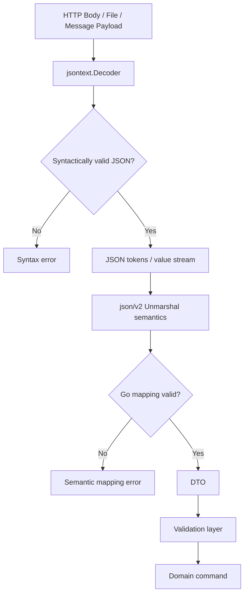
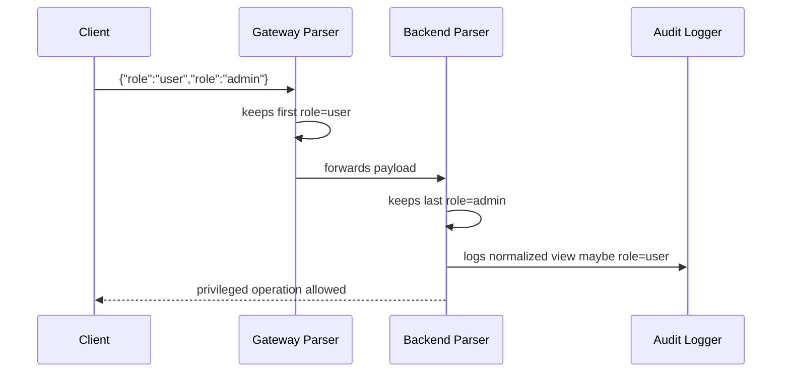
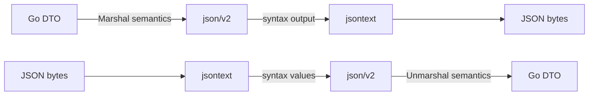
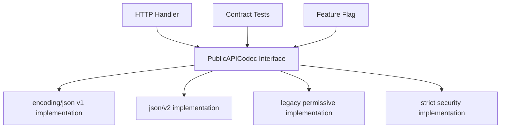
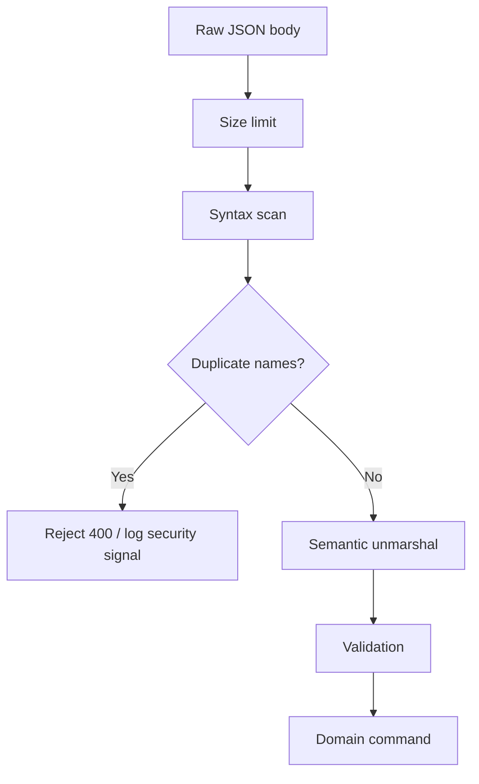
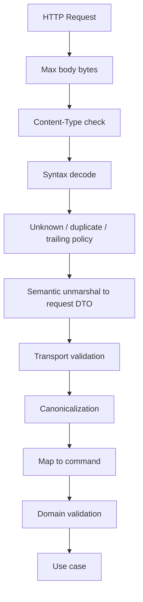
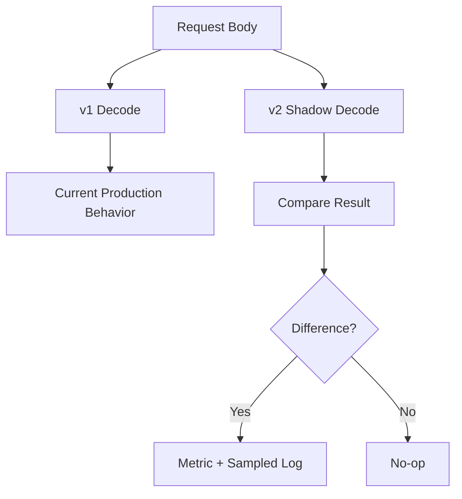
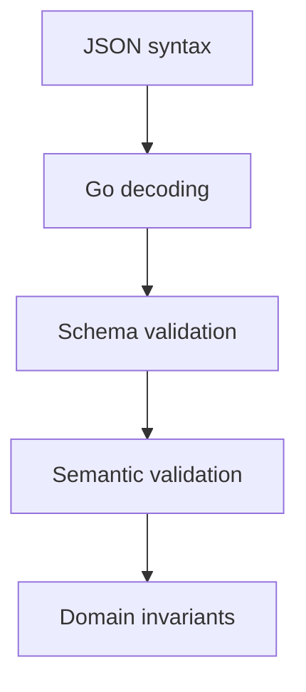

# learn-go-data-mapper-json-xml-protobuf-validation-part-012.md

# Part 012 — JSON v2 and `jsontext` in Go 1.26 Era

> Seri: `learn-go-data-mapper-json-xml-protobuf-validation`  
> Bagian: `012 / 033`  
> Topik: `encoding/json/v2`, `encoding/json/jsontext`, syntax layer vs semantic layer, migration strategy, compatibility policy, strictness, presence, duplicate names, streaming, and production adoption playbook.  
> Target pembaca: Java software engineer yang ingin memahami JSON Go modern sampai level architecture/handbook, bukan sekadar API usage.

---

## 0. Kenapa bagian ini penting?

Sampai sebelum `encoding/json/v2`, hampir semua engineer Go hidup dengan satu mental model sederhana:

```go
json.Marshal(v)
json.Unmarshal(data, &v)
json.NewDecoder(r).Decode(&v)
json.NewEncoder(w).Encode(v)
```

Itu cukup untuk banyak kasus, tetapi di production API yang serius, beberapa kekurangan `encoding/json` lama sering menjadi sumber bug:

1. **Duplicate object names** dapat diterima secara historis.
2. **Struct field matching case-insensitive** dapat membuat contract lebih longgar dari yang terlihat.
3. **Nil slice/map encoding** sering menghasilkan `null`, bukan `[]` atau `{}`.
4. **Unknown field policy** default-nya permissive.
5. **Syntactic JSON processing** dan **semantic Go value mapping** bercampur dalam API yang sama.
6. **Custom marshaling** ada, tetapi composability dan options-nya terbatas.
7. **Streaming low-level JSON** tidak sejelas model token/value modern.
8. **Presence/null/zero** sulit diungkap secara natural tanpa pola custom.

Go 1.25 memperkenalkan eksperimen `encoding/json/v2` dan `encoding/json/jsontext`. Pada era Go 1.26, engineer perlu memahami arah desain ini walaupun adoption production harus tetap hati-hati karena statusnya masih experimental.

Bagian ini bukan ajakan untuk langsung migrasi semua service. Bagian ini adalah peta mental untuk memahami:

- apa yang berubah,
- kenapa desainnya berubah,
- risiko compatibility-nya,
- bagaimana mengevaluasi adoption,
- bagaimana menulis code yang siap menghadapi masa depan JSON Go.

---

## 1. Learning objectives

Setelah menyelesaikan part ini, kamu harus mampu:

1. Membedakan **JSON syntax processing** dan **JSON semantic processing**.
2. Menjelaskan peran `encoding/json/jsontext` dibanding `encoding/json/v2`.
3. Memahami kenapa `json/v2` bukan sekadar “versi lebih cepat” dari `encoding/json` lama.
4. Mendesain boundary API yang bisa memilih strict/permissive behavior secara eksplisit.
5. Menilai kapan service boleh memakai `json/v2` experimental dan kapan harus tetap di `encoding/json` klasik.
6. Membuat abstraction layer agar migration JSON tidak menyebar ke seluruh codebase.
7. Memahami perubahan behavior penting: duplicate names, case sensitivity, nil collection, custom method model, options, dan presence.
8. Menghubungkan JSON v2 dengan materi sebelumnya: nullability, number precision, custom marshal, strict decoding, dan streaming.

---

## 2. Baseline faktual Go 1.26 era

Pada Go 1.26 era, ada tiga konsep yang perlu dipisahkan:

| Area | Package | Status mental model |
|---|---|---|
| JSON lama | `encoding/json` | Baseline stabil, dipakai luas, compatibility kuat. |
| JSON semantic v2 | `encoding/json/v2` | Eksperimental, major revision untuk mapping JSON ↔ Go value. |
| JSON syntactic layer | `encoding/json/jsontext` | Eksperimental, low-level syntax token/value encoder-decoder. |

Hal terpenting: **jangan melihat `json/v2` sebagai drop-in replacement tanpa review behavior.** Ia membawa koreksi desain dan opsi baru yang dapat mengubah behavior observable.

Dalam internal engineering handbook, kita treat JSON v2 seperti ini:

> `encoding/json/v2` adalah arah desain masa depan JSON Go, tetapi selama masih experimental, ia harus diperlakukan sebagai dependency/runtime behavior yang butuh explicit adoption gate, compatibility tests, dan rollback strategy.

---

## 3. Mental model besar: syntax layer vs semantic layer

JSON punya dua level berbeda:

1. **Syntax layer**  
   Apakah byte stream valid JSON?  
   Contoh: `{`, `}`, string escaping, number grammar, array delimiter, object name duplication policy.

2. **Semantic layer**  
   Apa arti JSON value tersebut sebagai Go value?  
   Contoh: object ke struct, number ke `int64`, string ke `time.Time`, absent field ke default, enum string ke domain enum.

Di `encoding/json` lama, kedua concern ini sering terasa tercampur. `json.Decoder` bisa membaca stream, sekaligus langsung mengisi struct. `MarshalJSON` dan `UnmarshalJSON` bekerja pada bytes, bukan pada composable token/value layer.

JSON v2 memperjelas pemisahan:

```text
Raw bytes / io.Reader
        |
        v
+------------------------+
| jsontext syntax layer  |
| - token                |
| - value                |
| - grammar              |
| - duplicate policy     |
| - formatting           |
+------------------------+
        |
        v
+------------------------+
| json/v2 semantic layer |
| - Go value mapping     |
| - struct fields        |
| - custom marshalers    |
| - options              |
| - presence semantics   |
+------------------------+
        |
        v
Go DTO / domain boundary
```

Mermaid view:



The top 1% understanding is this:

> JSON correctness is not a single yes/no check. It is a pipeline: byte validity → JSON grammar validity → JSON structure validity → Go mapping validity → semantic validation → domain invariant validity.

---

## 4. Java engineer translation

Jika kamu datang dari Java, analoginya kira-kira seperti ini:

| Java world | Go classic | Go v2-era mental model |
|---|---|---|
| Jackson `JsonParser` | `json.Decoder.Token` | `jsontext.Decoder` |
| Jackson `ObjectMapper` | `json.Unmarshal` | `json/v2.Unmarshal` |
| Jackson annotations | struct tags | struct tags + options + custom methods |
| Jackson custom serializer | `MarshalJSON` | v2 marshal methods/options model |
| Bean Validation | validator library | tetap external validation layer |
| JSON tree model | `map[string]any`, `RawMessage` | syntax/value layer + semantic unmarshal |
| Strict deserialization feature flags | decoder config | explicit options/policies |

Perbedaan budaya yang penting:

Java sering membuat `ObjectMapper` global dengan konfigurasi kaya. Go cenderung membuat pipeline lebih eksplisit dan kecil. Dalam Go production system, lebih sehat membuat **boundary-specific codec**:

- public REST API codec,
- internal admin API codec,
- event ingestion codec,
- config file codec,
- compatibility/migration codec,
- legacy partner codec.

Setiap codec boleh punya policy berbeda.

---

## 5. Kenapa `encoding/json` lama tetap penting?

Walaupun part ini membahas JSON v2, kamu tidak boleh menganggap `encoding/json` lama obsolete.

Alasannya:

1. Package lama stabil dan compatibility-nya sangat kuat.
2. Hampir semua library Go production masih membangun integrasi di atasnya.
3. Banyak framework HTTP, OpenAPI generator, SDK, dan tooling masih mengasumsikan behavior v1.
4. Behavior lama kadang sudah menjadi bagian dari contract de-facto service.
5. JSON v2 experimental bisa berubah.

Dalam sistem besar, **stability mengalahkan novelty** kecuali ada alasan kuat.

Production rule:

> Default tetap `encoding/json` klasik, kecuali ada motivasi eksplisit: correctness improvement, strictness, presence semantics, custom method composability, performance profile tertentu, atau strategic preparation untuk future standard.

---

## 6. Masalah desain `encoding/json` klasik yang harus kamu pahami

Sebelum memahami v2, kita harus tahu masalah apa yang ingin diperbaiki.

### 6.1 Duplicate object names

JSON object secara practical sering dianggap seperti map. Jika satu object punya nama field duplikat:

```json
{
  "role": "user",
  "role": "admin"
}
```

Pertanyaan penting:

- Apakah payload ini valid?
- Nilai mana yang dipakai?
- Apakah ini harus dianggap attack?
- Apakah log/audit melihat value yang sama dengan business logic?

Dalam security-sensitive system, duplicate key adalah red flag karena parser berbeda bisa memilih nilai berbeda.

Contoh risiko:

```text
API gateway sees: role=user
Backend sees:     role=admin
Audit sees:       role=user
Decision uses:    role=admin
```

Mermaid:



Lesson:

> Duplicate names are not just syntax trivia. They can create cross-component semantic disagreement.

### 6.2 Case-insensitive struct field matching

Go JSON v1 historically matches field names case-insensitively in many cases.

Contoh:

```go
type User struct {
    UserID string `json:"user_id"`
}
```

Payload tidak canonical bisa tetap diterima tergantung matching behavior:

```json
{"User_ID":"abc"}
```

Masalahnya bukan selalu “bug”. Kadang ini backward-compatible. Tetapi untuk public API yang perlu contract strict, permissiveness seperti ini membuat client drift tidak terlihat.

Production view:

- untuk legacy ingestion, permissive bisa berguna;
- untuk new public API, strict lebih defensible;
- untuk compliance API, strict biasanya lebih aman;
- untuk event replay, strictness harus compatible dengan historical data.

### 6.3 Nil slice/map encoding

Dalam Go:

```go
var xs []string = nil
var ys = []string{}
```

Keduanya berbeda secara internal:

```text
nil slice   -> no backing array
empty slice -> non-nil, length 0
```

Tetapi secara API contract, kamu mungkin ingin:

```json
[]
```

bukan:

```json
null
```

Di banyak API, `null` dan empty collection punya makna berbeda.

Contoh response buruk:

```json
{
  "items": null
}
```

Padahal contract OpenAPI bilang:

```yaml
items:
  type: array
```

Bagi client TypeScript/Kotlin/Swift, `null` bisa menyebabkan handling tambahan atau runtime error.

### 6.4 `omitempty` ambiguity

`omitempty` tampak praktis, tapi sering menyembunyikan semantic.

```go
type Response struct {
    Count int `json:"count,omitempty"`
}
```

Jika `Count == 0`, field hilang:

```json
{}
```

Padahal `0` bisa value valid dan penting.

Pertanyaan desain:

- Apakah `0` berarti absent?
- Apakah `0` berarti calculated count zero?
- Apakah `0` berarti default?
- Apakah client butuh membedakan absent dan zero?

Top engineer tidak memakai `omitempty` sebagai kosmetik. Ia memakainya sebagai contract decision.

### 6.5 Dynamic decoding number loss

Dari part sebelumnya:

```go
var m map[string]any
json.Unmarshal(data, &m)
```

JSON number masuk ke `float64`. Integer besar bisa kehilangan presisi.

JSON v2 tidak menghapus kebutuhan berpikir soal numeric contract. Ia memberi API/options yang lebih baik, tetapi domain policy tetap harus eksplisit.

### 6.6 Custom marshaling kurang composable

Di v1, custom marshaler biasanya bekerja pada `[]byte`:

```go
type Money struct { ... }

func (m Money) MarshalJSON() ([]byte, error) {
    return []byte(`"` + m.String() + `"`), nil
}
```

Ini mudah, tetapi ada masalah:

- harus membuat JSON bytes sendiri,
- harus hati-hati escaping,
- sulit memanfaatkan encoder context/options,
- raw string construction rawan invalid JSON,
- nested custom behavior bisa sulit dikontrol.

`jsontext` dan `json/v2` bergerak ke model yang lebih terstruktur.

---

## 7. Package `jsontext`: syntax-level JSON processing

`encoding/json/jsontext` berfokus pada JSON sebagai text format.

Artinya, ia peduli pada:

- token,
- value,
- object/array delimiters,
- strings,
- numbers,
- grammar,
- whitespace,
- duplicate object names policy,
- syntactic options,
- encoding/decoding token stream.

Ia tidak terutama peduli pada:

- field struct Go,
- method domain,
- validation bisnis,
- DTO design,
- OpenAPI semantics.

### 7.1 Syntax vs semantic contoh sederhana

JSON:

```json
{"created_at":"2026-06-24T10:00:00Z"}
```

Syntax layer bertanya:

```text
Is this valid JSON object with string name and string value?
```

Semantic layer bertanya:

```text
Can created_at string be parsed into time.Time?
Is timezone allowed?
Is this field required?
Is future date allowed?
```

Jangan mencampur kedua pertanyaan ini.

### 7.2 Kapan pakai `jsontext`?

Gunakan mental model `jsontext` saat kamu butuh:

1. Menulis JSON tokenizer/parser-level logic.
2. Memvalidasi atau menolak duplicate names sebelum unmarshal semantic.
3. Transformasi JSON-to-JSON tanpa mapping penuh ke struct.
4. Streaming document besar.
5. Canonicalization atau formatting-level processing.
6. Custom marshaler/unmarshaler yang ingin bekerja di level token/value.
7. Building middleware codec internal.

Contoh use case:

```text
Large event stream -> pre-scan duplicate keys -> route based on "type" field -> unmarshal only matching payload -> validate semantic rules.
```

### 7.3 Kapan jangan pakai `jsontext` langsung?

Jangan gunakan `jsontext` langsung hanya untuk mengganti:

```go
json.Unmarshal(data, &dto)
```

Jika requirement hanya API CRUD kecil, v1 `encoding/json` mungkin cukup.

`jsontext` adalah alat low-level. Jika dipakai sembarangan, ia bisa membuat code lebih rumit daripada benefit-nya.

---

## 8. Package `encoding/json/v2`: semantic JSON processing

`encoding/json/v2` adalah major revision untuk mapping JSON ke Go value dan sebaliknya.

Ia berada di level semantic:

```text
JSON value <-> Go value
```

Topik yang ditangani:

- marshal/unmarshal Go values,
- struct field rules,
- options,
- custom marshal/unmarshal methods,
- deterministic/strict behavior,
- integration dengan `jsontext`.

### 8.1 Cara berpikir terhadap `json/v2`

Jangan bertanya:

> Apakah v2 lebih cepat?

Pertanyaan yang lebih benar:

> Apakah v2 memberi semantic JSON yang lebih tepat untuk boundary saya?

Performance hanya salah satu aspek. Correctness sering lebih penting.

### 8.2 V2 sebagai semantic engine

Diagram:



### 8.3 V2 bukan validation layer bisnis

Ini penting.

`json/v2` bisa lebih strict terhadap JSON semantics, tetapi ia bukan pengganti:

- `go-playground/validator`,
- JSON Schema validator,
- OpenAPI request validator,
- domain service validation,
- cross-entity invariant checks.

Contoh:

```go
type RegisterUserRequest struct {
    Email string `json:"email"`
    Age   int    `json:"age"`
}
```

JSON library bisa memeriksa:

- `email` adalah string,
- `age` adalah number yang bisa masuk int,
- JSON valid.

Tetapi bukan berarti:

- email format valid,
- domain email belum terpakai,
- age memenuhi aturan bisnis,
- user boleh register di region tersebut.

---

## 9. Adoption matrix: v1, v2, jsontext

Gunakan decision matrix berikut.

| Use case | Rekomendasi default | Alasan |
|---|---|---|
| Public REST API production stabil | `encoding/json` v1 + strict wrapper | Ecosystem stable, behavior known. |
| New internal service dengan strong test contract | evaluate `json/v2` behind abstraction | Bisa eksplorasi v2 tanpa menyebar risiko. |
| Large JSON stream processing | v1 `Decoder` atau `jsontext` PoC | Pilih berdasarkan kebutuhan token-level. |
| JSON-to-JSON transform | `jsontext` atau specialized library | Tidak perlu full struct mapping. |
| Legacy partner API permissive | v1 permissive wrapper | Jangan memaksa strict jika data historis kotor. |
| Security-sensitive request body | strict wrapper; evaluate v2/jsontext duplicate policy | Duplicate/case/trailing token harus jelas. |
| SDK/library public | jangan depend pada experimental v2 | API instability risk. |
| Internal platform package | boleh expose interface, bukan package concrete | Future migration lebih aman. |

---

## 10. Compatibility risk: behavior adalah contract

Di distributed system, JSON behavior bukan detail internal. Ia adalah contract.

Misalnya service A dulu menerima:

```json
{"UserID":"123"}
```

walau tag canonical-nya:

```go
UserID string `json:"user_id"`
```

Jika migration ke strict behavior membuat payload itu ditolak, maka migration itu breaking change.

Contoh lain:

Sebelum migration response:

```json
{"items":null}
```

Setelah migration:

```json
{"items":[]}
```

Bagi engineer Go, ini mungkin improvement. Bagi client yang membedakan `null` dan `[]`, ini breaking behavior.

Rule:

> Setiap perubahan JSON encoder/decoder harus diperlakukan seperti perubahan API contract, bukan sekadar refactor internal.

---

## 11. Architecture pattern: boundary codec abstraction

Jangan import JSON package langsung di semua handler/usecase.

Buruk:

```go
func handler(w http.ResponseWriter, r *http.Request) {
    var req CreateOrderRequest
    if err := json.NewDecoder(r.Body).Decode(&req); err != nil {
        // ...
    }
}
```

Lebih baik:

```go
type RequestDecoder interface {
    Decode(r io.Reader, dst any) error
}

type ResponseEncoder interface {
    Encode(w io.Writer, v any) error
}
```

Atau boundary-specific:

```go
type PublicAPICodec interface {
    DecodeRequest(r io.Reader, dst any) error
    EncodeResponse(w io.Writer, v any) error
}
```

Implementasi v1:

```go
type JSONV1PublicCodec struct {
    MaxBytes int64
}

func (c JSONV1PublicCodec) DecodeRequest(r io.Reader, dst any) error {
    lr := io.LimitReader(r, c.MaxBytes)
    dec := json.NewDecoder(lr)
    dec.DisallowUnknownFields()
    dec.UseNumber()

    if err := dec.Decode(dst); err != nil {
        return fmt.Errorf("decode json request: %w", err)
    }

    var extra any
    if err := dec.Decode(&extra); err != io.EOF {
        return fmt.Errorf("decode json request: multiple json values or trailing data")
    }

    return nil
}

func (c JSONV1PublicCodec) EncodeResponse(w io.Writer, v any) error {
    enc := json.NewEncoder(w)
    enc.SetEscapeHTML(true)
    return enc.Encode(v)
}
```

Future v2 implementation bisa dibuat di balik interface yang sama.

### 11.1 Kenapa abstraction ini penting?

Karena migration JSON harus bisa dilakukan dengan:

- feature flag,
- endpoint-by-endpoint rollout,
- canary,
- contract test,
- fallback,
- differential test.

Jika semua handler import `encoding/json` langsung, migration menjadi invasive.

Mermaid:



---

## 12. Differential testing: cara aman mengevaluasi v2

Untuk migration, gunakan differential test.

Idenya:

```text
same input -> v1 decode result
same input -> v2 decode result
compare observable behavior
```

Untuk encoding:

```text
same Go value -> v1 JSON
same Go value -> v2 JSON
compare canonical JSON semantics
```

### 12.1 Test decode differential

Pseudocode:

```go
func TestDecodeCompatibility(t *testing.T) {
    cases := []struct {
        name string
        json string
    }{
        {"canonical", `{"user_id":"u1","age":30}`},
        {"unknown_field", `{"user_id":"u1","age":30,"x":true}`},
        {"duplicate_field", `{"age":20,"age":30}`},
        {"case_variant", `{"User_ID":"u1","age":30}`},
        {"null_scalar", `{"user_id":null,"age":30}`},
        {"large_number", `{"user_id":"u1","age":9007199254740993}`},
    }

    for _, tc := range cases {
        t.Run(tc.name, func(t *testing.T) {
            var a CreateUserRequest
            errV1 := decodeV1([]byte(tc.json), &a)

            var b CreateUserRequest
            errV2 := decodeV2([]byte(tc.json), &b)

            compareBehavior(t, errV1, a, errV2, b)
        })
    }
}
```

### 12.2 Jangan compare bytes mentah untuk JSON object

JSON object member order tidak boleh kamu anggap meaningful kecuali kamu memang menerapkan canonicalization.

Buruk:

```go
if string(v1Bytes) != string(v2Bytes) {
    t.Fatal("different")
}
```

Lebih baik:

```go
assertJSONSemanticallyEqual(t, v1Bytes, v2Bytes)
```

Atau untuk contract response public, compare terhadap golden canonical output yang memang kamu kontrol.

### 12.3 Differential categories

Gunakan kategori test:

| Category | Examples |
|---|---|
| Canonical valid | payload sesuai contract. |
| Legacy valid | case-insensitive, extra fields, old aliases. |
| Ambiguous | duplicate names, null scalar, empty string enum. |
| Malicious | deeply nested, huge number, duplicate security fields. |
| Boundary numeric | max int, uint overflow, decimal precision. |
| Collection | nil slice, empty slice, omitted slice, null slice. |
| Time | timezone, invalid date, leap-ish strings, empty string. |
| Custom types | enum, ID, money, optional fields. |

---

## 13. Behavior review checklist sebelum memakai `json/v2`

Sebelum adoption, jawab pertanyaan ini:

### 13.1 Decode policy

- Apakah unknown fields ditolak?
- Apakah duplicate object names ditolak?
- Apakah field name matching harus case-sensitive?
- Apakah trailing tokens ditolak?
- Apakah `null` untuk scalar ditolak?
- Apakah empty string untuk enum ditolak?
- Apakah integer overflow menghasilkan error yang benar?
- Apakah number harus preserve precision?
- Apakah maximum body size diterapkan sebelum decode?
- Apakah depth/complexity limit diperlukan?

### 13.2 Encode policy

- Apakah nil slice/map keluar sebagai `null` atau empty collection?
- Apakah HTML escaping dibutuhkan?
- Apakah field order penting untuk golden test/signature?
- Apakah zero value harus tetap dikirim?
- Apakah `omitempty` masih sesuai?
- Apakah sensitive fields aman dari accidental output?
- Apakah time format canonical?
- Apakah decimal/money keluar sebagai string atau number?

### 13.3 Compatibility policy

- Apakah perubahan behavior breaking bagi client?
- Apakah ada partner legacy yang mengirim non-canonical payload?
- Apakah historical event replay tetap bisa diproses?
- Apakah old SDK masih compatible?
- Apakah contract test mencakup known dirty payload?
- Apakah observability bisa membedakan v1 vs v2 failure?

---

## 14. Options as contract, bukan preference

JSON v2 membawa model options yang lebih eksplisit. Jangan treat options seperti “style preference”. Options menentukan contract.

Contoh policy:

```text
Public API request:
- Reject unknown fields
- Reject duplicate names
- Case-sensitive field names
- Preserve numeric precision during staging
- Reject trailing tokens

Public API response:
- Stable field names
- Empty slices as []
- Do not omit meaningful zero values
- Canonical time format RFC3339Nano or agreed subset
```

Legacy partner ingestion:

```text
Partner API request:
- Allow unknown fields
- Allow case-insensitive aliases for migration window
- Log non-canonical fields
- Reject duplicate security-sensitive fields
- Normalize before domain mapping
```

Event replay:

```text
Event replay decoder:
- Allow historical unknown fields
- Preserve unknown payload segment if needed
- Version-aware decode
- Never silently reinterpret old semantic
```

---

## 15. Nil collection policy

Nil collection is one of the most practical API compatibility issues.

### 15.1 Response DTO discipline

Untuk response DTO, usahakan collection selalu initialized.

```go
type ListUsersResponse struct {
    Items []UserDTO `json:"items"`
}

func NewListUsersResponse(items []UserDTO) ListUsersResponse {
    if items == nil {
        items = []UserDTO{}
    }
    return ListUsersResponse{Items: items}
}
```

Ini bekerja di v1 dan tidak menunggu v2 behavior.

### 15.2 Jangan bergantung pada encoder untuk memperbaiki domain ambiguity

Buruk:

```go
// berharap json/v2 option membuat nil slice jadi []
return response{Items: domainItems}
```

Lebih baik:

```go
items := mapUsers(domainItems)
if items == nil {
    items = []UserDTO{}
}
return response{Items: items}
```

Kenapa?

Karena DTO constructor adalah tempat contract dimanifestasikan. Encoder option adalah safety net, bukan sumber semantic utama.

---

## 16. Case sensitivity dan field naming governance

Field name policy harus diputuskan di API governance.

### 16.1 Canonical field names

Pilih satu naming convention:

- `snake_case` untuk JSON public API,
- `camelCase` jika mengikuti JS ecosystem,
- Protobuf JSON biasanya mengikuti lowerCamelCase kecuali option tertentu,
- XML biasanya punya convention sendiri.

Contoh:

```go
type CreateUserRequest struct {
    UserID string `json:"user_id"`
}
```

Canonical JSON:

```json
{"user_id":"u-123"}
```

Jangan diam-diam menerima:

```json
{"UserID":"u-123"}
```

untuk API baru, kecuali ada alasan compatibility.

### 16.2 Alias migration pattern

Jika harus menerima field lama:

```json
{"userId":"u-123"}
```

jangan mengandalkan case-insensitive magic. Buat migration decoder eksplisit:

```go
type createUserWire struct {
    UserIDSnake string `json:"user_id"`
    UserIDCamel string `json:"userId"`
}

func (w createUserWire) ToRequest() (CreateUserRequest, error) {
    switch {
    case w.UserIDSnake != "" && w.UserIDCamel != "":
        if w.UserIDSnake != w.UserIDCamel {
            return CreateUserRequest{}, errors.New("conflicting user_id and userId")
        }
        return CreateUserRequest{UserID: w.UserIDSnake}, nil
    case w.UserIDSnake != "":
        return CreateUserRequest{UserID: w.UserIDSnake}, nil
    case w.UserIDCamel != "":
        return CreateUserRequest{UserID: w.UserIDCamel}, nil
    default:
        return CreateUserRequest{}, errors.New("missing user_id")
    }
}
```

Ini lebih verbose, tetapi defensible.

---

## 17. Duplicate name policy

### 17.1 Default production stance

Untuk public API baru:

> Reject duplicate object names.

Untuk legacy ingestion:

> Log and measure duplicate names first; reject after compatibility window if possible.

Untuk security-sensitive fields:

> Reject duplicates immediately.

Security-sensitive fields termasuk:

- `role`,
- `permissions`,
- `user_id`,
- `tenant_id`,
- `amount`,
- `currency`,
- `status`,
- `approved`,
- `signature`,
- `scope`,
- `aud`,
- `sub`,
- `iss`.

### 17.2 Duplicate pre-scan architecture

Mermaid:



### 17.3 Scope of duplicate detection

Duplicate detection harus nested-object aware.

Payload:

```json
{
  "user": {
    "id": "u1",
    "id": "u2"
  }
}
```

Duplicate terjadi di path:

```text
/user/id
```

Bukan hanya top-level.

Error baik:

```json
{
  "error": "invalid_json",
  "message": "duplicate object member name",
  "path": "/user/id"
}
```

---

## 18. JSON v2 and presence-aware field design

JSON v2 membuka ruang yang lebih baik untuk presence-aware custom types, tetapi mental model-nya tetap sama dari part 007.

Kita perlu membedakan:

| State | Meaning example |
|---|---|
| absent | client did not mention field |
| null | client explicitly clears field |
| zero | client sets value to zero |
| non-zero | client sets value |

### 18.1 Generic optional pattern

Conceptual type:

```go
type Optional[T any] struct {
    Set   bool
    Null  bool
    Value T
}
```

Desired semantics:

```json
{}
```

```go
Optional[string]{Set:false}
```

```json
{"nickname":null}
```

```go
Optional[string]{Set:true, Null:true}
```

```json
{"nickname":""}
```

```go
Optional[string]{Set:true, Null:false, Value:""}
```

Ini penting untuk PATCH.

### 18.2 Do not leak Optional into domain model

Buruk:

```go
type User struct {
    Nickname Optional[string]
}
```

Domain model tidak seharusnya menyimpan “apakah client menyebut field ini di request”. Itu transport intent, bukan domain state.

Lebih baik:

```go
type UpdateUserRequest struct {
    Nickname Optional[string] `json:"nickname"`
}

type UpdateUserCommand struct {
    NicknameChange FieldChange[string]
}
```

Mapping layer menerjemahkan transport presence ke domain intent.

---

## 19. Custom marshaling in v2 era

### 19.1 Problem dengan custom bytes-only v1

V1 custom marshaling:

```go
func (id UserID) MarshalJSON() ([]byte, error) {
    if id == "" {
        return nil, errors.New("empty user id")
    }
    return json.Marshal(string(id))
}
```

Ini bagus, tetapi composability terbatas karena output langsung bytes.

V2 era bergerak ke model yang bisa berinteraksi lebih baik dengan encoder/decoder dan syntax layer.

### 19.2 Design rule custom JSON type

Custom JSON type harus memenuhi invariant:

1. **Never emit invalid JSON.**
2. **Reject invalid representation early.**
3. **Avoid partial mutation on failed unmarshal.**
4. **Do not silently canonicalize ambiguous input without logging/policy.**
5. **Keep domain invariant stronger than wire representation.**

Contoh `UserID`:

```go
type UserID string

func NewUserID(s string) (UserID, error) {
    if s == "" {
        return "", errors.New("user id is required")
    }
    if strings.ContainsAny(s, " \t\n\r") {
        return "", errors.New("user id must not contain whitespace")
    }
    return UserID(s), nil
}
```

Custom JSON should call constructor semantics.

---

## 20. Strict HTTP decode pipeline in v2 era

Walaupun package berubah, pipeline ideal tidak berubah.



### 20.1 Why two-level errors matter

Bad API:

```json
{"error":"bad request"}
```

Better API:

```json
{
  "error": "invalid_json",
  "message": "request body is not valid JSON",
  "offset": 128
}
```

Or:

```json
{
  "error": "invalid_request",
  "fields": [
    {
      "path": "/age",
      "code": "type_mismatch",
      "message": "age must be an integer"
    }
  ]
}
```

Syntax error and semantic error are different operational categories.

---

## 21. JSON v2 migration plan

### 21.1 Step 1 — Inventory JSON boundaries

Cari semua boundary:

```text
- HTTP handlers
- HTTP clients
- SDK clients
- event producers
- event consumers
- config readers
- DB JSON columns
- audit payload builders
- logs structured as JSON
- tests/golden files
- CLI input/output
```

Jangan migrasi blind.

### 21.2 Step 2 — Classify boundary risk

| Boundary | Risk | Migration approach |
|---|---|---|
| Internal config file | medium | Test and migrate early. |
| Public API request | high | Contract test first. |
| Public API response | high | Golden output and client compatibility. |
| Internal event | high | Replay historical events. |
| Logging JSON | medium | Tooling compatibility check. |
| One-off CLI | low | Good pilot candidate. |

### 21.3 Step 3 — Introduce codec interface

Do not migrate by search-replace.

Introduce:

```go
type JSONCodec interface {
    Marshal(v any) ([]byte, error)
    Unmarshal(data []byte, v any) error
}
```

Or boundary-specific.

### 21.4 Step 4 — Add behavior tests

Test cases:

- unknown field,
- duplicate field,
- case mismatch,
- null scalar,
- absent vs zero,
- nil vs empty collection,
- number precision,
- custom enum,
- time,
- trailing token,
- invalid UTF-8 if relevant,
- nested object duplicate,
- large payload.

### 21.5 Step 5 — Run shadow decode

For ingestion path, during canary:

```text
production input -> v1 decode used for behavior
                 -> v2 decode shadow only
                 -> compare/log difference
```

Do not change business behavior immediately.

Mermaid:



### 21.6 Step 6 — Endpoint-by-endpoint rollout

Do not flip globally.

Rollout order:

1. Internal admin endpoint.
2. Non-critical read endpoint.
3. Internal service-to-service endpoint.
4. New public endpoint.
5. Existing public endpoint with compatibility window.
6. Event consumers after replay test.

### 21.7 Step 7 — Rollback strategy

Every migration needs rollback:

```go
type CodecMode string

const (
    CodecV1 CodecMode = "json_v1"
    CodecV2 CodecMode = "json_v2"
)
```

Feature flag:

```go
func NewPublicCodec(mode CodecMode) PublicAPICodec {
    switch mode {
    case CodecV2:
        return NewJSONV2PublicCodec()
    default:
        return NewJSONV1PublicCodec()
    }
}
```

---

## 22. Golden file testing in v2 era

Golden files untuk JSON sering rapuh karena:

- object order,
- whitespace,
- escaping,
- `null` vs absent,
- nil/empty collection,
- time formatting.

### 22.1 Golden response contract

Untuk public API response, golden file masuk akal karena bytes output sering menjadi contract.

Tetapi normalisasi harus jelas:

```go
func canonicalizeJSONForTest(t *testing.T, b []byte) []byte {
    t.Helper()

    var v any
    if err := json.Unmarshal(b, &v); err != nil {
        t.Fatal(err)
    }

    out, err := json.MarshalIndent(v, "", "  ")
    if err != nil {
        t.Fatal(err)
    }
    return out
}
```

Namun untuk field order contract, jangan canonicalize away order jika order memang dipakai oleh downstream signature. Dalam kasus itu gunakan canonical JSON/signing library khusus.

### 22.2 Golden decode tests

Decode tests harus menyimpan expected error category:

```go
type DecodeExpectation struct {
    OK          bool
    ErrorCode   string
    FieldPath   string
    CanonicalDTO any
}
```

Jangan hanya assert `err != nil`.

---

## 23. Observability untuk JSON migration

JSON migration harus punya telemetry.

Metrics:

```text
json_decode_total{codec="v1", boundary="public_api", outcome="success"}
json_decode_total{codec="v2", boundary="public_api", outcome="error"}
json_decode_error_total{reason="unknown_field"}
json_decode_error_total{reason="duplicate_name"}
json_decode_error_total{reason="type_mismatch"}
json_decode_shadow_diff_total{endpoint="/users"}
```

Logs sampled:

```json
{
  "event": "json_shadow_decode_diff",
  "endpoint": "/v1/users",
  "method": "POST",
  "reason": "duplicate_field_behavior",
  "field_path": "/role",
  "codec_primary": "encoding_json_v1",
  "codec_shadow": "encoding_json_v2"
}
```

Do not log full body if it may contain PII.

### 23.1 Error classification

Map low-level errors into stable categories:

| Category | Meaning |
|---|---|
| `syntax_error` | invalid JSON grammar. |
| `trailing_data` | more than one JSON value or garbage after JSON. |
| `unknown_field` | field not in contract. |
| `duplicate_name` | duplicate object member name. |
| `type_mismatch` | JSON type cannot map to Go target. |
| `number_overflow` | number outside target range. |
| `precision_risk` | number cannot be represented safely. |
| `custom_decode_error` | custom unmarshaler rejected value. |
| `validation_error` | structurally decoded but invalid semantically. |

---

## 24. Performance perspective: do not assume

JSON v2 may improve some behavior/performance profiles, but production decision must be measured.

Benchmark axes:

1. Payload size.
2. Payload shape.
3. Struct depth.
4. Number/string distribution.
5. Custom marshalers.
6. Unknown field rate.
7. Duplicate detection policy.
8. Allocation budget.
9. Streaming vs full-buffer.
10. Error path cost.

### 24.1 Benchmark mistakes

Bad benchmark:

```go
func BenchmarkJSON(b *testing.B) {
    for i := 0; i < b.N; i++ {
        json.Unmarshal(sample, &User{})
    }
}
```

Problems:

- decodes into temporary pointer not inspected,
- compiler escape/optimization artifacts,
- no allocation budget reasoning,
- only happy path,
- no realistic payload distribution.

Better:

```go
var sinkUser User

func BenchmarkDecodeUser(b *testing.B) {
    b.ReportAllocs()
    for i := 0; i < b.N; i++ {
        var u User
        if err := decode(sampleUserJSON, &u); err != nil {
            b.Fatal(err)
        }
        sinkUser = u
    }
}
```

Include error-path benchmark:

```go
func BenchmarkDecodeUserUnknownField(b *testing.B) {
    b.ReportAllocs()
    for i := 0; i < b.N; i++ {
        var u User
        _ = decode(sampleUnknownFieldJSON, &u)
    }
}
```

Because attack traffic is often error-path heavy.

---

## 25. Security and compliance perspective

For regulatory/case-management systems, JSON parser behavior can affect defensibility.

Important questions:

1. Can two systems interpret the same payload differently?
2. Can a client smuggle field by duplicate key?
3. Can unknown fields be ignored but later appear in audit raw payload?
4. Can `null` bypass validation?
5. Can case-insensitive matching accidentally accept non-contract field?
6. Can numeric precision change amount/penalty/threshold?
7. Can response omit legally required zero value because of `omitempty`?
8. Can logs redact one field name but attacker uses case variant?

### 25.1 Regulatory example

Payload:

```json
{
  "case_id": "C-100",
  "penalty_amount": 1000,
  "Penalty_Amount": 0
}
```

If one component normalizes differently, the final decision and audit may diverge.

Regulatory-safe stance:

- reject ambiguous field names,
- reject duplicate security-sensitive members,
- canonicalize before domain decision,
- store raw payload separately if needed,
- store canonical interpreted payload,
- log decoder policy version.

Audit metadata:

```json
{
  "decoder_policy": "public-api-json-strict-v3",
  "codec": "encoding/json",
  "unknown_fields": "rejected",
  "duplicate_names": "rejected",
  "case_sensitive_names": true
}
```

---

## 26. Practical v1-compatible improvements you can apply now

Even before adopting v2, improve JSON posture.

### 26.1 Centralize decoder

```go
package jsoncodec

import (
    "encoding/json"
    "errors"
    "fmt"
    "io"
)

type DecodePolicy struct {
    MaxBytes              int64
    DisallowUnknownFields bool
    UseNumber             bool
    RejectTrailingValues  bool
}

type DecodeError struct {
    Code   string
    Offset int64
    Err    error
}

func (e *DecodeError) Error() string {
    if e.Offset > 0 {
        return fmt.Sprintf("%s at offset %d: %v", e.Code, e.Offset, e.Err)
    }
    return fmt.Sprintf("%s: %v", e.Code, e.Err)
}

func (e *DecodeError) Unwrap() error { return e.Err }

func Decode(r io.Reader, dst any, p DecodePolicy) error {
    if p.MaxBytes > 0 {
        r = io.LimitReader(r, p.MaxBytes)
    }

    dec := json.NewDecoder(r)
    if p.DisallowUnknownFields {
        dec.DisallowUnknownFields()
    }
    if p.UseNumber {
        dec.UseNumber()
    }

    if err := dec.Decode(dst); err != nil {
        return classifyDecodeError(dec, err)
    }

    if p.RejectTrailingValues {
        var extra any
        if err := dec.Decode(&extra); err != io.EOF {
            if err == nil {
                err = errors.New("multiple JSON values")
            }
            return &DecodeError{Code: "trailing_data", Offset: dec.InputOffset(), Err: err}
        }
    }

    return nil
}

func classifyDecodeError(dec *json.Decoder, err error) error {
    var syntaxErr *json.SyntaxError
    if errors.As(err, &syntaxErr) {
        return &DecodeError{Code: "syntax_error", Offset: syntaxErr.Offset, Err: err}
    }

    var typeErr *json.UnmarshalTypeError
    if errors.As(err, &typeErr) {
        return &DecodeError{Code: "type_mismatch", Offset: typeErr.Offset, Err: err}
    }

    return &DecodeError{Code: "decode_error", Offset: dec.InputOffset(), Err: err}
}
```

### 26.2 Avoid `map[string]any` for contract DTO

Bad:

```go
var req map[string]any
json.Unmarshal(body, &req)
```

Better:

```go
var req CreateOrderRequest
Decode(r.Body, &req, PublicAPIPolicy)
```

Use `map[string]any` only for:

- truly dynamic JSON,
- schema-less ingestion,
- pass-through payload,
- partial routing,
- migration tools.

### 26.3 Avoid global helper with unclear policy

Bad:

```go
func ParseJSON(r io.Reader, dst any) error
```

Better:

```go
func DecodePublicAPIRequest(r io.Reader, dst any) error
func DecodePartnerWebhook(r io.Reader, dst any) error
func DecodeInternalEvent(r io.Reader, dst any) error
```

Name the boundary. Boundary defines policy.

---

## 27. How JSON v2 changes architecture thinking even if you do not use it

JSON v2 teaches a better architecture:

1. Separate syntax and semantic concerns.
2. Treat parsing policy as contract.
3. Make strictness explicit.
4. Design custom types around invariant preservation.
5. Avoid relying on historical quirks.
6. Test JSON behavior as observable contract.
7. Create codec abstraction for migration.

So even if production stays on v1, your design can be v2-ready.

---

## 28. Anti-patterns

### Anti-pattern 1 — “Upgrade JSON library globally”

Bad:

```text
Replace all encoding/json usages with json/v2 in one PR.
```

Why bad:

- behavior changes hidden,
- impossible to review contract impact,
- no endpoint-specific compatibility,
- rollback difficult.

Better:

```text
Introduce boundary codec -> add differential tests -> shadow decode -> canary -> endpoint migration.
```

### Anti-pattern 2 — “Use v2 because it is newer”

Newer is not a requirement.

Use v2 when it solves a real problem:

- strictness,
- correctness,
- custom method composition,
- presence semantics,
- duplicate/case behavior,
- performance proven by benchmark.

### Anti-pattern 3 — “Let JSON tags define domain meaning”

Bad:

```go
type User struct {
    Name string `json:"name,omitempty" validate:"required" db:"name"`
}
```

This mixes:

- API contract,
- validation contract,
- persistence contract,
- domain state.

Better:

```go
type CreateUserRequest struct { ... }
type User struct { ... }
type UserRecord struct { ... }
```

### Anti-pattern 4 — “Rely on null to mean everything”

Bad:

```json
{"nickname":null}
```

could mean:

- not provided,
- clear field,
- unknown,
- default,
- invalid client.

Better: define explicit semantics by endpoint type.

### Anti-pattern 5 — “Golden tests without semantic awareness”

Bad:

```go
assert.Equal(t, expectedString, actualString)
```

for JSON where order/format not meaningful.

Better:

- semantic compare for non-contract order,
- exact compare for canonical response contract,
- explicit canonicalization policy.

### Anti-pattern 6 — “Shadow decode full PII body into logs”

Migration observability must not create privacy incident.

Log:

- endpoint,
- reason category,
- field path,
- codec versions,
- sampled request ID.

Do not log full body by default.

---

## 29. Production design templates

### 29.1 Public API strict JSON codec

Policy:

```text
- max body bytes
- content-type application/json
- reject unknown fields
- use number preservation during staging
- reject trailing values
- reject duplicate names if supported/pre-scanned
- stable error categories
```

Conceptual code:

```go
type PublicJSONCodec struct {
    MaxBytes int64
}

func (c PublicJSONCodec) Decode(r io.Reader, dst any) error {
    return jsoncodec.Decode(r, dst, jsoncodec.DecodePolicy{
        MaxBytes:              c.MaxBytes,
        DisallowUnknownFields: true,
        UseNumber:             true,
        RejectTrailingValues:  true,
    })
}
```

### 29.2 Legacy partner codec

Policy:

```text
- max body bytes
- allow unknown fields
- allow known alias fields
- reject duplicate dangerous fields
- normalize into canonical DTO
- emit non-canonical metric
```

Design:

```go
type PartnerOrderWire struct {
    OrderID      string `json:"order_id"`
    OrderIDAlias string `json:"orderId"`
    Amount       string `json:"amount"`
}

func (w PartnerOrderWire) Canonicalize() (CreateOrderRequest, []CompatibilityWarning, error) {
    // explicit conflict handling
    // explicit alias warning
    // explicit decimal parse
    return CreateOrderRequest{}, nil, nil
}
```

### 29.3 Event consumer codec

Policy:

```text
- decode envelope first
- use event type/version to route schema
- preserve raw payload for dead-letter/debug
- never silently drop unknown event version
- historical replay test required
```

```go
type EventEnvelope struct {
    Type    string          `json:"type"`
    Version int             `json:"version"`
    Data    json.RawMessage `json:"data"`
}
```

Future v2/jsontext can improve envelope routing, but the architecture is independent.

---

## 30. JSON v2 and OpenAPI/JSON Schema

Do not confuse decoder behavior with API schema.

OpenAPI/JSON Schema says:

```text
field required, type string, pattern, enum, min/max, nullable policy
```

JSON decoder says:

```text
can bytes be mapped into Go type?
```

They overlap but are not equal.

Example:

```go
type CreateUserRequest struct {
    Email string `json:"email"`
}
```

Decoder accepts:

```json
{"email":"not-an-email"}
```

Schema/validation should reject.

Use layers:



JSON v2 improves B, not C/D/E.

---

## 31. Recommended organizational policy

For a serious engineering org, define a JSON policy document.

### 31.1 Example policy

```text
JSON Policy v1

Public API requests:
- Only application/json accepted.
- UTF-8 JSON required.
- Max body size enforced per endpoint.
- Unknown fields rejected by default.
- Duplicate object member names rejected.
- Field names are case-sensitive.
- Numeric IDs must be strings if they may exceed JavaScript safe integer range.
- Money must be encoded as decimal string or minor-unit integer by domain decision.
- PATCH endpoints must use presence-aware request types.

Public API responses:
- Collections are encoded as [] or {}, not null, unless contract explicitly says nullable.
- Required scalar fields are emitted even when zero.
- `omitempty` requires contract justification.
- Timestamps use RFC3339 with UTC unless endpoint says otherwise.
- Sensitive fields must not exist in response DTO.

Migration:
- Any JSON library behavior change requires compatibility tests.
- Experimental JSON packages may only be used behind internal codec abstraction.
- Public SDKs must not expose experimental package types.
```

### 31.2 Review checklist for PR

Reviewer should ask:

- Does this DTO represent request, response, event, or domain?
- Are absent/null/zero semantics documented?
- Are unknown fields handled intentionally?
- Are duplicate names considered?
- Are numeric fields safe?
- Is `omitempty` contract-safe?
- Are slices/maps initialized for responses?
- Are custom JSON methods tested for invalid input?
- Are errors classified for client and observability?
- Is migration behavior covered by tests?

---

## 32. Practical learning exercise

### Exercise A — Build strict v1 codec

Implement:

```go
DecodePublicJSON(r io.Reader, dst any) error
```

Requirements:

- max body 1 MiB,
- `DisallowUnknownFields`,
- `UseNumber`,
- reject trailing JSON values,
- classify syntax/type/trailing errors,
- do not log body.

### Exercise B — Build compatibility test corpus

Create JSON samples:

```text
canonical.json
unknown-field.json
duplicate-role.json
case-variant.json
null-required-string.json
large-int.json
empty-array.json
null-array.json
trailing-value.json
invalid-json.json
```

Run all through current codec.

### Exercise C — Shadow migration harness

Build interface:

```go
type Decoder interface {
    Decode([]byte, any) error
}
```

Implement:

```go
PrimaryDecoder
ShadowDecoder
```

Compare:

- error category,
- DTO normalized value,
- warnings.

### Exercise D — Define JSON policy for one API

Pick endpoint:

```text
PATCH /users/{id}
```

Define semantics for:

- omitted nickname,
- null nickname,
- empty nickname,
- unknown field,
- duplicate nickname,
- case-variant field,
- numeric version field,
- response empty roles list.

---

## 33. Deep mental model summary

### 33.1 JSON is not your domain

JSON is just representation. Your domain needs stronger invariants.

```text
JSON token -> wire DTO -> validated request -> domain command -> aggregate/entity
```

Do not collapse all layers.

### 33.2 Parser behavior is part of contract

If your service accepts:

```json
{"role":"user","role":"admin"}
```

then your parser behavior determines security semantics.

### 33.3 Strictness is not always better; explicitness is always better

Strict public API may be good. Permissive legacy ingestion may be necessary.

The failure is not permissiveness. The failure is accidental permissiveness.

### 33.4 JSON v2 is a chance to fix architecture

Even before adopting it, use it to rethink:

- codec abstraction,
- boundary policies,
- contract tests,
- syntax/semantic separation,
- observability.

---

## 34. Decision matrix

| Decision | Default | Override when |
|---|---|---|
| Use `encoding/json` v1 or v2? | v1 | v2 solves measured/explicit problem and is isolated. |
| Use `jsontext` directly? | no | token-level/syntax-level processing needed. |
| Unknown fields | reject for new public API | legacy compatibility. |
| Duplicate names | reject | very controlled legacy parser with metrics. |
| Case-insensitive matching | avoid for new API | temporary migration alias. |
| Nil slice response | encode as `[]` | field is explicitly nullable. |
| `omitempty` | avoid on meaningful fields | absence is contractually meaningful. |
| Number as JSON number | safe small numeric domain | use string/decimal/minor-unit for risky domains. |
| Experimental package exposure | hide behind interface | internal-only tools/PoC. |

---

## 35. Internal engineering handbook checklist

Before approving JSON v2/jsontext adoption:

```text
[ ] Boundary identified: public API / internal API / event / config / log / CLI.
[ ] Current v1 behavior documented.
[ ] Desired behavior documented.
[ ] Difference matrix created.
[ ] Contract tests cover ambiguous payloads.
[ ] Historical payload replay tested if event/partner boundary.
[ ] Codec hidden behind interface/package.
[ ] No experimental package types leak into public API.
[ ] Metrics distinguish codec versions and error categories.
[ ] Shadow decode or canary plan exists.
[ ] Rollback path exists.
[ ] Security-sensitive duplicate/case/null behavior reviewed.
[ ] Response compatibility checked for null vs empty, omitted vs zero.
[ ] Performance benchmark uses realistic payloads and error paths.
```

---

## 36. Common interview/staff-level questions

### Q1: “Should we migrate to `encoding/json/v2`?”

Bad answer:

> Yes, because it is newer.

Good answer:

> Not globally. First inventory JSON boundaries, define behavior differences, put JSON behind boundary codec abstraction, add compatibility tests, run shadow decode on representative payloads, and migrate endpoint-by-endpoint only if v2 gives concrete correctness/performance/maintainability benefits.

### Q2: “Why do duplicate JSON keys matter?”

Because different components may interpret duplicate names differently, causing security, audit, and decision inconsistency. They should be rejected at security-sensitive boundaries unless legacy compatibility forces a measured migration period.

### Q3: “Is JSON decoding validation?”

No. Decoding validates syntax and Go type mapping. It does not validate business semantics like email format, domain existence, permission, cross-field rules, or lifecycle state transitions.

### Q4: “Why not use `map[string]any` everywhere?”

Because it loses contract clarity, numeric precision safety, field-level type guarantees, and validation structure. It is appropriate for dynamic/pass-through JSON, not for stable API DTOs.

### Q5: “What is `jsontext` for?”

It is for syntactic JSON processing: token/value-level encode/decode, grammar-level behavior, JSON-to-JSON processing, and lower-level control. It is not a domain mapping layer.

---

## 37. Ringkasan invariant part 012

1. JSON pipeline harus dipisahkan menjadi syntax, semantic mapping, validation, dan domain invariant.
2. `encoding/json` v1 tetap baseline production stabil.
3. `encoding/json/v2` dan `jsontext` harus dipahami sebagai arah desain modern tetapi diadopsi dengan experimental discipline.
4. Parser behavior adalah bagian dari contract observable.
5. Duplicate names, case matching, nil collection, `omitempty`, numeric precision, and null semantics adalah architecture decisions.
6. Migration harus berbasis abstraction, differential tests, shadow decode, canary, dan rollback.
7. Jangan expose experimental package types dari public library/SDK.
8. Strictness harus boundary-specific, bukan global ideology.
9. JSON v2 tidak menggantikan JSON Schema/OpenAPI/domain validation.
10. Bahkan tanpa memakai v2, architecture kamu harus v2-ready: explicit, tested, observable, and contract-driven.

---

## 38. Koneksi ke part berikutnya

Part berikutnya membahas **JSON Schema as External Contract**.

Kenapa ini urutan yang natural?

Karena setelah memahami decoder/encoder behavior, kita perlu memindahkan sebagian contract keluar dari Go struct menuju schema eksplisit:

- required fields,
- type constraints,
- enum,
- string format,
- numeric bounds,
- object shape,
- array shape,
- nullability,
- extension points,
- validation vocabularies,
- compatibility dengan OpenAPI.

JSON library menjawab:

```text
Can this JSON become this Go value?
```

JSON Schema menjawab:

```text
Is this JSON document valid according to an external contract?
```

Keduanya saling melengkapi, bukan saling menggantikan.

---

## 39. Referensi resmi dan baseline bacaan

- Go 1.26 Release Notes — Go project.
- Go 1.25 Release Notes — experimental `encoding/json/v2` and `encoding/json/jsontext` introduction.
- Go Blog: “A new experimental Go API for JSON”.
- Package documentation: `encoding/json`.
- Package documentation: `encoding/json/v2`.
- Package documentation: `encoding/json/jsontext`.
- RFC 8259 — The JavaScript Object Notation Data Interchange Format.

<!-- NAVIGATION_FOOTER -->
<div class="page-nav">
<a href="./learn-go-data-mapper-json-xml-protobuf-validation-part-011.md">⬅️ Part 011 — Streaming JSON Processing</a>
<a href="./index.md">📚 Kategori</a>
<a href="../../index.md">🏠 Home</a>
<a href="./learn-go-data-mapper-json-xml-protobuf-validation-part-013.md">Part 013 — JSON Schema as External Contract ➡️</a>
</div>
