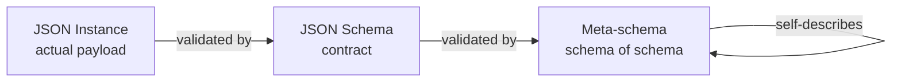
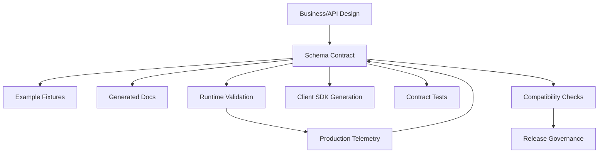
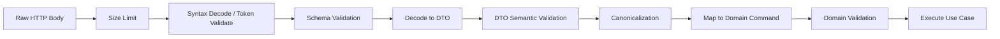
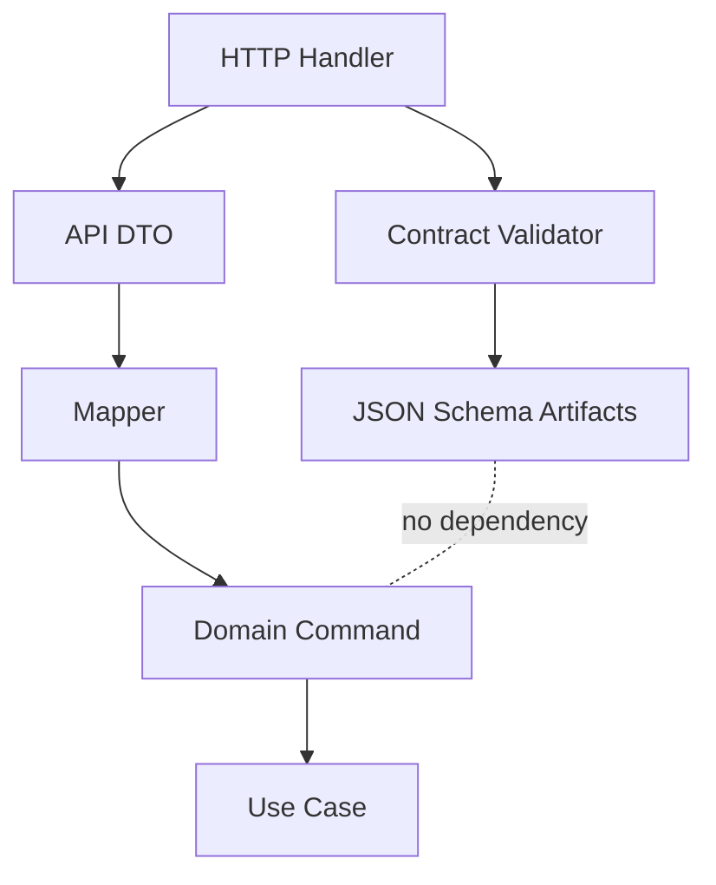

# learn-go-data-mapper-json-xml-protobuf-validation-part-013.md

# Part 013 — JSON Schema as External Contract

> Seri: `learn-go-data-mapper-json-xml-protobuf-validation`  
> Bagian: `013 / 033`  
> Topik: JSON Schema sebagai kontrak eksternal, schema vocabulary, dialect, `$schema`, `$id`, `$ref`, validation keywords, annotation keywords, composition, compatibility, governance, dan batasannya dalam sistem Go production.  
> Target pembaca: Java software engineer yang ingin naik dari sekadar DTO validation ke contract engineering level internal platform/handbook.

---

## 0. Kenapa bagian ini penting?

Di bagian sebelumnya kita sudah membahas JSON dari sisi Go runtime: `encoding/json`, nullability, numeric precision, custom marshal/unmarshal, strict decoding, streaming, dan JSON v2. Tetapi semua itu masih berangkat dari perspektif **code yang memproses payload**.

JSON Schema mengubah sudut pandang:

> JSON Schema bukan serializer. JSON Schema adalah bahasa kontrak untuk mendeskripsikan, membatasi, mendokumentasikan, dan memvalidasi bentuk JSON instance di luar implementasi Go.

Ini penting karena dalam sistem nyata, JSON tidak hanya bergerak di satu service Go. JSON melewati banyak boundary:

- browser → API gateway,
- partner system → public API,
- service A → service B,
- event producer → message broker → consumer,
- data ingestion pipeline → storage,
- internal admin UI → workflow/case-management engine,
- generated SDK → external client,
- audit/archive system → analytical consumers.

Kalau kontrak hanya hidup di struct Go, maka contract truth-nya tersembunyi dalam implementasi. Tim lain harus membaca kode Go, menebak tag, menebak validator, menebak nullability, dan menebak aturan backward compatibility. Itu tidak scalable.

JSON Schema membuat contract menjadi artifact eksplisit yang dapat:

1. disimpan di repository,
2. direview di pull request,
3. divalidasi di CI,
4. dipakai linting,
5. dipakai runtime validation,
6. dipakai documentation,
7. dipakai generated tests,
8. dipakai consumer contract testing,
9. dipakai schema registry,
10. dipakai governance lint.

Namun ada jebakan besar: banyak engineer memperlakukan JSON Schema seperti “Bean Validation versi JSON”. Itu kurang tepat. JSON Schema punya model evaluasi, dialect, vocabulary, annotation, applicator, reference resolution, dan compatibility implication yang berbeda.

Part ini akan membangun mental model tersebut dari nol, tetapi dengan kedalaman production.

---

## 1. Learning objectives

Setelah menyelesaikan part ini, kamu harus mampu:

1. Menjelaskan perbedaan **JSON document**, **JSON instance**, **JSON Schema**, **meta-schema**, **dialect**, dan **vocabulary**.
2. Mendesain JSON Schema sebagai kontrak eksternal, bukan sekadar output generator dari struct Go.
3. Membedakan keyword yang bersifat **assertion**, **annotation**, dan **applicator**.
4. Memahami cara kerja `$schema`, `$id`, `$ref`, `$defs`, `$anchor`, `$dynamicRef`, dan `$dynamicAnchor` pada level mental model.
5. Menggunakan `type`, `required`, `properties`, `additionalProperties`, `unevaluatedProperties`, `oneOf`, `anyOf`, `allOf`, `not`, `enum`, `const`, `pattern`, `format`, dan constraint lain dengan benar.
6. Menghindari bug umum seperti schema yang tampak ketat tetapi sebenarnya permissive.
7. Mendesain compatibility policy untuk schema evolution.
8. Memahami batas JSON Schema: tidak menggantikan domain validation, authorization, cross-entity validation, atau workflow invariant.
9. Menentukan kapan JSON Schema cocok untuk API, event, config, ingestion, atau partner integration.
10. Membuat governance model untuk schema review, CI validation, dan schema registry.

---

## 2. Baseline faktual modern

Baseline yang digunakan dalam seri ini:

| Area | Baseline |
|---|---|
| JSON syntax | RFC 8259 mental model: JSON values adalah object, array, string, number, boolean, null. |
| JSON Schema | Draft 2020-12 sebagai baseline modern. |
| OpenAPI | OpenAPI 3.1 berbasis JSON Schema Draft 2020-12 dengan dialect OpenAPI sendiri. |
| Go runtime JSON | `encoding/json` stabil, `encoding/json/v2` dan `jsontext` experimental di era Go 1.26. |
| Runtime validation Go | Akan dibahas lebih detail di part 014. |
| Contract governance | Schema-first, code-first, dan hybrid akan dibandingkan. |

Hal penting dari JSON Schema Draft 2020-12:

1. JSON Schema memiliki beberapa vocabulary.
2. Meta-schema digunakan untuk memvalidasi schema.
3. `$schema` menentukan dialect/schema processing rules.
4. `$id` memengaruhi base URI untuk reference resolution.
5. `format` pada default vocabulary lebih aman dipahami sebagai annotation, kecuali validator dikonfigurasi untuk menjadikannya assertion.
6. Applicator keywords seperti `allOf`, `anyOf`, `oneOf`, `if/then/else`, `properties`, dan `items` tidak selalu “menutup” object kecuali dikombinasikan dengan keyword tambahan.
7. Draft modern membawa konsep annotation-dependent evaluation seperti `unevaluatedProperties` dan dynamic references.

---

## 3. Core mental model: schema is not your Go struct

Kesalahan paling umum dari engineer Java/Go adalah berpikir:

```text
JSON Schema = representasi external dari class/struct
```

Lebih tepat:

```text
JSON Schema = kontrak atas JSON instance yang terlihat di boundary
```

Struct Go adalah implementation model. JSON Schema adalah boundary contract. Keduanya bisa mirip, tetapi tidak wajib identik.

Contoh:

```go
type CreateCaseRequest struct {
    CaseType string `json:"caseType" validate:"required,oneof=COMPLAINT APPEAL ENQUIRY"`
    Priority string `json:"priority,omitempty" validate:"omitempty,oneof=LOW NORMAL HIGH"`
    Remarks  string `json:"remarks,omitempty" validate:"max=2000"`
}
```

Schema kontrak mungkin seperti ini:

```json
{
  "$schema": "https://json-schema.org/draft/2020-12/schema",
  "$id": "https://schemas.example.gov/case/create-case-request.schema.json",
  "title": "CreateCaseRequest",
  "type": "object",
  "required": ["caseType"],
  "properties": {
    "caseType": {
      "type": "string",
      "enum": ["COMPLAINT", "APPEAL", "ENQUIRY"]
    },
    "priority": {
      "type": "string",
      "enum": ["LOW", "NORMAL", "HIGH"],
      "default": "NORMAL"
    },
    "remarks": {
      "type": "string",
      "maxLength": 2000
    }
  },
  "additionalProperties": false
}
```

Tampak mirip, tetapi sebenarnya ada beberapa perbedaan makna:

| Concern | Struct Go | JSON Schema |
|---|---|---|
| Field visibility | Exported field menentukan serializable field. | `properties` menentukan contract-visible field. |
| Required | Tidak diekspresikan native oleh struct. | `required` eksplisit. |
| Optional | Tergantung zero value, pointer, custom optional. | Field tidak ada di `required`. |
| Unknown fields | Decode behavior runtime. | `additionalProperties` / `unevaluatedProperties`. |
| Default | Biasanya diisi kode. | `default` annotation, bukan otomatis mengubah instance. |
| Enum | Tipe custom/string validation. | `enum`/`const`. |
| Documentation | Comment/tag external. | `title`, `description`, `examples`, `$comment`. |
| Compatibility | Perubahan struct bisa silent. | Perubahan schema bisa dianalisis sebagai contract change. |

Mental model yang harus dipegang:

> Struct adalah salah satu cara implementasi. Schema adalah janji boundary.

---

## 4. JSON instance, schema, meta-schema, dialect, vocabulary

### 4.1 JSON instance

Dalam terminologi JSON Schema, data yang divalidasi disebut **instance**.

Contoh instance:

```json
{
  "caseType": "COMPLAINT",
  "priority": "HIGH",
  "remarks": "Citizen submitted repeated noise complaint."
}
```

Instance ini dapat divalidasi oleh schema.

### 4.2 JSON Schema

Schema adalah dokumen JSON yang mendeskripsikan constraints terhadap instance.

```json
{
  "type": "object",
  "required": ["caseType"],
  "properties": {
    "caseType": { "type": "string" }
  }
}
```

Schema sendiri juga JSON. Artinya schema bisa divalidasi oleh schema lain.

### 4.3 Meta-schema

Meta-schema adalah schema untuk memvalidasi schema.

```text
JSON instance ----validated by----> JSON Schema
JSON Schema   ----validated by----> Meta-schema
```

Diagram:



Meta-schema penting karena:

1. membantu mendeteksi schema invalid,
2. menentukan dialect,
3. memberi tahu validator keyword apa yang legal,
4. membantu tooling dan editor.

### 4.4 Dialect

Dialect adalah kumpulan aturan pemrosesan schema.

`$schema` biasanya menunjuk dialect:

```json
{
  "$schema": "https://json-schema.org/draft/2020-12/schema"
}
```

Tanpa `$schema`, tooling bisa menebak. Dalam production, jangan mengandalkan tebakan.

Rule:

> Setiap schema yang menjadi entry point contract harus punya `$schema` eksplisit.

### 4.5 Vocabulary

Vocabulary adalah kelompok keyword dengan semantics tertentu.

Contoh vocabulary mental:

| Vocabulary | Contoh keyword | Fungsi |
|---|---|---|
| Core | `$schema`, `$id`, `$ref`, `$defs` | Identitas, reference, processing. |
| Validation | `type`, `maxLength`, `enum`, `required` | Assertion terhadap instance. |
| Applicator | `allOf`, `anyOf`, `oneOf`, `properties`, `items` | Mengaplikasikan subschema. |
| Unevaluated | `unevaluatedProperties`, `unevaluatedItems` | Kontrol bagian yang belum dievaluasi. |
| Metadata | `title`, `description`, `default`, `examples` | Annotation/documentation. |
| Format Annotation | `format` | Annotation format. |
| Format Assertion | `format` sebagai validasi bila didukung/diaktifkan. | Validasi format. |
| Content | `contentMediaType`, `contentEncoding`, `contentSchema` | Metadata untuk encoded content. |

Ini jauh lebih kaya daripada Java Bean Validation, karena schema language bukan hanya daftar constraint field.

---

## 5. Assertion vs annotation vs applicator

Untuk memahami JSON Schema, kamu harus membedakan tiga jenis keyword.

### 5.1 Assertion keywords

Assertion menghasilkan valid/invalid terhadap instance.

Contoh:

```json
{
  "type": "string",
  "minLength": 1,
  "maxLength": 100,
  "pattern": "^[A-Z0-9_-]+$"
}
```

Jika instance melanggar, validation gagal.

### 5.2 Annotation keywords

Annotation memberi metadata. Tidak otomatis membuat instance invalid.

Contoh:

```json
{
  "type": "string",
  "title": "Case Reference Number",
  "description": "Human-readable reference assigned to a case.",
  "default": "UNKNOWN",
  "examples": ["CASE-2026-000001"]
}
```

`default` sering disalahpahami. Dalam JSON Schema, `default` adalah annotation. Validator tidak wajib mengisi value ke instance.

Kesalahan umum:

```json
{
  "type": "string",
  "default": "NORMAL"
}
```

Lalu engineer mengira payload yang tidak punya field akan otomatis diberi `NORMAL`. Tidak begitu, kecuali tooling/aplikasi kamu secara eksplisit menerapkan defaulting.

### 5.3 Applicator keywords

Applicator menerapkan subschema ke bagian instance atau menggabungkan hasil evaluasi.

Contoh:

```json
{
  "allOf": [
    { "$ref": "#/$defs/BaseCase" },
    { "$ref": "#/$defs/ComplaintFields" }
  ]
}
```

Applicator tidak sama dengan inheritance class. Ia adalah evaluasi schema.

---

## 6. The top-level schema skeleton

Untuk production, hindari schema anonim tanpa identitas.

Minimal skeleton:

```json
{
  "$schema": "https://json-schema.org/draft/2020-12/schema",
  "$id": "https://schemas.example.gov/case/create-case-request.schema.json",
  "title": "CreateCaseRequest",
  "description": "Request body for creating a case.",
  "type": "object",
  "required": ["caseType"],
  "properties": {
    "caseType": {
      "type": "string"
    }
  },
  "additionalProperties": false
}
```

Setiap bagian punya fungsi:

| Field | Fungsi |
|---|---|
| `$schema` | Dialect/processing model. |
| `$id` | Identitas schema resource dan base URI. |
| `title` | Nama manusia/tooling. |
| `description` | Dokumentasi contract. |
| `type` | Constraint tipe instance. |
| `required` | Required property names untuk object. |
| `properties` | Schema untuk property yang dikenal. |
| `additionalProperties` | Policy untuk property yang tidak didefinisikan. |

Rule internal handbook:

> Top-level external contract schema harus punya `$schema`, `$id`, `title`, `description`, `type`, explicit object strictness policy, dan examples/test fixtures.

---

## 7. JSON types and Go type mismatch

JSON punya tipe terbatas:

| JSON Schema type | JSON instance type | Go candidate |
|---|---|---|
| `null` | null | `nil`, pointer nil, custom optional |
| `boolean` | true/false | `bool` |
| `object` | object | struct, map |
| `array` | array | slice, array |
| `number` | number | `float64`, decimal, custom number |
| `integer` | number with integer mathematical value | `int`, `int64`, `uint64`, big.Int, string-encoded ID |
| `string` | string | `string`, custom type |

Penting: JSON sendiri tidak punya tipe integer terpisah seperti Java `int`/`long` atau Go `int64`. JSON Schema menambahkan `integer` sebagai konsep matematis: angka tanpa fractional part.

Schema:

```json
{ "type": "integer" }
```

Instance berikut bisa dianggap integer secara matematis oleh JSON Schema:

```json
1
```

Dan dalam konteks JSON Schema/OpenAPI, `1.0` juga sering dipahami equivalent secara matematis, tergantung parser numeric representation. Maka untuk ID besar, jangan asal memakai JSON number.

Production rule:

> Field yang secara bisnis adalah identifier, reference number, account number, postal code, phone number, atau document number harus dipertimbangkan sebagai string, bukan JSON number.

---

## 8. Object modeling: required, properties, additionalProperties

### 8.1 `required` tidak berarti non-empty

Schema:

```json
{
  "type": "object",
  "required": ["name"],
  "properties": {
    "name": { "type": "string" }
  }
}
```

Payload valid:

```json
{ "name": "" }
```

Karena `required` hanya berarti property hadir. Untuk non-empty:

```json
{
  "type": "object",
  "required": ["name"],
  "properties": {
    "name": {
      "type": "string",
      "minLength": 1
    }
  }
}
```

Mapping ke Java mental model:

| Java Bean Validation | JSON Schema equivalent-ish | Catatan |
|---|---|---|
| `@NotNull` | property in `required` + type not including null | `required` hanya berlaku pada object property. |
| `@NotBlank` | `type: string`, `minLength: 1`, pattern non-whitespace | `minLength: 1` tidak melarang whitespace. |
| `@Size(max=100)` | `maxLength`, `maxItems`, `maxProperties` | Keyword tergantung type. |
| `@Pattern` | `pattern` | Regex dialect perlu diperhatikan. |
| `@Email` | `format: email` | Format bisa annotation saja. |

### 8.2 `properties` tidak menolak unknown fields

Kesalahan besar:

```json
{
  "type": "object",
  "properties": {
    "caseType": { "type": "string" }
  }
}
```

Banyak engineer mengira schema ini hanya menerima `caseType`. Salah. Secara default, property lain masih boleh.

Payload berikut valid:

```json
{
  "caseType": "COMPLAINT",
  "hacked": true,
  "unexpected": "still valid"
}
```

Untuk strict object:

```json
{
  "type": "object",
  "properties": {
    "caseType": { "type": "string" }
  },
  "additionalProperties": false
}
```

Production rule:

> Untuk request command DTO, default posture sebaiknya strict: `additionalProperties: false`, kecuali ada explicit extension mechanism.

### 8.3 `additionalProperties` as extension map

Kadang kamu memang ingin extension:

```json
{
  "type": "object",
  "required": ["eventType", "extensions"],
  "properties": {
    "eventType": { "type": "string" },
    "extensions": {
      "type": "object",
      "additionalProperties": {
        "type": ["string", "number", "boolean", "null"]
      }
    }
  },
  "additionalProperties": false
}
```

Lebih baik punya field `extensions` eksplisit daripada membiarkan semua top-level unknown bebas.

### 8.4 `additionalProperties` as typed map

Untuk map string → object:

```json
{
  "type": "object",
  "additionalProperties": {
    "type": "object",
    "required": ["enabled"],
    "properties": {
      "enabled": { "type": "boolean" }
    },
    "additionalProperties": false
  }
}
```

Go implementation candidate:

```go
type FeatureFlags map[string]FeatureFlag

type FeatureFlag struct {
    Enabled bool `json:"enabled"`
}
```

---

## 9. `additionalProperties` vs `unevaluatedProperties`

`additionalProperties` terlihat sederhana, tetapi bisa menjadi tricky saat memakai composition.

Contoh:

```json
{
  "allOf": [
    {
      "type": "object",
      "properties": {
        "id": { "type": "string" }
      },
      "additionalProperties": false
    },
    {
      "type": "object",
      "properties": {
        "name": { "type": "string" }
      },
      "additionalProperties": false
    }
  ]
}
```

Intuisi engineer OOP: object harus punya `id` dan `name`, no extra properties.

Namun setiap subschema melihat property lain sebagai additional. Akibatnya payload `{ "id": "1", "name": "A" }` bisa gagal karena schema pertama melihat `name` sebagai additional, schema kedua melihat `id` sebagai additional.

Draft modern menyediakan `unevaluatedProperties` untuk menangani pola seperti ini:

```json
{
  "allOf": [
    {
      "type": "object",
      "properties": {
        "id": { "type": "string" }
      }
    },
    {
      "type": "object",
      "properties": {
        "name": { "type": "string" }
      }
    }
  ],
  "unevaluatedProperties": false
}
```

Mental model:

| Keyword | Scope mental |
|---|---|
| `additionalProperties` | Property yang tidak didefinisikan oleh sibling `properties`/`patternProperties` di schema yang sama. |
| `unevaluatedProperties` | Property yang belum dievaluasi oleh schema/subschema yang relevan. |

Production guidance:

1. Untuk schema flat sederhana, `additionalProperties: false` cukup.
2. Untuk schema composition, pertimbangkan `unevaluatedProperties: false`.
3. Pastikan validator Go yang dipakai mendukung draft/vocabulary terkait.
4. Jangan campur composition dan object strictness tanpa contract tests.

---

## 10. Nullability in JSON Schema

JSON Schema Draft 2020-12 memakai type union untuk nullability:

```json
{
  "type": ["string", "null"]
}
```

Artinya instance boleh string atau null.

Perhatikan perbedaan:

```json
{
  "type": "object",
  "required": ["middleName"],
  "properties": {
    "middleName": { "type": ["string", "null"] }
  }
}
```

Field wajib hadir, tetapi nilainya boleh null.

Valid:

```json
{ "middleName": null }
```

Invalid:

```json
{}
```

Untuk optional nullable:

```json
{
  "type": "object",
  "properties": {
    "middleName": { "type": ["string", "null"] }
  }
}
```

Valid:

```json
{}
```

Valid:

```json
{ "middleName": null }
```

Valid:

```json
{ "middleName": "Abdi" }
```

Mapping ke Go:

| Schema meaning | Go representation candidate |
|---|---|
| required non-null string | `string` + schema/runtime validation required |
| optional non-null string | custom `Optional[string]` or `*string` with null rejection |
| required nullable string | custom nullable type or `*string` with presence tracking |
| optional nullable string | tri-state optional nullable type |

JSON Schema bisa membedakan absent vs null melalui kombinasi `required` dan type union. Go struct pointer saja sering tidak cukup, karena absent dan null sama-sama bisa menjadi `nil` tanpa custom tracking.

---

## 11. Arrays and tuple modeling

### 11.1 Homogeneous arrays

```json
{
  "type": "array",
  "items": {
    "type": "string"
  },
  "minItems": 1,
  "uniqueItems": true
}
```

Go:

```go
type Tags []string
```

Important:

- `minItems` tidak sama dengan non-nil slice.
- `uniqueItems` bisa mahal untuk array besar.
- Equality untuk object items dapat kompleks.

### 11.2 Tuple-like arrays

Draft 2020-12 memakai `prefixItems` untuk tuple-like arrays:

```json
{
  "type": "array",
  "prefixItems": [
    { "type": "number" },
    { "type": "number" }
  ],
  "minItems": 2,
  "maxItems": 2
}
```

Contoh instance:

```json
[106.8456, -6.2088]
```

Untuk public API, tuple arrays sering kurang self-documenting dibanding object:

```json
{
  "type": "object",
  "required": ["longitude", "latitude"],
  "properties": {
    "longitude": { "type": "number" },
    "latitude": { "type": "number" }
  },
  "additionalProperties": false
}
```

Production guidance:

> Gunakan tuple array hanya bila contract eksternal memang mengikuti standar yang memerlukannya, misalnya beberapa format geospatial. Untuk domain API biasa, object lebih defensible.

---

## 12. String constraints

String constraints umum:

```json
{
  "type": "string",
  "minLength": 1,
  "maxLength": 100,
  "pattern": "^[A-Z0-9_-]+$"
}
```

### 12.1 `minLength` bukan `trimmed min length`

`minLength: 1` mengizinkan:

```json
"   "
```

Jika butuh non-blank:

```json
{
  "type": "string",
  "pattern": "^(?=.*\\S).+$"
}
```

Namun regex portability perlu diperhatikan. Dalam banyak sistem, lebih baik:

1. schema mengecek tipe dan panjang kasar,
2. application canonicalization melakukan trim/normalize,
3. domain validation mengecek business meaning.

### 12.2 Regex tidak selalu sama antar ecosystem

JSON Schema pattern mengikuti regex semantics tertentu, tetapi validator berbeda bisa berbeda detail. Untuk constraint kritis:

- test dengan official/target validator,
- hindari regex terlalu pintar,
- dokumentasikan intent,
- tambahkan examples valid/invalid.

### 12.3 Unicode length

`maxLength` dihitung berdasarkan panjang string Unicode, bukan byte Go. Jangan samakan dengan `len(s)` di Go.

Go:

```go
len("é") // bytes, bisa 2
```

Untuk rune count:

```go
utf8.RuneCountInString(s)
```

Tetapi bahkan rune count tidak selalu sama dengan user-perceived character/grapheme cluster. Untuk UI-facing field, pahami limit yang kamu enforce.

---

## 13. Numeric constraints

Contoh:

```json
{
  "type": "integer",
  "minimum": 1,
  "maximum": 999999
}
```

```json
{
  "type": "number",
  "exclusiveMinimum": 0,
  "multipleOf": 0.01
}
```

### 13.1 Money should not be naive JSON number

Skema yang tampak nyaman:

```json
{
  "type": "number",
  "multipleOf": 0.01
}
```

Masalahnya:

- JSON parser bisa memakai binary floating point.
- `0.1 + 0.2` style precision issue bisa muncul di consumer.
- Banyak bahasa punya decimal story berbeda.

Pilihan lebih defensible:

#### Minor-unit integer

```json
{
  "type": "object",
  "required": ["amountMinor", "currency"],
  "properties": {
    "amountMinor": { "type": "integer" },
    "currency": {
      "type": "string",
      "pattern": "^[A-Z]{3}$"
    }
  },
  "additionalProperties": false
}
```

#### Decimal string

```json
{
  "type": "object",
  "required": ["amount", "currency"],
  "properties": {
    "amount": {
      "type": "string",
      "pattern": "^-?[0-9]+(\\.[0-9]{1,2})?$"
    },
    "currency": {
      "type": "string",
      "pattern": "^[A-Z]{3}$"
    }
  },
  "additionalProperties": false
}
```

Decision:

| Representation | Cocok untuk | Risiko |
|---|---|---|
| JSON number | scientific/measurement approximate values | precision drift |
| integer minor unit | payments, fees, counters | currency exponent complexity |
| decimal string | external financial API | parsing burden, regex correctness |

---

## 14. Enum and const

### 14.1 Enum

```json
{
  "type": "string",
  "enum": ["DRAFT", "SUBMITTED", "APPROVED", "REJECTED"]
}
```

Go:

```go
type CaseStatus string

const (
    CaseStatusDraft     CaseStatus = "DRAFT"
    CaseStatusSubmitted CaseStatus = "SUBMITTED"
    CaseStatusApproved  CaseStatus = "APPROVED"
    CaseStatusRejected  CaseStatus = "REJECTED"
)
```

Schema enum is a contract. Adding enum value can be breaking for old consumers if they assume exhaustive switch.

### 14.2 Const

```json
{
  "type": "object",
  "required": ["eventType", "payload"],
  "properties": {
    "eventType": { "const": "CASE_CREATED" },
    "payload": { "$ref": "#/$defs/CaseCreatedPayload" }
  },
  "additionalProperties": false
}
```

`const` sangat berguna untuk discriminated event.

---

## 15. Composition: allOf, anyOf, oneOf, not

### 15.1 `allOf`

`allOf` berarti instance harus valid terhadap semua subschema.

```json
{
  "allOf": [
    { "$ref": "#/$defs/BaseEvent" },
    { "$ref": "#/$defs/CaseCreatedEvent" }
  ]
}
```

Jangan menyamakan `allOf` dengan inheritance. Ia tidak “merge object” seperti class extends. Ia menjalankan semua validation.

### 15.2 `anyOf`

`anyOf` berarti instance valid jika memenuhi minimal satu subschema.

```json
{
  "anyOf": [
    { "required": ["email"] },
    { "required": ["phone"] }
  ]
}
```

Artinya boleh punya keduanya.

### 15.3 `oneOf`

`oneOf` berarti instance valid jika memenuhi tepat satu subschema.

```json
{
  "oneOf": [
    { "$ref": "#/$defs/IndividualApplicant" },
    { "$ref": "#/$defs/CompanyApplicant" }
  ]
}
```

Bahaya: jika dua subschema overlap, `oneOf` bisa gagal karena instance cocok lebih dari satu.

Lebih defensible memakai discriminator field:

```json
{
  "type": "object",
  "required": ["applicantType"],
  "properties": {
    "applicantType": {
      "enum": ["INDIVIDUAL", "COMPANY"]
    }
  },
  "allOf": [
    {
      "if": {
        "properties": { "applicantType": { "const": "INDIVIDUAL" } },
        "required": ["applicantType"]
      },
      "then": { "$ref": "#/$defs/IndividualApplicantFields" }
    },
    {
      "if": {
        "properties": { "applicantType": { "const": "COMPANY" } },
        "required": ["applicantType"]
      },
      "then": { "$ref": "#/$defs/CompanyApplicantFields" }
    }
  ],
  "unevaluatedProperties": false
}
```

### 15.4 `not`

`not` menolak instance yang valid terhadap subschema.

```json
{
  "not": {
    "required": ["deprecatedField"]
  }
}
```

Gunakan hati-hati. `not` dapat membuat error message buruk dan debugging sulit.

---

## 16. Conditional schema: if/then/else

Contoh request case:

```json
{
  "type": "object",
  "required": ["caseType"],
  "properties": {
    "caseType": {
      "type": "string",
      "enum": ["COMPLAINT", "APPEAL"]
    },
    "appealReference": { "type": "string" },
    "complaintCategory": { "type": "string" }
  },
  "if": {
    "properties": { "caseType": { "const": "APPEAL" } },
    "required": ["caseType"]
  },
  "then": {
    "required": ["appealReference"]
  },
  "else": {
    "required": ["complaintCategory"]
  },
  "additionalProperties": false
}
```

Ini validasi struktural/semantic ringan. Tetapi jangan memaksakan semua business workflow ke JSON Schema.

Contoh yang tidak cocok murni JSON Schema:

- `appealReference` harus ada di database.
- user harus punya permission terhadap referenced case.
- appeal hanya boleh dibuat dalam 14 hari sejak decision date.
- decision state machine harus sedang dalam appealable state.

Itu domain/application validation.

---

## 17. References: `$id`, `$defs`, `$ref`, `$anchor`

### 17.1 `$defs`

`$defs` menyimpan reusable subschema.

```json
{
  "$schema": "https://json-schema.org/draft/2020-12/schema",
  "$id": "https://schemas.example.gov/common/common.schema.json",
  "$defs": {
    "CaseReference": {
      "type": "string",
      "pattern": "^CASE-[0-9]{4}-[0-9]{6}$"
    }
  }
}
```

Local reference:

```json
{
  "$ref": "#/$defs/CaseReference"
}
```

### 17.2 `$id` as resource identity and base URI

`$id` bukan sekadar metadata. Ia memengaruhi reference resolution.

```json
{
  "$id": "https://schemas.example.gov/case/",
  "$defs": {
    "CaseReference": {
      "$id": "case-reference.schema.json",
      "type": "string"
    }
  }
}
```

Relative `$id` dapat mengubah URI resource menjadi:

```text
https://schemas.example.gov/case/case-reference.schema.json
```

Production rule:

> Jangan asal menambahkan `$id` di nested schema kecuali kamu memahami reference resolution.

### 17.3 `$ref` replaces? applies?

Dalam JSON Schema modern, `$ref` adalah applicator yang merujuk ke schema lain. Hindari mengandalkan behavior lama atau asumsi “sibling ignored”. Untuk maximum compatibility antar tooling, style yang lebih aman:

```json
{
  "allOf": [
    { "$ref": "https://schemas.example.gov/common/case-reference.schema.json" }
  ],
  "description": "Reference to an existing case."
}
```

Namun tooling modern Draft 2020-12 lebih baik menangani siblings. Tetap test validator target kamu.

### 17.4 `$anchor`

Anchor memberi nama fragment yang lebih stabil:

```json
{
  "$id": "https://schemas.example.gov/common/common.schema.json",
  "$defs": {
    "CaseReference": {
      "$anchor": "CaseReference",
      "type": "string",
      "pattern": "^CASE-[0-9]{4}-[0-9]{6}$"
    }
  }
}
```

Reference:

```json
{
  "$ref": "https://schemas.example.gov/common/common.schema.json#CaseReference"
}
```

---

## 18. Dynamic references: powerful, but dangerous

Draft modern mendukung `$dynamicRef` dan `$dynamicAnchor`. Ini berguna untuk generic/extensible schema patterns, tetapi kompleks.

Mental model sederhana:

- `$anchor` adalah static anchor.
- `$dynamicAnchor` bisa di-override dalam dynamic resolution scope.
- `$dynamicRef` mencari matching dynamic anchor dalam path evaluasi.

Gunakan hanya bila:

1. kamu membangun schema framework/platform,
2. kamu butuh recursive extensibility,
3. tim memahami behavior validator,
4. ada conformance tests,
5. ada alasan kuat yang tidak bisa diselesaikan dengan `$ref` biasa.

Untuk API contract biasa, hindari.

Rule:

> `$dynamicRef` bukan feature untuk daily DTO modeling. Treat sebagai schema-language engineering feature.

---

## 19. Format: annotation or assertion?

Contoh:

```json
{
  "type": "string",
  "format": "email"
}
```

Banyak engineer mengira ini pasti validasi email. Dalam JSON Schema modern, `format` pada default posture sering diperlakukan sebagai annotation, kecuali validator/tooling mengaktifkan format assertion atau memakai vocabulary terkait.

Konsekuensi:

1. Service A mungkin menolak invalid email.
2. Service B mungkin menerimanya karena `format` hanya annotation.
3. Generated docs terlihat sama, runtime behavior berbeda.

Production guidance:

- Jangan rely pada `format` untuk invariant kritis tanpa memastikan validator mengaktifkan assertion.
- Untuk field penting, kombinasikan dengan application validation.
- Dokumentasikan format validation policy.

Example defensive schema:

```json
{
  "type": "string",
  "format": "email",
  "maxLength": 320
}
```

Application-level Go validation tetap perlu untuk canonicalization dan policy.

---

## 20. Content keywords: encoded data is not decoded automatically

JSON Schema punya content-related keywords:

```json
{
  "type": "string",
  "contentEncoding": "base64",
  "contentMediaType": "application/pdf"
}
```

Ini mendeskripsikan bahwa string berisi encoded content. Tetapi validator tidak selalu mendecode dan memvalidasi isi.

Contoh request upload metadata:

```json
{
  "type": "object",
  "required": ["filename", "content"],
  "properties": {
    "filename": { "type": "string", "maxLength": 255 },
    "content": {
      "type": "string",
      "contentEncoding": "base64",
      "contentMediaType": "application/pdf"
    }
  },
  "additionalProperties": false
}
```

Application tetap harus:

- limit body size,
- decode base64,
- validate decoded size,
- sniff/validate file type,
- scan malware jika perlu,
- enforce storage policy.

Schema tidak menggantikan keamanan file processing.

---

## 21. Schema as external contract: where it belongs

Diagram lifecycle:



Schema sebaiknya menjadi artifact first-class:

```text
schemas/
  case/
    v1/
      create-case-request.schema.json
      create-case-response.schema.json
      case-created-event.schema.json
      examples/
        create-case-request.valid.json
        create-case-request.invalid.missing-case-type.json
  common/
    v1/
      case-reference.schema.json
      money.schema.json
      pagination.schema.json
```

Bukan sekadar generated file tersembunyi di build output.

---

## 22. Schema-first vs code-first vs hybrid

### 22.1 Schema-first

Schema ditulis dan direview sebagai sumber kebenaran, lalu code mengikuti.

Cocok untuk:

- public API,
- multi-language consumers,
- partner integration,
- regulated/governed systems,
- event schema registry,
- platform contract.

Kelebihan:

- contract eksplisit,
- reviewable,
- language-neutral,
- tooling-friendly.

Kekurangan:

- butuh discipline,
- bisa drift dari code,
- codegen untuk Go tidak selalu sempurna,
- schema authoring membutuhkan skill.

### 22.2 Code-first

Struct Go menjadi sumber, schema digenerate.

Cocok untuk:

- internal service kecil,
- rapid iteration,
- single-language consumers,
- prototype.

Kelebihan:

- cepat,
- dekat dengan implementation,
- lebih mudah untuk engineer Go.

Kekurangan:

- schema sering kehilangan semantic intent,
- tag overload,
- required/nullability sering ambigu,
- perubahan struct bisa breaking tanpa sadar,
- generator-specific.

### 22.3 Hybrid

Contract schema external tetap direview, tetapi sebagian digenerate atau disinkronkan dari code.

Pattern:

```text
Go DTO + annotations/tags
        ↓ generate draft schema
Human review + normalize contract schema
        ↓ contract tests
Runtime decode + validate + map to domain
```

Hybrid sering paling realistis untuk enterprise Go teams.

Decision matrix:

| Context | Recommended approach |
|---|---|
| Public API | Schema-first or OpenAPI-first. |
| Internal command API | Hybrid. |
| Config file | Schema-first. |
| Event contract | Schema-first with registry/compat checks. |
| Small internal CRUD service | Code-first acceptable with tests. |
| Regulated workflow/case data | Schema-first/hybrid with audit trail. |

---

## 23. How schema interacts with Go decode pipeline

Schema validation tidak menggantikan JSON decode. Pipeline yang benar:



Ada dua varian umum.

### 23.1 Validate raw JSON before decode

Pros:

- schema sees exact JSON instance,
- can catch unknown fields independent of Go struct,
- useful for generic gateways/ingestion,
- better for contract tests.

Cons:

- parse twice unless validator exposes decoded representation,
- more CPU,
- error mapping needs work.

### 23.2 Decode first, validate DTO

Pros:

- simple,
- no double parse,
- Go types help.

Cons:

- absent/null/duplicate/unknown can be lost before validation,
- schema may no longer see original instance,
- not good for strict contract boundary.

Production rule:

> For externally exposed APIs or event ingestion, validate at the JSON instance boundary before mapping to domain where feasible.

---

## 24. Contract categories: request, response, event, config

Schema meaning berbeda tergantung kategori.

### 24.1 Request command schema

Posture:

- strict unknown fields,
- required explicit,
- no read-only fields,
- no server-generated fields,
- validation errors should be client-friendly.

Example:

```json
{
  "$schema": "https://json-schema.org/draft/2020-12/schema",
  "$id": "https://schemas.example.gov/case/v1/create-case-request.schema.json",
  "title": "CreateCaseRequest",
  "type": "object",
  "required": ["caseType", "applicant"],
  "properties": {
    "caseType": { "enum": ["COMPLAINT", "APPEAL"] },
    "applicant": { "$ref": "https://schemas.example.gov/case/v1/applicant.schema.json" }
  },
  "additionalProperties": false
}
```

### 24.2 Response schema

Posture:

- may include server-generated fields,
- backward compatibility usually allows adding optional fields,
- consumers must tolerate unknown fields,
- documentation clarity is important.

### 24.3 Event schema

Posture:

- event envelope + payload,
- event type const/discriminator,
- versioning explicit,
- additions require compatibility analysis,
- consumers often lag behind.

Example:

```json
{
  "$schema": "https://json-schema.org/draft/2020-12/schema",
  "$id": "https://schemas.example.gov/case/events/v1/case-created.schema.json",
  "title": "CaseCreatedEvent",
  "type": "object",
  "required": ["eventId", "eventType", "occurredAt", "payload"],
  "properties": {
    "eventId": { "type": "string", "format": "uuid" },
    "eventType": { "const": "CASE_CREATED" },
    "occurredAt": { "type": "string", "format": "date-time" },
    "payload": { "$ref": "#/$defs/Payload" }
  },
  "additionalProperties": false,
  "$defs": {
    "Payload": {
      "type": "object",
      "required": ["caseId", "caseType"],
      "properties": {
        "caseId": { "type": "string" },
        "caseType": { "type": "string" }
      },
      "additionalProperties": true
    }
  }
}
```

Notice: envelope strict, payload may allow extension depending compatibility policy.

### 24.4 Config schema

Posture:

- strict unknown fields,
- defaults can be documented,
- application may apply defaults,
- error messages must be operator-friendly.

---

## 25. Backward compatibility mental model

Schema evolution harus dianalisis dari sisi consumer dan producer.

### 25.1 Request schema compatibility

For server accepting client requests:

| Change | Usually impact |
|---|---|
| Add optional property | Backward compatible for clients; server can accept more. |
| Add required property | Breaking for existing clients. |
| Remove accepted property | Breaking if clients send it and strict mode active. |
| Narrow enum | Breaking. |
| Widen enum | May be compatible for request input, but affects downstream. |
| Narrow maxLength | Breaking. |
| Widen maxLength | Usually compatible. |
| Make nullable non-nullable | Breaking. |
| Make non-nullable nullable | Might be compatible syntactically, but domain risk. |
| Set `additionalProperties` false from true | Breaking. |

### 25.2 Response schema compatibility

For server returning responses:

| Change | Usually impact |
|---|---|
| Add optional response property | Usually backward compatible if clients ignore unknown fields. |
| Remove response property | Breaking if clients rely on it. |
| Add required property to response schema | Not necessarily breaking for existing server, but can affect generated clients/tests. |
| Change type | Breaking. |
| Widen enum | Can break exhaustive clients. |
| Narrow enum | Usually okay for clients but may indicate behavior change. |

### 25.3 Event schema compatibility

Events are harder because old events may remain in logs, queues, archives, and replay systems.

| Change | Risk |
|---|---|
| Add optional field | Usually compatible. |
| Add required field | Breaking for old producers/replay data. |
| Remove field | Breaking for consumers. |
| Rename field | Breaking; treat as add new + deprecate old. |
| Change field meaning | Dangerous even if schema shape same. |
| Change enum semantics | Dangerous. |
| Change event type | New event contract. |

Rule:

> Schema compatibility is about observable contract, not only validator pass/fail.

---

## 26. Compatibility examples

### 26.1 Safe-ish addition

Old:

```json
{
  "type": "object",
  "required": ["caseId"],
  "properties": {
    "caseId": { "type": "string" }
  },
  "additionalProperties": false
}
```

New:

```json
{
  "type": "object",
  "required": ["caseId"],
  "properties": {
    "caseId": { "type": "string" },
    "priority": { "type": "string", "enum": ["LOW", "NORMAL", "HIGH"] }
  },
  "additionalProperties": false
}
```

For response/event consumers that ignore unknown fields, this is usually compatible. For strict consumers validating response with old schema, this can fail. Compatibility depends on consumer posture.

### 26.2 Breaking required addition

New request schema:

```json
{
  "required": ["caseId", "reason"]
}
```

Existing clients that do not send `reason` break.

### 26.3 Silent semantic breaking change

Old:

```json
{
  "properties": {
    "status": {
      "enum": ["OPEN", "CLOSED"]
    }
  }
}
```

New:

```json
{
  "properties": {
    "status": {
      "enum": ["OPEN", "CLOSED"]
    }
  }
}
```

Schema unchanged, but product changed meaning of `CLOSED` from “case completed” to “case administratively closed but reopenable”. Schema diff says safe. Domain contract broke.

Rule:

> Schema diff is necessary but not sufficient. Meaning changes require semantic review.

---

## 27. Designing schema for evolvability

### 27.1 Prefer additive changes

Design v1 with extension points where expected.

Bad:

```json
{
  "type": "object",
  "required": ["metadata"],
  "properties": {
    "metadata": { "type": "object" }
  }
}
```

Too loose.

Better:

```json
{
  "type": "object",
  "properties": {
    "metadata": {
      "type": "object",
      "propertyNames": {
        "pattern": "^[a-zA-Z0-9_.-]{1,64}$"
      },
      "additionalProperties": {
        "type": ["string", "number", "boolean", "null"]
      },
      "maxProperties": 50
    }
  },
  "additionalProperties": false
}
```

Extension controlled, not unlimited.

### 27.2 Separate envelope and payload

For events:

```json
{
  "type": "object",
  "required": ["eventId", "eventType", "schemaVersion", "payload"],
  "properties": {
    "eventId": { "type": "string" },
    "eventType": { "type": "string" },
    "schemaVersion": { "type": "string" },
    "payload": { "type": "object" }
  },
  "additionalProperties": false
}
```

Envelope stable; payload evolves by event type/version.

### 27.3 Avoid polymorphism without discriminator

Ambiguous `oneOf` makes evolution risky. Add explicit `kind`/`type` field.

### 27.4 Do not encode version in every field name

Bad:

```json
{
  "caseIdV2": "...",
  "statusV2": "..."
}
```

Better:

```json
{
  "schemaVersion": "2.0",
  "caseId": "...",
  "status": "..."
}
```

Or URI/versioned schema ID.

---

## 28. Error modeling for schema validation

JSON Schema validators can return complex error trees. Production APIs need stable client-facing error format.

Raw validator error may be like:

```text
/priority: value must be one of LOW, NORMAL, HIGH
```

Public API error envelope:

```json
{
  "error": {
    "code": "VALIDATION_FAILED",
    "message": "Request body failed validation.",
    "fields": [
      {
        "path": "/priority",
        "code": "enum",
        "message": "priority must be one of LOW, NORMAL, HIGH",
        "rejectedValue": "URGENT"
      }
    ]
  }
}
```

Design rules:

1. Use JSON Pointer path for machine readability.
2. Provide stable machine code.
3. Keep human message helpful.
4. Avoid leaking internal schema paths if sensitive.
5. Limit number of errors to avoid huge responses.
6. Normalize errors across schema validator and application validation.

Part 028 will go deeper into validation error modeling.

---

## 29. JSON Pointer and field path semantics

JSON Schema error locations commonly use JSON Pointer concepts.

Example instance:

```json
{
  "applicant": {
    "addresses": [
      { "postalCode": "123456" },
      { "postalCode": "BAD" }
    ]
  }
}
```

Path to second postal code:

```text
/applicant/addresses/1/postalCode
```

Why important:

- API clients can map error to UI field.
- Logs can aggregate by path.
- Contract tests can assert exact failure location.
- Partial ingestion can report per-record errors.

For Go DTO field path, do not expose Go struct path like `Applicant.Addresses[1].PostalCode` if API contract uses JSON names. Prefer JSON Pointer/path based on wire contract.

---

## 30. Schema and documentation: annotation discipline

JSON Schema can carry documentation:

```json
{
  "title": "Priority",
  "description": "Operational priority assigned by the submitting officer.",
  "enum": ["LOW", "NORMAL", "HIGH"],
  "examples": ["NORMAL"]
}
```

But documentation can lie if not governed.

Review checklist:

- Does `description` define business meaning, not repeat field name?
- Are enum values documented?
- Are examples realistic and valid?
- Is `default` merely documented or actually applied by code?
- Is deprecated field marked and migration path described?
- Are sensitive fields labeled appropriately?

Bad description:

```json
{
  "description": "The priority."
}
```

Good description:

```json
{
  "description": "Operational priority requested by the submitter. The server may downgrade or upgrade this value based on policy."
}
```

---

## 31. `readOnly`, `writeOnly`, and direction-aware validation

In OpenAPI/JSON Schema usage, annotations like `readOnly` and `writeOnly` need context.

Example:

```json
{
  "type": "object",
  "required": ["caseId", "caseType"],
  "properties": {
    "caseId": {
      "type": "string",
      "readOnly": true
    },
    "caseType": {
      "type": "string"
    }
  }
}
```

For response, `caseId` should appear. For create request, client should not send it.

Pure JSON Schema does not know whether the instance is request or response. Application/tooling must apply direction-aware validation.

Production choice:

1. Separate request and response schema.
2. Or use shared schema with direction-aware tooling.

For high-clarity systems, prefer separate schema for command request and response projection.

---

## 32. Schema and security posture

JSON Schema can improve security but can also create false confidence.

### 32.1 Helpful security controls

- Reject unknown fields for command APIs.
- Limit string length.
- Limit array length.
- Limit object property count.
- Limit recursive structures.
- Constrain content type/encoding metadata.
- Avoid accepting arbitrary objects.
- Avoid regex that causes catastrophic backtracking in validator implementation.

### 32.2 Not sufficient

Schema does not replace:

- authentication,
- authorization,
- anti-CSRF,
- rate limiting,
- body size limit,
- file scanning,
- SQL injection prevention,
- business permission checks,
- workflow state checks,
- PII redaction,
- audit policy.

### 32.3 Schema-based DoS risk

Complex schemas with recursive refs, `oneOf`, `anyOf`, `unevaluatedProperties`, regex, and large payloads can be expensive.

Mitigations:

- body size limits,
- max depth limits where possible,
- schema linting,
- validator benchmarks,
- timeout/context if validator supports it,
- avoid unconstrained arrays/objects,
- cap validation errors.

---

## 33. Anti-patterns

### Anti-pattern 1: Schema generated and never reviewed

Generated schema can be useful, but if nobody reviews it, it becomes false documentation.

### Anti-pattern 2: `properties` without object strictness decision

```json
{
  "properties": {
    "a": { "type": "string" }
  }
}
```

This schema accepts almost anything unless `type`, `required`, and additional property policy are set.

### Anti-pattern 3: Relying on `format` for critical validation

`format: email` may not assert validation depending tooling.

### Anti-pattern 4: Treating `default` as mutation

Schema `default` does not automatically fill payload.

### Anti-pattern 5: Using `oneOf` without discriminator

Can become ambiguous and fragile under evolution.

### Anti-pattern 6: Putting business workflow rules into schema

Schema can express structure and some conditional logic. It should not own database existence, authorization, state transitions, or legal defensibility rules.

### Anti-pattern 7: No `$schema`, no `$id`

Anonymous schemas are harder to validate, reference, cache, and govern.

### Anti-pattern 8: Schema says nullable but Go cannot detect null vs absent

Contract and implementation diverge.

### Anti-pattern 9: Unlimited `additionalProperties: true`

Especially dangerous at top-level command boundary.

### Anti-pattern 10: Schema versioning by copy-paste with no compatibility diff

Version numbers without diff policy are theater.

---

## 34. Practical schema design example: case creation API

### 34.1 Requirements

A create case endpoint accepts:

- `caseType`: required enum.
- `applicant`: required object.
- `description`: required non-blank-ish string, max 4000.
- `attachments`: optional array, max 20.
- `metadata`: optional controlled extension map.
- Unknown top-level fields are rejected.

### 34.2 Schema

```json
{
  "$schema": "https://json-schema.org/draft/2020-12/schema",
  "$id": "https://schemas.example.gov/case/v1/create-case-request.schema.json",
  "title": "CreateCaseRequest",
  "description": "Request body for creating a regulatory case.",
  "type": "object",
  "required": ["caseType", "applicant", "description"],
  "properties": {
    "caseType": {
      "type": "string",
      "enum": ["COMPLAINT", "APPEAL", "ENQUIRY"],
      "description": "Type of case requested by the submitter."
    },
    "applicant": {
      "$ref": "#/$defs/Applicant"
    },
    "description": {
      "type": "string",
      "minLength": 1,
      "maxLength": 4000,
      "description": "Free-text case description. Application validation may reject whitespace-only values."
    },
    "attachments": {
      "type": "array",
      "maxItems": 20,
      "items": { "$ref": "#/$defs/Attachment" }
    },
    "metadata": {
      "type": "object",
      "maxProperties": 50,
      "propertyNames": {
        "pattern": "^[a-zA-Z0-9_.-]{1,64}$"
      },
      "additionalProperties": {
        "type": ["string", "number", "boolean", "null"]
      }
    }
  },
  "additionalProperties": false,
  "$defs": {
    "Applicant": {
      "type": "object",
      "required": ["name", "email"],
      "properties": {
        "name": {
          "type": "string",
          "minLength": 1,
          "maxLength": 200
        },
        "email": {
          "type": "string",
          "format": "email",
          "maxLength": 320
        }
      },
      "additionalProperties": false
    },
    "Attachment": {
      "type": "object",
      "required": ["filename", "contentType", "sizeBytes"],
      "properties": {
        "filename": {
          "type": "string",
          "minLength": 1,
          "maxLength": 255
        },
        "contentType": {
          "type": "string",
          "enum": ["application/pdf", "image/png", "image/jpeg"]
        },
        "sizeBytes": {
          "type": "integer",
          "minimum": 1,
          "maximum": 10485760
        }
      },
      "additionalProperties": false
    }
  }
}
```

### 34.3 Corresponding Go DTO

```go
package caseapi

type CreateCaseRequest struct {
    CaseType    string            `json:"caseType"`
    Applicant   ApplicantDTO      `json:"applicant"`
    Description string            `json:"description"`
    Attachments []AttachmentDTO   `json:"attachments,omitempty"`
    Metadata    map[string]any    `json:"metadata,omitempty"`
}

type ApplicantDTO struct {
    Name  string `json:"name"`
    Email string `json:"email"`
}

type AttachmentDTO struct {
    Filename    string `json:"filename"`
    ContentType string `json:"contentType"`
    SizeBytes   int64  `json:"sizeBytes"`
}
```

But schema still says things Go cannot enforce by type:

| Constraint | Go type enforces? | Needs validation? |
|---|---:|---:|
| `caseType` enum | No | Yes |
| `description` max 4000 | No | Yes |
| attachments max 20 | No | Yes |
| metadata key pattern | No | Yes |
| unknown fields rejected | No, unless decoder/schema validation strict | Yes |
| email format | No | Yes |

---

## 35. Go boundary pattern with schema validation placeholder

Part 014 will discuss concrete libraries. For now, design the boundary as an interface so schema validation is replaceable.

```go
package contract

import "context"

type ValidationError struct {
    Path    string
    Code    string
    Message string
}

type Validator interface {
    ValidateJSON(ctx context.Context, schemaID string, document []byte) []ValidationError
}
```

HTTP pipeline:

```go
package httpapi

import (
    "context"
    "encoding/json"
    "errors"
    "fmt"
    "io"
    "net/http"

    "example.com/app/contract"
)

const maxBodyBytes = 1 << 20 // 1 MiB

type Handler struct {
    Validator contract.Validator
}

func (h *Handler) CreateCase(w http.ResponseWriter, r *http.Request) {
    body, err := readLimited(r.Body, maxBodyBytes)
    if err != nil {
        writeError(w, http.StatusBadRequest, "INVALID_BODY", err.Error())
        return
    }

    schemaErrors := h.Validator.ValidateJSON(
        r.Context(),
        "https://schemas.example.gov/case/v1/create-case-request.schema.json",
        body,
    )
    if len(schemaErrors) > 0 {
        writeValidationErrors(w, schemaErrors)
        return
    }

    var req CreateCaseRequest
    if err := json.Unmarshal(body, &req); err != nil {
        writeError(w, http.StatusBadRequest, "INVALID_JSON", err.Error())
        return
    }

    cmd, err := mapCreateCaseRequestToCommand(req)
    if err != nil {
        writeError(w, http.StatusBadRequest, "INVALID_REQUEST", err.Error())
        return
    }

    _ = cmd
    w.WriteHeader(http.StatusAccepted)
}

func readLimited(r io.Reader, limit int64) ([]byte, error) {
    lr := io.LimitReader(r, limit+1)
    b, err := io.ReadAll(lr)
    if err != nil {
        return nil, err
    }
    if int64(len(b)) > limit {
        return nil, fmt.Errorf("body exceeds %d bytes", limit)
    }
    return b, nil
}

func writeError(w http.ResponseWriter, status int, code, message string) {
    w.WriteHeader(status)
    _ = json.NewEncoder(w).Encode(map[string]any{
        "error": map[string]any{
            "code":    code,
            "message": message,
        },
    })
}

func writeValidationErrors(w http.ResponseWriter, errs []contract.ValidationError) {
    w.WriteHeader(http.StatusBadRequest)
    _ = json.NewEncoder(w).Encode(map[string]any{
        "error": map[string]any{
            "code":   "VALIDATION_FAILED",
            "fields": errs,
        },
    })
}

func mapCreateCaseRequestToCommand(req CreateCaseRequest) (CreateCaseCommand, error) {
    if req.Description == "" {
        return CreateCaseCommand{}, errors.New("description is required")
    }
    return CreateCaseCommand{
        CaseType:    req.CaseType,
        Applicant:   req.Applicant,
        Description: req.Description,
    }, nil
}

type CreateCaseRequest struct {
    CaseType    string          `json:"caseType"`
    Applicant   ApplicantDTO    `json:"applicant"`
    Description string          `json:"description"`
    Attachments []AttachmentDTO `json:"attachments,omitempty"`
    Metadata    map[string]any  `json:"metadata,omitempty"`
}

type ApplicantDTO struct {
    Name  string `json:"name"`
    Email string `json:"email"`
}

type AttachmentDTO struct {
    Filename    string `json:"filename"`
    ContentType string `json:"contentType"`
    SizeBytes   int64  `json:"sizeBytes"`
}

type CreateCaseCommand struct {
    CaseType    string
    Applicant   ApplicantDTO
    Description string
}
```

Important design decision:

- schema validation sees raw JSON,
- Go DTO decode happens after contract validation,
- domain command mapping remains separate.

This avoids turning JSON Schema into domain model.

---

## 36. Schema registry thinking

A schema registry does not need to be a product at first. It can start as repository structure + CI.

Minimum viable schema registry:

```text
schemas/
  index.json
  common/
  case/
  payment/
  notification/

schema-policy.yaml
schema-compatibility.yaml
```

Index example:

```json
{
  "schemas": [
    {
      "id": "https://schemas.example.gov/case/v1/create-case-request.schema.json",
      "path": "case/v1/create-case-request.schema.json",
      "owner": "case-platform",
      "compatibility": "request-strict"
    }
  ]
}
```

Governance metadata:

```yaml
schemas:
  - id: https://schemas.example.gov/case/v1/create-case-request.schema.json
    owner: case-platform
    category: http-request
    compatibility: strict-request
    reviewers:
      - api-governance
      - case-domain
```

CI checks:

1. schema is valid against meta-schema,
2. `$id` matches repository path policy,
3. top-level object has strictness decision,
4. examples pass/fail as expected,
5. backward compatibility diff passes,
6. referenced schemas resolve,
7. no forbidden keywords for chosen dialect,
8. docs generated.

---

## 37. Schema lint rules for high-maturity teams

Recommended lint rules:

| Rule | Why |
|---|---|
| Require `$schema` | Avoid dialect ambiguity. |
| Require `$id` for published schemas | Stable identity/reference. |
| Require `type` in object schemas | Avoid accidental permissive schemas. |
| Require `additionalProperties` or `unevaluatedProperties` decision | Unknown field policy explicit. |
| Disallow top-level unbounded object | Prevent arbitrary payloads. |
| Require `maxLength` for strings in request schemas | Prevent resource abuse. |
| Require `maxItems` for arrays in request schemas | Prevent resource abuse. |
| Require enum documentation | Improve client handling. |
| Warn on `format` without assertion policy | Avoid false validation. |
| Warn on `oneOf` without discriminator | Avoid ambiguity. |
| Disallow nested `$id` unless approved | Avoid reference confusion. |
| Require examples | Improve testing and docs. |
| Require owner metadata | Governance. |

---

## 38. Schema test fixtures

Every non-trivial schema should have fixtures.

```text
schemas/case/v1/examples/
  create-case-request.valid.minimal.json
  create-case-request.valid.full.json
  create-case-request.invalid.missing-case-type.json
  create-case-request.invalid.unknown-property.json
  create-case-request.invalid.bad-enum.json
  create-case-request.invalid.too-many-attachments.json
```

Fixture policy:

- valid fixtures must pass,
- invalid fixtures must fail,
- failure code/path should be asserted for important cases,
- examples in docs should be actual fixtures,
- fixtures should be used by Go tests.

Example Go test shape:

```go
func TestCreateCaseRequestSchemaFixtures(t *testing.T) {
    schemaID := "https://schemas.example.gov/case/v1/create-case-request.schema.json"

    cases := []struct {
        name      string
        file      string
        wantValid bool
    }{
        {"minimal valid", "examples/create-case-request.valid.minimal.json", true},
        {"unknown property", "examples/create-case-request.invalid.unknown-property.json", false},
        {"bad enum", "examples/create-case-request.invalid.bad-enum.json", false},
    }

    for _, tc := range cases {
        t.Run(tc.name, func(t *testing.T) {
            data := mustReadFile(t, tc.file)
            errs := validator.ValidateJSON(context.Background(), schemaID, data)
            gotValid := len(errs) == 0
            if gotValid != tc.wantValid {
                t.Fatalf("valid=%v, want=%v, errors=%v", gotValid, tc.wantValid, errs)
            }
        })
    }
}
```

---

## 39. Mapping JSON Schema to Java engineer intuition

| Java/Jakarta concept | JSON Schema counterpart | Critical difference |
|---|---|---|
| POJO DTO | JSON instance/schema object | Schema describes wire data, not class. |
| Jackson `@JsonProperty(required=true)` | `required` | Required means property present, not non-empty. |
| `@NotNull` | `required` + non-null type | Need both object-level and property type. |
| `@NotBlank` | `pattern` or app validation | `minLength` alone insufficient. |
| `@Size` | `minLength`/`maxLength`/`minItems`/`maxItems` | Depends on JSON type. |
| `@Pattern` | `pattern` | Regex portability. |
| `@Email` | `format: email` | Format may be annotation, not assertion. |
| JAXB/XSD | JSON Schema | Different evaluation model; less nominal type system. |
| MapStruct mapping | Not schema; mapping implementation | Schema can drive tests, not mapping itself. |
| OpenAPI schema | JSON Schema-ish in OAS 3.1 | OAS has dialect/annotations/extensions. |

---

## 40. Internal architecture pattern

For mature Go services, separate packages:

```text
/internal/caseapi/
  dto.go              # request/response DTO
  mapper.go           # DTO <-> domain command/result
  handler.go          # HTTP boundary
  validation.go       # application validation adapter

/contracts/schemas/
  case/v1/create-case-request.schema.json
  case/v1/create-case-response.schema.json

/internal/contract/
  validator.go        # interface
  jsonschema.go       # implementation adapter
  errors.go           # normalized errors
```

Design rule:

> Contract schema should not import domain. Domain should not import contract schema. Mapping layer connects them.

Dependency direction:



---

## 41. Boundary decision matrix

| Question | If yes | Design response |
|---|---|---|
| Is this public/partner API? | Yes | Use explicit JSON Schema/OpenAPI contract. |
| Is the payload command-like? | Yes | Strict unknown fields. |
| Is it response/read model? | Yes | Allow additive fields but document client tolerance. |
| Is it event payload? | Yes | Use schema ID/version and compatibility policy. |
| Does it contain money? | Yes | Avoid naive number; use minor unit or decimal string. |
| Does it contain ID/code/postal? | Yes | Usually string. |
| Does field distinguish absent/null? | Yes | Schema + Go optional type must align. |
| Does it rely on `format`? | Yes | Confirm assertion policy or add app validation. |
| Does it use `oneOf`? | Yes | Add discriminator or test overlap. |
| Does it compose schemas? | Yes | Review `additionalProperties` vs `unevaluatedProperties`. |
| Is schema generated? | Yes | Add human review and fixture tests. |

---

## 42. Review checklist

Before approving a JSON Schema contract:

### Identity and dialect

- [ ] `$schema` exists and is correct.
- [ ] `$id` exists for published schema.
- [ ] `$id` follows URI/path policy.
- [ ] References resolve offline/CI.

### Object strictness

- [ ] Every object has an explicit unknown-field policy.
- [ ] Command/request objects are strict unless extension is intentional.
- [ ] Composition uses `unevaluatedProperties` where appropriate.

### Required/nullability

- [ ] Required fields are truly required.
- [ ] Nullable fields are intentional.
- [ ] Absent/null/zero semantics align with Go DTO.
- [ ] Defaults are documented as annotation or implemented explicitly.

### Bounds

- [ ] Strings have sensible max length.
- [ ] Arrays have max items.
- [ ] Objects/maps have max properties where unbounded.
- [ ] Numbers have range constraints where meaningful.

### Compatibility

- [ ] Change classified as compatible/breaking.
- [ ] Enum additions reviewed for consumer impact.
- [ ] Required additions avoided unless version bump.
- [ ] Field renames treated as add+deprecate.

### Documentation

- [ ] `description` explains meaning and policy.
- [ ] Examples are valid fixtures.
- [ ] Deprecated fields have migration path.

### Runtime

- [ ] Validator supports selected draft/vocabulary.
- [ ] Format assertion policy is explicit.
- [ ] Error mapping is stable.
- [ ] Performance risk assessed.

---

## 43. Latihan desain

### Exercise 1 — Create/update distinction

Design two schemas:

1. `create-user-request.schema.json`
2. `patch-user-request.schema.json`

Rules:

- `email` required on create, optional on patch.
- `displayName` required and non-blank on create, optional nullable on patch.
- `roles` cannot be set by public client.
- unknown fields rejected.

Question:

- How will Go represent patch optional-nullable fields?

### Exercise 2 — Event schema evolution

Given event v1:

```json
{
  "eventType": "CASE_UPDATED",
  "caseId": "CASE-2026-000001",
  "status": "OPEN"
}
```

Need add:

- `previousStatus`,
- `updatedBy`,
- `reason`, optional.

Design v2 without breaking old consumers.

Question:

- Should event type remain `CASE_UPDATED` or become `CASE_STATUS_CHANGED`?

### Exercise 3 — Controlled extension map

Design metadata schema that:

- allows only 30 keys,
- key max length 64,
- values string/number/boolean/null only,
- string values max 500,
- no nested objects.

Question:

- What Go type will you use? `map[string]any` or custom `Metadata` type?

### Exercise 4 — Polymorphic applicant

Model applicant as either individual or company.

Rules:

- must have `applicantType`,
- individual requires `fullName`, `nationalId`,
- company requires `companyName`, `registrationNumber`,
- unknown fields rejected.

Question:

- Can `oneOf` alone handle this safely? What overlap risks exist?

---

## 44. Key takeaways

1. JSON Schema is a **boundary contract language**, not merely generated Go struct metadata.
2. `required` means property presence, not non-empty and not non-null by itself.
3. `properties` does not reject unknown fields; choose `additionalProperties` or `unevaluatedProperties` explicitly.
4. `default`, `description`, `examples`, and often `format` are annotations unless application/tooling gives them enforcement semantics.
5. `allOf`, `anyOf`, and `oneOf` are applicator/evaluation constructs, not class inheritance.
6. Composition plus strict object policy needs care; `unevaluatedProperties` can be necessary in modern drafts.
7. `$schema` and `$id` are not decorative; they affect dialect and reference behavior.
8. Schema compatibility depends on request/response/event direction and consumer tolerance.
9. JSON Schema does not replace domain validation, authorization, workflow rules, or persistence invariants.
10. High-maturity systems treat schema as a versioned, tested, reviewed artifact.

---

## 45. References

- JSON Schema Specification: `https://json-schema.org/specification`
- JSON Schema Draft 2020-12 Validation: `https://json-schema.org/draft/2020-12/json-schema-validation`
- JSON Schema Draft 2020-12 Core: `https://json-schema.org/draft/2020-12/json-schema-core`
- Understanding JSON Schema: `https://json-schema.org/understanding-json-schema/`
- OpenAPI Specification 3.1: `https://swagger.io/specification/`
- RFC 8259 JSON: `https://www.rfc-editor.org/rfc/rfc8259`
- RFC 6901 JSON Pointer: `https://www.rfc-editor.org/rfc/rfc6901`
- Go `encoding/json`: `https://pkg.go.dev/encoding/json`
- Go `encoding/json/v2`: `https://pkg.go.dev/encoding/json/v2`
- Go `encoding/json/jsontext`: `https://pkg.go.dev/encoding/json/jsontext`

---

## 46. Penutup part 013

Part ini membangun JSON Schema sebagai external contract. Intinya bukan “cara menulis schema JSON yang valid”, tetapi bagaimana schema menjadi bagian dari lifecycle engineering:

```text
contract design → schema artifact → validation → mapping → domain → compatibility → governance
```

Di part berikutnya kita akan masuk ke sisi Go yang lebih konkret:

```text
learn-go-data-mapper-json-xml-protobuf-validation-part-014.md
```

Judul:

```text
JSON Schema in Go Systems
```

Fokus berikutnya:

- library/runtime validation di Go,
- schema-first vs code-first implementation,
- schema generation dari Go type,
- fixture tests,
- error normalization,
- schema loading/caching,
- OpenAPI/JSON Schema bridge,
- CI pipeline untuk contract validation.

Seri belum selesai. Ini adalah part `013 / 033`.

<!-- NAVIGATION_FOOTER -->
<div class="page-nav">
<a href="./learn-go-data-mapper-json-xml-protobuf-validation-part-012.md">⬅️ Part 012 — JSON v2 and `jsontext` in Go 1.26 Era</a>
<a href="./index.md">📚 Kategori</a>
<a href="../../index.md">🏠 Home</a>
<a href="./learn-go-data-mapper-json-xml-protobuf-validation-part-014.md">Part 014 — JSON Schema in Go Systems ➡️</a>
</div>
