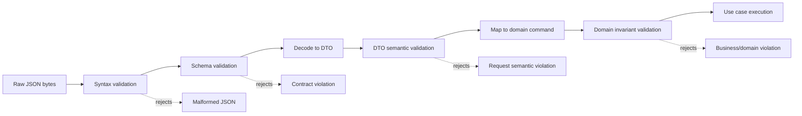
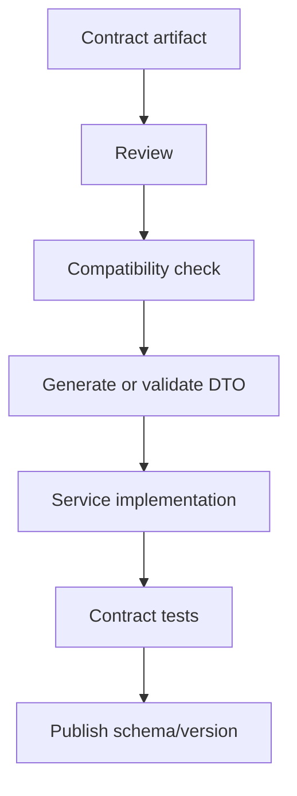
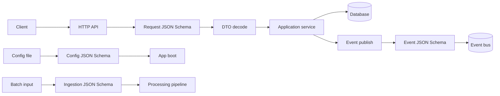
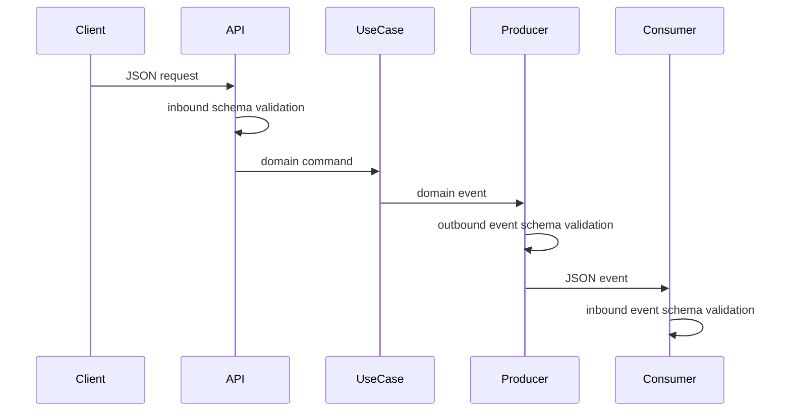
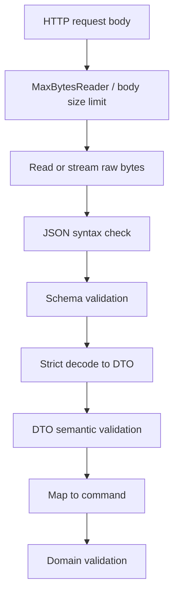
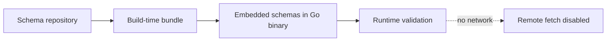
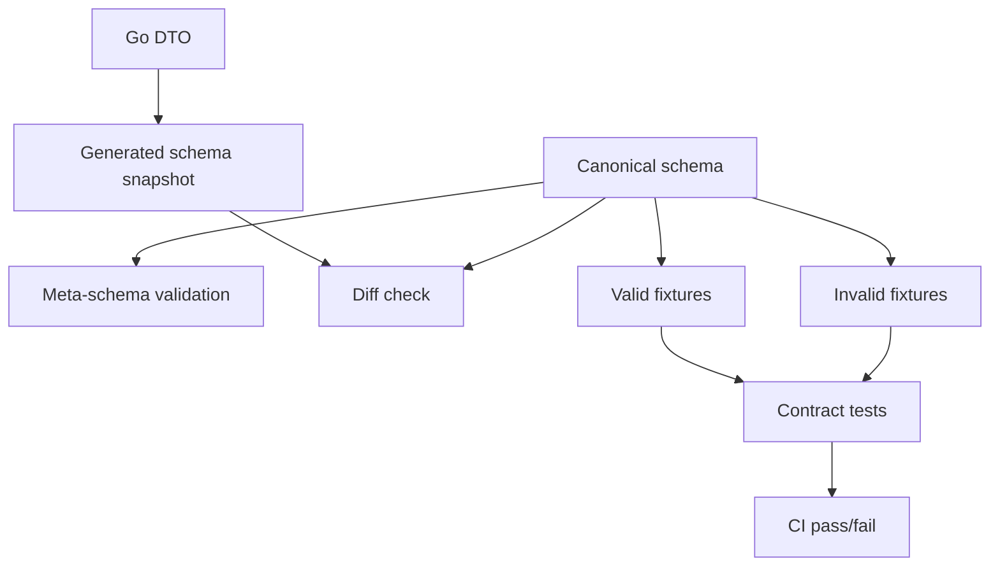
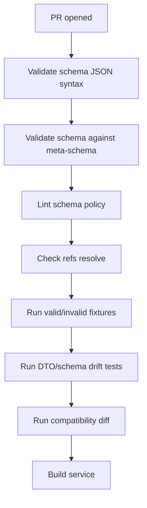
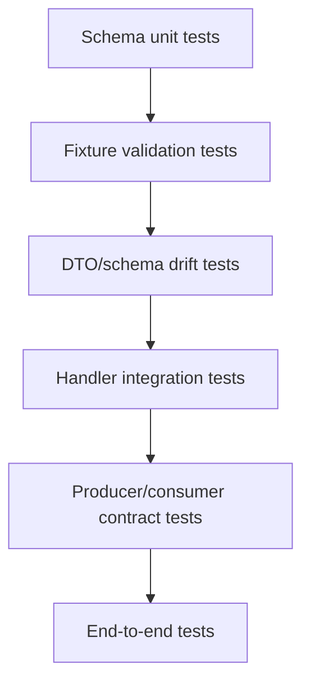

# learn-go-data-mapper-json-xml-protobuf-validation-part-014.md

# Part 014 — JSON Schema in Go Systems

> Seri: **learn-go-data-mapper-json-xml-protobuf-validation**  
> Bagian: **014 / 033**  
> Topik: **JSON Schema in Go Systems**  
> Target pembaca: Java software engineer yang ingin menguasai data representation boundary di Go sampai level production architecture / internal engineering handbook.

---

## Daftar Isi

1. [Posisi Part Ini Dalam Seri](#1-posisi-part-ini-dalam-seri)
2. [Tujuan Pembelajaran](#2-tujuan-pembelajaran)
3. [Mental Model Utama](#3-mental-model-utama)
4. [Java-to-Go Translation](#4-java-to-go-translation)
5. [Schema-First vs Code-First vs Contract-First](#5-schema-first-vs-code-first-vs-contract-first)
6. [JSON Schema Bukan Struct Tag yang Dibungkus JSON](#6-json-schema-bukan-struct-tag-yang-dibungkus-json)
7. [Arsitektur JSON Schema di Go System](#7-arsitektur-json-schema-di-go-system)
8. [Pilihan Library dan Tooling di Go](#8-pilihan-library-dan-tooling-di-go)
9. [Runtime Validation Pipeline](#9-runtime-validation-pipeline)
10. [Compile Schema Once, Validate Many](#10-compile-schema-once-validate-many)
11. [Schema Loading, Embedding, dan Reference Resolution](#11-schema-loading-embedding-dan-reference-resolution)
12. [Contoh Project Layout](#12-contoh-project-layout)
13. [Code-First Schema Generation dari Go Types](#13-code-first-schema-generation-dari-go-types)
14. [Schema-First Validation dengan Compiled Schema](#14-schema-first-validation-dengan-compiled-schema)
15. [OpenAPI 3.1 dan JSON Schema di Go](#15-openapi-31-dan-json-schema-di-go)
16. [Error Mapping: Dari Schema Error ke API Error](#16-error-mapping-dari-schema-error-ke-api-error)
17. [Schema Drift Detection](#17-schema-drift-detection)
18. [Contract Tests untuk Producer dan Consumer](#18-contract-tests-untuk-producer-dan-consumer)
19. [Versioning dan Compatibility Policy](#19-versioning-dan-compatibility-policy)
20. [Schema Governance di CI/CD](#20-schema-governance-di-cicd)
21. [Schema Registry Thinking Tanpa Harus Punya Schema Registry](#21-schema-registry-thinking-tanpa-harus-punya-schema-registry)
22. [Event-Driven JSON Schema](#22-event-driven-json-schema)
23. [Configuration Validation](#23-configuration-validation)
24. [Security dan Operational Risk](#24-security-dan-operational-risk)
25. [Performance dan Allocation](#25-performance-dan-allocation)
26. [Observability untuk Schema Validation](#26-observability-untuk-schema-validation)
27. [Testing Strategy](#27-testing-strategy)
28. [Anti-Patterns](#28-anti-patterns)
29. [Decision Matrix](#29-decision-matrix)
30. [Production Checklist](#30-production-checklist)
31. [Latihan Desain](#31-latihan-desain)
32. [Ringkasan Invariant](#32-ringkasan-invariant)
33. [Referensi](#33-referensi)

---

## 1. Posisi Part Ini Dalam Seri

Part sebelumnya membahas **JSON Schema sebagai external contract**: `$schema`, `$id`, `$ref`, `$defs`, vocabulary, assertion, annotation, applicator, dan policy seperti `additionalProperties` / `unevaluatedProperties`.

Part ini menjawab pertanyaan berikut:

> “Bagaimana JSON Schema dipakai secara benar dalam Go system production?”

Bukan hanya:

```go
validate(schema, payload)
```

Tetapi:

- dari mana schema berasal,
- siapa owner-nya,
- bagaimana schema dikompilasi,
- bagaimana `$ref` diselesaikan,
- bagaimana error validation dipetakan ke API response,
- bagaimana CI mendeteksi drift,
- bagaimana schema evolution dijaga,
- bagaimana request/event/config divalidasi secara konsisten,
- kapan schema generation dari Go type berbahaya,
- kapan schema-first lebih aman,
- kapan OpenAPI sudah cukup,
- kapan JSON Schema perlu berdiri sendiri.

Dalam sistem nyata, JSON Schema bukan library choice. Ia adalah **contract lifecycle mechanism**.

---

## 2. Tujuan Pembelajaran

Setelah part ini, kamu diharapkan mampu:

1. Membedakan **schema-first**, **code-first**, dan **contract-first** secara praktis.
2. Mendesain boundary validation pipeline untuk HTTP API, event consumer, config loader, dan batch ingestion.
3. Memilih library/tooling Go secara sadar berdasarkan kebutuhan draft, reference, error output, performance, dan governance.
4. Menghindari jebakan “generate schema dari struct lalu menganggap contract sudah aman”.
5. Menggunakan compiled JSON Schema sebagai production artifact.
6. Mendesain error mapping yang machine-readable dan tidak bocor detail internal.
7. Membuat contract tests untuk producer/consumer.
8. Memahami hubungan JSON Schema dengan OpenAPI 3.1.
9. Mendesain versioning policy untuk schema evolution.
10. Menempatkan JSON Schema pada arsitektur yang tidak mengulang logic domain validation.

---

## 3. Mental Model Utama

JSON Schema di Go sebaiknya dipahami sebagai **gatekeeper boundary**, bukan sebagai “validator tambahan setelah unmarshal”.



Setiap layer menjawab pertanyaan berbeda:

| Layer | Pertanyaan | Contoh Error |
|---|---|---|
| Syntax | Apakah payload JSON valid? | trailing comma, invalid string escape |
| Schema | Apakah bentuk payload sesuai contract? | missing required field, wrong type, additional field |
| DTO semantic | Apakah field combination masuk akal untuk endpoint ini? | `startDate > endDate` |
| Mapping | Apakah DTO bisa diubah ke domain command tanpa kehilangan meaning? | unknown enum, ambiguous null |
| Domain | Apakah aksi legal terhadap aggregate/state saat ini? | case already closed |

JSON Schema **tidak menggantikan domain validation**. Ia mempersempit ruang input sebelum logic application bekerja.

---

## 4. Java-to-Go Translation

Sebagai Java engineer, kemungkinan mental model awalmu seperti ini:

```text
Spring MVC
  -> Jackson deserialization
  -> Bean Validation annotations
  -> Controller method
  -> Service/domain validation
```

Di Go, tidak ada satu framework dominan yang otomatis menggabungkan semuanya. Kamu biasanya membuat pipeline sendiri:

```text
net/http / router
  -> body limit
  -> raw JSON decode or schema validation
  -> DTO unmarshal
  -> explicit validation
  -> mapper
  -> use case
```

Perbandingan kasar:

| Java Ecosystem | Go Equivalent / Alternative | Catatan |
|---|---|---|
| Jackson | `encoding/json`, `encoding/json/v2`, third-party JSON libs | Go standard lib lebih explicit, lebih sedikit magic |
| Bean Validation | `go-playground/validator`, custom validation | Tag-based validation ada, tapi tidak jadi default platform contract |
| JSON Schema validator | `networknt`, Everit, Justify, etc. | Go punya beberapa validator, pilih berdasarkan draft dan error output |
| MapStruct | handwritten mapper, generated mapper, small codegen | Go cenderung explicit; reflection mapper perlu dibatasi |
| OpenAPI generator | `oapi-codegen`, `kin-openapi`, others | Harus pisahkan API schema governance dari domain model |
| JAXB/XSD | `encoding/xml`, generated/handwritten XML model | XML di Go lebih manual |

Perbedaan paling penting:

> Di Java, framework sering menjadi “contract execution engine”. Di Go, kamu lebih sering mendesain sendiri contract execution pipeline.

Itu bukan kekurangan. Itu memberi kontrol lebih besar, tapi juga menuntut disiplin arsitektur.

---

## 5. Schema-First vs Code-First vs Contract-First

### 5.1 Code-First

Code-first berarti Go struct adalah sumber utama, lalu schema dihasilkan dari struct.

```go
type CreateCustomerRequest struct {
    Name  string `json:"name" jsonschema:"minLength=1"`
    Email string `json:"email" jsonschema:"format=email"`
}
```

Lalu generator menghasilkan JSON Schema.

Kelebihan:

- cepat untuk internal API,
- mudah sinkron dengan code,
- familiar untuk developer,
- useful untuk docs dan test fixtures,
- cocok saat Go service adalah owner tunggal contract.

Kelemahan:

- Go type tidak mengekspresikan semua semantic JSON Schema,
- `omitempty` sering disalahartikan sebagai optionality contract,
- custom marshal/unmarshal bisa membuat generated schema salah,
- schema bisa berubah tanpa sadar saat struct berubah,
- domain model rawan bocor ke API contract,
- schema menjadi turunan implementasi, bukan artifact contract.

Code-first cocok jika:

- consumer terbatas,
- contract masih internal,
- change cadence cepat,
- team punya CI drift detection,
- generated schema direview sebagai artifact.

Code-first berbahaya jika:

- API publik,
- event dipakai banyak consumer,
- payload harus backward compatible bertahun-tahun,
- contract punya regulatory/audit consequence,
- Go bukan satu-satunya implementation language.

### 5.2 Schema-First

Schema-first berarti JSON Schema ditulis/dikelola sebagai sumber utama, lalu Go code mengikuti schema.

```json
{
  "$schema": "https://json-schema.org/draft/2020-12/schema",
  "$id": "https://schemas.example.com/customer/create-customer-request.v1.schema.json",
  "type": "object",
  "required": ["name", "email"],
  "properties": {
    "name": { "type": "string", "minLength": 1 },
    "email": { "type": "string", "format": "email" }
  },
  "additionalProperties": false
}
```

Kelebihan:

- contract jelas sebagai artifact mandiri,
- language-neutral,
- cocok untuk multi-service/multi-language,
- lebih cocok untuk API/event compatibility governance,
- memudahkan schema registry thinking.

Kelemahan:

- butuh mapping discipline,
- Go struct bisa drift dari schema,
- developer harus nyaman membaca schema,
- perlu test agar schema dan DTO tetap sinkron,
- code generation dari schema ke Go sering punya trade-off nullability/oneOf/anyOf.

Schema-first cocok jika:

- payload lintas tim/lintas bahasa,
- event dipublikasi ke banyak consumer,
- integration contract stabil,
- schema punya review/change-control,
- backwards compatibility adalah constraint utama.

### 5.3 Contract-First

Contract-first adalah pendekatan yang lebih luas: sumber kebenaran bukan selalu JSON Schema murni, tetapi **contract artifact**.

Contoh artifact:

- OpenAPI 3.1 document,
- AsyncAPI document,
- standalone JSON Schema repository,
- schema bundle dalam Git,
- schema registry,
- event catalog,
- regulatory interface specification.

Contract-first berarti:

1. Contract direview sebagai interface.
2. Code mengikuti contract.
3. Compatibility dicek otomatis.
4. Consumer expectation menjadi input perubahan.
5. Schema bukan sekadar hasil build.



Untuk sistem kritis, contract-first biasanya paling defensible.

---

## 6. JSON Schema Bukan Struct Tag yang Dibungkus JSON

Kesalahan umum di Go:

> “Saya punya struct tag, berarti contract saya sudah jelas.”

Belum tentu.

Contoh:

```go
type Request struct {
    Name string `json:"name,omitempty"`
}
```

Pertanyaan yang belum terjawab:

- Apakah `name` optional?
- Apakah `name: ""` valid?
- Apakah `name: null` valid?
- Apakah property tambahan boleh?
- Apakah whitespace-only valid?
- Apakah max length ada?
- Apakah unicode normalization perlu?
- Apakah field ini deprecated?
- Apakah field ini allowed only on create, not update?

Go struct hanya mengatakan:

- field Go bernama `Name`,
- JSON property bernama `name`,
- saat marshal, zero value mungkin dihilangkan karena `omitempty`.

Struct tag bukan contract penuh.

### 6.1 Example: Contract Gap

```go
type PaymentRequest struct {
    Amount float64 `json:"amount"`
    Currency string `json:"currency"`
}
```

Struct ini tidak menjawab:

- amount harus positif atau boleh nol?
- precision maksimal berapa?
- currency harus ISO 4217?
- currency uppercase?
- amount boleh scientific notation?
- apakah money pakai decimal atau minor unit?

JSON Schema bisa mengekspresikan sebagian:

```json
{
  "type": "object",
  "required": ["amount", "currency"],
  "properties": {
    "amount": {
      "type": "string",
      "pattern": "^[0-9]+(\\.[0-9]{1,2})?$"
    },
    "currency": {
      "type": "string",
      "pattern": "^[A-Z]{3}$"
    }
  },
  "additionalProperties": false
}
```

Domain validation masih perlu memastikan currency valid terhadap supported currency list, settlement rule, business policy, dan tenant configuration.

---

## 7. Arsitektur JSON Schema di Go System

### 7.1 Boundary Placement

JSON Schema bisa ditempatkan pada beberapa boundary:



Boundary umum:

| Boundary | Schema Purpose | Typical Policy |
|---|---|---|
| HTTP request | reject malformed/invalid client input early | strict for command endpoints |
| HTTP response | prevent accidental contract break | mostly test-time, sometimes runtime in staging |
| Event publish | ensure producer emits valid event | must be strict |
| Event consume | protect consumer from poison/unknown events | version-aware strict/lenient |
| Config load | fail fast at boot | strict |
| Batch import | isolate bad records | record-level validation with partial failure |
| Third-party webhook | validate shape before trust | defensive and observable |

### 7.2 Validation Direction

Ada dua arah validasi:

1. **Inbound validation**: melindungi service dari input buruk.
2. **Outbound validation**: melindungi consumer dari output buruk.



Outbound validation sering diabaikan. Padahal pada event-driven systems, producer adalah sumber contract risk terbesar.

---

## 8. Pilihan Library dan Tooling di Go

Bagian ini bukan rekomendasi tunggal. Pilihan library harus mengikuti requirement.

### 8.1 Requirement Checklist untuk JSON Schema Validator

Sebelum memilih library, jawab:

1. Draft apa yang harus didukung? Draft 7? 2019-09? 2020-12?
2. Apakah `$ref` remote diperlukan?
3. Apakah schema perlu di-embed ke binary?
4. Apakah error output harus detail dan machine-readable?
5. Apakah format assertion harus aktif?
6. Apakah schema akan divalidasi di runtime path panas?
7. Apakah validator thread-safe setelah compile?
8. Apakah perlu custom keyword/vocabulary?
9. Apakah perlu YAML input?
10. Apakah validation dilakukan sebelum atau sesudah unmarshal ke struct?

### 8.2 `santhosh-tekuri/jsonschema`

Library ini sering dipakai untuk runtime JSON Schema validation karena mendukung beberapa draft modern, compilation, reference handling, dan error output yang cukup kaya.

Use case yang cocok:

- schema-first runtime validation,
- event validation,
- config validation,
- CLI schema checks,
- mixed draft support,
- compiled schema reuse.

Contoh konseptual:

```go
package schema

import (
    "encoding/json"
    "fmt"

    jsonschema "github.com/santhosh-tekuri/jsonschema/v5"
)

func ValidateBytes(schemaPath string, payload []byte) error {
    compiled, err := jsonschema.Compile(schemaPath)
    if err != nil {
        return fmt.Errorf("compile schema: %w", err)
    }

    var value any
    if err := json.Unmarshal(payload, &value); err != nil {
        return fmt.Errorf("invalid json syntax: %w", err)
    }

    if err := compiled.Validate(value); err != nil {
        return fmt.Errorf("schema validation failed: %w", err)
    }

    return nil
}
```

Catatan penting:

- Jangan compile schema di setiap request.
- Compile saat startup atau lazy-load dengan cache.
- Pastikan `$schema` eksplisit di schema file.
- Tentukan policy remote reference: allowed, denied, pinned, cached.

### 8.3 `invopop/jsonschema`

Library ini berfokus pada **generation** JSON Schema dari Go types melalui reflection.

Use case yang cocok:

- menghasilkan schema dari DTO Go,
- membuat schema docs untuk internal contract,
- menghasilkan test artifact,
- membantu bootstrap schema-first transition,
- menghasilkan schema untuk config structs.

Contoh konseptual:

```go
package main

import (
    "encoding/json"
    "fmt"

    "github.com/invopop/jsonschema"
)

type CreateCustomerRequest struct {
    Name  string `json:"name" jsonschema:"minLength=1"`
    Email string `json:"email" jsonschema:"format=email"`
}

func main() {
    reflector := jsonschema.Reflector{
        RequiredFromJSONSchemaTags: true,
        AllowAdditionalProperties:  false,
    }

    schema := reflector.Reflect(&CreateCustomerRequest{})
    b, _ := json.MarshalIndent(schema, "", "  ")
    fmt.Println(string(b))
}
```

Tetapi jangan lupa:

> Generated schema adalah artifact yang harus direview, bukan kebenaran otomatis.

### 8.4 `kin-openapi`

Untuk OpenAPI, `kin-openapi` berguna untuk parsing, loading, validation, dan manipulasi OpenAPI 3.x documents di Go.

Use case yang cocok:

- API contract validation,
- OpenAPI document loading in tests,
- request/response validation middleware,
- checking OpenAPI 3.1 JSON Schema behavior,
- contract test for generated clients/servers.

OpenAPI 3.1 lebih dekat dengan JSON Schema 2020-12 dibanding OpenAPI 3.0, tetapi tetap ada detail tool-specific. Jangan menganggap semua JSON Schema 2020-12 keyword otomatis dipahami semua OpenAPI tooling.

---

## 9. Runtime Validation Pipeline

### 9.1 Naive Pipeline

```go
var req CreateCustomerRequest
if err := json.NewDecoder(r.Body).Decode(&req); err != nil {
    return err
}
if err := validate.Struct(req); err != nil {
    return err
}
```

Masalah:

- duplicate keys mungkin tidak ditolak,
- unknown fields mungkin tidak ditolak,
- `null` pada scalar bisa punya behavior yang tidak intuitif,
- request body size belum dibatasi,
- schema contract external tidak dieksekusi,
- error tidak diklasifikasikan dengan baik,
- DTO mungkin menerima bentuk yang tidak ada dalam schema.

### 9.2 Production Pipeline



Pipeline recommended untuk command API:

1. Limit body size.
2. Parse JSON syntax.
3. Validate raw JSON value against JSON Schema.
4. Decode strictly into DTO.
5. Run semantic validation not expressible in schema.
6. Map DTO to domain command.
7. Let domain enforce business invariant.

### 9.3 Why Validate Before Decode?

Ada dua pendekatan:

| Approach | Flow | Kelebihan | Kekurangan |
|---|---|---|---|
| Decode then validate struct | JSON -> DTO -> validate | simple, fast for small systems | contract gap, lossy decode, unknown handling depends decoder |
| Schema validate then decode | JSON -> generic value -> schema -> DTO | contract explicit, language-neutral | may parse twice, more complex |
| Decode raw tokens with schema-like logic | streaming validation | efficient for large input | complex, library-dependent |

Schema validation sebelum DTO decode lebih defensible jika:

- contract external,
- input datang dari untrusted client,
- nullability/unknown policy penting,
- error response perlu JSON Pointer,
- Go DTO bukan source of truth.

Decode dulu bisa cukup jika:

- internal API,
- payload kecil,
- DTO adalah canonical boundary,
- strict decoder sudah kuat,
- contract tidak lintas bahasa.

---

## 10. Compile Schema Once, Validate Many

Schema compilation bukan operasi gratis. Ia bisa melibatkan:

- parsing schema JSON,
- validating schema against meta-schema,
- resolving `$ref`,
- building internal evaluation structure,
- loading remote/local schemas,
- preparing regex/pattern.

Anti-pattern:

```go
func handler(w http.ResponseWriter, r *http.Request) {
    schema, _ := jsonschema.Compile("schemas/create-customer.schema.json")
    // validate request...
}
```

Lebih baik:

```go
type SchemaSet struct {
    CreateCustomer *jsonschema.Schema
    UpdateCustomer *jsonschema.Schema
}

func LoadSchemas() (*SchemaSet, error) {
    create, err := jsonschema.Compile("schemas/create-customer.schema.json")
    if err != nil {
        return nil, fmt.Errorf("compile create customer schema: %w", err)
    }

    update, err := jsonschema.Compile("schemas/update-customer.schema.json")
    if err != nil {
        return nil, fmt.Errorf("compile update customer schema: %w", err)
    }

    return &SchemaSet{
        CreateCustomer: create,
        UpdateCustomer: update,
    }, nil
}
```

Lalu inject ke handler:

```go
type CustomerHandler struct {
    Schemas *SchemaSet
    Service *CustomerService
}
```

### 10.1 Startup Failure is Good

Jika schema invalid, service sebaiknya gagal startup.

```text
Bad schema -> deployment fail fast
Bad payload -> request/event reject
```

Jangan biarkan invalid schema baru ketahuan pada request pertama.

---

## 11. Schema Loading, Embedding, dan Reference Resolution

### 11.1 File System Loading

Cocok untuk local dev dan CLI validation.

```text
schemas/
  customer/
    create.v1.schema.json
    update.v1.schema.json
  common/
    money.v1.schema.json
    address.v1.schema.json
```

Risiko:

- working directory berbeda di production,
- path relative rapuh,
- container image mungkin tidak include schema,
- deployment artifact tidak self-contained.

### 11.2 `embed.FS`

Go `embed` membuat schema menjadi bagian dari binary.

```go
package contracts

import "embed"

//go:embed schemas/**/*.json
var SchemaFS embed.FS
```

Keuntungan:

- schema version ikut binary,
- deployment self-contained,
- tidak tergantung external file path,
- cocok untuk runtime validation.

Trade-off:

- update schema perlu rebuild,
- runtime hot reload lebih sulit,
- reference resolver perlu disesuaikan.

### 11.3 Remote `$ref`

Remote reference terlihat nyaman:

```json
{
  "$ref": "https://schemas.example.com/common/address.v1.schema.json"
}
```

Tetapi runtime remote fetch punya risiko:

- latency,
- outage,
- supply-chain risk,
- schema berubah tanpa deploy,
- non-deterministic validation,
- SSRF bila URI tidak dikontrol.

Production policy yang lebih aman:

1. Remote schema di-pin saat build.
2. Bundle schema ke artifact.
3. Runtime validator hanya membaca local/embedded schema.
4. `$id` tetap absolute URI untuk identity, tapi resolver diarahkan ke local copy.



---

## 12. Contoh Project Layout

Untuk service Go dengan JSON Schema contract:

```text
customer-service/
  cmd/
    customer-api/
      main.go
  internal/
    api/
      customer_handler.go
      decode.go
      errors.go
    contract/
      schemas.go
      validate.go
    dto/
      customer_request.go
      customer_response.go
    app/
      customer_service.go
    domain/
      customer.go
  schemas/
    customer/
      create-customer-request.v1.schema.json
      create-customer-response.v1.schema.json
      customer-created-event.v1.schema.json
    common/
      address.v1.schema.json
      money.v1.schema.json
  testdata/
    contracts/
      valid-create-customer.json
      invalid-create-customer-missing-name.json
      invalid-create-customer-extra-field.json
  Makefile
  go.mod
```

Design rule:

- `schemas/` adalah contract artifact.
- `internal/dto/` adalah Go representation untuk API boundary.
- `internal/domain/` tidak tergantung JSON Schema.
- `internal/contract/` bertugas load/compile/validate schema.
- Handler mengorkestrasi decode + validation + mapping.

Jangan letakkan schema di domain package.

Domain tidak boleh tahu JSON Schema.

---

## 13. Code-First Schema Generation dari Go Types

### 13.1 Kapan Berguna

Code-first generation berguna untuk:

- internal admin API,
- config schema,
- initial schema bootstrap,
- documentation artifact,
- contract tests terhadap DTO,
- schema linting terhadap struct tags.

### 13.2 Kapan Berbahaya

Berbahaya jika:

- Go struct adalah domain entity, bukan DTO,
- custom `MarshalJSON` mengubah representasi,
- field presence tidak jelas,
- `omitempty` dianggap selalu optional,
- nullable field tidak dimodelkan dengan tegas,
- polymorphism memakai `any`/`interface{}`,
- schema hasil generate tidak direview.

### 13.3 Example DTO for Code-First

```go
package dto

type CreateCustomerRequest struct {
    Name string `json:"name" jsonschema:"minLength=1,maxLength=120"`

    Email string `json:"email" jsonschema:"format=email"`

    Phone *string `json:"phone,omitempty" jsonschema:"pattern=^\\+[1-9][0-9]{7,14}$"`

    Tags []string `json:"tags,omitempty" jsonschema:"maxItems=20"`
}
```

Generated schema dari struct seperti ini harus dicek:

- Apakah `phone` absent allowed?
- Apakah `phone: null` allowed?
- Apakah `tags: []` allowed?
- Apakah `tags` unique?
- Apakah additional properties false?
- Apakah `name: "   "` valid?

### 13.4 Schema Generation Command

Buat command khusus:

```text
cmd/schema-gen/main.go
```

```go
package main

import (
    "encoding/json"
    "fmt"
    "os"

    "github.com/invopop/jsonschema"
    "example.com/customer-service/internal/dto"
)

func main() {
    reflector := jsonschema.Reflector{
        RequiredFromJSONSchemaTags: true,
        AllowAdditionalProperties:  false,
    }

    schemas := map[string]any{
        "schemas/generated/create-customer-request.schema.json": reflector.Reflect(&dto.CreateCustomerRequest{}),
    }

    for path, schema := range schemas {
        b, err := json.MarshalIndent(schema, "", "  ")
        if err != nil {
            panic(err)
        }
        if err := os.WriteFile(path, append(b, '\n'), 0o644); err != nil {
            panic(err)
        }
        fmt.Println("wrote", path)
    }
}
```

Add directive:

```go
//go:generate go run ./cmd/schema-gen
```

Aturan governance:

- generated schema harus committed,
- PR harus memperlihatkan diff schema,
- breaking diff harus dibahas,
- generated schema harus divalidasi terhadap meta-schema,
- consumer fixtures harus dites.

---

## 14. Schema-First Validation dengan Compiled Schema

### 14.1 Example Schema

```json
{
  "$schema": "https://json-schema.org/draft/2020-12/schema",
  "$id": "https://schemas.example.com/customer/create-customer-request.v1.schema.json",
  "title": "CreateCustomerRequest",
  "type": "object",
  "required": ["name", "email"],
  "properties": {
    "name": {
      "type": "string",
      "minLength": 1,
      "maxLength": 120
    },
    "email": {
      "type": "string",
      "format": "email"
    },
    "phone": {
      "type": "string",
      "pattern": "^\\+[1-9][0-9]{7,14}$"
    },
    "tags": {
      "type": "array",
      "maxItems": 20,
      "uniqueItems": true,
      "items": {
        "type": "string",
        "minLength": 1,
        "maxLength": 40
      }
    }
  },
  "additionalProperties": false
}
```

### 14.2 DTO

```go
package dto

type CreateCustomerRequest struct {
    Name  string   `json:"name"`
    Email string   `json:"email"`
    Phone *string  `json:"phone,omitempty"`
    Tags  []string `json:"tags,omitempty"`
}
```

Notice:

- DTO tidak perlu membawa semua validation tag.
- Schema menjadi contract source.
- DTO tetap menjaga representation ke Go.
- Semantic validation tetap ada setelah decode.

### 14.3 Validator Wrapper

```go
package contract

import (
    "encoding/json"
    "fmt"

    jsonschema "github.com/santhosh-tekuri/jsonschema/v5"
)

type Validator struct {
    createCustomer *jsonschema.Schema
}

func NewValidator() (*Validator, error) {
    create, err := jsonschema.Compile("schemas/customer/create-customer-request.v1.schema.json")
    if err != nil {
        return nil, fmt.Errorf("compile create customer request schema: %w", err)
    }

    return &Validator{createCustomer: create}, nil
}

func (v *Validator) ValidateCreateCustomer(raw []byte) error {
    var value any
    if err := json.Unmarshal(raw, &value); err != nil {
        return SyntaxError{Err: err}
    }

    if err := v.createCustomer.Validate(value); err != nil {
        return SchemaError{Err: err}
    }

    return nil
}
```

Custom error types:

```go
type SyntaxError struct { Err error }
func (e SyntaxError) Error() string { return "invalid JSON syntax: " + e.Err.Error() }
func (e SyntaxError) Unwrap() error { return e.Err }

type SchemaError struct { Err error }
func (e SchemaError) Error() string { return "JSON schema validation failed: " + e.Err.Error() }
func (e SchemaError) Unwrap() error { return e.Err }
```

### 14.4 Handler Flow

```go
func (h *CustomerHandler) CreateCustomer(w http.ResponseWriter, r *http.Request) {
    raw, err := readLimitedBody(w, r, 1<<20) // 1 MiB
    if err != nil {
        writeError(w, err)
        return
    }

    if err := h.Contracts.ValidateCreateCustomer(raw); err != nil {
        writeError(w, err)
        return
    }

    var req dto.CreateCustomerRequest
    if err := json.Unmarshal(raw, &req); err != nil {
        // Should be rare if schema validated first, but still handle it.
        writeError(w, err)
        return
    }

    cmd, err := mapCreateCustomerRequest(req)
    if err != nil {
        writeError(w, err)
        return
    }

    result, err := h.Service.CreateCustomer(r.Context(), cmd)
    if err != nil {
        writeError(w, err)
        return
    }

    writeJSON(w, http.StatusCreated, result)
}
```

---

## 15. OpenAPI 3.1 dan JSON Schema di Go

OpenAPI 3.1 menggunakan JSON Schema 2020-12 sebagai basis schema dialect. Ini jauh lebih dekat dengan JSON Schema modern dibanding OpenAPI 3.0.

Namun, dalam sistem Go, kamu harus bedakan:

| Artifact | Scope | Use |
|---|---|---|
| JSON Schema | data shape contract | event/config/document/request body |
| OpenAPI | HTTP API contract | endpoints, params, responses, auth, schemas |
| AsyncAPI | async messaging contract | channels, messages, event schemas |

### 15.1 Kapan OpenAPI Saja Cukup?

OpenAPI cukup jika:

- schema hanya dipakai untuk HTTP API,
- semua contract berada di `components.schemas`,
- validation terjadi di request/response middleware,
- tidak ada standalone event schema.

### 15.2 Kapan JSON Schema Terpisah?

JSON Schema terpisah lebih baik jika:

- schema dipakai ulang oleh HTTP dan event,
- schema dipakai untuk config/batch documents,
- event schema butuh lifecycle sendiri,
- non-HTTP consumer perlu contract,
- schema dipublish di registry/catalog.

### 15.3 Pattern: OpenAPI References External Schema

```yaml
openapi: 3.1.0
info:
  title: Customer API
  version: 1.0.0
paths:
  /customers:
    post:
      requestBody:
        required: true
        content:
          application/json:
            schema:
              $ref: './schemas/customer/create-customer-request.v1.schema.json'
      responses:
        '201':
          description: Created
```

Kelebihan:

- schema dapat direuse,
- OpenAPI tidak menjadi dumping ground,
- event/API bisa berbagi common definitions.

Trade-off:

- tooling resolver harus matang,
- CI harus test reference resolution,
- bundling perlu jelas.

---

## 16. Error Mapping: Dari Schema Error ke API Error

Raw schema error tidak boleh langsung dilempar ke client tanpa kontrol.

Masalah raw error:

- format library-specific,
- bisa terlalu verbose,
- bisa bocor internal schema path,
- sulit distandarkan,
- tidak selalu cocok untuk UX/API client.

### 16.1 Target Error Envelope

Contoh API error:

```json
{
  "code": "INVALID_REQUEST_BODY",
  "message": "Request body does not match the expected schema.",
  "details": [
    {
      "path": "/email",
      "rule": "format",
      "message": "email must be a valid email address"
    },
    {
      "path": "/name",
      "rule": "minLength",
      "message": "name must not be empty"
    }
  ],
  "correlationId": "req-123"
}
```

### 16.2 Error Path Format

Gunakan JSON Pointer style untuk field path:

```text
/name
/address/postalCode
/items/0/amount
```

Keuntungan:

- machine-readable,
- cocok untuk nested object/array,
- bisa dipakai UI form mapping,
- tidak tergantung Go field name.

### 16.3 Error Classification

| Error Type | HTTP Status | Code |
|---|---:|---|
| Body too large | 413 | `REQUEST_BODY_TOO_LARGE` |
| Invalid JSON syntax | 400 | `INVALID_JSON` |
| Schema validation failed | 400 or 422 | `INVALID_REQUEST_BODY` |
| Unsupported schema version | 400 | `UNSUPPORTED_SCHEMA_VERSION` |
| Business rule violation | 409 or 422 | `BUSINESS_RULE_VIOLATION` |

400 vs 422 policy tergantung API standard. Yang penting konsisten.

### 16.4 Internal vs External Message

Internal log:

```text
schema_id=https://schemas.example.com/customer/create-customer-request.v1.schema.json
error=/email: does not match format email
client_id=partner-a
correlation_id=req-123
```

External response:

```json
{
  "code": "INVALID_REQUEST_BODY",
  "message": "Request body does not match the expected schema."
}
```

Untuk public API, jangan expose semua schema internals secara default. Untuk partner API, details bisa dibuka terbatas.

---

## 17. Schema Drift Detection

Schema drift terjadi ketika:

- DTO berubah tapi schema tidak berubah,
- schema berubah tapi handler/mapper tidak berubah,
- OpenAPI berubah tapi runtime validator masih pakai schema lama,
- event producer emit field baru tanpa schema update,
- consumer fixture tidak sesuai schema terbaru.

### 17.1 Drift Types

| Drift | Contoh | Risiko |
|---|---|---|
| Struct-to-schema drift | field Go baru tidak ada di schema | runtime data hilang / undocumented field |
| Schema-to-struct drift | schema require field yang DTO tidak punya | decode impossible / missing data |
| OpenAPI-to-runtime drift | docs menerima field tapi service reject | broken client integration |
| Producer-to-schema drift | emitted event invalid | consumer failure |
| Consumer-to-schema drift | consumer expects field not guaranteed | production bugs |

### 17.2 Drift Detection Strategy



### 17.3 Golden Schema Snapshot

If code-first:

1. Generate schema into `schemas/generated/`.
2. Compare with committed version.
3. Fail CI if diff exists without approval.

```bash
go generate ./...
git diff --exit-code schemas/generated
```

### 17.4 Schema Lint

Lint policy examples:

- every schema must have `$schema`, `$id`, `title`, `description`, `type`,
- object schemas must declare `additionalProperties`,
- public schemas must not use anonymous inline definitions too deeply,
- event schemas must include `eventId`, `eventType`, `occurredAt`, `schemaVersion`,
- no remote `$ref` except approved URI prefixes,
- no `type: number` for money,
- string fields must have `maxLength` if user-supplied,
- arrays must have `maxItems`,
- objects must have bounded property policy.

---

## 18. Contract Tests untuk Producer dan Consumer

### 18.1 Producer Contract Test

Producer test memastikan output yang dibuat service valid terhadap schema.

```go
func TestCustomerCreatedEventMatchesSchema(t *testing.T) {
    validator := mustLoadContractValidator(t)

    event := CustomerCreatedEvent{
        EventID:    "evt_123",
        EventType:  "customer.created",
        OccurredAt: time.Date(2026, 1, 1, 0, 0, 0, 0, time.UTC),
        CustomerID: "cus_123",
        Email:      "a@example.com",
    }

    raw, err := json.Marshal(event)
    require.NoError(t, err)

    err = validator.ValidateCustomerCreatedEvent(raw)
    require.NoError(t, err)
}
```

This catches:

- wrong JSON tags,
- missing required fields,
- invalid enum values,
- time format mismatch,
- accidental output changes.

### 18.2 Consumer Contract Test

Consumer test memastikan consumer dapat membaca semua valid fixture yang dijanjikan schema.

```go
func TestConsumerCanReadValidCustomerCreatedFixtures(t *testing.T) {
    fixtures := []string{
        "testdata/events/customer-created.v1.minimal.json",
        "testdata/events/customer-created.v1.full.json",
    }

    for _, fixture := range fixtures {
        t.Run(fixture, func(t *testing.T) {
            raw := mustReadFile(t, fixture)

            var evt CustomerCreatedEvent
            require.NoError(t, json.Unmarshal(raw, &evt))
            require.NoError(t, HandleCustomerCreated(context.Background(), evt))
        })
    }
}
```

Consumer test should include:

- minimal valid payload,
- maximal valid payload,
- unknown optional field if forward compatibility allowed,
- previous minor versions if compatibility window exists.

### 18.3 Negative Contract Test

Invalid fixtures memastikan schema menolak payload buruk.

```text
testdata/contracts/customer-create/
  valid-minimal.json
  valid-full.json
  invalid-missing-name.json
  invalid-empty-name.json
  invalid-extra-field.json
  invalid-bad-email.json
  invalid-too-many-tags.json
```

Test:

```go
func TestCreateCustomerSchemaRejectsInvalidFixtures(t *testing.T) {
    validator := mustLoadContractValidator(t)

    invalid := []string{
        "invalid-missing-name.json",
        "invalid-empty-name.json",
        "invalid-extra-field.json",
        "invalid-bad-email.json",
    }

    for _, name := range invalid {
        t.Run(name, func(t *testing.T) {
            raw := mustReadFile(t, "testdata/contracts/customer-create/"+name)
            require.Error(t, validator.ValidateCreateCustomer(raw))
        })
    }
}
```

---

## 19. Versioning dan Compatibility Policy

### 19.1 Schema Version Identity

Gunakan `$id` yang stabil:

```json
{
  "$id": "https://schemas.example.com/customer/customer-created-event.v1.schema.json"
}
```

Jangan gunakan path ambigu:

```text
schemas/latest/customer-created.json
```

`latest` bukan contract identity.

### 19.2 Compatibility Matrix

| Change | Request Schema | Response Schema | Event Schema |
|---|---|---|---|
| Add optional field | usually compatible | usually compatible | compatible if consumers ignore unknowns |
| Add required field | breaking | breaking | breaking |
| Remove optional field | may break clients using it | breaking for consumers expecting it | breaking if consumer depends |
| Widen enum | maybe compatible | maybe breaking for strict consumers | often breaking for consumers |
| Narrow enum | breaking for producers/clients | maybe compatible | breaking for producers |
| Change type | breaking | breaking | breaking |
| Increase maxLength | usually compatible | usually compatible | usually compatible |
| Decrease maxLength | breaking | breaking | breaking |
| Allow additionalProperties | more permissive | can hide contract issues | depends consumer policy |
| Disallow previously allowed extra props | breaking for clients | usually okay outbound | can break producers |

### 19.3 Request vs Event Compatibility

Request schema compatibility is client-facing:

- can old clients still call new service?
- can new clients call old service?

Event schema compatibility is multi-directional:

- can old consumers read new events?
- can new consumers read old events?
- can replay old events into new system?
- does schema evolution preserve audit meaning?

Event schema changes need stricter governance than request schema changes.

### 19.4 Version Field in Payload

For event payloads, include schema version or event version:

```json
{
  "eventId": "evt_123",
  "eventType": "customer.created",
  "schemaVersion": "1.0",
  "occurredAt": "2026-01-01T00:00:00Z",
  "data": {}
}
```

For HTTP requests, version often belongs in URL/header/media type rather than body. Do not mix policies casually.

---

## 20. Schema Governance di CI/CD

### 20.1 CI Stages



### 20.2 Minimum CI Checks

1. All schema files are valid JSON.
2. All schema files declare `$schema`.
3. All schema files declare stable `$id`.
4. All `$ref` resolve without network.
5. All schema files validate against meta-schema.
6. All valid fixtures pass.
7. All invalid fixtures fail.
8. Generated artifacts are up to date.
9. Breaking change check runs against main branch.
10. Schema package/bundle is published with version.

### 20.3 Makefile Example

```makefile
.PHONY: contract-check
contract-check:
	go test ./internal/contract/...
	go run ./cmd/schema-lint ./schemas
	go generate ./...
	git diff --exit-code schemas/generated
```

### 20.4 PR Review Checklist

Reviewer should ask:

- Is this schema input, output, event, config, or batch?
- Who consumes it?
- Is the change backward compatible?
- Are additional properties intentionally allowed/denied?
- Is nullability explicit?
- Are string/array/object sizes bounded?
- Are references stable?
- Are valid/invalid fixtures added?
- Are generated DTOs or client code updated?
- Does domain logic rely on schema validation too much?

---

## 21. Schema Registry Thinking Tanpa Harus Punya Schema Registry

Tidak semua tim butuh schema registry penuh. Tapi semua tim butuh **schema registry thinking**.

Artinya:

1. Schema punya identity.
2. Schema punya owner.
3. Schema punya version.
4. Schema punya compatibility policy.
5. Schema punya publication mechanism.
6. Schema punya deprecation lifecycle.
7. Schema punya consumer visibility.

### 21.1 Lightweight Git-Based Registry

```text
contracts/
  schemas/
    customer/
      customer-created-event/
        v1.0.0.schema.json
        v1.1.0.schema.json
        CHANGELOG.md
        OWNERS
      customer-updated-event/
        v1.0.0.schema.json
  catalog.yaml
```

`catalog.yaml`:

```yaml
schemas:
  - id: https://schemas.example.com/customer/customer-created-event.v1.schema.json
    owner: customer-platform
    type: event
    stability: stable
    compatibility: backward
    consumers:
      - billing-service
      - analytics-pipeline
```

This is enough for many organizations before adopting a full registry.

---

## 22. Event-Driven JSON Schema

### 22.1 Event Envelope

```json
{
  "eventId": "evt_123",
  "eventType": "customer.created",
  "schemaVersion": "1.0",
  "occurredAt": "2026-01-01T00:00:00Z",
  "producer": "customer-service",
  "correlationId": "req_123",
  "data": {
    "customerId": "cus_123",
    "email": "a@example.com"
  }
}
```

Envelope schema:

```json
{
  "$schema": "https://json-schema.org/draft/2020-12/schema",
  "$id": "https://schemas.example.com/events/event-envelope.v1.schema.json",
  "type": "object",
  "required": ["eventId", "eventType", "schemaVersion", "occurredAt", "producer", "data"],
  "properties": {
    "eventId": { "type": "string", "minLength": 1 },
    "eventType": { "type": "string", "pattern": "^[a-z]+(\\.[a-z]+)+$" },
    "schemaVersion": { "type": "string", "pattern": "^[0-9]+\\.[0-9]+$" },
    "occurredAt": { "type": "string", "format": "date-time" },
    "producer": { "type": "string", "minLength": 1 },
    "correlationId": { "type": "string" },
    "data": { "type": "object" }
  },
  "additionalProperties": false
}
```

Specific event schema can combine envelope and data using `allOf` or maintain separate validation steps.

### 22.2 Producer Validation

Producer should validate before publishing:

```go
func (p *Publisher) PublishCustomerCreated(ctx context.Context, evt CustomerCreatedEvent) error {
    raw, err := json.Marshal(evt)
    if err != nil {
        return fmt.Errorf("marshal event: %w", err)
    }

    if err := p.contracts.ValidateCustomerCreatedEvent(raw); err != nil {
        return fmt.Errorf("invalid outbound event: %w", err)
    }

    return p.bus.Publish(ctx, "customer.created", raw)
}
```

### 22.3 Consumer Validation

Consumer should validate before processing, but policy may differ:

| Error | Action |
|---|---|
| Invalid JSON syntax | dead-letter immediately |
| Unknown event type | ignore or route to unknown-event DLQ |
| Unsupported schema version | DLQ or compatibility adapter |
| Schema invalid | DLQ with schema error |
| Business reject | retry? no, likely DLQ or compensating action |
| Transient downstream error | retry |

Schema validation helps distinguish poison message from transient failure.

---

## 23. Configuration Validation

JSON Schema is excellent for config validation because config errors should fail fast at boot.

Example `config.schema.json`:

```json
{
  "$schema": "https://json-schema.org/draft/2020-12/schema",
  "$id": "https://schemas.example.com/customer-service/config.v1.schema.json",
  "type": "object",
  "required": ["http", "database"],
  "properties": {
    "http": {
      "type": "object",
      "required": ["port", "readTimeout"],
      "properties": {
        "port": { "type": "integer", "minimum": 1, "maximum": 65535 },
        "readTimeout": { "type": "string", "pattern": "^[0-9]+(ms|s|m)$" }
      },
      "additionalProperties": false
    },
    "database": {
      "type": "object",
      "required": ["dsn"],
      "properties": {
        "dsn": { "type": "string", "minLength": 1 }
      },
      "additionalProperties": false
    }
  },
  "additionalProperties": false
}
```

Boot flow:

```go
func LoadConfig(path string, validator *contract.Validator) (*Config, error) {
    raw, err := os.ReadFile(path)
    if err != nil {
        return nil, err
    }

    if err := validator.ValidateConfig(raw); err != nil {
        return nil, err
    }

    var cfg Config
    if err := json.Unmarshal(raw, &cfg); err != nil {
        return nil, err
    }

    if err := cfg.NormalizeAndValidate(); err != nil {
        return nil, err
    }

    return &cfg, nil
}
```

Config validation should be stricter than many API validations:

- no unknown fields,
- bounded values,
- explicit defaults,
- startup failure on invalid config,
- no silent fallback unless deliberately documented.

---

## 24. Security dan Operational Risk

### 24.1 Remote Reference Risk

Remote `$ref` can become SSRF-like if untrusted schemas are compiled and allowed to load arbitrary URLs.

Policy:

- never compile untrusted schema with unrestricted remote loading,
- disable remote fetch in runtime path,
- allowlist schema URI prefixes,
- bundle references at build time,
- pin schema versions.

### 24.2 Regex Risk

JSON Schema `pattern` uses regex. Bad regex can cause performance issues depending on regex engine. Go's standard regexp engine is RE2-style and avoids catastrophic backtracking, but custom engines or external tools may differ.

Policy:

- keep patterns simple,
- test large inputs,
- prefer explicit length bounds before complex patterns,
- avoid giant unrestricted strings.

### 24.3 Payload Size Risk

Schema validation after reading entire body can be memory-heavy. Always limit body size.

```go
r.Body = http.MaxBytesReader(w, r.Body, 1<<20)
```

For batch and event ingestion, validate per record rather than loading huge arrays when possible.

### 24.4 Error Leakage

Schema error may expose:

- internal schema URI,
- hidden fields,
- deprecated fields,
- internal validation policy.

External error response should be normalized.

### 24.5 Format Assertion Ambiguity

JSON Schema `format` may be annotation or assertion depending vocabulary/tool configuration. Do not assume `format: email` always rejects invalid email unless your validator is configured for format assertion and your tests prove it.

---

## 25. Performance dan Allocation

### 25.1 Main Cost Areas

| Cost | Source |
|---|---|
| Schema compilation | parsing, meta-schema, refs, regex |
| JSON parsing | raw bytes to generic value |
| Validation traversal | schema evaluation over value tree |
| Decode to DTO | second traversal if validate-before-decode |
| Error building | detailed output can allocate more |
| Remote refs | network/disk latency if not cached |

### 25.2 Mitigation

1. Compile schema once.
2. Reuse compiled schema safely if library supports it.
3. Limit payload size.
4. Avoid runtime remote refs.
5. Validate at boundary, not repeatedly across layers.
6. Use fixture tests for most response validation; runtime response validation only where justified.
7. Benchmark with realistic payloads.
8. Keep schema complexity reasonable.

### 25.3 Validate-Then-Decode Overhead

Schema-first pipeline may parse JSON twice:

```text
raw bytes -> generic any -> schema validation
raw bytes -> DTO -> application
```

This is acceptable for many command APIs. For high-throughput paths, measure.

Alternatives:

- decode to `map[string]any`, validate, then map manually,
- decode to DTO and validate struct,
- use streaming validator if available,
- validate only in ingress gateway for trusted internal hops,
- use Protobuf for hot internal contracts.

Do not optimize away schema validation without knowing failure risk.

---

## 26. Observability untuk Schema Validation

Schema validation failure should be observable, but not noisy.

Metrics:

```text
json_schema_validation_total{schema_id, direction, result}
json_schema_validation_duration_seconds{schema_id, direction}
json_schema_validation_failure_total{schema_id, rule}
json_schema_unknown_version_total{event_type, version}
json_schema_compile_failure_total{schema_id}
```

Log fields:

```text
schema_id
schema_version
payload_direction=inbound|outbound
boundary=http_request|event_publish|event_consume|config
error_path
error_rule
client_id
producer
consumer
correlation_id
```

Tracing span attributes:

```text
contract.schema_id
contract.schema_version
contract.validation.result
contract.validation.error_count
```

Avoid logging full payload by default. Payload may contain PII/secrets.

---

## 27. Testing Strategy

### 27.1 Test Pyramid



### 27.2 Schema Unit Tests

Validate schema itself:

```go
func TestSchemasCompile(t *testing.T) {
    _, err := contract.NewValidator()
    require.NoError(t, err)
}
```

### 27.3 Fixture Tests

Use valid and invalid fixtures.

```go
func TestCreateCustomerFixtures(t *testing.T) {
    v := mustLoadValidator(t)

    valid := []string{"valid-minimal.json", "valid-full.json"}
    for _, f := range valid {
        raw := mustRead(t, f)
        require.NoError(t, v.ValidateCreateCustomer(raw))
    }

    invalid := []string{"invalid-extra-field.json", "invalid-bad-email.json"}
    for _, f := range invalid {
        raw := mustRead(t, f)
        require.Error(t, v.ValidateCreateCustomer(raw))
    }
}
```

### 27.4 Handler Tests

Handler tests ensure schema validation is wired correctly:

- invalid JSON returns `INVALID_JSON`,
- missing required field returns `INVALID_REQUEST_BODY`,
- extra field returns error if policy strict,
- valid request reaches service,
- body too large returns 413,
- error response has correlation ID.

### 27.5 Compatibility Tests

For schema changes, compare old and new fixtures:

- all old valid payloads still valid under new schema if backward compatibility required,
- new optional fields do not break old consumers,
- event replay fixtures still readable.

---

## 28. Anti-Patterns

### 28.1 Compile Schema Per Request

Bad:

```go
func handler(...) {
    schema, _ := jsonschema.Compile("schema.json")
}
```

Impact:

- unnecessary CPU,
- latency spike,
- runtime reference failure,
- hard-to-debug partial outage.

### 28.2 Treat Generated Schema as Source of Truth Without Review

Generated schema can silently change when:

- struct tag changes,
- field type changes,
- `omitempty` added,
- custom type mapper changes,
- generator version changes.

Generated schema must be reviewed like API code.

### 28.3 Domain Model as Schema Source

Bad:

```go
type Customer struct {
    ID string `json:"id"`
    InternalRiskScore int `json:"internalRiskScore"`
}
```

Then generate public API schema from it.

This leaks internal model and creates contract coupling.

### 28.4 Schema Validation as Business Rule Engine

Bad:

```json
{
  "if": { "properties": { "status": { "const": "APPROVED" } } },
  "then": { "required": ["approvalReference"] }
}
```

This may be acceptable for structural semantic rule. But complex state transition rules belong in domain/application layer.

### 28.5 Allow Remote `$ref` in Runtime Without Pinning

Bad:

```text
runtime request -> compile schema -> fetch arbitrary HTTPS refs
```

Impact:

- SSRF risk,
- nondeterministic validation,
- dependency outage,
- slow requests.

### 28.6 `additionalProperties` Forgotten

If object schemas omit additional property policy, different teams may assume different behavior.

Always decide explicitly.

### 28.7 No Invalid Fixtures

Only testing valid payloads proves little. Invalid fixtures encode boundary policy.

### 28.8 Use `format` Without Testing Assertion Behavior

If your validator treats `format` as annotation, bad emails may pass.

Always test.

### 28.9 Schema Without Size Bounds

Unbounded strings/arrays create operational risk.

For public/untrusted input:

- strings need max length,
- arrays need max items,
- objects need property policy,
- recursive structures need depth policy at service level.

---

## 29. Decision Matrix

### 29.1 Source of Truth

| Situation | Recommended Source of Truth |
|---|---|
| Internal small Go-only API | DTO/code-first may be enough |
| Public/partner API | OpenAPI 3.1 or schema-first |
| Event shared by many services | Standalone JSON Schema / registry |
| Config files | Code-first or schema-first, but strict |
| Batch import from partners | Schema-first |
| Regulatory/reporting payload | Contract-first with review trail |
| Fast internal RPC | Consider Protobuf instead of JSON Schema |

### 29.2 Runtime vs Test-Time Validation

| Boundary | Runtime Validation | Test-Time Validation |
|---|---|---|
| Inbound public API | yes | yes |
| Inbound internal API | maybe | yes |
| Outbound public response | maybe/staging | yes |
| Event publish | yes | yes |
| Event consume | yes | yes |
| Config load | yes | yes |
| Batch import | yes | yes |

### 29.3 Library Choice

| Need | Tooling Direction |
|---|---|
| Runtime validation, Draft 2020-12 | JSON Schema validator such as `santhosh-tekuri/jsonschema` |
| Generate schema from Go DTO | generator such as `invopop/jsonschema` |
| OpenAPI document validation | `kin-openapi` or OpenAPI-focused tooling |
| API code generation | OpenAPI generator / `oapi-codegen` style tooling |
| Event schema governance | standalone schema repo + compatibility checks |
| Custom domain validation | handwritten Go validation, not JSON Schema only |

---

## 30. Production Checklist

### 30.1 Schema Artifact

- [ ] Every schema has `$schema`.
- [ ] Every published schema has stable `$id`.
- [ ] Draft version is explicit.
- [ ] Object schemas declare `additionalProperties` or `unevaluatedProperties` policy.
- [ ] String fields have length bounds where appropriate.
- [ ] Arrays have item type and size bounds.
- [ ] Money is not represented as unsafe floating number.
- [ ] Nullability is explicit.
- [ ] Enum evolution is considered.
- [ ] Format assertion behavior is tested.

### 30.2 Runtime

- [ ] Schema compiled at startup.
- [ ] Runtime remote `$ref` disabled or pinned/allowlisted.
- [ ] Request body size is limited.
- [ ] Schema validation errors are normalized.
- [ ] Validation metrics are emitted.
- [ ] Full payload is not logged by default.
- [ ] Outbound event validation exists.
- [ ] Config validation fails fast.

### 30.3 CI/CD

- [ ] Schemas validate against meta-schema.
- [ ] `$ref` resolution is tested offline.
- [ ] Valid fixtures pass.
- [ ] Invalid fixtures fail.
- [ ] Generated schemas are up to date.
- [ ] Breaking change detection exists or manual review is mandatory.
- [ ] Schema owner is declared.
- [ ] Schema changelog exists for shared contracts.

### 30.4 Architecture

- [ ] Domain model is not leaked as public schema accidentally.
- [ ] DTO and schema mapping is tested.
- [ ] Schema validation does not replace domain invariants.
- [ ] Consumer compatibility window is defined.
- [ ] Event replay compatibility is considered.

---

## 31. Latihan Desain

### Exercise 1 — Public Create API

Desain schema dan Go pipeline untuk endpoint:

```http
POST /v1/customers
```

Requirements:

- `name` required, non-empty, max 120 chars.
- `email` required, valid email format.
- `phone` optional, E.164 format.
- `tags` optional, max 20, unique, each max 40 chars.
- unknown fields rejected.
- response includes `customerId`, `createdAt`.

Deliverables:

1. JSON Schema.
2. DTO struct.
3. handler validation pipeline.
4. valid/invalid fixture list.
5. error envelope format.

### Exercise 2 — Event Schema Evolution

Existing event v1:

```json
{
  "eventType": "customer.created",
  "schemaVersion": "1.0",
  "customerId": "cus_123",
  "email": "a@example.com"
}
```

New requirement:

- add optional `phone`,
- add `customerType` enum: `PERSON`, `COMPANY`,
- future values may appear.

Questions:

1. Is adding optional `phone` compatible?
2. Is adding required `customerType` compatible?
3. How should enum widening be handled?
4. Should schemaVersion become `1.1` or `2.0`?
5. What should old consumers do with unknown fields?

### Exercise 3 — Config Validation

Create schema for config:

```json
{
  "http": {
    "port": 8080,
    "readTimeout": "5s"
  },
  "database": {
    "maxOpenConns": 50,
    "maxIdleConns": 10
  }
}
```

Rules:

- port 1..65535,
- timeout duration format,
- maxOpenConns >= 1,
- maxIdleConns <= maxOpenConns cannot be fully represented in basic JSON Schema without more advanced conditional/custom validation; decide where to validate it.

---

## 32. Ringkasan Invariant

1. JSON Schema adalah **contract artifact**, bukan sekadar validator library.
2. Go struct tag tidak cukup untuk mendefinisikan external contract.
3. Schema-first lebih aman untuk shared/public contracts.
4. Code-first berguna, tetapi generated schema harus direview dan diuji.
5. Runtime schema validation harus compile-once, validate-many.
6. Remote `$ref` sebaiknya di-resolve/bundle sebelum runtime.
7. Schema validation tidak menggantikan semantic/domain validation.
8. Error schema harus dipetakan ke API/event error model yang stabil.
9. Valid fixtures dan invalid fixtures sama-sama penting.
10. Event schema evolution lebih kompleks daripada request schema evolution.
11. `format` harus dites karena assertion behavior tergantung validator/config.
12. Schema governance adalah bagian dari CI/CD, bukan dokumentasi manual.
13. Unknown field policy harus eksplisit.
14. Size bounds adalah bagian dari reliability/security.
15. Contract drift harus dideteksi otomatis sejauh mungkin.

---

## 33. Referensi

- JSON Schema Draft 2020-12: `https://json-schema.org/draft/2020-12`
- JSON Schema Specification: `https://json-schema.org/specification`
- `santhosh-tekuri/jsonschema`: `https://github.com/santhosh-tekuri/jsonschema`
- `santhosh-tekuri/jsonschema` package docs: `https://pkg.go.dev/github.com/santhosh-tekuri/jsonschema/v5`
- `invopop/jsonschema`: `https://github.com/invopop/jsonschema`
- `invopop/jsonschema` package docs: `https://pkg.go.dev/github.com/invopop/jsonschema`
- `kin-openapi`: `https://github.com/getkin/kin-openapi`
- `kin-openapi/openapi3` package docs: `https://pkg.go.dev/github.com/getkin/kin-openapi/openapi3`

---

## Status Seri

Part ini adalah **part 014 / 033**.

Seri **belum selesai**.

Part berikutnya:

```text
learn-go-data-mapper-json-xml-protobuf-validation-part-015.md
```

Judul berikutnya:

```text
OpenAPI Schema and Go DTO Governance
```

<!-- NAVIGATION_FOOTER -->
<div class="page-nav">
<a href="./learn-go-data-mapper-json-xml-protobuf-validation-part-013.md">⬅️ Part 013 — JSON Schema as External Contract</a>
<a href="./index.md">📚 Kategori</a>
<a href="../../index.md">🏠 Home</a>
<a href="./learn-go-data-mapper-json-xml-protobuf-validation-part-015.md">Part 015 — OpenAPI Schema and Go DTO Governance ➡️</a>
</div>
