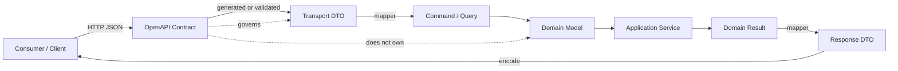
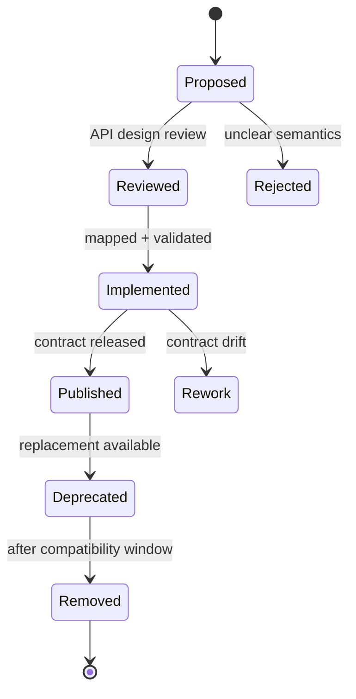
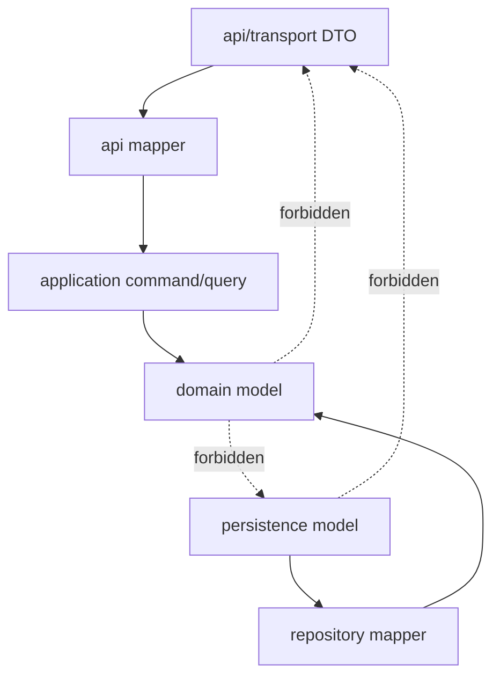
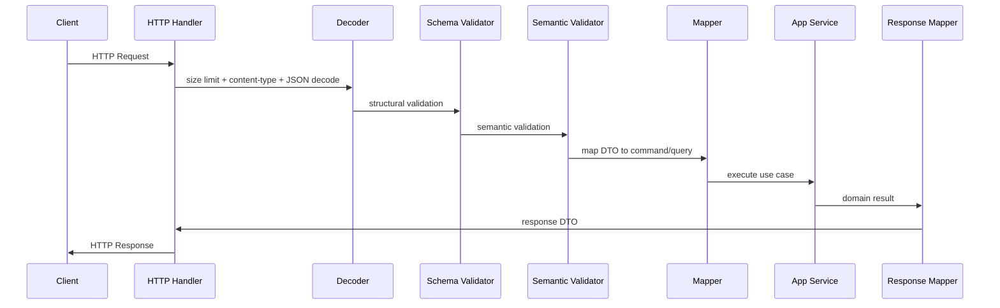
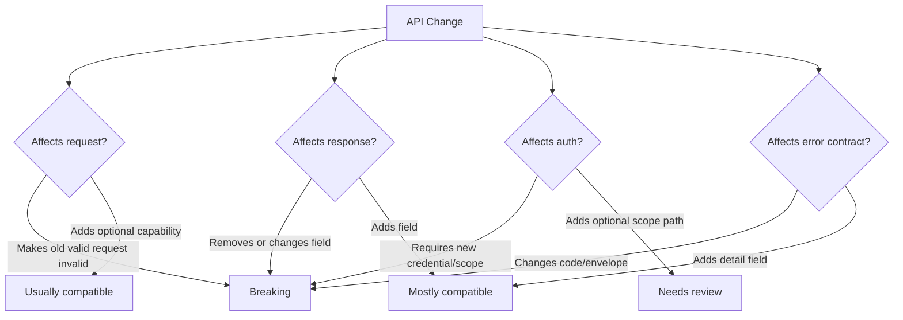
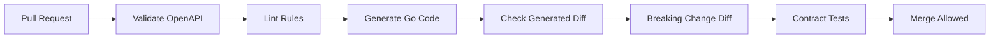

# learn-go-data-mapper-json-xml-protobuf-validation-part-015.md

# Part 015 — OpenAPI Schema and Go DTO Governance

> Seri: `learn-go-data-mapper-json-xml-protobuf-validation`  
> Bagian: `015 / 033`  
> Status seri: **belum selesai**  
> Target pembaca: Java software engineer yang ingin berpindah ke Go dengan kedalaman production-grade  
> Fokus: OpenAPI sebagai kontrak HTTP API, hubungan OpenAPI Schema dengan Go DTO, governance agar contract tidak drift, dan strategi code generation/validation yang defensible.

---

## Daftar Isi

1. [Tujuan Pembelajaran](#tujuan-pembelajaran)
2. [Posisi Part Ini dalam Seri](#posisi-part-ini-dalam-seri)
3. [OpenAPI Bukan Dokumentasi, Tetapi Kontrak Operasional](#openapi-bukan-dokumentasi-tetapi-kontrak-operasional)
4. [Versi OpenAPI: 3.0, 3.1, 3.2, dan Realitas Tooling Go](#versi-openapi-30-31-32-dan-realitas-tooling-go)
5. [Mental Model: Contract Surface vs Implementation Surface](#mental-model-contract-surface-vs-implementation-surface)
6. [Dari Java Engineer ke Go Engineer](#dari-java-engineer-ke-go-engineer)
7. [OpenAPI Object Model yang Penting untuk DTO Governance](#openapi-object-model-yang-penting-untuk-dto-governance)
8. [Schema Object: Bagian Paling Berbahaya dari OpenAPI](#schema-object-bagian-paling-berbahaya-dari-openapi)
9. [Required, Nullable, Optional, Zero Value, dan Pointer di Go](#required-nullable-optional-zero-value-dan-pointer-di-go)
10. [DTO Governance: Mengapa DTO Tidak Boleh Tumbuh Liar](#dto-governance-mengapa-dto-tidak-boleh-tumbuh-liar)
11. [Design-First vs Code-First vs Hybrid](#design-first-vs-code-first-vs-hybrid)
12. [Package Layout untuk OpenAPI-Driven Go Service](#package-layout-untuk-openapi-driven-go-service)
13. [Mapping Layer: Generated DTO Tidak Sama dengan Domain Model](#mapping-layer-generated-dto-tidak-sama-dengan-domain-model)
14. [Request Pipeline yang Defensible](#request-pipeline-yang-defensible)
15. [Response Governance](#response-governance)
16. [Error Envelope dan Validation Error Contract](#error-envelope-dan-validation-error-contract)
17. [Compatibility Rules untuk OpenAPI Contract](#compatibility-rules-untuk-openapi-contract)
18. [Breaking Change Detection di CI](#breaking-change-detection-di-ci)
19. [Linting dan Style Governance](#linting-dan-style-governance)
20. [Generator Landscape di Go](#generator-landscape-di-go)
21. [Tooling Decision Matrix](#tooling-decision-matrix)
22. [OpenAPI 3.1/3.2 Schema Pitfalls di Go](#openapi-3132-schema-pitfalls-di-go)
23. [Polymorphism: oneOf, anyOf, allOf, discriminator](#polymorphism-oneof-anyof-allof-discriminator)
24. [Pagination, Filtering, Sorting, dan Query DTO Governance](#pagination-filtering-sorting-dan-query-dto-governance)
25. [Idempotency, Concurrency Control, dan Conditional Requests](#idempotency-concurrency-control-dan-conditional-requests)
26. [Security Scheme sebagai Contract](#security-scheme-sebagai-contract)
27. [Examples, Fixtures, dan Contract Tests](#examples-fixtures-dan-contract-tests)
28. [Governance untuk Multi-Service dan Platform API](#governance-untuk-multi-service-dan-platform-api)
29. [Case Study: Enforcement Case API](#case-study-enforcement-case-api)
30. [Anti-Pattern](#anti-pattern)
31. [Review Checklist](#review-checklist)
32. [Latihan Desain](#latihan-desain)
33. [Ringkasan Invariant](#ringkasan-invariant)
34. [Referensi](#referensi)

---

## Tujuan Pembelajaran

Setelah menyelesaikan bagian ini, kamu harus mampu:

1. Memperlakukan OpenAPI sebagai **machine-readable contract**, bukan sekadar Swagger UI.
2. Mendesain hubungan antara OpenAPI schema, generated DTO, handwritten DTO, dan domain model di Go.
3. Menentukan kapan memakai design-first, code-first, atau hybrid.
4. Mengelola perbedaan OpenAPI 3.0, 3.1, dan 3.2 dalam realitas tooling Go.
5. Menjaga compatibility contract agar perubahan API tidak diam-diam merusak consumer.
6. Mendesain request/response pipeline yang eksplisit: decode, validate, normalize, map, authorize, execute, map response, encode.
7. Menghindari bug nullability dan optionality yang sering muncul ketika OpenAPI schema diterjemahkan menjadi Go struct.
8. Membuat governance checklist untuk API review dan CI contract check.
9. Memahami batas code generation: generator membantu boilerplate, tetapi tidak menggantikan keputusan arsitektur.
10. Mendesain error contract yang stabil, machine-readable, dan tidak bocor detail internal.

---

## Posisi Part Ini dalam Seri

Part sebelumnya membahas JSON Schema dalam Go systems. Part ini naik satu level: bukan hanya validasi payload JSON, tetapi **kontrak HTTP API secara keseluruhan**.

JSON Schema menjawab:

> "Bentuk JSON ini valid atau tidak?"

OpenAPI menjawab:

> "Endpoint apa yang tersedia, method apa yang dipakai, parameter apa yang legal, request body seperti apa, response apa yang mungkin, security scheme apa yang dibutuhkan, error apa yang dikembalikan, dan bagaimana client/server bisa dihasilkan atau diverifikasi?"

Dalam sistem production, OpenAPI adalah boundary antara:

- backend service,
- frontend,
- mobile app,
- partner integration,
- API gateway,
- test automation,
- documentation portal,
- contract testing,
- SDK generation,
- security review,
- compliance review,
- change management.

Seri ini bukan tentang cara membuat Swagger UI cantik. Swagger UI hanyalah satu consumer. Fokus kita adalah **contract governance**.

---

## OpenAPI Bukan Dokumentasi, Tetapi Kontrak Operasional

Kesalahan umum:

> "Nanti kalau API sudah jadi, baru generate Swagger."

Itu pola documentation-after-the-fact. Masalahnya, ketika OpenAPI hanya output sekunder, contract mudah drift dari real behavior.

Dalam organisasi engineering matang, OpenAPI digunakan sebagai:

| Fungsi | Arti Praktis |
|---|---|
| API design artifact | Endpoint direview sebelum implementasi penuh. |
| Consumer contract | FE/mobile/partner tahu payload yang valid. |
| Server validation | Request diverifikasi terhadap contract. |
| Client generation | SDK/client bisa dibuat otomatis. |
| Mock server | Consumer bisa develop sebelum backend selesai. |
| Regression guard | Breaking change dideteksi di CI. |
| Security surface | Auth scheme, scopes, headers, and rate-limit semantics terdokumentasi. |
| Observability taxonomy | Operation ID menjadi nama metric/log/span yang stabil. |
| Compliance artifact | Contract dapat dilampirkan sebagai evidence desain. |

OpenAPI bukan source of truth absolut untuk domain. Ia adalah source of truth untuk **HTTP boundary**.

Domain model tetap ada di layer internal. Persistence model tetap ada di layer storage. Event schema tetap bisa terpisah. OpenAPI hanya menguasai public HTTP representation.

---

## Versi OpenAPI: 3.0, 3.1, 3.2, dan Realitas Tooling Go

Per Juni 2026, OpenAPI line yang relevan:

| Versi | Karakter |
|---|---|
| OpenAPI 3.0.x | Sangat luas tooling-nya, tetapi Schema Object bukan full JSON Schema. |
| OpenAPI 3.1.x | Lebih dekat dengan JSON Schema Draft 2020-12, mendukung `type: ["string", "null"]`, `$schema`, `$id`, dialect. |
| OpenAPI 3.2.x | Versi lebih baru; menambah/memperjelas area lifecycle dan media/serialization, tetapi dukungan tooling Go bisa belum merata. |

Strategi production yang realistis:

1. **Untuk service internal baru:** gunakan OpenAPI 3.1 bila tooling kamu mendukung.
2. **Untuk generator yang belum matang di 3.1/3.2:** gunakan 3.0.3/3.0.4 sebagai target generated code, tetapi simpan governance schema di 3.1 bila perlu.
3. **Untuk platform API publik:** pilih versi OpenAPI berdasarkan tooling consumer, bukan hanya preferensi backend.
4. **Untuk Go:** cek dukungan generator spesifik. Beberapa tool parsing/validation sudah mendukung 3.1, tetapi code generator bisa masih lebih stabil pada 3.0.

Hal yang harus dibedakan:

```text
OpenAPI spec version       = versi bahasa kontrak API
JSON Schema dialect        = versi bahasa schema di dalam contract
Go generator capability    = kemampuan tool menghasilkan kode
Runtime validator behavior = kemampuan validate request/response
```

Jangan menganggap empat hal itu otomatis sejajar.

Contoh:

- Contract kamu OpenAPI 3.1.
- Runtime parser kamu mendukung OpenAPI 3.1.
- Code generator kamu hanya stabil untuk OpenAPI 3.0.
- Gateway kamu hanya memahami subset OpenAPI 3.0.

Itu bukan masalah kecil. Itu architecture constraint.

---

## Mental Model: Contract Surface vs Implementation Surface

OpenAPI adalah **contract surface**.

Go code adalah **implementation surface**.

Keduanya tidak boleh disamakan.



Rule penting:

> Public contract boleh mengubah cara domain dipresentasikan, tetapi tidak boleh memaksa domain model menjadi bentuk yang buruk.

Contoh buruk:

```go
type Case struct {
    ID              string  `json:"id"`
    OfficerUserID   *string `json:"officerUserId,omitempty"`
    InternalFlags   []int   `json:"internalFlags,omitempty"`
    DBStatusCode    string  `json:"dbStatusCode"`
    WorkflowNodeID  string  `json:"workflowNodeId"`
}
```

Ini DTO yang menyamar sebagai domain model, atau domain model yang sudah terkontaminasi transport/persistence. Masalah:

- `json` tags bocor ke domain.
- `DBStatusCode` bocor ke API.
- `InternalFlags` mungkin tidak boleh keluar.
- `*string` mungkin hanya dibutuhkan untuk representasi optional/null, bukan domain invariant.
- `WorkflowNodeID` mungkin internal state machine, bukan public resource state.

Contoh lebih bersih:

```go
// internal/case/domain/case.go
package domain

type Case struct {
    id        CaseID
    status    CaseStatus
    assignee  *OfficerID
    subject   Subject
    createdAt TimePoint
}

func (c Case) PublicStatus() PublicCaseStatus {
    switch c.status {
    case StatusDraft, StatusSubmitted:
        return PublicStatusInProgress
    case StatusClosed:
        return PublicStatusClosed
    default:
        return PublicStatusUnknown
    }
}
```

```go
// internal/case/api/dto.go
package api

type CaseResponse struct {
    ID        string  `json:"id"`
    Status    string  `json:"status"`
    Assignee  *string `json:"assignee,omitempty"`
    Subject   string  `json:"subject"`
    CreatedAt string  `json:"createdAt"`
}
```

```go
// internal/case/api/mapper.go
package api

func CaseToResponse(c domain.Case) CaseResponse {
    var assignee *string
    if c.Assignee() != nil {
        v := c.Assignee().String()
        assignee = &v
    }

    return CaseResponse{
        ID:        c.ID().String(),
        Status:    string(c.PublicStatus()),
        Assignee:  assignee,
        Subject:   c.Subject().String(),
        CreatedAt: c.CreatedAt().UTC().Format(time.RFC3339Nano),
    }
}
```

Transport DTO dibuat untuk API. Domain model dibuat untuk business correctness.

---

## Dari Java Engineer ke Go Engineer

Jika kamu dari Java, kamu mungkin terbiasa dengan:

- Jackson annotations,
- Bean Validation annotations,
- MapStruct,
- Lombok,
- Spring MVC request binding,
- OpenAPI generator,
- Jakarta Validation,
- Jackson polymorphic annotations,
- classpath scanning,
- runtime reflection,
- annotation-driven frameworks.

Go punya gaya berbeda.

| Java Habit | Go Equivalent | Caveat |
|---|---|---|
| Jackson `@JsonProperty` | struct tag `json:"fieldName"` | Hanya string metadata; tidak ada annotation processor built-in. |
| Bean Validation `@NotNull` | `validate:"required"` atau explicit validation code | Tag validation bukan domain invariant. |
| MapStruct | manual mapper atau codegen khusus | Manual mapper sering lebih idiomatic untuk boundary penting. |
| Lombok DTO | generated/manual struct | Go struct sederhana, tetapi optionality harus dipikirkan. |
| Spring request binding | explicit decode pipeline | Jangan biarkan framework menyembunyikan body limit/error behavior. |
| `Optional<T>` | pointer/custom `Optional[T]` | Pointer tidak membedakan absent vs null tanpa custom handling. |
| Jackson views | separate DTO types | Lebih eksplisit dan mudah direview. |
| JPA entity exposed as DTO | anti-pattern yang sama di Go | Persistence model tidak boleh jadi public API. |

Perubahan mental model:

```text
Java: annotation-rich object graph + framework binding
Go: explicit boundary code + small structs + generated or handwritten glue
```

Dalam Go, "sedikit boilerplate" sering lebih aman daripada "magic mapping" yang tidak terlihat.

---

## OpenAPI Object Model yang Penting untuk DTO Governance

OpenAPI punya banyak bagian. Untuk DTO governance, yang paling penting:

```yaml
openapi: 3.1.0
info:
  title: Enforcement Case API
  version: 1.0.0

paths:
  /cases:
    post:
      operationId: createCase
      requestBody:
        required: true
        content:
          application/json:
            schema:
              $ref: "#/components/schemas/CreateCaseRequest"
      responses:
        "201":
          description: Case created
          content:
            application/json:
              schema:
                $ref: "#/components/schemas/CaseResponse"

components:
  schemas:
    CreateCaseRequest:
      type: object
      required:
        - subject
        - category
      additionalProperties: false
      properties:
        subject:
          type: string
          minLength: 1
          maxLength: 200
        category:
          type: string
          enum: [licensing, compliance, complaint]
        description:
          type: ["string", "null"]
          maxLength: 5000

    CaseResponse:
      type: object
      required:
        - id
        - status
        - subject
        - createdAt
      additionalProperties: false
      properties:
        id:
          type: string
          format: uuid
        status:
          type: string
          enum: [draft, submitted, under_review, closed]
        subject:
          type: string
        createdAt:
          type: string
          format: date-time
```

Bagian yang paling mempengaruhi Go DTO:

| OpenAPI Field | Dampak ke Go |
|---|---|
| `required` | Field wajib ada di payload, tapi tidak otomatis berarti non-zero di Go. |
| `type` | Menentukan tipe Go kandidat. |
| `format` | Sering butuh custom type: UUID, date-time, decimal. |
| `nullable` / `type: ["T", "null"]` | Biasanya pointer/custom optional. |
| `additionalProperties` | Map/dynamic extension atau strict unknown field policy. |
| `enum` | Perlu named type dan validation. |
| `oneOf`/`anyOf`/`allOf` | Sulit untuk Go struct datar; perlu wrapper/discriminator/custom decode. |
| `readOnly`/`writeOnly` | Harus memisahkan request/response DTO. |
| `deprecated` | Perlu migration policy dan compatibility window. |
| `examples` | Dapat jadi fixture contract test. |

OpenAPI governance terutama mengatur agar setiap field punya:

1. name,
2. type,
3. presence rule,
4. null rule,
5. format rule,
6. lifecycle rule,
7. compatibility rule,
8. ownership.

---

## Schema Object: Bagian Paling Berbahaya dari OpenAPI

Schema Object tampak seperti dokumentasi field, padahal menentukan behavior consumer.

### 1. `required` bukan `not empty`

OpenAPI:

```yaml
required:
  - name
properties:
  name:
    type: string
```

Artinya field `name` harus hadir. Tetapi string kosong `""` masih valid kecuali diberi `minLength`.

Kalau business rule membutuhkan tidak kosong:

```yaml
name:
  type: string
  minLength: 1
```

Untuk mencegah whitespace-only:

```yaml
name:
  type: string
  minLength: 1
  pattern: '.*\S.*'
```

Namun hati-hati: regex portability dan Unicode behavior bisa berbeda antar validator.

### 2. `additionalProperties` default sering disalahpahami

Jika tidak ditulis, banyak schema mengizinkan properti tambahan secara default.

Untuk public request DTO, pertimbangkan:

```yaml
additionalProperties: false
```

Tujuannya:

- typo consumer cepat terdeteksi,
- payload injection surface mengecil,
- contract lebih jelas,
- FE bug tidak silent.

Namun untuk response, strategy bisa berbeda. Mengizinkan unknown response fields dapat membantu forward compatibility client.

### 3. `format` bukan selalu assertion

`format: date-time`, `format: email`, `format: uuid` sering dianggap validation keras. Dalam JSON Schema 2020-12, format dapat diperlakukan sebagai annotation atau assertion tergantung validator/dialect/config.

Jadi untuk Go API, jangan bergantung buta pada `format`. Validasi format penting harus diuji di runtime pipeline.

### 4. `readOnly` dan `writeOnly` bukan dekorasi

Contoh:

```yaml
id:
  type: string
  format: uuid
  readOnly: true

password:
  type: string
  writeOnly: true
```

Implikasi:

- `id` tidak boleh diterima dari create request.
- `password` tidak boleh muncul di response.
- Generated DTO tunggal untuk request+response bisa menjadi berbahaya.

Lebih aman:

```yaml
CreateUserRequest
UserResponse
```

bukan satu `User`.

### 5. Schema composition bisa membuat generated type buruk

`allOf`, `oneOf`, `anyOf` bagus untuk contract, tetapi bisa menghasilkan Go code kompleks.

Contoh:

```yaml
CaseEvent:
  oneOf:
    - $ref: '#/components/schemas/CaseCreatedEvent'
    - $ref: '#/components/schemas/CaseClosedEvent'
  discriminator:
    propertyName: type
```

Di Go, ini mungkin perlu:

- wrapper type,
- custom unmarshal,
- raw message switch,
- interface representation,
- generated union helper,
- explicit validation.

Tidak semua generator menangani komposisi dengan kualitas sama.

---

## Required, Nullable, Optional, Zero Value, dan Pointer di Go

Inilah sumber bug terbesar ketika OpenAPI bertemu Go.

### Empat state yang harus dibedakan

Untuk request field:

| State | Contoh JSON | Arti yang Mungkin |
|---|---|---|
| absent | `{}` | Consumer tidak mengirim field. |
| null | `{"name": null}` | Consumer sengaja mengosongkan atau null. |
| zero | `{"name": ""}` | Consumer mengirim empty string. |
| value | `{"name": "A"}` | Consumer mengirim value. |

Go `string` hanya bisa membedakan:

```go
"" vs "A"
```

Go `*string` bisa membedakan:

```go
nil vs pointer("")
```

Tetapi `*string` dengan `encoding/json` v1 **tidak cukup** untuk membedakan absent dan explicit `null` bila target awalnya zero-value struct, karena keduanya berakhir sebagai `nil`.

Untuk PATCH, sering perlu custom optional type.

```go
type Optional[T any] struct {
    Set   bool
    Null  bool
    Value T
}
```

Contoh `UnmarshalJSON`:

```go
func (o *Optional[T]) UnmarshalJSON(data []byte) error {
    o.Set = true

    if bytes.Equal(bytes.TrimSpace(data), []byte("null")) {
        o.Null = true
        var zero T
        o.Value = zero
        return nil
    }

    var v T
    if err := json.Unmarshal(data, &v); err != nil {
        return err
    }

    o.Value = v
    o.Null = false
    return nil
}
```

Namun ada satu caveat penting:

`UnmarshalJSON` hanya dipanggil jika key hadir. Jadi field absent tetap `Set=false`.

Contoh DTO:

```go
type UpdateCaseRequest struct {
    Subject     Optional[string] `json:"subject"`
    Description Optional[string] `json:"description"`
}
```

Mapping:

```go
func MapUpdateCase(req UpdateCaseRequest) domain.UpdateCaseCommand {
    cmd := domain.UpdateCaseCommand{}

    if req.Subject.Set {
        if req.Subject.Null {
            cmd.ClearSubject = true
        } else {
            cmd.SetSubject = ptr(domain.Subject(req.Subject.Value))
        }
    }

    if req.Description.Set {
        if req.Description.Null {
            cmd.ClearDescription = true
        } else {
            cmd.SetDescription = ptr(domain.Description(req.Description.Value))
        }
    }

    return cmd
}
```

### OpenAPI representation

Untuk full update/create:

```yaml
CreateCaseRequest:
  type: object
  required: [subject]
  properties:
    subject:
      type: string
      minLength: 1
```

Untuk nullable field:

```yaml
description:
  type: ["string", "null"]
  maxLength: 5000
```

Untuk patch field:

```yaml
PatchCaseRequest:
  type: object
  additionalProperties: false
  properties:
    subject:
      type: ["string", "null"]
      minLength: 1
    description:
      type: ["string", "null"]
      maxLength: 5000
```

Tetapi OpenAPI schema sendiri belum menjelaskan semua semantic PATCH. Tambahkan description:

```yaml
description: >
  If absent, the current subject is unchanged.
  If null, the subject is cleared.
  If string, the subject is replaced.
```

Contract governance harus mencatat semantic ini.

---

## DTO Governance: Mengapa DTO Tidak Boleh Tumbuh Liar

DTO tumbuh liar ketika:

- setiap handler membuat struct sendiri tanpa standar,
- domain struct diberi `json` tag,
- generated code diedit manual,
- response reuse request schema,
- field internal ikut exposed,
- field lama dihapus tanpa compatibility window,
- `omitempty` dipasang untuk "membuat response kecil" tanpa memikirkan contract,
- field optional/null tidak punya semantic jelas,
- OpenAPI hanya di-generate setelah coding selesai.

Governance artinya:

> Ada aturan eksplisit tentang siapa boleh menambah field, bagaimana field divalidasi, bagaimana perubahan dideteksi, dan bagaimana field dihapus.

### DTO lifecycle



Setiap field harus punya lifecycle:

| Lifecycle | Pertanyaan |
|---|---|
| Proposed | Kenapa field ini ada? Consumer siapa? |
| Reviewed | Apakah nama/type/semantic benar? |
| Published | Apakah contract test ada? |
| Deprecated | Replacement apa? Sampai kapan? |
| Removed | Apakah breaking change sudah major version? |

### DTO ownership rule

Buat rule sederhana:

```text
DTO di package api/transport hanya boleh merepresentasikan public boundary.
Domain tidak boleh import api/transport.
Persistence tidak boleh import api/transport.
Mapper satu-satunya jembatan resmi.
```

Diagram:



---

## Design-First vs Code-First vs Hybrid

### Design-first

OpenAPI ditulis/dirancang dahulu, lalu code generated/manual mengikuti.

Cocok untuk:

- public API,
- multi-team consumer,
- regulated system,
- mobile/web parallel development,
- partner integration,
- API gateway integration,
- SDK generation.

Kelebihan:

- contract review lebih awal,
- FE/client bisa mulai dari mock,
- breaking change bisa dicegah,
- governance kuat.

Kekurangan:

- butuh disiplin schema design,
- generator limitation bisa mempengaruhi desain,
- developer harus maintain YAML/JSON spec.

### Code-first

Go code ditulis dahulu, spec dihasilkan dari annotations/reflection.

Cocok untuk:

- internal tool kecil,
- single-team API,
- prototyping,
- admin endpoint,
- API dengan consumer sangat terbatas.

Kelebihan:

- cepat mulai,
- spec mengikuti kode,
- sedikit context switch.

Kekurangan:

- contract cenderung menjadi dokumentasi pasif,
- annotations bisa drift dari behavior,
- sulit review API sebelum implementasi,
- domain/transport sering tercampur.

### Hybrid

Contract untuk endpoint publik ditulis design-first. Implementation menggunakan generated types/validation. Endpoint internal kecil bisa code-first atau handwritten.

Cocok untuk organisasi besar.

### Decision table

| Context | Pilihan |
|---|---|
| Public platform API | Design-first |
| Internal service dengan banyak consumer | Design-first atau hybrid |
| Backend-for-frontend | Hybrid |
| Admin-only API | Code-first boleh |
| Regulatory workflow API | Design-first |
| High-compliance audit boundary | Design-first dengan review checklist |
| Experimental prototype | Code-first, tetapi migration path jelas |

---

## Package Layout untuk OpenAPI-Driven Go Service

Contoh layout:

```text
case-service/
  api/
    openapi/
      case-api.yaml
      overlays/
        public.yaml
        internal.yaml
    generated/
      server.gen.go
      types.gen.go
      client.gen.go
    transport/
      handler.go
      decode.go
      encode.go
      errors.go
      mapper_request.go
      mapper_response.go
      validation.go
  internal/
    case/
      app/
        command.go
        query.go
        service.go
      domain/
        case.go
        status.go
        policy.go
      infra/
        db_model.go
        repository.go
        mapper.go
  test/
    contract/
      fixtures/
        create_case_valid.json
        create_case_invalid_missing_subject.json
      openapi_contract_test.go
  tools/
    openapi/
      validate.sh
      diff.sh
      lint.yaml
  Makefile
  go.mod
```

Aturan:

1. `api/openapi/*.yaml` adalah contract source.
2. `api/generated/*` tidak diedit manual.
3. `api/transport/*` adalah glue code.
4. `internal/*/domain` tidak tahu OpenAPI.
5. Contract tests membaca fixtures dari OpenAPI examples atau testdata.
6. CI memverifikasi generated code up-to-date.

### `go:generate` untuk generator

```go
// api/generated/generate.go
package generated

//go:generate go run github.com/oapi-codegen/oapi-codegen/v2/cmd/oapi-codegen -config ../../api/openapi/oapi-codegen.yaml ../../api/openapi/case-api.yaml
```

Namun ingat:

- `go generate` tidak otomatis dijalankan oleh `go build`.
- CI harus memanggilnya eksplisit.
- Generated code harus dicek apakah berubah.

Contoh Makefile:

```makefile
.PHONY: openapi-generate
openapi-generate:
	go generate ./api/generated/...

.PHONY: openapi-check
openapi-check: openapi-generate
	git diff --exit-code -- api/generated
```

---

## Mapping Layer: Generated DTO Tidak Sama dengan Domain Model

Generator bisa menghasilkan:

```go
type CreateCaseRequest struct {
    Subject     string  `json:"subject"`
    Category    string  `json:"category"`
    Description *string `json:"description,omitempty"`
}
```

Jangan langsung kirim ke domain service:

```go
// Hindari: app service tergantung transport DTO.
func (s *Service) CreateCase(ctx context.Context, req generated.CreateCaseRequest) error
```

Lebih baik:

```go
type CreateCaseCommand struct {
    Subject     domain.Subject
    Category    domain.CaseCategory
    Description *domain.Description
    Actor       identity.Actor
}
```

Mapper:

```go
func MapCreateCaseRequest(
    req generated.CreateCaseRequest,
    actor identity.Actor,
) (caseapp.CreateCaseCommand, error) {
    subject, err := domain.NewSubject(req.Subject)
    if err != nil {
        return caseapp.CreateCaseCommand{}, fieldError("subject", err)
    }

    category, err := domain.ParseCaseCategory(req.Category)
    if err != nil {
        return caseapp.CreateCaseCommand{}, fieldError("category", err)
    }

    var description *domain.Description
    if req.Description != nil {
        d, err := domain.NewDescription(*req.Description)
        if err != nil {
            return caseapp.CreateCaseCommand{}, fieldError("description", err)
        }
        description = &d
    }

    return caseapp.CreateCaseCommand{
        Subject:     subject,
        Category:    category,
        Description: description,
        Actor:       actor,
    }, nil
}
```

Keuntungan:

- DTO bisa berubah tanpa menghancurkan domain.
- Domain invariant tetap kuat.
- Error field path bisa jelas.
- Security context (`Actor`) tidak dipalsukan dari body.
- Nullability transport tidak bocor ke business layer.

### Mapping response

```go
func MapCaseResponse(c domain.Case) generated.CaseResponse {
    var assignee *string
    if a := c.Assignee(); a != nil {
        s := a.String()
        assignee = &s
    }

    return generated.CaseResponse{
        Id:        c.ID().String(),
        Status:    generated.CaseStatus(c.PublicStatus().String()),
        Subject:   c.Subject().String(),
        Assignee:  assignee,
        CreatedAt: c.CreatedAt().UTC(),
    }
}
```

Jangan expose semua domain state. Response adalah public representation.

---

## Request Pipeline yang Defensible

Pipeline request production:



Layer responsibilities:

| Layer | Responsibility | Example Error |
|---|---|---|
| Transport guard | content-type, body size, method | 415, 413 |
| Syntax decode | malformed JSON | 400 |
| Schema validation | missing field, wrong type | 400 |
| Semantic validation | invalid enum transition, invalid date range | 422 |
| Authorization | actor cannot perform action | 403 |
| Application invariant | state conflict | 409 |
| Persistence | uniqueness, storage failure | 409/500 |
| Response mapping | public projection | 500 if impossible |

### Example handler skeleton

```go
func (h *Handler) CreateCase(w http.ResponseWriter, r *http.Request) {
    ctx := r.Context()

    if !isJSON(r.Header.Get("Content-Type")) {
        writeError(w, unsupportedMediaType("content-type must be application/json"))
        return
    }

    r.Body = http.MaxBytesReader(w, r.Body, 1<<20) // 1 MiB
    defer r.Body.Close()

    var req generated.CreateCaseRequest
    if err := decodeStrictJSON(r.Body, &req); err != nil {
        writeError(w, badRequestFromDecode(err))
        return
    }

    if err := h.openapiValidator.ValidateCreateCaseRequest(ctx, req); err != nil {
        writeError(w, badRequestFromSchema(err))
        return
    }

    actor, err := h.auth.ActorFromRequest(r)
    if err != nil {
        writeError(w, unauthorized(err))
        return
    }

    cmd, err := MapCreateCaseRequest(req, actor)
    if err != nil {
        writeError(w, validationError(err))
        return
    }

    result, err := h.caseService.CreateCase(ctx, cmd)
    if err != nil {
        writeError(w, appError(err))
        return
    }

    writeJSON(w, http.StatusCreated, MapCaseResponse(result))
}
```

OpenAPI tidak menggantikan pipeline ini. OpenAPI mengatur boundary contract, tetapi handler tetap harus mengontrol failure semantics.

---

## Response Governance

Request sering lebih diperhatikan daripada response, padahal response drift juga merusak consumer.

Aturan response:

1. Response field baru biasanya additive dan backward-compatible.
2. Menghapus response field adalah breaking change.
3. Mengubah tipe response field adalah breaking change.
4. Mengubah enum value bisa breaking untuk strict client.
5. Mengubah `null` menjadi non-null atau sebaliknya bisa breaking.
6. Mengubah status code bisa breaking.
7. Mengubah error envelope bisa breaking.
8. Response ordering tidak boleh dijadikan contract kecuali explicit.
9. `omitempty` pada response harus dipakai hati-hati.
10. Sensitive/internal fields tidak boleh masuk response hanya karena ada di domain.

### `omitempty` hazard

```go
type CaseResponse struct {
    TotalFineCents int64 `json:"totalFineCents,omitempty"`
}
```

Masalah:

- Jika total fine memang 0, field hilang.
- Consumer tidak tahu apakah 0 atau unavailable.
- Contract menjadi ambiguous.

Lebih jelas:

```go
type CaseResponse struct {
    TotalFineCents int64 `json:"totalFineCents"`
}
```

Atau:

```go
type CaseResponse struct {
    TotalFineCents *int64 `json:"totalFineCents,omitempty"`
}
```

Tetapi pointer harus punya semantic: absent berarti field unavailable? null berarti computed but unknown? Jangan biarkan tidak jelas.

### Response example

```yaml
CaseResponse:
  type: object
  required:
    - id
    - status
    - subject
    - createdAt
  additionalProperties: false
  properties:
    id:
      type: string
      format: uuid
    status:
      $ref: '#/components/schemas/CaseStatus'
    subject:
      type: string
    totalFineCents:
      type: ["integer", "null"]
      description: >
        Null if the case has no finalized fine assessment yet.
    createdAt:
      type: string
      format: date-time
```

---

## Error Envelope dan Validation Error Contract

Error contract sering diabaikan, padahal client sangat bergantung padanya.

Buruk:

```json
{
  "error": "invalid input"
}
```

Lebih baik:

```json
{
  "code": "VALIDATION_FAILED",
  "message": "Request validation failed.",
  "correlationId": "01JZ...",
  "details": [
    {
      "path": "/subject",
      "code": "REQUIRED",
      "message": "subject is required"
    },
    {
      "path": "/category",
      "code": "ENUM",
      "message": "category must be one of licensing, compliance, complaint"
    }
  ]
}
```

OpenAPI schema:

```yaml
ErrorResponse:
  type: object
  required:
    - code
    - message
    - correlationId
  additionalProperties: false
  properties:
    code:
      type: string
      enum:
        - BAD_REQUEST
        - VALIDATION_FAILED
        - UNAUTHORIZED
        - FORBIDDEN
        - NOT_FOUND
        - CONFLICT
        - INTERNAL_ERROR
    message:
      type: string
    correlationId:
      type: string
    details:
      type: array
      items:
        $ref: '#/components/schemas/ErrorDetail'

ErrorDetail:
  type: object
  required:
    - path
    - code
    - message
  additionalProperties: false
  properties:
    path:
      type: string
      description: JSON Pointer path to the invalid field.
      examples: ["/subject", "/items/0/amount"]
    code:
      type: string
    message:
      type: string
```

### Error code stability

Jangan mengubah error `code` sembarangan. Client mungkin melakukan branching:

```ts
if (error.code === "VALIDATION_FAILED") {
  showFieldErrors(error.details)
}
```

Error message boleh berubah untuk readability. Error code harus stabil.

### Status code mapping

| HTTP Status | Error Code | Meaning |
|---|---|---|
| 400 | BAD_REQUEST | Syntax/shape invalid. |
| 401 | UNAUTHORIZED | Missing/invalid authentication. |
| 403 | FORBIDDEN | Authenticated but not allowed. |
| 404 | NOT_FOUND | Resource not visible/found. |
| 409 | CONFLICT | State/version conflict. |
| 415 | UNSUPPORTED_MEDIA_TYPE | Wrong content type. |
| 422 | VALIDATION_FAILED | Semantically invalid but syntactically parseable. |
| 429 | RATE_LIMITED | Too many requests. |
| 500 | INTERNAL_ERROR | Unexpected server failure. |

Pilih kebijakan dan konsisten.

---

## Compatibility Rules untuk OpenAPI Contract

Compatibility harus dinilai dari sudut consumer, bukan dari sudut server.

### Additive changes biasanya aman

| Change | Usually Safe? | Caveat |
|---|---:|---|
| Add optional request field | Yes | Server harus tetap menerima payload lama. |
| Add response field | Yes | Strict client bisa gagal jika tidak toleran unknown response field. |
| Add new endpoint | Yes | Tidak mengubah endpoint lama. |
| Add new optional query param | Yes | Default behavior harus sama. |
| Add new enum value in response | Maybe | Client switch exhaustive bisa gagal. |
| Add new error code | Maybe | Client error handling bisa tidak mengenali. |

### Breaking changes

| Change | Breaking? |
|---|---:|
| Remove field from response | Yes |
| Rename field | Yes |
| Change field type | Yes |
| Make optional request field required | Yes |
| Make nullable field non-null without migration | Yes |
| Remove enum value still used | Yes |
| Change endpoint path | Yes |
| Change method | Yes |
| Change status code semantics | Yes |
| Change auth requirement | Usually yes |
| Change pagination default drastically | Often yes |
| Tighten validation on existing accepted values | Often yes |

### Compatibility matrix



### Deprecation workflow

```yaml
oldField:
  type: string
  deprecated: true
  description: >
    Deprecated. Use newField instead. This field will be removed no earlier than 2027-01-01.
```

Deprecation tanpa tanggal dan replacement bukan governance, hanya komentar.

---

## Breaking Change Detection di CI

Minimal CI untuk OpenAPI:

```text
1. validate spec syntax
2. lint style
3. bundle/dereference if needed
4. generate code
5. verify generated code committed/up-to-date
6. diff against main branch contract
7. fail on breaking change
8. run contract tests with fixtures
```

Diagram:



### Example CI commands

Tooling will vary, but conceptually:

```bash
# validate OpenAPI structure
redocly lint api/openapi/case-api.yaml

# bundle
redocly bundle api/openapi/case-api.yaml -o build/case-api.bundle.yaml

# breaking change check
oasdiff breaking base.yaml build/case-api.bundle.yaml

# generate
go generate ./api/generated/...

# generated code must be clean
git diff --exit-code -- api/generated
```

Jika memakai `kin-openapi` untuk custom validation:

```go
func TestOpenAPISpecValid(t *testing.T) {
    loader := openapi3.NewLoader()
    loader.IsExternalRefsAllowed = true

    doc, err := loader.LoadFromFile("../../api/openapi/case-api.yaml")
    if err != nil {
        t.Fatal(err)
    }

    if err := doc.Validate(context.Background()); err != nil {
        t.Fatal(err)
    }
}
```

### Contract test dari examples

Setiap schema penting sebaiknya punya valid/invalid fixture.

```text
test/contract/fixtures/
  create_case.valid.minimal.json
  create_case.valid.full.json
  create_case.invalid.missing_subject.json
  create_case.invalid.unknown_field.json
  create_case.invalid.bad_category.json
```

Test:

```go
func TestCreateCaseFixtures(t *testing.T) {
    validator := mustLoadOpenAPIValidator(t)

    for _, tc := range []struct {
        name    string
        file    string
        wantErr bool
    }{
        {"minimal valid", "create_case.valid.minimal.json", false},
        {"unknown field", "create_case.invalid.unknown_field.json", true},
        {"bad category", "create_case.invalid.bad_category.json", true},
    } {
        t.Run(tc.name, func(t *testing.T) {
            body := mustReadFixture(t, tc.file)
            err := validator.ValidateRequestBody("createCase", body)

            if tc.wantErr && err == nil {
                t.Fatal("expected error")
            }
            if !tc.wantErr && err != nil {
                t.Fatalf("unexpected error: %v", err)
            }
        })
    }
}
```

---

## Linting dan Style Governance

Linting mencegah spec menjadi tidak konsisten.

Contoh rule:

| Rule | Reason |
|---|---|
| Every operation must have `operationId` | Needed for generated code, metrics, logs, and docs. |
| Operation ID must be stable | Changing it breaks generated clients/observability. |
| Every response must define error response | Client needs predictable errors. |
| Request object must set `additionalProperties: false` | Avoid silent typo/injection. |
| Schema names must be nouns | Better readability and generation. |
| Request schema suffix `Request` | Avoid request/response confusion. |
| Response schema suffix `Response` | Avoid exposing request-only fields. |
| Enum schema must be reusable | Avoid duplicated enum semantics. |
| Date-time fields must specify UTC semantics | Avoid timezone ambiguity. |
| Money must not use floating-point | Prevent precision loss. |
| IDs must be strings unless proven safe | Avoid JS number precision issue. |
| Deprecated fields must include replacement and removal policy | Real lifecycle governance. |

### Example naming convention

```text
Operation:
  createCase
  getCase
  listCases
  updateCase
  closeCase

Schemas:
  CreateCaseRequest
  PatchCaseRequest
  CaseResponse
  CaseListResponse
  CaseStatus
  ErrorResponse
  ErrorDetail
```

### Why `operationId` matters

`operationId` can become:

- generated function name,
- metric label,
- tracing span name,
- dashboard grouping,
- API gateway route name,
- documentation anchor,
- test case name.

Treat it as stable API, not arbitrary string.

---

## Generator Landscape di Go

Tooling changes over time, so always verify current version before standardizing. The categories matter more than tool names.

### 1. Parser/validator libraries

Example: `kin-openapi`.

Use for:

- loading OpenAPI files,
- resolving refs,
- validating spec,
- request/response validation,
- building custom governance checks.

Strength:

- good for runtime/spec validation,
- can be embedded in tests,
- supports OpenAPI 3.0 and 3.1 features.

Risk:

- not a complete governance solution by itself,
- generated code is separate concern.

### 2. Server/client generators

Example: `oapi-codegen`, `ogen`, OpenAPI Generator.

Use for:

- generating types,
- server interfaces,
- client code,
- request parameter parsing,
- routing glue.

Trade-off:

| Tool Style | Strength | Risk |
|---|---|---|
| Minimal generator | Less magic, easier integration | More manual validation/mapping |
| Full server generator | Strong contract enforcement | Generated framework coupling |
| Client SDK generator | Consumer convenience | SDK semantics may drift from backend |
| Static no-reflection generator | Performance and type safety | Spec subset limitations |

### 3. Annotation/code-first generators

Example style: comments/annotations near handlers.

Use for:

- quick internal docs,
- small teams,
- existing codebase.

Risk:

- annotations often become stale,
- OpenAPI becomes output, not design artifact,
- hard to enforce compatibility review.

### Tooling decision matrix

| Need | Better Fit |
|---|---|
| Public contract with governance | Design-first + lint + diff + generator |
| Fast internal admin API | Code-first acceptable |
| Strict runtime validation | Parser/validator + explicit handler pipeline |
| High performance and static typing | Codegen with minimal reflection |
| Multiple language SDKs | OpenAPI Generator/Speakeasy-like ecosystem |
| Go-only internal services | oapi-codegen/ogen style |
| Complex oneOf/discriminator | Test generator output before committing |
| OpenAPI 3.1/3.2 latest features | Verify tool support carefully |

---

## Tooling Decision Matrix

When choosing toolchain, score each tool on these axes:

| Axis | Question |
|---|---|
| Spec version | Does it support 3.0, 3.1, 3.2? Which features exactly? |
| JSON Schema dialect | Does it support Draft 2020-12 semantics? |
| Request validation | Can it validate headers/query/body/path? |
| Response validation | Can it validate response in tests? |
| Code generation | Types only, server, client, or full framework? |
| Nullability | How does it map nullable/required to Go? |
| oneOf/anyOf/allOf | Does generated code preserve semantics? |
| additionalProperties | Does it map to map? reject? ignore? |
| Performance | Reflection or generated decoding? |
| Maintainability | Is generated code readable? |
| Extensibility | Can custom types be configured? |
| CI friendliness | Deterministic output? stable formatting? |
| Community health | Active releases? breaking changes? |
| License/security | Acceptable for enterprise? |

### Example decision record

```markdown
# ADR: OpenAPI Toolchain for Case Service

## Decision
Use OpenAPI 3.1 as authoring contract.
Use kin-openapi for spec validation.
Use oapi-codegen for Go DTO/server interface if generated target can be represented in supported subset.
For unsupported 3.1-only features, maintain a 3.0-compatible generation overlay.

## Why
- OpenAPI 3.1 gives us JSON Schema 2020-12 alignment.
- Current Go generator support for 3.1/3.2 is uneven.
- We want contract-first governance without blocking delivery.

## Consequences
- Some schemas must avoid advanced 3.1 composition until generator catches up.
- CI must validate both source contract and generation overlay.
- Mapper layer remains mandatory; generated DTOs are not domain models.
```

---

## OpenAPI 3.1/3.2 Schema Pitfalls di Go

### Pitfall 1: `type: ["string", "null"]`

OpenAPI 3.1:

```yaml
type: ["string", "null"]
```

Go candidate:

```go
*string
```

But:

- absent and null may both become nil,
- generated tags may use `omitempty`,
- PATCH semantics may be lost,
- validation must know whether field is required.

### Pitfall 2: `additionalProperties`

Schema:

```yaml
metadata:
  type: object
  additionalProperties:
    type: string
```

Go:

```go
Metadata map[string]string `json:"metadata"`
```

Question:

- Are keys unconstrained?
- Are values always string?
- Is metadata user-controlled?
- Should keys be allow-listed?
- Should maxProperties exist?
- Should key length be constrained?

Better:

```yaml
metadata:
  type: object
  maxProperties: 20
  propertyNames:
    type: string
    pattern: "^[a-zA-Z0-9_.-]{1,64}$"
  additionalProperties:
    type: string
    maxLength: 500
```

### Pitfall 3: `format: int64` for public JSON

If browser/JavaScript consumer exists, large integer JSON numbers can lose precision.

Safer for IDs:

```yaml
caseNumber:
  type: string
  pattern: "^[0-9]{1,20}$"
```

For money:

```yaml
amountCents:
  type: integer
  format: int64
```

or decimal string:

```yaml
amount:
  type: string
  pattern: "^-?[0-9]+(\\.[0-9]{1,2})?$"
```

Never use:

```yaml
amount:
  type: number
  format: double
```

for money.

### Pitfall 4: `allOf` inheritance thinking

Java engineers may interpret:

```yaml
allOf:
  - $ref: '#/components/schemas/BaseCase'
  - type: object
    properties:
      appealDeadline:
        type: string
        format: date
```

as inheritance.

In JSON Schema/OpenAPI, `allOf` is intersection/combined validation, not Java class inheritance.

Generated Go may flatten, embed, or create nested structs depending on tool.

Avoid deep inheritance-like schema hierarchies. Prefer explicit schemas for public DTOs.

### Pitfall 5: `oneOf` without discriminator

```yaml
oneOf:
  - $ref: '#/components/schemas/EmailNotification'
  - $ref: '#/components/schemas/SmsNotification'
```

Without discriminator, validation/generation can be ambiguous.

Prefer:

```yaml
Notification:
  oneOf:
    - $ref: '#/components/schemas/EmailNotification'
    - $ref: '#/components/schemas/SmsNotification'
  discriminator:
    propertyName: channel
    mapping:
      email: '#/components/schemas/EmailNotification'
      sms: '#/components/schemas/SmsNotification'
```

---

## Polymorphism: oneOf, anyOf, allOf, discriminator

### `oneOf`

Exactly one schema must match.

Use for:

- tagged union,
- event variants,
- command variants.

Example:

```yaml
CaseActionRequest:
  oneOf:
    - $ref: '#/components/schemas/AssignCaseRequest'
    - $ref: '#/components/schemas/CloseCaseRequest'
  discriminator:
    propertyName: action
```

Go representation might be:

```go
type CaseActionRequest struct {
    Action string          `json:"action"`
    Raw    json.RawMessage `json:"-"`
}
```

Custom decoding:

```go
func DecodeCaseAction(data []byte) (caseapp.Command, error) {
    var envelope struct {
        Action string `json:"action"`
    }

    if err := json.Unmarshal(data, &envelope); err != nil {
        return nil, err
    }

    switch envelope.Action {
    case "assign":
        var req AssignCaseRequest
        if err := json.Unmarshal(data, &req); err != nil {
            return nil, err
        }
        return MapAssign(req)
    case "close":
        var req CloseCaseRequest
        if err := json.Unmarshal(data, &req); err != nil {
            return nil, err
        }
        return MapClose(req)
    default:
        return nil, fieldError("/action", "unsupported action")
    }
}
```

### `anyOf`

One or more schemas may match.

Use sparingly for API request contracts because it can be harder for generated code and consumers.

### `allOf`

All schemas must match.

Use for shared constraints, but avoid Java inheritance mindset.

### Discriminator governance

A discriminator property must be:

- required,
- stable,
- enum-like,
- present in every variant,
- mapped explicitly.

---

## Pagination, Filtering, Sorting, dan Query DTO Governance

Query parameters are contract too.

Bad:

```yaml
parameters:
  - name: filter
    in: query
    schema:
      type: string
```

This hides complexity in an opaque string.

Better:

```yaml
parameters:
  - name: page
    in: query
    schema:
      type: integer
      minimum: 1
      default: 1
  - name: pageSize
    in: query
    schema:
      type: integer
      minimum: 1
      maximum: 100
      default: 20
  - name: status
    in: query
    schema:
      type: array
      items:
        $ref: '#/components/schemas/CaseStatus'
    style: form
    explode: true
  - name: sort
    in: query
    schema:
      type: string
      enum:
        - createdAt
        - -createdAt
        - status
        - -status
```

Go query DTO:

```go
type ListCasesQuery struct {
    Page     int
    PageSize int
    Statuses []domain.CaseStatus
    Sort     domain.SortSpec
}
```

Mapping should enforce:

- default page/pageSize,
- max pageSize,
- allowed sort fields,
- stable sort tie-breaker,
- status enum validity,
- authorization filter injection.

### Stable pagination

Offset pagination can drift under concurrent writes. For high-scale APIs, prefer cursor pagination:

```yaml
parameters:
  - name: cursor
    in: query
    schema:
      type: string
  - name: limit
    in: query
    schema:
      type: integer
      minimum: 1
      maximum: 100
```

Response:

```yaml
CaseListResponse:
  type: object
  required:
    - items
    - pageInfo
  properties:
    items:
      type: array
      items:
        $ref: '#/components/schemas/CaseResponse'
    pageInfo:
      type: object
      required: [nextCursor, hasNextPage]
      properties:
        nextCursor:
          type: ["string", "null"]
        hasNextPage:
          type: boolean
```

---

## Idempotency, Concurrency Control, dan Conditional Requests

OpenAPI should document operational headers, not only body.

### Idempotency key

For create endpoint:

```yaml
parameters:
  - name: Idempotency-Key
    in: header
    required: false
    schema:
      type: string
      minLength: 16
      maxLength: 128
```

Semantic:

```yaml
description: >
  Optional idempotency key. When supplied, retries with the same key and
  equivalent request body return the original result.
```

Go handler:

```go
key := r.Header.Get("Idempotency-Key")
if key != "" {
    if err := validateIdempotencyKey(key); err != nil {
        writeError(w, badRequest(err))
        return
    }
}
```

### ETag / If-Match

For update endpoint:

```yaml
parameters:
  - name: If-Match
    in: header
    required: true
    schema:
      type: string
```

Response:

```yaml
headers:
  ETag:
    schema:
      type: string
```

This prevents lost updates:

```text
GET /cases/123 -> ETag: "v7"
PATCH /cases/123 If-Match: "v7"
```

If current version is `v8`, return `409` or `412` depending policy.

Document it.

---

## Security Scheme sebagai Contract

OpenAPI security scheme is not decoration.

Example:

```yaml
components:
  securitySchemes:
    bearerAuth:
      type: http
      scheme: bearer
      bearerFormat: JWT

security:
  - bearerAuth: []
```

For OAuth2:

```yaml
components:
  securitySchemes:
    oauth:
      type: oauth2
      flows:
        authorizationCode:
          authorizationUrl: https://id.example.gov/auth
          tokenUrl: https://id.example.gov/token
          scopes:
            cases:read: Read cases
            cases:write: Modify cases
```

Operation-specific:

```yaml
paths:
  /cases/{caseId}/close:
    post:
      operationId: closeCase
      security:
        - oauth:
            - cases:write
```

Governance questions:

- Is auth required globally?
- Which scopes map to which operation?
- Are scopes stable?
- Are internal endpoints separated?
- Does generated doc expose sensitive internal auth details?
- Are error responses for 401/403 standardized?
- Is tenant/agency boundary documented?
- Is authorization purely scope-based or resource/state-based?

Remember:

```text
OpenAPI can document coarse security requirement.
It cannot fully express domain authorization invariant.
```

You still need application-layer authorization.

---

## Examples, Fixtures, dan Contract Tests

Examples should not be fake decoration. They should become fixtures.

OpenAPI:

```yaml
examples:
  minimal:
    value:
      subject: "Unlicensed sales activity"
      category: "compliance"
  withDescription:
    value:
      subject: "Misleading advertisement"
      category: "complaint"
      description: "Complainant submitted screenshots."
```

Use them for:

- documentation,
- mock server,
- contract tests,
- client SDK tests,
- regression fixtures,
- API review.

### Example governance rules

1. Every request schema has at least one valid example.
2. Every important validation rule has invalid fixture.
3. Every error response has example.
4. Examples use realistic IDs/timestamps but not production PII.
5. Examples are checked by CI.
6. Examples must remain valid after schema changes.

### Response examples

```yaml
CaseResponse:
  example:
    id: "018f69de-2e52-7b21-a11a-0a82f29c5b9a"
    status: "under_review"
    subject: "Unlicensed sales activity"
    createdAt: "2026-06-24T07:30:00Z"
```

Contract test should ensure this example validates.

---

## Governance untuk Multi-Service dan Platform API

In a platform with many services, OpenAPI governance needs shared rules.

### Central API style guide

Define:

- naming conventions,
- pagination pattern,
- error envelope,
- correlation header,
- idempotency key pattern,
- date-time timezone policy,
- money representation,
- enum casing,
- deprecation policy,
- versioning strategy,
- auth scheme conventions,
- `operationId` format,
- response envelope policy,
- `additionalProperties` policy.

### Shared components

```yaml
components:
  schemas:
    ErrorResponse:
      $ref: './common/error.yaml#/ErrorResponse'
    PageInfo:
      $ref: './common/pagination.yaml#/PageInfo'
    Money:
      $ref: './common/money.yaml#/Money'
```

Be careful with shared components:

- shared type changes can break many APIs,
- version shared components,
- avoid "mega common schema",
- do not force every domain into generic `Status`.

### API review board without bureaucracy

Review should be lightweight but strict:

| Review Area | Question |
|---|---|
| Consumer need | Who needs this field/endpoint? |
| Naming | Is it stable and domain-aligned? |
| Optionality | Is absent/null/empty defined? |
| Validation | Is syntactic and semantic validation clear? |
| Security | Is auth and resource permission considered? |
| Compatibility | Is this change backward-compatible? |
| Observability | Is operationId stable? |
| Error handling | Are failure modes documented? |
| Examples | Are examples realistic and tested? |

---

## Case Study: Enforcement Case API

Suppose we build an enforcement case management API.

### Requirements

- Create case.
- List cases.
- Assign officer.
- Close case.
- Expose public status, not internal workflow node.
- Validate subject/category.
- Prevent lost update.
- Support audit correlation.
- Avoid exposing internal DB status.
- Keep API stable for FE and partner integration.

### OpenAPI excerpt

```yaml
openapi: 3.1.0
info:
  title: Enforcement Case API
  version: 1.0.0

paths:
  /cases:
    post:
      operationId: createCase
      tags: [Cases]
      requestBody:
        required: true
        content:
          application/json:
            schema:
              $ref: '#/components/schemas/CreateCaseRequest'
      responses:
        '201':
          description: Case created
          headers:
            ETag:
              schema:
                type: string
          content:
            application/json:
              schema:
                $ref: '#/components/schemas/CaseResponse'
        '400':
          $ref: '#/components/responses/BadRequest'
        '422':
          $ref: '#/components/responses/ValidationFailed'

  /cases/{caseId}/assign:
    post:
      operationId: assignCase
      parameters:
        - $ref: '#/components/parameters/CaseId'
        - name: If-Match
          in: header
          required: true
          schema:
            type: string
      requestBody:
        required: true
        content:
          application/json:
            schema:
              $ref: '#/components/schemas/AssignCaseRequest'
      responses:
        '200':
          description: Case assigned
          headers:
            ETag:
              schema:
                type: string
          content:
            application/json:
              schema:
                $ref: '#/components/schemas/CaseResponse'
        '409':
          $ref: '#/components/responses/Conflict'

components:
  parameters:
    CaseId:
      name: caseId
      in: path
      required: true
      schema:
        type: string
        format: uuid

  schemas:
    CreateCaseRequest:
      type: object
      required: [subject, category]
      additionalProperties: false
      properties:
        subject:
          type: string
          minLength: 1
          maxLength: 200
        category:
          $ref: '#/components/schemas/CaseCategory'
        description:
          type: ["string", "null"]
          maxLength: 5000

    AssignCaseRequest:
      type: object
      required: [officerId]
      additionalProperties: false
      properties:
        officerId:
          type: string
          format: uuid

    CaseResponse:
      type: object
      required: [id, status, subject, createdAt]
      additionalProperties: false
      properties:
        id:
          type: string
          format: uuid
        status:
          $ref: '#/components/schemas/PublicCaseStatus'
        subject:
          type: string
        assignee:
          type: ["string", "null"]
          format: uuid
        createdAt:
          type: string
          format: date-time

    CaseCategory:
      type: string
      enum: [licensing, compliance, complaint]

    PublicCaseStatus:
      type: string
      enum: [draft, submitted, under_review, closed]
```

### Domain model should differ

```go
type Case struct {
    id             CaseID
    workflowState  WorkflowState
    category       Category
    subject        Subject
    assignee       *OfficerID
    version        Version
    createdAt      time.Time
}
```

The API returns `PublicCaseStatus`, not `WorkflowState`.

Mapping:

```go
func publicStatusFromWorkflow(s domain.WorkflowState) generated.PublicCaseStatus {
    switch s {
    case domain.WorkflowDraft:
        return generated.Draft
    case domain.WorkflowSubmitted:
        return generated.Submitted
    case domain.WorkflowScreening, domain.WorkflowInvestigation, domain.WorkflowLegalReview:
        return generated.UnderReview
    case domain.WorkflowClosed:
        return generated.Closed
    default:
        return generated.UnderReview
    }
}
```

This is deliberate abstraction.

---

## Anti-Pattern

### 1. Domain struct with JSON/OpenAPI tags everywhere

```go
type Case struct {
    ID string `json:"id" db:"id"`
}
```

Problem: one struct tries to serve transport, persistence, and domain.

### 2. Generate OpenAPI from unstable internal code

If internal field rename changes public API accidentally, governance failed.

### 3. Reuse request schema as response schema

Request and response have different lifecycle.

Bad:

```yaml
Case:
  properties:
    id:
      readOnly: true
    subject:
      type: string
```

Better for serious API:

```yaml
CreateCaseRequest
CaseResponse
```

### 4. `omitempty` everywhere

This hides zero values and creates ambiguous contract.

### 5. No error schema

String errors are not enough for real clients.

### 6. No compatibility checks

Manual review alone misses breaking changes.

### 7. oneOf without discriminator

Ambiguous for both humans and generators.

### 8. Treating OpenAPI validation as business validation

OpenAPI can say `closedReason` is string. It cannot decide whether this actor may close this case in this workflow state.

### 9. Letting generator choose architecture

Generator output is glue. Architecture is yours.

### 10. Overusing generic maps

```go
map[string]any
```

Useful for extension points, dangerous as default DTO strategy.

---

## Review Checklist

### Contract-level

- [ ] Does every operation have stable `operationId`?
- [ ] Are path names resource-oriented and stable?
- [ ] Are request and response schemas separated?
- [ ] Does every request object define `additionalProperties` policy?
- [ ] Are required fields explicitly listed?
- [ ] Are nullable fields semantically documented?
- [ ] Are enums centralized and named?
- [ ] Are date-time fields timezone semantics clear?
- [ ] Are money/decimal fields represented safely?
- [ ] Are IDs represented safely for JS clients?
- [ ] Are pagination parameters standardized?
- [ ] Are error responses standardized?
- [ ] Are 401/403/404/409/422 semantics consistent?
- [ ] Are examples realistic and validated?
- [ ] Are deprecated fields documented with replacement/removal policy?

### Go DTO-level

- [ ] Generated DTOs are not manually edited.
- [ ] Domain does not import generated DTO package.
- [ ] Persistence model does not import generated DTO package.
- [ ] Mappers are explicit and tested.
- [ ] Optional/null semantics are represented correctly.
- [ ] Patch requests use tri-state optional where needed.
- [ ] `omitempty` is justified.
- [ ] Custom types exist for UUID/date/time/money when necessary.
- [ ] Enum mapping rejects unknown values.
- [ ] Response mapper does not leak internal fields.

### CI-level

- [ ] OpenAPI spec is validated.
- [ ] Spec is linted.
- [ ] Generated code is deterministic.
- [ ] Generated code is checked for drift.
- [ ] Breaking changes are detected against main/released spec.
- [ ] Examples are validated.
- [ ] Runtime validator tests exist.
- [ ] Contract fixtures cover invalid payloads.
- [ ] Security scheme changes require review.
- [ ] Versioning/deprecation policy is enforced.

---

## Latihan Desain

### Latihan 1 — Create vs Update vs Patch

Design OpenAPI schemas and Go DTOs for:

- create user profile,
- replace user profile,
- patch user profile.

Fields:

- displayName required on create,
- bio optional nullable,
- phoneNumber optional but if present must be E.164,
- birthDate optional nullable,
- marketingConsent optional boolean.

Jawab:

1. Which fields are `required`?
2. Which fields can be `null`?
3. Which Go fields use pointer?
4. Which Go fields need `Optional[T]`?
5. Which validations belong to OpenAPI?
6. Which validations belong to domain?

### Latihan 2 — Breaking change classification

Classify each change:

1. Add optional response field `lastReviewedAt`.
2. Remove response field `createdAt`.
3. Add required request field `source`.
4. Add enum value `reopened` to response status.
5. Change `caseId` from integer to string.
6. Change error envelope `code` to `errorCode`.
7. Add optional query parameter `includeClosed`.
8. Make unknown request fields rejected after previously accepted.
9. Change max page size from 1000 to 100.
10. Add OAuth scope requirement to existing endpoint.

### Latihan 3 — Tooling ADR

Write an ADR selecting OpenAPI toolchain for:

- internal Go-only service,
- public API consumed by web/mobile,
- partner API with SDK generation,
- regulatory API with strict audit evidence.

For each, decide:

- OpenAPI version,
- design-first or code-first,
- generator,
- validator,
- diff tool,
- CI gate,
- schema style guide.

---

## Ringkasan Invariant

1. OpenAPI is a contract boundary, not just documentation.
2. Go DTO is not domain model.
3. Generated code is not architecture.
4. `required`, `nullable`, `omitempty`, pointer, zero value, and absent are different concepts.
5. Request schema and response schema have different lifecycle.
6. Error response is part of the contract.
7. OpenAPI validation does not replace domain validation.
8. `operationId` must be stable.
9. `additionalProperties` must be intentional.
10. Schema composition must be tested against generator output.
11. Compatibility is judged from consumer perspective.
12. CI must detect contract drift and breaking changes.
13. Examples are test fixtures, not decoration.
14. Public API should expose stable domain language, not internal workflow/database states.
15. A strong mapper layer is the firewall between public representation and internal truth.

---

## Referensi

- OpenAPI Specification v3.2.0: https://spec.openapis.org/oas/v3.2.0.html
- OpenAPI Specification versions and schemas: https://spec.openapis.org/oas/
- OpenAPI Specification v3.1.1: https://spec.openapis.org/oas/v3.1.1.html
- JSON Schema Draft 2020-12: https://json-schema.org/draft/2020-12
- JSON Schema and OpenAPI validation: https://json-schema.org/blog/posts/validating-openapi-and-json-schema
- kin-openapi Go package: https://pkg.go.dev/github.com/getkin/kin-openapi/openapi3
- oapi-codegen: https://github.com/oapi-codegen/oapi-codegen
- ogen: https://ogen.dev/
- go-swagger: https://goswagger.io/
- Go `encoding/json`: https://pkg.go.dev/encoding/json

---

## Status Lanjutan

Seri belum selesai.

Bagian berikutnya:

```text
learn-go-data-mapper-json-xml-protobuf-validation-part-016.md
```

Judul:

```text
XML Fundamentals in Go
```


<!-- NAVIGATION_FOOTER -->
<div class="page-nav">
<a href="./learn-go-data-mapper-json-xml-protobuf-validation-part-014.md">⬅️ Part 014 — JSON Schema in Go Systems</a>
<a href="./index.md">📚 Kategori</a>
<a href="../../index.md">🏠 Home</a>
<a href="./learn-go-data-mapper-json-xml-protobuf-validation-part-016.md">Part 016 — XML Fundamentals in Go ➡️</a>
</div>
