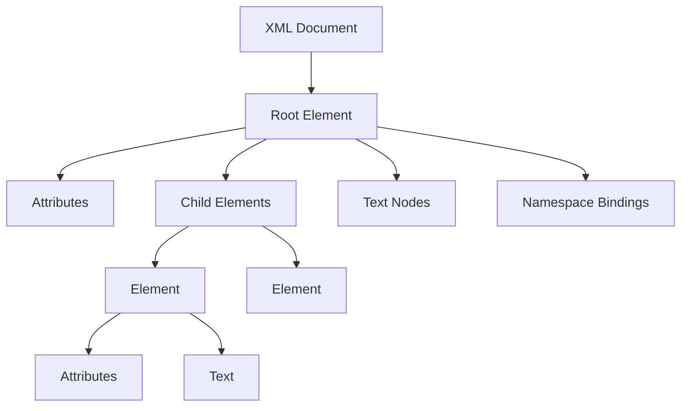
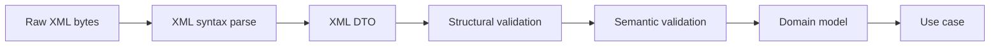
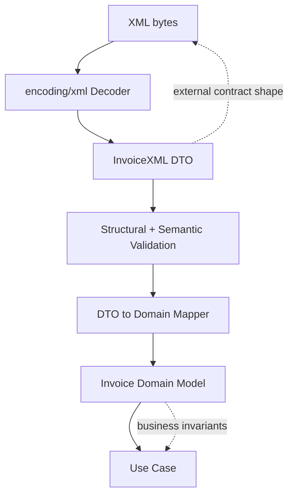

# learn-go-data-mapper-json-xml-protobuf-validation-part-016.md

# Part 016 — XML Fundamentals in Go

> Seri: **learn-go-data-mapper-json-xml-protobuf-validation**  
> Bagian: **016 / 033**  
> Topik: **XML Fundamentals in Go**  
> Target pembaca: **Java software engineer yang ingin menguasai data representation boundary di Go**  
> Fokus: **mental model XML, `encoding/xml`, struct tag, namespace, element/attribute mapping, text content, nested path, custom type, dan failure modes**

---

## Daftar Isi

- [1. Posisi Part Ini dalam Seri](#1-posisi-part-ini-dalam-seri)
- [2. Mengapa XML Masih Penting](#2-mengapa-xml-masih-penting)
- [3. Mental Model Besar: XML Bukan JSON dengan Kurung Siku](#3-mental-model-besar-xml-bukan-json-dengan-kurung-siku)
- [4. Peta Konsep XML](#4-peta-konsep-xml)
- [5. XML untuk Java Engineer](#5-xml-untuk-java-engineer)
- [6. Go `encoding/xml`: Apa yang Disediakan dan Tidak Disediakan](#6-go-encodingxml-apa-yang-disediakan-dan-tidak-disediakan)
- [7. Paket `encoding/xml`: Komponen Utama](#7-paket-encodingxml-komponen-utama)
- [8. Basic Marshal dan Unmarshal](#8-basic-marshal-dan-unmarshal)
- [9. Cara Go Menentukan Nama Element](#9-cara-go-menentukan-nama-element)
- [10. `XMLName`: Root Contract dan Runtime Element Identity](#10-xmlname-root-contract-dan-runtime-element-identity)
- [11. XML Struct Tags](#11-xml-struct-tags)
- [12. Element vs Attribute](#12-element-vs-attribute)
- [13. Nested Element Path](#13-nested-element-path)
- [14. Character Data, CDATA, Inner XML, Comment](#14-character-data-cdata-inner-xml-comment)
- [15. Slice, Pointer, Missing Element, dan Zero Value](#15-slice-pointer-missing-element-dan-zero-value)
- [16. Namespace: Hal yang Paling Sering Membingungkan](#16-namespace-hal-yang-paling-sering-membingungkan)
- [17. Strict Mode, Entity, Charset, dan DefaultSpace](#17-strict-mode-entity-charset-dan-defaultspace)
- [18. Error Model dalam XML Processing](#18-error-model-dalam-xml-processing)
- [19. Custom XML Marshal/Unmarshal](#19-custom-xml-marshalunmarshal)
- [20. TextMarshaler dan TextUnmarshaler](#20-textmarshaler-dan-textunmarshaler)
- [21. XML sebagai Contract Boundary](#21-xml-sebagai-contract-boundary)
- [22. Production Decode Pipeline untuk XML](#22-production-decode-pipeline-untuk-xml)
- [23. Design Pattern: XML DTO Terpisah dari Domain](#23-design-pattern-xml-dto-terpisah-dari-domain)
- [24. Security Baseline untuk XML di Go](#24-security-baseline-untuk-xml-di-go)
- [25. Performance dan Memory Consideration](#25-performance-dan-memory-consideration)
- [26. Testing Strategy](#26-testing-strategy)
- [27. Common Failure Modes](#27-common-failure-modes)
- [28. Anti-Pattern](#28-anti-pattern)
- [29. Decision Matrix](#29-decision-matrix)
- [30. Checklist Review](#30-checklist-review)
- [31. Latihan Desain](#31-latihan-desain)
- [32. Ringkasan Invariant](#32-ringkasan-invariant)
- [33. Referensi](#33-referensi)

---

## 1. Posisi Part Ini dalam Seri

Part sebelumnya membahas JSON, JSON Schema, dan OpenAPI. Mulai part ini kita masuk ke XML.

XML sering dianggap legacy. Itu benar dalam banyak sistem modern API publik. Namun di banyak enterprise, government, banking, payment gateway, insurance, legal document exchange, e-invoicing, certificate exchange, SOAP-like integration, dan archival format, XML masih muncul sebagai **contract format** yang tidak bisa diabaikan.

Part ini tidak membahas XML sebagai teknologi nostalgia. Kita membahas XML sebagai:

1. **wire format** untuk integrasi sistem lama;
2. **document format** untuk payload semi-terstruktur;
3. **contract format** dengan XSD/schema di beberapa organisasi;
4. **interop format** yang sering punya namespace, attribute, nested element, dan aturan lebih rumit dari JSON;
5. **risk boundary** karena XML punya footgun yang tidak muncul di JSON.

Fokus part ini adalah fondasi `encoding/xml` di Go.

Part berikutnya, part 017, akan membahas **XML processing beyond basic marshal**: token streaming, namespace-heavy payload, mixed content, SOAP-like envelope, selective extraction, dan legacy integration strategy.

Part 018 akan membahas **XSD dan XML schema contract reality**.

---

## 2. Mengapa XML Masih Penting

Sebagai Java engineer, Anda mungkin pernah melihat XML dalam konteks:

- JAXB;
- Jackson XML module;
- DOM;
- SAX;
- StAX;
- SOAP;
- WSDL;
- XSD;
- Spring XML config lama;
- SAML;
- ISO 20022;
- document/reporting integration;
- government e-service payload.

Di Go, pendekatannya lebih kecil dan eksplisit. Standard library menyediakan `encoding/xml`, tetapi tidak mencoba menjadi JAXB penuh, tidak otomatis validasi XSD, dan tidak menyembunyikan kompleksitas namespace.

### XML masih relevan ketika:

| Kondisi | Mengapa XML dipakai |
|---|---|
| Integrasi legacy enterprise | Kontrak lama sudah mapan dan sulit diganti |
| Regulatory/government exchange | Schema berbasis XSD sering sudah distandarkan |
| Document-centric payload | XML bisa merepresentasikan tree, attribute, text, mixed content |
| SOAP/SAML-like protocol | Banyak protocol lama berbasis namespace dan envelope |
| Vendor integration | Vendor lama sering menyediakan XML API |
| Archival/reporting | XML mudah dibaca manusia dan self-describing |

### XML tidak otomatis lebih buruk dari JSON

XML buruk jika dipakai seolah-olah JSON.

XML punya kekuatan pada:

- namespace;
- attribute;
- ordered document structure;
- mixed content;
- schema language yang matang;
- tooling lama yang luas;
- document semantics.

Namun XML juga punya risiko:

- namespace ambiguity;
- verbose payload;
- parser configuration risk;
- entity handling;
- mixed content yang sulit di-map ke struct;
- schema validation complexity;
- accidental data discard;
- silent zero value;
- mismatch antara prefix dan namespace URI.

---

## 3. Mental Model Besar: XML Bukan JSON dengan Kurung Siku

Kesalahan pertama banyak engineer adalah menganggap XML seperti ini:

```xml
<user>
  <id>u-123</id>
  <name>Ada</name>
</user>
```

lalu dianggap setara dengan:

```json
{
  "id": "u-123",
  "name": "Ada"
}
```

Untuk kasus sederhana, mirip. Tetapi XML punya model yang berbeda.

### JSON object model

JSON punya:

- object;
- array;
- string;
- number;
- boolean;
- null.

JSON object mostly key-value.

### XML document model

XML punya:

- document;
- element;
- attribute;
- text node;
- namespace;
- comment;
- processing instruction;
- CDATA;
- entity;
- ordering;
- mixed content.

Contoh:

```xml
<book isbn="978-0-00" xmlns="urn:books">
  <title>Distributed Systems</title>
  <author role="lead">Ada</author>
  Read <em>carefully</em> before production use.
</book>
```

Struktur ini tidak setara langsung dengan JSON object sederhana karena:

1. `isbn` adalah attribute, bukan child element;
2. `xmlns` mendefinisikan namespace;
3. `author` punya attribute dan text;
4. ada mixed content: text + `<em>` + text;
5. urutan node dapat bermakna.

### Mental model terbaik

Anggap XML sebagai **ordered labeled tree with attributes and text nodes**.



Go `encoding/xml` mencoba memetakan tree ini ke struct. Tetapi mapping itu bukan 1:1 untuk semua bentuk XML. Semakin document-centric XML Anda, semakin besar kemungkinan Anda perlu token-level processing, custom unmarshal, atau DTO khusus.

---

## 4. Peta Konsep XML

### 4.1 Document

Dokumen XML punya satu root element.

```xml
<?xml version="1.0" encoding="UTF-8"?>
<invoice>
  <number>INV-001</number>
</invoice>
```

Header XML disebut declaration. Di Go, `xml.Header` adalah konstanta convenience, tetapi tidak otomatis ditambahkan oleh `xml.Marshal`.

### 4.2 Element

Element adalah node utama.

```xml
<number>INV-001</number>
```

Element punya:

- start tag: `<number>`;
- content: `INV-001`;
- end tag: `</number>`.

### 4.3 Attribute

Attribute melekat pada start element.

```xml
<invoice number="INV-001" status="issued" />
```

Attribute cocok untuk metadata kecil, identifier, flags, atau tipe sederhana. Namun dalam desain contract, jangan asal memilih attribute karena attribute tidak punya child structure.

### 4.4 Character data

Text di dalam element.

```xml
<name>Ada Lovelace</name>
```

### 4.5 CDATA

CDATA menyimpan text tanpa perlu escape karakter tertentu.

```xml
<script><![CDATA[if (a < b) return true;]]></script>
```

CDATA bukan tipe data domain. Itu hanya cara representasi text dalam XML.

### 4.6 Namespace

Namespace membedakan nama element/attribute berdasarkan URI.

```xml
<doc xmlns:inv="urn:example:invoice">
  <inv:number>INV-001</inv:number>
</doc>
```

Prefix `inv` bukan identitas utama. Identitas namespace adalah URI `urn:example:invoice`.

### 4.7 Processing instruction

```xml
<?xml-stylesheet type="text/xsl" href="style.xsl"?>
```

Jarang dipakai dalam API modern, tetapi bisa muncul dalam document workflow.

### 4.8 Comment

```xml
<!-- internal note -->
```

Biasanya tidak menjadi data bisnis.

### 4.9 Entity

```xml
<text>A &amp; B</text>
```

Entity bisa sederhana seperti `&amp;`, tetapi DTD/entity expansion historically menjadi sumber risk. Part ini tidak membahas exploit detail, tetapi production parser harus tetap conservative.

---

## 5. XML untuk Java Engineer

### 5.1 Java mental model umum

Di Java, XML sering diproses dengan:

| Java Tool | Model |
|---|---|
| JAXB | bind XML ke annotated class |
| Jackson XML | XML sebagai varian object mapper |
| DOM | load whole document tree |
| SAX | event-based parser |
| StAX | pull parser |
| XSD validator | schema validation |
| SOAP framework | envelope/protocol abstraction |

### 5.2 Go mental model

Go standard library memberi:

| Go API | Mirip Java | Kegunaan |
|---|---|---|
| `xml.Marshal` / `xml.Unmarshal` | JAXB/Jackson-lite | Struct binding sederhana |
| `xml.Decoder.Token` | StAX pull parser | Streaming token processing |
| `xml.Decoder.DecodeElement` | StAX + local binding | Decode subtree saat start element ditemukan |
| `xml.Encoder.EncodeToken` | streaming writer | Generate XML manual |
| `Marshaler` / `Unmarshaler` | custom adapter | Domain-specific parsing |
| `encoding.TextMarshaler` | text adapter | enum/value-object text representation |

Yang tidak diberikan langsung oleh standard library:

- XSD validation;
- WSDL/SOAP framework;
- DOM tree API lengkap;
- full namespace policy enforcement;
- schema-first code generation;
- automatic mapping kompleks seperti JAXB dengan annotation ecosystem besar.

### 5.3 Prinsip adaptasi Java ke Go

Di Java, Anda sering membiarkan framework membaca annotation dan membangun pipeline besar.

Di Go, lebih baik:

1. buat DTO XML eksplisit;
2. decode XML ke DTO;
3. validate DTO;
4. map DTO ke domain;
5. jangan expose domain langsung ke XML tags jika contract eksternal kompleks;
6. gunakan token-level decoder untuk payload besar/legacy/mixed content;
7. gunakan custom unmarshaler untuk value-object yang butuh invariant.

---

## 6. Go `encoding/xml`: Apa yang Disediakan dan Tidak Disediakan

`encoding/xml` adalah paket standard library untuk XML 1.0 parser sederhana yang memahami namespace.

Secara praktis, paket ini cocok untuk:

- marshal struct sederhana ke XML;
- unmarshal XML sederhana ke struct;
- mapping attribute;
- nested element path;
- token streaming;
- custom element/attribute parsing;
- basic XML generation.

Namun Anda harus berhati-hati karena:

- XML yang tidak cocok dengan struct dapat dibuang/diabaikan;
- missing element dapat menghasilkan zero value;
- numeric overflow tidak selalu dideteksi pada unmarshal;
- namespace strictness tidak penuh;
- XSD validation bukan fitur bawaan;
- mixed content tidak nyaman jika dipaksakan ke struct biasa.

### 6.1 Kapan struct binding cukup?

Struct binding cukup jika XML:

- document shape-nya stabil;
- element tree relatif sederhana;
- tidak banyak mixed content;
- namespace sederhana;
- payload ukuran kecil/menengah;
- contract bisa direpresentasikan sebagai DTO.

### 6.2 Kapan perlu token processing?

Token processing lebih tepat jika XML:

- sangat besar;
- perlu selective extraction;
- punya repeated records besar;
- namespace-heavy;
- mixed content;
- format legacy tidak konsisten;
- perlu skip subtree;
- perlu observability offset/line/column;
- perlu pipeline ingestion streaming.

---

## 7. Paket `encoding/xml`: Komponen Utama

### 7.1 Fungsi top-level

```go
func Marshal(v any) ([]byte, error)
func MarshalIndent(v any, prefix, indent string) ([]byte, error)
func Unmarshal(data []byte, v any) error
func EscapeText(w io.Writer, s []byte) error
```

### 7.2 Decoder

```go
dec := xml.NewDecoder(reader)
```

`Decoder` dipakai untuk:

- decode stream;
- membaca token;
- menemukan start element;
- decode satu subtree;
- skip subtree;
- mengetahui offset/posisi input.

### 7.3 Encoder

```go
enc := xml.NewEncoder(writer)
```

`Encoder` dipakai untuk:

- encode value;
- encode token manual;
- flush output;
- indent output;
- close encoder.

### 7.4 Token model

Token umum:

```go
type Token any

type StartElement struct { Name Name; Attr []Attr }
type EndElement struct { Name Name }
type CharData []byte
type Comment []byte
type ProcInst struct { Target string; Inst []byte }
type Directive []byte
```

### 7.5 Name dan Attr

```go
type Name struct {
    Space string
    Local string
}

type Attr struct {
    Name  Name
    Value string
}
```

`Name.Space` adalah namespace URI, bukan prefix.

---

## 8. Basic Marshal dan Unmarshal

### 8.1 Struct sederhana

```go
package main

import (
    "encoding/xml"
    "fmt"
)

type CustomerXML struct {
    XMLName xml.Name `xml:"customer"`
    ID      string   `xml:"id"`
    Name    string   `xml:"name"`
    Email   string   `xml:"email"`
}

func main() {
    c := CustomerXML{
        ID:    "cus-123",
        Name:  "Ada Lovelace",
        Email: "ada@example.com",
    }

    out, err := xml.MarshalIndent(c, "", "  ")
    if err != nil {
        panic(err)
    }

    fmt.Println(string(out))
}
```

Output:

```xml
<customer>
  <id>cus-123</id>
  <name>Ada Lovelace</name>
  <email>ada@example.com</email>
</customer>
```

### 8.2 Unmarshal sederhana

```go
var c CustomerXML
err := xml.Unmarshal([]byte(`
<customer>
  <id>cus-123</id>
  <name>Ada Lovelace</name>
  <email>ada@example.com</email>
</customer>`), &c)
if err != nil {
    return err
}
```

### 8.3 Boundary insight

Jangan langsung menganggap hasil unmarshal valid secara domain.

Payload berikut valid secara XML, tetapi belum tentu valid secara bisnis:

```xml
<customer>
  <id></id>
  <name>   </name>
  <email>not-email</email>
</customer>
```

Tahapan yang benar:



`xml.Unmarshal` hanya membantu B → C. Ia tidak menyelesaikan D/E/F.

---

## 9. Cara Go Menentukan Nama Element

Saat marshal, nama XML element ditentukan dengan urutan prioritas seperti ini:

1. tag pada field `XMLName`, jika struct punya `XMLName`;
2. value `XMLName` bertipe `xml.Name`;
3. tag pada struct field yang berisi data;
4. nama struct field;
5. nama tipe yang dimarshal.

Contoh:

```go
type InvoiceXML struct {
    XMLName xml.Name `xml:"invoice"`
    Number  string   `xml:"number"`
}
```

Root element menjadi `<invoice>`.

Jika tanpa tag:

```go
type InvoiceXML struct {
    Number string
}
```

field menjadi `<Number>...</Number>`, mengikuti nama exported field. Ini biasanya tidak cocok untuk contract eksternal karena contract menjadi tergantung naming Go.

### Rule of thumb

Untuk XML DTO eksternal, selalu beri tag eksplisit.

```go
type InvoiceXML struct {
    XMLName xml.Name `xml:"invoice"`
    Number  string   `xml:"number"`
    Status  string   `xml:"status"`
}
```

Jangan mengandalkan default field name untuk API/vendor contract.

---

## 10. `XMLName`: Root Contract dan Runtime Element Identity

`XMLName` memiliki dua kegunaan besar:

1. mengontrol nama element saat marshal;
2. merekam/mengecek nama element saat unmarshal.

```go
type InvoiceXML struct {
    XMLName xml.Name `xml:"invoice"`
    Number  string   `xml:"number"`
}
```

Jika input:

```xml
<order>
  <number>INV-001</number>
</order>
```

Unmarshal ke `InvoiceXML` akan error karena expected root `invoice`.

### 10.1 XMLName sebagai guardrail

Untuk external payload, `XMLName` adalah guardrail murah. Ia mencegah payload root yang salah masuk ke DTO yang salah.

### 10.2 XMLName untuk polymorphic dispatch

Kadang Anda perlu membaca root element dulu:

```go
type Envelope struct {
    XMLName xml.Name
    Inner   string `xml:",innerxml"`
}
```

Lalu pilih decoder berdasarkan `XMLName.Local` dan `XMLName.Space`.

Namun jangan terlalu banyak menggunakan `innerxml` untuk dispatch jika schema sudah jelas. Token-level parsing sering lebih bersih.

---

## 11. XML Struct Tags

`encoding/xml` memakai struct tags untuk mengontrol mapping.

### 11.1 Tag paling umum

| Tag | Makna |
|---|---|
| `xml:"name"` | field sebagai child element `<name>` |
| `xml:"name,attr"` | field sebagai attribute `name="..."` |
| `xml:",attr"` | field sebagai attribute dengan nama field Go |
| `xml:",chardata"` | field sebagai character data |
| `xml:",cdata"` | marshal field sebagai CDATA |
| `xml:",innerxml"` | raw XML nested content |
| `xml:",comment"` | XML comment |
| `xml:"a>b>c"` | nested element path |
| `xml:"-"` | ignore field |
| `xml:",omitempty"` | omit empty value saat marshal |
| `xml:",any"` | catch-all unmatched subelement saat unmarshal |
| `xml:",any,attr"` | catch-all unmatched attribute saat unmarshal |

### 11.2 Contoh lengkap

```go
type ProductXML struct {
    XMLName     xml.Name `xml:"product"`
    ID          string   `xml:"id,attr"`
    SKU         string   `xml:"sku"`
    Name        string   `xml:"name"`
    Description string   `xml:"description,omitempty"`
    Category    string   `xml:"metadata>category"`
}
```

Input/output:

```xml
<product id="p-001">
  <sku>SKU-001</sku>
  <name>Keyboard</name>
  <metadata>
    <category>peripheral</category>
  </metadata>
</product>
```

### 11.3 Tag bukan validation

Tag XML hanya metadata mapping. Tag ini tidak menjamin:

- field wajib ada;
- format valid;
- enum value benar;
- namespace benar dalam semua konteks;
- attribute unik secara bisnis;
- XSD-compliant.

Validation harus layer terpisah.

---

## 12. Element vs Attribute

### 12.1 Attribute mapping

```go
type InvoiceXML struct {
    XMLName xml.Name `xml:"invoice"`
    Number  string   `xml:"number,attr"`
    Status  string   `xml:"status,attr"`
    Amount  string   `xml:"amount"`
}
```

XML:

```xml
<invoice number="INV-001" status="issued">
  <amount>100.00</amount>
</invoice>
```

### 12.2 Kapan attribute cocok?

Attribute cocok untuk:

- ID;
- code;
- type discriminator;
- language code;
- version;
- reference;
- metadata pendek.

Contoh:

```xml
<name lang="en">Ada Lovelace</name>
```

### 12.3 Kapan element lebih cocok?

Element cocok untuk:

- data berstruktur;
- data panjang;
- data repeated;
- data yang mungkin punya attribute sendiri;
- data yang mungkin berevolusi menjadi kompleks.

Misalnya:

```xml
<address>
  <line1>...</line1>
  <postalCode>...</postalCode>
</address>
```

Lebih baik daripada:

```xml
<customer addressLine1="..." postalCode="..." />
```

### 12.4 Contract evolution impact

Attribute sulit dievolusi menjadi structure tanpa breaking change.

Jika hari ini:

```xml
<customer country="SG" />
```

lalu besok country butuh code dan source:

```xml
<country code="SG" source="ISO-3166">Singapore</country>
```

itu perubahan shape besar.

Rule praktis:

- gunakan attribute untuk metadata kecil dan stabil;
- gunakan element untuk data bisnis yang mungkin berkembang.

---

## 13. Nested Element Path

Go mendukung tag path:

```go
type PersonXML struct {
    XMLName   xml.Name `xml:"person"`
    FirstName string   `xml:"name>first"`
    LastName  string   `xml:"name>last"`
}
```

Output:

```xml
<person>
  <name>
    <first>Ada</first>
    <last>Lovelace</last>
  </name>
</person>
```

### 13.1 Kegunaan

Nested path berguna untuk XML yang punya grouping sederhana tetapi Anda tidak ingin membuat nested struct.

```go
type ReportXML struct {
    ID        string `xml:"header>id"`
    CreatedAt string `xml:"header>createdAt"`
    Total     string `xml:"summary>total"`
}
```

### 13.2 Risiko

Nested path bisa membuat DTO terlihat flat padahal XML contract nested.

Untuk contract besar, lebih eksplisit memakai nested struct:

```go
type ReportXML struct {
    XMLName xml.Name       `xml:"report"`
    Header  ReportHeaderXML `xml:"header"`
    Summary ReportSummaryXML `xml:"summary"`
}

type ReportHeaderXML struct {
    ID        string `xml:"id"`
    CreatedAt string `xml:"createdAt"`
}

type ReportSummaryXML struct {
    Total string `xml:"total"`
}
```

### 13.3 Rule of thumb

Gunakan `a>b>c` untuk:

- small DTO;
- legacy payload sederhana;
- grouping non-domain;
- quick adapter.

Gunakan nested struct untuk:

- contract publik;
- schema besar;
- field lifecycle berbeda;
- validasi per subobject;
- mapping domain yang jelas.

---

## 14. Character Data, CDATA, Inner XML, Comment

### 14.1 Character data

XML seperti ini:

```xml
<amount currency="SGD">100.00</amount>
```

bisa dimodelkan:

```go
type AmountXML struct {
    Currency string `xml:"currency,attr"`
    Value    string `xml:",chardata"`
}
```

### 14.2 Kenapa amount sebagai string?

Jangan langsung `float64` untuk money.

```go
type AmountXML struct {
    Currency string `xml:"currency,attr"`
    Value    string `xml:",chardata"`
}
```

Lalu parse ke domain money type dengan decimal/minor unit.

### 14.3 CDATA

```go
type PayloadXML struct {
    XMLName xml.Name `xml:"payload"`
    Body    string   `xml:",cdata"`
}
```

Marshal:

```xml
<payload><![CDATA[raw <content> & symbols]]></payload>
```

CDATA cocok untuk interoperability dengan sistem lama yang mengharapkan CDATA. Jangan jadikan CDATA alasan untuk menyimpan arbitrary unvalidated content tanpa sanitasi.

### 14.4 Inner XML

```go
type RawContainerXML struct {
    XMLName xml.Name `xml:"container"`
    Inner   string   `xml:",innerxml"`
}
```

Input:

```xml
<container>
  <unknown a="1">x</unknown>
</container>
```

`Inner` akan menyimpan raw XML nested:

```xml
<unknown a="1">x</unknown>
```

### 14.5 Risiko `innerxml`

`innerxml` raw. Ia melewati mapping biasa. Risiko:

- raw payload besar masuk memory;
- injection ke output lain jika dire-emmit tanpa kontrol;
- validation bypass;
- ownership tidak jelas;
- sulit canonicalization.

Gunakan `innerxml` hanya bila memang butuh preserve unknown XML subtree.

### 14.6 Comment

```go
type DocumentXML struct {
    XMLName xml.Name `xml:"document"`
    Note    string   `xml:",comment"`
    Title   string   `xml:"title"`
}
```

Saat marshal, comment tidak boleh mengandung `--`.

Dalam contract API, comment jarang menjadi data bisnis. Lebih sering comment harus diabaikan.

---

## 15. Slice, Pointer, Missing Element, dan Zero Value

### 15.1 Repeated element ke slice

```go
type OrderXML struct {
    XMLName xml.Name      `xml:"order"`
    Items   []OrderItemXML `xml:"item"`
}

type OrderItemXML struct {
    SKU string `xml:"sku"`
    Qty int    `xml:"qty"`
}
```

XML:

```xml
<order>
  <item><sku>A</sku><qty>1</qty></item>
  <item><sku>B</sku><qty>2</qty></item>
</order>
```

### 15.2 Pointer untuk optional subobject

```go
type CustomerXML struct {
    XMLName xml.Name    `xml:"customer"`
    Name    string      `xml:"name"`
    Address *AddressXML `xml:"address,omitempty"`
}
```

Jika `<address>` tidak ada, `Address == nil`.

### 15.3 Missing vs empty vs zero

XML:

```xml
<customer>
  <name>Ada</name>
</customer>
```

versus:

```xml
<customer>
  <name>Ada</name>
  <age></age>
</customer>
```

Jika field:

```go
Age int `xml:"age"`
```

missing/empty dapat berakhir sebagai zero value atau error tergantung tipe dan isi. Anda harus mendesain validation layer, bukan hanya mengandalkan unmarshal.

### 15.4 Optional scalar

Gunakan pointer atau custom optional type jika perlu membedakan absent.

```go
type CustomerXML struct {
    XMLName xml.Name `xml:"customer"`
    Name    string   `xml:"name"`
    Age     *int     `xml:"age"`
}
```

Tetapi pointer saja tidak selalu cukup untuk membedakan semua kasus:

| XML | Makna potensial |
|---|---|
| `<age>0</age>` | present dengan nilai zero |
| `<age></age>` | present empty, mungkin invalid |
| missing `<age>` | absent |

Untuk contract ketat, custom type lebih baik.

### 15.5 Unmarshal ke numeric

Jangan terlalu percaya auto conversion XML ke `int`/`float64` untuk boundary kritis. Parsing string → domain value sendiri memberi kontrol error, overflow, precision, dan message error lebih baik.

Contoh:

```go
type InvoiceXML struct {
    XMLName xml.Name `xml:"invoice"`
    Amount  string   `xml:"amount"`
}
```

Lalu:

```go
func (x InvoiceXML) ToDomain() (Invoice, error) {
    amount, err := ParseMoney(x.Amount)
    if err != nil {
        return Invoice{}, FieldError{Path: "amount", Code: "invalid_money"}
    }
    return Invoice{Amount: amount}, nil
}
```

---

## 16. Namespace: Hal yang Paling Sering Membingungkan

Namespace adalah salah satu alasan XML integration sering terlihat “aneh”.

### 16.1 Prefix bukan identitas

XML:

```xml
<inv:invoice xmlns:inv="urn:example:invoice">
  <inv:number>INV-001</inv:number>
</inv:invoice>
```

Secara konseptual, nama root bukan prefix `inv` + local `invoice`.

Nama element adalah:

```text
Space = "urn:example:invoice"
Local = "invoice"
```

Prefix hanya alias dalam dokumen.

XML berikut equivalent secara namespace:

```xml
<x:invoice xmlns:x="urn:example:invoice">
  <x:number>INV-001</x:number>
</x:invoice>
```

Prefix beda, namespace URI sama.

### 16.2 Go `xml.Name`

```go
type Name struct {
    Space string
    Local string
}
```

`Space` berisi namespace URI. `Local` berisi nama lokal.

### 16.3 XMLName dengan namespace

```go
type InvoiceXML struct {
    XMLName xml.Name `xml:"urn:example:invoice invoice"`
    Number  string   `xml:"urn:example:invoice number"`
}
```

Tag XML dengan namespace memakai format:

```text
"namespace-URI localName"
```

Bukan:

```text
"prefix:localName"
```

### 16.4 Default namespace

XML:

```xml
<invoice xmlns="urn:example:invoice">
  <number>INV-001</number>
</invoice>
```

Element tanpa prefix tetap berada dalam default namespace.

Dalam token Go, root akan terlihat seperti:

```go
xml.Name{Space: "urn:example:invoice", Local: "invoice"}
```

### 16.5 Attribute namespace beda

Default namespace tidak berlaku ke unprefixed attributes dalam cara yang sama dengan element. Ini detail XML namespace yang sering membuat bug.

Contoh:

```xml
<invoice xmlns="urn:example:invoice" number="INV-001" />
```

`number` attribute unprefixed tidak otomatis berada di namespace default element.

Untuk vendor XML, jangan menebak. Uji token aktual dari parser.

### 16.6 Debug namespace dengan token

```go
func PrintTokens(r io.Reader) error {
    dec := xml.NewDecoder(r)
    for {
        tok, err := dec.Token()
        if err == io.EOF {
            return nil
        }
        if err != nil {
            return err
        }

        switch t := tok.(type) {
        case xml.StartElement:
            fmt.Printf("START Space=%q Local=%q\n", t.Name.Space, t.Name.Local)
            for _, a := range t.Attr {
                fmt.Printf("  ATTR Space=%q Local=%q Value=%q\n", a.Name.Space, a.Name.Local, a.Value)
            }
        case xml.EndElement:
            fmt.Printf("END   Space=%q Local=%q\n", t.Name.Space, t.Name.Local)
        case xml.CharData:
            s := strings.TrimSpace(string(t))
            if s != "" {
                fmt.Printf("TEXT  %q\n", s)
            }
        }
    }
}
```

Ini tool kecil yang sangat berguna saat integrasi vendor/SOAP/XML namespace-heavy.

### 16.7 Namespace policy

Untuk contract eksternal:

- validasi root namespace;
- validasi namespace untuk element penting;
- jangan rely pada prefix string;
- log `Space` dan `Local` saat mismatch;
- test dengan prefix berbeda tetapi namespace sama;
- test dengan namespace salah tetapi local name sama.

---

## 17. Strict Mode, Entity, Charset, dan DefaultSpace

### 17.1 Strict mode

`xml.Decoder.Strict` default `true`. Dalam mode ini parser menerapkan requirement XML specification. Jika `Strict = false`, parser lebih toleran terhadap input yang tidak well-formed, misalnya common HTML-like mistakes.

Untuk API/enterprise contract, default terbaik adalah:

```go
dec := xml.NewDecoder(r)
dec.Strict = true
```

Tidak perlu diset karena default true, tetapi eksplisit boleh untuk readability.

### 17.2 Jangan gunakan non-strict untuk contract XML

`Strict=false` cocok untuk scraping atau HTML-ish data recovery, bukan untuk regulatory/payment/vendor contract yang harus defensible.

### 17.3 Entity

`Decoder.Entity` bisa dipakai untuk custom entity mapping. Standard entity seperti `lt`, `gt`, `amp`, `apos`, `quot` sudah diperlakukan sebagai standard.

Jangan aktifkan entity custom secara sembarangan jika tidak perlu.

### 17.4 CharsetReader

XML parser mengasumsikan input UTF-8. Jika XML menyatakan charset non-UTF-8, `CharsetReader` perlu disediakan untuk konversi.

Contoh umum memakai `golang.org/x/net/html/charset`:

```go
import "golang.org/x/net/html/charset"

func NewXMLDecoder(r io.Reader) *xml.Decoder {
    dec := xml.NewDecoder(r)
    dec.CharsetReader = charset.NewReaderLabel
    return dec
}
```

Gunakan ini jika Anda menerima XML vendor lama dengan encoding seperti ISO-8859-1 atau Windows-1252.

### 17.5 DefaultSpace

`Decoder.DefaultSpace` membuat unadorned tags diperlakukan seolah-olah berada dalam default namespace tertentu.

Ini bisa berguna untuk integrasi dengan XML yang namespace-nya implied oleh channel/protocol, tetapi gunakan hati-hati. Lebih baik contract mengirim namespace eksplisit.

---

## 18. Error Model dalam XML Processing

Error dari XML decoding dapat dibagi:

| Layer | Contoh | Response/API action |
|---|---|---|
| Transport | body terlalu besar, read timeout | reject request |
| Syntax | XML not well-formed | 400 invalid XML |
| Root contract | root element salah | 400 wrong document type |
| Namespace | namespace salah | 400 wrong namespace |
| Mapping | field type gagal parse | 400 invalid field |
| Structural validation | required field missing | 422/400 field error |
| Semantic validation | date range invalid | 422 domain validation |
| Business rule | invoice duplicate | 409/422 use-case error |

### 18.1 SyntaxError

`xml.SyntaxError` menunjukkan XML tidak well-formed.

```go
var syn *xml.SyntaxError
if errors.As(err, &syn) {
    // classify as invalid XML syntax
}
```

### 18.2 TagPathError

`TagPathError` dapat muncul bila struct tag path konflik.

Biasanya ini bug developer, bukan user input.

### 18.3 UnmarshalError

`UnmarshalError` dapat muncul untuk mapping tertentu.

### 18.4 UnsupportedTypeError

Marshal akan error untuk tipe yang tidak didukung seperti channel, function, atau map.

### 18.5 Posisi error

`Decoder` punya `InputOffset()` dan `InputPos()` untuk membantu observability.

```go
dec := xml.NewDecoder(r)
if err := dec.Decode(&dto); err != nil {
    line, col := dec.InputPos()
    return fmt.Errorf("decode XML at line=%d col=%d: %w", line, col, err)
}
```

Untuk API publik, jangan expose raw parser internals berlebihan. Untuk log internal, line/column sangat membantu.

---

## 19. Custom XML Marshal/Unmarshal

Custom XML diperlukan saat:

- value-object punya format khusus;
- enum harus case-insensitive tetapi canonical output;
- date format vendor tidak ISO standard;
- namespace/attribute dinamis;
- field presence harus diketahui;
- mixed content butuh custom parse;
- XML shape tidak cocok dengan struct tags.

### 19.1 Custom enum

```go
type InvoiceStatus string

const (
    InvoiceStatusUnknown InvoiceStatus = "UNKNOWN"
    InvoiceStatusDraft   InvoiceStatus = "DRAFT"
    InvoiceStatusIssued  InvoiceStatus = "ISSUED"
    InvoiceStatusPaid    InvoiceStatus = "PAID"
)

func ParseInvoiceStatus(s string) (InvoiceStatus, error) {
    switch strings.ToUpper(strings.TrimSpace(s)) {
    case "DRAFT":
        return InvoiceStatusDraft, nil
    case "ISSUED":
        return InvoiceStatusIssued, nil
    case "PAID":
        return InvoiceStatusPaid, nil
    default:
        return InvoiceStatusUnknown, fmt.Errorf("unknown invoice status %q", s)
    }
}
```

### 19.2 Implement `UnmarshalXML`

```go
func (s *InvoiceStatus) UnmarshalXML(dec *xml.Decoder, start xml.StartElement) error {
    var raw string
    if err := dec.DecodeElement(&raw, &start); err != nil {
        return err
    }

    parsed, err := ParseInvoiceStatus(raw)
    if err != nil {
        return err
    }

    *s = parsed
    return nil
}
```

### 19.3 Implement `MarshalXML`

```go
func (s InvoiceStatus) MarshalXML(enc *xml.Encoder, start xml.StartElement) error {
    switch s {
    case InvoiceStatusDraft, InvoiceStatusIssued, InvoiceStatusPaid:
        return enc.EncodeElement(string(s), start)
    default:
        return fmt.Errorf("cannot marshal unknown invoice status %q", s)
    }
}
```

### 19.4 Jangan partial mutate sebelum parse sukses

Buruk:

```go
func (x *Amount) UnmarshalXML(dec *xml.Decoder, start xml.StartElement) error {
    var raw string
    _ = dec.DecodeElement(&raw, &start)
    x.Raw = raw // mutate dulu
    // parse gagal, object sudah partial mutated
    return errors.New("invalid amount")
}
```

Lebih baik:

```go
func (x *Amount) UnmarshalXML(dec *xml.Decoder, start xml.StartElement) error {
    var raw string
    if err := dec.DecodeElement(&raw, &start); err != nil {
        return err
    }

    parsed, err := ParseAmount(raw)
    if err != nil {
        return err
    }

    *x = parsed
    return nil
}
```

Invariant: **commit mutation only after full parse succeeds**.

---

## 20. TextMarshaler dan TextUnmarshaler

Jika field XML hanya text/attribute sederhana, sering lebih baik implement `encoding.TextMarshaler` dan `encoding.TextUnmarshaler`.

### 20.1 Date custom

```go
type LocalDate time.Time

const localDateLayout = "2006-01-02"

func ParseLocalDate(s string) (LocalDate, error) {
    t, err := time.Parse(localDateLayout, strings.TrimSpace(s))
    if err != nil {
        return LocalDate{}, err
    }
    return LocalDate(t), nil
}

func (d *LocalDate) UnmarshalText(text []byte) error {
    parsed, err := ParseLocalDate(string(text))
    if err != nil {
        return err
    }
    *d = parsed
    return nil
}

func (d LocalDate) MarshalText() ([]byte, error) {
    t := time.Time(d)
    if t.IsZero() {
        return nil, errors.New("zero LocalDate cannot be marshaled")
    }
    return []byte(t.Format(localDateLayout)), nil
}
```

### 20.2 Dipakai oleh element

```go
type InvoiceXML struct {
    XMLName xml.Name  `xml:"invoice"`
    Date    LocalDate `xml:"date"`
}
```

XML:

```xml
<invoice>
  <date>2026-06-24</date>
</invoice>
```

### 20.3 Dipakai oleh attribute

```go
type InvoiceXML struct {
    XMLName xml.Name  `xml:"invoice"`
    Date    LocalDate `xml:"date,attr"`
}
```

XML:

```xml
<invoice date="2026-06-24" />
```

### 20.4 Kapan TextMarshaler lebih baik?

Gunakan `TextMarshaler` untuk:

- enum;
- date;
- UUID;
- money amount text;
- code;
- identifier;
- small value-object.

Gunakan `MarshalXML` kalau butuh:

- akses start element;
- attribute custom;
- nested structure custom;
- namespace handling custom;
- conditional element shape.

---

## 21. XML sebagai Contract Boundary

XML DTO harus dipandang sebagai **contract representation**, bukan domain model.

### 21.1 Contoh buruk

```go
type Invoice struct {
    XMLName xml.Name `xml:"invoice"`
    ID      string   `xml:"id"`
    Amount  float64  `xml:"amount"`
    Status  string   `xml:"status"`
}
```

Masalah:

- domain tercemar XML tag;
- money pakai `float64`;
- status string bebas;
- root XML ikut masuk domain;
- mapping external contract menyatu dengan business object;
- sulit support JSON/Protobuf lain tanpa menumpuk tags.

### 21.2 Lebih baik

```go
type InvoiceXML struct {
    XMLName xml.Name `xml:"invoice"`
    ID      string   `xml:"id"`
    Amount  string   `xml:"amount"`
    Status  string   `xml:"status"`
}

type Invoice struct {
    ID     InvoiceID
    Amount Money
    Status InvoiceStatus
}
```

Mapping:

```go
func (x InvoiceXML) ToDomain() (Invoice, error) {
    id, err := ParseInvoiceID(x.ID)
    if err != nil {
        return Invoice{}, FieldError{Path: "id", Code: "invalid_id", Err: err}
    }

    amount, err := ParseMoney(x.Amount)
    if err != nil {
        return Invoice{}, FieldError{Path: "amount", Code: "invalid_money", Err: err}
    }

    status, err := ParseInvoiceStatus(x.Status)
    if err != nil {
        return Invoice{}, FieldError{Path: "status", Code: "invalid_status", Err: err}
    }

    return Invoice{ID: id, Amount: amount, Status: status}, nil
}
```

### 21.3 Contract boundary diagram



---

## 22. Production Decode Pipeline untuk XML

### 22.1 Requirements

Production XML decode harus:

1. membatasi ukuran body;
2. memakai strict parser;
3. decode root DTO;
4. menolak root element salah;
5. memvalidasi required fields;
6. memetakan error ke API error yang jelas;
7. log line/column/offset untuk troubleshooting;
8. tidak langsung memakai DTO sebagai domain;
9. tidak menerima arbitrary raw inner XML tanpa alasan.

### 22.2 Helper decode

```go
package xmlboundary

import (
    "encoding/xml"
    "errors"
    "fmt"
    "io"
)

const DefaultMaxXMLBytes int64 = 4 << 20 // 4 MiB

type DecodeError struct {
    Kind   string
    Line   int
    Column int
    Err    error
}

func (e DecodeError) Error() string {
    if e.Line > 0 || e.Column > 0 {
        return fmt.Sprintf("%s XML error at line %d column %d: %v", e.Kind, e.Line, e.Column, e.Err)
    }
    return fmt.Sprintf("%s XML error: %v", e.Kind, e.Err)
}

func (e DecodeError) Unwrap() error { return e.Err }

func DecodeXML[T any](r io.Reader, maxBytes int64) (T, error) {
    var zero T
    if maxBytes <= 0 {
        maxBytes = DefaultMaxXMLBytes
    }

    limited := io.LimitReader(r, maxBytes+1)
    dec := xml.NewDecoder(limited)
    dec.Strict = true

    var dst T
    if err := dec.Decode(&dst); err != nil {
        line, col := dec.InputPos()
        return zero, DecodeError{Kind: "syntax_or_mapping", Line: line, Column: col, Err: err}
    }

    // Detect too large by attempting to read one extra byte.
    // In HTTP handlers, prefer http.MaxBytesReader so the server can manage body semantics.
    extra := make([]byte, 1)
    n, err := limited.Read(extra)
    if n > 0 {
        return zero, DecodeError{Kind: "too_large", Err: fmt.Errorf("XML body exceeds %d bytes", maxBytes)}
    }
    if err != nil && !errors.Is(err, io.EOF) {
        return zero, DecodeError{Kind: "read", Err: err}
    }

    return dst, nil
}
```

### 22.3 HTTP variant

Di HTTP server, gunakan `http.MaxBytesReader`.

```go
func DecodeXMLRequest[T any](w http.ResponseWriter, r *http.Request, maxBytes int64) (T, error) {
    var zero T

    if maxBytes <= 0 {
        maxBytes = DefaultMaxXMLBytes
    }

    r.Body = http.MaxBytesReader(w, r.Body, maxBytes)
    defer r.Body.Close()

    dec := xml.NewDecoder(r.Body)
    dec.Strict = true

    var dst T
    if err := dec.Decode(&dst); err != nil {
        line, col := dec.InputPos()
        return zero, DecodeError{Kind: "invalid_xml", Line: line, Column: col, Err: err}
    }

    return dst, nil
}
```

### 22.4 Root validation

```go
type InvoiceXML struct {
    XMLName xml.Name `xml:"urn:example:invoice invoice"`
    Number  string   `xml:"urn:example:invoice number"`
}
```

`XMLName` dengan namespace membantu reject wrong root/namespace.

### 22.5 Structural validation after decode

```go
func (x InvoiceXML) Validate() []FieldError {
    var errs []FieldError
    if strings.TrimSpace(x.Number) == "" {
        errs = append(errs, FieldError{Path: "number", Code: "required"})
    }
    return errs
}
```

Jangan masukkan semua validation ke `UnmarshalXML`. Gunakan `UnmarshalXML` untuk parsing representation-specific. Gunakan `Validate` untuk structural/semantic rules yang perlu error aggregation.

---

## 23. Design Pattern: XML DTO Terpisah dari Domain

### 23.1 Package layout

```text
internal/
  invoice/
    domain/
      invoice.go
      money.go
      status.go
    transport/
      xmlapi/
        invoice_dto.go
        invoice_mapper.go
        invoice_handler.go
        errors.go
```

### 23.2 Domain

```go
package domain

type Invoice struct {
    id     InvoiceID
    amount Money
    status InvoiceStatus
}

func NewInvoice(id InvoiceID, amount Money, status InvoiceStatus) (Invoice, error) {
    if id.IsZero() {
        return Invoice{}, ErrInvalidInvoiceID
    }
    if !amount.IsPositive() {
        return Invoice{}, ErrInvalidAmount
    }
    if !status.CanCreate() {
        return Invoice{}, ErrInvalidStatus
    }
    return Invoice{id: id, amount: amount, status: status}, nil
}
```

### 23.3 XML DTO

```go
package xmlapi

type InvoiceRequestXML struct {
    XMLName  xml.Name `xml:"urn:example:invoice invoice"`
    Number   string   `xml:"urn:example:invoice number"`
    Amount   string   `xml:"urn:example:invoice amount"`
    Currency string   `xml:"currency,attr"`
    Status   string   `xml:"urn:example:invoice status"`
}
```

### 23.4 Mapper

```go
func (x InvoiceRequestXML) ToCommand() (CreateInvoiceCommand, []FieldError) {
    var errs []FieldError

    number, err := domain.ParseInvoiceID(x.Number)
    if err != nil {
        errs = append(errs, FieldError{Path: "number", Code: "invalid_invoice_id"})
    }

    amount, err := domain.ParseMoney(x.Currency, x.Amount)
    if err != nil {
        errs = append(errs, FieldError{Path: "amount", Code: "invalid_money"})
    }

    status, err := domain.ParseInvoiceStatus(x.Status)
    if err != nil {
        errs = append(errs, FieldError{Path: "status", Code: "invalid_status"})
    }

    if len(errs) > 0 {
        return CreateInvoiceCommand{}, errs
    }

    return CreateInvoiceCommand{
        Number: number,
        Amount: amount,
        Status: status,
    }, nil
}
```

### 23.5 Kenapa command, bukan langsung domain?

Karena use case sering butuh context:

- authenticated actor;
- request id;
- source system;
- idempotency key;
- correlation id;
- submission channel;
- received-at timestamp;
- policy version.

XML DTO → command lebih fleksibel daripada XML DTO → domain langsung.

---

## 24. Security Baseline untuk XML di Go

XML security topik besar. Part ini memberi baseline aman untuk data mapper. Detail lebih dalam bisa masuk seri security/integration.

### 24.1 Batasi ukuran input

Selalu batasi body.

```go
r.Body = http.MaxBytesReader(w, r.Body, 4<<20)
```

### 24.2 Jangan aktifkan fitur longgar tanpa alasan

Hindari:

```go
dec.Strict = false
```

untuk API contract.

### 24.3 Hati-hati dengan `innerxml`

Raw XML bisa mengandung subtree besar/berbahaya secara operasional.

Jangan re-output raw XML dari pihak eksternal tanpa clear ownership dan sanitasi.

### 24.4 Jangan parse XML tidak dipercaya ke struktur sangat besar tanpa limit

Walaupun parser streaming, jika target DTO punya `[]T` besar atau `innerxml`, memory tetap bisa meledak.

### 24.5 Jangan log raw XML lengkap

XML bisa berisi PII/credential/token.

Log:

- correlation id;
- source system;
- root element local/namespace;
- size;
- error kind;
- line/column;
- redacted field path.

Jangan log payload penuh kecuali secure debug mechanism yang audited.

---

## 25. Performance dan Memory Consideration

### 25.1 `xml.Unmarshal` membaca seluruh `[]byte`

```go
xml.Unmarshal(data, &dto)
```

Ini sudah berarti seluruh XML berada di memory.

Untuk HTTP kecil/menengah, oke. Untuk file besar, feed/export, atau batch integration, gunakan `xml.Decoder` streaming.

### 25.2 Decode ke slice besar tetap memory-heavy

```go
type Feed struct {
    Items []Item `xml:"item"`
}
```

Jika XML berisi jutaan item, decode ke `[]Item` tetap menampung semua item.

Gunakan token streaming:

```go
for {
    tok, err := dec.Token()
    if err == io.EOF { break }
    if err != nil { return err }

    start, ok := tok.(xml.StartElement)
    if !ok || start.Name.Local != "item" {
        continue
    }

    var item ItemXML
    if err := dec.DecodeElement(&item, &start); err != nil {
        return err
    }

    if err := handle(item); err != nil {
        return err
    }
}
```

### 25.3 Avoid premature pooling

Jangan buru-buru `sync.Pool` untuk DTO XML. Bottleneck XML sering:

- IO;
- string allocation;
- validation/mapping;
- downstream processing;
- large slices/raw XML.

Benchmark dulu.

### 25.4 Custom parser bukan default answer

Menulis XML parser sendiri hampir selalu salah. Gunakan `encoding/xml` atau library matang. Custom logic sebaiknya berada di atas token stream, bukan mengganti parser.

---

## 26. Testing Strategy

### 26.1 Golden test untuk marshal output

```go
func TestMarshalInvoiceXML(t *testing.T) {
    got, err := xml.MarshalIndent(InvoiceXML{
        Number: "INV-001",
        Amount: "100.00",
    }, "", "  ")
    require.NoError(t, err)

    golden := readGolden(t, "invoice.xml")
    assert.Equal(t, strings.TrimSpace(golden), strings.TrimSpace(string(got)))
}
```

### 26.2 Round-trip test dengan hati-hati

Round-trip test berguna, tetapi tidak cukup. XML representation bisa kehilangan informasi seperti:

- prefix;
- ordering tertentu;
- comments;
- whitespace;
- CDATA vs escaped text;
- unknown nodes.

Jangan anggap `unmarshal(marshal(x)) == x` berarti contract benar.

### 26.3 Namespace tests

Test prefix berbeda:

```xml
<a:invoice xmlns:a="urn:example:invoice">...</a:invoice>
```

```xml
<b:invoice xmlns:b="urn:example:invoice">...</b:invoice>
```

Keduanya seharusnya diterima jika namespace URI sama.

Test namespace salah:

```xml
<invoice xmlns="urn:wrong">...</invoice>
```

Harus ditolak bila contract mensyaratkan namespace.

### 26.4 Missing/empty tests

Test semua variasi:

```xml
<amount>100.00</amount>
<amount></amount>
<amount>   </amount>
<!-- amount missing -->
```

### 26.5 Unknown element tests

Karena `encoding/xml` dapat mengabaikan XML yang tidak cocok dengan struct, tentukan policy:

- unknown element boleh untuk forward compatibility;
- unknown element dilarang untuk strict external request;
- unknown element disimpan sebagai extension.

Kalau strict unknown field diperlukan, struct binding default tidak cukup. Anda perlu token pre-scan atau custom decoder.

---

## 27. Common Failure Modes

### 27.1 Root salah tapi tetap decode sebagian

Tanpa `XMLName` tag, payload root salah bisa tetap decode jika field cocok.

Solusi:

```go
type RequestXML struct {
    XMLName xml.Name `xml:"expectedRoot"`
}
```

### 27.2 Namespace salah tapi local name sama

Payload:

```xml
<invoice xmlns="urn:evil-or-wrong">
  <number>INV-001</number>
</invoice>
```

Jika hanya cek `Local == invoice`, namespace salah bisa diterima.

Solusi: cek `Space`.

### 27.3 Prefix dikira namespace

Buruk:

```go
if start.Name.Local == "inv:invoice" { ... }
```

Benar:

```go
if start.Name.Space == "urn:example:invoice" && start.Name.Local == "invoice" { ... }
```

### 27.4 Missing field menjadi zero value

Missing `<qty>` menjadi `0`. Jika `0` valid, Anda kehilangan informasi absent.

Solusi:

- pointer;
- optional type;
- validation token presence;
- custom unmarshal.

### 27.5 Float untuk decimal money

XML amount text langsung ke `float64` menyebabkan precision risk.

Solusi:

- parse string ke decimal/minor unit;
- validasi scale;
- simpan currency eksplisit.

### 27.6 `innerxml` menyimpan terlalu banyak

Large subtree masuk ke string dan memory spike.

Solusi:

- limit body;
- token streaming;
- selective extraction;
- reject raw extension terlalu besar.

### 27.7 Attribute vs element mismatch

Vendor mengirim:

```xml
<invoice number="INV-001" />
```

DTO mengharapkan:

```go
Number string `xml:"number"`
```

Maka `Number` kosong.

Solusi: contract test terhadap sample vendor sebenarnya.

---

## 28. Anti-Pattern

### Anti-pattern 1: Domain struct dipenuhi XML tags

```go
type Customer struct {
    XMLName xml.Name `xml:"customer"`
    ID      string   `xml:"id"`
}
```

Masalah: domain tergantung representation external.

### Anti-pattern 2: Menganggap XML prefix stabil

Prefix bisa berubah tanpa mengubah namespace identity.

### Anti-pattern 3: `Strict=false` untuk API contract

Ini membuat parser menerima input rusak dan mengubah failure menjadi unpredictable behavior.

### Anti-pattern 4: `innerxml` sebagai generic extension tanpa governance

Raw XML extension harus punya policy ukuran, namespace, ownership, dan validation.

### Anti-pattern 5: Auto-unmarshal numeric kritis

Money, ID numeric besar, timestamp, dan counter boundary lebih aman diparse eksplisit dari string.

### Anti-pattern 6: Tidak punya sample payload corpus

XML integration harus punya corpus:

- normal;
- optional missing;
- namespace prefix variant;
- invalid namespace;
- unknown element;
- large repeated records;
- malformed XML;
- legacy charset;
- vendor edge cases.

---

## 29. Decision Matrix

### 29.1 Processing strategy

| Scenario | Strategi |
|---|---|
| XML kecil, shape stabil | `xml.Unmarshal` ke DTO |
| HTTP request XML menengah | `xml.Decoder` + body limit + DTO |
| File/feed besar | Token streaming + `DecodeElement` per record |
| Mixed content | Token-level/custom unmarshal |
| Namespace-heavy SOAP-like | Token-level root/envelope parsing + DTO subtree |
| Need XSD validation | External XSD validation layer/tool/library |
| Need preserve unknown subtree | `innerxml` dengan limit dan governance |
| Contract strict unknown element | Custom strict decoder/pre-scan |

### 29.2 Type mapping strategy

| XML value | Go DTO type | Domain mapping |
|---|---|---|
| ID string | `string` | parse to `ID` value object |
| Money | `string` | parse decimal/minor-unit `Money` |
| Date | custom `LocalDate` or `string` | parse to domain date |
| Optional scalar | `*T` or custom optional | validate presence semantics |
| Repeated element | `[]T` | validate min/max and item errors |
| Attribute enum | custom text type/string | parse enum |
| Raw extension | `string` with `innerxml` | validate/limit/own separately |

---

## 30. Checklist Review

Gunakan checklist ini saat review XML mapper di Go.

### Contract

- [ ] Root element punya `XMLName` eksplisit.
- [ ] Namespace URI dicek jika contract mengharuskan namespace.
- [ ] Prefix tidak dipakai sebagai identity.
- [ ] Attribute vs element sesuai schema/vendor sample.
- [ ] Unknown element policy jelas.
- [ ] Missing field policy jelas.
- [ ] Empty string policy jelas.

### DTO design

- [ ] DTO terpisah dari domain untuk external XML.
- [ ] Money/decimal tidak langsung `float64`.
- [ ] Date/time punya parser eksplisit.
- [ ] Enum punya allowed values.
- [ ] Optional field memakai pointer/custom optional bila perlu.
- [ ] `innerxml` tidak dipakai tanpa alasan kuat.

### Decode pipeline

- [ ] Body/input size dibatasi.
- [ ] Parser strict untuk contract.
- [ ] Charset handling diputuskan.
- [ ] Error syntax/mapping/validation dibedakan.
- [ ] Line/column/offset dilog internal.
- [ ] Payload raw tidak dilog sembarangan.

### Testing

- [ ] Golden tests untuk output penting.
- [ ] Sample vendor real payload diuji.
- [ ] Namespace prefix variation diuji.
- [ ] Wrong namespace diuji.
- [ ] Missing/empty/repeated fields diuji.
- [ ] Malformed XML diuji.
- [ ] Large payload behavior diuji.

---

## 31. Latihan Desain

### Latihan 1: Invoice XML DTO

Desain DTO untuk XML berikut:

```xml
<inv:invoice xmlns:inv="urn:example:invoice" number="INV-001" version="1">
  <inv:issuedDate>2026-06-24</inv:issuedDate>
  <inv:amount currency="SGD">100.00</inv:amount>
  <inv:customer>
    <inv:id>CUS-001</inv:id>
    <inv:name>Ada Lovelace</inv:name>
  </inv:customer>
</inv:invoice>
```

Requirements:

- validate namespace;
- `number` attribute required;
- `version` attribute required;
- amount jangan `float64`;
- date format `YYYY-MM-DD`;
- customer id required.

### Latihan 2: Namespace variant test

Buat test yang membuktikan dua payload berikut diterima karena namespace URI sama:

```xml
<a:invoice xmlns:a="urn:example:invoice">...</a:invoice>
```

```xml
<b:invoice xmlns:b="urn:example:invoice">...</b:invoice>
```

Dan payload berikut ditolak:

```xml
<invoice xmlns="urn:wrong">...</invoice>
```

### Latihan 3: Streaming item feed

Buat decoder untuk XML besar:

```xml
<items>
  <item><id>1</id></item>
  <item><id>2</id></item>
  ... millions ...
</items>
```

Requirements:

- jangan decode semua item ke slice;
- process item satu per satu;
- report line/column saat item invalid;
- stop jika error count > N.

### Latihan 4: Strict unknown element policy

Desain strategi untuk menolak unknown element di request XML. Jelaskan kenapa `xml.Unmarshal` biasa tidak cukup.

---

## 32. Ringkasan Invariant

1. XML adalah ordered tree dengan element, attribute, text, namespace, dan node lain; bukan JSON dengan syntax berbeda.
2. `encoding/xml` cocok untuk struct binding sederhana dan token processing, tetapi bukan JAXB/XSD framework penuh.
3. `XMLName` adalah guardrail penting untuk root element dan namespace.
4. Namespace identity adalah URI, bukan prefix.
5. Attribute cocok untuk metadata kecil dan stabil; element lebih cocok untuk data bisnis yang berkembang.
6. Missing, empty, zero value, dan absent harus diperlakukan eksplisit.
7. Money/decimal/date/enum harus diparse sebagai value-object, bukan dibiarkan sebagai primitive boundary yang bocor ke domain.
8. `innerxml` adalah raw preservation mechanism, bukan shortcut mapping aman.
9. Untuk API contract, parser strict dan input size limit adalah baseline.
10. DTO XML sebaiknya terpisah dari domain model untuk external/enterprise integration.
11. Validation bukan tugas `xml.Unmarshal`; validation adalah layer setelah decode dan sebelum domain.
12. Untuk payload besar, streaming token + `DecodeElement` per record lebih aman daripada decode ke slice besar.

---

## 33. Referensi

- Go Standard Library: `encoding/xml` — https://pkg.go.dev/encoding/xml
- Go 1.26 Release Notes — https://go.dev/doc/go1.26
- W3C: Namespaces in XML 1.0 — https://www.w3.org/TR/xml-names/
- Go package `encoding` interfaces: `encoding.TextMarshaler`, `encoding.TextUnmarshaler` — https://pkg.go.dev/encoding

---

## Status Seri

Part ini adalah **part 016 / 033**.

Seri **belum selesai**.

Part berikutnya:

```text
learn-go-data-mapper-json-xml-protobuf-validation-part-017.md
```

Judul:

```text
XML Processing Beyond Basic Marshal
```


<!-- NAVIGATION_FOOTER -->
<div class="page-nav">
<a href="./learn-go-data-mapper-json-xml-protobuf-validation-part-015.md">⬅️ Part 015 — OpenAPI Schema and Go DTO Governance</a>
<a href="./index.md">📚 Kategori</a>
<a href="../../index.md">🏠 Home</a>
<a href="./learn-go-data-mapper-json-xml-protobuf-validation-part-017.md">Part 017 — XML Processing Beyond Basic Marshal ➡️</a>
</div>
