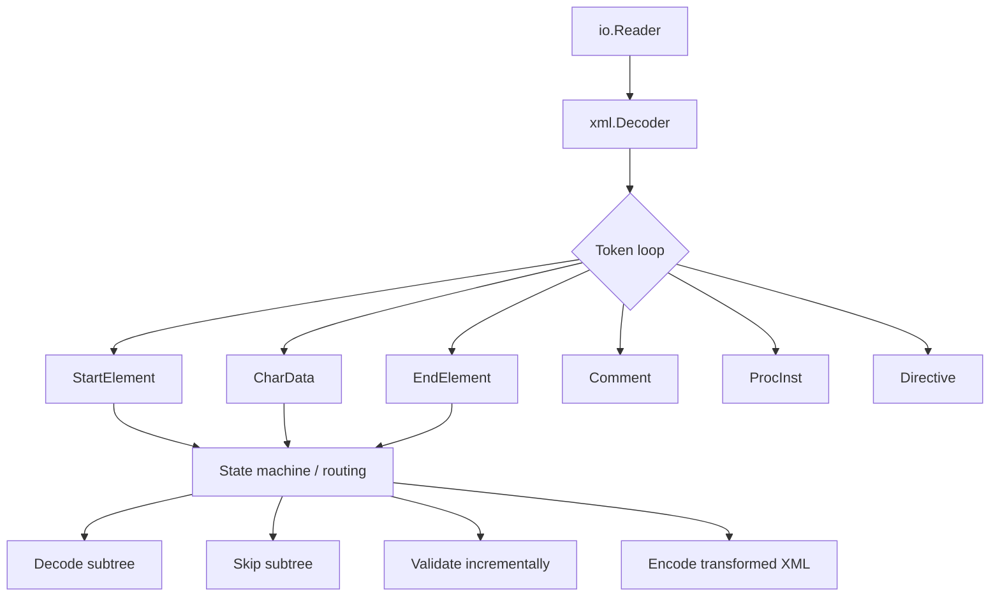
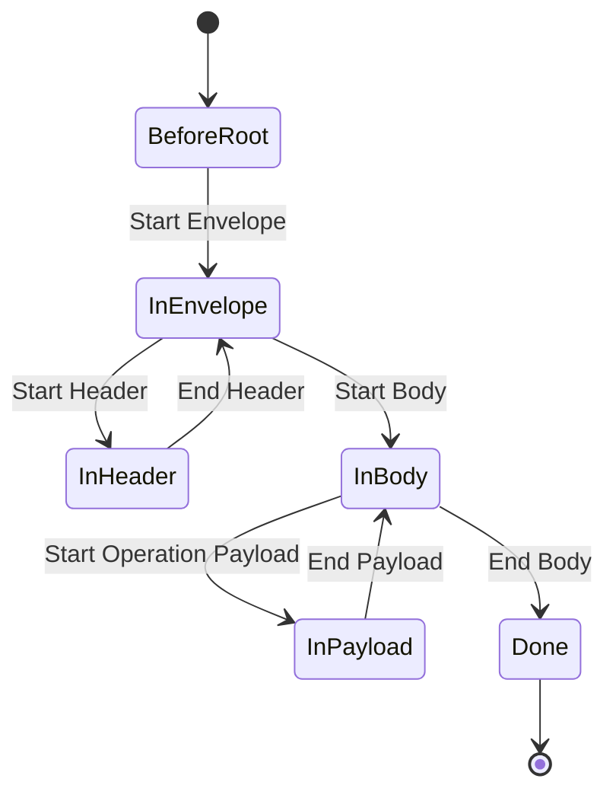
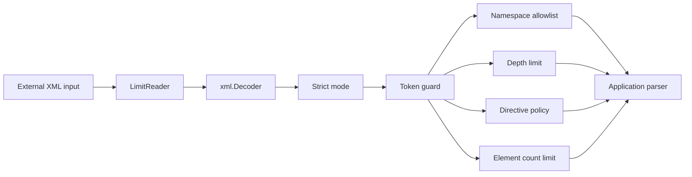
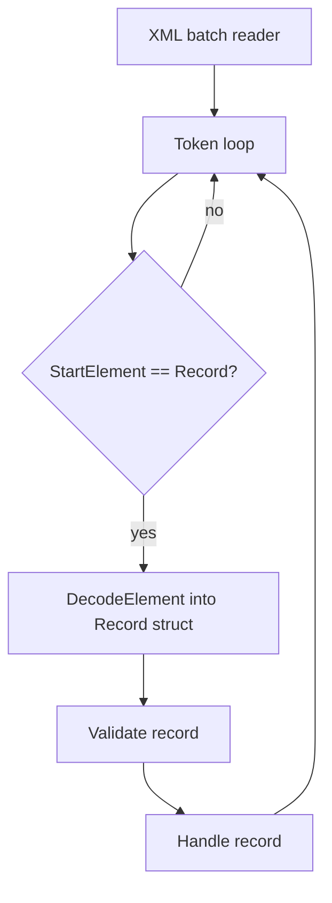
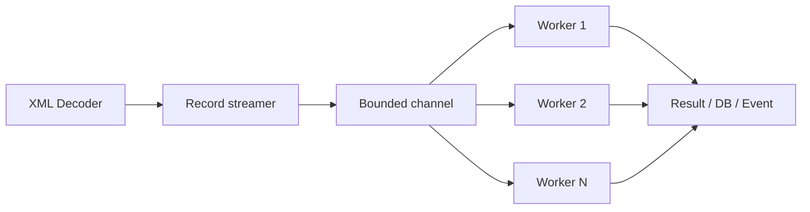

# learn-go-data-mapper-json-xml-protobuf-validation-part-017.md

# Part 017 — XML Processing Beyond Basic Marshal

> Seri: `learn-go-data-mapper-json-xml-protobuf-validation`  
> Target pembaca: Java software engineer yang ingin menguasai Go data representation boundary secara production-grade  
> Target Go: Go 1.26.x  
> Status seri: belum selesai — ini adalah part 017 dari 033

---

## Ringkasan

Pada part sebelumnya kita membahas fondasi `encoding/xml`: element, attribute, `XMLName`, namespace, `chardata`, `innerxml`, struct tag, dan perbedaan XML dengan JSON. Part ini naik satu level: **memproses XML sebagai stream of tokens**, bukan sebagai object tree penuh.

Ini penting karena XML di production jarang hanya berupa payload kecil yang langsung cocok ke struct. Banyak integrasi enterprise, banking, government, SOAP, legacy gateway, document exchange, reporting, procurement, dan compliance system mengirim XML yang:

- sangat besar;
- memiliki envelope dan payload berbeda namespace;
- mengandung mixed content;
- perlu diekstrak sebagian saja;
- perlu ditransformasi sambil jalan;
- perlu divalidasi bertahap;
- perlu diredaksi sebelum logging;
- tidak selalu schema-friendly;
- tidak boleh dimuat seluruhnya ke memory;
- memiliki failure mode security yang berbeda dari JSON.

Mental model utama part ini:

> `xml.Unmarshal` cocok untuk dokumen kecil dan stabil.  
> `xml.Decoder.Token` cocok untuk dokumen besar, heterogen, envelope-based, atau ketika kita perlu mengontrol parsing boundary secara eksplisit.

---

## Daftar Isi

1. [Posisi Part Ini dalam Seri](#1-posisi-part-ini-dalam-seri)
2. [Mengapa Basic Marshal/Unmarshal Tidak Cukup](#2-mengapa-basic-marshalunmarshal-tidak-cukup)
3. [Mental Model: XML sebagai Event Stream](#3-mental-model-xml-sebagai-event-stream)
4. [Token Primitives di `encoding/xml`](#4-token-primitives-di-encodingxml)
5. [`Token` vs `RawToken`](#5-token-vs-rawtoken)
6. [Decoder Configuration dan Invariant](#6-decoder-configuration-dan-invariant)
7. [Safe XML Decoder Factory](#7-safe-xml-decoder-factory)
8. [Pattern 1: Streaming Root dan Envelope Inspection](#8-pattern-1-streaming-root-dan-envelope-inspection)
9. [Pattern 2: Partial Extraction dengan Path Matcher](#9-pattern-2-partial-extraction-dengan-path-matcher)
10. [Pattern 3: Decode Subtree ke Struct dengan `DecodeElement`](#10-pattern-3-decode-subtree-ke-struct-dengan-decodeelement)
11. [Pattern 4: Skip Subtree yang Tidak Relevan](#11-pattern-4-skip-subtree-yang-tidak-relevan)
12. [Pattern 5: Split Large XML menjadi Record Stream](#12-pattern-5-split-large-xml-menjadi-record-stream)
13. [Pattern 6: Mixed Content Processing](#13-pattern-6-mixed-content-processing)
14. [Pattern 7: XML Transform dan Redaction Pipeline](#14-pattern-7-xml-transform-dan-redaction-pipeline)
15. [Pattern 8: SOAP-Style Envelope Parsing](#15-pattern-8-soap-style-envelope-parsing)
16. [Namespace Handling yang Benar di Stream Processing](#16-namespace-handling-yang-benar-di-stream-processing)
17. [Error Modeling: Offset, Line, Column, dan Field Path](#17-error-modeling-offset-line-column-dan-field-path)
18. [Security Boundary untuk XML Processing](#18-security-boundary-untuk-xml-processing)
19. [Operational Concerns: Memory, Backpressure, Observability](#19-operational-concerns-memory-backpressure-observability)
20. [Testing Strategy untuk XML Token Pipeline](#20-testing-strategy-untuk-xml-token-pipeline)
21. [Anti-Patterns](#21-anti-patterns)
22. [Decision Matrix](#22-decision-matrix)
23. [Production Checklist](#23-production-checklist)
24. [Latihan Desain](#24-latihan-desain)
25. [Ringkasan Invariant](#25-ringkasan-invariant)
26. [Referensi](#26-referensi)

---

## 1. Posisi Part Ini dalam Seri

Part 016 menjawab pertanyaan:

> Bagaimana Go memetakan XML ke struct?

Part 017 menjawab pertanyaan lebih penting untuk production:

> Bagaimana Go memproses XML sebagai dokumen besar, sebagian, heterogen, dan berisiko?

Perbedaannya bukan kosmetik.

### Basic mapping mindset

```go
var doc PurchaseOrder
err := xml.Unmarshal(data, &doc)
```

Model ini mengasumsikan:

- seluruh XML muat di memory;
- payload cocok dengan satu struct;
- kita perlu seluruh dokumen;
- error cukup dikembalikan sekali;
- tidak perlu observability per record;
- tidak perlu skip subtree besar;
- tidak perlu redaction sambil streaming;
- tidak perlu menjaga backpressure.

### Streaming processing mindset

```go
dec := xml.NewDecoder(r)

for {
    tok, err := dec.Token()
    if err == io.EOF {
        break
    }
    if err != nil {
        return err
    }

    switch t := tok.(type) {
    case xml.StartElement:
        // inspect, route, decode subtree, skip subtree, transform, validate
    }
}
```

Model ini mengasumsikan:

- XML adalah sequence of events;
- parser state harus eksplisit;
- caller dapat berhenti lebih awal;
- subtree dapat didecode, diskip, atau ditransformasi;
- memory harus bounded;
- error harus punya lokasi;
- pipeline bisa incremental.

Di Java, analoginya mirip:

| Java ecosystem | Go equivalent |
|---|---|
| JAXB bind whole document | `xml.Unmarshal` / `Decoder.Decode` |
| StAX pull parser | `xml.Decoder.Token` |
| SAX event handler | loop `Token()` dengan state machine manual |
| DOM tree | tidak ada di standard library Go; biasanya hindari untuk payload besar |
| XSLT transform | tidak ada di standard library Go; implement transform token-level atau pakai tool eksternal |

Go intentionally minimal. Go tidak mencoba menjadi JAXB + StAX + DOM + XPath + XSLT sekaligus. Kita diberi primitive kecil, lalu kita membangun pipeline yang eksplisit.

---

## 2. Mengapa Basic Marshal/Unmarshal Tidak Cukup

`xml.Marshal` dan `xml.Unmarshal` sangat berguna, tetapi bukan jawaban untuk semua XML problem.

### 2.1 Masalah ukuran payload

Contoh XML:

```xml
<BatchReport xmlns="urn:example:report:v1">
  <Header>
    <ReportID>RPT-2026-0001</ReportID>
  </Header>
  <Records>
    <Record id="1">...</Record>
    <Record id="2">...</Record>
    <!-- jutaan record -->
  </Records>
</BatchReport>
```

Jika kita langsung:

```go
var report BatchReport
err := xml.NewDecoder(r).Decode(&report)
```

maka kita memberi sinyal:

> Saya bersedia memuat semua records ke memory sebelum memproses satu pun record.

Untuk XML besar, ini salah secara arsitektur. Yang lebih benar:

1. parse header;
2. validasi metadata;
3. stream setiap `Record`;
4. proses record satu per satu;
5. commit batch atau checkpoint;
6. lanjut tanpa menahan seluruh dokumen.

### 2.2 Masalah envelope/payload

Banyak XML enterprise berbentuk envelope:

```xml
<soapenv:Envelope xmlns:soapenv="http://schemas.xmlsoap.org/soap/envelope/">
  <soapenv:Header>
    <correlationId>abc-123</correlationId>
  </soapenv:Header>
  <soapenv:Body>
    <ns2:SubmitApplicationRequest xmlns:ns2="urn:agency:application:v2">
      ...
    </ns2:SubmitApplicationRequest>
  </soapenv:Body>
</soapenv:Envelope>
```

Struct tunggal sering membuat boundary kabur:

```go
type Envelope struct {
    Header Header
    Body   SubmitApplicationRequest
}
```

Masalahnya:

- body bisa polymorphic;
- namespace menentukan operation;
- header bisa diproses oleh middleware;
- payload bisa didispatch ke handler berbeda;
- unknown header mungkin perlu diterima atau ditolak;
- XML prefix bisa berubah tapi namespace URI tetap sama.

Token processing membuat dispatch eksplisit.

### 2.3 Masalah mixed content

XML bisa berisi campuran text dan element:

```xml
<paragraph>
  Please read <em>carefully</em> before signing.
</paragraph>
```

Jika kita hanya decode ke struct field biasa, urutan text/element bisa hilang. Untuk document-style XML, HTML-like XML, legal clause, template, atau rich text, urutan adalah data.

### 2.4 Masalah partial trust

XML sering datang dari sistem eksternal. Kita mungkin percaya transport-nya, tetapi tidak boleh percaya isi dokumen mentahnya.

Risiko:

- payload terlalu besar;
- nesting terlalu dalam;
- jumlah element abnormal;
- text field terlalu panjang;
- invalid namespace;
- unexpected directive;
- sensitive field bocor ke log;
- parser error tidak cukup informatif untuk support team.

Basic unmarshal terlalu coarse untuk banyak kebutuhan ini.

---

## 3. Mental Model: XML sebagai Event Stream

XML stream dapat dipahami sebagai sequence event:

```xml
<Order id="O-1">
  <Customer>Alice</Customer>
  <Total currency="SGD">123.45</Total>
</Order>
```

Event-nya kira-kira:

```text
StartElement(Order, attr id=O-1)
CharData(whitespace)
StartElement(Customer)
CharData(Alice)
EndElement(Customer)
CharData(whitespace)
StartElement(Total, attr currency=SGD)
CharData(123.45)
EndElement(Total)
CharData(whitespace)
EndElement(Order)
```

Di `encoding/xml`, ini direpresentasikan oleh `xml.Token`.



### Pull parser, bukan callback parser

`Decoder.Token()` adalah pull parser:

- caller meminta token berikutnya;
- caller mengontrol kapan berhenti;
- caller bisa decode subtree;
- caller bisa skip;
- caller bisa backpressure downstream.

Ini berbeda dari callback parser seperti SAX di Java, di mana parser memanggil handler.

### State machine wajib eksplisit

Karena token datang satu per satu, kita harus tahu posisi kita di dokumen.



Mapping struct menyembunyikan state. Token processing mengekspos state.

Itu membuat kode lebih panjang, tetapi juga membuat correctness lebih terlihat.

---

## 4. Token Primitives di `encoding/xml`

`xml.Token` adalah interface yang bisa berisi beberapa concrete type:

```go
type Token any
```

Concrete token utama:

```go
xml.StartElement
xml.EndElement
xml.CharData
xml.Comment
xml.ProcInst
xml.Directive
```

### 4.1 `xml.StartElement`

```go
type StartElement struct {
    Name xml.Name
    Attr []xml.Attr
}
```

Digunakan untuk tag pembuka:

```xml
<Order id="O-1" status="NEW">
```

Menjadi:

```go
xml.StartElement{
    Name: xml.Name{Space: "", Local: "Order"},
    Attr: []xml.Attr{
        {Name: xml.Name{Local: "id"}, Value: "O-1"},
        {Name: xml.Name{Local: "status"}, Value: "NEW"},
    },
}
```

Dalam namespace-aware XML:

```xml
<po:Order xmlns:po="urn:example:purchase-order:v1">
```

`Decoder.Token()` akan memberi:

```go
xml.Name{
    Space: "urn:example:purchase-order:v1",
    Local: "Order",
}
```

Jadi jangan match prefix `po`. Match namespace URI + local name.

### 4.2 `xml.EndElement`

```go
type EndElement struct {
    Name xml.Name
}
```

Digunakan untuk tag penutup:

```xml
</Order>
```

Dalam token loop, start/end digunakan untuk menjaga path stack.

### 4.3 `xml.CharData`

```go
type CharData []byte
```

`CharData` adalah text node. Escape XML sudah diterjemahkan.

Contoh:

```xml
<Name>Alice &amp; Bob</Name>
```

CharData menjadi:

```text
Alice & Bob
```

Catatan penting: byte slice dari token mengacu ke internal buffer parser dan hanya valid sampai pemanggilan `Token()` berikutnya. Jika perlu disimpan, copy.

```go
text := string(t) // copy ke string
// atau
copied := append([]byte(nil), t...)
```

### 4.4 `xml.Comment`

```go
type Comment []byte
```

Comment biasanya tidak masuk domain data. Namun dalam document-style XML, comment kadang punya arti audit/manual review. Jangan otomatis discard tanpa memahami domain.

### 4.5 `xml.ProcInst`

```go
type ProcInst struct {
    Target string
    Inst   []byte
}
```

Contoh:

```xml
<?xml version="1.0" encoding="UTF-8"?>
<?xml-stylesheet type="text/xsl" href="style.xsl"?>
```

Processing instruction sering tidak relevan untuk data API, tetapi harus diputuskan:

- diterima;
- diabaikan;
- ditolak;
- hanya boleh XML declaration di awal.

### 4.6 `xml.Directive`

```go
type Directive []byte
```

Contoh:

```xml
<!DOCTYPE note SYSTEM "Note.dtd">
```

Di security-sensitive parser, directive seperti DOCTYPE biasanya harus ditolak untuk untrusted input. Pembahasan security ada di bagian khusus di bawah.

---

## 5. `Token` vs `RawToken`

`Decoder` menyediakan dua cara membaca token:

```go
tok, err := dec.Token()
```

atau:

```go
tok, err := dec.RawToken()
```

### Gunakan `Token()` sebagai default

`Token()` melakukan hal penting:

- menjamin start/end element nested dan matched;
- menerapkan namespace translation;
- mengubah prefix menjadi namespace URI pada `xml.Name.Space`;
- memperluas self-closing element menjadi start + end token.

Contoh:

```xml
<br/>
```

`Token()` mengembalikan:

```text
StartElement(br)
EndElement(br)
```

Ini membuat state machine lebih konsisten.

### Hati-hati dengan `RawToken()`

`RawToken()` tidak memverifikasi match start/end dan tidak menerjemahkan prefix namespace ke URI. Ini berguna untuk tool low-level, debugger, atau parser khusus, tetapi tidak cocok sebagai default production parser.

#### Anti-pattern

```go
// Buruk untuk business parser biasa.
tok, err := dec.RawToken()
```

Mengapa buruk?

Karena parser state bisa menerima bentuk yang tidak seharusnya dianggap well-formed oleh application-level processing. Gunakan hanya jika memang perlu melihat raw prefix atau membangun parser diagnostic.

---

## 6. Decoder Configuration dan Invariant

`xml.NewDecoder(r)` menghasilkan parser dengan konfigurasi penting.

### 6.1 `Strict`

`Decoder.Strict` default-nya `true` jika dibuat dengan `xml.NewDecoder`. Dalam strict mode, parser menegakkan requirements XML specification untuk well-formedness umum.

```go
dec := xml.NewDecoder(r)
dec.Strict = true // eksplisit untuk readability
```

Untuk API/integration boundary, treat ini sebagai invariant:

> Jangan set `Strict=false` untuk untrusted XML data.

`Strict=false` lebih cocok untuk HTML-like input yang rusak, bukan contract XML.

### 6.2 Strict mode bukan namespace validator penuh

Hal yang sering mengejutkan: strict mode tidak sepenuhnya menegakkan semua persyaratan Namespaces in XML. Jika ada prefix namespace yang tidak dikenal, Go dapat mencatat prefix tersebut sebagai `Name.Space`, bukan langsung error.

Konsekuensi:

> Jika namespace correctness penting, application harus melakukan allowlist namespace URI dan reject unknown prefix/namespace secara eksplisit.

### 6.3 `CharsetReader`

XML external partner kadang mengirim:

```xml
<?xml version="1.0" encoding="ISO-8859-1"?>
```

`encoding/xml` bekerja dengan UTF-8 input. Jika dokumen menyatakan encoding non-UTF-8, `Decoder.CharsetReader` harus disediakan untuk konversi.

Contoh menggunakan `golang.org/x/net/html/charset`:

```go
package xmlutil

import (
    "encoding/xml"
    "io"

    "golang.org/x/net/html/charset"
)

func NewDecoder(r io.Reader) *xml.Decoder {
    dec := xml.NewDecoder(r)
    dec.Strict = true
    dec.CharsetReader = charset.NewReaderLabel
    return dec
}
```

Catatan:

- dependency ini di luar standard library;
- governance dependency harus jelas;
- jangan diam-diam menerima semua charset jika contract seharusnya UTF-8 only;
- untuk high-compliance systems, sebaiknya reject non-UTF-8 kecuali partner contract mengizinkannya.

### 6.4 `DefaultSpace`

`DefaultSpace` membuat unadorned tag dianggap berada di namespace default tertentu, seolah seluruh dokumen dibungkus `xmlns="..."`.

```go
dec.DefaultSpace = "urn:example:legacy:v1"
```

Gunakan hati-hati. Ini bisa membantu legacy XML yang tidak namespace-aware, tetapi juga bisa menyembunyikan contract defect.

### 6.5 `Entity`

`Decoder.Entity` bisa memetakan non-standard entity names.

Standard entity selalu ada:

```text
lt   => <
gt   => >
amp  => &
apos => '
quot => "
```

Untuk data contract, jangan jadikan custom entity sebagai normal path kecuali memang contract legacy menuntut.

---

## 7. Safe XML Decoder Factory

Sebelum membuat parser untuk production, buat factory yang memaksa default aman.

### 7.1 Tujuan factory

Factory harus membuat invariant menjadi default:

- strict XML;
- input size limit;
- optional charset policy;
- namespace allowlist;
- directive policy;
- max depth;
- max element count;
- error position tracking.



### 7.2 Basic safe decoder

```go
package xmlsafe

import (
    "encoding/xml"
    "io"
)

type DecoderOptions struct {
    MaxBytes       int64
    AllowCharsets  bool
    DefaultSpace   string
    CharsetReader  func(charset string, input io.Reader) (io.Reader, error)
}

func NewDecoder(r io.Reader, opt DecoderOptions) (*xml.Decoder, io.Reader) {
    var limited io.Reader = r
    if opt.MaxBytes > 0 {
        limited = io.LimitReader(r, opt.MaxBytes)
    }

    dec := xml.NewDecoder(limited)
    dec.Strict = true

    if opt.DefaultSpace != "" {
        dec.DefaultSpace = opt.DefaultSpace
    }

    if opt.AllowCharsets {
        dec.CharsetReader = opt.CharsetReader
    }

    return dec, limited
}
```

Catatan: `io.LimitReader` memberi EOF setelah limit, tetapi tidak otomatis membedakan “dokumen valid yang selesai” vs “dokumen dipotong karena limit”. Untuk API boundary, sering lebih baik membuat reader yang mengembalikan error khusus saat limit terlampaui.

### 7.3 Limit reader dengan error eksplisit

```go
package xmlsafe

import (
    "errors"
    "io"
)

var ErrXMLTooLarge = errors.New("xml input exceeds maximum allowed size")

type MaxBytesReader struct {
    r         io.Reader
    remaining int64
}

func NewMaxBytesReader(r io.Reader, max int64) *MaxBytesReader {
    return &MaxBytesReader{r: r, remaining: max}
}

func (m *MaxBytesReader) Read(p []byte) (int, error) {
    if m.remaining <= 0 {
        return 0, ErrXMLTooLarge
    }

    if int64(len(p)) > m.remaining {
        p = p[:m.remaining]
    }

    n, err := m.r.Read(p)
    m.remaining -= int64(n)

    if err == io.EOF {
        return n, io.EOF
    }
    if m.remaining <= 0 && err == nil {
        return n, ErrXMLTooLarge
    }
    return n, err
}
```

Namun ada nuance: reader seperti ini bisa mengembalikan `n > 0` dan `err != nil` bersamaan. Parser caller harus siap. Ini behavior legal di Go `io.Reader` contract.

### 7.4 Token guard

Decoder factory saja belum cukup. Kita perlu wrapper yang membaca token sambil menghitung:

- depth;
- element count;
- character count;
- directive presence;
- namespace allowlist.

```go
package xmlsafe

import (
    "encoding/xml"
    "fmt"
    "io"
)

type TokenPolicy struct {
    MaxDepth       int
    MaxElements    int64
    MaxCharDataLen int
    RejectDirective bool
    AllowedNS      map[string]bool // empty means allow all
}

type GuardedDecoder struct {
    Dec    *xml.Decoder
    Policy TokenPolicy

    depth    int
    elements int64
}

func (g *GuardedDecoder) Token() (xml.Token, error) {
    tok, err := g.Dec.Token()
    if err != nil {
        return tok, err
    }
    if tok == nil {
        return nil, nil
    }

    switch t := tok.(type) {
    case xml.StartElement:
        g.depth++
        g.elements++

        if g.Policy.MaxDepth > 0 && g.depth > g.Policy.MaxDepth {
            return nil, g.errorf("xml nesting depth exceeds %d", g.Policy.MaxDepth)
        }
        if g.Policy.MaxElements > 0 && g.elements > g.Policy.MaxElements {
            return nil, g.errorf("xml element count exceeds %d", g.Policy.MaxElements)
        }
        if err := g.checkName(t.Name); err != nil {
            return nil, err
        }
        for _, a := range t.Attr {
            if err := g.checkName(a.Name); err != nil {
                return nil, err
            }
        }

    case xml.EndElement:
        if g.depth > 0 {
            g.depth--
        }

    case xml.CharData:
        if g.Policy.MaxCharDataLen > 0 && len(t) > g.Policy.MaxCharDataLen {
            return nil, g.errorf("xml character data chunk exceeds %d bytes", g.Policy.MaxCharDataLen)
        }

    case xml.Directive:
        if g.Policy.RejectDirective {
            return nil, g.errorf("xml directive is not allowed")
        }
    }

    return tok, nil
}

func (g *GuardedDecoder) checkName(name xml.Name) error {
    if len(g.Policy.AllowedNS) == 0 {
        return nil
    }
    if name.Space == "" {
        return nil
    }
    if !g.Policy.AllowedNS[name.Space] {
        return g.errorf("xml namespace %q is not allowed for element/attribute %q", name.Space, name.Local)
    }
    return nil
}

func (g *GuardedDecoder) errorf(format string, args ...any) error {
    line, col := g.Dec.InputPos()
    return fmt.Errorf(format+" at line=%d column=%d offset=%d", append(args, line, col, g.Dec.InputOffset())...)
}

func ReadAllTokens(g *GuardedDecoder) error {
    for {
        _, err := g.Token()
        if err == io.EOF {
            return nil
        }
        if err != nil {
            return err
        }
    }
}
```

Ini hanya skeleton. Dalam production, error type sebaiknya structured, bukan string-only.

---

## 8. Pattern 1: Streaming Root dan Envelope Inspection

Kasus umum: kita hanya ingin tahu root element, namespace, operation, dan metadata awal sebelum memutuskan parser berikutnya.

### 8.1 Root inspection

```go
package xmlinspect

import (
    "encoding/xml"
    "fmt"
    "io"
)

type RootInfo struct {
    Name xml.Name
    Attr []xml.Attr
}

func ReadRoot(dec *xml.Decoder) (RootInfo, error) {
    for {
        tok, err := dec.Token()
        if err == io.EOF {
            return RootInfo{}, fmt.Errorf("xml document has no root element")
        }
        if err != nil {
            return RootInfo{}, err
        }

        switch t := tok.(type) {
        case xml.StartElement:
            return RootInfo{Name: t.Name, Attr: append([]xml.Attr(nil), t.Attr...)}, nil
        case xml.CharData:
            if len(trimSpaceBytes(t)) == 0 {
                continue
            }
            return RootInfo{}, fmt.Errorf("unexpected character data before root")
        case xml.Comment, xml.ProcInst:
            continue
        case xml.Directive:
            return RootInfo{}, fmt.Errorf("directive before root is not allowed")
        }
    }
}

func trimSpaceBytes(b []byte) []byte {
    start := 0
    for start < len(b) && isSpace(b[start]) {
        start++
    }
    end := len(b)
    for end > start && isSpace(b[end-1]) {
        end--
    }
    return b[start:end]
}

func isSpace(c byte) bool {
    return c == ' ' || c == '\n' || c == '\r' || c == '\t'
}
```

### 8.2 Dispatch berdasarkan root

```go
func DispatchXML(r io.Reader) error {
    dec := xml.NewDecoder(r)
    dec.Strict = true

    root, err := ReadRoot(dec)
    if err != nil {
        return err
    }

    switch root.Name {
    case xml.Name{Space: "urn:agency:application:v2", Local: "SubmitApplicationRequest"}:
        return parseSubmitApplication(dec, root)
    case xml.Name{Space: "urn:agency:appeal:v1", Local: "SubmitAppealRequest"}:
        return parseSubmitAppeal(dec, root)
    default:
        return fmt.Errorf("unsupported root element: {%s}%s", root.Name.Space, root.Name.Local)
    }
}
```

Pola ini berguna ketika endpoint menerima beberapa XML operation di satu ingress channel.

---

## 9. Pattern 2: Partial Extraction dengan Path Matcher

Sering kita perlu mengambil value tertentu dari XML besar tanpa decode seluruh dokumen.

Contoh:

```xml
<BatchReport xmlns="urn:example:report:v1">
  <Header>
    <ReportID>RPT-001</ReportID>
    <AgencyCode>CEA</AgencyCode>
  </Header>
  <Records>
    <Record>...</Record>
  </Records>
</BatchReport>
```

Kita hanya butuh:

```text
/BatchReport/Header/ReportID
```

### 9.1 Path representation

Gunakan `xml.Name`, bukan string prefix.

```go
type XMLPath []xml.Name

func (p XMLPath) Matches(stack []xml.Name) bool {
    if len(p) != len(stack) {
        return false
    }
    for i := range p {
        if p[i] != stack[i] {
            return false
        }
    }
    return true
}
```

### 9.2 Extract text at path

```go
package xmlpath

import (
    "encoding/xml"
    "fmt"
    "io"
    "strings"
)

func ExtractText(dec *xml.Decoder, target XMLPath) (string, bool, error) {
    var stack []xml.Name
    var buf strings.Builder
    collecting := false

    for {
        tok, err := dec.Token()
        if err == io.EOF {
            return "", false, nil
        }
        if err != nil {
            return "", false, err
        }

        switch t := tok.(type) {
        case xml.StartElement:
            stack = append(stack, t.Name)
            if target.Matches(stack) {
                collecting = true
                buf.Reset()
            }

        case xml.CharData:
            if collecting {
                buf.Write([]byte(t))
            }

        case xml.EndElement:
            if collecting && target.Matches(stack) {
                return strings.TrimSpace(buf.String()), true, nil
            }
            if len(stack) == 0 {
                return "", false, fmt.Errorf("unexpected end element: %s", t.Name.Local)
            }
            stack = stack[:len(stack)-1]
        }
    }
}
```

### 9.3 Usage

```go
const reportNS = "urn:example:report:v1"

value, found, err := xmlpath.ExtractText(dec, xmlpath.XMLPath{
    {Space: reportNS, Local: "BatchReport"},
    {Space: reportNS, Local: "Header"},
    {Space: reportNS, Local: "ReportID"},
})
if err != nil {
    return err
}
if !found {
    return errors.New("missing ReportID")
}
```

### 9.4 Keterbatasan

Pola sederhana ini tidak cocok jika:

- ada repeated path dan kita butuh semua values;
- element target mengandung nested element;
- mixed content order penting;
- namespace bisa berubah antar subtree;
- path matching harus wildcard.

Tetapi untuk metadata extraction, ini sangat efektif.

---

## 10. Pattern 3: Decode Subtree ke Struct dengan `DecodeElement`

Kekuatan besar `xml.Decoder` adalah hybrid mode:

- gunakan token loop untuk menemukan subtree;
- gunakan `DecodeElement` untuk decode subtree tersebut ke struct.

### 10.1 Contoh XML batch

```xml
<Records xmlns="urn:example:record:v1">
  <Record id="R-1">
    <Name>Alice</Name>
    <Amount currency="SGD">100.50</Amount>
  </Record>
  <Record id="R-2">
    <Name>Bob</Name>
    <Amount currency="SGD">250.00</Amount>
  </Record>
</Records>
```

### 10.2 Struct record

```go
type Record struct {
    XMLName xml.Name `xml:"urn:example:record:v1 Record"`
    ID      string   `xml:"id,attr"`
    Name    string   `xml:"Name"`
    Amount  Amount   `xml:"Amount"`
}

type Amount struct {
    Currency string `xml:"currency,attr"`
    Value    string `xml:",chardata"`
}
```

### 10.3 Streaming decode records

```go
func StreamRecords(r io.Reader, handle func(Record) error) error {
    dec := xml.NewDecoder(r)
    dec.Strict = true

    for {
        tok, err := dec.Token()
        if err == io.EOF {
            return nil
        }
        if err != nil {
            return err
        }

        start, ok := tok.(xml.StartElement)
        if !ok {
            continue
        }

        if start.Name == (xml.Name{Space: "urn:example:record:v1", Local: "Record"}) {
            var rec Record
            if err := dec.DecodeElement(&rec, &start); err != nil {
                return err
            }
            if err := handle(rec); err != nil {
                return err
            }
        }
    }
}
```

### 10.4 Mengapa ini powerful?

Karena memory footprint bounded per record.



Kita tidak menahan semua records sekaligus.

### 10.5 Invariant penting

`DecodeElement` harus dipanggil setelah kita sudah membaca `StartElement` target. Ia akan membaca sampai matching end element.

Jangan panggil `DecodeElement` lalu tetap berharap token-token subtree tersedia di loop luar. Subtree tersebut sudah dikonsumsi.

---

## 11. Pattern 4: Skip Subtree yang Tidak Relevan

Jika XML memiliki subtree besar yang tidak dibutuhkan, jangan decode dan jangan scan manual sampai end dengan bug-prone counter. Gunakan `Decoder.Skip()`.

### 11.1 Contoh

```xml
<Document>
  <Metadata>...</Metadata>
  <HugeAttachment>base64...</HugeAttachment>
  <Summary>...</Summary>
</Document>
```

Kita ingin skip `HugeAttachment`.

```go
func ParseWithoutAttachment(r io.Reader) error {
    dec := xml.NewDecoder(r)

    for {
        tok, err := dec.Token()
        if err == io.EOF {
            return nil
        }
        if err != nil {
            return err
        }

        start, ok := tok.(xml.StartElement)
        if !ok {
            continue
        }

        if start.Name.Local == "HugeAttachment" {
            if err := dec.Skip(); err != nil {
                return fmt.Errorf("skip HugeAttachment: %w", err)
            }
            continue
        }

        // process other elements
    }
}
```

### 11.2 Kapan skip berguna?

- attachment base64 besar;
- audit extension yang tidak dibutuhkan;
- vendor-specific extension;
- digital signature block yang diverifikasi oleh layer lain;
- optional details di report;
- subtree yang akan diproses oleh downstream service.

### 11.3 Compatibility strategy

Untuk XML contract yang punya extension point:

```xml
<Extensions>
  <VendorA:Extra>...</VendorA:Extra>
</Extensions>
```

Policy umum:

| Context | Unknown extension policy |
|---|---|
| Public API request | reject unknown critical extension |
| Partner feed | log + skip known extension container |
| Event replay | preserve raw extension if needed |
| Compliance/audit | do not discard without retention policy |

---

## 12. Pattern 5: Split Large XML menjadi Record Stream

Kadang kita perlu mengubah XML besar menjadi stream record untuk worker pipeline.

### 12.1 API design

```go
type RecordHandler[T any] func(ctx context.Context, item T) error

type StreamOptions struct {
    RecordName xml.Name
    MaxRecords int64
}
```

### 12.2 Generic record streamer

```go
package xmlstream

import (
    "context"
    "encoding/xml"
    "fmt"
    "io"
)

type StreamOptions struct {
    RecordName xml.Name
    MaxRecords int64
}

func StreamElements[T any](
    ctx context.Context,
    r io.Reader,
    opt StreamOptions,
    handle func(context.Context, T) error,
) error {
    dec := xml.NewDecoder(r)
    dec.Strict = true

    var count int64

    for {
        select {
        case <-ctx.Done():
            return ctx.Err()
        default:
        }

        tok, err := dec.Token()
        if err == io.EOF {
            return nil
        }
        if err != nil {
            return fmt.Errorf("xml token at offset %d: %w", dec.InputOffset(), err)
        }

        start, ok := tok.(xml.StartElement)
        if !ok || start.Name != opt.RecordName {
            continue
        }

        count++
        if opt.MaxRecords > 0 && count > opt.MaxRecords {
            return fmt.Errorf("xml record count exceeds limit %d", opt.MaxRecords)
        }

        var item T
        if err := dec.DecodeElement(&item, &start); err != nil {
            line, col := dec.InputPos()
            return fmt.Errorf("decode record %d at line %d column %d offset %d: %w", count, line, col, dec.InputOffset(), err)
        }

        if err := handle(ctx, item); err != nil {
            return fmt.Errorf("handle record %d: %w", count, err)
        }
    }
}
```

### 12.3 Backpressure

Handler synchronous memberi backpressure otomatis:

```text
parser reads next record only after handler finishes current record
```

Jika ingin parallel processing, hati-hati. Jangan langsung membuat goroutine per record tanpa limit.

```go
sem := make(chan struct{}, 16)

handle := func(ctx context.Context, rec Record) error {
    sem <- struct{}{}
    go func() {
        defer func() { <-sem }()
        process(rec)
    }()
    return nil
}
```

Namun pola ini punya problem error propagation dan lifecycle. Untuk production, gunakan worker pool yang menerima record via bounded channel dan punya cancellation.



### 12.4 Transaction boundary

Untuk batch XML, tentukan commit model:

| Model | Kapan cocok | Risiko |
|---|---|---|
| All-or-nothing | financial batch kecil, strict consistency | memory/state besar, rollback mahal |
| Per record | feed besar, idempotent processing | partial success harus dilaporkan |
| Chunk commit | batch besar dengan checkpoint | recovery complexity |
| Stage then validate | compliance ingestion | storage sementara perlu governance |

XML parser hanyalah entry point. Architecture ingestion ditentukan oleh transaction boundary.

---

## 13. Pattern 6: Mixed Content Processing

Mixed content adalah kasus XML di mana text dan element bercampur dan urutannya penting.

```xml
<Clause>
  The applicant must submit <Ref code="DOC-1">identity proof</Ref>
  within <Days>14</Days> days.
</Clause>
```

Jika decode ke struct sederhana:

```go
type Clause struct {
    Text string `xml:",chardata"`
    Ref  Ref    `xml:"Ref"`
    Days int    `xml:"Days"`
}
```

Kita kehilangan urutan asli. Text sebelum, antara, dan setelah element bisa tercampur.

### 13.1 Model mixed content sebagai nodes

```go
type Node interface {
    nodeKind() string
}

type TextNode struct {
    Text string
}

func (TextNode) nodeKind() string { return "text" }

type ElementNode struct {
    Name xml.Name
    Attr []xml.Attr
    Children []Node
}

func (ElementNode) nodeKind() string { return "element" }
```

### 13.2 Parse subtree preserving order

```go
func ParseMixed(dec *xml.Decoder, start xml.StartElement) (ElementNode, error) {
    root := ElementNode{
        Name: start.Name,
        Attr: append([]xml.Attr(nil), start.Attr...),
    }

    stack := []*ElementNode{&root}

    for len(stack) > 0 {
        tok, err := dec.Token()
        if err != nil {
            return root, err
        }

        current := stack[len(stack)-1]

        switch t := tok.(type) {
        case xml.StartElement:
            child := ElementNode{
                Name: t.Name,
                Attr: append([]xml.Attr(nil), t.Attr...),
            }
            current.Children = append(current.Children, &child)
            stack = append(stack, &child)

        case xml.CharData:
            s := string(t)
            if s != "" {
                current.Children = append(current.Children, TextNode{Text: s})
            }

        case xml.EndElement:
            if t.Name != current.Name {
                return root, fmt.Errorf("unexpected end element: got %v want %v", t.Name, current.Name)
            }
            stack = stack[:len(stack)-1]
        }
    }

    return root, nil
}
```

Catatan: contoh ini perlu perbaikan untuk pointer child lifecycle. Implementasi production sebaiknya memakai slice of concrete node pointers atau arena/tree builder yang jelas. Tujuannya menunjukkan mental model.

### 13.3 Kapan mixed content harus dipertahankan?

- legal text;
- policy documents;
- rich text;
- XML-based templates;
- docs with inline references;
- regulatory notices;
- generated correspondence.

Kapan boleh di-flatten?

- field text biasa;
- external feed yang hanya punya whitespace formatting;
- payload transactional murni;
- element order tidak punya meaning.

---

## 14. Pattern 7: XML Transform dan Redaction Pipeline

Kadang kita perlu membaca XML, menghapus/mengubah sebagian field, lalu menulis XML baru tanpa memuat seluruh dokumen.

Contoh redaction:

```xml
<Person>
  <Name>Alice</Name>
  <NRIC>S1234567D</NRIC>
  <Email>alice@example.com</Email>
</Person>
```

Output:

```xml
<Person>
  <Name>Alice</Name>
  <NRIC>***REDACTED***</NRIC>
  <Email>alice@example.com</Email>
</Person>
```

### 14.1 Token transform pipeline

```go
func RedactXML(r io.Reader, w io.Writer, sensitive map[xml.Name]bool) error {
    dec := xml.NewDecoder(r)
    dec.Strict = true

    enc := xml.NewEncoder(w)
    defer enc.Close()

    var redactingDepth int

    for {
        tok, err := dec.Token()
        if err == io.EOF {
            return enc.Flush()
        }
        if err != nil {
            return err
        }

        switch t := tok.(type) {
        case xml.StartElement:
            if redactingDepth > 0 {
                redactingDepth++
                continue
            }

            if sensitive[t.Name] {
                if err := enc.EncodeToken(t); err != nil {
                    return err
                }
                if err := enc.EncodeToken(xml.CharData("***REDACTED***")); err != nil {
                    return err
                }
                redactingDepth = 1
                continue
            }

            if err := enc.EncodeToken(t); err != nil {
                return err
            }

        case xml.EndElement:
            if redactingDepth > 0 {
                redactingDepth--
                if redactingDepth == 0 {
                    if err := enc.EncodeToken(t); err != nil {
                        return err
                    }
                }
                continue
            }

            if err := enc.EncodeToken(t); err != nil {
                return err
            }

        case xml.CharData:
            if redactingDepth > 0 {
                continue
            }
            if err := enc.EncodeToken(t); err != nil {
                return err
            }

        default:
            if redactingDepth > 0 {
                continue
            }
            if err := enc.EncodeToken(tok); err != nil {
                return err
            }
        }
    }
}
```

### 14.2 Important Encoder rules

Jika menggunakan `EncodeToken` langsung:

- pastikan start/end matched;
- panggil `Flush()` atau `Close()`;
- jangan tulis XML declaration `ProcInst{Target:"xml"}` setelah token lain;
- jangan generate invalid nesting;
- treat output sebagai new XML, bukan byte-preserving copy.

### 14.3 Transform bukan canonicalization

Token transform tidak menjamin:

- prefix namespace sama;
- whitespace sama;
- attribute order sama;
- XML declaration sama;
- canonical XML sama;
- signature tetap valid.

Jika XML ditandatangani secara digital, transform biasa dapat merusak signature. Untuk signed XML, proses canonicalization/signature harus ditangani dengan library/protocol khusus dan aturan compliance yang jelas.

---

## 15. Pattern 8: SOAP-Style Envelope Parsing

Go tidak punya SOAP stack standard library. Untuk banyak sistem modern, kita tidak ingin membangun full SOAP framework; kita hanya perlu cukup parser untuk envelope/header/body.

### 15.1 Namespace SOAP

SOAP 1.1 envelope namespace:

```text
http://schemas.xmlsoap.org/soap/envelope/
```

SOAP 1.2 envelope namespace:

```text
http://www.w3.org/2003/05/soap-envelope
```

### 15.2 Envelope parser skeleton

```go
package soapxml

import (
    "encoding/xml"
    "fmt"
    "io"
)

const SOAP11 = "http://schemas.xmlsoap.org/soap/envelope/"
const SOAP12 = "http://www.w3.org/2003/05/soap-envelope"

type EnvelopeInfo struct {
    Version string
    HeaderRaw []byte
    BodyStart xml.StartElement
}

func IsSOAPEnvelope(name xml.Name) bool {
    return name.Local == "Envelope" && (name.Space == SOAP11 || name.Space == SOAP12)
}

func ReadEnvelope(dec *xml.Decoder) (EnvelopeInfo, error) {
    var info EnvelopeInfo

    for {
        tok, err := dec.Token()
        if err != nil {
            return info, err
        }
        start, ok := tok.(xml.StartElement)
        if !ok {
            continue
        }
        if !IsSOAPEnvelope(start.Name) {
            return info, fmt.Errorf("expected SOAP Envelope, got {%s}%s", start.Name.Space, start.Name.Local)
        }
        info.Version = start.Name.Space
        break
    }

    for {
        tok, err := dec.Token()
        if err != nil {
            return info, err
        }

        start, ok := tok.(xml.StartElement)
        if !ok {
            continue
        }

        switch {
        case start.Name.Space == info.Version && start.Name.Local == "Header":
            // In real production code, decode known headers or copy subtree.
            if err := dec.Skip(); err != nil {
                return info, fmt.Errorf("skip SOAP Header: %w", err)
            }

        case start.Name.Space == info.Version && start.Name.Local == "Body":
            payloadStart, err := nextStartElement(dec)
            if err != nil {
                return info, fmt.Errorf("read SOAP Body payload: %w", err)
            }
            info.BodyStart = payloadStart
            return info, nil

        default:
            return info, fmt.Errorf("unexpected element in SOAP Envelope: {%s}%s", start.Name.Space, start.Name.Local)
        }
    }
}

func nextStartElement(dec *xml.Decoder) (xml.StartElement, error) {
    for {
        tok, err := dec.Token()
        if err != nil {
            return xml.StartElement{}, err
        }
        switch t := tok.(type) {
        case xml.StartElement:
            return t, nil
        case xml.CharData:
            // allow whitespace only
            for _, b := range []byte(t) {
                if b != ' ' && b != '\n' && b != '\r' && b != '\t' {
                    return xml.StartElement{}, fmt.Errorf("unexpected text in SOAP Body")
                }
            }
        }
    }
}
```

### 15.3 Dispatch body payload

```go
func HandleSOAP(r io.Reader) error {
    dec := xml.NewDecoder(r)
    dec.Strict = true

    env, err := ReadEnvelope(dec)
    if err != nil {
        return err
    }

    switch env.BodyStart.Name {
    case xml.Name{Space: "urn:agency:application:v2", Local: "SubmitApplicationRequest"}:
        var req SubmitApplicationRequest
        if err := dec.DecodeElement(&req, &env.BodyStart); err != nil {
            return err
        }
        return handleSubmitApplication(req)

    default:
        return fmt.Errorf("unsupported SOAP body operation: {%s}%s", env.BodyStart.Name.Space, env.BodyStart.Name.Local)
    }
}
```

### 15.4 SOAP realities

SOAP-style systems often require:

- WS-Security;
- XML Signature;
- XML canonicalization;
- schema validation;
- fault mapping;
- header processing;
- mustUnderstand semantics;
- attachment handling.

Standard library Go does not solve all of this. For high-compliance SOAP integration, either:

1. isolate SOAP complexity in an adapter service;
2. use a vetted library/tool with explicit test vectors;
3. contract with partner to simplify XML boundary;
4. convert SOAP XML to internal DTO at the edge and keep rest of system free from SOAP semantics.

---

## 16. Namespace Handling yang Benar di Stream Processing

Namespace adalah salah satu sumber bug terbesar di XML.

### 16.1 Prefix bukan identity

Dua dokumen ini equivalent dari perspektif namespace:

```xml
<a:Order xmlns:a="urn:order:v1" />
```

```xml
<b:Order xmlns:b="urn:order:v1" />
```

Yang penting:

```go
xml.Name{Space: "urn:order:v1", Local: "Order"}
```

Bukan prefix `a` atau `b`.

### 16.2 Attribute namespace berbeda dari element default namespace

Default namespace berlaku untuk element, bukan unprefixed attribute.

```xml
<Order xmlns="urn:order:v1" id="O-1" />
```

Element `Order` berada di `urn:order:v1`, tetapi attribute `id` tidak otomatis berada di namespace tersebut.

Dalam Go:

```go
StartElement.Name.Space == "urn:order:v1"
Attr{Name: xml.Name{Space:"", Local:"id"}}
```

Jangan menganggap attribute unprefixed berada di namespace default.

### 16.3 Namespace allowlist

Untuk API boundary, buat allowlist namespace:

```go
var allowedNamespaces = map[string]bool{
    "urn:agency:application:v2": true,
    "http://schemas.xmlsoap.org/soap/envelope/": true,
}
```

Namun jangan reject `Space == ""` secara global tanpa memahami dokumen. Banyak attribute valid tidak punya namespace.

### 16.4 Unknown namespace strategy

| Scenario | Policy |
|---|---|
| Strict request command | reject unknown payload namespace |
| SOAP header extension | reject unknown `mustUnderstand`; skip non-critical |
| Partner batch feed | allow extension namespace only inside extension container |
| Document XML | preserve unknown namespace if transforming |
| Audit/legal XML | do not drop unknown namespace without retention decision |

### 16.5 Namespace preserving transform

`xml.Encoder` dapat menghasilkan XML valid, tetapi tidak menjamin prefix sama seperti input. Jika prefix identity penting untuk partner walaupun secara XML namespace tidak seharusnya, maka itu bukan pure XML semantics lagi; itu partner-specific byte-shape contract. Tangani dengan compatibility test dan golden fixtures.

---

## 17. Error Modeling: Offset, Line, Column, dan Field Path

Error XML yang baik harus menjawab:

- apa yang salah;
- di mana lokasinya;
- di path mana;
- apakah syntax, schema, semantic, atau business error;
- apakah retryable;
- apakah record tertentu bisa di-skip;
- bagaimana support team menemukan data problem.

### 17.1 Structured error type

```go
type XMLParseError struct {
    Kind   string
    Msg    string
    Path   []xml.Name
    Line   int
    Column int
    Offset int64
    Cause  error
}

func (e *XMLParseError) Error() string {
    return fmt.Sprintf("xml %s error at line=%d column=%d offset=%d path=%s: %s",
        e.Kind, e.Line, e.Column, e.Offset, formatPath(e.Path), e.Msg)
}

func (e *XMLParseError) Unwrap() error { return e.Cause }
```

### 17.2 Track path stack

```go
func formatPath(path []xml.Name) string {
    if len(path) == 0 {
        return "/"
    }
    var b strings.Builder
    for _, n := range path {
        b.WriteByte('/')
        if n.Space != "" {
            b.WriteString("{")
            b.WriteString(n.Space)
            b.WriteString("}")
        }
        b.WriteString(n.Local)
    }
    return b.String()
}
```

### 17.3 Wrap decoder error with position

```go
func positionedError(dec *xml.Decoder, path []xml.Name, kind, msg string, cause error) error {
    line, col := dec.InputPos()
    return &XMLParseError{
        Kind:   kind,
        Msg:    msg,
        Path:   append([]xml.Name(nil), path...),
        Line:   line,
        Column: col,
        Offset: dec.InputOffset(),
        Cause:  cause,
    }
}
```

### 17.4 Error category

| Category | Example | HTTP/API mapping |
|---|---|---|
| syntax | malformed XML, mismatched tag | 400 Bad Request |
| size | input exceeds max bytes | 413 Payload Too Large |
| namespace | unsupported operation namespace | 400/422 depending contract |
| structure | missing required element | 422 Unprocessable Entity |
| semantic | invalid date range | 422 |
| business | entity not eligible | 409/422/domain-specific |
| infrastructure | reader error, downstream unavailable | 500/503 |

Jangan gabungkan semua menjadi “invalid XML”. Itu menyulitkan support, partner onboarding, dan audit.

---

## 18. Security Boundary untuk XML Processing

XML security harus dianggap first-class. XML punya sejarah attack surface yang lebih luas daripada JSON karena features seperti DTD, external entities, entity expansion, schema fetching, XInclude, dan transform.

### 18.1 Threat model utama

| Threat | Dampak |
|---|---|
| XML External Entity / XXE | SSRF, file disclosure, internal network scan |
| Billion Laughs / entity expansion | memory/CPU exhaustion |
| Deep nesting | stack/state/memory pressure |
| Huge text node | memory spike |
| Huge attribute list | memory/CPU spike |
| External schema fetch | unexpected outbound traffic |
| Signature wrapping | wrong element trusted after signature check |
| Log leakage | PII/secret masuk log |

### 18.2 `encoding/xml` bukan full DTD processor

Go `encoding/xml` bukan parser DTD-validating. Namun token `Directive` dapat muncul untuk konstruksi seperti `DOCTYPE`, dan entity handling tetap perlu dipahami. Untuk boundary untrusted, buat policy eksplisit:

- reject directive;
- limit input bytes;
- limit depth;
- limit element count;
- limit char data length;
- reject/ignore processing instruction yang tidak diizinkan;
- jangan fetch schema/DTD external saat validasi;
- jangan log raw XML tanpa redaction.

### 18.3 Reject directive pattern

```go
func RejectDirectives(dec *xml.Decoder) error {
    for {
        tok, err := dec.Token()
        if err == io.EOF {
            return nil
        }
        if err != nil {
            return err
        }
        if _, ok := tok.(xml.Directive); ok {
            line, col := dec.InputPos()
            return fmt.Errorf("xml directive is not allowed at line=%d column=%d", line, col)
        }
    }
}
```

Dalam parser nyata, logic ini digabung dengan token processing utama, bukan pass terpisah yang membaca stream habis.

### 18.4 Jangan percaya schema validation otomatis

XSD validation sering membutuhkan resolver. Resolver yang fetch external URL dapat membuka SSRF atau availability risk. Jika memakai XSD validator eksternal:

- disable network fetching;
- vendor/pin schema lokal;
- allowlist schema location;
- cache schema secara immutable;
- test payload hostile;
- jangan pakai schema URL dari input sebagai authority.

### 18.5 Logging policy

Jangan log raw XML request secara default.

Lebih aman:

- log correlation ID;
- log root element;
- log namespace;
- log size;
- log validation error path;
- log sanitized excerpts;
- store raw payload hanya di controlled audit store jika legal/compliance mengharuskan.

```text
BAD:
invalid XML payload: <Person><NRIC>S1234567D</NRIC>...</Person>

BETTER:
invalid XML payload: kind=semantic path=/Person/NRIC line=12 column=9 code=invalid_identifier
```

---

## 19. Operational Concerns: Memory, Backpressure, Observability

### 19.1 Memory

Token parsing membantu memory, tetapi tidak otomatis bebas memory.

Memory tetap bisa meledak jika:

- `DecodeElement` digunakan pada subtree besar;
- `innerxml` menyimpan raw subtree;
- text node sangat besar;
- record dikumpulkan ke slice;
- parallel workers unbounded;
- error buffer menyimpan payload mentah.

Invariant:

> Streaming parser hanya bounded jika seluruh downstream pipeline juga bounded.

### 19.2 Backpressure

Parsing lebih cepat dari database insert? Maka kita perlu backpressure.

Synchronous handler memberi backpressure natural. Bounded channel memberi backpressure terkontrol. Unbounded goroutine menghancurkan backpressure.

```go
records := make(chan Record, 100) // bounded
```

Jika channel penuh, parser berhenti membaca. Itu baik.

### 19.3 Observability metrics

Untuk XML ingestion, metrik berguna:

| Metric | Meaning |
|---|---|
| `xml_ingest_bytes_total` | volume input |
| `xml_ingest_records_total` | record parsed |
| `xml_ingest_parse_errors_total` | syntax/structure errors |
| `xml_ingest_validation_errors_total` | semantic errors |
| `xml_ingest_duration_seconds` | end-to-end parse time |
| `xml_ingest_record_duration_seconds` | per-record handling |
| `xml_ingest_max_depth_observed` | anomaly detection |
| `xml_ingest_unknown_namespace_total` | contract drift |
| `xml_ingest_skipped_subtrees_total` | extension/attachment skip count |

### 19.4 Tracing

Jangan buat span per XML token. Itu terlalu noisy.

Buat span untuk:

- parse document;
- parse header;
- process batch chunk;
- process individual record jika record penting dan jumlah tidak terlalu besar;
- validation stage;
- downstream write.

### 19.5 Dead letter dan replay

Untuk batch XML besar, tentukan:

- apakah satu record invalid menggagalkan seluruh batch;
- apakah invalid record masuk dead letter;
- apakah raw record disimpan;
- bagaimana retry idempotent;
- apakah error response ke partner aggregate atau first-error only.

---

## 20. Testing Strategy untuk XML Token Pipeline

### 20.1 Golden fixture

Simpan fixture nyata:

```text
testdata/
  valid_minimal.xml
  valid_large_sample.xml
  valid_namespace_prefix_variant.xml
  invalid_mismatched_tag.xml
  invalid_unknown_namespace.xml
  invalid_too_deep.xml
  invalid_directive.xml
  soap_submit_application.xml
```

### 20.2 Prefix variation test

Jangan hanya test satu prefix.

```xml
<a:Order xmlns:a="urn:order:v1" />
```

Dan:

```xml
<b:Order xmlns:b="urn:order:v1" />
```

Harus sama-sama diterima jika namespace URI sama.

### 20.3 Unknown namespace test

```xml
<x:Order xmlns:x="urn:evil:v1" />
```

Harus ditolak jika namespace tidak diizinkan.

### 20.4 Huge input test

Gunakan generated test reader, bukan file raksasa di repo.

```go
func RepeatedRecordXML(n int) io.Reader {
    var b strings.Builder
    b.WriteString(`<Records xmlns="urn:example:record:v1">`)
    for i := 0; i < n; i++ {
        fmt.Fprintf(&b, `<Record id="R-%d"><Name>Alice</Name></Record>`, i)
    }
    b.WriteString(`</Records>`)
    return strings.NewReader(b.String())
}
```

### 20.5 Malformed XML test

Test:

- missing end tag;
- unexpected end tag;
- invalid entity;
- unexpected text before root;
- multiple roots;
- deep nesting;
- huge char data;
- directive/DOCTYPE;
- unknown operation.

### 20.6 Fuzz test

Go fuzzing cocok untuk parser boundary.

```go
func FuzzParseRecord(f *testing.F) {
    f.Add([]byte(`<Record xmlns="urn:example:record:v1" id="R-1"><Name>Alice</Name></Record>`))

    f.Fuzz(func(t *testing.T, data []byte) {
        r := bytes.NewReader(data)
        _ = StreamRecords(r, func(rec Record) error {
            return nil
        })
    })
}
```

Fuzz target tidak harus assert success. Minimal invariant: tidak panic, tidak hang, tidak unbounded memory.

---

## 21. Anti-Patterns

### Anti-pattern 1: `xml.Unmarshal` untuk file batch besar

```go
var batch Batch
_ = xml.Unmarshal(data, &batch)
```

Jika `batch.Records` bisa jutaan, ini bukan parser. Ini memory bomb.

### Anti-pattern 2: match namespace prefix

```go
if strings.HasPrefix(start.Name.Local, "soap:") { ... }
```

Salah. Prefix bukan bagian dari `Local` setelah `Token()` dan bukan identity yang stabil.

### Anti-pattern 3: `RawToken()` sebagai default

Gunakan `Token()` kecuali punya alasan kuat.

### Anti-pattern 4: log raw XML

```go
log.Printf("invalid xml: %s", body)
```

Ini bisa membocorkan PII, secrets, tokens, dan data regulatory.

### Anti-pattern 5: skip unknown subtree tanpa policy

Skip bisa benar, tetapi harus policy-driven. Unknown field dalam command API mungkin harus ditolak. Unknown extension dalam partner feed mungkin boleh di-skip.

### Anti-pattern 6: mixed content di-flatten tanpa sadar

Jika urutan text dan inline element bermakna, flattening adalah data loss.

### Anti-pattern 7: no depth/size limit

XML parser tanpa size/depth/record limit rawan DoS.

### Anti-pattern 8: transform signed XML sembarangan

Token transform dapat mengubah byte shape dan merusak XML signature.

### Anti-pattern 9: menganggap XSD validation cukup

Schema validation tidak menggantikan semantic/business validation.

### Anti-pattern 10: decoding subtree besar dengan `innerxml`

`innerxml` menyimpan raw XML nested. Untuk subtree besar, ini mengalahkan tujuan streaming.

---

## 22. Decision Matrix

| Kebutuhan | Gunakan | Hindari |
|---|---|---|
| XML kecil, contract stabil | `xml.Unmarshal` | token state machine berlebihan |
| XML besar repeated records | `Decoder.Token` + `DecodeElement` per record | decode seluruh batch |
| Extract metadata awal | token loop path matcher | full struct untuk seluruh dokumen |
| Skip attachment/subtree besar | `Decoder.Skip` | manual nesting counter asal-asalan |
| Redact XML sebelum log/store | token transform + `Encoder.EncodeToken` | regex replace XML |
| Preserve rich text order | mixed-content node model | `,chardata` tunggal |
| SOAP envelope dispatch | token inspect envelope/body | giant struct dengan semua operation |
| Namespace-sensitive contract | match `xml.Name{Space, Local}` | match prefix/string raw |
| Untrusted XML | strict + limits + directive policy | default parse tanpa guard |
| Signed XML | specialized canonicalization/signature tooling | token transform biasa |

---

## 23. Production Checklist

### Parser configuration

- [ ] `Strict=true` eksplisit.
- [ ] Input byte limit ada.
- [ ] Charset policy jelas.
- [ ] `DefaultSpace` tidak dipakai sembarangan.
- [ ] Directive/DOCTYPE policy jelas.
- [ ] Namespace allowlist ada jika contract strict.

### Streaming correctness

- [ ] Tidak decode seluruh batch besar ke slice.
- [ ] `DecodeElement` hanya untuk subtree bounded.
- [ ] `Skip()` dipakai untuk subtree irrelevant besar.
- [ ] Path stack diuji dengan nested XML.
- [ ] Prefix variation test tersedia.
- [ ] Mixed content tidak kehilangan urutan jika order bermakna.

### Security

- [ ] Raw XML tidak dilog tanpa redaction.
- [ ] Max depth ada untuk untrusted input.
- [ ] Max element count ada untuk batch feed.
- [ ] Max char data length ada untuk text node besar.
- [ ] External schema/DTD fetch disabled jika pakai validator eksternal.
- [ ] Signed XML tidak dimodifikasi sebelum verification/canonicalization yang benar.

### Operations

- [ ] Error mencantumkan line/column/offset/path.
- [ ] Metrics parse/validation/record count tersedia.
- [ ] Backpressure downstream jelas.
- [ ] Partial failure policy jelas.
- [ ] Replay/idempotency strategy jelas.
- [ ] Test fixture nyata dari partner tersedia.

---

## 24. Latihan Desain

### Latihan 1 — Batch ingestion

Desain parser untuk XML:

```xml
<AgencyBatch xmlns="urn:agency:batch:v1">
  <Header>
    <BatchID>B-001</BatchID>
    <SubmittedAt>2026-06-24T10:00:00+08:00</SubmittedAt>
  </Header>
  <Applications>
    <Application id="A-1">...</Application>
    <Application id="A-2">...</Application>
  </Applications>
</AgencyBatch>
```

Requirement:

- reject jika root namespace salah;
- ambil `BatchID` sebelum memproses records;
- stream setiap `Application`;
- max 100k records;
- invalid record masuk dead letter;
- raw XML tidak boleh masuk log.

Pertanyaan:

1. Apa transaction boundary?
2. Apa yang disimpan untuk replay?
3. Bagaimana error response ke partner?
4. Bagaimana memastikan parser tidak memory spike?

### Latihan 2 — SOAP adapter

Buat desain adapter SOAP ke internal command:

```text
SOAP XML -> Adapter -> Internal DTO -> Validation -> Domain Command
```

Pertanyaan:

1. Di layer mana SOAP header diproses?
2. Di layer mana namespace dispatch dilakukan?
3. Apakah body payload didecode langsung ke domain model?
4. Bagaimana fault mapping?
5. Bagaimana test prefix variation?

### Latihan 3 — Redaction pipeline

Buat token transform untuk meredaksi:

- `<NRIC>`;
- `<Password>`;
- `<Token>`;
- attribute `secret="..."`;
- subtree `<Credentials>`.

Pertanyaan:

1. Apakah redaction by local name cukup?
2. Bagaimana jika namespace berbeda punya `<Token>` dengan meaning berbeda?
3. Bagaimana jika sensitive data muncul sebagai attribute?
4. Bagaimana jika XML signed?

---

## 25. Ringkasan Invariant

Part ini memiliki beberapa invariant inti:

1. XML production parser harus bisa bekerja sebagai **event stream**, bukan hanya struct mapper.
2. `Token()` adalah default; `RawToken()` adalah alat low-level dengan risiko lebih tinggi.
3. Namespace identity adalah `{URI, local name}`, bukan prefix.
4. Streaming hanya bounded jika downstream juga bounded.
5. `DecodeElement` adalah bridge terbaik antara token parser dan struct mapper.
6. `Skip()` adalah primitive penting untuk subtree besar yang tidak relevan.
7. Mixed content harus dimodelkan sebagai ordered nodes jika urutan bermakna.
8. XML transform bukan byte-preserving canonicalization.
9. XML security harus mencakup size, depth, directive, schema fetching, logging, dan signature boundary.
10. Error XML production harus punya location: line, column, offset, dan logical path.

---

## 26. Referensi

- Go package documentation: `encoding/xml` — `Decoder`, `Token`, `RawToken`, `DecodeElement`, `Skip`, `InputOffset`, `InputPos`, `Encoder`, `EncodeToken`, `Flush`, `Close`.
- W3C — Namespaces in XML 1.0, Third Edition.
- OWASP — XML External Entity Prevention Cheat Sheet.
- OWASP — XML Security Cheat Sheet.
- Go Release Notes 1.26 — baseline versi target seri.

---

## Status Akhir Part

Part 017 selesai.

Seri belum selesai. Lanjut ke:

```text
learn-go-data-mapper-json-xml-protobuf-validation-part-018.md
```

Judul berikutnya:

```text
XML Schema, XSD, and Contract Reality
```

<!-- NAVIGATION_FOOTER -->
<div class="page-nav">
<a href="./learn-go-data-mapper-json-xml-protobuf-validation-part-016.md">⬅️ Part 016 — XML Fundamentals in Go</a>
<a href="./index.md">📚 Kategori</a>
<a href="../../index.md">🏠 Home</a>
<a href="./learn-go-data-mapper-json-xml-protobuf-validation-part-018.md">Part 018 — XML Schema, XSD, and Contract Reality ➡️</a>
</div>
