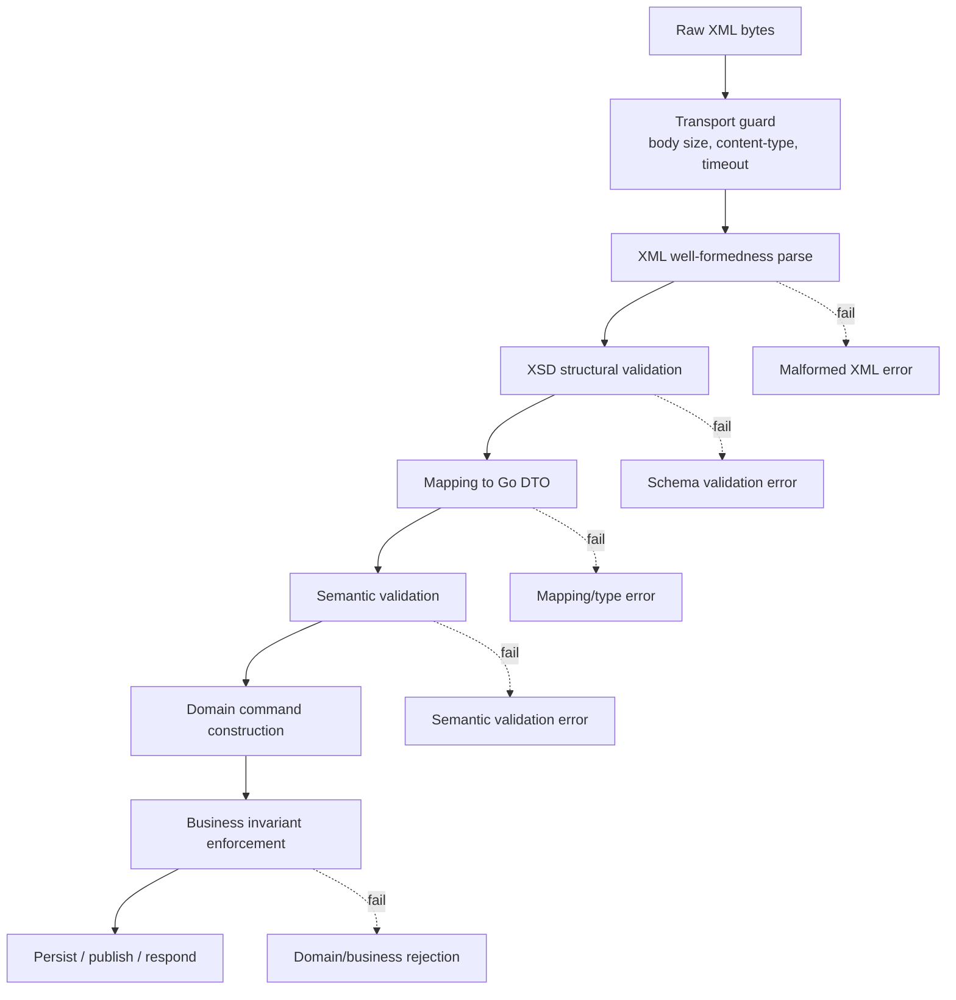
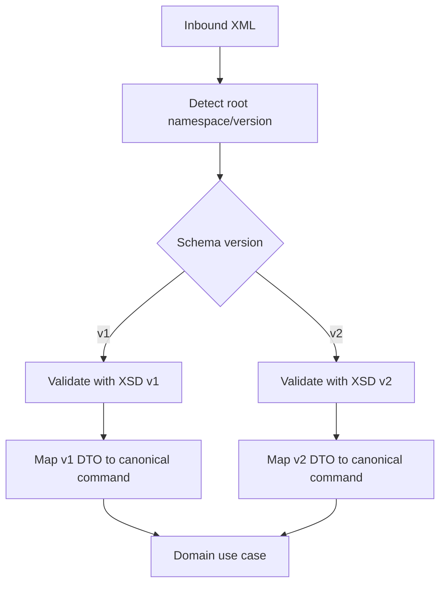

# learn-go-data-mapper-json-xml-protobuf-validation-part-018.md

# Part 018 — XML Schema, XSD, and Contract Reality

> Seri: `learn-go-data-mapper-json-xml-protobuf-validation`  
> Part: `018 / 033`  
> Topik: XML Schema, XSD, schema validation, contract reality, Go integration strategy  
> Target pembaca: Java software engineer yang ingin mendesain integrasi XML di Go secara production-grade

---

## Daftar Isi

1. [Tujuan Pembelajaran](#1-tujuan-pembelajaran)
2. [Kenapa XSD Perlu Dibahas Serius](#2-kenapa-xsd-perlu-dibahas-serius)
3. [Mental Model: Well-Formed XML vs Valid XML vs Semantically Acceptable XML](#3-mental-model-well-formed-xml-vs-valid-xml-vs-semantically-acceptable-xml)
4. [XSD sebagai Contract, Bukan Sekadar File `.xsd`](#4-xsd-sebagai-contract-bukan-sekadar-file-xsd)
5. [Cara Membaca XSD dengan Benar](#5-cara-membaca-xsd-dengan-benar)
6. [Namespace, Target Namespace, dan Qualification](#6-namespace-target-namespace-dan-qualification)
7. [Element, Attribute, Complex Type, Simple Type](#7-element-attribute-complex-type-simple-type)
8. [Cardinality: `minOccurs`, `maxOccurs`, Optionality, dan Empty Element](#8-cardinality-minoccurs-maxoccurs-optionality-dan-empty-element)
9. [Type Restriction: Enumeration, Pattern, Length, Range, Decimal](#9-type-restriction-enumeration-pattern-length-range-decimal)
10. [Choice, Sequence, All, dan Model Group Pitfalls](#10-choice-sequence-all-dan-model-group-pitfalls)
11. [`nillable`, `xsi:nil`, Default, dan Fixed Value](#11-nillable-xsinil-default-dan-fixed-value)
12. [Import, Include, Redefine, dan Schema Set](#12-import-include-redefine-dan-schema-set)
13. [XSD Validation Pipeline di Go](#13-xsd-validation-pipeline-di-go)
14. [Reality Check: Go Standard Library Tidak Menyediakan XSD Validator](#14-reality-check-go-standard-library-tidak-menyediakan-xsd-validator)
15. [Strategi Validasi XSD di Sistem Go](#15-strategi-validasi-xsd-di-sistem-go)
16. [Pilihan Implementasi: External CLI, CGO/libxml2, Service Validator, atau Contract Test](#16-pilihan-implementasi-external-cli-cgolibxml2-service-validator-atau-contract-test)
17. [Contoh XSD Contract End-to-End](#17-contoh-xsd-contract-end-to-end)
18. [Contoh XML Instance Valid dan Tidak Valid](#18-contoh-xml-instance-valid-dan-tidak-valid)
19. [Go Struct untuk XML Contract](#19-go-struct-untuk-xml-contract)
20. [Go Validation Layer Setelah XSD](#20-go-validation-layer-setelah-xsd)
21. [Error Modeling untuk XSD Validation](#21-error-modeling-untuk-xsd-validation)
22. [Versioning dan Compatibility XSD](#22-versioning-dan-compatibility-xsd)
23. [Security: XXE, Entity Expansion, Remote Schema, dan Supply Chain](#23-security-xxe-entity-expansion-remote-schema-dan-supply-chain)
24. [Performance dan Operational Concerns](#24-performance-dan-operational-concerns)
25. [Testing Strategy untuk XML/XSD Contract](#25-testing-strategy-untuk-xmlxsd-contract)
26. [Migration dari Java/JAXB/XSD ke Go](#26-migration-dari-javajaxbxsd-ke-go)
27. [Architecture Decision Matrix](#27-architecture-decision-matrix)
28. [Anti-Patterns](#28-anti-patterns)
29. [Production Checklist](#29-production-checklist)
30. [Latihan Desain](#30-latihan-desain)
31. [Ringkasan Invariant](#31-ringkasan-invariant)
32. [Referensi](#32-referensi)

---

## 1. Tujuan Pembelajaran

Setelah menyelesaikan part ini, kamu harus mampu:

1. Membedakan **well-formed XML**, **XSD-valid XML**, dan **business-valid XML**.
2. Membaca XSD sebagai **schema contract**, bukan sekadar artifact integrasi.
3. Mendesain pipeline XML Go yang memisahkan:
   - parsing,
   - XSD validation,
   - mapping,
   - semantic validation,
   - domain command construction.
4. Memahami limit `encoding/xml`: kuat untuk parsing/mapping XML, tetapi bukan XSD validator.
5. Memilih strategi validasi XSD yang realistis di Go:
   - external `xmllint`,
   - CGO/libxml2 binding,
   - validator sidecar/service,
   - CI-only contract validation,
   - gateway-level validation.
6. Menangani XML schema evolution tanpa merusak partner integration.
7. Menghindari XML security trap seperti remote schema fetching, XXE, entity expansion, dan unsafe validation mode.
8. Mendesain error model yang usable untuk API, audit, reconciliation, dan support operation.

Part ini tidak bertujuan menjadikan kamu “hafal seluruh XSD specification”. Targetnya adalah **mampu mengambil keputusan arsitektural yang benar saat XML/XSD menjadi boundary contract**.

---

## 2. Kenapa XSD Perlu Dibahas Serius

Di banyak sistem modern, JSON dan Protobuf lebih sering menjadi format utama. Namun XML/XSD masih sangat hidup di:

- government system integration,
- banking and payment rails,
- insurance,
- customs/logistics,
- e-invoicing,
- tax filing,
- enterprise middleware,
- SOAP-era integration,
- document interchange,
- standards-based regulatory reporting.

Masalahnya: banyak engineer memperlakukan XML sebagai “JSON yang pakai angle bracket”. Itu salah.

XML punya semantics tambahan:

- namespace,
- attributes,
- element ordering,
- mixed content,
- schema imports,
- type derivation,
- `xsi:nil`,
- default/fixed values,
- entity behavior,
- canonicalization concerns,
- document-vocabulary contracts.

XSD bukan hanya “validator”. XSD adalah bahasa untuk mendeskripsikan kelas dokumen XML: struktur, constraint, tipe data, elemen, atribut, relationship, dan sebagian dokumentasi contract.

Dalam sistem Go, kesalahan umum adalah:

```text
Partner memberi XSD
↓
Engineer buat struct `encoding/xml`
↓
Unmarshal berhasil
↓
Dianggap valid
```

Padahal:

```text
Unmarshal berhasil ≠ XML valid terhadap XSD
XML valid terhadap XSD ≠ business operation valid
```

---

## 3. Mental Model: Well-Formed XML vs Valid XML vs Semantically Acceptable XML

Ada tiga level yang harus dipisahkan.

### 3.1 Well-Formed XML

XML disebut well-formed bila secara sintaks XML benar.

Contoh well-formed:

```xml
<Order id="ORD-001">
  <Amount currency="SGD">125.50</Amount>
</Order>
```

Contoh tidak well-formed:

```xml
<Order>
  <Amount>125.50</Order>
```

Masalah:

- tag tidak match,
- nesting rusak,
- illegal character,
- broken encoding,
- invalid token,
- namespace declaration rusak.

Di Go, `encoding/xml.Decoder.Token()` dan `Decode` bisa mendeteksi banyak masalah well-formedness. `Token()` bahkan menjamin start/end element properly nested and matched pada level token stream.

### 3.2 XSD-Valid XML

XML disebut valid terhadap XSD bila dokumen well-formed dan memenuhi schema constraint.

Misalnya XSD berkata:

```xml
<xs:element name="Amount" type="MoneyAmount"/>

<xs:simpleType name="MoneyAmount">
  <xs:restriction base="xs:decimal">
    <xs:minInclusive value="0.01"/>
    <xs:fractionDigits value="2"/>
  </xs:restriction>
</xs:simpleType>
```

Maka XML ini well-formed tapi tidak valid:

```xml
<Amount>-10.999</Amount>
```

Karena:

- lebih kecil dari minimum,
- punya lebih dari 2 decimal fraction digits.

### 3.3 Semantically Acceptable XML

XML bisa valid terhadap XSD tetapi tetap tidak boleh diproses secara business.

Contoh:

```xml
<PermitApplication>
  <ApplicantId>A123</ApplicantId>
  <DeclaredRevenue>50000.00</DeclaredRevenue>
  <LicenseType>PREMIUM</LicenseType>
</PermitApplication>
```

XSD bisa memastikan:

- `ApplicantId` ada,
- `DeclaredRevenue` decimal,
- `LicenseType` salah satu enum.

Namun business validation masih harus menjawab:

- Apakah applicant aktif?
- Apakah applicant eligible untuk license type ini?
- Apakah revenue mismatch dengan record sebelumnya?
- Apakah submission window masih terbuka?
- Apakah application duplicate?

### 3.4 Diagram Layer Validasi



Core principle:

```text
Jangan gunakan satu kata “invalid” untuk semua layer.
```

Gunakan taxonomy yang eksplisit:

| Layer | Error Type | Example |
|---|---|---|
| Transport | `PAYLOAD_TOO_LARGE` | Body 50 MB melebihi limit 5 MB |
| XML syntax | `MALFORMED_XML` | End tag mismatch |
| XSD | `SCHEMA_VALIDATION_FAILED` | Missing required element |
| Mapping | `XML_MAPPING_FAILED` | Date format tidak bisa dibaca custom type |
| Semantic | `SEMANTIC_VALIDATION_FAILED` | Start date after end date |
| Domain | `BUSINESS_RULE_REJECTED` | Applicant tidak eligible |

---

## 4. XSD sebagai Contract, Bukan Sekadar File `.xsd`

XSD sering dikirim sebagai file. Namun secara arsitektural, XSD adalah **contract**.

Contract berarti:

1. Ada **owner**.
2. Ada **versioning policy**.
3. Ada **compatibility rule**.
4. Ada **consumer expectation**.
5. Ada **validation behavior**.
6. Ada **migration path**.
7. Ada **operational handling** saat contract dilanggar.

### 4.1 Schema Contract Surface

XSD contract surface mencakup:

- root element,
- namespace URI,
- element names,
- attribute names,
- element ordering,
- min/max occurrence,
- type restrictions,
- enum values,
- import/include dependency,
- default/fixed values,
- `nillable`,
- substitution groups,
- extension/restriction,
- annotation/documentation,
- version metadata.

### 4.2 XSD Contract Ownership

Pertanyaan governance:

| Pertanyaan | Mengapa Penting |
|---|---|
| Siapa pemilik XSD? | Menentukan siapa boleh ubah contract |
| Apakah partner boleh mengirim unknown element? | Menentukan strict/extension policy |
| Apakah schema berubah dengan namespace baru? | Menentukan routing/versioning |
| Apakah old schema masih diterima? | Menentukan compatibility window |
| Apakah validation wajib online? | Menentukan availability/caching |
| Apakah error harus dikembalikan ke partner? | Menentukan error report detail |

### 4.3 XSD sebagai Legal/Regulatory Boundary

Dalam domain regulated, XSD sering bukan sekadar teknis.

Ia bisa menjadi:

- submission format resmi,
- audit evidence,
- partner compliance artifact,
- statutory reporting contract,
- data retention contract,
- canonical document vocabulary.

Kalau XSD berubah tanpa governance, sistem bisa menerima data yang secara hukum/operasional tidak seharusnya diterima.

---

## 5. Cara Membaca XSD dengan Benar

Saat menerima XSD, jangan langsung generate struct atau menulis XML tags. Baca sebagai model.

Checklist awal:

1. Apa root element?
2. Apa target namespace?
3. Apakah `elementFormDefault="qualified"`?
4. Apakah attribute perlu namespace?
5. Apa complex types utama?
6. Apa simple type restrictions?
7. Apa required field?
8. Apa repeatable field?
9. Apa ordered sequence?
10. Apa optional but semantically required?
11. Apa `choice` branch?
12. Apa external import/include?
13. Apa version identifier?
14. Apa extension point?
15. Apa default/fixed values?

### 5.1 Minimal XSD Skeleton

```xml
<?xml version="1.0" encoding="UTF-8"?>
<xs:schema
    xmlns:xs="http://www.w3.org/2001/XMLSchema"
    xmlns:app="urn:example:permit:v1"
    targetNamespace="urn:example:permit:v1"
    elementFormDefault="qualified"
    attributeFormDefault="unqualified">

  <xs:element name="PermitApplication" type="app:PermitApplicationType"/>

  <xs:complexType name="PermitApplicationType">
    <xs:sequence>
      <xs:element name="ApplicationId" type="app:ApplicationIdType"/>
      <xs:element name="Applicant" type="app:ApplicantType"/>
      <xs:element name="SubmittedAt" type="xs:dateTime"/>
      <xs:element name="Items" type="app:ItemListType" minOccurs="1"/>
    </xs:sequence>
    <xs:attribute name="schemaVersion" type="xs:string" use="required" fixed="1.0"/>
  </xs:complexType>

</xs:schema>
```

Mental parse:

```text
Vocabulary namespace: urn:example:permit:v1
Root element: PermitApplication
Root type: PermitApplicationType
Child order: ApplicationId -> Applicant -> SubmittedAt -> Items
schemaVersion attribute: required and fixed to 1.0
```

### 5.2 Jangan Hanya Cari Nama Field

XSD bukan flat list field. Perhatikan:

- order,
- nesting,
- occurrence,
- namespace,
- type derivation,
- constraints,
- defaulting,
- fixed value,
- choice.

Ini berbeda dari banyak JSON schema usage yang order-insensitive.

---

## 6. Namespace, Target Namespace, dan Qualification

Namespace adalah sumber bug XML paling umum.

### 6.1 Namespace URI vs Prefix

XML ini:

```xml
<p:PermitApplication xmlns:p="urn:example:permit:v1">
  <p:ApplicationId>APP-001</p:ApplicationId>
</p:PermitApplication>
```

Dan ini:

```xml
<x:PermitApplication xmlns:x="urn:example:permit:v1">
  <x:ApplicationId>APP-001</x:ApplicationId>
</x:PermitApplication>
```

Secara namespace-equivalent bila URI sama. Prefix `p` atau `x` hanya alias lokal.

Go `encoding/xml` merepresentasikan nama dengan:

```go
type Name struct {
    Space string
    Local string
}
```

Artinya identity yang harus dicek:

```go
xml.Name{Space: "urn:example:permit:v1", Local: "PermitApplication"}
```

Bukan prefix textual.

### 6.2 `targetNamespace`

`targetNamespace` adalah namespace untuk komponen schema yang didefinisikan dalam XSD.

```xml
targetNamespace="urn:example:permit:v1"
```

Artinya element/type global dalam schema itu berada dalam namespace tersebut.

### 6.3 `elementFormDefault`

```xml
elementFormDefault="qualified"
```

Biasanya berarti local elements dalam instance XML harus namespace-qualified.

Contoh valid:

```xml
<PermitApplication xmlns="urn:example:permit:v1">
  <ApplicationId>APP-001</ApplicationId>
</PermitApplication>
```

Default namespace membuat child elements qualified.

Contoh sering invalid:

```xml
<PermitApplication xmlns="urn:example:permit:v1">
  <ApplicationId xmlns="">APP-001</ApplicationId>
</PermitApplication>
```

Karena `ApplicationId` keluar dari namespace.

### 6.4 `attributeFormDefault`

Atribut berbeda dari element. Default umum:

```xml
attributeFormDefault="unqualified"
```

Maka atribut lokal biasanya tidak pakai namespace.

```xml
<PermitApplication xmlns="urn:example:permit:v1" schemaVersion="1.0">
```

Bukan:

```xml
<PermitApplication xmlns="urn:example:permit:v1" app:schemaVersion="1.0">
```

Kecuali schema memang mengharuskan qualified attribute.

### 6.5 Go Struct Namespace Trap

```go
type PermitApplication struct {
    XMLName       xml.Name `xml:"urn:example:permit:v1 PermitApplication"`
    SchemaVersion string   `xml:"schemaVersion,attr"`
    ApplicationID string   `xml:"ApplicationId"`
}
```

Catatan:

- `XMLName` bisa mengunci namespace root.
- Child mapping di `encoding/xml` sering cukup dengan local name bila parsing dari default namespace, tetapi bila kamu butuh strict namespace assertion, lakukan token-level check atau custom unmarshal.
- Jangan mengandalkan prefix.

---

## 7. Element, Attribute, Complex Type, Simple Type

### 7.1 Element

Element adalah node XML utama.

```xml
<xs:element name="ApplicationId" type="app:ApplicationIdType"/>
```

Instance:

```xml
<ApplicationId>APP-2026-0001</ApplicationId>
```

Go:

```go
type PermitApplication struct {
    ApplicationID string `xml:"ApplicationId"`
}
```

### 7.2 Attribute

Attribute melekat pada element.

```xml
<xs:attribute name="schemaVersion" type="xs:string" use="required" fixed="1.0"/>
```

Instance:

```xml
<PermitApplication schemaVersion="1.0">
```

Go:

```go
type PermitApplication struct {
    SchemaVersion string `xml:"schemaVersion,attr"`
}
```

### 7.3 Simple Type

Simple type adalah value scalar dengan constraint.

```xml
<xs:simpleType name="ApplicationIdType">
  <xs:restriction base="xs:string">
    <xs:pattern value="APP-[0-9]{4}-[0-9]{4}"/>
  </xs:restriction>
</xs:simpleType>
```

Go domain type:

```go
type ApplicationID string

func ParseApplicationID(s string) (ApplicationID, error) {
    // enforce canonical syntax here, not only via XSD
    if !applicationIDPattern.MatchString(s) {
        return "", fmt.Errorf("invalid application id syntax")
    }
    return ApplicationID(s), nil
}
```

### 7.4 Complex Type

Complex type punya child elements dan/atau attributes.

```xml
<xs:complexType name="ApplicantType">
  <xs:sequence>
    <xs:element name="Name" type="xs:string"/>
    <xs:element name="Email" type="xs:string" minOccurs="0"/>
  </xs:sequence>
</xs:complexType>
```

Go:

```go
type ApplicantDTO struct {
    Name  string  `xml:"Name"`
    Email *string `xml:"Email"`
}
```

### 7.5 Attribute vs Element Design

Rule praktis:

| Gunakan | Untuk |
|---|---|
| Element | business data utama, repeatable data, nested data |
| Attribute | metadata sederhana, identifier, version marker, flags |
| Jangan attribute | data panjang, multi-value, nested, mixed content kompleks |

Namun pada integrasi eksternal, kamu sering tidak memilih. Kamu harus mengikuti XSD.

---

## 8. Cardinality: `minOccurs`, `maxOccurs`, Optionality, dan Empty Element

### 8.1 Required Element

Default XSD:

```xml
<xs:element name="ApplicationId" type="xs:string"/>
```

Secara default:

```text
minOccurs = 1
maxOccurs = 1
```

Artinya element wajib muncul tepat sekali.

### 8.2 Optional Element

```xml
<xs:element name="Email" type="xs:string" minOccurs="0"/>
```

Artinya element boleh absent.

Mapping Go:

```go
type ApplicantDTO struct {
    Email *string `xml:"Email"`
}
```

Namun hati-hati:

```xml
<Email></Email>
```

berbeda dari absent secara lexical, tetapi setelah unmarshal ke `string`, keduanya bisa sulit dibedakan jika tidak pakai custom optional tracking.

### 8.3 Repeatable Element

```xml
<xs:element name="Item" type="app:ItemType" maxOccurs="unbounded"/>
```

Go:

```go
type ItemsDTO struct {
    Items []ItemDTO `xml:"Item"`
}
```

Jika `minOccurs="1"`, maka slice kosong setelah unmarshal harus dianggap invalid bila XSD validation tidak dilakukan atau validation dilewati.

### 8.4 Empty Element

XML:

```xml
<MiddleName/>
```

Equivalent secara XML dengan:

```xml
<MiddleName></MiddleName>
```

Untuk string, ini biasanya menjadi empty string.

Pertanyaan penting:

```text
Apakah empty string valid business value?
Atau harus dianggap missing?
Atau harus ditolak?
```

XSD bisa membatasi:

```xml
<xs:minLength value="1"/>
```

Tapi business layer tetap harus tahu intent.

### 8.5 Optionality Truth Table

| XML State | Meaning Possible | Go Field `string` | Go Field `*string` | Custom Optional |
|---|---|---:|---:|---:|
| Element absent | unknown/not provided | `""` | `nil` | `Set=false` |
| `<Name/>` | explicitly empty | `""` | pointer to `""`? depends mapping | `Set=true, Value=""` |
| `<Name>Bob</Name>` | provided value | `"Bob"` | `*"Bob"` | `Set=true, Value="Bob"` |
| `<Name xsi:nil="true"/>` | explicit nil if nillable | often not automatic semantic | custom needed | `Set=true, Nil=true` |

For top-tier design, do not guess. Define the semantics per boundary.

---

## 9. Type Restriction: Enumeration, Pattern, Length, Range, Decimal

XSD simple types can encode many structural/value constraints.

### 9.1 Enumeration

```xml
<xs:simpleType name="LicenseType">
  <xs:restriction base="xs:string">
    <xs:enumeration value="BASIC"/>
    <xs:enumeration value="PREMIUM"/>
    <xs:enumeration value="TEMPORARY"/>
  </xs:restriction>
</xs:simpleType>
```

Go:

```go
type LicenseType string

const (
    LicenseTypeBasic     LicenseType = "BASIC"
    LicenseTypePremium   LicenseType = "PREMIUM"
    LicenseTypeTemporary LicenseType = "TEMPORARY"
)

func ParseLicenseType(s string) (LicenseType, error) {
    switch LicenseType(s) {
    case LicenseTypeBasic, LicenseTypePremium, LicenseTypeTemporary:
        return LicenseType(s), nil
    default:
        return "", fmt.Errorf("unknown license type %q", s)
    }
}
```

Even if XSD validates enum, keep parse/semantic guard in Go. Why?

- Not every path may run XSD validation.
- Tests may construct DTO directly.
- Future schema versions may add enum values.
- Internal domain must remain explicit.

### 9.2 Pattern

```xml
<xs:pattern value="[A-Z]{3}-[0-9]{6}"/>
```

In Go:

```go
var codePattern = regexp.MustCompile(`^[A-Z]{3}-[0-9]{6}$`)
```

Pitfall: XSD regex is not exactly Go RE2 regex. Do not blindly copy complex XSD regex to Go without compatibility review.

### 9.3 Length

```xml
<xs:minLength value="1"/>
<xs:maxLength value="100"/>
```

Go must decide whether length is:

- bytes,
- runes,
- normalized Unicode characters,
- XSD lexical length semantics.

For high-assurance systems, define this explicitly.

### 9.4 Decimal

```xml
<xs:simpleType name="MoneyAmount">
  <xs:restriction base="xs:decimal">
    <xs:minInclusive value="0.00"/>
    <xs:fractionDigits value="2"/>
    <xs:totalDigits value="12"/>
  </xs:restriction>
</xs:simpleType>
```

Do not map money to `float64` in domain.

Prefer:

- string lexical validation then decimal library,
- integer minor units,
- custom Money type.

Example:

```go
type Money struct {
    Currency string
    Minor    int64 // cents
}
```

Or:

```go
type DecimalString string
```

with parsing rules.

### 9.5 Date/DateTime

XSD has date/time types such as:

- `xs:date`,
- `xs:dateTime`,
- `xs:time`,
- `xs:gYear`,
- `xs:duration`.

Do not assume every XSD date maps cleanly to Go `time.Time`.

Examples:

- `xs:date` may need date-only type.
- `xs:dateTime` may include timezone.
- Some partner systems send non-canonical lexical values.
- Regulatory submissions may care about local date independent of timezone.

Use custom types for date-only:

```go
type LocalDate struct {
    time.Time
}

func (d *LocalDate) UnmarshalText(text []byte) error {
    t, err := time.Parse("2006-01-02", string(text))
    if err != nil {
        return err
    }
    d.Time = t
    return nil
}
```

---

## 10. Choice, Sequence, All, dan Model Group Pitfalls

### 10.1 `sequence`

`sequence` berarti order wajib mengikuti urutan schema.

```xml
<xs:sequence>
  <xs:element name="A" type="xs:string"/>
  <xs:element name="B" type="xs:string"/>
</xs:sequence>
```

Valid:

```xml
<A>x</A><B>y</B>
```

Invalid:

```xml
<B>y</B><A>x</A>
```

Go `encoding/xml` unmarshal ke struct sering toleran terhadap order dalam praktik mapping field, tetapi XSD validation tidak. Karena itu, unmarshal success tidak boleh dianggap XSD-valid.

### 10.2 `choice`

```xml
<xs:choice>
  <xs:element name="IndividualApplicant" type="app:IndividualApplicantType"/>
  <xs:element name="CompanyApplicant" type="app:CompanyApplicantType"/>
</xs:choice>
```

Go DTO:

```go
type ApplicantChoiceDTO struct {
    Individual *IndividualApplicantDTO `xml:"IndividualApplicant"`
    Company    *CompanyApplicantDTO    `xml:"CompanyApplicant"`
}

func (c ApplicantChoiceDTO) ValidateChoice() error {
    count := 0
    if c.Individual != nil {
        count++
    }
    if c.Company != nil {
        count++
    }
    if count != 1 {
        return fmt.Errorf("exactly one applicant choice must be provided")
    }
    return nil
}
```

Even if XSD enforces choice, keep explicit validation if downstream code can construct DTO without XSD.

### 10.3 `all`

`all` allows child elements to appear in any order, usually each at most once.

```xml
<xs:all>
  <xs:element name="A" type="xs:string"/>
  <xs:element name="B" type="xs:string"/>
</xs:all>
```

Use case: small unordered groups.

### 10.4 Model Group Production Pitfall

XSD can encode grammar-like structure. Go structs encode shape, not full grammar.

If the XML grammar is complex:

- use XSD validation before mapping,
- avoid over-ambitious struct modeling,
- consider token parser for critical nodes,
- keep semantic choice validation explicit.

---

## 11. `nillable`, `xsi:nil`, Default, dan Fixed Value

### 11.1 `nillable`

XSD:

```xml
<xs:element name="MiddleName" type="xs:string" nillable="true" minOccurs="0"/>
```

XML:

```xml
<MiddleName xsi:nil="true" xmlns:xsi="http://www.w3.org/2001/XMLSchema-instance"/>
```

This means the element is present but nil.

This is not the same as:

```xml
<!-- absent -->
```

And not the same as:

```xml
<MiddleName/>
```

### 11.2 Go Custom Nil-Aware Type

```go
type OptionalXMLString struct {
    Set   bool
    Nil   bool
    Value string
}

func (o *OptionalXMLString) UnmarshalXML(d *xml.Decoder, start xml.StartElement) error {
    o.Set = true

    for _, attr := range start.Attr {
        if attr.Name.Space == "http://www.w3.org/2001/XMLSchema-instance" &&
            attr.Name.Local == "nil" &&
            attr.Value == "true" {
            o.Nil = true
            return d.Skip()
        }
    }

    var value string
    if err := d.DecodeElement(&value, &start); err != nil {
        return err
    }
    o.Value = value
    return nil
}
```

This type distinguishes:

- absent: field not called, `Set=false`,
- nil: `Set=true, Nil=true`,
- present empty: `Set=true, Nil=false, Value=""`,
- present value: `Set=true, Nil=false, Value="..."`.

### 11.3 Default Value

XSD default:

```xml
<xs:element name="Priority" type="xs:string" default="NORMAL" minOccurs="0"/>
```

Schema-aware validators may produce a post-schema-validation infoset conceptually containing defaults, but Go `encoding/xml` will not magically apply XSD defaults because it does not process XSD.

Therefore:

```text
If Go service needs default semantics, implement defaulting explicitly.
```

### 11.4 Fixed Value

```xml
<xs:attribute name="schemaVersion" type="xs:string" use="required" fixed="1.0"/>
```

This is a strong contract assertion.

In Go:

```go
func (d PermitApplicationDTO) ValidateFixedFields() error {
    if d.SchemaVersion != "1.0" {
        return fmt.Errorf("schemaVersion must be 1.0")
    }
    return nil
}
```

Do this even if XSD validation exists when:

- multiple ingest paths exist,
- test fixtures bypass validator,
- domain command can be constructed directly.

---

## 12. Import, Include, Redefine, dan Schema Set

Real XSD rarely lives in one file.

### 12.1 `include`

`include` pulls schema components from the same target namespace.

```xml
<xs:include schemaLocation="common-types.xsd"/>
```

### 12.2 `import`

`import` brings components from different namespace.

```xml
<xs:import namespace="urn:example:common:v1" schemaLocation="common-v1.xsd"/>
```

### 12.3 `redefine`

`redefine` allows redefinition of schema components. Avoid if you control schema design. It complicates validation and governance.

### 12.4 Schema Set

Production validation needs a **schema set**, not just root XSD.

Schema set includes:

- root XSD,
- included files,
- imported namespace schemas,
- XML catalog mappings,
- version metadata,
- checksum/integrity metadata.

### 12.5 Do Not Fetch Remote Schema at Request Time

Bad design:

```text
Inbound request references xsi:schemaLocation
↓
Service fetches schema URL from internet/intranet
↓
Validation depends on remote availability and trust
```

Better:

```text
Service owns pinned schema bundle
↓
Remote schemaLocation ignored or mapped through catalog
↓
Validation uses local trusted artifacts
```

---

## 13. XSD Validation Pipeline di Go

Recommended pipeline:

```mermaid
flowchart LR
    A[HTTP / file / message bytes] --> B[Limit reader]
    B --> C[Optional raw audit hash]
    C --> D[Well-formedness parse]
    D --> E[XSD validation]
    E --> F[Decode to XML DTO]
    F --> G[DTO semantic validation]
    G --> H[Map to domain command]
    H --> I[Domain validation]
```



### 13.1 Why Parse Before XSD?

Some XSD validators parse internally. Still, at application level you may want an early lightweight parse to:

- reject malformed XML cleanly,
- capture line/column/offset,
- inspect root element and namespace for routing,
- enforce local parser security policy,
- avoid feeding obviously wrong payload to expensive validator.

### 13.2 Root Routing

```go
type XMLRoot struct {
    Name xml.Name
}

func ReadRoot(r io.Reader) (xml.Name, error) {
    dec := xml.NewDecoder(r)
    for {
        tok, err := dec.Token()
        if err != nil {
            return xml.Name{}, err
        }
        switch t := tok.(type) {
        case xml.StartElement:
            return t.Name, nil
        }
    }
}
```

Root can route to schema version:

```go
func SchemaKeyForRoot(root xml.Name) (string, error) {
    switch root {
    case xml.Name{Space: "urn:example:permit:v1", Local: "PermitApplication"}:
        return "permit-v1", nil
    case xml.Name{Space: "urn:example:permit:v2", Local: "PermitApplication"}:
        return "permit-v2", nil
    default:
        return "", fmt.Errorf("unsupported XML root {%s}%s", root.Space, root.Local)
    }
}
```

### 13.3 Buffering Trade-Off

If you must validate and decode, you often need to read bytes once and reuse them:

```go
func ReadBounded(r io.Reader, max int64) ([]byte, error) {
    lr := io.LimitReader(r, max+1)
    b, err := io.ReadAll(lr)
    if err != nil {
        return nil, err
    }
    if int64(len(b)) > max {
        return nil, fmt.Errorf("xml payload exceeds %d bytes", max)
    }
    return b, nil
}
```

For very large XML, you may need:

- streaming validation tool,
- file-backed temp storage,
- async ingestion,
- chunk-level extraction,
- bounded memory design.

Do not blindly `io.ReadAll` untrusted 500 MB XML.

---

## 14. Reality Check: Go Standard Library Tidak Menyediakan XSD Validator

Go standard library provides `encoding/xml` for XML parsing/marshalling/unmarshalling. It does not provide a W3C XSD validation engine.

This matters because Java engineers often come from stacks where XSD validation is readily available through JAXP, JAXB, Xerces, or framework integration.

In Go, you must choose an explicit strategy.

### 14.1 What `encoding/xml` Can Do

It can:

- parse XML token stream,
- check basic well-formedness,
- map XML to structs,
- marshal structs to XML,
- handle namespaces in token names,
- expose line/column and byte offset,
- support custom marshal/unmarshal.

### 14.2 What `encoding/xml` Does Not Do

It does not:

- validate against XSD,
- apply XSD defaults,
- enforce XSD type restrictions,
- enforce `sequence` grammar as a schema validator,
- resolve imports/includes as schema set,
- validate identity constraints,
- validate `xsi:nil` against schema nillability,
- enforce schema version compatibility.

Therefore:

```text
XML decode success is not XSD validation.
```

---

## 15. Strategi Validasi XSD di Sistem Go

Ada beberapa strategi. Tidak ada satu jawaban universal.

### 15.1 Runtime In-Process XSD Validation

Biasanya memakai CGO binding ke libxml2.

Pros:

- fast in-process validation,
- direct request rejection,
- no external process overhead,
- can preload schema.

Cons:

- CGO complexity,
- OS/package dependency,
- container image complexity,
- memory management/free lifecycle,
- thread-safety review,
- cross-platform build friction,
- CVE patching responsibility.

Use when:

- XML submission validation is core runtime requirement,
- low latency matters,
- schema set is stable,
- team can operate native dependency safely.

### 15.2 External CLI Validation

Use `xmllint --schema schema.xsd --noout file.xml`.

Pros:

- simple operationally for batch/CI,
- uses mature libxml2 tool,
- easy to debug manually,
- good for contract test and offline validation.

Cons:

- process spawn overhead,
- more complicated for high-throughput HTTP API,
- error parsing can be brittle,
- shell/process security concerns,
- need temp file or stdin handling.

Use when:

- batch ingestion,
- CI contract checks,
- admin upload workflows,
- low volume integration.

### 15.3 Validator Sidecar/Service

A separate service validates XML against schema.

Pros:

- isolates native dependency,
- polyglot consumers,
- centralized schema management,
- easier to patch validator runtime.

Cons:

- network hop,
- availability dependency,
- operational complexity,
- schema-service coupling,
- needs careful error contract.

Use when:

- multiple services need same XML validation,
- native dependencies are not welcome in app runtime,
- schema governance is centralized.

### 15.4 Gateway-Level Validation

API gateway/integration layer validates XML before it reaches service.

Pros:

- app service simpler,
- centralized boundary enforcement,
- can reject invalid payload early.

Cons:

- service must not blindly trust gateway unless boundary is controlled,
- local tests may bypass validation,
- troubleshooting split across layers.

Use when:

- enterprise integration gateway exists,
- XML volume is high,
- schema enforcement is organization-wide.

### 15.5 CI-Only XSD Validation

Validate fixtures/contracts in CI, but not every runtime payload.

Pros:

- cheap,
- catches generated XML drift,
- useful for outbound XML.

Cons:

- does not protect inbound runtime payload,
- not enough for untrusted partner submissions.

Use when:

- service only emits XML to trusted downstream,
- inbound validation is handled elsewhere,
- runtime payloads are already controlled.

---

## 16. Pilihan Implementasi: External CLI, CGO/libxml2, Service Validator, atau Contract Test

### 16.1 External `xmllint` Example

`xmllint` supports W3C XML Schema validation via `--schema`.

Command:

```bash
xmllint --noout --schema permit-v1.xsd permit-valid.xml
```

Go wrapper concept:

```go
package xsdcli

import (
    "bytes"
    "context"
    "fmt"
    "os"
    "os/exec"
    "path/filepath"
)

type Validator struct {
    XMLLintPath string
    SchemaPath  string
    WorkDir     string
}

func (v Validator) ValidateBytes(ctx context.Context, xmlBytes []byte) error {
    dir, err := os.MkdirTemp(v.WorkDir, "xml-xsd-*")
    if err != nil {
        return err
    }
    defer os.RemoveAll(dir)

    xmlPath := filepath.Join(dir, "payload.xml")
    if err := os.WriteFile(xmlPath, xmlBytes, 0o600); err != nil {
        return err
    }

    cmd := exec.CommandContext(ctx, v.XMLLintPath, "--noout", "--schema", v.SchemaPath, xmlPath)
    var stderr bytes.Buffer
    cmd.Stderr = &stderr

    if err := cmd.Run(); err != nil {
        return fmt.Errorf("xsd validation failed: %w: %s", err, stderr.String())
    }
    return nil
}
```

Production hardening:

- use context timeout,
- never shell-concatenate input,
- pinned binary path,
- temp dir with safe permissions,
- bounded input size,
- stderr sanitized before returning to external caller,
- structured internal error log,
- schema path from trusted config only.

### 16.2 CGO/libxml2 Binding Example Shape

There are Go libraries wrapping libxml2 XSD validation, for example packages that preload schema and validate memory/document payloads.

Pseudo-shape:

```go
type XSDValidator interface {
    Validate(ctx context.Context, xmlBytes []byte) error
}
```

Wrapper pattern:

```go
type ValidationError struct {
    Line    int
    Column  int
    Path    string
    Message string
}

type SchemaValidationError struct {
    SchemaID string
    Errors   []ValidationError
}

func (e SchemaValidationError) Error() string {
    return fmt.Sprintf("xml failed schema validation for %s", e.SchemaID)
}
```

Do not leak library-specific error types across your domain/application boundary.

### 16.3 Validator Service API

Request:

```json
{
  "schemaId": "permit-v1",
  "payloadBase64": "..."
}
```

Response:

```json
{
  "valid": false,
  "errors": [
    {
      "code": "XSD_ELEMENT_MISSING",
      "line": 14,
      "column": 9,
      "path": "/PermitApplication/Applicant",
      "message": "Element 'Applicant' is missing"
    }
  ]
}
```

Do not make validator service return only plain text.

### 16.4 Contract Test Strategy

Use fixtures:

```text
contracts/
  permit-v1/
    schema/
      permit-v1.xsd
      common-v1.xsd
    valid/
      minimal.xml
      full.xml
      boundary-decimal.xml
      optional-absent.xml
      nil-middle-name.xml
    invalid/
      missing-required.xml
      wrong-order.xml
      invalid-enum.xml
      wrong-namespace.xml
      bad-decimal-scale.xml
```

CI test should assert:

- valid fixtures pass XSD,
- invalid fixtures fail XSD,
- Go decoder can decode valid fixtures,
- Go semantic validation catches business invalid fixtures,
- generated outbound XML validates against XSD.

---

## 17. Contoh XSD Contract End-to-End

Example schema: permit application v1.

```xml
<?xml version="1.0" encoding="UTF-8"?>
<xs:schema
    xmlns:xs="http://www.w3.org/2001/XMLSchema"
    xmlns:app="urn:example:permit:v1"
    targetNamespace="urn:example:permit:v1"
    elementFormDefault="qualified"
    attributeFormDefault="unqualified">

  <xs:element name="PermitApplication" type="app:PermitApplicationType"/>

  <xs:complexType name="PermitApplicationType">
    <xs:sequence>
      <xs:element name="ApplicationId" type="app:ApplicationIdType"/>
      <xs:element name="Applicant" type="app:ApplicantType"/>
      <xs:element name="LicenseType" type="app:LicenseType"/>
      <xs:element name="DeclaredRevenue" type="app:MoneyAmount"/>
      <xs:element name="SubmittedAt" type="xs:dateTime"/>
      <xs:element name="Attachments" type="app:AttachmentListType" minOccurs="0"/>
    </xs:sequence>
    <xs:attribute name="schemaVersion" type="xs:string" use="required" fixed="1.0"/>
  </xs:complexType>

  <xs:simpleType name="ApplicationIdType">
    <xs:restriction base="xs:string">
      <xs:pattern value="APP-[0-9]{4}-[0-9]{6}"/>
    </xs:restriction>
  </xs:simpleType>

  <xs:complexType name="ApplicantType">
    <xs:sequence>
      <xs:element name="ApplicantId" type="xs:string"/>
      <xs:element name="Name" type="app:NonEmptyString"/>
      <xs:element name="Email" type="xs:string" minOccurs="0"/>
    </xs:sequence>
  </xs:complexType>

  <xs:simpleType name="NonEmptyString">
    <xs:restriction base="xs:string">
      <xs:minLength value="1"/>
      <xs:maxLength value="200"/>
    </xs:restriction>
  </xs:simpleType>

  <xs:simpleType name="LicenseType">
    <xs:restriction base="xs:string">
      <xs:enumeration value="BASIC"/>
      <xs:enumeration value="PREMIUM"/>
      <xs:enumeration value="TEMPORARY"/>
    </xs:restriction>
  </xs:simpleType>

  <xs:simpleType name="MoneyAmount">
    <xs:restriction base="xs:decimal">
      <xs:minInclusive value="0.00"/>
      <xs:totalDigits value="12"/>
      <xs:fractionDigits value="2"/>
    </xs:restriction>
  </xs:simpleType>

  <xs:complexType name="AttachmentListType">
    <xs:sequence>
      <xs:element name="Attachment" type="app:AttachmentType" maxOccurs="10"/>
    </xs:sequence>
  </xs:complexType>

  <xs:complexType name="AttachmentType">
    <xs:sequence>
      <xs:element name="FileName" type="app:NonEmptyString"/>
      <xs:element name="ContentType" type="app:NonEmptyString"/>
      <xs:element name="SizeBytes" type="xs:positiveInteger"/>
    </xs:sequence>
    <xs:attribute name="kind" use="required">
      <xs:simpleType>
        <xs:restriction base="xs:string">
          <xs:enumeration value="IDENTITY"/>
          <xs:enumeration value="SUPPORTING"/>
        </xs:restriction>
      </xs:simpleType>
    </xs:attribute>
  </xs:complexType>

</xs:schema>
```

---

## 18. Contoh XML Instance Valid dan Tidak Valid

### 18.1 Valid XML

```xml
<?xml version="1.0" encoding="UTF-8"?>
<PermitApplication xmlns="urn:example:permit:v1" schemaVersion="1.0">
  <ApplicationId>APP-2026-000001</ApplicationId>
  <Applicant>
    <ApplicantId>UEN-123456</ApplicantId>
    <Name>Acme Trading Pte Ltd</Name>
    <Email>ops@example.com</Email>
  </Applicant>
  <LicenseType>BASIC</LicenseType>
  <DeclaredRevenue>120000.00</DeclaredRevenue>
  <SubmittedAt>2026-06-24T10:15:30+08:00</SubmittedAt>
  <Attachments>
    <Attachment kind="IDENTITY">
      <FileName>uen.pdf</FileName>
      <ContentType>application/pdf</ContentType>
      <SizeBytes>102400</SizeBytes>
    </Attachment>
  </Attachments>
</PermitApplication>
```

### 18.2 Invalid: Wrong Namespace

```xml
<PermitApplication schemaVersion="1.0">
  <ApplicationId>APP-2026-000001</ApplicationId>
</PermitApplication>
```

If schema expects `urn:example:permit:v1`, this root has no namespace.

### 18.3 Invalid: Wrong Sequence

```xml
<PermitApplication xmlns="urn:example:permit:v1" schemaVersion="1.0">
  <Applicant>...</Applicant>
  <ApplicationId>APP-2026-000001</ApplicationId>
</PermitApplication>
```

`sequence` requires `ApplicationId` before `Applicant`.

### 18.4 Invalid: Decimal Scale

```xml
<DeclaredRevenue>120000.999</DeclaredRevenue>
```

Violates `fractionDigits=2`.

### 18.5 XSD-Valid but Business-Invalid

```xml
<LicenseType>PREMIUM</LicenseType>
<DeclaredRevenue>10.00</DeclaredRevenue>
```

Maybe XSD-valid. But business rule may require premium license revenue threshold.

---

## 19. Go Struct untuk XML Contract

DTO:

```go
package permitxml

import (
    "encoding/xml"
    "time"
)

const NamespaceV1 = "urn:example:permit:v1"

type PermitApplicationDTO struct {
    XMLName       xml.Name       `xml:"urn:example:permit:v1 PermitApplication"`
    SchemaVersion string         `xml:"schemaVersion,attr"`
    ApplicationID string         `xml:"ApplicationId"`
    Applicant     ApplicantDTO   `xml:"Applicant"`
    LicenseType   string         `xml:"LicenseType"`
    Revenue       string         `xml:"DeclaredRevenue"`
    SubmittedAt   XMLDateTime    `xml:"SubmittedAt"`
    Attachments   *AttachmentsDTO `xml:"Attachments"`
}

type ApplicantDTO struct {
    ApplicantID string  `xml:"ApplicantId"`
    Name        string  `xml:"Name"`
    Email       *string `xml:"Email"`
}

type AttachmentsDTO struct {
    Items []AttachmentDTO `xml:"Attachment"`
}

type AttachmentDTO struct {
    Kind        string `xml:"kind,attr"`
    FileName    string `xml:"FileName"`
    ContentType string `xml:"ContentType"`
    SizeBytes   uint64 `xml:"SizeBytes"`
}

type XMLDateTime struct {
    time.Time
}

func (x *XMLDateTime) UnmarshalText(text []byte) error {
    t, err := time.Parse(time.RFC3339, string(text))
    if err != nil {
        return err
    }
    x.Time = t
    return nil
}

func (x XMLDateTime) MarshalText() ([]byte, error) {
    return []byte(x.Time.Format(time.RFC3339)), nil
}
```

### 19.1 Why Revenue as String?

```go
Revenue string `xml:"DeclaredRevenue"`
```

Because XML decimal lexical representation should not be silently converted to `float64`.

Mapping later:

```go
money, err := ParseMoneyMinor(dto.Revenue, "SGD")
```

### 19.2 XML DTO Is Not Domain Model

DTO mirrors XML contract.

Domain model should express business invariants:

```go
type PermitApplicationCommand struct {
    ApplicationID ApplicationID
    Applicant     Applicant
    LicenseType   LicenseType
    Revenue       Money
    SubmittedAt   time.Time
    Attachments   []Attachment
}
```

Mapping:

```go
func MapPermitApplicationDTO(dto PermitApplicationDTO) (PermitApplicationCommand, error) {
    if dto.SchemaVersion != "1.0" {
        return PermitApplicationCommand{}, fmt.Errorf("unsupported schema version %q", dto.SchemaVersion)
    }

    appID, err := ParseApplicationID(dto.ApplicationID)
    if err != nil {
        return PermitApplicationCommand{}, fmt.Errorf("application id: %w", err)
    }

    licenseType, err := ParseLicenseType(dto.LicenseType)
    if err != nil {
        return PermitApplicationCommand{}, fmt.Errorf("license type: %w", err)
    }

    revenue, err := ParseMoneyMinor(dto.Revenue, "SGD")
    if err != nil {
        return PermitApplicationCommand{}, fmt.Errorf("declared revenue: %w", err)
    }

    applicant, err := MapApplicantDTO(dto.Applicant)
    if err != nil {
        return PermitApplicationCommand{}, fmt.Errorf("applicant: %w", err)
    }

    attachments, err := MapAttachmentsDTO(dto.Attachments)
    if err != nil {
        return PermitApplicationCommand{}, fmt.Errorf("attachments: %w", err)
    }

    return PermitApplicationCommand{
        ApplicationID: appID,
        Applicant:     applicant,
        LicenseType:   licenseType,
        Revenue:       revenue,
        SubmittedAt:   dto.SubmittedAt.Time,
        Attachments:   attachments,
    }, nil
}
```

This separation is the central design.

---

## 20. Go Validation Layer Setelah XSD

XSD validation should not be your last validation.

### 20.1 DTO Semantic Validation

```go
func (d PermitApplicationDTO) ValidateSemantic() error {
    var errs []error

    if d.SchemaVersion != "1.0" {
        errs = append(errs, FieldError{
            Path: "/PermitApplication/@schemaVersion",
            Code: "FIXED_VALUE_MISMATCH",
            Message: "schemaVersion must be 1.0",
        })
    }

    if d.Attachments != nil && len(d.Attachments.Items) > 10 {
        errs = append(errs, FieldError{
            Path: "/PermitApplication/Attachments/Attachment",
            Code: "TOO_MANY_ITEMS",
            Message: "maximum 10 attachments are allowed",
        })
    }

    return errors.Join(errs...)
}
```

### 20.2 Domain Validation

```go
func (c PermitApplicationCommand) ValidateBusiness(policy Policy) error {
    if c.LicenseType == LicenseTypePremium && c.Revenue.Minor < policy.PremiumMinRevenue.Minor {
        return BusinessRuleError{
            Code: "PREMIUM_REVENUE_TOO_LOW",
            Message: "declared revenue is below premium license threshold",
        }
    }
    return nil
}
```

### 20.3 Why Duplicate Some XSD Rules in Go?

Not all rules. Only rules that are domain invariants or safety-critical.

Duplicate in Go:

- enum parse into domain type,
- money precision,
- schema version,
- choice invariants used by code,
- required fields needed by domain,
- canonical ID syntax.

Do not duplicate every mechanical XSD detail unless necessary.

---

## 21. Error Modeling untuk XSD Validation

### 21.1 Error Response Shape

For external API:

```json
{
  "error": {
    "code": "SCHEMA_VALIDATION_FAILED",
    "message": "XML payload does not match the expected schema.",
    "schemaId": "permit-v1",
    "details": [
      {
        "path": "/PermitApplication/DeclaredRevenue",
        "line": 8,
        "column": 20,
        "rule": "fractionDigits",
        "message": "DeclaredRevenue must have at most 2 decimal places."
      }
    ]
  }
}
```

### 21.2 Internal Error Must Be Richer

Internal log/audit can include:

- correlation ID,
- schema ID,
- schema version,
- validator version,
- payload hash,
- root element,
- line/column,
- partner ID,
- raw validator message,
- normalized user-facing message,
- retryability.

### 21.3 Do Not Leak Too Much

For untrusted external callers, avoid returning:

- server file paths,
- full schema path,
- stack trace,
- internal class/package names,
- full raw XML if it may contain PII.

### 21.4 Error Normalization Layer

```go
type XMLValidationFailure struct {
    Code      string
    SchemaID  string
    Root      xml.Name
    Line      int
    Column    int
    Offset    int64
    Path      string
    Rule      string
    Message   string
    Raw       string // internal only
}
```

Convert library-specific error to this shape at adapter boundary.

---

## 22. Versioning dan Compatibility XSD

### 22.1 Compatibility Dimensions

XSD compatibility is about more than field addition.

| Change | Usually Safe? | Notes |
|---|---:|---|
| Add optional element at end of sequence | Sometimes | Consumers with strict XSD v1 may reject it |
| Add required element | Breaking | Old producers cannot send it |
| Rename element | Breaking | Contract identity changes |
| Change namespace URI | Breaking/routing change | Often treated as new major version |
| Add enum value | Potentially breaking | Old consumers may reject or not understand |
| Tighten pattern/range | Breaking for existing data | Previously valid docs may fail |
| Loosen pattern/range | Maybe safe | But downstream domain may reject |
| Reorder sequence | Breaking | XML order is schema-significant |
| Change decimal fraction digits | Breaking | Precision/storage implications |
| Change type string -> int | Breaking | Lexical contract changes |

### 22.2 Namespace Versioning

Option A: version in namespace.

```text
urn:example:permit:v1
urn:example:permit:v2
```

Pros:

- clear routing,
- hard separation,
- old/new schemas coexist.

Cons:

- namespace churn,
- all elements appear versioned,
- more mapping duplication.

Option B: stable namespace + version attribute.

```xml
<PermitApplication xmlns="urn:example:permit" schemaVersion="2.0">
```

Pros:

- stable vocabulary identity,
- easier gradual evolution.

Cons:

- route/version logic more subtle,
- schema selection may require attribute inspection,
- harder if grammar changes heavily.

### 22.3 Dual Acceptance Window

During migration:



Internal domain command should be canonical if business semantics are same.

### 22.4 Outbound Versioning

For outbound XML, choose consciously:

- emit latest only,
- emit partner-specific version,
- emit version negotiated per partner,
- emit old and new during transition.

Test every outbound variant against its XSD.

---

## 23. Security: XXE, Entity Expansion, Remote Schema, dan Supply Chain

XML security cannot be bolted on later.

### 23.1 XXE

XXE risk arises when parser resolves external entities and exposes file/network content.

Go `encoding/xml` does not fetch external entities like many full XML parsers, but if you use libxml2/xmllint or another validator, you must review parser options.

Policy:

```text
Never enable network/entity resolution for untrusted inbound XML unless explicitly required and sandboxed.
```

### 23.2 Entity Expansion

Entity expansion can amplify small input into huge output.

If using libxml2 tooling, understand amplification controls and parser options. Avoid `--huge` for untrusted payload unless you understand the consequences.

### 23.3 Remote Schema Location

XML instance may include:

```xml
xsi:schemaLocation="urn:example:permit:v1 https://example.com/permit-v1.xsd"
```

Do not trust this URL for runtime validation.

Use pinned local schema.

### 23.4 Schema Supply Chain

Schema files are executable-ish contract inputs. Treat them as supply chain artifacts.

Controls:

- store in source control,
- checksum releases,
- review imports/includes,
- no unreviewed remote imports,
- pin schema version,
- CI validation,
- artifact signing if needed,
- vulnerability scanning for validator engine.

### 23.5 PII in Validation Errors

Validator errors may echo values.

Sanitize logs and responses:

```text
Bad:  "Invalid value 'S1234567A' for ApplicantId"
Better external: "ApplicantId does not match required format"
Internal secure log: include hashed/correlated details if allowed
```

---

## 24. Performance dan Operational Concerns

### 24.1 Validation Cost

XSD validation can be expensive because it may require:

- parsing document,
- loading schema set,
- resolving imports,
- building validation grammar,
- checking content model,
- datatype validation,
- identity constraints.

Do not compile schema per request.

### 24.2 Preload Schema

Good pattern:

```text
Service startup
↓
Load schema bundle
↓
Compile schema validator
↓
Expose readiness only after validator ready
↓
Reuse compiled schema for requests
```

### 24.3 Bounded Payload

Always enforce:

- max body size,
- max processing time,
- max concurrency,
- max XML depth if available,
- max attachment/base64 size,
- backpressure.

### 24.4 Large XML

For large XML:

- avoid full DOM if possible,
- validate in streaming-capable tool if supported,
- consider file-backed temp validation,
- split envelope metadata from large payload,
- process asynchronously,
- maintain raw payload hash for audit.

### 24.5 Observability

Metrics:

```text
xml_ingest_total{schema_id, result}
xml_validation_duration_seconds{schema_id}
xml_validation_failed_total{schema_id, rule}
xml_payload_size_bytes{schema_id}
xml_decode_failed_total{reason}
schema_version_seen_total{schema_id, version}
```

Logs:

- correlation ID,
- partner ID,
- schema ID,
- root QName,
- line/column,
- normalized error code,
- payload hash, not raw payload by default.

Tracing:

```text
receive XML
  ├─ root detection
  ├─ xsd validation
  ├─ decode
  ├─ semantic validation
  └─ domain handling
```

---

## 25. Testing Strategy untuk XML/XSD Contract

### 25.1 Golden Fixtures

Keep contract fixtures in repository.

```text
testdata/xml/permit-v1/
  valid-minimal.xml
  valid-full.xml
  invalid-missing-application-id.xml
  invalid-wrong-namespace.xml
  invalid-wrong-order.xml
  invalid-bad-enum.xml
  invalid-bad-decimal.xml
```

### 25.2 Test Root Detection

```go
func TestReadRoot(t *testing.T) {
    input := strings.NewReader(`<PermitApplication xmlns="urn:example:permit:v1"/>`)
    root, err := ReadRoot(input)
    require.NoError(t, err)
    require.Equal(t, xml.Name{Space: NamespaceV1, Local: "PermitApplication"}, root)
}
```

### 25.3 Test Decode Valid Fixtures

```go
func TestDecodePermitApplication(t *testing.T) {
    b := readFixture(t, "valid-full.xml")

    var dto PermitApplicationDTO
    err := xml.Unmarshal(b, &dto)
    require.NoError(t, err)

    require.Equal(t, "1.0", dto.SchemaVersion)
    require.Equal(t, "APP-2026-000001", dto.ApplicationID)
}
```

### 25.4 Test Generated Outbound XML Against XSD

```go
func TestMarshalPermitApplication_ValidatesAgainstXSD(t *testing.T) {
    dto := validPermitDTO()

    b, err := xml.MarshalIndent(dto, "", "  ")
    require.NoError(t, err)

    err = xsdValidator.Validate(context.Background(), b)
    require.NoError(t, err)
}
```

### 25.5 Negative Fixtures Should Fail

```go
func TestInvalidFixturesFailXSD(t *testing.T) {
    cases := []string{
        "invalid-missing-application-id.xml",
        "invalid-wrong-namespace.xml",
        "invalid-wrong-order.xml",
        "invalid-bad-enum.xml",
        "invalid-bad-decimal.xml",
    }

    for _, tc := range cases {
        t.Run(tc, func(t *testing.T) {
            b := readFixture(t, tc)
            err := xsdValidator.Validate(context.Background(), b)
            require.Error(t, err)
        })
    }
}
```

### 25.6 Round-Trip Test Carefully

Round-trip tests can hide bugs.

```text
Go DTO -> XML -> Go DTO
```

This only proves your Go code is internally consistent. It does not prove XML matches partner XSD unless XSD validation is included.

Better:

```text
Go DTO -> XML -> XSD validation -> partner-like decode fixture comparison
```

---

## 26. Migration dari Java/JAXB/XSD ke Go

Java mental model often:

```text
XSD -> JAXB generated classes -> Unmarshal -> Bean Validation -> service
```

Go recommended model:

```text
XSD contract -> handwritten or generated DTO decision
           -> explicit XSD validation strategy
           -> encoding/xml DTO
           -> explicit mapper
           -> semantic/domain validation
```

### 26.1 Do Not Search for “JAXB Equivalent” Blindly

Go ecosystem usually favors:

- explicit DTO structs,
- small custom parsers,
- manual mapper,
- focused validation,
- minimal framework magic.

### 26.2 Generated Go from XSD

XSD-to-Go generators exist, but evaluate carefully:

- namespace handling,
- `choice` modeling,
- simple type restrictions,
- nillability,
- generated code quality,
- maintenance status,
- compatibility with your Go version,
- readability,
- ability to customize domain mapping.

For complex official schemas, generated DTO can help. But never let generated DTO become domain model.

### 26.3 JAXB Defaults vs Go Explicitness

Java/JAXB may apply behavior that Go will not:

- schema-derived defaults,
- adapters,
- annotations,
- namespace package-level config,
- validation hooks,
- generated enum restrictions.

In Go, make those explicit.

---

## 27. Architecture Decision Matrix

| Scenario | Recommended Strategy |
|---|---|
| Small internal XML, no formal XSD | `encoding/xml` + semantic validation |
| Partner mandates XSD for every inbound request | Runtime XSD validation + DTO mapping |
| High-throughput API, strict XML contract | Precompiled libxml2 validator or gateway validation |
| Batch file upload | External `xmllint` or validator worker |
| Many services need same schema validation | Validator service/sidecar |
| Service only emits XML | CI XSD validation + outbound runtime validation for high-risk flows |
| Complex schema with many imports | Schema bundle + XML catalog + contract tests |
| Regulatory submission | Store raw payload hash, schema version, validation result, and canonical processing record |
| Low team tolerance for CGO | External validator service or CLI batch validation |
| Need cross-platform pure Go binary | Avoid runtime XSD or isolate validation outside service |

---

## 28. Anti-Patterns

### 28.1 “Unmarshal Succeeded, Therefore Valid”

Wrong. Unmarshal is not XSD validation.

### 28.2 Using Domain Model as XML DTO

Wrong for long-lived contracts. XML shape changes for integration reasons; domain model changes for business reasons.

### 28.3 Trusting `xsi:schemaLocation`

Never fetch and trust arbitrary schema location from inbound XML.

### 28.4 Compiling Schema Per Request

Expensive and operationally risky.

### 28.5 Returning Raw Validator Errors Directly

May leak internals and confuse consumers.

### 28.6 Mapping Money to Float

XSD decimal is not Go `float64` business money.

### 28.7 Ignoring Namespace URI

Prefix is not identity. Namespace URI is.

### 28.8 Treating XSD as Business Rule Engine

XSD is structural/schema validation. Business invariants belong in application/domain logic.

### 28.9 No Invalid Fixture Tests

Only testing happy-path XML is weak. Contract maturity requires negative fixtures.

### 28.10 Single Version Assumption

Real integrations evolve. Design schema selection and mapper versioning early.

---

## 29. Production Checklist

### 29.1 Schema Governance

- [ ] XSD files are versioned in repository.
- [ ] Schema owner is clear.
- [ ] Namespace/versioning policy is documented.
- [ ] Imports/includes are pinned.
- [ ] Remote schema fetching is disabled or mapped to trusted local catalog.
- [ ] Schema checksum/release process exists for regulated flows.

### 29.2 Runtime Pipeline

- [ ] Payload size limit enforced.
- [ ] XML parser timeout/context exists at request level.
- [ ] Root element and namespace are checked.
- [ ] Correct schema selected by root/version.
- [ ] XSD validation performed if required.
- [ ] DTO decode separated from domain mapping.
- [ ] Semantic validation performed after decode.
- [ ] Domain invariants enforced after mapping.

### 29.3 Security

- [ ] External entity resolution disabled unless explicitly required.
- [ ] Remote schema location not trusted.
- [ ] Entity expansion risk reviewed.
- [ ] `--huge` or equivalent unsafe parser options not used for untrusted input.
- [ ] Validation errors sanitized.
- [ ] Raw XML logging disabled or protected.

### 29.4 Operational

- [ ] Validator readiness checked at startup.
- [ ] Schema compile errors fail fast.
- [ ] Metrics for validation success/failure exist.
- [ ] Error codes are normalized.
- [ ] Payload hash captured for audit if needed.
- [ ] Validator dependency patching process exists.

### 29.5 Testing

- [ ] Valid fixtures pass XSD.
- [ ] Invalid fixtures fail XSD.
- [ ] Outbound XML validates against XSD.
- [ ] Wrong namespace fixture exists.
- [ ] Wrong order fixture exists.
- [ ] Invalid enum fixture exists.
- [ ] Decimal precision fixture exists.
- [ ] Semantic-invalid but XSD-valid fixture exists.
- [ ] Version migration fixtures exist.

---

## 30. Latihan Desain

### Latihan 1 — Inbound XML Permit Submission

Design pipeline untuk endpoint:

```text
POST /xml/permit-applications
Content-Type: application/xml
```

Requirement:

- payload max 5 MB,
- schema v1 dan v2 diterima,
- raw XML tidak boleh dilog,
- partner harus mendapat error line/column,
- domain menggunakan canonical command yang sama untuk v1/v2,
- premium license punya business rule tambahan.

Deliverable:

1. diagram pipeline,
2. DTO package layout,
3. schema selection strategy,
4. validation error shape,
5. mapper versioning strategy.

### Latihan 2 — Outbound Regulatory Report

Service harus menghasilkan XML report bulanan sesuai XSD official.

Requirement:

- semua generated XML harus valid XSD,
- schema berubah setahun sekali,
- report disimpan sebagai evidence,
- downstream menolak wrong order,
- amount harus decimal 2 digits.

Deliverable:

1. test strategy,
2. XML marshal design,
3. money formatting policy,
4. schema artifact governance,
5. evidence/audit record design.

### Latihan 3 — Choosing Validation Architecture

Bandingkan empat opsi:

1. in-process libxml2 CGO,
2. external `xmllint`,
3. validator service,
4. gateway validation.

Context:

- 100 requests/sec peak,
- Kubernetes deployment,
- team wants static Go binary,
- payload 1-3 MB,
- schema set changes quarterly,
- validation result must be returned synchronously.

Pilih arsitektur dan jelaskan trade-off.

---

## 31. Ringkasan Invariant

Invariant penting dari part ini:

1. **Well-formed XML is not XSD-valid XML.**
2. **XSD-valid XML is not necessarily business-valid.**
3. **`encoding/xml` is not an XSD validator.**
4. **Namespace URI is identity; prefix is not.**
5. **XSD is a contract artifact with ownership and versioning.**
6. **Schema validation should use trusted pinned schemas, not inbound remote schema locations.**
7. **XML DTO must remain separate from domain model for long-lived contracts.**
8. **XSD validation errors must be normalized before entering application error model.**
9. **Schema version selection is an architectural concern, not parser trivia.**
10. **Money/date/choice/nillability require explicit Go semantics even when XSD exists.**
11. **Do not compile schema per request.**
12. **Contract tests need both valid and invalid fixtures.**
13. **Outbound XML must be validated too, not only inbound XML.**
14. **Security policy for XML validator is as important as mapping code.**
15. **XSD catches structural constraints; domain layer enforces business truth.**

---

## 32. Referensi

- Go `encoding/xml` package documentation: `https://pkg.go.dev/encoding/xml`
- W3C XML Schema Definition Language 1.1 Part 1: Structures: `https://www.w3.org/TR/xmlschema11-1/`
- W3C XML Schema Definition Language 1.1 Part 2: Datatypes: `https://www.w3.org/TR/xmlschema11-2/`
- W3C XML Namespaces: `https://www.w3.org/TR/xml-names/`
- libxml2 `xmllint` documentation: `https://gnome.pages.gitlab.gnome.org/libxml2/xmllint.html`
- Go libxml2 XSD package examples: `https://pkg.go.dev/github.com/lestrrat-go/libxml2/xsd`
- Go XSD validate package examples: `https://pkg.go.dev/github.com/form3tech-oss/go-xsd-validate`

---

# Status Seri

Part ini adalah **part 018 / 033**.

Seri belum selesai.

Part berikutnya:

```text
learn-go-data-mapper-json-xml-protobuf-validation-part-019.md
```

Judul berikutnya:

```text
Protobuf Fundamentals for Go Engineers
```

<!-- NAVIGATION_FOOTER -->
<div class="page-nav">
<a href="./learn-go-data-mapper-json-xml-protobuf-validation-part-017.md">⬅️ Part 017 — XML Processing Beyond Basic Marshal</a>
<a href="./index.md">📚 Kategori</a>
<a href="../../index.md">🏠 Home</a>
<a href="./learn-go-data-mapper-json-xml-protobuf-validation-part-019.md">Part 019 — Protobuf Fundamentals for Go Engineers ➡️</a>
</div>
