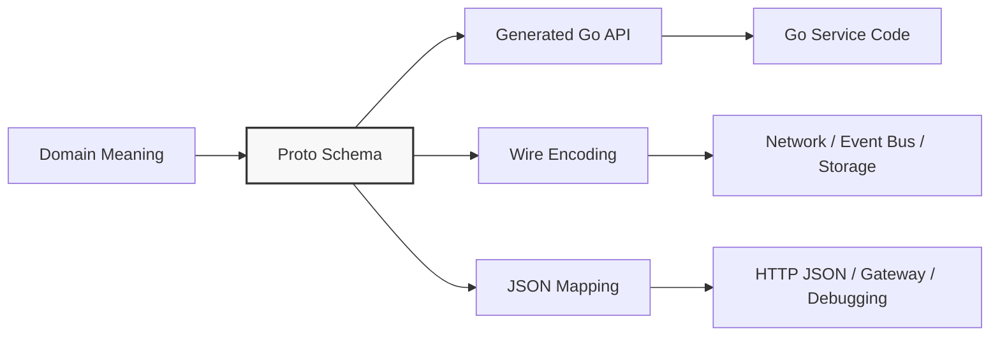
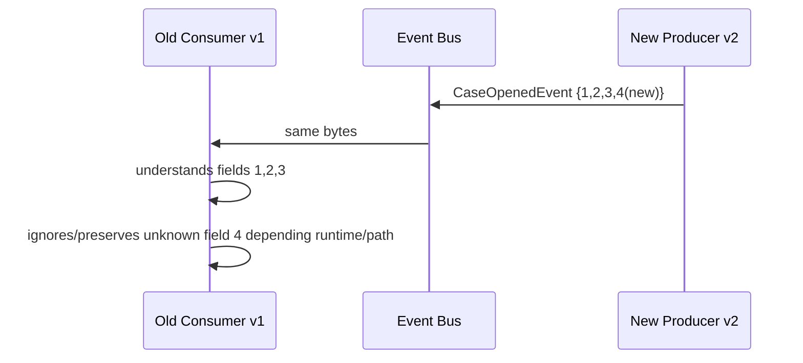
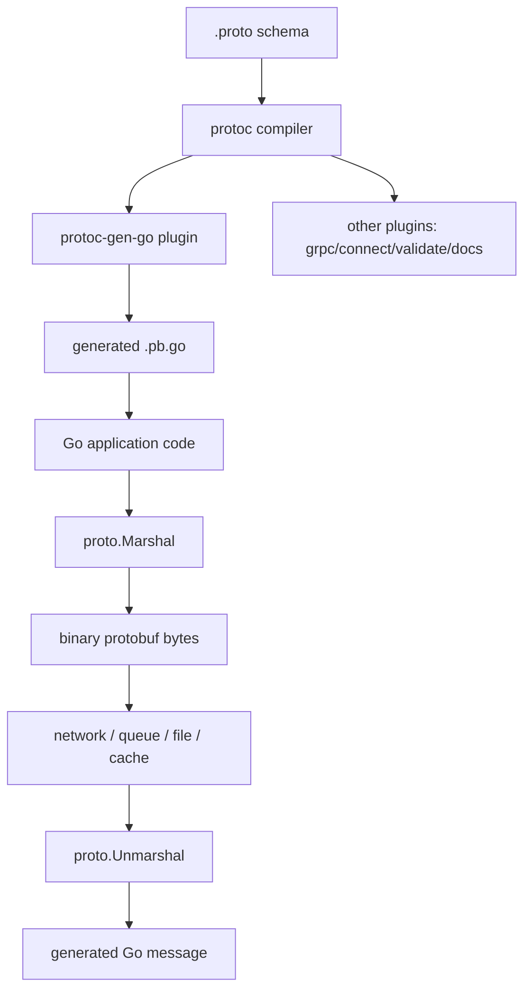
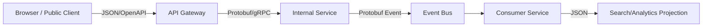

# learn-go-data-mapper-json-xml-protobuf-validation-part-019.md

# Part 019 — Protobuf Fundamentals for Go Engineers

> Seri: **learn-go-data-mapper-json-xml-protobuf-validation**  
> Posisi: **Part 019 dari 033**  
> Target pembaca: **Java software engineer yang ingin menguasai data contract, serialization boundary, schema evolution, dan Protobuf di Go secara production-grade**  
> Fokus bagian ini: **fondasi Protobuf untuk engineer Go: schema language, binary wire format mental model, field number, generated code workflow, package design, type system, default/presence, enum, repeated, map, oneof, well-known types, dan risiko desain awal**

---

## Daftar Isi

1. [Tujuan Pembelajaran](#1-tujuan-pembelajaran)
2. [Posisi Part Ini dalam Seri](#2-posisi-part-ini-dalam-seri)
3. [Mental Model Utama: Protobuf Bukan Sekadar Serializer](#3-mental-model-utama-protobuf-bukan-sekadar-serializer)
4. [Perbandingan Cepat untuk Java Engineer](#4-perbandingan-cepat-untuk-java-engineer)
5. [Apa yang Diselesaikan Protobuf](#5-apa-yang-diselesaikan-protobuf)
6. [Apa yang Tidak Diselesaikan Protobuf](#6-apa-yang-tidak-diselesaikan-protobuf)
7. [Artifact Lifecycle: Dari `.proto` sampai Bytes](#7-artifact-lifecycle-dari-proto-sampai-bytes)
8. [Anatomi File `.proto`](#8-anatomi-file-proto)
9. [Package, `go_package`, dan Import Path](#9-package-go_package-dan-import-path)
10. [Message sebagai Contract, Bukan Class](#10-message-sebagai-contract-bukan-class)
11. [Field Number: Contract yang Lebih Penting dari Nama Field](#11-field-number-contract-yang-lebih-penting-dari-nama-field)
12. [Wire Type Mental Model](#12-wire-type-mental-model)
13. [Scalar Types dan Mapping ke Go](#13-scalar-types-dan-mapping-ke-go)
14. [Default Value dan Field Presence: Fondasi Awal](#14-default-value-dan-field-presence-fondasi-awal)
15. [Enum Design](#15-enum-design)
16. [Repeated Field](#16-repeated-field)
17. [Map Field](#17-map-field)
18. [Nested Message](#18-nested-message)
19. [Oneof](#19-oneof)
20. [Reserved Field dan Deprecation](#20-reserved-field-dan-deprecation)
21. [Imports dan Well-Known Types](#21-imports-dan-well-known-types)
22. [Services di `.proto`: Cukup untuk Orientasi](#22-services-di-proto-cukup-untuk-orientasi)
23. [Go Code Generation Workflow](#23-go-code-generation-workflow)
24. [Contoh End-to-End: Regulatory Case Event](#24-contoh-end-to-end-regulatory-case-event)
25. [Binary Encoding: Cukup Dalam untuk Tidak Salah Desain](#25-binary-encoding-cukup-dalam-untuk-tidak-salah-desain)
26. [Deterministic Serialization dan Mengapa Bytes Tidak Canonical](#26-deterministic-serialization-dan-mengapa-bytes-tidak-canonical)
27. [Protobuf vs JSON vs XML sebagai Boundary Contract](#27-protobuf-vs-json-vs-xml-sebagai-boundary-contract)
28. [Schema Evolution: Aturan Minimum yang Harus Dihafal](#28-schema-evolution-aturan-minimum-yang-harus-dihafal)
29. [Anti-Patterns yang Sering Muncul di Tim Go](#29-anti-patterns-yang-sering-muncul-di-tim-go)
30. [Checklist Desain `.proto` Pertama](#30-checklist-desain-proto-pertama)
31. [Production Review Questions](#31-production-review-questions)
32. [Latihan Desain](#32-latihan-desain)
33. [Ringkasan Invariant](#33-ringkasan-invariant)
34. [Referensi](#34-referensi)

---

## 1. Tujuan Pembelajaran

Setelah menyelesaikan part ini, kamu harus bisa:

1. Menjelaskan **Protobuf sebagai schema-first binary contract**, bukan sekadar alternatif JSON yang lebih cepat.
2. Mendesain file `.proto` awal yang masuk akal untuk Go service.
3. Memahami kenapa **field number** adalah compatibility contract jangka panjang.
4. Memahami perbedaan **field name**, **field number**, **wire type**, dan **Go generated API**.
5. Membaca dan menulis schema dasar dengan `message`, scalar field, `enum`, `repeated`, `map`, `oneof`, `reserved`, `import`, dan well-known types.
6. Memahami peran `package` dan `option go_package`.
7. Menjalankan mental model code generation: `.proto` → `protoc` → plugin → `.pb.go` → runtime `proto.Marshal`/`proto.Unmarshal`.
8. Menghindari desain schema yang sejak awal sulit dievolusi.
9. Memahami cukup tentang binary wire format untuk membuat keputusan desain yang aman.
10. Menentukan kapan Protobuf cocok dan kapan JSON/XML tetap lebih tepat.

Part ini bukan part final tentang Protobuf. Beberapa topik akan disentuh sebagai fondasi lalu dibahas lebih dalam nanti:

- Runtime Go Protobuf modern → Part 020.
- Open Struct vs Opaque API → Part 021.
- Presence dan optionality → Part 022.
- ProtoJSON → Part 023.
- Schema evolution mendalam → Part 024.
- Buf, linting, dan breaking change detection → Part 025.
- Protobuf validation → Part 029.

---

## 2. Posisi Part Ini dalam Seri

Kita sudah melewati JSON dan XML. JSON memberi fleksibilitas tinggi, tetapi banyak keputusan contract diserahkan ke convention:

- apakah field boleh hilang,
- apakah `null` valid,
- apakah unknown field diterima,
- apakah number aman,
- apakah schema external benar-benar enforced.

XML memberi struktur lebih formal, terutama dengan XSD, tetapi complexity namespace dan toolchain sering berat.

Protobuf berada di posisi berbeda:

```text
JSON  -> text object notation, human-friendly, loosely typed by default
XML   -> text markup, namespace-rich, schema-capable, legacy/enterprise-heavy
Proto -> schema-first binary contract, strongly typed, evolution-oriented
```

Dalam sistem Go modern, Protobuf sering muncul pada:

- gRPC API,
- Connect RPC,
- internal service-to-service API,
- event payload di Kafka/PubSub/NATS,
- durable workflow state,
- audit/event envelope,
- schema-governed integration antar domain,
- high-volume data exchange.

Tetapi Protobuf juga sering disalahgunakan sebagai:

- domain model langsung,
- database model langsung,
- cache object tanpa versioning policy,
- “lebih cepat dari JSON” tanpa memahami compatibility,
- transport universal untuk semua API bahkan saat client eksternal butuh readability.

Part ini bertugas membangun fondasi agar Protobuf dipakai sebagai **contract engineering tool**, bukan hanya serialization library.

---

## 3. Mental Model Utama: Protobuf Bukan Sekadar Serializer

Cara paling dangkal memahami Protobuf:

> “Kita define schema, generate code, lalu marshal/unmarshal bytes.”

Cara yang lebih benar:

> “Protobuf adalah sistem deklarasi schema yang menghasilkan tipe bahasa pemrograman dan binary representation yang mampu berevolusi dengan menjaga compatibility berbasis field number.”

Cara production-grade:

> “Protobuf adalah governance mechanism untuk data contract lintas proses, lintas bahasa, lintas deployment version, dan lintas waktu. Desain `.proto` menentukan apakah service masih bisa evolve 2 tahun kemudian tanpa memecahkan consumer lama.”

### 3.1 Empat layer mental model



Ada empat layer berbeda:

| Layer | Pertanyaan | Contoh |
|---|---|---|
| Domain meaning | Apa arti datanya? | `case_status = OPEN` berarti case masih aktif. |
| Proto schema | Bagaimana arti itu dikontrakkan? | `enum CaseStatus`, field number `4`. |
| Generated Go API | Bagaimana code Go mengaksesnya? | `GetCaseStatus()` atau accessor Opaque API. |
| Wire encoding | Bagaimana bytes dikirim? | field tag varint + encoded value. |

Kesalahan umum adalah mencampur layer tersebut. Misalnya:

- Menganggap nama field Go adalah contract. Salah; di binary Protobuf, field number jauh lebih fundamental.
- Menganggap generated struct adalah domain model. Salah; generated struct adalah representasi schema.
- Menganggap wire bytes canonical. Salah; Protobuf serialization tidak secara umum canonical.
- Menganggap proto3 scalar field bisa selalu membedakan absent vs default. Tidak selalu; field presence punya aturan khusus.

### 3.2 Contract bukan hanya shape, tetapi evolution surface

Dalam JSON, kamu bisa menambah field baru dengan relatif mudah jika consumer ignore unknown field. Dalam Protobuf, kamu juga bisa menambah field baru, tetapi hanya jika:

- field number baru belum pernah dipakai,
- wire type kompatibel,
- consumer lama dapat mengabaikan unknown field,
- semantic default aman,
- nama field tidak bentrok pada JSON mapping,
- enum value baru tidak merusak consumer lama,
- field lama tidak dihapus tanpa reserved.

Artinya, Protobuf memberi struktur, tetapi tetap membutuhkan disiplin engineering.

---

## 4. Perbandingan Cepat untuk Java Engineer

Karena kamu berasal dari Java, analogi ini membantu, tetapi jangan dibawa terlalu jauh.

| Java world | Go/Protobuf world | Catatan |
|---|---|---|
| Jackson DTO | `.proto` message + generated `.pb.go` | Protobuf schema lebih eksplisit daripada POJO JSON. |
| JAXB/XSD | `.proto` schema | Sama-sama schema-driven, tetapi model compatibility berbeda. |
| MapStruct | Manual mapper / generated mapper custom | Protobuf generation bukan mapper domain otomatis. |
| Bean Validation | Protovalidate / custom validation / service rule | Validation bukan bagian utama proto language dasar. |
| Java class field name | Proto field name + field number | Binary contract bergantung pada field number. |
| Java package | Proto `package` + `go_package` | Ada namespace schema dan namespace Go import. |
| `null` object reference | Presence/default/nil pointer/slice | Tidak setara satu banding satu. |
| Enum ordinal | Proto enum number | Jangan ubah number enum seperti jangan ubah persisted ordinal. |
| Serializable | Protobuf wire format | Protobuf lebih terkontrol daripada Java serialization. |

### 4.1 Analogi yang berguna

Anggap `.proto` mirip gabungan dari:

- interface contract,
- DTO declaration,
- wire schema,
- multi-language codegen source,
- compatibility boundary.

Tetapi `.proto` **bukan**:

- domain model,
- ORM entity,
- validation rule lengkap,
- authorization model,
- business workflow model,
- database migration file.

### 4.2 Perbedaan mindset Java vs Go

Di Java, tim sering terbiasa dengan:

- annotation-driven mapping,
- reflection-heavy serializer,
- framework-level validation,
- runtime introspection,
- classpath scanning,
- object graph kaya.

Di Go + Protobuf, mindset yang lebih sehat:

- schema eksplisit,
- generated type sederhana,
- mapper eksplisit di boundary,
- validation eksplisit,
- error handling eksplisit,
- compatibility policy eksplisit,
- build/CI governance eksplisit.

Go tidak menghalangi reflection, tetapi production-grade Go biasanya menghindari “magic mapping” di area contract yang sensitif.

---

## 5. Apa yang Diselesaikan Protobuf

Protobuf kuat untuk beberapa problem spesifik.

### 5.1 Strongly typed schema lintas bahasa

Satu file `.proto` dapat menghasilkan type untuk Go, Java, Python, TypeScript melalui plugin/tooling. Ini sangat penting jika contract harus dipakai banyak service.

```proto
syntax = "proto3";

package enforcement.case.v1;

option go_package = "example.com/acme/enforcement/gen/case/v1;casev1";

message CaseOpenedEvent {
  string case_id = 1;
  string agency_code = 2;
  int64 opened_at_unix_sec = 3;
}
```

Dari schema ini, Go code tidak perlu menebak field apa yang tersedia. Compiler akan membantu.

### 5.2 Binary format compact

Protobuf binary tidak membawa nama field dalam payload. Payload membawa field number dan encoded value. Itu membuatnya compact, terutama dibanding JSON/XML.

Contoh konseptual:

```json
{
  "caseId": "C-2026-0001",
  "agencyCode": "CEA",
  "openedAtUnixSec": 1782450000
}
```

JSON membawa nama field lengkap. Binary Protobuf membawa field tag dan value.

### 5.3 Schema evolution

Protobuf dirancang agar field baru bisa ditambahkan tanpa memecahkan parser lama, selama aturan compatibility diikuti.

Consumer lama dapat mengabaikan unknown field. Producer baru bisa mengirim field tambahan. Ini mendukung rolling deployment.



### 5.4 Generated code mengurangi runtime ambiguity

Dengan JSON map/dynamic object, banyak bug baru terlihat runtime. Dengan generated Protobuf type, field dan enum lebih eksplisit.

```go
// JSON dynamic style: banyak risiko runtime.
var m map[string]any
_ = json.Unmarshal(data, &m)
status := m["status"].(string) // panic risk

// Protobuf generated style: field tersedia sebagai typed API.
status := event.GetStatus()
```

### 5.5 Cocok untuk internal RPC dan eventing

Protobuf sangat cocok saat:

- client dan server sama-sama dikontrol organisasi,
- schema bisa dikomunikasikan via repository/registry,
- performance dan payload size penting,
- backward/forward compatibility penting,
- multi-language consumer butuh strong contract.

---

## 6. Apa yang Tidak Diselesaikan Protobuf

Protobuf bukan silver bullet.

### 6.1 Tidak otomatis menyelesaikan domain modelling

Schema ini valid:

```proto
message Case {
  string id = 1;
  string status = 2;
  string type = 3;
  string payload = 4;
}
```

Tetapi secara desain lemah:

- `status` string tidak memberi constraint.
- `type` string tidak jelas vocabulary-nya.
- `payload` string mungkin JSON-in-Protobuf anti-pattern.
- Tidak ada presence/default strategy.
- Tidak ada evolution policy.

Protobuf memberi alat, bukan judgement.

### 6.2 Tidak otomatis menyelesaikan validation

Schema ini tidak otomatis memastikan `case_id` non-empty:

```proto
message CaseOpenedEvent {
  string case_id = 1;
}
```

`string` kosong tetap valid secara Protobuf. Validasi perlu layer tambahan:

- service validation,
- Protovalidate,
- gateway validation,
- domain invariant check,
- event consumer defensive check.

### 6.3 Tidak human-readable secara default

Binary Protobuf bagus untuk mesin, buruk untuk manusia. Kamu perlu:

- schema untuk membaca bytes,
- tooling seperti `protoc --decode`,
- logging redaction,
- debug representation,
- observability-aware message design.

### 6.4 Tidak self-describing seperti JSON object

Binary payload field number `1` tidak berarti apa-apa tanpa schema.

Jika schema hilang, bytes sulit diinterpretasi. Maka schema management penting.

### 6.5 Tidak cocok untuk semua public API

Jika API dipakai browser/public third party, JSON mungkin lebih tepat karena:

- mudah di-debug,
- tooling universal,
- tidak perlu codegen untuk mulai,
- lebih natural untuk web.

Protobuf tetap bisa dipakai via Connect/gRPC-Web/ProtoJSON, tetapi trade-off-nya harus sadar.

---

## 7. Artifact Lifecycle: Dari `.proto` sampai Bytes

Protobuf bukan satu library. Ia adalah pipeline.



### 7.1 Komponen utama

| Artifact | Fungsi |
|---|---|
| `.proto` | Source of truth untuk message/service/schema. |
| `protoc` | Compiler utama Protobuf. |
| `protoc-gen-go` | Plugin untuk menghasilkan `.pb.go`. |
| `.pb.go` | Generated Go code. Jangan diedit manual. |
| `google.golang.org/protobuf/proto` | Runtime API untuk marshal/unmarshal/reflection. |
| `protojson` | Canonical Protobuf JSON mapping. |
| descriptor | Metadata schema yang bisa dipakai untuk reflection/tooling. |

### 7.2 Generated code adalah artifact build, bukan tempat business logic

Generated `.pb.go` harus diperlakukan seperti:

- hasil compiler,
- bisa diregenerate,
- tidak diedit manual,
- tidak jadi tempat business method custom,
- tidak jadi pusat domain behavior.

Kalau kamu butuh domain behavior, buat type/domain service terpisah.

```go
// generated package
import casev1 "example.com/acme/enforcement/gen/case/v1"

// domain package
package casecore

type Case struct {
    ID     CaseID
    Status Status
}

func FromProto(msg *casev1.Case) (Case, error) {
    // mapping + invariant check
}
```

---

## 8. Anatomi File `.proto`

Contoh file minimal tetapi production-oriented:

```proto
syntax = "proto3";

package enforcement.case.v1;

option go_package = "example.com/acme/enforcement/gen/case/v1;casev1";

import "google/protobuf/timestamp.proto";

// CaseOpenedEvent is emitted when a regulatory case is created.
message CaseOpenedEvent {
  string case_id = 1;
  string agency_code = 2;
  CasePriority priority = 3;
  google.protobuf.Timestamp opened_at = 4;
  repeated string allegation_codes = 5;
}

enum CasePriority {
  CASE_PRIORITY_UNSPECIFIED = 0;
  CASE_PRIORITY_LOW = 1;
  CASE_PRIORITY_MEDIUM = 2;
  CASE_PRIORITY_HIGH = 3;
}
```

### 8.1 Struktur standar file

Urutan yang sehat:

1. License/header bila perlu.
2. File overview comment.
3. `syntax` atau `edition`.
4. `package`.
5. `import`.
6. `option`, terutama `go_package`.
7. `message`, `enum`, `service` definitions.

### 8.2 `syntax = "proto3";`

`proto3` adalah syntax modern yang banyak dipakai. Selain proto2/proto3, Protobuf juga memiliki **Editions** sebagai arah evolusi bahasa Protobuf. Namun banyak sistem production masih memakai proto3, dan part ini memakai proto3 sebagai baseline.

### 8.3 `package`

`package enforcement.case.v1;` adalah namespace Protobuf. Ini membantu menghindari benturan message name lintas schema.

### 8.4 `go_package`

`option go_package = "example.com/acme/enforcement/gen/case/v1;casev1";`

Ini mengatur Go import path dan package name generated code.

Bagian sebelum `;`:

```text
example.com/acme/enforcement/gen/case/v1
```

adalah Go import path.

Bagian setelah `;`:

```text
casev1
```

adalah Go package name.

### 8.5 `message`

`message` mendefinisikan structured data type.

### 8.6 Field declaration

```proto
string case_id = 1;
```

Artinya:

- type: `string`,
- field name: `case_id`,
- field number: `1`.

Field number adalah bagian dari binary contract. Jangan ubah sembarangan.

### 8.7 Comment adalah contract documentation

Comment di `.proto` bukan hiasan. Dalam team besar, comment dapat dipakai untuk:

- generated docs,
- review context,
- consumer understanding,
- semantic expectation,
- migration notes.

Comment buruk:

```proto
// case id
string case_id = 1;
```

Comment lebih berguna:

```proto
// Globally unique case identifier assigned by the case-management system.
// It is stable for the lifetime of the case and must not be reused.
string case_id = 1;
```

---

## 9. Package, `go_package`, dan Import Path

Ini area yang sering membingungkan karena ada beberapa namespace sekaligus.

### 9.1 Tiga namespace berbeda

| Namespace | Contoh | Dipakai oleh |
|---|---|---|
| Proto package | `enforcement.case.v1` | Protobuf type identity. |
| Go import path | `example.com/acme/enforcement/gen/case/v1` | Go compiler/module import. |
| Go package name | `casev1` | Identifier saat import di Go. |

Jangan samakan ketiganya.

### 9.2 Contoh pemakaian di Go

```go
package handler

import (
    casev1 "example.com/acme/enforcement/gen/case/v1"
    "google.golang.org/protobuf/proto"
)

func Encode(evt *casev1.CaseOpenedEvent) ([]byte, error) {
    return proto.Marshal(evt)
}
```

### 9.3 Versioning package

Gunakan version package untuk contract yang publishable:

```proto
package enforcement.case.v1;
option go_package = "example.com/acme/enforcement/gen/case/v1;casev1";
```

Jika breaking change diperlukan, buat `v2`:

```proto
package enforcement.case.v2;
option go_package = "example.com/acme/enforcement/gen/case/v2;casev2";
```

Jangan membuat breaking change diam-diam di package `v1`.

### 9.4 Package by domain, bukan by technical layer

Lebih baik:

```text
proto/enforcement/case/v1/case.proto
proto/enforcement/appeal/v1/appeal.proto
proto/enforcement/compliance/v1/compliance.proto
```

Daripada:

```text
proto/events/v1/case.proto
proto/requests/v1/case.proto
proto/responses/v1/case.proto
```

Karena ownership schema biasanya domain-driven, bukan technical shape-driven.

### 9.5 Nama package harus stabil

Nama package masuk ke type identity dan generated code. Hindari nama yang terlalu bergantung pada struktur organisasi sementara.

Buruk:

```proto
package team_alpha.case.v1;
```

Lebih baik:

```proto
package enforcement.case.v1;
```

---

## 10. Message sebagai Contract, Bukan Class

Dalam Java, class sering membawa:

- field,
- constructor,
- method,
- validation,
- inheritance,
- behavior,
- annotation.

Dalam Protobuf, `message` terutama membawa data shape.

```proto
message CaseSummary {
  string case_id = 1;
  string title = 2;
  CaseStatus status = 3;
}
```

Message ini bukan domain entity penuh. Ia adalah contract representation.

### 10.1 Message harus menjawab: “untuk boundary apa?”

Sebelum membuat message, tanyakan:

- Apakah ini request?
- Response?
- Event?
- Command?
- Snapshot?
- Embedded value object?
- Error detail?
- Search criteria?
- Audit record?

Nama message harus menggambarkan boundary intent.

Kurang jelas:

```proto
message Case {
  string id = 1;
}
```

Lebih jelas:

```proto
message CreateCaseRequest {
  string subject_id = 1;
  repeated string allegation_codes = 2;
}

message CaseSummary {
  string case_id = 1;
  CaseStatus status = 2;
}

message CaseOpenedEvent {
  string case_id = 1;
  google.protobuf.Timestamp opened_at = 2;
}
```

### 10.2 Jangan jadikan satu mega-message untuk semua use case

Anti-pattern:

```proto
message CaseDto {
  string case_id = 1;
  string title = 2;
  string description = 3;
  string status = 4;
  string created_by = 5;
  string updated_by = 6;
  string internal_note = 7;
  string public_note = 8;
  string audit_payload = 9;
  repeated string attachment_ids = 10;
  repeated string allegation_codes = 11;
}
```

Problem:

- request, response, event, internal data tercampur,
- authorization boundary kabur,
- field optionality tidak jelas,
- consumer tergantung ke field yang bukan miliknya,
- schema sulit evolve.

Lebih sehat:

```proto
message CreateCaseRequest {
  string subject_id = 1;
  repeated string allegation_codes = 2;
  string initial_description = 3;
}

message CreateCaseResponse {
  string case_id = 1;
  CaseStatus status = 2;
}

message CaseOpenedEvent {
  string case_id = 1;
  string subject_id = 2;
  google.protobuf.Timestamp opened_at = 3;
}

message InternalCaseAuditRecord {
  string case_id = 1;
  string actor_id = 2;
  string action = 3;
  google.protobuf.Timestamp occurred_at = 4;
}
```

### 10.3 Message composition harus stabil

Gunakan nested message bila ia benar-benar bagian internal dari parent. Gunakan top-level message bila akan direuse lintas contract.

Top-level reusable:

```proto
message Money {
  string currency_code = 1;
  int64 units = 2;
  int32 nanos = 3;
}
```

Nested bila scoped:

```proto
message SearchCasesRequest {
  message DateRange {
    google.protobuf.Timestamp from = 1;
    google.protobuf.Timestamp to = 2;
  }

  DateRange opened_at = 1;
}
```

---

## 11. Field Number: Contract yang Lebih Penting dari Nama Field

Dalam Protobuf binary, field direpresentasikan dengan number, bukan nama.

```proto
message CaseOpenedEvent {
  string case_id = 1;
  string agency_code = 2;
}
```

Binary payload menyimpan field `1` dan `2`, bukan string `case_id` dan `agency_code`.

### 11.1 Field number adalah identity di wire format

Jika kamu mengubah:

```proto
string case_id = 1;
```

menjadi:

```proto
string case_reference = 1;
```

binary compatibility masih mungkin karena field number sama. Tetapi API/source/JSON mapping berubah.

Jika kamu mengubah:

```proto
string case_id = 1;
```

menjadi:

```proto
string case_id = 7;
```

itu breaking secara binary karena producer/consumer lama membaca field berbeda.

### 11.2 Jangan pernah reuse field number

Skenario buruk:

Versi 1:

```proto
message CaseEvent {
  string case_id = 1;
  string officer_id = 2;
}
```

Versi 2 yang salah:

```proto
message CaseEvent {
  string case_id = 1;
  string agency_code = 2; // DANGER: reusing old officer_id number
}
```

Consumer lama akan membaca `agency_code` sebagai `officer_id`. Ini bukan sekadar error; ini **semantic corruption**.

Setelah field dihapus, reserved number-nya:

```proto
message CaseEvent {
  string case_id = 1;

  reserved 2;
  reserved "officer_id";

  string agency_code = 3;
}
```

### 11.3 Pilih field number dengan strategi

Field number `1` sampai `15` lebih compact karena tag-nya biasanya butuh satu byte untuk field number kecil dengan wire type. Tetapi jangan over-optimize.

Praktik sehat:

- Field paling fundamental/stabil bisa diberi number kecil.
- Jangan menyisipkan field number berdasarkan urutan UI.
- Jangan renumber untuk “merapikan”.
- Sisakan gap bila kamu memprediksi field sekelompok akan berkembang.

Contoh:

```proto
message CaseSummary {
  string case_id = 1;
  CaseStatus status = 2;
  google.protobuf.Timestamp opened_at = 3;

  // Subject identity block.
  string subject_id = 10;
  string subject_type = 11;

  // Assignment block.
  string assigned_team_id = 20;
  string assigned_officer_id = 21;
}
```

Gap bukan keharusan, tetapi membantu readability dan expansion.

### 11.4 Field name tetap penting

Walaupun binary contract memakai number, field name tetap penting untuk:

- generated Go method/field naming,
- ProtoJSON mapping,
- documentation,
- code readability,
- breaking-change linting by name,
- consumers yang memakai text/JSON format.

Jadi jangan ganti field name sembarangan juga, terutama jika ProtoJSON dipakai.

---

## 12. Wire Type Mental Model

Protobuf binary encoding memakai kombinasi:

```text
field number + wire type + encoded value
```

Tag field dihitung secara konseptual:

```text
tag = (field_number << 3) | wire_type
```

Kamu tidak perlu menulis ini sehari-hari, tetapi wajib paham konsekuensinya.

### 12.1 Wire type umum

| Wire type | Nama | Dipakai untuk |
|---:|---|---|
| 0 | Varint | `int32`, `int64`, `uint32`, `uint64`, `bool`, enum, `sint32/sint64` after zigzag. |
| 1 | 64-bit | `fixed64`, `sfixed64`, `double`. |
| 2 | Length-delimited | `string`, `bytes`, embedded message, packed repeated. |
| 5 | 32-bit | `fixed32`, `sfixed32`, `float`. |

Wire type lain seperti start/end group adalah legacy.

### 12.2 Kenapa wire type penting?

Karena beberapa perubahan type bisa tampak “mirip” di schema tetapi tidak aman.

Misalnya:

```proto
int32 amount = 1;
```

lalu diganti menjadi:

```proto
string amount = 1;
```

Itu mengubah wire type dari varint ke length-delimited. Consumer lama tidak akan membaca dengan arti yang sama.

### 12.3 Field name tidak ada di binary payload

Binary Protobuf tidak membawa:

```text
case_id
agency_code
opened_at
```

Ia membawa field number dan value.

Implikasi:

- schema harus tersedia untuk decode manusiawi,
- field number harus dijaga,
- reserved number wajib setelah penghapusan,
- unknown field bisa dilewati karena parser tahu wire type dan length.

### 12.4 Unknown field bisa dilewati karena wire format self-delimited per field

Jika parser tidak mengenali field number `99`, ia bisa melewati value-nya karena wire type memberi tahu cara membaca panjang/value.

Ini salah satu dasar forward compatibility.

---

## 13. Scalar Types dan Mapping ke Go

Protobuf memiliki scalar types sendiri. Mapping ke Go dihasilkan oleh plugin.

### 13.1 Scalar numeric

| Proto type | Go type umum | Catatan |
|---|---|---|
| `double` | `float64` | Floating point 64-bit. Jangan untuk money. |
| `float` | `float32` | Floating point 32-bit. Jarang untuk business data. |
| `int32` | `int32` | Varint; negatif kurang efisien. |
| `int64` | `int64` | Varint; cocok untuk counter/time epoch tertentu. |
| `uint32` | `uint32` | Non-negative. |
| `uint64` | `uint64` | Non-negative besar. Hati-hati JSON clients. |
| `sint32` | `int32` | ZigZag; lebih efisien untuk angka negatif. |
| `sint64` | `int64` | ZigZag; lebih efisien untuk angka negatif. |
| `fixed32` | `uint32` | Fixed 4 bytes; efisien jika nilai sering besar. |
| `fixed64` | `uint64` | Fixed 8 bytes. |
| `sfixed32` | `int32` | Fixed signed 4 bytes. |
| `sfixed64` | `int64` | Fixed signed 8 bytes. |

### 13.2 Scalar non-numeric

| Proto type | Go type umum | Catatan |
|---|---|---|
| `bool` | `bool` | Default false. |
| `string` | `string` | UTF-8 text. |
| `bytes` | `[]byte` | Arbitrary binary. |

### 13.3 Jangan pakai `double` untuk money

Buruk:

```proto
message FineAmount {
  double amount = 1;
  string currency = 2;
}
```

Lebih aman:

```proto
message MoneyAmount {
  string currency_code = 1; // ISO 4217, e.g. SGD
  int64 minor_units = 2;    // cents for SGD/USD-style currencies
}
```

Atau jika butuh precision decimal lintas currency kompleks:

```proto
message DecimalAmount {
  string currency_code = 1;
  string decimal = 2; // canonical decimal string, e.g. "1234.56"
}
```

Setiap pilihan harus disertai invariant.

### 13.4 `int32` vs `int64`

Gunakan `int64` untuk:

- ID numeric besar,
- epoch timestamp jika tidak pakai `Timestamp`,
- counter jangka panjang,
- storage ID yang bisa melewati 2^31.

Gunakan `int32` untuk:

- small bounded value,
- count kecil,
- enum-like numeric code yang bukan enum karena alasan external.

Tetapi jangan pakai numeric ID hanya karena database memakai number. Public contract lebih sering aman memakai `string` ID.

### 13.5 `bytes` bukan tempat menyembunyikan schema

`bytes` cocok untuk:

- file chunk,
- hash/digest,
- encrypted blob,
- opaque payload yang contract-nya sengaja external.

`bytes` buruk jika dipakai untuk:

- JSON blob tanpa schema,
- nested business object yang sebenarnya harus message,
- shortcut agar tidak mendesain schema.

---

## 14. Default Value dan Field Presence: Fondasi Awal

Part 022 akan membahas presence secara mendalam. Di sini kita perlu fondasi agar tidak salah dari awal.

### 14.1 Proto3 scalar default

Dalam proto3, scalar field yang tidak diset biasanya dibaca sebagai default value:

| Type | Default |
|---|---|
| string | `""` |
| bytes | empty bytes |
| bool | `false` |
| numeric | `0` |
| enum | first enum value, biasanya `*_UNSPECIFIED = 0` |
| repeated | empty list |
| map | empty map |

Masalahnya:

```proto
message UpdateCaseRequest {
  string title = 1;
}
```

Jika `title` kosong, apakah artinya:

1. client tidak mengirim title,
2. client ingin menghapus title,
3. client mengirim title kosong yang invalid,
4. default karena unmarshalling?

Tanpa presence strategy, kamu tidak tahu.

### 14.2 Gunakan `optional` saat perlu membedakan absent vs default

```proto
message UpdateCaseRequest {
  optional string title = 1;
}
```

Dengan presence, service bisa membedakan:

- title tidak dikirim,
- title dikirim sebagai empty string.

Namun detail API Go-nya tergantung generated API dan akan dibahas di part 022.

### 14.3 Jangan mengandalkan default value untuk business meaning kompleks

Buruk:

```proto
message CaseSearchRequest {
  int32 page_size = 1; // if 0, use default 50
}
```

Ini bisa diterima, tetapi harus didokumentasikan dan dinormalisasi di service boundary. Lebih eksplisit:

```proto
message CaseSearchRequest {
  optional int32 page_size = 1;
}
```

Lalu Go boundary:

```go
const defaultPageSize = 50

func NormalizePageSize(hasPageSize bool, pageSize int32) (int32, error) {
    if !hasPageSize {
        return defaultPageSize, nil
    }
    if pageSize <= 0 || pageSize > 200 {
        return 0, fmt.Errorf("page_size must be between 1 and 200")
    }
    return pageSize, nil
}
```

### 14.4 Enum zero harus `UNSPECIFIED`

Karena enum default adalah nilai pertama, jadikan nilai `0` sebagai unspecified/unknown.

Benar:

```proto
enum CaseStatus {
  CASE_STATUS_UNSPECIFIED = 0;
  CASE_STATUS_DRAFT = 1;
  CASE_STATUS_OPEN = 2;
  CASE_STATUS_CLOSED = 3;
}
```

Berbahaya:

```proto
enum CaseStatus {
  CASE_STATUS_OPEN = 0;
  CASE_STATUS_CLOSED = 1;
}
```

Jika field absent, status dibaca `OPEN`. Itu semantic bug.

---

## 15. Enum Design

Enum di Protobuf adalah integer value dengan symbolic names.

```proto
enum CaseStatus {
  CASE_STATUS_UNSPECIFIED = 0;
  CASE_STATUS_DRAFT = 1;
  CASE_STATUS_OPEN = 2;
  CASE_STATUS_SUSPENDED = 3;
  CASE_STATUS_CLOSED = 4;
}
```

### 15.1 Gunakan prefix enum value

Praktik umum Protobuf adalah prefix value dengan enum name.

Baik:

```proto
enum CaseStatus {
  CASE_STATUS_UNSPECIFIED = 0;
  CASE_STATUS_OPEN = 1;
  CASE_STATUS_CLOSED = 2;
}
```

Kurang baik:

```proto
enum CaseStatus {
  UNSPECIFIED = 0;
  OPEN = 1;
  CLOSED = 2;
}
```

Prefix menghindari benturan nama dan membuat generated code lebih jelas.

### 15.2 Jangan ubah number enum

Versi 1:

```proto
enum RiskLevel {
  RISK_LEVEL_UNSPECIFIED = 0;
  RISK_LEVEL_LOW = 1;
  RISK_LEVEL_HIGH = 2;
}
```

Versi 2 yang salah:

```proto
enum RiskLevel {
  RISK_LEVEL_UNSPECIFIED = 0;
  RISK_LEVEL_HIGH = 1; // DANGER
  RISK_LEVEL_LOW = 2;  // DANGER
}
```

Consumer lama akan salah membaca meaning.

### 15.3 Jangan hapus enum value tanpa reserve

Jika enum value dihapus:

```proto
enum CaseStatus {
  CASE_STATUS_UNSPECIFIED = 0;
  CASE_STATUS_OPEN = 1;
  CASE_STATUS_CLOSED = 2;

  reserved 3;
  reserved "CASE_STATUS_ARCHIVED";
}
```

Ini mencegah reuse value/name di masa depan.

### 15.4 Enum baru bisa mengejutkan consumer lama

Menambah enum value sering dianggap safe secara binary. Tetapi secara semantic, consumer lama mungkin tidak siap.

Contoh:

```proto
enum CaseStatus {
  CASE_STATUS_UNSPECIFIED = 0;
  CASE_STATUS_OPEN = 1;
  CASE_STATUS_CLOSED = 2;
  CASE_STATUS_REOPENED = 3; // new
}
```

Consumer lama mungkin punya switch:

```go
switch status {
case casev1.CaseStatus_CASE_STATUS_OPEN:
    return handleOpen()
case casev1.CaseStatus_CASE_STATUS_CLOSED:
    return handleClosed()
default:
    return fmt.Errorf("unknown status: %v", status)
}
```

Ini lebih aman daripada defaulting ke open/closed. Untuk event consumer, unknown enum harus diperlakukan sebagai compatibility event, bukan panic.

---

## 16. Repeated Field

`repeated` merepresentasikan list.

```proto
message CaseOpenedEvent {
  string case_id = 1;
  repeated string allegation_codes = 2;
}
```

Generated Go biasanya memakai slice.

```go
codes := event.GetAllegationCodes()
```

### 16.1 Empty vs absent pada repeated field

Dalam proto3, repeated field default-nya empty list. Secara umum, absent dan empty tidak dibedakan.

Ini penting untuk update request.

Buruk:

```proto
message UpdateCaseRequest {
  repeated string allegation_codes = 1;
}
```

Apa arti empty?

- tidak mengubah allegation codes?
- set menjadi kosong?
- client lupa mengirim?

Untuk patch/update, gunakan pola yang eksplisit. Misalnya oneof operation:

```proto
message UpdateCaseAllegationsRequest {
  string case_id = 1;

  oneof change {
    ReplaceAllegations replace = 2;
    AddAllegations add = 3;
    RemoveAllegations remove = 4;
  }
}

message ReplaceAllegations {
  repeated string allegation_codes = 1;
}

message AddAllegations {
  repeated string allegation_codes = 1;
}

message RemoveAllegations {
  repeated string allegation_codes = 1;
}
```

### 16.2 Repeated order matters unless documented otherwise

Protobuf repeated field preserves order as represented. Tetapi semantic order harus kamu dokumentasikan.

```proto
message WorkflowHistory {
  // Ordered by occurred_at ascending. Producers must append in chronological order.
  repeated WorkflowStep steps = 1;
}
```

Jika order tidak bermakna:

```proto
message CaseTags {
  // Unordered set. Consumers must not depend on order.
  repeated string tag_codes = 1;
}
```

Tetapi jika semantic-nya set, repeated field tidak mencegah duplicate. Validasi harus menolak duplicate bila perlu.

### 16.3 Packed encoding

Repeated numeric primitive field di proto3 umumnya memakai packed encoding. Ini lebih compact. Kamu tidak perlu mengatur ini untuk basic usage, tetapi perlu paham bahwa wire representation repeated numeric bisa berbeda dari repeated string/message.

---

## 17. Map Field

Map field:

```proto
message CaseMetadata {
  map<string, string> labels = 1;
}
```

### 17.1 Map adalah syntactic sugar

Secara konsep, map direpresentasikan seperti repeated key/value entry message.

```proto
message CaseMetadata {
  map<string, string> labels = 1;
}
```

Mirip dengan:

```proto
message LabelsEntry {
  string key = 1;
  string value = 2;
}

repeated LabelsEntry labels = 1;
```

### 17.2 Map ordering tidak boleh dianggap stabil

Map tidak cocok jika order penting. Untuk ordered key-value list, gunakan repeated message.

```proto
message OrderedAttribute {
  string key = 1;
  string value = 2;
  int32 display_order = 3;
}

message CaseAttributes {
  repeated OrderedAttribute attributes = 1;
}
```

### 17.3 Map key terbatas

Map key hanya boleh scalar tertentu seperti string/integer/bool; tidak boleh message, bytes, float.

### 17.4 Map sering menjadi tempat schema malas

Anti-pattern:

```proto
message CaseEvent {
  string case_id = 1;
  map<string, string> attributes = 2;
}
```

Jika semua business data dimasukkan ke `attributes`, kamu kehilangan:

- typed contract,
- compatibility check,
- validation clarity,
- documentation,
- code completion,
- schema governance.

Map boleh untuk metadata/extensibility yang memang longgar, bukan primary business object.

Lebih baik:

```proto
message CaseEvent {
  string case_id = 1;
  CaseStatus status = 2;
  string assigned_officer_id = 3;

  // Non-critical producer-specific labels. Consumers must not require these keys.
  map<string, string> labels = 10;
}
```

---

## 18. Nested Message

Nested message dideklarasikan di dalam message lain.

```proto
message SearchCasesRequest {
  message DateRange {
    google.protobuf.Timestamp from = 1;
    google.protobuf.Timestamp to = 2;
  }

  DateRange opened_at = 1;
}
```

### 18.1 Kapan nested message cocok?

Gunakan nested message jika:

- type hanya relevan di parent,
- tidak perlu reuse lintas file,
- nama top-level akan terlalu bising,
- lifecycle-nya mengikuti parent.

### 18.2 Kapan top-level lebih baik?

Gunakan top-level jika:

- type akan direuse,
- type punya semantic domain kuat,
- type perlu dokumentasi sendiri,
- type punya validation/evolution lifecycle sendiri.

Contoh `DateRange` mungkin top-level jika dipakai banyak request.

```proto
message DateRange {
  google.protobuf.Timestamp from = 1;
  google.protobuf.Timestamp to = 2;
}

message SearchCasesRequest {
  DateRange opened_at = 1;
}

message SearchAppealsRequest {
  DateRange submitted_at = 1;
}
```

### 18.3 Jangan terlalu dalam

Nested message berlapis-lapis membuat generated code dan readability buruk.

```proto
message A {
  message B {
    message C {
      message D {
        string value = 1;
      }
    }
  }
}
```

Jika lebih dari 1–2 level, biasanya ada modelling problem.

---

## 19. Oneof

`oneof` menyatakan bahwa hanya satu dari beberapa field yang boleh diset.

```proto
message CaseSubject {
  oneof subject {
    IndividualSubject individual = 1;
    CompanySubject company = 2;
  }
}

message IndividualSubject {
  string person_id = 1;
}

message CompanySubject {
  string company_id = 1;
}
```

### 19.1 Oneof untuk sum type

Di Java, kamu mungkin memakai sealed interface:

```java
sealed interface CaseSubject permits IndividualSubject, CompanySubject {}
```

Di Protobuf, `oneof` adalah cara umum untuk modelling union/sum type.

### 19.2 Oneof lebih baik daripada nullable parallel fields

Buruk:

```proto
message CaseSubject {
  IndividualSubject individual = 1;
  CompanySubject company = 2;
}
```

Problem:

- keduanya bisa set,
- keduanya bisa kosong,
- invariant “exactly one” tidak terlihat di schema dasar.

Lebih baik:

```proto
message CaseSubject {
  oneof subject {
    IndividualSubject individual = 1;
    CompanySubject company = 2;
  }
}
```

### 19.3 Oneof tetap butuh validation

`oneof` memastikan maksimal satu field yang set, tetapi “wajib ada satu” perlu validation/service rule.

```go
func ValidateSubject(s *casev1.CaseSubject) error {
    if s.GetSubject() == nil {
        return fmt.Errorf("subject is required")
    }
    return nil
}
```

### 19.4 Evolution oneof harus hati-hati

Menambah alternatif baru bisa aman secara binary, tetapi consumer lama bisa tidak tahu cara memprosesnya.

```proto
message CaseSubject {
  oneof subject {
    IndividualSubject individual = 1;
    CompanySubject company = 2;
    TrustSubject trust = 3; // new
  }
}
```

Consumer lama harus punya default handling untuk unknown/unsupported subject type.

---

## 20. Reserved Field dan Deprecation

Saat field dihapus, jangan biarkan number/name-nya tersedia lagi.

### 20.1 Reserved field number

```proto
message CaseEvent {
  string case_id = 1;

  reserved 2;
}
```

### 20.2 Reserved field name

```proto
message CaseEvent {
  string case_id = 1;

  reserved "legacy_case_type";
}
```

### 20.3 Reserve number dan name bersama

Lebih aman:

```proto
message CaseEvent {
  string case_id = 1;

  reserved 2, 5 to 7;
  reserved "legacy_case_type", "old_status";
}
```

### 20.4 Deprecation sebelum deletion

Jika field masih perlu ada untuk compatibility tetapi tidak boleh dipakai baru:

```proto
message CaseEvent {
  string case_id = 1;

  string legacy_case_type = 2 [deprecated = true];
  CaseType case_type = 3;
}
```

Deprecation bukan enforcement kuat. Ia memberi sinyal ke generated code/tooling. Tim tetap butuh lint/review policy.

### 20.5 Jangan hapus field dari event lama yang masih tersimpan

Jika event Protobuf disimpan durable di log/storage, schema harus bisa decode payload lama. Jangan hanya berpikir request/response live traffic.

Pertanyaan penting:

- Apakah old bytes masih ada di Kafka/S3/archive?
- Apakah consumer baru harus reprocess event lama?
- Apakah migration job membaca payload lama?
- Apakah schema registry menyimpan semua versi?

---

## 21. Imports dan Well-Known Types

Protobuf menyediakan well-known types di package `google.protobuf`.

Contoh import:

```proto
import "google/protobuf/timestamp.proto";
import "google/protobuf/duration.proto";
import "google/protobuf/field_mask.proto";
```

### 21.1 Timestamp

Gunakan `google.protobuf.Timestamp` untuk waktu absolut.

```proto
message CaseOpenedEvent {
  string case_id = 1;
  google.protobuf.Timestamp opened_at = 2;
}
```

Lebih baik daripada:

```proto
int64 opened_at_unix_sec = 2;
```

karena `Timestamp` punya semantic lebih jelas.

Di Go, well-known type timestamp berada di package:

```go
"google.golang.org/protobuf/types/known/timestamppb"
```

Contoh:

```go
msg := &casev1.CaseOpenedEvent{
    CaseId:   "CASE-2026-0001",
    OpenedAt: timestamppb.Now(),
}
```

### 21.2 Duration

Gunakan `google.protobuf.Duration` untuk durasi.

```proto
message SLAConfig {
  google.protobuf.Duration response_time = 1;
}
```

Di Go:

```go
"google.golang.org/protobuf/types/known/durationpb"
```

### 21.3 FieldMask

`FieldMask` berguna untuk update partial.

```proto
import "google/protobuf/field_mask.proto";

message UpdateCaseRequest {
  string case_id = 1;
  CasePatch patch = 2;
  google.protobuf.FieldMask update_mask = 3;
}
```

Namun FieldMask butuh governance:

- field path mana yang boleh diupdate,
- repeated/map behavior,
- validation cross-field,
- authorization per field.

### 21.4 Any

`google.protobuf.Any` bisa membawa message arbitrary dengan type URL.

```proto
message IntegrationEnvelope {
  string event_id = 1;
  google.protobuf.Any payload = 2;
}
```

Gunakan hati-hati. `Any` memperlemah schema lokal dan menambah requirement registry/type resolution.

Cocok untuk:

- plugin architecture,
- event envelope multi-type,
- strongly governed internal platform.

Tidak cocok untuk:

- menghindari desain schema,
- arbitrary external payload tanpa validation,
- public API tanpa type registry.

### 21.5 Struct/Value/ListValue

`google.protobuf.Struct` merepresentasikan JSON-like dynamic object.

```proto
message ExternalPayload {
  google.protobuf.Struct raw_attributes = 1;
}
```

Gunakan hanya jika memang boundary-nya dynamic. Jika field dikenal, modelkan sebagai typed message.

### 21.6 Wrapper types

Wrapper types seperti `google.protobuf.StringValue` dulu sering dipakai untuk presence scalar. Dalam modern Protobuf, `optional` sering lebih tepat untuk presence scalar baru. Wrapper types masih relevan untuk compatibility dengan schema lama atau kebutuhan khusus seperti menaruh scalar di `Any`.

---

## 22. Services di `.proto`: Cukup untuk Orientasi

Protobuf juga dapat mendefinisikan service.

```proto
service CaseService {
  rpc CreateCase(CreateCaseRequest) returns (CreateCaseResponse);
  rpc GetCase(GetCaseRequest) returns (GetCaseResponse);
}
```

Service definition dipakai oleh gRPC/Connect plugin untuk generate server/client stubs.

Part ini tidak membahas gRPC secara mendalam. Fokus kita tetap data mapper/serialization/validation. Namun kamu harus tahu bahwa `.proto` sering menjadi source of truth untuk:

- message contract,
- service contract,
- generated clients,
- gateway docs,
- validation pipeline,
- breaking change detection.

### 22.1 Request/response naming

Gunakan nama eksplisit:

```proto
rpc CreateCase(CreateCaseRequest) returns (CreateCaseResponse);
```

Hindari:

```proto
rpc Create(Case) returns (Case);
```

Karena request dan response hampir selalu punya semantics berbeda.

### 22.2 Service boundary bukan domain service langsung

`CaseService` di proto adalah remote API boundary. Jangan samakan dengan domain service internal.

```text
Proto service      -> transport/API contract
Domain service     -> business behavior/invariant
Application service -> orchestration/use-case
```

---

## 23. Go Code Generation Workflow

Untuk Go, pipeline umum:

```text
.proto -> protoc -> protoc-gen-go -> .pb.go
```

Jika memakai gRPC:

```text
.proto -> protoc -> protoc-gen-go-grpc -> _grpc.pb.go
```

Jika memakai Connect:

```text
.proto -> buf/protoc -> protoc-gen-connect-go -> .connect.go
```

### 23.1 Install tooling dasar

Contoh umum:

```bash
go install google.golang.org/protobuf/cmd/protoc-gen-go@latest
```

Pastikan `$GOBIN` atau `$GOPATH/bin` masuk `PATH`.

`protoc` sendiri biasanya diinstall dari release Protobuf atau package manager.

### 23.2 Generate Go code dengan protoc

Struktur:

```text
proto/
  enforcement/
    case/
      v1/
        case.proto
gen/
  go/
```

Command contoh:

```bash
protoc \
  --proto_path=proto \
  --go_out=gen/go \
  --go_opt=paths=source_relative \
  proto/enforcement/case/v1/case.proto
```

Dengan `paths=source_relative`, output relatif terhadap input path.

### 23.3 Contoh generated import

Jika `.proto`:

```proto
option go_package = "example.com/acme/enforcement/gen/case/v1;casev1";
```

Maka Go code memakai:

```go
import casev1 "example.com/acme/enforcement/gen/case/v1"
```

### 23.4 Jangan edit `.pb.go`

Jika butuh helper, buat file terpisah.

```text
gen/case/v1/case.pb.go        # generated, jangan edit
gen/case/v1/case_helpers.go   # optional hand-written helper, hati-hati ownership
```

Namun sebaiknya business helper tidak berada di generated package jika bisa dihindari. Package generated sebaiknya tipis.

### 23.5 Generated code check-in atau generate saat build?

Ada dua model:

| Model | Kelebihan | Kekurangan |
|---|---|---|
| Check-in `.pb.go` | Consumer tidak perlu tooling codegen; build lebih mudah. | PR noisy; generated drift perlu CI check. |
| Generate di build | Source of truth lebih bersih. | Build butuh `protoc` dan plugin versi tepat. |

Banyak organisasi Go memilih check-in generated code plus CI check:

```bash
buf generate
 git diff --exit-code
```

atau ekuivalen dengan `protoc`.

---

## 24. Contoh End-to-End: Regulatory Case Event

Mari buat contoh realistis.

### 24.1 Schema

```proto
syntax = "proto3";

package enforcement.case.v1;

option go_package = "example.com/acme/enforcement/gen/case/v1;casev1";

import "google/protobuf/timestamp.proto";

// CaseOpenedEvent is emitted once after a case is created.
message CaseOpenedEvent {
  // Stable globally unique case identifier.
  string case_id = 1;

  // Agency that owns the case lifecycle.
  string agency_code = 2;

  // Initial priority assigned at case creation.
  CasePriority priority = 3;

  // Time when the case was officially opened.
  google.protobuf.Timestamp opened_at = 4;

  // Allegation codes known at opening time.
  // This is an unordered set; consumers must not depend on order.
  repeated string allegation_codes = 5;
}

enum CasePriority {
  CASE_PRIORITY_UNSPECIFIED = 0;
  CASE_PRIORITY_LOW = 1;
  CASE_PRIORITY_MEDIUM = 2;
  CASE_PRIORITY_HIGH = 3;
}
```

### 24.2 Generate

```bash
protoc \
  --proto_path=proto \
  --go_out=gen/go \
  --go_opt=paths=source_relative \
  proto/enforcement/case/v1/case.proto
```

### 24.3 Use in Go

```go
package main

import (
    "fmt"
    "log"

    casev1 "example.com/acme/enforcement/gen/case/v1"
    "google.golang.org/protobuf/proto"
    "google.golang.org/protobuf/types/known/timestamppb"
)

func main() {
    evt := &casev1.CaseOpenedEvent{
        CaseId:     "CASE-2026-000001",
        AgencyCode: "CEA",
        Priority:   casev1.CasePriority_CASE_PRIORITY_HIGH,
        OpenedAt:   timestamppb.Now(),
        AllegationCodes: []string{
            "MISREPRESENTATION",
            "UNLICENSED_ACTIVITY",
        },
    }

    data, err := proto.Marshal(evt)
    if err != nil {
        log.Fatal(err)
    }

    var decoded casev1.CaseOpenedEvent
    if err := proto.Unmarshal(data, &decoded); err != nil {
        log.Fatal(err)
    }

    fmt.Println(decoded.GetCaseId())
    fmt.Println(decoded.GetPriority())
}
```

### 24.4 Boundary validation tetap perlu

Protobuf berhasil decode bukan berarti message valid secara business.

```go
func ValidateCaseOpenedEvent(evt *casev1.CaseOpenedEvent) error {
    if evt == nil {
        return fmt.Errorf("event is required")
    }
    if evt.GetCaseId() == "" {
        return fmt.Errorf("case_id is required")
    }
    if evt.GetAgencyCode() == "" {
        return fmt.Errorf("agency_code is required")
    }
    if evt.GetPriority() == casev1.CasePriority_CASE_PRIORITY_UNSPECIFIED {
        return fmt.Errorf("priority is required")
    }
    if evt.GetOpenedAt() == nil || !evt.GetOpenedAt().IsValid() {
        return fmt.Errorf("opened_at must be a valid timestamp")
    }
    if len(evt.GetAllegationCodes()) == 0 {
        return fmt.Errorf("at least one allegation code is required")
    }
    return nil
}
```

Part 029 akan membahas validasi Protobuf yang lebih sistematis dengan Protovalidate.

---

## 25. Binary Encoding: Cukup Dalam untuk Tidak Salah Desain

Kamu tidak perlu menghafal semua byte encoding, tetapi perlu paham cukup untuk design review.

### 25.1 Field tag

Setiap encoded field punya tag:

```text
(field_number << 3) | wire_type
```

Misalnya field number 1 dengan wire type 2:

```text
(1 << 3) | 2 = 10
```

Angka 10 ini kemudian di-varint encode.

### 25.2 Varint

Varint memakai jumlah byte variabel. Nilai kecil memakai byte lebih sedikit.

Cocok untuk:

- bool,
- enum,
- integer non-negative kecil,
- counter kecil.

Tetapi signed negative dengan `int32/int64` bisa kurang efisien. Untuk nilai signed yang sering negatif, gunakan `sint32/sint64` karena memakai ZigZag encoding.

### 25.3 Length-delimited

String, bytes, embedded message, dan packed repeated memakai length-delimited:

```text
tag + length + bytes
```

Karena ada length, parser bisa skip unknown length-delimited field.

### 25.4 Embedded message

Message nested juga length-delimited. Itu berarti parser tahu panjang sub-message.

```proto
message CaseOpenedEvent {
  Actor actor = 1;
}

message Actor {
  string actor_id = 1;
}
```

### 25.5 Repeated field encoding

Repeated field dapat muncul berkali-kali di wire.

Konseptual:

```proto
repeated string allegation_codes = 5;
```

Wire dapat berisi field 5 beberapa kali.

Packed repeated numeric dapat menggabungkan banyak value dalam satu length-delimited field.

### 25.6 Unknown field

Jika parser menemukan field number yang tidak dikenal:

- ia melihat wire type,
- membaca/melompati value,
- tergantung runtime/path, unknown field bisa dipreservasi atau hilang saat reserialize.

Jangan membuat desain yang bergantung pada unknown field preservation kecuali kamu benar-benar mengontrol runtime dan path-nya.

---

## 26. Deterministic Serialization dan Mengapa Bytes Tidak Canonical

Salah satu kesalahpahaman umum:

> “Message yang sama pasti menghasilkan bytes yang sama.”

Tidak selalu.

Protobuf serialization tidak secara umum canonical. Ada opsi deterministic serialization pada beberapa runtime/API, tetapi itu tidak berarti canonical lintas semua bahasa, versi, dan kondisi.

### 26.1 Kenapa ini penting?

Jangan langsung memakai raw Protobuf bytes untuk:

- cryptographic signature canonical payload,
- stable hash lintas bahasa,
- cache key global,
- idempotency key lintas producer,
- deduplication key lintas runtime.

Jika butuh signature/hash stabil, desain canonicalization strategy eksplisit:

- pilih canonical representation,
- normalisasi field order jika relevant,
- hindari map ordering ambiguity,
- definisikan handling unknown field,
- definisikan default/presence,
- pertimbangkan deterministic marshal hanya sebagai bagian dari strategy, bukan keseluruhan.

### 26.2 Map ordering

Map field tidak boleh diandalkan order-nya. Deterministic marshal dapat membantu dalam satu runtime, tetapi jangan gunakan sebagai semantic ordering.

### 26.3 Unknown fields membuat canonicalization sulit

Unknown fields bisa membawa bytes yang tidak bisa diinterpretasi tanpa schema. Ini membuat canonical hash lintas versi sulit.

---

## 27. Protobuf vs JSON vs XML sebagai Boundary Contract

### 27.1 Decision matrix

| Kebutuhan | JSON | XML | Protobuf |
|---|---:|---:|---:|
| Human-readable | Tinggi | Sedang | Rendah |
| Browser/native web | Tinggi | Rendah | Sedang via gateway |
| Strong schema by default | Rendah | Sedang/Tinggi dengan XSD | Tinggi |
| Binary compactness | Rendah | Rendah | Tinggi |
| Multi-language generated type | Sedang | Sedang | Tinggi |
| Schema evolution support | Tergantung governance | Sulit/berat | Kuat jika aturan diikuti |
| Legacy enterprise integration | Sedang | Tinggi | Rendah/Sedang |
| gRPC/internal RPC | Sedang | Rendah | Tinggi |
| Public API simplicity | Tinggi | Rendah | Sedang/Rendah |
| Debuggability raw payload | Tinggi | Sedang | Rendah |

### 27.2 Kapan pilih Protobuf

Pilih Protobuf jika:

- API internal service-to-service,
- banyak bahasa/platform,
- contract stabil dan butuh evolution,
- event schema penting,
- performance/payload size penting,
- code generation dapat diterima,
- consumer siap mengikuti schema governance.

### 27.3 Kapan jangan pilih Protobuf

Jangan pilih Protobuf jika:

- consumer external tidak siap codegen,
- debugging manual lebih penting daripada compactness,
- schema ownership tidak jelas,
- tim tidak punya CI breaking change detection,
- public API butuh fleksibilitas JSON,
- payload dominan document/text human-authored.

### 27.4 Hybrid pattern

Banyak sistem production memakai hybrid:



Jangan fanatik format. Pilih format berdasarkan boundary.

---

## 28. Schema Evolution: Aturan Minimum yang Harus Dihafal

Part 024 akan membahas ini mendalam. Untuk fondasi, hafalkan aturan minimum berikut.

### 28.1 Safe-ish changes

Umumnya aman jika semantic-nya juga aman:

- menambah field baru dengan number baru,
- menambah enum value baru dengan handling unknown yang baik,
- menambah message type baru,
- menambah service method baru,
- menandai field deprecated,
- menambah reserved untuk field yang sudah dihapus.

### 28.2 Dangerous/breaking changes

Jangan lakukan di package/version yang sama:

- mengubah field number,
- reuse field number lama,
- reuse enum number lama,
- mengubah type ke wire type incompatible,
- mengubah repeated menjadi singular atau sebaliknya tanpa analysis,
- mengubah map menjadi repeated message tanpa migration strategy,
- menghapus field yang masih dipakai consumer,
- mengganti package/type name jika reflected/JSON/tooling bergantung,
- mengubah semantic default,
- mengganti enum zero value dari unspecified menjadi meaningful.

### 28.3 Reserve setelah delete

```proto
message Example {
  string new_field = 1;

  reserved 2;
  reserved "old_field";
}
```

### 28.4 Version package untuk breaking change

```proto
package enforcement.case.v1;
```

Breaking change:

```proto
package enforcement.case.v2;
```

Kemudian support migration/compatibility window.

### 28.5 Schema evolution adalah socio-technical process

Tooling membantu, tetapi tidak cukup. Butuh:

- owner schema,
- review checklist,
- breaking-change detector,
- compatibility tests,
- deprecation policy,
- consumer notification,
- rollback strategy.

---

## 29. Anti-Patterns yang Sering Muncul di Tim Go

### 29.1 Generated Protobuf dijadikan domain model

Buruk:

```go
func ApproveCase(c *casev1.Case) error {
    c.Status = casev1.CaseStatus_CASE_STATUS_APPROVED
    return nil
}
```

Lebih sehat:

```go
type Case struct {
    id     CaseID
    status Status
}

func (c *Case) Approve(policy ApprovalPolicy) error {
    // domain invariant here
}
```

Lalu mapper:

```go
func CaseToProto(c Case) *casev1.CaseSummary {
    return &casev1.CaseSummary{
        CaseId: c.ID().String(),
        Status: mapStatusToProto(c.Status()),
    }
}
```

### 29.2 Semua field string

Buruk:

```proto
message CaseEvent {
  string status = 1;
  string priority = 2;
  string opened_at = 3;
  string amount = 4;
}
```

Lebih baik:

```proto
message CaseEvent {
  CaseStatus status = 1;
  CasePriority priority = 2;
  google.protobuf.Timestamp opened_at = 3;
  MoneyAmount amount = 4;
}
```

### 29.3 JSON blob di dalam Protobuf

Buruk:

```proto
message Event {
  string type = 1;
  string json_payload = 2;
}
```

Jika payload type diketahui, gunakan message/oneof.

```proto
message Event {
  string event_id = 1;

  oneof payload {
    CaseOpenedEvent case_opened = 10;
    CaseClosedEvent case_closed = 11;
  }
}
```

### 29.4 Field number dirapikan setelah review

Jangan renumber hanya agar terlihat rapi.

```proto
// Jangan lakukan ini setelah schema publish.
string case_id = 1;
string status = 2;
string agency_code = 3;
```

Jika `agency_code` tadinya number 10, biarkan number 10.

### 29.5 Enum zero meaningful

Buruk:

```proto
enum Decision {
  DECISION_APPROVED = 0;
  DECISION_REJECTED = 1;
}
```

Benar:

```proto
enum Decision {
  DECISION_UNSPECIFIED = 0;
  DECISION_APPROVED = 1;
  DECISION_REJECTED = 2;
}
```

### 29.6 Map sebagai extensibility tanpa governance

```proto
map<string, string> everything = 1;
```

Ini biasanya tanda schema menyerah terlalu cepat.

### 29.7 `Any` tanpa registry

```proto
google.protobuf.Any payload = 1;
```

Tanpa registry/type URL policy, consumer tidak tahu apa yang boleh muncul.

### 29.8 Menganggap decode sukses berarti valid

```go
var msg casev1.CaseOpenedEvent
if err := proto.Unmarshal(data, &msg); err != nil {
    return err
}
// BUG: directly process without semantic validation
```

Decode sukses hanya berarti bytes cocok dengan wire format dan generated type cukup untuk parse. Business invariant tetap harus diperiksa.

### 29.9 Memakai Protobuf untuk semua public API

Protobuf bagus, tetapi bukan alasan untuk membuat public API sulit dipakai. Public developer experience juga bagian dari architecture.

---

## 30. Checklist Desain `.proto` Pertama

Gunakan checklist ini sebelum merge schema baru.

### 30.1 Identity dan ownership

- [ ] Package memakai domain dan version: `domain.subdomain.v1`.
- [ ] `go_package` eksplisit dan stabil.
- [ ] Owner schema jelas.
- [ ] File path sesuai package/version.

### 30.2 Message design

- [ ] Nama message menunjukkan boundary intent: request, response, event, command, summary, detail.
- [ ] Tidak ada mega-message yang dipakai semua use case.
- [ ] Field punya comment jika semantic-nya tidak obvious.
- [ ] Domain-sensitive field tidak dimodelkan sebagai raw string jika vocabulary fixed.

### 30.3 Field design

- [ ] Field number tidak reuse.
- [ ] Field number kecil dipakai untuk field fundamental/stabil.
- [ ] Field name snake_case.
- [ ] Field type sesuai semantic.
- [ ] Numeric money tidak memakai float/double.
- [ ] Timestamp memakai `google.protobuf.Timestamp` bila cocok.
- [ ] Repeated field punya documented ordering/set semantics.
- [ ] Map field bukan tempat schema utama.

### 30.4 Presence/default

- [ ] Enum zero adalah `*_UNSPECIFIED`.
- [ ] Optionality update/patch jelas.
- [ ] Scalar default tidak membawa business meaning ambigu.
- [ ] Required business field tetap punya validation strategy.

### 30.5 Evolution

- [ ] Deleted fields di-reserve number dan name.
- [ ] Deprecated field diberi `[deprecated = true]` bila masih ada.
- [ ] Consumer lama dipertimbangkan.
- [ ] Durable old payload dipertimbangkan.
- [ ] Breaking change diarahkan ke package `v2`.

### 30.6 Operational

- [ ] Generated code tidak diedit manual.
- [ ] Codegen command reproducible.
- [ ] CI mendeteksi generated drift.
- [ ] CI/lint mendeteksi breaking change.
- [ ] Logging/debug strategy tersedia.
- [ ] Validation layer tersedia.

---

## 31. Production Review Questions

Saat review PR `.proto`, tanyakan pertanyaan berikut.

### 31.1 Contract boundary

1. Boundary apa yang direpresentasikan message ini?
2. Siapa producer dan consumer-nya?
3. Apakah message ini request, response, event, snapshot, atau internal detail?
4. Apakah schema ini akan disimpan durable?
5. Apakah consumer eksternal punya akses ke schema?

### 31.2 Evolution

1. Apa yang terjadi jika field baru ditambahkan nanti?
2. Apa yang terjadi jika enum value baru muncul?
3. Apa field yang mungkin perlu dihapus nanti?
4. Apakah field number yang dihapus sudah reserved?
5. Apakah ada migration plan untuk breaking change?

### 31.3 Semantics

1. Apakah empty string valid?
2. Apakah zero number valid?
3. Apakah absent berbeda dari default?
4. Apakah repeated order bermakna?
5. Apakah map key vocabulary jelas?
6. Apakah enum zero safe?

### 31.4 Go usage

1. Apakah generated package path stabil?
2. Apakah generated type akan dipakai sebagai domain model? Jika ya, kenapa?
3. Apakah mapper boundary sudah ada?
4. Apakah validation dilakukan setelah unmarshal?
5. Apakah logging message aman dari sensitive data?

---

## 32. Latihan Desain

### 32.1 Latihan 1: desain event

Buat schema untuk event:

```text
CaseAssignedEvent
```

Kebutuhan:

- case id,
- old assignee optional,
- new assignee required,
- assigned by actor,
- assigned at timestamp,
- reason code,
- note optional,
- source system.

Pertanyaan:

1. Field mana yang scalar string?
2. Field mana yang enum?
3. Bagaimana membedakan old assignee absent vs empty?
4. Bagaimana version package-nya?
5. Apa field number yang kamu pilih?
6. Apa validation rule yang tidak bisa dijamin Protobuf dasar?

Contoh jawaban awal:

```proto
syntax = "proto3";

package enforcement.case.v1;

option go_package = "example.com/acme/enforcement/gen/case/v1;casev1";

import "google/protobuf/timestamp.proto";

message CaseAssignedEvent {
  string case_id = 1;
  optional string previous_assignee_id = 2;
  string new_assignee_id = 3;
  string assigned_by_actor_id = 4;
  google.protobuf.Timestamp assigned_at = 5;
  AssignmentReason reason = 6;
  optional string note = 7;
  string source_system = 8;
}

enum AssignmentReason {
  ASSIGNMENT_REASON_UNSPECIFIED = 0;
  ASSIGNMENT_REASON_INITIAL_ASSIGNMENT = 1;
  ASSIGNMENT_REASON_REASSIGNMENT = 2;
  ASSIGNMENT_REASON_ESCALATION = 3;
  ASSIGNMENT_REASON_WORKLOAD_BALANCING = 4;
}
```

Validation yang tetap perlu:

- `case_id` non-empty,
- `new_assignee_id` non-empty,
- `assigned_by_actor_id` non-empty,
- `assigned_at` valid,
- `reason != UNSPECIFIED`,
- `previous_assignee_id != new_assignee_id` untuk reassignment,
- `note` length limit,
- `source_system` known vocabulary.

### 32.2 Latihan 2: review schema buruk

Review schema berikut:

```proto
syntax = "proto3";

package case;

message Case {
  string id = 1;
  string status = 2;
  double fine = 3;
  string createdAt = 4;
  map<string, string> data = 5;
}
```

Masalah:

- package tidak versioned,
- tidak ada `go_package`,
- message terlalu generic,
- `status` string seharusnya enum jika vocabulary fixed,
- `double fine` buruk untuk money,
- `createdAt` tidak snake_case,
- waktu string seharusnya `Timestamp` bila cocok,
- `data` map raw berpotensi schema dumping ground,
- tidak ada comment,
- tidak jelas boundary use case.

Perbaikan possible:

```proto
syntax = "proto3";

package enforcement.case.v1;

option go_package = "example.com/acme/enforcement/gen/case/v1;casev1";

import "google/protobuf/timestamp.proto";

message CaseSummary {
  string case_id = 1;
  CaseStatus status = 2;
  MoneyAmount outstanding_fine = 3;
  google.protobuf.Timestamp created_at = 4;

  // Non-critical labels for display/filtering. Consumers must not require keys.
  map<string, string> labels = 10;
}

message MoneyAmount {
  string currency_code = 1;
  int64 minor_units = 2;
}

enum CaseStatus {
  CASE_STATUS_UNSPECIFIED = 0;
  CASE_STATUS_DRAFT = 1;
  CASE_STATUS_OPEN = 2;
  CASE_STATUS_CLOSED = 3;
}
```

### 32.3 Latihan 3: pilih format boundary

Untuk setiap boundary, pilih JSON/XML/Protobuf:

| Boundary | Pilihan kemungkinan | Alasan |
|---|---|---|
| Public web API untuk third-party developers | JSON/OpenAPI | Human-readable, tooling universal. |
| Internal service-to-service high-volume | Protobuf/gRPC/Connect | Strong contract, compact, generated clients. |
| Legacy government SOAP integration | XML/XSD | Existing contract/partner requirement. |
| Event bus antar microservice internal | Protobuf + schema governance | Evolution dan multi-language consumer. |
| Admin export manual | JSON/CSV/XML tergantung kebutuhan | Human/tool interoperability. |
| Audit log immutable | Protobuf atau JSON tergantung retrieval/debug needs | Butuh governance dan long-term readability. |

---

## 33. Ringkasan Invariant

Pegang invariant berikut selama bekerja dengan Protobuf:

1. `.proto` adalah source of truth contract, bukan sekadar input generator.
2. Field number adalah binary compatibility identity; jangan ubah dan jangan reuse.
3. Field name tetap penting untuk Go API, ProtoJSON, docs, dan readability.
4. Generated `.pb.go` adalah artifact, bukan tempat business logic.
5. Message adalah boundary representation, bukan domain entity otomatis.
6. Decode sukses bukan berarti data valid secara semantic.
7. Enum zero harus safe sebagai `UNSPECIFIED`.
8. Repeated field tidak membedakan absent vs empty; jangan pakai sembarangan untuk patch intent.
9. Map field tidak punya ordering semantic dan mudah menjadi schema dumping ground.
10. `oneof` cocok untuk union/sum type, tetapi tetap butuh validation untuk “required one”.
11. Deleted field harus di-reserve number dan name.
12. Protobuf binary tidak human-readable dan tidak self-describing tanpa schema.
13. Protobuf serialization tidak secara umum canonical; jangan asal pakai raw bytes untuk cryptographic/stable hash.
14. `go_package` harus eksplisit dan stabil.
15. Breaking change harus memakai versioned package baru atau migration strategy yang jelas.

---

## 34. Referensi

Referensi utama yang relevan untuk part ini:

1. Protocol Buffers — Language Guide proto3  
   `https://protobuf.dev/programming-guides/proto3/`
2. Protocol Buffers — Encoding / Wire Format  
   `https://protobuf.dev/programming-guides/encoding/`
3. Protocol Buffers — Go Tutorial  
   `https://protobuf.dev/getting-started/gotutorial/`
4. Protocol Buffers — Go Generated Code Guide Open API  
   `https://protobuf.dev/reference/go/go-generated/`
5. Protocol Buffers — Go Generated Code Guide Opaque API  
   `https://protobuf.dev/reference/go/go-generated-opaque/`
6. Protocol Buffers — Go Opaque API FAQ  
   `https://protobuf.dev/reference/go/opaque-faq/`
7. Go Blog — Go Protobuf: The new Opaque API  
   `https://go.dev/blog/protobuf-opaque`
8. Protocol Buffers — Proto3 Language Specification  
   `https://protobuf.dev/reference/protobuf/proto3-spec/`
9. Protocol Buffers — Style Guide  
   `https://protobuf.dev/programming-guides/style/`
10. Protocol Buffers — Serialization Is Not Canonical  
    `https://protobuf.dev/programming-guides/serialization-not-canonical/`
11. Protocol Buffers — Well-Known Types  
    `https://protobuf.dev/reference/protobuf/google.protobuf/`

---

## Status Seri

Part ini adalah **part 019 dari 033**.

Seri **belum selesai**.

Part berikutnya:

```text
learn-go-data-mapper-json-xml-protobuf-validation-part-020.md
```

Judul berikutnya:

```text
Go Protobuf Modern Runtime
```

Fokus berikutnya:

- `google.golang.org/protobuf`,
- `proto.Message`,
- `proto.Marshal` / `proto.Unmarshal`,
- `protojson`,
- `protoreflect`,
- `dynamicpb`,
- descriptor API,
- runtime options,
- unknown fields,
- deterministic marshal,
- operational usage pattern di Go service.


<!-- NAVIGATION_FOOTER -->
<div class="page-nav">
<a href="./learn-go-data-mapper-json-xml-protobuf-validation-part-018.md">⬅️ Part 018 — XML Schema, XSD, and Contract Reality</a>
<a href="./index.md">📚 Kategori</a>
<a href="../../index.md">🏠 Home</a>
<a href="./learn-go-data-mapper-json-xml-protobuf-validation-part-020.md">Go Protobuf Modern Runtime ➡️</a>
</div>
