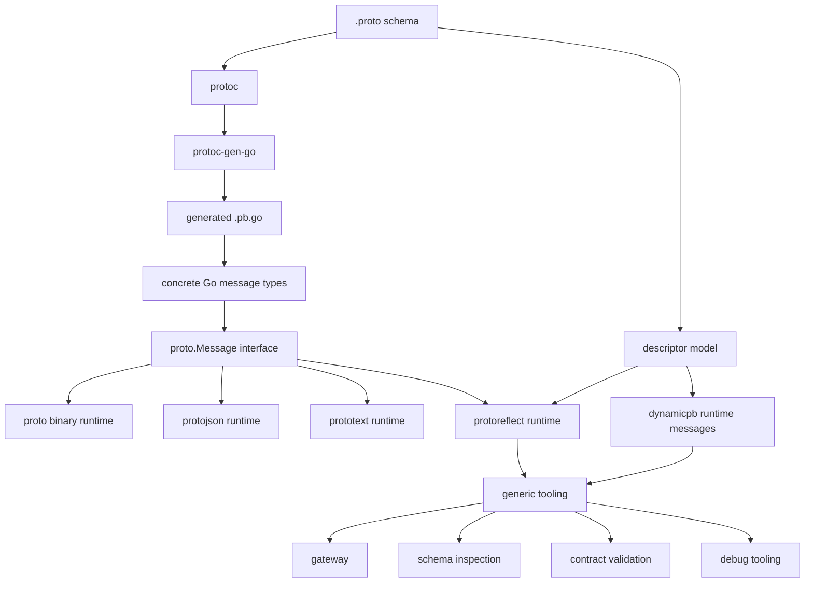
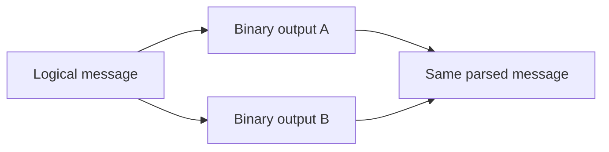
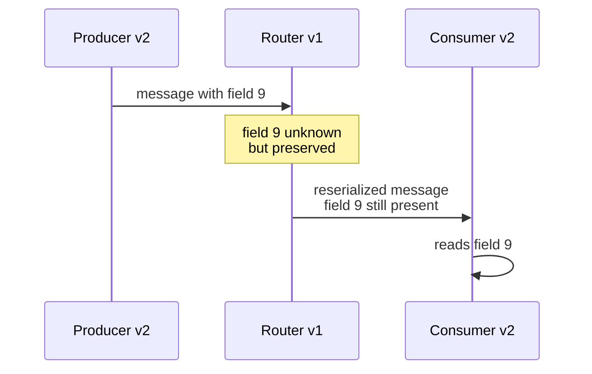
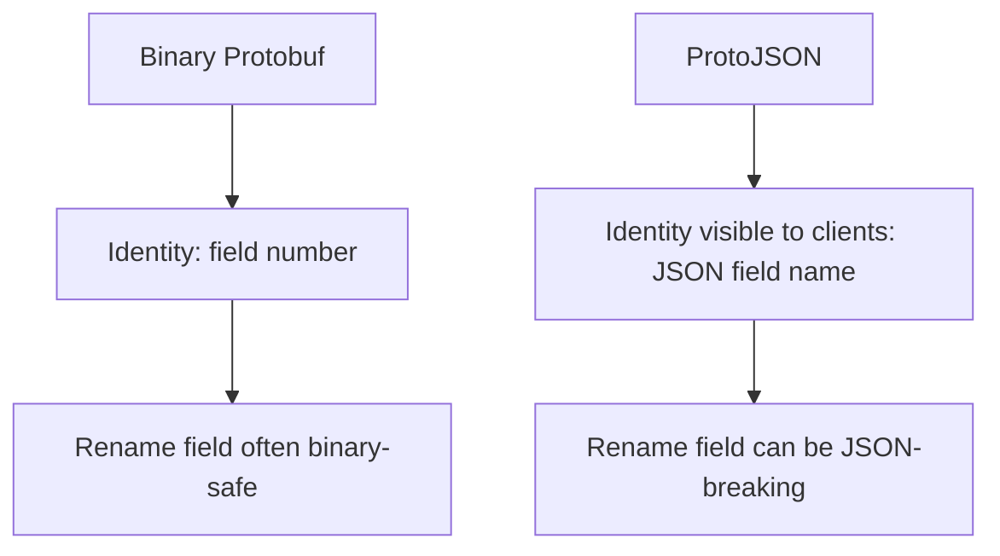
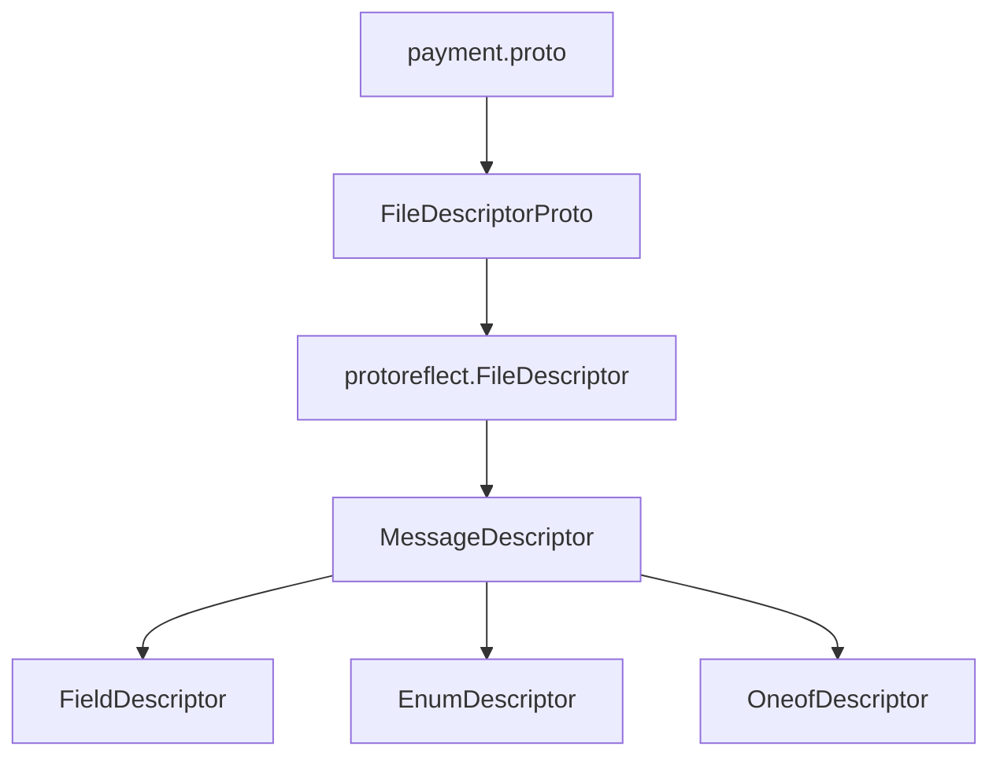
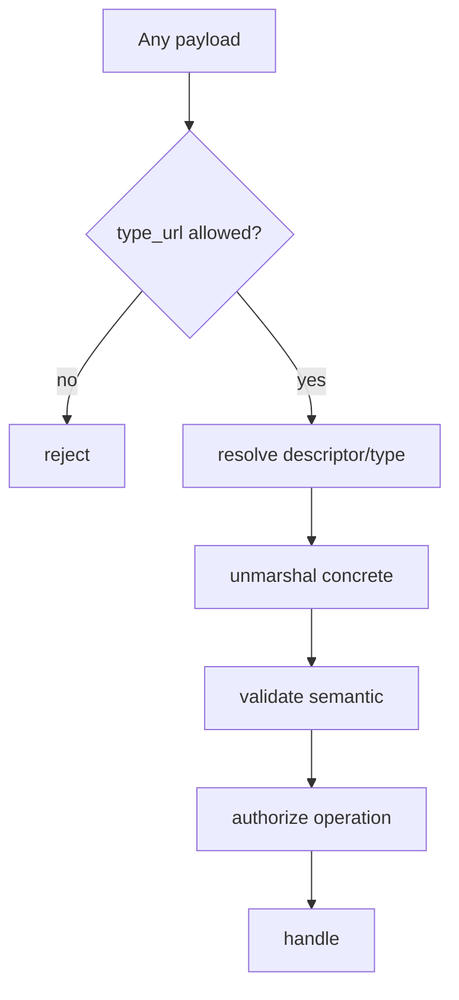
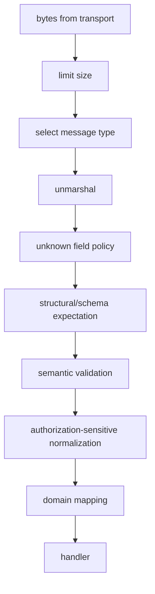
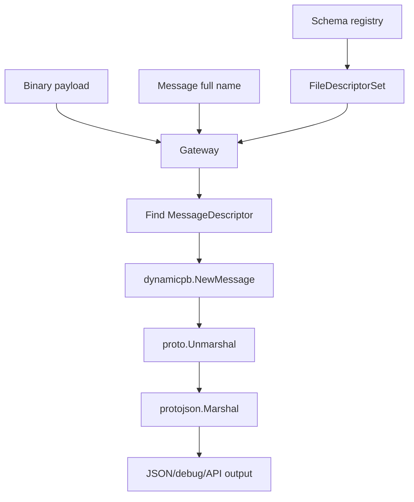
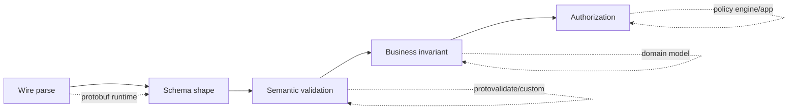
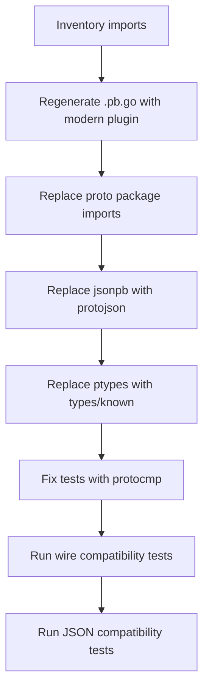

# learn-go-data-mapper-json-xml-protobuf-validation-part-020.md

# Go Protobuf Modern Runtime

> Seri: `learn-go-data-mapper-json-xml-protobuf-validation`  
> Part: `020 / 033`  
> Topik: Go Protobuf Modern Runtime  
> Target pembaca: Java software engineer yang ingin memahami Go Protobuf di level production/runtime/contract governance  
> Status seri: belum selesai

---

## Daftar Isi

1. [Tujuan Pembelajaran](#1-tujuan-pembelajaran)
2. [Masalah yang Ingin Diselesaikan Runtime Protobuf](#2-masalah-yang-ingin-diselesaikan-runtime-protobuf)
3. [Mental Model: Schema, Generated Code, Runtime, Reflection](#3-mental-model-schema-generated-code-runtime-reflection)
4. [Java-to-Go Translation](#4-java-to-go-translation)
5. [Package Taxonomy: Modern Go Protobuf Runtime](#5-package-taxonomy-modern-go-protobuf-runtime)
6. [Toolchain Minimal: `protoc`, `protoc-gen-go`, dan `go_package`](#6-toolchain-minimal-protoc-protoc-gen-go-dan-go_package)
7. [Core Interface: `proto.Message`](#7-core-interface-protomessage)
8. [Binary Runtime: `proto.Marshal`, `proto.Unmarshal`, Options](#8-binary-runtime-protomarshal-protounmarshal-options)
9. [Deterministic Serialization Bukan Canonical Serialization](#9-deterministic-serialization-bukan-canonical-serialization)
10. [Unknown Fields: Compatibility Asset atau Attack Surface?](#10-unknown-fields-compatibility-asset-atau-attack-surface)
11. [ProtoJSON Runtime: `protojson`](#11-protojson-runtime-protojson)
12. [Text Format: `prototext`](#12-text-format-prototext)
13. [Reflection Runtime: `protoreflect`](#13-reflection-runtime-protoreflect)
14. [Descriptors: Runtime Schema sebagai Data](#14-descriptors-runtime-schema-sebagai-data)
15. [Dynamic Message: `dynamicpb`](#15-dynamic-message-dynamicpb)
16. [Type Registries dan Resolver](#16-type-registries-dan-resolver)
17. [Well-Known Types](#17-well-known-types)
18. [`Any` dan Polymorphic Payload](#18-any-dan-polymorphic-payload)
19. [FieldMask untuk Partial Update](#19-fieldmask-untuk-partial-update)
20. [Runtime Pipeline Pattern untuk Service Production](#20-runtime-pipeline-pattern-untuk-service-production)
21. [Descriptor-Driven Gateway Pattern](#21-descriptor-driven-gateway-pattern)
22. [Validation Boundary: Apa yang Runtime Protobuf Tidak Lakukan](#22-validation-boundary-apa-yang-runtime-protobuf-tidak-lakukan)
23. [Error Semantics](#23-error-semantics)
24. [Performance dan Allocation Considerations](#24-performance-dan-allocation-considerations)
25. [Concurrency dan Mutability](#25-concurrency-dan-mutability)
26. [Migration dari Legacy Go Protobuf](#26-migration-dari-legacy-go-protobuf)
27. [Gogo Protobuf: Legacy Risk](#27-gogo-protobuf-legacy-risk)
28. [Package Layout Production](#28-package-layout-production)
29. [Testing Strategy](#29-testing-strategy)
30. [Observability untuk Protobuf Runtime](#30-observability-untuk-protobuf-runtime)
31. [Anti-Patterns](#31-anti-patterns)
32. [Decision Matrix](#32-decision-matrix)
33. [Production Checklist](#33-production-checklist)
34. [Latihan Desain](#34-latihan-desain)
35. [Ringkasan Invariant](#35-ringkasan-invariant)
36. [Referensi](#36-referensi)

---

## 1. Tujuan Pembelajaran

Setelah menyelesaikan part ini, kamu harus mampu:

1. Menjelaskan perbedaan antara:
   - `.proto` schema,
   - generated Go code,
   - runtime package,
   - descriptor,
   - reflection,
   - dynamic message.
2. Menggunakan runtime modern `google.golang.org/protobuf` dengan benar.
3. Memahami kapan memakai:
   - generated type biasa,
   - `proto.Message`,
   - `protoreflect.Message`,
   - `dynamicpb.Message`,
   - registry/resolver.
4. Mendesain binary Protobuf pipeline yang aman untuk API, message broker, file ingestion, dan gateway.
5. Memahami perbedaan binary Protobuf, ProtoJSON, dan text format.
6. Mengelola unknown fields secara sadar.
7. Menghindari asumsi salah tentang deterministic/canonical serialization.
8. Menghubungkan runtime Protobuf dengan validation, schema evolution, dan production governance.

Part ini bukan tutorial dasar `.proto`. Part 019 sudah membahas fondasi schema dan field number. Part ini masuk ke **runtime machinery**.

---

## 2. Masalah yang Ingin Diselesaikan Runtime Protobuf

Di level paling sederhana, Protobuf terlihat seperti ini:

```go
b, err := proto.Marshal(msg)
err = proto.Unmarshal(b, msg)
```

Namun di sistem production, problem-nya jauh lebih luas:

1. Bagaimana service membaca payload dari versi schema lama dan baru?
2. Bagaimana gateway mengonversi binary Protobuf ke JSON tanpa kehilangan semantics?
3. Bagaimana event router mem-forward message yang punya unknown fields?
4. Bagaimana tool internal membaca message yang schema-nya baru diketahui runtime?
5. Bagaimana audit log menyimpan payload dengan descriptor version?
6. Bagaimana test membandingkan Protobuf message tanpa mengandalkan byte order?
7. Bagaimana partial update direpresentasikan secara eksplisit?
8. Bagaimana schema registry/gateway mengetahui message type dari descriptor?
9. Bagaimana validation dilakukan jika Protobuf sendiri hanya menjamin structural parse?
10. Bagaimana menjaga compatibility ketika Go generated API berubah dari Open Struct API ke Opaque API?

Runtime Protobuf adalah lapisan yang menjawab pertanyaan-pertanyaan ini.

---

## 3. Mental Model: Schema, Generated Code, Runtime, Reflection

Protobuf di Go harus dipahami sebagai empat layer:



### 3.1 `.proto` schema

`.proto` adalah contract source of truth:

```proto
syntax = "proto3";

package payment.v1;

option go_package = "github.com/acme/payment/gen/payment/v1;paymentv1";

message PaymentCreated {
  string payment_id = 1;
  int64 amount_minor = 2;
  string currency = 3;
}
```

Hal yang penting:

- `package payment.v1` adalah namespace Protobuf.
- `go_package` adalah Go import path/package name.
- Field number adalah binary compatibility identity.
- Field name penting untuk source code dan ProtoJSON, tetapi bukan identity utama binary wire format.

### 3.2 Generated code

Generated `.pb.go` menyediakan concrete Go type, misalnya:

```go
type PaymentCreated struct { ... }
```

Generated code adalah binding dari schema ke bahasa Go.

### 3.3 Runtime

Runtime menyediakan operasi umum:

```go
proto.Marshal(msg)
proto.Unmarshal(data, msg)
proto.Clone(msg)
proto.Equal(a, b)
proto.Merge(dst, src)
proto.Size(msg)
```

Runtime tidak peduli tipe spesifik selama value mengimplementasikan `proto.Message`.

### 3.4 Reflection

Reflection memungkinkan generic code memahami message tanpa compile-time type knowledge:

```go
m := msg.ProtoReflect()
desc := m.Descriptor()
fields := desc.Fields()
```

Reflection berguna untuk:

- gateway,
- schema inspection,
- debugging,
- redaction generic,
- validation generic,
- unknown field handling,
- descriptor-driven tooling.

### 3.5 Dynamic message

`dynamicpb` memungkinkan membuat message instance dari descriptor runtime:

```go
mt := dynamicpb.NewMessageType(messageDescriptor)
msg := mt.New().Interface()
```

Ini berguna jika schema tidak diketahui saat compile time.

---

## 4. Java-to-Go Translation

Sebagai Java engineer, kamu mungkin familiar dengan:

| Java Protobuf | Go Protobuf Modern |
|---|---|
| Generated class extends/implements message type | Generated struct/type implements `proto.Message` |
| `MessageLite`, `Message`, `Builder` | `proto.Message`, generated accessors/builders tergantung API level |
| `parseFrom` | `proto.Unmarshal` / generated helper patterns |
| `toByteArray` | `proto.Marshal` |
| `JsonFormat.printer()` | `protojson.MarshalOptions` |
| `Descriptors.Descriptor` | `protoreflect.MessageDescriptor` |
| `DynamicMessage` | `dynamicpb.Message` |
| `Any.pack()` | `anypb.New` |
| `FieldMask` | `fieldmaskpb.FieldMask` |
| Bean Validation / custom validation | Protovalidate / custom semantic validation |

Perbedaan filosofis terbesar:

> Java sering memberi pengalaman object-oriented dengan builder-heavy API. Go Protobuf modern bergerak ke arah API yang lebih explicit, runtime-centric, dan reflection-capable, dengan transisi dari Open Struct API ke Opaque API.

### 4.1 Jangan membawa asumsi Java Bean ke Go

Di Java, pola umum:

```java
PaymentCreated event = PaymentCreated.newBuilder()
    .setPaymentId("pay_123")
    .setAmountMinor(10000)
    .setCurrency("IDR")
    .build();
```

Di Go Open Struct API, kamu sering melihat:

```go
event := &paymentv1.PaymentCreated{
    PaymentId:   "pay_123",
    AmountMinor: 10000,
    Currency:    "IDR",
}
```

Namun dengan Opaque API, akses langsung ke field bukan arah jangka panjang. Kamu harus semakin membiasakan diri memakai accessor/builder pattern yang disediakan generated code.

Part 021 akan membahas Open Struct vs Opaque API secara detail. Di part ini cukup pegang invariant berikut:

> Production code sebaiknya tidak terlalu bergantung pada layout struct generated Protobuf. Semakin dekat code ke boundary contract jangka panjang, semakin baik bila memakai accessor/runtime API, bukan field-layout assumption.

---

## 5. Package Taxonomy: Modern Go Protobuf Runtime

Modern Go Protobuf hidup di module:

```text
google.golang.org/protobuf
```

Package penting:

| Package | Fungsi |
|---|---|
| `proto` | Binary marshal/unmarshal, clone, merge, equal, size, reset |
| `encoding/protojson` | ProtoJSON marshal/unmarshal |
| `encoding/prototext` | Protobuf text format |
| `reflect/protoreflect` | Reflection interfaces untuk message, field, enum, descriptor |
| `reflect/protodesc` | Konversi descriptorpb ke protoreflect descriptor |
| `reflect/protoregistry` | Registry file/message/extension type |
| `types/dynamicpb` | Runtime-created messages dari descriptor |
| `types/known/anypb` | Well-known type `Any` |
| `types/known/timestamppb` | Well-known type `Timestamp` |
| `types/known/durationpb` | Well-known type `Duration` |
| `types/known/fieldmaskpb` | Well-known type `FieldMask` |
| `types/known/structpb` | Dynamic JSON-like values |
| `types/known/wrapperspb` | Wrapper scalar types |
| `compiler/protogen` | Library untuk membuat custom protoc plugin Go |

### 5.1 Runtime modern vs legacy

Gunakan:

```go
import "google.golang.org/protobuf/proto"
```

Hindari untuk code baru:

```go
import "github.com/golang/protobuf/proto"
```

Module lama adalah generasi pertama API Go Protobuf. Banyak code lama masih memilikinya secara transitive, tetapi code baru harus memakai `google.golang.org/protobuf`.

---

## 6. Toolchain Minimal: `protoc`, `protoc-gen-go`, dan `go_package`

### 6.1 Instal plugin Go

```bash
go install google.golang.org/protobuf/cmd/protoc-gen-go@latest
```

Untuk gRPC:

```bash
go install google.golang.org/grpc/cmd/protoc-gen-go-grpc@latest
```

Pastikan `$GOBIN` atau `$GOPATH/bin` masuk ke `PATH`.

### 6.2 Generate Go code

```bash
protoc \
  --proto_path=proto \
  --go_out=gen \
  --go_opt=paths=source_relative \
  proto/payment/v1/payment.proto
```

Dengan `paths=source_relative`, output mengikuti struktur relatif file input.

### 6.3 `go_package` wajib diperlakukan serius

Contoh:

```proto
option go_package = "github.com/acme/payment/gen/payment/v1;paymentv1";
```

`go_package` berisi:

```text
<go import path>;<go package name>
```

Kalau package name dihilangkan, generator akan menurunkannya dari import path, tetapi untuk enterprise codebase lebih baik eksplisit.

### 6.4 Protobuf package vs Go package

Jangan menyamakan:

```proto
package payment.v1;
```

dengan:

```proto
option go_package = "github.com/acme/payment/gen/payment/v1;paymentv1";
```

Keduanya berbeda domain:

| Domain | Contoh | Dipakai untuk |
|---|---|---|
| Protobuf namespace | `payment.v1.PaymentCreated` | type URL, descriptor, schema identity |
| Go namespace | `github.com/acme/payment/gen/payment/v1` | import path Go |
| Go package identifier | `paymentv1` | nama package dalam kode Go |

---

## 7. Core Interface: `proto.Message`

Modern Go Protobuf mendefinisikan message melalui interface:

```go
type Message interface {
    ProtoReflect() protoreflect.Message
}
```

Secara praktis, artinya setiap generated message dapat diperlakukan sebagai `proto.Message`.

```go
func Encode(m proto.Message) ([]byte, error) {
    return proto.Marshal(m)
}
```

### 7.1 Concrete type vs interface

Gunakan concrete type ketika business logic butuh field spesifik:

```go
func HandlePaymentCreated(ctx context.Context, e *paymentv1.PaymentCreated) error {
    if e.GetPaymentId() == "" {
        return errors.New("payment_id is required")
    }
    return nil
}
```

Gunakan `proto.Message` ketika logic generic:

```go
func LogProtoType(m proto.Message) string {
    return string(m.ProtoReflect().Descriptor().FullName())
}
```

### 7.2 Rule of thumb

| Kebutuhan | Tipe yang cocok |
|---|---|
| Domain/application logic | Concrete generated type |
| Encode/decode generic | `proto.Message` |
| Inspect fields dynamically | `protoreflect.Message` |
| Create message from runtime schema | `dynamicpb.Message` |
| Registry/resolver | `protoregistry.Types`, `protoregistry.Files` |

---

## 8. Binary Runtime: `proto.Marshal`, `proto.Unmarshal`, Options

### 8.1 Basic marshal

```go
package codec

import (
    "google.golang.org/protobuf/proto"
)

func MarshalBinary(m proto.Message) ([]byte, error) {
    if m == nil {
        return nil, ErrNilMessage
    }
    return proto.Marshal(m)
}
```

### 8.2 Basic unmarshal

```go
func UnmarshalBinary(data []byte, dst proto.Message) error {
    if dst == nil {
        return ErrNilMessage
    }
    return proto.Unmarshal(data, dst)
}
```

### 8.3 Options-based marshal

```go
func MarshalBinaryDeterministic(m proto.Message) ([]byte, error) {
    return proto.MarshalOptions{
        Deterministic: true,
    }.Marshal(m)
}
```

Gunakan deterministic marshal untuk:

- snapshot test lokal,
- debugging,
- cache key internal dengan batasan ketat,
- diff tooling internal.

Jangan gunakan deterministic marshal sebagai canonical cross-language cryptographic representation. Detailnya ada di bagian berikut.

### 8.4 Options-based unmarshal

```go
func UnmarshalBinaryStrict(data []byte, dst proto.Message) error {
    return proto.UnmarshalOptions{
        DiscardUnknown: false,
        AllowPartial:  false,
    }.Unmarshal(data, dst)
}
```

`DiscardUnknown: false` mempertahankan unknown fields. Ini default yang penting untuk compatibility.

`AllowPartial: false` berarti runtime tidak mengizinkan required fields proto2 yang belum terpenuhi. Untuk proto3 biasa, required tidak ada, tetapi setting ini tetap perlu dipahami jika sistem memakai proto2/editions atau imported schema.

### 8.5 Clear-before-unmarshal behavior

`Unmarshal` ke message existing dapat membersihkan/mengubah isi message. Jangan mengandalkan isi lama tetap ada.

Pattern aman:

```go
func DecodePaymentCreated(data []byte) (*paymentv1.PaymentCreated, error) {
    msg := new(paymentv1.PaymentCreated)
    if err := proto.Unmarshal(data, msg); err != nil {
        return nil, err
    }
    return msg, nil
}
```

Hindari:

```go
// Buruk: reuse object yang mungkin masih punya state lama.
var msg paymentv1.PaymentCreated
_ = proto.Unmarshal(oldPayload, &msg)
_ = proto.Unmarshal(newPayload, &msg)
```

Kalau reuse dilakukan untuk performance, harus dibungkus dengan lifecycle yang jelas dan benchmark nyata.

---

## 9. Deterministic Serialization Bukan Canonical Serialization

Ini salah satu jebakan terbesar.

### 9.1 Default Protobuf serialization tidak stable

Binary Protobuf adalah format yang harus bisa dibaca tanpa mengandalkan urutan field. Field dapat muncul dalam urutan berbeda dan tetap message yang sama secara semantic.



Dua byte slice berbeda dapat mewakili logical message yang sama.

### 9.2 Deterministic option punya batas

`proto.MarshalOptions{Deterministic: true}` berguna, tetapi bukan canonical form universal.

Batasnya:

1. Tidak boleh diasumsikan stable lintas versi binary.
2. Tidak boleh diasumsikan stable lintas bahasa.
3. Unknown fields membuat canonicalization sulit.
4. Map ordering dan implementation detail dapat berubah.
5. Nested bytes yang sebenarnya serialized proto lain tidak bisa selalu diketahui runtime.

### 9.3 Jangan melakukan signature langsung atas bytes Protobuf default

Buruk:

```go
b, _ := proto.Marshal(msg)
sig := hmacSHA256(secret, b)
```

Lebih aman:

1. Definisikan canonical signing representation sendiri.
2. Gunakan field-level canonical string.
3. Atau gunakan format yang memang didefinisikan canonical untuk signing.
4. Jika tetap memakai deterministic marshal, dokumentasikan scope: same runtime, same version, same generated code, same language, no unknown fields, tested.

### 9.4 Untuk equality, pakai semantic comparison

Buruk:

```go
bytes.Equal(b1, b2)
```

Lebih benar:

```go
proto.Equal(m1, m2)
```

Untuk test kompleks, gunakan `google.golang.org/protobuf/testing/protocmp` bersama `github.com/google/go-cmp/cmp`.

---

## 10. Unknown Fields: Compatibility Asset atau Attack Surface?

Unknown fields adalah field dengan number yang tidak dikenal oleh schema runtime saat ini.

Contoh:

- Producer v2 menambah field `risk_score = 9`.
- Consumer v1 belum tahu field 9.
- Consumer v1 membaca payload.
- Field 9 menjadi unknown.

### 10.1 Mengapa unknown fields penting?

Unknown fields memungkinkan service lama menjadi pass-through tanpa menghapus informasi dari service baru.



### 10.2 Kapan preserve unknown fields?

Preserve jika component berfungsi sebagai:

- router,
- broker bridge,
- audit forwarder,
- generic proxy,
- schema migration bridge,
- CDC/message relay.

### 10.3 Kapan discard unknown fields?

Discard jika boundary bersifat:

- public ingress yang harus ketat,
- security-sensitive deserialization,
- authorization policy input,
- canonical validation boundary,
- payload normalization sebelum persistence,
- command handler yang tidak boleh menerima future semantics secara diam-diam.

```go
func DecodeIngressCommand(data []byte, dst proto.Message) error {
    return proto.UnmarshalOptions{
        DiscardUnknown: true,
    }.Unmarshal(data, dst)
}
```

Namun hati-hati: `DiscardUnknown: true` berarti kamu membuang forward-compatibility data.

### 10.4 Inspect unknown fields

```go
func HasUnknown(m proto.Message) bool {
    if m == nil {
        return false
    }
    return len(m.ProtoReflect().GetUnknown()) > 0
}
```

### 10.5 Clear unknown fields recursively

```go
package protoutil

import (
    "google.golang.org/protobuf/proto"
    "google.golang.org/protobuf/reflect/protopath"
    "google.golang.org/protobuf/reflect/protorange"
    "google.golang.org/protobuf/reflect/protoreflect"
)

func ClearUnknownRecursive(m proto.Message) error {
    if m == nil {
        return nil
    }

    return protorange.Range(m.ProtoReflect(), func(values protopath.Values) error {
        v := values.Index(-1).Value
        pm, ok := v.Interface().(protoreflect.Message)
        if ok && len(pm.GetUnknown()) > 0 {
            pm.SetUnknown(nil)
        }
        return nil
    })
}
```

### 10.6 Unknown fields policy matrix

| Boundary | Policy default | Reason |
|---|---|---|
| Public command API | discard/reject at semantic layer | Prevent hidden future input |
| Internal event relay | preserve | Forward compatibility |
| Audit archive | preserve + record descriptor version | Evidence fidelity |
| Authorization input | discard/reject | Prevent policy bypass semantics |
| Data migration tool | preserve unless normalized | Avoid data loss |
| Analytics ingestion | often discard after schema projection | Prevent unmodeled dimensions |

---

## 11. ProtoJSON Runtime: `protojson`

ProtoJSON bukan `encoding/json` terhadap generated struct.

Gunakan:

```go
import "google.golang.org/protobuf/encoding/protojson"
```

Jangan lakukan ini untuk Protobuf message:

```go
// Buruk untuk Protobuf semantic JSON
json.Marshal(protoMsg)
```

Gunakan:

```go
b, err := protojson.Marshal(protoMsg)
```

### 11.1 Mengapa `encoding/json` salah untuk Protobuf?

Karena Protobuf punya JSON mapping khusus:

- field name default lowerCamelCase,
- enum default string name,
- bytes base64,
- int64/uint64 biasanya string dalam JSON mapping,
- `Timestamp` punya RFC 3339 mapping,
- `Duration` punya string suffix `s`,
- `Any` punya `@type`,
- wrapper/presence punya semantics khusus,
- `FieldMask` punya string path mapping.

Generated struct layout Go bukan external JSON contract.

### 11.2 Marshal options

```go
func MarshalProtoJSON(m proto.Message) ([]byte, error) {
    return protojson.MarshalOptions{
        UseProtoNames:   true,
        EmitUnpopulated: false,
        UseEnumNumbers:  false,
    }.Marshal(m)
}
```

Common options:

| Option | Efek | Catatan |
|---|---|---|
| `UseProtoNames` | Pakai `snake_case` proto field name | Berguna untuk internal API/debugging |
| `UseEnumNumbers` | Emit enum sebagai angka | Kurang readable, kadang dipakai compatibility |
| `EmitUnpopulated` | Emit default/unpopulated fields | Bisa mengaburkan presence semantics |
| `EmitDefaultValues` | Emit default values untuk field tertentu | Lebih selektif daripada emit semua unpopulated, tergantung versi runtime |
| `Resolver` | Resolve `Any`/extension type | Penting untuk dynamic systems |
| `Multiline`/`Indent` | Pretty print | Untuk debug, bukan hot path |

### 11.3 Unmarshal options

```go
func UnmarshalProtoJSON(data []byte, dst proto.Message) error {
    return protojson.UnmarshalOptions{
        DiscardUnknown: false,
        AllowPartial:  false,
    }.Unmarshal(data, dst)
}
```

ProtoJSON parser secara default harus menolak unknown fields; option `DiscardUnknown` dapat dipakai untuk mengabaikan unknown fields ketika compatibility boundary memang membutuhkannya.

### 11.4 Output `protojson.Marshal` jangan dianggap stable

Dokumentasi `protojson.Marshal` memperingatkan agar tidak bergantung pada stabilitas output JSON. Untuk signing, hashing, atau golden test yang brittle, jangan bergantung pada byte output default.

Gunakan semantic comparison untuk test:

```go
func MustRoundTripJSON(t *testing.T, src proto.Message, dst proto.Message) {
    t.Helper()

    b, err := protojson.Marshal(src)
    if err != nil {
        t.Fatal(err)
    }
    if err := protojson.Unmarshal(b, dst); err != nil {
        t.Fatal(err)
    }
}
```

### 11.5 ProtoJSON compatibility lebih lemah daripada binary

Binary Protobuf aman terhadap rename field karena field number tetap sama.

ProtoJSON memakai field name. Maka rename field dapat menjadi breaking untuk JSON clients.



---

## 12. Text Format: `prototext`

`prototext` adalah format text Protobuf, biasanya untuk:

- debugging,
- config internal,
- readable fixture,
- human inspection,
- logs terbatas.

```go
import "google.golang.org/protobuf/encoding/prototext"

func DebugText(m proto.Message) string {
    return prototext.Format(m)
}
```

Jangan gunakan text format sebagai public API jika tidak ada alasan kuat. Untuk external HTTP API, biasanya ProtoJSON/OpenAPI lebih jelas. Untuk internal binary transport, gunakan binary Protobuf.

### 12.1 Logging caveat

Text format dapat membocorkan sensitive field.

Buruk:

```go
log.Printf("event=%s", prototext.Format(msg))
```

Lebih baik:

```go
log.Printf("event_type=%s message_id=%s", ProtoFullName(msg), SafeMessageID(msg))
```

Kalau perlu payload log, lakukan redaction.

---

## 13. Reflection Runtime: `protoreflect`

`protoreflect` adalah API untuk membaca/menulis message secara generic.

```go
func ProtoFullName(m proto.Message) string {
    if m == nil {
        return ""
    }
    return string(m.ProtoReflect().Descriptor().FullName())
}
```

### 13.1 Inspect fields

```go
func DumpPopulatedFields(m proto.Message) []string {
    pm := m.ProtoReflect()
    var out []string

    pm.Range(func(fd protoreflect.FieldDescriptor, v protoreflect.Value) bool {
        out = append(out, string(fd.FullName()))
        return true
    })

    return out
}
```

`Range` hanya mengunjungi populated fields, bukan semua field dalam schema.

### 13.2 Descriptor vs value

```go
pm := msg.ProtoReflect()
md := pm.Descriptor()
fields := md.Fields()
```

- `pm` adalah message value runtime.
- `md` adalah schema descriptor.
- `fields` adalah daftar field yang didefinisikan schema.

### 13.3 Membaca semua field descriptor

```go
func SchemaFields(m proto.Message) []string {
    md := m.ProtoReflect().Descriptor()
    fields := md.Fields()

    out := make([]string, 0, fields.Len())
    for i := 0; i < fields.Len(); i++ {
        fd := fields.Get(i)
        out = append(out, string(fd.FullName()))
    }
    return out
}
```

### 13.4 Membaca value by field name

```go
func GetByProtoName(m proto.Message, name protoreflect.Name) (protoreflect.Value, bool) {
    pm := m.ProtoReflect()
    fd := pm.Descriptor().Fields().ByName(name)
    if fd == nil {
        return protoreflect.Value{}, false
    }
    if !pm.Has(fd) {
        return protoreflect.Value{}, false
    }
    return pm.Get(fd), true
}
```

### 13.5 Jangan pakai Go reflection untuk Protobuf semantics

Buruk:

```go
rv := reflect.ValueOf(msg).Elem()
field := rv.FieldByName("PaymentId")
```

Lebih benar:

```go
pm := msg.ProtoReflect()
fd := pm.Descriptor().Fields().ByName("payment_id")
v := pm.Get(fd)
```

Kenapa?

1. Opaque API mengurangi ketergantungan pada struct layout.
2. Go struct field bukan schema identity.
3. Protobuf reflection memahami oneof, map, repeated, enum, message, presence, unknown fields.
4. Runtime descriptors lebih stabil untuk generic tooling.

---

## 14. Descriptors: Runtime Schema sebagai Data

Descriptor adalah representasi runtime dari schema Protobuf.



### 14.1 Mengapa descriptor penting?

Descriptor dibutuhkan untuk:

- dynamic message,
- schema registry,
- gateway runtime,
- generic JSON conversion,
- validation tooling,
- redaction annotations,
- documentation generation,
- compatibility checking,
- audit payload metadata.

### 14.2 File descriptor dari generated message

```go
func FilePathOf(m proto.Message) string {
    md := m.ProtoReflect().Descriptor()
    return md.ParentFile().Path()
}
```

### 14.3 Descriptor metadata helper

```go
package protoutil

import (
    "google.golang.org/protobuf/proto"
    "google.golang.org/protobuf/reflect/protoreflect"
)

type MessageMeta struct {
    FullName string
    FilePath string
    Fields   []FieldMeta
}

type FieldMeta struct {
    Number   protoreflect.FieldNumber
    Name     string
    JSONName string
    Kind     protoreflect.Kind
    Cardinal string
}

func Describe(m proto.Message) MessageMeta {
    md := m.ProtoReflect().Descriptor()
    fields := md.Fields()

    meta := MessageMeta{
        FullName: string(md.FullName()),
        FilePath: md.ParentFile().Path(),
        Fields:   make([]FieldMeta, 0, fields.Len()),
    }

    for i := 0; i < fields.Len(); i++ {
        fd := fields.Get(i)

        cardinal := "singular"
        switch {
        case fd.IsList():
            cardinal = "repeated"
        case fd.IsMap():
            cardinal = "map"
        }

        meta.Fields = append(meta.Fields, FieldMeta{
            Number:   fd.Number(),
            Name:     string(fd.Name()),
            JSONName: fd.JSONName(),
            Kind:     fd.Kind(),
            Cardinal: cardinal,
        })
    }

    return meta
}
```

---

## 15. Dynamic Message: `dynamicpb`

`dynamicpb` membuat Protobuf message dari descriptor runtime.

Ini analog dengan Java `DynamicMessage`.

### 15.1 Kapan butuh `dynamicpb`?

Gunakan jika:

1. Schema diketahui saat runtime, bukan compile time.
2. Gateway menerima descriptor set dari schema registry.
3. Tool audit/debug harus membaca banyak message type.
4. Event router tidak mau bergantung pada semua generated package.
5. Test compatibility ingin instantiate message dari descriptor.

Jangan gunakan untuk business logic normal jika generated type tersedia. Generated type lebih type-safe, lebih mudah dibaca, dan biasanya lebih performan.

### 15.2 Create dynamic message

```go
func NewDynamic(md protoreflect.MessageDescriptor) proto.Message {
    return dynamicpb.NewMessage(md)
}
```

### 15.3 Set field dynamically

```go
func SetStringField(m *dynamicpb.Message, fieldName protoreflect.Name, value string) error {
    fd := m.Descriptor().Fields().ByName(fieldName)
    if fd == nil {
        return fmt.Errorf("unknown field %s", fieldName)
    }
    if fd.Kind() != protoreflect.StringKind {
        return fmt.Errorf("field %s is %s, not string", fieldName, fd.Kind())
    }

    m.Set(fd, protoreflect.ValueOfString(value))
    return nil
}
```

### 15.4 Decode dynamic binary payload

```go
func DecodeDynamic(data []byte, md protoreflect.MessageDescriptor) (*dynamicpb.Message, error) {
    msg := dynamicpb.NewMessage(md)
    if err := proto.Unmarshal(data, msg); err != nil {
        return nil, err
    }
    return msg, nil
}
```

### 15.5 Convert dynamic message to ProtoJSON

```go
func DynamicToJSON(data []byte, md protoreflect.MessageDescriptor) ([]byte, error) {
    msg, err := DecodeDynamic(data, md)
    if err != nil {
        return nil, err
    }

    return protojson.MarshalOptions{
        UseProtoNames: true,
    }.Marshal(msg)
}
```

### 15.6 Warning: dynamicpb shifts errors from compile-time to runtime

Generated type error:

```go
msg.PaymentId = 123 // compile error
```

Dynamic message error:

```go
m.Set(fd, protoreflect.ValueOfInt32(123)) // may panic or fail depending misuse
```

Maka dynamic layer harus punya:

- descriptor validation,
- field existence check,
- kind check,
- cardinality check,
- oneof policy,
- enum validation,
- error reporting dengan field path.

---

## 16. Type Registries dan Resolver

Registry adalah peta runtime untuk mencari type/file/extension.

Package penting:

```go
import "google.golang.org/protobuf/reflect/protoregistry"
```

### 16.1 Global registry

Generated code biasanya mendaftarkan file/type ke global registry saat init.

```go
protoregistry.GlobalTypes
protoregistry.GlobalFiles
```

### 16.2 Custom registry

Gunakan custom registry untuk gateway/schema registry agar tidak bergantung pada semua generated package masuk binary.

```go
func NewTypesFromFiles(files *protoregistry.Files) *dynamicpb.Types {
    return dynamicpb.NewTypes(files)
}
```

### 16.3 Resolver untuk Any/extension

`protojson.MarshalOptions` dan `UnmarshalOptions` dapat memakai resolver.

```go
func MarshalWithResolver(m proto.Message, r interface {
    protoregistry.MessageTypeResolver
    protoregistry.ExtensionTypeResolver
}) ([]byte, error) {
    return protojson.MarshalOptions{
        Resolver: r,
    }.Marshal(m)
}
```

Resolver penting untuk:

- `Any`,
- extensions,
- dynamic message,
- plugin architecture,
- schema registry integration.

---

## 17. Well-Known Types

Well-known types adalah Protobuf types standar yang punya runtime mapping khusus.

| Type | Go package | Kegunaan |
|---|---|---|
| `google.protobuf.Timestamp` | `timestamppb` | Point in time |
| `google.protobuf.Duration` | `durationpb` | Durasi |
| `google.protobuf.Any` | `anypb` | Polymorphic message |
| `google.protobuf.FieldMask` | `fieldmaskpb` | Partial update/path selection |
| `google.protobuf.Struct` | `structpb` | JSON-like object |
| `google.protobuf.Value` | `structpb` | JSON-like dynamic value |
| `google.protobuf.ListValue` | `structpb` | JSON-like list |
| scalar wrappers | `wrapperspb` | Presence untuk scalar lama/interop |
| empty | `emptypb` | Empty request/response |

### 17.1 Timestamp

```go
now := timestamppb.Now()
if err := now.CheckValid(); err != nil {
    return err
}
```

Konversi:

```go
t := time.Now().UTC()
ts := timestamppb.New(t)
back := ts.AsTime()
```

Production rule:

> Simpan timestamp sebagai instant UTC. Jangan encode timezone business semantics hanya sebagai `Timestamp` jika timezone tersebut domain-relevant.

### 17.2 Duration

```go
d := durationpb.New(5 * time.Minute)
if err := d.CheckValid(); err != nil {
    return err
}
```

### 17.3 Struct/Value

`structpb.Struct` berguna untuk dynamic JSON-like metadata, tetapi jangan menjadikannya pelarian dari schema governance.

Buruk:

```proto
message CaseEvent {
  string case_id = 1;
  google.protobuf.Struct payload = 2; // everything goes here forever
}
```

Lebih baik:

```proto
message CaseEvent {
  string case_id = 1;
  oneof event {
    CaseCreated created = 2;
    CaseAssigned assigned = 3;
    CaseEscalated escalated = 4;
  }
}
```

Gunakan `Struct` untuk:

- limited extension metadata,
- third-party passthrough,
- feature flags dengan governance,
- non-critical annotations.

Jangan gunakan untuk:

- core domain state,
- command input yang perlu validation kuat,
- regulatory/audit semantics tanpa schema.

---

## 18. `Any` dan Polymorphic Payload

`Any` menyimpan serialized message plus type URL.

```proto
import "google/protobuf/any.proto";

message AuditEnvelope {
  string audit_id = 1;
  google.protobuf.Any payload = 2;
}
```

### 18.1 Pack message

```go
payload, err := anypb.New(&paymentv1.PaymentCreated{
    PaymentId:   "pay_123",
    AmountMinor: 10000,
    Currency:    "IDR",
})
if err != nil {
    return err
}

envelope := &auditv1.AuditEnvelope{
    AuditId: "audit_001",
    Payload: payload,
}
```

### 18.2 Unpack message

```go
var event paymentv1.PaymentCreated
if err := envelope.Payload.UnmarshalTo(&event); err != nil {
    return err
}
```

### 18.3 Type check

```go
func IsPaymentCreated(a *anypb.Any) bool {
    return a.MessageIs(&paymentv1.PaymentCreated{})
}
```

### 18.4 Any governance

`Any` powerful tapi berbahaya jika uncontrolled.

Policy yang harus ada:

1. Allowed type list.
2. Type URL namespace policy.
3. Descriptor availability.
4. Validation per concrete payload.
5. Authorization per payload type.
6. Logging/redaction per payload type.
7. Versioning policy.



### 18.5 Jangan jadikan Any sebagai dumping ground

Buruk:

```proto
message Command {
  google.protobuf.Any payload = 1;
}
```

Lebih baik jika set type jelas:

```proto
message Command {
  oneof command {
    CreateCase create_case = 1;
    AssignCase assign_case = 2;
    EscalateCase escalate_case = 3;
  }
}
```

Gunakan `Any` jika polymorphism benar-benar lintas plugin/module dan type set tidak bisa fixed saat schema ditulis.

---

## 19. FieldMask untuk Partial Update

Partial update adalah salah satu area yang sering salah di JSON API dan Protobuf API.

`FieldMask` membuat intent update eksplisit.

```proto
import "google/protobuf/field_mask.proto";

message UpdateCaseRequest {
  string case_id = 1;
  Case patch = 2;
  google.protobuf.FieldMask update_mask = 3;
}
```

### 19.1 Mengapa FieldMask penting?

Tanpa field mask:

```proto
message UpdateCaseRequest {
  string case_id = 1;
  string title = 2;
  string description = 3;
}
```

Tidak jelas apakah `description == ""` berarti:

1. client ingin menghapus description,
2. client tidak mengirim description,
3. client lupa mengisi,
4. default generated value.

Dengan field mask:

```text
update_mask.paths = ["description"]
patch.description = ""
```

Artinya eksplisit: description di-set menjadi empty string.

### 19.2 Validate field mask

```go
func ValidateCaseUpdateMask(mask *fieldmaskpb.FieldMask) error {
    if mask == nil || len(mask.Paths) == 0 {
        return errors.New("update_mask is required")
    }

    allowed := map[string]struct{}{
        "title":       {},
        "description": {},
        "priority":    {},
    }

    for _, p := range mask.Paths {
        if _, ok := allowed[p]; !ok {
            return fmt.Errorf("unsupported update path %q", p)
        }
    }
    return nil
}
```

### 19.3 Apply update explicitly

```go
func ApplyCasePatch(dst *casev1.Case, patch *casev1.Case, mask *fieldmaskpb.FieldMask) error {
    if dst == nil || patch == nil || mask == nil {
        return errors.New("nil input")
    }

    for _, p := range mask.Paths {
        switch p {
        case "title":
            dst.Title = patch.GetTitle()
        case "description":
            dst.Description = patch.GetDescription()
        case "priority":
            dst.Priority = patch.GetPriority()
        default:
            return fmt.Errorf("unsupported update path %q", p)
        }
    }
    return nil
}
```

Dengan Opaque API, setter/accessor pattern akan berbeda, tetapi invariant-nya sama: update harus didorong oleh mask, bukan oleh default value guessing.

---

## 20. Runtime Pipeline Pattern untuk Service Production

Binary Protobuf decode pipeline ideal:



### 20.1 Generic decoder interface

```go
package protocodec

import (
    "fmt"

    "google.golang.org/protobuf/proto"
)

type UnknownPolicy int

const (
    PreserveUnknown UnknownPolicy = iota
    DiscardUnknown
    RejectUnknown
)

type BinaryDecoder struct {
    UnknownPolicy UnknownPolicy
    MaxBytes      int
}

func (d BinaryDecoder) Decode(data []byte, dst proto.Message) error {
    if dst == nil {
        return fmt.Errorf("protobuf decode: nil destination")
    }
    if d.MaxBytes > 0 && len(data) > d.MaxBytes {
        return fmt.Errorf("protobuf decode: payload too large: %d > %d", len(data), d.MaxBytes)
    }

    discard := d.UnknownPolicy == DiscardUnknown
    if err := proto.UnmarshalOptions{
        DiscardUnknown: discard,
        AllowPartial:  false,
    }.Unmarshal(data, dst); err != nil {
        return fmt.Errorf("protobuf decode: %w", err)
    }

    if d.UnknownPolicy == RejectUnknown && len(dst.ProtoReflect().GetUnknown()) > 0 {
        return fmt.Errorf("protobuf decode: unknown fields are not allowed")
    }

    return nil
}
```

### 20.2 Why reject unknown is not same as discard unknown

| Policy | Behavior | Risiko |
|---|---|---|
| Preserve | Unknown fields tetap ada | Hidden data ikut lewat |
| Discard | Unknown fields dibuang | Future data loss |
| Reject | Payload ditolak jika unknown | Breaking untuk client baru |

Public command API biasanya lebih cocok reject atau discard, tergantung compatibility contract.

Internal event relay biasanya preserve.

---

## 21. Descriptor-Driven Gateway Pattern

Gateway generic sering tidak punya generated type untuk semua message. Ia menerima:

1. type name,
2. descriptor set,
3. binary payload.

Lalu menghasilkan JSON atau melakukan routing.



### 21.1 Descriptor set input

Biasanya descriptor set dihasilkan dengan:

```bash
protoc \
  --proto_path=proto \
  --include_imports \
  --descriptor_set_out=schema.pb \
  proto/payment/v1/payment.proto
```

### 21.2 Load descriptor set

Contoh konseptual:

```go
package schemaregistry

import (
    "fmt"

    "google.golang.org/protobuf/proto"
    "google.golang.org/protobuf/reflect/protodesc"
    "google.golang.org/protobuf/reflect/protoreflect"
    "google.golang.org/protobuf/reflect/protoregistry"
    "google.golang.org/protobuf/types/descriptorpb"
)

func LoadFiles(descSetBytes []byte) (*protoregistry.Files, error) {
    var set descriptorpb.FileDescriptorSet
    if err := proto.Unmarshal(descSetBytes, &set); err != nil {
        return nil, fmt.Errorf("decode descriptor set: %w", err)
    }

    files, err := protodesc.NewFiles(&set)
    if err != nil {
        return nil, fmt.Errorf("build file registry: %w", err)
    }
    return files, nil
}

func FindMessage(files *protoregistry.Files, name protoreflect.FullName) (protoreflect.MessageDescriptor, error) {
    d, err := files.FindDescriptorByName(name)
    if err != nil {
        return nil, err
    }
    md, ok := d.(protoreflect.MessageDescriptor)
    if !ok {
        return nil, fmt.Errorf("descriptor %s is not a message", name)
    }
    return md, nil
}
```

### 21.3 Convert binary to JSON dynamically

```go
func BinaryToJSONDynamic(
    files *protoregistry.Files,
    fullName protoreflect.FullName,
    payload []byte,
) ([]byte, error) {
    md, err := FindMessage(files, fullName)
    if err != nil {
        return nil, err
    }

    msg := dynamicpb.NewMessage(md)
    if err := proto.Unmarshal(payload, msg); err != nil {
        return nil, err
    }

    resolver := dynamicpb.NewTypes(files)

    return protojson.MarshalOptions{
        UseProtoNames: true,
        Resolver:      resolver,
    }.Marshal(msg)
}
```

### 21.4 Production gateway requirements

Descriptor-driven gateway harus punya:

1. Schema version pinning.
2. Descriptor cache with eviction.
3. Type allowlist.
4. Payload size limit.
5. Recursion limit awareness.
6. Unknown field policy.
7. Metrics by message type.
8. JSON output policy.
9. Redaction annotations.
10. Failure isolation per tenant/source.

---

## 22. Validation Boundary: Apa yang Runtime Protobuf Tidak Lakukan

Protobuf runtime memvalidasi bahwa bytes bisa diparse sesuai wire format dan schema structure dasar.

Runtime tidak otomatis menjamin:

1. `email` valid.
2. `currency` ISO 4217 valid.
3. `amount_minor > 0`.
4. `start_time < end_time`.
5. enum value sesuai business transition.
6. user boleh melakukan action.
7. required-by-business field terisi.
8. repeated list tidak punya duplicate semantic.
9. FieldMask path allowed untuk actor tertentu.
10. oneof command valid terhadap current aggregate state.



### 22.1 Validasi harus layered

| Layer | Contoh | Pemilik |
|---|---|---|
| Wire parse | invalid varint, malformed length | protobuf runtime |
| Schema shape | field kind, message structure | generated/runtime |
| Semantic contract | amount positive, string pattern | Protovalidate/custom validator |
| Domain invariant | cannot approve closed case | domain/application service |
| Authorization | actor may update priority | policy layer |

Part 029 akan membahas Protovalidate secara khusus.

---

## 23. Error Semantics

### 23.1 Jangan expose raw protobuf error ke public client tanpa mapping

Buruk:

```go
return err
```

Lebih baik:

```go
type DecodeError struct {
    Format string
    Reason string
    Cause  error
}

func (e *DecodeError) Error() string {
    return e.Format + " decode failed: " + e.Reason
}

func (e *DecodeError) Unwrap() error {
    return e.Cause
}
```

### 23.2 Decode error categories

| Category | Contoh | HTTP-ish mapping |
|---|---|---|
| Too large | payload > limit | 413 |
| Malformed wire | invalid Protobuf bytes | 400 |
| Unknown type | descriptor not found | 400/422 |
| Unknown field rejected | future/unexpected field | 400 |
| Partial message | required proto2 field missing | 400 |
| Semantic invalid | amount <= 0 | 422 |
| Unauthorized semantics | field not allowed for actor | 403 |

### 23.3 Field path error

Untuk validation generic, gunakan path berbasis Protobuf field name, bukan Go struct field.

```json
{
  "code": "INVALID_ARGUMENT",
  "message": "request validation failed",
  "violations": [
    {
      "field": "payment.amount_minor",
      "rule": "gt",
      "reason": "must be greater than 0"
    }
  ]
}
```

Alasannya:

- Protobuf field name stabil sebagai schema contract.
- Go struct field dapat berubah karena Open/Opaque API.
- JSON field name bisa lowerCamelCase dan berbeda dari proto name.

---

## 24. Performance dan Allocation Considerations

### 24.1 Generated type biasanya pilihan utama

Untuk hot path:

- gunakan generated type,
- hindari dynamicpb jika schema known compile-time,
- hindari reflection generic untuk business logic,
- hindari ProtoJSON di internal hot path jika binary cukup.

### 24.2 Binary vs ProtoJSON

| Format | Kelebihan | Kekurangan |
|---|---|---|
| Binary Protobuf | compact, cepat, schema-driven | tidak human-readable |
| ProtoJSON | readable, HTTP-friendly | lebih besar, lebih mahal, compatibility via names |
| Text format | debug-friendly | bukan API umum, tidak optimal |

### 24.3 `proto.Size`

`proto.Size(m)` berguna untuk estimasi ukuran binary output.

```go
func RejectIfTooLarge(m proto.Message, max int) error {
    n := proto.Size(m)
    if n > max {
        return fmt.Errorf("message too large: %d > %d", n, max)
    }
    return nil
}
```

Tetapi jangan memanggil `proto.Size` sembarangan di hot path jika setelahnya tetap marshal; ukur dulu.

### 24.4 Reuse buffer?

Go Protobuf memiliki `MarshalOptions.MarshalAppend` di runtime modern untuk append ke buffer existing.

Pola umum:

```go
func MarshalWithScratch(dst []byte, m proto.Message) ([]byte, error) {
    dst = dst[:0]
    return proto.MarshalOptions{}.MarshalAppend(dst, m)
}
```

Gunakan hanya jika:

- hot path terbukti allocation-heavy,
- lifecycle buffer jelas,
- tidak ada data race,
- benchmark menunjukkan manfaat.

### 24.5 Pooling caution

Hindari pooling message secara agresif.

Risiko:

1. Data lama bocor.
2. Unknown fields tertinggal.
3. Slice/map nested sharing.
4. Race condition.
5. Opaque API/lazy decoding interactions.

Lebih baik mulai sederhana:

```go
msg := new(paymentv1.PaymentCreated)
```

Optimasi hanya setelah profiling.

### 24.6 Reflection cost

`protoreflect` powerful, tetapi tidak gratis. Hindari reflection pada setiap message di hot path jika bisa diganti dengan generated accessor.

Gunakan reflection untuk:

- startup schema indexing,
- admin/debug tooling,
- low-throughput gateway,
- validation metadata,
- redaction generic dengan cache descriptor.

---

## 25. Concurrency dan Mutability

Protobuf message adalah mutable object.

### 25.1 Jangan mutate message yang sedang dibaca goroutine lain

Buruk:

```go
go publish(msg)
msg.Status = paymentv1.PaymentStatus_PAYMENT_STATUS_SETTLED
```

Lebih aman:

```go
copy := proto.Clone(msg).(*paymentv1.PaymentCreated)
go publish(copy)
```

### 25.2 Treat message as owned value

Ownership rule:

> Function yang menerima Protobuf message tidak boleh menyimpan/memutasi message setelah function return kecuali contract-nya eksplisit.

### 25.3 Defensive clone di boundary

```go
func StoreForAsyncPublish(m proto.Message) proto.Message {
    return proto.Clone(m)
}
```

Namun clone punya cost. Gunakan sesuai boundary risk.

---

## 26. Migration dari Legacy Go Protobuf

Legacy import:

```go
github.com/golang/protobuf/proto
```

Modern import:

```go
google.golang.org/protobuf/proto
```

### 26.1 Migration goals

1. Generated code memakai modern plugin.
2. Runtime imports memakai `google.golang.org/protobuf`.
3. Generic code memakai `protoreflect`, bukan legacy descriptor API.
4. JSON memakai `protojson`, bukan `jsonpb` legacy.
5. Tests memakai `protocmp`, bukan reflect.DeepEqual.

### 26.2 Common old-to-new mapping

| Legacy | Modern |
|---|---|
| `github.com/golang/protobuf/proto` | `google.golang.org/protobuf/proto` |
| `jsonpb` | `protojson` |
| `ptypes.Timestamp` helpers | `timestamppb` |
| `ptypes.Any` helpers | `anypb` |
| `descriptor` legacy APIs | `protoreflect` / `protodesc` |
| `reflect.DeepEqual` tests | `proto.Equal` / `protocmp` |

### 26.3 Migration strategy



### 26.4 Compatibility tests wajib

Migration runtime tidak boleh hanya “compile green”. Perlu test:

1. Old binary payload can be read by new code.
2. New binary payload can be read by old consumer if compatibility promised.
3. ProtoJSON output accepted by existing clients.
4. Unknown field preservation/discard policy unchanged.
5. Golden test tidak brittle terhadap field ordering.

---

## 27. Gogo Protobuf: Legacy Risk

`gogo/protobuf` pernah populer karena performance dan fitur tambahan. Untuk code baru, jangan pilih gogo kecuali ada legacy constraint kuat.

Risiko umum:

1. Ecosystem modern Protobuf bergerak ke `google.golang.org/protobuf`.
2. Compatibility dengan modern reflection/runtime bisa bermasalah.
3. Security/maintenance posture harus diverifikasi.
4. Generated API dapat berbeda dari standard expectation.
5. Migration cost meningkat jika sistem makin besar.

Production recommendation:

- Untuk sistem baru: standard modern Go Protobuf.
- Untuk legacy gogo: buat migration plan bertahap.
- Untuk boundary: jangan campur representation tanpa compatibility test.

---

## 28. Package Layout Production

Contoh layout:

```text
repo/
  proto/
    payment/v1/payment.proto
    case/v1/case.proto
  gen/
    payment/v1/payment.pb.go
    case/v1/case.pb.go
  internal/
    protocodec/
      binary.go
      json.go
      unknown.go
      registry.go
    protovalidation/
      validate.go
    eventing/
      envelope.go
      publisher.go
    app/
      payment_handler.go
  cmd/
    schema-dump/
    proto-debug/
```

### 28.1 Generated code package

Generated code sebaiknya tidak dicampur dengan domain service logic.

Buruk:

```text
gen/payment/v1/payment.pb.go
gen/payment/v1/payment_service_logic.go
```

Lebih baik:

```text
gen/payment/v1/payment.pb.go
internal/app/payment_service.go
internal/mapper/payment_mapper.go
```

### 28.2 Boundary package

Buat package khusus runtime boundary:

```text
internal/protocodec
```

Isinya:

- binary marshal/unmarshal policy,
- ProtoJSON options,
- unknown fields handling,
- descriptor resolver,
- envelope decode,
- metric labels.

Tujuannya agar option tidak tersebar random di semua handler.

---

## 29. Testing Strategy

### 29.1 Semantic equality

```go
if !proto.Equal(got, want) {
    t.Fatalf("message mismatch")
}
```

Untuk diff yang bagus:

```go
import (
    "github.com/google/go-cmp/cmp"
    "google.golang.org/protobuf/testing/protocmp"
)

if diff := cmp.Diff(want, got, protocmp.Transform()); diff != "" {
    t.Fatalf("mismatch (-want +got):\n%s", diff)
}
```

### 29.2 Round-trip binary test

```go
func TestPaymentCreatedBinaryRoundTrip(t *testing.T) {
    src := &paymentv1.PaymentCreated{
        PaymentId:   "pay_123",
        AmountMinor: 10000,
        Currency:    "IDR",
    }

    b, err := proto.Marshal(src)
    if err != nil {
        t.Fatal(err)
    }

    var dst paymentv1.PaymentCreated
    if err := proto.Unmarshal(b, &dst); err != nil {
        t.Fatal(err)
    }

    if diff := cmp.Diff(src, &dst, protocmp.Transform()); diff != "" {
        t.Fatal(diff)
    }
}
```

### 29.3 Unknown field test

Test apakah boundary preserve/discard/reject sesuai policy.

```go
func TestRejectUnknown(t *testing.T) {
    msg := &paymentv1.PaymentCreated{
        PaymentId: "pay_123",
    }

    pm := msg.ProtoReflect()
    pm.SetUnknown([]byte{0xC8, 0x3E, 0x01}) // illustrative only

    dec := protocodec.BinaryDecoder{UnknownPolicy: protocodec.RejectUnknown}
    b, err := proto.Marshal(msg)
    if err != nil {
        t.Fatal(err)
    }

    var dst paymentv1.PaymentCreated
    err = dec.Decode(b, &dst)
    if err == nil {
        t.Fatal("expected unknown field rejection")
    }
}
```

### 29.4 ProtoJSON compatibility test

```go
func TestProtoJSONContract(t *testing.T) {
    msg := &paymentv1.PaymentCreated{
        PaymentId:   "pay_123",
        AmountMinor: 10000,
        Currency:    "IDR",
    }

    b, err := protojson.MarshalOptions{
        UseProtoNames: true,
    }.Marshal(msg)
    if err != nil {
        t.Fatal(err)
    }

    assert.JSONEq(t, `{
      "payment_id": "pay_123",
      "amount_minor": "10000",
      "currency": "IDR"
    }`, string(b))
}
```

Catatan: `int64` dalam ProtoJSON sering direpresentasikan sebagai string. Test contract harus mengikuti ProtoJSON mapping, bukan asumsi `encoding/json` biasa.

### 29.5 Descriptor test

```go
func TestFieldNumbersDoNotChange(t *testing.T) {
    md := (&paymentv1.PaymentCreated{}).ProtoReflect().Descriptor()

    cases := map[protoreflect.Name]protoreflect.FieldNumber{
        "payment_id":   1,
        "amount_minor": 2,
        "currency":     3,
    }

    for name, want := range cases {
        fd := md.Fields().ByName(name)
        if fd == nil {
            t.Fatalf("missing field %s", name)
        }
        if got := fd.Number(); got != want {
            t.Fatalf("field %s number changed: got %d want %d", name, got, want)
        }
    }
}
```

Ini bukan pengganti Buf breaking check, tetapi berguna untuk local invariant test pada critical contract.

---

## 30. Observability untuk Protobuf Runtime

### 30.1 Metrics yang berguna

| Metric | Label | Makna |
|---|---|---|
| `protobuf_decode_total` | `message_type`, `status` | Decode success/error |
| `protobuf_decode_bytes` | `message_type` | Payload size distribution |
| `protobuf_decode_duration_seconds` | `message_type` | Decode latency |
| `protobuf_unknown_fields_total` | `message_type`, `boundary` | Unknown fields detected |
| `protobuf_json_marshal_total` | `message_type`, `status` | ProtoJSON conversion |
| `protobuf_descriptor_lookup_total` | `message_type`, `status` | Dynamic registry lookup |

### 30.2 Logging type name

```go
func MessageTypeLabel(m proto.Message) string {
    if m == nil {
        return "unknown"
    }
    return string(m.ProtoReflect().Descriptor().FullName())
}
```

### 30.3 Jangan log payload penuh by default

Payload Protobuf dapat mengandung:

- PII,
- token,
- audit-sensitive field,
- legal evidence,
- internal state.

Log minimal:

```text
message_type=payment.v1.PaymentCreated payload_bytes=128 decode_ms=0.37 unknown_fields=false
```

Untuk debug payload, gunakan feature flag + redaction + sampling + environment guard.

---

## 31. Anti-Patterns

### 31.1 Menggunakan `encoding/json` untuk Protobuf message public JSON

Masalah:

- tidak mengikuti ProtoJSON mapping,
- field name bisa mengikuti Go struct,
- int64/bytes/timestamp semantics salah,
- Opaque API incompatible.

### 31.2 Menganggap byte equality sama dengan message equality

Masalah:

- serialization order tidak dijamin,
- deterministic bukan canonical,
- unknown fields dapat mengubah bytes.

### 31.3 Reusing field numbers

Ini fatal untuk compatibility. Field number yang pernah dipakai harus reserved jika dihapus.

### 31.4 Business logic di dynamicpb

Dynamic message cocok untuk gateway/tooling, bukan core domain logic sehari-hari.

### 31.5 Membuang unknown fields tanpa policy

`DiscardUnknown: true` dapat menyebabkan data loss pada relay/forwarder.

### 31.6 Preserve unknown fields di security-sensitive command tanpa sadar

Unknown fields dapat membawa semantics masa depan yang tidak divalidasi oleh service lama.

### 31.7 Mengandalkan generated struct layout

Dengan arah Opaque API, code yang banyak memakai direct struct reflection akan makin rapuh.

### 31.8 `Any` tanpa allowlist

`Any` tanpa governance menjadi unbounded polymorphism dan attack surface.

### 31.9 Golden test berdasarkan exact JSON/string output default

ProtoJSON output tidak boleh diasumsikan stable kecuali kamu mengontrol options dan test semantic JSON, bukan raw bytes.

### 31.10 Protobuf sebagai domain model internal tanpa mapping

Generated Protobuf type adalah contract model. Domain model punya invariant dan behavior. Kadang boleh dipakai langsung untuk simple pass-through, tapi untuk complex domain biasanya perlu mapping.

---

## 32. Decision Matrix

### 32.1 Generated type vs dynamicpb

| Pertanyaan | Generated type | dynamicpb |
|---|---|---|
| Schema known at compile time? | Ya | Tidak wajib |
| Business logic field-specific? | Ya | Tidak ideal |
| Gateway generic? | Bisa tapi berat dependency | Cocok |
| Schema registry runtime? | Tidak cukup | Cocok |
| Performance hot path? | Cocok | Hati-hati |
| Compile-time safety? | Kuat | Lemah |

### 32.2 Binary vs ProtoJSON

| Kebutuhan | Pilihan |
|---|---|
| gRPC internal | Binary Protobuf |
| Kafka/event internal compact | Binary Protobuf + schema governance |
| HTTP public API | JSON/OpenAPI atau ProtoJSON dengan policy jelas |
| Debug/admin | ProtoJSON/prototext |
| Audit exact wire preservation | Binary + descriptor version |
| Browser clients | JSON usually, unless grpc-web/connect-web |

### 32.3 Unknown fields policy

| Component | Recommended default |
|---|---|
| Command handler | Reject or discard |
| Event consumer business logic | Preserve on read, ignore semantically |
| Event relay | Preserve |
| Public JSON gateway | Reject unknown unless compatibility requires ignore |
| Audit writer | Preserve |
| Analytics projection | Discard after projection |

### 32.4 Reflection use

| Use case | Reflection? |
|---|---|
| Business logic | Avoid |
| Generic redaction | Yes, with descriptor cache |
| Schema browser | Yes |
| Runtime converter | Yes |
| Validation framework | Yes/generator hybrid |
| Hot-path field access | Avoid |

---

## 33. Production Checklist

### Schema/runtime setup

- [ ] Semua code baru memakai `google.golang.org/protobuf`.
- [ ] `go_package` eksplisit dan konsisten.
- [ ] Generated code tidak dicampur dengan domain logic.
- [ ] Build pipeline regenerate `.pb.go` secara reproducible.
- [ ] Buf/protoc linting tersedia.

### Binary runtime

- [ ] Payload size limit ada sebelum unmarshal.
- [ ] Unknown field policy eksplisit per boundary.
- [ ] `AllowPartial` dipilih dengan sadar.
- [ ] Decode error dimap ke error taxonomy aplikasi.
- [ ] Message ownership/mutability jelas.

### ProtoJSON

- [ ] Tidak memakai `encoding/json` untuk Protobuf public mapping.
- [ ] `protojson.MarshalOptions` distandardisasi.
- [ ] JSON field naming policy jelas: proto name vs lowerCamelCase.
- [ ] Unknown JSON field policy jelas.
- [ ] ProtoJSON output tidak dipakai untuk signature tanpa canonical strategy.

### Descriptor/dynamic

- [ ] Descriptor source/version jelas.
- [ ] Registry/resolver tidak memakai uncontrolled global state untuk multi-tenant gateway.
- [ ] Dynamic message hanya dipakai pada layer yang butuh dynamic schema.
- [ ] Type allowlist tersedia untuk `Any`/dynamic payload.

### Validation

- [ ] Runtime parse tidak dianggap sama dengan business validation.
- [ ] Semantic validation layer tersedia.
- [ ] Field path error memakai proto field path.
- [ ] FieldMask partial update divalidasi terhadap allowlist.

### Observability

- [ ] Decode success/error metrics ada.
- [ ] Payload size histogram ada.
- [ ] Unknown fields counted.
- [ ] Message type label berasal dari descriptor full name.
- [ ] Payload logging punya redaction/sampling policy.

### Compatibility

- [ ] Field number tidak direuse.
- [ ] Deleted fields di-reserve.
- [ ] Binary round-trip tests ada.
- [ ] ProtoJSON compatibility tests ada jika exposed.
- [ ] Unknown field behavior diuji.

---

## 34. Latihan Desain

### Latihan 1 — Event Relay Unknown Fields

Kamu punya event relay v1 yang menerima `CaseUpdated` dari producer v2. Producer v2 menambah field `risk_score = 12`. Relay v1 tidak tahu field ini, tetapi consumer v2 membutuhkannya.

Desain:

1. Decode policy relay.
2. Re-encode policy relay.
3. Observability metric untuk unknown fields.
4. Test yang membuktikan field unknown tidak hilang.

Expected direction:

- Preserve unknown fields.
- Jangan map ke domain struct yang membuang unknown lalu publish ulang.
- Publish ulang message yang masih menyimpan unknown fields.
- Count unknown fields as compatibility signal, bukan langsung error.

### Latihan 2 — Public Command API

Kamu punya binary Protobuf command API untuk `ApproveCaseRequest`. Client mengirim unknown field yang mungkin berasal dari versi masa depan.

Desain:

1. Apakah unknown field harus reject, discard, atau preserve?
2. Apa error response-nya?
3. Bagaimana menghindari future semantic bypass?

Expected direction:

- Untuk command security-sensitive, reject unknown lebih defensible.
- Error 400/invalid argument.
- Log message type dan unknown presence, bukan payload penuh.

### Latihan 3 — Descriptor-driven Debug Tool

Buat tool internal yang menerima:

- descriptor set path,
- full message name,
- binary payload path,
- output JSON.

Desain package dan pipeline.

Expected direction:

- Load `FileDescriptorSet`.
- Build `protoregistry.Files`.
- Find `MessageDescriptor`.
- Create `dynamicpb.Message`.
- Unmarshal binary.
- Marshal with `protojson` using resolver.

### Latihan 4 — ProtoJSON Compatibility

Service lama expose ProtoJSON dengan field name lowerCamelCase. Tim ingin mengganti ke `UseProtoNames: true` karena lebih cocok dengan internal schema.

Analisis:

1. Apakah breaking?
2. Migration strategy?
3. Test apa yang dibutuhkan?

Expected direction:

- Output JSON field name berubah, likely breaking.
- Parser menerima kedua name, tetapi clients yang membaca output bisa rusak.
- Butuh versioned endpoint atau compatibility window.

### Latihan 5 — Signing Payload

Tim ingin sign binary Protobuf payload untuk audit evidence.

Analisis:

1. Apakah boleh sign hasil `proto.Marshal` default?
2. Apakah deterministic marshal cukup?
3. Apa strategi lebih aman?

Expected direction:

- Default marshal tidak stable.
- Deterministic bukan canonical global guarantee.
- Definisikan canonical representation sendiri atau sign envelope dengan stable field-level representation dan schema version.

---

## 35. Ringkasan Invariant

1. `google.golang.org/protobuf` adalah runtime modern untuk Go Protobuf.
2. Generated message mengimplementasikan `proto.Message` melalui `ProtoReflect`.
3. Business logic normal sebaiknya memakai generated concrete type.
4. Generic tooling memakai `proto.Message` dan `protoreflect`.
5. Runtime-schema tooling memakai descriptor dan `dynamicpb`.
6. `protojson` bukan `encoding/json`.
7. ProtoJSON output tidak boleh dianggap stable default.
8. Binary Protobuf serialization order tidak dijamin.
9. Deterministic serialization bukan canonical serialization universal.
10. Unknown fields adalah alat compatibility sekaligus potensi attack surface.
11. Unknown field policy harus berbeda per boundary.
12. Descriptor adalah schema sebagai runtime data.
13. `Any` butuh allowlist, resolver, validation, dan authorization policy.
14. `FieldMask` adalah cara eksplisit untuk partial update.
15. Protobuf runtime parse bukan semantic/business validation.
16. Jangan bergantung pada generated struct layout untuk generic tooling, terutama dengan arah Opaque API.
17. Message bersifat mutable; ownership harus jelas di concurrent/asynchronous boundary.
18. Compatibility test harus mencakup binary, ProtoJSON, unknown fields, dan schema evolution.

---

## 36. Referensi

- Go Protobuf module: `google.golang.org/protobuf` — https://pkg.go.dev/google.golang.org/protobuf
- Package `proto` — https://pkg.go.dev/google.golang.org/protobuf/proto
- Package `protojson` — https://pkg.go.dev/google.golang.org/protobuf/encoding/protojson
- Package `prototext` — https://pkg.go.dev/google.golang.org/protobuf/encoding/prototext
- Package `protoreflect` — https://pkg.go.dev/google.golang.org/protobuf/reflect/protoreflect
- Package `protoregistry` — https://pkg.go.dev/google.golang.org/protobuf/reflect/protoregistry
- Package `protodesc` — https://pkg.go.dev/google.golang.org/protobuf/reflect/protodesc
- Package `dynamicpb` — https://pkg.go.dev/google.golang.org/protobuf/types/dynamicpb
- Package `protorange` — https://pkg.go.dev/google.golang.org/protobuf/reflect/protorange
- Go Generated Code Guide Open — https://protobuf.dev/reference/go/go-generated/
- Go Generated Code Guide Opaque — https://protobuf.dev/reference/go/go-generated-opaque/
- Go Opaque API FAQ — https://protobuf.dev/reference/go/opaque-faq/
- Protobuf Encoding Guide — https://protobuf.dev/programming-guides/encoding/
- Proto Serialization Is Not Canonical — https://protobuf.dev/programming-guides/serialization-not-canonical/
- ProtoJSON Format — https://protobuf.dev/programming-guides/json/
- Proto3 Language Guide — https://protobuf.dev/programming-guides/proto3/

---

# Status Akhir Part

Part `020` selesai.

Seri belum selesai. Lanjut ke:

```text
learn-go-data-mapper-json-xml-protobuf-validation-part-021.md
```

Judul berikutnya:

```text
Protobuf Generated Code: Open Struct vs Opaque API
```


<!-- NAVIGATION_FOOTER -->
<div class="page-nav">
<a href="./learn-go-data-mapper-json-xml-protobuf-validation-part-019.md">⬅️ Part 019 — Protobuf Fundamentals for Go Engineers</a>
<a href="./index.md">📚 Kategori</a>
<a href="../../index.md">🏠 Home</a>
<a href="./learn-go-data-mapper-json-xml-protobuf-validation-part-021.md">Part 021 — Protobuf Generated Code: Open Struct vs Opaque API ➡️</a>
</div>
