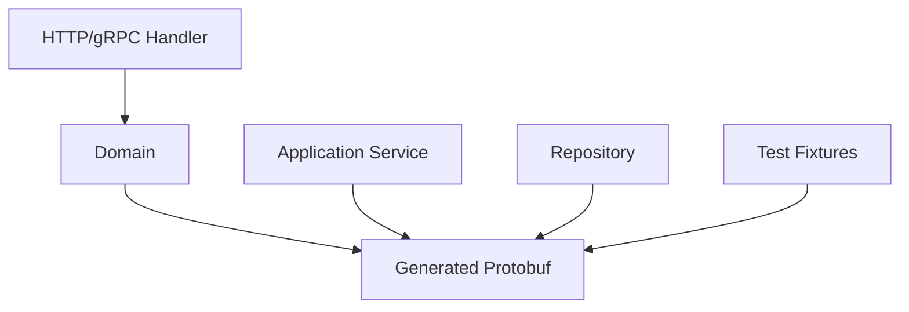
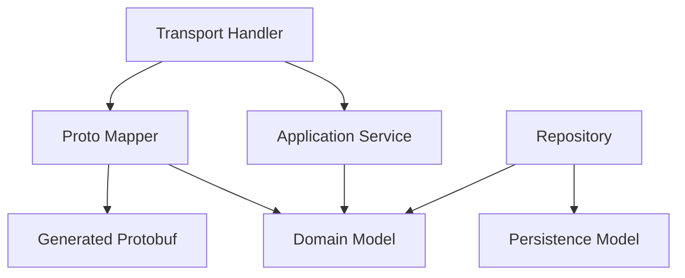
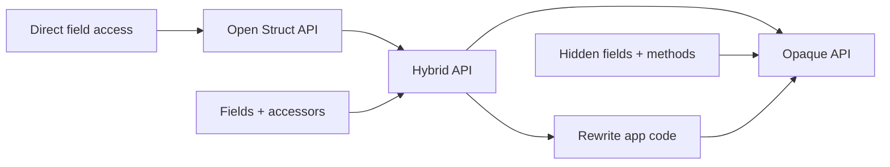
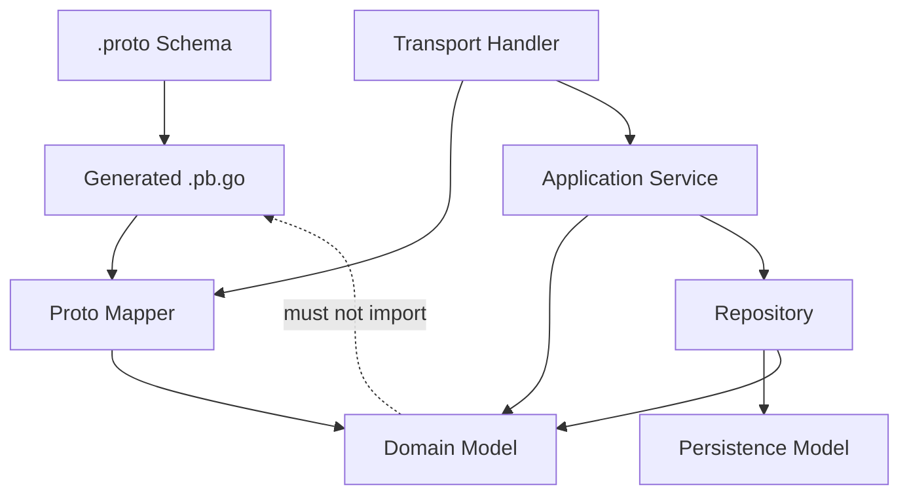
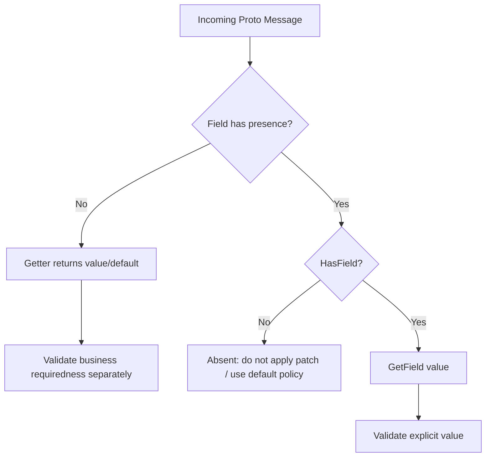
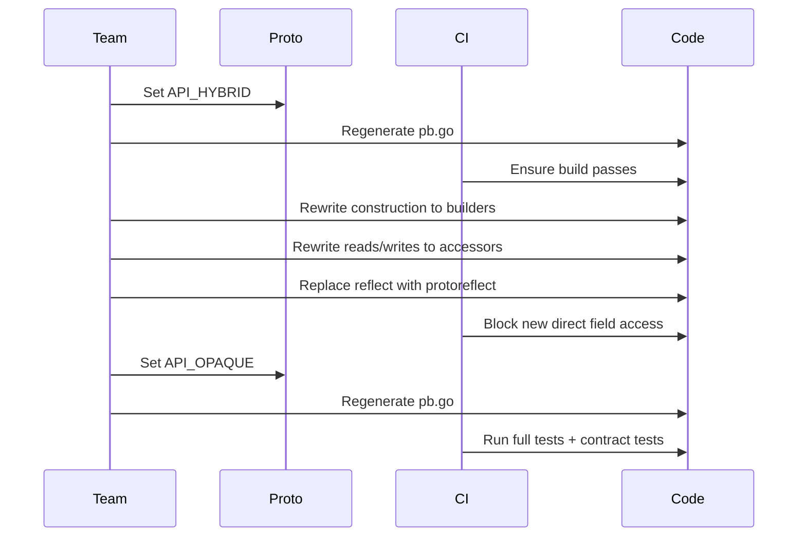

# learn-go-data-mapper-json-xml-protobuf-validation-part-021.md

# Part 021 — Protobuf Generated Code: Open Struct vs Opaque API

> Series: `learn-go-data-mapper-json-xml-protobuf-validation`  
> Part: `021 / 033`  
> Audience: Java software engineer moving deeply into Go data contracts  
> Scope: Go Protobuf generated code API design, Open Struct API, Hybrid API, Opaque API, migration, field access, builders, presence, oneof, repeated/map fields, invariants, performance, and production governance.

---

## 0. Posisi Part Ini dalam Seri

Pada part sebelumnya kita membahas **Go Protobuf Modern Runtime**: `proto`, `protojson`, `protoreflect`, `dynamicpb`, descriptor API, unknown fields, deterministic marshal, dan runtime-level concerns.

Part ini fokus pada satu lapisan yang lebih dekat ke kode aplikasi:

> Bagaimana `.proto` berubah menjadi `.pb.go`, dan bagaimana aplikasi Go sebaiknya memakai generated code tersebut.

Ini penting karena banyak engineer mengira Protobuf di Go hanya soal:

```go
proto.Marshal(msg)
proto.Unmarshal(data, msg)
```

Padahal dalam sistem besar, keputusan yang lebih kritikal adalah:

- Apakah field generated code boleh diakses langsung?
- Apakah aplikasi boleh mengandalkan layout struct generated code?
- Bagaimana membedakan unset vs default value?
- Bagaimana membuat message tanpa melanggar invariant internal runtime?
- Bagaimana migration dari API lama ke API baru dilakukan tanpa big bang?
- Bagaimana mencegah business code tergantung pada detail generated code?
- Bagaimana menjaga compatibility ketika Protobuf compiler/runtime berevolusi?

Inilah konteks **Open Struct API vs Opaque API**.

---

## 1. Daftar Isi

1. [Core Mental Model](#2-core-mental-model)
2. [Kenapa Go Protobuf Punya Beberapa API Level](#3-kenapa-go-protobuf-punya-beberapa-api-level)
3. [API Level: Open, Hybrid, Opaque](#4-api-level-open-hybrid-opaque)
4. [Open Struct API: Model Lama yang Masih Banyak Dipakai](#5-open-struct-api-model-lama-yang-masih-banyak-dipakai)
5. [Opaque API: Model Baru untuk Generated Code](#6-opaque-api-model-baru-untuk-generated-code)
6. [Hybrid API: Migration Bridge](#7-hybrid-api-migration-bridge)
7. [Java Engineer Comparison](#8-java-engineer-comparison)
8. [Generated Code Is Not Your Domain Model](#9-generated-code-is-not-your-domain-model)
9. [Message Construction Patterns](#10-message-construction-patterns)
10. [Scalar Field Access](#11-scalar-field-access)
11. [Field Presence: Has, Clear, Get, Set](#12-field-presence-has-clear-get-set)
12. [Bytes Field Semantics](#13-bytes-field-semantics)
13. [Message Field Semantics](#14-message-field-semantics)
14. [Repeated Field Semantics](#15-repeated-field-semantics)
15. [Map Field Semantics](#16-map-field-semantics)
16. [Oneof Semantics](#17-oneof-semantics)
17. [Enum Semantics](#18-enum-semantics)
18. [Unknown Fields and Extensions](#19-unknown-fields-and-extensions)
19. [Reflection vs Generated Accessors](#20-reflection-vs-generated-accessors)
20. [Opaque API and Lazy Decoding](#21-opaque-api-and-lazy-decoding)
21. [Performance and Memory Layout Implications](#22-performance-and-memory-layout-implications)
22. [Migration Strategy](#23-migration-strategy)
23. [Build and Generation Governance](#24-build-and-generation-governance)
24. [Package Boundary Design](#25-package-boundary-design)
25. [Anti-Patterns](#26-anti-patterns)
26. [Decision Matrix](#27-decision-matrix)
27. [Production Checklist](#28-production-checklist)
28. [Mermaid Diagrams](#29-mermaid-diagrams)
29. [Exercises](#30-exercises)
30. [Summary](#31-summary)
31. [References](#32-references)

---

## 2. Core Mental Model

Protobuf di Go memiliki beberapa lapisan yang harus dibedakan:

```text
.proto schema
   ↓ protoc + protoc-gen-go
.pb.go generated code
   ↓ application usage
Go application model
   ↓ proto runtime
wire format / ProtoJSON / reflection / descriptors
```

Part sebelumnya sudah membahas runtime. Part ini membahas **generated code API**.

### 2.1 Hal yang Harus Dipisahkan

| Layer | Contoh | Ownership | Stability Expectation |
|---|---|---:|---:|
| Schema | `order.proto` | Contract owner | Sangat tinggi |
| Generated code | `order.pb.go` | Tooling/runtime | Medium; jangan diedit manual |
| Application DTO | `internal/api.OrderDTO` | App team | Tinggi |
| Domain model | `domain.Order` | Domain team | Tinggi |
| Wire bytes | Protobuf binary | Runtime | Sangat tinggi secara compatibility |
| JSON representation | ProtoJSON | Runtime + schema | Tinggi tapi berbeda dari binary |

**Kesalahan umum:**

Menganggap generated Protobuf struct sebagai domain model permanen.

Di sistem kecil, itu mungkin terasa hemat. Di sistem besar, itu sering menjadi coupling yang mahal karena:

- generated code berubah mengikuti compiler/runtime,
- field semantics bukan domain semantics,
- zero/default/presence Protobuf tidak selalu sama dengan business invariant,
- generated code mengandung internal runtime fields,
- generated type harus kompatibel dengan wire contract, bukan optimal untuk business rule,
- akses field langsung membuat migration ke Opaque API lebih sulit.

---

## 3. Kenapa Go Protobuf Punya Beberapa API Level

Historisnya, Go Protobuf generated code mengekspos field struct secara langsung.

Contoh gaya lama:

```go
msg := &orderpb.Order{
    Id:        "ord_123",
    AmountCents: 10000,
}

msg.Status = orderpb.OrderStatus_ORDER_STATUS_CONFIRMED
```

Ini idiomatis bagi Go awal karena sederhana dan eksplisit. Namun model ini punya beberapa masalah ketika skala sistem, runtime, dan kebutuhan performance meningkat.

### 3.1 Masalah Open Struct API

Open Struct API membuat detail representasi internal menjadi bagian dari kode aplikasi.

Akibatnya:

1. Runtime sulit mengubah layout memory tanpa breaking generated API.
2. Lazy decoding sulit dilakukan karena aplikasi bisa membaca field langsung.
3. Internal invariant sulit dipertahankan.
4. Aplikasi bisa membandingkan pointer, share slice, atau mutate field secara tidak sengaja.
5. Reflection Go biasa dapat membaca/mengubah field yang sebenarnya sebaiknya tidak dianggap sebagai API contract.
6. Generated structs sering dipakai sebagai domain model karena terlihat seperti struct biasa.

### 3.2 Motivasi Opaque API

Opaque API menyembunyikan field generated struct dan memaksa aplikasi menggunakan accessor:

```go
msg.SetId("ord_123")
status := msg.GetStatus()
if msg.HasCustomer() {
    customer := msg.GetCustomer()
}
msg.ClearCustomer()
```

Tujuannya bukan membuat Go terasa seperti Java. Tujuannya adalah:

- menjaga boundary antara aplikasi dan runtime representation,
- memungkinkan runtime optimization,
- memungkinkan lazy decoding,
- mengurangi accidental aliasing/mutation,
- membuat generated code lebih evolvable,
- mengurangi ketergantungan aplikasi pada layout generated struct.

---

## 4. API Level: Open, Hybrid, Opaque

Modern Go Protobuf mengenal tiga API level penting:

| API Level | Karakteristik | Tujuan |
|---|---|---|
| `API_OPEN` | Field struct diekspos langsung | Compatibility dengan kode lama |
| `API_HYBRID` | Field masih diekspos, accessor juga tersedia | Jembatan migration |
| `API_OPAQUE` | Field disembunyikan, akses via method/builder | Model baru dan direkomendasikan untuk development baru |

### 4.1 Default Berdasarkan Syntax/Edition

Secara umum:

| `.proto` syntax/edition | Default Go API level |
|---|---|
| `proto2` | Open Struct API |
| `proto3` | Open Struct API |
| `edition = "2023"` | Open Struct API |
| `edition = "2024"` dan lebih baru | Opaque API |

Artinya, jika sistem masih banyak memakai `syntax = "proto3"`, generated Go code kemungkinan masih Open Struct API kecuali override via compiler option.

### 4.2 Mengatur API Level di `.proto`

Pada Editions, API level bisa disetel lewat Go feature:

```proto
edition = "2023";

package audit.v1;

import "google/protobuf/go_features.proto";

option features.(pb.go).api_level = API_OPAQUE;

message AuditEvent {
  string event_id = 1;
  string actor_id = 2;
  string action = 3;
}
```

Untuk migration bertahap:

```proto
edition = "2023";

package audit.v1;

import "google/protobuf/go_features.proto";

option features.(pb.go).api_level = API_HYBRID;

message AuditEvent {
  string event_id = 1;
  string actor_id = 2;
  string action = 3;
}
```

### 4.3 Mengatur API Level via `protoc` Option

Untuk override default API level:

```bash
protoc \
  --go_out=. \
  --go_opt=paths=source_relative \
  --go_opt=default_api_level=API_HYBRID \
  audit/v1/audit.proto
```

Untuk file tertentu:

```bash
protoc \
  --go_out=. \
  --go_opt=paths=source_relative \
  --go_opt=apilevelMaudit/v1/audit.proto=API_OPAQUE \
  audit/v1/audit.proto
```

### 4.4 Rule of Thumb

| Situation | Recommendation |
|---|---|
| New service, new proto, Go-first or multi-language | Prefer Editions 2024+ / Opaque API |
| Existing proto3 with many Go direct field usages | Move to Hybrid first |
| Legacy service with low change | Keep Open temporarily, add guardrails |
| Shared proto used by many teams | Govern API level centrally |
| Library exposing generated messages publicly | Be careful; migration affects consumers |

---

## 5. Open Struct API: Model Lama yang Masih Banyak Dipakai

Open Struct API mengekspos generated fields.

Contoh schema:

```proto
syntax = "proto3";

package payment.v1;

option go_package = "example.com/acme/gen/payment/v1;paymentpb";

message Payment {
  string id = 1;
  int64 amount_cents = 2;
  string currency = 3;
  PaymentStatus status = 4;
}

enum PaymentStatus {
  PAYMENT_STATUS_UNSPECIFIED = 0;
  PAYMENT_STATUS_PENDING = 1;
  PAYMENT_STATUS_SETTLED = 2;
  PAYMENT_STATUS_FAILED = 3;
}
```

Generated usage gaya Open Struct API:

```go
p := &paymentpb.Payment{
    Id:          "pay_123",
    AmountCents: 150000,
    Currency:    "IDR",
    Status:      paymentpb.PaymentStatus_PAYMENT_STATUS_PENDING,
}

p.Status = paymentpb.PaymentStatus_PAYMENT_STATUS_SETTLED
```

### 5.1 Kelebihan Open Struct API

| Benefit | Explanation |
|---|---|
| Sederhana | Terlihat seperti Go struct biasa |
| Familiar | Banyak kode existing memakai gaya ini |
| Literal construction mudah | `&pb.Message{Field: value}` |
| Debugging mudah | Field terlihat langsung |
| Migration minimal | Tidak perlu accessor rewrite |

### 5.2 Kekurangan Open Struct API

| Problem | Impact |
|---|---|
| Exposes memory layout | Runtime sulit optimize |
| Direct mutation everywhere | Invariant sulit dikontrol |
| Field presence via pointer dapat disalahpahami | Bug absent/default |
| Slice/map aliasing | Accidental mutation |
| Reflection accidental dependency | Kode generic bergantung pada generated layout |
| Domain leakage | Generated message dipakai sebagai domain model |

### 5.3 Open Struct API Bukan Salah

Open Struct API tidak otomatis buruk. Ia masih didukung, dan banyak sistem production berjalan dengannya.

Masalah muncul ketika:

- kode aplikasi menyebarkan direct field access ke banyak package,
- generated message menjadi public domain model,
- business rule diletakkan di atas generated struct,
- test snapshot mengunci internal detail,
- mapper memakai reflection terhadap generated fields,
- schema evolution sulit karena terlalu banyak coupling.

---

## 6. Opaque API: Model Baru untuk Generated Code

Opaque API menyembunyikan fields dan menyediakan method.

Bentuk usage kira-kira:

```go
p := paymentpb.Payment_builder{
    Id:          "pay_123",
    AmountCents: 150000,
    Currency:    "IDR",
    Status:      paymentpb.PaymentStatus_PAYMENT_STATUS_PENDING,
}.Build()

p.SetStatus(paymentpb.PaymentStatus_PAYMENT_STATUS_SETTLED)
```

> Nama builder mengikuti generated code sebenarnya; untuk message `Payment`, builder biasanya bernama `Payment_builder`.

### 6.1 Prinsip Opaque API

Opaque API mengatakan:

> Aplikasi boleh bergantung pada methods generated code, bukan pada layout field generated struct.

Ini mirip prinsip encapsulation, tetapi konteksnya bukan OOP domain modeling. Konteksnya adalah **runtime-generated representation encapsulation**.

### 6.2 Bentuk Operasi

| Operation | Open Struct API | Opaque API |
|---|---|---|
| Construct | `&pb.Msg{Field: v}` | `pb.Msg_builder{Field: v}.Build()` atau setters |
| Get scalar | `msg.Field` atau `msg.GetField()` | `msg.GetField()` |
| Set scalar | `msg.Field = v` | `msg.SetField(v)` |
| Presence check | `msg.Field != nil` untuk explicit presence | `msg.HasField()` |
| Clear field | `msg.Field = nil` / zero | `msg.ClearField()` |
| Oneof | wrapper struct | regular-ish builder/accessor style |
| Repeated | direct slice mutation | accessor methods / append helpers depending generated API |
| Map | direct map mutation | accessor methods / mutable map semantics depending generated API |

### 6.3 Kelebihan Opaque API

| Benefit | Meaning in Production |
|---|---|
| Memory layout can evolve | Runtime can optimize without app rewrite |
| Lazy decoding possible | Large messages can defer submessage decode |
| Fewer accidental pointer bugs | No direct dependence on internal pointers |
| Clear presence methods | `Has`/`Clear` more explicit than nil checks |
| Better migration path for future runtime | Less generated-struct coupling |
| Cleaner boundary | Application uses generated contract intentionally |

### 6.4 Kekurangan Opaque API

| Trade-off | Explanation |
|---|---|
| More verbose | `SetX`, `HasX`, builders |
| Less Go-struct-like | Direct composite literals less natural |
| Learning curve | Teams must learn generated API conventions |
| Migration cost | Existing direct access must be rewritten |
| Tool compatibility | Reflection-based tools may need update |

### 6.5 Opaque API Bukan Domain Encapsulation

Jangan salah paham:

Opaque API bukan berarti generated Protobuf message sekarang menjadi domain aggregate yang ideal.

Opaque API hanya menyembunyikan **generated representation**.

Domain invariant tetap sebaiknya diletakkan di domain model atau service/domain layer, bukan di `.pb.go`.

---

## 7. Hybrid API: Migration Bridge

Hybrid API adalah API transisi.

Ia menyediakan:

- field struct tetap visible seperti Open Struct API,
- accessor method tersedia seperti Opaque API.

Tujuannya:

1. Existing code tetap build.
2. Engineer bisa mengubah usage bertahap dari direct field access ke accessor.
3. Setelah usage bersih, API level bisa dipindah ke Opaque.

### 7.1 Migration Flow

```text
Open Struct API
   ↓ set API_HYBRID
Hybrid API
   ↓ rewrite application code to use accessors/builders
Hybrid-compatible application code
   ↓ set API_OPAQUE
Opaque API
```

### 7.2 Kenapa Tidak Langsung Opaque?

Pada codebase besar, direct field access bisa tersebar di:

- handlers,
- services,
- mappers,
- tests,
- fixtures,
- mocks,
- event producers,
- integration clients,
- reflection utilities,
- log/audit serializers.

Langsung pindah ke Opaque dapat menghasilkan ratusan/ribuan compile errors.

Hybrid memungkinkan refactoring incremental.

### 7.3 Rule of Thumb untuk Hybrid

Gunakan Hybrid sebagai **temporary migration state**, bukan target permanen.

Policy yang sehat:

```text
API_HYBRID boleh hidup selama migration window.
Semua kode baru wajib pakai accessor/builder.
CI melarang direct field access baru.
Setelah usage bersih, pindah ke API_OPAQUE.
```

---

## 8. Java Engineer Comparison

Sebagai Java engineer, analoginya kira-kira:

| Java Protobuf / Java DTO | Go Open Struct API | Go Opaque API |
|---|---|---|
| Builder pattern umum | Struct literal umum | Builder/setter lebih umum |
| Private fields | Public generated fields | Hidden fields |
| `getX()`, `hasX()` | Field access / `GetX()` | `GetX()`, `HasX()`, `SetX()`, `ClearX()` |
| Immutability-ish generated message | Mutable struct | Mutable message via methods |
| Bean Validation often external | Validation external | Validation external |

### 8.1 Jangan Membawa Semua Pola Java ke Go

Java engineer sering nyaman dengan:

```java
Payment payment = Payment.newBuilder()
    .setId("pay_123")
    .setAmountCents(150000)
    .setCurrency("IDR")
    .build();
```

Opaque API memang terlihat lebih dekat dengan builder/accessor model. Namun jangan menyimpulkan bahwa Go sekarang harus bergaya Java penuh.

Go tetap berbeda:

- package boundary lebih penting daripada class hierarchy,
- error explicit,
- domain object sering plain struct tapi constructor/invariant tetap eksplisit,
- validation biasanya dipisah dari generated type,
- generated code sebaiknya tidak diberi method manual,
- mapping sering handwritten untuk kejelasan.

### 8.2 Mental Model yang Tepat

Bukan:

```text
Go Protobuf sekarang seperti Java Protobuf.
```

Tetapi:

```text
Go Protobuf generated representation sekarang lebih terlindungi dari coupling aplikasi.
```

---

## 9. Generated Code Is Not Your Domain Model

Ini prinsip yang sangat penting untuk engineer senior.

Generated Protobuf message adalah **contract representation**, bukan otomatis domain model.

### 9.1 Contoh Problem

Misalnya schema:

```proto
message EnforcementCase {
  string case_id = 1;
  string status = 2;
  string assigned_officer_id = 3;
  repeated string breach_codes = 4;
  int64 opened_at_epoch_ms = 5;
}
```

Jika langsung dipakai sebagai domain model:

```go
func Escalate(c *casepb.EnforcementCase) error {
    c.Status = "ESCALATED" // Open Struct style
    return nil
}
```

Masalah:

- status string tidak dilindungi enum/domain invariant,
- `opened_at_epoch_ms` bukan `time.Time`,
- `breach_codes` bisa kosong padahal domain butuh minimal satu,
- officer assignment mungkin punya lifecycle rule,
- generated message bisa datang dari untrusted wire payload,
- mutation langsung tidak melewati audit/domain transition.

### 9.2 Bentuk yang Lebih Sehat

```go
type CaseStatus string

const (
    CaseStatusOpen      CaseStatus = "OPEN"
    CaseStatusEscalated CaseStatus = "ESCALATED"
    CaseStatusClosed    CaseStatus = "CLOSED"
)

type EnforcementCase struct {
    id                CaseID
    status            CaseStatus
    assignedOfficerID OfficerID
    breachCodes        []BreachCode
    openedAt           time.Time
}

func (c *EnforcementCase) Escalate(now time.Time, actor OfficerID) error {
    if c.status != CaseStatusOpen {
        return fmt.Errorf("case %s cannot escalate from %s", c.id, c.status)
    }
    if actor == "" {
        return errors.New("actor is required")
    }
    c.status = CaseStatusEscalated
    return nil
}
```

Mapper:

```go
func CaseToProto(c EnforcementCase) *casepb.EnforcementCase {
    return casepb.EnforcementCase_builder{
        CaseId:            c.id.String(),
        Status:            string(c.status),
        AssignedOfficerId: c.assignedOfficerID.String(),
        BreachCodes:       breachCodesToStrings(c.breachCodes),
        OpenedAtEpochMs:   c.openedAt.UnixMilli(),
    }.Build()
}
```

### 9.3 When Generated Message as App Model Is Acceptable

| Situation | Acceptable? | Reason |
|---|---:|---|
| Thin gateway/proxy | Yes | No domain rule, mostly pass-through |
| Internal ingestion buffer | Sometimes | If treated as untrusted transport representation |
| CRUD admin service | Sometimes | If domain invariant minimal |
| Complex workflow/case management | Usually no | Domain lifecycle needs explicit model |
| Regulatory/audit-sensitive system | Usually no | Need defensibility and state transition clarity |
| Public SDK | Be careful | Generated type becomes consumer contract |

---

## 10. Message Construction Patterns

Ada dua pola utama dalam Opaque API:

1. Builder-based construction.
2. Zero message + setters.

### 10.1 Builder-Based Construction

```go
payment := paymentpb.Payment_builder{
    Id:          "pay_123",
    AmountCents: 150000,
    Currency:    "IDR",
    Status:      paymentpb.PaymentStatus_PAYMENT_STATUS_PENDING,
}.Build()
```

Kelebihan:

- compact,
- cocok untuk mapping from domain to proto,
- mirip composite literal lama,
- readable untuk fixture/test,
- meminimalkan partial mutation code.

Kekurangan:

- untuk hot loop ekstrem bisa perlu benchmark,
- nested complex builders bisa panjang,
- default/presence harus dipahami.

### 10.2 Setter-Based Construction

```go
payment := &paymentpb.Payment{}
payment.SetId("pay_123")
payment.SetAmountCents(150000)
payment.SetCurrency("IDR")
payment.SetStatus(paymentpb.PaymentStatus_PAYMENT_STATUS_PENDING)
```

Kelebihan:

- explicit mutation step,
- cocok untuk conditional mapping,
- cocok untuk incremental decode/transform,
- kadang lebih mudah dalam hot path.

Kekurangan:

- object bisa berada pada state parsial lebih lama,
- lebih verbose,
- mapping code dapat tersebar.

### 10.3 Recommended Mapping Style

Untuk mapper domain → proto:

```go
func ToProto(p domain.Payment) *paymentpb.Payment {
    b := paymentpb.Payment_builder{
        Id:          p.ID().String(),
        AmountCents: p.Amount().Cents(),
        Currency:    p.Amount().Currency().String(),
        Status:      toProtoPaymentStatus(p.Status()),
    }

    if ref, ok := p.ExternalRef(); ok {
        b.ExternalReference = proto.String(ref.String())
    }

    return b.Build()
}
```

Untuk mapping dengan banyak conditional:

```go
func ToProtoCase(c domain.Case) *casepb.Case {
    out := &casepb.Case{}
    out.SetCaseId(c.ID().String())
    out.SetStatus(toProtoCaseStatus(c.Status()))

    if officer, ok := c.AssignedOfficer(); ok {
        out.SetAssignedOfficerId(officer.String())
    }

    if c.ClosedAt().IsSet() {
        out.SetClosedAt(timestamppb.New(c.ClosedAt().Time()))
    }

    return out
}
```

### 10.4 Jangan Campur Terlalu Banyak

Boleh menggunakan builder dan setter dalam codebase yang sama, tetapi buat convention:

| Mapping Situation | Preferred Style |
|---|---|
| Straight mapping mostly mandatory fields | Builder |
| Many conditional optional fields | Setter or builder with local vars |
| Test fixture | Builder |
| Hot loop | Benchmark builder vs setter |
| Patch/update application | Setter with explicit presence checks |

---

## 11. Scalar Field Access

Scalar fields mencakup:

- `bool`
- integer types
- `float`
- `double`
- `string`
- enum
- `bytes` secara generated API punya special aliasing concerns

### 11.1 Getters

Opaque API mendorong:

```go
id := payment.GetId()
amount := payment.GetAmountCents()
status := payment.GetStatus()
```

Getter biasanya mengembalikan default value ketika field absent/unset.

Contoh:

```go
if payment.GetCurrency() == "" {
    // Ini belum tentu berarti sender mengirim empty string.
    // Bisa berarti field absent, tergantung presence semantics schema.
}
```

### 11.2 Setters

```go
payment.SetCurrency("IDR")
payment.SetAmountCents(150000)
```

Setters membuat field bernilai sesuai input. Untuk field dengan explicit presence, setter juga menandai presence.

### 11.3 Bahaya Menggunakan Getter untuk Presence Decision

Jangan lakukan:

```go
if msg.GetExternalReference() == "" {
    // assume absent
}
```

Karena empty string bisa berarti:

1. absent,
2. explicitly set empty,
3. default because schema has no explicit presence,
4. invalid value that should have been validated.

Untuk field dengan explicit presence, gunakan:

```go
if msg.HasExternalReference() {
    ref := msg.GetExternalReference()
    // process explicit value
}
```

---

## 12. Field Presence: Has, Clear, Get, Set

Presence adalah salah satu topik paling penting dalam Protobuf.

### 12.1 Apa Itu Presence?

Presence menjawab:

> Apakah field ini benar-benar diset oleh sender atau hanya default value hasil pembacaan?

Contoh:

```proto
message PatchUserRequest {
  optional string display_name = 1;
  optional string email = 2;
}
```

Semantics:

| Payload Intent | Presence | Value |
|---|---:|---|
| Do not change display name | false | default getter returns `""` |
| Set display name to empty | true | `""` |
| Set display name to `Fajar` | true | `"Fajar"` |

### 12.2 Access Pattern

```go
func ApplyPatch(user *domain.User, req *userpb.PatchUserRequest) error {
    if req.HasDisplayName() {
        if err := user.ChangeDisplayName(req.GetDisplayName()); err != nil {
            return err
        }
    }

    if req.HasEmail() {
        if err := user.ChangeEmail(req.GetEmail()); err != nil {
            return err
        }
    }

    return nil
}
```

### 12.3 Clear Pattern

```go
req.ClearDisplayName()
```

Clear is not the same as setting default value in presence-aware fields.

| Operation | Meaning |
|---|---|
| `SetDisplayName("")` | present with empty value |
| `ClearDisplayName()` | absent/unset |

### 12.4 Domain Mapping Rule

For patch-like APIs:

```text
Never map GetX() alone into domain update.
Always check HasX() when semantics need absent vs explicit default.
```

### 12.5 Create vs Patch Semantics

| Operation Type | Presence Need | Recommended Schema |
|---|---|---|
| Create required business field | Often no, validate non-default | non-optional scalar + validation |
| Partial update | Yes | `optional` fields or field masks |
| Replace full resource | Less presence sensitive | complete message + validation |
| Event payload | Depends | prefer stable required-by-contract via validation |
| Audit event | Often explicit | avoid ambiguous default for legally important fields |

---

## 13. Bytes Field Semantics

`bytes` is dangerous because of aliasing/mutation concerns.

Schema:

```proto
message DocumentChunk {
  string document_id = 1;
  bytes content = 2;
  string checksum_sha256 = 3;
}
```

### 13.1 Domain Mapping Must Copy When Needed

If bytes originate from domain immutable value:

```go
func ToProtoChunk(c domain.DocumentChunk) *docpb.DocumentChunk {
    content := append([]byte(nil), c.Content()...)

    return docpb.DocumentChunk_builder{
        DocumentId:     c.DocumentID().String(),
        Content:        content,
        ChecksumSha256: c.ChecksumSHA256(),
    }.Build()
}
```

If mapping from proto to domain:

```go
func ChunkFromProto(msg *docpb.DocumentChunk) (domain.DocumentChunk, error) {
    content := append([]byte(nil), msg.GetContent()...)
    return domain.NewDocumentChunk(
        msg.GetDocumentId(),
        content,
        msg.GetChecksumSha256(),
    )
}
```

### 13.2 Why Copy?

Because `[]byte` is a slice header pointing to underlying array. If two owners share it, mutation in one place can alter meaning elsewhere.

This matters for:

- security-sensitive payloads,
- checksum validation,
- audit evidence,
- document upload,
- cryptographic signatures,
- event replay,
- deduplication keys.

### 13.3 Rule of Thumb

| Context | Copy? |
|---|---:|
| Immutable domain value | Yes |
| Untrusted incoming proto | Yes before storing/domain use |
| Hot internal short-lived transform | Maybe benchmark |
| Logging/redaction | Do not log raw bytes |
| Signature/checksum boundary | Yes, canonicalize ownership |

---

## 14. Message Field Semantics

Message fields represent nested messages.

```proto
message Order {
  string id = 1;
  Customer customer = 2;
}

message Customer {
  string id = 1;
  string name = 2;
}
```

### 14.1 Access Pattern

```go
if order.HasCustomer() {
    c := order.GetCustomer()
    // process nested customer
}
```

Depending on schema/presence, message fields often have presence semantics because nested message can be nil/unset.

### 14.2 Avoid Mutating Nested Message Without Ownership Clarity

Bad pattern:

```go
customer := order.GetCustomer()
customer.SetName("changed")
```

This may be correct, but ask:

- Does `GetCustomer()` return a mutable nested message owned by `order`?
- Are we mutating request object directly?
- Is this before or after validation?
- Is request object shared with other logic?
- Is mutation visible to audit/logging?

Safer mapper style:

```go
func CustomerFromProto(msg *customerpb.Customer) (domain.Customer, error) {
    if msg == nil {
        return domain.Customer{}, errors.New("customer is required")
    }
    return domain.NewCustomer(msg.GetId(), msg.GetName())
}
```

### 14.3 Nested Builder

```go
order := orderpb.Order_builder{
    Id: "ord_123",
    Customer: customerpb.Customer_builder{
        Id:   "cust_456",
        Name: "Fajar",
    }.Build(),
}.Build()
```

### 14.4 Deep Copy Boundary

If nested proto message may be reused or mutated elsewhere, use `proto.Clone` carefully:

```go
cloned := proto.Clone(order.GetCustomer()).(*customerpb.Customer)
```

But do not overuse clone blindly. Cloning can hide bad ownership design and increase allocations.

---

## 15. Repeated Field Semantics

Repeated fields map conceptually to ordered lists.

```proto
message Case {
  string case_id = 1;
  repeated string breach_codes = 2;
}
```

### 15.1 Domain Rule

Repeated field may be:

- optional empty list,
- required non-empty list,
- set-like unique list,
- ordered list where order matters,
- append-only list,
- audit trail list.

Protobuf only says repeated list. Domain must define the rest.

### 15.2 Mapping With Copy

```go
func breachCodesToProto(codes []domain.BreachCode) []string {
    if len(codes) == 0 {
        return nil
    }
    out := make([]string, 0, len(codes))
    for _, code := range codes {
        out = append(out, code.String())
    }
    return out
}
```

### 15.3 Empty vs Nil

In Protobuf binary, repeated field absence and empty list often serialize similarly. In JSON mapping, representation choices may differ depending emit options.

Do not encode business distinction between nil and empty list unless your API explicitly supports it and all boundary formats preserve it.

### 15.4 Validation Required

For a repeated business field:

```go
func ValidateCaseProto(msg *casepb.Case) error {
    if len(msg.GetBreachCodes()) == 0 {
        return fieldError("breach_codes", "must contain at least one breach code")
    }

    seen := make(map[string]struct{}, len(msg.GetBreachCodes()))
    for i, code := range msg.GetBreachCodes() {
        if code == "" {
            return fieldError(fmt.Sprintf("breach_codes[%d]", i), "must not be empty")
        }
        if _, ok := seen[code]; ok {
            return fieldError(fmt.Sprintf("breach_codes[%d]", i), "duplicate breach code")
        }
        seen[code] = struct{}{}
    }
    return nil
}
```

---

## 16. Map Field Semantics

Map fields look convenient but have subtle contract implications.

```proto
message MetadataCarrier {
  map<string, string> metadata = 1;
}
```

### 16.1 Good Uses of Map Fields

| Good Use | Reason |
|---|---|
| Flexible metadata | Unknown keys acceptable |
| Labels/tags | Key-value semantics natural |
| Extension attributes | Contract allows extension |
| Sparse lookup | Map representation useful |

### 16.2 Bad Uses of Map Fields

| Bad Use | Why Bad |
|---|---|
| Core domain fields | Schema becomes untyped |
| Validation-heavy data | Hard to express strongly |
| Public API shortcuts | Contract becomes vague |
| Data needing stable order | Maps do not express order |
| Security-sensitive dynamic fields | Easy to smuggle unexpected data |

### 16.3 Map Ordering

Do not rely on map iteration order.

If deterministic output matters for tests/signatures, do not assume Protobuf map order gives canonical semantics. Use explicit sorted representation at application layer if truly needed.

### 16.4 Mapping Rule

```go
func copyStringMap(in map[string]string) map[string]string {
    if len(in) == 0 {
        return nil
    }
    out := make(map[string]string, len(in))
    for k, v := range in {
        out[k] = v
    }
    return out
}
```

Copy maps when crossing ownership boundary.

---

## 17. Oneof Semantics

`oneof` means exactly one of several alternatives may be set.

Schema:

```proto
message SearchFilter {
  oneof filter {
    string case_id = 1;
    string officer_id = 2;
    DateRange opened_range = 3;
  }
}
```

### 17.1 Why Oneof Matters

Without `oneof`, a message like this is ambiguous:

```proto
message SearchFilterBad {
  optional string case_id = 1;
  optional string officer_id = 2;
  optional DateRange opened_range = 3;
}
```

Can the caller send two filters at once? If not, domain rule must reject it. `oneof` encodes mutual exclusivity at schema level.

### 17.2 Open Struct API Oneof

Open Struct API traditionally uses wrapper structs.

Conceptually:

```go
filter := &searchpb.SearchFilter{
    Filter: &searchpb.SearchFilter_CaseId{
        CaseId: "case_123",
    },
}
```

### 17.3 Opaque API Oneof

Opaque API makes oneof usage less dependent on wrapper field access and more accessor/builder oriented.

Conceptual builder style:

```go
filter := searchpb.SearchFilter_builder{
    CaseId: "case_123",
}.Build()
```

The generated API details depend on schema, but the design point is:

```text
Application code should express selected case, not manipulate generated union internals.
```

### 17.4 Domain Mapping

```go
type SearchFilter interface {
    isSearchFilter()
}

type CaseIDFilter struct{ CaseID domain.CaseID }
type OfficerIDFilter struct{ OfficerID domain.OfficerID }
type OpenedRangeFilter struct{ Range domain.DateRange }

func (CaseIDFilter) isSearchFilter()      {}
func (OfficerIDFilter) isSearchFilter()   {}
func (OpenedRangeFilter) isSearchFilter() {}
```

Mapping:

```go
func SearchFilterFromProto(msg *searchpb.SearchFilter) (SearchFilter, error) {
    switch {
    case msg.HasCaseId():
        id, err := domain.ParseCaseID(msg.GetCaseId())
        if err != nil {
            return nil, err
        }
        return CaseIDFilter{CaseID: id}, nil

    case msg.HasOfficerId():
        id, err := domain.ParseOfficerID(msg.GetOfficerId())
        if err != nil {
            return nil, err
        }
        return OfficerIDFilter{OfficerID: id}, nil

    case msg.HasOpenedRange():
        r, err := dateRangeFromProto(msg.GetOpenedRange())
        if err != nil {
            return nil, err
        }
        return OpenedRangeFilter{Range: r}, nil

    default:
        return nil, errors.New("one filter must be provided")
    }
}
```

### 17.5 Oneof Anti-Pattern

Using `oneof` as a dumping ground:

```proto
oneof payload {
  string raw_json = 1;
  bytes raw_xml = 2;
  google.protobuf.Any arbitrary = 3;
  string future = 4;
}
```

This often signals unclear contract ownership.

---

## 18. Enum Semantics

Enums in Protobuf are numeric values with symbolic names.

```proto
enum PaymentStatus {
  PAYMENT_STATUS_UNSPECIFIED = 0;
  PAYMENT_STATUS_PENDING = 1;
  PAYMENT_STATUS_SETTLED = 2;
  PAYMENT_STATUS_FAILED = 3;
}
```

### 18.1 Always Have an Unspecified Zero

For proto3-style APIs, first enum value should be zero and represent unspecified/default.

Bad:

```proto
enum Status {
  ACTIVE = 0;
  SUSPENDED = 1;
}
```

Better:

```proto
enum AccountStatus {
  ACCOUNT_STATUS_UNSPECIFIED = 0;
  ACCOUNT_STATUS_ACTIVE = 1;
  ACCOUNT_STATUS_SUSPENDED = 2;
}
```

### 18.2 Domain Mapping Must Reject Unspecified When Required

```go
func paymentStatusFromProto(s paymentpb.PaymentStatus) (domain.PaymentStatus, error) {
    switch s {
    case paymentpb.PaymentStatus_PAYMENT_STATUS_PENDING:
        return domain.PaymentPending, nil
    case paymentpb.PaymentStatus_PAYMENT_STATUS_SETTLED:
        return domain.PaymentSettled, nil
    case paymentpb.PaymentStatus_PAYMENT_STATUS_FAILED:
        return domain.PaymentFailed, nil
    case paymentpb.PaymentStatus_PAYMENT_STATUS_UNSPECIFIED:
        return "", errors.New("payment status is required")
    default:
        return "", fmt.Errorf("unknown payment status: %d", s)
    }
}
```

### 18.3 Unknown Enum Values

Protobuf can preserve unknown numeric enum values in some scenarios. Your domain mapper must decide:

| Context | Unknown Enum Policy |
|---|---|
| Incoming public API command | Reject |
| Internal event consumer with forward compatibility | Maybe park/dead-letter or pass through |
| Logging/audit | Preserve raw numeric if possible |
| Gateway pass-through | Preserve unknown if contract allows |
| Domain transition | Reject unknown |

### 18.4 Do Not Store Protobuf Enum Directly in Domain

Avoid:

```go
type Payment struct {
    status paymentpb.PaymentStatus
}
```

Prefer:

```go
type PaymentStatus string
```

or domain-specific enum type.

Why?

- Domain should not import generated transport package.
- Domain lifecycle may differ from wire enum lifecycle.
- Generated enum may include `UNSPECIFIED` or deprecated values not valid in domain.
- Future wire compatibility may require unknown handling separate from domain logic.

---

## 19. Unknown Fields and Extensions

Unknown fields are data present in wire format that current schema does not recognize.

### 19.1 Why Unknown Fields Exist

They enable forward compatibility:

1. Producer uses newer schema with field 10.
2. Consumer uses older schema without field 10.
3. Consumer parses message and may preserve unknown field 10.
4. If consumer reserializes, unknown field can survive depending runtime/operation.

### 19.2 Application Rule

Do not casually discard unknown fields in pass-through systems.

But also do not let unknown fields silently affect domain decisions.

| System Role | Unknown Field Policy |
|---|---|
| Command handler | Ignore for decision but may reject depending strictness |
| Event relay | Preserve when possible |
| Gateway | Preserve or explicitly document stripping |
| Domain mapper | Map only known validated fields |
| Audit ingestion | Store raw original bytes if evidentiary |

### 19.3 Opaque API Impact

Opaque API makes internal representation less accessible, so application code should use runtime APIs rather than struct internals for unknown fields/reflection.

Use `proto`/`protoreflect` APIs for generic handling.

---

## 20. Reflection vs Generated Accessors

There are two very different kinds of reflection:

1. Go reflection: `reflect` over generated structs.
2. Protobuf reflection: `protoreflect` over message descriptors.

### 20.1 Avoid Go Reflection on Generated Structs

Bad:

```go
func DumpProtoFieldsWithReflect(msg any) map[string]any {
    v := reflect.ValueOf(msg).Elem()
    // iterates generated fields
}
```

This depends on generated implementation details.

With Opaque API, this style becomes fragile or impossible.

### 20.2 Prefer Protobuf Reflection for Generic Proto Logic

```go
func DumpProtoFields(msg proto.Message) map[string]any {
    out := make(map[string]any)

    m := msg.ProtoReflect()
    desc := m.Descriptor()

    m.Range(func(fd protoreflect.FieldDescriptor, v protoreflect.Value) bool {
        name := string(fd.JSONName())
        out[name] = protoReflectValueToAny(fd, v)
        return true
    })

    _ = desc
    return out
}
```

### 20.3 When to Use Protobuf Reflection

| Use Case | Use Reflection? |
|---|---:|
| Generic logging/redaction | Yes, with descriptor annotations |
| Schema registry/gateway | Yes |
| Dynamic message transformation | Yes |
| Domain mapper | Usually no |
| Hot path business logic | Usually no |
| Validation framework | Yes, often descriptor-based |

### 20.4 Descriptor-Driven Governance

For production systems, reflection can inspect custom options:

```proto
import "google/protobuf/descriptor.proto";

extend google.protobuf.FieldOptions {
  bool sensitive = 50001;
}

message User {
  string id = 1;
  string email = 2 [(sensitive) = true];
}
```

A generic logger can use descriptors to redact sensitive fields without relying on Go struct layout.

---

## 21. Opaque API and Lazy Decoding

Lazy decoding means nested submessages may not be fully decoded until first accessed.

### 21.1 Why Lazy Decoding Matters

Imagine a large event:

```proto
message CaseSnapshotEvent {
  string event_id = 1;
  string case_id = 2;
  CaseHeader header = 3;
  CaseDetails details = 4 [lazy = true];
  repeated Attachment attachments = 5 [lazy = true];
}
```

Some consumers only need:

- `event_id`,
- `case_id`,
- `header.status`.

If `details` and `attachments` are huge, lazy decoding can reduce CPU and allocation cost.

### 21.2 Why Open Struct API Makes This Hard

If field is directly accessible as a Go struct field, runtime must materialize representation eagerly enough that direct field access works.

Opaque API gives runtime control:

```go
if event.HasDetails() {
    details := event.GetDetails() // decode can happen here
}
```

The accessor becomes an interception point for runtime behavior.

### 21.3 Design Warning

Lazy decoding is not a substitute for better message design.

If message is too large because it contains many unrelated concerns, consider:

- split event types,
- use references instead of embedding huge payloads,
- separate header vs body,
- use streaming/chunking for large binary data,
- avoid sending complete snapshots to consumers that only need deltas.

---

## 22. Performance and Memory Layout Implications

Opaque API allows runtime to change generated memory representation.

### 22.1 Why Memory Layout Matters

In Open Struct API, generated struct may expose fields like:

```go
type Foo struct {
    state         protoimpl.MessageState
    sizeCache     protoimpl.SizeCache
    unknownFields protoimpl.UnknownFields

    Name *string
    Age  *int32
}
```

If application code depends on `Name *string`, runtime cannot freely change how presence and value are stored.

Opaque API hides that.

### 22.2 Possible Optimization Areas

| Area | Why Opaque Helps |
|---|---|
| Pointer reduction | Presence does not always need public pointers |
| GC pressure | Fewer pointer-heavy representations |
| Lazy decode | Accessors can trigger decode |
| Profile-driven layout | Runtime can tune internals |
| Safety | Prevent accidental alias/pointer comparison bugs |

### 22.3 Benchmarking Guidance

Do not assume Opaque API magically makes every path faster.

Benchmark actual workloads:

- binary marshal/unmarshal,
- ProtoJSON conversion,
- domain mapping,
- validation,
- partial field access,
- large nested messages,
- repeated/map-heavy payloads,
- event relay preserving unknown fields.

Example benchmark shape:

```go
func BenchmarkPaymentToProto(b *testing.B) {
    p := testPaymentDomain()
    b.ReportAllocs()

    for i := 0; i < b.N; i++ {
        _ = ToProtoPayment(p)
    }
}
```

For access pattern:

```go
func BenchmarkReadEventHeaderOnly(b *testing.B) {
    data := testLargeEventBytes()
    b.ReportAllocs()

    for i := 0; i < b.N; i++ {
        var ev eventpb.CaseSnapshotEvent
        if err := proto.Unmarshal(data, &ev); err != nil {
            b.Fatal(err)
        }
        _ = ev.GetCaseId()
        _ = ev.GetHeader().GetStatus()
    }
}
```

---

## 23. Migration Strategy

Migration dari Open Struct ke Opaque harus dianggap sebagai engineering program kecil, bukan search-replace sederhana.

### 23.1 Step 0 — Inventory

Cari semua direct field access:

```bash
grep -R "\.Id\|\.Status\|\.AmountCents" ./internal ./pkg
```

Lebih baik gunakan AST tooling atau `open2opaque` daripada grep manual untuk codebase besar.

Kategori usage:

| Category | Example | Migration Concern |
|---|---|---|
| Construction | `&pb.Msg{Field: v}` | builder/setters |
| Read | `msg.Field` | getter/presence |
| Write | `msg.Field = v` | setter/clear |
| Presence | `msg.Field != nil` | `HasField()` |
| Clear | `msg.Field = nil` | `ClearField()` |
| Repeated append | `msg.Items = append(...)` | generated append/mutable pattern |
| Map mutation | `msg.Labels[k] = v` | mutable map access/copy policy |
| Oneof wrapper | `msg.Kind.(*pb.X_Y)` | oneof accessor/presence pattern |
| Test fixture | struct literal | builder fixture helpers |
| Reflection | `reflect.ValueOf(msg).Elem()` | protoreflect |

### 23.2 Step 1 — Switch to Hybrid API

Set API level to Hybrid:

```proto
edition = "2023";

import "google/protobuf/go_features.proto";

option features.(pb.go).api_level = API_HYBRID;
```

or compiler option:

```bash
--go_opt=default_api_level=API_HYBRID
```

### 23.3 Step 2 — Regenerate

Use pinned generator versions:

```bash
go install google.golang.org/protobuf/cmd/protoc-gen-go@v1.36.0
```

In real production, pin in tools module or container image, not ad-hoc local install.

Example `tools.go`:

```go
//go:build tools

package tools

import (
    _ "google.golang.org/protobuf/cmd/protoc-gen-go"
)
```

### 23.4 Step 3 — Rewrite Construction

Before:

```go
msg := &paymentpb.Payment{
    Id:          "pay_123",
    AmountCents: 150000,
    Currency:    "IDR",
}
```

After:

```go
msg := paymentpb.Payment_builder{
    Id:          "pay_123",
    AmountCents: 150000,
    Currency:    "IDR",
}.Build()
```

### 23.5 Step 4 — Rewrite Reads

Before:

```go
if msg.Currency == "" {
    return errors.New("currency required")
}
```

After:

```go
if msg.GetCurrency() == "" {
    return errors.New("currency required")
}
```

For presence-aware fields:

```go
if !msg.HasExternalReference() {
    // absent
}
```

### 23.6 Step 5 — Rewrite Writes

Before:

```go
msg.Status = paymentpb.PaymentStatus_PAYMENT_STATUS_SETTLED
```

After:

```go
msg.SetStatus(paymentpb.PaymentStatus_PAYMENT_STATUS_SETTLED)
```

### 23.7 Step 6 — Rewrite Clears

Before:

```go
msg.ExternalReference = nil
```

After:

```go
msg.ClearExternalReference()
```

### 23.8 Step 7 — Rewrite Reflection

Before:

```go
v := reflect.ValueOf(msg).Elem()
```

After:

```go
m := msg.ProtoReflect()
```

### 23.9 Step 8 — CI Guardrails

Add checks to prevent new direct access.

Possible approaches:

- custom `go/analysis` linter,
- staticcheck-style analyzer,
- code review rule,
- banning generated package types outside mapper boundary,
- package import rules,
- grep as temporary cheap guard.

### 23.10 Step 9 — Switch to Opaque

After code no longer uses direct field access:

```proto
option features.(pb.go).api_level = API_OPAQUE;
```

or compiler flag:

```bash
--go_opt=default_api_level=API_OPAQUE
```

Then regenerate and run full tests.

### 23.11 Step 10 — Verify Behavior

Critical tests:

- binary round-trip tests,
- ProtoJSON compatibility tests,
- golden contract tests,
- unknown field preservation tests if applicable,
- field presence tests,
- oneof mapping tests,
- repeated/map aliasing tests,
- performance benchmarks for hot paths.

---

## 24. Build and Generation Governance

Generated code should be treated as controlled build artifact.

### 24.1 Recommended Repository Layout

```text
repo/
  proto/
    acme/payment/v1/payment.proto
    acme/case/v1/case.proto
  gen/
    go/
      acme/payment/v1/payment.pb.go
      acme/case/v1/case.pb.go
  internal/
    payment/
      domain/
      app/
      transport/
        grpc/
        mapper/
  buf.yaml
  buf.gen.yaml
  go.mod
  tools.go
```

### 24.2 Generation Should Be Reproducible

Bad:

```bash
protoc --go_out=. proto/**/*.proto
```

No version pinning, no lint, no breaking change detection, no API-level policy.

Better:

```yaml
# buf.gen.yaml
version: v2
plugins:
  - remote: buf.build/protocolbuffers/go
    out: gen/go
    opt:
      - paths=source_relative
      - default_api_level=API_OPAQUE
```

Or with local plugin pinned by toolchain:

```bash
buf generate
```

### 24.3 CI Must Detect Uncommitted Generated Changes

```bash
buf generate
git diff --exit-code
```

If generated code changes but is not committed, CI fails.

### 24.4 Central API Level Policy

Define policy:

```text
New proto files use Edition 2024+ and Opaque API.
Existing proto3 files migrate to Hybrid before Opaque.
Direct field access in non-generated code is prohibited after migration start.
Domain packages must not import generated proto packages.
Mapper packages are the only allowed domain/proto bridge.
```

---

## 25. Package Boundary Design

A mature Go service should not let generated types leak everywhere.

### 25.1 Bad Package Dependency



Problem:

- domain depends on transport contract,
- persistence may accidentally store wire shape,
- every package breaks during generated API migration,
- business logic manipulates generated message directly.

### 25.2 Better Package Dependency



Only mapper/transport boundary imports `pb`.

### 25.3 Enforce with Package Rules

Example convention:

```text
internal/payment/domain     must not import */gen/*
internal/payment/app        must not import */gen/* except command/query adapters
internal/payment/transport  may import */gen/*
internal/payment/mapper     may import */gen/* and domain
```

### 25.4 Compile-Time Guard via Dependency Lint

Use tooling like:

- custom script using `go list -deps`,
- `depguard` linter,
- architecture tests,
- Bazel visibility,
- package naming convention.

Example simple check:

```bash
if go list -deps ./internal/payment/domain | grep '/gen/go/'; then
  echo "domain package must not depend on generated protobuf"
  exit 1
fi
```

---

## 26. Anti-Patterns

### 26.1 Using Generated Message as Domain Aggregate

```go
func (s *Service) Approve(req *casepb.ApproveCaseRequest) error {
    req.Case.Status = casepb.CaseStatus_CASE_STATUS_APPROVED
    return s.repo.Save(req.Case)
}
```

Why bad:

- transport request mutated,
- generated type persisted,
- domain transition invisible,
- audit rule bypassed,
- Opaque migration harder.

### 26.2 Direct Field Access Everywhere

```go
if msg.User.Email != "" {
    // ...
}
```

Breaks Opaque migration and hides presence semantics.

### 26.3 Getter as Validation for Requiredness

```go
if msg.GetAmountCents() == 0 {
    return errors.New("amount required")
}
```

This may confuse absent/default/business-zero.

Better:

- use explicit validation rules,
- use presence when needed,
- model amount invariant in domain.

### 26.4 Public API Returns Generated Type Directly

```go
func (s *PaymentService) Find(ctx context.Context, id string) (*paymentpb.Payment, error)
```

If this is internal app service, it couples application layer to Protobuf.

Prefer:

```go
func (s *PaymentService) Find(ctx context.Context, id domain.PaymentID) (domain.Payment, error)
```

Transport adapter maps to proto response.

### 26.5 Reflection Mapper Over Generated Struct Fields

```go
func MapProtoToMap(msg any) map[string]any {
    // reflect over generated struct fields
}
```

Use `protoreflect` instead.

### 26.6 Map Fields for Core Domain

```proto
message Case {
  map<string, string> fields = 1;
}
```

This destroys schema clarity.

### 26.7 Treating `UNSPECIFIED` as Valid Business Status

```go
status := msg.GetStatus()
// pass through to domain
```

Domain should reject unspecified unless business explicitly allows unknown/default.

### 26.8 Assuming Deterministic Serialization Is Canonical

Deterministic marshal is useful for stable output in some cases, but it is not a cross-runtime canonicalization guarantee.

For cryptographic signing or legal evidence, define a canonical representation explicitly.

### 26.9 Ignoring Unknown Field Policy

Silently dropping unknown fields in relays/gateways can break forward compatibility.

Silently trusting unknown fields in domain decisions is also wrong.

Policy must be explicit.

---

## 27. Decision Matrix

### 27.1 New Development

| Question | Recommendation |
|---|---|
| New `.proto`? | Prefer Editions 2024+ |
| Go generated API? | Prefer Opaque |
| Need Java-like builder? | Use generated builder, but keep Go package design |
| Domain model? | Separate from proto if domain complexity non-trivial |
| API/event contract governance? | Add Buf lint/breaking checks |
| Validation? | Use schema/protovalidate/domain validation by layer |

### 27.2 Existing Codebase

| Current State | Recommendation |
|---|---|
| proto3 + direct field access everywhere | Move to Hybrid first |
| Direct access mostly in mapper | Refactor mapper, then Opaque |
| Generated type in domain | Plan domain extraction before Opaque migration |
| Reflection over generated fields | Replace with `protoreflect` |
| No generation pinning | Fix build governance first |
| Public API exposes generated types | Consider versioned contract strategy |

### 27.3 Use Generated Type as Domain?

| Domain Complexity | Use Proto as Domain? |
|---|---:|
| Simple pass-through proxy | Acceptable |
| CRUD with light validation | Maybe |
| Workflow lifecycle | No |
| Regulatory enforcement | No |
| Audit-sensitive state machine | No |
| Public event contract | Use as event representation, not domain aggregate |

### 27.4 Builder vs Setter

| Situation | Prefer |
|---|---|
| Static construction | Builder |
| Mapping many required fields | Builder |
| Conditional optional fields | Setter or builder with conditional locals |
| Hot loop | Benchmark |
| Patch mutation | Setter with `Has` checks |
| Test fixture | Builder/helper factory |

---

## 28. Production Checklist

### 28.1 Schema/API Level

- [ ] New proto files use explicit edition policy.
- [ ] API level policy is documented.
- [ ] Opaque API is preferred for new Go development.
- [ ] Hybrid API has a migration end date if used.
- [ ] Command-line API level overrides are not hidden tribal knowledge.

### 28.2 Code Usage

- [ ] Non-generated code does not directly access generated fields after migration.
- [ ] Construction uses builders or setters.
- [ ] Presence-sensitive fields use `Has`/`Clear` semantics.
- [ ] Domain model does not import generated Protobuf package unless intentionally accepted.
- [ ] Mapper packages are explicit and tested.

### 28.3 Validation

- [ ] `UNSPECIFIED` enum values are rejected where required.
- [ ] Unknown enum values have explicit policy.
- [ ] Required business fields are validated outside getter default checks.
- [ ] Repeated/map fields have domain-level constraints where needed.
- [ ] Patch APIs distinguish absent vs explicit default.

### 28.4 Ownership and Mutation

- [ ] `bytes` fields are copied when crossing trust/ownership boundary.
- [ ] maps/slices are copied when used as domain immutable values.
- [ ] Request messages are not mutated as domain state.
- [ ] Nested message mutation is intentional and documented.

### 28.5 Reflection and Generic Logic

- [ ] Generic proto logic uses `protoreflect`, not Go `reflect` over generated structs.
- [ ] Redaction uses descriptors/options, not field-name string hacks only.
- [ ] Unknown field preservation/stripping is tested.

### 28.6 Build Governance

- [ ] Generator versions are pinned.
- [ ] CI runs generation and checks diff.
- [ ] Buf/protoc lint runs in CI.
- [ ] Breaking change detection runs for published schemas.
- [ ] Generated code is never manually edited.

### 28.7 Testing

- [ ] Binary round-trip tests exist for critical messages.
- [ ] ProtoJSON round-trip tests exist if JSON boundary is used.
- [ ] Presence tests exist for patch/update APIs.
- [ ] Oneof tests cover each case and empty case.
- [ ] Enum tests cover unspecified and unknown values.
- [ ] Mapper tests cover invalid domain/proto transitions.
- [ ] Benchmarks exist for large/hot messages.

---

## 29. Mermaid Diagrams

### 29.1 API Level Evolution



### 29.2 Recommended Dependency Boundary



### 29.3 Presence Decision Flow



### 29.4 Migration Workstream



---

## 30. Exercises

### Exercise 1 — Direct Field Access Inventory

Ambil satu service Go yang menggunakan generated Protobuf.

Klasifikasikan semua usage menjadi:

- construction,
- read,
- write,
- presence check,
- clear,
- repeated/map mutation,
- oneof,
- reflection,
- test fixture.

Buat migration estimate berdasarkan kategori.

### Exercise 2 — Mapper Boundary

Buat domain model `Payment` yang tidak import `paymentpb`.

Lalu buat mapper:

```go
func PaymentFromProto(msg *paymentpb.Payment) (domain.Payment, error)
func PaymentToProto(p domain.Payment) *paymentpb.Payment
```

Rules:

- reject unspecified enum,
- reject zero amount,
- copy bytes/map/slice if any,
- use Opaque-style accessor/builder.

### Exercise 3 — Patch Presence

Design proto untuk `PatchUserRequest`.

Requirements:

- caller can omit display name,
- caller can explicitly set display name to empty string only if business allows,
- caller can clear optional phone number,
- caller cannot change user ID.

Implement Go application logic using `Has`, `Get`, and `Clear` semantics.

### Exercise 4 — Reflection Rewrite

Ambil generic logger yang memakai Go `reflect` terhadap generated struct.

Rewrite agar memakai:

```go
msg.ProtoReflect()
```

Tambahkan support:

- field path,
- repeated field,
- map field,
- enum string/numeric,
- redaction by field name or descriptor option.

### Exercise 5 — Migration Policy

Tulis ADR singkat:

```text
ADR: Migrate Go Protobuf generated code to Opaque API
```

Wajib mencakup:

- current state,
- risks,
- migration plan,
- CI guardrails,
- rollback strategy,
- rollout per package/proto file,
- success criteria.

---

## 31. Summary

Part ini membahas pergeseran penting dalam Go Protobuf generated code.

Poin utama:

1. **Open Struct API** mengekspos generated fields secara langsung. Ini sederhana dan masih banyak dipakai, tetapi membuat aplikasi tergantung pada layout generated code.
2. **Opaque API** menyembunyikan fields dan mengarahkan aplikasi ke accessor/builder. Ini memungkinkan runtime optimization, lazy decoding, dan mengurangi coupling.
3. **Hybrid API** adalah jembatan migration: fields masih visible, accessor tersedia.
4. Generated Protobuf message adalah **contract representation**, bukan otomatis domain model.
5. Presence harus dipahami melalui `Has`, `Get`, `Set`, dan `Clear`, bukan hanya getter default value.
6. `bytes`, repeated fields, dan maps perlu ownership/copy policy.
7. Oneof dan enum harus dimapping ke domain semantics secara eksplisit.
8. Generic proto logic harus memakai `protoreflect`, bukan Go reflection terhadap generated struct fields.
9. Migration ke Opaque API harus dilakukan bertahap dengan CI guardrails, generated-code governance, dan mapper boundary.
10. Untuk new development, Opaque API adalah baseline yang lebih future-proof.

Mental model akhirnya:

```text
Do not couple business code to generated representation.
Couple boundary code to generated accessors.
Couple domain code to domain invariants.
Couple schema evolution to explicit governance.
```

---

## 32. References

Referensi utama yang menjadi baseline materi ini:

1. Protocol Buffers — Go Generated Code Guide, Open API.
2. Protocol Buffers — Go Generated Code Guide, Opaque API.
3. Protocol Buffers — Go Opaque API FAQ.
4. Protocol Buffers — Go Opaque API Migration.
5. Protocol Buffers — Go Opaque API Manual Migration.
6. Go Blog — Go Protobuf: The new Opaque API.
7. Protocol Buffers — Feature Settings for Editions, `features.(pb.go).api_level`.
8. `google.golang.org/protobuf` package documentation.
9. Protobuf Encoding Guide.
10. Protobuf ProtoJSON Guide.

---

## 33. Next Part

Part berikutnya:

```text
learn-go-data-mapper-json-xml-protobuf-validation-part-022.md
```

Judul:

```text
Protobuf Field Presence and Optionality
```

Fokus berikutnya:

- proto2 presence,
- proto3 implicit presence,
- proto3 `optional`,
- Editions presence model,
- wrapper types,
- field masks,
- patch semantics,
- default value ambiguity,
- JSON/ProtoJSON presence interaction,
- Go API consequences for `Has`, `Clear`, `Get`, and domain mapping.


<!-- NAVIGATION_FOOTER -->
<div class="page-nav">
<a href="./learn-go-data-mapper-json-xml-protobuf-validation-part-020.md">⬅️ Go Protobuf Modern Runtime</a>
<a href="./index.md">📚 Kategori</a>
<a href="../../index.md">🏠 Home</a>
<a href="./learn-go-data-mapper-json-xml-protobuf-validation-part-022.md">Part 022 — Protobuf Field Presence and Optionality ➡️</a>
</div>
