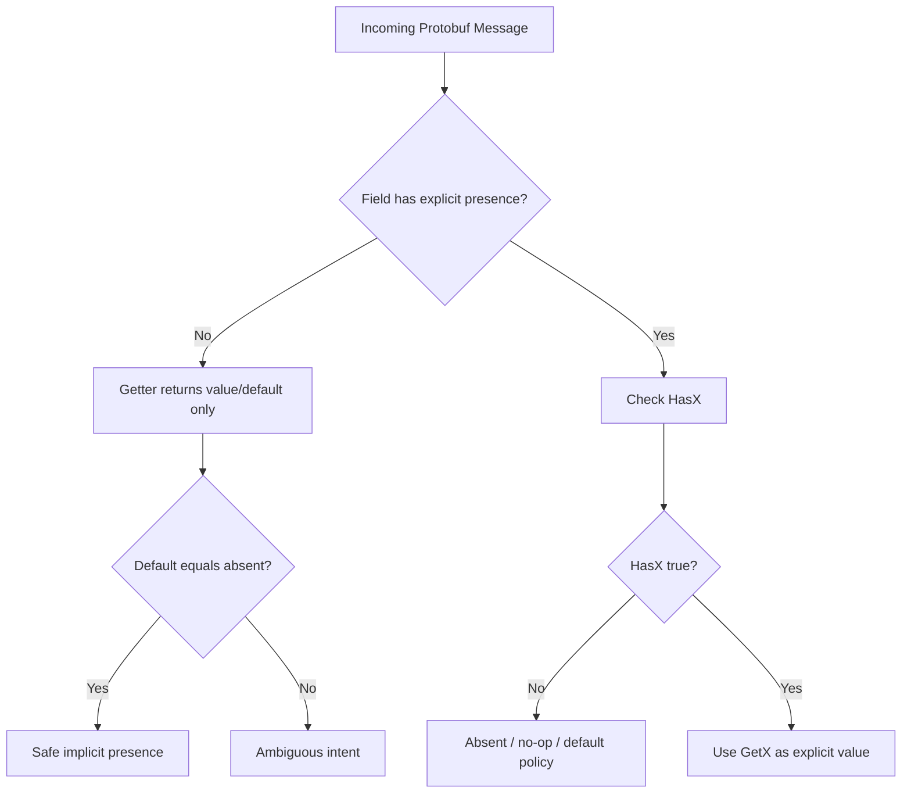
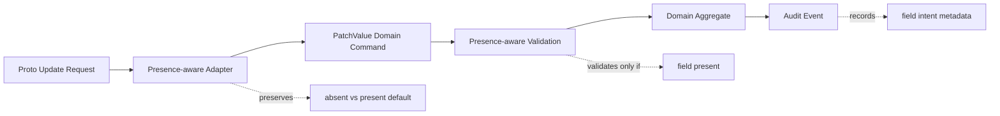
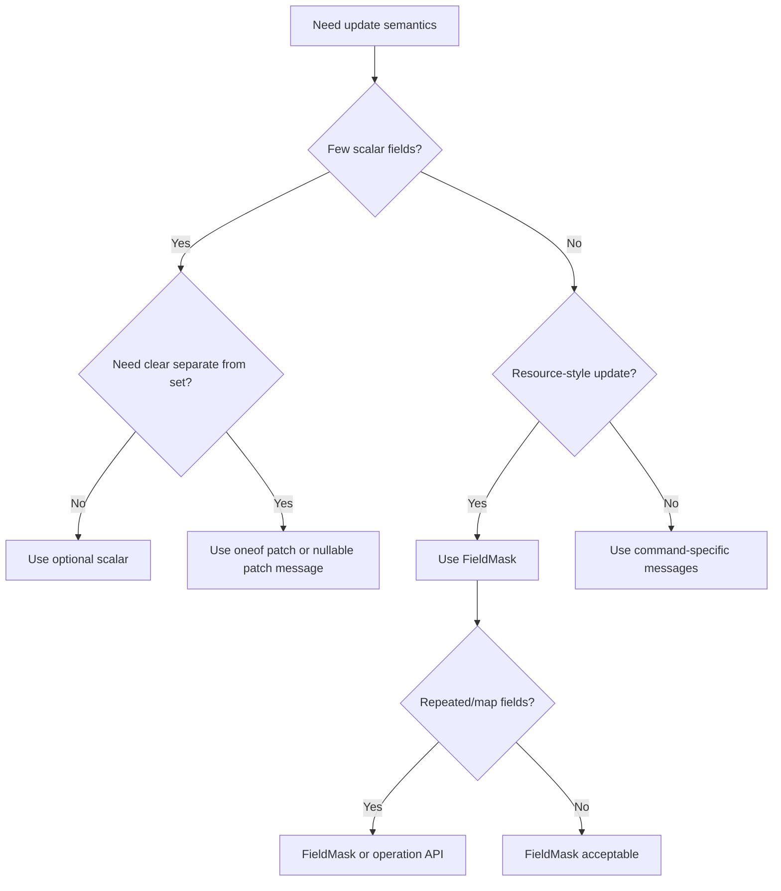
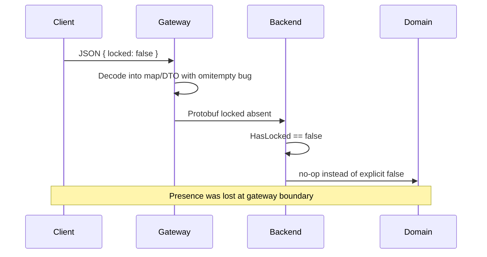

# learn-go-data-mapper-json-xml-protobuf-validation-part-022.md

# Part 022 — Protobuf Field Presence and Optionality

> Series: `learn-go-data-mapper-json-xml-protobuf-validation`  
> Part: `022 / 033`  
> Audience: Java software engineer moving deeply into Go data contracts  
> Scope: Protobuf field presence, proto2/proto3/Editions behavior, Go generated code, Opaque API, optional fields, wrapper types, message fields, oneof, repeated/map fields, field masks, update semantics, ProtoJSON, compatibility, and production governance.

---

## 0. Posisi Part Ini dalam Seri

Pada part sebelumnya kita membahas **Protobuf Generated Code: Open Struct vs Opaque API**. Kita melihat bahwa generated code Go Protobuf sedang bergerak dari model field struct yang terbuka menuju accessor-based Opaque API.

Part ini membahas satu topik yang tampak kecil tetapi sangat menentukan correctness sistem:

> Apakah sebuah field benar-benar dikirim/diset, atau nilainya hanya default?

Dalam JSON, kita sudah membahas perbedaan:

- field absent,
- field `null`,
- field present dengan zero value,
- field present dengan empty value,
- field present dengan explicit business meaning.

Di Protobuf, masalahnya mirip, tetapi bentuknya berbeda karena Protobuf adalah schema-based binary format dengan konsep **field presence**.

Field presence adalah salah satu sumber bug paling mahal dalam sistem Protobuf karena engineer sering mengira:

```text
0 means 0
false means false
"" means empty string
```

Padahal dalam proto3 klasik, untuk banyak scalar field:

```text
0 / false / "" juga bisa berarti field tidak pernah dikirim.
```

Jika ini tidak dipahami, sistem bisa mengalami:

- update yang tidak sengaja menghapus nilai,
- PATCH semantics yang salah,
- audit trail ambigu,
- API gateway JSON mapping yang misleading,
- backward compatibility bug,
- domain invariant bocor ke transport layer,
- migration proto2/proto3/Editions yang rusak,
- generated Go code yang dipakai dengan asumsi salah.

---

## 1. Daftar Isi

1. [Core Mental Model](#2-core-mental-model)
2. [Presence Bukan Nullability](#3-presence-bukan-nullability)
3. [Why Field Presence Exists](#4-why-field-presence-exists)
4. [Proto2 Presence Model](#5-proto2-presence-model)
5. [Proto3 Implicit Presence Model](#6-proto3-implicit-presence-model)
6. [Proto3 Optional Scalar Fields](#7-proto3-optional-scalar-fields)
7. [Protobuf Editions and Explicit Presence](#8-protobuf-editions-and-explicit-presence)
8. [Go Generated Code Mental Model](#9-go-generated-code-mental-model)
9. [Open Struct API Presence Patterns](#10-open-struct-api-presence-patterns)
10. [Opaque API Presence Patterns](#11-opaque-api-presence-patterns)
11. [Default Values and Getter Semantics](#12-default-values-and-getter-semantics)
12. [Message Fields Always Have Presence](#13-message-fields-always-have-presence)
13. [Wrapper Types: Historical Use and Modern Trade-offs](#14-wrapper-types-historical-use-and-modern-trade-offs)
14. [Oneof as Presence and Sum Type](#15-oneof-as-presence-and-sum-type)
15. [Repeated and Map Fields](#16-repeated-and-map-fields)
16. [Enum Presence and Unknown Values](#17-enum-presence-and-unknown-values)
17. [FieldMask and Update Semantics](#18-fieldmask-and-update-semantics)
18. [ProtoJSON Presence Semantics](#19-protojson-presence-semantics)
19. [Mapping Protobuf Presence to Go Domain Model](#20-mapping-protobuf-presence-to-go-domain-model)
20. [Mapping Protobuf Presence to JSON/HTTP APIs](#21-mapping-protobuf-presence-to-jsonhttp-apis)
21. [Validation Semantics with Presence](#22-validation-semantics-with-presence)
22. [Compatibility and Schema Evolution](#23-compatibility-and-schema-evolution)
23. [Production Failure Modes](#24-production-failure-modes)
24. [Decision Matrix](#25-decision-matrix)
25. [Design Patterns](#26-design-patterns)
26. [Anti-Patterns](#27-anti-patterns)
27. [Testing Strategy](#28-testing-strategy)
28. [Mermaid Diagrams](#29-mermaid-diagrams)
29. [Review Checklist](#30-review-checklist)
30. [Exercises](#31-exercises)
31. [Summary](#32-summary)
32. [References](#33-references)

---

## 2. Core Mental Model

Field presence menjawab pertanyaan:

> Apakah field ini ada dalam message, bukan hanya berapa nilainya?

Nilai dan presence adalah dua dimensi berbeda.

```text
value    = apa nilai field?
presence = apakah field diset/dikirim/tercatat ada?
```

Contoh sederhana:

```proto
syntax = "proto3";

message UserPatch {
  string display_name = 1;
}
```

Payload A:

```text
{}
```

Payload B secara konseptual:

```text
{ display_name: "" }
```

Dalam proto3 scalar field tanpa `optional`, kedua kondisi di atas tidak bisa dibedakan setelah decode:

```text
GetDisplayName() == ""
```

Itu berarti `""` bisa berarti:

1. client tidak mengirim field,
2. client ingin mengubah display name menjadi string kosong,
3. sistem lama menghilangkan field karena default value tidak diserialisasi,
4. gateway JSON mengonversi absent/default dengan aturan tertentu.

Jika API Anda adalah update full replacement, ini mungkin masih bisa diterima. Jika API Anda adalah PATCH, audit, approval workflow, atau regulatory case management, ini berbahaya.

### 2.1 Presence sebagai Metadata, Bukan Business Value

Presence bukan bagian dari domain value biasa. Presence adalah metadata transport/schema.

Contoh:

```text
Business value:
  amount = 0

Presence metadata:
  amount was explicitly provided? yes/no
```

Untuk beberapa domain, zero adalah nilai valid:

- saldo = 0,
- diskon = 0,
- retry count = 0,
- risk score = 0,
- boolean false = keputusan eksplisit,
- string kosong = mungkin valid, mungkin tidak valid.

Tanpa presence, Anda tidak bisa tahu apakah zero tersebut intensional.

### 2.2 Four-State Thinking

Untuk API update, sering kali field membutuhkan empat state:

| State | Meaning | Contoh |
|---|---|---|
| Absent | Jangan ubah field | PATCH tidak menyentuh `display_name` |
| Present default | Ubah ke default/empty/zero | Set `discount_percent = 0` |
| Present non-default | Ubah ke nilai baru | Set `discount_percent = 10` |
| Explicit null / clear | Hapus nilai optional | Clear `nickname` |

Protobuf binary tidak memakai `null` seperti JSON. Maka desain harus memilih representasi yang sesuai:

- `optional` scalar,
- message wrapper,
- `oneof`,
- `FieldMask`,
- custom patch message,
- domain command model.

---

## 3. Presence Bukan Nullability

Sebagai Java engineer, Anda mungkin terbiasa dengan:

```java
String name;      // nullable reference
Optional<String> name;
Integer age;      // nullable boxed scalar
int age;          // primitive default 0
```

Di Protobuf, presence tidak identik dengan nullable.

### 3.1 Java Null vs Protobuf Presence

| Konsep | Java | Protobuf |
|---|---|---|
| Field ada atau tidak | biasanya tidak eksplisit di object biasa | presence bit / generated haszer / oneof / message nil |
| Null | nilai reference bisa `null` | binary protobuf tidak punya universal null |
| Default scalar | primitive default | implicit presence menganggap default tidak hadir |
| Optional | `Optional<T>` | `optional`, message field, oneof, Editions explicit presence |
| Clear value | set `null` atau Optional.empty | `ClearX`, field mask, oneof unset, message nil |

### 3.2 Go Nil vs Protobuf Presence

Di Go, konsepnya juga tidak sama.

```go
var s string  // ""
var p *string // nil or pointer to string
```

Go pointer bisa merepresentasikan optionalitas di application model. Namun generated Protobuf code memiliki aturan sendiri tergantung:

- proto syntax,
- field kind,
- API level Open/Opaque,
- generator version,
- Editions feature settings.

Jangan memaksakan satu representasi universal.

### 3.3 Kesalahan Mental Model

Kesalahan umum:

```text
"Kalau field Go pointer, berarti proto optional."
```

Tidak selalu.

Dalam generated code Open Struct API, beberapa field memang direpresentasikan sebagai pointer untuk presence. Namun desain application code tidak boleh bergantung pada detail layout jika target jangka panjang adalah Opaque API.

Yang stabil adalah semantic API:

```go
msg.HasFoo()
msg.GetFoo()
msg.SetFoo(v)
msg.ClearFoo()
```

jika field/API mendukungnya.

---

## 4. Why Field Presence Exists

Protobuf didesain untuk compatibility, compact encoding, dan evolusi schema.

Dalam binary wire format, field diserialisasi sebagai pasangan:

```text
field_number + wire_type + value
```

Jika field tidak dikirim, receiver memakai default value.

Ini membuat penambahan field baru backward-compatible:

- sender lama tidak mengirim field baru,
- receiver baru tetap bisa membaca message,
- field baru mendapat default,
- sistem tidak crash karena required field baru tidak ada.

Namun trade-off-nya:

```text
Default value kadang tidak bisa dibedakan dari absent.
```

### 4.1 Compatibility vs Intent

Protobuf sering mengutamakan compatibility.

Misalnya Anda menambah field:

```proto
int32 retry_count = 10;
```

Client lama tidak tahu field ini, sehingga tidak mengirimnya. Server baru membaca `retry_count == 0`.

Apakah itu masalah?

Tergantung semantic.

Jika `0` berarti default retry count, baik-baik saja.

Jika `0` berarti client secara eksplisit meminta tidak ada retry, maka ini ambigu.

### 4.2 Presence Cost

Explicit presence memerlukan metadata tambahan:

- apakah field set,
- apakah field clear,
- bagaimana serialisasi default value dilakukan,
- bagaimana generated API mengekspos `Has`/`Clear`,
- bagaimana merge semantics bekerja.

Dalam sistem besar, biaya itu sering sepadan untuk correctness. Tetapi tidak semua field membutuhkan presence.

### 4.3 Golden Rule

> Gunakan implicit presence hanya jika default value benar-benar equivalent dengan absent untuk kontrak tersebut.

Jika tidak equivalent, gunakan explicit presence atau desain update yang berbeda.

---

## 5. Proto2 Presence Model

Proto2 memiliki explicit presence untuk singular fields.

Contoh:

```proto
syntax = "proto2";

message Account {
  optional string display_name = 1;
  optional int32 risk_score = 2;
  optional bool locked = 3;
}
```

Untuk setiap field optional, API bisa membedakan:

```text
unset vs set to default
```

Contoh:

```text
display_name absent       != display_name set to ""
risk_score absent         != risk_score set to 0
locked absent             != locked set to false
```

### 5.1 Proto2 Optional Tidak Sama dengan Business Optional

Nama `optional` di proto2 sering membingungkan.

`optional` berarti field boleh tidak hadir dalam serialized message, bukan berarti business rule tidak wajib.

Contoh:

```proto
syntax = "proto2";

message CreateUserRequest {
  optional string email = 1;
}
```

Secara wire contract, `email` boleh absent. Tetapi secara business validation, email mungkin wajib.

Maka requiredness sebaiknya diperlakukan sebagai validation concern, bukan semata-mata schema presence.

### 5.2 Proto2 Required: Kenapa Harus Dihindari

Proto2 punya label `required`.

```proto
required string email = 1;
```

Dalam praktik modern, `required` sering dihindari karena menyulitkan evolusi schema. Jika field required ditambahkan atau berubah, deployment rolling lintas service bisa rusak.

Lebih aman:

```proto
optional string email = 1;
```

lalu enforce requiredness di validation layer:

```text
if !HasEmail() => validation error
```

Dengan cara ini, schema tetap evolvable dan business rule tetap kuat.

---

## 6. Proto3 Implicit Presence Model

Proto3 awalnya menyederhanakan field presence untuk scalar fields.

Contoh:

```proto
syntax = "proto3";

message Account {
  string display_name = 1;
  int32 risk_score = 2;
  bool locked = 3;
}
```

Untuk scalar fields di atas, presence bersifat implicit.

Artinya:

```text
field absent       => getter mengembalikan default
field set default  => secara semantic sama dengan absent
```

Default value:

| Type | Default |
|---|---|
| string | `""` |
| bytes | empty bytes |
| bool | `false` |
| numeric | `0` |
| enum | first enum value, biasanya `*_UNSPECIFIED = 0` |

### 6.1 Serialisasi Default Value

Dengan implicit presence, field scalar default biasanya tidak diserialisasi.

Misalnya:

```proto
syntax = "proto3";

message RetryPolicy {
  int32 max_retries = 1;
}
```

Jika `max_retries` bernilai `0`, serialized message secara default tidak menyimpan field tersebut.

Receiver tidak bisa tahu apakah:

```text
max_retries tidak dikirim
```

atau:

```text
max_retries dikirim secara eksplisit sebagai 0
```

### 6.2 Kapan Implicit Presence Aman

Implicit presence aman bila field memenuhi invariant berikut:

```text
absent == default value
```

Contoh yang relatif aman:

```proto
message MetricsPoint {
  int64 count = 1;       // absent berarti 0 count
  bool sampled = 2;      // absent berarti false mungkin OK
}
```

Namun tetap perlu hati-hati. `false` sering punya business meaning eksplisit.

### 6.3 Kapan Implicit Presence Berbahaya

Berbahaya bila default value adalah nilai bisnis valid yang perlu dibedakan dari absent.

Contoh:

```proto
message UpdateCaseRequest {
  string assignee = 1;
  bool urgent = 2;
  int32 priority = 3;
}
```

Apakah request ini:

```text
urgent = false
```

berarti:

- user ingin menonaktifkan urgent,
- user tidak mengirim field urgent,
- gateway menghilangkan default false,
- backward-compatible old client belum tahu field urgent?

Tidak bisa dibedakan jika memakai implicit presence.

---

## 7. Proto3 Optional Scalar Fields

Proto3 kemudian memperkenalkan kembali `optional` untuk scalar fields.

Contoh:

```proto
syntax = "proto3";

message AccountPatch {
  optional string display_name = 1;
  optional int32 risk_score = 2;
  optional bool locked = 3;
}
```

Dengan `optional`, field memiliki explicit presence.

Artinya:

```text
absent       != present with default
unset locked != locked set to false
unset score  != score set to 0
```

### 7.1 Go Usage Conceptual

Dalam Opaque API, gunakan accessor presence:

```go
if req.HasLocked() {
    locked := req.GetLocked()
    // apply explicit update
}
```

Dalam Open Struct API, generated code sering merepresentasikan optional scalar sebagai pointer-like field. Namun application code modern lebih baik diarahkan ke accessor patterns bila tersedia agar migration ke Opaque API lebih aman.

### 7.2 Optional Bukan Selalu Jawaban

Jangan menandai semua field `optional` tanpa berpikir. Pertanyaan yang benar:

```text
Apakah consumer perlu membedakan absent dari default?
```

Jika ya, gunakan explicit presence.

Jika tidak, implicit presence mungkin lebih sederhana.

### 7.3 Optional untuk Create vs Update

Create request sering berbeda dari update request.

```proto
message CreateAccountRequest {
  string email = 1;
  string display_name = 2;
}

message UpdateAccountRequest {
  string account_id = 1;
  optional string display_name = 2;
  optional bool locked = 3;
}
```

Pada create:

- field requiredness biasanya divalidasi,
- absent/default mungkin sama-sama invalid,
- presence tidak selalu diperlukan untuk semua scalar.

Pada update/PATCH:

- absence sering berarti jangan ubah,
- default value sering berarti ubah ke default,
- explicit presence menjadi jauh lebih penting.

---

## 8. Protobuf Editions and Explicit Presence

Protobuf Editions adalah mekanisme evolusi Protobuf yang menggantikan pendekatan `syntax = "proto2"` dan `syntax = "proto3"` dengan edition number dan feature flags.

Contoh konseptual:

```proto
edition = "2023";

message AccountPatch {
  string display_name = 1;
  bool locked = 2;
}
```

Dalam Editions modern, field presence dapat dikontrol melalui feature setting, dan explicit presence menjadi default dalam banyak konteks Editions.

### 8.1 Kenapa Ini Penting untuk Go Engineer

Jika Anda bekerja di codebase baru yang mulai memakai Editions, Anda tidak boleh membawa asumsi proto3 klasik:

```text
scalar field tidak punya presence
```

Arah evolusi Protobuf adalah membuat feature behavior lebih eksplisit dan lebih dapat dikontrol.

### 8.2 Migration Thinking

Jika codebase Anda saat ini proto3 klasik, migration menuju Editions atau optional field perlu memperhatikan:

- generated code API,
- field presence semantic,
- ProtoJSON output,
- validation behavior,
- backward compatibility dengan client lama,
- generated client di bahasa lain,
- gateway behavior,
- storage/event replay.

### 8.3 Recommendation

Untuk codebase proto3 baru yang belum memakai Editions:

```text
Gunakan optional untuk scalar field jika absent dan default value tidak equivalent.
```

Ini memberi jalur yang lebih mulus menuju Editions explicit presence.

---

## 9. Go Generated Code Mental Model

Di Go, presence tampak berbeda tergantung API level.

Ada dua gaya utama:

1. **Open Struct API** — field struct visible.
2. **Opaque API** — field internal tersembunyi, gunakan methods.

Keduanya mewakili schema yang sama, tetapi cara aplikasi mengakses presence berbeda.

### 9.1 Jangan Bergantung pada Layout

Dalam Open Struct API, Anda mungkin melihat generated field seperti:

```go
type AccountPatch struct {
    DisplayName *string `protobuf:"bytes,1,opt,name=display_name,json=displayName,proto3,oneof"`
    Locked      *bool   `protobuf:"varint,2,opt,name=locked,proto3,oneof"`
}
```

Namun ini adalah detail generated code, bukan kontrak application architecture.

Kontrak yang lebih sehat:

```go
if msg.HasDisplayName() {
    name := msg.GetDisplayName()
}
```

atau gunakan generated API yang sesuai dengan API level.

### 9.2 Generated Code Tidak Sama dengan Domain Type

Misalnya:

```proto
message AccountPatch {
  optional string display_name = 1;
  optional bool locked = 2;
}
```

Domain command yang lebih baik:

```go
type AccountPatchCommand struct {
    AccountID    AccountID
    DisplayName  OptionalPatch[string]
    Locked       OptionalPatch[bool]
    Actor        ActorID
    Correlation  CorrelationID
}
```

Protobuf message adalah boundary contract. Domain command adalah intent model.

### 9.3 Presence Mapping Boundary

Mapping dari protobuf ke domain harus eksplisit:

```go
func ToAccountPatchCommand(req *accountpb.UpdateAccountRequest) (AccountPatchCommand, error) {
    if req == nil {
        return AccountPatchCommand{}, ErrNilRequest
    }

    cmd := AccountPatchCommand{
        AccountID: AccountID(req.GetAccountId()),
    }

    if req.HasDisplayName() {
        cmd.DisplayName = PatchSet(req.GetDisplayName())
    } else {
        cmd.DisplayName = PatchUnset[string]()
    }

    if req.HasLocked() {
        cmd.Locked = PatchSet(req.GetLocked())
    } else {
        cmd.Locked = PatchUnset[bool]()
    }

    return cmd, nil
}
```

Catatan: method exact tergantung generated API/version. Prinsip arsitekturalnya adalah presence harus dipetakan eksplisit.

---

## 10. Open Struct API Presence Patterns

Open Struct API masih sangat banyak dipakai.

Contoh proto3 optional:

```proto
syntax = "proto3";

package account.v1;

option go_package = "example.com/acme/accountpb;accountpb";

message UpdateAccountRequest {
  string account_id = 1;
  optional string display_name = 2;
  optional bool locked = 3;
}
```

Generated code Open Struct API biasanya menyediakan helper untuk mengambil pointer value.

Contoh penggunaan konseptual:

```go
req := &accountpb.UpdateAccountRequest{
    AccountId: "acc_123",
    DisplayName: proto.String(""),
    Locked: proto.Bool(false),
}
```

Di sini:

```text
DisplayName present with empty string
Locked present with false
```

berbeda dari:

```go
req := &accountpb.UpdateAccountRequest{
    AccountId: "acc_123",
}
```

Di sini:

```text
DisplayName absent
Locked absent
```

### 10.1 Pointer Helper Pattern

Modern protobuf Go runtime menyediakan helper generic untuk pointer.

```go
req := &accountpb.UpdateAccountRequest{
    AccountId:    "acc_123",
    DisplayName: proto.String("Jane"),
    Locked:      proto.Bool(false),
}
```

Namun jangan bocorkan pointer semantics ke domain.

Buruk:

```go
type AccountPatchCommand struct {
    DisplayName *string
    Locked      *bool
}
```

Lebih baik:

```go
type PatchValue[T any] struct {
    Present bool
    Value   T
}
```

### 10.2 Pitfall: nil Pointer Panic

Buruk:

```go
name := *req.DisplayName
```

Aman:

```go
if req.DisplayName != nil {
    name := req.GetDisplayName()
    _ = name
}
```

Lebih baik untuk jangka panjang:

```go
if req.HasDisplayName() {
    name := req.GetDisplayName()
    _ = name
}
```

Jika API generated Anda belum menyediakan method tersebut, isolasikan akses pointer dalam adapter package, jangan disebar ke business code.

### 10.3 Presence Helper di Adapter

```go
package accountadapter

func HasDisplayName(req *accountpb.UpdateAccountRequest) bool {
    return req != nil && req.DisplayName != nil
}

func DisplayName(req *accountpb.UpdateAccountRequest) string {
    if req == nil {
        return ""
    }
    return req.GetDisplayName()
}
```

Keuntungan:

- akses Open Struct API terkapsulasi,
- migration ke Opaque API lebih mudah,
- business code tidak peduli layout generated field,
- test helper bisa menutup edge case.

---

## 11. Opaque API Presence Patterns

Opaque API menyembunyikan detail struct generated code.

Alih-alih:

```go
msg.DisplayName = proto.String("Jane")
if msg.DisplayName != nil { ... }
```

Anda memakai method:

```go
msg.SetDisplayName("Jane")
if msg.HasDisplayName() {
    name := msg.GetDisplayName()
}
msg.ClearDisplayName()
```

### 11.1 Why This Matters

Opaque API membuat generated code lebih bebas berevolusi.

Runtime/generator dapat mengoptimalkan:

- memory layout,
- presence bitset,
- lazy decoding,
- oneof representation,
- synchronization dengan reflection,
- future compatibility.

Application code tidak perlu tahu apakah presence disimpan sebagai pointer, bit field, internal state, atau strategi lain.

### 11.2 Builder Pattern

Opaque API juga mendorong construction yang lebih aman dengan builder.

Contoh konseptual:

```go
req := accountpb.UpdateAccountRequest_builder{
    AccountId: proto.String("acc_123"),
    DisplayName: proto.String("Jane"),
    Locked: proto.Bool(false),
}.Build()
```

Catatan: exact generated builder shape bergantung pada generator/API level. Prinsipnya:

```text
Message construction harus menyatakan field mana yang present.
```

### 11.3 Clear Semantics

Dalam Opaque API, clear operation harus dibedakan dari set default.

```go
req.SetLocked(false)   // present with false
req.ClearLocked()      // absent
```

Ini sangat penting untuk PATCH.

### 11.4 Nil Safety

Opaque API biasanya membuat pola akses lebih aman karena aplikasi tidak langsung dereference pointer generated field.

Tetapi Anda tetap harus menangani nil message:

```go
func HasLocked(req *accountpb.UpdateAccountRequest) bool {
    return req != nil && req.HasLocked()
}
```

---

## 12. Default Values and Getter Semantics

Getter Protobuf biasanya mengembalikan default jika field absent.

Contoh:

```proto
message User {
  optional string display_name = 1;
  optional bool locked = 2;
  int32 login_count = 3;
}
```

Jika semua absent:

```go
user.GetDisplayName() // ""
user.GetLocked()      // false
user.GetLoginCount()  // 0
```

Getter saja tidak cukup untuk mengetahui intent.

### 12.1 Rule

> Jika presence penting, jangan hanya pakai `GetX()`. Selalu cek `HasX()` atau representasi presence lain.

Buruk:

```go
if !req.GetLocked() {
    account.Unlock()
}
```

Karena ini akan unlock meskipun client tidak mengirim `locked`.

Benar:

```go
if req.HasLocked() {
    account.SetLocked(req.GetLocked())
}
```

### 12.2 Default Can Be Business Value

`false` bisa berarti:

- user explicitly disabled feature,
- user did not provide value,
- old client did not know the field,
- gateway omitted default.

`0` bisa berarti:

- no retries,
- no risk,
- lowest priority,
- unknown/unset,
- default policy.

`""` bisa berarti:

- clear text,
- invalid empty input,
- unspecified,
- generated default.

Presence adalah cara menghindari ambiguity.

---

## 13. Message Fields Always Have Presence

Dalam proto3, message-typed fields memiliki presence.

Contoh:

```proto
syntax = "proto3";

message Address {
  string line1 = 1;
  string city = 2;
}

message UpdateProfileRequest {
  Address address = 1;
}
```

`address` dapat absent atau present.

Namun field di dalam `Address` masih mengikuti aturan presence masing-masing.

### 13.1 Nested Presence

Jika `address` present tetapi `line1` empty, pertanyaan berikut muncul:

```text
Apakah address dikirim untuk replace seluruh address?
Apakah line1 sengaja dikosongkan?
Apakah line1 absent?
```

Message field presence hanya menjawab apakah message ada, bukan semua field di dalamnya.

### 13.2 Message Wrapper as Optional Scalar

Sebelum proto3 `optional` scalar matang, wrapper types sering dipakai:

```proto
import "google/protobuf/wrappers.proto";

message UpdateAccountRequest {
  google.protobuf.StringValue display_name = 1;
  google.protobuf.BoolValue locked = 2;
}
```

Karena message fields punya presence, wrapper dapat membedakan absent vs present.

Tetapi wrapper memiliki trade-off yang akan dibahas di section berikut.

### 13.3 Nested Update Anti-Pattern

Buruk:

```proto
message UpdateCaseRequest {
  Case case = 1;
}
```

Ini mencampur full resource representation dengan patch intent.

Lebih baik:

```proto
message UpdateCaseRequest {
  string case_id = 1;
  optional string title = 2;
  optional CaseStatus status = 3;
  google.protobuf.FieldMask update_mask = 100;
}
```

atau desain command eksplisit:

```proto
message AssignCaseRequest {
  string case_id = 1;
  string assignee_id = 2;
}

message CloseCaseRequest {
  string case_id = 1;
  ClosureReason reason = 2;
}
```

---

## 14. Wrapper Types: Historical Use and Modern Trade-offs

Well-known wrapper types:

```proto
import "google/protobuf/wrappers.proto";

message Example {
  google.protobuf.StringValue name = 1;
  google.protobuf.Int32Value age = 2;
  google.protobuf.BoolValue active = 3;
}
```

Wrappers adalah message types yang membungkus scalar.

### 14.1 Kelebihan Wrapper Types

- message field punya presence,
- familiar untuk `nullable` scalar,
- berguna untuk beberapa API JSON yang butuh nullability,
- tersedia lintas bahasa,
- historis banyak dipakai sebelum proto3 `optional` scalar.

### 14.2 Kekurangan Wrapper Types

- lebih verbose,
- ada alokasi/message nested tambahan,
- lebih berat secara schema readability,
- bisa membuat JSON mapping lebih kompleks,
- tidak selalu sejelas `optional scalar`,
- bisa disalahgunakan sebagai pseudo-null tanpa semantic clear.

### 14.3 Modern Recommendation

Untuk proto3 scalar field baru yang butuh presence, biasanya lebih sederhana memakai:

```proto
optional string display_name = 1;
optional bool locked = 2;
```

daripada:

```proto
google.protobuf.StringValue display_name = 1;
google.protobuf.BoolValue locked = 2;
```

Tetapi wrapper masih relevan jika:

- Anda mempertahankan schema lama,
- tooling/language tertentu belum mendukung optional scalar dengan baik,
- kontrak JSON eksplisit membutuhkan `null`,
- Anda mengikuti style guide organisasi lama,
- interoperabilitas dengan API existing mengharuskannya.

### 14.4 Wrapper Type Mapping to Domain

Jangan pakai wrapper type sebagai domain model.

Buruk:

```go
type User struct {
    DisplayName *wrapperspb.StringValue
}
```

Lebih baik:

```go
type OptionalString struct {
    Present bool
    Value   string
}
```

atau untuk update:

```go
type PatchValue[T any] struct {
    Present bool
    Value   T
}
```

Adapter:

```go
func FromStringValue(v *wrapperspb.StringValue) PatchValue[string] {
    if v == nil {
        return PatchUnset[string]()
    }
    return PatchSet(v.Value)
}
```

---

## 15. Oneof as Presence and Sum Type

`oneof` selalu memiliki presence karena hanya satu alternative yang bisa dipilih.

Contoh:

```proto
message SearchRequest {
  oneof target {
    string user_id = 1;
    string email = 2;
    string phone = 3;
  }
}
```

Di sini presence bukan hanya apakah field diset, tetapi variant mana yang dipilih.

### 15.1 Oneof for Patch Semantics

Kadang `oneof` dipakai untuk membedakan clear vs set.

Contoh:

```proto
message NullableStringPatch {
  oneof operation {
    string set = 1;
    bool clear = 2;
  }
}

message UpdateProfileRequest {
  string user_id = 1;
  NullableStringPatch nickname = 2;
}
```

Semantic:

| State | Meaning |
|---|---|
| `nickname` absent | jangan ubah nickname |
| `nickname.set = "Bob"` | set nickname |
| `nickname.set = ""` | set nickname ke empty string |
| `nickname.clear = true` | clear nickname |

Ini lebih ekspresif daripada scalar optional jika Anda butuh membedakan:

```text
absent vs set value vs clear value
```

### 15.2 Oneof as Command Variant

Sangat cocok untuk command/event:

```proto
message CaseAction {
  string case_id = 1;

  oneof action {
    AssignCase assign = 10;
    EscalateCase escalate = 11;
    CloseCase close = 12;
  }
}
```

Ini lebih aman daripada message dengan banyak optional fields yang kombinasi validnya tidak jelas.

### 15.3 Oneof Anti-Pattern

Buruk:

```proto
message UpdateRequest {
  optional string name = 1;
  optional string email = 2;
  optional string phone = 3;
  optional bool clear_name = 4;
  optional bool clear_email = 5;
  optional bool clear_phone = 6;
}
```

Masalah:

- kombinasi contradictory,
- validasi sulit,
- field explosion,
- intent tidak jelas.

Lebih baik buat operation object atau oneof patch.

---

## 16. Repeated and Map Fields

Repeated dan map fields memiliki semantics berbeda.

Dalam proto3, repeated field biasanya tidak punya presence seperti scalar optional.

```proto
message UpdateTagsRequest {
  repeated string tags = 1;
}
```

Setelah decode, empty list bisa berarti:

- field absent,
- field present dengan empty list,
- client ingin clear all tags,
- default empty.

### 16.1 Repeated Field Presence Problem

Untuk update semantics, ini berbahaya.

```proto
message UpdateCaseRequest {
  repeated string labels = 1;
}
```

Apakah `labels = []` berarti:

```text
jangan ubah labels
```

atau:

```text
hapus semua labels
```

Tidak jelas.

### 16.2 Better Patterns for Repeated Updates

#### Pattern A: FieldMask

```proto
import "google/protobuf/field_mask.proto";

message UpdateCaseRequest {
  Case case = 1;
  google.protobuf.FieldMask update_mask = 2;
}

message Case {
  string id = 1;
  repeated string labels = 2;
}
```

Jika `update_mask` berisi `labels`, maka empty labels berarti clear labels.
Jika tidak berisi `labels`, labels tidak diubah.

#### Pattern B: Operation-Based API

```proto
message ReplaceCaseLabelsRequest {
  string case_id = 1;
  repeated string labels = 2;
}

message AddCaseLabelsRequest {
  string case_id = 1;
  repeated string labels = 2;
}

message RemoveCaseLabelsRequest {
  string case_id = 1;
  repeated string labels = 2;
}
```

Lebih jelas untuk lifecycle penting.

#### Pattern C: Wrapped Repeated Patch

```proto
message StringListPatch {
  repeated string values = 1;
}

message UpdateCaseRequest {
  string case_id = 1;
  StringListPatch labels = 2;
}
```

Karena `labels` adalah message field, ia memiliki presence. Jika `labels` present dengan empty `values`, berarti explicit empty list.

### 16.3 Map Field Problem

Map field juga tidak cocok untuk patch tanpa desain tambahan.

```proto
message UpdateMetadataRequest {
  map<string, string> metadata = 1;
}
```

Empty map bisa ambigu:

- tidak update metadata,
- replace metadata dengan empty map,
- clear metadata.

Gunakan:

- FieldMask,
- operation API,
- wrapper message,
- explicit add/remove/replace semantics.

---

## 17. Enum Presence and Unknown Values

Enum di proto3 biasanya memiliki default first value `0`.

Style guide modern biasanya mendorong enum value pertama sebagai unspecified.

```proto
enum CaseStatus {
  CASE_STATUS_UNSPECIFIED = 0;
  CASE_STATUS_OPEN = 1;
  CASE_STATUS_IN_REVIEW = 2;
  CASE_STATUS_CLOSED = 3;
}
```

### 17.1 Why Unspecified Matters

Jika field enum implicit presence:

```proto
message Case {
  CaseStatus status = 1;
}
```

Maka absent akan terlihat sebagai:

```text
CASE_STATUS_UNSPECIFIED
```

Ini memberi sentinel default yang lebih aman daripada default langsung ke `OPEN`.

Buruk:

```proto
enum CaseStatus {
  CASE_STATUS_OPEN = 0;
  CASE_STATUS_CLOSED = 1;
}
```

Karena absent akan terlihat sebagai `OPEN`, yang bisa menyebabkan bug fatal.

### 17.2 Optional Enum

Jika Anda perlu membedakan absent dari explicit unspecified:

```proto
message UpdateCaseRequest {
  optional CaseStatus status = 1;
}
```

Semantic:

| State | Meaning |
|---|---|
| absent | jangan ubah status |
| present `CASE_STATUS_UNSPECIFIED` | mungkin invalid atau explicit clear, tergantung aturan |
| present `CASE_STATUS_CLOSED` | set status closed |

### 17.3 Unknown Enum Values

Protobuf mendukung evolusi enum. Receiver bisa melihat numeric enum value yang belum dikenal oleh generated code lama.

Jangan langsung mengasumsikan enum value unknown sebagai invalid dalam semua konteks.

Untuk internal domain processing, mungkin invalid.

Untuk forward-compatible proxy/storage, mungkin harus dipreserve.

### 17.4 Enum Validation Pattern

```go
func ValidateCaseStatusForUpdate(p PatchValue[casepb.CaseStatus]) error {
    if !p.Present {
        return nil
    }

    switch p.Value {
    case casepb.CaseStatus_CASE_STATUS_OPEN,
         casepb.CaseStatus_CASE_STATUS_IN_REVIEW,
         casepb.CaseStatus_CASE_STATUS_CLOSED:
        return nil
    case casepb.CaseStatus_CASE_STATUS_UNSPECIFIED:
        return fieldError("status", "must not be unspecified")
    default:
        return fieldError("status", "unknown status")
    }
}
```

---

## 18. FieldMask and Update Semantics

`google.protobuf.FieldMask` adalah well-known type untuk menyatakan field mana yang ingin diupdate.

Contoh:

```proto
import "google/protobuf/field_mask.proto";

message Account {
  string id = 1;
  string display_name = 2;
  bool locked = 3;
  repeated string labels = 4;
}

message UpdateAccountRequest {
  Account account = 1;
  google.protobuf.FieldMask update_mask = 2;
}
```

Jika `update_mask.paths` berisi:

```text
display_name
locked
```

maka hanya field itu yang diupdate.

### 18.1 Why FieldMask Exists

FieldMask memisahkan:

```text
nilai field
```

dari:

```text
field mana yang dimaksud untuk diupdate
```

Ini sangat berguna karena repeated/map/scalar default value tidak selalu punya presence yang cukup.

### 18.2 FieldMask Example

Request:

```json
{
  "account": {
    "id": "acc_123",
    "displayName": "",
    "locked": false
  },
  "updateMask": "displayName,locked"
}
```

Semantic:

```text
set display_name to empty string
set locked to false
```

Tanpa update mask, kedua nilai itu bisa dianggap absent/default.

### 18.3 FieldMask vs Optional

| Need | Better Choice |
|---|---|
| Few scalar patch fields | `optional` scalar |
| Full resource update with sparse fields | `FieldMask` |
| Repeated/map replace semantics | `FieldMask` atau operation API |
| Clear vs set vs no-op | oneof patch atau FieldMask + value |
| Complex command | command-specific message |

### 18.4 FieldMask Governance

FieldMask path harus divalidasi.

Jangan menerima arbitrary path tanpa whitelist.

```go
var allowedAccountUpdatePaths = map[string]struct{}{
    "display_name": {},
    "locked": {},
    "labels": {},
}

func ValidateUpdateMask(mask *fieldmaskpb.FieldMask) error {
    if mask == nil || len(mask.Paths) == 0 {
        return fieldError("update_mask", "must include at least one path")
    }
    seen := map[string]struct{}{}
    for _, p := range mask.Paths {
        if _, ok := allowedAccountUpdatePaths[p]; !ok {
            return fieldError("update_mask", "unsupported path: "+p)
        }
        if _, ok := seen[p]; ok {
            return fieldError("update_mask", "duplicate path: "+p)
        }
        seen[p] = struct{}{}
    }
    return nil
}
```

### 18.5 FieldMask and Domain Commands

Jangan teruskan `FieldMask` mentah ke domain model.

Mapping lebih baik:

```go
type AccountPatchCommand struct {
    AccountID    AccountID
    DisplayName  PatchValue[string]
    Locked       PatchValue[bool]
    Labels       PatchValue[[]string]
}
```

Adapter membaca `update_mask`, lalu mengisi command.

---

## 19. ProtoJSON Presence Semantics

ProtoJSON adalah mapping JSON resmi untuk Protobuf, bukan `encoding/json` biasa terhadap generated Go struct.

Gunakan:

```go
protojson.Marshal(msg)
protojson.Unmarshal(data, msg)
```

bukan:

```go
json.Marshal(msg)
json.Unmarshal(data, msg)
```

untuk message Protobuf.

### 19.1 JSON Name vs Proto Field Name

ProtoJSON biasanya memakai lowerCamelCase field name.

```proto
string display_name = 1;
```

JSON:

```json
{
  "displayName": "Jane"
}
```

Opsi dapat mengubah penggunaan proto name, tetapi contract harus konsisten.

### 19.2 Defaults and EmitUnpopulated

ProtoJSON marshal memiliki opsi terkait default/unpopulated fields.

Bahaya:

```go
protojson.MarshalOptions{EmitUnpopulated: true}
```

Ini bisa membuat field default muncul di JSON walau secara presence tidak set.

Untuk API response, ini mungkin diinginkan.
Untuk PATCH request atau audit, ini bisa misleading.

### 19.3 Null Handling

JSON punya `null`, Protobuf binary tidak punya universal null.

Beberapa well-known types/wrapper/message field dapat merepresentasikan null-ish semantics di ProtoJSON, tetapi jangan menganggap `null` selalu sama dengan clear.

Harus ada policy:

| JSON Input | Meaning |
|---|---|
| absent | no-op atau default |
| `null` | reject, clear, atau unset? |
| default value | set default atau no-op? |
| non-default | set value |

Policy ini harus ditulis dalam API contract.

### 19.4 ProtoJSON and Optional Fields

Optional scalar presence dapat dipengaruhi oleh apakah JSON field muncul.

Contoh:

```json
{
  "locked": false
}
```

harus dibedakan dari:

```json
{}
```

jika proto field adalah:

```proto
optional bool locked = 1;
```

### 19.5 Gateway Pitfall

Jika request melewati gateway yang decode JSON ke map lalu encode Protobuf, pastikan gateway tidak menghilangkan field default.

Bug umum:

```text
client sends {"locked": false}
gateway drops false because omitempty/default behavior
backend receives locked absent
update not applied
```

Atau sebaliknya:

```text
gateway emits default false for absent field
backend thinks client explicitly set locked false
account unlocked accidentally
```

---

## 20. Mapping Protobuf Presence to Go Domain Model

Domain model sebaiknya tidak memakai generated Protobuf message langsung.

Untuk update intent, buat type yang menyimpan presence secara eksplisit.

### 20.1 Generic PatchValue

```go
type PatchValue[T any] struct {
    present bool
    value   T
}

func PatchUnset[T any]() PatchValue[T] {
    return PatchValue[T]{}
}

func PatchSet[T any](v T) PatchValue[T] {
    return PatchValue[T]{present: true, value: v}
}

func (p PatchValue[T]) Present() bool {
    return p.present
}

func (p PatchValue[T]) Value() (T, bool) {
    return p.value, p.present
}

func (p PatchValue[T]) MustValue() T {
    if !p.present {
        panic("patch value is absent")
    }
    return p.value
}
```

### 20.2 Applying PatchValue

```go
type Account struct {
    id          AccountID
    displayName string
    locked      bool
}

type AccountPatchCommand struct {
    AccountID   AccountID
    DisplayName PatchValue[string]
    Locked      PatchValue[bool]
}

func (a *Account) ApplyPatch(cmd AccountPatchCommand) error {
    if v, ok := cmd.DisplayName.Value(); ok {
        if len(v) > 80 {
            return fieldError("display_name", "too long")
        }
        a.displayName = normalizeDisplayName(v)
    }

    if v, ok := cmd.Locked.Value(); ok {
        a.locked = v
    }

    return nil
}
```

Domain tidak tahu Protobuf. Domain hanya tahu intent.

### 20.3 Mapping Adapter

```go
func MapUpdateAccountRequest(req *accountpb.UpdateAccountRequest) (AccountPatchCommand, error) {
    if req == nil {
        return AccountPatchCommand{}, fieldError("request", "must not be nil")
    }
    if req.GetAccountId() == "" {
        return AccountPatchCommand{}, fieldError("account_id", "required")
    }

    cmd := AccountPatchCommand{
        AccountID: AccountID(req.GetAccountId()),
    }

    if req.HasDisplayName() {
        cmd.DisplayName = PatchSet(req.GetDisplayName())
    }
    if req.HasLocked() {
        cmd.Locked = PatchSet(req.GetLocked())
    }

    return cmd, nil
}
```

Jika generated Open API belum punya `HasX()`, bungkus pointer access dalam adapter.

### 20.4 Domain Optional vs Patch Optional

Jangan campur:

```text
field value optional in domain
```

dengan:

```text
field update optional in request
```

Contoh nickname domain bisa nullable:

```go
type OptionalValue[T any] struct {
    valid bool
    value T
}
```

Patch terhadap nickname butuh state lebih banyak:

```go
type NullablePatch[T any] struct {
    op    PatchOp
    value T
}

type PatchOp int

const (
    PatchNoop PatchOp = iota
    PatchSet
    PatchClear
)
```

Karena update intent dapat berupa:

- no-op,
- set to value,
- clear value.

---

## 21. Mapping Protobuf Presence to JSON/HTTP APIs

Banyak sistem memakai Protobuf internal tetapi HTTP/JSON eksternal.

Ada dua strategi:

1. API eksternal adalah ProtoJSON dari `.proto`.
2. API eksternal punya JSON DTO/OpenAPI sendiri, lalu dipetakan ke Protobuf/domain.

Keduanya bisa benar, tetapi presence policy harus eksplisit.

### 21.1 ProtoJSON External API

Jika API publik langsung memakai ProtoJSON:

- gunakan `protojson`,
- dokumentasikan absent/default/null,
- validasi unknown fields sesuai policy,
- hati-hati dengan `EmitUnpopulated`,
- gunakan FieldMask untuk update resource.

### 21.2 Custom JSON DTO External API

Jika API publik memakai DTO Go/OpenAPI:

```go
type UpdateAccountJSON struct {
    DisplayName OptionalJSON[string] `json:"displayName"`
    Locked      OptionalJSON[bool]   `json:"locked"`
}
```

Lalu mapping:

```go
func ToProto(req UpdateAccountJSON) *accountpb.UpdateAccountRequest {
    b := accountpb.UpdateAccountRequest_builder{}

    if v, ok := req.DisplayName.Value(); ok {
        b.DisplayName = proto.String(v)
    }
    if v, ok := req.Locked.Value(); ok {
        b.Locked = proto.Bool(v)
    }

    return b.Build()
}
```

### 21.3 Avoid Double Ambiguity

Jangan membuat JSON absent/null ambiguity lalu mapping ke Protobuf implicit presence ambiguity.

Buruk:

```text
JSON DTO tidak bisa bedakan absent/null/default
↓
proto3 scalar implicit tidak bisa bedakan absent/default
↓
domain tidak tahu user intent
```

Baik:

```text
JSON decoder preserves presence
↓
Protobuf explicit presence or FieldMask
↓
domain command preserves intent
```

---

## 22. Validation Semantics with Presence

Validation harus presence-aware.

### 22.1 Required on Create

Create request:

```proto
message CreateAccountRequest {
  string email = 1;
  string display_name = 2;
}
```

Validation:

```text
email must be non-empty
display_name must be non-empty
```

Presence mungkin tidak perlu karena absent dan empty sama-sama invalid.

### 22.2 Optional on Update

Update request:

```proto
message UpdateAccountRequest {
  string account_id = 1;
  optional string display_name = 2;
  optional bool locked = 3;
}
```

Validation:

```text
account_id required
if display_name present: validate length/characters
if locked present: validate transition permission
at least one update field present
```

### 22.3 Wrong Validation

Buruk:

```go
if req.GetDisplayName() == "" {
    return error("display_name required")
}
```

Ini salah untuk update karena absent dan present empty harus diperlakukan berbeda.

Benar:

```go
if req.HasDisplayName() {
    if strings.TrimSpace(req.GetDisplayName()) == "" {
        return fieldError("display_name", "must not be blank when provided")
    }
}
```

Atau jika empty string valid sebagai clear/set-empty, validation harus mencerminkan itu.

### 22.4 At Least One Field Present

```go
func ValidateUpdate(req *accountpb.UpdateAccountRequest) error {
    if req == nil {
        return fieldError("request", "required")
    }
    if req.GetAccountId() == "" {
        return fieldError("account_id", "required")
    }

    hasUpdate := req.HasDisplayName() || req.HasLocked()
    if !hasUpdate {
        return fieldError("request", "at least one update field is required")
    }

    if req.HasDisplayName() && len(req.GetDisplayName()) > 80 {
        return fieldError("display_name", "too long")
    }

    return nil
}
```

### 22.5 Protovalidate and Presence

Protovalidate-style validation dapat memakai rule yang memahami field presence, tetapi Anda tetap harus mendesain schema dengan presence semantics yang benar.

Validation library tidak bisa menyelamatkan schema yang ambigu.

---

## 23. Compatibility and Schema Evolution

Presence change dapat menjadi breaking secara semantic walaupun wire-compatible.

### 23.1 Adding Optional Field

Menambah field baru:

```proto
optional bool locked = 10;
```

Wire-compatible.

Tetapi semantic harus dipikirkan:

- old client tidak mengirim field,
- new server melihat absent,
- default behavior harus aman,
- validation jangan require field langsung,
- response JSON jangan membingungkan client lama.

### 23.2 Changing Implicit Scalar to Optional

Contoh lama:

```proto
bool locked = 3;
```

Diubah menjadi:

```proto
optional bool locked = 3;
```

Ini dapat kompatibel di wire format, tetapi generated API dan semantic presence berubah.

Risiko:

- code Go lama memakai field langsung,
- code baru memakai `HasLocked`,
- ProtoJSON behavior mungkin berubah,
- validation behavior berubah,
- client bahasa lain berubah.

Harus dikawal dengan contract tests lintas bahasa jika field sudah publik.

### 23.3 Removing Optional Presence

Mengubah:

```proto
optional int32 priority = 4;
```

menjadi:

```proto
int32 priority = 4;
```

berbahaya secara semantic karena hilang kemampuan membedakan absent vs 0.

Hindari.

### 23.4 Reusing Field Number

Presence tidak menyelamatkan Anda dari dosa terbesar Protobuf:

```text
jangan reuse field number setelah field dihapus.
```

Gunakan `reserved`:

```proto
message Account {
  reserved 8, 9;
  reserved "old_status", "legacy_flag";
}
```

### 23.5 Versioned Message Strategy

Jika semantic presence perlu berubah besar, buat message baru:

```proto
message UpdateAccountRequestV1 {
  bool locked = 1;
}

message UpdateAccountRequestV2 {
  optional bool locked = 1;
}
```

Atau endpoint/method baru.

Jangan memaksa semantic baru ke contract lama tanpa compatibility window.

---

## 24. Production Failure Modes

### 24.1 False Unlock Bug

Schema:

```proto
message UpdateAccountRequest {
  bool locked = 1;
}
```

Handler:

```go
account.SetLocked(req.GetLocked())
```

Client mengirim `{}`.

Server membaca `false` dan unlock account.

Root cause:

```text
implicit presence dipakai untuk patch field boolean.
```

Fix:

```proto
optional bool locked = 1;
```

Handler:

```go
if req.HasLocked() {
    account.SetLocked(req.GetLocked())
}
```

### 24.2 Zero Priority Bug

Schema:

```proto
message UpdateCaseRequest {
  int32 priority = 1;
}
```

`0` adalah priority valid.

Handler tidak bisa tahu apakah client ingin priority 0 atau tidak update.

Fix:

```proto
optional int32 priority = 1;
```

atau FieldMask.

### 24.3 Empty Repeated Bug

Schema:

```proto
message UpdateCaseRequest {
  repeated string labels = 1;
}
```

Handler:

```go
case.ReplaceLabels(req.GetLabels())
```

Client lama tidak mengirim labels, server replace dengan empty list.

Fix:

- FieldMask,
- operation API,
- wrapper message presence.

### 24.4 EmitUnpopulated Response Misread

Server response uses ProtoJSON with `EmitUnpopulated`.

Client sees:

```json
{
  "locked": false
}
```

Client assumes locked was explicitly set.

But field may be absent/default.

Fix:

- document response semantics,
- avoid using response JSON as patch input,
- use explicit presence for fields where this matters,
- separate resource representation from update command.

### 24.5 Audit Ambiguity

Audit log stores only final decoded message values:

```json
{
  "locked": false,
  "priority": 0
}
```

No presence metadata.

Later investigator cannot know user intent.

Fix:

- log update mask/presence metadata,
- log raw request where allowed,
- log domain command with present flags,
- include actor/correlation/schema version.

---

## 25. Decision Matrix

### 25.1 Field Type Decision

| Situation | Recommended Representation |
|---|---|
| Scalar field where absent == default | proto3 implicit scalar |
| Scalar field where absent != default | proto3 `optional` scalar or Editions explicit presence |
| Nested object optional | message field |
| Nullable/clearable scalar with JSON null compatibility | optional scalar, wrapper, or oneof depending semantics |
| Patch with many fields | FieldMask or explicit patch command |
| Patch repeated/map replace | FieldMask or wrapper message |
| Add/remove repeated elements | operation-specific request |
| Mutually exclusive alternatives | oneof |
| Domain command variant | oneof command message |
| Enum default safety | enum first value as `*_UNSPECIFIED = 0` |

### 25.2 Optional vs FieldMask

| Question | Optional | FieldMask |
|---|---:|---:|
| Few scalar fields? | Good | Maybe overkill |
| Full resource update? | Verbose | Good |
| Repeated/map replace? | Not enough | Good |
| Need path-level governance? | Limited | Good |
| Client ergonomics? | Simple | More complex |
| OpenAPI/REST style PATCH? | Good for small commands | Common for resource patch |
| gRPC resource update? | Common | Very common |

### 25.3 Wrapper vs Optional

| Criterion | `optional scalar` | wrapper type |
|---|---:|---:|
| Modern proto3 scalar presence | Strong | Historical |
| Wire/message overhead | Lower | Higher |
| JSON null interoperability | Less direct | Sometimes useful |
| Readability | High | Medium |
| Legacy compatibility | Depends | Strong in older schemas |
| New schema recommendation | Usually preferred | Use only with reason |

### 25.4 Oneof vs Optional

| Need | Use Optional | Use Oneof |
|---|---:|---:|
| absent vs set value | Good | Possible but verbose |
| set vs clear vs no-op | Not enough alone | Good |
| mutually exclusive alternatives | No | Excellent |
| command variants | No | Excellent |
| simple scalar patch | Excellent | Overkill |

---

## 26. Design Patterns

### 26.1 Pattern: Presence-Preserving Adapter

Keep all generated-code presence access in adapter layer.

```text
transport/protobuf message
   ↓ adapter maps presence
application command with PatchValue
   ↓ validation
business/domain operation
```

Benefits:

- generated code isolated,
- Opaque migration easier,
- domain test simpler,
- audit semantics clearer.

### 26.2 Pattern: Command-Specific Update Message

Instead of one generic update endpoint:

```proto
message UpdateCaseRequest {
  optional string assignee = 1;
  optional CaseStatus status = 2;
  optional string closure_reason = 3;
}
```

Use command-specific API:

```proto
message AssignCaseRequest {
  string case_id = 1;
  string assignee_id = 2;
}

message CloseCaseRequest {
  string case_id = 1;
  string reason = 2;
}
```

This reduces ambiguous optional combinations.

### 26.3 Pattern: FieldMask Resource Patch

For resource-style APIs:

```proto
message UpdateAccountRequest {
  Account account = 1;
  google.protobuf.FieldMask update_mask = 2;
}
```

Good when client edits resource projection.

### 26.4 Pattern: Oneof Nullable Patch

For clearable optional domain field:

```proto
message NullableStringPatch {
  oneof operation {
    string set = 1;
    bool clear = 2;
  }
}

message UpdateProfileRequest {
  string profile_id = 1;
  NullableStringPatch nickname = 2;
}
```

### 26.5 Pattern: Unspecified Enum Sentinel

Always reserve enum 0 for unspecified/default.

```proto
enum DecisionStatus {
  DECISION_STATUS_UNSPECIFIED = 0;
  DECISION_STATUS_DRAFT = 1;
  DECISION_STATUS_APPROVED = 2;
  DECISION_STATUS_REJECTED = 3;
}
```

Then validate explicitly based on context.

---

## 27. Anti-Patterns

### 27.1 Using Implicit Bool in Patch

```proto
message UpdateUserRequest {
  bool active = 1;
}
```

Anti-pattern if absent and false are different.

Fix:

```proto
optional bool active = 1;
```

or FieldMask.

### 27.2 Treating Getter as Intent

```go
if req.GetActive() {
    enable()
} else {
    disable()
}
```

Wrong for optional update.

Fix:

```go
if req.HasActive() {
    if req.GetActive() { enable() } else { disable() }
}
```

### 27.3 Domain Model Uses Protobuf Wrapper

```go
type User struct {
    Nickname *wrapperspb.StringValue
}
```

This leaks transport concern into domain.

### 27.4 Repeated Field as Patch Without Mask

```proto
repeated string labels = 1;
```

Ambiguous for update.

### 27.5 Enum First Value Is Real Business State

```proto
enum Status {
  OPEN = 0;
  CLOSED = 1;
}
```

Absent becomes OPEN.

Fix:

```proto
enum Status {
  STATUS_UNSPECIFIED = 0;
  STATUS_OPEN = 1;
  STATUS_CLOSED = 2;
}
```

### 27.6 Optional Everything Without Semantic Reason

Making every scalar optional can increase API complexity.

Better question:

```text
Is absent distinct from default for this field?
```

### 27.7 Validation Ignores Presence

```go
validate(req.GetDisplayName())
```

without checking presence.

For update, validate only if present unless field is globally required.

---

## 28. Testing Strategy

Presence bugs must be tested explicitly.

### 28.1 Test Matrix

For every presence-sensitive field, test:

| Case | Expected |
|---|---|
| field absent | no-op/default behavior |
| field present with default | explicit update to default |
| field present with non-default | explicit update |
| field clear/unset if supported | clear behavior |
| old client payload | safe fallback |
| JSON payload default value | preserve presence |
| JSON payload absent | preserve absence |

### 28.2 Binary Round Trip Test

```go
func TestOptionalBoolPresenceBinaryRoundTrip(t *testing.T) {
    original := accountpb.UpdateAccountRequest_builder{
        AccountId: proto.String("acc_123"),
        Locked: proto.Bool(false),
    }.Build()

    b, err := proto.Marshal(original)
    if err != nil {
        t.Fatal(err)
    }

    var decoded accountpb.UpdateAccountRequest
    if err := proto.Unmarshal(b, &decoded); err != nil {
        t.Fatal(err)
    }

    if !decoded.HasLocked() {
        t.Fatalf("locked presence was lost")
    }
    if decoded.GetLocked() != false {
        t.Fatalf("locked value mismatch")
    }
}
```

Adjust construction style based on generated API.

### 28.3 Absent vs Default Test

```go
func TestAbsentBoolDoesNotApplyPatch(t *testing.T) {
    req := &accountpb.UpdateAccountRequest{}

    cmd, err := MapUpdateAccountRequest(req)
    if err == nil {
        // depending on policy, may require at least one update field
    }

    if cmd.Locked.Present() {
        t.Fatalf("locked should not be present")
    }
}
```

### 28.4 ProtoJSON Test

```go
func TestProtoJSONPreservesOptionalFalse(t *testing.T) {
    input := []byte(`{"accountId":"acc_123","locked":false}`)

    var req accountpb.UpdateAccountRequest
    if err := protojson.Unmarshal(input, &req); err != nil {
        t.Fatal(err)
    }

    if !req.HasLocked() {
        t.Fatalf("locked should be present")
    }
    if req.GetLocked() != false {
        t.Fatalf("locked should be false")
    }
}
```

### 28.5 FieldMask Test

```go
func TestFieldMaskEmptyRepeatedMeansClear(t *testing.T) {
    req := &accountpb.UpdateAccountRequest{
        Account: &accountpb.Account{
            Id:     "acc_123",
            Labels: []string{},
        },
        UpdateMask: &fieldmaskpb.FieldMask{Paths: []string{"labels"}},
    }

    cmd, err := MapFieldMaskUpdate(req)
    if err != nil {
        t.Fatal(err)
    }
    labels, ok := cmd.Labels.Value()
    if !ok {
        t.Fatalf("labels should be present")
    }
    if len(labels) != 0 {
        t.Fatalf("labels should be empty")
    }
}
```

---

## 29. Mermaid Diagrams

### 29.1 Presence vs Value



### 29.2 PATCH Mapping Pipeline



### 29.3 Optional vs FieldMask Decision



### 29.4 Gateway Presence Loss



---

## 30. Review Checklist

Gunakan checklist ini saat review `.proto`, mapper, atau handler.

### 30.1 Schema Review

- [ ] Apakah field scalar dipakai untuk update/PATCH?
- [ ] Jika ya, apakah absent berbeda dari default?
- [ ] Jika berbeda, apakah memakai `optional`, FieldMask, oneof, atau command-specific message?
- [ ] Apakah repeated/map field dipakai untuk patch tanpa mask?
- [ ] Apakah enum value pertama adalah `*_UNSPECIFIED = 0`?
- [ ] Apakah deleted field number/name sudah masuk `reserved`?
- [ ] Apakah wrapper type dipakai karena alasan jelas, bukan kebiasaan lama?
- [ ] Apakah FieldMask path punya whitelist?
- [ ] Apakah clear semantics terdokumentasi?

### 30.2 Go Mapper Review

- [ ] Apakah mapper mengecek presence sebelum membaca value untuk field optional?
- [ ] Apakah domain command menyimpan presence secara eksplisit?
- [ ] Apakah generated code tidak bocor ke domain?
- [ ] Apakah Open Struct API pointer access terkapsulasi?
- [ ] Apakah code siap migration ke Opaque API?
- [ ] Apakah validation membedakan create dan update?
- [ ] Apakah audit log menyimpan intent/presence?

### 30.3 API Review

- [ ] Apakah absent/default/null policy jelas?
- [ ] Apakah ProtoJSON digunakan untuk Protobuf JSON, bukan `encoding/json` langsung?
- [ ] Apakah gateway tidak menghapus default-present fields?
- [ ] Apakah `EmitUnpopulated` tidak menyebabkan semantic confusion?
- [ ] Apakah old client behavior aman?
- [ ] Apakah compatibility test mencakup absent vs present default?

---

## 31. Exercises

### Exercise 1 — Boolean Patch

Anda punya schema:

```proto
message UpdateUserRequest {
  string user_id = 1;
  bool active = 2;
}
```

Requirement:

```text
If active is absent, do not change active status.
If active is false, deactivate user.
If active is true, activate user.
```

Tugas:

1. Ubah schema.
2. Tulis mapper ke domain command.
3. Tulis validation rule.
4. Tulis test untuk absent dan false.

Expected direction:

```proto
optional bool active = 2;
```

### Exercise 2 — Repeated Labels Patch

Schema awal:

```proto
message UpdateCaseRequest {
  string case_id = 1;
  repeated string labels = 2;
}
```

Requirement:

- absent labels = no-op,
- empty labels = clear all,
- non-empty labels = replace all.

Tugas:

1. Desain ulang schema dengan FieldMask atau wrapper message.
2. Jelaskan trade-off.
3. Tulis mapper.

### Exercise 3 — Nullable Nickname

Requirement:

- absent nickname = no-op,
- set nickname to value,
- clear nickname,
- empty string is invalid as value.

Tugas:

1. Desain schema menggunakan oneof patch.
2. Tulis validation.
3. Tulis domain command.

### Exercise 4 — Audit Reconstruction

Anda menerima incident: audit log hanya menyimpan decoded Protobuf message values. Untuk update:

```json
{
  "locked": false,
  "priority": 0
}
```

Tim compliance bertanya apakah user memang mengubah field tersebut.

Tugas:

1. Identifikasi informasi yang hilang.
2. Desain audit event baru yang menyimpan intent.
3. Jelaskan migration strategy.

### Exercise 5 — ProtoJSON Gateway

Gateway HTTP/JSON menerima:

```json
{"locked": false}
```

Tetapi backend menerima Protobuf message dengan `locked` absent.

Tugas:

1. Jelaskan kemungkinan root cause.
2. Tulis test reproduksi.
3. Tentukan fix di gateway.

---

## 32. Summary

Field presence adalah konsep kecil yang menentukan kualitas contract Protobuf.

Key takeaways:

1. **Presence dan value adalah dua dimensi berbeda.**
2. **Proto3 implicit scalar presence tidak bisa membedakan absent dari default.**
3. **Gunakan `optional` scalar jika absent dan default tidak equivalent.**
4. **Message fields dan oneof memiliki presence.**
5. **Repeated/map fields butuh desain khusus untuk update semantics.**
6. **FieldMask memisahkan nilai dari field intent.**
7. **Getter tidak cukup untuk update intent; cek presence.**
8. **Domain command harus menyimpan presence secara eksplisit.**
9. **ProtoJSON/gateway dapat menghilangkan atau memalsukan presence jika salah desain.**
10. **Validation harus presence-aware.**
11. **Enum value 0 harus sentinel unspecified.**
12. **Presence changes bisa semantic-breaking walaupun wire-compatible.**

Jika hanya mengingat satu prinsip:

> Jangan biarkan default value membawa intent yang seharusnya direpresentasikan oleh presence.

---

## 33. References

- Protocol Buffers — Application Note: Field Presence: `https://protobuf.dev/programming-guides/field_presence/`
- Protocol Buffers — Proto3 Language Guide: `https://protobuf.dev/programming-guides/proto3/`
- Protocol Buffers — Editions Overview: `https://protobuf.dev/editions/overview/`
- Protocol Buffers — Feature Settings for Editions: `https://protobuf.dev/editions/features/`
- Protocol Buffers — Go Generated Code Guide Open API: `https://protobuf.dev/reference/go/go-generated/`
- Protocol Buffers — Go Generated Code Guide Opaque API: `https://protobuf.dev/reference/go/go-generated-opaque/`
- Protocol Buffers — Go Opaque API FAQ: `https://protobuf.dev/reference/go/opaque-faq/`
- Go Blog — Go Protobuf: The new Opaque API: `https://go.dev/blog/protobuf-opaque`
- Protocol Buffers — Well-Known Types / FieldMask: `https://protobuf.dev/reference/protobuf/google.protobuf/`
- Go Package — `google.golang.org/protobuf/proto`: `https://pkg.go.dev/google.golang.org/protobuf/proto`
- Go Package — `google.golang.org/protobuf/encoding/protojson`: `https://pkg.go.dev/google.golang.org/protobuf/encoding/protojson`

---

# Status Seri

- Part selesai: `022 / 033`
- Seri belum selesai.
- Part berikutnya: `learn-go-data-mapper-json-xml-protobuf-validation-part-023.md` — **Protobuf JSON Mapping**

<!-- NAVIGATION_FOOTER -->
<div class="page-nav">
<a href="./learn-go-data-mapper-json-xml-protobuf-validation-part-021.md">⬅️ Part 021 — Protobuf Generated Code: Open Struct vs Opaque API</a>
<a href="./index.md">📚 Kategori</a>
<a href="../../index.md">🏠 Home</a>
<a href="./learn-go-data-mapper-json-xml-protobuf-validation-part-023.md">Part 023 — Protobuf JSON Mapping ➡️</a>
</div>
