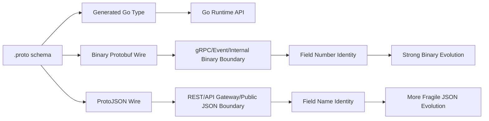
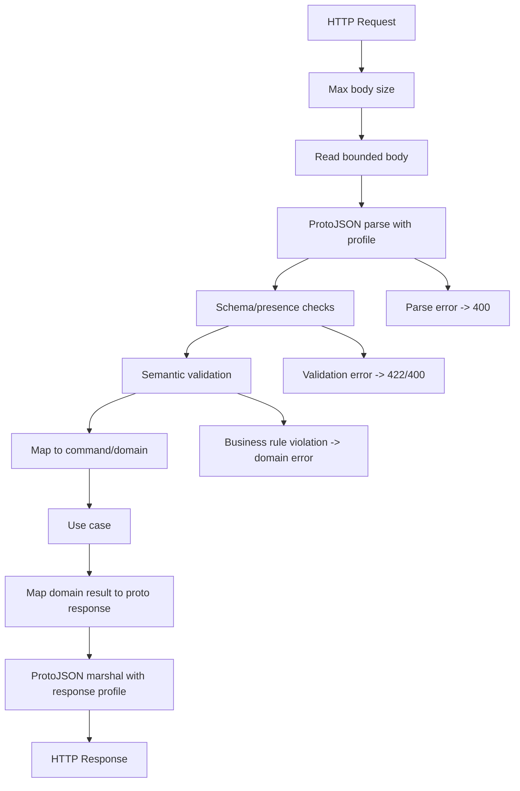
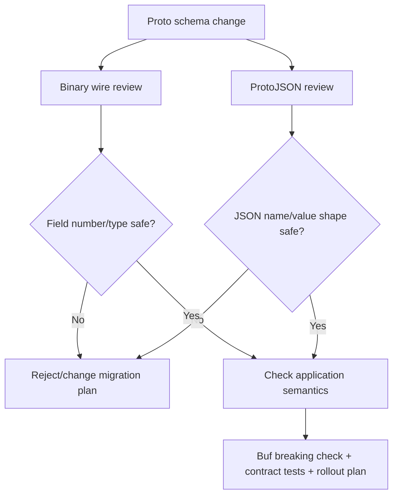
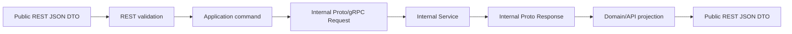
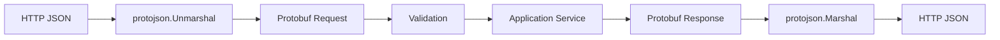
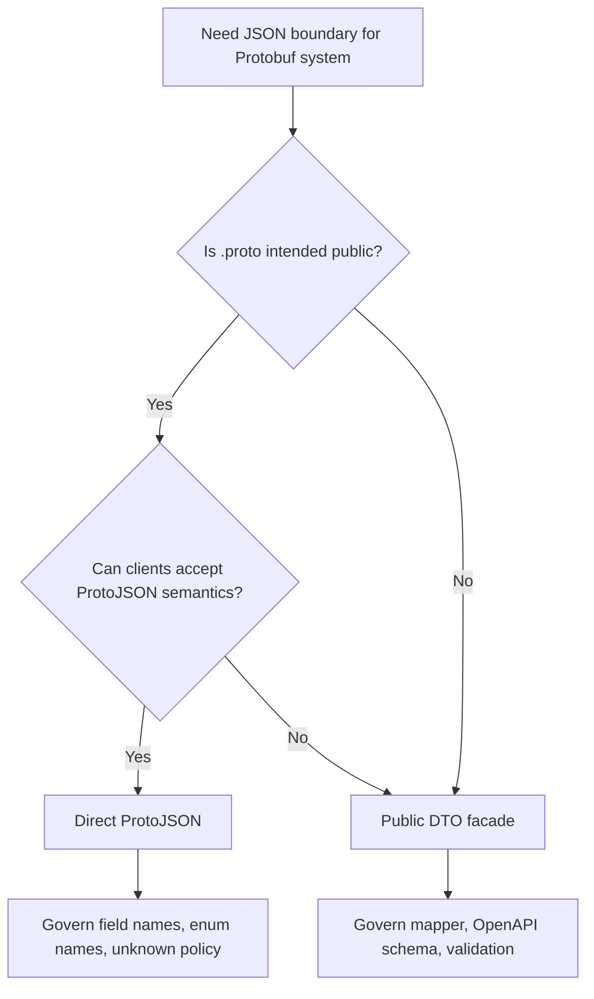
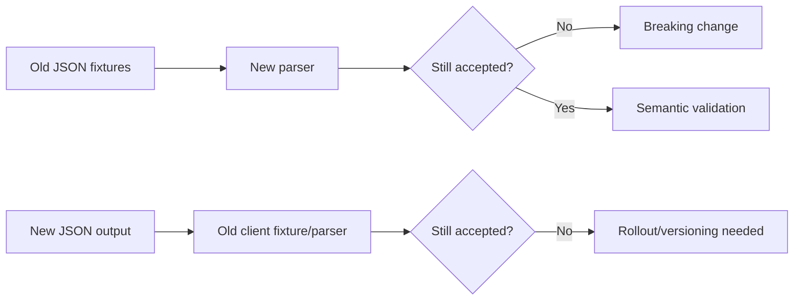

# learn-go-data-mapper-json-xml-protobuf-validation-part-023.md

# Part 023 — Protobuf JSON Mapping

> Seri: `learn-go-data-mapper-json-xml-protobuf-validation`  
> Bagian: `023 / 033`  
> Topik: **Protobuf JSON Mapping**  
> Target pembaca: Java software engineer yang ingin menguasai Go data-contract engineering di level production/internal engineering handbook.  
> Baseline: Go 1.26.x era, module modern `google.golang.org/protobuf`, `protojson`, ProtoJSON official mapping, Protobuf Editions/Open/Opaque API context.

---

## Daftar Isi

1. [Tujuan Pembelajaran](#1-tujuan-pembelajaran)
2. [Mengapa ProtoJSON Perlu Dipelajari Terpisah dari Protobuf Binary](#2-mengapa-protojson-perlu-dipelajari-terpisah-dari-protobuf-binary)
3. [Mental Model: Tiga Representasi untuk Satu Message](#3-mental-model-tiga-representasi-untuk-satu-message)
4. [ProtoJSON vs `encoding/json`: Kesalahan Paling Umum](#4-protojson-vs-encodingjson-kesalahan-paling-umum)
5. [Anatomi Mapping ProtoJSON](#5-anatomi-mapping-protojson)
6. [Field Name Mapping: `snake_case`, `lowerCamelCase`, dan `json_name`](#6-field-name-mapping-snake_case-lowercamelcase-dan-json_name)
7. [Presence dan Default Value di ProtoJSON](#7-presence-dan-default-value-di-protojson)
8. [`null` Semantics: Diterima, Tapi Tidak Sama dengan JSON Biasa](#8-null-semantics-diterima-tapi-tidak-sama-dengan-json-biasa)
9. [Numeric Mapping: `int64` sebagai String, Float Special Values, dan Overflow](#9-numeric-mapping-int64-sebagai-string-float-special-values-dan-overflow)
10. [Enum Mapping dan Rename Strategy](#10-enum-mapping-dan-rename-strategy)
11. [Map, Repeated, Oneof, Bytes, dan Message Fields](#11-map-repeated-oneof-bytes-dan-message-fields)
12. [Well-Known Types: Timestamp, Duration, Any, FieldMask, Struct, Wrappers](#12-well-known-types-timestamp-duration-any-fieldmask-struct-wrappers)
13. [Go `protojson`: API, Options, dan Default Policy](#13-go-protojson-api-options-dan-default-policy)
14. [Designing Production JSON Boundary untuk Protobuf Service](#14-designing-production-json-boundary-untuk-protobuf-service)
15. [Unknown Fields: Masalah Besar di ProtoJSON](#15-unknown-fields-masalah-besar-di-protojson)
16. [Compatibility: Binary Wire Safety Tidak Sama dengan JSON Wire Safety](#16-compatibility-binary-wire-safety-tidak-sama-dengan-json-wire-safety)
17. [API Gateway, REST Bridge, gRPC-Gateway, Connect, dan Public JSON API](#17-api-gateway-rest-bridge-grpc-gateway-connect-dan-public-json-api)
18. [Error Modeling untuk ProtoJSON Parsing](#18-error-modeling-untuk-protojson-parsing)
19. [Custom DTO vs Direct ProtoJSON: Kapan Pakai yang Mana](#19-custom-dto-vs-direct-protojson-kapan-pakai-yang-mana)
20. [Observability dan Auditability untuk ProtoJSON Boundary](#20-observability-dan-auditability-untuk-protojson-boundary)
21. [Performance dan Allocation Consideration](#21-performance-dan-allocation-consideration)
22. [Testing Strategy](#22-testing-strategy)
23. [Common Failure Modes](#23-common-failure-modes)
24. [Decision Matrix](#24-decision-matrix)
25. [Production Checklist](#25-production-checklist)
26. [Latihan Desain](#26-latihan-desain)
27. [Ringkasan Invariant](#27-ringkasan-invariant)
28. [Referensi](#28-referensi)

---

## 1. Tujuan Pembelajaran

Setelah menyelesaikan bagian ini, kamu diharapkan mampu:

1. Memahami bahwa **ProtoJSON bukan `encoding/json` untuk struct generated Go**.
2. Membedakan compatibility Protobuf binary dengan compatibility ProtoJSON.
3. Mendesain JSON-facing API yang memakai Protobuf tanpa kehilangan presence, enum semantics, field-name stability, dan forward compatibility.
4. Menentukan policy `protojson.MarshalOptions` dan `protojson.UnmarshalOptions` secara sadar.
5. Menghindari bug akibat `int64`, `enum`, `null`, unknown fields, duplicate fields, `Any`, `FieldMask`, `Timestamp`, dan wrapper types.
6. Membuat boundary layer untuk REST/gateway yang defensible, observable, testable, dan tidak terlalu bergantung pada detail generated Go struct.

Part ini bukan tutorial dasar Protobuf. Dasar binary Protobuf, runtime Go Protobuf modern, dan field presence sudah dibahas di part 019–022. Part ini fokus pada satu hal spesifik:

> Bagaimana message Protobuf direpresentasikan sebagai JSON, apa aturan mainnya, dan bagaimana memakai aturan itu secara aman di sistem Go production.

---

## 2. Mengapa ProtoJSON Perlu Dipelajari Terpisah dari Protobuf Binary

Banyak engineer berpikir:

> “Saya sudah punya `.proto`, generated Go type, tinggal expose sebagai JSON.”

Premis ini berbahaya.

Binary Protobuf dan ProtoJSON sama-sama berasal dari schema Protobuf, tetapi **contract surface**-nya berbeda.

Binary Protobuf:

- memakai field number sebagai identity wire utama;
- dapat membawa unknown fields;
- sangat compact;
- schema evolution-nya kuat selama field number dan type rules dijaga;
- tidak menyimpan nama field di payload;
- umum dipakai untuk service-to-service internal/gRPC/event binary.

ProtoJSON:

- memakai field name sebagai JSON key;
- tidak punya propagation unknown fields seperti binary;
- lebih besar dan lebih mahal encode/decode;
- lebih rapuh terhadap rename field/enum;
- dibuat agar Protobuf dapat diakses oleh ekosistem JSON;
- sering muncul di REST API, API gateway, browser integration, CLI, webhook, config, dan public API.

Masalahnya: banyak compatibility move yang aman di binary Protobuf **tidak otomatis aman** di ProtoJSON.

Contoh:

```proto
message CaseCreated {
  string case_id = 1;
}
```

Binary payload membawa field number `1`. Nama `case_id` tidak ada di payload binary.

ProtoJSON default membawa:

```json
{
  "caseId": "C-2026-0001"
}
```

Jika kamu rename field proto:

```proto
message CaseCreated {
  string regulatory_case_id = 1;
}
```

Binary Protobuf masih dapat compatible karena field number tetap `1`. Tapi ProtoJSON key berubah dari `caseId` menjadi `regulatoryCaseId` jika tidak dikontrol. Untuk JSON client, ini breaking change.

Itulah sebabnya ProtoJSON harus diperlakukan sebagai **format contract sendiri**, bukan sekadar view dari binary Protobuf.

---

## 3. Mental Model: Tiga Representasi untuk Satu Message

Satu message Protobuf bisa hadir dalam tiga representasi penting:



Pemisahan ini penting:

| Layer | Identity utama | Cocok untuk | Risiko utama |
|---|---|---|---|
| `.proto` schema | field number + message/field definitions | source of contract | schema governance lemah |
| generated Go type | generated API/accessor | application code | coupling ke generated internals |
| binary wire | field number | gRPC, events, internal RPC | incompatible field-number reuse |
| ProtoJSON wire | JSON field names | REST, gateway, browser, CLI | rename breakage, unknown-field parse failure |

Top 1% engineer tidak hanya bertanya:

> “Bisa marshal atau tidak?”

Mereka bertanya:

> “Apakah representasi ini tetap compatible jika schema berubah, client lagging, gateway memakai versi lama, dan response masuk ke audit/log/replay pipeline?”

---

## 4. ProtoJSON vs `encoding/json`: Kesalahan Paling Umum

Generated Go Protobuf type bukan struct JSON biasa. Jangan gunakan `encoding/json` langsung pada generated message untuk contract ProtoJSON.

Salah:

```go
b, err := json.Marshal(pbMessage) // jangan untuk contract ProtoJSON
```

Benar:

```go
b, err := protojson.Marshal(pbMessage)
```

Atau dengan options:

```go
b, err := protojson.MarshalOptions{
    UseProtoNames:   false,
    UseEnumNumbers:  false,
    EmitUnpopulated: false,
}.Marshal(pbMessage)
```

Alasan:

1. `encoding/json` membaca field Go struct generated, bukan aturan ProtoJSON.
2. Generated struct bisa berubah antar API level Open/Opaque/Hybrid.
3. Well-known types punya JSON mapping khusus yang tidak dipahami `encoding/json` biasa.
4. Proto presence/default/null/enum/int64 mapping punya aturan spesifik.
5. `protojson` dirancang mengikuti spesifikasi ProtoJSON.

Dalam Java analogy:

- `encoding/json` terhadap generated proto Go type mirip melakukan Jackson serialization pada internal generated object tanpa Protobuf JSON printer.
- `protojson` mirip memakai Protobuf JSON formatter/parser resmi.

---

## 5. Anatomi Mapping ProtoJSON

ProtoJSON mapping bukan arbitrary. Ia punya aturan canonical untuk type Protobuf.

Contoh schema:

```proto
syntax = "proto3";

package regulatory.case.v1;

import "google/protobuf/timestamp.proto";
import "google/protobuf/field_mask.proto";

message CasePatchRequest {
  string case_id = 1;
  optional string title = 2;
  repeated string tags = 3;
  map<string, string> metadata = 4;
  CaseStatus status = 5;
  google.protobuf.Timestamp submitted_at = 6;
  google.protobuf.FieldMask update_mask = 7;
}

enum CaseStatus {
  CASE_STATUS_UNSPECIFIED = 0;
  CASE_STATUS_DRAFT = 1;
  CASE_STATUS_SUBMITTED = 2;
  CASE_STATUS_CLOSED = 3;
}
```

Default ProtoJSON output kira-kira:

```json
{
  "caseId": "CASE-2026-0001",
  "title": "Late filing appeal",
  "tags": ["appeal", "filing"],
  "metadata": {
    "source": "portal"
  },
  "status": "CASE_STATUS_SUBMITTED",
  "submittedAt": "2026-06-24T10:15:30Z",
  "updateMask": "title,tags,status"
}
```

Perhatikan:

- `case_id` menjadi `caseId`.
- Enum default direpresentasikan sebagai **nama enum**, bukan angka.
- `Timestamp` menjadi string RFC 3339-like.
- `FieldMask` menjadi string comma-separated lowerCamelCase paths.
- `int64` akan default sebagai string.
- Field default/absent biasanya tidak di-emit kecuali option tertentu digunakan.

---

## 6. Field Name Mapping: `snake_case`, `lowerCamelCase`, dan `json_name`

### 6.1 Default behavior

Nama field di `.proto` biasanya `snake_case`:

```proto
string case_id = 1;
string submitted_by_user_id = 2;
```

Default ProtoJSON key:

```json
{
  "caseId": "CASE-001",
  "submittedByUserId": "U-123"
}
```

ProtoJSON serializer memakai lowerCamelCase secara default. Parser harus menerima:

1. lowerCamelCase JSON name;
2. original proto field name.

Artinya kedua input ini valid:

```json
{ "caseId": "CASE-001" }
```

```json
{ "case_id": "CASE-001" }
```

Namun output default tetap lowerCamelCase kecuali `UseProtoNames: true`.

### 6.2 `UseProtoNames`

Go:

```go
out, err := protojson.MarshalOptions{
    UseProtoNames: true,
}.Marshal(req)
```

Output:

```json
{
  "case_id": "CASE-001",
  "submitted_by_user_id": "U-123"
}
```

Kapan `UseProtoNames` masuk akal?

| Situasi | Rekomendasi |
|---|---|
| Internal debug/admin JSON | Boleh pakai `UseProtoNames` agar dekat dengan `.proto` |
| Public REST API baru | Biasanya ikuti default lowerCamelCase agar JSON idiomatic |
| Existing API memakai snake_case | Pakai `UseProtoNames` atau custom DTO agar tidak breaking |
| Event JSON untuk data platform | Pilih satu policy dan freeze sebagai contract |
| Mixed clients | Jangan gonta-ganti per endpoint tanpa alasan kuat |

### 6.3 `json_name`

Proto field dapat punya `json_name` explicit:

```proto
message Case {
  string case_id = 1 [json_name = "caseID"];
}
```

Output:

```json
{ "caseID": "CASE-001" }
```

Gunakan `json_name` dengan hati-hati.

`json_name` bisa membantu ketika public JSON contract sudah telanjur memakai nama tertentu. Tetapi terlalu banyak `json_name` membuat schema sulit dibaca dan tooling/review menjadi lebih rumit.

Guideline:

- Jangan gunakan `json_name` untuk preferensi estetika minor.
- Gunakan untuk menjaga backward compatibility public API.
- Dokumentasikan alasan `json_name` pada review schema.
- Hindari nama yang ambigu terhadap alternate spelling.

### 6.4 Field rename problem

Misal:

```proto
message Case {
  string case_id = 1;
}
```

JSON:

```json
{ "caseId": "CASE-001" }
```

Lalu field diubah:

```proto
message Case {
  string regulatory_case_id = 1;
}
```

Binary compatible karena field number tetap `1`, tetapi JSON output berubah:

```json
{ "regulatoryCaseId": "CASE-001" }
```

Untuk public ProtoJSON, rename field adalah breaking change kecuali kamu menjaga `json_name` lama:

```proto
message Case {
  string regulatory_case_id = 1 [json_name = "caseId"];
}
```

Namun ini pun punya cost: `.proto` field name dan JSON name berbeda.

Rule of thumb:

> Setelah ProtoJSON dipublikasikan ke external client, field name harus dianggap public contract, sama seriusnya dengan field number di binary Protobuf.

---

## 7. Presence dan Default Value di ProtoJSON

Field presence adalah topik penting karena JSON punya konsep “key absent”, “key present dengan null”, dan “key present dengan value default”. Protobuf juga punya implicit/explicit presence tergantung syntax/type/edition.

### 7.1 Explicit presence

Contoh proto3 optional:

```proto
message UpdateCaseRequest {
  string case_id = 1;
  optional string title = 2;
  optional int32 priority = 3;
}
```

Dengan explicit presence, aplikasi bisa membedakan:

- title tidak dikirim;
- title dikirim sebagai empty string;
- priority tidak dikirim;
- priority dikirim sebagai `0`.

Di Go Opaque API, kamu akan cenderung memakai accessor/hazzer/builder pattern tergantung generated API level. Di Open Struct API, optional scalar bisa muncul sebagai pointer field.

### 7.2 ProtoJSON emission rule

Untuk field yang mendukung presence, serializer harus emit field hanya bila field tersebut present.

Contoh:

```proto
message Req {
  optional string title = 1;
}
```

Jika title absent:

```json
{}
```

Jika title present empty string:

```json
{ "title": "" }
```

Ini sangat penting untuk PATCH semantics.

### 7.3 Implicit presence

Proto3 scalar non-optional:

```proto
message Req {
  string title = 1;
  int32 priority = 2;
}
```

Tidak ada explicit presence untuk scalar tersebut. Default value biasanya tidak di-emit:

```json
{}
```

Jika `title == ""` dan `priority == 0`, JSON default bisa kosong karena nilai default tidak membawa presence.

### 7.4 `EmitUnpopulated` dan `EmitDefaultValues`

Go `protojson.MarshalOptions` punya dua opsi yang sering disalahpahami:

```go
protojson.MarshalOptions{
    EmitUnpopulated: true,
}
```

`EmitUnpopulated` mengeluarkan field yang tidak populated, termasuk beberapa presence-sensing fields sebagai `null`.

```go
protojson.MarshalOptions{
    EmitDefaultValues: true,
}
```

`EmitDefaultValues` lebih konservatif: mengeluarkan default-valued primitive fields, empty lists, dan empty maps, tetapi tidak mengeluarkan `null` untuk presence-sensing fields yang omitted. Ini lebih aman jika kamu ingin response JSON lebih lengkap tanpa merusak presence-sensing semantics.

Decision:

| Kebutuhan | Option |
|---|---|
| Public API response minimal | default |
| Debug/admin output ingin lengkap | `EmitUnpopulated` boleh dipertimbangkan |
| Client butuh default primitive/list/map terlihat | `EmitDefaultValues` sering lebih aman |
| PATCH/request payload | hindari global `EmitUnpopulated` |
| Audit canonical view | pertimbangkan custom projection, bukan asal `EmitUnpopulated` |

### 7.5 Diagram presence

```mermaid
flowchart TD
    A[Proto field] --> B{Supports presence?}
    B -- Yes --> C{Has value set?}
    C -- Yes --> D[Emit field with value]
    C -- No --> E[Omit by default]
    B -- No --> F{Value equals default?}
    F -- Yes --> G[Omit by default]
    F -- No --> H[Emit field]

    E --> I[EmitUnpopulated may emit null depending on field kind]
    G --> J[EmitDefaultValues may emit false/0/empty string/[]/{}]
```

---

## 8. `null` Semantics: Diterima, Tapi Tidak Sama dengan JSON Biasa

ProtoJSON parsers accept `null` for any field, but semantics are special:

- `null` leaves the field unset.
- Serializer should not emit `null` by default.
- `null` is not allowed inside repeated fields.
- `google.protobuf.NullValue` is a special case where `null` is sentinel value.
- Wrapper types allow `null` and can preserve certain conversion behavior.

### 8.1 Example

```proto
message UpdateCaseRequest {
  optional string title = 1;
  repeated string tags = 2;
}
```

Input:

```json
{ "title": null }
```

Semantics:

- title remains unset;
- this is not the same as title present with empty string;
- if you use this for PATCH, `null` does not automatically mean “clear field” unless your application layer defines separate semantics.

Input invalid:

```json
{ "tags": ["a", null, "b"] }
```

`null` inside repeated field is not allowed.

### 8.2 Clear semantics problem

Many REST APIs use JSON `null` to mean “clear this field”. ProtoJSON does not naturally treat `null` that way; it treats `null` as unset.

If your API wants clear semantics, use one of these patterns:

#### Pattern A — FieldMask + values

```proto
message UpdateCaseRequest {
  string case_id = 1;
  optional string title = 2;
  repeated string tags = 3;
  google.protobuf.FieldMask update_mask = 100;
}
```

Payload:

```json
{
  "caseId": "CASE-001",
  "title": "",
  "updateMask": "title"
}
```

Meaning:

- `title` in mask means update title;
- empty string is actual new value;
- absent from mask means no change.

#### Pattern B — Domain-specific command

```proto
message ClearCaseTitleRequest {
  string case_id = 1;
  string reason = 2;
}
```

Meaning explicit. Stronger for regulatory/audit system.

#### Pattern C — Oneof operation

```proto
message TitlePatch {
  oneof op {
    string set = 1;
    bool clear = 2;
  }
}

message UpdateCaseRequest {
  string case_id = 1;
  TitlePatch title = 2;
}
```

JSON example:

```json
{
  "caseId": "CASE-001",
  "title": { "clear": true }
}
```

More verbose but clear.

### 8.3 Recommendation

For enterprise/regulatory systems:

- Do not rely on raw JSON `null` as business clear operation.
- Use FieldMask for patch-like updates if the API style is resource update.
- Use command-specific message if action has business meaning.
- Use oneof operation object if partial mutation needs explicit set/clear/noop semantics.

---

## 9. Numeric Mapping: `int64` sebagai String, Float Special Values, dan Overflow

### 9.1 `int32` vs `int64`

ProtoJSON maps:

| Protobuf type | JSON representation default |
|---|---|
| `int32`, `uint32`, `fixed32`, etc. | JSON number |
| `int64`, `uint64`, `fixed64`, etc. | JSON string |

Contoh:

```proto
message Metrics {
  int32 retry_count = 1;
  int64 total_events = 2;
}
```

JSON:

```json
{
  "retryCount": 3,
  "totalEvents": "9223372036854775807"
}
```

Mengapa `int64` string? Karena banyak JSON implementation, terutama JavaScript-derived, memperlakukan number sebagai double precision dan dapat kehilangan presisi untuk integer lebih besar dari 2^53.

### 9.2 Parser acceptance

Conformant parser dapat menerima quoted atau unquoted number untuk integer types, tetapi serializer default memakai string untuk 64-bit integer.

Jangan membuat public JSON contract yang bergantung pada client non-conformant.

Bad expectation:

```json
{ "totalEvents": 9223372036854775807 }
```

Mungkin client tertentu silently loses precision.

Better:

```json
{ "totalEvents": "9223372036854775807" }
```

### 9.3 Money fields

Jangan memakai `double` untuk money.

Bad:

```proto
message Invoice {
  double amount = 1;
}
```

Better minor-unit:

```proto
message MoneyAmount {
  string currency = 1; // ISO 4217 code, e.g. SGD
  int64 units_minor = 2; // cents, sen, etc.
}
```

JSON:

```json
{
  "currency": "SGD",
  "unitsMinor": "12345"
}
```

Atau pakai decimal string jika domain membutuhkan scale eksplisit:

```proto
message DecimalAmount {
  string currency = 1;
  string decimal = 2; // "123.45"
}
```

Dalam regulatory/financial system, JSON numeric precision harus diperlakukan sebagai correctness issue, bukan formatting issue.

### 9.4 Float special values

ProtoJSON can represent `float`/`double` special values as strings:

```json
"NaN"
"Infinity"
"-Infinity"
```

Hati-hati:

- Banyak JSON consumers tidak mengharapkan ini.
- Banyak schema validator/OpenAPI contract tidak nyaman dengan nilai ini.
- Untuk public API, biasanya lebih baik melarang special float values di semantic validation.

---

## 10. Enum Mapping dan Rename Strategy

### 10.1 Default enum output

ProtoJSON default emits enum names:

```proto
enum CaseStatus {
  CASE_STATUS_UNSPECIFIED = 0;
  CASE_STATUS_DRAFT = 1;
  CASE_STATUS_SUBMITTED = 2;
}
```

JSON:

```json
{ "status": "CASE_STATUS_SUBMITTED" }
```

Parser may accept enum names and integer values. But public API should choose one stable policy.

### 10.2 `UseEnumNumbers`

Go:

```go
out, err := protojson.MarshalOptions{
    UseEnumNumbers: true,
}.Marshal(msg)
```

Output:

```json
{ "status": 2 }
```

Trade-off:

| Enum as name | Enum as number |
|---|---|
| human-readable | compact |
| rename is breaking | rename safer |
| client code clearer | client must know mapping |
| common default | less idiomatic for JSON API |
| adding enum can break exhaustive clients | adding enum still needs client policy |

### 10.3 Enum rename problem

If JSON emits enum names, renaming enum values is breaking for JSON clients.

Bad direct rename:

```proto
enum CaseStatus {
  CASE_STATUS_UNSPECIFIED = 0;
  CASE_STATUS_SUBMITTED = 1;
}
```

Later:

```proto
enum CaseStatus {
  CASE_STATUS_UNSPECIFIED = 0;
  CASE_STATUS_FILED = 1; // renamed
}
```

Binary numeric value still `1`, but ProtoJSON output changes from:

```json
"CASE_STATUS_SUBMITTED"
```

to:

```json
"CASE_STATUS_FILED"
```

For JSON clients, this is breaking.

### 10.4 Safe enum rename with aliasing

Proto supports enum aliasing:

```proto
enum CaseStatus {
  option allow_alias = true;

  CASE_STATUS_UNSPECIFIED = 0;
  CASE_STATUS_SUBMITTED = 1;
  CASE_STATUS_FILED = 1;
}
```

But serializer emits the first listed name for a numeric value. Safe migration needs staged rollout:

1. Add new alias below old name.
2. Deploy all parsers that accept both.
3. Reorder aliases so new name comes first.
4. Deploy serializers.
5. Remove old alias only after compatibility window and rollback risk are gone.

In public/regulatory APIs, treat enum value name as public contract. Do not rename casually.

### 10.5 Unknown enum value policy

Binary Protobuf can carry unknown enum numeric values depending on language/runtime semantics. ProtoJSON with enum names has a different failure surface:

- Unknown enum name may fail parsing unless `DiscardUnknown` policy applies.
- Emitting enum numbers can make adding enum values more JSON-wire-safe under some conditions.
- But client application code still may break semantically if it assumes exhaustive enum cases.

Production guideline:

- Every client-facing enum should have `UNSPECIFIED = 0`.
- Document unknown/future enum handling.
- Avoid exhaustive switch without default/future handling in clients.
- Consider enum-as-number only if compatibility outweighs readability.
- For public REST, string enums are readable but require strict governance.

---

## 11. Map, Repeated, Oneof, Bytes, dan Message Fields

### 11.1 Repeated fields

```proto
message Case {
  repeated string tags = 1;
}
```

JSON:

```json
{ "tags": ["appeal", "urgent"] }
```

Default unpopulated repeated field is omitted unless `EmitDefaultValues`/`EmitUnpopulated`.

Important:

- `null` is not allowed inside repeated field.
- Empty list and absent list can be semantically different in REST PATCH, but Protobuf repeated field without FieldMask does not always capture intent.

### 11.2 Map fields

```proto
message Case {
  map<string, string> metadata = 1;
}
```

JSON:

```json
{
  "metadata": {
    "source": "portal",
    "agency": "CEA"
  }
}
```

JSON object keys are strings. Map keys are converted to strings in JSON.

Caution:

- JSON object ordering is not semantic.
- Do not sign/hash raw ProtoJSON map output without canonicalization strategy.
- Avoid relying on map field order in golden tests unless you normalize.

### 11.3 Oneof fields

```proto
message Identifier {
  oneof value {
    string case_id = 1;
    string external_ref = 2;
  }
}
```

JSON examples:

```json
{ "caseId": "CASE-001" }
```

```json
{ "externalRef": "EXT-999" }
```

Do not send multiple oneof alternatives in one JSON object.

Invalid/ambiguous:

```json
{
  "caseId": "CASE-001",
  "externalRef": "EXT-999"
}
```

Production guideline:

- oneof is good for mutually exclusive shape;
- but REST consumers may find flat oneof confusing;
- for public JSON API, consider explicit discriminated object DTO if clarity is more important than direct proto exposure.

### 11.4 Bytes

```proto
message AttachmentDigest {
  bytes sha256 = 1;
}
```

JSON:

```json
{ "sha256": "BASE64..." }
```

ProtoJSON uses base64 string representation. Standard and URL-safe base64 variants may be accepted depending on parser conformance.

Guideline:

- For raw binary payloads, do not push huge data through JSON unless necessary.
- For digests, consider hex string if human/audit readability is required; but that means custom domain field as `string`, not `bytes`.
- For attachments, pass object storage reference + digest metadata, not base64 huge blob.

### 11.5 Message fields

Message fields become nested JSON objects:

```proto
message Actor {
  string user_id = 1;
  string display_name = 2;
}

message CaseEvent {
  Actor actor = 1;
}
```

JSON:

```json
{
  "actor": {
    "userId": "U-123",
    "displayName": "Jane"
  }
}
```

Presence for message fields is explicit: absent vs present empty message can matter.

---

## 12. Well-Known Types: Timestamp, Duration, Any, FieldMask, Struct, Wrappers

Well-known types have special ProtoJSON mapping. This is one of the biggest reasons to avoid `encoding/json` on generated proto structs.

### 12.1 `Timestamp`

```proto
import "google/protobuf/timestamp.proto";

message Case {
  google.protobuf.Timestamp submitted_at = 1;
}
```

JSON:

```json
{ "submittedAt": "2026-06-24T10:15:30Z" }
```

Guideline:

- Normalize server output to UTC `Z`.
- Validate time range at domain layer.
- Do not confuse missing timestamp with zero timestamp.
- Avoid domain meaning for `1970-01-01T00:00:00Z` sentinel unless explicitly documented.

Go creation:

```go
import "google.golang.org/protobuf/types/known/timestamppb"

msg.SubmittedAt = timestamppb.Now()

if err := msg.SubmittedAt.CheckValid(); err != nil {
    return fmt.Errorf("invalid submitted_at: %w", err)
}
```

### 12.2 `Duration`

JSON:

```json
{ "slaDuration": "3600s" }
```

or fractional:

```json
{ "slaDuration": "1.500s" }
```

Go:

```go
import "google.golang.org/protobuf/types/known/durationpb"

msg.SlaDuration = durationpb.New(90 * time.Minute)

if err := msg.SlaDuration.CheckValid(); err != nil {
    return err
}
```

### 12.3 `FieldMask`

```proto
import "google/protobuf/field_mask.proto";

message UpdateCaseRequest {
  string case_id = 1;
  optional string title = 2;
  repeated string tags = 3;
  google.protobuf.FieldMask update_mask = 100;
}
```

JSON:

```json
{
  "caseId": "CASE-001",
  "title": "New title",
  "updateMask": "title,tags"
}
```

Important:

- FieldMask JSON paths use lowerCamelCase.
- Some field names may not round-trip cleanly if snake_case ↔ camelCase conversion is lossy.
- Validate FieldMask paths against allowed update paths.
- Do not blindly apply FieldMask to domain model.

Go validation helper idea:

```go
func ValidateUpdateMask(mask *fieldmaskpb.FieldMask, allowed map[string]struct{}) error {
    if mask == nil {
        return errors.New("update_mask is required")
    }

    for _, path := range mask.Paths {
        if _, ok := allowed[path]; !ok {
            return fmt.Errorf("unsupported update path %q", path)
        }
    }
    return nil
}
```

But note: Go `fieldmaskpb.FieldMask.Paths` are proto field names internally, while JSON representation uses lowerCamelCase. Be explicit at boundary.

### 12.4 Wrapper types

Wrapper types:

```proto
import "google/protobuf/wrappers.proto";

message Case {
  google.protobuf.StringValue title = 1;
}
```

JSON:

```json
{ "title": "Some title" }
```

`null` is allowed for wrapper values.

Historically wrapper types were commonly used to represent optional scalar in proto3 before `optional` returned. For new proto3/Edition schemas, prefer `optional` scalar when you need presence, unless wrapper has a specific interop/legacy reason.

### 12.5 `Struct`, `Value`, `ListValue`, `NullValue`

These represent arbitrary JSON-like values:

```proto
import "google/protobuf/struct.proto";

message ExternalPayload {
  google.protobuf.Struct raw = 1;
}
```

JSON:

```json
{
  "raw": {
    "any": "shape",
    "nested": { "x": 1 },
    "arr": [true, null, "v"]
  }
}
```

Use cases:

- bridging arbitrary JSON from external provider;
- extension metadata with unknown shape;
- gradual migration from schemaless to schemaful payload.

Caution:

- You lose strong schema validation.
- Numeric precision may be limited because JSON values map through double-like semantics in `Value`.
- Do not let arbitrary `Struct` leak into core domain model without validation/canonicalization.

### 12.6 `Any`

`Any` wraps typed messages. ProtoJSON representation includes `@type`.

Example normal message:

```json
{
  "@type": "type.googleapis.com/regulatory.case.v1.CaseCreated",
  "caseId": "CASE-001"
}
```

For well-known types inside `Any`, JSON may use `value` special case:

```json
{
  "@type": "type.googleapis.com/google.protobuf.Duration",
  "value": "3.1s"
}
```

Go `protojson` uses a `Resolver` to resolve `Any` types.

Production guideline:

- Avoid `Any` in public APIs unless you have a type registry governance model.
- Pin allowed type URLs.
- Validate type URL prefix/package/version.
- Avoid accepting arbitrary `Any` from untrusted clients.
- In audit/event logs, prefer explicit envelope with named oneof if possible.

---

## 13. Go `protojson`: API, Options, dan Default Policy

Package:

```go
import "google.golang.org/protobuf/encoding/protojson"
```

Basic marshal:

```go
b, err := protojson.Marshal(msg)
if err != nil {
    return err
}
```

Basic unmarshal:

```go
var msg casev1.UpdateCaseRequest
if err := protojson.Unmarshal(data, &msg); err != nil {
    return err
}
```

### 13.1 `MarshalOptions`

```go
type MarshalOptions struct {
    Multiline         bool
    Indent            string
    AllowPartial      bool
    UseProtoNames     bool
    UseEnumNumbers    bool
    EmitUnpopulated   bool
    EmitDefaultValues bool
    Resolver          interface{ /* type resolver */ }
}
```

Important options:

| Option | Meaning | Default recommendation |
|---|---|---|
| `UseProtoNames` | use `.proto` snake_case names instead of lowerCamelCase | false for public JSON unless contract says snake_case |
| `UseEnumNumbers` | emit enum numeric values | false unless compatibility strategy requires numbers |
| `EmitUnpopulated` | emit unpopulated fields, including null for some presence fields | avoid globally for public API |
| `EmitDefaultValues` | emit default primitive/list/map values but preserve presence-sensing omission | useful for complete responses |
| `AllowPartial` | allow missing required fields | usually false |
| `Resolver` | resolve `Any`/extensions | use explicit resolver for controlled plugin/event systems |
| `Multiline`/`Indent` | formatting | only for human/debug output |

### 13.2 `UnmarshalOptions`

```go
type UnmarshalOptions struct {
    AllowPartial   bool
    DiscardUnknown bool
    Resolver       interface{ /* type resolver */ }
    RecursionLimit int
}
```

Important:

| Option | Meaning | Default recommendation |
|---|---|---|
| `DiscardUnknown` | unknown fields and unknown enum names ignored | false for strict request API; maybe true for compatibility bridge |
| `RecursionLimit` | limits nesting depth | set for untrusted inputs if payload can be adversarial |
| `AllowPartial` | allow missing required fields | usually false |
| `Resolver` | resolve `Any`/extensions | explicit resolver for safety |

### 13.3 Recommended option profiles

#### Public request parsing — strict

```go
var PublicRequestUnmarshal = protojson.UnmarshalOptions{
    DiscardUnknown: false,
    AllowPartial:   false,
    RecursionLimit: 64,
}
```

Rationale:

- reject typos;
- reject unsupported future fields if this server cannot handle them;
- avoid silently ignoring client mistakes;
- protect from excessive nesting.

#### Compatibility bridge — tolerant

```go
var CompatBridgeUnmarshal = protojson.UnmarshalOptions{
    DiscardUnknown: true,
    AllowPartial:   false,
    RecursionLimit: 64,
}
```

Rationale:

- useful when old consumers/producers overlap during rollout;
- risky for client-facing command APIs because typos may be ignored.

#### Public response — stable default

```go
var PublicResponseMarshal = protojson.MarshalOptions{
    UseProtoNames:     false,
    UseEnumNumbers:    false,
    EmitUnpopulated:   false,
    EmitDefaultValues: false,
}
```

#### Complete response — explicit defaults

```go
var CompleteResponseMarshal = protojson.MarshalOptions{
    EmitDefaultValues: true,
}
```

#### Debug output

```go
var DebugProtoJSON = protojson.MarshalOptions{
    Multiline:       true,
    Indent:          "  ",
    UseProtoNames:   true,
    EmitUnpopulated: true,
}
```

Do not expose debug output as public contract.

### 13.4 Defensive helper

```go
package boundaryjson

import (
    "fmt"

    "google.golang.org/protobuf/encoding/protojson"
    "google.golang.org/protobuf/proto"
)

type DecodeProfile string

const (
    DecodeStrict DecodeProfile = "strict"
    DecodeCompat DecodeProfile = "compat"
)

func UnmarshalProtoJSON(data []byte, dst proto.Message, profile DecodeProfile) error {
    if dst == nil {
        return fmt.Errorf("destination proto message is nil")
    }

    opts := protojson.UnmarshalOptions{
        AllowPartial:   false,
        DiscardUnknown: false,
        RecursionLimit: 64,
    }

    switch profile {
    case DecodeStrict:
        // keep defaults
    case DecodeCompat:
        opts.DiscardUnknown = true
    default:
        return fmt.Errorf("unknown decode profile %q", profile)
    }

    if err := opts.Unmarshal(data, dst); err != nil {
        return fmt.Errorf("invalid protojson: %w", err)
    }

    return nil
}
```

Why wrap? Because option policy is architecture, not random call-site preference.

---

## 14. Designing Production JSON Boundary untuk Protobuf Service

A production ProtoJSON boundary should not be one direct function call scattered everywhere.

Bad:

```go
func handler(w http.ResponseWriter, r *http.Request) {
    var req casev1.UpdateCaseRequest
    body, _ := io.ReadAll(r.Body)
    _ = protojson.Unmarshal(body, &req)
    // ...
}
```

Better architecture:



### 14.1 Boundary handler skeleton

```go
package api

import (
    "errors"
    "fmt"
    "io"
    "net/http"

    casev1 "example.com/gen/regulatory/case/v1"
    "google.golang.org/protobuf/encoding/protojson"
    "google.golang.org/protobuf/proto"
)

const maxJSONBodyBytes int64 = 1 << 20 // 1 MiB

var requestJSON = protojson.UnmarshalOptions{
    DiscardUnknown: false,
    AllowPartial:   false,
    RecursionLimit: 64,
}

var responseJSON = protojson.MarshalOptions{
    UseProtoNames:     false,
    UseEnumNumbers:    false,
    EmitDefaultValues: false,
}

func readBoundedBody(r *http.Request) ([]byte, error) {
    if r.Body == nil {
        return nil, errors.New("missing body")
    }
    defer r.Body.Close()

    lr := io.LimitReader(r.Body, maxJSONBodyBytes+1)
    body, err := io.ReadAll(lr)
    if err != nil {
        return nil, fmt.Errorf("read body: %w", err)
    }
    if int64(len(body)) > maxJSONBodyBytes {
        return nil, fmt.Errorf("body too large")
    }
    return body, nil
}

func decodeProtoJSONRequest(r *http.Request, dst proto.Message) error {
    body, err := readBoundedBody(r)
    if err != nil {
        return err
    }

    if len(body) == 0 {
        return errors.New("empty body")
    }

    if err := requestJSON.Unmarshal(body, dst); err != nil {
        // Do not leak parser internals unfiltered to external clients.
        return fmt.Errorf("invalid request JSON: %w", err)
    }
    return nil
}

func writeProtoJSON(w http.ResponseWriter, status int, msg proto.Message) {
    data, err := responseJSON.Marshal(msg)
    if err != nil {
        http.Error(w, "failed to encode response", http.StatusInternalServerError)
        return
    }

    w.Header().Set("Content-Type", "application/json")
    w.WriteHeader(status)
    _, _ = w.Write(data)
}

func (h *Handler) UpdateCase(w http.ResponseWriter, r *http.Request) {
    var req casev1.UpdateCaseRequest
    if err := decodeProtoJSONRequest(r, &req); err != nil {
        writeProblem(w, http.StatusBadRequest, "INVALID_JSON", err.Error())
        return
    }

    if err := validateUpdateCaseRequest(&req); err != nil {
        writeProblem(w, http.StatusUnprocessableEntity, "VALIDATION_ERROR", err.Error())
        return
    }

    cmd, err := mapUpdateCaseRequestToCommand(&req)
    if err != nil {
        writeProblem(w, http.StatusUnprocessableEntity, "MAPPING_ERROR", err.Error())
        return
    }

    result, err := h.service.UpdateCase(r.Context(), cmd)
    if err != nil {
        h.writeDomainError(w, err)
        return
    }

    resp := mapCaseResultToProto(result)
    writeProtoJSON(w, http.StatusOK, resp)
}
```

### 14.2 Why not decode directly into domain?

Because ProtoJSON is a transport representation. Domain should not inherit every quirk of ProtoJSON:

- field naming;
- enum wire names;
- optional pointer/generated presence details;
- `FieldMask` lowerCamelCase JSON representation;
- arbitrary `Struct`/`Any`;
- wrapper/null behavior;
- `int64` string wire representation.

Boundary layer should convert these to domain-safe command/value objects.

---

## 15. Unknown Fields: Masalah Besar di ProtoJSON

Binary Protobuf can preserve unknown fields in many runtimes, enabling forward compatibility. ProtoJSON generally does not propagate unknown fields and unknown fields often cause parse failures unless ignored.

### 15.1 Example

Old server schema:

```proto
message CreateCaseRequest {
  string title = 1;
}
```

New client sends:

```json
{
  "title": "Case A",
  "priority": 3
}
```

Old server with strict `DiscardUnknown: false` rejects request.

Old server with `DiscardUnknown: true` accepts request but silently ignores `priority`.

Both behaviors can be correct depending on boundary type.

### 15.2 Strict vs tolerant policy

| Boundary | Unknown field policy |
|---|---|
| Public command API | usually reject unknown fields |
| Browser form submission | reject unknown fields to catch bugs/tampering |
| Internal rollout bridge | maybe discard unknown during transition |
| Event ingestion | depends on schema versioning strategy |
| Logging/debug payload | maybe tolerate unknown but record metrics |
| Webhook from external provider | tolerate unknown top-level extension if provider evolves often |

### 15.3 Silent ignore danger

If client sends:

```json
{
  "tilte": "Wrong typo"
}
```

With `DiscardUnknown: true`, typo may be ignored and request may pass with missing title. That can create data quality incidents.

For command APIs, unknown field rejection is usually safer.

### 15.4 Forward compatibility strategy for ProtoJSON

If you need additive evolution:

1. Add field to schema.
2. Deploy parsers/servers that know the field first.
3. Only then allow clients to send it.
4. Avoid writing new response fields to clients known to be strict-old unless negotiated.
5. Use versioned endpoint/schema if client rollout cannot be coordinated.

ProtoJSON additive field is not “free compatibility” in the same way many engineers expect from binary Protobuf.

---

## 16. Compatibility: Binary Wire Safety Tidak Sama dengan JSON Wire Safety

### 16.1 Different compatibility identities

Binary:

```text
field number + wire type
```

ProtoJSON:

```text
JSON key + JSON value shape + enum names + well-known type mapping
```

### 16.2 Changes that feel safe but can break JSON

#### Rename field

Binary: generally safe if number/type unchanged.  
ProtoJSON: breaking unless JSON name preserved.

#### Rename enum value

Binary: numeric value unchanged.  
ProtoJSON: breaking if names emitted.

#### Remove field

Binary: old data can often be skipped/unknown.  
ProtoJSON: old field name may cause parse error in new parser unless unknown ignored.

#### Add field

Binary: old parser may preserve/skip unknown.  
ProtoJSON: old parser may fail on unknown JSON key.

#### Change `int32` to `int64`

Binary: sometimes compatible depending exact type family and rollout.  
ProtoJSON: potentially lossy/parse-failing if value exceeds old range; representation may shift expectation.

### 16.3 Compatibility matrix

| Change | Binary Protobuf | ProtoJSON | Recommendation |
|---|---:|---:|---|
| Add new optional field | usually safe | conditionally safe; old JSON parsers may reject | rollout parsers first or tolerate unknown |
| Rename field keeping number | often binary-safe | JSON-breaking | avoid or preserve `json_name` |
| Rename enum value | binary-safe numeric-wise | JSON-breaking with name output | alias migration or avoid rename |
| Change field number | binary-breaking | JSON may not care | never do this once published |
| Move field into existing oneof | unsafe | unsafe | avoid |
| Change string ↔ bytes | unsafe | unsafe | avoid |
| Add enum value | binary often okay | client semantic risk | define unknown/future handling |
| Emit enum as number | can improve rename/add compatibility | less readable | decide per API contract |

### 16.4 Schema review rule

Every `.proto` change should be reviewed under two lenses:



Do not let a binary compatibility tool be the only gate if you expose ProtoJSON.

---

## 17. API Gateway, REST Bridge, gRPC-Gateway, Connect, dan Public JSON API

ProtoJSON commonly appears when a Protobuf/gRPC system needs JSON-facing access.

Common setups:

1. gRPC internal + REST gateway external.
2. Connect RPC serving both binary and JSON/HTTP.
3. gRPC-Gateway translating HTTP/JSON to gRPC.
4. Handwritten REST handlers using `protojson`.
5. Event replay/debug endpoint rendering Protobuf events as JSON.

### 17.1 Core question

Before exposing ProtoJSON publicly, ask:

> Is the `.proto` schema the public API contract, or is it only internal service contract?

If `.proto` is internal, exposing direct ProtoJSON leaks internal contract.

If `.proto` is public, then:

- field names are public;
- enum names are public;
- oneof shape is public;
- well-known type representation is public;
- unknown-field policy is public;
- compatibility rules must include ProtoJSON.

### 17.2 Direct ProtoJSON is good when

- API is internal and clients share Protobuf tooling.
- Team controls both producer and consumer.
- Contract is intentionally `.proto`-first.
- JSON exists mostly for debugging, CLI, or gateway convenience.
- Compatibility can be coordinated.

### 17.3 Direct ProtoJSON is risky when

- API is public/external.
- Client ecosystem is broad and not Protobuf-aware.
- JSON contract must look idiomatic REST rather than Protobuf-shaped.
- You need rich JSON Schema/OpenAPI features not expressible in Protobuf.
- You need stable enum display names decoupled from internal enum symbols.
- You need custom null/patch semantics.

### 17.4 Public DTO facade pattern



Here `.proto` is not directly exposed. It is an internal integration contract.

### 17.5 Direct ProtoJSON pattern



Use only if `.proto` is intended to be the JSON contract too.

---

## 18. Error Modeling untuk ProtoJSON Parsing

Parsing error is not the same as validation error.

### 18.1 Error taxonomy

| Error class | Example | HTTP-ish status |
|---|---|---:|
| Body too large | request > 1 MiB | 413 |
| Malformed JSON | invalid syntax | 400 |
| ProtoJSON type error | string where message expected | 400 |
| Unknown field | unsupported key | 400 |
| Unknown enum | invalid enum name | 400/422 |
| Missing required semantic field | no title | 422 |
| Invalid business state | case already closed | 409/422 |
| Unauthorized field update | attempt to update protected field | 403/422 |

### 18.2 Do not overexpose parser errors

Raw parser errors can be useful internally but may be noisy/unstable. External response should be structured.

Example problem response:

```json
{
  "code": "INVALID_PROTOJSON",
  "message": "Request body is not valid for CreateCaseRequest.",
  "details": [
    {
      "path": "status",
      "reason": "unknown enum value"
    }
  ],
  "correlationId": "01JZ..."
}
```

You may not always get perfect field path from `protojson` error. For production-grade API, you can combine:

- bounded raw error classification;
- contract tests;
- pre-validation for common user-facing fields;
- custom validation after parse;
- standardized error envelope.

### 18.3 Parse into temporary message

Protojson unmarshal may leave message partially set on error. Avoid reusing object after error.

Bad:

```go
var req casev1.CreateCaseRequest
if err := opts.Unmarshal(data, &req); err != nil {
    log.Printf("partial req: %+v", req) // risky and misleading
    return err
}
```

Better:

```go
func DecodeCreateCase(data []byte) (*casev1.CreateCaseRequest, error) {
    req := new(casev1.CreateCaseRequest)
    if err := requestJSON.Unmarshal(data, req); err != nil {
        return nil, fmt.Errorf("invalid protojson: %w", err)
    }
    return req, nil
}
```

If error happens, discard the object.

---

## 19. Custom DTO vs Direct ProtoJSON: Kapan Pakai yang Mana

### 19.1 Direct ProtoJSON

Use when:

- Protobuf schema is the public contract.
- Clients understand Protobuf JSON mapping.
- You want one source of truth.
- You can govern `.proto` changes carefully.
- Gateway is mostly mechanical.

Pros:

- less duplicate model;
- generated tooling;
- consistent with gRPC/message contract;
- fewer manual mapper bugs.

Cons:

- public JSON inherits Protobuf naming and shape;
- `null`/patch semantics may surprise REST users;
- enum names leak internal naming convention;
- field rename becomes dangerous;
- not all JSON Schema shapes expressible;
- unknown field compatibility weaker than binary.

### 19.2 Custom REST DTO

Use when:

- Public API must be product/user-oriented.
- JSON shape must differ from proto shape.
- You need custom null semantics.
- You need OpenAPI/JSON Schema as primary contract.
- You need long-term public compatibility independent of internal Protobuf.
- You serve clients that do not know/care about Protobuf.

Pros:

- stable external API;
- clearer documentation;
- better REST ergonomics;
- independent internal refactoring;
- more precise error model.

Cons:

- manual mapping overhead;
- potential drift;
- duplicate validation if not governed;
- extra tests needed.

### 19.3 Hybrid pattern

For many enterprise systems:

- Internal service contract: Protobuf.
- External API contract: OpenAPI DTO.
- Gateway maps between them.
- Events may use binary Protobuf or schema-governed JSON depending consumer ecosystem.

This is more work, but often more defensible.

### 19.4 Decision diagram



---

## 20. Observability dan Auditability untuk ProtoJSON Boundary

Serialization bugs often appear as “business bugs” later. Observability should expose boundary-level symptoms.

### 20.1 Metrics

Track:

- ProtoJSON parse failures by message type;
- unknown field failures;
- enum parse failures;
- body size distribution;
- marshal failures;
- use of compatibility/tolerant parsing profile;
- number of requests with deprecated fields;
- FieldMask invalid path count;
- `Any` type URL rejection count.

Example metric labels:

```text
protojson_decode_total{message="CreateCaseRequest",status="success"}
protojson_decode_total{message="CreateCaseRequest",status="error",reason="unknown_field"}
protojson_unknown_field_total{message="CreateCaseRequest",field="priority"}
protojson_fieldmask_invalid_path_total{message="UpdateCaseRequest",path="closedReason"}
```

Be careful with label cardinality. Field names are bounded if schema-known; raw unknown field values can be unbounded if not sanitized.

### 20.2 Logging

Log:

- correlation ID;
- message type;
- schema/version if available;
- parse profile strict/compat;
- normalized reason code;
- body size;
- remote client/app identity;
- do not log full request body by default if it may contain PII.

Example structured log:

```json
{
  "level": "warn",
  "event": "protojson_decode_failed",
  "message_type": "regulatory.case.v1.UpdateCaseRequest",
  "reason": "unknown_field",
  "profile": "strict",
  "body_bytes": 842,
  "client_id": "portal-web",
  "correlation_id": "01JZ..."
}
```

### 20.3 Audit trail

For regulatory systems, distinguish:

- raw inbound JSON: evidence, but may contain PII/security-sensitive data;
- parsed proto message: normalized technical representation;
- domain command: business intent;
- domain event: accepted state transition.

Do not assume ProtoJSON output is canonical audit representation. `protojson.Marshal` documentation warns not to depend on output stability across builds/versions. For audit canonicalization, define your own canonical projection or store binary + schema version + normalized selected fields.

---

## 21. Performance dan Allocation Consideration

ProtoJSON is less efficient than binary Protobuf.

Performance implications:

- JSON parsing is text parsing;
- field names are strings;
- int64 may be string parsed;
- well-known types need formatting/parsing;
- `Any` requires resolver lookup;
- map output and indentation can allocate;
- emitting defaults increases payload size;
- repeated large messages are expensive in JSON.

### 21.1 Guidelines

| Scenario | Recommendation |
|---|---|
| service-to-service internal high QPS | prefer binary Protobuf/gRPC |
| public REST API | ProtoJSON okay if contract is right |
| bulk export/import | consider NDJSON DTO, binary Protobuf stream, or storage format |
| audit archive | do not rely only on ProtoJSON text if losslessness matters |
| debug endpoint | ProtoJSON multiline okay, not performance path |
| huge repeated messages | paginate/chunk/stream instead of giant JSON array |

### 21.2 Avoid premature micro-optimization

Do not start with custom JSON encoders for proto messages. Start with correct contract and measure.

Benchmark boundary profiles:

- default marshal;
- `EmitDefaultValues`;
- `EmitUnpopulated`;
- enum name vs enum number;
- direct ProtoJSON vs DTO JSON;
- binary Protobuf vs ProtoJSON for internal paths.

Example benchmark skeleton:

```go
func BenchmarkProtoJSONMarshal(b *testing.B) {
    msg := fixtureLargeCaseResponse()
    opts := protojson.MarshalOptions{}

    b.ReportAllocs()
    for i := 0; i < b.N; i++ {
        _, err := opts.Marshal(msg)
        if err != nil {
            b.Fatal(err)
        }
    }
}
```

But performance benchmark without contract review is a trap. Faster wrong format is still wrong.

---

## 22. Testing Strategy

### 22.1 Golden tests for JSON contract

If ProtoJSON is public contract, lock expected output.

```go
func TestCaseResponseProtoJSONContract(t *testing.T) {
    msg := &casev1.CaseResponse{
        CaseId: "CASE-001",
        Status: casev1.CaseStatus_CASE_STATUS_SUBMITTED,
    }

    got, err := protojson.MarshalOptions{
        EmitDefaultValues: false,
    }.Marshal(msg)
    require.NoError(t, err)

    require.JSONEq(t, `{
      "caseId": "CASE-001",
      "status": "CASE_STATUS_SUBMITTED"
    }`, string(got))
}
```

Use `JSONEq` rather than raw string compare unless ordering/formatting is the tested property.

### 22.2 Unknown field tests

```go
func TestCreateCaseRejectsUnknownField(t *testing.T) {
    input := []byte(`{"title":"A","unexpected":true}`)

    var req casev1.CreateCaseRequest
    err := protojson.UnmarshalOptions{
        DiscardUnknown: false,
    }.Unmarshal(input, &req)

    require.Error(t, err)
}
```

### 22.3 Alternate field name tests

Parser should accept both JSON name and proto name:

```go
func TestAcceptsProtoAndJSONFieldNames(t *testing.T) {
    cases := []string{
        `{"caseId":"CASE-001"}`,
        `{"case_id":"CASE-001"}`,
    }

    for _, tc := range cases {
        var req casev1.GetCaseRequest
        err := protojson.Unmarshal([]byte(tc), &req)
        require.NoError(t, err)
        require.Equal(t, "CASE-001", req.GetCaseId())
    }
}
```

### 22.4 Enum compatibility tests

```go
func TestEnumJSONNameIsStable(t *testing.T) {
    msg := &casev1.CaseResponse{
        Status: casev1.CaseStatus_CASE_STATUS_SUBMITTED,
    }

    got, err := protojson.Marshal(msg)
    require.NoError(t, err)
    require.Contains(t, string(got), `"CASE_STATUS_SUBMITTED"`)
}
```

This test intentionally fails if enum rename changes public JSON.

### 22.5 Int64 contract tests

```go
func TestInt64EmittedAsString(t *testing.T) {
    msg := &metricsv1.Metrics{
        TotalEvents: math.MaxInt64,
    }

    got, err := protojson.Marshal(msg)
    require.NoError(t, err)

    require.JSONEq(t, `{"totalEvents":"9223372036854775807"}`, string(got))
}
```

### 22.6 FieldMask tests

```go
func TestFieldMaskJSON(t *testing.T) {
    req := &casev1.UpdateCaseRequest{
        CaseId: "CASE-001",
        UpdateMask: &fieldmaskpb.FieldMask{
            Paths: []string{"title", "tags"},
        },
    }

    got, err := protojson.Marshal(req)
    require.NoError(t, err)
    require.Contains(t, string(got), `"updateMask":"title,tags"`)
}
```

### 22.7 Compatibility tests across schema versions

Keep fixtures:

```text
testdata/protojson/v1/create_case_request.valid.json
testdata/protojson/v1/create_case_response.golden.json
testdata/protojson/v2/create_case_response.golden.json
```

Test old fixtures with new parser and new output against known clients.



---

## 23. Common Failure Modes

### Failure 1 — Using `encoding/json` on generated proto messages

Symptom:

- weird JSON shape;
- internal generated fields appear or expected fields missing;
- well-known types wrong;
- Opaque API migration breaks code.

Fix:

- use `protojson` for Protobuf JSON mapping;
- use custom DTO if you need non-ProtoJSON shape.

### Failure 2 — Rename proto field breaks JSON clients

Cause:

- team thinks field number compatibility is enough.

Fix:

- treat JSON names as public contract;
- preserve `json_name` if needed;
- version API if rename required.

### Failure 3 — Unknown field rejected during rollout

Cause:

- new client sends field before old server updated;
- old server strict parser fails.

Fix:

- deploy parser support first;
- gate client rollout;
- use compatibility profile only with metrics;
- version endpoints if coordination impossible.

### Failure 4 — Unknown field silently ignored

Cause:

- `DiscardUnknown: true` used globally.

Impact:

- client typo ignored;
- partial command accepted;
- data loss.

Fix:

- strict by default for command APIs;
- tolerant only at controlled migration boundaries.

### Failure 5 — `int64` precision loss in JS/client

Cause:

- client treats int64 JSON string as number;
- OpenAPI docs say number instead of string.

Fix:

- document int64 as string;
- provide client helpers;
- use string/decimal/minor unit for critical numeric IDs/money.

### Failure 6 — `null` misunderstood as clear operation

Cause:

- REST convention conflicts with ProtoJSON null semantics.

Fix:

- use FieldMask or explicit operation message;
- define clear semantics explicitly.

### Failure 7 — Enum rename breaks public API

Cause:

- enum value names emitted in JSON;
- rename performed as internal cleanup.

Fix:

- avoid rename;
- alias migration;
- or emit enum numbers if strategy requires.

### Failure 8 — `Any` resolver accepts too much

Cause:

- global resolver used on untrusted input;
- arbitrary type URLs accepted.

Fix:

- allowlist type URLs;
- explicit resolver;
- prefer oneof for public APIs.

### Failure 9 — FieldMask path mismatch

Cause:

- confusion between lowerCamelCase JSON path and proto field path.

Fix:

- validate FieldMask centrally;
- test JSON representation;
- avoid unusual field names that do not round-trip.

### Failure 10 — Assuming ProtoJSON output is canonical

Cause:

- signing/hashing/audit based on raw `protojson.Marshal` bytes.

Fix:

- define canonicalization explicitly;
- sign binary canonical envelope or normalized projection;
- never assume marshal output stability unless documentation guarantees it.

---

## 24. Decision Matrix

| Design Decision | Prefer Option A | Prefer Option B | Recommendation |
|---|---|---|---|
| Public REST exposes proto directly? | Direct ProtoJSON | Custom DTO | Direct only if `.proto` is intended public contract |
| JSON field names | lowerCamelCase | snake_case via `UseProtoNames` | Choose once, freeze; default lowerCamelCase if new public JSON |
| Enum JSON | names | numbers | Names for readability; numbers for compatibility-sensitive enum evolution |
| Unknown fields | reject | discard | Reject for command APIs; discard only for controlled compatibility bridge |
| Defaults | omit | emit default values | Omit by default; `EmitDefaultValues` for complete response if documented |
| Unpopulated presence fields | omit | emit null | Avoid `EmitUnpopulated` public unless specifically intended |
| Patch semantics | optional fields only | FieldMask/operation object | FieldMask or explicit operation for defensible updates |
| Money | double | minor-unit int64/string decimal | Never double for money |
| Arbitrary JSON | `Struct` | typed schema | Use `Struct` only at edge/extension boundary |
| Polymorphism | `Any` | oneof/explicit envelope | Prefer oneof/explicit envelope for public APIs |
| Audit representation | ProtoJSON text | binary + schema/projection | Do not rely on ProtoJSON as canonical audit by default |

---

## 25. Production Checklist

Before exposing ProtoJSON:

- [ ] Have we explicitly decided that `.proto` is also the JSON contract?
- [ ] Are JSON field names frozen as public API?
- [ ] Are enum value names frozen or are enum numbers intentionally emitted?
- [ ] Is unknown-field policy endpoint-specific, not accidental?
- [ ] Are `int64` fields documented as JSON strings?
- [ ] Are money/decimal fields represented safely?
- [ ] Is `null` behavior documented and tested?
- [ ] Are PATCH/update semantics explicit with FieldMask or operation messages?
- [ ] Are FieldMask paths validated against allowed update paths?
- [ ] Are `Any` type URLs allowlisted?
- [ ] Are Timestamp/Duration values validated with `CheckValid`?
- [ ] Are wrapper types still necessary, or should proto3 `optional` be used?
- [ ] Are golden tests locking response JSON for public contracts?
- [ ] Are old/new schema compatibility fixtures tested?
- [ ] Are parse errors mapped to stable API error envelopes?
- [ ] Are parse failure metrics/logs available without leaking PII?
- [ ] Are `protojson` options centralized?
- [ ] Are generated `.proto` changes reviewed under both binary and ProtoJSON compatibility?

---

## 26. Latihan Desain

### Latihan 1 — Rename field tanpa breaking JSON

Kamu punya:

```proto
message EnforcementCase {
  string case_id = 1;
}
```

Public JSON sudah memakai:

```json
{ "caseId": "CASE-001" }
```

Product ingin rename field internal menjadi `enforcement_case_id`.

Jawab:

1. Apa dampak binary?
2. Apa dampak ProtoJSON?
3. Apakah `json_name` cukup?
4. Apa test yang harus dibuat?
5. Apakah lebih baik tidak rename?

### Latihan 2 — PATCH dengan clear semantics

API harus mendukung:

- no change title;
- set title to non-empty;
- clear title to empty;
- reject null ambiguity.

Desain `.proto` request dengan:

1. FieldMask pattern;
2. oneof operation pattern;
3. jelaskan trade-off keduanya.

### Latihan 3 — Enum evolution

Enum:

```proto
enum AppealStatus {
  APPEAL_STATUS_UNSPECIFIED = 0;
  APPEAL_STATUS_PENDING = 1;
  APPEAL_STATUS_APPROVED = 2;
}
```

Kamu perlu mengganti `APPROVED` menjadi `ACCEPTED`.

Buat migration plan yang aman untuk ProtoJSON.

### Latihan 4 — Gateway direct ProtoJSON vs DTO

Sistem internal memakai gRPC Protobuf. Public API untuk external agency memakai REST JSON dan SLA kontrak lima tahun.

Tentukan:

- apakah direct ProtoJSON cukup;
- kapan DTO facade lebih aman;
- governance apa yang perlu dibuat;
- testing apa yang perlu ada di CI.

### Latihan 5 — Unknown field rollout

New client mengirim field `priority`. Sebagian server masih lama.

Tentukan rollout plan:

- server first atau client first?
- strict atau tolerant parser?
- bagaimana metric mendeteksi masalah?
- kapan compatibility mode boleh dimatikan?

---

## 27. Ringkasan Invariant

1. **ProtoJSON bukan binary Protobuf berbentuk teks.** Ia punya compatibility surface sendiri.
2. **Gunakan `protojson`, bukan `encoding/json`, untuk Protobuf JSON mapping.**
3. **Field number adalah binary identity; JSON field name adalah ProtoJSON identity.**
4. **Rename field/enum dapat breaking di ProtoJSON walaupun binary masih compatible.**
5. **Unknown fields adalah risiko besar di ProtoJSON karena tidak dipropagasi seperti binary.**
6. **`int64` default sebagai string untuk menghindari precision loss.**
7. **`null` diterima tetapi biasanya berarti unset, bukan clear operation.**
8. **`EmitUnpopulated` dan `EmitDefaultValues` punya konsekuensi contract; jangan dipakai global tanpa desain.**
9. **Well-known types punya mapping khusus; pahami `Timestamp`, `Duration`, `FieldMask`, `Any`, `Struct`, dan wrappers.**
10. **Untuk public API jangka panjang, direct ProtoJSON harus dipilih secara sadar; custom DTO sering lebih defensible.**
11. **ProtoJSON options harus centralized dan test-covered.**
12. **Schema review harus mencakup binary compatibility dan JSON compatibility.**

---

## 28. Referensi

1. Protocol Buffers — ProtoJSON Format  
   https://protobuf.dev/programming-guides/json/

2. Go package `google.golang.org/protobuf/encoding/protojson`  
   https://pkg.go.dev/google.golang.org/protobuf/encoding/protojson

3. Protocol Buffers — Proto3 Language Guide  
   https://protobuf.dev/programming-guides/proto3/

4. Protocol Buffers — Field Presence  
   https://protobuf.dev/programming-guides/field_presence/

5. Protocol Buffers — Go Generated Code Guide, Open API  
   https://protobuf.dev/reference/go/go-generated/

6. Protocol Buffers — Go Generated Code Guide, Opaque API  
   https://protobuf.dev/reference/go/go-generated-opaque/

7. Protocol Buffers — Encoding Guide  
   https://protobuf.dev/programming-guides/encoding/

8. Go package `google.golang.org/protobuf/types/known/timestamppb`  
   https://pkg.go.dev/google.golang.org/protobuf/types/known/timestamppb

9. Go package `google.golang.org/protobuf/types/known/durationpb`  
   https://pkg.go.dev/google.golang.org/protobuf/types/known/durationpb

10. Go package `google.golang.org/protobuf/types/known/fieldmaskpb`  
    https://pkg.go.dev/google.golang.org/protobuf/types/known/fieldmaskpb

---

## Status Seri

Seri **belum selesai**.

- Selesai: `part-000` sampai `part-023`
- Berikutnya: `learn-go-data-mapper-json-xml-protobuf-validation-part-024.md`
- Judul berikutnya: **Protobuf Schema Evolution**


<!-- NAVIGATION_FOOTER -->
<div class="page-nav">
<a href="./learn-go-data-mapper-json-xml-protobuf-validation-part-022.md">⬅️ Part 022 — Protobuf Field Presence and Optionality</a>
<a href="./index.md">📚 Kategori</a>
<a href="../../index.md">🏠 Home</a>
<a href="./learn-go-data-mapper-json-xml-protobuf-validation-part-024.md">Part 024 — Protobuf Schema Evolution ➡️</a>
</div>
