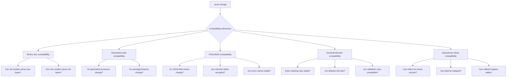

# learn-go-data-mapper-json-xml-protobuf-validation-part-024.md

# Part 024 — Protobuf Schema Evolution

> Seri: `learn-go-data-mapper-json-xml-protobuf-validation`  
> Bagian: `024 / 033`  
> Topik: **Protobuf Schema Evolution**  
> Target pembaca: Java software engineer yang ingin menguasai desain kontrak data Go/Protobuf sampai level production architecture.  
> Status seri: **belum selesai**.

---

## Daftar Isi

1. [Tujuan Pembelajaran](#1-tujuan-pembelajaran)
2. [Inti Masalah: Protobuf Bukan Sekadar DTO Generator](#2-inti-masalah-protobuf-bukan-sekadar-dto-generator)
3. [Mental Model: Schema Evolution Adalah Manajemen Waktu](#3-mental-model-schema-evolution-adalah-manajemen-waktu)
4. [Empat Jenis Kompatibilitas](#4-empat-jenis-kompatibilitas)
5. [Konsep Dasar yang Tidak Boleh Salah](#5-konsep-dasar-yang-tidak-boleh-salah)
6. [Mermaid: Sumbu Kompatibilitas Protobuf](#6-mermaid-sumbu-kompatibilitas-protobuf)
7. [Rule Nomor 1: Field Number Adalah Identitas Kontrak](#7-rule-nomor-1-field-number-adalah-identitas-kontrak)
8. [Rule Nomor 2: Jangan Pernah Reuse Field Number](#8-rule-nomor-2-jangan-pernah-reuse-field-number)
9. [Rule Nomor 3: Reserve Field Number dan Field Name Saat Menghapus](#9-rule-nomor-3-reserve-field-number-dan-field-name-saat-menghapus)
10. [Rule Nomor 4: Binary Compatibility Tidak Sama dengan Semantic Compatibility](#10-rule-nomor-4-binary-compatibility-tidak-sama-dengan-semantic-compatibility)
11. [Taxonomy Perubahan Schema](#11-taxonomy-perubahan-schema)
12. [Change Type 1: Menambah Field Baru](#12-change-type-1-menambah-field-baru)
13. [Change Type 2: Menghapus Field](#13-change-type-2-menghapus-field)
14. [Change Type 3: Rename Field](#14-change-type-3-rename-field)
15. [Change Type 4: Mengubah Tipe Field](#15-change-type-4-mengubah-tipe-field)
16. [Change Type 5: Mengubah Cardinality dan Presence](#16-change-type-5-mengubah-cardinality-dan-presence)
17. [Change Type 6: Repeated, Packed, dan Map Evolution](#17-change-type-6-repeated-packed-dan-map-evolution)
18. [Change Type 7: Enum Evolution](#18-change-type-7-enum-evolution)
19. [Change Type 8: Oneof Evolution](#19-change-type-8-oneof-evolution)
20. [Change Type 9: Message Extraction dan Nesting](#20-change-type-9-message-extraction-dan-nesting)
21. [Change Type 10: Package, Go Package, dan Import Path](#21-change-type-10-package-go-package-dan-import-path)
22. [ProtoJSON Compatibility](#22-protojson-compatibility)
23. [Unknown Fields: Teman Binary, Musuh JSON](#23-unknown-fields-teman-binary-musuh-json)
24. [Go-Specific Schema Evolution Concerns](#24-go-specific-schema-evolution-concerns)
25. [Migration Pattern: Expand and Contract](#25-migration-pattern-expand-and-contract)
26. [Migration Pattern: Dual Read, Dual Write](#26-migration-pattern-dual-read-dual-write)
27. [Migration Pattern: Shadow Field](#27-migration-pattern-shadow-field)
28. [Migration Pattern: FieldMask untuk Update API](#28-migration-pattern-fieldmask-untuk-update-api)
29. [Compatibility Matrix Praktis](#29-compatibility-matrix-praktis)
30. [Production Review Checklist](#30-production-review-checklist)
31. [Anti-Pattern](#31-anti-pattern)
32. [Case Study: Evolusi Contract `CaseRecord`](#32-case-study-evolusi-contract-caserecord)
33. [Decision Framework](#33-decision-framework)
34. [Latihan Desain](#34-latihan-desain)
35. [Ringkasan Invariant](#35-ringkasan-invariant)
36. [Referensi Resmi](#36-referensi-resmi)

---

## 1. Tujuan Pembelajaran

Setelah menyelesaikan bagian ini, kamu harus mampu:

1. Menjelaskan kenapa **field number** lebih fundamental daripada nama field pada Protobuf binary format.
2. Membedakan **binary wire compatibility**, **ProtoJSON compatibility**, **generated-code/source compatibility**, dan **semantic/domain compatibility**.
3. Mendesain perubahan schema yang bisa melewati rolling deployment tanpa merusak producer/consumer lama.
4. Menentukan perubahan mana yang aman, tidak aman, atau hanya aman dengan syarat migrasi operasional tertentu.
5. Menggunakan `reserved` number dan `reserved` name dengan benar.
6. Mendesain migrasi field tanpa silent data corruption.
7. Menghindari jebakan `oneof`, enum, map, packed repeated field, field presence, dan ProtoJSON.
8. Membuat review checklist untuk perubahan `.proto` pada sistem Go production.

Part ini bukan membahas syntax Protobuf dari nol. Itu sudah dilakukan di part sebelumnya. Fokus bagian ini adalah: **bagaimana sebuah schema hidup bertahun-tahun tanpa menghancurkan sistem yang bergantung padanya**.

---

## 2. Inti Masalah: Protobuf Bukan Sekadar DTO Generator

Di banyak tim Java, Protobuf pertama kali dipahami sebagai:

> “file `.proto` yang menghasilkan class Java/Go untuk request-response.”

Pemahaman itu benar, tetapi sangat kurang.

Dalam sistem production, `.proto` adalah:

1. **wire contract** antar proses,
2. **compatibility boundary** antar versi service,
3. **schema history** untuk event/log/data yang sudah tersimpan,
4. **API governance artifact**,
5. **source of truth** untuk generated code lintas bahasa,
6. **long-term data interpretation map**.

Kesalahan pada `.proto` bukan sekadar compile error. Kesalahan evolusi schema bisa menyebabkan:

- data lama tidak bisa dibaca,
- data baru ditafsirkan salah oleh consumer lama,
- field sensitif terbaca sebagai field lain,
- enum baru membuat consumer lama masuk default branch yang salah,
- JSON gateway rusak walau binary gRPC aman,
- backfill corrupt,
- replay event gagal,
- audit trail kehilangan makna historis.

Dalam Java, banyak engineer terbiasa dengan Jackson DTO evolution:

```java
class UserDto {
    public String name;
    public String email;
}
```

Lalu rename field:

```java
class UserDto {
    public String fullName;
    public String email;
}
```

Pada JSON, rename field terlihat jelas karena nama field ikut terkirim.

Pada binary Protobuf, nama field **tidak ikut terkirim**. Yang terkirim adalah **field number + wire type + value**.

Jadi di Protobuf, perubahan paling berbahaya sering bukan perubahan nama, melainkan perubahan nomor dan tipe wire.

---

## 3. Mental Model: Schema Evolution Adalah Manajemen Waktu

Schema evolution bukan sekadar “mengubah file `.proto`”. Schema evolution adalah mengelola fakta bahwa pada waktu yang sama bisa ada:

1. producer lama,
2. producer baru,
3. consumer lama,
4. consumer baru,
5. data lama di storage,
6. data baru di storage,
7. event lama yang direplay,
8. mobile/client lama yang belum update,
9. batch job lama,
10. cache berisi payload format lama.

Sistem distributed tidak berubah secara atomik.

Maka pertanyaan schema evolution yang benar bukan:

> “Apakah schema ini compile?”

Tetapi:

> “Apakah semua kombinasi producer/consumer/data lama-baru masih bisa beroperasi selama masa transisi?”

### 3.1 Kombinasi Rolling Deployment

Misalkan ada service A sebagai producer dan service B sebagai consumer.

Saat deploy rolling:

| Producer | Consumer | Situasi |
|---|---|---|
| lama | lama | baseline |
| lama | baru | consumer baru harus bisa baca data lama |
| baru | lama | consumer lama harus bisa mengabaikan/menangani data baru |
| baru | baru | target akhir |

Jika payload tersimpan atau event bisa direplay, kombinasi menjadi lebih banyak:

| Writer | Reader | Data |
|---|---|---|
| lama | baru | data lama |
| baru | lama | data baru |
| baru | baru | data lama |
| baru | baru | data baru |
| lama | baru | event lama replay |
| baru | lama | event baru di DLQ/retry |

Schema evolution yang baik harus mempertimbangkan **temporal overlap** ini.

---

## 4. Empat Jenis Kompatibilitas

Kesalahan umum adalah menganggap “Protobuf compatible” hanya berarti binary parser tidak error.

Di production, minimal ada empat sumbu kompatibilitas.

### 4.1 Binary Wire Compatibility

Apakah bytes lama bisa dibaca oleh schema baru, dan bytes baru bisa dibaca oleh schema lama tanpa parse failure atau interpretasi wire yang salah?

Contoh aman:

```proto
message User {
  string id = 1;
  string name = 2;
}
```

Menjadi:

```proto
message User {
  string id = 1;
  string name = 2;
  string email = 3;
}
```

Consumer lama tidak mengenal field 3, tetapi binary Protobuf bisa menyimpan/mengabaikan unknown field tergantung runtime/language/path.

### 4.2 Generated-Code / Source Compatibility

Apakah source code Go/Java lama yang memakai generated class masih compile setelah `.proto` berubah?

Contoh binary aman tetapi source breaking:

```proto
message User {
  string name = 1;
}
```

Rename field:

```proto
message User {
  string full_name = 1;
}
```

Binary tetap memakai field number `1`, tetapi generated accessor berubah:

```go
u.GetName()      // lama
u.GetFullName()  // baru
```

Go code yang masih memanggil `GetName()` akan gagal compile.

### 4.3 ProtoJSON Compatibility

Apakah JSON representation masih kompatibel?

Pada ProtoJSON, field name ikut muncul. Rename field bisa merusak JSON consumer walaupun binary Protobuf aman.

Contoh:

```proto
message User {
  string name = 1;
}
```

JSON:

```json
{"name":"Ayu"}
```

Rename:

```proto
message User {
  string full_name = 1;
}
```

JSON default bisa berubah menjadi:

```json
{"fullName":"Ayu"}
```

Binary safe, JSON unsafe.

### 4.4 Semantic Compatibility

Apakah makna bisnis tetap kompatibel?

Contoh:

```proto
message Payment {
  int64 amount_cents = 1;
}
```

Lalu field yang sama ditafsirkan ulang menjadi rupiah penuh:

```proto
message Payment {
  int64 amount_cents = 1; // sekarang sebenarnya rupiah, tetapi nama tidak diganti
}
```

Binary parser aman. Compile aman. Tetapi sistem rusak secara bisnis.

**Semantic compatibility lebih penting daripada parse success.**

---

## 5. Konsep Dasar yang Tidak Boleh Salah

### 5.1 Binary Protobuf Tidak Mengirim Nama Field

Payload binary Protobuf mengandung:

```text
field_number + wire_type + encoded_value
```

Ia tidak mengandung:

```text
field_name
json_name
comment
validation rule
business meaning
```

Maka dua schema ini secara binary bisa membaca field yang sama:

```proto
message V1 {
  string customer_name = 1;
}
```

```proto
message V2 {
  string applicant_name = 1;
}
```

Karena field number sama: `1`.

Tetapi secara semantic belum tentu benar.

### 5.2 Wire Type Membatasi Perubahan Tipe

Protobuf punya wire type level rendah. Beberapa tipe schema berbagi wire type yang sama, tetapi tidak berarti aman secara semantic.

Contoh kelompok sederhana:

| Proto type | Wire behavior umum |
|---|---|
| `int32`, `int64`, `uint32`, `uint64`, `bool`, enum | varint |
| `sint32`, `sint64` | varint dengan zigzag encoding |
| `fixed32`, `sfixed32`, `float` | fixed 32-bit |
| `fixed64`, `sfixed64`, `double` | fixed 64-bit |
| `string`, `bytes`, embedded message, packed repeated | length-delimited |

Karena `string`, `bytes`, message, dan packed repeated sama-sama length-delimited, parser mungkin tidak selalu gagal ketika tipe berubah. Tetapi makna data bisa hancur.

### 5.3 Unknown Field Adalah Mekanisme Forward Compatibility Binary

Jika consumer lama menerima field baru yang tidak dikenalnya, field itu adalah unknown field.

Binary Protobuf memiliki konsep unknown field. Namun:

- tidak semua jalur transformasi mempertahankan unknown field,
- ProtoJSON tidak mendukung unknown fields dengan cara yang sama,
- mapping ke DTO/domain lalu marshal ulang bisa membuang unknown field,
- beberapa proxy/gateway bisa menghilangkan data unknown.

Maka unknown field membantu, tetapi tidak boleh dijadikan satu-satunya strategi migrasi.

---

## 6. Mermaid: Sumbu Kompatibilitas Protobuf



---

## 7. Rule Nomor 1: Field Number Adalah Identitas Kontrak

Di Protobuf, field number adalah identitas wire.

```proto
message Account {
  string id = 1;
  string email = 2;
}
```

Binary payload tidak berkata:

```text
email = "a@example.com"
```

Ia berkata kira-kira:

```text
field 2, length-delimited, "a@example.com"
```

Jika schema baru mengubah nomor:

```proto
message Account {
  string id = 1;
  string email = 5; // SALAH jika field lama sudah production
}
```

Maka data lama field `2` tidak lagi dibaca sebagai `email` oleh schema baru.

### 7.1 Renumbering adalah Delete + Add

Mengubah nomor field bukan rename. Itu secara efektif:

1. menghapus field lama,
2. menambahkan field baru dengan number baru.

Jika data lama masih ada, consumer baru tidak membaca field lama sebagai field yang sama.

### 7.2 Nomor Field Rendah Lebih Murah, Tetapi Jangan Terobsesi

Field number `1` sampai `15` lebih compact daripada field number lebih besar karena encoding tag lebih pendek. Tetapi jangan pernah renumber field production hanya untuk “merapikan nomor”.

Field number aesthetics tidak sebanding dengan risiko compatibility.

---

## 8. Rule Nomor 2: Jangan Pernah Reuse Field Number

Misalkan versi awal:

```proto
message Customer {
  string id = 1;
  string passport_number = 2;
}
```

Lalu field `passport_number` dianggap tidak dipakai, sehingga dihapus:

```proto
message Customer {
  string id = 1;
}
```

Beberapa bulan kemudian, developer lain menambahkan:

```proto
message Customer {
  string id = 1;
  string marketing_segment = 2; // BENCANA
}
```

Data lama yang masih punya field `2` sebagai passport number bisa dibaca sebagai marketing segment oleh schema baru.

Akibatnya bisa parah:

- data corruption,
- privacy leak,
- salah keputusan bisnis,
- audit inconsistency,
- incident regulatory.

### 8.1 Field Number Reuse Itu Bukan Bug Biasa

Ini bukan bug yang sekadar membuat parse gagal. Lebih buruk: sistem bisa tetap berjalan tetapi dengan data yang salah.

Bug seperti ini sulit dideteksi karena:

- parser sukses,
- log terlihat normal,
- field ada isinya,
- test data baru tidak merepresentasikan data lama,
- corruption muncul saat replay/backfill/restore.

### 8.2 Aturan Praktis

Begitu field number pernah muncul di schema production:

```text
field number itu tidak boleh dipakai untuk makna lain selamanya.
```

---

## 9. Rule Nomor 3: Reserve Field Number dan Field Name Saat Menghapus

Cara benar menghapus field:

```proto
message Customer {
  string id = 1;

  reserved 2;
  reserved "passport_number";
}
```

Field number di-reserve untuk mencegah reuse binary.

Field name di-reserve untuk mengurangi risiko pada TextProto/JSON-related paths dan mencegah developer memakai nama historis untuk makna berbeda.

### 9.1 Delete Tidak Sama dengan Hilang dari Dunia

Field yang sudah dihapus dari `.proto` belum tentu hilang dari:

- database blob,
- Kafka/PubSub event lama,
- S3 archive,
- audit trail,
- mobile offline payload,
- DLQ,
- cache,
- backup,
- downstream consumer lama.

Maka reserve bukan formalitas. Reserve adalah catatan sejarah bahwa field tersebut pernah hidup.

### 9.2 Gunakan Deprecated Sebelum Delete

Fase yang lebih aman:

```proto
message Customer {
  string id = 1;
  string passport_number = 2 [deprecated = true];
}
```

Kemudian setelah usage hilang:

```proto
message Customer {
  string id = 1;

  reserved 2;
  reserved "passport_number";
}
```

`deprecated = true` tidak menghapus field dari wire. Ia memberi sinyal ke generated code/tooling bahwa field sebaiknya tidak dipakai.

---

## 10. Rule Nomor 4: Binary Compatibility Tidak Sama dengan Semantic Compatibility

Contoh binary-compatible tetapi semantic-breaking:

```proto
message Case {
  string status = 1; // "OPEN", "CLOSED"
}
```

Lalu aturan baru:

```proto
message Case {
  string status = 1; // sekarang "PENDING", "APPROVED", "REJECTED"
}
```

Binary masih string. Parser aman.

Tetapi consumer lama mungkin punya logic:

```go
switch c.GetStatus() {
case "OPEN":
    allowEdit()
case "CLOSED":
    lock()
default:
    lock()
}
```

Jika status baru `PENDING` masuk default branch, hasilnya mungkin salah.

### 10.1 Compatibility Harus Didefinisikan Berdasarkan Behavior

Pertanyaan review yang benar:

1. Apakah consumer lama bisa mengabaikan field baru?
2. Apakah default value lama masih bermakna benar?
3. Apakah enum baru punya fallback behavior yang aman?
4. Apakah rename field memengaruhi JSON/gateway/client?
5. Apakah field yang dibuat required secara bisnis akan mematahkan producer lama?
6. Apakah perubahan validation rule akan menolak data lama?
7. Apakah replay event lama masih valid?

---

## 11. Taxonomy Perubahan Schema

Gunakan taxonomy berikut saat review PR `.proto`.

| Kategori | Contoh | Binary | JSON | Semantic | Catatan |
|---|---|---:|---:|---:|---|
| Add field baru | `email = 3` | biasanya aman | biasanya aman | tergantung default | Consumer lama mengabaikan field baru. |
| Delete field tanpa reserve | hapus `email = 3` | berisiko | berisiko | berisiko | Bisa reuse tidak sengaja. |
| Delete dengan reserved | `reserved 3;` | lebih aman | lebih aman | tergantung data lama | Tetap perlu migrasi usage. |
| Rename field | `name` ke `full_name`, number sama | binary aman | JSON berisiko | source berisiko | Generated accessor berubah. |
| Renumber field | `name = 1` ke `name = 2` | tidak aman | tidak aman | tidak aman | Anggap delete+add. |
| Reuse field number | field lama `2`, makna baru `2` | sangat berbahaya | sangat berbahaya | sangat berbahaya | Bisa silent corruption. |
| Change scalar compatible-ish | `int32` ke `int64` | conditionally safe | berisiko | tergantung range | Harus rollout hati-hati. |
| Change wire type | `string` ke `int32` | tidak aman | tidak aman | tidak aman | Parser/interpretasi rusak. |
| Add enum value | tambah `SUSPENDED` | binary biasanya bisa | JSON tergantung | berisiko | Consumer lama harus punya fallback. |
| Move field into oneof | field biasa jadi oneof | berisiko | berisiko | berisiko | Presence/clearing semantics berubah. |
| Add oneof field baru | tambah alternative baru | bisa aman | berisiko | tergantung fallback | Consumer lama tidak tahu alternative baru. |
| Change package | `package a` ke `b` | binary bisa sama | type URL/Any berisiko | source berisiko | `Any` sangat terdampak. |

---

## 12. Change Type 1: Menambah Field Baru

Menambah field baru dengan number baru adalah perubahan paling umum dan biasanya paling aman.

### 12.1 Contoh

Versi 1:

```proto
syntax = "proto3";

package compliance.v1;

message CaseRecord {
  string id = 1;
  string title = 2;
}
```

Versi 2:

```proto
syntax = "proto3";

package compliance.v1;

message CaseRecord {
  string id = 1;
  string title = 2;
  string assigned_officer_id = 3;
}
```

Consumer lama tidak mengenal field `3`. Pada binary path, field baru menjadi unknown untuk consumer lama.

### 12.2 Risiko Semantic

Menambah field baru belum tentu semantic-safe.

Misalkan field baru:

```proto
bool is_confidential = 3;
```

Consumer lama tidak tahu bahwa case sekarang confidential. Jika consumer lama tetap menampilkan case tersebut di UI umum, terjadi leak.

Maka field baru yang memengaruhi authorization, confidentiality, workflow state, atau financial meaning tidak bisa dianggap aman hanya karena binary-compatible.

### 12.3 Rule Praktis

Field baru aman bila:

1. default value aman untuk consumer lama,
2. consumer lama boleh mengabaikannya,
3. field baru tidak mengubah interpretasi field lama,
4. producer baru masih mengisi field lama yang diperlukan consumer lama selama transisi,
5. validation tidak langsung mewajibkan field baru untuk semua payload lama.

### 12.4 Optional vs Implicit Scalar

Untuk field baru yang perlu membedakan absent vs set-to-default:

```proto
message CaseRecord {
  string id = 1;
  optional bool urgent = 2;
}
```

Ini lebih baik daripada:

```proto
message CaseRecord {
  bool urgent = 2;
}
```

Karena `urgent = false` bisa berarti:

1. producer memang mengirim `false`, atau
2. producer lama tidak tahu field tersebut.

Dalam migrasi, perbedaan ini sering penting.

---

## 13. Change Type 2: Menghapus Field

Menghapus field adalah perubahan yang harus dilakukan bertahap.

### 13.1 Salah

```proto
message CaseRecord {
  string id = 1;
  string title = 2;
  // string assigned_officer_id = 3; deleted
}
```

Masalah:

- future developer bisa reuse `3`,
- data lama masih punya field `3`,
- JSON/Text clients mungkin masih mengirim nama lama,
- generated code langsung hilang dan mematahkan source yang belum migrasi.

### 13.2 Benar: Deprecate Dulu

```proto
message CaseRecord {
  string id = 1;
  string title = 2;
  string assigned_officer_id = 3 [deprecated = true];
}
```

Lalu migrate code agar tidak menulis/membaca field itu sebagai sumber utama.

### 13.3 Benar: Reserve Setelah Aman

```proto
message CaseRecord {
  string id = 1;
  string title = 2;

  reserved 3;
  reserved "assigned_officer_id";
}
```

### 13.4 Checklist Delete Field

Sebelum delete:

- Apakah semua writer berhenti menulis field lama?
- Apakah semua reader tidak lagi bergantung pada field lama?
- Apakah event lama masih mungkin direplay?
- Apakah storage blob lama masih punya field itu?
- Apakah mobile/client external masih mengirim field itu?
- Apakah JSON gateway perlu alias/backward compatibility?
- Apakah dashboards/search index/backfill masih membaca field itu?
- Apakah field number dan name sudah masuk `reserved`?

---

## 14. Change Type 3: Rename Field

Rename field tampak sederhana, tetapi punya banyak dimensi.

### 14.1 Binary Safe, Source Breaking

```proto
message Person {
  string name = 1;
}
```

Menjadi:

```proto
message Person {
  string full_name = 1;
}
```

Binary masih field number `1`.

Tetapi generated Go accessor berubah dari:

```go
p.GetName()
```

Menjadi:

```go
p.GetFullName()
```

Source code perlu diubah.

### 14.2 ProtoJSON Breaking

ProtoJSON default memakai lowerCamelCase dari field name:

```proto
string full_name = 1;
```

Menjadi JSON:

```json
{"fullName":"Ayu"}
```

Jika sebelumnya:

```json
{"name":"Ayu"}
```

Maka JSON client lama bisa rusak.

### 14.3 Gunakan `json_name` dengan Hati-Hati

Protobuf mendukung `json_name`:

```proto
message Person {
  string full_name = 1 [json_name = "name"];
}
```

Ini bisa menjaga JSON key lama, tetapi menambah kompleksitas karena nama proto dan nama JSON tidak lagi selaras.

Gunakan hanya jika benar-benar perlu mempertahankan external JSON contract.

### 14.4 Rename Lebih Aman Jika Field Tidak Pernah Keluar Binary Boundary

Jika field hanya dipakai internal binary gRPC antar service yang dideploy bersamaan, rename bisa lebih murah.

Jika field diekspos melalui:

- public API,
- ProtoJSON,
- OpenAPI gateway,
- logs,
- dashboards,
- event schema,
- BI pipeline,

rename harus dianggap sebagai perubahan contract publik.

---

## 15. Change Type 4: Mengubah Tipe Field

Mengubah tipe field adalah area paling rawan.

### 15.1 Wire-Type Breaking

Salah:

```proto
message Invoice {
  string amount = 1;
}
```

Menjadi:

```proto
message Invoice {
  int64 amount = 1;
}
```

`string` adalah length-delimited. `int64` adalah varint. Ini bukan perubahan aman.

### 15.2 Wire-Compatible Belum Tentu Aman

```proto
message Metric {
  int32 count = 1;
}
```

Menjadi:

```proto
message Metric {
  int64 count = 1;
}
```

Keduanya varint, tetapi consumer lama `int32` bisa gagal atau salah jika producer baru mengirim nilai di luar range `int32`.

Ini hanya conditionally safe bila kamu menjamin nilai tetap dalam range lama selama semua consumer lama masih ada.

### 15.3 Jangan Mengubah Satuan Field

Salah:

```proto
message Payment {
  int64 amount_cents = 1;
}
```

Lalu dipakai sebagai rupiah penuh:

```proto
message Payment {
  int64 amount_cents = 1; // sebenarnya amount_rupiah sekarang
}
```

Ini semantic corruption.

Cara benar:

```proto
message Payment {
  int64 amount_cents = 1 [deprecated = true];
  int64 amount_minor_units = 2;
  string currency = 3;
}
```

Atau gunakan message eksplisit:

```proto
message Money {
  string currency_code = 1;
  int64 units = 2;
  int32 nanos = 3;
}

message Payment {
  Money amount = 1;
}
```

### 15.4 Pattern: Add New Field, Migrate, Reserve Old

Daripada mengubah tipe field lama:

```proto
message Invoice {
  string amount = 1 [deprecated = true];
  int64 amount_cents = 2;
}
```

Setelah semua migrasi selesai:

```proto
message Invoice {
  reserved 1;
  reserved "amount";

  int64 amount_cents = 2;
}
```

---

## 16. Change Type 5: Mengubah Cardinality dan Presence

Cardinality/presence memengaruhi apakah sistem bisa membedakan:

- field tidak dikirim,
- field dikirim dengan default value,
- field dikirim sebagai empty value,
- field dikirim berkali-kali,
- field dipilih sebagai salah satu branch `oneof`.

### 16.1 Implicit Scalar ke Optional

Proto3 implicit scalar:

```proto
message CaseRecord {
  bool urgent = 1;
}
```

Tidak bisa membedakan absent vs `false`.

Lebih baik untuk field baru:

```proto
message CaseRecord {
  optional bool urgent = 1;
}
```

Mengubah field yang sudah ada dari implicit ke optional perlu diuji terhadap generated code dan semantic rollout.

### 16.2 Optional ke Required?

Proto3 tidak memiliki `required` seperti proto2. Jangan mensimulasikan requiredness dengan asumsi parser.

Gunakan validation layer:

```proto
message CreateCaseRequest {
  string title = 1;
}
```

Lalu validasi semantic:

```go
if strings.TrimSpace(req.GetTitle()) == "" {
    return fieldError("title", "required")
}
```

Atau pakai validation framework Protobuf yang akan dibahas pada part validation.

### 16.3 Repeated ke Singular

Salah secara migration:

```proto
message User {
  repeated string emails = 1;
}
```

Menjadi:

```proto
message User {
  string email = 1;
}
```

Ini mengubah cardinality dan semantics. Consumer lama/baru bisa berbeda interpretasi.

Lebih aman:

```proto
message User {
  repeated string emails = 1 [deprecated = true];
  string primary_email = 2;
}
```

---

## 17. Change Type 6: Repeated, Packed, dan Map Evolution

### 17.1 Repeated Scalar Packed Encoding

Pada proto3, repeated scalar numeric umumnya packed by default.

```proto
message Metrics {
  repeated int32 samples = 1;
}
```

Packed encoding memakai length-delimited payload untuk sekumpulan nilai.

Mengubah packed/unpacked harus dicek terhadap compatibility runtime lama dan bahasa yang dipakai. Jangan mengandalkan asumsi jika ada consumer lama atau library non-standar.

### 17.2 Repeated Message

```proto
message Order {
  repeated Item items = 1;
}
```

Menambah field ke `Item` biasanya mengikuti aturan message biasa.

Tetapi mengubah `items` menjadi singular field bukan aman.

### 17.3 Map Adalah Syntax Sugar

```proto
map<string, string> labels = 1;
```

Secara konsep, map adalah repeated entry message dengan key dan value.

Karena itu, perubahan pada map perlu hati-hati:

- mengubah key type tidak aman,
- mengubah value type tidak aman kecuali migrasi add-new-field,
- mengubah map menjadi repeated custom message bisa memengaruhi generated API dan JSON.

### 17.4 Map Order Tidak Boleh Diandalkan

Jangan membuat logic yang bergantung pada urutan map serialization. Jika butuh order, gunakan repeated message eksplisit:

```proto
message Label {
  string key = 1;
  string value = 2;
  int32 order = 3;
}

message Resource {
  repeated Label labels = 1;
}
```

---

## 18. Change Type 7: Enum Evolution

Enum sering terlihat sederhana tetapi berbahaya.

### 18.1 Selalu Sediakan Zero Value yang Aman

Proto3 enum harus punya value pertama dengan nomor `0`.

```proto
enum CaseStatus {
  CASE_STATUS_UNSPECIFIED = 0;
  CASE_STATUS_OPEN = 1;
  CASE_STATUS_CLOSED = 2;
}
```

Jangan:

```proto
enum CaseStatus {
  OPEN = 0;   // buruk: default berarti status bisnis valid
  CLOSED = 1;
}
```

Default value harus mewakili “unknown/unspecified”, bukan state bisnis aktif.

### 18.2 Menambah Enum Value

Menambah value:

```proto
enum CaseStatus {
  CASE_STATUS_UNSPECIFIED = 0;
  CASE_STATUS_OPEN = 1;
  CASE_STATUS_CLOSED = 2;
  CASE_STATUS_SUSPENDED = 3;
}
```

Secara binary, numeric enum value dapat diteruskan. Tetapi consumer lama belum tentu tahu `SUSPENDED`.

Go code lama mungkin:

```go
switch c.GetStatus() {
case pb.CaseStatus_CASE_STATUS_OPEN:
    allowEdit()
case pb.CaseStatus_CASE_STATUS_CLOSED:
    lock()
default:
    allowEdit() // berbahaya
}
```

Default branch harus dirancang aman.

Lebih baik:

```go
switch c.GetStatus() {
case pb.CaseStatus_CASE_STATUS_OPEN:
    return allowEdit()
case pb.CaseStatus_CASE_STATUS_CLOSED:
    return lock()
case pb.CaseStatus_CASE_STATUS_UNSPECIFIED:
    return reject("status is required")
default:
    return failClosed("unknown status")
}
```

### 18.3 Jangan Reuse Enum Number

Salah:

```proto
enum CaseStatus {
  CASE_STATUS_UNSPECIFIED = 0;
  CASE_STATUS_OPEN = 1;
  CASE_STATUS_CLOSED = 2;
}
```

Lalu:

```proto
enum CaseStatus {
  CASE_STATUS_UNSPECIFIED = 0;
  CASE_STATUS_OPEN = 1;
  CASE_STATUS_REJECTED = 2; // reuse CLOSED number: buruk
}
```

Gunakan reserved:

```proto
enum CaseStatus {
  CASE_STATUS_UNSPECIFIED = 0;
  CASE_STATUS_OPEN = 1;
  reserved 2;
  reserved "CASE_STATUS_CLOSED";
  CASE_STATUS_REJECTED = 3;
}
```

### 18.4 Rename Enum Value

Binary memakai number, tetapi JSON biasanya memakai enum name.

Rename enum value bisa ProtoJSON breaking.

Jika external JSON contract penting, jangan rename sembarangan.

---

## 19. Change Type 8: Oneof Evolution

`oneof` menyatakan bahwa hanya satu dari beberapa field yang aktif.

```proto
message ContactMethod {
  oneof method {
    string email = 1;
    string phone = 2;
  }
}
```

### 19.1 Menambah Alternative Baru

```proto
message ContactMethod {
  oneof method {
    string email = 1;
    string phone = 2;
    string slack_user_id = 3;
  }
}
```

Consumer lama tidak tahu `slack_user_id`.

Binary bisa saja mempertahankan unknown field, tetapi generated API lama tidak bisa menunjukkan branch baru sebagai branch `oneof` yang dikenal.

Pertanyaan semantic:

- Apa yang consumer lama lakukan saat contact method tidak dikenal?
- Apakah ia menganggap method kosong?
- Apakah ia fallback ke email?
- Apakah ia drop pesan?

### 19.2 Memindahkan Field Biasa ke Oneof

Salah/berisiko:

```proto
message User {
  string email = 1;
  string phone = 2;
}
```

Menjadi:

```proto
message User {
  oneof contact {
    string email = 1;
    string phone = 2;
  }
}
```

Walau nomor sama, semantics berubah. Sebelumnya email dan phone bisa hadir bersama. Setelah `oneof`, hanya satu branch yang aktif.

Jika payload lama punya dua field, behavior “last one wins” bisa menyebabkan data hilang.

### 19.3 Memindahkan Field dari Oneof ke Field Biasa

Ini juga berisiko karena presence dan clearing semantics berubah.

### 19.4 Pattern Aman

Jika perlu mengganti modeling:

```proto
message User {
  string email = 1 [deprecated = true];
  string phone = 2 [deprecated = true];

  ContactMethod preferred_contact = 3;
}

message ContactMethod {
  oneof method {
    string email = 1;
    string phone = 2;
  }
}
```

Lalu migrasi bertahap.

---

## 20. Change Type 9: Message Extraction dan Nesting

### 20.1 Extract Nested Message

Versi awal:

```proto
message CaseRecord {
  string officer_id = 1;
  string officer_name = 2;
}
```

Ingin menjadi:

```proto
message Officer {
  string id = 1;
  string name = 2;
}

message CaseRecord {
  Officer officer = 3;
}
```

Jangan ganti field `1` langsung menjadi message:

```proto
message CaseRecord {
  Officer officer = 1; // tidak aman: wire type berubah dari string ke message length-delimited?
}
```

Lebih aman:

```proto
message CaseRecord {
  string officer_id = 1 [deprecated = true];
  string officer_name = 2 [deprecated = true];
  Officer officer = 3;
}
```

### 20.2 Flatten Message

Versi awal:

```proto
message CaseRecord {
  Officer officer = 1;
}
```

Ingin flatten:

```proto
message CaseRecord {
  string officer_id = 2;
  string officer_name = 3;
}
```

Tetap add field baru. Jangan reuse field `1`.

### 20.3 Nesting Bukan Detail Internal Jika Schema Sudah Publik

Mengubah struktur nested message mengubah:

- binary field path,
- JSON shape,
- generated API,
- validation path,
- analytics extraction,
- logs parsing.

Maka harus diperlakukan sebagai migration, bukan refactoring biasa.

---

## 21. Change Type 10: Package, Go Package, dan Import Path

Protobuf punya beberapa nama yang sering tertukar:

```proto
syntax = "proto3";

package compliance.case.v1;

option go_package = "example.com/org/compliance/gen/casev1;casev1";
```

### 21.1 `package`

`package` adalah namespace Protobuf.

Ia memengaruhi:

- fully qualified message name,
- service name,
- `Any` type URL,
- descriptor references,
- import resolution.

Mengubah package bisa berdampak besar, terutama jika message dipakai dalam `google.protobuf.Any`.

### 21.2 `go_package`

`go_package` menentukan import path dan package name generated Go.

Mengubah `go_package` bisa source-breaking untuk Go code.

### 21.3 Versioning via Package

Untuk API besar, pattern umum:

```proto
package compliance.case.v1;
```

Versi besar breaking:

```proto
package compliance.case.v2;
```

Tetapi jangan terlalu cepat membuat `v2`. Banyak perubahan bisa dilakukan backward-compatible di `v1` dengan add-field, deprecate, dan migration.

### 21.4 Kapan Buat Package v2?

Buat `v2` jika:

- semantic model berubah besar,
- banyak field lama harus diganti sekaligus,
- JSON shape harus berubah breaking,
- consumer lama tidak bisa dipertahankan,
- diperlukan cleanup besar yang tidak masuk akal dilakukan incremental,
- domain language berubah fundamental.

Jangan buat `v2` hanya karena ingin rename field agar lebih cantik.

---

## 22. ProtoJSON Compatibility

ProtoJSON berbeda dari binary Protobuf.

### 22.1 Binary Protobuf Menggunakan Number

```proto
message User {
  string full_name = 1;
}
```

Binary memakai number `1`.

### 22.2 ProtoJSON Menggunakan Name

Default ProtoJSON:

```json
{"fullName":"Ayu"}
```

Atau dengan option tertentu bisa preserve proto field name:

```json
{"full_name":"Ayu"}
```

Implikasi:

- rename field bisa JSON-breaking,
- rename enum value bisa JSON-breaking,
- removing field bisa membuat JSON lama ditolak,
- unknown fields di JSON tidak punya safety seperti binary unknown fields,
- `json_name` menjadi bagian kontrak external jika digunakan.

### 22.3 Jangan Pakai `encoding/json` untuk Message Protobuf

Di Go, untuk message Protobuf gunakan:

```go
import "google.golang.org/protobuf/encoding/protojson"
```

Contoh:

```go
out, err := protojson.Marshal(msg)
```

Bukan:

```go
out, err := json.Marshal(msg) // salah untuk contract ProtoJSON resmi
```

`encoding/json` melihat generated struct Go, bukan Protobuf semantic contract.

### 22.4 ProtoJSON di Public API Harus Punya Compatibility Policy Sendiri

Jika gRPC transcoding/API gateway mengekspos ProtoJSON ke client external, maka schema review harus memasukkan:

- field rename impact,
- enum rename impact,
- unknown field behavior,
- null behavior,
- int64 representation,
- default emission policy,
- field presence behavior.

---

## 23. Unknown Fields: Teman Binary, Musuh JSON

### 23.1 Unknown Field pada Binary Path

Consumer lama bisa menerima field baru.

```proto
message V1 {
  string id = 1;
}
```

Producer baru:

```proto
message V2 {
  string id = 1;
  string new_field = 2;
}
```

Consumer V1 tidak mengenal field `2`.

Pada binary path, field `2` menjadi unknown.

### 23.2 Unknown Fields Bisa Hilang

Unknown field dapat hilang bila payload:

1. di-convert ke JSON,
2. di-map ke domain struct manual,
3. di-marshal ulang dari DTO yang tidak membawa unknown field,
4. melewati service yang melakukan read-transform-write,
5. melewati old library/runtime yang tidak mempertahankan unknown field sesuai harapan,
6. diproses oleh validation/gateway yang menolak unknown field.

### 23.3 Jangan Mengandalkan Unknown Field untuk Data Kritis

Jika field baru penting untuk authorization/compliance/security, jangan bergantung pada consumer lama yang “mungkin” mempertahankan unknown field.

Gunakan rollout strategy:

1. deploy reader support dulu,
2. monitor readiness,
3. baru enable writer field baru,
4. enforce behavior setelah semua consumer siap.

---

## 24. Go-Specific Schema Evolution Concerns

### 24.1 Open Struct API vs Opaque API

Pada Go Protobuf modern, generated-code API bisa berupa Open Struct API atau Opaque API tergantung syntax/edition/API level.

Dalam Open Struct API, code sering mengakses field langsung:

```go
u.Name = "Ayu"
fmt.Println(u.Name)
```

Dalam Opaque API, akses diarahkan melalui methods/accessors:

```go
u.SetName("Ayu")
fmt.Println(u.GetName())
```

Implikasi schema evolution:

- jangan mendesain code production yang terlalu bergantung pada layout struct generated,
- gunakan accessor bila memungkinkan,
- pisahkan generated message dari domain model,
- jangan jadikan generated struct sebagai internal mutable aggregate sembarangan.

### 24.2 Source Break Karena Rename

Rename field akan mengubah generated method:

```proto
string officer_id = 1;
```

Go:

```go
msg.GetOfficerId()
```

Rename:

```proto
string assigned_officer_id = 1;
```

Go:

```go
msg.GetAssignedOfficerId()
```

Binary aman, source breaking.

### 24.3 Pointer/Presence API

Proto3 optional dan Editions presence memengaruhi generated API.

Jangan membuat domain rule berdasarkan zero value generated field tanpa memahami presence.

Contoh domain mapping:

```go
type PatchCase struct {
    UrgentSet bool
    Urgent    bool
}
```

Mapper dari protobuf harus cek presence, bukan hanya value.

Pseudo pattern:

```go
func mapPatch(req *pb.UpdateCaseRequest) PatchCase {
    var out PatchCase

    if req.HasUrgent() { // ilustratif; API aktual tergantung generated API level
        out.UrgentSet = true
        out.Urgent = req.GetUrgent()
    }

    return out
}
```

### 24.4 Jangan Bocorkan Generated Message ke Semua Layer

Buruk:

```go
func ApplyCaseUpdate(c *pb.CaseRecord) error {
    // domain logic langsung di atas generated proto
}
```

Lebih baik:

```go
type CaseUpdateCommand struct {
    CaseID string
    Title  Optional[string]
    Status Optional[CaseStatus]
}

func DecodeUpdateCase(req *pb.UpdateCaseRequest) (CaseUpdateCommand, error) {
    // protobuf boundary mapping + validation
}
```

Kenapa?

- generated API berubah mengikuti schema,
- domain invariant lebih stabil daripada transport contract,
- migration bisa dilakukan di boundary mapper,
- testing lebih sederhana,
- business logic tidak tergantung wire format.

---

## 25. Migration Pattern: Expand and Contract

Pattern paling aman untuk schema evolution adalah **expand and contract**.

### 25.1 Fase 1: Expand Schema

Tambahkan field baru tanpa menghapus field lama.

```proto
message CaseRecord {
  string id = 1;
  string officer_id = 2 [deprecated = true];
  Officer officer = 3;
}

message Officer {
  string id = 1;
  string display_name = 2;
}
```

### 25.2 Fase 2: Deploy Reader Baru

Reader baru bisa membaca keduanya:

```go
func officerIDFromProto(c *pb.CaseRecord) string {
    if c.GetOfficer() != nil && c.GetOfficer().GetId() != "" {
        return c.GetOfficer().GetId()
    }
    return c.GetOfficerId()
}
```

### 25.3 Fase 3: Dual Write

Writer baru menulis field lama dan baru selama transisi:

```go
func toProto(c Case) *pb.CaseRecord {
    return &pb.CaseRecord{
        Id:        c.ID,
        OfficerId: c.Officer.ID, // deprecated but still written temporarily
        Officer: &pb.Officer{
            Id:          c.Officer.ID,
            DisplayName: c.Officer.DisplayName,
        },
    }
}
```

### 25.4 Fase 4: Monitor Consumer Readiness

Pastikan semua consumer sudah membaca field baru.

Indikator:

- version rollout complete,
- metrics old-field read turun,
- no DLQ caused by new field,
- no consumer rejects unknown field,
- no JSON client breakage,
- replay test pass.

### 25.5 Fase 5: Stop Writing Old Field

```go
func toProto(c Case) *pb.CaseRecord {
    return &pb.CaseRecord{
        Id: c.ID,
        Officer: &pb.Officer{
            Id:          c.Officer.ID,
            DisplayName: c.Officer.DisplayName,
        },
    }
}
```

### 25.6 Fase 6: Remove and Reserve

Setelah retention period aman:

```proto
message CaseRecord {
  string id = 1;

  reserved 2;
  reserved "officer_id";

  Officer officer = 3;
}
```

---

## 26. Migration Pattern: Dual Read, Dual Write

Dual read/dual write cocok untuk mengganti field lama ke field baru dengan tipe/semantic berbeda.

### 26.1 Contoh: Amount String ke Money Message

Versi lama:

```proto
message Invoice {
  string id = 1;
  string amount = 2; // "100.50"
}
```

Versi transisi:

```proto
message Invoice {
  string id = 1;
  string amount = 2 [deprecated = true];
  Money total = 3;
}

message Money {
  string currency = 1;
  int64 minor_units = 2;
}
```

### 26.2 Reader

```go
func invoiceAmount(inv *pb.Invoice) (Money, error) {
    if inv.GetTotal() != nil {
        return Money{
            Currency:   inv.GetTotal().GetCurrency(),
            MinorUnits: inv.GetTotal().GetMinorUnits(),
        }, nil
    }

    if inv.GetAmount() != "" {
        return parseLegacyAmount(inv.GetAmount(), "IDR")
    }

    return Money{}, fieldError("amount", "missing")
}
```

### 26.3 Writer

Selama transisi:

```go
func invoiceToProto(inv Invoice) *pb.Invoice {
    return &pb.Invoice{
        Id:     inv.ID,
        Amount: formatLegacyAmount(inv.Total), // deprecated compatibility
        Total: &pb.Money{
            Currency:   inv.Total.Currency,
            MinorUnits: inv.Total.MinorUnits,
        },
    }
}
```

Setelah semua consumer siap:

```go
func invoiceToProto(inv Invoice) *pb.Invoice {
    return &pb.Invoice{
        Id: inv.ID,
        Total: &pb.Money{
            Currency:   inv.Total.Currency,
            MinorUnits: inv.Total.MinorUnits,
        },
    }
}
```

### 26.4 Jangan Dual Write Selamanya

Dual write adalah fase migrasi, bukan desain permanen.

Jika dibiarkan terlalu lama:

- dua field bisa inconsistent,
- validation makin rumit,
- reader punya precedence rule tersembunyi,
- debugging membingungkan,
- storage membengkak.

Tetapkan exit criteria sejak awal.

---

## 27. Migration Pattern: Shadow Field

Shadow field adalah field baru yang disiapkan untuk observasi sebelum menjadi sumber kebenaran.

### 27.1 Contoh

```proto
message ScreeningResult {
  string legacy_risk_level = 1 [deprecated = true];
  RiskAssessment risk_assessment = 2;
}

message RiskAssessment {
  RiskLevel level = 1;
  repeated string reasons = 2;
  double score = 3;
}

enum RiskLevel {
  RISK_LEVEL_UNSPECIFIED = 0;
  RISK_LEVEL_LOW = 1;
  RISK_LEVEL_MEDIUM = 2;
  RISK_LEVEL_HIGH = 3;
}
```

Selama transisi:

- writer mengisi lama dan baru,
- consumer masih memakai lama,
- observability membandingkan lama vs baru,
- setelah confidence cukup, consumer pindah ke baru.

### 27.2 Observability untuk Shadow Field

Metric yang berguna:

```text
screening_result_legacy_new_mismatch_total
screening_result_new_field_missing_total
screening_result_new_field_invalid_total
screening_result_consumer_version
screening_result_old_field_read_total
```

Shadow migration tanpa metric hanya menunda risiko.

---

## 28. Migration Pattern: FieldMask untuk Update API

Untuk update/patch API, Protobuf punya `google.protobuf.FieldMask`.

### 28.1 Masalah Tanpa FieldMask

```proto
message UpdateCaseRequest {
  string id = 1;
  string title = 2;
  bool urgent = 3;
}
```

Jika `urgent=false`, apakah client ingin set false atau tidak mengirim field?

### 28.2 Dengan FieldMask

```proto
import "google/protobuf/field_mask.proto";

message UpdateCaseRequest {
  string id = 1;
  Case patch = 2;
  google.protobuf.FieldMask update_mask = 3;
}

message Case {
  string title = 1;
  bool urgent = 2;
}
```

Jika `update_mask.paths` berisi `urgent`, maka `urgent=false` berarti update eksplisit.

### 28.3 Evolution Benefit

FieldMask membantu schema evolution karena:

- field baru bisa ditambahkan ke patch object,
- old clients tidak mengirim path baru,
- server bisa membedakan no-op vs explicit zero,
- validation bisa fokus pada field yang diubah,
- migration update semantics lebih terkendali.

### 28.4 Go Mapping Pattern

```go
type UpdateCaseCommand struct {
    ID      string
    Changes map[string]any
}

func decodeUpdate(req *pb.UpdateCaseRequest) (UpdateCaseCommand, error) {
    if req.GetId() == "" {
        return UpdateCaseCommand{}, fieldError("id", "required")
    }

    patch := req.GetPatch()
    if patch == nil {
        return UpdateCaseCommand{}, fieldError("patch", "required")
    }

    changes := map[string]any{}

    for _, path := range req.GetUpdateMask().GetPaths() {
        switch path {
        case "title":
            changes["title"] = patch.GetTitle()
        case "urgent":
            changes["urgent"] = patch.GetUrgent()
        default:
            return UpdateCaseCommand{}, fieldError("update_mask", "unsupported path: "+path)
        }
    }

    return UpdateCaseCommand{ID: req.GetId(), Changes: changes}, nil
}
```

---

## 29. Compatibility Matrix Praktis

### 29.1 Field-Level Matrix

| Perubahan | Aman? | Strategi |
|---|---:|---|
| Add optional/singular field baru | Umumnya ya | Pastikan default aman. |
| Add repeated field baru | Umumnya ya | Consumer lama abaikan. |
| Add map field baru | Umumnya ya | Default empty harus aman. |
| Rename field number sama | Binary ya, JSON/source tidak | Hindari untuk public API; gunakan migration. |
| Change field number | Tidak | Add field baru. |
| Reuse field number | Tidak pernah | Reserve field lama. |
| Delete field tanpa reserve | Tidak | Deprecated lalu reserve. |
| Delete field dengan reserve | Bisa | Pastikan usage/data lama aman. |
| Change scalar to different wire type | Tidak | Add field baru. |
| Change `int32` to `int64` | Conditional | Range guard sampai semua consumer migrasi. |
| Change `string` to `bytes` | Berisiko | Add field baru. |
| Move into oneof | Berisiko tinggi | Add new structure. |
| Add enum value | Binary mungkin, semantic berisiko | Consumer fallback fail-safe. |
| Rename enum value | JSON/source berisiko | Hindari jika public JSON. |

### 29.2 API-Level Matrix

| Boundary | Paling sensitif terhadap | Catatan |
|---|---|---|
| Internal binary gRPC | field number, wire type, presence | Rename bisa source-breaking tapi binary aman. |
| Public ProtoJSON | field name, enum name, unknown field | Rename berbahaya. |
| Event stream | field number, semantic meaning, retention | Data lama hidup lama. |
| Database blob | replay/read-old-data | Delete field butuh retention awareness. |
| Mobile client | rollout lambat | Add field dengan default aman. |
| Gateway/transcoder | ProtoJSON behavior | Test JSON contract eksplisit. |
| Analytics/BI | JSON/log field path | Rename/nesting breaking. |

---

## 30. Production Review Checklist

Gunakan checklist ini untuk setiap PR `.proto`.

### 30.1 Identity

- Apakah ada field number yang berubah?
- Apakah ada field number yang di-reuse?
- Apakah field yang dihapus sudah masuk `reserved`?
- Apakah enum number yang dihapus sudah masuk `reserved`?
- Apakah field name yang dihapus perlu masuk `reserved`?

### 30.2 Binary Compatibility

- Apakah perubahan wire type terjadi?
- Apakah consumer lama bisa parse producer baru?
- Apakah consumer baru bisa parse data lama?
- Apakah unknown field perlu dipertahankan?
- Apakah ada proxy/gateway yang drop unknown field?

### 30.3 ProtoJSON Compatibility

- Apakah field name berubah?
- Apakah enum value name berubah?
- Apakah `json_name` berubah?
- Apakah clients mengandalkan JSON shape lama?
- Apakah unknown fields akan ditolak?
- Apakah int64/uint64 JSON representation diperhitungkan?

### 30.4 Generated Code Compatibility

- Apakah generated Go package/import path berubah?
- Apakah accessor berubah?
- Apakah Open/Opaque API migration terdampak?
- Apakah downstream repo perlu regenerate?
- Apakah codegen version konsisten?

### 30.5 Semantic Compatibility

- Apakah default value aman?
- Apakah field baru mengubah authorization/confidentiality/workflow?
- Apakah enum baru punya fallback yang aman?
- Apakah validation baru menolak data lama?
- Apakah satuan field berubah?
- Apakah field lama dan baru bisa inconsistent?

### 30.6 Operational Rollout

- Apakah ada expand-contract plan?
- Apakah reader support dideploy sebelum writer field baru?
- Apakah ada metric untuk old/new field usage?
- Apakah rollback aman?
- Apakah replay event lama sudah dites?
- Apakah DLQ/retry path sudah dites?
- Apakah retention period diketahui?

---

## 31. Anti-Pattern

### 31.1 Renumbering untuk Merapikan Schema

Buruk:

```proto
message User {
  string name = 1;
  string email = 5;
}
```

Lalu “dirapikan”:

```proto
message User {
  string name = 1;
  string email = 2; // breaking jika sebelumnya 5 sudah production
}
```

Field number bukan nomor urut estetika. Ia adalah identitas wire.

### 31.2 Menghapus Field Tanpa Reserved

Buruk:

```proto
// removed old field, no reserved
```

Benar:

```proto
reserved 7;
reserved "legacy_code";
```

### 31.3 Menggunakan Enum Zero sebagai State Valid

Buruk:

```proto
enum ApprovalStatus {
  APPROVED = 0;
  REJECTED = 1;
}
```

Benar:

```proto
enum ApprovalStatus {
  APPROVAL_STATUS_UNSPECIFIED = 0;
  APPROVAL_STATUS_APPROVED = 1;
  APPROVAL_STATUS_REJECTED = 2;
}
```

### 31.4 Menganggap Add Field Selalu Aman

Add field tidak aman bila field baru mengubah security decision.

Contoh:

```proto
message Document {
  string id = 1;
  bool restricted = 2;
}
```

Consumer lama tidak tahu `restricted` dan mungkin tetap mengekspos dokumen.

### 31.5 Memakai ProtoJSON Seperti JSON Biasa

Buruk:

```go
json.Marshal(protoMessage)
```

Benar:

```go
protojson.Marshal(protoMessage)
```

### 31.6 Business Logic Tersebar di Generated Message

Buruk:

```go
func CanClose(c *pb.CaseRecord) bool {
    return c.GetStatus() == pb.CaseStatus_CASE_STATUS_OPEN
}
```

Lebih baik:

```go
type Case struct {
    Status CaseStatus
}

func (c Case) CanClose() bool {
    return c.Status == CaseStatusOpen
}
```

Generated message adalah boundary representation, bukan domain core.

---

## 32. Case Study: Evolusi Contract `CaseRecord`

### 32.1 Versi Awal

```proto
syntax = "proto3";

package enforcement.case.v1;

option go_package = "example.com/enforcement/gen/casev1;casev1";

message CaseRecord {
  string id = 1;
  string title = 2;
  string status = 3;
  string officer_id = 4;
}
```

Masalah:

- `status` string tidak typed,
- `officer_id` terlalu tipis untuk kebutuhan baru,
- tidak ada presence untuk beberapa field,
- status default `""` ambigu.

### 32.2 Target Baru

```proto
syntax = "proto3";

package enforcement.case.v1;

option go_package = "example.com/enforcement/gen/casev1;casev1";

message CaseRecord {
  string id = 1;
  string title = 2;

  string status = 3 [deprecated = true];
  string officer_id = 4 [deprecated = true];

  CaseStatus case_status = 5;
  Officer assigned_officer = 6;
}

enum CaseStatus {
  CASE_STATUS_UNSPECIFIED = 0;
  CASE_STATUS_OPEN = 1;
  CASE_STATUS_IN_REVIEW = 2;
  CASE_STATUS_CLOSED = 3;
}

message Officer {
  string id = 1;
  string display_name = 2;
  string team_id = 3;
}
```

### 32.3 Mapper Transisi

```go
type CaseStatus string

const (
    CaseStatusUnknown  CaseStatus = "UNKNOWN"
    CaseStatusOpen     CaseStatus = "OPEN"
    CaseStatusInReview CaseStatus = "IN_REVIEW"
    CaseStatusClosed   CaseStatus = "CLOSED"
)

type Officer struct {
    ID          string
    DisplayName string
    TeamID      string
}

type Case struct {
    ID              string
    Title           string
    Status          CaseStatus
    AssignedOfficer Officer
}

func statusFromProto(p *casev1.CaseRecord) CaseStatus {
    switch p.GetCaseStatus() {
    case casev1.CaseStatus_CASE_STATUS_OPEN:
        return CaseStatusOpen
    case casev1.CaseStatus_CASE_STATUS_IN_REVIEW:
        return CaseStatusInReview
    case casev1.CaseStatus_CASE_STATUS_CLOSED:
        return CaseStatusClosed
    case casev1.CaseStatus_CASE_STATUS_UNSPECIFIED:
        // fallback to legacy string during transition
        return legacyStatus(p.GetStatus())
    default:
        return CaseStatusUnknown
    }
}

func legacyStatus(s string) CaseStatus {
    switch s {
    case "OPEN":
        return CaseStatusOpen
    case "IN_REVIEW":
        return CaseStatusInReview
    case "CLOSED":
        return CaseStatusClosed
    default:
        return CaseStatusUnknown
    }
}

func caseFromProto(p *casev1.CaseRecord) (Case, error) {
    if p.GetId() == "" {
        return Case{}, fmt.Errorf("id is required")
    }

    officer := Officer{}
    if p.GetAssignedOfficer() != nil {
        officer = Officer{
            ID:          p.GetAssignedOfficer().GetId(),
            DisplayName: p.GetAssignedOfficer().GetDisplayName(),
            TeamID:      p.GetAssignedOfficer().GetTeamId(),
        }
    } else if p.GetOfficerId() != "" {
        officer = Officer{ID: p.GetOfficerId()}
    }

    return Case{
        ID:              p.GetId(),
        Title:           p.GetTitle(),
        Status:          statusFromProto(p),
        AssignedOfficer: officer,
    }, nil
}
```

### 32.4 Writer Transisi

```go
func caseToProto(c Case) *casev1.CaseRecord {
    status := casev1.CaseStatus_CASE_STATUS_UNSPECIFIED
    legacy := ""

    switch c.Status {
    case CaseStatusOpen:
        status = casev1.CaseStatus_CASE_STATUS_OPEN
        legacy = "OPEN"
    case CaseStatusInReview:
        status = casev1.CaseStatus_CASE_STATUS_IN_REVIEW
        legacy = "IN_REVIEW"
    case CaseStatusClosed:
        status = casev1.CaseStatus_CASE_STATUS_CLOSED
        legacy = "CLOSED"
    }

    return &casev1.CaseRecord{
        Id:        c.ID,
        Title:     c.Title,
        Status:    legacy,              // deprecated compatibility
        OfficerId: c.AssignedOfficer.ID, // deprecated compatibility
        CaseStatus: status,
        AssignedOfficer: &casev1.Officer{
            Id:          c.AssignedOfficer.ID,
            DisplayName: c.AssignedOfficer.DisplayName,
            TeamId:      c.AssignedOfficer.TeamID,
        },
    }
}
```

### 32.5 Final Setelah Migration

```proto
message CaseRecord {
  string id = 1;
  string title = 2;

  reserved 3, 4;
  reserved "status", "officer_id";

  CaseStatus case_status = 5;
  Officer assigned_officer = 6;
}
```

Perhatikan:

- field lama tidak di-reuse,
- nama lama di-reserve,
- field baru memakai number baru,
- migration dilakukan di mapper boundary,
- domain model tidak ikut kacau.

---

## 33. Decision Framework

Saat ingin mengubah schema, jawab pertanyaan ini secara berurutan.

### 33.1 Apakah Perubahan Ini Bisa Additive?

Jika ya, pilih additive.

```text
add new field > change existing field
```

### 33.2 Apakah Field Lama Masih Dibutuhkan Consumer Lama?

Jika ya:

```text
keep old field + mark deprecated + dual write/read
```

### 33.3 Apakah Makna Field Lama Berubah?

Jika ya:

```text
jangan pakai field yang sama
buat field baru
```

### 33.4 Apakah JSON Contract Publik Terlibat?

Jika ya:

```text
rename field/enum harus dianggap breaking
```

### 33.5 Apakah Data Lama Akan Direplay?

Jika ya:

```text
reader baru harus bisa membaca format lama
```

### 33.6 Apakah Rollback Aman?

Jika writer baru mengirim field baru lalu rollback reader, pastikan reader lama tidak rusak.

### 33.7 Apakah Perlu v2 Package?

Gunakan v2 jika perubahan terlalu besar untuk expand-contract.

Tetapi jangan memakai v2 sebagai alasan untuk tidak melakukan migration planning.

---

## 34. Latihan Desain

### Latihan 1: Rename Field Public JSON

Schema:

```proto
message Applicant {
  string name = 1;
}
```

Requirement: nama harus menjadi `full_name`, tetapi public JSON clients masih mengirim `name`.

Desain opsi:

1. rename field dengan `json_name`,
2. add field baru `full_name = 2`, deprecate `name = 1`,
3. buat package `v2`,
4. gateway compatibility layer.

Analisis trade-off masing-masing.

### Latihan 2: Enum Baru untuk Workflow

Schema:

```proto
enum CaseStatus {
  CASE_STATUS_UNSPECIFIED = 0;
  CASE_STATUS_OPEN = 1;
  CASE_STATUS_CLOSED = 2;
}
```

Requirement: tambah `CASE_STATUS_SUSPENDED`.

Tentukan:

- apakah binary aman,
- apa fallback consumer lama,
- apakah authorization terdampak,
- metric apa yang perlu ditambahkan,
- rollout order yang aman.

### Latihan 3: Ubah Amount String ke Money

Schema:

```proto
message Payment {
  string amount = 1;
}
```

Requirement: gunakan structured `Money`.

Tulis:

- schema transisi,
- mapper dual-read,
- mapper dual-write,
- final schema dengan reserved field,
- validation rule.

### Latihan 4: Event Replay

Event lama tersimpan 3 tahun.

Schema lama:

```proto
message CaseEvent {
  string case_id = 1;
  string action = 2;
}
```

Schema baru ingin typed action enum.

Desain migrasi agar replay event lama tetap bisa diproses.

---

## 35. Ringkasan Invariant

Pegang invariant berikut:

1. **Field number adalah identitas wire.** Jangan ubah jika field sudah production.
2. **Field number yang pernah dipakai tidak boleh dipakai ulang.** Gunakan `reserved`.
3. **Field name juga perlu di-reserve saat JSON/TextProto/history penting.**
4. **Rename field binary-safe tetapi bisa source-breaking dan JSON-breaking.**
5. **Add field biasanya aman hanya bila default behavior aman.**
6. **Delete field harus didahului deprecate, usage migration, retention awareness, lalu reserve.**
7. **Jangan mengubah makna field yang sama.** Buat field baru.
8. **Enum baru butuh fallback behavior yang fail-safe.**
9. **Oneof migration berisiko karena presence dan clearing semantics.**
10. **ProtoJSON punya compatibility rules lebih lemah daripada binary Protobuf.**
11. **Unknown fields membantu forward compatibility binary, tetapi bisa hilang di transform path.**
12. **Schema evolution harus diuji terhadap rolling deployment, rollback, replay, dan stored data.**
13. **Generated Protobuf message adalah boundary model, bukan domain aggregate.**
14. **Migration terbaik biasanya expand-contract, bukan in-place mutation.**
15. **Breaking change yang tidak dikelola adalah technical debt yang berubah menjadi data incident.**

---

## 36. Referensi Resmi

Referensi yang relevan untuk part ini:

1. Protocol Buffers — Language Guide proto3  
   `https://protobuf.dev/programming-guides/proto3/`
2. Protocol Buffers — Updating a Message Type  
   `https://protobuf.dev/programming-guides/proto3/#updating`
3. Protocol Buffers — Deleting Fields and Reserved Fields  
   `https://protobuf.dev/programming-guides/proto3/#reserved`
4. Protocol Buffers — ProtoJSON Format  
   `https://protobuf.dev/programming-guides/json/`
5. Protocol Buffers — Field Presence  
   `https://protobuf.dev/programming-guides/field_presence/`
6. Protocol Buffers — Encoding  
   `https://protobuf.dev/programming-guides/encoding/`
7. Protocol Buffers — Proto Best Practices  
   `https://protobuf.dev/best-practices/dos-donts/`
8. Go Protobuf module  
   `https://pkg.go.dev/google.golang.org/protobuf`
9. Go Protobuf generated code guide, Open API  
   `https://protobuf.dev/reference/go/go-generated/`
10. Go Protobuf generated code guide, Opaque API  
   `https://protobuf.dev/reference/go/go-generated-opaque/`

---

# Status Akhir Part

Part 024 selesai.

Seri **belum selesai**. Lanjut ke:

```text
learn-go-data-mapper-json-xml-protobuf-validation-part-025.md
```

Judul berikutnya:

```text
Buf, Proto Modules, Linting, and Breaking Change Detection
```

<!-- NAVIGATION_FOOTER -->
<div class="page-nav">
<a href="./learn-go-data-mapper-json-xml-protobuf-validation-part-023.md">⬅️ Part 023 — Protobuf JSON Mapping</a>
<a href="./index.md">📚 Kategori</a>
<a href="../../index.md">🏠 Home</a>
<a href="./learn-go-data-mapper-json-xml-protobuf-validation-part-025.md">Part 025 — Buf, Proto Modules, Linting, and Breaking Change Detection ➡️</a>
</div>
