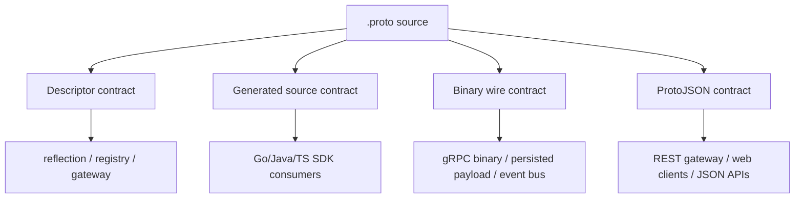
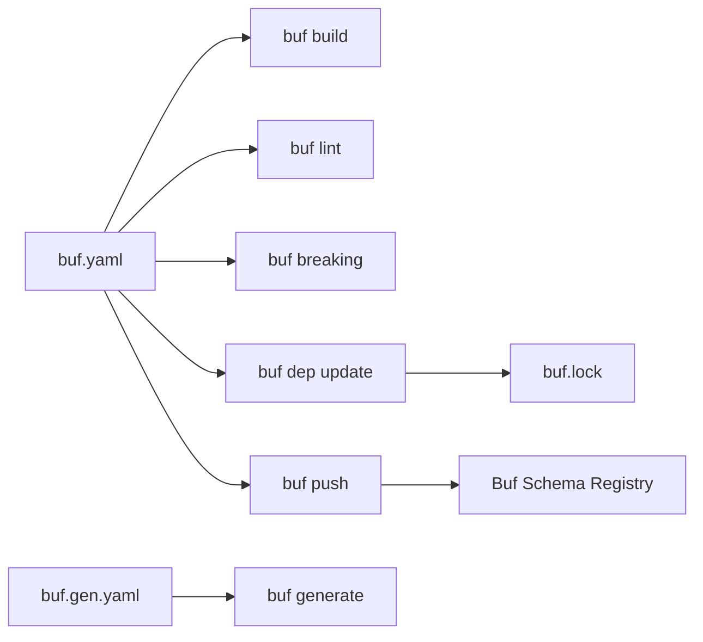
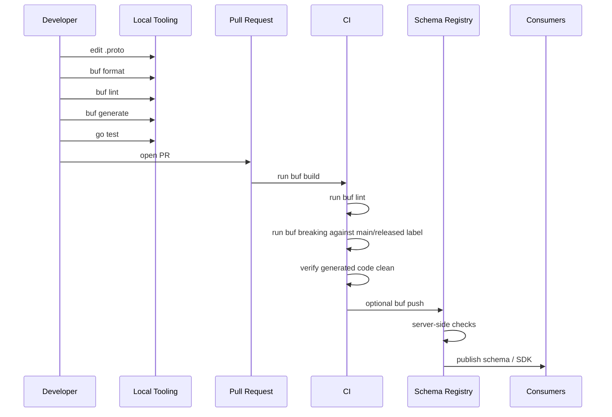
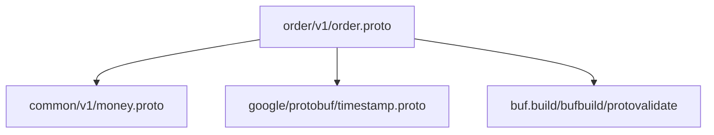
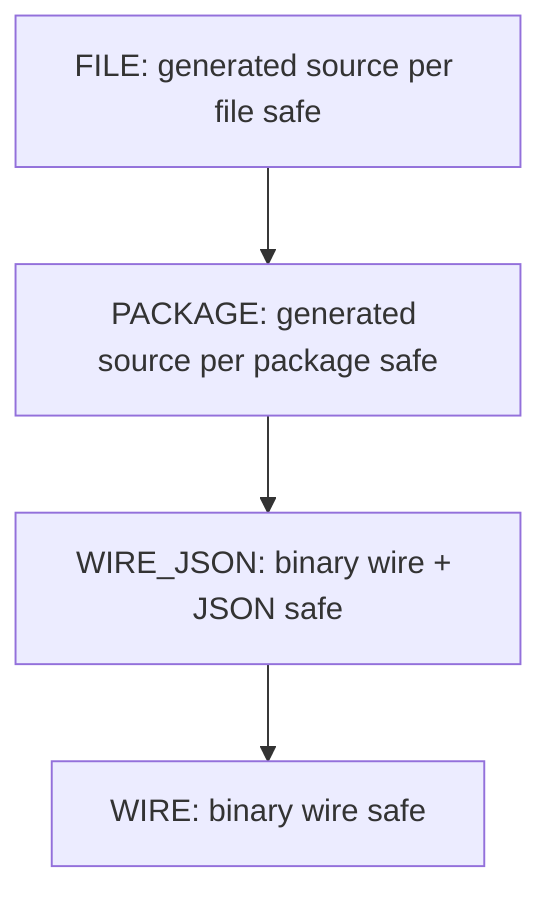
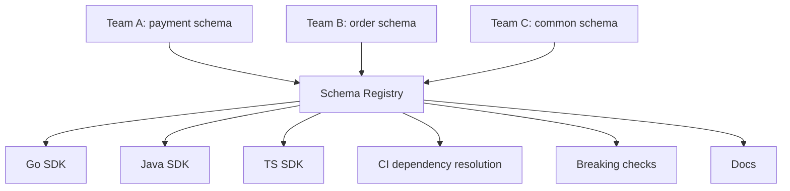
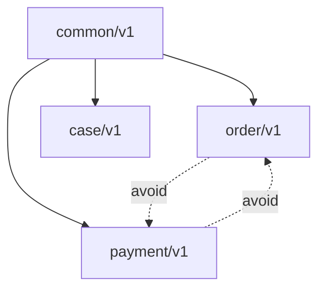

# learn-go-data-mapper-json-xml-protobuf-validation-part-025.md

# Part 025 — Buf, Proto Modules, Linting, and Breaking Change Detection

> Seri: `learn-go-data-mapper-json-xml-protobuf-validation`  
> Bagian: `025 / 033`  
> Topik: Buf, Proto Modules, Linting, Breaking Change Detection, Schema Governance  
> Target pembaca: Java software engineer yang ingin memakai Go + Protobuf secara production-grade  
> Status seri: **belum selesai**

---

## Daftar Isi

1. [Tujuan Pembelajaran](#1-tujuan-pembelajaran)
2. [Masalah Nyata yang Diselesaikan Buf](#2-masalah-nyata-yang-diselesaikan-buf)
3. [Mental Model: `.proto` Bukan File Biasa, Tapi Public Contract](#3-mental-model-proto-bukan-file-biasa-tapi-public-contract)
4. [Perbandingan dengan Java Ecosystem](#4-perbandingan-dengan-java-ecosystem)
5. [Komponen Utama Buf](#5-komponen-utama-buf)
6. [Protobuf Governance Lifecycle](#6-protobuf-governance-lifecycle)
7. [Module, Workspace, Package, File, dan Import](#7-module-workspace-package-file-dan-import)
8. [Recommended Repository Layout untuk Go](#8-recommended-repository-layout-untuk-go)
9. [`buf.yaml`: Source of Truth untuk Workspace dan Policy](#9-bufyaml-source-of-truth-untuk-workspace-dan-policy)
10. [`buf.gen.yaml`: Reproducible Code Generation](#10-bufgenyaml-reproducible-code-generation)
11. [`buf.lock`: Dependency Reproducibility dan Tamper Evidence](#11-buflock-dependency-reproducibility-dan-tamper-evidence)
12. [Linting: Menjaga Schema Tetap Terbaca dan Konsisten](#12-linting-menjaga-schema-tetap-terbaca-dan-konsisten)
13. [Breaking Change Detection: Menjaga Consumer Tidak Rusak](#13-breaking-change-detection-menjaga-consumer-tidak-rusak)
14. [Kategori Breaking Change: FILE, PACKAGE, WIRE_JSON, WIRE](#14-kategori-breaking-change-file-package-wire_json-wire)
15. [Practical Compatibility Matrix](#15-practical-compatibility-matrix)
16. [CI/CD Pipeline untuk Proto Contract](#16-cicd-pipeline-untuk-proto-contract)
17. [Schema Registry Thinking dan Buf Schema Registry](#17-schema-registry-thinking-dan-buf-schema-registry)
18. [Versioning Strategy untuk Protobuf Package](#18-versioning-strategy-untuk-protobuf-package)
19. [Dependency Strategy: Internal, External, dan Google APIs](#19-dependency-strategy-internal-external-dan-google-apis)
20. [Generated Code Governance untuk Go](#20-generated-code-governance-untuk-go)
21. [Managed Mode: Useful, Tapi Jangan Dipakai Tanpa Governance](#21-managed-mode-useful-tapi-jangan-dipakai-tanpa-governance)
22. [Policy Exception: Kapan Boleh Ignore Rule?](#22-policy-exception-kapan-boleh-ignore-rule)
23. [Design Review Checklist untuk Perubahan `.proto`](#23-design-review-checklist-untuk-perubahan-proto)
24. [Anti-Patterns](#24-anti-patterns)
25. [Production Playbook](#25-production-playbook)
26. [Case Study: Order Service Contract Evolution](#26-case-study-order-service-contract-evolution)
27. [Latihan Desain](#27-latihan-desain)
28. [Ringkasan Invariant](#28-ringkasan-invariant)
29. [Referensi](#29-referensi)

---

## 1. Tujuan Pembelajaran

Setelah menyelesaikan bagian ini, kamu harus bisa:

1. Memahami mengapa `.proto` harus diperlakukan sebagai **contract artifact**, bukan sekadar file generator.
2. Mendesain repository Protobuf yang rapi untuk Go service, API gateway, gRPC, event, dan shared schema.
3. Menggunakan Buf untuk:
   - linting,
   - formatting,
   - build validation,
   - code generation,
   - dependency pinning,
   - breaking change detection,
   - CI contract governance.
4. Memilih kategori breaking check yang sesuai:
   - `FILE`,
   - `PACKAGE`,
   - `WIRE_JSON`,
   - `WIRE`.
5. Mengatur lifecycle schema:
   - authoring,
   - review,
   - generation,
   - testing,
   - publication,
   - consumption,
   - deprecation,
   - removal.
6. Menghindari kegagalan production seperti:
   - field number reuse,
   - enum zero value salah,
   - package version kacau,
   - generated code drift,
   - consumer rusak karena rename,
   - wire-compatible tapi source-breaking,
   - binary-compatible tapi ProtoJSON-breaking,
   - dependency schema berubah diam-diam.

---

## 2. Masalah Nyata yang Diselesaikan Buf

Dalam proyek kecil, Protobuf sering terlihat sederhana:

```text
write .proto
run protoc
commit generated file
use generated type
```

Dalam proyek besar, kenyataannya berubah menjadi:

```text
dozens of teams
hundreds of .proto files
multiple languages
old mobile clients
gRPC services
event streams
API gateways
data retention
schema reuse
CI/CD
breaking changes
runtime compatibility
security review
generated code drift
```

Masalahnya bukan lagi “bagaimana generate `.pb.go`”, tapi:

> Bagaimana memastikan schema yang berubah hari ini tidak merusak service, client, event consumer, stored payload, generated SDK, atau governance policy yang sudah berjalan?

Buf membantu di area ini.

Buf bukan hanya pengganti `protoc`. Buf adalah **schema toolchain**.

Ia membantu menjawab pertanyaan:

- Apakah `.proto` ini valid?
- Apakah style-nya konsisten?
- Apakah import path-nya benar?
- Apakah generated code reproducible?
- Apakah dependency schema pinned?
- Apakah perubahan ini breaking?
- Apakah perubahan ini breaking di binary wire format?
- Apakah perubahan ini breaking di ProtoJSON?
- Apakah perubahan ini breaking untuk generated source code consumer?
- Apakah module ini bisa dipublikasi sebagai contract yang aman?

---

## 3. Mental Model: `.proto` Bukan File Biasa, Tapi Public Contract

Dalam Go, kamu mungkin terbiasa melihat file `.go` sebagai implementation artifact.

Dalam Protobuf, file `.proto` harus diperlakukan sebagai:

```text
source code + schema contract + compatibility surface + generated-code instruction
```

### 3.1 `.proto` punya beberapa pembaca

Satu `.proto` bisa dibaca oleh:

| Pembaca | Yang dipedulikan |
|---|---|
| `protoc` / Buf compiler | syntax, import, descriptors |
| Go generator | `go_package`, message/service mapping |
| Java generator | `java_package`, outer class, builders |
| TypeScript generator | JSON/service bindings |
| gRPC runtime | method and message descriptors |
| API gateway | ProtoJSON mapping |
| event consumer | wire format compatibility |
| schema registry | version and dependency |
| reviewer | semantic intent |
| compliance/audit | contract history |
| old clients | backward compatibility |

Kesalahan umum engineer baru di Protobuf governance adalah menganggap `.proto` hanya dibaca oleh generator Go.

Padahal `.proto` adalah **shared boundary**.

### 3.2 Ada empat contract layer



Perubahan `.proto` bisa aman di satu layer tetapi breaking di layer lain.

Contoh:

```proto
message User {
  string full_name = 1;
}
```

Diubah menjadi:

```proto
message User {
  string display_name = 1;
}
```

Dari sudut binary wire format:

```text
field number 1 tetap string
=> binary masih bisa dibaca
```

Dari sudut generated code:

```text
GetFullName() hilang
GetDisplayName() muncul
=> source code consumer rusak
```

Dari sudut ProtoJSON:

```json
{
  "fullName": "Ayu"
}
```

menjadi:

```json
{
  "displayName": "Ayu"
}
```

```text
=> JSON consumer rusak
```

Jadi “tidak breaking” harus selalu dijawab dengan konteks:

> Tidak breaking untuk siapa? Binary consumer? JSON consumer? Generated SDK consumer? Reflection user? Stored payload?

---

## 4. Perbandingan dengan Java Ecosystem

Sebagai Java engineer, analogi berikut membantu.

| Java ecosystem | Go + Protobuf + Buf equivalent |
|---|---|
| Maven multi-module | Buf workspace/modules + Go modules |
| Checkstyle / Spotless | `buf lint`, `buf format` |
| Revapi / japicmp | `buf breaking` |
| OpenAPI Generator | `buf generate` + plugins |
| Maven dependency lock | `buf.lock` + Go module sums |
| Artifact repository | Buf Schema Registry / generated SDK repository |
| Bean Validation annotations | Protovalidate rules / semantic validators |
| Jackson JSON contract | ProtoJSON mapping / explicit JSON API contract |
| JAXB/XSD governance | `.proto` + breaking policy |
| Gradle build task | CI step: lint, breaking, generate, test |

Perbedaan penting:

### 4.1 Java sering framework-first

Di Java, kamu mungkin terbiasa:

```text
annotation
reflection
classpath scanning
codegen plugin
framework configuration
```

Go lebih sering:

```text
explicit files
explicit commands
explicit generated code
explicit package boundaries
explicit CI checks
```

### 4.2 Generated code di Go biasanya dicommit

Dalam banyak Go Protobuf workflow, `.pb.go` ikut dicommit bersama perubahan `.proto`.

Alasannya:

- consumer tidak perlu menjalankan generator saat build normal,
- CI bisa mendeteksi generated code drift,
- review bisa melihat perubahan API Go,
- build lebih reproducible,
- toolchain lebih sederhana untuk contributor.

Tapi ini berarti setiap PR `.proto` harus menjawab:

```text
Apakah generated code sudah sinkron?
Apakah generator version jelas?
Apakah output path stabil?
Apakah import path Go benar?
```

---

## 5. Komponen Utama Buf

Buf memiliki beberapa fungsi besar.



### 5.1 `buf build`

Memvalidasi bahwa workspace `.proto` bisa dibangun menjadi image/descriptor.

Gunakan untuk menjawab:

```text
Apakah semua import resolve?
Apakah schema compile?
Apakah dependency tersedia?
```

### 5.2 `buf lint`

Memvalidasi style dan structural hygiene.

Contoh yang ditangkap:

- package tidak punya version suffix,
- nama message tidak PascalCase,
- nama field tidak lower_snake_case,
- enum zero value tidak `_UNSPECIFIED`,
- service tidak punya suffix yang konsisten,
- import tidak digunakan,
- package/file layout buruk.

### 5.3 `buf format`

Menjaga format file `.proto` konsisten.

Ini mirip `gofmt` untuk `.proto`.

### 5.4 `buf generate`

Menjalankan code generation berdasarkan `buf.gen.yaml`.

Bisa memakai:

- local plugin,
- remote plugin,
- managed mode,
- multiple outputs.

### 5.5 `buf breaking`

Membandingkan schema saat ini dengan schema lama.

Contoh:

```bash
buf breaking --against '.git#branch=main'
```

Ini menjawab:

```text
Apakah perubahan ini merusak consumer berdasarkan policy yang kita pilih?
```

### 5.6 `buf dep update`

Menyelesaikan dependency di `buf.yaml`, lalu menulis exact dependency ke `buf.lock`.

### 5.7 `buf push`

Mempublikasikan module ke Buf Schema Registry bila organisasi memakai BSR.

---

## 6. Protobuf Governance Lifecycle

Schema lifecycle production seharusnya seperti ini:



Minimal production gate:

```bash
buf format --diff --exit-code
buf build
buf lint
buf breaking --against '.git#branch=main'
buf generate
git diff --exit-code
go test ./...
```

Untuk organization-grade schema governance:

```text
local checks
+ PR checks
+ registry checks
+ dependency pinning
+ release label
+ changelog
+ review owner
```

---

## 7. Module, Workspace, Package, File, dan Import

Untuk memakai Buf dengan benar, kamu harus membedakan lima konsep.

| Konsep | Makna |
|---|---|
| Workspace | area kerja lokal yang didefinisikan oleh `buf.yaml` |
| Module | unit schema yang bisa diperlakukan sebagai dependency/published artifact |
| Package | namespace Protobuf, misalnya `acme.order.v1` |
| File | file `.proto`, misalnya `proto/acme/order/v1/order.proto` |
| Import | path ke file `.proto` lain |

### 7.1 Workspace

Workspace adalah kumpulan module yang diproses bersama.

Contoh:

```text
repo/
  buf.yaml
  proto/
    acme/
      order/
        v1/
          order.proto
      payment/
        v1/
          payment.proto
```

### 7.2 Module

Module adalah unit yang bisa:

- punya nama BSR,
- punya dependency,
- punya lint/breaking policy,
- dipublish,
- dipakai sebagai dependency oleh module lain.

### 7.3 Package

Package adalah namespace dalam Protobuf.

```proto
syntax = "proto3";

package acme.order.v1;
```

Untuk API production, package sebaiknya versioned:

```proto
package acme.order.v1;
package acme.order.v2;
```

Bukan:

```proto
package order;
package common;
package api;
```

Nama package yang terlalu generik akan menjadi masalah saat organisasi membesar.

### 7.4 File path

Idealnya file path mencerminkan package:

```text
proto/acme/order/v1/order.proto
```

Dengan isi:

```proto
package acme.order.v1;
```

Ini membuat import lebih predictable:

```proto
import "acme/common/v1/money.proto";
```

### 7.5 Import

Import harus dianggap sebagai dependency contract.

Jika `order.proto` import `money.proto`, maka `order` bergantung pada definisi `Money`.



Jangan biarkan import menjadi spaghetti.

---

## 8. Recommended Repository Layout untuk Go

Ada dua model umum.

---

### 8.1 Single service repository

Cocok untuk satu service yang owner-nya jelas.

```text
order-service/
  buf.yaml
  buf.gen.yaml
  buf.lock
  proto/
    acme/
      order/
        v1/
          order.proto
          order_service.proto
  internal/
    app/
    domain/
    transport/
      grpc/
  gen/
    go/
      acme/
        order/
          v1/
            order.pb.go
            order_grpc.pb.go
  go.mod
```

Kelebihan:

- sederhana,
- service dan schema dekat,
- mudah review,
- cocok untuk bounded context tunggal.

Risiko:

- schema reuse lintas service bisa sulit,
- shared schema rentan copy-paste,
- generated SDK untuk consumer eksternal perlu publish terpisah.

---

### 8.2 Dedicated schema repository

Cocok untuk organisasi dengan banyak service/consumer.

```text
contracts/
  buf.yaml
  buf.gen.yaml
  buf.lock
  proto/
    acme/
      common/
        v1/
          money.proto
          pagination.proto
      order/
        v1/
          order.proto
          order_service.proto
      payment/
        v1/
          payment.proto
          payment_service.proto
  gen/
    go/
  go.mod
```

Kelebihan:

- contract menjadi first-class,
- schema review lebih ketat,
- generated SDK bisa dipublish,
- breaking changes bisa dipusatkan.

Risiko:

- PR workflow lebih berat,
- service implementation harus sinkron dengan contract release,
- terlalu mudah membuat “shared common” yang menjadi dumping ground.

---

### 8.3 Hybrid: internal proto + public contract repo

Untuk sistem besar, pattern yang sering lebih sehat:

```text
public-contracts/
  proto/acme/public/order/v1

order-service/
  proto/acme/internal/order/v1
  internal/domain
  internal/transport
```

Prinsip:

```text
public contract != internal event != persistence model
```

Jangan memaksa semua schema masuk satu dunia yang sama.

---

## 9. `buf.yaml`: Source of Truth untuk Workspace dan Policy

`buf.yaml` mendefinisikan workspace, module, dependency, lint, breaking, plugins, dan policy.

Contoh production-friendly:

```yaml
version: v2

modules:
  - path: proto
    name: buf.build/acme/contracts

deps:
  - buf.build/googleapis/googleapis
  - buf.build/bufbuild/protovalidate

lint:
  use:
    - STANDARD
    - COMMENTS
  except:
    # Gunakan exception hanya bila ada alasan arsitektural yang tercatat.
    # Jangan jadikan except sebagai tempat menyembunyikan technical debt.
    - RPC_REQUEST_RESPONSE_UNIQUE
  enum_zero_value_suffix: _UNSPECIFIED
  service_suffix: Service
  disallow_comment_ignores: true

breaking:
  use:
    - PACKAGE
```

### 9.1 `version: v2`

Gunakan konfigurasi v2 untuk project modern.

### 9.2 `modules`

Satu repo bisa punya satu atau banyak module.

```yaml
modules:
  - path: proto/common
    name: buf.build/acme/common
  - path: proto/order
    name: buf.build/acme/order
```

Tapi jangan membuat terlalu banyak module tanpa alasan ownership.

Pertanyaan sebelum memecah module:

1. Apakah lifecycle release berbeda?
2. Apakah owner berbeda?
3. Apakah dependency consumer berbeda?
4. Apakah breaking policy berbeda?
5. Apakah module ini akan dipublish terpisah?

Jika jawabannya tidak, satu module mungkin cukup.

### 9.3 `deps`

Dependency eksternal:

```yaml
deps:
  - buf.build/googleapis/googleapis
  - buf.build/bufbuild/protovalidate
```

Dependency harus dianggap sebagai supply-chain input.

Karena itu `buf.lock` harus dicommit.

### 9.4 `lint`

`lint.use` menentukan rule set.

Rule set umum:

```yaml
lint:
  use:
    - STANDARD
```

Untuk handbook-level governance, bisa ditambah:

```yaml
lint:
  use:
    - STANDARD
    - COMMENTS
```

Tapi `COMMENTS` bisa terlalu berat jika organisasi belum siap. Gunakan bertahap:

```text
Phase 1: STANDARD
Phase 2: STANDARD + comments untuk service/message
Phase 3: STANDARD + COMMENTS
```

### 9.5 `breaking`

Default Buf jika breaking config omitted adalah `FILE` pada dokumentasi Buf modern. Untuk banyak organisasi Go, `PACKAGE` sering lebih realistis bila consumer bergantung pada package-level generated code, bukan file-level import path.

```yaml
breaking:
  use:
    - PACKAGE
```

Untuk event-only internal binary Protobuf:

```yaml
breaking:
  use:
    - WIRE
```

Untuk REST gateway/ProtoJSON API:

```yaml
breaking:
  use:
    - WIRE_JSON
```

Untuk published SDK multi-language:

```yaml
breaking:
  use:
    - FILE
```

---

## 10. `buf.gen.yaml`: Reproducible Code Generation

`buf.gen.yaml` mengatur output generated code.

Contoh Go + gRPC:

```yaml
version: v2
clean: true

plugins:
  - local: protoc-gen-go
    out: gen/go
    opt:
      - paths=source_relative

  - local: protoc-gen-go-grpc
    out: gen/go
    opt:
      - paths=source_relative
```

### 10.1 `clean: true`

`clean: true` menghapus output target sebelum generate.

Manfaat:

- menghindari stale generated file,
- membuat rename/delete terlihat,
- CI lebih deterministic.

Risiko:

- jika output path terlalu luas, bisa menghapus file non-generated.

Jangan output generated code ke folder campur dengan hand-written code kecuali ada boundary yang jelas.

Buruk:

```text
internal/
  order.pb.go
  handler.go
  mapper.go
```

Lebih baik:

```text
gen/go/
  acme/order/v1/order.pb.go

internal/
  handler.go
  mapper.go
```

Atau jika generated code berada dekat package, pastikan marker jelas.

### 10.2 Local plugin vs remote plugin

Local plugin:

```yaml
plugins:
  - local: protoc-gen-go
    out: gen/go
```

Kelebihan:

- bisa jalan offline,
- kontrol penuh via Go tool install,
- cocok untuk locked devcontainer.

Kekurangan:

- versi plugin harus diatur sendiri.

Remote plugin:

```yaml
plugins:
  - remote: buf.build/protocolbuffers/go
    out: gen/go
```

Kelebihan:

- tidak perlu install plugin lokal,
- versi bisa dikontrol via BSR plugin reference,
- CI lebih mudah konsisten.

Kekurangan:

- bergantung akses network/registry,
- perlu governance bila environment enterprise restricted.

### 10.3 Tool version pinning untuk local plugin

Jika memakai local plugin, jangan hanya tulis:

```bash
go install google.golang.org/protobuf/cmd/protoc-gen-go@latest
```

Untuk project production, pin versi.

Contoh `tools.go`:

```go
//go:build tools

package tools

import (
    _ "google.golang.org/grpc/cmd/protoc-gen-go-grpc"
    _ "google.golang.org/protobuf/cmd/protoc-gen-go"
)
```

Lalu di `go.mod`:

```text
require (
    google.golang.org/grpc/cmd/protoc-gen-go-grpc v1.x.y
    google.golang.org/protobuf v1.x.y
)
```

Dan generate command di Makefile:

```makefile
.PHONY: proto-tools
proto-tools:
	go install google.golang.org/protobuf/cmd/protoc-gen-go
	go install google.golang.org/grpc/cmd/protoc-gen-go-grpc
```

Catatan: `go install` tanpa version akan memakai module version dari current module bila package ada di dependency graph, tetapi untuk reproducibility lebih aman membuat toolchain eksplisit.

### 10.4 Generated code drift check

Setelah `buf generate`, CI harus memastikan tidak ada diff.

```bash
buf generate
git diff --exit-code
```

Jika ada diff, berarti:

- developer lupa generate,
- generator version berbeda,
- config berubah,
- generated output tidak dicommit,
- environment tidak reproducible.

Ini harus fail.

---

## 11. `buf.lock`: Dependency Reproducibility dan Tamper Evidence

`buf.lock` adalah lockfile untuk dependency schema.

Ia berisi dependency direct/transitive yang resolved, termasuk commit dan digest.

Prinsip:

```text
buf.yaml = desired dependency
buf.lock = exact resolved dependency
```

### 11.1 Kapan run `buf dep update`

Run ketika:

- menambah dependency baru,
- menghapus dependency,
- mengubah label/commit dependency,
- ingin mengambil update terbaru dari dependency unpinned.

```bash
buf dep update
```

### 11.2 Kapan run `buf dep prune`

Run ketika:

- dependency sudah tidak dipakai,
- ingin membersihkan lockfile.

```bash
buf dep prune
```

### 11.3 Lockfile harus dicommit

Jangan masukkan `buf.lock` ke `.gitignore`.

Alasannya:

- build reproducible,
- dependency schema tidak berubah diam-diam,
- CI dan local memakai dependency sama,
- digest mismatch bisa mendeteksi perubahan/tampering.

### 11.4 Dependency pinning strategy

Ada tiga mode:

```yaml
deps:
  # latest approved commit on default label
  - buf.build/googleapis/googleapis

  # follow a label
  - buf.build/acme/common:v1.4.0

  # pin exact commit
  - buf.build/acme/payment:5c2f...
```

Pilih berdasarkan risiko.

| Mode | Kapan dipakai |
|---|---|
| unpinned/default label | internal stable module dengan compatibility kuat |
| label | release train, semver-like schema release |
| exact commit | regulated system, reproducible release, high-risk dependency |

Untuk sistem regulasi, finansial, audit, atau government integration, exact or release-label pinning lebih defensible.

---

## 12. Linting: Menjaga Schema Tetap Terbaca dan Konsisten

Linting bukan kosmetik.

Linting adalah **future-readability defense**.

Schema akan dibaca bertahun-tahun oleh engineer yang tidak hadir saat schema dibuat.

### 12.1 Kenapa lint penting?

Tanpa lint, schema akan terfragmentasi:

```proto
message user_profile {}
message UserProfile {}
message USER_PROFILE {}

string userName = 1;
string user_name = 2;
string UserName = 3;

enum Status {
  ACTIVE = 0;
  DISABLED = 1;
}
```

Masalah:

- generator bahasa berbeda punya naming convention berbeda,
- enum default salah,
- JSON name bisa membingungkan,
- package/version tidak jelas,
- review sulit,
- breaking detection lebih sulit dipahami.

### 12.2 Rule hierarchy Buf

Buf memiliki rule set bertingkat:

```text
MINIMAL < BASIC < STANDARD
```

Secara praktis:

| Rule set | Makna |
|---|---|
| `MINIMAL` | hygiene minimum supaya tooling tidak bermasalah |
| `BASIC` | style umum Protobuf |
| `STANDARD` | baseline rekomendasi Buf untuk development baru |
| `COMMENTS` | memaksa dokumentasi schema element |
| `UNARY_RPC` | membatasi RPC ke unary-only |

Untuk project baru:

```yaml
lint:
  use:
    - STANDARD
```

Untuk public contract:

```yaml
lint:
  use:
    - STANDARD
    - COMMENTS
```

Untuk organisasi yang tidak mau streaming RPC:

```yaml
lint:
  use:
    - STANDARD
    - UNARY_RPC
```

### 12.3 Enum zero value

Protobuf enum default adalah nilai 0.

Karena itu enum zero value harus mewakili unknown/unspecified.

Baik:

```proto
enum OrderStatus {
  ORDER_STATUS_UNSPECIFIED = 0;
  ORDER_STATUS_PENDING = 1;
  ORDER_STATUS_CONFIRMED = 2;
  ORDER_STATUS_CANCELLED = 3;
}
```

Buruk:

```proto
enum OrderStatus {
  ORDER_STATUS_PENDING = 0;
  ORDER_STATUS_CONFIRMED = 1;
}
```

Kenapa buruk?

Karena jika field enum absent, default-nya menjadi `PENDING`.

Itu mencampur:

```text
not provided
unknown
default
actual pending
```

Dalam sistem enforcement/case management/regulatory workflow, ini bisa menjadi bug audit serius.

### 12.4 Package version suffix

Baik:

```proto
package acme.order.v1;
```

Buruk:

```proto
package acme.order;
```

Version suffix membantu:

- major version coexistence,
- migration bertahap,
- client memilih versi,
- breaking change dikelola eksplisit.

### 12.5 Service suffix

Baik:

```proto
service OrderService {
  rpc GetOrder(GetOrderRequest) returns (GetOrderResponse);
}
```

Buruk:

```proto
service Order {
  rpc Get(GetReq) returns (GetResp);
}
```

Nama service/message harus dibaca sebagai public API.

---

## 13. Breaking Change Detection: Menjaga Consumer Tidak Rusak

Breaking change detection adalah inti governance.

Buf membandingkan current schema dengan baseline.

Baseline bisa:

- branch Git,
- tag Git,
- BSR module,
- tarball,
- Buf image.

Contoh lokal:

```bash
buf breaking --against '.git#branch=main'
```

Contoh release tag:

```bash
buf breaking --against '.git#tag=v1.3.0'
```

Contoh BSR:

```bash
buf breaking --against buf.build/acme/contracts
```

### 13.1 Kenapa tidak cukup review manual?

Karena reviewer sering melihat nama field, bukan wire identity.

Contoh:

```proto
message User {
  int32 id = 1;
}
```

Diubah menjadi:

```proto
message User {
  string id = 1;
}
```

Secara visual terlihat “masih id”.

Tapi wire type berubah.

Akibatnya:

- payload lama tidak bisa dibaca dengan benar,
- client lama rusak,
- stored event bisa gagal decode,
- data corruption mungkin terjadi.

Breaking detector melihat field number `1`, type berubah dari `int32` ke `string`.

### 13.2 Baseline yang benar

Jangan selalu compare ke `main` jika release belum publish.

Ada beberapa model.

#### Model A — trunk-based internal service

```bash
buf breaking --against '.git#branch=main'
```

Cocok bila `main` selalu menjadi consumer baseline.

#### Model B — public release contract

```bash
buf breaking --against '.git#tag=contracts-v1.8.0'
```

Cocok bila public consumers hanya memakai release tag.

#### Model C — schema registry

```bash
buf breaking --against buf.build/acme/contracts:v1.8.0
```

Cocok bila BSR menjadi source of truth.

#### Model D — multi-baseline

Untuk regulated systems, kadang perlu compare dengan beberapa baseline:

```bash
buf breaking --against '.git#tag=contracts-v1.7.0'
buf breaking --against '.git#tag=contracts-v1.8.0'
buf breaking --against '.git#tag=contracts-v1.9.0'
```

Ini penting jika masih ada old consumers yang belum upgrade.

---

## 14. Kategori Breaking Change: FILE, PACKAGE, WIRE_JSON, WIRE

Buf mendukung kategori breaking check.

Urutan ketat ke longgar:

```text
FILE > PACKAGE > WIRE_JSON > WIRE
```



### 14.1 `FILE`

Paling ketat.

Menangkap perubahan yang merusak generated source code secara file-level.

Gunakan bila:

- generated code dipublish sebagai SDK,
- consumer mengandalkan file/import layout,
- multi-language SDK,
- public API contract,
- enterprise shared library.

Contoh perubahan yang bisa dianggap breaking di `FILE`:

- message pindah file,
- file deleted,
- package/file layout berubah,
- rename field/message,
- perubahan yang memengaruhi generated source.

### 14.2 `PACKAGE`

Masih menjaga generated source compatibility, tapi lebih longgar dari `FILE`.

Gunakan bila:

- consumer mengimport package, bukan file-level artifact,
- internal monorepo,
- Go package-level generated code stabil,
- moving definition antar file dalam package masih acceptable.

Untuk banyak Go project internal, `PACKAGE` adalah default praktis.

### 14.3 `WIRE_JSON`

Menjaga binary wire dan JSON mapping.

Gunakan bila:

- schema dipakai lewat gRPC binary dan JSON gateway,
- REST API memakai ProtoJSON,
- external clients mengirim/menerima JSON,
- field/enum names penting.

Contoh:

```proto
string full_name = 1;
```

rename menjadi:

```proto
string display_name = 1;
```

Binary wire masih aman, tapi JSON field berubah:

```json
{"fullName": "..."}
```

menjadi:

```json
{"displayName": "..."}
```

`WIRE_JSON` harus menangkap risiko ini.

### 14.4 `WIRE`

Paling longgar.

Hanya menjaga binary wire compatibility.

Gunakan bila:

- schema hanya dipakai untuk binary Protobuf,
- tidak ada generated SDK public compatibility,
- tidak ada ProtoJSON clients,
- consumer hanya peduli field number/type wire-level.

Contoh internal event binary:

```text
Kafka topic value = protobuf binary
No public generated SDK guarantee
No JSON gateway
```

Maka `WIRE` mungkin cukup.

Tapi hati-hati: bila generated Go type dipakai oleh package lain, `WIRE` terlalu longgar.

### 14.5 Decision table

| Scenario | Recommended category |
|---|---|
| Public SDK multi-language | `FILE` |
| Internal shared Go package | `PACKAGE` |
| gRPC + REST/JSON gateway | `WIRE_JSON` or stricter |
| Binary event payload only | `WIRE` |
| Regulated public API | `FILE` + manual review |
| Mobile clients consuming JSON | `WIRE_JSON` or `FILE` |
| Stored Protobuf payload years long | `WIRE` + reserved discipline |
| Generated code consumed by external repo | `PACKAGE` or `FILE` |

---

## 15. Practical Compatibility Matrix

### 15.1 Field changes

| Change | Binary wire | ProtoJSON | Generated source | Recommendation |
|---|---:|---:|---:|---|
| Add new field number | usually safe | usually safe | usually safe | OK |
| Delete field without reserved | dangerous | dangerous | breaking | Avoid |
| Delete field with reserved | safer after migration | breaking for source | breaking | Deprecate first |
| Rename field | binary safe | breaking | breaking | Avoid unless major version |
| Change field number | breaking | breaking | breaking | Never |
| Reuse old field number | catastrophic | catastrophic | catastrophic | Never |
| Change `int32` to `int64` | often unsafe/semantic risk | risk | source change | Avoid |
| Change `int32` to `string` | breaking | breaking | breaking | Never in-place |
| Change `optional string` to `string` | presence break | JSON risk | source break | Avoid |
| Move field into `oneof` | presence/JSON/source risk | risk | breaking | Avoid in-place |
| Add new enum value | binary usually safe | client may fail | source usually ok | OK with unknown handling |
| Rename enum value | binary safe | JSON breaking | source breaking | Avoid |
| Change enum number | breaking | breaking | breaking | Never |

### 15.2 Service changes

| Change | Compatibility |
|---|---|
| Add RPC | usually safe |
| Delete RPC | breaking |
| Rename RPC | breaking |
| Change request type | breaking |
| Change response type | breaking |
| Add field to request | usually safe |
| Add required semantic validation to old optional field | can be breaking behavior |
| Change error model | can be breaking behavior |
| Change idempotency semantics | breaking operationally |
| Change pagination semantics | breaking behavior |

Buf detects schema-level breaking changes. It does not know all semantic/business behavior changes.

Example:

```proto
message SearchRequest {
  string query = 1;
  int32 page_size = 2;
}
```

Changing server behavior from default `page_size=50` to `page_size=10` is not a Protobuf breaking change, but it is API behavior drift.

So production governance needs both:

```text
buf breaking
+ API semantic review
+ release note
+ compatibility tests
```

---

## 16. CI/CD Pipeline untuk Proto Contract

### 16.1 Makefile baseline

```makefile
.PHONY: proto-format
proto-format:
	buf format -w

.PHONY: proto-format-check
proto-format-check:
	buf format --diff --exit-code

.PHONY: proto-build
proto-build:
	buf build

.PHONY: proto-lint
proto-lint:
	buf lint

.PHONY: proto-breaking
proto-breaking:
	buf breaking --against '.git#branch=main'

.PHONY: proto-generate
proto-generate:
	buf generate

.PHONY: proto-check
proto-check: proto-format-check proto-build proto-lint proto-breaking proto-generate
	git diff --exit-code
```

### 16.2 GitHub Actions example

```yaml
name: proto-contract

on:
  pull_request:
    paths:
      - "proto/**"
      - "buf.yaml"
      - "buf.gen.yaml"
      - "buf.lock"
      - "go.mod"
      - "go.sum"

jobs:
  proto:
    runs-on: ubuntu-latest

    steps:
      - uses: actions/checkout@v4
        with:
          fetch-depth: 0

      - uses: bufbuild/buf-action@v1
        with:
          setup_only: true

      - uses: actions/setup-go@v5
        with:
          go-version-file: go.mod

      - name: Install protobuf plugins
        run: |
          go install google.golang.org/protobuf/cmd/protoc-gen-go
          go install google.golang.org/grpc/cmd/protoc-gen-go-grpc

      - name: Format check
        run: buf format --diff --exit-code

      - name: Build proto
        run: buf build

      - name: Lint proto
        run: buf lint

      - name: Breaking check
        run: buf breaking --against '.git#branch=main'

      - name: Generate
        run: buf generate

      - name: Check generated files
        run: git diff --exit-code

      - name: Go test
        run: go test ./...
```

### 16.3 GitLab CI sketch

```yaml
proto_contract:
  image: golang:1.26
  stage: test
  before_script:
    - go install github.com/bufbuild/buf/cmd/buf@vX.Y.Z
    - go install google.golang.org/protobuf/cmd/protoc-gen-go@vX.Y.Z
    - go install google.golang.org/grpc/cmd/protoc-gen-go-grpc@vX.Y.Z
  script:
    - buf format --diff --exit-code
    - buf build
    - buf lint
    - buf breaking --against ".git#branch=main"
    - buf generate
    - git diff --exit-code
    - go test ./...
```

### 16.4 Common CI failure interpretation

| Failure | Meaning |
|---|---|
| `buf build` fails | syntax/import/dependency invalid |
| `buf lint` fails | style/policy violation |
| `buf breaking` fails | compatibility risk |
| `git diff --exit-code` fails after generate | generated code drift |
| `go test` fails | downstream code not compatible with generated changes |
| `buf dep update` changes lockfile unexpectedly | dependency drift or update required |

---

## 17. Schema Registry Thinking dan Buf Schema Registry

Schema registry bukan hanya tempat upload file.

Ia adalah:

```text
shared contract catalog
+ dependency resolver
+ compatibility gate
+ documentation surface
+ audit trail
+ release coordination point
```

### 17.1 Kapan butuh registry?

Tidak semua tim perlu BSR sejak hari pertama.

Butuh registry jika:

- banyak service memakai schema yang sama,
- banyak language consumer,
- schema dipublish sebagai SDK,
- dependency schema lintas repo,
- butuh ownership/visibility/audit,
- breaking policy perlu enforced server-side,
- release label perlu dikelola.

Belum tentu butuh registry jika:

- satu service kecil,
- `.proto` hanya internal,
- tidak ada consumer eksternal,
- schema tidak reusable,
- repo tunggal cukup.

### 17.2 Registry sebagai control plane



### 17.3 Server-side checks

Local CI bagus, tapi tidak cukup.

Kenapa?

- developer bisa bypass local check,
- CI config bisa salah,
- repo berbeda punya policy berbeda,
- branch protection bisa kurang,
- dependency consumer butuh registry-level assurance.

Server-side check memberi lapisan tambahan:

```text
a schema cannot be published unless it passes policy
```

### 17.4 Labels dan release channel

Registry biasanya butuh label seperti:

```text
main
stable
v1.2.0
staging
experimental
```

Gunakan label dengan disiplin.

Jangan semua consumer mengambil `latest` tanpa sadar.

Untuk regulated/high-risk systems:

```text
consumer dependencies should point to release label or exact commit
```

---

## 18. Versioning Strategy untuk Protobuf Package

### 18.1 Package versioning

Protobuf package sebaiknya memakai major version:

```proto
package acme.order.v1;
```

Untuk breaking change besar:

```proto
package acme.order.v2;
```

Jangan mengubah `v1` secara breaking lalu berharap semua consumer ikut.

### 18.2 File path versioning

Path harus mengikuti package:

```text
proto/acme/order/v1/order.proto
proto/acme/order/v2/order.proto
```

### 18.3 Service versioning

Ada dua pola.

#### Pola A — package-level version

```proto
package acme.order.v1;

service OrderService {}
```

Untuk v2:

```proto
package acme.order.v2;

service OrderService {}
```

Kelebihan:

- service name tetap bersih,
- version ada di package.

#### Pola B — service-name version

```proto
service OrderV1Service {}
service OrderV2Service {}
```

Biasanya kurang ideal kecuali ada alasan gateway/routing.

### 18.4 Message versioning

Jangan version setiap message tanpa alasan.

Buruk:

```proto
message OrderV1 {}
message CreateOrderRequestV1 {}
message CreateOrderResponseV1 {}
```

Lebih baik:

```proto
package acme.order.v1;

message Order {}
message CreateOrderRequest {}
message CreateOrderResponse {}
```

### 18.5 Minor evolution di v1

Safe changes di v1:

- tambah optional field baru,
- tambah enum value baru dengan unknown handling,
- tambah RPC baru,
- tambah message baru,
- tambah comment/docs,
- tambah validation yang hanya memperketat field baru.

Risky changes di v1:

- rename field,
- rename enum,
- delete field,
- ganti type,
- reuse field number,
- ubah semantic default,
- ubah unit field,
- ubah timezone semantic,
- ubah pagination behavior,
- tambah validation wajib ke field lama.

---

## 19. Dependency Strategy: Internal, External, dan Google APIs

### 19.1 Jangan copy well-known types

Jangan vendor:

```text
google/protobuf/timestamp.proto
google/protobuf/any.proto
google/protobuf/duration.proto
```

Well-known types sudah bagian dari Protobuf runtime.

Import langsung:

```proto
import "google/protobuf/timestamp.proto";
```

### 19.2 Google APIs dependency

Jika memakai annotations seperti HTTP mapping:

```proto
import "google/api/annotations.proto";
```

Maka module dependency diperlukan:

```yaml
deps:
  - buf.build/googleapis/googleapis
```

### 19.3 Protovalidate dependency

Jika memakai Protovalidate:

```proto
import "buf/validate/validate.proto";
```

Maka:

```yaml
deps:
  - buf.build/bufbuild/protovalidate
```

### 19.4 Internal common schema

Common schema harus sangat hati-hati.

Contoh common yang masuk akal:

```text
Money
Pagination
LocalizedText
AuditActor
Identifier
TimestampRange
```

Common yang berbahaya:

```text
CommonRequest
CommonResponse
BaseEntity
GenericStatus
Metadata
Payload
```

Kenapa?

Karena common yang terlalu generik menjadi coupling magnet.

### 19.5 Dependency direction

Ideal:



Sebenarnya panah dependency adalah dari service domain ke common:

```text
order imports common
payment imports common
```

Jangan biarkan peer domain saling import tanpa alasan kuat.

Buruk:

```text
order imports payment
payment imports order
case imports order
order imports case
```

Ini menciptakan schema coupling.

---

## 20. Generated Code Governance untuk Go

Generated Go code adalah API surface juga.

### 20.1 `go_package` harus benar

Contoh:

```proto
option go_package = "github.com/acme/contracts/gen/go/acme/order/v1;orderv1";
```

`go_package` mengontrol import path dan package alias Go.

Jika salah, consumer akan mengalami:

- import path jelek,
- package name conflict,
- module path drift,
- generated code tidak bisa digunakan dengan stabil.

### 20.2 Managed mode bisa mengurangi boilerplate

Buf managed mode dapat mengatur beberapa file/field options seperti `go_package_prefix`.

Tapi untuk organisasi besar, kamu harus tahu siapa yang mengontrol output.

Tanpa governance, managed mode bisa membuat perubahan generated path massal.

### 20.3 Jangan expose generated type sebagai domain model

Ini sudah dibahas di part sebelumnya, tapi penting dalam konteks generated code governance.

Buruk:

```go
func (s *Service) Approve(ctx context.Context, order *orderv1.Order) error {
    order.Status = orderv1.OrderStatus_ORDER_STATUS_APPROVED
    return s.repo.Save(ctx, order)
}
```

Lebih baik:

```go
func (s *Service) Approve(ctx context.Context, id domain.OrderID) error {
    order, err := s.repo.Get(ctx, id)
    if err != nil {
        return err
    }
    order.Approve()
    return s.repo.Save(ctx, order)
}
```

Mapper boundary:

```go
func ToProtoOrder(o domain.Order) *orderv1.Order {
    return &orderv1.Order{
        Id:     string(o.ID),
        Status: ToProtoOrderStatus(o.Status),
    }
}
```

### 20.4 Generated code drift as red flag

Jika generated code berubah padahal `.proto` tidak berubah:

Kemungkinan:

- generator version berubah,
- plugin config berubah,
- managed mode berubah,
- import path berubah,
- non-deterministic generation,
- stale generated file sebelumnya.

Ini harus diinvestigasi, bukan langsung dicommit tanpa review.

### 20.5 Go Opaque API impact

Dengan Go Protobuf Opaque API, jangan bergantung pada struct field langsung.

Lebih aman membiasakan accessor/builders:

```go
id := msg.GetId()
```

Daripada:

```go
id := msg.Id
```

Ini mengurangi coupling pada representation generated code.

---

## 21. Managed Mode: Useful, Tapi Jangan Dipakai Tanpa Governance

Managed mode di Buf dapat mengisi/mengoverride option tertentu saat generate.

Contoh:

```yaml
version: v2
managed:
  enabled: true
  override:
    - file_option: go_package_prefix
      value: github.com/acme/contracts/gen/go
plugins:
  - remote: buf.build/protocolbuffers/go
    out: gen/go
    opt:
      - paths=source_relative
```

### 21.1 Kapan managed mode berguna?

- banyak `.proto` lintas language,
- ingin menghindari copy-paste `go_package`,
- ingin centralize generation policy,
- ingin enforce consistent package prefix.

### 21.2 Risiko managed mode

- generated import path bisa berubah massal,
- option eksplisit di `.proto` bisa tidak lagi jadi source of truth,
- engineer baru bingung karena `.proto` tidak menunjukkan semua behavior,
- multi-language output bisa terpengaruh.

### 21.3 Governance rule

Jika memakai managed mode:

1. Dokumentasikan di `CONTRIBUTING.md`.
2. Pin plugin version.
3. Wajib `git diff` check.
4. Jangan campur manual option dan managed override tanpa alasan.
5. Tambahkan owner review untuk perubahan `buf.gen.yaml`.

---

## 22. Policy Exception: Kapan Boleh Ignore Rule?

Exception kadang perlu.

Tapi exception harus dianggap sebagai **risk acceptance**, bukan convenience.

### 22.1 Jenis exception

Di `buf.yaml`:

```yaml
lint:
  except:
    - SOME_RULE

  ignore:
    - proto/legacy

  ignore_only:
    ENUM_ZERO_VALUE_SUFFIX:
      - proto/legacy/status.proto
```

### 22.2 Rule of thumb

Gunakan exception dengan urutan preferensi:

1. Perbaiki schema.
2. Jika tidak bisa, isolate di package legacy.
3. Jika tidak bisa, `ignore_only` untuk rule spesifik dan file spesifik.
4. Jika tidak bisa, `ignore` satu folder legacy.
5. Hindari `except` global.

### 22.3 Exception record

Setiap exception harus punya alasan.

Contoh `docs/proto-policy-exceptions.md`:

```md
# Proto Policy Exceptions

## proto/legacy/payment/v1/status.proto

Rule:
- ENUM_ZERO_VALUE_SUFFIX

Reason:
- Schema imported from external provider.
- Cannot change enum names without breaking provider compatibility.

Owner:
- Payment Platform Team

Review date:
- 2026-12-31

Mitigation:
- Mapper normalizes external status into internal domain enum.
```

### 22.4 Jangan pakai comment ignore sembarangan

Jika comment ignore diizinkan, developer bisa melewati governance lokal.

Untuk organisasi mature:

```yaml
lint:
  disallow_comment_ignores: true
```

Tapi jika migrasi legacy, boleh sementara:

```yaml
lint:
  disallow_comment_ignores: false
```

Dengan review.

---

## 23. Design Review Checklist untuk Perubahan `.proto`

Sebelum approve PR `.proto`, cek ini.

### 23.1 Identity and ownership

- [ ] Package name jelas dan versioned?
- [ ] Owner schema jelas?
- [ ] File path sesuai package?
- [ ] `go_package`/managed mode benar?
- [ ] Message/service berada di bounded context yang benar?

### 23.2 Field design

- [ ] Field number baru tidak reuse?
- [ ] Field number tidak berubah?
- [ ] Field name lower_snake_case?
- [ ] Field type paling sempit tapi future-safe?
- [ ] Unit jelas? Misalnya cents, nanos, seconds, ISO code.
- [ ] Timezone semantic jelas?
- [ ] Optionality jelas?
- [ ] Presence dibutuhkan? Jika ya, gunakan `optional` atau wrapper/FieldMask sesuai konteks.
- [ ] Repeated field punya ordering semantic yang jelas?
- [ ] Map field tidak dipakai jika order penting?

### 23.3 Enum design

- [ ] Zero value adalah `_UNSPECIFIED`?
- [ ] Enum names prefixed?
- [ ] Unknown/future enum handling jelas?
- [ ] Tidak rename enum value lama?
- [ ] Tidak reuse enum number?
- [ ] Reserved untuk deleted enum values?

### 23.4 Service/API design

- [ ] Request/Response message tidak shared secara berbahaya?
- [ ] RPC name action-oriented dan jelas?
- [ ] Idempotency semantic jelas?
- [ ] Pagination/filtering/sorting jelas?
- [ ] Error model jelas?
- [ ] Authn/authz semantic tidak disembunyikan di comment saja?
- [ ] Backward compatibility diperiksa?

### 23.5 Evolution

- [ ] `buf breaking` pass?
- [ ] Jika breaking, ada v2 package?
- [ ] Jika field deprecated, ada migration plan?
- [ ] Jika deletion, field number/name masuk `reserved`?
- [ ] Release note disiapkan?
- [ ] Consumer impact diketahui?

### 23.6 Generated code

- [ ] `buf generate` sudah dijalankan?
- [ ] Generated code diff masuk akal?
- [ ] Go tests pass?
- [ ] Consumer compile test pass?
- [ ] No generated file stale?

---

## 24. Anti-Patterns

### 24.1 `proto/common.proto` sebagai dumping ground

Buruk:

```text
proto/common.proto
```

Isi:

```proto
message CommonRequest {}
message CommonResponse {}
message Metadata {}
message Status {}
message Payload {}
```

Masalah:

- ownership tidak jelas,
- semua service bergantung ke common,
- perubahan common jadi high-risk,
- breaking check jadi ribut,
- konsep domain hilang.

Lebih baik:

```text
proto/acme/common/v1/money.proto
proto/acme/common/v1/pagination.proto
proto/acme/common/v1/audit.proto
```

### 24.2 Reuse request/response message antar RPC

Buruk:

```proto
message OrderRequest {
  string id = 1;
  string user_id = 2;
  string note = 3;
}

service OrderService {
  rpc CreateOrder(OrderRequest) returns (OrderResponse);
  rpc CancelOrder(OrderRequest) returns (OrderResponse);
}
```

Masalah:

- field `note` relevan untuk cancel, bukan create,
- validation berbeda,
- evolution satu RPC memengaruhi RPC lain.

Lebih baik:

```proto
message CreateOrderRequest {
  string user_id = 1;
}

message CancelOrderRequest {
  string order_id = 1;
  string reason = 2;
}
```

### 24.3 Menganggap `buf breaking` menggantikan design review

`buf breaking` hanya mendeteksi sebagian risk.

Ia tidak tahu:

- business semantic berubah,
- field meaning berubah,
- unit berubah,
- default behavior berubah,
- authorization berubah,
- latency contract berubah,
- pagination semantics berubah.

Contoh tidak terdeteksi sebagai schema breaking:

```proto
int64 amount = 1;
```

Sebelumnya unit cents, sekarang unit rupiah.

Wire schema sama. Meaning rusak total.

### 24.4 Field number reuse

Salah satu dosa terbesar.

Buruk:

```proto
message User {
  reserved 2;
  string email = 1;
  string phone_number = 2; // jangan
}
```

Jika field 2 dulu pernah berarti `national_id`, data lama bisa dibaca sebagai `phone_number`.

### 24.5 Rename untuk “merapikan”

Buruk:

```proto
string customer_name = 1;
```

diubah menjadi:

```proto
string applicant_name = 1;
```

Secara business mungkin lebih akurat, tapi:

- generated code berubah,
- ProtoJSON berubah,
- docs berubah,
- consumers rusak.

Jika perlu semantic baru, tambahkan field baru dan deprecate lama.

### 24.6 Menghapus field lama terlalu cepat

Buruk:

```proto
// v1.2
string legacy_code = 4;

// v1.3
// deleted
```

Lebih aman:

```proto
// v1.3
string legacy_code = 4 [deprecated = true];

// v2
reserved 4;
reserved "legacy_code";
```

### 24.7 Tidak punya baseline breaking check

Jika PR compare ke HEAD yang salah atau shallow clone tidak punya `main`, breaking check bisa tidak efektif.

Pastikan CI checkout punya history cukup:

```yaml
fetch-depth: 0
```

### 24.8 Generate code di local tapi tidak di CI

Jika CI tidak run `buf generate` + diff check, generated code drift akan masuk.

### 24.9 Menggunakan `latest` untuk semua tool

Buruk:

```bash
go install google.golang.org/protobuf/cmd/protoc-gen-go@latest
go install github.com/bufbuild/buf/cmd/buf@latest
```

Dalam production, toolchain harus pinned.

---

## 25. Production Playbook

### 25.1 Minimum viable proto governance

Untuk team kecil:

```text
buf.yaml
buf.gen.yaml
buf.lock
buf format
buf lint
buf generate
git diff check
go test
```

### 25.2 Mature internal service governance

Tambahkan:

```text
buf breaking --against main
package versioning
reserved discipline
review checklist
owner approval
contract changelog
```

### 25.3 Organization-grade governance

Tambahkan:

```text
schema registry
server-side checks
release labels
dependency pinning
generated SDK release
consumer compatibility tests
deprecation calendar
exception registry
```

### 25.4 Regulated/high-risk governance

Tambahkan:

```text
multi-baseline breaking check
approved release labels only
audit trail
schema review board
semantic compatibility review
manual sign-off for exceptions
consumer inventory
migration plan
rollback plan
```

### 25.5 Suggested command bundle

```bash
set -euo pipefail

buf format --diff --exit-code
buf build
buf lint
buf breaking --against '.git#branch=main'
buf generate
git diff --exit-code
go test ./...
```

### 25.6 Suggested PR template

```md
## Proto Contract Change

### Type of change
- [ ] Additive non-breaking
- [ ] Deprecation
- [ ] Breaking but versioned via new package
- [ ] Breaking exception requested

### Consumer impact
Describe affected consumers.

### Compatibility
- [ ] `buf breaking` passed
- [ ] Generated code updated
- [ ] Go tests passed
- [ ] Consumer compile tests passed if applicable

### Evolution plan
If deprecating/replacing fields, describe migration and removal timeline.

### Field number discipline
- [ ] No field number reused
- [ ] Deleted fields reserved
- [ ] Deleted enum numbers/names reserved

### Semantic review
- [ ] Units unchanged or documented
- [ ] Default behavior unchanged or documented
- [ ] Validation change reviewed
- [ ] Error behavior reviewed
```

---

## 26. Case Study: Order Service Contract Evolution

### 26.1 Initial schema

```proto
syntax = "proto3";

package acme.order.v1;

option go_package = "github.com/acme/contracts/gen/go/acme/order/v1;orderv1";

import "google/protobuf/timestamp.proto";

service OrderService {
  rpc GetOrder(GetOrderRequest) returns (GetOrderResponse);
}

message GetOrderRequest {
  string order_id = 1;
}

message GetOrderResponse {
  Order order = 1;
}

message Order {
  string id = 1;
  string customer_id = 2;
  int64 total_amount_cents = 3;
  string currency_code = 4;
  OrderStatus status = 5;
  google.protobuf.Timestamp created_at = 6;
}

enum OrderStatus {
  ORDER_STATUS_UNSPECIFIED = 0;
  ORDER_STATUS_PENDING = 1;
  ORDER_STATUS_PAID = 2;
  ORDER_STATUS_CANCELLED = 3;
}
```

### 26.2 Safe addition

Need add `merchant_id`.

```proto
message Order {
  string id = 1;
  string customer_id = 2;
  int64 total_amount_cents = 3;
  string currency_code = 4;
  OrderStatus status = 5;
  google.protobuf.Timestamp created_at = 6;
  string merchant_id = 7;
}
```

This is generally safe.

But semantic questions remain:

- Is it always present for old orders?
- Should old payload produce empty string?
- Should new API expose it as optional?
- Do old consumers ignore it?
- Do JSON clients tolerate new field?

### 26.3 Dangerous rename

Someone wants to rename:

```proto
string customer_id = 2;
```

to:

```proto
string buyer_id = 2;
```

Binary wire:

```text
field 2 remains string
```

But Go generated source changes:

```go
GetCustomerId()
```

to:

```go
GetBuyerId()
```

ProtoJSON changes:

```json
{"customerId": "..."}
```

to:

```json
{"buyerId": "..."}
```

Better migration:

```proto
message Order {
  string id = 1;

  // Deprecated: use buyer_id.
  string customer_id = 2 [deprecated = true];

  int64 total_amount_cents = 3;
  string currency_code = 4;
  OrderStatus status = 5;
  google.protobuf.Timestamp created_at = 6;
  string merchant_id = 7;

  string buyer_id = 8;
}
```

Then mapper can fill both during migration.

### 26.4 Removing field

After all consumers migrate, in v2:

```proto
package acme.order.v2;

message Order {
  string id = 1;
  reserved 2;
  reserved "customer_id";

  int64 total_amount_cents = 3;
  string currency_code = 4;
  OrderStatus status = 5;
  google.protobuf.Timestamp created_at = 6;
  string merchant_id = 7;
  string buyer_id = 8;
}
```

Do not reuse field 2.

### 26.5 CI config

`buf.yaml`:

```yaml
version: v2

modules:
  - path: proto
    name: buf.build/acme/order

deps:
  - buf.build/googleapis/googleapis

lint:
  use:
    - STANDARD
  enum_zero_value_suffix: _UNSPECIFIED
  service_suffix: Service

breaking:
  use:
    - PACKAGE
```

`buf.gen.yaml`:

```yaml
version: v2
clean: true

plugins:
  - local: protoc-gen-go
    out: gen/go
    opt:
      - paths=source_relative

  - local: protoc-gen-go-grpc
    out: gen/go
    opt:
      - paths=source_relative
```

Command:

```bash
buf format -w
buf lint
buf breaking --against '.git#branch=main'
buf generate
go test ./...
```

---

## 27. Latihan Desain

### Latihan 1 — Tentukan breaking category

Kamu punya Protobuf schema untuk Kafka binary events.

- Tidak ada JSON gateway.
- Consumer memakai generated Go code internal.
- Event payload disimpan 3 tahun.
- Beberapa consumer compile langsung terhadap generated module.

Pertanyaan:

1. Apakah `WIRE` cukup?
2. Apakah `PACKAGE` lebih aman?
3. Apa trade-off-nya?

Jawaban yang diharapkan:

- Jika consumer compile terhadap generated module, `WIRE` terlalu longgar.
- Minimal `PACKAGE` lebih aman.
- Untuk event binary pure tanpa source dependency, `WIRE` bisa cukup, tapi harus punya semantic review ketat.

### Latihan 2 — Review schema

```proto
syntax = "proto3";

package order;

message Order {
  string id = 1;
  Status status = 2;
  int64 amount = 3;
}

enum Status {
  ACTIVE = 0;
  CANCELLED = 1;
}
```

Masalah:

- package tidak versioned,
- enum terlalu generik,
- zero value bukan unspecified,
- amount tidak punya unit/currency,
- message package terlalu pendek,
- enum name tidak prefixed dengan domain.

Perbaikan:

```proto
syntax = "proto3";

package acme.order.v1;

message Order {
  string id = 1;
  OrderStatus status = 2;
  int64 amount_cents = 3;
  string currency_code = 4;
}

enum OrderStatus {
  ORDER_STATUS_UNSPECIFIED = 0;
  ORDER_STATUS_ACTIVE = 1;
  ORDER_STATUS_CANCELLED = 2;
}
```

### Latihan 3 — Migration plan

Field lama:

```proto
string nric = 4;
```

Regulasi baru melarang expose NRIC penuh. Perlu ganti ke masked identifier.

Desain aman:

```proto
message Person {
  string id = 1;

  // Deprecated: contains legacy full identifier. Do not expose to new clients.
  string nric = 4 [deprecated = true];

  string masked_identifier = 5;
}
```

Plan:

1. Tambah field baru.
2. Server isi both sementara.
3. Consumer migrate ke field baru.
4. Audit usage.
5. Stop filling old field jika aman.
6. Di major version baru, remove field dan reserve number/name.
7. Jangan reuse field 4.

### Latihan 4 — CI failure

`buf breaking` gagal karena:

```text
Field "1" on message "Case" changed type from "string" to "int64".
```

Apa opsi?

1. Revert change.
2. Tambah field baru `int64 case_number = 2`.
3. Deprecate old field.
4. Migrate consumer.
5. Reserve old field di major version berikutnya.

Jangan override breaking check kecuali benar-benar ada major version boundary dan consumer migration jelas.

---

## 28. Ringkasan Invariant

Invariant part ini:

1. `.proto` adalah public contract, bukan hanya input generator.
2. Field number adalah identity paling penting untuk binary Protobuf.
3. Field name penting untuk generated code dan ProtoJSON.
4. Package/file layout penting untuk source compatibility.
5. Linting menjaga schema readable dan maintainable.
6. Breaking detection menjaga consumer compatibility.
7. `buf.yaml` adalah policy source of truth.
8. `buf.gen.yaml` adalah generation source of truth.
9. `buf.lock` adalah dependency reproducibility artifact.
10. Generated code drift harus fail di CI.
11. `FILE`, `PACKAGE`, `WIRE_JSON`, dan `WIRE` harus dipilih berdasarkan consumer dependency nyata.
12. Registry berguna saat schema menjadi shared organizational asset.
13. Policy exception harus tercatat sebagai risk acceptance.
14. `buf breaking` tidak menggantikan semantic review.
15. Backward compatibility adalah lifecycle discipline, bukan satu command.

---

## 29. Referensi

- Buf Docs — Linting Protobuf files: https://buf.build/docs/lint/
- Buf Docs — Detecting breaking changes: https://buf.build/docs/breaking/
- Buf Docs — `buf.yaml` v2 config file: https://buf.build/docs/configuration/v2/buf-yaml/
- Buf Docs — `buf.gen.yaml` v2 config file: https://buf.build/docs/configuration/v2/buf-gen-yaml/
- Buf Docs — Managing dependencies: https://buf.build/docs/bsr/module/dependency-management/
- Buf Docs — Breaking change check: https://buf.build/docs/bsr/checks/breaking/
- Protocol Buffers — Best Practices: https://protobuf.dev/best-practices/dos-donts/
- Protocol Buffers — Style Guide: https://protobuf.dev/programming-guides/style/
- Protocol Buffers — Go Generated Code Guide: https://protobuf.dev/reference/go/go-generated/
- Protocol Buffers — Go Opaque API Guide: https://protobuf.dev/reference/go/go-generated-opaque/
- Protocol Buffers — ProtoJSON Format: https://protobuf.dev/programming-guides/json/
- Protocol Buffers — Field Presence: https://protobuf.dev/programming-guides/field_presence/

---

## Status Seri

Bagian ini adalah **part 025 / 033**.

Seri belum selesai.

Bagian berikutnya:

```text
learn-go-data-mapper-json-xml-protobuf-validation-part-026.md
```

Judul:

```text
Validation Mental Model in Go
```

<!-- NAVIGATION_FOOTER -->
<div class="page-nav">
<a href="./learn-go-data-mapper-json-xml-protobuf-validation-part-024.md">⬅️ Part 024 — Protobuf Schema Evolution</a>
<a href="./index.md">📚 Kategori</a>
<a href="../../index.md">🏠 Home</a>
<a href="./learn-go-data-mapper-json-xml-protobuf-validation-part-026.md">Part 026 — Validation Mental Model in Go ➡️</a>
</div>
