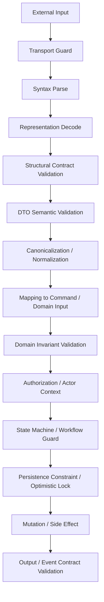
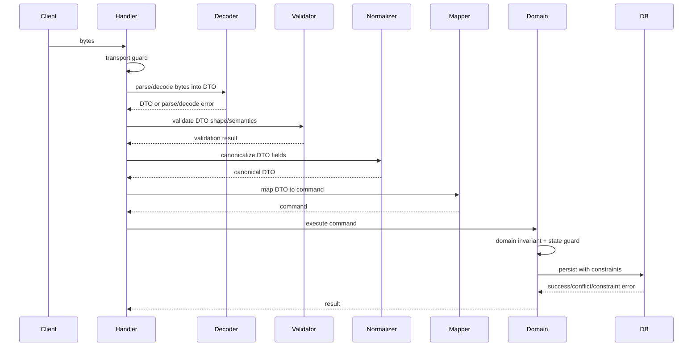
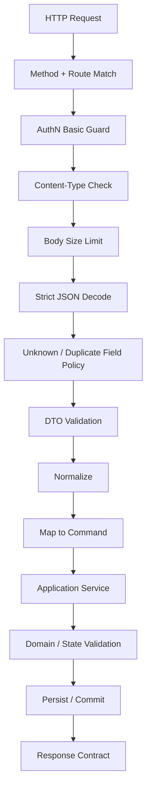
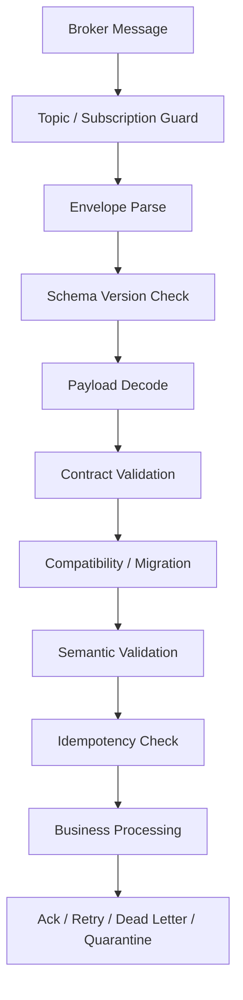
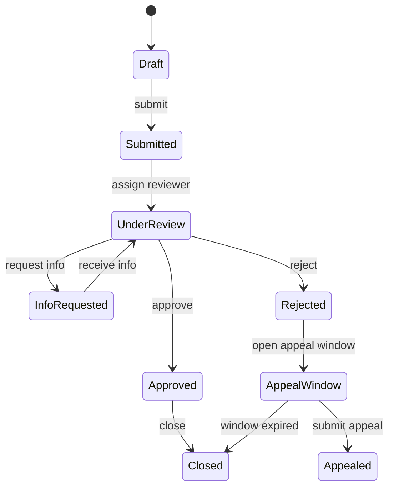

# learn-go-data-mapper-json-xml-protobuf-validation-part-026.md

# Part 026 — Validation Mental Model in Go

> Series: `learn-go-data-mapper-json-xml-protobuf-validation`  
> Part: `026 / 033`  
> Topic: Validation architecture, layered validation, correctness boundary, and production-grade validation mental model in Go  
> Audience: Java software engineer moving into advanced Go data contract engineering

---

## Table of Contents

1. [Why this part exists](#1-why-this-part-exists)
2. [The core idea: validation is not one thing](#2-the-core-idea-validation-is-not-one-thing)
3. [Validation in Java vs validation in Go](#3-validation-in-java-vs-validation-in-go)
4. [The validation stack](#4-the-validation-stack)
5. [Parse, decode, validate, normalize, authorize, decide](#5-parse-decode-validate-normalize-authorize-decide)
6. [The seven validation layers](#6-the-seven-validation-layers)
7. [Boundary validation vs domain validation](#7-boundary-validation-vs-domain-validation)
8. [Syntactic validation vs semantic validation](#8-syntactic-validation-vs-semantic-validation)
9. [Structural schema vs semantic rule](#9-structural-schema-vs-semantic-rule)
10. [Validation and canonicalization](#10-validation-and-canonicalization)
11. [Validation and defaulting](#11-validation-and-defaulting)
12. [Validation and nullability/optionality](#12-validation-and-nullabilityoptionality)
13. [Validation and error taxonomy](#13-validation-and-error-taxonomy)
14. [Validation placement in a Go service](#14-validation-placement-in-a-go-service)
15. [HTTP request validation pipeline](#15-http-request-validation-pipeline)
16. [Event validation pipeline](#16-event-validation-pipeline)
17. [Protobuf validation pipeline](#17-protobuf-validation-pipeline)
18. [XML validation pipeline](#18-xml-validation-pipeline)
19. [Database-backed validation](#19-database-backed-validation)
20. [Workflow/state-machine validation](#20-workflowstate-machine-validation)
21. [Validation under concurrency and distributed systems](#21-validation-under-concurrency-and-distributed-systems)
22. [Designing validation APIs in Go](#22-designing-validation-apis-in-go)
23. [A production-grade validation package layout](#23-a-production-grade-validation-package-layout)
24. [Concrete Go implementation: validation primitives](#24-concrete-go-implementation-validation-primitives)
25. [Concrete Go implementation: request validation pipeline](#25-concrete-go-implementation-request-validation-pipeline)
26. [Concrete Go implementation: domain invariant validation](#26-concrete-go-implementation-domain-invariant-validation)
27. [Concrete Go implementation: event validation](#27-concrete-go-implementation-event-validation)
28. [Validation observability](#28-validation-observability)
29. [Security perspective](#29-security-perspective)
30. [Performance perspective](#30-performance-perspective)
31. [Versioning and backward compatibility](#31-versioning-and-backward-compatibility)
32. [Decision matrix](#32-decision-matrix)
33. [Anti-patterns](#33-anti-patterns)
34. [Review checklist](#34-review-checklist)
35. [Exercises](#35-exercises)
36. [Summary](#36-summary)
37. [References](#37-references)

---

## 1. Why this part exists

Most teams start validation with questions like:

- “Should we use `go-playground/validator`?”
- “Should we validate using JSON Schema?”
- “Should validation live in handler, service, DTO, or domain model?”
- “Should we validate before or after mapping?”
- “Should validation return one error or all errors?”
- “Should invalid events be dropped, retried, dead-lettered, or quarantined?”

Those questions are useful, but they are not the first questions.

The first question is:

> **What kind of invalidity are we trying to detect, at which boundary, before what damage occurs?**

Validation is not one mechanism. Validation is a set of gates across a data lifecycle.

In previous parts, we covered mapping, JSON, XML, Protobuf, schema evolution, and contract governance. This part connects them into a single validation architecture.

This part is deliberately not a library tutorial. The library-specific implementation details are handled later in:

- Part 027 — `go-playground/validator`
- Part 028 — validation error modeling
- Part 029 — Protovalidate
- Part 030 — HTTP API pipeline
- Part 031 — event-driven validation

This part is the mental model that prevents a team from misusing those tools.

---

## 2. The core idea: validation is not one thing

A payload can be invalid in many different ways.

Example request:

```json
{
  "case_id": "CASE-2026-0001",
  "action": "approve",
  "effective_date": "2026-06-24",
  "reason": "",
  "version": 3
}
```

Possible invalidity types:

| Problem | Layer | Example |
|---|---|---|
| Not valid JSON | Parse layer | Missing comma, malformed string |
| Wrong JSON shape | Structural layer | `version` is object instead of number |
| Missing required field | DTO/schema layer | `action` absent |
| Wrong field format | Syntactic semantic layer | `case_id` not matching case ID format |
| Field combination invalid | Cross-field layer | `reason` required when action is `reject` |
| Domain state invalid | Domain layer | Case is already closed |
| Actor not allowed | Authorization/context layer | User cannot approve this case |
| Optimistic lock stale | Persistence/concurrency layer | `version` does not match current version |
| Workflow transition invalid | State-machine layer | Cannot approve before review completed |
| Policy date invalid | Business rule layer | Effective date outside allowed regulatory window |
| Duplicate command | Idempotency layer | Same command id already processed |
| Event incompatible | Event contract layer | Event version no longer supported |

A naive system calls all of these “validation error”. A serious system distinguishes them because each one has different operational behavior:

- reject immediately,
- return `400 Bad Request`,
- return `409 Conflict`,
- return `403 Forbidden`,
- dead-letter event,
- retry later,
- quarantine for human review,
- alert contract owner,
- trigger migration,
- block state transition.

The first invariant of validation architecture:

> **A validation rule is incomplete unless it defines: target, owner, timing, error category, and consequence.**

---

## 3. Validation in Java vs validation in Go

As a Java engineer, you may be used to a stack like:

```text
Spring MVC / JAX-RS
    ↓
Jackson / JSON-B / JAXB
    ↓
DTO
    ↓
Bean Validation annotations
    ↓
Service layer
    ↓
JPA entity constraints
    ↓
Database constraints
```

In Java, the ecosystem often encourages annotation-driven validation:

```java
public class CreateUserRequest {
    @NotBlank
    @Email
    private String email;

    @NotNull
    @Min(18)
    private Integer age;
}
```

In Go, the idiomatic center of gravity is different:

- fewer runtime frameworks,
- fewer lifecycle callbacks,
- more explicit functions,
- simpler object model,
- less hidden reflection by default,
- more emphasis on package boundaries,
- more explicit error handling.

That does not mean Go avoids tags. Go validation libraries often use struct tags:

```go
type CreateUserRequest struct {
    Email string `json:"email" validate:"required,email"`
    Age   int    `json:"age" validate:"gte=18,lte=150"`
}
```

But a top-tier Go design does not rely on tags as the whole validation model.

Tags are good for local, field-level, transport-oriented constraints.

They are weak for:

- domain invariants,
- context-dependent authorization,
- database-backed uniqueness,
- state-machine transitions,
- temporal rules,
- cross-aggregate consistency,
- workflow policies,
- migration compatibility,
- error governance,
- observability,
- partial update semantics.

The Go mental shift is:

> **Use tags for boundary convenience, not as your domain rule engine.**

---

## 4. The validation stack

A production system should treat validation as a layered stack.



Each stage answers a different question.

| Stage | Question |
|---|---|
| Transport guard | Is the input small enough, correct content type, allowed source? |
| Syntax parse | Is the byte stream valid JSON/XML/Protobuf framing? |
| Representation decode | Can bytes map into known representation types? |
| Structural contract | Does shape match expected schema? |
| DTO semantic validation | Are field values locally meaningful? |
| Canonicalization | Can we convert equivalent inputs to one canonical form? |
| Mapping | Can external representation become internal command? |
| Domain invariant | Would this operation preserve business correctness? |
| Authorization | Is this actor allowed to do this operation on this resource? |
| Workflow guard | Is the state transition legal? |
| Persistence constraint | Does storage still agree with our preconditions? |
| Output/event contract | Are we emitting a valid contract to consumers? |

A common failure is doing only the middle:

```text
JSON decode → validate tags → call service
```

That can be enough for small systems, but it is not enough for systems with:

- public APIs,
- event-driven integrations,
- regulatory workflows,
- backwards compatibility obligations,
- high data quality requirements,
- multi-service ownership,
- audit trails,
- case lifecycle state machines.

---

## 5. Parse, decode, validate, normalize, authorize, decide

Many codebases blur these words.

They should be separate.



Definitions:

| Term | Meaning | Example |
|---|---|---|
| Parse | Convert bytes into syntax tree/token stream | JSON syntax is valid |
| Decode | Bind representation into Go value | JSON object to `CreateUserRequest` |
| Validate | Check rules without changing meaning | Email is syntactically valid |
| Normalize | Convert equivalent representation to canonical form | Trim spaces, lowercase country code |
| Map | Convert between model layers | DTO to domain command |
| Authorize | Check actor/resource/action permission | User can approve this case |
| Decide | Apply domain behavior | Case becomes approved |

Important invariant:

> **Validation should not silently change data. Normalization changes data and must be explicit.**

Bad example:

```go
func (r *CreateUserRequest) Validate() error {
    r.Email = strings.ToLower(strings.TrimSpace(r.Email)) // hidden mutation
    if r.Email == "" {
        return errors.New("email required")
    }
    return nil
}
```

Better:

```go
func (r CreateUserRequest) Normalize() CreateUserRequest {
    r.Email = strings.ToLower(strings.TrimSpace(r.Email))
    return r
}

func (r CreateUserRequest) Validate() error {
    if r.Email == "" {
        return errors.New("email required")
    }
    return nil
}
```

Even better in larger systems:

```go
type NormalizedEmail string

func NewNormalizedEmail(raw string) (NormalizedEmail, error) {
    s := strings.ToLower(strings.TrimSpace(raw))
    if s == "" {
        return "", ErrEmailRequired
    }
    if !looksLikeEmail(s) {
        return "", ErrEmailInvalid
    }
    return NormalizedEmail(s), nil
}
```

The last design moves validation into construction of a value object. Once constructed, `NormalizedEmail` carries an invariant.

---

## 6. The seven validation layers

For this series, use this model.

```text
L0 Transport Guard
L1 Syntax Validation
L2 Structural Validation
L3 DTO Semantic Validation
L4 Mapping/Canonicalization Validation
L5 Domain Invariant Validation
L6 System/Operational Validation
```

### L0 — Transport guard

Before parsing, protect resources.

Examples:

- max body size,
- content type,
- compression limit,
- file size,
- request deadline,
- auth token presence,
- expected HTTP method,
- tenant routing header,
- event topic name,
- Kafka partition metadata,
- gRPC max message size.

This is not business validation. This is resource and protocol hygiene.

Go example:

```go
const maxBodyBytes = 1 << 20 // 1 MiB

func limitBody(w http.ResponseWriter, r *http.Request) {
    r.Body = http.MaxBytesReader(w, r.Body, maxBodyBytes)
}
```

### L1 — Syntax validation

Bytes must be syntactically valid for the representation.

Examples:

- valid JSON,
- well-formed XML,
- valid Protobuf binary frame,
- valid base64,
- valid CSV row shape,
- valid date lexical format.

At this layer, you do not yet know if the business operation is valid.

### L2 — Structural validation

The representation must match a shape.

Examples:

- JSON object must have required fields,
- field must be string/number/array/object,
- array max length,
- unknown fields rejected,
- XML expected element path exists,
- Protobuf message contains required semantic fields,
- OpenAPI request body schema passes.

This is where JSON Schema, OpenAPI schema, XSD, and Protobuf schemas live.

### L3 — DTO semantic validation

Fields are locally meaningful.

Examples:

- email format,
- ISO country code,
- case ID format,
- date range within request,
- enum value known,
- cross-field requirement,
- `start_date <= end_date`,
- `reason` required when `decision = reject`.

This is where `go-playground/validator`, custom DTO validation methods, JSON Schema `format`, and Protovalidate semantic rules may live.

### L4 — Mapping/canonicalization validation

The DTO must be convertible into the internal command/domain input without losing meaning.

Examples:

- decimal string can become money value,
- external enum maps to known internal enum,
- `null`/absent/zero semantics are explicit,
- time zone is resolved,
- external ID belongs to known namespace,
- deprecated field combination does not conflict with new field.

This layer catches meaning loss.

### L5 — Domain invariant validation

The operation must preserve domain correctness.

Examples:

- cannot approve closed case,
- cannot submit renewal before eligibility window,
- cannot assign officer to case from another jurisdiction,
- cannot reduce penalty below statutory minimum,
- cannot skip mandatory review step,
- cannot create duplicate active license.

This layer belongs near the domain/service/application layer, not in JSON tags.

### L6 — System/operational validation

The system must still satisfy operational constraints at decision time.

Examples:

- optimistic lock version still current,
- idempotency key not previously consumed,
- unique database constraint not violated,
- downstream integration available if operation requires synchronous call,
- tenant still enabled,
- feature flag still active,
- actor session still valid,
- workflow lock acquired.

This layer often produces `409 Conflict`, retryable errors, or operational events—not simple `400 Bad Request`.

---

## 7. Boundary validation vs domain validation

Boundary validation protects your system from malformed external representation.

Domain validation protects your model from illegal states.

They are related but not the same.

### Boundary validation

Boundary validation asks:

> “Is this input acceptable as an external command/message?”

It lives close to:

- HTTP handler,
- gRPC interceptor,
- queue consumer,
- XML gateway,
- file importer,
- batch ingestion job,
- CLI command parser.

It checks:

- syntax,
- shape,
- field format,
- required fields,
- field length,
- enum lexical value,
- unknown fields,
- payload size.

Example:

```go
type CreateAppealRequest struct {
    CaseID string `json:"case_id" validate:"required"`
    Reason string `json:"reason" validate:"required,min=20,max=4000"`
}
```

### Domain validation

Domain validation asks:

> “Would accepting this command make the domain incorrect?”

It lives close to:

- aggregate method,
- application service,
- workflow transition guard,
- domain policy,
- state machine.

It checks:

- state transition legality,
- role/context legality,
- date windows,
- cross-entity invariants,
- policy rules,
- statutory constraints,
- concurrency preconditions.

Example:

```go
func (c Case) CanSubmitAppeal(now time.Time) error {
    if c.Status != CaseStatusDecisionIssued {
        return ErrAppealOnlyAfterDecision
    }
    if now.After(c.DecisionDate.Add(14 * 24 * time.Hour)) {
        return ErrAppealWindowExpired
    }
    return nil
}
```

Do not put `CanSubmitAppeal` into a JSON DTO tag.

### The separation principle

```text
Boundary rule: rejects invalid representation.
Domain rule: rejects invalid meaning/action.
```

In a clean design:

```text
Request DTO validation passes
    does not imply
Domain operation is allowed
```

And:

```text
Domain operation allowed
    does not imply
External request was well formed
```

They are two gates.

---

## 8. Syntactic validation vs semantic validation

OWASP distinguishes syntactic and semantic validation: syntactic validation enforces correct syntax of structured fields, while semantic validation checks correctness in business context.

In Go systems, this maps naturally to two layers.

### Syntactic validation

```text
"2026-06-24" is a date in yyyy-mm-dd format
"CASE-2026-0001" matches case ID syntax
"user@example.com" looks like an email address
"IDR" is an ISO 4217-looking currency code
```

### Semantic validation

```text
2026-06-24 is within the allowed application window
CASE-2026-0001 belongs to this tenant
user@example.com is not already registered
IDR is allowed for this payment channel
```

Syntactic validation is usually pure and local.

Semantic validation may require:

- current time,
- actor context,
- tenant config,
- database lookup,
- feature flag,
- state machine,
- external service,
- policy version.

Do not force semantic validation into tag strings when it needs context.

Bad:

```go
type SubmitRequest struct {
    CaseID string `json:"case_id" validate:"required,case_open_for_user_somehow"`
}
```

Better:

```go
type SubmitRequest struct {
    CaseID string `json:"case_id" validate:"required"`
}

func (s Service) Submit(ctx context.Context, actor Actor, req SubmitRequest) error {
    caseRecord, err := s.cases.Get(ctx, req.CaseID)
    if err != nil {
        return err
    }
    if err := s.policy.CanSubmit(actor, caseRecord); err != nil {
        return err
    }
    return s.cases.Submit(ctx, caseRecord.ID)
}
```

---

## 9. Structural schema vs semantic rule

JSON Schema, OpenAPI, XSD, and Protobuf schemas are extremely useful. But they are not equivalent to full business validation.

A schema can express:

- required fields,
- type constraints,
- enum values,
- min/max length,
- min/max numeric range,
- object shape,
- array cardinality,
- pattern matching,
- conditional shape rules,
- selected cross-field constraints depending on schema language.

A schema is weaker for:

- database uniqueness,
- user permission,
- resource ownership,
- current workflow state,
- dynamic policy windows,
- regulatory rule versioning,
- eventual consistency,
- external integration state,
- feature-flag-dependent behavior.

### Example: schema-valid but domain-invalid

```json
{
  "case_id": "CASE-2026-0001",
  "action": "approve"
}
```

Schema says:

```text
case_id is required string
 action is one of approve/reject/request_info
```

Domain says:

```text
This case has not completed investigation.
Approval is not allowed.
```

Both are correct.

The schema is not “wrong”; it is only operating at a different layer.

### Example: domain-valid but schema-invalid

A domain service might be able to approve a case, but the request payload is malformed:

```json
{
  "case_id": 123,
  "action": "approve"
}
```

Domain state may allow approval, but external contract rejects `case_id` as number.

Again, two separate gates.

---

## 10. Validation and canonicalization

Canonicalization means turning many equivalent representations into one preferred representation.

Examples:

| Raw input | Canonical value |
|---|---|
| `" User@Example.COM "` | `"user@example.com"` |
| `"sg"` | `"SG"` |
| `"2026-06-24T00:00:00+07:00"` | UTC instant or local date value |
| `"001234"` | maybe preserve exactly as postal code, not integer |
| `"1,000.00"` | decimal value 1000.00 if locale allows |

Canonicalization is not free. It changes data. Therefore it must be explicit.

### Recommended order

```text
Decode raw input
    ↓
Validate minimal lexical constraints
    ↓
Canonicalize known fields
    ↓
Validate canonical values
    ↓
Map to domain value objects
```

Why validate before canonicalize?

Because some invalid values should not be “fixed” silently.

Example:

```text
" SG " → trim to "SG" may be acceptable
"S G"  → silently removing internal space may be dangerous
```

### Canonicalization rule

> **Canonicalize only when the transformation is deterministic, documented, and does not hide user intent.**

Good:

```go
func NormalizeCountryCode(raw string) (string, error) {
    s := strings.ToUpper(strings.TrimSpace(raw))
    if len(s) != 2 {
        return "", fmt.Errorf("country code must be ISO-3166 alpha-2")
    }
    return s, nil
}
```

Dangerous:

```go
func NormalizeName(raw string) string {
    return strings.Map(func(r rune) rune {
        if unicode.IsLetter(r) || unicode.IsSpace(r) {
            return r
        }
        return -1 // silently drops punctuation
    }, raw)
}
```

The second function can corrupt legitimate names.

---

## 11. Validation and defaulting

Defaulting is another source of subtle bugs.

A missing field can mean:

- use system default,
- user intentionally omitted,
- client is old,
- field is not applicable,
- value is unknown,
- value is false/zero,
- reject because required.

Do not default before you understand presence.

### Bad defaulting

```go
type SearchRequest struct {
    Limit int `json:"limit"`
}

func (r *SearchRequest) ApplyDefaults() {
    if r.Limit == 0 {
        r.Limit = 100
    }
}
```

This cannot distinguish:

```json
{}
```

from:

```json
{"limit": 0}
```

Maybe `0` means “no results”, “unlimited”, “invalid”, or “use default”. You cannot decide if you lost presence information.

### Better presence-aware defaulting

```go
type SearchRequest struct {
    Limit *int `json:"limit"`
}

func (r SearchRequest) EffectiveLimit() (int, error) {
    if r.Limit == nil {
        return 100, nil
    }
    if *r.Limit < 1 || *r.Limit > 500 {
        return 0, fmt.Errorf("limit must be between 1 and 500")
    }
    return *r.Limit, nil
}
```

### Defaulting rule

> **Default only at a boundary where absence has a documented meaning.**

Common defaulting locations:

| Location | Suitable for |
|---|---|
| API request DTO | user-facing parameter defaults |
| Application command | business default after mapping |
| Domain constructor | invariant-preserving default |
| DB layer | persistence defaults, timestamps, generated IDs |
| Event consumer | compatibility fallback for old event versions |

Avoid having all layers default the same field independently.

---

## 12. Validation and nullability/optionality

Previous parts covered JSON null/absent/zero semantics and Protobuf field presence. Here we position them in validation.

### Presence truth table

| Input state | Meaning candidate | Validation concern |
|---|---|---|
| Field absent | client did not provide value | Is omission allowed? Default? Patch no-op? |
| Field null | client explicitly says null | Is clearing allowed? Is null legal? |
| Field zero | explicit zero value | Is zero legal domain value? |
| Field empty string | explicit empty text | Is empty equivalent to missing? Usually no. |
| Field empty array | explicit no items | Is empty collection allowed? |
| Field unknown | unexpected key | reject, ignore, or preserve? |

### Create request

Create requests usually require complete intent.

```go
type CreateProfileRequest struct {
    DisplayName string  `json:"display_name" validate:"required,min=1,max=120"`
    Phone       *string `json:"phone" validate:"omitempty,e164"`
}
```

Semantics:

- `display_name` required,
- `phone` optional,
- absent phone means no phone,
- null phone should be a deliberate policy decision.

### Patch request

Patch requests need stronger presence modeling.

```go
type OptionalString struct {
    Set   bool
    Null  bool
    Value string
}
```

Validation depends on operation intent:

| Patch input | Meaning |
|---|---|
| absent | do not change |
| null | clear existing value |
| string | set new value |
| empty string | maybe invalid, maybe set empty depending on rule |

The validator must understand the operation, not just the field type.

---

## 13. Validation and error taxonomy

A mature system does not return `error: invalid input` for everything.

Error category matters.

| Category | HTTP-ish result | Event result | Meaning |
|---|---:|---|---|
| Transport error | 413/415/408 | reject/quarantine | Cannot safely read input |
| Syntax error | 400 | dead-letter/quarantine | Bytes are malformed |
| Decode/type error | 400 | dead-letter/quarantine | Shape cannot bind to representation |
| Unknown field error | 400 or warning | compatibility alert | Client contract drift |
| Schema validation error | 400 | dead-letter | Contract violation |
| Semantic DTO error | 422/400 | dead-letter | Local value invalid |
| Authorization error | 403 | security event | Actor not allowed |
| State conflict | 409 | retry/skip depending on idempotency | Resource state changed |
| Domain rule violation | 422/409 | business reject | Operation not allowed by domain |
| DB constraint error | 409/500 depending | retry/quarantine | Persistence precondition failed |
| System dependency error | 503/500 | retry | Not validation; operational failure |

A top-tier validation architecture always defines:

- machine-readable code,
- human-readable message,
- field path when applicable,
- rejected value policy,
- severity,
- retryability,
- ownership,
- correlation ID,
- safe logging policy.

Part 028 will go deep into error modeling. For now, remember:

> **The most important output of validation is not a string; it is a structured decision.**

---

## 14. Validation placement in a Go service

Where should validation code live?

There is no single answer. Use ownership.

### Handler-level validation

Good for:

- content type,
- body size,
- syntax,
- decode,
- unknown field policy,
- simple DTO tags,
- request-only constraints.

Avoid:

- database lookup,
- domain state transitions,
- complex business policy.

### DTO method validation

Good for:

- field format,
- required fields,
- simple cross-field rules,
- transport-specific constraints.

Example:

```go
func (r CreateCaseRequest) Validate() error {
    var errs ValidationErrors
    if r.Subject == "" {
        errs.Add("subject", "required", "subject is required")
    }
    if len(r.Subject) > 300 {
        errs.Add("subject", "max_length", "subject must be at most 300 characters")
    }
    return errs.Err()
}
```

### Mapper-level validation

Good for:

- external enum cannot map to internal enum,
- decimal parsing,
- time zone resolution,
- ID namespace validation,
- optionality semantics.

### Domain object validation

Good for:

- invariants that must always hold,
- constructor guards,
- value object rules,
- aggregate transition rules.

### Application service validation

Good for:

- context-dependent rules,
- actor/resource permission,
- database-backed checks,
- workflow orchestration,
- transaction boundary checks.

### Repository/database validation

Good for:

- uniqueness,
- foreign key existence,
- optimistic locking,
- non-null persistence constraints,
- concurrent race protection.

Do not depend only on application validation for constraints that must survive race conditions. Put those constraints in storage too.

---

## 15. HTTP request validation pipeline

A robust HTTP API pipeline looks like this:



### Example request DTO

```go
type CreateInvestigationRequest struct {
    CaseID      string   `json:"case_id"`
    OfficerIDs  []string `json:"officer_ids"`
    Priority    string   `json:"priority"`
    Description string   `json:"description"`
}
```

### DTO-level validation

```go
func (r CreateInvestigationRequest) Validate() error {
    var errs ValidationErrors

    if strings.TrimSpace(r.CaseID) == "" {
        errs.Add("case_id", "required", "case_id is required")
    }
    if len(r.OfficerIDs) == 0 {
        errs.Add("officer_ids", "min_items", "at least one officer is required")
    }
    if len(r.OfficerIDs) > 10 {
        errs.Add("officer_ids", "max_items", "at most 10 officers may be assigned")
    }
    switch r.Priority {
    case "low", "normal", "high", "urgent":
    default:
        errs.Add("priority", "enum", "priority must be one of low, normal, high, urgent")
    }
    if len([]rune(r.Description)) > 4000 {
        errs.Add("description", "max_length", "description must be at most 4000 characters")
    }

    return errs.Err()
}
```

### Mapping-level validation

```go
func (r CreateInvestigationRequest) ToCommand(actorID string) (CreateInvestigationCommand, error) {
    priority, err := ParsePriority(r.Priority)
    if err != nil {
        return CreateInvestigationCommand{}, err
    }

    officers := make([]OfficerID, 0, len(r.OfficerIDs))
    seen := map[string]struct{}{}
    for i, raw := range r.OfficerIDs {
        id, err := ParseOfficerID(raw)
        if err != nil {
            return CreateInvestigationCommand{}, FieldError{
                Path: fmt.Sprintf("officer_ids[%d]", i),
                Code: "invalid_officer_id",
                Message: "officer id is invalid",
            }
        }
        if _, ok := seen[string(id)]; ok {
            return CreateInvestigationCommand{}, FieldError{
                Path: fmt.Sprintf("officer_ids[%d]", i),
                Code: "duplicate",
                Message: "officer id must be unique",
            }
        }
        seen[string(id)] = struct{}{}
        officers = append(officers, id)
    }

    return CreateInvestigationCommand{
        ActorID:     ActorID(actorID),
        CaseID:      CaseID(strings.TrimSpace(r.CaseID)),
        OfficerIDs:  officers,
        Priority:    priority,
        Description: strings.TrimSpace(r.Description),
    }, nil
}
```

### Domain-level validation

```go
func (s Service) CreateInvestigation(ctx context.Context, cmd CreateInvestigationCommand) error {
    c, err := s.cases.Get(ctx, cmd.CaseID)
    if err != nil {
        return err
    }

    if err := c.CanCreateInvestigation(); err != nil {
        return err
    }

    if err := s.authz.CanAssignInvestigation(ctx, cmd.ActorID, c); err != nil {
        return err
    }

    if err := s.officers.EnsureAssignable(ctx, cmd.OfficerIDs, c.Jurisdiction); err != nil {
        return err
    }

    return s.cases.CreateInvestigation(ctx, cmd)
}
```

Notice the separation:

- DTO validates request shape.
- Mapper validates representation-to-command conversion.
- Service validates domain context.
- Repository/database protects concurrent truth.

---

## 16. Event validation pipeline

Events are different from HTTP requests.

HTTP request validation can reject synchronously. Event validation must decide what to do with invalid messages already in the stream.



Event validation decisions:

| Problem | Usually retry? | Typical consequence |
|---|---:|---|
| Broker transient failure | yes | retry |
| Payload malformed | no | dead-letter/quarantine |
| Unknown schema version | no/conditional | quarantine + alert producer owner |
| Consumer temporarily cannot reach DB | yes | retry |
| Domain state already processed | no | ack idempotently |
| Event too old | no/conditional | skip or compensation path |
| Contract-breaking new field | no | compatibility incident |

Event consumer validation must be designed with:

- idempotency,
- replay,
- poison message handling,
- schema version windows,
- DLQ observability,
- consumer lag impact,
- backwards compatibility.

A bad event consumer retries malformed payload forever and blocks a partition.

A better consumer classifies invalidity.

```go
type EventDecision string

const (
    EventAck        EventDecision = "ack"
    EventRetry      EventDecision = "retry"
    EventDeadLetter EventDecision = "dead_letter"
    EventQuarantine EventDecision = "quarantine"
)
```

---

## 17. Protobuf validation pipeline

Protobuf gives you schema-based binary structure, but not full semantic correctness.

A Protobuf message can decode successfully and still be semantically invalid.

Example:

```proto
message SubmitAppealRequest {
  string case_id = 1;
  string reason = 2;
}
```

Binary Protobuf ensures fields are encoded as expected wire types. It does not automatically ensure:

- `case_id` is non-empty,
- `case_id` exists in database,
- `reason` has minimum length,
- case is appealable,
- actor can submit appeal.

### Protobuf validation stack

```text
Binary frame valid
    ↓
Protobuf decode succeeds
    ↓
Unknown field policy
    ↓
Protovalidate / semantic annotations
    ↓
Map to domain command
    ↓
Domain policy/state validation
```

### Generated schema is not enough

A `.proto` file defines message shape and wire contract. For semantic validation, use:

- explicit application validation,
- Protovalidate annotations,
- interceptors,
- domain constructors,
- service-level policy.

Example using semantic schema annotations is covered deeply in part 029.

For this part, the key idea is:

> **Protobuf schema validates transport structure; semantic validation must still be designed.**

---

## 18. XML validation pipeline

XML has two common validation levels:

1. well-formedness,
2. schema validity.

Well-formedness means the XML syntax itself is valid.

Schema validity means the document conforms to a schema language such as XSD.

In Go, the standard library `encoding/xml` handles parsing and mapping, but it does not provide full XSD validation. Therefore XML validation architecture often requires explicit external choices:

- validate at gateway,
- validate in CI using sample fixtures,
- validate with external `xmllint`,
- validate with libxml2 bindings,
- use a validation sidecar/service,
- rely on partner contract plus local semantic checks.

### XML pipeline

```text
Size/content-type guard
    ↓
Well-formed XML parse
    ↓
Namespace-aware token processing
    ↓
XSD validation if required
    ↓
DTO decode
    ↓
Semantic validation
    ↓
Domain mapping
```

XML-specific validation concerns:

- namespace URI correctness,
- required attributes,
- element order if schema requires,
- mixed content,
- whitespace normalization,
- entity handling,
- encoding declaration,
- external entity prohibition,
- SOAP envelope/body fault handling.

---

## 19. Database-backed validation

Some validations cannot be safely performed only in application memory.

Example:

```text
Email must be unique.
```

You can check first:

```go
exists, err := repo.EmailExists(ctx, email)
if err != nil { return err }
if exists { return ErrEmailAlreadyUsed }
```

But this is race-prone.

Two requests can pass the check simultaneously.

The database must enforce the final truth:

```sql
CREATE UNIQUE INDEX users_email_uq ON users (normalized_email);
```

Application validation improves UX. Database constraints protect correctness.

### Rule

> **If a rule must survive concurrency, encode it in the persistence boundary too.**

Common database-backed validation:

| Rule | Application check | DB enforcement |
|---|---|---|
| unique email | pre-check for good error | unique index |
| foreign key exists | lookup for domain message | FK constraint |
| non-null required | DTO validation | NOT NULL |
| amount non-negative | domain value object | CHECK constraint |
| optimistic version | command carries version | `WHERE version = ?` update |
| no overlapping active period | query window | exclusion/unique strategy depending DB |

Do not rely exclusively on validators for data integrity.

---

## 20. Workflow/state-machine validation

In workflow-heavy systems, the most important validation is often transition validation.

Example case lifecycle:



A request can be perfectly valid structurally:

```json
{"action":"approve","case_id":"CASE-2026-0001"}
```

But invalid in workflow state:

```text
Current state = Draft
approve allowed only from UnderReview
```

State-machine validation has special properties:

- depends on current state,
- often actor/role dependent,
- may depend on prior history,
- should produce auditable denial reason,
- must be concurrency-safe,
- often belongs inside aggregate/application service,
- should not be hidden in DTO tags.

### Transition guard example

```go
type CaseStatus string

type CaseAction string

const (
    CaseDraft       CaseStatus = "draft"
    CaseSubmitted   CaseStatus = "submitted"
    CaseUnderReview CaseStatus = "under_review"
    CaseApproved    CaseStatus = "approved"
    CaseRejected    CaseStatus = "rejected"

    ActionSubmit  CaseAction = "submit"
    ActionReview  CaseAction = "review"
    ActionApprove CaseAction = "approve"
    ActionReject  CaseAction = "reject"
)

func CanTransition(from CaseStatus, action CaseAction) bool {
    switch from {
    case CaseDraft:
        return action == ActionSubmit
    case CaseSubmitted:
        return action == ActionReview
    case CaseUnderReview:
        return action == ActionApprove || action == ActionReject
    default:
        return false
    }
}
```

Production version should return structured denial reasons, not only `bool`.

---

## 21. Validation under concurrency and distributed systems

Validation can become stale.

Timeline:

```text
T1: Request A validates case is open
T2: Request B closes case
T3: Request A approves case based on stale validation
```

If validation and mutation are not tied to a concurrency boundary, correctness fails.

### Techniques

| Technique | Use |
|---|---|
| Optimistic locking | version-based concurrent update protection |
| Pessimistic lock | critical serialized workflow step |
| Unique constraint | prevent duplicate active records |
| Idempotency key | prevent duplicate command effects |
| Transaction isolation | ensure read/write consistency |
| Compare-and-swap update | state transition atomicity |
| Outbox pattern | event emission consistency |
| Saga compensation | distributed state recovery |

### Compare-and-swap transition

Instead of:

```sql
SELECT status FROM cases WHERE id = ?;
-- application checks status
UPDATE cases SET status = 'approved' WHERE id = ?;
```

Prefer:

```sql
UPDATE cases
SET status = 'approved', version = version + 1
WHERE id = ?
  AND status = 'under_review'
  AND version = ?;
```

Then application validates affected rows.

```go
if rowsAffected == 0 {
    return ErrStateConflict
}
```

This makes validation and mutation atomic.

---

## 22. Designing validation APIs in Go

A validation API should answer:

- can it collect multiple errors?
- does it preserve field paths?
- does it support nested structures?
- does it handle localization separately?
- does it distinguish programmer error from user input error?
- does it support context?
- does it avoid hidden mutation?
- does it avoid exposing unsafe rejected values?

### Minimal interface

```go
type Validator[T any] interface {
    Validate(T) error
}
```

Useful but too weak for advanced systems.

### Context-aware interface

```go
type ContextValidator[T any] interface {
    Validate(context.Context, T) error
}
```

Good for validation requiring:

- tenant config,
- feature flags,
- current time,
- actor context,
- repository lookup.

### Structured result

```go
type ValidationResult struct {
    Errors []Violation
}

func (r ValidationResult) OK() bool {
    return len(r.Errors) == 0
}
```

### Violation model

```go
type Violation struct {
    Path      string `json:"path"`
    Code      string `json:"code"`
    Message   string `json:"message"`
    Severity  string `json:"severity,omitempty"`
    Retryable bool   `json:"retryable,omitempty"`
}
```

In production, `Message` may be a localization key rather than final English/Indonesian text.

---

## 23. A production-grade validation package layout

Example layout:

```text
internal/
  api/
    http/
      cases_handler.go
      decode.go
      errors.go
    dto/
      create_case_request.go
      update_case_request.go
  validation/
    violations.go
    paths.go
    result.go
    primitive.go
    json.go
  domain/
    case/
      case.go
      status.go
      policy.go
      errors.go
  app/
    cases/
      service.go
      commands.go
      validator.go
  contract/
    jsonschema/
      case_create.schema.json
    proto/
      case/v1/case.proto
```

Guidelines:

| Package | Should contain | Should not contain |
|---|---|---|
| `api/http` | transport guard, decode, response errors | domain policy |
| `api/dto` | request/response structs, DTO validation | DB queries |
| `validation` | reusable violation/result/path helpers | business-specific rules |
| `domain/case` | invariants, transition guards, value objects | JSON tags as core logic |
| `app/cases` | context-aware orchestration rules | raw HTTP details |
| `contract` | external schema/proto/OpenAPI | internal service logic |

This gives each rule an owner.

---

## 24. Concrete Go implementation: validation primitives

Below is a small reusable validation core.

```go
package validation

import (
    "errors"
    "fmt"
    "strings"
)

type Violation struct {
    Path    string
    Code    string
    Message string
}

type Violations []Violation

func (v Violations) Error() string {
    if len(v) == 0 {
        return ""
    }
    if len(v) == 1 {
        return fmt.Sprintf("%s: %s", v[0].Path, v[0].Message)
    }
    return fmt.Sprintf("%d validation errors", len(v))
}

func (v Violations) Err() error {
    if len(v) == 0 {
        return nil
    }
    return v
}

func (v *Violations) Add(path, code, message string) {
    *v = append(*v, Violation{
        Path:    path,
        Code:    code,
        Message: message,
    })
}

func AsViolations(err error) (Violations, bool) {
    var v Violations
    if errors.As(err, &v) {
        return v, true
    }
    return nil, false
}

func JoinPath(parts ...string) string {
    clean := make([]string, 0, len(parts))
    for _, p := range parts {
        p = strings.TrimSpace(p)
        if p != "" {
            clean = append(clean, p)
        }
    }
    return strings.Join(clean, ".")
}
```

Usage:

```go
func validateSubject(path string, value string) error {
    var errs validation.Violations
    s := strings.TrimSpace(value)
    if s == "" {
        errs.Add(path, "required", "subject is required")
    }
    if len([]rune(s)) > 300 {
        errs.Add(path, "max_length", "subject must be at most 300 characters")
    }
    return errs.Err()
}
```

This is intentionally boring. Good validation infrastructure should be boring.

---

## 25. Concrete Go implementation: request validation pipeline

A generic HTTP helper can enforce ordering.

```go
package httpx

import (
    "encoding/json"
    "errors"
    "fmt"
    "io"
    "net/http"
)

type Validatable interface {
    Validate() error
}

type DecodeOptions struct {
    MaxBodyBytes         int64
    DisallowUnknownField bool
}

func DecodeJSONRequest[T any](w http.ResponseWriter, r *http.Request, opts DecodeOptions) (T, error) {
    var zero T

    if r.Header.Get("Content-Type") != "application/json" {
        return zero, NewClientError("unsupported_media_type", "Content-Type must be application/json")
    }

    if opts.MaxBodyBytes > 0 {
        r.Body = http.MaxBytesReader(w, r.Body, opts.MaxBodyBytes)
    }

    dec := json.NewDecoder(r.Body)
    if opts.DisallowUnknownField {
        dec.DisallowUnknownFields()
    }

    var dst T
    if err := dec.Decode(&dst); err != nil {
        return zero, classifyDecodeError(err)
    }

    var extra struct{}
    if err := dec.Decode(&extra); err != io.EOF {
        return zero, NewClientError("invalid_json", "request body must contain a single JSON value")
    }

    if v, ok := any(dst).(Validatable); ok {
        if err := v.Validate(); err != nil {
            return zero, err
        }
    }

    return dst, nil
}

func classifyDecodeError(err error) error {
    var syntaxErr *json.SyntaxError
    if errors.As(err, &syntaxErr) {
        return NewClientError("malformed_json", fmt.Sprintf("malformed JSON at byte offset %d", syntaxErr.Offset))
    }

    var typeErr *json.UnmarshalTypeError
    if errors.As(err, &typeErr) {
        return NewClientError("invalid_json_type", fmt.Sprintf("invalid type for field %s", typeErr.Field))
    }

    return NewClientError("invalid_json", "request body is not valid JSON")
}

type ClientError struct {
    Code    string
    Message string
}

func (e ClientError) Error() string { return e.Message }

func NewClientError(code, message string) ClientError {
    return ClientError{Code: code, Message: message}
}
```

Important caveat:

This helper does not detect duplicate JSON object keys. If your contract requires rejecting duplicate keys, add a token-level pre-scan or use a stricter JSON implementation/path such as `jsontext`/JSON v2 experimental evaluation where appropriate for your Go version and production policy.

---

## 26. Concrete Go implementation: domain invariant validation

DTO validation and domain validation should look different.

DTO validation:

```go
type CreateCaseRequest struct {
    Subject string `json:"subject"`
    Type    string `json:"type"`
}

func (r CreateCaseRequest) Validate() error {
    var errs validation.Violations
    if strings.TrimSpace(r.Subject) == "" {
        errs.Add("subject", "required", "subject is required")
    }
    switch r.Type {
    case "complaint", "inspection", "appeal":
    default:
        errs.Add("type", "enum", "type is invalid")
    }
    return errs.Err()
}
```

Domain validation:

```go
type Case struct {
    id     CaseID
    status CaseStatus
    owner  OfficerID
}

func (c Case) CanAssign(to OfficerID, actor Actor) error {
    if c.status == CaseClosed {
        return DomainError{
            Code:    "case_closed",
            Message: "closed case cannot be reassigned",
        }
    }
    if !actor.HasRole("case_manager") {
        return DomainError{
            Code:    "not_case_manager",
            Message: "actor is not allowed to reassign case",
        }
    }
    if c.owner == to {
        return DomainError{
            Code:    "same_officer",
            Message: "case is already assigned to this officer",
        }
    }
    return nil
}

type DomainError struct {
    Code    string
    Message string
}

func (e DomainError) Error() string { return e.Message }
```

DTO validation returns field errors.

Domain validation returns operation errors.

That distinction matters for API response design.

---

## 27. Concrete Go implementation: event validation

Event consumer classification:

```go
type ConsumeDecision struct {
    Action EventDecision
    Reason string
    Err    error
}

func ProcessCaseEvent(ctx context.Context, msg BrokerMessage) ConsumeDecision {
    env, err := DecodeEnvelope(msg.Value)
    if err != nil {
        return ConsumeDecision{Action: EventDeadLetter, Reason: "malformed_envelope", Err: err}
    }

    if !SupportedVersion(env.SchemaVersion) {
        return ConsumeDecision{Action: EventQuarantine, Reason: "unsupported_schema_version"}
    }

    evt, err := DecodeCaseEvent(env)
    if err != nil {
        return ConsumeDecision{Action: EventDeadLetter, Reason: "malformed_payload", Err: err}
    }

    if err := evt.Validate(); err != nil {
        return ConsumeDecision{Action: EventDeadLetter, Reason: "contract_validation_failed", Err: err}
    }

    if already, err := IsDuplicate(ctx, evt.EventID); err != nil {
        return ConsumeDecision{Action: EventRetry, Reason: "idempotency_store_unavailable", Err: err}
    } else if already {
        return ConsumeDecision{Action: EventAck, Reason: "duplicate_already_processed"}
    }

    if err := ApplyEvent(ctx, evt); err != nil {
        if IsTransient(err) {
            return ConsumeDecision{Action: EventRetry, Reason: "transient_processing_failure", Err: err}
        }
        return ConsumeDecision{Action: EventQuarantine, Reason: "business_processing_rejected", Err: err}
    }

    return ConsumeDecision{Action: EventAck, Reason: "processed"}
}
```

This style prevents the classic poison-message loop.

---

## 28. Validation observability

Validation failures are data about your contract boundary.

Track them carefully.

### Useful metrics

| Metric | Purpose |
|---|---|
| validation failures by endpoint | detect bad clients or contract drift |
| failures by field/code | identify ambiguous API docs |
| unknown field count | detect clients sending unexpected fields |
| malformed payload count | detect client/library issues |
| event DLQ count by schema version | detect producer/consumer incompatibility |
| domain rejection count by rule | detect policy confusion or abuse |
| request size rejection count | detect abuse or misconfigured clients |

### Logging rules

Do not blindly log raw invalid payloads.

Invalid payloads may contain:

- credentials,
- PII,
- personal identifiers,
- access tokens,
- malicious scripts,
- huge content,
- binary garbage,
- partner confidential data.

Log:

- correlation ID,
- endpoint/topic,
- schema version,
- validation code,
- field path,
- client ID/tenant ID if safe,
- payload size,
- parser offset,
- hash of payload if needed,
- redacted sample only under controlled policy.

---

## 29. Security perspective

Validation is security-relevant, but it is not a complete security control.

OWASP guidance recommends validating untrusted input early and applying validation at syntactic and semantic levels. It also warns that denylist validation is fragile and allowlisting is generally more robust.

Practical implications for Go systems:

### Validate untrusted input early

- HTTP body,
- gRPC metadata,
- queue messages,
- files,
- partner feeds,
- admin import tools,
- internal service calls,
- database records sourced from old systems.

“Internal” does not mean trusted.

### Prefer allowlists for finite domains

Good:

```go
switch value {
case "draft", "submitted", "under_review", "approved", "rejected":
    return nil
}
return ErrInvalidStatus
```

Weak:

```go
if strings.Contains(value, "<script>") {
    return ErrInvalid
}
```

### Validation does not replace output encoding

Example:

A name field may allow apostrophes and unicode characters. That does not mean it can be directly inserted into HTML, SQL, shell commands, LDAP filters, or logs without context-appropriate encoding/escaping.

Validation says:

```text
This value is acceptable as a name.
```

Output encoding says:

```text
This value is safely represented in this output context.
```

Do not confuse them.

### Regex caution

If using regex validation:

- anchor the whole input when appropriate,
- avoid catastrophic backtracking engines,
- set length limits before regex where possible,
- use Go's `regexp` package with RE2 semantics,
- test unicode behavior,
- document allowed character classes.

Go's standard `regexp` avoids many catastrophic backtracking issues by using RE2-style semantics, but length and meaning constraints still matter.

---

## 30. Performance perspective

Validation can be expensive when done incorrectly.

Potential costs:

- reflection over large structs,
- regex compilation per request,
- JSON Schema compilation per request,
- repeated database lookups,
- deep recursive validation,
- string allocation during normalization,
- collecting too many errors for huge arrays,
- validating every event with heavy semantic checks on hot path.

### Rules

1. Compile schemas once.
2. Compile regex once.
3. Reuse validators safely when library supports concurrency.
4. Put body/message size limits before validation.
5. Limit number of collected errors.
6. Short-circuit for expensive validation after cheap validation fails.
7. Separate hot-path validation from audit/deep validation if needed.
8. Benchmark representative payloads.

### Error collection limit

```go
const maxViolations = 100

func (v *Violations) AddLimited(path, code, message string) {
    if len(*v) >= maxViolations {
        return
    }
    v.Add(path, code, message)
}
```

Without limits, a malicious payload with a huge array can cause enormous validation responses.

---

## 31. Versioning and backward compatibility

Validation rules are part of your contract.

Tightening validation can be a breaking change.

Examples:

| Change | Risk |
|---|---|
| Add new required field | breaks old clients |
| Reduce max length | breaks existing valid clients |
| Make unknown fields rejected | breaks clients sending extensions |
| Change enum allowed values | breaks clients/producers |
| Change defaulting semantics | changes behavior silently |
| Add stricter regex | may reject real-world values |
| Start validating `format` as assertion | can break existing payloads |
| Protobuf ProtoJSON name change | breaks JSON clients |

### Compatibility rule

> **Validation changes must be reviewed like API contract changes.**

Recommended process:

1. Add metric-only validation first.
2. Measure existing traffic/events.
3. Warn clients/producers.
4. Add compatibility window.
5. Enforce after migration date.
6. Keep override path for critical partners if business requires.

### Soft validation pattern

```go
type ValidationMode string

const (
    ValidationObserve ValidationMode = "observe"
    ValidationWarn    ValidationMode = "warn"
    ValidationEnforce ValidationMode = "enforce"
)
```

Use observe/warn/enforce for migrations.

---

## 32. Decision matrix

| Problem | Preferred mechanism | Why |
|---|---|---|
| Malformed JSON | JSON parser | Syntax-level failure |
| Unknown JSON field | strict decoder / schema | Contract drift detection |
| Required DTO field | struct validation / schema | Boundary shape rule |
| Email syntax | validator/custom parser | Local semantic rule |
| Complex request shape | JSON Schema/OpenAPI | External contract governance |
| XML partner payload | XML parse + optional XSD | Legacy contract validation |
| Protobuf semantic fields | Protovalidate/custom validation | Schema-attached semantic rule |
| Domain transition | domain policy/state machine | Business invariant |
| Duplicate active record | DB unique constraint + app check | Race-safe correctness |
| Actor permission | authorization service/policy | Context-dependent rule |
| Event version compatibility | schema registry/consumer policy | Distributed contract governance |
| Patch field clearing | presence-aware type | Intent preservation |
| Monetary value | decimal/minor-unit value object | Precision invariant |
| Large stream | streaming parser + bounded validation | Memory protection |

---

## 33. Anti-patterns

### Anti-pattern 1: Validation only in DTO tags

```go
type ApproveCaseRequest struct {
    CaseID string `json:"case_id" validate:"required"`
}
```

Then service approves without state check.

Problem:

- DTO validation says request is shaped correctly.
- It says nothing about whether approval is legal.

### Anti-pattern 2: Validation hidden inside mapper mutation

```go
func (r *Request) ToCommand() Command {
    r.Email = strings.ToLower(r.Email)
    return Command{Email: r.Email}
}
```

Problem:

- mapping unexpectedly mutates input,
- hard to test,
- logs/audit may disagree,
- validation order unclear.

### Anti-pattern 3: Database uniqueness as pre-check only

```go
if !repo.EmailExists(email) {
    repo.InsertUser(email)
}
```

Problem:

- race condition,
- duplicate data under concurrency.

### Anti-pattern 4: Treating all validation failures as 400

A stale version is not malformed input. It is conflict.

A forbidden action is not malformed input. It is authorization failure.

A dependency outage is not validation failure. It is operational failure.

### Anti-pattern 5: Rejecting real names with naive regex

```go
^[A-Za-z ]+$
```

Problem:

- rejects many legitimate names,
- poor internationalization,
- false sense of security.

### Anti-pattern 6: Logging invalid payloads wholesale

Problem:

- leaks PII,
- leaks secrets,
- logs malicious content,
- creates compliance risk.

### Anti-pattern 7: Tightening validation without contract rollout

Problem:

- breaks old clients,
- breaks replay of old events,
- causes sudden production incident.

---

## 34. Review checklist

Use this checklist in design/code review.

### Boundary

- [ ] Is max payload size enforced before decode?
- [ ] Is content type checked?
- [ ] Are malformed syntax errors separated from semantic errors?
- [ ] Is unknown field policy explicit?
- [ ] Is duplicate field policy explicit if JSON is used?
- [ ] Are null/absent/zero semantics documented?

### DTO/schema

- [ ] Are required fields represented correctly?
- [ ] Are length/range constraints present?
- [ ] Are enums allowlisted?
- [ ] Are cross-field DTO rules tested?
- [ ] Are validation errors field-path aware?
- [ ] Are rejected values redacted when needed?

### Mapping

- [ ] Can every external enum map safely?
- [ ] Is decimal/time parsing lossless enough?
- [ ] Is canonicalization explicit?
- [ ] Are defaults applied after presence is known?
- [ ] Is mapping free from hidden mutation?

### Domain

- [ ] Are domain invariants enforced outside DTO tags?
- [ ] Are state transitions validated atomically?
- [ ] Are authorization/context rules separate from syntax validation?
- [ ] Are database-backed rules protected with constraints?
- [ ] Are conflict vs invalid vs forbidden errors separated?

### Event-driven

- [ ] Is schema version checked?
- [ ] Are malformed events not retried forever?
- [ ] Is DLQ/quarantine policy defined?
- [ ] Is idempotency enforced?
- [ ] Are old event versions supported or migrated explicitly?

### Operational

- [ ] Are validation metrics emitted by code/path?
- [ ] Is logging safe for PII/secrets?
- [ ] Are validation rule changes treated as contract changes?
- [ ] Are expensive validators compiled/reused?
- [ ] Is maximum number of returned violations bounded?

---

## 35. Exercises

### Exercise 1 — Classify validation rules

For each rule below, classify it as L0–L6.

1. Request body must be less than 1 MiB.
2. JSON must be syntactically valid.
3. `email` field is required.
4. `email` must have valid email syntax.
5. `email` must be unique.
6. User can only approve cases in their jurisdiction.
7. Case can only move from `under_review` to `approved`.
8. Event schema version must be supported.
9. Payment amount must be positive.
10. Optimistic version must match current database version.

Expected reasoning:

- 1 = L0 transport guard
- 2 = L1 syntax
- 3 = L2/L3 boundary DTO
- 4 = L3 semantic local
- 5 = L5/L6 plus DB constraint
- 6 = L5 authorization/context
- 7 = L5 workflow invariant
- 8 = L2/L6 event contract
- 9 = L3 if request field, L5 if domain money invariant
- 10 = L6 concurrency/persistence

### Exercise 2 — Design a patch request

Design `PatchProfileRequest` with fields:

- display name,
- phone number,
- email,
- notification preference.

Requirements:

- absent means no change,
- null means clear if field is clearable,
- empty display name is invalid,
- email must be normalized,
- notification preference must be one of `email`, `sms`, `none`,
- old clients may omit all fields,
- request with all fields absent should be rejected as no-op.

Think through:

- type representation,
- validation layer,
- normalization layer,
- error response,
- domain command mapping.

### Exercise 3 — Event consumer validation

Design validation behavior for a consumer of `CaseStatusChanged` events.

Cases:

1. invalid JSON envelope,
2. unsupported schema version,
3. valid old schema version,
4. duplicate event ID,
5. status value unknown,
6. DB temporarily unavailable,
7. case already in target state.

For each, choose:

- ack,
- retry,
- dead-letter,
- quarantine,
- alert.

### Exercise 4 — Validation migration

You want to make `postal_code` strict six-digit numeric.

Currently clients send:

- `"123456"`,
- `"123 456"`,
- `"12345"`,
- `123456`,
- `"N/A"`.

Design a rollout plan using:

- observe mode,
- metrics,
- client communication,
- compatibility deadline,
- enforcement mode,
- error code.

---

## 36. Summary

Validation in Go should be designed as a layered architecture, not a pile of tags.

The key mental model:

```text
Transport guard
  → syntax parse
  → representation decode
  → structural contract validation
  → DTO semantic validation
  → canonicalization/defaulting
  → mapping
  → domain invariant validation
  → authorization/state validation
  → persistence/concurrency validation
  → output/event contract validation
```

The most important distinctions:

1. Boundary validation is not domain validation.
2. Syntactic validation is not semantic validation.
3. Schema validation is not business correctness.
4. Defaulting requires presence awareness.
5. Canonicalization is explicit transformation, not validation.
6. Database constraints are necessary for race-safe integrity.
7. Event validation must classify retry/dead-letter/quarantine behavior.
8. Validation rule changes are contract changes.
9. Validation errors should be structured, not arbitrary strings.
10. Observability is part of validation design.

A top-tier Go engineer treats validation as a correctness boundary.

Not:

```text
call validator.Struct and move on
```

But:

```text
define which invariants must hold at each boundary, who owns them,
how failures are represented, how compatibility is preserved,
and how the system remains correct under concurrency and evolution.
```

---

## 37. References

- Go package documentation: `github.com/go-playground/validator/v10` — `https://pkg.go.dev/github.com/go-playground/validator/v10`
- JSON Schema Draft 2020-12 Validation vocabulary — `https://json-schema.org/draft/2020-12/json-schema-validation`
- Protovalidate documentation — `https://protovalidate.com/`
- OWASP Input Validation Cheat Sheet — `https://cheatsheetseries.owasp.org/cheatsheets/Input_Validation_Cheat_Sheet.html`
- Go `encoding/json` package — `https://pkg.go.dev/encoding/json`
- Go `encoding/xml` package — `https://pkg.go.dev/encoding/xml`
- Protobuf Go generated code guide — `https://protobuf.dev/reference/go/go-generated/`
- Protobuf field presence guide — `https://protobuf.dev/programming-guides/field_presence/`

---

## Next Part

Next file:

```text
learn-go-data-mapper-json-xml-protobuf-validation-part-027.md
```

Title:

```text
Struct Validation with go-playground/validator
```

Focus:

- validator initialization,
- `WithRequiredStructEnabled`,
- tags,
- nested validation,
- `dive`,
- custom validators,
- cross-field validation,
- struct-level validation,
- context-aware validation,
- JSON field-name extraction,
- error translation,
- production pitfalls.

<!-- NAVIGATION_FOOTER -->
<div class="page-nav">
<a href="./learn-go-data-mapper-json-xml-protobuf-validation-part-025.md">⬅️ Part 025 — Buf, Proto Modules, Linting, and Breaking Change Detection</a>
<a href="./index.md">📚 Kategori</a>
<a href="../../index.md">🏠 Home</a>
<a href="./learn-go-data-mapper-json-xml-protobuf-validation-part-027.md">Part 027 — Struct Validation with `go-playground/validator` ➡️</a>
</div>
