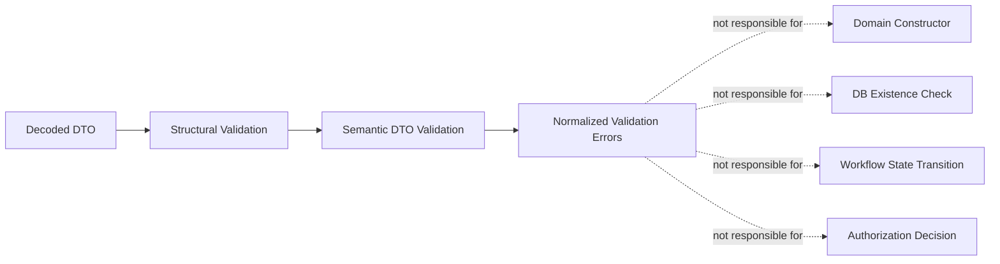
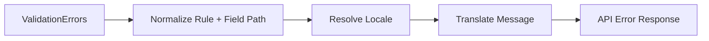
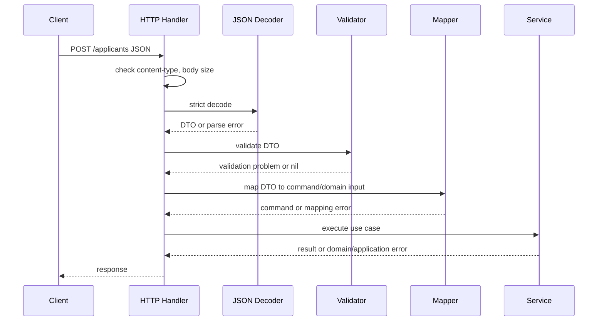
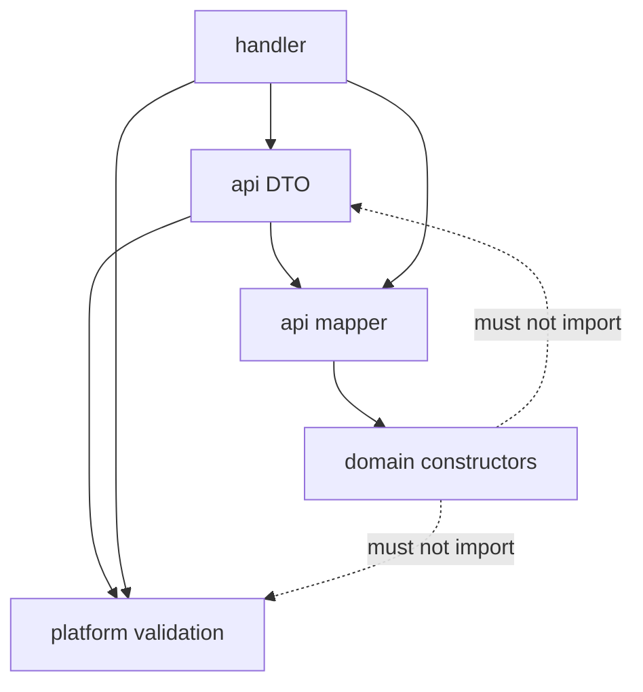

# learn-go-data-mapper-json-xml-protobuf-validation-part-027.md

# Part 027 — Struct Validation with `go-playground/validator`

> Seri: `learn-go-data-mapper-json-xml-protobuf-validation`  
> Bagian: `027 / 033`  
> Topik: Struct validation di Go dengan `github.com/go-playground/validator/v10`  
> Target pembaca: Java software engineer yang ingin menguasai validation boundary di Go secara production-grade  
> Status seri: **belum selesai**

---

## Daftar Isi

1. [Tujuan Pembelajaran](#1-tujuan-pembelajaran)
2. [Posisi Part Ini dalam Seri](#2-posisi-part-ini-dalam-seri)
3. [Mental Model: Validator Bukan Domain Rule Engine](#3-mental-model-validator-bukan-domain-rule-engine)
4. [Java Engineer Translation: Bean Validation vs Go Validator](#4-java-engineer-translation-bean-validation-vs-go-validator)
5. [Kontrak Dasar `go-playground/validator`](#5-kontrak-dasar-go-playgroundvalidator)
6. [Setup Production-Grade Validator](#6-setup-production-grade-validator)
7. [Anatomi Validation Tag](#7-anatomi-validation-tag)
8. [`required`, Zero Value, Pointer, dan Optionality](#8-required-zero-value-pointer-dan-optionality)
9. [`omitempty`, `omitnil`, dan `omitzero`](#9-omitempty-omitnil-dan-omitzero)
10. [String, Number, Collection, dan Format Validators](#10-string-number-collection-dan-format-validators)
11. [Nested Struct Validation](#11-nested-struct-validation)
12. [Slice, Array, Map, `dive`, `keys`, dan `endkeys`](#12-slice-array-map-dive-keys-dan-endkeys)
13. [Alias Tags untuk Governance](#13-alias-tags-untuk-governance)
14. [Custom Field Validator](#14-custom-field-validator)
15. [Custom Type Function](#15-custom-type-function)
16. [Cross-Field Validation](#16-cross-field-validation)
17. [Struct-Level Validation](#17-struct-level-validation)
18. [Context-Aware Validation](#18-context-aware-validation)
19. [Error Handling dan Error Normalization](#19-error-handling-dan-error-normalization)
20. [JSON Field Name, Namespace, dan Path Strategy](#20-json-field-name-namespace-dan-path-strategy)
21. [Localization dan Translation](#21-localization-dan-translation)
22. [HTTP Request Validation Pipeline](#22-http-request-validation-pipeline)
23. [PATCH/Partial Update Validation](#23-patchpartial-update-validation)
24. [Validation dengan Domain Constructor](#24-validation-dengan-domain-constructor)
25. [Package Layout yang Disarankan](#25-package-layout-yang-disarankan)
26. [Testing Strategy](#26-testing-strategy)
27. [Performance dan Operational Concerns](#27-performance-dan-operational-concerns)
28. [Security Concerns](#28-security-concerns)
29. [Anti-Patterns](#29-anti-patterns)
30. [Decision Matrix](#30-decision-matrix)
31. [Production Checklist](#31-production-checklist)
32. [Latihan Desain](#32-latihan-desain)
33. [Ringkasan Invariant](#33-ringkasan-invariant)
34. [Referensi](#34-referensi)

---

## 1. Tujuan Pembelajaran

Setelah menyelesaikan part ini, kamu harus mampu:

1. Menggunakan `go-playground/validator/v10` secara benar untuk validasi DTO/request.
2. Mendesain validator sebagai **boundary component**, bukan sebagai tempat semua business rule.
3. Membaca dan menulis validation tag dengan pemahaman semantics, bukan sekadar hafalan.
4. Membedakan:
   - parse error,
   - validation error,
   - domain invariant violation,
   - authorization/state violation,
   - persistence conflict.
5. Mendesain error response yang stabil, machine-readable, dan tidak bergantung pada string bawaan library.
6. Membuat custom validator yang aman, deterministic, dan tidak bocor ke domain layer.
7. Menangani nested struct, collections, map keys, cross-field validation, dan struct-level validation.
8. Membuat validation pipeline HTTP yang layak production.
9. Menghindari jebakan umum seperti membuat validator per request, terlalu banyak logic di tag, atau menyamakan `omitempty` dengan optional business semantics.

---

## 2. Posisi Part Ini dalam Seri

Pada part sebelumnya, kita sudah membangun mental model validation secara umum:

```mermaid
flowchart LR
    A[Raw Input] --> B[Transport Guard]
    B --> C[Syntax Parse]
    C --> D[Structural Validation]
    D --> E[Semantic DTO Validation]
    E --> F[Canonicalization]
    F --> G[Mapping to Domain]
    G --> H[Domain Invariant]
    H --> I[Authorization / State Guard]
    I --> J[Persistence Constraint]
```



`go-playground/validator` terutama cocok untuk area ini:



Artinya, validator ini sangat cocok untuk pertanyaan seperti:

- field wajib atau tidak?
- panjang string berapa?
- nilai numeric dalam range apa?
- string harus format email/UUID/URL?
- slice minimal punya berapa item?
- setiap item dalam slice harus valid?
- kalau field A bernilai X, field B wajib?
- start date harus sebelum end date?

Tetapi kurang cocok untuk:

- apakah user punya permission melakukan action?
- apakah customer ID benar-benar ada di database?
- apakah case boleh pindah state dari `DRAFT` ke `APPROVED`?
- apakah quota masih cukup?
- apakah kombinasi entity lintas aggregate konsisten?

Hal-hal terakhir adalah **domain/service/workflow validation**, bukan struct tag validation.

---

## 3. Mental Model: Validator Bukan Domain Rule Engine

`go-playground/validator` adalah **declarative structural validator** berbasis struct tag dan reflection.

Bayangkan DTO sebagai dokumen kontrak:

```go
type CreateApplicantRequest struct {
    Name  string `json:"name" validate:"required,min=2,max=120"`
    Email string `json:"email" validate:"required,email"`
    Age   int    `json:"age" validate:"gte=18,lte=120"`
}
```

Tag di atas menyatakan kontrak input:

- `name` harus hadir dan tidak kosong.
- `name` panjangnya 2–120.
- `email` harus hadir dan berbentuk email.
- `age` harus 18–120.

Tetapi tag ini **tidak mengatakan**:

- apakah email sudah terdaftar?
- apakah applicant sedang kena blacklist?
- apakah user caller boleh membuat applicant?
- apakah policy umur berubah berdasarkan jurisdiction?
- apakah applicant boleh dibuat dalam state case tertentu?

Itu bukan tanggung jawab DTO validator.

### 3.1 Layer Ownership

Gunakan pemisahan berikut:

| Layer | Contoh Rule | Cocok di `validator`? |
|---|---|---:|
| Syntax parse | JSON malformed | Tidak, terjadi sebelum validator |
| Structural DTO | `email required`, `age >= 18` | Ya |
| Semantic DTO | `start_date <= end_date` | Ya, via cross-field/struct-level |
| Canonicalization | trim, lower-case email | Sebelum/sesudah validator dengan policy jelas |
| Domain invariant | case transition valid | Tidak |
| Authorization | caller boleh action | Tidak |
| Persistence | unique key conflict | Tidak |
| External verification | postal code ada di external system | Biasanya tidak |

### 3.2 Rule of Thumb

Gunakan `go-playground/validator` untuk rule yang:

1. bisa dievaluasi hanya dari DTO itu sendiri,
2. deterministic,
3. cepat,
4. tidak butuh I/O,
5. tidak mengubah state,
6. error-nya layak dikembalikan sebagai `400 Bad Request`.

Jangan gunakan tag validator untuk rule yang:

1. memerlukan database call,
2. memerlukan remote service call,
3. tergantung permission caller secara kompleks,
4. tergantung workflow state yang berubah,
5. butuh transaksi,
6. menghasilkan `409 Conflict`, `403 Forbidden`, atau domain-specific failure.

---

## 4. Java Engineer Translation: Bean Validation vs Go Validator

Sebagai Java engineer, kamu mungkin terbiasa dengan:

```java
public record CreateApplicantRequest(
    @NotBlank
    @Size(min = 2, max = 120)
    String name,

    @NotBlank
    @Email
    String email,

    @Min(18)
    @Max(120)
    int age
) {}
```

Di Go, bentuk paling umum:

```go
type CreateApplicantRequest struct {
    Name  string `json:"name" validate:"required,min=2,max=120"`
    Email string `json:"email" validate:"required,email"`
    Age   int    `json:"age" validate:"gte=18,lte=120"`
}
```

### 4.1 Perbedaan Penting

| Aspek | Java Bean Validation | Go `validator` |
|---|---|---|
| Metadata | Annotation | Struct tag string |
| Runtime | Framework/container sering otomatis | Dipanggil eksplisit |
| Dependency injection | Umum | Tidak built-in |
| Constraint type-safety | Lebih kuat secara annotation type | Tag string lebih rawan typo |
| Error type | ConstraintViolation | `validator.ValidationErrors` |
| Field naming | Property path | Namespace/field name, bisa custom via JSON tag |
| Custom constraint | Annotation + validator class | `RegisterValidation`, `RegisterStructValidation` |
| Group validation | Built-in concept | Tidak sama; biasanya pakai DTO berbeda atau `StructPartial`/custom |
| Message interpolation | Built-in di ecosystem | Via translations/custom normalization |
| Domain model validation | Sering bercampur | Sebaiknya dipisah eksplisit |

### 4.2 Kesalahan Membawa Mental Model Java ke Go

Kesalahan umum:

1. Mengharapkan framework otomatis memvalidasi semua request.
2. Memakai satu struct untuk request, domain, DB, dan response.
3. Menaruh business rule kompleks di tag.
4. Menjadikan validation message string sebagai API contract.
5. Menganggap `required` sama dengan `@NotNull`.
6. Menganggap `omitempty` sama dengan optional business field.
7. Menggunakan reflection-heavy mapper/validator tanpa boundary yang jelas.
8. Menggabungkan validation dan mutation/canonicalization.

Go lebih eksplisit. Validation pipeline biasanya kamu panggil sendiri:

```go
if err := validator.Struct(req); err != nil {
    return validationProblem(err)
}
```

Eksplisit ini bukan kelemahan. Untuk sistem besar, eksplisit berarti:

- boundary mudah diuji,
- lifecycle jelas,
- error mapping terkontrol,
- tidak ada magic framework yang menyembunyikan failure mode.

---

## 5. Kontrak Dasar `go-playground/validator`

Package ini mengimplementasikan validasi value, struct, dan field berdasarkan tag. Fitur kunci:

- struct dan field validation,
- cross-field dan cross-struct validation,
- nested struct validation,
- slice/array/map diving,
- map key validation,
- alias tag,
- custom validation function,
- struct-level validation,
- extraction field name dari tag seperti `json`,
- i18n-aware translations,
- support `context.Context` untuk contextual validation.

### 5.1 Error Return Contract

Fungsi validation mengembalikan `error`, tetapi nilai konkretnya biasanya salah satu dari:

1. `nil` — valid.
2. `validator.ValidationErrors` — input validatable, tetapi field melanggar rule.
3. `*validator.InvalidValidationError` — pemanggilan validator salah, misalnya input invalid untuk validation API.

Pattern:

```go
err := validate.Struct(req)
if err == nil {
    return nil
}

var invalid *validator.InvalidValidationError
if errors.As(err, &invalid) {
    // Ini bug programmer/configuration problem, bukan 400 user error.
    return fmt.Errorf("validator misconfigured: %w", err)
}

var verrs validator.ValidationErrors
if errors.As(err, &verrs) {
    // Ini 400 Bad Request style validation error.
    return normalizeValidationErrors(verrs)
}

return err
```

Jangan langsung:

```go
return err.Error()
```

Alasannya:

- string bawaan tidak stabil sebagai API contract,
- bisa memakai Go field name, bukan JSON field name,
- tidak cocok untuk localization,
- tidak cukup machine-readable,
- sulit dites secara contract.

---

## 6. Setup Production-Grade Validator

### 6.1 Jangan Buat Validator per Request

Validator dirancang untuk dipakai sebagai singleton. Ia menyimpan cache metadata struct dan validation tag. Membuat instance baru per request membuang manfaat cache dan menambah overhead.

Buruk:

```go
func handler(w http.ResponseWriter, r *http.Request) {
    v := validator.New()
    _ = v.Struct(req)
}
```

Baik:

```go
type App struct {
    Validate *validator.Validate
}
```

atau:

```go
type Validator struct {
    engine *validator.Validate
}
```

### 6.2 Gunakan `WithRequiredStructEnabled`

Untuk kode baru, gunakan:

```go
validate := validator.New(validator.WithRequiredStructEnabled())
```

Opsi ini membuat `required` berlaku pada non-pointer struct, bukan diabaikan. Ini penting karena behavior ini direkomendasikan dan direncanakan menjadi default pada versi major berikutnya.

### 6.3 Registrasi Harus Dilakukan Saat Startup

Banyak fungsi registrasi tidak thread-safe dan dimaksudkan untuk dipanggil sebelum validation berjalan.

Contoh:

```go
func NewValidator() (*Validator, error) {
    v := validator.New(validator.WithRequiredStructEnabled())

    v.RegisterTagNameFunc(jsonTagName)

    if err := v.RegisterValidation("casecode", validateCaseCode); err != nil {
        return nil, err
    }

    v.RegisterAlias("public_id", "required,uuid4")
    v.RegisterAlias("safe_text_120", "required,min=1,max=120")

    v.RegisterStructValidation(validateDateRange, DateRangeRequest{})

    return &Validator{engine: v}, nil
}
```

Jangan melakukan registrasi custom tag di tengah request handling.

### 6.4 Wrapper yang Disarankan

Buat wrapper kecil agar dependency terhadap library tidak menyebar ke seluruh codebase:

```go
package validation

import (
    "errors"
    "fmt"
    "reflect"
    "strings"

    "github.com/go-playground/validator/v10"
)

type Validator struct {
    engine *validator.Validate
}

func New() (*Validator, error) {
    v := validator.New(validator.WithRequiredStructEnabled())
    v.RegisterTagNameFunc(jsonTagName)

    if err := registerAliases(v); err != nil {
        return nil, err
    }
    if err := registerCustomValidators(v); err != nil {
        return nil, err
    }
    registerStructValidators(v)

    return &Validator{engine: v}, nil
}

func (v *Validator) Struct(x any) error {
    if err := v.engine.Struct(x); err != nil {
        var invalid *validator.InvalidValidationError
        if errors.As(err, &invalid) {
            return fmt.Errorf("invalid validator usage: %w", err)
        }

        var verrs validator.ValidationErrors
        if errors.As(err, &verrs) {
            return Normalize(verrs)
        }

        return err
    }

    return nil
}

func jsonTagName(f reflect.StructField) string {
    tag := f.Tag.Get("json")
    if tag == "" {
        return f.Name
    }

    name := strings.SplitN(tag, ",", 2)[0]
    if name == "-" {
        return ""
    }
    if name == "" {
        return f.Name
    }
    return name
}
```

Tujuan wrapper:

- isolate library,
- enforce `WithRequiredStructEnabled`,
- centralize aliases,
- centralize custom validators,
- centralize error normalization,
- mencegah handler langsung mengandalkan `validator.ValidationErrors`.

---

## 7. Anatomi Validation Tag

Contoh:

```go
type SearchRequest struct {
    Query string `json:"query" validate:"required,min=2,max=100"`
    Page  int    `json:"page" validate:"gte=1,lte=1000"`
    Sort  string `json:"sort" validate:"omitempty,oneof=name created_at updated_at"`
}
```

Tag:

```text
validate:"required,min=2,max=100"
```

Berarti:

1. `required`
2. lalu `min=2`
3. lalu `max=100`

Validator dipisahkan dengan koma. Beberapa validator memiliki parameter setelah `=`.

### 7.1 AND Semantics

```go
validate:"required,min=2,max=100"
```

berarti semua rule harus lolos.

### 7.2 OR Semantics

Gunakan `|`:

```go
validate:"omitempty,rgb|rgba"
```

Berarti kalau field tidak kosong, nilainya boleh valid sebagai `rgb` atau `rgba`.

### 7.3 Skip Field

```go
Secret string `json:"-" validate:"-"`
```

`validate:"-"` melewati validation untuk field tersebut.

### 7.4 Tag String adalah Contract yang Rentan Typo

Karena tag adalah string, typo bisa menjadi masalah serius.

Contoh:

```go
Email string `validate:"requred,email"` // typo: required
```

Mitigasi:

1. test DTO invalid cases,
2. centralize alias,
3. code review khusus tag,
4. jangan membuat tag terlalu panjang,
5. gunakan custom type/constructor untuk invariant yang penting,
6. jalankan test yang sengaja memastikan missing required gagal.

---

## 8. `required`, Zero Value, Pointer, dan Optionality

`required` memeriksa bahwa value bukan default zero value untuk tipe datanya.

| Tipe | Zero value | `required` gagal jika |
|---|---|---|
| `string` | `""` | empty string |
| `int` | `0` | 0 |
| `bool` | `false` | false |
| `[]T` | `nil` | nil |
| `map[K]V` | `nil` | nil |
| `*T` | `nil` | nil |
| `interface{}` | `nil` | nil |
| struct | zero struct jika `WithRequiredStructEnabled` aktif | zero struct |

### 8.1 `required` pada `bool`

Ini sering menjebak.

```go
type ConsentRequest struct {
    Accepted bool `json:"accepted" validate:"required"`
}
```

Jika client mengirim:

```json
{"accepted": false}
```

Maka `required` gagal, karena `false` adalah zero value.

Jika yang kamu butuhkan adalah “field harus hadir, dan boleh false”, gunakan pointer atau optional wrapper:

```go
type ConsentRequest struct {
    Accepted *bool `json:"accepted" validate:"required"`
}
```

Lalu:

- absent/null → `nil` → invalid,
- `false` → non-nil → valid,
- `true` → non-nil → valid.

### 8.2 `required` pada `int`

```go
type PaymentRequest struct {
    Amount int64 `json:"amount" validate:"required"`
}
```

Jika `0` memang invalid, ini cukup.  
Jika `0` valid tetapi field harus hadir, gunakan pointer:

```go
type PaymentRequest struct {
    Amount *int64 `json:"amount" validate:"required,gte=0"`
}
```

Tetapi hati-hati: `gte=0` pada pointer perlu dipastikan sesuai behavior yang kamu harapkan. Biasanya pattern lebih jelas:

```go
type PaymentRequest struct {
    Amount *int64 `json:"amount" validate:"required"`
}
```

Lalu setelah non-nil:

```go
if *req.Amount < 0 {
    // validation/domain error
}
```

Atau gunakan custom type.

### 8.3 `required` pada Slice

```go
Tags []string `json:"tags" validate:"required"`
```

`required` hanya membedakan `nil` vs non-nil. Slice kosong `[]` bisa lolos. Jika harus minimal 1 item:

```go
Tags []string `json:"tags" validate:"required,min=1,dive,required"`
```

Artinya:

- slice tidak boleh nil,
- panjang minimal 1,
- setiap elemen tidak boleh empty.

### 8.4 `required` Tidak Sama dengan JSON Field Presence

Setelah `encoding/json` decode, field absent dan field zero sering tampak sama untuk tipe non-pointer.

```go
type Request struct {
    Name string `json:"name" validate:"required"`
}
```

Input:

```json
{}
```

dan:

```json
{"name": ""}
```

keduanya menghasilkan `Name == ""`.

Validator tidak bisa membedakan absent vs empty kecuali tipe DTO dirancang untuk menyimpan presence.

Gunakan pointer atau optional wrapper jika presence penting.

---

## 9. `omitempty`, `omitnil`, dan `omitzero`

Validator menyediakan beberapa modifier untuk conditional validation.

### 9.1 `omitempty`

```go
Email string `json:"email" validate:"omitempty,email"`
```

Makna:

- jika value dianggap empty, skip validator setelahnya;
- jika value tidak empty, jalankan `email`.

Untuk string:

- `""` → skip
- `"x"` → harus email

### 9.2 `omitnil`

```go
Nickname *string `json:"nickname" validate:"omitnil,min=2,max=50"`
```

Makna:

- jika nil, skip;
- jika non-nil, validate nilai.

`omitnil` lebih sempit daripada `omitempty`, karena hanya skip untuk nil.

### 9.3 `omitzero`

`omitzero` skip jika value adalah zero value. Untuk pointer, ia bisa mempertimbangkan pointer nil atau underlying zero value sesuai semantics library.

Gunakan hati-hati. Dalam API design, `omitzero` bisa menyembunyikan perbedaan penting antara:

- caller tidak mengirim field,
- caller sengaja mengirim zero.

### 9.4 Decision Table

| Intent | Tipe DTO | Tag |
|---|---|---|
| Field wajib dan tidak boleh empty | `string` | `required,min=1` |
| Field optional, kalau ada harus valid | `string` | `omitempty,email` |
| Field optional tapi presence perlu dibedakan | `*string` | `omitnil,min=1` |
| Boolean wajib hadir, boleh false | `*bool` | `required` |
| Number wajib hadir, 0 valid | `*int` / optional wrapper | `required` lalu cek range |
| Slice wajib hadir dan minimal 1 | `[]T` | `required,min=1,dive,...` |
| Slice optional, kalau ada items valid | `[]T` atau `*[]T` | `omitempty,dive,...` atau `omitnil,dive,...` |

---

## 10. String, Number, Collection, dan Format Validators

Validator menyediakan banyak built-in tags. Jangan hafalkan semuanya. Pahami kategorinya.

### 10.1 Length dan Range

```go
type CreateUserRequest struct {
    Username string `json:"username" validate:"required,min=3,max=30"`
    Bio      string `json:"bio" validate:"omitempty,max=500"`
    Age      int    `json:"age" validate:"gte=13,lte=120"`
}
```

Makna `min`, `max`, `len` bergantung tipe:

| Tipe | `min/max/len` mengacu ke |
|---|---|
| string | panjang string |
| slice/array/map | jumlah elemen |
| number | nilai numeric |
| time-like comparable | comparison semantics tertentu sesuai validator |

### 10.2 Format Validators

Contoh:

```go
type RegisterRequest struct {
    Email     string `json:"email" validate:"required,email"`
    Website   string `json:"website" validate:"omitempty,http_url"`
    ProfileID string `json:"profile_id" validate:"required,uuid4"`
}
```

Format validators berguna, tetapi jangan over-trust.

Contoh `email` validator menjawab “formatnya email-like”, bukan:

- mailbox ada,
- domain menerima email,
- email verified,
- email bukan disposable,
- email milik user.

### 10.3 `oneof`

```go
type ListCasesRequest struct {
    Status string `json:"status" validate:"omitempty,oneof=draft submitted approved rejected"`
}
```

Bagus untuk enum kecil di DTO.

Tetapi untuk domain enum yang penting, lebih baik gunakan custom type:

```go
type CaseStatus string

const (
    CaseStatusDraft     CaseStatus = "draft"
    CaseStatusSubmitted CaseStatus = "submitted"
    CaseStatusApproved  CaseStatus = "approved"
    CaseStatusRejected  CaseStatus = "rejected"
)

func (s CaseStatus) Valid() bool {
    switch s {
    case CaseStatusDraft, CaseStatusSubmitted, CaseStatusApproved, CaseStatusRejected:
        return true
    default:
        return false
    }
}
```

Lalu custom validator:

```go
func validateCaseStatus(fl validator.FieldLevel) bool {
    s, ok := fl.Field().Interface().(CaseStatus)
    return ok && s.Valid()
}
```

### 10.4 `unique`

```go
type AssignRolesRequest struct {
    RoleIDs []string `json:"role_ids" validate:"required,min=1,unique,dive,uuid4"`
}
```

`unique` berguna untuk menghindari duplicate dalam array/slice. Tetap ingat: uniqueness ini hanya di payload, bukan uniqueness di database.

---

## 11. Nested Struct Validation

Validator otomatis memvalidasi nested struct fields yang exposed.

```go
type Address struct {
    Line1      string `json:"line1" validate:"required,max=120"`
    PostalCode string `json:"postal_code" validate:"required,max=20"`
}

type CreateApplicantRequest struct {
    Name    string  `json:"name" validate:"required"`
    Address Address `json:"address" validate:"required"`
}
```

Dengan `WithRequiredStructEnabled`, `required` pada `Address` punya makna lebih kuat.

### 11.1 Pointer Nested Struct

```go
type CreateApplicantRequest struct {
    Address *Address `json:"address" validate:"required"`
}
```

Jika `address` wajib hadir, pointer sering lebih jelas:

- `nil` → tidak hadir/null,
- non-nil → validate nested fields.

### 11.2 Optional Nested Struct

```go
type CreateApplicantRequest struct {
    MailingAddress *Address `json:"mailing_address" validate:"omitnil"`
}
```

Agar nested fields juga tervalidasi saat non-nil, biasanya cukup:

```go
MailingAddress *Address `json:"mailing_address" validate:"omitnil"`
```

Validator akan masuk ke nested struct yang non-nil. Untuk kasus tertentu, gunakan `dive` pada collection, bukan single nested struct.

### 11.3 `structonly`

`structonly` menjalankan validasi pada struct itu sendiri, tetapi tidak memvalidasi field-field nested.

Ini jarang dibutuhkan pada DTO API. Gunakan hanya jika kamu punya alasan kuat.

---

## 12. Slice, Array, Map, `dive`, `keys`, dan `endkeys`

`dive` adalah salah satu fitur paling penting.

### 12.1 Validate Slice Items

```go
type BulkCreateRequest struct {
    Items []CreateApplicantRequest `json:"items" validate:"required,min=1,max=100,dive"`
}
```

Makna:

- `items` wajib non-nil,
- minimal 1,
- maksimal 100,
- validate setiap item sesuai tag di struct `CreateApplicantRequest`.

Untuk slice string:

```go
Tags []string `json:"tags" validate:"required,min=1,max=20,dive,required,min=2,max=40"`
```

Makna:

- slice wajib,
- jumlah item 1–20,
- setiap item wajib non-empty,
- setiap item panjang 2–40.

### 12.2 Nested Slice

```go
Matrix [][]int `json:"matrix" validate:"required,min=1,dive,required,min=1,dive,gte=0,lte=100"`
```

Makna:

- outer slice wajib,
- outer minimal 1,
- setiap inner slice wajib,
- setiap inner minimal 1,
- setiap integer 0–100.

### 12.3 Validate Map Values

```go
Labels map[string]string `json:"labels" validate:"omitempty,dive,required,max=100"`
```

Makna:

- jika map empty/nil, skip,
- setiap value required,
- setiap value max 100.

### 12.4 Validate Map Keys

```go
Labels map[string]string `json:"labels" validate:"omitempty,dive,keys,required,max=40,endkeys,required,max=100"`
```

Makna:

- jika map absent/empty, skip,
- setiap key required dan max 40,
- setiap value required dan max 100.

### 12.5 Map Key as Structured Type

```go
type CodePair [2]string

type Request struct {
    Mappings map[CodePair]string `json:"mappings" validate:"required,dive,keys,dive,required,len=2,endkeys,required"`
}
```

Ini sudah cukup kompleks. Jika validation tag mulai sulit dibaca, pertimbangkan:

- custom validator,
- explicit loop,
- domain-specific type,
- struct-level validation.

### 12.6 Boundary Limit

Kalau tag seperti ini muncul:

```go
validate:"required,min=1,dive,keys,required,startswith=foo,endkeys,required,min=3,max=50,excludesall=<>"
```

masih bisa diterima jika rule memang structural.

Tetapi jika tag mulai menjadi:

```go
validate:"required_if=Type corporate,excluded_unless=Country SG,..."
```

dan sudah sulit dimengerti, pindahkan ke struct-level validation agar rule bisa diberi nama, komentar, dan test yang lebih jelas.

---

## 13. Alias Tags untuk Governance

Alias tag membantu menjaga konsistensi.

Daripada menulis ini di banyak DTO:

```go
validate:"required,uuid4"
```

Buat alias:

```go
func registerAliases(v *validator.Validate) error {
    v.RegisterAlias("public_id", "required,uuid4")
    v.RegisterAlias("optional_public_id", "omitempty,uuid4")
    v.RegisterAlias("safe_name", "required,min=2,max=120")
    v.RegisterAlias("safe_description", "omitempty,max=1000")
    return nil
}
```

Lalu:

```go
type AssignCaseRequest struct {
    CaseID string `json:"case_id" validate:"public_id"`
    UserID string `json:"user_id" validate:"public_id"`
}
```

### 13.1 Kapan Alias Bagus

Gunakan alias untuk:

- ID public,
- enum sederhana,
- nama pendek,
- deskripsi bounded,
- pagination,
- reusable API constraints.

### 13.2 Kapan Alias Buruk

Jangan pakai alias untuk rule yang terlalu business-specific:

```go
v.RegisterAlias("valid_case_assignment_for_senior_compliance_officer", "...")
```

Itu bukan alias structural. Itu domain/workflow rule.

### 13.3 Alias Sebagai Policy Governance

Alias bisa menjadi pusat governance:

```go
v.RegisterAlias("page_size", "omitempty,gte=1,lte=100")
v.RegisterAlias("sort_dir", "omitempty,oneof=asc desc")
v.RegisterAlias("iso_date", "required,datetime=2006-01-02")
```

Dengan begitu, seluruh API punya konsistensi pagination, sorting, dan date format.

---

## 14. Custom Field Validator

Custom field validator berguna untuk rule reusable yang masih bersifat DTO/format/semantic ringan.

### 14.1 Contoh: Case Code

Misalnya case code harus:

- uppercase,
- prefix `CASE-`,
- diikuti 8 digit.

```go
var caseCodePattern = regexp.MustCompile(`^CASE-[0-9]{8}$`)

func validateCaseCode(fl validator.FieldLevel) bool {
    value := fl.Field().String()
    return caseCodePattern.MatchString(value)
}
```

Register:

```go
if err := v.RegisterValidation("casecode", validateCaseCode); err != nil {
    return nil, err
}
```

DTO:

```go
type GetCaseRequest struct {
    CaseCode string `json:"case_code" validate:"required,casecode"`
}
```

### 14.2 Parametrized Custom Validator

Validator tag bisa punya parameter.

```go
type Request struct {
    Code string `json:"code" validate:"required,prefix=CASE-"`
}
```

Custom validator:

```go
func validatePrefix(fl validator.FieldLevel) bool {
    prefix := fl.Param()
    return strings.HasPrefix(fl.Field().String(), prefix)
}
```

Register:

```go
_ = v.RegisterValidation("prefix", validatePrefix)
```

### 14.3 Jangan Panic pada Type Mismatch

Buruk:

```go
func validateCaseCode(fl validator.FieldLevel) bool {
    return caseCodePattern.MatchString(fl.Field().Interface().(string))
}
```

Jika field bukan string, panic.

Lebih aman:

```go
func validateCaseCode(fl validator.FieldLevel) bool {
    if fl.Field().Kind() != reflect.String {
        return false
    }
    return caseCodePattern.MatchString(fl.Field().String())
}
```

### 14.4 Custom Validator Tidak Boleh Punya Side Effect

Jangan:

```go
func validateEmail(fl validator.FieldLevel) bool {
    email := fl.Field().String()
    sendVerificationEmail(email) // salah
    return true
}
```

Validator harus pure/deterministic.

### 14.5 Custom Validator dan Regex

Regex harus:

- compiled once,
- bounded,
- tidak terlalu kompleks,
- punya test untuk edge cases.

```go
var safeCodePattern = regexp.MustCompile(`^[A-Z0-9_-]{3,40}$`)
```

Jangan compile per validation:

```go
func validateCode(fl validator.FieldLevel) bool {
    re := regexp.MustCompile(...) // buruk
    return re.MatchString(fl.Field().String())
}
```

---

## 15. Custom Type Function

Kadang DTO memakai custom type yang validator tidak tahu cara membacanya.

Contoh type optional:

```go
type OptionalString struct {
    Set   bool
    Value string
}
```

Atau `sql.NullString`:

```go
type PatchProfileRequest struct {
    Nickname sql.NullString `json:"nickname" validate:"optionalstring_min=2"`
}
```

Validator menyediakan `RegisterCustomTypeFunc`.

### 15.1 Contoh untuk `sql.NullString`

```go
func nullStringValue(field reflect.Value) any {
    ns, ok := field.Interface().(sql.NullString)
    if !ok {
        return nil
    }
    if !ns.Valid {
        return nil
    }
    return ns.String
}

v.RegisterCustomTypeFunc(nullStringValue, sql.NullString{})
```

Dengan ini, validator bisa memperlakukan `sql.NullString` sebagai string/nil sesuai policy.

### 15.2 Batasan

Custom type function kuat, tetapi bisa membingungkan jika dipakai berlebihan.

Sebaiknya:

- dipakai untuk tipe boundary umum,
- didokumentasikan,
- dites,
- tidak melakukan I/O,
- tidak menyembunyikan domain semantics.

---

## 16. Cross-Field Validation

Cross-field validation dibutuhkan ketika satu field bergantung pada field lain.

### 16.1 Built-In Cross Field Tags

Contoh date range:

```go
type SearchRequest struct {
    StartDate string `json:"start_date" validate:"required,datetime=2006-01-02"`
    EndDate   string `json:"end_date" validate:"required,datetime=2006-01-02,gtefield=StartDate"`
}
```

Tetapi hati-hati: untuk string tanggal, comparison string hanya aman jika format lexicographically sortable seperti `YYYY-MM-DD`. Untuk time parsing yang benar, lebih baik parse ke `time.Time` atau gunakan struct-level validation.

Contoh password confirmation:

```go
type RegisterRequest struct {
    Password        string `json:"password" validate:"required,min=12"`
    ConfirmPassword string `json:"confirm_password" validate:"required,eqfield=Password"`
}
```

### 16.2 Cross-Struct Tags

Tag seperti `eqcsfield`, `gtcsfield`, dan variasinya bisa membandingkan field relatif lintas struct.

Tetapi semakin nested field path, semakin rapuh tag-nya.

Jika rule membutuhkan path kompleks, biasanya lebih maintainable memakai struct-level validation.

### 16.3 Kapan Pakai Built-In Cross Field

Gunakan built-in cross-field jika:

- rule sederhana,
- field dalam struct yang sama,
- comparison jelas,
- tidak butuh parsing kompleks,
- error mapping cukup sederhana.

Gunakan struct-level validation jika:

- rule butuh beberapa field,
- butuh conditional logic,
- butuh parsing,
- butuh error ke lebih dari satu field,
- butuh komentar dan test yang lebih mudah dibaca.

---

## 17. Struct-Level Validation

Struct-level validation adalah tempat rule yang melibatkan keseluruhan DTO.

### 17.1 Contoh: Date Range dengan `time.Time`

```go
type DateRangeRequest struct {
    StartDate time.Time `json:"start_date" validate:"required"`
    EndDate   time.Time `json:"end_date" validate:"required"`
}

func validateDateRange(sl validator.StructLevel) {
    req, ok := sl.Current().Interface().(DateRangeRequest)
    if !ok {
        return
    }

    if req.EndDate.Before(req.StartDate) {
        sl.ReportError(
            req.EndDate,
            "end_date",
            "EndDate",
            "gtefield",
            "start_date",
        )
    }
}
```

Register:

```go
v.RegisterStructValidation(validateDateRange, DateRangeRequest{})
```

### 17.2 Contoh: Conditional Requirement

Rule:

- kalau `type == "company"`, `company_registration_no` wajib,
- kalau `type == "person"`, `personal_id` wajib.

```go
type ApplicantRequest struct {
    Type                  string `json:"type" validate:"required,oneof=person company"`
    PersonalID            string `json:"personal_id" validate:"omitempty,max=40"`
    CompanyRegistrationNo string `json:"company_registration_no" validate:"omitempty,max=40"`
}

func validateApplicant(sl validator.StructLevel) {
    req, ok := sl.Current().Interface().(ApplicantRequest)
    if !ok {
        return
    }

    switch req.Type {
    case "person":
        if strings.TrimSpace(req.PersonalID) == "" {
            sl.ReportError(req.PersonalID, "personal_id", "PersonalID", "required_for_type", "person")
        }
    case "company":
        if strings.TrimSpace(req.CompanyRegistrationNo) == "" {
            sl.ReportError(req.CompanyRegistrationNo, "company_registration_no", "CompanyRegistrationNo", "required_for_type", "company")
        }
    }
}
```

### 17.3 Report ke Field atau Struct?

Jika rule bisa menunjuk field spesifik, report ke field tersebut.  
Jika rule benar-benar global, gunakan synthetic field atau error code di normalization layer.

Contoh:

```go
sl.ReportError(req, "_request", "_request", "invalid_combination", "")
```

Tetapi pastikan API error contract mendukung request-level error.

### 17.4 Struct-Level Validation Bukan Domain Service

Buruk:

```go
func validateApplicant(sl validator.StructLevel) {
    req := sl.Current().Interface().(ApplicantRequest)
    if !repository.Exists(req.CompanyID) { // salah: I/O di validation
        sl.ReportError(...)
    }
}
```

Lebih baik:

1. DTO validation memastikan format `company_id` valid.
2. Service layer mengecek existence.
3. Jika tidak ada, kembalikan domain/application error yang sesuai.

---

## 18. Context-Aware Validation

Validator mendukung context-aware validation melalui:

- `RegisterValidationCtx`,
- `RegisterStructValidationCtx`,
- `StructCtx`,
- `VarCtx`.

Gunakan untuk informasi ringan dari request context, misalnya:

- locale,
- feature flag snapshot,
- tenant config snapshot yang sudah dimuat,
- policy object immutable,
- clock/test clock,
- validation mode.

Jangan gunakan untuk melakukan database call langsung.

### 18.1 Contoh Context Policy

```go
type ctxKey string

const validationPolicyKey ctxKey = "validation-policy"

type ValidationPolicy struct {
    MaxPageSize int
}

func WithValidationPolicy(ctx context.Context, p ValidationPolicy) context.Context {
    return context.WithValue(ctx, validationPolicyKey, p)
}

func policyFromContext(ctx context.Context) (ValidationPolicy, bool) {
    p, ok := ctx.Value(validationPolicyKey).(ValidationPolicy)
    return p, ok
}
```

Custom validator:

```go
func validatePageSize(ctx context.Context, fl validator.FieldLevel) bool {
    policy, ok := policyFromContext(ctx)
    if !ok {
        policy = ValidationPolicy{MaxPageSize: 100}
    }

    if fl.Field().Kind() != reflect.Int {
        return false
    }

    size := int(fl.Field().Int())
    return size >= 1 && size <= policy.MaxPageSize
}
```

Register:

```go
_ = v.RegisterValidationCtx("pagesize", validatePageSize)
```

Use:

```go
err := v.StructCtx(ctx, req)
```

DTO:

```go
type SearchRequest struct {
    PageSize int `json:"page_size" validate:"pagesize"`
}
```

### 18.2 Warning

Context-aware validation membuat behavior validator bergantung context. Ini bisa bagus, tetapi juga bisa memperburuk reproducibility.

Pastikan:

- context value immutable,
- test mencakup policy variants,
- tidak ada I/O,
- timeout/cancellation tidak menjadi logic validation yang aneh,
- error tetap deterministic.

---

## 19. Error Handling dan Error Normalization

`validator.ValidationErrors` berisi daftar `FieldError`. Jangan expose langsung.

Buat error model sendiri.

### 19.1 Error Contract yang Disarankan

```go
type ValidationProblem struct {
    Code   string            `json:"code"`
    Title  string            `json:"title"`
    Fields []FieldViolation  `json:"fields"`
}

type FieldViolation struct {
    Field   string            `json:"field"`
    Rule    string            `json:"rule"`
    Param   string            `json:"param,omitempty"`
    Message string            `json:"message"`
    Meta    map[string]string `json:"meta,omitempty"`
}
```

Contoh response:

```json
{
  "code": "validation_failed",
  "title": "Request validation failed",
  "fields": [
    {
      "field": "email",
      "rule": "email",
      "message": "email must be a valid email address"
    },
    {
      "field": "age",
      "rule": "gte",
      "param": "18",
      "message": "age must be greater than or equal to 18"
    }
  ]
}
```

### 19.2 Normalize `ValidationErrors`

```go
type Problem struct {
    Code   string           `json:"code"`
    Title  string           `json:"title"`
    Fields []FieldViolation `json:"fields"`
}

type FieldViolation struct {
    Field   string `json:"field"`
    Rule    string `json:"rule"`
    Param   string `json:"param,omitempty"`
    Message string `json:"message"`
}

func Normalize(verrs validator.ValidationErrors) *Problem {
    fields := make([]FieldViolation, 0, len(verrs))

    for _, fe := range verrs {
        field := fe.Namespace()
        if fe.Field() != "" {
            field = fe.Namespace()
        }

        fields = append(fields, FieldViolation{
            Field:   toExternalFieldPath(fe),
            Rule:    fe.Tag(),
            Param:   fe.Param(),
            Message: defaultMessage(fe),
        })
    }

    return &Problem{
        Code:   "validation_failed",
        Title:  "Request validation failed",
        Fields: fields,
    }
}
```

### 19.3 Jangan Bergantung pada `fe.Error()`

Buruk:

```go
Message: fe.Error()
```

Lebih baik:

```go
Message: defaultMessage(fe)
```

Minimal:

```go
func defaultMessage(fe validator.FieldError) string {
    field := toExternalFieldPath(fe)

    switch fe.Tag() {
    case "required":
        return field + " is required"
    case "min":
        return field + " must be at least " + fe.Param()
    case "max":
        return field + " must be at most " + fe.Param()
    case "email":
        return field + " must be a valid email address"
    case "uuid", "uuid4":
        return field + " must be a valid UUID"
    case "oneof":
        return field + " must be one of: " + fe.Param()
    default:
        return field + " is invalid"
    }
}
```

### 19.4 Error Code Stabil

Jadikan `rule` sebagai machine-readable, tetapi jangan selalu expose tag internal mentah jika tag terlalu internal.

Misalnya tag custom:

```go
validate:"required_for_type"
```

Expose rule:

```json
"rule": "required_for_applicant_type"
```

Bisa mapping:

```go
func externalRule(tag string) string {
    switch tag {
    case "required_for_type":
        return "required_for_applicant_type"
    default:
        return tag
    }
}
```

---

## 20. JSON Field Name, Namespace, dan Path Strategy

Secara default, validation error bisa memakai Go field name:

```text
CreateRequest.Email
```

Untuk API, kamu biasanya ingin JSON name:

```text
email
```

Gunakan `RegisterTagNameFunc`.

```go
func jsonTagName(f reflect.StructField) string {
    tag := f.Tag.Get("json")
    if tag == "" {
        return f.Name
    }

    name := strings.SplitN(tag, ",", 2)[0]
    switch name {
    case "-":
        return ""
    case "":
        return f.Name
    default:
        return name
    }
}
```

### 20.1 Namespace untuk Nested Fields

Misalnya:

```go
type Request struct {
    Applicant Applicant `json:"applicant" validate:"required"`
}

type Applicant struct {
    Email string `json:"email" validate:"required,email"`
}
```

Error namespace bisa menjadi:

```text
Request.applicant.email
```

Kamu mungkin ingin:

```text
applicant.email
```

atau JSON Pointer:

```text
/applicant/email
```

### 20.2 Normalize ke Dot Path

```go
func toExternalFieldPath(fe validator.FieldError) string {
    ns := fe.Namespace()

    // Namespace sering menyertakan root struct name.
    // Contoh: CreateRequest.applicant.email
    parts := strings.Split(ns, ".")
    if len(parts) > 1 {
        parts = parts[1:]
    }

    return strings.Join(parts, ".")
}
```

### 20.3 Normalize ke JSON Pointer

JSON Pointer lebih formal untuk API errors:

```go
func toJSONPointer(fe validator.FieldError) string {
    path := toExternalFieldPath(fe)
    if path == "" {
        return ""
    }

    parts := strings.Split(path, ".")
    for i, p := range parts {
        p = strings.ReplaceAll(p, "~", "~0")
        p = strings.ReplaceAll(p, "/", "~1")
        parts[i] = p
    }

    return "/" + strings.Join(parts, "/")
}
```

Namun validator namespace untuk array bisa berisi:

```text
items[0].email
```

Kalau ingin JSON Pointer murni:

```text
/items/0/email
```

kamu perlu parser path yang lebih serius.

### 20.4 Path Parser Sederhana untuk Index

```go
func dotPathToJSONPointer(path string) string {
    if path == "" {
        return ""
    }

    var tokens []string

    for _, part := range strings.Split(path, ".") {
        for {
            idx := strings.Index(part, "[")
            if idx < 0 {
                if part != "" {
                    tokens = append(tokens, part)
                }
                break
            }

            if idx > 0 {
                tokens = append(tokens, part[:idx])
            }

            end := strings.Index(part[idx:], "]")
            if end < 0 {
                tokens = append(tokens, part)
                break
            }

            index := part[idx+1 : idx+end]
            tokens = append(tokens, index)
            part = part[idx+end+1:]
        }
    }

    for i := range tokens {
        tokens[i] = strings.ReplaceAll(tokens[i], "~", "~0")
        tokens[i] = strings.ReplaceAll(tokens[i], "/", "~1")
    }

    return "/" + strings.Join(tokens, "/")
}
```

---

## 21. Localization dan Translation

`go-playground/validator` bisa diintegrasikan dengan `universal-translator`.

Namun untuk API production, bedakan:

1. machine-readable error code,
2. developer/debug details,
3. localized human message.

Jangan jadikan localized message sebagai satu-satunya kontrak.

### 21.1 Struktur Error yang Lebih Baik

```json
{
  "code": "validation_failed",
  "fields": [
    {
      "field": "email",
      "rule": "email",
      "message": "email must be a valid email address",
      "message_key": "validation.email"
    }
  ]
}
```

### 21.2 Translation Lifecycle



### 21.3 Jangan Translate di Domain Layer

Translation adalah presentation/API concern. Domain layer sebaiknya mengembalikan code/error type, bukan string localized.

### 21.4 Custom Field Names

Dengan `RegisterTagNameFunc`, field error bisa memakai JSON field names. Ini juga membantu translations agar tidak keluar Go field name seperti `FirstName`.

---

## 22. HTTP Request Validation Pipeline

Berikut pipeline yang disarankan:



### 22.1 DTO

```go
type CreateApplicantRequest struct {
    Name        string   `json:"name" validate:"required,min=2,max=120"`
    Email       string   `json:"email" validate:"required,email,max=254"`
    Type        string   `json:"type" validate:"required,oneof=person company"`
    Tags        []string `json:"tags" validate:"omitempty,max=20,dive,required,min=2,max=40"`
    AcceptedTOS *bool    `json:"accepted_tos" validate:"required"`
}
```

### 22.2 Handler Skeleton

```go
func (h *Handler) CreateApplicant(w http.ResponseWriter, r *http.Request) {
    var req CreateApplicantRequest

    if err := decodeStrictJSON(w, r, &req); err != nil {
        writeProblem(w, http.StatusBadRequest, parseProblem(err))
        return
    }

    if err := h.validator.Struct(req); err != nil {
        writeProblem(w, http.StatusBadRequest, err)
        return
    }

    cmd, err := mapCreateApplicant(req)
    if err != nil {
        writeProblem(w, http.StatusBadRequest, mappingProblem(err))
        return
    }

    result, err := h.service.CreateApplicant(r.Context(), cmd)
    if err != nil {
        writeApplicationError(w, err)
        return
    }

    writeJSON(w, http.StatusCreated, result)
}
```

### 22.3 Decode Sebelum Validate

Validator bekerja pada Go value. Ia bukan JSON parser. Jadi:

1. reject body terlalu besar,
2. decode strict,
3. reject trailing tokens,
4. validate DTO,
5. normalize/canonicalize,
6. map.

### 22.4 Canonicalization Sebelum atau Sesudah Validate?

Contoh trim:

```go
req.Name = strings.TrimSpace(req.Name)
```

Jika policy mengatakan whitespace-only name harus dianggap empty, trim sebelum validate.

Pipeline:

```go
decode -> canonicalize DTO -> validate -> map
```

Tetapi jangan melakukan canonicalization yang mengubah makna secara diam-diam tanpa dokumentasi.

Contoh aman:

- trim leading/trailing whitespace untuk human name,
- lowercase email untuk canonical lookup jika policy domain menerima,
- normalize phone format jika parser explicit.

Contoh berbahaya:

- memotong string terlalu panjang agar lolos validation,
- mengganti invalid enum ke default,
- menghapus item invalid dari list,
- silently converting unknown values.

---

## 23. PATCH/Partial Update Validation

PATCH adalah area yang sering salah.

### 23.1 Masalah

Create request:

```go
type UpdateProfileRequest struct {
    DisplayName string `json:"display_name" validate:"required,min=2,max=80"`
    Bio         string `json:"bio" validate:"omitempty,max=500"`
}
```

Untuk PATCH, `required` tidak cocok jika field boleh absent.

### 23.2 Gunakan DTO Berbeda

```go
type PatchProfileRequest struct {
    DisplayName *string `json:"display_name" validate:"omitnil,min=2,max=80"`
    Bio         *string `json:"bio" validate:"omitnil,max=500"`
}
```

Makna:

- absent/null → nil → tidak update atau policy null,
- non-nil → validate.

Tetapi `encoding/json` tidak bisa membedakan absent vs explicit null dengan pointer biasa jika target pointer menjadi nil untuk keduanya. Jika explicit null punya makna berbeda, gunakan optional wrapper.

### 23.3 Optional Wrapper

```go
type Optional[T any] struct {
    Set   bool
    Null  bool
    Value T
}
```

Lalu custom `UnmarshalJSON`:

```go
func (o *Optional[T]) UnmarshalJSON(data []byte) error {
    o.Set = true

    if bytes.Equal(data, []byte("null")) {
        o.Null = true
        var zero T
        o.Value = zero
        return nil
    }

    return json.Unmarshal(data, &o.Value)
}
```

Validation custom:

```go
func validateOptionalStringMin(max int) validator.Func {
    return func(fl validator.FieldLevel) bool {
        opt, ok := fl.Field().Interface().(Optional[string])
        if !ok {
            return false
        }
        if !opt.Set || opt.Null {
            return true
        }
        return len(opt.Value) >= max
    }
}
```

Namun generic optional dengan validator reflection sering butuh design hati-hati. Untuk production, kadang lebih jelas pakai explicit validation method untuk PATCH DTO.

### 23.4 `StructPartial` dan `StructExcept`

Validator menyediakan `StructPartial` dan `StructExcept`, tetapi ini cocok untuk kasus tertentu. Dalam API design besar, DTO terpisah untuk create/update/patch biasanya lebih jelas daripada runtime memilih subset field.

---

## 24. Validation dengan Domain Constructor

DTO validator bukan akhir dari validation. Setelah DTO valid, map ke domain.

```go
type CreateApplicantCommand struct {
    Name  domain.PersonName
    Email domain.Email
    Type  domain.ApplicantType
}
```

Mapping:

```go
func mapCreateApplicant(req CreateApplicantRequest) (CreateApplicantCommand, error) {
    name, err := domain.NewPersonName(req.Name)
    if err != nil {
        return CreateApplicantCommand{}, err
    }

    email, err := domain.NewEmail(req.Email)
    if err != nil {
        return CreateApplicantCommand{}, err
    }

    applicantType, err := domain.ParseApplicantType(req.Type)
    if err != nil {
        return CreateApplicantCommand{}, err
    }

    return CreateApplicantCommand{
        Name:  name,
        Email: email,
        Type:  applicantType,
    }, nil
}
```

### 24.1 Kenapa Tetap Perlu Domain Constructor?

Karena DTO validation adalah boundary convenience. Domain harus tetap melindungi invariant-nya.

Jangan membuat domain entity yang bisa dibuat dalam state invalid hanya karena “handler pasti sudah validate”.

Buruk:

```go
applicant := domain.Applicant{
    Name: req.Name,
    Email: req.Email,
}
```

Baik:

```go
applicant, err := domain.NewApplicant(name, email, applicantType)
```

### 24.2 Duplicate Validation Tidak Selalu Buruk

Mungkin terlihat ada validasi ganda:

- DTO: `email`
- Domain: `NewEmail`

Ini bukan redundancy buruk. Ini defense-in-depth di boundary berbeda.

DTO validation memberi error user-friendly. Domain constructor memberi invariant safety internal.

---

## 25. Package Layout yang Disarankan

Contoh layout:

```text
internal/
  platform/
    validation/
      validator.go
      aliases.go
      custom.go
      struct_level.go
      errors.go
      translations.go
  modules/
    applicant/
      api/
        dto_create.go
        dto_patch.go
        handler.go
        mapper.go
      domain/
        applicant.go
        email.go
        person_name.go
      service/
        create_applicant.go
```

### 25.1 `platform/validation/validator.go`

```go
package validation

type Validator struct {
    engine *validator.Validate
}

func New() (*Validator, error) {
    engine := validator.New(validator.WithRequiredStructEnabled())
    engine.RegisterTagNameFunc(jsonTagName)

    if err := registerAliases(engine); err != nil {
        return nil, err
    }
    if err := registerCustomValidators(engine); err != nil {
        return nil, err
    }
    registerStructValidators(engine)

    return &Validator{engine: engine}, nil
}
```

### 25.2 `aliases.go`

```go
func registerAliases(v *validator.Validate) error {
    v.RegisterAlias("public_id", "required,uuid4")
    v.RegisterAlias("optional_public_id", "omitempty,uuid4")
    v.RegisterAlias("page", "omitempty,gte=1")
    v.RegisterAlias("page_size", "omitempty,gte=1,lte=100")
    return nil
}
```

### 25.3 `custom.go`

```go
func registerCustomValidators(v *validator.Validate) error {
    if err := v.RegisterValidation("casecode", validateCaseCode); err != nil {
        return err
    }
    if err := v.RegisterValidation("safe_text", validateSafeText); err != nil {
        return err
    }
    return nil
}
```

### 25.4 `struct_level.go`

```go
func registerStructValidators(v *validator.Validate) {
    v.RegisterStructValidation(validateApplicantRequest, ApplicantRequest{})
}
```

### 25.5 Hindari Import Cycle

DTO layer boleh import validation package? Biasanya handler/service wiring yang memanggil validator.

Domain tidak boleh import DTO validation package.



---

## 26. Testing Strategy

### 26.1 Test DTO Tag

```go
func TestCreateApplicantRequestValidation(t *testing.T) {
    v := mustNewValidator(t)

    tests := []struct {
        name    string
        req     CreateApplicantRequest
        wantErr bool
    }{
        {
            name: "valid",
            req: CreateApplicantRequest{
                Name:  "Alice",
                Email: "alice@example.com",
                Type:  "person",
            },
            wantErr: false,
        },
        {
            name: "missing name",
            req: CreateApplicantRequest{
                Email: "alice@example.com",
                Type:  "person",
            },
            wantErr: true,
        },
        {
            name: "invalid email",
            req: CreateApplicantRequest{
                Name:  "Alice",
                Email: "not-email",
                Type:  "person",
            },
            wantErr: true,
        },
    }

    for _, tt := range tests {
        t.Run(tt.name, func(t *testing.T) {
            err := v.Struct(tt.req)
            if (err != nil) != tt.wantErr {
                t.Fatalf("err = %v, wantErr = %v", err, tt.wantErr)
            }
        })
    }
}
```

### 26.2 Test Error Contract, Bukan String Mentah

```go
func TestValidationErrorContract(t *testing.T) {
    v := mustNewValidator(t)

    req := CreateApplicantRequest{
        Email: "not-email",
    }

    err := v.Struct(req)
    if err == nil {
        t.Fatal("expected error")
    }

    problem, ok := err.(*validation.Problem)
    if !ok {
        t.Fatalf("expected validation problem, got %T", err)
    }

    got := map[string]string{}
    for _, f := range problem.Fields {
        got[f.Field] = f.Rule
    }

    if got["name"] != "required" {
        t.Fatalf("name rule = %q", got["name"])
    }
    if got["email"] != "email" {
        t.Fatalf("email rule = %q", got["email"])
    }
}
```

### 26.3 Test Custom Validator Edge Cases

Untuk regex:

```go
func TestValidateCaseCode(t *testing.T) {
    tests := []struct {
        value string
        ok    bool
    }{
        {"CASE-20250101", true},
        {"case-20250101", false},
        {"CASE-123", false},
        {"CASE-12345678 ", false},
        {" CASE-12345678", false},
        {"CASE-abcdefgh", false},
    }

    for _, tt := range tests {
        t.Run(tt.value, func(t *testing.T) {
            // test through validator engine, not only regex,
            // so registration/tag behavior is covered.
        })
    }
}
```

### 26.4 Test `dive` Paths

For bulk request:

```go
type BulkRequest struct {
    Items []Item `json:"items" validate:"required,min=1,dive"`
}

type Item struct {
    Email string `json:"email" validate:"required,email"`
}
```

Pastikan error path memuat index:

```text
items[0].email
```

atau JSON Pointer:

```text
/items/0/email
```

tergantung policy kamu.

### 26.5 Fuzz Test untuk Normalization

Error path normalization bisa fuzz-tested agar tidak panic.

```go
func FuzzDotPathToJSONPointer(f *testing.F) {
    f.Add("items[0].email")
    f.Add("applicant.address.postal_code")
    f.Add("")
    f.Add("a~b/c")

    f.Fuzz(func(t *testing.T, s string) {
        _ = dotPathToJSONPointer(s)
    })
}
```

---

## 27. Performance dan Operational Concerns

### 27.1 Singleton dan Cache

Validator cache struct metadata dan parsed tags. Gunakan singleton.

```go
var validate = validator.New(validator.WithRequiredStructEnabled())
```

Tetapi global var bisa menyulitkan testing/configuration. Lebih baik inject wrapper.

### 27.2 Register Once

Semua custom validations, aliases, translations, custom type funcs, dan tag name funcs harus diregistrasi saat startup.

### 27.3 Reflection Cost

Validator menggunakan reflection. Untuk request DTO, overhead biasanya acceptable. Untuk hot path internal dengan jutaan object per detik, evaluasi:

- manual validation,
- generated validation,
- protobuf validation,
- avoiding repeated validation on trusted internal object,
- benchmark sesuai payload nyata.

### 27.4 Validation Failure Lebih Mahal dari Success

Error allocation dan path construction biasanya membuat failure path lebih mahal. Ini normal.

Operationally:

- jangan log full payload invalid,
- jangan membuat validation message terlalu panjang,
- jangan expose internal field path,
- rate-limit invalid request flood di gateway/middleware.

### 27.5 Observability

Metric yang berguna:

```text
http_request_validation_failed_total{route,rule}
http_request_validation_failed_total{route,field,rule} // hati-hati cardinality
```

Jangan label metrics dengan raw field value.

Low-cardinality labels:

- route template,
- error category,
- rule,
- DTO name,
- status code.

High-cardinality jangan jadi label:

- email,
- ID,
- path dengan array index besar,
- raw message,
- user input.

---

## 28. Security Concerns

### 28.1 Validation Bukan Sanitization

Validasi menjawab “boleh/tidak”. Sanitization/canonicalization menjawab “diubah menjadi bentuk aman/kanonis”.

Jangan menganggap:

```go
validate:"html"
```

atau custom regex otomatis membuat string aman untuk HTML rendering, SQL, shell, LDAP, atau path.

Contextual output encoding tetap diperlukan.

### 28.2 Body Size Limit Sebelum Decode

Validation terjadi setelah decode. Jadi limit payload harus sebelum decode:

```go
r.Body = http.MaxBytesReader(w, r.Body, 1<<20)
```

### 28.3 Regex Safety

Go regexp memakai RE2-style engine yang menghindari catastrophic backtracking, tetapi regex tetap bisa mahal jika:

- input terlalu besar,
- regex terlalu kompleks,
- validator dipakai di bulk request besar,
- tidak ada bound pada item count/string length.

Selalu gabungkan format rule dengan max length:

```go
Code string `json:"code" validate:"required,max=40,casecode"`
```

### 28.4 Jangan Bocorkan Policy Internal

Error:

```json
"message": "field must satisfy internal_policy_rule_17"
```

buruk.

Expose:

```json
"rule": "invalid_combination"
```

atau:

```json
"message": "request contains an invalid combination of fields"
```

### 28.5 Jangan Pakai Validator untuk Authorization

Buruk:

```go
UserID string `validate:"required,caller_can_access"`
```

Authorization butuh subject, resource, action, context, audit, dan policy evaluation. Simpan di layer authorization/service.

---

## 29. Anti-Patterns

### 29.1 Validator per Request

```go
func Handle(...) {
    v := validator.New()
    v.Struct(req)
}
```

Masalah:

- cache tidak efektif,
- custom registrations rawan tidak konsisten,
- overhead meningkat,
- sulit governance.

### 29.2 Business Rule Kompleks di Tag

```go
validate:"required_if=Type A,excluded_unless=Status draft,..."
```

Jika sudah sulit dibaca, pindahkan ke struct-level validation atau domain service.

### 29.3 Mengembalikan `err.Error()` ke Client

```go
http.Error(w, err.Error(), http.StatusBadRequest)
```

Masalah:

- tidak machine-readable,
- field name bisa Go internal,
- string tidak stabil,
- sulit localization,
- tidak konsisten.

### 29.4 Menganggap `omitempty` Berarti Optional Semantics

`omitempty` hanya conditional validation. Ia tidak menyimpan presence intent.

Untuk PATCH, gunakan pointer/optional wrapper/DTO khusus.

### 29.5 Memakai Format Validator sebagai Verification

```go
Email string `validate:"email"`
```

Bukan berarti email verified.

```go
PostalCode string `validate:"postcode_iso3166_alpha2=SG"`
```

Bukan berarti alamat benar-benar ada atau deliverable.

### 29.6 Custom Validator Melakukan I/O

```go
validate.RegisterValidation("exists_user", func(fl validator.FieldLevel) bool {
    return userRepo.Exists(fl.Field().String())
})
```

Masalah:

- latency unpredictable,
- DB pressure,
- timeout semantics aneh,
- validation jadi tidak pure,
- error category menjadi kabur.

### 29.7 Domain Mengandalkan DTO Validation

Domain tetap harus menjaga invariant.

### 29.8 Semua DTO Satu Struct

```go
type UserRequest struct {
    ID       string `validate:"omitempty,uuid4"`
    Name     string `validate:"omitempty,min=2"`
    Password string `validate:"omitempty,min=12"`
}
```

Dipakai untuk create, update, patch, admin edit, public response.

Masalah:

- rule jadi terlalu longgar,
- behavior route sulit dipahami,
- field leak,
- validation mode kabur.

Gunakan DTO berbeda.

---

## 30. Decision Matrix

### 30.1 Tag vs Struct-Level vs Domain

| Rule | Tag | Struct-Level | Domain |
|---|---:|---:|---:|
| `email required` | Ya | Tidak | Domain bisa recheck |
| `age >= 18` | Ya | Tidak | Mungkin domain |
| `start <= end` | Bisa | Ya jika parsing/complex | Mungkin |
| `required if type=company` | Bisa | Lebih baik jika kompleks | Mungkin |
| `company exists` | Tidak | Tidak | Service/domain |
| `user can approve case` | Tidak | Tidak | Authorization/workflow |
| `case transition valid` | Tidak | Tidak | Domain/workflow |
| `unique email in DB` | Tidak | Tidak | Persistence/service |
| `payload max 100 items` | Ya | Tidak | Tidak |
| `no duplicate role IDs in request` | Ya (`unique`) | Bisa | Domain can recheck |

### 30.2 Pointer vs Value

| Requirement | Recommended DTO Type |
|---|---|
| Required string, empty invalid | `string` + `required` |
| Required bool, false valid | `*bool` + `required` |
| Required int, 0 valid | `*int` + `required` |
| Optional string, absent same as empty | `string` + `omitempty` |
| Optional string, absent distinct | `*string` or optional wrapper |
| PATCH with explicit null | optional wrapper |
| Required nested object | `*Nested` + `required` or value struct with `WithRequiredStructEnabled` |
| Optional nested object | `*Nested` + `omitnil` |

### 30.3 Built-In vs Custom Validator

| Situation | Use Built-In | Use Custom |
|---|---:|---:|
| min/max/len | Ya | Tidak |
| email/uuid/url | Ya | Tidak |
| known enum small string | `oneof` OK | Custom type better for domain |
| domain-specific code format | Tidak | Ya |
| cross-field simple equality | Ya | Tidak |
| conditional requirement multi-field | Bisa | Struct-level better |
| parsing complex format | Tidak | Ya/struct-level |
| external lookup | Tidak | Jangan di validator |

---

## 31. Production Checklist

### Validator Initialization

- [ ] Validator dibuat sekali saat startup.
- [ ] Menggunakan `validator.WithRequiredStructEnabled()`.
- [ ] `RegisterTagNameFunc` mengambil nama dari `json` tag.
- [ ] Alias registered sebelum validation berjalan.
- [ ] Custom validators registered sebelum validation berjalan.
- [ ] Struct-level validators registered sebelum validation berjalan.
- [ ] Tidak ada registration di request path.

### DTO Design

- [ ] Create/update/patch DTO dipisah jika semantics berbeda.
- [ ] Boolean wajib hadir memakai `*bool`.
- [ ] Number wajib hadir tetapi zero valid memakai pointer/optional wrapper.
- [ ] Slice wajib isi memakai `required,min=1,dive,...`.
- [ ] Map keys divalidasi dengan `keys/endkeys` jika key dari client bermakna.
- [ ] Tag tidak terlalu panjang/rumit.
- [ ] Domain rule tidak dipaksa masuk tag.

### Error Contract

- [ ] `validator.ValidationErrors` dinormalisasi ke error model sendiri.
- [ ] Response tidak memakai `err.Error()` mentah.
- [ ] Error punya machine-readable `code`, `field`, `rule`.
- [ ] Field path memakai JSON names, bukan Go field names.
- [ ] Error path untuk array/map jelas.
- [ ] Localization tidak menggantikan machine-readable code.

### Security

- [ ] Body size dibatasi sebelum decode.
- [ ] Strict JSON decode dilakukan sebelum validation.
- [ ] String length dibatasi sebelum regex/domain parsing.
- [ ] Custom validator tidak melakukan I/O.
- [ ] Error tidak membocorkan policy internal.
- [ ] Sensitive values tidak dimasukkan ke log/metric label.

### Testing

- [ ] Ada test untuk valid case.
- [ ] Ada test untuk missing required.
- [ ] Ada test untuk invalid format.
- [ ] Ada test untuk nested/dive path.
- [ ] Ada test untuk custom validator.
- [ ] Ada test untuk error normalization.
- [ ] Ada test PATCH semantics jika ada partial update.

---

## 32. Latihan Desain

### Latihan 1 — Create Case Request

Desain DTO untuk:

- `title` wajib, 5–150 chars,
- `description` optional max 2000,
- `priority` wajib salah satu `low`, `medium`, `high`,
- `assignee_id` optional UUID,
- `tags` optional max 20, setiap tag 2–40 chars, unique,
- `due_date` optional ISO date.

Pertanyaan:

1. Field mana value type?
2. Field mana pointer?
3. Apa tag-nya?
4. Apakah due date sebaiknya string atau `time.Time`?
5. Apa yang tetap harus divalidasi di domain?

### Latihan 2 — Bulk Assignment

Payload:

```json
{
  "case_ids": ["..."],
  "assignee_id": "...",
  "reason": "..."
}
```

Rule:

- `case_ids` wajib 1–100,
- setiap case ID UUID,
- tidak boleh duplicate,
- `assignee_id` UUID,
- reason wajib 10–500.

Tulis DTO dan tags.

### Latihan 3 — Conditional Applicant

Rule:

- `type = person` → `personal_id` wajib.
- `type = company` → `company_registration_no` wajib.
- salah satu saja yang boleh diisi sesuai type.
- `email` wajib valid.
- `phone` optional E.164.

Tulis:

1. DTO,
2. tag dasar,
3. struct-level validator,
4. expected error contract.

### Latihan 4 — PATCH Profile

Rule:

- caller boleh update `display_name`, `bio`, `phone`.
- absent berarti tidak update.
- explicit null berarti clear field untuk `bio` dan `phone`, tetapi tidak boleh untuk `display_name`.
- display name jika ada harus 2–80.
- bio jika ada non-null max 500.
- phone jika ada non-null harus E.164.

Tentukan apakah cukup pointer atau perlu optional wrapper.

### Latihan 5 — Error Normalization

Buat function yang mengubah:

```text
PatchProfileRequest.contacts[0].email
```

menjadi:

```text
/contacts/0/email
```

dengan escaping JSON Pointer yang benar.

---

## 33. Ringkasan Invariant

1. `go-playground/validator` adalah DTO/boundary validator, bukan domain rule engine.
2. Validator harus singleton dan dikonfigurasi saat startup.
3. Untuk kode baru, gunakan `WithRequiredStructEnabled`.
4. Jangan expose `validator.ValidationErrors` langsung ke client.
5. Register JSON tag name function agar error memakai field name eksternal.
6. `required` berarti non-zero, bukan selalu “field hadir”.
7. Untuk bool wajib hadir tapi `false` valid, gunakan `*bool`.
8. Untuk number wajib hadir tapi `0` valid, gunakan pointer atau optional wrapper.
9. `omitempty` adalah conditional validation, bukan presence model.
10. `dive` wajib dipahami untuk slice/array/map.
11. Map key validation memakai `keys` dan `endkeys`.
12. Custom validators harus pure, deterministic, dan tanpa I/O.
13. Cross-field sederhana boleh pakai tag; rule kompleks pakai struct-level validation.
14. Domain tetap harus menjaga invariant lewat constructor/value object.
15. Error contract harus machine-readable dan stabil.
16. Validation harus berada setelah parsing dan sebelum mapping ke domain.
17. Body size, strict decode, dan canonicalization adalah bagian dari pipeline, bukan tugas validator.
18. PATCH membutuhkan DTO/optional model khusus; jangan memaksa create DTO.
19. Format validation bukan verification.
20. Validation strategy yang bagus adalah governance boundary, bukan kumpulan tag acak.

---

## 34. Referensi

Referensi resmi dan dokumentasi utama yang relevan untuk part ini:

1. `github.com/go-playground/validator/v10` package documentation — fitur utama, built-in tags, singleton/caching, `WithRequiredStructEnabled`, `RegisterValidation`, `RegisterStructValidation`, `RegisterTagNameFunc`, dan error contract.
2. `github.com/go-playground/universal-translator` package documentation — i18n translation layer yang sering dipakai bersama validator.
3. Go `encoding/json` documentation — untuk hubungan decode, zero value, pointer, dan struct tag JSON.
4. OWASP Input Validation Cheat Sheet — untuk separation antara validation, sanitization, allowlist, dan security boundary.
5. JSON Pointer RFC 6901 — untuk field path representation dalam machine-readable API error.
6. RFC 9457 Problem Details for HTTP APIs — untuk pola response error HTTP modern.

---

## Status Seri

Part ini adalah **part 027 / 033**.

Seri **belum selesai**.

Part berikutnya:

```text
learn-go-data-mapper-json-xml-protobuf-validation-part-028.md
```

Judul berikutnya:

```text
Validation Error Modeling
```

<!-- NAVIGATION_FOOTER -->
<div class="page-nav">
<a href="./learn-go-data-mapper-json-xml-protobuf-validation-part-026.md">⬅️ Part 026 — Validation Mental Model in Go</a>
<a href="./index.md">📚 Kategori</a>
<a href="../../index.md">🏠 Home</a>
<a href="./learn-go-data-mapper-json-xml-protobuf-validation-part-028.md">Part 028 — Validation Error Modeling ➡️</a>
</div>
