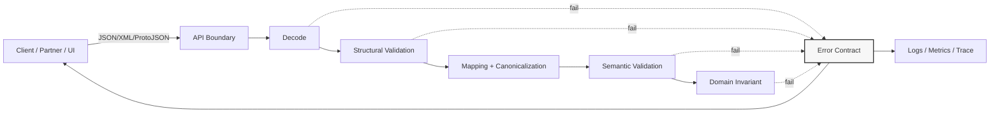
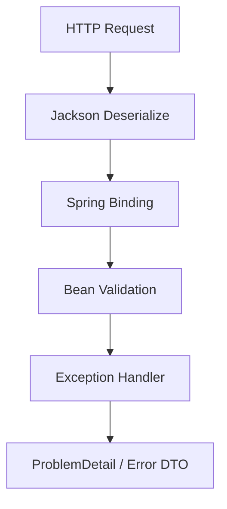
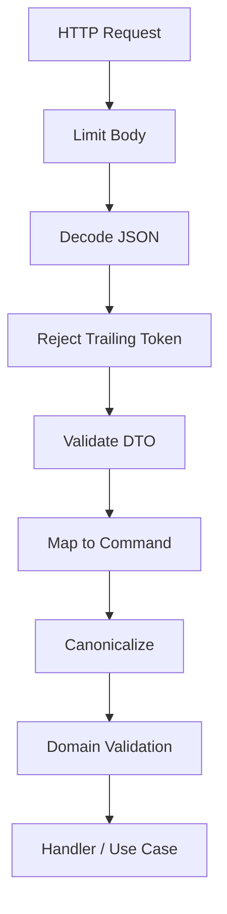
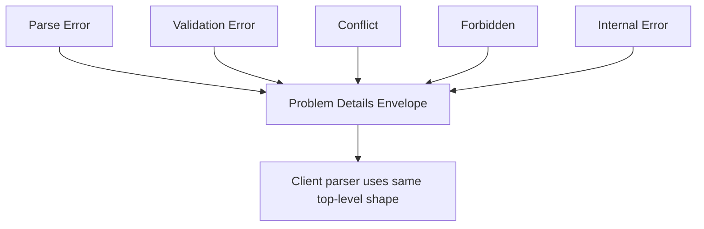
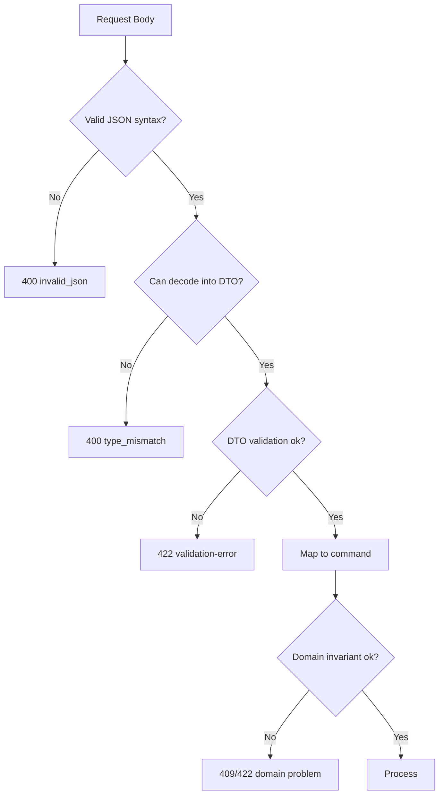
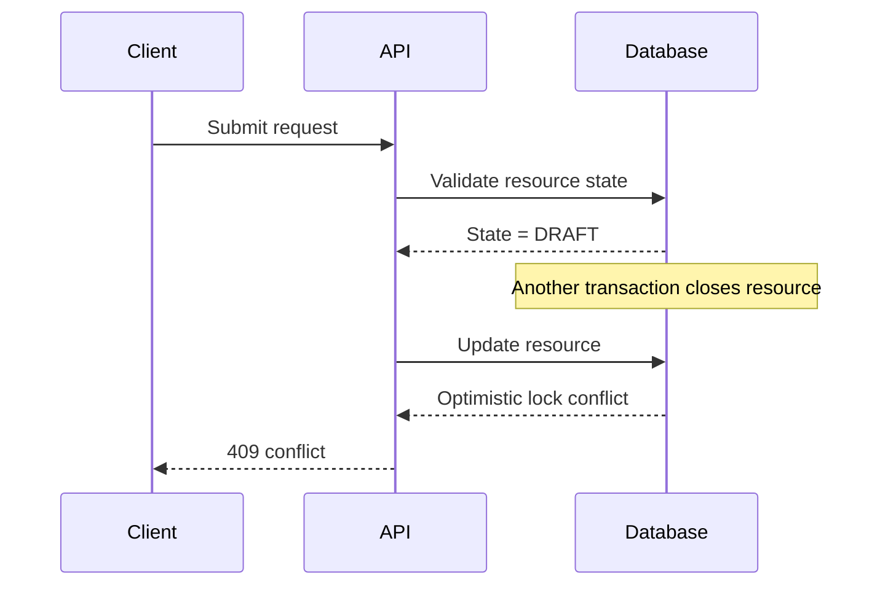
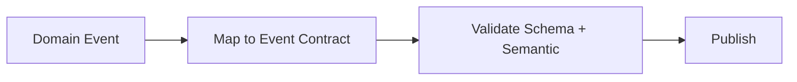

# learn-go-data-mapper-json-xml-protobuf-validation-part-028.md

# Part 028 — Validation Error Modeling

> Seri: **learn-go-data-mapper-json-xml-protobuf-validation**  
> Bagian: **028 / 033**  
> Topik: **Validation Error Modeling**  
> Target pembaca: **Java software engineer yang ingin menguasai Go data boundary, schema, mapping, serialization, dan validation secara production-grade**

---

## Daftar Isi

1. [Tujuan Pembelajaran](#1-tujuan-pembelajaran)
2. [Masalah Utama: Validasi Boleh Gagal, Tetapi Error Tidak Boleh Berantakan](#2-masalah-utama-validasi-boleh-gagal-tetapi-error-tidak-boleh-berantakan)
3. [Mental Model: Error Validation sebagai Public Contract](#3-mental-model-error-validation-sebagai-public-contract)
4. [Java-to-Go Translation](#4-java-to-go-translation)
5. [Taxonomy Error pada Data Boundary](#5-taxonomy-error-pada-data-boundary)
6. [Anatomi Validation Error yang Baik](#6-anatomi-validation-error-yang-baik)
7. [Problem Details RFC 9457 sebagai Envelope HTTP](#7-problem-details-rfc-9457-sebagai-envelope-http)
8. [Field Path: JSON Pointer, Dot Path, Struct Namespace, dan UI Path](#8-field-path-json-pointer-dot-path-struct-namespace-dan-ui-path)
9. [Error Code Design](#9-error-code-design)
10. [Human Message, Localization, dan Machine Semantics](#10-human-message-localization-dan-machine-semantics)
11. [Severity, Recoverability, dan Actionability](#11-severity-recoverability-dan-actionability)
12. [Model Go untuk Validation Error](#12-model-go-untuk-validation-error)
13. [Mapping `go-playground/validator` ke Error Contract](#13-mapping-go-playgroundvalidator-ke-error-contract)
14. [Decode Error vs Validation Error vs Domain Error](#14-decode-error-vs-validation-error-vs-domain-error)
15. [Nested Object, Array, Map, dan Path Stability](#15-nested-object-array-map-dan-path-stability)
16. [Batch Validation dan Partial Failure](#16-batch-validation-dan-partial-failure)
17. [Cross-field dan Cross-resource Validation](#17-cross-field-dan-cross-resource-validation)
18. [Security: Jangan Bocorkan Internal State](#18-security-jangan-bocorkan-internal-state)
19. [Observability: Error untuk Client vs Error untuk Operator](#19-observability-error-untuk-client-vs-error-untuk-operator)
20. [Versioning Error Contract](#20-versioning-error-contract)
21. [HTTP Status Decision Matrix](#21-http-status-decision-matrix)
22. [gRPC / Protobuf Error Modeling](#22-grpc--protobuf-error-modeling)
23. [Event-driven Error Modeling](#23-event-driven-error-modeling)
24. [Anti-patterns](#24-anti-patterns)
25. [Production Checklist](#25-production-checklist)
26. [Latihan Desain](#26-latihan-desain)
27. [Ringkasan Invariant](#27-ringkasan-invariant)
28. [Referensi](#28-referensi)

---

## 1. Tujuan Pembelajaran

Setelah menyelesaikan bagian ini, kamu harus mampu:

1. Mendesain **validation error contract** yang stabil untuk HTTP API, event ingestion, dan internal service boundary.
2. Membedakan **parse error**, **decode error**, **schema error**, **semantic validation error**, **domain invariant violation**, dan **authorization/state error**.
3. Membuat response error yang:
   - machine-readable,
   - human-readable,
   - mudah dilokalisasi,
   - aman dari informasi sensitif,
   - mudah diobservasi,
   - kompatibel untuk evolusi API.
4. Memetakan error dari `go-playground/validator` ke contract API yang lebih rapi.
5. Mendesain field path yang stabil untuk nested object, array, map, JSON, XML, Protobuf JSON, dan UI forms.
6. Menentukan kapan memakai **RFC 9457 Problem Details**, kapan memakai extension field `errors`, kapan memakai batch result object, dan kapan memakai domain-specific response.
7. Mencegah anti-pattern seperti mengembalikan raw validator message, raw struct namespace, database constraint name, stack trace, atau regex internal ke client.

Part ini sangat penting karena pada production API, validation failure adalah salah satu response yang paling sering diterima client. Parsing boleh gagal. Business rule boleh menolak request. Tetapi **bentuk error contract harus predictable**. Kalau tidak, client akan membuat parser brittle, UI akan salah menandai field, integrasi partner akan gagal, dan backward compatibility menjadi kacau.

---

## 2. Masalah Utama: Validasi Boleh Gagal, Tetapi Error Tidak Boleh Berantakan

Banyak engineer memperlakukan validation error sebagai detail kecil:

```json
{
  "error": "Key: 'CreateUserRequest.Email' Error:Field validation for 'Email' failed on the 'email' tag"
}
```

Ini terlihat cukup saat development, tetapi buruk untuk production.

Kenapa?

Karena response tersebut:

1. Membocorkan nama struct Go: `CreateUserRequest`.
2. Membocorkan tag validator: `email`.
3. Tidak punya error code stabil.
4. Tidak punya path API field yang cocok dengan JSON request.
5. Tidak bisa dilokalisasi dengan aman.
6. Tidak bisa dipakai UI untuk highlight field.
7. Tidak bisa dipakai integrasi partner untuk automated correction.
8. Sulit dikorelasikan dengan log dan trace.
9. Bisa berubah jika nama struct/tag/package berubah.
10. Tidak membedakan invalid syntax, invalid semantic, dan business rejection.

Validation error bukan sekadar string. Validation error adalah **public data contract**.

Mental model yang lebih benar:



Yang harus dipahami:

- Client butuh **stable public error**.
- Operator butuh **diagnostic error**.
- Developer butuh **debug context**.
- Auditor butuh **evidence and traceability**.
- Security butuh **least disclosure**.

Satu error object sering harus melayani semua kebutuhan ini, tetapi **tidak semua detail boleh dikirim ke client**.

---

## 3. Mental Model: Error Validation sebagai Public Contract

Validation error contract adalah kontrak yang menjawab pertanyaan berikut:

1. **Apa jenis masalahnya?**  
   Contoh: request invalid, field missing, conflict, state transition invalid.

2. **Field mana yang bermasalah?**  
   Contoh: `/applicant/email`, `/items/3/quantity`.

3. **Aturan apa yang dilanggar?**  
   Contoh: `required`, `format.email`, `range.min`, `domain.case_state.invalid_transition`.

4. **Apa nilai yang diterima?**  
   Biasanya tidak dikirim mentah karena bisa sensitif; kadang hanya metadata aman.

5. **Apa yang bisa dilakukan client?**  
   Contoh: “provide a valid email address”, “choose a start date before end date”.

6. **Apakah error ini retryable?**  
   Validation error biasanya tidak retryable tanpa modifikasi input.

7. **Apakah ada correlation ID?**  
   Untuk support/debugging.

8. **Apakah error contract dapat berevolusi tanpa mematahkan client?**

Validation error yang baik bukan:

```text
something went wrong
```

Bukan juga:

```text
SQLSTATE 23505 violates unique constraint users_email_key
```

Validation error yang baik berbentuk data:

```json
{
  "type": "https://api.example.com/problems/validation-error",
  "title": "Request validation failed",
  "status": 422,
  "detail": "One or more fields are invalid.",
  "instance": "/problems/01JZ7R9H9M8Y2P9A8M5AVMDT3Q",
  "traceId": "01JZ7R9H9M8Y2P9A8M5AVMDT3Q",
  "errors": [
    {
      "code": "field.required",
      "path": "/email",
      "message": "Email is required.",
      "rejected": null
    },
    {
      "code": "field.format.email",
      "path": "/profile/contactEmail",
      "message": "Contact email must be a valid email address."
    }
  ]
}
```

Namun bentuk ini juga belum final untuk semua sistem. Beberapa organisasi akan memilih:

- `invalidParams` mengikuti gaya Google APIs,
- `violations` mengikuti gaya Protobuf BadRequest,
- `errors` sebagai RFC 9457 extension,
- `details` sebagai domain-specific array,
- `result[]` untuk batch operation.

Yang penting bukan namanya, tetapi invariants-nya.

---

## 4. Java-to-Go Translation

Sebagai Java engineer, kamu mungkin terbiasa dengan kombinasi:

- Jackson untuk JSON mapping,
- Bean Validation / Jakarta Validation untuk field validation,
- Spring MVC binding errors,
- `MethodArgumentNotValidException`,
- `ConstraintViolationException`,
- `BindingResult`,
- `ProblemDetail` di Spring,
- MapStruct untuk mapper,
- JAXB untuk XML,
- Protobuf Java runtime.

Di Java/Spring, framework sering membangun error pipeline otomatis:



Di Go, lebih lazim untuk membuat pipeline eksplisit:



Perbedaan penting:

| Area | Java/Spring Bias | Go Bias |
|---|---|---|
| Binding | Framework-driven | Explicit decode function |
| Validation | Annotation-heavy | Tag + explicit validation + domain methods |
| Error handling | Exception mapping | Error values + explicit response builder |
| Field path | Bean property path | JSON/API path must be derived intentionally |
| Localization | MessageSource | Explicit translator/message catalog |
| Contract | Often framework-shaped | Should be deliberately shaped |
| Mapper | MapStruct/ModelMapper | Handwritten mapper often preferred |

Go tidak melarang framework, tetapi production-grade Go biasanya menghindari “magic global exception mapping” yang membuat control flow sulit dilacak. Error contract sebaiknya dibangun sebagai package eksplisit.

Contoh package boundary:

```text
internal/
  api/
    problem/
      problem.go
      validation.go
      http.go
      path.go
    handler/
      user_handler.go
  validation/
    validator.go
    translator.go
  domain/
    user.go
```

Tujuannya bukan membuat banyak layer, tetapi membuat batas tanggung jawab jelas.

---

## 5. Taxonomy Error pada Data Boundary

Sebelum membuat model error, kamu harus tahu jenis error apa yang sedang kamu modelkan.

### 5.1 Transport-level error

Contoh:

- `Content-Type` bukan `application/json`.
- Body terlalu besar.
- Body kosong padahal required.
- Request timeout saat baca body.

Status umum:

- `400 Bad Request`
- `413 Content Too Large`
- `415 Unsupported Media Type`
- `408 Request Timeout`

Error ini terjadi sebelum data bisa dianggap sebagai DTO.

### 5.2 Syntax / parse error

Contoh:

```json
{
  "email": "a@example.com",
```

JSON tidak valid secara syntax.

Status umum:

- `400 Bad Request`

Jangan sebut “validation failed” untuk JSON syntax error. Ini bukan validation semantic; ini request body tidak bisa diparse.

### 5.3 Decode / type binding error

Contoh:

```json
{
  "age": "twenty"
}
```

DTO mengharapkan number, tetapi payload memberi string.

Status umum:

- `400 Bad Request`

Ini bukan business validation. Data belum berhasil masuk ke bentuk typed DTO.

### 5.4 Structural validation error

Contoh:

```json
{
  "email": "not-an-email",
  "age": -1
}
```

Payload valid JSON dan berhasil didecode, tetapi melanggar aturan DTO:

- required,
- min/max,
- enum,
- format,
- length,
- regex,
- oneof.

Status umum:

- `422 Unprocessable Content`
- beberapa organisasi tetap memakai `400 Bad Request`

Pilihan antara 400 dan 422 harus konsisten.

### 5.5 Semantic validation error

Contoh:

```json
{
  "startDate": "2026-07-10",
  "endDate": "2026-07-01"
}
```

Masing-masing field valid, tetapi kombinasi tidak valid.

Status umum:

- `422 Unprocessable Content`

### 5.6 Domain invariant violation

Contoh:

- Case tidak bisa di-submit karena status masih `DRAFT_INCOMPLETE`.
- Appeal tidak bisa dibuat karena case belum closed.
- Renewal tidak bisa diproses karena license expired lebih dari threshold tertentu.

Status umum:

- `409 Conflict` jika konflik dengan state resource saat ini.
- `422 Unprocessable Content` jika input semantik tidak dapat diproses.
- `403 Forbidden` jika sebenarnya policy/permission melarang action.

### 5.7 Persistence constraint error

Contoh:

- Unique email sudah ada.
- Foreign key tidak ditemukan.
- Optimistic lock conflict.

Status umum:

- `409 Conflict`
- `404 Not Found` untuk resource reference yang tidak ada, tergantung policy.
- `422` jika referensi dianggap bagian dari semantic input.

Jangan membocorkan constraint name database ke client.

### 5.8 Authorization-context validation

Contoh:

- Field `assignedOfficerId` hanya boleh diisi supervisor.
- User boleh update application miliknya, tetapi tidak boleh mengubah agency field tertentu.

Status umum:

- `403 Forbidden`
- kadang `404 Not Found` untuk resource hiding policy.

Ini bukan validation biasa. Ini policy decision.

---

## 6. Anatomi Validation Error yang Baik

Sebuah field-level validation error idealnya punya:

| Field | Fungsi | Public? |
|---|---|---|
| `code` | Machine-readable stable code | Ya |
| `path` | Lokasi field dalam request/API contract | Ya |
| `message` | Human-readable message | Ya, sanitized |
| `params` | Parameter aturan, misalnya `min: 3` | Ya, kalau aman |
| `rejected` | Nilai ditolak | Hati-hati; biasanya tidak |
| `severity` | Error/warning/info | Opsional |
| `source` | `body`, `query`, `path`, `header` | Ya |
| `reason` | Internal reason | Tidak, kecuali sanitized |
| `debug` | Debug context | Tidak untuk client |

Contoh bentuk yang cukup production-friendly:

```json
{
  "code": "field.length.min",
  "path": "/password",
  "message": "Password must contain at least 12 characters.",
  "params": {
    "min": 12
  },
  "source": "body"
}
```

Untuk field yang bukan JSON body:

```json
{
  "code": "query.invalid_enum",
  "path": "sort",
  "message": "Sort must be one of: createdAt, updatedAt.",
  "params": {
    "allowed": ["createdAt", "updatedAt"]
  },
  "source": "query"
}
```

Untuk cross-field:

```json
{
  "code": "date.range.invalid",
  "path": "/endDate",
  "message": "End date must be on or after start date.",
  "params": {
    "related": ["/startDate"]
  },
  "source": "body"
}
```

Untuk object-level rule:

```json
{
  "code": "application.period.invalid",
  "path": "/",
  "message": "Application period is invalid.",
  "params": {
    "related": ["/startDate", "/endDate"]
  },
  "source": "body"
}
```

### 6.1 Invariant utama

Error contract harus:

1. **Stable**: tidak berubah hanya karena rename struct Go.
2. **Precise**: field path bisa menunjuk lokasi masalah.
3. **Safe**: tidak bocor internal implementation.
4. **Actionable**: client tahu apa yang harus diperbaiki.
5. **Localizable**: message bisa berubah tanpa mengubah code.
6. **Extensible**: bisa menambah metadata tanpa breaking client.
7. **Observable**: operator bisa melacak instance error.

---

## 7. Problem Details RFC 9457 sebagai Envelope HTTP

RFC 9457 mendefinisikan format “Problem Details for HTTP APIs”. Ini menggantikan RFC 7807 dan menyediakan model umum untuk error response HTTP.

Core fields:

| Field | Makna |
|---|---|
| `type` | URI yang mengidentifikasi problem type |
| `title` | Ringkasan human-readable dari problem type |
| `status` | HTTP status code |
| `detail` | Penjelasan occurrence-specific |
| `instance` | URI/identifier untuk occurrence spesifik |

Untuk validation error, RFC 9457 mengizinkan extension members. Pola umum adalah menambahkan `errors` array:

```json
{
  "type": "https://api.example.com/problems/validation-error",
  "title": "Request validation failed",
  "status": 422,
  "detail": "One or more fields are invalid.",
  "instance": "/problems/01JZ7R9H9M8Y2P9A8M5AVMDT3Q",
  "errors": [
    {
      "code": "field.required",
      "path": "/email",
      "message": "Email is required."
    }
  ]
}
```

### 7.1 Kenapa envelope penting?

Tanpa envelope, kamu biasanya punya banyak bentuk error:

```json
{"error":"invalid request"}
```

```json
{"message":"not found"}
```

```json
{"errors":[...]}
```

```json
{"code":"ERR_123"}
```

Ini membuat client harus punya banyak parser.

Dengan envelope konsisten:



### 7.2 Jangan overfit RFC 9457

Problem Details cocok untuk HTTP error. Tetapi jangan memaksakan untuk semua hal.

Tidak selalu cocok untuk:

- streaming record-level error,
- asynchronous event dead-letter payload,
- batch import report dengan ribuan row error,
- domain result yang memang resource representation,
- gRPC binary error details.

Untuk batch import, misalnya, response mungkin lebih baik berbentuk resource:

```json
{
  "importId": "imp_123",
  "status": "FAILED",
  "summary": {
    "totalRows": 1000,
    "acceptedRows": 920,
    "rejectedRows": 80
  },
  "errorReportUrl": "/imports/imp_123/errors"
}
```

Top 1% engineer tidak sekadar mengikuti standar; mereka tahu **batas standar**.

---

## 8. Field Path: JSON Pointer, Dot Path, Struct Namespace, dan UI Path

Field path adalah salah satu bagian paling sering salah.

### 8.1 Empat jenis path

| Path Type | Contoh | Cocok untuk |
|---|---|---|
| Go struct namespace | `CreateUserRequest.Profile.Email` | Internal debug |
| JSON Pointer | `/profile/email` | API body path |
| Dot path | `profile.email` | UI form binding |
| JSONPath | `$.profile.email` | Query/filter/debug, bukan selalu error contract |

Jangan kirim Go struct namespace sebagai public API path.

Buruk:

```json
{
  "field": "CreateUserRequest.Profile.Email",
  "message": "required"
}
```

Lebih baik:

```json
{
  "path": "/profile/email",
  "message": "Email is required."
}
```

### 8.2 JSON Pointer

JSON Pointer memiliki syntax standar:

- root: empty string atau `/` tergantung representasi yang dipilih,
- property: `/profile/email`,
- array index: `/items/0/quantity`,
- escape `~` menjadi `~0`,
- escape `/` menjadi `~1`.

Contoh:

```json
{
  "a/b": {
    "c~d": 1
  }
}
```

Pointer untuk value `1`:

```text
/a~1b/c~0d
```

### 8.3 Dot path

Dot path lebih nyaman untuk UI:

```text
profile.email
items[0].quantity
```

Tetapi dot path tidak selalu unambiguous jika property mengandung titik:

```json
{
  "user.name": "x"
}
```

Dot path cocok sebagai tambahan, bukan satu-satunya canonical path.

### 8.4 Recommended contract

Gunakan JSON Pointer sebagai canonical body path, dan optional UI hint jika perlu:

```json
{
  "code": "field.required",
  "path": "/items/0/quantity",
  "uiPath": "items[0].quantity",
  "message": "Quantity is required."
}
```

Untuk non-body source:

```json
{
  "code": "header.required",
  "source": "header",
  "path": "Idempotency-Key",
  "message": "Idempotency-Key header is required."
}
```

### 8.5 Path stability policy

Path harus berdasarkan **public contract names**, bukan internal field names.

Jika Go struct:

```go
type CreateUserRequest struct {
    ContactEmail string `json:"email" validate:"required,email"`
}
```

Public path harus:

```text
/email
```

Bukan:

```text
/ContactEmail
```

Karena client tidak tahu `ContactEmail`.

---

## 9. Error Code Design

Error code harus machine-readable dan stabil.

### 9.1 Jangan jadikan message sebagai code

Buruk:

```json
{
  "message": "Email is required"
}
```

Client lalu melakukan:

```js
if (error.message === "Email is required") {
  showEmailRequiredUI()
}
```

Ini brittle. Message bisa berubah karena localization, tone, punctuation, atau copywriting.

Lebih baik:

```json
{
  "code": "field.required",
  "message": "Email is required."
}
```

Client melakukan:

```js
if (error.code === "field.required") {
  showRequiredUI(error.path)
}
```

### 9.2 Code hierarchy

Pilih naming convention yang stabil.

Contoh umum:

```text
request.body.invalid_json
request.body.unknown_field
request.body.type_mismatch
field.required
field.format.email
field.length.min
field.length.max
field.range.min
field.range.max
field.enum.invalid
date.range.invalid
domain.state.invalid_transition
domain.uniqueness.conflict
authz.field.not_allowed
```

### 9.3 Jangan terlalu granular sejak awal

Terlalu umum buruk:

```text
invalid
```

Terlalu granular juga buruk:

```text
first_name_must_be_at_least_3_chars_when_user_type_is_individual
```

Lebih baik:

```text
field.length.min
```

Dengan params:

```json
{
  "code": "field.length.min",
  "path": "/firstName",
  "params": {
    "min": 3
  }
}
```

Untuk domain-specific rule:

```json
{
  "code": "application.owner.not_eligible",
  "path": "/applicantId",
  "message": "Applicant is not eligible for this application type."
}
```

### 9.4 Error code sebagai compatibility surface

Setelah dipublikasikan, error code harus diperlakukan seperti API field.

Breaking:

```diff
- field.required
+ validation.required
```

Non-breaking:

```diff
{
  "code": "field.required",
  "path": "/email",
+ "params": {"required": true},
  "message": "Email is required."
}
```

### 9.5 Maintain registry

Untuk sistem besar, buat registry:

```text
internal/api/problem/codes.md
internal/api/problem/codes.go
```

Contoh Go constants:

```go
package problem

const (
    CodeRequestInvalidJSON  = "request.body.invalid_json"
    CodeRequestUnknownField = "request.body.unknown_field"
    CodeTypeMismatch        = "request.body.type_mismatch"

    CodeFieldRequired   = "field.required"
    CodeFieldEmail      = "field.format.email"
    CodeFieldMinLength  = "field.length.min"
    CodeFieldMaxLength  = "field.length.max"
    CodeFieldEnum       = "field.enum.invalid"

    CodeDateRangeInvalid = "date.range.invalid"
)
```

---

## 10. Human Message, Localization, dan Machine Semantics

Pisahkan:

1. `code`: machine semantics.
2. `message`: human-readable copy.
3. `params`: message variables.
4. `path`: target field.

Contoh:

```json
{
  "code": "field.length.min",
  "path": "/password",
  "message": "Password must contain at least 12 characters.",
  "params": {
    "min": 12
  }
}
```

Untuk localization:

```json
{
  "code": "field.length.min",
  "path": "/password",
  "message": "Kata sandi minimal harus berisi 12 karakter.",
  "params": {
    "min": 12
  },
  "locale": "id-ID"
}
```

### 10.1 Message tidak boleh diparse client

Client boleh menampilkan message. Client tidak boleh parse message.

Buruk:

```js
if (message.includes("12")) {
  setMinLength(12)
}
```

Benar:

```js
if (error.code === "field.length.min") {
  setMinLength(error.params.min)
}
```

### 10.2 Message harus actionable

Buruk:

```text
failed on min tag
```

Lebih baik:

```text
Password must contain at least 12 characters.
```

Namun jangan terlalu detail sehingga bocor policy sensitif.

Contoh password rule:

```text
Password does not meet the required complexity policy.
```

Kadang lebih aman daripada:

```text
Password must include at least one uppercase, one lowercase, one digit, one symbol, must not contain your last 5 passwords, must not be found in breach dataset X.
```

Tingkat detail bergantung threat model.

### 10.3 Message catalog

Contoh message catalog sederhana:

```go
var enMessages = map[string]string{
    CodeFieldRequired:  "This field is required.",
    CodeFieldEmail:     "This field must be a valid email address.",
    CodeFieldMinLength: "This field must contain at least {min} characters.",
}
```

Untuk sistem besar, message catalog bisa berada di translation service atau file ICU message.

---

## 11. Severity, Recoverability, dan Actionability

Tidak semua validation result harus error fatal. Kadang ada warning.

Contoh:

- `error`: request tidak bisa diproses.
- `warning`: request bisa diproses tetapi ada risiko/normalization.
- `info`: sistem melakukan adjustment.

Contoh response untuk preview endpoint:

```json
{
  "valid": true,
  "warnings": [
    {
      "code": "address.normalized",
      "path": "/address/postalCode",
      "message": "Postal code was normalized from 12345-6789 to 123456."
    }
  ]
}
```

Untuk command endpoint yang melakukan mutation, hati-hati mengembalikan warning. Warning bisa diabaikan client. Kalau warning mengubah meaning signifikan, lebih baik require explicit confirmation.

Recoverability:

| Error Type | Retry without change? | Client Action |
|---|---:|---|
| Invalid JSON | Tidak | Fix payload syntax |
| Missing field | Tidak | Provide field |
| Invalid enum | Tidak | Use allowed value |
| Conflict current state | Kadang | Refresh resource / choose new action |
| Rate limit | Ya setelah delay | Retry after backoff |
| Internal error | Ya/kadang | Retry or contact support |

Validation error biasanya **not retryable without input change**.

---

## 12. Model Go untuk Validation Error

Sekarang kita desain package error contract.

### 12.1 Core types

```go
package problem

import (
    "encoding/json"
    "net/http"
)

type Source string

const (
    SourceBody   Source = "body"
    SourceQuery  Source = "query"
    SourcePath   Source = "path"
    SourceHeader Source = "header"
)

type Violation struct {
    Code    string         `json:"code"`
    Path    string         `json:"path,omitempty"`
    Source  Source         `json:"source,omitempty"`
    Message string         `json:"message"`
    Params  map[string]any `json:"params,omitempty"`
}

type Problem struct {
    Type     string      `json:"type"`
    Title    string      `json:"title"`
    Status   int         `json:"status"`
    Detail   string      `json:"detail,omitempty"`
    Instance string      `json:"instance,omitempty"`
    TraceID  string      `json:"traceId,omitempty"`
    Errors   []Violation `json:"errors,omitempty"`
}

func (p Problem) WriteJSON(w http.ResponseWriter) {
    w.Header().Set("Content-Type", "application/problem+json")
    w.WriteHeader(p.Status)
    _ = json.NewEncoder(w).Encode(p)
}
```

### 12.2 Factory functions

```go
const (
    TypeValidationError = "https://api.example.com/problems/validation-error"
    TypeBadRequest      = "https://api.example.com/problems/bad-request"
    TypeConflict        = "https://api.example.com/problems/conflict"
)

func NewValidationProblem(traceID string, violations []Violation) Problem {
    return Problem{
        Type:    TypeValidationError,
        Title:   "Request validation failed",
        Status:  http.StatusUnprocessableEntity,
        Detail:  "One or more fields are invalid.",
        TraceID: traceID,
        Errors:  violations,
    }
}

func NewBadRequestProblem(traceID, code, message string) Problem {
    return Problem{
        Type:    TypeBadRequest,
        Title:   "Bad request",
        Status:  http.StatusBadRequest,
        Detail:  message,
        TraceID: traceID,
        Errors: []Violation{
            {
                Code:    code,
                Source:  SourceBody,
                Message: message,
            },
        },
    }
}
```

### 12.3 Jangan expose raw error

Buruk:

```go
func handle(w http.ResponseWriter, r *http.Request) {
    if err := decode(r.Body, &req); err != nil {
        http.Error(w, err.Error(), http.StatusBadRequest)
        return
    }
}
```

Lebih baik:

```go
func handle(w http.ResponseWriter, r *http.Request) {
    traceID := TraceIDFromContext(r.Context())

    if err := decode(r.Body, &req); err != nil {
        p := problem.NewBadRequestProblem(
            traceID,
            problem.CodeRequestInvalidJSON,
            "Request body is not valid JSON.",
        )
        p.WriteJSON(w)
        return
    }
}
```

Internal log tetap boleh memuat detail:

```go
logger.WarnContext(r.Context(), "request decode failed",
    "trace_id", traceID,
    "error", err,
)
```

Client menerima sanitized error. Operator menerima detail.

---

## 13. Mapping `go-playground/validator` ke Error Contract

`go-playground/validator` menghasilkan `ValidationErrors`, yang berisi `FieldError`.

`FieldError` punya informasi seperti:

- field name,
- struct namespace,
- validation tag,
- parameter tag,
- kind/type,
- value,
- translated message jika memakai translator.

Tetapi output itu belum tentu cocok untuk public API.

### 13.1 DTO example

```go
type CreateUserRequest struct {
    Email    string `json:"email" validate:"required,email"`
    Password string `json:"password" validate:"required,min=12"`
    Profile  struct {
        DisplayName string `json:"displayName" validate:"required,min=3,max=80"`
    } `json:"profile" validate:"required"`
}
```

### 13.2 Validator singleton

```go
package validation

import (
    "reflect"
    "strings"

    "github.com/go-playground/validator/v10"
)

func NewValidator() *validator.Validate {
    v := validator.New(validator.WithRequiredStructEnabled())

    v.RegisterTagNameFunc(func(fld reflect.StructField) string {
        tag := fld.Tag.Get("json")
        if tag == "" || tag == "-" {
            return fld.Name
        }
        name, _, _ := strings.Cut(tag, ",")
        if name == "" {
            return fld.Name
        }
        return name
    })

    return v
}
```

Dengan `RegisterTagNameFunc`, validator error dapat memakai nama JSON field, bukan nama struct Go.

Namun kamu tetap perlu membangun JSON Pointer.

### 13.3 Mapping tag ke code

```go
func codeForTag(tag string) string {
    switch tag {
    case "required":
        return "field.required"
    case "email":
        return "field.format.email"
    case "min":
        return "field.min"
    case "max":
        return "field.max"
    case "oneof":
        return "field.enum.invalid"
    default:
        return "field.invalid"
    }
}
```

Untuk production, jangan cuma map tag. Pertimbangkan type/kind.

`min` pada string berarti length. `min` pada number berarti numeric lower bound. `min` pada slice berarti item count.

Lebih baik:

```go
func codeForFieldError(fe validator.FieldError) string {
    switch fe.Tag() {
    case "required":
        return "field.required"
    case "email":
        return "field.format.email"
    case "min":
        switch fe.Kind().String() {
        case "string":
            return "field.length.min"
        case "slice", "array", "map":
            return "field.items.min"
        default:
            return "field.range.min"
        }
    case "max":
        switch fe.Kind().String() {
        case "string":
            return "field.length.max"
        case "slice", "array", "map":
            return "field.items.max"
        default:
            return "field.range.max"
        }
    case "oneof":
        return "field.enum.invalid"
    default:
        return "field.invalid"
    }
}
```

### 13.4 Params extraction

```go
func paramsForFieldError(fe validator.FieldError) map[string]any {
    switch fe.Tag() {
    case "min":
        return map[string]any{"min": fe.Param()}
    case "max":
        return map[string]any{"max": fe.Param()}
    case "oneof":
        return map[string]any{"allowed": strings.Fields(fe.Param())}
    default:
        return nil
    }
}
```

Untuk numeric params, parse string menjadi int jika contract mengharapkan number.

```go
func intParam(s string) any {
    n, err := strconv.Atoi(s)
    if err != nil {
        return s
    }
    return n
}
```

### 13.5 Struct namespace ke JSON Pointer

Validator namespace bisa seperti:

```text
CreateUserRequest.profile.displayName
```

Atau untuk slice:

```text
CreateOrderRequest.items[0].quantity
```

Kamu perlu mengubahnya menjadi JSON Pointer:

```text
/profile/displayName
/items/0/quantity
```

Implementasi sederhana:

```go
func ToJSONPointer(namespace string) string {
    // Assumption:
    // - RegisterTagNameFunc already turns Go field names into JSON names.
    // - Namespace first segment is root struct name and must be dropped.
    // - Array indices use [n].
    parts := strings.Split(namespace, ".")
    if len(parts) <= 1 {
        return "/"
    }

    var tokens []string
    for _, part := range parts[1:] {
        for len(part) > 0 {
            idx := strings.IndexByte(part, '[')
            if idx < 0 {
                tokens = append(tokens, escapeJSONPointerToken(part))
                break
            }

            if idx > 0 {
                tokens = append(tokens, escapeJSONPointerToken(part[:idx]))
            }

            end := strings.IndexByte(part[idx:], ']')
            if end < 0 {
                tokens = append(tokens, escapeJSONPointerToken(part))
                break
            }

            index := part[idx+1 : idx+end]
            tokens = append(tokens, index)
            part = part[idx+end+1:]
        }
    }

    if len(tokens) == 0 {
        return "/"
    }
    return "/" + strings.Join(tokens, "/")
}

func escapeJSONPointerToken(s string) string {
    s = strings.ReplaceAll(s, "~", "~0")
    s = strings.ReplaceAll(s, "/", "~1")
    return s
}
```

Catatan: ini cukup untuk banyak DTO sederhana, tetapi production besar harus dites untuk:

- anonymous embedded struct,
- map keys,
- custom JSON names,
- nested arrays,
- omitted fields,
- fields dengan `json:"-"`,
- field name berisi `/` atau `~`,
- path dari external schema validator.

### 13.6 Full mapper

```go
package problem

import (
    "errors"
    "strconv"
    "strings"

    "github.com/go-playground/validator/v10"
)

func ViolationsFromValidator(err error) []Violation {
    if err == nil {
        return nil
    }

    var validationErrors validator.ValidationErrors
    if !errors.As(err, &validationErrors) {
        return []Violation{
            {
                Code:    "field.invalid",
                Message: "Request is invalid.",
                Source:  SourceBody,
            },
        }
    }

    violations := make([]Violation, 0, len(validationErrors))
    for _, fe := range validationErrors {
        violations = append(violations, Violation{
            Code:    codeForFieldError(fe),
            Path:    ToJSONPointer(fe.Namespace()),
            Source:  SourceBody,
            Message: messageForFieldError(fe),
            Params:  paramsForFieldError(fe),
        })
    }

    return violations
}

func messageForFieldError(fe validator.FieldError) string {
    switch fe.Tag() {
    case "required":
        return "This field is required."
    case "email":
        return "This field must be a valid email address."
    case "min":
        switch fe.Kind().String() {
        case "string":
            return "This field is too short."
        case "slice", "array", "map":
            return "This field has too few items."
        default:
            return "This field is below the minimum allowed value."
        }
    case "max":
        switch fe.Kind().String() {
        case "string":
            return "This field is too long."
        case "slice", "array", "map":
            return "This field has too many items."
        default:
            return "This field exceeds the maximum allowed value."
        }
    case "oneof":
        return "This field contains an unsupported value."
    default:
        return "This field is invalid."
    }
}

func paramsForFieldError(fe validator.FieldError) map[string]any {
    switch fe.Tag() {
    case "min":
        return map[string]any{"min": parseNumericParam(fe.Param())}
    case "max":
        return map[string]any{"max": parseNumericParam(fe.Param())}
    case "oneof":
        return map[string]any{"allowed": strings.Fields(fe.Param())}
    default:
        return nil
    }
}

func parseNumericParam(s string) any {
    if n, err := strconv.Atoi(s); err == nil {
        return n
    }
    return s
}
```

### 13.7 Sorting errors

Validator error order may not be suitable as public contract. Sort for stable output.

```go
sort.SliceStable(violations, func(i, j int) bool {
    if violations[i].Path == violations[j].Path {
        return violations[i].Code < violations[j].Code
    }
    return violations[i].Path < violations[j].Path
})
```

Stable error order helps:

- snapshot tests,
- client tests,
- debugging,
- deterministic logs,
- contract regression detection.

---

## 14. Decode Error vs Validation Error vs Domain Error

Satu mistake umum: semua error dikembalikan sebagai `validation failed`.

Padahal:



### 14.1 Invalid JSON

Example:

```json
{"email":"a@example.com"
```

Response:

```json
{
  "type": "https://api.example.com/problems/bad-request",
  "title": "Bad request",
  "status": 400,
  "detail": "Request body is not valid JSON.",
  "errors": [
    {
      "code": "request.body.invalid_json",
      "source": "body",
      "message": "Request body is not valid JSON."
    }
  ]
}
```

### 14.2 Type mismatch

Example:

```json
{"age":"abc"}
```

Response:

```json
{
  "type": "https://api.example.com/problems/bad-request",
  "title": "Bad request",
  "status": 400,
  "detail": "Request body contains a value with an invalid type.",
  "errors": [
    {
      "code": "request.body.type_mismatch",
      "path": "/age",
      "source": "body",
      "message": "Age must be a number."
    }
  ]
}
```

### 14.3 DTO validation

Example:

```json
{"email":"abc"}
```

Response:

```json
{
  "type": "https://api.example.com/problems/validation-error",
  "title": "Request validation failed",
  "status": 422,
  "detail": "One or more fields are invalid.",
  "errors": [
    {
      "code": "field.format.email",
      "path": "/email",
      "source": "body",
      "message": "Email must be a valid email address."
    }
  ]
}
```

### 14.4 Domain conflict

Example:

```json
{"action":"submit"}
```

But case is already closed.

Response:

```json
{
  "type": "https://api.example.com/problems/case-state-conflict",
  "title": "Case state conflict",
  "status": 409,
  "detail": "The case cannot be submitted in its current state.",
  "errors": [
    {
      "code": "case.state.invalid_transition",
      "path": "/action",
      "source": "body",
      "message": "The requested action is not allowed for the current case state.",
      "params": {
        "currentState": "CLOSED",
        "requestedAction": "submit"
      }
    }
  ]
}
```

Apakah `currentState` aman dikirim? Tergantung domain/security. Untuk regulatory case management, biasanya state resource sendiri sering visible ke authorized user, jadi boleh. Untuk security-sensitive resource, mungkin tidak.

---

## 15. Nested Object, Array, Map, dan Path Stability

### 15.1 Nested object

Payload:

```json
{
  "profile": {
    "address": {
      "postalCode": "abc"
    }
  }
}
```

Path:

```text
/profile/address/postalCode
```

### 15.2 Array

Payload:

```json
{
  "items": [
    {"quantity": 2},
    {"quantity": 0}
  ]
}
```

Path:

```text
/items/1/quantity
```

### 15.3 Map

Payload:

```json
{
  "attributes": {
    "risk/score": -1,
    "x~flag": true
  }
}
```

JSON Pointer paths:

```text
/attributes/risk~1score
/attributes/x~0flag
```

Map key escaping matters.

### 15.4 Stable item identity vs array index

For UI, array index can be unstable if client reorders rows. For batch imports, row number may be more meaningful than array index.

Example batch row error:

```json
{
  "code": "field.required",
  "path": "/records/17/email",
  "row": 18,
  "message": "Email is required."
}
```

Why row 18 if path index 17? Because JSON array index is zero-based, CSV/spreadsheet row usually one-based and includes header policy. Be explicit.

For item with client-provided ID:

```json
{
  "code": "field.range.min",
  "path": "/items/3/quantity",
  "itemId": "line_abc123",
  "message": "Quantity must be at least 1."
}
```

This helps UI bind after reorder.

### 15.5 XML path

XML error path may need namespace-aware path:

```text
/{urn:example:order}Order/{urn:example:order}Items/0/{urn:example:order}Quantity
```

But for API ergonomics, many teams define simplified contract path:

```text
/order/items/0/quantity
```

As long as documented and stable.

### 15.6 Protobuf path

For Protobuf/gRPC, common path style is field path:

```text
items[3].quantity
```

For ProtoJSON HTTP gateway, JSON Pointer may be better:

```text
/items/3/quantity
```

Do not mix arbitrarily. Define boundary-specific convention.

---

## 16. Batch Validation dan Partial Failure

Batch operation perlu error modeling berbeda.

### 16.1 All-or-nothing batch

If any item invalid, reject entire request.

```json
{
  "type": "https://api.example.com/problems/validation-error",
  "title": "Request validation failed",
  "status": 422,
  "detail": "One or more records are invalid.",
  "errors": [
    {
      "code": "field.required",
      "path": "/records/2/email",
      "message": "Email is required."
    }
  ]
}
```

### 16.2 Partial success batch

If valid records are processed and invalid records rejected, response is no longer pure error. It is a batch result.

```json
{
  "batchId": "batch_123",
  "status": "PARTIAL_SUCCESS",
  "summary": {
    "requested": 3,
    "succeeded": 2,
    "failed": 1
  },
  "results": [
    {
      "index": 0,
      "status": "SUCCEEDED",
      "resourceId": "usr_1"
    },
    {
      "index": 1,
      "status": "FAILED",
      "errors": [
        {
          "code": "field.format.email",
          "path": "/records/1/email",
          "message": "Email must be a valid email address."
        }
      ]
    },
    {
      "index": 2,
      "status": "SUCCEEDED",
      "resourceId": "usr_2"
    }
  ]
}
```

HTTP status could be:

- `200 OK` if request accepted and result explains partial failure.
- `207 Multi-Status` in WebDAV-like semantics, but many JSON APIs avoid it.
- `202 Accepted` if processing asynchronous.

### 16.3 Async batch

For large import:

```json
{
  "importId": "imp_123",
  "status": "VALIDATION_FAILED",
  "summary": {
    "total": 100000,
    "failed": 372
  },
  "errorReport": {
    "href": "/imports/imp_123/errors",
    "contentType": "application/x-ndjson"
  }
}
```

Do not put 100k validation errors into one HTTP response by default. Use report resource or paginated errors.

### 16.4 Error cap

Always cap validation errors:

```go
const MaxViolations = 100
```

Response:

```json
{
  "type": "https://api.example.com/problems/validation-error",
  "title": "Request validation failed",
  "status": 422,
  "detail": "More than 100 validation errors were found; only the first 100 are returned.",
  "errorsTruncated": true,
  "errors": []
}
```

This prevents denial-of-service via error amplification.

---

## 17. Cross-field dan Cross-resource Validation

### 17.1 Cross-field validation

Example:

```json
{
  "startDate": "2026-07-10",
  "endDate": "2026-07-01"
}
```

Violation:

```json
{
  "code": "date.range.invalid",
  "path": "/endDate",
  "message": "End date must be on or after start date.",
  "params": {
    "related": ["/startDate"]
  }
}
```

Choose primary path carefully:

- If one field is naturally wrong, point to it.
- If combination is wrong but no single field is wrong, point to root `/` and include `related`.

### 17.2 Cross-resource validation

Example:

```json
{
  "agencyId": "agency_123",
  "officerId": "officer_456"
}
```

Rule: officer must belong to agency.

Violation:

```json
{
  "code": "officer.agency.mismatch",
  "path": "/officerId",
  "message": "Officer does not belong to the selected agency.",
  "params": {
    "related": ["/agencyId"]
  }
}
```

But be careful: checking this may require database access. At that point it might be domain/application validation, not DTO validation.

### 17.3 Race conditions

Validation against current state can become stale.

Flow:



Do not assume pre-validation replaces persistence constraint or optimistic locking. Validation error modeling must include late conflict.

---

## 18. Security: Jangan Bocorkan Internal State

Validation error sering menjadi data leak channel.

### 18.1 Jangan kirim raw value untuk sensitive fields

Buruk:

```json
{
  "path": "/password",
  "code": "password.pwned",
  "rejected": "P@ssw0rd123"
}
```

Benar:

```json
{
  "path": "/password",
  "code": "password.policy_failed",
  "message": "Password does not meet the required policy."
}
```

### 18.2 Jangan bocorkan database constraint

Buruk:

```json
{
  "error": "ORA-00001: unique constraint (APP.USERS_EMAIL_UK) violated"
}
```

Benar:

```json
{
  "type": "https://api.example.com/problems/conflict",
  "title": "Conflict",
  "status": 409,
  "detail": "A resource with the same unique value already exists.",
  "errors": [
    {
      "code": "user.email.conflict",
      "path": "/email",
      "message": "Email is already in use."
    }
  ]
}
```

Even this can leak user existence. For public signup/login flows, policy may require generic response:

```json
{
  "code": "request.not_accepted",
  "message": "The request cannot be processed."
}
```

### 18.3 Jangan bocorkan regex

Buruk:

```json
{
  "message": "must match ^[A-Z]{2}[0-9]{6}$"
}
```

Lebih baik:

```json
{
  "code": "field.format.invalid",
  "message": "Reference number format is invalid."
}
```

Jika format memang public, dokumentasikan format di API docs, bukan di runtime error detail yang mentah.

### 18.4 Timing and enumeration

Validation error bisa dipakai untuk enumeration:

- email exists vs email invalid,
- NRIC exists vs not found,
- case ID exists but unauthorized,
- user has permission for this agency.

Policy decision:

| Scenario | Safer Response |
|---|---|
| Login wrong password | Generic invalid credentials |
| Password reset unknown email | Same response as known email |
| Unauthorized resource | 404 or 403 depending hiding policy |
| Internal case assignment mismatch | Sanitized 403/409 |

### 18.5 Internal debug only in logs

Log structure:

```json
{
  "level": "warn",
  "msg": "validation failed",
  "traceId": "01JZ...",
  "publicCode": "field.format.email",
  "path": "/email",
  "validatorTag": "email",
  "structNamespace": "CreateUserRequest.Email"
}
```

Client structure:

```json
{
  "code": "field.format.email",
  "path": "/email",
  "message": "Email must be a valid email address."
}
```

---

## 19. Observability: Error untuk Client vs Error untuk Operator

Validation error rate adalah signal operational.

### 19.1 Metrics

Potential metrics:

```text
api_validation_errors_total{endpoint,method,code,source}
api_problem_responses_total{endpoint,status,type}
api_decode_errors_total{endpoint,code}
api_batch_rejected_records_total{job_type,code}
```

Do not put high-cardinality labels:

- raw path with IDs,
- raw message,
- raw rejected value,
- trace ID,
- email/user ID.

Good label:

```text
code="field.required"
path_template="/items/{index}/quantity"
```

Bad label:

```text
path="/items/739218/quantity"
value="fajar@example.com"
```

### 19.2 Trace correlation

Problem response includes trace ID:

```json
{
  "traceId": "01JZ7R9H9M8Y2P9A8M5AVMDT3Q"
}
```

Log uses same trace ID.

### 19.3 Sampling

High-volume validation errors can flood logs. Strategy:

- Log aggregate metrics always.
- Log first N violations per request.
- Sample repeated validation errors.
- Always log suspicious payload patterns separately.
- Never log sensitive raw values unless scrubbed.

### 19.4 Audit

For regulatory systems, distinguish:

- **client-facing error**: sanitized.
- **operational log**: diagnostic.
- **audit event**: intent and outcome.

Example audit event:

```json
{
  "eventType": "APPLICATION_SUBMIT_REJECTED",
  "actorId": "usr_123",
  "resourceId": "app_456",
  "outcome": "VALIDATION_FAILED",
  "reasonCodes": ["field.required", "date.range.invalid"],
  "traceId": "01JZ..."
}
```

Do not dump full request into audit unless retention/privacy policy allows it.

---

## 20. Versioning Error Contract

Error contract evolves. Treat it seriously.

### 20.1 Stable fields

Once public, these should remain stable:

- top-level `type`,
- `status`,
- `errors[].code`,
- `errors[].path` convention,
- `errors[].source` values,
- shape of `params` for common codes.

### 20.2 Safe changes

Usually safe:

- adding new optional top-level field,
- adding new optional field inside `errors[]`,
- adding new error code for new validation rule,
- changing human-readable message text,
- adding localized message,
- adding `traceId`.

### 20.3 Dangerous changes

Dangerous:

- renaming `errors` to `violations`,
- changing `path` from JSON Pointer to dot path,
- changing `field.required` to `required`,
- changing status 422 to 400 without versioning,
- removing `params.min`,
- changing `params.allowed` from array to comma string.

### 20.4 Contract tests

Write tests for error shape.

```go
func TestCreateUserValidationErrorContract(t *testing.T) {
    reqBody := `{"email":"bad","password":"short"}`

    res := performRequest(http.MethodPost, "/users", reqBody)

    require.Equal(t, http.StatusUnprocessableEntity, res.Code)

    var p problem.Problem
    require.NoError(t, json.Unmarshal(res.Body.Bytes(), &p))

    assert.Equal(t, "https://api.example.com/problems/validation-error", p.Type)
    assert.Equal(t, 422, p.Status)

    assert.Contains(t, p.Errors, problem.Violation{
        Code:   "field.format.email",
        Path:   "/email",
        Source: problem.SourceBody,
        // Avoid asserting exact message unless message is contract.
    })
}
```

Message tests should be separate if localization copy is contractual.

---

## 21. HTTP Status Decision Matrix

Status code choice must be consistent. There is no universal single answer, but there must be policy.

| Situation | Recommended Status | Problem Type |
|---|---:|---|
| Unsupported content type | 415 | unsupported-media-type |
| Body too large | 413 | content-too-large |
| Malformed JSON/XML | 400 | bad-request |
| Duplicate/trailing JSON if strict mode | 400 | bad-request |
| Type mismatch during decode | 400 | bad-request |
| Unknown field under strict API | 400 or 422 | bad-request / validation-error |
| Missing required field | 422 or 400 | validation-error |
| Format/range/enum invalid | 422 or 400 | validation-error |
| Cross-field semantic invalid | 422 | validation-error |
| State conflict | 409 | conflict |
| Unique constraint conflict | 409 | conflict |
| Resource reference not found | 404 or 422 | not-found / validation-error |
| Not allowed by policy | 403 | forbidden |
| Idempotency conflict | 409 | idempotency-conflict |
| Rate limit | 429 | rate-limit |

### 21.1 400 vs 422

Common policy options:

#### Option A: Everything invalid client input is 400

Pros:

- Simple.
- Common in many APIs.
- Easy for clients.

Cons:

- Less precise distinction between malformed request and semantically invalid request.

#### Option B: 400 for syntax/decode, 422 for semantic validation

Pros:

- More precise.
- Useful for client debugging.
- Aligns with many modern API practices.

Cons:

- Requires clearer client handling.
- Some orgs/tools do not standardize on 422.

Recommended for this series:

- `400` for request cannot be parsed or bound.
- `422` for request is syntactically valid but semantically invalid.
- `409` for resource state/conflict.

But if your organization standardizes all validation as `400`, consistency is more important than theoretical purity.

---

## 22. gRPC / Protobuf Error Modeling

For gRPC, error modeling usually uses:

- canonical status code,
- message,
- error details.

Common Protobuf error detail type:

- `google.rpc.BadRequest` with `FieldViolation`.

Example conceptual structure:

```proto
message BadRequest {
  message FieldViolation {
    string field = 1;
    string description = 2;
    string reason = 3;
    string localized_message = 4;
  }
  repeated FieldViolation field_violations = 1;
}
```

In Go/gRPC, client may receive status with details. For HTTP JSON gateway, map it to HTTP problem response.

### 22.1 Field path style

For gRPC error details, field path often uses protobuf field names:

```text
applicant.email
items[0].quantity
```

For ProtoJSON HTTP gateway, public JSON field name might be lowerCamelCase.

Be explicit:

| Boundary | Path Convention |
|---|---|
| Native gRPC | proto field path |
| HTTP ProtoJSON | JSON Pointer or JSON field path |
| Internal logs | proto descriptor full name + field path |

### 22.2 Code mapping

gRPC status mapping:

| Validation Situation | gRPC Code |
|---|---|
| malformed request | `INVALID_ARGUMENT` |
| semantic validation failed | `INVALID_ARGUMENT` |
| state conflict | `FAILED_PRECONDITION` or `ABORTED` |
| concurrent update | `ABORTED` |
| not found | `NOT_FOUND` |
| permission denied | `PERMISSION_DENIED` |
| unauthenticated | `UNAUTHENTICATED` |

Do not map all validation to `UNKNOWN` or `INTERNAL`.

---

## 23. Event-driven Error Modeling

Event ingestion has different failure modes from HTTP.

### 23.1 Producer-side validation

Producer should validate before publishing:



If validation fails before publish, it is a producer bug or invalid command result.

### 23.2 Consumer-side validation

Consumer may reject event because:

- schema incompatible,
- required field absent,
- enum unknown,
- semantic invalid,
- reference not found,
- event out of order,
- duplicate event,
- poison message.

Error response is not sent to original producer synchronously. Need DLQ/error topic.

DLQ metadata example:

```json
{
  "deadLetterId": "dlq_123",
  "sourceTopic": "application.submitted.v1",
  "messageKey": "app_456",
  "reason": {
    "code": "event.schema.validation_failed",
    "message": "Event payload failed schema validation."
  },
  "violations": [
    {
      "code": "field.required",
      "path": "/applicationId",
      "message": "Application ID is required."
    }
  ],
  "traceId": "01JZ...",
  "occurredAt": "2026-06-24T10:15:00Z"
}
```

### 23.3 Retryability

Event error must include retry classification:

| Error | Retry? | Action |
|---|---:|---|
| malformed JSON | No | DLQ / producer fix |
| schema incompatible | No | Contract migration |
| DB temporarily unavailable | Yes | Retry |
| referenced aggregate not yet created | Maybe | Delayed retry / ordering fix |
| duplicate event | No but not error | Idempotent skip |
| optimistic conflict | Yes/Maybe | Retry with backoff |

Add field:

```json
{
  "retryable": false,
  "classification": "PERMANENT_INVALID_MESSAGE"
}
```

### 23.4 Do not use HTTP Problem Details blindly

For DLQ, Problem Details may be less natural than event-processing error envelope. Problem Details is HTTP-specific. You can reuse ideas, but not necessarily the exact shape.

---

## 24. Anti-patterns

### 24.1 Raw validator error string

```go
return err.Error()
```

Bad because unstable, internal, non-localizable.

### 24.2 Message-only errors

```json
{"message":"invalid input"}
```

Bad because no code/path/action.

### 24.3 Field name mismatch

DTO:

```go
FirstName string `json:"first_name"`
```

Error:

```json
{"field":"FirstName"}
```

Bad because client sent `first_name`.

### 24.4 All errors as 500

Validation failure is not server error.

### 24.5 All errors as 200

Some legacy APIs return:

```json
{"success":false,"errors":[...]}
```

with `200 OK`. This breaks generic HTTP semantics, retries, monitoring, proxies, and client libraries. Only use result object with 200 for actual business result resources, not generic API errors.

### 24.6 Overexposing rejected values

Avoid returning raw values for:

- password,
- token,
- NRIC/passport,
- email in public enumeration flows,
- financial account,
- internal IDs,
- hidden state.

### 24.7 Non-deterministic error ordering

Bad for tests and client UX.

### 24.8 Changing codes without migration

Error codes are part of API compatibility.

### 24.9 Mixing path conventions

Response A:

```text
/profile/email
```

Response B:

```text
profile.email
```

Response C:

```text
CreateUserRequest.Profile.Email
```

This is contract drift.

### 24.10 Leaking authorization facts as validation errors

Example:

```json
{
  "code": "agency.not_assigned_to_user",
  "message": "You are not assigned to agency ABC."
}
```

Maybe safe in internal app. Maybe dangerous in public API. Decide deliberately.

---

## 25. Production Checklist

### 25.1 Contract checklist

- [ ] Top-level error envelope standardized.
- [ ] `Content-Type` uses `application/problem+json` for HTTP problem responses.
- [ ] Each error has stable `type`.
- [ ] Each validation violation has stable `code`.
- [ ] Field path uses public contract names.
- [ ] Path convention documented.
- [ ] Message not used as machine contract.
- [ ] Params are typed consistently.
- [ ] Adding optional fields is allowed.
- [ ] Removing/renaming fields requires versioning.

### 25.2 Security checklist

- [ ] Raw parser errors sanitized.
- [ ] Raw validator errors not returned.
- [ ] Database constraint names not returned.
- [ ] Sensitive rejected values not returned.
- [ ] Stack trace never returned.
- [ ] Authorization-sensitive resource existence handled deliberately.
- [ ] Error response does not enable account/resource enumeration.

### 25.3 Observability checklist

- [ ] Trace/correlation ID included.
- [ ] Logs include internal diagnostic context.
- [ ] Metrics aggregate by stable low-cardinality labels.
- [ ] High-volume validation failures rate-limited/sampled in logs.
- [ ] Batch errors capped or moved to paginated report.

### 25.4 Testing checklist

- [ ] Contract tests assert error code/path/status/type.
- [ ] Tests avoid brittle exact message unless message is contract.
- [ ] JSON Pointer escaping tested.
- [ ] Nested arrays/maps tested.
- [ ] Unknown fields tested.
- [ ] Type mismatch tested.
- [ ] Domain conflict tested.
- [ ] Localization tested separately.

### 25.5 Governance checklist

- [ ] Error code registry exists.
- [ ] New error code reviewed.
- [ ] API docs include error examples.
- [ ] Client SDK has typed error parser.
- [ ] Breaking error changes caught by CI or review checklist.

---

## 26. Latihan Desain

### Latihan 1 — Create Application API

Desain error response untuk request:

```json
{
  "applicant": {
    "email": "bad-email",
    "dateOfBirth": "2035-01-01"
  },
  "period": {
    "startDate": "2026-08-01",
    "endDate": "2026-07-01"
  },
  "items": [
    {"type": "A", "quantity": 1},
    {"type": "X", "quantity": 0}
  ]
}
```

Rules:

- email must be valid,
- dateOfBirth must not be future,
- endDate must be >= startDate,
- item type must be one of `A`, `B`, `C`,
- quantity must be >= 1.

Expected violations:

- `/applicant/email`
- `/applicant/dateOfBirth`
- `/period/endDate` with related `/period/startDate`
- `/items/1/type`
- `/items/1/quantity`

### Latihan 2 — Unique Constraint

Database returns unique constraint violation for `users_email_uk`.

Design two responses:

1. Internal admin API where email existence is not sensitive.
2. Public signup API where email existence enumeration is sensitive.

### Latihan 3 — Batch Import

CSV import has 1 million rows and 23,481 invalid records.

Design:

- initial upload response,
- validation job result,
- paginated error report endpoint,
- error report row shape,
- retention policy.

### Latihan 4 — Error Code Migration

Existing clients use:

```text
required
invalid_email
min
```

You want to migrate to:

```text
field.required
field.format.email
field.length.min
```

Design a backwards-compatible transition.

### Latihan 5 — Protobuf Gateway

Native gRPC service returns `google.rpc.BadRequest` with field path `user.email`. HTTP gateway must return RFC 9457 response with JSON Pointer `/user/email`.

Design mapper and tests.

---

## 27. Ringkasan Invariant

Validation error modeling yang baik mengikuti invariant berikut:

1. **Error code adalah contract; message adalah presentation.**
2. **Public path harus memakai nama contract, bukan nama struct Go.**
3. **Decode error berbeda dari validation error.**
4. **Domain conflict berbeda dari DTO validation.**
5. **Client menerima sanitized error; logs menerima diagnostic context.**
6. **Sensitive rejected values tidak boleh dikirim sembarangan.**
7. **Error ordering harus deterministic.**
8. **Batch error harus capped atau dipaginasi.**
9. **Error response harus versionable.**
10. **Problem Details cocok sebagai HTTP envelope, tetapi bukan satu-satunya model untuk semua boundary.**
11. **Cross-field error harus punya primary path dan related paths.**
12. **Metrics harus low-cardinality.**
13. **Error contract harus diuji seperti API contract lain.**

Jika part 026 membangun mental model validasi dan part 027 membahas `go-playground/validator`, maka part 028 ini adalah lapisan yang membuat validasi layak menjadi **production API contract**.

Tanpa error modeling yang baik, validasi hanya menjadi gate lokal. Dengan error modeling yang baik, validasi menjadi bagian dari **developer experience, client reliability, observability, auditability, dan long-term compatibility**.

---

## 28. Referensi

Referensi utama yang relevan untuk part ini:

1. RFC 9457 — Problem Details for HTTP APIs  
   `https://www.rfc-editor.org/rfc/rfc9457`

2. RFC 6901 — JavaScript Object Notation (JSON) Pointer  
   `https://www.rfc-editor.org/rfc/rfc6901`

3. go-playground/validator v10 documentation  
   `https://pkg.go.dev/github.com/go-playground/validator/v10`

4. Go `encoding/json` documentation  
   `https://pkg.go.dev/encoding/json`

5. JSON Schema Draft 2020-12 Validation  
   `https://json-schema.org/draft/2020-12/json-schema-validation`

6. Google RPC Status and Error Details  
   `https://cloud.google.com/apis/design/errors`

7. OWASP Input Validation Cheat Sheet  
   `https://cheatsheetseries.owasp.org/cheatsheets/Input_Validation_Cheat_Sheet.html`

---

## Status Seri

Seri **belum selesai**.

- Selesai: `part-000` sampai `part-028`
- Berikutnya: `learn-go-data-mapper-json-xml-protobuf-validation-part-029.md`
- Judul berikutnya: **Protobuf Semantic Validation with Protovalidate**


<!-- NAVIGATION_FOOTER -->
<div class="page-nav">
<a href="./learn-go-data-mapper-json-xml-protobuf-validation-part-027.md">⬅️ Part 027 — Struct Validation with `go-playground/validator`</a>
<a href="./index.md">📚 Kategori</a>
<a href="../../index.md">🏠 Home</a>
<a href="./learn-go-data-mapper-json-xml-protobuf-validation-part-029.md">Part 029 — Protobuf Semantic Validation with Protovalidate ➡️</a>
</div>
