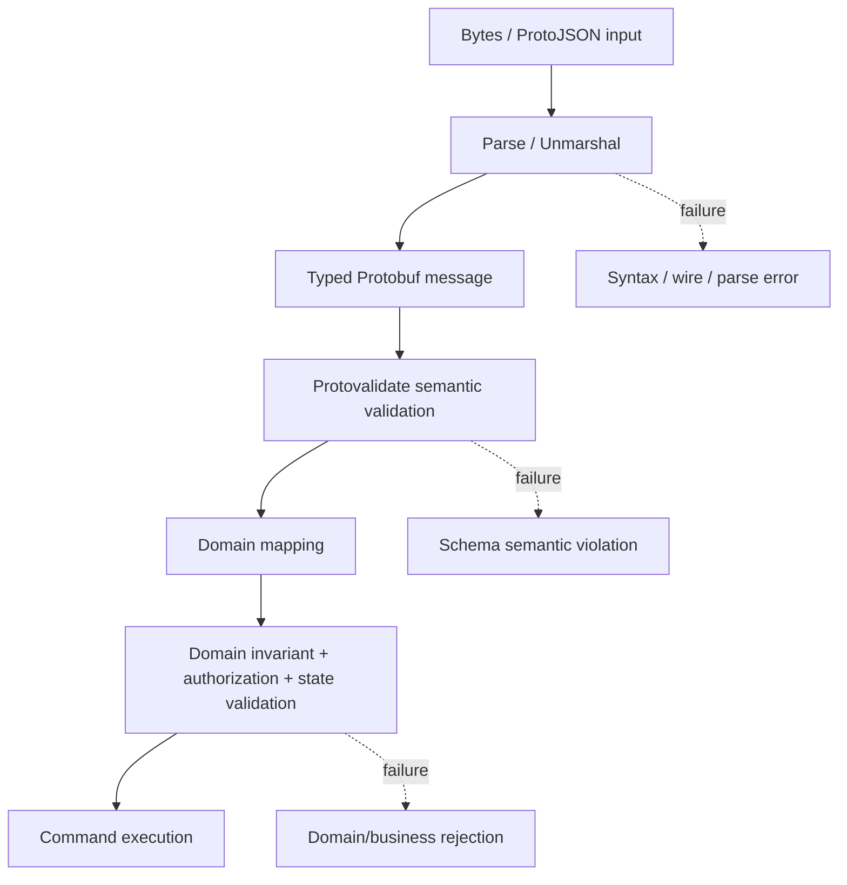
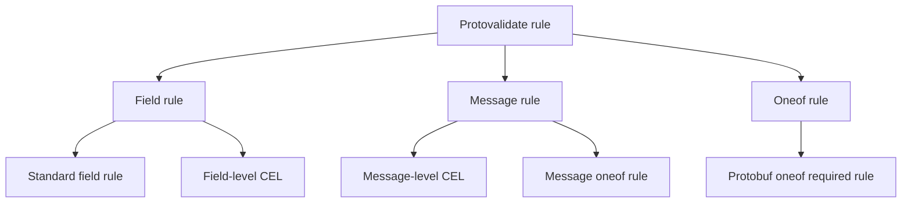
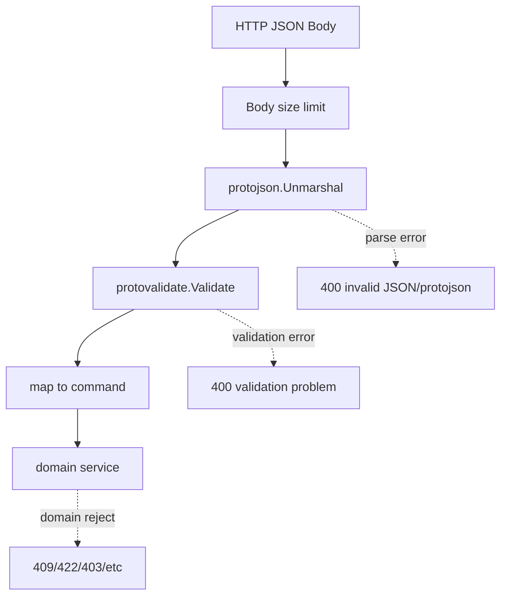
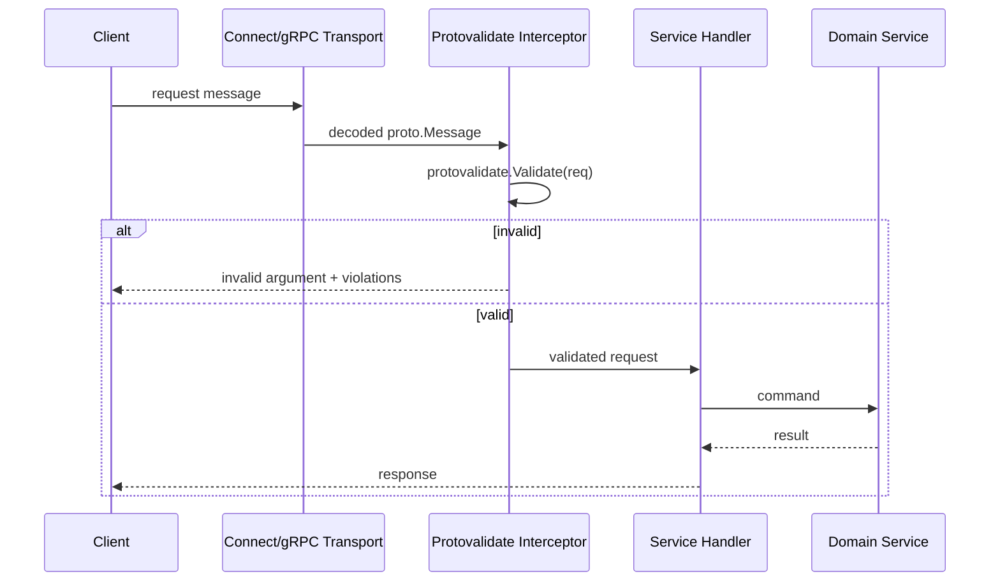

# learn-go-data-mapper-json-xml-protobuf-validation-part-029.md

# Part 029 — Protobuf Semantic Validation with Protovalidate

> Seri: `learn-go-data-mapper-json-xml-protobuf-validation`  
> Bagian: `029 / 033`  
> Status seri: **belum selesai**  
> Target pembaca: Java software engineer yang ingin menguasai Go data boundary, schema contract, Protobuf, JSON/XML processing, dan validation architecture pada level production-grade/internal engineering handbook.

---

## Daftar Isi

1. [Tujuan Pembelajaran](#1-tujuan-pembelajaran)
2. [Posisi Part Ini dalam Seri](#2-posisi-part-ini-dalam-seri)
3. [Masalah yang Diselesaikan Protovalidate](#3-masalah-yang-diselesaikan-protovalidate)
4. [Mental Model: Protobuf Decode Bukan Semantic Validation](#4-mental-model-protobuf-decode-bukan-semantic-validation)
5. [Protovalidate dalam Validation Stack](#5-protovalidate-dalam-validation-stack)
6. [Java Engineer Translation: Bean Validation vs Protovalidate](#6-java-engineer-translation-bean-validation-vs-protovalidate)
7. [Baseline Teknologi dan Fakta Penting](#7-baseline-teknologi-dan-fakta-penting)
8. [Anatomi Rule Protovalidate](#8-anatomi-rule-protovalidate)
9. [Setup Project Go + Buf + Protovalidate](#9-setup-project-go--buf--protovalidate)
10. [Mendesain `.proto` dengan Validation Contract](#10-mendesain-proto-dengan-validation-contract)
11. [Standard Rules: Kapan Digunakan dan Kapan Tidak](#11-standard-rules-kapan-digunakan-dan-kapan-tidak)
12. [Presence, Required, Optional, Zero Value](#12-presence-required-optional-zero-value)
13. [Nested Message Validation](#13-nested-message-validation)
14. [Repeated, Map, and Collection Rules](#14-repeated-map-and-collection-rules)
15. [Enum Validation](#15-enum-validation)
16. [Timestamp, Duration, and Time-Dependent Rules](#16-timestamp-duration-and-time-dependent-rules)
17. [Any, Oneof, dan Polymorphic Boundary](#17-any-oneof-dan-polymorphic-boundary)
18. [Custom CEL Rules](#18-custom-cel-rules)
19. [Menulis CEL Rule yang Maintainable](#19-menulis-cel-rule-yang-maintainable)
20. [Go Runtime Validation API](#20-go-runtime-validation-api)
21. [Model Error: ValidationError, Violation, Field Path](#21-model-error-validationerror-violation-field-path)
22. [Mapping Violation ke API Error Contract](#22-mapping-violation-ke-api-error-contract)
23. [Integrasi HTTP/JSON + ProtoJSON](#23-integrasi-httpjson--protojson)
24. [Integrasi Connect dan gRPC](#24-integrasi-connect-dan-grpc)
25. [Validation di Event-Driven System](#25-validation-di-event-driven-system)
26. [Governance: Rule Ownership, Review, dan Compatibility](#26-governance-rule-ownership-review-dan-compatibility)
27. [Performance dan Operational Trade-Off](#27-performance-dan-operational-trade-off)
28. [Security dan Abuse Resistance](#28-security-dan-abuse-resistance)
29. [Testing Strategy](#29-testing-strategy)
30. [Migration dari protoc-gen-validate atau Manual Validation](#30-migration-dari-protoc-gen-validate-atau-manual-validation)
31. [Anti-Pattern](#31-anti-pattern)
32. [Decision Matrix](#32-decision-matrix)
33. [Production Checklist](#33-production-checklist)
34. [Latihan Desain](#34-latihan-desain)
35. [Ringkasan Invariant](#35-ringkasan-invariant)
36. [Referensi Resmi](#36-referensi-resmi)

---

## 1. Tujuan Pembelajaran

Setelah menyelesaikan bagian ini, kamu diharapkan mampu:

1. Menjelaskan perbedaan antara **Protobuf parsing**, **schema compatibility**, dan **semantic validation**.
2. Mendesain `.proto` yang tidak hanya type-safe, tetapi juga memiliki constraint eksplisit.
3. Menggunakan Protovalidate sebagai validation layer untuk Go service berbasis Protobuf.
4. Memilih antara standard rule, message-level rule, field-level CEL, dan domain validation di Go.
5. Memahami jebakan presence: `required`, `optional`, default value, repeated/map, wrapper, dan oneof.
6. Menerjemahkan violation Protovalidate menjadi API error contract yang stabil.
7. Mengintegrasikan validation di HTTP/JSON, Connect, gRPC, dan event-driven system.
8. Mendesain governance agar perubahan validation rule tidak menjadi breaking change diam-diam.
9. Menguji validation rule dengan table-driven tests, golden tests, dan compatibility tests.
10. Membedakan rule yang pantas berada di `.proto` dari rule yang harus tetap berada di domain/service layer.

---

## 2. Posisi Part Ini dalam Seri

Sebelumnya kita sudah membahas:

- Protobuf fundamentals.
- Go Protobuf runtime modern.
- Open Struct vs Opaque API.
- Field presence dan optionality.
- ProtoJSON mapping.
- Schema evolution.
- Buf linting dan breaking change detection.
- Validation mental model.
- Struct validation dengan `go-playground/validator`.
- Validation error modeling.

Part ini menghubungkan semuanya ke pertanyaan inti:

> Bila Protobuf sudah punya schema, mengapa masih perlu validation?

Jawabannya: Protobuf schema menjawab **bentuk data**, tetapi tidak cukup menjawab **makna data**.

Contoh:

```proto
message TransferMoneyRequest {
  string source_account_id = 1;
  string destination_account_id = 2;
  int64 amount_minor = 3;
  string currency = 4;
}
```

Parser Protobuf tahu field dan tipe dasarnya, tetapi belum tahu bahwa:

- account ID tidak boleh kosong;
- source dan destination tidak boleh sama;
- amount harus lebih besar dari nol;
- currency harus masuk allowed set;
- transfer mungkin dilarang untuk account frozen;
- limit harian harus dicek terhadap state eksternal.

Protovalidate cocok untuk constraint yang bisa diekspresikan sebagai **schema-local semantic rule**. Rule yang butuh state eksternal tetap berada di service/domain layer.

---

## 3. Masalah yang Diselesaikan Protovalidate

Tanpa validation yang melekat ke schema, sistem Protobuf biasanya jatuh ke salah satu pola ini.

### 3.1 Manual validation tersebar

```go
func (s *Service) CreateUser(ctx context.Context, req *pb.CreateUserRequest) (*pb.CreateUserResponse, error) {
    if req.GetEmail() == "" {
        return nil, invalidArgument("email is required")
    }
    if !strings.Contains(req.GetEmail(), "@") {
        return nil, invalidArgument("email is invalid")
    }
    if len(req.GetDisplayName()) > 80 {
        return nil, invalidArgument("display_name too long")
    }
    // business logic
}
```

Masalah:

- rule mudah berbeda antar handler;
- error shape tidak konsisten;
- client SDK tidak bisa mengetahui rule dari schema;
- review `.proto` tidak otomatis melihat semantic constraint;
- service A dan service B bisa punya interpretasi berbeda untuk message yang sama;
- validation sulit dibagikan lintas bahasa.

### 3.2 Validation di comment

```proto
message CreateUserRequest {
  // Required. Must be a valid email. Max length 254.
  string email = 1;
}
```

Comment berguna, tetapi bukan enforcement. Comment tidak gagal di CI, tidak menolak request invalid, dan tidak menghasilkan structured violation.

### 3.3 Validation sebagai generated-code lokal

Beberapa ecosystem memakai generator validation yang menghasilkan method seperti `Validate()`. Ini bisa sangat cepat, tetapi punya trade-off:

- butuh plugin codegen spesifik;
- migration antar bahasa bisa tidak seragam;
- custom logic lintas bahasa sulit;
- rule language tidak selalu portable;
- generated code bisa membesar;
- rule dapat tersebar di beberapa generator/language.

Protovalidate mengambil pendekatan: constraint ditulis sebagai annotation Protobuf, dieksekusi oleh runtime library lintas bahasa, dengan standard rule dan CEL.

---

## 4. Mental Model: Protobuf Decode Bukan Semantic Validation

Ada tiga level berbeda:



### Level 1 — Parse / unmarshal

Menjawab:

- Apakah input bisa dibaca sebagai Protobuf binary atau ProtoJSON?
- Apakah wire type valid?
- Apakah JSON field type cocok dengan descriptor?
- Apakah timestamp/well-known-type bisa diparse?

Output: typed `proto.Message` atau parse error.

### Level 2 — Protovalidate semantic validation

Menjawab:

- Apakah string memenuhi `uuid`, `email`, `min_len`, `pattern`?
- Apakah numeric range valid?
- Apakah repeated field punya minimal item?
- Apakah nested message valid?
- Apakah kombinasi field memenuhi CEL rule?
- Apakah one-of semantics terpenuhi?

Output: `ValidationError` berisi violation terstruktur.

### Level 3 — Domain validation

Menjawab:

- Apakah account benar-benar ada?
- Apakah user punya permission?
- Apakah status case memungkinkan transition?
- Apakah limit harian sudah terlampaui?
- Apakah data lain di database menyebabkan konflik?

Output: domain/application error.

### Core invariant

> Protovalidate tidak menggantikan domain validation. Protovalidate menjaga message contract sebelum message masuk ke domain.

---

## 5. Protovalidate dalam Validation Stack

Untuk service production, validation stack yang sehat biasanya seperti ini:

```mermaid
flowchart LR
    I[Input] --> L1[Transport guard]
    L1 --> L2[Deserialize]
    L2 --> L3[Protovalidate]
    L3 --> L4[Canonicalize]
    L4 --> L5[Map to command/domain]
    L5 --> L6[Domain validation]
    L6 --> L7[Persistence/concurrency guard]
    L7 --> O[Effect]

    L1:::guard
    L3:::schema
    L6:::domain
    L7:::domain

    classDef guard fill:#f3f3f3,stroke:#333,stroke-width:1px;
    classDef schema fill:#e8f4ff,stroke:#333,stroke-width:1px;
    classDef domain fill:#fff4e6,stroke:#333,stroke-width:1px;
```



| Layer | Contoh | Harus di Protovalidate? |
|---|---|---:|
| Transport size | body max 1MB, message max bytes | Tidak |
| Decode syntax | invalid wire, invalid ProtoJSON | Tidak |
| Shape/semantic local | email format, uuid, min/max, min_items | Ya |
| Cross-field local | start <= end, exactly one field | Ya, bila hanya butuh field dalam message |
| Canonicalization | trim, normalize currency uppercase | Tidak; lakukan eksplisit |
| Domain state | account active, case transition allowed | Tidak |
| Authorization | user boleh approve? | Tidak |
| Persistence uniqueness | duplicate DB key | Tidak |
| Regulatory invariant | cannot reopen after legal closure without override | Biasanya domain/workflow layer |

---

## 6. Java Engineer Translation: Bean Validation vs Protovalidate

Sebagai Java engineer, kamu mungkin familiar dengan:

```java
public record CreateUserRequest(
    @NotBlank
    @Email
    String email,

    @Size(max = 80)
    String displayName
) {}
```

Di Go + Protobuf + Protovalidate, analoginya:

```proto
message CreateUserRequest {
  string email = 1 [
    (buf.validate.field).string.email = true,
    (buf.validate.field).string.max_len = 254
  ];

  string display_name = 2 [
    (buf.validate.field).string.max_len = 80
  ];
}
```

Message-level rule:

```proto
message SearchRequest {
  option (buf.validate.message).cel = {
    id: "time_range.valid"
    message: "start_time must be before or equal to end_time"
    expression: "!has(this.start_time) || !has(this.end_time) || this.start_time <= this.end_time"
  };

  google.protobuf.Timestamp start_time = 1;
  google.protobuf.Timestamp end_time = 2;
}
```

Perbedaan penting:

| Java Bean Validation | Protovalidate |
|---|---|
| Annotation berada di class/record Java | Annotation berada di `.proto` schema |
| Biasanya runtime Java-specific | Multi-language runtime dengan rule di schema |
| Validasi melekat ke DTO Java | Validasi melekat ke Protobuf message contract |
| Cross-field via method/class validator | Cross-field via message-level CEL atau service/domain logic |
| Bisa sangat framework-integrated | Harus dipanggil eksplisit atau via interceptor |
| Error sering library-specific | Violation punya structure Protobuf sendiri |

### Mindset shift

Di Java, DTO class sering menjadi source of truth.  
Di Protobuf-first system, `.proto` harus diperlakukan sebagai **contract source of truth**.

---

## 7. Baseline Teknologi dan Fakta Penting

Baseline yang dipakai:

- Go modern dengan module `google.golang.org/protobuf`.
- Protovalidate Go package: `buf.build/go/protovalidate`.
- Protobuf validation annotations: `buf/validate/validate.proto`.
- Buf module dependency: `buf.build/bufbuild/protovalidate`.
- CEL untuk custom rule.
- Connect/gRPC sebagai contoh RPC boundary.

Fakta penting:

1. Protovalidate adalah semantic validation library untuk Protobuf.
2. Rule ditulis sebagai Protobuf annotation.
3. Rule tidak muncul dalam wire format.
4. Rule tidak otomatis dijalankan saat serialize/deserialize.
5. Validation harus dipanggil eksplisit melalui runtime API atau interceptor.
6. Standard rule dapat menangani banyak kasus umum.
7. CEL digunakan untuk rule custom, terutama cross-field.
8. Violation dikembalikan dalam bentuk terstruktur, bukan hanya string.
9. Go runtime menyediakan global `protovalidate.Validate`.
10. Untuk konfigurasi custom, buat `Validator` eksplisit.
11. Field presence sangat mempengaruhi hasil validation.

---

## 8. Anatomi Rule Protovalidate



### 8.1 Field standard rule

```proto
string email = 1 [
  (buf.validate.field).string.email = true,
  (buf.validate.field).string.max_len = 254
];
```

Cocok untuk constraint lokal pada satu field.

### 8.2 Field-level CEL

```proto
uint32 quantity = 1 [(buf.validate.field).cel = {
  id: "quantity.wholesale_minimum"
  message: "quantity must be at least 100 for wholesale order"
  expression: "this >= 100"
}];
```

Di field-level CEL, `this` berarti nilai field.

### 8.3 Message-level CEL

```proto
message DateRange {
  option (buf.validate.message).cel = {
    id: "date_range.valid"
    message: "start must be before or equal to end"
    expression: "!has(this.start) || !has(this.end) || this.start <= this.end"
  };

  google.protobuf.Timestamp start = 1;
  google.protobuf.Timestamp end = 2;
}
```

Di message-level CEL, `this` berarti message.

### 8.4 Message oneof rule

```proto
message SearchRequest {
  option (buf.validate.message).oneof = {
    fields: ["keyword", "case_id", "applicant_id"]
    required: true
  };

  string keyword = 1;
  string case_id = 2;
  string applicant_id = 3;
}
```

Cocok untuk one-of semantics tanpa menggunakan `oneof` Protobuf asli.

---

## 9. Setup Project Go + Buf + Protovalidate

Struktur contoh:

```text
case-validation/
├── buf.yaml
├── buf.gen.yaml
├── go.mod
├── proto/
│   └── enforcement/case/v1/case.proto
├── gen/
│   └── enforcement/case/v1/
│       └── case.pb.go
└── internal/
    ├── validation/
    │   └── proto_validator.go
    └── api/
        └── handler.go
```

### 9.1 Go dependency

```bash
go mod init example.com/case-validation
go get google.golang.org/protobuf
go get buf.build/go/protovalidate
```

### 9.2 `buf.yaml`

```yaml
version: v2

modules:
  - path: proto

deps:
  - buf.build/bufbuild/protovalidate

lint:
  use:
    - STANDARD

breaking:
  use:
    - FILE
```

### 9.3 `buf.gen.yaml`

```yaml
version: v2

inputs:
  - directory: proto

plugins:
  - remote: buf.build/protocolbuffers/go
    out: gen
    opt: paths=source_relative

managed:
  enabled: true
  override:
    - file_option: go_package_prefix
      value: example.com/case-validation/gen
  disable:
    - file_option: go_package
      module: buf.build/bufbuild/protovalidate
```

Catatan:

- Bila memakai Buf managed mode, dependency Protovalidate perlu dikecualikan dari override `go_package`.
- Setelah menambahkan dependency, jalankan:

```bash
buf dep update
buf generate
```

---

## 10. Mendesain `.proto` dengan Validation Contract

Contoh domain regulatory/case-management:

```proto
syntax = "proto3";

package enforcement.case.v1;

import "buf/validate/validate.proto";
import "google/protobuf/timestamp.proto";

message CreateCaseRequest {
  string agency_id = 1 [
    (buf.validate.field).string.min_len = 1,
    (buf.validate.field).string.max_len = 64,
    (buf.validate.field).string.pattern = "^[A-Z0-9_]+$"
  ];

  string applicant_id = 2 [
    (buf.validate.field).string.min_len = 1,
    (buf.validate.field).string.max_len = 128
  ];

  CaseType case_type = 3 [
    (buf.validate.field).enum.defined_only = true,
    (buf.validate.field).enum.not_in = 0
  ];

  string summary = 4 [
    (buf.validate.field).string.min_len = 10,
    (buf.validate.field).string.max_len = 2000
  ];

  google.protobuf.Timestamp occurred_at = 5 [
    (buf.validate.field).timestamp.lt_now = true
  ];

  repeated EvidenceRef evidence = 6 [
    (buf.validate.field).repeated.max_items = 50
  ];
}

message EvidenceRef {
  string document_id = 1 [
    (buf.validate.field).string.uuid = true
  ];

  string label = 2 [
    (buf.validate.field).string.max_len = 120
  ];
}

enum CaseType {
  CASE_TYPE_UNSPECIFIED = 0;
  CASE_TYPE_COMPLAINT = 1;
  CASE_TYPE_INSPECTION = 2;
  CASE_TYPE_AUDIT = 3;
}
```

Rule di atas menjaga boundary message:

- `agency_id` tidak kosong dan pattern-nya terkontrol.
- `applicant_id` tidak kosong.
- `case_type` harus enum yang defined dan bukan `UNSPECIFIED`.
- `summary` punya minimum dan maximum length.
- `occurred_at` harus masa lalu.
- `evidence` dibatasi jumlahnya.
- nested `EvidenceRef` ikut divalidasi.

Namun rule di atas **tidak** menjawab:

- apakah agency ID valid di database;
- apakah applicant benar-benar ada;
- apakah user boleh membuat case untuk agency itu;
- apakah document ID dapat diakses;
- apakah case duplicate;
- apakah `occurred_at` masuk dalam limitation period legal.

Itu domain/service validation.

---

## 11. Standard Rules: Kapan Digunakan dan Kapan Tidak

### 11.1 String rules

Gunakan untuk:

- ID textual;
- email;
- UUID;
- hostname;
- URI;
- prefix/suffix;
- pattern sederhana;
- length limit.

```proto
message RegisterUserRequest {
  string user_id = 1 [(buf.validate.field).string.uuid = true];

  string email = 2 [
    (buf.validate.field).string.email = true,
    (buf.validate.field).string.max_len = 254
  ];

  string display_name = 3 [
    (buf.validate.field).string.min_len = 1,
    (buf.validate.field).string.max_len = 80
  ];
}
```

Jangan gunakan regex kompleks untuk menggantikan domain engine. Regex yang terlalu canggih sulit direview, sulit dijelaskan ke user, dan rawan bug.

### 11.2 Numeric rules

```proto
message PageRequest {
  uint32 page_size = 1 [(buf.validate.field).uint32 = {
    gte: 1
    lte: 100
  }];

  uint32 page_number = 2 [(buf.validate.field).uint32.gte = 1];
}
```

Gunakan untuk:

- pagination;
- quantity;
- thresholds;
- bounded configuration;
- rate-limit config;
- monetary minor unit range, bila amount direpresentasikan integer.

### 11.3 Bytes rules

```proto
message UploadChunk {
  bytes sha256 = 1 [(buf.validate.field).bytes.len = 32];
  bytes payload = 2 [(buf.validate.field).bytes.max_len = 1048576];
}
```

Bytes rules penting untuk hash, signature, encrypted payload, dan binary chunk bound.

### 11.4 Repeated rules

```proto
message BulkApproveRequest {
  repeated string case_ids = 1 [
    (buf.validate.field).repeated.min_items = 1,
    (buf.validate.field).repeated.max_items = 100,
    (buf.validate.field).repeated.unique = true,
    (buf.validate.field).repeated.items.string.uuid = true
  ];
}
```

Gunakan untuk batch limit, minimum item, uniqueness, dan per-item validation.

### 11.5 Map rules

```proto
message MetadataPatch {
  map<string, string> attributes = 1 [
    (buf.validate.field).map.max_pairs = 50,
    (buf.validate.field).map.keys.string.pattern = "^[a-z][a-z0-9_]{0,63}$",
    (buf.validate.field).map.values.string.max_len = 256
  ];
}
```

Map sangat sering menjadi escape hatch. Batasi key/value agar map tidak berubah menjadi “untyped JSON inside Protobuf”.

---

## 12. Presence, Required, Optional, Zero Value

Ini bagian paling sering membuat bug.

### 12.1 Presence menentukan apakah validator bisa membedakan absent vs default

| Field | Presence tracked? | Contoh |
|---|---:|---|
| proto3 scalar tanpa `optional` | Tidak | `string name = 1;` |
| proto3 scalar dengan `optional` | Ya | `optional string name = 1;` |
| nested message | Ya | `Address address = 1;` |
| field dalam `oneof` | Ya | `oneof id { string uuid = 1; }` |
| repeated | Tidak | `repeated string tags = 1;` |
| map | Tidak | `map<string,string> attrs = 1;` |

### 12.2 Rule pada explicit presence field

```proto
message UpdateProfileRequest {
  optional string display_name = 1 [
    (buf.validate.field).string.min_len = 1,
    (buf.validate.field).string.max_len = 80
  ];
}
```

Makna:

- absent: tidak divalidasi;
- present dengan empty string: gagal `min_len`;
- present dengan whitespace: tergantung rule; bila trim dibutuhkan, lakukan canonicalization di layer lain;
- present dengan valid value: lolos.

### 12.3 `required` bukan pengganti `min_len`

```proto
message WrongRequest {
  string name = 1 [(buf.validate.field).required = true];
}
```

Untuk proto3 scalar tanpa `optional`, `required` sering membuat orang salah paham. Bila tujuanmu adalah “string tidak boleh kosong”, gunakan:

```proto
message BetterRequest {
  string name = 1 [(buf.validate.field).string.min_len = 1];
}
```

### 12.4 `required` cocok untuk presence, bukan meaning

```proto
message CreateCustomerRequest {
  Customer customer = 1 [(buf.validate.field).required = true];
}
```

Ini masuk akal karena nested message punya presence. Artinya field `customer` harus hadir.

### 12.5 Update/Patch design

Untuk patch-style request:

```proto
message UpdateCaseRequest {
  string case_id = 1 [(buf.validate.field).string.uuid = true];

  optional string summary = 2 [
    (buf.validate.field).string.min_len = 10,
    (buf.validate.field).string.max_len = 2000
  ];

  optional CasePriority priority = 3 [
    (buf.validate.field).enum.defined_only = true,
    (buf.validate.field).enum.not_in = 0
  ];
}
```

Rule di atas memungkinkan:

- field tidak dikirim = tidak diubah;
- field dikirim invalid = ditolak;
- field dikirim valid = update.

Namun bila perlu membedakan “clear value” vs “not provided”, desain harus lebih eksplisit. Untuk field message, presence mudah. Untuk scalar, gunakan `optional`, wrapper type, `FieldMask`, atau command-specific message.

---

## 13. Nested Message Validation

Protovalidate memvalidasi nested messages secara otomatis.

```proto
message CreateInspectionRequest {
  string inspection_id = 1 [(buf.validate.field).string.uuid = true];
  Inspector inspector = 2 [(buf.validate.field).required = true];
  repeated Finding findings = 3 [(buf.validate.field).repeated.max_items = 100];
}

message Inspector {
  string officer_id = 1 [(buf.validate.field).string.min_len = 1];
  string name = 2 [(buf.validate.field).string.min_len = 1];
}

message Finding {
  string code = 1 [(buf.validate.field).string.pattern = "^[A-Z]{2,10}-[0-9]{3}$"];
  string description = 2 [(buf.validate.field).string.min_len = 1];
}
```

Jika `Finding` invalid, parent `CreateInspectionRequest` invalid.

### 13.1 Kapan nested validation harus di-ignore?

Ada kasus legitimate:

```proto
message ExternalEnvelope {
  string source_system = 1 [(buf.validate.field).string.min_len = 1];

  ExternalPayload raw_payload = 2 [
    (buf.validate.field).ignore = IGNORE_ALWAYS
  ];
}
```

Gunakan `IGNORE_ALWAYS` dengan hati-hati. Ia harus punya alasan desain:

- payload hanya disimpan untuk forensic/audit;
- payload divalidasi oleh schema eksternal;
- payload akan diproses async oleh pipeline lain;
- message hanya wrapper routing.

Jangan gunakan ignore untuk “membuat test lewat”.

---

## 14. Repeated, Map, and Collection Rules

### 14.1 Repeated field size

```proto
message SubmitEvidenceRequest {
  string case_id = 1 [(buf.validate.field).string.uuid = true];

  repeated Evidence evidence = 2 [
    (buf.validate.field).repeated.min_items = 1,
    (buf.validate.field).repeated.max_items = 20
  ];
}
```

Size rule adalah abuse resistance. Tanpa batas, client dapat mengirim ribuan nested messages.

### 14.2 Item rule

```proto
message BulkGetCasesRequest {
  repeated string case_ids = 1 [
    (buf.validate.field).repeated.min_items = 1,
    (buf.validate.field).repeated.max_items = 100,
    (buf.validate.field).repeated.unique = true,
    (buf.validate.field).repeated.items.string.uuid = true
  ];
}
```

Ini lebih baik daripada hanya validate di service karena:

- rule terlihat di contract;
- client generator/doc bisa mengekspose constraint;
- error path bisa menunjuk item tertentu.

### 14.3 Map sebagai escape hatch

```proto
message CaseMetadata {
  map<string, string> labels = 1 [
    (buf.validate.field).map.max_pairs = 30,
    (buf.validate.field).map.keys.string.pattern = "^[a-z][a-z0-9_]{0,31}$",
    (buf.validate.field).map.values.string.max_len = 128
  ];
}
```

Rule map minimal:

- max pairs;
- key pattern;
- value max length;
- allowed/denied keys bila contract harus stabil.

Tanpa ini, `map<string,string>` sering menjadi tempat menaruh field baru tanpa governance.

---

## 15. Enum Validation

Protobuf enum default adalah `0`. Best practice umum: definisikan `UNSPECIFIED = 0`.

```proto
enum CasePriority {
  CASE_PRIORITY_UNSPECIFIED = 0;
  CASE_PRIORITY_LOW = 1;
  CASE_PRIORITY_MEDIUM = 2;
  CASE_PRIORITY_HIGH = 3;
}

message SetPriorityRequest {
  string case_id = 1 [(buf.validate.field).string.uuid = true];

  CasePriority priority = 2 [
    (buf.validate.field).enum.defined_only = true,
    (buf.validate.field).enum.not_in = 0
  ];
}
```

### 15.1 Kenapa `defined_only` penting?

Dalam Protobuf, unknown numeric enum value bisa muncul. `defined_only` menolak angka yang tidak didefinisikan di enum.

### 15.2 Kenapa `not_in = 0` penting?

`UNSPECIFIED` biasanya bukan value bisnis valid untuk create/update command.

### 15.3 Kapan enum tidak cukup?

Enum tidak cocok bila value list berubah sangat sering atau dikelola konfigurasi runtime. Contoh:

- dynamic product type;
- list agency aktif;
- reason code regulatory yang sering berubah berdasarkan effective date.

Untuk itu, field bisa tetap string/code + domain lookup. Protovalidate hanya bisa batasi syntax dasar.

---

## 16. Timestamp, Duration, and Time-Dependent Rules

### 16.1 Absolute range

```proto
message ImportRecord {
  google.protobuf.Timestamp effective_at = 1 [
    (buf.validate.field).timestamp.gte = { seconds: 946684800 } // 2000-01-01T00:00:00Z
  ];
}
```

### 16.2 Relative to now

```proto
message CreateAuditEventRequest {
  google.protobuf.Timestamp occurred_at = 1 [
    (buf.validate.field).timestamp.lt_now = true
  ];
}
```

### 16.3 Time window

```proto
message CreateSessionRequest {
  google.protobuf.Timestamp expires_at = 1 [
    (buf.validate.field).timestamp = {
      gt_now: true
      within: { seconds: 86400 }
    }
  ];
}
```

### 16.4 Deterministic time in tests

Rules seperti `lt_now` dan `gt_now` bergantung waktu. Di Go, buat validator dengan fungsi `now` yang bisa dikontrol.

```go
package validation

import (
    "time"

    "buf.build/go/protovalidate"
    "google.golang.org/protobuf/types/known/timestamppb"
)

func NewValidator(now func() time.Time) (protovalidate.Validator, error) {
    return protovalidate.New(
        protovalidate.WithNowFunc(func() *timestamppb.Timestamp {
            return timestamppb.New(now().UTC())
        }),
    )
}
```

Dengan begitu test tidak flaky.

---

## 17. Any, Oneof, dan Polymorphic Boundary

### 17.1 `google.protobuf.Any`

`Any` berguna, tetapi berbahaya bila tidak dibatasi.

```proto
import "google/protobuf/any.proto";

message DomainEventEnvelope {
  string event_id = 1 [(buf.validate.field).string.uuid = true];

  google.protobuf.Any payload = 2 [
    (buf.validate.field).required = true,
    (buf.validate.field).any = {
      in: [
        "type.googleapis.com/enforcement.case.v1.CaseCreated",
        "type.googleapis.com/enforcement.case.v1.CaseEscalated",
        "type.googleapis.com/enforcement.case.v1.CaseClosed"
      ]
    }
  ];
}
```

Batas type URL penting untuk mencegah envelope menjadi arbitrary message carrier.

### 17.2 Message-level oneof rule vs Protobuf `oneof`

Protobuf `oneof` menghasilkan representasi khusus di Go. Kadang itu tepat, tetapi kadang terlalu menyulitkan evolusi dan ergonomi.

Message-level oneof rule:

```proto
message SearchCaseRequest {
  option (buf.validate.message).oneof = {
    fields: ["case_id", "applicant_id", "reference_no"]
    required: true
  };

  string case_id = 1 [(buf.validate.field).string.uuid = true];
  string applicant_id = 2 [(buf.validate.field).string.min_len = 1];
  string reference_no = 3 [(buf.validate.field).string.min_len = 1];
}
```

Kelebihan:

- field tetap regular;
- bisa melibatkan repeated/map;
- lebih sederhana untuk beberapa client language;
- rule bisa berubah tanpa mengubah wire layout Protobuf oneof.

Kekurangan:

- message tetap bisa membawa beberapa field secara wire/schema; enforcement hanya terjadi bila validation dipanggil.
- type system tidak memaksa oneof pada compile time.

### 17.3 Protobuf `oneof`

```proto
message UserRef {
  oneof identifier {
    option (buf.validate.oneof).required = true;

    string id = 1 [(buf.validate.field).string.uuid = true];
    string username = 2 [(buf.validate.field).string.min_len = 3];
  }
}
```

Kelebihan:

- wire-level mutually exclusive semantics;
- generated type merepresentasikan pilihan.

Kekurangan:

- evolusi schema lebih hati-hati;
- Go generated code lebih verbose;
- tidak bisa repeated/map di dalam Protobuf `oneof`.

---

## 18. Custom CEL Rules

CEL adalah Common Expression Language. Dalam Protovalidate, CEL digunakan untuk logic yang tidak cukup diekspresikan standard rule.

### 18.1 Field-level CEL

```proto
message WholesaleOrderLine {
  uint32 quantity = 1 [(buf.validate.field).cel = {
    id: "quantity.wholesale_minimum"
    message: "quantity must be at least 100"
    expression: "this >= 100"
  }];
}
```

Di sini `this` adalah nilai `quantity`.

### 18.2 Message-level CEL

```proto
message EscalationWindow {
  option (buf.validate.message).cel = {
    id: "window.start_before_end"
    message: "start_at must be before end_at"
    expression: "has(this.start_at) && has(this.end_at) ? this.start_at < this.end_at : true"
  };

  google.protobuf.Timestamp start_at = 1;
  google.protobuf.Timestamp end_at = 2;
}
```

Di sini `this` adalah message `EscalationWindow`.

### 18.3 CEL return value

CEL expression dapat mengembalikan:

- `bool`: `false` berarti gagal.
- `string`: non-empty string berarti gagal dan string itu menjadi message.

Contoh dynamic message:

```proto
message UpdateAddressInfoRequest {
  option (buf.validate.message).cel = {
    id: "secondary_requires_primary"
    expression: "has(this.secondary_address) && !has(this.primary_address) ? 'secondary address requires primary address' : ''"
  };

  Address primary_address = 1;
  Address secondary_address = 2;
}
```

---

## 19. Menulis CEL Rule yang Maintainable

CEL bisa powerful sekaligus berbahaya. Perlakukan CEL seperti production code.

### 19.1 Gunakan ID stabil

Buruk:

```proto
option (buf.validate.message).cel = {
  id: "rule1"
  message: "invalid"
  expression: "this.a <= this.b"
};
```

Baik:

```proto
option (buf.validate.message).cel = {
  id: "date_range.start_lte_end"
  message: "start_at must be before or equal to end_at"
  expression: "!has(this.start_at) || !has(this.end_at) || this.start_at <= this.end_at"
};
```

Rule ID berguna untuk API error mapping, localization, telemetry, client-side behavior, debugging, dan compatibility tracking.

### 19.2 Hindari CEL yang terlalu panjang

Buruk:

```proto
option (buf.validate.message).cel = {
  id: "application.valid"
  expression: "(this.type == 1 && this.amount > 0 && size(this.docs) > 2 && this.foo != '' && this.bar in ['A','B'])"
};
```

Lebih baik pisahkan menjadi beberapa rule:

```proto
option (buf.validate.message).cel = {
  id: "amount.positive_for_paid_application"
  message: "amount must be positive for paid application"
  expression: "this.application_type != APPLICATION_TYPE_PAID || this.amount_minor > 0"
};

option (buf.validate.message).cel = {
  id: "documents.required_for_paid_application"
  message: "paid application requires at least one supporting document"
  expression: "this.application_type != APPLICATION_TYPE_PAID || size(this.documents) >= 1"
};
```

### 19.3 Jangan taruh lookup eksternal di CEL

CEL rule harus deterministic terhadap message. Jangan mencoba membuat rule yang butuh:

- database;
- Redis;
- HTTP API;
- current authenticated user;
- authorization context;
- feature flag runtime yang berubah;
- external policy engine.

Untuk hal-hal itu, gunakan domain/service validation.

### 19.4 Presence-aware expression

Buruk:

```proto
expression: "this.start_at <= this.end_at"
```

Lebih aman:

```proto
expression: "!has(this.start_at) || !has(this.end_at) || this.start_at <= this.end_at"
```

### 19.5 Hindari business rule yang volatile

Rule yang sering berubah berdasarkan tanggal/peraturan internal tidak ideal ditanam di `.proto` bila perubahan itu tidak boleh memaksa client/schema rollout.

Contoh yang sebaiknya domain-level:

```text
Mulai 2026-07-01, case type X harus punya minimal 3 reviewer, kecuali agency A dan B masih transitional sampai 2026-09-30.
```

Bisa saja ditulis di CEL, tetapi governance dan rollout-nya buruk. Lebih baik domain policy layer.

---

## 20. Go Runtime Validation API

### 20.1 Global validation

```go
package handler

import (
    "buf.build/go/protovalidate"
    casev1 "example.com/case-validation/gen/enforcement/case/v1"
)

func ValidateCreateCase(req *casev1.CreateCaseRequest) error {
    return protovalidate.Validate(req)
}
```

Global `protovalidate.Validate` cocok untuk mayoritas kasus sederhana.

### 20.2 Validator eksplisit

Untuk service production, biasanya lebih baik membuat validator sebagai dependency singleton.

```go
package validation

import (
    "buf.build/go/protovalidate"
    "google.golang.org/protobuf/proto"
)

type ProtoValidator struct {
    v protovalidate.Validator
}

func NewProtoValidator() (*ProtoValidator, error) {
    v, err := protovalidate.New()
    if err != nil {
        return nil, err
    }
    return &ProtoValidator{v: v}, nil
}

func (p *ProtoValidator) Validate(msg proto.Message) error {
    return p.v.Validate(msg)
}
```

### 20.3 Fail-fast vs accumulate

Default yang baik untuk API biasanya accumulate semua violation agar client dapat memperbaiki beberapa field sekaligus.

Fail-fast cocok untuk:

- hot path internal;
- security boundary yang hanya perlu reject cepat;
- stream processing sangat besar;
- rule yang mahal.

```go
v, err := protovalidate.New(protovalidate.WithFailFast())
if err != nil {
    return err
}
```

### 20.4 Filter

Filter dapat mengontrol field/rule mana yang dievaluasi.

Use case:

- partial update dengan field mask;
- validation phase berbeda;
- migration period;
- backward compatibility bridge.

Namun desain yang lebih eksplisit sering lebih baik: buat request message berbeda untuk create/update/patch.

---

## 21. Model Error: ValidationError, Violation, Field Path

Protovalidate mengembalikan beberapa jenis error penting:

| Error | Makna |
|---|---|
| `ValidationError` | Ada satu atau lebih rule violation |
| `CompilationError` | Rule/CEL/evaluator tidak bisa dibangun |
| `RuntimeError` | Evaluasi CEL mengalami type/runtime error |

### 21.1 Handling `ValidationError`

```go
package validation

import (
    "errors"

    "buf.build/go/protovalidate"
)

type FieldViolation struct {
    Field   string
    RuleID  string
    Message string
}

func ExtractViolations(err error) ([]FieldViolation, bool) {
    var valErr *protovalidate.ValidationError
    if !errors.As(err, &valErr) {
        return nil, false
    }

    out := make([]FieldViolation, 0, len(valErr.Violations))
    for _, v := range valErr.Violations {
        protoV := v.Proto
        out = append(out, FieldViolation{
            Field:   fieldPathToString(protoV.GetField()),
            RuleID:  protoV.GetRuleId(),
            Message: protoV.GetMessage(),
        })
    }
    return out, true
}
```

Field path conversion perlu disesuaikan dengan error contract-mu.

### 21.2 Jangan expose raw internal error sembarangan

Raw message boleh untuk development, tetapi public API harus stabil.

Lebih baik:

```json
{
  "type": "https://api.example.com/problems/validation-error",
  "title": "Validation failed",
  "status": 400,
  "code": "VALIDATION_FAILED",
  "violations": [
    {
      "field": "/invoice/invoiceId",
      "rule": "string.uuid",
      "message": "invoice_id must be a valid UUID"
    }
  ]
}
```

Daripada:

```json
{
  "error": "validation error: invoice_id: value must be a valid UUID"
}
```

---

## 22. Mapping Violation ke API Error Contract

Untuk HTTP/JSON API, gunakan konsep dari part 028: public validation error contract.

```go
package apierr

type Problem struct {
    Type       string      `json:"type"`
    Title      string      `json:"title"`
    Status     int         `json:"status"`
    Code       string      `json:"code"`
    Violations []Violation `json:"violations,omitempty"`
}

type Violation struct {
    Field   string `json:"field"`
    Rule    string `json:"rule"`
    Message string `json:"message"`
}
```

Mapping:

```go
func ToValidationProblem(err error) (*Problem, bool) {
    violations, ok := validation.ExtractViolations(err)
    if !ok {
        return nil, false
    }

    out := make([]Violation, 0, len(violations))
    for _, v := range violations {
        out = append(out, Violation{
            Field:   ProtoPathToJSONPointer(v.Field),
            Rule:    StableRuleCode(v.RuleID),
            Message: SafePublicMessage(v.RuleID, v.Message),
        })
    }

    return &Problem{
        Type:       "https://api.example.com/problems/validation-error",
        Title:      "Validation failed",
        Status:     400,
        Code:       "VALIDATION_FAILED",
        Violations: out,
    }, true
}
```

### 22.1 Rule ID sebagai compatibility surface

Rule ID jangan asal berubah. Jika client bergantung pada `rule`, perubahan rule ID dapat menjadi breaking change behavior.

Gunakan naming convention:

```text
<message-or-field-domain>.<constraint>
```

Contoh:

```text
date_range.start_lte_end
case_ids.max_batch_size
search_query.exactly_one_identifier
amount.positive
```

### 22.2 Field path policy

Tentukan satu format:

- Protobuf field path: `invoice.line_items[0].product_id`
- JSON Pointer: `/invoice/lineItems/0/productId`
- UI field name: `invoice.lineItems[0].productId`

Untuk public JSON API, JSON Pointer sering paling standard. Untuk internal RPC, Protobuf field path lebih dekat ke schema.

---

## 23. Integrasi HTTP/JSON + ProtoJSON

Banyak sistem memakai Protobuf sebagai internal contract, tetapi expose JSON ke client. Biasanya pipeline:



Contoh:

```go
package api

import (
    "errors"
    "fmt"
    "io"
    "net/http"

    "buf.build/go/protovalidate"
    casev1 "example.com/case-validation/gen/enforcement/case/v1"
    "google.golang.org/protobuf/encoding/protojson"
)

const maxBodyBytes = 1 << 20 // 1 MiB

type Handler struct {
    validator protovalidate.Validator
}

func (h *Handler) CreateCase(w http.ResponseWriter, r *http.Request) {
    body, err := io.ReadAll(http.MaxBytesReader(w, r.Body, maxBodyBytes))
    if err != nil {
        writeBadRequest(w, "REQUEST_BODY_TOO_LARGE_OR_UNREADABLE")
        return
    }

    var req casev1.CreateCaseRequest
    if err := protojson.UnmarshalOptions{
        DiscardUnknown: false,
    }.Unmarshal(body, &req); err != nil {
        writeBadRequest(w, "INVALID_PROTO_JSON")
        return
    }

    if err := h.validator.Validate(&req); err != nil {
        if writeValidationError(w, err) {
            return
        }
        writeInternal(w, fmt.Errorf("validate create case: %w", err))
        return
    }

    // Map to domain command, then domain validation and execution.
}

func writeValidationError(w http.ResponseWriter, err error) bool {
    var valErr *protovalidate.ValidationError
    if !errors.As(err, &valErr) {
        return false
    }
    _ = valErr // map violations into public contract
    w.WriteHeader(http.StatusBadRequest)
    _, _ = w.Write([]byte(`{"code":"VALIDATION_FAILED"}`))
    return true
}
```

### 23.1 Unknown fields policy

Untuk public HTTP JSON API, default sebaiknya strict:

```go
protojson.UnmarshalOptions{
    DiscardUnknown: false,
}
```

Alasan:

- typo client cepat ketahuan;
- contract drift tidak silent;
- client tidak mengira field diterima padahal diabaikan.

Untuk event ingestion dari partner lama, mungkin perlu mode transitional yang lebih lenient. Dokumentasikan dengan jelas.

---

## 24. Integrasi Connect dan gRPC

Protovalidate dapat dipasang sebagai interceptor sehingga handler hanya menerima request yang sudah lolos validation.



### 24.1 Why interceptor?

Keuntungan:

- validation konsisten untuk semua method;
- handler tidak penuh boilerplate;
- violation mapping bisa distandardisasi;
- observability terpusat;
- bisa enforce policy: semua unary request harus validate.

Risiko:

- handler mungkin lupa bahwa validation hanya terjadi di RPC path, bukan saat message dibuat internal;
- background job/event consumer tetap perlu validasi eksplisit;
- error mapping default interceptor mungkin belum sesuai public contract.

### 24.2 Handler tetap boleh validate ulang?

Biasanya tidak perlu untuk request RPC bila interceptor guarantee jelas. Namun validate eksplisit masih dibutuhkan saat:

- message dibuat dari internal source;
- event replay;
- migration job;
- scheduled job;
- test utility;
- adapter non-RPC.

---

## 25. Validation di Event-Driven System

Event-driven system berbeda dari request/response API.

### 25.1 Producer-side validation

```go
func (p *Publisher) PublishCaseCreated(ctx context.Context, evt *casev1.CaseCreated) error {
    if err := p.validator.Validate(evt); err != nil {
        return fmt.Errorf("invalid outbound event: %w", err)
    }
    return p.bus.Publish(ctx, evt)
}
```

Invariant:

> Producer tidak boleh mengirim event yang melanggar schema semantic contract miliknya sendiri.

### 25.2 Consumer-side validation

Consumer tetap harus validate karena:

- producer bisa bug;
- event lama bisa invalid menurut schema baru;
- topic bisa diisi banyak producer;
- replay data historis bisa melewati rule baru;
- schema registry tidak menjamin semantic rule dieksekusi.

```go
func (c *Consumer) Handle(ctx context.Context, msg []byte) error {
    var evt casev1.CaseCreated
    if err := proto.Unmarshal(msg, &evt); err != nil {
        return c.deadLetter(ctx, msg, "PROTO_UNMARSHAL_FAILED", err)
    }
    if err := c.validator.Validate(&evt); err != nil {
        return c.deadLetter(ctx, msg, "PROTO_VALIDATION_FAILED", err)
    }
    return c.projector.ApplyCaseCreated(ctx, &evt)
}
```

### 25.3 Versioning warning

Menambahkan validation rule dapat menjadi behavior-breaking untuk consumer replay.

Contoh:

- Event lama punya `summary = ""`.
- Schema baru menambahkan `summary min_len = 1`.
- Replay event lama sekarang gagal.

Solusi:

- buat versioned event message;
- gunakan transitional validation;
- validasi hanya di producer untuk event baru;
- consumer punya compatibility mode;
- backfill/migrate historical events;
- dokumentasikan rule effective date di governance.

---

## 26. Governance: Rule Ownership, Review, dan Compatibility

Validation rule adalah bagian dari contract. Treat seperti API change.

### 26.1 Classification perubahan rule

| Perubahan | Compatibility risk | Contoh |
|---|---:|---|
| Menambah max length longgar | Rendah | max_len 100 -> 200 |
| Memperketat max length | Tinggi | max_len 200 -> 100 |
| Menambah min length | Tinggi | min_len 0 -> 1 |
| Menambah enum `defined_only` | Sedang/Tinggi | unknown numeric enum sekarang ditolak |
| Menambah `required` | Tinggi | field sebelumnya optional menjadi required |
| Menambah CEL cross-field | Tinggi | start/end rule baru |
| Mengubah message text | Rendah/Sedang | jika client tidak bergantung pada text |
| Mengubah rule ID | Sedang/Tinggi | client/localization/monitoring bisa bergantung |

### 26.2 Review checklist untuk PR `.proto`

Tanyakan:

1. Apakah rule ini berlaku untuk semua consumer dan semua konteks?
2. Apakah rule ini bisa berubah lebih cepat dari schema release cadence?
3. Apakah rule ini membutuhkan database/auth/context eksternal?
4. Apakah rule ini akan memecahkan replay event lama?
5. Apakah rule ini harus diterapkan di producer, consumer, atau keduanya?
6. Apakah rule ID stabil dan meaningful?
7. Apakah message error public-safe?
8. Apakah test invalid/valid sudah ditambahkan?
9. Apakah dokumentasi API berubah?
10. Apakah client lama punya migration path?

### 26.3 Ownership

| Asset | Owner |
|---|---|
| `.proto` message contract | API/platform/domain owning team |
| Standard validation rule | Message owner |
| CEL custom rule | Message owner + reviewer senior |
| Error mapping | API platform team |
| Localization | Product/client/platform |
| Domain validation | Domain service owner |
| Event compatibility policy | Platform + event owner |

---

## 27. Performance dan Operational Trade-Off

### 27.1 Protovalidate bukan parse step gratis

Validation adalah pekerjaan tambahan:

- membaca descriptor/rule;
- mengevaluasi field;
- traversing nested messages;
- menjalankan CEL;
- mengakumulasi violations.

Untuk request API normal, biaya ini biasanya worth it. Untuk hot path dengan jutaan message/detik, ukur.

### 27.2 Native rules vs CEL

Standard/native rule biasanya lebih murah daripada CEL. Gunakan standard rule bila cukup.

Buruk:

```proto
string email = 1 [(buf.validate.field).cel = {
  id: "email.valid"
  expression: "this.isEmail()"
}];
```

Lebih baik:

```proto
string email = 1 [(buf.validate.field).string.email = true];
```

### 27.3 Fail-fast mode

| Mode | Kelebihan | Kekurangan |
|---|---|---|
| Accumulate all | Client dapat semua error sekaligus | Lebih banyak kerja |
| Fail-fast | Reject cepat | Client fix satu per satu |

### 27.4 Observability

Metric yang berguna:

```text
validation_requests_total{message="CreateCaseRequest"}
validation_failures_total{message="CreateCaseRequest", rule="string.uuid"}
validation_duration_seconds{message="CreateCaseRequest"}
validation_violations_total{message="CreateCaseRequest", field="case_id", rule="string.uuid"}
```

Hati-hati cardinality:

- Jangan label metric dengan raw field value.
- Jangan label dengan dynamic error message.
- Batasi label rule/field/message.

### 27.5 Large message

Untuk message besar:

- batasi transport/message size sebelum unmarshal;
- pakai repeated max_items/map max_pairs;
- hindari CEL yang melakukan operasi mahal pada list besar;
- ukur nested validation cost;
- pertimbangkan partial/streaming validation di pipeline khusus.

---

## 28. Security dan Abuse Resistance

Validation membantu security, tetapi bukan security layer lengkap.

### 28.1 Yang bisa dibantu Protovalidate

- batas panjang string;
- batas bytes;
- batas jumlah repeated/map;
- format UUID/email/URI;
- finite float;
- allowed type URL untuk `Any`;
- one-of constraints;
- bounded timestamp/duration;
- reject undefined enum.

### 28.2 Yang tidak bisa digantikan

- authentication;
- authorization;
- rate limiting;
- body size limit sebelum decode;
- resource quota;
- anti-replay;
- database constraints;
- escaping output;
- malware scanning file;
- cryptographic verification;
- business policy engine.

### 28.3 Anti-abuse schema design

```proto
message SearchRequest {
  string query = 1 [
    (buf.validate.field).string.min_len = 1,
    (buf.validate.field).string.max_len = 200
  ];

  uint32 page_size = 2 [
    (buf.validate.field).uint32 = { gte: 1, lte: 100 }
  ];

  repeated string filters = 3 [
    (buf.validate.field).repeated.max_items = 20,
    (buf.validate.field).repeated.items.string.max_len = 80
  ];
}
```

Query/search endpoints sering jadi target abuse. Validation rule adalah guard awal.

---

## 29. Testing Strategy

### 29.1 Table-driven validation tests

```go
package validation_test

import (
    "testing"

    "buf.build/go/protovalidate"
    casev1 "example.com/case-validation/gen/enforcement/case/v1"
    "google.golang.org/protobuf/types/known/timestamppb"
)

func TestCreateCaseRequestValidation(t *testing.T) {
    validator, err := protovalidate.New()
    if err != nil {
        t.Fatal(err)
    }

    valid := func() *casev1.CreateCaseRequest {
        return &casev1.CreateCaseRequest{
            AgencyId:    "CEA",
            ApplicantId: "applicant-123",
            CaseType:    casev1.CaseType_CASE_TYPE_COMPLAINT,
            Summary:     "A sufficiently detailed complaint summary.",
            OccurredAt:  timestamppb.Now(),
        }
    }

    tests := []struct {
        name    string
        mutate  func(*casev1.CreateCaseRequest)
        wantErr bool
    }{
        {name: "valid", mutate: func(req *casev1.CreateCaseRequest) {}, wantErr: false},
        {name: "agency_id_required", mutate: func(req *casev1.CreateCaseRequest) { req.AgencyId = "" }, wantErr: true},
        {name: "case_type_unspecified_rejected", mutate: func(req *casev1.CreateCaseRequest) {
            req.CaseType = casev1.CaseType_CASE_TYPE_UNSPECIFIED
        }, wantErr: true},
    }

    for _, tt := range tests {
        t.Run(tt.name, func(t *testing.T) {
            req := valid()
            tt.mutate(req)
            err := validator.Validate(req)
            if (err != nil) != tt.wantErr {
                t.Fatalf("Validate() err = %v, wantErr %v", err, tt.wantErr)
            }
        })
    }
}
```

### 29.2 Assert rule ID

Jangan hanya assert `err != nil`. Assert rule yang gagal.

```go
func requireRule(t *testing.T, err error, ruleID string) {
    t.Helper()

    var valErr *protovalidate.ValidationError
    if !errors.As(err, &valErr) {
        t.Fatalf("expected ValidationError, got %T: %v", err, err)
    }

    for _, v := range valErr.Violations {
        if v.Proto.GetRuleId() == ruleID {
            return
        }
    }
    t.Fatalf("rule %q not found in violations: %v", ruleID, valErr.Violations)
}
```

### 29.3 Golden tests untuk API error

Bila public API mengembalikan error JSON, simpan golden output untuk menjaga compatibility.

```text
testdata/create_case_invalid_summary.golden.json
```

### 29.4 Time-dependent tests

Gunakan `WithNowFunc` agar test deterministic.

### 29.5 Contract tests untuk event replay

Simpan sample event historis dan validasi dengan schema baru.

```go
func TestHistoricalCaseCreatedEventsStillValidate(t *testing.T) {
    files, err := filepath.Glob("testdata/events/case_created/*.binpb")
    if err != nil {
        t.Fatal(err)
    }

    validator, err := protovalidate.New()
    if err != nil {
        t.Fatal(err)
    }

    for _, file := range files {
        t.Run(filepath.Base(file), func(t *testing.T) {
            data, err := os.ReadFile(file)
            if err != nil {
                t.Fatal(err)
            }
            var evt casev1.CaseCreated
            if err := proto.Unmarshal(data, &evt); err != nil {
                t.Fatal(err)
            }
            if err := validator.Validate(&evt); err != nil {
                t.Fatalf("historical event no longer validates: %v", err)
            }
        })
    }
}
```

---

## 30. Migration dari protoc-gen-validate atau Manual Validation

### 30.1 Inventory rule lama

| Message | Field | Existing rule | Source | Target Protovalidate rule |
|---|---|---|---|---|
| CreateUserRequest | email | manual email check | Go handler | string.email + max_len |
| CreateUserRequest | display_name | len <= 80 | Go handler | string.max_len |
| DateRange | start <= end | service method | message CEL |
| Transfer | account exists | service method | tetap domain |

### 30.2 Pindahkan hanya rule schema-local

Pindahkan:

- required shape;
- string format;
- length;
- numeric range;
- enum defined only;
- collection size;
- cross-field local rule.

Tetap di domain:

- DB lookup;
- user authorization;
- lifecycle/state transition;
- policy effective date kompleks;
- duplicate prevention;
- quota global.

### 30.3 Dual-run migration

```go
oldErr := oldValidate(req)
newErr := protoValidator.Validate(req)

if mismatch(oldErr, newErr) {
    metrics.ValidationMigrationMismatch.WithLabelValues("CreateCaseRequest").Inc()
    logger.Warn("validation migration mismatch", ...)
}

if newErr != nil {
    return newErr
}
```

Dual-run sementara membantu mendeteksi behavior change sebelum cutover.

### 30.4 Rollout bertahap

1. Tambahkan annotations tanpa enforcement public.
2. Jalankan tests dan shadow validation.
3. Perbaiki mismatch.
4. Aktifkan enforcement untuk internal callers.
5. Aktifkan enforcement untuk public endpoint dengan komunikasi release.
6. Hapus manual validation duplikatif.

---

## 31. Anti-Pattern

### 31.1 “Protobuf sudah typed, jadi tidak perlu validation”

Salah. Typed tidak berarti valid secara bisnis/schema semantic.

### 31.2 Semua rule masuk CEL

Gunakan standard rule dulu. CEL untuk rule yang tidak bisa diekspresikan standard rule.

### 31.3 Domain lookup di validation schema

Protovalidate tidak punya database context. Jangan memaksakan domain state ke schema-local validation.

### 31.4 Rule ID random

`rule1`, `custom`, `check` akan menyulitkan observability dan client handling.

### 31.5 Error message sebagai satu-satunya contract

Message bisa berubah untuk UX/localization. Gunakan rule ID/code stabil.

### 31.6 Menambahkan strict rule ke event lama tanpa compatibility plan

Replay bisa gagal. Consumer lama bisa break.

### 31.7 Mengabaikan presence

`required`, `optional`, default value, repeated/map semantics harus dipahami sebelum menulis rule.

### 31.8 Unbounded repeated/map

Jangan biarkan batch request tanpa `max_items` atau map tanpa `max_pairs`.

### 31.9 Validation hanya di handler

Untuk RPC mungkin cukup dengan interceptor, tetapi event producer/consumer/internal constructors juga butuh validation di boundary masing-masing.

### 31.10 Treat validation as cosmetic

Validation adalah bagian dari security, compatibility, and correctness boundary. Ia harus direview seperti API contract.

---

## 32. Decision Matrix

| Problem | Best place | Mechanism |
|---|---|---|
| Email harus valid | `.proto` | string.email |
| UUID harus valid | `.proto` | string.uuid |
| String tidak boleh kosong | `.proto` | string.min_len = 1 |
| Field harus hadir sebagai presence | `.proto` | required pada field dengan presence |
| Amount > 0 | `.proto` | numeric gt/gte |
| Start <= end | `.proto` | message-level CEL |
| Exactly one search key | `.proto` | message oneof rule atau Protobuf oneof |
| Account harus exists | service/domain | repository lookup |
| User boleh approve | service/domain | authorization policy |
| Case transition allowed | domain/workflow | state machine invariant |
| No duplicate active case | persistence/domain | DB constraint + domain check |
| Event payload type allowed | `.proto` | Any in/not_in |
| Search filters max 20 | `.proto` | repeated.max_items |
| Metadata key format | `.proto` | map.keys.string.pattern |
| Historical event compatibility | platform governance | contract tests + rollout policy |

---

## 33. Production Checklist

### Schema

- [ ] Semua public request message punya validation rule minimum.
- [ ] Semua ID punya format rule atau length/pattern rule.
- [ ] Semua repeated/map untrusted punya max size.
- [ ] Enum command field menolak `UNSPECIFIED` bila tidak valid.
- [ ] Timestamp rule memakai `WithNowFunc` dalam test.
- [ ] CEL rule punya ID stabil dan meaningful.
- [ ] CEL rule tidak terlalu panjang.
- [ ] Rule tidak membutuhkan external state.

### Runtime

- [ ] Validator dibuat sebagai singleton/dependency.
- [ ] RPC interceptor dipasang bila memakai Connect/gRPC.
- [ ] Non-RPC boundary tetap validate eksplisit.
- [ ] Parse error dan validation error dibedakan.
- [ ] Compilation/runtime validation error tidak diperlakukan sama dengan user input error tanpa evaluasi.

### Error Contract

- [ ] Validation error dimapping ke public error envelope stabil.
- [ ] Field path format konsisten.
- [ ] Rule ID/code stabil.
- [ ] Message public-safe.
- [ ] Internal details/log correlation tersedia tapi tidak bocor ke client.

### Governance

- [ ] PR `.proto` memeriksa compatibility rule.
- [ ] Tightening rule dianggap behavior-breaking.
- [ ] Historical event replay diuji bila event schema berubah.
- [ ] Buf breaking/lint tetap berjalan.
- [ ] Validation rule ownership jelas.

### Observability

- [ ] Metric failure per message/rule.
- [ ] Metric duration validation.
- [ ] Log invalid input tanpa PII/raw payload sensitif.
- [ ] Alert untuk spike invalid request.

---

## 34. Latihan Desain

### Latihan 1 — Create Appeal Request

Desain `.proto` untuk `CreateAppealRequest` dengan constraint:

- `case_id` UUID.
- `appeal_reason` wajib 20–2000 karakter.
- `submitted_at` tidak boleh future.
- maksimal 10 supporting documents.
- setiap document ID UUID.
- jika `urgent = true`, maka `urgency_reason` wajib minimal 20 karakter.

Petunjuk: gunakan standard rule untuk UUID/length/repeated max dan message-level CEL untuk conditional urgency reason.

### Latihan 2 — Search Case Request

Desain search request dengan exactly one of:

- `case_id`
- `applicant_id`
- `reference_no`

Tambahkan pagination:

- `page_size` 1–100.
- `page_token` max 512 bytes/characters.

Pertanyaan:

- Pakai Protobuf oneof atau message oneof rule?
- Apa trade-off untuk Go generated code dan schema evolution?

### Latihan 3 — Event Compatibility

Kamu punya event lama:

```proto
message CaseCreated {
  string case_id = 1;
  string summary = 2;
}
```

Ada banyak event lama dengan `summary = ""`. Tim ingin menambahkan:

```proto
string summary = 2 [(buf.validate.field).string.min_len = 1];
```

Rancang migration plan agar replay tidak gagal.

### Latihan 4 — API Error Mapping

Buat mapping dari Protovalidate `ValidationError` ke JSON error contract:

```json
{
  "type": "https://api.example.com/problems/validation-error",
  "title": "Validation failed",
  "status": 400,
  "code": "VALIDATION_FAILED",
  "violations": []
}
```

Tentukan:

- field path format;
- rule code source;
- message localization strategy;
- bagaimana menyembunyikan internal CEL expression.

---

## 35. Ringkasan Invariant

1. Protobuf decode hanya membuktikan payload bisa dibaca sebagai message, bukan bahwa message valid secara semantic.
2. Protovalidate cocok untuk schema-local semantic validation.
3. Rule di `.proto` adalah contract, bukan komentar.
4. Validation tidak otomatis terjadi saat marshal/unmarshal; ia harus dipanggil eksplisit atau via interceptor.
5. Standard rule lebih baik daripada CEL bila cukup.
6. CEL cocok untuk cross-field dan logic lokal, bukan lookup eksternal.
7. Field presence menentukan makna `required`, `optional`, default value, dan skipped validation.
8. Repeated/map dari untrusted input harus bounded.
9. Enum command field biasanya harus menolak `UNSPECIFIED` dan unknown value.
10. Error violation harus dimapping ke public error contract yang stabil.
11. Tightening validation rule dapat menjadi breaking change.
12. Event replay harus diuji sebelum rule baru diterapkan pada event lama.
13. Interceptor membantu RPC consistency, tetapi tidak menggantikan validation di event/internal boundary.
14. Validation rule harus punya governance, owner, test, observability, dan migration plan.
15. Domain validation tetap diperlukan untuk rule yang butuh state, authorization, workflow, atau persistence.

---

## 36. Referensi Resmi

- Protovalidate overview: https://protovalidate.com/
- Protovalidate Go package: https://pkg.go.dev/buf.build/go/protovalidate
- Protovalidate Go repository: https://github.com/bufbuild/protovalidate-go
- Protovalidate standard rules: https://protovalidate.com/schemas/standard-rules/
- Protovalidate custom CEL rules: https://protovalidate.com/schemas/custom-rules/
- Protovalidate Connect + Go quickstart: https://protovalidate.com/quickstart/connect-go/
- Protovalidate gRPC + Go quickstart: https://protovalidate.com/quickstart/grpc-go/
- Protobuf field presence guide: https://protobuf.dev/programming-guides/field_presence/
- Protobuf Go generated code guide: https://protobuf.dev/reference/go/go-generated/
- CEL: https://cel.dev/
- Buf CLI: https://buf.build/docs/

---

## Status Seri

Part ini adalah **part 029 / 033**.

Seri **belum selesai**.

Part berikutnya:

```text
learn-go-data-mapper-json-xml-protobuf-validation-part-030.md
```

Judul berikutnya:

```text
Mapping and Validation in HTTP APIs
```


<!-- NAVIGATION_FOOTER -->
<div class="page-nav">
<a href="./learn-go-data-mapper-json-xml-protobuf-validation-part-028.md">⬅️ Part 028 — Validation Error Modeling</a>
<a href="./index.md">📚 Kategori</a>
<a href="../../index.md">🏠 Home</a>
<a href="./learn-go-data-mapper-json-xml-protobuf-validation-part-030.md">Part 030 — Mapping and Validation in HTTP APIs ➡️</a>
</div>
