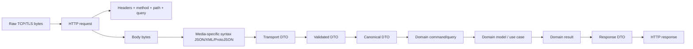
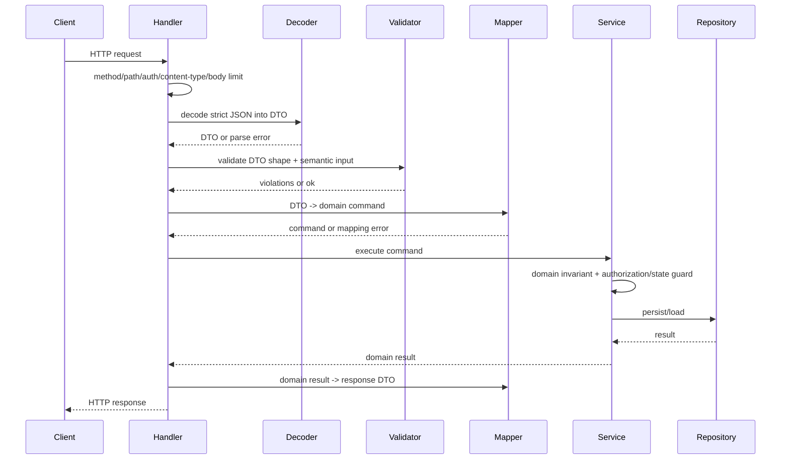
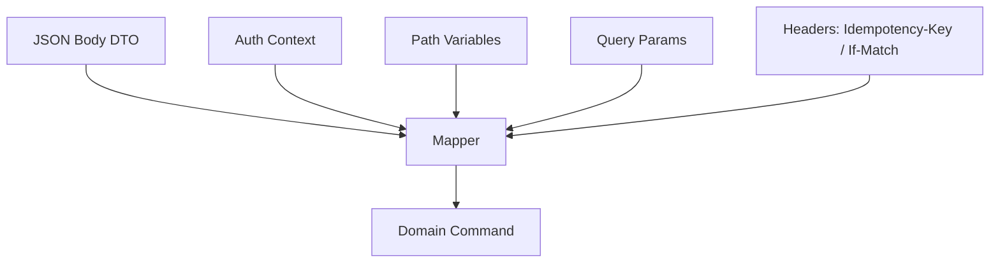
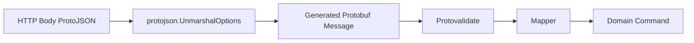

# learn-go-data-mapper-json-xml-protobuf-validation-part-030.md

# Part 030 — Mapping and Validation in HTTP APIs

> Seri: `learn-go-data-mapper-json-xml-protobuf-validation`  
> Bagian: `030 / 033`  
> Topik: **Mapping and Validation in HTTP APIs**  
> Target pembaca: Java engineer yang ingin menguasai Go HTTP API boundary secara production-grade  
> Scope: Go hingga era 1.26.x, `net/http`, `encoding/json`, DTO mapping, validation pipeline, error modeling, dan API contract governance

---

## Daftar Isi

1. [Tujuan Pembelajaran](#1-tujuan-pembelajaran)
2. [Kenapa HTTP API Mapping Tidak Boleh Dianggap Sekadar `json.Decode`](#2-kenapa-http-api-mapping-tidak-boleh-dianggap-sekadar-jsondecode)
3. [Mental Model: HTTP Request sebagai Data Boundary](#3-mental-model-http-request-sebagai-data-boundary)
4. [Pipeline Ideal: Dari Bytes ke Domain Command](#4-pipeline-ideal-dari-bytes-ke-domain-command)
5. [Layer 0 — Transport Guard](#5-layer-0--transport-guard)
6. [Layer 1 — Media Type dan Content Negotiation](#6-layer-1--media-type-dan-content-negotiation)
7. [Layer 2 — Decode JSON Secara Terkontrol](#7-layer-2--decode-json-secara-terkontrol)
8. [Layer 3 — Syntax Error vs Structural Error vs Semantic Error](#8-layer-3--syntax-error-vs-structural-error-vs-semantic-error)
9. [Layer 4 — DTO Validation](#9-layer-4--dto-validation)
10. [Layer 5 — Canonicalization dan Normalization](#10-layer-5--canonicalization-dan-normalization)
11. [Layer 6 — Mapping DTO ke Domain Command](#11-layer-6--mapping-dto-ke-domain-command)
12. [Layer 7 — Domain Validation, Authorization, dan State Guard](#12-layer-7--domain-validation-authorization-dan-state-guard)
13. [Response Mapping: Domain Result ke HTTP Response DTO](#13-response-mapping-domain-result-ke-http-response-dto)
14. [Error Contract: RFC 9457 Problem Details + Field Errors](#14-error-contract-rfc-9457-problem-details--field-errors)
15. [Field Path: JSON Pointer untuk Error Lokasi Field](#15-field-path-json-pointer-untuk-error-lokasi-field)
16. [Strict vs Lenient Policy per Endpoint](#16-strict-vs-lenient-policy-per-endpoint)
17. [Create, Replace, Patch, dan Partial Update](#17-create-replace-patch-dan-partial-update)
18. [Idempotency, Concurrency, dan Conditional Requests](#18-idempotency-concurrency-dan-conditional-requests)
19. [Pagination, Filtering, Sorting, dan Query Parameter Mapping](#19-pagination-filtering-sorting-dan-query-parameter-mapping)
20. [Multipart, File Upload, dan Mixed Payload](#20-multipart-file-upload-dan-mixed-payload)
21. [Protobuf/ProtoJSON di HTTP API](#21-protobufprotojson-di-http-api)
22. [Observability untuk Mapping dan Validation Pipeline](#22-observability-untuk-mapping-dan-validation-pipeline)
23. [Security dan Abuse Resistance](#23-security-dan-abuse-resistance)
24. [Testing Strategy](#24-testing-strategy)
25. [Reference Implementation: Minimal Production-Grade JSON Endpoint](#25-reference-implementation-minimal-production-grade-json-endpoint)
26. [Anti-Pattern](#26-anti-pattern)
27. [Decision Matrix](#27-decision-matrix)
28. [Checklist Review API Boundary](#28-checklist-review-api-boundary)
29. [Latihan Desain](#29-latihan-desain)
30. [Ringkasan Invariant](#30-ringkasan-invariant)
31. [Referensi](#31-referensi)

---

## 1. Tujuan Pembelajaran

Setelah menyelesaikan bagian ini, kamu seharusnya bisa:

1. Mendesain pipeline HTTP request processing yang memisahkan parsing, validation, mapping, authorization, dan domain execution.
2. Membuat JSON decoder yang defensible: bounded body, strict mode, trailing token rejection, unknown field policy, dan numeric precision policy.
3. Membedakan error HTTP API berdasarkan sumbernya: transport, media type, syntax, schema, DTO validation, domain validation, authorization, conflict, dan persistence.
4. Membuat response error yang stabil untuk client menggunakan pola Problem Details dan field-level violation.
5. Menentukan kapan memakai DTO terpisah dari domain model.
6. Menentukan policy untuk create, replace, patch, partial update, dan idempotency.
7. Menghindari anti-pattern umum seperti langsung decode ke domain entity, menyebarkan raw validator error, atau membiarkan unknown field diam-diam.

---

## 2. Kenapa HTTP API Mapping Tidak Boleh Dianggap Sekadar `json.Decode`

Di Go, contoh API kecil sering terlihat seperti ini:

```go
func handler(w http.ResponseWriter, r *http.Request) {
    var req CreateUserRequest
    if err := json.NewDecoder(r.Body).Decode(&req); err != nil {
        http.Error(w, err.Error(), http.StatusBadRequest)
        return
    }

    user, err := service.CreateUser(r.Context(), req)
    if err != nil {
        http.Error(w, err.Error(), http.StatusInternalServerError)
        return
    }

    json.NewEncoder(w).Encode(user)
}
```

Untuk demo, ini cukup.
Untuk production API, ini terlalu longgar.

Masalahnya bukan karena `encoding/json` buruk. Masalahnya adalah HTTP API adalah **contract boundary**. Boundary yang baik harus menjawab:

- Berapa ukuran body maksimum?
- Apakah `Content-Type` wajib `application/json`?
- Apakah unknown field ditolak?
- Apakah duplicate key diterima?
- Apakah trailing JSON token diterima?
- Apakah angka besar boleh masuk sebagai number?
- Apakah `null` sama dengan absent?
- Apakah empty string boleh?
- Apakah trim dilakukan sebelum validasi atau sesudah validasi?
- Apakah field valid secara format tetapi tidak valid secara domain?
- Apakah error field memakai path stabil untuk client?
- Apakah error internal bocor ke response?
- Apakah request id/correlation id muncul di error response?
- Apakah mapping DTO ke domain command explicit?
- Apakah authorization dilakukan sebelum atau sesudah resource lookup?
- Apakah error conflict dibedakan dari validation error?

Top 1% engineer tidak hanya bertanya:

> Bagaimana decode JSON ke struct?

Tetapi:

> Bagaimana memastikan external input berubah menjadi domain command secara aman, deterministik, observable, compatible, dan mudah dievolusi?

---

## 3. Mental Model: HTTP Request sebagai Data Boundary

HTTP request bukan langsung “data aplikasi”. Ia melewati beberapa lapisan makna.



Setiap arrow adalah kesempatan untuk kehilangan makna.

Contoh kehilangan makna:

| Input | Jika salah diproses | Akibat |
|---|---|---|
| Field absent | dianggap zero value | update field tanpa niat client |
| `null` | dianggap sama dengan absent | client tidak bisa clear value |
| unknown field | diabaikan | typo client tidak terdeteksi |
| duplicate key | last-write-wins | ambiguity/security bug |
| money as float | rounding | salah nominal |
| string tanpa trim | validasi lolos/gagal tidak konsisten | data canonical berbeda |
| raw validator error | dikirim ke client | contract tidak stabil |
| domain error | diperlakukan 500 | client salah retry/escalate |

Core principle:

> HTTP API boundary harus mengubah input liar menjadi command yang eksplisit, tervalidasi, dan tidak ambigu.

---

## 4. Pipeline Ideal: Dari Bytes ke Domain Command

Pipeline yang lebih sehat:



Prinsipnya:

1. **Handler** mengurus protocol boundary.
2. **Decoder** mengurus bytes menjadi DTO.
3. **Validator** mengurus input semantics yang masih berada di DTO boundary.
4. **Mapper** mengubah DTO menjadi domain command/query.
5. **Service/use case** mengurus domain invariant dan state transition.
6. **Response mapper** mengubah hasil domain menjadi public response contract.

Jangan jadikan handler sebagai tempat semua logic.
Jangan jadikan domain entity sebagai request DTO.
Jangan jadikan validator tag sebagai domain rule engine.

---

## 5. Layer 0 — Transport Guard

Sebelum membaca body, lakukan guard pada level transport.

Minimal guard:

- method allowed,
- path variable shape,
- required authentication context,
- `Content-Type`,
- body size,
- timeout/context,
- request id/correlation id,
- optional idempotency key,
- optional conditional header seperti `If-Match`.

### 5.1 Body size limit

`net/http` menyediakan `http.MaxBytesReader` untuk membatasi ukuran incoming request body. Ini lebih tepat untuk request body HTTP daripada `io.LimitReader` biasa karena mengembalikan `ReadCloser`, memberi error khusus saat melewati limit, dan menutup underlying reader saat `Close` dipanggil.

Contoh:

```go
const maxJSONBody = 1 << 20 // 1 MiB

func limitBody(w http.ResponseWriter, r *http.Request, n int64) {
    r.Body = http.MaxBytesReader(w, r.Body, n)
}
```

Jangan decode body tak terbatas.

Risiko jika tidak dibatasi:

- memory pressure,
- slowloris-like abuse,
- CPU spike karena parsing payload besar,
- logging/observability flood,
- request queue starvation.

### 5.2 Method guard

```go
func requireMethod(w http.ResponseWriter, r *http.Request, method string) bool {
    if r.Method != method {
        w.Header().Set("Allow", method)
        WriteProblem(w, r, Problem{
            Type:   "https://api.example.com/problems/method-not-allowed",
            Title:  "Method not allowed",
            Status: http.StatusMethodNotAllowed,
            Detail: "This endpoint only supports " + method + ".",
        })
        return false
    }
    return true
}
```

Mapping implication:

- `POST` biasanya create/command.
- `PUT` biasanya replace idempotent.
- `PATCH` biasanya partial change.
- `GET` body biasanya dihindari untuk public API.
- `DELETE` body harus sangat hati-hati karena banyak client/proxy/tooling tidak konsisten.

---

## 6. Layer 1 — Media Type dan Content Negotiation

### 6.1 `Content-Type` bukan kosmetik

Kalau endpoint menerima JSON, pastikan request memang JSON.

Bad:

```go
json.NewDecoder(r.Body).Decode(&req)
```

Better:

```go
func requireJSONContentType(r *http.Request) error {
    ct := r.Header.Get("Content-Type")
    if ct == "" {
        return ErrUnsupportedMediaType{Reason: "missing Content-Type"}
    }

    mediaType, _, err := mime.ParseMediaType(ct)
    if err != nil {
        return ErrUnsupportedMediaType{Reason: "invalid Content-Type"}
    }

    switch mediaType {
    case "application/json":
        return nil
    default:
        return ErrUnsupportedMediaType{Reason: "expected application/json"}
    }
}
```

Pertimbangan production:

- `application/json; charset=utf-8` harus diterima.
- `text/json` biasanya tidak perlu diterima untuk API modern.
- `application/problem+json` adalah response error media type, bukan request DTO biasa.
- `application/x-ndjson` harus endpoint khusus, bukan disamakan dengan JSON object biasa.
- ProtoJSON biasanya tetap `application/json`, tetapi semantics-nya berbeda dari JSON DTO biasa.
- Binary Protobuf biasanya memakai media type seperti `application/protobuf` atau vendor-specific policy.

### 6.2 `Accept` response negotiation

Untuk public API, minimal:

- response JSON default,
- error Problem Details sebagai `application/problem+json`,
- optional reject jika `Accept` eksplisit tidak kompatibel.

Banyak internal API memilih pragmatic default: selalu JSON jika tidak ada kebutuhan multi-format.

---

## 7. Layer 2 — Decode JSON Secara Terkontrol

### 7.1 Decoder options

`encoding/json.Decoder` penting karena menyediakan kontrol yang tidak ada pada `json.Unmarshal` langsung dari `[]byte`.

Fitur penting:

- `DisallowUnknownFields()` untuk menolak unknown key saat decode ke struct.
- `UseNumber()` agar number dalam `interface{}` menjadi `json.Number`, bukan langsung `float64`.
- `InputOffset()` untuk observability/error offset.
- `Token()` dan `More()` untuk streaming.

### 7.2 Strict decode skeleton

```go
package httputil

import (
    "bytes"
    "encoding/json"
    "errors"
    "fmt"
    "io"
    "net/http"
)

var ErrEmptyBody = errors.New("request body is empty")
var ErrMultipleJSONValues = errors.New("request body must contain exactly one JSON value")

type DecodeOptions struct {
    MaxBytes              int64
    DisallowUnknownFields bool
    UseNumber             bool
}

func DecodeJSONBody[T any](w http.ResponseWriter, r *http.Request, opts DecodeOptions) (T, error) {
    var zero T

    if opts.MaxBytes > 0 {
        r.Body = http.MaxBytesReader(w, r.Body, opts.MaxBytes)
    }
    defer r.Body.Close()

    dec := json.NewDecoder(r.Body)

    if opts.DisallowUnknownFields {
        dec.DisallowUnknownFields()
    }
    if opts.UseNumber {
        dec.UseNumber()
    }

    var dst T
    if err := dec.Decode(&dst); err != nil {
        if errors.Is(err, io.EOF) {
            return zero, ErrEmptyBody
        }
        return zero, classifyDecodeError(err)
    }

    // Reject trailing non-whitespace JSON values.
    if err := dec.Decode(&struct{}{}); err != io.EOF {
        if err == nil {
            return zero, ErrMultipleJSONValues
        }
        return zero, classifyDecodeError(err)
    }

    return dst, nil
}

func classifyDecodeError(err error) error {
    var syntaxErr *json.SyntaxError
    if errors.As(err, &syntaxErr) {
        return BadJSONSyntaxError{
            Offset: syntaxErr.Offset,
            Err:    err,
        }
    }

    var typeErr *json.UnmarshalTypeError
    if errors.As(err, &typeErr) {
        return JSONTypeError{
            Field:  typeErr.Field,
            Offset: typeErr.Offset,
            Value:  typeErr.Value,
            Type:   typeErr.Type.String(),
            Err:    err,
        }
    }

    var maxBytesErr *http.MaxBytesError
    if errors.As(err, &maxBytesErr) {
        return BodyTooLargeError{Limit: maxBytesErr.Limit, Err: err}
    }

    return BadJSONSyntaxError{Err: err}
}

type BadJSONSyntaxError struct {
    Offset int64
    Err    error
}

func (e BadJSONSyntaxError) Error() string {
    if e.Offset > 0 {
        return fmt.Sprintf("invalid JSON at byte offset %d", e.Offset)
    }
    return "invalid JSON"
}
func (e BadJSONSyntaxError) Unwrap() error { return e.Err }

type JSONTypeError struct {
    Field  string
    Offset int64
    Value  string
    Type   string
    Err    error
}

func (e JSONTypeError) Error() string {
    if e.Field != "" {
        return fmt.Sprintf("invalid JSON value for field %q", e.Field)
    }
    return "invalid JSON value type"
}
func (e JSONTypeError) Unwrap() error { return e.Err }

type BodyTooLargeError struct {
    Limit int64
    Err   error
}

func (e BodyTooLargeError) Error() string {
    return fmt.Sprintf("request body exceeds %d bytes", e.Limit)
}
func (e BodyTooLargeError) Unwrap() error { return e.Err }

func DecodeJSONBytesStrict[T any](b []byte) (T, error) {
    var zero T
    dec := json.NewDecoder(bytes.NewReader(b))
    dec.DisallowUnknownFields()

    var dst T
    if err := dec.Decode(&dst); err != nil {
        return zero, err
    }
    if err := dec.Decode(&struct{}{}); err != io.EOF {
        if err == nil {
            return zero, ErrMultipleJSONValues
        }
        return zero, err
    }
    return dst, nil
}
```

### 7.3 Kenapa perlu second `Decode`?

`Decode` pertama hanya membaca satu JSON value.

Payload seperti ini:

```json
{"name":"Alice"} {"name":"Mallory"}
```

bisa saja decode value pertama berhasil jika tidak dicek trailing value.

Second decode ke `struct{}{}` memastikan tidak ada JSON value lain setelah value pertama. Whitespace masih boleh.

### 7.4 `DisallowUnknownFields` bukan validasi lengkap

`DisallowUnknownFields` hanya menolak object key yang tidak cocok dengan exported non-ignored field saat destination adalah struct.

Ia tidak otomatis:

- memastikan required field hadir,
- membedakan absent vs zero,
- menolak duplicate key,
- memvalidasi semantic field,
- menolak empty string,
- memvalidasi business rule,
- memahami domain invariant.

Jadi strict decode hanya salah satu lapis.

---

## 8. Layer 3 — Syntax Error vs Structural Error vs Semantic Error

Error taxonomy yang sehat:

| Layer | Contoh | HTTP Status | Error Type |
|---|---|---:|---|
| Transport | body terlalu besar | 413 | `request-body-too-large` |
| Media | `Content-Type: text/plain` | 415 | `unsupported-media-type` |
| Syntax | JSON malformed | 400 | `invalid-json` |
| Structural | field salah tipe | 400 | `invalid-json-type` |
| Unknown field | typo key | 400 | `unknown-field` |
| DTO validation | required/range/format | 422 atau 400 | `validation-failed` |
| Authorization | user tidak boleh | 403 | `forbidden` |
| Resource missing | id tidak ditemukan | 404 | `not-found` |
| Domain conflict | version mismatch/state conflict | 409 | `conflict` |
| Precondition | `If-Match` gagal | 412 | `precondition-failed` |
| Rate limit | quota exceeded | 429 | `rate-limit-exceeded` |
| Internal | bug/infra | 500 | `internal-error` |

### 8.1 400 vs 422

Tidak ada satu jawaban universal.

Dua policy umum:

1. **All client input invalid = 400**  
   Simpler, cocok untuk internal APIs.

2. **Syntax/parse/type = 400, semantic validation = 422**  
   Lebih ekspresif untuk public APIs.

Yang penting bukan angka mana yang paling “benar”, tetapi konsisten dan terdokumentasi.

Rekomendasi:

- Malformed JSON: `400 Bad Request`.
- Unsupported media type: `415 Unsupported Media Type`.
- Body too large: `413 Payload Too Large`.
- Field validation gagal: pilih `400` atau `422`, konsisten.
- Domain conflict: `409 Conflict`.
- Conditional header gagal: `412 Precondition Failed`.

---

## 9. Layer 4 — DTO Validation

DTO validation mengurus syarat input yang bisa diperiksa dari DTO itu sendiri.

Contoh DTO:

```go
type CreateCaseRequest struct {
    Title       string   `json:"title" validate:"required,min=3,max=200"`
    Category    string   `json:"category" validate:"required,oneof=licensing compliance feedback"`
    Description string   `json:"description" validate:"required,min=10,max=5000"`
    Tags        []string `json:"tags" validate:"max=10,dive,min=1,max=40"`
}
```

DTO validation cocok untuk:

- required field,
- min/max length,
- numeric range,
- enum surface value,
- email/url syntax,
- date format setelah custom parse,
- array length,
- nested object validation,
- simple cross-field rule yang masih input-centric.

DTO validation tidak cocok untuk:

- resource existence,
- ownership check,
- permission rule,
- state machine transition,
- duplicate business identity,
- account balance,
- database unique constraint,
- cross-aggregate invariant.

### 9.1 Validator singleton

`go-playground/validator` sebaiknya dibuat sebagai singleton, karena ia cache metadata struct/tag. Registrasi custom validation harus dilakukan saat startup sebelum dipakai concurrent.

```go
package validation

import (
    "reflect"
    "strings"

    "github.com/go-playground/validator/v10"
)

func NewValidator() *validator.Validate {
    v := validator.New(validator.WithRequiredStructEnabled())

    v.RegisterTagNameFunc(func(fld reflect.StructField) string {
        name := strings.SplitN(fld.Tag.Get("json"), ",", 2)[0]
        if name == "-" {
            return ""
        }
        return name
    })

    must(v.RegisterValidation("case_code", validateCaseCode))

    return v
}

func must(err error) {
    if err != nil {
        panic(err)
    }
}

func validateCaseCode(fl validator.FieldLevel) bool {
    s := fl.Field().String()
    if len(s) != 10 {
        return false
    }
    return strings.HasPrefix(s, "CASE-")
}
```

### 9.2 Normalisasi error validator

Jangan expose raw error seperti:

```text
Key: 'CreateCaseRequest.Title' Error:Field validation for 'Title' failed on the 'required' tag
```

Ubah menjadi public contract:

```json
{
  "code": "required",
  "field": "/title",
  "message": "title is required"
}
```

Kenapa?

- raw validator error bukan API contract,
- raw struct name bisa berubah,
- raw tag bisa terlalu teknis,
- client butuh field path stabil,
- localization butuh code/message terpisah.

---

## 10. Layer 5 — Canonicalization dan Normalization

Canonicalization adalah mengubah input valid menjadi representasi internal yang konsisten.

Contoh:

| Input | Canonical |
|---|---|
| `"  Alice  "` | `"Alice"` |
| `"ALICE@EXAMPLE.COM"` | `"alice@example.com"` untuk email identity tertentu |
| `"Case Open"` | enum internal `CaseStatusOpen` |
| `"2026-06-24T10:00:00+07:00"` | `time.Time` UTC atau timezone policy tertentu |
| phone number | E.164 normalized |
| postal code | normalized exact format |

### 10.1 Jangan canonicalize terlalu awal tanpa policy

Misalnya password:

- Jangan trim diam-diam jika password boleh mengandung spasi.
- Jangan lowercase password.
- Jangan normalize unicode tanpa security policy jelas.

Misalnya legal name:

- Trim outer whitespace mungkin aman.
- Lowercase tidak aman.
- Collapsing internal spaces bisa merusak data legal.

Misalnya enum:

- Accept case-insensitive bisa membantu client.
- Tetapi response harus canonical.

### 10.2 Pattern DTO normalize method

```go
type CreateCaseRequest struct {
    Title       string   `json:"title" validate:"required,min=3,max=200"`
    Category    string   `json:"category" validate:"required"`
    Description string   `json:"description" validate:"required,min=10,max=5000"`
    Tags        []string `json:"tags" validate:"max=10,dive,min=1,max=40"`
}

func (r *CreateCaseRequest) Normalize() {
    r.Title = strings.TrimSpace(r.Title)
    r.Category = strings.ToLower(strings.TrimSpace(r.Category))
    r.Description = strings.TrimSpace(r.Description)

    out := r.Tags[:0]
    seen := make(map[string]struct{}, len(r.Tags))
    for _, tag := range r.Tags {
        tag = strings.ToLower(strings.TrimSpace(tag))
        if tag == "" {
            continue
        }
        if _, ok := seen[tag]; ok {
            continue
        }
        seen[tag] = struct{}{}
        out = append(out, tag)
    }
    r.Tags = out
}
```

### 10.3 Validasi sebelum atau sesudah normalize?

Biasanya:

1. decode,
2. basic syntax/type check by decoder,
3. normalize safe fields,
4. validate canonical DTO,
5. map to domain command.

Tetapi ada kasus validasi sebelum normalize:

- ingin menolak leading/trailing whitespace,
- ingin mendeteksi input persis dari client,
- audit/legal field,
- signature verification,
- cryptographic payload,
- webhook raw body verification.

Decision rule:

> Jika normalization mengubah arti hukum/bisnis/security, jangan lakukan diam-diam.

---

## 11. Layer 6 — Mapping DTO ke Domain Command

DTO adalah transport shape.
Domain command adalah intention.

Bad:

```go
func (s *Service) CreateCase(ctx context.Context, req CreateCaseRequest) error
```

Better:

```go
type CreateCaseCommand struct {
    ActorID     domain.UserID
    Title       domain.CaseTitle
    Category    domain.CaseCategory
    Description domain.CaseDescription
    Tags        []domain.Tag
    Source      domain.CaseSource
}
```

DTO mapping:

```go
func MapCreateCaseRequest(actorID string, req CreateCaseRequest) (domain.CreateCaseCommand, error) {
    uid, err := domain.ParseUserID(actorID)
    if err != nil {
        return domain.CreateCaseCommand{}, err
    }

    title, err := domain.NewCaseTitle(req.Title)
    if err != nil {
        return domain.CreateCaseCommand{}, err
    }

    category, err := domain.ParseCaseCategory(req.Category)
    if err != nil {
        return domain.CreateCaseCommand{}, err
    }

    description, err := domain.NewCaseDescription(req.Description)
    if err != nil {
        return domain.CreateCaseCommand{}, err
    }

    tags := make([]domain.Tag, 0, len(req.Tags))
    for _, t := range req.Tags {
        tag, err := domain.NewTag(t)
        if err != nil {
            return domain.CreateCaseCommand{}, err
        }
        tags = append(tags, tag)
    }

    return domain.CreateCaseCommand{
        ActorID:     uid,
        Title:       title,
        Category:    category,
        Description: description,
        Tags:        tags,
        Source:      domain.CaseSourceAPI,
    }, nil
}
```

Mapping layer boleh terasa verbose.
Verbosity itu biaya eksplisit untuk correctness.

### 11.1 Kenapa command bukan DTO?

Karena command bisa membawa:

- actor id dari auth context,
- tenant id,
- source channel,
- correlation id,
- idempotency key,
- parsed domain value object,
- precondition version,
- server-generated metadata,
- normalized values.

Hal-hal ini tidak selalu berasal dari JSON body.



---

## 12. Layer 7 — Domain Validation, Authorization, dan State Guard

Setelah DTO valid dan mapped menjadi command, domain/use-case tetap harus memvalidasi.

Kenapa?

Karena DTO validation tidak tahu state dunia.

Contoh:

```go
func (s *CaseService) SubmitCase(ctx context.Context, cmd SubmitCaseCommand) error {
    c, err := s.repo.GetCase(ctx, cmd.CaseID)
    if err != nil {
        return err
    }

    if !s.authz.CanSubmitCase(ctx, cmd.ActorID, c) {
        return domain.ErrForbidden
    }

    if err := c.Submit(cmd.ActorID, cmd.Now); err != nil {
        return err
    }

    return s.repo.Save(ctx, c)
}
```

Domain validation mencakup:

- actor boleh melakukan action,
- resource berada dalam state yang memungkinkan,
- transition valid,
- required related entity ada,
- duplicate business key tidak ada,
- deadline belum lewat,
- quota belum habis,
- risk score memenuhi syarat,
- consistency dengan aggregate lain.

HTTP handler tidak boleh menjadi state machine.

Handler cukup menerjemahkan error domain ke HTTP response.

---

## 13. Response Mapping: Domain Result ke HTTP Response DTO

Domain object tidak harus sama dengan response DTO.

Bad:

```go
json.NewEncoder(w).Encode(caseEntity)
```

Risiko:

- field internal bocor,
- persistence shape bocor,
- domain rename jadi breaking API,
- cyclic object,
- lazy field tidak sengaja dipanggil,
- sensitive metadata terbuka,
- nullability tidak terkendali.

Better:

```go
type CaseResponse struct {
    ID          string    `json:"id"`
    Title       string    `json:"title"`
    Category    string    `json:"category"`
    Status      string    `json:"status"`
    Description string    `json:"description"`
    Tags        []string  `json:"tags"`
    CreatedAt   time.Time `json:"createdAt"`
    UpdatedAt   time.Time `json:"updatedAt"`
}

func MapCaseResponse(c domain.Case) CaseResponse {
    tags := make([]string, 0, len(c.Tags()))
    for _, t := range c.Tags() {
        tags = append(tags, t.String())
    }

    return CaseResponse{
        ID:          c.ID().String(),
        Title:       c.Title().String(),
        Category:    c.Category().String(),
        Status:      c.Status().String(),
        Description: c.Description().String(),
        Tags:        tags,
        CreatedAt:   c.CreatedAt(),
        UpdatedAt:   c.UpdatedAt(),
    }
}
```

### 13.1 Response writer helper

```go
func WriteJSON(w http.ResponseWriter, status int, v any) {
    w.Header().Set("Content-Type", "application/json")
    w.WriteHeader(status)

    enc := json.NewEncoder(w)
    enc.SetEscapeHTML(true)

    if err := enc.Encode(v); err != nil {
        // At this point status may already be written.
        // Log internally; do not attempt to write another response body.
        return
    }
}
```

Catatan:

- Setelah `WriteHeader`, status tidak bisa diubah.
- Encoding error response body jarang terjadi untuk DTO sederhana, tetapi tetap perlu logging.
- Untuk response besar, streaming encoder bisa dipakai.
- Untuk response sensitif, pastikan redaction sebelum encode.

---

## 14. Error Contract: RFC 9457 Problem Details + Field Errors

Problem Details menyediakan envelope standar untuk error HTTP API.

Core fields:

- `type`,
- `title`,
- `status`,
- `detail`,
- `instance`.

Kita bisa menambahkan extension field, misalnya `errors` untuk field-level validation.

```go
type Problem struct {
    Type     string       `json:"type"`
    Title    string       `json:"title"`
    Status   int          `json:"status"`
    Detail   string       `json:"detail,omitempty"`
    Instance string       `json:"instance,omitempty"`
    Errors   []FieldError `json:"errors,omitempty"`
    TraceID  string       `json:"traceId,omitempty"`
}

type FieldError struct {
    Field   string         `json:"field"`           // JSON Pointer, e.g. /title
    Code    string         `json:"code"`            // required, max_length, invalid_enum
    Message string         `json:"message"`         // human-readable
    Params  map[string]any `json:"params,omitempty"`
}
```

Response:

```json
{
  "type": "https://api.example.com/problems/validation-failed",
  "title": "Validation failed",
  "status": 422,
  "detail": "Request body contains invalid fields.",
  "instance": "/cases",
  "traceId": "01JZ2W7R6R4FZ9K3S0ZVX4NQEG",
  "errors": [
    {
      "field": "/title",
      "code": "required",
      "message": "title is required"
    },
    {
      "field": "/tags/2",
      "code": "max_length",
      "message": "tag must be at most 40 characters",
      "params": {"max": 40}
    }
  ]
}
```

### 14.1 Jangan bocorkan internal error

Internal log:

```text
oracle: ORA-00001 unique constraint violated on CASE_UK_01; trace=...
```

Public response:

```json
{
  "type": "https://api.example.com/problems/conflict",
  "title": "Conflict",
  "status": 409,
  "detail": "A case with the same reference already exists.",
  "traceId": "01JZ2W7R6R4FZ9K3S0ZVX4NQEG"
}
```

Client perlu actionable error.
Engineer perlu detailed log.
Keduanya tidak harus sama.

---

## 15. Field Path: JSON Pointer untuk Error Lokasi Field

Gunakan JSON Pointer untuk menunjuk field dalam JSON body.

Contoh:

| Field | JSON Pointer |
|---|---|
| `title` | `/title` |
| `applicant.name` | `/applicant/name` |
| item pertama `documents` | `/documents/0` |
| field `type` dalam item kedua | `/documents/1/type` |

Escape rule penting:

- `~` menjadi `~0`,
- `/` menjadi `~1`.

Helper:

```go
func JSONPointer(parts ...string) string {
    if len(parts) == 0 {
        return ""
    }

    var b strings.Builder
    for _, p := range parts {
        b.WriteByte('/')
        p = strings.ReplaceAll(p, "~", "~0")
        p = strings.ReplaceAll(p, "/", "~1")
        b.WriteString(p)
    }
    return b.String()
}
```

Untuk `validator.ValidationErrors`, mapping field path harus memakai JSON tag name, bukan Go field name.

```go
func ValidatorFieldErrors(err error) []FieldError {
    var validationErrs validator.ValidationErrors
    if !errors.As(err, &validationErrs) {
        return nil
    }

    out := make([]FieldError, 0, len(validationErrs))
    for _, fe := range validationErrs {
        field := validatorNamespaceToJSONPointer(fe.Namespace())
        out = append(out, FieldError{
            Field:   field,
            Code:    validationTagToCode(fe.Tag()),
            Message: validationMessage(fe),
            Params:  validationParams(fe),
        })
    }
    return out
}
```

Implementasi namespace-to-pointer biasanya project-specific karena harus tahu:

- nama root struct yang mau dihapus,
- JSON tag resolution,
- array index format dari validator,
- nested struct naming policy.

---

## 16. Strict vs Lenient Policy per Endpoint

Tidak semua endpoint harus strict sama.

### 16.1 Public command endpoint

Rekomendasi:

- strict content type,
- body limit,
- unknown fields rejected,
- trailing token rejected,
- duplicate key policy ditentukan,
- DTO validation ketat,
- response error stabil.

Contoh:

```text
POST /cases
PUT /cases/{id}
PATCH /cases/{id}
POST /payments
POST /identity-verification
```

### 16.2 Internal event/webhook endpoint

Tergantung producer.

Untuk webhook eksternal:

- raw body mungkin perlu diverifikasi signature sebelum decode,
- unknown field mungkin diterima untuk forward compatibility,
- timestamp tolerance perlu dicek,
- event id untuk idempotency.

Untuk internal event ingestion:

- schema evolution policy penting,
- unknown field bisa diterima jika event contract mendukung extension,
- poison message handling harus jelas.

### 16.3 Admin/internal tool endpoint

Bisa lebih strict untuk mencegah operator typo.

Unknown field pada admin API sebaiknya ditolak karena typo operator berisiko tinggi.

---

## 17. Create, Replace, Patch, dan Partial Update

### 17.1 Create request

Create biasanya butuh required fields.

```go
type CreateProfileRequest struct {
    DisplayName string  `json:"displayName" validate:"required,min=3,max=80"`
    Email       string  `json:"email" validate:"required,email"`
    Phone       *string `json:"phone" validate:"omitempty,e164"`
}
```

Semantics:

- absent required => error,
- null optional pointer => nil,
- zero value untuk required string biasanya invalid,
- server generate ID.

### 17.2 Replace request dengan PUT

PUT biasanya mengganti seluruh representation.

```go
type ReplaceProfileRequest struct {
    DisplayName string  `json:"displayName" validate:"required,min=3,max=80"`
    Email       string  `json:"email" validate:"required,email"`
    Phone       *string `json:"phone" validate:"omitempty,e164"`
}
```

Jika field hilang, itu bisa berarti client ingin representation tanpa field itu, atau invalid karena full representation tidak lengkap. Harus eksplisit.

### 17.3 Patch request

PATCH perlu membedakan:

- absent: jangan ubah,
- null: clear value,
- value: set value.

Gunakan optional tri-state.

```go
type Optional[T any] struct {
    Set   bool
    Null  bool
    Value T
}

func (o *Optional[T]) UnmarshalJSON(b []byte) error {
    o.Set = true
    if string(b) == "null" {
        o.Null = true
        var zero T
        o.Value = zero
        return nil
    }
    return json.Unmarshal(b, &o.Value)
}
```

Patch DTO:

```go
type PatchProfileRequest struct {
    DisplayName Optional[string] `json:"displayName"`
    Email       Optional[string] `json:"email"`
    Phone       Optional[string] `json:"phone"`
}
```

Mapping:

```go
type PatchProfileCommand struct {
    ProfileID   domain.ProfileID
    ActorID     domain.UserID
    DisplayName domain.Change[domain.DisplayName]
    Email       domain.Change[domain.Email]
    Phone       domain.Change[domain.Phone]
}
```

Domain change type:

```go
type Change[T any] struct {
    Kind  ChangeKind
    Value T
}

type ChangeKind int

const (
    ChangeAbsent ChangeKind = iota
    ChangeClear
    ChangeSet
)
```

### 17.4 JSON Merge Patch vs JSON Patch vs Custom Patch DTO

| Approach | Pros | Cons | Cocok Untuk |
|---|---|---|---|
| Custom patch DTO | typed, mudah validate | perlu code per resource | business API umum |
| JSON Merge Patch | simple, standard-ish | null means delete, array replace kasar | document-like resource |
| JSON Patch | expressive operation list | kompleks, path sensitive, harder authz | advanced document editing |

Untuk business API, custom patch DTO sering lebih mudah dipertahankan.

---

## 18. Idempotency, Concurrency, dan Conditional Requests

Mapping request body saja tidak cukup. Banyak semantic API hidup di header.

### 18.1 Idempotency key

Untuk command create/payment/submission:

```http
Idempotency-Key: 01JZ2W7R6R4FZ9K3S0ZVX4NQEG
```

Masukkan ke command:

```go
type CreatePaymentCommand struct {
    ActorID        domain.UserID
    Amount         domain.Money
    IdempotencyKey string
}
```

Rule:

- key wajib untuk endpoint yang rawan retry duplicate,
- key scoped per actor/tenant/action,
- request fingerprint disimpan,
- repeated same key same payload return same result,
- same key different payload return conflict/idempotency error.

### 18.2 Optimistic concurrency dengan ETag/If-Match

```http
If-Match: "case-version-17"
```

Mapping:

```go
type UpdateCaseCommand struct {
    CaseID          domain.CaseID
    ExpectedVersion domain.Version
    Changes         CaseChanges
}
```

Jika version mismatch:

- `412 Precondition Failed` jika memakai conditional request semantics,
- `409 Conflict` jika memakai domain conflict semantics non-header.

Pilih satu policy dan dokumentasikan.

---

## 19. Pagination, Filtering, Sorting, dan Query Parameter Mapping

Query parameter juga boundary.

Bad:

```go
limit, _ := strconv.Atoi(r.URL.Query().Get("limit"))
```

Better:

```go
type ListCasesQueryRequest struct {
    PageSize int
    PageToken string
    Sort string
    Status []string
}

func DecodeListCasesQuery(r *http.Request) (ListCasesQueryRequest, []FieldError) {
    q := r.URL.Query()

    var errs []FieldError
    out := ListCasesQueryRequest{
        PageSize: 50,
        Sort:     "createdAt.desc",
        Status:   q["status"],
    }

    if raw := q.Get("pageSize"); raw != "" {
        n, err := strconv.Atoi(raw)
        if err != nil {
            errs = append(errs, FieldError{Field: "/query/pageSize", Code: "invalid_integer", Message: "pageSize must be an integer"})
        } else if n < 1 || n > 200 {
            errs = append(errs, FieldError{Field: "/query/pageSize", Code: "out_of_range", Message: "pageSize must be between 1 and 200"})
        } else {
            out.PageSize = n
        }
    }

    out.PageToken = q.Get("pageToken")

    if rawSort := q.Get("sort"); rawSort != "" {
        if !allowedSort(rawSort) {
            errs = append(errs, FieldError{Field: "/query/sort", Code: "invalid_sort", Message: "sort is not supported"})
        } else {
            out.Sort = rawSort
        }
    }

    for i, s := range out.Status {
        if !allowedStatus(s) {
            errs = append(errs, FieldError{Field: fmt.Sprintf("/query/status/%d", i), Code: "invalid_enum", Message: "status is not supported"})
        }
    }

    return out, errs
}
```

### 19.1 Pagination invariant

Untuk API production:

- hindari unbounded `limit`,
- beri default page size,
- beri max page size,
- prefer cursor/page token untuk dataset besar,
- sorting harus deterministic,
- filter harus allowlist,
- jangan map query langsung ke SQL/order-by string.

---

## 20. Multipart, File Upload, dan Mixed Payload

File upload adalah boundary berbeda dari JSON body.

Risiko:

- body besar,
- filename injection,
- content-type spoofing,
- decompression bomb,
- virus/malware,
- temporary file leak,
- memory pressure,
- partial upload,
- metadata mismatch.

Pattern:

1. Limit total body.
2. Parse multipart dengan memory limit.
3. Validate metadata fields.
4. Validate file count.
5. Validate file size per file.
6. Validate sniffed content type if needed.
7. Store to object storage/quarantine.
8. Domain command hanya menerima file handle/reference, bukan raw bytes besar.

```go
func handleUpload(w http.ResponseWriter, r *http.Request) {
    r.Body = http.MaxBytesReader(w, r.Body, 20<<20) // 20 MiB total

    if err := r.ParseMultipartForm(5 << 20); err != nil {
        // map to 400/413 depending error
        return
    }

    title := strings.TrimSpace(r.FormValue("title"))
    if title == "" {
        // validation error
        return
    }

    file, header, err := r.FormFile("document")
    if err != nil {
        // missing file
        return
    }
    defer file.Close()

    if header.Size > 10<<20 {
        // file too large
        return
    }

    // Do not trust header.Filename blindly.
    safeName := filepath.Base(header.Filename)
    _ = safeName
}
```

---

## 21. Protobuf/ProtoJSON di HTTP API

Jika HTTP API memakai Protobuf:

- binary Protobuf untuk service-to-service atau performance-sensitive internal API,
- ProtoJSON untuk REST-ish gateway compatibility,
- jangan decode ProtoJSON dengan `encoding/json` ke generated struct,
- gunakan `protojson.UnmarshalOptions`.

```go
func DecodeProtoJSON[T proto.Message](r *http.Request, msg T) error {
    b, err := io.ReadAll(r.Body)
    if err != nil {
        return err
    }

    opts := protojson.UnmarshalOptions{
        DiscardUnknown: false,
    }
    return opts.Unmarshal(b, msg)
}
```

Considerations:

- ProtoJSON uses Protobuf JSON mapping, not arbitrary Go JSON tags.
- Unknown fields in ProtoJSON are not equivalent to binary unknown field preservation.
- Enum names, field names, default emission, `Any`, timestamps, wrappers, and presence semantics follow Protobuf rules.
- Validation can use Protovalidate after unmarshal.

Pipeline:



---

## 22. Observability untuk Mapping dan Validation Pipeline

Observability penting karena boundary error sering menjadi sinyal client integration issue.

Metrics yang berguna:

- request decode failures by endpoint/error type,
- validation failures by endpoint/code,
- body too large count,
- unsupported media type count,
- unknown field count,
- conflict count,
- idempotency replay count,
- handler latency by phase if needed,
- payload size histogram,
- response status count.

Log fields:

- trace id,
- route pattern, not raw path if high cardinality,
- method,
- status,
- problem type,
- validation codes count,
- actor id if safe,
- tenant id if safe,
- request size,
- decode offset for parse errors,
- domain error class.

Jangan log:

- full request body by default,
- password/token/secret,
- PII tanpa policy,
- uploaded file content,
- raw authorization header,
- database internal error ke client.

Example structured log:

```json
{
  "level": "warn",
  "msg": "request validation failed",
  "traceId": "01JZ2W7R6R4FZ9K3S0ZVX4NQEG",
  "route": "POST /cases",
  "status": 422,
  "problemType": "validation-failed",
  "fieldErrorCount": 3,
  "codes": ["required", "max_length"]
}
```

---

## 23. Security dan Abuse Resistance

HTTP mapping/validation adalah security boundary.

Checklist keamanan:

- Limit body size.
- Set server read timeout/write timeout.
- Validate `Content-Type`.
- Reject malformed JSON.
- Consider strict unknown field policy for command endpoints.
- Avoid raw `map[string]any` for sensitive command bodies.
- Avoid float for money/identity.
- Do not log raw body by default.
- Normalize and validate before persistence.
- Use allowlist for sorting/filtering.
- Avoid mass assignment.
- Use DTO separate from persistence/domain entity.
- Map errors to safe public problem details.
- Avoid reflecting internal enum/state names if not public contract.
- Verify webhook signatures on raw body before parsing.
- Treat uploaded filenames as untrusted.

### 23.1 Mass assignment problem

Bad:

```go
type User struct {
    ID       string `json:"id"`
    Email    string `json:"email"`
    IsAdmin  bool   `json:"isAdmin"`
    TenantID string `json:"tenantId"`
}

json.NewDecoder(r.Body).Decode(&user)
repo.Save(user)
```

Client bisa mengirim:

```json
{
  "email": "attacker@example.com",
  "isAdmin": true,
  "tenantId": "victim-tenant"
}
```

Better:

```go
type UpdateMyProfileRequest struct {
    DisplayName string `json:"displayName" validate:"required,min=3,max=80"`
}
```

Public DTO hanya berisi field yang memang boleh diubah client.

---

## 24. Testing Strategy

### 24.1 Decoder tests

Test cases:

- empty body,
- malformed JSON,
- wrong type,
- unknown field,
- trailing JSON value,
- body too large,
- null for non-nullable policy,
- numeric precision,
- duplicate key if you implement duplicate detection,
- valid body.

```go
func TestDecodeJSONBodyRejectsTrailingValue(t *testing.T) {
    body := strings.NewReader(`{"title":"Case A"} {"title":"Case B"}`)
    r := httptest.NewRequest(http.MethodPost, "/cases", body)
    w := httptest.NewRecorder()

    _, err := DecodeJSONBody[CreateCaseRequest](w, r, DecodeOptions{
        MaxBytes:              1024,
        DisallowUnknownFields: true,
    })

    if !errors.Is(err, ErrMultipleJSONValues) {
        t.Fatalf("expected ErrMultipleJSONValues, got %v", err)
    }
}
```

### 24.2 Handler tests

Use `httptest`.

Test matrix:

| Scenario | Expected |
|---|---|
| valid create | 201 + response body |
| invalid content type | 415 + problem |
| malformed JSON | 400 + problem |
| missing required field | 422 + field error |
| domain conflict | 409 + problem |
| forbidden | 403 + problem |
| service timeout | 504/503 depending policy |
| internal error | 500 without internal leak |

### 24.3 Contract tests

- Validate response against OpenAPI schema.
- Validate example requests.
- Validate generated clients still compile.
- Diff OpenAPI breaking changes in CI.
- Run negative tests for unknown fields and error shape.

### 24.4 Fuzz tests

Good targets:

- custom `UnmarshalJSON`,
- optional tri-state type,
- date/money parser,
- JSON pointer escaping,
- duplicate key scanner,
- query parser.

---

## 25. Reference Implementation: Minimal Production-Grade JSON Endpoint

This section combines the concepts into a compact but realistic endpoint.

### 25.1 DTO

```go
type CreateCaseRequest struct {
    Title       string   `json:"title" validate:"required,min=3,max=200"`
    Category    string   `json:"category" validate:"required,oneof=licensing compliance feedback"`
    Description string   `json:"description" validate:"required,min=10,max=5000"`
    Tags        []string `json:"tags" validate:"max=10,dive,min=1,max=40"`
}

func (r *CreateCaseRequest) Normalize() {
    r.Title = strings.TrimSpace(r.Title)
    r.Category = strings.ToLower(strings.TrimSpace(r.Category))
    r.Description = strings.TrimSpace(r.Description)

    if r.Tags == nil {
        r.Tags = []string{}
        return
    }

    out := r.Tags[:0]
    seen := make(map[string]struct{}, len(r.Tags))
    for _, tag := range r.Tags {
        tag = strings.ToLower(strings.TrimSpace(tag))
        if tag == "" {
            continue
        }
        if _, ok := seen[tag]; ok {
            continue
        }
        seen[tag] = struct{}{}
        out = append(out, tag)
    }
    r.Tags = out
}
```

### 25.2 Handler

```go
type CaseHandler struct {
    Validator *validator.Validate
    Service   CaseService
}

type CaseService interface {
    CreateCase(ctx context.Context, cmd domain.CreateCaseCommand) (domain.Case, error)
}

func (h CaseHandler) CreateCase(w http.ResponseWriter, r *http.Request) {
    if !requireMethod(w, r, http.MethodPost) {
        return
    }

    if err := requireJSONContentType(r); err != nil {
        WriteProblem(w, r, Problem{
            Type:   "https://api.example.com/problems/unsupported-media-type",
            Title:  "Unsupported media type",
            Status: http.StatusUnsupportedMediaType,
            Detail: "Request body must use application/json.",
        })
        return
    }

    req, err := DecodeJSONBody[CreateCaseRequest](w, r, DecodeOptions{
        MaxBytes:              1 << 20,
        DisallowUnknownFields: true,
        UseNumber:             true,
    })
    if err != nil {
        h.writeDecodeError(w, r, err)
        return
    }

    req.Normalize()

    if err := h.Validator.Struct(req); err != nil {
        WriteProblem(w, r, Problem{
            Type:   "https://api.example.com/problems/validation-failed",
            Title:  "Validation failed",
            Status: http.StatusUnprocessableEntity,
            Detail: "Request body contains invalid fields.",
            Errors: ValidatorFieldErrors(err),
        })
        return
    }

    actorID, ok := ActorIDFromContext(r.Context())
    if !ok {
        WriteProblem(w, r, Problem{
            Type:   "https://api.example.com/problems/unauthorized",
            Title:  "Unauthorized",
            Status: http.StatusUnauthorized,
        })
        return
    }

    cmd, err := MapCreateCaseRequest(actorID, req)
    if err != nil {
        WriteProblem(w, r, Problem{
            Type:   "https://api.example.com/problems/validation-failed",
            Title:  "Validation failed",
            Status: http.StatusUnprocessableEntity,
            Detail: "Request body contains invalid domain values.",
        })
        return
    }

    created, err := h.Service.CreateCase(r.Context(), cmd)
    if err != nil {
        h.writeDomainError(w, r, err)
        return
    }

    WriteJSON(w, http.StatusCreated, MapCaseResponse(created))
}
```

### 25.3 Decode error mapping

```go
func (h CaseHandler) writeDecodeError(w http.ResponseWriter, r *http.Request, err error) {
    var bodyTooLarge BodyTooLargeError
    if errors.As(err, &bodyTooLarge) {
        WriteProblem(w, r, Problem{
            Type:   "https://api.example.com/problems/request-body-too-large",
            Title:  "Request body too large",
            Status: http.StatusRequestEntityTooLarge,
            Detail: bodyTooLarge.Error(),
        })
        return
    }

    var typeErr JSONTypeError
    if errors.As(err, &typeErr) {
        WriteProblem(w, r, Problem{
            Type:   "https://api.example.com/problems/invalid-json-type",
            Title:  "Invalid JSON value type",
            Status: http.StatusBadRequest,
            Detail: typeErr.Error(),
            Errors: []FieldError{{
                Field:   jsonFieldToPointer(typeErr.Field),
                Code:    "invalid_type",
                Message: typeErr.Error(),
            }},
        })
        return
    }

    if errors.Is(err, ErrEmptyBody) {
        WriteProblem(w, r, Problem{
            Type:   "https://api.example.com/problems/empty-body",
            Title:  "Empty request body",
            Status: http.StatusBadRequest,
            Detail: "Request body must contain a JSON object.",
        })
        return
    }

    if errors.Is(err, ErrMultipleJSONValues) {
        WriteProblem(w, r, Problem{
            Type:   "https://api.example.com/problems/multiple-json-values",
            Title:  "Invalid JSON body",
            Status: http.StatusBadRequest,
            Detail: "Request body must contain exactly one JSON value.",
        })
        return
    }

    WriteProblem(w, r, Problem{
        Type:   "https://api.example.com/problems/invalid-json",
        Title:  "Invalid JSON",
        Status: http.StatusBadRequest,
        Detail: "Request body is not valid JSON.",
    })
}
```

### 25.4 Domain error mapping

```go
func (h CaseHandler) writeDomainError(w http.ResponseWriter, r *http.Request, err error) {
    switch {
    case errors.Is(err, domain.ErrForbidden):
        WriteProblem(w, r, Problem{
            Type:   "https://api.example.com/problems/forbidden",
            Title:  "Forbidden",
            Status: http.StatusForbidden,
            Detail: "You are not allowed to perform this action.",
        })
    case errors.Is(err, domain.ErrConflict):
        WriteProblem(w, r, Problem{
            Type:   "https://api.example.com/problems/conflict",
            Title:  "Conflict",
            Status: http.StatusConflict,
            Detail: "The requested operation conflicts with the current resource state.",
        })
    default:
        // Log detailed err internally with trace id.
        WriteProblem(w, r, Problem{
            Type:   "https://api.example.com/problems/internal-error",
            Title:  "Internal server error",
            Status: http.StatusInternalServerError,
            Detail: "An unexpected error occurred.",
        })
    }
}
```

### 25.5 Problem writer

```go
func WriteProblem(w http.ResponseWriter, r *http.Request, p Problem) {
    if p.Status == 0 {
        p.Status = http.StatusInternalServerError
    }
    if p.Type == "" {
        p.Type = "about:blank"
    }
    if p.Title == "" {
        p.Title = http.StatusText(p.Status)
    }
    if p.Instance == "" && r != nil {
        p.Instance = r.URL.Path
    }
    if p.TraceID == "" && r != nil {
        p.TraceID = TraceIDFromContext(r.Context())
    }

    w.Header().Set("Content-Type", "application/problem+json")
    w.WriteHeader(p.Status)
    _ = json.NewEncoder(w).Encode(p)
}
```

---

## 26. Anti-Pattern

### 26.1 Decode langsung ke domain entity

```go
var c domain.Case
json.NewDecoder(r.Body).Decode(&c)
```

Masalah:

- mass assignment,
- internal field bocor,
- domain invariant dilewati,
- persistence shape jadi public contract,
- sulit evolve.

### 26.2 Menggunakan `map[string]any` sebagai request utama

```go
var req map[string]any
json.NewDecoder(r.Body).Decode(&req)
```

Masalah:

- number jadi `float64` by default,
- field typo sulit dikontrol,
- validation manual rawan inconsistent,
- contract tidak self-documenting.

Gunakan hanya untuk:

- truly dynamic metadata,
- extension fields,
- schema-driven validation,
- proxy/gateway,
- audit capture.

### 26.3 Raw `http.Error`

```go
http.Error(w, err.Error(), http.StatusBadRequest)
```

Masalah:

- error format tidak stabil,
- content type text/plain,
- internal error bisa bocor,
- client sulit parse,
- localization sulit.

### 26.4 Semua error jadi 500

```go
if err != nil {
    http.Error(w, "failed", 500)
}
```

Masalah:

- client retry salah,
- dashboard salah membaca reliability,
- domain conflict tersembunyi,
- validation bug susah dilacak.

### 26.5 Terlalu bergantung pada validation tag

Validation tag bagus untuk field-level DTO validation.
Tetapi tag bukan pengganti:

- domain model,
- authorization,
- state machine,
- repository constraints,
- cross-aggregate rule.

### 26.6 Silent normalization

Contoh buruk:

- lowercase legal name,
- trim password,
- silently truncate string,
- default country tanpa explicit rule,
- convert unknown enum ke fallback.

Normalization harus eksplisit dan reviewable.

---

## 27. Decision Matrix

### 27.1 Decode policy

| Endpoint Type | Unknown Field | Body Limit | Trailing Token | Duplicate Key | Notes |
|---|---|---:|---|---|---|
| Public command | reject | strict | reject | preferably reject | typo prevention |
| Public query | reject query unknown if possible | small | n/a | n/a | allowlist filters |
| Webhook | depends provider | strict | reject | depends signature/raw body | verify signature first |
| Event ingestion | usually allow compatible fields | strict | reject | schema-dependent | poison handling |
| Admin command | reject | strict | reject | reject | operator typo high risk |
| Internal trusted | reject by default | strict | reject | maybe reject | trusted does not mean sloppy |

### 27.2 DTO vs domain reuse

| Situation | Reuse Domain? | Use Separate DTO? | Reason |
|---|---:|---:|---|
| Simple internal read response | maybe | maybe | low risk |
| Public write endpoint | no | yes | mass assignment/invariants |
| PATCH endpoint | no | yes | tri-state semantics |
| Auth-sensitive resource | no | yes | field exposure control |
| Generated OpenAPI client/server | no | yes/generated | contract governance |
| Event envelope | no | yes | schema evolution |

### 27.3 Validation location

| Rule | Layer |
|---|---|
| JSON malformed | decoder |
| unknown field | decoder/schema |
| required string | DTO validator |
| trim/lowercase safe enum | canonicalization |
| parse domain ID | mapper/value object |
| user owns resource | authorization/domain service |
| case can transition to submitted | domain state machine |
| duplicate unique business key | domain/repository |
| version mismatch | repository/domain conflict |

---

## 28. Checklist Review API Boundary

Gunakan checklist ini saat review endpoint baru.

### Request boundary

- [ ] Method dicek.
- [ ] Path variables diparse dan divalidasi.
- [ ] Query params diparse via allowlist.
- [ ] Content-Type dicek untuk body endpoint.
- [ ] Body size dibatasi.
- [ ] JSON decoder strict sesuai policy.
- [ ] Trailing JSON values ditolak.
- [ ] Unknown field policy eksplisit.
- [ ] Numeric precision policy jelas.
- [ ] `null` vs absent semantics jelas.
- [ ] DTO tidak sama dengan domain entity untuk write endpoint.

### Validation

- [ ] DTO validation hanya input-centric.
- [ ] Domain invariant tetap di domain/use-case.
- [ ] Authorization tidak diletakkan di DTO validator.
- [ ] State transition tidak diletakkan di handler.
- [ ] Field errors memakai stable code.
- [ ] Field path memakai JSON name/pointer, bukan Go field name.

### Mapping

- [ ] Mapping DTO -> command explicit.
- [ ] Auth actor/tenant/header/path/query/body digabung secara sadar.
- [ ] Server-generated fields tidak diterima dari body.
- [ ] Sensitive fields tidak bisa dimass-assign.
- [ ] Response DTO tidak membocorkan internal fields.

### Error response

- [ ] Error memakai stable envelope.
- [ ] Internal error tidak bocor.
- [ ] Problem type stabil.
- [ ] Trace id tersedia.
- [ ] Status code konsisten.
- [ ] Validation error bisa diparse client.

### Operational

- [ ] Metrics decode/validation/domain error tersedia.
- [ ] Logs tidak memuat PII/raw body default.
- [ ] Contract test ada.
- [ ] Negative test ada.
- [ ] OpenAPI/schema update jika public API.

---

## 29. Latihan Desain

### Latihan 1 — Endpoint Create Application

Desain endpoint:

```http
POST /applications
Content-Type: application/json
```

Body:

```json
{
  "applicantName": "Alice Tan",
  "licenseType": "salesperson",
  "email": "alice@example.com",
  "postalCode": "123456",
  "documents": [
    {"type": "identity", "fileId": "file_123"}
  ]
}
```

Tentukan:

1. DTO.
2. Validation tag.
3. Normalization rule.
4. Domain command.
5. Error response untuk missing document.
6. Error response untuk postal code invalid.
7. Unknown field policy.
8. Body size limit.
9. Which fields come from auth context.

### Latihan 2 — PATCH Case Assignment

Desain endpoint:

```http
PATCH /cases/{caseId}/assignment
```

Requirement:

- `assigneeId` absent berarti tidak berubah.
- `assigneeId: null` berarti unassign.
- `assigneeId: "user_123"` berarti assign.
- `reason` required jika unassign.

Tentukan:

1. Optional tri-state DTO.
2. Cross-field validation.
3. Mapping ke domain command.
4. Domain rule untuk role/permission.
5. Error path JSON Pointer.

### Latihan 3 — Idempotent Submission

Desain:

```http
POST /cases/{caseId}/submit
Idempotency-Key: ...
```

Tentukan:

1. Apakah body dibutuhkan?
2. Bagaimana menyimpan idempotency record?
3. Apa response jika same key same payload?
4. Apa response jika same key different payload?
5. Apa response jika case sudah submitted oleh request sebelumnya?

---

## 30. Ringkasan Invariant

Ingat invariant berikut:

1. **Request body bukan domain object.** Ia hanya external representation.
2. **Decode bukan validation.** Decode hanya mengubah bytes menjadi value.
3. **Validation bukan authorization.** Input valid belum tentu boleh dilakukan actor.
4. **DTO validation bukan domain invariant.** State machine tetap hidup di domain/use-case.
5. **Unknown field policy harus eksplisit.** Diam-diam ignore bisa membantu compatibility, tetapi bisa menyembunyikan typo.
6. **Absent/null/zero harus punya semantics yang jelas.** Terutama untuk PATCH.
7. **Mapper adalah semantic firewall.** Mapper menggabungkan body, path, query, header, auth, dan server metadata menjadi command.
8. **Response DTO adalah public contract.** Jangan expose domain/persistence entity langsung.
9. **Error response adalah API contract.** Jangan expose raw Go/validator/database error.
10. **Operational signal harus dipikirkan.** Decode/validation error rate adalah sinyal kualitas client integration.

Boundary HTTP yang baik bukan yang paling pendek kodenya.
Boundary HTTP yang baik adalah yang membuat data tidak ambigu, error dapat dipahami, domain tetap bersih, dan perubahan contract bisa dikontrol.

---

## 31. Referensi

- Go `net/http` package documentation — `http.MaxBytesReader`, `http.MaxBytesError`, server/handler primitives: <https://pkg.go.dev/net/http>
- Go `encoding/json` package documentation — `Decoder`, `DisallowUnknownFields`, `UseNumber`, `InputOffset`, `Token`: <https://pkg.go.dev/encoding/json>
- `go-playground/validator/v10` documentation — singleton/cache behavior, validation tags, custom validation: <https://pkg.go.dev/github.com/go-playground/validator/v10>
- RFC 9457 — Problem Details for HTTP APIs: <https://www.rfc-editor.org/rfc/rfc9457>
- RFC 6901 — JSON Pointer: <https://www.rfc-editor.org/rfc/rfc6901>
- Protocol Buffers ProtoJSON Format: <https://protobuf.dev/programming-guides/json/>
- Go Protobuf `protojson` package: <https://pkg.go.dev/google.golang.org/protobuf/encoding/protojson>

---

## Status Seri

Seri belum selesai.

- Selesai sampai: `part-030`
- Total rencana: `part-033`
- Berikutnya: `learn-go-data-mapper-json-xml-protobuf-validation-part-031.md` — **Mapping and Validation in Event-Driven Systems**


<!-- NAVIGATION_FOOTER -->
<div class="page-nav">
<a href="./learn-go-data-mapper-json-xml-protobuf-validation-part-029.md">⬅️ Part 029 — Protobuf Semantic Validation with Protovalidate</a>
<a href="./index.md">📚 Kategori</a>
<a href="../../index.md">🏠 Home</a>
<a href="./learn-go-data-mapper-json-xml-protobuf-validation-part-031.md">Part 031 — Mapping and Validation in Event-Driven Systems ➡️</a>
</div>
