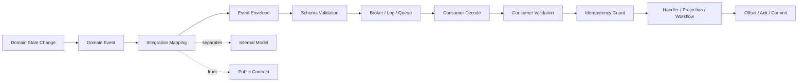
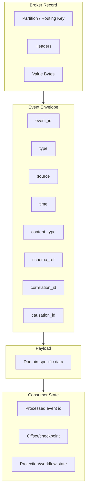
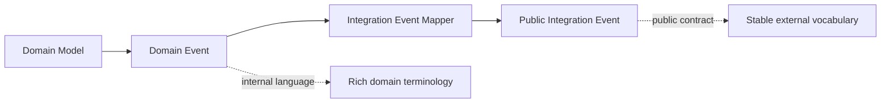
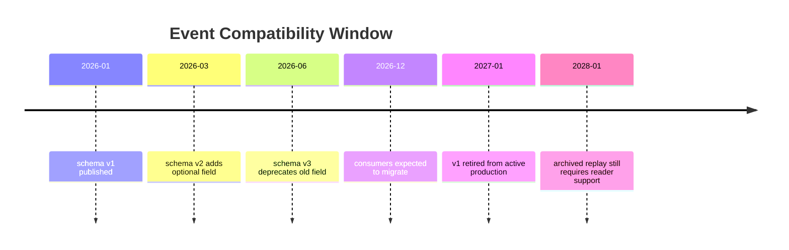
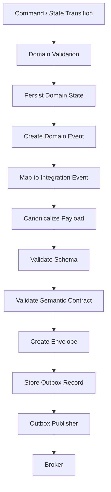
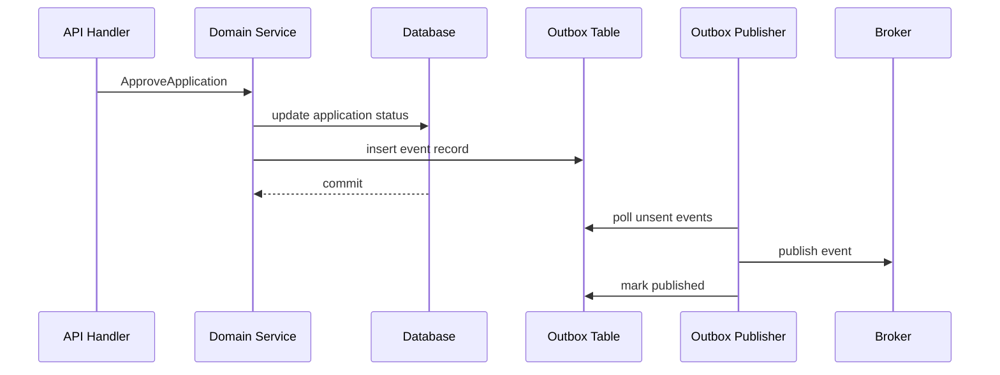
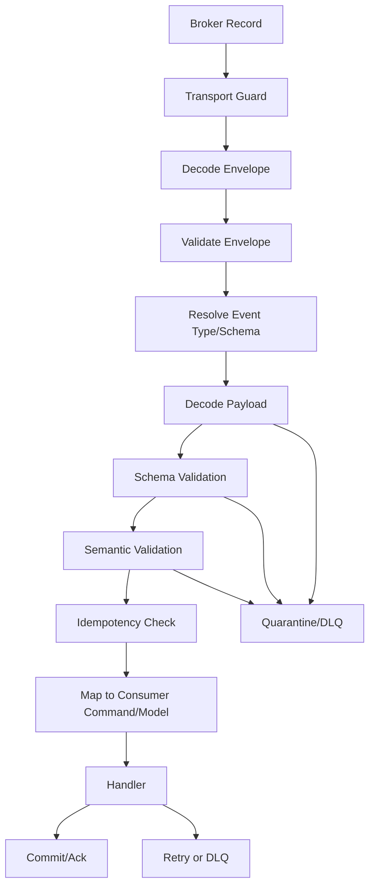
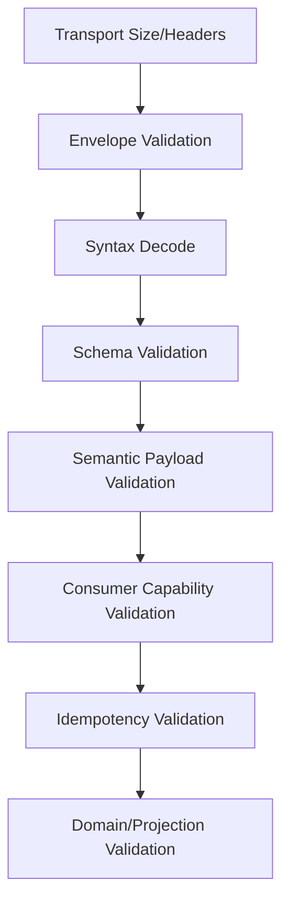
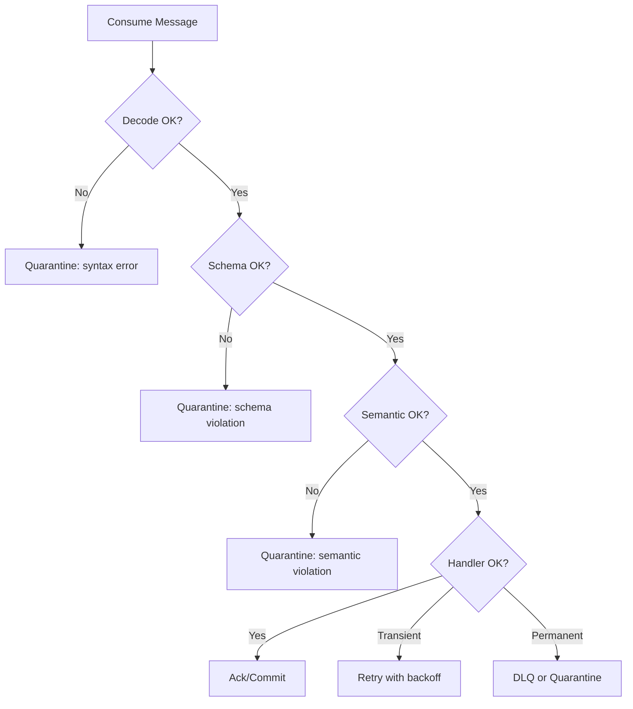
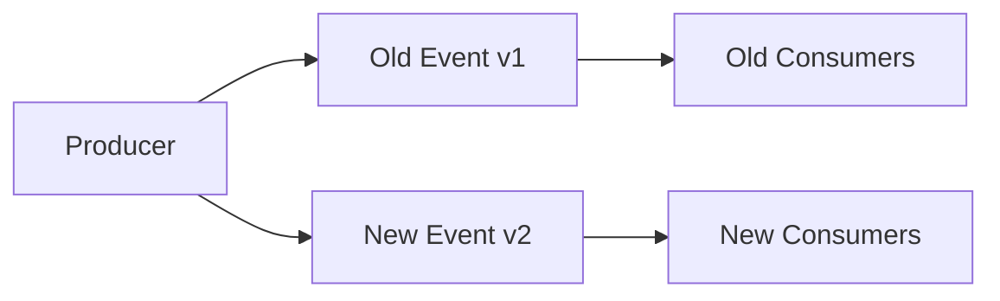

# learn-go-data-mapper-json-xml-protobuf-validation-part-031.md

# Part 031 — Mapping and Validation in Event-Driven Systems

> Seri: `learn-go-data-mapper-json-xml-protobuf-validation`  
> Bagian: `031 / 033`  
> Topik: Data mapper, JSON, XML, Protobuf, validation, schema, dan contract boundary di Go  
> Target pembaca: Java software engineer yang ingin menguasai Go data contract engineering pada level production/internal engineering handbook  
> Status seri: **belum selesai**

---

## Daftar Isi

1. [Tujuan Pembelajaran](#1-tujuan-pembelajaran)
2. [Masalah Utama: Event Bukan Sekadar Payload](#2-masalah-utama-event-bukan-sekadar-payload)
3. [Mental Model: Event sebagai Durable Public Fact](#3-mental-model-event-sebagai-durable-public-fact)
4. [Perbedaan Request/Response Contract vs Event Contract](#4-perbedaan-requestresponse-contract-vs-event-contract)
5. [Event Layer Model](#5-event-layer-model)
6. [Domain Event, Integration Event, CDC Event, dan Audit Event](#6-domain-event-integration-event-cdc-event-dan-audit-event)
7. [Envelope Design](#7-envelope-design)
8. [CloudEvents sebagai Baseline Envelope Portable](#8-cloudevents-sebagai-baseline-envelope-portable)
9. [Payload Format: JSON, Protobuf, XML, dan Hybrid](#9-payload-format-json-protobuf-xml-dan-hybrid)
10. [Schema Reference dan Schema Registry Thinking](#10-schema-reference-dan-schema-registry-thinking)
11. [Compatibility Model untuk Event](#11-compatibility-model-untuk-event)
12. [Producer Mapping Pipeline](#12-producer-mapping-pipeline)
13. [Consumer Mapping Pipeline](#13-consumer-mapping-pipeline)
14. [Validation Architecture untuk Event](#14-validation-architecture-untuk-event)
15. [Idempotency, Deduplication, dan Reprocessing](#15-idempotency-deduplication-dan-reprocessing)
16. [Ordering, Partition Key, dan Aggregate Version](#16-ordering-partition-key-dan-aggregate-version)
17. [Poison Message, DLQ, Quarantine, dan Replay](#17-poison-message-dlq-quarantine-dan-replay)
18. [Event Versioning Patterns](#18-event-versioning-patterns)
19. [Go Package Layout untuk Event Contract](#19-go-package-layout-untuk-event-contract)
20. [Implementasi Go: Event Envelope](#20-implementasi-go-event-envelope)
21. [Implementasi Go: Payload Codec Abstraction](#21-implementasi-go-payload-codec-abstraction)
22. [Implementasi Go: JSON Event Codec](#22-implementasi-go-json-event-codec)
23. [Implementasi Go: Protobuf Event Codec](#23-implementasi-go-protobuf-event-codec)
24. [Implementasi Go: Producer Validation and Outbox Boundary](#24-implementasi-go-producer-validation-and-outbox-boundary)
25. [Implementasi Go: Consumer Pipeline](#25-implementasi-go-consumer-pipeline)
26. [Error Model untuk Event Processing](#26-error-model-untuk-event-processing)
27. [Contract Testing dan CI Gates](#27-contract-testing-dan-ci-gates)
28. [Observability dan Auditability](#28-observability-dan-auditability)
29. [Contoh Regulatory Case Management](#29-contoh-regulatory-case-management)
30. [Decision Matrix](#30-decision-matrix)
31. [Anti-Patterns](#31-anti-patterns)
32. [Production Checklist](#32-production-checklist)
33. [Latihan Desain](#33-latihan-desain)
34. [Ringkasan Invariant](#34-ringkasan-invariant)
35. [Referensi](#35-referensi)

---

## 1. Tujuan Pembelajaran

Setelah menyelesaikan bagian ini, kamu diharapkan mampu:

1. Mendesain event contract yang stabil, evolvable, dan tidak mencampur domain internal dengan public integration contract.
2. Memilih format payload event secara sadar: JSON, Protobuf, XML, atau hybrid envelope.
3. Membedakan validasi sebelum publish, validasi sebelum consume, validasi schema, validasi semantic, dan validasi domain.
4. Mendesain mapping pipeline untuk event-driven system yang aman terhadap consumer lag, replay, poison message, dan partial deployment.
5. Mengelola schema evolution dengan compatibility window, bukan hanya version number.
6. Menulis komponen Go untuk envelope, codec, producer pipeline, consumer pipeline, idempotency guard, dan error classification.
7. Menilai kapan perlu CloudEvents, Schema Registry, Buf breaking checks, JSON Schema validation, atau Protobuf validation.
8. Membuat review checklist agar perubahan event contract tidak merusak consumer production.

Bagian ini sengaja tidak membahas Kafka/RabbitMQ/NATS/SQS secara mendalam, karena itu masuk area messaging infrastructure. Fokus kita adalah **data representation, mapping, schema, validation, dan event contract lifecycle**.

---

## 2. Masalah Utama: Event Bukan Sekadar Payload

Kesalahan paling umum dalam event-driven system adalah menganggap event sebagai:

```text
"JSON yang dikirim ke topic"
```

atau:

```text
"struct Go yang di-marshal lalu dikonsumsi service lain"
```

Itu terlalu dangkal.

Dalam production system, event adalah kombinasi dari:

1. **Fact** — sesuatu yang sudah terjadi.
2. **Contract** — promise kepada consumer bahwa bentuk dan maknanya stabil.
3. **Historical record** — data dapat disimpan lama dan diproses ulang.
4. **Integration boundary** — service lain bergantung pada event tersebut.
5. **Temporal artifact** — event lama mungkin masih dikonsumsi oleh consumer versi baru.
6. **Operational unit** — dapat gagal, di-retry, masuk DLQ, dan di-replay.
7. **Audit trail candidate** — dalam sistem tertentu, event menjadi bukti perubahan.

Karena itu, desain event tidak cukup dengan:

```go
type UserCreated struct {
    ID    string `json:"id"`
    Email string `json:"email"`
}
```

Pertanyaan yang lebih penting:

- Apakah `id` adalah user ID internal atau public subject ID?
- Apakah email boleh berubah setelah event publish?
- Apakah email boleh dihapus karena privacy requirement?
- Apakah event ini boleh di-replay 2 tahun kemudian?
- Apakah consumer lama masih bisa membaca event baru?
- Apakah producer baru masih bisa dibaca consumer lama?
- Apakah `email` mandatory untuk semua historical data?
- Apakah event merepresentasikan command result, state snapshot, atau domain fact?
- Apakah schema-nya dicek sebelum publish?
- Apa yang terjadi bila payload valid secara JSON tetapi invalid secara business semantic?
- Apa yang terjadi bila consumer gagal karena field baru?
- Apa yang terjadi bila event dikirim dua kali?

Top 1% engineer tidak melihat event sebagai data transfer. Mereka melihat event sebagai **long-lived compatibility surface**.

---

## 3. Mental Model: Event sebagai Durable Public Fact

Event harus dipikirkan sebagai **public fact yang tahan waktu**.

### 3.1 Event bukan command

Command adalah permintaan:

```text
ApproveApplication
RejectAppeal
SendInvoice
CreateInvestigationCase
```

Event adalah fakta bahwa sesuatu sudah terjadi:

```text
ApplicationApproved
AppealRejected
InvoiceSent
InvestigationCaseCreated
```

Command bisa ditolak. Event tidak seharusnya “ditolak” oleh consumer dari sisi kebenaran domain. Consumer boleh gagal memproses, tetapi event tetap fakta.

### 3.2 Event bukan database row

Database row adalah state saat ini. Event adalah perubahan atau fakta pada waktu tertentu.

Contoh buruk:

```json
{
  "application_id": "APP-123",
  "status": "APPROVED",
  "applicant_name": "Alice",
  "last_modified_by": "officer-9",
  "last_modified_at": "2026-06-24T10:12:00Z"
}
```

Ini terlihat seperti event, tetapi sebenarnya hanya projection dari row.

Contoh yang lebih eksplisit:

```json
{
  "application_id": "APP-123",
  "previous_status": "PENDING_REVIEW",
  "new_status": "APPROVED",
  "approved_by": "officer-9",
  "approved_at": "2026-06-24T10:12:00Z",
  "decision_reference": "DEC-2026-0001"
}
```

Event harus menjawab:

```text
Apa yang terjadi?
Pada entity apa?
Kapan?
Mengapa cukup penting untuk dipublikasikan?
Apa makna stabilnya untuk consumer?
```

### 3.3 Event adalah contract temporal

HTTP request biasanya diproses sekarang. Event mungkin diproses:

- langsung,
- 5 menit kemudian,
- 2 hari kemudian karena outage,
- 3 bulan kemudian saat replay,
- 2 tahun kemudian untuk rebuilding projection.

Karena itu, event contract harus aman terhadap:

- producer versi lama,
- producer versi baru,
- consumer versi lama,
- consumer versi baru,
- historical payload,
- schema registry evolution,
- partial deployment,
- blue/green/canary rollout,
- replay dari archival storage.

### 3.4 Diagram mental model



Invariant utama:

```text
A published event must remain meaningful to intended consumers for the declared compatibility window.
```

---

## 4. Perbedaan Request/Response Contract vs Event Contract

| Aspek | Request/Response API | Event Contract |
|---|---|---|
| Waktu konsumsi | Sekarang | Sekarang atau nanti |
| Caller/callee | Biasanya diketahui | Consumer bisa banyak/tidak diketahui |
| Error feedback | Langsung ke caller | Tidak langsung; sering async/DLQ |
| Compatibility | Per endpoint/version | Per event type/schema/topic/window |
| Ownership | Provider API | Producer contract owner + platform governance |
| Evolution risk | Breaking langsung terlihat | Breaking bisa muncul lambat saat consumer lag/replay |
| Retry semantics | Biasanya request retry | Message redelivery/replay/at-least-once |
| Validation result | HTTP 4xx/5xx | Nack/retry/DLQ/quarantine/skip |
| Historical concern | Rendah-menengah | Tinggi |
| Idempotency | Opsional tapi penting | Hampir wajib |

Dalam HTTP API, consumer bisa mendapat error `400 Bad Request` dan memperbaiki request. Dalam event system, consumer tidak bisa “meminta producer mengirim ulang event lama dengan format benar” secara mudah. Maka event contract harus lebih defensif.

---

## 5. Event Layer Model

Event production-grade biasanya punya beberapa layer.



### 5.1 Broker record

Broker record adalah bentuk transport-level:

- topic/queue/stream,
- partition/routing key,
- headers,
- value bytes,
- offset/sequence,
- timestamp broker.

Broker record bukan business contract. Jangan menjadikan broker-specific metadata sebagai satu-satunya sumber event identity.

### 5.2 Envelope

Envelope adalah metadata event yang generic lintas payload:

- event ID,
- event type,
- source,
- subject,
- time,
- content type,
- schema reference,
- correlation ID,
- causation ID,
- tenant/agency jika relevan,
- trace context jika relevan.

Envelope membantu consumer memahami payload sebelum decode payload spesifik.

### 5.3 Payload

Payload berisi domain/integration data:

```json
{
  "application_id": "APP-123",
  "previous_status": "PENDING_REVIEW",
  "new_status": "APPROVED",
  "approved_by": "officer-9",
  "approved_at": "2026-06-24T10:12:00Z"
}
```

Payload harus stabil sesuai event type dan schema version.

### 5.4 Consumer state

Consumer state mencatat:

- event yang sudah diproses,
- offset/checkpoint,
- projection state,
- retry attempt,
- poison message marker,
- replay watermark.

Ini bukan bagian dari event payload, tetapi bagian dari correctness processing.

---

## 6. Domain Event, Integration Event, CDC Event, dan Audit Event

Tidak semua event sama.

### 6.1 Domain event

Domain event lahir dari domain model internal.

Contoh:

```text
CaseEscalated
OfficerAssigned
ComplianceBreachDetected
ApplicationApproved
```

Domain event cocok untuk internal bounded context. Ia boleh punya istilah domain yang sangat kaya.

### 6.2 Integration event

Integration event adalah event yang dipublikasikan untuk service lain atau external system.

Ia harus lebih stabil, lebih eksplisit, dan lebih tidak bergantung pada struktur internal.

Contoh:

```text
RegulatoryApplicationStatusChanged
EnforcementCaseLifecycleStageChanged
LicenceSuspensionPublished
```

Integration event sering merupakan hasil mapping dari domain event.



### 6.3 CDC event

CDC atau Change Data Capture event berasal dari perubahan database row.

Contoh:

```text
applications table row updated
cases.status column changed
```

CDC berguna untuk replication/projection, tetapi berisiko jika diperlakukan sebagai domain event.

Risiko CDC sebagai public event:

- mengekspos internal schema,
- field rename DB menjadi breaking event,
- consumer bergantung pada tabel internal,
- semantic perubahan tidak jelas,
- sulit membedakan update teknis vs business transition.

CDC boleh digunakan sebagai input internal untuk event generation, tetapi public contract idealnya tetap integration event eksplisit.

### 6.4 Audit event

Audit event berorientasi bukti:

- siapa,
- melakukan apa,
- kapan,
- dari mana,
- terhadap entity apa,
- sebelum/sesudah apa,
- berdasarkan otorisasi apa.

Audit event tidak selalu sama dengan integration event. Jangan memaksa satu event melayani semua kebutuhan:

```text
operational integration + audit evidence + analytics + notification
```

Itu biasanya menghasilkan payload gemuk, tidak stabil, dan sulit evolve.

### 6.5 Rule of thumb

| Kebutuhan | Jenis event yang cocok |
|---|---|
| Internal domain workflow | Domain event |
| Cross-service contract | Integration event |
| Data replication | CDC event |
| Compliance/evidence | Audit event |
| Analytics stream | Analytics/fact event |
| Notification trigger | Notification event atau integration event kecil |

---

## 7. Envelope Design

Envelope yang baik memberi metadata cukup tanpa membuat payload menjadi generic blob yang sulit divalidasi.

### 7.1 Field envelope minimum

```go
type EventEnvelope struct {
    ID              string            `json:"id"`
    Type            string            `json:"type"`
    Source          string            `json:"source"`
    Subject         string            `json:"subject,omitempty"`
    Time            time.Time         `json:"time"`
    DataContentType string            `json:"datacontenttype"`
    DataSchema      string            `json:"dataschema,omitempty"`
    CorrelationID   string            `json:"correlation_id,omitempty"`
    CausationID     string            `json:"causation_id,omitempty"`
    TraceID         string            `json:"trace_id,omitempty"`
    Extensions      map[string]string `json:"extensions,omitempty"`
    Data            json.RawMessage   `json:"data"`
}
```

Minimum production:

| Field | Tujuan |
|---|---|
| `id` | Deduplication dan tracing event spesifik |
| `type` | Dispatch ke schema/handler |
| `source` | Owner/producer identity |
| `time` | Business event time, bukan hanya broker time |
| `datacontenttype` | Format payload |
| `dataschema` | Schema reference/version |
| `correlation_id` | Menghubungkan flow lintas service |
| `causation_id` | Event/command penyebab |
| `subject` | Entity utama |
| `data` | Payload domain/integration |

### 7.2 Event ID bukan entity ID

Jangan samakan:

```text
event_id == application_id
```

Satu application bisa menghasilkan banyak event.

```text
application_id: APP-123
- event_id: EVT-1 ApplicationSubmitted
- event_id: EVT-2 ApplicationAssigned
- event_id: EVT-3 ApplicationApproved
```

Event ID adalah identity fakta, bukan identity aggregate.

### 7.3 Correlation ID vs causation ID

`correlation_id` menjawab:

```text
Event ini bagian dari flow/request/proses yang mana?
```

`causation_id` menjawab:

```text
Event ini disebabkan oleh command/event apa?
```

Contoh:

```text
correlation_id = CASE-FLOW-2026-0001
causation_id   = CMD-APPROVE-123
id             = EVT-APPROVED-456
```

Untuk debugging distributed workflow, perbedaan ini sangat penting.

### 7.4 Event time vs publish time vs broker time

| Waktu | Makna |
|---|---|
| Event time | Waktu domain fact terjadi |
| Publish time | Waktu producer mengirim event |
| Broker time | Waktu broker menerima/menyimpan record |
| Consume time | Waktu consumer memproses |

Jangan menganggap semuanya sama.

Contoh kegagalan:

```text
Application approved at 10:00
Outbox worker publishes at 10:05
Broker stores at 10:05:02
Consumer processes at 11:30 after lag
```

Analytics, SLA, audit, dan workflow timeout harus memilih waktu yang tepat.

---

## 8. CloudEvents sebagai Baseline Envelope Portable

CloudEvents adalah spesifikasi untuk mendeskripsikan event data secara common/portable lintas service, platform, dan system. CloudEvents mendefinisikan attribute seperti `id`, `source`, `specversion`, `type`, dan payload `data`, serta event format/binding untuk beberapa transport/format.

### 8.1 Mengapa CloudEvents relevan

CloudEvents berguna ketika:

- event dikonsumsi lintas platform,
- event gateway/generic router dibutuhkan,
- banyak tim/service harus punya envelope vocabulary sama,
- event perlu dikirim melalui HTTP, broker, atau serverless platform,
- metadata event perlu distandardisasi.

CloudEvents tidak otomatis menyelesaikan:

- schema evolution,
- semantic validation,
- idempotency,
- DLQ strategy,
- partitioning,
- domain modeling,
- authorization,
- privacy classification.

Ia adalah **envelope standard**, bukan seluruh event architecture.

### 8.2 Mapping field CloudEvents ke kebutuhan internal

| CloudEvents Attribute | Makna | Catatan desain |
|---|---|---|
| `specversion` | Versi spesifikasi CloudEvents | Biasanya `1.0` untuk CloudEvents v1.0 |
| `id` | Event ID unik bersama `source` | Cocok untuk dedup |
| `source` | Konteks asal event | URI-like identifier disarankan |
| `type` | Tipe event | Pakai naming convention stabil |
| `subject` | Subject event | Cocok untuk aggregate/entity ID |
| `time` | Timestamp event | Harus jelas event-time |
| `datacontenttype` | Media type payload | Misalnya `application/json`, `application/protobuf` |
| `dataschema` | URI schema data | Cocok untuk schema registry/reference |
| `data` | Payload | JSON object, bytes, atau format lain sesuai binding |

### 8.3 Contoh CloudEvents-style JSON

```json
{
  "specversion": "1.0",
  "id": "evt-01J2M8E3F4R9ZK",
  "source": "//aceas.example.gov/application-service",
  "type": "gov.aceas.application.status_changed.v1",
  "subject": "application/APP-2026-000123",
  "time": "2026-06-24T10:12:00Z",
  "datacontenttype": "application/json",
  "dataschema": "https://schemas.example.gov/aceas/application-status-changed/v1/schema.json",
  "correlationid": "corr-8bc1",
  "data": {
    "application_id": "APP-2026-000123",
    "previous_status": "PENDING_REVIEW",
    "new_status": "APPROVED",
    "changed_by": "officer-9",
    "changed_at": "2026-06-24T10:12:00Z"
  }
}
```

### 8.4 Extension attributes

CloudEvents mendukung extension attributes. Gunakan extension untuk metadata cross-cutting, bukan payload domain utama.

Contoh extension yang masuk akal:

- `correlationid`,
- `causationid`,
- `tenantid`,
- `traceparent`,
- `agencyid`,
- `classification`.

Hindari extension untuk data yang sebenarnya payload domain:

```text
application_status
appeal_reason
case_decision
licence_number
```

Jika data itu bagian dari makna event, tempatnya di `data` dan schema payload.

---

## 9. Payload Format: JSON, Protobuf, XML, dan Hybrid

Event payload format harus dipilih berdasarkan consumer, compatibility, tooling, dan operational lifecycle.

### 9.1 JSON event payload

Kelebihan:

- readable,
- mudah debug,
- cocok untuk external integration,
- luas dukungan tooling,
- cocok dengan JSON Schema/OpenAPI-style governance,
- mudah masuk data lake/logging.

Risiko:

- numeric precision,
- `null` vs absent ambiguity,
- unknown/duplicate field policy,
- schema optional jika tidak enforced,
- enum sebagai string rentan rename,
- payload besar lebih mahal.

Cocok untuk:

- public event,
- government/enterprise integration,
- webhook,
- audit/analytics event,
- event yang perlu mudah dibaca manusia.

### 9.2 Protobuf event payload

Kelebihan:

- schema-first,
- compact binary,
- strong compatibility model untuk binary wire,
- generated code,
- presence support,
- unknown fields pada binary format,
- bagus untuk high-throughput internal streams.

Risiko:

- tidak human-readable tanpa tooling,
- field number governance wajib disiplin,
- ProtoJSON punya compatibility berbeda dari binary,
- schema distribution perlu jelas,
- generated code lifecycle perlu dikelola.

Cocok untuk:

- internal microservices,
- high-throughput event streams,
- gRPC/Connect ecosystem,
- contract yang ingin dikelola dengan Buf.

### 9.3 XML event payload

Kelebihan:

- kompatibel dengan legacy enterprise/government systems,
- XSD bisa menjadi external contract,
- namespace cocok untuk dokumen formal,
- cocok untuk dokumen yang sudah historically XML.

Risiko:

- verbose,
- namespace kompleks,
- Go standard library tidak punya XSD validator,
- mixed content rumit,
- security hardening perlu perhatian.

Cocok untuk:

- legacy integration,
- document event,
- SOAP-ish ecosystem,
- regulated file exchange.

### 9.4 Hybrid envelope

Pattern umum:

```text
Envelope JSON + payload Protobuf bytes
Envelope JSON + payload JSON object
CloudEvents binary binding + Protobuf payload
Broker headers + Protobuf payload
```

Trade-off:

| Pattern | Keuntungan | Risiko |
|---|---|---|
| JSON envelope + JSON data | Debug mudah | Besar, schema enforcement harus disiplin |
| Broker headers + binary Protobuf | Efisien | Metadata bisa tersebar broker-specific |
| CloudEvents + Protobuf | Portable + typed payload | Tooling lebih kompleks |
| XML document event | Legacy compatible | Validation/security lebih berat |

---

## 10. Schema Reference dan Schema Registry Thinking

Event tanpa schema reference mudah menjadi “tribal knowledge”.

Schema reference menjawab:

```text
Payload ini harus dibaca menggunakan kontrak yang mana?
```

### 10.1 Bentuk schema reference

Untuk JSON:

```text
https://schemas.example.gov/aceas/application-status-changed/v1/schema.json
```

Untuk Protobuf:

```text
buf.build/example/aceas:application.v1.ApplicationStatusChanged
```

atau:

```text
type.googleapis.com/gov.aceas.application.v1.ApplicationStatusChanged
```

Untuk XML:

```text
https://schemas.example.gov/aceas/application-status-changed/v1/application-status-changed.xsd
```

### 10.2 Schema Registry thinking

Schema registry bukan harus selalu produk tertentu. Ini adalah capability:

1. Register schema.
2. Assign schema identity/version.
3. Validate payload against schema.
4. Check compatibility before accepting new schema.
5. Allow consumer to resolve schema.
6. Provide history of schema evolution.
7. Integrate with CI/CD.

Confluent Schema Registry, misalnya, mendukung compatibility mode seperti backward, forward, full, dan transitive variants untuk subject schema. Buf menyediakan lint dan breaking change detection untuk Protobuf dengan kategori seperti `FILE`, `PACKAGE`, `WIRE_JSON`, dan `WIRE`.

### 10.3 Subject naming

Subject naming adalah bagian penting.

Contoh buruk:

```text
events-value
application-value
prod-application-events-value
```

Contoh lebih baik:

```text
gov.aceas.application.status_changed.v1
aceas.application.v1.ApplicationStatusChanged
application-status-changed-value
```

Subject harus merepresentasikan contract, bukan sekadar topic teknis.

### 10.4 Jangan jadikan topic sebagai satu-satunya schema identity

Topic bisa berubah karena scaling, retention, routing, atau replatforming.

Schema identity sebaiknya tidak hanya:

```text
topic = application-events
```

Karena satu topic dapat berisi banyak event type.

Lebih aman:

```text
topic = aceas.application.events
headers/type = gov.aceas.application.status_changed.v1
dataschema = https://schemas.example.gov/...
```

---

## 11. Compatibility Model untuk Event

Compatibility event lebih kompleks daripada request/response karena consumer dan producer tidak deploy bersamaan.

### 11.1 Backward compatibility

Backward compatibility berarti:

```text
New consumer/schema can read old events.
```

Ini penting untuk replay historical data.

Contoh:

Consumer baru menambahkan field optional `decision_reference`, tetapi harus tetap bisa membaca event lama yang tidak punya field itu.

### 11.2 Forward compatibility

Forward compatibility berarti:

```text
Old consumer/schema can tolerate new events.
```

Ini penting untuk rolling upgrade dan consumer lag.

Contoh:

Producer baru menambah field optional `approval_channel`. Consumer lama harus mengabaikannya.

### 11.3 Full compatibility

Full compatibility berarti backward dan forward.

```text
New reads old, old reads new.
```

Ini cocok untuk event public yang consumer-nya banyak atau tidak sepenuhnya terkontrol.

### 11.4 Transitive compatibility

Transitive compatibility berarti schema baru compatible bukan hanya dengan versi terakhir, tetapi dengan semua versi dalam history.

Ini penting jika:

- event disimpan lama,
- replay dari awal mungkin terjadi,
- consumer bisa tertinggal banyak versi,
- archival event masih valid.

### 11.5 Compatibility window

Tidak semua event harus compatible selamanya. Tetapi window harus dinyatakan.

Contoh policy:

```text
Public integration events: full-transitive for 24 months.
Internal analytics events: backward for 90 days.
Internal projection events: backward for retention window.
High-volume ephemeral events: no guarantee beyond 7 days.
Audit events: immutable schema family; additive only.
```

Tanpa compatibility window, tim akan berdebat setiap kali ada perubahan.

### 11.6 Diagram compatibility window



---

## 12. Producer Mapping Pipeline

Producer pipeline harus memastikan event yang keluar sudah valid sebagai public contract.



### 12.1 Jangan publish dari model internal langsung

Buruk:

```go
func (s *ApplicationService) Approve(ctx context.Context, id string) error {
    app, err := s.repo.Find(ctx, id)
    if err != nil {
        return err
    }

    app.Status = "APPROVED"
    if err := s.repo.Save(ctx, app); err != nil {
        return err
    }

    // Bad: database/domain struct directly published.
    b, _ := json.Marshal(app)
    return s.broker.Publish(ctx, "application-events", b)
}
```

Masalah:

- internal field bocor,
- DB rename jadi breaking event,
- tidak ada envelope,
- tidak ada schema validation,
- publish tidak atomic dengan DB save,
- event meaning tidak jelas,
- consumer bergantung pada internal model.

Lebih baik:

```go
func (s *ApplicationService) Approve(ctx context.Context, cmd ApproveApplicationCommand) error {
    return s.tx.Run(ctx, func(ctx context.Context) error {
        app, err := s.repo.FindForUpdate(ctx, cmd.ApplicationID)
        if err != nil {
            return err
        }

        ev, err := app.Approve(cmd.OfficerID, cmd.DecisionReference, s.clock.Now())
        if err != nil {
            return err
        }

        if err := s.repo.Save(ctx, app); err != nil {
            return err
        }

        integrationEvent, err := MapApplicationApprovedToIntegration(ev)
        if err != nil {
            return err
        }

        return s.outbox.Append(ctx, integrationEvent)
    })
}
```

### 12.2 Producer validation layers

Producer harus memvalidasi:

1. Domain transition valid.
2. Domain event complete.
3. Integration mapping lossless for public semantics.
4. Payload matches schema.
5. Envelope metadata complete.
6. Idempotency/publish identity stable.
7. Event is safe to publish from privacy/security perspective.

### 12.3 Outbox boundary

Outbox pattern menjaga state change dan event creation atomic di database transaction yang sama.



Without outbox:

```text
DB commit succeeds, publish fails -> state changed but no event.
Publish succeeds, DB commit fails -> event says fact happened but state did not commit.
```

---

## 13. Consumer Mapping Pipeline

Consumer pipeline harus defensif karena menerima data dari luar proses.



### 13.1 Consumer tidak boleh percaya producer secara buta

Meskipun producer internal, consumer tetap harus memvalidasi boundary.

Alasan:

- producer bug,
- partial deployment,
- stale producer version,
- replay event lama,
- manual injection untuk recovery,
- broker topic tercampur,
- event dari test/staging salah route,
- schema evolution tidak sempurna.

### 13.2 Consumer mapping bukan domain mutation langsung

Buruk:

```go
func HandleApplicationApproved(e ApplicationApprovedEvent) error {
    caseRecord.Status = e.NewStatus
    return repo.Save(caseRecord)
}
```

Lebih baik:

```go
func HandleApplicationStatusChanged(ctx context.Context, e ApplicationStatusChangedV1) error {
    cmd := UpdateCaseProjectionCommand{
        ApplicationID: e.ApplicationID,
        NewStatus:     e.NewStatus,
        ChangedAt:     e.ChangedAt,
        EventID:       e.EventID,
    }

    return projection.UpdateFromApplicationStatus(ctx, cmd)
}
```

Consumer handler menerima model yang sudah dipetakan ke language consumer, bukan raw event payload.

### 13.3 Consumer harus bisa menolak dengan klasifikasi

Tidak semua error sama:

| Error | Retry? | Aksi |
|---|---:|---|
| Broker transient error | Ya | retry |
| DB timeout | Ya | retry |
| Invalid JSON | Tidak | DLQ/quarantine |
| Unknown event type | Tergantung | quarantine/skip |
| Unknown schema version | Tergantung | quarantine |
| Business conflict recoverable | Ya/Tidak | retry or compensating action |
| Duplicate event | Tidak | ack as processed |
| Out-of-order event | Tergantung | buffer/retry/skip with policy |

---

## 14. Validation Architecture untuk Event

Validation event harus dipisahkan berdasarkan layer.

### 14.1 Layer validasi



### 14.2 Transport validation

Contoh:

- max message size,
- allowed content type,
- required headers,
- tenant/agency constraints,
- source allowlist,
- topic/type consistency.

### 14.3 Envelope validation

Envelope valid jika:

- `id` non-empty dan format valid,
- `type` known,
- `source` allowed,
- `time` valid,
- `datacontenttype` supported,
- `dataschema` resolvable atau allowed absent sesuai policy,
- correlation/causation valid jika required.

### 14.4 Syntax validation

Syntax validation menjawab:

```text
Apakah bytes bisa didecode sebagai JSON/Protobuf/XML?
```

Ini bukan schema validation.

### 14.5 Schema validation

Schema validation menjawab:

```text
Apakah payload sesuai bentuk contract?
```

Untuk JSON:

- JSON Schema,
- strict decoder,
- known field policy,
- required fields,
- enum values,
- string patterns,
- numeric ranges.

Untuk Protobuf:

- binary decode,
- descriptor match,
- required/presence policy via semantic validation,
- Buf breaking checks saat build,
- Protovalidate jika digunakan.

Untuk XML:

- XSD validation via external strategy,
- namespace validation,
- element/attribute structure.

### 14.6 Semantic validation

Semantic validation menjawab:

```text
Apakah data masuk akal secara event contract?
```

Contoh:

- `previous_status != new_status`,
- `changed_at <= published_at + tolerance`,
- `approved_at` required jika `new_status=APPROVED`,
- `decision_reference` required untuk final decision,
- `case_id` dan `application_id` tidak boleh berbeda tenant,
- monetary amount must be non-negative and currency must be ISO code.

### 14.7 Domain validation di consumer

Consumer mungkin punya aturan lokal:

- projection hanya update jika event lebih baru,
- workflow transition allowed,
- related entity exists,
- consumer feature flag enabled,
- tenant subscribed.

Ini bukan tanggung jawab producer contract sepenuhnya. Consumer tetap punya local invariant.

---

## 15. Idempotency, Deduplication, dan Reprocessing

Event system production hampir selalu harus mengasumsikan at-least-once delivery.

Artinya event yang sama bisa diproses lebih dari sekali.

### 15.1 Idempotency invariant

```text
Processing the same event more than once must not corrupt state.
```

### 15.2 Event ID dedup

Consumer bisa menyimpan `event_id` yang sudah diproses.

```sql
CREATE TABLE processed_events (
    consumer_name     VARCHAR(128) NOT NULL,
    event_id          VARCHAR(128) NOT NULL,
    processed_at      TIMESTAMP NOT NULL,
    PRIMARY KEY (consumer_name, event_id)
);
```

Pattern:

```text
begin transaction
  insert processed_event(event_id)
  if duplicate -> already processed -> commit/ack
  apply handler mutation
commit transaction
ack message
```

### 15.3 Idempotency by natural key

Kadang event ID tidak cukup. Contoh:

```text
InvoiceSent for invoice INV-123 channel EMAIL
```

Jika producer bug membuat event ID berbeda untuk fakta yang sama, dedup event ID gagal.

Tambahkan natural idempotency key:

```text
invoice_id + notification_channel + notification_type
```

### 15.4 Idempotency vs exactly-once myth

Banyak platform menawarkan fitur exactly-once pada level tertentu, tetapi business side effect tetap harus dirancang idempotent.

Contoh side effect:

- insert DB,
- send email,
- call payment gateway,
- create external case,
- write audit entry,
- update search index.

Sekalipun broker mencegah duplicate record tertentu, handler bisa retry setelah side effect berhasil tetapi sebelum ack/commit.

### 15.5 Reprocessing

Reprocessing berbeda dari normal retry.

Normal retry:

```text
Event gagal karena transient error, diproses lagi segera.
```

Reprocessing:

```text
Event lama diproses ulang untuk rebuild projection, bug fix, analytics backfill, atau migration.
```

Saat reprocessing, consumer harus jelas:

- apakah side effect eksternal dimatikan,
- apakah audit ditulis ulang,
- apakah notification dikirim ulang,
- apakah idempotency table di-reset,
- apakah handler berjalan dalam replay mode.

Contoh mode:

```go
type ProcessingMode string

const (
    ProcessingLive   ProcessingMode = "live"
    ProcessingReplay ProcessingMode = "replay"
)
```

Replay mode biasanya tidak boleh mengirim email/SMS/external calls kecuali eksplisit.

---

## 16. Ordering, Partition Key, dan Aggregate Version

Event tidak hanya soal schema. Order juga bagian dari meaning.

### 16.1 Global ordering jarang realistis

Jangan mendesain sistem seolah semua event punya total order global.

Lebih realistis:

```text
order per aggregate/entity key
```

Contoh:

```text
partition key = application_id
```

Maka semua event untuk application yang sama masuk partition/order yang sama.

### 16.2 Aggregate version

Tambahkan version/sequence jika consumer perlu deteksi out-of-order.

```json
{
  "application_id": "APP-123",
  "aggregate_version": 17,
  "previous_status": "PENDING_REVIEW",
  "new_status": "APPROVED"
}
```

Consumer bisa menerapkan:

```text
expected next version = current_version + 1
```

Jika event datang dengan version terlalu jauh:

- buffer,
- retry later,
- load latest snapshot,
- skip with quarantine,
- rebuild projection.

### 16.3 Out-of-order decision matrix

| Kondisi | Aksi |
|---|---|
| Duplicate old version | Ack as duplicate |
| Next expected version | Process |
| Future version | Retry/buffer/quarantine |
| Missing historical version but projection can recompute | Load snapshot then process |
| Event violates transition | Quarantine and alert |

### 16.4 Partition key sebagai contract

Partition key sering dianggap infra detail. Padahal ia memengaruhi ordering guarantee.

Jika event type membutuhkan per-application ordering, maka producer harus konsisten menggunakan `application_id` sebagai key.

Jangan mengganti partition key tanpa compatibility plan.

---

## 17. Poison Message, DLQ, Quarantine, dan Replay

Poison message adalah message yang selalu gagal diproses karena data/content/schema/semantic issue.

### 17.1 Retry bukan solusi untuk semua error

Retry cocok untuk:

- timeout DB,
- temporary network error,
- broker rebalance,
- dependency unavailable.

Retry buruk untuk:

- invalid JSON,
- unknown required field semantics,
- schema mismatch,
- impossible enum,
- invalid transition yang permanen,
- unrecognized event type tanpa handler.

Retry poison message hanya membuat consumer stuck.

### 17.2 DLQ vs quarantine

| Mekanisme | Makna |
|---|---|
| DLQ | Message gagal setelah retry/policy |
| Quarantine | Message disimpan untuk investigasi karena contract/data issue |
| Parking lot | Message ditahan sementara untuk diproses ulang setelah fix |
| Skip table | Consumer sengaja melewati event tertentu dengan approval |

DLQ sering terlalu generic. Untuk regulated systems, quarantine lebih baik karena menyimpan:

- raw bytes,
- headers,
- envelope decoded jika ada,
- error classification,
- handler name,
- schema version,
- timestamp,
- retry count,
- correlation ID,
- remediation status.

### 17.3 Poison handling diagram



### 17.4 Replay safety

Replay tool harus punya guard:

- dry-run validation,
- limited batch,
- idempotency strategy,
- side-effect mode,
- target consumer group,
- audit log,
- approval workflow,
- rollback plan.

Replay tanpa guard bisa lebih berbahaya daripada original incident.

---

## 18. Event Versioning Patterns

Versioning event harus menggabungkan schema compatibility dan operational rollout.

### 18.1 Additive optional field

Paling aman.

```json
{
  "application_id": "APP-123",
  "new_status": "APPROVED",
  "decision_reference": "DEC-1"
}
```

`decision_reference` ditambahkan sebagai optional.

### 18.2 Deprecate then remove

Removal langsung berbahaya.

Langkah aman:

1. Mark deprecated di docs/schema/proto.
2. Stop writing meaningful values jika consumer sudah siap.
3. Monitor consumers.
4. Remove setelah compatibility window.
5. Untuk Protobuf, reserve field number/name jika dihapus.

### 18.3 New event type

Buat event type baru jika semantic berubah signifikan.

Contoh:

```text
gov.aceas.application.status_changed.v1
gov.aceas.application.decision_recorded.v1
```

Jangan memaksa event lama menampung meaning baru yang tidak kompatibel.

### 18.4 Topic versioning

Topic versioning bisa dipakai, tetapi jangan terlalu cepat.

```text
application-events-v1
application-events-v2
```

Risiko:

- duplicate publishing,
- consumer migration kompleks,
- topic sprawl,
- retention/replay terpecah,
- operational overhead.

Lebih sering cukup:

- event type version,
- schema version,
- compatibility policy,
- additive evolution.

### 18.5 Dual publish

Dual publish berguna saat migrasi besar.



Risiko dual publish:

- semantic mismatch antara v1 dan v2,
- double side effect jika consumer subscribe keduanya,
- increased cost,
- retirement sering lupa.

Gunakan expiry date dan migration tracking.

### 18.6 Version field di payload

Sering tidak perlu jika envelope/type/schema sudah jelas.

Buruk:

```json
{
  "version": 3,
  "type": "ApplicationStatusChanged",
  "data": { ... }
}
```

Jika `type` dan `dataschema` sudah memiliki version, `version` tambahan bisa redundant dan drift.

---

## 19. Go Package Layout untuk Event Contract

Package layout harus memisahkan internal domain dan public contract.

```text
internal/
  application/
    domain/
      application.go
      events.go                 # domain events internal
    service/
      approve.go
    outbox/
      store.go

contracts/
  events/
    application/
      v1/
        application_status_changed.go
        schema.json
        mapper.go               # optional if contract-owned

platform/
  eventing/
    envelope.go
    codec.go
    publisher.go
    consumer.go
    validation.go
    errors.go
```

Untuk Protobuf:

```text
proto/
  gov/aceas/application/v1/application_events.proto

gen/
  gov/aceas/application/v1/application_events.pb.go

internal/
  application/
    eventmapper/
      application_events.go
```

### 19.1 Kenapa contract package boleh public

Contract package merepresentasikan public data model. Ia boleh di-import consumer.

Tetapi domain package internal tidak boleh dipakai consumer.

```text
consumer imports contracts/events/application/v1
consumer must not import internal/application/domain
```

### 19.2 Mapper location

Mapper dari domain ke integration event biasanya milik producer bounded context.

```text
internal/application/eventmapper
```

Mapper dari integration event ke consumer command biasanya milik consumer.

```text
internal/caseprojection/eventmapper
```

Jangan membuat satu global mapper shared library yang mengetahui semua domain. Itu cenderung menjadi coupling magnet.

---

## 20. Implementasi Go: Event Envelope

Berikut contoh envelope minimal yang compatible dengan CloudEvents-style metadata tetapi tetap Go-friendly.

```go
package eventing

import (
    "encoding/json"
    "errors"
    "fmt"
    "time"
)

type ContentType string

const (
    ContentTypeJSON     ContentType = "application/json"
    ContentTypeProtobuf ContentType = "application/protobuf"
    ContentTypeXML      ContentType = "application/xml"
)

type Envelope struct {
    SpecVersion     string            `json:"specversion,omitempty"`
    ID              string            `json:"id"`
    Type            string            `json:"type"`
    Source          string            `json:"source"`
    Subject         string            `json:"subject,omitempty"`
    Time            time.Time         `json:"time"`
    DataContentType ContentType       `json:"datacontenttype"`
    DataSchema      string            `json:"dataschema,omitempty"`
    CorrelationID   string            `json:"correlation_id,omitempty"`
    CausationID     string            `json:"causation_id,omitempty"`
    TraceID         string            `json:"trace_id,omitempty"`
    Extensions      map[string]string `json:"extensions,omitempty"`
    Data            json.RawMessage   `json:"data"`
}

func (e Envelope) ValidateEnvelope() error {
    var problems []string

    if e.ID == "" {
        problems = append(problems, "id is required")
    }
    if e.Type == "" {
        problems = append(problems, "type is required")
    }
    if e.Source == "" {
        problems = append(problems, "source is required")
    }
    if e.Time.IsZero() {
        problems = append(problems, "time is required")
    }
    if e.DataContentType == "" {
        problems = append(problems, "datacontenttype is required")
    }
    if len(e.Data) == 0 {
        problems = append(problems, "data is required")
    }

    switch e.DataContentType {
    case ContentTypeJSON, ContentTypeProtobuf, ContentTypeXML:
    default:
        problems = append(problems, fmt.Sprintf("unsupported datacontenttype %q", e.DataContentType))
    }

    if len(problems) > 0 {
        return ValidationError{Problems: problems}
    }
    return nil
}

type ValidationError struct {
    Problems []string
}

func (e ValidationError) Error() string {
    return fmt.Sprintf("validation failed: %v", e.Problems)
}

func IsValidationError(err error) bool {
    var target ValidationError
    return errors.As(err, &target)
}
```

### 20.1 Envelope validation bukan payload validation

`ValidateEnvelope` hanya memeriksa metadata umum. Payload perlu schema/semantic validator tersendiri.

### 20.2 RawMessage sebagai delayed decode

`json.RawMessage` membantu decode envelope dulu, lalu dispatch payload berdasarkan `type`.

```go
var env Envelope
if err := json.Unmarshal(bytes, &env); err != nil {
    return err
}

switch env.Type {
case "gov.aceas.application.status_changed.v1":
    var payload ApplicationStatusChangedV1
    if err := json.Unmarshal(env.Data, &payload); err != nil {
        return err
    }
}
```

---

## 21. Implementasi Go: Payload Codec Abstraction

Codec abstraction membuat pipeline tidak bergantung langsung pada JSON/Protobuf/XML.

```go
package eventing

import "context"

type PayloadCodec interface {
    ContentType() ContentType
    Marshal(ctx context.Context, msg any) ([]byte, error)
    Unmarshal(ctx context.Context, data []byte, into any) error
}

type PayloadValidator interface {
    ValidatePayload(ctx context.Context, eventType string, msg any) error
}

type SchemaValidator interface {
    ValidateBytes(ctx context.Context, eventType string, schemaRef string, data []byte) error
}
```

### 21.1 Kenapa interface kecil

Interface kecil memudahkan:

- testing,
- swapping JSON/Protobuf,
- schema validation injection,
- per-event codec policy,
- consumer pipeline generic.

Jangan buat interface terlalu besar:

```go
// Bad.
type EventPlatform interface {
    Marshal(...)
    Unmarshal(...)
    Validate(...)
    Publish(...)
    Subscribe(...)
    Retry(...)
    DLQ(...)
    Trace(...)
    Metrics(...)
}
```

Itu menjadi god interface.

### 21.2 Registry event type

```go
type EventDescriptor struct {
    Type        string
    SchemaRef   string
    ContentType ContentType
    NewPayload  func() any
    Codec       PayloadCodec
    Validator   PayloadValidator
}

type Registry struct {
    byType map[string]EventDescriptor
}

func NewRegistry(descs ...EventDescriptor) (*Registry, error) {
    r := &Registry{byType: make(map[string]EventDescriptor, len(descs))}
    for _, d := range descs {
        if d.Type == "" || d.NewPayload == nil || d.Codec == nil {
            return nil, ValidationError{Problems: []string{"invalid event descriptor"}}
        }
        if _, exists := r.byType[d.Type]; exists {
            return nil, ValidationError{Problems: []string{"duplicate event type: " + d.Type}}
        }
        r.byType[d.Type] = d
    }
    return r, nil
}

func (r *Registry) Lookup(eventType string) (EventDescriptor, bool) {
    d, ok := r.byType[eventType]
    return d, ok
}
```

Registry membuat unknown event type menjadi error yang jelas, bukan panic atau silent ignore.

---

## 22. Implementasi Go: JSON Event Codec

JSON codec untuk event harus stricter daripada JSON utility biasa.

```go
package eventing

import (
    "bytes"
    "context"
    "encoding/json"
    "fmt"
    "io"
)

type JSONCodec struct {
    DisallowUnknownFields bool
    UseNumber            bool
    MaxBytes             int64
}

func (c JSONCodec) ContentType() ContentType {
    return ContentTypeJSON
}

func (c JSONCodec) Marshal(ctx context.Context, msg any) ([]byte, error) {
    _ = ctx
    return json.Marshal(msg)
}

func (c JSONCodec) Unmarshal(ctx context.Context, data []byte, into any) error {
    _ = ctx

    if c.MaxBytes > 0 && int64(len(data)) > c.MaxBytes {
        return PermanentDecodeError{
            Reason: fmt.Sprintf("payload too large: %d > %d", len(data), c.MaxBytes),
        }
    }

    dec := json.NewDecoder(bytes.NewReader(data))
    if c.DisallowUnknownFields {
        dec.DisallowUnknownFields()
    }
    if c.UseNumber {
        dec.UseNumber()
    }

    if err := dec.Decode(into); err != nil {
        return PermanentDecodeError{Reason: err.Error()}
    }

    // Reject trailing JSON values.
    var extra any
    if err := dec.Decode(&extra); err != io.EOF {
        if err == nil {
            return PermanentDecodeError{Reason: "trailing JSON value"}
        }
        return PermanentDecodeError{Reason: err.Error()}
    }

    return nil
}

type PermanentDecodeError struct {
    Reason string
}

func (e PermanentDecodeError) Error() string {
    return "permanent decode error: " + e.Reason
}
```

### 22.1 Strictness policy per boundary

Internal event topic mungkin memilih lenient unknown fields untuk forward compatibility.

External command/event ingestion mungkin memilih strict unknown fields.

Tabel:

| Boundary | Unknown fields |
|---|---|
| Public command API | Often reject |
| Public event consumer | Often tolerate |
| Internal event consumer | Tolerate if compatibility requires |
| Security-sensitive payload | Reject or quarantine depending policy |
| Analytics event | Tolerate but record unknowns if possible |

Tidak ada satu jawaban universal.

### 22.2 Duplicate key issue

`encoding/json` klasik menerima duplicate object keys. Untuk event high-integrity, pertimbangkan pre-scan duplicate keys atau gunakan JSON v2/jsontext saat adoption sudah matang dan diuji.

Policy:

```text
Public event producer must not emit duplicate keys.
Consumer should reject duplicate keys for high-integrity events if parser supports it.
```

---

## 23. Implementasi Go: Protobuf Event Codec

Protobuf codec harus membedakan binary Protobuf dan ProtoJSON.

### 23.1 Binary Protobuf codec

```go
package eventing

import (
    "context"
    "fmt"

    "google.golang.org/protobuf/proto"
)

type ProtobufCodec struct {
    Deterministic bool
    DiscardUnknown bool
}

func (c ProtobufCodec) ContentType() ContentType {
    return ContentTypeProtobuf
}

func (c ProtobufCodec) Marshal(ctx context.Context, msg any) ([]byte, error) {
    _ = ctx

    pb, ok := msg.(proto.Message)
    if !ok {
        return nil, fmt.Errorf("protobuf codec expects proto.Message, got %T", msg)
    }

    return proto.MarshalOptions{
        Deterministic: c.Deterministic,
    }.Marshal(pb)
}

func (c ProtobufCodec) Unmarshal(ctx context.Context, data []byte, into any) error {
    _ = ctx

    pb, ok := into.(proto.Message)
    if !ok {
        return fmt.Errorf("protobuf codec expects proto.Message target, got %T", into)
    }

    return proto.UnmarshalOptions{
        DiscardUnknown: c.DiscardUnknown,
    }.Unmarshal(data, pb)
}
```

### 23.2 Unknown fields policy

Untuk binary Protobuf, unknown fields membantu forward compatibility.

Jika consumer lama membaca event baru dengan field baru, unknown fields dapat dipertahankan oleh runtime tertentu dalam round-trip scenario.

Tetapi untuk event consumer biasa yang hanya membaca dan memproses, unknown fields biasanya bukan domain data yang digunakan.

Policy:

| Mode | Kapan |
|---|---|
| Preserve unknown | proxy/forwarder/re-serializer |
| Discard unknown | terminal consumer/projection jika tidak butuh round-trip |
| Reject unknown | strict gateway/high-integrity boundary khusus |

### 23.3 ProtoJSON codec

Jika Protobuf dipakai via JSON gateway, gunakan `protojson`, bukan `encoding/json`.

```go
package eventing

import (
    "context"
    "fmt"

    "google.golang.org/protobuf/encoding/protojson"
    "google.golang.org/protobuf/proto"
)

type ProtoJSONCodec struct {
    EmitUnpopulated bool
    UseProtoNames   bool
    DiscardUnknown  bool
}

func (c ProtoJSONCodec) ContentType() ContentType {
    return ContentTypeJSON
}

func (c ProtoJSONCodec) Marshal(ctx context.Context, msg any) ([]byte, error) {
    _ = ctx

    pb, ok := msg.(proto.Message)
    if !ok {
        return nil, fmt.Errorf("protojson codec expects proto.Message, got %T", msg)
    }

    return protojson.MarshalOptions{
        EmitUnpopulated: c.EmitUnpopulated,
        UseProtoNames:   c.UseProtoNames,
    }.Marshal(pb)
}

func (c ProtoJSONCodec) Unmarshal(ctx context.Context, data []byte, into any) error {
    _ = ctx

    pb, ok := into.(proto.Message)
    if !ok {
        return fmt.Errorf("protojson codec expects proto.Message target, got %T", into)
    }

    return protojson.UnmarshalOptions{
        DiscardUnknown: c.DiscardUnknown,
    }.Unmarshal(data, pb)
}
```

### 23.4 Jangan campur encoding/json untuk generated Protobuf

Buruk:

```go
json.Marshal(myProtoMessage)
```

Risiko:

- output tidak mengikuti ProtoJSON mapping resmi,
- field names/presence/default handling berbeda,
- `Any`, `Timestamp`, wrappers, enum mapping bisa salah,
- compatibility dengan client Protobuf rusak.

Gunakan:

```go
protojson.Marshal(myProtoMessage)
```

---

## 24. Implementasi Go: Producer Validation and Outbox Boundary

### 24.1 Contract event model

```go
package applicationevents

import "time"

const TypeApplicationStatusChangedV1 = "gov.aceas.application.status_changed.v1"

var SchemaApplicationStatusChangedV1 = "https://schemas.example.gov/aceas/application-status-changed/v1/schema.json"

type ApplicationStatusChangedV1 struct {
    ApplicationID    string    `json:"application_id" validate:"required"`
    PreviousStatus   string    `json:"previous_status" validate:"required"`
    NewStatus        string    `json:"new_status" validate:"required"`
    ChangedBy        string    `json:"changed_by" validate:"required"`
    ChangedAt        time.Time `json:"changed_at" validate:"required"`
    DecisionReference string   `json:"decision_reference,omitempty"`
    AggregateVersion int64     `json:"aggregate_version" validate:"min=1"`
}

func (e ApplicationStatusChangedV1) ValidateSemantic() error {
    var problems []string

    if e.ApplicationID == "" {
        problems = append(problems, "application_id is required")
    }
    if e.PreviousStatus == e.NewStatus {
        problems = append(problems, "previous_status and new_status must differ")
    }
    if e.NewStatus == "APPROVED" && e.DecisionReference == "" {
        problems = append(problems, "decision_reference is required when new_status is APPROVED")
    }
    if e.ChangedAt.IsZero() {
        problems = append(problems, "changed_at is required")
    }
    if e.AggregateVersion <= 0 {
        problems = append(problems, "aggregate_version must be positive")
    }

    if len(problems) > 0 {
        return eventing.ValidationError{Problems: problems}
    }
    return nil
}
```

### 24.2 Mapper dari domain event

```go
package eventmapper

import (
    "fmt"

    "example.com/aceas/contracts/events/application/v1"
    "example.com/aceas/internal/application/domain"
)

func MapStatusChanged(ev domain.ApplicationStatusChanged) (applicationevents.ApplicationStatusChangedV1, error) {
    if ev.ApplicationID == "" {
        return applicationevents.ApplicationStatusChangedV1{}, fmt.Errorf("domain event missing application id")
    }

    out := applicationevents.ApplicationStatusChangedV1{
        ApplicationID:     ev.ApplicationID,
        PreviousStatus:    string(ev.PreviousStatus),
        NewStatus:         string(ev.NewStatus),
        ChangedBy:         ev.ChangedBy,
        ChangedAt:         ev.ChangedAt.UTC(),
        DecisionReference: ev.DecisionReference,
        AggregateVersion:  ev.AggregateVersion,
    }

    if err := out.ValidateSemantic(); err != nil {
        return applicationevents.ApplicationStatusChangedV1{}, err
    }
    return out, nil
}
```

### 24.3 Building envelope

```go
package eventing

import (
    "context"
    "encoding/json"
    "time"
)

type IDGenerator interface {
    NewID() string
}

type Clock interface {
    Now() time.Time
}

type Builder struct {
    Source string
    IDs    IDGenerator
    Clock  Clock
}

func (b Builder) NewJSONEnvelope(
    ctx context.Context,
    eventType string,
    subject string,
    schemaRef string,
    correlationID string,
    causationID string,
    payload any,
) (Envelope, error) {
    _ = ctx

    data, err := json.Marshal(payload)
    if err != nil {
        return Envelope{}, err
    }

    env := Envelope{
        SpecVersion:     "1.0",
        ID:              b.IDs.NewID(),
        Type:            eventType,
        Source:          b.Source,
        Subject:         subject,
        Time:            b.Clock.Now().UTC(),
        DataContentType: ContentTypeJSON,
        DataSchema:      schemaRef,
        CorrelationID:   correlationID,
        CausationID:     causationID,
        Data:            data,
    }

    if err := env.ValidateEnvelope(); err != nil {
        return Envelope{}, err
    }
    return env, nil
}
```

### 24.4 Outbox record

```go
type OutboxRecord struct {
    ID              string
    EventType       string
    Subject         string
    ContentType     string
    SchemaRef       string
    Payload         []byte
    HeadersJSON     []byte
    CreatedAt       time.Time
    PublishedAt     *time.Time
    PublishAttempts int
    LastError       string
}
```

Outbox harus menyimpan serialized bytes atau canonical event representation yang akan dipublish, bukan domain object yang harus direkonstruksi nanti.

Jika outbox hanya menyimpan domain event internal, perubahan code mapper bisa membuat event yang dipublish berbeda dari fakta saat transaksi terjadi.

---

## 25. Implementasi Go: Consumer Pipeline

### 25.1 Handler abstraction

```go
package eventing

import "context"

type Handler interface {
    EventType() string
    Handle(ctx context.Context, env Envelope, payload any) error
}

type HandlerFunc struct {
    Type string
    Fn   func(ctx context.Context, env Envelope, payload any) error
}

func (h HandlerFunc) EventType() string { return h.Type }

func (h HandlerFunc) Handle(ctx context.Context, env Envelope, payload any) error {
    return h.Fn(ctx, env, payload)
}
```

### 25.2 Idempotency store

```go
type IdempotencyStore interface {
    Begin(ctx context.Context, consumerName string, eventID string) (IdempotencyResult, error)
    MarkProcessed(ctx context.Context, consumerName string, eventID string) error
    MarkFailed(ctx context.Context, consumerName string, eventID string, reason string) error
}

type IdempotencyResult struct {
    AlreadyProcessed bool
}
```

Dalam implementasi database nyata, `Begin` dan handler mutation idealnya berada dalam transaction yang sama. Jika tidak, masih ada race antara dedup marker dan side effect.

### 25.3 Error classifier

```go
type ErrorClass string

const (
    ErrorClassTransient ErrorClass = "transient"
    ErrorClassPermanent ErrorClass = "permanent"
    ErrorClassDuplicate ErrorClass = "duplicate"
    ErrorClassPoison    ErrorClass = "poison"
)

type ClassifiedError struct {
    Class  ErrorClass
    Reason string
    Cause  error
}

func (e ClassifiedError) Error() string {
    if e.Cause == nil {
        return string(e.Class) + ": " + e.Reason
    }
    return string(e.Class) + ": " + e.Reason + ": " + e.Cause.Error()
}

func (e ClassifiedError) Unwrap() error { return e.Cause }
```

### 25.4 Consumer processor

```go
type Processor struct {
    ConsumerName string
    Registry     *Registry
    Handlers     map[string]Handler
    Idempotency  IdempotencyStore
    Quarantine   QuarantineSink
}

type QuarantineSink interface {
    Store(ctx context.Context, record RawRecord, class ErrorClass, reason string, cause error) error
}

type RawRecord struct {
    Topic     string
    Key       []byte
    Headers   map[string][]byte
    Value     []byte
    Offset    int64
    Partition int
}

func (p *Processor) Process(ctx context.Context, record RawRecord) error {
    var env Envelope
    if err := json.Unmarshal(record.Value, &env); err != nil {
        _ = p.Quarantine.Store(ctx, record, ErrorClassPoison, "invalid envelope json", err)
        return ClassifiedError{Class: ErrorClassPoison, Reason: "invalid envelope json", Cause: err}
    }

    if err := env.ValidateEnvelope(); err != nil {
        _ = p.Quarantine.Store(ctx, record, ErrorClassPoison, "invalid envelope", err)
        return ClassifiedError{Class: ErrorClassPoison, Reason: "invalid envelope", Cause: err}
    }

    desc, ok := p.Registry.Lookup(env.Type)
    if !ok {
        _ = p.Quarantine.Store(ctx, record, ErrorClassPoison, "unknown event type", nil)
        return ClassifiedError{Class: ErrorClassPoison, Reason: "unknown event type: " + env.Type}
    }

    if desc.ContentType != env.DataContentType {
        _ = p.Quarantine.Store(ctx, record, ErrorClassPoison, "content type mismatch", nil)
        return ClassifiedError{Class: ErrorClassPoison, Reason: "content type mismatch"}
    }

    payload := desc.NewPayload()
    if err := desc.Codec.Unmarshal(ctx, env.Data, payload); err != nil {
        _ = p.Quarantine.Store(ctx, record, ErrorClassPoison, "payload decode failed", err)
        return ClassifiedError{Class: ErrorClassPoison, Reason: "payload decode failed", Cause: err}
    }

    if desc.Validator != nil {
        if err := desc.Validator.ValidatePayload(ctx, env.Type, payload); err != nil {
            _ = p.Quarantine.Store(ctx, record, ErrorClassPoison, "payload validation failed", err)
            return ClassifiedError{Class: ErrorClassPoison, Reason: "payload validation failed", Cause: err}
        }
    }

    idem, err := p.Idempotency.Begin(ctx, p.ConsumerName, env.ID)
    if err != nil {
        return ClassifiedError{Class: ErrorClassTransient, Reason: "idempotency begin failed", Cause: err}
    }
    if idem.AlreadyProcessed {
        return nil
    }

    h, ok := p.Handlers[env.Type]
    if !ok {
        _ = p.Quarantine.Store(ctx, record, ErrorClassPoison, "no handler registered", nil)
        return ClassifiedError{Class: ErrorClassPoison, Reason: "no handler registered: " + env.Type}
    }

    if err := h.Handle(ctx, env, payload); err != nil {
        _ = p.Idempotency.MarkFailed(ctx, p.ConsumerName, env.ID, err.Error())
        return classifyHandlerError(err)
    }

    if err := p.Idempotency.MarkProcessed(ctx, p.ConsumerName, env.ID); err != nil {
        return ClassifiedError{Class: ErrorClassTransient, Reason: "mark processed failed", Cause: err}
    }

    return nil
}

func classifyHandlerError(err error) error {
    // Real implementation should inspect error types.
    return ClassifiedError{Class: ErrorClassTransient, Reason: "handler failed", Cause: err}
}
```

### 25.5 Important caveat: transaction boundary

Kode di atas menunjukkan konsep. Dalam production, idempotency mark dan handler side effect harus dipikirkan dalam satu transaction jika side effect berupa DB mutation.

Pattern lebih aman:

```text
begin db transaction
  insert processed event id
  if duplicate -> commit; ack
  apply projection mutation
  mark processed
commit
ack broker message
```

Jika side effect external, gunakan idempotency key di external call atau outbox lagi.

---

## 26. Error Model untuk Event Processing

Error event processing harus diklasifikasikan agar retry policy benar.

### 26.1 Error taxonomy

| Class | Meaning | Retry | Example |
|---|---|---:|---|
| Syntax error | Bytes tidak bisa didecode | Tidak | invalid JSON/XML/binary |
| Envelope error | Metadata wajib invalid | Tidak | missing type/id |
| Schema error | Payload melanggar schema | Tidak | required field absent |
| Semantic error | Payload valid tapi makna invalid | Tidak/Manual | impossible transition |
| Capability error | Consumer belum support version/type | Manual/Quarantine | unknown event type |
| Transient infra | Dependency sementara gagal | Ya | DB timeout |
| Duplicate | Sudah diproses | Tidak | event_id exists |
| Ordering gap | Event datang terlalu cepat | Tergantung | aggregate_version future |
| Authorization/scope | Event bukan untuk tenant ini | Tidak/Alert | tenant mismatch |

### 26.2 Jangan semua error menjadi retry

Buruk:

```go
if err != nil {
    return err // broker retries forever
}
```

Lebih baik:

```go
switch class := Classify(err); class {
case ErrorClassTransient:
    return err // retry
case ErrorClassPoison:
    quarantine(...)
    return nil // ack to avoid infinite retry
case ErrorClassDuplicate:
    return nil
}
```

### 26.3 Error harus menyimpan raw context

Untuk DLQ/quarantine:

- raw message bytes,
- headers,
- topic/partition/offset,
- event ID jika bisa didecode,
- event type jika bisa didecode,
- schema ref,
- error class,
- error reason,
- consumer name/version,
- processing mode,
- timestamp.

Tanpa raw context, remediation sulit.

---

## 27. Contract Testing dan CI Gates

Event contract harus dicek sebelum production.

### 27.1 Producer contract tests

Producer harus membuktikan:

- event yang dihasilkan sesuai schema,
- sample payload valid,
- semantic validation lulus,
- required envelope fields ada,
- PII/classification policy dipatuhi,
- compatibility check lulus.

Contoh test:

```go
func TestApplicationStatusChangedEventContract(t *testing.T) {
    ev := applicationevents.ApplicationStatusChangedV1{
        ApplicationID:      "APP-123",
        PreviousStatus:     "PENDING_REVIEW",
        NewStatus:          "APPROVED",
        ChangedBy:          "officer-9",
        ChangedAt:          time.Date(2026, 6, 24, 10, 12, 0, 0, time.UTC),
        DecisionReference:  "DEC-1",
        AggregateVersion:   12,
    }

    require.NoError(t, ev.ValidateSemantic())

    b, err := json.Marshal(ev)
    require.NoError(t, err)

    require.JSONEq(t, `{
      "application_id":"APP-123",
      "previous_status":"PENDING_REVIEW",
      "new_status":"APPROVED",
      "changed_by":"officer-9",
      "changed_at":"2026-06-24T10:12:00Z",
      "decision_reference":"DEC-1",
      "aggregate_version":12
    }`, string(b))
}
```

### 27.2 Consumer contract tests

Consumer harus membuktikan:

- bisa membaca fixture event lama,
- bisa mengabaikan additive unknown field jika policy forward-compatible,
- menolak invalid payload dengan error class benar,
- duplicate event tidak merusak state,
- replay mode tidak mengirim side effect berbahaya.

### 27.3 Golden fixtures

Simpan fixture event:

```text
testdata/events/application-status-changed/v1/valid-approved.json
testdata/events/application-status-changed/v1/valid-rejected.json
testdata/events/application-status-changed/v1/invalid-missing-application-id.json
testdata/events/application-status-changed/v1/old-v1-no-decision-reference.json
```

Fixture adalah public examples. Jangan hanya generate fixture dari current struct karena itu tidak menangkap drift.

### 27.4 CI gates

Untuk JSON Schema:

- validate schema syntax,
- validate examples,
- run compatibility tool jika tersedia,
- ensure schema ID/version convention.

Untuk Protobuf:

- `buf lint`,
- `buf breaking`,
- generated code up to date,
- no field number reuse,
- no enum rename breaking for ProtoJSON consumers,
- reserved deleted fields.

Untuk OpenAPI/event catalog:

- event catalog docs updated,
- sample payload updated,
- changelog updated,
- consumer impact declared.

### 27.5 Compatibility baseline

CI harus membandingkan schema baru dengan schema lama yang benar.

Bukan:

```text
compare current branch with current generated output
```

Melainkan:

```text
compare current branch with last released contract artifact
```

Contract artifact bisa berasal dari:

- git tag,
- registry,
- Buf module version,
- schema repository release,
- artifact repository.

---

## 28. Observability dan Auditability

Event pipeline harus bisa dijelaskan saat incident.

### 28.1 Metrics

Producer metrics:

- events produced by type,
- schema validation failures,
- outbox pending count,
- publish latency,
- publish failures,
- outbox age,
- event size distribution.

Consumer metrics:

- consumed count by type,
- handler latency,
- retry count,
- poison count,
- DLQ/quarantine count,
- idempotent duplicate count,
- lag by partition,
- schema version distribution,
- unknown event type count.

### 28.2 Logs

Log structured metadata:

```json
{
  "event_id": "evt-123",
  "event_type": "gov.aceas.application.status_changed.v1",
  "source": "application-service",
  "subject": "application/APP-123",
  "correlation_id": "corr-9",
  "consumer": "case-projection-service",
  "schema": "https://schemas.example.gov/.../v1/schema.json",
  "processing_mode": "live",
  "result": "processed"
}
```

Jangan log full payload sembarangan. Payload mungkin mengandung PII, sensitive case details, internal remarks, investigation notes, atau legal data.

### 28.3 Tracing

Event-driven tracing sulit karena async boundary. Minimal bawa:

- traceparent/tracestate jika memakai W3C Trace Context,
- correlation ID,
- causation ID,
- event ID.

### 28.4 Auditability

Untuk regulated system, audit pertanyaan:

- siapa/pihak apa yang publish event,
- schema apa yang digunakan,
- apakah event divalidasi,
- consumer apa yang memproses,
- apakah ada replay,
- apakah ada DLQ/quarantine,
- siapa yang remediate,
- apakah payload berubah saat replay.

Event platform yang baik memudahkan menjawab pertanyaan ini tanpa query manual liar ke broker.

---

## 29. Contoh Regulatory Case Management

Bayangkan sistem enforcement lifecycle:

1. Application submitted.
2. Screening completed.
3. Case created.
4. Officer assigned.
5. Investigation escalated.
6. Notice issued.
7. Representation received.
8. Decision recorded.
9. Penalty imposed.
10. Appeal submitted.
11. Appeal outcome recorded.
12. Case closed.

### 29.1 Event yang buruk

```json
{
  "id": "CASE-123",
  "status": "CLOSED",
  "data": {
    "all_case_fields": "..."
  }
}
```

Masalah:

- tidak jelas event apa,
- status snapshot bukan transition,
- payload terlalu besar,
- internal fields bocor,
- consumer tidak tahu apa yang berubah,
- audit semantics lemah.

### 29.2 Event yang lebih baik

```json
{
  "specversion": "1.0",
  "id": "evt-01J2M8",
  "source": "//aceas.example.gov/case-service",
  "type": "gov.aceas.enforcement.case.lifecycle_stage_changed.v1",
  "subject": "case/CASE-2026-000123",
  "time": "2026-06-24T10:12:00Z",
  "datacontenttype": "application/json",
  "dataschema": "https://schemas.example.gov/aceas/case-lifecycle-stage-changed/v1/schema.json",
  "correlation_id": "corr-case-flow-999",
  "data": {
    "case_id": "CASE-2026-000123",
    "previous_stage": "INVESTIGATION",
    "new_stage": "DECISION_PENDING",
    "changed_by": "officer-9",
    "changed_at": "2026-06-24T10:12:00Z",
    "reason_code": "INVESTIGATION_COMPLETED",
    "aggregate_version": 42
  }
}
```

### 29.3 Validation rules

Schema validation:

- `case_id` required,
- `previous_stage` enum,
- `new_stage` enum,
- `changed_at` date-time,
- `aggregate_version >= 1`.

Semantic validation:

- `previous_stage != new_stage`,
- transition allowed by public lifecycle model,
- `reason_code` required for stage transitions,
- `changed_at` not in unreasonable future,
- `aggregate_version` monotonic per case.

Consumer validation:

- tenant/agency authorized,
- case projection exists or can be created,
- event version not older than projection,
- replay mode does not trigger notification.

### 29.4 Why this matters for regulatory defensibility

Jika ada dispute:

```text
Why did case CASE-2026-000123 move to DECISION_PENDING?
```

Event dapat menjawab:

- transition sebelumnya,
- transition baru,
- waktu,
- officer/system actor,
- reason code,
- correlation flow,
- schema contract,
- aggregate version.

Ini jauh lebih defensible daripada hanya `status=CLOSED` di row saat ini.

---

## 30. Decision Matrix

### 30.1 Format payload

| Kondisi | Rekomendasi |
|---|---|
| External/public integration | JSON + JSON Schema atau CloudEvents JSON |
| Internal high-throughput | Protobuf binary |
| gRPC/Connect ecosystem | Protobuf |
| Legacy enterprise/XML partner | XML + XSD strategy |
| Analytics/data lake readable | JSON/Avro-like schema; JSON jika ekosistem sederhana |
| Need human debugging | JSON envelope + readable payload |
| Need strict schema-first governance | Protobuf + Buf atau JSON Schema registry |

### 30.2 Envelope strategy

| Kondisi | Rekomendasi |
|---|---|
| Multi-platform/event gateway | CloudEvents |
| Single internal broker, homogeneous teams | Custom envelope boleh, tapi tetap standardize |
| Broker headers heavily used | Pastikan metadata penting juga recoverable saat archival |
| External partner | Hindari broker-specific metadata sebagai contract |

### 30.3 Compatibility policy

| Event type | Policy |
|---|---|
| Public regulatory integration | Full transitive selama retention/window |
| Internal cross-service | Backward + forward untuk rolling deploy |
| Projection rebuild stream | Backward untuk full retention |
| Ephemeral notification trigger | Backward untuk retry window |
| Audit event | Additive-only, immutable semantics |

### 30.4 Validation location

| Validasi | Producer | Consumer | CI |
|---|---:|---:|---:|
| Envelope required fields | Ya | Ya | Optional |
| Payload schema | Ya | Ya | Ya |
| Semantic event contract | Ya | Ya | Ya via tests |
| Domain transition | Ya | Consumer local only if relevant | Unit tests |
| Idempotency | Tidak | Ya | Integration tests |
| Compatibility | Ya before release | Ya via fixtures | Ya wajib |

---

## 31. Anti-Patterns

### 31.1 Publishing database model as event

```go
json.Marshal(db.ApplicationRow{})
```

Ini mengikat consumer ke schema DB internal.

### 31.2 Event name terlalu generic

Buruk:

```text
ApplicationUpdated
CaseChanged
DataSynced
StatusChanged
```

Lebih baik:

```text
ApplicationStatusChanged
CaseLifecycleStageChanged
OfficerAssignmentChanged
DecisionRecorded
```

### 31.3 Breaking rename pada event field

Rename JSON field:

```json
"application_id" -> "applicationId"
```

Itu breaking untuk consumer JSON.

Untuk Protobuf binary, rename field name tidak breaking binary, tetapi bisa breaking ProtoJSON dan generated source depending API.

### 31.4 Required field baru tanpa migration

Menambahkan required semantic field ke event lama sering breaking karena event historical tidak punya field tersebut.

Lebih aman:

- optional first,
- consumer default/migration,
- compatibility window,
- then enforce for new event type/version.

### 31.5 Consumer panic on unknown event type

Consumer harus punya policy:

- ignore if unrelated topic mixed,
- quarantine if expected topic,
- alert if source/type unauthorized.

Panic/retry forever hanya membuat outage.

### 31.6 Schema validation only in consumer

Jika producer tidak validasi, broker menjadi tempat sampah. Invalid event sudah tersebar sebelum ditolak consumer.

Producer harus validasi sebelum publish.

### 31.7 No fixtures for historical events

Jika test hanya memakai current struct-generated examples, historical compatibility tidak diuji.

Simpan fixtures versi lama.

### 31.8 Replay triggers side effects

Replay projection tidak boleh mengirim ulang email, SMS, external API, atau legal notice kecuali explicit.

### 31.9 Event as mutable correction

Jangan mengedit event lama di log untuk “memperbaiki”. Publish correction event.

Contoh:

```text
ApplicationApprovalCorrected
CaseStageCorrectionRecorded
```

### 31.10 Single mega event

```text
CaseEverythingChanged
```

Payload besar yang berisi semua data biasanya:

- mahal,
- bocor data,
- sulit schema evolution,
- consumer bingung field mana relevan,
- audit kurang jelas.

---

## 32. Production Checklist

### 32.1 Event design checklist

- [ ] Event name merepresentasikan fact, bukan command.
- [ ] Event type punya naming convention stabil.
- [ ] Producer owner jelas.
- [ ] Intended consumers diketahui atau public policy didefinisikan.
- [ ] Compatibility window didefinisikan.
- [ ] Payload tidak mengekspos internal DB/domain object sembarangan.
- [ ] Envelope berisi event ID, type, source, time, content type, schema ref.
- [ ] Subject/entity ID jelas.
- [ ] Correlation/causation strategy jelas.
- [ ] Partition/routing key sesuai ordering requirement.

### 32.2 Schema checklist

- [ ] Schema tersimpan di tempat versioned.
- [ ] Schema ID/reference stabil.
- [ ] Examples valid tersedia.
- [ ] Unknown field policy jelas.
- [ ] Null/optional/default semantics jelas.
- [ ] Enum evolution policy jelas.
- [ ] Protobuf field numbers tidak digunakan ulang.
- [ ] Deleted Protobuf fields reserved.
- [ ] JSON field rename dianggap breaking.
- [ ] ProtoJSON consumers dipertimbangkan jika memakai Protobuf.

### 32.3 Producer checklist

- [ ] Domain transition validated.
- [ ] Mapper domain event -> integration event eksplisit.
- [ ] Payload canonicalized.
- [ ] Schema validation sebelum outbox/publish.
- [ ] Semantic validation sebelum publish.
- [ ] Privacy/security classification dicek.
- [ ] State change dan outbox atomic.
- [ ] Publish retry aman.
- [ ] Metrics/logs event publish tersedia.

### 32.4 Consumer checklist

- [ ] Envelope validated.
- [ ] Unknown event type policy jelas.
- [ ] Payload decode strictness sesuai compatibility policy.
- [ ] Schema/semantic validation dilakukan.
- [ ] Idempotency guard ada.
- [ ] Handler side effect idempotent.
- [ ] Retry vs poison error diklasifikasikan.
- [ ] DLQ/quarantine menyimpan raw context.
- [ ] Replay mode aman.
- [ ] Historical fixtures diuji.

### 32.5 CI/review checklist

- [ ] Breaking change check berjalan terhadap last released contract.
- [ ] Producer fixtures valid.
- [ ] Consumer fixtures lama masih bisa dibaca.
- [ ] Event catalog/docs updated.
- [ ] Migration notes ditulis untuk consumer.
- [ ] Deprecation/removal punya expiry plan.
- [ ] Observability field tidak berubah tanpa rencana.

---

## 33. Latihan Desain

### Latihan 1 — ApplicationStatusChanged

Desain event `ApplicationStatusChanged` untuk sistem licensing.

Tentukan:

1. Envelope fields.
2. Payload fields.
3. Schema validation rules.
4. Semantic validation rules.
5. Partition key.
6. Idempotency key.
7. Compatibility policy.
8. Replay behavior.

### Latihan 2 — AppealOutcomeRecorded

Event ini memicu:

- update case projection,
- notification to applicant,
- analytics reporting,
- audit log.

Pertanyaan:

1. Apakah satu event cukup?
2. Data apa yang aman untuk public integration event?
3. Data apa yang hanya untuk audit event?
4. Bagaimana mencegah replay mengirim notifikasi ulang?

### Latihan 3 — Breaking change review

Schema v1:

```json
{
  "application_id": "APP-123",
  "status": "APPROVED"
}
```

Schema v2 proposal:

```json
{
  "id": "APP-123",
  "status_code": "APPROVED",
  "decision_reference": "DEC-1"
}
```

Analisis:

- breaking changes apa saja?
- bagaimana migration path yang lebih aman?
- apakah perlu event type baru?

### Latihan 4 — Protobuf evolution

Proto v1:

```proto
message CaseStageChanged {
  string case_id = 1;
  string previous_stage = 2;
  string new_stage = 3;
}
```

Proposal v2:

```proto
message CaseStageChanged {
  string case_id = 1;
  string old_stage = 2;
  string current_stage = 3;
  string reason_code = 4;
}
```

Pertanyaan:

- Apakah binary Protobuf breaking?
- Apakah ProtoJSON breaking?
- Apakah generated source consumer breaking?
- Bagaimana policy Buf yang sesuai?

### Latihan 5 — DLQ remediation

Consumer gagal karena field `new_status = "ARCHIVED"` tidak dikenal.

Tentukan:

1. Apakah retry berguna?
2. Apakah DLQ atau quarantine?
3. Apa data investigasi yang harus disimpan?
4. Bagaimana replay setelah consumer diperbaiki?
5. Apakah producer melakukan breaking change?

---

## 34. Ringkasan Invariant

Pegang invariant berikut:

1. **Event adalah durable public fact**, bukan sekadar serialized struct.
2. **Domain event dan integration event tidak harus sama**; integration event harus lebih stabil.
3. **Envelope dan payload punya tanggung jawab berbeda**.
4. **Schema reference harus explicit** untuk event yang menjadi contract lintas service.
5. **Compatibility event harus mempertimbangkan consumer lag dan replay**, bukan hanya deployment saat ini.
6. **Producer wajib validasi sebelum publish** agar broker tidak menjadi tempat sampah.
7. **Consumer tetap wajib validasi** karena boundary tidak boleh dipercaya buta.
8. **Idempotency adalah requirement**, bukan nice-to-have.
9. **Retry hanya untuk error transient**; poison message harus quarantine/DLQ dengan context cukup.
10. **Replay adalah operational workflow berisiko tinggi** dan harus punya mode/guard.
11. **JSON rename adalah breaking**; Protobuf field number reuse adalah fatal.
12. **ProtoJSON compatibility berbeda dari binary Protobuf**.
13. **Partition key adalah bagian dari ordering contract** jika consumer mengandalkan order per entity.
14. **Historical fixtures adalah aset contract**, bukan sekadar test data.
15. **Event governance harus masuk CI/review**, bukan hanya dokumentasi wiki.

Mental model akhirnya:

```text
Event-driven mapping is not about moving bytes.
It is about preserving meaning across time, versions, consumers, failures, and replay.
```

---

## 35. Referensi

Referensi utama yang relevan untuk bagian ini:

1. CloudEvents Specification — CNCF specification for describing event data in common formats.
2. CloudEvents official site — overview and interoperability goal.
3. Confluent Schema Registry — schema evolution and compatibility types.
4. Buf documentation — breaking change detection categories: FILE, PACKAGE, WIRE_JSON, WIRE.
5. Protocol Buffers best practices — reserve deleted field numbers and names.
6. Protocol Buffers ProtoJSON Format — JSON mapping and wire-safety notes.
7. Protocol Buffers field presence and schema evolution documentation.
8. Go `encoding/json`, `encoding/xml`, and `google.golang.org/protobuf` package documentation.
9. RFC 9457 — Problem Details for HTTP APIs, useful for management APIs around quarantine/replay.
10. RFC 6901 — JSON Pointer, useful for representing validation paths in event payload errors.

---

# Status Seri

Seri **belum selesai**.

Kita sudah menyelesaikan:

```text
part 031 / 033
```

Bagian berikutnya:

```text
learn-go-data-mapper-json-xml-protobuf-validation-part-032.md
```

Judul berikutnya:

```text
Performance, Allocation, and Operational Trade-offs
```


<!-- NAVIGATION_FOOTER -->
<div class="page-nav">
<a href="./learn-go-data-mapper-json-xml-protobuf-validation-part-030.md">⬅️ Part 030 — Mapping and Validation in HTTP APIs</a>
<a href="./index.md">📚 Kategori</a>
<a href="../../index.md">🏠 Home</a>
<a href="./learn-go-data-mapper-json-xml-protobuf-validation-part-032.md">Part 032 — Performance, Allocation, and Operational Trade-offs ➡️</a>
</div>
