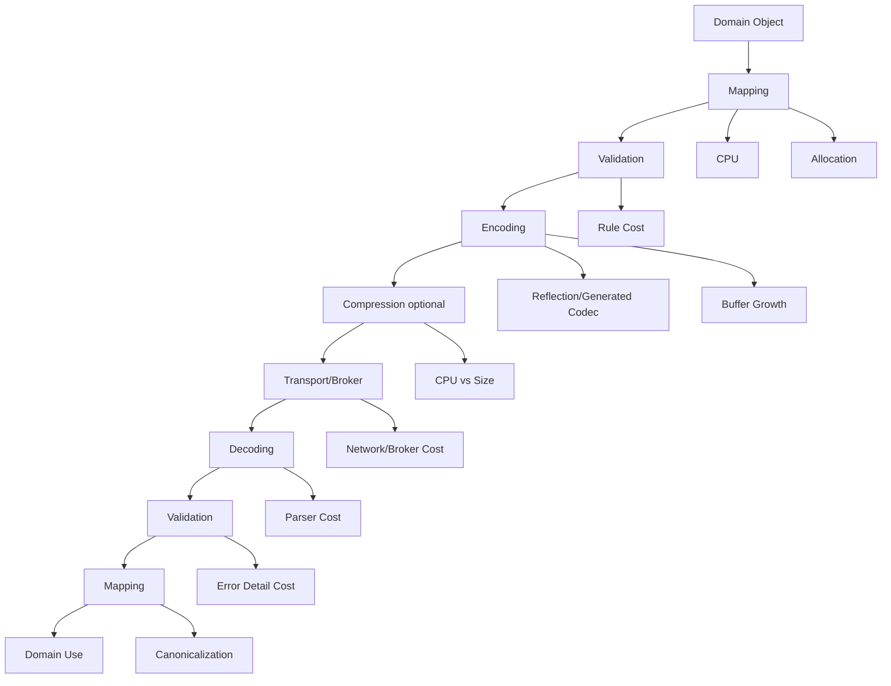
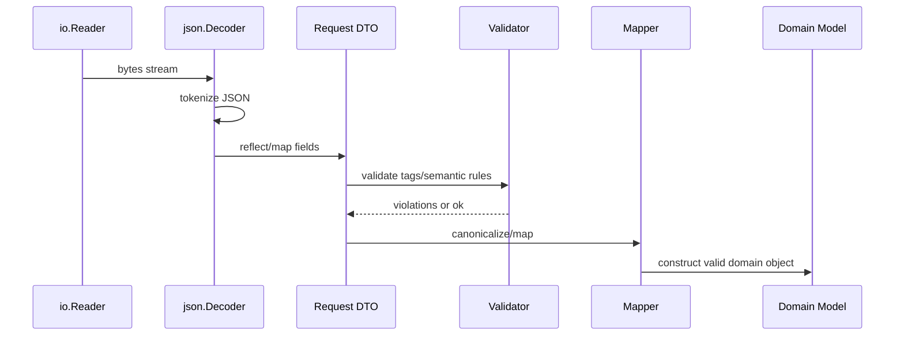
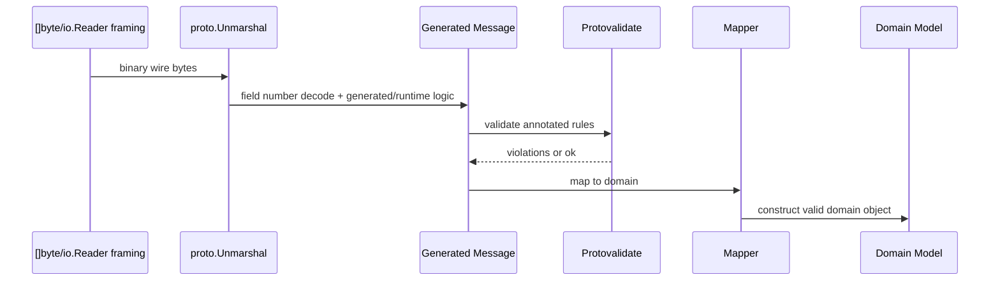
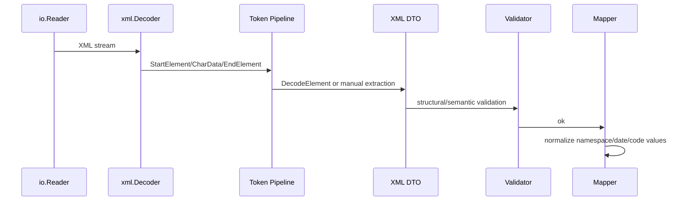
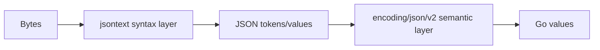
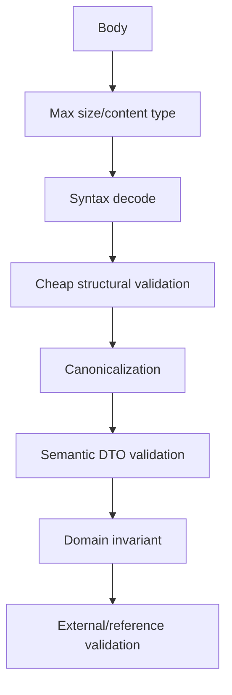

# learn-go-data-mapper-json-xml-protobuf-validation-part-032.md

# Part 032 — Performance, Allocation, and Operational Trade-offs

> Seri: `learn-go-data-mapper-json-xml-protobuf-validation`  
> Part: `032 / 033`  
> Topik: Performance, Allocation, and Operational Trade-offs  
> Target pembaca: Java software engineer yang sedang memperdalam Go data representation boundary sampai level production engineering handbook.

---

## Daftar Isi

1. [Tujuan Pembelajaran](#1-tujuan-pembelajaran)
2. [Posisi Part Ini dalam Seri](#2-posisi-part-ini-dalam-seri)
3. [Mental Model: Serialization Performance Is Boundary Economics](#3-mental-model-serialization-performance-is-boundary-economics)
4. [Biaya Nyata dalam Mapping dan Serialization](#4-biaya-nyata-dalam-mapping-dan-serialization)
5. [Latency, Throughput, Allocation, dan Tail Risk](#5-latency-throughput-allocation-dan-tail-risk)
6. [Pipeline Cost Model untuk JSON/XML/Protobuf](#6-pipeline-cost-model-untuk-jsonxmlprotobuf)
7. [Go JSON v1: Biaya Reflection dan Allocation](#7-go-json-v1-biaya-reflection-dan-allocation)
8. [JSON v2/jsontext Era: Cara Berpikir Adopsi Performance](#8-json-v2jsontext-era-cara-berpikir-adopsi-performance)
9. [Protobuf Performance: Binary Contract Tidak Otomatis Murah](#9-protobuf-performance-binary-contract-tidak-otomatis-murah)
10. [XML Performance: Token Pipeline, Namespace Cost, dan Legacy Reality](#10-xml-performance-token-pipeline-namespace-cost-dan-legacy-reality)
11. [Streaming vs Full Materialization](#11-streaming-vs-full-materialization)
12. [Manual Mapper vs Reflection Mapper vs Generated Code](#12-manual-mapper-vs-reflection-mapper-vs-generated-code)
13. [Memory Allocation Hotspots](#13-memory-allocation-hotspots)
14. [Buffer Management dan Append-Oriented Encoding](#14-buffer-management-dan-append-oriented-encoding)
15. [sync.Pool: Useful, Dangerous, and Often Overused](#15-syncpool-useful-dangerous-and-often-overused)
16. [Zero-Copy dan `unsafe`: Kapan Tidak Layak](#16-zero-copy-dan-unsafe-kapan-tidak-layak)
17. [Compression, Transport, dan Payload Size](#17-compression-transport-dan-payload-size)
18. [Validation Cost: Jangan Optimasi Layer yang Salah](#18-validation-cost-jangan-optimasi-layer-yang-salah)
19. [Unknown Fields, Strictness, dan Performance](#19-unknown-fields-strictness-dan-performance)
20. [Error Reporting vs Hot Path Cost](#20-error-reporting-vs-hot-path-cost)
21. [Benchmarking yang Benar untuk Serialization](#21-benchmarking-yang-benar-untuk-serialization)
22. [Profiling: CPU, Heap, Allocation, dan Trace](#22-profiling-cpu-heap-allocation-dan-trace)
23. [Design Patterns untuk High-throughput Decode Pipeline](#23-design-patterns-untuk-high-throughput-decode-pipeline)
24. [Design Patterns untuk High-throughput Encode Pipeline](#24-design-patterns-untuk-high-throughput-encode-pipeline)
25. [Trade-off Library Alternatif JSON](#25-trade-off-library-alternatif-json)
26. [Operational SLO dan Observability](#26-operational-slo-dan-observability)
27. [Decision Matrix](#27-decision-matrix)
28. [Anti-patterns](#28-anti-patterns)
29. [Production Checklist](#29-production-checklist)
30. [Latihan Desain](#30-latihan-desain)
31. [Ringkasan Invariant](#31-ringkasan-invariant)
32. [Referensi](#32-referensi)

---

## 1. Tujuan Pembelajaran

Setelah menyelesaikan part ini, kamu diharapkan mampu:

1. Membedakan **performance serialization** dari sekadar “library A lebih cepat dari library B”.
2. Mendesain pipeline JSON/XML/Protobuf yang sadar terhadap:
   - CPU cost,
   - allocation cost,
   - GC pressure,
   - tail latency,
   - payload size,
   - validation cost,
   - operational diagnosability.
3. Menentukan kapan harus memakai:
   - `encoding/json`,
   - `encoding/json/v2`/`jsontext` secara eksperimen,
   - Protobuf binary,
   - ProtoJSON,
   - XML token stream,
   - handwritten mapper,
   - generated code,
   - streaming decoder,
   - pooling.
4. Menghindari optimasi berbahaya seperti:
   - premature `sync.Pool`,
   - global pooling tanpa ownership jelas,
   - `unsafe` zero-copy yang merusak correctness,
   - deterministic Protobuf dipakai sebagai canonical hash,
   - full materialization untuk payload besar.
5. Membangun benchmark dan profiling yang benar untuk representational boundary.

---

## 2. Posisi Part Ini dalam Seri

Part sebelumnya sudah membahas:

- model boundary,
- struct tag,
- JSON mapping,
- JSON nullability,
- JSON number precision,
- custom marshal/unmarshal,
- strict decoding,
- streaming JSON,
- JSON Schema,
- XML,
- Protobuf,
- ProtoJSON,
- schema evolution,
- Buf governance,
- validation architecture,
- HTTP/event integration.

Part ini menjawab pertanyaan berikut:

> “Setelah desain contract benar, bagaimana membuatnya cukup cepat, cukup hemat memory, cukup observable, dan tetap maintainable di production?”

Kuncinya: **performance bukan goal tunggal**. Performance adalah satu dimensi dari boundary design. Boundary yang sangat cepat tetapi tidak validatable, tidak evolvable, atau tidak debuggable akan menjadi liability.

---

## 3. Mental Model: Serialization Performance Is Boundary Economics

Serialization adalah proses ekonomi: kamu menukar CPU, memory, payload size, latency, compatibility, dan complexity.

Tidak ada format atau library yang menang universal.



Boundary performance jarang berasal dari satu fungsi. Biasanya total cost muncul dari kombinasi:

- parse,
- allocation,
- string conversion,
- validation,
- map/slice growth,
- reflection,
- error reporting,
- logging,
- compression,
- copying antar layer,
- repeated mapping antar DTO/domain/event/persistence.

### Cara berpikir yang lebih benar

Jangan mulai dari:

> “Library JSON paling cepat apa?”

Mulai dari:

> “Apa shape payload saya, lifecycle payload saya, error policy saya, compatibility policy saya, dan bottleneck nyata saya?”

Karena payload kecil dengan QPS sedang biasanya tidak butuh serializer alternatif. Payload besar, fan-out event, batch ingestion, atau low-latency API gateway mungkin butuh strategi berbeda.

---

## 4. Biaya Nyata dalam Mapping dan Serialization

Serialization boundary punya beberapa biaya utama.

| Biaya | Contoh | Dampak |
|---|---|---|
| Parse CPU | JSON tokenization, XML namespace parsing, Protobuf varint decode | Latency dan CPU saturation |
| Reflection | `encoding/json` membaca metadata struct | CPU + allocation metadata/cache |
| Allocation | `[]T`, `map[string]any`, string copy, buffer growth | GC pressure dan tail latency |
| Copying | body read, bytes-to-string, DTO-to-domain copy | Memory bandwidth |
| Validation | regex, cross-field, schema validation, CEL | CPU dan error complexity |
| Error detail | full field path, JSON pointer, line/column | Diagnosability vs cost |
| Compression | gzip/zstd | CPU vs network size |
| Contract strictness | unknown/duplicate fields detection | CPU tambahan tapi safety tinggi |
| Observability | metrics/log structured error | CPU/I/O jika tidak sampling |

### Java comparison

Di Java, kamu sering berpikir dalam konteks:

- Jackson ObjectMapper,
- Bean Validation,
- MapStruct,
- JAXB,
- Protobuf Java generated classes,
- Netty buffer,
- JVM GC tuning.

Di Go, equivalent mental model-nya lebih eksplisit:

- `encoding/json` reflection-based,
- custom marshal/unmarshal,
- handwritten mapper,
- generated protobuf code,
- `io.Reader` streaming,
- allocation visibility via `go test -bench -benchmem`,
- `pprof` heap/cpu,
- `sync.Pool` dengan semantics GC-aware,
- small abstractions over framework-heavy pipelines.

Go memberi kamu control lebih dekat ke pipeline, tetapi juga membuat kamu lebih bertanggung jawab terhadap ownership dan allocation.

---

## 5. Latency, Throughput, Allocation, dan Tail Risk

Performance boundary tidak cukup diukur dengan average latency.

Yang penting:

1. **p50 latency**: pengalaman rata-rata.
2. **p95/p99 latency**: tail risk saat load naik atau GC terjadi.
3. **allocs/op**: jumlah allocation per request/event.
4. **B/op**: byte allocated per operation.
5. **CPU/op**: cost parsing/encoding/validation.
6. **payload bytes**: network/broker/storage cost.
7. **error path cost**: cost saat invalid payload banyak.
8. **memory peak**: bahaya batch besar dan full materialization.

### Tail latency adalah musuh utama serialization hot path

Contoh klasik:

- p50 decode JSON: 1 ms.
- p99 decode JSON: 80 ms.

Penyebabnya bisa:

- payload outlier,
- map allocation besar,
- GC karena banyak temporary object,
- logging invalid payload terlalu besar,
- regex validation mahal,
- compression CPU spike,
- schema validation compile per request.

Dalam system production, outlier payload sering lebih merusak daripada payload normal.

---

## 6. Pipeline Cost Model untuk JSON/XML/Protobuf

### JSON decode path umum



Hotspot:

- tokenization,
- reflection field matching,
- allocation for strings/slices/maps/pointers,
- validation,
- mapper copy.

### Protobuf binary decode path umum



Hotspot:

- varint decode,
- nested message allocation,
- repeated fields,
- unknown field retention,
- validation rules,
- mapping to domain.

### XML decode path umum



Hotspot:

- tokenization,
- namespace processing,
- mixed content,
- string allocation,
- legacy validation/XSD outside standard library,
- error location reporting.

---

## 7. Go JSON v1: Biaya Reflection dan Allocation

`encoding/json` klasik adalah baseline production karena stabil, ada di standard library, dan behavior-nya sudah dipahami luas. Tetapi ia punya trade-off:

- memakai reflection untuk mapping Go values,
- dynamic decode ke `map[string]any` menghasilkan banyak allocation,
- number default ke `float64` jika decode ke `interface{}`,
- matching field punya behavior compatibility historis,
- unknown field default diabaikan,
- duplicate field punya behavior historis,
- custom marshal/unmarshal bisa melewati beberapa guard jika tidak hati-hati.

### Kapan `encoding/json` cukup?

Gunakan standard library bila:

- payload kecil sampai sedang,
- QPS tidak ekstrem,
- correctness lebih penting daripada micro-optimization,
- team ingin dependency minim,
- contract strictness bisa dibangun dengan wrapper decoder,
- bottleneck sebenarnya bukan JSON.

### Kapan mulai curiga JSON menjadi bottleneck?

Tanda-tanda:

- CPU profile menunjukkan `encoding/json` dominan.
- Heap profile menunjukkan banyak allocation dari unmarshal/map/slice/string.
- p99 memburuk ketika payload besar datang.
- API gateway melakukan decode/re-encode berkali-kali.
- Event consumer melakukan full materialization untuk batch besar.
- Banyak payload masuk hanya perlu satu-dua field tetapi seluruh body didecode.

### Dynamic decode adalah salah satu sumber biaya besar

```go
var payload map[string]any
if err := json.Unmarshal(body, &payload); err != nil {
    return err
}
```

Masalah:

- semua object menjadi `map[string]any`,
- semua array menjadi `[]any`,
- number default menjadi `float64`,
- banyak allocation,
- type assertion tersebar,
- contract semantics melemah.

Lebih baik decode ke DTO typed bila contract diketahui.

```go
type CreateCaseRequest struct {
    CaseType string `json:"caseType"`
    Priority string `json:"priority"`
    Subject  string `json:"subject"`
}

var req CreateCaseRequest
if err := dec.Decode(&req); err != nil {
    return err
}
```

---

## 8. JSON v2/jsontext Era: Cara Berpikir Adopsi Performance

Go modern memperkenalkan jalur experimental untuk JSON baru:

- `encoding/json/jsontext`: layer syntactic JSON.
- `encoding/json/v2`: layer semantic Go-value mapping.

Mental model penting:



`jsontext` membantu ketika kamu butuh kontrol syntactic streaming JSON yang lebih jelas. `json/v2` bertujuan memperbaiki banyak behavior historis JSON v1, tetapi sebagai jalur experimental harus diadopsi dengan guard ketat.

### Cara adopsi yang aman

Jangan lakukan:

```text
Replace all encoding/json usage with json/v2 globally.
```

Lakukan:

1. Pilih satu bounded context atau service edge.
2. Buat compatibility test suite:
   - valid payload lama,
   - invalid payload lama,
   - null/absent/zero,
   - duplicate keys,
   - unknown fields,
   - enum casing,
   - numeric overflow,
   - custom marshal/unmarshal,
   - golden response output.
3. Jalankan benchmark side-by-side.
4. Jalankan shadow decode bila memungkinkan.
5. Rollout bertahap.
6. Dokumentasikan behavior differences.

### Jangan hanya mengejar speedup

Jika JSON v2 membuat behavior lebih strict dan client lama bergantung pada behavior longgar, maka migration adalah contract migration, bukan library upgrade biasa.

---

## 9. Protobuf Performance: Binary Contract Tidak Otomatis Murah

Protobuf binary biasanya lebih compact dan lebih cepat dibanding JSON untuk structured data. Tetapi “pakai Protobuf” tidak otomatis membuat system cepat.

Biaya tetap muncul dari:

- message allocation,
- repeated field growth,
- nested message traversal,
- validation,
- ProtoJSON conversion,
- gateway transcoding,
- copying bytes,
- compression,
- field presence handling,
- unknown field retention,
- reflection/dynamicpb usage.

### Generated message fast path

Gunakan generated code untuk hot path normal.

```go
var msg pb.CaseCreated
if err := proto.Unmarshal(raw, &msg); err != nil {
    return err
}
```

### Reflection/dynamicpb bukan hot path default

`protoreflect` dan `dynamicpb` sangat berguna untuk:

- generic gateway,
- schema registry tooling,
- debug tooling,
- migration utility,
- dynamic validation/reporting,
- generic event router.

Tetapi untuk hot path service yang tahu schema, generated type biasanya lebih jelas dan lebih cepat.

### Deterministic Protobuf bukan canonical serialization

`proto.MarshalOptions{Deterministic: true}` berguna ketika kamu ingin output stabil dalam constraint tertentu. Tetapi deterministic serialization bukan canonical serialization lintas waktu, versi, bahasa, binary, schema, atau runtime.

Jangan gunakan serialized Protobuf bytes sebagai stable hash global kecuali kamu mengontrol penuh semua condition dan menerima fragility-nya.

Lebih aman:

- hash canonical business identity,
- hash selected normalized fields,
- gunakan explicit canonical representation yang kamu definisikan,
- atau simpan digest pada domain-level string/value, bukan raw protobuf bytes.

### ProtoJSON dapat menjadi bottleneck

ProtoJSON sering dipakai di gateway HTTP/gRPC-transcoding. Ini berguna untuk interoperability, tetapi ada trade-off:

- lebih besar dari binary,
- lebih mahal encode/decode,
- compatibility lebih lemah karena bergantung pada names,
- unknown fields tidak dipertahankan seperti binary,
- output tidak boleh diasumsikan stabil untuk signing/hashing.

Jika internal traffic sudah Protobuf binary, hindari convert ke ProtoJSON hanya karena logging/debug. Gunakan structured debug projection yang bounded dan redacted.

---

## 10. XML Performance: Token Pipeline, Namespace Cost, dan Legacy Reality

XML performance sering buruk bukan karena `encoding/xml` selalu lambat, tetapi karena XML integration sering membawa beban:

- payload verbose,
- namespace kompleks,
- nested legacy structure,
- mixed content,
- XSD validation external,
- canonicalization/signature,
- SOAP envelope,
- base64 payload di dalam XML,
- full document logging,
- multi-step transform.

### Gunakan token stream untuk payload besar

Jika hanya butuh sebagian payload:

```go
func ExtractCaseIDs(r io.Reader, handle func(string) error) error {
    dec := xml.NewDecoder(r)

    for {
        tok, err := dec.Token()
        if err == io.EOF {
            return nil
        }
        if err != nil {
            return err
        }

        se, ok := tok.(xml.StartElement)
        if !ok {
            continue
        }

        if se.Name.Local != "CaseID" {
            continue
        }

        var id string
        if err := dec.DecodeElement(&id, &se); err != nil {
            return err
        }

        if err := handle(id); err != nil {
            return err
        }
    }
}
```

Ini menghindari full materialization document besar.

### Namespace correctness lebih penting daripada prefix

Jangan match prefix text. Match `xml.Name.Space` dan `xml.Name.Local`.

```go
if se.Name.Space == "urn:agency:case:v1" && se.Name.Local == "Case" {
    // correct namespace identity
}
```

Prefix dapat berubah tanpa mengubah namespace identity.

---

## 11. Streaming vs Full Materialization

Pertanyaan utama:

> “Apakah saya perlu seluruh payload ada di memory sebagai object graph?”

Jika tidak, streaming sering lebih baik.

### Full materialization

```go
var items []Item
if err := json.NewDecoder(r).Decode(&items); err != nil {
    return err
}
for _, item := range items {
    process(item)
}
```

Masalah:

- memory peak mengikuti ukuran payload,
- semua item harus valid sebelum proses dimulai,
- error item ke-999999 membuang semua progress,
- tidak cocok untuk ingestion besar.

### Streaming array JSON

```go
func StreamJSONArray[T any](r io.Reader, handle func(T) error) error {
    dec := json.NewDecoder(r)
    dec.UseNumber()

    tok, err := dec.Token()
    if err != nil {
        return err
    }
    delim, ok := tok.(json.Delim)
    if !ok || delim != '[' {
        return fmt.Errorf("expected JSON array")
    }

    index := 0
    for dec.More() {
        var item T
        if err := dec.Decode(&item); err != nil {
            return fmt.Errorf("decode item %d at offset %d: %w", index, dec.InputOffset(), err)
        }
        if err := handle(item); err != nil {
            return fmt.Errorf("handle item %d: %w", index, err)
        }
        index++
    }

    tok, err = dec.Token()
    if err != nil {
        return err
    }
    delim, ok = tok.(json.Delim)
    if !ok || delim != ']' {
        return fmt.Errorf("expected array end")
    }

    return nil
}
```

### NDJSON streaming

```go
func StreamNDJSON[T any](r io.Reader, maxLine int, handle func(int, T) error) error {
    scanner := bufio.NewScanner(r)
    scanner.Buffer(make([]byte, 0, 64*1024), maxLine)

    lineNo := 0
    for scanner.Scan() {
        lineNo++
        line := scanner.Bytes()
        if len(bytes.TrimSpace(line)) == 0 {
            continue
        }

        var item T
        dec := json.NewDecoder(bytes.NewReader(line))
        dec.UseNumber()
        dec.DisallowUnknownFields()

        if err := dec.Decode(&item); err != nil {
            return fmt.Errorf("line %d: %w", lineNo, err)
        }
        if err := ensureSingleJSONValue(dec); err != nil {
            return fmt.Errorf("line %d: %w", lineNo, err)
        }
        if err := handle(lineNo, item); err != nil {
            return fmt.Errorf("line %d: %w", lineNo, err)
        }
    }

    if err := scanner.Err(); err != nil {
        return err
    }
    return nil
}

func ensureSingleJSONValue(dec *json.Decoder) error {
    var extra any
    if err := dec.Decode(&extra); err == io.EOF {
        return nil
    } else if err != nil {
        return err
    }
    return fmt.Errorf("unexpected trailing JSON value")
}
```

### Streaming decision matrix

| Situation | Better approach |
|---|---|
| Request body kecil, simple CRUD | Full decode ke DTO |
| Batch import besar | Streaming JSON array/NDJSON |
| Event consumer per message kecil | Decode one event at a time |
| XML document besar, butuh sebagian field | Token extraction |
| Gateway hanya route berdasarkan envelope | Partial decode envelope dulu |
| Need aggregate all records before validate | Full or chunked materialization |
| Need per-record partial failure | Streaming/chunked pipeline |

---

## 12. Manual Mapper vs Reflection Mapper vs Generated Code

Performance mapper tidak bisa dilepaskan dari correctness.

### Manual mapper

```go
func MapCreateCaseRequest(req CreateCaseRequest) (casecmd.CreateCaseCommand, error) {
    subject, err := domain.NewSubject(req.Subject)
    if err != nil {
        return casecmd.CreateCaseCommand{}, err
    }

    return casecmd.CreateCaseCommand{
        CaseType: domain.CaseType(req.CaseType),
        Priority: domain.Priority(req.Priority),
        Subject:  subject,
    }, nil
}
```

Kelebihan:

- explicit,
- fast enough,
- easy to review,
- easy to attach invariant,
- tidak ada reflection magic.

Kekurangan:

- verbose,
- boilerplate banyak,
- perlu disiplin test.

### Reflection mapper

Reflection mapper berguna untuk:

- config decoding,
- admin tooling,
- generic conversion,
- low-throughput internal tools.

Tetapi berbahaya untuk domain boundary production karena:

- implicit mapping,
- rename field bisa silent break,
- tag semantics tersebar,
- error path sering buruk,
- performance lebih sulit diprediksi,
- invariant mudah dilewati.

### Generated mapper

Generated mapper cocok bila:

- model besar,
- schema stabil,
- banyak service butuh mapping seragam,
- compile-time failure lebih berharga,
- performance penting,
- team siap mengelola generator lifecycle.

Trade-off:

- generator menjadi dependency build,
- review generated code tidak selalu nyaman,
- migration generator bisa mahal,
- debugging stack trace bisa kurang natural.

### Rule of thumb

| Context | Mapper choice |
|---|---|
| Public API request to domain command | Manual mapper |
| Protobuf generated to domain | Manual or generated, avoid reflection on hot path |
| Config file | Reflection/tag-based acceptable |
| Internal admin tool | Reflection acceptable |
| Massive repetitive schema mapping | Code generation |
| Regulatory/audit-critical case action | Manual explicit mapper |

---

## 13. Memory Allocation Hotspots

Serialization hot path sering kalah bukan karena CPU murni, tetapi allocation.

### Hotspot umum

1. `map[string]any` dynamic decode.
2. `[]any` dynamic arrays.
3. `string(body)` conversion.
4. `bytes.Buffer` growth tanpa capacity hint.
5. Repeated append tanpa preallocation.
6. Decode full body ke `[]byte` lalu decode lagi.
7. DTO → domain → response → event mapping yang membuat banyak copy.
8. `fmt.Sprintf` di hot path error/log.
9. Regex validation compile per request.
10. Schema compile per request.

### Preallocation sederhana

```go
items := make([]Item, 0, expectedCount)
```

### Hindari bytes-to-string tidak perlu

```go
// Avoid for large body just for logging.
log.Printf("payload=%s", string(body))
```

Lebih baik:

```go
const maxLogBytes = 2048
sample := body
if len(sample) > maxLogBytes {
    sample = sample[:maxLogBytes]
}
log.Printf("payload_sample=%q payload_size=%d", sample, len(body))
```

### Jangan simpan slice view dari buffer reusable

Jika buffer akan dipakai ulang, copy data yang perlu ownership jangka panjang.

```go
func stableCopy(b []byte) []byte {
    out := make([]byte, len(b))
    copy(out, b)
    return out
}
```

Ownership lebih penting daripada zero allocation semu.

---

## 14. Buffer Management dan Append-Oriented Encoding

Untuk encode response atau event, alokasi buffer bisa menjadi hotspot.

### bytes.Buffer sederhana

```go
var buf bytes.Buffer
enc := json.NewEncoder(&buf)
if err := enc.Encode(resp); err != nil {
    return nil, err
}
return buf.Bytes(), nil
```

Cukup untuk banyak kasus.

### Capacity hint

```go
buf := bytes.NewBuffer(make([]byte, 0, estimateSize))
enc := json.NewEncoder(buf)
```

Useful bila ukuran payload bisa diprediksi.

### Protobuf MarshalAppend

Untuk Protobuf, append-oriented API dapat mengurangi allocation jika kamu punya buffer lifecycle jelas.

```go
func MarshalEvent(dst []byte, msg proto.Message) ([]byte, error) {
    return proto.MarshalOptions{}.MarshalAppend(dst[:0], msg)
}
```

Tetapi hati-hati:

- `dst` ownership harus jelas,
- jangan reuse buffer sebelum bytes selesai dikirim/disimpan,
- jangan expose buffer pooled ke goroutine lain,
- jangan asumsi deterministic/canonical.

---

## 15. sync.Pool: Useful, Dangerous, and Often Overused

`sync.Pool` berguna untuk object temporary yang mahal dialokasikan dan sering dipakai. Tetapi ia bukan cache biasa.

Semantics penting:

- item di pool bisa hilang kapan saja,
- pool cocok untuk temporary object,
- pool membantu mengurangi allocation pressure,
- pool tidak boleh menjadi mechanism lifecycle ownership,
- pooled object harus di-reset sebelum dipakai ulang,
- pooled buffer tidak boleh disimpan setelah dikembalikan.

### Contoh buffer pool aman

```go
var bufferPool = sync.Pool{
    New: func() any {
        b := bytes.NewBuffer(make([]byte, 0, 16*1024))
        return b
    },
}

func EncodeWithPooledBuffer(v any) ([]byte, error) {
    buf := bufferPool.Get().(*bytes.Buffer)
    buf.Reset()
    defer bufferPool.Put(buf)

    enc := json.NewEncoder(buf)
    if err := enc.Encode(v); err != nil {
        return nil, err
    }

    // Must copy because buf will be returned to pool.
    out := make([]byte, buf.Len())
    copy(out, buf.Bytes())
    return out, nil
}
```

Perhatikan: karena return `[]byte` hidup setelah buffer dikembalikan, kita tetap copy. Jika tujuanmu menghindari semua allocation, desain ini tidak cukup.

### Streaming langsung lebih baik daripada pool + copy

Untuk HTTP response:

```go
func WriteJSON(w http.ResponseWriter, status int, v any) {
    w.Header().Set("Content-Type", "application/json")
    w.WriteHeader(status)
    _ = json.NewEncoder(w).Encode(v)
}
```

Ini menghindari buffer intermediate jika kamu tidak perlu menghitung body size/hash/signature.

### Anti-pattern pool

```go
b := pool.Get().([]byte)
// use b
pool.Put(b)
return b // BUG: returned slice may be mutated by another request
```

Jika data keluar dari function, jangan return buffer yang sudah dikembalikan ke pool.

---

## 16. Zero-Copy dan `unsafe`: Kapan Tidak Layak

Go engineer sering tergoda menghindari copy `[]byte` ↔ `string` dengan `unsafe`. Ini bisa terlihat cepat dalam benchmark kecil, tetapi membawa risiko:

- melanggar immutability expectation string,
- aliasing tidak jelas,
- data berubah setelah dianggap stable,
- bug race sulit dilacak,
- future compatibility risk,
- security leak jika buffer reusable berisi sensitive data.

### Rule untuk production boundary

Jangan pakai `unsafe` untuk serialization boundary kecuali:

1. bottleneck terbukti lewat profiling,
2. alternatif aman sudah dicoba,
3. ownership buffer 100% jelas,
4. ada test race/fuzz/property,
5. code sangat terisolasi,
6. ada benchmark real payload,
7. ada review senior khusus,
8. failure impact diterima.

Untuk API/regulatory/audit boundary, default-nya: **jangan**.

### Copy sering lebih murah daripada ambiguity

Dalam boundary contract, copy punya nilai:

- memisahkan ownership,
- mencegah mutation leak,
- mempermudah reasoning,
- memudahkan audit/debug,
- menghindari race.

Optimization yang menghemat 1 allocation tetapi menambah ambiguity ownership sering tidak layak.

---

## 17. Compression, Transport, dan Payload Size

Serialization performance tidak berdiri sendiri. Payload size mempengaruhi:

- network latency,
- broker throughput,
- storage cost,
- cache hit ratio,
- CPU compression/decompression,
- TLS record behavior,
- retry cost.

### JSON vs Protobuf size

General tendency:

- JSON lebih verbose karena field names dan text representation.
- Protobuf binary lebih compact karena field numbers dan binary encoding.
- XML biasanya paling verbose.

Tetapi hasil nyata bergantung pada:

- payload shape,
- repeated fields,
- string-heavy data,
- compression,
- field names length,
- default value emission,
- enum representation,
- base64 usage.

### Compression trade-off

Compression berguna bila:

- payload besar,
- network adalah bottleneck,
- broker/storage cost penting,
- CPU headroom cukup.

Compression buruk bila:

- payload kecil,
- latency sangat sensitif,
- CPU sudah bottleneck,
- payload sudah compressed,
- compression terjadi berulang di banyak layer.

### Hindari double compression

Contoh buruk:

```text
Application gzips JSON -> HTTP gateway gzips again -> broker compresses batch
```

Double compression menambah CPU dan sering tidak memberi benefit signifikan.

---

## 18. Validation Cost: Jangan Optimasi Layer yang Salah

Validation bisa lebih mahal daripada decoding.

Contoh mahal:

- regex kompleks,
- external lookup synchronous,
- cross-entity validation,
- schema validation compile per request,
- CEL rules kompleks,
- recursive nested validation,
- error localization penuh untuk semua field.

### Compile once, validate many

Buruk:

```go
func Handle(body []byte) error {
    schema := compileSchema() // expensive
    return schema.Validate(body)
}
```

Baik:

```go
type ValidatorRegistry struct {
    createCaseSchema *jsonschema.Schema
}

func NewValidatorRegistry() (*ValidatorRegistry, error) {
    schema, err := compileCreateCaseSchema()
    if err != nil {
        return nil, err
    }
    return &ValidatorRegistry{createCaseSchema: schema}, nil
}
```

### Validasi murah dulu, mahal belakangan

Pipeline yang baik:



Reject cepat payload jelas invalid sebelum masuk ke validasi mahal.

### Jangan validasi domain lewat regex DTO

Contoh buruk:

```go
type Request struct {
    CaseStatus string `validate:"oneof=DRAFT SUBMITTED APPROVED REJECTED"`
}
```

Jika status transition bergantung pada current state, actor role, dan case lifecycle, itu bukan DTO validation. Itu domain/workflow validation.

---

## 19. Unknown Fields, Strictness, dan Performance

Strictness ada biaya, tetapi sering worth it untuk public API dan regulated systems.

### Unknown field detection

`Decoder.DisallowUnknownFields()` menambah guard saat decode struct. Cost-nya biasanya lebih rendah daripada biaya support bug contract drift.

Gunakan untuk:

- public write APIs,
- admin mutation APIs,
- regulatory submission,
- financial transaction,
- command/event ingestion yang harus strict.

Jangan selalu gunakan untuk:

- forward-compatible event consumers,
- extension payload,
- analytics ingestion,
- partner integration yang contract-nya explicit extensible.

### Duplicate key detection

JSON duplicate key detection dapat mahal jika perlu tracking keys per object. Tetapi duplicate key ambiguity bisa berbahaya untuk security/integrity.

Gunakan duplicate detection untuk:

- signed payload,
- authorization-sensitive request,
- payment/financial payload,
- regulatory submission,
- config/security policy.

Untuk high-throughput telemetry payload, duplicate detection mungkin tidak worth it bila producer trusted dan schema ketat di layer lain.

---

## 20. Error Reporting vs Hot Path Cost

Error detail adalah trade-off.

Detailed error berguna untuk:

- API client debugging,
- partner onboarding,
- internal diagnosis,
- batch import correction,
- compliance rejection reason.

Tetapi detailed error mahal bila:

- invalid payload attack/flood,
- batch jutaan record,
- schema validation mengumpulkan semua violation,
- localization dilakukan untuk setiap error,
- raw payload dilog penuh.

### Strategy

1. Untuk normal API: return bounded list error.
2. Untuk batch import: allow partial report, tetapi cap jumlah violation.
3. Untuk suspicious traffic: degrade detail.
4. Untuk logs: sample, truncate, redact.
5. Untuk metrics: aggregate by error code, bukan raw message.

```go
const maxViolations = 50

func CapViolations(vs []Violation) []Violation {
    if len(vs) <= maxViolations {
        return vs
    }
    return vs[:maxViolations]
}
```

---

## 21. Benchmarking yang Benar untuk Serialization

Benchmark serialization sering menyesatkan.

### Kesalahan umum

1. Payload terlalu kecil dan tidak representatif.
2. Hanya benchmark marshal, bukan full pipeline.
3. Tidak pakai `-benchmem`.
4. Tidak mengukur p95/p99 di integration load test.
5. Compiler mengoptimasi hasil karena output tidak dipakai.
6. Tidak memisahkan decode, validate, map, encode.
7. Tidak benchmark invalid payload.
8. Tidak benchmark payload outlier.
9. Tidak mengukur allocation akibat logging/error.
10. Tidak benchmark concurrency.

### Benchmark decode basic

```go
var sinkCreateCase CreateCaseRequest

func BenchmarkDecodeCreateCaseJSON(b *testing.B) {
    payload := []byte(`{
        "caseType":"COMPLAINT",
        "priority":"HIGH",
        "subject":"Unsafe advertisement near school"
    }`)

    b.ReportAllocs()
    b.SetBytes(int64(len(payload)))

    for i := 0; i < b.N; i++ {
        var req CreateCaseRequest
        if err := json.Unmarshal(payload, &req); err != nil {
            b.Fatal(err)
        }
        sinkCreateCase = req
    }
}
```

### Benchmark full pipeline

```go
var sinkCommand CreateCaseCommand

func BenchmarkCreateCasePipeline(b *testing.B) {
    payload := []byte(`{
        "caseType":"COMPLAINT",
        "priority":"HIGH",
        "subject":"Unsafe advertisement near school"
    }`)

    validator := NewValidator()

    b.ReportAllocs()
    b.SetBytes(int64(len(payload)))

    for i := 0; i < b.N; i++ {
        var req CreateCaseRequest
        dec := json.NewDecoder(bytes.NewReader(payload))
        dec.DisallowUnknownFields()

        if err := dec.Decode(&req); err != nil {
            b.Fatal(err)
        }
        if err := validator.Struct(req); err != nil {
            b.Fatal(err)
        }
        cmd, err := MapCreateCase(req)
        if err != nil {
            b.Fatal(err)
        }
        sinkCommand = cmd
    }
}
```

### Benchmark invalid payload

```go
func BenchmarkInvalidPayloadErrorModel(b *testing.B) {
    payload := []byte(`{"caseType":123,"priority":"INVALID","unknown":true}`)
    validator := NewValidator()

    b.ReportAllocs()

    for i := 0; i < b.N; i++ {
        err := DecodeValidateMap(payload, validator)
        if err == nil {
            b.Fatal("expected error")
        }
    }
}
```

Invalid path penting karena API production sering menerima payload invalid dari client, partner, scanner, atau retry bug.

### Command benchmark

```bash
go test ./... -bench='BenchmarkCreateCase' -benchmem -count=10
```

Gunakan `benchstat` untuk membandingkan sebelum/sesudah.

---

## 22. Profiling: CPU, Heap, Allocation, dan Trace

Benchmark memberitahu micro-cost. Profiling memberitahu production-shape cost.

### CPU profile

Gunakan untuk menjawab:

- apakah JSON/XML/Protobuf benar bottleneck?
- apakah validator lebih mahal daripada decoder?
- apakah logging/error formatting dominan?
- apakah compression lebih mahal dari encode?

### Heap profile

Gunakan untuk melihat:

- allocation dari decode,
- temporary string/slice/map,
- batch materialization,
- retained payload bytes,
- pooled object leak.

### Allocation profile

Gunakan untuk mengurangi GC pressure.

### Trace

Gunakan bila:

- ada latency spike,
- goroutine blocking,
- GC pause/assist terlihat,
- backpressure channel/worker pool tidak jelas.

### Jangan profile tanpa payload realistis

Profiling dengan payload toy dapat menghasilkan keputusan salah. Buat corpus:

1. typical small payload,
2. typical medium payload,
3. largest legal payload,
4. invalid payload,
5. malicious-ish payload,
6. backward-compatible old payload,
7. forward-compatible payload with unknown fields,
8. high-cardinality nested payload.

---

## 23. Design Patterns untuk High-throughput Decode Pipeline

### Pattern 1 — Guard before decode

```go
func GuardRequest(w http.ResponseWriter, r *http.Request, maxBytes int64) io.Reader {
    return http.MaxBytesReader(w, r.Body, maxBytes)
}
```

Cegah body besar sebelum masuk parser.

### Pattern 2 — Typed DTO first

Decode ke typed DTO untuk menghindari dynamic allocation dan menjaga contract.

```go
var req CreateCaseRequest
if err := DecodeStrict(r.Body, &req); err != nil {
    return err
}
```

### Pattern 3 — Envelope partial decode

Untuk event/router:

```go
type Envelope struct {
    Type    string          `json:"type"`
    Version string          `json:"version"`
    Data    json.RawMessage `json:"data"`
}
```

Decode envelope dulu, baru payload sesuai type.

### Pattern 4 — Streaming batch

Process per item, bukan seluruh array.

```go
err := StreamJSONArray[ImportRow](r, func(row ImportRow) error {
    return processor.Process(row)
})
```

### Pattern 5 — Bounded error accumulation

```go
type BatchResult struct {
    Accepted int
    Rejected int
    Errors   []Violation
    Truncated bool
}
```

Jangan simpan semua error jutaan row.

---

## 24. Design Patterns untuk High-throughput Encode Pipeline

### Pattern 1 — Encode directly to writer

```go
func RespondJSON(w http.ResponseWriter, status int, v any) error {
    w.Header().Set("Content-Type", "application/json")
    w.WriteHeader(status)
    return json.NewEncoder(w).Encode(v)
}
```

### Pattern 2 — Separate public response DTO

Jangan encode domain object langsung.

```go
type CaseResponse struct {
    ID     string `json:"id"`
    Status string `json:"status"`
}
```

Lebih aman untuk redaction dan contract stability.

### Pattern 3 — Precomputed small constants

Untuk response statis kecil:

```go
var healthOK = []byte(`{"status":"ok"}`)
```

### Pattern 4 — Avoid full ProtoJSON for logs

Buruk:

```go
b, _ := protojson.Marshal(msg)
log.Printf("event=%s", b)
```

Lebih baik:

```go
log.Info("event consumed",
    "type", eventType,
    "id", eventID,
    "version", version,
)
```

### Pattern 5 — Event encode once per boundary

Jangan encode/decode berkali-kali antar layer internal.

```text
Bad:
DTO -> JSON bytes -> map -> JSON bytes -> event struct -> JSON bytes

Better:
DTO -> domain event -> encode once at broker boundary
```

---

## 25. Trade-off Library Alternatif JSON

Go ecosystem punya library JSON alternatif yang dapat lebih cepat dalam kondisi tertentu. Tetapi keputusan production tidak boleh hanya berdasarkan benchmark README.

### Evaluasi library alternatif

Tanyakan:

1. Apakah semantics sama dengan `encoding/json`?
2. Bagaimana behavior unknown fields?
3. Bagaimana duplicate keys?
4. Bagaimana invalid UTF-8?
5. Bagaimana case sensitivity?
6. Bagaimana `json.Marshaler`/`Unmarshaler` support?
7. Bagaimana `UseNumber` equivalent?
8. Bagaimana security history?
9. Apakah pakai `unsafe`?
10. Apakah support Go version terbaru?
11. Apakah maintenance aktif?
12. Bagaimana behavior under fuzzing?
13. Apakah output stable enough untuk contract tests?
14. Apakah mendukung streaming atau hanya bytes?
15. Apakah dependency policy organisasi mengizinkan?

### Decision rule

Gunakan alternative JSON library hanya bila:

- bottleneck terbukti,
- payload shape cocok,
- behavior compatibility sudah dites,
- dependency risk diterima,
- fallback/migration strategy ada,
- test corpus kuat.

Untuk public API yang high-risk, standard library plus strict wrapper sering lebih defensible.

---

## 26. Operational SLO dan Observability

Serialization boundary harus observable.

### Metrics yang berguna

| Metric | Purpose |
|---|---|
| `decode_duration_seconds` | latency decode |
| `encode_duration_seconds` | latency encode |
| `validation_duration_seconds` | validation cost |
| `payload_size_bytes` | outlier detection |
| `decode_errors_total` | client/schema issue |
| `validation_errors_total` | contract/domain quality |
| `unknown_field_errors_total` | drift detection |
| `batch_items_total` | ingestion volume |
| `batch_rejected_total` | quality/partner issue |
| `event_schema_version_total` | version adoption |
| `dlq_messages_total` | poison message signal |

### Log payload carefully

Never log full payload by default.

Good log fields:

- request id,
- correlation id,
- schema version,
- payload size,
- content type,
- decoder error code,
- field path,
- truncated sample hash,
- producer/consumer id,
- event id.

Bad log fields:

- full JSON body,
- full XML document,
- raw Protobuf bytes,
- unredacted PII,
- tokens/secrets,
- all validation errors without cap.

### Alerting

Alert on:

- sudden increase decode errors,
- sudden increase unknown fields,
- validation failure spike,
- payload size p99 growth,
- DLQ growth,
- schema version mismatch,
- consumer lag + validation error combination,
- encode latency spike after release.

---

## 27. Decision Matrix

### Format choice

| Need | Prefer |
|---|---|
| Public web API broad client support | JSON |
| Internal high-throughput typed RPC/event | Protobuf binary |
| Legacy enterprise/government integration | XML |
| Human-editable config | JSON/YAML/TOML depending org standard |
| Schema evolution with generated clients | Protobuf + Buf |
| Browser-facing API | JSON/OpenAPI |
| Gateway from gRPC to browser | Protobuf internal + ProtoJSON/JSON edge |
| Document-centric legacy payload | XML token pipeline |

### Decode strategy

| Situation | Strategy |
|---|---|
| Small request DTO | Full typed decode |
| Large array | Streaming array decode |
| Line-delimited ingestion | NDJSON streaming |
| Event routing | Envelope + RawMessage / Protobuf Any carefully |
| Unknown extension needed | Explicit extension field |
| Strict mutation API | Disallow unknown + trailing token check |
| High-risk JSON | Duplicate key detection/pre-scan |
| Protobuf hot path | Generated type binary unmarshal |
| Dynamic schema tool | protoreflect/dynamicpb |

### Optimization strategy

| Symptom | Investigate first | Possible action |
|---|---|---|
| High CPU | CPU profile | Reduce validation cost, streaming, generated codec |
| High allocation | heap/alloc profile | Typed decode, prealloc, avoid maps, streaming |
| High p99 | trace + payload histograms | cap body, streaming, reduce GC pressure |
| Large payload cost | payload metrics | Protobuf, compression, omit defaults, schema redesign |
| Slow batch ingestion | benchmark batch path | chunking, NDJSON, worker pool with backpressure |
| Slow invalid path | invalid benchmark | cap errors, fail fast, sampling |
| ProtoJSON slow | profile gateway | keep binary internally, reduce transcoding |

---

## 28. Anti-patterns

### Anti-pattern 1 — Decode to `map[string]any` everywhere

Ini melemahkan type safety, menaikkan allocation, dan membuat validation tersebar.

### Anti-pattern 2 — Optimize serializer before profiling

Ganti JSON library tanpa bukti sering hanya memindahkan risiko.

### Anti-pattern 3 — Full materialization untuk batch besar

Jika payload bisa jutaan item, jangan decode ke `[]T` kecuali memang perlu seluruh data sekaligus.

### Anti-pattern 4 — `sync.Pool` sebagai silver bullet

Pool bisa mengurangi allocation, tetapi bisa menambah bug ownership, retained memory, dan complexity.

### Anti-pattern 5 — Returning pooled buffer

Mengembalikan slice dari buffer yang sudah dikembalikan ke pool adalah bug serius.

### Anti-pattern 6 — Using Protobuf deterministic bytes as canonical hash

Deterministic serialization tidak sama dengan canonical serialization.

### Anti-pattern 7 — Logging full payload for debugging

Ini bisa menjadi security, privacy, cost, dan performance incident.

### Anti-pattern 8 — Compile schema/regex per request

Compile once at startup.

### Anti-pattern 9 — One DTO for request, response, event, database, and domain

Terlihat hemat, tetapi menggabungkan lifecycle yang berbeda.

### Anti-pattern 10 — Benchmark happy path only

Invalid path, outlier payload, old payload, and concurrent path sama pentingnya.

---

## 29. Production Checklist

### Contract and correctness

- [ ] Request DTO tidak sama dengan domain model kecuali justified.
- [ ] Unknown field policy eksplisit.
- [ ] Null/absent/zero semantics diuji.
- [ ] Numeric precision policy eksplisit.
- [ ] Protobuf field number tidak reuse.
- [ ] ProtoJSON compatibility diuji bila dipakai.
- [ ] XML namespace match berdasarkan URI, bukan prefix.
- [ ] Validation layer dipisahkan: syntax, structural, semantic, domain.

### Performance

- [ ] Benchmark memakai payload realistis.
- [ ] Benchmark memakai `-benchmem`.
- [ ] Invalid payload benchmark ada.
- [ ] Payload besar diuji.
- [ ] CPU profile tersedia untuk hot path.
- [ ] Heap/allocation profile tersedia untuk hot path.
- [ ] Full materialization sudah dievaluasi.
- [ ] Streaming digunakan bila payload besar.
- [ ] Schema/regex/validator compile once.
- [ ] Pooling hanya dipakai setelah profiling.

### Operations

- [ ] Payload size metric ada.
- [ ] Decode/encode/validation duration metric ada.
- [ ] Decode/validation error metric ada.
- [ ] Unknown field/drift metric ada.
- [ ] Logs redacted/truncated/sampled.
- [ ] DLQ poison message punya reason code.
- [ ] Version adoption metric ada untuk event/schema.
- [ ] Alert untuk validation spike dan payload p99 growth.

### Security/privacy

- [ ] Full payload tidak dilog default.
- [ ] Sensitive fields redacted.
- [ ] Body size limit sebelum decode.
- [ ] Compression bomb risk dipertimbangkan.
- [ ] XML external entity dan unsafe XML behavior tidak diaktifkan sembarangan.
- [ ] Duplicate key policy untuk high-risk JSON jelas.

---

## 30. Latihan Desain

### Latihan 1 — HTTP JSON create API

Desain pipeline untuk endpoint:

```text
POST /cases
```

Payload:

```json
{
  "caseType": "COMPLAINT",
  "priority": "HIGH",
  "subject": "Unsafe advertisement near school",
  "applicantId": "A123"
}
```

Requirement:

- body max 1 MB,
- reject unknown fields,
- reject duplicate keys,
- distinguish missing vs empty subject,
- return RFC 9457-style validation error,
- p99 target 50 ms,
- no full payload logging.

Pertanyaan:

1. Apa DTO type?
2. Di mana strict decode?
3. Di mana validation?
4. Di mana domain invariant?
5. Metric apa yang dicatat?
6. Benchmark apa yang harus dibuat?

### Latihan 2 — Batch import 1 juta row NDJSON

Requirement:

- setiap line satu record,
- max line 64 KB,
- partial failure allowed,
- max 1000 error detail returned,
- result summary harus include accepted/rejected.

Pertanyaan:

1. Apakah full materialization boleh?
2. Bagaimana error cap?
3. Bagaimana checkpoint progress?
4. Bagaimana backpressure?
5. Bagaimana payload sample logging?

### Latihan 3 — Event Protobuf internal

Requirement:

- event `CaseStatusChanged`,
- consumed oleh 8 service,
- consumer lag bisa 7 hari,
- schema evolved setiap quarter,
- event disimpan 1 tahun.

Pertanyaan:

1. Compatibility policy apa?
2. Apakah pakai ProtoJSON?
3. Apakah field lama boleh dihapus?
4. Bagaimana Buf breaking gate?
5. Bagaimana validation sebelum publish?
6. Bagaimana hash/idempotency key dibuat?

---

## 31. Ringkasan Invariant

1. Serialization performance adalah kombinasi CPU, allocation, payload size, validation, and observability cost.
2. Standard library JSON cukup untuk banyak production system; ganti library hanya setelah profiling dan compatibility test.
3. Dynamic decode ke `map[string]any` adalah hotspot correctness dan allocation.
4. Streaming lebih penting daripada micro-optimization untuk payload besar.
5. Protobuf binary cepat dan compact, tetapi ProtoJSON/gateway conversion tetap bisa mahal.
6. Deterministic Protobuf bukan canonical serialization.
7. XML harus diproses dengan token pipeline untuk payload besar atau partial extraction.
8. `sync.Pool` bukan cache dan bukan ownership mechanism.
9. `unsafe` zero-copy jarang layak untuk contract boundary high-risk.
10. Validation cost bisa lebih besar daripada decode cost; compile schema/rules once.
11. Error detail harus bounded, stable, redacted, dan machine-readable.
12. Benchmark harus mengukur full pipeline, invalid path, payload outlier, dan allocation.
13. Observability boundary harus mencatat payload size, decode/validation latency, error code, dan schema version.
14. Production performance yang baik adalah performance yang tetap correct, evolvable, and diagnosable.

---

## 32. Referensi

- Go 1.26 Release Notes: https://go.dev/doc/go1.26
- `encoding/json`: https://pkg.go.dev/encoding/json
- Go Blog — A new experimental Go API for JSON: https://go.dev/blog/jsonv2-exp
- `google.golang.org/protobuf`: https://pkg.go.dev/google.golang.org/protobuf
- `google.golang.org/protobuf/proto`: https://pkg.go.dev/google.golang.org/protobuf/proto
- Protobuf Encoding Guide: https://protobuf.dev/programming-guides/encoding/
- Proto Serialization Is Not Canonical: https://protobuf.dev/programming-guides/serialization-not-canonical/
- `sync` package / `sync.Pool`: https://pkg.go.dev/sync
- `encoding/xml`: https://pkg.go.dev/encoding/xml
- RFC 9457 Problem Details: https://www.rfc-editor.org/rfc/rfc9457
- RFC 6901 JSON Pointer: https://www.rfc-editor.org/rfc/rfc6901

---

## Status Seri

Part ini adalah **part 032 / 033**.

Seri **belum selesai**. Bagian berikutnya adalah:

```text
learn-go-data-mapper-json-xml-protobuf-validation-part-033.md
```

Judul berikutnya:

```text
Production Handbook and Architecture Playbook
```


<!-- NAVIGATION_FOOTER -->
<div class="page-nav">
<a href="./learn-go-data-mapper-json-xml-protobuf-validation-part-031.md">⬅️ Part 031 — Mapping and Validation in Event-Driven Systems</a>
<a href="./index.md">📚 Kategori</a>
<a href="../../index.md">🏠 Home</a>
<a href="./learn-go-data-mapper-json-xml-protobuf-validation-part-033.md">Part 033 — Production Handbook and Architecture Playbook ➡️</a>
</div>
